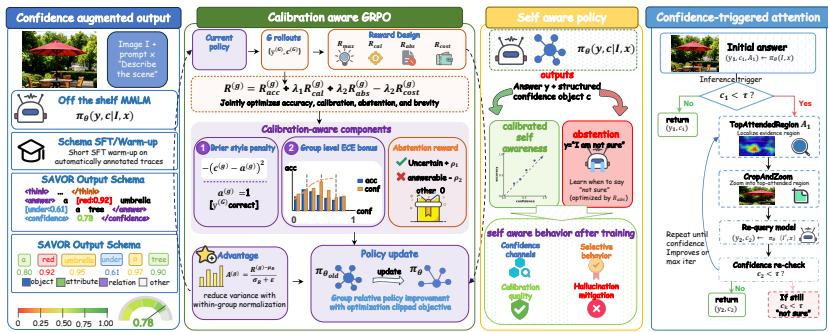
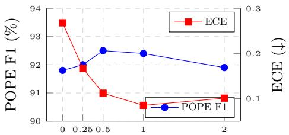
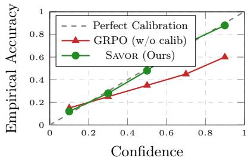

# SAVOR: Self-Aware Visual Grounding via Confidence-Calibrated Reinforcement Learning for Multimodal Hallucination Mitigation

Zixiu Ding1,2, Zilin Zhao2, Yingjie He2, Xinlang Kang2, Guansu Wang2, and Wei ZhangB

1 Central South University

2 Peking University

Abstract. Multimodal large language models (MLLMs) have made stron progress on visual question answering and image captioning, yet they still produce fluent claims about objects, attributes, or relations that are not grounded in the image. Many remedies either modify decoding at test time, which adds latency, or fine tune with preferences such as DPO variants, which teach which answer is preferred but not when the model’s own answer is unreliable. We argue that calibrated self assessment is the missing signal. We introduce Savor, a training framework that (i) augments the output schema with token and answer confidence, (ii) optimises the policy with a Group Relative Policy Optimisation (GRPO) objective that penalises calibration error and poor abstention decisions, and (iii) uses the learned confidence at inference time to revisit visual evidence only when the model is uncertain. Experiments on POPE, HallusionBench, AMBER and MMHal-Bench across two recent backbones (InternVL3-8B and Qwen3-VL-8B) show that Savor reduces hallucination while preserving general capability on MME and MMBench, with lower Expected Calibration Error than DPO and decoding baselines.

Keywords: Multimodal Large Language Models · Hallucination Mitigation · Reinforcement Learning · Confidence Calibration · Self Correction.

## 1 Introduction

Multimodal large language models (MLLMs) such as InternVL3 [56], Qwen3- VL [2] and LLaVA-OneVision-1.5 [1] have narrowed the gap between vision and language, and now perform well on many visual question answering and captioning benchmarks [16,26]. A persistent obstacle, however, is that these models still produce fluent and confident claims about objects, attributes, counts, or relations that are not supported by the image [21,8,41,19]. Such errors are especially problematic because hallucinated answers often carry the same surface certainty as correct ones, leaving users with little signal for when an answer should be trusted [49,25]. In practice, the model may fail twice: it gives an unsupported visual statement, then presents it with enough confidence that a user or downstream system has no clear reason to reject it.

Existing mitigation methods mostly follow one of two routes. Test-time methods, including contrastive decoding [20], attention reallocation [13], and verifierstyle correction [3], intervene during generation without changing the model parameters. They can reduce hallucination, but they add latency and do not change the policy that produced the error. Preference tuning methods such as RLHF-V [50], HA-DPO [52], HALVA [33], and mDPO [39] instead train on hallucination-oriented preference pairs. These methods internalise part of the correction, but their supervision is still comparative: the model learns which answer is preferred, not how reliable its own answer is. As a result, a policy can become more accurate on average while remaining poorly calibrated. This distinction matters because a model that hallucinates less can still be risky if it is most confident exactly when it is wrong.

This paper studies hallucination mitigation through calibrated self assessment. The idea is motivated by work on textual LLMs showing that models can express meaningful uncertainty and that explicit supervision of uncertainty can improve truthfulness [22,15,38,46]. The multimodal setting makes this direction natural. Visual hallucinations can often be checked against the input image, giving a relatively clean correctness signal, and current MLLMs already support structured reasoning traces in which a confidence channel can be inserted without architectural changes. The key question is how to make the accuracy of the model’s own self assessment part of the optimisation target, instead of treating confidence as a diagnostic added after generation. In other words, the model should not only learn to give a better answer; it should also learn when its answer is visually supported, when it is uncertain, and when abstention is safer than a guess.

We introduce Savor, a training and inference framework for making an MLLM both more grounded and better calibrated. During a short supervised initialisation stage, the model learns to emit confidence values for visually grounded spans, together with a single confidence score for the whole answer. The policy is then optimised with Group Relative Policy Optimisation (GRPO) [35]. In addition to answer correctness, the reward includes a calibration term that compares confidence with empirical rollout accuracy, and an abstention term that discourages confident guesses when the visual evidence is weak. At inference time, the same answer confidence triggers a lightweight visual re-attention step: when confidence is below a threshold, the model crops the most attended region, queries itself again, and either returns the revised answer or abstains. This keeps the correction loop inside the same policy, instead of relying on a separate verifier or applying an expensive decoding strategy to every prompt.

Our experiments are designed to test both hallucination reduction and the quality of the learned confidence signal. Across POPE, HallusionBench, AM-BER and MMHal-Bench, Savor consistently improves over preference-tuning and standard GRPO baselines on two recent 8B-scale backbones. The gains are most visible in calibration: on the adversarial split of POPE, for instance, Expected Calibration Error is reduced from 0.272 with vanilla GRPO to 0.085 with Savor. At the same time, general visual-language ability, as measured by

MME and MMBench, remains essentially unchanged. These results suggest that the calibration objective improves reliability without turning the method into a narrow trade-of against general capability.

The main contributions are summarised as follows:

– We formulate MLLM hallucination mitigation as a calibration problem, rather than only a preference ranking problem, and use calibration error as a direct reward signal in multimodal RL.

– We develop Savor, a unified pipeline that learns to answer, report visual confidence, abstain under weak evidence, and revisit visual evidence within the same policy.

– We evaluate the approach on InternVL3-8B and Qwen3-VL-8B across hallucination, calibration and general capability benchmarks, showing consistent hallucination reduction and substantially lower ECE while preserving overall capability.

## 2 Related Work

## 2.1 Hallucination Diagnosis and Correction at Inference

Object, attribute and relational hallucinations in MLLMs are commonly measured by POPE [21], HallusionBench [8], AMBER [41] and MMHal-Bench [37]. These benchmarks cover object existence, counting, attributes, spatial relations and visually grounded commonsense; related suites probe cross-modal ambiguity [43], context dependence [26], cross-view spatial reasoning [6], temporal grounding [54] and robustness to structural corruption [19]. Diagnostic studies further connect such errors to language priors and attention concentration [13,24]. This line of work establishes our evaluation setting, but mostly measures hallucination after generation; it does not teach the model to recognise when its own visual claims are unreliable.

Correction methods used at inference can intervene without updating the model: VCD [20] uses visual contrastive logits, OPERA [13] adjusts attention, and HALC [3] adds verification. Although these methods can improve frozen MLLMs, the correction remains external to the policy and adds decoding or verification cost at deployment time. Savor keeps a lightweight correction loop, but triggers it only when the learned confidence signal indicates uncertainty.

## 2.2 Preference and Reinforcement Learning for Multimodal Alignment

Hallucination-aware alignment methods update the model with preference or RL signals. RLHF-V [50], HA-DPO [52], HALVA [33] and mDPO [39] use human or synthetic preference data to make visual instruction tuning less prone to hallucination. Their supervision, however, is comparative: the model learns that one answer is better than another, not that its reported confidence should match the probability of being correct. Thus preference tuned policies may become more accurate while remaining overconfident on ambiguous prompts. A parallel line reshapes the reward itself, aligning updates with gradient evidence [53], spreading group relative credit over intermediate steps [36], or replacing surface overlap scores with hierarchical task aware rewards for grounded generation [44].

GRPO, introduced in DeepSeekMath [35] and scaled in DeepSeek-R1, removes the critic by normalising rewards within a rollout group. Recent multimodal variants apply similar ideas to visual reasoning [40] and hallucination suppression [42]. We also use GRPO, but the rollout group serves an additional role: it supplies an empirical accuracy estimate against which the model’s verbalised confidence can be calibrated. Because the group mixes agreeing and conflicting rollouts, weighting signals by their mutual consistency rather than summing them is the same principle used to reconcile conflicting updates in distributed training [11].

## 2.3 Calibration, Verbalised Uncertainty and Self-aware Policies

Textual LLM studies show that models can verbalise useful uncertainty [22], encode known/unknown signals [15], and be improved by prompting or supervised calibration [38,46]. Related diagnostics read reliability of internal dynamics rather than stated confidence, for instance through entropy trajectories [55], the spread of competing solutions [14], sensitivity to input order [18], or explicit reasoning pathways [4]. Work on self-rewarding models further suggests that model judgements can enter the optimisation loop [51]. These results motivate a readable confidence channel that requires no architectural change and can directly control inference decisions.

For MLLMs, calibration must be tied to visual grounding: a model may be confident because of language priors even when the image contradicts them. Existing calibration work rarely targets this visual failure mode, while hallucination mitigation rarely optimises calibration as a first-class objective. Savor connects the two by rewarding visually grounded confidence and using that confidence to decide when self-correction should be attempted.

## 3 Method

## 3.1 Overview

Savor starts from an MLLM $\pi _ { \boldsymbol { \theta } } ( y \mid I , \boldsymbol { x } )$ , where I is an image and x a textual prompt, and turns it into a policy $\pi _ { \theta } ( y , c \mid I , x )$ that emits both an answer y and a structured confidence object c. Training proceeds in two stages (Fig. 1): a brief supervised stage that teaches the output schema, followed by GRPO with a calibration reward that optimises both the answer and the confidence under image grounded rewards. At inference time, a low confidence score gates an optional visual re-attention step (§3.4).

  
Fig. 1. Overview of Savor. The model learns confidence outputs, is optimised with a calibration reward in GRPO, and uses low confidence to run one crop-and-zoom query before answering or abstaining.

## 3.2 Output Schema with Visual Confidence

For an image–prompt pair (I, x), the original MLLM defines a policy $\pi _ { \boldsymbol { \theta } } ( y \mid I , \boldsymbol { x } )$ over textual answers. We augment the output space so that the policy produces not only an answer sequence $y = ( w _ { 1 } , \dots , w _ { T } )$ , but also a structured confidence object

$$
c = \big ( c _ { \mathrm { a n s } } , \{ ( s _ { m } , c _ { m } ) \} _ { m = 1 } ^ { M } \big ) , \qquad c _ { \mathrm { a n s } } , c _ { m } \in [ 0 , 1 ] ,\tag{1}
$$

where $c _ { \mathrm { a n s } }$ is the confidence of the whole answer and each $\left( s _ { m } , c _ { m } \right)$ pairs a visually grounded span $s _ { m } \subseteq y$ with its visual confidence. The spans cover objects, attributes, counts and spatial relations that should be checkable from the image. The resulting policy is therefore

$$
\pi _ { \theta } ( o \mid I , x ) = \pi _ { \theta } ( y , c _ { \mathrm { a n s } } , \{ ( s _ { m } , c _ { m } ) \} _ { m = 1 } ^ { M } \mid I , x ) , \qquad o = ( y , c ) ,\tag{2}
$$

which makes answer generation and confidence estimation part of the same sequence decision, rather than two separate steps after decoding. The concrete text serialisation is illustrated in Fig. 1; we do not require any additional confidence head or modification to the vision encoder.

The first training stage teaches this augmented output space with supervised fine tuning. Let $\mathcal { D } _ { \mathrm { s f t } } = \{ ( I _ { i } , x _ { i } , y _ { i } ^ { \star } , c _ { i } ^ { \star } ) \} _ { i = 1 } ^ { N }$ be the initialisation set, where $c _ { i } ^ { \star }$ contains pseudo labelled span and answer confidences. Given K stochastic responses from an ensemble or from repeated sampling, a span pseudo label is estimated as

$$
c _ { i , m } ^ { \star } = \frac { 1 } { K } \sum _ { k = 1 } ^ { K } \mathcal { H } \big [ s _ { i , m } \mathrm { ~ i s ~ s u p p o r t e d ~ i n ~ } y _ { i } ^ { ( k ) } \big ] ,\tag{3}
$$

and the answer target is computed analogously from answer agreement or task correctness when available. The SFT objective combines standard response like-

lihood with confidence regression after parsing the verbalised confidence values:

$$
\mathcal { L } _ { \mathrm { s f t } } = - \sum _ { t = 1 } ^ { T _ { i } } \log \pi _ { \theta } ( w _ { i , t } ^ { \star } \mid I _ { i } , x _ { i } , w _ { i , < t } ^ { \star } ) + \alpha \big ( c _ { \mathrm { a n s } , i } - c _ { \mathrm { a n s } , i } ^ { \star } \big ) ^ { 2 } + \gamma \frac { 1 } { M _ { i } } \sum _ { m = 1 } ^ { M _ { i } } ( c _ { i , m } - c _ { i , m } ^ { \star } ) ^ { 2 } .\tag{4}
$$

This stage does not aim to solve hallucination by itself; it only makes the output format stable enough for the subsequent RL stage to optimise confidence as a behavioural signal.

## 3.3 GRPO with a Calibration Reward

Policy and rollout. After schema initialisation, we optimise the augmented policy with GRPO and a calibration reward. For each prompt $( I , x )$ , the frozen reference policy $\pi _ { \mathrm { r e f } }$ and the previous policy $\pi _ { \theta _ { \mathrm { o l d } } }$ are kept fixed during one update. We sample a group of G rollouts $\mathcal { G } = \{ o ^ { ( g ) } \} _ { g = 1 } ^ { G }$ , where $o ^ { ( g ) } = ( y ^ { ( g ) } , c ^ { ( g ) } ) \sim \pi _ { \theta _ { \mathrm { o l d } } } ( \cdot \ \vert$ $I , x )$ . Each rollout is parsed into an answer $y ^ { ( g ) }$ , an answer confidence $c _ { \mathrm { a n s } } ^ { ( g ) }$ , span confidences $\{ c _ { m } ^ { ( g ) } \}$ , and a task correctness signal $a ^ { ( g ) } \in [ 0 , 1 ]$ . The group mean and standard deviation of rewards are used to form the relative advantage

$$
A ^ { ( g ) } = \frac { R ^ { ( g ) } - \mu _ { R } } { \sigma _ { R } + \epsilon } , \qquad \mu _ { R } = \frac { 1 } { G } \sum _ { j = 1 } ^ { G } R ^ { ( j ) } , \quad \sigma _ { R } ^ { 2 } = \frac { 1 } { G } \sum _ { j = 1 } ^ { G } ( R ^ { ( j ) } - \mu _ { R } ) ^ { 2 } .\tag{5}
$$

This relative normalisation is important in our setting because prompts vary substantially in dificulty: a hard visual reasoning prompt should not be compared directly with an easy object query, but its rollouts can still be ranked against each other.

The policy update uses the GRPO clipped objective [34] with a KL penalty to the reference model:

$$
\begin{array} { r l r } & { } & { \mathcal { I } _ { \mathrm { g r p o } } ( \theta ) = \displaystyle \frac { 1 } { G } \sum _ { g = 1 } ^ { G } \operatorname* { m i n } \Bigl ( r _ { \theta } ^ { ( g ) } A ^ { ( g ) } , \mathrm { c l i p } ( r _ { \theta } ^ { ( g ) } , 1 - \epsilon _ { c } , 1 + \epsilon _ { c } ) A ^ { ( g ) } \Bigr ) } \\ & { } & { - \eta _ { \mathrm { k l } } D _ { \mathrm { K L } } \bigl ( \pi _ { \theta } ( \cdot \mid I , x ) \parallel \pi _ { \mathrm { r e f } } ( \cdot \mid I , x ) \bigr ) , } \end{array}\tag{6}
$$

where

$$
r _ { \theta } ^ { ( g ) } = \frac { \pi _ { \theta } \big ( o ^ { ( g ) } \mid I , x \big ) } { \pi _ { \theta _ { \mathrm { o l d } } } \big ( o ^ { ( g ) } \mid I , x \big ) } .\tag{7}
$$

The KL term prevents the confidence objective from drifting into a narrow policy tuned only for hallucination benchmarks, while the clipped ratio stabilises updates when a rollout receives a large calibration or abstention reward.

Reward design. The total reward for each rollout is

$$
R ^ { ( g ) } = R _ { \mathrm { a c c } } ^ { ( g ) } + \lambda _ { 1 } R _ { \mathrm { c a l } } ^ { ( g ) } + \lambda _ { 2 } R _ { \mathrm { a b s } } ^ { ( g ) } + \lambda _ { 3 } R _ { \mathrm { s p a n } } ^ { ( g ) } - \lambda _ { 4 } R _ { \mathrm { c o s t } } ^ { ( g ) } ,\tag{8}
$$

with the five terms defined as follows.

Accuracy reward. $R _ { \mathrm { a c c } } ^ { ( g ) } = \mathcal { H } [ \mathrm { c o r r e c t } ( y ^ { ( g ) } ) ]$ for discriminative tasks such as POPE yes/no and VQA exact match, and a normalised generative score for open answer tasks, where higher AMBER F1 and lower CHAIR both receive larger rewards.

Calibration reward. Each rollout’s answer confidence $c _ { \mathrm { a n s } } ^ { ( g ) }$ is matched against the realised correctness $a ^ { ( g ) } \in \{ 0 , 1 \}$ via a Brier penalty, augmented by an Expected Calibration Error (ECE) bonus at the group level:

$$
R _ { \mathrm { c a l } } ^ { ( g ) } = - \left( c _ { \mathrm { a n s } } ^ { ( g ) } - a ^ { ( g ) } \right) ^ { 2 } + \beta \left( \mathrm { E C E } _ { \mathrm { g r o u p , p r e v } } - \mathrm { E C E } _ { \mathrm { g r o u p } } \right) ,\tag{9}
$$

where $\mathrm { E C E _ { g r o u p } }$ is computed over the G rollouts of the current prompt by binning $c _ { \mathrm { a n s } } ^ { ( g ) }$ into K buckets and comparing accuracy and mean confidence in each bucket. The first term shapes individual rollouts; the bracketed diference gives group credit to updates that reduce calibration error compared with the previous group.

Abstention reward. We also allow the policy to emit a designated abstention answer $y _ { \mathcal { O } } = { ^ { 6 } } \mathrm { I }$ am not sure.”. We define

$$
R _ { \mathrm { a b s } } ^ { ( g ) } ~ = ~ \left\{ \begin{array} { l l } { + \rho _ { 1 } , } & { \mathrm { i f ~ } y ^ { ( g ) } = y _ { \emptyset } \mathrm { ~ a n d ~ t h e ~ p r o m p t ~ i s ~ i n t r i n s i c a l l y ~ u n c e r t a i n } , } \\ { - \rho _ { 2 } , } & { \mathrm { i f ~ } y ^ { ( g ) } = y _ { \emptyset } \mathrm { ~ b u t ~ t h e ~ p r o m p t ~ i s ~ a n s w e r a b l e } , } \\ { 0 , } & { \mathrm { o t h e r w i s e } , } \end{array} \right.\tag{10}
$$

where “intrinsically uncertain” means that most rollouts in the group are incorrect and the group accuracy is below a threshold $\tau _ { u }$ . The abstention reward is therefore supervised by the rollout group itself, removing the need for explicit “unanswerable” labels.

Span grounding reward. Confidence values attached to generated spans should also reflect whether those spans are visually supported. Let $v _ { m } ^ { ( g ) } \in \{ 0 , 1 \}$ denote whether span $s _ { m } ^ { ( g ) }$ is verified by the available training annotations, object tags, OCR evidence, or lightweight grounding heuristics. We define

$$
R _ { \mathrm { s p a n } } ^ { ( g ) } = - \frac { 1 } { M _ { g } } \sum _ { m = 1 } ^ { M _ { g } } \bigl ( c _ { m } ^ { ( g ) } - v _ { m } ^ { ( g ) } \bigr ) ^ { 2 } ,\tag{11}
$$

so that unsupported visual spans are penalised when assigned high confidence, while genuinely grounded spans are not discouraged. This term connects answer calibration with the local visual grounding signal used by the re-attention module.

Length cost. $R _ { \mathrm { c o s t } } ^ { ( g ) } = | y ^ { ( g ) } | / L _ { \mathrm { m a x } }$ discourages reward hacking via verbosity.

Why calibration as a direct reward? Standard RLHF [29] / DPO [31] objectives are rank based: they tell the model that answer A should beat answer $B ,$ but never that the model’s own internal scoring of A should be numerically correct. As a result, policies after training are often more accurate but also more overconfident [15]. The Brier term in Eq. (9) penalises both directions of miscalibration symmetrically, while the ECE bonus aggregates the signal at the group level and damps the variance of individual Brier estimates. We show in §4.3 that removing either subterm visibly degrades calibration without changing accuracy much, isolating the contribution of this design.

## 3.4 Visual Re-Attention Triggered by Confidence

After RL training, $c _ { \mathrm { a n s } }$ is a usable scalar in [0, 1] at inference time. We use it to decide whether one extra correction pass is needed. The decision rule is

$$
\hat { o } = \left\{ \begin{array} { l l } { ( y _ { 1 } , c _ { 1 } ) , } & { c _ { 1 } \geq \tau , } \\ { ( y _ { 2 } , c _ { 2 } ) , } & { c _ { 1 } < \tau \mathrm { ~ a n d ~ } c _ { 2 } \geq \tau , } \\ { ( y _ { \mathcal { O } } , \operatorname* { m i n } ( c _ { 1 } , c _ { 2 } ) ) , } & { c _ { 1 } < \tau \mathrm { ~ a n d ~ } c _ { 2 } < \tau , } \end{array} \right.\tag{12}
$$

where $( y _ { 1 } , c _ { 1 } )$ is the initial output and $( y _ { 2 } , c _ { 2 } )$ is generated after re-attending to the most relevant visual region. Let $\overset { \cdot \cdot } { A _ { 1 } } \in \mathbb { R } ^ { \overset { \cdot } { H } \times W }$ be the cross-attention map aggregated over answer tokens. The crop region is selected as

$$
\mathcal { R } ^ { \star } = \mathop { \mathrm { a r g m i n } } _ { \mathcal { R } } | \mathcal { R } | \quad \mathrm { s . t . } \quad \sum _ { ( u , v ) \in \mathcal { R } } A _ { 1 } ( u , v ) \geq \kappa \sum _ { u , v } A _ { 1 } ( u , v ) ,\tag{13}
$$

with $\kappa = 0 . 1 0$ by default. The cropped image $I ^ { \prime } = \mathrm { C r o p Z o o m } ( I , \mathcal { R } ^ { \star } )$ is then passed to the same policy; no external verifier or second model is introduced. The module adds at most one extra forward pass and only when the confidence trigger fires. Since $c _ { \mathrm { a n s } }$ is trained to be calibrated, cases with low confidence are concentrated among hard or ambiguous prompts, so re-attention is rarely spent on already reliable answers.

## 3.5 Training Pipeline Summary

Training first performs schema SFT on ∼50K samples for one epoch to initialise $o = ( y , c _ { \mathrm { a n s } } , \{ ( s _ { m } , c _ { m } ) \} )$ with pseudo labelled confidences. It then runs GRPO with the calibration reward on ∼100K prompts from standard VQA datasets and RLHF-V [50], using G=8 rollouts, $( \lambda _ { 1 } , \lambda _ { 2 } , \lambda _ { 3 } , \lambda _ { 4 } ) { = } ( 1 . 0 , 0 . 5 , 0 . 2 , 0 . 0 5 )$ and $\beta { = } 0 . 5$ At inference, the parsed $c _ { \mathrm { a n s } }$ either returns the answer directly or triggers one visual re-query when $c _ { \mathrm { a n s } } < \tau ;$ we set $\tau { = } 0 . 5$ by default.

## 4 Experiments

We organise the study around four questions, one per subsection: Q1 Does $\mathrm { S A ^ { - } }$ vor reduce hallucinations across benchmarks and backbones? (§4.1); Q2 Are its confidences calibrated enough to support abstention? (§4.2); Q3 How much does each component contribute? (§4.3); Q4 Does it preserve general capability at acceptable inference cost? (§4.4).

Backbones. We train and evaluate Savor on two open source ∼8B instruct MLLMs: InternVL3-8B [56] as the primary backbone and Qwen3-VL-8B-Instruct [2] for generalisation across architectures, plus LLaVA-OneVision-1.5-8B [1] and MiniCPM-V 4.0 in a reduced transfer experiment (§4.4).

Training data. The SFT initialisation uses 50K LLaVA-Instruct samples reformatted with our <think>/<answer>/<confidence> schema. Span confidences are pseudo labelled from five stochastic decodes at T=1.0: a span scores high when consistently supported across responses or matched by object/OCR annotations, and low when it appears only in unsupported generations. Answer targets come from answer agreement, or ground-truth correctness when available. The RL stage uses ∼100K prompts: about 90K from VQAv2, GQA and A-OKVQA plus 10K hallucination-targeted prompts from M-HalDetect [9] and RLHF-V [50]. To avoid leakage we remove images overlapping any reported test set, and no benchmark question or caption is used for pseudo labelling or rewards.

Hallucination benchmarks. We use four widely adopted suites. POPE [21] reports F1 over yes/no object queries in three sampling regimes (random, popular, adversarial). HallusionBench [8] stresses entangled language and visual illusions (aAcc, fAcc). AMBER [41] gives generative metrics, of which we report AMBER-S F1 and CHAIR [32]. MMHal-Bench [37] reports an overall score (0–6) and a hallucination rate, judged by GPT-4.

General capability and calibration metrics. To check that hallucination reduction does not cost overall ability, we also evaluate MME, MMBench, MMStar and SEED-Bench. For every benchmark with binary correctness we report ECE (15 bins) [10], Brier score [7], the AUROC of 1−c as a hallucination detector, and Selective-Risk@90, the error rate when the model abstains on the 10% least confident prompts.

Evaluation protocol. All calibration metrics use the parsed confidence $c _ { \mathrm { a n s } } ;$ ; if an output omits the field we set $c _ { \mathrm { a n s } } { = } 1 . 0$ and mark a format error, penalising uncalibrated overconfidence rather than silently dropping the sample. For open generation we follow the oficial AMBER and MMHal-Bench scripts, using GPT-4 judging only for MMHal-Bench.

Baselines. We compare against the unmodified backbone, parameter tuning baselines (SFT, HA-DPO, RLHF-V, mDPO, HALVA, POVID and vanilla GRPO without our calibration reward), and inference baselines (VCD, OPERA, HALC and Woodpecker [48]). All parameter tuning baselines are re-trained on the same 100K prompt mix using their oficial hyperparameters.

Implementation details. We apply LoRA [12] of rank 64 to the language tower while freezing the vision encoder; the connector is unfrozen during RL only. Optimisation uses DeepSpeed ZeRO-3 + AdamW with learning rate $\scriptstyle \eta = 1 \times 1 0 ^ { - 5 }$ for one epoch of schema SFT and $5 \times 1 0 ^ { - 6 }$ for two epochs of GRPO. We set $( \alpha , \gamma ) { = } ( 0 . 5 , 0 . 5 )$ in Eq. (4), group size G=8, KL coeficient 0.04, clip ϵ=0.2, and K=15 calibration bins for the ECE bonus within each group. The reward weights are $( \lambda _ { 1 } , \lambda _ { 2 } , \lambda _ { 3 } , \lambda _ { 4 } ) { = } ( 1 . 0 , 0 . 5 , 0 . 2 , 0 . 0 5 )$ , with abstention parameters $( \tau _ { u } , \rho _ { 1 } , \rho _ { 2 } ) { = } ( 0 . 4 , 0 . 5 , 0 . 3 )$ and length normalisation $L _ { \mathrm { m a x } } { = } 5 1 2$ . Training is performed on 8× NVIDIA H800 (80 GB) for ∼36 hours per backbone. The reattention threshold is fixed to τ=0.5 unless otherwise specified; the crop is the smallest axis aligned box covering the most attended region that contains at least 10% of the cross-attention mass. For reproducibility we fix three random seeds and report the mean.

Table 1. Main results across hallucination, calibration and general capability benchmarks. Higher is better except for CHAIR and ECE. Bold = best in column; underline = second best.
<table><tr><td></td><td colspan="2">POPE</td><td>HalBench</td><td colspan="2">AMBER</td><td>MMHal</td><td>MME</td><td>ECE</td></tr><tr><td>Method</td><td>F1 ↑</td><td>adv ↑</td><td>aAcc ↑</td><td>F1 ↑</td><td>CHAIR ↓</td><td>Score ↑</td><td>P+C ↑</td><td>↓</td></tr><tr><td colspan="9">Backbone: InternVL3-8B</td></tr><tr><td>Base</td><td>85.2</td><td>82.1</td><td>56.4</td><td>71.5</td><td>18.2</td><td>3.65</td><td>1554.2</td><td>0.175</td></tr><tr><td>+SFT (instruct)</td><td>86.0</td><td>82.8</td><td>57.4</td><td>72.3</td><td>16.9</td><td>3.74</td><td>1548.5</td><td>0.183</td></tr><tr><td>+VCD</td><td>87.6</td><td>84.7</td><td>58.8</td><td>74.9</td><td>14.8</td><td>3.82</td><td>1554.2</td><td>0.175</td></tr><tr><td>+OPERA</td><td>87.1</td><td>85.0</td><td>60.2</td><td>74.1</td><td>13.7</td><td>3.96</td><td>1554.2</td><td>0.175</td></tr><tr><td>+HALC</td><td>88.4</td><td>85.5</td><td>61.4</td><td>75.0</td><td>12.4</td><td>4.15</td><td>1554.2</td><td>0.175</td></tr><tr><td>+Woodpecker</td><td>88.1</td><td>86.3</td><td>60.9</td><td>75.7</td><td>12.9</td><td>4.08</td><td>1554.2</td><td>0.175</td></tr><tr><td>+POVID</td><td>88.9</td><td>86.5</td><td>62.0</td><td>76.2</td><td>11.6</td><td>4.21</td><td>1545.3</td><td>0.216</td></tr><tr><td>+HALVA</td><td>89.7</td><td>87.4</td><td>62.5</td><td>76.0</td><td>10.9</td><td>4.34</td><td>1542.8</td><td>0.221</td></tr><tr><td>+mDPO</td><td>89.3</td><td>87.9</td><td>63.4</td><td>77.1</td><td>10.6</td><td>4.27</td><td>1540.5</td><td>0.236</td></tr><tr><td>+HA-DPO</td><td>90.4</td><td>88.1</td><td>63.1</td><td>77.6</td><td>9.1</td><td>4.48</td><td>1538.2</td><td>0.242</td></tr><tr><td>+RLHF-V</td><td>90.5</td><td>88.7</td><td>64.6</td><td>77.9</td><td>8.8</td><td>4.52</td><td>1535.6</td><td>0.258</td></tr><tr><td>+GRPO (w/o calib)</td><td>90.9</td><td>89.2</td><td>65.3</td><td>78.2</td><td>8.3</td><td>4.59</td><td>1550.4</td><td>0.272</td></tr><tr><td>+SAVOR (Óurs)</td><td>92.4</td><td>91.1</td><td>68.7</td><td>80.5</td><td>6.2</td><td>4.85</td><td>1552.8</td><td>0.085</td></tr><tr><td colspan="9">Backbone: Qwen3-VL-8B-Instruct</td></tr><tr><td>Base</td><td>86.5</td><td>83.8</td><td>58.5</td><td>73.2</td><td>16.4</td><td>3.82</td><td>1580.5</td><td>0.162</td></tr><tr><td>+HA-DPO</td><td>91.4</td><td>89.7</td><td>66.0</td><td>78.9</td><td>8.4</td><td>4.58</td><td>1565.2</td><td>0.238</td></tr><tr><td>+RLHF-V</td><td>91.6</td><td>90.4</td><td>65.7</td><td>79.3</td><td>7.9</td><td>4.66</td><td>1562.8</td><td>0.251</td></tr><tr><td>+GRPO (w/o calib)</td><td>92.1</td><td>90.8</td><td>66.8</td><td>79.5</td><td>7.2</td><td>4.72</td><td>1578.4</td><td>0.265</td></tr><tr><td>+SAVOR (Óurs)</td><td>93.6</td><td>92.5</td><td>70.4</td><td>82.1</td><td>5.1</td><td>5.05</td><td>1581.1</td><td>0.078</td></tr></table>

## 4.1 Main Hallucination Results

Table 1 answers Q1. Across all four hallucination benchmarks and both backbones, Savor gives the best hallucination suppression results among the parameter tuning methods in our comparison. On InternVL3-8B, Savor improves POPE F1 by 1.9 points over RLHF-V and by 1.5 points over vanilla GRPO. It also raises the MMHal-Bench score from 4.59 to 4.85 over GRPO while reducing AMBER CHAIR from 8.3 to 6.2. The gains transfer cleanly to Qwen3-VL-8B, indicating that the calibration reward is not tied to a particular backbone family. Decoding baselines used at inference (VCD, OPERA) improve the base model without additional training but plateau below Savor, and—unlike Savor— incur their latency overhead at every deployment.

Table 2. Calibration metrics on POPE-adv (left block) and HallusionBench (right block). Lower is better for ECE/Brier/SR@90, higher is better for AUROC.
<table><tr><td></td><td colspan="4">POPE-adv</td><td colspan="4">HallusionBench</td></tr><tr><td>Method</td><td></td><td></td><td></td><td>ECE ↓ Brier ↓ AUROC ↑ SR@90 ↓</td><td>ECE ↓</td><td></td><td>Brier ↓ AUROC ↑</td><td>SR@90↓</td></tr><tr><td>Base</td><td>0.175</td><td>0.142</td><td>0.645</td><td>12.8</td><td>0.192</td><td>0.165</td><td>0.621</td><td>18.5</td></tr><tr><td>+HA-DPO</td><td>0.239</td><td>0.160</td><td>0.618</td><td>11.7</td><td>0.271</td><td>0.184</td><td>0.602</td><td>16.5</td></tr><tr><td>+RLHF-V</td><td>0.258</td><td>0.164</td><td>0.605</td><td>11.1</td><td>0.268</td><td>0.190</td><td>0.589</td><td>16.9</td></tr><tr><td>+GRPO (w/o calib)</td><td>0.272</td><td>0.171</td><td>0.588</td><td>10.8</td><td>0.288</td><td>0.195</td><td>0.565</td><td>15.7</td></tr><tr><td>+SAVOR</td><td>0.085</td><td>0.105</td><td>0.864</td><td>6.2</td><td>0.094</td><td>0.122</td><td>0.845</td><td>9.4</td></tr></table>

## 4.2 Calibration and Selective Prediction

Table 2 answers Q2 by isolating calibration quality from raw accuracy. GRPO without calibration improves accuracy over the backbone but, consistent with prior observations on RLHF-trained policies [15,38], degrades ECE: rewards push the policy toward sharper, more overconfident outputs. Savor reverses this trend—ECE drops from 0.272 to 0.085 on POPE-adv and from 0.288 to 0.094 on HallusionBench relative to GRPO without calibration, while Brier and AUROC also improve. Selective-Risk@90 confirms practical utility: at the same coverage, Savor’s residual error rate is the lowest among all baselines, including DPO methods that do not expose any usable confidence signal at all.

## 4.3 Ablation Study

Table 3 answers Q3 on InternVL3-8B. The most diagnostic finding is the gap between rows “Full $\mathrm { S A V O R } ^ { \prime \prime }$ and $^ { 6 } \mathrm { w } / \mathrm { o } \ R _ { \mathrm { c a l } } { \mathrm { w } } / \mathrm { : }$ removing the calibration reward leaves the accuracy metrics largely unchanged but increases ECE from 0.085 to 0.268. This isolates the contribution of Eq. (9) from the standard accuracy signal: the calibration term is responsible for the calibration gains rather than for the accuracy gains. Dropping the abstention reward $R _ { \mathrm { a b s } }$ damages MMHal-Bench (where many prompts admit “unknown” as the right answer) but barely afects POPE. Dropping the span confidence stream is harmless for closed form $\mathrm { Q A }$ but hurts AMBER-F1, indicating that local span confidences matter most for generative hallucination metrics. Replacing the verbalised confidence with a learned scalar head trades a small improvement in raw ECE for a noticeable accuracy regression, which supports keeping confidence in plain text.

Fig. 2(a) further examines reward weight sensitivity by sweeping the calibration weight $\lambda _ { 1 } \in \{ 0 , 0 . 2 5 , 0 . 5 , 1 , 2 \}$ while keeping the other reward weights fixed. Increasing the calibration weight sharply reduces ECE at first, but an overly large weight starts to trade away a small amount of POPE F1. The best tradeof is therefore obtained around $\lambda _ { 1 } { = } 1 . 0$ , with nearby settings showing similar behaviour.

## 4.4 General Capability, Cost and Qualitative Analysis

Table 4 reports MME, MMBench, MMStar and SEED-Bench before and after Savor. Across four backbone families the changes are small with no systematic downward trend: some metrics improve slightly, others drop by less than the usual across-seed variance. This follows from the design, as the RL stage keeps a small KL coeficient against the initialised policy, preventing capability loss while still allowing large calibration shifts.

Table 3. Component-level ablation on InternVL3-8B.
<table><tr><td>Variant</td><td>POPE F1 ↑ AMBER F1 ↑ MMHal ↑ MME ↑ ECE ↓</td><td></td><td></td><td></td><td></td></tr><tr><td>Full SAVOR</td><td>92.4</td><td>80.5</td><td>4.85</td><td>1552.8</td><td>0.085</td></tr><tr><td> $\mathbf { w } / \mathbf { o }$  span confidence</td><td>92.2</td><td>77.4</td><td>4.73</td><td>1551.0</td><td>0.096</td></tr><tr><td>w/o  $\bar { R } _ { \mathrm { c a l } } ~ ( \mathrm { E q . ~ 9 } )$ </td><td>91.8</td><td>80.1</td><td>4.82</td><td>1554.1</td><td>0.268</td></tr><tr><td> $\mathbf { w } / \mathbf { o }$  Brier sub-term only</td><td>92.1</td><td>80.0</td><td>4.79</td><td>1553.7</td><td>0.188</td></tr><tr><td> $\mathbf { w } / \mathbf { o }$  group-ECE bonus only</td><td>91.9</td><td>80.6</td><td>4.84</td><td>1552.9</td><td>0.139</td></tr><tr><td> $\mathbf { w } / \mathrm { o } \ R _ { \mathrm { a b s } }$ </td><td>92.3</td><td>80.2</td><td>4.35</td><td>1552.4</td><td>0.088</td></tr><tr><td> $\mathbf { w } / \mathbf { o }$  re-attention</td><td>90.5</td><td>78.6</td><td>4.62</td><td>1552.8</td><td>0.085</td></tr><tr><td>verbalised → confidence head</td><td>90.8</td><td>78.3</td><td>4.64</td><td>1541.9</td><td>0.081</td></tr><tr><td>group size  $G \colon 8 {  } 4$ </td><td>91.6</td><td>79.1</td><td>4.76</td><td>1548.6</td><td>0.119</td></tr><tr><td>group size  $G \colon 8 {  } 1 6$ </td><td>92.6</td><td>80.7</td><td>4.88</td><td>1553.5</td><td>0.082</td></tr></table>

  
$\lambda _ { 1 }$ (Calibration Reward Weight)

  
Fig. 2. (a) Sensitivity to the calibration weight $\lambda _ { 1 } \colon$ moderate weighting best balances accuracy and calibration. (b) Reliability diagram on POPE-adv; Savor tracks the ideal diagonal more closely than standard GRPO.

Fig. 2(b) plots predicted against empirical accuracy in 15 confidence bins. $\mathrm { S A ^ { - } }$ vor tracks the diagonal closely, while the base model and uncalibrated GRPO are systematically overconfident in the [0.7, 1.0] range, the regime where hallucinations are most damaging.

Inference cost and analysis. With $\tau { = } 0 . 5$ , re-attention fires on 14.2% of prompts and raises latency by 16.5%, far below VCD $( \sim 2 \times )$ and OPERA $( \mathrm { { \sim } 1 . 7 \times } )$ , since the extra pass runs only on uncertain cases; it is thus complementary to work that prunes multimodal inference cost [45]. Confidence also predicts correctness: on POPE-adv and AMBER, Spearman $\rho$ rises from $0 . 2 4 / 0 . 2 1$ for prompted base confidence to $0 . 6 7 / 0 . 6 3$ . Remaining failures involve extra-image world knowledge [49], compositional spatial reasoning that crop-and-zoom cannot resolve [6], or adversarial language priors contradicting the image [30].

Table 4. General capability benchmarks before / after Savor.
<table><tr><td>Backbone</td><td>MME P+C ↑ MMBench ↑ MMStar ↑ SEED ↑</td><td></td><td></td><td></td></tr><tr><td>InternVL3-8B (base)</td><td>1554.2</td><td>78.5</td><td>58.2</td><td>73.4</td></tr><tr><td>+SAVOR</td><td>1552.8</td><td>78.7</td><td>58.0</td><td>73.6</td></tr><tr><td>Qwen3-VL-8B (base)</td><td>1580.5</td><td>80.2</td><td>61.5</td><td>75.1</td></tr><tr><td>+SAVOR</td><td>1581.1</td><td>80.0</td><td>61.8</td><td>74.8</td></tr><tr><td>LLaVA-OneVision-1.5-8B (base)</td><td>1520.4</td><td>76.3</td><td>55.8</td><td>71.2</td></tr><tr><td>+SAVOR</td><td>1519.2</td><td>76.6</td><td>55.7</td><td>71.4</td></tr><tr><td>MiniCPM-V 4.0 (base)</td><td>1565.8</td><td>79.1</td><td>59.4</td><td>74.5</td></tr><tr><td>+SAVOR</td><td>1564.7</td><td>78.9</td><td>59.6</td><td>74.6</td></tr></table>

## 5 Conclusion

We presented Savor, a calibration centred view of MLLM hallucination mitigation. Rather than asking only which answer is preferred, we train the model to estimate how reliable its own answer is and reward that estimate inside a GRPO loop; the same confidence channel powers a re-attention step at inference, closing a detect–correct loop within one policy. Across two backbones and four benchmarks, Savor cuts hallucinations and calibration error together without sacrificing general capability. Next steps are richer fusion and in-context alignment [27,47], progressively trained smaller backbones [23], multi-agent settings where confidence gates delegation [28,17], and stable calibration under continual learning [5].

## References

1. An, X., Xie, Y., et al.: Llava-onevision-1.5: Fully open framework for democratized multimodal training. arXiv:2509.23661 (2025)

2. Bai, S., Cai, Y., et al.: Qwen3-vl technical report. arXiv:2511.21631 (2025)

3. Chen, Z., Zhao, Z., et al.: Halc: Object hallucination reduction via adaptive focalcontrast decoding. arXiv:2403.00425 (2024)

4. Dong, H., Jiang, K., et al.: Neureasoner: Towards explainable, controllable, and unified reasoning via mixture-of-neurons. In: Proc. ACL (2026)

5. Feng, Y., Wang, H., et al.: Forever: Forgetting curve-inspired memory replay for language model continual learning. In: Proc. ACL (2026)

6. Feng, Z., Kang, Z., et al.: Seeing across views: Benchmarking spatial reasoning of vision-language models in robotic scenes. In: Proc. ICLR (2026)

7. Glenn, W.B., et al.: Verification of forecasts expressed in terms of probability. Monthly weather review 78(1), 1–3 (1950)

8. Guan, T., Liu, F., et al.: Hallusionbench: an advanced diagnostic suite for entangled language hallucination and visual illusion in large vision-language models. In: Proc. CVPR (2024)

9. Gunjal, A., Yin, J., et al.: Detecting and preventing hallucinations in large vision language models. In: Proc. AAAI (2024)

10. Guo, C., Pleiss, G., et al.: On calibration of modern neural networks. In: Proc. ICML (2017)

11. Hong, M., Lin, Z., et al.: Conflict-aware client selection for multi-server federated learning. In: Proc. ICASSP (2026)

12. Hu, E.J., Shen, Y., et al.: Lora: Low-rank adaptation of large language models. Proc. ICLR (2022)

13. Huang, Q., Dong, X., et al.: Opera: Alleviating hallucination in multi-modal large language models via over-trust penalty and retrospection-allocation. In: Proc. CVPR (2024)

14. Jiang, K., Dong, H., et al.: Foe: Forest of errors makes the first solution the best in large reasoning models. In: Proc. ACL (2026)

15. Kadavath, S., Conerly, T., et al.: Language models (mostly) know what they know. arXiv:2207.05221 (2022)

16. Kang, Z., Gong, J., et al.: Hssbench: Benchmarking humanities and social sciences ability for multimodal large language models. In: Proc. ICLR (2026)

17. Kang, Z., Gong, J., et al.: Multimodal multi-agent empowered legal judgment prediction. In: Proc. ICASSP (2026)

18. Kang, Z., He, Y., et al.: How order-sensitive are llms? orderprobe for deterministic structural reconstruction. In: Findings of EMNLP (2026)

19. Kang, Z., Wu, M., et al.: Modality fault lines: Structural corruptions reveal fragile omni-modal reasoning. In: Findings of EMNLP (2026)

20. Leng, S., Zhang, H., et al.: Mitigating object hallucinations in large vision-language models through visual contrastive decoding. In: Proc. CVPR (2024)

21. Li, Y., Du, Y., et al.: Evaluating object hallucination in large vision-language models. In: Proc. EMNLP (2023)

22. Lin, S., Hilton, J., et al.: Teaching models to express their uncertainty in words. arXiv:2205.14334 (2022)

23. Liu, J., Kang, Z.: Reasonact: Progressive training for fine-grained video reasoning in small models. In: Proc. AAAI (2026)

24. Liu, S., Ye, H., et al.: Reducing hallucinations in vision-language models via latent space steering. arXiv:2410.15778 (2024)

25. Lou, X., Xu, J., et al.: When helpers become hazards: A benchmark for analyzing multimodal llm-powered safety in daily life. In: Findings of ACL (2026)

26. Luo, F., Chen, C., et al.: Codis: Benchmarking context-dependent visual comprehension for multimodal large language models. In: Proc. ACL (2024)

27. Meng, C., Feng, P., et al.: Adaptive hierarchical representation alliance for multimodal learning. In: Findings of EMNLP (2026)

28. Meng, C., Feng, P., et al.: Group cognition learning: Making everything better through governed two-stage agents collaboration. In: Proc. ICML (2026)

29. Ouyang, L., Wu, J., et al.: Training language models to follow instructions with human feedback. NeurIPS 35, 27730–27744 (2022)

30. Qian, J., Kang, Z.: Penny wise, pixel foolish: Bypassing price constraints in multimodal agents via visual adversarial perturbations. In: Findings of ACL (2026)

31. Rafailov, R., Sharma, A., et al.: Direct preference optimization: Your language model is secretly a reward model. NeurIPS 36, 53728–53741 (2023)

32. Rohrbach, A., Hendricks, L.A., et al.: Object hallucination in image captioning. In: Proc. EMNLP (2018)

33. Sarkar, P., Ebrahimi, S., et al.: Mitigating object hallucination via data augmented contrastive tuning. arXiv:2405.18654 (2024)

34. Schulman, J., Wolski, F., et al.: Proximal policy optimization algorithms. arXiv:1707.06347 (2017)

35. Shao, Z., Wang, P., et al.: Deepseekmath: Pushing the limits of mathematical reasoning in open language models. arXiv:2402.03300 (2024)

36. Shi, Q., Kang, Z., et al.: Spader: Step-wise peer advantage with diversity-aware exploration rewards for multi-answer question answering. In: Proc. EMNLP (2026)

37. Sun, Z., Shen, S., et al.: Aligning large multimodal models with factually augmented rlhf. In: Findings of ACL (2024)

38. Tian, K., Mitchell, E., et al.: Just ask for calibration: Strategies for eliciting calibrated confidence scores from language models fine-tuned with human feedback. In: Proc. EMNLP (2023)

39. Wang, F., Zhou, W., et al.: mdpo: Conditional preference optimization for multimodal large language models. In: Proc. EMNLP (2024)

40. Wang, H., Qu, C., et al.: Vl-rethinker: Incentivizing self-reflection of visionlanguage models with reinforcement learning. NeurIPS 38, 30865–30891 (2026)

41. Wang, J., Wang, Y., et al.: Amber: An llm-free multi-dimensional benchmark for mllms hallucination evaluation. arXiv:2311.07397 (2023)

42. Wang, S., Shen, M., et al.: Mitigating multimodal hallucinations via gradient-based self-reflection. arXiv:2509.03113 (2025)

43. Wang, X., Kang, Z., et al.: Mucar: Benchmarking multilingual cross-modal ambiguity resolution for multimodal large language models. In: Proc. EMNLP (2025)

44. Wang, Y., Gao, S., et al.: Beyond n-grams: A hierarchical reward learning framework for clinically-aware medical report generation. In: Proc. AAAI (2026)

45. Wu, G., Zhang, Z., et al.: Vision meets language: Adaptive joint pruning for eficient multimodal models. In: Proc. ICASSP (2026)

46. Xu, T., Wu, S., et al.: Sayself: Teaching llms to express confidence with selfreflective rationales. In: Proc. EMNLP (2024)

47. Yang, M., Wang, W., et al.: Beyond surface imitation: Contrastive modeling for reasoning path alignment in multimodal in-context learning. In: Proc. ACM MM (2026)

48. Yin, S., Fu, C., et al.: Woodpecker: Hallucination correction for multimodal large language models. Sci. China Inf. Sci. 67(12), 220105 (2024)

49. Yu, T., Yang, Y., et al.: When seeing is not believing: A benchmark for searchgrounded video misinformation detection. In: Findings of EMNLP (2026)

50. Yu, T., Yao, Y., et al.: Rlhf-v: Towards trustworthy mllms via behavior alignment from fine-grained correctional human feedback. In: Proc. CVPR (2024)

51. Yuan, W., Pang, R.Y., et al.: Self-rewarding language models. arXiv:2401.10020 (2024)

52. Zhao, Z., Wang, B., et al.: Beyond hallucinations: Enhancing lvlms through hallucination-aware direct preference optimization. arXiv:2311.16839 (2023)

53. Zheng, L., Su, J., et al.: Gradients know what outcomes don’t: Unlocking reinforcement learning for llm reasoning with gradient-aligned rewards. In: Proc. EMNLP (2026)

54. Zhu, C., Kang, Z., et al.: Comet: Contrastive motion-enhanced temporal reasoning for video multimodal large language models. In: Proc. ACM MM (2026)

55. Zhu, C., Wu, S., et al.: Edis: Diagnosing llm reasoning via entropy dynamics. arXiv:2602.01288 (2026)

56. Zhu, J., Wang, W., et al.: Internvl3: Exploring advanced training and test-time recipes for open-source multimodal models. arXiv:2504.10479 (2025)