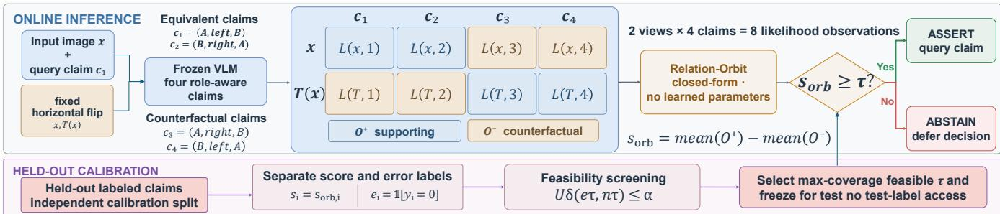
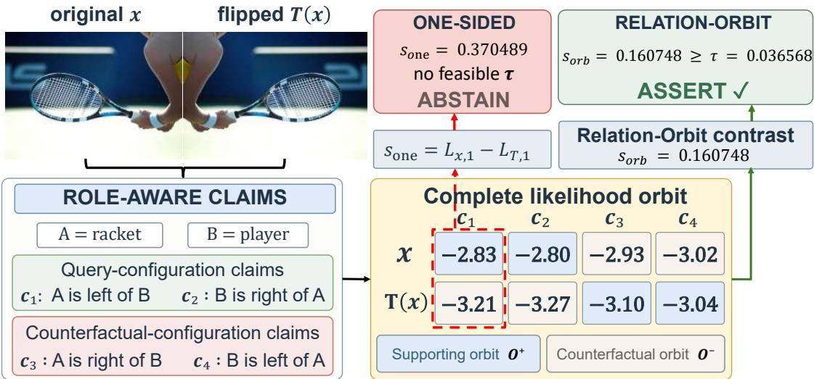

# SYMMETRY-AWARE LIKELIHOOD-ORBIT AGGREGATION FOR SELECTIVE LEFT–RIGHT CLAIM VERIFICATION

Zhouzhi Xiong1,∗, Chuxi Zhang4,∗, Weizhen He2, Yi Chen3, Qi Li2, Donglian Qi2

1Polytechnic Institute, Zhejiang University, Hangzhou, China

2College of Electrical Engineering, Zhejiang University, Hangzhou, China

3Ocean College, Zhejiang University, China

4College of Artificial Intelligence, Zhejiang University, Hangzhou, China ∗Equal contribution

## ABSTRACT

Frozen vision–language models (VLMs) remain unreliable on fine-grained left–right claims, and raw claim likelihoods need not reliably rank verification errors. After a horizontalreflection intervention is fixed, how should its induced likelihood measurements be combined into a selective verification signal? We introduce Relation-Orbit, a closed-form contrast with no learned fusion parameters that assigns eight normalized likelihoods to query-supporting and counterfactual roles determined by reflection, inverse relation, and entity exchange. A claim is asserted only when the signed contrast exceeds a threshold selected on held-out data using pointwise Clopper–Pearson upper confidence bounds. On VSR and GQA across four frozen VLMs, Relation-Orbit yields higher mean test coverage at a 10% selective-risk calibration target than an all-eight Orbit-Max baseline in all eight dataset–backbone settings; gains over a nearly abstain-all one-sided intervention score are reported separately. A separate LLaVA-1.5/COCO evaluation, reduced-orbit controls, and a two-sided partition diagnostic further characterize the structural advantage.

Index Terms— vision–language models, selective prediction, claim verification, spatial relations, likelihood aggregation

## 1. INTRODUCTION

Vision–language models can identify two objects yet reverse which one lies to the left of the other [1, 2, 3, 4]. Such errors are problematic whenever downstream decisions rely on spatial claims. Improving average accuracy alone is insufficient in these settings: the system should also abstain when the available evidence is insufficient to meet an explicit error target.

Selective prediction turns model evidence into a decision signal and asserts a claim only when the signal exceeds a calibrated threshold [5, 6, 7]. This separation matters because modern neural confidence can be miscalibrated even when average accuracy is high [8]. For left–right questions, we adopt the horizontal-reflection intervention studied by BCEA [9], which compares a relational claim across the original and reflected views. Our question begins after this intervention has been fixed: a one-sided contrast uses only one textual formulation and leaves the inverse-relation and entity-exchange structure among the induced likelihoods unused.

We ask a complementary question: given afixed intervention, how should all likelihood observations induced by it be organized? A left claim, its inverse, and their entity-swapped formulations are not unrelated prompts. Their truth values transform predictably under horizontal reflection. Relation-Orbit encodes these roles in a closed-form signal. This distinction is important: our contribution is not merely to “use eight likelihoods,” but to organize them by the known relation symmetry. We compare the resulting score with onesided scoring, an all-eight Orbit-Max control, and reducedorbit contrasts in the main assertion experiments. A separate structural diagnostic evaluates it against alternative fourversus-four partitions.

Related work addresses different stages of reliable VLM reasoning. ReCoVERR retrieves and verifies external evidence for uncertain answers [10], while Budgeted Conformal Evidence Acquisition (BCEA) selects budgeted evidence and recalibrates after acquisition [9]. We begin after a fixed intervention is selected and ask how to aggregate every likelihood it induces. SEER constructs query-specific grounded views with explicit entity roles and reciprocal consistency [11]; Relation-Orbit instead uses a fixed reflection and organizes four linked formulations across two views into supporting and counterfactual orbits. SAGE enforces geometric–linguistic duality consistency across transformed inputs during VLM post-training [12]; in contrast, Relation-Orbit keeps the VLM frozen and aggregates the complete transformation-induced likelihood orbit at inference time for selective verification. Black-box consistency [13] and visual contrastive decoding [14] use repeated responses or perturbed visual evidence to assess reliability. A detector–geometry trust predictor estimates reliability from detection and geometry [15]. Grounding Isn’t Knowing separately analyzes how localization relates to spatial reasoning [16]. Our score has no learned parameters but requires labeled held-out calibration under the common protocol.

Our contributions are threefold. First, we define a closedform Relation-Orbit score for left–right claim verification in frozen VLMs. Second, we establish its symmetry and nuisance-cancellation properties. Third, cross-protocol experiments, matched-budget and reduced-orbit controls, and a label-independent structure audit test whether the complete orbit provides value beyond likelihood count alone. Pointwise CP-UCB serves as the held-out calibration protocol; we report realized test risk without claiming a new end-to-end guarantee. We do not claim general spatial reasoning or a universal visual involution.

## 2. RELATION-ORBIT AGGREGATION

## 2.1. Problem setting

Let x be an image, A and B the queried entities, and $r \in$ {LEFT, RIGHT}. The task is selective verification of the query claim $c _ { 1 } = ( A , r , B )$ : the system either asserts $c _ { 1 }$ or abstains. Let $y \in \{ 0 , 1 \}$ indicate whether $c _ { 1 }$ is true. We assume a frozen VLM that exposes token likelihoods and a fixed horizontal reflection T. Let $\iota ( r )$ be the inverse relation. From entity exchange and relation inversion we form

$$
\begin{array} { l l } { { c _ { 1 } = ( A , r , B ) , } } & { { \qquad c _ { 2 } = ( B , \iota ( r ) , A ) , } } \\ { { c _ { 3 } = ( A , \iota ( r ) , B ) , } } & { { \qquad c _ { 4 } = ( B , r , A ) . } } \end{array}\tag{1}
$$

Claims $c _ { 1 } , c _ { 2 }$ are equivalent; $c _ { 3 } , c _ { 4 }$ express the opposite relation. For view $v ~ \in ~ \{ x , T ( x ) \}$ , let $\mathit { L } _ { v , j }$ be the lengthnormalized log likelihood of the claim span in a fixed prompt containing $c _ { j }$

## 2.2. Closed-form signal construction

Figure 1 summarizes the complete inference and calibration pipeline. Reflection swaps left and right while preserving entity identity. Thus the supporting observations are $c _ { 1 } , c _ { 2 }$ on x and $c _ { 3 } , c _ { 4 }$ on $T ( x )$ ; the remaining observations support the counterfactual:

$$
\begin{array} { r l } & { \mathcal { O } ^ { + } = \{ L _ { x , 1 } , L _ { x , 2 } , L _ { T , 3 } , L _ { T , 4 } \} , } \\ & { \mathcal { O } ^ { - } = \{ L _ { x , 3 } , L _ { x , 4 } , L _ { T , 1 } , L _ { T , 2 } \} . } \end{array}\tag{2}
$$

Relation-Orbit is the parameter-free contrast

$$
s _ { \mathrm { o r b } } = \frac { 1 } { 4 } \sum _ { z \in \mathcal { O } ^ { + } } z - \frac { 1 } { 4 } \sum _ { z \in \mathcal { O } ^ { - } } z .\tag{3}
$$

Larger values provide stronger evidence for the query claim; negative values favor its counterfactual. No VLM weights or fusion parameters are learned.

Proposition 1. The Relation-Orbit contrast is invariant to joint entity exchange and relation inversion, antisymmetric to relation inversion alone, and invariant under $L _ { v , j } \mapsto L _ { v , j } +$ $b _ { v } + a _ { j }$ , where $b _ { v }$ and $a _ { j }$ are view- and formulation-specific offsets. These properties concern the constructed score and do not assume that the VLM itself is equivariant.

Proof sketch. Joint entity exchange and relation inversion maps $c _ { 1 }  c _ { 2 }$ and $c _ { 3 }  c _ { 4 }$ , reindexing terms within each orbit. Relation inversion alone maps $c _ { 1 }  c _ { 3 }$ and $c _ { 2 }  c _ { 4 }$ swapping $\mathcal { O } ^ { + }$ and $\mathcal { O } ^ { - }$ and negating the score. A view offset appears twice with each sign within that view; a formulation offset appears once with each sign across views, so both cancel. These properties follow from the prescribed orbit coefficients and do not require the underlying VLM to be equivariant.

## 2.3. Selective-risk calibration

For calibration claim i, let $s _ { i } = s _ { \mathrm { o r b } } ,$ and let $e _ { i } = \mathbf { 1 } [ y _ { i } =$ 0] denote the false-assertion indicator for the query-assertion action; the label is not part of the score. For threshold τ, assert the query claim when $s _ { i } \geq \tau$ and otherwise abstain. On the calibration set, $\begin{array} { r } { n _ { \tau } = \sum _ { i } { \bf 1 } [ s _ { i } \geq \tau ] } \end{array}$ is the asserted count and $\begin{array} { r } { e _ { \tau } = \sum _ { i } { \bf 1 } [ s _ { i } \geq \tau ] e _ { i } } \end{array}$ is the number of false assertions. For $n _ { \tau } > 0 .$ , we compute the one-sided Clopper–Pearson upper confidence bound (CP-UCB) [17]

$$
U _ { \delta } ( e _ { \tau } , n _ { \tau } ) = \mathrm { B e t a } ^ { - 1 } ( 1 - \delta ; e _ { \tau } + 1 , n _ { \tau } - e _ { \tau } ) ,\tag{4}
$$

with $U _ { \delta } ~ = ~ 1$ when every asserted calibration claim is incorrect. Candidates are the distinct finite calibration scores. Among those satisfying $U _ { \delta } \ \leq \ \alpha ,$ , we choose the one with maximum calibration coverage and freeze it for the test split. If no nonempty acceptance set is feasible, we set $\tau = \infty$ and abstain on the entire test split; its coverage and recorded risk are both zero by convention. Coverage is $\operatorname* { P r } ( s _ { \mathrm { o r b } } \geq \tau ) ;$ ; selective risk is $\operatorname* { P r } ( y = 0 \mid s _ { \mathrm { o r b } } \geq \tau )$ . We use $\delta \ : = \ : 0 . 1 0$ throughout. Because the implementation scans multiple candidate thresholds using pointwise bounds, we treat CP-UCB as a calibration protocol and assess its realized behavior on held-out test partitions; we do not claim a simultaneous or end-to-end finite-sample guarantee [7].

Calibration uses $( s _ { i } , e _ { i } )$ but never inserts $e _ { i }$ into the score. Test labels are used only for retrospective reporting, and the score is not a calibrated probability.

## 3. EXPERIMENTS

## 3.1. Protocol and baselines

We evaluate balanced left–right subsets of Visual Spatial Reasoning (VSR) [1] and GQA [18]. VSR contains 1,186 image groups and 2,372 paired true and inverse claims; GQA contains 1,500 groups and 3,000 claims. We group by image, preventing paired claims or orbit observations from

  
Fig. 1. Relation-Orbit organizes eight likelihood observations induced by horizontal reflection and four role-aware claims into supporting $( \mathcal { O } ^ { + } )$ and counterfactual (O−) orbits. Their closed-form contrast is calibrated on held-out labeled claims for selective assertion; no VLM or fusion parameters are learned.

Table 1. Paired test-coverage gain (pp) of Relation-Orbit at $\alpha = 0 . 1 0$ over 300 grouped splits; brackets are empirical paired 95% bootstrap intervals. Orbit-Max uses the same eight likelihoods and the same ${ \mathcal { O } } ^ { + } / { \mathcal { O } } ^ { - }$ membership, differing only in within-orbit pooling.
<table><tr><td>Dataset</td><td>Comparator</td><td>Qwen-3B</td><td>Qwen-7B</td><td>InternVL-2B</td><td>InternVL-8B</td></tr><tr><td>VSR</td><td>One-sided Orbit-Max</td><td>14.09 [13.06, 15.20] 2.39 [1.46, 3.35]</td><td>5.82 [5.10, 6.63] 1.18 [0.41, 1.91]</td><td>9.64 [8.51, 10.82] 5.70 [4.74, 6.73]</td><td>13.36 [12.52, 14.20] 3.61 [2.79, 4.44]</td></tr><tr><td>GQA</td><td>One-sided Orbit-Max</td><td>12.15 [11.71, 12.66] 8.73 [8.15, 9.34]</td><td>1.91 [1.60, 2.23] 1.69 [1.37, 2.00]</td><td>3.86 [3.33, 4.39] 3.05 [2.55, 3.63]</td><td>5.55 [5.01, 6.06] 5.41 [4.88, 5.92]</td></tr></table>

## 3.2. Main results

crossing partitions. Each of 300 seeded grouped splits allocates 40%/30%/30% of the images to train/calibration/test. Closed-form methods use no training data; the training partition only matches the frozen evaluation pipeline. The four frozen backbones are Qwen2.5-VL-3B/7B [19] and InternVL3-2B/8B [20]. All methods share prompts, tokennormalized likelihoods, and the same threshold-search procedure, with α = 0.10 and $\delta = 0 . 1 0$ . We report paired mean coverage differences (pp) with empirical 95% bootstrap intervals over reused split-level differences.

Claims use a fixed prompt wrapper and mean log likelihood over claim tokens. Reflection is deterministic; image variants remain in one split, thresholds use calibration labels only, and no VLM or fusion parameters are trained. Thus the comparison changes the signal construction, not the backbone.

The one-sided baseline uses $s _ { \mathrm { o n e } } = L _ { x , 1 } - L _ { T , 1 }$ , matching BCEA’s horizontal-reflection intervention but not its complete method. Our main matched-budget control is

$$
s _ { \operatorname* { m a x } } = \operatorname* { m a x } \mathcal { O } ^ { + } - \operatorname* { m a x } \mathcal { O } ^ { - } ,\tag{5}
$$

which uses the same eight likelihoods and the same orbit membership but changes mean pooling to max pooling.

We also evaluate three reduced-orbit controls: $s _ { \mathrm { c t r } } =$ $L _ { x , 1 } - L _ { x , 3 } , s _ { \mathrm { s y m } } = { \textstyle \frac { 1 } { 2 } } [ ( L _ { x , 1 } - L _ { x , 3 } ) + ( L _ { T , 3 } - L _ { T , 1 } ) ]$ and $s _ { \mathrm { t e x t } } = \textstyle { \frac { 1 } { 2 } } [ ( L _ { x , 1 } + { \bar { L } } _ { x , 2 } ) - ( L _ { x , 3 } + L _ { x , 4 } ) ]$ . View-Mean is retained only as a role-agnostic sanity control: it assigns identical scores to paired true/inverse queries and has zero feasible coverage in all eight settings.

Table 1 shows that Relation-Orbit improves over both onesided scoring and Orbit-Max in all eight dataset–backbone settings. The smallest gain over one-sided is +1.91 pp on GQA/Qwen-7B, while the smallest gain over Orbit-Max is +1.18 pp on VSR/Qwen-7B; all paired intervals remain above zero. One-sided coverage is near zero because nonempty feasible thresholds rarely exist, making Orbit-Max the more informative matched-budget comparison.

Against reduced-orbit controls, Relation-Orbit improves in $8 / 8$ settings over $s _ { \mathrm { c t r } }$ and $7 / 8$ over both $s _ { \mathrm { s y m } }$ and $s _ { \mathrm { t e x t } }$ The only significant reversal is VSR/InternVL3-2B: −3.10 pp versus ssym (95% CI [−4.03, −2.12]) and −1.26 pp versus $s _ { \mathrm { t e x t } }$ ([−2.11, −0.40]). Thus the complete orbit is systematically, but not uniformly, preferable.

Under the separate BCEA-aligned LLaVA-1.5/COCO protocol [21, 22], Relation-Orbit gains 34.39 pp over onesided and 13.08 pp over the matched-input control (paired 95% CIs: [34.34, 34.45] and [13.00, 13.16]).

Coverage gains should be read together with the operating point itself. Table 2 reports Relation-Orbit’s mean asserted fraction and mean realized selective risk. All eight mean risks are below the calibration target of 10%, although individual splits can exceed it and coverage varies materially by model and dataset. Counting abstain-all splits as satisfying the target under the zero-risk convention above, the fraction of test splits meeting the target ranges from 76.3% to 85.7%. In particular, GQA with Qwen-7B asserts only 1.91% of claims. Relation-Orbit therefore improves the usable region under this calibra-

  
Fig. 2. GQA example (A: racket; B: player). Rows are x, $T ( x ) ;$ blue/ochre denote ${ \mathcal { O } } ^ { + } / { \mathcal { O } } ^ { - }$ . Relation-Orbit uses all eight cells; one-sided uses only the $c _ { 1 }$ pair. Cell values are rounded for display; both $s _ { \mathrm { o n e } }$ and $s _ { \mathrm { o r b } }$ are computed from full-precision likelihoods. Held-out calibration (Qwen2.5-VL-3B, repeat 164, image 2409694) gives the shown orbit threshold and no feasible one-sided threshold; its abstention is not a claim-level error.

Table 2. Absolute Relation-Orbit operating points (%) over 300 splits. $C / R \colon$ coverage/recorded selective risk; Q3/Q7 and I2/I8 abbreviate Qwen2.5-VL-3B/7B and InternVL3-2B/8B. Empty test acceptance sets are assigned zero recorded risk by convention.
<table><tr><td>Data</td><td>Metric</td><td>Q3</td><td>Q7</td><td>I2</td><td>I8</td></tr><tr><td rowspan="2">VSR</td><td>C</td><td>14.33</td><td>5.93</td><td>9.73</td><td>13.36</td></tr><tr><td>R</td><td>6.54</td><td>4.87</td><td>5.66</td><td>6.05</td></tr><tr><td rowspan="2">GQA</td><td>C</td><td>12.15</td><td>1.91</td><td>3.86</td><td>5.55</td></tr><tr><td>R</td><td>6.23</td><td>3.74</td><td>4.30</td><td>5.43</td></tr></table>

tion protocol; it does not make every left–right claim safe to assert. Figure 2 illustrates one GQA split in which Relation-Orbit meets its held-out threshold while the one-sided score has no feasible nonempty acceptance threshold.

## 3.3. Structure diagnostic and limitations

We separately test the group-level partition under a two-sided selective-classification diagnostic: $\hat { y } = \mathbf { 1 } [ s \geq 0 ]$ , reliability $u \ : = \ : | s |$ , and acceptance $u \geq \tau$ , using 300 grouped 50/50 calibration/test splits. This is not the assertion protocol of Tables 1–2. Across 12 dataset–backbone settings on VSR, GQA, and COCO, the correct orbit exceeds the mean and median of the 34 label-independent alternative partitions and the mean of the 16 single-swap corruptions in all 12 settings. Its average rank is 1.61/35, and it lies in the top quartile in every setting. Some strongest post-hoc alternatives still perform better, supporting a systematic structural advantage rather than unique optimality. Partition orientation is fixed without labels. Moreover, a label-independent one-claim-per-image robustness check preserves rank 1/35 in all eight VSR/GQA settings, indicating that the ranking is not driven by counting both members of each inverse-claim pair.

The 34 alternatives hold the observation count fixed and test alternative four-versus-four organizations. Each of the 16 corruptions exchanges one supporting observation with one counterfactual observation. All controls are labelindependent, so this diagnostic audits structure rather than fitting a partition. It remains separate because two-sided reliability and one-sided assertion are different tasks.

In the main protocol, scores below the calibration-selected threshold lead to abstention; the sign alone is not correctness, and the score is not a probability.

Relation-Orbit requires likelihood access and eight view– formulation scores, excluding text-only APIs and increasing compute. It also relies on a valid transformation: text, handedness, or other flip-sensitive cues can invalidate reflection, and domain shift requires transformation checks and recalibration [23]. An above–below pilot with vertical reflection produced no stable matched-budget gains, underscoring that a semantically valid visual involution cannot be assumed across relations; stringent targets may yield abstain-all.

## 4. CONCLUSION

Relation-Orbit is a parameter-free contrast for selective left– right claim verification with frozen VLMs. By organizing reflection-induced likelihoods according to inverse-relation and entity-exchange roles, it improves coverage over onesided and Orbit-Max controls and remains favorable to reduced-orbit alternatives in most settings under the evaluated held-out calibration protocols. A separate label-independent partition diagnostic supports a systematic, but not uniquely optimal, structural advantage.

## 5. REFERENCES

[1] Fangyu Liu, Guy Emerson, and Nigel Collier, “Visual spatial reasoning,” TACL, vol. 11, pp. 635–651, 2023.

[2] Amita Kamath, Jack Hessel, and Kai-Wei Chang, “What’s “up” with vision-language models? Investigating their struggle with spatial reasoning,” in EMNLP, 2023, pp. 9161–9175.

[3] Kaiyu Yang, Olga Russakovsky, and Jia Deng, “SpatialSense: An adversarially crowdsourced benchmark for spatial relation recognition,” in ICCV, 2019, pp. 2051–2060.

[4] Tristan Thrush, Ryan Jiang, Max Bartolo, Amanpreet Singh, Adina Williams, Douwe Kiela, and Candace Ross, “Winoground: Probing vision and language models for visio-linguistic compositionality,” in CVPR, 2022, pp. 5238–5248.

[5] C. K. Chow, “On optimum recognition error and reject tradeoff,” IEEE Transactions on Information Theory, vol. 16, no. 1, pp. 41–46, 1970.

[6] Yonatan Geifman and Ran El-Yaniv, “SelectiveNet: A deep neural network with an integrated reject option,” in ICML, 2019, pp. 2151–2159.

[7] Anastasios N. Angelopoulos, Stephen Bates, Adam Fisch, Lihua Lei, and Tal Schuster, “Conformal risk control,” in ICLR, 2024.

[8] Chuan Guo, Geoff Pleiss, Yu Sun, and Kilian Q. Weinberger, “On calibration of modern neural networks,” in ICML, 2017, pp. 1321–1330.

[9] Jian Xu, Yanning Wu, Delu Zeng, John Paisley, and Qibin Zhao, “Look again before you abstain: Budgeted conformal evidence acquisition for reliable visionlanguage model,” 2026, arXiv:2606.16667.

[10] Tejas Srinivasan, Jack Hessel, Tanmay Gupta, Bill Yuchen Lin, Yejin Choi, Jesse Thomason, and Khyathi Chandu, “Selective “selective prediction”: Reducing unnecessary abstention in vision-language reasoning,” in Findings of ACL, 2024, pp. 12935– 12948.

[11] Feixiang Liu, Likun Wang, Qiang Qiu, Hui Xu, Huawei Shen, and Xueqi Cheng, “SEER: A self-grounded evidence interface for controlled spatial relation classification,” 2026, arXiv:2608.03631.

[12] Junming Liu, Yuqi Li, Yifei Sun, Maonan Wang, Piotr Koniusz, Yirong Chen, and Ding Wang, “Self-evolving spatial reasoning in vision language models via geometric logic consistency,” 2026, arXiv:2605.18162.

[13] Zaid Khan and Yun Fu, “Consistency and uncertainty: Identifying unreliable responses from black-box visionlanguage models for selective visual question answering,” in CVPR, 2024, pp. 10854–10863.

[14] Sicong Leng, Hang Zhang, Guanzheng Chen, Xin Li, Shijian Lu, Chunyan Miao, and Lidong Bing, “Mitigating object hallucinations in large vision-language models through visual contrastive decoding,” in CVPR, 2024, pp. 13872–13882.

[15] Muhammad Imran and Yugyung Lee, “Predicting when to trust vision-language models for spatial reasoning,” 2026, arXiv:2601.11644.

[16] Xiwei Liu, Yulong Li, Xinlin Zhuang, Xuhui Li, Zhixiang Lu, Haolin Yang, Imran Razzak, and Yutong Xie, “Grounding isn’t knowing: Do VLMs need object localization for spatial reasoning?,” 2026, arXiv:2608.23074.

[17] C. J. Clopper and E. S. Pearson, “The use of confidence or fiducial limits illustrated in the case of the binomial,” Biometrika, vol. 26, no. 4, pp. 404–413, 1934.

[18] Drew A. Hudson and Christopher D. Manning, “GQA: A new dataset for real-world visual reasoning and compositional question answering,” in CVPR, 2019, pp. 6700–6709.

[19] Shuai Bai, Keqin Chen, Xuejing Liu, Jialin Wang, Wenbin Ge, Sibo Song, Kai Dang, Peng Wang, et al., “Qwen2.5-VL technical report,” 2025, arXiv:2502.13923.

[20] Jinguo Zhu et al., “InternVL3: Exploring advanced training and test-time recipes for open-source multimodal models,” 2025, arXiv:2504.10479.

[21] Tsung-Yi Lin, Michael Maire, Serge Belongie, James Hays, Pietro Perona, Deva Ramanan, Piotr Dollar, and´ C. Lawrence Zitnick, “Microsoft COCO: Common objects in context,” in ECCV. 2014, pp. 740–755, Springer.

[22] Haotian Liu, Chunyuan Li, Yuheng Li, and Yong Jae Lee, “Improved baselines with visual instruction tuning,” in CVPR, 2024, pp. 26296–26306.

[23] Yaniv Ovadia, Emily Fertig, Jie Ren, Zachary Nado, D. Sculley, Sebastian Nowozin, Joshua Dillon, Balaji Lakshminarayanan, and Jasper Snoek, “Can you trust your model’s uncertainty? Evaluating predictive uncertainty under dataset shift,” in NeurIPS, 2019, vol. 32.