# SlotDiT: Object-Centric Representations for Diffusion Transformers

Gjergj Plepi plepi@ais.uni-bonn.de

Sven Behnke 6behnke@cs.uni-bonn.de

Autonomous Intelligent Systems, Computer Science Institute VI – Intelligent Systems and Robotics, Center for Robotics and the Lamarr Institute for Machine Learning and Artificial Intelligence, University of Bonn, Germany

## Abstract

Text-conditioned latent diffusion models perform strongly in video generation and are promising backbones for robotic applications. However, existing approaches rely on pixel-level or VAE-based latent representations that lack explicit semantic structure, leaving the impact of the representation space largely unexplored. Slot-based object-centric representations offer a structured alternative by decomposing scenes into object-level latents, or slots. While they have shown success in dynamics modeling and planning, they have not yet been explored for diffusion-based generative modeling. We introduce SlotDiT, a text-guided Diffusion Transformer (DiT) that operates in a slot-based latent space. Given a reference image and a language instruction, SlotDiT decomposes the scene into object-centric slots representing individual entities. Conditioned on the instruction and observed scene context, the model autoregressively denoises future slot trajectories to predict scene dynamics. To systematically investigate latent-space design for diffusion transformers, we compare slot-based representations against VAE-based and semantics-aligned alternatives within a unified DiT framework. Our experiments show that using slots as DiT latents yields competitive video generation quality while consistently improving task-completion rates across four robotic datasets. Furthermore, their compact representation provides a computationally efficient alternative to VAE-based and semantics-aligned latent spaces. Overall, our results demonstrate that object-centric structure is a powerful inductive bias for diffusion-based generative modeling in robotic environments. The project page is available at https://slot-dit.github.io/.

## Introduction

Diffusion models have shown remarkable success in image and video generation and have since been adapted to various other settings. In robotics, their generative capabilities and probabilistic formulation have enabled applications in planning [2, 16], policy learning [15, 26, 34], and world modeling [79, 85]. State-of-the-art diffusion models typically use a transformer backbone [50, 67], conditioning signals such as text [35, 77], and, crucially, a learned latent space [53]. While improved architectures and model and data scaling have driven substantial progress, the latent representation space has received comparatively little attention.

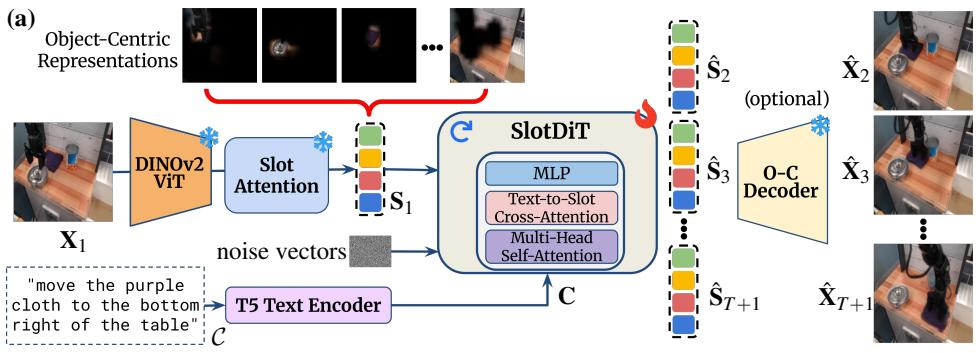

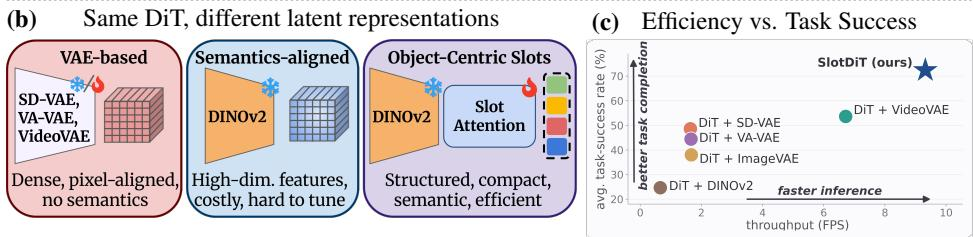  
Figure 1: Overview of SlotDiT. (a) Given a reference image $\mathbf { X } _ { 1 }$ and text instruction ${ \mathcal { C } } ,$ SlotDiT parses the scene into an object-centric slot representation $\mathbf { S } _ { 1 }$ . Conditioned on the encoded instruction and context slots, an object-centric diffusion transformer (DiT) autoregressively denoises future slot trajectories $\hat { \bf S } _ { 2 } , \ldots , \hat { \bf S } _ { T + 1 }$ , optionally decoded into future video frames $\hat { \mathbf { X } } _ { 2 } , \ldots , \hat { \mathbf { X } } _ { T + 1 }$ . (b) Comparison of SlotDiT’s slot-based latent space against established representation spaces used in DiTs. (c) Across four robotic datasets, SlotDiT achieves higher task-completion rates while remaining substantially more efficient than the baselines.

This gap is especially critical in robotic settings, where the latent space directly determines what information is preserved for downstream prediction, planning, and control [28].

The latent spaces used by diffusion models are mostly learned with VAE-based encoders, with Stable Diffusion VAE (SD-VAE) [53] being the most prominent example. Subsequent works extend this paradigm in various directions, including semantics-aligned VAEs [78], joint optimization of the VAE and the latent diffusion model [36], and spatio-temporal video compression [20, 73]. Despite these advances, such approaches remain fundamentally reconstruction-driven, prioritizing high visual fidelity over semantic structure. Thus, it remains unclear whether these latent spaces are well suited for robotic applications, where successful task completion matters more than pixel-level reconstruction.

To address this limitation, recent works [84] replace the VAE with large pretrained visual foundation models [49, 65], resulting in a more semantically aligned latent space. However, training latent diffusion transformers in these high-dimensional feature spaces is not trivial and requires additional architectural adaptations and training heuristics to be effective [83].

In parallel, object-centric representations [39]—which decompose scenes into compact sets of object-level latent vectors—have proven beneficial across various robotic tasks, including dynamics modeling [71] and continuous control [13, 62, 69], suggesting that objectcentric structure may be a useful inductive bias for generative modeling in robotic environments. However, their use as latent representations for diffusion remains unexplored.

In this work, we propose SlotDiT, illustrated in Figure 1a, a text-guided Diffusion Transformer that operates within an object-centric slot-based latent space. Given a single reference image and a language instruction, SlotDiT first parses the scene into a set of object-centric slots. Conditioned on these slots and the encoded instruction, the model then iteratively denoises Gaussian noise to autoregressively generate future slot trajectories, which can optionally be decoded into future video frames.

Unlike dense VAE-based latents or high-dimensional semantics-aligned representations, the slot-based latent space is compact and structured, representing each frame with only a small number of slot tokens (Figure 1b). To assess the impact of this design, we conduct a controlled comparison of latent spaces for diffusion transformers, evaluating slot-based, VAE-based, and semantics-aligned representations within a single, unified DiT framework [61] where all models share the same architecture, training procedure, and inference scheme, and differ only in the underlying latent space.

We evaluate SlotDiT on text-guided video generation across four robotic datasets spanning simulated and real-world environments, and on robot control in two simulated environments. Our experiments show that slot-based representations achieve competitive video generation quality while consistently yielding higher task-success rates than the alternative latent spaces. Notably, strong visual-quality metrics do not necessarily translate into successful task completion: VAE-based baselines often have better perceptual scores, yet perform substantially worse than SlotDiT on instruction following and task-solving. Furthermore, SlotDiT outperforms all baselines in the robot control evaluation, and its compact objectcentric latent space yields substantial efficiency gains over other representations (Fig. 1c).

In summary, our main contributions are:

• We introduce SlotDiT, a text-guided Diffusion Transformer that operates in an objectcentric latent space, enabling object-centric generative modeling in robotic settings.

• We present a controlled study of latent spaces for diffusion transformers, comparing slot-based, VAE-based and semantics-aligned latents within a unified framework.

• We show that slot-based representations consistently improve downstream task-success rates in text-guided video generation and robot control, while providing a substantially more efficient latent space than VAE-based and semantics-aligned alternatives.

## 2 Related Work

Object-Centric Representation Learning: Object-centric representation methods aim to decompose a scene into individual object components. There are different approaches to representing these objects, including patch-based representations [38], particle-based representations [12], explicit object prototypes [45, 68], and slot-based latents [39], where each individual scene entity is encoded into a distinct latent vector, called slot.

The Slot Attention module [39] is the core building block of most slot-based representation learning methods, mapping image features into a set of object slots. Subsequent works extended this framework to video inputs [17, 33, 58]. Recently, significant progress has been made to scale slot-based representation learning to complex real-world scenes through key advancements such as leveraging pretrained visual feature extractors [5, 55], improving feature-level learning [30, 44, 81], or employing diffusion decoders [3, 29, 48, 76].

Many works [70, 71, 75] have leveraged slots for video prediction, modeling spatiotemporal object dynamics via autoregressive transformer predictors trained using image and slot forecasting objectives. Additionally, slot-based dynamics models have been proven beneficial for multiple downstream tasks such as policy learning [13, 46, 69], Model Predictive Control (MPC) [47, 62] or visual reasoning [47]. In contrast to prior work, we explore slot-based representations as latent spaces for diffusion transformers, enabling object-centric diffusion-based generative modeling in robotic settings.

Representation Space of Diffusion Models: Diffusion models [23, 59] have emerged as a leading paradigm for image and video generation [18, 53]. However, operating them directly in pixel space is computationally expensive, motivating latent diffusion models (LDMs) [8, 53], which perform the diffusion process in a compressed learned latent space. These latent spaces are traditionally learned with reconstruction-based objectives using pretrained Variational Autoencoders (VAEs) [32], which prioritize visual fidelity over semantic structure. Following the Stable Diffusion VAE (SD-VAE) [18, 53], many works propose improved latent representations. VA-VAE [78] aligns SD-VAE latents with vision foundation models [49], REPA [36] enables joint optimization with LDMs, and VideoVAE encodes videos spatio-temporally [20, 73, 77, 80]. Despite these advances, such latent spaces remain largely reconstruction-oriented and lack explicit semantic structure.

Recent works [64, 84] explore replacing VAEs with Representation Autoencoders (RAE), leveraging pretrained representation encoders [49, 65] to obtain a semantically aligned latent space. While these approaches improve the learned representations, the resulting highdimensional features require additional architectural modifications and training heuristics to make them suitable for diffusion modeling [83]. In contrast to existing works, we explore structured object-centric latent spaces for diffusion transformers, highlighting their effectiveness and computational efficiency in robotic environments.

Text-guided Video Generation: Textual instructions provide external guidance for video generation, providing information about objects and their intended motions. Many works have utilized Transformer-based predictors for text-guided video generation [19, 25, 71]. Specifically, recent approaches [27, 71] use slot-based representations and show the benefits of a structured latent space for text-guided manipulation in robotic environments.

Recently, video diffusion models [24] have demonstrated strong capabilities for generating high-quality videos conditioned on a text prompt [1, 10, 20, 35, 43, 77]. Their success mostly stems from leveraging pretrained image diffusion models [57], scaling training data [7], or having large Diffusion Transformer backbones [50]. Due to their capabilities, text-guided diffusion models have also been applied in various downstream tasks in robotic scenarios. However, current video diffusion models still operate mostly in a reconstruction-aligned latent space, leveraging either a pretrained SD-VAE [10, 43] or a VideoVAE [4, 20, 77], focusing mainly on high-fidelity generation.

## 3 Methodology

We propose SlotDiT, depicted in Figure 2, a latent Diffusion Transformer (DiT) that learns in a slot-based object-centric latent space. Given a single reference image $\mathbf { X } _ { 1 }$ and a language instruction C, SlotDiT first encodes the scene into a set $\mathbf { S } _ { 1 }$ of $N _ { \mathbf { S } }$ object-centric latent vectors, called slots (Sec. 3.1). Then, conditioned on the instruction and observed scene context, the model iteratively denoises future slot trajectories from Gaussian noise to generate $N - 1$ future sets of slots. The last M generated slot sets are recursively used as context for the next prediction step, enabling autoregressive generation of the subsequent $T$ sets of slots $\hat { \bf S } _ { 2 : T + 1 }$ (Sec. 3.2). Optionally, the generated slots can be decoded into future image frames $\hat { \mathbf { X } } _ { 2 : T + 1 }$

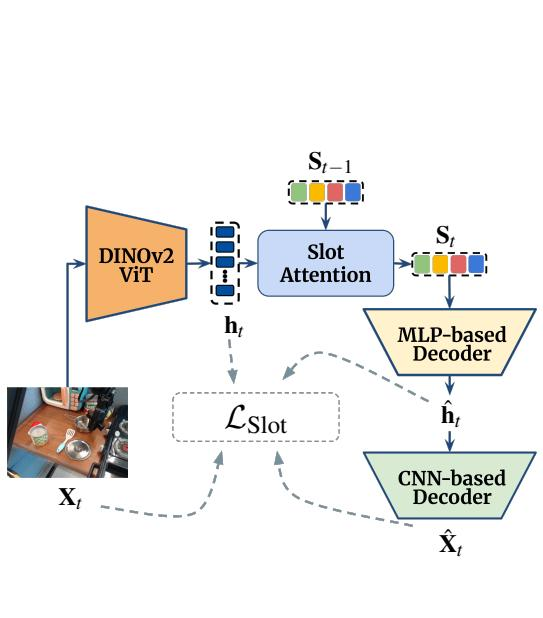

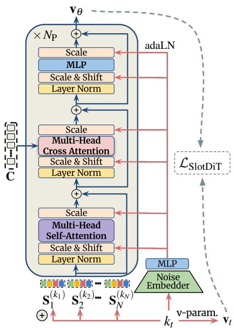  
(a) Object-centric representation learning (Stage 1).  
(b) SlotDiT diffusion model (Stage 2).  
Figure 2: SlotDiT training. (a) Slot representation learning: A frozen DINOv2-ViT extracts visual features $\mathbf { h } _ { t }$ from each frame $\mathbf { X } _ { t }$ , which are decomposed into object-centric slots $\mathbf { S } _ { t }$ via Slot Attention. The model is trained by minimizing a feature and image reconstruction objective ${ \mathcal { L } } _ { \mathrm { S l o t } }$ . (b) SlotDiT: With the slot encoder frozen, noisy slot sets $\mathbf { S } _ { t } ^ { ( k _ { t } ) }$ and text embeddings C are processed by a Diffusion Transformer. Per-frame noise levels are injected via adaLN, and the model is trained with the diffusion objective ${ \mathcal { L } } _ { \mathrm { S l o t D i T } }$

## 3.1 Learning Slot-Based Representations

Our object-centric representation learning module is based on the DINOSAUR framework [55]. Following [71], we extend it to the video domain by incorporating a Transformer [67] encoder as a temporal transition function and an image decoder to enable pixel-level decoding. Given an input video sequence $\mathbf { X } _ { 1 : \tau }$ , this module parses each frame into a set of object-centric slots $\mathbf { S } _ { t } = ( \mathbf { s } _ { t } ^ { 1 } , \ldots , \mathbf { s } _ { t } ^ { N _ { \mathbf { S } } } )$ , for $t \in \{ 1 , \ldots , \tau \}$ , where every individual slot $\mathbf { s } \in \mathbb { R } ^ { D }$ represents a single scene entity.

For each frame $\mathbf { X } _ { t }$ , a DINOv2 vision transformer (DINOv2-ViT) [49] encodes the frame into a feature map $ { \mathbf { h } } _ { t } \in \mathbb { R } ^ { L \times D _ { h } }$ . A Slot Attention module [39] then iteratively refines the previous slots $\mathbf { S } _ { t - 1 }$ by attending to the visual features, allowing different slots to specialize on different scene entities. Slots attend to the visual features via cross-attention, with the attention weights normalized over the slot axis to enforce competition among slots for representing each feature location:

$$
\mathbf { A } = \operatorname { s o f t m a x } _ { N _ { \mathbf { S } } } \left( \frac { q ( \mathbf { S } _ { t - 1 } ) k ( \mathbf { h } _ { t } ) ^ { \top } } { \sqrt { D } } \right) \in \mathbb { R } ^ { N _ { \mathbf { S } } \times L } ,\tag{1}
$$

where $q$ and $k$ are learned linear projections. The attention weights are then normalized across feature locations to compute a weighted mean of the projected features, which is then

used to update the slots through a Gated Recurrent Unit (GRU) [11]:

$$
W _ { i , j } = \frac { \mathbf { A } _ { i , j } } { \sum _ { l = 1 } ^ { L } \mathbf { A } _ { i , l } } , \qquad \mathbf { U } = W \nu ( \mathbf { h } _ { t } ) , \qquad \mathbf { S } _ { t } = \mathrm { G R U } ( \mathbf { U } , \mathbf { S } _ { t - 1 } ) ,\tag{2}
$$

where v is a learned linear projection, and $\mathbf { S } _ { t }$ are the resulting slots for frame $\mathbf { X } _ { t }$

To compose the scene from the parsed object-centric representations, we employ a twostage decoder similar to that of [71]. First, an MLP-based broadcast decoder independently maps each slot to an object feature map and an alpha mask. After mask normalization across slots, feature maps $\hat { \mathbf { h } } _ { t } \in \mathbb { R } ^ { L \times D _ { h } }$ are reconstructed via a weighted sum. Finally, a CNN-based image decoder maps the reconstructed features to render the video frame $\hat { \mathbf { X } } _ { t }$

## 3.2 Slot-based Text-Conditioned Diffusion Transformer

Given the initial set of slots $\mathbf { S } _ { 1 }$ and the language instruction C, SlotDiT autoregressively generates future slot trajectories through an iterative denoising process in the latent space [53]. The language instruction is first encoded into a sequence of text token embeddings C using a pretrained T5 encoder [52]. These embeddings provide the semantic and motion information that conditions the generation process.

SlotDiT operates on a fixed-length temporal window of N slot sets. At each generation step t, SlotDiT receives as input the most recent M context slots $\mathbf { S } _ { t - M + 1 : t }$ , the encoded text instruction C, and random Gaussian noise for the remaining N −M future frames in the window. The context slots and text embeddings are projected to the model token dimensionality $D _ { \mathrm { P r e d } }$ and jointly processed by the Diffusion Transformer backbone. Conditioned on both the observed slot history and language instruction, SlotDiT iteratively denoises the noisy future slots to predict the next $N - M$ slot sets. The last M generated slot sets are then reused as context for the subsequent prediction step, allowing the model to autoregressively generate the full future slot sequence.

The latent denoising process is parameterized by a Diffusion Transformer architecture operating over the slot representations and conditioned on text tokens. We design SlotDiT as a Diffusion Transformer [50] composed of $N _ { \mathrm { P } }$ identical blocks, illustrated in Figure 2b. Each block consists of a bidirectional multi-head self-attention layer, a text-to-slot cross-attention layer, and an MLP, where every component is preceded by LayerNorm and wrapped in a residual connection. Following prior works [50, 51], we use adaptive layer-normalization (adaLN) to inject the per-frame noise-level embeddings into every block.

The self-attention layer jointly processes all slots within the temporal window, modeling spatio-temporal relations between object-centric representations across frames. We apply rotary embeddings (RoPE) [63] as positional encoding and study two distinct variants. The first preserves slot permutation-equivariance by applying RoPE only along the temporal axis, sharing the same rotation across all slots within a frame, whereas the second applies RoPE along both temporal and slot axes, breaking permutation-equivariance. The text-toslot cross-attention layer then incorporates semantic and motion-related information from the text embeddings into the slots. Finally, the MLP processes each token independently.

## 3.3 Model Training and Inference

We train SlotDiT following a two-stage training procedure, depicted in Figure 2. First, we train the object-centric representation module. We then train SlotDiT in the resulting slot latent space while keeping the slot encoder frozen.

Learning Slots: The object-centric decomposition and decoding modules are trained using a combined image- and feature-reconstruction objective over the input sequence:

$$
\mathcal { L } _ { \mathrm { S l o t } } = \frac { 1 } { \tau } \sum _ { t = 1 } ^ { \tau } \left( \left. \hat { \mathbf { X } } _ { t } - \mathbf { X } _ { t } \right. _ { 2 } ^ { 2 } + \left. \hat { \mathbf { h } } _ { t } - \mathbf { h } _ { t } \right. _ { 2 } ^ { 2 } \right) ,\tag{3}
$$

where $\tau$ is the length of the training sequence, $\hat { \mathbf { h } } _ { t }$ and $\hat { \mathbf { X } } _ { t }$ are the reconstructed features and frame, and $\mathbf { h } _ { t }$ and $\mathbf { X } _ { t }$ are their targets.

Training SlotDiT: We train SlotDiT following the Diffusion Forcing Transformer (DFoT) framework [61]. Each training example consists of N slot sets $\mathbf { S } _ { 1 : N }$ parsed from a video, together with its language instruction $\mathcal { C }$ encoded into text embeddings C. To enable classifierfree guidance [22], the text embeddings C are randomly replaced with a learned null embedding during training.

Following the noise-as-masking paradigm [9], each frame is corrupted with an independent diffusion noise level $k \in \{ 0 , \ldots , K - 1 \}$ , where K denotes the number of diffusion steps and $\bar { \alpha } _ { k }$ the cumulative coefficient of the noise schedule. This formulation allows every token to contribute to the training objective, thus improving token utilization, while also enabling a variable number of history frames during inference.

Formally, given a per-frame noise level $k _ { t }$ and Gaussian noise $\mathbf { \mathcal { E } } _ { t } \sim \mathcal { N } ( \mathbf { 0 , I } )$ , the diffusion forward process corrupts the set of slots of each frame independently:

$$
\mathbf { S } _ { t } ^ { ( k _ { t } ) } = \sqrt { \bar { \alpha } _ { k _ { t } } } \mathbf { S } _ { t } + \sqrt { 1 - \bar { \alpha } _ { k _ { t } } } \varepsilon _ { t } .\tag{4}
$$

The noisy slot window $\mathbf { S } _ { 1 : N } ^ { ( \mathbf { k } ) }$ , together with the per-frame noise levels ${ \bf k } = ( k _ { 1 } , \dots , k _ { N } )$ and text embeddings C, is passed to SlotDiT, which learns the reverse denoising process. We adopt the v-prediction parameterization [54], where the target for frame t is

$$
\mathbf { v } _ { t } = \sqrt { \bar { \alpha } _ { k _ { t } } } \varepsilon _ { t } - \sqrt { 1 - \bar { \alpha } _ { k _ { t } } } \mathbf { S } _ { t } .\tag{5}
$$

We denote by $\mathbf { v } _ { \theta }$ the velocity predicted by SlotDiT, and train the model to minimize the reweighted denoising objective

$$
\mathcal { L } _ { \mathrm { S l o t D i T } } = \mathbb { E } _ { \mathbf { S } _ { 1 : N } , \mathbf { C } , \mathbf { k } , \varepsilon } \left[ \frac { 1 } { N } \sum _ { t = 1 } ^ { N } w ( k _ { t } ) \left| \left| \mathbf { v } _ { \theta } \left( \mathbf { S } _ { 1 : N } ^ { ( \mathbf { k } ) } , \mathbf { k } , \mathbf { C } \right) _ { t } - \mathbf { v } _ { t } \right| \right| _ { 2 } ^ { 2 } \right] ,\tag{6}
$$

where $\mathbf { v } _ { \theta } ( \cdot ) _ { t }$ denotes the predicted velocity for frame t and $w ( k _ { t } )$ is a per-frame loss weight.   
Following [9, 21], we use fused min-SNR loss reweighting.

Inference: At inference, SlotDiT generates slots autoregressively in temporal windows, conditioning on one observed slot set initially and the most recent M predictions thereafter, initializing the remaining positions with Gaussian noise. The full window is then iteratively denoised using a DDIM sampler [60]. At each step, SlotDiT predicts $\mathbf { v } _ { \theta }$ , from which the next, less noisy slots are computed, while the slot history remains unchanged.

To improve sample quality and instruction following, we guide the generation with classifier-free guidance [22], extending the history guidance formulation [61] to the text condition. Specifically, we compute both a conditional prediction—using the clean history slots and text instruction—as well as an unconditional prediction, where the history slots are replaced with noise and the text embeddings with a learned null embedding. The two predictions are combined using a single guidance scale that encourages consistency with both the observed history and the language instruction. After denoising, the last M generated slot sets are reused as history context for the next temporal window. This autoregressive process is repeated until all T future slot sets are generated.

## 4 Experiments

To evaluate SlotDiT, we investigate three key research questions: (i) can diffusion transformers operate effectively in an object-centric latent space? (ii) do slot-based representations improve task-solving and motion-following capabilities in robotic environments compared to established latent spaces? and (iii) do slots offer a more computationally efficient representation? To this end, we evaluate SlotDiT on two downstream tasks: text-guided video generation and robot control. The former assesses the visual fidelity of the generated futures, while the latter evaluates the instruction following capability and usefulness of the learned representations for planning and task execution. We conduct a controlled comparison across four robotic datasets, isolating the effect of the underlying representation space.

## 4.1 Experimental Setup

Datasets: We evaluate SlotDiT on four distinct language-conditioned robotic datasets: the synthetic tabletop manipulation environments LanguageTable-Synthetic [42] and CLIPort [56], the real-robot tabletop dataset LanguageTable-Real [42], and BridgeData V2 (Bridgev2) [72], which features diverse household manipulation tasks performed by a service robot. Together, they span both simulated and real-world robotic environments of varying complexity and contain tasks specified through natural-language instructions. We evaluate text-guided video generation and task execution on all four datasets, and robot control on LanguageTable-Synthetic and CLIPort. Additional dataset details are provided in Appendix B.6.

Evaluation Metrics: To assess video generation performance, we report LPIPS [82], FVD [66], and JEDi [41]. LPIPS measures the perceptual similarity between generated and ground-truth frames, whereas FVD and JEDi are video-level metrics that compare the distributions of real and generated videos, reflecting temporal consistency and motion realism. JEDi tends to remain more reliable on the relatively small evaluation sets we use.

As these metrics do not capture instruction following or task completion, we additionally report task-success rate, where success is determined directly by the environment for the robot control task, or computed using a VLM-as-judge for text-guided video generation. Specifically, a VLM jointly processes the text instruction and a subset of generated frames to predict whether the task was successfully completed. The task-success rate is the percentage of sequences classified as successful. We use Qwen3-VL-30B-A3B-Instruct [6] as the judge.

Baselines: We evaluate SlotDiT against two groups of baselines. The first group consists of slot-based models that operate on the same object-centric representations as SlotDiT, but employ autoregressive Transformer predictors instead of diffusion-based generative modeling. Namely, we compare against TextOCVP [71], an object-centric Transformer model for language-conditioned video prediction. For robot control, we additionally compare against OC-WM [27], a slot-based world model with a Transformer dynamics predictor.

PLEPI & BEHNKE: SLOTDIT: OBJECT-CENTRIC DIFFUSION TRANSFORMER
<table><tr><td rowspan="2">Dataset</td><td rowspan="2">Model</td><td colspan="3">1→9</td><td colspan="3">1→19</td><td colspan="3">1→29</td><td rowspan="2">Success %↑</td></tr><tr><td>LPIPS↓</td><td>FVD↓</td><td>JEDi↓</td><td>LPIPS↓</td><td>FVD↓</td><td>JEDi↓</td><td>LPIPS↓</td><td>FVD↓</td><td>JEDi↓</td></tr><tr><td rowspan="6">CLIPort</td><td>DiT + SD-VAE</td><td>0.138</td><td>165.01</td><td>3.02</td><td>0.153</td><td>138.23</td><td>3.17</td><td>0.163</td><td>159.37</td><td>3.82</td><td>36.6%</td></tr><tr><td>DiT + ImageVAE</td><td>0.121</td><td>155.37</td><td>2.57</td><td>0.138</td><td>183.05</td><td>3.14</td><td>0.153</td><td>217.46</td><td>2.82</td><td>25.8%</td></tr><tr><td>DiT + VA-VAE</td><td>0.153</td><td>193.88</td><td>3.43</td><td>0.181</td><td>241.57</td><td>4.60</td><td>0.189</td><td>211.48</td><td>6.14</td><td>39.0%</td></tr><tr><td>DiT + VideoVAE</td><td>0.055</td><td>24.78</td><td>0.46</td><td>0.098</td><td>71.82</td><td>1.49</td><td>0.069</td><td>30.08</td><td>0.50</td><td>57.1%</td></tr><tr><td>DiT + DINOv2</td><td>0.184</td><td>252.57</td><td>4.18</td><td>0.213</td><td>298.37</td><td>6.25</td><td>0.221</td><td>226.38</td><td>8.10</td><td>12.2%</td></tr><tr><td>TextOCVP</td><td>0.062</td><td>96.28</td><td>1.36</td><td>0.078</td><td>122.09</td><td>2.23</td><td>0.098</td><td>150.52</td><td>2.17</td><td>63.0%</td></tr><tr><td></td><td>SlotDiT (Ours)</td><td>0.066</td><td>83.66</td><td>1.13</td><td>0.077</td><td>79.27</td><td>1.73</td><td>0.092</td><td>90.37</td><td>1.85</td><td>87.8%</td></tr><tr><td rowspan="6">LT-Syn</td><td>DiT + SD-VAE</td><td>0.088</td><td>29.36</td><td>1.83</td><td>0.102</td><td>36.54</td><td>2.06</td><td>0.117</td><td>38.98</td><td>1.83</td><td>49.2%</td></tr><tr><td>DiT + ImageVAE</td><td>0.095</td><td>35.27</td><td>1.30</td><td>0.108</td><td>38.80</td><td>1.09</td><td>0.126</td><td>42.40</td><td>0.94</td><td>43.1%</td></tr><tr><td>DiT + VA-VAE</td><td>0.089</td><td>53.57</td><td>3.42</td><td>0.100</td><td>67.97</td><td>2.95</td><td>0.117</td><td>65.89</td><td>3.80</td><td>44.2%</td></tr><tr><td>DiT + VideoVAE</td><td>0.090</td><td>26.36</td><td>1.15</td><td>0.087</td><td>30.57</td><td>0.71</td><td>0.111</td><td>32.37</td><td>0.67</td><td>55.8%</td></tr><tr><td>DiT + DINOv2</td><td>0.114</td><td>64.59</td><td>2.79</td><td>0.125</td><td>88.21</td><td>2.86</td><td>0.137</td><td>105.71</td><td>3.23</td><td>14.7%</td></tr><tr><td>TextOCVP</td><td>0.104</td><td>66.17</td><td>2.29</td><td>0.112</td><td>92.20</td><td>3.43</td><td>0.152</td><td>150.34</td><td>4.01</td><td>25.9%</td></tr><tr><td></td><td>SlotDiT (Ours)</td><td>0.110</td><td>70.49</td><td>1.36</td><td>0.119</td><td>81.76</td><td>1.55</td><td>0.131</td><td>83.34</td><td>1.48</td><td>79.7%</td></tr></table>

Table 1: Text-guided video generation on the CLIPort and LanguageTable-Synthetic synthetic datasets. We report visual fidelity metrics (LPIPS, FVD, and JEDi) at three prediction horizons, while the rightmost column measures whether the generated video satisfies the language-conditioned task. Best results are shown in bold, second-best underlined.

The second group isolates the effect of the representation space. Here, all models use the same DiT architecture, similar training procedure, and inference scheme as SlotDiT, but operate in different latent spaces. We consider VAE-based latent spaces, including SD-VAE [53] (DiT + SD-VAE), a custom ImageVAE (DiT + ImageVAE), a pretrained VA-VAE [78] (DiT + VA-VAE), and a VideoVAE [37] (DiT + VideoVAE) that applies a spatiotemporal encoding to the input video. Additionally, we consider a semantics-aligned RAEstyle latent space built from DINOv2 features [49, 84].

Implementation Details. We train all models on two NVIDIA A6000 (48GB) GPUs, using a frozen T5-small text encoder for language conditioning. The object-centric decomposition module processes images at a resolution of 224×224 (336×336 for CLIPort). Scenes are represented using $N _ { \mathbf { S } } \in \{ 8 , 1 0 \}$ slots of dimension $D \in \{ 1 2 8 , 2 5 6 \}$ . The Diffusion Transformer uses $N _ { \mathrm { P } } = 8$ blocks $( N _ { \mathrm { P } } = 1 4 $ blocks on Bridgev2) with hidden dimension $D _ { \mathrm { P r e d } } = 5 1 2$ and is trained on temporal windows of N = 10 slot sets. We train using the DFoT framework with a cosine noise schedule over K = 1000 diffusion steps, the v-prediction parameterization [54], fused min-SNR loss reweighting, and DDIM sampling [60] at inference.

To ensure a controlled comparison of representation spaces, all DiT baselines share the same architecture, training procedure, and inference setup as SlotDiT, differing only in the underlying latent space. Complete architectural details, hyperparameters, and training settings for all models are provided in Appendix B.7.

## 4.2 Results

## 4.2.1 Text-Guided Video Generation.

We report text-guided video generation results on CLIPort, LanguageTable-Synthetic, LanguageTable-Real, and Bridgev2 in Tables 1 and 2. For each dataset, we show visual-quality metrics at prediction horizons $T \in \{ 9 , 1 9 , 2 9 \}$ }, and assess task completion using VLM-judged task-success rates on full-sequence predictions matching the ground-truth rollout length.

PLEPI & BEHNKE: SLOTDIT: OBJECT-CENTRIC DIFFUSION TRANSFORMER
<table><tr><td rowspan="2">Dataset</td><td rowspan="2">Model</td><td colspan="3">1→9</td><td colspan="3">1→19</td><td colspan="3">1→29</td><td rowspan="2">Success</td></tr><tr><td>LPIPS↓</td><td>FVD↓</td><td>JEDi↓</td><td>LPIPS↓</td><td>FVD↓</td><td>JEDi↓</td><td>LPIPS↓</td><td>FVD↓</td><td>JEDi↓</td></tr><tr><td rowspan="6">LT-Real</td><td>DiT + SD-VAE</td><td>0.113</td><td>61.21</td><td>1.29</td><td>0.133</td><td>89.26</td><td>1.53</td><td>0.145</td><td>86.36</td><td>1.52</td><td>59.0%</td></tr><tr><td>DiT + ImageVAE</td><td>0.102</td><td>50.37</td><td>2.32</td><td>0.117</td><td>77.99</td><td>2.78</td><td>0.130</td><td>83.95</td><td>3.22</td><td>48.9%</td></tr><tr><td>DiT + VA-VAE</td><td>0.108</td><td>69.14</td><td>1.98</td><td>0.124</td><td>114.03</td><td>2.00</td><td>0.138</td><td>116.04</td><td>2.40</td><td>51.9%</td></tr><tr><td>DiT + VideoVAE</td><td>0.096</td><td>24.82</td><td>1.51</td><td>0.100</td><td>34.69</td><td>1.38</td><td>0.125</td><td>32.34</td><td>1.05</td><td>61.1%</td></tr><tr><td>DiT + DINOv2</td><td>0.165</td><td>131.24</td><td>6.08</td><td>0.177</td><td>191.18</td><td>6.50</td><td>0.186</td><td>215.80</td><td>7.60</td><td>47.1%</td></tr><tr><td>TextOCVP</td><td>0.104</td><td>157.60</td><td>7.67</td><td>0.119</td><td>250.69</td><td>8.34</td><td>0.128</td><td>285.25</td><td>10.09</td><td>47.4%</td></tr><tr><td rowspan="6"></td><td>SlotDiT (Ours)</td><td>0.119</td><td>72.99</td><td>4.45</td><td>0.134</td><td>95.35</td><td>3.42</td><td>0.143</td><td>98.41</td><td>3.81</td><td>64.6%</td></tr><tr><td>DiT + SD-VAE</td><td>0.121</td><td>51.38</td><td>2.35</td><td>0.157</td><td>74.58</td><td>1.45</td><td>0.178</td><td>94.91</td><td>1.87</td><td>49.7%</td></tr><tr><td>DiT + ImageVAE</td><td>0.096</td><td>48.53</td><td>1.72</td><td>0.136</td><td>65.97</td><td>1.21</td><td>0.158</td><td>87.75</td><td>1.49</td><td>34.4%</td></tr><tr><td>DiT + VA-VAE</td><td>0.107</td><td>71.40</td><td>2.54</td><td>0.147</td><td>106.12</td><td>1.76</td><td>0.171</td><td>140.54</td><td>1.77</td><td>42.7%</td></tr><tr><td>DiT + VideoVAE</td><td>0.102</td><td>57.25</td><td>4.36</td><td>0.142</td><td>95.20</td><td>3.17</td><td>0.162</td><td>108.32</td><td>2.80</td><td>40.6%</td></tr><tr><td>DiT + DINOv2</td><td>0.128</td><td>100.56</td><td>6.07</td><td>0.158</td><td>207.39</td><td>5.96</td><td>0.178</td><td>315.42</td><td>6.46</td><td>30.8%</td></tr><tr><td rowspan="2"></td><td>TextOCVP</td><td>0.146</td><td>164.83</td><td>2.77</td><td>0.168</td><td>210.77</td><td>2.57</td><td>0.189</td><td>263.06</td><td>2.30</td><td>63.4%</td></tr><tr><td>SlotDiT (Ours)</td><td>0.125</td><td>65.26</td><td>3.63</td><td>0.158</td><td>101.26</td><td>2.59</td><td>0.180</td><td>125.48</td><td>2.16</td><td>57.6%</td></tr></table>

Table 2: Text-guided video generation on the real-world datasets LanguageTable-Real and Bridgev2. We report visual fidelity metrics (LPIPS, FVD, and JEDi) at three prediction horizons, while the rightmost column measures whether the generated video satisfies the language-conditioned task. Best results are shown in bold, second-best underlined.

As shown in Table 1, SlotDiT achieves substantially better task-success rates than all baselines on both the CLIPort and LanguageTable-Synthetic environments. On CLIPort, most VAE-based baselines perform poorly in both visual quality and task success, whereas DiT + VideoVAE achieves the strongest LPIPS, FVD, and JEDi scores, indicating high visual and temporal fidelity. Nevertheless, SlotDiT remains competitive in visual quality while achieving substantially higher task-success rates.

We attribute this gap to the compact object-centric latent space, which represents each frame using only a few low-dimensional slot tokens. While this design may limit the amount of visual detail that can be represented compared to high-capacity VAE latents, it provides a more efficient and structured representation for modeling task-relevant scene dynamics, as reflected by the high task-success rates of slot-based TextOCVP and SlotDiT models.

A similar trend is observed on LanguageTable-Synthetic. Although DiT + ImageVAE and DiT + VideoVAE outperform SlotDiT in visual-quality metrics, they achieve significantly lower task-success rates. These results suggest that standard video-generation metrics do not fully capture task-solving and instruction-following performance in robotic environments: while visual fidelity is important, it does not necessarily correlate with successful task completion. As shown in Figure 3a, DiT + VideoVAE correctly identifies the target object but fails to perform the instruction, whereas SlotDiT successfully completes the task.

Table 2 reports results for the real-world datasets. On LanguageTable-Real, SlotDiT achieves the highest task-success rate, outperforming all alternative latent spaces and TextOCVP. On Bridgev2, it remains among the strongest methods and outperforms the best VAE-based baseline by around 8 percentage points. Consistent with the observations on the synthetic datasets, object-centric methods generally underperform in visual-quality metrics, yet consistently obtain higher task-success rates. In particular, the strongest VAE-based models in visual quality, DiT + VideoVAE and DiT + ImageVAE, achieve considerably lower task-success rates than SlotDiT. This further supports our observation that strong perceptual metrics do not necessarily translate into successful task completion. Figure 3b shows a qualitative Bridgev2 example in which SlotDiT generates long-horizon rollouts that follow the language instruction and successfully execute the task, whereas baseline models fail.

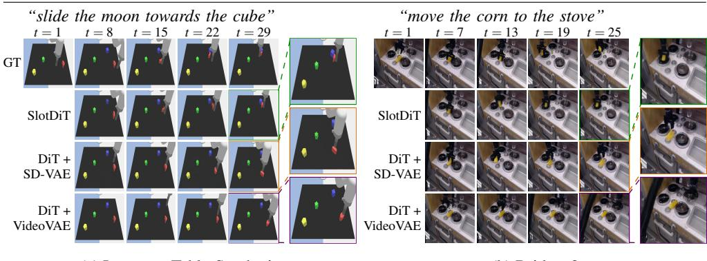  
(a) LanguageTable-Synthetic  
(b) Bridgev2  
Figure 3: Qualitative video generation examples on a synthetic (LanguageTable-Synthetic) and a real-world (Bridgev2) dataset. Each block shows the ground-truth sequence (top row) and the predictions of SlotDiT, DiT + SD-VAE, and DiT + VideoVAE.

## 4.2.2 Robot Control

Table 3 evaluates SlotDiT and the baselines on closed-loop LanguageTable-Synthetic and open-loop CLIPort robot control, using (trained) inverse dynamics models (IDMs) to map predicted latents to actions (Appendix B.4). We compare SlotDiT with the object-centric, slot-based Transformer predictor TextOCVP and VAE-based DiT variants. On Language Table-Synthetic, we also compare against a slot-based Transformer world model OC-WM, using results from the original paper for matching settings rather than rerunning the model. Additionally, we report GT slots, an oracle that plans using slots extracted from groundtruth future observations, providing an upper bound on SlotDiT’s performance. Details on the robot control task and the evaluation protocols are provided in Appendices B.2 and B.3.

On LanguageTable-Synthetic, we evaluate the training configuration—BLOCK-4 scenes with the block-to-block (b2b) instruction template—and several out-of-distribution settings. The latter include more complex scenes with eight blocks (BLOCK-8) and unseen instructions requiring reasoning about relative object locations (b2bR and b2R).

In the in-distribution setting, shown shaded in Table 3, SlotDiT achieves the highest success rate among all learned predictors, substantially outperforming both slot- and VAE-based models and nearly matching the GT slots oracle. This small gap with the oracle suggests that the generated slot trajectories preserve most of the task-relevant information required for planning, despite being produced entirely from autoregressive model predictions. Across the out-of-distribution BLOCK-8 scenes and unseen instruction templates, SlotDiT also consistently achieves the highest success rates, indicating that object-centric latent spaces capture task-relevant scene dynamics beyond the training distribution.

On CLIPort, SlotDiT also achieves the highest success rate among the evaluated learned predictors. This result shows that the benefit of object-centric diffusion predictions also extends to open-loop action execution in another manipulation environment.

Overall, the robot-control experiments reinforce the findings from the video generation task: object-centric latent spaces produce predictions that are substantially more useful for downstream manipulation and decision-making tasks than alternative latent representations.

<table><tr><td colspan="2">CLIPort.</td></tr><tr><td>Model</td><td>PutInBowl Success</td></tr><tr><td>GT slots</td><td>87.0%</td></tr><tr><td>OC-WM</td><td></td></tr><tr><td>TextOCVP</td><td>50.0%</td></tr><tr><td>DiT + SD-VAE DiT + ImageVAE</td><td>5.0% 0.5%</td></tr><tr><td>DiT + VA-VAE</td><td>9.5%</td></tr><tr><td>DiT + VideoVAE</td><td>10.0%</td></tr><tr><td></td><td></td></tr><tr><td>SlotDiT (Ours)</td><td>73.0%</td></tr></table>

<table><tr><td colspan="6">LanguageTable-Synthetic.</td></tr><tr><td></td><td colspan="3">BLOCK-4</td><td colspan="3">BLOCK-8</td></tr><tr><td>Model</td><td>b2b</td><td>b2bR</td><td>b2R</td><td>b2b</td><td>b2bR</td><td>b2R</td></tr><tr><td>GT slots</td><td>75.00%</td><td>72.50%</td><td>84.00%</td><td>55.00%</td><td>53.00%</td><td>69.00%</td></tr><tr><td>OC-WM</td><td>50.00%</td><td>26.5%</td><td></td><td></td><td></td><td></td></tr><tr><td>TextOCVP</td><td>43.50%</td><td>28.5%</td><td>27.5%</td><td>18.00%</td><td>7.00%</td><td>20.50%</td></tr><tr><td>DiT + SD-VAE</td><td>16.00%</td><td>10.50%</td><td>17.00%</td><td>11.50%</td><td>6.50%</td><td>16.50%</td></tr><tr><td>DiT + ImageVAE</td><td>10.50%</td><td>5.50%</td><td>13.00%</td><td>7.50%</td><td>6.00%</td><td>9.00%</td></tr><tr><td>DiT + VA-VAE</td><td>16.50%</td><td>12.50%</td><td>20.00%</td><td>8.50%</td><td>6.50%</td><td>16.00%</td></tr><tr><td>DiT + VideoVAE</td><td>21.00%</td><td>18.00%</td><td>40.00%</td><td>13.00%</td><td>10.00%</td><td>27.00%</td></tr><tr><td>SlotDiT (Ours)</td><td>74.50%</td><td>51.50%</td><td>59.00%</td><td>24.00%</td><td>17.00%34.00%</td><td></td></tr></table>

Table 3: Robot-control success rate (%) ↑ for open-loop action execution on CLIPort and closed-loop control on LanguageTable-Synthetic. On LanguageTable-Synthetic, the shaded column is the training setting (BLOCK-4 / b2b), while the rest are out-of-distribution settings. Best two results (excluding oracle) are shown in bold and underlined. For OC-WM [27], ’– indicates settings for which no reported result is available.

## 4.3 Model Analysis

## 4.3.1 Robustness

Table 3 additionally evaluates generalization to unseen instruction templates (b2bR, b2R) and a more challenging scene configuration (BLOCK-8). Despite these distribution shifts, SlotDiT consistently achieves the highest success rates among all compared methods, demonstrating robustness to both novel scene configurations and language instructions. Additional qualitative examples in these out-of-distribution settings are provided in Appendix C.3.

## 4.3.2 Controllability

A key requirement of text-guided video generation models is the ability to modify their predictions according to the provided language instructions. Figure 4 shows qualitative examples of SlotDiT’s controllability abilities in LanguageTable-Synthetic and Bridgev2 datasets. Given the same initial observation, SlotDiT generates distinct future trajectories for two different instructions, while preserving the overall scene layout and object identities. In both examples, SlotDiT is able to identify the newly referenced objects and correctly applies the described motion, seamlessly adapting to the new text instruction. Additional examples across all datasets are provided in Appendix C.4.

## 4.3.3 Efficiency

Table 4 reports inference-time efficiency on CLIPort. SlotDiT achieves the highest throughput, generating predictions at 9.33 FPS and providing a 5.68× speedup over the DiT + SD-VAE baseline. The main contributor to this improvement is the diffusion sampling stage, where SlotDiT is substantially more efficient than the competing baselines. This efficiency stems from the compact and semantic object-centric latent space, which reduces the number of tokens processed by the DiT from 256 per frame to only 10 slots. These results demonstrate that slot-based representations provide a substantially more efficient latent space for diffusion transformers while maintaining strong downstream task performance.

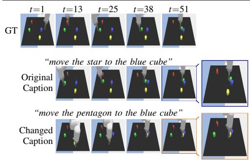

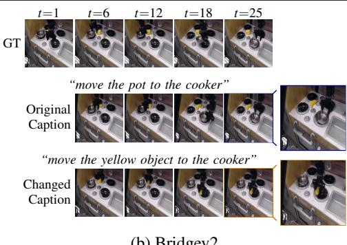  
Figure 4: Qualitative controllability examples on LanguageTable-Synthetic and Bridgev2. Each block shows the ground-truth video (top row), SlotDiT’s rollout conditioned on the original instruction (middle row), and on a changed instruction (bottom row).

<table><tr><td>Model</td><td>Tokens/ frame</td><td>Encoding (s) ↓</td><td>Sampling (s) ↓</td><td>Decoding (s) ↓</td><td>Total (s) ↓</td><td>Throughput (FPS) ↑</td><td>Speedup (x)↑</td></tr><tr><td> $\mathrm { D i T } + \mathrm { S D - V A E }$ </td><td>256</td><td> $0 . 0 1 7 { \scriptstyle \pm 0 . 0 0 3 }$ </td><td> $2 3 . 0 1 { \scriptstyle \pm 0 . 2 9 }$ </td><td> $0 . 7 3 6 { \scriptstyle \pm 0 . 0 0 3 }$ </td><td> $2 3 . 7 7 { \scriptstyle \pm 0 . 2 9 }$ </td><td>1.64</td><td>1.00×</td></tr><tr><td> $\mathrm { D i T + I m a g e V A E }$ </td><td>256</td><td> $\mathbf { 0 . 0 1 2 { \scriptstyle \pm 0 . 0 0 2 } }$ </td><td> $2 3 . 0 9 { \pm } 0 . 2 3 $ </td><td> $0 . 2 3 2 { \scriptstyle \pm 0 . 0 0 1 }$ </td><td> $2 3 . 3 4 { \pm } 0 . 2 3 $ </td><td>1.67</td><td>1.02×</td></tr><tr><td> $\mathrm { D i T + V A  – V A E }$ </td><td>256</td><td> $0 . 0 1 9 { \scriptstyle \pm 0 . 0 0 3 }$ </td><td> $2 2 . 9 2 { \scriptstyle \pm 0 . 2 2 }$ </td><td> $0 . 5 5 2 { \scriptstyle \pm 0 . 0 1 0 }$ </td><td> $2 3 . 4 9 { \scriptstyle \pm 0 . 2 2 }$ </td><td>1.66</td><td>1.01×</td></tr><tr><td>DiT + VideoVAE</td><td>256</td><td> $0 . 0 2 7 { \scriptstyle \pm 0 . 0 0 1 }$ </td><td> $5 . 2 1 { \pm } 0 . 0 9 $ </td><td> $0 . 5 6 2 { \scriptstyle \pm 0 . 0 0 2 }$ </td><td> $5 . 8 1 { \pm } 0 . 0 9 $ </td><td>6.71</td><td>4.09×</td></tr><tr><td>DiT + DINOv2</td><td>256</td><td> $0 . 0 1 5 { \scriptstyle \pm 0 . 0 0 2 }$ </td><td> $5 9 . 2 3 { \scriptstyle \pm 0 . 5 4 }$ </td><td> $\mathbf { 0 . 1 3 5 { \scriptstyle \pm 0 . 0 0 1 } }$ </td><td> $5 9 . 3 8 { \pm } 0 . 5 4 $ </td><td>0.66</td><td>0.40×</td></tr><tr><td>SlotDiT (Ours)</td><td>10</td><td> $0 . 0 1 6 { \scriptstyle \pm 0 . 0 0 2 }$ </td><td> ${ \bf 3 . 9 6 { \pm 0 . 1 5 } }$ </td><td> $0 . 2 0 2 { \scriptstyle \pm 0 . 0 0 2 }$ </td><td> ${ \bf 4 . 1 8 \pm 0 . 1 5 }$ </td><td>9.33</td><td>5.68×</td></tr></table>

Table 4: Inference-time efficiency on CLIPort, showing wall-clock time (seconds) for generating 39 frames from a single context image. Speedup is the runtime improvement relative to DiT + SD-VAE. Results are averaged over 10 sequences on a single NVIDIA A6000 GPU. SlotDiT achieves the highest throughput and lowest overall runtime. Best and second-best results are shown in bold and underlined, respectively.

## 4.3.4 Ablation Studies

We conduct ablation studies to validate key design choices in SlotDiT. Table 5 compares the RoPE positional encoding strategies introduced in Section 3.2: a slot permutation-equivariant, temporal-only variant that assigns the same positional encoding to all slots from the same time step, and a non-equivariant one that is applied along both temporal and slot axes.

On the simpler synthetic datasets, the permutation-equivariant variant performs better overall and achieves higher task-success rates, whereas the non-equivariant variant performs better on the real-world datasets. We hypothesize that preserving slot permutationequivariance provides a useful inductive bias in simpler environments, while relaxing this constraint offers additional flexibility in more diverse scenes. Accordingly, we adopt the equivariant variant on synthetic data and the non-equivariant variant on real-world data.

Table 6 further ablates design choices for SlotDiT and the baselines on synthetic and real-world data. Replacing the T5-small language encoder with the larger T5-XL does not improve performance for either SlotDiT or the baselines, likely because the dataset text instructions are relatively simple. For model capacity, increasing the Diffusion Transformer depth to $N _ { \mathrm { P } } = 1 4$ on Bridgev2 improves over our default $N _ { \mathrm { P } } = 8$ , motivating our configuration, while a smaller DiT-S setup $( N _ { \mathrm { P } } = 1 2 , D _ { \mathrm { P r e d } } = 3 8 4$ , 6 heads) degrades performance on LanguageTable-Synthetic. Increasing the hidden dimensionality $D _ { \mathrm { P r e d } }$ improves DiT + SD-VAE’s performance, highlighting the importance of model capacity for high-dimensional latent spaces. Nevertheless, its task-success rates remain substantially below those of SlotDiT, indicating that the choice of latent representation matters more than modest changes to the DiT architecture.

<table><tr><td>RoPE Variant</td><td colspan="3">CLIPort</td><td colspan="3">LanguageTable-Synthetic</td><td colspan="3">LanguageTable-Real</td><td colspan="3">Bridgev2</td></tr><tr><td></td><td>LPIPS↓ JEDi↓</td><td></td><td>Succ.↑</td><td>LPIPS↓ JEDi↓</td><td></td><td>Succ.↑</td><td>LPIPS↓</td><td>JEDi↓</td><td>Succ.↑</td><td>LPIPS↓ JEDi↓ Succ.↑</td><td></td><td></td></tr><tr><td>Temporal only</td><td>0.092</td><td>1.85</td><td>87.8%</td><td>0.131</td><td>1.48</td><td>79.7%</td><td>0.146</td><td>3.78</td><td>59.4%</td><td>0.185</td><td>2.55</td><td>53.9%</td></tr><tr><td>Temporal + slot</td><td>0.102</td><td>1.63</td><td>85.6%</td><td>0.130</td><td>1.50</td><td>75.1%</td><td>0.143</td><td>3.81</td><td>64.6%</td><td>0.180</td><td>2.16</td><td>57.6%</td></tr></table>

Table 5: Ablation of positional encoding. We compare a slot-permutation-equivariant RoPE (temporal axis only) against a non-equivariant variant (temporal and slot axes). Metrics are reported at the prediction horizon T = 29, with Succ. denoting the task-success rate. Highlighted cells indicate the variant adopted by SlotDiT on each dataset.

<table><tr><td rowspan=1 colspan=1>(a) Bridgev2:SlotDiT.</td></tr><tr><td rowspan=1 colspan=1>Variant    LPIPS↓ JEDi↓ Succ.↑</td></tr><tr><td rowspan=1 colspan=1>SlotDiT    0.180 2.1657.6%</td></tr><tr><td rowspan=1 colspan=1>w/ 8 blocks0.179 2.5553.5%</td></tr><tr><td rowspan=1 colspan=1>w/ T5-XL 0.181 2.2256.9%</td></tr><tr><td rowspan=1 colspan=1>Non-OC    0.347 7.3033.0%</td></tr></table>

(b) LanguageTable-Synthetic: SlotDiT.
<table><tr><td>Variant LPIPS↓JEDi↓Succ.↑ SlotDiT 0.131 1.48 79.7%</td></tr></table>

(c) LanguageTable-Synthetic: VAE-based DiT.
<table><tr><td rowspan=1 colspan=2>Variant      LPIPS↓JEDi↓ Succ.↑</td></tr><tr><td rowspan=1 colspan=2>DiT + SD-VAE0.117 1.83 49.2%</td></tr><tr><td rowspan=1 colspan=2>w/ T5-XL    0.1262.86 36.5%</td></tr><tr><td rowspan=1 colspan=1>w/ larger dim.</td><td rowspan=1 colspan=1>0.111 1.5654.3%</td></tr><tr><td rowspan=1 colspan=1>w/DiT-S</td><td rowspan=1 colspan=1>0.119 1.9442.1%</td></tr><tr><td rowspan=1 colspan=1>DiT + VA-VAE</td><td rowspan=1 colspan=1>0.1173.80 44.2%</td></tr><tr><td rowspan=1 colspan=1>w/ T5-XL</td><td rowspan=1 colspan=1>0.1243.31 34.5%</td></tr></table>

Table 6: Ablation studies across various datasets and models. Metrics are computed at horizon T = 29, and Succ. is the VLM-as-judge task-success rate.

The non-object-centric (Non-OC) ablation replaces the object-centric slots with a single high-dimensional latent vector under the same DiT setup. SlotDiT clearly outperforms this baseline on both datasets, supporting the importance of multi-slot object-centric representations across synthetic and real-world data.

Finally, on LanguageTable-Synthetic, replacing spatio-temporal self-attention with factorized attention (fact.), removing adaLN time conditioning from the cross-attention layers, or adding the mean-pooled text embedding to the time embeddings (pooling) all reduce tasksuccess rates, supporting our final architectural choices.

## 5 Conclusion

We introduced SlotDiT, a text-guided Diffusion Transformer that operates in a compact slotbased latent space for object-centric dynamics and generative modeling. Given a reference image and language instruction, SlotDiT parses the scene into a set of slots and autoregressively denoises future slot trajectories. To study the impact of latent-space design for diffusion transformers, we compared slot-based, VAE-based, and semantics-aligned representations within a unified DiT framework across four simulated and real-world robotic datasets. SlotDiT achieves competitive video-generation quality while consistently attaining higher task-success rates in both text-guided video generation and robot control. Moreover, the compact slot-based latent space makes SlotDiT substantially more efficient than the alternative representations. Overall, object-centric structure proves to be a powerful inductive bias for diffusion-based generative modeling in robotic environments.

## Acknowledgment

This work has been partially funded by the Federal Ministry of Research, Technology and Space of Germany (BMFTR) under grant no. 01IS22094A WestAI and within the Robotics Institute Germany, grant no. 16ME0999. Computational resources were provided by the German AI Service Center WestAI.

## References

[1] Niket Agarwal, Arslan Ali, Maciej Bala, Yogesh Balaji, Erik Barker, Tiffany Cai, Prithvijit Chattopadhyay, Yongxin Chen, Yin Cui, Yifan Ding, et al. Cosmos world foundation model platform for physical AI. arXiv preprint arXiv:2501.03575, 2025.

[2] Anurag Ajay, Seungwook Han, Yilun Du, Shuang Li, Abhi Gupta, Tommi Jaakkola, Josh Tenenbaum, Leslie Kaelbling, Akash Srivastava, and Pulkit Agrawal. Compositional foundation models for hierarchical planning. In Advances in Neural Information Processing Systems (NeurIPS), 2023.

[3] Adil Kaan Akan and Yucel Yemez. Slot-guided adaptation of pre-trained diffusion models for object-centric learning and compositional generation. In International Conference on Learning Representations (ICLR), 2025.

[4] Arslan Ali, Junjie Bai, Maciej Bala, Yogesh Balaji, Aaron Blakeman, Tiffany Cai, Jiaxin Cao, Tianshi Cao, Elizabeth Cha, Yu-Wei Chao, et al. World simulation with video foundation models for physical AI. arXiv preprint arXiv:2511.00062, 2025.

[5] Görkay Aydemir, Weidi Xie, and Fatma Guney. Self-supervised object-centric learning for videos. In Advances in Neural Information Processing Systems (NeurIPS), 2023.

[6] Shuai Bai, Yuxuan Cai, Ruizhe Chen, Keqin Chen, Xionghui Chen, Zesen Cheng, Lianghao Deng, Wei Ding, Chang Gao, Chunjiang Ge, et al. Qwen3-VL technical report. arXiv preprint arXiv:2511.21631, 2025.

[7] Andreas Blattmann, Tim Dockhorn, Sumith Kulal, Daniel Mendelevitch, Maciej Kilian, Dominik Lorenz, Yam Levi, Zion English, Vikram Voleti, Adam Letts, et al. Stable Video Diffusion: Scaling latent video diffusion models to large datasets. arXiv preprint arXiv:2311.15127, 2023.

[8] Andreas Blattmann, Robin Rombach, Huan Ling, Tim Dockhorn, Seung Wook Kim, Sanja Fidler, and Karsten Kreis. Align your latents: High-resolution video synthesis with latent diffusion models. In IEEE/CVF Conference on Computer Vision and Pattern Recognition (CVPR), 2023.

[9] Boyuan Chen, Diego Martí Monsó, Yilun Du, Max Simchowitz, Russ Tedrake, and Vincent Sitzmann. Diffusion Forcing: Next-token prediction meets full-sequence diffusion. In Advances in Neural Information Processing Systems (NeurIPS), 2024.

[10] Shoufa Chen, Mengmeng Xu, Jiawei Ren, Yuren Cong, Sen He, Yanping Xie, Animesh Sinha, Ping Luo, Tao Xiang, and Juan-Manuel Perez-Rua. GenTron: Diffusion transformers for image and video generation. In IEEE/CVF Conference on Computer Vision and Pattern Recognition (CVPR), 2024.

[11] Kyunghyun Cho, Bart van Merriënboer, Caglar Gulcehre, Dzmitry Bahdanau, Fethi Bougares, Holger Schwenk, and Yoshua Bengio. Learning phrase representations using RNN encoder–decoder for statistical machine translation. In Conference on Empirical Methods in Natural Language Processing (EMNLP), 2014.

[12] Tal Daniel and Aviv Tamar. Unsupervised image representation learning with deep latent particles. In International Conference on Machine Learning (ICML), 2022.

[13] Tal Daniel, Carl Qi, Dan Haramati, Amir Zadeh, Chuan Li, Aviv Tamar, Deepak Pathak, and David Held. Latent Particle World Models: Self-supervised object-centric stochastic dynamics modeling. In International Conference on Learning Representations (ICLR), 2026.

[14] Timothée Darcet, Maxime Oquab, Julien Mairal, and Piotr Bojanowski. Vision transformers need registers. In International Conference on Learning Representations (ICLR), 2024.

[15] Yilun Du, Sherry Yang, Bo Dai, Hanjun Dai, Ofir Nachum, Josh Tenenbaum, Dale Schuurmans, and Pieter Abbeel. Learning universal policies via text-guided video generation. In Advances in Neural Information Processing Systems (NeurIPS), 2023.

[16] Yilun Du, Sherry Yang, Pete Florence, Fei Xia, Ayzaan Wahid, Pierre Sermanet, Tianhe Yu, Pieter Abbeel, Joshua B Tenenbaum, Leslie Kaelbling, et al. Video language planning. In International Conference on Learning Representations (ICLR), 2024.

[17] Gamaleldin Elsayed, Aravindh Mahendran, Sjoerd Van Steenkiste, Klaus Greff, Michael C Mozer, and Thomas Kipf. SAVi++: Towards end-to-end object-centric learning from real-world videos. In Advances in Neural Information Processing Systems (NeurIPS), 2022.

[18] Patrick Esser, Sumith Kulal, Andreas Blattmann, Rahim Entezari, Jonas Müller, Harry Saini, Yam Levi, Dominik Lorenz, Axel Sauer, Frederic Boesel, et al. Scaling rectified flow transformers for high-resolution image synthesis. In International Conference on Machine Learning (ICML), 2024.

[19] Tsu-Jui Fu, Licheng Yu, Ning Zhang, Cheng-Yang Fu, Jong-Chyi Su, William Yang Wang, and Sean Bell. Tell me what happened: Unifying text-guided video completion via multimodal masked video generation. In IEEE/CVF Conference on Computer Vision and Pattern Recognition (CVPR), 2023.

[20] Agrim Gupta, Lijun Yu, Kihyuk Sohn, Xiuye Gu, Meera Hahn, Fei-Fei Li, Irfan Essa, Lu Jiang, and José Lezama. Photorealistic video generation with diffusion models. In European Conference on Computer Vision (ECCV), 2024.

[21] Tiankai Hang, Shuyang Gu, Chen Li, Jianmin Bao, Dong Chen, Han Hu, Xin Geng, and Baining Guo. Efficient diffusion training via Min-SNR weighting strategy. In IEEE/CVF International Conference on Computer Vision (ICCV), 2023.

[22] Jonathan Ho and Tim Salimans. Classifier-free diffusion guidance. In Advances in Neural Information Processing Systems Workshops (NeurIPS-W), 2021.

[23] Jonathan Ho, Ajay Jain, and Pieter Abbeel. Denoising diffusion probabilistic models. In Advances in Neural Information Processing Systems (NeurIPS), 2020.

[24] Jonathan Ho, Tim Salimans, Alexey Gritsenko, William Chan, Mohammad Norouzi, and David J Fleet. Video diffusion models. In Advances in Neural Information Processing Systems (NeurIPS), 2022.

[25] Yaosi Hu, Chong Luo, and Zhenzhong Chen. Make it move: Controllable image-tovideo generation with text descriptions. In IEEE/CVF Conference on Computer Vision and Pattern Recognition (CVPR), 2022.

[26] Joel Jang, Seonghyeon Ye, Zongyu Lin, Jiannan Xiang, Johan Bjorck, Yu Fang, Fengyuan Hu, Spencer Huang, Kaushil Kundalia, Yen-Chen Lin, Loïc Magne, Ajay Mandlekar, Avnish Narayan, You Liang Tan, Guanzhi Wang, Jing Wang, Qi Wang, Yinzhen Xu, Xiaohui Zeng, Kaiyuan Zheng, Ruijie Zheng, Ming-Yu Liu, Luke Zettlemoyer, Dieter Fox, Jan Kautz, Scott Reed, Yuke Zhu, and Linxi Fan. DreamGen: Unlocking generalization in robot learning through video world models. In Conference on Robot Learning (CoRL), 2025.

[27] Youngjoon Jeong, Junha Chun, Soonwoo Cha, and Taesup Kim. Object-centric world model for language-guided manipulation. arXiv preprint arXiv:2503.06170, 2025.

[28] Saurav Jha, Artem Zholus, Sarath Chandar, et al. Reconstruction or semantics? what makes a latent space useful for robotic world models. arXiv preprint arXiv:2605.06388, 2026.

[29] Jindong Jiang, Fei Deng, Gautam Singh, and Sungjin Ahn. Object-centric slot diffusion. In Advances in Neural Information Processing Systems (NeurIPS), 2023.

[30] Ioannis Kakogeorgiou, Spyros Gidaris, Konstantinos Karantzalos, and Nikos Komodakis. SPOT: Self-training with patch-order permutation for object-centric learning with autoregressive transformers. In IEEE/CVF Conference on Computer Vision and Pattern Recognition (CVPR), 2024.

[31] Diederik P. Kingma and Jimmy Ba. Adam: A method for stochastic optimization. In International Conference on Learning Representations (ICLR), 2015.

[32] Diederik P Kingma and Max Welling. Auto-encoding variational bayes. arXiv preprint arXiv:1312.6114, 2013.

[33] Thomas Kipf, Gamaleldin F. Elsayed, Aravindh Mahendran, Austin Stone, Sara Sabour, Georg Heigold, Rico Jonschkowski, Alexey Dosovitskiy, and Klaus Greff. Conditional object-centric learning from video. In International Conference on Learning Representations (ICLR), 2022.

[34] Po-Chen Ko, Jiayuan Mao, Yilun Du, Shao-Hua Sun, and Joshua B Tenenbaum. Learning to act from actionless videos through dense correspondences. In International Conference on Learning Representations (ICLR), 2024.

[35] Weijie Kong, Qi Tian, Zijian Zhang, Rox Min, Zuozhuo Dai, Jin Zhou, Jiangfeng Xiong, Xin Li, Bo Wu, Jianwei Zhang, et al. HunyuanVideo: A systematic framework for large video generative models. arXiv preprint arXiv:2412.03603, 2024.

[36] Xingjian Leng, Jaskirat Singh, Yunzhong Hou, Zhenchang Xing, Saining Xie, and Liang Zheng. Repa-E: Unlocking VAE for end-to-end tuning of latent diffusion transformers. In IEEE/CVF International Conference on Computer Vision (ICCV), 2025.

[37] Bin Lin, Yunyang Ge, Xinhua Cheng, Zongjian Li, Bin Zhu, Shaodong Wang, Xianyi He, Yang Ye, Shenghai Yuan, Liuhan Chen, et al. Open-Sora Plan: Open-source large video generation model. arXiv preprint arXiv:2412.00131, 2024.

[38] Zhixuan Lin, Yi-Fu Wu, Skand Vishwanath Peri, Weihao Sun, Gautam Singh, Fei Deng, Jindong Jiang, and Sungjin Ahn. SPACE: Unsupervised object-oriented scene representation via spatial attention and decomposition. In International Conference on Learning Representations (ICLR), 2020.

[39] Francesco Locatello, Dirk Weissenborn, Thomas Unterthiner, Aravindh Mahendran, Georg Heigold, Jakob Uszkoreit, Alexey Dosovitskiy, and Thomas Kipf. Object-centric learning with slot attention. In Advances in Neural Information Processing Systems (NeurIPS), 2020.

[40] Ilya Loshchilov and Frank Hutter. Decoupled weight decay regularization. In International Conference on Learning Representations (ICLR), 2019.

[41] Ge Ya Luo, Gian Mario Favero, Zhi Hao Luo, Alexia Jolicoeur-Martineau, and Christopher Pal. Beyond FVD: Enhanced evaluation metrics for video generation quality. In International Conference on Learning Representations (ICLR), 2025.

[42] Corey Lynch, Ayzaan Wahid, Jonathan Tompson, Tianli Ding, James Betker, Robert Baruch, Travis Armstrong, and Pete Florence. Interactive language: Talking to robots in real time. IEEE Robotics and Automation Letters (RA-L), 2023.

[43] Xin Ma, Yaohui Wang, Xinyuan Chen, Gengyun Jia, Ziwei Liu, Yuan-Fang Li, Cunjian Chen, and Yu Qiao. Latte: Latent diffusion transformer for video generation. Transactions on Machine Learning Research (TMLR), 2025.

[44] Anna Manasyan, Maximilian Seitzer, Filip Radovic, Georg Martius, and Andrii Zadaianchuk. Temporally consistent object-centric learning by contrasting slots. In IEEE/CVF Conference on Computer Vision and Pattern Recognition (CVPR), 2025.

[45] Tom Monnier, Thibault Groueix, and Mathieu Aubry. Deep transformation-invariant clustering. In Advances in Neural Information Processing Systems (NeurIPS), 2020.

[46] Malte Mosbach, Jan Niklas Ewertz, Angel Villar-Corrales, and Sven Behnke. SOLD: Reinforcement learning with slot object-centric latent dynamics. In International Conference on Machine Learning (ICML), 2025.

[47] Heejeong Nam, Quentin Le Lidec, Lucas Maes, Yann LeCun, and Randall Balestriero. Causal-JEPA: Learning world models through object-level latent interventions. arXiv preprint arXiv:2602.11389, 2026.

[48] Bac Nguyen, Yuhta Takida, Naoki Murata, Chieh-Hsin Lai, Toshimitsu Uesaka, Stefano Ermon, and Yuki Mitsufuji. Improved object-centric diffusion learning with registers and contrastive alignment. In International Conference on Learning Representations (ICLR), 2026.

[49] Maxime Oquab, Timothée Darcet, Théo Moutakanni, Huy Vo, Marc Szafraniec, Vasil Khalidov, Pierre Fernandez, Daniel Haziza, Francisco Massa, Alaaeldin El-Nouby, et al. DINOv2: Learning robust visual features without supervision. Transactions on Machine Learning Research (TMLR), 2024.

[50] William Peebles and Saining Xie. Scalable diffusion models with transformers. In IEEE/CVF International Conference on Computer Vision (ICCV), 2023.

[51] Ethan Perez, Florian Strub, Harm De Vries, Vincent Dumoulin, and Aaron Courville. Film: Visual reasoning with a general conditioning layer. In AAAI Conference on Artificial Intelligence, 2018.

[52] Colin Raffel, Noam Shazeer, Adam Roberts, Katherine Lee, Sharan Narang, Michael Matena, Yanqi Zhou, Wei Li, and Peter J Liu. Exploring the limits of transfer learning with a unified text-to-text transformer. Journal ofMachine Learning Research (JMLR), 21(140):1–67, 2020.

[53] Robin Rombach, Andreas Blattmann, Dominik Lorenz, Patrick Esser, and Björn Ommer. High-resolution image synthesis with latent diffusion models. In IEEE/CVF Conference on Computer Vision and Pattern Recognition (CVPR), 2022.

[54] Tim Salimans and Jonathan Ho. Progressive distillation for fast sampling of diffusion models. In International Conference on Learning Representations (ICLR), 2022.

[55] Maximilian Seitzer, Max Horn, Andrii Zadaianchuk, Dominik Zietlow, Tianjun Xiao, Carl-Johann Simon-Gabriel, Tong He, Zheng Zhang, Bernhard Schölkopf, Thomas Brox, et al. Bridging the gap to real-world object-centric learning. In International Conference on Learning Representations (ICLR), 2023.

[56] Mohit Shridhar, Lucas Manuelli, and Dieter Fox. CLIPort: What and where pathways for robotic manipulation. In Conference on Robot Learning (CoRL), 2022.

[57] Uriel Singer, Adam Polyak, Thomas Hayes, Xi Yin, Jie An, Songyang Zhang, Qiyuan Hu, Harry Yang, Oron Ashual, Oran Gafni, Devi Parikh, Sonal Gupta, and Yaniv Taigman. Make-a-video: Text-to-video generation without text-video data. In International Conference on Learning Representations (ICLR), 2023.

[58] Gautam Singh, Yi-Fu Wu, and Sungjin Ahn. Simple unsupervised object-centric learning for complex and naturalistic videos. In Advances in Neural Information Processing Systems (NeurIPS), 2022.

[59] Jascha Sohl-Dickstein, Eric Weiss, Niru Maheswaranathan, and Surya Ganguli. Deep unsupervised learning using nonequilibrium thermodynamics. In International Conference on Machine Learning (ICML), 2015.

[60] Jiaming Song, Chenlin Meng, and Stefano Ermon. Denoising diffusion implicit models. In International Conference on Learning Representations (ICLR), 2021.

[61] Kiwhan Song, Boyuan Chen, Max Simchowitz, Yilun Du, Russ Tedrake, and Vincent Sitzmann. History-guided video diffusion. In International Conference on Machine Learning (ICML), 2025.

[62] Jonathan Spieler, Angel Villar-Corrales, and Sven Behnke. Slot-MPC: Goalconditioned model predictive control with object-centric representations. arXiv preprint arXiv:2605.14937, 2026.

[63] Jianlin Su, Murtadha Ahmed, Yu Lu, Shengfeng Pan, Wen Bo, and Yunfeng Liu. Roformer: Enhanced transformer with rotary position embedding. Neurocomputing, 2024.

[64] Shengbang Tong, Boyang Zheng, Ziteng Wang, Bingda Tang, Nanye Ma, Ellis Brown, Jihan Yang, Rob Fergus, Yann LeCun, and Saining Xie. Scaling text-to-image diffusion transformers with representation autoencoders. arXiv preprint arXiv:2601.16208, 2026.

[65] Michael Tschannen, Alexey Gritsenko, Xiao Wang, Muhammad Ferjad Naeem, Ibrahim Alabdulmohsin, Nikhil Parthasarathy, Talfan Evans, Lucas Beyer, Ye Xia, Basil Mustafa, et al. Siglip 2: Multilingual vision-language encoders with improved semantic understanding, localization, and dense features. arXiv preprint arXiv:2502.14786, 2025.

[66] Thomas Unterthiner, Sjoerd Van Steenkiste, Karol Kurach, Raphaël Marinier, Marcin Michalski, and Sylvain Gelly. FVD: A new metric for video generation. In International Conference on Learning Representations Workshops (ICLR-W), 2019.

[67] Ashish Vaswani, Noam Shazeer, Niki Parmar, Jakob Uszkoreit, Llion Jones, Aidan N Gomez, Łukasz Kaiser, and Illia Polosukhin. Attention is all you need. In Advances in Neural Information Processing Systems (NeurIPS), 2017.

[68] Angel Villar-Corrales and Sven Behnke. Unsupervised image decomposition with phase-correlation networks. In International Joint Conference on Computer Vision, Imaging and Computer Graphics Theory and Applications (VISIGRAPP), 2022.

[69] Angel Villar-Corrales and Sven Behnke. PlaySlot: Learning inverse latent dynamics for controllable object-centric video prediction and planning. In International Conference on Machine Learning (ICML), 2025.

[70] Angel Villar-Corrales, Ismail Wahdan, and Sven Behnke. Object-centric video prediction via decoupling of object dynamics and interactions. In IEEE International Conference on Image Processing (ICIP), 2023.

[71] Angel Villar-Corrales, Gjergj Plepi, and Sven Behnke. TextOCVP: Object-centric video prediction with language guidance. Transactions on Machine Learning Research (TMLR), 2026.

[72] Homer Rich Walke, Kevin Black, Tony Z. Zhao, Quan Vuong, Chongyi Zheng, Philippe Hansen-Estruch, Andre Wang He, Vivek Myers, Moo Jin Kim, Max Du, Abraham Lee, Kuan Fang, Chelsea Finn, and Sergey Levine. BridgeData V2: A dataset for robot learning at scale. In Conference on Robot Learning (CoRL), 2023.

[73] Team Wan, Ang Wang, Baole Ai, Bin Wen, Chaojie Mao, Chen-Wei Xie, Di Chen, Feiwu Yu, Haiming Zhao, Jianxiao Yang, et al. WAN: Open and advanced large-scale video generative models. arXiv preprint arXiv:2503.20314, 2025.

[74] Weiyun Wang, Zhangwei Gao, Lixin Gu, Hengjun Pu, Long Cui, Xingguang Wei, Zhaoyang Liu, Linglin Jing, Shenglong Ye, Jie Shao, et al. InternVL3.5: Advancing open-source multimodal models in versatility, reasoning, and efficiency. arXiv preprint arXiv:2508.18265, 2025.

[75] Ziyi Wu, Nikita Dvornik, Klaus Greff, Thomas Kipf, and Animesh Garg. SlotFormer: Unsupervised visual dynamics simulation with object-centric models. In International Conference on Learning Representations (ICLR), 2023.

[76] Ziyi Wu, Jingyu Hu, Wuyue Lu, Igor Gilitschenski, and Animesh Garg. SlotDiffusion: Object-centric generative modeling with diffusion models. In Advances in Neural Information Processing Systems (NeurIPS), 2023.

[77] Zhuoyi Yang, Jiayan Teng, Wendi Zheng, Ming Ding, Shiyu Huang, Jiazheng Xu, Yuanming Yang, Wenyi Hong, Xiaohan Zhang, Guanyu Feng, et al. CogVideoX: Textto-video diffusion models with an expert transformer. In International Conference on Learning Representations (ICLR), 2025.

[78] Jingfeng Yao, Bin Yang, and Xinggang Wang. Reconstruction vs. generation: Taming optimization dilemma in latent diffusion models. In IEEE/CVF Conference on Computer Vision and Pattern Recognition (CVPR), 2025.

[79] Seonghyeon Ye, Yunhao Ge, Kaiyuan Zheng, Shenyuan Gao, Sihyun Yu, George Kurian, Suneel Indupuru, You Liang Tan, Chuning Zhu, Jiannan Xiang, et al. World action models are zero-shot policies. arXiv preprint arXiv:2602.15922, 2026.

[80] Lijun Yu, José Lezama, Nitesh Bharadwaj Gundavarapu, Luca Versari, Kihyuk Sohn, David Minnen, Yong Cheng, Agrim Gupta, Xiuye Gu, Alexander G Hauptmann, et al. Language model beats diffusion-tokenizer is key to visual generation. In International Conference on Learning Representations (ICLR), 2024.

[81] Andrii Zadaianchuk, Maximilian Seitzer, and Georg Martius. Object-centric learning for real-world videos by predicting temporal feature similarities. In Advances in Neural Information Processing Systems (NeurIPS), 2024.

[82] Richard Zhang, Phillip Isola, Alexei A Efros, Eli Shechtman, and Oliver Wang. The unreasonable effectiveness of deep features as a perceptual metric. In IEEE/CVF Conference on Computer Vision and Pattern Recognition (CVPR), 2018.

[83] Shilong Zhang, He Zhang, Zhifei Zhang, Chongjian Ge, Shuchen Xue, Shaoteng Liu, Mengwei Ren, Soo Ye Kim, Yuqian Zhou, Qing Liu, et al. Both semantics and reconstruction matter: Making representation encoders ready for text-to-image generation and editing. arXiv preprint arXiv:2512.17909, 2025.

[84] Boyang Zheng, Nanye Ma, Shengbang Tong, and Saining Xie. Diffusion transformers with representation autoencoders. In International Conference on Learning Representations (ICLR), 2026.

[85] Siyuan Zhou, Yilun Du, Jiaben Chen, Yandong Li, Dit-Yan Yeung, and Chuang Gan. RoboDreamer: Learning compositional world models for robot imagination. In International Conference on Machine Learning (ICML), 2024.

## A Limitations and Future Work

Limitations. While SlotDiT consistently improves downstream task-success rates across all datasets, it has several limitations. First, the number of slots is a fixed hyperparameter chosen prior to training. For diverse, multi-environment datasets whose scenes contain a varying number of objects, selecting an appropriate slot count is non-trivial and may waste capacity or under-segment cluttered scenes. Second, because SlotDiT operates in a compact, low-dimensional slot space, the representation prioritizes task-relevant structure over fine appearance detail, and can therefore lag behind high-capacity VAE-based latents in visual quality and temporal consistency. Finally, our robot-control evaluation is restricted to synthetic datasets such as LanguageTable-Synthetic and CLIPort, as it requires an interactive environment in which the generated actions can be executed; extending this evaluation to additional simulated and real-robot settings would offer a more complete picture of the benefits of object-centric latents.

Future Work. Several directions could build on our findings. A natural next step is to scale SlotDiT to richer language instructions and to more diverse, visually complex realworld scenes, where robust object-centric decomposition remains an open challenge. In addition, our results indicate that object-centric latents provide a strong interface for downstream decision-making, motivating their integration into broader planning, policy-learning, and world-modeling pipelines. Visual fidelity could be improved further by pairing the slot representations with stronger object-centric decoders. Finally, mitigating potential error accumulation in long autoregressive rollouts, for instance through improved history guidance or longer context windows, could further strengthen long-horizon prediction and control.

## B Experimental and Implementation Details

## B.1 Baseline Representation Models

We detail the latent spaces used by the representation baselines: the pretrained checkpoints we use directly, and the representation models we train ourselves. Unless noted otherwise, each custom-trained model uses the same configuration across all datasets and is trained on 256 × 256 frames.

Pretrained checkpoints. For DiT + SD-VAE we use the pretrained SD-VAE from stab ilityai/sd-vae-ft-ema [53], with a spatial downsampling factor of 8 and 4 latent channels. For DiT + VA-VAE we use the pretrained VA-VAE checkpoint vavae-image net256-f16d32-dinov2 [78], a DINOv2-aligned VAE with a downsampling factor of 16 and 32 latent channels. Both are kept frozen and are used only to encode frames into latents and decode them back.

Custom ImageVAE. For DiT + ImageVAE, we train from scratch an ImageVAE [32] following the SD-VAE training approach [53] with 4 latent channels and a downsampling factor of 8. We use a learning rate of $5 \times 1 0 ^ { - 5 }$

VideoVAE. We implement and train VideoVAE following Open-Sora-Plan [37] and the official implementation of DFoT [61]. We use a spatial downsampling factor of 8, a temporal downsampling factor of 4, 16 latent channels, and a learning rate of $1 0 ^ { - 4 }$

RAE decoder. For the DiT + DINOv2 baseline, the DINOv2-ViT-Base-with-registers encoder [14] is frozen, and we train only a ViT-Base decoder to reconstruct images from its features, following RAE [84]. The decoder is trained with a reconstruction loss, an LPIPS perceptual loss, and a GAN loss, using the Adam optimizer [31] with a learning rate of $1 0 ^ { - 4 }$ and a cosine schedule.

## B.2 Robot Control Task

For the robot control task, we apply an inverse dynamics model (IDM) to the latent trajectories generated by SlotDiT to obtain environment actions.

On LanguageTable-Synthetic, we adopt an autoregressive, closed-loop rollout. Given a single context slot set and the text embeddings, SlotDiT generates the next N−1 sets of slots. The IDM then maps each pair of consecutive slot sets to an action, and the resulting actions are sequentially applied to the environment. Afterwards, the last observation is encoded into slots by the object-centric module and serves as the context for the next generation step. This process is repeated until the task is solved or the maximum number of environment steps is reached; an episode in which the task remains unsolved is considered a failure. We use N = 10 and evaluate 200 episodes per reward type, with a maximum of 200 environment steps per episode.

On CLIPort, we follow an open-loop approach, adapting to its high-level pick-and-place action space. More specifically, given one context slot set and the text embeddings, SlotDiT autoregressively generates $T = 7 0$ future sets of slots. The IDM takes the context slot set and the final predicted slot set as input and predicts a single pick-and-place action. This action is executed in the environment, and the episode is classified as either a success or a failure. We evaluate 200 episodes.

We apply the same evaluation protocols to the VAE-based baselines in both environments, replacing the object-centric slot representation and its associated inverse dynamics model with the corresponding VAE latent representation and representation-specific inverse dynamics model.

## B.3 Robot Control Environments

On CLIPort, each scene contains colored blocks and bowls, and the text instructs the robot arm to place a specific block into a target bowl. Meanwhile, our robot-control evaluation on LanguageTable-Synthetic considers two scene configurations and three instruction templates, which we describe below.

Scene configurations. BLOCK-4 matches the training configuration: each scene contains four blocks with unique colors and shapes drawn from the training distribution. BLOCK-8 is a held-out configuration containing eight blocks per scene, including color–shape combinations not seen during training. It therefore tests robustness to increased visual clutter, nove object combinations, and a larger number of distractors.

Instruction templates. We evaluate three templates: (i) block-to-block, the in-distribution template, e.g. “move the [color] block close to the [color] block”; (ii) block-to-block-relativelocation, an unseen template that combines a reference block with a relative direction, e.g. “move the [color] block to the [direction] of the [color] block”; and (iii) block-to-relativelocation, an unseen template that grounds only in a relative direction, e.g. “move the [color] block to the [direction] of the board”. The last two templates are absent from the training set of LanguageTable-Synthetic and test generalization of the text-conditioning pathway.

Success criterion. On LanguageTable-Synthetic, success is determined by the taskspecific reward function. For block-to-block, the Euclidean distance between the two designated blocks must fall below 0.05. For block-to-block-relative-location, the moved block must lie within the prescribed directional region relative to the reference block, using a distance tolerance of 0.04, while the reference block must not be displaced by more than 0.05. For block-to-relative-location, the moved block must fall within 0.10 of the target boardrelative location. An episode is counted as successful if its condition is satisfied within the maximum number of environment steps; otherwise, it is recorded as failure.

GT slots oracle. GT slots is not a learned future predictor. Instead, it replaces the predicted future slots with slots obtained by encoding ground-truth future observations generated by the environment’s oracle policy. In both environments, we otherwise retain the evaluation pipeline used for SlotDiT. On LanguageTable-Synthetic, at every step of the closedloop rollout, slots are extracted from the ground-truth future observation by the (frozen) object-centric module, and the IDM (Sec. B.4) maps the resulting consecutive slot sets to actions, which are then applied to the actual environment. On CLIPort, the context observation and the final observation produced by an oracle pick-and-place rollout are encoded into slots. The IDM maps these context and goal slot sets to a single pick-and-place action, which is then executed in the environment. This isolates the contribution of the learned future-slot predictor from that of the slot extractor and the inverse dynamics model, and thus serves as an upper bound on how well any slot-based predictor can do given our IDM.

## B.4 Inverse Dynamics Model

For the robot-control tasks, we use an inverse dynamics model (IDM) that predicts the action connecting a pair of latent representations. On LanguageTable-Synthetic, the pair corresponds to consecutive video frames, whereas on CLIPort, it corresponds to the initial and final states of a complete pick-and-place trajectory.

We implement IDM as a Transformer encoder [67] with four blocks, eight attention heads, and a token dimension of 256. A learnable [ACT] token is prepended to the latent tokens. Through self-attention, this token aggregates information from both input representations, and its output is decoded by an MLP into the predicted action. We retain the same overall Transformer architecture across latent representations and adapt the input tokenization to the representation type.

On LanguageTable-Synthetic, we train IDM using pairs of consecutive frames. The model predicts the corresponding 2-dimensional end-effector action and is trained by minimizing the mean squared error with respect to the ground-truth action. We optimize the model with Adam for 1000 epochs using a learning rate of $1 \times 1 0 ^ { - 4 }$

On CLIPort, we train IDM using the slots extracted from the first and last frames of each demonstration. The target is a single 6-dimensional position-only pick-and-place action. We minimize the mean squared error on the action and optimize the model with Adam for 1000 epochs using a learning rate of $1 \times 1 0 ^ { - 4 }$

## B.5 Task-Success Metric

We report a task-success rate computed with a VLM-as-judge. The vision-language model (VLM) receives a detailed prompt together with a list of frames, including the first, last, and four intermediate generated image frames. The prompt contains the task instruction and guidelines for deciding when the task counts as solved, and the VLM returns a final verdict, SUCCESS or FAILURE, along with its reasoning. The task-success rate is the percentage of sequences judged successful. We use Qwen3-VL-30B-A3B-Instruct [6] as the VLM.

## B.6 Datasets

CLIPort [56] is a synthetic robot manipulation dataset. We focus on the Put-Block-In-Bowl variant, where each scene contains six objects, which can be colored blocks or bowls. The accompanying instruction describes placing a block into a bowl and follows the template “put the [color] block in the [color] bowl”. The dataset consists of around 20,000 training and 500 validation sequences.

Language Table [42] is a suite of robotics datasets of tabletop scenes paired with language instructions. We focus on its LanguageTable-Synthetic and LanguageTable-Real variants. LanguageTable-Synthetic consists of synthetic simulation data. We train and evaluate the models on the BLOCK-4 variant, where the scenes contain four uniquely colored blocks and are paired with a block-to-block instruction. It provides 8,000 training and around 200 validation sequences. LanguageTable-Real consists of real robot data, where each scene contains eight blocks spanning four colors, with two blocks per color. Its instructions describe several possible tasks: block-to-block, block-to-relative-location, block-to-block-relativelocation, and block-to-absolute-location. In total, LanguageTable-Real contains more than 400,000 episodes, from which we draw a validation subset of 1,000 sequences. As the ful training set is large, we reshuffle it at the start of every epoch and train on only its first ∼30,000 sequences, exposing the model to varied data across epochs while keeping each epoch tractable.

BridgeData V2 (Bridgev2) [72] is a large and diverse real robot manipulation dataset, where each episode is annotated with a language caption describing the performed task. We operate on a smaller subset of around 8,300 training and 700 validation sequences, spanning diverse environments such as toy kitchens and tabletops, with various objects and camera viewpoints, and several thousand unique instructions. The tasks are also diverse, ranging from environment manipulation, such as opening or closing drawers and microwaves, to object manipulation, such as moving an object to another object, placing an object into a container, or moving an object to a relative position. On Bridgev2, we also employ a text caption cleaning and canonicalization procedure that maps similar instructions to a single common one.

For text-guided video generation we evaluate SlotDiT on all four datasets, whereas for robot control we focus on LanguageTable-Synthetic and CLIPort. To keep results comparable across prediction horizons, all evaluation sequences contain at least 30 frames.

## B.7 Implementation Details

We train all models using two NVIDIA A6000 (48GB) GPUs. All models use a pretrained and frozen T5-small text encoder. We operate SlotDiT and TextOCVP, which use slot-based representations, on an image resolution of $2 2 4 \times 2 2 4$ , except on CLIPort, where we follow TextOCVP and use $3 3 6 \times 3 3 6$ . At inference, all models are initialized from a single observed context frame. For video generation and open-loop robot control on CLIPort, subsequent autoregressive windows use the most recent M = 4 predicted latent sets as context. For closed-loop robot control on LanguageTable-Synthetic, each replanning step is initialized from a single newly observed context frame.

Object-Centric Module. We train the object-centric representation learning module on sequences of length $\tau = 5$ for 1000 epochs. We use $N _ { \mathbf { S } } = 1 0$ slots on CLIPort and LanguageTable-Real, and $N _ { \mathbf { S } } = 8$ on LanguageTable-Synthetic and Bridgev2. The slot dimension is $D = 1 2 8$ on the synthetic datasets and $D = 2 5 6$ on the real-world ones. As the encoder, we use DINOv2-ViT-Base [49], with 12 layers, a patch size of 14, and a feature dimension of $D _ { h } = 7 6 8$

$N o n – O C$ ablation. To isolate the effect of the multi-slot representation, we replace the $N _ { \mathbf { S } } = 8$ object-centric slots with a single 512-dimensional latent vector. We train its encoderdecoder module using the same architecture, objectives, and optimization procedure as our object-centric module, changing only the number and dimensionality of the slots. We evaluate this ablation only on LanguageTable-Synthetic and Bridgev2. Matching the total dimensionality of the multi-slot representation, i.e., using single-vector dimensions of 1024 on LanguageTable-Synthetic and 2048 on Bridgev2, performed worse. Therefore, we use a latent dimension of 512 on both datasets. The subsequent DiT architecture and training setup are identical to those of SlotDiT.

SlotDiT. We train SlotDiT on top of the pretrained, frozen object-centric module, using windows of $N = 1 0$ slot sets. The Transformer backbone has $N _ { \mathrm { P } } = 8$ blocks, a hidden dimension of $D _ { \mathrm { P r e d } } = 5 1 2$ , and 8-head attention; on Bridgev2 we increase this to $N _ { \mathrm { P } } = 1 4$ blocks. We use a text-dropout probability of 0.1, except on Bridgev2, where we use 0.15 together with a drop-path probability of 0.1 to counter overfitting. On the synthetic datasets we apply the RoPE variant that preserves slot permutation-equivariance, whereas on the real, more complex datasets we apply the variant that does not. We optimize with Adam [31] and a learning rate of $2 \times 1 0 ^ { - 4 }$ on all datasets, except Bridgev2, where we use AdamW [40] with a learning rate of $1 \times 1 0 ^ { - 4 }$ and a weight decay of 0.05. All models are trained with a cosine-annealing schedule and gradient clipping, for 1500 epochs.

Diffusion Parameters. We use a cosine noise schedule with $K = 1 0 0 0$ diffusion steps, the v-prediction parameterization [54], and the fused min-SNR loss reweighting [21]. At inference, we sample with 50 DDIM [60] steps and a guidance scale of 1.5.

Baselines. For the baselines, we report only the differences from SlotDiT. TextOCVP uses the same object-centric module as SlotDiT and a Transformer predictor with eight blocks (fourteen on Bridgev2), 8-head attention, a context window of ten frames, and a learning rate of $1 \times 1 0 ^ { - 4 }$ . The remaining baselines use a DiT identical to SlotDiT, with 3D RoPE [63] and a learning rate of $1 \times 1 0 ^ { - 4 }$ across all datasets. The VAE-based baselines operate on $2 5 6 \times 2 5 6$ inputs and differ in spatial compression and channel count. SD-VAE and the custom ImageVAE yield $3 2 \times 3 2 \times 4$ latents (spatial downsampling factor 8, DiT patch size 2), VA-VAE yields $1 6 \times 1 6 \times 3 2$ latents (factor 16, patch size 1), and the VideoVAE yields $3 2 \times 3 2 \times 1 6$ latents per frame (spatial factor 8) with an additional temporal downsampling factor of 4, and using a patch size of 2. Each of these reduces a frame to $1 6 \times 1 6 = 2 5 6$ tokens. DiT + DINOv2 encodes inputs with a frozen DINOv2-ViT-Base with registers [14], yielding 256 patch tokens, but with a large dimension of 768. Following RAE [84], we adapt the Transformer backbone to be suitable to train with such embeddings, using a hidden dimension of $D _ { \mathrm { P r e d } } = 7 6 8$ and $N _ { \mathrm { P } } = 1 2$ blocks. We additionally train a ViT-Base decoder for image reconstruction.

## C Additional Results

## C.1 Qualitative Video Generation

We provide additional qualitative video-generation examples across all four datasets in Figure 5, comparing SlotDiT against the $\mathrm { D i T } + \mathrm { S D } \mathrm { - } \mathrm { V A E }$ and DiT + VideoVAE baselines. Across both synthetic (CLIPort, LanguageTable-Synthetic) and real-world (LanguageTable-Real,

Bridgev2) settings, SlotDiT follows the language instruction and remains faithful to the ground-truth dynamics over long horizons, whereas the VAE-based baselines gradually lose object detail and drift away from the instructed behaviour.

On CLIPort, DiT + SD-VAE produces artifacts from the early prediction horizons as the block appears directly on the bowl without even being picked up, as can be seen in its predictions where the gray block remains in place across all predictions. DiT + VideoVAE improves temporal consistency, correctly picks up the gray block, but fails to place it in the correct bowl. On the other hand, SlotDiT correctly solves the task.

On the LanguageTable datasets, SlotDiT correctly generates frames that illustrate the motion of the instructed task, while the baselines’ generations drift during the longer prediction horizons.

On the complex Bridgev2 environment, SlotDiT correctly picks up the orange cloth from the washing machine and places it in the basket.

These results illustrate that SlotDiT, by leveraging its object-centric latent space, shows superior task-success completion rates compared to the VAE-based variants, further supporting the claims in the main paper.

## C.2 Object-Centric Behaviour

In Figures 6 and 7, we illustrate the object-centric behaviour of SlotDiT on the complex Bridgev2 dataset. SlotDiT’s generated frames correctly demonstrate the instructed object interactions. Furthermore, we observe how individual slots represent specific components of the scene, and how SlotDiT models the dynamics of the objects through its slot representations.

## C.3 Model Robustness

In the main paper, we presented quantitative results demonstrating the superior robustness of SlotDiT compared to the other baselines in the robot-control setting. Here, we additionally provide qualitative examples from the robot-control task on LanguageTable-Synthetic, including scenes with eight blocks and different task templates, as shown in Figure 8. SlotDiT shows superior performance, successfully solving the instructed task across scenes and task templates, while the VAE-based baselines struggle.

## C.4 Controllability

We provide additional qualitative controllability examples across all four datasets in Figure 9. For each example, we compare SlotDiT’s rollout under the original instruction against its rollout under a changed instruction. SlotDiT consistently follows the modified instruction while keeping the rest of the scene consistent with the context frame.

## C.5 Reliability of VLM Judge

For the text-guided video generation evaluation reported in the main paper, we ask a VLM judge whether each generated sequence completes the instructed task. The task-success rate is the percentage of sequences classified as successful, and we use Qwen3-VL-30B-A3B-Instruct [6] as the evaluator.

<table><tr><td>Model</td><td colspan="2">LanguageTable-Real</td><td colspan="2">Bridgev2</td></tr><tr><td></td><td>InternVL</td><td>Qwen3-VL</td><td>InternVL</td><td>Qwen3-VL</td></tr><tr><td>DiT + SD-VAE</td><td>56.8%</td><td>59.0%</td><td>54.0%</td><td>49.7%</td></tr><tr><td>DiT + VideoVAE</td><td>62.2%</td><td>61.1%</td><td>50.3%</td><td>40.6%</td></tr><tr><td>TextOCVP</td><td>48.7%</td><td>47.4%</td><td>62.4%</td><td>63.4%</td></tr><tr><td>SlotDiT (Ours)</td><td>64.6%</td><td>64.6%</td><td>66.1%</td><td>57.6%</td></tr></table>

Table 7: Task-success rates (%) ↑ assigned by two VLM judges on the real-world datasets. Both judges use the same evaluation protocol. Best results per column are shown in bold and second-best results in underlined.

We further analyse the reliability of this evaluation on the real-world datasets. To this end, we evaluate SlotDiT and the main baselines on LanguageTable-Real and Bridgev2 with an additional judge, InternVL3\_5-GPT-OSS-20B-A4B-Preview [74], using the same prompt and following the same protocol.

As shown in Table 7, both judges provide broadly consistent conclusions: they produce the same model ranking on LanguageTable-Real and agree that SlotDiT outperforms the VAE-based baselines on both datasets. On LanguageTable-Real, both judges rank SlotDiT first and assign it a task-success rate of 64.6%. The only change in ranking occurs on Bridgev2, where the judges reverse the order of SlotDiT and TextOCVP: Qwen3-VL assigns 57.6% to SlotDiT and 63.4% to TextOCVP, whereas InternVL assigns 66.1% and 62.4%, respectively. Thus, both VLM judges tell a largely consistent story and support the overall conclusions of our evaluation. We nevertheless report their scores separately.

“put the gray block in the green bowl”  
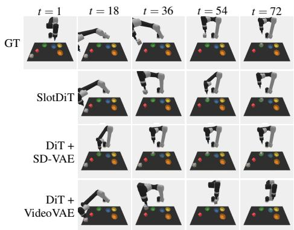  
(a) CLIPort  
“slide the green star

next to the blue cube”  
“push the yellow hexagon to the top center of the board”  
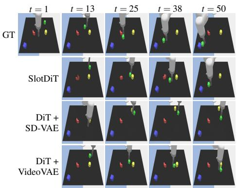  
(b) LanguageTable-Synthetic

“put the orange cloth in the basket”  
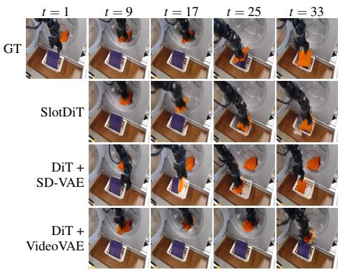  
(c) LanguageTable-Real  
(d) Bridgev2  
Figure 5: Additional qualitative video-generation results across all four datasets: the synthetic CLIPort (a) and LanguageTable-Synthetic (b), and the real-world LanguageTable-Real (c) and Bridgev2 (d). Each block shows the ground-truth sequence (top row) and the predictions of SlotDiT, DiT + SD-VAE, and DiT + VideoVAE at increasing prediction horizons t; the left-most column (t=1) is the conditioning context frame and is shown for the ground truth only. The italic text above each block is the language instruction given to the models. SlotDiT follows the instruction and stays faithful to the ground-truth dynamics over long horizons, whereas the VAE-based baselines progressively lose object detail and drift from the intended behaviour.

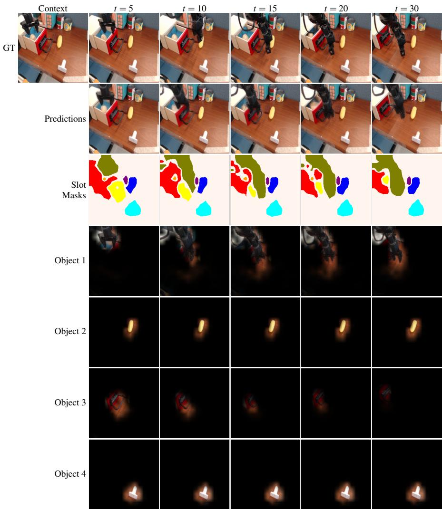  
Figure 6: Object-centric behaviour of SlotDiT on Bridgev2. The first row shows the groundtruth sequence, followed by SlotDiT’s predicted frames and slot segmentation masks. The rows below display the represented objects from four of the predicted slots across various time steps, showing how SlotDiT models the dynamics of individual objects in the scene through slot representations.

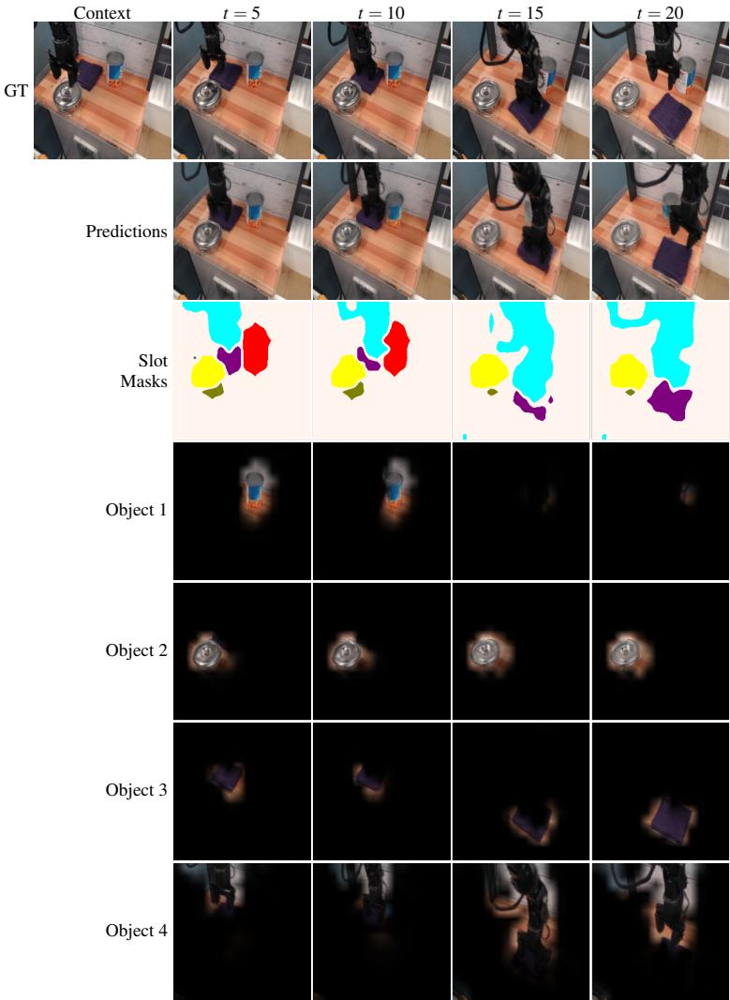  
Figure 7: Additional visualization of the object-centric behaviour of SlotDiT on Bridgev2. The rows show the ground-truth sequence, predicted frames, slot segmentation masks, and the objects represented by four predicted slots across the available prediction horizons.

“push the star next to the red block”  
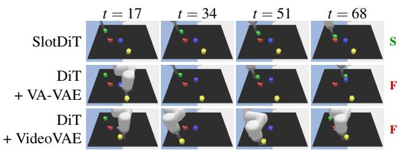  
(a) BLOCK-4 – b2b (in-distribution)  
“move the pentagon to the bottom of the blue block”

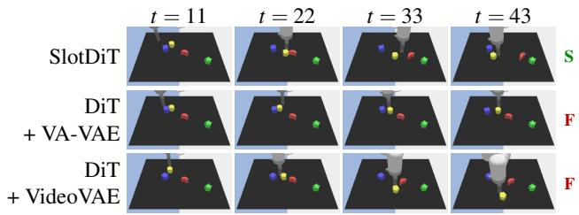  
(b) BLOCK-4 – b2bR (unseen task)

“slide the moon slightly up and right diagonally”  
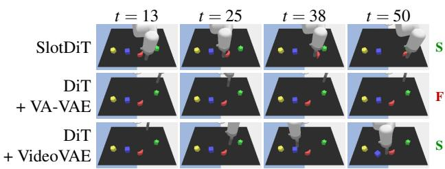  
(c) BLOCK-4 – b2R (unseen task)

“slide the green star next to the green cube”  
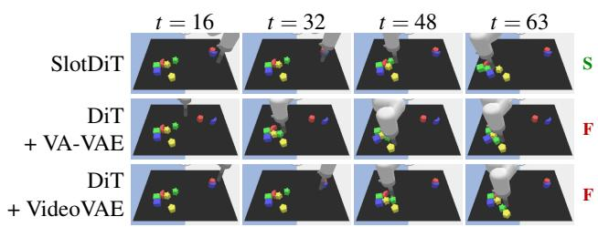  
(d) BLOCK-8 – b2b (unseen scene)  
Figure 8: Qualitative robot-control robustness of SlotDiT on LanguageTable-Synthetic, comparing the slot-based predictor against two VAE-based DiT baselines: SlotDiT (top row of each block), DiT + VA-VAE (middle row), and DiT + VideoVAE (bottom row). The four conditions cover the in-distribution condition (a), two unseen instruction templates on BLOCK-4 scenes (b, c), and the unseen BLOCK-8 scene configuration (d). The colored tag at the right of each rollout marks the closed-loop outcome (S for success / F for failure).

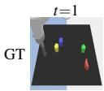

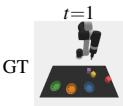

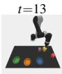

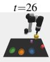

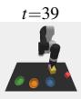

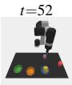  
“put the yellow block in the blue bowl”  
t=19

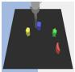

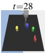

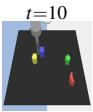

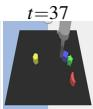  
Original Caption

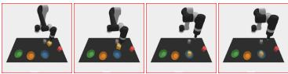  
“move the blue block towards the green block”

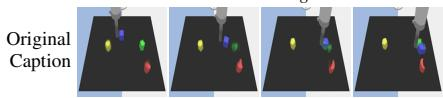  
“put the red block in the blue bowl”  
“move the yellow block towards the moon”  
Changed Caption

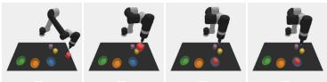

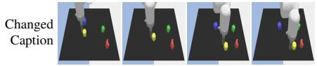

(a) CLIPort  
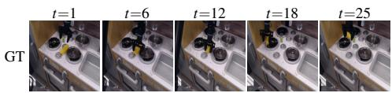

(b) LanguageTable-Synthetic  
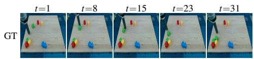

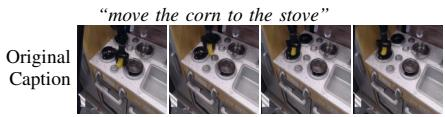  
“slide the green star on top of yellow hexagon”

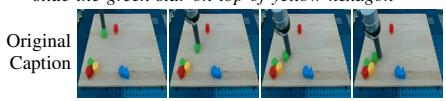  
“move the lid to the stove”  
“slide the red circle on top of yellow hexagon”

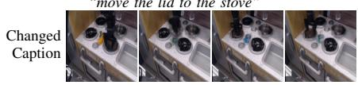  
(c) Bridgev2  
Changed Caption

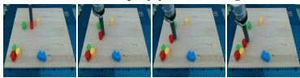  
(d) LanguageTable-Real

Figure 9: Additional controllability examples across the four datasets. For each dataset we show the ground-truth video (top row), SlotDiT’s rollout conditioned on the original instruction (middle row), and on a changed instruction (bottom row); the italicized text above each predicted row is the instruction given to SlotDiT. SlotDiT follows the modified instruction while keeping the rest of the scene consistent with the context frame.