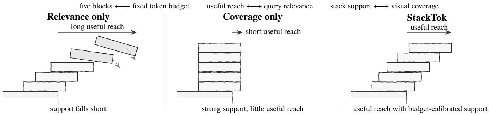
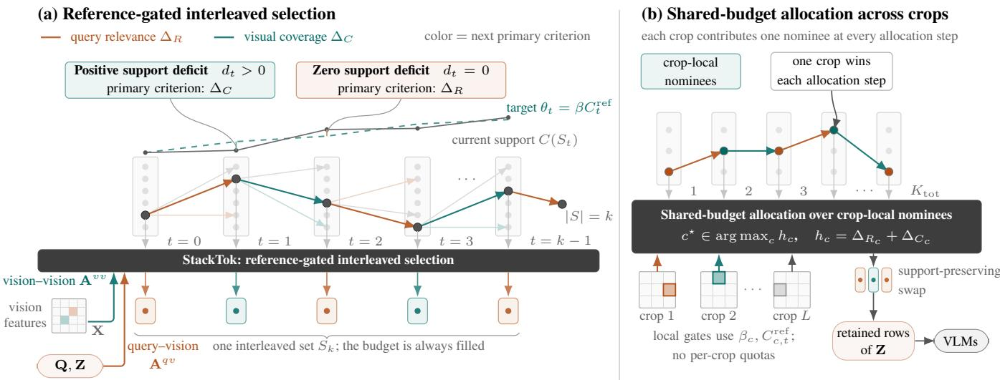
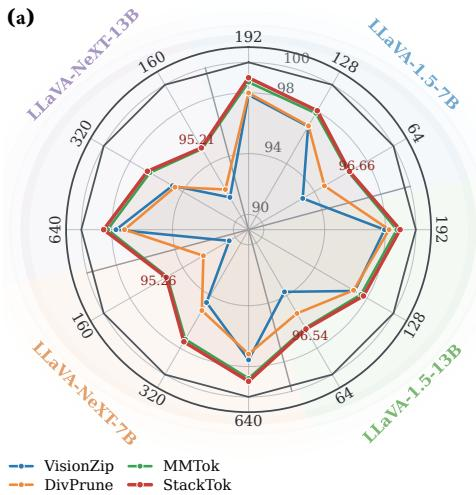
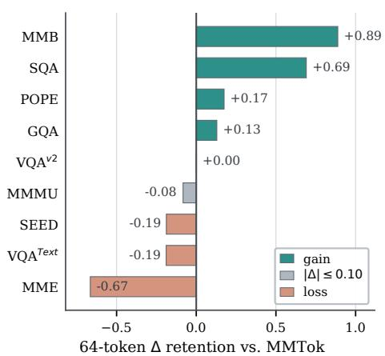
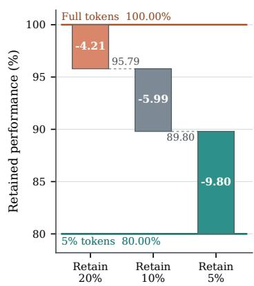

# StackTok: Accelerating VLMs Inference with Budget-Adaptive Visual Token Selection

Zhenbin Wang, Lei Zhang∗, Lituan Wang, Wei Huang, Yan Wang, Zhenwei Zhang

Sichuan University

wangzhenbin@stu.scu.edu.cn

## Abstract

Increasing image resolution produces ever-longer visual-token sequences in vision-language models (VLMs), substantially raising their inference cost. To reduce this overhead without retraining, existing methods select compact token subsets that prioritize query relevance, visual coverage, or a fixed tradeof between them. The appropriate balance, however, varies across queries and token budgets: localized questions favor relevance, whereas holistic questions demand broader visual coverage. We introduce StackTok, a training-free selector that treats query relevance as the objective and visual coverage as budget-calibrated support. StackTok builds a size-indexed coverage reference from a coverage-only greedy sequence and adjusts its support target using query–vision afinity entropy. A reference-gated interleaved selection policy then switches between relevance- and coverage-oriented additions according to the current subset’s support deficit. For high-resolution inputs, StackTok allocates one shared token budget across crops according to the combined marginal gain of locally nominated tokens. Evaluated with five VLMs over ten distinct image-understanding benchmarks, StackTok ranks first among training-free selectors in every tested model–budget setting. On high-resolution LLaVA-NeXT-7B, it retains 95.26% of full-token performance with only 160 of 2,880 (5.6%) visual tokens.

## Introduction

Recent VLMs improve fine-grained visual understanding by encoding images at increasingly high resolutions. A 336 336 image produces 576 visual tokens in LLaVA-1.5 (Liu et al. 2024a), while the multi-crop encoder of LLaVA-NeXT (Liu et al. 2024b) can produce up to 2,880. These tokens enter the language backbone together with the prompt, so long visual sequences substantially increase prefilling latency and memory consumption. Training-free token selection ofers a direct remedy by retaining a compact subset before large language model (LLM) inference without adding parameters or fine-tuning (Chen et al. 2024; Yang et al. 2025). This practical bottleneck raises a more fundamental question: when only a limited token budget can be retained, what makes a subset of visual tokens informative?

Existing selectors provide two complementary answers. Relevance-oriented methods use language-model attention or instruction tokens to preserve evidence related to the query (Chen et al. 2024; Zhang et al. 2025). They can retain fine details from a queried region, but may discard contextual evidence elsewhere in the image. Coverage-oriented methods instead preserve representative or diverse tokens to retain a broader view of the scene (Yang et al. 2025; Alvar et al. 2025). They support holistic understanding, but may spend a tight budget on regions unrelated to the question. Reading a sign and describing an entire scene therefore call for diferent subsets. MMTok (Dong et al. 2026) takes an important step by combining query relevance and visual coverage in a unified submodular objective. Its fixed coeficient, however, assigns the two signals the same exchange rate across queries, retained-set sizes, and selection states. Fixed scalarization thus leaves unresolved how much visual coverage is appropriate for the current input and subset size.

The deeper issue is that query relevance and visual coverage do not play symmetric roles. Figure 1 illustrates this asymmetry through the maximum-overhang problem in block stacking (Paterson and Zwick 2009). Given a fixed number of blocks, the goal is to extend the stack toward a target without giving up the support needed to keep it standing. Relevance-only placement pushes every block outward and achieves a long reach, but can leave the stack poorly supported. Coverage-only placement keeps the blocks closely aligned and the stack well supported, but makes little useful progress. StackTok follows a diferent principle: pursue useful reach while treating support as a requirement calibrated to the number of blocks already placed. In visual-token selection, useful reach corresponds to query relevance, support corresponds to visual coverage, and the number ofblocks corresponds to the retained-token budget. This analogy suggests maximizing relevance while treating coverage as a budgetcalibrated support requirement, rather than assigning the two signals a fixed exchange rate.

Guided by this view, we introduce StackTok, a trainingfree selector that uses the visual coverage ofthe current subset to determine which signal guides the next selection. Stack-Tok first builds a size-indexed coverage reference curve from a coverage-only greedy sequence. It then uses the normalized entropy of query–vision afinities to adjust the support target for each input. At each step, StackTok prioritizes query relevance when the current subset reaches this target, and visual coverage otherwise. Reassessing this state-dependent decision after every addition yields a single interleaved seopy of query–vision afinities to adjust the support taquence whose priorities evolve with the input and selected for each input. At each step, StackTok prioritizes quesubset. For high-resolution inputs, StackTok further allocates vance when the current subset reaches this target, aa shared token budget across crops according to their comal coverage otherwise. Reassessing this state-debined marginal gains. Our contributions are threefold:

  
re 1: Block-stacking intuition for visual-token selection. All three configurations use the same number oFigure 1: Block-stacking intuition for visual-token selection. All three configurations use the same number of blocks, esponding to the same fixed token budget. Relevance-only placement pursues a long useful reach but cancorresponding to the same fixed token budget. Relevance-only placement pursues a long useful reach but can leave the k without enough support. Coverage-only placement preserves strong support but makes little progress toward tstack without enough support. Coverage-only placement preserves strong support but makes little progress toward the target. StackTok pursues useful reach while using a budget-calibrated support requirement to determine when visual coverage should be prioritized. Useful reach and stack support correspond to query relevance and visual coverage, respectively.

ion after every addition yields a single interleaved • We recast training-free visual-token selection as an asymwhose priorities evolve with the input and selectmetric objective-and-support problem. Query relevance For high-resolution inputs, StackTok further allocatdefines the objective, while a subset-size-indexed coverd token budget across crops according to their coage reference provides the visual support criterion instead of a fixed exchange rate between the two signals.

• We introduce StackTok, a training-free selector that builds this reference from a coverage-only greedy sequence, calric objective-and-support problem. Query relevanibrates its strictness from query–vision afinity entropy, nes the objective, while a subset-size-indexed covand uses the current subset to interleave relevance- and reference provides the visual support criterion instecoverage-oriented additions under fixed retention budget.

a fixed exchange rate between the two signals.• We extend StackTok to shared-budget multi-crop selec- introduce StackTok, a training-free selector that builtion. Across five VLMs, ten distinct benchmarks, Stackreference from a coverage-only greedy sequence, cTok ranks first among training-free selectors in every tested model–budget setting.

## dditions under aRelated Work

## Eficient Inference for Large Language and We extend StackTokMultimodal Models

Eficient LLM inference has been advanced by input/output (I/O)-aware attention kernels, memory-aware serving systems, and context-management methods, which reduce comelectors in every tested model–budget setting.putation or memory costs within the language backbone (Dao et al. 2022; Kwon et al. 2023; Xiao et al. 2024). VLMs introduce a complementary bottleneck by coupling this backbone with non-textual inputs (OpenAI 2023; Gemini Team 2023). cient Inference for Large Language andHigh-resolution, multi-crop, and video inputs can produce hundreds or thousands of visual tokens that are processed together with text (Liu et al. 2024a,b; Bai et al. 2025; Lin et al. cient LLM inference has been advanced by input/outp2024). Learned resampling and pooling modules reduce this )-aware attention kernels, memory-aware serving syvisual input, but typically require training or architectural s, and context-management methods, which reduce comodification (Alayrac et al. 2022; Li, Wang, and Jia 2024; Yao et al. 2024). Training-free visual-token reduction instead shortens the input to a pretrained language backbone and is orthogonal to these model-level and system-level optimizavitions.

## Yao et al. 2024). Training-free visual-token rVisual Token Reduction for Vision-Language Models

orthogonal to these model-level and system-levelToken reduction has long been studied in vision transformtions.ers through importance-based pruning and similarity-based merging (Liang et al. 2022; Bolya et al. 2023). Trainingfree VLM methods adapt these ideas to reduce visual sequences during inference. FastV prunes low-attention visual tokens in deeper LLM layers, whereas SparseVLM uses Token reduction has long been studied in vision trinstruction-conditioned attention and adapts its layerwise ers through importance-based pruning and similasparsification ratio (Chen et al. 2024; Zhang et al. 2025). These attention-driven strategies prioritize evidence emphasized by the model or query, but can underrepresent broader image context under tight budgets. VisionZip retains dominant tokens and merges contextual tokens, while DivPrune tokens in deeper LLM layers, whereas SparseVselects a max-min diverse subset (Yang et al. 2025; Alvar instruction-conditioned attention and adapts itset al. 2025). Their dominance- and diversity-based criteria sparsification ratio (Chen et al. 2024; Zhang etpreserve representative or nonredundant visual content, but These attention-driven strategies prioritize evidencdo not explicitly prioritize evidence requested by the current query. MMTok brings relevance and visual coverage together through a submodular objective that covers both text and visual tokens with a fixed coeficient (Dong et al. 2026). This fixed scalarization applies the same relevance–coverage exchange rate at every selection state and retained-set size. et al. 2025). Their dominance- and diversity-baseStackTok instead keeps relevance as the objective and uses an preserve representative or nonredundant visual coentropy-adjusted, subset-size-indexed coverage reference to do not explicitly prioritize evidence requested bswitch the active criterion within a single selection sequence.

## ubmodulaMethod

## and visual tokens with a fixOverview and Problem Setup

StackTok selects a fixed-size visual-token subset before LLM exchange rate at every selection state and retainedinference. Figure 2 visualizes the method as a token-stacking StackTok instead keeps relevance as the objective antrajectory. Post-projector query and visual embeddings yield entropy-adjusted, subset-size-indexed coverage refquery–vision afinities, while pre-projector vision features switch the active criterion within a single selectionyield vision–vision afinities. A coverage-only greedy curve provides a size-indexed coverage reference, and query–vision afinity entropy calibrates the corresponding support target. The current subset’s position relative to this target determines whether relevance or visual coverage extends the trajectory next. For high-resolution inputs, crop-local nominees feed one shared-budget trajectory, followed by optional supportpreserving swap refinement.

  
Figure 2: Overview of StackTok. (a) Each column depicts the candidates available at a retained-set size. The support deficitFigure 2: Overview of StackTok. (a) Each column depicts the candidates available at a retained-set size. The support deficit selects a coverage-orienteselects a coverage-oriented $( \Delta _ { C } )$ ) or relevance-orientedor relevance-oriented $( \Delta _ { R } )$ ) primary criterion for the next addition; teal and orange encode thatprimary criterion for the next addition; teal and orange encode that criterion. The size-indexed target gates the primary criterion rather than constraining every prefix, and the coverage-only greedycriterion. The size-indexed target gates the primary criterion rather than constraining every prefix, and the coverage-only greedy sequence is used only to construct the reference curve. (b) For high-resolution inputs, crop-local gates nominate candidates andsequence is used only to construct the reference curve. (b) For high-resolution inputs, crop-local gates nominate candidates and shared-budget allocation compares only those nominees. Faded dots and branches denote unchosen candidates. After the fixedshared-budget allocation compares only those nominees. Faded dots and branches denote unchosen candidates. After the fixed budget is filled, optional support-preserving swap refinement and restoration of the original spatial order send the retained rowsbudget is filled, optional support-preserving swap refinement and restoration of the original spatial order send the retained rows of Z to the LLM for inference.of Z to the VLMs for inference.

Let a VLM encode an image into $n \geq 1$ aligned visual one shared-budget trajectorytokens. For a positive integer $N$ llowed, write $[ N ] = \left\{ 1 , \dots , N \right\}$ preserving swap rewith the convention $[ 0 ] = \varnothing$ We formalize these ingredient. We denote the tokens’ pre- below.projector vision features by $\mathbf { X } = [ \mathbf { x } _ { 1 } ^ { \top } ; \ldots ; \mathbf { x } _ { n } ^ { \top } ] \in \mathbb { R } ^ { n \times d _ { \ast } }$ and the post-projector embeddings passed to the LLM by $\mathbf { Z } = [ \mathbf { z } _ { 1 } ^ { \top } ; \ldots ; \mathbf { z } _ { n } ^ { \top } ] \in \mathbb { R } ^ { n \times d }$ image. Here $d _ { v }$ to n aligned visual toand d are the visionkens, with [n] = 1, . . . , n . We denote their pre-projectofeature and LLM-embedding dimensions, respectively. Af-vision features by X = [x⊤1 ; . . . ; x⊤n ] ∈ Rn×dv and thter model-specific query preprocessing, the LLM input- post-projector embedembedding layer yields $m \geq 0$ ed to the LLM by Z =query-token embeddings $\mathbf { Q } = [ \mathbf { q } _ { 1 } ^ { \top } ; \hdots ; \mathbf { q } _ { m } ^ { \top } ] \ \in \ \mathbb { R } ^ { m \times d }$ model-sp. The set $u \subseteq [ n ]$ y preprocontains cessing, the LLM input-embedding layer yields m queryindices eligible for retention and excludes padding positions token embeddings Q = [q⊤1 ; . . . ; q⊤m] ∈ R × . The sewhen present; all n encoded positions remain afinity targets U ⊆ [n] contains indices eligible for retention and excludein Eq. (1). Given a non-negative integer budget K, the goal is to retain exactly $k = \operatorname* { m i n } \{ K , | \mathcal { U } | \}$ n tokens.

## {Query Relevance and Visual Support

We measure each signal in the representation suited to its role. Query relevance uses Q and Z in the shared LLM embedding Query Relevance and Visual Supportspace, whereas visual coverage uses X, which preserves the vision encoder’s geometry. Let $\bar { \mathbf { u } } = \mathbf { u } / \operatorname* { m a x } ( \bar { \lVert \mathbf { u } \rVert } _ { 2 } , \varepsilon _ { \mathrm { n o r m } } )$ denote $\ell _ { 2 }$ normalization, where $\varepsilon _ { \mathrm { n o r m } } > 0$ prevents division We measure each signal in the represeby zero. Row-wise softmax then gives

$$
\begin{array} { r } { A _ { i j } ^ { q v } = \frac { \exp ( \bar { \mathbf { q } } _ { i } ^ { \top } \bar { \mathbf { z } } _ { j } / \tau _ { t } ) } { \sum _ { \ell = 1 } ^ { n } \exp ( \bar { \mathbf { q } } _ { i } ^ { \top } \bar { \mathbf { z } } _ { \ell } / \tau _ { t } ) } , } \\ { A _ { i j } ^ { v v } = \frac { \exp ( \bar { \mathbf { x } } _ { i } ^ { \top } \bar { \mathbf { x } } _ { j } / \tau _ { v } ) } { \sum _ { \ell = 1 } ^ { n } \exp ( \bar { \mathbf { x } } _ { i } ^ { \top } \bar { \mathbf { x } } _ { \ell } / \tau _ { v } ) } , } \end{array}\tag{sion(1)}
$$

where the first line is indexed by $i \in [ m ]$ and $j \in [ n ]$ , and the second by $i , j \in [ n ] ; \tau _ { t } , \tau _ { v } > \bar { 0 }$ control concentration. Here $\mathbf { A } ^ { q v } \in \mathbb { R } _ { + } ^ { m \times n }$ ⊤maps query tokens to visual evidence, while $\mathbf { A } ^ { v v } \in \mathbb { R } _ { + } ^ { n \times n }$ ij nmeasures how well retained tokens represent Pℓ=1 ithe encoded image. Both are embedding afinities.

Avv = i jFor any non-negative afinity matrix $\mathbf { A } { \in } \mathbb { R } _ { + } ^ { p \times q }$ with $p , q \geq$ 1 and any $S \subseteq [ q ]$ ℓ=1 exp(x¯⊤i x¯ℓ/τv), define the facility-location coverage

$$
c _ { i } ( S ; { \bf A } ) = \operatorname* { m a x } _ { j \in { \cal S } } A _ { i j } , \qquad F _ { \bf A } ( S ) = \frac { 1 } { p } \sum _ { i = 1 } ^ { p } c _ { i } ( S ; { \bf A } ) ,\tag{2}
$$

imawith $c _ { i } ( \delta ; { \bf A } ) = 0 .$ mbedding afinities, not LLM attention. The maximum assigns each target its best weights.representative in S, and the mean normalizes the number of target rows. We instantiate

$$
R ( S ) = \left\{ \begin{array} { l l } { F _ { { \bf A } ^ { q v } } ( S ) , } & { m > 0 , } \\ { 0 , } & { m = 0 , } \end{array} \right. \quad \quad C ( S ) = F _ { { \bf A } ^ { v v } } ( S ) ,\tag{3}
$$

j∈S r Xas query relevance and visual coverage, respectively. For any $S \subseteq [ q ]$ and $s \in [ q ] \backslash S .$ , the exact marginal gain of $F _ { \mathbf { A } }$ is

$$
\begin{array} { r } { \Delta _ { F _ { \mathbf { A } } } ( s \mid S ) = F _ { \mathbf { A } } ( S \cup \{ s \} ) - F _ { \mathbf { A } } ( S ) } \\ { = \displaystyle \frac { 1 } { p } \sum _ { i = 1 } ^ { p } [ A _ { i s } - c _ { i } ( S ; \mathbf { A } ) ] _ { + } . } \end{array}\tag{4}
$$

as quHere $[ x ] _ { + } = \operatorname* { m a x } \{ x , 0 \}$ ual coverage, with when. We denote the two instances by $\Delta _ { R }$ .and $\Delta _ { C }$ ir exact marginal gains share one form:. Throughout, visual coverage refers to the mea- surable quantity C, whereas visual support refers to the re-∆F (s  S) = FA(S  s )  FA(S)quirement that this quantity fulfills in the selection policy.

1Proposition 1 (Coverage Structure). For every $\mathbf A \ge 0$ with at least one row, $F _ { \mathbf { A } }$ X is − i +is normalized, monotone, and submodular, and its marginal gain is given by Eq. (4).

Thus R and C have diminishing returns and admit exact incremental greedy updates (Nemhauser, Wolsey, and Fisher 1978; Krause and Golovin 2014); when $m = 0 , R \equiv 0$ has these properties trivially. The proof is in the supplementary appendix.

## Budget- and Input-Calibrated Visual Support

A fixed objective $R ( S ) + \alpha C ( S )$ with coeficient $\alpha \geq 0$ uses the same relevance–coverage exchange rate across inputs, budgets, and selection states. StackTok instead derives a budget-specific coverage scale from a coverage-only greedy sequence initialized by ${ \mathfrak { G } } _ { 0 } = \emptyset$ . For $t = 1 , \ldots , k ,$

$$
\begin{array} { r l } & { a _ { t } \in \underset { s \in \mathcal { U } \backslash \mathcal { G } _ { t - 1 } } { \arg \operatorname* { m a x } } \Delta _ { C } ( s \mid \mathcal { G } _ { t - 1 } ) , } \\ & { \mathcal { G } _ { t } = \mathcal { G } _ { t - 1 } \cup \{ a _ { t } \} , \qquad C _ { t } ^ { \mathrm { r e f } } = C ( \mathcal { G } _ { t } ) , } \end{array}\tag{5}
$$

with $C _ { 0 } ^ { \mathrm { r e f } } = 0$ . StackTok discards the sets $\mathcal { G } _ { t }$ and retains only the achieved coverage reference curve $\{ C _ { t } ^ { \mathrm { r e f } } \} _ { t = 0 } ^ { k }$

$$
\begin{array} { r l } & { \mathrm { { \bf ~ T h e o r e m 1 } } ( { \bf A n y t i m e C o v e r a g e R e f e r e n c e } ) . L e t \mathrm { O P T } _ { t } = } \\ & { \mathrm { m a x } _ { S \subseteq \mathcal { U } , | S | \leq t } C ( S ) . \mathrm { F o r e } \nu e r y 1 \leq t \leq k , } \\ & { \quad \quad C _ { t } ^ { \mathrm { r e f } } \geq \left[ 1 - \left( 1 - \frac { 1 } { t } \right) ^ { t } \right] \mathrm { O P T } _ { t } \geq ( 1 - e ^ { - 1 } ) { \mathrm { O P T } } _ { t } . ( 6 ) } \\ & { \quad \quad M o r e o \nu e r , C _ { t } ^ { \mathrm { r e f } } i s n o n d e c r e a s i n g a n d i t s i n c r e m e n t s C _ { t } ^ { \mathrm { r e f } } - } \\ & { \quad \quad C _ { t - 1 } ^ { \mathrm { r e f } } \ a r e \ n o n i n c r e a s i n g . } \end{array}
$$

Thus $C _ { t } ^ { \mathrm { r e f } }$ is an attained, near-optimal same-budget scale with a diminishing-return shape, not an upper bound. For every $\beta \in [ 0 , 1 ]$ , the same coverage-greedy chain meets the support target $\bar { \beta } C _ { t } ^ { \mathrm { r e f } }$ ; this witnesses same-budget target feasibility, not feasibility of StackTok’s interleaved prefixes. The proof is in the supplementary appendix.

The coverage reference sets the budget scale; query–vision afinity determines how closely to track it. For $m > 0$ and $n > 1$ , StackTok computes each row entropy $H _ { i }$ for $i \in [ m ]$ its normalized mean $\dot { \bar { H } }$ , and the support strictness $\beta \colon$

$$
\begin{array} { l } { { \displaystyle H _ { i } = - \sum _ { j = 1 } ^ { n } A _ { i j } ^ { q v } \log A _ { i j } ^ { q v } , } } \\ { { \displaystyle \bar { H } = \frac { 1 } { m \log n } \sum _ { i = 1 } ^ { m } H _ { i } , } } \\ { { \displaystyle \beta = \mathrm { c l i p } ( \bar { H } , \beta _ { \operatorname* { m i n } } , \beta _ { \operatorname* { m a x } } ) , } } \end{array}\tag{7}
$$

where the theoretical entropy uses the convention 0 log $0 =$ 0. In finite precision, $\delta > { \bar { 0 } }$ is a numerical floor used only to evaluate the logarithm as $\log ( \operatorname* { m a x } \{ A _ { i j } ^ { q v } , \delta \} )$ , preventing log 0 after underflow. Furthermore, $0 \leq \bar { \beta } _ { \operatorname* { m i n } } \leq \beta _ { \operatorname* { m a x } } \leq 1$ and clip truncates its argument to this interval. Low entropy permits greater emphasis on localized evidence, whereas high entropy requests broader visual support. Since difusion may also arise from weak localization or alignment, $\beta$ calibrates the policy rather than classifying the query. When $m = 0$ , we bypass entropy calibration, set $\beta = \beta _ { \mathrm { m a x } }$ for reference bookkeeping, and use visual coverage throughout.

Otherwise, if $n = 1$ , we set $\beta = \beta _ { \mathrm { m i n } } ;$ ; the single candidate makes selection unique. For $t \in \{ 0 , \ldots , k \}$ , the size-t support target is

$$
{ \theta } _ { t } = \beta { C } _ { t } ^ { \mathrm { r e f } } .\tag{8}
$$

## Reference-Gated Interleaved Selection

Initialize $S _ { 0 } ~ = ~ \mathcal { O }$ . At each step $t \in \{ 0 , \ldots , k - 1 \}$ , let $S _ { t } \subseteq \mathcal { U }$ , with $\left| S _ { t } \right| = t ,$ , be the current retained set and let $\mathcal { U } _ { t } = \mathcal { U } \backslash S _ { t }$ be the remaining candidates. The support deficit is

$$
d _ { t } = [ \theta _ { t } - C ( S _ { t } ) ] _ { + } .\tag{9}
$$

For a nonempty query, zero deficit activates relevance and positive deficit activates visual coverage:

$$
( g _ { t } ^ { \mathrm { p r i } } , g _ { t } ^ { \mathrm { s e c } } ) = \left\{ \begin{array} { l l } { ( \Delta _ { R } , \Delta _ { C } ) , } & { d _ { t } = 0 , } \\ { ( \Delta _ { C } , \Delta _ { R } ) , } & { d _ { t } > 0 . } \end{array} \right.\tag{10}
$$

StackTok uses the primary criterion while it has positive gain and otherwise falls back to the secondary one. Let $M _ { t } ^ { \mathrm { p r i } } =$ m $\operatorname { \mathrm { u x } } _ { u \in \mathcal { U } _ { t } } g _ { t } ^ { \mathrm { p r i } } ( u \mid S _ { t } )$ . Then

$$
\begin{array} { r } { \psi _ { t } ( s ) = \left\{ \begin{array} { l l } { g _ { t } ^ { \mathrm { p r i } } ( s  { | } \ : S _ { t } ) , \quad M _ { t } ^ { \mathrm { p r i } } > 0 , } \\ { g _ { t } ^ { \mathrm { s e c } } ( s  { | } \ : S _ { t } ) , \quad \mathrm { o t h e r w i s e } , } \end{array} \right. } \\ { s _ { t + 1 } \in \arg \operatorname* { m a x } _ { s \in \mathcal { U } _ { t } } \psi _ { t } ( s ) . } \end{array}\tag{11}
$$

We then set $S _ { t + 1 } ~ = ~ S _ { t } \cup \{ s _ { t + 1 } \}$ . When $m \ = \ 0 .$ , the coverage-oriented branch overrides Eq. (10). Deterministic tie-breaking fills the budget if both criteria saturate.

For any $s \in \mathcal { U } _ { t }$ and fixed $\theta _ { t } ,$ adding s repairs the current deficit by exactly

$$
d _ { t } - [ \theta _ { t } - C ( S _ { t } \cup \{ s \} ) ] _ { + } = \operatorname* { m i n } \{ d _ { t } , \Delta _ { C } ( s \mid S _ { t } ) \} ,\tag{12}
$$

so the coverage-oriented branch maximizes one-step repair. Because the target advances to $\theta _ { t + 1 }$ after selection, this local result does not certify the new prefix. Also, $\theta _ { 0 } = C ( \mathcal { O } ) =$ 0, so a nonempty query activates relevance as the primary criterion at the first step, subject to the zero-gain fallback in Eq. (11).

Algorithm 1 instantiates the single-image trajectory in Figure $2 ( \mathrm { a } )$ . Updating both coverages lets the gate switch repeatedly; sorting the final indices preserves the spatial order of the retained rows of Z.

## Shared-Budget Allocation across Crops

Figure 2(b) visualizes the high-resolution extension. With $L ~ \overset { \mathbf { \bar { \mathbf { \rho } } } } { \underset { \mathbf { \geq ~ 1 } } { \mathbf { \rho } } }$ crops indexed by $c \ \in \ [ L ]$ , fixed per-crop quotas can waste tokens on uninformative regions. Crop c contains $n _ { c } \geq 1$ encoded positions and a selectable set $\mathcal { U } _ { c } \subseteq [ n _ { c } ]$ The efective shared budget and crop-c reference horizon are $K _ { \mathrm { t o t } } = \mathrm { m i n } \{ K , \sum _ { c = 1 } ^ { L } | \mathcal { U } _ { c } | \}$ and $r _ { c } ^ { \operatorname* { m a x } } = \operatorname* { m i n } \{ K _ { \mathrm { t o t } } , | \mathcal { U } _ { c } | \}$ respectively. Applying Eq. (1) within the crop gives $\mathbf { A } _ { c } ^ { q v } \in$ $\mathbb { R } _ { + } ^ { m \times n _ { c } }$ and $\mathbf { A } _ { c } ^ { v v } \in \mathbb { R } _ { + } ^ { n _ { c } \times n _ { c } }$ . We define $C _ { c } = F _ { \mathbf { A } _ { c } ^ { v v } }$ and, when $m > 0 , { \bf \bar { \cal R } } _ { c } = \dot { F } _ { { \bf A } _ { c } ^ { q v } } ;$ when $m = 0 , R _ { c } \equiv 0$ . Write $\Delta _ { R _ { c } }$ and $\Delta _ { C _ { c } }$ for their marginal gains. Each crop constructs $\{ C _ { c , t } ^ { \mathrm { r e f } } \} _ { t = 0 } ^ { r _ { c } ^ { \mathrm { m a x } } }$ and $\beta _ { c }$ from Eqs. (5) and (7), replacing $( \mathbf { A } ^ { q v } , \mathbf { A } ^ { v v } , \mathcal { U } , n , k )$ by $( \mathbf { A } _ { c } ^ { q v } , \mathbf { A } _ { c } ^ { v v } , \mathcal { U } _ { c } , n _ { c } , r _ { c } ^ { \operatorname* { m a x } } )$ . The same edge-case conventions apply: $\beta _ { c } = \beta _ { \mathrm { m a x } }$ when $m = 0 ,$ , while $\beta _ { c } = \beta _ { \operatorname* { m i n } }$ when $m > 0$ and $n _ { c } = 1$ . For $t \in \{ 0 , \dots , r _ { c } ^ { \operatorname* { m a x } } \}$ define the local support target $\theta _ { c , t } = \beta _ { c } C _ { c , t } ^ { \mathrm { r e f } }$

Algorithm 1: Reference-gated interleaved selection (single   
image)   
Input: afinities $\overline { { { \bf A } ^ { q v } , { \bf A } ^ { v v } } } ;$ selectable set U; budget $K ;$ strictness   
clipping range $[ \beta _ { \mathrm { m i n } } , \beta _ { \mathrm { m a x } } ]$   
Output: retained index set S   
1: k ← min $\{ K , | \mathcal { U } | \} ; S _ { 0 } \gets \emptyset$ ▷ fixed-budget state   
2: compute $\{ C _ { t } ^ { \mathrm { r e f } } \} _ { t = 0 } ^ { k }$ and $\beta$ ▷ budget/input calibration   
3: for $\bar { t } = 0 \mathrm { ~ i o ~ } k - 1$ do   
4: $d _ { t } \gets [ \beta C _ { t } ^ { \mathrm { r e f } } - C ( S _ { t } ) ] _ { + }$ ▷ support feedback   
5: set $( g _ { t } ^ { \mathrm { p r i } } , g _ { t } ^ { \mathrm { s e c } } )$ by Eq. (10); use $( \Delta _ { C } , \Delta _ { R } )$ if $m = 0$ ▷ rele  
vance / coverage   
6: $s _ { t + 1 } \gets \arg \operatorname* { m a x } _ { s \in \mathcal { U } \backslash S _ { t } } \psi _ { t } ( s )$ ▷ fallback in ψt   
7: $S _ { t + 1 } \gets S _ { t } \cup \{ s _ { t + 1 } \} ;$ update R and $C$ ▷ close feedback loop   
8: end for   
9: return sort $( S _ { k } )$ ▷ restore spatial order

Initialize $S _ { c } ~ = ~ \mathcal { O }$ for every crop. At a shared-budget step, let $r _ { c } ~ = ~ | S _ { c } |$ and define the active-crop set $\mathcal { L } \quad =$ $\{ c \in [ L ] \ : \ \mathcal { U } _ { c } \setminus \dot { S } _ { c } \ \neq \ \mathcal { D } \}$ . Crop c has support deficit $\dot { d } _ { c , r _ { c } } \doteq \mathsf { \bar { \Psi } } [ \theta _ { c , r _ { c } } - C _ { c } ( S _ { c } ) ] _ { + } .$ . Applying the gate and zeroprimary-gain fallback in Eqs. (10)–(11) to $S _ { c } , { \mathcal { U } } _ { c } \setminus S _ { c } , d _ { c , r _ { c } } ,$ $\Delta _ { R _ { c } }$ , and $\Delta _ { C _ { c } }$ defines the crop-local score $\psi _ { c , r _ { c } }$ . As in the single-image case, $m = 0$ forces the coverage-oriented branch. Each $c \in \mathcal { Z }$ then nominates

$$
\begin{array} { r l } & { s _ { c } ^ { \star } \in \underset { s \in \mathcal { U } _ { c } \backslash S _ { c } } { \arg \operatorname* { m a x } } \psi _ { c , r _ { c } } ( s ) , } \\ & { } \\ & { h _ { c } = \Delta _ { R _ { c } } ( s _ { c } ^ { \star } \mid S _ { c } ) + \Delta _ { C _ { c } } ( s _ { c } ^ { \star } \mid S _ { c } ) . } \end{array}\tag{13}
$$

The allocator spends the $K _ { \mathrm { t o t } }$ slots by repeatedly choosing

$$
\begin{array} { c } { { c ^ { \star } \in \arg \operatorname* { m a x } h _ { c } , } } \\ { { c \in \mathcal { T } } } \\ { { S _ { c ^ { \star } }  S _ { c ^ { \star } } \cup \big \{ s _ { c ^ { \star } } ^ { \star } \big \} . } } \end{array}\tag{14}
$$

The local gate determines each nominee, while $h _ { c }$ compares nominees across crops. Only the winning crop changes, so other nominations are cached. Cross-crop allocation deliberately uses $\Delta _ { R _ { c } } + \Delta _ { C _ { c } }$ ; criterion separation applies to the local gate. Algorithm 2 makes these two levels explicit. All local and cross-crop maximizations use deterministic tiebreaking, and zero-gain nominees remain eligible so that the efective shared budget is filled.

## Support-Preserving Swap Refinement

Greedy additions cannot revise early choices. Let $\mathcal { U } _ { \mathrm { l o c } } , R _ { \mathrm { l o c } } ,$ $C _ { \mathrm { l o c } } , \beta _ { \mathrm { l o c } } ,$ and $k _ { \mathrm { l o c } }$ denote the quantities of the unit being refined. For a single image, $( \mathcal { U } _ { \mathrm { l o c } } , R _ { \mathrm { l o c } } , C _ { \mathrm { l o c } } , \beta _ { \mathrm { l o c } } , k _ { \mathrm { l o c } } ) \stackrel { - } { = }$ $( \mathcal { U } , R , C , \beta , k )$ and ${ C _ { \mathrm { l o c } , t } ^ { \mathrm { r e f } } } = \dot { C } _ { t } ^ { \mathrm { r e f } }$ for $0 \leq t \leq k .$ . For crop c, they are $( { { \mathcal U } _ { c } } , { { R } _ { c } } , { { C } _ { c } } , { { \beta } _ { c } } , { { r } _ { c } ^ { \operatorname* { m a x } } } )$ and $C _ { \mathrm { l o c } , t } ^ { \mathrm { r e f } } = C _ { c , t } ^ { \mathrm { r e f } }$ for $0 \leq$ $t \leq r _ { c } ^ { \mathrm { m a x } }$ . Given a retained set $S \subset \mathcal { U } _ { \mathrm { l o c } }$ with $\ 0 < \ r =$ $| S | \le k _ { \mathrm { l o c } }$ and $r < | \mathcal { U } _ { \mathrm { l o c } } |$ , StackTok optionally performs cardinality-preserving one-exchange refinement. It evaluates replacements $S ^ { \prime } = \mathbf { \bar { \boldsymbol { S } } } \setminus \{ \boldsymbol { u } \} \cup \{ \mathbf { \bar { \boldsymbol { v } } } \}$ with $u \in S$ and $v \in$ $\bar { \mathcal { U } _ { \mathrm { l o c } } } \backslash S$ . Define $J _ { \mathrm { l o c } } ( S ) \doteq \mathbf { \tilde { { R } } } _ { \mathrm { l o c } } ( S ) + C _ { \mathrm { l o c } } ( S )$ . A replacement

Algorithm 2: Shared-budget allocation across crops   
Input: per-crop afinities $\{ \mathbf { A } _ { c } ^ { q v } , \mathbf { A } _ { c } ^ { v v } \} _ { c = 1 } ^ { L } ;$ selectable sets $\{ \mathcal { U } _ { c } \} _ { c = 1 } ^ { L } ;$   
shared budget ${ \mathrm { \hat { \mathbf { \xi } } } } _ { K } ;$ strictness clipping range [βmin, βmax]   
Output: allocated index sets $\{ \bar { S _ { c } } \} _ { c = 1 } ^ { L }$   
1: $K _ { \mathrm { t o t } }  \operatorname* { m i n } \{ K , \sum _ { c } | \mathcal { U } _ { c } | \}$ ▷ efective budget   
2: $S _ { c } \gets \emptyset \mathrm { ~ f o r ~ a l l ~ } c ; \overline { { \mathcal { T } } } \gets \{ c : \mathcal { U } _ { c } \neq \emptyset \}$ ▷ active crops   
3: for $c \in \mathcal { Z }$ do   
4: $r _ { c } ^ { \mathrm { m a x } } \gets$ min $\{ K _ { \mathrm { t o t } } , | \mathcal { U } _ { c } | \}$ ▷ local reference horizon   
5: compute $\{ C _ { c , t } ^ { \mathrm { r e f } } \} _ { t = 0 } ^ { r _ { c } ^ { \mathrm { m a x } } }$ and $\beta _ { c }$ ▷ local calibration   
6: cache $( s _ { c } ^ { \star } , h _ { c } )$ by Eq. (13) ▷ relevance / coverage   
7: end for   
8: for $b = 1$ to $K _ { \mathrm { t o t } }$ do   
9: $c ^ { \star } \gets \arg \operatorname* { m a x } _ { c \in \mathcal { T } } h _ { c }$ ▷ compare only nominees   
10: $S _ { c ^ { \star } }  \breve { S } _ { c ^ { \star } } \cup \breve { \{ s _ { c ^ { \star } } ^ { \star } \} } ;$ update $\mathit { R } _ { c ^ { \star } }$ and $C _ { c ^ { \star } }$ ▷ update winner only   
11: i $\ ' { \mathcal { U } } _ { c ^ { \star } } \setminus \ S _ { c ^ { \star } } = \stackrel { \cdot } { \emptyset }$ then   
12: $\mathcal { T }  \mathcal { T } \backslash \{ c ^ { \star } \}$ ▷ crop exhausted   
13: else   
14: refresh $( s _ { c ^ { \star } } ^ { \star } , h _ { c ^ { \star } } )$ by Eq. (13) ▷ cache other nominees   
15: end if   
16: end for   
17: return $\{ \mathrm { s o r t } ( S _ { c } ) \} _ { c = 1 } ^ { L }$ ▷ restore within-crop order

is accepted only if

$$
\begin{array} { r l } & { J _ { \mathrm { l o c } } ( S ^ { \prime } ) > ( 1 + \epsilon _ { \mathrm { s w } } ) J _ { \mathrm { l o c } } ( S ) , } \\ & { C _ { \mathrm { l o c } } ( S ^ { \prime } ) \geq \ell _ { r } ( S ) : = \operatorname* { m i n } \{ \beta _ { \mathrm { l o c } } C _ { \mathrm { l o c } , r } ^ { \mathrm { r e f } } , C _ { \mathrm { l o c } } ( S ) \} . } \end{array}\tag{15}
$$

Here $\epsilon _ { \mathrm { s w } } \geq 0$ is the minimum relative improvement. Below target, the floor prevents support loss; above target, it permits a decrease only down to the target. Each accepted replacement preserves r and strictly increases $J _ { \mathrm { l o c } } .$ . Because the family of size-r subsets is finite, repeated accepted replacements must terminate. Per-row top-two afinities make deletion scores exact without recomputing coverage; in practice, refinement stops after a fixed number of passes or a full pass without an accepted swap.

## Complexity and Practical Details

Afinity construction costs $O ( n ^ { 2 } d _ { v } + m n d )$ time and $O ( n ^ { 2 } +$ mn) memory. For $u = | \mathcal { U } |$ , incremental row maxima make the reference and interleaved passes cost $O ( k u ( n + m ) )$ , or $O ( k n ^ { 2 } )$ when $u , m \leq n$ . For refinement, let $u _ { \mathrm { l o c } } = | \mathcal { U } _ { \mathrm { l o c } } |$ and let $n _ { \mathrm { l o c } } = n$ for a single image or $n _ { \mathrm { l o c } } = n _ { c }$ for crop c; one complete swap pass then costs $O ( r ( u _ { \mathrm { l o c } } - r ) ( m + n _ { \mathrm { l o c } } ) )$ Multi-crop costs sum over crops, with cached unchanged nominations. Without query embeddings, StackTok uses visual coverage throughout. It excludes padding from selection, does not stop early, and returns the efective fixed budget.

## Experiments

## Experimental Setup

Datasets, models, and metrics. The evaluation covers ten distinct image-understanding benchmarks. The LLaVA suite contains GQA (Hudson and Manning 2019), MMBench (MMB) (Liu et al. 2024c), MME (Fu et al. 2023), POPE (Li et al. 2023b), ScienceQA-IMG (SQA) (Lu et al. 2022), $\mathrm { V Q A } ^ { \mathrm { v 2 } }$ (Goyal et al. 2017), $\mathrm { V Q A } ^ { \mathrm { T e x t } }$ (Singh et al. 2019), MMMU (Yue et al. 2024), and SEEDBench (SEED) (Li et al.

<table><tr><td>Method</td><td>GQA↑</td><td>MMB↑</td><td>MME↑</td><td>POPE↑</td><td>SQA↑</td><td> $\mathbf { V O A } ^ { \mathbf { v } 2 } \uparrow$ </td><td> $\mathbf { V Q A } ^ { \mathrm { T e x t } } \uparrow$ </td><td>MMMU↑</td><td>SEED↑</td><td>Avg.↑</td></tr><tr><td>Vanilla (576) 61.95</td><td></td><td>64.18</td><td>1861.48</td><td>85.87</td><td>69.51</td><td>77.71</td><td>58.15</td><td>36.22</td><td>58.55</td><td>100.00%</td></tr><tr><td colspan="11">Retain 192 (↓67%)</td></tr><tr><td>FastV</td><td>52.74</td><td>60.71</td><td>1611.55</td><td>64.78</td><td>67.31</td><td>66.42</td><td>52.45</td><td>34.22</td><td>57.05</td><td>89.57%</td></tr><tr><td>SparseVLM</td><td>57.65</td><td>62.00</td><td>1720.52</td><td>83.57</td><td>69.11</td><td>74.84</td><td>56.05</td><td>33.73</td><td>55.75</td><td>95.54%</td></tr><tr><td>VisionZip</td><td>59.35</td><td>62.49</td><td>1782.10</td><td>85.27</td><td>68.91</td><td>76.03</td><td>57.25</td><td>36.52</td><td>56.35</td><td>97.86%</td></tr><tr><td>DivPrune</td><td>60.02</td><td>62.04</td><td>1761.74</td><td>86.97</td><td>68.67</td><td>76.10</td><td>56.92</td><td>35.36</td><td>58.66</td><td>97.99%</td></tr><tr><td>VisionZip‡</td><td>60.15</td><td>62.89</td><td>1833.49</td><td>84.87</td><td>68.21</td><td>76.62</td><td>57.75</td><td>36.12</td><td>57.05</td><td>98.40%</td></tr><tr><td>MMTok</td><td>60.12</td><td>62.89</td><td>1773.36</td><td>86.39</td><td>68.77</td><td>76.33</td><td>57.63</td><td>36.25</td><td>59.16</td><td>98.70%</td></tr><tr><td>StackTok (ours)</td><td>60.32</td><td>63.77</td><td>1768.84</td><td>86.70</td><td>69.37</td><td>76.54</td><td>57.49</td><td>36.22</td><td>59.16</td><td>98.99%</td></tr><tr><td colspan="11">Retain 128(↓ 78%)</td></tr><tr><td>FastV</td><td>49.64</td><td>55.65</td><td>1489.58</td><td>59.58</td><td>60.21</td><td>61.18</td><td>50.56</td><td>34.82</td><td>55.85</td><td>84.45%</td></tr><tr><td>SparseVLM</td><td>56.05</td><td>59.52</td><td>1695.53</td><td>80.47</td><td>67.11</td><td>73.06</td><td>54.85</td><td>33.73</td><td>53.35</td><td>93.02%</td></tr><tr><td>VisionZip</td><td>57.65</td><td>61.50</td><td>1761.21</td><td>83.17</td><td>68.91</td><td>74.84</td><td>56.75</td><td>37.82</td><td>54.85</td><td>96.83%</td></tr><tr><td>DivPrune</td><td>59.30</td><td>61.53</td><td>1717.74</td><td>86.69</td><td>68.67</td><td>75.20</td><td>56.01</td><td>35.48</td><td>56.93</td><td>96.88%</td></tr><tr><td>VisionZip‡</td><td>58.95</td><td>62.10</td><td>1822.49</td><td>83.67</td><td>68.31</td><td>75.83</td><td>56.95</td><td>37.22</td><td>55.75</td><td>97.67%</td></tr><tr><td>MMTok</td><td>59.34</td><td>61.79</td><td>1778.64</td><td>86.22</td><td>68.83</td><td>75.58</td><td>56.98</td><td>35.59</td><td>58.54</td><td>97.84%</td></tr><tr><td>StackTok (ours)</td><td>59.52</td><td>62.80</td><td>1761.15</td><td>86.47</td><td>69.31</td><td>75.59</td><td>56.84</td><td>35.56</td><td>58.60</td><td>98.03%</td></tr><tr><td colspan="11">Retain 64 ↓ 89%)</td></tr><tr><td>FastV</td><td>46.14</td><td>47.61</td><td>1255.65</td><td>47.98</td><td>51.11</td><td>54.45</td><td>47.76</td><td>33.93</td><td>51.86</td><td>75.55%</td></tr><tr><td>SparseVLM</td><td>52.74</td><td>55.75</td><td>1504.58</td><td>75.07</td><td>62.21</td><td>67.51</td><td>51.76</td><td>32.63</td><td>51.06</td><td>86.99%</td></tr><tr><td>VisionZip</td><td>55.14 57.83</td><td>59.62</td><td>1689.53</td><td>76.97</td><td>69.01</td><td>71.67</td><td>55.45</td><td>36.12</td><td>52.16</td><td>93.11%</td></tr><tr><td>DivPrune</td><td></td><td>58.80</td><td>1673.93</td><td>85.53</td><td>68.08</td><td>73.36</td><td>54.64</td><td>35.48</td><td>55.08</td><td>94.76%</td></tr><tr><td>VisionZip‡ MMTok</td><td>57.05 58.34</td><td>61.01</td><td>1755.51</td><td>80.87</td><td>68.81 69.17</td><td>73.45</td><td>55.95</td><td>35.52</td><td>53.35</td><td>94.95%</td></tr><tr><td>StackTok (ours)</td><td>58.42</td><td>60.68 61.25</td><td>1714.85</td><td>85.74</td><td>69.65</td><td>74.44</td><td>55.96</td><td>36.03</td><td>57.10</td><td>96.58%</td></tr><tr><td></td><td></td><td></td><td>1702.47</td><td>85.89</td><td></td><td>74.44</td><td>55.85</td><td>36.00</td><td>56.99</td><td>96.66%</td></tr></table>

Table 1: Performance on LLaVA-1.5-7B over nine benchmarks; Avg. is the mean relative retention with respect to the 576-token Vanilla row and is recomputed from the displayed values after rounding. denotes the fine-tuned variant.
<table><tr><td>Variant</td><td>192</td><td>128</td><td>64</td></tr><tr><td>(a) Final-budget target  $( C _ { t } ^ { \mathrm { r e f } } \to C _ { k } ^ { \mathrm { r e f } } )$ </td><td>98.70</td><td>97.58</td><td>96.05</td></tr><tr><td rowspan="3">(b) Fixed-strictness control  $( \beta = 0 . 5 )$  (c) Relevance only  $( \psi _ { t } = \Delta _ { R } )$ </td><td>98.88</td><td>97.92</td><td>96.54</td></tr><tr><td>98.10</td><td>96.75</td><td>94.20</td></tr><tr><td>98.15</td><td>96.95</td><td>94.55</td></tr><tr><td>(d) Coverage only  $( \psi _ { t } = \Delta _ { C } )$  StackTok (full)</td><td>98.99</td><td>98.03 96.66</td><td></td></tr></table>

Table 2: Ablations of the size-indexed coverage reference, entropy calibration, and active criterion on LLaVA-1.5-7B (average retained performance, %).

2023a). We evaluate LLaVA-1.5-7B/13B and LLaVA-NeXT-7B/13B (Liu et al. 2024a,b) using the lmms-eval framework (Li et al. 2024). Tables 1 and 3 report the average relative retention across the applicable datasets, computed as each pruned score divided by its corresponding full-token score. We additionally evaluate Qwen2.5-VL-7B (Bai et al. 2025) on GQA, MMB, MME, POPE, SQA, $\mathrm { V Q A } ^ { \mathrm { T e x t } }$ , and OCRBench (Liu et al. 2024d). Due to space constraints, the Qwen2.5-VL-7B experiments are presented in the supplementary appendix. For these experiments, Avg.† averages relative retention over GQA, MMB, MME, POPE, and VQAText, while SQA and OCRBench are excluded from the aggregate and reported separately. Extended ablations, implementation details, and limitations are also provided in the appendix.

Baselines and budgets. We compare with the training-free token-reduction methods FastV (Chen et al. 2024), Sparse-VLM (Zhang et al. 2025), VisionZip (Yang et al. 2025), DivPrune (Alvar et al. 2025), and MMTok (Dong et al. 2026). VisionZip‡ denotes its fine-tuned variant and is included only as an additional reference; it is excluded when identifying the strongest training-free baseline. For LLaVA-1.5, we retain 192/128/64 of the original 576 visual tokens. For LLaVA-NeXT, we apply a shared budget of 640/320/160 visual tokens across all crops of an input. For the Qwen2.5-VL-7B experiments in the appendix, we retain 20%/10%/5% of the visual tokens produced by dynamic-resolution encoder.

## Main Results

Cross-model comparison. Table 1 gives the full LLaVA-1.5-7B comparison, where StackTok exceeds the strongest training-free baseline by 0.29, 0.19, and 0.08 points at 192, 128, and 64 tokens. Table 3 extends this comparison to four LLaVA models: StackTok ranks first in all 12 model–budget settings, with gains of 0.08–0.29 points. The consistent ordering across 7B/13B scales and fixed-resolution/multi-crop inputs suggests that the gain is not tied to one model size or image encoding regime; Figure 3(a) visualizes this pattern. At the tightest 64-token budget, the largest gains over MM-Tok occur on MMB and SQA. This pattern may arise because these question-driven benchmarks reward concentrating the tight budget on query-aligned evidence, while the coverage gate preserves complementary visual support.

High-resolution performance. The high-resolution LLaVA-NeXT-7B setting retains at most 2,880 visual tokens before selection. StackTok preserves 98.97%, 97.51%, and 95.26% of full-token performance with shared budgets of 640, 320, and 160 tokens, corresponding to only 22.2%, 11.1%, and 5.6% of the original sequence. The modest degradation after removing 94.4% of the tokens suggests that htest 64-token result by benchmark after Vanilla normal-crop-local nominations preserve support within each crop tion: the largest gains occur on MMB and SQA, whereaswhile the allocator redirects slots away from low-gain crops. ME, VQA , and SEED exhibit regressions. Thus, theLLaVA-NeXT-13B follows the same ranking, reaching gregate result at a fixed budget does not imply uniform98.53%, 96.68%, and 95.21%, which indicates that the r-benchmark dominance.behavior persists across model scales.

(b)  

(c)  
  
Figure 3: Complementary views of the main results. (a) Dataset-averaged retained performance for four training-free methods, reported separately for each LLaVA model and tested budget in Table 3; the radial axis is truncated to 89–101%, and the four annotations mark StackTok at each model’s tightest budget. (b) Per-benchmark StackTok-minus-MMTok diference on LLaVA-1.5-7B at the tightest 64-token budget (11.1% of 576), after normalizing each displayed score by its Vanilla score in Table 1. The near-zero category, defined by $| \Delta | \leq 0 . 1 0$ percentage points, is a visualization rule rather than a statistical-significance |∆| ≤ 0.10 threshold. (c) Successive changes in StackTok $\mathrm { A v g . } ^ { \dag }$ as the Qwen2.5-VL-7B retention ratio tightens in Table A1. $\mathrm { A v g . } ^ { \dag }$ covers GQA, MMB, MME, POPE, and $\mathrm { \Delta V Q A ^ { \mathrm { T e x t } } }$ ; the floating bars describe adjacent-budget changes rather than causal contributions.

<table><tr><td>Method</td><td>LLaVA-1.5-7B 192/128/64</td><td>LLaVA-1.5-13B 192/128/64</td><td>LLaVA-NeXT-7B 640/320/160</td><td>LLaVA-NeXT-13B 640/320/160</td></tr><tr><td>VisionZip</td><td>97.86 / 96.83 / 93.11</td><td>97.94 / 97.06 / 93.72</td><td>97.56 / 94.53 / 90.47</td><td>97.72 / 94.78 / 91.45</td></tr><tr><td>DivPrune</td><td>97.99 / 96.88 / 94.76</td><td>98.24 / 96.97 / 95.36</td><td>97.18 / 95.14 / 92.43</td><td>97.16 / 94.59 / 92.05</td></tr><tr><td> $\mathrm { V i s i o n } Z \mathrm { i p } ^ { \ddag }$ </td><td>98.40 / 97.67 / 94.95</td><td>98.76 / 97.48 / 94.83</td><td>98.95 / 97.64 / 95.07</td><td>98.82 / 97.86 / 94.69</td></tr><tr><td>MMTok</td><td>98.70 / 97.84 / 96.58</td><td>98.75 / 97.53 / 96.46</td><td>98.78 / 97.32 / 95.18</td><td>98.27 / 96.49 / 95.13</td></tr><tr><td>StackTok (ours)</td><td>98.99 / 98.03 / 96.66</td><td>98.96 / 97.72 / 96.54</td><td>98.97 / 97.51 / 95.26</td><td>98.53 / 96.68 / 95.21</td></tr></table>

R(S)+αC(S)  α Table 3: Dataset-averaged retained performance (%) for four LLaVA models, reported separately at each of three budgets. The LLaVA-1.5-7B column is aligned with Table 1.

Dynamic-resolution transfer. Figure 3(c) provides a complementary view on Qwen2.5-VL-7B: Avg.† decreases from 95.79% to 89.80% and 80.00% as retention halves from 20% to 10% and 5%. The larger 9.80-point second drop suggests that visual redundancy becomes substantially scarcer below 10% retention; detailed results are provided in the appendix. Task-level behavior. Figure 3(b) also exposes the boundary of the aggregate gain: at 64 tokens, StackTok trails MM-Tok on MME, $\mathrm { V Q A } ^ { \mathrm { T e x t } }$ , and SEED. These tasks can depend on dispersed scene cues or fine-grained text; under extreme compression, such evidence may receive weak individual relevance before its joint value becomes apparent. A better average at a fixed budget therefore does not imply uniform per-benchmark dominance.

## %, 10%, and 5% of theComponent ablation

ns show that reference-gated selection remains useful afterTable 2 isolates the three decisions central to StackTok. The model’s native visual-token compression. Figure 3(c)deficit from replacing the size-indexed reference with the ther shows that the successive retained-performance lossfinal-budget target grows from 0.29 to 0.61 points as the budows as the budget tightens, with the 5% setting retainingget tightens. This widening gap indicates that an endpointf the support target in Eqs. (8)–(10) adds value beyondonly target over-constrains early prefixes, forcing scarce slots hoosing a better fixed relevance–coverage exchange rate.toward coverage before enough query-relevant evidence has he reference-gated policy improves the best fixed scalariza-been collected. Fixed strictness yields a smaller but consison by 0.14, 0.10, and 0.06 percentage points at 192, 128,tent 0.11–0.12-point loss because one global β cannot adapt nd 64 tokens, respectively.the support requirement to input ambiguity. The one-signal eference and gate components. Table 5 isolates the mech-variants expose the complementary failure modes more dinisms defined in Method. The final-budget-target variant re-rectly: relevance alone can select redundant query-aligned laces the size-indexed Cref by Cref at every step; the fixed-evidence, whereas coverage alone can preserve diverse yet trictness control replaces the entropy-calibrated by .task-irrelevant regions. Their larger losses at 64 tokens there-elevance-only and coverage-only selection setfore support using the support-deficit gate to switch between nd ,the two criteria.

## nce-gated poliConclusion

ng the size-indexed target incurs losses of 0.29, 0.45, andVisual-token selection under tight budgets is not simply a .61 percentage points as the budget tightens, whereas fixedmatter of maximizing a fixed combination of importance sigtrictness causes a smaller but consistent 0.11–0.12-pointnals: query relevance and visual coverage play asymmetric, oss. Both one-signal variants degrade most at 64 tokens,state-dependent roles. We introduced StackTok, which purupporting the need to adaptively interleave the two criteria.sues query-relevant evidence while treating visual coverage hared-budget allocation across crops. Table 6 isolates theas budget-calibrated support. A size-indexed coverage referigh-resolution extension in Eq. (14). Uniform fixed quo-ence and input-adaptive strictness determine which criterion as divide the budget equally across nonempty crops, whileguides each selection step, while crop-local nominations exnitial-hc-proportional quotas allocate it once in proportiontend the same principle to shared-budget high-resolution ino the initial nominee scores. Both static alternatives useputs. StackTok provides a training-free framework in which he same crop-local reference-gated selector as StackTok, soselection priorities adapt to the input and the evolving rehe comparison isolates dynamic shared-budget allocatiotained set rather than remaining fixed throughout pruning.

## References

Alayrac, J.-B.; Donahue, J.; Luc, P.; Miech, A.; et al. 2022. Flamingo: a Visual Language Model for Few-Shot Learning. In NeurIPS.

Alvar, S. R.; Singh, G.; Akbari, M.; and Zhang, Y. 2025. DivPrune: Diversity-based Visual Token Pruning for Large Multimodal Models. In CVPR.

Bai, S.; et al. 2025. Qwen2.5-VL Technical Report. arXiv:2502.13923.

Bolya, D.; Fu, C.-Y.; Dai, X.; Zhang, P.; Feichtenhofer, C.; and Hofman, J. 2023. Token Merging: Your ViT but Faster. In ICLR.

Chen, L.; Zhao, H.; Liu, T.; Bai, S.; Lin, J.; Zhou, C.; and Chang, B. 2024. An Image is Worth 1/2 Tokens After Layer 2: Plug-and-Play Acceleration for VLLM Inference. In ECCV.

Dao, T.; Fu, D. Y.; Ermon, S.; Rudra, A.; and Ré, C. 2022. FlashAttention: Fast and Memory-Eficient Exact Attention with IO-Awareness. In NeurIPS.

Dong, S.; Hu, J.; Zhang, M.; Yin, M.; Fu, Y.; and Qian, Q. 2026. MMTok: Multimodal Coverage Maximization for Eficient Inference of VLMs. In ICLR.

Fu, C.; Chen, P.; Shen, Y.; et al. 2023. MME: A Comprehensive Evaluation Benchmark for Multimodal Large Language Models. arXiv preprint arXiv:2306.13394.

Gemini Team. 2023. Gemini: A Family of Highly Capable Multimodal Models. arXiv:2312.11805.

Goyal, Y.; Khot, T.; Summers-Stay, D.; Batra, D.; and Parikh, D. 2017. Making the V in VQA Matter: Elevating the Role of Image Understanding in Visual Question Answering. In CVPR.

Hudson, D. A.; and Manning, C. D. 2019. GQA: A New Dataset for Real-World Visual Reasoning and Compositional Question Answering. In CVPR.

Krause, A.; and Golovin, D. 2014. Submodular Function Maximization. In Tractability: Practical Approaches to Hard Problems. Cambridge University Press.

Kwon, W.; Li, Z.; Zhuang, S.; Sheng, Y.; Zheng, L.; Yu, C. H.; Gonzalez, J. E.; Zhang, H.; and Stoica, I. 2023. Eficient Memory Management for Large Language Model Serving with PagedAttention. In SOSP.

Li, B.; Wang, R.; Wang, G.; Ge, Y.; Ge, Y.; and Shan, Y. 2023a. SEED-Bench: Benchmarking Multimodal LLMs with Generative Comprehension. arXiv preprint arXiv:2307.16125.

Li, B.; Zhang, P.; Zhang, K.; et al. 2024. LMMs-Eval: Accelerating the Development of Large Multimodal Models. https://github.com/EvolvingLMMs-Lab/lmms-eval. Accessed: 2026-06-29.

Li, Y.; Du, Y.; Zhou, K.; Wang, J.; Zhao, W. X.; and Wen, J.- R. 2023b. Evaluating Object Hallucination in Large Vision-Language Models. In EMNLP.

Li, Y.; Wang, C.; and Jia, J. 2024. LLaMA-VID: An Image is Worth 2 Tokens in Large Language Models. In ECCV.

Liang, Y.; Ge, C.; Tong, Z.; Song, Y.; Wang, J.; and Xie, P. 2022. Not All Patches are What You Need: Expediting Vision Transformers via Token Reorganizations. In ICLR.

Lin, B.; Zhu, B.; Ye, Y.; Ning, M.; Jin, P.; and Yuan, L. 2024. Video-LLaVA: Learning United Visual Representation by Alignment Before Projection. arXiv:2311.10122.

Liu, H.; Li, C.; Li, Y.; and Lee, Y. J. 2024a. Improved Baselines with Visual Instruction Tuning. In CVPR.

Liu, H.; Li, C.; Li, Y.; Li, B.; Zhang, Y.; Shen, S.; and Lee, Y. J. 2024b. LLaVA-NeXT: Improved Reasoning, OCR, and World Knowledge. https://llava-vl.github.io/blog/2024-01- 30-llava-next/. Accessed: 2026-06-29.

Liu, Y.; Duan, H.; Zhang, Y.; Li, B.; Zhang, S.; Zhao, W.; Yuan, Y.; Wang, J.; He, C.; Liu, Z.; et al. 2024c. MMBench: Is Your Multi-modal Model an All-around Player? In ECCV.

Liu, Y.; Li, Z.; Huang, M.; Yang, B.; Yu, W.; Li, C.; Yin, X.-C.; Liu, C.-L.; Jin, L.; and Bai, X. 2024d. OCRBench: On the Hidden Mystery of OCR in Large Multimodal Models. Science China Information Sciences, 67(12): 220102.

Lu, P.; Mishra, S.; Xia, T.; Qiu, L.; Chang, K.-W.; Zhu, S.-C.; Tafjord, O.; Clark, P.; and Kalyan, A. 2022. Learn to Explain: Multimodal Reasoning via Thought Chains for Science Question Answering. In NeurIPS.

Nemhauser, G. L.; Wolsey, L. A.; and Fisher, M. L. 1978. An Analysis ofApproximations for Maximizing Submodular Set Functions—I. Mathematical Programming, 14(1): 265–294.

OpenAI. 2023. GPT-4 Technical Report. arXiv:2303.08774.

Paterson, M.; and Zwick, U. 2009. Overhang. The American Mathematical Monthly, 116(1): 19–44.

Singh, A.; Natarajan, V.; Shah, M.; Jiang, Y.; Chen, X.; Batra, D.; Parikh, D.; and Rohrbach, M. 2019. Towards VQA Models That Can Read. In CVPR.

Xiao, G.; Tian, Y.; Chen, B.; Han, S.; and Lewis, M. 2024. Eficient Streaming Language Models with Attention Sinks. In ICLR.

Yang, S.; Chen, Y.; Tian, Z.; Wang, C.; Li, J.; Yu, B.; and Jia, J. 2025. VisionZip: Longer is Better but Not Necessary in Vision Language Models. In CVPR.

Yao, L.; Li, L.; Ren, S.; Wang, L.; Liu, Y.; Sun, X.; and Hou, L. 2024. DeCo: Decoupling Token Compression from Semantic Abstraction in Multimodal Large Language Models. In arXiv preprint arXiv:2405.20985.

Yue, X.; Ni, Y.; Zhang, K.; et al. 2024. MMMU: A Massive Multi-discipline Multimodal Understanding and Reasoning Benchmark for Expert AGI. In CVPR.

Zhang, Y.; Fan, C.-K.; Ma, J.; Zheng, W.; Huang, T.; Cheng, K.; Gudovskiy, D.; Okuno, T.; Nakata, Y.; Keutzer, K.; and Zhang, S. 2025. SparseVLM: Visual Token Sparsification for Eficient Vision-Language Model Inference. In ICML.

# Supplementary Material for

# StackTok: Accelerating VLMs Inference with Budget-Adaptive Visual Token Selection

## Appendix Overview

This appendix complements the main paper with complete proofs and additional experimental evidence. It first proves Proposition 1 and Theorem 1, then provides implementation details, dynamic-resolution results on Qwen2.5-VL-7B, and extended ablations of fixed scalarization, shared-budget crop allocation, support-preserving swap refinement, and strictness sensitivity.

## Proofs

## Proof of Proposition 1 (Coverage Structure)

For completeness, recall that for a non-negative afinity matrix $\mathbf { A } \in \mathbb { R } _ { + } ^ { p \times q }$ with $p , q \geq 1$

$$
\begin{array} { l } { { \displaystyle c _ { i } \big ( S ; { \bf A } \big ) = \operatorname* { m a x } _ { j \in S } A _ { i j } , \qquad c _ { i } \big ( { \boldsymbol { \emptyset } } ; { \bf A } \big ) = 0 , } } \\ { { \displaystyle F _ { { \bf A } } ( S ) = \frac { 1 } { p } \sum _ { i = 1 } ^ { p } c _ { i } \big ( S ; { \bf A } \big ) . } } \end{array}
$$

Proposition 1 (Coverage Structure, Restated). $F _ { \mathbf { A } }$ is normalized, monotone, and submodular. Moreover,for every $S \subseteq [ q ]$ and $s \in [ q ] \backslash S$

$$
\Delta _ { F _ { \mathbf { A } } } ( s \mid S ) = \frac { 1 } { p } \sum _ { i = 1 } ^ { p } [ A _ { i s } - c _ { i } ( S ; \mathbf { A } ) ] _ { + } .
$$

Proof. We establish the four claims separately. First, the empty-set convention above gives $F _ { \mathbf { A } } ( \mathcal { O } ) = 0$ , so the function is normalized. Next, if $S \subseteq T$ , then every index available in the maximum defining $c _ { i } ( S ; { \mathbf { A } } )$ is also available for $c _ { i } ( T ; \mathbf { A } )$ . Hence

$$
c _ { i } ( S ; \mathbf { A } ) \leq c _ { i } ( T ; \mathbf { A } ) \quad { \mathrm { f o r ~ e v e r y ~ } } i ,
$$

including $S = \emptyset$ because A is non-negative. Averaging over rows yields $F _ { \mathbf { A } } ( S ) \leq F _ { \mathbf { A } } ( T )$ and proves monotonicity.

For any candidate $s \not \in S$ , adding s changes the coverage of row i by

$$
\begin{array} { r l } & { c _ { i } ( S \cup \{ s \} ; \mathbf { A } ) - c _ { i } ( S ; \mathbf { A } ) } \\ & { \quad = \operatorname* { m a x } \{ c _ { i } ( S ; \mathbf { A } ) , A _ { i s } \} - c _ { i } ( S ; \mathbf { A } ) } \\ & { \quad = [ A _ { i s } - c _ { i } ( S ; \mathbf { A } ) ] _ { + } . } \end{array}
$$

Averaging this row-wise identity gives the stated marginalgain formula.

Finally, let $S \subseteq T$ and $s \notin T$ . The monotonicity just proved gives $c _ { i } ( S ; \mathbf { A } ) \leq c _ { i } ( T ; \mathbf { A } )$ , while $x \mapsto [ A _ { i s } - x ] _ { + }$ is nonincreasing. Therefore

$$
[ A _ { i s } - c _ { i } ( S ; { \bf A } ) ] _ { + } \ge [ A _ { i s } - c _ { i } ( T ; { \bf A } ) ] _ { + } .
$$

Summing this inequality over rows and invoking the stated marginal-gain formula yields $\Delta _ { F _ { \mathbf { A } } } ( s \mid S ) \ge \tilde { \Delta _ { F _ { \mathbf { A } } } } ( s \mid T )$ This is the diminishing-returns characterization of submodularity on the finite ground set.

## Proof of Theorem 1 (Anytime Coverage Reference)

Let $C = F _ { \mathbf { A } ^ { v _ { 2 } } }$ and consider the coverage-greedy chain $\{ \mathcal { G } _ { i } \} _ { i = 0 } ^ { k }$ in Eq. (5). Restricting $C \mathrm { t o } 2 ^ { \mathscr { U } }$ preserves normalization, monotonicity, and submodularity. Moreover, because $k \leq | \mathcal { U } |$ , the candidate set is nonempty at every greedy step $0 \leq i < k$

Theorem 1 (Anytime Coverage Reference, $\mathbf { R e } \mathrm { - }$ stated). Let $\mathrm { O P T } _ { t } = \operatorname* { m a x } _ { S \subseteq \mathcal { U } , | S | \leq t } C ( S )$ . For every $1 \leq$ $t \leq k ,$

$$
C _ { t } ^ { \mathrm { r e f } } \geq \left[ 1 - \left( 1 - \frac { 1 } { t } \right) ^ { t } \right] \mathrm { O P T } _ { t } \geq ( 1 - e ^ { - 1 } ) \mathrm { O P T } _ { t } .
$$

Furthermore, $C _ { t } ^ { \mathrm { r e f } }$ is nondecreasing and its increments are nonincreasing.

Proof. For every $0 \leq i < k _ {  }$ , define the gain of the next greedy step by

$$
\begin{array} { r l } { \eta _ { i + 1 } = C ( \mathcal { G } _ { i + 1 } ) - C ( \mathcal { G } _ { i } ) } & { } \\ { \quad = \underset { s \in \mathcal { U } \backslash \mathcal { G } _ { i } } { \operatorname* { m a x } } \Delta _ { C } ( s \mid \mathcal { G } _ { i } ) . } \end{array}
$$

Fix any $t \in \{ 1 , \ldots , k \}$ , and let $S _ { t } ^ { \star }$ attain $\mathrm { O P T } _ { t } ;$ such a set exists because is finite. For each $0 \leq i < t ,$ monotonicity first allows us to adjoin $\mathcal { G } _ { i }$ to an optimal set. Submodularity then bounds the joint gain by the sum of singleton marginal gains evaluated at $\mathcal { G } _ { i }$

$$
\begin{array} { r l } { \mathrm { O P T } _ { t } - C ( \mathcal { G } _ { i } ) = C ( S _ { t } ^ { \star } ) - C ( \mathcal { G } _ { i } ) } & { } \\ { \quad \quad \quad \quad \quad \leq C ( \mathcal { G } _ { i } \cup S _ { t } ^ { \star } ) - C ( \mathcal { G } _ { i } ) } \\ { \quad \quad \quad \quad \leq \displaystyle \sum _ { s \in S _ { t } ^ { \star } \setminus \mathcal { G } _ { i } } \Delta _ { C } ( s \mid \mathcal { G } _ { i } ) } \\ { \quad \quad \quad \quad \leq | S _ { t } ^ { \star } \setminus \mathcal { G } _ { i } | \eta _ { i + 1 } \leq t \eta _ { i + 1 } . } \end{array}
$$

The second inequality can be seen by adding the elements of $S _ { t } ^ { \star } \mid \mathcal { G } _ { i }$ one at a time: diminishing returns makes the actual marginal at each enlarged intermediate set no greater than its marginal at ${ \mathcal { G } } _ { i } .$ The next inequality follows from the definition of $\eta _ { i + 1 }$ above.

Define the same-budget optimality gap $\Gamma _ { i } ^ { ( t ) } = \mathrm { O P T } _ { t } -$ $C ( \mathcal { G } _ { i } )$ . Since $| \mathcal { G } _ { i } | = i \mathit { \tilde { \le } } t ,$ every $\mathcal { G } _ { i }$ considered above is feasible for $\mathrm { O P T } _ { t } ,$ so $\Gamma _ { i } ^ { ( t ) } \geq 0 .$ . Combining the preceding bound with $\Gamma _ { i + 1 } ^ { ( t ) } = \Gamma _ { i } ^ { ( t ) } - \eta _ { i + 1 }$ gives the contraction

$$
\Gamma _ { i + 1 } ^ { ( t ) } \leq \left( 1 - \frac { 1 } { t } \right) \Gamma _ { i } ^ { ( t ) } .
$$

Because $C ( \mathcal { G } _ { 0 } ) = 0$ , we have $\Gamma _ { 0 } ^ { ( t ) } = \mathrm { O P T } _ { t }$ . Iterating this contraction for $i = 0 , \ldots , t - 1$ yields

$$
\mathrm { O P T } _ { t } - C ( \mathcal G _ { t } ) \leq \left( 1 - \frac { 1 } { t } \right) ^ { t } \mathrm { O P T } _ { t } ,
$$

which gives the first claimed inequality because $C ( { \mathcal { G } } _ { t } ) =$ $C _ { t } ^ { \mathrm { r e f } }$ . For $t > 1$ , the elementary bound $\log ( 1 - x ) { \stackrel { . } { \leq } } - x$ at $x = 1 / t$ gives $( 1 - 1 / t ) ^ { t } \leq e ^ { - 1 } ;$ ; the case t = 1 follows directly. This proves the approximation guarantee for every recorded prefix of the same greedy chain.

<table><tr><td>Method</td><td>GQA↑</td><td>MMB↑</td><td>MME↑</td><td>POPE↑</td><td> $\mathbf { V Q A } ^ { \mathrm { T e x t } } \uparrow$ </td><td>SQA↑</td><td>OCRBench↑</td><td> $\mathbf { A v g } _ { \cdot } ^ { \dagger } \uparrow$ </td></tr><tr><td>Vanilla</td><td>60.48</td><td>83.25</td><td>2327</td><td>86.16</td><td> $7 7 . 7 2$ </td><td>87.46</td><td>83.80</td><td>100.00%</td></tr><tr><td colspan="9">Retain 20%</td></tr><tr><td>VisionZip</td><td>56.80</td><td>80.33</td><td>2174</td><td>83.38</td><td>70.43</td><td>84.23</td><td>59.50</td><td>94.25%</td></tr><tr><td>DivPrune</td><td>56.70</td><td>76.98</td><td>2163</td><td>80.59</td><td>65.86</td><td>80.91</td><td>48.10</td><td>91.49%</td></tr><tr><td>MMTok</td><td>58.09</td><td>79.30</td><td>2217</td><td>82.38</td><td>70.49</td><td>81.61</td><td>59.60</td><td>94.58%</td></tr><tr><td>StackTok (ours)</td><td>58.84</td><td>81.19</td><td>2232</td><td>83.48</td><td>71.00</td><td>82.32</td><td>59.78</td><td>95.79%</td></tr><tr><td colspan="9"></td></tr><tr><td>VisionZip</td><td>52.47</td><td>75.60</td><td>2003</td><td>Retain 10% 78.90</td><td>63.78</td><td>82.30</td><td>36.90</td><td>87.46%</td></tr><tr><td>DivPrunê</td><td>53.43</td><td>72.85</td><td>1957</td><td>74.99</td><td>59.59</td><td>79.57</td><td>37.30</td><td>84.73%</td></tr><tr><td>MMTok</td><td>55.09</td><td>74.74</td><td>2051</td><td>78.75</td><td>63.90</td><td>80.47</td><td>43.60</td><td>88.52%</td></tr><tr><td>StackTok (ours)</td><td>55.94</td><td>76.89</td><td>2056</td><td>79.95</td><td>64.52</td><td>81.03</td><td>43.68</td><td>89.80%</td></tr><tr><td colspan="9"></td></tr><tr><td>VisionZip</td><td>46.28</td><td>67.53</td><td>1677</td><td>Retain 5% 66.38</td><td>54.49</td><td>79.57</td><td>19.70</td><td>75.37%</td></tr><tr><td>DivPrune</td><td>49.01</td><td>65.89</td><td>1739</td><td>68.45</td><td>52.02</td><td>77.05</td><td>24.90</td><td>76.26%</td></tr><tr><td>MMTok</td><td>50.66</td><td>65.89</td><td>1796</td><td>71.35</td><td>55.95</td><td>77.19</td><td>30.70</td><td>78.98%</td></tr><tr><td>StackTok (ours)</td><td>51.35</td><td>67.32</td><td>1805</td><td>72.34</td><td>56.52</td><td>77.73</td><td>30.73</td><td>80.00%</td></tr></table>

Table A1: Performance on Qwen2.5-VL-7B under dynamic resolution. $\mathrm { { A v g . } ^ { \dag } }$ is the mean relative retention over GQA, MMB, MME, POPE, and $\mathrm { \Delta V Q A ^ { \mathrm { T e x t . } } ; S Q A }$ and OCRBench are excluded.

<table><tr><td>Variant</td><td>192</td><td>128</td><td>64</td></tr><tr><td>Fixed scalarization, best α</td><td>98.85</td><td>97.93</td><td>96.60</td></tr><tr><td>Reference-gated policy (ours)</td><td>98.99</td><td>98.03</td><td>96.66</td></tr></table>

Table A2: Reference-gated policy versus the best per-budget fixed scalarization on LLaVA-1.5-7B (average retained performance, %).

<table><tr><td>Allocation</td><td>640</td><td>320</td><td>160</td></tr><tr><td>Uniform fixed quotas</td><td>98.55</td><td>96.95</td><td>94.40</td></tr><tr><td>Initial.  $. h _ { c } .$  proportional quotas</td><td>98.72</td><td>97.20</td><td>94.85</td></tr><tr><td>Shared-budget allocation (ours)</td><td>98.97</td><td>97.51</td><td>95.26</td></tr></table>

Table A3: Static crop quotas versus StackTok’s dynamic shared-budget allocation on LLaVA-NeXT-7B (average retained performance, %).

It remains to establish the shape of the reference curve. By monotonicity, $\eta _ { i } \geq 0 .$ , so $C _ { t } ^ { \mathrm { r e f } }$ is nondecreasing. For every $1 \leq i < k$ and $s \in \mathcal { U } \backslash \mathcal { G } _ { i }$ , diminishing returns and $\mathcal G _ { i - 1 } \subseteq \dot { \mathcal G } _ { i }$ imply

$$
\begin{array} { r l } { \Delta _ { C } ( s \mid \mathcal { G } _ { i } ) \leq \Delta _ { C } ( s \mid \mathcal { G } _ { i - 1 } ) } \\ { \leq \operatorname* { m a x } _ { u \in \mathcal { U } \backslash \mathcal { G } _ { i - 1 } } \Delta _ { C } ( u \mid \mathcal { G } _ { i - 1 } ) } \\ { = \eta _ { i } . } \end{array}
$$

Taking the maximum over the smaller candidate set $\mathcal { U } \setminus \mathcal { G } _ { i }$ shows that $\eta _ { i + 1 } \leq \eta _ { i } ;$ hence the reference increments are nonincreasing.

Adjusted-threshold consequence. Because StackTok’s cal-

ibrated $\beta$ lies in [0, 1], for any $t \in \{ 1 , \ldots , k \}$

$$
C ( \mathcal { G } _ { t } ) = C _ { t } ^ { \mathrm { r e f } } \geq \beta C _ { t } ^ { \mathrm { r e f } } = \theta _ { t } .
$$

Thus $\mathcal { G } _ { t }$ witnesses feasibility of the size-t support threshold. This statement neither requires equality nor implies that StackTok’s interleaved prefix $S _ { t }$ meets the same threshold.

## Additional Experimental Details and Results Evaluation Protocol

Afinity and calibration. StackTok requires no training. Vision–vision afinity uses pre-projector features, while query–vision afinity uses post-projector embeddings. This separation measures coverage in the native vision space and relevance in the LLM input space. We set $\tau _ { t } = 0 . 0 2$ and $\tau _ { v } ~ = ~ 0 . 2$ across datasets, except that Qwen2.5-VL-7B uses $\tau _ { t } ~ = ~ 0 . 0 1$ . Entropy evaluation uses the numerical floor $\delta \ = \ 1 0 ^ { - 1 2 }$ , and the default strictness range is $[ \beta _ { \mathrm { m i n } } , \beta _ { \mathrm { m a x } } ] = [ 0 . 3 , 0 . 9 ]$

Refinement and query processing. Support-preserving swap refinement uses $\epsilon _ { \mathrm { s w } } \bar { = } 1 0 ^ { - 6 }$ and one pass for each local retained set containing at most 16 tokens. LLaVA query preprocessing retains content-bearing keywords before embedding, whereas the Qwen2.5-VL integration embeds the question-prefixed input text.

## Dynamic-Resolution Results

Table A1 tests whether reference-gated selection remains useful after Qwen2.5-VL-7B’s native dynamic-resolution encoding. StackTok improves Avg.† over MMTok by 1.21, 1.28, and 1.02 points at 20%, 10%, and 5% retention, respectively, showing that the advantage persists when the visual sequence is not produced by a fixed grid. At 5% retention, gains remain visible on MMB and POPE, whereas OCRBench is nearly tied (30.73 versus 30.70). This contrast suggests that the selector transfers across encoding regimes, while pointing to a remaining limitation in preserving fine text evidence after extreme compression.

<table><tr><td>Variant</td><td>8</td><td>16</td></tr><tr><td>Without refinement</td><td>84.8</td><td>90.4</td></tr><tr><td>Support-preserving swap refinement</td><td>85.2</td><td>90.7</td></tr></table>

Table A4: Efect of support-preserving swap refinement at two extreme-compression budgets on LLaVA-1.5-7B (average retained performance, %).
<table><tr><td> $[ \beta _ { \mathrm { m i n } } , \beta _ { \mathrm { m a x } } ]$ </td><td>[0.2, 0.8] [0.3, 0.9]</td><td></td><td> $[ 0 . 4 , 1 . 0 ]$ </td></tr><tr><td>Avg.  $\%$ </td><td>96.54</td><td>96.66</td><td>96.49</td></tr></table>

Table A5: Sensitivity to the strictness clipping range on LLaVA-1.5-7B at 64 retained tokens (average retained performance, %).

## Additional Ablations

The following studies isolate choices beyond the component analysis in Table 2. All entries are average retained performance (%).

Reference-gated policy versus fixed scalarization. Table A2 compares StackTok with $R ( S ) + \alpha C ( S )$ , tuning α separately at each budget. StackTok still improves by 0.14, 0.10, and 0.06 points at 192, 128, and 64 tokens. Granting scalarization a separate best coeficient at each budget controls for budget-level tuning; the remaining gap indicates the limitation of a fixed coeficient: it cannot adjust the relevance–coverage priority across inputs and prefix states.

Shared-budget allocation across crops. Table A3 holds the crop-local selector fixed and changes only how the highresolution budget is distributed. The gain over uniform quotas widens from 0.42 to 0.86 points as the budget contracts from 640 to 160 tokens, indicating that static allocation is most costly when every slot matters. Initial-hc-proportional quotas recover part of this loss but remain 0.25–0.41 points behind. A one-time estimate may become stale as a crop accumulates tokens, whereas repeated nomination compares the current marginal value of the next token from each crop.

Support-preserving swap refinement. Table A4 compares the same reference-gated selector with and without the support-preserving swaps in Eq. (15). The 0.40- and 0.30- point gains at 8 and 16 tokens show that revisiting early greedy choices is useful when only a few selections can be retained. The gains are modest, consistent with refinement serving as a final correction while the coverage floor prevents that correction from sacrificing visual support.

Strictness sensitivity. Table A5 varies the clipping range $[ \beta _ { \mathrm { m i n } } , \beta _ { \mathrm { m a x } } ]$ at the 64-token LLaVA-1.5-7B budget. The default [0.3, 0.9] performs best, while either neighboring range changes the result by at most 0.17 points. This narrow spread indicates local robustness rather than complete parameter insensitivity, since the sweep covers only one model–budget setting and nearby ranges.