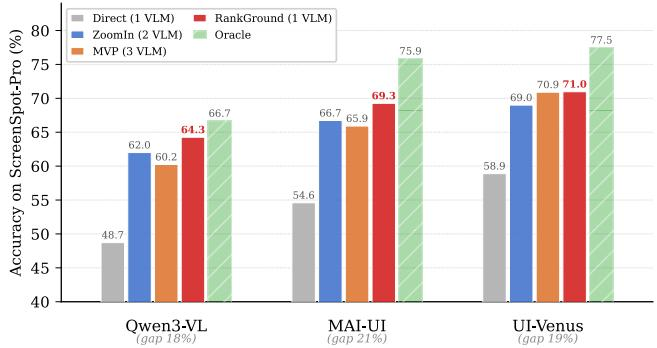
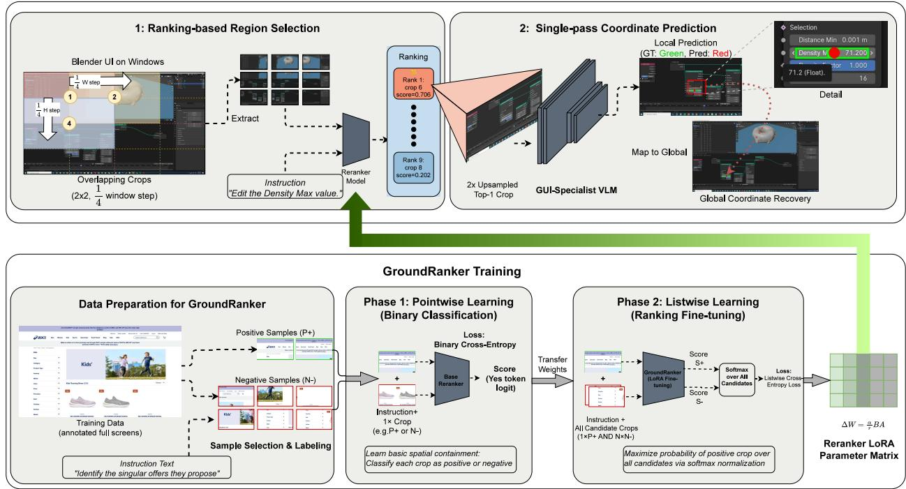
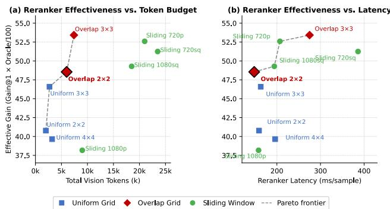
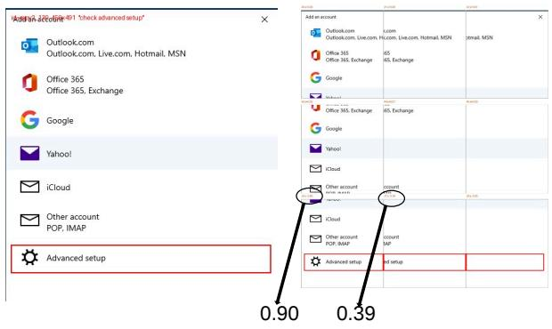
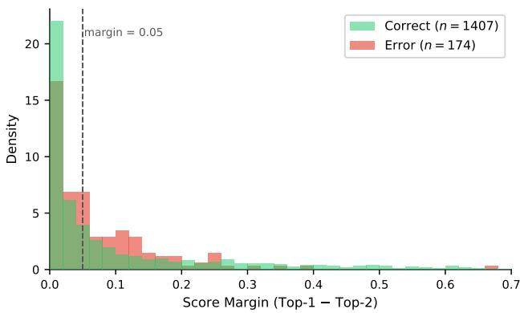
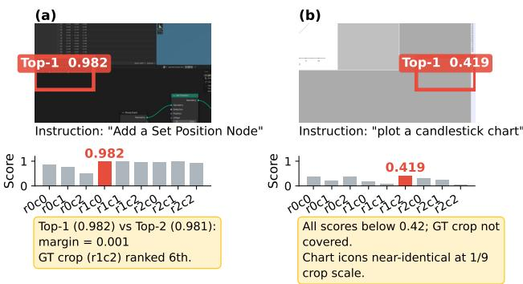

# RankGround: Eficient High-Resolution GUI Grounding via Lightweight Reranker-Guided Crop Selection

Liyang Fan∗†   
College of Computer Science and   
Software Engineering   
Shenzhen University   
Shenzhen, China   
ly.fan2@siat.ac.cn   
Shuaimin Li‡   
Shenzhen Key Laboratory for High   
Performance Data Mining   
Shenzhen Institutes of Advanced   
Technology, Chinese Academy of   
Sciences   
Shenzhen, China   
sm.li2@siat.ac.cn   
Xinping Bi   
Shenzhen Key Laboratory for High   
Performance Data Mining   
Shenzhen Institutes of Advanced   
Technology, Chinese Academy of   
Sciences   
Shenzhen, China   
xp.bi@siat.ac.cn   
Hui Li   
Xiamen University   
Xiamen, China   
hui@xmu.edu.cn   
Yitai Li   
Shenzhen Key Laboratory for High   
Performance Data Mining   
Shenzhen Institutes of Advanced   
Technology, Chinese Academy of   
Sciences   
Shenzhen, China   
yt.li5@siat.ac.cn   
Min Yang‡   
Shenzhen Institutes of Advanced   
Technology, Chinese Academy of   
Sciences   
Shenzhen, China   
Shenzhen University of Advanced   
Technology   
Shenzhen, China   
min.yang@siat.ac.cn

## Abstract

Graphical User Interface (GUI) grounding is a fundamental perception task for multimodal agents, enabling them to interpret natural language instructions and interact with digital interfaces. Existing methods face a fundamental trade-of between accuracy and efi ciency: direct full-image inference often fails to capture small or visually similar UI elements, while multi-crop strategies improve localization at the cost of multiple expensive Vision-Language Model (VLM) calls per query.

To address this challenge, we propose RankGround, a two-stage framework that achieves accurate GUI grounding with a single VLM call per query. Central to our approach is GroundRanker, a lightweight multimodal reranker that identifies the most promising crop from a dense candidate set. Because no of-the-shelf ranking dataset is available, we construct ranking supervision data from existing grounding datasets. A strict containment criterion and boundary-aware positive augmentation improve alignment and spatial coverage in cluttered layouts. GroundRanker is then trained with a two-stage curriculum: a pointwise objective first learns coarse containment, and a listwise objective refines subtle semantic and spatial distinctions among visually similar crops. Experimental results show that RankGround consistently outperforms

strong baselines while reducing computational cost. It achieves 1.4× faster inference and improves localization accuracy by 5.5% on average over the second-best method across all backbones and screen scales, establishing a new state of the art in both eficiency and precision for GUI grounding.

## CCS Concepts

• Computing methodologies → Computer vision; Natural language processing.

## Keywords

GUI Grounding, Multimodal Reranking, Vision-Language Models, Region Selection, High-Resolution Screenshots, GUI Agents

ACM Reference Format:   
Liyang Fan, Xinping Bi, Yitai Li, Shuaimin Li, Hui Li, and Min Yang. 2026. RankGround: Eficient High-Resolution GUI Grounding via Lightweight Reranker-Guided Crop Selection. In Proceedings of the 34th ACM International Conference on Multimedia (MM ’26), November 10–14, 2026, Rio de Janeiro, Brazil. ACM, New York, NY, USA, 10 pages. https://doi.org/10.1145/ 3767308.3836574

## 1 Introduction

GUI agents automate tasks across digital platforms [2, 21, 32]. Their success depends on GUI grounding, which maps a natural language instruction to a location on the screen [5]. A correct task plan still fails when the agent cannot locate the target element [31, 32]. Higher display resolutions and denser layouts make small or visually similar elements harder to distinguish [11].

Existing GUI grounding methods typically use direct inference or multiple crops [32]. Direct inference sends the entire screenshot through a vision-language model (VLM) once to predict target coordinates [2, 5, 24, 32]. It is fast, but small elements lose detail when a high-resolution screenshot is resized for the model. Multicrop methods partition the screen and apply the VLM to each region [31, 32]. The crops expose finer detail, but the VLM now runs repeatedly. ZoomIn [32] uses two calls per query, whereas MVP [31] often uses three or more. Latency and memory use grow with the crop count, which complicates real-time deployment. Figure 1 shows the resulting cost. Similar elements in diferent crops can also lead to conflicting predictions.

  
Figure 1: Accuracy of GUI grounding methods on ScreenSpot-Pro (8B scale). The gap between Direct inference and the Oracle upper bound (over 18 %) reveals room for improvement. Multi-crop methods (ZoomIn, MVP) close this gap but require two to three VLM calls per query. RankGround matches or exceeds their accuracy with a single VLM call.

RankGround separates region selection from coordinate prediction. Overlap tiling or sliding windows produce a dense candidate set that covers potential target locations. A lightweight multimodal reranker, GroundRanker, scores these crops, and the GUI-specialist VLM predicts coordinates from the top-ranked crop. The VLM therefore runs once per query while retaining local detail.

Crop selection remains dificult in dense layouts because several regions may contain similar elements. We convert instance annotations from existing grounding datasets into crop-level supervision. A crop is positive only when it fully encloses the target under a strict containment criterion. Boundary-aware positive augmentation then places the target near crop boundaries to reduce position bias.

GroundRanker follows a two-stage curriculum. Pointwise binary cross-entropy first teaches containment, and a listwise objec tive then separates near-miss crops from valid ones. We fine-tune Qwen3-VL-Reranker-2B [13] with Low-Rank Adaptation (LoRA) [6] on the query and value projections in its vision and language components. This setup learns GUI-specific spatial alignment while preserving pretrained multimodal features.

RankGround turns crop selection into a small ranking problem and reserves the costly VLM for coordinate prediction. Our main contributions follow.

• RankGround decouples region selection from coordinate prediction and uses one GUI-specialist VLM call per query.

• GroundRanker learns crop selection from strict containment labels, boundary-aware augmentation, and a pointwiseto-listwise curriculum.

• Across all tested backbones and scales, RankGround improves average localization accuracy by 5.5% over the second-best method and runs 1.4× faster.

## 2 Related Work

## 2.1 GUI Grounding

Early GUI grounding work adapted visual grounding methods developed for natural images [8, 12, 16, 19, 20, 27]. Some models add hierarchical low-rank adaptation [3, 26] or multimodal weight modulation [12, 28]. Such methods transfer poorly to GUI screenshots, where elements are structured and often occupy only a few pixels after resizing [2, 11]. Their scale distribution also difers sharply from natural-image datasets such as RefCOCO [30].

GUI-specific models now use dedicated data and pre-training. SeeClick [2] introduced ScreenSpot and showed the value of GUI pre-training. UGround [5], UI-TARS [21], MAI-UI [32], and UI-Venus-1.5 [24] scale this approach with more data or larger models. ScreenSpot-Pro [11] nevertheless shows that small targets on highresolution interfaces remain dificult.

Recent methods recover visual detail through extra inference stages. ZoomIn [32] uses coarse-to-fine refinement. ScreenSeekeR [11] and ZoomClick [7] repeatedly zoom into a predicted region. GOLD [9] proposes regions at low resolution and revisits them at high resolution. MVP [31] aggregates predictions from attention-guided views, whereas CoG [10] refines coordinates through self-reasoning. Training-based methods learn when or how to add these stages. GUI-ARP [29] combines supervised fine-tuning with GRPO so that the model can request another inference stage. Focus [22] learns to switch between fast prediction and a slower reasoning path. Both still spend extra forward passes on selection or verification. RankGround assigns region selection to a lightweight reranker and calls the grounding VLM once.

## 2.2 Multimodal Reranking

Reranking is common in information retrieval. A fast first stage narrows the candidate set before a cross-encoder scores the remaining items [18]. Recent systems extend this design to multimodal retrieval [4, 14, 25]. Qwen3-VL-Reranker [13] uses a Qwen3-VL crossencoder to score text-image query-document pairs. RankGround applies multimodal reranking to GUI grounding and uses crop relevance scores for region selection. To our knowledge, this is the first use of a multimodal reranker for this task.

## 3 Method

## 3.1 Overview

Given a screenshot $\mathbf { I } \in \mathbb { R } ^ { H \times W \times 3 }$ and a natural language instruction �, GUI grounding aims to predict the normalized click coordinate $\hat { \mathbf { p } } \in [ 0 , 1 ] ^ { 2 }$ of the target UI element on the screenshot.

Existing multi-crop approaches ask the same VLM to select a region and predict its coordinates. The VLM runs on every candidate crop, which is costly at high resolutions.

Region selection does not require precise coordinates. It only needs to identify the crop that contains the target. We therefore treat selection as a lightweight ranking problem and leave one high-resolution coordinate prediction to the VLM.

  
Figure 2: Overview of the RankGround pipeline. Given a screenshot and a natural language instruction, RankGround partitions the image into � crops via an overlap tiling strategy, ranks them with a fine-tuned multimodal reranker, and invokes a GUI-specialist VLM once on the selected crop to predict coordinates, which are mapped back to the original image space.

Let $C = \{ c _ { 1 } , \ldots , c _ { N } \}$ be the candidate set. Each region $c _ { k }$ has a top-left ofset $\mathbf { o } _ { k }$ and spatial extent d. Prediction follows

$$
c ^ { * } = \arg \operatorname* { m a x } _ { c _ { k } \in C } ~ s ( q , c _ { k } ) ,\tag{1}
$$

$$
\hat { \mathbf { p } } = \mathbf { o } ^ { * } + F _ { \phi } ( q , c ^ { * } ) \odot \mathbf { d } ,\tag{2}
$$

where $s ( \cdot )$ ranks the candidate regions and $F _ { \phi }$ is a GUI-specialist VLM applied once to the selected region. We instantiate � as GroundRanker. Section 3.2 describes how it scores crops from a coverage-preserving tiling. Section 3.3 gives the coordinate mapping for the selected crop. Figure 2 shows the full framework.

## 3.2 Ranking-based Region Selection

Ranking-based selection narrows the downstream VLM input to one crop. Section 3.2.1 defines candidate generation, and Section 3.2.2 derives containment labels and augmented positives. Section 3.2.3 trains GroundRanker on these crops. At inference, Section 3.2.4 passes the top crop to coordinate prediction.

3.2.1 Overlap Tiling-based Candidate Generation. A candidate must contain the full target. Otherwise, no reranker can recover it, bounding end-to-end accuracy.

Formally, let $B ^ { * } = \left[ x _ { 1 } ^ { * } , y _ { 1 } ^ { * } , x _ { 2 } ^ { * } , y _ { 2 } ^ { * } \right]$ denote the ground-truth bounding box ofthe target element. We say that a candidate set C achieves full coverage if and only if

$$
\exists c _ { k } \in C \ { \mathrm { ~ s . t . ~ } } B ^ { * } \subseteq { \mathrm { b o x } } ( c _ { k } ) ,\tag{3}
$$

where box $( c _ { k } )$ denotes the spatial extent of crop $c _ { k } .$ . Violating this condition makes errors irrecoverable, regardless of modeling.

We use Overlap Tiling, a �� grid with overlap ratio $\rho ,$ to satisfy this condition. Each crop spans $\lfloor H / G \rfloor \times \lfloor W / G \rfloor$ , and adjacent crops are shifted by $( 1 - \rho )$ of their extent along both axes, resulting in $N = ( 2 G - 1 ) ^ { 2 }$ candidates in total. For targets smaller than a crop, $\rho = 0 . 5$ guarantees Eq. (3) by applying the interval covering lemma along each axis. The crop at position (�, �) starts at

$$
x _ { i j } = \left\lfloor { \frac { i } { 2 ( G - 1 ) } } W \right\rfloor , \quad y _ { i j } = \left\lfloor { \frac { j } { 2 ( G - 1 ) } } H \right\rfloor ,
$$

with crop width $w _ { c } = \lceil W / G \rceil$ and height $h _ { c } = \lceil H / G \rceil$ , for $i , j \in$ $\{ 0 , . . . . , 2 G - 2 \}$ . Each crop is resized to the VLM input resolution.

The size assumption matches nearly all ScreenSpot-Pro samples. Under the default �=2 layout, each crop covers about 25% of the screenshot and overlaps its neighbors. The resulting Oracle coverage is 99.75%. The 90th-percentile target occupies only 0.156% of the screenshot for text and 0.034% for icons. A wide target may cross every crop boundary, so Eq. (3) no longer guarantees full containment. GroundRanker can still choose a useful partial view. Figure 4 shows a ScreenSpot-V2 example in which the target spans crop boundaries. The selected crop scores 0.90, compared with 0.39 for the runner-up, and the VLM predicts the correct click.

3.2.2 Data Preparation for GroundRanker. Existing grounding datasets lack crop-level ranking labels. We derive them automatically from screenshots with ground-truth element annotations.

For a screenshot I of size $W \times H ,$ sliding-window tiling scales the window $( w , h )$ to a fixed pixel budget $N _ { \mathrm { m a x } }$ according to

$$
r = \sqrt { \frac { N _ { \mathrm { m a x } } } { W \cdot H } } , \quad w = \lfloor r \cdot W \rfloor , \quad h = \lfloor r \cdot H \rfloor .\tag{4}
$$

The window moves in steps of $( w / 2 , h / 2 )$ for 50% overlap and snaps to the image boundary to avoid incomplete edge crops. Images within the pixel budget $( W \cdot H \leq N _ { \operatorname* { m a x } } )$ use the $2 \times 2$ overlapping grid from Section 3.2.1.

Each crop $c _ { k }$ receives a binary containment label. It is positive only when it fully contains the target box $B ^ { * } = \left[ x _ { 1 } ^ { * } , y _ { 1 } ^ { * } , x _ { 2 } ^ { * } , y _ { 2 } ^ { * } \right]$ under the condition

$$
l _ { k } \leq x _ { 1 } ^ { * } ; \wedge t _ { k } \leq y _ { 1 } ^ { * } ; \wedge l _ { k } + w \geq x _ { 2 } ^ { * } ; \wedge t _ { k } + h \geq y _ { 2 } ^ { * } ,\tag{5}
$$

where $( l _ { k } , t _ { k } )$ denotes the top-left corner of the $k { \mathrm { - t h } }$ candidate crop, ensuring that the target element is entirely visible. This strict criterion is stronger than center-based or IoU-based labeling and aligns directly with the coverage condition (3).

Boundary-aware positive augmentation counters the center bias of uniform windows. Let $\Delta _ { x } = w - \left( x _ { 2 } ^ { * } - x _ { 1 } ^ { * } \right)$ and $\Delta _ { y } = h - \left( y _ { 2 } ^ { * } - \right.$ $y _ { 1 } ^ { * } )$ denote the slack between the crop and target box. Each positive crop yields up to 12 variants. We place the target at the four corners and four edge midpoints, then draw four more positions near the boundary. The resulting samples spread positives across the crop.

Each listwise [1] sample pairs one positive crop or augmented variant with every negative crop from the same image and the instruction $q .$ This matches inference and exposes the full contrast among candidates to the loss in Eq. (9).

3.2.3 GroundRanker Training. GroundRanker is a vision-language cross-encoder that scores how likely each crop is to contain the target. It selects

$$
c ^ { * } = c _ { k ^ { * } } , k ^ { * } = \arg \operatorname* { m a x } _ { k } \ s _ { \theta } ( q , c _ { k } ) .\tag{6}
$$

where $s _ { \theta }$ jointly scores the crop and instruction $q .$

The cross-encoder processes $( q , c )$ jointly to retain fine spatial correspondence. We use the afirmative token logit as its ranking score,

$$
\begin{array} { r } { s _ { \theta } ( q , c ) = \mathrm { l o g i t } _ { \mathsf { y e s } } \big ( f _ { \theta } ( q , c ) \big ) , } \end{array}\tag{7}
$$

where $f _ { \theta }$ denotes the reranker. The score is comparable across crops and needs no classification head.

GroundRanker uses a pointwise-to-listwise curriculum.

Stage 1 (pointwise). Binary cross-entropy teaches spatial containment,

$$
\mathcal { L } _ { 1 } = \mathbb { E } _ { ( q , c , y ) } \left[ - y \log \sigma ( s _ { \theta } ) - ( 1 - y ) \log ( 1 - \sigma ( s _ { \theta } ) ) \right] ,\tag{8}
$$

where $y \in 0 ,$ 1. Boundary-aware positives reduce position bias.

Stage 2 (listwise). A listwise loss contrasts valid crops with nearmiss crops that overlap the target but fail containment,

$$
\mathcal { L } _ { 2 } = - \sum _ { c \in C } \tilde { y } _ { c } \cdot \log \frac { \exp \left( s _ { \theta } ( q , c ) \right) } { \sum _ { c ^ { \prime } \in C } \exp \left( s _ { \theta } ( q , c ^ { \prime } ) \right) } ,\tag{9}
$$

where $\tilde { y } _ { c } = y _ { c } / \sum _ { c ^ { \prime } } y _ { c ^ { \prime } }$ normalizes labels. Stage 1 learns a coarse ranking. Stage 2 sharpens near-miss boundaries.

We adapt the pretrained cross-encoder with Low-Rank Adaptation (LoRA) [6]. Trainable low-rank matrices � and � update each

Table 1: Bounding-box statistics for Text and Icon elements in ScreenSpot-Pro. Rel. area is the percentage of screenshot area. P10 and P90 are the 10th and 90th percentiles.
<table><tr><td></td><td colspan="3">Text (n=977)</td><td colspan="3">Icon (n=604)</td></tr><tr><td></td><td>Mean</td><td>Med.</td><td>P10/P90</td><td>Mean</td><td>Med.</td><td>P10/P90</td></tr><tr><td>Width (px)</td><td>141</td><td>111</td><td>36 / 272</td><td>37</td><td>26</td><td>16 / 54</td></tr><tr><td>Height (px)</td><td>34</td><td>25</td><td>18 / 61</td><td>29</td><td>24</td><td>17 / 48</td></tr><tr><td>Area (px2)</td><td>4,655</td><td>3,186</td><td>828 / 7,680</td><td>1,764</td><td>624</td><td>305 / 2,344</td></tr><tr><td>Rel. area (%)</td><td>0.086</td><td>0.065</td><td>0.017 / 0.156</td><td>0.031</td><td>0.014</td><td>0.005 / 0.034</td></tr></table>

frozen weight matrix $W _ { 0 }$ as

$$
h = W _ { 0 } x + \Delta W x = W _ { 0 } x + { \frac { \alpha } { r } } B A x ,\tag{10}
$$

Here � is the input, ℎ is the output, and $\Delta W$ is the update. The rank satisfies $r \ll$ min(�, �), and � controls its scale. GroundRanker applies LoRA to query and value projections in the vision encoder’s self-attention and the language model’s cross-attention. This preserves pretrained features while learning spatial alignment for GUI crops.

3.2.4 Region Selection. At inference, overlap tiling or sliding windows generate $^ { C , }$ and GroundRanker scores each crop. We select

$$
c ^ { * } = \arg \operatorname* { m a x } _ { c _ { k } \in C } s _ { \theta } ( q , c _ { k } ) ,\tag{11}
$$

The selected crop then passes to coordinate prediction, so the VLM processes one region rather than the full candidate set.

## 3.3 Coordinate Prediction and Mapping

The VLM $F _ { \phi }$ predicts a local coordinate $\hat { \mathbf { p } } ^ { \prime } \in [ 0 , 1 ] ^ { 2 }$ within the upsampled crop $c ^ { * }$ . A linear transform maps it back to the original image without approximation error.

Upsampling the crop by � yields $\alpha / G$ resolution relative to the full image. For $\alpha \geq G$ , the VLM sees more detail per element, improving small-element localization.

Complexity analysis. Let $T _ { R }$ denote one batched reranker pass and $T _ { V }$ one VLM pass. GroundRanker scores all � crops in one batch, so region selection costs $O ( T _ { R } )$ rather than $O ( N T _ { R } )$ . Coordinate prediction adds $O ( T _ { V } )$ , giving $O ( T _ { R } + T _ { V } )$ total latency. In our measurements,�� ≈ 145 ms and $T _ { V }$ ranges from about 210 to 810 ms. RankGround is slower than Direct but avoids the repeated VLM calls used by ZoomIn and MVP. Local crop processing preserves detail without the O(���) cost of running the VLM on every candidate.

## 4 Experimental Setup

Dataset. We evaluate on ScreenSpot-Pro [11], comprising 1,581 tasks from 23 professional applications across five industries and three operating systems. We also test cross-benchmark generalization on UI-Vision [17]. Table 1 summarizes the bounding-box size distribution for both element types.

Evaluation Metrics. Click Accuracy counts predictions inside the target box and is micro-averaged over 977 Text and 604 Icon/Widget targets. We also report each type. Reranker ablations use Hit Rate@�, the fraction of queries with a valid crop among the top-� results for the corresponding grounding instruction.

Baselines. Direct inference sends the full screenshot through each backbone once. ZoomIn [32] predicts a coarse location and refines it in a second call. MVP [31] selects attention-guided regions and aggregates several crop predictions. We test Qwen3-VL, MAI-UI, and UI-Venus-1.5 at both 8B and 2B scales. Qwen3-VL [23] uses the basic prompt, and the other models use their native prompts.

Implementation. GroundRanker is trained on 6,789 ViSurf instances. Data construction yields about 295K pairwise, 124K pointwise, and 78K listwise samples. LoRA uses rank 16, scale 32, and dropout 0.05 on query and value projections. We use AdamW with a 1×10−4 learning rate, 0.01 weight decay, efective batch size 8, 5% linear warmup, and cosine decay. Training converges within one epoch on RTX 4090 GPUs. Latency is wall-clock time per sample over ScreenSpot-Pro at batch size 1, including preprocessing and post-processing but excluding data loading.

## 5 Results and Analysis

## 5.1 Main Results

Table 2 shows that RankGround leads all six backbone-scale settings with one GUI-specialist VLM call and one reranker pass per query. #VLM counts GUI-specialist VLM calls, and Δ is the absolute accuracy gain (%) over Direct for the same backbone. Bold and underlining mark each scale’s best and runner-up.

RankGround improves on Direct in all six configurations, with absolute gains from 12.08 to 19.36 points. These gains require one GUI-specialist VLM call and a 145 ms reranker pass. ZoomIn uses two VLM calls. RankGround improves its average accuracy by 2.3 points at 8B and 5.4 points at 2B, and is faster for every backbone. The larger 2B gain shows that crop selection matters more when the grounder has less capacity.

RankGround also matches or exceeds MVP on every backbone. Average accuracy rises from 65.7% to 68.2% at 8B and from 50.9% to 60.2% at 2B. MVP takes 2,342–4,648 ms per sample, or 4–12× longer, because it evaluates several crops with the VLM.

Recent best-reported ScreenSpot-Pro results provide wider context, though they use diferent backbones and training protocols. ScreenSeekeR [11] combines GPT-4o with OS-Atlas-7B and reports 48.1% after multiple calls. GUI-ARP [29] reports 60.8% with a 7B model trained by SFT and reinforcement learning. CoG [10] reaches 68.4% with a three-call Qwen3-VL-235B/32B pipeline. RankGround reaches 64.7% at 2B and 71.0% at 8B with one grounding-VLM call plus one reranker pass. Table 2 remains the controlled comparison. These published numbers instead show where RankGround sits among systems with diferent model and data budgets.

Peak memory. Co-resident reranker and VLM peak at 21.2 GB for 8B and 8.6 GB for 2B, both within 24 GB. Sequential execution lowers them to 16.94 and 4.38 GB, matching Direct and staying below MVP’s 17.21 and 4.61 GB.

## 5.2 Ablation Studies

Section 5.2.1 examines partition geometry, Section 5.2.2 examines reranker training, and Section 5.2.3 tests prompt wording. Unless stated otherwise, the ablations use UI-Venus-1.5-2B with Overlap 2×2 and report mean ± std over three runs.

5.2.1 Partitioning Strategy. Table 3 compares uniform, overlapping, and sliding-window grids using the base reranker. Oracle assumes correct crop selection, and Hit@1 is the fraction ofvalid top-ranked crops. Gain@1 subtracts random selection, where Rand@ ${ \mathrm { 1 } } = { { \bar { n } } _ { + } } / N ,$ �¯+ is the mean positive-crop count, and � is the total crop count.

  
Figure 3: Efective Gain (Gain@1 × Oracle) vs. vision token budget (left) and reranker latency (right) across strategies.

Oracle coverage. Finer uniform grids cover less of the screen per crop and split more boundary elements. Their Oracle accuracy falls from 93.0% at 2×2 to 85.9% at 4×4. Overlapping grids and sliding windows instead keep Oracle above 98.8%, so a 50% overlap contains nearly every target in at least one crop.

Reranker discriminability. Overlap 2×2 reaches 43.3 % Gain@1, or 48.7 % with the optimized prompt, while retaining 99.75 % Oracle. Sliding 1080p has the highest raw Hit@1 at 77.3 %, rising to 80.7 % with the prompt. Its random baseline is already 42.4 % because it produces only 7.2 crops on average, leaving 34.8 % Gain@1. Finer sliding windows (720p, 720sq) improve Gain@1 but degrade Hit@1 as the reranker faces more candidates with similar visual content. Overlap 3×3 reaches 46.8 % Gain@1, or 53.7 % with the prompt, but uses 25 crops rather than 9.

Eficiency. Overlap 2×2 scores 9 crops in 145 ms. Overlap 3×3 takes 280 ms for 25 crops, and sliding windows take up to 380 ms for 35 crops. Batched reranker latency therefore grows roughly with the crop count.

Overlap 2×2 reaches 99.75 % Oracle with a 9-crop search space and 43.3 % Gain@1. Its 145 ms latency is lower than larger layouts. We use it as RankGround’s default.

5.2.2 Reranker Design. Region selection quality, not VLM capacity, limits multi-crop grounding. With 2× crops, the Oracle upper bound exceeds every multi-crop method by more than 7 points across the 8B backbones. Figure 1 shows this gap. Higher crop resolution further benefits downstream grounding even under perfect region selection, with 2× outperforming 1× under Oracle conditions (+3.67 % for Qwen3-VL, +1.98 % for MAI-UI, +2.91 % for UI-Venus). The base reranker remains more than 10 points below Oracle accuracy, which motivates the LoRA fine-tuning in Section 3.2. Across three seeds, the pointwise-to-listwise curriculum reaches 88.2 % Hit@1 and improves 2B Text accuracy by 0.62 points over pointwise-only training. Section 5.5 reports the full comparison.

5.2.3 Prompt Design. The chat template stores the task definition in <Instruct>, the grounding instruction in <Query>, and the crop in <Document>. Table 4 contrasts the default prompt inherited from Qwen3-VL-Reranker with our optimized prompt, which asks directly whether the crop contains the target. The optimized prompt consistently improves Hit@1 over the default prompt across all partitioning strategies. The largest gain is +5.4 points on Overlap 2×2, shown by the italicized rows of Table 3. The prompt gives the reranker a clearer containment question without changing its weights.

Table 2: Comparison of GUI grounding methods on ScreenSpot-Pro at 8B and 2B scales.
<table><tr><td></td><td></td><td></td><td colspan="5">8B Scale</td><td colspan="5">2B Scale</td></tr><tr><td>Method</td><td>Model</td><td>#VLM</td><td>Time (ms)</td><td>Acc (%)</td><td>Text (%)</td><td>Icon (%)</td><td>Δ</td><td>Time (ms)</td><td>Acc (%)</td><td>Text (%)</td><td>Icon (%)</td><td>Δ</td></tr><tr><td></td><td>Qwen3-VL [23]</td><td></td><td>814±11</td><td>48.72±0.04</td><td>65.06±0.12</td><td>22.30±0.10</td><td></td><td>642±2</td><td>35.42±0.06</td><td>48.00±0.10</td><td>15.07±0.17</td><td></td></tr><tr><td>Direct</td><td>MAI-UI [32]</td><td>1</td><td>468±3</td><td>54.59±0.04</td><td>70.93±0.06</td><td>28.15±0.12</td><td></td><td>235±3</td><td>43.64±0.04</td><td>58.75±0.08</td><td>19.20±0.10</td><td></td></tr><tr><td></td><td>UI-Venus [24]</td><td></td><td>480±23</td><td>58.89±0.06</td><td>74.10±0.08</td><td>34.27±0.15</td><td></td><td>212±6</td><td>48.13±0.04</td><td>61.51±0.06</td><td>26.49±0.12</td><td></td></tr><tr><td></td><td>Qwen3-VL [23]</td><td></td><td>1486±39</td><td>62.00±0.10</td><td>80.08±0.12</td><td>32.73±0.10</td><td>+13.28</td><td>1130±7</td><td>47.82±0.08</td><td>62.95±0.12</td><td>23.34±0.19</td><td>+12.40</td></tr><tr><td>ZoomIn [32]</td><td>MAI-UI [32]</td><td>2</td><td>981±12</td><td>66.73±0.11</td><td>81.30±0.47</td><td>43.16±0.47</td><td>+12.14</td><td>505±10</td><td>57.37±0.06</td><td>73.29±0.10</td><td>31.62±0.15</td><td>+13.73</td></tr><tr><td></td><td>UI-Venus [24]</td><td></td><td>1008±3</td><td>69.00±0.11</td><td>82.77±0.12</td><td>46.74±0.48</td><td>+10.11</td><td>473±3</td><td>59.20±0.08</td><td>71.24±0.10</td><td>39.74±0.17</td><td>+11.07</td></tr><tr><td></td><td>Qwen3-VL [23]</td><td></td><td>4648±56</td><td>60.24±0.04</td><td>78.37±0.06</td><td>30.91±0.19</td><td>+11.52</td><td>3058±38</td><td>38.48±0.04</td><td>51.25±0.12</td><td>17.83±0.10</td><td>+3.06</td></tr><tr><td>MVP [31]</td><td>MAI-UI [32]</td><td>3</td><td>3500±48</td><td>65.91±0.06</td><td>80.28±0.06</td><td>42.66±0.10</td><td>+11.32</td><td>2342±32</td><td>57.39±0.04</td><td>73.40±0.10</td><td>31.70±0.12</td><td>+13.75</td></tr><tr><td></td><td>UI-Venus [24]</td><td></td><td>4049±45</td><td>70.90±0.04</td><td>83.62±0.06</td><td>50.33±0.10</td><td>+12.01</td><td>2418±28</td><td>56.67±0.06</td><td>66.53±0.08</td><td>40.73±0.12</td><td>+8.54</td></tr><tr><td></td><td>Qwen3-VL [23]</td><td></td><td>959±12</td><td>64.26±0.08</td><td>81.99±0.10</td><td>35.60±0.19</td><td>+15.54</td><td>787±5</td><td>52.75±0.06</td><td>69.40±0.12</td><td>25.83±0.15</td><td>+17.33</td></tr><tr><td>RankGround</td><td>MAI-UI [32]</td><td>1</td><td>613±5</td><td>69.26±0.06</td><td>82.29±0.08</td><td>48.18±0.12</td><td>+14.67</td><td>380±5</td><td>63.00±0.04</td><td>78.71±0.10</td><td>37.58±0.17</td><td>+19.36</td></tr><tr><td></td><td>UI-Venus [24]</td><td></td><td>625±23</td><td>70.97±0.04</td><td>84.54±0.06</td><td>49.01±0.10</td><td>+12.08</td><td>357±7</td><td>64.71±0.06</td><td>76.25±0.08</td><td>46.03±0.15</td><td>+16.58</td></tr></table>

Table 3: Ablation of image partitioning strategies on ScreenSpot-Pro. Bold marks the best result per column, and underlining marks the second best. Time is average per-batch reranker latency in ms. Hit@5 is unavailable for Uniform 2×2 because it generates only four crops.
<table><tr><td rowspan="2">Layout</td><td colspan="2">Coverage</td><td colspan="3">Hit Rate@k (%) ↑</td><td colspan="2">Selection Quality</td><td rowspan="2">Time (ms) ↓</td></tr><tr><td>#Crops</td><td>Oracle (%) ↑</td><td>@1</td><td>@3</td><td>@5</td><td>Rand@1 (%)</td><td>Gain@1 (%) ↑</td></tr><tr><td>Uniform 2×2</td><td>4</td><td>93.04</td><td>62.66±0.10</td><td>88.49±0.06</td><td>N/A</td><td>23.26</td><td>39.40±0.10</td><td>156±5</td></tr><tr><td>+ opt. prompt</td><td>4</td><td>93.04</td><td>67.09±0.18</td><td>89.42±0.04</td><td>N/A</td><td>23.26</td><td>43.83±0.18</td><td>159±6</td></tr><tr><td>Uniform 3×3</td><td>9</td><td>90.70</td><td>54.97±0.17</td><td>74.26±0.17</td><td>83.24±0.11</td><td>10.08</td><td>44.89±0.17</td><td>160±6</td></tr><tr><td>+ opt. prompt</td><td>9</td><td>90.70</td><td>61.44±0.26</td><td>79.38±0.06</td><td>86.32±0.07</td><td>10.08</td><td>51.36±0.26</td><td>163±5</td></tr><tr><td>Uniform 4×4</td><td>16</td><td>85.90</td><td>45.86±0.29</td><td>62.98±0.42</td><td>70.15±0.19</td><td>5.37</td><td>40.49±0.29</td><td>200±8</td></tr><tr><td>+ opt. prompt</td><td>16</td><td>85.90</td><td>51.53±0.46</td><td>67.95±0.35</td><td>75.35±0.07</td><td>5.37</td><td>46.16±0.46</td><td>196±7</td></tr><tr><td>Overlap 2×2</td><td>9</td><td>99.75</td><td>67.13±0.13</td><td>88.32±0.10</td><td>94.73±0.04</td><td>23.84</td><td>43.29±0.13</td><td>145±4</td></tr><tr><td>+ opt. prompt</td><td>9</td><td>99.75</td><td>72.51±0.35</td><td>91.21±0.17</td><td>96.16±0.04</td><td>23.84</td><td>48.67±0.35</td><td>148±5</td></tr><tr><td>Overlap 3×3</td><td>25</td><td>99.43</td><td>56.27±0.42</td><td>75.29±0.13</td><td>83.49±0.33</td><td>9.50</td><td>46.78±0.42</td><td>280±12</td></tr><tr><td>+ opt. prompt</td><td>25</td><td>99.43</td><td>63.23±0.19</td><td>81.07±0.44</td><td>87.92±0.46</td><td>9.50</td><td>53.73±0.19</td><td>275±11</td></tr><tr><td>Sliding 1080p</td><td>~7.2</td><td>99.75</td><td>77.25±0.04</td><td>93.28±0.13</td><td>92.86±0.15</td><td>42.44</td><td>34.81±0.04</td><td>155±6</td></tr><tr><td>+ opt. prompt</td><td>~7.2</td><td>99.75</td><td>80.71±0.33</td><td>93.64±0.04</td><td>93.69±0.13</td><td>42.44</td><td>38.27±0.33</td><td>158±7</td></tr><tr><td>Sliding 1080sq</td><td>~14.8</td><td>99.43</td><td>65.72±0.17</td><td>84.06±0.17</td><td>91.08±0.16</td><td>21.96</td><td>43.75±0.17</td><td>190±8</td></tr><tr><td>+ opt. prompt</td><td>~14.8</td><td>99.43</td><td>71.54±0.33</td><td>87.73±0.25</td><td>93.21±0.17</td><td>21.96</td><td>49.57±0.33</td><td>194±9</td></tr><tr><td>Sliding 720p</td><td>~17.7</td><td>99.62</td><td>64.54±0.26</td><td>81.72±0.11</td><td>89.05±0.13</td><td>17.79</td><td>46.75±0.26</td><td>210±9</td></tr><tr><td>+ opt. prompt</td><td>~17.7</td><td>99.62</td><td>70.59±0.32</td><td>86.27±0.13</td><td>91.49±0.17</td><td>17.79</td><td>52.80±0.32</td><td>207±8</td></tr><tr><td>Sliding 720sq</td><td>~35.2</td><td>98.80</td><td>54.33±0.35</td><td>73.77±0.29</td><td>80.83±0.22</td><td>8.70</td><td>45.63±0.35</td><td>380±15</td></tr><tr><td>+ opt. prompt</td><td>~35.2</td><td>98.80</td><td>60.57±0.10</td><td>78.37±0.29</td><td>84.69±0.23</td><td>8.70</td><td>51.87±0.10</td><td>386±14</td></tr><tr><td>LoRA FT reranker, Overlap 2×2</td><td>9</td><td>99.75</td><td>85.52±0.19</td><td>93.36±0.11</td><td>97.41±0.08</td><td>23.84</td><td>61.68±0.19</td><td>145±4</td></tr><tr><td>+ opt. prompt</td><td>9</td><td>99.75</td><td>88.17±0.14</td><td>94.69±0.08</td><td>97.72±0.06</td><td>23.84</td><td>64.33±0.14</td><td>147±5</td></tr></table>

Table 4: Default and optimized reranker prompts.
<table><tr><td>Default</td><td>&quot;Given a search query, retrieve relevant candidates that answer the query.&#x27;</td></tr><tr><td>Optimized</td><td>&quot;Given a GUI operation instruction, determine whether</td></tr><tr><td></td><td>the provided image region contains the target UI element</td></tr><tr><td></td><td>described in the instruction.&quot;</td></tr></table>

## 5.3 Reranker Generalization

Table 5 shows 78.70 % Hit@1 on UI-Vision [17] without benchmarkspecific fine-tuning.

Table 5: Hit Rate (HR) on out-of-distribution benchmarks using Overlap 2×2 and UI-Venus-1.5-2B.

<table><tr><td>Method</td><td>Benchmark</td><td>HR@1(%)</td><td>HR@3 (%)</td><td>HR@5 (%)</td></tr><tr><td>Base reranker</td><td>UI-Vision</td><td>52.93±0.11</td><td>79.02±0.09</td><td>90.16±0.08</td></tr><tr><td>RankGround</td><td>UI-Vision</td><td>78.70±0.00</td><td>89.05±0.00</td><td>95.26±0.00</td></tr></table>

Table 6 reports 49.00 % end-to-end accuracy for RankGround on UI-Vision, compared with 18.88 % for Direct.

Table 6: Oracle coverage and Accuracy on out-of-distribution benchmarks using Overlap 2×2 and Qwen3-VL-2B.
<table><tr><td>Method</td><td>Benchmark</td><td>Oracle (%)</td><td>Acc (%)</td></tr><tr><td>Direct</td><td>UI-Vision</td><td>N/A</td><td>18.88±0.06</td></tr><tr><td>Base reranker</td><td>UI-Vision</td><td>98.36</td><td>25.76±0.10</td></tr><tr><td>RankGround</td><td>UI-Vision</td><td>98.36</td><td>49.00±0.06</td></tr></table>

The reranker is trained only on ViSurf[15], an OmniACT-derived dataset with 79% desktop and 21% web data from 62 applications. ScreenSpot-Pro and UI-Vision therefore difer from its training distribution. Table 7 shows that UI-Vision also difers from ScreenSpot-Pro. It contains 2,786 Icon samples and 758 Text samples. Element sizes are similar in pixels, but their relative areas are about 2× larger, which indicates lower-resolution screenshots on average.

Table 7: Bounding-box statistics for Text and Icon elements in UI-Vision. Rel. area is the percentage of screenshot area. P10 and P90 are the 10th and 90th percentiles.
<table><tr><td></td><td colspan="3">Text (n=758)</td><td colspan="3">Icon (n=2,786)</td></tr><tr><td></td><td>Mean</td><td>Med.</td><td>P10/P90</td><td>Mean</td><td>Med.</td><td>P10/P90</td></tr><tr><td>Width (px)</td><td>136</td><td>108</td><td>38 / 275</td><td>41</td><td>34</td><td>22 / 58</td></tr><tr><td>Height (px)</td><td>32</td><td>26</td><td>19 / 51</td><td>32</td><td>28</td><td>20 / 46</td></tr><tr><td>Area (px2)</td><td>4,498</td><td>3,002</td><td>870 / 10,135</td><td>1,435</td><td>962</td><td>459  / 2,592</td></tr><tr><td>Rel. area (%)</td><td>0.209</td><td>0.161</td><td>0.045 / 0.454</td><td>0.069</td><td>0.052</td><td>0.027 / 0.112</td></tr></table>

## 5.4 Broader Benchmarks

We further test UI-Venus-1.5-8B on five benchmarks that cover web, desktop, and operating-system interfaces. Table 8 uses the same grounder for Direct, ZoomIn, and RankGround within every benchmark.

Table 8: Click accuracy (%) on five additional benchmarks with UI-Venus-1.5-8B. Δ is the gain over ZoomIn.
<table><tr><td>Benchmark</td><td>Direct</td><td>ZoomIn</td><td>RankGround</td><td>Δ</td></tr><tr><td>ScreenSpot-V2</td><td>96.31</td><td>94.18</td><td>95.36</td><td>+1.18</td></tr><tr><td>MMBench-GUI-L2</td><td>87.48</td><td>85.84</td><td>89.84</td><td>+4.00</td></tr><tr><td>OSWorld-G</td><td>74.71</td><td>72.55</td><td>78.04</td><td>+5.49</td></tr><tr><td>OSWorld-G-Refined</td><td>80.20</td><td>80.59</td><td>84.71</td><td>+4.12</td></tr><tr><td>VenusBench-GD</td><td>84.71</td><td>85.54</td><td>89.62</td><td>+4.08</td></tr></table>

RankGround beats ZoomIn on all five benchmarks by 1.18–5.49 points. It also exceeds Direct by 2.36–4.91 points on MMBench-GUI-L2, OSWorld-G, OSWorld-G-Refined, and VenusBench-GD. ScreenSpot-V2 is the one exception: Direct is already at 96.31%, while RankGround stays within one point and remains above ZoomIn. The gains on the other four sets show that learned crop selection transfers beyond ScreenSpot-Pro and UI-Vision.

## 5.5 Curriculum Analysis

We compare the two-stage curriculum with Pointwise-only and Listwise-only training. The data, LoRA configuration, optimizer, and evaluation protocol remain fixed. Each result is averaged over three random seeds. Pointwise-only uses $\mathcal { L } _ { 1 }$ throughout, while Listwise-only starts directly from $\mathcal { L } _ { 2 }$ without containment pretraining.

Table 9: Reranker accuracy (%) for each training objective on ScreenSpot-Pro. Results are mean±std over three runs.
<table><tr><td>Objective</td><td>Hit@1</td><td>Hit@3</td><td>Hit@5</td><td>Text@1</td><td>Icon@1</td></tr><tr><td>Pointwise-only</td><td>87.86±0.18</td><td>94.24±0.11</td><td>97.91±0.07</td><td>92.84±0.22</td><td>79.80±0.31</td></tr><tr><td>Listwise-only</td><td>88.17±0.16</td><td>94.75±0.10</td><td>97.98±0.06</td><td>93.86±0.19</td><td>78.97±0.34</td></tr><tr><td>Two-Stage</td><td>88.20±0.15</td><td>94.82±0.09</td><td>98.05±0.06</td><td>94.28±0.18</td><td>78.36±0.30</td></tr></table>

Table 9 shows that the curriculum gives the best Hit@1, Hit@3, Hit@5, and Text Hit@1. Pointwise-only remains strongest on icons. Small icons often need only a binary containment decision, while the listwise stage helps more when several text-bearing crops are semantically similar. The curriculum also reaches 90.00% validation AUROC and completes its listwise stage at step 260, 30 steps earlier than Listwise-only.

Table 10: End-to-end accuracy (%) for each reranker objective on ScreenSpot-Pro. Results are mean±std over three runs.
<table><tr><td>Objective</td><td>Model</td><td>Acc</td><td>Text</td><td>Icon</td></tr><tr><td>Pointwise-only</td><td>Qwen3-VL-2B</td><td>52.62±0.32</td><td>68.58±0.41</td><td>26.82±0.58</td></tr><tr><td>Listwise-only</td><td>Qwen3-VL-2B</td><td>52.75±0.30</td><td>68.78±0.39</td><td>26.82±0.56</td></tr><tr><td>Two-Stage</td><td>Qwen3-VL-2B</td><td>52.90±0.28</td><td>69.20±0.35</td><td>26.53±0.54</td></tr><tr><td>Pointwise-only</td><td>Qwen3-VL-8B</td><td>65.72±0.28</td><td>83.01±0.33</td><td>37.75±0.51</td></tr><tr><td>Listwise-only</td><td>Qwen3-VL-8B</td><td>65.34±0.30</td><td>82.50±0.35</td><td>37.58±0.53</td></tr><tr><td>Two-Stage</td><td>Qwen3-VL-8B</td><td>65.85±0.26</td><td>83.20±0.31</td><td>37.78±0.49</td></tr></table>

The ranking gains carry into coordinate prediction. Two-Stage gives the highest overall and Text accuracy at both model scales. At 2B, it improves overall accuracy by 0.28 points over Pointwise-only and Text accuracy by 0.62 points. The smaller gains at 8B suggest that a stronger coordinate predictor can absorb some crop-selection noise, but it still benefits from the curriculum.

  
Figure 4: Wide-target example on ScreenSpot-V2. The target crosses crop boundaries, yet GroundRanker selects the useful crop with a clear score margin.

## 5.6 Failure Modes and Fallbacks

Overlap Tiling covers the target in 99.75% of ScreenSpot-Pro samples, while GroundRanker reaches 88.2% Hit@1. Coverage failures therefore account for only 0.25% of the data. Most first-stage errors come from choosing the wrong candidate among valid crops. They concentrate on pure icons: the reranker error rate is 19.9% for icons and 5.5% for text. Repeated visual motifs and weak textual cues make icons harder to distinguish. Without the target in the selected crop, the coordinate predictor cannot recover.

The errors also cluster by application. Table 11 lists the ten hardest applications in ScreenSpot-Pro. Origin has a 41.9% error rate, almost twice the 21.0% rate of Windows Common. Its toolbars contain many chart-type icons with similar shapes, and instructions such as “plot candlestick chart” provide little local text for matching.

Table 11: Applications with the highest GroundRanker error rates on ScreenSpot-Pro.
<table><tr><td>Application</td><td>OS</td><td>Total</td><td>Errors</td><td>Err. (%)</td></tr><tr><td>Origin</td><td>Win</td><td>62</td><td>26</td><td>41.9</td></tr><tr><td>Windows Common</td><td>Win</td><td>81</td><td>17</td><td>21.0</td></tr><tr><td>Android Studio</td><td>mac</td><td>80</td><td>14</td><td>17.5</td></tr><tr><td>DaVinci Resolve</td><td>mac</td><td>44</td><td>7</td><td>15.9</td></tr><tr><td>macOS Common</td><td>mac</td><td>65</td><td>10</td><td>15.4</td></tr><tr><td>Premiere Pro</td><td>Win</td><td>52</td><td>8</td><td>15.4</td></tr><tr><td>Fruitloops</td><td>Win</td><td>57</td><td>8</td><td>14.0</td></tr><tr><td>PyCharm</td><td>mac</td><td>78</td><td>9</td><td>11.5</td></tr><tr><td>Vivado</td><td>Win</td><td>80</td><td>9</td><td>11.2</td></tr><tr><td>MATLAB</td><td>mac</td><td>93</td><td>9</td><td>9.7</td></tr></table>

The score margin gives a second view of these errors. Among incorrect selections, 54.6% have a Top-1 minus Top-2 margin below 0.05, while only 7.5% exceed 0.2. Most errors are therefore close decisions between plausible crops rather than confident mismatches. Figure 5 shows this concentration near zero.

  
Figure 5: Score margins for correct and incorrect crop selec tions. The dashed line marks a margin of 0.05, below which 54.6% of errors fall.

Figure 6 shows the two main failure patterns. In the Blender case, several crops contain plausible matches and the top two scores difer by only 0.001. In the Origin case, the chart icons remain hard to tell apart at crop scale, and every score stays below 0.42.

  
Figure 6: Representative failures on ScreenSpot-Pro. The red box marks the selected crop. Panel (a) is a near tie, while panel (b) contains visually similar chart icons.

We also test whether extra crops can rescue these cases. For Top-�, the grounding VLM processes each of the highest-ranked crops, then coordinate-token confidence chooses the final prediction. Top-1 gives 71.0% accuracy with 1.0 VLM call per query. Top-2 gives 64.0% with 2.0 calls, and Top-3 gives 56.9% with 3.0 calls. A confidence-triggered fallback reaches 68.4% with 1.47 calls on average. Coordinate-token confidence does not compare predictions across crops as reliably as GroundRanker compares the crops themselves. We therefore retain Top-1, which gives the best measured accuracy and the lowest cost.

## 6 Limitations

RankGround depends on one selected crop. Its 99.75% Oracle coverage assumes that the target is smaller than a crop, so wide controls such as Figure 4 have no formal containment guarantee. Hit@1 is 88.2%, and our Top-� experiments show that coordinate-token confidence cannot reliably recover a wrong selection. A better fallback would need confidence calibrated across crops.

GroundRanker was trained on ViSurf, whose data are 79% desktop and 21% web. Transfer to UI-Vision and five other benchmarks is encouraging, but mobile-heavy, multilingual, and changing interfaces remain untested. Pure icons also have a 19.9% selection error rate versus 5.5% for text. The fixed 145 ms reranker pass is modest beside an 8B VLM but more visible at 2B. RankGround is faster than repeated-call baselines, not Direct, and ofers an accuracy– eficiency trade-of.

## 7 Conclusion

On ScreenSpot-Pro, the gap between Direct and Oracle exceeds 18 points. Region selection, rather than coordinate prediction, accounts for most ofthis gap. An Oracle selector with one VLM call also beats ZoomIn and MVP by more than 7 points across the 8B backbones.

RankGround replaces repeated VLM-based selection with GroundRanker. Strict containment labels and boundary-aware augmentation teach it which crops preserve a target, while the pointwise-to-listwise curriculum separates near misses. Across backbones and scales, it gains 5.5 % over the best multi-crop baseline and runs 1.4× faster.

## Acknowledgments

This work is supported by the New Generation Artificial Intelligence-National Science and Technology Major Project (No. 2025ZD0122702), the Natural Science Foundation of Guang dong Province of China (2024A1515030166, 2025B1515020032), and the Innovation Team Project of Guangdong Province (No. 2024KCXTD017).

## References

[1] Zhe Cao, Tao Qin, Tie-Yan Liu, Ming-Feng Tsai, and Hang Li. 2007. Learning to rank: from pairwise approach to listwise approach. In Machine Learning, Proceedings ofthe Twenty-Fourth International Conference (ICML 2007), Corvallis, Oregon, USA, June 20-24, 2007 (ACM International Conference Proceeding Series). ACM, 129–136. doi:10.1145/1273496.1273513

[2] Kanzhi Cheng, Qiushi Sun, Yougang Chu, Fangzhi Xu, Yantao Li, Jianbing Zhang, and Zhiyong Wu. 2024. SeeClick: Harnessing GUI Grounding for Advanced Visual GUI Agents. In Proceedings ofthe 62nd Annual Meeting ofthe Association for Computational Linguistics (Volume 1: Long Papers), ACL 2024, Bangkok, Thailand, August 11-16, 2024, Lun-Wei Ku, Andre Martins, and Vivek Srikumar (Eds.). Association for Computational Linguistics, 9313–9332. doi:10.18653/V1/2024. ACL-LONG.505

[3] Jiajun Deng, Zhengyuan Yang, Tianlang Chen, Wengang Zhou, and Houqiang Li. 2021. TransVG: End-to-End Visual Grounding with Transformers. In 2021 IEEE/CVF International Conference on Computer Vision, ICCV 2021, Montreal, QC, Canada, October 10-17, 2021. IEEE, 1749–1759. doi:10.1109/ICCV48922.2021.00179

[4] Manuel Faysse, Hugues Sibille, Tony Wu, Bilel Omrani, Gautier Viaud, Céline Hudelot, and Pierre Colombo. 2025. ColPali: Eficient Document Retrieval with Vision Language Models. In The Thirteenth International Conference on Learning Representations, ICLR 2025, Singapore, April 24-28, 2025. OpenReview.net. https: //openreview.net/forum?id=ogjBpZ8uSi

[5] Boyu Gou, Ruohan Wang, Boyuan Zheng, Yanan Xie, Cheng Chang, Yiheng Shu, Huan Sun, and Yu Su. 2025. Navigating the Digital World as Humans Do: Universal Visual Grounding for GUI Agents. In The Thirteenth International Conference on Learning Representations, ICLR 2025, Singapore, April 24-28, 2025. OpenReview.net. https://openreview.net/forum?id=kxnoqaisCT

[6] Edward J. Hu, Yelong Shen, Phillip Wallis, Zeyuan Allen-Zhu, Yuanzhi Li, Shean Wang, Lu Wang, and Weizhu Chen. 2022. LoRA: Low-Rank Adaptation of Large Language Models. In The Tenth International Conference on Learning Representations, ICLR 2022, Virtual Event, April 25-29, 2022. OpenReview.net. https://openreview.net/forum?id=nZeVKeeFYf9

[7] Zhiyuan Jiang, Shenghao Xie, Wenyi Li, Wenqiang Zu, Peihang Li, Jiahao Qiu, Siqi Pei, Lei Ma, Tiejun Huang, Mengdi Wang, and Shilong Liu. 2025. Zoom in, Click out: Unlocking and Evaluating the Potential ofZooming for GUI Grounding. CoRR abs/2512.05941 (2025). arXiv:2512.05941 doi:10.48550/ARXIV.2512.05941

[8] Aishwarya Kamath, Mannat Singh, Yann LeCun, Gabriel Synnaeve, Ishan Misra, and Nicolas Carion. 2021. MDETR - Modulated Detection for End-to-End Multi Modal Understanding. In 2021 IEEE/CVF International Conference on Computer Vision, ICCV2021, Montreal, QC, Canada, October 10-17, 2021. IEEE, 1760–1770. doi:10.1109/ICCV48922.2021.00180

[9] Mingyu Kim, Jeonghoon Park, Hojun Lee, and Taesik Gong. 2026. GOLD: Global Overview to Local Detail in Eficient Visual Grounding for GUI Agents. https: //openreview.net/forum?id=PVwSDvUWtr

[10] Aiden Yiliu Li, Bizhi Yu, Daoan Lei, Tianhe Ren, and Shilong Liu. 2025. Chainof-Ground: Improving GUI Grounding via Iterative Reasoning and Reference Feedback. CoRR abs/2512.01979 (2025). arXiv:2512.01979 doi:10.48550/ARXIV. 2512.01979

[11] Kaixin Li, Ziyang Meng, Hongzhan Lin, Ziyang Luo, Yuchen Tian, Jing Ma, Zhiyong Huang, and Tat-Seng Chua. 2025. ScreenSpot-Pro: GUI Grounding for Professional High-Resolution Computer Use. In Proceedings ofthe 33rd ACM International Conference on Multimedia, MM 2025, Dublin, Ireland, October 27- 31, 2025, Cathal Gurrin, Klaus Schoefmann, Min Zhang, Luca Rossetto, Stevan Rudinac, Duc-Tien Dang-Nguyen, Wen-Huang Cheng, Phoebe Chen, and Jenny Benois-Pineau (Eds.). ACM, 8778–8786. doi:10.1145/3746027.3755688

[12] Liunian Harold Li, Pengchuan Zhang, Haotian Zhang, Jianwei Yang, Chunyuan Li, Yiwu Zhong, Lijuan Wang, Lu Yuan, Lei Zhang, Jenq-Neng Hwang, Kai-Wei Chang, and Jianfeng Gao. 2022. Grounded Language-Image Pre-training. In IEEE/CVF Conference on Computer Vision and Pattern Recognition, CVPR 2022, New Orleans, LA, USA, June 18-24, 2022. IEEE, 10955–10965. doi:10.1109/CVPR52688. 2022.01069

[13] Mingxin Li, Yanzhao Zhang, Dingkun Long, Keqin Chen, Sibo Song, Shuai Bai, Zhibo Yang, Pengjun Xie, An Yang, Dayiheng Liu, Jingren Zhou, and Junyang Lin. 2026. Qwen3-VL-Embedding and Qwen3-VL-Reranker: A Unified Framework for State-of-the-Art Multimodal Retrieval and Ranking. CoRR abs/2601.04720 (2026). arXiv:2601.04720 doi:10.48550/ARXIV.2601.04720

[14] Sheng-Chieh Lin, Chankyu Lee, Mohammad Shoeybi, Jimmy Lin, Bryan Catanzaro, and Wei Ping. 2025. Mm-Embed: Universal Multimodal Retrieval with Multimodal LLMS. In The Thirteenth International Conference on Learning Representations, ICLR 2025, Singapore, April 24-28, 2025. OpenReview.net. https: //openreview.net/forum?id=i45NQb2iKO

[15] Yuqi Liu, Liangyu Chen, Jiazhen Liu, Mingkang Zhu, Zhisheng Zhong, Bei Yu, and Jiaya Jia. 2025. ViSurf: Visual Supervised-and-Reinforcement Fine-Tuning for Large Vision-and-Language Models. CoRR abs/2510.10606 (2025). arXiv:2510.10606 doi:10.48550/ARXIV.2510.10606

[16] Junhua Mao, Jonathan Huang, Alexander Toshev, Oana Camburu, Alan L. Yuille, and Kevin Murphy. 2016. Generation and Comprehension of Unambiguous Object Descriptions. In 2016 IEEE Conference on Computer Vision and Pattern Recognition, CVPR 2016, Las Vegas, NV, USA, June 27-30, 2016. IEEE Computer Society, 11–20. doi:10.1109/CVPR.2016.9

[17] Shravan Nayak, Xiangru Jian, Kevin Qinghong Lin, Juan A. Rodríguez, Montek Kalsi, Nicolas Chapados, M. Tamer Özsu, Aishwarya Agrawal, David Vázquez, Christopher Pal, Perouz Taslakian, Spandana Gella, and Sai Rajeswar. 2025. UI-Vision: A Desktop-centric GUI Benchmark for Visual Perception and Interaction. In Proceedings ofthe 42nd International Conference on Machine Learning (Proceedings ofMachine Learning Research, Vol. 267), Aarti Singh, Maryam Fazel, Daniel Hsu, Simon Lacoste-Julien, Felix Berkenkamp, Tegan Maharaj, Kiri Wagstaf, and Jerry Zhu (Eds.). PMLR, Vancouver, BC, Canada, 45817–45851. https://proceedings.mlr.press/v267/nayak25a.html

[18] Rodrigo Nogueira and Kyunghyun Cho. 2019. Passage Re-ranking with BERT. CoRR abs/1901.04085 (2019). arXiv:1901.04085 doi:10.48550/arXiv.1901.04085

[19] Bryan A. Plummer, Liwei Wang, Chris M. Cervantes, Juan C. Caicedo, Julia Hockenmaier, and Svetlana Lazebnik. 2015. Flickr30k Entities: Collecting Regionto-Phrase Correspondences for Richer Image-to-Sentence Models. In 2015 IEEE International Conference on Computer Vision, ICCV2015, Santiago, Chile, December 7-13, 2015. IEEE Computer Society, 2641–2649. doi:10.1109/ICCV.2015.303

[20] Yanyuan Qiao, Chaorui Deng, and Qi Wu. 2021. Referring Expression Comprehension: A Survey of Methods and Datasets. IEEE Trans. Multim. 23 (2021), 4426–4440. doi:10.1109/TMM.2020.3042066

[21] Yujia Qin, Yining Ye, Junjie Fang, Haoming Wang, Shihao Liang, Shizuo Tian, Junda Zhang, Jiahao Li, Yunxin Li, Shijue Huang, Wanjun Zhong, Kuanye Li, Jiale Yang, Yu Miao, Woyu Lin, Longxiang Liu, Xu Jiang, Qianli Ma, Jingyu Li, Xiaojun Xiao, Kai Cai, Chuang Li, Yaowei Zheng, Chaolin Jin, Chen Li, Xiao Zhou, Minchao Wang, Haoli Chen, Zhaojian Li, Haihua Yang, Haifeng Liu, Feng Lin, Tao Peng, Xin Liu, and Guang Shi. 2025. UI-TARS: Pioneering Automated GUI Interaction with Native Agents. CoRR abs/2501.12326 (2025). arXiv:2501.12326 doi:10.48550/ARXIV.2501.12326

[22] Fei Tang, Yongliang Shen, Hang Zhang, Siqi Chen, Guiyang Hou, Wenqi Zhang, Wenqiao Zhang, Kaitao Song, Weiming Lu, and Yueting Zhuang. 2025. Think Twice, Click Once: Enhancing GUI Grounding via Fast and Slow Systems. CoRR abs/2503.06470 (2025). arXiv:2503.06470 doi:10.48550/ARXIV.2503.06470

[23] Qwen Team. 2025. Qwen3-VL Technical Report. CoRR abs/2511.21631 (2025). arXiv:2511.21631 doi:10.48550/ARXIV.2511.21631

[24] Venus Team, Changlong Gao, Zhangxuan Gu, Yulin Liu, Xinyu Qiu, Shuheng Shen, Yue Wen, Tianyu Xia, Zhenyu Xu, Zhengwen Zeng, Beitong Zhou, Xingran Zhou, Weizhi Chen, Sunhao Dai, Jingya Dou, Yichen Gong, Yuan Guo, Zhenlin Guo, Feng Li, Qian Li, Jinzhen Lin, Yuqi Zhou, Linchao Zhu, Liang Chen, Zhenyu Guo, Changhua Meng, and Weiqiang Wang. 2026. UI-Venus-1.5 Technical Report. CoRR abs/2602.09082 (2026). arXiv:2602.09082 doi:10.48550/ARXIV.2602.09082

[25] Cong Wei, Yang Chen, Haonan Chen, Hexiang Hu, Ge Zhang, Jie Fu, Alan Ritter, and Wenhu Chen. 2024. UniIR: Training and Benchmarking Universal Multimodal Information Retrievers. In Computer Vision - ECCV 2024 - 18th European Conference, Milan, Italy, September 29-October 4, 2024, Proceedings, Part LXXXVII (Lecture Notes in Computer Science). Springer, 387–404. doi:10.1007/978-3-031-73021-4\_23

[26] Linhui Xiao, Xiaoshan Yang, Fang Peng, Yaowei Wang, and Changsheng Xu. 2024. HiVG: Hierarchical Multimodal Fine-grained Modulation for Visual Grounding. In Proceedings of the 32nd ACM International Conference on Multimedia, MM 2024, Melbourne, VIC, Australia, 28 October 2024 - 1 November 2024, Jianfei Cai, Mohan S. Kankanhalli, Balakrishnan Prabhakaran, Susanne Boll, Ramanathan Subramanian, Liang Zheng, Vivek K. Singh, Pablo César, Lexing Xie, and Dong Xu (Eds.). ACM, 5460–5469. doi:10.1145/3664647.3681071

[27] Zhengyuan Yang, Zhe Gan, Jianfeng Wang, Xiaowei Hu, Faisal Ahmed, Zicheng Liu, Yumao Lu, and Lijuan Wang. 2022. UniTAB: Unifying Text and Box Outputs for Grounded Vision-Language Modeling. In Computer Vision - ECCV 2022 - 17th European Conference, Tel Aviv, Israel, October 23-27, 2022, Proceedings, Part XXXVI (Lecture Notes in Computer Science). Springer, 521–539. doi:10.1007/978-3-031- 20059-5\_30

[28] Ruilin Yao, Shengwu Xiong, Yichen Zhao, and Yi Rong. 2024. Visual Grounding with Multi-modal Conditional Adaptation. In Proceedings ofthe 32nd ACM International Conference on Multimedia, MM 2024, Melbourne, VIC, Australia, 28 October 2024 - 1 November 2024, Jianfei Cai, Mohan S. Kankanhalli, Balakr ishnan Prabhakaran, Susanne Boll, Ramanathan Subramanian, Liang Zheng, Vivek K. Singh, Pablo César, Lexing Xie, and Dong Xu (Eds.). ACM, 3877–3886. doi:10.1145/3664647.3681256

[29] Xianhang Ye, Yiqing Li, Wei Dai, Miancan Liu, Ziyuan Chen, Zhangye Han, Hongbo Min, Jinkui Ren, Xiantao Zhang, Wen Yang, and Zhi Jin. 2026. GUI-ARP: Enhancing Grounding with Adaptive Region Perception for GUI Agents. In ICASSP 2026 - 2026 IEEE International Conference on Acoustics, Speech and Signal Processing. IEEE, 3676–3680. doi:10.1109/ICASSP55912.2026.11461773

[30] Licheng Yu, Patrick Poirson, Shan Yang, Alexander C. Berg, and Tamara L. Berg. 2016. Modeling Context in Referring Expressions. In Computer Vision - ECCV 2016 - 14th European Conference, Amsterdam, The Netherlands, October 11-14, 2016, Proceedings, Part II (Lecture Notes in Computer Science). Springer, 69–85.

doi:10.1007/978-3-319-46475-6\_5

[31] Yunzhu Zhang, Zeyu Pan, Zhengwen Zeng, Shuheng Shen, Changhua Meng, and Linchao Zhu. 2025. MVP: Multiple View Prediction Improves GUI Grounding. CoRR abs/2512.08529 (2025). arXiv:2512.08529 doi:10.48550/ARXIV.2512.08529

[32] Hanzhang Zhou, Xu Zhang, Panrong Tong, Jianan Zhang, Liangyu Chen, Quyu Kong, Chenglin Cai, Chen Liu, Yue Wang, Jingren Zhou, and Steven Hoi. 2025. MAI-UI Technical Report: Real-World Centric Foundation GUI Agents. CoRR abs/2512.22047 (2025). arXiv:2512.22047 doi:10.48550/ARXIV.2512.22047