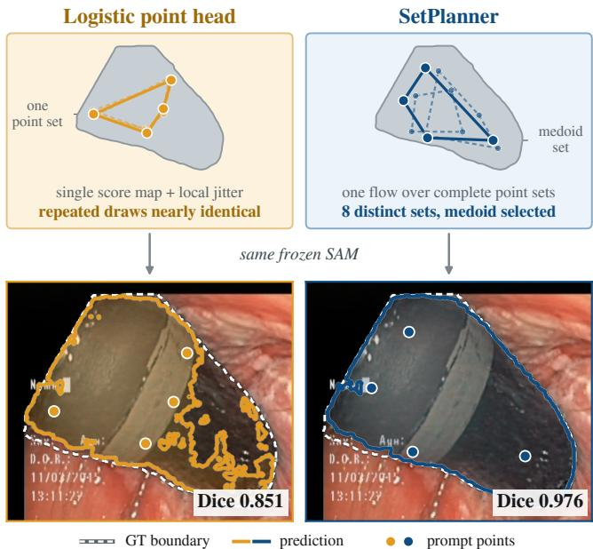
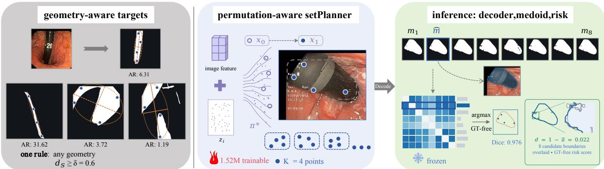

# SETPLANNER: A LIGHTWEIGHT PLUG-IN POINT-SET PLANNER FOR FROZEN SAM

Dawei Yan1, Yuezhe Yang2, Menglan Ruan1, Chunfeng Yang1, and Yudong Zhang1

1School of Computer Science and Engineering, Southeast Univ., China 2School of Computer Science, Univ. of Sydney, Australia

{220255428, 230250010, yudongzhang, chunfeng.yang}@seu.edu.cn, yangyuezhe@gmail.com

Code: https://github.com/davidyan200012-bot/SetPlanner

## ABSTRACT

Segment Anything Models provide reusable priors, yet they require user prompts and cannot support fully automatic instrument segmentation. Automatic prompting is difficult for thin, articulated, reflective, and partly occluded tools, where several configurations can be valid. We formulate automatic prompting as lightweight point-set planning and isolate the point source under a frozen pathway. To this end, we present SetPlanner, a 1.52M-parameter plug-in pointset planner for frozen SAM. The plug-in preserves SAM’s pointprompt interface and enables reuse across backbones. SetPlanner plans complete unordered K-point sets from geometry-aware targets with a permutation-aware conditional flow. SAM decodes eight candidates; their consensus readout yields a ground-truth-free prediction. Across three endoscopic datasets, SetPlanner wins all six transfer routes over a LoRA-adapted system. Under our frozen-pathway protocol, SetPlanner reaches 0.934 Dice on Kvasir-Instrument and recovers 96% of a 44.4-point localization gap, while candidate disagreement ranks low-Dice cases at AUROC 0.969.

Index Terms— Surgical instrument segmentation, SAM, automatic prompting, point-set generation, flow matching

## 1. INTRODUCTION

Fully automatic instrument segmentation supports endoscopic navigation and safety monitoring [1, 2, 3], producing one mask for every video frame without human interaction. Segment Anything Models [4, 5] provide a strong, reusable mask prior, yet native SAM inference begins with user-supplied points or boxes. Direct deployment therefore reduces to prompt acquisition: an endoscopic system must generate its own point source from each frame.

Automatic endoscopic prompting must satisfy three coupled requirements: the points must fall on the instrument foreground despite thin shafts, articulated tips, glare, occlusion, and disconnected appearances; more than one configuration is valid, so several complete hypotheses must be produced; and the choice among them must be ground-truth (GT) free.

For us the third requirement binds: the model must choose its own points. Fine-tuning a large segmentation model is data intensive [6, 7]. A larger source set can produce strong source-domain accuracy, yet the adapted response may still degrade on a new dataset from the same clinical domain [8, 9].

  
Fig. 1. Point-source contrast. Left: a single score map with local jitter. Right: one flow over complete point sets. Each polygon links one K=4 point set. The qualitative pair uses an official Kvasir-Instrument test frame.

Freezing the foundation pathway and learning only a compact point source lowers that demand and leaves SAM’s pointprompt interface untouched. Attribution imposes a fourth requirement: the response function must stay fixed, which freezing delivers. Under a rigid (+64,+64)-pixel shift of the GT-derived reference (one eighth of the canvas width), the Dice-point drop is 60.3 with a frozen decoder but 3.8 under LoRA [10] fine-tuning: the response stays sensitive to coordinate error, so a change in decoded accuracy is attributable to the point source [8]. Adapting the decoder moves the response function with the training signal; freezing it is what makes the localization gap measurable, the distance from the strongest zero-training rule to a GT-derived point reference. Our frozen-pathway protocol measures this gap.

Existing automatic prompting predicts a single point set or mask from image features [11, 12, 13, 14, 15], transfers prompts from references or concepts [16, 17, 18], refines supplied geometry [19, 20], or adapts the prompt encoder [21, 22]. ProSAM samples probabilistic prompt embeddings [23] and SeqSAM predicts mask hypotheses autoregressively [24]; both aggregate in latent or mask space. No single line supplies all three requirements; fully automatic endoscopy needs them in one point-set module that returns explicit coordinates.

  
Fig. 2. SetPlanner, left to right. Targets x come from the eroded foreground under a Mahalanobis floor in the foreground’s second-moment frame; AR = axis ratio. In model coordinates [−1,1], the optimal assignment $\pi ^ { \star }$ pairs a Gaussian draw with the target set. M=8 decoded candidates reduce to one by a consensus readout; disagreement d ranks failures without GT.

We propose SetPlanner, a plug-in point-set planner with 1.52M parameters. Frozen image features condition a flow that samples complete unordered K-point sets. Fig. 1 contrasts such complete sets with a jittered score map, whose repeated draws are nearly identical. The native SAM pathway decodes eight candidates that share a single image encoding, a consensus readout returns one observed candidate, and disagreement supplies a failure score that flags frames for review. On Kvasir-Instrument, SetPlanner recovers 96% of a 44.4-point localization gap under a single frozen SAM. Across Kvasir, Endoscapes, and EndoVis, it wins all six transfer routes over a LoRA-adapted system, which uses random point prompts. We make three contributions:

• We formulate automatic endoscopic prompting as a pointset planning problem and define a frozen-pathway protocol that isolates the point source. A frozen decoder keeps the response coordinate-sensitive, so the localization gap is measurable at low data cost.

• SetPlanner plans complete unordered K-point sets with a permutation-aware conditional flow and geometry-aware targets, so an ambiguous frame yields several distinct coherent hypotheses.

• We reduce a decoded candidate pool to one mask by a GT-free consensus readout and reuse the candidates’ disagreement as a test-time failure score.

## 2. METHOD

Planning therefore means choosing a point set $\textstyle P \in \mathbb { R } ^ { K \times 2 }$ from the image alone, with no access to the GT mask Y at test time. SetPlanner adds one trainable component to an otherwise frozen SAM: a 1.52M-parameter point-set planner that supplies the prompts the native pathway expects. Fig. 2 follows one frame through it. A point set holds K points; a candidate pool holds M decoded sets.

Table 1. Automatic point sources on frozen SAM. Kvasir. Hit is the fraction of points inside GT. Best scores are bold.
<table><tr><td>Point source</td><td>Dice ↑</td><td>Mask IoU ↑</td><td>Hit ↑</td></tr><tr><td>Zero-training rules</td><td></td><td></td><td></td></tr><tr><td>Uniform random</td><td>0.091</td><td>0.060</td><td>0.114</td></tr><tr><td>Center Gaussian Color rule</td><td>0.121 0.509</td><td>0.091</td><td>0.131</td></tr><tr><td>Learned sources (M=1, control), frozen decoder</td><td></td><td>0.436</td><td>0.564</td></tr><tr><td colspan="4"></td></tr><tr><td>Logistic-1</td><td>0.922</td><td>0.873</td><td>0.970</td></tr><tr><td>Deterministic slots-1</td><td>0.924</td><td>0.880</td><td>0.975</td></tr><tr><td>SetPlanner-1</td><td>0.925</td><td>0.880</td><td>0.955</td></tr><tr><td colspan="4">SetPlanner (M=8), frozen decoder</td></tr><tr><td>SetPlanner-8</td><td>0.934</td><td>0.894</td><td>0.975</td></tr></table>

## 2.1. Frozen-pathway localization gap

Under our frozen-pathway protocol, $f _ { \phi }$ is the frozen SAM mapping from image I and point set $P \in \mathbb { R } ^ { K \times 2 }$ to a mask, with GT mask Y. We prescribe $\mathcal { P } _ { 0 }$ as five zero-training rules in the style of training-free prompt strategies [25]: uniform, center-Gaussian, color (lowest chroma span), desaturation (lowest saturation), and specular. On Kvasir the color rule is the strongest of the five, so Table 1 groups it with the two rules that use no image information. With $f _ { \phi }$ and K=4 fixed, the localization gap for this protocol is

$$
\begin{array} { r l } & { \Delta _ { \mathrm { l o c } } = 1 0 0 \cdot \bigg ( \mathbb { E } \Big [ \mathrm { D i c e } ( f _ { \phi } ( I , P ^ { \star } ) , Y ) \Big ] } \\ & { \qquad - \underset { p \in \mathcal { P } _ { 0 } } { \operatorname* { m a x } } \mathbb { E } \Big [ \mathrm { D i c e } ( f _ { \phi } ( I , p ( I ) ) , Y ) \Big ] \bigg ) , } \end{array}\tag{1}
$$

where $P ^ { \star }$ is sampled from the eroded GT foreground through the same point-prompt interface.

The protocol fixes two reference levels: the rule floor (the best of $\mathcal { P } _ { 0 } )$ and the GT-derived reference $P ^ { \star }$ . Their difference is the localization gap: the accuracy available from improving the point source while the decoder and interface remain fixed. On Kvasir it is $\Delta _ { \mathrm { l o c } } { = } 4 4 . 4$ Dice points. Learned point sources sit between the two levels (Table 1).

## 2.2. SetPlanner: a better point-set planner

Endoscopic tool geometry couples the positions inside each point set: a useful hypothesis must span a thin, oriented foreground despite glare and partial occlusion. SetPlanner therefore generates each set jointly rather than point by point, so that repeated draws differ by more than perturbing one prediction can. Training targets x1 are sampled from the foreground of Y eroded by 4 px. Their pairwise separation is a dimensionless Mahalanobis distance in the foreground’s second-moment frame, normalized by principal-axis lengths and constrained above δ=0.6. This geometry-aware constraint distributes points along elongated tools while adapting to scale and orientation. Target sets are drawn by rejection sampling; if no feasible set is found, δ is halved and then dropped. Gaussian noise $x _ { 0 }$ supplies the residual spatial ambiguity. A rectified flow [26, 27] transports $x _ { 0 }$ to x1 with a velocity field $\nu _ { \theta }$ that SetPlanner implements as four 128-d blocks. Frozen SAM features condition the flow: a 1×1 convolution maps the image encoder’s 256 × 64 × 64 output to 128 channels and average-pools it to 16×16 key–value tokens, which the K point tokens attend to in each block by cross-attention. A sinusoidal embedding of $t ,$ added to a global token pooled from them, drives adaptive layer norm in every block. Point-token self-attention captures within-set interactions, and coordinate-only point tokens with shared parameters make v permutation equivariant [28]. Each integration yields one coherent unordered set.

## 2.3. Permutation-aware training and inference

The target carries no point identities, so the objective must treat every permutation of a set identically. With $x _ { 0 } \sim$ $\mathcal { N } ( 0 , \mathbf { I } _ { K \times 2 } )$ and $x _ { 1 }$ (eroded-foreground targets) as defined in Sec. 2.2, and $t \sim \mathcal { U } ( 0 , 1 )$ , we solve the noise-to-target correspondence $\pi \in S _ { K }$ , one of the K! assignments, before regression:

$$
\begin{array} { c } { { \displaystyle \pi ^ { \star } = \arg \operatorname* { m i n } _ { \pi \in S _ { K } } \sum _ { k = 1 } ^ { K } \| x _ { 1 , \pi ( k ) } - x _ { 0 , k } \| _ { 2 } ^ { 2 } , } } \\ { { \displaystyle x _ { t } = ( 1 - t ) x _ { 0 } + t \pi ^ { \star } ( x _ { 1 } ) , } } \\ { { \mathcal { L } ( \theta ) = \mathbb { E } \left\| \nu _ { \theta } ( x _ { t } , t , c ) - \left( \pi ^ { \star } ( x _ { 1 } ) - x _ { 0 } \right) \right\| _ { 2 } ^ { 2 } , } } \end{array}\tag{2}
$$

where c is the SAM image feature. SetPlanner’s θ holds all trainable parameters; the SAM pathway stays frozen. At inference, M=8 independent noise draws are each integrated from $t = 0 \mathrm { ~ t o ~ } t = 1$ by Euler in eight steps, producing M complete point sets.

## 2.4. Candidate selection and failure ranking

SAM decodes M=8 candidates; let $\{ m _ { i } \} _ { i = 1 } ^ { M }$ be their masks — a common output space in which to compare complete pointset hypotheses. Deployment requires one mask per frame, and the choice among them must be GT-free, resting only on model responses available at test time. Our consensus readout takes the medoid, the candidate agreeing most with the others. It returns $m _ { \hat { l } } ,$ one observed candidate, and so keeps the selected mask attributable to a point set. We use candidate disagreement d as a failure score [29, 30]:

$$
\begin{array} { r } { \hat { \boldsymbol { \imath } } = \arg \operatorname* { m a x } _ { i } \frac { 1 } { M - 1 } \sum _ { j \neq i } a ( \boldsymbol { m } _ { i } , \boldsymbol { m } _ { j } ) , } \end{array}
$$

$$
\begin{array} { r } { d = 1 - \frac { 2 } { M ( M - 1 ) } \sum _ { i < j } a ( m _ { i } , m _ { j } ) , } \end{array}\tag{3}
$$

(4)

where a is the pair IoU, the intersection-over-union overlap between two masks. Under the frozen decoder, independent noise draws make d a measure of variation induced by the automatic point source. The readout is defined for any $M \geq 2$ and is applied unchanged to every candidate pool we compare.

## 3. EXPERIMENTS

## 3.1. Protocol

The experiment uses the official Kvasir-Instrument 472/118 split [31], a 512×512 canvas, and native-resolution Dice. Every Dice value is a union-mask Dice and a three-seed mean: instruments in a frame are merged. Pair IoU averages the overlap among candidates in one pool. Table 1 also reports Mask IoU on the same masks and Hit, the fraction of points inside GT. The SAM image encoder, prompt encoder, and decoder remain frozen.

Candidate pools use M=8 candidates decoded from point sets of K=4 points; selection saturates beyond this budget, and the plug-in adds 1.0% FLOPs over a single prompt set. Stochastic sources average repeated sampling. SetPlanner is compared with two automatic point sources, both instantiated at the same point-prompt interface: a 257-parameter logistic head on the frozen embedding, in the style of Self-Prompting [11], whose eight sampled sets are reduced by the same readout (Logistic); and a SAM adapted with LoRA on the same source data, prompted with random points inside the endoscope field of view. Both return explicit coordinates, so each source’s error is observable. A deterministicslots control provides the M=1 baseline: the same planner with K learnable slots in place of the noise input, regressing one K-point set without flow sampling. Local perturbations use σ=0.02 in model coordinates. Each candidate is decoded once, resampled to 512×512, and thresholded at 0.5.

Each dataset row retrains the same planner: Endoscapes uses a video-grouped 334/112 split [32]; EndoVis, 1778 nonempty training frames and the official 1200-frame test set [33], half of it temporally adjacent to training video. GTderived references use an isotropic 48 px minimum separation on Endoscapes and an anisotropic δ=0.6 on Kvasir and EndoVis. We first test that the frozen response stays coordinatesensitive: a rigid (+64,+64) shift of the GT-derived reference costs 60.3 Dice points under the frozen decoder, 3.8 under LoRA, and 0.6 under a fully fine-tuned decoder, so decoded accuracy stays attributable to the point source.

Table 2. SetPlanner against Logistic and LoRA, all sharing a frozen image encoder. All three systems decode an M=8 candidate pool and reduce it with the same consensus readout. Top: per-target reference levels. Bottom: Dice by training set; each block tests on one target, so its first row is in-domain and the rows below it transfer. Bold marks the best system in a row. $\varDelta _ { \mathrm { m } }$ is the eight-candidate gain over one candidate, in the frozen/LoRA order.
<table><tr><td></td><td>Kvasir</td><td>Endoscapes</td><td>EndoVis</td><td>Kvasir (SAM1)</td><td></td></tr><tr><td>rule floor</td><td>0.509</td><td>0.181</td><td>0.198</td><td></td><td>0.594</td></tr><tr><td>GT-ref</td><td>0.953</td><td>0.901</td><td>0.929</td><td></td><td>0.937</td></tr><tr><td> $\Delta _ { \mathrm { l o c } }$ </td><td>44.4</td><td>72.1</td><td>73.0</td><td></td><td>34.3</td></tr><tr><td colspan="4"></td><td>LoRA</td><td> $\varDelta _ { \mathrm { m } }$ </td></tr><tr><td colspan="6">Kvasir</td></tr><tr><td colspan="2">Kvasir 472</td><td>0.934</td><td>0.933</td><td>0.703</td><td>+0.9/+0.0</td></tr><tr><td colspan="2">Endoscapes 334</td><td>0.888</td><td></td><td>0.520</td><td>+4.3/+0.8</td></tr><tr><td colspan="2">EndoVis 1778</td><td>0.818</td><td></td><td>0.751</td><td>+5.1/+1.0</td></tr><tr><td colspan="6">Kvasir (SAM1) Kvasir 472</td></tr><tr><td colspan="2">Endoscapes</td><td>0.900</td><td>0.870</td><td></td><td></td></tr><tr><td colspan="6">Endoscapes 334</td></tr><tr><td>Kvasir 472</td><td></td><td>0.862 0.803</td><td>0.870</td><td>0.693 0.582</td><td>+4.1/+0.1 +4.6/+1.1</td></tr><tr><td colspan="2">EndoVis 1778</td><td>0.876</td><td></td><td>0.752</td><td>+7.7/+1.9</td></tr><tr><td colspan="6"></td></tr><tr><td colspan="6">EndoVis</td></tr><tr><td></td><td>EndoVis 1778</td><td>0.911</td><td>0.899</td><td>0.929</td><td>+3.5/+0.1</td></tr><tr><td>Kvasir 472</td><td></td><td>0.801</td><td></td><td>0.761</td><td>+8.2/+1.3</td></tr><tr><td>Endoscapes 334</td><td></td><td>0.848</td><td></td><td>0.803</td><td>+4.2/+0.5</td></tr></table>

## 3.2. Gap recovery, reuse, and transfer

Table 2 compares the three systems on every training set. Its top block fixes the protocol’s two reference levels and the gap between them; the lower block reports Dice, and its last column $\varDelta _ { \mathrm { m } }$ is the pool’s gain over one candidate. SetPlanner reaches 0.934 against a 0.953 GT-derived reference, recovering 96% of the localization gap; the remaining 1.9 points are prompt-source headroom.

The same planner is then retrained per dataset and reused across backbones. In-domain, it improves on Logistic by 3.0 points on Kvasir with SAM1 and 1.2 on EndoVis, and on Kvasir and Endoscapes the LoRA-adapted system reaches only 0.703 and 0.693 Dice, whereas the frozen plug-in stays above 0.86 on all three: model adaptation needs a large source set, the frozen plug-in does not. After training on EndoVis, the LoRA-adapted system transfers to only 0.751 on Kvasir and 0.803 on Endoscapes, where frozen SetPlanner reaches 0.818 and 0.848. The frozen plug-in system wins all six transfer routes and raises mean Dice from 0.695 to 0.839. The pool’s gain over one candidate also depends on the decoder: it survives a frozen decoder but collapses once LoRA adapts it, since an adapted decoder absorbs the variation between point sets.

## 3.3. Ablations and failure ranking

Generation and selection both prove load-bearing: one decides what the pool contains, the other what is read from it. Local perturbations produce near-duplicate pools with pair

Table 3. Candidate generation and selection ablations. Kvasir. M=1 is one candidate, M=8 the medoid-selected pool, and Oracle the best; all report Dice. The candidate-source rows perturb deterministic slots; the last group varies the selector on one pool. TTA = test-time augmentation. Predicted IoU selects by SAM’s own maskquality score.
<table><tr><td>Variant</td><td>M=1</td><td>M=8</td><td>Oracle</td><td>Pair IoU</td></tr><tr><td>Points per set</td><td></td><td></td><td></td><td></td></tr><tr><td>K=1</td><td>0.855</td><td>0.911</td><td>0.932</td><td>0.865</td></tr><tr><td>K=2</td><td>0.912</td><td>0.928</td><td>0.941</td><td>0.936</td></tr><tr><td>K=4</td><td>0.925</td><td>0.934</td><td>0.947</td><td>0.951</td></tr><tr><td>K=8</td><td>0.909</td><td>0.918</td><td>0.932</td><td>0.949</td></tr><tr><td>Candidate source</td><td></td><td></td><td></td><td></td></tr><tr><td>8 independent models</td><td></td><td>0.929</td><td>0.942</td><td>0.964</td></tr><tr><td>Deterministic slots</td><td>0.924</td><td></td><td></td><td></td></tr><tr><td>+ flip (TTA) + cond. noise</td><td>0.924 0.923</td><td>0.923</td><td>0.936</td><td>0.970 0.997</td></tr><tr><td>+ slot noise</td><td>0.923</td><td>0.923</td><td>0.925</td><td></td></tr><tr><td>+ point jitter</td><td></td><td>0.923 0.926</td><td>0.925</td><td>0.996</td></tr><tr><td></td><td>0.924</td><td></td><td>0.934</td><td>0.965</td></tr><tr><td>Selector on the SetPlanner pool</td><td></td><td></td><td></td><td></td></tr><tr><td>Random</td><td></td><td>0.929</td><td>0.947</td><td>0.951</td></tr><tr><td>Predicted IoU</td><td></td><td>0.924</td><td>0.947</td><td>0.951</td></tr><tr><td>Medoid</td><td>1</td><td>0.934</td><td>0.947</td><td>0.951</td></tr></table>

IoU at least 0.965, whereas SetPlanner lowers it to 0.951 and reaches 0.934 selected Dice (Table 3): generation, not perturbation, is what makes a pool worth selecting from. Eight independently trained models reach 0.929, 0.5 points below Set-Planner at eight times the parameter count, so the advantage does not come from capacity. Their pools are near-duplicates at pair IoU 0.964, so diversity does not come from ensembling either. The points-per-set rows peak at K=4, and a larger perset budget leaves less for the pool to add.

Medoid selection is the best of the three selectors. Candidate disagreement ranks Kvasir frames with Dice< 0.7 at an area under the ROC curve (AUROC) of 0.969 and provides a test-time failure score [34], so frames can be deferred by rank.

## 4. CONCLUSION

SetPlanner supplies the automatic point source that frozen SAM needs for endoscopic video. Automatic prompting is formulated as point-set planning under a frozen-pathway protocol. This plug-in preserves the point-prompt interface, plans complete unordered hypotheses from geometry-aware targets, and selects among them with a GT-free consensus readout whose disagreement also ranks failures. Its disagreement score reaches AUROC 0.969 on low-Dice cases, and SetPlanner wins all six transfer routes. One frozen architecture therefore delivers low data demand and portability across backbones and datasets; under the frozen-pathway protocol it recovers 96% of the localization gap without touching the decoder. Absolute Dice and the gap size remain dataset- and backbone-specific.

## 5. REFERENCES

[1] Tobias Rueckert, Daniel Rueckert, and Christoph Palm, “Methods and datasets for segmentation of minimally invasive surgical instruments in endoscopic images and videos: A review of the state of the art,” Comput. Biol. Med., vol. 169, pp. 107929, 2024.

[2] Xinning Yao, Jingjing Wang, Jinghua Yue, et al., “Hierarchical prototype-memory adaptation of SAM for surgical instrument segmentation,” arXiv:2608.24541, 2026.

[3] Wenxi Yue, Jing Zhang, Kun Hu, et al., “SurgicalSAM: Efficient class promptable surgical instrument segmentation,” in Proc. AAAI Conf. Artif. Intell., 2024.

[4] Alexander Kirillov, Eric Mintun, Nikhila Ravi, et al., “Segment anything,” in Proc. IEEE/CVF Int. Conf. Comput. Vis. (ICCV), 2023.

[5] Nicolas Carion, Laura Gustafson, Yuan-Ting Hu, et al., “SAM 3: Segment anything with concepts,” in Proc. Int. Conf. Learn. Representations (ICLR), 2026.

[6] Jun Ma, Yuting He, Feifei Li, et al., “Segment anything in medical images,” Nature Communications, vol. 15, pp. 654, 2024.

[7] Kaidong Zhang and Dong Liu, “Customized segment anything model for medical image segmentation,” arXiv:2304.13785, 2023.

[8] Marko Haralovic, Sounic Akkaraju, Carlo Baretta, et al.,´ “When adaptation hurts: Connecting representational drift to OOD failures in MedSAM fine-tuning,” arXiv:2608.21300, 2026.

[9] Soumitri Chattopadhyay, Basar Demir, and Marc Niethammer, “On the robustness of foundational 3D medical image segmentation models against imprecise visual prompts,” in Proc. IEEE Int. Symp. Biomed. Imaging (ISBI), 2026.

[10] Edward J. Hu, Yelong Shen, Phillip Wallis, Zeyuan Allen-Zhu, Yuanzhi Li, Shean Wang, Lu Wang, and Weizhu Chen, “LoRA: Low-rank adaptation of large language models,” in Proc. Int. Conf. Learn. Represent. (ICLR), 2022.

[11] Qi Wu, Yuyao Zhang, and Marawan Elbatel, “Self-prompting large vision models for few-shot medical image segmentation,” in Proc. MICCAI Workshop Domain Adapt. Represent. Transfer (DART), 2023, pp. 156–167.

[12] Yi Chen, Mu-Young Son, Chuanbo Hua, et al., “AoP-SAM: Automation of prompts for efficient segmentation,” in Proc. AAAI Conf. Artif. Intell., 2025.

[13] Chunpeng Zhou, Kangjie Ning, Qianqian Shen, et al., “SAM-SP: Self-prompting makes SAM great again,” arXiv:2408.12364, 2024.

[14] Bin Xie, Hao Tang, Dawen Cai, et al., “Self-prompt SAM: Medical image segmentation via automatic prompt SAM adaptation,” arXiv:2502.00630, 2025.

[15] Mengmeng Zhang, Xingyuan Dai, Yicheng Sun, et al., “Hierarchical self-prompting SAM: A prompt-free medical image segmentation framework,” arXiv:2506.02854, 2025.

[16] Renrui Zhang, Zhengkai Jiang, Ziyu Guo, et al., “Personalize segment anything model with one shot,” in Proc. Int. Conf. Learn. Represent. (ICLR), 2024.

[17] Quan Zhou, Shaoqing Zhai, Qiang Hu, et al., “Mask to concept: Auto-promptable SAM3 via efficient test-time concept embedding search for few-shot annotation,” in Proc. Int. Conf. Med. Image Comput. Comput.-Assist. Interv. (MICCAI), 2026.

[18] Chongcong Jiang, Tianxingjian Ding, Chuhan Song, et al., “Medical SAM3: A foundation model for universal promptdriven medical image segmentation,” arXiv:2601.10880, 2026.

[19] Nuren Zhaksylyk, Ibrahim Almakky, Jay Paranjape, et al., “RP-SAM2: Refining point prompts for stable surgical instrument segmentation,” arXiv:2504.07117, 2025.

[20] Adrien Meyer, Lorenzo Arboit, Giuseppe Massimiani, et al., “S4M: 4-points to segment anything,” in Proc. Int. Conf. Inf. Process. Comput.-Assist. Interv. (IPCAI), 2026.

[21] Tomer Shaharabany, Aviad Dahan, Raja Giryes, et al., “AutoSAM: Adapting SAM to medical images by overloading the prompt encoder,” in Brit. Mach. Vis. Conf. (BMVC), 2023.

[22] Weizhao He, Yang Zhang, Wei Zhuo, et al., “APSeg: Autoprompt network for cross-domain few-shot semantic segmentation,” in Proc. IEEE/CVF Conf. Comput. Vis. Pattern Recognit. (CVPR), 2024.

[23] Xiaoqi Wang, Clint Sebastian, Wenbin He, et al., “ProSAM: Enhancing the robustness of SAM-based visual reference segmentation with probabilistic prompts,” in Proc. IEEE/CVF Int. Conf. Comput. Vis. (ICCV), 2025.

[24] Benjamin Towle, Xin Chen, and Ke Zhou, “SeqSAM: Autoregressive multiple hypothesis prediction for medical image segmentation using SAM,” in Proc. IEEE Int. Symp. Biomed. Imaging (ISBI), 2025.

[25] Cheng Yuan, Jian Jiang, Kunyi Yang, et al., “Systematic evaluation and guidelines for segment anything model in surgical video analysis,” npj Digital Surgery, vol. 1, no. 1, pp. 2, 2026.

[26] Xingchao Liu, Chengyue Gong, and Qiang Liu, “Flow straight and fast: Learning to generate and transfer data with rectified flow,” in Proc. Int. Conf. Learn. Represent. (ICLR), 2023.

[27] Yaron Lipman, Ricky T. Q. Chen, Heli Ben-Hamu, et al., “Flow matching for generative modeling,” in Proc. Int. Conf. Learn. Represent. (ICLR), 2023.

[28] Yangming Li, Chaoyu Liu, and Carola-Bibiane Schönlieb, “Generative unordered flow for set-structured data generation,” arXiv:2501.17770, 2025.

[29] Prithwijit Chowdhury, Mohit Prabhushankar, and Ghassan Al-Regib, “BALD-SAM: Disagreement-based active prompting in interactive segmentation,” arXiv:2603.10828, 2026.

[30] Siddharth Gupta and Jitin Singla, “Cross-model agreement as a deployment-time reliability signal for automatic polyp segmentation,” arXiv:2609.10495, 2026.

[31] Debesh Jha, Sharib Ali, Krister Emanuelsen, et al., “Kvasir-Instrument: Diagnostic and therapeutic tool segmentation dataset in gastrointestinal endoscopy,” in Proc. Int. Conf. Multimedia Modeling (MMM), 2021.

[32] Pietro Mascagni, Deepak Alapatt, Aditya Murali, et al., “Endoscapes, a critical view of safety and surgical scene segmentation dataset for laparoscopic cholecystectomy,” Sci. Data, vol. 12, no. 1, pp. 331, 2025.

[33] Max Allan, Alex Shvets, Thomas Kurmann, et al., “2017 robotic instrument segmentation challenge,” arXiv:1902.06426, 2019.

[34] Bruno L. C. Borges, Bruno M. Pacheco, and Danilo Silva, “Soft dice confidence: A near-optimal confidence estimator for selective prediction in semantic segmentation,” Machine Learning, vol. 115, no. 7, pp. 176, 2026.

## Compliance with Ethical Standards

This study used only openly available, de-identified human subject data from Kvasir-Instrument [31], Endoscapes [32], and EndoVis2017 [33]. Ethical approval was not required, as confirmed by the licenses under which these open-access datasets are distributed.