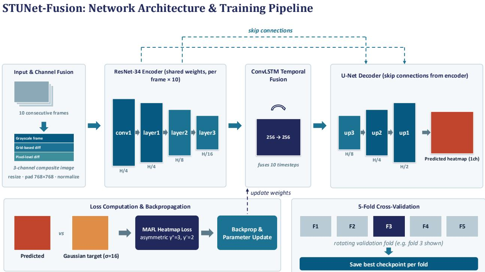
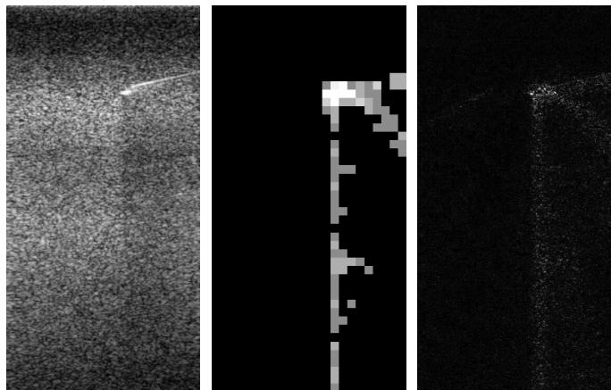
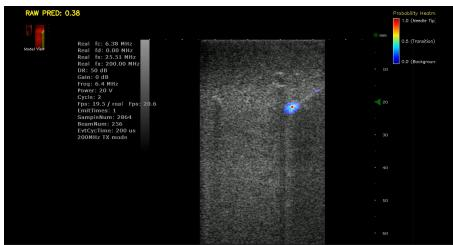
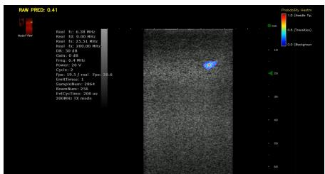
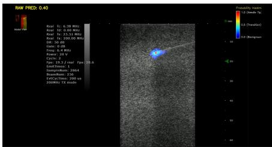

# STUNET-FUSION: SPATIOTEMPORAL NEEDLE-TIP LOCALIZATION IN ULTRASOUND VIDEO VIA MULTI-CHANNEL MOTION FUSION

Chia-Chi Hsu1, Chia-Hsuan Hsu2, Che-Chou Shen1

1National Taiwan University of Science and Technology, Taiwan 2National Yang Ming Chiao Tung University, Taiwan

## ABSTRACT

Needle-tip localization in ultrasound remains challenging because the needle may appear weak, discontinuous, or partially invisible, while imaging artifacts and anatomical structures can produce similar responses. To address this problem, we propose STUNet-Fusion, a spatiotemporal framework for needle-tip localization in ultrasound videos. The proposed method formulates the input as a tri-channel spatio-temporal fusion tensor, comprising grayscale appearance, grid-based motion feature, and raw frame difference. A shared ResNet-34 encoder extracts spatial features, ConvLSTM integrates temporal dependencies, and a U-Net decoder reconstructs a dense probability heatmap. The final coordinates are extracted via a soft-argmax operation to achieve sub-pixel localization accuracy. Experimental results demonstrate that this spatiotemporal fusion strategy significantly improves localization robustness compared to conventional baselines.

Index Terms— ultrasound, needle-tip localization, spatiotemporal learning, heatmap regression

## 1. INTRODUCTION

Ultrasound-guided needle procedures are widely used in clinical interventions because ultrasound provides real-time imaging without ionizing radiation. Accurate localization of the needle tip is essential for safe and precise needle placement, especially when the target region is small or close to sensitive anatomical structures.

However, automatic needle-tip localization in ultrasound remains challenging. Needle visibility is affected by insonation angle, imaging-plane mismatch, insertion depth, and surrounding tissue. The needle tip may appear weak, discontinuous, or partially invisible, while speckle, reverberation, shadowing, and line-like anatomical structures can produce needle-like responses. These factors make it difficult to distinguish the true needle tip from background artifacts.

Many existing learning-based methods process each ultrasound frame independently. Single-frame convolutional models have been used for needle detection, needle-tip localization, and coordinate regression [1–3]. Although these methods can capture spatial appearance information, they mainly rely on static image information and do not explicitly use temporal evidence from consecutive frames. As a result, localization can become ambiguous when the needle tip has low contrast, is partially obscured, or resembles surrounding structures.

Temporal information provides an important way to resolve this ambiguity [4–6]. During needle insertion, needle motion produces localized intensity changes across consecutive ultrasound frames. Prior studies have explored digital subtraction, time-aware neural networks, video-based learning, and motion-aware segmentation to exploit temporal or motion information for ultrasound needle analysis [7–10]. These studies suggest that appearance and motion information are complementary for improving needle localization robustness.

Based on this observation, this work proposes STUNet-Fusion, a spatiotemporal heatmap-based framework for needle-tip localization in ultrasound video. The key idea is to combine static appearance with motion information from consecutive frames, so that the model can use both the visual structure of the needle and its temporal movement information.

In the proposed method, each ultrasound frame is represented using three input channels: grayscale appearance, gridbased motion feature, and raw frame difference. A shared ResNet-34 encoder extracts spatial features from each frame, ConvLSTM integrates temporal information across the frame sequence, and a U-Net decoder with skip connections reconstructs a dense needle-tip heatmap. The final needle-tip coordinate is obtained from the peak response of the predicted heatmap.

The main contributions of this work are as follows:

• A three-channel input representation that combines grayscale appearance, grid-based motion feature, and raw frame difference for ultrasound needle-tip localization.

• A spatiotemporal heatmap-based architecture integrating ResNet-34, ConvLSTM, and a U-Net decoder with skip connections.

• A video-level evaluation including U-Net baseline comparison and ablation studies of temporal fusion, skip connections, and motion inputs.

## 2. RELATED WORK

## 2.1. Single-Frame Needle Localization

Automatic needle localization in ultrasound is challenging because the needle may appear weak, fragmented, or partially invisible under unfavorable insonation angles, while speckle, reverberation, and line-like anatomical structures can produce needle-like responses. Earlier learning-based methods commonly formulated this task as single-frame detection or coordinate regression [2]. A fully convolutional proposal network combined with a region-based detector was used to identify needle candidates and estimate the needle trajectory and tip location [1]. Another approach directly regressed the reflection centroid of an out-of-plane needle from a single ultrasound image [3].

Although these methods demonstrated the effectiveness of convolutional representations for needle localization, they mainly relied on static image appearance. To address this limitation, we incorporate temporal evidence from consecutive ultrasound frames, which provides additional motion cues when the needle tip is weak, ambiguous, or partially obscured in a single frame.

## 2.2. Motion-Based and Multi-Task Ultrasound Methods

Temporal intensity variation provides useful information when the needle tip is weak or ambiguous in a single ultrasound frame. Digital subtraction has been used to enhance subtle changes caused by needle motion before applying a learned detector or regression model [5, 7, 10]. Timeaware deep neural networks have also used consecutive ultrasound frames to improve needle-tip localization under low-visibility conditions [8]. Video-based deep learning methods have further shown that temporal encoding can improve ultrasound-guided needle insertion analysis compared with frame-independent spatial models [9]. Other studies have jointly addressed needle segmentation, tip detection, and visibility estimation using multi-task networks, modified U-Net architectures, and acquisition-side beam steering [11].

These methods show that motion information can complement static appearance and reduce ambiguity caused by ultrasound artifacts. We build on this idea by combining grayscale appearance with both grid-based motion feature and raw frame difference, allowing the model to use motion cues at different spatial scales.

## 2.3. Spatial–Temporal Deep Architectures

Residual networks provide effective per-frame feature extraction and improve the optimization of deep convolutional models [12]. ConvLSTM replaces fully connected state transitions with convolutional operations, allowing temporal information to be integrated while preserving spatial structure [13]. U-Net decoders and encoder–decoder skip connections restore fine spatial details required for precise localization [14].

Building on these components, we use a shared ResNet-34 encoder for per-frame spatial feature extraction, ConvL-STM for temporal fusion across consecutive frames, and a U-Net decoder with skip connections to reconstruct a dense needle-tip heatmap.

## 3. METHODOLOGY

## 3.1. Overview

STUNet-Fusion localizes the needle tip from a short sequence of ultrasound frames by combining appearance and motion information. As illustrated in Fig. 1, the framework consists of four main stages: three-channel input construction, per-frame spatial feature extraction using a shared ResNet-34 encoder, temporal feature aggregation using ConvLSTM, and heatmap reconstruction using a U-Net decoder. The model is supervised with a Gaussian target heatmap and an asymmetric focal heatmap loss.

## 3.2. Problem Formulation and Input Representation

Let an ultrasound video clip contain T consecutive frames $\{ I _ { t } \} _ { t = 1 } ^ { T }$ (where $I _ { t } \in \mathbb { R } ^ { H \times \dot { W } }$ denotes the t-th grayscale ultrasound image), where the objective is to localize the needle tip in the final frame $I _ { T }$ . Rather than directly regressing an $( x , y )$ coordinate, the model predicts a dense heatmap $\hat { Y } ^ { - } \in \mathbb { R } ^ { \hat { H } \times \hat { W } }$ . During training, the annotated needle-tip coordinate in the final frame is converted into a Gaussian target heatmap $Y \in \mathbb { R } ^ { H \times W }$ . During inference, the predicted coordinate is obtained via a soft-argmax operation over a local window Ω centered around the peak response of the sigmoidnormalized heatmap $( \mathrm { i } . \mathrm { e } . , \sigma ( \cdot ) )$ to achieve sub-pixel accuracy:

$$
( \hat { x } , \hat { y } ) = \frac { \sum _ { ( x , y ) \in \Omega } ( x , y ) \cdot \sigma \left( \hat { Y } _ { y , x } \right) } { \sum _ { ( x , y ) \in \Omega } \sigma \left( \hat { Y } _ { y , x } \right) } ,\tag{1}
$$

where $\sigma ( \cdot )$ denotes the sigmoid function, and Ω represents a predefined local patch surrounding the maximum activation.

To represent both needle appearance and inter-frame motion, each frame is converted to grayscale and paired with its immediately preceding frame. The pixel-level motion image is computed as the absolute frame difference

$$
D _ { t } = \left| I _ { t } - I _ { t - 1 } \right| .\tag{2}
$$

A coarse regional-motion image $G _ { t }$ is constructed from $D _ { t } .$ . Specifically, the difference image $D _ { t }$ is partitioned into non-overlapping blocks to form a $1 6 \times 1 6$ spatial grid. The local mean intensity is then computed for each grid cell. To suppress low-amplitude variations and imaging noise, a fixed threshold is applied at the grid level: if the mean intensity of a block is greater than the threshold, its value is retained; otherwise, it is suppressed to zero. Finally, the resulting $1 6 \times 1 6$ grid is resized back to the original image resolution using nearest-neighbor interpolation. This operation emphasizes regional changes while reducing the influence of small frameto-frame intensity fluctuations.

  
Fig. 1. Overview of STUNet-Fusion. Ten three-channel fused frames are processed independently by a shared ResNet-34 encoder. The resulting feature sequence is integrated by ConvLSTM and decoded into a needle-tip heatmap using final-frame encoder skip connections.

The input representation for frame t is defined as

$$
F _ { t } = \mathrm { s t a c k } \left( I _ { t } , G _ { t } , D _ { t } \right) ,\tag{3}
$$

where the three channels correspond to grayscale appearance, grid-based motion feature, and raw frame difference, respectively. A complete input clip is therefore represented as

$$
F = \{ F _ { t } \} _ { t = 1 } ^ { T } \in \mathbb { R } ^ { T \times 3 \times H \times W } .\tag{4}
$$

Each fused frame is resized while preserving its original aspect ratio and is center-padded to 768 × 768 pixels. Pixel values are scaled to the range [0, 1] and normalized using the ImageNet mean and standard deviation. The same resize, scaling, and padding transformation is applied to the annotated needle-tip coordinate. The implementation uses $T = 1 0$ consecutive frames for each input clip.

## 3.3. Spatial Encoder and Temporal Fusion

A ResNet-34 encoder with shared weights independently processes the T fused frames. The batch and temporal dimensions are first merged so that the same encoder is applied to every frame:

$$
F _ { \mathrm { f l a t } } \in \mathbb { R } ^ { B T \times 3 \times H \times W } ,\tag{5}
$$

where B denotes the batch size. The encoder consists of the initial convolutional block followed by the first three residual stages. Features from the third residual stage are restored to sequence form as

$$
X \in \mathbb { R } ^ { B \times T \times 2 5 6 \times H / 1 6 \times W / 1 6 } .\tag{6}
$$

The sequence of deep feature maps is then processed by a ConvLSTM cell. Unlike a conventional fully connected LSTM, ConvLSTM applies convolutional operations within its recurrent gates and therefore preserves the twodimensional spatial layout. At time step t, the current encoder feature $X _ { t }$ is combined with the previous hidden state $H _ { t - 1 }$ and cell state $C _ { t - 1 }$ . The recurrent updates are

$$
i _ { t } = \sigma ( W _ { i } * [ X _ { t } , H _ { t - 1 } ] + b _ { i } ) ,\tag{7}
$$

$$
f _ { t } = \sigma ( W _ { f } * [ X _ { t } , H _ { t - 1 } ] + b _ { f } ) ,\tag{8}
$$

$$
o _ { t } = \sigma ( W _ { o } * [ X _ { t } , H _ { t - 1 } ] + b _ { o } ) ,\tag{9}
$$

$$
g _ { t } = \operatorname { t a n h } ( W _ { g } * \left[ X _ { t } , H _ { t - 1 } \right] + b _ { g } ) ,\tag{10}
$$

$$
{ C } _ { t } = f _ { t } \odot { C } _ { t - 1 } + i _ { t } \odot g _ { t } ,\tag{11}
$$

$$
H _ { t } = o _ { t } \odot \operatorname { t a n h } ( C _ { t } ) ,\tag{12}
$$

where ∗ denotes convolution, ⊙ denotes element-wise multiplication, and [·, ·] denotes channel-wise concatenation. After all T frames have been processed, the final hidden state

$$
H _ { T } \in \mathbb { R } ^ { B \times 2 5 6 \times H / 1 6 \times W / 1 6 }\tag{13}
$$

summarizes the accumulated spatial and temporal evidence across the clip.

## 3.4. Heatmap Decoder and Skip Connections

The final ConvLSTM hidden state $H _ { T }$ is decoded through three upsampling stages. To restore high-resolution spatial information that may be weakened during deep encoding and temporal aggregation, we employ skip connections. Specifically, only the encoder features from the final frame $T$ are used in the skip pathways, while the ConvLSTM branch integrates information from all T frames. Let $X _ { T } ^ { ( 1 ) }$ and $X _ { T } ^ { ( 2 ) }$ denote the spatial feature maps extracted from the first $( \mathtt { l a y e r 1 } )$ and second $( \mathtt { l a y e r } 2 )$ residual stages of the ResNet-34 encoder for the target frame T, respectively.

In the first decoding stage, the transposed convolution $\mathrm { u p } _ { 3 } ( \cdot )$ increases the spatial resolution of $H _ { T }$ from $H / 1 6$ to $H / 8$ and reduces the number of channels from 256 to 128. Its output is concatenated with $X _ { T } ^ { ( 2 ) }$

$$
D _ { 3 } = \phi _ { 3 } \Bigl ( \mathrm { c o n c a t } \left( \mathrm { u p } _ { 3 } ( H _ { T } ) , X _ { T } ^ { ( 2 ) } \right) \Bigr ) ,\tag{14}
$$

where concat $, ( \cdot , \cdot )$ represents channel-wise concatenation, and $\phi _ { 3 } ( \cdot )$ is a composite function consisting of a $\mathrm { ~ 1 ~ 3 ~ } \times \mathrm { ~ 3 ~ }$ convolution, batch normalization, and ReLU activation.

The second transposed convolution $\mathrm { u p } _ { 2 } ( \cdot )$ increases the resolution from $H / 8$ to $H / 4$ and reduces the feature dimension from 128 to 64. Its output is concatenated with $X _ { T } ^ { ( 1 ) }$

$$
D _ { 2 } = \phi _ { 2 } \Big ( \mathrm { c o n c a t } \left( \mathrm { u p } _ { 2 } ( D _ { 3 } ) , X _ { T } ^ { ( 1 ) } \right) \Big ) ,\tag{15}
$$

where $\phi _ { 2 } ( \cdot )$ denotes the corresponding composite convolution operation.

Finally, a third transposed convolution $\mathrm { u p } _ { 1 } ( \cdot )$ increases the feature resolution to $H / 2$ . A convolutional prediction head Head(·) collapses the feature channels to generate a single-channel heatmap. The output is finally resized to the original input resolution using bilinear interpolation, denoted as Interp(·):

$$
\begin{array} { r } { \hat { Y } = \operatorname { I n t e r p } \left( \operatorname { H e a d } \left( \operatorname { u p } _ { 1 } ( D _ { 2 } ) \right) \right) . } \end{array}\tag{16}
$$

## 3.5. Gaussian Heatmap Supervision

For an annotated needle-tip coordinate $\left( c _ { x } , c _ { y } \right)$ in the resized and padded image, the target heatmap is defined as

$$
Y _ { y , x } = \exp \left( - \frac { ( x - c _ { x } ) ^ { 2 } + ( y - c _ { y } ) ^ { 2 } } { 2 \sigma _ { h } ^ { 2 } } \right) ,\tag{17}
$$

where $\sigma _ { h } = 1 6$ pixels controls the spatial spread of the target. The Gaussian representation assigns the maximum value of one to the annotated tip location and gradually decreases the supervision strength with increasing distance from the center.

Compared with a one-pixel target, Gaussian supervision provides a smoother optimization landscape and offers tolerance to small annotation or prediction deviations. It also encourages the network to produce a spatially coherent response around the needle tip rather than an isolated activation.

## 3.6. Asymmetric Focal Heatmap Loss

The predicted heatmap is optimized using an asymmetric focal loss designed for the strong imbalance between the needle-tip region and the ultrasound background. Let $p = \sigma ( \hat { Y } )$ denote the predicted probability map. The positive and negative loss terms are

$$
\mathcal { L } _ { \mathrm { p o s } } = ( 1 - \alpha ) ( 1 - p ) ^ { \gamma _ { + } } \log ( p ) ,\tag{18}
$$

$$
\begin{array} { r } { \mathcal { L } _ { \mathrm { n e g } } = \alpha p ^ { \gamma _ { - } } ( 1 - Y ) ^ { \beta } \log ( 1 - p ) . } \end{array}\tag{19}
$$

The Gaussian-dependent term $( 1 ~ - ~ Y ) ^ { \beta }$ reduces the penalty for negative pixels near the annotated tip, while the asymmetric focusing terms emphasize missed target responses and suppress hard background activations. The total loss is defined as

$$
\mathcal { L } _ { \mathrm { t o t a l } } = - \frac { \sum \mathcal { L } _ { \mathrm { p o s } } + \sum \mathcal { L } _ { \mathrm { n e g } } } { N _ { \mathrm { p o s } } H W } ,\tag{20}
$$

where $N _ { \mathrm { p o s } }$ denotes the number of positive locations. The loss is normalized by both the positive count and the number of spatial pixels.

## 4. EXPERIMENTS

## 4.1. Experimental Setting

The experimental setup is organized into two main aspects: the dataset used for training and evaluation, and the implementation details of the proposed STUNet-Fusion framework.

Datasets. We collected the ultrasound needle dataset by recording needle insertion videos on a tissue-mimicking phantom using an ultrasound imaging system and Prodigy ultrasound imaging system (S-Sharp, New Taipei, Taiwan). Examples of the three input channels used by STUNet-Fusion are shown in Fig. 2. Each frame was manually annotated with the needle-tip location as a two-dimensional Cartesian coordinate $( x , y )$ The coordinate annotations were used as ground-truth labels and converted into Gaussian target heatmaps for heatmap-based training. The dataset was evaluated using video-level five-fold cross-validation to avoid frame-level leakage between training and validation sets.

  
Fig. 2. Example of the three input channels used in STUNet-Fusion. From left to right: grayscale appearance $I _ { t } ,$ gridbased motion feature $G _ { t } ,$ , and raw frame difference $D _ { t }$

Implementation Details. We use video-level five-fold cross-validation with a fixed random seed. For each fold, the model is trained for 70 epochs using Adam with a learning rate of $1 0 ^ { - 4 }$ and a batch size of two. Each input contains $T =$ 10 frames resized and padded to 768×768, and the ResNet-34 encoder is initialized with ImageNet-pretrained weights. The Gaussian target uses $\sigma = 1 6$ , while the loss parameters are set to $\gamma _ { + } = 3 , \gamma _ { - } = 2 , \alpha = 0 . 1$ , and $\beta = 4$ . The checkpoint with the lowest validation loss is retained.

## 4.2. Evaluation Metrics.

The localization performance is evaluated using four metrics commonly adopted in ultrasound needle-tip localization studies [8]: mean localization error (MLE), median localization error (MedLE), root mean squared error (RMSE), and successful detection rate within 2 mm (SDR@2 mm). For each test frame, the predicted needle-tip coordinate $( \hat { x } _ { i } , \hat { y } _ { i } )$ is obtained from the maximum response of the predicted heatmap and compared with the ground-truth coordinate $( x _ { i } , y _ { i } )$ . The localization error for frame i is computed as the Euclidean distance between the predicted and annotated tip locations:

$$
e _ { i } = { \sqrt { ( { \hat { x } } _ { i } - x _ { i } ) ^ { 2 } + ( { \hat { y } } _ { i } - y _ { i } ) ^ { 2 } } } .\tag{21}
$$

Given N evaluated frames, MLE measures the average localization error:

$$
\mathrm { M L E } = \frac { 1 } { N } \sum _ { i = 1 } ^ { N } e _ { i } .\tag{22}
$$

MedLE measures the median localization error:

$$
\mathrm { M e d L E } = \mathrm { m e d i a n } \left( \{ e _ { i } \} _ { i = 1 } ^ { N } \right) .\tag{23}
$$

RMSE gives larger penalty to large localization errors:

$$
\mathrm { R M S E } = \sqrt { \frac { 1 } { N } \sum _ { i = 1 } ^ { N } e _ { i } ^ { 2 } } .\tag{24}
$$

SDR@2 mm measures the percentage of predictions whose localization error is within 2 mm of the ground-truth needle-tip position:

$$
\mathrm { S D R @ 2 m m } = \frac { 1 } { N } \sum _ { i = 1 } ^ { N } \mathbb { I } ( e _ { i } \leq 2 \mathrm { m m } ) \times 1 0 0 \% ,\tag{25}
$$

where $\mathbb { I } ( \cdot )$ is the indicator function. Lower MLE, MedL $\scriptstyle { \mathrm { . E , } }$ and RMSE indicate better localization accuracy, whereas a higher SDR@2 mm indicates a larger proportion of accurately localized needle tips. Table 2 reports the mean and standard deviation of the baseline comparison results.

## 4.3. Comparison with Baselines

The proposed STUNet-Fusion model was compared with two baseline methods: a conventional U-Net and the time-aware deep neural network proposed by Mwikirize et al. [8, 14].

U-Net baseline. U-Net is a widely used encoder–decoder architecture for biomedical image segmentation and localization, consisting of a contracting path for feature extraction and an expanding path with skip connections for recovering spatial details [14]. In our comparison, U-Net processes a single grayscale ultrasound frame and predicts a single-channel needle-tip heatmap. This baseline therefore evaluates needletip localization using only spatial appearance information without explicit temporal modeling or motion-based input channels.

Time-aware DNN baseline. The time-aware deep neural network was developed specifically for needle-tip localization in 2D ultrasound [8]. The method enhances needle-tip motion across consecutive ultrasound frames and combines convolutional feature extraction with LSTM-based temporal modeling. It therefore provides a temporal baseline for evaluating whether the proposed spatiotemporal fusion strategy offers additional benefit beyond conventional recurrent modeling.

The same localization metrics were used for comparison. Lower MLE, MedLE, and RMSE values indicate better localization performance, whereas a higher SDR@2 mm indicates a larger proportion of predictions located within 2 mm of the annotated needle-tip position.

Table 1 reports the best observed video-level performance for each method, while Table 2 reports the mean and standard deviation across the evaluated videos. As shown in both tables, STUNet-Fusion achieved lower localization errors and a higher SDR@2 mm than both the U-Net and Time-aware DNN baselines, indicating improved overall needle-tip localization performance.

Table 1. Best observed video-level performance of the baseline methods and the proposed STUNet-Fusion model.
<table><tr><td>Method</td><td>MLE (mm) ↓</td><td>MedLE (mm)↓</td><td>RMSE (mm) ↓</td><td>SDR@2 mm (%) ↑</td></tr><tr><td>U-Net [14]</td><td>44.50</td><td>8.92</td><td>68.62</td><td>13.4</td></tr><tr><td>Time-aware DNN [8]</td><td>41.17</td><td>3.52</td><td>58.14</td><td>26.7</td></tr><tr><td>STUNet-Fusion</td><td>0.86</td><td>0.81</td><td>0.99</td><td>98.2</td></tr></table>

Table 2. Mean ± standard deviation of the baseline comparison results.
<table><tr><td>Method</td><td></td><td>MLE (mm) ↓ MedLE (mm) ↓ RMSE (mm) ↓</td><td></td><td> $\overline { { \mathbf { S D R @ 2 m m } \left( \% \right) } } \mathrm { ~ \widehat { T } ~ }$ </td></tr><tr><td>U-Net [14]</td><td> $\overline { { 5 7 . 0 0 \pm 6 . 8 4 } }$ </td><td> $\overline { { 3 0 . 0 0 \pm 3 6 . 9 2 } }$ </td><td> $\overline { { 7 9 . 2 0 \pm 7 . 5 4 } }$ </td><td> $\overline { { 1 . 8 4 \pm 3 . 9 7 } }$ </td></tr><tr><td>Time-aware DNN [8]</td><td> $5 5 . 3 8 \pm 8 . 8 7$ </td><td> $2 6 . 6 0 \pm 3 8 . 9 9$ </td><td> $7 9 . 1 5 \pm 1 1 . 4 6$ </td><td> $1 1 . 5 0 \pm 8 . 0 3$ </td></tr><tr><td>STUNet-Fusion</td><td> ${ \bf 5 . 2 6 \pm 3 . 0 2 }$ </td><td> ${ \bf 1 . 2 5 \pm 0 . 2 5 }$ </td><td> $\mathbf { 1 9 . 9 9 \pm 1 1 . 3 4 }$ </td><td> ${ \bf 7 6 . 3 8 \pm 1 0 . 8 1 }$ </td></tr></table>

Table 3. Best video-level performance of each ablation vari-
<table><tr><td>amt. Model</td><td>MLE (mm) ↓</td><td>MedLE (mm) ↓</td><td>RMSE (mm) ↓</td><td>SDR@2 mm (%) ↑</td></tr><tr><td>No Skip Connection</td><td>4.70</td><td>1.07</td><td>21.35</td><td>80.5</td></tr><tr><td>No ConvLSTM</td><td>61.54</td><td>27.92</td><td>87.84</td><td>33.5</td></tr><tr><td>Appearance Only</td><td>2.66</td><td>1.16</td><td>8.87</td><td>82.1</td></tr><tr><td>Full Model (STUNet-Fusion)</td><td>0.86</td><td>0.81</td><td>0.99</td><td>98.2</td></tr></table>

Table 4. Mean ± standard deviation of the ablation results averaged over 15 test videos.
<table><tr><td>Model</td><td> $\overline { { { \bf M L E } \left( { \bf m m } \right) \downarrow } }$ </td><td> $\mathbf { \overline { { M e d L E \left( m m \right) } } } \downarrow$ </td><td> $\overline { { { \bf R M S E } \left( { \bf m m } \right) \downarrow } }$ </td><td> $\overline { { \mathbf { S D R } @ 2 \mathbf { m m } ( \mathcal { U } ) \uparrow } }$ </td></tr><tr><td>No Skip Connection</td><td> $\overline { { 1 9 . 9 5 \pm 1 0 . 3 2 } }$ </td><td> $\overline { { 1 . 7 3 \pm 0 . 5 0 } }$ </td><td> $\overline { { 4 7 . 6 8 \pm 1 5 . 0 7 } }$ </td><td> $5 8 . 4 8 \pm 1 6 . 4 8$ </td></tr><tr><td>No ConvLSTM</td><td> $7 4 . 5 3 \pm 9 . 4 5$ </td><td>60.26 ± 31.92</td><td> $1 0 0 . 2 4 \pm 8 . 4 4$ </td><td> $2 4 . 9 0 \pm 6 . 5 0$ </td></tr><tr><td>Appearance Only</td><td> $2 8 . 3 7 \pm 3 3 . 5 9$ </td><td> $1 5 . 0 1 \pm 3 3 . 7 2$ </td><td> $4 6 . 5 3 \pm 3 1 . 8 6$ </td><td> $4 0 . 9 2 \pm 2 6 . 1 9$ </td></tr><tr><td>Full Model (STUNet-Fusion)</td><td> ${ \bf 5 . 2 6 \pm 3 . 0 2 }$ </td><td> ${ \bf 1 . 2 5 \pm 0 . 2 5 }$ </td><td> $\mathbf { 1 9 . 9 9 \pm 1 1 . 3 4 }$ </td><td> ${ \bf 7 6 . 3 8 \pm 1 0 . 8 1 }$ </td></tr></table>

## 4.4. Ablation Study

Since no external baseline model is currently evaluated under the same dataset and experimental protocol, the comparison is presented through an ablation study. The ablation experiments examine the contribution of the three major components of STUNet-Fusion: the encoder–decoder skip connections, the ConvLSTM-based temporal fusion module, and the appearance–motion fused input.

Two types of results are reported. Table 3 presents the best video-level result obtained by each model variant, while Table 4 reports the mean and standard deviation averaged over 15 test videos. For MLE, MedLE, and RMSE, lower values indicate better localization performance. For SDR@2 mm, a higher value indicates that a larger proportion of predictions are located within 2 mm of the annotated needle-tip position.

Effect of temporal fusion. Removing the ConvLSTM caused the largest performance degradation among all ablation variants. The mean MLE increased from $5 . 2 6 \pm 3 . 0 2$ mm to $7 4 . 5 3 \pm 9 . 4 5 \mathrm { { m m } }$ , while the mean SDR@2 mm decreased from $7 6 . 3 8 \pm 1 0 . 8 1 \%$ to $2 4 . 9 0 \pm 6 . 5 0 \%$ . The MedLE and RMSE also increased substantially. These results indicate that temporal information from consecutive ultrasound frames is essential for distinguishing needle-tip motion from background structures and imaging noise.

Effect of skip connections. Removing the encoder– decoder skip connections increased the mean MLE from $5 . 2 6 \pm 3 . 0 2$ mm to $1 9 . 9 5 \pm 1 0 . 3 2$ mm and the RMSE from $1 9 . 9 9 \pm 1 1$ .34 mm to $4 7 . 6 8 \pm 1 5 . 0 7 \mathrm { { m m } }$ However, the MedLE remained relatively low at $1 . 7 3 \pm 0 . 5 0 \mathrm { m m }$ This difference between the MedLE and RMSE suggests that the model still localized the needle tip accurately in many frames, but produced several large localization errors. The skip connections therefore appear to be important for preserving high-resolution spatial details during heatmap reconstruction and reducing severe localization failures.

Effect of appearance–motion fusion. The Appearance Only variant used the grayscale ultrasound frame without the grid-based motion feature channel $G _ { t }$ or the raw frame difference channel $D _ { t } .$ Its mean MLE increased to 28.37 ± 33.59 mm, and its SDR@2 mm decreased to $4 0 . 9 2 \pm 2 6 . 1 9 \%$ The large standard deviations indicate that the performance of this variant varied considerably across videos. These results suggest that appearance information alone is insufficient for stable needle-tip localization and that the motion channels provide useful cues for identifying the moving needle tip in noisy ultrasound images.

Overall performance. The full STUNet-Fusion model achieved the best overall result for all four evaluation metrics. It obtained an MLE of 5.26 ± 3.02 mm, a MedLE of 1.25 ± 0.25 mm, an RMSE of 19.99±11.34 mm, and an SDR@2 mm of $7 6 . 3 8 \pm 1 0 . 8 1 \%$ . In the best-performing video, the model further achieved an MLE of 0.86 mm, a MedLE of 0.81 mm, an RMSE of 0.99 mm, and an SDR@2 mm of 98.2%. Overall, the results show that temporal fusion, high-resolution skip connections, and appearance–motion input fusion each contribute to the final localization performance.

## 4.5. Qualitative Results

Fig. 3 shows representative localization outputs. The predicted heatmaps, overlaid on the ultrasound frames, highlight a compact high-response region at the true needle tip. These

  
Fig. 3. Representative needle-tip localization results. Predicted heatmaps are overlaid on the ultrasound frames to indicate the localized tip positions.

examples demonstrate that STUNet-Fusion effectively focuses on the target and filters out speckle noise, even when the needle appearance is weak.

## 5. CONCLUSION

This paper presented STUNet-Fusion, a spatiotemporal framework for needle-tip localization in ultrasound video. The proposed method combines grayscale appearance and motion information from consecutive frames, using a shared ResNet-34 encoder, ConvLSTM temporal fusion, and a U-Net decoder to predict a dense needle-tip heatmap. Experimental results showed that STUNet-Fusion outperformed the evaluated baseline methods, while the ablation study confirmed the contributions of temporal fusion, skip connections, and motion-based input information. These results demonstrate the effectiveness of combining spatial and temporal information for robust ultrasound needle-tip localization.

## 6. LIMITATIONS

This study has several limitations. First, the dataset was collected using a tissue-mimicking phantom, so the model has not yet been fully validated on in-vivo clinical ultrasound data. Second, the current experiments evaluate a limited number of baseline methods, and additional comparisons with more recent needle localization models are needed. Third, the model was evaluated in an offline setting; future work should investigate real-time performance and robustness during live ultrasound-guided needle procedures.

## 7. ACKNOWLEDGMENTS

This work was supported by the National Science and Technology Council (NSTC), Taiwan, under the Undergraduate Research Project program. The authors would also like to thank Kai-Wei Lin and Bo-Ying Wang from the National Taiwan University of Science and Technology for their support and assistance.

## 8. REFERENCES

[1] Cosmas Mwikirize, John L. Nosher, and Ilker Hacihaliloglu, “Convolution neural networks for real-time needle detection and localization in 2d ultrasound,” International Journal of Computer Assisted Radiology and Surgery, vol. 13, no. 5, pp. 647–657, 2018.

[2] Cosmas Mwikirize, John L Nosher, and Ilker Hacihaliloglu, “Single shot needle tip localization in 2d ultrasound,” in International Conference on Medical Image Computing and Computer-Assisted Intervention. Springer, 2019, pp. 637–645.

[3] Leah A. Groves, Blake VanBerlo, Terry M. Peters, and Elvis C. S. Chen, “Deep learning approach for automatic out-of-plane needle localisation for semiautomatic ultrasound probe calibration,” Healthcare Technology Letters, vol. 6, no. 6, 2019.

[4] Elif Ayvali and Jaydev P Desai, “Optical flow-based tracking of needles and needle-tip localization using circular hough transform in ultrasound images,” Annals of biomedical engineering, vol. 43, no. 8, pp. 1828–1840, 2015.

[5] Wanquan Yan, Qingpeng Ding, Jianghua Chen, Kim Yan, Raymond Shing-Yan Tang, and Shing Shin Cheng, “Learning-based needle tip tracking in 2d ultrasound by fusing visual tracking and motion prediction,” Medical Image Analysis, vol. 88, pp. 102847, 2023.

[6] Hui Che, Jiaxin Qin, Yao Chen, Zihan Ji, Yibo Yan, Jing Yang, Qi Wang, Chaofeng Liang, and Jian Wu, “Improving needle tip tracking and detection in ultrasoundbased navigation system using deep learning-enabled approach,” IEEE Journal of Biomedical and Health Informatics, vol. 28, no. 5, pp. 2930–2942, 2024.

[7] Cosmas Mwikirize, John L. Nosher, and Ilker Hacihaliloglu, “Learning needle tip localization from digital subtraction in 2d ultrasound,” International Journal of Computer Assisted Radiology and Surgery, 2019.

[8] Cosmas Mwikirize, Alvin B. Kimbowa, Sylvia Imanirakiza, Andrew Katumba, John L. Nosher, and Ilker Hacihaliloglu, “Time-aware deep neural networks for needle tip localization in 2d ultrasound,” International Journal of Computer Assisted Radiology and Surgery, vol. 16, no. 5, pp. 819–827, 2021.

[9] Jonathan Rubin, Alvin Chen, Anumod Odungattu Thodiyil, Raghavendra Srinivasa Naidu, Ramon Erkamp, Jon Fincke, and Balasundar Raju, “Efficient video-based deep learning for ultrasound guided needle insertion,” in Medical Imaging with Deep Learning, 2021.

[10] Raghavv Goel, Cecilia Morales, Manpreet Singh, Artur Dubrawski, John Galeotti, and Howie Choset, “Motionaware needle segmentation in ultrasound images,” in Proceedings of the IEEE/CVF Conference on Computer Vision and Pattern Recognition Workshops, 2024, pp. 7886–7891.

[11] Jun Gao, Paul Liu, Guang-Di Liu, and Le Zhang, “Robust needle localization and enhancement algorithm for ultrasound by deep learning and beam steering methods,” Journal of Computer Science and Technology, vol. 36, no. 2, pp. 334–346, 2021.

[12] Kaiming He, Xiangyu Zhang, Shaoqing Ren, and Jian Sun, “Deep residual learning for image recognition,” in Proceedings of the IEEE Conference on Computer Vision and Pattern Recognition, 2016, pp. 770–778.

[13] Xingjian Shi, Zhourong Chen, Hao Wang, Dit-Yan Yeung, Wai kin Wong, and Wang chun Woo, “Convolutional lstm network: A machine learning approach for precipitation nowcasting,” in Advances in Neural Information Processing Systems, 2015, vol. 28.

[14] Olaf Ronneberger, Philipp Fischer, and Thomas Brox, “U-net: Convolutional networks for biomedical image segmentation,” in Medical Image Computing and Computer-Assisted Intervention. 2015, pp. 234–241, Springer.