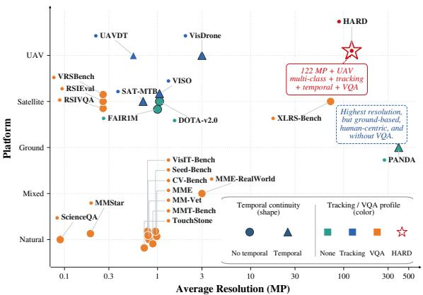
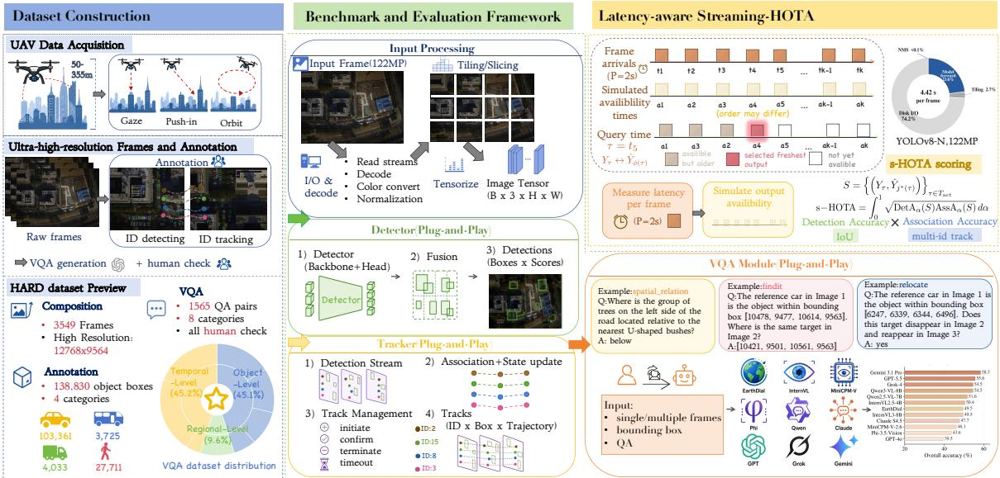
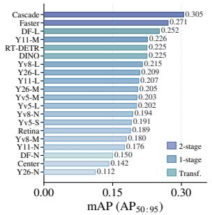
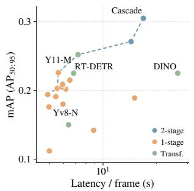
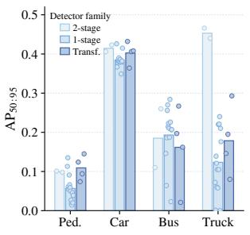
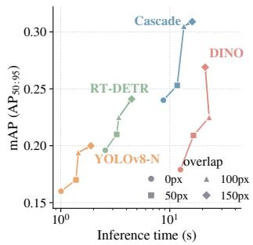
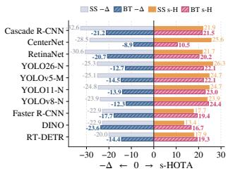
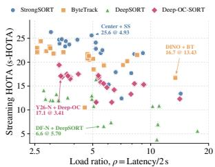
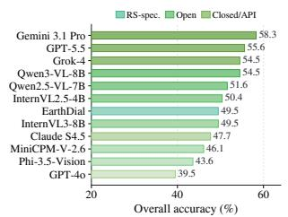
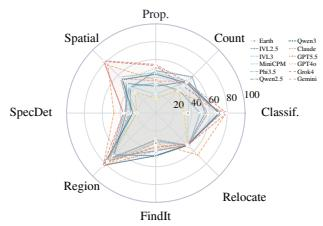

# Understanding Dynamic Scenes at Gigapixel Scale: Wide-Area Spatio-Temporal Perception from UAVs

Yuhang Zhu∗, Meiyi Zhu∗, Yunkai Dang, Zhangnan Li, Yuxuan Wang, Wenbin Li, Hongbing Pan

Nanjing University mf21320239@smail.nju.edu.cn

## Abstract

UAV-borne imaging has advanced from megapixel to gi- gapixel sensors, shifting aerial perception from recognizing individual targets to understanding entire dynamic scenes. We characterize this demand as Wide-area Spatio-temporal Scene Understanding (WSTU), which requires wide-area cov-erage, per-target resolution, and temporal continuity at once, a combination existing datasets lack. To fill this gap, we introduce an ultra-High-resolution (12768×9564) Airborne Remote-sensing Dataset(HARD) annotated at three levels for object detection, multi-object tracking, and scene-level vi-sual question answering. Ultra-high-resolution imagery raises per-frame processing time to seconds. At that scale latency can no longer be ignored in evaluation. Thus, we pro- pose a latency-aware metric for multi-object tracking called streaming-HOTA (s-HOTA). Extensive baseline experiments show how ultra-high-resolution processing reshapes each task. For detection, the end-to-end pipeline afects accuracy and speed as much as the detector itself does. For tracking, high latency charges the association axis far more unevenly than the detection axis, and association is where pipelines diverge. As a result, the pipeline that performs best ofline can lose its lead under s-HOTA. For VQA, vision-language models re-main weak at cross-frame identity binding and cannot transfer their single-frame gains to it. Together these findings show that the baselines we evaluate fall short of WSTU. HARD provides the data and the systematic baselines to advance it.

## 1 Introduction

Remote sensing (Li et al. 2023; Ding et al. 2021; Nie et al. 2025; Ahmad et al. 2026) has long been the primary means of observing ground scenes at scale, with satellite and aerial imagery supporting applications from urban management and trafic monitoring to disaster response. Among remote- sensing platforms, UAVs stand out for flexible low-altitude on-demand observation. Recent advances (Wang et al. 2020) in imaging technology have raised sensor resolution from the megapixel to the gigapixel class, so a single aerial frame can now cover a wide region while preserving per-object detail. This shift has driven UAV vision from early object detection toward higher-level scene understanding. The de- mand is no longer to localize isolated targets but to describe how the whole scene evolves. We characterize this emerging demand as Wide-area Spatio-temporal Scene Understanding (WSTU). WSTU requires a perception system to reason over wide regions spanning hundreds of meters and to track the objects within them continuously over time. Beyond this, the system should interpret the state of the scene as a whole rather than only its individual objects. We therefore characterize WSTU by two properties that the data should provide. A single frame should be large enough to cover the entire scene. And consecutive frames should be close enough in time to reveal how those targets move.

  
Figure 1: The dataset landscape. Average frame resolution is plotted against acquisition platform. Marker shape indicates temporal continuity and colour indicates whether tracking or VQA annotation is provided. HARD is the only benchmark that combines a UAV platform, 122 MP frames, temporal continuity, multi-class tracking and scene-level VQA.

Figure 1 compares representative existing datasets on the properties that WSTU requires. UAV benchmarks (Du et al. 2018; Zhu et al. 2021) ofer wide views but too little resolution to keep targets identifiable. Gigapixel datasets (Wang et al. 2020) reach high resolution only from fixed ground vantage points and lack a UAV’s downward geometry. Satel- lite datasets (Yin et al. 2021; Li et al. 2023; Ding et al. 2021; Sun et al. 2022) provide spatial coverage but lack the resolution and temporal continuity that dynamic scene un- derstanding needs. More fundamentally, these benchmarks are built around individual objects. They ask where each box is and how each trajectory continues but say almost noth ing about the region as a whole. Even recent remote-sensing VQA benchmarks (Li, Ding, and Elhoseiny 2024; Hu et al. 2025; Zheng et al. 2021; Wang et al. 2025) work on sin-gle still images rather than on wide areas that change over time. For ultra-high-resolution images, the tiling and fusion pipeline around a detector pushes per-frame latency from milliseconds into seconds. Standard tracking metrics score every prediction against its own frame. The staleness that la- tency induces is therefore never charged. They reward ofline accuracy and ignore whether a tracker can keep pace with the stream.

To close these gaps, we introduce the ultra-High-resolution Airborne Remote-sensing Dataset (HARD). It is a UAV benchmark that pairs gigapixel-class frames with continu- ous temporal annotation for wide-area spatio-temporal scene understanding. HARD comprises 3,549 frames at a unified 122 MP resolution (12768×9564), flight altitudes from 50 to 355 m, and four flight modes. HARD provides annotations for three tasks that progress from static individual objects to the dynamic scene. Object detection (Level 1) builds on 138,830 expert-audited bounding boxes over four categories. Multi-object tracking (Level 2) extends every box with a cross-frame instance identity. Scene-level VQA (Level 3) rests on 1,565 manually verified question–answer pairs span- ning eight question types. In addition to the dataset, we de- sign a latency-aware tracking metric called s-HOTA that evaluates each tracking pipeline online. This fills a gap left by ofline metrics when assessing methods on ultra-high- resolution image sequences. Based on this benchmark and metric, we conduct extensive experiments across all three levels, establishing a suite of baselines and laying a founda- tion for future WSTU research.

Extensive experiments across the three levels lead to four findings. (F1) Wide-area detection at full resolution is shaped as much by the tiling pipeline as by the detector. (F2) Streaming latency charges the association axis far more unevenly than the detection axis. (F3) Which tracking pipeline performs best under streaming is governed by the load ratio $\rho = \Delta t / P .$ . A pipeline that ranks first under ofline evalu- ation can see its lead weaken or even disappear once it is measured by s-HOTA. (F4) Zero-shot VLM failures sepa-rate into two axes, single-frame perception and cross-frame identity binding, and progress on one does not transfer to the other. Models spread over a 37-point range on the first, while eleven of twelve stay within a 13-point band near chance on the second. Our main contributions are as follows:

• We construct a temporal UAV benchmark (HARD), which is the first to jointly provide wide-area coverage, ultrahigh resolution, and temporal continuity. It contains 3,549 frames at a unified 122 MP resolution, 138,830 boxes with cross-frame identities, and 1,565 scene-level QA pairs.

• We propose streaming-HOTA, a latency-aware extension of HOTA that charges each tracking pipeline for its end- to-end latency, remedying the zero-latency assumption of ofline tracking metrics.

• We evaluate twenty detectors, four trackers, and twelve vision-language models across the three levels. These ex- periments establish a suite of baselines on HARD and provide reference points for future WSTU research.

• Our analysis traces how ultra-high-resolution processing shifts the bottleneck of each task. It identifies the factors that govern pipeline performance and turns them into concrete targets for future work on HARD.

## 2 Related Work

Object Detection and Multi-object Tracking Datasets. Datasets for aerial object detection and tracking have grown substantially over the past decade. Figure 1 places them against HARD in resolution, platform, temporal continu- ity and annotation coverage. On the UAV platform, Vis- Drone (Zhu et al. 2021) and UAVDT (Du et al. 2018) provide rich object annotations and video streams covering diverse urban targets. Their frame resolutions of about 3 MP and 0.55 MP, however, are far too small to expose the challenges of ultra-high-resolution perception. On the satellite platform, VISO (Yin et al. 2021) and SAT-MTB (Li et al. 2023) are likewise limited by small image sizes. DOTA (Ding et al. 2021) and FAIR1M (Sun et al. 2022) contain some large images but ofer no temporal data. In fact, 88% of DOTA- v2.0 images are 1024×1024 patches and 45.6% of FAIR1M images are only 800×600. PANDA (Wang et al. 2020) does ofer gigapixel resolution and temporal sequences. But its cameras sit on the ground and look outward at a slanted an- gle, so the same type of target appears much larger up close than far away. This difers from the near-vertical view that remote sensing works with. Unlike these datasets (Li et al. 2023; Ding et al. 2021; Wang et al. 2020), HARD unifies a UAV platform, 122 MP resolution, temporal sequences, and multi-class tracking in a single corpus, and further adds scene-level VQA annotations.

Remote Sensing Visual Question Answering. In recent years, the visual question answering task has been ex- tended to remote sensing. RSVQA (Lobry et al. 2020) pioneered auto-generated QA from OpenStreetMap annotations, and later work scaled this approach to large satel- lite corpora such as RSVQAxBEN (Lobry, Demir, and Tuia 2021) and RSIVQA (Zheng et al. 2021). The same approach has also been adapted to narrower settings including bi- temporal change reasoning (CDVQA (Yuan et al. 2022)) and urban-planning relational reasoning (EarthVQA (Wang et al. 2024)). Aerial and UAV-oriented benchmarks have followed, yet none targets wide-area dynamic trafic reasoning at ultra- high resolution. HRVQA (Li, Vosselman, and Yang 2024) ofers over a million QA pairs but on static 1024×1024 scene semantics. Trafic-VQA (Zhang et al. 2026) addresses traffic cognition but relies on paired optical-thermal inputs and regulation-centric knowledge. UAVReason (Sun et al. 2026) evaluates broad UAV multimodal capability rather than urban situational awareness. Existing remote-sensing VQA bench-marks ask questions about small static images and cannot support dynamic perception over wide areas. HARD covers wide areas at ultra-high resolution and provides cross-frame question-answer pairs. It moves remote-sensing VQA from single small still images to cross-frame questions asked over 122 MP wide-area frames.

  
Fi ure 2: Overview of the HARD benchmark. Left: dataset construction, coverin 122 MP data collection over 21 se uences, 50–355 m altitudes, and four flight modes, the three-level annotation hierarchy (detection, tracking, scene-level VQA). Middle: the benchmark and evaluation framework, in which detectors, trackers, and vision-language models are evaluated on the three- level tasks. Right: the definition and computation of the latenc -aware streaming-HOTA metric.

Evaluation Metrics for Detection and Tracking. Detection is measured by average precision (Lin et al. 2014), while tracking must also credit identity consistency. MOTA (Bernardin and Stiefelhagen 2008) and IDF1 (Ristani et al. 2016) are each dominated by a single aspect of tracking performance. HOTA (Luiten et al. 2021) balances detection and association accuracy in one score, and we adopt it as our base metric. All of these metrics are ofline and do not model latency, scoring each prediction against its frame regardless ofwhen it could be produced. Li, Wang, and Ramanan (2020) showed that this assumption breaks for real-time systems and proposed streaming perception (sAP). Sela et al. (2022) op- timize a streaming variant of MOTA called S-MOTA when scheduling pipeline configurations for autonomous driving and Peng et al. (2025a) extend the streaming setting to 3D perception. Diferent from all of them, our s-HOTA is an on- line, system-level metric for the end-to-end tracking pipeline. Ofline tracking evaluation rests on a zero-latency assump- tion that breaks down once one frame takes seconds to pro- cess. s-HOTA corrects for this by scoring each frame against the latest prediction available at that time.

## 3 The HARD Benchmark

HARD is designed not merely as a collection of images but as a research platform for wide-area aerial scene understanding. It jointly provides the wide field of view, per-target resolution, and temporal continuity that WSTU requires (Figure 1). This section describes how the data is collected, annotated and turned into QA pairs, and reports the statistics of the dataset.

Data Collection. To keep every ground target identifiable across a wide field of view, we capture the imagery with a Phase One iXM-GS120, an ultra-high-resolution cam- era. A UAV carrying this camera captures every frame at a unified 12768×9564 (122 MP) resolution over two ge-ographically distinct sites. The flights span altitudes from 50 m to 355 m in more than ten steps. They also fol- low four flight modes, including linear-nadir, linear-oblique, stationary-gaze, and orbit-gaze (Figure 2, left). These modes together produce background translation, rotation, parallax, and static-background conditions. We detail the viewing ge- ometry of each mode in the supplementary material. The captured frames are then organized into 21 sequences, each a single continuous flight and thus one temporally ordered image sequence, with 169 frames per sequence on average. This protocol yields a wide spread of object scales, viewing perspectives, and motion conditions within a single dataset.

Detection and Tracking Annotation. Annotation follows a two-tier protocol. Firstly, five annotators in related fields holding master’s degrees label every visible target with a tight box over its extent. Each box follows a YOLO- normalized format extended with a per-instance identity field $( C _ { \mathrm { i d } } , I _ { \mathrm { i d } } , c _ { x } , c _ { y } , w , h )$ . The boxes span four categories, in- cluding pedestrian, car, bus, and truck. Secondly, a more senior researcher audits each batch, correcting misclassifi- cations, refining imprecise boxes, and returning substandard batches for re-annotation before acceptance. Level 2 (tracking) uses the full annotation, whereas Level 1 (detection) reuses the same per-frame boxes without the cross-frame identity $I _ { \mathrm { i d } }$ . This process yields 138,830 annotations across 3,549 frames, with each annotator spending more than 100 hours on average and the full campaign costing over 600 hours of manual annotation and review.

VQA Generation. Beyond object detection and multiobject tracking, HARD further provides a VQA benchmark to evaluate whether vision–language models can progress from recognizing isolated targets to understanding wide- area dynamic scenes. The benchmark is organized into three capability levels of increasing spatio-temporal complex- ity: single-frame perception, region-level understanding, and temporal target reasoning. These levels respectively assess localized object recognition, evidence aggregation across an entire 122 MP frame, and cross-frame reasoning over object identity and motion. The benchmark construction combines annotation-derived supervision with assistance from GPT- 5.5 (OpenAI 2026). Bounding boxes and instance id trajectories are used to deterministically derive or ground questions and answers whenever possible, while the model assists in formulating natural-language questions and constructing plausible distractors. All generated samples are subsequently reviewed by four experts in remote-sensing and UAV im- age interpretation, who verify visual answerability, option distinguishability, and annotation–answer consistency. The final benchmark contains 1,565 manually verified question– answer pairs spanning eight question types. Detailed task definitions, generation procedures, and type-wise statistics are provided in the supplementary material.

Dataset Statistics. HARD comprises 3,549 frames and 138,830 object annotations across the 21 sequences, an average of 39.1 objects per frame. Of the 21 sequences, five are held out as the test set for all benchmarks, while the remaining sequences are used for training and validation. The class distribution is car-dominant (74.4%, 103,361 instances), followed by pedestrian (20.0%, 27,711), bus (2.9%, 4,033), and truck (2.7%, 3,725). This long-tailed distribution is consistent with the composition of everyday trafic scenes and poses a realistic class-imbalance challenge for detection and tracking. A defining characteristic of HARD is its scale distribution, in which tiny and small targets together account for 98.7% of all annotations (24.6% tiny + 74.1% small), each occupying between 0.001% and 0.25% of the frame. Yet the 122 MP resolution preserves enough pixels per tar- get to keep individual instances distinguishable, a property lower-resolution UAV datasets cannot ofer.

Ethics and privacy. All flights were conducted under the applicable local UAV regulations. The acquisition geometry does not preserve resolvable facial or license-plate infor- mation, and the released annotations contain no biometric, demographic, or cross-scene identity labels. Further details are provided in the supplementary material.

## 4 Evaluation Metrics

Standard Metrics. We evaluate detection under the COCO protocol (Lin et al. 2014) and report $\mathrm { A P _ { 5 0 } }$ and ${ \mathrm { A P } } _ { 5 0 : 9 5 }$ , both per-category and mean. For tracking we adopt HOTA (Luiten et al. 2021), which scores a tracker as the geometric mean of a detection-accuracy component (DetA) and an associationaccuracy component (AssA), integrated over localization thresholds. We prefer HOTA to MOTA (Bernardin and Stiefelhagen 2008) and IDF1 (Ristani et al. 2016) because each of the latter is dominated by a single aspect, whereas

HOTA weighs detection and identity association evenly, and its two components can be inspected separately. Scene-level VQA is scored by multiple-choice accuracy, reported per question type and overall.

Streaming-HOTA. Ofline tracking evaluation assumes zero processing latency, treating the output computed from a frame as if it were available at that same frame. This as- sumption fails on ultra-high-resolution streams. A ultra-high- resolution frame must pass through loading, tiling, per-tile detection, cross-tile fusion, and association, so the end-to- end latency $\Delta t _ { t } = t _ { t } ^ { \mathrm { l o a d } } + t _ { t } ^ { \mathrm { t i l e } } + t _ { t } ^ { \mathrm { d e t } } + t _ { t } ^ { \mathrm { n m s } } + t _ { t } ^ { \mathrm { a s s o c } }$ reaches seconds per frame, and by the time a result is available the scene has moved on. We therefore propose streaming-HOTA (s-HOTA). Given a per-frame latency profile and an avail-ability policy, s-HOTA pairs each ground-truth instant with the most recent output available at that instant and evaluates the pairing with HOTA. The policy is an explicit input rather than a fixed assumption.

We define $P$ as the interval between consecutive frames, which is determined by the imaging time of the camera. For our camera $P = 2 \mathrm { s } .$ . The lateness of the output computed from frame t is

$$
k _ { t } = \mathrm { m a x } \big ( 1 , \ : \lceil \Delta t _ { t } / P \rceil \big ) ,\tag{1}
$$

so that this output becomes available at frame $t + k _ { t }$ Eq. (1) states our default policy, under which every frame starts processing on arrival. It is realized by $\dot { K }$ work- ers, each a full replica of the benchmarked machine, with $K \ge \lceil \operatorname* { m a x } _ { t } \Delta t _ { t } \bar { / } P \rceil$ so that no frame ever queues. Each worker runs one frame in isolation, so the latencies mea- sured on a single device transfer to this deployment with- out contention. s-HOTA charges a pipeline for the staleness. Evaluation instant t coincides with the capture time of frame $t ,$ so an output can never serve the frame it is computed from.

At every evaluation instant τ, let $\varphi ( \tau )$ denote the most recent output whose availability index does not exceed τ. s-HOTA is standard HOTA computed over the latency-adjusted pairing

$$
\mathcal { S } = \left\{ \left( y _ { \tau } , \hat { y } _ { \varphi ( \tau ) } \right) \right\} _ { \tau \in \mathcal { T } _ { \mathrm { a c t } } } ,\tag{2}
$$

$$
{ \mathrm { s } } { \mathrm { - } } { \mathrm { H O T A } } = \int _ { 0 } ^ { 1 } { \sqrt { \mathrm { D e t A } _ { \alpha } ( S ) \cdot { \mathrm { A s s A } } _ { \alpha } ( S ) } } \mathrm { d } \alpha ,\tag{3}
$$

where $\mathcal { T } _ { \mathrm { a c t } }$ excludes the warm-up instants before the first output is available. s-HOTA attains its upper limit when ev- ery output is ready within one frame interval, in which case it reduces to ofline HOTA evaluated with a one-frame lag. As latency grows beyond P, the score degrades in framequantized steps governed by Eq. (1). The complete protocol and full deployment parameters are given in the supplemen- tary material.

## 5 Experiments

We evaluate HARD across three levels of increasing cogni- tive complexity (Figure 2, middle). For each level, we first describe its experimental setup and then distill the results into its central findings.

<table><tr><td rowspan="2">Detector</td><td rowspan="2">Backbone</td><td rowspan="2">Params Total Infer</td><td rowspan="2"></td><td colspan="2">Pedestrian</td><td colspan="2">Car</td><td colspan="2">Bus</td><td colspan="2">Truck</td><td colspan="2">mAP</td></tr><tr><td> $\mathrm { A P } _ { 5 0 } \mathrm { \ A P } _ { 5 0 : 9 5 }$ </td><td></td><td>AP50 AP50:95</td><td></td><td> $\mathrm { A P } _ { 5 0 } \mathrm { \ A P } _ { 5 0 : 9 5 }$ </td><td></td><td>AP50</td><td> $\mathrm { A P _ { 5 0 : 9 5 } }$ </td><td></td><td> $\mathrm { A P _ { 5 0 } \ A P _ { 5 0 : 9 5 } }$ </td></tr><tr><td colspan="10">Two-stage detectors</td><td colspan="7"></td></tr><tr><td>Faster R-CNN</td><td>ResNet-50</td><td>41.8M 14.3910.97 0.287</td><td></td><td></td><td>0.101</td><td>0.913</td><td>0.406</td><td>0.222</td><td>0.110</td><td></td><td>0.780</td><td>0.466</td><td>0.551</td><td>0.271</td></tr><tr><td>Cascade R-CNN</td><td>ResNet-50</td><td>69.2M 16.8913.47 0.299</td><td></td><td></td><td>0.098</td><td>0.910</td><td>0.423</td><td>0.524</td><td>0.260</td><td></td><td>0.866</td><td>0.440</td><td>0.650</td><td>0.305</td></tr><tr><td colspan="10">One-stage detectors</td><td colspan="7"></td></tr><tr><td>RetinaNet</td><td>ResNet-50</td><td>37.7M 15.07 11.65 0.313</td><td></td><td></td><td>0.113</td><td>0.915</td><td>0.426</td><td></td><td>0.267</td><td>0.146</td><td>0.144</td><td>0.072</td><td>0.410</td><td>0.189</td></tr><tr><td>CenterNet</td><td>ResNet-18</td><td>14.2M</td><td>8.85</td><td>5.43 0.384</td><td>0.135</td><td>0.801</td><td>0.367</td><td>0.125</td><td>0.064</td><td></td><td>0.004</td><td>0.001</td><td>0.329</td><td>0.142</td></tr><tr><td>YOLOv5s</td><td>CSPDarknet-S</td><td>7.2M</td><td>5.41</td><td>1.990.211</td><td>0.061</td><td>0.809</td><td>0.378</td><td>0.376</td><td>0.186</td><td></td><td>0.417</td><td>0.139</td><td>0.453</td><td>0.191</td></tr><tr><td>YOLOv5m</td><td>CSPDarknet-M</td><td>21.2M</td><td>5.52</td><td>2.10 0.214</td><td>0.054</td><td>0.813</td><td>0.383</td><td>0.473</td><td></td><td>0.256</td><td>0.354</td><td>0.121</td><td>0.464</td><td>0.203</td></tr><tr><td>YOLOv51</td><td>CSPDarknet-L</td><td>46.5M</td><td>6.16</td><td>2.74 0.326</td><td>0.091</td><td>0.824</td><td>0.386</td><td>0.519</td><td></td><td>0.270</td><td>0.141</td><td>0.060</td><td>0.453</td><td>0.202</td></tr><tr><td>YOLOv8n</td><td>CSPNet-N</td><td>3.2M</td><td>4.87</td><td>1.45 0.223</td><td>0.066</td><td>0.827</td><td>0.390</td><td>0.422</td><td></td><td>0.214</td><td>0.313</td><td>0.105</td><td>0.446</td><td>0.194</td></tr><tr><td>YOLOv8m</td><td>CSPNet-M</td><td>25.9M</td><td></td><td>5.94 2.520.202</td><td>0.059</td><td>0.816</td><td>0.380</td><td>0.462</td><td></td><td>0.223</td><td>0.207</td><td>0.058</td><td>0.422</td><td>0.180</td></tr><tr><td>YOLOv81</td><td>CSPNet-L</td><td>43.7M</td><td>6.50</td><td>3.08 0.222</td><td>0.050</td><td>0.805</td><td>0.380</td><td>0.389</td><td></td><td>0.210</td><td>0.660</td><td>0.220</td><td>0.519</td><td>0.215</td></tr><tr><td>YOL011n</td><td>C3k2-N</td><td>2.6M</td><td>4.96</td><td>1.53 0.133</td><td>0.027</td><td>0.826</td><td>0.386</td><td>0.356</td><td></td><td>0.187</td><td>0.313</td><td>0.105</td><td>0.407</td><td>0.176</td></tr><tr><td>YOL011m</td><td>C3k2-M</td><td>20.1M</td><td>5.59</td><td>2.17 0.102</td><td>0.018</td><td>0.819</td><td>0.379</td><td>0.486</td><td></td><td>0.284</td><td>0.650</td><td>0.221</td><td>0.514</td><td>0.226</td></tr><tr><td>YOL0111</td><td>C3k2-L</td><td>25.3M</td><td>5.94</td><td>2.52 0.071</td><td>0.014</td><td>0.760</td><td>0.349</td><td>0.451</td><td></td><td>0.226</td><td>0.729</td><td>0.240</td><td>0.503</td><td>0.207</td></tr><tr><td>YOLO26n</td><td>CSPDarknet</td><td>2.4M</td><td>4.97</td><td>1.55 0.189</td><td>0.046</td><td>0.779</td><td>0.379</td><td>0.048</td><td></td><td>0.023</td><td>0.000</td><td>0.000</td><td>0.254</td><td>0.112</td></tr><tr><td>YOLO26m</td><td>CSPDarknet</td><td>20.4M</td><td>5.85</td><td>2.430.109</td><td>0.020</td><td>0.814</td><td>0.382</td><td>0.407</td><td></td><td>0.207</td><td>0.676</td><td>0.210</td><td>0.501</td><td>0.205</td></tr><tr><td>YOLO261</td><td>CSPDarknet</td><td>24.8M</td><td>5.92</td><td>2.50 0.175</td><td>0.039</td><td>0.860</td><td>0.415</td><td>0.411</td><td></td><td>0.207</td><td>0.490</td><td>0.176</td><td>0.484</td><td>0.209</td></tr><tr><td colspan="10">Transformer-based detectors</td><td colspan="7"></td></tr><tr><td>DINO</td><td>ResNet-50</td><td>47.0M 26.41 22.99</td><td></td><td>0.334</td><td>0.124</td><td></td><td>0.894</td><td>0.432</td><td>0.342</td><td>0.197</td><td>0.288</td><td>0.146</td><td>0.465</td><td>0.225</td></tr><tr><td>RT-DETR</td><td>ResNet-50</td><td>32.0M</td><td>6.83</td><td>3.400.263</td><td>0.074</td><td>0.836</td><td>0.364</td><td>0.614</td><td>0.267</td><td></td><td>0.568</td><td>0.195</td><td>0.570</td><td>0.225</td></tr><tr><td>D-FINE-N</td><td>HGNetv2</td><td>3.8M</td><td>6.39</td><td>2.97 0.247</td><td>0.094</td><td>0.835</td><td>0.406</td><td>0.056</td><td>0.021</td><td></td><td>0.154</td><td>0.080</td><td>0.323</td><td>0.150</td></tr><tr><td>D-FINE-L</td><td>HGNetv2</td><td>31.2M</td><td>7.22</td><td>3.80 0.365</td><td>0.145</td><td>0.836</td><td></td><td>0.408</td><td>0.308</td><td>0.162</td><td>0.425</td><td>0.293</td><td>0.484</td><td>0.252</td></tr></table>

Table 1: Detection performance of baseline detectors on HARD. Both $\mathrm { A P _ { 5 0 } }$ and ${ \mathrm { A P } } _ { 5 0 : 9 5 }$ are reported per category and as mean AP (mAP) over all four categories. Light-red, light-orange, and light-yellow cells indicate the first-, second-, and third-ranked results in each numeric column. For Params, Total, and Infer, lower is better; for all AP metrics, higher is better. “Total” and “Infer” are in seconds. “Infer” denotes net model forward-pass time; “Total” denotes end-to-end per-frame latency.

  
(a) Detection ranking.

  
(b) Accuracy–latency.

  
(c) Class-wise landscape.

  
(d) Overlap sensitivity.  
Figure 3: Level-1 detection results: (a) ${ \mathrm { A P } } _ { 5 0 : 9 5 }$ ranking of the twenty detectors; (b) accuracy–latency trade-of with Pareto frontier; (c) per-class ${ \mathrm { A P } } _ { 5 0 : 9 5 }$ by architectural family. For each object class, the three adjacent bars correspond, from left to ri ht, to two-sta e, one-sta e, and transformer detectors. Bar hei hts ive the mean AP of all detectors within each famil , while the overlaid dots give the individual detector scores. The dots are slightly ofset horizontally only to avoid visual overlap; (d) efect of tile overlap on accuracy and inference time.

## Level 1: Object Detection

Setup. We benchmark twenty detectors spanning twostage (Ren et al. 2015; Cai and Vasconcelos 2018), onestage (Lin et al. 2017; Zhou, Wang, and Krähenbühl 2019; Jocher et al. 2022; Varghese and Sambath 2024; Khanam and Hussain 2024; Sapkota et al. 2025), and Transformerbased (Zhang et al. 2022a; Zhao et al. 2024; Peng et al. 2025b) families, all trained on 640×640 tiles with COCO-pretrained weights and evaluated under the COCO protocol with 100 px inference overlap. Table 1 reports the full results, Figure 3 visualizes them.

Finding 1: wide-area detection is shaped as much by the end-to-end tiling pipeline as by the detector, a joint consequence of extreme image size and target sparsity. Table 2 quantifies a property that aggregate mAP hides. At the main configuration, a frame is split into 432 tiles yet contains only 39.1 objects on average, so most tiles are pure background. Widening the tile overlap from 0 to 150 px raises mean mAP from 0.166 to 0.213 by recovering targets fragmented at tile borders. The cost is that the tile count grows from 300 to 520 and the mean forward pass grows from 3.3 s to 5.9 s (Figure 3d). The accuracy–latency landscape in Figure 3b is thus a property of complete pipelines rather than of detectors alone. The detector fixes the accuracy attainable on each tile, while the tiling and fusion stages decide how much of it sur- vives at frame scale and at what latency. Wide-area detection must therefore be designed as a joint system. Treating either component as fixed forfeits accuracy or latency that the other cannot recover. Per-class results also diverge far more than aggregate mAP suggests (Figure 3c). Detectors agree closely on Car but spread from 0.000 to 0.466 ${ \mathrm { A P } } _ { 5 0 : 9 5 }$ on Truck.

<table><tr><td>Overlap</td><td>Tiles</td><td>Obj./tile</td><td>Empty tiles</td><td>mAP</td><td>Infer</td></tr><tr><td>0px</td><td>300</td><td>0.130</td><td>≥87.0%</td><td>0.166</td><td>3.31 s</td></tr><tr><td>50px</td><td>374</td><td>0.105</td><td>≥89.5%</td><td>0.178</td><td>4.32 s</td></tr><tr><td>100px</td><td>432</td><td>0.091</td><td>≥90.9%</td><td>0.204</td><td>5.25 s</td></tr><tr><td>150px</td><td>520</td><td>0.075</td><td>≥92.5%</td><td>0.213</td><td>5.90 s</td></tr></table>

Table 2: Spatial sparsity of the HARD tiling pipeline under diferent overlaps, including tile density, empty-tile ratio, ac- curacy averaged over all twenty detectors, and inference time averaged over the eighteen detectors with directly measured per-overlap timings.

  
(a) Score and latency penalty.

  
(b) Load ratio vs. s-HOTA.  
Figure 4: Level-2 streaming-tracking results: (a) s-HOTA and streaming penalty −∆ of StrongSORT vs. ByteTrack across representative detectors; (b) s-HOTA against the load ratio $\rho { \stackrel { - } { = } } \Delta t / P$ over all 80 detector–tracker pipelines.

## Level 2: Multi-Object Tracking

Setup. We pair every detector with four tracking methods, namely DeepSORT (Wojke, Bewley, and Paulus 2017), Byte-Track (Zhang et al. 2022b), Deep-OC-SORT (Maggiolino et al. 2023), and StrongSORT (Du et al. 2023), all under their oficial default hyperparameters. StrongSORT therefore keeps its default sparse-optical-flow camera-motion compen- sation while the other three run without external compensa- tion. The supplementary material isolates the efect of this component. This gives 80 pipelines, which we evaluate with s-HOTA at $P = 2 \mathrm { { s } }$ on the Car category (Figure 4a). We choose this category because its dense and long trajecto-ries make it the most statistically reliable one for streaming comparison. Table 3 reports HOTA, s-HOTA, the streaming penalty $\Delta$ and end-to-end latency.

Finding 2: streaming latency charges the association axis far more unevenly than the detection axis, so identity association is where tracking pipelines diverge under latency. Decomposing every score into HOTA’s detection and association components shows that streaming charges both. The two axes difer, however, in how much they separate the trackers. Averaged over the twenty detector blocks, the fraction of ofline DetA that survives streaming spans only 39–50% across the four trackers. The surviving fraction of AssA spans 53–88%. Association retention therefore varies about three times as widely as detection retention. Strong- SORT and Deep-OC-SORT, which maintain appearance fea- ture banks, retain roughly half of their ofline AssA (55% and 53%). ByteTrack, which associates on motion and detection confidence alone, retains 65%. DeepSORT retains 88%, but from a much lower ofline base of 24–28 AssA against 53–66 for StrongSORT. Its retention does not measure robustness of a comparable quantity. Separating the contributions of ap- pearance embeddings, camera-motion compensation and the motion model would require varying each in isolation. On ultra-high-resolution sequences the practical lever is there- fore sustaining identity across a stale gap rather than improv- ing box quality.

Finding 3: which tracking pipeline performs best under streaming is governed by the load ratio $\rho = \Delta t / P .$ The net value of appearance cues shrinks as $\rho$ grows, so the best pipeline depends on the deployment budget rather than on the tracker alone. An inter-frame-interval sweep isolates this efect. Tightening the frame budget from $P \stackrel { - } { = } 2 . 5$ to 1 s with all predictions held fixed flips the s-HOTA winner from StrongSORT to ByteTrack on the high-latency two- stage and Transformer detectors. StrongSORT keeps its lead when $\rho$ stays small. At $P = 2 \mathrm { { s } }$ , ofline leads of up to 16.8 points compress to near-ties or reversals (Table 3). The best pipeline (StrongSORT on YOLO26-N) sits at low $\rho$ rather than at the ofline optimum. The association-insensitive S- MOTA cannot expose the diferential at all. The choice of tracking pipeline should therefore follow the deployment load ratio. Appearance-based association pays of only when la- tency room remains within the frame interval.

## Level 3: Scene-Level VQA

Setup. We evaluate twelve vision-language models zero-shot on the 1,565 Level-3 questions, comprising one remote- sensing-specialized model (Soni et al. 2025), six open-source general-purpose models (Chen et al. 2024; Zhu et al. 2025; Yao et al. 2024; Abdin et al. 2024; Bai et al. 2025b,a), and five closed-source API models (OpenAI 2024, 2026; Anthropic 2025; xAI 2025; Google 2026). Per-type accuracy is visualized in Figure 5.

Finding 4: VLM failures separate into two axes, resolution-limited perception and near-chance identity binding, and progress on one does not transfer to the other. Averaging the per-type accuracies into a single-frame axis (classification, counting, property, spatial relation) and a temporal axis (special detection, FindIt, Relocate) reveals two very diferent failure modes. On the single-frame axis, models spread over a 37-point range (29.2% for GPT-4o to 66.5% for Gemini 3.1 Pro). This axis rewards general per-ception ability, and stronger models are clearly better despite the heavy downsampling that a 122 MP input undergoes. On the temporal axis, the same twelve models collapse into a 13- point band (35.6–49.0%) hovering near the per-type chance levels, with eleven of twelve at 49–52% on Relocate. Only GPT-5.5 rises meaningfully above chance, reaching 66.3% on Relocate and 47.0% on special detection. We report these as observations consistent with, rather than proof of, the two mechanisms. The implication is that scaling general capa- bility mainly moves the first axis, while closing the second likely requires explicit object memory or track-conditioned inputs, which is where Level-1 and Level-2 supervision in HARD becomes directly useful.

<table><tr><td rowspan="2">Detector</td><td colspan="3">StrongSORT</td><td colspan="3">ByteTrack</td><td colspan="3">DeepSORT</td><td colspan="3">Deep-OC-SORT</td></tr><tr><td></td><td>HOTA↑ s-HOTA↑</td><td>Lat.↓</td><td>HOTA↑</td><td>s-HOTA↑</td><td></td><td>Lat.↓ HOTA↑ s-HOTA↑ Lat.↓</td><td></td><td></td><td></td><td>HOTA↑ s-HOTA↑ Lat.↓</td><td></td></tr><tr><td colspan="10">Two-stage detectors</td><td></td><td></td><td></td></tr><tr><td>Faster R-CNN</td><td>40.6</td><td>17.7↓22.9</td><td>15.85</td><td>37.1</td><td>19.4↓17.7</td><td>14.36</td><td>11.7</td><td>7.0↓4.7</td><td>21.79</td><td>29.5</td><td>13.3↓16.2</td><td>15.80</td></tr><tr><td>Cascade R-CNN</td><td>54.5</td><td>21.9↓32.6</td><td>18.22</td><td>42.7</td><td>21.5 ↓21.2</td><td>17.01</td><td>20.3</td><td>10.9↓9.4</td><td>22.10</td><td>36.8</td><td>15.3 ↓21.4</td><td>18.39</td></tr><tr><td colspan="10">One-stage detectors</td><td colspan="3"></td></tr><tr><td>RetinaNet</td><td>52.3</td><td>21.7↓30.6 16.45</td><td></td><td>40.9</td><td>20.2↓20.7</td><td>15.10</td><td>18.2</td><td>10.8↓7.5</td><td>20.46</td><td>37.5</td><td>15.5 ↓22.0 16.46</td><td></td></tr><tr><td>CenterNet</td><td>54.0</td><td>25.6 ↓28.5</td><td>9.86</td><td>19.4</td><td>10.5↓8.9</td><td>9.09</td><td>24.9</td><td>16.4↓8.5</td><td>10.40</td><td>24.4</td><td>11.6↓12.8</td><td>10.41</td></tr><tr><td>YOLOv5-S</td><td>48.6</td><td>24.4↓24.2</td><td>7.24</td><td>37.8</td><td>23.2↓14.7</td><td>5.95</td><td>17.4</td><td>12.1↓5.4</td><td>6.62</td><td>36.1</td><td>17.5 ↓18.6</td><td>7.34</td></tr><tr><td>YOLOv5-M</td><td>49.8</td><td>24.7↓25.1</td><td>8.32</td><td>36.7</td><td>22.1↓14.5</td><td>7.04</td><td>18.2</td><td>12.6↓5.6</td><td>7.41</td><td>36.1</td><td>17.5 ↓18.5</td><td>8.41</td></tr><tr><td>YOLOv5-L</td><td>48.4</td><td>21.9↓26.4</td><td>11.00</td><td>36.6</td><td>20.5↓16.2</td><td>9.64</td><td>16.5</td><td>10.8↓5.6</td><td>10.11</td><td>35.4</td><td>15.8↓19.6</td><td>11.00</td></tr><tr><td>YOLOv8-N</td><td>47.8</td><td>23.9↓23.9</td><td>6.72</td><td>36.7</td><td>24.4↓12.3</td><td>5.37</td><td>17.0</td><td>12.0↓5.0</td><td>6.04</td><td>35.8</td><td>19.4↓16.4</td><td>6.69</td></tr><tr><td>YOLOv8-M</td><td>48.3</td><td>23.7↓24.6</td><td>7.55</td><td>36.6</td><td>21.8↓14.9</td><td>6.25</td><td>17.4</td><td>12.0↓5.4</td><td>6.64</td><td>35.4</td><td>16.9↓18.5</td><td>7.63</td></tr><tr><td>YOLOv8-L</td><td>48.8</td><td>22.5 ↓26.3</td><td>11.22</td><td>36.9</td><td>20.7↓16.2</td><td>10.04</td><td>17.5</td><td>11.7↓5.8</td><td>10.46</td><td>35.3</td><td>15.5↓19.8</td><td>11.39</td></tr><tr><td>YOL011-N</td><td>49.5</td><td>24.7↓24.8</td><td>6.69</td><td>36.9</td><td>23.0↓13.9</td><td>5.13</td><td>17.6</td><td>12.3↓5.3</td><td>5.68</td><td>36.3</td><td>16.9↓19.4</td><td>6.94</td></tr><tr><td>YOL011-M</td><td>48.4</td><td>23.3 ↓25.2</td><td>7.19</td><td>36.8</td><td>22.3↓14.5</td><td>5.74</td><td>17.5</td><td>12.0↓5.5</td><td>6.20</td><td>35.4</td><td>16.5↓18.9</td><td>7.63</td></tr><tr><td>YOL011-L</td><td>48.2</td><td>22.8 ↓25.4</td><td>10.38</td><td>36.9</td><td>20.8↓16.0</td><td>9.39</td><td>18.2</td><td>12.3 ↓5.9</td><td>9.90</td><td>36.1</td><td>16.8↓19.3</td><td>10.72</td></tr><tr><td>YOLO26-N</td><td>51.6</td><td>26.3 ↓25.3</td><td>6.06</td><td>34.8</td><td>22.1↓12.7</td><td>5.14</td><td>20.3</td><td>14.1↓6.2</td><td>5.56</td><td>36.0</td><td>17.1↓18.8</td><td>6.82</td></tr><tr><td>YOLO26-M</td><td>50.9</td><td>24.8 ↓26.0</td><td>6.90</td><td>37.9</td><td>22.9↓15.0</td><td>6.02</td><td>19.7</td><td>13.3 ↓6.3</td><td>6.47</td><td>36.5</td><td>17.1↓19.4</td><td>7.43</td></tr><tr><td>YOLO26-L</td><td>51.7</td><td>24.1↓27.5</td><td>10.36</td><td>38.4</td><td>21.7↓16.7</td><td>9.38</td><td>19.5</td><td>13.0↓6.4</td><td>9.88</td><td>37.4</td><td>17.2</td><td>↓20.1 10.69</td></tr><tr><td colspan="10">Transformer-based detectors</td><td colspan="3"></td></tr><tr><td>DINO</td><td>36.3</td><td>13.4↓22.9</td><td>28.62</td><td>40.3</td><td>16.7↓23.626.85</td><td></td><td>11.5</td><td>5.6↓5.9</td><td>35.01</td><td>34.1</td><td></td><td>12.3↓21.828.32</td></tr><tr><td>RT-DETR</td><td>37.9</td><td>17.9↓20.0</td><td>13.15</td><td>33.7</td><td>19.3↓14.4</td><td>11.41</td><td>10.9</td><td>7.4↓3.5</td><td>12.44</td><td>30.3</td><td>14.2↓16.1</td><td>12.92</td></tr><tr><td>D-FINE-N</td><td>32.6</td><td>15.3↓17.3</td><td>12.10</td><td>37.6</td><td>21.3↓16.3</td><td>9.55</td><td>9.7</td><td>6.6↓3.1</td><td>11.40</td><td>31.1</td><td>14.7↓16.5</td><td>11.84</td></tr><tr><td>D-FINE-L</td><td>26.7</td><td>12.4↓14.3</td><td>14.11</td><td>33.0</td><td>18.5↓14.5</td><td>10.09</td><td>6.1</td><td>3.8 ↓2.2</td><td>21.55</td><td>25.8</td><td></td><td>11.6↓14.1 12.55</td></tr></table>

Table 3: Streaming-HOTA on HARD (Car, P = 2 s), a re ated over all se uences usin TrackEval combined. For each detector–tracker pipeline, we report ofline HOTA, streaming s-HOTA↑, and end-to-end latency Lat.(s)↓. The red downward value beside each s-HOTA score denotes its degradation relative to the corresponding ofline HOTA. Light-red, light-orange, and light-yellow boxes respectively indicate the first-, second-, and third-ranked results in each metric column.

  
(a) Overall ranking.

  
(b) Per-task profiles.  
Figure 5: Level-3 scene-level VQA results: (a) overall accuracy ranking of the twelve vision-language models; (b) pertask profiles across the eight question types.

## 6 Conclusion

We introduced HARD, an ultra-high-resolution temporal UAV benchmark. Its three-level annotations span object per-ception to scene cognition. We also proposed s-HOTA to evaluate tracking under the second-scale latency such im- agery induces. Extensive baseline experiments surface two open problems that we believe warrant deeper study. The first is how to lower the end-to-end latency of ultra-large images. The second is how to give models persistent cross-frame identity. We frame this line of work as Wide-area Spatio- temporal Scene Understanding. We hope HARD can anchor future research toward real UAV deployment.

## References

Abdin, M.; et al. 2024. Phi-3 Technical Report: A Highly Capable Language Model Locally on Your Phone. arXiv preprint arXiv:2404.14219.

Ahmad, I.; Fengjun, S.; Bibi, K.; and Pathan, M. S. 2026. UAV-OBB: An aerial urban vehicle dataset with oriented bounding boxes for remote sensing object detection in smart cities. Data in Brief, 112710.

Anthropic. 2025. Claude Sonnet 4.5 System Card. https: //www.anthropic.com/claude-sonnet-4-5-system-card.

Bai, S.; Cai, Y.; Chen, R.; Chen, K.; Chen, X.; Cheng, Z.; Deng, L.; Ding, W.; Gao, C.; Ge, C.; et al. 2025a. Qwen3-vl technical report.

Bai, S.; Chen, K.; Liu, X.; Wang, J.; Ge, W.; Song, S.; Dang,K.; Wang, P.; Wang, S.; Tang, J.; Zhong, H.; Zhu, Y.; Yang,M.; Li, Z.; Wan, J.; Wang, P.; Ding, W.; Fu, Z.; Xu, Y.; Ye,J.; Zhang, X.; Xie, T.; Cheng, Z.; Zhang, H.; Yang, Z.; Xu,H.; and Lin, J. 2025b. Qwen2.5-VL Technical Report.

Bernardin, K.; and Stiefelhagen, R. 2008. Evaluating mul- tiple object tracking performance: the clear mot metrics. EURASIP Journal on Image and Video Processing, 2008(1): 246309.

Cai, Z.; and Vasconcelos, N. 2018. Cascade r-cnn: Delving into high quality object detection. In Proceedings of the IEEE conference on computer vision andpattern recognition, 6154–6162.

Chen, Z.; Wang, W.; Cao, Y.; Liu, Y.; Gao, Z.; Cui, E.; Zhu, J.; Ye, S.; Tian, H.; Liu, Z.; et al. 2024. Expanding performance boundaries of open-source multimodal models with model, data, and test-time scaling. arXivpreprint arXiv:2412.05271.

Ding, J.; Xue, N.; Xia, G.-S.; Bai, X.; Yang, W.; Yang, M. Y.; Belongie, S.; Luo, J.; Datcu, M.; Pelillo, M.; et al. 2021. Object detection in aerial images: A large-scale benchmark and challenges. IEEE transactions on pattern analysis and machine intelligence, 44(11): 7778–7796.

Du, D.; Qi, Y.; Yu, H.; Yang, Y.; Duan, K.; Li, G.; Zhang, W.; Huang, Q.; and Tian, Q. 2018. The unmanned aerial vehicle benchmark: Object detection and tracking. In Proceedings of the European conference on computer vision (ECCV), 370– 386.

Du, Y.; Zhao, Z.; Song, Y.; Zhao, Y.; Su, F.; Gong, T.; and Meng, H. 2023. Strongsort: Make deepsort great again. IEEE Transactions on Multimedia, 25: 8725–8737.

Google. 2026. Gemini 3.1 Pro: A Smarter Model for Your Most Complex Tasks. https://blog.google/innovation-and- ai/models-and-research/gemini-models/gemini-3-1-pro/.

Hu, Y.; Yuan, J.; Wen, C.; Lu, X.; Liu, Y.; and Li, X. 2025. Rsgpt: A remote sensing vision language model and bench- mark. ISPRS Journal of Photogrammetry and Remote Sensing, 224: 272–286.

Jocher, G.; Chaurasia, A.; Stoken, A.; Borovec, J.; Kwon, Y.; Michael, K.; Fang, J.; Wong, C.; Yifu, Z.; Montes, D.; et al. 2022. ultralytics/yolov5: v6. 2-yolov5 classification models, apple m1, reproducibility, clearml and deci. ai integrations.

Khanam, R.; and Hussain, M. 2024. Yolov11: An overview of the key architectural enhancements. arXiv preprint arXiv:2410.17725.

Li, K.; Vosselman, G.; and Yang, M. Y. 2024. HRVQA: A Visual Question Answering benchmark for high-resolution aerial images. ISPRS Journal of Photogrammetry and Remote Sensing, 214: 65–81.

Li, M.; Wang, Y.-X.; and Ramanan, D. 2020. Towards streaming perception. In European conference on computer vision, 473–488. Springer.

Li, S.; Zhou, Z.; Zhao, M.; Yang, J.; Guo, W.; Lv, Y.; Kou, L.; Wang, H.; and Gu, Y. 2023. A multitask benchmark dataset for satellite video: Object detection, tracking, and segmentation. IEEE transactions on geoscience and remote sensing, 61: 1–21.

Li, X.; Ding, J.; and Elhoseiny, M. 2024. Vrsbench: A ver- satile vision-language benchmark dataset for remote sensing image understanding. Advances in Neural Information Processing Systems, 37: 3229–3242.

Lin, T.-Y.; Goyal, P.; Girshick, R.; He, K.; and Dollár, P. 2017. Focal loss for dense object detection. In Proceedings of the IEEE international conference on computer vision, 2980–2988.

Lin, T.-Y.; Maire, M.; Belongie, S.; Hays, J.; Perona, P.; Ramanan, D.; Dollár, P.; and Zitnick, C. L. 2014. Microsoft coco: Common objects in context. In European conference on computer vision, 740–755. Springer.

Lobry, S.; Demir, B.; and Tuia, D. 2021. RSVQA meets BigEarthNet: a new, large-scale, visual question answering dataset for remote sensing. In 2021 IEEE International Geoscience and Remote Sensing Symposium IGARSS, 1218– 1221. IEEE.

Lobry, S.; Marcos, D.; Murray, J.; and Tuia, D. 2020. RSVQA: Visual question answering for remote sensing data. IEEE Transactions on Geoscience and Remote Sensing, 58(12): 8555–8566.

Luiten, J.; Osep, A.; Dendorfer, P.; Torr, P.; Geiger, A.; Leal- Taixé, L.; and Leibe, B. 2021. Hota: A higher order metric for evaluating multi-object tracking. International journal of computer vision, 129(2): 548–578.

Maggiolino, G.; Ahmad, A.; Cao, J.; and Kitani, K. 2023. Deep oc-sort: Multi-pedestrian tracking by adaptive re- identification. In 2023 IEEE International conference on image processing (ICIP), 3025–3029. IEEE.

Nie, Z.; Xue, L.; Fang, Z.; Ren, J.; Wei, Y.; and Zheng, J. 2025. M3OT: A Multi-Drone Multi-Modality dataset for Multi-Object Tracking. Scientific data, 12(1): 1927.

OpenAI. 2024. GPT-4o System Card. https://openai.com/ index/gpt-4o-system-card/.

OpenAI. 2026. GPT-5.5 System Card. https://openai.com/ index/gpt-5-5-system-card/.

Peng, J.; Wang, T.; Pang, J.; and Shen, Y. 2025a. Towards Latency-Aware 3D Streaming Perception for Autonomous Driving. In 2025 IEEE International Conference on Robotics and Automation (ICRA), 3727–3733. IEEE.

Peng, Y.; Li, H.; Wu, P.; Zhang, Y.; Sun, X.; and Wu, F. 2025b. D-FINE: Redefine regression task of DETRs as fine- grained distribution refinement. In International Conference on Learning Representations, volume 2025, 44015–44031.

Ren, S.; He, K.; Girshick, R.; and Sun, J. 2015. Faster r-cnn: Towards real-time object detection with region proposal networks. Advances in neural information processing systems, 28.

Ristani, E.; Solera, F.; Zou, R.; Cucchiara, R.; and Tomasi, C. 2016. Performance measures and a data set for multi-target, multi-camera tracking. In European conference on computer vision, 17–35. Springer.

Sapkota, R.; Cheppally, R. H.; Sharda, A.; and Karkee, M. 2025. YOLO26: key architectural enhancements and perfor- mance benchmarking for real-time object detection. arXiv preprint arXiv:2509.25164.

Sela, G.-E.; Gog, I.; Wong, J.; Agrawal, K. K.; Mo, X.; Kalra, S.; Schafhalter, P.; Leong, E.; Wang, X.; Balaji, B.; et al. 2022. Context-aware streaming perception in dynamic environments. In European Conference on Computer Vision, 621–638. Springer.

Soni, S.; Dudhane, A.; Debary, H.; Fiaz, M.; Munir, M. A.; Danish, M. S.; Fraccaro, P.; Watson, C. D.; Klein, L. J.; Khan, F. S.; et al. 2025. Earthdial: Turning multi-sensory earth observations to interactive dialogues. In Proceedings ofthe Computer Vision and Pattern Recognition Conference, 14303–14313.

Sun, J.; Ding, G.; Di, D.; Zhang, H.; and Zheng, Z. 2026. Can Vision-Language Models Think from the Sky? Uni- fying UAV Reasoning and Generation. arXiv preprint arXiv:2604.05377.

Sun, X.; Wang, P.; Yan, Z.; Xu, F.; Wang, R.; Diao, W.; Chen, J.; Li, J.; Fen , Y.; Xu, T.; et al. 2022. FAIR1M: A benchmark dataset for fine-grained object recognition in high-resolution remote sensing imagery. ISPRS Journal ofPhotogrammetry and Remote Sensing, 184: 116–130.

Varghese, R.; and Sambath, M. 2024. Yolov8: A novel object detection algorithm with enhanced performance and robust- ness.

Wang, F.; Wang, H.; Guo, Z.; Wang, D.; Wang, Y.; Chen, M.; Ma, Q.; Lan, L.; Yang, W.; Zhang, J.; et al. 2025. Xlrsbench: Could your multimodal llms understand extremely large ultra-high-resolution remote sensing imagery? In Proceedings of the Computer Vision and Pattern Recognition Conference, 14325–14336.

Wang, J.; Zheng, Z.; Chen, Z.; Ma, A.; and Zhong, Y. 2024. Earthvqa: Towards queryable earth via relational reasoning- based remote sensing visual question answering. In Proceedings of the AAAI conference on artificial intelligence, volume 38, 5481–5489.

Wang, X.; Zhang, X.; Zhu, Y.; Guo, Y.; Yuan, X.; Xiang, L.; Wang, Z.; Ding, G.; Brady, D.; Dai, Q.; et al. 2020. Panda: A gigapixel-level human-centric video dataset. In Proceedings of the IEEE/CVF conference on computer vision and pattern recognition, 3268–3278.

Wojke, N.; Bewley, A.; and Paulus, D. 2017. Simple online and realtime tracking with a deep association metric. In 2017

IEEE international conference on image processing (ICIP), 3645–3649. IEEE.

xAI. 2025. Grok 4 Model Card. https://data.x.ai/2025-08- 20-grok-4-model-card.pdf.

Yao, Y.; Yu, T.; Zhang, A.; Wang, C.; Cui, J.; Zhu, H.; Cai, T.; Li, H.; Zhao, W.; He, Z.; et al. 2024. Minicpm-v: A gpt-4v level mllm on your phone. arXiv preprint arXiv:2408.01800.

Yin, Q.; Hu, Q.; Liu, H.; Zhang, F.; Wang, Y.; Lin, Z.; An, W.; and Guo, Y. 2021. Detecting and tracking small and dense moving objects in satellite videos: A benchmark. IEEE Transactions on Geoscience and Remote Sensing, 60: 1–18.

Yuan, Z.; Mou, L.; Xiong, Z.; and Zhu, X. X. 2022. Change detection meets visual question answering. IEEE Transactions on Geoscience and Remote Sensing, 60: 1–13.

Zhang, H.; Li, F.; Liu, S.; Zhang, L.; Su, H.; Zhu, J.; Ni, L. M.; and Shum, H.-Y. 2022a. Dino: Detr with improved denoising anchor boxes for end-to-end object detection. arXiv preprint arXiv:2203.03605.

Zhang, Y.; Sun, P.; Jiang, Y.; Yu, D.; Weng, F.; Yuan, Z.; Luo, P.; Liu, W.; and Wang, X. 2022b. Bytetrack: Multi-object tracking by associating every detection box. In European conference on computer vision, 1–21. Springer.

Zhang, Y.; Zhao, Z.; Luo, Z.; Li, C.; and Tang, J. 2026. UAV trafic scene understanding: A regulation embedded multi- modal network and a unified benchmark. arXiv preprint arXiv:2603.10722.

Zhao, Y.; Lv, W.; Xu, S.; Wei, J.; Wang, G.; Dang, Q.; Liu, Y.; and Chen, J. 2024. Detrs beat yolos on real-time object detection. In Proceedings of the IEEE/CVF conference on computer vision and pattern recognition, 16965–16974.

Zheng, X.; Wang, B.; Du, X.; and Lu, X. 2021. Mutual at- tention inception network for remote sensing visual question answering. IEEE Transactions on Geoscience and Remote Sensing, 60: 1–14.

Zhou, X.; Wang, D.; and Krähenbühl, P. 2019. Objects as points. arXiv preprint arXiv:1904.07850.

Zhu, J.; Wang, W.; Chen, Z.; Liu, Z.; Ye, S.; Gu, L.; Tian, H.; Duan, Y.; Su, W.; Shao, J.; et al. 2025. Internvl3: Explor- ing advanced training and test-time recipes for open-source multimodal models. arXiv preprint arXiv:2504.10479.

Zhu, P.; Wen, L.; Du, D.; Bian, X.; Fan, H.; Hu, Q.; and Ling, H. 2021. Detection and tracking meet drones challenge. IEEE transactions on pattern analysis and machine intelligence, 44(11): 7380–7399.