# Using OCR Heads to Verbalize Image Semantics

Sheridan Feucht Northeastern University

Benno Krojer Northeastern University

Byron C. Wallace Northeastern University

Sarah Wang Independent

David Bau Northeastern University

Henry Abrahamsen Northeastern University

## Abstract

How do VLMs mapfrompixels to semantics? To understand this general question, we focus on a narrow one: studying how VLMs perform optical character recognition (OCR). Across four models, we identify attention heads causally necessary for OCR, and discover that these are in fact general-purpose heads that output interpretable semantic features across all image tokens. For example, pointing these heads at an image token containing the word “bike” causes Qwen3-VL-8B to output “bike,” but pointing them at a bird wing causes the model to output the token “feathers.” We collapse these heads’ attention weights into a single verbalization lens transformation that reveals interpretable semantic features in hidden states across all layers. When combined with projection to vocabulary space, we can obtain interpretable labels starting from layer 0, showing that image representations are infact aligned with language in early layers. We find that we can also use the inverse of this transformation to edit non-word concepts, e.g., replacing a tractor with a revolver in a naturalistic image, providing causal evidence that this subspace is useful for more than just OCR. Our results are an example ofhow the study ofspecific mechanisms can shed light on broader interpretability problems.1

## 1. Introduction

Reading is a specialized form of perception that involves mapping from very specific visual forms to semantic concepts. Because it is closely tied to language, it occupies a special place in neuroscience research, with a large body of work studying specific areas of the brain used to represent word forms [8, 9, 41]. The central point of interest is the interface between visual and linguistic representations: a question that is also a concern for AI interpretability (a) Prompting Qwen3-VL-8B to “Transcribe the word in this image.”

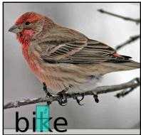

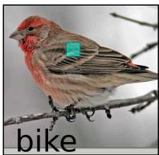  
Original generation with vanilla attention Word: bike

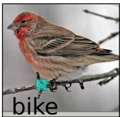  
OCR heads on Word: feathers (All heads: \\)  
OCR Heads on Word: branch (All heads: ‘\_’)

(b) Verbalization lens: decoding image activations at layer 0  
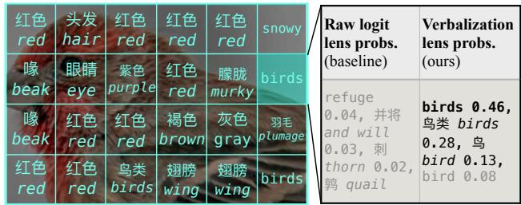  
Figure 1. We find that VLM attention heads responsible for OCR are actually generic verbalization heads that can read out semantics of image tokens that do not contain text. (a) Verbalization heads attend to text when prompted to transcribe words, but manually redirecting their attention to image tokens that do not contain text causes the model to output words corresponding to the semantics of those tokens (top 10% of Qwen3-VL-8B verbalization heads). (b) We repurpose these heads’ attention weights to create a verbalization lens that can be applied to image representations from any layer. Here, our approach reveals alignment of image representations with language space starting from layer 0, which logit lens is unable to see.

[44, 50, 58].

In this work we study how vision-language models “read” (i.e., perform optical character recognition, or OCR) [20, 29, 36], which we show can help us understand how these models map from pixels to semantics in general. We discover that attention heads responsible for OCR can also be used to verbalize semantic information across a wide range of image tokens. We first isolate a set of attention heads that are causally responsible for OCR; if we prompt Qwen3-VL-8B [1] to transcribe a word in, e.g., Figure 1a, it will correctly output “bike,” and we can observe these heads attending to the tokens that correspond to that word. However, if we intervene on these attention heads to attend to a bird wing, we find that Qwen3-VL-8B will output the token feathers. Similarly, it will output branch if we force these heads to attend to a branch. Due to these heads ability to describe image tokens that do not contain text, wede refer to them as general verbalization heads.d

We study the subspace of activation space read by verbalization heads across four models, and find that it contains a wealth of high-level semantic information about inputted images. Specifically, we combine the parameters of identified verbalization heads into a single matrix that can be applied to any hidden state, following techniques described in prior work on language-only models [11–13]. When combined with logit lens [27, 44, 45] (which projects hidden activations to vocabulary space), our verbalization matrix reveals semantic information across all image tokens, as seen in Figure 1b.

Unlike vanilla logit lens, our approach reveals information about image tokens starting from layer 0 of the language backbone. This means that when images are passed from the image encoder to the language decoder, they already contain information aligned with language space. In other words, our results provide evidence that image representations are immediately aligned with language representations starting from early layers [32, 62], despite the apparent modality gap claimed in prior work [25, 50, 54, 58, 59].

These verbalizations are not just correlational, but can also be used to edit latent image representations for Qwen3- VL models. By adding and subtracting latent vectors within the subspace read by verbalization heads, we can edit a model’s activations to replace objects in an image, e.g., causing Qwen3-VL-2B to describe an ant as “an iPod resting on a green plant stem” (Figure 8a). This indicates that the verbalizations obtained using our approach are causally important for more than just OCR.

Although reading letters appears to be a narrow task, it provides a clean way to identify more general VLM components that map from vision to language space. Obtaining supervision for OCR tasks is uniquely straightforward: while an image of a bird might be mapped to the concepts “animal,” “feathers,” or “small,” an image of the letters b-i-r-d is uniquely associated with the word “bird.” Thus, identifying attention heads in this tractable setting allows us to understand the semantic representations of VLMs more broadly. We provide code and an interactive demo of verbalization lens across models at https://ocr.baulab.info.

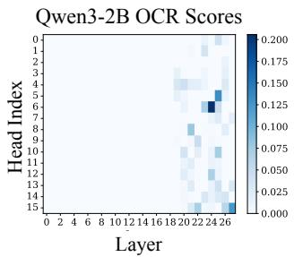

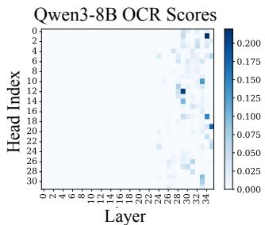

Figure 2. OCR Scores (Equation 1) for all heads inx x $\mathrm { Q w e n } 3 \mathrm { - } \mathrm { V L }$ models. We prompt models to transcribe random words wi in im-nd nd ages $x _ { i }$ and measure $P ( w _ { i } )$ according to logit lens at the finala Qwen3-2B Head Mean Ablations Qwen3-8B Head Mean token position for each individual head (n=1024). Many heads in late layers promote the word contained in an OCR dataset image. cSee Figure 11 for scores for Molmo2-7B and Llava-Next-34B.Layer  
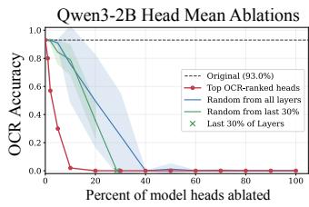

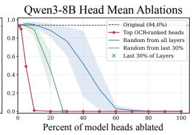  
Figure 3. Top-scoring attention heads from Figure 2 are causally necessary for doing OCR. Across models, we find that heads responsible for OCR comprise 10% of total attention heads. These ablations are run for 100 images across 10 seeds for random baselines; see Figure 12 for Molmo2-7B and Llava-Next-34B.

## 2. Finding Verbalization Heads

## 2.1. Approach

We first search for attention heads causally responsible for extracting text from image representations. We set up a simple OCR task by placing random English words on top of ImageNet [49] images.2 We filter words, keeping only those corresponding to a single token in the model vocabulary, then pre-fill the input with “Word:” and read out the response. Table 3 shows that all models we study can reliably complete our OCR task; see Figure 10 for dataset examples.

To find attention heads that are responsible for OCR, we apply logit lens [27, 44, 45] to each head’s output and measure the probability of the desired word. Each image in our OCR dataset $x _ { i } \ \in \ \mathcal { X } _ { \mathrm { O C R } }$ contains a word $w _ { i }$ . Let $\mathbf { h } _ { x _ { i } } ^ { ( l , h ) } \in$ Rdhead refer to the output of attention head h at layer l at the final token position for image $x _ { i } ,$ , when the model is about to output its transcription. We project this vector to the residual stream dimension using the output projection for that head $\mathbf { W } _ { O } ^ { ( l , h ) } \in \mathbb { R } ^ { d _ { \mathrm { m o d e l } } \times d _ { \mathrm { h e a d } } }$ , and directly decode to vocabulary space to obtain $P ( w _ { i } )$ . We take the mean of this

value across images:

$$
s ( l , h ) = \frac { 1 } { | \mathcal { X } _ { \mathrm { O C R } } | } \sum _ { x _ { i } \in \mathcal { X } _ { \mathrm { O C R } } } \mathrm { L o G I T L E N S } ( \mathbf { W } _ { O } ^ { ( l , h ) } \mathbf { h } _ { x _ { i } } ^ { ( l , h ) } ) [ w _ { i } ]\tag{1}
$$

which yields a score $s ( l , h )$ for attention head h at layer $l ,$ measuring how strongly this head outputs words $w _ { i }$ across the OCR dataset. Logit lens [45] is defined as:

$$
\mathrm { L O G I T L E N S } ( \mathbf { a } ) = \mathrm { s o f t m a x } ( \mathbf { W } _ { U } \mathbf { n o r m } ( \mathbf { a } ) )\tag{2}
$$

for a hidden state a $\in \mathbb { R } ^ { d _ { \mathrm { m o d e l } } }$ , where “norm” refers to the final norm, and $\mathbf { W } _ { U } ~ \in ~ \mathbb { R } ^ { | \mathcal { V } | \times d _ { \mathrm { m o d e l } } }$ is the “unembedding” matrix mapping to the token vocabulary space V. The softmax induces a distribution over tokens.

The intuition behind our approach is that when the model is about to transcribe a word, some set of attention heads are responsible for “fetching” $w _ { i }$ from the image and bringing that information into the column space of the final decoder head. Equation 1 is designed to find these heads, assuming they exist.

## 2.2. Results

Figure 2 shows OCR scores for all attention heads in two Qwen3-VL models. Notably, heads with high scores are concentrated in late layers. To assess whether these heads are causally important for OCR, we progressively meanablate3 heads with the highest scores and measure the trend in task performance in Figure 3. Across all models, meanablating the top 10% of heads ranked by OCR scores fully degrades task performance. OCR heads are concentrated in late layers, which might be a confound, but ablating an equivalent number of random late-layer heads is less effective. This suggests that OCR heads are most responsible for the model’s performance on this task. Results are similar for Molmo2-7B and Llava-Next-34B (see Appendix B).

## 2.3. Head Behavior on Non-Text

Although we identify these heads based on a small synthetic OCR task, they appear to be broader verbalization heads used for more general image understanding (see Figure 1). While delineating the exact purpose of these heads is beyond the scope of this work, we now briefly discuss some intuition for why these heads are able to verbalize non-textual tokens.

In Figure 4a, we visualize attention patterns for topscoring Qwen3-VL-2B OCR heads on a random image. As expected, these heads attend to image tokens containing text when prompted to transcribe the text in the image. However, we also find that when the model is prompted “What is the animal in this image?,” the same attention heads begin to attend to tokens corresponding to the mouse in the image, rather than the subtitles. This attention behavior is analogous to work on filter heads in LLMs [34, 52], which “retrieve” items from the prior context based on a prompt query (see Appendix C for discussion).

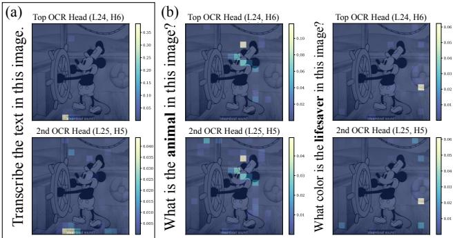  
Figure 4. Top-scoring heads for OCR attend to text—but under different prompt settings, they can also attend to animals and objects. We show the two top-OCR-scoring attention heads in Qwen3-VL-2B as an example. (a) These heads attend to the subtitle “[steamboat sound]” when prompted to transcribe text. (b) The same heads also attend to a mouse when prompted “What is the animal in this image?” and a lifesaver when prompted “What color is the lifesaver in this image?” (Qwen3-VL-2B’s answers to these questions are “Mouse” and “White,” respectively). This behavior suggests that these heads are not purely dedicated to OCR.

What do verbalization heads output when they attend to non-text tokens? Figure 1a shows a qualitative example for Qwen3-VL-8B: redirecting the top 10% of verbalization heads to attend to, e.g., a token containing a bird wing causes the model to output the token feathers. This motivates a question: can we use these attention heads to create a “verbalizer” for image tokens in general?

We note that it is likely one could also identify this set of attention heads using tasks other than OCR, e.g., asking “What is in this image?” with supervision from image annotations. However, OCR provides a straightforward one-toone mapping from visual inputs to language outputs. If we were to run the same procedure with natural images, a given image token of a bird might plausibly map to many different tokens, including “bird,” “feathers,” “cardinal,” “wing,” or “小鸟” (“bird” in Chinese). The OCR task offers unambiguous supervision, enabling broader understanding of how VLMs map from pixels to semantics.

## 3. Building a Verbalization Lens

## 3.1. Verbalization Transformation

Instead of redirecting attention maps as in Figure 1a (which requires a separate forward pass for every image token), we compact the parameters of these verbalization heads into a single linear transformation that can reveal semantic information contained within any hidden state. Specifically, we sum the output-value (OV) matrices [11] of verbalization heads across layers. This is roughly equivalent to intervening on attention maps, except that heads can “attend” to activations from any layer [12, 13].

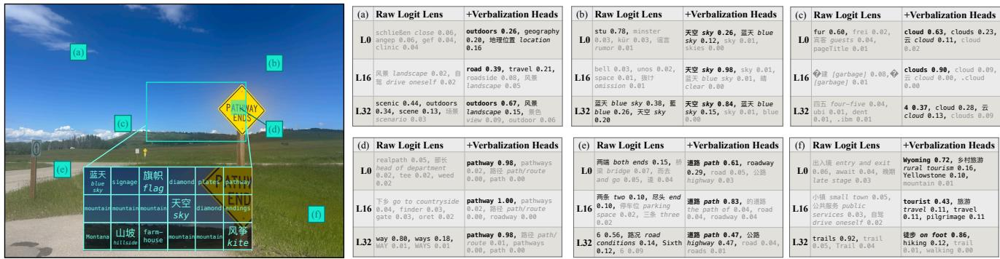  
Figure 5. Verbalization lens reveals semantic information contained within VLM image tokens starting from early layers. We show severa 蓝天 旗帜token readouts for one image for Qwen3-VL-8B, comparing raw logit lens to the top 10% of verbalization heads. Applied to image sky tokens that contain text, verbalization lens shows tokens corresponding to the appropriate word; see subfigure (d). Applied to other image skytokens, verbalization lens reveals interpretable semantic information, outputting cloud for a token containing clouds (c), or more general mountain kitemountainhouse ⼭坡hillsideMontanainformation like outdoors above a possible register token [7] in (a). Outputs are often in Chinese for Qwen3-VL models, likely because they are Chinese models. Gray text means probability is below 0.10; top verbalization lens predictions are bolded for emphasis. See Appendix D for qualitative results across models.

Let $\mathcal { O } _ { p }$ be a set containing the top-p% of OCR heads; across models, we use $\% = 1 0 \%$ based on Sec. 2.2. We construct a matrix $\mathbf { L } _ { p } \in \mathbb { R } ^ { d _ { \mathrm { m o d e l } } \times d _ { \mathrm { m o d e l } } }$ comprising the parameters of these verbalization heads. We calculate

$$
\mathbf { L } _ { p } = \sum _ { ( l , h ) \in \mathcal { O } _ { p } } \mathbf { W } _ { O } ^ { ( l , h ) } \mathbf { W } _ { V } ^ { ( l , h ) } ,\tag{3}
$$

based on the output and value projections of heads in ${ \mathcal { O } } _ { p } ,$ , which have shape ${ \bf W } _ { { \cal O } } ^ { ( l , h ) } \ { \in } \ { \bar { \mathbb { R } } } ^ { d _ { \mathrm { m o d e l } } \times d _ { \mathrm { h e a d } } } , { \bf W } _ { V } ^ { ( l , h ) } \ \in$ $\mathbb { R } ^ { \dot { d } _ { \mathrm { h e a d } } \times d _ { \mathrm { m o d e l } } }$ . Multiplied together, each “OV matrix” determines what this head will output if it attends to a particular token; adding them together is equivalent to summing the outputs of multiple heads. Thus, applying this matrix to a hidden state is equivalent to “forcing” all heads in $\mathcal { O } _ { p }$ to attend to that hidden state and summing the resulting outputs.

## 3.2. Decoding to Vocabulary Space

After applying the verbalization transformation from Equation 3 to an activation $\mathbf { a } ^ { ( l ) } \in \mathbb { R } ^ { d _ { \mathrm { m o d e l } } }$ , we can project the resulting vector to vocabulary space (Equation 2) to obtain probabilities for each token:

$$
\mathrm { V E R B A L L E N S } \big ( \mathbf { a } ^ { ( l ) } \big ) = \mathbf { L } 0 \mathrm { G I T L E N S } \big ( \mathbf { L } _ { p } \mathbf { a } ^ { ( l ) } \big ) .\tag{4}
$$

This approach can be thought of as a quick approximation of the proof-of-concept in Figure 1a. There are two key differences: first, heads across layers can “attend” to a(l) regardless of whether they are also at layer l. This still yields interpretable results, perhaps because layer order has been shown to be mostly interchangeable in LLMs [12, 33, 56]. Second, we directly decode to vocabulary space, rather than allowing the model to further process these head outputs. This gives us the advantage of being able to run a single forward pass and decode any activation with two simple matrix multiplications (the naive approach requires a separate forward pass for each image token). We can conceptualize $\mathbf { L } _ { p }$ as an operation that “focuses” logit lens on the correct subspace of model activations.

## 3.3. Qualitative Results

Figure 5 shows an example of logit lens applied to image hidden states across layers with and without our verbalization transformation. Applying our verbalization heads reveals semantic information both for image tokens containing written text $( \mathrm { e . g . , \mathrm { \underline { { { p a t h w a y } } } } }$ for a patch containing the text “PATHWAY”, Figure 5d) and image tokens containing more generic visual information (e.g., cloud for a patch containing clouds, Figure 5c). Our approach yields interpretable results as soon as layer 0, whereas raw logit lens is quite noisy in early-middle layers. This corroborates evidence from prior work showing that image representations are aligned with language in early VLM layers [32, 62].

## 3.4. Object Confidence

To quantify how well this approach recovers relevant semantic concepts from image tokens, we set up an object detection task using the COCO validation split [37], similar to the setup from [27]. For each COCO category (e.g., “backpack”), we sample n images with that object and n random images that do not contain that object. Let o be the token for a particular category. For each image, we take the maximum $P ( o )$ under verbalization lens across all image tokens as the model’s confidence that an image contains $^ { O , }$ focusing on one layer at a time. We filter to include only singletoken categories (56/80 COCO classes for Qwen3 models). As found in prior work [27], raw logit lens can distinguish COCO objects. But verbalization lens leads to much higher probabilities for images that contain o (Figure 6a). Verbalization lens also achieves consistent separation across layers, whereas raw logit lens only begins to work in late layers (Figure 6b). Figure 19 shows similar results with ROC-AUC: raw logit lens offers some discrimination, but verbalization lens realizes near perfect AUC across layers.

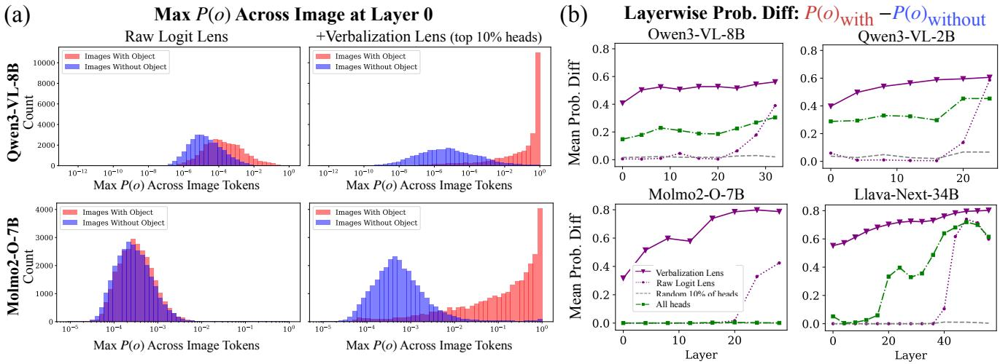  
Figure 6. Verbalization lens is sensitive to whether an image contains an object: it yields high probabilities for images that contain objects, and low probabilities for images that do not. We apply logit lens (Equation 2) to VLM representations of images from the COCO datase [37] with and without this transformation, and extract the probability of the COCO class label token for all single-token categories, simila to [27]. (a) At layer 0, verbalization lens is better able to detect whether an image contains an object— ${ } _ { - } P ( o )$ is consistently higher for the red histogram for Qwen3-VL-8B and Molmo2-7B. (b) Average difference in maximum $P ( o )$ across layers for images containing an object vs. random images not containing that object. Verbalization lens increases the gap between the two settings more than raw logit lens, especially in early-middle layers. Using the weights of all attention heads gives a weaker effect than just verbalization heads.

## 3.5. Object Localization

We find that verbalization lens generally reveals information localized to relevant regions of an image. Similar to Section 3.4, we calculate $P ( o )$ across all image tokens at a given layer, which yields a heatmap of confidence scores across image tokens. We can use this approach to obtain probabilities at a particular location for any token in the model’s vocabulary. For example, in Figure 7a, the token with the maximum $P ( { \mathrm { o r a n g e } } )$ is the token containing a small orange. Localization is also sensitive to nuances in word meaning. While the token phone localizes image tokens that appear to contain a mobile or landline phone, $\not { U } { \overset { \underset { \mathrm { \tiny ~ . 6 } } { } } { \mathcal { F } } } \not { \mathbb { L } } ^ { \flat } \ ( \mathrm { a }$ Chinese word specifically meaning cell phone) localizes only the cell phone and ${ \bf \bar { \Psi } } \dot { \bf E } \dot { \bf E } \equiv \frac { 1 } { 2 } { \bf \bar { \Psi } } \frac { 1 } { 2 } { \bf \Psi } ,$ (a word mostly used for landlines) localizes only the landline.

Table 1. Token-level localization results for Qwen3-VL models. Here, we follow [27] by taking the maximum probability for each token across layers. We use the top 10% of verbalization heads based on results from Figure 3, and thus also sample 10% of heads for the random baseline. For mIoU, we choose the best threshold based on 128 random images and report results for a different sample of 512 images, all from the COCO 2014 validation set. See Appendix F for details.

<table><tr><td colspan="3">Qwen3-VL-8B</td><td colspan="2">Qwen3-VL-2B</td></tr><tr><td>Method</td><td>mIoU</td><td>mAP</td><td>mIoU</td><td>mAP</td></tr><tr><td>Raw Logit Lens</td><td>0.161</td><td>0.374</td><td>0.223</td><td>0.462</td></tr><tr><td>Random Heads</td><td>0.167</td><td>0.302</td><td>0.157</td><td>0.224</td></tr><tr><td>Verbalization Lens</td><td>0.190</td><td>0.407</td><td>0.249</td><td>0.463</td></tr></table>

Following [27], we calculate segmentation metrics for our approach using the COCO 2014 validation set [37]. For a given image, we retrieve all of the single-token categories4 o in that image and use our lens to generate segmentation maps for each category in the image. To generate a segmentation map, we obtain a score $P ( o )$ for each token by taking the maximum probability of o across layers. We then binarize these probabilities to score lens predictions against ground truth masks by choosing a threshold τ on a disjoint set of images (or sweep across τ for AP), and average resulting scores across all objects/images. Unlike prior object localization work [4, 14, 27], we evaluate at the token-scale instead of upsampling our predictions to the pixel scale.5

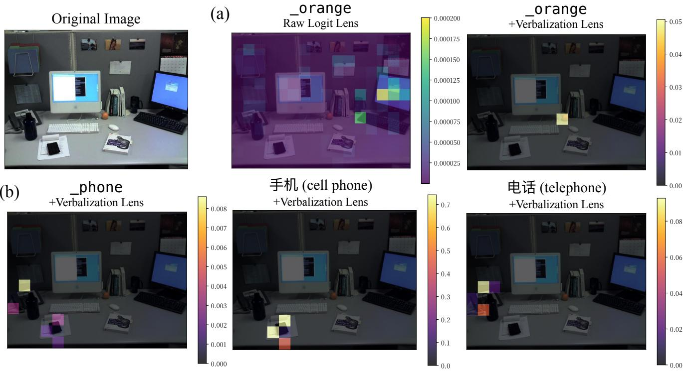  
Figure 7. We use verbalization lens to measure P(o) across image tokens for an object o, and find that high probabilities are concentrated in image tokens containing o. (a) P(orange)=0.05 for a token containing an orange, whereas raw logit lens probabilities are lower and scattered across the image. (b) Localization is sensitive to the specific word used: P(phone) is high for both phones in the image, but “手 $\$ 123$ (a Chinese word specifically meaning cell phone) localizes only the cell phone, and ${ } ^ { \mathfrak { s e g h i g h } }$ (a word mostly used for landlines) localizes only the landline. Results are for Qwen3-VL-2B (layer 15), with the top 10% of verbalization heads.

We compare to logit lens and an equivalent number of random heads. Table 1 shows that verbalization lens is slightly more spatially localized than baselines. However, numbers are overall quite low—this may in part be due to register token behavior [7, 26], where general information about an image is stored in arbitrary tokens (e.g., Figure 5f).

## 3.6. Comparison to LatentLens

LatentLens [32] is an alternative approach to decoding image activations: instead of using unembeddings, it measures cosine similarity of image tokens against a large pool of contextual text embeddings from intermediate LLM layers. However, Krojer et al. [32] report failure modes in the early and mid-layers of some larger models such as Llava-Next-34B. Adopting the same LLM judge interpretability metric as Krojer et al. [32], we find that verbalization lens produces interpretable tokens even in these difficult settings, with a 40.5 point increase in judge scores for Llava-Next-34B on average across layers. For all other models, our approach is on par with LatentLens; see Appendix G for details.

## 4. Editing Conceptual Information

Are the representations read out by these verbalization heads a mirage, or are they causally relevant for the model’s “understanding” of an image? Instead of merely verbalizing hidden state representations, we use the subspace read by $\mathbf { L } _ { p }$ to edit Qwen3-VL models’ perception of an image, finding that we can, e.g., cause the model to describe an ant in an image as an iPod.

## 4.1. Approach

Let $c _ { \mathrm { r e m } }$ correspond to a concept we want to remove, and $c _ { \mathrm { a d d } }$ be a concept we want to add in its place. Here, we focus on single-token concepts. If we take the unembedding vector $\mathbf { u } _ { c } \in \mathbb { R } ^ { d _ { \mathrm { m o d e l } } }$ corresponding to the token for the concept $c ,$ we can obtain a latent vector $\mathbf { v } _ { c }$ for that concept using the inverse of the transformation from Equation 3:

$$
\mathbf { v } _ { c } = \mathbf { L } _ { p } ^ { - 1 } \mathbf { u } _ { c } .\tag{5}
$$

where $\mathbf { v } _ { c } \in \mathbb { R } ^ { d _ { \mathrm { m o d e l } } }$ is a direction in model activation space that encodes the concept c. Although $\mathbf { L } _ { p }$ is typically fullrank (and thus invertible), we find that in practice it has a long tail of small singular values (e.g., Figure 14). This means that directly taking the inverse of $\mathbf { L } _ { p }$ would cause an smal , dark, circular earpiece on the left side, and a visible earphone jack on the right. The iPod is attached to a green plant stem, which isexplosion of singular values in $\mathbf { L } _ { p } ^ { - 1 }$ ached to its ear, suggesting it is being walked or is a p. Instead of taking the slightly glossy surface and a light green color. The background is Background: Tfull inverse, we can take a pseudo-inverse:

(a)  
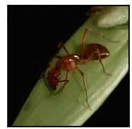

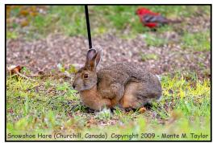  
This is a close-up, macro photograph of a single, red-brown, human-made object, specifically an iPod, restin on a green plant stem. ... The iPod is positioned diagonally across the frame, with its left side facing the viewer. It is a classic model with a glossy, reddish-brown finish. ... The iPod is attached to a green plant stem, which is visible in the foreground and background.  
This is a charming and whimsical photograph of a Snowshoe cucumber (Cucumis sativus) in a natural outdoor setting.  
Main Subject: The central focus is a large, healthy-looking Snowshoe cucumber. It is sitting upright on a patch of grass ... The cucumber has a robust, rounded form with a textured, mottled brownish-green skin. Its most striking features are its large, dark, expressive eyes and its prominent, upright, greenish-brown ears (leaves).

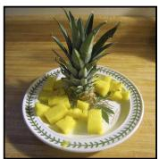

(b)  
This is a close-up, top-down photograph of a white ceramic plate with a decorative green leaf or vine pattern around its rim. ... The most striking feature is the arrangement of objects on the plate: - A large, white, plastic or ceramic washer/dishwasher part (possibly a washing machine agitator or a decorative piece) is prominently displayed in the center. It has a complex, layered, star-like or flower-like shape with multiple ridges and grooves.  
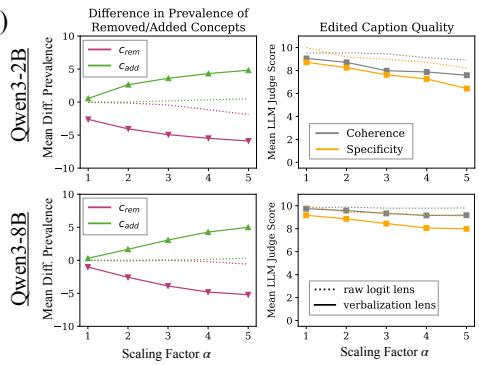  
Figure 8. We can use our verbalization transformation to edit image activations, e.g., replacing the concept of $\mathbf { \ddot { a n t } } ^ { \prime \prime }$ with “iPod.” (a) prevalence: 0 Specificity: 4cremQualitative examples for editing objects within an image. Rank is constant based on our initial sweep; we show α=4 for the first two prevalence: 0 Specificity: 9rem c prevalence: 10 Coherence: 10addimages, and α=5 for the third. (b) Quantitative LLM judge scores across random ImageNet [49] images (n=256). Verbalization lens yields rank 463, sample 5 — coherence: 10 remove\_prevalence: 0 add\_prevalence: 10 specificity: 4latent vectors that can effectively edit image representations without heavily damaging irrelevant concepts, or degrading caption coherence. 0 add\_prevalence: 10 specificity: 9 0 add\_prevalence: 10 specificity: 9Edits are most effective with a larger scaling factor α. We use a rank for each model that explains the top ρ=60% of verbalization energy, made object, specifical y an iPod, resting on a green plant stem. The cucumber (Cucumis sativus) in a natbased on an initial sweep over 100 images (Appendix I).

$$
\mathbf { L } _ { p } = \mathbf { U } \pmb { \Sigma } \mathbf { V } ^ { * }\tag{xt, indicer (Mont(6}
$$

$$
\mathbf { L } _ { p , k } ^ { + } = \mathbf { V } [ : , : k ] \boldsymbol { \Sigma } ^ { - 1 } \mathbf { U } ^ { * } [ : k ]\tag{ndearing(7}
$$

where $1 \leq k \leq d _ { \mathrm { m o d e l } }$ >is an integer hyperparameter, chosen via sweep on a held-out set. Here, we interpret bottom singular values as noise, manually setting them to zero rather than letting them affect our transformation. This approach implicitly views $\mathbf { L } _ { p }$ as reading from a low-rank subspace of the residual stream, as described in previous work [21]. It also means that our edit is more surgical, as we are only affecting activations within a low-rank subspace.

Once we have obtained our latent vectors $\mathbf { v } _ { c _ { \mathrm { r e m } } } , \mathbf { v } _ { c _ { \mathrm { a d d } } }$ for the concepts we would like to add and remove, we edit activations $\mathbf { a } _ { t } ^ { ( l ) } \in \mathbb { R } ^ { d _ { \mathrm { m o d e l } } }$ across all layers l and image token positions t. For a given activation vector, we remove the component of that activation in the direction of $\mathbf { v } _ { c _ { \mathrm { r e m } } }$ , and add in $\mathbf { v } _ { c _ { \mathrm { a d d } } }$ at the same relative magnitude:

$$
\lambda = ( \mathbf { a } _ { t } ^ { ( l ) } \cdot \mathbf { v } _ { c _ { \mathrm { r e m } } } ) / \big | | \mathbf { v } _ { c _ { \mathrm { r e m } } } \big | | ^ { 2 }\tag{8}
$$

$$
\mathbf { a } _ { t } ^ { ( l ) * } = \mathbf { a } _ { t } ^ { ( l ) } - \lambda \mathbf { v } _ { c _ { \mathrm { r e m } } } + \alpha \lambda \mathbf { v } _ { c _ { \mathrm { a d d } } }\tag{9}
$$

where we allow for a scaling factor $\alpha \in \mathbb { R }$ on the added concept $c _ { \mathrm { a d d } }$ as an additional hyperparameter. Note that if $c _ { \mathrm { r e m } }$ is not present in this activation vector, λ will be close to zero, and Equation 9 becomes a no-op. This is by design: we do not want to edit token positions where there is nothing to replace. Thus, while we apply this edit to all image tokens, it only has an effect at relevant token positions.

## 4.2. Evaluation

To evaluate the efficacy of our edits, we prompt models to free generate descriptions with intervened image representations. We prompt o4-mini to score the generated captions according to four metrics on a scale from 0 to 10:

• Prevalence of $c _ { \mathrm { a d d } } . \ \mathrm { e . g }$ ., how prominently does the concept of ‘dog’ feature in this caption?

• Prevalence of $c _ { \mathbf { r e m } } . \ \mathrm { e . g . }$ , how prominently does the con-rank 892, sample 5 — coherence: 10 remcept of ‘motorcycle’ feature in this caption?

• Specificity. Apart from any differences regarding the concepts $c _ { \mathrm { r e m } }$ and $c _ { \mathrm { a d d } }$ , how similar is the counterfactual caption to the ground truth vanilla caption?

• Coherence. In terms of writing quality, how coherent is this caption?

See Appendix H for full prompts. We obtain scores for all generated and vanilla captions. To measure edit success, we measure the $\Delta$ in prevalence scores for a counterfactual caption compared to scores for the vanilla generation. We evaluate on ImageNet [49] images as they are generally focused on one subject at a time: images are assigned $c _ { \mathrm { r e m } }$ based on their class label, sampling only from images with single-token class labels. Then, $c _ { \mathrm { a d d } }$ is randomly sampled from all other single-token ImageNet class names.

## 4.3. Results

Editing with latent vectors obtained via the verbalization head subspace is more effective than directly editing with unembeddings. After performing an initial sweep over rank and α (see Appendix I for details), we select the rank that explains 60% of the energy of $\mathbf { L } _ { p }$ and run our edit with this setting for $n { = } 2 5 6$ random images, with results shown in Figure 8b. We find using $\alpha > 1$ is most effective. Intuitively, this means that $c _ { \mathrm { a d d } }$ must be added more strongly than $c _ { \mathrm { r e m } }$ was present in order to have a causal effect; per-Editing Object Perhaps this is to override remaining information in the residual stream related to $c _ { \mathrm { r e m } }$ but not captured in $\mathbf { v } _ { c _ { \mathrm { r e m } } }$

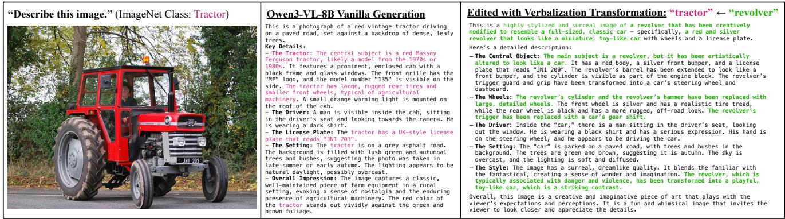  
Figure 9. We can use our verbalization transformation to edit Qwen3-VL-8B image activations, replacing the concept of “tractor” with “revolver.” We obtain latent vectors for these concepts using the inverse of our verbalization matrix. After subtracting the latent vector for “tractor” and adding the vector for “revolver,” Qwen3-VL-8B describes the main subject of the image as a revolver. We leave all other (top 10% OCR heads, rank 463, alpha=4)image features untouched. The model reconciles remaining visual features (like wheels, a license plate, and a driver) by describing the image as a “surreal image of a revolver that has been creatively modified to resemble a full-sized, classic car.” Both captions are generated with greedy decoding. This generation uses $\alpha { = } 4 ;$ across all examples, we use the top $\rho { = } 6 0 \%$ mple of $\mathbf { L } _ { p }$ erence: 9 remove\_prevalence: 0 add\_prevalenceenergy, where p=10%.

We show three abridged qualitative examples in Figure 8a. We can see that, e.g., the concept of “ant” has been cleanly replaced by the concept of “iPod,” while other visual features (like background descriptions) remain intact. These edits preserve low-level visual features of the original object: i.e., the color and texture of the ant is now applied to the iPod, with the model describing the iPod as being “a classic model with a glossy, reddish-brown finish.”

Figure 9 shows a full example edit for Qwen3-VL-8B alongside the model’s vanilla generation. Here, $c _ { \mathrm { r e m } } { = } ^ {  } \mathrm { t r a c t o r , } ^ { \prime \prime }$ and we randomly sample $c _ { \mathrm { a d d } } { = } ^ {  } \mathrm { r e v o l v e r } ^ { \prime \prime }$ Our edit is successful: the model does not describe the image as containing a tractor, but rather as an image of a revolver. Interestingly, because other aspects of the image remain untouched (wheels, license plate, bumper, and man inside the tractor), Qwen synthesizes these attributes into a “surreal” description of a “revolver that has been creatively modified to resemble a full-sized, classic car.”

## 5. Related Work

Lenses. Logit lens [45] was the first to find that LLM internal hidden states can be projected to vocabulary directions with interpretable results, and was followed by a large body of work on other “lenses” to decode internal states [2, 10, 12, 13, 16, 19, 21, 30, 45, 46]. Prior work has applied logit lens approaches to VLMs [27, 35, 44]; one approach [32] provides an alternative to vocabulary decoding using cached latent representations of text. Earlier, [28] also showed that CLIP’s classifier head can act as a “logit lens” for its intermediate states. Our work augments the interpretability of these vanilla logit lens approaches.

n for Qwen3-VL-8B-InstructLanguage and Vision. What is the alignment of language and vision in models? For CLIP vision models, previous work studied “multimodal” neurons that respond to both text referring to a concept and images of that concept [17, 40]. Several works have shown that with just a small adapter module, one can map from image to text [39, 43, 57], even with both models frozen [42, 50]. Other works study vision representations through the lens of language [5, 14], or differentiation between vision and language representations [22, 24, 47]. Others have studied how language priors can conflict with visual features [23, 53], particularly for OCR [20, 29, 36]. Our results are evocative of recent work on how VLMs use language as a mediator for visual understanding [48, 51, 55]. One question is whether image representations are aligned with language in early VLM layers: while earlier work claims that alignment arises only in middle layers [25, 44, 50, 59], others assert early-layer alignment [32, 62], which our method also shows.

Other heads. We note conceptual overlap between verbalization heads and two types of attention heads studied in prior work: filter heads [52] and gaze heads [15]. We compare against these and find modest overlap in Appendix C, suggesting that there may be a relationship between these components. This further supports our claim that the narrow setting of OCR provides a straightforward way of identifying heads responsible for more general VLM mechanisms.

## 6. Conclusion

In this work, we find that attention heads responsible for OCR can be used to verbalize general semantics of non-text image tokens across four VLMs. We collapse the weights of these attention heads into a single matrix that yields more interpretable labels than raw logit lens, and show that the subspace this matrix reads from is causally relevant for model descriptions of images. Taken together, our results show how study of narrow mechanisms can shed light on broader interpretability problems.

## Acknowledgements

SF thanks Si Wu for discussions on language and letters throughout this project, as well as Rohit Gandikota and Arnab Sen Sharma for feedback on early experiments. We thank Andy Arditi, Eric Todd, and Grace Proebsting for feedback on initial drafts. SF is funded by a grant from Coefficient Giving. BK and DB are funded by NSF #2403304.

## References

[1] Shuai Bai, Yuxuan Cai, Ruizhe Chen, Keqin Chen, Xionghui Chen, Zesen Cheng, Lianghao Deng, Wei Ding, Chang Gao, Chunjiang Ge, Wenbin Ge, Zhifang Guo, Qidong Huang, Jie Huang, Fei Huang, Binyuan Hui, Shutong Jiang, Zhaohai Li, Mingsheng Li, Mei Li, Kaixin Li, Zicheng Lin, Junyang Lin, Xuejing Liu, Jiawei Liu, Chenglong Liu, Yang Liu, Dayiheng Liu, Shixuan Liu, Dunjie Lu, Ruilin Luo, Chenxu Lv, Rui Men, Lingchen Meng, Xuancheng Ren, Xingzhang Ren, Sibo Song, Yuchong Sun, Jun Tang, Jianhong Tu, Jianqiang Wan, Peng Wang, Pengfei Wang, Qiuyue Wang, Yuxuan Wang, Tianbao Xie, Yiheng Xu, Haiyang Xu, Jin Xu, Zhibo Yang, Mingkun Yang, Jianxin Yang, An Yang, Bowen Yu, Fei Zhang, Hang Zhang, Xi Zhang, Bo Zheng, Humen Zhong, Jingren Zhou, Fan Zhou, Jing Zhou, Yuanzhi Zhu, and Ke Zhu. Qwen3-vl technical report, 2025. 2, 13

[2] Nora Belrose, Zach Furman, Logan Smith, Danny Halawi, Igor Ostrovsky, Lev McKinney, Stella Biderman, and Jacob Steinhardt. Eliciting latent predictions from transformers with the tuned lens. CoRR, abs/2303.08112, 2023. 8

[3] Adrian Chang, Sheridan Feucht, Byron C Wallace, and David Bau. Does FLUX know what it’s writing? In NeurIPS Mechanistic Interpretability Workshop, San Diego, 2025. 14

[4] Hila Chefer, Shir Gur, and Lior Wolf. Transformer interpretability beyond attention visualization. In Proceedings of the IEEE/CVF Conference on Computer Vision and Pattern Recognition, pages 782–791, 2021. 5

[5] Haozhe Chen, Junfeng Yang, Carl Vondrick, and Chengzhi Mao. Interpreting and controlling vision foundation models via text explanations, 2023. 8

[6] Christopher Clark, Jieyu Zhang, Zixian Ma, Jae Sung Park, Mohammadreza Salehi, Rohun Tripathi, Sangho Lee, Zhongzheng Ren, Chris Dongjoo Kim, Yinuo Yang, Vincent Shao, Yue Yang, Weikai Huang, Ziqi Gao, Taira Anderson, Jianrui Zhang, Jitesh Jain, George Stoica, Winson Han, Ali Farhadi, and Ranjay Krishna. Molmo2: Open weights and data for vision-language models with video understanding and grounding. CoRR, abs/2601.10611, 2026. 13

[7] Timothee Darcet, Maxime Oquab, Julien Mairal, and Piotr´ Bojanowski. Vision transformers need registers. In The

Twelfth International Conference on Learning Representa tions, ICLR 2024, Vienna, Austria, May 7-11, 2024. Open Review.net, 2024. 4, 6

[8] Stanislas Dehaene and Laurent Cohen. The unique role of the visual word form area in reading. Trends in Cognitive Sciences, 15(6):254–262, 2011. 1

[9] Stanislas Dehaene, Laurent Cohen, Jose Morais, and R ´ egine´ Kolinsky. Illiterate to literate: behavioural and cerebral changes induced by reading acquisition. Nature Reviews Neuroscience, 16(4):234–244, 2015. 1

[10] Alexander Yom Din, Taelin Karidi, Leshem Choshen, and Mor Geva. Jump to conclusions: Short-cutting transformers with linear transformations. In Proceedings of the 2024 Joint International Conference on Computational Linguistics, Language Resources and Evaluation, LREC/COLING 2024, 20-25 May, 2024, Torino, Italy, pages 9615–9625. ELRA and ICCL, 2024. 8

[11] Nelson Elhage, Neel Nanda, Catherine Olsson, Tom Henighan, Nicholas Joseph, Ben Mann, Amanda Askell, Yuntao Bai, Anna Chen, Tom Conerly, Nova Das-Sarma, Dawn Drain, Deep Ganguli, Zac Hatfield-Dodds, Danny Hernandez, Andy Jones, Jackson Kernion, Liane Lovitt, Kamal Ndousse, Dario Amodei, Tom Brown, Jack Clark, Jared Kaplan, Sam McCandlish, and Chris Olah. A mathematical framework for transformer circuits. Transformer Circuits Thread, 2021. https://transformercircuits.pub/2021/framework/index.html. 2, 4

[12] Sheridan Feucht, Eric Todd, Byron Wallace, and David Bau. The dual-route model of induction. In Second Conference on Language Modeling, 2025. 3, 4, 8, 14

[13] Sheridan Feucht, Byron Wallace, and David Bau. Vector arithmetic in concept and token subspaces. In Second Mech anistic Interpretability Workshop at NeurIPS, 2025. 2, 4, 8

[14] Yossi Gandelsman, Alexei A. Efros, and Jacob Steinhardt. Interpreting clip’s image representation via text-based decomposition. In The Twelfth International Conference on Learning Representations, ICLR 2024, Vienna, Austria, May 7-11, 2024. OpenReview.net, 2024. 5, 8

[15] Rohit Gandikota and David Bau. Gaze heads: How vlms look at what they describe. arXiv preprint arXiv:2606.14703, 2026. 8, 12

[16] Mor Geva, Avi Caciularu, Kevin Ro Wang, and Yoav Goldberg. Transformer feed-forward layers build predictions by promoting concepts in the vocabulary space, 2022. 8

[17] Gabriel Goh, Nick Cammarata †, Chelsea Voss †, Shan Carter, Michael Petrov, Ludwig Schubert, Alec Radford, and Chris Olah. Multimodal neurons in artificial neural networks. Distill, 2021. https://distill.pub/2021/multimodalneurons. 8

[18] Yash Goyal, Tejas Khot, Douglas Summers-Stay, Dhruv Batra, and Devi Parikh. Making the V in VQA matter: Elevating the role of image understanding in Visual Question Answering. In Conference on Computer Vision and Pattern Recognition (CVPR), 2017. 13

[19] Wes Gurnee, Nicholas Sofroniew, Adam Pearce, Mateusz Piotrowski, Isaac Kauvar, Runjin Chen, Anna Soligo, Paul Bogdan, Euan Ong, Rowan Wang, Ben Thomp son, David Abrahams, Subhash Kantamneni, Emmanuel

Ameisen, Joshua Batson, and Jack Lindsey. Verbalizable representations form a global workspace in language models. Transformer Circuits Thread, 2026. 8

[20] Zhentao He, Can Zhang, Ziheng Wu, Zhenghao Chen, Yufei Zhan, Yifan Li, Zhao Zhang, Xian Wang, and Minghui Qiu. Seeing is believing? mitigating ocr hallucinations in multimodal large language models, 2025. 1, 8

[21] Evan Hernandez, Arnab Sen Sharma, Tal Haklay, Kevin Meng, Martin Wattenberg, Jacob Andreas, Yonatan Belinkov, and David Bau. Linearity of relation decoding in transformer language models. In Proceedings ofthe 2024 International Conference on Learning Representations, 2024. 7, 8

[22] Etha Tianze Hua, Tian Yun, and Ellie Pavlick. Sourcemodality monitoring in vision-language models, 2026. 8

[23] Tianze Hua, Tian Yun, and Ellie Pavlick. How do visionlanguage models process conflicting information across modalities? CoRR, abs/2507.01790, 2025. 8

[24] Minyoung Huh, Brian Cheung, Tongzhou Wang, and Phillip Isola. The platonic representation hypothesis. CoRR, abs/2405.07987, 2024. 8

[25] Chaoya Jiang, Haiyang Xu, Mengfan Dong, Jiaxing Chen, Wei Ye, Ming Yan, Qinghao Ye, Ji Zhang, Fei Huang, and Shikun Zhang. Hallucination augmented contrastive learning for multimodal large language model, 2024. 2, 8

[26] Nick Jiang, Amil Dravid, Alexei A. Efros, and Yossi Gandelsman. Vision transformers don’t need trained registers. In Advances in Neural Information Processing Systems 38: Annual Conference on Neural Information Processing Systems 2025, NeurIPS 2025, San Diego, CA, USA, December 2-7, 2025 / Mexico City, Mexico, November 30 - December 5, 2025, 2025. 6

[27] Nick Jiang, Anish Kachinthaya, Suzie Petryk, and Yossi Gandelsman. Interpreting and editing vision-language representations to mitigate hallucinations, 2025. 2, 4, 5, 8

[28] Sonia Joseph and Neel Nanda. Laying the foundations for vision and multimodal mechanistic interpretability & open problems, 2024. Accessed: 2024-06-28. 8

[29] Antonia Karamolegkou, Nicolas Angleraud, Benoˆıt Sagot, and Thibault Clerice. Reading or guessing? visual grounding´ failures of vision-language models for ocr in ancient greek editions, 2026. 1, 8

[30] Shahar Katz, Yonatan Belinkov, Mor Geva, and Lior Wolf. Backward lens: Projecting language model gradients into the vocabulary space, 2024. 8

[31] Benno Krojer, Dheeraj Vattikonda, Luis Lara, Varun Jampani, Eva Portelance, Chris Pal, and Siva Reddy. Learning action and reasoning-centric image editing from videos and simulation. In Advances in Neural Information Processing Systems 37: Annual Conference on Neural Information Processing Systems 2024, NeurIPS 2024, Vancouver, BC, Canada, December 10 - 15, 2024, 2024. 14

[32] Benno Krojer, Shravan Nayak, Oscar Manas, Vaibhav Ad-˜ lakha, Desmond Elliott, Siva Reddy, and Marius Mosbach. Latentlens: Revealing highly interpretable visual tokens in LLMs. In Forty-third International Conference on Machine Learning, 2026. 2, 4, 6, 8, 13, 14, 19

[33] Vedang Lad, Jin Hwa Lee, Wes Gurnee, and Max Tegmark. Remarkable robustness of llms: Stages of inference? In Advances in Neural Information Processing Systems 38: Annual Conference on Neural Information Processing Systems 2025, NeurIPS 2025, San Diego, CA, USA, December 2-7, 2025 / Mexico City, Mexico, November 30 - December 5, 2025, 2025. 4

[34] Andrew Lee, Yonatan Belinkov, Fernanda B. Viegas, and´ Martin Wattenberg. Decomposing query-key feature interactions using contrastive covariances. CoRR, abs/2602.04752, 2026. 3

[35] Yueyan Li, Chenggong Zhao, Zeyuan Zang, Caixia Yuan, and Xiaojie Wang. Reading images like texts: Sequential im age understanding in vision-language models. arXiv preprint arXiv:2509.19191, 2025. 8

[36] Yunhao Liang, Ruixuan Ying, Bo Li, Hong Li, Kai Yan, Qingwen Li, Min Yang, Okamoto Satoshi, Zhe Cui, and Shiwen Ni. Visual merit or linguistic crutch? a close look at deepseek-ocr, 2026. 1, 8

[37] Tsung-Yi Lin, Michael Maire, Serge J. Belongie, James Hays, Pietro Perona, Deva Ramanan, Piotr Dollar, and´ C. Lawrence Zitnick. Microsoft COCO: common objects in context. In Computer Vision - ECCV 2014 - 13th European Conference, Zurich, Switzerland, September 6-12, 2014, Proceedings, Part V, pages 740–755. Springer, 2014. 4, 5, 13

[38] Haotian Liu, Chunyuan Li, Yuheng Li, Bo Li, Yuanhan Zhang, Sheng Shen, and Yong Jae Lee. Llava-next: Im proved reasoning, ocr, and world knowledge, 2024. 13

[39] Oscar Manas, Pau Rodriguez Lopez, Saba Ahmadi, Aida Ne-˜ matzadeh, Yash Goyal, and Aishwarya Agrawal. MAPL: Parameter-efficient adaptation of unimodal pre-trained mod els for vision-language few-shot prompting. In Proceedings of the 17th Conference of the European Chapter of the As sociation for Computational Linguistics, pages 2523–2548, Dubrovnik, Croatia, 2023. Association for Computational Linguistics. 8

[40] Joanna Materzynska, Antonio Torralba, and David Bau. Disentangling visual and written concepts in CLIP. In IEEE/CVF Conference on Computer Vision and Pattern Recognition, CVPR 2022, New Orleans, LA, USA, June 18- 24, 2022, pages 16389–16398. IEEE, 2022. 8

[41] Bruce D. McCandliss, Laurent Cohen, and Stanislas Dehaene. The visual word form area: expertise for reading in the fusiform gyrus. Trends in Cognitive Sciences, 7(7): 293–299, 2003. 1

[42] Jack Merullo, Louis Castricato, Carsten Eickhoff, and Ellie Pavlick. Linearly mapping from image to text space. In The Eleventh International Conference on Learning Representations, ICLR 2023, Kigali, Rwanda, May 1-5, 2023. OpenReview.net, 2023. 8

[43] Ron Mokady, Amir Hertz, and Amit H. Bermano. Clipcap: CLIP prefix for image captioning. CoRR, abs/2111.09734, 2021. 8

[44] Clement Neo, Luke Ong, Philip H. S. Torr, Mor Geva, David Krueger, and Fazl Barez. Towards interpreting visual information processing in vision-language models. ArXiv, abs/2410.07149, 2024. 1, 2, 8

[45] Nostalgebraist. Interpreting gpt: The logit lens. https : / / www . alignmentforum . org / posts / AcKRB8wDpdaN6v6ru/interpreting- gpt- thelogit-lens, 2020. Accessed: 23 Sep 2024. 2, 3, 8

[46] Koyena Pal, Jiuding Sun, Andrew Yuan, Byron C Wallace, and David Bau. Future lens: Anticipating subsequent tokens from a single hidden state. In Proceedings of the 27th Conference on Computational Natural Language Learning (CoNLL), pages 548–560, 2023. 8

[47] Isabel Papadimitriou, Huangyuan Su, Thomas Fel, Naomi Saphra, Sham M. Kakade, and Stephanie Gil. Interpreting the linear structure of vision-language model embedding spaces. CoRR, abs/2504.11695, 2025. 8

[48] Athulith Paraselli, Etha Tianze Hua, and Ellie Pavlick. Slow to see, slow to suppress: Understanding the effects of modality in context-memory conflicts, 2026. 8

[49] Olga Russakovsky, Jia Deng, Hao Su, Jonathan Krause, Sanjeev Satheesh, Sean Ma, Zhiheng Huang, Andrej Karpathy, Aditya Khosla, Michael S. Bernstein, Alexander C. Berg, and Li Fei-Fei. Imagenet large scale visual recognition challenge. CoRR, abs/1409.0575, 2014. 2, 7, 14

[50] Sarah Schwettmann, Neil Chowdhury, Samuel Klein, David Bau, and Antonio Torralba. Multimodal neurons in pretrained text-only transformers. In IEEE/CVF International Conference on Computer Vision, ICCV 2023 - Workshops, Paris, France, October 2-6, 2023, pages 2854–2859. IEEE, 2023. 1, 2, 8

[51] Haz Sameen Shahgir, Xiaofu Chen, Yu Fu, Erfan Shayegani, Nael B. Abu-Ghazaleh, Yova Kementchedjhieva, and Yue Dong. Vlms need words: Vision language models ignore visual detail in favor of semantic anchors. CoRR, abs/2604.02486, 2026. 8

[52] Arnab Sen Sharma, Giordano Rogers, Natalie Shapira, and David Bau. Llms process lists with general filter heads. The Fourteenth International Conference on Learning Representations (ICLR 2026), 2025. 3, 8, 12

[53] Yan Shu, Hangui Lin, Yexin Liu, Yan Zhang, Gangyan Zeng, Yan Li, Yu Zhou, Ser-Nam Lim, Harry Yang, and Nicu Sebe. When semantics mislead vision: Mitigating large multimodal models hallucinations in scene text spotting and understanding, 2025. 8

[54] Mustafa Shukor and Matthieu Cord. Implicit multimodal alignment: On the generalization of frozen llms to multimodal inputs. In Advances in Neural Information Processing Systems, pages 130848–130886. Curran Associates, Inc., 2024. 2

[55] Alexa R. Tartaglini, Satchel Grant, Daniel Wurgaft, Christopher Potts, and Judith E. Fan. Diagnosing bottlenecks in data visualization understanding by vision-language models, 2025. 8

[56] Eric Todd, Millicent L. Li, Arnab Sen Sharma, Aaron Mueller, Byron C. Wallace, and David Bau. Function vectors in large language models. In The Twelfth International Conference on Learning Representations, 2024. arXiv:2310.15213. 4

[57] Maria Tsimpoukelli, Jacob Menick, Serkan Cabi, S. M. Ali Eslami, Oriol Vinyals, and Felix Hill. Multimodal few-shot

learning with frozen language models. In Advances in Neural Information Processing Systems 34: Annual Conference on Neural Information Processing Systems 2021, NeurIPS 2021, December 6-14, 2021, virtual, pages 200–212, 2021. 8

[58] Constantin Venhoff, Ashkan Khakzar, Sonia Joseph, Philip Torr, and Neel Nanda. How visual representations map to language feature space in multimodal llms, 2025. 1, 2

[59] Constantin Venhoff, Ashkan Khakzar, Sonia Joseph, Philip H. S. Torr, and Neel Nanda. Too late to recall: Explaining the two-hop problem in multimodal knowledge retrieval. In Advances in Neural Information Processing Systems 38: Annual Conference on Neural Information Processing Systems 2025, NeurIPS 2025, San Diego, CA, USA, December 2-7, 2025 / Mexico City, Mexico, November 30 - December 5, 2025, 2025. 2, 8

[60] Kevin Wang, Alexandre Variengien, Arthur Conmy, Buck Shlegeris, and Jacob Steinhardt. Interpretability in the wild: a circuit for indirect object identification in GPT-2 small. CoRR, abs/2211.00593, 2022. 3

[61] Eliot Weinberger. 19 ways of looking at Wang Wei: with more ways. New Directions Books, New York, NY, 2016. Afterword by Octavio Paz. 14

[62] Evzen Wybitul, Javier Rando, Florian Tramˇ er, and Stanislav\` Fort. Representations of text and images align from layer one, 2026. 2, 4, 8

[63] An Yang, Anfeng Li, Baosong Yang, Beichen Zhang, Binyuan Hui, Bo Zheng, Bowen Yu, Chang Gao, Chengen Huang, Chenxu Lv, Chujie Zheng, Dayiheng Liu, Fan Zhou, Fei Huang, Feng Hu, Hao Ge, Haoran Wei, Huan Lin, Jialong Tang, Jian Yang, Jianhong Tu, Jianwei Zhang, Jianxin Yang, Jiaxi Yang, Jing Zhou, Jingren Zhou, Junyang Lin, Kai Dang, Keqin Bao, Kexin Yang, Le Yu, Lianghao Deng, Mei Li, Mingfeng Xue, Mingze Li, Pei Zhang, Peng Wang, Qin Zhu, Rui Men, Ruize Gao, Shixuan Liu, Shuang Luo, Tianhao Li, Tianyi Tang, Wenbiao Yin, Xingzhang Ren, Xinyu Wang, Xinyu Zhang, Xuancheng Ren, Yang Fan, Yang Su, Yichang Zhang, Yinger Zhang, Yu Wan, Yuqiong Liu, Zekun Wang, Zeyu Cui, Zhenru Zhang, Zhipeng Zhou, and Zihan Qiu. Qwen3 technical report, 2025. 12

## A. Model Details

In this work, we study four models of varying sizes with three distinct model families. See Table 2 for architectural details of models studied in this paper.

## B. Finding Verbalization Heads

OCR dataset examples are shown in Figure 10. We use large font sizes and randomly sample colors that contrast with the background. Table 3 shows model accuracy for these stimuli. Due to models having poor OCR performance on stimuli with white backgrounds, we opt for realistic backgrounds.

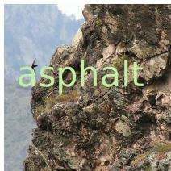

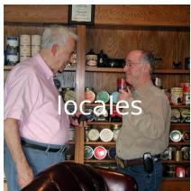

  
Figure 10. Random examples from our OCR dataset used to identify heads in Section 2.

Results from Section 2 are shown for Molmo2-7B and Llava-Next-34B in Figure 11 and Figure 12. We also progressively ablate heads responsible for OCR for Qwen3- VL-2B on VQA in Figure 13.

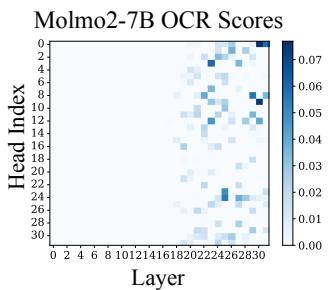

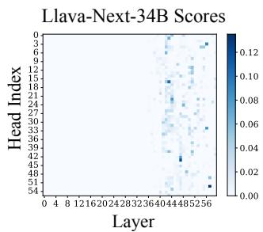  
Figure 11. OCR scores from Equation 1 for Molmo2-O-7B andLayer Llava-Next-34B. The takeaway is similar to Figure 2 for Qwen3- VL models: OCR heads appear in late layers.

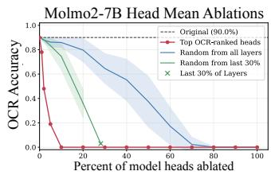

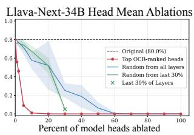  
Figure 12. Progressively mean-ablating top-scoring OCR heads for Molmo2-O-7B and Llava-Next-34B. Results are similar to Qwen3-VL results from Figure 3.

## C. Overlap with Other Heads

Attention patterns from Figure 4 are reminiscent of filter heads from prior work [52]. Are they the same heads? We find that of the 11 filter heads found in Qwen3-1.7B [63] (the base LLM for Qwen3-VL-2B-Instruct), six of them are also in the top-10% of verbalization heads. This suggests that vision fine-tuning may cause filter heads to “evolve” into verbalization heads.

We also check for overlap with gaze heads [15], a type of attention head in VLMs that keeps track of which portion of an image the VLM is captioning. For Qwen3-VL-2B, 30% of gaze heads are also verbalization heads (3/10), and for Qwen3-VL-8B, 29% of gaze heads are also verbalization heads (29/100). This is higher than the expected overlap when sampling the same number of random heads.6 Although this means that verbalization heads are somewhat distinct from gaze heads, the modest overlap also supports our claim that analysis of OCR can identify heads more generally responsible for mapping from pixels to semantics.

## D. Full Verbalization Lens Examples

In Figures 16, 17, and 18, we show full verbalization lens outputs for models not shown in Figure 5. All outputs are for layer 0, and compared to raw logit lens outputs at layer 0.

## E. Object Confidence

For each category, we sample n=512 images containing o and n images without o, except for Llava-Next-34B, for which n=128 due to computational constraints. Figure 19 shows these results using ROC-AUC curves, instead of calculating average difference in maximum P(o) as in the main paper. Interestingly, ROC-AUC shows that raw logit lens has more signal for Qwen models, despite verbalization lens still showing marked improvements.

## F. Object Localization Details

Here, we provide implementation details for Section 3.5. For each image, we score one segmentation map per object category present in that image, where the ground truth mask is the union of all instances of that category (e.g., if there are multiple people in an image, our ground truth mask includes all of those people). For the 512 images that we display numbers for in Table 1, there are 1216 (image, category) pairs, an average of just over two object categories per image. Averaging over these pairs ensures that each object counts once regardless of image/object size.

Table 2. Architectural details of models used in this paper. “Tied” refers to tied embeddings, “Img Encoder” refers to whether the image encoder is trained end-to-end or frozen, and “Single-tok COCO” is the number of COCO [37] categories that are single-token for this tokenizer (which determines results in Sections 3.4-3.5).
<table><tr><td>Full Model Name</td><td>Cite</td><td>Abbrv.</td><td>Total Heads</td><td>Tied?</td><td>Img Encoder?</td><td>Single-tok COCO</td></tr><tr><td>Qwen/Qwen3-VL-2B-Instruct</td><td>[1]</td><td>Qwen3-VL-2B</td><td> $2 8 \mathrm { { l y r s } \times 1 6 \mathrm { { h d s } = 4 4 8 } }$ </td><td>Yes</td><td>End-to-end</td><td>56/80</td></tr><tr><td>Qwen/Qwen3-VL-8B-Instruct</td><td>[1]</td><td>Qwen3-VL-8B</td><td> $3 6 1 \mathrm { y r s } \times 3 2 \mathrm { h d s } = 1 1 5 2$ </td><td>No</td><td> $\operatorname { E n d - t o - e n d }$ </td><td>56/80</td></tr><tr><td>allenai/Molmo2-O-7B</td><td>[6]</td><td>Molmo2-7B</td><td> $3 2 { \mathrm { ~ l y r s } } \times 3 2 { \mathrm { ~ h d s } } = 1 0 2 4$ </td><td>No</td><td> $\operatorname { E n d - t o - e n d }$ </td><td>56/80</td></tr><tr><td>1lava-hf/llava-v1.6-34b-hf</td><td>[38]</td><td>Llava-Next-34B</td><td> $6 0 \mathrm { 1 y r s \times 5 6 \mathrm { h d s } } = 3 3 6 0$ </td><td>No</td><td>End-to-end</td><td>51/80</td></tr></table>

Qwen3-VL-2B-Instruct Head Mean Ablations by answer type

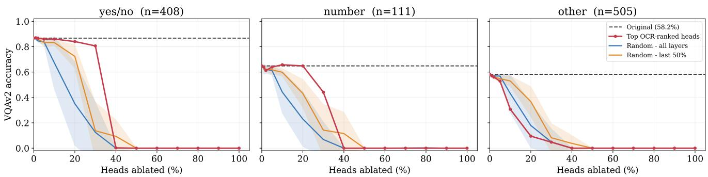  
Figure 13. We also measure accuracy for VQAv2 [18] when progressively mean-ablating the top-scoring OCR heads throughout generation. While ablation of these heads does not affect performance for questions that have Yes/No or numeric answers, it does affect performance for other types of questions (e.g., “What is the type of food in this image $\therefore ? ^ { * * }  \mathrm { ^ * M e x i c a n " ) }$ slightly more than an equal number of random heads. This suggests that verbalization heads may be useful for more general-purpose question answering tasks.

Table 3. OCR Accuracy for randomly-selected English words superimposed on either ImageNet or white backgrounds (n = 100). Accuracies are obtained with the prompt “Transcribe the word in this image.” and assistant prefill “Word:”.
<table><tr><td>Model</td><td>ImageNet Bg</td><td>White  $\mathbf { B } \mathbf { g }$ </td></tr><tr><td>Qwen3-VL-2B</td><td>0.89</td><td>0.07</td></tr><tr><td>Qwen3-VL-8B</td><td>0.93</td><td>0.05</td></tr><tr><td>Molmo2-O-7B</td><td>0.90</td><td>0.44</td></tr><tr><td>Llava-Next-34B</td><td>0.80</td><td>0.75</td></tr></table>

We pick a threshold τ for mIoU based on a disjoint set of 128 images. We show chosen mIoU thresholds in Table 4. We omit token-level accuracy, as in our dataset, only 15.7% of tokens are positive. Therefore, a a baseline that never segments any objects can trivially achieve 84.3% token accuracy.

## G. LatentLens Comparison Details

We describe our setup for the LatentLens [32] comparison from Section 3.6 in more detail here.

Table 4. Thresholds τ for each approach in Table 1, chosen based on a disjoint set of 128 images. We sweep over a log-spaced range of 60 thresholds based on the range of probability scores for that method.
<table><tr><td></td><td>Qwen3-VL-8B Qwen3-VL-2B</td><td></td></tr><tr><td>Random Heads</td><td> $7 . 2 \times 1 0 ^ { - 6 }$ </td><td> $5 . 1 \times 1 0 ^ { - 8 }$ </td></tr><tr><td>Raw Logit Lens</td><td> $3 . 0 \times 1 0 ^ { - 4 }$ </td><td> $4 . 4 \times 1 0 ^ { - 3 }$ </td></tr><tr><td>Verbalization Lens</td><td> $3 . 4 \times 1 0 ^ { - 3 }$ </td><td> $1 . 1 { \times } 1 0 ^ { - 3 }$ </td></tr></table>

LatentLens replication. For each of the four models, we build a LatentLens contextual index following Krojer et al. [32]’s released implementation and corpus. We extract contextual embeddings at every model’s embedding layer plus a set of decoder layers space across the model, and store up to 30 contexts per unique token. Following [32], we retrieve the top-k nearest neighbors by cosine similarity across al indexed layers jointly at query time. As in their evaluation, LatentLens neighbor tokens are often subwords; we expand each to its full containing word using the neighbor’s own source sentence as context $( \mathrm { e . g . \overset { \left. \right.} { \mathrm { i n g } } ^ { \prime \prime }  }$ “rendering”).

We find that a small fraction of nearest-neighbor matches (concentrated in Qwen3-VL-8B’s middle layers)

are whitespace tokens carrying no semantic content despite high cosine similarity. Thus, we search $k = 3 2$ neighbors and take the top-5 non-blank words.

Layers. For each model we evaluate six layers: Qwen3-VL-2B {0, 8, 12, 16, 20, 27}, Qwen3-VL-8B {0, 8, 12, 20, 24, 35}, Molmo2-O-7B {0, 8, 12, 19, 22, 31}, Llava-Next-34B {0, 10, 24, 36, 42, 59}. See Table 2 for model details.

Images. We sample 100 random images (fixed seed) from the same COCO val2014 pool used elsewhere in the paper. For each image we decode one patch, chosen pseudorandomly (seeded per image) from the central 60% of that model’s patch grid to avoid picking pure background/padding; the same patch is used across all 6 layers for a given image.

LLM judge. We use the same LLM-judge as Krojer et al. [32]. We show GPT-5 the full image with a red bounding box over the target patch, a cropped close-up of that region, and the top-5 candidate words for one lens at a particular layer. The judge labels each candidate as concrete (literally visible in the box), abstract (an implied concept/activity/quality), or globally related (visible elsewhere in the image but not the box). A patch is scored interpretable if at least one candidate word receives any of these three labels.

Results. Figure 20 shows the resulting interpretabletoken percentage across layers for all four models. For all models, verbalization lens is on par with or better than LatentLens in terms of LLM judge scores. We note that verbalization lens is especially helpful for Llava-Next-34B.

## H. LLM Judge for Editing

Table 5 lists LLM judge prompts for evaluating image edits from Section 4.2. For each question, the judge returns a structured response containing an integer answer (its rating).

## I. Editing Sweep for Rank/Scaling Factors

We run an initial sweep over ranks and scaling factors for the edit in Section 4. For each setting, we greedy-decode a caption per image. We choose to sweep across scaling factors α ∈ {1, 2, 3, 4, 5, 10}.

Ranks are chosen for each model based on the number of dimensions it takes to explain $\rho \%$ of the energy of $\mathbf { L } _ { p } .$ That is, if $\Sigma { = } [ \sigma _ { 1 } , . . . \sigma _ { d _ { \mathrm { m o d e l } } } ] .$ , we take the minimum top-k dimensions such that sum $( \Sigma [ : \ k ] ^ { 2 } ) / \mathrm { s u m } ( \Sigma ^ { 2 } ) > \rho / \bar { 1 0 0 }$ for $\rho ~ \in ~ \{ 1 , 5 , 1 0 , 2 0 , 4 0 , 6 0 , 8 0 , 9 0 , 1 0 0 \}$ . For reference, we show the singular values of $\mathbf { L } _ { p }$ for Qwen3-VL-2B in Figure $1 4 .$

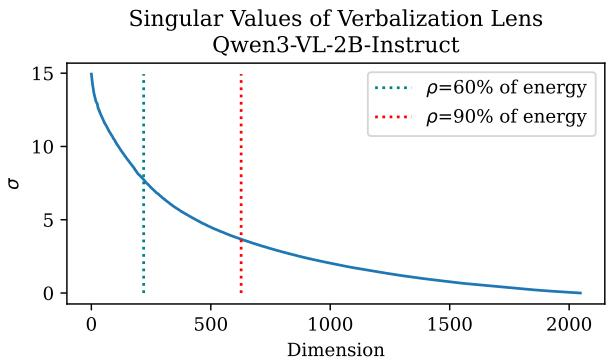  
Figure 14. Singular values of $\mathbf { L } _ { p }$ for Qwen3-VL-2B. We plot dotted lines to indicate the ranks that explain 60% and 90% of energy. See Section 4 for discussion of low-rank approximations of $\mathbf { L } _ { p } .$

Figures 21 and 22 show results for LLM judge metrics from Section 4.2 across n=100 randomly-sampled ImageNet images/object pairs [49]. We find that our edit generally requires a scaling factor $\alpha > 1$ , and does not have an effect for full-rank $\mathbf { L } _ { p } ^ { - \mathrm { \bar { 1 } } }$ . We also find that a large scaling factor α=10 is damaging, as it causes specificity to drop.

Thus, we choose ρ=60% of verbalization lens energy and perform edits for n=256 additional images across scaling factors (excluding α=10) in Figure 8b. $\rho$ is constant for all qualitative generations shown in the paper.

## J. Behind the Scenes

Following [31] and [32], we describe the trajectory of this project in hopes of humanizing this work and making the research process transparent.

This project began because SF was interested in writing and letters. They had worked on letter representations in text-to-image diffusion models before [3], but had just returned from an internship and were trying to decide how exactly to continue this line of work. With encouragement from Si Wu and John Cayley, they began working on a project (which is still in-progress) on VLM representations of Chinese poetry; specifically, the poem 鹿柴 by Wang Wei, which has an interesting history of analysis in terms of its translations [61].

In trying to understand how VLMs might process an image of this poem, SF set out to first figure out how VLMs do OCR in general. The plan was just to figure out how OCR worked, so that this knowledge could be leveraged to create interesting visualizations for this art project. But then, SF realized that the heads they had picked out for OCR were much more general when they were playing around with the OV lens approach used in prior work [12]. Clicking on the word “Hey” in a test image yielded that word, as expected.

<table><tr><td>Question</td><td>Prompt template</td></tr><tr><td>Prevalence of c</td><td>On a scale from 0–10, how prominently does the concept of  $\cdot \{ c \} ^ { , }$  feature in this image caption? Let&#x27;s say that a score of 10 means that the concept is the main focus, 0 means that the concept is not mentioned at all, and in-between scores mean that the concept is mentioned to some extent. If the caption is complete nonsense, rate it as 0.</td></tr><tr><td>Specificity</td><td>Caption:\n\n{caption} You will be shown two captions. The first is a Ground Truth caption describing a real image. The second is a Counterfactual version of the first caption, where the concept of  $\cdot _ { c _ { \mathrm { r e m } } } ,$  has been replaced by the concept of  $\cdot _ { c _ { \mathrm { a d d } } } ,$  . Please rate how similar the Counterfactual caption is to the Ground Truth caption on a scale from 0–10.</td></tr><tr><td></td><td>also get high ratings. You can still give a high score if the Counterfactual caption appears to describe a similar scene to the Ground Truth caption when you ignore the edited concepts: for example, if we removed the concept “motorcycle&quot; and replaced it with “dog,&quot;then the captions “a motorcycle in an empty garage, dimly lit&quot; and “a dog in a low-lit empty garage&quot; would get a score of 9, because they are close paraphrases of each other when you ignore the edited concepts. In the</td></tr><tr><td></td><td>worst case, if the Counterfactual Caption has nothing to do with the Ground Truth Caption at all, give a rating of 0.</td></tr><tr><td></td><td>Ground Truth Caption:\n\n{clean_caption}</td></tr><tr><td></td><td></td></tr><tr><td></td><td></td></tr><tr><td></td><td></td></tr><tr><td>Coherence</td><td>Counterfactual Caption:\n\n {edited_caption} On a scale from 0–10, ignoring the semantics and focusing on grammar and writing quality, how coherent is this image caption (with 10 being perfectly coherent and 0</td></tr><tr><td></td><td>being complete gibberish)?</td></tr><tr><td></td><td></td></tr></table>

Table 5. Question templates for LLM judging from Section 4.2. We use the “Prevalence of c” template both for $c _ { \mathrm { r e m } }$ and $c _ { \mathrm { a d d } }$ . For Specificity scores, we also give the judge the model’s original clean caption, so that it can evaluate whether any important details have changed.

But out of curiosity they clicked on an emoji in the image, expecting the result to be garbage. Surprisingly, they saw the token emoji in early layers! In that moment, the authors realized that they had a pretty interesting little finding that could provide a nice approach to “logit lens for image tokens.”

At the same time, HA and SW had been helping out SF with other lines of attack on understanding text in images (studying emoji and lexical representations). With this surprise, the authors decided to band together and write a paper on this finding. They decided to submit to a conference in a location SF wanted to visit for personal reasons. They recruited BK, who was just beginning his postdoc at the lab, because of his expertise from prior work on this topic, and started writing this paper. Even though BK was in the middle of moving in, and SF came down with a fever in the last few weeks of work on this paper, it ended up coming together in the end.

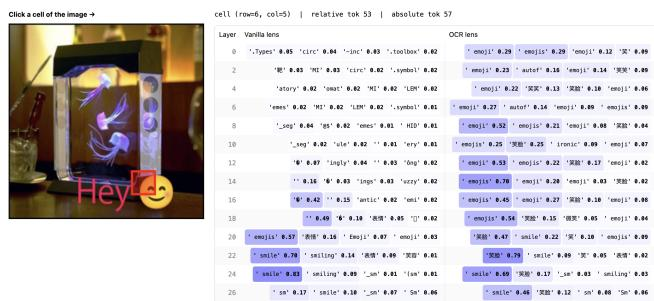  
Figure 15. The original image that SF was using, which was just a random image with the text “Hey” and an emoji overlaid using Photoshop. Clicking on the emoji yielded emoji, even though SF expected to just see noise.

Qwen3-VL-2B: Raw Logit Lens (Layer 0)
<table><tr><td rowspan=1 colspan=1>gio</td><td rowspan=1 colspan=1>天气</td><td rowspan=1 colspan=1></td><td rowspan=1 colspan=1>gio</td><td rowspan=1 colspan=1>gio</td><td rowspan=1 colspan=1>gio</td><td rowspan=1 colspan=1>egat-ive</td><td rowspan=1 colspan=1></td><td rowspan=1 colspan=1>sign</td><td rowspan=1 colspan=1>sign</td><td rowspan=1 colspan=1>TAM</td><td rowspan=1 colspan=1>kale</td><td rowspan=1 colspan=1>obl</td><td rowspan=1 colspan=1>kip</td><td rowspan=1 colspan=1>=path</td><td rowspan=1 colspan=1>aches</td><td rowspan=1 colspan=1>egat-ive</td><td rowspan=1 colspan=1></td><td rowspan=1 colspan=1>obl</td><td rowspan=1 colspan=1></td><td rowspan=1 colspan=1>gio</td></tr><tr><td rowspan=1 colspan=1>odu</td><td rowspan=1 colspan=1></td><td rowspan=1 colspan=1>/cha-rt</td><td rowspan=1 colspan=1>TAM</td><td rowspan=1 colspan=1>verg</td><td rowspan=1 colspan=1>风光</td><td rowspan=1 colspan=1>road</td><td rowspan=1 colspan=1>风光</td><td rowspan=1 colspan=1>hills</td><td rowspan=1 colspan=1>垭</td><td rowspan=1 colspan=1>weat-her</td><td rowspan=1 colspan=1>hare</td><td rowspan=1 colspan=1>weat-her</td><td rowspan=1 colspan=1>ikip</td><td rowspan=1 colspan=1>ragon</td><td rowspan=1 colspan=1>disa-str</td><td rowspan=1 colspan=1>signs</td><td rowspan=1 colspan=1>mina-tion</td><td rowspan=1 colspan=1>colo-rs</td><td rowspan=1 colspan=1>verg</td><td rowspan=1 colspan=1>usta</td></tr><tr><td rowspan=1 colspan=1>gio</td><td rowspan=1 colspan=1>ográf</td><td rowspan=1 colspan=1>andl-es</td><td rowspan=1 colspan=1>ahead</td><td rowspan=1 colspan=1>TaM</td><td rowspan=1 colspan=1></td><td rowspan=1 colspan=1>旷</td><td rowspan=1 colspan=1>hills</td><td rowspan=1 colspan=1>ipsis</td><td rowspan=1 colspan=1>warn-ing</td><td rowspan=1 colspan=1>htab-le</td><td rowspan=1 colspan=1>O)L</td><td rowspan=1 colspan=1>_cod-es</td><td rowspan=1 colspan=1>停车</td><td rowspan=1 colspan=1>桩</td><td rowspan=1 colspan=1>ways</td><td rowspan=1 colspan=1>ifest</td><td rowspan=1 colspan=1>incr-ement</td><td rowspan=1 colspan=1>hills</td><td rowspan=1 colspan=1>加拿</td><td rowspan=1 colspan=1>gio</td></tr><tr><td rowspan=1 colspan=1>鹭</td><td rowspan=1 colspan=1>signs</td><td rowspan=1 colspan=1>Surn-ame</td><td rowspan=1 colspan=1>roads</td><td rowspan=1 colspan=1>flig-hts</td><td rowspan=1 colspan=1>road</td><td rowspan=1 colspan=1>fiel-ds</td><td rowspan=1 colspan=1>obl</td><td rowspan=1 colspan=1>/cha-rt</td><td rowspan=1 colspan=1>啡</td><td rowspan=1 colspan=1>ilat-er</td><td rowspan=1 colspan=1>tens-ion</td><td rowspan=1 colspan=1>风光</td><td rowspan=1 colspan=1>sign-age</td><td rowspan=1 colspan=1>=path</td><td rowspan=1 colspan=1>azi</td><td rowspan=1 colspan=1>功课</td><td rowspan=1 colspan=1>=path</td><td rowspan=1 colspan=1>bone</td><td rowspan=1 colspan=1>roads</td><td rowspan=1 colspan=1>四个自信</td></tr><tr><td rowspan=1 colspan=1>imbus</td><td rowspan=1 colspan=1>桩</td><td rowspan=1 colspan=1>桩</td><td rowspan=1 colspan=1>sign-age</td><td rowspan=1 colspan=1>colo-rs</td><td rowspan=1 colspan=1>grou</td><td rowspan=1 colspan=1>.fie-ld</td><td rowspan=1 colspan=1>晴</td><td rowspan=1 colspan=1>hare</td><td rowspan=1 colspan=1>.get-Context</td><td rowspan=1 colspan=1>醒目</td><td rowspan=1 colspan=1>很长</td><td rowspan=1 colspan=1>摆放</td><td rowspan=1 colspan=1>sign-age</td><td rowspan=1 colspan=1>ím</td><td rowspan=1 colspan=1>sign</td><td rowspan=1 colspan=1>企业提供</td><td rowspan=1 colspan=1>inse</td><td rowspan=1 colspan=1>renc</td><td rowspan=1 colspan=1>colo-rs</td><td rowspan=1 colspan=1>AIL</td></tr><tr><td rowspan=1 colspan=1>gio</td><td rowspan=1 colspan=1>snap</td><td rowspan=1 colspan=1>wire</td><td rowspan=1 colspan=1>停车</td><td rowspan=1 colspan=1>extr</td><td rowspan=1 colspan=1>roads</td><td rowspan=1 colspan=1>胀</td><td rowspan=1 colspan=1>acy</td><td rowspan=1 colspan=1>两条</td><td rowspan=1 colspan=1>_ur</td><td rowspan=1 colspan=1>在路上</td><td rowspan=1 colspan=1>&quot;:&quot;/</td><td rowspan=1 colspan=1>oppo-site</td><td rowspan=1 colspan=1>.sha-pes</td><td rowspan=1 colspan=1>orks</td><td rowspan=1 colspan=1>extr</td><td rowspan=1 colspan=1>光线</td><td rowspan=1 colspan=1>sign-age</td><td rowspan=1 colspan=1>extr</td><td rowspan=1 colspan=1>sign-age</td><td rowspan=1 colspan=1>obl</td></tr><tr><td rowspan=1 colspan=1>鹭</td><td rowspan=1 colspan=1>脚下</td><td rowspan=1 colspan=1>断</td><td rowspan=1 colspan=1>很长</td><td rowspan=1 colspan=1>htab-le</td><td rowspan=1 colspan=1>狩</td><td rowspan=1 colspan=1>roads</td><td rowspan=1 colspan=1>风光</td><td rowspan=1 colspan=1>corr-idors</td><td rowspan=1 colspan=1>egat-ive</td><td rowspan=1 colspan=1>醒目</td><td rowspan=1 colspan=1>thems</td><td rowspan=1 colspan=1>onet</td><td rowspan=1 colspan=1>-queIN</td><td rowspan=1 colspan=1>=path</td><td rowspan=1 colspan=1>baggFage</td><td rowspan=1 colspan=1>odes</td><td rowspan=1 colspan=1>sign-age</td><td rowspan=1 colspan=1>=path</td><td rowspan=1 colspan=1>sign</td><td rowspan=1 colspan=1>htab-le</td></tr><tr><td rowspan=1 colspan=1>,opt-ions</td><td rowspan=1 colspan=1></td><td rowspan=1 colspan=1>旌</td><td rowspan=1 colspan=1>白云</td><td rowspan=1 colspan=1>垭</td><td rowspan=1 colspan=1>weat-her</td><td rowspan=1 colspan=1>天气</td><td rowspan=1 colspan=1>对面</td><td rowspan=1 colspan=1>weg</td><td rowspan=1 colspan=1>hills</td><td rowspan=1 colspan=1>hills</td><td rowspan=1 colspan=1>hare</td><td rowspan=1 colspan=1>停车</td><td rowspan=1 colspan=1>sign</td><td rowspan=1 colspan=1>S)</td><td rowspan=1 colspan=1>Dikip</td><td rowspan=1 colspan=1>TAM</td><td rowspan=1 colspan=1></td><td rowspan=1 colspan=1>hills</td><td rowspan=1 colspan=1>ceil-ings</td><td rowspan=1 colspan=1></td></tr><tr><td rowspan=1 colspan=1>umbed</td><td rowspan=1 colspan=1>.ver-tical</td><td rowspan=1 colspan=1></td><td rowspan=1 colspan=1></td><td rowspan=1 colspan=1></td><td rowspan=1 colspan=1>trees</td><td rowspan=1 colspan=1>mountains</td><td rowspan=1 colspan=1>hills</td><td rowspan=1 colspan=1>note</td><td rowspan=1 colspan=1>hills</td><td rowspan=1 colspan=1>hills</td><td rowspan=1 colspan=1>挂</td><td rowspan=1 colspan=1>hills</td><td rowspan=1 colspan=1>桩</td><td rowspan=1 colspan=1>fall</td><td rowspan=1 colspan=1>signs</td><td rowspan=1 colspan=1>renc</td><td rowspan=1 colspan=1>垭</td><td rowspan=1 colspan=1>剡</td><td rowspan=1 colspan=1></td><td rowspan=1 colspan=1>terr-ain</td></tr><tr><td rowspan=1 colspan=1>,opt-ions</td><td rowspan=1 colspan=1>thum-bs</td><td rowspan=1 colspan=1>peg</td><td rowspan=1 colspan=1>鹭</td><td rowspan=1 colspan=1>TaM</td><td rowspan=1 colspan=1>rout</td><td rowspan=1 colspan=1>鹭</td><td rowspan=1 colspan=1>near-by</td><td rowspan=1 colspan=1>针</td><td rowspan=1 colspan=1>conc-urrently</td><td rowspan=1 colspan=1>terr-ain</td><td rowspan=1 colspan=1>terr-ain</td><td rowspan=1 colspan=1>grd</td><td rowspan=1 colspan=1>桩</td><td rowspan=1 colspan=1>杆</td><td rowspan=1 colspan=1>signs</td><td rowspan=1 colspan=1>ENCES</td><td rowspan=1 colspan=1>ENCES</td><td rowspan=1 colspan=1>范围内</td><td rowspan=1 colspan=1>地上</td><td rowspan=1 colspan=1>鹜</td></tr><tr><td rowspan=1 colspan=1>fiel-dname</td><td rowspan=1 colspan=1>H</td><td rowspan=1 colspan=1>aste-ry</td><td rowspan=1 colspan=1>roads</td><td rowspan=1 colspan=1>road</td><td rowspan=1 colspan=1>grd</td><td rowspan=1 colspan=1>road</td><td rowspan=1 colspan=1>lamb-da</td><td rowspan=1 colspan=1>桩</td><td rowspan=1 colspan=1>anges</td><td rowspan=1 colspan=1>roads</td><td rowspan=1 colspan=1>.fie-ld</td><td rowspan=1 colspan=1>.fie-ld</td><td rowspan=1 colspan=1>桩</td><td rowspan=1 colspan=1>桩</td><td rowspan=1 colspan=1>prop-ri</td><td rowspan=1 colspan=1>lane</td><td rowspan=1 colspan=1>roads</td><td rowspan=1 colspan=1>.fie-ld</td><td rowspan=1 colspan=1>verg</td><td rowspan=1 colspan=1></td></tr><tr><td rowspan=1 colspan=1>lane</td><td rowspan=1 colspan=1>桩</td><td rowspan=1 colspan=1>很长</td><td rowspan=1 colspan=1>自驾</td><td rowspan=1 colspan=1>road</td><td rowspan=1 colspan=1>为其</td><td rowspan=1 colspan=1>ened</td><td rowspan=1 colspan=1>signs</td><td rowspan=1 colspan=1>nier</td><td rowspan=1 colspan=1>_sig-nals</td><td rowspan=1 colspan=1>Fran-ken</td><td rowspan=1 colspan=1>ENCES</td><td rowspan=1 colspan=1>对面</td><td rowspan=1 colspan=1></td><td rowspan=1 colspan=1>ș</td><td rowspan=1 colspan=1>hiba</td><td rowspan=1 colspan=1>*),</td><td rowspan=1 colspan=1>roads</td><td rowspan=1 colspan=1>地上</td><td rowspan=1 colspan=1>amate</td><td rowspan=1 colspan=1>小镇</td></tr><tr><td rowspan=1 colspan=1>ância</td><td rowspan=1 colspan=1>挂</td><td rowspan=1 colspan=1>aken-ing</td><td rowspan=1 colspan=1>ours-elves</td><td rowspan=1 colspan=1>ened</td><td rowspan=1 colspan=1>sage</td><td rowspan=1 colspan=1>.get-Context</td><td rowspan=1 colspan=1>verg</td><td rowspan=1 colspan=1>.dis-connect</td><td rowspan=1 colspan=1>ragon</td><td rowspan=1 colspan=1>roads</td><td rowspan=1 colspan=1>vege-tation</td><td rowspan=1 colspan=1>signs</td><td rowspan=1 colspan=1>桩</td><td rowspan=1 colspan=1>.Tick</td><td rowspan=1 colspan=1>azi</td><td rowspan=1 colspan=1>prop-re</td><td rowspan=1 colspan=1>abox</td><td rowspan=1 colspan=1>荻</td><td rowspan=1 colspan=1>光线</td><td rowspan=1 colspan=1>四个自信</td></tr><tr><td rowspan=1 colspan=1>gio</td><td rowspan=1 colspan=1>条</td><td rowspan=1 colspan=1>rout</td><td rowspan=1 colspan=1>road</td><td rowspan=1 colspan=1>road</td><td rowspan=1 colspan=1>road</td><td rowspan=1 colspan=1>.Plu-gin</td><td rowspan=1 colspan=1>rout-es</td><td rowspan=1 colspan=1>tunn-els</td><td rowspan=1 colspan=1>路面</td><td rowspan=1 colspan=1>odont</td><td rowspan=1 colspan=1>rout</td><td rowspan=1 colspan=1>habit</td><td rowspan=1 colspan=1>yarg</td><td rowspan=1 colspan=1>杆</td><td rowspan=1 colspan=1>disa-str</td><td rowspan=1 colspan=1>abox</td><td rowspan=1 colspan=1>hare</td><td rowspan=1 colspan=1>荻</td><td rowspan=1 colspan=1>还不是</td><td rowspan=1 colspan=1></td></tr><tr><td rowspan=1 colspan=1>ográf</td><td rowspan=1 colspan=1>wheel</td><td rowspan=1 colspan=1>inals</td><td rowspan=1 colspan=1>很长</td><td rowspan=1 colspan=1>路面</td><td rowspan=1 colspan=1>路面</td><td rowspan=1 colspan=1>incr-ement</td><td rowspan=1 colspan=1>unev-en</td><td rowspan=1 colspan=1>dama-ged</td><td rowspan=1 colspan=1>路面</td><td rowspan=1 colspan=1>cont-ext</td><td rowspan=1 colspan=1>roads</td><td rowspan=1 colspan=1>ours-elves</td><td rowspan=1 colspan=1>road-side</td><td rowspan=1 colspan=1>onds</td><td rowspan=1 colspan=1>signs</td><td rowspan=1 colspan=1>signs</td><td rowspan=1 colspan=1>.con-text</td><td rowspan=1 colspan=1>grad-ients</td><td rowspan=1 colspan=1>htab-le</td><td rowspan=1 colspan=1>也没</td></tr><tr><td rowspan=1 colspan=1>：</td><td rowspan=1 colspan=1>r</td><td rowspan=1 colspan=1>TAM</td><td rowspan=1 colspan=1>isko</td><td rowspan=1 colspan=1>road</td><td rowspan=1 colspan=1></td><td rowspan=1 colspan=1>roads</td><td rowspan=1 colspan=1>nier</td><td rowspan=1 colspan=1>sign</td><td rowspan=1 colspan=1>ância</td><td rowspan=1 colspan=1>纽带</td><td rowspan=1 colspan=1>ve</td><td rowspan=1 colspan=1>rg</td><td rowspan=1 colspan=1>ange-nt</td><td rowspan=1 colspan=1>corr-idors</td><td rowspan=1 colspan=1>eyeb</td><td rowspan=1 colspan=1>egat-ive</td><td rowspan=1 colspan=1>roads</td><td rowspan=1 colspan=1>leng-th</td><td rowspan=1 colspan=1>Norw-ay</td><td rowspan=1 colspan=1>gio</td></tr></table>

Qwen3-VL-2B: +Verbalization Lens (Layer 0)
<table><tr><td rowspan=1 colspan=1>phot-ography</td><td rowspan=1 colspan=1>clou-ds</td><td rowspan=1 colspan=1>land-scape</td><td rowspan=1 colspan=1>phot-ography</td><td rowspan=1 colspan=1>land-scape</td><td rowspan=1 colspan=1>phot-ography</td><td rowspan=1 colspan=1>植被</td><td rowspan=1 colspan=1>terr-ain</td><td rowspan=1 colspan=1>警示</td><td rowspan=1 colspan=1>road-side</td><td rowspan=1 colspan=1>clou-ds</td><td rowspan=1 colspan=1>全景</td><td rowspan=1 colspan=1>蓝天</td><td rowspan=1 colspan=1>车辆</td><td rowspan=1 colspan=1>path-way</td><td rowspan=1 colspan=1>waypoints</td><td rowspan=1 colspan=1>摄像</td><td rowspan=1 colspan=1>panor</td><td rowspan=1 colspan=1>蓝天</td><td rowspan=1 colspan=1>land-scape</td><td rowspan=1 colspan=1>phot-ograph</td></tr><tr><td rowspan=1 colspan=1>实事求是</td><td rowspan=1 colspan=1>天空</td><td rowspan=1 colspan=1>sign-age</td><td rowspan=1 colspan=1>clou-ds</td><td rowspan=1 colspan=1>mountain</td><td rowspan=1 colspan=1>天空</td><td rowspan=1 colspan=1>roads</td><td rowspan=1 colspan=1>land-scape</td><td rowspan=1 colspan=1>hills</td><td rowspan=1 colspan=1>森林公园</td><td rowspan=1 colspan=1>山顶</td><td rowspan=1 colspan=1>endi-ngs</td><td rowspan=1 colspan=1>蓝天</td><td rowspan=1 colspan=1>路段</td><td rowspan=1 colspan=1>endi-ngs</td><td rowspan=1 colspan=1>doors</td><td rowspan=1 colspan=1>道路交通</td><td rowspan=1 colspan=1>河道</td><td rowspan=1 colspan=1>蓝天</td><td rowspan=1 colspan=1>路段</td><td rowspan=1 colspan=1>照片</td></tr><tr><td rowspan=1 colspan=1>urg</td><td rowspan=1 colspan=1>标识</td><td rowspan=1 colspan=1>icon</td><td rowspan=1 colspan=1>trees</td><td rowspan=1 colspan=1>clou-ds</td><td rowspan=1 colspan=1>空中</td><td rowspan=1 colspan=1>land-scape</td><td rowspan=1 colspan=1>hills</td><td rowspan=1 colspan=1>黄色</td><td rowspan=1 colspan=1>道路交通</td><td rowspan=1 colspan=1>滑雪</td><td rowspan=1 colspan=1>草原</td><td rowspan=1 colspan=1>路段</td><td rowspan=1 colspan=1>警示</td><td rowspan=1 colspan=1>stand</td><td rowspan=1 colspan=1>path-way</td><td rowspan=1 colspan=1>plac</td><td rowspan=1 colspan=1>山谷</td><td rowspan=1 colspan=1>hills</td><td rowspan=1 colspan=1>moun-tain</td><td rowspan=1 colspan=1>phot-ographs</td></tr><tr><td rowspan=1 colspan=1>land-scape</td><td rowspan=1 colspan=1>天空</td><td rowspan=1 colspan=1>hiki-ng</td><td rowspan=1 colspan=1>roads</td><td rowspan=1 colspan=1>天空</td><td rowspan=1 colspan=1>道路</td><td rowspan=1 colspan=1>农田</td><td rowspan=1 colspan=1>天空</td><td rowspan=1 colspan=1>警示</td><td rowspan=1 colspan=1>警示</td><td rowspan=1 colspan=1>road-side</td><td rowspan=1 colspan=1>vac</td><td rowspan=1 colspan=1>land-scape</td><td rowspan=1 colspan=1>sign-age</td><td rowspan=1 colspan=1>path-way</td><td rowspan=1 colspan=1>path-way</td><td rowspan=1 colspan=1>path-way</td><td rowspan=1 colspan=1>path-way</td><td rowspan=1 colspan=1>roads</td><td rowspan=1 colspan=1>公路</td><td rowspan=1 colspan=1>照片</td></tr><tr><td rowspan=1 colspan=1>全景</td><td rowspan=1 colspan=1>木材</td><td rowspan=1 colspan=1>sign-age</td><td rowspan=1 colspan=1>road-side</td><td rowspan=1 colspan=1>蓝天</td><td rowspan=1 colspan=1>山脉</td><td rowspan=1 colspan=1>草地</td><td rowspan=1 colspan=1>蓝天</td><td rowspan=1 colspan=1>endi-ngs</td><td rowspan=1 colspan=1>Yell-owstone</td><td rowspan=1 colspan=1>黄色</td><td rowspan=1 colspan=1>路段</td><td rowspan=1 colspan=1>road-side</td><td rowspan=1 colspan=1>警示</td><td rowspan=1 colspan=1>秀丽</td><td rowspan=1 colspan=1>道路交通</td><td rowspan=1 colspan=1>道路交通</td><td rowspan=1 colspan=1>endi-ngs</td><td rowspan=1 colspan=1>Moun-tain</td><td rowspan=1 colspan=1>黄色</td><td rowspan=1 colspan=1>ridi-ng</td></tr><tr><td rowspan=1 colspan=1>landscape</td><td rowspan=1 colspan=1>sign-age</td><td rowspan=1 colspan=1>sign-age</td><td rowspan=1 colspan=1>警示</td><td rowspan=1 colspan=1>diam-ond</td><td rowspan=1 colspan=1>道路</td><td rowspan=1 colspan=1>交通安全</td><td rowspan=1 colspan=1>蓝天</td><td rowspan=1 colspan=1>道路</td><td rowspan=1 colspan=1>path-way</td><td rowspan=1 colspan=1>黄色</td><td rowspan=1 colspan=1>road-side</td><td rowspan=1 colspan=1>显示器</td><td rowspan=1 colspan=1>diam-ond</td><td rowspan=1 colspan=1>交通事故</td><td rowspan=1 colspan=1>diam-ond</td><td rowspan=1 colspan=1>光源</td><td rowspan=1 colspan=1>警示</td><td rowspan=1 colspan=1>diam-ond</td><td rowspan=1 colspan=1>黄色</td><td rowspan=1 colspan=1>蓝天</td></tr><tr><td rowspan=1 colspan=1>landscape</td><td rowspan=1 colspan=1>绿色</td><td rowspan=1 colspan=1>公路</td><td rowspan=1 colspan=1>past-ure</td><td rowspan=1 colspan=1>矿区</td><td rowspan=1 colspan=1>past-ure</td><td rowspan=1 colspan=1>路口</td><td rowspan=1 colspan=1>landscape</td><td rowspan=1 colspan=1>pathway</td><td rowspan=1 colspan=1>夏天</td><td rowspan=1 colspan=1>黄色</td><td rowspan=1 colspan=1>文字</td><td rowspan=1 colspan=1>diam-ond</td><td rowspan=1 colspan=1>pathway</td><td rowspan=1 colspan=1>path-way</td><td rowspan=1 colspan=1>pathway</td><td rowspan=1 colspan=1>diam-ond</td><td rowspan=1 colspan=1>警示</td><td rowspan=1 colspan=1>pathway</td><td rowspan=1 colspan=1>黄色</td><td rowspan=1 colspan=1>自驾</td></tr><tr><td rowspan=1 colspan=1>visi-ble</td><td rowspan=1 colspan=1>land-scape</td><td rowspan=1 colspan=1>sign-age</td><td rowspan=1 colspan=1>clou-ds</td><td rowspan=1 colspan=1>mountain</td><td rowspan=1 colspan=1>summers</td><td rowspan=1 colspan=1>clou-ds</td><td rowspan=1 colspan=1>land-scape</td><td rowspan=1 colspan=1>房屋</td><td rowspan=1 colspan=1>hill</td><td rowspan=1 colspan=1>hills</td><td rowspan=1 colspan=1>endi-ngs</td><td rowspan=1 colspan=1>交通安全</td><td rowspan=1 colspan=1>/top-ic</td><td rowspan=1 colspan=1>endi-ngs</td><td rowspan=1 colspan=1>D车辆</td><td rowspan=1 colspan=1>clou-ds</td><td rowspan=1 colspan=1>森林</td><td rowspan=1 colspan=1>hills</td><td rowspan=1 colspan=1>山谷</td><td rowspan=1 colspan=1>land-scape</td></tr><tr><td rowspan=1 colspan=1>树林</td><td rowspan=1 colspan=1>显示器</td><td rowspan=1 colspan=1>sign-age</td><td rowspan=1 colspan=1>森林</td><td rowspan=1 colspan=1>trees</td><td rowspan=1 colspan=1>trees</td><td rowspan=1 colspan=1>hills</td><td rowspan=1 colspan=1>hills</td><td rowspan=1 colspan=1>山顶</td><td rowspan=1 colspan=1>hill</td><td rowspan=1 colspan=1>moun-tains</td><td rowspan=1 colspan=1>村庄</td><td rowspan=1 colspan=1>hills</td><td rowspan=1 colspan=1>sign-age</td><td rowspan=1 colspan=1>.DOM</td><td rowspan=1 colspan=1>道路交通</td><td rowspan=1 colspan=1>山脉</td><td rowspan=1 colspan=1>hill</td><td rowspan=1 colspan=1>past-ure</td><td rowspan=1 colspan=1>山顶</td><td rowspan=1 colspan=1>land-scape</td></tr><tr><td rowspan=1 colspan=1>全景</td><td rowspan=1 colspan=1>图标</td><td rowspan=1 colspan=1>svg</td><td rowspan=1 colspan=1>past-ure</td><td rowspan=1 colspan=1>房屋</td><td rowspan=1 colspan=1>circ-ular</td><td rowspan=1 colspan=1>land-scape</td><td rowspan=1 colspan=1>旗帜</td><td rowspan=1 colspan=1>警示</td><td rowspan=1 colspan=1>警示</td><td rowspan=1 colspan=1>land-scape</td><td rowspan=1 colspan=1>past-ure</td><td rowspan=1 colspan=1>草地</td><td rowspan=1 colspan=1>pole</td><td rowspan=1 colspan=1>杆</td><td rowspan=1 colspan=1>road-side</td><td rowspan=1 colspan=1>告</td><td rowspan=1 colspan=1>spee-ding</td><td rowspan=1 colspan=1>past-ure</td><td rowspan=1 colspan=1>草地</td><td rowspan=1 colspan=1>land-scape</td></tr><tr><td rowspan=1 colspan=1>公路</td><td rowspan=1 colspan=1>柱</td><td rowspan=1 colspan=1>告</td><td rowspan=1 colspan=1>roads</td><td rowspan=1 colspan=1>公路</td><td rowspan=1 colspan=1>公路</td><td rowspan=1 colspan=1>roads</td><td rowspan=1 colspan=1>草地</td><td rowspan=1 colspan=1>杆</td><td rowspan=1 colspan=1>警示</td><td rowspan=1 colspan=1>路口</td><td rowspan=1 colspan=1>草地</td><td rowspan=1 colspan=1>草地</td><td rowspan=1 colspan=1>roads</td><td rowspan=1 colspan=1>杆</td><td rowspan=1 colspan=1>endi-ngs</td><td rowspan=1 colspan=1>road</td><td rowspan=1 colspan=1>roads</td><td rowspan=1 colspan=1>草地</td><td rowspan=1 colspan=1>road</td><td rowspan=1 colspan=1>land-scape</td></tr><tr><td rowspan=1 colspan=1>公路</td><td rowspan=1 colspan=1>木质</td><td rowspan=1 colspan=1>road-side</td><td rowspan=1 colspan=1>roads</td><td rowspan=1 colspan=1>roads</td><td rowspan=1 colspan=1>grass</td><td rowspan=1 colspan=1>grass</td><td rowspan=1 colspan=1>road-side</td><td rowspan=1 colspan=1>yell-ow</td><td rowspan=1 colspan=1>区管委会</td><td rowspan=1 colspan=1>路段</td><td rowspan=1 colspan=1>草地</td><td rowspan=1 colspan=1>grass</td><td rowspan=1 colspan=1>桩</td><td rowspan=1 colspan=1>杆</td><td rowspan=1 colspan=1>fenc-es</td><td rowspan=1 colspan=1>区管委会</td><td rowspan=1 colspan=1>roads</td><td rowspan=1 colspan=1>草地</td><td rowspan=1 colspan=1>草原</td><td rowspan=1 colspan=1>骑行</td></tr><tr><td rowspan=1 colspan=1>phot-ography</td><td rowspan=1 colspan=1>杆</td><td rowspan=1 colspan=1>tín</td><td rowspan=1 colspan=1>grass</td><td rowspan=1 colspan=1>草地</td><td rowspan=1 colspan=1>草原</td><td rowspan=1 colspan=1>森林公园</td><td rowspan=1 colspan=1>Gate</td><td rowspan=1 colspan=1>door-way</td><td rowspan=1 colspan=1>切</td><td rowspan=1 colspan=1>路口</td><td rowspan=1 colspan=1>grass</td><td rowspan=1 colspan=1>警告</td><td rowspan=1 colspan=1>road-side</td><td rowspan=1 colspan=1>木质</td><td rowspan=1 colspan=1>way</td><td rowspan=1 colspan=1>黄色</td><td rowspan=1 colspan=1>high-ways</td><td rowspan=1 colspan=1>grass</td><td rowspan=1 colspan=1>光影</td><td rowspan=1 colspan=1>照片</td></tr><tr><td rowspan=1 colspan=1>fore-ground</td><td rowspan=1 colspan=1>骑行</td><td rowspan=1 colspan=1>road-side</td><td rowspan=1 colspan=1>道路</td><td rowspan=1 colspan=1>道路</td><td rowspan=1 colspan=1>roads</td><td rowspan=1 colspan=1>door-way</td><td rowspan=1 colspan=1>通道</td><td rowspan=1 colspan=1>公路</td><td rowspan=1 colspan=1>公路</td><td rowspan=1 colspan=1>path-ways</td><td rowspan=1 colspan=1>路口</td><td rowspan=1 colspan=1>草地</td><td rowspan=1 colspan=1>晾</td><td rowspan=1 colspan=1>杆</td><td rowspan=1 colspan=1>doors</td><td rowspan=1 colspan=1>road</td><td rowspan=1 colspan=1>endi-ngs</td><td rowspan=1 colspan=1>grass</td><td rowspan=1 colspan=1>hiki-ng</td><td rowspan=1 colspan=1>phot-ographs</td></tr><tr><td rowspan=1 colspan=1>floo-ring</td><td rowspan=1 colspan=1>sign-age</td><td rowspan=1 colspan=1>avig-ation</td><td rowspan=1 colspan=1>路段</td><td rowspan=1 colspan=1>pave-ment</td><td rowspan=1 colspan=1>pave-ment</td><td rowspan=1 colspan=1>脊</td><td rowspan=1 colspan=1>污</td><td rowspan=1 colspan=1>朽</td><td rowspan=1 colspan=1>pave-ment</td><td rowspan=1 colspan=1>camp-ing</td><td rowspan=1 colspan=1>roads</td><td rowspan=1 colspan=1>道路</td><td rowspan=1 colspan=1>road-side</td><td rowspan=1 colspan=1>杆</td><td rowspan=1 colspan=1>告</td><td rowspan=1 colspan=1>road-side</td><td rowspan=1 colspan=1>冰雪</td><td rowspan=1 colspan=1>grass</td><td rowspan=1 colspan=1>山区</td><td rowspan=1 colspan=1>phot-ographs</td></tr><tr><td rowspan=1 colspan=1>总队</td><td rowspan=1 colspan=1>pudd</td><td rowspan=1 colspan=1>污水</td><td rowspan=1 colspan=1>骑行</td><td rowspan=1 colspan=1>公路</td><td rowspan=1 colspan=1>山路</td><td rowspan=1 colspan=1>roads</td><td rowspan=1 colspan=1>sign-age</td><td rowspan=1 colspan=1>警示</td><td rowspan=1 colspan=1>gifs</td><td rowspan=1 colspan=1>path-way</td><td rowspan=1 colspan=1>公路</td><td rowspan=1 colspan=1>公路</td><td rowspan=1 colspan=1>spath</td><td rowspan=1 colspan=1>path-way</td><td rowspan=1 colspan=1>wire</td><td rowspan=1 colspan=1>Spit</td><td rowspan=1 colspan=1>roads</td><td rowspan=1 colspan=1>骑行</td><td rowspan=1 colspan=1>草地</td><td rowspan=1 colspan=1>phot-ograph</td></tr></table>

Figure 16. Verbalization lens results for image in Figure 5 for Qwen3-VL-2B.

Molmo2-O-7B: Raw Logit Lens (Layer 0)
<table><tr><td rowspan=1 colspan=1>inski</td><td rowspan=1 colspan=1>over</td><td rowspan=1 colspan=1>oya</td><td rowspan=1 colspan=1>ational</td><td rowspan=1 colspan=1>nic</td><td rowspan=1 colspan=1>Stef</td><td rowspan=1 colspan=1>Tot</td><td rowspan=1 colspan=1>ovich</td><td rowspan=1 colspan=1>ibraltar</td><td rowspan=1 colspan=1>ield</td><td rowspan=1 colspan=1>ob</td><td rowspan=1 colspan=1>ication</td><td rowspan=1 colspan=1>dep</td><td rowspan=1 colspan=1>木</td></tr><tr><td rowspan=1 colspan=1>spre</td><td rowspan=1 colspan=1>licht</td><td rowspan=1 colspan=1>ges</td><td rowspan=1 colspan=1>lap</td><td rowspan=1 colspan=1>powered</td><td rowspan=1 colspan=1>Hag</td><td rowspan=1 colspan=1>overs</td><td rowspan=1 colspan=1>Shan</td><td rowspan=1 colspan=1>mos</td><td rowspan=1 colspan=1>mus</td><td rowspan=1 colspan=1>STANCE</td><td rowspan=1 colspan=1>fu</td><td rowspan=1 colspan=1>lap</td><td rowspan=1 colspan=1>kins</td></tr><tr><td rowspan=1 colspan=1>oria</td><td rowspan=1 colspan=1></td><td rowspan=1 colspan=1>Sü</td><td rowspan=1 colspan=1>ş</td><td rowspan=1 colspan=1>zion</td><td rowspan=1 colspan=1>Hoch</td><td rowspan=1 colspan=1>Dod</td><td rowspan=1 colspan=1>vak</td><td rowspan=1 colspan=1>OK</td><td rowspan=1 colspan=1>Barnett</td><td rowspan=1 colspan=1>Addison</td><td rowspan=1 colspan=1>ixa</td><td rowspan=1 colspan=1>umd</td><td rowspan=1 colspan=1>-ob</td></tr><tr><td rowspan=1 colspan=1>oplan</td><td rowspan=1 colspan=1>fur</td><td rowspan=1 colspan=1>Sü</td><td rowspan=1 colspan=1>.nlm</td><td rowspan=1 colspan=1>-et</td><td rowspan=1 colspan=1>stell</td><td rowspan=1 colspan=1>Dod</td><td rowspan=1 colspan=1>/button</td><td rowspan=1 colspan=1>itself</td><td rowspan=1 colspan=1>iphy</td><td rowspan=1 colspan=1>onders</td><td rowspan=1 colspan=1>iram</td><td rowspan=1 colspan=1>/feed</td><td rowspan=1 colspan=1>embro</td></tr><tr><td rowspan=1 colspan=1>357</td><td rowspan=1 colspan=1>Marvin</td><td rowspan=1 colspan=1>ield</td><td rowspan=1 colspan=1>zu</td><td rowspan=1 colspan=1>nearer</td><td rowspan=1 colspan=1>ares</td><td rowspan=1 colspan=1>itself</td><td rowspan=1 colspan=1>etical</td><td rowspan=1 colspan=1>-shaped</td><td rowspan=1 colspan=1>ute</td><td rowspan=1 colspan=1>-shaped</td><td rowspan=1 colspan=1>©</td><td rowspan=1 colspan=1>&quot;go</td><td rowspan=1 colspan=1>APSHOT</td></tr><tr><td rowspan=1 colspan=1>unya</td><td rowspan=1 colspan=1>iness</td><td rowspan=1 colspan=1>enez</td><td rowspan=1 colspan=1>径</td><td rowspan=1 colspan=1>figures</td><td rowspan=1 colspan=1>iness</td><td rowspan=1 colspan=1>itta</td><td rowspan=1 colspan=1>-shaped</td><td rowspan=1 colspan=1>sworn</td><td rowspan=1 colspan=1>spreDATH</td><td rowspan=1 colspan=1>Mohamed</td><td rowspan=1 colspan=1>Interval</td><td rowspan=1 colspan=1>Hipp</td><td rowspan=1 colspan=1>unda</td></tr><tr><td rowspan=1 colspan=1>artz</td><td rowspan=1 colspan=1>ups</td><td rowspan=1 colspan=1>A</td><td rowspan=1 colspan=1></td><td rowspan=1 colspan=1>U</td><td rowspan=1 colspan=1>pat</td><td rowspan=1 colspan=1>433</td><td rowspan=1 colspan=1>latter</td><td rowspan=1 colspan=1>perhaps</td><td rowspan=1 colspan=1>ENDPac</td><td rowspan=1 colspan=1>OK</td><td rowspan=1 colspan=1>athers</td><td rowspan=1 colspan=1>ags</td><td rowspan=1 colspan=1>adge</td></tr><tr><td rowspan=1 colspan=1>kitty</td><td rowspan=1 colspan=1>esser</td><td rowspan=1 colspan=1>番</td><td rowspan=1 colspan=1>/me</td><td rowspan=1 colspan=1>kitty</td><td rowspan=1 colspan=1>olduć</td><td rowspan=1 colspan=1>erts</td><td rowspan=1 colspan=1>hyp</td><td rowspan=1 colspan=1>ypad</td><td rowspan=1 colspan=1>/^(</td><td rowspan=1 colspan=1>asz</td><td rowspan=1 colspan=1>iad</td><td rowspan=1 colspan=1>Clo</td><td rowspan=1 colspan=1>ustum</td></tr><tr><td rowspan=1 colspan=1>arta</td><td rowspan=1 colspan=1>Bulls</td><td rowspan=1 colspan=1>thru</td><td rowspan=1 colspan=1>0</td><td rowspan=1 colspan=1>zion</td><td rowspan=1 colspan=1>岁</td><td rowspan=1 colspan=1>476</td><td rowspan=1 colspan=1>ć</td><td rowspan=1 colspan=1>ICC</td><td rowspan=1 colspan=1>mage</td><td rowspan=1 colspan=1>Eden</td><td rowspan=1 colspan=1>awe</td><td rowspan=1 colspan=1>umd</td><td rowspan=1 colspan=1>ene</td></tr><tr><td rowspan=1 colspan=1>afil</td><td rowspan=1 colspan=1>/feed</td><td rowspan=1 colspan=1>Lyn</td><td rowspan=1 colspan=1>iesta</td><td rowspan=1 colspan=1>arp</td><td rowspan=1 colspan=1>won</td><td rowspan=1 colspan=1>Dod</td><td rowspan=1 colspan=1>ixe</td><td rowspan=1 colspan=1>itself</td><td rowspan=1 colspan=1>ouse</td><td rowspan=1 colspan=1>ppo</td><td rowspan=1 colspan=1>Mei</td><td rowspan=1 colspan=1>irement</td><td rowspan=1 colspan=1>agne</td></tr><tr><td rowspan=1 colspan=1>furt</td><td rowspan=1 colspan=1>cre</td><td rowspan=1 colspan=1>ubbles</td><td rowspan=1 colspan=1>yntax</td><td rowspan=1 colspan=1>Dod</td><td rowspan=1 colspan=1>into</td><td rowspan=1 colspan=1>Overs</td><td rowspan=1 colspan=1>ć</td><td rowspan=1 colspan=1>ashes</td><td rowspan=1 colspan=1>excess</td><td rowspan=1 colspan=1>exus</td><td rowspan=1 colspan=1>Peg</td><td rowspan=1 colspan=1>ば</td><td rowspan=1 colspan=1>unda</td></tr><tr><td rowspan=1 colspan=1>event</td><td rowspan=1 colspan=1>pickup</td><td rowspan=1 colspan=1>Cout</td><td rowspan=1 colspan=1>S</td><td rowspan=1 colspan=1>ė</td><td rowspan=1 colspan=1>ol</td><td rowspan=1 colspan=1>sample</td><td rowspan=1 colspan=1>ixe</td><td rowspan=1 colspan=1></td><td rowspan=1 colspan=1>ashes</td><td rowspan=1 colspan=1>wr</td><td rowspan=1 colspan=1>stom</td><td rowspan=1 colspan=1>abin</td><td rowspan=1 colspan=1>bells</td></tr><tr><td rowspan=1 colspan=1>ease</td><td rowspan=1 colspan=1>Cardinal</td><td rowspan=1 colspan=1>ol</td><td rowspan=1 colspan=1>och</td><td rowspan=1 colspan=1>Lyn</td><td rowspan=1 colspan=1>assi</td><td rowspan=1 colspan=1>laces</td><td rowspan=1 colspan=1>/con</td><td rowspan=1 colspan=1>Garr</td><td rowspan=1 colspan=1>ific</td><td rowspan=1 colspan=1>asz</td><td rowspan=1 colspan=1>tones</td><td rowspan=1 colspan=1>IFA</td><td rowspan=1 colspan=1>distances</td></tr><tr><td rowspan=1 colspan=1>Featured</td><td rowspan=1 colspan=1>artment</td><td rowspan=1 colspan=1>bery</td><td rowspan=1 colspan=1>xis</td><td rowspan=1 colspan=1>gew</td><td rowspan=1 colspan=1>Hoch</td><td rowspan=1 colspan=1>308</td><td rowspan=1 colspan=1>ovich</td><td rowspan=1 colspan=1>814</td><td rowspan=1 colspan=1>え</td><td rowspan=1 colspan=1>corp</td><td rowspan=1 colspan=1>uito</td><td rowspan=1 colspan=1>ERE</td><td rowspan=1 colspan=1>OL</td></tr></table>

Molmo2-O-7B: +Verbalization Lens (Layer 0)
<table><tr><td rowspan=1 colspan=1>white</td><td rowspan=1 colspan=1>cloud</td><td rowspan=1 colspan=1>natural</td><td rowspan=1 colspan=1>ysz</td><td rowspan=1 colspan=1>dump</td><td rowspan=1 colspan=1>ragmentș</td><td rowspan=1 colspan=1>clouds</td><td rowspan=1 colspan=1>clouds</td><td rowspan=1 colspan=1>inscription</td><td rowspan=1 colspan=1>away</td><td rowspan=1 colspan=1>yellow</td><td rowspan=1 colspan=1>casc</td><td rowspan=1 colspan=1>pathway|</td><td rowspan=1 colspan=1>pathway</td></tr><tr><td rowspan=1 colspan=1>ugu</td><td rowspan=1 colspan=1>cloud</td><td rowspan=1 colspan=1>clouds</td><td rowspan=1 colspan=1>blue</td><td rowspan=1 colspan=1>yellow</td><td rowspan=1 colspan=1>blue</td><td rowspan=1 colspan=1>end</td><td rowspan=1 colspan=1>end</td><td rowspan=1 colspan=1>manifest</td><td rowspan=1 colspan=1>lid</td><td rowspan=1 colspan=1>diamond</td><td rowspan=1 colspan=1>yellow</td><td rowspan=1 colspan=1>blue</td><td rowspan=1 colspan=1>scenic</td></tr><tr><td rowspan=1 colspan=1>sign</td><td rowspan=1 colspan=1>green</td><td rowspan=1 colspan=1>green</td><td rowspan=1 colspan=1>parach</td><td rowspan=1 colspan=1>distant</td><td rowspan=1 colspan=1>two</td><td rowspan=1 colspan=1>yellow</td><td rowspan=1 colspan=1>yellow</td><td rowspan=1 colspan=1>diamond</td><td rowspan=1 colspan=1>end</td><td rowspan=1 colspan=1>sign</td><td rowspan=1 colspan=1>yellow</td><td rowspan=1 colspan=1>road</td><td rowspan=1 colspan=1>联</td></tr><tr><td rowspan=1 colspan=1>signs</td><td rowspan=1 colspan=1>circular</td><td rowspan=1 colspan=1>kip</td><td rowspan=1 colspan=1>blue</td><td rowspan=1 colspan=1>distance</td><td rowspan=1 colspan=1>yellow</td><td rowspan=1 colspan=1>yellow</td><td rowspan=1 colspan=1>sign</td><td rowspan=1 colspan=1>distance</td><td rowspan=1 colspan=1>pathway</td><td rowspan=1 colspan=1>radi</td><td rowspan=1 colspan=1>sky</td><td rowspan=1 colspan=1>sign</td><td rowspan=1 colspan=1>distant</td></tr><tr><td rowspan=1 colspan=1>distance</td><td rowspan=1 colspan=1>pathway</td><td rowspan=1 colspan=1>h</td><td rowspan=1 colspan=1>way</td><td rowspan=1 colspan=1>black</td><td rowspan=1 colspan=1>distance</td><td rowspan=1 colspan=1>-yellow</td><td rowspan=1 colspan=1>diamond</td><td rowspan=1 colspan=1>diamond</td><td rowspan=1 colspan=1>yellow</td><td rowspan=1 colspan=1>diamond</td><td rowspan=1 colspan=1>yellow</td><td rowspan=1 colspan=1>sign</td><td rowspan=1 colspan=1>reflect</td></tr><tr><td rowspan=1 colspan=1>blue</td><td rowspan=1 colspan=1>neutr</td><td rowspan=1 colspan=1>pathway</td><td rowspan=1 colspan=1>pathway</td><td rowspan=1 colspan=1>distance</td><td rowspan=1 colspan=1>emiss</td><td rowspan=1 colspan=1>letter</td><td rowspan=1 colspan=1>diamond</td><td rowspan=1 colspan=1>fatt</td><td rowspan=1 colspan=1>pathway</td><td rowspan=1 colspan=1>diamond</td><td rowspan=1 colspan=1>diamond</td><td rowspan=1 colspan=1>blue</td><td rowspan=1 colspan=1>meal</td></tr><tr><td rowspan=1 colspan=1>compass</td><td rowspan=1 colspan=1>dist</td><td rowspan=1 colspan=1>white</td><td rowspan=1 colspan=1>trees</td><td rowspan=1 colspan=1>white</td><td rowspan=1 colspan=1>hill</td><td rowspan=1 colspan=1>hill</td><td rowspan=1 colspan=1>horizon</td><td rowspan=1 colspan=1>sum</td><td rowspan=1 colspan=1>end</td><td rowspan=1 colspan=1>diamond</td><td rowspan=1 colspan=1>ITT</td><td rowspan=1 colspan=1>hill</td><td rowspan=1 colspan=1>horizon</td></tr><tr><td rowspan=1 colspan=1>pole</td><td rowspan=1 colspan=1>cyl</td><td rowspan=1 colspan=1>ş</td><td rowspan=1 colspan=1>trees</td><td rowspan=1 colspan=1>distance</td><td rowspan=1 colspan=1>yellow</td><td rowspan=1 colspan=1>two</td><td rowspan=1 colspan=1>field</td><td rowspan=1 colspan=1>stil</td><td rowspan=1 colspan=1>木</td><td rowspan=1 colspan=1>sign</td><td rowspan=1 colspan=1>field</td><td rowspan=1 colspan=1>field</td><td rowspan=1 colspan=1>field</td></tr><tr><td rowspan=1 colspan=1>distance</td><td rowspan=1 colspan=1>pole</td><td rowspan=1 colspan=1>roadway</td><td rowspan=1 colspan=1>cross</td><td rowspan=1 colspan=1>fty</td><td rowspan=1 colspan=1>dipping</td><td rowspan=1 colspan=1>distance</td><td rowspan=1 colspan=1>distant</td><td rowspan=1 colspan=1>greens</td><td rowspan=1 colspan=1>pole</td><td rowspan=1 colspan=1>belt</td><td rowspan=1 colspan=1>crossing</td><td rowspan=1 colspan=1>landing</td><td rowspan=1 colspan=1>cross</td></tr><tr><td rowspan=1 colspan=1>Vict</td><td rowspan=1 colspan=1>pole</td><td rowspan=1 colspan=1>grass</td><td rowspan=1 colspan=1>grass</td><td rowspan=1 colspan=1>path</td><td rowspan=1 colspan=1>path</td><td rowspan=1 colspan=1>yellow</td><td rowspan=1 colspan=1>distance</td><td rowspan=1 colspan=1>standing</td><td rowspan=1 colspan=1>brown</td><td rowspan=1 colspan=1>pole</td><td rowspan=1 colspan=1>pathway</td><td rowspan=1 colspan=1>grass</td><td rowspan=1 colspan=1>distance</td></tr><tr><td rowspan=1 colspan=1>Vict</td><td rowspan=1 colspan=1>upright</td><td rowspan=1 colspan=1>grass</td><td rowspan=1 colspan=1>grass</td><td rowspan=1 colspan=1>yellow</td><td rowspan=1 colspan=1>open</td><td rowspan=1 colspan=1>nurt</td><td rowspan=1 colspan=1>digit</td><td rowspan=1 colspan=1>pole</td><td rowspan=1 colspan=1>wooden</td><td rowspan=1 colspan=1>endings</td><td rowspan=1 colspan=1>green</td><td rowspan=1 colspan=1>S</td><td rowspan=1 colspan=1>immobil</td></tr><tr><td rowspan=1 colspan=1>rodu</td><td rowspan=1 colspan=1></td><td rowspan=1 colspan=1>entrance</td><td rowspan=1 colspan=1>concrete</td><td rowspan=1 colspan=1>parked</td><td rowspan=1 colspan=1>road</td><td rowspan=1 colspan=1>square</td><td rowspan=1 colspan=1>point</td><td rowspan=1 colspan=1>stand</td><td rowspan=1 colspan=1>pole</td><td rowspan=1 colspan=1>letter</td><td rowspan=1 colspan=1>end</td><td rowspan=1 colspan=1>end</td><td rowspan=1 colspan=1>end</td></tr><tr><td rowspan=1 colspan=1>black</td><td rowspan=1 colspan=1>black pa</td><td rowspan=1 colspan=1>vementco</td><td rowspan=1 colspan=1>ncrete c</td><td rowspan=1 colspan=1>oncrete c</td><td rowspan=1 colspan=1>oncrete</td><td rowspan=1 colspan=1>distance</td><td rowspan=1 colspan=1>concrete</td><td rowspan=1 colspan=1>edge</td><td rowspan=1 colspan=1>退出</td><td rowspan=1 colspan=1>stand</td><td rowspan=1 colspan=1>umas</td><td rowspan=1 colspan=1>grass</td><td rowspan=1 colspan=1>distance</td></tr><tr><td rowspan=1 colspan=1>grav</td><td rowspan=1 colspan=1>positive</td><td rowspan=1 colspan=1>positive</td><td rowspan=1 colspan=1>journey</td><td rowspan=1 colspan=1>gravel</td><td rowspan=1 colspan=1>distances</td><td rowspan=1 colspan=1>tan</td><td rowspan=1 colspan=1>road sta</td><td rowspan=1 colspan=1>ndpointv</td><td rowspan=1 colspan=1>ertical</td><td rowspan=1 colspan=1>comm</td><td rowspan=1 colspan=1>dirt</td><td rowspan=1 colspan=1>distance</td><td rowspan=1 colspan=1>distance</td></tr></table>

Figure 17. Verbalization lens results for image in Figure 5 for Molmo2-O-7B.

Llava-Next-34B: Raw Logit Lens (Layer 0)
<table><tr><td rowspan=1 colspan=1>MDY</td><td rowspan=1 colspan=1>nexp</td><td rowspan=1 colspan=1>MTY</td><td rowspan=1 colspan=1>ODM</td><td rowspan=1 colspan=1>|</td><td rowspan=1 colspan=1>nexp</td><td rowspan=1 colspan=1>版的</td><td rowspan=1 colspan=1>nexp</td><td rowspan=1 colspan=1>:|</td><td rowspan=1 colspan=1>版的</td><td rowspan=1 colspan=1>MTY</td><td rowspan=1 colspan=1>版的</td><td rowspan=1 colspan=1>MTY</td><td rowspan=1 colspan=1>MTY</td><td rowspan=1 colspan=1>nexp</td><td rowspan=1 colspan=1>nexper</td><td rowspan=1 colspan=1>bacco</td><td rowspan=1 colspan=1>MTY</td></tr><tr><td rowspan=1 colspan=1>&quot;&quot;/</td><td rowspan=1 colspan=1>MTY</td><td rowspan=1 colspan=1>MTY</td><td rowspan=1 colspan=1>&quot;:&quot;/</td><td rowspan=1 colspan=1>MDY</td><td rowspan=1 colspan=1>nexp</td><td rowspan=1 colspan=1></td><td rowspan=1 colspan=1>版的</td><td rowspan=1 colspan=1>MDY</td><td rowspan=1 colspan=1>MTY</td><td rowspan=1 colspan=1>版的</td><td rowspan=1 colspan=1>MTY</td><td rowspan=1 colspan=1>版的</td><td rowspan=1 colspan=1>&quot;:&quot;/</td><td rowspan=1 colspan=1>MTY</td><td rowspan=1 colspan=1>Ce</td><td rowspan=1 colspan=1>版的</td><td rowspan=1 colspan=1>\</td></tr><tr><td rowspan=1 colspan=1>&quot;:&quot;/</td><td rowspan=1 colspan=1>nexp</td><td rowspan=1 colspan=1>MTY</td><td rowspan=1 colspan=1>MTY</td><td rowspan=1 colspan=1>MTY</td><td rowspan=1 colspan=1>MTY</td><td rowspan=1 colspan=1>Ce</td><td rowspan=1 colspan=1>MDY</td><td rowspan=1 colspan=1>MTY</td><td rowspan=1 colspan=1>MTY</td><td rowspan=1 colspan=1>MDY</td><td rowspan=1 colspan=1>MTY</td><td rowspan=1 colspan=1>nexp</td><td rowspan=1 colspan=1>MTY</td><td rowspan=1 colspan=1>Ce</td><td rowspan=1 colspan=1>版的</td><td rowspan=1 colspan=1>版的</td><td rowspan=1 colspan=1>nexp</td></tr><tr><td rowspan=1 colspan=1>&quot;:&quot;/</td><td rowspan=1 colspan=1>&quot;:&quot;/</td><td rowspan=1 colspan=1>MTY</td><td rowspan=1 colspan=1>版的</td><td rowspan=1 colspan=1>MTY</td><td rowspan=1 colspan=1>MTY</td><td rowspan=1 colspan=1>nexp</td><td rowspan=1 colspan=1>版的</td><td rowspan=1 colspan=1>MTY</td><td rowspan=1 colspan=1>版的</td><td rowspan=1 colspan=1>nexp</td><td rowspan=1 colspan=1>MDY</td><td rowspan=1 colspan=1>版的</td><td rowspan=1 colspan=1>MDY</td><td rowspan=1 colspan=1>Ma</td><td rowspan=1 colspan=1>gettable</td><td rowspan=1 colspan=1>ODM</td><td rowspan=1 colspan=1>MTY</td></tr><tr><td rowspan=1 colspan=1>版的</td><td rowspan=1 colspan=1>nexp</td><td rowspan=1 colspan=1>MTY</td><td rowspan=1 colspan=1>nexp</td><td rowspan=1 colspan=1>nexp</td><td rowspan=1 colspan=1>:</td><td rowspan=1 colspan=1>bacco</td><td rowspan=1 colspan=1>版的</td><td rowspan=1 colspan=1>nexp</td><td rowspan=1 colspan=1>版的</td><td rowspan=1 colspan=1>MDY</td><td rowspan=1 colspan=1>nexp</td><td rowspan=1 colspan=1>版的</td><td rowspan=1 colspan=1>Po</td><td rowspan=1 colspan=1>isitions</td><td rowspan=1 colspan=1>Po</td><td rowspan=1 colspan=1>MTY</td><td rowspan=1 colspan=1>:\</td></tr><tr><td rowspan=1 colspan=1>MTY</td><td rowspan=1 colspan=1>MTY</td><td rowspan=1 colspan=1>nexp</td><td rowspan=1 colspan=1>MTY</td><td rowspan=1 colspan=1>版的</td><td rowspan=1 colspan=1>MTY</td><td rowspan=1 colspan=1>Ce</td><td rowspan=1 colspan=1>版的</td><td rowspan=1 colspan=1>MTY</td><td rowspan=1 colspan=1>&quot;:&quot;/</td><td rowspan=1 colspan=1>MTY</td><td rowspan=1 colspan=1>MTY</td><td rowspan=1 colspan=1>ș</td><td rowspan=1 colspan=1>nPoint</td><td rowspan=1 colspan=1>版的</td><td rowspan=1 colspan=1>XFF</td><td rowspan=1 colspan=1>版的</td><td rowspan=1 colspan=1>MTY</td></tr><tr><td rowspan=1 colspan=1></td><td rowspan=1 colspan=1>MTY</td><td rowspan=1 colspan=1>:\</td><td rowspan=1 colspan=1>Ce</td><td rowspan=1 colspan=1>Po</td><td rowspan=1 colspan=1>MTI</td><td rowspan=1 colspan=1>MTY</td><td rowspan=1 colspan=1>ODM</td><td rowspan=1 colspan=1>MTY</td><td rowspan=1 colspan=1>版的</td><td rowspan=1 colspan=1>MTY</td><td rowspan=1 colspan=1>MTY</td><td rowspan=1 colspan=1>ș</td><td rowspan=1 colspan=1>ș</td><td rowspan=1 colspan=1>MeV</td><td rowspan=1 colspan=1>1ODM</td><td rowspan=1 colspan=1>Ma</td><td rowspan=1 colspan=1></td></tr><tr><td rowspan=1 colspan=1>1</td><td rowspan=1 colspan=1>MTI</td><td rowspan=1 colspan=1>ODM</td><td rowspan=1 colspan=1></td><td rowspan=1 colspan=1>ODM</td><td rowspan=1 colspan=1>nexp</td><td rowspan=1 colspan=1>nexper</td><td rowspan=1 colspan=1>版的</td><td rowspan=1 colspan=1>Ce</td><td rowspan=1 colspan=1>版的</td><td rowspan=1 colspan=1>MDY</td><td rowspan=1 colspan=1>&quot;:.&quot;/</td><td rowspan=1 colspan=1>GeV</td><td rowspan=1 colspan=1>ș</td><td rowspan=1 colspan=1>oolll</td><td rowspan=1 colspan=1>Ma</td><td rowspan=1 colspan=1></td><td rowspan=1 colspan=1>ODM</td></tr><tr><td rowspan=1 colspan=1>MDY</td><td rowspan=1 colspan=1>&quot;:.&quot;/</td><td rowspan=1 colspan=1>nexp</td><td rowspan=1 colspan=1>nexp</td><td rowspan=1 colspan=1>&quot;:&quot;/</td><td rowspan=1 colspan=1>:1</td><td rowspan=1 colspan=1>版的</td><td rowspan=1 colspan=1>版的</td><td rowspan=1 colspan=1>版的</td><td rowspan=1 colspan=1>版的</td><td rowspan=1 colspan=1>&quot;:&quot;/</td><td rowspan=1 colspan=1>版的</td><td rowspan=1 colspan=1>版的</td><td rowspan=1 colspan=1>版的</td><td rowspan=1 colspan=1></td><td rowspan=1 colspan=1>版的</td><td rowspan=1 colspan=1>版的</td><td rowspan=1 colspan=1>版的</td></tr><tr><td rowspan=1 colspan=1>meV</td><td rowspan=1 colspan=1>版的</td><td rowspan=1 colspan=1>ODM</td><td rowspan=1 colspan=1>nexp</td><td rowspan=1 colspan=1>ODM</td><td rowspan=1 colspan=1>&quot;:&quot;/</td><td rowspan=1 colspan=1>&quot;:&quot;/</td><td rowspan=1 colspan=1>nexper</td><td rowspan=1 colspan=1>&quot;:&quot;/</td><td rowspan=1 colspan=1>&quot;:&quot;/</td><td rowspan=1 colspan=1></td><td rowspan=1 colspan=1>ODM</td><td rowspan=1 colspan=1>ODM</td><td rowspan=1 colspan=1></td><td rowspan=1 colspan=1>版的</td><td rowspan=1 colspan=1>版的</td><td rowspan=1 colspan=1>ODM</td><td rowspan=1 colspan=1>&quot;:&quot;|</td></tr><tr><td rowspan=1 colspan=1>meV</td><td rowspan=1 colspan=1>版的</td><td rowspan=1 colspan=1>&quot;:&quot;/</td><td rowspan=1 colspan=1>&quot;:&quot;/</td><td rowspan=1 colspan=1>&quot;:&quot;|</td><td rowspan=1 colspan=1>vially</td><td rowspan=1 colspan=1>&quot;:&quot;/</td><td rowspan=1 colspan=1>版的</td><td rowspan=1 colspan=1>版的</td><td rowspan=1 colspan=1>MTI</td><td rowspan=1 colspan=1>Mpc</td><td rowspan=1 colspan=1>Mpc</td><td rowspan=1 colspan=1>版的</td><td rowspan=1 colspan=1>MTI</td><td rowspan=1 colspan=1>版的</td><td rowspan=1 colspan=1>MTY</td><td rowspan=1 colspan=1>&quot;:&quot;/</td><td rowspan=1 colspan=1>&quot;:&quot;/</td></tr><tr><td rowspan=1 colspan=1>版的</td><td rowspan=1 colspan=1>nexper</td><td rowspan=1 colspan=1>ODM</td><td rowspan=1 colspan=1>MTY</td><td rowspan=1 colspan=1>版的</td><td rowspan=1 colspan=1>版的</td><td rowspan=1 colspan=1>&quot;.&quot;/</td><td rowspan=1 colspan=1>版的</td><td rowspan=1 colspan=1>MDY</td><td rowspan=1 colspan=1>:|</td><td rowspan=1 colspan=1>MTY</td><td rowspan=1 colspan=1>&quot;:&quot;/</td><td rowspan=1 colspan=1>GeV</td><td rowspan=1 colspan=1>GeV</td><td rowspan=1 colspan=1>版的</td><td rowspan=1 colspan=1>nexp</td><td rowspan=1 colspan=1>ODM</td><td rowspan=1 colspan=1>:\</td></tr><tr><td rowspan=1 colspan=1>版的</td><td rowspan=1 colspan=1>ODM</td><td rowspan=1 colspan=1>nexper</td><td rowspan=1 colspan=1>版的</td><td rowspan=1 colspan=1>版的</td><td rowspan=1 colspan=1>&quot;:&quot;/</td><td rowspan=1 colspan=1>版的</td><td rowspan=1 colspan=1>版的</td><td rowspan=1 colspan=1>GeV</td><td rowspan=1 colspan=1>&quot;:&quot;/</td><td rowspan=1 colspan=1>版的</td><td rowspan=1 colspan=1>版的</td><td rowspan=1 colspan=1>GeV</td><td rowspan=1 colspan=1>&quot;:&quot;/</td><td rowspan=1 colspan=1>版的</td><td rowspan=1 colspan=1>版的</td><td rowspan=1 colspan=1>Mpc</td><td rowspan=1 colspan=1>&quot;:&quot;/</td></tr><tr><td rowspan=1 colspan=1>版的</td><td rowspan=1 colspan=1>版的</td><td rowspan=1 colspan=1>nexper</td><td rowspan=1 colspan=1>版的</td><td rowspan=1 colspan=1>&quot;:&quot;/</td><td rowspan=1 colspan=1>&quot;:&quot;/</td><td rowspan=1 colspan=1>MDY</td><td rowspan=1 colspan=1>版的</td><td rowspan=1 colspan=1>MTI</td><td rowspan=1 colspan=1>版的</td><td rowspan=1 colspan=1>nexper</td><td rowspan=1 colspan=1>&quot;:&quot;/</td><td rowspan=1 colspan=1>版的</td><td rowspan=1 colspan=1>MTY</td><td rowspan=1 colspan=1>版的</td><td rowspan=1 colspan=1>Mpc</td><td rowspan=1 colspan=1>&quot;:&quot;/</td><td rowspan=1 colspan=1>MTY</td></tr><tr><td rowspan=1 colspan=1>版的</td><td rowspan=1 colspan=1>MTI</td><td rowspan=1 colspan=1>MTI</td><td rowspan=1 colspan=1>nexper</td><td rowspan=1 colspan=1>&quot;:&quot;/</td><td rowspan=1 colspan=1>Po</td><td rowspan=1 colspan=1>版的</td><td rowspan=1 colspan=1>nexper</td><td rowspan=1 colspan=1>:\</td><td rowspan=1 colspan=1>版的</td><td rowspan=1 colspan=1>nexp</td><td rowspan=1 colspan=1>nexp</td><td rowspan=1 colspan=1>版的</td><td rowspan=1 colspan=1>MTY</td><td rowspan=1 colspan=1>ODM</td><td rowspan=1 colspan=1>&quot;:&quot;/</td><td rowspan=1 colspan=1>nexper</td><td rowspan=1 colspan=1>&quot;:&quot;/</td></tr><tr><td rowspan=1 colspan=1>&quot;:&quot;/</td><td rowspan=1 colspan=1>MDY</td><td rowspan=1 colspan=1>nexp</td><td rowspan=1 colspan=1>Po</td><td rowspan=1 colspan=1>ODM</td><td rowspan=1 colspan=1>nexp</td><td rowspan=1 colspan=1></td><td rowspan=1 colspan=1>三</td><td rowspan=1 colspan=1>nexper</td><td rowspan=1 colspan=1>MTI</td><td rowspan=1 colspan=1>MDY</td><td rowspan=1 colspan=1>:</td><td rowspan=1 colspan=1>MTY</td><td rowspan=1 colspan=1>MTI</td><td rowspan=1 colspan=1>ODM</td><td rowspan=1 colspan=1>nexp</td><td rowspan=1 colspan=1>MDY</td><td rowspan=1 colspan=1>版的</td></tr></table>

Llava-Next-34B: +Verbalization Lens (Layer 0)
<table><tr><td rowspan=1 colspan=1>lacemenn</td><td rowspan=1 colspan=1>etworksn</td><td rowspan=1 colspan=1>etworks</td><td rowspan=1 colspan=1>cloud</td><td rowspan=1 colspan=1>clouds</td><td rowspan=1 colspan=1>power</td><td rowspan=1 colspan=1>culture</td><td rowspan=1 colspan=1>power</td><td rowspan=1 colspan=1>power</td><td rowspan=1 colspan=1>desk</td><td rowspan=1 colspan=1>设备和</td><td rowspan=1 colspan=1>epresentatio</td><td rowspan=1 colspan=1>设备和</td><td rowspan=1 colspan=1>设备和</td><td rowspan=1 colspan=1>power</td><td rowspan=1 colspan=1>Burns</td><td rowspan=1 colspan=1>single</td><td rowspan=1 colspan=1>设备和</td></tr><tr><td rowspan=1 colspan=1>cover</td><td rowspan=1 colspan=1>设备和</td><td rowspan=1 colspan=1>culture</td><td rowspan=1 colspan=1>culture</td><td rowspan=1 colspan=1>culture</td><td rowspan=1 colspan=1>power</td><td rowspan=1 colspan=1>sky</td><td rowspan=1 colspan=1>帳</td><td rowspan=1 colspan=1>games</td><td rowspan=1 colspan=1>设备和</td><td rowspan=1 colspan=1>epresentatilo</td><td rowspan=1 colspan=1>设备和</td><td rowspan=1 colspan=1>气象</td><td rowspan=1 colspan=1>games</td><td rowspan=1 colspan=1>cultureș</td><td rowspan=1 colspan=1>unglasse</td><td rowspan=1 colspan=1>COW</td><td rowspan=1 colspan=1>power</td></tr><tr><td rowspan=1 colspan=1>culture</td><td rowspan=1 colspan=1>power</td><td rowspan=1 colspan=1>culture</td><td rowspan=1 colspan=1>culture</td><td rowspan=1 colspan=1>设备和</td><td rowspan=1 colspan=1>设备和</td><td rowspan=1 colspan=1>sky</td><td rowspan=1 colspan=1>culture</td><td rowspan=1 colspan=1>networks</td><td rowspan=1 colspan=1>sky</td><td rowspan=1 colspan=1>gaming</td><td rowspan=1 colspan=1>fantasy</td><td rowspan=1 colspan=1>power</td><td rowspan=1 colspan=1>设备和</td><td rowspan=1 colspan=1>highway</td><td rowspan=1 colspan=1>lens</td><td rowspan=1 colspan=1>COW</td><td rowspan=1 colspan=1>设备和</td></tr><tr><td rowspan=1 colspan=1>cover</td><td rowspan=1 colspan=1>visible</td><td rowspan=1 colspan=1>fantasy</td><td rowspan=1 colspan=1>cover</td><td rowspan=1 colspan=1>anchor</td><td rowspan=1 colspan=1>power</td><td rowspan=1 colspan=1>executkep</td><td rowspan=1 colspan=1>resentati</td><td rowspan=1 colspan=1>o设备和</td><td rowspan=1 colspan=1>desk</td><td rowspan=1 colspan=1>power</td><td rowspan=1 colspan=1>第二百零</td><td rowspan=1 colspan=1>vision</td><td rowspan=1 colspan=1>哨</td><td rowspan=1 colspan=1>韧性</td><td rowspan=1 colspan=1>牌</td><td rowspan=1 colspan=1>lighting</td><td rowspan=1 colspan=1>设备和</td></tr><tr><td rowspan=2 colspan=1>cover</td><td rowspan=2 colspan=1>设备和</td><td rowspan=2 colspan=1>设备和</td><td rowspan=2 colspan=1>设备和</td><td rowspan=2 colspan=1>surfaces</td><td rowspan=2 colspan=1>sky</td><td rowspan=2 colspan=1>singleto</td><td rowspan=1 colspan=1>uchdowns</td><td rowspan=1 colspan=1>powerepr</td><td rowspan=1 colspan=1>esentati</td><td rowspan=2 colspan=1>olounge</td><td rowspan=2 colspan=1>executive</td><td rowspan=2 colspan=1>Ilighting</td><td rowspan=2 colspan=1>印章</td><td rowspan=2 colspan=1>yellow</td><td rowspan=2 colspan=1>vially</td><td rowspan=2 colspan=1>lighting</td><td rowspan=2 colspan=1>设备和</td></tr><tr><td></td><td rowspan=1 colspan=1></td><td rowspan=1 colspan=1></td></tr><tr><td rowspan=1 colspan=1>设备和</td><td rowspan=1 colspan=1>surfaces</td><td rowspan=1 colspan=1>power</td><td rowspan=1 colspan=1>powerepr</td><td rowspan=1 colspan=1>esentati</td><td rowspan=1 colspan=1>on sky</td><td rowspan=1 colspan=1>sky</td><td rowspan=1 colspan=1>touchdowrexecutive</td><td></td><td></td><td></td><td rowspan=1 colspan=1>牌</td><td rowspan=1 colspan=1>rademark</td><td rowspan=1 colspan=1>opath</td><td rowspan=1 colspan=1>alth</td><td rowspan=1 colspan=1>eway</td><td rowspan=1 colspan=1>trademarke</td><td rowspan=1 colspan=1>lectric</td></tr><tr><td rowspan=1 colspan=1>series</td><td rowspan=1 colspan=1>sky</td><td rowspan=1 colspan=1>yard</td><td rowspan=1 colspan=1>sky</td><td rowspan=1 colspan=1>sky</td><td rowspan=1 colspan=1>clouds</td><td rowspan=1 colspan=1>aud</td><td rowspan=1 colspan=1>敷</td><td rowspan=1 colspan=1>¢haracter$</td><td rowspan=1 colspan=1>帐</td><td rowspan=1 colspan=1>blue</td><td rowspan=1 colspan=1>sun</td><td rowspan=1 colspan=1>挂牌</td><td rowspan=1 colspan=1>veterans</td><td rowspan=1 colspan=1>德ackno</td><td rowspan=1 colspan=1>wledgeme</td><td rowspan=1 colspan=1>yellow</td><td rowspan=1 colspan=1>挂牌</td></tr><tr><td rowspan=1 colspan=1>clouds</td><td rowspan=1 colspan=1>sky</td><td rowspan=1 colspan=1>clouds</td><td rowspan=1 colspan=1>clouds</td><td rowspan=1 colspan=1>clouds</td><td rowspan=1 colspan=1>clouds</td><td rowspan=1 colspan=1>snow</td><td rowspan=1 colspan=1>wind</td><td rowspan=1 colspan=1>propertieș</td><td rowspan=1 colspan=1>sky</td><td rowspan=1 colspan=1>sky</td><td rowspan=1 colspan=1>sky</td><td rowspan=1 colspan=1>soap</td><td rowspan=1 colspan=1>杆</td><td rowspan=1 colspan=1>yellow</td><td rowspan=1 colspan=1>yellow</td><td rowspan=1 colspan=1>clouds</td><td rowspan=1 colspan=1>clouds</td></tr><tr><td rowspan=1 colspan=1>分散</td><td rowspan=1 colspan=1>sky</td><td rowspan=1 colspan=1>trees</td><td rowspan=1 colspan=1>trees</td><td rowspan=1 colspan=1>forest</td><td rowspan=1 colspan=1>翅膀</td><td rowspan=1 colspan=1>mountain</td><td rowspan=1 colspan=1>lesions</td><td rowspan=1 colspan=1>green</td><td rowspan=1 colspan=1>green</td><td rowspan=1 colspan=1>trees</td><td rowspan=1 colspan=1>hills</td><td rowspan=1 colspan=1>mountairm</td><td rowspan=1 colspan=1>ountain</td><td rowspan=1 colspan=1>杆</td><td rowspan=1 colspan=1>forest</td><td rowspan=1 colspan=1>mountair</td><td rowspan=1 colspan=1>mountain</td></tr><tr><td rowspan=1 colspan=1>green</td><td rowspan=1 colspan=1>fences</td><td rowspan=1 colspan=1>houses</td><td rowspan=1 colspan=1>trees</td><td rowspan=1 colspan=1>trees</td><td rowspan=1 colspan=1>trees</td><td rowspan=1 colspan=1>greens</td><td rowspan=1 colspan=1>posts</td><td rowspan=1 colspan=1>farm</td><td rowspan=1 colspan=1>trees</td><td rowspan=1 colspan=1>trees</td><td rowspan=1 colspan=1>houses</td><td rowspan=1 colspan=1>浪</td><td rowspan=1 colspan=1>fields</td><td rowspan=1 colspan=1>wooden</td><td rowspan=1 colspan=1>tall</td><td rowspan=1 colspan=1>fields</td><td rowspan=1 colspan=1>trees</td></tr><tr><td rowspan=1 colspan=1>green</td><td rowspan=1 colspan=1>哨</td><td rowspan=1 colspan=1>fields</td><td rowspan=1 colspan=1>grass</td><td rowspan=1 colspan=1>grass</td><td rowspan=1 colspan=1>fields</td><td rowspan=1 colspan=1>yard</td><td rowspan=1 colspan=1>yellow</td><td rowspan=1 colspan=1>哨</td><td rowspan=1 colspan=1>round</td><td rowspan=1 colspan=1>fields</td><td rowspan=1 colspan=1>grass</td><td rowspan=1 colspan=1>fields</td><td rowspan=1 colspan=1>grass</td><td rowspan=1 colspan=1>wooden</td><td rowspan=1 colspan=1>Gas</td><td rowspan=1 colspan=1>grass</td><td rowspan=1 colspan=1>gardens</td></tr><tr><td rowspan=1 colspan=1>wooden</td><td rowspan=1 colspan=1>circle</td><td rowspan=1 colspan=1>road</td><td rowspan=1 colspan=1>wild</td><td rowspan=1 colspan=1>road</td><td rowspan=1 colspan=1>road</td><td rowspan=1 colspan=1>outside</td><td rowspan=1 colspan=1>fence</td><td rowspan=1 colspan=1>through</td><td rowspan=1 colspan=1>round</td><td rowspan=1 colspan=1>power</td><td rowspan=1 colspan=1>对外</td><td rowspan=1 colspan=1>grass</td><td rowspan=1 colspan=1>road</td><td rowspan=1 colspan=1>杆</td><td rowspan=1 colspan=1>power</td><td rowspan=1 colspan=1>dirt</td><td rowspan=1 colspan=1>设备和</td></tr><tr><td rowspan=1 colspan=1>commit</td><td rowspan=1 colspan=1>road</td><td rowspan=1 colspan=1>grass</td><td rowspan=1 colspan=1>grass</td><td rowspan=1 colspan=1>grass</td><td rowspan=1 colspan=1>对外</td><td rowspan=1 colspan=1>长长的</td><td rowspan=1 colspan=1>第一条</td><td rowspan=1 colspan=1>grass</td><td rowspan=1 colspan=1>对外</td><td rowspan=1 colspan=1>character</td><td rowspan=1 colspan=1>grass</td><td rowspan=1 colspan=1>grass</td><td rowspan=1 colspan=1>placement</td><td rowspan=1 colspan=1>杆</td><td rowspan=1 colspan=1>Cow</td><td rowspan=1 colspan=1>grass</td><td rowspan=1 colspan=1>new</td></tr><tr><td rowspan=1 colspan=1>wooden</td><td rowspan=1 colspan=1>grass</td><td rowspan=1 colspan=1>asma</td><td rowspan=1 colspan=1>耕</td><td rowspan=1 colspan=1>star</td><td rowspan=1 colspan=1>cover</td><td rowspan=1 colspan=1>character</td><td rowspan=1 colspan=1>grass</td><td rowspan=1 colspan=1>channels</td><td rowspan=1 colspan=1>帐</td><td rowspan=1 colspan=1>grass</td><td rowspan=1 colspan=1>culture</td><td rowspan=1 colspan=1>气象</td><td rowspan=1 colspan=1>设备和</td><td rowspan=1 colspan=1>wooden</td><td rowspan=1 colspan=1>grass</td><td rowspan=1 colspan=1>对外</td><td rowspan=1 colspan=1>设备和</td></tr><tr><td rowspan=1 colspan=1>杆</td><td rowspan=1 colspan=1>matchingm</td><td rowspan=1 colspan=1>atching</td><td rowspan=1 colspan=1>grass</td><td rowspan=1 colspan=1>placement</td><td rowspan=1 colspan=1>green</td><td rowspan=1 colspan=1>character</td><td rowspan=1 colspan=1>grass</td><td rowspan=1 colspan=1>series</td><td rowspan=1 colspan=1>气象</td><td rowspan=1 colspan=1>设备和</td><td rowspan=1 colspan=1>power</td><td rowspan=1 colspan=1>grass</td><td rowspan=1 colspan=1>culture</td><td rowspan=1 colspan=1>wood</td><td rowspan=1 colspan=1>掌握</td><td rowspan=1 colspan=1>grass</td><td rowspan=1 colspan=1>cover</td></tr><tr><td rowspan=1 colspan=1>主机p</td><td rowspan=1 colspan=1>lacemen</td><td rowspan=1 colspan=1>power</td><td rowspan=1 colspan=1>grass</td><td rowspan=1 colspan=1>series</td><td rowspan=1 colspan=1>power</td><td rowspan=1 colspan=1>streetsp</td><td rowspan=1 colspan=1>laygroun</td><td rowspan=1 colspan=1>dbrick</td><td rowspan=1 colspan=1>pledge</td><td rowspan=1 colspan=1>young</td><td rowspan=1 colspan=1>设备和</td><td rowspan=1 colspan=1>设备和</td><td rowspan=1 colspan=1>grass</td><td rowspan=1 colspan=1>abis</td><td rowspan=1 colspan=1>power</td><td rowspan=1 colspan=1>placement</td><td rowspan=1 colspan=1>气象</td></tr></table>

Figure 18. Verbalization lens results for image in Figure 5 for Llava-Next-34B. Image is slightly cropped for readability.

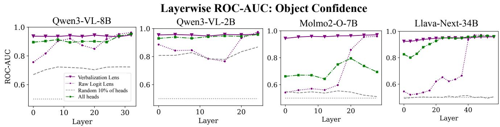  
Figure 19. ROC-AUC scores for the experiment in Figure 6b. For raw logit lens, layers where ROC-AUC is high but probability differences in Figure 6b are low indicate that logit lens is badly calibrated—even if the ranking between tokens is correct, probability differences are very small, indicating low confidence. We see a similar effect when using all attention heads (a superset that includes our verbalization heads): using all attention heads can achieve high ROC-AUC, but the lower overall probability differences in Figure 6b indicate lowe confidence. For verbalization lens, ROC-AUC is close to ceiling across layers in addition to large probability deltas in Figure 6b. This indicates that verbalization lens has higher confidence, which also makes our approach more qualitatively useful (i.e., semantic predictions are assigned high probabilities, making them visible in qualitative visualizations; see interactive demo).

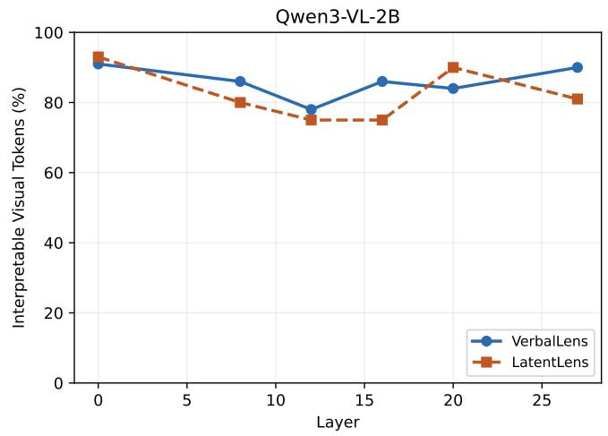

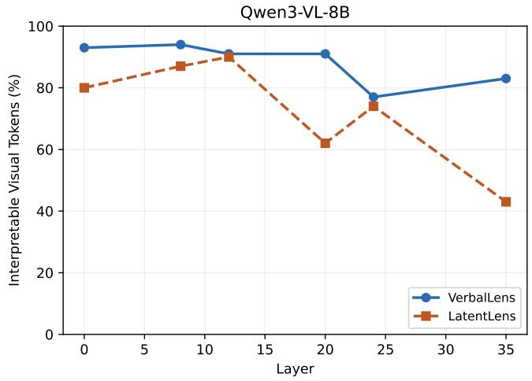

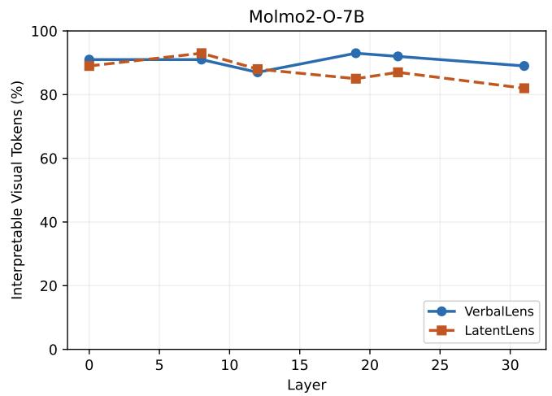

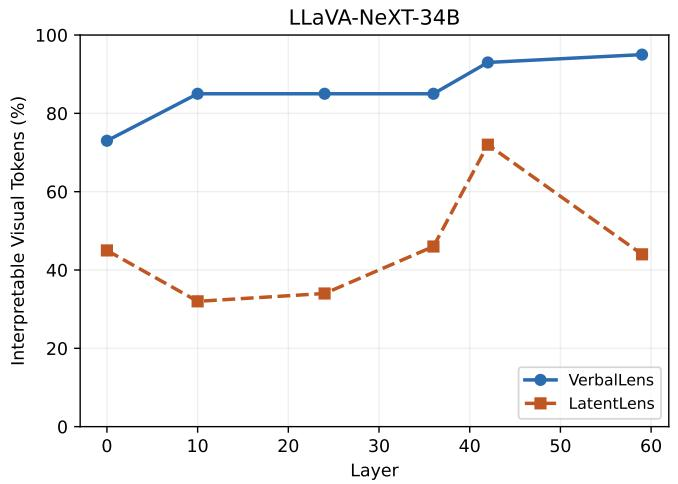  
Figure 20. Verbalization lens is on par with or better than LatentLens [32] across all models. We show LLM judge interpretability (% o patches judged interpretable) across layers (100 images per point). LatentLens shows a pronounced early/mid-layer dip for Llava-Next 34B, but verbalization lens scores consistently high across layers.

Qwen3-VL-2B-Instruct: Mean Judged Scores Across Ranks/Scales  
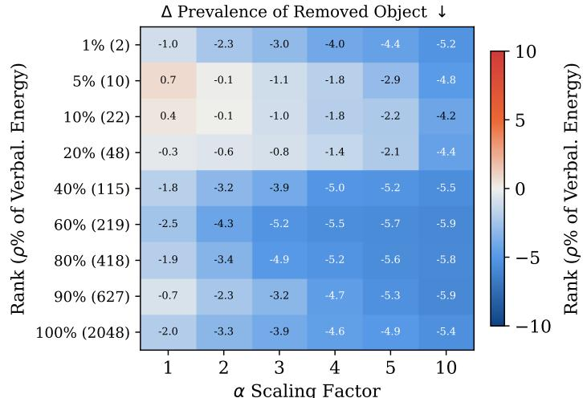

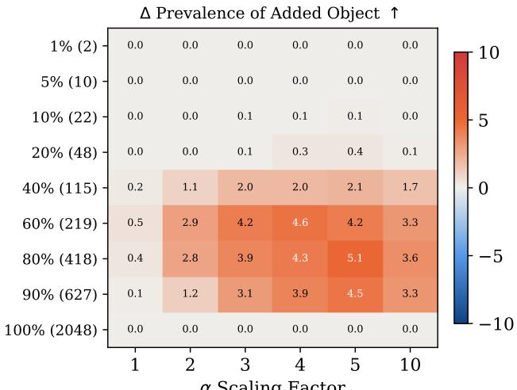

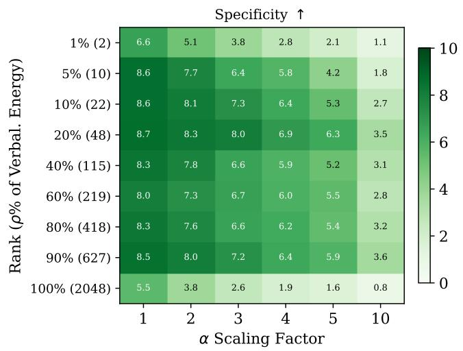

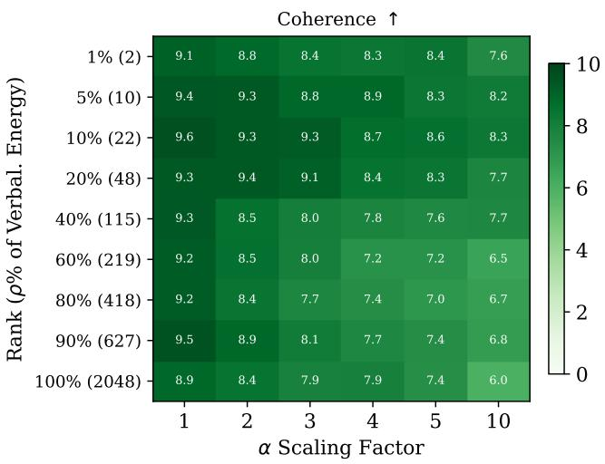  
Figure 21. Sweep across pseudo-inverse ranks and scales for editing objects in Qwen3-VL-2B. We generate edits across every combination of rank and scaling factor for 100 random ImageNet images, score the edited captions, judge outputs, and present the mean of scores across images. We focus on results for ρ=60% for Qwen3-VL-2B in the main paper.

Qwen3-VL-8B-Instruct: Mean Judged Scores Across Ranks/Scales  
Δ Prevalence of Removed Object ↓  
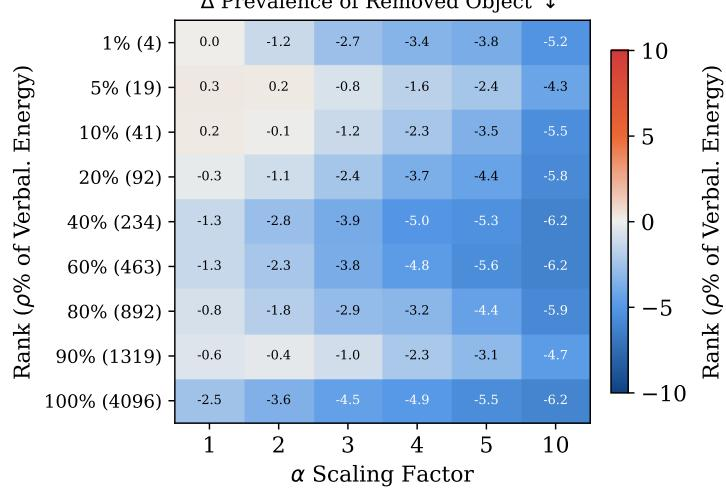

Δ Prevalence of Added Object ↑  
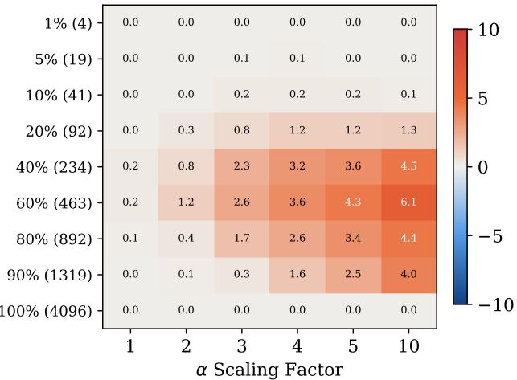

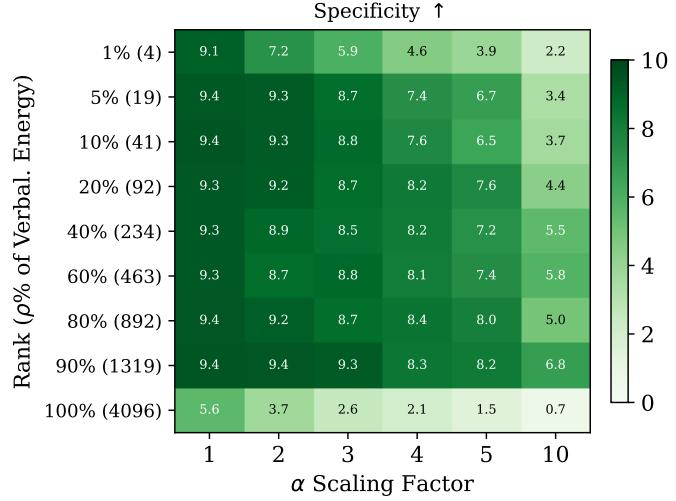

<table><tr><td></td><td rowspan=1 colspan=1>9.8</td><td rowspan=1 colspan=1>9.7</td><td rowspan=1 colspan=1>9.6</td><td rowspan=1 colspan=1>9.6</td><td rowspan=1 colspan=1>9.6</td><td rowspan=1 colspan=1>8.5</td></tr><tr><td></td><td rowspan=1 colspan=1>9.9</td><td rowspan=1 colspan=1>9.8</td><td rowspan=1 colspan=1>9.7</td><td rowspan=1 colspan=1>9.7</td><td rowspan=1 colspan=1>9.8</td><td rowspan=1 colspan=1>9.7</td></tr><tr><td></td><td rowspan=1 colspan=1>9.9</td><td rowspan=1 colspan=1>9.7</td><td rowspan=1 colspan=1>9.8</td><td rowspan=1 colspan=1>9.7</td><td rowspan=1 colspan=1>9.6</td><td rowspan=1 colspan=1>9.6</td></tr><tr><td></td><td rowspan=1 colspan=1>9.8</td><td rowspan=1 colspan=1>9.8</td><td rowspan=1 colspan=1>9.6</td><td rowspan=1 colspan=1>9.4</td><td rowspan=1 colspan=1>9.5</td><td rowspan=1 colspan=1>9.3</td></tr><tr><td></td><td rowspan=1 colspan=1>9.8</td><td rowspan=1 colspan=1>9.6</td><td rowspan=1 colspan=1>9.4</td><td rowspan=1 colspan=1>9.5</td><td rowspan=1 colspan=1>9.1</td><td rowspan=1 colspan=1>9.3</td></tr><tr><td></td><td rowspan=1 colspan=1>9.8</td><td rowspan=1 colspan=1>9.4</td><td rowspan=1 colspan=1>9.3</td><td rowspan=1 colspan=1>9.3</td><td rowspan=1 colspan=1>8.9</td><td rowspan=1 colspan=1>9.0</td></tr><tr><td></td><td rowspan=1 colspan=1>9.8</td><td rowspan=1 colspan=1>9.5</td><td rowspan=1 colspan=1>9.3</td><td rowspan=1 colspan=1>9.2</td><td rowspan=1 colspan=1>8.8</td><td rowspan=1 colspan=1>8.5</td></tr><tr><td></td><td rowspan=1 colspan=1>9.8</td><td rowspan=1 colspan=1>9.8</td><td rowspan=1 colspan=1>9.8</td><td rowspan=1 colspan=1>9.2</td><td rowspan=1 colspan=1>8.9</td><td rowspan=1 colspan=1>8.9</td></tr><tr><td rowspan=1 colspan=1>100% (4096)</td><td rowspan=1 colspan=1>9.5</td><td rowspan=1 colspan=1>8.7</td><td rowspan=1 colspan=1>8.4</td><td rowspan=1 colspan=1>7.8</td><td rowspan=1 colspan=1>7.3</td><td rowspan=1 colspan=1>5.0</td></tr><tr><td rowspan=2 colspan=1></td><td rowspan=1 colspan=1>1</td><td rowspan=1 colspan=1>2</td><td rowspan=1 colspan=1>3</td><td></td><td></td><td></td></tr><tr><td rowspan=1 colspan=1></td><td rowspan=1 colspan=1>α</td><td></td><td></td><td></td><td></td></tr></table>

Figure 22. Sweep across pseudo-inverse ranks and scales for editing objects in Qwen3-VL-8B. We generate edits across every combination of rank and scaling factor for 100 random ImageNet images, score the edited captions, judge outputs, and present the mean of scores across images. See Section 4.3 for details. Qwen3-VL-8B appears to require a larger scaling factor $\alpha .$ We focus on results for rank $\rho = 6 0 \%$ for Qwen3-VL-8B in the main paper.