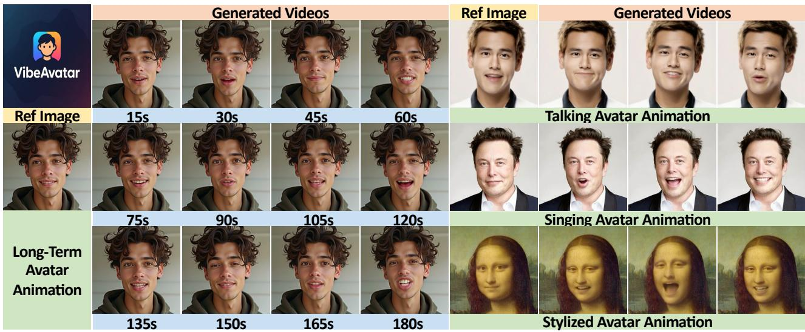
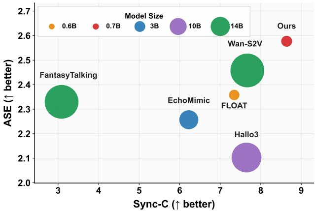
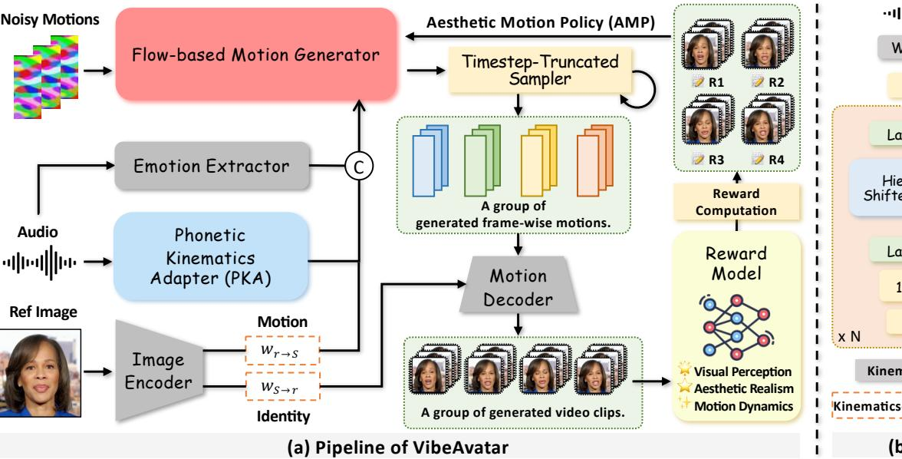
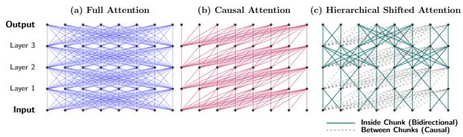
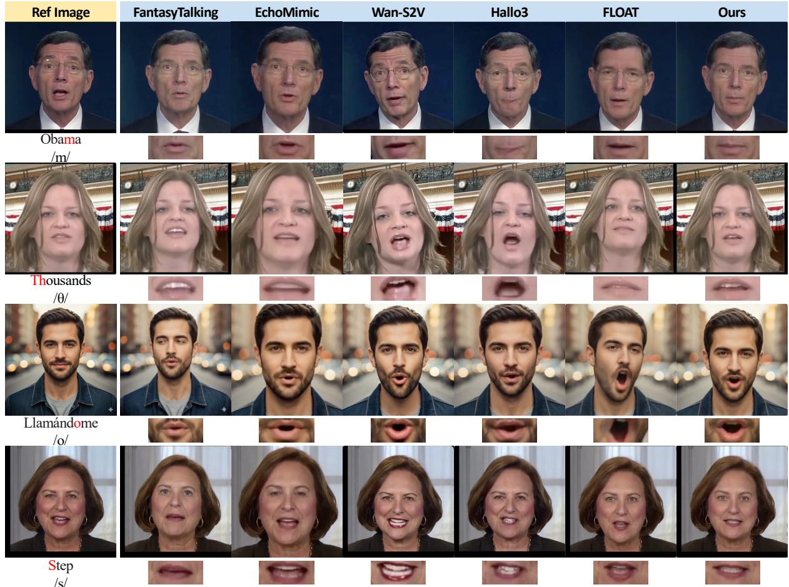
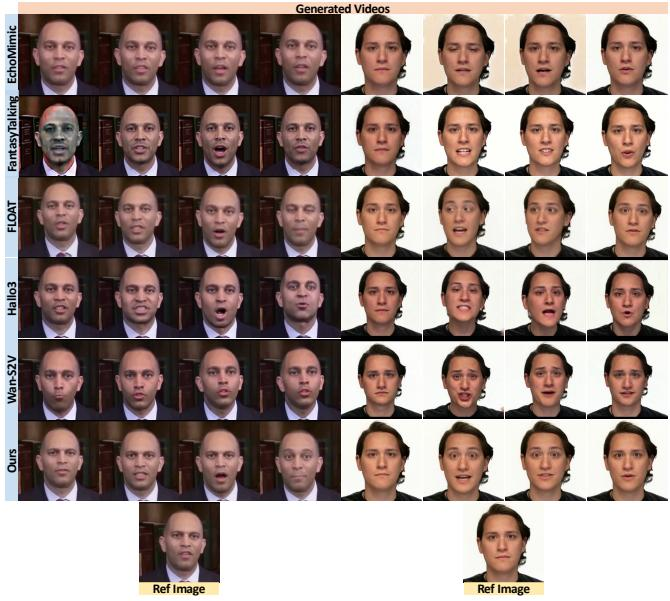
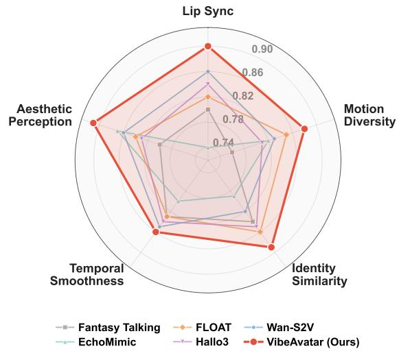
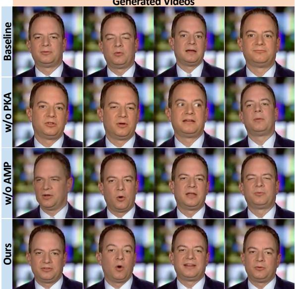

# VibeAvatar: Aligning Phonetic Kinematics and Human Aesthetics for High-Fidelity Talking Avatar Synthesis

Qilin Wang   
School of Computer Science,   
Peking University   
Beijing, China   
qilinwang25@stu.pku.edu.cn Mingyu Li   
School of Electronics Engineering and   
Computer Science, Peking University Beijing, China mingyulics@stu.pku.edu.cn   
Hao Tang∗   
School of Computer Science,   
Peking University   
Beijing, China   
bjdxtanghao@gmail.com

https://kelu007.github.io/vibe-avatar

  
Figure 1: VibeAvatar synthesizes high-fidelity talking avatars with accurate lip articulation, human-preferred motion aesthetics, and eficient inference. It preserves stable identity and natural facial dynamics across speech and singing scenarios.

## Abstract

Multi-modal talking avatar synthesis aims to generate realistic talking videos from a reference portrait and speech. Despite rapid progress in difusion-based methods, existing approaches still struggle to jointly achieve accurate lip articulation, human-preferred motion aesthetics, and eficient inference. We observe that phonetic accuracy and motion aesthetics arise from fundamentally diferent sources and should be addressed at complementary stages rather than learned implicitly by a single generator. Based on this insight, we propose VibeAvatar, which disentangles these two objectives through a Phonetic Kinematics Adapter (PKA) that converts recognition-oriented speech features into phonetic-kinematic conditions at the conditioning stage, and an Aesthetic Motion Policy (AMP) that optimizes a flow-consistent stochastic sampling policy

via Group Relative Policy Optimization (GRPO) at the post-training stage. With a lightweight flow-based motion generator operating in a compact 1D warp-based latent motion space, VibeAvatar achieves state-of-the-art results in articulation, aesthetics, and eficiency on both objective metrics and user studies, while generating a 10- second 512 px video in under 10 seconds with only ∼3 GB VRAM.

## CCS Concepts

• Computing methodologies → Computer vision.

## Keywords

Talking Avatar Synthesis; Flow Matching

## ACM Reference Format:

Qilin Wang, Mingyu Li, and Hao Tang. 2026. VibeAvatar: Aligning Phonetic Kinematics and Human Aesthetics for High-Fidelity Talking Avatar Synthesis. In Proceedings ofthe 34th ACM International Conference on Multimedia (MM ’26), November 10–14, 2026, Rio de Janeiro, Brazil. ACM, New York, NY, USA, 10 pages. https://doi.org/10.1145/3767308.3835899

## 1 Introduction

Talking avatar synthesis is a multi-modal generation task that produces a talking human video by jointly reasoning over a reference portrait and a speech signal. It serves as a core technology for digital humans in entertainment, education, and virtual interaction. A practical system should simultaneously achieve accurate lip articulation, human-aligned motion aesthetics, and eficient inference.

  
Figure 2: Comparison of recent talking avatar methods on ASE [53] and Sync-C [9]. Existing methods still struggle to jointly improve aesthetic quality and lip synchronization.

Driven by rapid advances in difusion-based generative frameworks [12, 20, 34, 42, 43], talking avatar synthesis has progressed substantially. Early studies [8, 15, 16, 33, 35, 49, 52, 58, 60] typically relied on two-stage pipelines that first predicted facial motion parameters, such as 3D Morphable Models [3] (3DMM) coeficients, followed by a rendering stage. While interpretable, these cascaded frameworks often produced rigid and emotionless facial movements. More recent end-to-end difusion models [7, 10, 14, 22, 23, 26, 28, 44, 50] learn direct audio–visual correlations and further close the gap between synthesized and real talking videos.

However, these end-to-end models still face three unresolved issues. (i) Generic speech encoders are primarily optimized for recognition semantics rather than facial kinematics, so the generator must recover phonetic timing and co-articulation implicitly, making precise lip articulation dificult. (ii) Articulation accuracy alone does not guarantee human-preferred motion: viewers also judge global expressiveness, temporal rhythm, and facial dynamics, yet standard training objectives provide no explicit signal to optimize these perceptual factors. (iii) Many recent models operate in high-dimensional pixel or latent-video space and rely on iterative spatial-temporal denoising, tying quality gains to heavier backbones and more sampling steps at the cost of practical eficiency. As shown in Figure 2, recent methods [7, 10, 14, 24, 50] still reveal a clear trade-of between synchronization and aesthetic quality.

These observations suggest that the bottleneck is not simply model capacity. Fine-grained lip articulation is largely governed by phonetic structure and co-articulation, whereas motion aesthetics is a higher-level perceptual property shaped by global dynamics and human preference. Their optimal solutions therefore arise from different sources, and asking a single generator to learn both implicitly makes the trade-of hard to resolve. The key insight behind VibeA vatar is to treat phonetic accuracy and aesthetic motion quality as two related but distinct problems: the former should be handled at the conditioning stage by adapting speech representations to facial kinematics, while the latter should be addressed by post-training the sampling policy with human preference alignment. Once these two factors are disentangled, neither requires the generator itself to be large: a lightweight motion backbone sufices because phonetic precision is supplied by the adapted conditioning and aesthetic quality is injected through preference-driven policy optimization, rather than being learned implicitly through model capacity.

Based on this insight, we propose VibeAvatar, an eficient framework for multi-modal talking avatar synthesis that jointly improves lip articulation, motion aesthetics, and inference eficiency. Our method is built upon three coordinated designs: (i) a Phonetic Kinematics Adapter (PKA) that uses hierarchical shifted attention and a learnable kinematic gate to convert generic speech features into phonetic-kinematic conditions, bridging the gap between recognition-oriented representations and articulatory motion; (ii) an Aesthetic Motion Policy (AMP) that reformulates flow-based sampling as a stochastic policy and optimizes it via Group Relative Policy Optimization [40] (GRPO) within a flow-consistent neighborhood, with a timestep-truncated strategy that restricts preference optimization to early coarse-grained steps so that fine-grained lip details are preserved; and (iii) a lightweight flow-based motion generator operating in a compact 1D warp-based latent space, paired with a two-stage training strategy that first establishes a stable articulation-aware prior and then aligns motion dynamics with human aesthetics without degrading phonetic precision.

With these designs working together, VibeAvatar establishes stronger performance on lip articulation, motion aesthetics, and eficiency, as shown in Figure 1. Extensive experiments further demonstrate that our method achieves better qualitative and quantitative results. In summary, our contributions are as follows:

• We present VibeAvatar, which disentangles phonetic conditioning from aesthetic alignment, yielding a favorable quality–eficiency balance within a lightweight framework.

• We propose a Phonetic Kinematics Adapter (PKA) with hierarchical shifted attention and a learnable kinematic gate to convert speech features into phonetic-kinematic conditions for accurate lip articulation.

• We propose an Aesthetic Motion Policy (AMP) that optimizes a flow-consistent stochastic sampling policy via GRPO with a timestep-truncated strategy, aligning motion with human aesthetics without degrading articulation.

• Experiments show state-of-the-art results on both objective metrics and user studies, with under-10-second inference for a 10-second 512 px video and ∼3 GB VRAM.

## 2 Related Work

Controllable Video Generation. Recent advances in controllable video generation have been fueled by difusion-based image synthesis models [12, 13, 19, 39, 46]. Early works [5, 18, 21, 41, 45, 54] extended pretrained UNet-based difusion backbones into the temporal domain by adding motion-aware or temporal attention layers for joint spatiotemporal modeling. Representative methods such as Stable Video Difusion [4], Make-A-Video [41], and AnimateDif [17] achieved high-quality short video generation by coupling spatial priors with temporal modeling. More recent eforts transition toward transformer-based difusion frameworks for improved scalability and temporal reasoning. The Difusion-in-Transformer (DiT) family [2, 6, 25, 48, 56, 57] replaces convolutional UNets with transformer blocks, exhibiting stronger modeling capacity for complex video dynamics. Large-scale frameworks such as CogVideoX [57], HunyuanVideo [25], and Wan [48] further integrate multimodal conditions such as text, audio, and pose within hierarchical or dual stream pipelines, enhancing controllability across tasks including identity preservation [59], expression control [32], and virtual try on [27]. While these methods provide powerful generative backbones, they mainly target general video realism and controllability rather than the task-specific balance among lip articulation, motion aesthetics, and eficiency required by talking avatars.

  
Figure 3: Overview of VibeAvatar. (a) The framework integrates a lightweight flow-based motion generator, a Phonetic Kinematics Adapter (PKA), and an Aesthetic Motion Policy (AMP) to improve lip articulation, motion aesthetics, and inference eficiency. (b) PKA transforms generic speech features into phonetic-kinematic conditions through hierarchical shifted attention, enabling local bidirectional interaction, causal aggregation, and a progressively enlarged receptive field for accurate lip articulation.

Audio-driven Avatar Animation. Audio-driven avatar animation aims to generate realistic talking human videos from speech. Early studies [8, 15, 16, 33, 35, 49, 52, 60? ] employed two-stage pipelines that predicted facial motion parameters based on 3D Morphable Models [3] (3DMM) or landmarks and then rendered frames. Although interpretable, such cascaded methods exhibited limited expressiveness, often resulting in rigid lip movements and insuficient emotional dynamics. Recent advances have been driven by difusion-based end-to-end frameworks [7, 10, 14, 22, 23, 26, 28, 44, 50] that directly learn audio–visual correlations for coherent speech-to-video generation. Among them, FLOAT [24] enhances audio-lip synchronization and temporal coherence through multistage refinement. Hallo3 [10] introduces a difusion transformer architecture for highly dynamic and photorealistic portrait animation. EchoMimic [7] enables editable landmark-conditioned synthesis for fine-grained local control. FantasyTalking [50] extends the task toward coherent facial and upper-body motion with improved identity preservation, while Wan-S2V [14] demonstrates the strong generative potential of large commercial video models in portrait animation. Despite recent advances, existing methods still struggle to jointly achieve accurate lip articulation, human-aligned motion aesthetics, and eficient inference in talking avatar synthesis. In contrast, our work explicitly separates phonetic conditioning from aesthetic alignment, enabling a lightweight generator to focus on stable motion prediction while dedicated designs improve lip articulation and human-preferred motion dynamics.

## 3 The Proposed Method

## 3.1 Overview

Given a reference image and an audio clip, VibeAvatar synthesizes talking-avatar videos with accurate lip articulation, human-aligned motion aesthetics, and eficient inference. As shown in Figure 3, our framework achieves these goals through three coordinated designs. A flow-based motion generator (Section 3.2) predicts motion eficiently in a compact latent space. A Phonetic Kinematics Adapter (PKA, Section 3.3) transforms raw speech features into motion-oriented conditions that preserve phonetic details for lip articulation. An Aesthetic Motion Policy (AMP, Section 3.4) reformulates flow-based sampling as a stochastic policy and optimizes it via GRPO [40] toward human-preferred dynamics. Finally, the two-stage training strategy (Section 3.5) first learns a motion prior and then aligns motion sampling with human aesthetic preference.

## 3.2 Flow-based Motion Generator

As shown in Figure 3(a), our flow-based motion generator disentangles identity from facial dynamics and predicts motion in a compact latent space. It applies conditioning at the frame level for precise motion control. These designs mainly provide a stable and eficient foundation for the later PKA and AMP modules.

1D Motion Representation. To preserve identity while keeping motion generation lightweight, we represent facial dynamics in the latent warp space of LIA [51]. Given a reference image $S \in \mathbb { R } ^ { 3 \times H \times W }$ the autoencoder produces an identity warp, a motion warp, and multi-scale features:

$$
{ \mathrm { E n c } } : S \mapsto ( w _ { S  r } , w _ { r  S } , F _ { S } ) .\tag{1}
$$

Here $\boldsymbol { w _ { S } } _ {  r } \in \mathbb { R } ^ { d _ { w } }$ encodes identity as the warp from � to a canonical neutral pose $r , w _ { r  S } \in \mathbb { R } ^ { d _ { w } }$ encodes motion as the warp from � back to $S ,$ and $F _ { S }$ preserves high-frequency appearance details. We further expand the motion code on a learnable, low-dimensional orthogonal basis $\Lambda = \{ \lambda _ { 1 } , . . . , \lambda _ { m } \}$ , yielding a compact 1D trajectory for facial dynamics. To animate � with a driver $D ,$ we decode

$$
\mathrm { D e c : } ( w _ { S  r } , w _ { r  D } , F _ { S } ) \mapsto \hat { D } ( S ) ,\tag{2}
$$

which preserves identity via $( w _ { S  r } , F _ { S } )$ while substituting motion via $w _ { r  D }$ . This factorization confines controllable facial dynamics to a low-dimensional space, which reduces computational cost and makes the backbone well suited for eficient inference.

Flow-based Motion Generation. To generate coherent facial motion with low overhead, we predict motion latents of � consecutive frames jointly rather than reconstructing each frame independently. Let the framewise audio conditions be $c \in \mathbb { R } ^ { L \times d _ { c } }$ , the past $L ^ { \prime }$ motion latents be $W _ { \mathrm { p a s t } } \in \mathbb { R } ^ { L ^ { \prime } \times d _ { w } }$ , and the reference motion warp of image � be $w _ { r  S } \in \mathbb { R } ^ { d _ { w } }$ . We form a trajectory $\boldsymbol { z } _ { t } \in \mathbb { R } ^ { ( L ^ { \prime } + L ) \times d _ { w } }$ and learn a conditional vector field $v _ { \theta } ( z _ { t } , \ t ; W _ { \mathrm { p a s t } } , \ w _ { r  S } , \ c )$ , solving the ODE

$$
\frac { d z _ { t } } { d t } = v _ { \theta } ( z _ { t } , \ : t ; \ : W _ { \mathrm { p a s t } } , \ : w _ { r  S } , \ : c ) , \qquad z _ { 1 } \sim N ( 0 , I ) ,\tag{3}
$$

to obtain $z _ { 0 } .$ . The last � rows of $z _ { 0 }$ are the predicted motion latents for the current clip, while the leading $L ^ { \prime }$ rows provide temporal context to enforce a smooth transition. This clip-wise latent prediction keeps the backbone compact while supplying stable motion trajectories for the later PKA conditioning and AMP optimization. Framewise Conditioning via AdaLN. We implement the flowbased motion generator as a framewise DiT [37], which is well suited for modeling latent motion tokens. Conditioning is then injected into each block through adaptive LayerNorm. For the �- th frame in the �-th DiT block, we predict adaptive LayerNorm parameters $( \alpha _ { i } ^ { ( j ) } , \beta _ { i } ^ { ( j ) } , \gamma _ { i } ^ { ( j ) } )$ from a linear head fed by the fused conditioning. The scale–shift pair $( \alpha , \beta )$ afords fine-grained framelevel control, while the gate $\gamma$ modulates the residual pathway to stabilize conditioning strength. Each block also includes localized inter-frame cross-attention over a small temporal window, ensuring temporal coherence without sacrificing per-frame precision.

Emotion Extractor. To complement phonetic conditioning with expression cues, we additionally incorporate an emotion prior from the audio stream. Specifically, we apply the pretrained classifier of [38] to the frame-aligned audio features, embed the predicted emotion label, and concatenate it with the other conditioning signals. This simple design supplies prosody-related expression information to DiT without introducing a heavy auxiliary branch.

  
Figure 4: Comparison of audio context modeling schemes. (a) Full Attention captures global context but incurs high cost and leaks future information. (b) Causal Attention preserves causality but weakens local bidirectional interaction. (c) Our Hierarchical Shifted Attention supports bidirectional interaction within chunks and causal aggregation across chunks, while progressively enlarging the receptive field.

## 3.3 Phonetic Kinematics Adapter (PKA)

Accurate lip articulation requires audio conditions that preserve fine-grained co-articulation while respecting utterance-level temporal causality. However, self-supervised encoders such as Wav2Vec [1] produce recognition-oriented frame-wise representations whose semantics are indirectly related to facial kinematics. Directly conditioning the motion backbone on these raw features forces it to recover phonetic timing, cross-phoneme transitions, and motion saliency by itself, leading to imprecise or unstable mouth motion.

The Phonetic Kinematics Adapter (PKA) resolves this mismatch by explicitly adapting generic speech representations into phonetickinematic conditions before they are injected into the flow-based backbone. Full attention in Figure 4(a) enriches context but leaks future information, while causal attention in Figure 4(b) preserves causality but weakens local bidirectional interactions that are important for co-articulation. To balance these two extremes, PKA introduces two key designs. First, Hierarchical Shifted Attention progressively enlarges chunk size across layers and applies alternating shifted windows, enabling bidirectional interaction inside each chunk and causal aggregation between chunks, as shown in Figure 4(c). Second, a Learnable Kinematic Gate filters motionirrelevant semantics and amplifies articulation-related variations. Together, these designs convert raw speech features into phonetickinematic conditions that are more suitable for lip articulation.

Hierarchical Shifted Attention. As illustrated in Figure 3(b), the raw frame-wise audio features $A _ { \mathrm { r a w } } \in \mathbb { R } ^ { L \times d _ { \mathrm { a u d i o } } }$ are first projected into the adapter space as $A ^ { ( 0 ) } \in \mathbb { R } ^ { L \times d }$ . PKA then applies � stacked attention blocks with progressively enlarged chunk sizes. In the �-th block, the chunk size grows as

$$
K ^ { ( l ) } = K _ { \mathrm { b a s e } } \times 2 ^ { \lfloor ( l - 1 ) / 2 \rfloor } ,\tag{4}
$$

and the temporal shift is set to $S ^ { ( l ) } = 0$ for odd-numbered blocks and $S ^ { ( l ) } = \dot { K ^ { ( l ) } } / 2$ for even-numbered. This hierarchical schedule expands the receptive field from local phoneme transitions to broader speech context. And the shifted window mechanism ensures that phonetic events divided by a chunk boundary in layer � − 1 are centered within the chunk of layer �, reducing boundary fragmentation for phonetic events that straddle chunk borders.

Given the shifted partition, we construct the chunk-causal attention mask $M ^ { ( l ) }$ that determines the visibility between a query �

and a key � as:

$$
\begin{array} { r } { M _ { i , j } ^ { ( l ) } = \left\{ \begin{array} { l l } { 0 , } & { \mathrm { i f ~ } \left\lfloor \frac { j + S ^ { ( l ) } } { K ^ { ( l ) } } \right\rfloor \le \left\lfloor \frac { i + S ^ { ( l ) } } { K ^ { ( l ) } } \right\rfloor , } \\ { - \infty , } & { \mathrm { o t h e r w i s e } . } \end{array} \right. } \end{array}\tag{5}
$$

The forward pass of the �-th block is then written as

$$
\begin{array} { r } { \boldsymbol { H } ^ { ( l ) } = \boldsymbol { A } ^ { ( l - 1 ) } + \mathrm { A t t n } \left( \mathrm { L N } \left( \boldsymbol { A } ^ { ( l - 1 ) } \right) ; \boldsymbol { M } ^ { ( l ) } \right) , } \end{array}\tag{6}
$$

$$
\begin{array} { r } { A ^ { ( l ) } = H ^ { ( l ) } + \mathrm { M L P } \Big ( \mathrm { C o n v 1 D } \Big ( \mathrm { L N } \Big ( H ^ { ( l ) } \Big ) \Big ) \Big ) . } \end{array}\tag{7}
$$

This design preserves bidirectional interactions within each local chunk, enforces causal aggregation across chunks, and expands context hierarchically from fine co-articulation to broader prosodic structure. The lightweight Conv1D+MLP branch further smooths temporal features and improves local mixing, making the resulting representation both articulation-aware and causally consistent.

Learnable Kinematic Gate. After hierarchical refinement, we further adapt the audio representation with a learnable kinematic gate. Instead of passing all semantic content directly to the motion backbone, the gate predicts frame-wise scale and shift factors $( \alpha _ { t } , \beta _ { t } )$ from the refined features and modulates them as $\tilde { c } _ { t } = \alpha _ { t } \odot A _ { t } ^ { ( N ) } + \beta _ { t }$ This modulation emphasizes articulation-related transitions and de-emphasizes silent or weakly informative regions. The zeroinitialized gate provides a stable conditioning path at the start of training and gradually learns to transform generic speech representations into motion-driving cues. The final PKA output is used as the conditioning signal � for the flow-based motion generator.

## 3.4 Aesthetic Motion Policy (AMP)

A remaining challenge is that a standard flow-matching sampler is almost deterministic once the condition and initial noise are fixed. Such low-entropy sampling provides little room to explore alternative motion realizations, making it dificult to align facial dynamics with human aesthetic preference. To address this issue, we introduce an Aesthetic Motion Policy (AMP), which reformulates flow-based sampling as a stochastic policy while preserving consistency with the learned motion field. AMP enables preference optimization over motion trajectories without abandoning the strong articulation prior learned by the motion generator and $\mathrm { P K A }$ Flow-consistent Stochastic Motion Sampling. Let $z _ { 1 }$ denote the initial noise latent at pseudo-time $t = 1 , z _ { 0 }$ the terminal latent at $t = 0 ,$ , and $z _ { t }$ the latent at intermediate time $t \in [ 0 , 1 ]$ . The base sampler uses a deterministic Euler update

$$
z _ { \alpha } = z _ { t } - v _ { \theta } ( z _ { t } , t ; W _ { \mathrm { p a s t } } , w _ { r  S } , c ) ( t - \alpha ) ,\tag{8}
$$

which produces same trajectories given fixed noise and conditions.

AMP introduces controlled exploration by replacing this deterministic transition with a flow-consistent stochastic update. We construct two extrapolated endpoints:

$$
\hat { z } _ { 0 } = z _ { t } - t v _ { \theta } \big ( z _ { t } , t ; W _ { \mathrm { p a s t } } , w _ { r  S } , c \big ) ,\tag{9}
$$

$$
\hat { z } _ { 1 } = z _ { t } + ( 1 - t ) v _ { \theta } ( z _ { t } , t ; W _ { \mathrm { p a s t } } , w _ { r  S } , c ) ,\tag{10}
$$

which approximate the latent states toward $t = 0$ and $t = 1$ , respectively. For the backward step $t \to \alpha = t - \Delta t$ , we then sample

$$
z _ { \alpha } = \mu _ { \boldsymbol \theta } ( z _ { t } , t , \alpha ) + \sigma ( t ) ~ \sin \Bigl ( \frac { \eta \pi } { 2 } \Bigr ) \epsilon , \quad \epsilon \sim N ( 0 , I ) ,\tag{11}
$$

with

$$
\mu _ { \theta } ( z _ { t } , t , \alpha ) = \left( 1 - \alpha \right) \hat { z } _ { 0 } + \alpha \cos \left( \frac { \eta \pi } { 2 } \right) \hat { z } _ { 1 } ,\tag{12}
$$

where $\eta \in \left[ 0 , 1 \right]$ controls exploration strength and $\sigma ( t )$ decreases with �. When $\eta  0 ,$ Eq. (11) recovers the deterministic update in $\operatorname { E q . } ( 8 )$ , so $\mathrm { A M P }$ remains compatible with the original flow dynamics.

Intuitively, $\left( \hat { z } _ { 0 } , \hat { z } _ { 1 } \right)$ defines a local flow-consistent neighborhood, and the noise term explores randomized directions within this neighborhood rather than perturbing the trajectory arbitrarily. This property is important for aesthetic alignment: early steps with larger uncertainty can propose diverse motion hypotheses, whereas later steps become nearly deterministic and preserve identity, articulation, and temporal stability. Therefore, AMP provides a structured policy $p _ { \theta } ( z _ { \alpha } \mid z _ { t } )$ in latent space whose sampling behavior can be optimized by GRPO [40] toward human-aligned motion aesthetics in Stage 2. In our implementation, this aesthetic preference is instantiated by a reward ensemble composed of HPS-v2 [55] and the visual-quality and motion-quality heads of VideoReward [29], while the detailed objective is deferred to Sec. 3.5.

Timestep-Truncated Aesthetic Alignment. We further observe that flow-based generation exhibits a coarse-to-fine structure: early denoising steps mainly determine global motion attributes such as head movement and overall expressiveness, whereas later steps refine high-frequency details that are critical for precise articulation and visual stability. Directly applying preference optimization to all timesteps would therefore entangle global aesthetic exploration with the local motion details already well learned in previous training stage. To preserve this strong articulation prior, we introduce timestep-truncated aesthetic alignment. Specifically, given a threshold $t _ { \mathrm { t h r e s h } } \in [ 0 , 1 ]$ , we apply AMP and optimize it with GRPO only on the early stage $t \geq t _ { \mathrm { t h r e s h } }$ , while the later stage $t < t _ { \mathrm { t h r e s h } }$ follows the deterministic flow update. This strategy allows the model to explore more human-preferred motion patterns at coarse scales without disturbing the fine-grained lip articulation already established by the flow-based motion generator and PKA.

## 3.5 Training Strategy

We train VibeAvatar in two stages. Stage 1 learns an articulationaware flow prior under PKA conditioning. Stage 2 freezes PKA and aligns AMP with human aesthetic preference through GRPO, so that preference optimization improves motion aesthetics without disturbing the articulation prior learned in Stage 1.

Mixed Preceding-frame Conditions. A key challenge is the distribution shift of the preceding motion condition $W _ { \mathrm { p a s t } } { \mathrm { : } }$ supervised training naturally uses ground-truth history, whereas inference depends on model-generated history. To reduce this mismatch, we construct $W _ { \mathrm { p a s t } }$ from a mixture of three sources:

$$
W _ { \mathrm { p a s t } } = \left\{ \begin{array} { l l } { 0 , \quad } & { \mathrm { w . p . ~ } p _ { 0 } \quad \mathrm { ( n o ~ h i s t o r y ) , } } \\ { W _ { \mathrm { G T } } , \quad } & { \mathrm { w . p . ~ } p _ { \mathrm { g t } } \quad \mathrm { ( g r o u n d - t r u t h ~ h i s t o r y ) , } } \\ { W _ { \mathrm { m o d e l } } , \quad } & { \mathrm { w . p . ~ } p _ { \mathrm { m o d e l } } \quad \mathrm { ( s e l f - g e n e r a t e d ~ h i s t o r y ) , } } \end{array} \right.\tag{13}
$$

where $p _ { 0 } + p _ { \mathrm { g t } } + p _ { \mathrm { m o d e l } } = 1$ . This is shared by both stages.

Stage 1: Flow-matching with PKA. In Stage 1, we sample a training clip $( S _ { - L ^ { \prime } : L } , a _ { - L ^ { \prime } : L } )$ , choose a reference frame $S _ { k } ,$ , and encode the target segment $\{ S _ { 0 } , \ldots , S _ { L } \}$ into motion latents $z _ { 0 } = w _ { r  S _ { 0 : L } } .$ We then draw $z _ { 1 } \sim { \cal N } ( 0 , I )$ and $t \sim \mathrm { U n i f o r m } ( 0 , 1 )$ , and form the

  
Figure 5: Lip-articulation comparison on challenging phonemes. VibeAvatar produces more accurate lip shapes.

interpolated latent

$$
z _ { t } = \left( 1 - t \right) z _ { 0 } + t z _ { 1 } .\tag{14}
$$

The audio segment $a _ { - L ^ { \prime } : L }$ is encoded by PKA to obtain conditioning �. Following Rectified Flow [30], we supervise the velocity field on the current clip by

$$
\mathcal { L } _ { \mathrm { O T } } ( \theta ) = \Big \| v _ { \theta } \big ( z _ { t } , t ; W _ { \mathrm { p a s t } } , w _ { r  S _ { k } } , c \big ) _ { 0 : L } - \big ( z _ { 1 } - z _ { 0 } \big ) \Big \| .\tag{15}
$$

To encourage temporal consistency and efective use of history, we further regularize the prediction on the preceding window:

$$
\mathcal { L } _ { \mathrm { c o n } } ( \theta ) = \Big \| v _ { \theta } \big ( z _ { t } , t ; W _ { \mathrm { p a s t } } , w _ { r  S _ { k } } , c \big ) _ { - L ^ { \prime } ; 0 } - W _ { \mathrm { p a s t } } \Big \| .\tag{16}
$$

The Stage 1 objective is

$$
\mathcal { L } _ { \mathrm { F M } } ( \theta ) = \mathcal { L } _ { \mathrm { O T } } ( \theta ) + \lambda _ { \mathrm { c o n } } \mathcal { L } _ { \mathrm { c o n } } ( \theta ) .\tag{17}
$$

This stage establishes a stable articulation-aware motion prior, which later serves as the base policy for AMP.

Stage 2: GRPO on AMP. Starting from the pretrained parameters $\theta _ { 0 } { \mathrm { : } }$ , we freeze PKA and optimize AMP with GRPO over the truncated timestep range $t \geq t _ { \mathrm { t h r e s h } }$ , while keeping the later stage deterministic. For each condition set, AMP generates a group of candidate motion trajectories over the early denoising stage. These candi dates are decoded into videos and evaluated by a reward ensemble composed of HPS-v2 [55] and the visual-quality and motion-quality heads of VideoReward [29]. We aggregate these signals as

$$
R ^ { ( i ) } = w _ { \mathrm { a e } } R _ { \mathrm { a e } } ^ { ( i ) } + w _ { \mathrm { v q } } R _ { \mathrm { v q } } ^ { ( i ) } + w _ { \mathrm { m q } } R _ { \mathrm { m q } } ^ { ( i ) } ,\tag{18}
$$

where ${ w _ { \mathrm { a e } } } , { w _ { \mathrm { v q } } } , { w _ { \mathrm { m q } } }$ are fixed coeficients. We then compute grouprelative advantages and optimize the truncated AMP policy with the standard clipped GRPO objective. Overall, Stage 2 reshapes AMP to favor motion trajectories with higher human-aligned rewards at coarse motion scales, while preserving the fine-grained articulation and audio-motion alignment learned in Stage 1.

## 4 Experiments

## 4.1 Settings

Datasets. We train VibeAvatar on HDTF [61] and RAVDESS [31]. We extract one subject per video, resample audio to 16 kHz, normalize to 25 FPS, and crop 512 × 512 face regions, discarding clips under 2s or severely corrupted. To ensure fair evaluation, we build test sets with no overlap between training and testing speakers. For HDTF, we select 15 videos from unseen speakers and uniformly crop 15s segments, yielding a fixed 15 × 15s test set. For RAVDESS, we reserve 50 full-length videos from 2 actors as the test set, and use all remaining identities for training. The same test splits are used for all metrics, qualitative visualizations, and the user study. Evaluation Metrics. We evaluate performance using Sync-C [9] and Sync-D [9] for lip-sync accuracy, FID [36], FVD [47] for visual and temporal quality, CSIM [11] for identity consistency and ASE and VQA from Q-Align [53] for aesthetic quality. A user study further assesses perceived realism and overall human preference. Comparison Methods. We compare VibeAvatar with state-of-theart talking avatar methods, including FantasyTalking (MM’25) [50], EchoMimic (AAAI’25) [7], FLOAT (ICCV’25) [24], Wan-S2V (commercial model) [14] and Hallo3 (CVPR’25) [10]. All methods are evaluated under recommended settings, using same reference image, driving audio, and held-out test videos for a fair comparison.

Table 1: Quantitative comparisons. The best and second-best results are shown in bold and underlined, respectively.
<table><tr><td rowspan="2">Method</td><td colspan="7">HDTF</td><td colspan="7">RAVDESS</td></tr><tr><td>FID↓</td><td>FVD↓</td><td>CSIM↑</td><td>Sync-C↑</td><td>Sync-D↓</td><td>VQA↑</td><td>ASE↑</td><td>FID↓</td><td>FVD↓</td><td>CSIM↑</td><td>Sync-C↑</td><td>Sync-D↓</td><td>VQA↑</td><td>ASE↑</td></tr><tr><td>EchoMimic [7]</td><td>40.776</td><td>352.494</td><td>0.851</td><td>6.225</td><td>9.169</td><td>3.402</td><td>1.856</td><td>69.339</td><td>449.586</td><td>0.845</td><td>4.297</td><td>8.485</td><td>3.827</td><td>2.257</td></tr><tr><td>FantasyTalking [50]</td><td>53.089</td><td>506.815</td><td>0.556</td><td>3.086</td><td>12.191</td><td>3.314</td><td>1.974</td><td>21.774</td><td>330.826</td><td>0.852</td><td>4.009</td><td>9.322</td><td>3.748</td><td>2.330</td></tr><tr><td>FLOAT [24]</td><td>25.848</td><td>220.927</td><td>0.842</td><td>7.345</td><td>8.172</td><td>3.616</td><td>2.021</td><td>18.754</td><td>233.079</td><td>0.839</td><td>5.632</td><td>7.771</td><td>3.882</td><td>2.358</td></tr><tr><td>Wan-S2V [14]</td><td>29.035</td><td>317.665</td><td>0.744</td><td>7.669</td><td>8.110</td><td>3.629</td><td>2.102</td><td>18.824</td><td>233.341</td><td>0.828</td><td>6.092</td><td>8.371</td><td>4.016</td><td>2.458</td></tr><tr><td>Hallo3 [10]</td><td>26.277</td><td>253.995</td><td>0.729</td><td>7.648</td><td>8.571</td><td>3.497</td><td>2.024</td><td>24.418</td><td>237.575</td><td>0.823</td><td>5.421</td><td>8.046</td><td>3.679</td><td>2.103</td></tr><tr><td>VibeAvatar (Ours)</td><td>22.033</td><td>166.913</td><td>0.912</td><td>8.639</td><td>6.910</td><td>3.678</td><td>2.152</td><td>16.282</td><td>220.975</td><td>0.866</td><td>6.134</td><td>7.439</td><td>4.121</td><td>2.577</td></tr></table>

  
Figure 6: Multi-frame qualitative comparisons.

## 4.2 State-of-the-Art Comparisons

Lip-articulation Comparison. Figure 5 compares lip articulation on challenging phonemes that require accurate mouth closures and fine lip shapes. Existing methods often produce incomplete closures or ambiguous lip contours, which weakens articulation clarity and makes the speech look mumbled. In contrast, VibeAvatar better captures phonetic mouth configurations, producing clearer plosives and sharper lip transitions. This visual evidence is consistent with the stronger Sync-C and Sync-D results in Table 1.

  
Figure 7: User study across five perceptual dimensions.

Multi-frame Qualitative Comparison. Figure 6 compares multiple frames from generated videos on HDTF and RAVDESS. Existing methods still show visible trade-ofs among appearance sharpness, identity preservation, and motion coherence. EchoMimic tends to over-smooth facial details, FantasyTalking often introduces texture flickering and color artifacts, and FLOAT may drift in lip shape or identity under expressive motion. Hallo3 and Wan-S2V are visually stronger than these earlier baselines, but they still show noticeable issues in multi-frame consistency: Hallo3 occasionally produces exaggerated facial deformation around the mouth and cheeks, while Wan-S2V tends to yield less coherent expression transitions across frames. By contrast, VibeAvatar preserves cleaner facial details, more stable identity, and more coherent facial dynamics throughout the sequence, leading to stronger multi-frame visual quality.

Quantitative Comparison. Table 1 reports comprehensive quantitative results on HDTF and RAVDESS. VibeAvatar achieves the best results on all reported metrics across both datasets, including Sync-C/Sync-D, FID/FVD, CSIM, VQA, and ASE. These results show stronger articulation accuracy, visual quality, identity preservation, and aesthetic quality than prior methods.

User Study. We further conduct a user study across five dimensions: Lip Sync, Motion Diversity, Identity Similarity, Temporal Smoothness, and Aesthetic Perception. Participants compare randomly ordered videos from all methods, and the normalized mean scores are summarized in Figure 7. VibeAvatar receives the highest ratings in lip sync, aesthetic perception, and motion diversity, while remaining competitive in identity similarity and temporal 0.83 3.56 6.54 8.19smoothness. These results further suggest that our method better matches human perception in both realism and expressiveness.

Table 2: Ablation results on HDTF and RAVDESS. The best and second-best results are shown in bold and underlined, respectively.
<table><tr><td rowspan="2">PKA AMP</td><td rowspan="2"></td><td colspan="7">HDTF</td><td colspan="7">RAVDESS</td></tr><tr><td>FID↓</td><td>FVD↓</td><td>CSIM↑</td><td>Sync-C↑</td><td>Sync-D↓</td><td>VQA↑</td><td>ASE↑</td><td>FID↓</td><td>FVD↓</td><td>CSIM↑</td><td>Sync-C↑</td><td>Sync-D↓</td><td>VQA↑</td><td>ASE↑</td></tr><tr><td>X</td><td>X</td><td>26.135</td><td>215.733</td><td>0.829</td><td>7.523</td><td>8.232</td><td>3.583</td><td>2.004</td><td>19.480</td><td>240.107</td><td>0.850</td><td>5.890</td><td>7.925</td><td>3.887</td><td>2.379</td></tr><tr><td>√</td><td>X</td><td>28.236</td><td>190.595</td><td>0.885</td><td>8.615</td><td>6.948</td><td>3.595</td><td>1.921</td><td>17.679</td><td>251.314</td><td>0.829</td><td>6.042</td><td>7.608</td><td>3.892</td><td>2.417</td></tr><tr><td>√</td><td>√</td><td>22.033</td><td>166.913</td><td>0.912</td><td>8.639</td><td>6.910</td><td>3.678</td><td>2.152</td><td>16.282</td><td>220.975</td><td>0.866</td><td>6.134</td><td>7.439</td><td>4.121</td><td>2.577</td></tr></table>

Generated Videos  
  
Figure 8: Qualitative ablation on the core components.

## 4.3 Ablation Study

We conduct ablations on the two core components of VibeAvatar, i.e., PKA and AMP. We further compare diferent audio context modeling strategies inside PKA. In Table 2, baseline denotes the flow-based motion generator trained without PKA or AMP. Corresponding qualitative results are shown in Figure 8.

Efectiveness of PKA. Adding PKA to the baseline mainly improves articulation accuracy and semantic alignment, which is exactly the behavior it is designed to target. The clearest gains appear on the synchronization metrics, showing that explicitly adapting generic speech features into phonetic-kinematic conditions is more efective than directly feeding recognition-oriented audio features into the generator. Although PKA alone does not improve every perceptual metric, it establishes a much stronger articulation prior, which later becomes the basis for the full model.

Efectiveness of AMP. Adding AMP on top of PKA improves overall perceptual quality while preserving the articulation gains brought by PKA. Compared with the PKA-only model, AMP consistently improves fidelity, identity, and aesthetic metrics, while keeping synchronization strong. This pattern is important: AMP does not merely make videos look better in isolation, but improves human-preferred motion quality without sacrificing lip accuracy.

Table 3: Ablation on audio context modeling strategies.
<table><tr><td rowspan="2">Strategy</td><td colspan="2">HDTF</td><td colspan="2">RAVDESS</td></tr><tr><td>Sync-C ↑</td><td>Sync-D ↓</td><td>Sync-C ↑</td><td>Sync-D ↓</td></tr><tr><td>baseline</td><td>7.523</td><td>8.232</td><td>5.890</td><td>7.925</td></tr><tr><td>causal</td><td>8.295</td><td>7.525</td><td>5.920</td><td>7.727</td></tr><tr><td>full attention</td><td>8.346</td><td>7.328</td><td>5.991</td><td>7.686</td></tr><tr><td>fixed chunk</td><td>8.428</td><td>7.454</td><td>6.009</td><td>7.648</td></tr><tr><td>hierarchical shifted</td><td>8.639</td><td>6.910</td><td>6.134</td><td>7.439</td></tr></table>

Table 4: Eficiency comparison on a 10-second 512px video.
<table><tr><td>Method</td><td>Params</td><td>Inference Time</td><td>VRAM</td></tr><tr><td>EchoMimic [7]</td><td>3B</td><td>~8 min</td><td>~7 GB</td></tr><tr><td>FantasyTalking [50]</td><td>14B</td><td>~80 min</td><td>~51 GB</td></tr><tr><td>Wan-S2V [14]</td><td>14B</td><td>~25 min</td><td>~57 GB</td></tr><tr><td>Hallo3 [10]</td><td>10B</td><td>~50 min</td><td>~70 GB</td></tr><tr><td>FLOAT [24]</td><td>0.6B</td><td>&lt;10 s</td><td>~7 GB</td></tr><tr><td>VibeAvatar (Ours)</td><td>0.7B</td><td>&lt;10 s</td><td>~3 GB</td></tr></table>

In other words, PKA and AMP play diferent roles, with PKA building a strong articulation prior and AMP refining motion dynamics toward more realistic and aesthetically aligned behavior.

Efectiveness of Audio Context Modeling Strategies. Table 3 compares audio context modeling strategies inside PKA. Causal attention already improves over the baseline, confirming that audio conditioning should respect the temporal structure of motion generation. Full attention and fixed chunk size bring further gains by using broader context, but they also expose the limitation of two naive extremes: full attention ignores causality, while fixed chunks use broader context without adapting receptive fields across layers. Our hierarchical shifted strategy performs best overall, suggesting that accurate lip articulation requires both local bidirectional interaction and progressively expanded phonetic context. This result provides direct evidence for the core design choice in PKA.

## 4.4 Eficiency Analysis

Table 4 reports the computational cost of generating a 10-second 512px video. VibeAvatar finishes inference in under 10 seconds and remains much faster than larger difusion-based or commercial baselines that require minutes of generation. It is also lightweight in resource usage, with only 0.7B parameters and about 3 GB of VRAM, making it substantially more eficient than recent large models. These results show that VibeAvatar ofers a favorable balance between generation quality and deployment cost.

## 5 Conclusion

We present VibeAvatar, an eficient multi-modal talking avatar framework built on the insight that phonetic accuracy and motion aesthetics arise from diferent sources and should be addressed at complementary stages. A Phonetic Kinematics Adapter (PKA) converts speech features into phonetic-kinematic conditions for accurate lip articulation, while an Aesthetic Motion Policy (AMP) aligns motion dynamics with human aesthetics through GRPObased post-training without degrading the established articulation prior. Operating in a compact 1D warp-based latent motion space, VibeAvatar achieves state-of-the-art results on both objective met rics and user studies while maintaining practical eficiency.

## Acknowledgments

This work is supported by the Fundamental Research Funds for the Central Universities, Peking University.

## References

[1] Alexei Baevski, Yuhao Zhou, Abdelrahman Mohamed, and Michael Auli. 2020. wav2vec 2.0: A framework for self-supervised learning of speech representations. Advances in neural information processing systems 33 (2020), 12449–12460.

[2] Fan Bao, Chendong Xiang, Gang Yue, Guande He, Hongzhou Zhu, Kaiwen Zheng, Min Zhao, Shilong Liu, Yaole Wang, and Jun Zhu. 2024. Vidu: a highly consistent, dynamic and skilled text-to-video generator with difusion models. arXiv preprin arXiv:2405.04233 (2024).

[3] Volker Blanz and Thomas Vetter. 1999. A Morphable Model for the Synthesis of 3D Faces. In SIGGRAPH. ACM, 187–194.

[4] Andreas Blattmann, Tim Dockhorn, Sumith Kulal, Daniel Mendelevitch, Maciej Kilian, Dominik Lorenz, Yam Levi, Zion English, Vikram Voleti, Adam Letts, et al. 2023. Stable video difusion: Scaling latent video difusion models to large datasets. arXiv preprint arXiv:2311.15127 (2023).

[5] Tim Brooks, Bill Peebles, Connor Holmes, Will DePue, Yufei Guo, Li Jing, David Schnurr, Joe Taylor, Troy Luhman, Eric Luhman, Clarence Ng, Ricky Wang, and Aditya Ramesh. 2024. Video generation models as world simulators. (2024). https://openai.com/research/video-generation-models-as-world-simulators

[6] Shoufa Chen, Chongjian Ge, Yuqi Zhang, Yida Zhang, Fengda Zhu, Hao Yang, Hongxiang Hao, Hui Wu, Zhichao Lai, Yifei Hu, et al. 2025. Goku: Flow based video generative foundation models. In Proceedings ofthe Computer Vision and Pattern Recognition Conference. 23516–23527.

[7] Zhiyuan Chen, Jiajiong Cao, Zhiquan Chen, Yuming Li, and Chenguang Ma. 2025. Echomimic: Lifelike audio-driven portrait animations through editable landmark conditions. In Proceedings of the AAAI Conference on Artificial Intelligence, Vol. 39. 2403–2410.

[8] Kun Cheng, Xiaodong Cun, Yong Zhang, Menghan Xia, Fei Yin, Mingrui Zhu, Xuan Wang, Jue Wang, and Nannan Wang. 2022. Videoretalking: Audio-based lip synchronization for talking head video editing in the wild. In SIGGRAPH Asia 2022 Conference Papers. 1–9.

[9] Joon Son Chung and Andrew Zisserman. 2016. Out of time: automated lip sync in the wild. In Asian conference on computer vision. Springer, 251–263.

[10] Jiahao Cui, Hui Li, Yun Zhan, Hanlin Shang, Kaihui Cheng, Yuqi Ma, Shan Mu, Hang Zhou, Jingdong Wang, and Siyu Zhu. 2025. Hallo3: Highly dynamic and realistic portrait image animation with video difusion transformer. In Proceedings ofthe Computer Vision and Pattern Recognition Conference. 21086–21095.

[11] Jiankang Deng, Jia Guo, Niannan Xue, and Stefanos Zafeiriou. 2019. Arcface: Additive angular margin loss for deep face recognition. In Proceedings of the IEEE/CVF conference on computer vision and pattern recognition. 4690–4699.

[12] Prafulla Dhariwal and Alexander Nichol. 2021. Difusion models beat gans on image synthesis. Advances in neural information processing systems 34 (2021), 8780–8794.

[13] Patrick Esser, Sumith Kulal, Andreas Blattmann, Rahim Entezari, Jonas Müller, Harry Saini, Yam Levi, Dominik Lorenz, Axel Sauer, Frederic Boesel, et al. 2024. Scaling rectified flow transformers for high-resolution image synthesis. In Fortyfirst international conference on machine learning.

[14] Xin Gao, Li Hu, Siqi Hu, Mingyang Huang, Chaonan Ji, Dechao Meng, Jinwei Qi, Penchong Qiao, Zhen Shen, Yafei Song, et al. 2025. Wan-s2v: Audio-driven cinematic video generation. arXiv preprint arXiv:2508.18621 (2025).

[15] Yuan Gong, Yong Zhang, Xiaodong Cun, Fei Yin, Yanbo Fan, Xuan Wang, Baoyuan Wu, and Yujiu Yang. 2023. ToonTalker: Cross-domain face reenactment. In Proceedings ofthe IEEE/CVF international conference on computer vision. 7690– 7700.

[16] Jiazhi Guan, Zhanwang Zhang, Hang Zhou, Tianshu Hu, Kaisiyuan Wang, Dongliang He, Haocheng Feng, Jingtuo Liu, Errui Ding, Ziwei Liu, et al. 2023. Stylesync: High-fidelity generalized and personalized lip sync in style-based generator. In Proceedings of the IEEE/CVF Conference on Computer Vision and Pattern Recognition. 1505–1515.

[17] Yuwei Guo, Ceyuan Yang, Anyi Rao, Zhengyang Liang, Yaohui Wang, Yu Qiao, Maneesh Agrawala, Dahua Lin, and Bo Dai. 2023. Animatedif: Animate your personalized text-to-image difusion models without specific tuning. arXiv preprint arXiv:2307.04725 (2023).

[18] William Harvey, Saeid Naderiparizi, Vaden Masrani, Christian Weilbach, and Frank Wood. 2022. Flexible difusion modeling of long videos. Advances in neural information processing systems 35 (2022), 27953–27965.

[19] Amir Hertz, Ron Mokady, Jay Tenenbaum, Kfir Aberman, Yael Pritch, and Daniel Cohen-Or. 2022. Prompt-to-prompt image editing with cross attention control. arXiv preprint arXiv:2208.01626 (2022).

[20] Jonathan Ho, Ajay Jain, and Pieter Abbeel. 2020. Denoising difusion probabilistic models. Advances in neural information processing systems 33 (2020), 6840–6851.

[21] Jonathan Ho, Tim Salimans, Alexey Gritsenko, William Chan, Mohammad Norouzi, and David J Fleet. 2022. Video difusion models. Advances in neural information processing systems 35 (2022), 8633–8646.

[22] Xiaozhong Ji, Xiaobin Hu, Zhihong Xu, Junwei Zhu, Chuming Lin, Qingdong He, Jiangning Zhang, Donghao Luo, Yi Chen, Qin Lin, et al. 2025. Sonic: Shifting focus to global audio perception in portrait animation. In Proceedings ofthe Computer Vision and Pattern Recognition Conference. 193–203.

[23] Jianwen Jiang, Chao Liang, Jiaqi Yang, Gaojie Lin, Tianyun Zhong, and Yanbo Zheng. 2024. Loopy: Taming audio-driven portrait avatar with long-term motion dependency. arXiv preprint arXiv:2409.02634 (2024).

[24] Taekyung Ki, Dongchan Min, and Gyeongsu Chae. 2025. Float: Generative motion latent flow matching for audio-driven talking portrait. In Proceedings of the IEEE/CVF International Conference on Computer Vision. 14699–14710.

[25] Weijie Kong, Qi Tian, Zijian Zhang, Rox Min, Zuozhuo Dai, Jin Zhou, Jiangfeng Xiong, Xin Li, Bo Wu, Jianwei Zhang, et al. 2024. Hunyuanvideo: A systematic framework for large video generative models. arXiv preprint arXiv:2412.03603 (2024).

[26] Chunyu Li, Chao Zhang, Weikai Xu, Jingyu Lin, Jinghui Xie, Weiguo Feng, Bingyue Peng, Cunjian Chen, and Weiwei Xing. 2025. LatentSync: Taming Audio-Conditioned Latent Difusion Models for Lip Sync with SyncNet Supervision. arXiv preprint arXiv:2412.09262 (2025).

[27] Dong Li, Wenqi Zhong, Wei Yu, Yingwei Pan, Dingwen Zhang, Ting Yao, Junwei Han, and Tao Mei. 2025. Pursuing Temporal-Consistent Video Virtual Try-On via Dynamic Pose Interaction. In Proceedings ofthe Computer Vision and Pattern Recognition Conference. 22648–22657.

[28] Gaojie Lin, Jianwen Jiang, Chao Liang, Tianyun Zhong, Jiaqi Yang, Zerong Zheng, and Yanbo Zheng. 2025. Cyberhost: A one-stage difusion framework for audiodriven talking body generation. In The Thirteenth International Conference on Learning Representations.

[29] Jie Liu, Gongye Liu, Jiajun Liang, Ziyang Yuan, Xiaokun Liu, Mingwu Zheng, Xiele Wu, Qiulin Wang, Wenyu Qin, Menghan Xia, et al. 2025. Improving video generation with human feedback. arXiv preprint arXiv:2501.13918 (2025).

[30] Xingchao Liu, Chengyue Gong, and Qiang Liu. 2022. Flow straight and fast: Learning to generate and transfer data with rectified flow. arXiv preprint arXiv:2209.03003 (2022).

[31] Steven R Livingstone and Frank A Russo. 2018. The Ryerson Audio-Visual Database of Emotional Speech and Song (RAVDESS): A dynamic, multimodal set of facial and vocal expressions in North American English. PloS one 13, 5 (2018), e0196391.

[32] Yue Ma, Hongyu Liu, Hongfa Wang, Heng Pan, Yingqing He, Junkun Yuan, Ailing Zeng, Chengfei Cai, Heung-Yeung Shum, Wei Liu, et al. 2024. Follow-your-emoji: Fine-controllable and expressive freestyle portrait animation. In SIGGRAPH Asia 2024 Conference Papers. 1–12.

[33] Yifeng Ma, Shiwei Zhang, Jiayu Wang, Xiang Wang, Yingya Zhang, and Zhidong Deng. 2023. Dreamtalk: When emotional talking head generation meets difusion probabilistic models. arXiv preprint arXiv:2312.09767 (2023).

[34] Alexander Quinn Nichol and Prafulla Dhariwal. 2021. Improved denoising difusion probabilistic models. In International conference on machine learning. PMLR, 8162–8171.

[35] Youxin Pang, Yong Zhang, Weize Quan, Yanbo Fan, Xiaodong Cun, Ying Shan, and Dong-ming Yan. 2023. Dpe: Disentanglement of pose and expression for general video portrait editing. In Proceedings of the IEEE/CVF Conference on Computer Vision and Pattern Recognition. 427–436.

[36] Gaurav Parmar, Richard Zhang, and Jun-Yan Zhu. 2022. On aliased resizing and surprising subtleties in gan evaluation. In Proceedings ofthe IEEE/CVF conference on computer vision and pattern recognition. 11410–11420.

[37] William Peebles and Saining Xie. 2023. Scalable difusion models with transformers. In Proceedings of the IEEE/CVF international conference on computer vision. 4195–4205.

[38] Leonardo Pepino, Pablo Riera, and Luciana Ferrer. 2021. Emotion recognition from speech using wav2vec 2.0 embeddings. arXiv preprint arXiv:2104.03502 (2021).

[39] Robin Rombach, Andreas Blattmann, Dominik Lorenz, Patrick Esser, and Björn Ommer. 2022. High-resolution image synthesis with latent difusion models. In Proceedings ofthe IEEE/CVF conference on computer vision and pattern recognition. 10684–10695.

[40] Zhihong Shao, Peiyi Wang, Qihao Zhu, Runxin Xu, Junxiao Song, Xiao Bi, Haowei Zhang, Mingchuan Zhang, YK Li, Yang Wu, et al. 2024. Deepseekmath: Pushing the limits of mathematical reasoning in open language models. arXiv preprint arXiv:2402.03300 (2024).

[41] Uriel Singer, Adam Polyak, Thomas Hayes, Xi Yin, Jie An, Songyang Zhang, Qiyuan Hu, Harry Yang, Oron Ashual, Oran Gafni, et al. 2022. Make-a-video: Text-to-video generation without text-video data. arXiv preprint arXiv:2209.14792 (2022).

[42] Jiaming Song, Chenlin Meng, and Stefano Ermon. 2020. Denoising difusion implicit models. arXiv preprint arXiv:2010.02502 (2020).

[43] Yang Song, Jascha Sohl-Dickstein, Diederik P Kingma, Abhishek Kumar, Stefano Ermon, and Ben Poole. 2020. Score-based generative modeling through stochastic diferential equations. arXiv preprint arXiv:2011.13456 (2020).

[44] Linrui Tian, Qi Wang, Bang Zhang, and Liefeng Bo. 2024. Emo: Emote portrait alive generating expressive portrait videos with audio2video difusion model under weak conditions. In European Conference on Computer Vision. Springer, 244–260.

[45] Shuyuan Tu, Qi Dai, Zhi-Qi Cheng, Han Hu, Xintong Han, Zuxuan Wu, and Yu-Gang Jiang. 2024. Motioneditor: Editing video motion via content-aware difusion. In Proceedings of the IEEE/CVF Conference on Computer Vision and Pattern Recognition. 7882–7891.

[46] Narek Tumanyan, Michal Geyer, Shai Bagon, and Tali Dekel. 2023. Plug-and-play difusion features for text-driven image-to-image translation. In Proceedings of the IEEE/CVF conference on computer vision and pattern recognition. 1921–1930.

[47] Thomas Unterthiner, Sjoerd Van Steenkiste, Karol Kurach, Raphael Marinier, Marcin Michalski, and Sylvain Gelly. 2018. Towards accurate generative models of video: A new metric & challenges. arXiv preprint arXiv:1812.01717 (2018).

[48] Team Wan, Ang Wang, Baole Ai, Bin Wen, Chaojie Mao, Chen-Wei Xie, Di Chen, Feiwu Yu, Haiming Zhao, Jianxiao Yang, et al. 2025. Wan: Open and advanced large-scale video generative models. arXiv preprint arXiv:2503.20314 (2025).

[49] Cong Wang, Kuan Tian, Jun Zhang, Yonghang Guan, Feng Luo, Fei Shen, Zhiwei Jiang, Qing Gu, Xiao Han, and Wei Yang. 2024. V-express: Conditional dropout for progressive training of portrait video generation. arXiv preprint arXiv:2406.02511 (2024).

[50] Mengchao Wang, Qiang Wang, Fan Jiang, Yaqi Fan, Yunpeng Zhang, Yonggang Qi, Kun Zhao, and Mu Xu. 2025. Fantasytalking: Realistic talking portrait generation via coherent motion synthesis. In Proceedings of the 33rd ACM International Conference on Multimedia. 9891–9900.

[51] Yaohui Wang, Di Yang, Francois Bremond, and Antitza Dantcheva. 2022. Latent image animator: Learning to animate images via latent space navigation. arXiv preprint arXiv:2203.09043 (2022).

[52] Huawei Wei, Zejun Yang, and Zhisheng Wang. 2024. Aniportrait: Audio-driven synthesis of photorealistic portrait animation. arXiv preprint arXiv:2403.17694 (2024).

[53] Haoning Wu, Zicheng Zhang, Weixia Zhang, Chaofeng Chen, Liang Liao, Chunyi Li, Yixuan Gao, Annan Wang, Erli Zhang, Wenxiu Sun, et al. 2023. Q-align: Teaching lmms for visual scoring via discrete text-defined levels. arXiv preprint arXiv:2312.17090 (2023).

[54] Jay Zhangjie Wu, Yixiao Ge, Xintao Wang, Stan Weixian Lei, Yuchao Gu, Yufei Shi, Wynne Hsu, Ying Shan, Xiaohu Qie, and Mike Zheng Shou. 2023. Tune-avideo: One-shot tuning of image difusion models for text-to-video generation. In Proceedings ofthe IEEE/CVF international conference on computer vision. 7623– 7633.

[55] Xiaoshi Wu, Yiming Hao, Keqiang Sun, Yixiong Chen, Feng Zhu, Rui Zhao, and Hongsheng Li. 2023. Human Preference Score v2: A Solid Benchmark for Evaluating Human Preferences of Text-to-Image Synthesis. arXiv preprint arXiv:2306.09341 (2023).

[56] Jiaqi Xu, Xinyi Zou, Kunzhe Huang, Yunkuo Chen, Bo Liu, MengLi Cheng, Xing Shi, and Jun Huang. 2024. Easyanimate: A high-performance long video generation method based on transformer architecture. arXiv preprint arXiv:2405.18991 (2024).

[57] Zhuoyi Yang, Jiayan Teng, Wendi Zheng, Ming Ding, Shiyu Huang, Jiazheng Xu, Yuanming Yang, Wenyi Hong, Xiaohan Zhang, Guanyu Feng, et al. 2024. Cogvideox: Text-to-video difusion models with an expert transformer. arXiv preprint arXiv:2408.06072 (2024).

[58] Fei Yin, Yong Zhang, Xiaodong Cun, Mingdeng Cao, Yanbo Fan, Xuan Wang, Qingyan Bai, Baoyuan Wu, Jue Wang, and Yujiu Yang. 2022. Styleheat: Oneshot high-resolution editable talking face generation via pre-trained stylegan. In European conference on computer vision. Springer, 85–101.

[59] Shenghai Yuan, Jinfa Huang, Xianyi He, Yunyang Ge, Yujun Shi, Liuhan Chen, Jiebo Luo, and Li Yuan. 2025. Identity-preserving text-to-video generation by frequency decomposition. In Proceedings of the Computer Vision and Pattern Recognition Conference. 12978–12988.

[60] Wenxuan Zhang, Xiaodong Cun, Xuan Wang, Yong Zhang, Xi Shen, Yu Guo, Ying Shan, and Fei Wang. 2023. Sadtalker: Learning realistic 3d motion coeficients for stylized audio-driven single image talking face animation. In Proceedings of the IEEE/CVF conference on computer vision and pattern recognition. 8652–8661.

[61] Zhimeng Zhang, Lincheng Li, Yu Ding, and Changjie Fan. 2021. Flow-Guided One-Shot Talking Face Generation With a High-Resolution Audio-Visual Dataset. In Proceedings of the IEEE/CVF Conference on Computer Vision and Pattern Recognition. 3661–3670.