# Visual Input and Its Framing Affect Attribute-based Descriptions Produced by Large Vision-Language Models

Xiaomeng Wang Radboud Univeristy xiaomeng.wang@ru.nl

Martha Larson Radboud Univeristy martha.larson@ru.nl

Zhengyu Zhao Xi’an Jiaotong University zhengyu.zhao@xjtu.edu.cn

## Abstract

Large vision-language models (LVLMs) are commonly used with only a single text prompt as the input, or plus an image. In this paper, we demonstrate that when the image exists, even if the text prompt is not about the specific instance (but only the concept it belongs to) in that image, the response would still be affected. For example, when the text prompt only asks for the attribute descriptions of a dog breed, an image depicting a specific dog from that breed would shift the response. Further, how the specific instance is framed in that image would determine towards which the response shifts. Detailed analyses also reveal that in the response, physical terms increase from 18% for text-only to 45% (40%) for subject-focused (subject-in-situation) framings. Overall, the unexpected effects of visual cues on LVLMs highlight the need to understand the presence of an image and its framing when evaluating the robustness of LVLMs.

## 1 Introduction

Large vision-language models (LVLMs) are increasingly used to interpret images in systems that support visual understanding, including image captioning, assistive technologies for people with visual impairments, and perception modules for autonomous agents (Li et al., 2023; Jiang et al., 2025; Zhou et al., 2024; Karamolegkou et al., 2025). The functionality of such systems requires LVLMs to have capabilities beyond recognizing concepts: they must be able to understand and describe visual content. It is important that such capabilities are stable, specifically, when descriptions of concepts are necessary to respond to users’ needs, these descriptions should be consistent across whether and how the visual input is incorporated into the prompt.

In this paper, we study whether LVLM-generated concept-level descriptions remain stable after correct recognition. We focus on attribute-based descriptions because they provide a controlled way to examine the semantic properties that a model associates with a concept, while avoiding additional variability introduced by open-ended captioning. When prompting an LVLM to describe conceptlevel attributes, the target concept can be presented in different ways: it can be given as a textual concept name, or it can be presented via a visual instance of the concept. Ideally, the response of the LVLM should be the same in both cases, i.e., it should be insensitive to the use of an image and also to how the subject of this concept is depicted in the image. In our study, we focus specifically on images for which we know the LVLMs are able to correctly recognize the target concept in the image. Moreover, once the target concept in an image is correctly recognized, the generated concept-level attribute descriptions should reflect the concept itself no other image-specific visual cues such as pose, viewpoint, activity, or surrounding context.

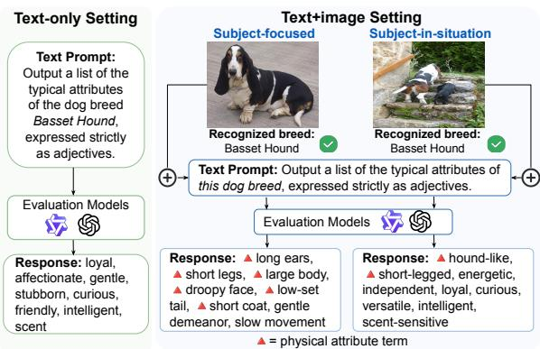  
Figure 1: When the same concept-level prompt (about the dog breed) is used, the response for the text+image setting shifts towards more physical attribute terms from the text-only setting, and how the instance is framed (subject-focused or subject-in-situation) further affects the shifting patterns.

As shown in Figure 1, we compare a text-only setting, where the target concept is provided only as text, with a text+image setting, where the same concept is provided through an image. The textonly setting corresponds to a two-step prompting in which recognition and attribute generation are separated, whereas the text+image setting corresponds to a one-step prompting in which attribute generation occurs directly from visual input. This comparison examines whether introducing visual input changes concept-level attribute descriptions beyond recognition success. Within the text+image setting, we further examine whether these descriptions vary with how the recognized subject is visually presented, which we discuss in terms of visual framing (Coleman, 2010, p. 237). Specifically, we compare subject-focused images, where the subject is the dominant visual focus, with subject-insituation images, where the subject appears within a broader activity or environmental context.

Our analyses show that physical terms increase from 18% in the text-only setting to 45% for subject-focused images and 40% for subject-insituation images. This indicates that visual input shifts attribute-based descriptions toward more physical terms, with subject-focused framing further strengthening the shift.

Overall, our findings show that LVLM-generated attribute descriptions are affected not only by the recognized target concept, but also by visual input and its framing. This highlights the importance of considering the impact of visual inputs and how they are framed in research on LVLMs’ robustness.

## 2 Evaluation Methodology

We evaluate the LVLM-generated attribute-based descriptions for the target concept under two settings (cf. Figure 1): text-only and text+image settings. We further analyze the text+image setting by comparing two visual framing types: subjectfocused and subject-in-situation images.

## 2.1 Collecting Attribute Outputs

Our experiments require a representative set of LVLM responses for each of the settings that we study, which will allow us to compare the distributions of the attribute terms (adjectives and descriptive phrases) that the LVLM produces across settings. We follow the methodology of prior work (Wang et al., 2026), which achieves diversity using comparable variants of the prompt and re-prompting to collect a large set of responses for each model studied.

For the text+image setting, we create sets of subject-focused and subject-in-situation images by manual inspection and selection. Since the number of available images is limited, we expand these sets by creating multiple versions of each image by applying image-processing operations, which reduces possible dependence on specific pixel patterns. To isolate variation in attribute generation from failures in target recognition, for each image version, we confirm that the LVLM can correctly recognize the concept it contains before including it in the set of images used to collect attribute outputs.

## 2.2 Comparing Attribute Distributions

For text-only vs. text+image comparison, we focus on the frequency with which the LVLM produces attributes in the response sets. For the LVLM response set of each setting, we rank attribute terms by their relative frequency and compare the top-K most frequent terms. The analysis focuses on highly frequent terms to maintain robustness to the relatively smaller size of the text-only response set, which, in contrast to the text+image response sets, does not contain responses for image variants.

Within the text+image setting, we compare the distributions of the subject-focused and the subjectin-situation response sets for each target concept. We estimate the attribute distribution in each set, and compare them with the Total Variation Distance (TVD).

We dive more deeply into the difference between the framing types by carrying out a lexical analysis, which provides us insight into the nature of the difference of responses of the LVLM. First, we identify the attributes that are most different between the subject-focus and subject-in-situation response sets using the unsigned log-likelihood ratio statistic in (Rayson and Garside, 2000). Then, we calculate which attributes are most important for which visual framing type, by examining the relevant frequency. See details in Appendix C.

## 3 Experimental Setup

Models and data. We evaluate Qwen2.5-VL-3B-Instruct (Qwen Team, 2025) and GPT-4omini (OpenAI, 2024), with temperature set to 0 for all queries. For Qwen, we use torch\_dtype=torch.bfloat16. We use the Oxford-IIIT Pet dataset (Parkhi et al., 2012) as the source of breed concepts, and collect additional images of these breeds from Wikimedia Commons through its public API. We use a server with 20GB of memory NVIDIA A10 GPU.

Evaluation image set. For each breed, we construct a balanced image set containing subjectfocused and subject-in-situation images that are correctly recognized by both LVLMs. Original images are manually annotated by visual framing: subjectfocused images present the animal as the dominant visual subject, whereas subject-in-situation images present the animal within a broader activity, interaction, or environmental context. We generate five image-processing variants of each candidate image: spatial cropping, Non-Local Means denoising, contrast scaling, brightness scaling, and sharpening. Details of parameters are in Appendix D.1.

We then apply recognition filtering to both the original image and all processed variants. For each image, each model is asked to identify the breed directly using a recognition prompt. An image is retained only if both models correctly recognize the breed in the original image and in five image variants. A breed is retained only if the remaining images form a balanced set of 8 subject-focused and 8 subject-in-situation images. After filtering, we retain 30 breeds and discard seven breeds that do not provide enough jointly recognized images for this balanced comparison: Abyssinian, Birman, Bombay, Ragdoll, Havanese, Japanese Chin, and English Cocker Spaniel. Details of visual framing annotation are provided in Appendix E.

Attribute collection. We collect attribute outputs under two settings. In the text-only setting, the model receives only the target breed name and generates concept-level attributes. Following (Wang et al., 2026), we use five prompt variants and five repetitions, yielding $5 \times 5 = 2 5$ text-only outputs per breed. In the text+image setting, the model receives an image together with the attributegeneration prompt. For each retained breed and framing type, we collect outputs from 8 images, 5 processed versions, 5 prompt variants, and 5 repetitions, yielding $8 \times 5 \times 5 \times 5 = 1 0 0 0$ outputs. Full prompts are provided in Appendix D.2.

Attribute extraction and annotation. As in (Wang et al., 2026), we standardize raw responses using Llama-3.1-8B (Meta AI, 2024) as an extraction model. We further categorize extracted terms into physical and non-physical terms. Physical terms describe visually observable properties, such as morphology, coat, color, size, body structure, and facial features. Non-physical terms include temperament-related, ambiguous, or evaluative terms that do not unambiguously describe visible physical appearance. Details are provided in Appendix F.

## 4 Experimental Results

Text-only setting vs. text+image setting. We first compare the terms generated in the text-only setting with those generated in the text+image setting. As shown in Figure 2, the top-K frequent terms suggest that adding image input shifts attribute descriptions toward more physical terms. For Qwen2.5-VL-3B-Instruct, this shift is large and consistent: the text-only remains around 20%, whereas the subject-focused and subject-insituation remain far higher, decreasing from 65% and 55% at small K to 45% and 40% at larger K. The same tendency is weaker and less consistent for GPT-4o-mini. The difference between subjectfocused and subject-in-situation images, especially for Qwen2.5-VL-3B-Instruct, motivates a closer analysis of framing within the text+image setting.

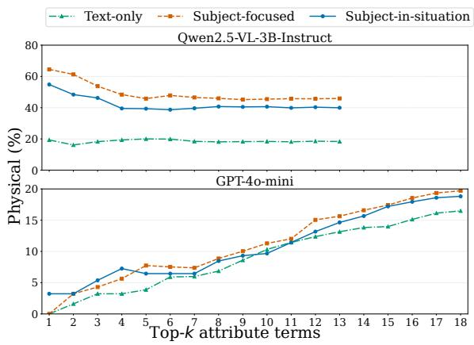  
Figure 2: Text-only vs. text+image settings: percentage of physical terms among the top-K terms. Text+image settings shift descriptions toward more physical terms, with a stronger effect for Qwen2.5-VL-3B-Instruct.

Effects of visual framing within the text+image setting. We next test whether subject-focused and subject-in-situation images elicit different attribute distributions when the target concept is correctly recognized. A substantial subset of concepts shows a significant difference between the two framing types: 15 out of 30 breeds for Qwen2.5-VL-3B-Instruct and 14 out of 30 breeds for GPT-4o-mini (p < 0.05). Eight breeds are significant for both models, including Samoyed, Siamese, and Persian, while ten breeds are non-significant for both models, including Maine Coon, Leonberger, and Scottish Terrier. See details in Appendix B.

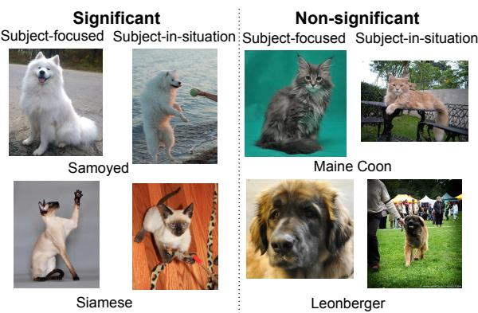  
Figure 3: Text+image setting across framing types: significant and non-significant cases both for Qwen2.5-VL-3B-Instruct and GPT-4o-mini. Significant cases tend to show clearer contrasts between subject-focused and subject-in-situation images.

We further inspect the image sets associated with significant and non-significant cases. As illustrated in Figure 3, significant cases often show clearer contrasts between the two visual framing types. subject-focused images tend to depict the animal as a centered and visually dominant subject, often with a clear view of the body and a plain or unobtrusive background. Subject-in-situation images more clearly include activity, interaction, or environmental context. In contrast, non-significant cases often contain additional sources of visual variation, such as partial close-ups or visually heterogeneous examples within the same breed.

We then compare image-level attribute distributions within and across framing types. For each concept, we compute pairwise TVD between image-level distributions estimated from each image and its processing variants. Across-framing TVD is consistently higher than within-framing TVD for both models, especially for Qwen2.5-VL-3B-Instruct, showing that framing contributes to variation beyond image-level differences.

We finally examine which terms characterize the difference between the two visual framing types. As shown in Figure 5, subject-focused framing yields a higher percentage of physical terms among the top-5 directional terms for 21 out of 30 breeds in each model. This tendency is stronger for Qwen2.5-VL-3B-Instruct, where subject-focused images show a clearer shift toward physical terms. For GPT-4o-mini, the same direction is present but weaker. These results suggest that subjectfocused images make visible physical attributes more prominent in generated attribute descriptions, whereas subject-in-situation images are relatively more associated with non-physical terms.

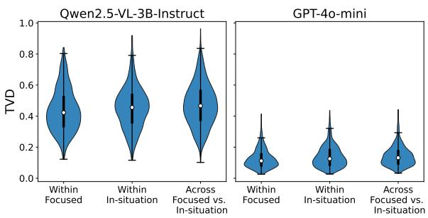  
Figure 4: Image-level variation within and across visual framing types. Average pairwise TVD values are higher across framing types than within the same framing type for both models. Visual framing contributes variation beyond ordinary image-level differences.

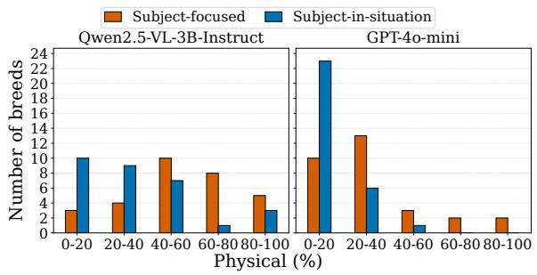  
Figure 5: Text+image settings across framing types: percentage of physical terms among the top-5 directional terms. subject-focused images yield higher physicalterm percentages than subject-in-situation images for 21 out of 30 breeds in each model.

## 5 Conclusion and Outlook

We show that visual input and its framing can affect LVLM-generated attribute descriptions even when the target subject is correctly recognized. Compared with the text-only setting, the text+image setting produces more physical attribute terms. Within the text+image setting, subject-focused images are associated with more visible physical terms, whereas subject-in-situation images retain more non-physical terms for a substantial subset of concepts. These results suggest that concept-level attribute descriptions are influenced not only by recognized subject identity but also by how the subject is visually presented. Because these shifts are often plausible rather than obviously incorrect, visual input and its framing represent an underexplored source of variation in LVLM-generated descriptions. Future work should test whether similar effects appear in open-ended outputs such as captions or assistive explanations.

## Limitations

Domain scope. Our study uses animal breed concepts from the Oxford-IIIT-Pet dataset and additional natural images of the same breeds. While this setting provides a controlled and manually verifiable test set, it may not fully capture framing effects in other visual domains. Future work should test whether similar effects arise for other subject categories, such as vehicles, scenes, places, objects, or activities.

Visual framing granularity. We consider two high-level visual framing types: subject-focused and subject-in-situation. This binary contrast is useful for isolating a clear framing difference, but visual framing can involve finer-grained distinctions, such as close-up portraits, action scenes, humananimal interactions, animal-animal interactions, domestic environments, or natural habitats. Future work could extend this setup with larger-scale and more fine-grained framing annotations.

Attribute term type annotation. Our attribute type annotation is intentionally coarse. We use a binary distinction between physical and non-physical terms to capture the main semantic direction of the observed framing effect. This grouping simplifies the space of possible attributes: it allows us to test whether visual framing shifts outputs toward visible physical descriptions, but it does not provide a fine-grained taxonomy of animal breed attributes. It should also not be interpreted as a claim that model outputs constitute measurements of breed morphology or temperament in the ethological sense. Future work should use more detailed categories to distinguish attribute terms.

## Ethical Considerations

This work analyzes how visual input and visual framing affect attribute-based descriptions generated by LVLMs. Our experiments use animal categories and natural images of cats and dogs, and do not involve human subjects, private personal information, or sensitive demographic attributes. The generated attributes are analyzed only to study model behavior.

The main ethical implication is that LVLMgenerated semantic descriptions may appear concept-level, but can still be affected by visual cues after correct recognition. In real-world applications such as assistive technologies, image retrieval, content moderation, or autonomous perception, users may overinterpret such outputs as stable properties of the recognized concept. This issue could become more consequential for images involving people, social groups, occupations, or culturally sensitive categories, where framinginduced shifts may reinforce stereotypes or produce misleading descriptions.

Therefore, our findings highlight the importance of evaluating not only recognition accuracy, but also the stability of downstream semantic descriptions under different image presentations. Practitioners should be cautious when using LVLMgenerated attributes as concept-level knowledge, especially when images contain strong visual cues.

## References

Md. Atabuzzaman Ali Asgarov and Chris Thomas. 2025. Benchmarking and mitigating MCQA selection bias of large vision-language models. In In Proceedings of the 2025 Conference on Empirical Methods in Natural Language Processing, pages 33548–33562.

Renita Coleman. 2010. Framing the pictures in our heads: Exploring the framing and agenda-setting effects of visual images. In Paul D’Angelo and Jim A. Kuypers, editors, Doing News Framing Analysis: Empirical and Theoretical Perspectives, pages 233–261. Routledge.

Phillip Howard, Kathleen C. Fraser, Anahita Bhiwandiwalla, and Svetlana Kiritchenko. 2025. Uncovering bias in large vision-language models at scale with counterfactuals. In Proceedings of the 2025 Conference of the Nations of the Americas Chapter of the Associationfor Computational Linguistics: Human Language Technologies, pages 5946–5991. In Proceedings of the Association for Computational Linguistics.

Xin Jiang, Junwei Zheng, Ruiping Liu, Jiahang Li, Jiaming Zhang, Sven Matthiesen, and Rainer Stiefelhagen. 2025. @bench: Benchmarking vision-language models for human-centered assistive technology. In Proceedings of the IEEE Winter Conference on Applications ofComputer Vision, pages 3934–3943.

Antonia Karamolegkou, Malvina Nikandrou, Georgios Pantazopoulos, Danae Sanchez Villegas, Phillip Rust, Ruchira Dhar, Daniel Hershcovich, and Anders Sø- gaard. 2025. Evaluating multimodal language models as visual assistants for visually impaired users. In Proceedings of the 63rd Annual Meeting of the Association for Computational Linguistics, pages 25949– 25982.

Junnan Li, Dongxu Li, Silvio Savarese, and Steven Hoi. 2023. BLIP-2: Bootstrapping language-image pretraining with frozen image encoders and large lan-

guage models. In Proceedings of the 40th International Conference on Machine Learning.

Linqi Lu, Zihan Wan, Hyerin Kwon, Sang Jung Kim, Jiwon Kang, Laila Abbas, Jiawei Liu, and Douglas M. McLeod. 2026. Evaluating large vision-language models for visual framing analysis in news imagery: A theory-driven benchmark. In Proceedings of the 59th Hawaii International Conference on System Sciences.

Jill RD MacKay and Marie J Haskell. 2015. Consistent individual behavioral variation: the difference between temperament, personality and behavioral syndromes. Animals, 5(3):455–478.

Meta AI. 2024. Llama-3.1-8b. https://huggingface. co/meta-llama/Llama-3.1-8B.

OpenAI. 2024. Gpt-4o mini. https://developers. openai.com/api/docs/models/gpt-4o-mini.

Omkar M Parkhi, Andrea Vedaldi, Andrew Zisserman, and CV Jawahar. 2012. Cats and dogs. In Proceedings of the IEEE Conference on Computer Vision and Pattern Recognition.

Qwen Team. 2025. Qwen2.5-vl.

Paul Rayson and Roger Garside. 2000. Comparing corpora using frequency profiling. In The workshop on comparing corpora, pages 1–6.

Michael Riegler, Martha Larson, Mathias Lux, and Christoph Kofler. 2014. How ’how’ reflects what’s what: Content-based exploitation of how users frame social images. In Proceedings ofthe 22nd ACM International Conference on Multimedia, MM ’14, page 397–406.

Lulu Rodriguez and Daniela V Dimitrova. 2011. The levels of visual framing. Journal ofVisual Literacy, 30(1):48–65.

Isadora de Castro Travnik, Aline Cristina Sant’Anna, Karynn Vieira Capilé, Laura Vitória Fontoura de Lara, Cesar Augusto Taconeli, and Carla Forte Maiolino Molento. 2026. Personality or temperament? the answer depends on animal settings and on moral considerations. Journal ofVeterinary Behavior: Clinical Applications and Research.

An Vo, Khai-Nguyen Nguyen, Mohammad Reza Taesiri, Vy Tuong Dang, Anh Totti Nguyen, and Daeyoung Kim. 2026. Vision language models are biased. In In Proceedings of the International Conference on Learning Representations.

Bo Wang and Martha Larson. 2017. Beyond concept detection: The potential of user intent for image retrieval. In Proceedings of the Workshop on Multimodal Understanding ofSocial, Affective and Subjective Attributes colocated with ACM Multimedia 2017, MUSA2 ’17, page 11–19.

Xiaomeng Wang, Martha Larson, and Zhengyu Zhao. 2026. Revealing the impact of visual text style on attribute-based descriptions produced by large visual language models. In In Proceedings ofthe 16th ACM International Conference on Multimedia Retrieval.

Wenqian Ye, Bohan Liu, Guangtao Zheng, Di Wang, Xu Cao, Yunsheng Ma, Bolin Lai, James M Rehg, and Aidong Zhang. 2026. Mm-spubench: Towards better understanding of spurious biases in multimodal llms. In In Proceedings ofthe 32nd ACM SIGKDD Conference on Knowledge Discovery and Data Mining.

Jie Zhang, Sibo Wang, Xiangkui Cao, Zheng Yuan, Shiguang Shan, Xilin Chen, and Wen Gao. 2026. VLBiasBench: A comprehensive benchmark for evaluating bias in large vision-language model. IEEE Transactions on Pattern Analysis and Machine Intelligence.

Xingcheng Zhou, Mingyu Liu, Ekim Yurtsever, Bare Luka Zagar, Walter Zimmer, Hu Cao, and Alois C Knoll. 2024. Vision language models in autonomous driving: A survey and outlook. IEEE Transactions on Intelligent Vehicles.

## A Background and Related Work

## A.1 Visual Framing

Definition of visual framing. Images do not merely record a subject, but they present the subject through choices about view, scene, angle, crop, editing, and image selection. Following (Coleman, 2010), we use visual framing to refer to these visual choices through which a subject is presented. This definition is significant to our work because it separates the depicted subject of an image from the way that subject is visually shown.

Levels of visual framing. (Rodriguez and Dimitrova, 2011) propose four levels of visual framing: denotative, stylistic-semiotic, connotative, and ideological. The denotative level concerns what is literally depicted, such as actors, objects, and settings. The stylistic-semiotic level concerns how the image is visually composed, including distance, angle, gaze, posture, perspective, and other formal choices. The connotative and ideological levels concern broader symbolic, cultural, and political meanings. In our paper, our framing types are designed around the distinction between denotative content and stylistic-situational presentation, which corresponds to subject-focused and subjectin-situation.

Intentional framing in multimedia. A closely related computational perspective appears in multimedia retrieval work on intentional framing. (Riegler et al., 2014) defines intentionalframing as the sum of choices made by photographers in how they portray selected subject matter. This operationalizes the distinction between what an image depicts and how it depicts it for computational image analysis. The same topic can be visually realized through different photographer intents, such as presenting an overview of a scene, depicting an object, capturing a portrait, or recording information from another medium. Similarly, (Wang and Larson, 2017) argues that photographer intent cross-cuts topical image content and can support image retrieval diversification. Whereas the visuallevel framework provides an analytical typology of image meaning, intentional framing shows that the “how” of image presentation is also computationally meaningful. These works motivate our experimental design: we test whether different visual framings of natural images affect LVLM-generated attribute descriptions when the depicted subject is fixed and recognizable.

Visual framing and LVLMs. Recent work has begun to apply LVLMs to visual framing analysis. (Lu et al., 2026) evaluate whether LVLMs can classify predefined visual frames in news imagery, such as conflict, peace, and solidarity. This work treats LVLMs as tools for detecting visual frames in images. Our work asks a complementary question. Instead of asking whether LVLMs can recognize the visual frame type, we ask whether visual framing changes the attribute descriptions that LVLMs generate for the same correctly recognized subject. In this sense, we study visual framing not as an output category to be predicted, but as an input factor that can affect generated attribute descriptions.

## A.2 Unexpected Biases in LVLMs

This paper reveals a biased response pattern in LVLMs that arises from visual framing, with the goal of motivating further study of this understudied factor. Recent work has shown that LVLMs can exhibit unexpected biases beyond standard recognition errors. Counterfactual studies show that perceived social attributes in images can influence LVLM-generated text, including stereotypes, toxicity, and ratings of individuals (Howard et al., 2025). VLBiasBench further evaluates LVLM fairness across multiple social bias categories in both open-ended and closed-ended Visual Question Answering (VQA) settings (Zhang et al., 2026). Other works study different forms of bias, including reliance on spurious visual or textual correlations (Ye et al., 2026), prior-knowledge bias in objective visual tasks (Vo et al., 2026), and answer-token or position bias in multiple-choice VQA (Asgarov and Thomas, 2025).

The visual framing bias demonstrated in this paper is potentially important for LVLMs and differs from these biases in that it concerns how LVLMs describe the same correctly recognized subject when only the visual framing changes. By holding the subject category fixed and analyzing attributebased descriptions, we show that framing can steer LVLM on interpreting subject semantics in ways that are not necessarily factually wrong, but are framing-biased. This makes visual framing an important factor for understanding the robustness of LVLM-generated semantic descriptions.

## B Details on Permutation Test

For each concept c, we quantify the difference between the attribute distributions induced by the

two framing types using Total Variation Distance (TVD):

$$
\mathrm { T V D } ( P _ { c } ^ { \mathrm { s f } } , P _ { c } ^ { \mathrm { s i s } } ) = \frac { 1 } { 2 } \sum _ { w \in \mathcal { V } _ { c } } \left| P _ { c } ^ { \mathrm { s f } } ( w ) - P _ { c } ^ { \mathrm { s i s } } ( w ) \right| ,
$$

where $P _ { c } ^ { \mathrm { s f } }$ and $P _ { c } ^ { \mathrm { s i s } }$ denote the empirical attributetoken distributions for concept c under subjectfocused and subject-in-situation images, respectively, and $\mathcal { V } _ { c }$ is the shared vocabulary of attributes observed for concept c across the two framing conditions. TVD ranges from 0 to 1, with larger values indicating larger distributional differences.

To assess the statistical significance of the framing-induced distributional shift, we further conduct a permutation test for each concept. For a given concept c, we keep the generated attribute outputs fixed at the image block level and randomly shuffle the framing labels between subject-focused and subject-in-situation images within that concept. For each permutation, we recompute the TVD between the two permuted attribute distributions, yielding a concept-specific null distribution under the assumption that framing labels are exchangeable within concept c. The one-sided permutation p-value for concept c is computed as

$$
p _ { c } = \frac { 1 + \sum _ { b = 1 } ^ { B } \mathbf { 1 } \left[ \mathrm { T V D } _ { c } ^ { ( b ) } \geq \mathrm { T V D } _ { c } ^ { \mathrm { o b s } } \right] } { B + 1 } ,
$$

where B is the number of permutations, TVDobsc C is the observed TVD for concept c, and $\mathrm { T V D } _ { c } ^ { ( b ) }$ is the TVD obtained in permutation b. A small $p _ { c }$ indicates that, for that concept, the observed difference between framing types is unlikely to arise from random label assignment. We use the standard plus-one correction, treating the observed assignment as part of the permutation distribution, which avoids zero p-values under a finite number of permutations. The B is set as 5,000 in the setup.

Figures 6 and 7 show the per-concept permutation null distributions for Qwen2.5-VL-3B-Instruct and GPT-4o-mini, respectively. For each concept, the histogram shows TVD values obtained by randomly permuting framing labels between subjectfocused and subject-in-situation images, where the dashed vertical line marks the observed TVD between two framing types. Observed TVD values that fall in the right tail indicate that the framingconditioned attribute distributions differ more than expected under random label assignment.

## C Details on Directional Lexical Analysis

For each concept, we compare attribute term w frequency under the two framing types with its frequency relative to all other attribute terms. Let a and b denote the counts of w in the subject-focused and subject-in-situation distributions, respectively, and let c and d denote the total attribute term counts in the two distributions. The expected counts under the null hypothesis of equal relative frequency are

$$
E _ { \mathrm { f o c u s e d } } = { \frac { c ( a + b ) } { c + d } } , \qquad E _ { \mathrm { s i t u a t e d } } = { \frac { d ( a + b ) } { c + d } } .
$$

We compute the log-likelihood score as

$$
L L ( w ) = 2 \left( a \log \frac { a } { E _ { \mathrm { f o c u s e d } } } + b \log \frac { b } { E _ { \mathrm { s i t u a t e d } } } \right) ,
$$

where zero-count terms are omitted from the corresponding summation. A larger $L L ( w )$ indicates that the attribute term is more unevenly distributed across the two framing types than would be expected from their overall attribute term counts.

To determine the direction of the association, we compare the relative frequencies of w in the two distributions:

$$
r f _ { \mathrm { f o c u s e d } } ( w ) = { \frac { a } { c } } , \qquad r f _ { \mathrm { s i t u a t e d } } ( w ) = { \frac { b } { d } } .
$$

Using relative frequency rather than raw count corrects for possible differences in the total number of attribute terms collected under the two framing types. We assign each adjective to the framing type in which it has the higher relative frequency, and then rank adjectives within each direction by their $L L ( w )$ score. This produces two directional keyness lists for each concept: attribute terms most strongly associated with subject-focused images and attribute terms most strongly associated with subject-in-situation images.

## D Experimental Details

## D.1 Image Processing Operations

We use a crop ratio of 0.8, denoising with cv2.fastNlMeansDenoisingColored and filtering strength $h \ = \ 5 .$ , contrast and brightness factors of 1.05, and unsharp masking with unsharp\_percent= 70.

## D.2 Prompt Templates

This appendix lists the prompts used for recognition filtering and attribute generation.

Recognition prompt. For recognition filtering, we use the following prompt:

Identify the breed of the cat pictured in the image. Answer with the breed name directly.

For dog breeds, cat is replaced with dog.

Attribute generation prompts. We use the same five prompt templates in the text-only and text+image settings, with only the reference to the target breed changed across settings. In the text+image setting, the prompt refers to the breed shown in the image as this cat breed. In the textonly setting, this phrase is replaced by the explicit breed name, e.g., the cat breed Birman. For dog breeds, cat is replaced by dog.

The five prompt templates are:

• Output a list of the typical attributes of [TAR-GET], expressed strictly as adjectives.

• Output a list of attributes that distinguish [TARGET] from other cat breeds, expressed strictly as adjectives.

• Output a list ofadjectives that describe [TAR-GET].

• Output a list of adjectives that capture how [TARGET] is different from other cat breeds.

• Produce a list of the typical characteristics of [TARGET], expressed strictly as adjectives.

Here, [TARGET] is instantiated as this cat breed in the text+image setting and as the explicit breed name in the text-only setting, e.g., the cat breed Birman. For example, the first template becomes:

Output a list of the typical attributes of this cat breed, expressed strictly as adjectives.

in the text+image setting, and:

Output a list of the typical attributes of the cat breed Birman, expressed strictly as adjectives.

in the text-only setting. Each prompt is submitted five times for each condition.

## E Visual Framing Type Annotation

We annotate images into two visual framing types: subject-focused and subject-in-situation, which operationalizes a controlled contrast in how the same target concept is visually presented. They are not intended to exhaust all possible types of visual framing. Instead, they allow us to test whether LVLM-generated attribute descriptions change when the recognized subject identity is held fixed, but the visual framing type differs. More examples of the two visual framing types are provided in Figure 8.

General principle. The annotation concerns how the target concept is visually presented in the image, rather than what the target concept is. In general, a subject-focused image presents the target subject as the primary object of visual inspection, whereas a subject-in-situation image presents the target subject as part of a broader situation, activity, interaction, or environment. The distinction is therefore based on two criteria: (i) the visual dominance of the target subject, and (ii) the extent to which surrounding contextual elements contribute to the interpretation of the image.

Subject-focused images. In general, an image is labeled as subject-focused when the target subject is the dominant visual subject and the surrounding context is minimal, secondary, or not essential to interpreting the image. The image primarily presents inspection of the subject itself, rather than interpretation of an event or situation involving the subject.

In our experimental setting, a subject-focused image presents the target animal prominently, typically occupying a large portion of the image or appearing centrally. Such images make visible properties of the animal salient, including morphology, body shape, coat, color, size, posture, facial features, and other visually observable characteristics. The background may be present, but it should not provide a salient activity, interaction, or environmental situation.

Typical subject-focused examples include closeup or medium-shot photographs of the animal, portrait-like images, studio-like images, images with a clean and context-free background, and images where the animal is standing, sitting, or looking at the camera without a salient ongoing activity.

Subject-in-situation images. In general, an image is labeled as subject-in-situation when the target subject is embedded in a broader visual situation. The subject remains identifiable, but the surrounding scene, activity, interaction, or environment contributes substantially to the interpretation of the image. The image provides an interpretation of the subject as participating in, responding to, or being situated within an event or context.

In our experimental setting, a subject-insituation image shows the target animal in an activity, interaction, or environment. The depicted animal may be playing, running, walking, interacting with a human or another animal, participating in work or sport, exploring an environment, or appearing in a natural or domestic setting where the background is visually meaningful. Compared with subject-focused images, these images provide stronger contextual cues about behavior, activity, social interaction, or environmental response.

Typical subject-in-situation examples include animals walking or running outdoors, playing with toys, interacting with people or other animals, participating in work or sport, exploring an environment, or appearing in a scene where the background and action are visually meaningful.

## F Attribute Term Type Annotation

We annotate extracted attribute terms using a binary distinction between physical and non-physical terms, which is designed to interpret the semantic direction of LVLM-generated attribute descriptions.

Physical attribute terms. Physical attribute terms describe visually observable properties of the animal, including morphology, coat, color, size, body structure, facial features, or other bodily characteristics. These terms refer to properties that can, in principle, be inferred from the animal’s visible appearance in an image. Typical examples include:

Non-physical attribute terms. Non-physical attribute terms do not directly describe visible bodily properties of the animal. This category includes two main subtypes: temperament-related terms and ambiguous or evaluative terms.

Temperament-related terms describe expected behavioral responses, dispositions, sociability, activity levels, or interaction styles of a breed. This operationalization is informed by work that ties temperament to behavioral responses in context (MacKay and Haskell, 2015), recent discussion of terminology in animal individuality research (Travnik et al., 2026), the AKC Breed Temperament Guide 1, and the website 2 as practical references. Because our analysis concerns breedlevel model descriptions rather than individual animal behavior tests, we use this literature only to motivate a practical annotation category: terms are treated as non-physical when they describe how the breed is expected to behave, react, interact, or respond, rather than how it visibly looks.

Typical temperament-related terms in the nonphysical attribute term type include:

friendly, loyal, affectionate, gentle, calm, playful, curious, energetic, active, social, independent, protective, alert, adaptable, reserved, bold, vocal, stubborn.

These terms describe behavioral orientation rather than visible bodily properties. For example, friendly and social describe interaction style; curious and alert describe response to stimuli; active, energetic, and playful describe activity level or behavioral style.

Ambiguous or evaluative terms are also included in non-physical terms when they do not clearly describe physical appearance. Examples include:

cute, adorable, elegant, majestic, vibrant, domesticated.

These terms may reflect an overall impression, aesthetic judgment, category status, or mixed interpretation. For example, elegant may refer to movement style or appearance, and vibrant may refer to color, liveliness and general impression. Because such terms do not unambiguously describe visible bodily properties, we group them with nonphysical terms in the binary analysis.

## G Recognition Performance

Recall that our study uses only images for which the LVLM is able to correctly identify the target subject. The accuracies on the Oxford-IIIT Pet dataset for Qwen2.5-VL-3B-Instruct and GPT-4omini models are 0.664 and 0.7683, respectively.

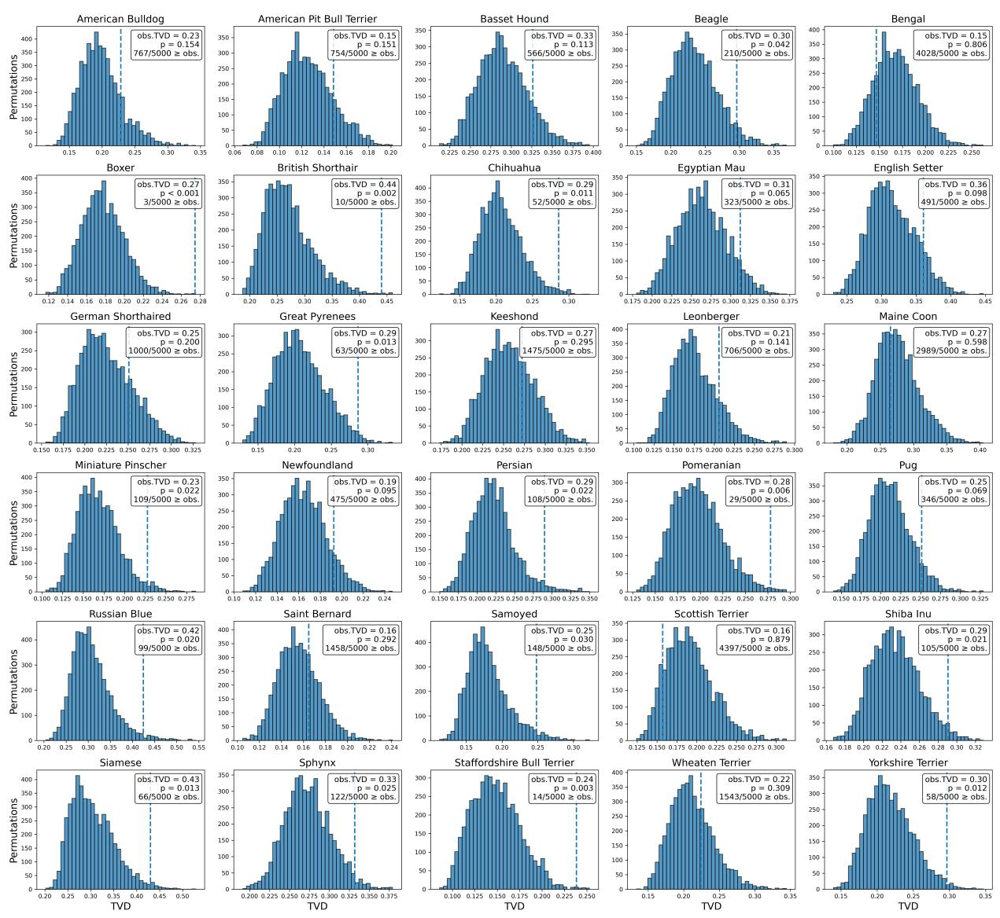

Figure 6: Per-concept permutation tests on Qwen2.5-VL-3B-Instruct. For each concept, the histogram shows the null distribution of TVD values obtained by randomly permuting framing labels between subject-focused and subject-in-situation images. The dashed line indicates the observed TVD, and the p-value gives the proportion of permutations with TVD greater than or equal to the observed value.

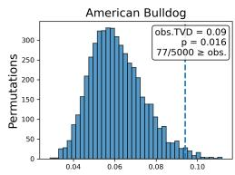

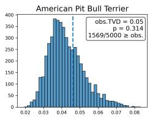

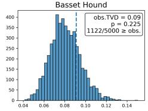

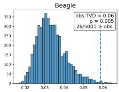

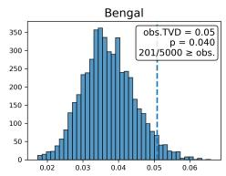

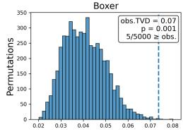

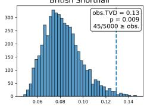

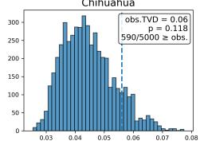

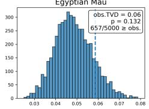

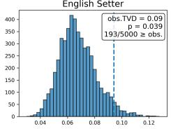

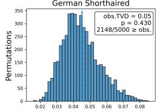

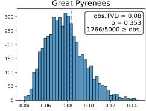

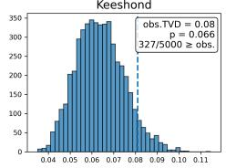

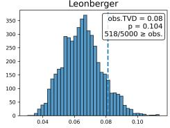

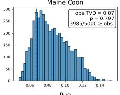

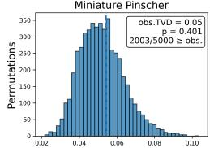

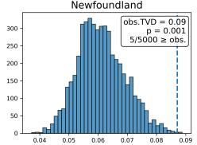

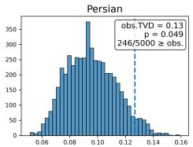

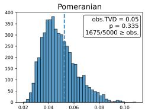

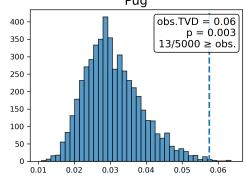

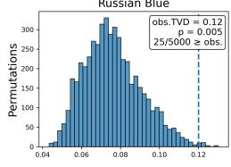

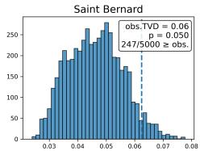

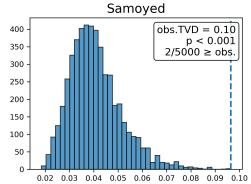

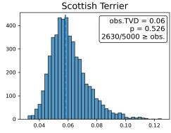

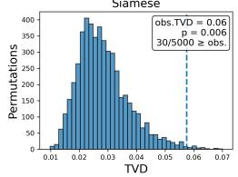

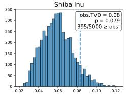

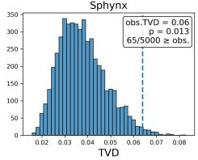

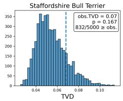

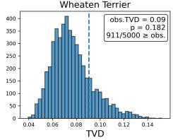

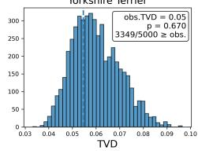

Figure 7: Per-concept permutation tests on GPT-4o-mini. For each concept, the histogram shows the null distribution of TVD values obtained by randomly permuting framing labels between subject-focused and subject-in-situation images. The dashed line indicates the observed TVD, and the p-value gives the proportion of permutations with TVD greater than or equal to the observed value.

## Subject-focused

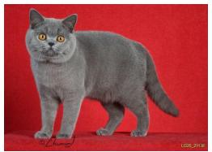

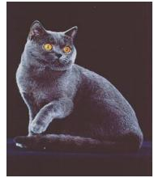  
British Shorthair

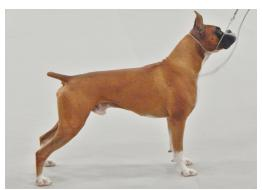

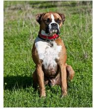  
Boxer

## Subject-in-situation

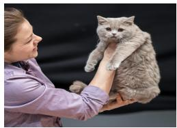

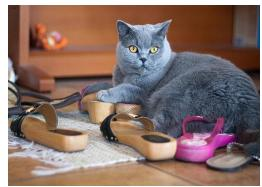

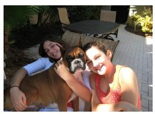

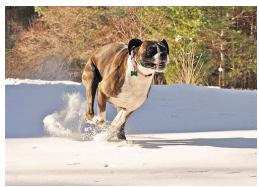

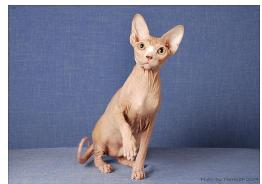

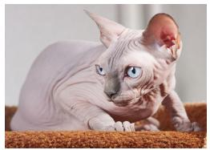  
Sphynx

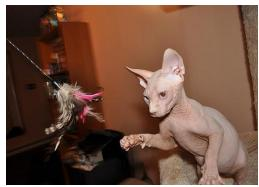

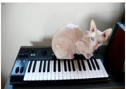

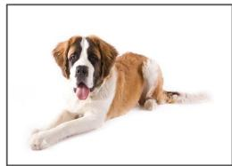

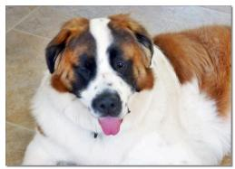  
Saint Bernard

  
Figure 8: Examples of two visual framing types. subject-focused images emphasize the target animal itself, while subject-in-situation images present the target animal within an activity, interaction, or environment.