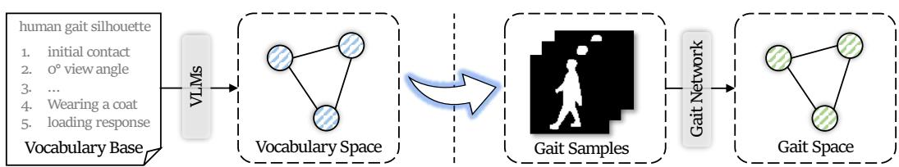
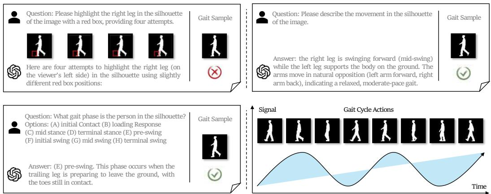
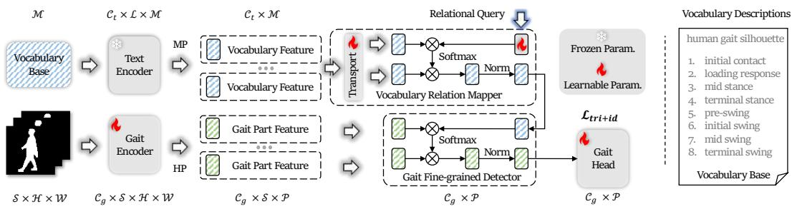
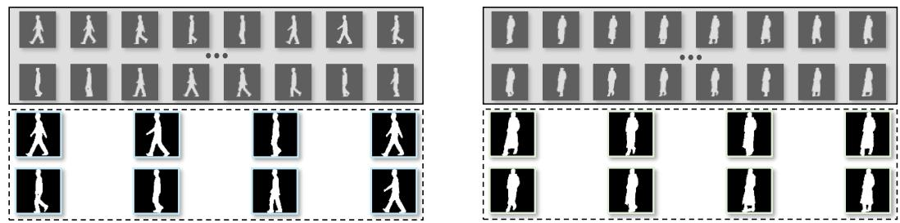
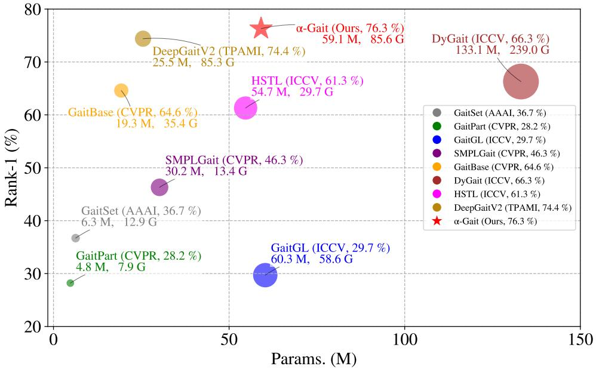

# Vocabulary-Guided Gait Recognition

Panjian Huang1, Saihui Hou1∗, Chunshui Cao2, Xu Liu2, Yongzhen Huang1,2 1 School of Artificial Intelligence, Beijing Normal University 2 WATRIX.AI

“The way we extract gaitfeatures depends a lot on how we understand a gait.”

  
Figure 1: Vocabulary-guided gait recognition aims to explore gait concepts through human vocabularies with VLMs where the vocabulary features enable to guide the gait network learning. Specifically, the universal vocabulary space (e.g., initial contact) can guide the gait network to derive the corresponding semantic gait features, thereby yielding a more universal gait space for practicality.

## Abstract

What is a gait? Appearance-based gait networks consider a gait as the human shape and motion information from images. Model-based gait networks treat a gait as the human inherent structure from points. However, the considerations remain vague for humans to comprehend truly. In this work, we introduce a novel paradigm Vocabulary-Guided Gait Recognition, dubbed Gait-World, which attempts to explore gait concepts through human vocabularies with Vision-Language Models (VLMs). Although VLMs have achieved the remarkable progress in various vision tasks, the cognitive capability regarding gait modalities remains limited. The success element in Gait-World is the proper vocabulary prompt where this paradigm carefully selects gait cycle actions as Vocabulary Base, bridging the gait and vocabulary feature spaces and further promoting human understanding for the gait. How to extract gait features? Although previous gait networks have made significant progress, learning solely from gait modalities on limited gait databases makes it difficult to learn universal gait features for practicality. Therefore, we propose the first Gait-World model, dubbed α-Gait, which guides the gait network learning with vocabulary knowledge from VLMs. However, due to the heterogeneity of the modalities, directly integrating vocabulary and gait features is highly challenging as they reside in different embedding spaces. To address the issues, α-Gait designs Vocabulary Relation Mapper and Gait Finegrained Detector to map and establish vocabulary relations in the gait space for detecting corresponding gait features. Extensive experiments on CASIA-B, CCPG, SUSTech1K, Gait3D and GREW reveal the potential value and research directions of vocabulary information from VLMs in the gait field.

## 1 Introduction

Gait recognition aims to identify individuals based on walking patterns across complex covariates, e.g., cross-view and cross-clothing scenarios [1]. As fundamental paradigms, appearance-based gait networks [2, 3, 4, 5, 6, 7, 8, 9, 10, 11], which treat a gait as human shape and motion information, typically take images as input (e.g., silhouettes, parsing and optical flow) and use CNNs or Transformers to capture local and global spatio-temporal information. Model-based gait networks [12, 13, 14, 15, 16, 17, 18] treat a gait as the human inherent structure. These methods take points as input (e.g., keypoints, meshes, and heatmaps), and typically apply GCNs or Transformers to extract local and global relations among points and edges.

  
Figure 2: Up: In the silhouette modality, VLMs struggle to identify fine-grained details (e.g., localizing the right leg), yet remain sensitive to basic walking patterns, which rely on overall structure. Down: The success element of Gait-World lies in leveraging gait cycle actions as the vocabularies to bridge the gap between VLMs and gait modality.

Despite the significant progress made by these paradigms due to their efficiency, the gait research still faces two main problems: (i) Ambiguous gait concepts (e.g., shape, motion and structure) cause that researchers either possess advanced knowledge yet cannot fully apply it due to underdeveloped gait networks, or have feasible insights but cannot verify whether the network truly works as intended. (ii) Constrained gait networks rely solely on the gait modality and the limited gait databases, struggling to learn universal features for the real-world scenarios. For example, appearance-based methods suffer from drastic appearance variations under cross-clothing conditions, model-based methods heavily depend on the accuracy of upstream pose estimators, and gait databases often encounter sparse-view [19] and cloth-imbalance [20] problems. Therefore, we naturally ask: What is a gait and how to extract gaitfeatures? Considering that human vocabulary inherently possesses interpretability and semantic guidance, we introduce a new gait paradigm and network to answer:

Vocabulary-guided gait recognition. The primary goal is to harness human-defined vocabulary with Vision-Language Models (VLMs) to explore gait concepts, thereby promoting gait networks and providing researchers more informative feedback. Inspired by “The limits of my language mean the limits ofmy world.” from Ludwig Wittgenstein, we name the paradigm Gait-World shown in Figure 1. Gait-World consists of Vocabulary Base, VLMs, and Gait Network. Researchers provide basic knowledge as the Vocabulary Base, from which VLMs extract the vocabulary features to serve as priors that guide the gait network in learning corresponding gait features. However, integrating human vocabulary knowledge into gait modalities via VLMs is non-trivial because publicly available training data for VLMs rarely include gait samples. As shown in Figure 2, VLMs (i.e., GPT-4o1) often struggle to identify fine-grained details (e.g., hands or legs) in silhouettes. Nevertheless, we observe a phenomenon where VLMs remain sensitive to basic walking patterns. We adopt the clinically defined eight-phase gait cycle as a minimal, complete set [21, 22], and VLMs accurately recognize gait cycles from silhouettes, aligning with “Gait serves as a walking descriptor.” Therefore, the success element in Gait-World is the proper vocabulary prompt where this paradigm carefully selects gait cycle actions as Vocabulary Base, bridging the gait and VLM spaces and further promoting human understanding for the gaits.

α-Gait. Towards vocabulary-guided gait recognition, we introduce the first Gait-World model, α-Gait, which leverages vocabulary knowledge from VLMs to guide gait representation learning. Specifically, due to the modality heterogeneity, directly integrating vocabulary and gait features poses a challenge, as they reside in distinct embedding spaces. To address this, α-Gait firstly employs the Vocabulary Relation Mapper that maps the vocabulary feature into the gait space and establishes vocabulary relations. Then, the Gait Fine-grained Detector queries the gait features with the vocabulary guidance, extracting corresponding semantic gait features for recognition.

Our main contributions can be summarized as follows:

• We introduce a novel paradigm Vocabulary-Guided Gait Recognition, dubbed Gait-World, which applies human vocabularies with Vision-Language Models to effectively explore gait concepts, revealing the vocabulary value for the gait field.

• We propose α-Gait in pursuit of the Gait-World, which designs Vocabulary Relation Mapper and Gait Fine-grained Detector to map and establish vocabulary relations into the gait space, effectively tackling modality heterogeneity and refining gait features.

• We evaluate α-Gait on CASIA-B, CCPG, SUSTech1K, Gait3D and GREW, achieving superior performance and providing valuable insights.

## 2 Related Work

## 2.1 Gait Recognition

Model-Based Gait Recognition. PoseGait [12] lifts 2D images to 3D poses and learns spatiotemporal cues with a multi-loss scheme for robustness. GaitGraph/GaitGraph2 [13, 23] use GCNs on 2D pose sequences to model motion while reducing appearance sensitivity. GaitTR [14] couples spatial transformers with temporal convolutions. GaitMixer [24] mixes spatial self-attention with large-kernel temporal convolutions. GPGait [15] improves generalization via a unified pose representation. SMPLGait [16] encodes shape and motion with dense 3D body models. SkeletonGait [17], HiH [25], and GaitHeat [18] use Gaussian-style maps to strengthen structural cues.

Appearance-Based Gait Recognition. GaitSet [2] views silhouettes as an unordered set. GaitPart [3] exploits part-wise signals. GaitGL [4] combines local and global 3D convolutions. GaitBase [5] is a simple, strong foundation for in-the-wild use. DANet [6], DyGait [26], HSTL [27], VPNet [7], GLGait [28], and GaitMoE [10] emphasize dynamic modeling. GaitGCI [29], GaitCSV [19], CLTD [30], and GaitC3I [31] apply causal inference to curb covariate effects. Origins [32] leverages generative diffusion to mitigate semantic inconsistency and uniformity. Beyond silhouettes, parsing based inputs (GaitParsing [33], LandmarkGait [34], ParsingGait [35]) capture fine-grained parts. RGB pipelines (GaitEdge [36], BigGait [37]) enable end-to-end learning. point clouds (LidarGait [38]) address occlusion. multi-modal designs (MMGaitFormer [39], CL-Gait [40]) enrich cues. and Gait-X [41] builds an X-modality via patch-wise DCT for stronger in-/cross-domain performance.

## 2.2 Vision-Language Models

Gait-World derives its vocabulary space from a Text Encoder built on either Vision-Language Models (VLMs) or purely textual Large Language Models (LLMs).

VLMs. (i) CLIP [42]: contrastive image-text embeddings enabling broad zero-shot transfer and prompt-based retrieval/classification. (ii) LLaVA [43]: a CLIP-style visual encoder connected to an LLM via a lightweight adapter for instruction-following multimodality. (iii) Qwen [44]: Qwen-VL supports multi-image, high-resolution inputs with strong captioning and grounding for fine-grained semantics. (iv) GPT [45]: GPT-4V (and 4o) accepts images for VQA and multi-step reasoning over visual content.

LLMs. (i) LLaMA [46]: a widely used 7B-65B base family for downstream NLP adapters and tools. (ii) GPT [45]: GPT-3/4 exhibit in-context learning, instruction following, and strong general reasoning in text-only settings. (iii) DeepSeek [47]: V3/R1 emphasize efficiency and explicit reasoning with MoE and RL-style training, improving coding and mathematical tasks.

## 2.3 Vocabulary-Guided Learning

Using an explicit vocabulary links visual evidence to linguistic semantics. We outline two representative directions: Open-Vocabulary Learning and Text-Guided Learning.

Open-Vocabulary Object Detection. The goal is to detect objects beyond a fixed training label set by transferring language-aware knowledge. ViLD [48] distills a VLM teacher into a region-based detector to generalize to unseen categories. Detic [49] adds image-level supervision from large-scale VLM pretraining so one model handles both in- and out-of-vocabulary classes. OV-DETR [50] couples a transformer detector with vision-language pretraining, predicting categories directly from text embeddings.

Text-Guided Face Recognition. Text serves as guidance or supervision to refine identity features across granularities. CFAM [51] aligns images and captions at multiple resolutions. CaptionFace [52] combines a GPTFace component with a multi-scale feature alignment module. TGFR [53] uses cross-modal contrastive learning over global-local face-caption pairs.

Discussion. Vocabulary-Guided Gait Recognition instead uses vocabulary as priors to query identityrelevant gait cues. Unlike open-vocabulary detectors that treat words as labels, and text-guided face recognition where VLMs plug in directly, current VLMs are not yet sensitive to gait, requiring additional alignment.

## 3 Methodology

In this section, we first present the formulation of vocabulary-guided gait recognition in Sec. 3.1, then offer a comprehensive description of α-Gait in Sec. 3.2, followed by the training and inference details in Sec. 3.3. Finally, we discuss various aspects of this work in Sec. 3.4.

## 3.1 Vocabulary-Guided Gait Recognition

We begin with the gait silhouette modality and appearance-based gait network for the simplicity and efficiency. A vanilla gait framework typically takes a silhouette sequence X as input, then extracts gait features using a Gait Encoder E. Next, Horizontal Partitioning $\mathcal { P }$ is applied to obtain fine-grained gait part features O, which are finally mapped to $\mathcal { F }$ for recognition through a Gait Head $\bar { \mathcal { G } }$ . This process can be as follows:

$$
\mathcal { O } = \mathcal { P } ( \mathcal { E } ( \mathcal { X } ) )\tag{1}
$$

$$
\mathcal { F } = \mathcal { G } ( \mathcal { O } )\tag{2}
$$

where $\mathcal { X } \in \mathbb { R } ^ { S \times \mathcal { H } \times \mathcal { W } } , \mathcal { O } \in \mathbb { R } ^ { \mathcal { C } _ { g } \times \mathcal { P } } , \mathcal { F } \in \mathbb { R } ^ { \mathcal { C } _ { g } \times \mathcal { P } }$ , and $\mathcal { C } _ { g } , \mathcal { S } , \mathcal { H } , \mathcal { W } , \mathcal { P }$ represent channel, consecutive $s$ frames, height, width and the number of horizontal parts. This process relies on learning solely from gait modalities on limited gait databases, which makes it difficult to learn universal gait features.

To address this, we introduce Vocabulary-Guided Gait Recognition, dubbed Gait-World, which leverages vocabulary information from VLMs for better human understanding and gait semantic guidance. Gait-World comprises Vocabulary Base V, VLMs T, and Gait Network. Because VLMs are insufficiently sensitive to gait silhouette modality, we prepend the qualifier "human gait silhouette" to all vocabularies, which provides more precise descriptions for VLMs $( e . g .$ , “human gait silhouette initial contact”). For convenience, this qualifier is omitted in subsequent discussions. Next, we provide more details for Gait-World, which mainly consists of three components:

Vocabulary Base. We predefine Vocabulary Base consisting of {“initial contact”, “loading response”, “mid stance”, “terminal stance”, “pre-swing”, “initial swing”, “mid swing”, “terminal swing”}. As Figure 2 shows, the selection is motivated by the observation that VLMs are sensitive to the gait cycle actions that depend on the global details of gait silhouettes, but less sensitive to local details (e.g., distinguishing legs from the silhouettes). Therefore, VLMs can accurately determine the phase of the gait cycle, which is crucial for gait recognition. In practice, Gait-World uses the Vocabulary Base to bridge the gap between the VLM and the gait spaces.

VLMs. Gait-World aims to harness the capacity of Vision-Language Models $( e . g .$ , CLIP) or Large Language Models (e.g., DeepSeek R1), which embody rich and universal knowledge. Specifically, the Text Encoder trained on large-scale public data develops a vocabulary space that generalizes well to real-world scenarios, which enables to guide the feature learning in the Gait Network. This process can be as follows:

  
Figure 3: α-Gait employs the vocabulary features from Text Encoder to guide the gait feature learning. HP denotes Horizontal Partition. Gait Encoder consists of several convolution blocks, and Gait Head includes Separate FCs and BNNeck. After the gait sequence passes through Gait Encoder and HP, the gait part features are fed into the Vocabulary Relation Mapper and Gait Fine-grained Detector, which guide them with vocabulary information for identification.

$$
\mathcal { V } _ { f } = \mathcal { T } ( \mathcal { V } )\tag{3}
$$

where $\mathcal { V } _ { f } \in \mathbb { R } ^ { \mathcal { C } _ { t } \times \mathcal { L } \times \mathcal { M } }$ , and $\mathcal { C } _ { t } , \mathcal { L }$ and M denote channel, the number of tokens and the number of vocabulary. Note that the number of tokens assigned to each vocabulary feature can vary due to the differences in lexical length and tokenizer segmentation. For example, “pre-swing” and “initial contact” are tokenized into 1 and 2 tokens, respectively. Therefore, we employ the simple yet effective Mean Pooling (MP) to aggregate multiple tokens within a sentence into one token, i.e., $\mathcal { V } _ { f } \in \mathbb { R } ^ { \mathcal { C } _ { t } \times \mathcal { M } }$

Gait Network. The vocabulary features from VLMs serves as external information for guiding gait network learning. Therefore, the Gait-World paradigm is not constrained by current gait modalities or networks where vocabulary information solely guides gait representation learning.

## 3.2 Model Architecture

Towards Vocabulary-Guided Gait Recognition, we propose the first-generation model α-Gait in this series, which primarily incorporates vocabulary information after the Gait Encoder and Horizontal Partitioning $( i . e . ,$ , gait part features) due to the Vocabulary Base with temporal information and gait recognition with the fine-grained problem. Based on Gait-World, α-Gait introduces the Vocabulary Relation Mapper (VRM) and the Gait Fine-grained Detector (GFD), addressing the discrepancies between the vocabulary and gait feature spaces, as well as the lack of universality of gait features.

Vocabulary Instruction. As shown in Figure 3, α-Gait firstly obtains the vocabulary features $\mathcal { V } _ { f } \in \mathbb { R } ^ { \mathcal { C } _ { t } \times \mathbf { \check { \mathcal { M } } } }$ from Text Encoder. Note that gait cycle actions are an inherent attribute shared by all individuals and rely on the overall structure in silhouettes. Therefore, vocabularyfeatures are shared across the body parts ofall gait samples.

α-Gait extracts the gait part feature $\mathcal { O } \in \mathbb { R } ^ { \mathcal { C } _ { g } \times \mathcal { S } \times \mathcal { P } }$ from Gait Encoder $\mathcal { E }$ and Horizontal Partitioning ${ \mathcal P } ,$ , preserving the temporal information for vocabulary guidance. Note that each gait partfeature contains the distinct walking pattern. Therefore, both Vocabulary Relation Mapper and Gait Finegrained Detector are independent for each gait part feature, and we omit the part index for simplicity. Given the vocabulary features $\mathcal { V } _ { f } \in \mathbb { R } ^ { \mathcal { C } _ { t } \times \mathcal { M } }$ and one gait part feature $\mathcal { O } \in \mathbb { R } ^ { \mathcal { C } _ { g } \times \mathcal { S } }$ , the VRM and GFD are as follows:

Vocabulary Relation Mapper. Although Gait-World carefully selects Vocabulary Base that is highly relevant to gait, there remains a significant feature distribution discrepancy between the Text Encoder and Gait Encoder. This discrepancy arises mainly for two reasons. Firstly, the Text Encoder modeling paradigm is based on sequential processing of the text modality. Secondly, the Text Encoder learning framework primarily relies on autoregressive Next-Token Prediction or Contrastive Learning from RGB Image-Text pairs. To address these issues, VRM firstly introduces Transition module to align vocabulary features into the gait space, and then Relational Query $\mathcal { Q } _ { R }$ with the attention mechanism to establish associations among vocabularies, which enables the gait network to understand the vocabularies in a more fine-grained manner. The process is as follows:

$$
\mathcal { V } _ { f } ^ { \prime } = \mathrm { R e L U } ( \mathrm { L N } ( \mathrm { L i n e a r } ( V _ { f } ) ) )\tag{4}
$$

$$
\mathcal { Q } _ { R } = \mathcal { Q } _ { R } , \quad \mathcal { K } _ { R } = \mathcal { V } _ { f } ^ { \prime } , \quad \mathcal { V } _ { R } = \mathcal { V } _ { f } ^ { \prime }\tag{5}
$$

$$
\mathcal { Q } _ { V } = \mathop { \mathrm { S o f t m a x } } ( \mathcal { Q } _ { R } \otimes K _ { R } ) \otimes \mathcal { V } _ { R }\tag{6}
$$

where Linear $\in \mathbb { R } ^ { \mathcal { C } _ { t } \times \mathcal { C } _ { g } } , \ \mathcal { Q } _ { R } \in \mathbb { R } ^ { \mathcal { C } _ { g } \times 1 } , \ K _ { R } \in \mathbb { R } ^ { \mathcal { C } _ { g } \times \mathcal { M } } , \ \mathcal { V } _ { R } \in \mathbb { R } ^ { \mathcal { C } _ { g } \times \mathcal { M } } , \ Q _ { V } \ \in \mathbb { R } ^ { \mathcal { C } _ { g } \times 1 }$ . VRM eliminates the linear mapping in the attention mechanism to preserve the original vocabulary feature distribution as much as possible. Moreover, VRM normalizes the aligned vocabulary feature $\mathcal { Q } _ { V }$ for guiding gait feature learning.

Gait Fine-grained Detector. Within the Gait-World paradigm, GFD primarily achieves that the vocabulary feature $\mathcal { Q } _ { V }$ guides the gait feature learning with the corresponding semantic information for the complex real-world scenarios. To this end, GFD treats the process from an object detection perspective where the vocabulary feature detects gait features with the corresponding semantics. Similar to the DETR [54], GFD presents $\mathcal { Q } _ { V }$ as the object query and the gait part feature $\mathcal { O }$ as the regions of interest. The process is as follows:

$$
\mathcal { Q } _ { V } = \mathcal { Q } _ { V } , \quad K _ { V } = \mathcal { O } , \quad \mathcal { V } _ { V } = \mathcal { O }\tag{7}
$$

$$
\mathcal { F } = \mathrm { S o f t m a x } ( \mathcal { Q } _ { V } \otimes \mathcal { K } _ { V } ) \otimes \mathcal { V } _ { V }\tag{8}
$$

where $\mathcal { Q } _ { V } \in \mathbb { R } ^ { \mathcal { C } _ { g } \times 1 } , \mathcal { K } _ { V } \in \mathbb { R } ^ { \mathcal { C } _ { g } \times \mathcal { S } } , \mathcal { V } _ { V } \in \mathbb { R } ^ { \mathcal { C } _ { g } \times \mathcal { S } } , \mathcal { F } \in \mathbb { R } ^ { \mathcal { C } _ { g } \times 1 }$ . GFD also normalizes the detected gait feature $\mathcal { F }$ for the following Gait Head, easing the training process.

## 3.3 Training Details

Training Stage. α-Gait aims to recognize the individual identity where vocabulary information from VLMs solely guides the gait feature extraction. Consequently, α-Gait remains consistent with conventional gait recognition, including two types of identity loss. Triplet Loss $[ 5 5 ] L _ { t p }$ and Cross Entropy Loss $\mathcal { L } _ { c e } ,$ constraining each part independently.

$$
\mathcal { L } = \mathcal { L } _ { t p } + \mathcal { L } _ { c e }\tag{9}
$$

Inference Stage. After training, a strong relation is established between the Vocabulary Base space from VLMs and the gait space. At the inference stage, α-Gait remains the Vocabulary Base to refine gait features for real-world scenarios.

## 3.4 Discussion

To facilitate a clear grasp and significance of Vocabulary-Guided Gait Recognition, we further explain and clarify Gait-World, α-Gait and the scope of this work:

Gait-World aims to provide a better human understanding of gaits, and a new paradigm to complement existing paradigms $( i . e .$ , appearance-based and model-based methods). It serves as an intuitive and efficient tool for researchers to refine their understanding of gait patterns, providing new directions for gait research. Researchers only need to design better vocabulary prompts and share their embeddings with the gait community, without the burden of computational and memory overhead introduced by large models or the need for complex gait model architectures.

α-Gait serves as an initial attempt, which aims to provide an intuitive demonstration of the vocabulary’s effectiveness for gait recognition. Hence, we propose a simple yet effective architecture, rather than relying on complex frameworks for incremental performance gains.

The relationships with multimodals. Multimodal approaches typically require each input to be paired with the corresponding several modalities, which, despite offering information gains, also introduces challenges in data collection and computational overhead. α-Gait serves as an initial attempt with only eight universal vocabulary embeddings shared across all inputs, and admittedly does not yet constitute a multimodal paradigm.

## 4 Experiments

The mainstream public gait databases and the implementation details are shown in Appendix A and the evaluations on our method are introduced in the next sections.

Table 1: The evaluation on CCPG with clothing-changing conditions.
<table><tr><td rowspan="2">Paradigm</td><td rowspan="2">Method</td><td rowspan="2">Venue</td><td colspan="5">Gait Evaluation Protocol</td><td colspan="5">ReID Evaluation Protocol</td></tr><tr><td>CL</td><td>UP</td><td>DN</td><td>BG</td><td>Mean</td><td>CL</td><td>UP</td><td>DN</td><td>BG</td><td>Mean</td></tr><tr><td rowspan="4">Model</td><td>GaitGraph2 [13]</td><td>CVPRW22</td><td>5.0</td><td>5.3</td><td>5.8</td><td>6.2</td><td>5.1</td><td>5.0</td><td>5.7</td><td>7.3</td><td>8.8</td><td>6.7</td></tr><tr><td>Gait-TR [14]</td><td>ES23</td><td>15.7</td><td>18.3</td><td>18.5</td><td>17.5</td><td>17.5</td><td>24.3</td><td>28.7</td><td>31.1</td><td>28.1</td><td>28.1</td></tr><tr><td>MSGG [56]</td><td>MTA23</td><td>29.0</td><td>34.5</td><td>37.1</td><td>33.3</td><td>33.5</td><td>43.1</td><td>52.9</td><td>57.4</td><td>49.9</td><td>50.8</td></tr><tr><td>SkeletonGait [17]</td><td>AAAI24</td><td>40.4</td><td>48.5</td><td>53.0</td><td>61.7</td><td>50.9</td><td>52.4</td><td>65.4</td><td>72.8</td><td>80.9</td><td>67.9</td></tr><tr><td rowspan="5">Appearance</td><td>GaitSet [2]</td><td>AAAI19</td><td>60.2</td><td>65.2</td><td>65.1</td><td>68.5</td><td>64.8</td><td>77.5</td><td>85.0</td><td>82.9</td><td>87.5</td><td>83.2</td></tr><tr><td>GaitPart [3]</td><td>CVPR20</td><td>64.3</td><td>67.8</td><td>68.6</td><td>71.7</td><td>68.1</td><td>79.2</td><td>85.3</td><td>86.5</td><td>88.0</td><td>84.8</td></tr><tr><td>OGBase [57]</td><td>CVPR23</td><td>52.1</td><td>57.3</td><td>60.1</td><td>63.3</td><td>58.2</td><td>70.2</td><td>76.9</td><td>80.4</td><td>83.4</td><td>77.7</td></tr><tr><td>GaitBase [5]</td><td>CVPR23</td><td>71.6</td><td>75.0</td><td>76.8</td><td>78.6</td><td>75.5</td><td>88.5</td><td>92.7</td><td>93.4</td><td>93.2</td><td>92.0</td></tr><tr><td>DeepGaitV2 [58]</td><td>TPAMI25</td><td>78.6</td><td>84.8</td><td>80.7</td><td>89.2</td><td>83.3</td><td>90.5</td><td>96.3</td><td>91.4</td><td>96.7</td><td>93.7</td></tr><tr><td>Gait-World</td><td>α-Gait-S (ours)</td><td>NeurIPS25</td><td>82.8</td><td>89.0</td><td>84.6</td><td>92.7</td><td>87.3</td><td>92.0</td><td>98.1</td><td>93.4</td><td>96.9</td><td>95.1</td></tr></table>

Table 2: The evaluation on SUSTech1K with different attributes (abbrev.: NM=Normal, BG=Bag, CL=Clothing, CRY=Carrying, UMB=Umbrella, UNI=Uniform, OCC=Occlusion, NT=Night).
<table><tr><td rowspan="2">Paradigm</td><td rowspan="2">Method</td><td rowspan="2">Venue</td><td colspan="8">Probe Sequence</td><td colspan="2">Overall</td></tr><tr><td>NM</td><td>BG</td><td>CL</td><td>CRY</td><td>UMB</td><td></td><td>UNI OCC</td><td>NT</td><td>Rank-1 Rank-5</td><td></td></tr><tr><td rowspan="4">Model</td><td>GaitGraph2 [13]</td><td>CVPRW22</td><td>22.2</td><td>18.2</td><td>6.8</td><td>18.6</td><td>13.4</td><td>19.2</td><td>27.3</td><td>16.4</td><td>18.6</td><td>40.2</td></tr><tr><td>Gait-TR [14]</td><td>ES23</td><td>33.3</td><td>31.5</td><td>21.0</td><td>30.4</td><td>22.7</td><td>34.6</td><td>44.9</td><td>23.5</td><td>30.8</td><td>56.0</td></tr><tr><td>MSGG [56]</td><td>MTA23</td><td>67.1</td><td>66.2</td><td>35.9</td><td>63.3</td><td>61.6</td><td>58.1</td><td>66.6</td><td>17.9</td><td>33.8</td><td></td></tr><tr><td>SkeletonGait [17]</td><td>AAAI24</td><td>67.9</td><td>63.5</td><td>36.5</td><td>61.6</td><td>58.1</td><td>67.2</td><td>79.1</td><td>50.1</td><td>63.0</td><td>83.5</td></tr><tr><td rowspan="5">Appearance</td><td>GaitSet [2]</td><td>AAAI19</td><td>69.1</td><td>68.2</td><td>37.4</td><td>65.0</td><td>63.1</td><td>61.0</td><td>67.2</td><td>23.0</td><td>65.0</td><td>84.8</td></tr><tr><td>GaitPart [3]</td><td>CVPR20</td><td>62.2</td><td>62.8</td><td>33.1</td><td>59.5</td><td>57.2</td><td>54.8</td><td>57.2</td><td>21.7</td><td>59.2</td><td>80.8</td></tr><tr><td>GaitGL [4]</td><td>ICCV21</td><td>67.1</td><td>66.2</td><td>35.9</td><td>63.3</td><td>61.6</td><td>58.1</td><td>66.6</td><td>17.9</td><td>63.1</td><td>82.8</td></tr><tr><td>GaitBase [5]</td><td>CVPR23</td><td>81.5</td><td>77.5</td><td>49.6</td><td>75.8</td><td>75.5</td><td>76.7</td><td>81.4</td><td>25.9</td><td>76.1</td><td>89.4</td></tr><tr><td>DeepGaitV2 [58]</td><td>TPAMI25</td><td>87.4</td><td>84.1</td><td>53.4</td><td>81.3</td><td>86.1</td><td>84.8</td><td>88.5</td><td>28.8</td><td>82.3</td><td>92.5</td></tr><tr><td>Gait-World</td><td>α-Gait-S (ours)</td><td>NeurIPS25</td><td>91.1</td><td>87.2</td><td>64.0</td><td>85.3</td><td>89.5</td><td>88.8</td><td>92.7</td><td>28.2</td><td>86.3</td><td>93.9</td></tr></table>

## 4.1 Results on Constrained Scenario

CASIA-B. As shown in Table 3, α-Gait-T achieves competitive performance under all conditions, with an average accuracy of 94.8%, proving the universality of gait cycle action under NM, BG, and CL scenarios. Specifically, α-Gait-T approaches the SOTA on NM (98.9 %) and BG (96.8%).

CCPG. As shown in Table 1, α-Gait-S significantly outperforms appearance-based and model-based methods in the more challenging full-body clothing change scenarios. For instance, it exceeds DeepGaitV2 by 4% in mean accuracy, demonstrating that textual information can better guide the model in learning covariate-independent features.

## 4.2 Results on In-the-wild Scenario

SUSTech1K. In real-world scenarios, such as occlusions, umbrella usage, and varying lighting conditions, α-Gait-T significantly surpasses previous SOTA methods shown in Table 2. For example, it outperforms DeepGaitV2 by 4% in Rank-1 accuracy, demonstrating the feature robustness of the text-guided gait cycle actions.

Gait3D. In larger-scale scenarios, although silhouette-based methods are approaching saturation due to the impact of covariates on upstream segmentation algorithms, α-Gait-M is still able to improve performance shown in Table 4. For instance, it surpasses GaitMoE by 2.6% in Rank-1 accuracy, indicating that the Gait-World paradigm can serve as a valuable complement to existing approaches.

GREW. Similarly, GREW is also significantly affected by upstream gait modal extraction algorithms, with silhouette-based methods approaching the limitations. As shown in Table 4, α-Gait-L achieves competitive results, surpassing VPNet [7] by 1.2%. α-Gait-L adopts Free Lunch [61] (i.e., logits as gait features) to achieve more stable results without introducing additional computational complexity.

Table 3: The evaluation on CASIA-B under different conditions with Rank-1 accuracy (%).
<table><tr><td rowspan=1 colspan=1>Paradigm</td><td rowspan=1 colspan=1>Method</td><td rowspan=1 colspan=1>Venue</td><td rowspan=1 colspan=1>NM</td><td rowspan=1 colspan=1>BG</td><td rowspan=1 colspan=1>CL</td><td rowspan=1 colspan=1>Mean</td></tr><tr><td rowspan=3 colspan=1>Model</td><td rowspan=3 colspan=1>GaitGraph2 [23]GaitTR [14]GPGait [15]</td><td rowspan=1 colspan=1>CVPRW22</td><td rowspan=1 colspan=1>80.3</td><td rowspan=1 colspan=1>71.4</td><td rowspan=1 colspan=1>63.8</td><td rowspan=1 colspan=1>71.8</td></tr><tr><td rowspan=2 colspan=1>ES23ICCV23</td><td rowspan=1 colspan=1>94.7</td><td rowspan=1 colspan=1>89.3</td><td rowspan=1 colspan=1>86.7</td><td rowspan=1 colspan=1>90.2</td></tr><tr><td rowspan=1 colspan=1>93.6</td><td rowspan=1 colspan=1>80.2</td><td rowspan=1 colspan=1>69.3</td><td rowspan=1 colspan=1>81.0</td></tr><tr><td rowspan=14 colspan=1>Appearance</td><td rowspan=1 colspan=1>GaitSet [2]</td><td rowspan=1 colspan=1>AAAI19</td><td rowspan=1 colspan=1>95.0</td><td rowspan=1 colspan=1>87.2</td><td rowspan=1 colspan=1>70.4</td><td rowspan=1 colspan=1>84.2</td></tr><tr><td rowspan=1 colspan=1>GaitPart [3]</td><td rowspan=1 colspan=1>CVPR20</td><td rowspan=1 colspan=1>96.2</td><td rowspan=1 colspan=1>91.5</td><td rowspan=1 colspan=1>78.7</td><td rowspan=1 colspan=1>88.8</td></tr><tr><td rowspan=1 colspan=1>GLN [59]</td><td rowspan=1 colspan=1>ECCV20</td><td rowspan=1 colspan=1>96.9</td><td rowspan=1 colspan=1>94.0</td><td rowspan=1 colspan=1>77.5</td><td rowspan=1 colspan=1>89.5</td></tr><tr><td rowspan=1 colspan=1>GaitGL [4]</td><td rowspan=1 colspan=1>ICCV21</td><td rowspan=1 colspan=1>97.4</td><td rowspan=1 colspan=1>94.5</td><td rowspan=1 colspan=1>83.6</td><td rowspan=1 colspan=1>91.8</td></tr><tr><td rowspan=1 colspan=1>QAGait [60]</td><td rowspan=1 colspan=1>AAAI24</td><td rowspan=1 colspan=1>97.9</td><td rowspan=1 colspan=1>94.6</td><td rowspan=1 colspan=1>78.2</td><td rowspan=1 colspan=1>90.2</td></tr><tr><td rowspan=3 colspan=1>GaitBase [5]DANet [6]GaitGCI [29]</td><td rowspan=1 colspan=1>CVPR23</td><td rowspan=1 colspan=1>97.6</td><td rowspan=1 colspan=1>94.0</td><td rowspan=1 colspan=1>77.4</td><td rowspan=1 colspan=1>89.8</td></tr><tr><td rowspan=1 colspan=1>CVPR23</td><td rowspan=1 colspan=1>98.0</td><td rowspan=1 colspan=1>95.9</td><td rowspan=1 colspan=1>89.9</td><td rowspan=1 colspan=1>94.6</td></tr><tr><td rowspan=1 colspan=1>CVPR23</td><td rowspan=1 colspan=1>97.9</td><td rowspan=1 colspan=1>95.0</td><td rowspan=1 colspan=1>86.4</td><td rowspan=1 colspan=1>93.1</td></tr><tr><td rowspan=6 colspan=1>DyGait [26]HSTL [27]VPNet [7]DeepGaitV2 [58]CLTD [30]Free Lunch [61]</td><td rowspan=1 colspan=1>ICCV23</td><td rowspan=1 colspan=1>98.4</td><td rowspan=1 colspan=1>96.2</td><td rowspan=1 colspan=1>87.8</td><td rowspan=1 colspan=1>94.1</td></tr><tr><td rowspan=1 colspan=1>ICCV23</td><td rowspan=1 colspan=1>98.1</td><td rowspan=1 colspan=1>95.9</td><td rowspan=1 colspan=1>88.9</td><td rowspan=1 colspan=1>94.3</td></tr><tr><td rowspan=1 colspan=1>CVPR24</td><td rowspan=1 colspan=1>98.3</td><td rowspan=1 colspan=1>96.3</td><td rowspan=1 colspan=1>90.0</td><td rowspan=1 colspan=1>94.9</td></tr><tr><td rowspan=1 colspan=1>TPAMI25</td><td rowspan=1 colspan=1></td><td rowspan=1 colspan=1></td><td rowspan=2 colspan=1>89.3</td><td rowspan=2 colspan=1>89.694.8</td></tr><tr><td rowspan=1 colspan=1>ECCV24</td><td rowspan=1 colspan=1>98.6</td><td rowspan=1 colspan=1>96.4</td></tr><tr><td rowspan=1 colspan=1>ECCV24</td><td rowspan=1 colspan=1>98.1</td><td rowspan=1 colspan=1>94.1</td><td rowspan=1 colspan=1>77.9</td><td rowspan=1 colspan=1>90.0</td></tr><tr><td rowspan=1 colspan=1>Gait-World</td><td rowspan=1 colspan=1>α-Gait-T (ours)</td><td rowspan=1 colspan=1>NeurIPS25</td><td rowspan=1 colspan=1>98.9</td><td rowspan=1 colspan=1>96.8</td><td rowspan=1 colspan=1>88.6</td><td rowspan=1 colspan=1>94.8</td></tr></table>

Table 4: The evaluation on Gait3D and GREW.
<table><tr><td rowspan="2">Paradigm</td><td rowspan="2">Method</td><td rowspan="2">Venue</td><td colspan="3">Gait3D</td><td colspan="3">GREW</td></tr><tr><td>Rank-1</td><td>Rank-5</td><td>mAP</td><td>Rank-1</td><td>Rank-5</td><td>Rank-10</td></tr><tr><td rowspan="2">Model</td><td>GaitGraph2 [23]</td><td>CVPRW22</td><td>11.2</td><td></td><td>一</td><td>64.8</td><td></td><td></td></tr><tr><td>GaitTR [14] GPGait [15]</td><td>ES23 ICCV23</td><td>7.2 22.4</td><td>一 -</td><td>- -</td><td>48.6 57.0</td><td>- -</td><td>-</td></tr><tr><td rowspan="9">Appearance</td><td>GaitSet [2]</td><td>AAAI19</td><td>36.7</td><td>58.3</td><td>30.0</td><td>46.3</td><td>63.6</td><td>70.3</td></tr><tr><td>GaitPart [3]</td><td>CVPR20</td><td>28.2</td><td>47.6</td><td>47.6</td><td>44.0</td><td>60.7</td><td>67.3</td></tr><tr><td>GaitGL [4]</td><td>ICCV21</td><td>29.7</td><td>48.5</td><td>22.3</td><td>47.3</td><td>63.6</td><td></td></tr><tr><td>MTSGait [62]</td><td>MM22</td><td>48.7</td><td>67.1</td><td>37.6</td><td>55.3</td><td>71.3</td><td>76.9</td></tr><tr><td>QAGait [60]</td><td>AAAI24</td><td>67.0</td><td>81.5</td><td>56.5</td><td>59.1</td><td>74.0</td><td>79.2</td></tr><tr><td>GaitBase [5]</td><td>CVPR23</td><td>64.6</td><td>一</td><td></td><td>60.1</td><td></td><td></td></tr><tr><td>GaitGCI [29]</td><td>CVPR23</td><td>50.3</td><td>68.5</td><td>39.5</td><td>68.5</td><td>80.8</td><td>84.9</td></tr><tr><td>DyGait [26] HSTL [27]</td><td>ICCV23</td><td>66.3</td><td>80.8</td><td>56.4</td><td>71.4</td><td>83.2</td><td>86.8</td></tr><tr><td>VPNet [7]</td><td>ICCV23 CVPR24</td><td>61.3 75.4</td><td>76.3 87.1</td><td>55.5</td><td>62.7</td><td>76.6</td><td>81.3</td></tr><tr><td>DeepGaitV2 [58]</td><td>TPAMI25</td><td>74.4</td><td>88.0</td><td>一 65.8</td><td>80.0 77.7</td><td>89.4</td><td>一</td></tr><tr><td>CLTD [30]</td><td>ECCV24</td><td>69.7</td><td></td><td></td><td></td><td>88.9</td><td>91.8</td></tr><tr><td>GaitMoE [10]</td><td></td><td></td><td>85.2</td><td>一</td><td>78.0</td><td>87.8</td><td>一</td></tr><tr><td>Free Lunch [61]</td><td>ECCV24</td><td>73.7</td><td>一</td><td>66.2</td><td>79.6</td><td>89.1</td><td></td></tr><tr><td></td><td>ECCV24</td><td>70.1</td><td>一</td><td>61.9</td><td>65.5</td><td>78.7</td><td>83.3</td></tr><tr><td>Gait-World</td><td>α-Gait-M/L (ours)</td><td>NeurIPS25</td><td>76.3</td><td>87.7</td><td>67.8</td><td>81.2</td><td>90.2</td><td>92.7</td></tr></table>

## 4.3 Ablation Study

In this section, we validate the universality of the Gait-World with different Text Encoder, and illustrate the modality and vocabulary expansions. Additionally, we visualize the mechanism of vocabulary guidance, and analyze the trade-off of α-Gait between accuracy and efficiency.

The effectiveness of Gait-World. As shown in Table 5, although Gait Network relying solely on gait silhouettes and adaptive learning achieves competitive results, under the Gait-World paradigm, α-Gait further improves Rank-1 accuracy by 2.6% on Gait3D. This indicates that the vocabulary space distribution derived from Large Language Models possesses greater universality.

Table 5: The ablation study on Gait3D and CCPG.
<table><tr><td rowspan="2">Method</td><td colspan="2">Gait3D</td><td colspan="5">CCPG</td></tr><tr><td>Rank-1</td><td>mAP</td><td>CL</td><td>UP</td><td>DN</td><td>BG</td><td>Mean</td></tr><tr><td>α-Gait</td><td>76.2</td><td>67.8</td><td>82.8</td><td>89.0</td><td>84.6</td><td>92.7</td><td>87.3</td></tr><tr><td>Gait Encoder</td><td>73.6</td><td>65.1</td><td>80.1</td><td>86.4</td><td>83.9</td><td>91.4</td><td>85.5</td></tr><tr><td colspan="8">The analysis on Text Encoder</td></tr><tr><td>Initial Random</td><td>71.8</td><td>63.3</td><td>77.7</td><td>84.2</td><td>77.6</td><td>86.2</td><td>81.4</td></tr><tr><td>Learnable Query</td><td>74.1</td><td>66.8</td><td>82.3</td><td>89.0</td><td>83.9</td><td>92.5</td><td>86.9</td></tr><tr><td>CLIP</td><td>75.2</td><td>67.7</td><td>82.2</td><td>88.9</td><td>85.0</td><td>92.8</td><td>87.2</td></tr><tr><td>LlaMa</td><td>74.8</td><td>66.9</td><td>82.5</td><td>89.3</td><td>84.3</td><td>93.0</td><td>87.3</td></tr><tr><td>DeepSeekR1-Distill</td><td>76.2</td><td>67.8</td><td>82.8</td><td>89.0</td><td>84.6</td><td>92.7</td><td>87.3</td></tr></table>

Table 6: Ablations on modality and vocabulary expansions on Gait3D
<table><tr><td>Paradigm</td><td>Variant</td><td>一 Vocabulary Base</td><td>Rank-1</td><td>mAP</td></tr><tr><td>Appearance</td><td>Gait Encoder Gait Encoder w/ α-Gait</td><td>[8 phases]</td><td>73.6 76.2</td><td>65.1 67.8</td></tr><tr><td>Model</td><td>SkeletonGait SkeletonGait w/ α-Gait</td><td>[8 phases]</td><td>37.9 40.3</td><td>29.6 31.3</td></tr><tr><td>Multimodel</td><td>SkeletonGait++ SkeletonGait++ w/ α-Gait</td><td>[8 phases]</td><td>76.0 78.1</td><td>69.2 71.5</td></tr><tr><td>Gait-World</td><td>α-Gait α-Gait w/ More vocabularies</td><td>[8 phases] [8 phases + view, bag, clothing inv.]</td><td>76.3 76.8</td><td>67.8 68.4</td></tr></table>

The analysis on Text Encoder. To analyze the importance of vocabulary features, we first replace them with Initial Random features. As shown in Table 5, the results show that non-relational features disrupt gait learning, thereby validating the effectiveness of α-Gait from the benefits of strongly associated vocabulary features rather than the architectures (i.e., VRM and GFD). Additionally, we replace with Learnable Query, which starts from normal distribution but adapts through VRM and GFD to learn relevant information from the gait features, confirming the architecture’s efficiency. Furthermore, we substituted different Text Encoders, leading to different improvements. DeepSeek-R1-Distill, with its universal vocabulary reasoning capabilities, produced superior vocabulary features, while CLIP, leveraging image-text pairs for alignment, excelled in capturing visual features.

The modality and vocabulary expansions. As shown in Table 6, vocabulary guidance brings consistent gains. For the Appearance-based method, adding α-Gait lifts Rank-1/mAP from 73.6/65.1 to 76.2/67.8 (+2.6/+2.7), indicating that phase-aware cues complement generic silhouette features. For Model-based method, SkeletonGait improves from 37.9/29.6 to 40.3/31.3 (+2.4/+1.7), showing larger benefits when the baseline is weaker. In Multimodel-based method, SkeletonGait++ also increases from 76.0/69.2 to 78.1/71.5 (+2.1/+2.3), meaning the guidance remains effective with stronger backbones. Within Gait-World, expanding beyond the eight phases with view-angle, bag, and clothing invariants brings a further rise from 76.3/67.8 to 76.8/68.4 (+0.5/+0.6), consistent with the goal of suppressing appearance confounders.

The visualization of vocabulary guidance. We provide qualitative analysis to validate that α-Gait extracts gait features related to vocabulary information and provide meaningful feedback for humans. As shown in Figure 4, given the eight gait cycle vocabularies, we visualize the silhouettes with the highest Softmax response in the attention mechanism. It can be observed that GFD accurately captures gait cycle actions under various covariates, revealing that the α-Gait indeed understands the human vocabulary. Meanwhile, it also inspires researchers to better understand gait.

The efficiency-accuracy trade-off. As shown in Figure 5, α-Gait (59.1 M params, 85.6 G FLOPs) reaches 76.3% accuracy, sitting on the frontier of this cohort. Versus DeepGaitV2 (25.5 M / 85.3 G / 74.4%), it uses nearly the same compute (+0.3 G FLOPs) yet improves accuracy by 1.9% by steering attention to phase-specific, identity-bearing cues via vocabulary-guided detection. Relative to DyGait (133.1 M / 239.0 G / 66.3%), it is lighter by 74.0 M parameters and 153.4 G FLOPs while improving accuracy by 10.0%, as VRM-based alignment injects human-understandable gait terms that suppress clothing/view confounders and reduce the search space. At training and inference stages, the text encoder is frozen and word embeddings are cached offline, adding negligible runtime overhead.

  
Figure 4: The gray box represents the complete gait sequence. Give the eight gait cycle vocabularies, GFD detects the eight silhouettes with the highest Softmax response in the attention mechanism, shown in the dash boxes.

  
Figure 5: Model comparison on Gait3D: Rank-1 (%) vs. parameters (M) and FLOPs (G).

## 5 Conclusion and Limitations

In this work, we introduce the vocabulary to the gait field due to the inherent interpretability and semantic guidance. Specifically, we propose a novel paradigm Gait-World, which aims to explore gait concepts with human vocabulary and VLMs. Gait-World integrates vocabulary information into the Gait Network by leveraging gait cycle action vocabularies, thereby enhancing human understanding of gaits. Furthermore, we introduce α-Gait, the first model under the Gait-World paradigm, which utilizes VRM and GFD to more precisely guide gait feature learning with corresponding vocabulary features. Extensive experiments on multiple complex gait databases prove the universality.

Limitations and Future Works. α-Gait serves as an initial attempt with eight universal vocabulary embeddings preliminarily validates the value of vocabulary information for gait recognition, whereas the more comprehensive exploitation of vocabulary information yields richer benefits, such as gait attribute learning with the vocabulary labels. In future work, it can be extended to be a multimodal paradigm, providing each input with a unique language description, enabling richer gait features. Additionally, a detailed discussion of risks and safeguards is provided in Appendix B. In conclusion, Gait-World provides a better human understanding of gaits, and a new paradigm to complement existing paradigms.

## Acknowledgement

This work is jointly supported by National Natural Science Foundation of China (62276025, 62206022, 62476027) and the Fundamental Research Funds for the Central Universities (2253200026).

## References

[1] Chunfeng Song, Yongzhen Huang, Weining Wang, and Liang Wang. Casia-e: a large comprehensive dataset for gait recognition. IEEE Transactions on Pattern Analysis and Machine Intelligence, 45(3):2801–2815, 2022.

[2] Hanqing Chao, Yiwei He, Junping Zhang, and Jianfeng Feng. Gaitset: Regarding gait as a set for crossview gait recognition. In Proceedings of the AAAI conference on artificial intelligence, volume 33, pages 8126–8133, 2019.

[3] Chao Fan, Yunjie Peng, Chunshui Cao, Xu Liu, Saihui Hou, Jiannan Chi, Yongzhen Huang, Qing Li, and Zhiqiang He. Gaitpart: Temporal part-based model for gait recognition. In Proceedings of the IEEE/CVF conference on computer vision and pattern recognition, pages 14225–14233, 2020.

[4] Beibei Lin, Shunli Zhang, and Xin Yu. Gait recognition via effective global-local feature representation and local temporal aggregation. In Proceedings of the IEEE/CVF international conference on computer vision, pages 14648–14656, 2021.

[5] Chao Fan, Junhao Liang, Chuanfu Shen, Saihui Hou, Yongzhen Huang, and Shiqi Yu. Opengait: Revisiting gait recognition towards better practicality. In Proceedings of the IEEE/CVF Conference on Computer Vision and Pattern Recognition, pages 9707–9716, 2023.

[6] Kang Ma, Ying Fu, Dezhi Zheng, Chunshui Cao, Xuecai Hu, and Yongzhen Huang. Dynamic aggregated network for gait recognition. In Proceedings of the IEEE/CVF Conference on Computer Vision and Pattern Recognition, pages 22076–22085, 2023.

[7] Kang Ma, Ying Fu, Chunshui Cao, Saihui Hou, Yongzhen Huang, and Dezhi Zheng. Learning visual prompt for gait recognition. In Proceedings of the IEEE/CVF Conference on Computer Vision and Pattern Recognition, pages 593–603, 2024.

[8] Jinkai Zheng, Xinchen Liu, Boyue Zhang, Chenggang Yan, Jiyong Zhang, Wu Liu, and Yongdong Zhang. It takes two: Accurate gait recognition in the wild via cross-granularity alignment. In Proceedings ofthe 32nd ACM International Conference on Multimedia, pages 8786–8794, 2024.

[9] Panjian Huang, Saihui Hou, Chunshui Cao, Xu Liu, Xuecai Hu, and Yongzhen Huang. Integral pose learning via appearance transfer for gait recognition. IEEE Transactions on Information Forensics and Security, 2024.

[10] Panjian Huang, Yunjie Peng, Saihui Hou, Chunshui Cao, Xu Liu, Zhiqiang He, and Yongzhen Huang. Occluded gait recognition with mixture of experts: an action detection perspective. In European Conference on Computer Vision, pages 380–397. Springer, 2024.

[11] Dongyang Jin, Chao Fan, Weihua Chen, and Shiqi Yu. Exploring more from multiple gait modalities for human identification. In Proceedings of the AAAI Conference on Artificial Intelligence, volume 39, pages 4120–4128, 2025.

[12] Rijun Liao, Shiqi Yu, Weizhi An, and Yongzhen Huang. A model-based gait recognition method with body pose and human prior knowledge. Pattern Recognition, 98:107069, 2020.

[13] Torben Teepe, Ali Khan, Johannes Gilg, Fabian Herzog, Stefan Hörmann, and Gerhard Rigoll. Gaitgraph: Graph convolutional network for skeleton-based gait recognition. In 2021 IEEE international conference on image processing (ICIP), pages 2314–2318. IEEE, 2021.

[14] Cun Zhang, Xing-Peng Chen, Guo-Qiang Han, and Xiang-Jie Liu. Spatial transformer network on skeleton-based gait recognition. Expert Systems, 40(6):e13244, 2023.

[15] Yang Fu, Shibei Meng, Saihui Hou, Xuecai Hu, and Yongzhen Huang. Gpgait: Generalized pose-based gait recognition. In Proceedings ofthe IEEE/CVF International Conference on Computer Vision, pages 19595–19604, 2023.

[16] Jinkai Zheng, Xinchen Liu, Wu Liu, Lingxiao He, Chenggang Yan, and Tao Mei. Gait recognition in the wild with dense 3d representations and a benchmark. In Proceedings of the IEEE/CVF conference on computer vision and pattern recognition, pages 20228–20237, 2022.

[17] Chao Fan, Jingzhe Ma, Dongyang Jin, Chuanfu Shen, and Shiqi Yu. Skeletongait: Gait recognition using skeleton maps. In Proceedings of the AAAI Conference on Artificial Intelligence, volume 38, pages 1662–1669, 2024.

[18] Yang Fu, Saihui Hou, Shibei Meng, Xuecai Hu, Chunshui Cao, Xu Liu, and Yongzhen Huang. Cut out the middleman: Revisiting pose-based gait recognition. In European Conference on Computer Vision, pages 112–128. Springer, 2024.

[19] Jilong Wang, Saihui Hou, Yan Huang, Chunshui Cao, Xu Liu, Yongzhen Huang, and Liang Wang. Causal intervention for sparse-view gait recognition. In Proceedings of the 31st ACM International Conference on Multimedia, pages 77–85, 2023.

[20] Saihui Hou, Panjian Huang, Xu Liu, Chunshui Cao, and Yongzhen Huang. Cloth-imbalanced gait recognition via hallucination. IEEE Transactions on Circuits and Systems for Video Technology, 34(7):5665– 5676, 2024.

[21] M Burnfield. Gait analysis: normal and pathological function. Journal ofSports Science and Medicine, 9(2):353, 2010.

[22] Michael W Whittle. Gait analysis: an introduction. Butterworth-Heinemann, 2014.

[23] Torben Teepe, Johannes Gilg, Fabian Herzog, Stefan Hörmann, and Gerhard Rigoll. Towards a deeper understanding of skeleton-based gait recognition. In Proceedings ofthe IEEE/CVF conference on computer vision and pattern recognition, pages 1569–1577, 2022.

[24] Ekkasit Pinyoanuntapong, Ayman Ali, Pu Wang, Minwoo Lee, and Chen Chen. Gaitmixer: skeleton-based gait representation learning via wide-spectrum multi-axial mixer. In ICASSP 2023-2023 IEEE International Conference on Acoustics, Speech and Signal Processing (ICASSP), pages 1–5. IEEE, 2023.

[25] Lei Wang, Yinchi Ma, Peng Luan, Wei Yao, Congcong Li, and Bo Liu. Hih: A multi-modal hierarchy in hierarchy network for unconstrained gait recognition. arXiv preprint arXiv:2311.11210, 2023.

[26] Ming Wang, Xianda Guo, Beibei Lin, Tian Yang, Zheng Zhu, Lincheng Li, Shunli Zhang, and Xin Yu. Dygait: Exploiting dynamic representations for high-performance gait recognition. arXiv preprint arXiv:2303.14953, 2023.

[27] Lei Wang, Bo Liu, Fangfang Liang, and Bincheng Wang. Hierarchical spatio-temporal representation learning for gait recognition. In 2023 IEEE/CVF International Conference on Computer Vision (ICCV), pages 19582–19592. IEEE, 2023.

[28] Guozhen Peng, Yunhong Wang, Yuwei Zhao, Shaoxiong Zhang, and Annan Li. Glgait: A global-local temporal receptive field network for gait recognition in the wild. In Proceedings of the 32nd ACM International Conference on Multimedia, pages 826–835, 2024.

[29] Huanzhang Dou, Pengyi Zhang, Wei Su, Yunlong Yu, Yining Lin, and Xi Li. Gaitgci: Generative counterfactual intervention for gait recognition. In Proceedings of the IEEE/CVF Conference on Computer Vision and Pattern Recognition, pages 5578–5588, 2023.

[30] Haijun Xiong, Bin Feng, Xinggang Wang, and Wenyu Liu. Causality-inspired discriminative feature learning in triple domains for gait recognition. In European Conference on Computer Vision, pages 251–270. Springer, 2024.

[31] Jilong Wang, Saihui Hou, Xianda Guo, Yan Huang, Yongzhen Huang, Tianzhu Zhang, and Liang Wang. Gaitc 3 i: Robust cross-covariate gait recognition via causal intervention. IEEE Transactions on Circuits and Systems for Video Technology, 2025.

[32] Panjian Huang, Saihui Hou, Junzhou Huang, and Yongzhen Huang. Learning a unified template for gait recognition. In Proceedings of the IEEE/CVF International Conference on Computer Vision, pages 12459–12469, 2025.

[33] Zengbin Wang, Saihui Hou, Man Zhang, Xu Liu, Chunshui Cao, and Yongzhen Huang. Gaitparsing: Human semantic parsing for gait recognition. IEEE Transactions on Multimedia, 2023.

[34] Zengbin Wang, Saihui Hou, Man Zhang, Xu Liu, Chunshui Cao, Yongzhen Huang, and Shibiao Xu. Landmarkgait: intrinsic human parsing for gait recognition. In Proceedings ofthe 31st ACM International Conference on Multimedia, pages 2305–2314, 2023.

[35] Jinkai Zheng, Xinchen Liu, Shuai Wang, Lihao Wang, Chenggang Yan, and Wu Liu. Parsing is all you need for accurate gait recognition in the wild. In Proceedings ofthe 31st ACM International Conference on Multimedia, pages 116–124, 2023.

[36] Rui Wang, Chuanfu Shen, Manuel J Marin-Jimenez, George Q Huang, and Shiqi Yu. Cross-modality gait recognition: Bridging lidar and camera modalities for human identification. arXiv preprint arXiv:2404.04120, 2024.

[37] Dingqiang Ye, Chao Fan, Jingzhe Ma, Xiaoming Liu, and Shiqi Yu. Biggait: Learning gait representation you want by large vision models. In Proceedings of the IEEE/CVF Conference on Computer Vision and Pattern Recognition, pages 200–210, 2024.

[38] Chuanfu Shen, Chao Fan, Wei Wu, Rui Wang, George Q Huang, and Shiqi Yu. Lidargait: Benchmarking 3d gait recognition with point clouds. In Proceedings of the IEEE/CVF Conference on Computer Vision and Pattern Recognition, pages 1054–1063, 2023.

[39] Yufeng Cui and Yimei Kang. Multi-modal gait recognition via effective spatial-temporal feature fusion. In Proceedings ofthe IEEE/CVF Conference on Computer Vision and Pattern Recognition, pages 17949– 17957, 2023.

[40] Wenxuan Guo, Yingping Liang, Zhiyu Pan, Ziheng Xi, Jianjiang Feng, and Jie Zhou. Camera-lidar cross-modality gait recognition. In European Conference on Computer Vision, pages 439–455. Springer, 2024.

[41] Zengbin Wang, Saihui Hou, Junjie Li, Xu Liu, Chunshui Cao, Yongzhen Huang, Siye Wang, and Man Zhang. Gait-x: Exploring x modality for generalized gait recognition. In Proceedings ofthe IEEE/CVF International Conference on Computer Vision, pages 13259–13269, 2025.

[42] Alec Radford, Jong Wook Kim, Chris Hallacy, Aditya Ramesh, Gabriel Goh, Sandhini Agarwal, Girish Sastry, Amanda Askell, Pamela Mishkin, Jack Clark, et al. Learning transferable visual models from natural language supervision. In International conference on machine learning, pages 8748–8763. PmLR, 2021.

[43] Haotian Liu, Chunyuan Li, Qingyang Wu, and Yong Jae Lee. Visual instruction tuning. Advances in neural information processing systems, 36:34892–34916, 2023.

[44] Jinze Bai, Shuai Bai, Yunfei Chu, Zeyu Cui, Kai Dang, Xiaodong Deng, Yang Fan, Wenbin Ge, Yu Han, Fei Huang, et al. Qwen technical report. arXiv preprint arXiv:2309.16609, 2023.

[45] Tom Brown, Benjamin Mann, Nick Ryder, Melanie Subbiah, Jared D Kaplan, Prafulla Dhariwal, Arvind Neelakantan, Pranav Shyam, Girish Sastry, Amanda Askell, et al. Language models are few-shot learners. Advances in neural information processing systems, 33:1877–1901, 2020.

[46] Hugo Touvron, Thibaut Lavril, Gautier Izacard, Xavier Martinet, Marie-Anne Lachaux, Timothée Lacroix, Baptiste Rozière, Naman Goyal, Eric Hambro, Faisal Azhar, et al. Llama: Open and efficient foundation language models. arXiv preprint arXiv:2302.13971, 2023.

[47] Aixin Liu, Bei Feng, Bing Xue, Bingxuan Wang, Bochao Wu, Chengda Lu, Chenggang Zhao, Chengqi Deng, Chenyu Zhang, Chong Ruan, et al. Deepseek-v3 technical report. arXiv preprint arXiv:2412.19437, 2024.

[48] Xiuye Gu, Tsung-Yi Lin, Weicheng Kuo, and Yin Cui. Open-vocabulary object detection via vision and language knowledge distillation. arXiv preprint arXiv:2104.13921, 2021.

[49] Xingyi Zhou, Rohit Girdhar, Armand Joulin, Philipp Krähenbühl, and Ishan Misra. Detecting twentythousand classes using image-level supervision. In European conference on computer vision, pages 350–368. Springer, 2022.

[50] Yuhang Zang, Wei Li, Kaiyang Zhou, Chen Huang, and Chen Change Loy. Open-vocabulary detr with conditional matching. In European conference on computer vision, pages 106–122. Springer, 2022.

[51] Md Mahedi Hasan and Nasser Nasrabadi. Improving face recognition from caption supervision with multi-granular contextual feature aggregation. In 2023 IEEE International Joint Conference on Biometrics (IJCB), pages 1–10. IEEE, 2023.

[52] Md Mahedi Hasan, Shoaib Meraj Sami, Nasser Nasrabadi, and Jeremy Dawson. Learning multi-scale knowledge-guided features for text-guided face recognition. IEEE Transactions on Biometrics, Behavior, and Identity Science, 2024.

[53] Md Mahedi Hasan, Shoaib Meraj Sami, and Nasser Nasrabadi. Text-guided face recognition using multigranularity cross-modal contrastive learning. In Proceedings of the IEEE/CVF Winter Conference on Applications ofComputer Vision, pages 5784–5793, 2024.

[54] Nicolas Carion, Francisco Massa, Gabriel Synnaeve, Nicolas Usunier, Alexander Kirillov, and Sergey Zagoruyko. End-to-end object detection with transformers. In European conference on computer vision, pages 213–229. Springer, 2020.

[55] Alexander Hermans, Lucas Beyer, and Bastian Leibe. In defense of the triplet loss for person reidentification. arXiv preprint arXiv:1703.07737, 2017.

[56] Yunjie Peng, Kang Ma, Yang Zhang, and Zhiqiang He. Learning rich features for gait recognition by integrating skeletons and silhouettes. Multimedia Tools and Applications, 83(3):7273–7294, 2024.

[57] Weijia Li, Saihui Hou, Chunjie Zhang, Chunshui Cao, Xu Liu, Yongzhen Huang, and Yao Zhao. An in-depth exploration of person re-identification and gait recognition in cloth-changing conditions. In Proceedings of the IEEE/CVF Conference on Computer Vision and Pattern Recognition, pages 13824– 13833, 2023.

[58] Chao Fan, Saihui Hou, Junhao Liang, Chuanfu Shen, Jingzhe Ma, Dongyang Jin, Yongzhen Huang, and Shiqi Yu. Opengait: A comprehensive benchmark study for gait recognition towards better practicality. IEEE Transactions on Pattern Analysis and Machine Intelligence, 2025.

[59] Saihui Hou, Chunshui Cao, Xu Liu, and Yongzhen Huang. Gait lateral network: Learning discriminative and compact representations for gait recognition. In European conference on computer vision, pages 382–398. Springer, 2020.

[60] Zengbin Wang, Saihui Hou, Man Zhang, Xu Liu, Chunshui Cao, Yongzhen Huang, Peipei Li, and Shibiao Xu. Qagait: Revisit gait recognition from a quality perspective. In Proceedings of the AAAI Conference on Artificial Intelligence, volume 38, pages 5785–5793, 2024.

[61] Jilong Wang, Saihui Hou, Yan Huang, Chunshui Cao, Xu Liu, Yongzhen Huang, Tianzhu Zhang, and Liang Wang. Free lunch for gait recognition: A novel relation descriptor. In European Conference on Computer Vision, pages 39–56. Springer, 2024.

[62] Jinkai Zheng, Xinchen Liu, Xiaoyan Gu, Yaoqi Sun, Chuang Gan, Jiyong Zhang, Wu Liu, and Chenggang Yan. Gait recognition in the wild with multi-hop temporal switch. In Proceedings of the 30th ACM International Conference on Multimedia, pages 6136–6145, 2022.

[63] Shiqi Yu, Daoliang Tan, and Tieniu Tan. A framework for evaluating the effect of view angle, clothing and carrying condition on gait recognition. In 18th International Conference on Pattern Recognition (ICPR’06), volume 4, pages 441–444. IEEE, 2006.

[64] Zheng Zhu, Xianda Guo, Tian Yang, Junjie Huang, Jiankang Deng, Guan Huang, Dalong Du, Jiwen Lu, and Jie Zhou. Gait recognition in the wild: A benchmark. In Proceedings of the IEEE/CVF international conference on computer vision, pages 14789–14799, 2021.

## A Databases and Implementation Details

Table 7: Id. and Seq. denote the number of identities and sequences. CV, BG and CL refer to cross-view and carrying bags and cross-clothing conditions. D and C denote the number of conv blocks and the channels in each visual stage.
<table><tr><td rowspan=2 colspan=1>Environment</td><td rowspan=2 colspan=1>Dataset</td><td rowspan=1 colspan=2>Train</td><td rowspan=1 colspan=2>Test</td><td rowspan=2 colspan=1>Condition</td><td rowspan=1 colspan=1>Stage</td><td rowspan=1 colspan=1>Channels</td><td rowspan=2 colspan=1>Strides</td></tr><tr><td rowspan=1 colspan=1>Id.</td><td rowspan=1 colspan=1>Seq.</td><td rowspan=1 colspan=1>Id.</td><td rowspan=1 colspan=1>Seq.</td><td rowspan=1 colspan=1>[D1, D2, D3, D4]</td><td rowspan=1 colspan=1>[C1, C2, C3, C4]</td></tr><tr><td rowspan=2 colspan=1>Constrained</td><td rowspan=1 colspan=1>CASIA-B [63]</td><td rowspan=1 colspan=1>74</td><td rowspan=1 colspan=1>8,140</td><td rowspan=1 colspan=1>50</td><td rowspan=1 colspan=1>5,500</td><td rowspan=1 colspan=1>CV, BG, CL</td><td rowspan=1 colspan=1>[1, 1, 1, -]</td><td rowspan=1 colspan=1>[64, 128, 256, -]</td><td rowspan=1 colspan=1>[1, 2, 1, -]</td></tr><tr><td rowspan=1 colspan=1>CCPG [57]</td><td rowspan=1 colspan=1>100</td><td rowspan=1 colspan=1>8,187</td><td rowspan=1 colspan=1>100</td><td rowspan=1 colspan=1>8,095</td><td rowspan=1 colspan=1>CV, BG, CL</td><td rowspan=1 colspan=1>[1, 1, 1, 1]</td><td rowspan=1 colspan=1>[64, 128, 256, 512]</td><td rowspan=1 colspan=1>[1, 2, 2, 1]</td></tr><tr><td rowspan=2 colspan=1>In-the-wild</td><td rowspan=1 colspan=1>SUSTech1K [38]</td><td rowspan=1 colspan=1>200</td><td rowspan=1 colspan=1>5988</td><td rowspan=1 colspan=1>850</td><td rowspan=1 colspan=1>19,228</td><td rowspan=1 colspan=1>Real-world</td><td rowspan=1 colspan=1>[1, 1, 1, 1]</td><td rowspan=1 colspan=1>[64, 128, 256, 512]</td><td rowspan=1 colspan=1>[1, 2,2, 1]</td></tr><tr><td rowspan=1 colspan=1>Gait3D [16]</td><td rowspan=1 colspan=1>3,000</td><td rowspan=1 colspan=1>18,940</td><td rowspan=1 colspan=1>1,000</td><td rowspan=1 colspan=1>6,369</td><td rowspan=1 colspan=1>Real-world</td><td rowspan=1 colspan=1>[1, 4, 4, 1]</td><td rowspan=1 colspan=1>[64, 128, 256, 512]</td><td rowspan=1 colspan=1>[1, 2, 2, 1]</td></tr><tr><td rowspan=1 colspan=1></td><td rowspan=1 colspan=1>GREW [64]</td><td rowspan=1 colspan=1>20,000</td><td rowspan=1 colspan=1>102,887</td><td rowspan=1 colspan=1>6,000</td><td rowspan=1 colspan=1>24,000</td><td rowspan=1 colspan=1>Real-world</td><td rowspan=1 colspan=1>[2, 4, 4, 2]</td><td rowspan=1 colspan=1>[64, 128, 256, 512]</td><td rowspan=1 colspan=1>[1, 2, 2, 1]</td></tr></table>

## A.1 Databases

Gait databases are commonly categorized into two groups: Constrained and In-the-wild scenarios. As shown in Table 7, CASIA-B[63], CCPG [57] generally include fewer individuals but provide explicit condition types. In-the-wild databases SUSTech1K [38], Gait3D [16] and GREW [64] contain a larger number of identities and more challenging scenarios (e.g., occlusions).

CASIA-B [63] includes 124 subjects recorded from 11 view angles, which contains Normal Walking (NM), Carrying Bags (BG) and Clothing-Changing (CL) conditions.

CCPG [57] concentrates on the effects of clothing variations, including 200 individuals with more than 16,000 sequences. By providing fine-grained clothing variations and realistic challenges, CCPG helps researchers investigate how to handle cloth-changing issues more effectively.

SUSTech1K [38] is a large-scale, multimodal gait dataset collected by a LiDAR sensor and an RGB camera. It comprises 1,050 subjects, including diverse real-world conditions (e.g., clothing, night-time, and view angles scenarios).

Gait3D [16] is a large-scale gait database collected from 39 cameras in a supermarket with factors like occlusions and view angles. It includes 3,000 subjects, divided into a training subset of 2,000 and a testing subset of 1,000.

GREW [64] is a large-scale in-the-wild database comprising 26,345 subjects and 128,671 sequences collected from 882 cameras. Each sequence provides rich modalities, silhouettes, optical flow, and 2D/3D pose, enabling both appearance-based and model-based gait studies. The 20,000 subjects are designated for training and 6,000 for testing, and each test subject contributes two gallery sequences and two probe sequences.

## A.2 Implementation Details

We describe the training process below in detail:

Inputs. The silhouettes on all databases are transformed into 64 × 44, and each sequence consists of 30 consecutive frames. We adopt the mini-batch [I, J] is consistent with [5], and I, J denote the number of subjects and the number of sequences, respectively.

Networks. We provide four model types: α-Gait-T, α-Gait-S, α-Gait-M, α-Gait-L, improving the optimization on different-scale databases. All models employ the Stem module and 2D ResBlock in the first Stage, which is consistent with DeepGaitV2[58]. α-Gait-T consists of 3 Stages with block numbers [1, 1, 1], channels [64, 128, 256], where the Bottleneck blocks place in the last 2 Stages. α-Gait-S consists of 4 Stages with block numbers [1, 1, 1, 1], channels [64, 128, 256, 512], where the Bottleneck blocks place in the last 3 Stages. α-Gait-M consists of 4 Stages with block numbers [1, 4, 4, 1], channels [64, 128, 256, 512], where the P3D blocks place in the last 3 Stages. α-Gait-L consists of 4 Stages with block numbers [2, 4, 4, 2], channels [64, 128, 256, 512], where the P3D blocks place in the last 3 Stages.

Optimization. We employ SGD with an initial learning rate of 0.1, which is reduced by 0.1 at specific iteration milestones where CASIA-B, CCPG, SUSTech1K, Gait3D and GREW are [20K, 40K, 50K], [20K, 40K, 50K], [20K, 30K, 40K], [20K, 40K, 50K] and [80K, 120K, 150K], respectively. The total training iterations of CASIA-B, CCPG, SUSTech1K, Gait3D and GREW are 60K, 60K,

50K, 60K, 180K, respectively. Text Encoder. We select CLIP, LlaMa3-8B, and DeepSeek-R1- Distill-Llama-8B as representative Vision-Language Models (VLMs) to validate the effectiveness of Gait-World.

## B Responsible Use, Risks, and Safeguards

Scope. This work studies vocabulary-guided gait recognition under a research-only setting. All experiments use public datasets approved for academic use and silhouette/skeleton representations (no RGB/audio).

Risks. (1) Covert or indiscriminate surveillance; (2) use without informed consent; (3) unfair errors across sub-populations; (4) function creep beyond the stated research scope.

## Technical safeguards.

• Release silhouettes/skeletons only; prohibit identity recovery and real-time CCTV deployment without explicit, informed consent.

• Freeze the text encoder and cache vocabulary embeddings at inference, keeping guidance overhead minimal and auditable.

• Provide subgroup reporting (e.g., gender/age/assistive devices); if disparity exceeds a preset threshold, retrain with re-weighting/fairness regularizers and document the outcome in the model card.

## Process and access controls.

• Non-commercial, research-only license forbidding surveillance use; usage must document consent or a clear legal mandate.

• Gated access with per-request approval; logged usage; immediate revocation and public disclosure upon policy breach.

• Incident response: if any identity is recoverable, notify within 48 h and irreversibly delete the recovered data/models.

Scope limitation. The system is intended for academic benchmarking and analysis; deployment in operational surveillance or identification systems is out of scope.

## NeurIPS Paper Checklist

## 1. Claims

Question: Do the main claims made in the abstract and introduction accurately reflect the paper’s contributions and scope?

Answer: [Yes]

Justification: We claim the contributions and scope in the abstract and introduction.

Guidelines:

• The answer NA means that the abstract and introduction do not include the claims made in the paper.

• The abstract and/or introduction should clearly state the claims made, including the contributions made in the paper and important assumptions and limitations. A No or NA answer to this question will not be perceived well by the reviewers.

• The claims made should match theoretical and experimental results, and reflect how much the results can be expected to generalize to other settings.

• It is fine to include aspirational goals as motivation as long as it is clear that these goals are not attained by the paper.

## 2. Limitations

Question: Does the paper discuss the limitations of the work performed by the authors?

Answer: [Yes]

Justification: See Conclusion and Limitations.

Guidelines:

• The answer NA means that the paper has no limitation while the answer No means that the paper has limitations, but those are not discussed in the paper.

• The authors are encouraged to create a separate "Limitations" section in their paper.

• The paper should point out any strong assumptions and how robust the results are to violations of these assumptions (e.g., independence assumptions, noiseless settings, model well-specification, asymptotic approximations only holding locally). The authors should reflect on how these assumptions might be violated in practice and what the implications would be.

• The authors should reflect on the scope of the claims made, e.g., if the approach was only tested on a few datasets or with a few runs. In general, empirical results often depend on implicit assumptions, which should be articulated.

• The authors should reflect on the factors that influence the performance of the approach. For example, a facial recognition algorithm may perform poorly when image resolution is low or images are taken in low lighting. Or a speech-to-text system might not be used reliably to provide closed captions for online lectures because it fails to handle technical jargon.

• The authors should discuss the computational efficiency of the proposed algorithms and how they scale with dataset size.

• If applicable, the authors should discuss possible limitations of their approach to address problems of privacy and fairness.

• While the authors might fear that complete honesty about limitations might be used by reviewers as grounds for rejection, a worse outcome might be that reviewers discover limitations that aren’t acknowledged in the paper. The authors should use their best judgment and recognize that individual actions in favor of transparency play an important role in developing norms that preserve the integrity of the community. Reviewers will be specifically instructed to not penalize honesty concerning limitations.

## 3. Theory assumptions and proofs

Question: For each theoretical result, does the paper provide the full set of assumptions and a complete (and correct) proof?

Answer: [NA]

Justification: This paper does not include theoretical results.

Guidelines:

• The answer NA means that the paper does not include theoretical results.

• All the theorems, formulas, and proofs in the paper should be numbered and crossreferenced.

• All assumptions should be clearly stated or referenced in the statement of any theorems.

• The proofs can either appear in the main paper or the supplemental material, but if they appear in the supplemental material, the authors are encouraged to provide a short proof sketch to provide intuition.

• Inversely, any informal proof provided in the core of the paper should be complemented by formal proofs provided in appendix or supplemental material.

• Theorems and Lemmas that the proof relies upon should be properly referenced.

## 4. Experimental result reproducibility

Question: Does the paper fully disclose all the information needed to reproduce the main experimental results of the paper to the extent that it affects the main claims and/or conclusions of the paper (regardless of whether the code and data are provided or not)?

Answer: [Yes]

Justification: See Appendix A Databases and Implementation Details.

Guidelines:

• The answer NA means that the paper does not include experiments.

• If the paper includes experiments, a No answer to this question will not be perceived well by the reviewers: Making the paper reproducible is important, regardless of whether the code and data are provided or not.

• If the contribution is a dataset and/or model, the authors should describe the steps taken to make their results reproducible or verifiable.

• Depending on the contribution, reproducibility can be accomplished in various ways. For example, if the contribution is a novel architecture, describing the architecture fully might suffice, or if the contribution is a specific model and empirical evaluation, it may be necessary to either make it possible for others to replicate the model with the same dataset, or provide access to the model. In general. releasing code and data is often one good way to accomplish this, but reproducibility can also be provided via detailed instructions for how to replicate the results, access to a hosted model (e.g., in the case of a large language model), releasing of a model checkpoint, or other means that are appropriate to the research performed.

• While NeurIPS does not require releasing code, the conference does require all submissions to provide some reasonable avenue for reproducibility, which may depend on the nature of the contribution. For example

(a) If the contribution is primarily a new algorithm, the paper should make it clear how to reproduce that algorithm.

(b) If the contribution is primarily a new model architecture, the paper should describe the architecture clearly and fully.

(c) If the contribution is a new model (e.g., a large language model), then there should either be a way to access this model for reproducing the results or a way to reproduce the model (e.g., with an open-source dataset or instructions for how to construct the dataset).

(d) We recognize that reproducibility may be tricky in some cases, in which case authors are welcome to describe the particular way they provide for reproducibility. In the case of closed-source models, it may be that access to the model is limited in some way (e.g., to registered users), but it should be possible for other researchers to have some path to reproducing or verifying the results.

## 5. Open access to data and code

Question: Does the paper provide open access to the data and code, with sufficient instructions to faithfully reproduce the main experimental results, as described in supplemental material?

## Answer: [Yes]

Justification: All datasets are public data, and the code will be open-access if accepted.

## Guidelines:

• The answer NA means that paper does not include experiments requiring code.

• Please see the NeurIPS code and data submission guidelines (https://nips.cc/ public/guides/CodeSubmissionPolicy) for more details.

• While we encourage the release of code and data, we understand that this might not be possible, so “No” is an acceptable answer. Papers cannot be rejected simply for not including code, unless this is central to the contribution (e.g., for a new open-source benchmark).

• The instructions should contain the exact command and environment needed to run to reproduce the results. See the NeurIPS code and data submission guidelines (https: //nips.cc/public/guides/CodeSubmissionPolicy) for more details.

• The authors should provide instructions on data access and preparation, including how to access the raw data, preprocessed data, intermediate data, and generated data, etc.

• The authors should provide scripts to reproduce all experimental results for the new proposed method and baselines. If only a subset of experiments are reproducible, they should state which ones are omitted from the script and why.

• At submission time, to preserve anonymity, the authors should release anonymized versions (if applicable).

• Providing as much information as possible in supplemental material (appended to the paper) is recommended, but including URLs to data and code is permitted.

## 6. Experimental setting/details

Question: Does the paper specify all the training and test details (e.g., data splits, hyperparameters, how they were chosen, type of optimizer, etc.) necessary to understand the results?

Answer: [Yes]

Justification: See Appendix A Databases and Implementation Details.

Guidelines:

• The answer NA means that the paper does not include experiments.

• The experimental setting should be presented in the core of the paper to a level of detail that is necessary to appreciate the results and make sense of them.

• The full details can be provided either with the code, in appendix, or as supplemental material.

## 7. Experiment statistical significance

Question: Does the paper report error bars suitably and correctly defined or other appropriate information about the statistical significance of the experiments?

Answer: [No]

Justification: We provide the results followed by the standard benchmarks in this gait field without error bars.

Guidelines:

• The answer NA means that the paper does not include experiments.

• The authors should answer "Yes" if the results are accompanied by error bars, confidence intervals, or statistical significance tests, at least for the experiments that support the main claims of the paper.

• The factors of variability that the error bars are capturing should be clearly stated (for example, train/test split, initialization, random drawing of some parameter, or overall run with given experimental conditions).

• The method for calculating the error bars should be explained (closed form formula, call to a library function, bootstrap, etc.)

• The assumptions made should be given (e.g., Normally distributed errors).

• It should be clear whether the error bar is the standard deviation or the standard error of the mean.

• It is OK to report 1-sigma error bars, but one should state it. The authors should preferably report a 2-sigma error bar than state that they have a 96% CI, if the hypothesis of Normality of errors is not verified.

• For asymmetric distributions, the authors should be careful not to show in tables or figures symmetric error bars that would yield results that are out of range (e.g. negative error rates).

• If error bars are reported in tables or plots, The authors should explain in the text how they were calculated and reference the corresponding figures or tables in the text.

## 8. Experiments compute resources

Question: For each experiment, does the paper provide sufficient information on the computer resources (type of compute workers, memory, time of execution) needed to reproduce the experiments?

Answer: [No]

Justification: Existing methods in this field generally do not report such information, and no comparison was conducted.

Guidelines:

• The answer NA means that the paper does not include experiments.

• The paper should indicate the type of compute workers CPU or GPU, internal cluster, or cloud provider, including relevant memory and storage.

• The paper should provide the amount of compute required for each of the individual experimental runs as well as estimate the total compute.

• The paper should disclose whether the full research project required more compute than the experiments reported in the paper (e.g., preliminary or failed experiments that didn’t make it into the paper).

## 9. Code of ethics

Question: Does the research conducted in the paper conform, in every respect, with the NeurIPS Code of Ethics https://neurips.cc/public/EthicsGuidelines?

Answer: [Yes]

Justification: We read NeurIPS Code of Ethics carefully and make sure that our study meets the standards.

Guidelines:

• The answer NA means that the authors have not reviewed the NeurIPS Code of Ethics.

• If the authors answer No, they should explain the special circumstances that require a deviation from the Code of Ethics.

• The authors should make sure to preserve anonymity (e.g., if there is a special consideration due to laws or regulations in their jurisdiction).

## 10. Broader impacts

Question: Does the paper discuss both potential positive societal impacts and negative societal impacts of the work performed?

Answer: [Yes]

Justification: See Appendix B Responsible Use, Risks, and Safeguards.

Guidelines:

• The answer NA means that there is no societal impact of the work performed.

• If the authors answer NA or No, they should explain why their work has no societal impact or why the paper does not address societal impact.

• Examples of negative societal impacts include potential malicious or unintended uses (e.g., disinformation, generating fake profiles, surveillance), fairness considerations (e.g., deployment of technologies that could make decisions that unfairly impact specific groups), privacy considerations, and security considerations.

• The conference expects that many papers will be foundational research and not tied to particular applications, let alone deployments. However, if there is a direct path to any negative applications, the authors should point it out. For example, it is legitimate to point out that an improvement in the quality of generative models could be used to generate deepfakes for disinformation. On the other hand, it is not needed to point out that a generic algorithm for optimizing neural networks could enable people to train models that generate Deepfakes faster.

• The authors should consider possible harms that could arise when the technology is being used as intended and functioning correctly, harms that could arise when the technology is being used as intended but gives incorrect results, and harms following from (intentional or unintentional) misuse of the technology.

• If there are negative societal impacts, the authors could also discuss possible mitigation strategies (e.g., gated release of models, providing defenses in addition to attacks, mechanisms for monitoring misuse, mechanisms to monitor how a system learns from feedback over time, improving the efficiency and accessibility of ML).

## 11. Safeguards

Question: Does the paper describe safeguards that have been put in place for responsible release of data or models that have a high risk for misuse (e.g., pretrained language models, image generators, or scraped datasets)?

Answer: [Yes]

Justification: See Appendix B Responsible Use, Risks, and Safeguards.

Guidelines:

• The answer NA means that the paper poses no such risks.

• Released models that have a high risk for misuse or dual-use should be released with necessary safeguards to allow for controlled use of the model, for example by requiring that users adhere to usage guidelines or restrictions to access the model or implementing safety filters.

• Datasets that have been scraped from the Internet could pose safety risks. The authors should describe how they avoided releasing unsafe images.

• We recognize that providing effective safeguards is challenging, and many papers do not require this, but we encourage authors to take this into account and make a best faith effort.

## 12. Licenses for existing assets

Question: Are the creators or original owners of assets (e.g., code, data, models), used in the paper, properly credited and are the license and terms of use explicitly mentioned and properly respected?

Answer: [Yes]

Justification: All assets in the paper are properly credited.

Guidelines:

• The answer NA means that the paper does not use existing assets.

• The authors should cite the original paper that produced the code package or dataset.

• The authors should state which version of the asset is used and, if possible, include a URL.

• The name of the license (e.g., CC-BY 4.0) should be included for each asset.

• For scraped data from a particular source (e.g., website), the copyright and terms of service of that source should be provided.

• If assets are released, the license, copyright information, and terms of use in the package should be provided. For popular datasets, paperswithcode.com/datasets has curated licenses for some datasets. Their licensing guide can help determine the license of a dataset.

• For existing datasets that are re-packaged, both the original license and the license of the derived asset (if it has changed) should be provided.

• If this information is not available online, the authors are encouraged to reach out to the asset’s creators.

## 13. New assets

Question: Are new assets introduced in the paper well documented and is the documentation provided alongside the assets?

Answer: [NA]

Justification: This paper does not introduce new assets.

Guidelines:

• The answer NA means that the paper does not release new assets.

• Researchers should communicate the details of the dataset/code/model as part of their submissions via structured templates. This includes details about training, license, limitations, etc.

• The paper should discuss whether and how consent was obtained from people whose asset is used.

• At submission time, remember to anonymize your assets (if applicable). You can either create an anonymized URL or include an anonymized zip file.

## 14. Crowdsourcing and research with human subjects

Question: For crowdsourcing experiments and research with human subjects, does the paper include the full text of instructions given to participants and screenshots, if applicable, as well as details about compensation (if any)?

Answer: [NA]

Justification: This paper does not include research with crowdsourcing or human subjects. Guidelines:

• The answer NA means that the paper does not involve crowdsourcing nor research with human subjects.

• Including this information in the supplemental material is fine, but if the main contribution of the paper involves human subjects, then as much detail as possible should be included in the main paper.

• According to the NeurIPS Code of Ethics, workers involved in data collection, curation, or other labor should be paid at least the minimum wage in the country of the data collector.

## 15. Institutional review board (IRB) approvals or equivalent for research with human subjects

Question: Does the paper describe potential risks incurred by study participants, whether such risks were disclosed to the subjects, and whether Institutional Review Board (IRB) approvals (or an equivalent approval/review based on the requirements of your country or institution) were obtained?

Answer: [NA]

Justification: This paper does not involve crowdsourcing nor research with human subjects. Guidelines:

• The answer NA means that the paper does not involve crowdsourcing nor research with human subjects.

• Depending on the country in which research is conducted, IRB approval (or equivalent) may be required for any human subjects research. If you obtained IRB approval, you should clearly state this in the paper.

• We recognize that the procedures for this may vary significantly between institutions and locations, and we expect authors to adhere to the NeurIPS Code of Ethics and the guidelines for their institution.

• For initial submissions, do not include any information that would break anonymity (if applicable), such as the institution conducting the review.

## 16. Declaration of LLM usage

Question: Does the paper describe the usage of LLMs if it is an important, original, or non-standard component of the core methods in this research? Note that if the LLM is used only for writing, editing, or formatting purposes and does not impact the core methodology, scientific rigorousness, or originality of the research, declaration is not required.

Answer: [Yes]

Justification: See Method and Appendix A Databases and Implementation Details.

Guidelines:

• The answer NA means that the core method development in this research does not involve LLMs as any important, original, or non-standard components.

• Please refer to our LLM policy (https://neurips.cc/Conferences/2025/LLM) for what should or should not be described.