# Laryngeal Structure Segmentation in High-Speed Videoendoscopy Using Deep Learning

Sardar Nafis Bin Ali1,2, Mohsen Zayernouri1, Dimitar D. Deliyski2, Maryam Naghibolhosseini2\*

1Department of Mechanical Engineering, Michigan State University, 428 S. Shaw Lane, East Lansing, 48824, MI, USA.

2\*Department of Communicative Sciences and Disorders, Michigan State University, 1026 Red Cedar Rd, East Lansing, 48824, MI, USA.

\*Corresponding author(s). E-mail(s): naghib@msu.edu; Contributing authors: binsarda@msu.edu; zayern@msu.edu; ddd@msu.edu;

## Abstract

Laryngeal high-speed videoendoscopy (HSV) ofers an efective means of observing the motion of diferent laryngeal structures along with vibratory behaviors of the vocal folds under various voicing conditions. Segmentation of laryngeal tissues enables analysis of diferent tissue structures and their dynamics, helping characterize the involvement of laryngeal muscles in voice production. Given the large number of HSV frames, automating this task is imperative. While deep learning–based methods have been implemented in previous studies to segment laryngeal structures, they have not been applied to HSV data during connected speech, which poses significant challenges due to excessive tissue movements and image quality limitations associated with fiberoptic image acquisition. The application of deep learning to connected speech data is critical for capturing nonstationary laryngeal behaviors and identifying anomalous patterns associated with voice disorders. The present study aims to address these gaps by training U-Net models to detect the aryepiglottic folds and arytenoid cartilages, vocal folds, epiglottis, and glottal area, using HSV data from both sustained vowel phonation and connected speech obtained from normophonic and disordered voices. Image pre-processing techniques, including noise removal and histogram equalization, were applied to improve the quality of the training HSV images and enhance network performance. Finally, to evaluate the accuracy and reliability of the networks, quantitative performance metrics were used alongside qualitative visual inspection of the test images. The high performance of the developed networks, with overall accuracies exceeding 95%, establishes their potential as reliable tools for automated laryngeal image analysis, quantitative characterization of laryngeal dynamics, and future detection of anomalous laryngeal behaviors in clinical settings.

Keywords: Laryngeal Tissue Segmentation, High-Speed Videoendoscopy, Deep Learning, U-Net, Laryngeal Dynamics, Connected Speech.

## 1 Introduction

Voice production arises from vocal folds vibration, governed by the complex interaction between aerodynamic forces and the biomechanical properties of the vocal folds Van den Berg (1958). The coordinated actions of laryngeal muscles, together with the structural support provided by the cartilages and ligaments, regulate vocal fold position, tension, and configuration to facilitate proper vibration. The dynamic behavior of laryngeal structures influence voice production and quality. Characterizing anomalies in laryngeal structure dynamics can facilitate the detection of voice disorders and identification of disorder-specific patterns.

Capturing laryngeal images during various speech stimuli enables comprehensive analysis of the dynamic behaviors of diferent laryngeal components (Larsson et al., 2000; Verikas et al., 2009; Zhang et al., 2010; Andrade-Miranda et al., 2020). Stroboscopic laryngeal imaging, or videostroboscopy, has been widely used in voice research and clinical voice assessment (Sercarz et al., 1992; Perez et al., 1996; Omori et al., 1996; Pease et al., 1997; Rosen et al., 2000; Rihkanen et al., 2004; Woo, 2016; Childs and Mau, 2022; Kavak et al., 2024; Santa Maria et al., 2024). However, the recording frame rate in videostroboscopy is lower than the vibratory frequency of the vocal folds during voice production (Mehta and Hillman, 2012). Consequently, it captures images of various phases from diferent vibration cycles and compiles them to represent a single cycle of vocal fold vibration (Deliyski, 2007; Patel et al., 2008; Mehta et al., 2010a; Fujiki et al., 2023). Therefore, it can accurately and reliably represent a vibration cycle only when the vibration frequency and the displacements at diferent vibration phases remain constant within each cycle (Sch¨utzenberger et al., 2016).

In contrast, laryngeal high-speed videoendoscopy (HSV) has a much higher recording frame rate than the vocal fold vibration frequency. Unlike videostroboscopy, it captures multiple phases of vocal fold vibration within each vibratory cycle. Consequently, HSV can capture aperiodic variations in vocal fold vibration that videostroboscopy fails to detect (Deliyski et al., 2008; Kendall, 2009; Mehta et al., 2011; Ikuma et al., 2013; Popolo, 2018). As a result, HSV is an efective tool for representing true vocal fold vibration cycles, particularly in voice disorders characterized by significant cycle-tocycle variability and in non-steady phonation events ( Bonilha and Deliyski, 2008; Patel et al., 2011; Bonilha et al., 2012; Tsuji et al., 2014; Chen et al., 2020). However, even a short voiced segment recorded using HSV contains a large number of frames due to its high frame rate. Analysis of laryngeal dynamics requires identifying and tracking relevant anatomical structures across these frames. Manually performing this analysis poses significant challenges and is time-consuming. Therefore, an automated method is needed to identify diferent laryngeal structures in each frame to quantify their dynamic behavior.

Several studies implemented diferent techniques for segmenting various laryngeal structures, with most focusing only on the glottal area. Thresholding is a straightforward segmentation approach in which one or multiple laryngeal structures can be identified by selecting appropriate intensity thresholds. Previous studies have applied image intensity–based thresholding (Yan et al. (2005) and Yan et al. (2006a)) and histogram-based thresholding (Mehta et al. (2010b) and Mehta et al. (2011)). However, this method can lead to pixel misclassification since high pixel intensity variations within the same region may cause some pixels to fall outside the defined threshold range, while pixels from surrounding regions may fall within the range and be incorrectly classified. Therefore, the resulting segmentation is often discontinuous and inaccurate, making the method unreliable. The discontinuity issue can be partially improved by adding morphological operations such as opening, closing, gap filling, and erosion. Yan et al. (2006b) segmented the glottal region by applying binary thresholding, followed by morphological operations. However, the performance of morphological operations is not consistent across all frames, and they cannot accurately recover regions beyond the boundaries initially identified by thresholding.

Wittenberg et al. (1995), Yan et al. (2006b), Lohscheller et al. (2007), and Yan et al. (2007) used seeded region-growing techniques for glottal area segmentation. These region-growing methods are highly sensitive to the initial selection of correct seed points, noise, and intensity inhomogeneity. The watershed transformation has also been implemented to segment the glottal area (Osma-Ruiz et al., 2008; Kopczy´nski et al., 2015) and while it can be efective for objects with well-defined boundary gradients, its performance deteriorates when boundaries are weak or blurry. Other segmentation methods involve energy minimization, such as level set methods (Demeyer et al., 2009; Gloger et al., 2014; Shi et al., 2015) and active contour models (Marendic et al., 2001; Allin et al., 2004; Manfredi et al., 2006; Moukalled et al., 2009; Karakozoglou et al., 2012; Schenk et al., 2015; Yousef et al., 2023a). For glottal area segmentation, active contour models (ACM) are more valuable to implement than level set methods because they require lower computational cost, are numerically more stable, and do not require reinitialization. However, ACM is sensitive to image quality and lighting conditions, where proper initialization becomes dificult.

The image-processing algorithms discussed so far rely on predefined rules and parameters to detect diferent regions and are often inefective, as these rules and parameters must be repeatedly adjusted across frames and for each subject. Moreover, these methods are dificult to extend to multiclass segmentation and require complex multi-step procedures, often leading to overlaps between diferent regions. As a result, these methods do not substantially reduce manual efort, visual inspection, and trial-and-error tuning.

Intricate features of diferent laryngeal zones can be automatically extracted from HSV frames using convolutional neural networks trained on labeled data. Although labeling and training these networks are initially time-consuming and require manual efort, they significantly reduce the time needed for dynamic analysis of various laryngeal tissues by automating the process after training. Using deep learning networks, many studies focused on segmenting the glottal area (Rao et al., 2018; G´omez et al., 2020; Kist et al., 2020; Kist and D¨ollinger, 2020; Kist et al., 2021; Ding et al., 2022), while Fehling et al. (2020) and Nobel et al. (2024) segmented both the glottal area and the vocal folds. The datasets used for training in these studies did not include any instances of running speech and were limited to sustained vowel phonation. Importantly, characteristics of voice disorders are more pronounced in the intra-cycle variations and non-stationary events of connected speech than in sustained vowel phonation (Morrison and Rammage, 1993; Yiu et al., 2000; Halberstam, 2004; Roy et al., 2005; Maryn et al., 2010; Lowell, 2012; Naghibolhosseini et al., 2018; Yousef et al., 2023a).

Yousef et al. (2021b) proposed an unsupervised hybrid approach that uses K-means clustering followed by ACM to identify glottal edges during connected speech. Although the hybrid method performed well in detecting vocal fold edges during stationary phases, it had dificulty detecting them during non-stationary phases of connected speech (Yousef et al., 2025). To overcome these challenges, they later used a deep neural network, with training images automatically labeled using the hybrid method (Yousef et al., 2022; Yousef et al., 2021a). However, this deep learning approach showed reduced accuracy in detecting vocal fold edges when the glottal area was very large (Naghibolhosseini et al., 2023b). This problem was addressed in several studies (Yousef et al., 2025; Naghibolhosseini et al., 2023a; Naghibolhosseini et al., 2023b; Yousef et al., 2023b) by using manually annotated labels to train deep learning networks. These studies using manual labeling of training data during several instances of connected speech demonstrated promising performance in analyzing dynamics of vocal folds in normophonic and disordered subjects.

The current study aims to extend these studies beyond glottal area segmentation by identifying and segmenting multiple laryngeal structures during both sustained vowel phonation and connected speech in HSV data. To our knowledge, only one study has focused on the segmentation of multiple laryngeal structures Cui et al. (2025). Cui et al. (2025) trained a modified YOLOv8n-seg-based machine-learning algorithm to detect several regions, including the vocal folds, glottal area, epiglottis, and five additional regions within the mouth and vocal tract, using frames extracted from videolaryn goscopy recordings of patients with voice disorders. However, the study did not use HSV, limiting its ability to capture laryngeal structures at the high temporal resolution needed to characterize rapid vocal fold and laryngeal dynamics. Moreover, important laryngeal landmarks, including the aryepiglottic folds and arytenoids, were not segmented. The current study is designed to address the gaps in existing studies by (a) incorporating identification and segmentation of multiple important laryngeal zones in HSV data, including the vocal folds, glottal area, epiglottis, aryepiglottic folds and arytenoid cartilages, , (b) utilizing datasets corresponding to both sustained vowel phonation and connected speech, and (c) using datasets from both normophonic and disordered subjects. This will enable a more detailed dynamic analysis of voice production in normophonic and disordered cases and potentially provides insights regarding laryngeal muscular activity.

In this study, we present a fully convolutional neural network architecture, U-Net for the aforementioned segmentation task (Ronneberger et al., 2015). U-Net is widely used for medical image segmentation due to its precise localization, strong contextual representation, and good performance with small datasets (Du et al., 2020). Diferent laryngeal regions were manually annotated in HSV data of normophonic and disordered voices to train, validate, and test the network. The performance of the network was assessed both visually and quantitatively using Intersection over Union (IoU), Dice score, precision, and recall. This approach has the potential to support analysis of laryngeal tissue motion and structural behaviors during voice production in normophonic and disordered voices.

## 2 Methods

The data collection and analysis framework is shown in Fig. 1. Data collection and extraction are described in Section 2.1, followed by data preprocessing in Section 2.2. Manual labeling of laryngeal tissue masks is discussed in Section 2.3. The deep neural network implementation and training are presented in Section 2.4. Then, performance assessment metrics are discussed in Section 2.5. Finally, training performance, mask prediction, and segmentation performance evaluation are presented in the Results section (Section 3), followed by a discussion of the findings and their implications in Section 4 and the main conclusions in Section 5.

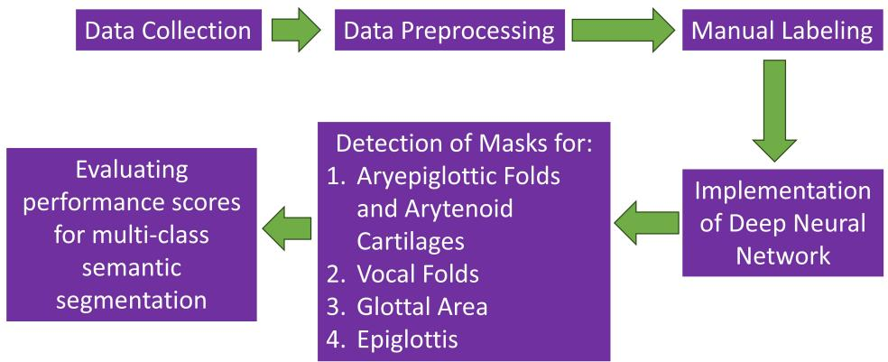  
Fig. 1: Overview of the data collection and analysis framework for multi-class semantic segmentation of laryngeal structures.

## 2.1 Data Collection and Extraction

Participant Demographics: Data were collected from fourteen adult participants aged between 22 and 77 years (see Table 1). Among them, 3 were male and the remaining participants were female (M and F in the subject IDs denote male and female). Eight participants were normophonic (subject ID starting with N), and six had voice disorders: one with paralysis (subject IDs starting with an P), three with adductor laryngeal dystonia (subject IDs starting with an S), and two with essential vocal tremor (subject IDs starting with a T).

Table 1: Participants demographics.
<table><tr><td>Subject ID</td><td>Sex</td><td>Age</td></tr><tr><td>N9M</td><td>Male</td><td>49</td></tr><tr><td>N11F</td><td>Female</td><td>52</td></tr><tr><td>N13F</td><td>Female</td><td>35</td></tr><tr><td>N23F</td><td>Female</td><td>29</td></tr><tr><td>N25F</td><td>Female</td><td>24</td></tr><tr><td>N26F</td><td>Female</td><td>22</td></tr><tr><td>N31M</td><td>Male</td><td>22</td></tr><tr><td>N32F</td><td>Female</td><td>46</td></tr><tr><td>P030F</td><td>Female</td><td>68</td></tr><tr><td>S006F</td><td>Female</td><td>67</td></tr><tr><td>S007F</td><td>Female</td><td>60</td></tr><tr><td>S008F</td><td>Female</td><td>76</td></tr><tr><td>T012F</td><td>Female</td><td>77</td></tr><tr><td>T036M</td><td>Male</td><td>65</td></tr></table>

Data Collection: HSV data were obtained from the participants during production of sustained vowel $/ \mathrm { i } / .$ , Consensus Auditory-Perceptual Evaluation of Voice (CAPE-V) sentences, and part of the Rainbow Passage. The recordings were made using Photron FASTCAM Mini AX200 monochrome high-speed camera (Photron Inc., San Diego, CA), coupled with a flexible nasolaryngoscope. The data were obtained with a spatial resolution of 256 × 224 pixels, a frame rate of 4,000 frames per second (fps), and a bit depth of 12.

Data Extraction: The HSV recordings consisted of sequences of gray-scale images, with each pixel represented using 12 bits for its intensity value. These pixels were arranged into a $2 5 6 \times 2 2 4$ two-dimensional matrix to form each grayscale frame. Each frame was then resized to 256×256 pixels and converted to an 8-bit depth. The image resolution was changed to allow the use of a deeper U-Net architecture. In U-Net, the spatial dimensions of the images decrease by a factor of 2 at each encoder layer (see Section 2.4 for more details). Therefore, it is preferable to use image dimension that can be expressed as large powers of 2, allowing the dimensions to be repeatedly divided by 2.

Although the recordings were initially captured at a 12-bit depth, the efective dynamic range was limited, as the pixel values within the frames occupied only a small portion of the available intensity range. Therefore, the higher bit depth only increased the data size without providing additional image details. Converting the images to an 8-bit depth preserved the efective dynamic range, as the distribution of the pixel values occupied almost the same relative intensity range as in the 12-bit images. This conversion also reduced the data size, enabling faster data loading and processing in software and machine-learning algorithms.

## 2.2 Data Preprocessing

Image preprocessing was applied to enhance the visualization of laryngeal structures, facilitate tissue annotation, and improve boundary definition before further analysis. The preprocessing steps included noise removal and histogram equalization.

## 2.2.1 Noise Removal

The original HSV images contained honeycomb artifact due to the nature of fiberendoscopic imaging. This noise makes image segmentation, object detection, and feature extraction more challenging. It also makes manual segmentation harder by reducing image clarity. The honeycomb noise appears as patterns of light and dark squares with intensity variations over small spatial areas, indicating that the noise is associated with high-frequency image components. To remove the noise while keeping important image details, a low-pass filter was used to remove the high frequency noise. First, the frequency content of the image was analyzed using the discrete cosine transform (DCT). For an $M \times N$ image matrix $A ( x , y )$ , the two-dimensional DCT is defined as (Watson et al., 1994; Vetterli, 1985):

$$
B ( u , v ) = \alpha ( u ) \alpha ( v ) \sum _ { x = 0 } ^ { M - 1 } \sum _ { y = 0 } ^ { N - 1 } A _ { x , y } \cos \left[ \frac { \pi ( 2 x + 1 ) u } { 2 M } \right] \cos \left[ \frac { \pi ( 2 y + 1 ) v } { 2 N } \right]\tag{1}
$$

Here,

• x and y are the pixel indices in the spatial domain.

• u and v are the frequency indices in the horizontal and vertical directions, respectively.

• u and v range from 0 to M − 1 and 0 to $N - 1$ , respectively.

$B ( u , v )$ is the DCT coeficient for the frequency component $( u , v )$

$A _ { x , y }$ is the pixel value at position $( x , y )$

$\alpha ( u )$ and α(v) are normalization factors defined as follows:

$$
\alpha ( u ) = \left\{ \begin{array} { l l } { { \sqrt { \frac { 1 } { M } } } } & { { \mathrm { i f ~ } u = 0 } } \\ { { \sqrt { \frac { 2 } { M } } } } & { { \mathrm { i f ~ } u > 0 } } \end{array} \right.\tag{2}
$$

$$
\alpha ( v ) = { \left\{ \begin{array} { l l } { { \sqrt { \frac { 1 } { N } } } } & { { \mathrm { i f ~ } } v = 0 } \\ { { \sqrt { \frac { 2 } { N } } } } & { { \mathrm { i f ~ } } v > 0 } \end{array} \right. }\tag{3}
$$

After decomposing the image into horizontal and vertical frequency components, a low-pass filter $f ( u , v )$ was applied in the frequency domain using the following equations:

$$
f ( u , v ) = \left\{ \begin{array} { l l } { 1 } & { \mathrm { i f ~ } \sqrt { u ^ { 2 } + v ^ { 2 } } \leq R } \\ { e ^ { \frac { - ( \sqrt { u ^ { 2 } + v ^ { 2 } } - R ) ^ { 2 } } { 2 \sigma ^ { 2 } } } } & { \mathrm { i f ~ } \sqrt { u ^ { 2 } + v ^ { 2 } } > R } \end{array} \right.\tag{4}
$$

$$
\overline { { B } } ( u , v ) = B ( u , v ) . * f ( u , v )\tag{5}
$$

Here,

$f ( u , v )$ is the filter applied in the frequency domain.

$\overline { { B } } ( u , v )$ is the modified frequency response after applying the filter. This is obtained by performing element-wise multiplication of the original frequency response $B ( u , v )$ with the filter $f ( u , v )$

• R is the threshold frequency. If the Euclidean distance from the origin (0, 0) is below R, the frequency response remains unchanged (multiplied by 1). If the distance is above R, the response is reduced by a factor less than 1. The reduction follows a Gaussian pattern as the distance from R increases. The parameter σ controls this reduction, where larger σ values result in less attenuation.

To reconstruct the image from the modified frequency response, the inverse 2D discrete cosine transform (IDCT) was applied. The IDCT converts the modified frequency components back into the spatial domain, producing an image with reduced noise. The formula for the inverse 2D discrete cosine transform (IDCT) is given by (Watson et al., 1994; Vetterli, 1985):

$$
\overline { { A } } ( x , y ) = \sum _ { u = 0 } ^ { M - 1 } \sum _ { v = 0 } ^ { N - 1 } \alpha ( u ) \alpha ( v ) \overline { { B } } ( u , v ) \cos \left[ \frac { \pi ( 2 x + 1 ) u } { 2 M } \right] \cos \left[ \frac { \pi ( 2 y + 1 ) v } { 2 N } \right]\tag{6}
$$

Here,

$\overline { { A } } ( x , y )$ is the reconstructed pixel value at position $( x , y )$

• α(u) and α(v) are the same normalization factors as defined earlier.

## 2.2.2 Histogram Equalization

The pixel intensities of the original HSV images were distributed within a narrow range, resulting in low contrast that could obscure tissue boundaries. To improve contrast, histogram equalization was applied to redistribute the pixel intensities over a wider range and enhance the visibility of laryngeal structures (Naghibolhosseini et al. 2018). This process uses the cumulative distribution of pixel intensities to map the original intensity values to a broader range. As a result, diferences between regions with similar intensity values become more distinguishable.

## 2.3 Labeling of Laryngeal Tissue Masks

Labeling masks for diferent laryngeal structures is required to train the deep learning network. The aryepiglottic folds and arytenoids, vocal folds, glottal area, and epiglottis were manually annotated using the “Image Labeler” app in “MATLAB R2024a” software, as illustrated in Fig. 2. A total of 1,400 images were labeled from 14 subjects, with 100 annotated images from each subject, covering diferent maneuvers and positions. The aryepiglottic folds and arytenoids were assigned a value of 1, the vocal folds a value of 2, the glottal area a value of 3, and the epiglottis a value of 4. All regions outside these structures were considered background and assigned a value of 0.

The labels were one-hot encoded, with each class represented by a separate channel. If a pixel belonged to a specific class, it took a value of 1 in that class channel and a value of 0 in the other channels. As a result, each label mask with a dimension of 256 × 256 (matching the grayscale image resolution) was converted to $5 \times 2 5 6 \times 2 5 6$ , where 5 represents the total number of classes (0-4).

## 2.4 Implementation of Deep Neural Network

## 2.4.1 Deep Neural Network Architecture

For network training, a U-Net architecture (Ronneberger et al., 2015) consisting entirely of convolutional layers, without any dense layers, was used. The network has two symmetric paths: an encoder and a decoder, as shown in Fig. 3. In the encoder path, features are extracted through successive convolutional layers, while the image resolution progressively decreases and the number of feature channels increases, allowing the network to learn increasingly complex image features. In the decoder path, this process is reversed. The encoder captures contextual information, while the decoder provides precise localization for semantic segmentation.

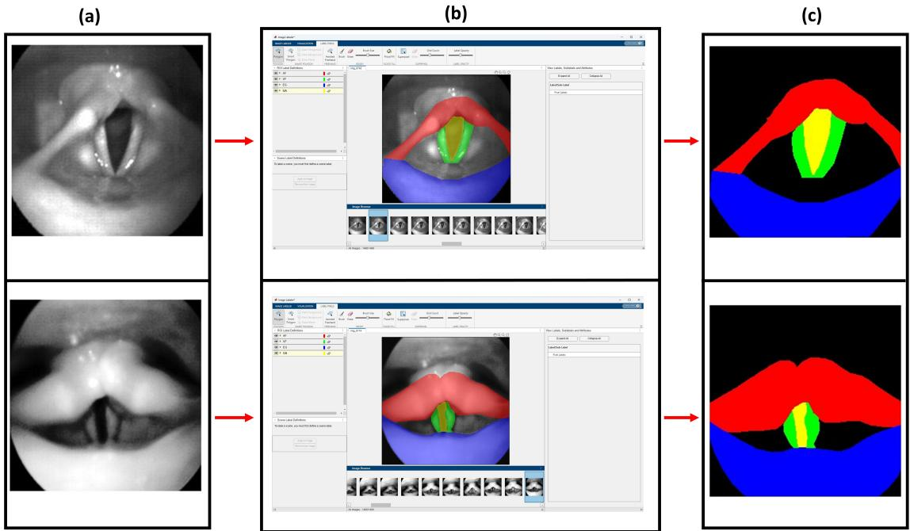  
Fig. 2: Manual annotation of diferent laryngeal structures in HSV frames. (a) Preprocessed HSV frames. (b) Annotated masks overlaid on the HSV frames. (c) Corresponding segmentation masks showing the aryepiglottic folds and arytenoids (in red), vocal folds (in green), glottal area (in yellow), epiglottis (in blue), and background (in black).

At the beginning of each encoder layer, the number of channels is doubled. Each encoder layer consists of two blocks, where each block contains a 3 × 3 convolutional layer followed by ReLU activation. Finally, after these blocks, 2 × 2 max-pooling operation is applied, reducing the spatial dimensions in both the row and column directions by a factor of 2. The bottleneck layer connects the encoder and decoder paths. In this layer, the image has the lowest spatial resolution and the highest number of channels. This layer is similar to the encoder convolutional layers, except that no maxpooling operation is applied after the two repeated convolutional layers followed by ReLU activation. At the beginning of each decoder layer, the image resolution is doubled using a 2D transposed convolution. Then, the image in the decoder layer is concatenated with the image from the encoder layer that has the same spatial resolution and the same number of channels, thereby doubling the number of channels. The number of channels is then halved, followed by two repeated convolutional layers with ReLU activation.

In this study, each input image had a single channel since grayscale images were used. Before entering the first encoder layer, the number of image channels was matched to the number of channels in the first encoder layer. At the output, the number of channels was five, corresponding to masks for five diferent zones (including the background). Therefore, at the output, the number of image channels was changed from the number of channels in the last decoder layer to five.

U-Net can have diferent numbers of encoder and decoder stages, but the number of stages in the encoder and decoder must be the same. In this study, three U-Net configurations were implemented: a 4-layer network with 64–128–256–512 channels (denoted as UNET-4), a 5-layer network with 64–128–256–512–1024 channels (denoted as UNET-5), and a 6-layer network with 64–128–256–512–1024–2048 channels (denoted as UNET-6). Batch normalization was applied after each convolution operation to enable faster and more stable training and to prevent gradient vanishing or explosion. To reduce overfitting, dropout was used and 5% of the total weights were randomly disabled during training.

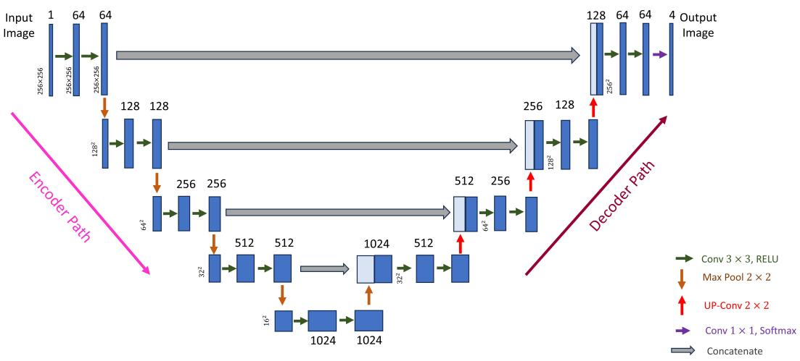  
Fig. 3: Schematic of the U-Net architecture consisting of five encoder and decoder stages, with feature-channel depths of 64, 128, 256, 512, and 1024 in both the encoder and decoder paths. Arrows represent diferent operations as shown in the legend at the lower right corner.

## 2.4.2 Dataset Splitting and Network Training

The HSV 1,400 images and their corresponding annotated labels were divided into training, validation, and test sets. After splitting the dataset, the training set contained 1,050 images (75% of the total), the test set contained 280 (20% of the total), and the validation set contained 70 images (5% of the total). The number of images in the training set was increased to provide more diverse training instances, allowing the model to perform better on diferent types of images. Hence, the training data were augmented using random rotation, translation, and scaling, resulting in 5,250 images in the training set.

The training process was divided into multiple epochs. In each epoch, all training data were used to update the neural network weights through backpropagation. Loss minimization (formula for loss function used in the model is provided in Eq. 7) was performed using the Adam optimizer, which provides fast convergence and stable training by adaptively adjusting learning rates (Barakat and Bianchi, 2021). The weights were updated using the computed gradients multiplied by the learning rate, which was initially set to 0.0001. Each epoch was further divided into several iterations so that all training data were not processed at the same time, as this would exceed memory limits. Instead, each iteration used a smaller portion of the training data. The number of images and labels used in each iteration is called the minibatch size, which was set to 8. During the iterations of each epoch, diferent subsets of the training data were used so that, after all iterations were completed, the entire training dataset had been used for training. After each epoch, model performance was evaluated on both the training and validation datasets by calculating accuracy and loss to monitor overfitting or underfitting. Once all epochs were completed, the training process ended. After completing training, model performance was evaluated on the test set.

All steps and sequences, from dataset splitting to model performance evaluation, are shown in Fig. 4.

## 2.5 Performance Assessment Metrics

The goal of training the deep neural network was to reduce the loss, or the diference between the ground-truth (manually annotated) labels and the labels predicted by the network. The mean categorical cross-entropy loss function (Ghosh and Gupta, 2023) was used, which is defined as:

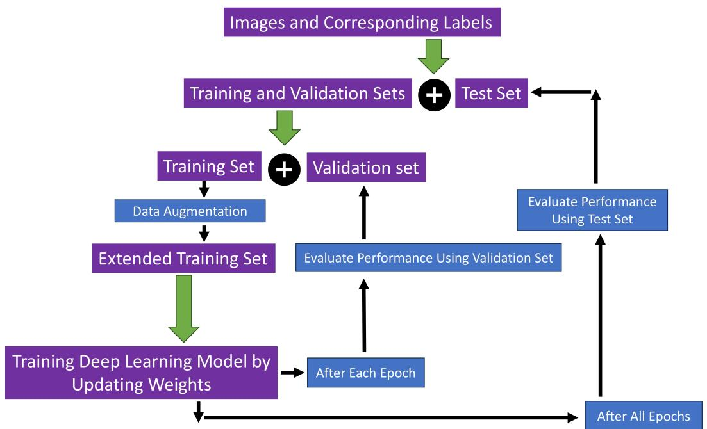  
Fig. 4: Deep learning workflow showing dataset splitting, data augmentation, model training, and performance evaluation using training, validation, and test sets.

$$
\ell = - \frac { 1 } { N } \sum _ { i = 1 } ^ { N } \sum _ { c = 1 } ^ { C } y _ { i , c } \log \left( \frac { \exp ( \hat { y } _ { i , c } ) } { \sum _ { k = 1 } ^ { C } \exp ( \hat { y } _ { i , k } ) } \right)\tag{7}
$$

Here,

• ℓ denotes the mean multi-class categorical cross-entropy loss over a mini-batch.

• N is the total number of samples (or pixels) in the mini-batch.

• C is the number of classes.

$y _ { i , c }$ is the ground-truth label for class c of the i-th sample, represented using one-hot encoding.

$\hat { y } _ { i , c }$ is the model output for class c of the i-th sample.

$\exp ( \cdot )$ denotes the exponential function.

• log(·) denotes the natural logarithm.

The predicted probabilities for diferent class labels produced by the machine learning model were obtained using the softmax function (the expression inside the parentheses in Eq. 7), which converted the model outputs into class probabilities. For the i-th sample (or pixel) and class $c ,$ the predicted probability is given by:

$$
z _ { i , c } = \frac { \exp ( \hat { y } _ { i , c } ) } { \sum _ { k = 1 } ^ { C } \exp ( \hat { y } _ { i , k } ) }\tag{8}
$$

Referring to Eq. 8, the softmax output $z _ { i , c }$ represents a probability value between 0 and 1, and the probabilities across all classes sum to one.

To obtain discrete predicted labels, the softmax probabilities were converted into binary values, similar to the ground-truth labels. The class with the maximum probability was assigned a value of 1, while all other classes were assigned a value of 0. The resulting hard predicted label is defined as:

$$
Z _ { i , c } = { \left\{ \begin{array} { l l } { 1 , } & { { \mathrm { i f ~ } } c = \arg \operatorname* { m a x } z _ { i , k } , } \\ { 0 , } & { { \mathrm { o t h e r w i s e } } . } \end{array} \right. }\tag{9}
$$

The average training accuracy per iteration is defined as:

$$
\operatorname { A c c u r a c y } = { \frac { 1 } { N } } \sum _ { i = 1 } ^ { N } \mathbf { 1 } \left( \operatorname { a r g m a x } { Z _ { i , c } } = \arg \operatorname* { m a x } _ { c } y _ { i , c } \right) = { \frac { T P + T N } { T P + T N + F P + F N } }\tag{10}
$$

When both the predicted label and the ground truth are 0, it is called a True Negative (TN). When the predicted label is 1 and the ground truth is 0, it is called a False Positive (FP). When the predicted label is 0 and the ground truth is 1, it is called a False Negative (FN). The average accuracy can also be expressed in terms of these quantities, as shown on the right-hand side of Eq. (10). When the predicted label and the ground-truth label at a given spatial pixel location match, the accuracy is increased by one; otherwise, it remains unchanged. When both the predicted label and the ground truth are 1, it is called a True Positive (TP). Using the formulas in Eqs. 7 and 10, the average loss and average accuracy were calculated for the training and validation sets, after each epoch.

To evaluate the performance of the trained model on the test set, two primary metrics were used: Intersection over Union (IoU) and the Dice score (also known as the F1 score). IoU is defined as the ratio of the area of intersection to the area of union between the predicted and ground-truth labels. It is expressed by:

$$
{ \mathrm { I o U } } = { \frac { \mathrm { I n t e r s e c t i o n } } { \mathrm { U n i o n } } } = { \frac { T P } { T P + F P + F N } }\tag{11}
$$

The Dice score measures the similarity between the predicted segmentation and the ground-truth segmentation. The Dice score is calculated using the following equation:

$$
\mathrm { D i c e } = { \frac { 2 \mathrm { I n t e r s e c t i o n } } { \mathrm { P r e d i c t i o n } + \mathrm { G r o u n d ~ T r u t h } } } = { \frac { 2 T P } { 2 T P + F P + F N } }\tag{12}
$$

In addition, a confusion matrix was computed for each model to provide a detailed assessment of the model’s classification behavior on the test images. In the confusion matrix, rows represent the actual (ground truth) classes and columns represent the predicted classes. The diagonal elements show the correctly classified samples, or true positives for each class. The of-diagonal elements represent errors. For a given class, the values in the same row but in diferent columns are False Negatives (FN), meaning samples that truly belong to that class but are predicted as another class. Similarly, the values in the same column but in diferent rows are False Positives (FP), meaning samples from other classes that are incorrectly predicted as that class. The accuracy on the test set can be calculated from the confusion matrix by dividing the sum of the diagonal elements by the total number of elements in the matrix, which is equivalent to Eq. 10. Moreover, per-class accuracy (recall) and per-class precision can be calculated from the confusion matrix as follows:

$$
{ \mathrm { R e c a l l } } _ { i } = { \frac { \mathrm { D i a g o n a l ~ e l e m e n t ~ o f ~ c l a s s ~ } i } { \mathrm { S u m ~ o f ~ r o w ~ } i } } = { \frac { T P _ { i } } { T P _ { i } + F N _ { i } } }\tag{13}
$$

$$
{ \mathrm { P r e c i s i o n } } _ { i } = { \frac { \mathrm { D i a g o n a l ~ e l e m e n t ~ o f ~ c l a s s ~ } i } { \mathrm { S u m ~ o f ~ c o l u m n ~ } i } } = { \frac { T P _ { i } } { T P _ { i } + F P _ { i } } }\tag{14}
$$

In Eqs. 13 and 14, the subscript i denotes the corresponding class (0-4).

## 2.5.1 Hardware and Software Configuration

The model was executed on a system with the configuration listed in Table 2.

Table 2: System configuration used for model training and evaluation.
<table><tr><td>Component</td><td>Specification</td></tr><tr><td>Operating System</td><td>Windows 11 Pro (64-bit)</td></tr><tr><td>Processor</td><td>AMD Ryzen 9 9900X (12-core, 24-thread)</td></tr><tr><td>RAM</td><td>64 GB</td></tr><tr><td>GPU</td><td>NVIDIA GeForce RTX 5080</td></tr><tr><td>GPU VRAM</td><td>16 GB</td></tr><tr><td>Development Environment ML Framework</td><td>Python 3.13.5 (Anaconda distribution) PyTorch 2.10.0 (CUDA 12.8)</td></tr></table>

## 3 Results

Before training or testing the deep neural networks, all the utilized frames were preprocessed using noise removal followed by histogram equalization. The efect of noise removal and the corresponding frequency-domain coeficients are shown in Fig. 5. The left block in the figure includes the data before the noise removal while the right block includes the data after the noise removal. Panels (c) and (f) in Fig. 5 show the DCT coeficients before and after the noise removal, respectively. In these panels, brighter regions indicate larger DCT coeficients, while darker regions indicate smaller coeficients. Pixel positions farther from the top-left corner represent higher-frequency components. After the noise removal, the higher-frequency components beyond a certain radius from the top-left corner are attenuated, as shown in Fig. 5f.

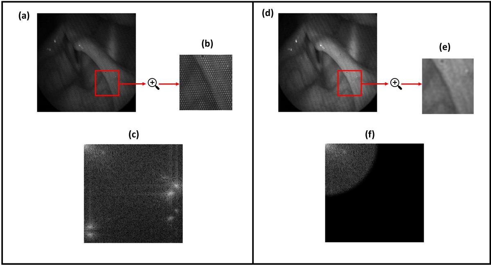  
Fig. 5: Noise removal from an HSV frame using a low-pass filter in the frequency domain based on the discrete cosine transform (DCT). The data before and after the noise removal are shown in the left and right blocks. Panel (a) and (d) show the HSV images before and after the noise removal, respectively. Panel (b) and (e) show zoomed-in regions at the same location before and after the noise removal. Panel (c) and (f) show the corresponding DCT representations.

Fig. 6 shows a comparison of an HSV frame before (left panel) and after (right panel) contrast enhancement using histogram equalization. Fig. 6b and d represent the histograms of pixel values before and after histogram equalization, respectively. The pixel values were distributed within a small range before the histogram equalization, whereas after the histogram equalization, they were distributed across the entire intensity range (see Fig. 6b and d).

Following the preprocessing steps and manual annotation, the frames in the training set were used to train three U-Net models. Each of the three models was trained for 50 epochs. After each epoch, the training and validation loss and accuracy were computed to monitor the learning progress. Although slight fluctuations are observed in the training and validation loss and accuracy, the overall trend for all three models shows a decrease in training and validation loss over the epochs, as illustrated in Fig. 7. In contrast, the general trend of training and validation accuracy for all models increases progressively with each epoch (see Fig. 8).

For all models, the lowest training loss and highest training accuracy occur at the same epoch, which is the final epoch. This behavior is expected because, during training, the model parameters are updated in each epoch based on the training data to reduce the loss and improve the match between the predicted outputs and the ground truth labels. On the other hand, the maximum validation accuracy and the minimum validation loss do not occur at the same epoch, since the models do not use the validation data to update their parameters. For UNET-4, UNET-5, and UNET-6, the minimum validation loss occurs at epochs 30, 33, and 45, respectively, while the maximum validation accuracy is achieved at epochs 20, 37, and 47. After completing all epochs for each model, the final model weights were selected based on the lowest validation loss in order to prevent overfitting. Subsequently, the trained models were applied to the test set to predict the labels and compute diferent performance metrics.

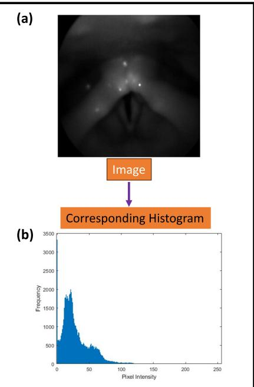

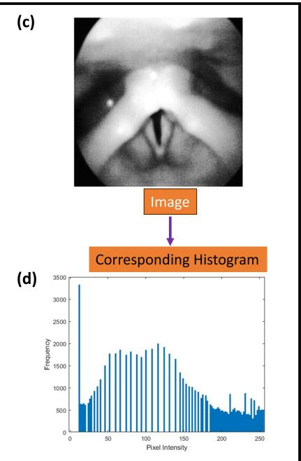

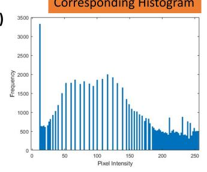  
Fig. 6: Enhancement of image contrast using histogram equalization. Top: HSV images. Bottom: corresponding histograms. Left: before histogram equalization. Right: after histogram equalization.

(a)  
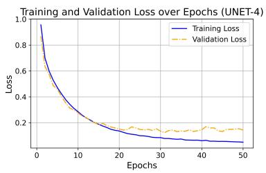

(b)  
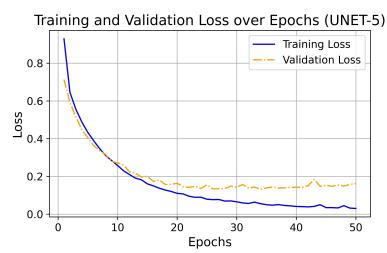

(c)  
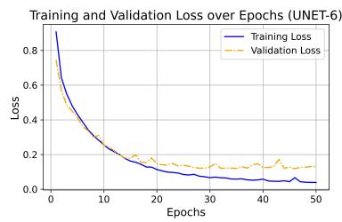  
Fig. 7: Training and validation loss over epochs for the three U-Net models during training: (a) UNET-4, (b) UNET-5, and (c) UNET-6. Blue solid lines indicate the training loss, and orange dashed lines show the validation loss.

The predicted labels are compared with the ground truth labels as shown in Fig. 9. Due to the smaller number of encoder–decoder layers, UNET-4 reduces the spatial resolution much less than UNET-5 and UNET-6. As a result, using the same $3 \times 3$ convolutional layers, it cannot capture long-range spatial relationships efectively. In contrast, UNET-6, which has more encoder–decoder layers, reduces the spatial resolution further and is therefore able to capture more distant spatial relationships. However, due to the larger number of trainable parameters in UNET-6, it has a higher tendency to overfit. For example, as shown in the fourth image from the top in the second panel of Fig. 9, UNET-6 predicts the largest epiglottis region even though the image does not contain the epiglottis. Based on visual inspection, UNET-6 shows the best overall performance, while UNET-5 performs almost similarly to UNET-6. In contrast, UNET-4 is less reliable in some cases, and the predicted label boundaries are not as smooth as those produced by UNET-5 and UNET-6. However, in most cases, all three networks reliably capture the glottal area, which is the most important region for many studies and analyses. The networks are able to accurately predict diferent degrees of glottal opening.

(a)  
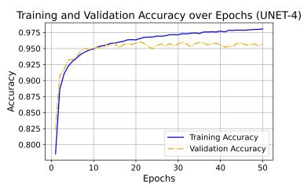

(b)  
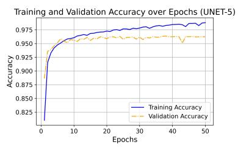

(c)  
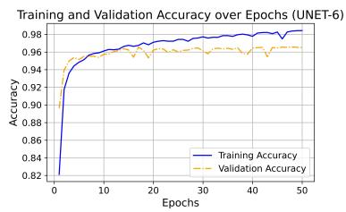  
Fig. 8: Training and validation accuracy over epochs for the three U-Net models during training: (a) UNET-4, (b) UNET-5, and (c) UNET-6. Blue solid lines: training accuracy; Orange dashed lines: validation accuracy.

Input Image  
Ground Truth  
UNET-4  
UNET-5  
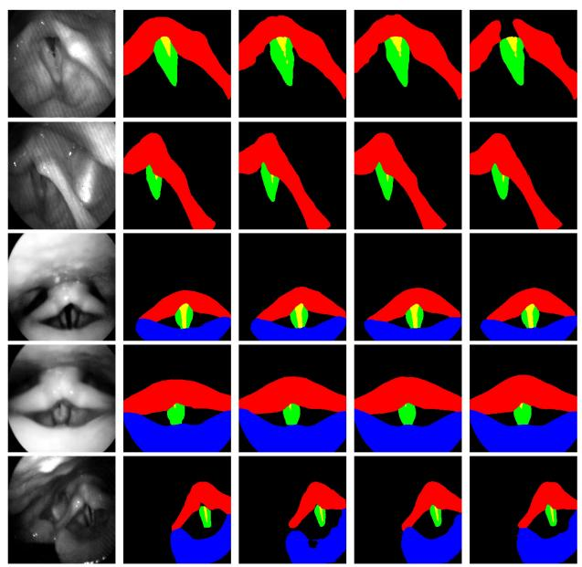  
UNET-6

Input Image  
Ground Truth  
UNET-4  
UNET-5  
UNET-6  
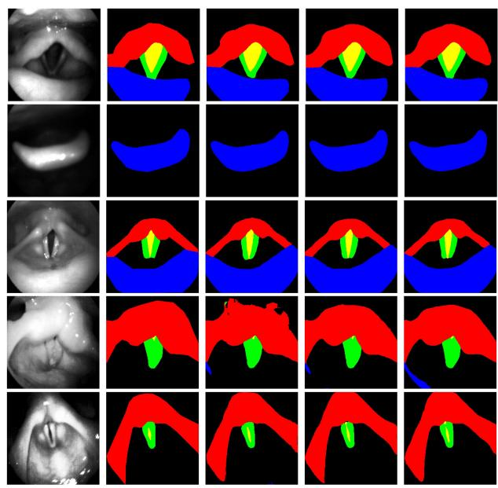  
Fig. 9: Comparison of segmentation results predicted by three U-Net models on ten representative test images, arranged in two panels. In each panel, the images are organized row-wise. From left to right: input image, ground truth labels, and predictions from UNET-4, UNET-5, and UNET-6. Black: background; red: aryepiglottic folds and arytenoids; green: vocal folds; blue: epiglottis; yellow: glottal area.

Figure 10 presents the confusion matrices of the three U-Net models evaluated on the test set. The confusion matrices of all three U-Net models show strong diagonal elements, meaning that the number of true positives is much higher than the number of false positives and false negatives. This indicates strong segmentation performance across all five classes. For both the predicted labels and the ground truth, the proportion of pixels from largest to smallest is: Background, Aryepiglottic Folds and Arytenoids, Epiglottis, Vocal Folds, and Glottal Area. The training data also followed the same order. This imbalance in pixel distribution can introduce bias toward the more frequent classes. Overfitting further amplifies this efect, leading the model to assign more pixels to the common classes and fewer pixels to the less frequent classes. The diferent performance metrics presented in the following sections can all be calculated from the confusion matrices, as described in Section 2.5.

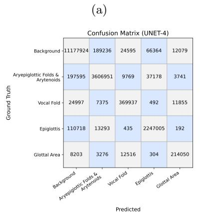

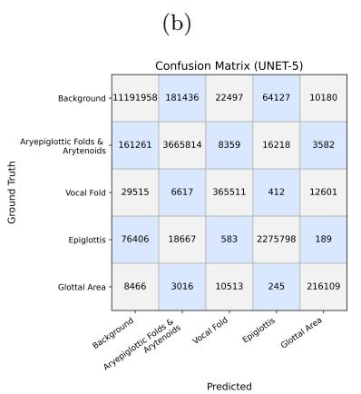

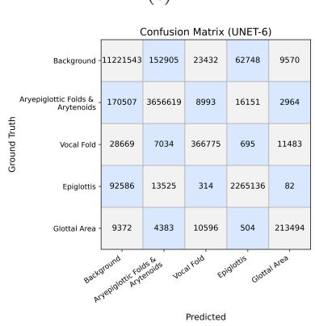  
Fig. 10: Confusion matrices on the test set for (a) UNET-4, (b) UNET-5, and (c) UNET-6. Pixel counts along the rows correspond to the ground-truth labels for each class, while pixel counts along the columns correspond to the predicted labels.

For multiclass semantic segmentation, the IoU and Dice scores are presented in Table 3 and Table 4, respectively. For the Background class, all models achieve high Dice and IoU scores, whereas the scores for the Glottal Area and Vocal Folds classes are the lowest across all models. This indicates that the Vocal Folds and Glottal Area are the most challenging regions to detect compared to the other anatomical zones. Although the performance of all models on these two classes is similar, UNET-5 identifies Glottal Area pixels slightly better, while it classifies Vocal Folds pixels slightly less accurately among the three models. For the other anatomical zones, UNET-5 and UNET-6 perform almost similarly in terms of IoU and Dice scores, with UNET-4 showing slightly lower performance compared to the others.

Table 3: IoU values for diferent U-Net models across segmentation classes.
<table><tr><td>Class</td><td>UNET-4</td><td>UNET-5</td><td>UNET-6</td></tr><tr><td>Background</td><td>0.9463</td><td>0.9528</td><td>0.9533</td></tr><tr><td>Aryepiglottic Folds and Arytenoids</td><td>0.8866</td><td>0.9018</td><td>0.9067</td></tr><tr><td>Vocal Folds</td><td>0.8008</td><td>0.8005</td><td>0.8008</td></tr><tr><td>Epiglottis</td><td>0.9075</td><td>0.9279</td><td>0.9239</td></tr><tr><td>Glottal Area</td><td>0.8040</td><td>0.8158</td><td>0.8135</td></tr></table>

Table 4: Dice scores for diferent U-Net models across segmentation classes.
<table><tr><td>Class</td><td>UNET-4</td><td>UNET-5</td><td>UNET-6</td></tr><tr><td>Background</td><td>0.9724</td><td>0.9759</td><td>0.9761</td></tr><tr><td>Aryepiglottic Folds and Arytenoids</td><td>0.9399</td><td>0.9484</td><td>0.9510</td></tr><tr><td>Vocal Folds</td><td>0.8894</td><td>0.8892</td><td>0.8894</td></tr><tr><td>Epiglottis</td><td>0.9515</td><td>0.9626</td><td>0.9604</td></tr><tr><td>Glottal Area</td><td>0.8914</td><td>0.8986</td><td>0.8971</td></tr></table>

Table 5 presents the class-wise accuracy (recall), while Table 6 shows the overall accuracy. While recall measures how well the model avoids false negatives, precision measures how well the model avoids false positives. The precision values for the diferent models are presented in Table 7. For the

Background class, the false negative rate decreases with increasing network depth, while the false positive rate decreases from UNET-4 to UNET-5 and then increases slightly in UNET-6, although it remains lower than that of UNET-4. For the Aryepiglottic Folds and Arytenoids, false negatives are lowest in UNET-5, whereas false positives continuously decrease from UNET-4 to UNET-6. UNET-5 achieves the highest precision but the lowest recall for the Vocal Folds class, suggesting reduced false positives at the expense of increased false negatives. Consequently, this may result in undersegmentation of the vocal folds by UNET-5 compared to the other models. In the Epiglottis class, recall increases in the order: UNET-4, UNET-6, and UNET-5. In contrast, precision almost increases as the network depth increases (with similar values in UNET-4 and UNET-5). UNET-5 has the highest recall for the Glottal Area, with UNET-4 showing the second highest recall. However, the precision for this class increases with the number of network layers. Consequently, when comparing the two models, UNET-5 and UNET-6, UNET-5 may slightly over-segment the Glottal Area, whereas UNET-6 may slightly under-segment it.

Referring to Table 6, the overall accuracy increases as the network depth increases. However, in multiclass segmentation, relying only on overall accuracy is not suficient. Class-wise performance measures should be carefully considered when selecting a network, depending on which classes are more important for the application. In addition, the selection of a network should also consider training and inference speed, as well as the available computational resources. As network depth increases, training and prediction become slower and require more computational resources.

Table 5: Recall values for diferent U-Net models across segmentation classes.
<table><tr><td>Class</td><td>UNET-4</td><td>UNET-5</td><td>UNET-6</td></tr><tr><td>Background</td><td>0.9745</td><td>0.9757</td><td>0.9783</td></tr><tr><td>Aryepiglottic Folds and Arytenoids</td><td>0.9356</td><td>0.9509</td><td>0.9485</td></tr><tr><td>Vocal Folds</td><td>0.8922</td><td>0.8815</td><td>0.8845</td></tr><tr><td>Epiglottis</td><td>0.9474</td><td>0.9596</td><td>0.9551</td></tr><tr><td>Glottal Area</td><td>0.8981</td><td>0.9067</td><td>0.8957</td></tr></table>

Table 6: Overall test accuracy for diferent U-Net models.
<table><tr><td>Model</td><td>Accuracy</td></tr><tr><td>UNET-4</td><td>0.9600</td></tr><tr><td>UNET-5</td><td>0.9654</td></tr><tr><td>UNET-6</td><td>0.9659</td></tr></table>

Table 7: Precision values for diferent U-Net models across segmentation classes.
<table><tr><td>Class</td><td>UNET-4</td><td>UNET-5</td><td>UNET-6</td></tr><tr><td>Background</td><td>0.9704</td><td>0.9760</td><td>0.9739</td></tr><tr><td>Aryepiglottic Folds and Aryetnoids</td><td>0.9442</td><td>0.9459</td><td>0.9536</td></tr><tr><td>Vocal Folds</td><td>0.8866</td><td>0.8970</td><td>0.8943</td></tr><tr><td>Epiglottis</td><td>0.9556</td><td>0.9656</td><td>0.9658</td></tr><tr><td>Glottal Area</td><td>0.8848</td><td>0.8906</td><td>0.8986</td></tr></table>

## 4 Discussion

The current framework provides an automated segmentation approach for key laryngeal structures in HSV frames during production of connected speech, including the aryepiglottic folds and arytenoids, vocal folds, glottal area, and epiglottis. While most existing studies focus primarily on detecting the glottal area (Rao et al., 2018; G´omez et al., 2020; Kist et al., 2020; Kist and D¨ollinger, 2020; Kist et al., 2021; Ding et al., 2022), only a limited number have addressed multiclass segmentation involving the vocal folds in addition to the glottal area (Fehling et al., 2020; Nobel et al., 2024). Cui et al. (2025) further included the epiglottis along with the vocal folds and glottal area in videolaryngoscopic recordings. Studies that simultaneously detect the aryepiglottic folds and arytenoids along with the vocal folds and glottal area are currently lacking. Furthermore, the majority of existing studies do not include training datasets obtained from connected speech. The inclusion of training labels from connected speech is essential, as it captures the complex and versatile movements of diferent laryngeal tissues, the dynamic behavior during transitional events, and disorder-related characteristics that are often revealed only in connected speech. The present approach addressed these gaps by incorporating HSV training data from connected speech in addition to sustained vowel phonation and by detecting all major laryngeal structures visible in HSV frames. Moreover, both normophonic and disordered subjects were included in the training dataset to enable the model to identify diferent tissues under varying dynamic conditions, orientations, and levels of supraglottal obstructions.

The training dataset used in this study was acquired from an HSV system equipped with a flexible nasolaryngoscope, which enabled the recording of connected speech. However, HSV recordings acquired with a flexible nasolaryngoscope exhibit inferior image quality compared to those obtained with a rigid endoscope. Diferent image processing steps, such as noise removal and histogram equalization, were applied to suppress noise and enhance the dynamic range of the images, allowing the deep learning model to more accurately separate multiple anatomical zones. Despite implementing these processing steps, the image quality remained inferior to that of recordings obtained with rigid laryngoscopes, primarily mainly due to the limited dynamic range of the recording because of the low-light conditions.

We focused on developing a robust deep neural network architecture to accurately classify diferent anatomical zones in these images. Convolutional neural networks that include dense layers may lose spatial relationships between pixels across diferent classes due to the flattening operation, which converts feature maps into one-dimensional vectors instead of preserving their two-dimensional structure. To avoid this issue, we used a fully convolutional neural network, U-Net. In U-Net, local (near-field) relationships are captured in the early layers where spatial resolution is high, while broader (far-field) contextual relationships are learned as the spatial resolution decreases in deeper layers. Moreover, the skip connections between the encoder and decoder layers enable precise localization and preserve contextual information. The model was trained using three diferent U-Net configurations with varying numbers of encoder and decoder layers to assess performance across diferent network depths. Despite the use of lower-quality images, the model’s performance on the test set either exceeded that of existing models or achieved nearly comparable results. In the studies of Fehling et al. (2020), the Dice coeficients for the glottal area and vocal folds were reported as 0.85 and 0.91, respectively. In our study, the corresponding highest Dice coeficients were 0.8986 for the glottal area using U-Net-5 and 0.8894 for the vocal folds using U-Net-4 and U-Net-6. Cui et al. (2025) reported precision values of 0.962, 0.812, and 0.937 and recall values of 0.941, 0.685, and 0.642 for the epiglottis, glottal area, and vocal folds, respectively. In the current study, the highest precision values were 0.9658 (UNET-6), 0.8986 (UNET-6), and 0.8970 (UNET-5), while the highest recall values were 0.9596 (UNET-5), 0.9067 (UNET-5), and 0.8922 (UNET-4) for the same regions, respectively.

The test set included images from diverse normophonic and disordered subjects with various tissue orientations and configurations. In addition to quantitative performance analysis, visual evaluation was performed on the test set to confirm that the results were both quantitatively reliable and qualitatively satisfactory. The selection among the three U-Net networks implemented in this study depends on the specific segmentation priorities and the trade-of between performance and computational eficiency. U-Net-6 achieves the highest overall accuracy and generally strong class-wise performance, but requires greater computational resources and longer training and inference times. U-Net-5 provides comparable performance to U-Net-6 for several anatomical zones and may ofer advantages for specific classes, while requiring less computation. U-Net-4 provides slightly lower segmentation performance overall but ofers faster training and inference. Therefore, the choice among these networks should be guided by the anatomical structures of greatest interest, the desired segmentation performance, and the available computational resources.

The developed framework has strong potential for applications in voice disorder and voice dynamics research. Various quantitative measurements can be derived from the automatically detected zones to analyze the variability of dynamic behavior across diferent laryngeal tissues. These data can subsequently be used to quantify the extent of dynamic variation in diferent voice disorders relative to normal conditions. Moreover, the model can be expanded to identify tissues responsible for supraglottal obstruction of the view of the vocal folds in laryngeal imaging.

While the network achieves accurate segmentation in most cases, incorrect and disconnected predicted regions are observed in some segmentations. These issues are planned to be addressed in future work by incorporating additional training images. In addition, more advanced deep learning architectures may further improve the network’s performance. Another issue with the network is its tendency to overpredict classes with larger proportions in the images and underpredict classes with smaller proportions. This issue may be addressed by employing strategies that better account for class imbalance and improve the representation of less prevalent classes during model training.

A major future implication of the network is the use of correctly predicted labels to expand the dataset for subsequent model development. This approach can serve as an automatic labeling tool, enabling the creation of larger annotated datasets for future studies. In addition, this network can be readily applied to the detection of laryngeal structures in other types of laryngeal imaging beyond those used during training through transfer learning by freezing the encoder weights and updating only the decoder weights. This strategy would significantly reduce training time by decreasing the number of trainable parameters while maintaining high accuracy, as the network already captured essential features of laryngeal structures.

## 5 Conclusions

HSV enables the analysis of real intra-cycle variations in the motion of diferent laryngeal tissues. Moreover, HSV recordings during running speech are particularly important for studying the nonstationary behavior of vocal fold vibrations and for characterizing disorder-specific motion patterns of multiple laryngeal tissues in disordered voices. To address the challenges of manually analyzing the dynamic behavior of these tissues across thousands of HSV frames within short voiced segments, we developed an automated framework by implementing deep learning techniques. Three U-Net–based networks with diferent layer depths were designed to detect and analyze important laryngeal landmarks, including the aryepiglottic folds and arytenoids, vocal folds, glottal area, and epiglottis. The networks were trained on a dataset of labeled images from both disordered and normophonic subjects, including recordings of sustained vowel phonation and connected speech, to enable detection of these tissues under diverse dynamic conditions and orientations. Several performance evaluation metrics were computed on unseen test images to assess the reliability and generalization of the trained models and to compare their performance. This model is capable of automatically and reliably extracting many dynamic features of laryngeal landmarks, which are important for voice studies and clinical applications.

## Acknowledgements

The authors would like to acknowledge the support from the National Institutes of Health (NIH), National Institute on Deafness and Other Communication Disorders (NIDCD) under awards R21DC020003, K01DC017751, and R01DC019402, the U.S. Army Research Ofice (ARO) Young Investigator Program (YIP) under award W911NF-19-1-0444, the National Science Foundation (NSF) under award DMS-1923201, and Michigan State University Discretionary Funding Initiative. In addition, the authors would like to thank Dr. Stephanie R.C. Zacharias and Mayo Clinic for their help and support with the data collection, and the Institute for Cyber-Enabled Research (ICER) at Michigan State University for providing computational resources and facilities. Finally, the authors would like to acknowledge Alex Stewart and Bianca Imeraj for their help with the manual annotations.

## References

Allin S, Galeotti J, Stetten G, et al (2004) Enhanced snake based segmentation of vocal folds. In: 2004 2nd IEEE International Symposium on Biomedical Imaging: Nano to Macro (IEEE Cat No. 04EX821), IEEE, pp 812–815

Andrade-Miranda G, Stylianou Y, Deliyski DD, et al (2020) Laryngeal image processing of vocal folds motion. Applied Sciences 10(5):1556

Barakat A, Bianchi P (2021) Convergence and dynamical behavior of the adam algorithm for nonconvex stochastic optimization. SIAM Journal on Optimization 31(1):244–274

Van den Berg J (1958) Myoelastic-aerodynamic theory of voice production. Journal of speech and hearing research 1(3):227–244

Bonilha HS, Deliyski DD (2008) Period and glottal width irregularities in vocally normal speakers. Journal of Voice 22(6):699–708

Bonilha HS, Deliyski DD, Whiteside JP, et al (2012) Vocal fold phase asymmetries in patients with voice disorders: a study across visualization techniques. American Journal of Speech-Language Pathology 21(1):3–15

Chen W, Woo P, Murry T (2020) Vibratory onset of adductor spasmodic dysphonia and muscle tension dysphonia: A high-speed video study. Journal of Voice 34(4):598–603

Childs LF, Mau T (2022) Combining voice rest and steroids to improve diagnostic clarity in phonotraumatic vocal fold injury. Journal of Voice 36(3):403–409

Cui H, Wu J, Li T, et al (2025) Improved yolov8-seg for laryngeal structure recognition in medical images. American journal of translational research 17(5):3293

Deliyski DD (2007) Clinical feasibility of high-speed videoendoscopy. Perspectives on Voice and Voice Disorders 17(1):12–16

Deliyski DD, Petrushev PP, Bonilha HS, et al (2008) Clinical implementation of laryngeal high-speed videoendoscopy: challenges and evolution. Folia Phoniatrica et Logopaedica 60(1):33–44

Demeyer J, Dubuisson T, Gosselin B, et al (2009) Glottis segmentation with a high-speed glottography: a fully automatic method. In: 3rd Adv. Voice Funct. Assess. Int. Workshop

Ding H, Cen Q, Si X, et al (2022) Automatic glottis segmentation for laryngeal endoscopic images based on u-net. Biomedical Signal Processing and Control 71:103116

Du G, Cao X, Liang J, et al (2020) Medical image segmentation based on u-net: A review. Journal of Imaging Science & Technology 64(2)

Fehling MK, Grosch F, Schuster ME, et al (2020) Fully automatic segmentation of glottis and vocal folds in endoscopic laryngeal high-speed videos using a deep convolutional lstm network. Plos one 15(2):e0227791

Fujiki RB, Croegaert-Koch CK, Thibeault SL (2023) Videostroboscopy versus high-speed videoendoscopy: factors influencing ratings of laryngeal oscillation. Journal of Speech, Language, and Hearing Research 66(5):1496–1510

Ghosh J, Gupta S (2023) Adam optimizer and categorical crossentropy loss function-based cnn method for diagnosing colorectal cancer. In: 2023 international conference on computational intelligence and sustainable engineering solutions (CISES), IEEE, pp 470–474

Gloger O, Lehnert B, Schrade A, et al (2014) Fully automated glottis segmentation in endoscopic videos using local color and shape features of glottal regions. IEEE Transactions on Biomedical Engineering 62(3):795–806

G´omez P, Kist AM, Schlegel P, et al (2020) Bagls, a multihospital benchmark for automatic glottis segmentation. Scientific data 7(1):186

Halberstam B (2004) Acoustic and perceptual parameters relating to connected speech are more reliable measures of hoarseness than parameters relating to sustained vowels. ORL 66(2):70–73

Ikuma T, Kunduk M, McWhorter AJ (2013) Advanced waveform decomposition for high-speed videoendoscopy analysis. Journal of Voice 27(3):369–375

Karakozoglou SZ, Henrich N, d’Alessandro C, et al (2012) Automatic glottal segmentation using localbased active contours and application to glottovibrography. Speech Communication 54(5):641–654

Kavak OT, G¨und¨uz S¸, Vural C, et al (2024) Artificial intelligence based diagnosis of sulcus: assesment¨ of videostroboscopy via deep learning. European Archives of Oto-Rhino-Laryngology 281(11):6083– 6091

Kendall KA (2009) High-speed laryngeal imaging compared with videostroboscopy in healthy subjects. Archives of Otolaryngology–Head & Neck Surgery 135(3):274–281

Kist AM, D¨ollinger M (2020) Eficient biomedical image segmentation on edgetpus at point of care. IEEE Access 8:139356–139366

Kist AM, Zilker J, G´omez P, et al (2020) Rethinking glottal midline detection. Scientific reports 10(1):20723

Kist AM, G´omez P, Dubrovskiy D, et al (2021) A deep learning enhanced novel software tool for laryngeal dynamics analysis. Journal of Speech, Language, and Hearing Research 64(6):1889–1903

Kopczy´nski B, Strumi l lo P, Niebudek-Bogusz E (2015) Computer based quantification of normal and pathological vocal folds phonatory processes from laryngovideostroboscopy. In: 2015 Federated Conference on Computer Science and Information Systems (FedCSIS), IEEE, pp 269–274

Larsson H, Herteg˚ard S, Lindestad P˚A, et al (2000) Vocal fold vibrations: High-speed imaging, kymography, and acoustic analysis: A preliminary report. The Laryngoscope 110(12):2117–2122

Lohscheller J, Toy H, Rosanowski F, et al (2007) Clinically evaluated procedure for the reconstruction of vocal fold vibrations from endoscopic digital high-speed videos. Medical image analysis 11(4):400–413

Lowell SY (2012) The acoustic assessment of voice in continuous speech. Perspectives on Voice and Voice Disorders 22(2):57–63

Manfredi C, Bocchi L, Bianchi S, et al (2006) Objective vocal fold vibration assessment from videokymographic images. Biomedical signal processing and control 1(2):129–136

Marendic B, Galatsanos N, Bless D (2001) New active contour algorithm for tracking vibrating vocal folds. In: Proceedings 2001 International Conference on Image Processing (Cat. No. 01CH37205), IEEE, pp 397–400

Maryn Y, Corthals P, Van Cauwenberge P, et al (2010) Toward improved ecological validity in the acoustic measurement of overall voice quality: combining continuous speech and sustained vowels. Journal of voice 24(5):540–555

Mehta DD, Hillman RE (2012) Current role of stroboscopy in laryngeal imaging. Current opinion in otolaryngology & head and neck surgery 20(6):429–436

Mehta DD, Deliyski DD, Hillman RE (2010a) Commentary on why laryngeal stroboscopy really works: Clarifying misconceptions surrounding talbot’s law and the persistence of vision. Journal of Speech, Language, and Hearing Research 53(5):1263–1267

Mehta DD, Deliyski DD, Zeitels SM, et al (2010b) Voice production mechanisms following phonosurgical treatment of early glottic cancer. Annals of Otology, Rhinology & Laryngology 119(1):1–9

Mehta DD, Deliyski DD, Quatieri TF, et al (2011) Automated measurement of vocal fold vibratory asymmetry from high-speed videoendoscopy recordings. Journal of Speech, Language, and Hearing Research 54(1):47–54

Morrison MD, Rammage LA (1993) Muscle misuse voice disorders: description and classification. Acta oto-laryngologica 113(3):428–434

Moukalled H, Wang S, Deliyski S, et al (2009) Segmentation of laryngeal high-speed videoendoscopy in temporal domain using paired active contours. In: Models and analysis of vocal emissions for biomedical applications: 6th International workshop: December 14-16, 2009, Firenze, Italy.-(Proceedings e report; 54), Firenze University Press, pp 1000–1004

Naghibolhosseini M, Deliyski DD, Zacharias SR, et al (2018) Temporal segmentation for laryngeal high-speed videoendoscopy in connected speech. Journal of Voice 32(2):256–e1

Naghibolhosseini M, Henry T, Yousef AM, et al (2023a) Applications of machine learning for vocal fold motion analysis using laryngeal high-speed videoendoscopy. In: Proceedings of the 10th Convention of the European Acoustics Association, Politecnico di Torino, Turin, Italy

Naghibolhosseini M, Yousef AM, Zayernouri M, et al (2023b) Deep learning for high-speed laryngeal imaging analysis. In: 2023 International Conference on Computational Intelligence and Knowledge Economy (ICCIKE), IEEE, pp 113–118

Nobel SN, Swapno SMR, Islam MR, et al (2024) A machine learning approach for vocal fold segmentation and disorder classification based on ensemble method. Scientific reports 14(1):14435

Omori K, Slavit DH, Kacker A, et al (1996) Quantitative videostroboscopic measurement of glottal gap and vocal function: an analysis of thyroplasty type i. Annals of Otology, Rhinology & Laryngology 105(4):280–285

Osma-Ruiz V, Godino-Llorente JI, S´aenz-Lech´on N, et al (2008) Segmentation of the glottal space from laryngeal images using the watershed transform. Computerized Medical Imaging and Graphics 32(3):193–201

Patel R, Dailey S, Bless D (2008) Comparison of high-speed digital imaging with stroboscopy for laryngeal imaging of glottal disorders. Annals of Otology, Rhinology & Laryngology 117(6):413–424

Patel RR, Liu L, Galatsanos N, et al (2011) Diferential vibratory characteristics of adductor spasmodic dysphonia and muscle tension dysphonia on high-speed digital imaging. Annals of Otology, Rhinology & Laryngology 120(1):21–32

Pease BC, Hoasjoe DK, Stucker FJ (1997) Videostroboscopic findings in laryngeal tuberculosis. Otolaryngology—Head and Neck Surgery 117(6):S230–S234

Perez KS, Ramig LO, Smith ME, et al (1996) The parkinson larynx: tremor and videostroboscopic findings. Journal of Voice 10(4):354–361

Popolo PS (2018) Investigation of flexible high-speed video nasolaryngoscopy. Journal of Voice 32(5):529–537

Rao MA, Krishnamurthy R, Gopikishore P, et al (2018) Automatic glottis localization and segmentation in stroboscopic videos using deep neural network. In: Interspeech, pp 3007–3011

Rihkanen H, Reijonen P, Lehikoinen-S¨oderlund S, et al (2004) Videostroboscopic assessment of unilateral vocal fold paralysis after augmentation with autologous fascia. European Archives of Oto-Rhino-Laryngology and Head & Neck 261(4):177–183

Ronneberger O, Fischer P, Brox T (2015) U-net: Convolutional networks for biomedical image segmentation. In: International Conference on Medical image computing and computer-assisted intervention, Springer, pp 234–241

Rosen CA, Lombard LE, Murry T (2000) Acoustic, aerodynamic, and videostroboscopic features of bilateral vocal fold lesions. Annals of Otology, Rhinology & Laryngology 109(9):823–828

Roy N, Gouse M, Mauszycki SC, et al (2005) Task specificity in adductor spasmodic dysphonia versus muscle tension dysphonia. The Laryngoscope 115(2):311–316

Santa Maria C, Shuman EA, Van Der Woerd B, et al (2024) Prospective outcomes after serial plateletrich plasma (prp) injection in vocal fold scar and sulcus. The Laryngoscope 134(12):5021–5027

Schenk F, Aichinger P, Roesner I, et al (2015) Automatic high-speed video glottis segmentation using salient regions and 3d geodesic active contours. Ann BMVA 2015:1–15

Sch¨utzenberger A, Kunduk M, D¨ollinger M, et al (2016) Laryngeal high-speed videoendoscopy: Sensitivity of objective parameters towards recording frame rate. BioMed Research International 2016(1):4575437

Sercarz JA, Berke GS, Gerratt BR, et al (1992) Videostroboscopy of human vocal fold paralysis. Annals of Otology, Rhinology & Laryngology 101(7):567–577

Shi T, Kim HJ, Murry T, et al (2015) Tracing vocal fold vibrations using level set segmentation method. International Journal for Numerical Methods in Biomedical Engineering 31(6):e02715

Tsuji DH, Hachiya A, Dajer ME, et al (2014) Improvement of vocal pathologies diagnosis using high-speed videolaryngoscopy. International Archives of Otorhinolaryngology 18(03):294–302

Verikas A, Uloza V, Bacauskiene M, et al (2009) Advances in laryngeal imaging. European Archives of Oto-rhino-laryngology 266(10):1509–1520

Vetterli M (1985) Fast 2-d discrete cosine transform. In: ICASSP’85. IEEE International Conference on Acoustics, Speech, and Signal Processing, IEEE, pp 1538–1541

Watson AB, et al (1994) Image compression using the discrete cosine transform. Mathematica journal 4(1):81

Wittenberg T, Moser M, Tigges M, et al (1995) Recording, processing, and analysis of digital highspeed sequences in glottography. Machine vision and applications 8(6):399–404

Woo P (2016) 4k video-laryngoscopy and video-stroboscopy: preliminary findings. Annals of Otology, Rhinology & Laryngology 125(1):77–81

Yan Y, Ahmad K, Kunduk M, et al (2005) Analysis of vocal-fold vibrations from high-speed laryngeal images using a hilbert transform-based methodology. Journal of voice 19(2):161–175

Yan Y, Bless D, Chen X (2006a) Biomedical image analysis in high-speed laryngeal imaging of voice production. In: 2005 IEEE Engineering in Medicine and Biology 27th Annual Conference, IEEE, pp 7684–7687

Yan Y, Chen X, Bless D (2006b) Automatic tracing of vocal-fold motion from high-speed digital images. IEEE Transactions on Biomedical Engineering 53(7):1394–1400

Yan Y, Damrose E, Bless D (2007) Functional analysis of voice using simultaneous high-speed imaging and acoustic recordings. Journal of Voice 21(5):604–616

Yiu E, Worrall L, Longland J, et al (2000) Analysing vocal quality of connected speech using kay’s computerized speech lab: a preliminary finding. Clinical Linguistics & Phonetics 14(4):295–305

Yousef AM, Deliyski DD, Zacharias S, et al (2021a) Automated detection and segmentation of glottal area using deep-learning neural networks in high-speed videoendoscopy during connected speech. In: 14th International Conference Advances In Quantitative Laryngology, Voice And Speech Research (AQL), pp 29–30

Yousef AM, Deliyski DD, Zacharias SR, et al (2021b) A hybrid machine-learning-based method for analytic representation of the vocal fold edges during connected speech. Applied Sciences 11(3):1179

Yousef AM, Deliyski DD, Zacharias SR, et al (2022) A deep learning approach for quantifying vocal fold dynamics during connected speech using laryngeal high-speed videoendoscopy. Journal of Speech, Language, and Hearing Research 65(6):2098–2113

Yousef AM, Deliyski DD, Zacharias SR, et al (2023a) Spatial segmentation for laryngeal high-speed videoendoscopy in connected speech. Journal of Voice 37(1):26–36

Yousef AM, Deliyski DD, Zayernouri M, et al (2023b) Deep learning-based analysis of glottal attack and ofset times in adductor laryngeal dystonia. Journal of Voice

Yousef AM, Deliyski DD, Zacharias SR, et al (2025) Deep-learning-based representation of vocal fold dynamics in adductor spasmodic dysphonia during connected speech in high-speed videoendoscopy. Journal of Voice 39(2):570–e1

Zhang Y, Bieging E, Tsui H, et al (2010) Eficient and efective extraction of vocal fold vibratory patterns from high-speed digital imaging. Journal of Voice 24(1):21–29