# Less Is More in the Long Tail: Stage-Adaptive Sample Selection for Annotation-Efficient Dense Prediction

Xiaofei Du, Lei Zhang, Shuyu Yan, Manning Wang, and Zhijian Song

Abstract—Deep learning performance generally improves with increasing training data, yet this scaling is fundamentally constrained by annotation cost in large-scale dense prediction tasks with long-tailed category distributions, where pixel- or voxel-level annotation is prohibitively expensive. We propose SASS (Stage-Adaptive Sample Selection), a stage-adaptive data-selection framework fo pool-based active learning in long-tailed dense prediction. SASS combines three components: label-free self-supervised gradient scoring, prior-guided category rebalancing with validation-driven feedback, and stage-adaptive acquisition aligned with model training dynamics. This design avoids candidate ground-truth masks during gradient scoring while making acquisition responsive to long-tail imbalance and evolving representations. We evaluate SASS on a multimodal 3D medical segmentation testbed comprising over 100,000 samples spanning 108 anatomical structures. SASS recovers 98.3% of full-dataset performance with a 40% training-pool annotation budget, outperforming BADGE by 5.1 percentage points. Moreover, SASS exhibits a statistically supported “less-is-more” pattern, surpassing full-dataset training at the Hard-group level and, at the structure level, for the pancreas and gallbladder. More broadly, SASS shows that annotation-efficient learning depends not only on which samples are selected, but also on how the annotation budget is distributed across categories and when model-derived scores begin to guide selection.

Index Terms—Active learning, annotation-efficient learning, data selection, dense prediction, long-tailed learning, medical image segmentation.

## 1 INTRODUCTION

Deep learning has become a fundamentally data-driven learning paradigm, particularly in supervised settings where model performance scales strongly with the volume and quality of labeled data. While self-supervised pretraining reduces dependence on labels for representation learning, high performance on downstream tasks—especially dense prediction at the pixel or voxel level—still relies critically on extensive supervised annotation [1]–[3]. As training corpora grow to hundreds of thousands of samples spanning fine-grained categories, annotation increasingly dominates the resource budget, shifting the central question from how much data to collect to which data to annotate.

Data selection broadly concerns choosing a subset of available data to improve task performance under resource constraints [4], [5]. When annotation is the constrained resource, this objective is commonly formulated as pool-based active learning: a model repeatedly selects examples for labeling from an available set of unlabeled candidates [6], [7]. Acquisition functions—rules that score or prioritize candidates for annotation—guide these decisions under a fixed labeling budget [8]. The objective is to approach the performance of full-dataset training while annotating only a small fraction of the candidate pool.

Existing approaches address sample selection from complementary perspectives—including gradient- and influence-based valuation, uncertainty estimation, and diversity-driven acquisition. Gradient-, influence-, and datavaluation methods estimate sample value through parameter gradients, validation effects, or marginal contribution to model performance [9]–[13], highlighting their reliance on supervised candidate or validation signals. Uncertaintyand information-based acquisition functions score samples by predictive entropy, confidence, or expected information gain [6], [14], [15], while diversity- and coverage-based methods select representative samples in feature space [4], [16]; both lines often operate without explicit category-level rebalancing in long-tailed settings. Moreover, representative acquisition functions are typically defined as fixed scoring criteria [6], [8], [16], despite evidence that example difficulty, gradients, and learned representations evolve substantially during training [9], [17], [18]. Despite decades of research on active learning and data selection, three coupled challenges remain insufficiently addressed. These challenges become increasingly severe as supervised learning scales to large, long-tailed datasets—in which a few categories have many examples while many others have relatively few—with expensive annotations.

Collectively, these assumptions give rise to three fundamental limitations. First, supervision dependency: a broad class of gradient- and influence-based valuation methods requires a supervised loss gradient for each candidate, whether that gradient is scored directly or used to estimate the candidate’s effect on loss over a labeled validation set. Computing such a gradient requires the candidate’s groundtruth mask, which is unavailable before acquisition. Existing approaches partially bypass this requirement using pseudolabels or expected losses [8], [19], but the resulting gradient estimates remain dependent on the current model’s predictions. Second, category-imbalance bias: under long-tailed data distributions, category-agnostic acquisition functions, which do not explicitly balance selections across categories, can disproportionately allocate annotation budget to abundant categories because they dominate gradient and uncertainty statistics [6], [8], [16], systematically under-selecting rare or difficult categories where additional supervision may be most beneficial. For example, the pancreas illustrates this problem: it occupies only a small fraction of an abdominal volume, has low-contrast boundaries, and may nevertheless be the structure of primary clinical interest. Third, training-dynamics mismatch: most acquisition methods apply a fixed selection rule throughout training, implicitly assuming that a single notion of sample informativeness remains appropriate as optimization progresses. This is problematic for deep networks, whose representations and gradients evolve substantially; consequently, a criterion that is informative at one stage may not remain equally informative at another [17], [20]. The combination of long-tailed data and costly annotation is not specific to medical imaging: it arises broadly in large-scale supervised learning [4], [6], [16], [21]–[25].

Among such large-scale, annotation-constrained learning problems, volumetric medical image segmentation provides a particularly challenging setting in which these three limitations arise simultaneously. Dense annotation of a single 3D volume can require hours of specialist effort [26], [27], making exhaustive labeling impractical at scale. Meanwhile, anatomical structures vary markedly in size, visual complexity, segmentation difficulty, and sample availability [28], creating strongly heterogeneous and long-tailed supervision. These challenges are further compounded for rare and difficult structures by low tissue contrast, irregular boundaries, and limited spatial context [29], making segmentation errors both more likely and clinically more consequential. Volumetric medical image segmentation therefore provides a representative and demanding setting for studying principled data selection under severe annotation constraints.

To address these challenges, we propose SASS (Stage-Adaptive Sample Selection), a stage-adaptive dataselection framework for pool-based active learning in longtailed dense prediction. Rather than treating acquisition only as sample ranking, SASS jointly controls how the annotation budget is distributed across categories and when model-derived gradients begin to rank individual candidates. It addresses the three limitations jointly through labelfree self-supervised gradient valuation (scoring candidates without their ground-truth masks), long-tail-aware category rebalancing, and validation-gated activation of gradient scoring, implemented through the following three principles. First, label-free self-supervised gradient scoring measures candidate informativeness using a self-supervised teacher– student gradient computed between the current model, used as a frozen teacher, and a previous checkpoint, used as the student. The resulting gradient norm quantifies how strongly each unlabeled candidate induces representation change across training states. Second, prior-guided rebalancing incorporates category-level priors—instantiated in our medical setting as scale-aware and coverage-balancing priors—and further refines them through validation-driven feedback that converts per-category performance gaps into acquisition priorities. Third, stage-adaptive acquisition adapts the selection criterion to the evolving reliability of modelderived gradient signals. During the initial stage, categorylevel priors guide selection and candidate gradients are not computed. Once the predefined validation criterion is met, gradient scoring is activated with a progressively increasing weight, while the prior terms retain nonzero weights to preserve category coverage.

## 1.1 Contributions

Our main contributions are as follows:

1) We introduce a self-supervised acquisition scorer that ranks unlabeled candidates via teacher-student DINO gradient norms, eliminating the need for ground-truth masks during candidate scoring and thereby addressing the supervision dependency of conventional gradient- and influence-based acquisition.

2) We design a prior-guided, validation-driven rebalancing mechanism that combines scale-aware and coverage-balance priors with category-level validation feedback to prioritize underperforming longtail categories. A group-budget constraint further prevents redundant category groups from dominating the acquisition budget. This reallocation yields a “less-is-more” pattern: with only 40% of the annotation budget, SASS matches or exceeds fulldataset training on several challenging structures and achieves a statistically supported gain for the Hard group (Section 4.2.1).

3) We propose a stage-adaptive acquisition strategy that addresses the training-dynamics mismatch of fixed selection rules by adapting acquisition to the evolving reliability of selection signals during optimization. SASS emphasizes prior-guided exploration in early training, when model-derived evidence is less reliable, and transitions to gradientdriven refinement as learned representations mature and self-supervised influence estimates become more informative.

4) We provide large-scale empirical evidence for annotation-efficient sample selection in 3D dense prediction. We evaluate SASS on a multimodal 3D corpus of over 100,000 samples spanning 108 anatomical structures. The underlying segmentation model is trained entirely from random initialization, without pretrained weights or external checkpoints. With a 40% training-pool annotation budget, SASS recovers 98.3% of full-dataset performance, outperforms BADGE by 5.1 pp, and demonstrates a statistically supported “less-is-more” effect on hard categories.

## 2 RELATED WORK

## 2.1 Active Learning and Data Selection

Data selection has become a central challenge in largescale deep learning because training samples contribute unequally to model learning, motivating methods that prioritize informative subsets [5], [13], [25], [30], [31]. Active learning focuses on the annotation-acquisition setting by selecting informative samples from an unlabeled pool under a fixed labeling budget [6]. Classical acquisition functions can be broadly grouped into uncertainty-, diversity-, and gradient-based strategies, each exposing limitations in longtailed dense-prediction regimes.

Uncertainty-based methods query samples with high predictive entropy, small prediction margins, or large epistemic uncertainty [6], [14]. Scoring candidates independently can yield redundant batches; BatchBALD addresses this problem by considering their joint information about model parameters [15]. Learning Loss trains an auxiliary module on labeled examples to predict the losses of unlabeled candidates [32]. These scores prioritize predictive difficulty or information gain but do not explicitly enforce balanced category coverage.

Diversity-based methods seek geometric coverage of the data distribution. Coreset selection formulates acquisition as a k-center problem [16], and VAAL uses an adversarially trained latent space to identify underrepresented unlabeled samples [33]. These methods reduce redundancy by improving coverage of the candidate distribution. More recently, Sel4FT performs one-shot annotation selection for pretrained models by jointly preserving distributional fidelity to the unlabeled pool and sample diversity [34]. However, geometric coverage or distribution preservation alone does not guarantee balanced annotation coverage when the candidate pool is long-tailed.

Hybrid and gradient-based methods combine informativeness and diversity or estimate sample value from model gradients. BADGE forms gradient embeddings using predicted labels and applies k-means++ batch selection [8]. For existing training sets, gradient-preserving coreset methods approximate full-data optimization with selected subsets [5], [13]. LESS uses gradient similarity to select instructiontuning examples relevant to a target task [35]. Diff-In further improves influence estimation by accumulating influence differences across training steps [36]. These methods provide strong model-dependent signals. For valuation scores defined by supervised candidate losses, application to an unlabeled pool requires predicted targets or another explicitly specified surrogate objective. Trajectory-aware valuation improves how such scores are estimated over training, but does not by itself determine whether a model-derived signal should enter an acquisition rule that also accounts for longtail category coverage.

RALF learns a time-varying exploration–exploitation trade-off from classifier feedback, with its acquisition criteria remaining available throughout the process [37].

Beyond the design of acquisition criteria, two additional lines of work are particularly relevant to our setting: longtailed rebalancing and data-efficient dense prediction.

Long-tailed learning and rebalancing. Long-tailed learning typically intervenes through training objectives, classifiers, or pseudo-labels. Representative directions include re-weighting [21], margin-based losses [23], and decoupled representation and classifier learning [24]. Recent studies offer a unified view of loss-oriented methods [38], address unknown test label distributions [39], and handle mismatched labeled and unlabeled distributions [40]. These approaches improve learning under a given data distribution, but do not determine which samples should be annotated to reshape the labeled-pool composition under a limited budget. Imbalance-aware acquisition has also been explored through acquisition-time balancing for imbalanced classification and class-balanced region selection for 2D semantic segmentation [41], [42]. For example, Cai et al. combine class-balanced superpixel selection with click-based annotation-cost measurement [42].

Active learning and data selection for dense prediction. Largescale dense prediction further amplifies the limitations of existing acquisition functions. In volumetric medical segmentation, annotations are expensive, category distributions are long-tailed, and the same acquisition rule may behave differently as representations evolve during training [26], [27]. Outside medical imaging, recent work has addressed data efficiency in dense prediction through point-efficient active learning for salient object detection [43], replaysample selection for continual semantic segmentation [44], and multi-modal semi-supervised learning for 3D scene understanding [45]. Related active-learning methods include warm-start selection with proxy labels [46], feature-mixing strategies for diverse batch construction [47], and graphbased sequential selection [48]. However, many are developed for 2D or task-specific settings and do not directly address label-free self-supervised gradient scoring, categorylevel long-tail rebalancing, and stage-dependent acquisition in large-scale 3D dense prediction.

## 2.2 Self-Supervised Acquisition Signals and Training Dynamics

Self-supervised learning and teacher–student models have been combined with active learning to reduce labeling effort, for example through self-training on unlabeled data or knowledge-distillation-based uncertainty estimation [49], [50]. In the classification experiments of Bengar et al., active querying offered little additional benefit after selfsupervised pretraining at low labeling budgets, whereas the combination was beneficial at higher budgets [49]. Peng et al. estimate image uncertainty from knowledge learned by a student model and combine it with a diversity criterion for lane detection [50].

Beyond how acquisition signals are constructed, their utility may also change as training progresses: a sample that is informative at one stage may become less useful later, and vice versa. Gradient statistics can support one-shot pruning of already annotated data when label-dependent scores are averaged over multiple initializations [30]; however, these conditions do not transfer directly to an unlabeled candidate pool, and a score computed once does not account for subsequent changes in the model or selected pool. Data selection is therefore closely related to curriculum design: effective learning depends not only on which samples are selected, but also on when and how they are presented during training. Curriculum learning organizes training from easier to harder examples [51], and self-paced learning formalizes this idea as joint optimization over model parameters and sample weights [52]. A central challenge is defining difficulty, because static measures such as loss or entropy may not capture how sample informativeness changes during training. Forgetting events—transitions from correct to incorrect predictions—provide a dynamic measure of example difficulty and have been used to distinguish consistently remembered, frequently forgotten, and persistently difficult samples [17].

For dense prediction, this stage dependence also affects how curriculum and forgetting signals should be defined. A single volume may contain both easy and hard categories, while rare structures provide sparse prediction histories. Pool expansion further changes batch composition, coupling curriculum design to sample selection. Curriculum strategies have used medically informed difficulty measures for fracture classification [53], while class-rebalancing selftraining preferentially adds minority-class pseudo-labels during training [54]. However, their use as a stabilization mechanism coupled with active sample selection in largescale 3D multi-organ training remains less studied.

## 2.3 Large-Scale Medical Segmentation and Annotation Cost

Medical image segmentation has progressed from taskspecific systems such as nnU-Net [29] and transformerbased volumetric architectures [55], [56] to larger multiorgan and promptable models. AbdomenCT-1K [57], TotalSegmentator [28], AMOS [58], and AbdomenAtlas [59] expanded multi-organ coverage, while SAM [1], MedSAM [2], SegVol [60], SAM-Med3D [3], SAM-Med3D-MoE [61], and CAT [62] advanced promptable or foundation-style segmentation. These models increase the demand for heterogeneous, densely annotated data across many anatomical structures and modalities. The resulting annotation bottleneck makes data selection a central scaling problem rather than a peripheral preprocessing step.

These advances broaden segmentation capability, but do not by themselves determine which additional volumes should be annotated under a limited labeling budget.

## 3 METHOD

## 3.1 Overview

Given a candidate pool of image-category pairs $\{ ( x _ { i } , c _ { i } ) \} _ { i = \cdot } ^ { N }$ whose dense masks are initially unobserved, our goal is to select a subset $s$ of size $\mathbf { \partial } \mathbf { \vec { \mathbf { \sigma } } } \mathbf { \mathcal { S } } \mathbf { \vec { \mathbf { \sigma } } } = \mathbf { \nabla } \rho N \mathbf { \nabla }$ for annotation so that training on $s$ approaches full-dataset performance with substantially lower labeling cost. SASS addresses the changing relative utility of acquisition signals over optimization by assigning greater weight to category-level priors early in training and progressively increasing the contribution of self-supervised gradients at later stages.

As illustrated in Fig. 1, each selection round evaluates candidates using three complementary signals. The Self-Supervised Acquisition Scorer computes a label-free gradient score $G _ { i } ( t )$ that measures the strength of the selfsupervised update induced by candidate $x _ { i }$ . The Prior-Guided Scorer $\mathsf { \bar { \mathcal P } }$ produces two category-level priors: a Scale-Aware Prior $O _ { i } ,$ instantiated by organ-size statistics in our medical testbed, and a Coverage-Balance Prior $D _ { i } ( t )$ , which penalizes categories already over-represented in the selected pool. These prior signals are further enhanced by Validation-Driven Feedback $\phi ( c , t )$ , which increases acquisition priority for categories whose validation performance lags behind the global median. The Stage-Adaptive Acquisition Score normalizes and fuses the gradient, scale, and coverage signals into a composite score $S _ { i } ( t )$ using time-varying weights that shift from prior-dominant exploration in early training to gradient-dominant refinement in later stages.

SASS further includes two mechanisms that stabilize selection and training. A Group-Budget Constraint limits redundant parent groups such as ribs and vertebrae in our medical instantiation, and a Forgetting-Guided Curriculum reorders selected samples from easy to hard based on predictionstability history. Finally, an adaptive pool-growth schedule expands the annotated set through fixed-size query batches. A performance gate may defer scheduled expansions during validation decline, producing variable consolidation intervals, while validation-driven reselection refreshes acquisition priorities as the model matures.

## 3.2 Self-Supervised Gradient-Based Sample Scoring

The Self-Supervised Acquisition Scorer takes an unlabeled candidate pool U and two model snapshots—the current model $\boldsymbol { \theta } ^ { ( t ) }$ and a previous checkpoint $\dot { \theta ( \mathrm { \Delta ~ } _ { \mathrm { p r e v } } ) }$ —and outputs a scalar score $G _ { i } ( \bar { t } )$ for each candidate $x _ { i } \in \mathcal { U }$ . Conventional supervised influence estimators often rely on supervised candidate gradients, which require candidate masks before annotation. We instead compute gradients of a selfsupervised DINO objective [63], allowing candidate scoring without ground-truth masks.

The gradient computation pipeline, illustrated in Fig. 1(b), consists of three sequential stages: (1) a teacherstudent architecture that computes the self-supervised DINO loss for each candidate (Section 3.2.1), (2) random projection that compresses the resulting high-dimensional gradients to a tractable dimensionality (Section 3.2.2), and (3) gradient norm computation that converts the compressed gradient vector into a scalar gradient score (Section 3.2.3). We describe each stage below.

## 3.2.1 Teacher-Student Knowledge Evolution

At each selection round (epoch t), we construct two model snapshots to obtain a candidate-dependent self-supervised update signal across training states. The teacher $\begin{array} { r l } { f _ { T } } & { { } = } \end{array}$ freeze $\big ( \theta ^ { ( t ) } \big )$ is a frozen copy of the current model, whereas the student $\begin{array} { r } { f _ { S } { \it \Delta \phi } = \frac { \partial \left( t _ { \mathrm { p r e v } } \right) } { \partial \left( t _ { \mathrm { p r e v } } \right) } } \end{array}$ is restored from the previous selection state. This teacher-student asymmetry allows SASS to measure how strongly each candidate induces a selfsupervised update across two stages of training.

For the first gradient-based selection round, the student is loaded from a checkpoint ω epochs earlier, establishing

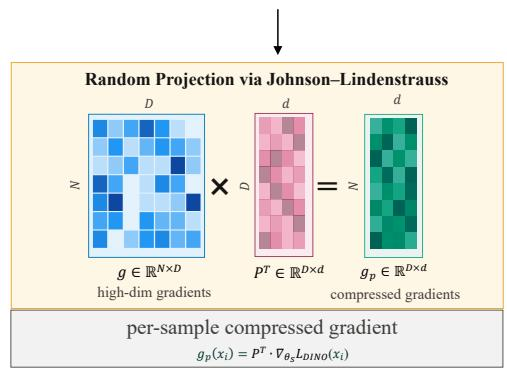

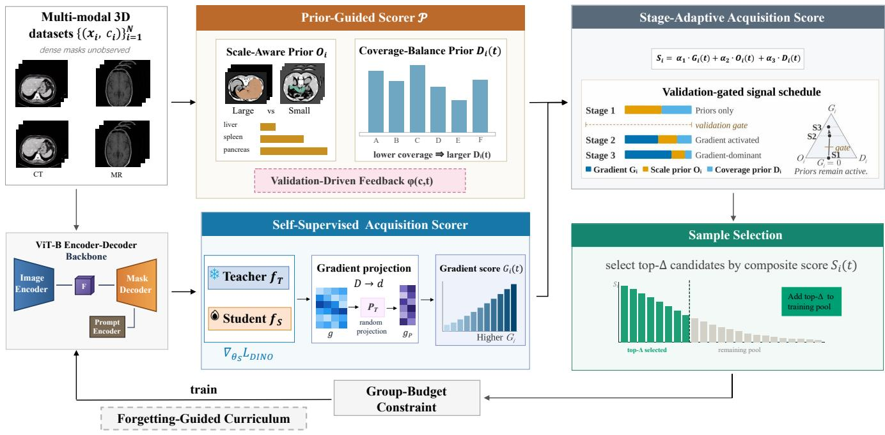

(a) Overview of the SASS framework  
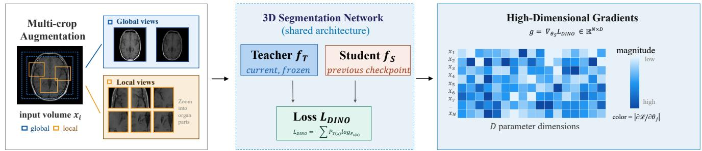

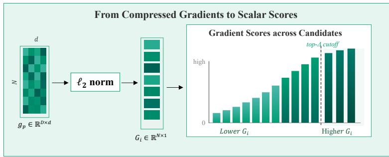  
(b) Gradient computation pipeline with dimension reduction  
Fig. 1: Overview of SASS. The training pool grows progressively from $| S ^ { ( 0 ) } | \approx 0 . 1 0 N$ to the target budget through periodic expansion. At each selection round, the Self-Supervised Acquisition Scorer computes label-free gradient scores $G _ { i } ( t )$ from a teacher-student DINO objective, while the Prior-Guided Scorer produces a Scale-Aware Prior $O _ { i }$ and a Coverage-Balance Prior $D _ { i } ( t )$ , both enhanced by Validation-Driven Feedback $\phi ( c , t )$ . The Stage-Adaptive Acquisition Score normalizes and combines these signals into $S _ { i } ( t )$ , with weights shifting from prior-dominant exploration to gradient-dominant refinement. In the ternary simplex, each stage is placed at its weight vector, the three vertices denoting full weight on $G _ { i } , O _ { i }$ and $D _ { i } ;$ Stage 1 lies on the $\bar { O } _ { i } – D _ { i }$ edge, where the gradient weight is zero, whereas Stages 2 and 3 lie inside the triangle, so both priors keep non-zero weight. Selected samples are refined by a Group-Budget Constraint and reordered by a Forgetting-Guided Curriculum before training.

the initial temporal gap. In subsequent rounds, the student is restored from the model snapshot saved at the preceding

expansion round. Let $t _ { k }$ denote the epoch of the k-th realized expansion; the teacher–student temporal gap is then $\tau _ { k } = t _ { k } - t _ { k - 1 }$ and may vary when the performance gate defers an expansion. Gradient-based scoring is activated only after the validation-based condition in Eq. 14 is satisfied.

This design estimates self-supervised knowledge evolution over the interval $[ t _ { \mathrm { p r e v } } , t ]$ . A large gradient indicates that candidate $x _ { i }$ induces a strong teacher-student update under the DINO objective, making it a label-free proxy for acquisition value without requiring ground-truth masks.

3.2.1.1 Multi-scale crop strategy: Following the multi-crop augmentation introduced in DINO [63], we generate multi-scale views from each candidate volume xi: $n _ { g }$ global crops with scale range $[ \sigma _ { g } ^ { \operatorname* { m i n } } , \sigma _ { g } ^ { \operatorname* { m a x } } ]$ and $n _ { l }$ local crops with scale range $[ \sigma _ { l } ^ { \mathrm { m i n } } , \sigma _ { l } ^ { \mathrm { m a x } } ]$ . In dense prediction tasks with large intra-dataset scale variation—in our testbed, anatomical structures range from large organs to small glands— global crops preserve holistic spatial context, whereas local crops emphasize fine structural variation and boundary detail. This multi-scale design makes the teacher-student discrepancy less dependent on a single crop scale.

3.2.1.2 Representation learning with DINO loss: Teacher and student process all crops through the network, including the image encoder, prompt encoder, and mask decoder. The decoder outputs are flattened and projected into a $d _ { p } .$ -dimensional space using a fixed Gaussian random projection matrix $\mathbf { P } _ { \mathrm { D I N O } } ~ \in ~ \mathbb { R } ^ { D _ { \mathrm { d e c } } \times d _ { p } }$ . The DINO loss for sample $x _ { i }$ is

$$
\mathcal { L } _ { \mathrm { D I N O } } ( x _ { i } ) = - \sum _ { v \in \mathcal { V } _ { g } } \sum _ { v ^ { \prime } \in \mathcal { V } _ { g } \cup \mathcal { V } _ { l } } \mathbf { p } _ { T } ( v ) \cdot \log \mathbf { p } _ { S } ( v ^ { \prime } ) ,\tag{1}
$$

where $\nu _ { g }$ and $\nu _ { l }$ denote global and local crop sets. Following DINO [63], ${ \bf p } _ { T } ( v )$ and ${ \bf p } _ { S } ( v )$ are softmax distributions over the projected decoder outputs $\mathbf { P } _ { \mathrm { D I N O } } ^ { \top } \mathbf { z } _ { T } ( v )$ and $\mathbf { P } _ { \mathrm { D I N O } } ^ { \top } \mathbf { z } _ { S } ( v )$ , respectively, with temperatures $\tau _ { T } < \tau _ { S }$ and a centered EMA term c with momentum $\beta _ { c }$ applied to the teacher output to reduce representation collapse.

3.2.1.3 Knowledge evolution gradient: For each candidate sample $x _ { i } ,$ the gradient with respect to the student parameters is

$$
\mathbf { g } _ { i } = \nabla _ { \theta _ { S } } \mathcal { L } _ { \mathrm { D I N O } } ( x _ { i } ) .\tag{2}
$$

Since $\nabla _ { \theta _ { S } } \mathcal { L } _ { \mathrm { D I N O } }$ is driven by the teacher-student discrepancy, $\| \mathbf { g } _ { i } \| _ { 2 }$ quantifies the magnitude of the parameter-space update induced by candidate $x _ { i }$ under the self-supervised objective. Importantly, this gradient is computed without ground-truth labels, enabling model-dependent candidate scoring without ground-truth masks. The resulting highdimensional gradient vector $\mathbf { g } _ { i } \in \mathbb { R } ^ { D }$ is then passed to the compression stage described next.

## 3.2.2 Random Projection for Gradient Compression

The per-sample gradient $\mathbf { g } _ { i } \in \mathbb { R } ^ { D }$ computed in Section 3.2.1 resides in the full parameter space of the ViT-B encoder $( D \approx 9 3 \mathrm { { M } ) }$ . At this dimensionality, explicitly storing and comparing gradients across a large candidate pool incurs substantial memory and computational overhead. To make gradient-based acquisition scalable, we compress each gradient into a lower-dimensional representation using a

Rademacher random projection, which approximately preserves the pairwise geometry of the original gradient space:

$$
\begin{array} { r } { \tilde { \mathbf { g } } _ { i } = \mathbf { P } ^ { \top } \mathbf { g } _ { i } , \qquad \mathbf { P } \in \mathbb { R } ^ { D \times d } , } \end{array}\tag{3}
$$

where $P _ { j k } \in \{ - 1 / \sqrt { d } , + 1 / \sqrt { d } \}$ and $d \ll D ,$

By the Johnson-Lindenstrauss lemma [64], random projection approximately preserves pairwise distances among candidate gradients, so the relative geometry used for sample ranking is largely maintained after compression. The Rademacher construction provides an efficient binary projection with lower computational cost than dense Gaussian projections [65]. After projection, this reduces gradient storage from $O ( n D )$ to ${ \bar { O ( } } n d { \bar { ) } }$ and permits $O ( n d )$ norm-based scoring over n candidates.

## 3.2.3 Gradient Norm as Acquisition Score

Given the compressed gradient $\tilde { \bf g } _ { i } \in \mathbb { R } ^ { d }$ , we define the selfsupervised gradient score as:

$$
G _ { i } ( t ) = \| \tilde { \bf g } _ { i } \| _ { 2 } .\tag{4}
$$

This score quantifies the magnitude of the parameter update induced by candidate i under the current teacher-student representation, providing a model-dependent measure of its potential contribution to learning.

Conventional gradient-based data selection typically estimates sample influence through directional similarity, such as the dot product between candidate and validation gradients [9], [35]. Such formulations are not directly applicable to our setting for two reasons. First, computing supervised candidate gradients requires candidate masks that are unavailable before acquisition, even though a labeled validation set is available. Second, under the shared DINO teacherstudent objective, candidate gradients are driven toward a common representation-alignment objective, producing a substantial shared directional component across samples. Directional similarity can therefore be dominated by this common component rather than reflecting differences in candidate informativeness. We instead use gradient magnitude to measure how strongly each unlabeled candidate perturbs the current model under the self-supervised objective. A larger norm indicates a greater model update is required to reconcile the candidate with the teacher representation, whereas a small norm indicates that the current representation already explains the candidate with relatively little adjustment. Gradient magnitude thus provides a label-free, model-dependent acquisition signal that remains discriminative without requiring an external validation gradient or relying on directional variation between candidates.

Remark 1 (Interpretation of gradient norm under DINO loss). Let $z _ { i }$ denote the student representation used by the DINO head. By the chain rule,

$$
\begin{array} { r } { \mathbf { g } _ { i } = \nabla _ { \theta _ { S } } \mathcal { L } _ { \mathrm { D I N O } } ( x _ { i } ) = J _ { \theta _ { S } } ( x _ { i } ) ^ { \top } \delta _ { i } , } \end{array}\tag{5}
$$

where $\delta _ { i } = \partial \mathcal { L } _ { \mathrm { D I N O } } / \partial z _ { i }$ measures the teacher-student discrepancy at the student output, and $J _ { \theta _ { S } } ( x _ { i } ) \ = \ \partial z _ { i } / \partial \theta _ { S }$ measures the sensitivity of the student representation to its parameters. Thus, $\| \mathbf { g } _ { i } \| _ { 2 }$ scores candidates whose self-supervised discrepancy induces a strong parameterspace update. This retains the parameter-update interpretation while requiring no ground-truth masks for candidate samples. Because the random projection approximately preserves gradient norms, $G _ { i } ( t ) \stackrel { \bf { \bar { = } } } { = } \lVert \tilde { \bf g } _ { i } \rVert _ { 2 }$ retains this parameter-update interpretation after compression.

## 3.3 Prior-Guided Sample Scoring

Long-tailed dense prediction datasets contain categories whose annotation value is not captured by frequency alone. Category-agnostic acquisition functions, including uncertainty sampling [6] and BADGE [8], may therefore underselect rare or difficult categories when the candidate pool is highly imbalanced. In our medical testbed, this issue appears as anatomical heterogeneity: organ volumes span orders of magnitude, sample availability is uneven across structures, and segmentation difficulty varies with tissue contrast, boundary complexity, and spatial context. We therefore introduce a Prior-Guided Scorer that encodes two category-level priors—a Scale-Aware Prior and a Coverage-Balance Prior—and further adapts them using validationdriven feedback.

## 3.3.1 Scale-Aware Prior

Because candidate masks are unavailable during selection, SASS cannot use candidate-specific volumes. Instead, it employs a pre-specified category-level scale prior available before acquisition. In our medical instantiation, the known category identifier $c _ { i }$ is used only to index a metadata lookup table, and the expected organ volume is defined as $\hat { V } _ { i } = \mu _ { c _ { i } } ,$ where $\mu _ { c }$ is the reference mean volume associated with category c. No candidate-specific volume or groundtruth mask is accessed when computing this prior.

The Scale-Aware Prior inversely weights the expected category scale:

$$
O _ { i } = \frac { 1 } { ( \hat { V } _ { i } ) ^ { \gamma } / \lambda _ { v } + 1 }\tag{6}
$$

where γ controls the sensitivity to scale differences and $\lambda _ { v }$ is a scaling constant. The score decreases monotonically with expected structure volume, thereby increasing the relative priority of small structures. This is particularly relevant in volumetric segmentation, where small structures often provide fewer foreground voxels and less spatial context for learning and are more susceptible to class imbalance and boundary errors [29]. The prior therefore encodes a stable, annotation-free preference toward categories for which additional supervision may be particularly valuable, rather than relying on unavailable candidate-level geometry.

## 3.3.2 Coverage-Balance Prior

Scale alone does not account for how the annotation budget has already been distributed. As acquisition proceeds, repeatedly selecting candidates from the same categories can lead to redundant allocation while leaving other categories insufficiently represented. SASS therefore complements the static scale prior with a dynamic Coverage-Balance Prior that adapts to the composition of the selected pool. Let $\mathcal { H } ^ { ( t ) }$ denote the samples selected up to epoch t. The Coverage-Balance Prior is

$$
D _ { i } ( t ) = \frac { 1 } { 1 + \log ( 1 + n _ { c _ { i } } ^ { ( t ) } ) } ,\tag{7}
$$

where ${ n } _ { c _ { i } } ^ { ( t ) } = | \{ j \in \mathcal { H } ^ { ( t ) } : \mathrm { c a t } ( j ) = c _ { i } \} |$ . The logarithmic penalty encourages exploration of under-represented categories while avoiding excessive penalization of categories that have already been sampled.

## 3.3.3 Validation-Driven Feedback

Static priors capture dataset-level structure but cannot reflect the model’s evolving category-wise performance during training. If selection relies only on fixed priors, it may continue sampling categories that are already well learned while under-sampling categories that remain difficult. We therefore introduce validation-driven feedback to convert category-level validation gaps into acquisition priorities for subsequent selection rounds.

3.3.3.1 Data source and timing: Since the candidate pool is unlabeled, category-wise performance cannot be measured from candidates directly. Feedback is therefore derived exclusively from the validation set V. During training, the model is periodically evaluated on held-out validation samples, producing category-wise Dice scores $\{ \mathrm { D i c e } _ { c } ^ { ( t ) } \} _ { c = 1 } ^ { C }$ . These scores are computed before the next selection round and cached by the training loop. When a selection round is triggered, the cached scores are used to compute $\phi ( c , t ) \ ( \mathrm { E q . \ 8 } )$ , which then enhances the scale and coverage priors into $O _ { i } ^ { * } ( t )$ and $D _ { i } ^ { * } ( t )$ for ranking unlabeled candidates. This temporal ordering—evaluate the current model on validation data, then use feedback to score the unlabeled pool—ensures that candidate labels are never used for scoring.

Let Dice] = median (t) $( \{ \mathrm { D i c e } _ { c } ^ { ( t ) } \} _ { c = 1 } ^ { C } )$ denote the median category Dice at epoch t. The feedback signal for category c is

$$
\phi ( c , t ) = \frac { 2 } { 1 + \exp ( - \kappa \cdot \operatorname* { m a x } ( 0 , \widetilde { \mathrm { D i c e } } ^ { ( t ) } - \mathrm { D i c e } _ { c } ^ { ( t ) } ) ) } - 1 ,\tag{8}
$$

where κ is a sharpness parameter. The signal is zero for categories at or above the median and increases monotonically for underperforming categories. The sigmoid scaling keeps the feedback smooth and bounded, preventing extreme score inflation.

3.3.3.2 Score enhancement: The scale and coverage priors are enhanced as

$$
O _ { i } ^ { * } ( t ) = \mathrm { c l i p } \Big ( O _ { i } + \lambda ^ { ( s ) } \cdot \phi ( c _ { i } , t ) , 0 , 1 \Big )\tag{9}
$$

$$
D _ { i } ^ { * } ( t ) = \mathrm { c l i p } \Big ( D _ { i } ( t ) \cdot \big ( 1 + \mu ^ { ( s ) } \cdot \phi ( c _ { i } , t ) \big ) , ~ 0 , ~ 1 \Big )\tag{10}
$$

where $\lambda ^ { ( s ) }$ and $\mu ^ { ( s ) }$ are enhancement strengths for stage $s \in \{ 2 , 3 \}$ . Validation-driven feedback is inactive during Stage 1, which uses the unenhanced priors $O _ { i }$ and $D _ { i } ( t ) ;$ the initial pool is therefore constructed from dataset-level structure alone, before any model-derived signal enters selection. Categories with low validation Dice receive elevated scores for new candidates from the unlabeled pool, increasing their exposure in subsequent acquisition rounds. Concrete values of $\mathbf { \hat { \kappa } } _ { \kappa , \lambda } ( s )$ , and $\mu ^ { ( s ) }$ are specified in Section 4.1.3 and ablated in Section 4.3.

## 3.3.4 Group-Budget Constraint

The Scale-Aware Prior $O _ { i }$ (Eq. 6) and Coverage-Balance Prior $D _ { i } ( t ) \ ( \mathrm { E q . \ 7 } )$ regulate acquisition at the individualcategory level, based on expected scale and accumulated selection frequency, respectively. However, category-level balancing does not necessarily imply balanced allocation at a coarser semantic level. When a dataset contains many related categories within the same parent group, each category can appear individually under-represented while their aggregate allocation becomes disproportionately large. This creates a hierarchical imbalance that cannot be identified from per-category statistics alone.

This issue is particularly pronounced for repetitive anatomical structures such as ribs and vertebrae. Although individual ribs or vertebrae are treated as distinct segmentation categories, they share substantial anatomical and visual characteristics. Allocating additional annotations to each category independently can therefore yield diminishing marginal benefit while consuming a large fraction of the total annotation budget. Validation-driven feedback can modulate category priorities according to current performance, but it does not explicitly control how much of the budget is collectively assigned to a related group. We therefore introduce a Group-Budget Constraint that imposes an explicit upper bound on the acquisition share of predefined repetitive groups, complementing the soft category-level scoring terms.

3.3.4.1 Why soft scoring alone is insufficient: Soft category-level scoring cannot fully resolve redundancy when many related categories belong to the same parent group. From the perspective of Eq. $^ { 7 , }$ selecting “rib $\mathrm { - } 0 1 ^ { \prime \prime }$ does not penalize “rib $\ : 0 2 ^ { \prime \prime } \ :$ because they are formally distinct categories, even though adjacent ribs share similar morphology, contrast profiles, and boundary characteristics. The logarithmic penalty also saturates slowly, allowing each repetitive category to accumulate selections while the parent group dominates the pool. Validation-driven feedback $\phi ( c , t )$ (Eq. 8) can deprioritize well-performing categories, but it may also boost a few underperforming repetitive categories in early training. In preliminary experiments without hard capping, the ribs+vertebrae group consumed over 80% of the annotation budget despite the combined effect of coverage scoring and validation feedback.

3.3.4.2 Hard capping as a group-level constraint: We introduce a Group-Budget Constraint that limits the fraction of each query batch assigned to a predefined parent group:

$$
\begin{array} { c } { { | \{ i \in \Delta _ { k } : \mathrm { g r o u p } ( i ) = g \} | \le \lceil \eta | \Delta _ { k } | \rceil , } } \\ { { g \in \{ \mathrm { r i b } , \mathrm { v e r t e b r a e } \} , } } \end{array}\tag{11}
$$

where $\Delta _ { k }$ is the query batch at expansion round k. We also limit any single category:

$$
\begin{array} { r } { \left| \left\{ i \in \Delta _ { k } : \mathrm { c a t } ( i ) = c \right\} \right| \leq \lceil \eta _ { s } \vert \Delta _ { k } \vert \rceil . } \end{array}\tag{12}
$$

The budget released by capping is reassigned to the highest-scoring remaining candidates. Thus, the soft priors in Eqs. 7–10 provide relative rebalancing across categories, whereas Eqs. 11–12 impose absolute group-level budget guarantees. The cap ratios $\eta$ and $\eta _ { s }$ are specified in Section 4.1.3. Group-cap sensitivity is analyzed in Section 4.3.

## 3.4 Stage-Adaptive Acquisition

The effectiveness of data selection depends on aligning acquisition criteria with the non-stationary learning dynamics of deep networks [4], [31], [51]. Early gradient statistics can support effective one-shot data pruning [30]; however, their rankings need not remain equally suitable throughout successive acquisition rounds as task-specific representations evolve. Category-level priors provide a gradientindependent basis for broad coverage early in training, while gradient-based selection can play an increasing role as task-specific representations develop and training dynamics evolve [17], [66]. Motivated by this shift in relative utility, SASS dynamically calibrates the contribution of gradient, scale, and coverage signals over training.

## 3.4.1 Training Stages and Transition Conditions

We partition the $T _ { \mathrm { m a x } }$ -epoch training process into three stages corresponding to different levels of model maturity. Each stage uses a different mixture of acquisition signals, and the transition to gradient-inclusive selection is conditioned on validation performance. Fig. 1(a) visualizes this schedule as a trajectory in the simplex of admissible weight vectors $\begin{array} { r } { \{ ( \alpha _ { 1 } , \alpha _ { 2 } , \alpha _ { 3 } ) : \overset { } { \alpha } _ { k } \geq 0 , \sum _ { k } \alpha _ { k } = 1 \} } \end{array}$ , where a point’s distance from the edge opposite a vertex is proportional to the weight placed on the corresponding signal. Stage 1 is confined to the $O _ { i } – D _ { i }$ edge, so the validation gate marks a departure from that edge rather than a gradual re-weighting of three signals that are active throughout.

3.4.1.1 Stage 1: Prior-guided exploration (epochs 0 to $T _ { 1 } )$ : During early training, gradient-based rankings may remain sensitive to initialization and may not yet reflect stable task-specific semantics. From an NTK perspective, gradient relations near initialization are governed by the initialization-induced kernel while task-specific features are still developing [18]. We therefore set the gradient weight to zero and rely on prior-guided scoring to establish broad category coverage:

$$
\begin{array} { r } { { \bf w } _ { 1 } = ( 0 , \beta _ { O } ^ { ( 1 ) } , \beta _ { D } ^ { ( 1 ) } ) , \qquad \beta _ { O } ^ { ( 1 ) } + \beta _ { D } ^ { ( 1 ) } = 1 . } \end{array}\tag{13}
$$

This avoids premature reliance on gradient-based rankings, while an elevated scale-prior weight $\beta _ { O } ^ { ( 1 ) }$ emphasizes small categories and the coverage-prior weight $\beta _ { D } ^ { ( \mathrm { i } ) }$ discourages early over-representation.

3.4.1.2 Stage 2: Performance-conditioned transition (epochs $T _ { 1 }$ to $T _ { 2 } ) \colon$ As training progresses, task-specific representations become more stable and gradient geometry becomes increasingly structured, providing a stronger basis for gradient-based candidate ranking before full model convergence [4], [35]. SASS therefore activates gradientinclusive selection only after the model reaches a validationperformance threshold:

$$
\mathrm { A c t i v a t e ~ S t a g e ~ 2 } \iff ( t \geq T _ { 1 } ) \land \big ( \mathrm { D i c e } _ { \mathrm { v a l } } ^ { ( t ) } \geq \tau _ { \mathrm { a c t } } \big ) .\tag{14}
$$

Activation is latched: once the condition in Eq. 14 is satisfied at some epoch, gradient scoring remains enabled for the remainder of training even if validation Dice subsequently fluctuates below $\tau _ { \mathrm { a c t } }$

Upon activation, the weights interpolate linearly over $[ T _ { 1 } , \dot { T } _ { 2 } ]$ :

$$
\alpha _ { k } ^ { ( 2 ) } ( t ) = \alpha _ { k } ^ { \mathrm { s t a r t } } + \frac { t - T _ { 1 } } { T _ { 2 } - T _ { 1 } } \left( \alpha _ { k } ^ { \mathrm { e n d } } - \alpha _ { k } ^ { \mathrm { s t a r t } } \right) ,\tag{15}
$$

where $k \in \{ 1 , 2 , 3 \}$ and $\textstyle \sum _ { k } \alpha _ { k } = 1$ . During this transition, the gradient weight $\alpha _ { 1 }$ increases while the prior weights $\alpha _ { 2 }$ and $\alpha _ { 3 }$ decrease, smoothly shifting acquisition from priorguided exploration to gradient-guided refinement.

3.4.1.3 Stage 3: Gradient-dominant refinement (epochs $T _ { 2 }$ to $T _ { \mathrm { m a x } } ) { \mathrm { : } }$ Weights are fixed at gradient-dominant values:

$$
\mathbf { w } _ { 3 } = ( \alpha _ { 1 } ^ { ( 3 ) } , \alpha _ { 2 } ^ { ( 3 ) } , \alpha _ { 3 } ^ { ( 3 ) } ) .\tag{16}
$$

The dominant gradient weight prioritizes samples with large knowledge-evolution scores (Section 3.2.3), while the reduced but nonzero prior weights preserve baseline category coverage and prevent selection from collapsing onto a narrow high-gradient subset.

All stage hyperparameters $( T _ { 1 } , T _ { 2 } , \tau _ { \mathrm { a c t . } }$ , all α and $\beta$ values) are specified in Section 4.1.2 and ablated in Section 4.3.

## 3.4.2 Composite Acquisition Score

Because neither model-driven gradients nor prior-based signals alone provide a reliable acquisition criterion across all training stages, SASS combines them into a stage-adaptive composite score:

$$
S _ { i } ( t ) = \alpha _ { 1 } ( t ) \hat { G } _ { i } ( t ) + \alpha _ { 2 } ( t ) \hat { O } _ { i } ^ { * } ( t ) + \alpha _ { 3 } ( t ) \hat { D } _ { i } ^ { * } ( t ) ,\tag{17}
$$

where $\hat { G } _ { i } ( t ) , \hat { O } _ { i } ^ { * } ( t )$ , and $\hat { D } _ { i } ^ { * } ( t )$ are min-max normalized to [0, 1]:

$$
\hat { X } _ { i } = \frac { X _ { i } - \operatorname* { m i n } _ { j } X _ { j } } { \operatorname* { m a x } _ { j } X _ { j } - \operatorname* { m i n } _ { j } X _ { j } + \epsilon } ,\tag{18}
$$

where ϵ prevents division by zero.

This schedule implements a time-varying trade-off: early selection emphasizes prior-guided exploration, whereas late selection emphasizes gradient-guided refinement. Activation is by design discontinuous: the gradient weight steps from zero to $\breve { \alpha } _ { 1 } ^ { \mathrm { s t a r t } }$ once the validation criterion is met, reflecting that gradient evidence is either admitted or withheld rather than gradually trusted. The linear interpolation thereafter avoids further abrupt changes within Stage 2.

## 3.4.3 Adaptive Scheduling Algorithm

The per-round selection pipeline is summarized in Supplementary Algorithm S1. The stage-adaptive weight computation follows Eqs. 13–16; the complete pseudocode is provided in the supplementary material.

The stage-adaptive design also reduces computational overhead by activating gradient-based acquisition only when the corresponding model-derived signal becomes sufficiently informative. Because $\alpha _ { 1 } ~ = ~ 0$ in Stage 1, SASS bypasses gradient computation during the first $T _ { 1 }$ epochs and further postpones gradient scoring when the validationperformance threshold in Eq. 14 has not yet been reached.

## 3.5 Forgetting-Guided Curriculum

The Forgetting-Guided Curriculum is designed to stabilize optimization after each pool expansion rather than to serve as an additional acquisition criterion. Newly annotated query batches change the composition of the training set and can introduce transient instability when difficult samples are presented before the model has adapted to the expanded pool. Motivated by curriculum and self-paced learning [51], [52], SASS estimates sample difficulty from prediction histories and orders selected samples from easier to harder cases within each training epoch.

## 3.5.1 Forgetting Events

A forgetting event for sample i at epoch t is a transition from a correct to an incorrect prediction:

$$
\mathrm { F E } _ { i } ^ { ( t ) } = \mathbb { k } \Big [ \mathrm { c o r r e c t } _ { i } ^ { ( t - 1 ) } \wedge \neg \mathrm { c o r r e c t } _ { i } ^ { ( t ) } \Big ] .\tag{19}
$$

For dense segmentation, a prediction is considered correct when its Dice score exceeds the adaptive threshold $\tau _ { \mathrm { c o r r } } ^ { ( t ) } =$ $\mathrm { c l i p } ( \overline { { \mathrm { D i c e } } } _ { \mathrm { t r a i n } } ^ { ( t ) } - \xi , \tau _ { \mathrm { c o r r } } ^ { \operatorname* { m i n } } , \tau _ { \mathrm { c o r r } } ^ { \operatorname* { m a x } } )$ , where $\dot { \overline { { \mathrm { D i c e } } } } _ { \mathrm { t r a i n } } ^ { ( t ) }$ is the running mean training Dice over the labeled training samples and $\xi$ is a margin below that mean. The cumulative forgetting count available at epoch t is $\begin{array} { r } { F _ { i } = \sum _ { \tau = 1 } ^ { t } \mathrm { F E } _ { i } ^ { ( \tau ) } } \end{array}$

## 3.5.2 Difficulty Estimation and Curriculum Ordering

Let Hi denote the recorded prediction history of sample i, and let $r _ { i } = | \{ t : \mathrm { c o r r e c t } _ { i } ^ { ( t ) } \} | / | H _ { i } |$ be its correctness ratio. A forgetting count is informative only when a sample has been predicted correctly at least occasionally: a persistently incorrect sample may have $F _ { i } = 0$ despite being difficult or atypical. We therefore partition the selected pool into a rankable set $S _ { \mathrm { r a n k } } = \{ i \in \mathbf { \dot { S } } : r _ { i } \geq r _ { \mathrm { m i n } } \}$ and a deferred set $S _ { \mathrm { d e f e r } } = S \setminus S _ { \mathrm { r a n k } } .$

For each sample in $S _ { \mathrm { r a n k } }$ , the curriculum difficulty is

$$
d _ { i } = \operatorname* { m i n } ( 1 , F _ { i } \zeta _ { i } + d _ { \mathrm { b a s e } } ) , \qquad i \in S _ { \mathrm { r a n k } } ,\tag{20}
$$

where $\zeta _ { i } ~ = ~ \zeta _ { \mathrm { s v } }$ when $r _ { i } ~ > ~ r _ { \mathrm { s v } }$ and $\zeta _ { i } = \zeta _ { \mathrm { d e f } }$ otherwise, with $\zeta _ { \mathrm { d e f } } ~ < ~ \zeta _ { \mathrm { s v } }$ . Repeatedly forgotten but otherwise learnable samples consequently receive larger difficulty scores, consistent with prior observations on example-forgetting dynamics [17].

At each epoch, rankable samples are ordered from easy to hard, while persistently incorrect samples are deferred rather than misclassified as easy:

$$
S _ { \mathrm { o r d e r e d } } = \mathrm { a r g s o r t } _ { i \in { \cal S } _ { \mathrm { r a n k } } } d _ { i } \parallel \mathrm { S h u f f e } ( S _ { \mathrm { d e f e r } } ) ,\tag{21}
$$

where ∥ denotes sequence concatenation. Deferred samples remain available for training but are presented after the forgetting-ranked samples. This ordering changes sample presentation within the labeled pool; it does not acquire additional labels.

## 3.6 Periodic Incremental Pool Growth

Rather than allocating the full annotation budget $\rho N$ at initialization, SASS expands the selected pool over multiple acquisition rounds so that selection can adapt to the model’s evolving representations.

## 3.6.1 Consolidation-Aligned Expansion Schedule

Training-stage perturbations can affect subsequent optimization dynamics [20]. Each newly annotated query batch changes the composition of the training set. If successive expansions occur before the model has adapted to the preceding batch, the optimizer state and learned representations may remain temporarily misaligned with the expanded pool, leading to transient training instability. Moreover, gradient scores computed immediately after expansion may reflect short-term adaptation to the recent pool change rather than persistent candidate value. SASS therefore separates acquisition rounds by a consolidation interval.

The initial pool is defined by the initial-pool ratio $\rho _ { 0 } \colon$

$$
| S ^ { ( 0 ) } | \approx \rho _ { 0 } N , \qquad 0 < \rho _ { 0 } \leq \rho ,\tag{22}
$$

where N is the size of the candidate pool and $\rho$ is the target annotation ratio. The initial pool is selected using Stage 1 prior-guided scoring. SASS performs $K _ { \Delta }$ additive expansions. At the k-th realized expansion epoch $t _ { k } ,$ , a query batch of $\Delta$ newly annotated samples is added:

$$
| S ^ { ( k ) } | = | S ^ { ( k - 1 ) } | + \Delta , \qquad k = 1 , \dots , K _ { \Delta } ,\tag{23}
$$

until the target budget $\rho N$ is reached. Thus, $S ^ { ( k - 1 ) } \subset S ^ { ( k ) }$ and all previously selected samples remain available for subsequent training. The realized consolidation interval is

$$
\tau _ { k } = t _ { k } - t _ { k - 1 } ,\tag{24}
$$

which need not be constant because the performance gate may defer an expansion.

Two safeguards regulate pool growth. First, a Performance Gate defers a scheduled expansion when recent validation Dice satisfies the predefined decline criterion. Second, Validation-Triggered Rescoring recomputes candidate scores when validation progress stagnates. Rescoring does not itself expand the annotated pool; instead, it updates the candidate ranking used at the next expansion. The training and evaluation setup is described in Section 4.1.2.

## 4 EXPERIMENTS

## 4.1 Experimental Setup

## 4.1.1 Datasets and Splits

The candidate pool aggregates publicly available 3D segmentation datasets, principally TotalSegmentator [28], AMOS [58], BraTS21 [67], KiTS [68], MMWHS [69], Cross-MoDA [70], FLARE22 [71], WORD [72], AbdomenCT-1K [57], and VerSe [73]. Dataset aggregation and label harmonization follow Wang et al. [3]; only publicly accessible data are used. The complete 108-structure mapping, dataset licenses, and access procedures are provided in Supplementary Tables S1–S2.

Each acquisition unit is an image–category pair $( x _ { i } , c _ { i } )$ with one category-specific binary mask that remains unobserved until the unit is selected. Volumes with multiclass annotations are decomposed into per-category masks following the point-prompt protocol of Wang et al. [3]. The resulting pool contains 100,357 units across 108 structures, spanning CT and multiple MRI sequences, and is stratified by category into 70,351 training candidates, 15,003 validation samples, and 15,003 held-out test samples. The validation set is used to compute category-level feedback $\phi ( c , t ) .$ trigger reselection, and select SASS hyperparameters; the held-out test set is never accessed during acquisition, model selection, or hyperparameter tuning and is used only for final performance reporting. A stricter volume-disjoint robustness check is reported in Table $6 ;$ the split construction and re-evaluation protocol are described in Supplementary Section S3.

## 4.1.2 Training and Evaluation

We use the point-prompt 3D segmentation architecture of Wang et al. [3], comprising a 93M-parameter ViT-B image encoder, a 3D prompt encoder, and a 3D mask decoder. All parameters are trained from random initialization; no pretrained weights or external checkpoints are loaded. SASS operates at the data-selection level and requires no architectural modification (Section 4.4).

Volumes are resampled to $1 2 8 ^ { 3 }$ (trilinear for images, nearest-neighbor for masks) with foreground Z-score intensity normalization. Augmentation details are in Supplementary Section S4. Optimization uses AdamW $( \beta _ { 1 } \mathrm { { = } } 0 . 9 ,$ $\beta _ { 2 } { = } 0 . 9 9 9$ , weight decay 0.05) with base learning rate $8 \times 1 0 ^ { - 4 }$ for the encoder and 0.1× for the prompt encoder and decoder, 5-epoch warmup, and cosine annealing over $T _ { \mathrm { m a x } } { = } 3 0 0$ epochs. The loss is equally weighted Dice and cross-entropy. The effective batch size is 480 on two NVIDIA RTX 6000-class GPUs. Training uses a single pseudo-click; validation and testing use 10-click iterative refinement [3]. Within each run, overall Dice is the unweighted macroaverage of the 108 structure-level Dice means; difficultygroup Dice averages the structures in the corresponding fixed group. Reported means and standard deviations are computed across three independent runs.

For SASS-versus-Full comparisons, we use 10,000 paired hierarchical bootstrap replicates over runs and source volumes, and summarize each difference by its bootstrap 95% confidence interval. †: interval excludes zero; ‡: positive mean difference whose interval includes zero. Per-structure intervals are not adjusted for multiplicity; the Hard-group comparison in Section 4.2.1 is a single pre-specified test.

## 4.1.3 Selection Protocol and Baselines

The training pool is treated as unlabeled; masks are revealed only after selection. The annotation budget counts selected training image–category pairs and excludes the labeled validation set used for acquisition feedback and hyperparameter selection. The principal budget is $\rho { = } 0 . 4 0 \ ( \sim 2 8 , 0 0 0$ samples), starting from $\rho _ { 0 } { = } 0 . 1 0$ and expanding in batches of $\scriptstyle \bar { \Delta } = 3 , 0 0 0$ . SASS uses $( T _ { 1 } , T _ { 2 } ) { = } ( \mathrm { 4 0 , 1 5 0 } ) , \tau _ { \mathrm { a c t } } { = } 0 . 4 2 ,$ d=2,048, $\kappa { = } 5 , ~ \eta { = } 0 . 1 5 , ~ \eta _ { s } { = } 0 . 0 8 .$ Stage weights: Stage 1 $( \beta _ { O } ^ { ( 1 ) } , \beta _ { D } ^ { ( 1 ) } ) = ( 0 . 5 5 , 0 . 4 5 ) ; 5 \mathrm { t a g e } 2$ interpolates α1 from 0.30 to 0.70; Stage 3 fixes $( \alpha _ { 1 } , \alpha _ { 2 } , \hat { \alpha _ { 3 } } ) { = } ( 0 . 7 0 , 0 . 2 0 , 0 . 1 0 )$ . Feedback strengths: $( \lambda ^ { ( 2 ) } , \mu ^ { ( 2 ) } ) { = } ( 0 . 3 5 , 0 . 5 0 ) , ( \lambda ^ { ( 3 ) } , \mu ^ { ( 3 ) } ) { = } ( 0 . 4 5 , 0 . 7 5 )$ Additional implementation details are provided in Supplementary Section S4.

Baselines: Random, Entropy Sampling [6], Coreset [16], BADGE [8], LESS [35], and LESS+Organ (LESS with a static Scale-Aware Prior). Full Dataset and Full+CB (inversefrequency sampler) use 100%. All subset methods share the same 40% budget, acquisition protocol, backbone, optimizer, and evaluation protocol. All SASS-specific hyperparameters are selected exclusively on the validation set. Weightedsampler, feature-extraction, and distributed-training details are provided in Supplementary Section S5.

## 4.2 Main Results

## 4.2.1 Difficulty-Stratified Performance

To analyze performance as a function of segmentation difficulty, anatomical structures are grouped according to the validation Dice achieved by the Full-Dataset baseline. This provides a SASS-independent reference for segmentation difficulty while avoiding bias from the proposed selection method itself. Specifically, structures are grouped by the Full Dataset validation Dice: Easy $( \ge 0 . 7 0 , n { = } 5 9 )$ , Medium ([0.55, 0.70), n=31), Hard $( < 0 . 5 5 , n { = } 1 8 )$ . Assignments are fixed before test-set evaluation (Supplementary Section S7).

Table 1 shows that SASS recovers 98.3% of Full Dataset Dice using 40% of annotations, improving over Random by 7.4 pp, over BADGE by 5.1 pp, and over LESS+Organ by 3.0 pp. The gain increases with difficulty: on Hard structures, SASS exceeds Full by 1.2 pp (95% CI: [0.003, 0.021], p=0.011), supporting the group-level less-is-more effect analyzed in Section 4.3.4.

Figure 2 shows that SASS more closely follows groundtruth boundaries, particularly for the Aorta and Stomach where baselines exhibit visible under-segmentation.

## 4.2.2 Comparison with Active Learning Methods

All subset-selection methods outperform Random in Table 1, confirming substantial redundancy in the candidate pool. Among the classical active-learning acquisition functions (Entropy, Coreset, BADGE), BADGE achieves the highest overall Dice (0.637); LESS and LESS+Organ are influence-based data-selection methods rather than acquisition functions and are therefore reported as a separate reference group. The diagnostic LESS+Organ variant adds a static Scale-Aware Prior to the LESS gradient score but uses no validation feedback, no group constraints, and a fixed acquisition rule; it reaches 0.658. SASS provides a further 3.0 pp gain, attributable to validation feedback, stageadaptive weighting, and group-budget control (Section 4.3).

To separate informative selection from category rebalancing, we compare with Full+CB. Full+CB raises Hardstructure Dice from 0.610 to 0.618 using 100% of annotations; SASS reaches 0.622 with only 40%. Its overall Dice remains 1.4 pp below Full+CB (0.688 vs. 0.702), indicating that SASS’s advantage over full-supervision references is concentrated on the long tail rather than uniformly distributed across categories.

## 4.2.3 High-Priority Structure Performance

Table 2 summarizes 18 high-priority reporting targets spanning major anatomical systems. Based on the unweighted mean of the displayed row means, SASS retains approximately 99.6% of Full Dataset performance using 40% of the annotations (0.691 vs. 0.694). Its mean Dice exceeds Full for the pancreas, gallbladder, adrenal glands, esophagus, and duodenum, while well-represented organs such as the liver and kidneys retain ∼98.5% of their Full Dice. These results indicate that targeted long-tail reallocation largely preserves performance on well-represented structures.

## 4.2.4 Structure-Level Performance

Table 3 reports per-structure Dice with bootstrap uncertainty. SASS yields positive mean differences over Full for all seven structures (1.1–1.9 pp). The pancreas and gallbladder have confidence intervals excluding zero; adrenal glands and esophagus show positive mean differences whose intervals include zero. Heart chambers exhibit the largest feedback gaps $( \phi { = } 0 . 8 3 { - } 0 . 8 9 )$ yet only moderate improvements, with high run-to-run variability $\scriptstyle ( \sigma = 0 . 0 1 3 - 0 . 0 1 { \bar { 4 } } )$ consistent with cardiac motion and boundary ambiguity after $1 2 8 ^ { 3 }$ resampling. This indicates that feedback amplification and accuracy gains need not scale proportionally across structures. Results aggregated over all 108 categories are reported in Table 1 and Table 4.

## 4.2.5 Category-Level Performance

Table 4 and Fig. 3 show that SASS leads among 40%-budget methods in all six anatomical categories. Its improvement over Random ranges from 6.3 pp (Skeletal) to 8.2 pp (GI Tract), while retaining 96.8% of Full on Skeletal despite the group-budget constraint. The progression from Random to LESS+Organ and then SASS reflects complementary gains from informative selection, category-level priors, and stage adaptation.

## 4.2.6 Annotation-Budget Scaling and Training Dynamics

Table 5 supports ρ=0.40 as the principal operating point. Three observations emerge. First, SASS-20% already recovers 94.3% of Full performance, indicating that stageadaptive selection remains effective even when annotation is one-fifth of the full pool. Second, increasing the budget from 40% to 60% yields only 0.6 pp, consistent with a data-saturation regime. Third, SASS-20% still substantially exceeds Random-40% despite using half the annotation budget, providing a striking demonstration that selection quality can compensate for selection quantity.

The complete training-dynamics and curriculumstability analysis is provided in Supplementary Fig. S1. SASS separates from the active-learning baselines during the gradient-enabled stages, while the forgetting-guided curriculum primarily improves post-expansion recovery rather than endpoint Dice.

Under the stricter volume-disjoint split (Table 6), SASS has the highest reported overall mean among the evaluated 40%-budget methods and a higher Hard-group mean than Full (0.604 vs. 0.596). These point estimates are consistent with the principal performance pattern under the grouped split.

## 4.3 Ablation and Mechanism Analysis

## 4.3.1 Component Contributions

Figure 5 reports a cumulative ablation in which components are added to the Random baseline in a fixed order. The overall Dice values and incremental gains are provided in Supplementary Table S3; the increments quantify gains within this cumulative configuration rather than orderindependent effects.

TABLE 1: Difficulty-stratified test Dice at epoch 300 under 10-click evaluation (mean ± std, three runs). Subset methods use 40%; Full and Full+CB use 100%. Bold: best 40%-budget result.
<table><tr><td>Group</td><td>Random</td><td>Entropy</td><td>Coreset</td><td>BADGE</td><td>LESS</td><td>LESS+O</td><td>SASS</td><td>Full</td><td>Full+CB</td><td>∆(S-R)</td></tr><tr><td>Easy (n=59)</td><td>0.651±0.003</td><td>0.665±0.003</td><td> $0 . 6 6 1 { \scriptstyle \pm 0 . 0 0 3 }$ </td><td>0.674±0.003</td><td> $0 . 6 7 4 { \scriptstyle \pm 0 . 0 0 3 }$ </td><td> $0 . 6 9 1 { \scriptstyle \pm 0 . 0 0 3 }$ </td><td> $\mathbf { 0 . 7 1 5 { \scriptstyle \pm 0 . 0 0 3 } }$ </td><td>0.733±0.002</td><td>0.732±0.003</td><td>+0.064</td></tr><tr><td>Medium (n=31)</td><td>0.596±0.004</td><td>0.610±0.004</td><td> $0 . 6 0 5 { \scriptstyle \pm 0 . 0 0 4 }$ </td><td>0.618±0.004</td><td> $0 . 6 1 8 { \scriptstyle \pm 0 . 0 0 4 }$ </td><td> $0 . 6 4 1 { \scriptstyle \pm 0 . 0 0 4 }$ </td><td> $\mathbf { 0 . 6 7 5 { \scriptstyle \pm 0 . 0 0 4 } }$ </td><td>0.690±0.003</td><td>0.693±0.004</td><td>+0.079</td></tr><tr><td>Hard (n=18)</td><td>0.525±0.006</td><td>0.538±0.006</td><td>0.534±0.006</td><td>0.549±0.005</td><td> $0 . 5 5 3 { \pm } 0 . 0 0 5$ </td><td>0.578±0.005</td><td> $\mathbf { 0 . 6 2 2 { \scriptstyle \pm 0 . 0 0 5 } }$ </td><td>0.610±0.005</td><td>0.618±0.005</td><td>+0.097</td></tr><tr><td>Overall (108)</td><td>0.614±0.003</td><td>0.628±0.003</td><td>0.624±0.003</td><td>0.637±0.003</td><td>0.638±0.003</td><td>0.658±0.003</td><td>0.688±0.003</td><td>0.700±0.002</td><td>0.702±0.003</td><td>+0.074</td></tr></table>

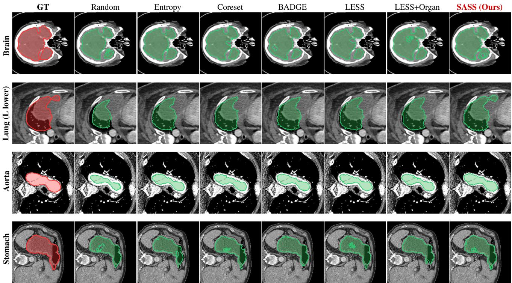  
Fig. 2: Qualitative segmentation comparison on four anatomical structures. Red: ground truth; green: prediction; dashed white: ground-truth boundary. LESS+O denotes LESS+Organ.

TABLE 2: Dice for 18 high-priority reporting targets under the 10-click protocol at epoch 300. Rows include bilateral and lung-lobe aggregates and report mean ± std across three runs; the final row is the unweighted mean of the 18 displayed row means. Targets were selected by diagnostic relevance [28]. †/‡: see Section 4.1.2.
<table><tr><td>Structure</td><td>Rand</td><td>Full</td><td>SASS</td><td>∆(S-R)</td></tr><tr><td>Liver</td><td>.701±.006</td><td>.793±.005</td><td>.781±.005</td><td>+.080</td></tr><tr><td>Kidney (L/R)</td><td>.688±.007</td><td>.776±.005</td><td>.764±.006</td><td>+.076</td></tr><tr><td>Spleen</td><td>.695±.007</td><td>.782±.005</td><td>.771±.006</td><td>+.076</td></tr><tr><td>Pancreas</td><td>.508±.012</td><td>.590±.009</td><td>.607±.010†</td><td>+.099</td></tr><tr><td>Gallbladder</td><td>.518±.011</td><td>.598±.009</td><td>.614±.010†</td><td>+.096</td></tr><tr><td>Aorta</td><td>.637±.008</td><td>.723±.006</td><td>.714±.007</td><td>+.077</td></tr><tr><td>Esophagus</td><td>.497±.013</td><td>.578±.010</td><td>.593±.011</td><td>+.096</td></tr><tr><td>Stomach</td><td>.614±.010</td><td>.701±.008</td><td>.690±.008</td><td>+.076</td></tr><tr><td>Adrenal (L/R)</td><td>.483±.015</td><td>.567±.012</td><td>.586±.012</td><td>+.103</td></tr><tr><td>Lung lobes (agg.)</td><td>.682±.006</td><td>.768±.005</td><td>.757±.005</td><td>+.075</td></tr><tr><td>Heart LV myo</td><td>.583±.011</td><td>.672±.009</td><td>.662±.009</td><td>+.079</td></tr><tr><td>Heart LV blood</td><td>.590±.010</td><td>.681±.008</td><td>.673±.008</td><td>+.083</td></tr><tr><td>IVC</td><td>.608±.011</td><td>.696±.009</td><td>.686±.009</td><td>+.078</td></tr><tr><td>Colon</td><td>.595±.012</td><td>.682±.010</td><td>.671±.010</td><td>+.076</td></tr><tr><td>Duodenum</td><td>.531±.013</td><td>.618±.010</td><td>.633±.011‡</td><td>+.102</td></tr><tr><td>Femur (L/R)</td><td>.682±.005</td><td>.772±.004</td><td>.761±.005</td><td>+.079</td></tr><tr><td>Brain</td><td> $. 6 5 5 { \pm } . 0 0 6$ </td><td>.744±.005</td><td>.733±.005</td><td>+.078</td></tr><tr><td>Trachea</td><td>.669±.006</td><td>.756±.005</td><td>.745±.005</td><td>+.076</td></tr><tr><td>Mean of 18 rows</td><td>.608</td><td>.694</td><td>.691</td><td>+.084</td></tr></table>

Adding the scale-aware and coverage-balance priors raises Dice from 0.614 to 0.636 (+2.2 pp), supporting category-level structure as a useful acquisition cue. Incorporating the label-free gradient score then increases Dice to 0.651 (+1.5 pp), indicating that model-dependent knowledge-evolution signals provide complementary information beyond the two priors. The next two components make acquisition responsive to training dynamics: stage-adaptive weighting contributes 1.3 pp, supporting the use of stage-dependent scoring as training progresses, and validation-driven feedback adds a further 1.1 pp, indicating that category-level performance gaps provide useful signals for updating acquisition priorities. The remaining components target selection balance and training stability: group-budget constraints add 0.5 pp by limiting budget concentration in repetitive categories, the performance-gated expansion schedule contributes 0.5 pp while allowing the model to adapt between query batches (all configurations in this ablation already use multi-round acquisition, so this increment isolates expansion-interval adaptivity rather than multi-round acquisition itself), and the forgetting-guided curriculum adds 0.3 pp.

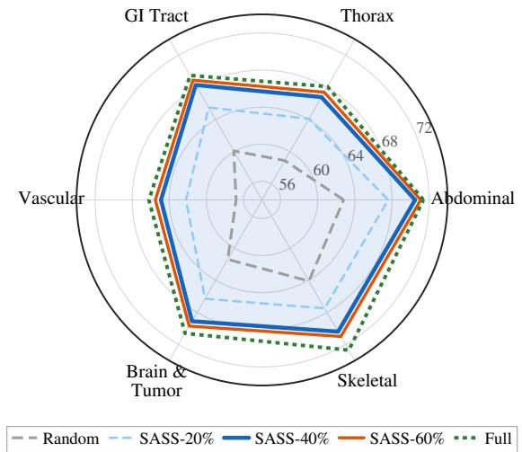  
Fig. 3: Category-level budget comparison. SASS-40% closely tracks Full-100% across all six categories while improving substantially over Random and SASS-20%.

TABLE 3: Per-structure Dice and bootstrap uncertainty for seven representative Hard structures (mean $\pm \ \mathrm { s t d } ,$ , three runs). $n _ { s } \colon$ canonical structure categories per row after the mapping in Supplementary Table S1; $\phi \colon$ validation-feedback gap. † marks differences whose 95% CI excludes zero; intervals are not adjusted for multiplicity across structures. ‡: positive mean difference whose interval includes zero.
<table><tr><td>Structure</td><td>ns</td><td>Rand</td><td>Full</td><td>SASS</td><td>∆(S-F)</td><td>95% CI</td><td>φ</td></tr><tr><td>Pancreas</td><td>1</td><td> $0 . 5 0 8 { \pm } 0 . 0 1 2$ </td><td> $0 . 5 9 0 { \scriptstyle \pm 0 . 0 0 9 }$ </td><td> $0 . 6 0 7 { \scriptstyle \pm 0 . 0 1 0 ^ { \dagger } }$ </td><td>+0.017</td><td> $[ 0 . 0 0 4 , 0 . 0 3 0 ]$ </td><td>0.72</td></tr><tr><td>Adrenal (L/R)</td><td>1</td><td> $0 . 4 8 3 { \pm } 0 . 0 1 5$ </td><td> $0 . 5 6 7 { \scriptstyle \pm 0 . 0 1 2 }$ </td><td> $0 . 5 8 6 { \scriptstyle \pm 0 . 0 1 2 ^ { \ddagger } }$ </td><td>+0.019</td><td>[-0.001,0.039]</td><td>0.81</td></tr><tr><td>Esophagus</td><td>1</td><td> $0 . 4 9 7 { \scriptstyle \pm 0 . 0 1 3 }$ </td><td> $0 . 5 7 8 { \pm } 0 . 0 1 0$ </td><td> $0 . 5 9 3 { \scriptstyle \pm 0 . 0 1 1 ^ { \ddagger } }$ </td><td>+0.015</td><td>[-0.003, 0.033]</td><td>0.68</td></tr><tr><td>Heart RV</td><td>1</td><td> $0 . 4 1 8 { \pm } 0 . 0 1 7$ </td><td> $0 . 4 9 6 { \pm } 0 . 0 1 4$ </td><td> $0 . 5 0 7 { \scriptstyle \pm 0 . 0 1 4 ^ { \ddagger } }$ </td><td>+0.011</td><td>[-0.008,0.030]</td><td>0.89</td></tr><tr><td>Heart LA</td><td>1</td><td> $0 . 4 4 1 { \pm } 0 . 0 1 5$ </td><td> $0 . 5 3 4 { \pm } 0 . 0 1 2$ </td><td> $0 . 5 4 9 { \scriptstyle \pm 0 . 0 1 3 ^ { \ddagger } }$ </td><td>+0.015</td><td>[-0.005,0.035]</td><td>0.83</td></tr><tr><td>Lung vessel</td><td>1</td><td> $0 . 4 5 3 { \pm } 0 . 0 1 4$ </td><td> $0 . 5 4 5 { \pm } 0 . 0 1 1$ </td><td> $0 . 5 5 9 { \scriptstyle \pm 0 . 0 1 2 ^ { \ddagger } }$ </td><td>+0.014</td><td>[−0.004, 0.032]</td><td>0.76</td></tr><tr><td>Gallbladder</td><td>1</td><td> $0 . 5 1 8 { \pm } 0 . 0 1 1$ </td><td> $0 . 5 9 8 { \pm } 0 . 0 0 9$ </td><td> $0 . 6 1 4 { \pm } 0 . 0 1 0 ^ { \dagger }$ </td><td>+0.016</td><td> $[ 0 . 0 0 3 , 0 . 0 2 9 ]$ </td><td>0.61</td></tr></table>

TABLE 4: Per-category test Dice at epoch 300 $( { \mathrm { m e a n } } \pm { \mathrm { s t d } } ,$ , three runs). Subset methods use 40%; Full and Full+CB use 100%. Bold: best 40%-budget result.
<table><tr><td>Category</td><td>Random</td><td>Full</td><td>Full+CB</td><td>Entropy</td><td>Coreset</td><td>BADGE</td><td>LESS</td><td>LESS+O</td><td>SASS</td><td>∆(S-R)</td></tr><tr><td>A: Abdominal</td><td> $0 . 6 2 8 { \scriptstyle \pm 0 . 0 0 4 }$ </td><td> $0 . 7 1 4 { \pm } 0 . 0 0 3$ </td><td> $0 . 7 1 6 { \scriptstyle \pm 0 . 0 0 4 }$ </td><td> $0 . 6 4 3 { \scriptstyle \pm 0 . 0 0 4 }$ </td><td> $0 . 6 3 9 { \scriptstyle \pm 0 . 0 0 4 }$ </td><td> $0 . 6 5 1 { \scriptstyle \pm 0 . 0 0 4 }$ </td><td> $0 . 6 5 4 { \scriptstyle \pm 0 . 0 0 4 }$ </td><td> $0 . 6 7 5 { \scriptstyle \pm 0 . 0 0 3 }$ </td><td> $\mathbf { 0 . 7 0 5 { \scriptstyle \pm 0 . 0 0 4 } }$ </td><td>+0.077</td></tr><tr><td>B: Thorax</td><td> $0 . 5 8 9 { \scriptstyle \pm 0 . 0 0 4 }$ </td><td> $0 . 6 8 1 { \pm } 0 . 0 0 3$ </td><td> $0 . 6 8 4 { \scriptstyle \pm 0 . 0 0 4 }$ </td><td> $0 . 6 0 3 { \scriptstyle \pm 0 . 0 0 4 }$ </td><td> $0 . 5 9 9 { \scriptstyle \pm 0 . 0 0 4 }$ </td><td> $0 . 6 1 1 { \scriptstyle \pm 0 . 0 0 4 }$ </td><td> $0 . 6 1 2 { \scriptstyle \pm 0 . 0 0 4 }$ </td><td> $0 . 6 3 5 { \scriptstyle \pm 0 . 0 0 4 }$ </td><td> $\mathbf { 0 . 6 6 8 { \scriptstyle \pm 0 . 0 0 4 } }$ </td><td>+0.079</td></tr><tr><td>C: GI Tract</td><td> $0 . 6 0 1 { \scriptstyle \pm 0 . 0 0 5 }$ </td><td> $0 . 6 9 5 { \scriptstyle \pm 0 . 0 0 4 }$ </td><td> $0 . 6 9 8 { \scriptstyle \pm 0 . 0 0 4 }$ </td><td> $0 . 6 1 6 { \pm } 0 . 0 0 5$ </td><td> $0 . 6 1 2 { \scriptstyle \pm 0 . 0 0 5 }$ </td><td> $0 . 6 2 4 { \scriptstyle \pm 0 . 0 0 4 }$ </td><td> $0 . 6 2 6 { \scriptstyle \pm 0 . 0 0 4 }$ </td><td> $0 . 6 4 9 { \scriptstyle \pm 0 . 0 0 4 }$ </td><td> $\mathbf { 0 . 6 8 3 \pm 0 . 0 0 4 }$ </td><td>+0.082</td></tr><tr><td>D: Vascular</td><td> $0 . 5 6 8 { \scriptstyle \pm 0 . 0 0 5 }$ </td><td> $0 . 6 6 2 { \scriptstyle \pm 0 . 0 0 4 }$ </td><td> $0 . 6 6 6 { \scriptstyle \pm 0 . 0 0 5 }$ </td><td>0.583±0.005</td><td> $0 . 5 7 8 { \scriptstyle \pm 0 . 0 0 5 }$ </td><td> $0 . 5 9 1 { \scriptstyle \pm 0 . 0 0 5 }$ </td><td> $0 . 5 9 4 { \scriptstyle \pm 0 . 0 0 5 }$ </td><td> $0 . 6 1 9 { \pm } 0 . 0 0 5$ </td><td> $\pm 0 . 6 4 9 { \pm } 0 . 0 0 5$ </td><td>+0.081</td></tr><tr><td>E: Brain &amp; Tumor</td><td> $0 . 6 1 4 { \scriptstyle \pm 0 . 0 0 5 }$ </td><td> $0 . 7 0 6 { \scriptstyle \pm 0 . 0 0 4 }$ </td><td> $0 . 7 0 9 { \scriptstyle \pm 0 . 0 0 5 }$ </td><td>0.628±0.005</td><td> $0 . 6 2 4 { \scriptstyle \pm 0 . 0 0 5 }$ </td><td> $0 . 6 3 6 { \pm } 0 . 0 0 5$ </td><td> $0 . 6 3 9 { \pm } 0 . 0 0 5$ </td><td> $0 . 6 5 7 { \scriptstyle \pm 0 . 0 0 5 }$ </td><td> $\mathbf { 0 . 6 9 1 { \pm } 0 . 0 0 4 }$ </td><td>+0.077</td></tr><tr><td>F: Skeletal</td><td> $0 . 6 4 1 { \pm } 0 . 0 0 3$ </td><td> $0 . 7 2 7 { \scriptstyle \pm 0 . 0 0 3 }$ </td><td> $0 . 7 2 6 { \pm } 0 . 0 0 3$ </td><td>0.652±0.004</td><td> $0 . 6 4 9 { \scriptstyle \pm 0 . 0 0 4 }$ </td><td> $0 . 6 5 9 { \pm } 0 . 0 0 3$ </td><td> $0 . 6 6 3 { \scriptstyle \pm 0 . 0 0 3 }$ </td><td> $0 . 6 7 7 { \scriptstyle \pm 0 . 0 0 3 }$ </td><td> $\mathbf { 0 . 7 0 4 } \pm \mathbf { 0 . 0 0 3 }$ </td><td>+0.063</td></tr><tr><td>Overall</td><td> $0 . 6 1 4 { \scriptstyle \pm 0 . 0 0 3 }$ </td><td> $0 . 7 0 0 { \scriptstyle \pm 0 . 0 0 2 }$ </td><td> $0 . 7 0 2 { \scriptstyle \pm 0 . 0 0 3 }$ </td><td>0.628±0.003</td><td>0.624±0.003</td><td>0.637±0.003</td><td> $0 . 6 3 8 { \pm } 0 . 0 0 3$ </td><td> $0 . 6 5 8 { \pm } 0 . 0 0 3$ </td><td> $\mathbf { 0 . 6 8 8 { \scriptstyle \pm 0 . 0 0 3 } }$ </td><td>+0.074</td></tr></table>

(a)  
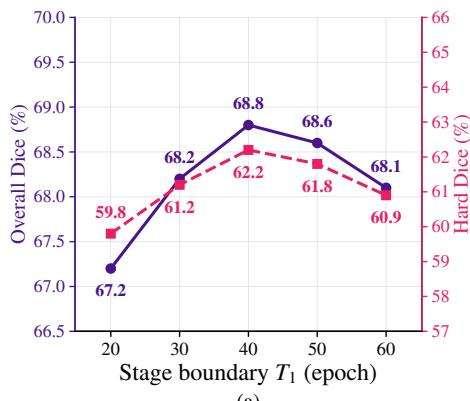

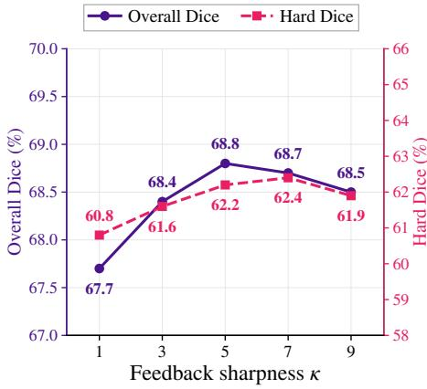  
(b)

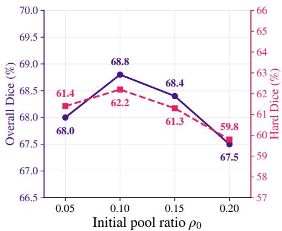  
(c)  
Fig. 4: Hyperparameter sensitivity. Overall and Hard-structure Dice remain stable around the adopted configuration (dashed lines) for (a) stage boundary $T _ { 1 }$ , (b) feedback sharpness $\kappa ,$ and (c) initial pool ratio $\rho _ { 0 }$

TABLE 5: Annotation-budget scaling on the held-out test set (epoch 300, 10-click). Recovery is relative to Full overall Dice.
<table><tr><td>ρ</td><td>Samples</td><td>Overall</td><td>Easy</td><td>Med.</td><td>Hard</td><td>Recovery</td></tr><tr><td>0.20</td><td>~14k</td><td>0.660</td><td>0.692</td><td>0.645</td><td>0.582</td><td>94.3%</td></tr><tr><td>0.40</td><td>28k</td><td>0.688</td><td>0.715</td><td>0.675</td><td>0.622</td><td>98.3%</td></tr><tr><td>0.60</td><td>~42k</td><td>0.694</td><td>0.721</td><td>0.682</td><td>0.626</td><td>99.1%</td></tr><tr><td>1.00</td><td>70,351</td><td>0.700</td><td>0.733</td><td>0.690</td><td>0.610</td><td>100%</td></tr></table>

TABLE 6: Volume-disjoint robustness check. All 40%-budget methods use the same annotation budget.
<table><tr><td>Method</td><td>Budget</td><td>Overall</td><td>Medium</td><td>Hard</td></tr><tr><td>Full Dataset</td><td>100%</td><td>0.687</td><td>0.677</td><td>0.596</td></tr><tr><td>Random</td><td>40%</td><td>0.602</td><td>0.583</td><td>0.512</td></tr><tr><td>LESS+Organ</td><td>40%</td><td>0.647</td><td>0.629</td><td>0.563</td></tr><tr><td>SASS</td><td>40%</td><td>0.675</td><td>0.663</td><td>0.604</td></tr></table>

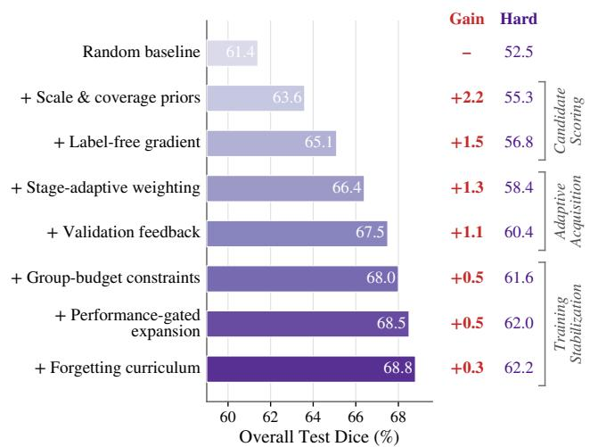  
Fig. 5: Cumulative ablation at 40% budget. Bars: overall test Dice; red values: incremental gains; purple: Hard-structure Dice. Components grouped into scoring, adaptive acquisition, and stabilization.

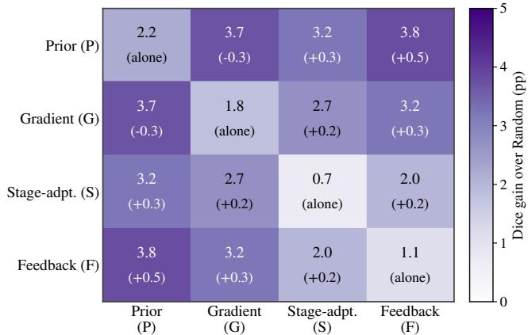  
Fig. 6: Component interaction analysis. Each cell: Dice gain over Random for the corresponding pair; diagonal: individual components. Parentheses report the interaction beyond additivity, computed as the paired gain minus the sum of the two individual gains.

Figure 6 complements the cumulative ablation by showing pairwise interactions. Prior and gradient scoring provide the largest individual gains, while stage adaptation and validation feedback produce additional synergy when combined with the scoring components. This confirms that the main components are complementary rather than interchangeable.

## 4.3.2 Sensitivity Analysis

The sensitivity analyses are provided in Supplementary Tables S5–S7. The adopted Stage 3 weighting $( \alpha _ { 1 } { = } 0 . 7 0 )$ preserves a nonzero prior contribution, the group cap $\scriptstyle ( \eta = 0 . 1 5 )$ prevents skeletal over-concentration, and validation-triggered rescoring gives the best Dice with moderate overhead (4.7%).

For context, the 4.2 pp gain from one-shot to validationtriggered rescoring is comparable in magnitude to the 4.4 pp spread from Random to the strongest non-SASS 40%-budget selector in Table 1 (0.614–0.658). This descriptive comparison indicates that acquisition timing can affect performance on the same scale as the choice of selection criterion.

Figure 4 shows smooth performance variation across the tested values of $T _ { 1 }$ $\kappa ,$ and $\rho _ { 0 } .$ , with the adopted configuration achieving the highest overall Dice in each sweep. Here, $T _ { 1 }$ denotes the stage-transition boundary defined in Eq. 14, $T _ { 2 }$ specifies the end of the interpolation interval in Eq. 15, κ is the feedback-sharpness parameter in Eq. $^ { 8 , }$ and $\rho _ { 0 }$ is the initial-pool ratio defined in Eq. 22. For the stage boundary $T _ { 1 }$ (Fig. 4(a)), performance improves as the transition from prior-guided to gradient-enabled acquisition is delayed from 20 to 40 epochs, reaching 68.8% Overall Dice and 62.2% Hard Dice at $\dot { T } _ { 1 } = 4 0$ , before gradually declining for later transitions. This suggests that activating gradientbased evidence too early, before sufficiently mature representations have formed, is less effective, whereas excessive delay also limits its contribution. For feedback sharpness κ (Fig. 4(b)), performance remains relatively stable over a broad range, with Overall Dice peaking at 68.8% for $\kappa = 5$ and Hard Dice varying only moderately, indicating limited sensitivity to the precise feedback strength. The initial pool ratio $\rho _ { 0 }$ (Fig. 4(c)) exhibits a similarly smooth trend, with $\rho _ { 0 } = 0 . 1 0$ providing the best balance between Overall Dice (68.8%) and Hard Dice (62.2%); both smaller and larger initial pools reduce overall performance.

## 4.3.3 Dynamic Acquisition

The validation-triggered expansion process improves validation performance as the labeled pool grows, with the 40% target reached shortly after the Stage 3 transition. The representative trajectory is provided in Supplementary Table S4; realized expansion epochs may vary across runs.

## 4.3.4 Selection Evolution

Having quantified what SASS achieves, we now examine how annotation budget is allocated over time. Figure 7 visualizes selection behavior from three perspectives.

In Stage 1 (Fig. 7(a)), category-level priors and group constraints distribute the budget broadly while applying the per-group caps to ribs and vertebrae. During Stage 2, as the gradient score receives increasing weight, the Abdominal share rises from 28.5% to 31.2%. In Stage $3 \ ( \alpha _ { 1 } { = } 0 . 7 0 )$ , the Skeletal category allocation drops to 8.5% in the final query batch and the released budget is redistributed across the remaining categories.

Figure 7(b) shows a corresponding difficulty-group shift: the Hard-structure share increases from 19.8% to 29.4%—approximately 2.1× its candidate-pool proportion of 13.8%—providing higher annotation density for difficult structures and explaining the group-level less-is-more pattern in Table 1.

The final-pool comparison (Fig. 7(c)) shows that Random, Entropy, and BADGE remain largely datasetproportional, whereas SASS produces the strongest departure from the candidate-pool distribution while preserving broad anatomical coverage. These shifts are consistent with the combined effects of category-level priors, group constraints, stage-adaptive weighting, and validation feedback, providing an operational counterpart to the performance gains reported above.

## 4.4 Discussion and Analysis

Active learning is commonly framed as choosing which candidates to label under a fixed annotation budget. Our results show that, in long-tailed dense prediction, annotation efficiency also depends on how the budget is distributed across categories and when model-derived evidence is sufficiently reliable to guide acquisition. SASS addresses these requirements through prior-guided category allocation, label-free self-supervised gradient scoring, and validation-gated activation of that score. On a testbed of more than 100,000 samples spanning 108 anatomical structures, SASS recovers

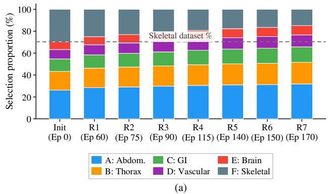

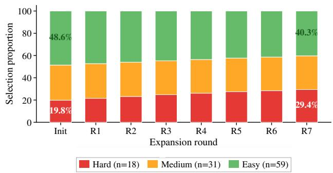  
(b)

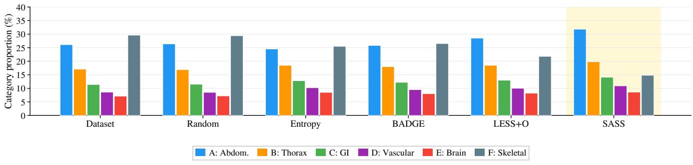  
(c)  
Fig. 7: Selection evolution. (a) Category distribution per query batch; dashed line: Skeletal candidate-pool share (29.5%). (b) Difficulty-group distribution: Hard share rises from 19.8% to 29.4% (2.1× candidate-pool proportion). (c) Final cumulative pool by method: SASS reduces Skeletal to 14.8%, shifting budget toward Abdominal (∼32%) and GI (∼14%).

98.3% of full-dataset Dice at a 40% training-pool annotation budget and outperforms BADGE by 5.1 percentage points. The group-level “less-is-more” result, together with structure-level differences whose confidence intervals exclude zero, further shows that targeted reallocation can improve underrepresented categories while retaining most overall performance.

SASS addresses a different form of non-stationarity from prior adaptive acquisition. RALF adjusts the utility of exploration and exploitation criteria that remain available throughout acquisition [37], whereas SASS determines whether model-derived gradient evidence is sufficiently reliable to enter selection at all. Imbalance-aware acquisition has established the value of balancing classes or regions [41], [42], but SASS makes long-tail allocation performanceresponsive through validation feedback and maintains this control after gradient scoring begins. Unlike supervised gradient and influence estimators, which require candidate labels or construct surrogates for a supervised candidate loss [8], [19], [35], SASS derives its sample-level gradient score from a self-supervised teacher–student objective without candidate masks. Together, these differences define a reliability-gated decomposition of acquisition: categorylevel budget allocation remains active throughout training, whereas model-derived sample ranking is introduced only after the task-specific validation criterion is met.

In addition, our design has a training-dynamics rationale. In finite-width neural networks, the model’s gradient geometry—that is, the relationships among parameter gradients—changes rapidly early in training and evolves more slowly thereafter [74]; consequently, a ranking produced by an immature model may become stale by a later acquisition round. Excluding candidate gradients before the validation gate prevents such early rankings from shaping the pool; after the gate, gradient scoring supports samplelevel refinement while the prior terms maintain category coverage. The validation criterion in Eq. 14 operationalizes signal readiness for the present task; it is not claimed to measure gradient-geometry stability directly or to define a universal phase boundary.

The empirical analyses support this reliability-gated interpretation. The cumulative ablation and pairwise interaction results show that category-level priors, label-free gradient scoring, stage adaptation, and validation feedback are complementary rather than interchangeable (Supplementary Table S3 and Fig. 6). More directly, validation-triggered rescoring improves one-shot selection by 4.2 percentage points (Supplementary Table S7), showing that refreshing model-derived scores as training evolves materially affects performance. The selection-evolution analysis further shows that SASS shifts the labeled pool away from the candidatepool distribution toward Hard and underrepresented categories (Fig. 7), providing behavioral evidence that the performance gains are accompanied by the intended longtail reallocation.

The larger gains for several small or difficult structures cannot be attributed to organ size alone. A more plausible explanation is that these structures remain poorly learned under Full training and therefore benefit more from targeted annotation than structures that are already near saturation. Consistent with this interpretation, the liver and kidneys retain approximately 98.5% of their Full Dice at the 40% SASS budget (Table 2), while the Hard group exceeds the Full reference at both ρ=0.40 and ρ=0.60 (0.622 and 0.626 versus

0.610; Table 5). These results attribute the “less-is-more” effect to more effective annotation allocation: SASS preserves sufficient supervision for well-learned categories while reallocating annotation effort toward difficult and underrepresented categories, where additional samples provide greater benefit. This enables improved performance on the Hard group despite using substantially fewer annotations overall.

The contrast with Full+CB in Section 4.2.2 indicates that training-time class rebalancing and acquisition-time pool construction address different objectives: the former improves learning from an already labeled dataset, whereas the latter reallocates a limited annotation budget toward underrepresented categories. SASS therefore does not uniformly replace class-balanced full-data training; its advantage lies in retaining most overall performance under a restricted annotation budget while improving the long tail.

Although instantiated on the point-prompt 3D segmentation architecture of Wang et al. [3], SASS operates at the data-selection level and does not require structural changes to the segmentation network. Its acquisition components use standard model forward/backward operations, candidate category identifiers available before mask annotation, and feedback derived from the validation set, rather than architecture-specific modules. SASS could therefore in principle be adapted to other dense-prediction systems, including self-configuring CNN pipelines such as nnU-Net [29] and hybrid transformer architectures such as TransUNet [75]; empirical validation across architectures remains future work.

Some structures remain difficult under all evaluated selection strategies. The relatively low Dice of heart cavities and fine pulmonary vasculature is consistent with motion, boundary ambiguity, and limited spatial detail after 1283 resampling. SASS nevertheless improves their mean Dice over Random selection, while validation feedback assigns greater acquisition priority to these underperforming categories. Thus, targeted reallocation can reduce under-representation, although it does not eliminate limitations associated with the imaging and preprocessing setting.

## 4.5 Limitations

Several limitations also motivate further development of SASS. First, the absolute Dice values depend on the pointprompt and resampling protocol adopted in this study and may vary with alternative prompting strategies or higherresolution training. Nevertheless, all evaluated selection methods share the same architecture, prompting protocol, and resolution, enabling controlled comparison of their relative data-selection effectiveness. Second, acquisition is simulated from a fully annotated pool, following standard activelearning practice [6]. Extending SASS to prospective expertin-the-loop acquisition will enable evaluation of annotation time, interaction cost, and workflow efficiency in realistic clinical settings. Third, the prior-guided components in our medical instantiation exploit category identifiers available before dense mask annotation through the dataset organization. In applications where such metadata are unavailable, these components can be instantiated with alternative task-appropriate priors, while the label-free gradient scorer remains directly applicable. Finally, gradient-enabled acquisition introduces additional computation for candidate-level gradient extraction. The stage-adaptive design already mitigates this cost by bypassing gradient computation during Stage 1 and activating it only when model-derived signals become sufficiently informative; further improvements in gradient approximation and candidate screening could enhance scalability to even larger pools.

Overall, these considerations identify natural directions for extending SASS beyond the present setting. Within the controlled evaluation considered here, all methods are compared under matched architectures, prompting protocols, and resolutions, with subset-selection methods operating under the same annotation budget. The results therefore provide a consistent assessment of the benefits of stageadaptive, label-free, and category-aware sample selection.

## 5 CONCLUSION AND FUTURE WORK

We presented SASS, a stage-adaptive data selection framework for annotation-efficient dense prediction under longtailed category distributions. Under a substantially reduced annotation budget, SASS approaches full-dataset performance while surpassing it on the hardest categories, and outperforms established active-learning acquisition baselines evaluated here. These findings show that targeted labeled-pool construction can preserve most overall performance while improving performance in the long tail.

Beyond ranking individual samples, SASS also determines how the annotation budget is distributed across longtailed categories and when model-derived scores should begin to guide acquisition. Because this formulation operates at the data-selection level without modifying the underlying architecture, it has the potential to extend to other dense-prediction systems and long-tailed domains. Future work should quantify expert annotation savings in prospective workflows and reduce candidate-level scoring cost for larger unlabeled pools. More broadly, deciding when model-derived scores are reliable enough to guide selection may inform data curation for large-scale pretraining and instruction tuning.

## DATA AVAILABILITY

This study uses only publicly available, de-identified 3D medical image datasets and generates no new patient data. Code, training pipelines, and evaluation scripts are available for peer review at https://anonymous.4open.science/r/SA SS-CD18 and will be publicly released under an open-source license upon acceptance.

## CONFLICT OF INTEREST

The authors declare no competing interests.

## REFERENCES

[1] A. Kirillov et al., “Segment anything,” in ICCV, 2023.

[2] J. Ma, Y. He, F. Li, L. Han, C. You, and B. Wang, “Segment anything in medical images,” Nature Communications, vol. 15, no. 1, p. 654, 2024.

[3] H. Wang, S. Guo, J. Ye, Z. Deng, J. Cheng, T. Li, J. Chen, Y. Su, Z. Huang, Y. Shen, B. Fu, S. Zhang, J. He, and Y. Qiao, “SAM-Med3D: Towards general-purpose segmentation models for volumetric medical images,” in Computer Vision–ECCV 2024 Workshops, 2024, pp. 51–67.

[4] C. Coleman, C. Yeh, S. Mussmann, B. Mirzasoleiman, P. Bailis, P. Liang, J. Leskovec, and M. Zaharia, “Selection via proxy: Efficient data selection for deep learning,” in International Conference on Learning Representations, 2020.

[5] B. Mirzasoleiman, J. Bilmes, and J. Leskovec, “Coresets for dataefficient training of machine learning models,” in International Conference on Machine Learning, 2020.

[6] B. Settles, “Active learning literature survey,” University of Wisconsin–Madison, Tech. Rep. 1648, 2009.

[7] P. Ren, Y. Xiao, X. Chang, P.-Y. Huang, Z. Li, X. Chen, and X. Wang, “A survey of deep active learning,” ACM Computing Surveys, vol. 54, no. 9, pp. 1–40, 2022.

[8] J. T. Ash, C. Zhang, A. Krishnamurthy, J. Langford, and A. Agarwal, “BADGE: Batch active learning by diverse gradient embeddings,” in ICLR, 2020.

[9] P. W. Koh and P. Liang, “Understanding black-box predictions via influence functions,” in ICML, 2017.

[10] G. Pruthi, F. Liu, M. Sundararajan, and S. Kale, “Estimating training data influence by tracing gradient descent,” in Advances in Neural Information Processing Systems, 2020.

[11] C.-K. Yeh, J. S. Kim, I. E. H. Yen, and P. Ravikumar, “Representer point selection for explaining deep neural networks,” in Advances in Neural Information Processing Systems, 2018.

[12] A. Ghorbani and J. Zou, “Data shapley: Equitable valuation of data for machine learning,” in International Conference on Machine Learning, 2019.

[13] K. Killamsetty, D. Sivasubramanian, G. Ramakrishnan, A. De, and R. Iyer, “GRAD-MATCH: Gradient matching based data subset selection for efficient deep model training,” in International Conference on Machine Learning, 2021.

[14] Y. Gal, R. Islam, and Z. Ghahramani, “Deep Bayesian active learning with image data,” in International Conference on Machine Learning (ICML), 2017, pp. 1183–1192.

[15] A. Kirsch, J. van Amersfoort, and Y. Gal, “BatchBALD: Efficient and diverse batch acquisition for deep bayesian active learning,” in Advances in Neural Information Processing Systems, 2019.

[16] O. Sener and S. Savarese, “Active learning for convolutional neural networks: A core-set approach,” in ICLR, 2018.

[17] M. Toneva, A. Sordoni, R. T. d. Combes, A. Trischler, Y. Bengio, and G. J. Gordon, “An empirical study of example forgetting during deep neural network learning,” in International Conference on Learning Representations (ICLR), 2019.

[18] A. Jacot, F. Gabriel, and C. Hongler, “Neural tangent kernel: Convergence and generalization in neural networks,” in Advances in Neural Information Processing Systems, vol. 31, 2018.

[19] T. Wang, X. Li, P. Yang, G. Hu, X. Zeng, S. Huang, C.-Z. Xu, and M. Xu, “Boosting active learning via improving test performance,” in AAAI Conference on Artificial Intelligence, vol. 36, no. 8, 2022, pp. 8566–8574.

[20] A. Achille, M. Rovere, and S. Soatto, “Critical learning periods in deep networks,” in International Conference on Learning Representations (ICLR), 2019.

[21] Y. Cui, M. Jia, T.-Y. Lin, Y. Song, and S. Belongie, “Class-balanced loss based on effective number of samples,” in IEEE/CVF Conference on Computer Vision and Pattern Recognition, 2019, pp. 9268– 9277.

[22] Z. Liu, Z. Miao, X. Zhan, J. Wang, B. Gong, and S. X. Yu, “Largescale long-tailed recognition in an open world,” in IEEE/CVF Conference on Computer Vision and Pattern Recognition, 2019, pp. 2537–2546.

[23] K. Cao, C. Wei, A. Gaidon, N. Arechiga, and T. Ma, “Learning imbalanced datasets with label-distribution-aware margin loss,” in Advances in Neural Information Processing Systems, 2019.

[24] B. Kang, S. Xie, M. Rohrbach, Z. Yan, A. Gordo, J. Feng, and Y. Kalantidis, “Decoupling representation and classifier for longtailed recognition,” in International Conference on Learning Representations, 2020.

[25] K. Killamsetty, D. Sivasubramanian, G. Ramakrishnan, and R. Iyer, “GLISTER: Generalization based data subset selection for efficient and robust learning,” in AAAI Conference on Artificial Intelligence, 2021.

[26] H. Wang, Q. Jin, S. Li, S. Liu, M. Wang, and Z. Song, “A comprehensive survey on deep active learning in medical image analysis,” Medical Image Analysis, vol. 95, p. 103201, 2024.

[27] S. Budd, E. C. Robinson, and B. Kainz, “A survey on active learning and human-in-the-loop deep learning for medical image analysis,” Medical Image Analysis, vol. 71, p. 102062, 2021.

[28] J. Wasserthal et al., “Totalsegmentator: Robust segmentation of 104 anatomic structures in CT images,” Radiology: Artificial Intelligence, vol. 5, no. 5, p. e230024, 2023.

[29] F. Isensee, P. F. Jaeger, S. A. Kohl, J. Petersen, and K. H. Maier-Hein, “nnu-net: a self-configuring method for deep learning-based biomedical image segmentation,” Nature methods, vol. 18, no. 2, pp. 203–211, 2021.

[30] M. Paul, S. Ganguli, and G. K. Dziugaite, “Deep learning on a data diet: Finding important examples early in training,” in Advances in Neural Information Processing Systems, vol. 34, 2021.

[31] S. Mindermann, J. M. Brauner, A. D. Cobb et al., “Prioritized training on points that are learnable, worth learning, and not yet learnt,” in International Conference on Machine Learning, 2022, pp. 15 630–15 649.

[32] D. Yoo and I. S. Kweon, “Learning loss for active learning,” in IEEE/CVF Conference on Computer Vision and Pattern Recognition (CVPR), 2019, pp. 93–102.

[33] S. Sinha, S. Ebrahimi, and T. Darrell, “Variational adversarial active learning,” in IEEE/CVF International Conference on Computer Vision (ICCV), 2019, pp. 5972–5981.

[34] H. Lu, Y. Xie, M. Ding, W. Zhan, X. Yang, M. Tomizuka, and J. Yan, “Sel4FT: Annotation selection for pretraining-finetuning with distribution shift,” IEEE Transactions on Pattern Analysis and Machine Intelligence, vol. 47, no. 11, pp. 9922–9937, 2025.

[35] M. Xia, S. Malladi, S. Gururangan, S. Arora, and D. Chen, “LESS: Selecting influential data for targeted instruction tuning,” in Proceedings of the 41st International Conference on Machine Learning, ser. Proceedings of Machine Learning Research, vol. 235. PMLR, 2024, pp. 54 104–54 132.

[36] H. Tan, S. Wu, X. Wu, W. Wang, B. Zhao, Z. Xie, G.-S. Xia, and X. Qi, “Understanding data influence with differential approximation,” IEEE Transactions on Pattern Analysis and Machine Intelligence, vol. 48, no. 7, pp. 8378–8394, 2026.

[37] S. Ebert, M. Fritz, and B. Schiele, “RALF: A reinforced active learning formulation for object class recognition,” in IEEE Conference on Computer Vision and Pattern Recognition (CVPR), 2012, pp. 3626– 3633.

[38] Z. Wang, Q. Xu, Z. Yang, Z. Xu, L. Zhang, X. Cao, and Q. Huang, “A unified perspective for loss-oriented imbalanced learning via localization,” IEEE Transactions on Pattern Analysis and Machine Intelligence, vol. 48, no. 1, pp. 639–656, 2026.

[39] Z. Yang, Q. Xu, S. Li, Z. Wang, X. Cao, and Q. Huang, “DirMixE: Harnessing test agnostic long-tail recognition with hierarchical label variations,” IEEE Transactions on Pattern Analysis and Machine Intelligence, vol. 48, no. 4, pp. 4605–4622, 2026.

[40] K. Gan, T. Wei, and M.-L. Zhang, “Decouple then converge: Handling unknown unlabeled distributions in long-tailed semisupervised learning,” IEEE Transactions on Pattern Analysis and Machine Intelligence, 2026, early access.

[41] U. Aggarwal, A. Popescu, and C. Hudelot, “Active learning for imbalanced datasets,” in IEEE/CVF Winter Conference on Applications of Computer Vision (WACV), 2020, pp. 1428–1437.

[42] L. Cai, X. Xu, J. H. Liew, and C. S. Foo, “Revisiting superpixels for active learning in semantic segmentation with realistic annotation costs,” in IEEE/CVF Conference on Computer Vision and Pattern Recognition (CVPR), 2021, pp. 10 988–10 997.

[43] Z. Wu, W. Wang, L. Wang, Y. Li, F. Lv, Q. Xia, C. Chen, A. Hao, and S. Li, “Pixel is all you need: Adversarial spatio-temporal ensemble active learning for salient object detection,” IEEE Transactions on Pattern Analysis and Machine Intelligence, vol. 47, no. 2, pp. 858– 877, 2025.

[44] L. Zhu, T. Chen, J. Yin, S. See, D. W. Soh, and J. Liu, “Replay master: Automatic sample selection and effective memory utilization for continual semantic segmentation,” IEEE Transactions on Pattern Analysis and Machine Intelligence, vol. 47, no. 11, pp. 10 311–10 328, 2025.

[45] L. Kong, X. Xu, J. Ren, W. Zhang, L. Pan, K. Chen, W. T. Ooi, and Z. Liu, “Multi-modal data-efficient 3D scene understanding for autonomous driving,” IEEE Transactions on Pattern Analysis and Machine Intelligence, vol. 47, no. 5, pp. 3748–3765, 2025.

[46] V. Nath, D. Yang, H. R. Roth, and D. Xu, “Warm start active learning with proxy labels and selection via semi-supervised fine-tuning,” in Medical Image Computing and Computer Assisted Intervention – MICCAI, 2022, pp. 297–308.

[47] A. Parvaneh, E. Abbasnejad, D. Teney, G. Haffari, A. van den Hengel, and J. Q. Shi, “Active learning by feature mixing,” in IEEE/CVF Conference on Computer Vision and Pattern Recognition (CVPR), 2022, pp. 12 237–12 246.

[48] R. Caramalau, B. Bhattarai, and T.-K. Kim, “Sequential graph convolutional network for active learning,” in IEEE/CVF Conference on Computer Vision and Pattern Recognition, 2021, pp. 9583–9592.

[49] J. Z. Bengar, J. van de Weijer, B. Twardowski, and B. Raducanu, “Reducing label effort: Self-supervised meets active learning,” in IEEE/CVF International Conference on Computer Vision Workshops (ICCVW), 2021, pp. 1631–1639.

[50] F. Peng, C. Wang, J. Liu, and Z. Yang, “Active learning for lane detection: A knowledge distillation approach,” in IEEE/CVF International Conference on Computer Vision (ICCV), 2021, pp. 15 152– 15 161.

[51] Y. Bengio, J. Louradour, R. Collobert, and J. Weston, “Curriculum learning,” in Proceedings of the 26th Annual International Conference on Machine Learning, 2009, pp. 41–48.

[52] M. P. Kumar, B. Packer, and D. Koller, “Self-paced learning for latent variable models,” in Advances in Neural Information Processing Systems, vol. 23, 2010, pp. 1189–1197.

[53] A. Jiménez-Sánchez, D. Mateus, S. Kirchhoff, C. Kirchhoff, P. Biberthaler, N. Navab, M. A. González Ballester, and G. Piella, “Medical-based deep curriculum learning for improved fracture classification,” in Medical Image Computing and Computer Assisted Intervention–MICCAI 2019, 2019, pp. 694–702.

[54] C. Wei, K. Sohn, C. Mellina, A. Yuille, and F. Yang, “CReST: A class-rebalancing self-training framework for imbalanced semisupervised learning,” in IEEE/CVF Conference on Computer Vision and Pattern Recognition (CVPR), 2021, pp. 10 857–10 866.

[55] A. Hatamizadeh, Y. Tang, V. Nath, D. Yang, A. Myronenko, B. Landman, H. R. Roth, and D. Xu, “UNETR: Transformers for 3d medical image segmentation,” in IEEE/CVF Winter Conference on Applications of Computer Vision, 2022.

[56] Y. Tang, D. Yang, W. Li, H. R. Roth, B. Landman, D. Xu, V. Nath, and A. Hatamizadeh, “Self-supervised pre-training of swin transformers for 3D medical image analysis,” in IEEE/CVF Conference on Computer Vision and Pattern Recognition (CVPR), 2022, pp. 20 730– 20 740.

[57] J. Ma, Y. Zhang, S. Gu, C. Zhu, C. Ge, Y. Zhang, X. An, C. Wang, Q. Wang, X. Liu et al., “AbdomenCT-1K: Is abdominal organ segmentation a solved problem?” IEEE Transactions on Pattern Analysis and Machine Intelligence, vol. 44, no. 10, pp. 6695–6714, 2022.

[58] Y. Ji, H. Bai, C. Ge, J. Yang, Y. Zhu, R. Zhang, Z. Li, L. Zhang, W. Ma, X. Wan, and P. Luo, “AMOS: A large-scale abdominal multi-organ benchmark for versatile medical image segmentation,” in Advances in Neural Information Processing Systems, 2022.

[59] W. Li, C. Qu, X. Chen, P. R. A. S. Bassi, Y. Shi, Y. Lai, Q. Yu, H. Xue, Y. Chen, X. Lin et al., “AbdomenAtlas: A large-scale, detailedannotated, and multi-center dataset for efficient transfer learning and open algorithmic benchmarking,” Medical Image Analysis, vol. 97, p. 103285, 2024.

[60] Y. Du, F. Bai, T. Huang, and B. Zhao, “SegVol: Universal and interactive volumetric medical image segmentation,” in Advances in Neural Information Processing Systems, vol. 37, 2024, pp. 110 746– 110 783.

[61] G. Wang, J. Ye, J. Cheng, T. Li, Z. Chen, J. Cai, J. He, and B. Zhuang, “SAM-Med3D-MoE: Towards a non-forgetting segment anything model via mixture of experts for 3d medical image segmentation,” in Medical Image Computing and Computer Assisted Intervention (MICCAI), 2024, pp. 552–561.

[62] Z. Huang, Y. Jiang, R. Zhang, S. Zhang, and X. Zhang, “CAT: Coordinating anatomical-textual prompts for multi-organ and tumor segmentation,” in Advances in Neural Information Processing Systems, 2024.

[63] M. Caron, H. Touvron, I. Misra, H. Jégou, J. Mairal, P. Bojanowski, and A. Joulin, “Emerging properties in self-supervised vision transformers,” in ICCV, 2021.

[64] W. B. Johnson and J. Lindenstrauss, “Extensions of Lipschitz mappings into a Hilbert space,” Contemporary Mathematics, vol. 26, pp. 189–206, 1984.

[65] D. Achlioptas, “Database-friendly random projections: Johnson-Lindenstrauss with binary coins,” J. Comput. Syst. Sci., vol. 66, no. 4, pp. 671–687, 2003.

[66] G. Hacohen and D. Weinshall, “On the power of curriculum learning in training deep networks,” in International Conference on Machine Learning. PMLR, 2019, pp. 2535–2544.

[67] U. Baid, S. Ghodasara, S. Mohan, M. Bilello, E. Calabrese, E. Colak, K. Farahani, J. Kalpathy-Cramer, F. C. Kitamura, S. Pati et al., “The RSNA-ASNR-MICCAI BraTS 2021 benchmark on brain tumor segmentation and radiogenomic classification,” arXiv preprint arXiv:2107.02314, 2021.

[68] N. Heller, F. Isensee, K. H. Maier-Hein, X. Hou, C. Xie, F. Li, Y. Nan, G. Mu, Z. Lin, M. Han et al., “The state of the art in kidney and kidney tumor segmentation in contrast-enhanced CT imaging: Results of the KiTS19 challenge,” Medical Image Analysis, vol. 67, p. 101821, 2021.

[69] X. Zhuang and J. Shen, “Multi-scale patch and multi-modality atlases for whole heart segmentation of MRI,” Medical Image Analysis, vol. 31, pp. 77–87, 2016.

[70] R. Dorent, A. Kujawa, M. Ivory, S. Bakas, N. Rieke, S. Joutard, B. Glocker, J. Cardoso, M. Modat, K. Batmanghelich et al., “Cross-MoDA 2021 challenge: Benchmark of cross-modality domain adaptation techniques for vestibular schwannoma and cochlea segmentation,” Medical Image Analysis, vol. 83, p. 102628, 2023.

[71] J. Ma, Y. Zhang, S. Gu, C. Ge, S. Ma, A. Young, Z. Cheng, K. Meng, X. Yang, Z. Huang et al., “Unleashing the strengths of unlabelled data in deep learning-assisted pan-cancer abdominal organ quantification: The FLARE22 challenge,” The Lancet Digital Health, vol. 6, no. 11, pp. e815–e826, 2024.

[72] X. Luo, W. Liao, J. Xiao, J. Chen, T. Song, X. Zhang, K. Li, D. N. Metaxas, G. Wang, and S. Zhang, “WORD: A large scale dataset, benchmark and clinical applicable study for abdominal organ segmentation from CT image,” Medical Image Analysis, vol. 82, p. 102642, 2022.

[73] A. Sekuboyina, M. E. Husseini, A. Bayat, M. Löffler, H. Liebl, H. Li, G. Tetteh, J. Kukacka, C. Payer, D. Stern et al., “VerSe: A vertebrae labelling and segmentation benchmark for multidetector CT images,” Medical Image Analysis, vol. 73, p. 102166, 2021.

[74] S. Fort, G. K. Dziugaite, M. Paul, S. Kharaghani, D. M. Roy, and S. Ganguli, “Deep learning versus kernel learning: An empirical study of loss landscape geometry and the time evolution of the neural tangent kernel,” in Advances in Neural Information Processing Systems, vol. 33, 2020.

[75] J. Chen, Y. Lu, Q. Yu, X. Luo, E. Adeli, Y. Wang, L. Lu, A. L. Yuille, and Y. Zhou, “TransUNet: Rethinking the U-Net architecture design for medical image segmentation through the lens of transformers,” Medical Image Analysis, vol. 97, p. 103280, 2024.