# LiFR v2: Completion-Augmented Event Propagation for High-Rate Dense Prediction

Tao Wan, Xiaoshan Wu, Yifei Yu, Bo Wang, Xiaoyang Lyu, Muxin Liu, Aoxuan Pan, Zhongrui Wang, and Xiaojuan Qi

Abstract—High-rate dense perception in dynamic environments is limited by the low update rate of RGB cameras, as rapid scene changes can occur between frames. Event cameras offer temporally dense but spatially sparse measurements, complementary to spatially dense RGB observations. Direct fusion cannot fully exploit this complementarity, while event-guided propagation fails on newly appearing or disoccluded regions without valid RGB support. We present LiFR v2, a unified propagation–completion–memory framework for causal anytime and streaming dense prediction from an RGB keyframe and events. LiFR v2 introduces an Event-Guided Completion Module (EGCM) to recover task-relevant representations where propagation is unsupported, and a History Retrieval Module (HRM) to reuse completed representations across successive queries. The framework supports semantic segmentation, monocular depth estimation, and multi-task dense prediction, and we further introduce SHF-Emerge to evaluate rapid object emergence and disocclusion. LiFR v2 achieves 74.37% mIoU on DSEC and 56.13% on SHF-Emerge, improving LiFR-Seg by 1.85 percentage points on the latter, while reducing SHF-Emerge depth RMSE from 1.564 m to 1.118 m over the propagation baseline. It also exceeds 100 FPS for both segmentation and depth, demonstrating accurate and efficient high-rate perception beyond RGB frame rates. Code is available at https://github.com/TaoWan0610/LiFR-v2.

Index Terms—Anytime dense prediction, depth estimation, event-based vision, feature propagation, semantic segmentation.

## I. INTRODUCTION

D ENSE prediction provides pixel-wise semantic and ge-ometric understanding for embodied systems such as ometric understanding for embodied systems such as autonomous vehicles and agile aerial robots [1, 2, 3, 4, 5]. In dynamic environments, these estimates must remain up to date under rapid viewpoint changes, object motion, and changing visibility [2, 6]. However, RGB cameras provide observations only at discrete frame times, leaving an interframe perceptual blind interval during which the scene can change without an updated image [7]. For an RGB stream at 20 Hz, this interval lasts 50 ms—long enough for a pedestrian to emerge from occlusion or a moving object to change position before the next frame, as illustrated in Fig. 1. Predictions anchored to the latest RGB observation can therefore become stale or miss newly visible content. This motivates dense prediction at arbitrary interframe times without waiting for the next RGB frame.

Event cameras naturally complement RGB observations by asynchronously capturing brightness changes at microsecondlevel resolution [8, 9, 10], providing timely cues to motion and visibility changes within the interframe blind interval [7]. However, events encode changes rather than absolute appearance, making event-only dense prediction difficult in regions with weak activity [11, 12, 13]. This complementarity has motivated RGB-event fusion for semantic and geometric prediction [14, 15, 16, 17, 18, 19, 20, 21], yet most methods remain tied to RGB frame times rather than updating predictions at arbitrary interframe timestamps. Event-assisted interpolation can synthesize intermediate observations, but methods requiring bracketing RGB frames are non-causal within the interval [22]. RAMNet and CFRNet support causal interframe depth prediction through recurrent updates or cross-frame-rate fusion [23, 24], but are specialized to monocular depth and update target-time representations implicitly, without distinguishing the propagation of existing content from the recovery of newly visible regions.

Event-guided feature propagation for causal anytime interframe semantic segmentation was first introduced by LiFR-Seg [25], transporting RGB features from a keyframe to arbitrary query timestamps using event-derived motion and historical context. While effective for temporally aligning observed content, propagation is fundamentally limited by its source representation: it can relocate existing features but cannot recover content absent from the RGB keyframe. When an occluded object becomes visible between frames, no valid source feature exists for propagation, regardless of motion accuracy. We refer to this as the source-support constraint. Since interframe events can provide evidence of such newly visible content [7], overcoming this constraint requires complementing propagation with event-guided feature completion and retaining the recovered information for subsequent queries. LiFR-Seg lacks this explicit completion mechanism and remains specific to semantic segmentation.

To overcome the source-support constraint, we extend LiFR-Seg to LiFR v2, a unified propagation–completion–memory framework for causal anytime and streaming dense prediction. Its Event-Guided Completion Module (EGCM) recovers taskrelevant representations where propagation lacks valid RGB support, while the History Retrieval Module (HRM) retains completed representations across successive queries. LiFR v2 further generalizes interframe prediction from semantic segmentation to monocular depth estimation and multi-task dense prediction. To directly evaluate rapid emergence and disocclusion, we introduce SHF-Emerge, a targeted synthetic benchmark designed around these failure cases. LiFR v2 achieves consistent gains across all three tasks, with particularly pronounced improvements under abrupt visibility changes: on SHF-Emerge, it reaches 56.13% mIoU for semantic segmentation and reduces depth RMSE from 1.564 m to 1.118 m over propagation-based baselines. It further maintains high-rate inference at over 100 FPS for both segmentation and depth.

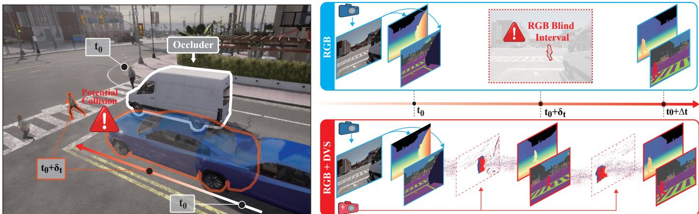  
Fig. 1. Motivation for causal interframe dense prediction. A rapidly emerging road user may become visible between successive RGB observations, leaving a perceptual blind interval for an RGB-only pipeline. Events recorded after the RGB keyframe provide evidence of the scene change and support target-time semantic and depth prediction before the next RGB observation. The illustration presents the perception scenario rather than a closed-loop collision-avoidance evaluation.

Extension over the conference version: This work substantially extends our conference paper, LiFR-Seg [25], in the following aspects. (i) We introduce EGCM to complete propagated features with task-relevant event information, addressing missing source support in newly visible and disoccluded regions. (ii) We develop HRM by extending the original temporal memory mechanism to retain and retrieve event-completed historical features, improving temporal consistency across successive streaming predictions. (iii) We generalize the propagation–completion–memory framework from semantic segmentation to monocular depth estimation and multi-task prediction through task-specific feature interfaces, demonstrating its applicability across different tasks and backbones. (iv) We introduce SHF-Emerge, a synthetic benchmark featuring rapid object motion, emergence, and disocclusion, to evaluate interframe dense prediction under large local motion and abrupt visibility changes.

## II. RELATED WORK

## A. Event-Based Dense Prediction

Event-based dense prediction requires transforming asynchronous and spatially sparse brightness changes into representations that preserve scene structure and temporal evolution. Early approaches learned task-specific representations directly from event streams. EV-SegNet established an early convolutional formulation for semantic segmentation [11], while E2Depth introduced recurrent processing for monocular depth estimation [12]. Subsequent methods developed more structured spatio-temporal modeling, including event-priorguided attention in EvSegFormer [26], recurrent Transformer modeling in EReFormer [27], hierarchical temporal memory in HMNet [13], and edge-semantic and density-aware modeling in ESEG [28].

A complementary direction transfers supervision from the image domain to alleviate the scarcity of dense event annotations. EvDistill and DTL introduce cross-modal knowledge transfer from image-derived representations [29, 30], while ESS aligns recurrent event and image representations through domain adaptation [31]. More recent approaches exploit large pretrained models: OpenESS transfers image–text knowledge to event features [32], whereas Depth AnyEvent and ScaleEvent leverage visual foundation models for dense event representation learning [33, 34].

Despite these advances, event-only dense prediction remains constrained by the lack of direct appearance information, particularly in static or weakly changing regions where event observations are sparse. This limitation motivates the joint use of conventional images and event streams for dense prediction.

## B. RGB–Event Fusion for Dense Prediction

RGB–event fusion combines dense appearance information from images with temporally precise event measurements. Early semantic segmentation methods such as ISSAFE and EDCNet use event-derived dynamics to augment RGB representations under challenging motion [14, 15]. Later work shifts toward more adaptive cross-modal interaction: CMNeXt selects useful information from auxiliary modalities including events [35], while EISNet explicitly models event activity and modality reliability [16]. Recent approaches further accommodate modality heterogeneity through hybrid ANN– SNN processing [17] and state-space modeling [18].

Related developments have emerged for geometric prediction. Event-Intensity Stereo exploits complementary event and image cues for dense disparity estimation [36]. For monocular depth estimation, SRFNet models spatially varying modality reliability [19], PCDepth learns complementary high-level patterns [20], and UniCT Depth combines local convolutional modeling with global cross-modal interaction [21]. More recent methods introduce iterative depth hypothesis refinement [37] and asymmetric state-space representations [38].

These methods predominantly follow a frame-aligned formulation, in which an available image and its temporally associated event representation are jointly processed to improve the corresponding dense prediction. They therefore focus on multimodal enhancement rather than updating an earlier RGB representation to an arbitrary interframe timestamp where no RGB observation is available.

## C. Causal Interframe Dense Prediction

Temporal propagation and memory have been widely studied in frame-based video perception. Deep Feature Flow and Video Propagation Networks propagate representations across frames [39, 40], while Accel combines propagated reference features with current-frame features to correct temporal errors [41]. Memory-based video segmentation further develops explicit historical retrieval, including space–time memory matching [42], improved memory coverage [43], long-term memory organization [44], and streaming memory in SAM 2 [45]. These methods establish effective mechanisms for temporal feature propagation and retrieval, but operate on RGB video streams rather than targeting prediction within intervals lacking a current RGB observation.

Event cameras enable perceptual updates between successive RGB observations by providing asynchronous measurements at substantially higher temporal resolution. In automotive object detection, event-driven processing has been shown to produce high-rate predictions within the RGB interframe interval before the subsequent image becomes available [7]. This formulation, however, addresses object-level detection rather than pixel-wise dense prediction. Event-based frame interpolation represents a complementary strategy for increasing temporal resolution. Methods such as Time Lens and TimeLens-XL reconstruct intermediate RGB frames from asynchronous events and two temporally bracketing RGB observations [46, 22]. Since the later RGB observation is required, these interpolation-based formulations are non-causal for online interframe prediction.

Causal dense prediction instead uses only observations available up to the query timestamp. RAMNet maintains an asynchronous recurrent representation jointly updated by frames and events for interframe monocular depth estimation [23], while CFRNet combines cross-frame-rate multimodal interaction with recurrent temporal modeling for highrate depth prediction [24]. These methods decouple dense prediction from the native RGB acquisition rate, but primarily model temporal evolution through recurrent states and multimodal feature updates.

Our previous work, LiFR-Seg [25], instead adopts an explicit propagation formulation for causal interframe semantic segmentation. Event-derived motion and uncertainty-aware warping transport RGB-derived semantic features directly to arbitrary interframe timestamps. However, propagation remains constrained by the support of the RGB anchor: content absent from the source representation, such as newly appearing objects and disoccluded regions, cannot be recovered through feature transport alone.

Building on this formulation, LiFR v2 complements propagation with event-guided completion for missing source support, reuses completed representations across streaming queries, and extends causal interframe prediction beyond semantic segmentation to multiple dense prediction tasks.

## III. METHOD

## A. Problem Formulation

Let $\mathbf { I } _ { t _ { 0 } }$ denote an RGB keyframe captured at timestamp $t _ { 0 } .$ and let the next RGB frame be acquired at $t _ { 0 } + \Delta t$ , where $\Delta t$ denotes the RGB frame interval. Given an arbitrary target timestamp $\tau \in ( t _ { 0 } , t _ { 0 } + \Delta t ]$ , our goal is to predict the dense scene state at τ without accessing any RGB observation after $t _ { 0 }$

We denote the fixed pre-keyframe event context by ${ \mathcal { E } } ^ { - } =$ $\mathcal { E } _ { t _ { 0 } - \Delta t  t _ { 0 } }$ , and the event prefix between the RGB keyframe and the queried timestamp by $\mathcal { E } _ { \tau } ^ { + } = \mathcal { E } _ { t _ { 0 }  \tau }$ . Anytime dense prediction is formulated as

$$
\begin{array} { r } { \widehat { \mathbf { Y } } _ { \tau } = \mathcal { F } _ { \boldsymbol { \theta } } \left( \mathbf { I } _ { t _ { 0 } } , \mathcal { E } ^ { - } , \mathcal { E } _ { \tau } ^ { + } \right) , } \end{array}\tag{1}
$$

where $\widehat { \mathbf Y } _ { \widehat { \mathbf \Lambda } _ { 1 } }$ τ may represent semantic segmentation, monocular depth, or multiple dense prediction outputs. The formulation is strictly causal: neither the target-time RGB frame I nor any event occurring after $\tau$ is available to the model.

LiFR v2 supports both anytime and streaming prediction. For streaming prediction, we consider an ordered sequence of target timestamps $\mathcal { T } = \left( t _ { 1 } , \ldots , t _ { K } \right)$ satisfying $t _ { 0 } < t _ { 1 } <$ $\begin{array} { r } { \cdot \cdot \cdot < t _ { K } \leq t _ { 0 } + \Delta t . } \end{array}$ . At the k-th step, the newly arriving event slice $\Delta \mathcal { E } _ { k } = \mathcal { E } _ { t _ { k - 1 }  t _ { k } }$ is appended to the previously observed events, yielding the cumulative event prefix $\mathcal { E } _ { k } ^ { + } ~ = ~ \mathcal { E } _ { t _ { 0 }  t _ { k } }$ When $K = 1$ , the model performs anytime prediction. When $K > 1$ , it produces a sequence of temporally connected predictions while retaining historical states across target timestamps.

## B. LiFR v2 Framework Overview

Fig. 2 illustrates the overall architecture of LiFR $\mathbf { v } 2 .$ . The image encoder $\Phi _ { \mathrm { i m g } }$ is executed once on the RGB keyframe to obtain the anchor representation

$$
\mathbf { F } _ { 0 } = \Phi _ { \mathrm { i m g } } \left( \mathbf { I } _ { t _ { 0 } } \right) .\tag{2}
$$

Depending on the task architecture, $\mathbf { F } _ { 0 }$ may denote either a single spatial tensor or a multi-scale feature pyramid. The corresponding memory representation derived from $\mathbf { F } _ { 0 }$ initializes the historical memory bank $\mathcal { M } _ { 0 }$

For the k-th prediction at timestamp $t _ { k }$ , the shared streaming update cell is formulated as

$$
\left( \widehat { \mathbf { Y } } _ { t _ { k } } , \mathbf { F } _ { k } , \mathcal { M } _ { k } \right) = \mathcal { U } _ { \boldsymbol \theta } \left( \mathbf { F } _ { 0 } , \mathcal { M } _ { k - 1 } , \mathcal { E } ^ { - } , \mathcal { E } _ { k } ^ { + } \right) ,\tag{3}
$$

where $\mathbf { F } _ { k }$ denotes the completed representation at the current target timestamp and $\mathcal { M } _ { k }$ is the updated historical memory.

Each update consists of three stages. First, Event-Guided Propagation transports the RGB-anchor representation to the queried timestamp $t _ { k }$ using an event-derived motion field and its estimated reliability. Second, HRM refines the propagated representation by retrieving relevant historical context from the memory bank, which is initialized with the RGBanchor state and, during streaming inference, augmented with completed representations from preceding query timestamps. Third, EGCM incorporates task-relevant event features to complement target-time content that is inadequately represented by propagation and historical retrieval.

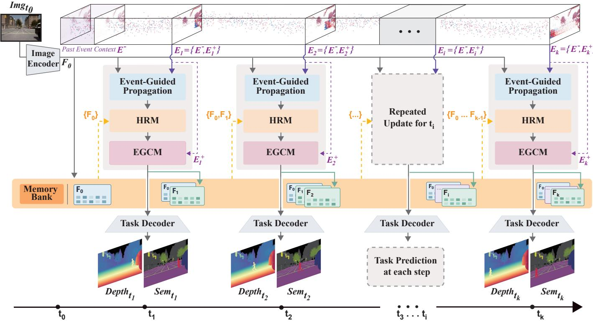  
Fig. 2. Overall architecture of LiFR v2. The RGB encoder extracts anchor features once from the keyframe. Event-derived motion and confidence guide uncertainty-aware Softmax Splatting, HRM retrieves and refines features using the memory bank, and EGCM uses the current event prefix to complete content unavailable through propagation. The completed features are decoded and their selected memory-level representation is stored for subsequent queries. The illustration shows multi-task outputs for semantic segmentation and depth estimation; single-task instantiations produce only the corresponding output. Memor slots depict the retained feature states, subject to the capacity described in Sec. III-D

The completed representation $\mathbf { F } _ { k }$ is decoded to produce $\widehat { \mathbf { Y } } _ { t _ { k } } ,$ and its feature at the selected memory level is written into the historical bank. Therefore, all target timestamps share the same RGB anchor and update cell, while their temporal dependency is maintained through recurrent memory read and write operations.

## C. Event-Guided Uncertainty-Aware Feature Propagation

We retain the uncertainty-aware feature propagation mechanism of LiFR-Seg [25] as the temporal propagation backbone of LiFR $\mathbf { v } 2 .$ . For each target timestamp $t _ { k } .$ , the fixed prekeyframe event context ${ { \mathcal { E } } ^ { - } }$ and the cumulative target-time event prefix $\mathcal { E } _ { k } ^ { + }$ are converted into voxel-grid representations [47], denoted by ${ \bf E } ^ { - }$ and $\mathbf { E } _ { k } ^ { + }$ , respectively.

As shown in Fig. 3, E-RAFT [48] estimates the anchorto-target motion field, while ScoreNet predicts its pixel-wise log-precision:

$$
\begin{array} { r l } & { \widehat { \mathbf { M } } _ { 0  k } = \mathcal { F } _ { \mathrm { F l o w } } ( \mathbf { E } ^ { - } , \mathbf { E } _ { k } ^ { + } ) , } \\ & { \mathbf { S } _ { 0  k } \ = \mathcal { F } _ { \mathrm { S c o r e } } ( \mathbf { E } _ { k } ^ { + } , \widehat { \mathbf { M } } _ { 0  k } ) . } \end{array}\tag{4}
$$

Here, $\widehat { \mathbf { M } } _ { 0  k }$ denotes the motion field from $t _ { 0 }$ to $t _ { k }$ , and $\mathbf { S } _ { 0  k }$ measures the reliability of the estimated motion.

Following LiFR-Seg, uncertainty-aware Softmax Splatting [49] propagates the intermediate RGB-anchor representation to the queried timestamp:

$$
\mathbf { F } _ { k } ^ { \mathrm { p } } = \frac { \overrightarrow { \mathrm { { C } } } ( \exp ( \mathbf { S } _ { 0  k } ) \odot \mathbf { F } _ { 0 } , \widehat { \mathbf { M } } _ { 0  k } ) } { \overrightarrow { \mathrm { { C } } } ( \exp ( \mathbf { S } _ { 0  k } ) , \widehat { \mathbf { M } } _ { 0  k } ) + \epsilon } .\tag{5}
$$

Here, $\overrightarrow { \Sigma }$ denotes forward splatting according to the supplied motion field, and the division is element-wise, with the singlechannel weights broadcast across feature channels. We set $\epsilon = 1 0 ^ { - 7 }$ to avoid division by zero at target pixels receiving no source contributions. The log-precision map controls the contribution of transported features during forward splatting, thereby reducing the influence of unreliable motion estimates. The exact feature representation to which Eq. (5) is applied depends on the task architecture and is described in Sec. III-F.

The propagated representation $\mathbf { F } _ { k } ^ { \mathrm { p } }$ is then passed to HRM for refinement through historical retrieval.

## D. History Retrieval Module

Although LiFR-Seg already employs temporal memory attention on a high-level semantic representation to improve long-term consistency, LiFR v2 further augments historical retrieval with explicit spatial and temporal positional encoding. In addition, the representation completed by EGCM at each target timestamp is stored in the recurrent memory bank as a historical state and becomes available to subsequent predictions, as illustrated in Fig. 4.

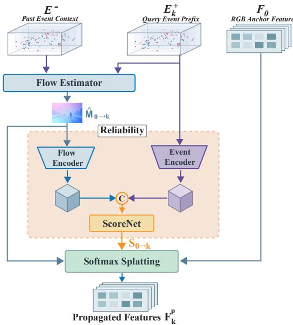  
Fig. 3. Event-guided uncertainty-aware feature propagation. The flow estimator takes the fixed pre-keyframe event voxel $\dot { \mathbf { E } } ^ { - }$ and cumulative targettime event voxel $\mathbf { E } _ { k } ^ { + }$ to predict the anchor-to-target motion field $\widehat { \mathbf { M } } _ { 0  k }$ Encoded flow and current-event features are concatenated along channels (C) and passed to ScoreNet to estimate the pixel-wise log-precision $\mathbf { S } _ { 0  k } .$ Softmax Splatting uses the motion field and log-precision to propagate the RGB-anchor representation $\mathbf { F } _ { 0 }$ to timestamp $t _ { k }$

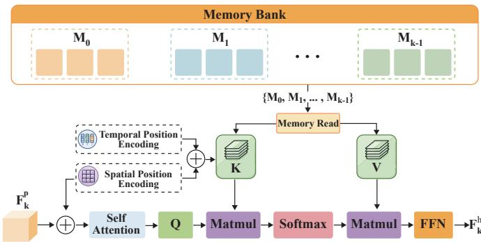  
Fig. 4. Architecture of the History Retrieval Module (HRM). The current propagated feature $\mathbf { F } _ { k } ^ { \mathrm { p } }$ supplies the queries, while retained memory features $\mathbf { \bar { M } } _ { j } ^ { - }$ supply the keys and values. The bank is initialized with the RGB-anchor feature and subsequently stores completed states from preceding queries. Spatial and temporal encodings identify token locations and the relative recency of memory states. Historical retrieval and a feed-forward network yield the history-enhanced feature $\mathbf { F } _ { k } ^ { \mathrm { h } }$ . The schematic omits projection, normalization, rotary encoding, residual connections, and block repetition for clarity.

The exact memory interface depends on the task backbone. For a multi-scale backbone, HRM is applied only to a selected deep feature level, while the remaining feature levels bypass HRM unchanged. For architectures exposing a single fused temporal representation, HRM is applied directly to this fused tensor. The task-specific choices are described in Sec. III-F.

Before predicting at timestamp $t _ { k } .$ , HRM maintains an ordered memory bank $\mathcal { M } _ { k - 1 }$ of up to L feature maps. The initial entry ${ { \bf { M } } _ { 0 } }$ is derived from the RGB-anchor feature; subsequent entries $\mathbf { M } _ { j }$ store completed features from earlier streaming queries. Each retained map is flattened into spatial tokens, which are concatenated to form $\mathbf { X } _ { k - 1 } ^ { \mathrm { m } }$ . The memory tokens used to construct the keys are augmented with spatial and temporal encodings:

$$
\widetilde { \mathbf { X } } _ { k - 1 } ^ { \mathrm { m } } = \mathbf { X } _ { k - 1 } ^ { \mathrm { m } } + \mathbf { P } _ { k - 1 } ^ { \mathrm { m , s } } + \mathbf { P } _ { k - 1 } ^ { \mathrm { m , t } } .\tag{6}
$$

In this subsection, $\mathbf { F } _ { k } ^ { \mathrm { p } }$ and $\mathbf { F } _ { k } ^ { \mathrm { h } }$ refer to the selected memory feature level. The propagated feature is flattened and augmented with a scaled spatial position encoding. Four stacked blocks then apply self-attention, historical-memory cross-attention, and a feed-forward network [50].

Let $\mathbf { X } _ { k } ^ { \mathrm { q } }$ denote the normalized current tokens after a block’s self-attention sublayer. Omitting block and head indices and projection biases, historical retrieval is expressed as

$$
\begin{array} { r l } & { \mathbf { Q } _ { k } \quad = \mathcal { R } _ { \mathrm { q } } ( \mathbf { X } _ { k } ^ { \sf q } \mathbf { W } _ { Q } ) , } \\ & { \mathbf { K } _ { k - 1 } = \mathcal { R } _ { \mathrm { m } } \left( \widetilde { \mathbf { X } } _ { k - 1 } ^ { \sf m } \mathbf { W } _ { K } \right) , } \\ & { \mathbf { V } _ { k - 1 } = \mathbf { X } _ { k - 1 } ^ { \sf m } \mathbf { W } _ { V } , } \\ & { \mathbf { H } _ { k } \quad = \mathrm { S o f t m a x } \left( \frac { \mathbf { Q } _ { k } \mathbf { K } _ { k - 1 } ^ { \top } } { \sqrt { d _ { h } } } \right) , } \\ & { \mathbf { A } _ { k } \quad = \mathbf { H } _ { k } \mathbf { V } _ { k - 1 } . } \end{array}\tag{7}
$$

Here, $d _ { h }$ is the feature dimension per attention head, and Softmax normalizes over memory tokens. The projections $\mathbf { W } _ { Q } ,$ $\mathbf { W } _ { K } .$ , and $\mathbf { W } _ { V }$ form queries, keys, and values, respectively. The spatial encoding $\mathbf { P } _ { k - 1 } ^ { \mathrm { m , s } }$ identifies token locations, while the learned temporal embedding $\mathbf { P } _ { k - 1 } ^ { \mathrm { m , t } }$ represents the relative recency of retained memory states. The operators $\mathcal { R } _ { \mathrm { q } }$ and $\mathcal { R } _ { \mathrm { m } }$ apply two-dimensional rotary position encoding [51] to queries and keys.

The retrieved outputs from all heads are concatenated, projected, and added to the current tokens through a residual connection. A feed-forward sublayer updates the tokens through another residual connection, with pre-normalization used throughout each block. After the final block, the tokens are normalized and restored to the spatial layout, yielding $\mathbf { F } _ { k } ^ { \mathrm { h } }$ Once EGCM completes the current representation, its feature at the same selected level is appended as ${ { \bf { M } } _ { k } }$ . The oldest entry is removed when the capacity is exceeded. HRM thus incorporates historical context at a deep feature level while leaving the other levels unchanged; EGCM subsequently refines the feature levels selected by the task-specific completion interface.

## E. Event-Guided Completion Module

Event-guided propagation transports information already supported by the RGB anchor, while HRM retrieves information from the anchor-initialized memory and, during streaming inference, from completed states of preceding queries. However, neither operation can recover content that is absent from both the anchor representation and the historical memory. Such missing-source-support cases arise when an object newly enters the field of view, an occluded region becomes visible, or camera motion reveals a previously unseen scene region.

EGCM addresses this limitation by introducing task-relevant information from the current event prefix. As shown in Fig. 5,

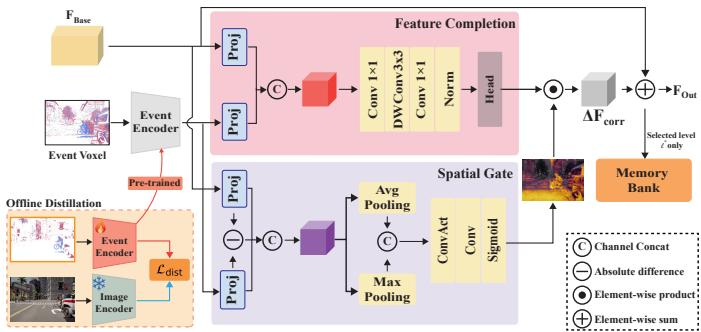  
Fig. 5. Architecture of the Event-Guided Completion Module (EGCM), shown for one feature level. The feature completion module combines visual and event features, while the spatial gate also uses their absolute difference. Multiplying the residual by the gate gives $\Delta \mathbf { F } _ { k } ^ { \mathrm { c o r r } , l }$ , which is added to $\mathbf { F } _ { k } ^ { \mathrm { b a s e } , l }$ to produce $\mathbf { F } _ { k } ^ { \mathrm { o u t } , l }$ . These quantities correspond to $\Delta F _ { \mathrm { c o r r } } , F _ { \mathrm { B a s e } } ,$ and $F _ { \mathrm { O u t } }$ in the diagram. During offline distillation, the event encoder receives $\mathbf { E } _ { k } ^ { + }$ and the frozen image teacher receives $\mathbf { I } _ { t _ { k } }$ . Target-time RGB is used only for this offline supervision.

EGCM contains an offline-distilled event encoder, a conditional feature completion module, and a learned spatial gate.

Offline task-aware event representation learning. We pretrain each event encoder using paired target-interval event voxels $\mathbf { E } _ { k } ^ { + }$ and target-time RGB images $\mathbf { I } _ { t _ { k } }$ . The event encoder processes $\mathbf { E } _ { k } ^ { + }$ , while a task-trained image encoder processes $\mathbf { I } _ { t _ { k } }$ as a frozen teacher. Only the event encoder and its featurealignment layers are optimized during distillation. Supervision is applied entirely in feature space, without segmentation-logit or depth-output losses and without event-activity masking.

Let S, $\mathbf { T } \in \mathbb { R } ^ { C \times H \times W }$ denote aligned student and teacher feature maps, with the teacher features detached from gradient computation. The feature-matching loss is

$$
\mathcal { L } _ { \mathrm { f e a t } } = \frac { 1 } { C H W } \| \mathbf { S } - \mathbf { T } \| _ { 1 } .\tag{8}
$$

For relational supervision, the feature maps are converted into token matrices $\bar { \bf S } , \bar { \bf T } \in \mathbb { R } ^ { N \times C }$ , where $N = H W$ and each token is $\ell _ { 2 }$ -normalized along its channel dimension. We compute the rectified similarity matrices

$$
\begin{array} { l } { { \bf { A } } _ { T T } = [ { \bar { \bf { T } } } { \bar { \bf { T } } } ^ { \top } ] _ { + } , } \\ { { \bf { A } } _ { S S } = [ { \bar { \bf { S } } } { \bar { \bf { S } } } ^ { \top } ] _ { + } , } \\ { { \bf { A } } _ { T S } = [ { \bar { \bf { T } } } { \bar { \bf { S } } } ^ { \top } ] _ { + } , } \end{array}\tag{9}
$$

where $[ \cdot ] _ { + }$ clips negative entries to zero. A teacher-derived relation mask $\mathbf { R } = \mathcal { H } [ \mathbf { A } _ { T T } > \boldsymbol { \eta } ]$ , with $\eta = 0 . 1$ , selects positively related token pairs. Inspired by the relation-based cross-modal distillation strategy in ScaleEvent [34], self-relation matching transfers the teacher’s pairwise feature structure to the student, while cross-modal relation matching aligns teacher–student similarities with the same teacher relations:

$$
\begin{array} { r } { \mathcal { L } _ { \mathrm { s e l f } } = \frac { 1 } { N ^ { 2 } } \| \mathbf { R } \odot ( \mathbf { A } _ { S S } - \mathbf { A } _ { T T } ) \| _ { \mathrm { F } } ^ { 2 } , } \\ { \mathcal { L } _ { \mathrm { c r o s s } } = \frac { 1 } { N ^ { 2 } } \| \mathbf { R } \odot ( \mathbf { A } _ { T S } - \mathbf { A } _ { T T } ) \| _ { \mathrm { F } } ^ { 2 } . } \end{array}\tag{10}
$$

These losses average over all $N ^ { 2 }$ entries, including masked entries set to zero. The relation mask depends on teacher feature similarity, not event activity.

$$
\begin{array} { r l } & { \mathcal { L } _ { \mathrm { d i s t } } ^ { q } = \displaystyle \sum _ { l \in \mathcal { T } _ { q } } \alpha _ { l } ^ { q } \mathcal { L } _ { \mathrm { f e a t } } ^ { ( l ) } } \\ & { \qquad + \displaystyle \sum _ { l \in \mathcal { T } _ { q } } \big ( \lambda _ { \mathrm { s e l f } } \mathcal { L } _ { \mathrm { s e l f } } ^ { ( l ) } + \lambda _ { \mathrm { c r o s s } } \mathcal { L } _ { \mathrm { c r o s s } } ^ { ( l ) } \big ) , } \end{array}\tag{11}
$$

where $q \in \{ \mathrm { s e g } , \mathrm { d e p t h } , \mathrm { m u l t i } \}$ indexes the task, and $\mathcal { T } _ { q }$ and $\mathcal { I } _ { q }$ identify the feature-matching and relation-matching levels, respectively. The coefficients $\alpha _ { l } ^ { q }$ weight feature matching, while $\lambda _ { \mathrm { s e l f } }$ and $\lambda _ { \mathrm { c r o s s } }$ control the two relational terms.

For all tasks, we distill task-relevant event representations from a frozen, task-trained image encoder, while adapting the student event encoder to the feature organization of the corresponding backbone.

For semantic segmentation, the MiT-B2 encoder of Seg-Former [52] is used as the teacher, with a four-stage MiT-B0 event encoder as the student. Stage-specific $1 \times 1$ projections align the student features with their teacher counterparts. Feature matching is applied at all four stages, while the self- and cross-relation losses are applied only at stage 3: $\mathcal { T } _ { \mathrm { s e g } } = \{ 1 , 2 , 3 , 4 \}$ and $\mathcal { I } _ { \mathrm { s e g } } = \{ 3 \}$

For depth estimation, the ViT-S encoder of the fine-tuned MoGe-2 [53] model provides the teacher features, and a MobileNet-based event encoder is used as the student. Intermediate ViT features are fused into a single spatial tensor. The multi-scale student features are resized, concatenated, and projected to the same $C \times H \times W$ representation. The feature, self-relation, and cross-relation losses are all applied to this fused feature pair. Denoting the fused level by f, we set $\mathcal { T } _ { \mathrm { d e p t h } } = \mathcal { T } _ { \mathrm { d e p t h } } = \{ \mathrm { f } \}$

For multi-task prediction, the Swin-Tiny encoder [54] of the trained MTMamba [55] model serves as the teacher, with a four-stage MiT-B0 event encoder as the student. Channel projection and spatial resizing align the four student stages with the corresponding teacher features. As in semantic segmentation, $\mathcal { T } _ { \mathrm { m u l t i } } = \{ 1 , 2 , 3 , 4 \}$ and $\mathcal { T } _ { \mathrm { m u l t i } } = \{ 3 \}$ . Before computing the stage-3 relation matrices, both aligned feature maps are adaptively average-pooled to min $( H _ { 3 } , 3 2 ) \times \mathrm { m i n } ( W _ { 3 } , 3 2 )$ while feature matching is computed on the unpooled features.

After distillation, the learned event encoders and alignment layers are transferred to the EGCM event branches. We denote the event features at query time $t _ { k }$ by $\{ \mathbf { Z } _ { k } ^ { e , l } \} _ { l } ;$ for depth estimation, this set reduces to the single fused representation. The target-time RGB teacher branch is used only during offline distillation and is removed during anytime and streaming inference.

Multi-level conditional completion. EGCM operates on a task-specific subset of the feature levels exposed by the corresponding interface. For semantic segmentation, EGCM updates all four pyramid levels independently. For multi-task prediction, it updates stages 1–3, while stage 4 bypasses completion. For depth estimation, it operates on the single fused representation.

At level l, let $\mathbf { F } _ { k } ^ { \mathrm { b a s e } , l }$ denote the visual feature provided to EGCM. At the level processed by HRM, this corresponds to the history-enhanced representation; at the remaining levels, it is the propagated feature that bypasses HRM. The corresponding event feature $\mathbf { Z } _ { k } ^ { e , l }$ is spatially aligned with the visual feature. Modality-specific projections $\Psi _ { \mathrm { b } , l }$ and $\Psi _ { \mathrm { e } , l }$ align their channel dimensions, after which the two representations are concatenated to predict an additive residual:

$$
\Delta \mathbf { F } _ { k } ^ { l } = \mathcal { R } _ { l } \left( \boldsymbol { \Psi } _ { \mathrm { b } , l } ( \mathbf { F } _ { k } ^ { \mathrm { b a s e } , l } ) \Vert \boldsymbol { \Psi } _ { \mathrm { e } , l } ( \mathbf { Z } _ { k } ^ { e , l } ) \right) ,\tag{12}
$$

where ∥ denotes channel concatenation. The feature completion module consists of a 1 × 1 convolution, a depthwise $3 \times 3$ convolution, a second $1 \times 1$ convolution, normalization, and an output head. Its output has the same dimensions as $\mathbf { F } _ { k } ^ { \mathrm { k } }$ ase,l and represents an additive feature correction.

Learned spatial gate. Event activity does not necessarily indicate a useful correction at every spatial location. At each level, EGCM therefore estimates a single-channel gate $\mathbf { G } _ { k } ^ { l } \ \in \ [ 0 , 1 ] ^ { 1 \times H _ { l } \times W _ { l } }$ . The gate branch projects the visual and event features into a shared embedding, denoted by $\mathbf { u } _ { k } ^ { l }$ and $\mathbf { v } _ { k } ^ { l } .$ , respectively. It concatenates $\mathbf { u } _ { k } ^ { l } \| \mathbf { v } _ { k } ^ { l } \| | \mathbf { u } _ { k } ^ { l } - \mathbf { v } _ { k } ^ { l } |$ , so the gate receives both modalities and their element-wise absolute difference. Average and max pooling along the channel dimension summarize these concatenated features. Their outputs are concatenated and passed through convolutional layers and a sigmoid activation. The gated correction and completed output are

$$
\begin{array} { r l } & { \Delta \mathbf { F } _ { k } ^ { \mathrm { c o r r } , l } = \mathbf { G } _ { k } ^ { l } \odot \Delta \mathbf { F } _ { k } ^ { l } , } \\ & { \mathbf { F } _ { k } ^ { \mathrm { o u t } , l } \quad = \mathbf { F } _ { k } ^ { \mathrm { b a s e } , l } + \Delta \mathbf { F } _ { k } ^ { \mathrm { c o r r } , l } . } \end{array}\tag{13}
$$

Here, $\Delta \mathbf { F } _ { k } ^ { l }$ determines the complementary content, and $\mathbf { G } _ { k } ^ { l }$ controls where and how strongly it is injected. The gate is broadcast across feature channels during multiplication.

The resulting representation $\mathbf { F } _ { k }$ comprises the EGCMupdated feature levels together with any bypassed pyramid levels, or the single completed fused tensor for depth estimation. It is decoded to obtain $\widehat { \mathbf Y } _ { t _ { k } }$ . Let $\ell ^ { \star }$ denote the selected memory feature level. The completed feature written to the bank and the resulting update are

$$
\begin{array} { r l } & { \mathbf { Z } _ { k } ^ { \mathrm { m e m } } = \mathbf { F } _ { k } ^ { \mathrm { o u t } , \ell ^ { \star } } , } \\ & { ~ \mathcal { M } _ { k } = \mathrm { U p d a t e } \left( \mathcal { M } _ { k - 1 } , \mathbf { Z } _ { k } ^ { \mathrm { m e m } } \right) . } \end{array}\tag{14}
$$

For a single-tensor interface, $\ell ^ { \star }$ selects the sole fused feature level. HRM and EGCM therefore serve complementary roles: HRM retrieves information from previously completed states, whereas EGCM introduces content newly supported by the current event observations.

## F. Task-Specific Feature Interfaces

LiFR $\mathbf { v } 2$ is inserted between a task-specific image encoder and its original decoder through lightweight feature interfaces adapted to the structure of each backbone. Propagation operates at every feature level exposed by the corresponding interface, whereas EGCM operates on the task-specific subset of levels described below. HRM is applied only to a selected deep level or directly to the fused representation in singletensor architectures.

Semantic segmentation. For SegFormer [52], the MiT encoder produces a four-stage feature pyramid. Uncertaintyaware propagation is applied independently to all four stages. The flow and log-precision maps are resized to each feature resolution, with the motion-vector magnitudes scaled accordingly. HRM refines only the stage-3 feature, while the remaining propagated features bypass the memory module unchanged. EGCM then updates all four stages, using the history-enhanced representation at the HRM-selected stage and the propagated representations at the remaining stages. The completed four-stage pyramid is subsequently forwarded to the original SegFormer decoder.

Monocular depth estimation. For MoGe-2 [53], selected intermediate ViT block features are first projected and fused into a single spatial representation. Propagation, HRM, and EGCM are then applied sequentially to this fused tensor, immediately before ConvNeck and the subsequent geometry prediction heads. Accordingly, LiFR $\mathbf { v } 2$ does not independently process either the selected ViT block features or the five feature levels generated by ConvNeck. In the ViT-S instantiation, the fused representation is projected to a 384- channel spatial tensor before temporal processing.

Multi-task dense prediction. For MTMamba [55], the Swin-Tiny encoder [54] produces a four-stage feature pyramid. Uncertainty-aware propagation is applied independently to all four stages, while HRM refines only the stage-3 feature. EGCM then updates stages 1–3, using the history-enhanced feature at stage 3 and the propagated features at stages 1 and 2, while stage 4 bypasses completion. The resulting pyramid is forwarded to the original MTMamba decoder.

These task-specific interfaces preserve the original decoder structures while introducing only lightweight projection and resizing operations to match feature resolutions and channel dimensions.

## G. Training Objective

After offline event-feature distillation, LiFR v2 is optimized using only task supervision at the queried timestamp $t _ { k }$ . The distillation losses are not used during subsequent task-specific training.

The completed representation $\mathbf { F } _ { k }$ is decoded by the corresponding task decoder to obtain $\widehat { \mathbf Y } _ { t _ { k } }$ . The training objective is

$$
\begin{array} { r } { \mathcal { L } _ { k } = \mathcal { L } _ { \mathrm { t a s k } } \left( \widehat { \mathbf { Y } } _ { t _ { k } } , { \mathbf { Y } } _ { t _ { k } } \right) , } \end{array}\tag{15}
$$

where $\mathcal { L } _ { \mathrm { t a s k } }$ follows the objective of the corresponding dense prediction task.

For semantic segmentation, we use the standard crossentropy loss. For monocular depth estimation, we follow the original MoGe-2 training objective, which supervises aligned 3D point predictions with inverse-depth weighting. For multitask prediction with MTMamba, the depth objective $\mathcal { L } _ { \mathrm { d e p t h } } ^ { \mathrm { m u l t i } }$ is a piecewise-weighted $\ell _ { 1 }$ loss over valid pixels, with weights determined by ground-truth depth intervals. The semantic segmentation and depth objectives are combined with equal weights:

$$
\mathcal { L } _ { \mathrm { m u l t i } } = \mathcal { L } _ { \mathrm { C E } } + \mathcal { L } _ { \mathrm { d e p t h } } ^ { \mathrm { m u l t i } } .\tag{16}
$$

The interval boundaries and corresponding weights are used consistently throughout all multi-task experiments.

## IV. EXPERIMENTS

## A. Experimental Setup

Datasets and tasks. We evaluate LiFR v2 on six realworld and synthetic RGB–event benchmarks spanning autonomous driving, aerial platforms, and quadruped robots. DSEC [56] provides synchronized images and events in realworld urban driving scenes, with semantic annotations from DSEC-Semantic [31]. M3ED [57] provides trajectories collected from multiple robotic platforms; we use its Drone and Quadruped sequences to evaluate aerial and legged-robot scenarios with substantial ego-motion. SHF-DSEC [25] is a high-frequency synthetic driving benchmark generated in CARLA [58]. We further introduce SHF-Emerge to emphasize rapid object emergence, disocclusion, and large local motion, and use DSEC-Night [59] as an evaluation-only benchmark under severe low-light conditions.

Evaluation protocols and metrics. All causal methods are evaluated using only the RGB keyframe and event observations available up to the queried timestamp. For semantic segmentation, we use a prediction horizon of 50 ms on DSEC, SHF-DSEC, SHF-Emerge, and DSEC-Night, and 40 ms on M3ED-Drone and M3ED-Quadruped. For monocular depth estimation, the prediction horizons are 100 ms on DSEC, 80 ms on M3ED-Drone and M3ED-Quadruped, and 50 ms on SHF-Emerge. Multi-task prediction follows the same horizons as monocular depth estimation.

For streaming evaluation, starting from a single RGB keyframe, we query predictions at 10, 20, 30, 40, and 50 ms while retaining historical states across successive queries.

Semantic segmentation is evaluated using mean Intersection-over-Union (mIoU). For depth estimation, we report the standard monocular depth metrics [60], including absolute relative error (AbsRel), root mean squared error (RMSE), logarithmic RMSE $( \mathrm { R M S E } _ { \log } ) _ { : }$ and threshold accuracy $\delta _ { 1 }$ . Multi-task prediction uses the corresponding semantic and depth metrics. For SHF-Emerge, we focus on near-field depth because rapid object emergence and disocclusion are most critical when previously unseen actors enter the close-range scene, whereas global depth metrics can be dominated by distant background regions. We therefore evaluate pixels whose ground-truth depths lie within 1–10 m and 1–20 m; predicted depths are not clipped to these ranges.

Architectures and implementation details. We use SegFormer-B2 [52] for semantic segmentation, MoGe-2 ViT-S [53] for monocular depth estimation, and MTMamba [55] with a Swin-Tiny backbone [54] for multi-task dense prediction. The reported MoGe-2 accuracy evaluations use a token budget of 1800. The event encoder is MiT-B0 for semantic segmentation and multi-task prediction, and MobileNet-based for depth estimation. Event streams are represented as voxel grids with 20 temporal bins. For streaming evaluation, HRM maintains up to L = 5 feature-map states and evicts the oldest entry when the memory is full.

Offline distillation uses task-trained image teachers: SegFormer-B2 for semantic segmentation, MoGe-2 ViT-S for depth estimation, and MTMamba Swin-Tiny for multi-task prediction. In Eq. (11), we set $\lambda _ { \mathrm { s e l f } } ~ = ~ 1 0$ and $\lambda _ { \mathrm { c r o s s } } ~ =$ 4. The feature-matching weights are $\begin{array} { r l } { ( \alpha _ { 1 } ^ { \mathrm { s e g } } , \dots , \alpha _ { 4 } ^ { \mathrm { s e g } } ) } & { { } = } \end{array}$ $( 0 . 1 , 0 . 2 5 , 1 , 1 ) , \alpha _ { \mathrm { f } } ^ { \mathrm { d e p t h } } = 1$ , and $\alpha _ { l } ^ { \mathrm { m u l t i } } = 1 / 4$ for each multitask stage.

All models are trained on NVIDIA A100 GPUs. Baselines and comparison protocol. We compare LiFR v2 against representative paradigms for interframe dense prediction. We retain the name LiFR-Seg for semantic segmentation and denote its depth and multi-task adaptations by LiFR. We first establish two RGB-only references. The HFR RGB Reference applies the task-specific backbone directly to the RGB observation at the target timestamp $\mathbf { I } _ { t + \delta t }$ , while the LFR RGB Baseline applies the same backbone to the reference frame $\mathbf { I } _ { t }$ and evaluates the prediction against the target-time ground truth. Together, these two references characterize the effect of the interframe temporal gap on RGB-based dense prediction.

We next consider interpolation-based and RGB–event fusion paradigms. Following the interpolation-based comparison in LiFR-Seg, we use TimeLens-XL (TLX) [22] to reconstruct the RGB image at the queried timestamp $t + \delta t$ from the two endpoint RGB frames and the intervening event stream, after which the corresponding task backbone produces the target-time dense prediction. Since TLX requires the future endpoint RGB frame, it is treated as a non-causal interpolation reference.

For RGB–event fusion, we compare EISNet∗ [16] and CMNeXt∗ [35] for semantic segmentation, and RAMNet [23] and CFRNet [24] for monocular depth estimation. EISNet and CMNeXt were originally designed for co-temporal RGB– event fusion, where event observations complement the RGB representation for segmentation at the corresponding frame. To enable a controlled comparison under our causal anytime protocol, we adapt them to take the reference RGB image $\mathbf { I } _ { t }$ together with the target-interval event prefix $\mathcal { E } _ { t  t + \delta t }$ and predict the semantic map at t+δt, while retaining their original fusion architectures. RAMNet and CFRNet are evaluated under the same queried target timestamps for cross-frame-rate depth prediction.

As no directly comparable RGB–event fusion method supports both semantic segmentation and depth estimation under the same multi-task setting, we do not include an additional fusion baseline for multi-task prediction.

Finally, we instantiate the propagation-based formulation of LiFR-Seg with the corresponding task backbone as a direct baseline for assessing the additional components introduced in LiFR v2. All comparisons use the same evaluation splits and query timestamps. Models requiring task-specific training are trained on the designated training splits, while DSEC-Night is used only for evaluation. All causal methods are restricted to observations available no later than the queried timestamp t+δt; target- or future-time RGB observations are used only by the HFR RGB Reference and the interpolation-based baseline.

## B. Anytime Semantic Segmentation

We first evaluate LiFR v2 on anytime semantic segmentation across six benchmarks. As shown in Table I, LiFR v2 substantially outperforms the LFR RGB baseline on all datasets, with mIoU gains ranging from 3.45 to 9.76 percentage points. In particular, the improvements reach 9.76 points on M3ED-D, 7.26 points on M3ED-Q, and 6.10 points on SHF-Emerge. These consistent margins demonstrate the importance of explicitly updating the stale RGB representation toward the queried timestamp rather than directly reusing the keyframe prediction. LiFR v2 also achieves the best performance among all evaluated causal methods on every benchmark.

TABLE I  
COMPARISON OF ANYTIME SEMANTIC SEGMENTATION IN TERMS OF MIOU (%). CS, AT, CM, AND EC DENOTE COMPLIANCE WITH THESINGLE-KEYFRAME CAUSAL PROTOCOL, ANYTIME PREDICTION, COMPLETED-STATE MEMORY, AND EVENT-GUIDED COMPLETION, RESPECTIVELY. ∗INDICATES OUR ADAPTATION OF RGB–EVENT FUSION METHODS TO THE CAUSAL ANYTIME SETTING. M3ED-D, M3ED-Q, AND D-NIGHT DENOTEM3ED-DRONE, M3ED-QUADRUPED, AND DSEC-NIGHT, RESPECTIVELY.
<table><tr><td>Method</td><td>Input</td><td>CS</td><td>AT</td><td>CM</td><td>EC</td><td>DSEC</td><td>SHF-DSEC</td><td>M3ED-D</td><td>M3ED-Q</td><td>D-Night</td><td>SHF-Emerge</td></tr><tr><td>HFR RGB Ref.</td><td> $\mathbf { I } _ { t + \delta t }$ </td><td>X</td><td>X</td><td>X</td><td>X</td><td>73.91</td><td>65.40</td><td>64.57</td><td>69.27</td><td>41.83</td><td>61.18</td></tr><tr><td>LFR (Baseline)</td><td>It</td><td>√</td><td>X</td><td>X</td><td>X</td><td>67.67</td><td>61.73</td><td>55.23</td><td>63.20</td><td>37.44</td><td>50.03</td></tr><tr><td colspan="10">LFR + Interpolation</td><td></td></tr><tr><td>TLX + Seg.</td><td> $\mathbf { I } _ { t } , \mathbf { I } _ { t + \Delta t } , \mathcal { E } _ { t  t + \Delta t }$ </td><td>X</td><td>√</td><td>X</td><td>X</td><td>68.17</td><td>55.89</td><td>60.60</td><td>62.92</td><td></td><td>38.91</td></tr><tr><td colspan="10">LFR + Fusion</td><td></td></tr><tr><td>EISNet*</td><td> $\mathbf { I } _ { t } , \mathcal { E } _ { t  t + \delta t }$ </td><td>V</td><td>√</td><td>X</td><td>X</td><td>68.11</td><td>61.28</td><td>58.34</td><td>62.98</td><td>37.28</td><td>54.47</td></tr><tr><td>CMNeXt*</td><td> $\mathbf { I } _ { t } , \mathcal { E } _ { t  t + \delta t }$ </td><td>V</td><td>√</td><td>X</td><td>X</td><td>70.13</td><td>61.40</td><td>59.56</td><td>65.52</td><td>39.38</td><td>50.05</td></tr><tr><td colspan="10">Propagation-based</td><td></td></tr><tr><td>LiFR-Seg</td><td> $\mathbf { I } _ { t } , \mathcal { E } _ { t - \Delta t  t + \delta t }$ </td><td>7</td><td>V</td><td>X</td><td>X</td><td>73.82</td><td>64.80</td><td>64.28</td><td>68.89</td><td>41.86</td><td>54.28</td></tr><tr><td>LiFR v2</td><td> $\mathbf { I } _ { t } , \mathcal { E } _ { t - \Delta t  t + \delta t }$ </td><td>V</td><td>V</td><td>√</td><td>√</td><td>74.37</td><td>65.18</td><td>64.99</td><td>70.46</td><td>42.01</td><td>56.13</td></tr></table>

Interpolation and direct RGB–event fusion provide partial improvements, but remain less reliable under large scene changes. TLX performs competitively on several conventional benchmarks, yet degrades markedly on SHF-Emerge, where rapid object appearance and disocclusion challenge image reconstruction. EISNet and CMNeXt benefit from target-interval events, but their direct fusion formulation does not explicitly transport the RGB representation toward the queried timestamp. In contrast, LiFR-Seg establishes a stronger propagationbased baseline by aligning dense visual features with eventderived motion.

Building on this propagation backbone, LiFR v2 further improves LiFR-Seg across all six benchmarks. The improvements are modest on DSEC and SHF-DSEC, while becoming more pronounced on M3ED-Q and SHF-Emerge. The largest gain is observed on SHF-Emerge, where mIoU increases from 54.28% to 56.13%, a 1.85-point improvement over LiFR-Seg. Since this benchmark contains frequent object emergence, disocclusion, and large local motion, newly visible regions may lack valid source support in the RGB anchor. The stronger gain is consistent with the motivation for event-guided completion, which is designed to supplement propagation when target-time content lacks valid source support.

## C. Generalization to Other Dense Prediction Tasks

LiFR v2 operates on intermediate dense representations rather than directly on task-specific outputs. We therefore investigate whether the proposed temporal mechanisms are specific to SegFormer-based semantic segmentation or can be transferred to substantially different encoder–decoder architectures and dense prediction objectives. We consider monocular depth estimation with MoGe-2 and multi-task prediction with MTMamba.

1) Anytime Monocular Depth Estimation: Table II evaluates LiFR v2 on anytime monocular depth estimation using MoGe-2 ViT-S. Compared with the LFR RGB baseline, LiFR v2 substantially reduces the target-time depth error across all benchmarks. The RMSE decreases by 14.8% on DSEC, 28.4% on M3ED-D, and 16.8% on M3ED-Q. The improvement is most pronounced on SHF-Emerge, where the 1–10 m RMSE drops from 2.729 m to 1.118 m, a 59.0% reduction, while AbsRel decreases from 0.181 to 0.084. These results show that event-driven temporal updating largely mitigates the degradation caused by relying on a stale RGB observation.

Compared with interpolation- and fusion-based alternatives, LiFR v2 provides the strongest overall performance among the evaluated causal methods. TLX and the RGB–event fusion methods improve over the stale RGB baseline in several settings, but their performance degrades under strong egomotion and rapid object emergence. In contrast, explicit feature propagation provides a stronger target-time representation, which is further refined by completion and historical retrieval.

Relative to the propagation-based LiFR baseline, LiFR v2 remains comparable on DSEC and M3ED-D while providing clearer gains on M3ED-Q and SHF-Emerge. On M3ED-Q, RMSE decreases from 3.741 to 3.638 and AbsRel from 0.141 to 0.123. On SHF-Emerge, the 1–10 m RMSE further decreases from 1.564 to 1.118 and AbsRel from 0.148 to 0.084. The larger improvements under abrupt visibility changes support the role of event-guided completion when propagation alone lacks valid source support.

2) Anytime Multi-Task Dense Prediction: Table III evaluates LiFR v2 with MTMamba Swin-Tiny for anytime multitask dense prediction. This setting provides a more demanding test of architectural generality, since the temporally updated representation must support semantic and geometric prediction simultaneously.

Compared with the LFR RGB baseline, LiFR v2 yields substantial gains in semantic segmentation under the shared multi-task setting. The mIoU improves by 14.83 points on DSEC, 12.03 points on M3ED-D, and 8.15 points on M3ED-

TABLE II  
ANYTIME MONOCULAR DEPTH ESTIMATION WITH MOGE-2 VIT-S AND A TOKEN BUDGET OF 1800. SHF-EMERGE IS EVALUATED OVER THE NEAR-FIELD RANGES OF 1–10 M AND 1–20 M. FOR SHF-EMERGE, THE FULL METRIC SET IS REPORTED OVER 1–10 M, WHILE ABSREL AND δ ARE ADDITIONALLY REPORTED OVER 1–20 M. BEST RESULTS AMONG CAUSAL METHODS ARE SHOWN IN BOLD; TIES ARE HIGHLIGHTED JOINTLY. THE HFR RGB REFERENCE IS SHOWN IN GRAY.
<table><tr><td rowspan="2">Method</td><td colspan="4">DSEC</td><td colspan="4">M3ED-D</td><td colspan="4">M3ED-Q</td><td colspan="4">SHF-Emerge (1–10 m)</td><td colspan="2">SHF-Emerge (1–20 m)</td></tr><tr><td>RMSE↓</td><td>AbsRel↓</td><td>δ1↑</td><td> $\mathrm { R M S E } _ { \log } \downarrow$ </td><td>RMSE↓</td><td>AbsRel↓</td><td>δ1 ↑</td><td> $\mathrm { R M S E } _ { \log } \downarrow$ </td><td>RMSE↓</td><td>AbsRel.↓</td><td>δ1 ↑</td><td> $\mathrm { R M S E } _ { \log \downarrow }$ </td><td>RMSE↓</td><td>AbsRel.↓</td><td>δ₁↑</td><td> $\mathrm { R M S E } _ { \log \downarrow }$ </td><td>AbsRel.↓</td><td>δ₁↑</td></tr><tr><td>HFR RGB Ref.</td><td>3.290</td><td>0.080</td><td>0.940</td><td>0.125</td><td>1.846</td><td>0.094</td><td>0.928</td><td>0.112</td><td>3.572</td><td>0.133</td><td>0.882</td><td>0.160</td><td>1.119</td><td>0.100</td><td>0.968</td><td>0.126</td><td>0.112</td><td>0.950</td></tr><tr><td>LFR (Baseline)</td><td>3.960</td><td>0.104</td><td>0.913</td><td>0.170</td><td>2.761</td><td>0.132</td><td>0.874</td><td>0.156</td><td>4.375</td><td>0.140</td><td>0.840</td><td>0.224</td><td>2.729</td><td>0.181</td><td>0.936</td><td>0.231</td><td>0.191</td><td>0.921</td></tr><tr><td>LFR + Interpolation</td><td></td><td></td><td></td><td></td><td></td><td></td><td></td><td></td><td></td><td></td><td></td><td></td><td></td><td></td><td></td><td></td><td></td><td></td></tr><tr><td>TLX + Depth</td><td>3.368</td><td>0.085</td><td>0.934</td><td>0.130</td><td>2.607</td><td>0.141</td><td>0.843</td><td>0.153</td><td>3.670</td><td>0.141</td><td>0.859</td><td>0.167</td><td>4.171</td><td>0.407</td><td>0.604</td><td>0.366</td><td>0.411</td><td>0.595</td></tr><tr><td>LFR + Fusion</td><td></td><td></td><td></td><td></td><td></td><td></td><td></td><td></td><td></td><td></td><td></td><td></td><td></td><td></td><td></td><td></td><td></td><td></td></tr><tr><td>RAMNet</td><td>5.377</td><td>0.155</td><td>0.766</td><td>0.213</td><td>3.884</td><td>0.144</td><td>0.812</td><td>0.191</td><td>7.335</td><td>0.150</td><td>0.796</td><td>0.263</td><td>3.467</td><td>0.458</td><td>0.510</td><td>0.534</td><td>0.458</td><td>0.489</td></tr><tr><td>CFRNet</td><td>4.049</td><td>0.102</td><td>0.894</td><td>0.151</td><td>3.657</td><td>0.129</td><td>0.838</td><td>0.180</td><td>6.060</td><td>0.168</td><td>0.754</td><td>0.260</td><td>1.733</td><td>0.121</td><td>0.930</td><td>0.196</td><td>0.139</td><td>0.909</td></tr><tr><td>Propagation-based</td><td></td><td></td><td></td><td></td><td></td><td></td><td></td><td></td><td></td><td></td><td></td><td></td><td></td><td></td><td></td><td></td><td></td><td></td></tr><tr><td>LiFR</td><td>3.381</td><td>0.083</td><td>0.935</td><td>0.129</td><td>1.995</td><td>0.093</td><td>0.928</td><td>0.117</td><td>3.741</td><td>0.141</td><td>0.850</td><td>0.180</td><td>1.564</td><td>0.148</td><td>0.909</td><td>0.174</td><td>0.130</td><td>0.943</td></tr><tr><td>LiFR v2</td><td>3.375</td><td>0.083</td><td>0.935</td><td>0.128</td><td>1.976</td><td>0.094</td><td>0.928</td><td>0.117</td><td>3.638</td><td>0.123</td><td>0.871</td><td>0.162</td><td>1.118</td><td>0.084</td><td>0.967</td><td>0.126</td><td>0.098</td><td>0.956</td></tr></table>

TABLE III

ANYTIME MULTI-TASK PREDICTION WITH MTMAMBA SWIN-TINY. MIOU IS REPORTED IN PERCENT. RMSE IS REPORTED IN METERS FOR DSEC AND M3ED, WHILE ABSREL IS REPORTED FOR SHF-EMERGE OVER THE 1–10 M RANGE. BEST RESULTS AMONG CAUSAL METHODS ARE SHOWN IN BOLD.
<table><tr><td rowspan="2">Method</td><td colspan="2">DSEC</td><td colspan="2">M3ED-D</td><td colspan="2">M3ED-Q</td><td colspan="2">SHF-Emerge</td></tr><tr><td></td><td></td><td></td><td></td><td></td><td>mIoU↑ RMSE↓ mIoU↑ RMSE↓ mIoU↑ RMSE↓</td><td>mIoU↑ AbsRel↓</td><td></td></tr><tr><td>HFR RGB Ref.</td><td>71.62</td><td>4.45</td><td>64.26</td><td>4.58</td><td>69.18</td><td>5.31</td><td>59.66</td><td>0.34</td></tr><tr><td>LFR (Baseline)</td><td>55.66</td><td>4.92</td><td>49.54</td><td>4.48</td><td>59.10</td><td>5.88</td><td>50.65</td><td>0.45</td></tr><tr><td colspan="9">LFR + Interpolation TLX + Multi-task 69.18</td></tr><tr><td></td><td></td><td>4.69</td><td>55.68</td><td>4.68</td><td>66.90</td><td>5.30</td><td>37.51</td><td>0.43</td></tr><tr><td colspan="9">Propagation-based</td></tr><tr><td>LiFR</td><td>70.45</td><td>4.89</td><td>61.54</td><td>4.33</td><td>66.18</td><td>5.48</td><td>50.28</td><td>0.40</td></tr><tr><td>LiFR v2</td><td>70.49</td><td>4.84</td><td>61.57</td><td>4.35</td><td>67.25</td><td>5.34</td><td>52.57</td><td>0.39</td></tr></table>

Q, with a further 1.92-point gain on SHF-Emerge. Notably, these semantic improvements are obtained without degrading the geometric task relative to the LFR baseline: LiFR v2 also reduces depth error on all four datasets, although the margins are more moderate than in the single-task depth setting.

Compared with the propagation-based LiFR model, LiFR v2 further improves semantic mIoU on all four datasets. For depth estimation, it reduces the error on DSEC, M3ED-Q, and SHF-Emerge, while remaining comparable on M3ED-D, where RMSE changes only from 4.33 to 4.35. These results indicate that the proposed temporal update substantially strengthens semantic prediction while preserving geometric accuracy within a shared multi-task representation.

## D. Streaming Semantic Segmentation

We further evaluate LiFR v2 under a stateful streaming setting on SHF-DSEC. Starting from a single RGB keyframe at t , newly arriving events are accumulated in consecutive intervals of 10 ms, and predictions are queried at 10, 20, 30, 40, and 50 ms. Unlike independent anytime queries, the memory state is retained and updated across successive predictions.

As shown in Fig. 6, LiFR v2 maintains more stable accuracy as the query timestamp moves farther from the RGB keyframe. Although the RGB-only baseline performs slightly better at

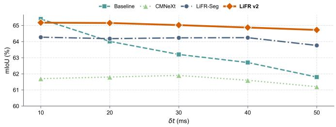  
Fig. 6. Streaming semantic segmentation on SHF-DSEC from a single RGB keyframe. All methods produce predictions at offsets of 10–50 ms. LiFR v2 outperforms LiFR-Seg and CMNeXt at every evaluated query time and exhibits substantially less degradation than the RGB-only baseline as the query offset increases.

10 ms, its accuracy decreases more rapidly with increasing temporal offset. LiFR v2 surpasses the RGB-only baseline from 20 ms onward and consistently outperforms LiFR-Seg and CMNeXt across the evaluated streaming timestamps.

The qualitative comparison in Fig. 7 further shows the contribution of historical retrieval at 50 ms. Retaining completed states from preceding queries helps preserve semantic structures that are difficult to recover from anchor-based propagation alone, resulting in more spatially coherent predictions.

## E. Computational Cost under Streaming Inference

We report the computational cost of the three LiFR v2 instantiations under streaming inference. After the RGBkeyframe representation is initialized, it is cached and reused for subsequent event-driven updates. The reported GFLOPs are amortized over one keyframe initialization and five consecutive updates.

As shown in Table IV, all LiFR v2 instantiations support high-rate streaming inference. The semantic segmentation model operates at 108.11 FPS, while the two depth configurations achieve 123.92 and 106.16 FPS with 1.2K and 1.8K image tokens, respectively. The multi-task model jointly predicts semantic segmentation and depth at 52.63 FPS.

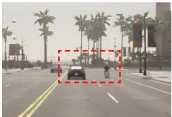  
(a) RGB (t0)

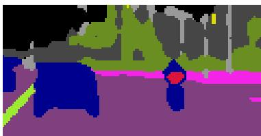  
(c) w/o HRM (t0+50ms)

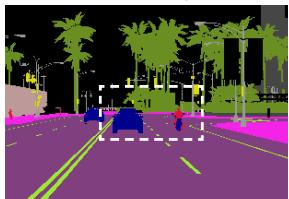  
(b) GT (t0+50ms)

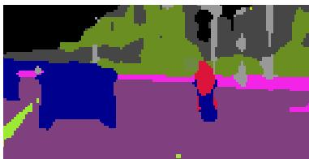  
(d) Ours (t0+50ms)  
Fig. 7. Qualitative effect of historical memory during streaming semantic segmentation on SHF-DSEC at 50 ms. (a) Reference RGB frame at t0. (b) Ground truth at t0 + 50 ms. (c) Prediction without HRM. (d) Prediction with HRM. Dashed boxes highlight regions where historical retrieval improves semantic consistency.

TABLE IV  
COMPUTATIONAL COST OF LIFR V2 AT 640 × 440 RESOLUTION. THE DEPTH MODEL IS EVALUATED WITH TWO IMAGE-TOKEN BUDGETS. INFERENCE SPEED IS MEASURED ON A 5090 GPU.
<table><tr><td>Task</td><td>Tokens</td><td>Params (M)</td><td>GFLOPs / Output</td><td>FPS ↑</td></tr><tr><td>Semantic Seg.</td><td>一</td><td>60.93</td><td>193.64</td><td>108.11</td></tr><tr><td rowspan="2">Depth</td><td>1.2K</td><td>55.62</td><td>268.17</td><td>123.92</td></tr><tr><td>1.8K</td><td>55.62</td><td>369.57</td><td>106.16</td></tr><tr><td>Multi-Task</td><td>一</td><td>80.82</td><td>209.08</td><td>52.63</td></tr></table>

## F. Qualitative Analysis

Fig. 8 presents representative qualitative comparisons across semantic segmentation, monocular depth estimation, and multi-task prediction. Panels (a)–(d) compare single-task outputs within the highlighted regions, while (e) and (f) show the semantic and depth outputs of the multi-task model. The SHF-Emerge panels include target-time RGB images to reveal newly visible content; these images are used only for visualization. The enlarged DSEC depth reference in (c) is an HFR prediction, whereas the corresponding reference maps in (a), (b), and (d) are GT.

The LFR baseline remains anchored to the reference RGB observation and therefore exhibits increasing temporal misalignment at the queried timestamp. This is visible as displaced object locations, missing newly visible actors, and inaccurate local geometry. TLX partially compensates for scene motion by reconstructing the target-time RGB image before task inference. In the shown high-motion and emergence cases, however, interpolation artifacts lead to blurred object appearance, indistinct semantic boundaries, and over-smoothed depth transitions.

For semantic segmentation, the adapted CMNeXt and EIS-Net baselines benefit from target-interval event observations and partially recover moving or newly visible objects. Nevertheless, the displayed examples still contain fragmented or spatially misaligned contours, particularly around the pedestrian in (a) and the emerging rider in (b). These results suggest that direct RGB–event fusion does not fully resolve the temporal misalignment between the reference RGB representation and the queried scene state.

TABLE V  
ABLATION OF EGCM COMPLETION STRATEGIES WITH THE SAME HRM IN ALL THREE VARIANTS. WE REPORT MIOU (%) ON DSEC AND SHF-EMERGE, WITH PERSON IOU (%) ADDITIONALLY REPORTED ON SHF-EMERGE.
<table><tr><td>Variant</td><td>DSEC mIoU ↑</td><td>SHF-Emerge mIoU ↑</td><td>SHF-Emerge Person IoU ↑</td></tr><tr><td>(a) No Completion</td><td>73.80</td><td>54.28</td><td>33.13</td></tr><tr><td>(b) Residual Completion (w/o Gate)</td><td>74.01</td><td>55.66</td><td>52.99</td></tr><tr><td>(c) Full EGCM</td><td>74.37</td><td>56.13</td><td>55.14</td></tr></table>

For monocular depth estimation, CFRNet captures part of the target-time scene evolution through cross-frame-rate prediction, but its outputs in (c) and (d) exhibit smoother object geometry and weaker depth discontinuities around rapidly moving or newly visible objects.

Across the displayed examples, LiFR v2 yields more coherent target-time structures, with cleaner semantic contours and sharper local depth transitions. The difference is particularly evident on SHF-Emerge, where objects that are absent or heavily occluded in the reference RGB image become visible at the queried timestamp. In these regions, LiFR v2 recovers more complete semantic and geometric structures than the LFR, interpolation, and fusion baselines. These qualitative comparisons further support the benefit of combining explicit feature propagation with event-guided completion for targettime dense prediction.

## G. Ablation Studies

Having evaluated the overall performance and task generality of LiFR v2, we now examine event-guided completion and task-aware event-feature distillation through controlled ablations.

1) Event-Guided Completion Module: Table V compares three completion strategies within LiFR v2 while keeping all other components fixed. (a) No Completion directly decodes the base representation without event-guided completion. (b) Residual Completion predicts an additive event-conditioned residual without spatial gating. (c) Full EGCM further modulates the residual with a learned spatial gate optimized through the task objective in Sec. III-G. The no-completion variant retains the HRM configuration of LiFR v2 and is therefore distinct from the LiFR-Seg baseline.

Residual Completion improves DSEC mIoU from 73.80% to 74.01% and SHF-Emerge mIoU from 54.28% to 55.66%. The improvement is particularly pronounced for the Person class on SHF-Emerge, where IoU increases from 33.13% to 52.99%, suggesting that event-conditioned residual completion provides useful target-time information beyond the nocompletion variant.

Full EGCM further improves DSEC mIoU to 74.37%, SHF-Emerge mIoU to 56.13%, and SHF-Emerge Person IoU to 55.14%. Relative to ungated residual completion, these correspond to gains of 0.36, 0.47, and 2.15 percentage points,

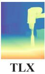

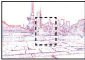

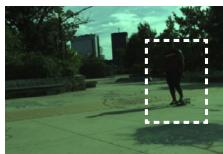

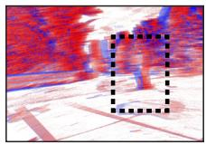

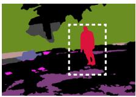

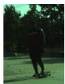  
Img

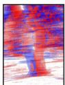  
Event

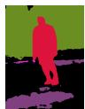

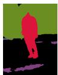  
Baseline

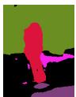  
TLX

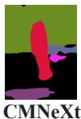

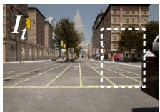

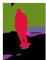  
(a) Seg. on M3ED-Q  
Ours

  
Img

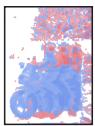

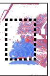  
Event

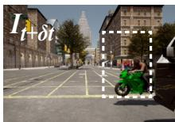

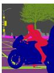

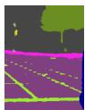  
Baseline

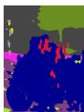  
(b) Seg. on SHF-Emerge  
TLX

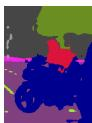  
EISNet

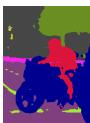  
Ours

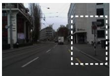

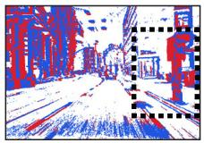

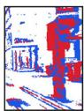

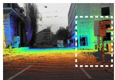

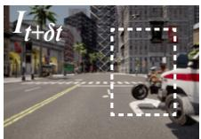  
Event  
Img

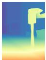

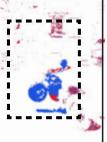  
HFR

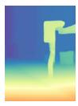

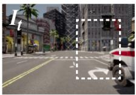  
Baseline

(c) Depth on DSEC  
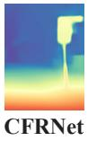  
Ours

  
Img

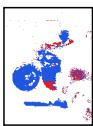  
Event

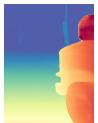

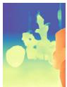  
Baseline

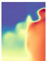  
(d) Depth on SHF-Emerge  
TLX

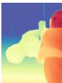  
CFRNet  
Ours

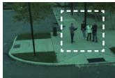

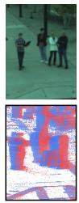  
Img +  
Event

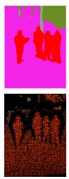  
GT  
HFR

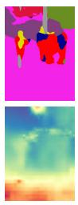

  
Baseline  
TLX  
Ours

(e) Multi-task on M3ED-D

  
Event

  
GT

  
HFR

  
Baseline  
TLX

  
Ours

(f) Multi-task on M3ED-Q

Fig. 8. Representative qualitative comparisons for interframe dense prediction. (a) Semantic segmentation on M3ED-Quadruped with CMNeXt as the RGB– event fusion baseline. (b) Semantic segmentation on SHF-Emerge with EISNet. (c) Monocular depth estimation on DSEC and (d) on SHF-Emerge, both with CFRNet. For (a)–(d), the upper row provides the scene context, including the reference RGB image and target-interval events; the third reference is the target-time semantic ground truth in (a), the HFR RGB reference prediction in (c), and the target-time RGB image in (b) and (d). The lower row shows enlarged comparisons of the highlighted regions. (e) Multi-task prediction on M3ED-Drone and (f) on M3ED-Quadruped, showing semantic and depth output from HFR, LFR, TLX, and LiFR v2. Target-time RGB images and HFR outputs are shown only as visualization references and are not used by LiFR v2.

respectively. These gains quantify the benefit of learned spatial gating over ungated residual completion. The gate is optimized solely through the task objective, without an additional gatesupervision loss.

Fig. 9 qualitatively illustrates how EGCM responds to newly visible content. In the semantic example, the no-completion prediction captures the rider but fails to recover the bicycle structure. The learned gate exhibits localized responses around the event-supported rider and bicycle region, while the completed output recovers a more coherent cyclist structure.

In the depth example, the vehicle is absent from the RGB keyframe but becomes visible at the queried timestamp. Without completion, the prediction contains little foreground depth structure at the vehicle location. The learned gate responds strongly in this region, and the completed output produces a distinct foreground structure aligned with the newly visible vehicle. These examples illustrate how EGCM uses targetinterval event evidence to supplement visual features when target-time content is insufficiently represented by the RGB anchor.

2) Offline Event-Feature Distillation: The event features used by EGCM must encode task-relevant semantic or geomet-

Iτ  
  
It0

  
No Completion

Event t0→τ  
Iτ  
  
Learned Gate

  
Completed Output

(a) EGCM for Semantic Segmentation  

  
No Completion

Event t0→τ  

  
Learned Gate

  
(b) EGCM for Depth Estimation  
Completed Output

Fig. 9. Qualitative effect of EGCM on (a) semantic segmentation and (b) monocular depth estimation. For each task, the top row shows the RGB keyframe, target-interval events, and the target-time RGB image, while the bottom row shows the prediction without completion, the learned spatial gate, and the completed output. The target-time RGB image is shown only as a visual reference and is not used during inference. Dashed boxes indicate the corresponding regions of interest.

## TABLE VI

<table><tr><td colspan="4">(a) Semantic Segmentation</td></tr><tr><td>Event Encoder</td><td>DSEC mIoU ↑</td><td>SHF-Emerge mIoU ↑</td><td>SHF-Emerge Person IoU ↑</td></tr><tr><td>w/o Distillation</td><td>73.95</td><td>54.91</td><td>47.33</td></tr><tr><td>w/ Distillation</td><td>74.37</td><td>56.13</td><td>55.14</td></tr></table>

(b) Depth Estimation
<table><tr><td>Event Encoder</td><td>M3ED-D AbsRel ↓</td><td>M3ED-D  $\delta _ { 1 } \uparrow$ </td><td>SHF-Emerge AbsRel ↓</td><td>SHF-Emerge δ1↑</td></tr><tr><td>w/o Distillation</td><td>0.093</td><td>0.928</td><td>0.150</td><td>0.907</td></tr><tr><td>w/ Distillation</td><td>0.094</td><td>0.928</td><td>0.084</td><td>0.967</td></tr></table>

ric structure rather than serving primarily as motion cues for flow estimation. We therefore compare training from random event-encoder initialization with training initialized by the offline image-to-event distillation in Eq. (11), while keeping all subsequent training settings unchanged.

As shown in Table VI, distillation yields a modest improvement on DSEC semantic segmentation, increasing mIoU from 73.95% to 74.37%. The effect is substantially larger on SHF-Emerge, where mIoU improves from 54.91% to 56.13% and Person IoU from 47.33% to 55.14%. The larger class-level improvement suggests that task-aware event representations are particularly useful for recovering rapidly emerging actors.

A similar pattern is observed for depth estimation. On M3ED-D, performance remains essentially unchanged, with AbsRel varying from 0.093 to 0.094 and $\delta _ { 1 }$ remaining at 0.928. In contrast, on SHF-Emerge over the 1–10 m range, distillation reduces AbsRel from 0.150 to 0.084 and increases $\delta _ { 1 }$ from 0.907 to 0.967. Together, these results indicate that the benefit of task-aware event distillation becomes more pronounced in scenes involving rapid motion, object emergence, and abrupt visibility changes.

## V. CONCLUSION

In this work, we presented LiFR $\mathbf { v } 2 ,$ , a unified framework for anytime and streaming dense prediction from an RGB keyframe and event observations. The framework combines event-guided feature propagation, event-guided completion, and historical retrieval. EGCM introduces task-relevant event information where propagated features provide insufficient support, while HRM retrieves previously completed representations to refine subsequent predictions.

Experiments across semantic segmentation, monocular depth estimation, and multi-task prediction demonstrate the applicability of this framework to different task architectures. The proposed SHF-Emerge benchmark highlights the benefit of completion under rapid object emergence and disocclusion. Streaming evaluations further show higher segmentation accuracy than LiFR-Seg across the evaluated query times. Together, these results show that dense prediction between RGB observations benefits from incorporating new scene evidence and retaining it across successive queries.

## REFERENCES

[1] M. Cordts, M. Omran, S. Ramos, T. Rehfeld, M. Enzweiler, R. Benenson, U. Franke, S. Roth, and B. Schiele, “The Cityscapes dataset for semantic urban scene understanding,” in Proc. IEEE Conf. Comput. Vis. Pattern Recognit. (CVPR), 2016, pp. 3213–3223.

[2] A. Loquercio, E. Kaufmann, R. Ranftl, M. Muller, V. Koltun, and¨ D. Scaramuzza, “Learning high-speed flight in the wild,” Sci. Robot., vol. 6, no. 59, p. eabg5810, 2021.

[3] D. S. Chaplot, D. P. Gandhi, A. Gupta, and R. Salakhutdinov, “Object goal navigation using goal-oriented semantic exploration,” in Adv. Neural Inf. Process. Syst., vol. 33, 2020.

[4] M. Schon, M. Buchholz, and K. Dietmayer, “MGNet: Monocular geo-¨ metric scene understanding for autonomous driving,” in Proc. IEEE/CVF Int. Conf. Comput. Vis. (ICCV), 2021, pp. 15 804–15 815.

[5] J. Y. Koh, H. Lee, Y. Yang, J. Baldridge, and P. Anderson, “Pathdreamer: A world model for indoor navigation,” in Proc. IEEE/CVF Int. Conf. Comput. Vis. (ICCV), 2021, pp. 14 738–14 748.

[6] E. Kaufmann, L. Bauersfeld, A. Loquercio, M. Muller, V. Koltun, and¨ D. Scaramuzza, “Champion-level drone racing using deep reinforcement learning,” Nature, vol. 620, no. 7976, pp. 982–987, 2023.

[7] D. Gehrig and D. Scaramuzza, “Low-latency automotive vision with event cameras,” Nature, vol. 629, no. 8014, pp. 1034–1040, 2024.

[8] P. Lichtsteiner, C. Posch, and T. Delbruck, “A 128×128 120 dB 15 µs latency asynchronous temporal contrast vision sensor,” IEEE J. Solid-State Circuits, vol. 43, no. 2, pp. 566–576, 2008.

[9] C. Brandli, R. Berner, M. Yang, S.-C. Liu, and T. Delbruck, “A 240×180 130 dB 3 µs latency global shutter spatiotemporal vision sensor,” IEEE J. Solid-State Circuits, vol. 49, no. 10, pp. 2333–2341, 2014.

[10] G. Gallego, T. Delbruck, G. Orchard, C. Bartolozzi, B. Taba, A. Censi, S. Leutenegger, A. J. Davison, J. Conradt, K. Daniilidis, and D. Scaramuzza, “Event-based vision: A survey,” IEEE Trans. Pattern Anal. Mach. Intell., vol. 44, no. 1, pp. 154–180, 2022.

[11] I. Alonso and A. C. Murillo, “EV-SegNet: Semantic segmentation for event-based cameras,” in Proc. IEEE/CVF Conf. Comput. Vis. Pattern Recognit. Workshops (CVPRW), 2019, pp. 1624–1633.

[12] J. Hidalgo-Carrio, D. Gehrig, and D. Scaramuzza, “Learning monocular´ dense depth from events,” in Proc. Int. Conf. 3D Vis. (3DV), 2020, pp. 534–542.

[13] R. Hamaguchi, Y. Furukawa, M. Onishi, and K. Sakurada, “Hierarchical neural memory network for low latency event processing,” in Proc. IEEE/CVF Conf. Comput. Vis. Pattern Recognit. (CVPR), 2023, pp. 22 867–22 876.

[14] J. Zhang, K. Yang, and R. Stiefelhagen, “ISSAFE: Improving semantic segmentation in accidents by fusing event-based data,” in Proc. IEEE/RSJ Int. Conf. Intell. Robots Syst. (IROS), 2021, pp. 1132–1139.

[15] ——, “Exploring event-driven dynamic context for accident scene segmentation,” IEEE Trans. Intell. Transp. Syst., vol. 23, no. 3, pp. 2606–2622, 2022.

[16] B. Xie, Y. Deng, Z. Shao, and Y. Li, “EISNet: A multi-modal fusion network for semantic segmentation with events and images,” IEEE Trans. Multimedia, vol. 26, pp. 8639–8650, 2024.

[17] H. Li, Y. Peng, J. Yuan, P. Wu, J. Wang, Y. Zhang, and X. Sun, “Efficient event-based semantic segmentation via exploiting frame-event fusion: A hybrid neural network approach,” in Proc. AAAI Conf. Artif. Intell., vol. 39, no. 17, 2025, pp. 18 296–18 304.

[18] F. Gu, Y. Li, X. Long, K. Ji, C. Chen, Q. Gu, and Z. Ni, “MambaSeg: Harnessing Mamba for accurate and efficient image-event semantic segmentation,” in Proc. AAAI Conf. Artif. Intell., vol. 40, no. 6, 2026, pp. 4302–4310.

[19] T. Pan, Z. Cao, and L. Wang, “SRFNet: Monocular depth estimation with fine-grained structure via spatial reliability-oriented fusion of frames and events,” in Proc. IEEE Int. Conf. Robot. Autom. (ICRA), 2024, pp. 10 695–10 702.

[20] H. Liu, S. Qu, F. Lu, Z. Bu, F. Rohrbein, A. Knoll, and G. Chen,¨ “PCDepth: Pattern-based complementary learning for monocular depth estimation by best of both worlds,” in Proc. IEEE/RSJ Int. Conf. Intell. Robots Syst. (IROS), 2024, pp. 11 187–11 194.

[21] L. Jing, D. Shi, Z. Liu, S. Jin, C. Qiu, Z. Qiao, Y. Li, and J. Xia, “UniCT Depth: Event-image fusion based monocular depth estimation with convolution-compensated ViT dual SA block,” in Proc. Int. Joint Conf. Artif. Intell. (IJCAI), 2025, pp. 1287–1295.

[22] Y. Ma, S. Guo, Y. Chen, T. Xue, and J. Gu, “TimeLens-XL: Real-time event-based video frame interpolation with large motion,” in Proc. Eur. Conf. Comput. Vis. (ECCV), 2024, pp. 178–194.

[23] D. Gehrig, M. Ruegg, M. Gehrig, J. Hidalgo-Carri¨ o, and D. Scaramuzza,´ “Combining events and frames using recurrent asynchronous multimodal networks for monocular depth prediction,” IEEE Robot. Autom. Lett., vol. 6, no. 2, pp. 2822–2829, 2021.

[24] X. Liu, X. Fan, J. Li, D. Li, W. Zhang, Z. Ma, and Y. Tian, “High-rate monocular depth estimation via cross frame-rate collaboration of frames and events,” Int. J. Comput. Vis., vol. 133, no. 10, pp. 7332–7351, 2025.

[25] X. Wu, X. Lyu, Y. Yu, B. Wang, Z. Wang, and X. Qi, “LiFR-Seg: Anytime high-frame-rate segmentation via event-guided propagation,” in Proc. Int. Conf. Learn. Represent. (ICLR), 2026.

[26] Z. Jia, K. You, W. He, Y. Tian, Y. Feng, Y. Wang, X. Jia, Y. Lou, J. Zhang, G. Li, and Z. Zhang, “Event-based semantic segmentation with posterior attention,” IEEE Trans. Image Process., vol. 32, pp. 1829– 1842, 2023.

[27] X. Liu, J. Li, J. Shi, X. Fan, Y. Tian, and D. Zhao, “Event-based monocular depth estimation with recurrent transformers,” IEEE Trans. Circuits Syst. Video Technol., vol. 34, no. 8, pp. 7417–7429, 2024.

[28] Y. Zhao, G. Lyu, K. Li, Z. Wang, H. Chen, Z. Yang, and Y. Deng, “ESEG: Event-based segmentation boosted by explicit edge-semantic guidance,” in Proc. AAAI Conf. Artif. Intell., vol. 39, no. 10, 2025, pp. 10 510–10 518.

[29] L. Wang, Y. Chae, S.-H. Yoon, T.-K. Kim, and K.-J. Yoon, “EvDistill: Asynchronous events to end-task learning via bidirectional reconstruction-guided cross-modal knowledge distillation,” in Proc. IEEE/CVF Conf. Comput. Vis. Pattern Recognit. (CVPR), 2021, pp. 608– 619.

[30] L. Wang, Y. Chae, and K.-J. Yoon, “Dual transfer learning for eventbased end-task prediction via pluggable event to image translation,” in Proc. IEEE/CVF Int. Conf. Comput. Vis. (ICCV), 2021, pp. 2115–2125.

[31] Z. Sun, N. Messikommer, D. Gehrig, and D. Scaramuzza, “ESS: Learning event-based semantic segmentation from still images,” in Proc. Eur. Conf. Comput. Vis. (ECCV), 2022, pp. 341–357.

[32] L. Kong, Y. Liu, L. X. Ng, B. R. Cottereau, and W. T. Ooi, “OpenESS: Event-based semantic scene understanding with open vocabularies,” in

Proc. IEEE/CVF Conf. Comput. Vis. Pattern Recognit. (CVPR), 2024, pp. 15 686–15 698.

[33] L. Bartolomei, E. Mannocci, F. Tosi, M. Poggi, and S. Mattoccia, “Depth AnyEvent: A cross-modal distillation paradigm for event-based monocular depth estimation,” in Proc. IEEE/CVF Int. Conf. Comput. Vis. (ICCV), 2025, pp. 19 669–19 678.

[34] Z. Chen, J. Hou, Z. Zhu, J. Wu, and G. Shi, “Scaling dense event-stream pretraining from visual foundation models,” in Proc. IEEE/CVF Conf. Comput. Vis. Pattern Recognit. (CVPR), 2026, pp. 8011–8022.

[35] J. Zhang, R. Liu, H. Shi, K. Yang, S. Reiß, K. Peng, H. Fu, K. Wang, and R. Stiefelhagen, “Delivering arbitrary-modal semantic segmentation,” in Proc. IEEE/CVF Conf. Comput. Vis. Pattern Recognit. (CVPR), 2023, pp. 1136–1147.

[36] M. Mostafavi, K.-J. Yoon, and J. Choi, “Event-intensity stereo: Estimating depth by the best of both worlds,” in Proc. IEEE/CVF Int. Conf. Comput. Vis. (ICCV), 2021, pp. 4258–4267.

[37] D. Liu, T. Wang, and C. Sun, “Depth hypothesis guided iterative refinement for event-image monocular depth estimation,” in Proc. IEEE/CVF Conf. Comput. Vis. Pattern Recognit. (CVPR), 2026, pp. 29 504–29 513.

[38] L. Jing, D. Shi, Y. Cao, Y. Wang, J. Zhang, Y. Cui, and M. Wang, “AIMDepth: Asymmetric image-event Mamba for monocular depth estimation,” in Proc. IEEE/CVF Conf. Comput. Vis. Pattern Recognit. (CVPR), 2026, pp. 8033–8044.

[39] X. Zhu, Y. Xiong, J. Dai, L. Yuan, and Y. Wei, “Deep feature flow for video recognition,” in Proc. IEEE Conf. Comput. Vis. Pattern Recognit. (CVPR), 2017, pp. 2349–2358.

[40] V. Jampani, R. Gadde, and P. V. Gehler, “Video propagation networks,” in Proc. IEEE Conf. Comput. Vis. Pattern Recognit. (CVPR), 2017, pp. 451–461.

[41] S. Jain, X. Wang, and J. E. Gonzalez, “Accel: A corrective fusion network for efficient semantic segmentation on video,” in Proc. IEEE/CVF Conf. Comput. Vis. Pattern Recognit. (CVPR), 2019, pp. 8866–8875.

[42] S. W. Oh, J.-Y. Lee, N. Xu, and S. J. Kim, “Video object segmentation using space-time memory networks,” in Proc. IEEE/CVF Int. Conf. Comput. Vis. (ICCV), 2019, pp. 9226–9235.

[43] H. K. Cheng, Y.-W. Tai, and C.-K. Tang, “Rethinking space-time networks with improved memory coverage for efficient video object segmentation,” in Adv. Neural Inf. Process. Syst., vol. 34, 2021.

[44] H. K. Cheng and A. G. Schwing, “XMem: Long-term video object segmentation with an Atkinson-Shiffrin memory model,” in Proc. Eur. Conf. Comput. Vis. (ECCV), 2022, pp. 640–658.

[45] N. Ravi, V. Gabeur, Y.-T. Hu, R. Hu, C. Ryali, T. Ma, H. Khedr, R. Radle, C. Rolland, L. Gustafson, E. Mintun, J. Pan, K. V. Alwala,¨ N. Carion, C.-Y. Wu, R. Girshick, P. Dollar, and C. Feichtenhofer, “SAM´ 2: Segment anything in images and videos,” in Proc. Int. Conf. Learn. Represent. (ICLR), 2025.

[46] S. Tulyakov, D. Gehrig, S. Georgoulis, J. Erbach, M. Gehrig, Y. Li, and D. Scaramuzza, “Time Lens: Event-based video frame interpolation,” in Proc. IEEE/CVF Conf. Comput. Vis. Pattern Recognit. (CVPR), 2021, pp. 16 155–16 164.

[47] A. Z. Zhu, L. Yuan, K. Chaney, and K. Daniilidis, “Unsupervised event-based learning of optical flow, depth, and egomotion,” in Proc. IEEE/CVF Conf. Comput. Vis. Pattern Recognit. (CVPR), 2019, pp. 989– 997.

[48] M. Gehrig, M. Millhausler, D. Gehrig, and D. Scaramuzza, “E-RAFT:¨ Dense optical flow from event cameras,” in Proc. Int. Conf. 3D Vis. (3DV), 2021, pp. 197–206.

[49] S. Niklaus and F. Liu, “Softmax splatting for video frame interpolation,” in Proc. IEEE/CVF Conf. Comput. Vis. Pattern Recognit. (CVPR), 2020, pp. 5437–5446.

[50] A. Vaswani, N. Shazeer, N. Parmar, J. Uszkoreit, L. Jones, A. N. Gomez, L. Kaiser, and I. Polosukhin, “Attention is all you need,” in Adv. Neural Inf. Process. Syst., vol. 30, 2017.

[51] J. Su, M. Ahmed, Y. Lu, S. Pan, W. Bo, and Y. Liu, “RoFormer: Enhanced transformer with rotary position embedding,” Neurocomputing, vol. 568, p. 127063, 2024.

[52] E. Xie, W. Wang, Z. Yu, A. Anandkumar, J. M. Alvarez, and P. Luo, “SegFormer: Simple and efficient design for semantic segmentation with transformers,” in Adv. Neural Inf. Process. Syst., vol. 34, 2021, pp. 12 077–12 090.

[53] R. Wang, S. Xu, Y. Dong, Y. Deng, J. Xiang, Z. Lv, G. Sun, X. Tong, and J. Yang, “MoGe-2: Accurate monocular geometry with metric scale and sharp details,” in Adv. Neural Inf. Process. Syst., vol. 38, 2025.

[54] Z. Liu, Y. Lin, Y. Cao, H. Hu, Y. Wei, Z. Zhang, S. Lin, and B. Guo, “Swin Transformer: Hierarchical vision transformer using shifted windows,” in Proc. IEEE/CVF Int. Conf. Comput. Vis. (ICCV), 2021, pp. 10 012–10 022.

[55] B. Lin, W. Jiang, P. Chen, Y. Zhang, S. Liu, and Y.-C. Chen, “MT-Mamba: Enhancing multi-task dense scene understanding by Mambabased decoders,” in Proc. Eur. Conf. Comput. Vis. (ECCV), 2024, pp. 314–330.

[56] M. Gehrig, W. Aarents, D. Gehrig, and D. Scaramuzza, “DSEC: A stereo event camera dataset for driving scenarios,” IEEE Robot. Autom. Lett., vol. 6, no. 3, pp. 4947–4954, 2021.

[57] K. Chaney, F. Cladera, Z. Wang, A. Bisulco, M. A. Hsieh, C. Korpela, V. Kumar, C. J. Taylor, and K. Daniilidis, “M3ED: Multi-robot, multisensor, multi-environment event dataset,” in Proc. IEEE/CVF Conf. Comput. Vis. Pattern Recognit. Workshops (CVPRW), 2023, pp. 4016– 4023.

[58] A. Dosovitskiy, G. Ros, F. Codevilla, A. Lopez, and V. Koltun, “CARLA: An open urban driving simulator,” in Proc. Conf. Robot Learn. (CoRL), ser. Proceedings of Machine Learning Research, vol. 78, 2017, pp. 1–16.

[59] R. Xia, C. Zhao, M. Zheng, Z. Wu, Q. Sun, and Y. Tang, “CMDA: Crossmodality domain adaptation for nighttime semantic segmentation,” in Proc. IEEE/CVF Int. Conf. Comput. Vis. (ICCV), 2023, pp. 21 572– 21 581.

[60] D. Eigen, C. Puhrsch, and R. Fergus, “Depth map prediction from a single image using a multi-scale deep network,” in Adv. Neural Inf. Process. Syst., vol. 27, 2014.