# MachEmbodied-U0: Unified Understanding and Generation Model for Embodied Intelligence

Foundation Model, Li Auto Inc.

September 2026

## Abstract

General-purpose robot control requires models to understand task intent, identify where to interact, capture how the scene evolves, and generate precise actions. Vision-language-action models provide strong semantic priors but typically do not explicitly model scene dynamics, while world-action models couple visual prediction with control without necessarily exposing the task-relevant semantic and spatial structure needed for fine-grained manipulation. We present MachEmbodied-U0 (ME-U0), a unified embodied foundation model connecting understanding and generation experts through a Mixture-of-Transformers architecture. Subtask prediction and afordance grounding guide joint visual-dynamics and action generation via flow matching. Visual dynamics encompass future RGB, depth, surface normals, and optical flow, providing complementary supervision for appearance, geometry, and motion. Multi-rate Rotary Position Encoding (MRPE) aligns visual dynamics with fine-grained control. We pretrain ME-U0 on approximately 4,200 hours of curated demonstrations from robotic datasets and egocentric datasets. Using only the supervision natively available in each downstream benchmark, ME-U0 achieves an average score of 17.66 on the RoboDojo simulation benchmark and average success rates of 99.0% and 82.5% on LIBERO and LIBERO-Plus, respectively. We additionally validate ME-U0 on real-world robotic manipulation tasks, demonstrating its efectiveness beyond simulation. Without corresponding downstream supervision, ME-U0 further demonstrates zero-shot subtask prediction, afordance grounding, and visual dynamics on simulated and real-world observations. Overall, ME-U0 combines competitive downstream control performance with transferable task-grounding and visual-dynamics capabilities across simulation and the real world.

Project Page: https://machembodied.com/ME-U/ME-U0.html Github: https://github.com/MachEmbodied/ME-U0

## Contents

Introduction   
2 Related Work .   
2.1 Vision-Language-Action Models   
2.2 World Action Models   
2.3 Unified Models   
3 Training Data . .   
3.1 Dataset Composition   
3.1.1 Robotic Datasets. .   
3.1.2 Egocentric Datasets   
3.2 Robotic Data Processing   
3.2.1 Data Curation .   
3.2.2 Data Annotation .   
3.3 Egocentric Data Processing   
4 Model Design. 10   
4.1 Main Architecture . 10   
4.1.1 Understanding Expert 11   
4.1.2 Generation Expert 11   
4.2 Multi-rate Rotary Position Encoding 12   
4.3 Unified Multimodal Prompting 12   
4.4 Unified Action Representation 13   
5 Pretraining . . 13   
5.1 Training Data Sampling . 13   
5.2 Video–Action Temporal Alignment 14   
5.3 Understanding Expert Training 15   
5.4 Generation Expert Training 15   
6 Training Infrastructure . 16   
6.1 Eficient Dataset Initialization 16   
6.2 Logical Shards 17   
6.3 Video Decoding and CPU Ofloading . 18   
7 Experimental Results . 18   
7.1 Post-Training Recipe 18   
7.2 Simulation Benchmark Evaluation 19   
7.2.1 RoboDojo 19   
7.2.2LIBERO/LIBERO-Plus 20   
7.3 Real-World Deployment . 20   
7.4 Zero-Shot Analysis 20   
7.4.1 Visual Dynamics 21   
7.4.2 Afordance 22   
7.4.3 Subtask. 23   
8 Conclusion . 23   
9 Contributions and Acknowledgments 23

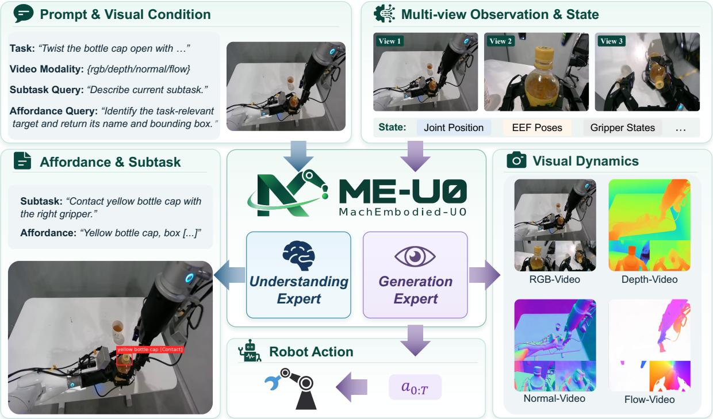  
Figure 1. MachEmbodied-U0 (ME-U0) integrates task-grounded understanding with joint visual and action generation through cooperating understanding and generation experts.

## 1 Introduction

Physical intelligence requires more than recognizing objects or following instructions: a robot must determine what to do, where to interact, and how its actions will change the world. These requirements connect semantic understanding, prediction, and control. A general embodied foundation model should therefore ground task intent in the observed scene while relating executable actions to their anticipated physical consequences.

Vision-language-action (VLA) models leverage the semantic priors of pretrained vision-language models for language-conditioned robot control [1–9]. However, their action-centric objectives typically do not explicitly capture how the scene evolves during interaction. World-action models (WAMs) address this limitation by jointly modeling future observations and robot actions, providing dense supervision for spatial structure and motion [10–14]. Yet visual dynamics alone does not ensure task-relevant grounding, interaction localization, or long-horizon task decomposition. These complementary strengths motivate a model that connects semantic understanding and visual dynamics with continuous control.

Unified multimodal architectures ofer a natural basis for this integration [15–17]. Recent embodied extensions explore several forms of unification: UAM [18] separates semantic and visuomotor pathways to preserve multimodal competence during action learning; Motubrain [19] jointly models languageconditioned video and actions across policy, world-modeling, and inverse-dynamics modes; and Cosmos 3 [20] scales unified reasoning and generation across language, vision, audio, and actions.

Together, these advances show that semantic reasoning, visual dynamics, and control can coexist within a unified architecture. They also expose a remaining design question: interleaving outputs, separating expert pathways, or supporting flexible modality configurations does not by itself determine how task-level intent should be translated into spatially grounded and dynamically informed control. For manipulation, the central challenge is therefore not merely to generate text, visual observations, and actions, but to organize their interaction around four coupled questions: what operation should be performed next, where the interaction should occur, what visual, geometric, and motion changes should unfold during execution, and how the operation should be realized through continuous control. This motivates a manipulation-centered form of unification that connects task decomposition and afordance grounding with geometry- and motion-aware visual dynamics and action generation.

We introduce MachEmbodied-U0 (ME-U0), a unified embodied foundation model capable of subtask decomposition, scene understanding, visual dynamics generation, and continuous action generation. As illustrated in Fig. 1, the model couples an understanding expert with a generation expert in a Mixtureof-Transformers (MoT) architecture. Conditioned on task instructions, visual observations, and robot states, the two experts connect scene-grounded task interpretation with visual dynamics generation and continuous control. Specialized parameters accommodate the distinct demands of semantic understanding and continuous generation, while shared multimodal attention enables coordination between them. ME-U0 combines three complementary designs: explicit subtask reasoning and afordance grounding, joint multimodal visual-dynamics and action generation, and action-substep temporal alignment. Together, these designs establish a direct pathway from high-level intent and local interaction geometry to anticipated scene evolution and executable control.

The understanding expert predicts subtasks and afordances to specify what to do next and where to act. Subtask prediction connects the overall instruction to the current manipulation stage, while afordance prediction identifies and localizes the relevant interaction target in the observed scene. Together, these outputs translate high-level intent into actionable semantic context. Through shared multimodal attention, the generation expert can use this context to condition future visual and action predictions, integrating task understanding into the control process.

Conditioned on this semantic context, the generation expert jointly predicts visual dynamics and continuous actions through Flow Matching [21], coupling control with anticipated scene changes in a shared backbone. We extend RGB generation to depth, surface normals, and optical flow [22], adding explicit geometry and motion supervision to support precise manipulation. MRPE aligns action steps with temporally compressed visual transitions.

To scale pretraining across heterogeneous robot embodiments, we map embodiment-specific states and actions into a canonical interface while preserving their physical control semantics. Dataset-specific transformations align joint, gripper, base, torso, and head variables, while validity masks indicate the dimensions and time steps available for each sample. This interface enables a single model to learn from approximately 4,200 hours of curated robotic and egocentric demonstrations, with the robotic corpus spanning four datasets and six embodiments. Through this pretraining, ME-U0 jointly acquires task-grounded understanding, geometry- and motion-aware visual dynamics, and continuous control.

For downstream evaluation, we use only the supervision natively available in each benchmark, without introducing additional subtask, afordance, geometry, or motion annotations during post-training. ME-U0 achieves a score of 17.66 on RoboDojo and average success rates of 99.0% and 82.5% on LIBERO and LIBERO-Plus, respectively. These results demonstrate that the representations acquired during large-scale pretraining transfer efectively to downstream manipulation, even under reduced-supervision post-training. Our contributions are fourfold:

• A unified embodied foundation model. We present ME-U0, which integrates task-grounded understanding, geometry- and motion-aware visual dynamics, and continuous robot control within a shared Mixture-of-Transformers architecture.

• Grounded visual–action dynamics modeling. Subtask prediction and afordance grounding provide structured semantic and spatial context for generation. Future RGB, depth, surface normals, optical flow, and continuous actions are jointly modeled through flow matching, while MRPE aligns fine-grained control with temporally compressed visual dynamics.

• A scalable embodied pretraining system. We construct a heterogeneous pretraining mixture with unified robot state–action semantics, multimodal annotations, task-aware sampling, and eficient data infrastructure, enabling training across four datasets and six robot embodiments.

• Broad empirical validation. ME-U0 achieves strong downstream performance on RoboDojo, LIBERO, and LIBERO-Plus, and further demonstrates efective transfer to real-world robotic manipulation.

## 2 Related Work

## 2.1 Vision-Language-Action Models

Vision-language-action (VLA) models ground visual observations and language instructions in robot actions. RT-1 established the benefits of large-scale, multi-task robot learning, while RT-2 incorporated pretrained vision-language knowledge into control through action-token prediction [4, 23]. Open generalist policies further improve accessibility and adaptation: Octo accommodates new observation and action spaces, and OpenVLA supports eficient fine-tuning of a pretrained vision-language backbone for manipulation [5, 6].

Another line of work focuses on action representation and generalization. FAST compresses action sequences using frequency-domain tokenization, whereas $\pi _ { 0 }$ uses flow matching to generate continuous actions, ofering diferent approaches to modeling dexterous control [7, 9]. Building on $\pi _ { 0 } , \pi _ { 0 . 5 }$ combines data from multiple robots and the web with high-level semantic prediction, enabling long-horizon manipulation in previously unseen homes [8]. Together, these methods highlight the complementary roles of transferable semantic knowledge, diverse training data, and expressive action representations in generalist robot policies.

## 2.2 World Action Models

World action models (WAMs) connect visual dynamics modeling with action learning, using future prediction to inform control or shape policy representations. Early approaches include UniPi, which extracts actions from language-conditioned video plans, and GR-1, which jointly predicts future images and robot actions after video generative pre-training [10, 11]. DreamZero scales joint video–action modeling with a pretrained video difusion backbone, supporting zero-shot policy generalization and transfer from video-only demonstrations across embodiments [12].

Recent methods examine how much future generation is necessary for efective control. LaWAM predicts compact latent visual subgoals to condition action generation, reducing the cost of reconstructing future video. Fast-WAM retains video co-training but omits future prediction at inference, showing that predictive supervision can benefit policies without requiring explicit test-time imagination [13, 14]. These approaches expose an important design choice: whether to use predicted futures as inference-time context or primarily as supervision for learning representations of scene dynamics.

## 2.3 Unified Models

Unified multimodal models combine understanding and generation through shared multimodal context. Show-o integrates autoregressive language modeling with discrete difusion for visual generation, while BAGEL scales unified pre-training on interleaved multimodal data [15, 16]. Lance further explores shared context with separate expert pathways for image and video understanding, generation, and editing [17]. These models provide foundations for coupling semantic reasoning with visual prediction.

For embodied control, BagelVLA interleaves language planning, visual forecasting, and action generation to support long-horizon manipulation, while Cosmos 3 extends a unified mixture-of-transformers architecture to language, image, video, audio, and action sequences [20, 24]. UAM addresses multimodal forgetting during action training by introducing a parallel Dorsal Expert initialized from a generative model and supervised to predict visual dynamics [18]. Its separation of semantic and control-related processing complements joint generation approaches, emphasizing that integrating perception, prediction, and action also requires preserving pretrained understanding capabilities.

## 3 Training Data

We draw on a raw pool of approximately 5,700 hours of robotic demonstrations and 3,920 hours of egocentric demonstrations. Egocentric data complements robotic data by covering manipulation contexts and behaviors underrepresented in robot demonstrations. After careful curation, we retain approximately 4,200 hours of demonstrations for pretraining. We further annotate a subset of the data with subtask, afordance, geometry, and motion labels to support joint understanding and generation.

## 3.1 Dataset Composition

## 3.1.1 Robotic Datasets

Our robotic data comes from four open-source datasets: AgiBot World Beta [25], RoboMIND 2.0 [26], RoboCOIN [27], and Galaxea Open-World [28]. After validity checks, the resulting corpus spans six robot embodiments and a broad range of manipulation tasks. Fig. 2(a) summarizes its dataset and embodiment composition.

Beyond data sources and embodiments, we construct a scene–action–object tag scheme. The three dimensions describe the scene context of a task, the behaviors it involves, and the objects it mentions. For visualization clarity, we aggregate related tags into six scene groups, six action groups, and eight object groups. Fig. 2(b) summarizes scene–action coverage. Common behaviors recur across diferent task contexts, while each context encompasses multiple forms of manipulation. This overlap places shared skills in varied settings, extending the mixture beyond a narrow set of context-specific behaviors. Fig. 2(c) complements this view with action–object coverage, showing how shared behaviors are associated with objects of diferent physical properties and functional roles.

The data mixture connects a broad range of task meanings with concrete robot interactions across diverse scenes and objects, providing rich supervision for grounding semantic understanding in physical behavior and supporting transfer across tasks.

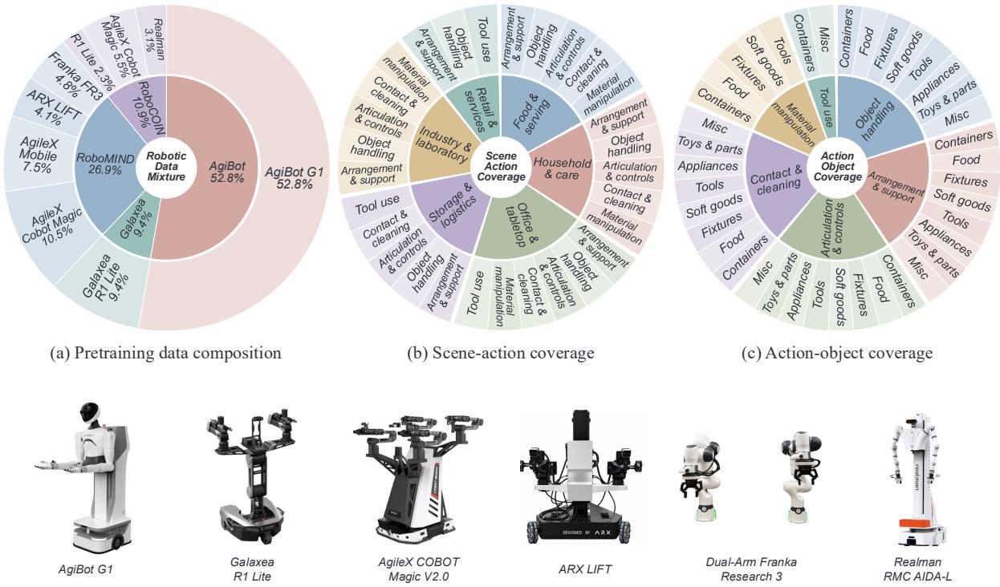  
Figure 2. Robotic data composition and scene–action–object diversity. (a) Dataset and robot-embodiment composition. (b) Task descriptions and the actions in each task. (c) Actions and the objects in task descriptions.

## 3.1.2 Egocentric Datasets

To improve coverage of task tags underrepresented in the robotic datasets, we select egocentric demonstrations with matching tags and incorporate them into the overall pretraining mixture. For action-supervised pretraining, we primarily use EgoDex [29], EgoLive [30, 31], EgoVerse [32], HOI4D [33], HOT3D [34], and the hand-annotated portion of Ego-Exo-4D [35]. We select demonstrations with temporally aligned first-person observations and low-level human motion annotations, including fingertip locations, wrist poses, and arm or shoulder states. These annotations support conversion into the unified hand-centric action representation described in Section 3.3.

## 3.2 Robotic Data Processing

## 3.2.1 Data Curation

Fig. 3 illustrates our three-stage cleaning pipeline and representative signal anomalies. Following recent robot-data curation pipelines [36, 37], we adopt dataset-specific filtering policies to account for diferences in state definitions, units, sampling rates, and action conventions. Before filtering, source-specific readers establish the physical meaning, units, ordering, and temporal alignment of the recorded channels. Each source is evaluated using checks supported by its available signals.

We apply three checks in sequence. First, we detect sudden changes in continuous state and action channels after scaling each dimension by its $q _ { 9 9 } - q _ { 0 1 }$ range. A median filter followed by smoothing provides a reference trajectory; large residuals, accelerations, or jerks flag an episode. Second, we assess state–action consistency by estimating the command–response lag from cross-correlations of smoothed first diferences, then measuring directional agreement at lag-aligned timesteps where actions vary. Low agreement across the configured number of dimensions, or a state freeze during action variation, flags the episode. Third, we compare raw values with manually reviewed, per-dimension physical bounds informed by full-dataset statistics. Gripper channels are excluded from these continuous-signal checks because their open/close values do not represent smooth motion. An episode is excluded if any enabled check is triggered or a source-specific timestamp-gap rule is violated. Filtering operates on complete episodes and leaves the original recordings unchanged, preserving the temporal continuity of retained demonstrations.

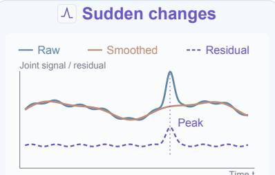

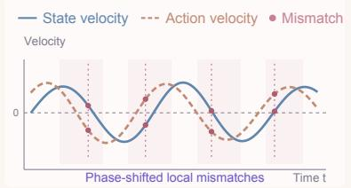

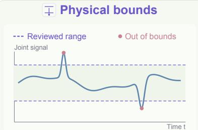

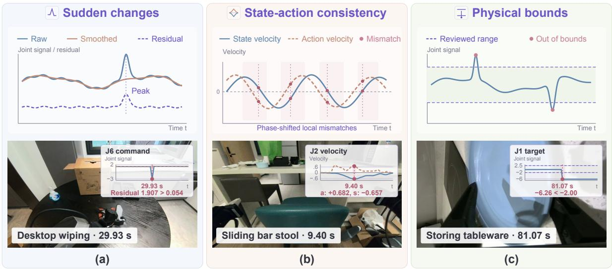  
Figure 3. Schematic of real-robot data curation. Each stage removes a subset of the episodes passed to it.

## 3.2.2 Data Annotation

We augment selected portions of the data with task-grounded semantic, spatial, geometric, and motion annotations.

Subtask Labeling. We develop a three-stage pipeline for labeling robot demonstrations with temporally grounded subtasks shown in Fig. 4. Our annotation pipeline comprises three stages. Coarse subtask segmentation combines event timestamps identified from action and state changes with uniformly sampled timestamps, capturing both salient transitions and the overall task progression. Using synchronized multi-view observations at these timestamps and the task instruction, the pipeline identifies an ordered sequence of subtasks and their approximate temporal intervals. Boundary refinement then examines visual observations near the proposed timestamps, together with temporally aligned action and state changes, to refine each subtask’s start and end boundaries and identify the first frame where its goal is visibly achieved. Verification checks the resulting sequence for semantic coherence, temporal ordering, and boundary consistency. Annotations that fail verification receive one automatic revision, with unresolved cases referred for manual review. We use GPT-5.5 [38] for all stages.

Afordance Labeling. Afordance annotations identify the target object and interaction location at each manipulation stage, thereby bridging high-level task semantics and low-level robot actions. As illustrated in Fig. 4, the annotation pipeline comprises three stages. Candidate frame proposal uses a rule-based procedure adapted from AfordanceVLA [39] to extract candidate frames from each demonstration. Keyframe selection jointly examines the head-camera video, task instruction, subtask timeline, and candidate contact sheet. It selects frames depicting meaningful interactions and assigns each a target category and an afordance instruction. The Spatial grounding stage localizes the target object and its interaction point in each selected frame. Frames are upsampled to twice their original resolution for finer localization; predicted coordinates are then mapped back to the original image space and checked for spatial consistency. The model we use is Qwen3.6-35B-A3B [40].

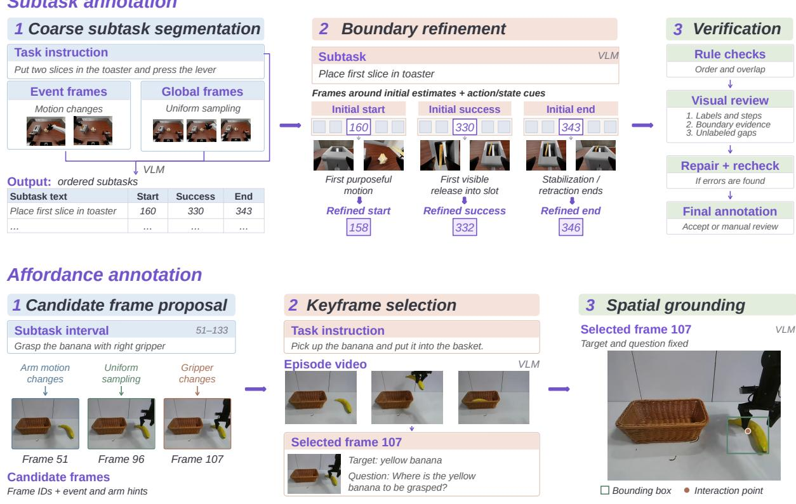  
Figure 4. Overview of our data annotation pipeline. We annotate temporal subtasks through segmentation, boundary refinement, and verification, and obtain spatial afordances through keyframe selection and grounding.

Visual Dynamics Labeling. We derive depth, surface normals, and optical flow labels from the original RGB data to provide complementary geometric and motion supervision for our unified model. These auxiliary annotations are intended to strengthen the model’s spatial and temporal understanding, supporting its ability to reason about scene structure and motion in robotic manipulation.

We use MoGe-2 [41] to estimate metric depth and surface normals from individual RGB frames, and normalize the depth labels [22]. To capture motion across frames, we use WAFT [42] to estimate optical flow between sampled frame pairs. We adjust the temporal stride for each dataset according to its sampling frequency, since the same frame ofset can correspond to diferent time intervals across datasets. Together, these annotations provide supervision for both scene geometry within individual frames and visual motion across time.

## 3.3 Egocentric Data Processing

Annotation Standardization. Action-annotated egocentric demonstrations are standardized into a unified human-centric action format following LeRobot v3 [43], with invalid frames and discontinuous action chunks filtered before task-level normalization. Each action-supervised sample is centered on an anchor timestep and contains first-person observations, future action chunks, available language supervision, and hand states represented in end-efector space. Hand states are represented by 3D position and axis-angle orientation, providing a consistent state-action space across heterogeneous human trajectories.

Ego2Robot Synthesis. As illustrated in Fig. 5, we synthesize robot-aligned demonstrations through task understanding, scene reconstruction, trajectory optimization, and rendering to reduce embodiment mismatch and depth uncertainty while improving contact accuracy.

We first use Qwen3.6 [40] to parse each egocentric video and its instruction, identifying relevant objects, interaction roles, and physical properties. Based on these attributes, each episode is categorized as either an easy task suited to trajectory replay or a hard task requiring contact refinement. For both task categories, the scene is reconstructed using metric depth from Depth Anything 3 [44] and masks from SAM3 [45]. Following Inpaint Anything [46], we then apply ProPainter [47] to the arm and hand masks to remove human regions and recover the occluded background for all episodes.

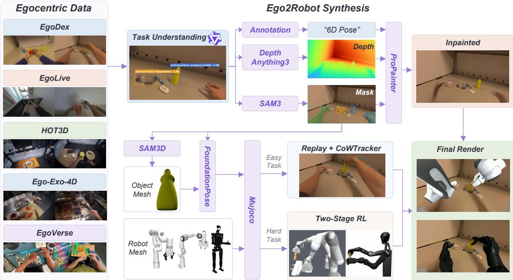  
Figure 5. Overview of egocentric data processing. Ego-to-Robot synthesis converts human demonstrations into robot-aligned observations and trajectory annotations.

Trajectory processing difers between the two task categories. For easy tasks, we replay the annotated trajectories and use CoWTracker [48] to ensure their accuracy in pixel space, thereby reducing the 2D-3D mismatch. For hard tasks involving contact sensitive interactions, we extend prior work [49–52] to recover object geometry and motion. Manipulated rigid objects are reconstructed as 3D physical models by using SAM3D [53], while masks, depth, and 6D pose estimates [54, 55] are fused to recover temporally consistent object trajectories. The corresponding wrist and fingertip trajectories are then refined through a two-stage Proximal Policy Optimization (PPO) [56] curriculum to improve contact accuracy and trajectory smoothness. The optimal trajectories from both branches are subsequently retargeted to the embodiment equipped with grippers through robot-specific inverse kinematics, solved with Mink [57] in MuJoCo [58]. Finally, the robot mesh is rendered into the inpainted egocentric video, with occlusions resolved according to object depth. The rendered images and optimized trajectory annotations constitute the final robot-aligned dataset.

## 4 Model Design

## 4.1 Main Architecture

MachEmbodied-U0 integrates an understanding expert and a generation expert within a unified multimodal framework, as illustrated in Fig. 6. The understanding expert processes language instructions and visual content to predict subtasks and afordances, while the generation expert predicts future visual observations

ME-U0 Architecture  
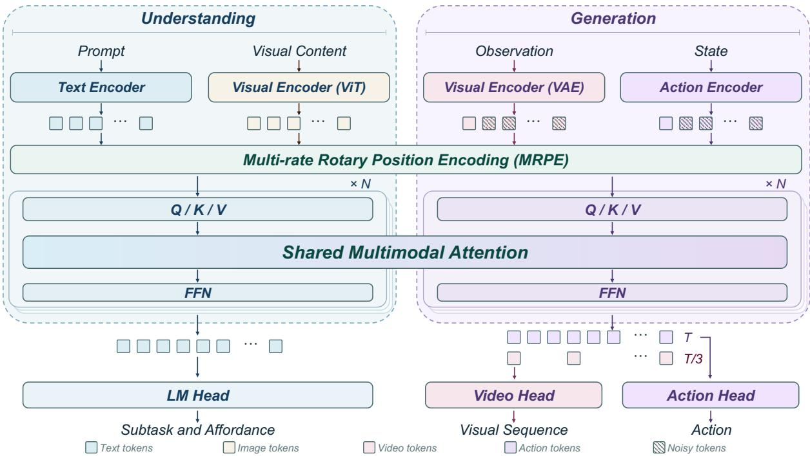  
Figure 6. Overview of our framework. The understanding expert predicts subtasks and afordances, while the generation expert jointly predicts future visual observations and robot actions through shared multimodal attention.

and robot actions. The two branches are coupled through a standard Mixture-of-Transformers (MoT) architecture. We initialize MachEmbodied-U0 from Lance [17] and further train it to acquire robot-specific capabilities.

## 4.1.1 Understanding Expert

We formulate subtask and afordance prediction as autoregressive text generation and train the understanding expert with a next-token cross-entropy objective. The resulting semantic visual tokens are combined with the task instruction in the shared multimodal sequence.

Subtask Prediction. An overall task instruction can remain unchanged across several manipulation stages, while the immediate goal changes as the scene evolves. Following the use of semantic subtask supervision in �0.5 [8], we ask the understanding expert to describe the local manipulation goal given the instruction and current observation. This encourages the expert to interpret the observed scene in the context of the overall task and distinguish the behaviors required at diferent stages.

Afordance Prediction. For keyframes with afordance annotations, we model actionable spatial grounding using a similar question-answering formulation. The Affordance Query asks the model to identify a task-relevant target in the current image and predict its bounding box, followed by the intended interaction and the corresponding interaction point. When both annotations are available, the afordance follows the subtask in the same assistant response; otherwise, it is predicted alone. Samples without afordance annotations retain their original training objective.

## 4.1.2 Generation Expert

As shown in Fig. 6, the generation expert jointly generates future visual dynamics and robot actions. In the shared sequence, text tokens follow the current observation and robot-state tokens and precede the future visual and action tokens. Causal attention prevents text tokens from attending to future targets. During denoising, the generation expert uses shared multimodal attention to access representations of the input images and text from the understanding expert. It generates RGB, depth, surface-normal, or optical-flow sequences together with continuous robot actions.

Visual Dynamics Generation. The generation expert produces visual sequences in the modality specified by the input prompt: RGB, depth, surface normals, or optical flow. We represent geometry and motion as three-channel visual targets [22], complementing RGB appearance with scene structure, surface orientation, and inter-frame motion. All modalities share a generation backbone and latent output projection operating in the latent space of a common video VAE, whose decoder reconstructs the predicted latents into the requested visual modality. This formulation unifies RGB, geometry, and motion generation without modality-specific prediction heads.

Action Generation. For action generation, we represent each timestep in the predicted action sequence as one token. At each denoising step, the generation expert processes the noisy action tokens together with the visual tokens through bidirectional self-attention. An action-specific output head maps the resulting action representations to velocity predictions, which are used to update the noisy action sequence using explicit Euler steps. This process proceeds in synchrony with visual generation to produce the final action sequence.

## 4.2 Multi-rate Rotary Position Encoding

We adopt the multimodal rotary position embedding (mRoPE) scheme [3], which encodes text positions and visual spatiotemporal coordinates through rotations of query and key representations. Building on this scheme, we introduce Multi-rate Rotary Position Encoding (MRPE) to accommodate temporally subsampled video while retaining actions at their original sampling rate. Each video latent frame corresponds to a chunk of consecutive actions, whose internal order would remain unspecified if they shared identical position indices. We therefore retain the shared temporal position of the corresponding video latent frame, but assign each action a distinct height-axis index according to its order within the chunk, while keeping the width-axis index fixed. This preserves temporal alignment between actions and video while explicitly encoding the position of each action within its chunk.

## 4.3 Unified Multimodal Prompting

Inspired by the use of contextual information in the prompts of $\pi _ { 0 . 7 }$ [59], we design a unified multimodal prompt that combines the current visual observation and task instruction with control metadata and explicit prediction requirements. Control-mode and action-semantics fields specify the robot’s control conventions, including relative or absolute commands and gripper encoding. Subtask and afordance queries define the requested understanding outputs, while a video-modality field specifies whether to generate RGB, depth, surface normals, or optical flow. Together, these fields provide the task and control context for joint understanding and generation. An example is shown below, with the shared system prompt omitted and visual embeddings represented by an observation placeholder:

Table 1. Unified state and action representation. Dimensions are specified per arm or gripper.
<table><tr><td>Component</td><td>Dim.</td><td>Shared representation</td></tr><tr><td>Arm: joint control</td><td>6/7</td><td>Joint configuration in radians</td></tr><tr><td>Arm: EEF control</td><td>9</td><td>Cartesian position in metres and 6D orientation</td></tr><tr><td>Gripper</td><td>1</td><td>Normalized closing coordinate: 0 = open, 1 = closed</td></tr><tr><td>Chassis</td><td>3</td><td>Body-frame planar velocity  $( \nu _ { x } , \nu _ { y } , \omega _ { z } )$  , in m/s and rad/s</td></tr><tr><td>Torso: AgiBot</td><td>2</td><td>Pitch and lift position, in radians and metres</td></tr><tr><td>Torso: Galaxea</td><td>3</td><td>Planar Cartesian velocity  $( \nu _ { x } , \nu _ { z } , \omega _ { y } )$  , in m/s and rad/s</td></tr><tr><td>Head</td><td>2</td><td>Yaw and pitch joint positions in radians</td></tr></table>

<Current RGB observation> Task:pick up the cup. Video Modality:rgb. Control Mode:joint. Action Semantics:joint delta (chunk-start); gripper absolute (0=open, 1=closed; pre-norm). Subtask Query:Describe the current subtask based on the task and the current image. Affordance Query:Identify a target relevant to carrying out the task in the current image. Give its name and bounding box. Output:<subtask><affordance>

## 4.4 Unified Action Representation

Embodiment diversity provides rich manipulation experience, but inconsistent control conventions can obscure the common structure across demonstrations. Similar numerical values may describe diferent physical quantities or even opposite control directions. We therefore adopt a unified action space for robot states and actions across robot embodiments, shown in Tab. 1.

We implement dataset-specific adapters to align the physical meaning of robot states and actions before statistical normalization. These adapters reconcile units, coordinate conventions, and control directions while preserving meaningful embodiment-specific diferences. For example, gripper states and actions are expressed in a shared closing coordinate, where 0 denotes fully open and 1 fully closed. This reverses and rescales Galaxea’s native [0, 100] commands while preserving AgiBot’s action convention. AgiBot’s millimetre-valued gripper states are calibrated separately to the same closing coordinate.

Some sources additionally require kinematic conversion to make states and actions physically consistent. Galaxea, for instance, records mobile-base states as wheel-steering angles and wheel velocities, but specifies actions as Cartesian velocities. We convert these wheel-level states into body-frame planar velocities, giving states and actions a common physical interpretation. Controls with distinct physical meanings, such as torso position and velocity, remain explicitly distinguished.

## 5 Pretraining

## 5.1 Training Data Sampling

Broad coverage of tasks and scene contexts provides a foundation for learning manipulation skills that generalizes beyond the pretraining data [8, 60]. However, diversity in the collected corpus does not necessarily translate into diversity in training exposure. Under a fixed training budget, sampling in proportion to recorded timesteps can concentrate supervision on abundant tasks and long demonstrations, limiting exposure to less common behaviors. An efective sampling strategy should therefore preserve the breadth of the task repertoire while providing meaningful supervision across tasks.

Table 2. Source-specific video–action temporal alignment. $H _ { a }$ denotes the number of action steps, and $H _ { \nu }$ the number of sampled video frames
<table><tr><td>Dataset source</td><td>Action (Hz)</td><td>Video (Hz)</td><td> $H _ { a } \mathrm { ~ / ~ } H _ { \nu }$ </td><td>Horizon (s)</td></tr><tr><td>AgiBot World Beta</td><td>30</td><td>10</td><td>36/ 13</td><td>1.20</td></tr><tr><td>Galaxea Open World</td><td>15</td><td>5</td><td>24/9</td><td>1.60</td></tr><tr><td>RoboMIND 2.0: AgileX / Mobile / ARK</td><td>30</td><td>10</td><td>36 / 13</td><td>1.20</td></tr><tr><td>RoboMIND 2.0: Franka</td><td>15</td><td>5</td><td>24/9</td><td>1.60</td></tr><tr><td>RoboCOIN: 30 Hz recordings</td><td>30</td><td>10</td><td>36/ 13</td><td>1.20</td></tr><tr><td>RoboCOIN: 50 Hz recordings</td><td>25</td><td>8.33</td><td>36 / 13</td><td>1.44</td></tr></table>

We adopt global task-aware sampling to achieve this, allocating the training budget across source-specific task buckets rather than prescribing dataset-level proportions. Each eligible task receives an initial coverage allocation drawn from multiple episodes, ensuring that less abundant tasks also contribute to pretraining. With this coverage established, the remaining budget is then distributed through temperature-based sampling with weights

$$
w _ { k } = \operatorname* { m a x } ( R _ { k } , 1 ) ^ { \alpha } ,
$$

where $R _ { k }$ denotes the task’s remaining capacity in training blocks and � controls the degree of distribution smoothing. We set $\alpha = 0 . 5$ to balance the contribution of less abundant tasks against the greater demonstration diversity available in larger task buckets. This sublinear weighting reduces the dominance of large task buckets while retaining a preference for tasks with more available data. Task allocations remain bounded by the available data capacity, avoiding aggressive oversampling of tasks with few demonstrations. For tasks with insuficient capacity, we draw additional samples from egocentric datasets to supplement their coverage. This combines broad task coverage with more balanced supervision without enforcing equal sample counts across tasks. Dataset proportions emerge naturally from the resulting task-level allocation. Using this strategy, we draw 120 million training samples from the eligible tasks in the curated data mixture.

## 5.2 Video–Action Temporal Alignment

Heterogeneous recording rates introduce a temporal mismatch when combining robotic datasets: sequences with the same number of frames may capture substantially diferent amounts of motion and span diferent physical durations. We address this by jointly selecting source-specific sampling strides and sequence lengths, keeping prediction windows within approximately 1–2 seconds while sampling actions three times as densely as video. This provides finer-grained control supervision without requiring equally dense visual sequences.

Specifically, each interval between consecutive sampled video frames corresponds to three action steps. For $H _ { a }$ action steps and $H _ { \nu }$ video frames, including the anchor, we have

$$
H _ { a } = 3 ( H _ { \nu } - 1 ) .
$$

Combined with the video VAE temporal compression, this establishes a consistent correspondence of 12 action steps per predicted video-latent step. The resulting representation preserves a common cross-modal temporal structure across datasets while accommodating their diferent recording rates. Tab. 2 summarizes the source-specific sampling settings.

## 5.3 Understanding Expert Training

We introduce two complementary language-supervision tasks to enhance task-grounded understanding. Subtask prediction connects the overall goal to the ongoing manipulation step, while afordance prediction identifies and localizes a task-relevant object or region in the current image. Together, they encourage the expert to associate semantic intent with concrete visual referents, providing richer supervision than continuous action targets alone. Both responses are trained with autoregressive cross-entropy

$$
\mathcal { L } _ { \mathrm { u n d } } = - \frac { 1 } { T } \sum _ { t = 1 } ^ { T } \log p _ { \theta } ( y _ { t } \mid y _ { < t } , \mathbf { x } ) ,\tag{1}
$$

where x comprises the current image, task instruction, and contextual metadata, and $\mathbf { y } = ( y _ { 1 } , \dots , y _ { T } )$ is the target response containing the available subtask and afordance labels. The loss is evaluated only on supervised response tokens, jointly learning task interpretation and visual grounding within a shared language-generation framework.

## 5.4 Generation Expert Training

The generation expert, initialized from the pretrained Lance [17] model, jointly denoises future visual latents and robot actions using conditional Flow Matching [21]. Given the conditioning context c, we corrupt the clean visual target z and action trajectory a with independent standard Gaussian noise at a shared flow time �. We sample $\tau = \mathrm { s i g m o i d } ( u + \log 4 )$ , where $u \sim { \cal N } ( 0 , 1 )$ , yielding a shifted logit-normal distribution that emphasizes higher noise levels:

$$
\mathbf { z } _ { \tau } = ( 1 - \tau ) \mathbf { z } + \tau \epsilon _ { z } , \qquad \mathbf { a } _ { \tau } = ( 1 - \tau ) \mathbf { a } + \tau \epsilon _ { a } .\tag{2}
$$

The noisy visual and action tokens are processed together by the generation expert, allowing information exchange between modalities. Separate output projections predict their respective velocity fields:

$$
\left( \widehat { \mathbf { u } } _ { z } , \widehat { \mathbf { u } } _ { a } \right) = \nu _ { \theta } \left( \mathbf { z } _ { \tau } , \mathbf { a } _ { \tau } , \tau ; \mathbf { c } \right) .\tag{3}
$$

The joint flow-matching objective is

$$
\mathcal { L } _ { \mathrm { g e n } } = \mathbb { E } \left[ \lambda _ { z } \left. \widehat { \mathbf { u } } _ { z } - \left( \epsilon _ { z } - \mathbf { z } \right) \right. _ { \mathbf { M } _ { z } } ^ { 2 } + \lambda _ { a } \left. \widehat { \mathbf { u } } _ { a } - \left( \epsilon _ { a } - \mathbf { a } \right) \right. _ { \mathbf { M } _ { a } } ^ { 2 } \right] ,\tag{4}
$$

where $\| \cdot \| _ { \mathbf { M } } ^ { 2 }$ denotes the mean squared error over valid elements selected by mask M.

We adopt joint denoising to preserve the unified understanding and generation architecture of our model. Language and visual understanding provide the conditioning context, while the same generation expert jointly processes noisy action tokens and future visual latents. Introducing a separate action denoiser would decouple action generation from this shared generative process and weaken the architectural unification of understanding, visual prediction, and robot control. Instead, joint denoising incorporates actions directly into the multimodal generation process, allowing action and visual predictions to interact throughout denoising. Modality-specific output projections accommodate their diferent representations while preserving a shared generation backbone.

For visual dynamics generation, selected future RGB targets are replaced with depth, surface normals, or optical flow, with the target modality specified by the language instruction. All modalities share the same video VAE and generation expert, while the current RGB observation and action targets remain unchanged. This allows geometric prediction and action generation to be jointly optimized under the same flow-matching objective.

Beyond joint video and action generation, the architecture supports training on forward and inverse dynamics tasks [20] by varying the conditioning inputs and prediction targets. Forward dynamics predicts future visual latents conditioned on the current observation and an action trajectory, whereas inverse dynamics predicts actions conditioned on the current and future visual latents:

$$
\mathrm { F o r w a r d \ d y n a m i c s : } \quad ( { \bf c } , { \bf a } ) \longrightarrow { \bf z } ,\tag{5}
$$

$$
\mathrm { I n v e r s e ~ d y n a m i c s : } \quad ( \mathbf { c } , \mathbf { z } ) \longrightarrow \mathbf { a } ,\tag{6}
$$

$$
\mathrm { J o i n t \ p o l i c y \ p r e d i c t i o n : \quad c \longrightarrow ( z , { \bf a } ) . }\tag{7}
$$

The overall training objective combines the generation expert’s joint flow-matching loss with the understanding expert’s autoregressive cross-entropy loss:

$$
\begin{array} { r } { \mathcal { L } _ { \mathrm { t o t a l } } = \mathcal { L } _ { \mathrm { g e n } } + \lambda _ { \mathrm { u n d } } \mathcal { L } _ { \mathrm { u n d } } , } \end{array}\tag{8}
$$

where $\lambda _ { \mathrm { u n d } }$ controls the relative contribution of understanding supervision, while $\lambda _ { z }$ and $\lambda _ { a }$ in $\mathcal { L } _ { \mathrm { g e n } }$ balance visual and action generation. This objective jointly optimizes task-grounded understanding, future visual prediction, and robot action generation.

## 6 Training Infrastructure

To train eficiently on our large-scale pretraining data mixture, we design our training infrastructure to address two costly recurring operations: dataset initialization and video data loading. The data-initialization optimizations reduce the initialization time of the full pretraining mixture from approximately one hour to less than ten minutes, and the video data loading strategy reduces overall training time by more than 30% in our training platform.

## 6.1 Eficient Dataset Initialization

Precomputed episode manifests. Initializing a large dataset mixture can be slow because it requires traversing source directories and inspecting episode files, particularly when metadata must be retrieved over the network. We move this discovery process to the data-preparation stage and record episode identifiers, lengths, task associations, and source-specific filtering information in persistent manifests. At training time, the episode catalog is reconstructed directly from these manifests, eliminating repeated file-system inspection.

Reusable Subtask Index. We precompute a reusable metadata index containing each subtask’s episode identifier, temporal boundaries, and language label. Training runs load this index directly, avoiding repeated parsing and alignment of the original annotations during initialization. Rather than storing experiment-specific training windows, the index preserves the complete annotated intervals, from which eligible anchors are derived according to the configured video and action ofsets. It can therefore be reused across experiments with diferent prediction horizons.

Lightweight Data Readers. Constructing a full Dataset object for every constituent dataset introduces substantial initialization overhead, particularly for large sources distributed across hundreds of LeRobot directories. To reduce this overhead, we implement lightweight LeRobot readers that use precomputed metadata to access the underlying files without repeating the full initialization procedure. We additionally support direct access to native data formats through source-specific readers, avoiding the cost of converting large datasets into a common storage format.

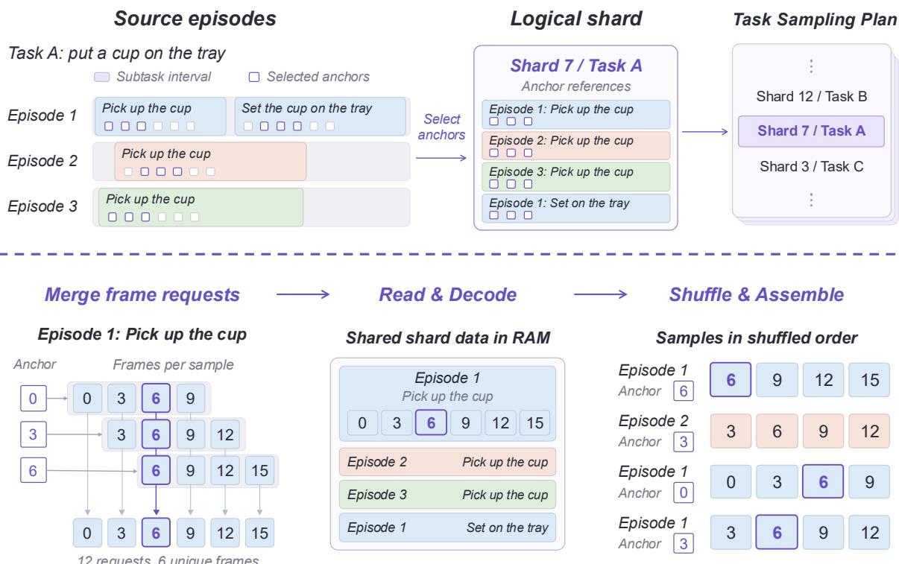  
Figure 7. Shard-based sampling and loading. Top: selected anchors from subtask intervals across episodes of the same task are referenced by a logical shard from the global task sampling plan. Bottom: overlapping frame requests are merged, decoded into shared memory bufers, and assembled into samples in shufled anchor order.

## 6.2 Logical Shards

Video-based model training incurs substantial I/O and video decoding overhead for the data pipeline. We organize training samples into logical shards, which serve as the basic units of allocation for the global task sampler and of grouped loading for data workers. This preserves temporal locality for eficient video decoding while allowing the sampler to control coverage across tasks and episodes.

The upper part of Fig. 7 shows how demonstrations are organized into logical shards. Each training sample starts at an anchor, whose complete video/action window must remain within the same subtask interval and episode. To construct a shard, we cycle through episodes of one task, taking nearby anchors from each subtask interval until the shard contains the configured number of anchors. These shards form the units of the global task sampling plan. Following the task-level allocation described above, the plan selects shards without replacement and shufles them into a reproducible schedule for distributed workers.

The lower part of Fig. 7 shows how a worker loads a scheduled shard. Rather than loading each sample independently, a worker merges overlapping frame requests from nearby anchors within the same subtask interval. In the example, twelve requests reduce to six unique frames, which are decoded and kept in memory alongside the state/action data. The worker then shufles the anchors and assembles their samples from the shared data. Training samples are thus drawn from diferent episode segments in shufled order, while overlapping samples continue to share the same decoded frames.

Table 3. Results on RoboDojo-Sim. SR and Score are reported on a 0–100 scale, with higher values better. Bold indicates the best result within each model group.
<table><tr><td rowspan="2">Model</td><td colspan="2">Gen-Std</td><td colspan="2">Gen-Rand</td><td colspan="2">Precision</td><td colspan="2">Long-Horizon</td><td colspan="2">Memory</td><td colspan="2">Open</td><td colspan="2">Overall</td></tr><tr><td>SR</td><td>Score</td><td>SR</td><td>Score</td><td>SR</td><td>Score</td><td>SR</td><td>Score</td><td>SR</td><td>Score</td><td>SR</td><td>Score</td><td>SR</td><td>Score</td></tr><tr><td colspan="10">VLA</td><td></td><td></td><td></td><td></td><td></td><td></td></tr><tr><td>StarVLA [61]</td><td>4.67</td><td>7.54</td><td>0.00</td><td>0.33</td><td>4.33</td><td>9.90</td><td>6.50</td><td>14.15</td><td>2.44</td><td>3.34</td><td>0.58</td><td>0.67</td><td>3.24</td><td>6.40</td></tr><tr><td>X-VLA [62]</td><td>12.22</td><td>17.90</td><td>1.33</td><td>3.04</td><td>12.00</td><td>18.32</td><td>9.75</td><td>16.53</td><td>3.56</td><td>4.76</td><td>0.50</td><td>0.55</td><td>6.52</td><td>10.13</td></tr><tr><td>π0.5 [8]</td><td>14.89</td><td>20.93</td><td>1.44</td><td>5.82</td><td>5.50</td><td>12.40</td><td>14.67</td><td>23.54</td><td>4.67</td><td>5.89</td><td>1.67</td><td>1.98</td><td>6.93</td><td>11.44</td></tr><tr><td>Spatial Forcing [63]</td><td>14.89</td><td>21.25</td><td>3.78</td><td>6.98</td><td>10.58</td><td>17.32</td><td>14.58</td><td>23.26</td><td>4.11</td><td>5.43</td><td>1.58</td><td>1.78</td><td>8.04</td><td>12.38</td></tr><tr><td>Hy-Embodied-0.5-VLA [64]</td><td>16.56</td><td>21.98</td><td>0.22</td><td>1.57</td><td>8.00</td><td>13.81</td><td>14.92</td><td>25.74</td><td>12.11</td><td>13.37</td><td>0.58</td><td>0.65</td><td>8.80</td><td>13.07</td></tr><tr><td>Xiaomi-Robotics-1 [65]</td><td>28.00</td><td>35.65</td><td>6.00</td><td>11.44</td><td>18.83</td><td>26.69</td><td>23.67</td><td>38.39</td><td>6.56</td><td>7.81</td><td>3.58</td><td>3.94</td><td>13.93</td><td>20.07</td></tr><tr><td>GalaxeaVLA (G0.5) [66]</td><td>21.44</td><td>27.72</td><td>4.22</td><td>9.20</td><td>20.42</td><td>28.25</td><td>32.25</td><td>44.12</td><td>7.33</td><td>8.61</td><td>1.58</td><td>1.73</td><td>14.88</td><td>20.23</td></tr><tr><td>DM0.5 [67]</td><td>17.89</td><td>23.49</td><td>4.00</td><td>8.06</td><td>16.75</td><td>24.82</td><td>19.50</td><td>33.70</td><td>47.44</td><td>47.74</td><td>2.08</td><td>2.43</td><td>19.34</td><td>24.90</td></tr><tr><td colspan="10">WAM</td><td colspan="7"></td></tr><tr><td>Fast-WAM [14]</td><td>2.11</td><td>4.33</td><td>0.11</td><td>0.34</td><td>0.00</td><td>1.96</td><td>5.17</td><td>9.14</td><td>3.44</td><td>3.55</td><td>0.42</td><td>0.42</td><td>2.03</td><td>3.48</td></tr><tr><td>AHA-WAM [68]</td><td>6.22</td><td>10.32</td><td>0.33</td><td>1.26</td><td>2.42</td><td>5.86</td><td>2.67</td><td>8.61</td><td>2.78</td><td>2.97</td><td>0.83</td><td>0.88</td><td>2.39</td><td>4.82</td></tr><tr><td>GigaWorld-Policy-0 [69]</td><td>5.78</td><td>10.28</td><td>0.00</td><td>0.41</td><td>1.83</td><td>6.15</td><td>8.92</td><td>15.51</td><td>2.22</td><td>3.46</td><td>0.50</td><td>0.54</td><td>3.27</td><td>6.20</td></tr><tr><td>X-WAM [70]</td><td>5.33</td><td>11.24</td><td>41.33</td><td>3.54</td><td>1.83</td><td>6.72</td><td>9.08</td><td>17.47</td><td>4.67</td><td>6.32</td><td>0.25</td><td>0.57</td><td>3.83</td><td>7.69</td></tr><tr><td>OpenWAM-α [71]</td><td>25.56</td><td>33.16</td><td>4.11</td><td>8.26</td><td>9.25</td><td>18.45</td><td>25.33</td><td>34.93</td><td>9.11</td><td>10.41</td><td>1.08</td><td>1.41</td><td>11.92</td><td>17.18</td></tr><tr><td>ME-U0 (ours)</td><td>19.11</td><td>28.10</td><td>1.33</td><td>6.96</td><td>15.42</td><td>23.95</td><td>22.33</td><td>36.98</td><td>7.00</td><td>8.42</td><td>0.92</td><td>1.41</td><td>11.18</td><td>17.66</td></tr></table>

## 6.3 Video Decoding and CPU Ofloading

We cap the number of nearby anchors processed per decoding job, restricting its video span to those anchors and their required future frames rather than the entire episode. This balances frame reuse against per-job memory demand. A separate concurrency limit controls aggregate CPU and memory usage, while asynchronous preparation of the next shard overlaps decoding with training.

To accommodate decoding workloads that exceed the CPU capacity of GPU nodes, we also support ofloading data preparation to separate CPU jobs. These jobs read and decode data ahead of training and place the prepared payloads in a shared cache. Training workers retrieve cached payloads without performing local video decoding on cache hits. The CPU jobs follow the training sample schedule and maintain a bounded lead over consumption, preventing excessive accumulation of prepared data. This separation allows decoding capacity to scale independently of GPU resources and reduces training time significantly.

## 7 Experimental Results

## 7.1 Post-Training Recipe

We separately post-train ME-U0 on RoboDojo [72] and LIBERO [73], initializing both runs from the same pretrained checkpoint. Both runs use 368 PPU810E accelerators with a per-device batch size of 2. We use an action horizon of 24 with end-efector pose control for LIBERO, and an action horizon of 48 with delta joint-position control for RoboDojo.

It is worth noting that neither RoboDojo nor LIBERO provides subtask or afordance annotations, or auxiliary supervision for video geometry and motion. For fair comparisons, we do not augment either dataset with these additional supervision signals during post-training. Despite the potential degradation of pretrained representations under this reduced-supervision post-training setting, ME-U0 achieves strong performance on both benchmarks, highlighting the robustness of its pretrained representations and their efectiveness for downstream adaptation.

Table 4. Post-training results on standard LIBERO.
<table><tr><td>Model</td><td>Spatial</td><td>Object</td><td>Goal</td><td>Long</td><td>Avg.</td></tr><tr><td colspan="6">VLA</td></tr><tr><td>π0.5 [8]</td><td>98.8</td><td>98.2</td><td>98.0</td><td>92.4</td><td>96.9</td></tr><tr><td>OpenVLA-OFT [74]</td><td>97.6</td><td>98.4</td><td>97.9</td><td>94.5</td><td>97.1</td></tr><tr><td>StarVLA [61]</td><td>97.8</td><td>98.6</td><td>96.2</td><td>93.8</td><td>96.6</td></tr><tr><td>ABot-M0 [75]</td><td>98.8</td><td>99.8</td><td>99.0</td><td>96.6</td><td>98.6</td></tr><tr><td>X-VLA [62]</td><td>98.2</td><td>98.6</td><td>97.8</td><td>97.6</td><td>98.1</td></tr><tr><td colspan="6">WAM</td></tr><tr><td>Fast-WAM [14]</td><td>98.2</td><td>100.0</td><td>97.0</td><td>95.2</td><td>97.6</td></tr><tr><td>Motus [76]</td><td>96.8</td><td>99.8</td><td>96.6</td><td>97.6</td><td>97.7</td></tr><tr><td>ImageWAM [77]</td><td>97.2</td><td>99.2</td><td>98.8</td><td>98.4</td><td>98.4</td></tr><tr><td>LingBot-VA [78]</td><td>98.5</td><td>99.6</td><td>97.2</td><td>98.5</td><td>98.5</td></tr><tr><td>OpenWAM-α [71]</td><td>99.6</td><td>99.6</td><td>99.8</td><td>98.2</td><td>99.3</td></tr><tr><td>ME-U0 (ours)</td><td>98.4</td><td>99.8</td><td>99.0</td><td>98.6</td><td>99.0</td></tr></table>

Table 5. Robustness on LIBERO-Plus. Success rates (%) are reported across seven perturbation categories [79].
<table><tr><td>Model</td><td>Camera</td><td>Robot</td><td>Language</td><td>Light</td><td>Background</td><td>Noise</td><td>Layout</td><td>Avg.</td></tr><tr><td colspan="9">VLA</td></tr><tr><td>StarVLA [61]</td><td>52.5</td><td>49.8</td><td>88.5</td><td>95.7</td><td>95.7</td><td>73.0</td><td>76.9</td><td>74.1</td></tr><tr><td>ABot-M0 [75]</td><td>60.4</td><td>67.9</td><td>86.4</td><td>96.2</td><td>91.6</td><td>86.4</td><td>82.6</td><td>80.5</td></tr><tr><td>π0.5 [8]</td><td>78.4</td><td>73.6</td><td>80.8</td><td>96.2</td><td>94.1</td><td>89.0</td><td>84.5</td><td>84.4</td></tr><tr><td>Qwen-RobotManip [37]</td><td>87.2</td><td>75.5</td><td>85.6</td><td>96.6</td><td>97.7</td><td>97.7</td><td>87.3</td><td>89.0</td></tr><tr><td colspan="9">WAM</td></tr><tr><td>Fast-WAM [14]</td><td>16.4</td><td>44.5</td><td>68.9</td><td>78.2</td><td>53.7</td><td>37.7</td><td>60.7</td><td>51.5</td></tr><tr><td>Being-H0.7 [80]</td><td>82.0</td><td>59.0</td><td>82.8</td><td>97.8</td><td>90.0</td><td>93.5</td><td>88.5</td><td>82.1</td></tr><tr><td>Cosmos-Policy [81]</td><td>75.8</td><td>63.3</td><td>81.7</td><td>96.5</td><td>88.9</td><td>92.7</td><td>82.2</td><td>82.2</td></tr><tr><td>ImageWAM [77]</td><td>80.8</td><td>50.3</td><td>91.4</td><td>98.1</td><td>85.5</td><td>93.8</td><td>80.5</td><td>83.1</td></tr><tr><td>OpenWAM-α [71]</td><td>33.8</td><td>76.1</td><td>88.0</td><td>97.0</td><td>87.1</td><td>39.8</td><td>77.5</td><td>69.2</td></tr><tr><td>ME-U0 (ours)</td><td>70.2</td><td>75.7</td><td>90.4</td><td>97.6</td><td>81.9</td><td>81.3</td><td>84.5</td><td>82.5</td></tr></table>

## 7.2 Simulation Benchmark Evaluation

## 7.2.1 RoboDojo

We evaluate ME-U0 on the 42 tasks of RoboDojo [72] across generalization, precision, long-horizon execution, memory, and open-vocabulary instruction following. For each of three evaluation seeds, we run 25 standard and 25 randomized episodes for each of the 12 generalization tasks, and 50 episodes for each of the remaining 30 tasks. We report success rate (SR) and the benchmark’s process score, which gives partial credit for task progress. Overall results average the five capability dimensions equally, with Gen-Std and Gen-Rand first combined into the generalization dimension.

Tab. 3 compares ME-U0 with representative VLA and WAM baselines. ME-U0 achieves the strongest overall performance among the evaluated WAMs, reaching an overall process score of 17.66 and an SR of 11.18%. The advantage is particularly evident in precision and long-horizon execution, where ME-U0 obtains process scores of 23.95 and 36.98, respectively. These results suggest that grounding joint visual– action dynamics with subtask and afordance context supports both fine-grained interaction and extended task execution. ME-U0 also remains competitive with established VLA baselines despite being pretrained on only approximately 4,200 hours of curated robotic and egocentric demonstrations, demonstrating competitive downstream transfer from a comparatively moderate pretraining corpus. Memory-dependent tasks remain comparatively challenging, with a process score of 8.42 and an SR of 7.00%, likely because the current model does not explicitly retain observation history. Incorporating temporal context and memory mechanisms could further improve performance when task-relevant information is no longer visible in the current observation.

## 7.2.2 LIBERO/LIBERO-Plus

We evaluate a single LIBERO-adapted ME-U0 checkpoint on the four standard LIBERO suites and LIBERO-Plus, which extends the same task families along seven controlled perturbation dimensions [79]. Standard LIBERO evaluates 50 initial states for each of its 40 tasks, resulting in 2,000 episodes, whereas LIBERO-Plus evaluates one episode for each of 10,030 perturbed task instances. We use the same checkpoint for both benchmarks without LIBERO-Plus-specific adaptation and aggregate success over episodes. The overall LIBERO-Plus result is therefore weighted by the number of task instances in each perturbation category. Published baseline results are transcribed from the cited reports for reference and were not rerun in our evaluation environment.

As Tab. 4 shows, ME-U0 achieves an average success rate of 99.0% on LIBERO, including 98.4% on Spatial, 99.8% on Object, 99.0% on Goal, and 98.6% on Long, demonstrating consistently near-ceiling performance across all four suites. Without additional adaptation, the same checkpoint achieves an overall success rate of 82.5% on LIBERO-Plus, as reported in Tab. 5. Performance remains particularly strong under lighting and language perturbations, with success rates of 97.6% and 90.4%, respectively. Camera-viewpoint changes and variations in robot initial states are the most challenging categories, yielding 70.2% and 75.7%. Success rates under background textures, sensor noise, and object layouts are 81.9%, 81.3%, and 84.5%, respectively. These results show that LIBERO-Plus provides a more discriminative assessment than the nearly saturated standard benchmark and identify robustness to viewpoint changes and robot initial states as areas for further improvement.

## 7.3 Real-World Deployment

We evaluate ME-U0 through direct deployment on real-world manipulation tasks across multiple robot platforms, with model inference performed on a remote server. The pretrained checkpoint is used without additional post-training or deployment-specific adaptation. Since these platforms are represented in the pretraining corpus, this evaluation examines deployment on familiar embodiments rather than generalization to unseen robot platforms. Fig. 8 presents three representative instruction-guided tasks: picking up a marker, placing a tissue into a box, and positioning the number 20 to complete the equation 3+17 = 20. Spanning grasping, pick-and-place manipulation, and semantically grounded object placement, these demonstrations provide qualitative evidence of ME-U0’s ability to translate task instructions into executable actions in real-world settings.

## 7.4 Zero-Shot Analysis

To assess the generalization capabilities of ME-U0, we conduct three zero-shot experiments using its pretrained weights directly, without any additional post-training: visual dynamics generation, afordance

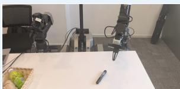

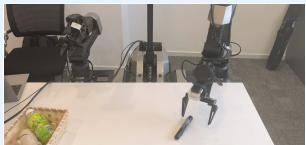  
Pick Up the Marker

The robot approaches and grasps the marker from the tabletop.  
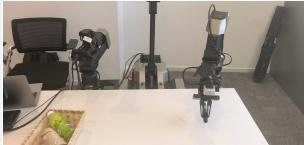

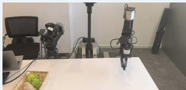

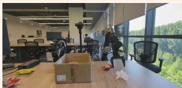

Place the Tissue in the Box  
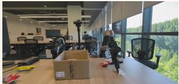

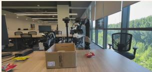  
The robot picks up the tissue from the table and places it into the box.

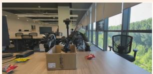

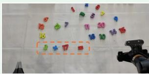

Complete the Equation  
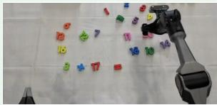

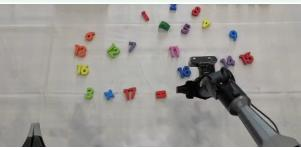

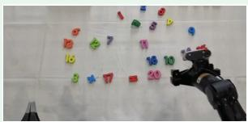  
The robot moves the number 20 into place to complete the equation 3 + 17 = 20.

Figure 8. Real-world deployment demonstration of ME-U0.  
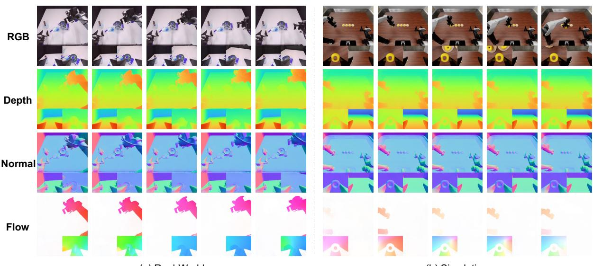  
(a) Real-World  
(b) Simulation  
Figure 9. Zero-shot visual dynamics generation on RoboDojo (a) Real-World and (b) Simulation data. Each panel shows RGB observations alongside generated depth, surface normals, and optical flow at five time steps.

prediction, and subtask prediction. All evaluation samples are drawn from data excluded from our pretraining corpus and are used solely for evaluation.

## 7.4.1 Visual Dynamics

We evaluate visual dynamics generation on samples drawn from the simulation and real-world training splits of RoboDojo [72]. Neither split overlaps with our pretraining corpus, and the samples are used exclusively for evaluation without benchmark-specific fine-tuning. Fig. 9 shows qualitative results for both domains. ME-U0 generates depth maps, surface normals, and optical flow that capture meaningful scene structure and motion across real-world and simulated observations, demonstrating transfer to previously unseen data. Qualitatively, predictions on real-world samples are slightly more consistent than those on simulated samples. We hypothesize that this diference arises from the domain gap between simulated imagery and the real-world observations encountered during pretraining.

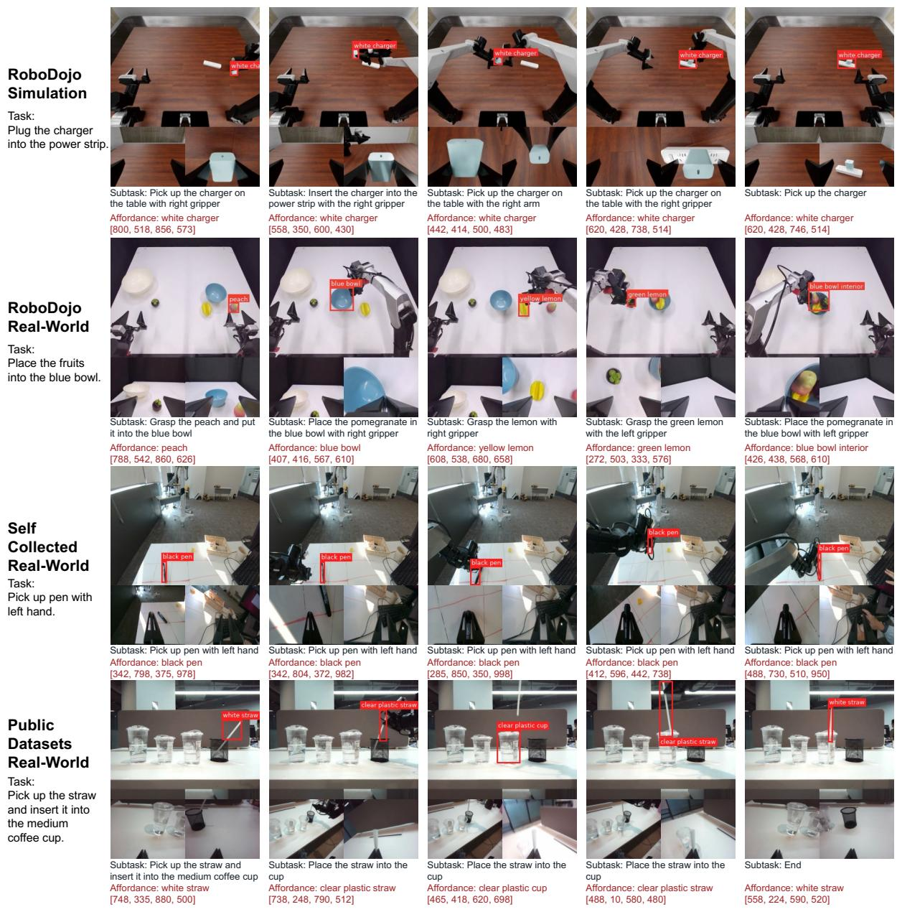  
Figure 10. Zero-shot afordance and subtask prediction. Rows show RoboDojo simulation, RoboDojo real-world, self-collected, and RDT-1B [82] data. Task instructions appear on the left, with predicted subtasks and afordances below each image. Red boxes mark predicted task-relevant targets.

## 7.4.2 Afordance

We evaluate afordance prediction on samples from the simulation and real-world training splits of RoboDojo [72]. We also include real-world data: self-collected observations and samples from the dataset released with RDT-1B [82]. Given the current observation and task instruction, the understanding expert identifies a task-relevant object or region and predicts its bounding box. Fig. 10 shows the predicted target names and bounding boxes in this setting. These examples include objects such as a charger, pieces of fruit, a pen, and a straw, as well as regions inside a bowl and on a table. These qualitative results suggest that ME-U0 can identify and localize task-relevant objects and regions in both simulated and real-world

## 7.4.3 Subtask

We evaluate subtask prediction on the same samples used for afordance prediction. Given the overall task instruction and current observation, the understanding expert describes what the robot should do at the current stage of the task. Fig. 10 also demonstrates the predicted subtasks and their corresponding afordance targets. Each subtask specifies the action to perform at the current stage, while the corresponding afordance target identifies the task-relevant object or region.

## 8 Conclusion

We presented MachEmbodied-U0 (ME-U0), a unified embodied foundation model that connects taskgrounded understanding, geometry- and motion-aware visual dynamics, and continuous action generation. Through a Mixture-of-Transformers architecture, subtask prediction and afordance grounding provide the generation process with semantic and spatial context, while future RGB, depth, surface normals, optical flow, and continuous actions are jointly modeled through flow matching. Pretraining on approximately 4,200 hours of curated robotic and egocentric demonstrations, with the robotic corpus spanning six embodiments, enables ME-U0 to achieve competitive performance on RoboDojo, LIBERO, and LIBERO-Plus, with additional validation on real-world manipulation tasks. The model also retains zero-shot subtask prediction, afordance grounding, and visual-dynamics generation without corresponding downstream supervision.

Future work will extend ME-U0 to broader distributions of tasks, environments, and embodiments, while strengthening long-term memory and in-context adaptation for more general embodied interaction.

## 9 Contributions and Acknowledgments

## Contributors.

Data: Wenfu Wang∗, Kunsong Shi∗, Yiren Zhang, Jingke Wang†, Yueran Zhao†, Xuancheng Zhang, Nanfei Ye.

Base Model: Haoran Wen∗, Wenfu Wang∗, Kunsong Shi∗, Wancheng Feng∗.

Training Infrastructure: Wenfu Wang∗, Jingke Wang∗†, Xingru Chen, Zhaohong Sun, Chengmin Yang. Evaluation: Jingke Wang∗†, Kunsong Shi∗, Wancheng Feng, Zikang Yu, Penghao Bi, Yueran Zhao, Jia Shi.

Project Lead: Haoran Wen, Yu Liu.

Advisors: Kun Zhan, Yan Xie.

Acknowledgments. We thank Xuyao Huang†, Runsheng Wang, Jiahao Gu, Mingcui Wang, Yue Ma, Danlu Dong, Xueyang Zhang, Mofan Zhou, Yuying Chen for their valuable support and contributions.

∗Core contributors. †Interns.

## References

[1] Junnan Li, Dongxu Li, Silvio Savarese, and Steven Hoi. Blip-2: Bootstrapping language-image pre-training with frozen image encoders and large language models. In International conference on machine learning, pages 19730–19742. PmLR, 2023.

[2] Haotian Liu, Chunyuan Li, Qingyang Wu, and Yong Jae Lee. Visual instruction tuning. Advances in neural information processing systems, 36:34892–34916, 2023.

[3] Shuai Bai, Keqin Chen, Xuejing Liu, Jialin Wang, Wenbin Ge, Sibo Song, Kai Dang, Peng Wang, Shijie Wang, Jun Tang, Humen Zhong, Yuanzhi Zhu, Mingkun Yang, Zhaohai Li, Jianqiang Wan, Pengfei Wang, Wei Ding, Zheren Fu, Yiheng Xu, Jiabo Ye, Xi Zhang, Tianbao Xie, Zesen Cheng, Hang Zhang, Zhibo Yang, Haiyang Xu, and Junyang Lin. Qwen2.5-VL technical report, 2025. URL https://arxiv.org/abs/2502.13923.

[4] Anthony Brohan, Noah Brown, Justice Carbajal, Yevgen Chebotar, Xi Chen, Krzysztof Choromanski, Tianli Ding, Danny Driess, Avinava Dubey, Chelsea Finn, et al. Rt-2: Vision-language-action models transfer web knowledge to robotic control. arXiv preprint arXiv:2307.15818, 2023.

[5] Moo Jin Kim, Karl Pertsch, Siddharth Karamcheti, Ted Xiao, Ashwin Balakrishna, Suraj Nair, Rafael Rafailov, Ethan Foster, Grace Lam, Pannag Sanketi, et al. Openvla: An open-source vision-language-action model. arXiv preprint arXiv:2406.09246, 2024.

[6] Octo Model Team, Dibya Ghosh, Homer Walke, Karl Pertsch, Kevin Black, Oier Mees, Sudeep Dasari, Joey Hejna, Tobias Kreiman, Charles Xu, et al. Octo: An open-source generalist robot policy. arXiv preprint arXiv:2405.12213, 2024.

[7] Kevin Black, Noah Brown, Danny Driess, Adnan Esmail, Michael Equi, Chelsea Finn, Niccolo Fusai, Lachy Groom, Karol Hausman, Brian Ichter, et al. � : A Vision-Language-Action Flow Model for General Robot Control. arXiv preprint arXiv:2410.24164, 2024.

[8] Physical Intelligence, Kevin Black, Noah Brown, James Darpinian, Karan Dhabalia, Danny Driess, Adnan Esmail, Michael Equi, Chelsea Finn, et al. �0.5: A vision-language-action model with open-world generalization. arXiv preprint arXiv:2504.16054, 2025. URL https://arxiv.org/ abs/2504.16054.

[9] Karl Pertsch, Kyle Stachowicz, Brian Ichter, Danny Driess, Suraj Nair, Quan Vuong, Oier Mees, Chelsea Finn, and Sergey Levine. Fast: Eficient action tokenization for vision-language-action models. arXiv preprint arXiv:2501.09747, 2025.

[10] Yilun Du, Sherry Yang, Bo Dai, Hanjun Dai, Ofir Nachum, Josh Tenenbaum, Dale Schuurmans, and Pieter Abbeel. Learning universal policies via text-guided video generation. Advances in neural information processing systems, 36:9156–9172, 2023.

[11] Hongtao Wu, Ya Jing, Chilam Cheang, Guangzeng Chen, Jiafeng Xu, Xinghang Li, Minghuan Liu, Hang Li, and Tao Kong. Unleashing large-scale video generative pre-training for visual robot manipulation. In International Conference on Learning Representations, volume 2024, pages 10641–10662, 2024.

[12] Seonghyeon Ye, Yunhao Ge, Kaiyuan Zheng, Shenyuan Gao, Sihyun Yu, George Kurian, Suneel Indupuru, You Liang Tan, Chuning Zhu, Jiannan Xiang, et al. World action models are zero-shot policies. arXiv preprint arXiv:2602.15922, 2026.

[13] Jialei Chen, Kai Wang, Kang Chen, Shuaihang Chen, Feng Gao, Wenhao Tang, Zhiyuan Li, Weilin Liu, Zhuyu Yao, Boxun Li, et al. Lawam: Latent world action models for eficient dynamics-aware robot policies. arXiv preprint arXiv:2606.15768, 2026.

[14] Tianyuan Yuan, Zibin Dong, Yicheng Liu, and Hang Zhao. Fast-wam: Do world action models need test-time future imagination? arXiv preprint arXiv:2603.16666, 2026.

[15] Jinheng Xie, Weijia Mao, Zechen Bai, David Junhao Zhang, Weihao Wang, Kevin Qinghong Lin, Yuchao Gu, Zhijie Chen, Zhenheng Yang, and Mike Zheng Shou. Show-o: One single transformer to unify multimodal understanding and generation. In International Conference on Learning Representations, volume 2025, pages 28240–28264, 2025.

[16] Chaorui Deng, Deyao Zhu, Kunchang Li, Chenhui Gou, Feng Li, Zeyu Wang, Shu Zhong, Weihao Yu, Xiaonan Nie, Ziang Song, et al. Emerging properties in unified multimodal pretraining. arXiv preprint arXiv:2505.14683, 2025.

[17] Fengyi Fu, Mengqi Huang, Shaojin Wu, Yunsheng Jiang, Yufei Huo, Hao Li, Yinghang Song, Fei Ding, Jianzhu Guo, Qian He, et al. Lance: Unified multimodal modeling by multi-task synergy. arXiv preprint arXiv:2605.18678, 2026.

[18] Jianke Zhang, Yuanfei Luo, Yucheng Hu, Xiaoyu Chen, Yanjiang Guo, Ziyang Liu, Hongbin Xu, Tian Lan, and Jianyu Chen. UAM: A dual-stream perspective on forgetting in VLA training. arXiv preprint arXiv:2605.15735, 2026. URL https://arxiv.org/abs/2605.15735.

[19] MotuBrain Team, Chendong Xiang, Fan Bao, Haitian Liu, Hengkai Tan, Hongzhe Bi, James Li, Jiabao Liu, Jingrui Pang, Kiro Jing, et al. Motubrain: An advanced world action model for robot control. arXiv preprint arXiv:2604.27792, 2026.

[20] Niket Agarwal, Arslan Ali, Jon Allen, Martin Antolini, Adeline Aubame, Alisson Azzolini, Junjie Bai, Maciej Bala, Yogesh Balaji, Josh Bapst, et al. Cosmos 3: Omnimodal world models for physical ai. arXiv preprint arXiv:2606.02800, 2026.

[21] Yaron Lipman, Ricky T. Q. Chen, Heli Ben-Hamu, Maximilian Nickel, and Matthew Le. Flow matching for generative modeling. In The Eleventh International Conference on Learning Representations, 2023. URL https://openreview.net/forum?id=PqvMRDCJT9t.

[22] Letian Wang, Chuhan Zhang, Rishabh Kabra, Jasper Uijlings, Steven Waslander, Andrew Zisserman, Joao Carreira, Kaiming He, Misha Andriluka, Eduard Gabriel Bazavan, Andrei Zanfir, and Cristian Sminchisescu. Video generation models are general-purpose vision learners. In European Conference on Computer Vision (ECCV), 2026. URL https://genception.github.io/.

[23] Anthony Brohan, Noah Brown, Justice Carbajal, Yevgen Chebotar, Joseph Dabis, Chelsea Finn, Keerthana Gopalakrishnan, Karol Hausman, Alex Herzog, Jasmine Hsu, et al. Rt-1: Robotics transformer for real-world control at scale. arXiv preprint arXiv:2212.06817, 2022.

[24] Yucheng Hu, Jianke Zhang, Yuanfei Luo, Yanjiang Guo, Xiaoyu Chen, Xinshu Sun, Kun Feng, Qingzhou Lu, Sheng Chen, Yangang Zhang, et al. Bagelvla: Enhancing long-horizon manipulation via interleaved vision-language-action generation. arXiv preprint arXiv:2602.09849, 2026.

[25] Qingwen Bu, Jisong Cai, Li Chen, Xiuqi Cui, Yan Ding, Siyuan Feng, Shenyuan Gao, et al. Agibot world colosseo: A large-scale manipulation platform for scalable and intelligent embodied systems. arXiv preprint arXiv:2503.06669, 2025.

[26] Chengkai Hou, Kun Wu, Jiaming Liu, Zhengping Che, Di Wu, Fei Liao, Guangrun Li, Jingyang He, Qiuxuan Feng, Zhao Jin, et al. Robomind 2.0: A multimodal, bimanual mobile manipulation dataset for generalizable embodied intelligence. arXiv preprint arXiv:2512.24653, 2025.

[27] Shihan Wu et al. Robocoin: An open-sourced bimanual robotic data collection for integrated manipulation, 2026. URL https://arxiv.org/abs/2511.17441.

[28] Galaxea Team. Galaxea g0: Open-world dataset and dual-system vla model. arXiv preprint arXiv:2509.00576, 2025.

[29] Ryan Hoque, Peide Huang, David Yoon, Jian Zhang, et al. Egodex: Learning dexterous manipulation from large-scale egocentric video. In International Conference on Learning Representations, volume 2026, pages 4218–4237, 2026.

[30] Yihang Li, Xuelong Wei, Jingzhou Luo, Yingjing Xiao, Yibo Bai, Guangyuan Zhou, Teng Zou, Chenguang Gui, Jiajun Wen, He Zhang, et al. Egolive: A large-scale egocentric dataset from real-world human tasks. arXiv preprint arXiv:2604.23570, 2026.

[31] Tianle Zhang, Zhihao Yuan, Dafeng Chi, Peidong Liu, Dongwei Li, Kejun Hu, Likui Zhang, Junnan Nie, Ziming Wei, Zengjue Chen, et al. Joyai-ra 0.1: A foundation model for robotic autonomy. arXiv preprint arXiv:2604.20100, 2026.

[32] Ryan Punamiya, Simar Kareer, Zeyi Liu, Josh Citron, Ri-Zhao Qiu, Xiongyi Cai, Alexey Gavryushin, Jiaqi Chen, Davide Liconti, Lawrence Y Zhu, et al. Egoverse: An egocentric human dataset for robot learning from around the world. arXiv preprint arXiv:2604.07607, 2026.

[33] Yunze Liu, Yun Liu, Che Jiang, Kangbo Lyu, Weikang Wan, Hao Shen, Boqiang Liang, Zhoujie Fu, He Wang, and Li Yi. Hoi4d: A 4d egocentric dataset for category-level human-object interaction. In 2022 IEEE/CVF Conference on Computer Vision and Pattern Recognition (CVPR), pages 20981–20990. IEEE, 2022.

[34] Prithviraj Banerjee, Sindi Shkodrani, Pierre Moulon, Shreyas Hampali, Shangchen Han, Fan Zhang, Linguang Zhang, Jade Fountain, Edward Miller, Selen Basol, et al. Hot3d: Hand and object tracking in 3d from egocentric multi-view videos. In 2025 IEEE/CVF Conference on Computer Vision and Pattern Recognition (CVPR), pages 7061–7071. IEEE, 2025.

[35] Kristen Grauman, Andrew Westbury, Lorenzo Torresani, Kris Kitani, Jitendra Malik, Triantafyllos Afouras, Kumar Ashutosh, Vijay Baiyya, Siddhant Bansal, Bikram Boote, et al. Ego-exo4d: Understanding skilled human activity from first-and third-person perspectives. In Proceedings ofthe IEEE/CVF conference on computer vision and pattern recognition, pages 19383–19400, 2024.

[36] Wei Wu, Fangjing Wang, Fan Lu, He Sun, Shi Liu, Yunnan Wang, Yibin Yan, Yong Wang, Shuailei Ma, Xinyang Wang, et al. From foundation to application: Improving vla models in practice. arXiv preprint arXiv:2607.06403, 2026.

[37] Haoqi Yuan, Zhixuan Liang, Anzhe Chen, Ye Wang, Haoyang Li, Pei Lin, Yiyang Huang, Zixing Lei, Tong Zhang, Jiazhao Zhang, et al. Qwen-robotmanip technical report: Alignment unlocks scale for robotic manipulation foundation models. arXiv preprint arXiv:2606.17846, 2026.

[38] OpenAI. Introducing gpt-5.5. https://openai.com/zh-Hans-CN/index/ introducing-gpt-5-5/, April 2026. Accessed: 2026-09-10.

[39] Qize Yu, Jiadi You, Yuran Wang, Jiaqi Liang, Bowen Ping, Yang Tian, Yue Chen, Minghong Cai, Zeying Gong, Ruihai Wu, et al. Afordancevla: A vision-language-action model empowering action generation through afordance-aware understanding. arXiv preprint arXiv:2606.06155, 2026.

[40] Qwen Team. Qwen3.6-35B-A3B: Agentic coding power, now open to all, April 2026. URL https://qwen.ai/blog?id=qwen3.6-35b-a3b.

[41] Ruicheng Wang, Sicheng Xu, Yue Dong, Yu Deng, Jianfeng Xiang, Zelong Lv, Guangzhong Sun, Xin Tong, and Jiaolong Yang. Moge-2: Accurate monocular geometry with metric scale and sharp details. Advances in Neural Information Processing Systems, 38:35928–35959, 2026.

[42] Yihan Wang and Jia Deng. Waft: Warping-alone field transforms for optical flow. In International Conference on Learning Representations, volume 2026, pages 157389–157402, 2026.

[43] Remi Cadene, Simon Alibert, Alexander Soare, Quentin Gallouedec, Adil Zouitine, Steven Palma, Pepijn Kooijmans, Michel Aractingi, Mustafa Shukor, Dana Aubakirova, Martino Russi, Francesco Capuano, Caroline Pascal, Jade Choghari, Khalil Meftah, Maxime Ellerbach, Jess Moss, and Thomas Wolf. Lerobot: State-of-the-art machine learning for real-world robotics in pytorch. https://github.com/huggingface/lerobot, 2024.

[44] Haotong Lin, Sili Chen, Junhao Liew, Donny Y Chen, Zhenyu Li, Guang Shi, Jiashi Feng, and Bingyi Kang. Depth anything 3: Recovering the visual space from any views. arXiv preprint arXiv:2511.10647, 2025.

[45] Nicolas Carion, Laura Gustafson, Yuan-Ting Hu, Shoubhik Debnath, Ronghang Hu, Didac Suris Coll-Vinent, Chaitanya Ryali, Kalyan Vasudev Alwala, Haitham Khedr, Andrew Huang, et al. Sam 3: Segment anything with concepts. In International conference on learning representations, volume 2026, pages 138846–138923, 2026.

[46] Tao Yu, Runseng Feng, Ruoyu Feng, Jinming Liu, Xin Jin, Wenjun Zeng, and Zhibo Chen. Inpaint anything: Segment anything meets image inpainting. arXiv preprint arXiv:2304.06790, 2023.

[47] Shangchen Zhou, Chongyi Li, Kelvin C.K Chan, and Chen Change Loy. ProPainter: Improving propagation and transformer for video inpainting. In Proceedings of IEEE International Conference on Computer Vision (ICCV), 2023.

[48] Zihang Lai, Eldar Insafutdinov, Edgar Sucar, and Andrea Vedaldi. Cowtracker: Tracking by warping instead of correlation. arXiv preprint arXiv:2602.04877, 2026.

[49] Yunhai Han, Jianuo Qiu, Linhao Bai, Ziyu Xiao, Zihang Zeng, Yangcen Liu, Zhaodong Yang, Shalin Jain, Wenrui Ma, Jiaqi Fu, et al. Video2sim2real: Full-stack autonomous dexterous skill acquisition from a single human video. arXiv preprint arXiv:2606.08828, 2026.

[50] Yangcen Liu, Shuo Cheng, Xinchen Yin, Woo Chul Shin, Alfred Cueva, Yiran Yang, Zhenyang Chen, Chuye Zhang, and Danfei Xu. Egoengine: From egocentric human videos to high-fidelity dexterous robot demonstrations. arXiv preprint arXiv:2606.12604, 2026.

[51] Ye Wang, Pei Lin, Xiong-Hui Chen, Haoqi Yuan, Zhixuan Liang, Yiyang Huang, Anzhe Chen, Zixing Lei, Jie Zhang, Tao Zhang, et al. Ego2robot: Scalable robot data synthesis from egocentric human data. arXiv preprint arXiv:2608.02580, 2026.

[52] Zhenjie Yang, Xingyu Jiao, Guopeng Zhong, Shuzhe Yang, Shi Che, Chao Wu, Chenyu Jiang, Dongjie Zhang, Yideng Zhang, Zheng Zhang, et al. Handedit: A unified benchmark for egocentric human-to-robot dexterous hand image editing. arXiv preprint arXiv:2608.12122, 2026.

[53] Xingyu Chen, Fu-Jen Chu, Pierre Gleize, Kevin J Liang, Alexander Sax, Hao Tang, Weiyao Wang, Michelle Guo, Thibaut Hardin, Xiang Li, et al. Sam 3d: 3dfy anything in images. In Proceedings of the IEEE/CVF Conference on Computer Vision and Pattern Recognition, pages 7220–7232, 2026.

[54] Jianyuan Wang, Minghao Chen, Nikita Karaev, Andrea Vedaldi, Christian Rupprecht, and David Novotny. Vggt: Visual geometry grounded transformer. In Proceedings of the IEEE/CVF Conference on Computer Vision and Pattern Recognition, 2025.

[55] Jan Kautz Bowen Wen, Wei Yang and Stan Birchfield. FoundationPose: Unified 6d pose estimation and tracking of novel objects. In CVPR, 2024.

[56] John Schulman, Filip Wolski, Prafulla Dhariwal, Alec Radford, and Oleg Klimov. Proximal policy optimization algorithms. arXiv preprint arXiv:1707.06347, 2017.

[57] Chaoyi Pan, Changhao Wang, Haozhi Qi, Zixi Liu, Homanga Bharadhwaj, Akash Sharma, Tingfan Wu, Guanya Shi, Jitendra Malik, and Francois Hogan. Spider: Scalable physics-informed dexterous retargeting. arXiv preprint arXiv:2511.09484, 2025.

[58] Emanuel Todorov, Tom Erez, and Yuval Tassa. Mujoco: A physics engine for model-based control. In 2012 IEEE/RSJ International Conference on Intelligent Robots and Systems, pages 5026–5033. IEEE, 2012. doi: 10.1109/IROS.2012.6386109.

[59] Physical Intelligence, Bo Ai, Ali Amin, Raichelle Aniceto, Ashwin Balakrishna, Greg Balke, Kevin Black, George Bokinsky, Shihao Cao, Thomas Charbonnier, et al. � : a steerable generalist robotic foundation model with emergent capabilities. arXiv preprint arXiv:2604.15483, 2026.

[60] Modi Shi, Li Chen, Jin Chen, Yuxiang Lu, Chiming Liu, Guanghui Ren, Ping Luo, Di Huang, Maoqing Yao, and Hongyang Li. Is diversity all you need for scalable robotic manipulation?, 2026. URL https://arxiv.org/abs/2507.06219.

[61] StarVLA Community. Starvla: A lego-like codebase for vision-language-action model developing. arXiv preprint arXiv:2604.05014, 2026.

[62] Jinliang Zheng, Jianxiong Li, Zhihao Wang, Dongxiu Liu, Xirui Kang, Yuchun Feng, Yinan Zheng, Jiayin Zou, Yilun Chen, Jia Zeng, et al. X-vla: Soft-prompted transformer as scalable crossembodiment vision-language-action model. In International Conference on Learning Representations, volume 2026, pages 60580–60606, 2026.

[63] Fuhao Li, Wenxuan Song, Han Zhao, Jingbo Wang, Pengxiang Ding, Donglin Wang, Long Zeng, and Haoang Li. Spatial forcing: Implicit spatial representation alignment for vision-languageaction model. In International Conference on Learning Representations, volume 2026, pages 132324–132345, 2026.

[64] He Zhang, Lingzhu Xiang, Haitao Lin, Zeyu Huang, Minghui Wang, Dingyan Zhong, Yubo Dong, Yihao Wu, Yongming Rao, Dongsheng Zhang, et al. Hy-embodied-0.5-vla: From visionlanguage-action models to a real-world robot learning stack. arXiv preprint arXiv:2606.14409, 2026.

[65] Xiaomi Robotics Team, Jun Guo, Piaopiao Jin, Jason Li, Peiyan Li, Yingyan Li, Futeng Liu, Wanli Peng, Optimus Qin, Yifei Su, et al. Xiaomi-robotics-1: Scaling vision-language-action models with over 100k hours of real-world trajectories. arXiv preprint arXiv:2607.15330, 2026.

[66] Yicheng Liu, Zibin Dong, Baijun Ye, Tianyuan Yuan, Tao Jiang, Anqi Yang, Shicheng Cao, Haonan Liu, Yue Sun, Zihan Guo, et al. G0. 5: One autoregressive stream for robot reasoning and action. arXiv preprint arXiv:2608.11739, 2026.

[67] Dexmal Team. DM0.5: An open-world foundation model for general-purpose embodied intelligence, July 2026. URL https://www.dexmal.com/blog/dm0.5/index\_en.html.

[68] Jisong Cai, Long Ling, Shiwei Chu, Zhongshan Liu, Jiayue Kang, Zhixuan Liang, Wenjie Xu, Yinan Mao, Weinan Zhang, Xiaokang Yang, et al. Aha-wam: Asynchronous horizon-adaptive world-action modeling with observation-guided context routing. arXiv preprint arXiv:2606.09811, 2026.

[69] Angen Ye, Boyuan Wang, Chaojun Ni, Guan Huang, Guosheng Zhao, Hao Li, Hengtao Li, Jie Li, Jindi Lv, Jingyu Liu, et al. Gigaworld-policy: An eficient action-centered world–action model. arXiv preprint arXiv:2603.17240, 2026.

[70] Jun Guo, Qiwei Li, Peiyan Li, Zilong Chen, Nan Sun, Yifei Su, Heyun Wang, Yuan Zhang, Xinghang Li, and Huaping Liu. Unified 4d world action modeling from video priors with asynchronous denoising. arXiv preprint arXiv:2604.26694, 2026.

[71] Yuran Wang, Siqiao Huang, Mingleyang Li, Chenhao Zhang, Jiaqi Liang, Weiyang Jin, Yue Chen, Xuemin Chi, Donghao Zhou, Qize Yu, et al. Openwam: An open, modular exploration towards systematic world-action model pretraining. arXiv preprint arXiv:2609.07398, 2026.

[72] Tianxing Chen, Yue Chen, Zixuan Li, Junyuan Tang, Kailun Su, Haoran Lu, Weijie Wan, Baijun Chen, Songling Liu, Haowen Yan, et al. Robodojo: A unified sim-and-real benchmark for comprehensive evaluation of generalist robot manipulation policies. arXiv preprint arXiv:2607.04434, 2026.

[73] Bo Liu, Yifeng Zhu, Chongkai Gao, Yihao Feng, Qiang Liu, Yuke Zhu, and Peter Stone. Libero: Benchmarking knowledge transfer for lifelong robot learning. Advances in Neural Information Processing Systems, 36:44776–44791, 2023.

[74] Moo Jin Kim, Chelsea Finn, and Percy Liang. Fine-tuning vision-language-action models: Optimizing speed and success. arXiv preprint arXiv:2502.19645, 2025.

[75] Yandan Yang, Shuang Zeng, Tong Lin, Xinyuan Chang, Dekang Qi, Junjin Xiao, Haoyun Liu, Ronghan Chen, Yuzhi Chen, Dongjie Huo, et al. Abot-m0: Vla foundation model for robotic manipulation with action manifold learning. arXiv preprint arXiv:2602.11236, 2026.

[76] Hongzhe Bi, Hengkai Tan, Shenghao Xie, Zeyuan Wang, et al. Motus: A unified latent action world model. In Proceedings ofthe IEEE/CVF Conference on Computer Vision and Pattern Recognition (CVPR), 2026. URL https://arxiv.org/abs/2512.13030.

[77] Yuyang Zhang, Wenyao Zhang, Zekun Qi, He Zhang, Haitao Lin, Jingbo Zhang, Yao Mu, Xiaokang Yang, Wenjun Zeng, and Xin Jin. Imagewam: Do world action models really need video generation, or just image editing? arXiv preprint arXiv:2606.19531, 2026.

[78] Lin Li, Qihang Zhang, Yiming Luo, Shuai Yang, Ruilin Wang, Fei Han, Mingrui Yu, Zelin Gao, Nan Xue, Xing Zhu, et al. Causal world modeling for robot control. arXiv preprint arXiv:2601.21998, 2026.

[79] Senyu Fei, Siyin Wang, Junhao Shi, Zihao Dai, Jikun Cai, Pengfang Qian, Li Ji, Xinzhe He, Shiduo Zhang, Zhaoye Fei, et al. Libero-plus: A progressive robustness benchmark for visual-language-action models. In Proceedings of the IEEE/CVF Conference on Computer Vision and Pattern Recognition, pages 38574–38583, 2026.

[80] Hao Luo, Wanpeng Zhang, Yicheng Feng, Sipeng Zheng, Haiweng Xu, Chaoyi Xu, Ziheng Xi, Yuhui Fu, and Zongqing Lu. Being-H0.7: A latent world-action model from egocentric videos. arXiv preprint arXiv:2605.00078, 2026. URL https://arxiv.org/abs/2605.00078.

[81] Moo Jin Kim, Yihuai Gao, Tsung-Yi Lin, Yen-Chen Lin, Yunhao Ge, Grace Lam, Percy Liang, Shuran Song, Ming-Yu Liu, Chelsea Finn, and Jinwei Gu. Cosmos Policy: Fine-tuning video models for visuomotor control and planning. In International Conference on Learning Representations, 2026. URL https://arxiv.org/abs/2601.16163.

[82] Songming Liu, Lingxuan Wu, Bangguo Li, Hengkai Tan, Huayu Chen, Zhengyi Wang, Ke Xu, Hang Su, and Jun Zhu. Rdt-1b: a difusion foundation model for bimanual manipulation. In International Conference on Learning Representations, volume 2025, pages 29982–30009, 2025.