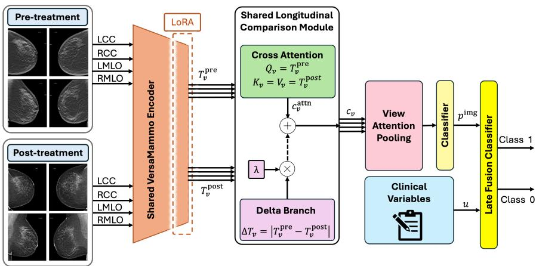

# Mammo-LIFE: Longitudinal Mammographic Imaging and Clinical Feature Enrichment for Post-Radiotherapy Outcome Prediction

Farnoush Bayatmakou1, Maryam Hosseini1, Reza Taleei2, and Arash Mohammadi1

1 Department of Cybersecurity and Intelligent Systems Engineering (CISE), Concordia University, Montreal, QC, Canada

farnoush.bayatmakou@mail.concordia.ca, arash.mohammadi@concordia.ca 2 Department of Radiation Oncology, Atrium Health Levine Cancer Institute, Charlotte, NC, USA

Abstract. Recent advances in Artificial Intelligence (AI)-powered Computer-Aided Diagnosis (CAD) systems have substantially improved breast cancer screening, diagnosis, and prognosis. Comparatively, postradiotherapy outcome prediction using paired longitudinal mammograms has received considerably less attention. This is largely due to the limited availability of well-annotated longitudinal datasets. Longitudinal mammograms, coupled with paired pre- and post-treatment information, provide a unique opportunity to characterize treatment-induced breast tissue changes following radiotherapy. The resulting learned representations can serve as a valuable asset for advancing personalized radiotherapy planning and post-treatment management. In this context, we propose Mammo-LIFE, a patient-level multimodal framework for post-radiotherapy outcome prediction that combines longitudinal mammographic features with patient-level clinical variables. The imaging branch processes paired pre- and post-treatment mammograms acquired from the four standard views using a mammography-specific encoder adapted via Low-Rank Adaptation (LoRA). Within each view, preand post-treatment representations are explicitly compared through a longitudinal comparison module to capture treatment-related changes. The resulting view-level embeddings are then aggregated using learned view-attention pooling to form a unified patient-level mammographic representation. Selected clinical variables are subsequently combined with the image-derived prediction probability through a late-fusion strategy. To evaluate the efectiveness of combining paired longitudinal mammograms with clinical information, experiments were conducted on an in-house clinical cohort using patient-level stratified five-fold cross-validation. The proposed Mammo-LIFE demonstrated strong cross-validated performance across the evaluated configurations. The best setting achieved an AUC of $0 . 8 6 \pm 0 . 1 4$ , accuracy of $0 . 7 9 \pm 0 . 1 5 ,$ and F1-score of $0 . 8 3 \pm 0 . 1 1$

Keywords: Breast Cancer · Longitudinal Mammography · Radiotherapy · Outcome Prediction · Multimodal Fusion · Foundation Models

## 1 Introduction

Mammography plays a central role in breast cancer screening, diagnosis, and post-treatment follow-up [14]. Standard mammographic examinations typically include bilateral craniocaudal (CC) and mediolateral oblique (MLO) views, providing complementary projections for clinical interpretation [13]. Beyond screening and diagnosis, mammography supports post-treatment follow-up by providing longitudinal imaging records of breast tissue changes over time [16]. During post-treatment follow-up, mammographic appearances are influenced by the type of therapy received. Accordingly, follow-up mammograms after radiotherapy may exhibit expected benign findings such as edema-related thickening, postoperative scarring, architectural distortion, and other treatment-related changes [3]. These findings evolve over time and vary across patients, making paired pre- and post-treatment mammograms a natural basis for longitudinal analysis.

Modeling longitudinal mammographic information requires robust representation learning across views and time points. Deep learning approaches have been increasingly explored for mammography-based screening and cancer detection [17, 12], including multi-view convolutional, graph-, and transformer-based architectures that jointly exploit the standard mammographic views [5, 11, 15]. More recently, mammography-specific foundation and vision-language models, such as Mammo-CLIP [7] and VersaMammo [9], have demonstrated transferable representations for downstream breast imaging tasks. Longitudinal mammography has also been investigated for breast cancer risk prediction [4] and diagnosis using Mamba-based state-space modeling [19]. Beyond imaging, routinely collected clinical variables, including tumor size, histologic grade, hormone receptor status, and body mass index, provide complementary patient-level prognostic information [10, 2], motivating multimodal prediction frameworks. Despite recent advances in foundation model adaptation for mammographic image analysis [1, 9, 7, 6, 18], relatively few studies have investigated longitudinal mammographic modeling. Among those using paired pre/post-treatment mammograms, only one has explored multi-view post-radiotherapy analysis, and it did not incorporate patient-level clinical variables. Consequently, postradiotherapy outcome prediction using paired longitudinal mammograms remains relatively underexplored. Motivated by the above research gap, we propose Mammo-LIFE, a patient-level multimodal framework that combines paired pre- and post-treatment mammograms with selected clinical variables for postradiotherapy outcome prediction. Mammo-LIFE builds upon a Low-Rank Adaptation (LoRA)-adapted EficientNet-B5 variant of VersaMammo to learn longitudinal mammographic representations from paired pre- and post-treatment images. The imaging branch compares pre- and post-treatment representations across the four standard mammographic views and aggregates the resulting viewlevel embeddings using learned view-attention pooling. Clinical variables are incorporated via late fusion by combining the image-derived prediction probability with selected patient-level clinical features. Unlike the prior multi-view longitudinal pre/post mammogram analysis approach, which used a general vision foundation model in a few-shot evaluation setting, Mammo-LIFE employs a LoRAadapted mammography-specific VersaMammo backbone, incorporates selected clinical variables through late fusion, and is evaluated under patient-level stratified 5-fold cross-validation. Its longitudinal pre/post comparison stage considers both a cross-attention-only design and a delta-enhanced cross-attention variant, where explicit pre/post temporal-diference features augment the cross-attention representation. In brief, the main contributions of this work are summarized as follows:

  
Fig. 1. Overview of Mammo-LIFE. Paired pre/post mammograms are encoded using a LoRA-adapted VersaMammo backbone and compared using either a cross-attentiononly or a delta-enhanced longitudinal design. View-level embeddings are aggregated through view-attention pooling, and the image-derived prediction probability is combined with selected clinical variables through late fusion for final outcome prediction.

• We present Mammo-LIFE, a patient-level multimodal framework for postradiotherapy outcome prediction that jointly exploits paired pre- and posttreatment mammograms together with selected clinical variables, addressing a relatively underexplored problem in breast imaging.

• We formulate post-radiotherapy outcome prediction as a patient-level longitudinal representation learning problem by jointly modeling paired preand post-treatment mammograms acquired from the four standard mammographic views. To this end, we develop a parameter-eficient adaptation framework based on a LoRA-adapted mammography-specific VersaMammo.

• We introduce a longitudinal feature comparison module that investigates both cross-attention and delta-enhanced cross-attention to model treatmentinduced changes between paired pre- and post-treatment mammograms, followed by learned view-attention pooling for patient-level representation learning.

• We demonstrate that integrating selected clinical variables with longitudinal mammographic representations through late multimodal fusion improves post-radiotherapy outcome prediction over image-only modeling, highlighting the complementary value of imaging and clinical information.

## 2 Methodology

This section presents Mammo-LIFE, illustrated in Figure 1, which consists of four main components: LoRA-adapted VersaMammo feature extraction, longitudinal pre/post comparison, view-attention pooling, and late clinical fusion.

VersaMammo Backbone and LoRA Adaptation: The imaging encoder is initialized with the EficientNet-B5 variant of VersaMammo [9], a mammography-specific foundation model developed for AI-enabled mammogram interpretation. VersaMammo follows a two-stage pretraining strategy, in which a teacher model is first trained using self-supervised learning on unlabeled mammograms, and supervised learning with knowledge distillation is then used to transfer learned representations and clinical knowledge to the student model, thereby enabling domain-specific mammographic feature extraction. To adapt the pretrained encoder to post-radiotherapy outcome prediction, we apply LoRA [8] to selected later-stage convolutional layers of the EficientNet-B5 backbone. Let $E _ { \theta }$ denote the encoder with frozen pretrained parameters θ. During training, only the LoRA parameters and task-specific layers, including the feature-to-token projection, longitudinal comparison, view-attention pooling, and classification modules, are optimized for parameter-eficient adaptation.

Patient-Level Longitudinal Input Representation: The imaging input consists of paired pre- and post-treatment mammograms. At each time point, a set of standard images corresponding to left and right sides $\{ L , R \}$ and projections $\{ C C , M L O \}$ is considered. Let $x _ { i , v } ^ { \mathrm { p r e } }$ and $x _ { i , v } ^ { \mathrm { p o s t } }$ , respectively, denote the pre/post-treatment images of patient i from view

$$
v \in V : = \{ \mathrm { L C C } , \mathrm { L M L O } , \mathrm { R C C } , \mathrm { R M L O } \} .
$$

Subsequently, the complete patient-level imaging input is defined as

$$
X _ { i } = \left\{ \left( x _ { i , v } ^ { \mathrm { p r e } } , x _ { i , v } ^ { \mathrm { p o s t } } \right) \mid v \in V \right\} .
$$

Each patient is associated with a binary outcome label $y _ { i } ~ \in ~ \{ 0 , 1 \}$ derived from an ordinal radiologist-assigned assessment of density- and fibrosis-related changes between the pre- and post-treatment mammograms. The model is trained at the patient level, using all four pre/post view pairs to predict $y _ { i }$

Adapted Spatial Feature Extraction: Given the patient-level imaging input $X _ { i } .$ , each mammogram is processed using a shared LoRA-adapted VersaMammo encoder. The same encoder is applied across all views and time points to obtain feature maps in a shared feature space. For patient i and view $v ,$ the paired feature maps are computed as

$$
F _ { i , v } ^ { \mathrm { p r e } } = E _ { \theta , \phi } \left( x _ { i , v } ^ { \mathrm { p r e } } \right) , \qquad F _ { i , v } ^ { \mathrm { p o s t } } = E _ { \theta , \phi } \left( x _ { i , v } ^ { \mathrm { p o s t } } \right) ,
$$

where $E _ { \theta , \phi }$ denotes the encoder with frozen pretrained parameters $\theta$ and trainable LoRA parameters $\phi .$ . Each extracted feature map $F \in \mathbb { R } ^ { D \times H ^ { \prime } \times W ^ { \prime } }$ is reshaped into $N \ : = \ : H ^ { \prime } W ^ { \prime }$ spatial tokens and projected to a common embedding dimension d for longitudinal comparison. The resulting token sequences, $T _ { i , v } ^ { \mathrm { p r e } } , T _ { i , v } ^ { \mathrm { p o s t } } \in \mathbb { R } ^ { N \times d }$ , are used to model view-specific changes over time.

Longitudinal Pre/Post Feature Comparison: To model treatmentrelated longitudinal changes, the pre/post-treatment token sequences are compared within each standard view. We evaluate two designs for the longitudinal comparison module before view-attention aggregation. The baseline design uses cross-attention, where pre-treatment tokens serve as queries and post-treatment tokens serve as keys and values. The attention output is added to the pre-treatment tokens and refined using a residual feed-forward block. The attention-based view-level embedding is obtained by mean pooling as

$$
\begin{array} { r l } & { H _ { i , v } = T _ { i , v } ^ { \mathrm { p r e } } + \mathrm { C r o s s A t t n } \left( T _ { i , v } ^ { \mathrm { p r e } } , T _ { i , v } ^ { \mathrm { p o s t } } , T _ { i , v } ^ { \mathrm { p o s t } } \right) , } \\ & { c _ { i , v } ^ { \mathrm { a t t n } } = \mathrm { M e a n P o o l } \big ( \mathrm { F F N } _ { \mathrm { r e s } } ( H _ { i , v } ) \big ) , } \end{array}
$$

where $\mathrm { F F N _ { r e s } }$ denotes the residual feed-forward refinement block. To assess whether explicit temporal-diference cues provide complementary information, we evaluate a delta-enhanced design using the token-wise absolute diference as

$$
\begin{array} { r } { \varDelta T _ { i , v } = \left| T _ { i , v } ^ { \mathrm { p o s t } } - T _ { i , v } ^ { \mathrm { p r e } } \right| . } \end{array}
$$

In this variant, the attention-refined tokens and delta tokens are first meanpooled, and the resulting view-level representations are combined as

$$
c _ { i , v } = c _ { i , v } ^ { \mathrm { a t t n } } + \lambda \mathrm { M e a n P o o l } \left( \varDelta T _ { i , v } \right) ,
$$

where $\lambda$ is a learnable scalar parameter. For the cross-attention-only design, the final view-level embedding is $c _ { i , v } = c _ { i , v } ^ { \mathrm { a t t n } }$ . This produces one view-specific longitudinal embedding for each standard view.

View-Attention Pooling for Patient-Level Aggregation: After viewlevel pre/post comparison, each patient is represented by four view-specific change embeddings. These embeddings are stacked as

$$
\begin{array} { r } { C _ { i } = \left[ c _ { i , \mathrm { L C C } } \quad c _ { i , \mathrm { L M L O } } \quad c _ { i , \mathrm { R C C } } \quad c _ { i , \mathrm { R M L O } } \right] ^ { \top } \in \mathbb { R } ^ { 4 \times d } . } \end{array}
$$

To aggregate the view-specific embeddings into a unified patient-level mammographic representation, we use learned view-attention pooling. For each viewlevel embedding, an attention score is computed as

$$
a _ { i , v } = w ^ { \top } c _ { i , v } + b , \qquad \forall v \in V ,
$$

where w and b are learnable parameters. The patient-level longitudinal mammographic representation is then obtained as

$$
z _ { i } ^ { \mathrm { i m g } } = \sum _ { v \in V } \alpha _ { i , v } c _ { i , v } ,
$$

where $\begin{array} { r } { \alpha _ { i , v } \ = \ \frac { \exp ( a _ { i , v } ) } { \sum _ { v ^ { \prime } \in V } \exp ( a _ { i , v ^ { \prime } } ) } } \end{array}$ . The representation $z _ { i } ^ { \mathrm { i m g } }$ is passed to an image classification head followed by a sigmoid activation to obtain the image-derived probability $p _ { i } ^ { \mathrm { i m g } }$ . Under patient-level stratified cross-validation, each patient is assigned an out-of-fold image-derived probability based on the corresponding held-out fold. This probability summarizes the longitudinal imaging evidence from the paired mammograms.

Clinical Feature Processing and Late Multimodal Fusion: In addition to the longitudinal mammographic representation, we incorporate selected patient-level clinical variables as complementary non-imaging information. Clinical variables are integrated through prediction-level late fusion. Specifically, the image-derived prediction probability $p _ { i } ^ { \mathrm { i m g } }$ is concatenated with the selected clinical feature vector $u _ { i }$ to form the late-fusion representation $[ p _ { i } ^ { \mathrm { i m g } } ; u _ { i } ]$ . The combined representation is used to train the final prediction model using only the training patients within each fold, and performance is evaluated on the corresponding held-out patients. The same patient-level folds are used for image-only and image-plus-clinical evaluation, enabling patient-matched comparison while avoiding patient-level leakage.

## 3 Experiments and Results

Dataset and Outcome Definition: We evaluate Mammo-LIFE on an in-house clinical cohort consisting of 47 patients with paired pre- and postradiotherapy multi-view mammograms from the four standard views, along with associated patient-level clinical variables. Each patient is assigned an ordinal radiologist score indicating the perceived direction of density- and fibrosis-related change between the paired examinations. For binary prediction, scores indicating greater density/fibrosis on the pre-treatment mammographic examination are assigned to Class 0, corresponding to a perceived decrease after treatment. Scores indicating no perceived diference or greater density/fibrosis on the post-treatment mammographic examination are assigned to Class 1, corresponding to no appreciable change or a perceived increase. The ordinal score is used only to derive the binary outcome label and is not included as an input feature. All experiments are conducted using patient-level cross-validation, ensuring that all images and clinical variables associated with the same patient remain within the same fold, thereby preventing data leakage during evaluation.

Implementation Details: We evaluate two patient-level prediction settings: image-only and image-plus-clinical late fusion. All mammograms are resized to $2 2 4 \times 2 2 4$ pixels. The imaging backbone is initialized with the EficientNet-B5 variant of VersaMammo, while pretrained backbone weights remain frozen. LoRA adapters are applied to selected later-stage $1 \times 1$ convolutional layers of the backbone with rank $r = 4$ , scaling factor $\alpha = 4$ , and LoRA dropout 0.10. Feature maps are reshaped into token sequences and projected to an embedding dimension of $d = 5 1 2$ . The longitudinal comparison module uses 8-head cross-attention with feed-forward refinement and mean pooling. The image model is trained for up to 30 epochs using AdamW with learning rate $2 \times 1 0 ^ { - 5 }$ and weight decay $3 \times 1 0 ^ { - 3 }$ . In the image-plus-clinical setting, clinical variables are processed at the patient level, and the out-of-fold image-derived probability is concatenated with the selected clinical feature vector to form the late-fusion representation. Late fusion is implemented using logistic regression and random forest (RF) classifiers.

Table 1. Efect of LoRA adaptation on the image-only cross-attention variant. Values are mean ± standard deviation across five folds.
<table><tr><td>Adaptation</td><td>AUC</td><td> $\mathbf { A c c . }$ </td><td>Sens.</td><td>Spec.</td><td>F1</td></tr><tr><td>Frozen</td><td> $\overline { { 0 . 6 4 \pm 0 . 1 3 } }$ </td><td> $\overline { { 0 . 5 7 \pm 0 . 1 8 } }$ </td><td> $\overline { { 0 . 5 7 \pm 0 . 4 4 } }$ </td><td> $\overline { { { \bf 0 . 6 5 \pm 0 . 3 4 } } }$ </td><td> $\overline { { 0 . 5 3 \pm 0 . 3 3 } }$ </td></tr><tr><td>Adapted</td><td> ${ \bf 0 . 7 2 \pm 0 . 1 3 }$ </td><td> ${ \bf 0 . 7 0 \pm 0 . 1 8 }$ </td><td> $\mathbf { 0 . 7 6 \pm 0 . 2 5 }$ </td><td> $0 . 6 2 { \pm } 0 . 2 1$ </td><td> ${ \bf 0 . 7 4 \pm 0 . 1 8 }$ </td></tr></table>

Table 2. Image-only performance across longitudinal designs using the LoRA-adapted backbone. Values are mean ± standard deviation across five folds.
<table><tr><td>Design</td><td>AUC</td><td>Acc.</td><td>Sens.</td><td>Spec.</td><td>F1</td></tr><tr><td>Cross-Attn.</td><td> $\overline { { 0 . 7 2 \pm 0 . 1 3 } }$ </td><td> $\overline { { 0 . 7 0 \pm 0 . 1 8 } }$ </td><td> $\overline { { 0 . 7 6 \pm 0 . 2 5 } }$ </td><td> $\overline { { 0 . 6 2 \pm 0 . 2 1 } }$ </td><td> $\overline { { 0 . 7 4 \pm 0 . 1 8 } }$ </td></tr><tr><td>Delta-Enh.</td><td> ${ \bf 0 . 7 3 \pm 0 . 1 1 }$ </td><td> $0 . 7 0 \pm 0 . 1 8$ </td><td> $0 . 7 6 \pm 0 . 2 5$ </td><td> $0 . 6 2 \pm 0 . 2 1$ </td><td> $0 . 7 4 \pm 0 . 1 0$ </td></tr></table>

Evaluation Protocol: All experiments use patient-level stratified 5-fold cross-validation. Within each outer fold, the training patients are further split into training and validation subsets for checkpoint selection and early stopping. Early stopping is performed with a patience of 10 epochs, and checkpoints are selected primarily by validation AUC, with validation loss used as a secondary criterion. The same outer folds are used across all evaluations.

Results: We first assess the efect of parameter-eficient adaptation within the imaging branch of Mammo-LIFE. This ablation is performed using the crossattention longitudinal design. Table 1 compares frozen and LoRA-adapted VersaMammo backbones under this setting. The LoRA-adapted backbone improved image-only cross-attention performance relative to the frozen backbone, yielding higher AUC, accuracy, sensitivity, and F1-score. Specificity was slightly higher for the frozen backbone, but showed greater variability across folds. We then compare two longitudinal modeling designs within the Mammo-LIFE framework using the LoRA-adapted VersaMammo backbone. Table 2 compares the crossattention design with the delta-enhanced design using mammographic inputs only. The delta-enhanced design slightly improved mean AUC, while thresholdbased metrics remained similar.

We next evaluate image-plus-clinical late fusion by combining the imagederived probability with selected patient-level clinical variables. We considered clinically motivated feature subsets reflecting tumor characteristics, receptor status, metabolic factors, and age-related information, while preserving the same patient-level folds across all configurations. The Tumor-Metabolic subset showed the highest cross-validated performance among the tested subsets and was used for the main fusion comparison. Table 3 reports performance for both longitudinal designs using this subset with logistic regression and random forest classifiers. Random forest achieved higher mean accuracy and F1-score than logistic regression. The delta-enhanced design with random forest achieved the highest accuracy, specificity, and F1-score, while tying with cross-attention using random forest for the highest AUC. Specifically, it achieved an AUC of 0.86 ± 0.14, accuracy of $0 . 7 9 \pm 0 . 1 5$ , sensitivity of $0 . 8 3 \pm 0 . 1 2 .$ , specificity of $0 . 7 3 \pm 0 . 2 5$ , and F1-score of $0 . 8 3 \pm 0 . 1 1$ . To assess the predictive value of clinical variables alone, we evaluated a clinical-only baseline using a random forest classifier with the same Tumor-Metabolic subset. This baseline achieved an AUC of $0 . 7 3 \pm 0 . 0 9$ accuracy of 0.62±0.09, sensitivity of $0 . 6 9 { \pm } 0 . 3 0$ , specificity of 0.50±0.40, and F1- score of 0.66±0.14. Compared with both image-only and clinical-only prediction, image-plus-clinical late fusion achieved stronger overall performance, suggesting complementary value from the two modalities in this cohort.

Table 3. Image-plus-clinical late-fusion performance with the selected Tumor-Metabolic subset. Values are mean ± standard deviation across five folds.
<table><tr><td>Design</td><td>Clf.</td><td>AUC</td><td>Acc.</td><td>Sens.</td><td>Spec.</td><td>F1</td></tr><tr><td>Cross-Attn.</td><td>RF</td><td>0.86±0.14</td><td>0.77±0.11</td><td>0.83±0.12</td><td>0.67±0.20</td><td>0.82±0.09</td></tr><tr><td>Delta-Enh.</td><td>RF</td><td>0.86±0.14</td><td>0.79±0.15</td><td>0.83±0.12</td><td>0.73±0.25</td><td>0.83±0.11</td></tr><tr><td>Cross-Attn.</td><td>Log. Reg.</td><td> $0 . 8 1 { \pm } 0 . 1 6$ </td><td> $0 . 7 5 { \pm } 0 . 1 4$ </td><td>0.77±0.15</td><td>0.72±0.18</td><td> $0 . 7 9 { \pm } 0 . 1 2$ </td></tr><tr><td>Delta-Enh.</td><td>Log. Reg.</td><td> $0 . 8 1 { \pm } 0 . 1 6$ </td><td> $0 . 7 5 { \pm } 0 . 1 4$ </td><td> $0 . 7 7 { \pm } 0 . 1 5$ </td><td> $0 . 7 2 { \pm } 0 . 1 8$ </td><td> $0 . 7 9 { \pm } 0 . 1 2$ </td></tr></table>

Table 4. Clinical subset analysis for the delta-enhanced image-plus-clinical model with a random forest classifier. Values are mean ± standard deviation across five folds.
<table><tr><td rowspan=1 colspan=1>Clinical subset</td><td rowspan=1 colspan=1>AUC</td><td rowspan=1 colspan=1>Acc.</td><td rowspan=1 colspan=1>Sens.</td><td rowspan=1 colspan=1>Spec.</td><td rowspan=1 colspan=1>F1</td></tr><tr><td rowspan=1 colspan=1>Tumor-Metabolic</td><td rowspan=1 colspan=1> $\mathbf { \overline { { 0 . 8 6 { \pm 0 . 1 4 } } } }$ </td><td rowspan=1 colspan=1> $\mathbf { 0 . 7 9 2 0 . 1 5 }$ </td><td rowspan=1 colspan=1> $\mathbf { 0 . 8 3 \pm 0 . 1 2 }$ </td><td rowspan=1 colspan=1> $\mathbf { 0 . 7 3 { \pm } 0 . 2 5 }$ </td><td rowspan=1 colspan=1> $\mathbf { \widetilde { 0 . 8 3 \pm 0 . 1 1 } }$ </td></tr><tr><td rowspan=1 colspan=1>Tumor-Receptor</td><td rowspan=1 colspan=1>0.83±0.18</td><td rowspan=1 colspan=1> $0 . 6 4 { \pm } 0 . 1 6$ </td><td rowspan=1 colspan=1> $\overline { { 0 . 6 6 { \pm 0 . 2 8 } } }$ </td><td rowspan=1 colspan=1> $\overline { { 0 . 6 3 { \pm } 0 . 3 8 } }$ </td><td rowspan=1 colspan=1> $\overline { { 0 . 6 7 { \pm } 0 . 2 3 } }$ </td></tr><tr><td rowspan=1 colspan=1>Receptor-Metabolic</td><td rowspan=1 colspan=1>0.78±0.11</td><td rowspan=1 colspan=1> $0 . 6 6 { \pm } 0 . 1 4$ </td><td rowspan=1 colspan=1> $\overline { { 0 . 6 9 \pm 0 . 3 2 } }$ </td><td rowspan=1 colspan=1> $\overline { { 0 . 6 3 \pm 0 . 2 8 } }$ </td><td rowspan=1 colspan=1>0.68±0.23</td></tr><tr><td rowspan=1 colspan=1>Tumor-Receptor-Age</td><td rowspan=1 colspan=1> $0 . 7 8 { \pm } 0 . 1 8$ </td><td rowspan=1 colspan=1> $\overline { { 0 . 6 9 \pm 0 . 2 2 } }$ </td><td rowspan=1 colspan=1> $\overline { { 0 . 7 7 \pm 0 . 1 5 } }$ </td><td rowspan=1 colspan=1> $\overline { { 0 . 5 8 { \pm } 0 . 4 5 } }$ </td><td rowspan=1 colspan=1> $\overline { { 0 . 7 6 { \pm } 0 . 1 6 } }$ </td></tr></table>

To further examine the contribution of diferent clinical variable groups, Table 4 compares four feature subsets within the delta-enhanced image-plusclinical model with a random forest classifier: Tumor-Metabolic (Size, Grade, body mass index [BMI], Glucose, Diabetes), Tumor-Receptor (Size, Grade, estrogen receptor [ER], progesterone receptor [PR]), Receptor-Metabolic (ER, PR, BMI, Glucose, Diabetes, hypertension [HTN]), and Tumor-Receptor-Age (Age at diagnosis, Size, Grade, ER, PR). Tumor-Metabolic showed the highest overall performance.

## 4 Conclusion

We presented Mammo-LIFE, a patient-level multimodal framework for postradiotherapy outcome prediction using paired longitudinal mammograms and selected clinical variables. Experimental results on an in-house cohort demonstrated that integrating longitudinal mammographic representations with selected clinical variables improves patient-level outcome prediction over imageonly modeling. Future work will validate Mammo-LIFE on larger independent cohorts and investigate its generalizability across diverse clinical settings.

Disclosure of Interests. The authors have no competing interests to declare that are relevant to the content of this article.

## References

1. Bayatmakou, F., Taleei, R., Mohammadi, A.: Few-shot foundation model adaptation for longitudinal post-radiotherapy outcome prediction via multi-view mammogram fusion. In: Proceedings of the 29th International Conference on Information Fusion (FUSION) (2026)

2. Chan, D.S., Vieira, A., Aune, D., Bandera, E.V., Greenwood, D., McTiernan, A., Rosenblatt, D.N., Thune, I., Vieira, R., Norat, T.: Body mass index and survival in women with breast cancer—systematic literature review and meta-analysis of 82 follow-up studies. Annals of oncology 25(10), 1901–1914 (2014)

3. Chansakul, T., Lai, K.C., Slanetz, P.J.: The postconservation breast: part 1, expected imaging findings. American Journal of Roentgenology 198(2), 321–330 (2012)

4. Dadsetan, S., Arefan, D., Berg, W.A., Zuley, M.L., Sumkin, J.H., Wu, S.: Deep learning of longitudinal mammogram examinations for breast cancer risk prediction. Pattern recognition 132, 108919 (2022)

5. Geras, K.J., Wolfson, S., Shen, Y., Wu, N., Kim, S., Kim, E., Heacock, L., Parikh, U., Moy, L., Cho, K.: High-resolution breast cancer screening with multi-view deep convolutional neural networks. arXiv preprint arXiv:1703.07047 (2017)

6. Ghosh, S., Joshi, V.P., Syed, R., Budhraja, P., Kassem, A., Morrison, K.C., Tang, A., Wong, H.C.A., Varshney, A., Basak, P., et al.: Mammo-fm: Breast-specific foundational model for integrated mammographic diagnosis, prognosis, and reporting. arXiv preprint arXiv:2512.00198 (2025)

7. Ghosh, S., Poynton, C.B., Visweswaran, S., Batmanghelich, K.: Mammo-clip: A vision language foundation model to enhance data eficiency and robustness in mammography. In: International conference on medical image computing and computerassisted intervention. pp. 632–642. Springer (2024)

8. Hu, E.J., Shen, Y., Wallis, P., Allen-Zhu, Z., Li, Y., Wang, S., Wang, L., Chen, W., et al.: Lora: Low-rank adaptation of large language models. Iclr 1(2), 3 (2022)

9. Huang, F., Zhu, J., Yu, Y., Xie, Y., Guo, Y., Kong, Q., Wu, M., Jiang, X., Yang, S., Ma, J., et al.: A versatile foundation model for ai-enabled mammogram interpretation. arXiv preprint arXiv:2509.20271 (2025)

10. Loibl, S., André, F., Bachelot, T., Barrios, C., Bergh, J., Burstein, H., Cardoso, M., Carey, L., Dawood, S., Del Mastro, L., et al.: Early breast cancer: Esmo clinical practice guideline for diagnosis, treatment and follow-up. Annals of Oncology 35(2), 159–182 (2024)

11. Manigrasso, F., Milazzo, R., Russo, A.S., Lamberti, F., Strand, F., Pagnani, A., Morra, L.: Mammography classification with multi-view deep learning techniques: Investigating graph and transformer-based architectures. Medical Image Analysis 99, 103320 (2025)

12. McKinney, S.M., Sieniek, M., Godbole, V., Godwin, J., Antropova, N., Ashrafian, H., Back, T., Chesus, M., Corrado, G.S., Darzi, A., et al.: International evaluation of an ai system for breast cancer screening. Nature 577(7788), 89–94 (2020)

13. Monticciolo, D.L., Newell, M.S., Moy, L., Lee, C.S., Destounis, S.V.: Breast cancer screening for women at higher-than-average risk: updated recommendations from the acr. Journal of the American College of Radiology 20(9), 902–914 (2023)

14. Niell, B.L., Jochelson, M.S., Amir, T., Brown, A., Adamson, M., Baron, P., Bennett, D.L., Chetlen, A., Dayaratna, S., Freer, P.E., et al.: Acr appropriateness criteria® female breast cancer screening: 2023 update. Journal of the American College of Radiology 21(6), S126–S143 (2024)

15. Sun, Z., Jiang, H., Ma, L., Yu, Z., Xu, H.: Transformer based multi-view network for mammographic image classification. In: International conference on medical image computing and computer-assisted intervention. pp. 46–54. Springer (2022)

16. Swinnen, J., Keupers, M., Soens, J., Lavens, M., Postema, S., Van Ongeval, C.: Breast imaging surveillance after curative treatment for primary non-metastasised breast cancer in non-high-risk women: a systematic review. Insights into imaging 9(6), 961–970 (2018)

17. Wu, N., Phang, J., Park, J., Shen, Y., Huang, Z., Zorin, M., Jastrzębski, S., Févry, T., Katsnelson, J., Kim, E., et al.: Deep neural networks improve radiologists’ performance in breast cancer screening. IEEE transactions on medical imaging 39(4), 1184–1194 (2019)

18. Zhou, S., Wu, L., Xiao, C., Bhatia, P., Kass-Hout, T.: Mammodino: Anatomically aware self-supervision for mammographic images. In: IEEE International Conference on Acoustics, Speech and Signal Processing (ICASSP). pp. 8182–8186. IEEE (2026)

19. Zhou, Z., Arefan, D., Zuley, M.L., Sumkin, J.H., Wu, S.: Longitudinalmamba: fusing longitudinal changes of mammograms with mamba for breast cancer diagnosis. In: Medical Imaging 2025: Imaging Informatics. vol. 13411, pp. 22–26. SPIE (2025)