# PartLLM: A Unified Multimodal Foundation for 3D Part Segmentation

ZHE ZHU, Taiyuan University of Technology, Tencent Visvise, China   
YIHENG ZHANG, Hong Kong University of Science and Technology, Tencent Visvise, China   
PENG LI, Taiyuan University of Technology, China   
ZIXING ZHAO, Tencent Visvise, China   
HONGHUA CHEN, Lingnan University, China   
YAQING ZHANG, Tencent Visvise, China   
LE WAN, Tencent Visvise, China   
ZHIYANG DOU, MIT, USA   
CHENG LIN‡, Macau University of Science and Technology, China   
YUAN LIU†, Hong Kong University of Science and Technology, China   
MINGQIANG WEI†, Taiyuan University of Technology, China   
WENPING WANG, Texas A&M University, USA

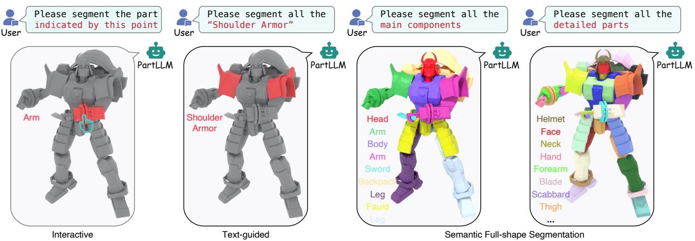  
Fig. 1. PartLLM achieves unified part segmentation within a single model. Given the same shape, it produces diferent segmentations conditioned on user intent, including text-guided part segmentation, interactive segmentation, and semantic full-shape decomposition at controllable granularities.

Part segmentation is a fundamental problem in computer graphics and 3D vision. Recent works have expanded 3D part segmentation beyond fixed taxonomies, but existing approaches typically only address a specific setting, such as text-guided part segmentation or point-based interaction. In this work, we argue that these settings can be unified as an intent-conditioned generative problem, where diferent prompts specify the desired part decomposition. To this end, we introduce PartLLM, a unified multimodal model that formulates 3D part segmentation as autoregressive semantic decomposition.

Conditioned on an input shape and a user prompt, PartLLM autoregressively generates semantic part hypotheses as queries for mask prediction and feeds them to a decomposition-aware decoder that jointly predicts coherent part masks. This unified design supports text-guided part segmentation, interactive segmentation, and full-shape semantic decomposition with controllable granularity within a single model. Extensive experiments across these task settings show that PartLLM consistently outperforms task-specific baselines, demonstrating the efectiveness of unifying 3D part segmentation under an intent-conditioned generative formulation. Project Page: https://czvvd.github.io/PartLLMPage/.

CCS Concepts: • Computing methodologies → Shape analysis.

Additional Key Words and Phrases: 3D part segmentation, open-world segmentation, multimodal large language models, shape decomposition, geometric understanding

## 1 Introduction

Part-level understanding is fundamental to how humans and machines reason about, create, and interact with 3D objects. Whether editing a digital asset, rigging a character, or planning a robotic grasp, the first step is almost always identifying what parts the object is made of and how they relate. Part segmentation makes this understanding computational by decomposing raw 3D geometry into semantically meaningful components. A long-standing goal is therefore comprehensive 3D part understanding: given a 3D object and a user intent, a model should be able to identify a queried part, support interactive refinement, or decompose the entire shape into semantic parts at a desired granularity.

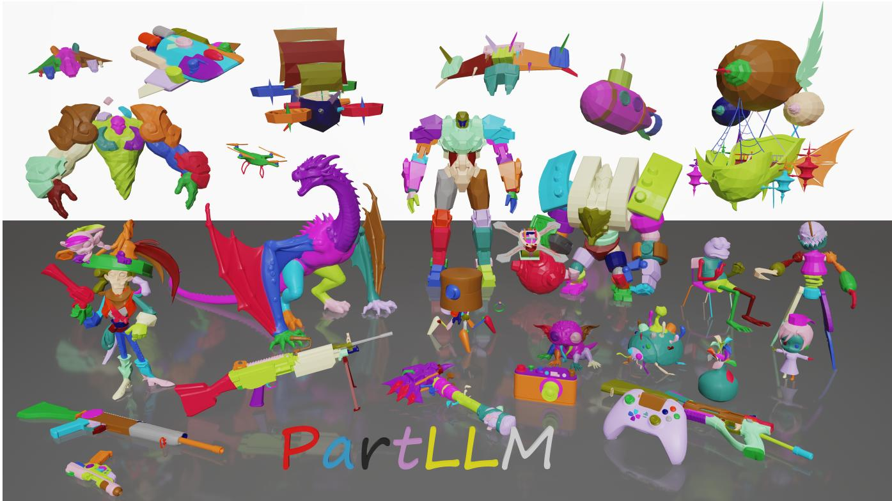  
Fig. 2. Gallery of PartLLM on diverse 3D shapes. Across complex artist-created and AI-generated shapes, PartLLM produces semantically meaningful part segmentation with coherent functional structure, clean boundaries, and fine geometric details.

Despite recent progress, existing methods still treat part segmentation as a collection of separate task settings. One line of work [Liu et al. 2025; Ma et al. 2025; Zhu et al. 2026] produces category-agnostic part proposals or full-shape segmentation, but the resulting regions are not tied to explicit semantic identities. Another line [Jin et al. 2026; Ma et al. 2024] grounds parts based on input labels, but assumes that the semantic targets are already known and therefore does not decide how the object should be decomposed as a whole. As Table 1 summarizes, representative methods cover only subsets of what comprehensive part understanding needs.

We argue that these tasks should be unified under a common part segmentation formulation. At their core, these tasks all require inferring a part-level decomposition from a shape under a particular user intent. The diference lies mainly in how the intent is expressed and what granularity of decomposition is expected. Moreover, diferent datasets and interaction modes often provide complementary observations of the same underlying part organization: some reveal only queried parts, some provide unlabeled regions, and others annotate complete semantic decompositions. Treating them as separate tasks prevents knowledge learned in one setting from benefiting another. A unified formulation is therefore not merely a convenient interface. It provides a scalable route toward comprehensive 3D part understanding by converting heterogeneous task-specific annotations into shared training signals for learning generalizable part representations.

The remaining question is how we should design such a unified 3D segmentation framework. While most existing approaches adopt a deterministic segmentation model with feature clustering or classification, we advocate that such a unified 3D segmentation should be a conditional generative model. Unified part segmentation is inherently ambiguous: the number of valid parts varies across objects, and the same object can be decomposed diferently under diferent semantic viewpoints or requested granularities. This ambiguity means part segmentation is not a discriminative task with a fixed answer, but a generative problem conditioned on the intent of the task. Modeling it as a deterministic framework usually results in an averaged and blurry result, while generative frameworks have the potential to sharply segment all parts with some randomness.

Based on this view, we formulate 3D part segmentation as autoregressive semantic decomposition, using the language interface of an LLM to generate a sequence of part representations. This formulation provides three advantages. First, it unifies diferent task settings within the same input-output space: diferent prompts condition the same generation process, while the generated sequence can contain a variable number of parts at diferent granularities. Second, it naturally aligns part segmentation with language modeling, allowing open-vocabulary part names to be generated together with the seg mentation rather than being treated as external labels attached after mask prediction. Third, it makes part prediction contextual: each generated part is conditioned on the parts generated so far, helping the model maintain coherent semantic identities, compatible boundaries, and consistent granularity across the whole shape.

Table 1. Task coverage of representative part segmentation methods. Existing methods cover only subsets of promptable and full-shape segmentation capabilities, whereas PartLLM supports point-prompted interaction, text-guided part segmentation, category-agnostic segmentation, and semantic full-shape segmentation within a single unified model.
<table><tr><td rowspan="2">Method</td><td colspan="2">Promptable segmentation</td><td colspan="2">Full-shape segmentation</td></tr><tr><td>Interactive Point</td><td>Part Text</td><td>Category-agnostic</td><td>Semantic</td></tr><tr><td>PartField [Liu et al. 2025]</td><td></td><td></td><td>√</td><td></td></tr><tr><td>PartSAM [Zhu et al. 2026]</td><td>√</td><td></td><td>√</td><td></td></tr><tr><td>P3-SAM [Ma et al. 2025]</td><td>√</td><td></td><td>√</td><td></td></tr><tr><td>S2AM3D [Su et al. 2025]</td><td>√</td><td></td><td>√</td><td></td></tr><tr><td>SegviGen [Li et al. 2026]</td><td>√</td><td>一</td><td>√</td><td></td></tr><tr><td>FIND3D [Ma et al. 2024]</td><td></td><td>√</td><td></td><td></td></tr><tr><td>PatchAlign3D [Hadgi et al. 2026]</td><td></td><td>√</td><td></td><td></td></tr><tr><td>CoSMo3D [Jin et al. 2026]</td><td></td><td>√</td><td></td><td></td></tr><tr><td>Ours</td><td>√</td><td>√</td><td>√</td><td>√</td></tr></table>

Turning this formulation into an efective segmentation model, however, is non-trivial. It raises two questions: how to represent each part within a language sequence, and how to convert the generated parts into mutually consistent 3D masks. We instantiate this formulation as PartLLM, a unified multimodal framework that makes autoregressive semantic decomposition executable.

To address the first question, PartLLM builds a 3D-aware multimodal large language model (MLLM) to express each decomposed part as a hypothesis. Motivated by the emerging visual perception capabilities of recent MLLMs [Bai et al. 2025; Hurst et al. 2024], we express each part hypothesis as a language-form representation that specifies the part’s semantic label, coarse 3D location, and relation to the previously predicted parts. In this way, the generated part hypotheses define a dynamic, open-vocabulary label set tailored to the current shape and user intent.

To address the second question, we design a decomposition-aware mask decoder to assign 3D points to the generated label set. A straightforward solution is to use SAM-style decoders from prior work [Zhou et al. 2025; Zhu et al. 2026] that predict one binary mask per query. However, by predicting each part as an independent binary mask, such decoders provide limited part-to-part interaction and often lead to overlapping assignments and inconsistent boundaries. Instead, PartLLM organizes the part hypotheses and the remaining region into a decomposition-aware query set, built from two types of special tokens. Given this query set, the proposed decoder jointly assigns points to one of the generated part hypotheses or background. By turning mask prediction into a joint assignment problem, diferent parts compete within the same decomposition, producing mutually exclusive and semantically coherent masks.

Together with autoregressive generation, this strategy helps maintain consistent identities for symmetric or structurally related parts while producing compatible boundaries across the shape.

PartLLM unifies text-guided segmentation, interactive segmentation, and full-shape segmentation within a single framework. It can take an arbitrary 3D object as input and directly produce a complete, semantically labeled part decomposition at a specified granularity. Crucially, the same formulation allows annotations from diferent tasks and datasets to train a single model, scaling the supervision available for learning 3D parts. By expressing diferent tasks and granularities within the same prompt-response format, PartLLM turns 323K unique 3D shapes into 1.1M unified training samples. Extensive experiments show that it surpasses task-specific methods by large margins across all evaluated settings. Our contributions are summarized as follows.

• We reformulate 3D part segmentation as autoregressive semantic decomposition, casting diverse part segmentation tasks as a unified framework.

• We implement this formulation as PartLLM, where a 3Daware multimodal language model generates language-form part hypotheses that define a dynamic open-vocabulary label set for the current user intent.

• We design a decomposition-aware decoding strategy that jointly assigns each input point to predicted part hypotheses, producing globally consistent masks.

• We demonstrate that the unified formulation enables scalable multi-task training and achieves state-of-the-art performance across all evaluated settings.

## 2 Related Work

## 2.1 3D Part Segmentation

Closed-world Part Segmentation. Early learning-based methods typically cast 3D part segmentation as point-wise classification on 3D shapes [Qi et al. 2017; Thomas et al. 2019; Wang et al. 2019; Zhao et al. 2021]. These methods are commonly trained and evaluated on fixed-taxonomy datasets such as ShapeNetPart [Yi et al. 2016] and PartNet [Mo et al. 2019]. This closed-world assumption limits their applicability to real 3D assets, which often contain object categories and part labels outside the predefined training taxonomy.

Lifting 2D Foundation Models. To reduce the dependence on closed 3D taxonomies, recent methods transfer priors from 2D foundation models, including vision–language models and image segmentation models [Kirillov et al. 2023; Li et al. 2022; Oquab et al. 2024; Radford et al. 2021]. One line of work performs text-driven 3D part segmentation by matching rendered views or 3D regions with part names in a vision–language feature space [Abdelreheem et al. 2023; Garosi et al. 2025; Liu et al. 2023; Zhu et al. 2023]. Another line lifts mask predictions from image segmentation models into 3D, either by merging multi-view masks or by distilling 2D mask features into 3D representations [Lang et al. 2024; Tang et al. 2024; Xue et al. 2025; Yang et al. 2024; Zhong et al. 2024; Zhou et al. 2023]. While these methods bring strong 2D priors to 3D part segmentation, they often depend on rendering, view aggregation, or per-shape processing, making the resulting segmentation sensitive to view coverage and costly to apply at scale.

Feed-forward 3D Models. Recent feed-forward models avoid pershape lifting by predicting part masks directly from 3D inputs. One line of work follows a semantic grounding formulation. FIND3D [Ma et al. 2024] pioneered this direction by training a point cloud network with text-aligned features, allowing users to query and localize target parts on 3D shapes using free-form text descriptions. PatchAlign3D [Hadgi et al. 2026] and CoSMo3D [Jin et al. 2026] follow this route, improving semantic grounding through local region alignment and canonical spatial modeling, respectively. Another line of work focuses on category-agnostic part decomposition. PartField [Liu et al. 2025] initiated this direction by learning a part-aware 3D feature field and clustering it into hierarchical full-shape decompositions. Motivated by SAM, subsequent methods such as PartSAM [Zhu et al. 2026], P3-SAM [Ma et al. 2025], and S2AM3D [Su et al. 2025] develop promptable 3D models for category-agnostic mask prediction. More recently, SegviGen [Li et al. 2026] takes a diferent route by repurposing a 3D generative model and treating segmentation as coloring a shape. Taken together, these feed-forward models make open-world 3D part segmentation more scalable and controllable, but they each address only a subset of part segmentation tasks. Text-based methods attach semantics to geom etry, yet they rely on user-provided part labels and cannot produce a full decomposition autonomously. Category-agnostic methods can decompose the full shape, yet their outputs remain geometric masks without semantic identities. Our work unifies all these ca pabilities under a single formulation by treating part segmentation as conditional sequential generation, enabling the first model that handles semantic grounding, point-based interaction, and semantic full-shape decomposition together.

## 2.2 MLLMs for Visual Perception

MLLMsfor 2D Perception. Recent MLLMs have extended visual instruction following from image-level responses to spatially grounded perception. One line of work represents image regions through coordinate tokens or region features, enabling language models to refer to, describe, and localize visual entities with boxes or regions [Bai et al. 2023; Chen et al. 2023; Jiang et al. 2025; Peng et al. 2024; You et al. 2024]. Another line further connects language models with dense segmentation, enabling pixel-level referring and reasoning segmentation in 2D images [Lai et al. 2024; Rasheed et al. 2024; Ren et al. 2024]. These methods often introduce special tokens whose hidden representations act as mask-level handles, bridging language generation and dense visual prediction. In 3D shapes, however, parts are not isolated regions but compositional units: their identities and boundaries are determined jointly by the whole shape and other parts. Although our method shares a similar idea of using special tokens to condense information from LLM outputs, each token in PartLLM represents a part hypothesis within an object-level decomposition rather than a standalone target handle. We further design a decoding strategy where all generated hypotheses are grounded together, so that masks are mutually consistent and reflect the structure of the generated decomposition.

MLLMs for 3D Perception. Recent multimodal language models extend language-based reasoning to the 3D domain by aligning 3D representations with large language models. Early systems support 3D captioning, question answering, and grounding by injecting scene features or object-centric representations into language mod els [Chen et al. 2024; Hong et al. 2023; Huang et al. 2023]. More recent models make spatial prediction more explicit, using language models to reason about or directly generate 3D boxes, object identifiers, and structured scene layouts [Cho et al. 2025; Mao et al. 2026; Zhu et al. 2025]. A recent part-aware 3D MLLM further explores structured program generation for part-based reasoning, generation, and editing [Wang et al. 2026b]. However, such program-level outputs remain symbolic and coarse; they do not provide dense part segmentation masks that organize the surface geometry into a coherent part decomposition. In contrast, PartLLM bridges the generative capacity of language models with dense geometric prediction, using autoregressive generation not as a reasoning interface but as the decomposition mechanism itself, directly producing point-level masks tied to the generated semantic structure.

## 3 Method

Fig. 3 gives an overview of PartLLM. Given an input point cloud $P = \{ p _ { i } \} _ { i = 1 } ^ { N }$ sampled from a 3D shape and a user intent �, such as “Please segment all parts” for the full-shape segmentation task, PartLLM first uses a 3D-aware MLLM to autoregressively generate a sequence of part hypotheses $Y = \left( y _ { 1 } , . . . , y _ { S } \right)$ . Each hypothesis $y _ { s } = ( l _ { s } , b _ { s } )$ specifies a part label $l _ { s }$ together with a coarse 3D location $b _ { s }$ , indicating what part should be segmented and where it is roughly located. Conditioned on these generated hypotheses, a decomposition-aware decoder then assigns each point to one of the hypotheses or the remaining region, producing a dense assignment � and the corresponding point-level masks.

## 3.1 3D-Aware MLLM for Part Hypothesis Generation

3D Tokenization. To generate the part hypothesis sequence based on the input geometry, we attach a point cloud encoder [Wu et al. 2024] to the input token stream of an MLLM [Bai et al. 2025]. Given the input point cloud �, the encoder first extracts full-resolution point features for all input points. We then downsample the point cloud to � center points and gather their corresponding encoder features. A linear projector maps these sampled point features into the language hidden space, where they are inserted at the <point\_cloud> positions and serve as 3D visual tokens for the MLLM. The full-resolution point features are retained for the mask decoder, so the language model receives a compact token sequence while the decoder still has access to dense geometric evidence.

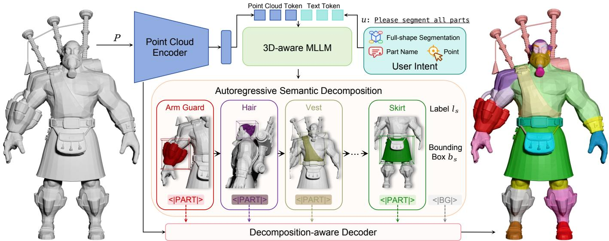  
Fig. 3. Overview of PartLLM. Diferent part segmentation tasks are unified as autoregressive semantic decomposition: the user intent (right) conditions a 3D-aware multimodal language model to generate task-specific part hypotheses, which are then jointly decoded into mutually consistent masks.

Hypothesis Definition. The MLLM generates the hypothesis sequence $Y = \left( y _ { 1 } , \dots , y _ { S } \right)$ in an autoregressive text format. Each hypothesis $y _ { s } = ( l _ { s } , b _ { s } )$ is serialized as a structured text span containing a semantic label $l _ { s }$ and an axis-aligned 3D box $b _ { s } ,$ , followed by a special token ${ < } | \mathsf { P A R T } | { > }$ . For example, a generated hypothesis may take the form label=Backrest, bbox=[...] <|PART|>. Here, bbox denotes an axis-aligned 3D box $[ x _ { \mathrm { m i n } } .$ , �min, �min, �max, �max, $z _ { \mathrm { m a x } } ]$ that serves as a spatial cue. The <|PART|> token acts as the terminal token of a part decision, rather than a generic separator. After the language model forward pass, the hidden state at each generated <|PART|> token is used as the representation of the corresponding part hypothesis. Through attention, the <|PART|> token summarizes the generated label, part location, user intent, input �, and previously predicted parts into a context-dependent representation of the part decision. This representation encodes what the part is, where it is, and how it relates to the current decomposition state. In addition to the <|PART|> tokens, the assistant response ends with a special <|BG|> token. Unlike the <|PART|> tokens, <|BG|> does not correspond to any generated part. Instead, its hidden state rep resents the context-dependent complement of the generated parts. Together, the <|PART|> token states and the <|BG|> token state serve as decoder queries for mask generation, as described next.

## 3.2 Decomposition-Aware Decoder

The generated token states are used as dynamic queries for mask decoding. Let $h _ { s }$ denote the hidden state of the �-th <|PART|> token, and let $h _ { S + 1 } = h _ { \mathrm { b g } }$ denote the hidden state of <|BG|>. These states form the decomposition query set:

$$
H = [ h _ { 1 } , \dots , h _ { S } , h _ { \mathrm { b g } } ] .\tag{1}
$$

Let � denote the full-resolution point features provided by the point cloud encoder. Given � and $X ,$ the decoder first uses a two-way transformer [Kirillov et al. 2023] to contextualize the queries and point features jointly:

$$
( \tilde { H } , \Phi ) = T _ { \psi } ( H , X ) ,\tag{2}
$$

where $\tilde { H } = [ \tilde { h } _ { 1 } , . . . , \tilde { h } _ { S + 1 } ]$ are the updated query features and $\Phi =$ $\{ \phi _ { i } \} _ { i = 1 } ^ { N }$ denotes the point-wise geometric features used for mask prediction. This query-point interaction allows each generated part hypothesis to attend to the input geometry while injecting the current decomposition context into point-wise features.

For each contextualized query $\ddot { h } _ { s } , s \in \{ 1 , . . . , S + 1 \}$ , an MLPbased hypernetwork $\rho _ { \theta }$ predicts a query-specific classifier $w _ { s }$ . The compatibility between query � and point $\mathscr { p } _ { i }$ is then computed as

$$
w _ { s } = \rho _ { \theta } ( \tilde { h } _ { s } ) , \qquad z _ { i , s } = w _ { s } ^ { \top } \phi _ { i } .\tag{3}
$$

For each point, this produces a logit vector $z _ { i } \in { \mathbb { R } } ^ { S + 1 }$ , where each dimension corresponds to one generated part hypothesis or the background query. The decoder predicts a categorical distribution over the generated query set:

$$
p _ { \theta } ( q _ { i } = s \ | \ P , u , Y ) = \frac { \exp ( z _ { i , s } ) } { \sum _ { r = 1 } ^ { S + 1 } \exp ( z _ { i , r } ) } , \quad s \in \{ 1 , \ldots , S + 1 \} .\tag{4}
$$

Here, $q _ { i } \in \{ 1 , . . . , S + 1 \}$ is the assignment variable of point $\mathbf { \nabla } \mathcal { P } i$ . For $s \leq S , q _ { i } = s$ indicates that $\mathscr { p } _ { i }$ belongs to the �-th generated part hypothesis, while $q _ { i } = S + 1$ 1 assigns the point to the background.

The mask of each generated part is therefore induced by the points assigned to its corresponding hypothesis.

Discussion. The key distinction from SAM-style decoders [Ma et al. 2025; Zhu et al. 2026] lies in the prediction space. Given � generated hypotheses, a SAM-style decoder would treat them as � independent binary mask predictions. PartLLM instead treats the generated hypotheses and the background query as a dynamic label set, and predicts an (� + 1)-way assignment for each point. This is possible because the ambiguity of what to segment has already been resolved before mask decoding: the MLLM generates an explicit hypothesis sequence �, leaving the decoder to ground this generated label set into dense masks. The shared categorical distribution explicitly couples all masks by forcing the generated parts and background to compete for the same points, yielding mutually exclusive assignments. This joint assignment is especially important for part segmentation, where neighboring or structurally related parts often have ambiguous boundaries and should be interpreted relative to each other within the same shape-level decomposition.

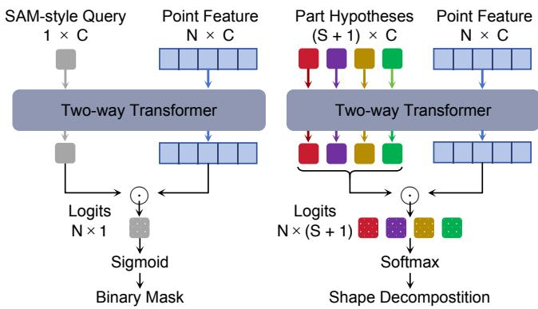  
Fig. 4. Comparison of two mask decoding paradigms. SAM-style decoders predict each mask independently, using a sigmoid decision for every query. PartLLM instead performs decomposition-aware joint decoding. Autoregressively generated part hypotheses form a dynamic query set, and a softmax competition assigns each point to one generated part or background. This converts mask prediction from independent binary decisions into a joint decomposition of the shape.

## 3.3 Training Objective

Training supervises both parts of the representation: the autoregressive hypothesis sequence and the dense point assignment. Let $a ^ { \star }$ denote the target assistant response that serializes the part labels, coarse 3D locations, and special tokens. The language model is trained with the standard next-token objective:

$$
\mathcal { L } _ { \mathrm { l m } } = - \sum _ { t } \log p _ { \theta } ( a _ { t } ^ { \star } \mid P , u , a _ { < t } ^ { \star } ) .\tag{5}
$$

This loss teaches the model to generate the semantic decomposition in language form, including the <|PART|> and <|BG|> tokens whose hidden states are used by the decoder.

For mask supervision, let $Z ~ = ~ \{ z _ { i , s } \} ~ \in ~ \mathbb { R } ^ { N \times ( S + 1 ) }$ denote the decoder logits over the � generated part hypotheses and the background query. The target assignment $q ^ { \star } \in \{ 1 , . . . , S + 1 \} ^ { N }$ follows the response order: points belonging to the �-th target part are assigned to class �, and points outside the target parts are assigned to class � + 1. The mask loss is a point-level cross-entropy over this dynamic label space:

$$
\mathcal { L } _ { \mathrm { m a s k } } = - \frac { 1 } { N } \sum _ { i = 1 } ^ { N } \log \frac { \exp ( z _ { i , q _ { i } ^ { \star } } ) } { \sum _ { s = 1 } ^ { S + 1 } \exp ( z _ { i , s } ) } .\tag{6}
$$

Together with the decomposition-aware decoding strategy, this target construction turns mask supervision into a mutually exclusive point classification problem over the generated hypotheses. Unlike independent binary mask losses, each point contributes to exactly one class in the dynamic label space, forcing the generated parts and the background query to compete during training. As a result, the generated part hypotheses are optimized as a coupled decomposition of the shape, where the assignment of one part is learned relative to the others.

The total training objective is a weighted combination of the sequence and mask losses:

$$
\begin{array} { r } { \mathcal { L } = \mathcal { L } _ { \mathrm { l m } } + \lambda _ { \mathrm { m a s k } } \mathcal { L } _ { \mathrm { m a s k } } . } \end{array}\tag{7}
$$

## 3.4 Unified Task Formulation

All part segmentation tasks reduce to the same problem: determining which parts to produce and where, conditioned on the user intent. The autoregressive semantic decomposition formulation reflects this shared structure by fixing the response format as a sequence of generated part hypotheses followed by <|BG|>. Here, <|BG|> represents the context-dependent complement of the generated hypotheses, rather than a fixed background category. Task diferences are encoded in the input prompt, which determines both the generated part set and the meaning of its complement. By always including <|BG|> in the query set, the decoder performs the same softmax assignment over all points regardless of how many parts are generated, eliminating the need for task-specific decoding logic. This context-dependent behavior emerges from training with the same cross-entropy loss across all modes, allowing <|BG|> to learn a consistent role as the complement of whatever the current prompt requests. Table 2 summarizes the prompt-response interface for each task mode.

• Full-shape segmentation. The general full-shape prompt asks the model to generate all parts of the object. We further control the granularity with coarse, fine, and number-based prompt variants, so the same model can produce decompositions at diferent levels of detail. Besides this general open-ended prompt, these controlled prompt types provide an explicit interface for requesting diferent decomposition granularities. The construction details of these prompt variants are described in Sec. 4.1. In this setting, <|BG|> handles uncovered or unlabeled regions.

• Text-guided part segmentation. The prompt provides a list of queried part names, and the model generates only the requested parts, while <|BG|> absorbs non-queried parts.

• Interactive segmentation. The first interaction round provides a single 3D point, and the model generates the part containing that point. Subsequent rounds refine the previously predicted mask: we encode the previous mask as point colors in the input point cloud and provide an include or exclude point to refine the mask. In all interaction rounds, <|BG|> covers points outside the target part.

Table 2. Prompt-response template for the unified task formulation.
<table><tr><td>Task</td><td>Prompt input</td><td>Generated response</td></tr><tr><td>Full-shape</td><td>general: Please segment and name all parts in &lt;point_cloud&gt;. coarse: Please segment and name the main parts in &lt;point_cloud&gt;. fine: Please segment and name all detailed parts in &lt;point_cloud&gt; number: Please segment and name about {n} parts in &lt;point_cloud&gt;.</td><td>label=Backrest, bbox=[...] &lt;|PART|&gt; label=Seat, bbox=[...] &lt;|PART|&gt; label=Armrest, bbox=[...] &lt;|PART|&gt; label=Base, bbox=[...] &lt;|PART|&gt; &lt;|BG|&gt;</td></tr><tr><td>Text-guided</td><td>Please segment the Backrest and Armrest in &lt;point_cloud&gt;.</td><td>label=Backrest, bbox=[...] &lt;|PART|&gt; label=Armrest, bbox=[...] &lt;|PART|&gt; &lt;|BG|&gt;</td></tr><tr><td>Interactive</td><td>First click: segment the part at (x, y, z) in &lt;point_cloud&gt; Refinement: previous mask + include/exclude point (x, y, z).</td><td>label=Armrest, bbox=[...] &lt;|PART|&gt; &lt;|BG|&gt; 1abel=Armrest, bbox=[...] &lt;|PART|&gt; &lt;|BG|&gt;</td></tr></table>

## 3.5 Scalable Training with Heterogeneous Data

Because task diferences are expressed entirely through prompts and target responses, heterogeneous annotations can be converted into the same supervision format and mixed within one model. For semantic part annotations, each target hypothesis contains the annotated part label, its coarse 3D location, and a <|PART|> token. For category-agnostic decompositions, we retain the same response structure and simply use a generic label such as part. From the same annotated shape, we derive full-shape segmentation training examples by varying the granularity prompt, text-guided examples by sampling target part subsets, and interactive examples by sampling target points, with optional refinement rounds built from perturbed masks. Regardless of the original annotation type or task mode, we train the model on all resulting instances using the same autoregressive generation objective and decomposition-aware decoder. Training data construction details are given in Sec. 4.1.

Viewed more broadly, this unified formulation turns task and data diversity into a scaling axis. As more datasets become available, the model can incorporate them through prompt and response design alone, without architectural changes or new training objectives.

## 4 Experiments

We evaluate PartLLM on three 3D part segmentation task families within our open-world formulation: full-shape segmentation, textguided part segmentation, and interactive segmentation.

## 4.1 Setup

Training Data. We train PartLLM on a large-scale mixture of 3D part segmentation datasets. We first curate three public datasets with semantic part labels: PartNeXt [Wang et al. 2026a], 3DCoM-PaT200 [Ahmed et al. 2024], and PartVerse [Ding et al. 2026]. We then use an MLLM to annotate 75K licensed 3D assets with semantic part labels. Together, these data provide full-shape, text-guided, and interactive supervision under a shared prompt-response interface. We additionally use a training subset of HY3D-Bench [Hunyuan3D et al. 2026] for category-agnostic geometric decomposition without semantic part names. For each shape, we construct training instances across all applicable task modes and granularity levels, yielding 1.1M training samples in total from 323K unique shapes.

For full-shape supervision, granularity is defined according to the annotation structure. For the hierarchical datasets PartNeXt and 3DCoMPaT200, the shallowest valid decomposition is treated as coarse, the deepest valid decomposition is treated as fine unless it contains very few parts, and intermediate levels are grouped by part count, with at most 6 parts as coarse, 7–12 as medium, and 13 or more as fine. For all other datasets, granularity is determined directly by the same part-count thresholds. We then sample the full-shape prompt from a small family of general, coarse/fine, and number-controlled templates.

Benchmarks. We evaluate on multiple benchmarks that cover diferent task settings. From PartNeXt [Wang et al. 2026a], we evaluate on 500 shapes covering 50 object categories. From 3DCoM-PaT200 [Ahmed et al. 2024], we use about 2,000 shapes across 200 categories. Both datasets provide multi-level part annotations, allowing us to evaluate whether a model can handle diferent semantic granularities across categories. From HY3D-Bench [Hunyuan3D et al. 2026], we select 100 shapes with a roughly uniform distribution over part counts. This benchmark is challenging, with the most com plex case containing up to 50 ground-truth parts. For full-shape segmentation, we additionally evaluate on PartObjaverse-Tiny [Yang et al. 2024], a common benchmark for category-agnostic part seg mentation. For text-guided part segmentation, we additionally use PartNet-E [Liu et al. 2023]. All evaluation shapes are strictly held out from the training set, and all quantitative results are reported using mIoU-based metrics unless otherwise specified.

Implementation details. Our 3D-aware MLLM is built on Qwen3- VL-4B [Bai et al. 2025]. The point cloud encoder is a PointTransformerV3 [Wu et al. 2024] initialized from Utonia [Zhang et al. 2026] pretrained weights, which takes an input point cloud of81,920 points and produces per-point features of dimension 1386. We then select 4,096 points via farthest-point sampling and project their features to the language model’s hidden dimension through a linear layer. In the mask decoder, we use a two-way transformer with two layers, an embedding dimension of 512, and eight attention heads. Each layer contains self-attention on query tokens, cross-attention from queries to point features, an MLP, and cross-attention from point features back to queries. This transformer operates on the 4,096 downsampled point features together with the part-hypothesis hid den states. The updated point features are then interpolated back to the original point resolution and merged with the encoder’s full resolution features to obtain the point-wise decoder features �� used in Sec. 3. For autoregressive training, we serialize the target part hypotheses in ascending order of their bounding-box center coordinates along the $x , y ,$ and � axes. We apply random 3D rotation augmentation to each training sample. Bounding-box and point prompts are generated after augmentation in the transformed coordinate frame. We train all modules end-to-end on 48 H20 GPUs for 5 epochs with AdamW $( \beta _ { 1 } = 0 . 9 , \beta _ { 2 } = 0 . 9 5$ , weight decay 0.02), using 2% warmup followed by cosine learning rate decay to 0.1× the initial learning rate. All components are jointly optimized with diferentiated learning rates: $1 \times 1 0 ^ { - 5 }$ for the point cloud encoder,

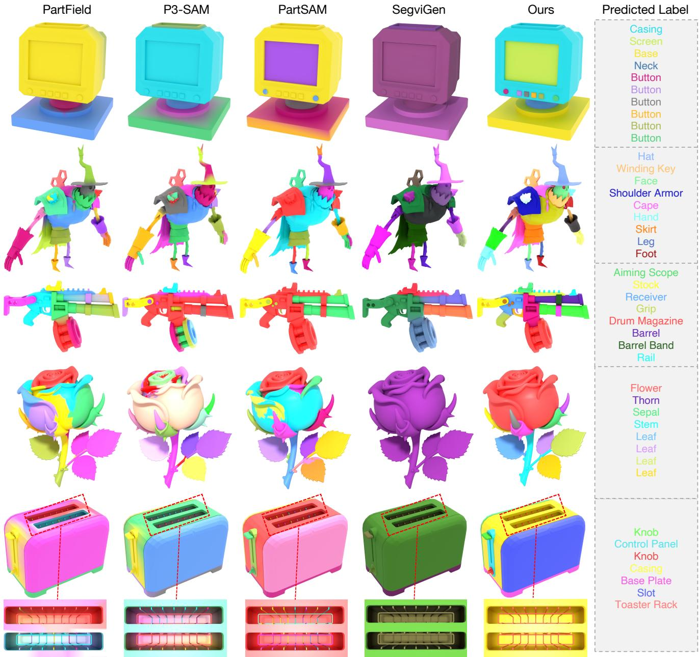  
Fig. 5. Qualitative comparison with baseline methods [Li et al. 2026; Liu et al. 2025; Ma et al. 2025; Zhu et al. 2026] on full-shape segmentation.

$5 \times 1 0 ^ { - 5 }$ for projection layers, $1 \times 1 0 ^ { - 5 }$ for the LLM, and $1 \times 1 0 ^ { - 4 }$ for the mask decoder. The mask loss weight $\lambda _ { \mathrm { m a s k } } { = } 1 . 0$

## 4.2 Evaluation on Full-Shape Segmentation

We first evaluate the central capability of PartLLM, i.e., decomposing a complete 3D shape into parts. We study this capability in two settings. Category-agnostic full-shape segmentation evaluates whether a method can predict the part structure of the whole shape without predicting the semantic label. Semantic full-shape segmentation further evaluates whether the method can produce a complete decomposition with meaningful part labels.

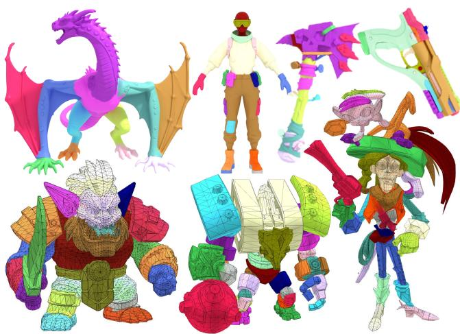  
Fig. 6. Qualitative full-shape segmentation results on AI-generated meshes. The first row contains dense meshes produced by geometry-based generative models [Lai et al. 2025; Xiang et al. 2025], while the second row contains lowpoly meshes produced by autoregressive topology generative models [Liu et al. 2026; Zhao et al. 2025].

4.2.1 Category-Agnostic Full-Shape Segmentation. This protocol measures how well a method can recover the ground-truth part structure under its best operating granularity. We compare with PartField [Liu et al. 2025], P3-SAM [Ma et al. 2025], PartSAM [Zhu et al. 2026], SAMPart3D [Yang et al. 2024], and SegviGen [Li et al. 2026]. Following the evaluation protocol of PartField [Liu et al. 2025] and PartSAM [Zhu et al. 2026], we evaluate each method using decompositions generated at multiple candidate granularities. For PartLLM, we use the general, coarse, and fine full-shape prompts defined in Table 2 under a fixed random seed. We do not use number-controlled prompts in this evaluation and therefore do not provide the ground-truth part count at test time. For PartField, we use clustering results with the number of clusters ranging from 1 to 20. For PartSAM and P3-SAM, we adjust their post-processing parameters to obtain three sets of masks at diferent granularities. SegviGen does not support explicit multi-granularity control, so we sample three outputs using diferent random seeds. Each groundtruth part mask is then matched to the predicted mask with the highest IoU across all granularities, and we report the average of these best-matched IoU values.

Results. Table 3 reports the quantitative results. PartLLM consistently outperforms all baselines across the evaluated benchmarks. The gains are especially large on 3DCoMPaT200, where PartLLM improves over the strongest baseline by 34.5 mIoU at the coarse level and 32.0 mIoU at the fine level. Fig. 5 shows qualitative comparisons. Existing methods often produce decompositions with unstable granularity: they may merge distinct functional parts, split a single coherent part into fragments, or miss small structures. In particular, promptable methods such as PartSAM and P3-SAM can recover many local regions, but their over-segmented masks are not associated with semantic part identities and are therefore not always meaningful as object parts. PartLLM produces more complete and coherent full-shape segmentations, with part boundaries that better align with the underlying object structure. Fig. 6 further shows examples on AI-generated meshes, where PartLLM produces plausible part decompositions for outputs from diferent generation paradigms, including dense meshes produced by geometry-based generative models and low-poly meshes produced by autoregressive topology generative models.

We attribute these advantages to two properties of our formulation. First, autoregressive generation predicts parts as a coupled decomposition rather than as independent regions, which leads to more coherent full-shape segmentations. Second, granularity control is built into the generation process itself, so the model can produce decompositions that remain consistent with the requested level of detail. Fig. 7 further shows that the same interface also supports prompt-based number control: as the requested part count increases, the model produces progressively finer yet still semanti cally coherent decompositions.

Table 3. Quantitative results on category-agnostic full-shape segmentation. We report mask-only mIoU by matching each ground-truth part to its best-IoU prediction across granularities.
<table><tr><td rowspan="2">Method</td><td rowspan="2">PartNeXt</td><td colspan="2">3DCoMPaT200. HY3D-Bench</td><td rowspan="2">PartObjaverse -Tiny</td></tr><tr><td>Coarse Fine</td><td></td></tr><tr><td>PartField</td><td>42.7</td><td>45.8</td><td>35.0 33.6</td><td>51.5</td></tr><tr><td>SAMPart3D</td><td>40.8</td><td>51.6</td><td>41.1 36.9</td><td>53.5</td></tr><tr><td>PartSAM</td><td>37.2</td><td>42.6</td><td>42.2 40.5</td><td>69.5</td></tr><tr><td>P3-SAM</td><td>40.3</td><td>41.4</td><td>40.3 38.7</td><td>59.9</td></tr><tr><td>SegviGen</td><td>34.2</td><td>43.8</td><td>37.2 35.4</td><td>50.6</td></tr><tr><td>Ours</td><td>56.7</td><td>86.1</td><td>74.2 68.3</td><td>78.8</td></tr></table>

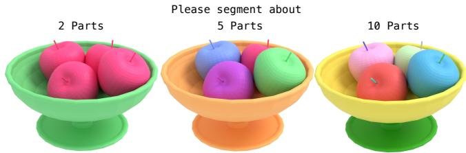  
Fig. 7. Number-based granularity control. By changing the requested part counts, PartLLM produces progressively finer decompositions while preserving semantic coherence.

4.2.2 Semantic Full-Shape Segmentation. Beyond category-agnostic mask quality, this setting further evaluates whether the predicted full-shape parts are assigned correct semantic labels. Existing openworld part segmentation methods do not directly support this setting, since they either produce category-agnostic masks or require queried part names. We therefore construct two semantic baselines by pairing category-agnostic full-shape segmentation methods with an MLLM-based naming stage. Specifically, we take the masks generated by PartSAM and P3-SAM, render each predicted mask as a highlighted region on the input shape, and ask an MLLM [Bai et al. 2025] to predict the semantic part name of the highlighted re gion. This yields PartSAM+MLLM and P3-SAM+MLLM, which add semantic labels to category-agnostic full-shape segmentations. To evaluate both geometry and semantics, we report semantic-aware mIoU (SA-mIoU). Let $\mathcal { G }$ and $\hat { g }$ denote the ground-truth and predicted part sets, where each part is represented by a mask and a semantic label. We define SA-mIoU as

Table 4. Quantitative results on semantic full-shape segmentation. We report semantic-aware mIoU (SA-mIoU) together with mask-only mIoU.
<table><tr><td rowspan="2">Method</td><td colspan="2">PartNeXt</td><td colspan="2">3DCoMPaT200 Coarse</td><td colspan="2">3DCoMPaT200 Fine</td></tr><tr><td>Mask mIoU</td><td>SA-mIoU</td><td>Mask mIoU</td><td>SA-mIoU</td><td>Mask mIoU</td><td>SA-mIoU</td></tr><tr><td>PartSAM+MLLM</td><td>37.2</td><td>13.8</td><td>42.6</td><td>25.1</td><td>42.2</td><td>20.8</td></tr><tr><td>P3-SAM+MLLM</td><td>40.3</td><td>18.3</td><td>41.4</td><td>23.5</td><td>40.3</td><td>16.7</td></tr><tr><td>Ours</td><td>56.7</td><td>43.2</td><td>86.1</td><td>71.9</td><td>74.2</td><td>63.1</td></tr></table>

$$
\mathrm { S A - m I o U } = \frac { 1 } { | \mathcal { G } | } \sum _ { ( M , y ) \in \mathcal { G } } \operatorname* { m a x } _ { ( \hat { M } , \hat { y } ) \in \hat { \mathcal { G } } } \mathbb { I } _ { \mathrm { s e m } } ( y , \hat { y } ) \mathrm { I o U } ( M , \hat { M } ) .\tag{8}
$$

Because part names may be ambiguous, we use an LLM-based matcher to decide the semantic match indicator $\mathbb { I } _ { \mathrm { s e m } } .$ . The matcher is given the object context and the two part names, and determines whether the predicted name should be considered a correct match to the ground-truth name. Specifically, we use GPT-5.5 through the OpenAI API as the semantic matcher, which is independent of the Qwen3-VL backbone used by PartLLM. We use the following prompt:

For a 3D object of category “{object\_category}”, determine whether the predicted part name “{pred\_name}” and the ground-truth part name “{gt\_name}” are semantically equivalent part names. Answer only “yes” or “no”.

This metric penalizes both geometric mismatch and semantic mislabeling: a mask receives credit only when it overlaps the target part and is assigned a compatible semantic name.

Results. Table 4 reports the results. PartLLM obtains the highest mask mIoU and SA-mIoU in all three settings. More importantly, its performance drops much less when moving from mask-only mIoU to SA-mIoU. The two-stage baselines drop by 17.5–23.6 points after semantic matching, indicating that their masks are often not aligned with semantically meaningful part identities even when they overlap reasonable geometric regions. In contrast, PartLLM drops by only 11.1–14.2 points, suggesting that its predicted regions are already tied to the part names generated by the model. This supports our formulation: full-shape part segmentation should predict masks and semantics together, so that the output decomposition is not only geometrically accurate but also semantically meaningful.

## 4.3 Evaluation on Text-Guided Part Segmentation

This task evaluates whether a model can segment the requested parts in a 3D shape given queried part names. For this task, the input to PartLLM is a set of queried part names, and the model outputs masks for the requested parts. We compare our method with three state-ofthe-art methods: Find3D [Ma et al. 2024], PatchAlign3D [Hadgi et al. 2026], and CoSMo3D [Jin et al. 2026]. For quantitative evaluation, we feed all ground-truth part names to the model at once and compute metrics from the corresponding output masks. We report categoryaveraged mIoU as the evaluation metric.

Results. Table 5 summarizes the results. PartLLM outperforms all baselines on every benchmark by a large margin. The gains are particularly striking on PartNeXt (+40.8 over CoSMo3D) and 3DCoMPaT200 (+37.3 and +53.9 at coarse and fine granularities). Fig. 8 shows qualitative results. The first three rows query all parts of the object simultaneously, and the last two rows query only a subset. Baselines often produce fragmented or incomplete masks, while PartLLM produces consistently accurate masks with sharp boundaries in both cases. Non-queried regions are cleanly absorbed by the <|BG|> query (shown in gray), demonstrating that the proposed decoding strategy produces mutually exclusive masks with precise boundaries regardless of how many parts are queried. We attribute these advantages to the formulation of PartLLM. Existing methods treat each queried part name as an independent text-togeometry matching problem, making them sensitive to ambiguous or compositional names whose interpretation depends on object context and on the other queried parts. PartLLM instead predicts all requested parts within a single semantic decomposition, so each mask is inferred jointly with the others and with the overall shape. This leads to more accurate part disambiguation, cleaner exclusion of non-queried regions, and more mutually consistent masks.

## 4.4 Evaluation on Interactive Part Segmentation

Interactive part segmentation evaluates whether a model can segment the target part indicated by sparse clicks. Following the ex perimental protocol of previous works [Zhou et al. 2025; Zhu et al. 2026], we evaluate with multi-round interactions and report mIoU after each round. For each ground-truth mask, the first point is sampled from its central region; subsequent points are iteratively

Table 5. Quantitative results on text-guided part segmentation.
<table><tr><td rowspan="2">Method</td><td rowspan="2">PartNet-E</td><td rowspan="2">PartNeXt</td><td colspan="2">3DCoMPaT200</td></tr><tr><td>Coarse</td><td>Fine</td></tr><tr><td>FIND3D</td><td>16.7</td><td>28.8</td><td>31.4</td><td>10.4</td></tr><tr><td>PatchAlign3D</td><td>41.4</td><td>29.3</td><td>32.8</td><td>10.3</td></tr><tr><td>CoSMo3D</td><td>17.6</td><td>37.9</td><td>48.8</td><td>26.1</td></tr><tr><td>Ours</td><td>50.1</td><td>78.7</td><td>86.1</td><td>80.0</td></tr></table>

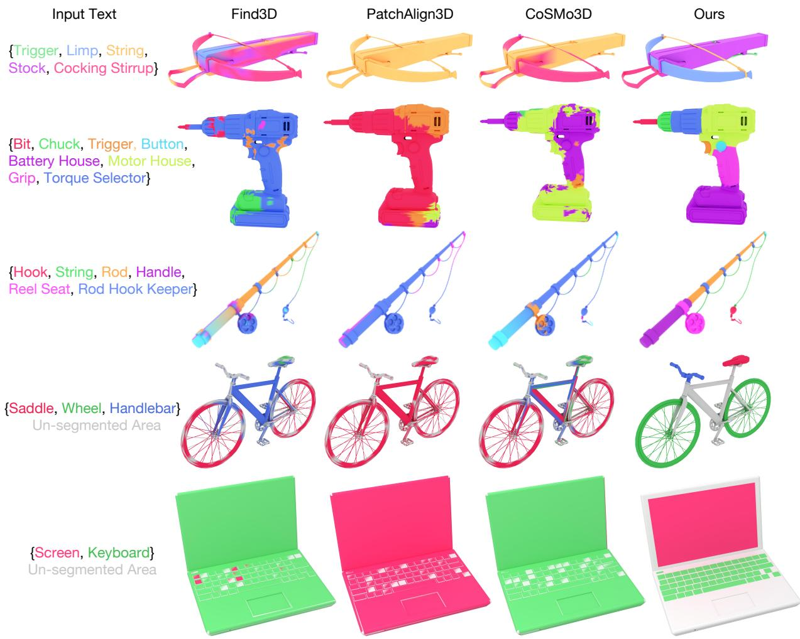  
Fig. 8. Qualitative comparison with baseline methods [Hadgi et al. 2026; Jin et al. 2026; Ma et al. 2024] on text-guided part segmentation.

Table 6. Quantitative results on interactive part segmentation. IoU@� denotes mean IoU after � interaction rounds.
<table><tr><td></td><td colspan="4">PartNeXt</td><td colspan="8">3DCoMPaT200</td><td colspan="4">HY3D-Bench</td></tr><tr><td>Method</td><td>@1</td><td>@3</td><td>@5</td><td>@7</td><td>@1</td><td>Coarse @3</td><td>@5</td><td>@7</td><td>@1</td><td>Fine @3</td><td>@5</td><td>@7</td><td>@1</td><td>@3</td><td>@5</td><td>@7</td></tr><tr><td>Point-SAM</td><td>36.6</td><td>49.0</td><td>55.0</td><td>60.3</td><td>45.6</td><td>65.9</td><td>71.1</td><td>74.3</td><td>37.3</td><td>46.9</td><td>49.4</td><td>51.6</td><td>20.7</td><td>26.2</td><td>29.7</td><td>31.1</td></tr><tr><td>P3-SAM</td><td>43.8</td><td>-</td><td></td><td>-</td><td>47.7</td><td></td><td>1</td><td>–</td><td>49.9</td><td></td><td></td><td></td><td>31.8</td><td>-</td><td></td><td></td></tr><tr><td>S2AM3D</td><td>40.8</td><td>-</td><td></td><td>-</td><td>62.6</td><td></td><td>一</td><td>一</td><td>43.3</td><td></td><td>1</td><td>-</td><td>39.8</td><td>-</td><td>一</td><td></td></tr><tr><td>PartSAM</td><td>45.9</td><td>61.3</td><td>65.0</td><td>69.6</td><td>51.3</td><td>76.8</td><td>79.6</td><td>81.8</td><td>50.6</td><td>66.5</td><td>71.8</td><td>73.5</td><td>34.6</td><td>45.1</td><td>49.6</td><td>50.4</td></tr><tr><td>SegviGen</td><td>49.8</td><td>66.8</td><td>70.0</td><td>71.7</td><td>67.9</td><td>75.5</td><td>82.0</td><td>83.6</td><td>45.3</td><td>52.8</td><td>62.7</td><td>77.6</td><td>43.7</td><td>52.9</td><td>56.2</td><td>58.6</td></tr><tr><td>Ours</td><td>58.9</td><td>73.4</td><td>79.1</td><td>83.5</td><td>70.6</td><td>84.1</td><td>88.9</td><td>91.4</td><td>60.7</td><td>75.3</td><td>78.8</td><td>81.2</td><td>51.2</td><td>67.7</td><td>72.4</td><td>77.1</td></tr></table>

selected from the error regions between the predicted mask and the ground truth. For the first click, the input prompt is “Please segment the part at (x, y, z) in <point\_cloud>,” and the model outputs the corresponding part mask; for later clicks, the current mask is encoded as point colors in <point\_cloud>, and the prompt provides an include/exclude corrective point at (x, y, z) to produce a refined mask. We compare with Point-SAM [Zhou et al. 2025], P3-SAM [Ma et al. 2025], S2AM3D [Su et al. 2025], PartSAM [Zhu et al. 2026], and SegViGen [Li et al. 2026]. Point-SAM, PartSAM,

PartSAM

Point-SAM

P3-SAM

S2AM3D

SegviGen

Ours  
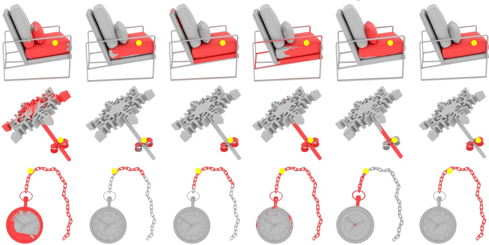  
Fig. 9. Qualitative comparison with baseline methods [Li et al. 2026; Ma et al. 2025; Su et al. 2025; Zhou et al. 2025; Zhu et al. 2026] on one-click interactive part segmentation. Yellow dots denote prompt points, and red regions denote predicted masks.

and SegViGen are evaluated with the multi-round protocol; for the remaining baselines, we report the available one-click results.

Results. Table 6 reports the quantitative results. PartLLM achieves the best mIoU on every reported dataset and at every interaction round. With only one click, it improves over the strongest baseline by up to 10.1 mIoU points; after seven clicks, the margin reaches up to 18.5 mIoU among methods with multi-round outputs. These gains show that PartLLM can infer the complete target part from a sparse prompt rather than treating the click as only a local geometric seed, and can use corrective prompts to refine the mask while preserving the semantic extent of the target part. Fig. 9 shows qualitative one-click comparisons. Given the same prompt point, baselines often either capture only a local region around the click or leak into adjacent structures with similar geometry. PartLLM instead recovers complete parts with cleaner boundaries, including thin or spatially extended structures where local geometric cues alone are ambiguous. These results suggest that the click is more efective when interpreted as part of a semantic decomposition rather than as an isolated geometric seed. This helps PartLLM separate the target part from neighboring regions with similar local geometry.

## 4.5 Evaluation on Unseen Real-World Scans

To evaluate generalization beyond synthetic assets, we conduct additional experiments on two benchmarks containing unseen realworld scans. FAUST contains human scans with part annotations adopted from SATR [Abdelreheem et al. 2023], while AKBSeg contains selected articulated-part annotations on scanned AKB-48 objects [Liu et al. 2022]. We evaluate category-agnostic full-shape segmentation on FAUST against PartSAM [Zhu et al. 2026], P3- SAM [Ma et al. 2025], and SegviGen [Li et al. 2026]. We further evaluate text-guided segmentation on both benchmarks against PartSLIP [Liu et al. 2023], ZeroPS [Xue et al. 2025], SATR [Abdelreheem et al. 2023], and PatchAlign3D [Hadgi et al. 2026]. As shown in Tables 7 and 8, PartLLM achieves the best performance in every setting. Fig. 10 further presents results on scans with sensor noise, partial geometry, and surface irregularities. PartLLM still produces coherent segmentation results despite these capture artifacts.

Table 7. Category-agnostic full-shape segmentation on FAUST.
<table><tr><td>Dataset</td><td>PartSAM</td><td>P3-SAM</td><td>SegviGen</td><td>Ours</td></tr><tr><td>FAUST</td><td>55.3</td><td>35.0</td><td>37.7</td><td>72.2</td></tr></table>

Table 8. Text-guided segmentation on unseen real-world scans.
<table><tr><td>Method</td><td>FAUST</td><td>AKBSeg</td></tr><tr><td>PartSLIP</td><td>48.6</td><td>22.6</td></tr><tr><td>ZeroPS</td><td>49.5</td><td>33.5</td></tr><tr><td>SATR</td><td>79.8</td><td>29.0</td></tr><tr><td>PatchAlign3D</td><td>66.5</td><td>35.6</td></tr><tr><td>Ours</td><td>87.6</td><td>54.8</td></tr></table>

## 4.6 Ablation and Analysis

Table 9. Ablation study on method design choices. All entries use mIoU except Semantic, which uses SA-mIoU.
<table><tr><td rowspan="2">Variant</td><td colspan="4">3DCoMPaT200-Fine</td><td rowspan="2">PartObjaverse-Tiny</td><td rowspan="2">PartNet-E</td></tr><tr><td>Text</td><td>Interactive</td><td>Full</td><td>Semantic</td></tr><tr><td>w/ SAM-style decoder</td><td>76.2</td><td>57.5</td><td>62.9</td><td>54.6</td><td>67.0</td><td>47.7</td></tr><tr><td>w/o coarse 3D location</td><td>55.4</td><td>46.3</td><td>57.6</td><td>38.1</td><td>61.2</td><td>34.8</td></tr><tr><td>w/o semantic label</td><td>62.0</td><td>53.8</td><td>61.3</td><td>一</td><td>65.0</td><td>38.8</td></tr><tr><td>Full PartLLM</td><td>80.0</td><td>60.7</td><td>74.2</td><td>63.1</td><td>78.8</td><td>50.1</td></tr></table>

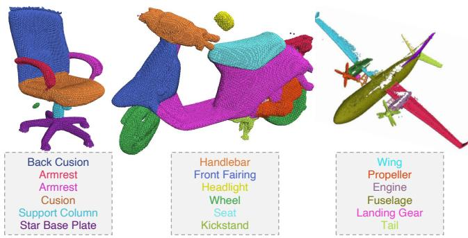  
Fig. 10. Results on real-world scans with noise and partial structure. Despite missing surfaces and capture artifacts, PartLLM still produces usable semantic part decompositions.

4.6.1 Method Ablations. Table 9 evaluates the main design choices of PartLLM. The last two columns further report full-shape mask mIoU on PartObjaverse-Tiny and text-guided mIoU on PartNet-E. We test the decomposition-aware decoder by replacing it with an independent binary mask predictor and removing softmax competition among the part and background queries. This variant examines whether decomposition-aware point assignment provides benefits beyond SAM-style per-query mask prediction. As shown in the table, while this modification causes only marginal performance drops on text-guided and interactive segmentation, it substantially reduces full-shape mask mIoU and SA-mIoU. The result suggests that independent binary decoding can still handle a small number of prompted targets, but it is less suitable for complete shape decomposition, where all generated parts must compete for points under a globally consistent assignment. Fig. 11 further illustrates this efect qualitatively: independent decoding tends to produce ambiguous boundaries near adjacent parts, whereas the decomposition-aware decoder separates parts with sharper boundaries.

We next ablate the information encoded in each part hypothesis. As shown in the table, removing the coarse 3D location leads to the largest degradation in most settings, indicating that semantic labels alone are insuficient for localizing parts within complex shapes. Furthermore, removing the semantic label also consistently harms all evaluable metrics, especially text-guided segmentation, because the model no longer receives direct supervision to align part names with their corresponding geometry. This degradation is naturally less pronounced in interactive segmentation, where the input click intrinsically serves as a strong spatial anchor. Overall, these results indicate that PartLLM benefits from generating part hypotheses that are both semantically grounded and spatially localized, and from resolving them through a decomposition-aware decoder.

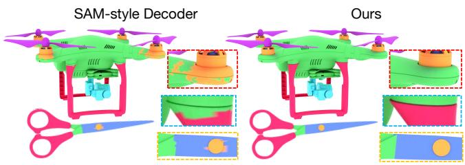  
Fig. 11. Qualitative ablation of the decoding strategy. Compared with the SAM-style decoder that predicts masks independently, our decoder produces cleaner mutually exclusive regions with sharper boundaries.

4.6.2 Robustness to Rotation. To evaluate sensitivity to object orientation, we apply random rotations around all three axes at test time and compare performance under random rotations with that under the canonical orientation. As shown in Table 10, random rotations result in negligible performance degradation in both settings. PartLLM also maintains clear margins over PartSAM after rotation, indicating that its performance is not tied to a canonical object orientation.

4.6.3 Robustness to Probabilistic Sampling. PartLLM uses probabilistic autoregressive sampling, so diferent random seeds may produce diferent part-hypothesis sequences. In the main experiments, we use fixed sampling parameters and a fixed random seed for all reported comparisons. To assess sensitivity to the sampling seed, we repeat full-shape inference on PartObjaverse-Tiny using ten random seeds. PartLLM obtains 78.5±2.2 mIoU (mean ± standard deviation), close to the reported result, indicating stable performance across random seeds.

4.6.4 Robustness to Prompt Variations. We first examine whether text-guided segmentation requires the complete set of part names as input. Table 11 compares the standard all-part setting with a single-part setting in which only one target name is queried. Performance remains comparable across all benchmarks, showing that PartLLM can segment individual queried parts without requiring the full part vocabulary. We further test prompt paraphrases for full shape segmentation on PartObjaverse-Tiny. Replacing “main parts” with “coarse structures” and “detailed parts” with “fine-grained components” yields 76.2 mIoU, compared with 78.8 using the default templates. This small diference indicates that the prompt templates are default formulations rather than strict input formats. Overall, these results demonstrate that PartLLM is robust to prompt variations and does not rely on a specific prompt formulation.

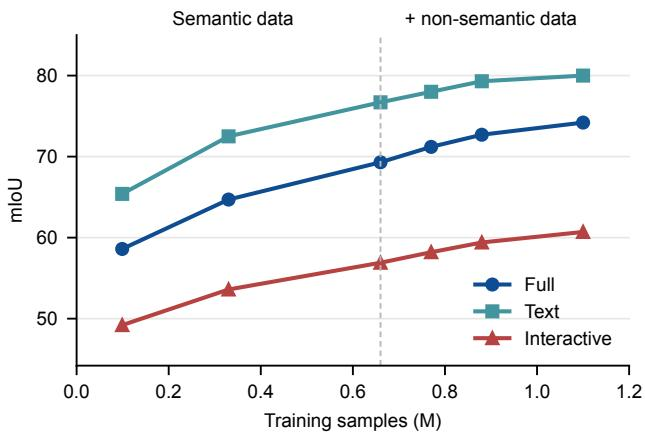  
Fig. 12. Scaling curve on the fine-grained split of 3DCoMPaT200.

4.6.5 Data Composition Ablations. Table 12 studies the efect of multi-task data integration in our unified part segmentation framework. Under the same architecture and training objective, we progressively add training data from the four supervision sources. This ablation evaluates whether each data source only benefits its matched setting or transfers to other part segmentation tasks.

Starting from full-shape segmentation data, we sequentially add text-guided data, interactive data, and category-agnostic geometry data. As shown in the table, adding text-guided data not only enables text-guided evaluation but also improves full-shape mask mIoU from 56.2 to 62.7 and SA-mIoU from 48.3 to 58.5, indicating that explicit part-name supervision promotes more semantically meaningful decompositions. Adding interactive data further improves both text-guided and full-shape segmentation. This suggests that point-conditioned supervision strengthens part localization and transfers to non-interactive settings. Finally, adding category agnostic training data improves all metrics, with especially large gains on full-shape segmentation and interactive segmentation. Al though these data do not provide semantic part names, they supply additional geometric decomposition supervision, improving the model’s boundary and shape priors. These trends support the motivation of our unified formulation: heterogeneous task data can reinforce a shared representation of 3D parts rather than merely improving performance on their corresponding tasks.

4.6.6 Scaling Analysis. Fig. 12 evaluates how PartLLM scales with the volume of unified training data. The scaling curve shows consistent gains across all three evaluation settings. Notably, scaling up solely the semantic part data yields steady improvements across all tasks, indicating that our unified formulation efectively capitalizes on both task diversity and expanded semantic supervision. Furthermore, holding the semantic data constant and introducing category-agnostic part decomposition data [Hunyuan3D et al. 2026] yields further performance boosts across the board. These gains are particularly pronounced in full-shape and interactive segmentation, where the influx of geometric decomposition examples directly refines boundary delineation and part-extent localization. Interestingly, text-guided segmentation also exhibits marginal improvements, suggesting that enhanced geometric part priors positively transfer to semantic understanding, even in the absence of explicit semantic labels in the added data. This result supports our data scaling argument: heterogeneous part data can be absorbed by the same formulation and converted into broadly useful 3D part understanding.

4.6.7 Eficiency Analysis. We report the running time comparison in Table 13. All runtime measurements in Table 13 are obtained on a single NVIDIA H20 GPU. While PartLLM relies on an autoregressive generation paradigm, modern LLM inference is highly optimized and benefits from inference acceleration frameworks [Kwon et al. 2023]. In practice, for typical 3D objects with a moderate number of semantic parts, PartLLM achieves inference eficiency competitive with or even superior to that of prior baselines, while attaining substantially higher full-shape segmentation accuracy. Although generation latency naturally scales with the requested part count, our framework maintains a favorable trade-of between computational eficiency and semantic segmentation quality.

## 4.7 Application

PartLLM exposes its unified 3D part understanding through a semantic decomposition interface, enabling practical use beyond standard benchmark settings. PartLLM generalizes to real-world scans, as demonstrated in Sec. 4.5, and supports part-aware editing, where the predicted masks serve as controllable handles for modifying 3D assets. Fig. 13 shows two editing workflows enabled by this interface. A target part can be localized either from an interactive click or from a semantic text query, after which the predicted mask is reused as a controllable editing region. This makes the output immediately actionable: the same part handle can support material replacement as well as structural edits that modify the part geometry.

## 4.8 Limitations and Future Work

As shown in Fig. 14, a representative failure mode arises when the object category is ambiguous from geometry alone. In such cases, PartLLM may produce a decomposition that is internally coherent but organized under the wrong semantic prior. For instance, misclassifying a router as a bed causes the model to hallucinate bedassociated sub-structures over the router’s topology. Providing the object category as an additional prompt cue can disambiguate the

Table 10. Robustness to random 3D rotations. We report full-shape mIoU on PartObjaverse-Tiny and one-click mIoU on HY3D-Bench.
<table><tr><td>Task</td><td>Setting</td><td>PartSAM</td><td>Ours</td></tr><tr><td rowspan="2">Full</td><td>Canonical</td><td>69.5</td><td>78.8</td></tr><tr><td>Rotated</td><td>67.9</td><td>78.3</td></tr><tr><td rowspan="2">Interactive</td><td>Canonical</td><td>34.6</td><td>51.2</td></tr><tr><td>Rotated</td><td>35.3</td><td>50.7</td></tr></table>

Table 11. Text-guided mIoU with all-part and single-part queries.
<table><tr><td>Dataset</td><td>All-part S</td><td>Single-part</td></tr><tr><td>PartNet-E</td><td>50.1</td><td>53.3</td></tr><tr><td>PartNeXt</td><td>78.7</td><td>77.0</td></tr><tr><td>3DCoMPaT200-Coarse</td><td>86.1</td><td>87.4</td></tr><tr><td>3DCoMPaT200-Fine</td><td>80.0</td><td>78.2</td></tr></table>

Table 12. Ablation study on training data on 3DCoMPaT200-Fine.
<table><tr><td colspan="2">Training data</td><td colspan="4">Evaluation</td></tr><tr><td colspan="6">Full Text Interactive Geometry Full Semantic Text Interactive</td></tr><tr><td>√</td><td></td><td>56.2</td><td>48.3</td><td></td><td></td></tr><tr><td>√</td><td></td><td>62.7</td><td>58.5</td><td>72.0</td><td></td></tr><tr><td>√ √</td><td>√</td><td>67.2</td><td>61.8</td><td>77.5</td><td>56.5</td></tr><tr><td>√ √</td><td>√</td><td>√</td><td>74.2 63.1</td><td>80.0</td><td>60.7</td></tr></table>

Table 13. Runtime comparison on the full-shape segmentation task on 3DCoMPaT200-Fine. � denotes the number of parts.
<table><tr><td rowspan="2">Method</td><td colspan="2">Runtime (s)</td><td rowspan="2">mIoU</td></tr><tr><td>P=5 P=10 P=20 P=30</td><td></td></tr><tr><td>PartField [Liu et al. 2025] PartSAM [Zhu et al. 2026]</td><td colspan="2">~10 ~12</td><td>35.0 42.2</td></tr><tr><td>P3-SAM [Ma et al. 2025] Ours 4.8</td><td colspan="2">~10 7.1 11.7 16.3</td><td>40.3</td></tr></table>

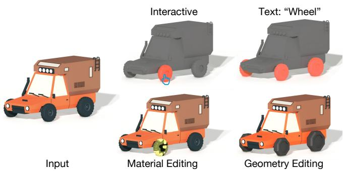  
Fig. 13. Editing applications enabled by PartLLM. A target part can be selected either interactively or through a semantic text query such as Wheel, and the resulting mask can serve as a direct handle for downstream material and geometry editing.

prediction and recover the correct part decomposition, including the router body and antennas. This suggests that stronger object level context is important for precise semantic part understanding. Future work will explore integrating additional modalities, such as rendered images or multi-view visual features, to provide stronger category evidence. Furthermore, incorporating chain-of-thought (CoT) reasoning could stabilize high-level semantic decisions prior to executing dense mask predictions.

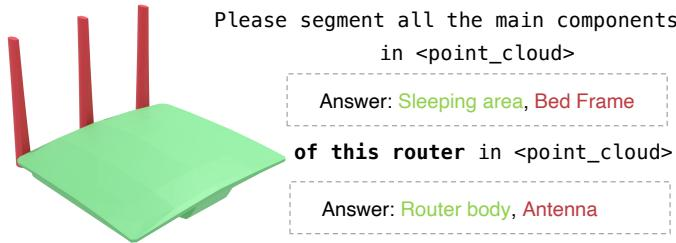  
Fig. 14. Representative failure case of category confusion. When the objectlevel prior is incorrect, PartLLM may produce a semantically coherent but wrong decomposition. Adding the object category to the prompt can correct the prediction.

## 5 Conclusion

We presented PartLLM, a unified framework that reformulates 3D part segmentation as autoregressive semantic decomposition and realizes this formulation through a multimodal large language model. By using language as the interface for part decomposition and mask prediction, PartLLM supports open-vocabulary and granularitycontrollable part understanding within a single generate-and-ground pipeline. Experiments show that this formulation does more than integrate heterogeneous supervision: it turns task and data diversity into a new scaling axis for 3D part understanding, consistently outperforming strong task-specific baselines as training data expands. More broadly, our results suggest a path beyond task-specific 3D segmentation models toward a foundation model paradigm for partlevel understanding, where parts serve as a general semantic and operational interface for open-world 3D assets.

## Acknowledgments

This work was supported by the National Natural Science Foundation of China (No. T2322012, No. 62572240, No. 62172218). It was also supported by the Macao Science and Technology Development Fund (FDCT) (0119/2025/ITP2).

## References

Ahmed Abdelreheem, Ivan Skorokhodov, Maks Ovsjanikov, and Peter Wonka. 2023. Satr: Zero-shot semantic segmentation of 3d shapes. In Proceedings ofthe IEEE/CVF International Conference on Computer Vision. 15166–15179.

Mahmoud Ahmed, Xiang Li, Arpit Prajapati, and Mohamed Elhoseiny. 2024. 3DCoM-PaT200: Language Grounded Large-Scale 3D Vision Dataset for Compositional Recognition. In The Thirty-eight Conference on Neural Information Processing Systems Datasets and Benchmarks Track. https://openreview.net/forum?id=L4yLhMjCOR

Jinze Bai, Shuai Bai, Shusheng Yang, Shijie Wang, Sinan Tan, Peng Wang, Junyang Lin, Chang Zhou, and Jingren Zhou. 2023. Qwen-VL: A Versatile Vision-Language Model for Understanding, Localization, Text Reading, and Beyond. arXiv preprint arXiv:2308.12966 (2023).

Shuai Bai, Yuxuan Cai, Ruizhe Chen, Keqin Chen, Xionghui Chen, Zesen Cheng, Lianghao Deng, Wei Ding, Chang Gao, Chunjiang Ge, et al. 2025. Qwen3-vl technical report. arXiv preprint arXiv:2511.21631 (2025).

Keqin Chen, Zhao Zhang, Weili Zeng, Richong Zhang, Feng Zhu, and Rui Zhao. 2023. Shikra: Unleashing multimodal llm’s referential dialogue magic. arXiv preprint arXiv:2306.15195 (2023).

Sijin Chen, Xin Chen, Chi Zhang, Mingsheng Li, Gang Yu, Hao Fei, Hongyuan Zhu, Jiayuan Fan, and Tao Chen. 2024. Ll3da: Visual interactive instruction tuning for omni-3d understanding reasoning and planning. In Proceedings of the IEEE/CVF Conference on Computer Vision and Pattern Recognition. 26428–26438.

Jang Hyun Cho, Boris Ivanovic, Yulong Cao, Edward Schmerling, Yue Wang, Xinshuo Weng, Boyi Li, Yurong You, Philipp Krähenbühl, Yan Wang, et al. 2025. Languageimage models with 3d understanding. In International Conference on Learning Representations, Vol. 2025. 36643–36674.

Lihe Ding, Shaocong Dong, Yaokun Li, Chenjian Gao, Xiao Chen, Rui Han, Yihao Kuang, Hong Zhang, Bo Huang, Zhanpeng Huang, Zibin Wang, Dan Xu, and Tianfan Xue. 2026. FullPart: Generating each 3D Part at Full Resolution. In The Fourteenth International Conference on Learning Representations. https://openreview.net/forum? id=QlRlE7a1p4

Marco Garosi, Riccardo Tedoldi, Davide Boscaini, Massimiliano Mancini, Nicu Sebe, and Fabio Poiesi. 2025. 3d part segmentation via geometric aggregation of 2d visual features. In 2025 IEEE/CVF Winter Conference on Applications of Computer Vision. 3257–3267.

Souhail Hadgi, Bingchen Gong, Ramana Sundararaman, Emery Pierson, Lei Li, Peter Wonka, and Maks Ovsjanikov. 2026. PatchAlign3D: Local Feature Alignment for Dense 3D Shape understanding. arXiv preprint arXiv:2601.02457 (2026).

Yining Hong, Haoyu Zhen, Peihao Chen, Shuhong Zheng, Yilun Du, Zhenfang Chen, and Chuang Gan. 2023. 3d-llm: Injecting the 3d world into large language models. Advances in Neural Information Processing Systems 36 (2023), 20482–20494.

Haifeng Huang, Yilun Chen, Zehan Wang, Rongjie Huang, Runsen Xu, Tai Wang, Luping Liu, Xize Cheng, Yang Zhao, Jiangmiao Pang, et al. 2023. Chat-scene: Bridging 3d scene and large language models with object identifiers. arXiv preprint arXiv:2312.08168 (2023).

Team Hunyuan3D, Bowen Zhang, Chunchao Guo, Dongyuan Guo, Haolin Liu, Hongyu Yan, Huiwen Shi, Jiaao Yu, Jiachen Xu, Jingwei Huang, et al. 2026. HY3D-Bench: Generation of 3D Assets. arXiv preprint arXiv:2602.03907 (2026).

Aaron Hurst, Adam Lerer, Adam P Goucher, Adam Perelman, Aditya Ramesh, Aidan Clark, AJ Ostrow, Akila Welihinda, Alan Hayes, Alec Radford, et al. 2024. Gpt-4o system card. arXiv preprint arXiv:2410.21276 (2024).

Qing Jiang, Junan Huo, Xingyu Chen, Yuda Xiong, Zhaoyang Zeng, Yihao Chen, Tianhe Ren, Junzhi Yu, and Lei Zhang. 2025. Detect Anything via Next Point Prediction. arXiv:2510.12798 [cs.CV] https://arxiv.org/abs/2510.12798

Li Jin, Weikai Chen, Yujie Wang, Yingda Yin, Zeyu Hu, Runze Zhang, Keyang Luo, Shengju Qian, Xin Wang, and Xueying Qin. 2026. CoSMo3D: Open-World Promptable 3D Semantic Part Segmentation through LLM-Guided Canonical Spatial Mod eling. arXiv preprint arXiv:2603.01205 (2026).

Alexander Kirillov, Eric Mintun, Nikhila Ravi, Hanzi Mao, Chloe Rolland, Laura Gustafson, Tete Xiao, Spencer Whitehead, Alexander C Berg, Wan-Yen Lo, et al. 2023. Segment anything. In Proceedings ofthe IEEE/CVF International Conference on Computer Vision. 4015–4026.

Woosuk Kwon, Zhuohan Li, Siyuan Zhuang, Ying Sheng, Lianmin Zheng, Cody Hao Yu, Joseph E. Gonzalez, Hao Zhang, and Ion Stoica. 2023. Eficient Memory Management for Large Language Model Serving with PagedAttention. In Proceedings ofthe ACM SIGOPS 29th Symposium on Operating Systems Principles.

Xin Lai, Zhuotao Tian, Yukang Chen, Yanwei Li, Yuhui Yuan, Shu Liu, and Jiaya Jia. 2024. Lisa: Reasoning segmentation via large language model. In Proceedings ofthe IEEE/CVF conference on computer vision and pattern recognition. 9579–9589.

Zeqiang Lai, Yunfei Zhao, Haolin Liu, Zibo Zhao, Qingxiang Lin, Huiwen Shi, Xianghu Yang, Mingxin Yang, Shuhui Yang, Yifei Feng, et al. 2025. Hunyuan3D 2.5: Towards High-Fidelity 3D Assets Generation with Ultimate Details. arXiv preprint arXiv:2506.16504 (2025).

Itai Lang, Fei Xu, Dale Decatur, Sudarshan Babu, and Rana Hanocka. 2024. iseg: Interactive 3d segmentation via interactive attention. In SIGGRAPH Asia 2024 Conference Papers. 1–11.

Lin Li, Haoran Feng, Zehuan Huang, Haohua Chen, Wenbo Nie, Shaohua Hou, Keqing Fan, Pan Hu, Sheng Wang, Buyu Li, and Lu Sheng. 2026. SegviGen: Repurposing 3D Generative Model for Part Segmentation. ACM Trans. Graph. 45, 4, Article 68 (July 2026), 12 pages. doi:10.1145/3811399

Liunian Harold Li, Pengchuan Zhang, Haotian Zhang, Jianwei Yang, Chunyuan Li, Yiwu Zhong, Lijuan Wang, Lu Yuan, Lei Zhang, Jenq-Neng Hwang, et al. 2022. Grounded language-image pre-training. In Proceedings ofthe IEEE/CVF Conference on Computer Vision and Pattern Recognition. 10965–10975.

Jian Liu, Chunshi Wang, Song Guo, Haohan Weng, Zhen Zhou, Zhiqi Li, Jiaao Yu, Yiling Zhu, Jing Xu, Biwen Lei, Zhuo Chen, and Chunchao Guo. 2026. QuadGPT: Native Quadrilateral Mesh Generation with Autoregressive Models. In The Fourteenth International Conference on Learning Representations. https://openreview.net/forum? id=oRmo4p1KEE

Liu Liu, Wenqiang Xu, Haoyuan Fu, Sucheng Qian, Qiaojun Yu, Yang Han, and Cewu Lu. 2022. Akb-48: A real-world articulated object knowledge base. In Proceedings of the IEEE/CVF Conference on Computer Vision and Pattern Recognition. 14789–14798.

Minghua Liu, Mikaela Angelina Uy, Donglai Xiang, Hao Su, Sanja Fidler, Nicholas Sharp, and Jun Gao. 2025. PartField: Learning 3D Feature Fields for Part Segmentation and Beyond. In Proceedings of the IEEE/CVF International Conference on Computer Vision. 9704–9715.

Minghua Liu, Yinhao Zhu, Hong Cai, Shizhong Han, Zhan Ling, Fatih Porikli, and Hao Su. 2023. Partslip: Low-shot part segmentation for 3d point clouds via pretrained image-language models. In Proceedings ofthe IEEE/CVF Conference on Computer Vision and Pattern Recognition. 21736–21746.

Changfeng Ma, Yang Li, Xinhao Yan, Jiachen Xu, Yunhan Yang, Chunshi Wang, Zibo Zhao, Yanwen Guo, Zhuo Chen, and Chunchao Guo. 2025. P3-sam: Native 3d part

segmentation. arXiv preprint arXiv:2509.06784 (2025).

Ziqi Ma, Yisong Yue, and Georgia Gkioxari. 2024. Find any part in 3d. arXiv preprint arXiv:2411.13550 (2024).

Yongsen Mao, Junhao Zhong, Chuan Fang, Jia Zheng, Rui Tang, Hao Zhu, Ping Tan, and Zihan Zhou. 2026. Spatiallm: Training large language models for structured indoor modeling. Advances in Neural Information Processing Systems 38 (2026), 45165–45195.

Kaichun Mo, Shilin Zhu, Angel X Chang, Li Yi, Subarna Tripathi, Leonidas J Guibas, and Hao Su. 2019. Partnet: A large-scale benchmark for fine-grained and hierarchical part-level 3d object understanding. In Proceedings ofthe IEEE/CVF Conference on Computer Vision and Pattern Recognition. 909–918.

Maxime Oquab, Timothée Darcet, Théo Moutakanni, Huy V. Vo, Marc Szafraniec, Vasil Khalidov, Pierre Fernandez, Daniel HAZIZA, Francisco Massa, Alaaeldin El-Nouby, Mido Assran, Nicolas Ballas, Wojciech Galuba, Russell Howes, Po-Yao Huang, Shang Wen Li, Ishan Misra, Michael Rabbat, Vasu Sharma, Gabriel Synnaeve, Hu Xu, Herve Jegou, Julien Mairal, Patrick Labatut, Armand Joulin, and Piotr Bojanowski. 2024. DINOv2: Learning Robust Visual Features without Supervision. Transactions on Machine Learning Research (2024). https://openreview.net/forum?id=a68SUt6zFt Featured Certification.

Zhiliang Peng, Wenhui Wang, Li Dong, Yaru Hao, Shaohan Huang, Shuming Ma, Qixiang Ye, and Furu Wei. 2024. Grounding multimodal large language models to the world. In International Conference on Learning Representations, Vol. 2024. 51575–51598.

Charles Ruizhongtai Qi, Li Yi, Hao Su, and Leonidas J Guibas. 2017. Pointnet++: Deep hierarchical feature learning on point sets in a metric space. Advances in Neural Information Processing Systems 30 (2017).

Alec Radford, Jong Wook Kim, Chris Hallacy, Aditya Ramesh, Gabriel Goh, Sandhini Agarwal, Girish Sastry, Amanda Askell, Pamela Mishkin, Jack Clark, et al. 2021. Learning transferable visual models from natural language supervision. In International Conference on Machine Learning. 8748–8763.

Hanoona Rasheed, Muhammad Maaz, Sahal Shaji, Abdelrahman Shaker, Salman Khan, Hisham Cholakkal, Rao M Anwer, Eric Xing, Ming-Hsuan Yang, and Fahad S Khan. 2024. Glamm: Pixel grounding large multimodal model. In Proceedings of the IEEE/CVF Conference on Computer Vision and Pattern Recognition. 13009–13018.

Zhongwei Ren, Zhicheng Huang, Yunchao Wei, Yao Zhao, Dongmei Fu, Jiashi Feng, and Xiaojie Jin. 2024. Pixellm: Pixel reasoning with large multimodal model. In Proceedings of the IEEE/CVF Conference on Computer Vision and Pattern Recognition. 26374–26383.

Han Su, Tianyu Huang, Zichen Wan, Xiaohe Wu, and Wangmeng Zuo. 2025. S2AM3D: Scale-controllable Part Segmentation of 3D Point Cloud. arXiv preprint arXiv:2512.00995 (2025).

George Tang, William Zhao, Logan Ford, David Benhaim, and Paul Zhang. 2024. Segment any mesh. arXiv preprint arXiv:2408.13679 (2024).

Hugues Thomas, Charles R Qi, Jean-Emmanuel Deschaud, Beatriz Marcotegui, François Goulette, and Leonidas J Guibas. 2019. Kpconv: Flexible and deformable convolution for point clouds. In Proceedings ofthe IEEE/CVFInternational Conference on Computer Vision. 6411–6420.

Chunshi Wang, Junliang Ye, Yunhan Yang, YANG LI, Zizhuo Lin, Jun Zhu, Zhuo Chen, Yawei Luo, and Chunchao Guo. 2026b. Part-X-MLLM: Part-aware 3D Multimodal Large Language Model. In The Fourteenth International Conference on Learning Representations. https://openreview.net/forum?id=WfiETiSeU

Penghao Wang, Yiyang He, Xin Lv, Yukai Zhou, Lan Xu, Jingyi Yu, and Jiayuan Gu. 2026a. PartNeXt: A Next-Generation Dataset for Fine-Grained and Hierarchical 3D Part Understanding. In The Thirty-ninth Annual Conference on Neural Information Processing Systems Datasets and Benchmarks Track. https://openreview.net/forum? id=J0PmRFMZXm

Yue Wang, Yongbin Sun, Ziwei Liu, Sanjay E. Sarma, Michael M. Bronstein, and Justin M. Solomon. 2019. Dynamic Graph CNN for Learning on Point Clouds. ACM Trans. Graph. 38, 5, Article 146 (Oct. 2019), 12 pages. doi:10.1145/3326362

Xiaoyang Wu, Li Jiang, Peng-Shuai Wang, Zhijian Liu, Xihui Liu, Yu Qiao, Wanli Ouyang, Tong He, and Hengshuang Zhao. 2024. Point transformer v3: Simpler faster stronger. In Proceedings ofthe IEEE/CVF conference on computer vision and pattern recognition. 4840–4851.

Jianfeng Xiang, Xiaoxue Chen, Sicheng Xu, Ruicheng Wang, Zelong Lv, Yu Deng, Hongyuan Zhu, Yue Dong, Hao Zhao, Nicholas Jing Yuan, et al. 2025. Native and compact structured latents for 3d generation. arXiv preprint arXiv:2512.14692 (2025).

Yuheng Xue, Nenglun Chen,Jun Liu, and Wenyun Sun. 2025. Zerops: High-quality crossmodal knowledge transfer for zero-shot 3d part segmentation. In 2025 International Conference on 3D Vision. 1328–1339.

Yunhan Yang, Yukun Huang, Yuan-Chen Guo, Liangjun Lu, Xiaoyang Wu, Edmund Y Lam, Yan-Pei Cao, and Xihui Liu. 2024. Sampart3d: Segment any part in 3d objects. arXiv preprint arXiv:2411.07184 (2024).

Li Yi, Vladimir G. Kim, Duygu Ceylan, I-Chao Shen, Mengyan Yan, Hao Su, Cewu Lu, Qixing Huang, Alla Shefer, and Leonidas Guibas. 2016. A scalable active framework for region annotation in 3D shape collections. ACM Trans. Graph. 35, 6, Article 210 (Dec. 2016), 12 pages. doi:10.1145/2980179.2980238

Haoxuan You, Haotian Zhang, Zhe Gan, Xianzhi Du, Bowen Zhang, Zirui Wang, Liangliang Cao, Shih-Fu Chang, and Yinfei Yang. 2024. Ferret: Refer and ground anything anywhere at any granularity. In International Conference on Learning Representations, Vol. 2024. 57153–57180.

Yujia Zhang, Xiaoyang Wu, Yunhan Yang, Xianzhe Fan, Han Li, Yuechen Zhang, Zehao Huang, Naiyan Wang, and Hengshuang Zhao. 2026. Utonia: Toward One Encoder for All Point Clouds. arXiv preprint arXiv:2603.03283 (2026).

Hengshuang Zhao, Li Jiang, Jiaya Jia, Philip HS Torr, and Vladlen Koltun. 2021. Point transformer. In Proceedings ofthe IEEE/CVF International Conference on Compute Vision. 16259–16268.

Ruowen Zhao, Junliang Ye, Zhengyi Wang, Guangce Liu, Yiwen Chen, Yikai Wang, and Jun Zhu. 2025. Deepmesh: Auto-regressive artist-mesh creation with reinforcement learning. In Proceedings ofthe IEEE/CVF International Conference on Computer Vision. 10612–10623.

Ziming Zhong, Yanyu Xu, Jing Li, Jiale Xu, Zhengxin Li, Chaohui Yu, and Shenghua Gao. 2024. Meshsegmenter: Zero-shot mesh semantic segmentation via texture synthesis. In European Conference on Computer Vision. 182–199.

Yuchen Zhou,Jiayuan Gu, Tung Yen Chiang, Fanbo Xiang, and Hao Su. 2025. Point-SAM: Promptable 3D Segmentation Model for Point Clouds. In The Thirteenth International Conference on Learning Representations.

Yuchen Zhou, Jiayuan Gu, Xuanlin Li, Minghua Liu, Yunhao Fang, and Hao Su. 2023. Partslip++: Enhancing low-shot 3d part segmentation via multi-view instance segmentation and maximum likelihood estimation. arXiv preprint arXiv:2312.03015 (2023).

Chenming Zhu, Tai Wang, Wenwei Zhang, Jiangmiao Pang, and Xihui Liu. 2025. Llava 3d: A simple yet efective pathway to empowering lmms with 3d capabilities. In Proceedings ofthe IEEE/CVFInternational Conference on Computer Vision. 4295–4305.

Xiangyang Zhu, Renrui Zhang, Bowei He, Ziyu Guo, Ziyao Zeng, Zipeng Qin, Shanghang Zhang, and Peng Gao. 2023. Pointclip v2: Prompting clip and gpt for powerful 3d open-world learning. In Proceedings ofthe IEEE/CVF International Conference on Computer Vision. 2639–2650.

Zhe Zhu, Le Wan, Rui Xu, Yiheng Zhang, Honghua Chen, Zhiyang Dou, Cheng Lin, Yuan Liu, and Mingqiang Wei. 2026. PartSAM: A Scalable Promptable Part Segmentation Model Trained on Native 3D Data. In The Fourteenth International Conference on Learning Representations. https://openreview.net/forum?id=y8sZUQPYXC