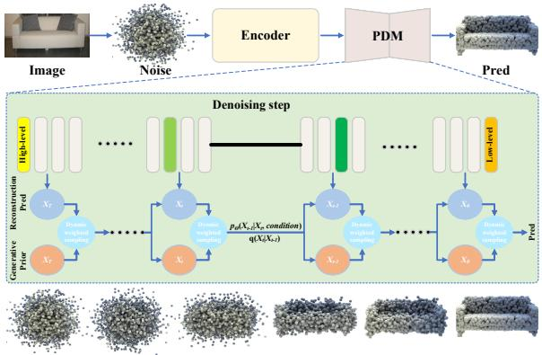
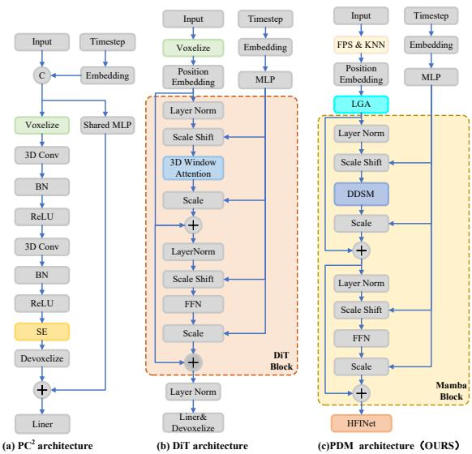
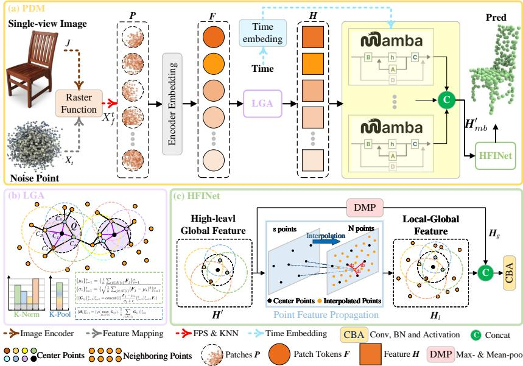
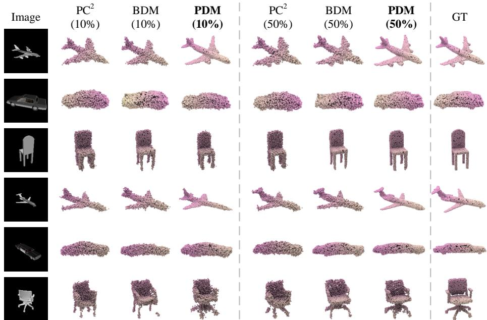
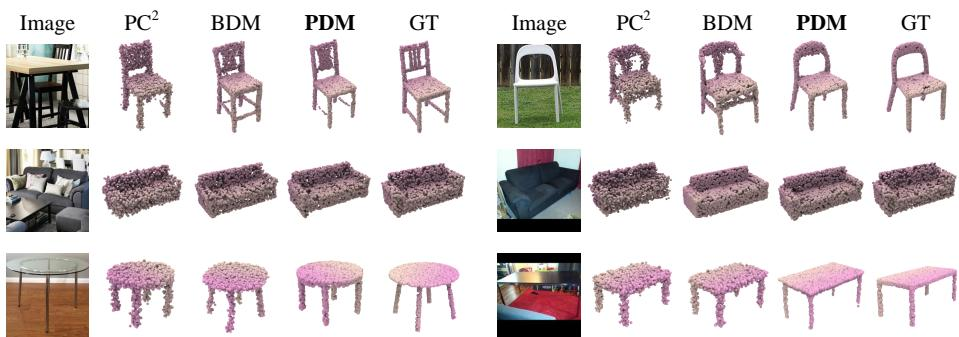

# Point Difusion Mamba: Unified Difusion-State-Space Modeling for Single-View 3D Reconstruction under Data Scarcity

Wei Zhou1† , Xinzhe Shi1† , Xingxing Hao1 , Xing Hao1∗ , Kang Li1∗ , Jinye Peng1, and Ying He2

1 Northwest University, Xi’an, China zhouwei@nwu.edu.cn, xinzheshi1@gmail.com {xingxing.hao, xhao, likang, pjy}@nwu.edu.cn, 2 Nanyang Technological University, Singapore yhe@ntu.edu.sg

Abstract. While single-view 3D reconstruction has seen significant progress, extrapolating complex 3D structures from inherently ambiguous 2D observations remains fundamentally ill-posed, particularly in the critically underexplored data-scarce regime. To address this challenge, we propose Point Difusion Mamba (PDM), a method that integrates the generative power of difusion models with the eficiency of state-space model for single-view 3D reconstruction under data-scarce conditions. Specifically, PDM employs a lightweight reconstruction module tailored to handle unordered point-cloud inputs efectively. By combining a Local Geometric Aggregation module with Mamba blocks, our approach jointly models global geometric structures and local details. In 3D reconstruction, each point in the initial noisy input requires a precise prediction, yet the high-level features extracted by the Mamba module capture only abstract semantic information from sparse points. To bridge this gap, we introduce the Hierarchical Feature Integration Network, which fuses high-level semantic and local geometric features for each point, overcoming the limitations of token-based point-cloud reconstruction. Furthermore, we propose a Dynamic Weighted Sampling strategy that adaptively unifies 3D generation with single-view reconstruction by leveraging generative priors to enhance reconstruction quality. Experimental results on the ShapeNet and Pix3D benchmarks demonstrate that PDM outperforms state-of-the-art methods, providing an efective solution for 3D reconstruction under data-scarce settings. Code is available at: https://github.com/NWUzhouwei/PDM.

Keywords: Limited-Data Regime · Geometric Processing

## 1 Introduction

Difusion-based generative models have recently emerged as a powerful paradigm for 3D modeling, achieving remarkable success in generating detailed and coherent shapes through progressive denoising. These models exhibit unique advantages in challenging tasks such as single-view 3D completion and fine-grained detail reconstruction [5, 42]. For example, $\mathrm { P C ^ { 2 } }$ [24] introduces point cloud projection conditioning that maps encoded 2D features back to 3D space during the denoising process, significantly improving single-view reconstruction quality.

  
Fig. 1: Schematic Illustration of Our PDM. PDM reconstructs original point clouds from noisy inputs. An Encoder extracts image-conditioned features from a single-view image. At each Denoising step, a Dynamic Weighted Sampling (DWS) strategy fuses two representations: the reconstruction prediction and generative prior. Guided by these projected features and DWS, the network learns richer hierarchical geometric priors to progressively generate the final prediction.

Despite these advances, current difusion-based 3D reconstruction methods still face three key challenges. As shown in Fig. 2, MLP-based architectures [22, 29] struggle to model complex geometric structures, while 3D convolutional architectures [24, 36, 47] demand substantial memory due to their computational complexity $O ( n ^ { 3 } )$ and fail to capture global contextual features. Meanwhile, although Transformer-based architectures [26, 27] demonstrate promising shape generation capabilities, their attention mechanisms’ $O ( n ^ { 2 } )$ complexity results in prohibitive memory requirements when processing long sequences.

In 2D high-resolution image generation, state-space models (SSMs) have achieved breakthroughs by reducing computational complexity to a linear scale compared to the quadratic cost of Transformers [15, 20, 31, 40]. However, applying SSMs to 3D reconstruction faces these challenges: the unordered nature of point clouds complicates spatial correlations, and SSMs struggle to capture local geometric details. Moreover, while Mamba modules extract high-level semantic features from sparse points, 3D reconstruction demands precise per-point predictions from noisy inputs.

Our proposed framework addresses these limitations through the synergistic integration of difusion models with state-space model. As depicted in Fig. 1 and Fig. 3, the architecture consists of three functionally complementary components: A lightweight reconstruction module employing Local Geometric Aggregation (LGA) for detail preservation and Mamba blocks for global structure modeling; a Hierarchical Feature Integration Network (HFINet) that enables precise per-point reconstruction by propagating and fusing high-level semantic features; and a Dynamic Weighted Sampling (DWS) strategy that strategically combines generative priors with reconstruction predictions to enhance performance in data-constrained scenarios.

  
Fig. 2: Diferent Architectures. (a) The $\mathrm { P C ^ { 2 } }$ architecture firstly voxelizes the point cloud, then extracts features using 3D convolution, and finally decodes using the channel attention mechanism SE. (b) The DiT architecture also voxelizes the point cloud and organizes it into ordered tokens. It extracts features through 3D window attention and finally decodes them using a linear layer. (c) Our PDM avoids the expensive memory overhead of voxelization by directly using KNN and FPS, while feature extraction is performed using Mamba-difusion. Finally, HFINet is used for decoding.

PDM’s core contribution is a task-specific unified framework for single-view 3D reconstruction in the limited-data regime:

Lightweight Mamba-difusion integration (20.73s runtime, 0.39GB memory) outperforming SOTA (e.g., MESC-3D with 34.05s runtime, 0.86GB memory) while retaining superior geometric accuracy;

– HFINet for hierarchical feature fusion in difusion denoising that mitigates inaccurate noise prediction from high-level features alone by integrating them with per-point local features through hierarchical propagation;

– DWS with patch-based point correspondence to fuse generative/reconstruction priors, thus to substantially improve reconstruction quality, particularly under data scarcity conditions.

## 2 Related work

## 2.1 Single-view Reconstruction

Single-view 3D reconstruction aims to recover an object’s 3D structure from a single 2D image, a challenging task due to limited depth information. Traditional methods based on projection geometry often fail in complex scenes. Deep learning approaches now dominate, typically employing an encoder-decoder framework with various 3D representations, such as voxel, mesh, point cloud, or implicit functions. However, voxel-based methods sufer from exponential resolution growth [8, 34, 41], mesh-based methods struggle with complex shapes [23, 37, 44, 48], and implicit methods require extensive multi-view data [3,18,25]. In contrast, point-based methods balance memory eficiency and detail recovery [5,7,38,45]. SOTA methods like MESC-3D [17] enable point clouds to autonomously select semantic information and incorporates 3D priors through text prompts, and performs well in full-data scenarios.

## 2.2 Difusion Models

Denoising Difusion Probabilistic Models (DDPM) [14] have become a powerful generative modeling framework, excelling in tasks such as image [9], textto-image [50], video [39], and speech generation [13]. By progressively learning the data distribution, these models mitigate mode collapse and enhance generation diversity. Recently, difusion models have also been explored for single-view 3D reconstruction [16, 19, 21, 28, 49], using conditional generation to infer 3D structures from 2D images. For instance, PC2 [24] uses projection conditioning, projecting local image features onto partially denoised point clouds via rasterization at each difusion step to ensure geometric consistency. BDM [42] presents a framework coupling top-down prior difusion and bottom-up data-driven difusion. Despite these advancements, difusion models still face eficiency challenges, particularly due to the quadratic complexity of Transformer-based attention mechanisms.

## 2.3 State-Space Models

SSMs [12] ofer linear-time complexity and eficient long-sequence modeling. The S4 framework [11] combines causal convolutions with state-space operations for accurate, scalable sequence analysis, and Mamba [10] further optimizes memory and computation for superior time-series performance [1, 32, 35, 43]. These works validate Mamba’s potential in data processing but focus on discriminative analysis tasks, which are orthogonal to our goal of generative single-view 3D reconstruction in the limited-data regime. Our work adapts SSM-based architectures to generative difusion frameworks, addressing unique challenges of 2D-to-3D lifting that are irrelevant to their discriminative design goals.

## 3 Method

In this section, we introduce the PDM, whose architecture is shown in $\mathrm { F i g . 3 ( a ) }$ We firstly group a noisy point cloud into diferent clusters using a grouping module. Then, we use a pre-trained ViT-32 [6] to process the input image and project its features onto the noisy point cloud groups as image conditions. Finally, this condition gradually guides PDM to predict the ground truth point cloud from the noisy input in a point-by-point manner. All the training process and hyperparameter settings of the model are detailed in the code implementation of the supplementary materials.

## 3.1 Preliminary: State-Space Model

The State-Space Model (SSM) [12] is critical for PDM’s eficient sequential data processing. Derived from continuous systems, it maps a 1D sequence $x ( t ) \in  { \mathbb { R } }$ to output $y ( t ) \in \mathbb { R }$ via a latent state $h ( t ) \in \mathbb { R } ^ { N }$ , governed by matrices $\mathbf { A } \in \mathbb { R } ^ { N \times N }$ 2 $\mathbf { B } \in \mathbb { R } ^ { N \times 1 }$ , and $ { \mathbf { D } } \in \mathbb { R } ^ { 1 \times N }$

$$
\left\{ \begin{array} { l l } { h ^ { \prime } ( t ) = \mathbf { A } h ( t ) + \mathbf { B } x ( t ) , } \\ { y ( t ) = \mathbf { D } h ( t ) } \end{array} \right.\tag{1}
$$

For discretization, Mamba employs a transformation parameter $\varDelta$ and zeroorder hold (ZOH) to convert continuous parameters:

$$
\left\{ \begin{array} { l l } { \overline { { \mathbf { A } } } = \exp ( \varDelta \mathbf { A } ) , } \\ { \overline { { \mathbf { B } } } = ( \varDelta \mathbf { A } ) ^ { - 1 } ( \exp ( \varDelta \mathbf { A } ) - I ) \varDelta \mathbf { B } } \end{array} \right.\tag{2}
$$

The discretized state and output update at each time step is:

$$
\left\{ \begin{array} { l l } { h _ { t } = \overline { { \mathbf { A } } } h _ { t - 1 } + \overline { { \mathbf { B } } } x _ { t } , } \\ { y _ { t } = \mathbf { D } h _ { t } } \end{array} \right.\tag{3}
$$

Notably, the output can be computed via structured convolution, where the kernel \overline {\texbf {K} is derived from the state transition matrix:

$$
\left\{ \begin{array} { l l } { \mathbf { \overline { { K } } } = ( \mathbf { D \overline { { B } } } , \mathbf { D } \mathbf { \overline { { A } B } } , \dots , \mathbf { D } \mathbf { \overline { { A } } } ^ { L } \mathbf { \overline { { B } } } ) , } \\ { y = x * \mathbf { \overline { { K } } } } \end{array} \right.\tag{4}
$$

where L is the length of input $x ,$ and \* denotes convolution.

## 3.2 Preprocessing

Owing to the disorder nature of point clouds, they cannot be directly partitioned into contiguous patches like images. To address this inherent disorder, our preprocessing aims to transform unordered points into structured patches. Specifically, we firstly extract the image features using the standard ViT-32 model [6].

Then these features are projected onto the point cloud through a rasterization function $P _ { \varPhi }$ , assigning neural features $Y _ { \mathrm { p r o j } } ^ { t }$ to each point based on their spatial positions and camera viewpoints:

$$
Y _ { \mathrm { p r o j } } ^ { t } = P _ { \phi } ( J , X _ { t } ) ,\tag{5}
$$

where J denotes the input image, $X _ { t } \in \mathbb { R } ^ { N \times 3 }$ represents the noisy point cloud, N is the number of points in the noisy input. The projected features are concatenated with the coordinates of $X _ { t }$ , producing a point cloud enhanced with the features $X _ { f } ^ { t } \in \mathbb { R } ^ { N \times ( 3 + d _ { y } ) }$ , and $d _ { y }$ denotes the dimension of the feature.

Similarly to Point-BERT [46] and Point-MAE [30], we partition $X _ { f } ^ { t }$ into patches using a grouping strategy. We firstly adopt farthest point sampling (FPS) to obtain center points $\boldsymbol { C } \in \mathbb { R } ^ { s \times 3 }$ , s is the number of center points. Then we use K-nearest neighbors (KNN) to aggregate m neighboring points for each center point $C _ { i }$ , thus obtaining patches $\pmb { P } \in \mathbb { R } ^ { s \times m \times ( 3 + \breve { d } _ { y } ) }$ :

$$
\left\{ \begin{array} { l l } { C = \{ C _ { i } \} _ { i = 1 } ^ { s } = \mathrm { { F P S } } ( X _ { f } ^ { t } ) , } \\ { P = \{ P _ { i } \} _ { i = 1 } ^ { s } = \mathrm { { K N N } } ( X _ { f } ^ { t } , C ) } \end{array} \right.\tag{6}
$$

Finally, we embed the patches P in a lightweight encoder $\xi _ { \phi } ( \cdot )$ with convolutions and max pooling to obtain patch tokens $\pmb { F } \in \mathbb { R } ^ { s \times d }$ :

$$
{ \pmb F } = \{ { \pmb F } _ { i } \} _ { i = 1 } ^ { s } = \xi _ { \phi } ( { \pmb P } )\tag{7}
$$

where d is the feature dimension.

## 3.3 Point Difusion Mamba

PDM is mainly composed of three components: LGA, Mamba Block, and HFINet.

Local geometric aggregation The LGA module, as illustrated in Fig. 3(b), is proposed to address the limitation of insuficient explicit local geometric feature extraction in Mamba models through feature propagation and neighborhood feature fusion. This module enhances local feature extraction through the coordinated operation of K-Norm and K-Pool.

K-Norm is performed to establish a neighborhood graph by K-NN for each token $\mathbf { \nabla } \mathbf { F } _ { i }$ , followed by feature normalization of the neighboring points to ensure consistent feature scaling within the local neighborhood. We firstly adopt K-NN to aggregate n neighboring patch tokens on each token $\mathbf { \boldsymbol { F } } _ { i }$ , thus obtaining patches $\bar { Q } \in \bar { \mathbb { R } ^ { s \times n \times ( 3 + \bar { d } ) } }$ :

$$
Q = \{ Q _ { i } \} _ { i = 1 } ^ { s } = \operatorname { K N N } ( F , C )\tag{8}
$$

Based on $Q _ { i }$ , we calculate the mean $\mu _ { i }$ and standard deviation $\sigma _ { i }$ for each patch token $\pmb { F } _ { i }$ separately:

$$
\begin{array} { r } { \left\{ \begin{array} { l l } { \{ \mu _ { i } \} _ { i = 1 } ^ { s } = \{ \frac { 1 } { n } \sum _ { j \in \mathcal { N } ( i ) } { \cal F } _ { j } \} _ { i = 1 } ^ { s } , } \\ { \{ \sigma _ { i } \} _ { i = 1 } ^ { s } = \{ \sqrt { \frac { 1 } { n } \sum _ { j \in \mathcal { N } ( i ) } ( { \cal F } _ { j } - \mu _ { i } ) ^ { 2 } } \} _ { i = 1 } ^ { s } } \end{array} \right. } \end{array}\tag{9}
$$

  
Fig. 3: Our PDM Architecture. (a) The pipeline of our PDM. We firstly extract features from the input image and back-project them onto the point cloud. The point cloud is then divided into point patches and embedded for encoding. Local features of the point cloud are extracted through the LGA module. Next, we learn global features using the Mamba block which encodes temporal conditions through the DiT structure. Finally, we use HFINet to recover the original point cloud from the randomly perturbed point cloud. (b) LGA propagates point features to fuse the features of neighboring points. (c) Detailed structure of the HFINet, which fuse high-level features with local features through point feature propagation.

where $j$ are the neighboring indices within neighborhood $\mathcal { N } ( i )$ of $\pmb { F } _ { i }$ . Then we normalize the neighboring features and concatenate them with the patch token $\mathbf { } F _ { i } \mathbf { , }$ thus obtaining $\{ \{ G _ { i j } \} _ { j = 1 } ^ { n } \} _ { i = 1 } ^ { s } \in \mathbb { R } ^ { s \times n \times 2 d }$

$$
\{ \{ G _ { i j } \} _ { j = 1 } ^ { n } \} _ { i = 1 } ^ { s } = \{ \{ c o n c a t ( \frac { { \pmb F } _ { j } - { \mu } _ { i } } { \sigma _ { i } + \epsilon } , { \pmb F } _ { i } ) \} _ { j = 1 } ^ { n } \} _ { i = 1 } ^ { s }\tag{10}
$$

where \epsilon is an extremely small constant to prevent division by $0 .$

After K-Norm, we aggregate the neighboring features using K-Pool. Our K-Pool is a task-specific design for difusion-based reconstruction, which balances salient detail preservation and global smoothness:

$$
\pmb { H } = \{ \pmb { H } _ { i } \} _ { i = 1 } ^ { s } = \{ \varphi ( \operatorname* { m a x } _ { j \in \mathcal { N } ( i ) } \pmb { G } _ { i j } + \frac { 1 } { n } \sum _ { j \in \mathcal { N } ( i ) } \pmb { G } _ { i j } ) \} _ { i = 1 } ^ { s }\tag{11}
$$

where $\pmb { H } \in \mathbb { R } ^ { s \times d } , \varphi$ denotes a simple MLP operation. This unified aggregation captures both the significant features and the global smoothness , improving the model’s ability to represent local geometric information.

Mamba block Unlike images, point clouds exhibit disorder and irregularity, and directly modeling the sequential order may introduce unstable pseudo-sequential dependencies. We construct a dual-directional state space module (DDSM) that enhances the model’s learning ability from unordered point clouds by integrating both forward sequence modeling $\zeta$ and reverse sequence modeling $\eta \colon$

$$
\mathrm { D D S M } ( { \cal H } ) = { \cal H } + \zeta ( { \cal H } _ { c } ) + \eta ( { \cal H } _ { r } )\tag{12}
$$

where $\pmb { H } _ { c }$ is a copy of $H _ { ; }$ , and ${ \boldsymbol { { H } } } _ { r }$ is the reverse feature obtained by channel flipping. Unlike typical Mamba, our implementation is redesigned for difusion modeling: Integrates time-step embeddings to guide noise prediction across diffusion stages; Operates on FPS+KNN grouped patches to preserve local geometric correspondence; Adjusts gating mechanisms to suppress difusion stochasticity. These modifications ensure DDSM aligns with reconstruction requirements rather than discriminative feature extraction.

To introduce time conditioning to guide the Mamba module in making predictions at diferent time steps, our module dynamically adjusts the feature distribution of the difusion model by generating adaptive scaling and shifting parameters through time-conditional adaptive normalization:

$$
\begin{array} { r } { \pmb { H } _ { m b } = \pmb { H } + \alpha ( t ) \cdot \mathrm { D D S M } ( ( \pmb { H } \cdot ( 1 + \beta ( t ) ) + \gamma ( t ) ) ) } \end{array}\tag{13}
$$

where $t \in \mathbb { R } ^ { s \times d }$ is the embedding of the difusion time step, $\alpha ( t )$ is a gating mechanism that controls the extent of feature updates, $\beta ( t )$ is an adaptive scaling parameter that reflects the expansion or contraction of features, and $\gamma ( t )$ is an adaptive shifting parameter that ofsets features.

Hierarchical feature integration network The high-level features extracted by the Mamba module primarily retain abstract semantic information from sparse points, while 3D point cloud reconstruction requires precise per-point predictions from noisy inputs. As shown in Fig. $3 ( \mathrm { c } )$ , we propose the HFINet which efectively propagates global high-level features on each point through a feature propagation module, enabling accurate 3D reconstruction via hierarchical local-global feature fusion.

The Mamba block extracts multi-level features $H _ { m b } ^ { \prime } = \{ H _ { m b _ { 1 } } , H _ { m b _ { 2 } } , . . . , H _ { m b _ { M } } \}$ 2 which are concatenated to form an enhanced feature:

$$
\pmb { H } ^ { \prime } = c o n c a t \left( \psi ( \pmb { H } _ { m b _ { 1 } } ) ^ { \top } , \psi ( \pmb { H } _ { m b _ { 2 } } ) ^ { \top } , . . . , \psi ( \pmb { H } _ { m b _ { M } } ) ^ { \top } \right)\tag{14}
$$

where ψ denotes the normal layer. Then we adopt max-pooling and mean-pooling to capture global context:

$$
\mathbf { { \cal H } } _ { g } = c o n c a t \left( \mathrm { M a x P o o l } ( H ^ { \prime } ) , \mathrm { M e a n P o o l } ( H ^ { \prime } ) \right)\tag{15}
$$

Then we use the point feature propagation module $\tau$ to propagate the global feature $H ^ { \prime }$ throughout the point cloud feature $X _ { f } ^ { t }$ , thus obtaining local features $H _ { l } \colon$

$$
{ \pmb H } _ { l } = \tau ( C , { \pmb H } ^ { \prime } , X _ { t } , X _ { f } ^ { t } )\tag{16}
$$

The final noise prediction is achieved by fusing the local and global features, which can be represented as:

$$
X _ { p r e d } = \phi ( c o n c a t ( { \pmb H } _ { l } , { \pmb H } _ { g } ) )\tag{17}
$$

where $X _ { p r e d }$ denotes the final noise prediction result, and $\phi$ represents a neural network structure composed of convolutional layers and batch normalization layers and activation functions. This design efectively captures and processes features, enhancing the accuracy and performance of noise prediction.

## 3.4 Training Objectives

In this section, we follow the training strategy of $\mathrm { P C } ^ { 2 } \left[ 2 4 \right]$ and define our training objective as:

$$
\mathcal { L } = \mathbb { E } _ { t , X _ { 0 } , \epsilon } \left\| \epsilon - \epsilon _ { \theta } \left( \sqrt { \bar { \alpha } _ { t } } X _ { 0 } + \sqrt { 1 - \bar { \alpha } _ { t } } \epsilon , t \right) \right\| ^ { 2 }\tag{18}
$$

By minimizing this loss function, we can simultaneously train the PDM. Intuitively, the training process encourages the encoder to extract hierarchical geometric features from the original point cloud and motivates the difusion model to progressively restore the original point cloud based on these features.

Dynamic weighted sampling strategy To address the problem of reconstruction quality caused by a limited amount of labeled data, we propose a strategy that improves the quality of point cloud generation by guiding the reconstruction model with the generative model.

As shwon in Fig. 1, in the sampling process, instead of applying traditional selection probabilities, we dynamically adjust the fusion weights using a weighted function $\varPhi$ based on the current state of the generative and reconstruction models. This weighting function $\varPhi$ depends on the similarity of the characteristics of each point and the consistency of the output of the two models at the current time step. Specifically, given the point cloud of the generative model $\mathbf { X } _ { g }$ and the point cloud of the reconstruction model ${ \bf X } _ { r }$ , we assign a dynamic weight coeficient $w _ { j }$ to each corresponding point $\mathbf { x } _ { g , j }$ and ${ \bf x } _ { r , j } \colon$

$$
w _ { j } = \frac { 1 } { 1 + \exp ( - \delta \cdot \big \| \mathbf { x } _ { g , j } - \mathbf { x } _ { r , j } \big \| _ { 2 } ^ { 2 } ) }\tag{19}
$$

where $\delta$ is a hyperparameter that controls the sensitivity of the weight, regulating the impact of the diference between the points in the weighting coeficient, in supplementary material, we have conducted the ablation study on $\delta$ of DWS, $\mathbf { x } _ { g , j }$ and $\mathbf { x } _ { r , j }$ are the coordinates of the $j$ th point from the generative and reconstruction models.

The final fused point cloud $\hat { \mathbf X }$ can then be obtained by weighted averaging as follows:

$$
\hat { \mathbf { X } } = \{ w _ { j } \cdot \mathbf { x } _ { g , j } + ( 1 - w _ { j } ) \cdot \mathbf { x } _ { r , j } \} _ { j = 1 } ^ { N }\tag{20}
$$

  
Fig. 4: Qualitative Comparisons on The Synthetic ShapeNet Dataset. Columns 2-4 present the results with 10% of the data, while columns 5-7 display the results with 50% of the data. Column 8 provides the corresponding ground truth.

## 4 Experiments

## 4.1 Experimental setup

Experimental datasets To rigorously evaluate PDM, we replicated the experimental setup introduced in BDM [42] by evaluating on both the synthetic the synthetic ShapeNet [2] and the real-world Pix3D [33]. ShapeNet is a collection of 3D CAD models containing 3,315 categories from the WordNet database. We used a subset of three ShapeNet categories (Chair, Airplane, Car) from 3D-R2N2 [4] with image renderings, camera matrices, and training/testing splits. Likewise, to ensure a fair comparison with SOTA baselines including CCD-3DR [5], PC2 [24], BDM [42] and MESC-3D [17], we evaluated on three Pix3D classes (Chair, Table, Sofa), using their carefully annotated 2D–3D alignments. We assigned 80% of the samples for training and reserved the remaining 20% for testing. 3

Implementation details For both datasets, we sampled 4096 points for each 3D object and set the rendering resolution to 224×224. Notably, for Pix3D, the images were cropped using their bounding boxes, and the camera matrices were adjusted to accommodate the non-object-centered nature and varying image sizes. For training the generative difusion model, we used the PDM architecture, removing the image condition to train it as a generative model. Generative and reconstruction models are trained independently with no weight sharing and frozen core layers during fusion. Both the generative and reconstruction models were trained for 140,000 iterations. In our PDM framework, we performed guided point cloud fusion every 32 steps to ensure efective guidance of the generative model during the denoising process. Training of both generative and reconstruction models was conducted on a single NVIDIA GeForce RTX 3090. The train and test logs of MESC-3D and PDM, and the train curves of PDM, $\mathrm { P C ^ { 2 } }$ , BDM and MESC-3D are provided in the supplementary material.

Table 1: Performance Evaluation on ShapeNet-R2N2. This table compares our PDM with $\mathrm { P C ^ { 2 } }$ , CCD-3DR, BDM-M $\mathrm { / \ B D M { - } B + \mathrm { P C ^ { 2 } } }$ and MESC-3D, across three training data scales (10%, 50%, and 100%) using the reconstructed difusion model. Bold values indicate the best results, while underlined values indicate the second-best results.
<table><tr><td rowspan="2">method</td><td colspan="3">Chair</td><td colspan="3">Airplane</td><td colspan="3">Car</td></tr><tr><td> $\overline { { 1 0 \% } }$ </td><td> $5 0 \%$ </td><td> $\overline { { 1 0 0 \% } }$ </td><td> $\overline { { 1 0 \% } }$ </td><td>50%</td><td>100%</td><td> $\overline { { 1 0 \% } }$ </td><td>50%</td><td>100%</td></tr><tr><td rowspan="2">PC2 (CVPR 23) [24]</td><td>CD.↓ F1↑</td><td>CD↓ F1↑</td><td>CD↓ F1↑</td><td>CD↓ F1↑</td><td>CD↓ F1↑</td><td>CD↓ F1↑</td><td>CD↓ F1↑</td><td>CD↓ F1↑</td><td>CD↓ F1↑</td></tr><tr><td>97.25 0.393</td><td>73.58 0.437</td><td>65.57 0.464</td><td>88.00 0.605</td><td>76.39 0.628</td><td>65.97 0.655</td><td>64.99 0.524</td><td>62.59 0.542</td><td>64.36 0.547</td></tr><tr><td>CCD-3DR (arXiv 23) [5]</td><td>89.79 0.418</td><td>63.13 0.474</td><td>58.47 0.498</td><td>81.29 0.612</td><td>72.46 0.635</td><td>62.77 0.651</td><td>63.13 0.531</td><td>62.25 0.550</td><td>61.88 0.562</td></tr><tr><td>BDM-M (CVPR 24) [42]</td><td>94.94 0.395</td><td>71.56 0.446</td><td>64.48 0.468</td><td>87.75 0.604</td><td>73.19 0.629</td><td>65.16 0.653</td><td>63.53 0.524</td><td>60.71 0.549</td><td>64.16 0.554</td></tr><tr><td>BDM-B (CVPR 24) [42]</td><td>94.67 0.410</td><td>69.99 0.463</td><td>64.21 0.485</td><td>83.62 0.612</td><td>68.66 0.641</td><td>59.04 0.660</td><td>60.48 0.539</td><td>62.58 0.554</td><td>65.85 0.559</td></tr><tr><td>MESC-3D (CVPR 25) [17]</td><td>101.51 0.381</td><td>73.47 0.427</td><td>65.69 0.458</td><td>74.31 0.611</td><td>51.28 0.619</td><td>50.54 0.714</td><td>56.28 0.522</td><td>44.48 0.532</td><td>51.99 0.602</td></tr><tr><td>PDM</td><td>82.41 0.419</td><td>68.85 0.465</td><td>62.14 0.488</td><td>60.64 0.614</td><td>50.14 0.663</td><td>48.66 0.719</td><td>55.23 0.542</td><td>55.53 0.558</td><td>51.54 0.607</td></tr></table>

## 4.2 Quantitative Results

Our evaluation employs two principal metrics for reconstruction quality assessment: Chamfer Distance (CD) and Precision-Recall F-Score (F1@0.01).

ShapeNet To directly establish our method’s dominance in limited-data environments, we evaluate PDM against state-of-the-art architectures across three dataset scales (10%, 50%, 100%). As detailed in Table 1, PDM achieves highly compelling performance, systematically overpowering baselines as data availability decreases. In the critical 10% low-data regime, PDM’s advantages are unmistakable: for Chairs, our CD of 82.41 severely eclipses the second-best CCD-3DR (89.79) by ∼9% and decimates MESC-3D (101.51) by ∼23%, while simultaneously securing the top F1 score (0.419). This dominance extends to Airplanes (CD 60.64 vs. MESC-3D’s 74.31) and Cars (CD 55.23 vs. MESC-3D’s 56.28). Furthermore, scaling up to 50% and 100% data reveals that PDM does not merely memorize sparse datasets but actively scales, maintaining absolute superiority across all Airplane metrics and delivering the best overall performance in the Car 100% setting (CD 51.54, F1 0.607). These quantitative leaps conclusively validate that PDM provides a vastly more robust prior for single-view reconstruction, especially when data is critically scarce.

Table 2: Performance Evaluation on Pix3D. This table compares the proposed PDM with $\mathrm { P C ^ { 2 } }$ , CCD-3DR, BDM-M $\mathrm { / \ B D M { - } B \ + \ \mathrm { P C } { ^ 2 } }$ and MESC-3D, using the reconstructed difusion model and complete training data.
<table><tr><td rowspan=2 colspan=2>Method</td><td rowspan=1 colspan=1>Chair</td><td rowspan=1 colspan=1>Sofa</td><td rowspan=1 colspan=1>Table</td></tr><tr><td rowspan=1 colspan=1>CD↓ F1↑</td><td rowspan=1 colspan=1>CD↓ F1↑</td><td rowspan=1 colspan=1>CD↓ F1↑</td></tr><tr><td rowspan=4 colspan=2>PC2 (CVPR 23) [24][CCD-3DR (arXiv 23) [5]BDM-M (CVPR 24) [42]BDM-B (CVPR 24) [42]</td><td rowspan=1 colspan=1>115.94 0.443</td><td rowspan=1 colspan=1>47.170.445</td><td rowspan=1 colspan=1>202.770.397</td></tr><tr><td rowspan=1 colspan=1>111.42 0.456</td><td rowspan=1 colspan=1>44.910.450</td><td rowspan=1 colspan=1>196.280.418</td></tr><tr><td rowspan=1 colspan=1>113.400.449</td><td rowspan=1 colspan=1>44.500.451</td><td rowspan=1 colspan=1>202.080.413</td></tr><tr><td rowspan=1 colspan=1></td><td rowspan=1 colspan=1>110.60 0.455</td><td rowspan=1 colspan=1>45.050.455</td><td rowspan=1 colspan=1>186.460.429</td></tr><tr><td rowspan=1 colspan=2>MESC-3D (CVPR 25) [17]</td><td rowspan=1 colspan=1>91.360.370</td><td rowspan=1 colspan=1>41.980.284</td><td rowspan=1 colspan=1>206.160.306</td></tr><tr><td rowspan=1 colspan=2>PDM</td><td rowspan=1 colspan=1>79.28 0.499</td><td rowspan=1 colspan=1>41.43 0.463</td><td rowspan=1 colspan=1>184.35 0.422</td></tr></table>

Pix3D Following the exact BDM benchmarking strategy, we evaluate PDM on the real-world Pix3D dataset. As demonstrated in Table 2, PDM exhibits remarkable generalization capabilities on in-the-wild captures. For Chairs, PDM registers a CD of 79.28, slashing the error of the next-best method (MESC-3D, 91.36) by an impressive ∼15%, while its F1 score (0.499) eclipses CCD-3DR by ∼9.4%. Similarly, PDM achieves the lowest CD across Sofas (41.43) and Tables (184.35). This comprehensive outperformance strongly suggests that PDM’s geometry-aware state-space formulation is uniquely adept at handling complex, non-ideal real-world observations.

In the supplementary material, we provide extensive additional validation: (1) Superior CD and F1 metrics across all remaining ShapeNet categories; (2) A rigorous baseline replacing the $\mathrm { P C ^ { 2 } }$ Transformer directly with a Mamba block, proving that PDM’s massive gains stem from the architectural synergy of LGA, HFINet, and DWS, rather than mere backbone substitution; and (3) Extreme scarcity stress-tests (1% and 5% data), where MESC-3D catastrophically collapses while PDM preserves coherent topology.

## 4.3 Qualitative Results

Beyond aggregate metrics, visual inspections starkly highlight PDM’s structural superiority. On the ShapeNet dataset (Fig. 4), while competing models degenerate into noisy, disjointed clusters under the 10% data constraint, PDM generates coherent point clouds that strictly preserve global shape semantics and smooth surfaces. Real-world Pix3D visualizations (Fig. 5) further cement this advantage: PDM successfully hallucinates and reconstructs fine-grained topological details, such as complex chair backrests, which baseline difusion models typically oversmooth or fracture entirely.

Moreover, in the supplementary material, we also demonstrated many other qualitative results on ShapeNet and Pix3D, presented the qualitative results of PDM on unseen real-world captures to show the resilience to occlusion/clutter in the real-world rigid scenarios, evaluated on Objaverse-LVIS to confirm PDM handles diverse geometries efectively, visualized ShapeNet on 1% and 5% training samples to verify the performances of PDM on extreme data scarcity, and also visualized all other categories of ShapeNet to demonstrate the efectiveness of our method across all categories.

Table 3: Comparison of Model Eficiency. We compared the model parameters, run time, and GPU memory usage.
<table><tr><td rowspan=1 colspan=3>Method</td><td rowspan=1 colspan=1>Parameters(M)</td><td rowspan=1 colspan=1>Runtime(s)</td><td rowspan=1 colspan=1>GPU Memory (GB)</td></tr><tr><td rowspan=4 colspan=3>PC2/CCD-3DR (CVPR 23)BDM-M (CVPR 24)BDM-B (CVPR 24)MESC-3D (CVPR 25)</td><td rowspan=1 colspan=1>47.41</td><td rowspan=1 colspan=1>48.46</td><td rowspan=1 colspan=1>1.73</td></tr><tr><td rowspan=1 colspan=1>74.82</td><td rowspan=1 colspan=1>52.47</td><td rowspan=1 colspan=1>2.01</td></tr><tr><td rowspan=1 colspan=1>73.78</td><td rowspan=1 colspan=1>50.81</td><td rowspan=1 colspan=1>1.93</td></tr><tr><td rowspan=1 colspan=1></td><td rowspan=1 colspan=1>74.84</td><td rowspan=1 colspan=1>34.05</td><td rowspan=1 colspan=1>0.86</td></tr><tr><td rowspan=1 colspan=3>PDM</td><td rowspan=1 colspan=1>56.34</td><td rowspan=1 colspan=1>20.73</td><td rowspan=1 colspan=1>0.39</td></tr></table>

  
Fig. 5: Qualitative Comparisons on The Real-world Pix3D Dataset under Three Distinct Categories.

## 4.4 Eficiency

A core motivation for adopting SSMs is the circumvention of prohibitive attention bottlenecks. As detailed in Table 3, we benchmarked the parameter count, inference latency, and memory footprint of PDM against leading architectures at a batch size of 1. Despite a marginal increase in parameter count compared to PC2, PDM achieves a paradigm-shifting reduction in computational overhead. It requires a mere 20.73s runtime and an astonishingly low 0.39GB VRAM, efectively halving the memory footprint of MESC-3D (0.86GB) and running nearly 3× faster than BDM. This confirms that PDM eliminates the extreme overhead of 3D voxelization and quadratic attention, unlocking high-resolution 3D generation on commodity hardware.

## 4.5 Ablation Studies

We systematically dissect the contributions of PDM’s architectural innovations.   
Unless stated otherwise, ablations are executed on the full Pix3D chair subset.

Table 4: Ablation Study on Architectural Components and Input Patch Sequence Length. Left: Examines the efects of various modules. Right: Investigates the impact of input sequence lengths (ranging from 32 to 384).
<table><tr><td>Method</td><td>F1↑</td><td>CD↓</td><td>Input Size F1↑</td><td>CD↓</td></tr><tr><td>W/O LGA</td><td>0.478</td><td>91.14</td><td>32 0.485</td><td>84.31</td></tr><tr><td>W/O HFINet</td><td>0.435 126.57</td><td>64</td><td>0.474</td><td>91.15</td></tr><tr><td>Self-Attention</td><td>0.481 85.46</td><td>128</td><td>0.499 79.28</td><td></td></tr><tr><td>One-SSM</td><td>0.474 88.72</td><td>256</td><td>0.491</td><td>80.57</td></tr><tr><td>FULL</td><td>0.499 79.28</td><td></td><td>384 0.487</td><td>82.29</td></tr></table>

Architectural Components As reported in the left half of Table 4, ablating LGA or HFINet induces severe F1 score degradations of 0.021 and 0.064, respectively, empirically validating their indispensable roles in local detail aggregation and global-to-local semantic projection. Crucially, reverting the Mamba blocks to standard self-attention layers drops the F1 by 0.018, confirming Mamba’s superior sequence modeling capacity for sparse point clouds. Furthermore, disabling the dual-directional SSM (One-SSM) results in a massive 0.025 F1 penalty, proving that dual-directional state propagation is absolutely critical to overriding the inherent disorder of 3D data.

Input patch sequence length The right part of Table 4 shows the impact of input patch sequence length on performance. The model performed well at a length of 32, but declined at 64 (likely due to redundant information). Performance improved at 128, with gains tapering of at 256. A further increase to 384 caused another drop, indicating that excessively long sequences hinder information processing. This trend underscores the importance of choosing an appropriate patch sequence length.

Model scaling analysis Left parts of Table 5 reveal scaling patterns across three model variants. PDM-S (9 layers, 192 hidden dim) serves as the baseline. PDM-B (12 layers, 384 hidden dim) improves F1 by 4.2% and reduces CD by 12.8%, achieving optimal scaling via increased depth and width. PDM-L (18 layers, 768 hidden dim) shows diminishing returns with slightly lower F1 and CD, indicating that excessive complexity does not guarantee linear performance gains.

Table 5: Ablation Study on Model Size and Sampling Strategy. Left: Evaluates the influence of varying model sizes. Right: Assesses the impact of diferent sampling strategies.
<table><tr><td>Model</td><td>F1↑ CD↓</td><td>Strategy</td><td>F1↑</td><td>CD↓</td></tr><tr><td>PDM-S 0.479</td><td>90.87</td><td>Direct Sampling</td><td>0.483</td><td>85.27</td></tr><tr><td>PDM-B 0.499 79.28</td><td></td><td>BDM Sampling</td><td>0.492</td><td>80.23</td></tr><tr><td>PDM-L 0.492 80.23</td><td></td><td>Our Sampling</td><td>0.499 79.28</td><td></td></tr></table>

Dynamic Weighted Sampling Strategy The right half of Table 5 validates the necessity of our Dynamic Weighted Sampling (DWS). Direct sampling forms a mediocre baseline (F1: 0.483). While BDM’s sampling ofers an improvement (F1: 0.492), it fails to intelligently arbitrate between model priors and raw observation. Our DWS explicitly solves this, achieving the definitive best metrics (F1: 0.499, CD: 79.28). By adaptively selecting points based on feature consistency rather than blind spatial distance, DWS actively prevents the degradation of semantically critical regions during the reverse process.

In the supplementary material, we present the ablation for single K-Pool, K-Norm and DWS separately, DWS is employed to adaptively fuse point coordinates based on their spatial consistency and structural agreement between the generative prior and the reconstruction trajectory. This ensures that semantically informative regions are preserved during downsampling. Subsequently, K-Pool aggregates features from local neighbors, allowing the model to capture robust local geometric details and maintain structural consistency across hierarchical levels.

## 5 Conclusions

Our PDM synergistically integrates difusion models with eficient of SSM to advance single-view 3D reconstruction, specifically targeting the severely underexplored limited-data regime. By unifying a lightweight module, LGA with dual-directional Mamba blocks, PDM successfully capturing both local details and global structures with sub-quadratic complexity. Furthermore, our proposed HFINet directly resolves the spatial-semantic gap by precisely integrating highlevel abstract tokens with localized per-point features. Crucially, our DWS strategy explicitly unifies 3D generation and reconstruction, leveraging hallucinated generative priors to maintain structural integrity. Extensive experiments on the ShapeNet and Pix3D benchmarks demonstrate that PDM significantly outperforms SOTA, establishing a highly robust and memory-eficient paradigm for 3D reconstruction under extreme data scarcity.

## Acknowledgements

This work was supported in part by the National Key Research and DevelopmentProgram of China under Grant 2024YFF0907604, and in part by the Scientific Research Program of Shaanxi Provincial Education Department under Grant 24JK0674, Natural Science Foundation of Shaanxi Province under Grant 2025JC-YBQN-889 and National Natural Science Foundation of China under Grant 62572394.

## References

1. Behrouz, A., Hashemi, F.: Graph mamba: Towards learning on graphs with state space models. In: Proceedings of the 30th ACM SIGKDD Conference on Knowledge

Discovery and Data Mining. p. 119–130. Association for Computing Machinery (2024). https://doi.org/10.1145/3637528.3672044

2. Chang, A.X., Funkhouser, T., Guibas, L., Hanrahan, P., Huang, Q., Li, Z., Savarese, S., Savva, M., Song, S., Su, H., Xiao, J., Yi, L., Yu, F.: Shapenet: An information-rich 3d model repository (2015), https://arxiv.org/abs/1512.03012

3. Chen, H., Gu, J., Chen, A., Tian, W., Tu, Z., Liu, L., Su, H.: Single-stage diffusion nerf: A unified approach to 3d generation and reconstruction. In: 2023 IEEE/CVF International Conference on Computer Vision (ICCV). pp. 2416–2425 (2023). https://doi.org/10.1109/ICCV51070.2023.00229

4. Choy, C.B., Xu, D., Gwak, J., Chen, K., Savarese, S.: 3d-r2n2: A unified approach for single and multi-view 3d object reconstruction. In: Computer Vision – ECCV 2016. pp. 628–644. Springer International Publishing (2016). https://doi.org/ https://doi.org/10.1007/978-3-319-46484-8\_38

5. Di, Y., Zhang, C., Wang, P., Zhai, G., Zhang, R., Manhardt, F., Busam, B., Ji, X., Tombari, F.: Ccd-3dr: Consistent conditioning in difusion for single-image 3d reconstruction (2023), https://arxiv.org/abs/2308.07837

6. Dosovitskiy, A., Beyer, L., Kolesnikov, A., Weissenborn, D., Zhai, X., Unterthiner, T., Dehghani, M., Minderer, M., Heigold, G., Gelly, S., Uszkoreit, J., Houlsby, N.: An image is worth 16x16 words: Transformers for image recognition at scale (2021), https://arxiv.org/abs/2010.11929

7. Gan, Y., Chen, W., Yau, W.C., Zou, Z., Liong, S.T., Wang, S.Y.: 3d soc-net: Deep 3d reconstruction network based on self-organizing clustering mapping. Expert Systems with Applications 213, 119209 (2023). https://doi.org/https://doi. org/10.1016/j.eswa.2022.119209

8. Gao, J., Kong, D., Wang, S., Li, J., Yin, B.: Cignet: Category-and-intrinsicgeometry guided network for 3d coarse-to-fine reconstruction. Neurocomputing 554, 126607 (2023). https://doi.org/https://doi.org/10.1016/j.neucom. 2023.126607

9. Graikos, A., Yellapragada, S., Le, M.Q., Kapse, S., Prasanna, P., Saltz, J., Samaras, D.: Learned representation-guided difusion models for large-image generation. In: 2024 IEEE/CVF Conference on Computer Vision and Pattern Recognition (CVPR). pp. 8532–8542 (2024). https://doi.org/10.1109/CVPR52733.2024. 00815

10. Gu, A., Dao, T.: Mamba: Linear-time sequence modeling with selective state spaces (2024), https://arxiv.org/abs/2312.00752

11. Gu, A., Goel, K., Ré, C.: Eficiently modeling long sequences with structured state spaces (2022), https://arxiv.org/abs/2111.00396

12. Hamilton, J.D.: Chapter 50 state-space models. Handbook of Econometrics, vol. 4, pp. 3039–3080. Elsevier (1994). https://doi.org/10.1016/S1573- 4412(05) 80019-4

13. He, X., Huang, Q., Zhang, Z., Lin, Z., WU, Z., Yang, S., Li, M., Chen, Z., Xu, S., Wu, X.: Co-speech gesture video generation via motion-decoupled difusion model. In: 2024 IEEE/CVF Conference on Computer Vision and Pattern Recognition (CVPR). pp. 2263–2273 (2024). https://doi.org/10.1109/CVPR52733. 2024.00220

14. Ho, J., Jain, A., Abbeel, P.: Denoising difusion probabilistic models. In: Advances in Neural Information Processing Systems. vol. 33, pp. 6840–6851. Curran Associates, Inc. (2020), https://proceedings.neurips.cc/paper\_files/paper/2020/ file/4c5bcfec8584af0d967f1ab10179ca4b-Paper.pdf

15. Ji, Z., Zou, B., Kui, X., Li, H., Vera, P., Ruan, S.: Generation of super-resolution for medical image via a self-prior guided mamba network with edge-aware constraint. Pattern Recognition Letters 187, 93–99 (2025). https://doi.org/10.1016/j. patrec.2024.11.020

16. Li, B., Wei, X., Liu, B., Wang, W., He, Z.F., Lai, Y.K.: 3d colored object reconstruction from a single view image through difusion. Expert Systems with Applications 252, 124225 (2024). https://doi.org/10.1016/j.eswa.2024.124225

17. Li, S., Cai, Q., Kong, S., Tan, R., Tong, H., Qiu, S., Jiang, Y., Liu, Z.: Mesc-3d:mining efective semantic cues for 3d reconstruction from a single image. In: 2025 IEEE/CVF Conference on Computer Vision and Pattern Recognition (CVPR). pp. 16912–16921 (2025). https://doi.org/10.1109/CVPR52734.2025.01576

18. Lin, K.E., Yen-Chen, L., Lai, W.S., Lin, T.Y., Shih, Y.C., Ramamoorthi, R.: Vision transformer for nerf-based view synthesis from a single input image. In: 2023 IEEE/CVF Winter Conference on Applications of Computer Vision (WACV). pp. 806–815 (2023). https://doi.org/10.1109/WACV56688.2023.00087

19. Liu, M., Shi, R., Chen, L., Zhang, Z., Xu, C., Wei, X., Chen, H., Zeng, C., Gu, J., Su, H.: One-2-3-45++: Fast single image to 3d objects with consistent multi-view generation and 3d difusion. In: 2024 IEEE/CVF Conference on Computer Vision and Pattern Recognition (CVPR). pp. 10072–10083 (2024). https://doi.org/10. 1109/CVPR52733.2024.00960

20. Liu, Y., Tian, Y., Zhao, Y., Yu, H., Xie, L., Wang, Y., Ye, Q., Jiao, J., Liu, Y.: Vmamba: Visual state space model. In: Advances in Neural Information Processing Systems. vol. 37, pp. 103031–103063. Curran Associates, Inc. (2024). https://doi. org/10.52202/079017-3273

21. Long, X., Guo, Y.C., Lin, C., Liu, Y., Dou, Z., Liu, L., Ma, Y., Zhang, S.H., Habermann, M., Theobalt, C., Wang, W.: Wonder3d: Single image to 3d using cross-domain difusion. In: 2024 IEEE/CVF Conference on Computer Vision and Pattern Recognition (CVPR). pp. 9970–9980 (2024). https://doi.org/10.1109/ CVPR52733.2024.00951

22. Luo, S., Hu, W.: Difusion probabilistic models for 3d point cloud generation. In: 2021 IEEE/CVF Conference on Computer Vision and Pattern Recognition (CVPR). pp. 2836–2844 (2021). https://doi.org/10.1109/CVPR46437.2021. 00286

23. Mao, A., Dai, C., Liu, Q., Yang, J., Gao, L., He, Y., Liu, Y.J.: Std-net: Structurepreserving and topology-adaptive deformation network for single-view 3d reconstruction. IEEE Transactions on Visualization and Computer Graphics 29(3), 1785–1798 (2023). https://doi.org/10.1109/TVCG.2021.3131712

24. Melas-Kyriazi, L., Rupprecht, C., Vedaldi, A.: Pc2: Projection-conditioned point cloud difusion for single-image 3d reconstruction. In: 2023 IEEE/CVF Conference on Computer Vision and Pattern Recognition (CVPR). pp. 12923–12932 (2023). https://doi.org/10.1109/CVPR52729.2023.01242

25. Metzer, G., Richardson, E., Patashnik, O., Giryes, R., Cohen-Or, D.: Latent-nerf for shape-guided generation of 3d shapes and textures. In: 2023 IEEE/CVF Conference on Computer Vision and Pattern Recognition (CVPR). pp. 12663–12673 (2023). https://doi.org/10.1109/CVPR52729.2023.01218

26. Mo, S., Xie, E., Chu, R., Hong, L., Niessner, M., Li, Z.: Dit-3d: Exploring plain difusion transformers for 3d shape generation. In: Advances in Neural Information Processing Systems. vol. 36, pp. 67960–67971. Curran Associates, Inc. (2023), https://proceedings.neurips.cc/paper\_files/paper/2023/file/ d6c01b025cad37d5c8bab4ba18846c02-Paper-Conference.pdf

27. Mo, S., Xie, E., Wu, Y., Chen, J., Nießner, M., Li, Z.: Fast training of difusion transformer with extreme masking for 3d point clouds generation. In: Computer Vision – ECCV 2024. pp. 354–370. Springer Nature Switzerland (2025). https: //doi.org/10.1007/978-3-031-72907-2\_21

28. Mu, Y., Zuo, X., Guo, C., Wang, Y., Lu, J., Wu, X., Xu, S., Dai, P., Yan, Y., Cheng, L.: Gsd: View-guided gaussian splatting difusion for 3d reconstruction. In: Leonardis, A., Ricci, E., Roth, S., Russakovsky, O., Sattler, T., Varol, G. (eds.) Computer Vision – ECCV 2024. pp. 55–72. Springer Nature Switzerland (2025). https://doi.org/10.1007/978-3-031-72986-7\_4

29. Nakayama, G.K., Angelina Uy, M., Huang, J., Hu, S.M., Li, K., Guibas, L.: Diffacto: Controllable part-based 3d point cloud generation with cross difusion. In: 2023 IEEE/CVF International Conference on Computer Vision (ICCV). pp. 14211– 14221 (2023). https://doi.org/10.1109/ICCV51070.2023.01311

30. Pang, Y., Wang, W., Tay, F.E.H., Liu, W., Tian, Y., Yuan, L.: Masked autoencoders for point cloud self-supervised learning. In: Computer Vision – ECCV 2022. pp. 604–621. Springer Nature Switzerland (2022). https://doi.org/10.1007/ 978-3-031-20086-1\_35

31. Qiao, J., Liao, J., Li, W., Zhang, Y., Guo, Y., Xie, J., Hu, J., Lin, S.: Hi-mamba: Hierarchical mamba for eficient image super-resolution. IEEE Transactions on Image Processing 34, 8461–8473 (2025). https://doi.org/10.1109/TIP.2025. 3643146

32. Shams, S., Dindar, S.S., Jiang, X., Mesgarani, N.: Ssamba: Self-supervised audio representation learning with mamba state space model. In: 2024 IEEE Spoken Language Technology Workshop (SLT). pp. 1053–1059 (2024). https://doi.org/ 10.1109/SLT61566.2024.10832304

33. Sun, X., Wu, J., Zhang, X., Zhang, Z., Zhang, C., Xue, T., Tenenbaum, J.B., Freeman, W.T.: Pix3d: Dataset and methods for single-image 3d shape modeling. In: 2018 IEEE/CVF Conference on Computer Vision and Pattern Recognition. pp. 2974–2983 (2018). https://doi.org/10.1109/CVPR.2018.00314

34. Tiong, L.C.O., Sigmund, D., Teoh, A.B.J.: 3d-c2ft: Coarse-to-fine transformer for multi-view 3d reconstruction. In: Computer Vision – ACCV 2022. pp. 211– 227. Springer Nature Switzerland (2023). https://doi.org/10.1007/978-3-031- 26319-4\_13

35. Wang, J., Paliotta, D., May, A., Rush, A.M., Dao, T.: The mamba in the llama: Distilling and accelerating hybrid models. In: Advances in Neural Information Processing Systems. vol. 37, pp. 62432–62457. Curran Associates, Inc. (2024). https://doi.org/10.52202/079017-1996

36. Wei, Y., Vosselman, G., Yang, M.Y.: Buildif: 3d building shape generation using single-image conditional point cloud difusion models. In: 2023 IEEE/CVF International Conference on Computer Vision Workshops (ICCVW). pp. 2902–2911 (2023). https://doi.org/10.1109/ICCVW60793.2023.00313

37. Wen, C., Zhang, Y., Cao, C., Li, Z., Xue, X., Fu, Y.: Pixel2mesh++: 3d mesh generation and refinement from multi-view images. IEEE Transactions on Pattern Analysis and Machine Intelligence 45(2), 2166–2180 (2023). https://doi.org/10. 1109/TPAMI.2022.3169735

38. Wen, X., Zhou, J., Liu, Y.S., Su, H., Dong, Z., Han, Z.: 3d shape reconstruction from 2d images with disentangled attribute flow. In: 2022 IEEE/CVF Conference on Computer Vision and Pattern Recognition (CVPR). pp. 3793–3803 (2022). https://doi.org/10.1109/CVPR52688.2022.00378

39. Weng, W., Feng, R., Wang, Y., Dai, Q., Wang, C., Yin, D., Zhao, Z., Qiu, K., Bao, J., Yuan, Y., Luo, C., Zhang, Y., Xiong, Z.: Art•v: Auto-regressive textto-video generation with difusion models. In: 2024 IEEE/CVF Conference on Computer Vision and Pattern Recognition Workshops (CVPRW). pp. 7395–7405 (2024). https://doi.org/10.1109/CVPRW63382.2024.00735

40. Xiao, Y., Yuan, Q., Jiang, K., Chen, Y., Zhang, Q., Lin, C.W.: Frequency-assisted mamba for remote sensing image super-resolution. IEEE Transactions on Multimedia 27, 1783–1796 (2025). https://doi.org/10.1109/TMM.2024.3521798

41. Xie, H., Yao, H., Zhang, S., Zhou, S., Sun, W.: Pix2vox++: Multi-scale contextaware 3d object reconstruction from single and multiple images. International Journal of Computer Vision 128(12), 2919–2935 (2020). https://doi.org/10.1007/ s11263-020-01347-6

42. Xu, H., Lei, Y., Chen, Z., Zhang, X., Zhao, Y., Wang, Y., Tu, Z.: Bayesian difusion models for 3d shape reconstruction. In: 2024 IEEE/CVF Conference on Computer Vision and Pattern Recognition (CVPR). pp. 10628–10638 (2024). https://doi. org/10.1109/CVPR52733.2024.01011

43. Xu, Q., Liu, X., Zhu, L., Lin, G., Long, C., Li, Z., Zhao, R.: Hybrid mamba for few-shot segmentation. In: Advances in Neural Information Processing Systems. vol. 37, pp. 73858–73883. Curran Associates, Inc. (2024). https://doi.org/10. 52202/079017-2349

44. Yang, X., Lin, G., Zhou, L.: Single-view 3d mesh reconstruction for seen and unseen categories. IEEE Transactions on Image Processing 32, 3746–3758 (2023). https: //doi.org/10.1109/TIP.2023.3279661

45. Yu, Q., Yang, C., Wei, H.: Part-wise atlasnet for 3d point cloud reconstruction from a single image. Knowledge-Based Systems 242, 108395 (2022). https://doi.org/ https://doi.org/10.1016/j.knosys.2022.108395

46. Yu, X., Tang, L., Rao, Y., Huang, T., Zhou, J., Lu, J.: Point-bert: Pre-training 3d point cloud transformers with masked point modeling. In: 2022 IEEE/CVF Conference on Computer Vision and Pattern Recognition (CVPR). pp. 19291– 19300 (2022). https://doi.org/10.1109/CVPR52688.2022.01871

47. zeng, x., Vahdat, A., Williams, F., Gojcic, Z., Litany, O., Fidler, S., Kreis, K.: Lion: Latent point difusion models for 3d shape generation. In: Advances in Neural Information Processing Systems. vol. 35, pp. 10021–10039. Curran Associates, Inc. (2022), https://proceedings.neurips.cc/paper\_files/paper/2022/file/ 40e56dabe12095a5fc44a6e4c3835948-Paper-Conference.pdf

48. Zhang, S., Jiang, B., He, K., Zhu, J., Tai, Y., Wang, C., Zhang, Y., Fu, Y.: Tpixel2mesh: Combining global and local transformer for 3d mesh generation from a single image. In: ICASSP 2024 - 2024 IEEE International Conference on Acoustics, Speech and Signal Processing (ICASSP). pp. 2435–2439 (2024). https://doi.org/ 10.1109/ICASSP48485.2024.10446395

49. Zhou, Y., Ye, D., Zhang, H., Xu, X., Sun, H., Xu, Y., Liu, X., Zhou, Y.: Recurrent difusion for 3d point cloud generation from a single image. IEEE Transactions on Image Processing 34, 1753–1765 (2025). https://doi.org/10.1109/TIP.2025. 3539935

50. Zhu, Y., Li, Z., Wang, T., He, M., Yao, C.: Conditional text image generation with difusion models. In: 2023 IEEE/CVF Conference on Computer Vision and Pattern Recognition (CVPR). pp. 14235–14244 (2023). https://doi.org/10.1109/ CVPR52729.2023.01368