# QUANTWM: TEMPORALLY CONSISTENT 2-BIT KV CACHE QUANTIZATION FOR WORLD MODELS AND VIDEO GENERATION

Jiaqi Zhao1,2∗†, Xiaobin Hu2∗, Bo Yin2, Junpeng Jiang1, Miao Zhang1‡, Shuicheng Yan2

1Harbin Institute of Technology (Shenzhen), Shenzhen, China

2National University of Singapore, Singapore

## ABSTRACT

KV cache memory has become a major deployment bottleneck for video generation and world models, which motivates low-bit quantization study for efficiency. Existing 2-bit KV cache quantization methods can achieve nearly lossless performance on conventional video benchmarks such as VBench, however, we find that they still cause severe temporal flickering and visual degradation. Meanwhile, deeper investigates show that Key quantization produces smaller reconstruction errors than Value, but surprisingly leads to much larger output degradation. We trace this discrepancy to attention: small Key perturbations can change the attention logits, i.e., QK⊤, and shift the temporal-spatial tokens selected by Queries. These observations motivate us to explicitly preserve attention logits and temporal-spatial token selection during KV cache quantization to alleviate the visual degradation problem. To address this issue, we present QuantWM, a training-free and strictly causal 2-bit KV cache quantization framework. QuantWM introduces two complementary techniques to mitigate the attention shifts. Firstly, quantization-sensitivity-aware clustering (QSAC) jointly considers historical Query sensitivity and residual ranges to select INT2-friendly Key centroids, which reduces quantization errors in channels that are more critical to attention. In addition, principal-subspace attention compensation (PSAC) restores the remaining Key errors along the dominant Query subspace using lowrank projections, which provides a direct and efficient correction to stabilize attention logits. Extensive experiments on Causal-Forcing, LingBot-World-v2, HY-World 1.5, Matrix-Game-2 and Longcat-Video demonstrate that QuantWM significantly improves visual quality and temporal consistency, while outperforming existing methods across image and video quality metrics with up to 6.20× KV cache memory compression and limited additional overhead. The project page is at https://quantwm-project.github.io/QuantWM/.

## 1 INTRODUCTION

Recent advances in video generation (Weissenborn et al., 2019; Singer et al., 2022; Zheng et al., 2024; Yang et al., 2025b) have achieved increasingly realistic and temporally consistent visual synthesis, while video world models (Alonso et al., 2024; Xiao et al., 2026; Wang et al., 2026) further extend these capabilities to interactive world simulation conditioned on user actions and camera tra jectories. In causal and autoregressive generation (Huang et al., 2026; Liu et al., 2026), the KV cache stores historical Key and Value representations, which allows each generating chunk to efficiently attend to generated visual context without repeatedly recomputing the entire history. However, the large number of spatial-temporal tokens makes the KV cache extremely memory-intensive and becomes a major bottleneck for practical deployment. For example, LingBot-World-v2 (Gao et al., 2026) requires more than 21 GB of KV cache memory to generate a 5-second video (about 93 frames), which significantly limits deployment on memory-constrained devices.

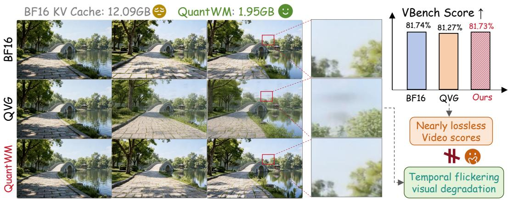  
Prompt: "A paved pathway leads towards a stone arch bridge ..

Figure 1: Existing 2-bit KV cache quantization methods achieve nearly lossless video performance but ignore temporal flickering and visual degradation. QuantWM effectively improves temporal consistency and significantly reduce the KV cache memory for video generation and world models.

Quantization (Frantar et al., 2022; Lin et al., 2024; Xiao et al., 2023; Zhao et al., 2024) is an effective model compression technique which represents high-precision tensors with low-bit values. For KV caches, quantization directly reduces the storage cost of cached Keys and Values, and has achieved promising results in large language models (Liu et al., 2024b; Hooper et al., 2024; Lin et al., 2025). Particularly, recent methods can compress KV caches to 2-bit or lower with limited performance degradation (Zhang et al., 2024; Li et al., 2025). Building on these advances, Quant-VideoGen (QVG) (Xi et al., 2026) extends 2-bit KV cache quantization to autoregressive video generation and shows considerable memory savings with nearly lossless performance on video benchmarks, such as VBench (Huang et al., 2024b).

Although previous methods achieve strong video benchmark performance, we discover an overlooked failure of 2-bit KV cache quantization video generation and world models. As shown in Figure 1, the quantized videos exhibit clear visual degradation compared with BF16, including temporal flickering, blurring, and artifacts, which are not fully captured by video benchmarks even when their reported scores remain nearly unchanged. This unexpected discrepancy motivates us to further investigate where the degradation comes from. We first disentangle the effects of Key and Value quantization and find that the degradation is mainly caused by Keys, where quantizing Keys alone leads to much worse visual quality than quantizing Values. More unexpectedly, Keys themselves exhibit smaller quantization errors than Values but cause larger output errors. This phenomenon indicates that the sensitivity of Keys cannot be explained by quantization error magnitude alone (Tuncer et al., 2026).

To understand this challenge, we revisit the attention computation in Transformers. Keys determine the matching scores between Queries and cached tokens through QK⊤. Therefore, even small perturbations to Keys can alter attention logits and change the ranking of temporal-spatial tokens, which may cause frequent token-selection shifts. Such shifts will redirect Queries to incorrect cached frames or spatial regions, which leads to temporal flickering and visual degradation.

Based on these insights, we propose QuantWM, a training-free 2-bit KV cache quantization framework that preserves attention behavior during quantization. Specifically, we first introduce quantization-sensitivity-aware clustering (QSAC), which builds on the centroid-residual quantization scheme of QVG and reduces the impact of Key quantization errors on attention logits. Instead of selecting centroids according to K-means clustering (McQueen, 1967), QSAC jointly considers Query sensitivity and the dynamic range of the K residuals to select centroids with smaller INT2 residual quantization impact on QK⊤. Secondly, to further correct the attention shifts, we introduce principal-subspace attention compensation (PSAC) to directly compensate the attention logits during inference. In detail, PSAC extracts the dominant Query subspace and represents the remaining Key error components along these sensitive directions with low-rank projections.

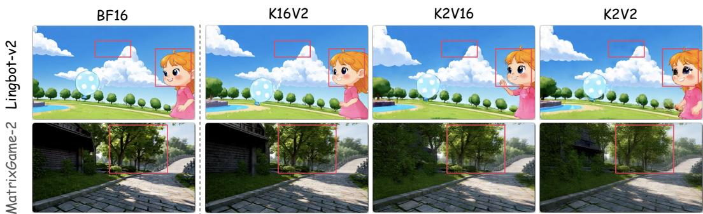  
Figure 2: Visual comparison of BF16, K16V2, K2V16 and K2V2 on world models. As indicated in the red bounding box area, K16V2 preserves the visual quality well, but K2V16 introduces temporal flickering (above) and visual degradation (below), which indicates Key is more sensitive and dominates the performance degradation.

We conduct extensive experiments on diverse representative world models and video generation models, including LingBot-World-v2 (Gao et al., 2026), Matrix-Game-2 (He et al., 2025), LongCat-Video (Team et al., 2025), HY-World 1.5 (Sun et al., 2025) and Causal-Forcing (Huang et al., 2026). The results show that QuantWM consistently alleviates the temporal flickering and visual degradation, while maintaining strong performance on VBench. Meanwhile, QuantWM achieves up to 6.20× KV cache memory compression with only limited inference overhead, which demonstrates its effectiveness and efficiency for KV cache quantization in video generation and world models.

## 2 PRELIMINARY

Quantization is a popular model compression technique which can convert values from full precision to lower-bit representations. Given a tensor $X$ , its b-bit affine quantization and dequantization is formulated as:

$$
X _ { q } = \operatorname { c l i p } \left( \left\lfloor { \frac { X } { s } } \right\rceil + z , q _ { \operatorname* { m i n } } , q _ { \operatorname* { m a x } } \right) , \qquad { \hat { X } } = { \mathcal { Q } } _ { b } ( X ) = s ( X _ { q } - z ) ,\tag{1}
$$

where s and z denote the scaling factor and zero-point, respectively, which can be elaborated as:

$$
s = \frac { X _ { \mathrm { m a x } } - X _ { \mathrm { m i n } } } { q _ { \mathrm { m a x } } - q _ { \mathrm { m i n } } } , \qquad z = \left\lfloor q _ { \mathrm { m i n } } - \frac { X _ { \mathrm { m i n } } } { s } \right\rceil .\tag{2}
$$

The quantization parameters can be shared at different granularities, such as per-token, per-channel, or per-group quantization. For KV cache quantization, we follow the centroid-residual representation proposed by QVG (Xi et al., 2026). Given a Key token ki $\in \mathbb { R } ^ { d }$ , it is assigned to a centroid $\mu _ { z _ { i } }$ through K-means clustering (McQueen, 1967) and decomposed as:

$$
\mathbf { r } _ { i } = \mathbf { k } _ { i } - \mu _ { z _ { i } } .\tag{3}
$$

Then the centroid is preserved at BF16 and the residual tensor $\mathbf { r } _ { i }$ is quantized to low-bit, where the reconstructed Key and its quantization error is defined as:

$$
\hat { \mathbf { k } } _ { i } = \mu _ { z _ { i } } + \mathcal { Q } _ { b } ( \mathbf { r } _ { i } ) .\tag{4}
$$

## 3 MOTIVATION

## 3.1 THE OVERLOOKED VISUAL DEGRADATION UNDER 2-BIT KV QUANTIZATION

Existing 2-bit KV cache quantization methods report nearly lossless performance on video benchmarks such as VBench. However, we find that these metrics do not fully reflect the degradation introduced by aggressive KV quantization. As shown in Figure 1, compared with the BF16 baseline, existing 2-bit KV quantization methods produce noticeable temporal flickering, blurring, and visual artifacts. These observations suggest that video benchmarks alone may overlook important visual degradation introduced by low-bit KV cache quantization. Therefore, we further investigate which component of the KV cache is mainly responsible for this degradation.

Table 1: Quantization error of K/V-only and their outputs. Key quantization exhibits smaller reconstruction errors but causes larger output degradation than Value quantization.
<table><tr><td>Layer</td><td>Model</td><td>K MSE↓</td><td>V MSE↓</td><td>K-only Output MSE↓</td><td>V-only Output MSE↓</td></tr><tr><td rowspan="3">Middle</td><td>Matrix-Game-2</td><td>0.1460</td><td>0.2335</td><td>0.0853</td><td>0.0560</td></tr><tr><td>LingBot-v2</td><td>0.2717</td><td>0.3557</td><td>0.1868</td><td>0.1946</td></tr><tr><td>HY-World 1.5</td><td>0.1340</td><td>0.2973</td><td>0.0821</td><td>0.0536</td></tr><tr><td rowspan="3">Last</td><td>Matrix-Game-2</td><td>0.0514</td><td>0.3005</td><td>0.3107</td><td>0.1860</td></tr><tr><td>LingBot-v2</td><td>0.1608</td><td>0.3008</td><td>0.2256</td><td>0.1039</td></tr><tr><td>HY-World 1.5</td><td>0.0090</td><td>0.2939</td><td>0.5884</td><td>0.1679</td></tr></table>

## 3.2 KEY QUANTIZATION DOMINATES VISUAL DEGRADATION

To locate the main source of visual degradation, we separately quantize the Key and Value caches using QVG. As shown in Figure 2, K2V16 produces much more severe visual degradation than K16V2. On these samples, the same trend is reflected by frame-level image quality metrics in Table 2, where K16V2 achieves clearly better PSNR, SSIM and LPIPS than K2V16, while K2V2 performs similarly to K2V16. These results indicate that the degradation of 2-bit KV cache quantization is mainly dominated by Key quantization.

More surprisingly, as shown in Table 1, the reconstruction error of quantized Keys is even smaller

Table 2: Visual quality under different setting, where K2-only causes larger visual degradation than V2-only.
<table><tr><td>Model</td><td>Setting</td><td></td><td>PSNR↑SSIM↑LPIPS↓</td><td></td></tr><tr><td rowspan="3">MG-2</td><td>K2V16</td><td>18.47</td><td>0.547</td><td>0.219</td></tr><tr><td>K16V2</td><td>21.58</td><td>0.708</td><td>0.126</td></tr><tr><td>K2V2</td><td>18.32</td><td>0.500</td><td>0.261</td></tr><tr><td rowspan="3">LB-2</td><td>K2V16</td><td>15.38</td><td>0.355</td><td>0.263</td></tr><tr><td>K16V2</td><td>17.70</td><td>0.476</td><td>0.157</td></tr><tr><td>K2V2</td><td>15.79</td><td>0.376</td><td>0.264</td></tr></table>

than that of Values, while K2V16 introduces a larger output error than K16V2. This suggests that the sensitivity of Keys cannot be explained by the magnitude of their quantization error.

## 3.3 KEY QUANTIZATION PERTURBS TEMPORAL-SPATIAL TOKEN SELECTION

To understand why Key quantization is more sensitive, we revisit the attention computation. Given Query Q and Key K, the attention logits and the post-quantization logits perturbation can be elaborated as:

$$
\mathbf { L } = { \frac { \mathbf { Q } \mathbf { K } ^ { \top } } { \sqrt { d } } } , \qquad \Delta \mathbf { L } = { \frac { \mathbf { Q } ( \mathbf { K } - { \hat { \mathbf { K } } } ) ^ { \top } } { \sqrt { d } } } .\tag{5}
$$

Therefore, even a small Key perturbation may change the relative ordering of attention logits and shift the temporal-spatial tokens selected by Queries.

To validate this analysis, we further visualize the temporal-spatial tokens selected by Queries. As shown in Figure 3, 2-bit Key quantization causes clear token-selection shifts compared with BF16, where Queries attend to different historical frames or spatial regions. At the visual level, such shifts will lead to temporal flickering and blurring in the generated videos. This attention mismatch explains why smaller Key quantization error can still lead to larger output degradation compared with Value. Accordingly, in addition to minimize K reconstruction error, KV cache quantization should also consider to reduce its impact on attention logits and temporal-spatial token selection.

## 4 QUANTWM

In this section, we present QuantWM, a training-free 2-bit KV cache quantization framework for video generation and world models. We first introduce quantization-sensitivity-aware clustering (QSAC) to reduce the impact of Key quantization on attention logits. And then we present principalsubspace attention compensation (PSAC) to further correct the attention shifts.

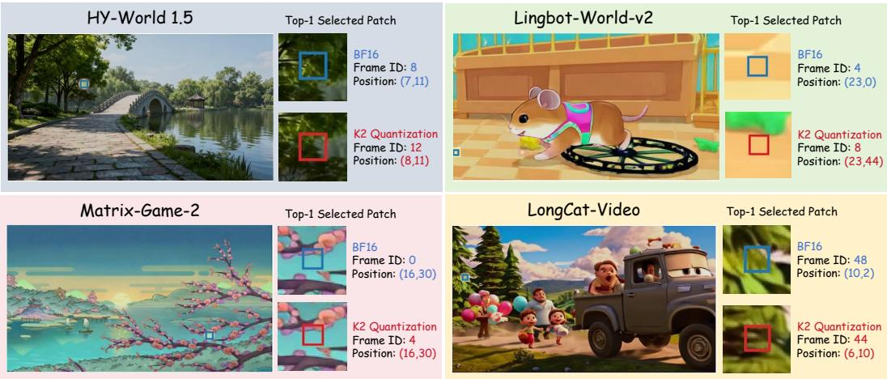  
Figure 3: Visualizations of top-1 temporal-spatial token (patch) selection shifts after K quantization under the same query on different world models.

## 4.1 QUANTIZATION-SENSITIVITY-AWARE CLUSTERING (QSAC)

Existing centroid-residual KV quantization methods (QVG) typically apply K-means to assign each Key token to its nearest centroid and then quantizing the residual tensor. Such a strategy mainly considers the distance between tokens and centroids but ignores the impact of the quantized residual. As discussed in Section 3, even a small Key quantization error may cause large perturbations to attention logits when it interacts with sensitive Query channels. To address this issue, we introduce QSAC, which selects centroids based on the impact of residual quantization on attention logits. Specifically, it jointly considers Query-channel sensitivity and the dynamic range of residual groups so that it can introduce smaller quantization perturbations to $Q K ^ { \top }$

To approximate the Q-channel sensitivity during causal generation, we use the Queries observed in previous generation steps and maintain their second-order statistics for each attention head h:

$$
\mathbf { M } _ { h } ^ { t - 1 } = \frac { 1 } { N _ { < t } } \sum _ { \tau < t } \sum _ { i } \mathbf { q } _ { \tau , i , h } \mathbf { q } _ { \tau , i , h } ^ { \top } .\tag{6}
$$

The second-order Query statistics follows directly from the squared attention-logit error introduced by Key quantization. Given a Key quantization error ${ \bf e } = { \bf k } - \hat { \bf k }$ , we have:

$$
\mathbb { E } _ { \mathbf { q } } \left[ ( \mathbf { q } ^ { \top } \mathbf { e } ) ^ { 2 } \right] = \mathbf { e } ^ { \top } \mathbf { M } _ { h } ^ { t - 1 } \mathbf { e } ,\tag{7}
$$

where the constant $1 / d$ is omitted because it does not affect centroid selection. Therefore, $\mathbf { M } _ { h } ^ { t - 1 }$ characterizes the sensitivity of different Key-error directions to historical Queries. However, directly using the full matrix $\mathbf { \check { M } } _ { h } ^ { t - 1 }$ for centroid assignment introduces additional computation. So we instead use its diagonal approximation:

$$
\mathbf { e } ^ { \top } \mathbf { M } _ { h } ^ { t - 1 } \mathbf { e } \approx \sum _ { c } [ \mathbf { M } _ { h } ^ { t - 1 } ] _ { c c } e _ { c } ^ { 2 } .\tag{8}
$$

Since $[ \mathbf { M } _ { h } ^ { t - 1 } ] _ { c c } = \mathbb { E } [ q _ { c } ^ { 2 } ]$ ], the squared magnitude of historical Queries can be directly used to approximate channel-wise sensitivity. We normalize it as:

$$
w _ { h , c } = \frac { [ \mathbf { M } _ { h } ^ { t - 1 } ] _ { c c } } { \frac { 1 } { d } \sum _ { c ^ { \prime } } [ \mathbf { M } _ { h } ^ { t - 1 } ] _ { c ^ { \prime } c ^ { \prime } } } .\tag{9}
$$

Channels with larger $w _ { h , c }$ are more sensitive to Key quantization errors. Based on this sensitivity, QSAC first defines a Query-aware distance:

$$
d _ { \mathrm { Q } } ( \mathbf { k } _ { i } , \pmb { \mu } _ { j } ) = \sum _ { c } w _ { h , c } ( k _ { i , c } - \mu _ { j , c } ) ^ { 2 } ,\tag{10}
$$

which is used to efficiently select a top-M candidate centroids set $\mathcal { C } _ { i }$ . Subsequently, we consider the quantization difficulty of the residuals. For each candidate centroid $\pmb { \mu } _ { j }$ , we define the residual and its group-wise dynamic range as:

$$
\mathbf { r } _ { i j } = \mathbf { k } _ { i } - \pmb { \mu } _ { j } , \qquad R _ { g } ( \mathbf { r } _ { i j } ) = \operatorname* { m a x } _ { c \in \mathcal { G } _ { g } } r _ { i j , c } - \operatorname* { m i n } _ { c \in \mathcal { G } _ { g } } r _ { i j , c } ,\tag{11}
$$

where $\mathcal { G } _ { g }$ denotes the set of channels in the g-th group. For uniform b-bit quantization, the corresponding scaling factor is $\Delta _ { g } ~ = ~ R _ { g } / ( 2 ^ { b } - 1 )$ . Then according to (Widrow et al., 1996), the quantization error can be approximated as:

$$
\mathbb { E } [ e _ { c } ^ { 2 } ] \approx \frac { \Delta _ { g } ^ { 2 } } { 1 2 } = \frac { R _ { g } ^ { 2 } } { 1 2 ( 2 ^ { b } - 1 ) ^ { 2 } } .\tag{12}
$$

Combining it with Eq. 8 and 9, we can obtain the expected squared attention-logit perturbation for a candidate centroid:

$$
\mathbb { E } \left[ ( \mathbf { q } ^ { \top } \mathbf { e } ) ^ { 2 } \right] \approx \frac { 1 } { 1 2 ( 2 ^ { b } - 1 ) ^ { 2 } } \sum _ { g } \left( \sum _ { c \in \mathcal { G } _ { g } } w _ { h , c } \right) R _ { g } ( \mathbf { r } _ { i j } ) ^ { 2 } .\tag{13}
$$

Since $1 / [ 1 2 ( 2 ^ { b } - 1 ) ^ { 2 } ]$ is shared by all candidate centroids, we remove it during centroid selection. At last, we define the QSAC score and use it to select the optimal centroid:

$$
S ( \mathbf { k } _ { i } , \mu _ { j } ) = \sum _ { g } \left( \sum _ { c \in \mathcal { G } _ { g } } w _ { h , c } \right) R _ { g } ( \mathbf { r } _ { i j } ) ^ { 2 } , \qquad z _ { i } = \arg \operatorname* { m i n } _ { j \in \mathcal { C } _ { i } } S ( \mathbf { k } _ { i } , \mu _ { j } ) .\tag{14}
$$

In this way, QSAC can prioritizes Query-sensitive groups and successfully incorporates the approximated residual quantization error into centroid selection, so that the selected centroid is expected to introduce smaller perturbations to $Q K ^ { \top }$ after quantization.

## 4.2 PRINCIPAL-SUBSPACE ATTENTION COMPENSATION (PSAC)

Due to the limited representation capacity of 2-bit quantization, Key quantization errors cannot be fully eliminated even after QSAC, which may still cause attention shifts. Therefore, we further introduce PSAC to directly correct the remaining logit perturbations.

Let $\hat { \mathbf { K } } _ { 0 }$ denote the dequantized Key after QSAC, and we define the remaining quantization error as:

$$
\mathbf { E } = \mathbf { K } - \hat { \mathbf { K } } _ { 0 } .\tag{15}
$$

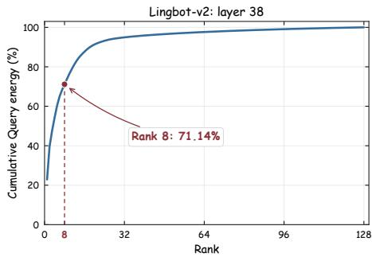

Reusing the historical Query statistics $\mathbf { M } _ { h } ^ { t - 1 }$ introduced in Section 4.1, the expected logit perturbations caused by E can be written as:

Figure 4: Cumulative Query energy in LingBot-v2, where top-8 directions include most of the total Query energy.

$$
\begin{array} { r } { \mathcal { D } ( \mathbf { E } ) = \mathbb { E } _ { \mathbf { Q } } \left[ \left. \mathbf { Q } \mathbf { E } ^ { \top } \right. _ { F } ^ { 2 } \right] = \mathrm { T r } \left( \mathbf { E } \mathbf { M } _ { h } ^ { t - 1 } \mathbf { E } ^ { \top } \right) . } \end{array}\tag{16}
$$

However, directly storing full quantization error E for logits compensation would introduce additional memory overheads. Inspired by (Liu et al., 2025; Zhao et al., 2025b) which claim that the hidden representations in Transformers often exhibit low-rank structures, we examine the energy distribution of historical Queries and find that the energy is highly concentrated in a few principal directions. As shown in Figure 4, the top-8 directions include more than 60% of the total Query energy, which suggest that we can focus on the error components along these dominant Query directions. Specifically, we perform eigenvalue decomposition for $\mathbf { M } _ { h } ^ { t - 1 } ;$

$$
\begin{array} { r } { \mathbf { M } _ { h } ^ { t - 1 } = \mathbf { U } _ { h } \mathbf { A } _ { h } \mathbf { U } _ { h } ^ { \top } , \qquad \lambda _ { 1 } \geq \lambda _ { 2 } \geq \cdots \geq \lambda _ { d } . } \end{array}\tag{17}
$$

Each eigenvalue represents the historical Query energy along its corresponding eigenvector. Therefore, Key quantization errors projected onto directions with larger eigenvalues have a larger expected

impact on attention logits. We preserve the top-r eigenvectors $\mathbf { U } _ { r }$ as the principal Query subspace and restore the remaining Key quantization error along these directions:

$$
\mathbf { C } = \mathbf { E } \mathbf { U } _ { r } ,\tag{18}
$$

where we preserve both C and $\mathbf { U } _ { r }$ during inference. Finally, we compensate these error components after quantization, where the attention logits will be corrected as follows:

$$
\begin{array} { r } { \hat { \mathbf { K } } = \hat { \mathbf { K } } _ { 0 } + \mathbf { C U } _ { r } ^ { \top } , \qquad \mathbf { Q } \hat { \mathbf { K } } ^ { \top } = \mathbf { Q } \hat { \mathbf { K } } _ { 0 } ^ { \top } + \mathbf { Q } \mathbf { U } _ { r } \mathbf { C } ^ { \top } . } \end{array}\tag{19}
$$

In our implementation, we set $r \ = \ 8 .$ Since both C and $\mathbf { U } _ { r }$ are low-rank, PSAC can directly compensates the attention-logit shift without extensive extra overheads.

## 5 EXPERIMENTS

## 5.1 EXPERIMENTAL SETUP

Models To validate the effectiveness of QuantWM on alleviating visual degradation, we conduct extensive experiments on five open-sourced autoregressive video generation and world models, including LongCat-Video (Team et al., 2025), HY-World 1.5 (Sun et al., 2025), LingBot-World-v2 (Gao et al., 2026), Matrix-Game-2 (He et al., 2025) and Causal-Forcing (Zhu et al., 2026). We conduct the main evaluation at 480p and 720p generate videos with 93 frames.

Metrics We mainly evaluate the visual degradation introduced by KV cache quantization using frame-level image quality metrics, including PSNR, SSIM and LPIPS. As discussed in Section ${ \bar { 3 , } }$ these metrics provide a more direct measurement of the visual distortions caused by quantization. During experiments, we compute them over all frames of each video. We also report performance on VBench (Huang et al., 2024b), including Background Consistency, Subject Consistency, Imaging Quality, and Aesthetic Quality. Although it may not fully capture the visual degradation studied in this work, it is still an important benchmark for evaluating the overall quality of generated videos.

Evaluations We select Quant VideoGen (Xi et al., 2026), the most relevant 2-bit KV cache quantization method for video generation, as the main baseline. To provide additional low-bit baselines, we also include KIVI (Liu et al., 2024b) into comparison which is the representative LLMs KV cache quantization method. Following QVG, we use the prompt suite from MovieGen Benchmark (Polyak et al., 2024).1 For Matrix-Game-2 which does not accept text inputs, we use the 29 official first-frame images where each image is combined with 7–8 different action sequences as inputs.2. For fair comparison, we reproduce all the baselines with their official repository, follow the native KV cache convention of each model and apply all methods to the same cached tensors.

Implementation We implement QuantWM in PyTorch with customized Triton kernels and conduct all experiments on NVIDIA A800 80GB GPUs. Following QVG, we apply streaming chunkwise KV cache quantization and quantize each cache chunk only once after its construction. We use 256 centroids and quantization groupsize 64 (QVG with 64 and KIVI with 32), with BF16 centroids and standard INT2 quantization for the residuals. For PSAC, it extracts the top-8 eigenvectors $\mathbf { U } _ { r }$ of $\mathbf { M } _ { h } ^ { t - 1 }$ as the principal Query subspace. We store ${ \mathbf { U } } _ { r }$ in BF16 and quantize $\begin{array} { r } { \bar { \mathbf { C } } = \bar { \mathbf { E } } \mathbf { U } } \end{array}$ to INT8.

## 5.2 MAIN RESULTS AND VISUALIZATIONS

Frame-level quality evaluation As shown in Table 3, QuantWM consistently improves framelevel visual quality over QVG across all five models. The improvements are particularly clear on LongCat-Video, where PSNR improves from 20.683 to 25.508 and LPIPS decreases from 0.0784 to 0.0332. We also include KIVI as an additional baseline. It performs better than QVG because its groupsize is 32 and preserve the recent-window cache at BF16, which is beneficial for temporal consistency. Nevertheless, QuantWM consistently outperforms both QVG and KIVI on all framelevel metrics, which demonstrates stronger ability to preserve visual quality under 2-bit KV cache quantization. Please refer to Appendix B for results on 720p videos and long video generation.

Table 3: Visual quality and VBench comparison results of QuantWM and baselines on 480p videos. QuantWM significantly improves visual quality while maintaining strong VBench performance.
<table><tr><td rowspan="2">Model</td><td rowspan="2">Method</td><td colspan="3">Frame-level Metrics</td><td colspan="5">VBench</td></tr><tr><td>PSNR ↑</td><td>SSIM↑</td><td>LPIPS↓</td><td>Subject ↑</td><td>Background ↑ Aesthetic ↑</td><td></td><td>Image ↑</td><td>Avg. ↑</td></tr><tr><td rowspan="4">Matrix-Game-2</td><td>BF16</td><td>∞</td><td>1.0000</td><td>0.0000</td><td>0.9104</td><td>0.9423</td><td>0.5846</td><td>0.6952</td><td>0.7831</td></tr><tr><td>KIVI</td><td>19.298</td><td>0.6557</td><td>0.1797</td><td>0.9097</td><td>0.9418</td><td>0.5841</td><td>0.6914</td><td>0.7817</td></tr><tr><td>QVG</td><td>17.749</td><td>0.5651</td><td>0.2851</td><td>0.8894</td><td>0.9320</td><td>0.5831</td><td>0.6603</td><td>0.7662</td></tr><tr><td>Ours</td><td>20.615</td><td>0.7212</td><td>0.1443</td><td>0.9109</td><td>0.9421</td><td>0.5883</td><td>0.6933</td><td>0.7836</td></tr><tr><td rowspan="4">LingBot-v2</td><td>BF16</td><td>∞</td><td>1.0000</td><td>0.0000</td><td>0.8877</td><td>0.9126</td><td>0.5949</td><td>0.6962</td><td>0.7728</td></tr><tr><td>KIVI</td><td>14.799</td><td>0.5950</td><td>0.2508</td><td>0.8869</td><td>0.9137</td><td>0.5883</td><td>0.6892</td><td>0.7695</td></tr><tr><td>QVG</td><td>14.414</td><td>0.5726</td><td>0.2779</td><td>0.8860</td><td>0.9127</td><td>0.5912</td><td>0.6929</td><td>0.7707</td></tr><tr><td>Ours</td><td>16.138</td><td>0.6688</td><td>0.1893</td><td>0.8894</td><td>0.9134</td><td>0.5947</td><td>0.6953</td><td>0.7732</td></tr><tr><td rowspan="4">HY-World 1.5</td><td>BF16</td><td>∞</td><td>1.0000</td><td>0.0000</td><td>0.9588</td><td>0.9520</td><td>0.6378</td><td>0.7209</td><td>0.8174</td></tr><tr><td>KIVI</td><td>17.677</td><td>0.7165</td><td>0.1540</td><td>0.9520</td><td>0.9494</td><td>0.6362</td><td>0.7049</td><td>0.8106</td></tr><tr><td>QVG</td><td>16.118</td><td>0.6559</td><td>0.2114</td><td>0.9503</td><td>0.9488</td><td>0.6394</td><td>0.7122</td><td>0.8127</td></tr><tr><td>Ours</td><td>18.449</td><td>0.7661</td><td>0.1082</td><td>0.9600</td><td>0.9528</td><td>0.6366</td><td>0.7196</td><td>0.8173</td></tr><tr><td rowspan="4">LongCat-Video</td><td>BF16</td><td>∞</td><td>1.0000</td><td>0.0000</td><td>0.9747</td><td>0.9605</td><td>0.6148</td><td>0.6993</td><td>0.8123</td></tr><tr><td>KIVI</td><td>24.448</td><td>0.9180</td><td>0.0399</td><td>0.9754</td><td>0.9610</td><td>0.6141</td><td>0.6695</td><td>0.8050</td></tr><tr><td>QVG</td><td>20.683</td><td>0.8556</td><td>0.0784</td><td>0.9739</td><td>0.9603</td><td>0.6144</td><td>0.7001</td><td>0.8122</td></tr><tr><td>Ours</td><td>25.508</td><td>0.9286</td><td>0.0332</td><td>0.9748</td><td>0.9615</td><td>0.6154</td><td>0.7002</td><td>0.8130</td></tr><tr><td rowspan="4">Causal-Forcing</td><td>BF16</td><td>∞</td><td>1.0000</td><td>0.0000</td><td>0.9327</td><td>0.9421</td><td>0.6348</td><td>0.7028</td><td>0.8031</td></tr><tr><td>KIVI</td><td>15.585</td><td>0.7201</td><td>0.1775</td><td>0.9334</td><td>0.9426</td><td>0.6343</td><td>0.7034</td><td>0.8034</td></tr><tr><td>QVG</td><td>14.887</td><td>0.6773</td><td>0.2185</td><td>0.9311</td><td>0.9412</td><td>0.6317</td><td>0.6993</td><td>0.8008</td></tr><tr><td>Ours</td><td>16.283</td><td>0.7464</td><td>0.1554</td><td>0.9342</td><td>0.9427</td><td>0.6354</td><td>0.7044</td><td>0.8042</td></tr></table>

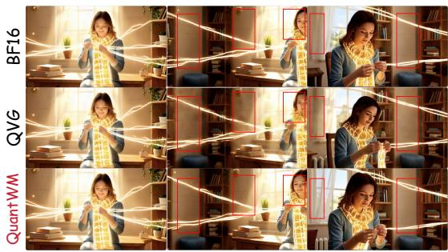  
LingBot-World-v2

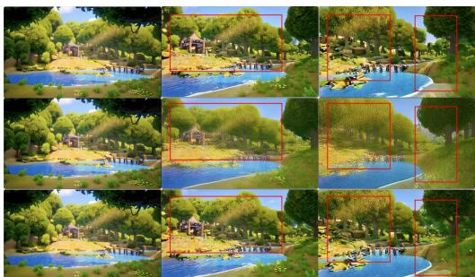  
Matrix-Game-2

Figure 5: Visual quality comparison of QuantWM, QVG and BF16. QVG suffers from tempora flickering and visual degradation, while our QuantWM preserves clearer details and visual quality.

Video benchmark evaluation QuantWM also achieves strong performance on VBench. Across all five models, its VBench scores are consistently higher than QVG and remain comparable to BF16. Together with the improvements in frame-level metrics, these results further indicate that video benchmarks alone can not fully reflect the visual degradation caused by KV cache quantization.

Visualizations We also provides qualitative comparisons on world models. As indicated by Figure 5, QVG exhibits noticeable temporal flickering, blurring and visual artifacts, while our QuantWM better preserves visual details and temporal consistency. More visualizations are in Appendix B.

## 5.3 TEMPORAL-SPATIAL TOKEN SELECTION SHIFTS RATIO

To further verify whether QuantWM preserves attention logits under 2-bit quantization, we evaluate the top-1 temporal-spatial token selection shift ratio compared with BF16. As shown in Table 4, QVG causes frequent token-selection changes across all five models, with shift ratios up to 61.36%. In contrast, QuantWM consistently reduces the shift ratio up to 10.19%. These results further proves that our QuantWM successfully reduces the quantization perturbation to the attention.

Table 4: Top-1 temporal-spatial token selection shift ratio on 480p videos. QuantWM significantly reduces the token-selection shifts caused by 2-bit Key quantization.
<table><tr><td>Method</td><td>Matrix-Game-2</td><td>LingBot-v2</td><td>HY-World 1.5</td><td>LongCat-Video</td><td>Causal-Forcing</td></tr><tr><td>BF16</td><td>0.0000</td><td>0.0000</td><td>0.0000</td><td>0.0000</td><td>0.0000</td></tr><tr><td>QVG</td><td>0.5388</td><td>0.5491</td><td>0.6136</td><td>0.5034</td><td>0.3728</td></tr><tr><td>Ours</td><td>0.1019</td><td>0.1600</td><td>0.1392</td><td>0.2225</td><td>0.1420</td></tr></table>

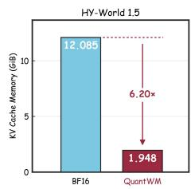

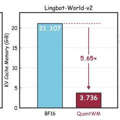

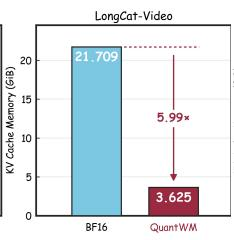

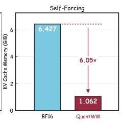  
Figure 6: KV cache memory comparison of BF16 and QuantWM for 93-frame video generation. QuantWM achieves up to 6.20× KV cache memory compression across different models.

## 5.4 ABLATION STUDY

To demonstrate the contributions of QSAC and PSAC, We conduct an ablation study on HY-World 1.5. As shown in Table 5, QSAC consistently improves frame-level quality metrics while reducing the token shift ratio from 61.37% to 38.17%. This demonstrates that selecting centroids according to Query sensitivity and

Table 5: Ablation study of QuantWM on HY-World 1.5.
<table><tr><td>QSAC</td><td>PSAC</td><td>PSNR↑</td><td>SSIM↑</td><td>LPIPS↓</td><td>Token Shift↓</td></tr><tr><td>X</td><td>X</td><td>16.118</td><td>0.6559</td><td>0.2114</td><td>0.6137</td></tr><tr><td>√</td><td>X</td><td>17.990</td><td>0.7423</td><td>0.1285</td><td>0.3817</td></tr><tr><td>X</td><td>√</td><td>17.849</td><td>0.7358</td><td>0.1312</td><td>0.2290</td></tr><tr><td>√</td><td>√</td><td>18.449</td><td>0.7661</td><td>0.1082</td><td>0.1392</td></tr></table>

residual quantization difficulty effectively reduces harmful Key quantization perturbations. PSAC further shows a stronger effect on attention preservation, where it reduces the token Shift to 22.9% even without QSAC. Finally, combining QSAC and PSAC achieves the best overall performance.

## 5.5 INFERENCE EFFICIENCY

KV cache memory usage We first evaluate the KV cache memory consumption during 93- frame video generation. As shown in Figure 6, QuantWM consistently reduces the KV cache footprint across different models, achieving up to 6.20× compression. For example, on LongCat-Video, QuantWM reduces the KV cache memory from 21.709GB to 3.625GB. These results demonstrate the effectiveness of QuantWM in reducing the memory cost during generation.

Table 6: Inference latency comparison between BF16 and QuantWM.
<table><tr><td>Model</td><td>BF16 (s)</td><td>QuantWM (s)</td></tr><tr><td>LingBot-World-v2</td><td>193.56</td><td>204.09 5.44%↑</td></tr><tr><td>HY-World 1.5</td><td>112.17</td><td>118.75 5.87%↑</td></tr><tr><td>LongCat-Video</td><td>255.35</td><td>209.9417.78%↓</td></tr></table>

End-to-end latency As shown in Table 6, QuantWM introduces only limited latency overhead across different models. The generation latency increases by only 5.44% on LingBot-World-v2 and 5.87% on HY-World 1.5, while it is reduced by 17.78% on LongCat-Video. These results indicate that QuantWM achieves significant memory compression with limited impact on end-toend generation latency. Details about real-quant inference system are provided in Appendix D.

## 6 CONCLUSION

In this paper, we investigate the overlooked visual degradation caused by KV cache quantization in video generation and world models. We show that Key quantization is more sensitive than Value because Key perturbations can influence attention logits and shift temporal-spatial token selection. Based on this observation, we propose QuantWM, a training-free 2-bit KV cache quantization framework that considers attention preservation. QuantWM includes quantization-sensitivity-aware clustering (QSAC), which incorporates Query sensitivity and residual quantization difficulty into centroid selection, and principal-subspace attention compensation (PSAC), which directly corrects the remaining logit perturbations along dominant Query directions. Experiments across multiple video generation and world models demonstrate that QuantWM effectively alleviates temporal flickering and visual degradation while maintaining high KV cache compression.

## REFERENCES

Eloi Alonso, Adam Jelley, Vincent Micheli, Anssi Kanervisto, Amos Storkey, Tim Pearce, and Franc¸ois Fleuret. Diffusion for world modeling: Visual details matter in atari. Advances in Neural Information Processing Systems, 37:58757–58791, 2024.

Elias Frantar, Saleh Ashkboos, Torsten Hoefler, and Dan Alistarh. Gptq: Accurate post-training quantization for generative pre-trained transformers. arXiv preprint arXiv:2210.17323, 2022.

Zelin Gao, Qiuyu Wang, Jiapeng Zhu, Jingye Chen, Zichen Liu, Qingyan Bai, Jiahao Wang, Yufeng Yuan, Hanlin Wang, Yichong Lu, et al. Infinite worlds with versatile interactions. arXiv preprint arXiv:2607.07534, 2026.

Xianglong He, Chunli Peng, Zexiang Liu, Boyang Wang, Yifan Zhang, Qi Cui, Fei Kang, Biao Jiang, Mengyin An, Yangyang Ren, et al. Matrix-game 2.0: An open-source real-time and streaming interactive world model. arXiv preprint arXiv:2508.13009, 2025.

Coleman Hooper, Sehoon Kim, Hiva Mohammadzadeh, Michael W Mahoney, Yakun S Shao, Kurt Keutzer, and Amir Gholami. Kvquant: Towards 10 million context length llm inference with kv cache quantization. Advances in Neural Information Processing Systems, 37:1270–1303, 2024.

Wei Huang, Haotong Qin, Yangdong Liu, Yawei Li, Qinshuo Liu, Xianglong Liu, Luca Benini, Michele Magno, Shiming Zhang, and Xiaojuan Qi. Slim-llm: Salience-driven mixed-precision quantization for large language models. arXiv preprint arXiv:2405.14917, 2024a.

Xun Huang, Zhengqi Li, Guande He, Mingyuan Zhou, and Eli Shechtman. Self forcing: Bridging the train-test gap in autoregressive video diffusion. Advances in Neural Information Processing Systems, 38:167283–167308, 2026.

Ziqi Huang, Yinan He, Jiashuo Yu, Fan Zhang, Chenyang Si, Yuming Jiang, Yuanhan Zhang, Tianxing Wu, Qingyang Jin, Nattapol Chanpaisit, et al. Vbench: Comprehensive benchmark suite for video generative models. In 2024 IEEE/CVF Conference on Computer Vision and Pattern Recognition (CVPR), pp. 21807–21818. IEEE, 2024b.

Junyan Li, Yang Zhang, Muhammad Yusuf Hassan, Talha Chafekar, Tianle Cai, Zhile Ren, Pengsheng Guo, Foroozan Karimzadeh, Chong Wang, and Chuang Gan. Commvq: Commutative vector quantization for kv cache compression. arXiv preprint arXiv:2506.18879, 2025.

Ji Lin, Jiaming Tang, Haotian Tang, Shang Yang, Wei-Ming Chen, Wei-Chen Wang, Guangxuan Xiao, Xingyu Dang, Chuang Gan, and Song Han. Awq: Activation-aware weight quantization for on-device llm compression and acceleration. Proceedings of machine learning and systems, 6:87–100, 2024.

Yujun Lin, Haotian Tang, Shang Yang, Zhekai Zhang, Guangxuan Xiao, Chuang Gan, and Song Han. Qserve: W4a8kv4 quantization and system co-design for efficient llm serving. Proceedings ofMachine Learning and Systems, 7, 2025.

Kunhao Liu, Wenbo Hu, Jiale Xu, Ying Shan, and Shijian Lu. Rolling forcing: Autoregressive long video diffusion in real time. In International Conference on Learning Representations, volume 2026, pp. 91177–91196, 2026.

Zechun Liu, Barlas Oguz, Changsheng Zhao, Ernie Chang, Pierre Stock, Yashar Mehdad, Yangyang Shi, Raghuraman Krishnamoorthi, and Vikas Chandra. Llm-qat: Data-free quantization aware training for large language models. In Findings of the association for computational linguistics: ACL 2024, pp. 467–484, 2024a.

Zirui Liu, Jiayi Yuan, Hongye Jin, Shaochen Zhong, Zhaozhuo Xu, Vladimir Braverman, Beidi Chen, and Xia Hu. Kivi: A tuning-free asymmetric 2bit quantization for kv cache. arXiv preprint arXiv:2402.02750, 2024b.

Ziyue Liu, Ruijie Zhang, Zhengyang Wang, Mingsong Yan, Zi Yang, Paul D Hovland, Bogdan Nicolae, Franck Cappello, Sui Tang, and Zheng Zhang. Cola: Compute-efficient pre-training of llms via low-rank activation. In Proceedings of the 2025 Conference on Empirical Methods in Natural Language Processing, pp. 4627–4645, 2025.

James B McQueen. Some methods of classification and analysis of multivariate observations. In Proc. of 5th berkeley symposium on math. stat. and prob., pp. 281–297, 1967.

Markus Nagel, Rana Ali Amjad, Mart Van Baalen, Christos Louizos, and Tijmen Blankevoort. Up or down? adaptive rounding for post-training quantization. In International conference on machine learning, pp. 7197–7206. PMLR, 2020.

Adam Polyak, Amit Zohar, Andrew Brown, Andros Tjandra, Animesh Sinha, Ann Lee, Apoorv Vyas, Bowen Shi, Chih-Yao Ma, Ching-Yao Chuang, et al. Movie gen: A cast of media founda tion models. arXiv preprint arXiv:2410.13720, 2024.

Wenqi Shao, Mengzhao Chen, Zhaoyang Zhang, Peng Xu, Lirui Zhao, Zhiqian Li, Kaipeng Zhang, Gao Peng, Yu Qiao, and Ping Luo. Omniquant: Omnidirectionally calibrated quantization for large language models. In International Conference on Learning Representations, volume 2024, pp. 45472–45496, 2024.

Uriel Singer, Adam Polyak, Thomas Hayes, Xi Yin, Jie An, Songyang Zhang, Qiyuan Hu, Harry Yang, Oron Ashual, Oran Gafni, et al. Make-a-video: Text-to-video generation without text-video data. arXiv preprint arXiv:2209.14792, 2022.

Wenqiang Sun, Haiyu Zhang, Haoyuan Wang, Junta Wu, Zehan Wang, Zhenwei Wang, Yunhong Wang, Jun Zhang, Tengfei Wang, and Chunchao Guo. Worldplay: Towards long-term geometric consistency for real-time interactive world modeling. arXiv preprint arXiv:2512.14614, 2025.

Meituan LongCat Team, Bairui Wang, Bin Xiao, Bo Zhang, Bolin Rong, Borun Chen, Chang Wan, Chao Zhang, Chen Huang, Chen Chen, et al. Longcat-flash-omni technical report. arXiv preprint arXiv:2511.00279, 2025.

Tuna Tuncer, Felix Becker, and Thomas Pfeil. Quantized keys steal attention: Bias correction for kv-cache compression in video diffusion. arXiv preprint arXiv:2605.26266, 2026.

Dani Valevski, Yaniv Leviathan, Moab Arar, and Shlomi Fruchter. Diffusion models are real time game engines. In International Conference on Learning Representations, volume 2025, pp. 73754–73776, 2025.

Zile Wang, Zexiang Liu, Jiaxing Li, Kaichen Huang, Baixin Xu, Fei Kang, Mengyin An, Peiyu Wang, Biao Jiang, Yichen Wei, et al. Matrix-game 3.0: Real-time and streaming interactive world model with long-horizon memory. arXiv preprint arXiv:2604.08995, 2026.

Dirk Weissenborn, Oscar Tackstr ¨ om, and Jakob Uszkoreit. Scaling autoregressive video models.¨ arXiv preprint arXiv:1906.02634, 2019.

Bernard Widrow, Istvan Kollar, and Ming-Chang Liu. Statistical theory of quantization. IEEE Transactions on instrumentation and measurement, 45(2):353–361, 1996.

Haocheng Xi, Shuo Yang, Yilong Zhao, Muyang Li, Han Cai, Xingyang Li, Yujun Lin, Zhuoyang Zhang, Jintao Zhang, Xiuyu Li, et al. Quant videogen: Auto-regressive long video generation via 2-bit kv-cache quantization. arXiv preprint arXiv:2602.02958, 2026.

Guangxuan Xiao, Ji Lin, Mickael Seznec, Hao Wu, Julien Demouth, and Song Han. Smoothquant: Accurate and efficient post-training quantization for large language models. In International conference on machine learning, pp. 38087–38099. PMLR, 2023.

Zeqi Xiao, Yushi Lan, Yifan Zhou, Wenqi Ouyang, Shuai Yang, Yanhong Zeng, and Xingang Pan. Worldmem: Long-term consistent world simulation with memory. Advances in Neural Information Processing Systems, 38:49632–49652, 2026.

Shuai Yang, Wei Huang, Ruihang Chu, Yicheng Xiao, Yuyang Zhao, Xianbang Wang, Muyang Li, Enze Xie, Yingcong Chen, Yao Lu, et al. Longlive: Real-time interactive long video generation. arXiv preprint arXiv:2509.22622, 2025a.

Zhuoyi Yang, Jiayan Teng, Wendi Zheng, Ming Ding, Shiyu Huang, Jiazheng Xu, Yuanming Yang, Wenyi Hong, Xiaohan Zhang, Guanyu Feng, et al. Cogvideox: Text-to-video diffusion models with an expert transformer. In International Conference on Learning Representations, volume 2025, pp. 83048–83077, 2025b.

Tianyi Zhang, Jonah Yi, Zhaozhuo Xu, and Anshumali Shrivastava. Kv cache is 1 bit per channel: Efficient large language model inference with coupled quantization. Advances in Neural Information Processing Systems, 37:3304–3331, 2024.

Jiaqi Zhao, Miao Zhang, Chao Zeng, Ming Wang, Xuebo Liu, and Liqiang Nie. Lrquant: Learnable and robust post-training quantization for large language models. In Proceedings of the 62nd Annual Meeting of the Association for Computational Linguistics (Volume 1: Long Papers), pp. 2240–2255, 2024.

Jiaqi Zhao, Chao Zeng, Ming Wang, Linxuan Han, Yuzhang Shang, Miao Zhang, and Liqiang Nie. Lrquant: A unified and learnable framework to post-training quantization for transformerbased large foundation models. IEEE Transactions on Pattern Analysis and Machine Intelligence, 2025a.

Jiaqi Zhao, Miao Zhang, Deng Xiang, Ming Li, Weili Guan, and Liqiang Nie. Boost posttraining quantization via null space optimization for large language models. arXiv preprint arXiv:2506.11044, 2025b.

Zangwei Zheng, Xiangyu Peng, Tianji Yang, Chenhui Shen, Shenggui Li, Hongxin Liu, Yukun Zhou, Tianyi Li, and Yang You. Open-sora: Democratizing efficient video production for all. arXiv preprint arXiv:2412.20404, 2024.

Hongzhou Zhu, Min Zhao, Guande He, Hang Su, Chongxuan Li, and Jun Zhu. Causal forcing: Autoregressive diffusion distillation done right for high-quality real-time interactive video generation. arXiv preprint arXiv:2602.02214, 2026.

## A RELATED WORKS

## A.1 VIDEO GENERATION AND WORLD MODELS

Diffusion-based video generation has advanced rapidly through large-scale spatial-temporal Trans formers, which significantly improves visual fidelity and temporal consistency (Singer et al., 2022; Zheng et al., 2024; Yang et al., 2025b). Recent autoregressive approaches further enable long-form and streaming generation by producing videos chunk by chunk under causal attention (Huang et al., 2026; Liu et al., 2026; Zhu et al., 2026; Yang et al., 2025a). Building on these advances, video world models incorporate action and camera controls to support real-time interaction with generated environments (Alonso et al., 2024; He et al., 2025; Gao et al., 2026; Valevski et al., 2025). Long-term consistency has also motivated explicit memory mechanisms that retrieve or reconstruct relevant historical observations (Xiao et al., 2026; Sun et al., 2025; Wang et al., 2026). Nevertheless, causal video models commonly storage historical representations through KV caches. Since each generated chunk introduces numerous spatial-temporal tokens, the cache grows rapidly with the cached context and will finally dominate GPU memory, making KV cache efficiency a central bottleneck for video generation and world modeling.

## A.2 MODEL QUANTIZATION

Quantization (Nagel et al., 2020; Liu et al., 2024a) reduces storage and inference overheads by transfer high-precision tensors to low-bit values. Post-training quantization (Shao et al., 2024; Huang et al., 2024a; Zhao et al., 2025a) has become particularly attractive because it avoids costly model retraining. Representative methods include GPTQ (Frantar et al., 2022), which uses approximate second-order information for weight reconstruction, SmoothQuant (Xiao et al., 2023), which migrates activation outliers into weights for W8A8 quantization, and AWQ (Lin et al., 2024), which protects activation-salient weight channels. These methods primarily focus on efficient inference by compressing model weights and activations.

KV cache quantization further reduces the memory accumulated during autoregressive inference. KIVI (Liu et al., 2024b) applies asymmetric 2-bit quantization to Keys and Values, while KVQuant (Hooper et al., 2024) introduces pre-RoPE Key quantization, non-uniform datatypes, and outlier iso lation. CommVQ (Li et al., 2025) instead compresses KV caches using RoPE-compatible learned codebooks. These methods mainly target language models. More recently, Quant-VideoGen (QVG) (Xi et al., 2026) extends 2-bit KV cache quantization to autoregressive video diffusion through semantic-aware smoothing and residual quantization, which achieves nearly lossless performance on video benchmarks. However, we find that such benchmark-level results ignores severe temporal flickering and visual artifacts. Recent work (Tuncer et al., 2026) discovers a softmax attention bias introduced by quantized Keys and corrects it at the attention-score level. In contrast, we focus on quantization perturbations of $Q K ^ { \top }$ and temporal-spatial token selection, and address them through Query-sensitive centroid assignment and principal-subspace error compensation to improve temporal consistency.

## B MORE EVALUATION RESULTS

## B.1 RESULTS ON 720P 93-FRAMES VIDEOS

To further evaluate QuantWM under higher-resolution generation, we conduct additional experiments on 720p videos. As shown in Table 7, QuantWM consistently improves the frame-level visual quality over QVG across all the evaluations. For example, on Matrix-Game-2, QuantWM improves PSNR from 17.721 to 20.568 and reduces LPIPS from 0.3047 to 0.1651. Similar improvements are observed on HY-World 1.5 and Causal-Forcing. QuantWM also maintains VBench performance comparable to the BF16 baseline. KIVI generally provides stronger frame-level results than QVG, while QuantWM still achieves the best overall frame-level quality on the completed comparisons. These results show that the improvements of QuantWM remain consistent when scaling the generation resolution from 480p to 720p.

Table 7: Visual quality and VBench comparison results of QuantWM and baselines on 720p videos.
<table><tr><td rowspan="2">Model</td><td rowspan="2">Method</td><td colspan="3">Frame-level Metrics</td><td colspan="5">VBench</td></tr><tr><td>PSNR ↑</td><td>SSIM ↑</td><td>LPIPS↓</td><td>Subject ↑</td><td>Background ↑ Aesthetic ↑</td><td></td><td>Image ↑</td><td>Avg. ↑</td></tr><tr><td rowspan="4">Matrix-Game-2</td><td>BF16</td><td>∞</td><td>1.0000</td><td>0.0000</td><td>0.9096</td><td>0.9490</td><td>0.5875</td><td>0.7038</td><td>0.7875</td></tr><tr><td>KIVI</td><td>19.200</td><td>0.6659</td><td>0.2048</td><td>0.9081</td><td>0.9479</td><td>0.5888</td><td>0.7003</td><td>0.7863</td></tr><tr><td>QVG</td><td>17.721</td><td>0.5871</td><td>0.3047</td><td>0.8884</td><td>0.9373</td><td>0.5840</td><td>0.6679</td><td>0.7694</td></tr><tr><td>Ours</td><td>20.568</td><td>0.7234</td><td>0.1651</td><td>0.9100</td><td>0.9488</td><td>0.5914</td><td>0.7020</td><td>0.7880</td></tr><tr><td rowspan="4">LingBot-v2</td><td>BF16</td><td>∞</td><td>1.0000</td><td>0.0000</td><td>0.8984</td><td>0.9202</td><td>0.6224</td><td>0.7211</td><td>0.7905</td></tr><tr><td>KIVI</td><td>15.134</td><td>0.6317</td><td>0.2520</td><td>0.8965</td><td>0.9224</td><td>0.6180</td><td>0.7165</td><td>0.7883</td></tr><tr><td>QVG</td><td>13.927</td><td>0.5958</td><td>0.3220</td><td>0.8906</td><td>0.9195</td><td>0.6181</td><td>0.7175</td><td>0.7864</td></tr><tr><td>Ours</td><td>15.564</td><td>0.6540</td><td>0.2267</td><td>0.8994</td><td>0.9213</td><td>0.6214</td><td>0.7207</td><td>0.7907</td></tr><tr><td rowspan="4">HY-World 1.5</td><td>BF16</td><td>8</td><td>1.0000</td><td>0.0000</td><td>0.9592</td><td>0.9629</td><td>0.6556</td><td>0.7236</td><td>0.8253</td></tr><tr><td>KIVI</td><td>17.643</td><td>0.7338</td><td>0.1747</td><td>0.9523</td><td>0.9593</td><td>0.6518</td><td>0.7119</td><td>0.8188</td></tr><tr><td>QVG</td><td>16.085</td><td>0.6810</td><td>0.2358</td><td>0.9505</td><td>0.9583</td><td>0.6575</td><td>0.7181</td><td>0.8211</td></tr><tr><td>Ours</td><td>18.423</td><td>0.7779</td><td>0.1257</td><td>0.9602</td><td>0.9636</td><td>0.6551</td><td>0.7229</td><td>0.8254</td></tr><tr><td rowspan="4">LongCat-Video</td><td>BF16</td><td>8</td><td>1.0000</td><td>0.0000</td><td>0.9717</td><td>0.9678</td><td>0.6327</td><td>0.6975</td><td>0.8174</td></tr><tr><td>KIVI</td><td>22.896</td><td>0.8805</td><td>0.0708</td><td>0.9719</td><td>0.9675</td><td>0.6334</td><td>0.6962</td><td>0.8172</td></tr><tr><td>QVG</td><td>20.988</td><td>0.8246</td><td>0.1098</td><td>0.9714</td><td>0.9671</td><td>0.6325</td><td>0.6963</td><td>0.8168</td></tr><tr><td>Ours</td><td>25.127</td><td>0.9094</td><td>0.0503</td><td>0.9715</td><td>0.9675</td><td>0.6340</td><td>0.6978</td><td>0.8177</td></tr><tr><td rowspan="4">Causal-Forcing</td><td>BF16</td><td>∞</td><td>1.0000</td><td>0.0000</td><td>0.9345</td><td>0.9514</td><td>0.6340</td><td>0.7038</td><td>0.8059</td></tr><tr><td>KIVI</td><td>15.394</td><td>0.7349</td><td>0.2013</td><td>0.9335</td><td>0.9517</td><td>0.6349</td><td>0.7023</td><td>0.8056</td></tr><tr><td>QVG</td><td>14.771</td><td>0.6996</td><td>0.2390</td><td>0.9321</td><td>0.9498</td><td>0.6321</td><td>0.6982</td><td>0.8031</td></tr><tr><td>Ours</td><td>16.231</td><td>0.7628</td><td>0.1716</td><td>0.9354</td><td>0.9521</td><td>0.6352</td><td>0.7034</td><td>0.8065</td></tr></table>

Table 8: VBench results on 1-minute video generation. QuantWM consistently improves the overall video quality over QVG under long-video generation.
<table><tr><td rowspan="2">Model</td><td rowspan="2">Method</td><td colspan="5">VBench</td></tr><tr><td></td><td>Subject ↑ Background ↑ Aesthetic ↑ Image↑ Avg.↑</td><td></td><td></td><td></td></tr><tr><td rowspan="3">Matrix-Game-2</td><td>BF16</td><td>0.7287</td><td>0.8659</td><td>0.4475</td><td>0.6767</td><td>0.6797</td></tr><tr><td>QVG</td><td>0.7280</td><td>0.8675</td><td>0.4439</td><td>0.5275</td><td>0.6417</td></tr><tr><td>Ours</td><td>0.7328</td><td>0.8693</td><td>0.4523</td><td>0.6639</td><td>0.6796</td></tr><tr><td rowspan="3">LingBot-v2</td><td>BF16</td><td>0.9063</td><td>0.9318</td><td>0.6614</td><td>0.7593</td><td>0.8147</td></tr><tr><td>QVG</td><td>0.8946</td><td>0.9280</td><td>0.6404</td><td>0.7620</td><td>0.8063</td></tr><tr><td>Ours</td><td>0.9121</td><td>0.9353</td><td>0.6567</td><td></td><td>0.7633 0.8168</td></tr><tr><td rowspan="3">HY-World 1.5</td><td>BF16</td><td>0.7051</td><td>0.8242</td><td>0.4730</td><td>0.6247</td><td>0.6567</td></tr><tr><td>QVG</td><td>0.6591</td><td>0.8025</td><td>0.4423</td><td>0.4756</td><td>0.5949</td></tr><tr><td>Ours</td><td>0.7100</td><td>0.8269</td><td>0.4895</td><td>0.6242</td><td>0.6627</td></tr><tr><td rowspan="3">LongCat-Video</td><td>BF16</td><td>0.8340</td><td>0.8939</td><td>0.6334</td><td>0.7396</td><td>0.7752</td></tr><tr><td>QVG</td><td>0.8253</td><td>0.8920</td><td>0.6222</td><td>0.7323</td><td>0.7680</td></tr><tr><td>Ours</td><td>0.8378</td><td>0.8957</td><td>0.6443</td><td></td><td>0.7359 0.7784</td></tr><tr><td rowspan="3">Causal-Forcing</td><td>BF16</td><td>0.6903</td><td>0.8445</td><td>0.4596</td><td>0.5647</td><td>0.6398</td></tr><tr><td>QVG</td><td>0.7052</td><td>0.8213</td><td>0.5032</td><td>0.6005</td><td>0.6576</td></tr><tr><td>Ours</td><td>0.7184</td><td>0.8155</td><td>0.5070</td><td>0.6566</td><td>0.6744</td></tr></table>

## B.2 RESULTS ON LONG-VIDEO GENERATION

We further evaluate QuantWM under 1-minute long-horizon video generation. Long-form autoregressive generation is particularly challenging for low-bit KV cache quantization, since quantization perturbations can accumulate over successive generation steps and lead to larger deviations from the BF16 trajectory. Threfore, we focus on the overall video quality measured by VBench in this setting. As shown in Table 8, QuantWM consistently outperforms QVG in the average VBench score across all five models. The improvement is particularly clear on HY-World 1.5, where the average score increases from 0.5949 to 0.6627. Overall, QuantWM maintains strong video quality even under longer generation horizons, which demonstrates better robustness to accumulated quantization errors.

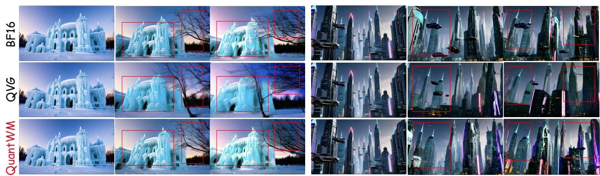

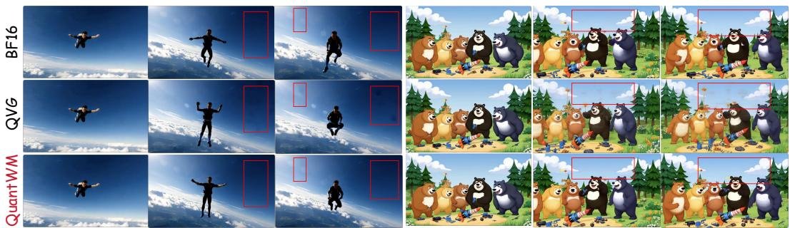  
(a) LingBot-World-v2

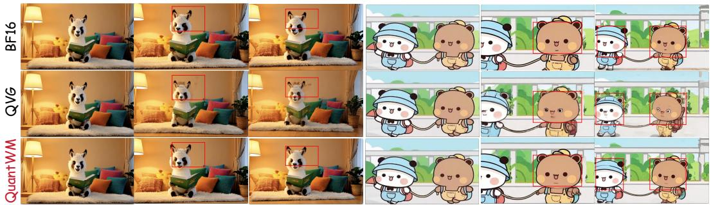  
(b) HY-World 1.5

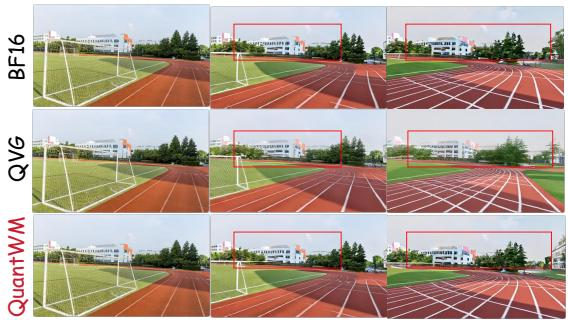

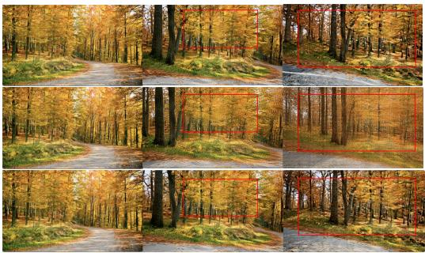  
Matrix-Game-2(c) Matrix-Game-2  
(d) Causal-Forcing  
Figure 7: More visual comparisons of BF16, QVG and QuantWM across different video generation and world models.

Table 9: Ablation study on the rank r of PSAC. Increasing the rank provides marginal quality improvements but introduces higher storage overhead, so we use r = 8 to balance visual quality and KV cache compression.
<table><tr><td>Model</td><td>Rank</td><td>PSNR↑</td><td>SSIM↑</td><td>LPIPS↓</td><td>∆ Bit vs. r = 8</td></tr><tr><td rowspan="5">HY-World 1.5</td><td>2</td><td>18.3949</td><td>0.7643</td><td>0.1102</td><td>-0.1006</td></tr><tr><td>4</td><td>18.3973</td><td>0.7645</td><td>0.1100</td><td>-0.0671</td></tr><tr><td>8</td><td>18.4485</td><td>0.7661</td><td>0.1082</td><td>0.0000</td></tr><tr><td>16</td><td>18.5368</td><td>0.7692</td><td>0.1063</td><td>+0.1341</td></tr><tr><td>32</td><td>18.5157</td><td>0.7694</td><td>0.1067</td><td>+0.4023</td></tr><tr><td rowspan="5">Causal-Forcing</td><td>2</td><td>16.2259</td><td>0.7457</td><td>0.1569</td><td>-0.1926</td></tr><tr><td>4</td><td>16.2409</td><td>0.7466</td><td>0.1554</td><td>-0.1284</td></tr><tr><td>8</td><td>16.2828</td><td>0.7464</td><td>0.1554</td><td>0.0000</td></tr><tr><td>16</td><td>16.3495</td><td>0.7491</td><td>0.1527</td><td>+0.2569</td></tr><tr><td>32</td><td>16.3462</td><td>0.7507</td><td>0.1515</td><td>+0.7706</td></tr></table>

## B.3 MORE VISUALIZATIONS OF GENERATED VIDEOS

We provide additional qualitative comparisons across different video generation and world models. As shown in Figure 7, QVG frequently introduces temporal flickering, blurring, and local visual artifacts after 2-bit KV cache quantization. In contrast, QuantWM better preserves object appearance, spatial details, and temporal consistency, which produces results that remain closer to BF16. These examples further confirm that the temporal consistency improvements of QuantWM are consistent across different models and generation scenarios.

## C ANALYSIS AND ILLUSTRATIONS ON QSAC AND PSAC

## C.1 QUERY ENERGY DISTRIBUTION ON MORE MODELS

To further validate the low-rank structure of dominant Query directions in PSAC, we visualize the cumulative energy of historical Queries on more video generation and world models. As shown in Figure 8, the top-8 directions capture a large fraction of the total Query energy across different models and layers, which provides a compact principal Query subspace for correcting the Key quantization errors that have larger impacts on attention logits.

## C.2 THE EFFECT OF THE HYPER-PARAMETER r IN PSAC

We further study the effect of the PSAC rank r. As shown in Table 9, increasing r generally improves the frame-level quality, but the gains gradually diminish. For example, increasing the rank from 8 to 16 only brings modest improvements in PSNR, SSIM, and LPIPS, while introducing an additional 0.1341 bits on HY-World 1.5 and 0.2569 bits on Causal-Forcing relative to r = 8. This trend is also consistent with the cumulative Query-energy distributions in Figure 4 and 8, where the additional energy captured by higher-rank directions gradually decreases. Therefore, we set r = 8 throughout our experiments as a practical trade-off between visual quality and additional storage overhead.

## C.3 INITIALIZATION OF HISTORICAL QUERY STATISTICS

At the beginning of generation, historical Query statistics are not available. To handle this cold-start stage without introducing unreliable estimates, we adopt a simple causal initialization strategy. For the first cache chunk, QSAC assigns uniform channel sensitivity, i.e., $w _ { h , c } = 1$ , such that centroid selection depends only on the residual quantization characteristics, while PSAC is temporarily inactive because no reliable principal Query subspace can be approximated. After the current chunk is quantized, its Query observations are incorporated into the historical second-order statistics and become available to subsequent chunks. In this way, the statistics used by QSAC and PSAC are always constructed from previously generated content, which preserve strict causality throughout inference. Since each committed chunk contributes a large number of spatial Query tokens, the historical statis tics can be established rapidly after initialization without requiring an additional calibration stage or manually designed warm-up schedule.

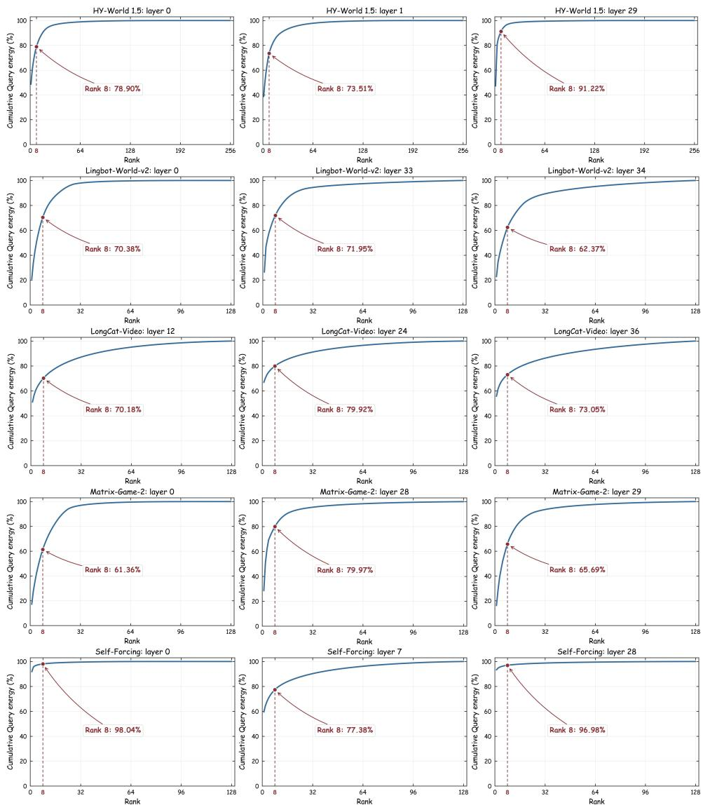  
Figure 8: Cumulative Query energy across different models and layers.

Table 10: Effect of the diagonal approximation in QSAC.
<table><tr><td>Model</td><td>QSAC Metric</td><td>PSNR↑</td><td>SSIM↑</td><td>LPIPS↓</td><td>Latency (s) ↓</td></tr><tr><td rowspan="2">HY-World 1.5</td><td>Diagonal</td><td>18.4485</td><td>0.7661</td><td>0.1082</td><td>118.75</td></tr><tr><td>Full</td><td>18.3827</td><td>0.7665</td><td>0.1097</td><td>123.10</td></tr><tr><td rowspan="2">Causal-Forcing</td><td>Diagonal</td><td>16.2828</td><td>0.7464</td><td>0.1554</td><td>101.21</td></tr><tr><td>Full</td><td>16.2759</td><td>0.7449</td><td>0.1547</td><td>104.07</td></tr></table>

## C.4 THE EFFECT OF THE DIAGONAL QUERY APPROXIMATION IN QSAC

QSAC maintains the historical Query second-moment matrix $\mathbf { M } _ { h } ^ { t - 1 }$ in Eq. 9, and uses its diagonal entries to construct the Query-aware distance in Eq. 13. To study the effect of the ignored cross-

Table 11: Effect of the number of candidate centroids M in QSAC. M = 4 achieves a favorable trade-off between visual quality and inference cost, while exhaustive evaluation over all 256 centroids provides no additional quality benefit.
<table><tr><td>Model</td><td>M</td><td>PSNR↑</td><td>SSIM↑</td><td>LPIPS↓</td><td>Latency (s) ↓</td></tr><tr><td rowspan="6">HY-World 1.5</td><td>1</td><td>18.2442</td><td>0.7612</td><td>0.1132</td><td>116.06</td></tr><tr><td>2</td><td>18.3988</td><td>0.7639</td><td>0.1100</td><td>116.22</td></tr><tr><td>4</td><td>18.4485</td><td>0.7661</td><td>0.1082</td><td>118.75</td></tr><tr><td>8 16</td><td>18.4393 18.4880</td><td>0.7658 0.7665</td><td>0.1089 0.1086</td><td>119.51 120.65</td></tr><tr><td>32</td><td>18.4701</td><td>0.7664</td><td>0.1084</td><td>118.97</td></tr><tr><td>256</td><td>18.4450</td><td>0.7661</td><td>0.1094</td><td>240.66</td></tr><tr><td rowspan="8">Causal-Forcing</td><td></td><td></td><td></td><td></td><td></td></tr><tr><td>1 2</td><td>16.1767</td><td>0.7434</td><td>0.1567</td><td>135.07</td></tr><tr><td>4</td><td>16.2433 16.2828</td><td>0.7478</td><td>0.1543</td><td>135.84</td></tr><tr><td>8</td><td></td><td>0.7464</td><td>0.1554</td><td>135.08</td></tr><tr><td></td><td>16.2805</td><td>0.7479</td><td>0.1535</td><td>144.90</td></tr><tr><td>16 32</td><td>16.2834</td><td>0.7487</td><td>0.1529</td><td>148.43</td></tr><tr><td>256</td><td>16.2161</td><td>0.7470</td><td>0.1554</td><td>159.97</td></tr><tr><td></td><td>16.2067</td><td>0.7463</td><td>0.1559</td><td>1386.38</td></tr></table>

channel correlations, we replace Eq. 13 with the full quadratic form:

$$
d _ { \mathrm { f u l l } } ( \mathbf { k } _ { i } , \pmb { \mu } _ { j } ) = ( \mathbf { k } _ { i } - \pmb { \mu } _ { j } ) ^ { \top } \mathbf { M } _ { h } ^ { t - 1 } ( \mathbf { k } _ { i } - \pmb { \mu } _ { j } ) ,\tag{20}
$$

which is used to select the top-m candidate centroids and the remaining QuantWM pipeline is unchanged. As shown in Table 10, retaining the full matrix does not provide consistent improvements in frame-level quality. The differences in PSNR, SSIM and LPIPS are marginal on both HY-World 1.5 and Causal-Forcing, while the full matrix introduces additional inference latency. Therefore, we adopt the diagonal approximation in QSAC throughout our experiments.

## C.5 THE EFFECT OF THE NUMBER OF CANDIDATE CENTROIDS IN QSAC

QSAC first selects the top-M candidate centroids using the Query-aware distance and then determines the final centroid according to the quantization-aware score. We study the effect of M on HY-World 1.5 and Causal-Forcing in Table 11. Increasing M beyond 4 brings only marginal changes in frame-level quality. In particular, evaluating all 256 centroids does not improve PSNR, SSIM, or LPIPS over M = 4 on either model, while significant increasing the inference latency. These results indicate that a small candidate set is sufficient to retain high-quality centroids for the subsequent quantization-aware selection, so we use M = 4 throughout our experiments as a practical trade-off between visual quality and efficiency.

## D EFFICIENT ALGORITHM-SYSTEM CODESIGN

## D.1 IMPLEMENTATION DETAILS

Figure 9 illustrates how our QuantWM integrates cache compression, packed storage and ondemand reconstruction into streaming inference.

Cache lifecycle At each native cache-chunk boundary, QuantWM replaces the completed BF16 chunk with its packed representation and releases the original storage. The active chunk remains in BF16 until completion, while historical chunks remain compressed between attention calls. To support online QSAC and PSAC, we incrementally maintain per-head Query statistics and compute the principal basis at chunk boundaries without retaining historical Query tensors.

Packed storage We physically pack four INT2 residual codes into each byte and store centroid assignments as uint8 indices. The zero-points are also bit-packed as INT2, while group scales use INT8 codes with a shared FP16 secondary scale. Each INT8 PSAC coefficient row has an FP16 scale. We retain a quantized correction only when it reduces the approximated Query-weighted error; otherwise, its coefficient row is set to zero. For each cache chunk, we select the smaller of dense and sparse coefficient layouts, including the storage cost of sparse indices.

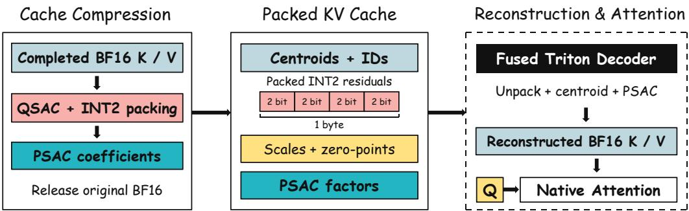  
Figure 9: Overview of QuantWM’s inference system. Completed KV cache chunks are stored in a packed low-bit representation. A fused decoder reconstructs BF16 keys and values on demand for native attention.

Fused reconstruction During each KV-cache access for attention computation, a Triton kernel fuses residual unpacking, quantization-parameter reconstruction, centroid gathering and PSAC accumulation. Values follow the same reconstruction path without PSAC. The kernel writes only the reconstructed BF16 K/V, which avoids separate dense intermediates for centroid addition and lowrank compensation. The model’s native FlashAttention or SDPA implementation consumes these temporary tensors, which are not retained in the persistent cache. We preserve each model’s native cache layout, attention mask and RoPE convention, where pre-RoPE Keys receive positional encoding after reconstruction, while post-RoPE Keys are reconstructed directly.

## D.2 THE IMPACT OF KV CACHE QUANTIZATION ON LATENCY IS MODEL-DEPENDENT

Although KV cache quantization is mainly designed to reduce memory consumption, its impact on end-to-end latency can vary across different system configurations. Online quantization and cache reconstruction introduce additional computation, while the compressed representation reduces the amount of KV data accessed and transferred during generation. For models that are more constrained by KV-cache memory traffic or cache offloading, the reduction in data movement can outweigh the additional quantization overhead and lead to lower latency. LongCat-Video in Table 6 is such a case, where its native inference pipeline offloads a large KV cache, and QuantWM reduces the amount of cache data repeatedly transferred between host and GPU, which brings lower end-to-end latency. In contrast, when the KV cache is primarily GPU-resident, the reduction in data movement is smaller and the additional quantization operations may introduce a modest latency overhead. Therefore, the latency impact of KV cache quantization depends not only on the compression ratio, but also on how cached representations are accessed and moved during inference.