# ϕ-RIE: From Photorealistic Reconstruction to Interactive Environments

Runyi Yang1, Deheng Zhang1, Xiaoye Wang1, Kanzhi Wu2, Lei Sun1, Ajad Chhatkuli1, Kunyu Peng3,∗, Luc Van Gool1, Danda Pani Paudel1 Project Page: https://github.com/insait-institute/PhiRIE

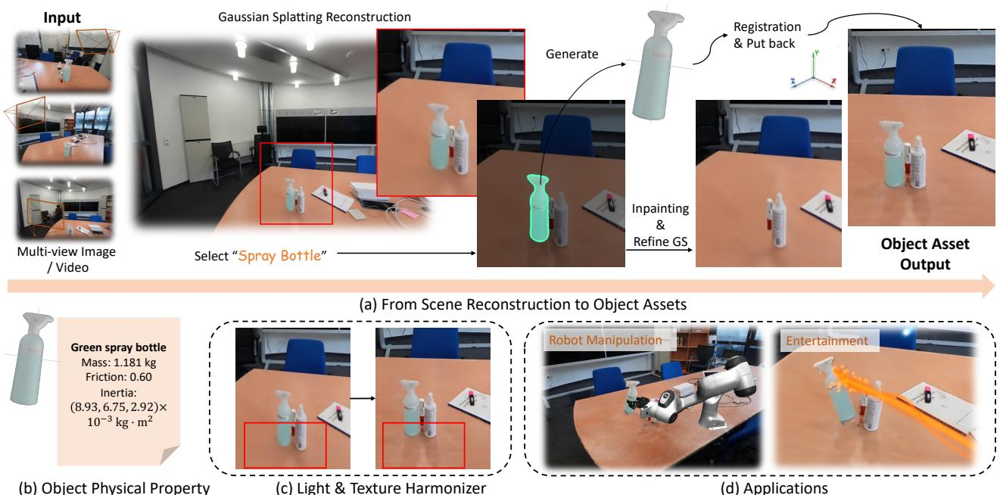  
Fig. 1. From captured appearance to physical interaction. ϕ-RIE converts captured Gaussians into an Interactive Environment through Scene Observation and Coupled Scene Construction. Shared object identities connect completed assets to source-Gaussian removal and background completion Panel (c) motivates optional appearance harmonization after rendering to address lighting and shadow mismatch following object insertion or motion.

Abstract— 3D Gaussian Splatting (3DGS) can reconstruct a captured scene photorealistically, but the resulting representation does not by itself support physical interaction. Robot simulation instead requires object-level change, i.e., objects must move independently, make contact, and reveal previously occluded surroundings. This gap arises because object appearance may remain entangled with the background, while hidden object geometry and occluded background content may be unobserved. To address this challenge, we present ϕ-RIE, a Gaussian-native pipeline that converts selected objects into movable simulator assets while preserving the remaining reconstruction. Our key observation is that asset construction and source removal should be coupled, i.e., one object identity should define the movable asset and the scene content to remove and complete. Accordingly, Scene Observation supplies shared evidence to Coupled Scene Construction, which creates registered assets and completed background Gaussians for simulator-driven rendering in an Interactive Environment. This coupling preserves unedited Gaussians while aligning visual and physical state. On 50 ScanNet++ scenes, evidence-based selection and registration retry increase matched F1 at 20 mm from 0.336 to 0.383 at fixed retention. Further tests demonstrate asset executability, manipulation gains over a singlegenerator baseline, and the visual cost of conversion. Together, these results demonstrate that ϕ-RIE enables interactive scene conversion.

## I. INTRODUCTION

Robot simulation requires executable scene content, i.e., objects with identities, metric placements, collision geometry, and appearance that follows their motion. Benchmarks such as LIBERO and BEHAVIOR provide this structure through prepared assets [8], [9]. In contrast, real-world capture can preserve the layout, clutter, and appearance of an actual environment. Among current scene representations, 3D Gaussian Splatting (3DGS) is particularly attractive for photorealistic real-to-sim because it combines high-fidelity reconstruction with efficient rendering and has already been integrated into robot simulators [10], [1], [2], [11]. However, converting such a reconstruction into an interactive simulation environment requires more than photorealistic rendering.

The underlying difficulty is that 3DGS primitives are optimized to explain images rather than represent independently movable physical objects. Consider a robot lifting a cup from a table. To support this interaction, the visual representation of the cup must be separated from its surroundings and move with its physical body. Moreover, its hidden shape must support contact, and the previously covered tabletop must become visible after the cup moves. Yet an accurate rendering of the initial scene does not guarantee these properties. The cup and table can be explained by overlapping Gaussians, while the base of the cup and the tabletop beneath it may remain unobserved. This example reveals three coupled requirements for conversion. First, separation assigns captured appearance to independently movable objects. Second, completion supplies missing object surfaces for contact and background content exposed by motion. Finally, state consistency binds visual and collision representations to a common coordinate frame and drives them with the same simulated motion. These requirements must be addressed jointly, because inserting an asset without removing its original appearance creates a duplicate, while erasing it without completing the background leaves holes.

TABLE I  
SCENE-CONVERSION AND RENDERING CAPABILITIES. CHECKS INDICATE INCLUDED OPERATIONS, CROSSES ABSENT OPERATIONS, AND DASHES UNSPECIFIED EVIDENCE.
<table><tr><td>Property</td><td>SplatSim[1]</td><td>Re3Sim[2]</td><td>HoloScene[3]</td><td>PolaRiS[4]</td><td>SimRecon[5]</td><td>GASE[6]</td><td>SimFoundry[7]</td><td>φ-RIE(ours)</td></tr><tr><td>Rigid-body simulation</td><td>√</td><td>√</td><td>V</td><td>V</td><td>√</td><td>√</td><td>√</td><td>V</td></tr><tr><td>Gaussian background</td><td>√</td><td>√</td><td>V</td><td>V</td><td>X</td><td>V</td><td>√</td><td>V</td></tr><tr><td>Gaussian movable objects</td><td>√</td><td>X</td><td></td><td></td><td>×</td><td></td><td>×</td><td></td></tr><tr><td>Generative object completion</td><td>X</td><td>X</td><td></td><td>V</td><td></td><td>V</td><td>√</td><td></td></tr><tr><td>Exposed-background synthesis</td><td>×</td><td>X</td><td></td><td>×</td><td></td><td>√</td><td>√</td><td></td></tr><tr><td>Evidence-based 3D selection</td><td>×</td><td>X</td><td>V</td><td>×</td><td></td><td>×</td><td>×</td><td>√</td></tr><tr><td>GS full rendering mode</td><td>√</td><td>×</td><td>V</td><td></td><td>×</td><td></td><td>X</td><td>」</td></tr></table>

physical validity, or downstream task success.

To address these coupled requirements, we introduce ϕ-RIE (Fig. 1), which organizes scene conversion into the three stages shown in Fig. 2. Scene Observation extracts object masks and an observed surface from the captured views. Coupled Scene Construction then uses this shared evidence to address separation and completion. Its object branch generates, aligns, verifies, and selects completed asset candidates, with registration retry for uncertain orientation. Meanwhile, its background branch uses the same object’s shape and masks to remove source Gaussians and complete the exposed region. Consequently, each selected asset corresponds to the appearance removed from the scene, while unedited Gaussians retain their captured appearance.

The Interactive Environment addresses state consistency by combining the constructed assets and background with simulator state. Specifically, simulator body poses drive the corresponding Gaussian assets, while completed meshes provide collision geometry without replacing Gaussian appearance. As a result, rendered objects remain aligned with their simulated bodies (Fig. 2(c)). After rendering, an optional harmonization stage reduces the residual lighting and shadow mismatch illustrated in the teaser (Fig. 1(c), Sec. III-D.2) without changing the constructed scene or its dynamics.

To assess whether the resulting scene representations are both faithful and executable, we evaluate ϕ-RIEacross successive stages of conversion. We evaluate construction on 50 ScanNet++ scenes by measuring candidate retention and geometric accuracy against independent references, and separately quantify the visual cost of conversion on held-out views [12]. We then test physical validity through simulator export and isolated-body drop tests, and interaction utility through controlled asset-replacement experiments in Robo-Casa. By evaluating these stages separately, we avoid conflating construction availability with reconstruction fidelity,

Our contributions are summarized:

• A Gaussian-native pipeline that preserves unedited captured appearance while turning selected objects into independently movable assets.

• Coupled Scene Construction, in which shared object evidence connects candidate alignment and selection to source-Gaussian removal and background completion.

• A real-scene evaluation spanning construction availability, geometric and visual fidelity, physical validity, and manipulation performance.

## II. RELATED WORK

Gaussian Splatting for robotics. Neural mapping recovers geometry for perception and planning [13], [14], [15], while 3DGS and 2DGS emphasize captured appearance and efficient rendering [10], [16]. PhysGaussian models dynamics with Gaussian primitives, and Robo-GS combines Gaussian appearance, meshes, and physical attributes [17], [18]. SplatSim, DISCOVERSE, and GSWorld integrate Gaussian rendering with physics simulation [1], [11], [19]. ϕ-RIE focuses on converting a captured Gaussian scene into independently movable objects and a completed background.

Real-to-sim scene construction and evaluation. Re3Sim and SimFoundry pair Gaussian backgrounds with meshrendered objects, while HoloScene binds Gaussian appearance to completed meshes [2], [7], [3]. SimRecon constructs compositional assets from video, GASE reconstructs foreground and background after image-space separation and completion, and SimuScene refines generated shapes and layouts from a single image using physics feedback [5], [6], [20]. RialTo learns policies in reconstructed environments, while DexNinja uses simulation for contact-rich policy learning [21], [22]. LIBERO, BEHAVIOR, and RoboCasa provide prepared tasks and interactive assets [8], [9], [23], while SIMPLER and PolaRiS emphasize matched observations and control for policy evaluation [24], [4]. In contrast, Coupled Scene Construction edits an existing Gaussian field locally, using shared object evidence for candidate alignment and selection, source removal, and background completion while preserving unrelated primitives. Table I compares construction and rendering choices. Its GS full rendering mode uses Gaussians for both the background and movable objects.

Object generation and scene editing. TRELLIS, TREL-LIS.2, ReconViaGen, and SAM 3D Objects generate assets from images [25], [26], [27], [28], but do not jointly address metric placement, collision preparation, and removal of captured appearance. SAM3 provides concept-conditioned masks, while Chorus encodes semantic and instance cues in Gaussian scenes [29], [30]. GaussianEditor and image inpainting edit appearance [31], [32], whereas DiffusionHarmonizer enhances renderings [33]. In ϕ-RIE, background completion updates scene Gaussians, while optional harmonization changes only rendered images.

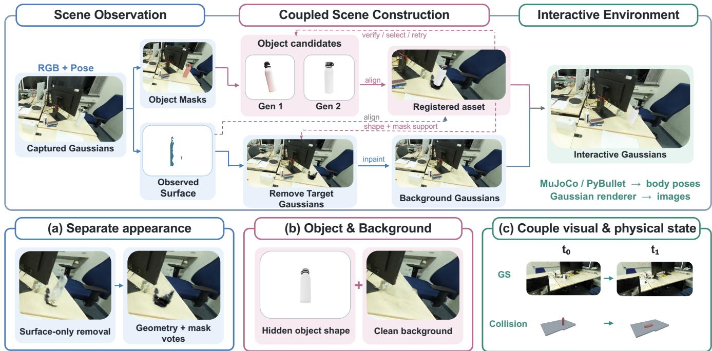  
Fig. 2. Overview of ϕ-RIE. Scene Observation provides object masks and observed surfaces. Coupled Scene Construction produces registered assets and background Gaussians. The Interactive Environment renders their composition from simulator body poses. The lower panels illustrate (a) appearance separation, (b) object and background completion, and (c) coupled visual and physical state.

## III. GAUSSIAN-NATIVE SCENE CONVERSION

Overview. As shown in Fig. 2, ϕ-RIE converts a captured Gaussian scene into movable object assets and a completed background through Scene Observation, Coupled Scene Construction, and an Interactive Environment. Shared object instances connect asset generation and registration with source-Gaussian removal and background completion. We assemble the assets for physics simulation and drive their Gaussian appearance with the simulated body poses. Optional appearance harmonization follows rendering and addresses the distinct appearance issue in Fig. 1(c).

## A. Scene Representation

Inputs are a Gaussian reconstruction $G ^ { 0 }$ , calibrated images $\mathcal { V } = \{ I _ { k } , K _ { k } , T _ { k } \}$ with camera intrinsics $K _ { k }$ and camera-toworld poses $T _ { k }$ in a common metric frame, and an aligned scene surface from a scan or fused depths rendered from $G ^ { 0 }$ . For editable object i, $Q _ { i }$ contains observed surface vertex samples, $G _ { i }$ is its visual Gaussian asset in a canonical object frame, and $S _ { i } ( t )$ is its object-to-scene transformation at timestamp $t ,$ with $S _ { i } ( 0 ) \in \mathrm { S i m } ( 3 )$ . Removing the instance’s source Gaussians $R _ { i } \subseteq G ^ { 0 }$ and adding background

completion $G ^ { \mathrm { { f i l l } } }$ gives

$$
\begin{array} { l } { G ^ { \mathrm { b g } } = \Bigg ( G ^ { 0 } \setminus \bigcup _ { i } R _ { i } \Bigg ) \cup G ^ { \mathrm { f i l l } } , } \\ { G ( t ) = G ^ { \mathrm { b g } } \cup \bigcup _ { i } \mathcal { W } ( S _ { i } ( t ) , G _ { i } ) . } \end{array}\tag{1}
$$

Here, W(S, G) transforms Gaussian set G by S. The background retains source Gaussians outside the removal sets, while object assets move independently. These correspond to the Background $G ^ { \mathrm { b g } }$ and Interactive G(t) in Fig. 2.

## B. Scene Observation

From the captured Gaussians and calibrated RGB + Pose inputs, Scene Observation supplies the Object Masks and Observed Surface. Frozen SAM3 produces image masks [29], which we lift onto the scene surface using first-hit ray intersections. We associate these regions across views by voxel overlap to obtain object instances with surface samples $Q _ { i } .$ , masks, and spatial bounds.

## C. Coupled Scene Construction

The two branches share object identity but complete different missing content: object shape and the exposed background (Fig. 2(b)). A registered asset also supplies shape support for source-Gaussian removal.

1) Object candidates and registered assets: Generate and align candidates. The default pool combines singleview TRELLIS [25] and multi-view ReconViaGen [27], each providing a completed mesh and visual Gaussians. Generation predicts missing shape, while observations constrain metric placement. For candidate surface samples $P _ { i }$ , we estimate scale, rotation, and translation S. We initialize scale from robust observed dimensions, search yaw under an upright hypothesis, and refine with partial-to-complete iterative closest point (ICP), followed by scale and translation refinement. We score alignment with a symmetric clipped nearest-point distance:

$$
E _ { i } ( S ) = d _ { \tau } ( S P _ { i } , Q _ { i } ) + d _ { \tau } ( Q _ { i } , S P _ { i } ) ,\tag{2}
$$

where

$$
d _ { \tau } ( A , B ) = \frac { 1 } { | A | } \sum _ { a \in A } \operatorname* { m i n } \Bigl ( \tau , \operatorname* { m i n } _ { b \in B } \| a - b \| _ { 2 } \Bigr ) .\tag{3}
$$

The two directions penalize unsupported candidate surfaces and unexplained observations. Clipping at τ limits outliers and penalties on unobserved regions. This measures observed agreement, not hidden-shape correctness.

Verify, select, and retry. Candidates are ranked using construction checks for registration, scale, observation support, collision validity, and isolated settling, followed by residual and stability criteria (Sec. IV-A). If initial candidates fail, a bounded retry tests alternative source-up directions. It changes the alignment hypothesis without regenerating or repairing shape. The default constructor keeps the best numerically valid candidate and records unresolved checks. A strict variant rejects candidates that still fail, separating the effects of registration retry from rejection.

2) Background Gaussians: Remove source appearance. The background branch uses the same identity as the registered asset. Figure 2(a) contrasts surface-only removal with geometry and mask votes. Surface proximity can miss diffuse or low-opacity object contributions, so we combine three sets of source Gaussians:

$$
R _ { i } = R _ { i } ^ { \mathrm { o b s } } \cup R _ { i } ^ { \mathrm { a s s e t } } \cup R _ { i } ^ { \mathrm { m a s k } } .\tag{4}
$$

$R _ { i } ^ { \mathrm { { o b s } } }$ and $R _ { i } ^ { \mathrm { a s s e t } }$ select Gaussians near the observed surface and registered completed asset, respectively. The latter extends coverage to parts missing from the scan. Within expanded object bounds, $R _ { i } ^ { \mathrm { { m a s k } } }$ selects Gaussian centers whose projections fall inside instance masks in multiple views. We remove the union over all target objects.

Inpaint and complete the exposed background. Image inpainting supplies background appearance targets, not 3D geometry. Each object uses one primary edited view to avoid conflicting independent inpaintings. We composite all edits sharing a frame into one target, so one object’s supervision does not restore another’s original appearance. Around the exposed region, we fit a robust support plane and initialize normal-aligned Gaussian disks, colored from the edited view where visible and neighbouring observations elsewhere. Refinement against the edited-image targets optimizes only these new Gaussians, keeping retained source Gaussians fixed. This produces a shared renderable background under a local planar assumption, suitable for regions such as tabletops, rather than a unique recovery of hidden surfaces. Unsupported regions and failed completions are recorded.

## D. Interactive Environment

Registered assets and Background Gaussians form the interactive scene.

1) Couple visual and physical state: Collision meshes determine contacts, the simulator computes body poses, and Gaussians provide the corresponding visual appearance. Where supported, CoACD converts completed meshes into convex collision components [34]; physical parameters come from priors unless separately measured.

As illustrated in Fig. 2(c), visual and collision assets share an initial metric placement. For simulator body pose $T _ { i } ( t ) \in$ $\operatorname { S E } ( 3 )$ and initial visual placement $S _ { i } ( 0 )$ , we update

$$
S _ { i } ( t ) = T _ { i } ( t ) T _ { i } ( 0 ) ^ { - 1 } S _ { i } ( 0 ) .\tag{5}
$$

This applies the body’s relative motion while preserving the initial body-to-asset offset, without requiring the visual origin to coincide with the center of mass. Shared motion does not guarantee identical visual and collision surfaces.

For scale s, rotation $R ,$ and translation t, Gaussian means and covariances transform as

$$
\pmb { \mu } ^ { \prime } = s R \pmb { \mu } + \mathbf { t } , \qquad \Sigma ^ { \prime } = s ^ { 2 } R \Sigma R ^ { \top } .\tag{6}
$$

Scale is applied once at construction, after which body motion is rigid. Cameras, bodies, and renderings use the same simulator state. View-dependent appearance requires consistent viewing directions. Here, simulation-ready means loadable rigid objects with state-linked appearance, not a guarantee of physical accuracy or task utility.

2) Optional appearance harmonization: Object motion does not update illumination encoded in Gaussian appearance. After rendering, optional pretrained DiffusionHarmonizer (Fig. 1(c)) [33] takes the current image and a causal history of enhanced frames from the same camera and episode. It modifies image appearance without changing Gaussian parameters, collision geometry, or dynamics, and does not reconstruct a lighting model or guarantee physically correct shadows. We retain raw renderings to separate sceneconstruction quality from image enhancement.

## IV. EXPERIMENTS

## A. Experimental Setting

Implementation. SAM3 processes every twelfth training frame using a fixed household-object vocabulary and a maskscore threshold of 0.45. Observations are merged on a 2 cm voxel grid at an overlap threshold of 0.25, requiring two supporting views and category-dependent extent checks. Registration uses 20K mesh points, $1 0 ^ { \circ }$ yaw steps, and 3 cm distance clipping. Retry tests five alternative signed sourceup axes. Candidates are ranked lexicographically by check satisfaction, failed-check count, registration residual, scale discrepancy, and settling displacement, with deterministic tie-breaking. Gaussian removal uses 3 cm observed-surface and 2.4 cm asset-surface radii with at least two mask votes. Local fill uses a 5 mm grid. MuJoCo runs robot rollouts, while PyBullet supports construction probes and dynamics tests [35], [36]. Each study retains its shared room collisions or per-object support shims. All experiments are conducted on NVIDIA A6000.

Scene evaluation. The main study covers 1,871 object requests from 50 ScanNet++ scenes [12]. Construction uses training observations, with reference instances associated after candidate selection. Retention measures candidate availability over all requests. Geometry uses F1 at 20 mm and symmetric Chamfer distance (CD, centimeters) on independent matches without evaluator-side alignment. Export validity and isolated-body drop stability are evaluated separately from the construction probe used for selection. Visual fidelity uses PSNR, SSIM, and AlexNet LPIPS on raw Gaussian renderings [37], [38]. Construction time includes generation, registration, checks, and retries, but excludes acquisition, source-Gaussian training, and queueing.

TABLE II  
COUPLED SCENE CONSTRUCTION ON 50 SCANNET++ SCENES. ROWS VARY ITS CANDIDATE POOL, SELECTION, RETRY, AND ACCEPTANCE RULE. RETAINED COUNTS ARE OUT OF 1,871 REQUESTS. T: TRELLIS; R: RECONVIAGEN.
<table><tr><td>Configuration</td><td>Pool</td><td>Selection</td><td>Retry</td><td></td><td>Strict Retained Matched</td><td></td><td>F1@20↑</td><td>CD (cm) ↓ min/scene</td><td></td></tr><tr><td>TRELLIS only</td><td>T</td><td>Single</td><td>No</td><td>No</td><td>1640</td><td>517</td><td>0.301</td><td>11.767</td><td>13.58</td></tr><tr><td>Fixed priority</td><td>T+R</td><td>R first</td><td>No</td><td>No</td><td>1800</td><td>566</td><td>0.336</td><td>7.638</td><td>35.68</td></tr><tr><td>φ-RIE without retry</td><td>T+R</td><td>Evidence</td><td>No</td><td>No</td><td>1800</td><td>566</td><td>0.348</td><td>7.196</td><td>35.68</td></tr><tr><td>φ-RIE (ours)</td><td>T+R</td><td>Evidence</td><td>Yes</td><td>No</td><td>1800</td><td>566</td><td>0.383</td><td>5.720</td><td>70.82</td></tr><tr><td>φ-RIE + strict acceptance</td><td>T+R</td><td>Evidence</td><td>Yes</td><td>Yes</td><td>399</td><td>134</td><td>0.425</td><td>4.257</td><td>70.82</td></tr></table>

TABLE III

REGISTERED-ASSET EXECUTION IN THE INTERACTIVE ENVIRONMENT. S/P AND S/E DENOTE OVERALL AND CONDITIONAL SUCCESS.
<table><tr><td>Configuration</td><td>Executed</td><td>Successful</td><td>S/P (%)</td><td>S/E (%)</td><td>To cabinet</td><td>To sink</td><td>From sink</td></tr><tr><td>Original environment (reference)</td><td>480</td><td>385</td><td>80.2</td><td>80.2</td><td>119/160</td><td>130/160</td><td>136/160</td></tr><tr><td>TRELLIS only</td><td>310</td><td>73</td><td>15.2</td><td>23.5</td><td>42/160</td><td>19/160</td><td>12/160</td></tr><tr><td>Fixed priority</td><td>320</td><td>131</td><td>27.3</td><td>40.9</td><td>63/160</td><td>39/160</td><td>29/160</td></tr><tr><td>φ-RIE without retry</td><td>320</td><td>118</td><td>24.6</td><td>36.9</td><td>63/160</td><td>35/160</td><td>20/160</td></tr><tr><td>φ-RIE (ours)</td><td>320</td><td>128</td><td>26.7</td><td>40.0</td><td>65/160</td><td>38/160</td><td>25/160</td></tr></table>

Interaction evaluation. RoboCasa provides 48 configurations across eight layouts and three task families, with ten paired resets per configuration, giving 480 planned trials per method [23]. Ideal posed RGB-D observations reconstruct the target, while the room and destination remain native. Policy observations use uniform-material native mesh rendering without Harmonizer. All methods share the robot, controller, instructions, cameras, horizons, and native success tests. Frozen OpenPI pi05\_pretrain\_human300 uses three 224×224 camera inputs and five-step replanning. Fresh policy processes use matched sampling streams and saved robot, object, controller, and sensor states. Perturbations affect estimated placements, not reference poses. Unchanged asset import controls check states, observations, and task predicates before replacement. The scene set was previously evaluated, rather than newly held out.

For $N _ { p }$ planned trials, $N _ { e }$ executions, and $N _ { s }$ successes,

$$
\underbrace { \frac { N _ { s } } { N _ { p } } } _ { \mathrm { o v e r a l l ~ s u c c e s s } } = \underbrace { \frac { N _ { e } } { N _ { p } } } _ { \mathrm { c o v e r a g e ~ c o n d i t i o n a l ~ s u c c e s s } } .\tag{7}
$$

Construction rejections contribute no successes to fully accounted studies, while missing evaluations remain unmeasured. Policy intervals use paired hierarchical resampling over layouts, configurations, and resets, rather than treating resets as independent reconstructions.

TABLE IV  
VISUAL FIDELITY ON SCANNET++.
<table><tr><td>Representation</td><td>PSNR ↑</td><td>SSIM ↑</td><td>LPIPS ↓</td></tr><tr><td>Source Gaussians</td><td>21.582</td><td>0.8444</td><td>0.2993</td></tr><tr><td>φ-RIE (factorized)</td><td>20.438</td><td>0.8318</td><td>0.3168</td></tr></table>

## B. Quantitative Results

Scene construction and physical validity. Table II compares TRELLIS-only generation with a combined TREL-LIS/ReconViaGen pool, varying selection, registration retry, and strict acceptance. Fixed priority selects ReconViaGen when available and TRELLIS otherwise. With the same 1,800 retained candidates and 566 independent matches, evidence-based selection increases F1 from 0.336 to 0.348, and retry raises it to 0.383. The respective paired gains have 95% intervals of [0.001, 0.022] and [0.007, 0.075]. Relative to fixed priority, the full constructor reduces CD by 25.1%, although retry increases construction time from 35.68 to 70.82 minutes per scene. These gains reflect improved candidate choice and alignment at fixed retention, whereas the TRELLIS-only comparison also changes the candidate pool and retention. Strict acceptance rejects candidates that fail construction checks, yielding higher conditional F1 on a smaller matched population. However, 17/134 accepted matches still exhibit geometry collapse, and 361 of its 394 verified exports pass the independent drop test.

Visual fidelity. Conversion incurs a 1.144 dB PSNR loss (Table IV), quantifying the joint visual cost of object replacement and background completion in the initial state. Surfaces exposed only after motion are not evaluated here.

Controlled manipulation. In Table III, ϕ-RIE succeeds on 128/480 planned trials, compared with 73/480 for TRELLIS only. The paired gain is 11.46 percentage points, with a 95% interval of [4.38, 19.79], and improvements occur in all three task families. Fixed priority, however, achieves 131 successes, and the intervals for adding selection and then retry both cross zero. Thus, the expanded constructor improves manipulation relative to the single-generator configuration,

S08 Living room: cups and plates

ScanNet++ S04 Two-desk office  
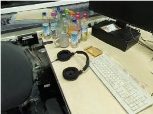  
S03 Office workstations

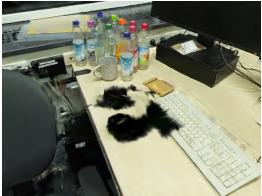

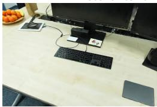

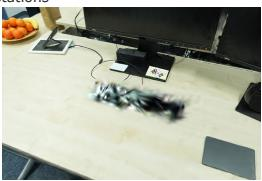

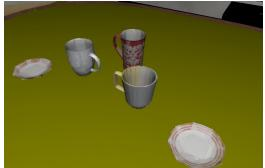  
(a) Reconstruct GS

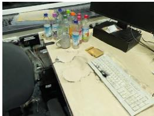

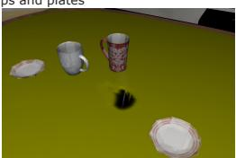  
(b) Object Removal

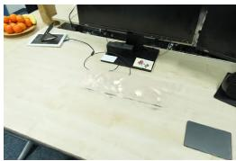

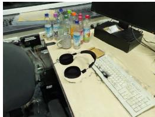

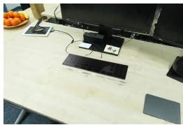

HeadPhone   
Mass: 0.452 kg   
Friction: 0.71   
Inertia:   
1.30, 0.88, 0.47 ×   
10!" kg · m#   
Keyboard   
Mass: 0.503 kg   
Friction: 0.94   
Inertia:   
8.09,7.56, 0.54 ×   
10!" kg · m#   
Cup with a Handle   
Mass: 0.121 kg   
Friction: 0.45   
Inertia:   
0.24, 0.23, 0.18 ×   
10!" kg · m#

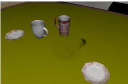

(c) Inpainting  
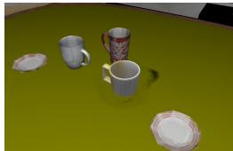  
(d) Registered New Obj  
(e) Physical Parameter  
Fig. 3. Qualitative scene conversion with ϕ-RIE. Examples from ScanNet++ (top two rows) and LIBERO (bottom row) show (a) the source Gaussian reconstruction, (b) object removal, (c) background inpainting, (d) the registered replacement asset, and (e) its assigned mass, friction, and inertia.

but the geometric gains from selection and retry do not establish additional policy gains. The geometry and policy studies also use different objects.

The original environment succeeds on 385/480 trials. For ϕ-RIE, the 352 unsuccessful planned trials comprise 160 without an executable construction and 192 failures after execution. Both construction availability and interaction quality limit performance. This experiment evaluates registered-asset replacement under native mesh observations, separately from the Gaussian-rendered demonstrations below.

## C. Qualitative Results

Coupled object and background construction. Figure 3 follows the conversion from a captured Gaussian scene through source removal and background inpainting to a registered asset with physical parameters. The sequence illustrates that the asset being inserted corresponds to the source appearance being removed, while completion supplies the background exposed by that removal. The parameter panel reports assigned physical properties.

Manipulation and object motion. Figure 4 illustrates cup flipping and the movement of a keyboard and headphones. Figure 5 complements these robot interactions with object displacement and rotation under shooting interactions. Together, they illustrate independently movable content in the Interactive Environment and the simulator-linked rendering described in Sec. III-D. These demonstrations are separate from the paired RoboCasa policy evaluation in Table III and do not measure visual–collision pose error.

Appearance harmonization. Figure 6 compares rendered observations with and without the optional Harmonizer in Sec. III-D.2. Unlike background completion, which constructs scene Gaussians, this stage modifies rendered images without changing geometry or simulator state. It addresses the appearance mismatch discussed in Fig. 1(c).

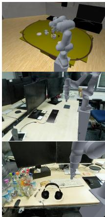

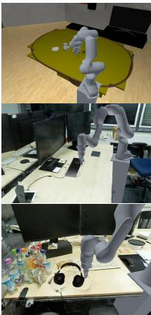

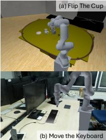

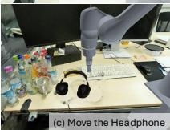  
Fig. 4. Robot manipulation in the Interactive Environment. Sequences show (a) flipping a cup, (b) moving a keyboard, and (c) moving headphones. Frames progress from left to right.

TABLE V  
OBJECT-CANDIDATE GENERATORS WITHIN ϕ-RIE.
<table><tr><td>Generator Exported F1@20↑F1@40↑ CD (cm) ↓ Stable</td></tr><tr><td>TRELLIS</td><td>29/32 0.3087</td><td>0.5311 7.1939</td></tr><tr><td>TRELLIS.2</td><td>29/32</td><td>0.2305 0.4482 0.3724</td></tr><tr><td>SAM 3D Objects</td><td>29/32 0.1847</td></tr><tr><td>ReconViaGen 29/32</td></tr><tr><td>0.2883 0.5064 8.6694 14/29</td></tr></table>

## D. Ablations

Object generation backend. We compare TRELLIS, TRELLIS.2, SAM 3D Objects, and ReconViaGen [25], [26], [28], [27] on 32 ScanNet++ development objects, with inputs available for 29. Single-image methods share a frame and mask, while ReconViaGen uses 5–12 training views. All candidates share observation-only signed-source-up registration, mesh simplification, CoACD decomposition, and URDF import without quality-based rejection. Geometry uses ten common independent matches, reporting F1 at 20/40 mm and CD without evaluator-side alignment.

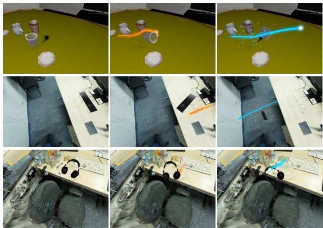  
Fig. 5. Interactive object perturbations in ϕ-RIE. From top to bottom, shooting interactions displace and rotate a cup, a keyboard, and headphones. Each row shows the initial configuration followed by two interaction states, with colored trails indicating the shots.

  
(a) With Harmonizer

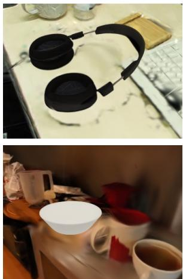  
(b) w/o Harmonizer  
Fig. 6. Optional appearance harmonization. Renderings with and without the post-rendering Harmonizer.

All 29 exports per backend undergo a 240 Hz plane-drop test with two seconds of velocity-zeroed settling followed by two seconds of free dynamics. Stability requires linkframe drift below 3 cm and final link height at least −5 cm. Collision meshes have a 40K-triangle budget, with mass 0.3 kg, friction 0.5, and restitution 0.0. All backends pass collision import (Table V). TRELLIS achieves the highest F1 and lowest CD, whereas SAM 3D Objects has the highest observed settling count (16/29). No backend leads both geometry and stability, which are evaluated on different populations. This single-seed study compares individual backends, not selection over a four-generator pool.

Background inpainting backend. We compare Telea, SDXL, and Gemini using identical images, masks, and compositing, with clean same-state targets reserved for evaluation. Of 48 planned cases across 12 instances, all metrics use the same 32 cases from nine instances, averaged first within and then across instances. In Table VI, Meas. counts available outputs. PSNR evaluates the masked hole, SSIM/LPIPS evaluate the crop, and Outside MAE measures changes outside the mask before compositing. Gemini achieves the highest hole PSNR, exceeding Telea by 0.36 dB, whereas Telea gives higher crop SSIM, lower LPIPS, and zero outside-mask error. Editor rankings therefore depend on the evaluation region and metric. These results assess 2D completion targets, not the reconstructed 3D background.

TABLE VI  
INPAINTING TARGETS FOR BACKGROUND GAUSSIANS.
<table><tr><td>Editor</td><td>Meas.</td><td>PSNR SSIM</td><td>LPIPS</td><td>Outside MAE</td></tr><tr><td>Telea [39]</td><td>33</td><td>26.45 0.771</td><td>0.162</td><td>0.000</td></tr><tr><td>SDXL [40] Gemini 3.1</td><td>33</td><td>22.27 0.712</td><td>0.174</td><td>0.016</td></tr><tr><td>Flash Image</td><td>32</td><td>26.81 0.749</td><td>0.216</td><td>0.013</td></tr></table>

TABLE VII

INPUT REQUIREMENTS ON SCANNET++. SEPARATE TIERED STUDY VARIES DISCOVERY AND SURFACE INPUT.
<table><tr><td>Instances / surface input</td><td>Count</td><td>Yield</td><td>F1@20</td></tr><tr><td>Annotated / scan mesh</td><td>789/50</td><td>58.0%</td><td>0.708</td></tr><tr><td>Automatic / scan mesh</td><td>1,082/50</td><td>62.0%</td><td>0.582</td></tr><tr><td>Annotated / splat-derived</td><td>678/49</td><td>56.0%</td><td>0.693</td></tr><tr><td>Automatic / splat-derived</td><td>930/49</td><td>59.0%</td><td>0.553</td></tr><tr><td>Single-image configuration</td><td>389/40</td><td>17.2%</td><td>0.309</td></tr></table>

Input requirements. We vary instance annotations, scene-surface input, and multi-view availability, using singleview TRELLIS generation throughout. Splat-derived surfaces fuse rendered training depths with 5 mm TSDF voxels. This separate study accepts candidates using a size check and construction-surface F1 thresholds of 0.40 at 20 mm or 0.20 at 40 mm. Annotated rows use reference instance surfaces during registration. Automatic instances are scored against independently matched references.

With annotated instances, replacing the scan mesh with a splat-derived surface reduces F1 by 0.015 and yield by two percentage points (Table VII). With automatic discovery, matched F1 changes from 0.582 to 0.553. These results support using Gaussian-derived geometry, although the evaluated populations differ. Against their own construction surfaces, the automatic variants score 0.630 and 0.667, respectively, reversing the independently evaluated ranking. Construction agreement is therefore not a substitute for reference accuracy. The single-image configuration retains 17.2% of requests with conditional F1 of 0.309, but changes masks, image coverage, and observed geometry together.

## E. Discussions

Component evidence. Experiments test selection, registration retry, and backend choices, while the input study measures construction quality, not discovery precision or recall. Source-Gaussian removal, local 3D fill, and simulatorlinked appearance have qualitative evidence (Figs. 3–5), but no isolated quantitative tests.

Interaction scope. In a separate 48-configuration study with shared repair actions, adaptive and fixed-order contextual repair both yield 65/480 successes versus 121/480 without repair. Conditional success rises from 37.8% to 54.2%, but executions fall from 320 to 120. Separately, destination reconstruction reduces successes from 45/240 to 20/240 across 24 configurations and four layouts, retaining native articulation and goals. These results expose coverage and asset-compatibility limitations. Contextual repair differs from alignment-only retry, and policy success does not establish real-world dynamic fidelity.

Capture and physical scope. The exploratory TRELLISonly RGB-video study yields seven loadable targets from 24 instances and 21/70 successes versus 53/70 for the reference, with 170 method trials unmeasured. Association, calibration, and appearance issues, plus a post-failure markerestimator revision, limit interpretation. The pipeline assumes rigid objects, prior physical parameters, and locally planar fill. Articulation, deformables, identified dynamics, arbitrary hidden geometry, and physical-robot transfer remain outside the demonstrated scope.

## V. CONCLUSION

We presented ϕ-RIE, a Gaussian-native pipeline that converts selected objects into movable simulator assets while preserving unedited scene content. Shared object evidence couples asset construction, source removal, and background completion, while simulator poses drive Gaussian appearance. Experiments show improved geometry at fixed retention and manipulation gains over a single-generator baseline in controlled asset-replacement tests, alongside a visualfidelity trade-off. This coupling extends captured Gaussian scenes beyond static rendering to object-level interaction.

Generative AI use disclosure. OpenAI Codex was used to assist with drafting and debugging portions of the experimental code and with language editing throughout the manuscript. The authors reviewed and validated the resulting code and text. All reported results were obtained from actual experiment runs and verified by the authors; no empirical result values were invented, altered, or synthesized by AI.

## REFERENCES

[1] M. N. Qureshi et al., “SplatSim: Zero-shot sim2real transfer of RGB manipulation policies using gaussian splatting,” in ICRA, 2025.

[2] X. Han et al., “Re3Sim: Generating high-fidelity simulation data via 3d-photorealistic real-to-sim for robotic manipulation,” arXiv preprint arXiv:2502.08645, 2025.

[3] H. Xia et al., “Holoscene: Simulation-ready interactive 3d worlds from a single video,” NeurIPS, 2026.

[4] A. Jain et al., “PolaRiS: Scalable real-to-sim evaluations for generalist robot policies,” arXiv preprint arXiv:2512.16881, 2025.

[5] C. Xia et al., “Simrecon: Simready compositional scene reconstruction from real videos,” arXiv preprint arXiv:2603.02133, 2026.

[6] J. Zhang et al., “Gase: Gaussian splatting-based automated system for reconstructing embodied-simulation environments,” arXiv preprint arXiv:2606.17520, 2026.

[7] N. Ranawaka et al., “Simfoundry: Modular and automated scene generation for policy learning and evaluation,” arXiv preprint arXiv:2606.28276, 2026.

[8] B. Liu et al., “Libero: Benchmarking knowledge transfer for lifelong robot learning,” NeurIPS, 2023.

[9] C. Li et al., “BEHAVIOR-1K: A benchmark for embodied AI with 1,000 everyday activities and realistic simulation,” in CoRL, 2023.

[10] B. Kerbl et al., “3D Gaussian Splatting for real-time radiance field rendering,” ACM ToG, 2023.

[11] Y. Jia et al., “DISCOVERSE: Efficient robot simulation in complex high-fidelity environments,” in IROS, 2025.

[12] C. Yeshwanth et al., “ScanNet++: A high-fidelity dataset of 3D indoor scenes,” in ICCV, 2023.

[13] E. Sucar et al., “iMAP: Implicit mapping and positioning in real-time,” in ICCV, 2021.

[14] Z. Zhu et al., “NICE-SLAM: Neural implicit scalable encoding for SLAM,” in CVPR, 2022.

[15] J. Ortiz et al., “iSDF: Real-time neural signed distance fields for robot perception,” in RSS, 2022.

[16] B. Huang et al., “2D Gaussian Splatting for geometrically accurate radiance fields,” in ACM SIGGRAPH, 2024.

[17] T. Xie et al., “PhysGaussian: Physics-integrated 3D gaussians for generative dynamics,” in CVPR, 2024.

[18] H. Lou et al., “Robo-gs: A physics consistent spatial-temporal model for robotic arm with hybrid representation,” in ICRA, 2025.

[19] G. Jiang et al., “Gsworld: Closed-loop photo-realistic simulation suite for robotic manipulation,” arXiv preprint arXiv:2510.20813, 2025.

[20] I. Lee et al., “Simuscene: Simulation-ready compositional 3d scene reconstruction from a single image,” arXiv preprint arXiv:2606.03994, 2026.

[21] M. Torne et al., “Reconciling reality through simulation: A realto-sim-to-real approach for robust manipulation,” arXiv preprint arXiv:2403.03949, 2024.

[22] H. Lou et al., “Dexninja: Learning robust dexterous cutting policy with a real-to-sim-to-real data engine,” in ICRA 2026 Workshop, 2026.

[23] S. Nasiriany et al., “Robocasa365: A large-scale simulation framework for training and benchmarking generalist robots,” in ICLR, 2026.

[24] X. Li et al., “Evaluating real-world robot manipulation policies in simulation,” in CoRL, 2025.

[25] J. Xiang et al., “Structured 3d latents for scalable and versatile 3d generation,” in CVPR, 2025.

[26] J. Xiang, et al., “Native and compact structured latents for 3d generation,” in CVPR, 2026.

[27] J. Chang et al., “Reconviagen: Towards accurate multi-view 3d object reconstruction via generation,” in ICLR, 2026.

[28] X. Chen et al., “Sam 3d: 3dfy anything in images,” in CVPR, 2026.

[29] N. Carion et al., “Sam 3: Segment anything with concepts,” in ICLR, 2026.

[30] Y. Li et al., “Chorus: Multi-teacher pretraining for holistic 3D gaussian scene encoding,” in CVPR, 2026.

[31] Y. Chen et al., “GaussianEditor: Swift and controllable 3D editing with gaussian splatting,” in CVPR, 2024.

[32] R. Suvorov et al., “Resolution-robust large mask inpainting with fourier convolutions,” in WACV, 2022.

[33] Y. Zhang et al., “Diffusionharmonizer: Bridging neural reconstruction and photorealistic simulation with online diffusion enhancer,” in CVPR, 2026.

[34] X. Wei et al., “Approximate convex decomposition for 3D meshes with collision-aware concavity and tree search,” ACM ToG, 2022.

[35] E. Todorov et al., “MuJoCo: A physics engine for model-based control,” in IROS, 2012.

[36] E. Coumans and Y. Bai, “Pybullet, a python module for physics simulation for games, robotics and machine learning,” 2016.

[37] Z. Wang et al., “Image quality assessment: From error visibility to structural similarity,” TIP, 2004.

[38] R. Zhang et al., “The unreasonable effectiveness of deep features as a perceptual metric,” in CVPR, 2018.

[39] A. Telea, “An image inpainting technique based on the fast marching method,” Journal of Graphics Tools, vol. 9, no. 1, pp. 23–34, 2004.

[40] D. Podell, Z. English, K. Lacey, A. Blattmann, T. Dockhorn, J. Müller, J. Penna, and R. Rombach, “SDXL: Improving latent diffusion models for high-resolution image synthesis,” in The Twelfth International Conference on Learning Representations, 2024. [Online]. Available: https://openreview.net/forum?id=di52zR8xgf