# ROBUST, ESTIMATOR-AGNOSTIC DYNAMIC 3DGS COMPRESSION

Chenjunjie Wang, Zixi Huang, Yao Wang, and Jona Ballé

New York University {cw4287, zh2996, yw523, jona.balle}@nyu.edu

## ABSTRACT

Dynamic 3D Gaussian splats (3DGS) model time-varying scenes using a separate Gaussian set per frame. While neighboring video frames are highly correlated due to smooth motion, Gaussian representations retain this correlation to varying degrees, depending on whether the estimator tracks them across time. Some 3DGS compression methods integrate the estimation to exploit temporal redundancy; here, we focus on robust compression regardless of the estimator. We concatenate groups of frames into one Gaussian set, augment each Gaussian with a frame index, and pass it to a static (i.e., non-temporal) 3DGS codec, converting temporal redundancy into spatial redundancy. Concatenated sets are spatially partitioned to limit memory. Our technique requires neither a motion model nor knowledge of the training method. Averaged over six N3DV sequences, all six static codecs achieve gains on tracked sets (−42.0% to −71.8% BD-rate) over per-frame coding. On untracked sets, all codecs except HGSC, which appears incompatible with our technique, remain competitive with per-frame coding (−3.5% to +5.0%). We further replace D-FCGS’s I-frame coding with our technique while retaining its P-frame coding, yielding an overall BD-rate of −46.2%. We propose to visualize “trackedness” using an inter-frame similarity metric. The project is available at https://wcjj1236.github.io/d3dgs-benchmark.

Index Terms— 3D Gaussian splatting, dynamic scene compression, post-training compression, Gaussian splat coding

## 1. INTRODUCTION

3D Gaussian Splatting (3DGS) has recently emerged as a significant 3D scene representation (historically, “scene reconstruction”), combining photorealistic visual quality with real-time rendering [1]. For each scene, a set of Gaussian primitives located in 3D space and with view-dependent rendering properties is estimated from multiple training views, enabling novel-view synthesis. Different methods exist for adding a time dimension to 3DGS: simply estimating a new set of Gaussians for every temporal frame [1, 2] (“untracked” estimation), estimating a ‘canonical’ set of Gaussians initially and deforming it over time (“tracked” estimation) [3,4], propagating and selectively updating a set of Gaussians (“semi-tracked” estimation) [5,6] or emitting a frame-wise 3D Gaussian sequence using feed-forward networks [7]. Despite these different estimation processes, each method eventually produces a set of 3D Gaussian primitives for each frame, albeit with different temporal correlation patterns. We consider the problem of compressing these frame-wise 3D Gaussian sequences independently of the estimation method, and with an unknown correlation pattern.

Our approach is simple: We concatenate each group of frames (GoF) into a single Gaussian set and compress it with a static 3DGS codec (Fig. 1), optionally slicing it spatially to control memory usage. Each Gaussian’s frame is recovered exactly (Sec. 3). Our method allows the static codec to exploit temporal correlations within the concatenated set, the same way it exploits spatial correlations. The method requires no cross-frame Gaussian correspondence, reference frames, or motion fields, regardless of the origin of the Gaussian sets.

To assess the utility of our idea across architectures, we evaluate it using six different static GS codecs and ask whether the proposed conversion achieves gains in each setting. For each codec, concatenated coding is compared with a per-frame baseline using the same codec. We find that in each case except one, our method is at least competitive with the baseline, and can improve compression efficiency substantially, especially for tracked and semi-tracked sequences. We also integrate our method into D-FCGS by replacing its FCGS-based I-frame coding with concatenated G-PCC while retaining its original P-frame coding, yielding a 46.2% overall BD-rate reduction. Finally, we propose an inter-frame similarity metric which captures the correlation pattern of each GoF and may help to predict which codecs and sequences will benefit most from concatenation.

## 2. PROPOSED METHOD

A frame-wise sequence of Gaussians is $\mathcal { G } = \{ G _ { t } \} _ { t = 1 } ^ { T }$ , where

$$
G _ { t } = \left\{ g _ { t , n } = ( \pmb { \mu } _ { t , n } , \pmb { \Sigma } _ { t , n } , \pmb { \mathrm { S } } \mathbf { H } _ { t , n } , o _ { t , n } ) \right\} _ { n = 1 } ^ { N _ { t } } .\tag{1}
$$

Here $\pmb { \mu }$ is the Gaussian center, Σ is the covariance, SH is the spherical-harmonic coefficients, and o is the opacity. Depending on the estimation method, we distinguish three types of temporal correlation patterns:

• tracked estimation: $N _ { t }$ is constant and the index n identifies the same Gaussian at every t;

• semi-tracked estimation: only some Gaussians persist across frames, but $N _ { t }$ varies over time; and

• untracked estimation: each frame is independently reconstructed as an unordered set, so no correspondence can be assumed across frames; only scene-level geometry and attribute statistics are shared.

## 2.1. Correlation Pattern Analysis

We visualize the different types of correlation patterns using an interframe similarity matrix (Fig. 2). To construct the matrix, we first compute the pairwise squared 2-Wasserstein distance between Gaussians [8]:

$$
\begin{array} { r l r } & { } & { W _ { 2 } ^ { 2 } ( g _ { i } , g _ { j } ) = \| { \pmb { \mu } } _ { i } - { \pmb { \mu } } _ { j } \| _ { 2 } ^ { 2 } } \\ & { } & { + \operatorname { t r } \Big ( { \pmb { \Sigma } } _ { i } + { \pmb { \Sigma } } _ { j } - 2 \big ( { \pmb { \Sigma } } _ { i } ^ { 1 / 2 } { \pmb { \Sigma } } _ { j } { \pmb { \Sigma } } _ { i } ^ { 1 / 2 } \big ) ^ { 1 / 2 } \Big ) . } \end{array}\tag{2}
$$

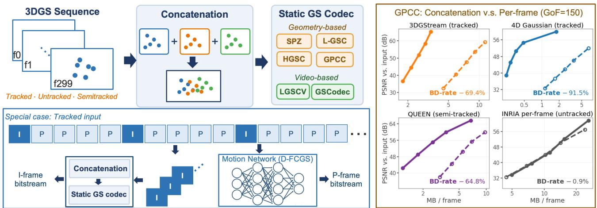  
Fig. 1. Overview of the proposed method. Left: GoF concatenation is passed to a geometry- or video-based static GS codec; on tracked input, the figure illustrates the concatenation branch of our D-GPCC which replaces the D-FCGS’s intra branch while retaining P-frame motion coding. Right: N3DV-average G-PCC rate–distortion curves at GoF-150, comparing concatenation with per-frame coding branches.

We combine this with differences in SH coefficients and opacity to define a pairwise cost:

$$
\begin{array} { l } { { \displaystyle C ( g _ { i } , g _ { j } ) = \alpha W _ { 2 } ^ { 2 } ( g _ { i } , g _ { j } ) } } \\ { { \displaystyle ~ + ~ \beta \operatorname { M S E } ( \mathbf { S H } _ { i } , \mathbf { S H } _ { j } ) + \gamma \operatorname { M S E } ( o _ { i } , o _ { j } ) . } } \end{array}\tag{3}
$$

For each Gaussian $g _ { t , i } ~ \in ~ G _ { t }$ , let $\mathcal { N } _ { 3 } ^ { u } ( i )$ denote its three nearest Gaussians in $G _ { u }$ , determined by Euclidean distance between their centers. The frame-to-frame cost is

$$
D ( t , u ) = \frac { 1 } { 3 N _ { t } } \sum _ { i = 1 } ^ { N _ { t } } \sum _ { j \in \mathcal { N } _ { 3 } ^ { u } ( i ) } C ( g _ { t , i } , g _ { u , j } ) .\tag{4}
$$

We define the inter-frame similarity as $S ( t , u ) = 1 - \widetilde D ( t , u )$ , where $\widetilde { D }$ is the normalized version of D (Fig. 2). In practice we evaluate C and D on representative subsets of Gaussians (level-of-detail neighbourhoods weighting each residual by its quantization step (App. F)).

## 2.2. Coding by Concatenation

We code each group of frames (GoFs) as one unit. For example, we indicate partitioning a 300-frame sequence into two groups as “GoF-150”. For a GoF $\bar { \tau _ { k } }$ starting at $t _ { k } ,$ , we concatenate all Gaussians

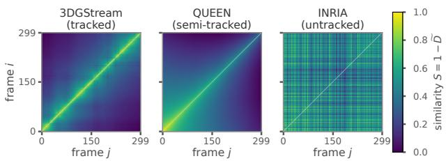  
Fig. 2. Pairwise inter-frame similarity matrices for Flame Steak, one example per correlation pattern we observed depending on the estimation method. Brighter entries denote greater similarity: tracked and semi-tracked sequences retain clear temporal structure, whereas the untracked sequence does not.

without merging duplicates, attach the relative frame index $f _ { i } = t - t _ { k }$ to each Gaussian from frame t, and form

$$
G _ { k } ^ { \mathrm { c a t } } = \bigl \vert \pm \bigr \vert \begin{array} { l } { G _ { t } , \qquad f _ { i } = t - t _ { k } \quad \mathrm { f o r } g _ { i } \in G _ { t } . } \end{array}\tag{5}
$$

The GS codec receives one concatenated static Gaussian set. Concatenation increases the Gaussian count, but also allows the static codec to exploit correlation in geometry and attributes across frames. The frame indices must be transmitted losslessly to recover each output frame. If a GoF exceeds a codec’s point or memory limit, we spatially partition the concatenated set into independently coded slices, which does not require modifying Eq. (5).

We consider a number of different underlying static GS codecs to evaluate the usefulness of our concatenation method in the context of different coding systems. G-PCC [9–11] exploits spatial redundancy through octree geometry coding [12] and attribute coding based on RAHT [13], predictive, or lifting with adaptive quantization [14, 15]. HGSC [16] combines octree geometry coding with hierarchical attribute prediction. L-GSC [17] applies lossless compression to Morton-ordered quantized data, while SPZ [18] compresses quantized attribute byte streams. Concatenation is performed before codec-specific quantization. Similar Gaussians may then share quantized spatial support, reduce prediction residuals, or produce repeated quantized symbols for more efficient entropy coding.

For video-based GS codecs, we jointly map the concatenated Gaussians to spatially smooth 2D attribute maps. LGSCV [19] sorts the concatenated Gaussian set by 3D Morton code and refines the layout of 2D attribute maps with MiniPLAS, while GSCodec-S [20] applies PLAS [21] sorting directly to the 2D attribute maps of the concatenated set. In our implementation, both encode the sorted attribute maps using HEVC intra coding [22]. Joint sorting can place Gaussians with similar geometry and attributes from different frames at nearby image locations. SPZ keeps the Gaussian order and needs no frame index; L-GSC, LGSCV and GSCodec-S reorder the Gaussians and are charged for it (Sec. 3.2). This allows the static codecs to exploit inter-frame redundancy even in untracked sequences.

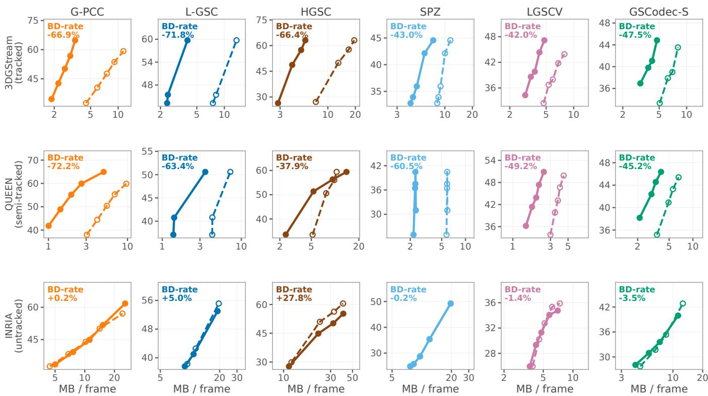  
Fig. 3. Rate vs. distortion compression results with six codecs at GoF-30, averaged over the N3DV dataset. Distortion is measured in PSNR with respect to the views rendered from the estimated Gaussians before compression. The three rows show examples of tracked, semi-tracked, and untracked estimators. Each panel compares concatenation with per-frame coding and reports BD-rate.

## 2.3. Concatenated Key Frame Coding

D-FCGS [23] uses an I-P coding structure, in which an intra-coded key frame opens each GoF, and each later frame is predicted from the one before it using a motion network. Here, we replace the separate intra codec used for the I-frames with our concatenation method. We encode the concatenated key frames with G-PCC, while leaving the motion network and all P-frame operations unchanged. We refer to the resulting hybrid codec as D-GPCC. In spite of their temporal separation, the key frames are still strongly correlated because they come from the same sequence, and their amortized bit rate dominates the compressed size; reducing only this intra component can therefore improve the codec substantially overall.

## 3. EXPERIMENTS

All experiments use the six 300-frame N3DV sequences [24] at 1352 × 1014, with 18–21 calibrated views per sequence. Estimators include tracked 4DGaussians [3], the tracked base stream of 3DGStream [5], semi-tracked QUEEN [6], and untracked per-frame INRIA 3DGS [1, 2]. We use the 3DGStream base stream as our primary tracked input because including spawned Gaussians would make the sequence semi-tracked and exclude codecs requiring full correspondence; its frame-wise export introduces less distortion than 4DGaussians. For the untracked input, each INRIA 3DGS frame is estimated independently from the same calibrated camera poses.

For each static codec, we compare concatenation with a perframe coded baseline using identical input sequences, rate settings, and views. BD-rate follows [25]. Rates include the frame index (Sec. 3.2). We measure compression distortion by rendering the input and decoded Gaussian sets from the same views and comparing the resulting images. Using held-out ground-truth views instead would also include estimation and view-generalization errors, obscuring differences caused solely by compression. Concatenated sets exceed ing a codec’s point budget are split along their longest spatial axis into slices of roughly equal population, capped at about 1.1 million Gaussians for G-PCC, without changing the GoF.

For concatenated key frame coding, we only replace the intra codec; the P-frame codec and its parameters are left unchanged. GoF length and codec-specific rate controls are ablated once, then fixed across all reported sequences.

Fig. 3 illustrates the performance of concatenated coding using the same protocol over different codecs and estimators. We find that generally, performance gains are consistent with our correlation pattern analysis in Sec. 2.1.

## 3.1. Tracked and Semi-Tracked Sequences

The top row of Fig. 3 compares concatenated and per-frame coding on separate axes for each codec for tracked estimation. All six concatenated curves shift toward lower rates over overlapping PSNR ranges, with BD-rate gains from −42.0% (LGSCV) to −71.8% (L-GSC). Fig. 4 compares concatenated results on a shared axis without per-frame baselines. It also includes three methods only applicable to tracked input: D-FCGS [23], which predicts each P-frame from its predecessor using fixed Gaussian indices; GSCodec-D [20], which reuses the I-frame’s Gaussian ordering for inter-frame coding of attribute maps. Our D-GPCC replaces D-FCGS’s I-frame coding with concatenated G-PCC. These three methods require full Gaussian correspondence and exploit it efficiently at low rates, but cannot accommodate Gaussian additions and removals (semi-tracked) or independently estimated frames (untracked); their maximum PSNR is limited relative to concatenated G-PCC and L-GSC under the tested lossy configurations. Our concatenated key frame coding method D-GPCC achieves a 46.2% overall BD-rate reduction over D-FCGS, albeit not reaching the performance of GSCodec-D.

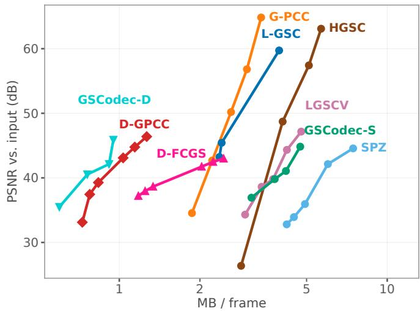  
Fig. 4. Rate–distortion results averaged over N3DV dataset with 3DGStream (tracked) input using concatenation. GSCodec-D, D-GPCC, and D-FCGS require tracked input and are inherently lossy.

The middle row of Fig. 3 shows similar gains for semi-tracked sequences, ranging from −37.9% (HGSC) to −72.2% (G-PCC). The codec rankings differ: L-GSC leads on tracked input, whereas G-PCC leads on semi-tracked input, showing that the benefit of concatenation depends on both the codec and estimator. This difference is also reflected in the spatial overlap across frames. At qp=18, 33.7% of the Gaussians in a concatenated Flame Steak GoF-30 share a quantized cell with another Gaussian for 3DGStream, compared with 89.2% for QUEEN. Greater overlap exposes more redundancy for a static codec to exploit.

## 3.2. Untracked Sequences

For independently estimated frames, only 1.0% of Gaussians share a quantized cell, so the bottom row of Fig. 3 shows smaller and more codec-dependent changes. Concatenated G-PCC and SPZ nearly coincide with their per-frame baselines (+0.2% and −0.2%), LGSCV and GSCodec-S gain slightly (−1.4% and −3.5%), while L-GSC and HGSC move to higher rate (+5.0% and +27.8%). HGSC is the only evaluated codec that concatenation makes substantially worse. Its quantizers are scaled to the data they receive, so the wider spread of an untracked concatenation turns into distortion rather than rate (App. G.4).

G-PCC and HGSC code the frame index losslessly as one 8-bit attribute with the predictive transform. Prediction does not help, as neighbours mostly belong to other frames: G-PCC spends 7.7–8.3 and HGSC 9.0–9.9 bits per Gaussian. Its fraction as a total of the bit rate varies: on Flame Steak it is 2–8% of the concatenated G-PCC bitstream with third-order SH, against 12–23% with first-order SH (App. H). Excluding it changes the BD-rate of concatenated G-PCC on untracked Flame Steak from −0.4% to −4.7%. For L-GSC, LGSCV and GSCodec-S we don’t actually encode the frame index, but instead add $\log _ { 2 } 3 0 = 4 . 9 1$ bits per Gaussian to the plotted rates, which corresponds to 1–15% of their total rate (App. B.1). SPZ does not require us to encode the frame index at all, since the encoding is order-preserving.

## 3.3. GoF Length, Throughput, and Delay

Table 1 varies the GoF length for G-PCC on the tracked 3DGStream Flame Steak sequence, where GoF-1 is per-frame coding. Most of the gain comes from grouping just a few frames: GoF-5 already reaches −47.7% BD-rate and GoF-30 −63.4%, while GoF-150 adds less than two points. Grouping improves throughput somewhat (Enc T, Dec T) but delays the first frame by L/30 s (Delay). The concatenation algorithm needs to hold the Gaussian coordinates for the entire GoF in memory (Concat), which grows 52× by GoF-150. The actual encoding requires all Gaussian attributes in memory for one slice at a time (Encode) and settles near 2.9×. GoF-30 keeps most of the gain at a quarter of that memory.

Table 1. Full GoF-length sweep, 3DGStream Flame Steak. Concat is the pass that holds the whole GoF, Encode the coder on one slice.
<table><tr><td>GoF</td><td>BD-rate % Enc T ↓</td><td>(s/f)↓)</td><td>DecT (s/f)↓)</td><td>(GB)↓</td><td>Concat Encode (GB)↓</td><td>Delay (s)↓</td></tr><tr><td>1</td><td>Baseline</td><td>11.7</td><td>9.0</td><td>0.06</td><td>1.29</td><td>0.03</td></tr><tr><td>5</td><td>-47.72</td><td>9.3</td><td>7.3</td><td>0.16</td><td>3.19</td><td>0.17</td></tr><tr><td>10</td><td>-55.87</td><td>8.9</td><td>7.0</td><td>0.30</td><td>3.43</td><td>0.33</td></tr><tr><td>30</td><td>-63.42</td><td>8.6</td><td>6.9</td><td>0.80</td><td>3.49</td><td>1.0</td></tr><tr><td>75</td><td>-64.59</td><td>8.7</td><td>6.9</td><td>1.73</td><td>3.70</td><td>2.5</td></tr><tr><td>150</td><td>-65.05</td><td>8.6</td><td>6.8</td><td>3.38</td><td>3.75</td><td>5.0</td></tr></table>

## 4. RELATED WORK AND DISCUSSION

Several dynamic 3DGS compression methods jointly estimate highly compressible, time-varying Gaussian representations directly from multi-view video, e.g. QUEEN, STG, 4DGC, Light4GS, GIFStream, E-D3DGS, and HiCoM [6, 26–31]. Some static 3DGS compressors also integrate estimation [32–34]. Post-estimation codecs based on pruning, quantization, spatial prediction, transforms, and entropy coding include [16, 35–38]; see [39, 40] for recent overviews.

Joint estimation–compression methods for dynamic 3DGS define the state of the art, but require re-estimating Gaussian representations from multi-view video, which may not be feasible in all circumstances. Here we are interested in post-estimation compression, which is why we use reconstructed views from the estimated 3DGS representation as a reference rather than the ground-truth unseen views. This allows a more direct assessment of the compression method, and avoids substantial noise in the evaluation.

Our method is surprisingly simple yet effective. It shows substantial improvements on dynamic 3DGS sequences stemming from tracked and semi-tracked estimators. It is robust in the sense that it remains competitive on untracked sequences with all but one of the evaluated underlying static codecs. In addition, we find that our technique can be used on intra-frame coding with substantial benefits.

Our method builds on the underlying static GS codec’s quantization, prediction, ordering, and entropy coding. Therefore, improvements to these components can also further benefit dynamic 3DGS sequence compression via concatenation. In particular, preliminary results suggest that using the GPCC-GS tools currently under development in MPEG as the intra coder of D-GPCC would substantially outperform GSCodec-D.

## 5. REFERENCES

[1] Bernhard Kerbl, Georgios Kopanas, Thomas Leimkuehler, and George Drettakis, “3D Gaussian splatting for real-time radiance field rendering,” ACM Transactions on Graphics (SIGGRAPH), 2023.

[2] Shihang Wei, Mingjian Li, Ran Gong, Yueyu Hu, and Yao Wang, “DanceNet3D: A 3D dance dataset with multi-view videos and 3DGS reconstructions,” in CVPR Workshops, 2026, pp. 350–359.

[3] Guanjun Wu et al., “4D Gaussian splatting for real-time dynamic scene rendering,” in CVPR, 2024, arXiv:2310.08528.

[4] Zeyu Yang, Hongye Yang, Zijie Pan, and Li Zhang, “Real-time photorealistic dynamic scene representation and rendering with 4D Gaussian splatting,” in ICLR, 2024.

[5] Jiakai Sun, Han Jiao, Guangyuan Li, Zhanjie Zhang, Lei Zhao, and Wei Xing, “3DGStream: On-the-fly training of 3D Gaussians for efficient streaming of photo-realistic free-viewpoint videos,” in CVPR, 2024, arXiv:2403.01444.

[6] Sharath Girish, Tianye Li, Amrita Mazumdar, Abhinav Shrivastava, David Luebke, and Shalini De Mello, “QUEEN: Quantized efficient encoding of dynamic Gaussians for streaming free-viewpoint videos,” Advances in Neural Information Processing Systems, 2024, arXiv:2412.04469.

[7] Jiawei Ren et al., “L4GM: Large 4D Gaussian reconstruction model,” in NeurIPS, 2024, arXiv:2406.10324.

[8] Clark R. Givens and Rae Michael Shortt, “A class of Wasserstein metrics for probability distributions,” Michigan Mathematical Journal, vol. 31, no. 2, pp. 231–240, 1984.

[9] MPEG 3D Graphics Coding, “MPEG G-PCC test model category 13 (TMC13),” https://github.com/MPEGGroup/ mpeg-pcc-tmc13, Public source repository, accessed July 2026.

[10] Danillo Graziosi, Ohji Nakagami, Satoru Kuma, Alexandre Zaghetto, Teruhiko Suzuki, and Ali Tabatabai, “An overview of ongoing point cloud compression standardization activities: Video-based (V-PCC) and geometry-based (G-PCC),” APSIPA Transactions on Signal and Information Processing, vol. 9, 2020.

[11] Hao Liu, Hui Yuan, Qi Liu, Junhui Hou, and Ju Liu, “A comprehensive study and comparison of core technologies for MPEG 3-D point cloud compression,” IEEE Transactions on Broadcasting, vol. 66, no. 3, pp. 701–717, 2020, arXiv:1912.09674.

[12] Yan Huang, Jingliang Peng, C.-C. Jay Kuo, and M. Gopi, “Octree-based progressive geometry coding of point clouds,” in Eurographics Symposium on Point-Based Graphics, 2006, pp. 103–110.

[13] Ricardo L. de Queiroz and Philip A. Chou, “Compression of 3D point clouds using a region-adaptive hierarchical transform,” IEEE Transactions on Image Processing, vol. 25, no. 8, pp. 3947–3956, 2016.

[14] Birendra Kathariya, Vladyslav Zakharchenko, Zhu Li, and Jianle Chen, “Level-of-detail generation using binary-tree for lifting scheme in LiDAR point cloud attributes coding,” in Data Compression Conference (DCC), 2019, pp. 580–580.

[15] Xinyu Wang, Guoxia Sun, Hui Yuan, Raouf Hamzaoui, and Lu Wang, “Adaptive quantization for predicting transformbased point cloud compression,” in Image and Graphics (ICIG), ser. Lecture Notes in Computer Science, 2021, vol. 12888, pp. 748–758.

[16] He Huang, Wenjie Huang, Qi Yang, Yiling Xu, and Zhu Li, “A hierarchical compression technique for 3D Gaussian splatting compression,” arXiv preprint arXiv:2411.06976, 2024.

[17] Qualcomm Technologies, Inc., “L-GSC v1.0: Library for compression and decompression of Gaussian splat representations,” https://github.com/qualcomm/lite-3Dgsplat-codec, 2025.

[18] Niantic Labs, “SPZ: A file format for compressed 3D Gaussian splats,” https://github.com/nianticlabs/spz, 2024.

[19] Qi Yang, Geert Van Der Auwera, and Zhu Li, “LGSCV: Lightweight 3D Gaussian splatting compression via video codec,” in Data Compression Conference (DCC), 2026.

[20] Sicheng Liu, Chunyu Liu, Kaifa Wang, et al., “GSCodec Studio: A modular framework for Gaussian splat compression,” arXiv preprint arXiv:2506.01822, 2025.

[21] Wieland Morgenstern, Florian Barthel, Anna Hilsmann, and Peter Eisert, “Compact 3D scene representation via self-organizing Gaussian grids,” in ECCV, 2024.

[22] Gary J. Sullivan, Jens-Rainer Ohm, Woo-Jin Han, and Thomas Wiegand, “Overview of the high efficiency video coding (HEVC) standard,” IEEE Transactions on Circuits and Systems for Video Technology, vol. 22, no. 12, pp. 1649–1668, 2012.

[23] Wenkang Zhang, Yan Zhao, Qiang Wang, Zhixin Xu, Li Song, and Zhengxue Cheng, “D-FCGS: Feedforward compression of dynamic Gaussian splatting for free-viewpoint videos,” in AAAI, 2026, arXiv:2507.05859.

[24] Tianye Li et al., “Neural 3D video synthesis from multi-view video,” in CVPR, 2022.

[25] Gisle Bjøntegaard, “Calculation of average PSNR differences between RD-curves,” Tech. Rep. VCEG-M33, ITU-T SG16/Q6 VCEG, 2001.

[26] Zhan Li, Zhang Chen, Zhong Li, and Yi Xu, “Spacetime Gaussian feature splatting for real-time dynamic view synthesis,” in CVPR, 2024, pp. 8508–8520.

[27] Qiang Hu et al., “4DGC: Rate-aware 4D Gaussian compression for efficient streamable free-viewpoint video,” in CVPR, 2025.

[28] Mufan Liu et al., “Light4GS: Lightweight compact 4D Gaussian splatting generation via context model,” arXiv preprint arXiv:2503.13948, 2025.

[29] Hao Li, Sicheng Li, Xiang Liao, Aerbula Batuer, Lu Yu, and Yiyi Liao, “GIFStream: 4D Gaussian-based immersive video with feature stream,” arXiv preprint arXiv:2505.07539, 2025.

[30] Jeongmin Bae, Seoha Kim, Youngsik Yun, Hahyun Lee, Gun Bang, and Youngjung Uh, “Per-Gaussian embedding-based deformation for deformable 3D Gaussian splatting,” in ECCV, 2024.

[31] Qiankun Gao, Jiarui Meng, Chengxiang Wen, Jie Chen, and Jian Zhang, “HiCoM: Hierarchical coherent motion for dynamic streamable scenes with 3D Gaussian splatting,” in NeurIPS, 2024.

[32] Joo Chan Lee, Daniel Rho, Xiangyu Sun, Jong Hwan Ko, and Eunbyung Park, “Compact 3D Gaussian representation for radiance field,” in CVPR, 2024.

[33] Yihang Chen, Qianyi Wu, Weiyao Lin, Mehrtash Harandi, and Jianfei Cai, “HAC: Hash-grid assisted context for 3D Gaussian splatting compression,” in ECCV, 2024.

[34] Zhiwen Fan, Kevin Wang, Kairun Wen, Zehao Zhu, Dejia Xu, and Zhangyang Wang, “LightGaussian: Unbounded 3D Gaussian compression with 15x reduction and 200+ FPS,” in NeurIPS, 2024.

[35] Yihang Chen, Qianyi Wu, Mengyao Li, Weiyao Lin, Mehrtash Harandi, and Jianfei Cai, “Fast feedforward 3D Gaussian splatting compression,” in ICLR, 2025.

[36] Boyuan Tian, Qizhe Gao, Siran Xianyu, Xiaotong Cui, and Minjia Zhang, “FlexGaussian: Flexible and cost-effective trainingfree compression for 3D Gaussian splatting,” arXiv preprint arXiv:2507.06671, 2025.

[37] Chenjunjie Wang, Shashank N. Sridhara, Eduardo Pavez, Antonio Ortega, and Cheng Chang, “Adaptive voxelization for transform coding of 3D Gaussian splatting data,” in IEEE International Conference on Image Processing, 2025, arXiv:2506.00271.

[38] Shashank N. Sridhara, Birendra Kathariya, Fangjun Pu, Peng Yin, Eduardo Pavez, and Antonio Ortega, “Region-adaptive learned hierarchical encoding for 3D Gaussian splatting data,” arXiv:2510.22812, 2025.

[39] Milena T. Bagdasarian, Paul Knoll, Yi-Hsin Li, Florian Barthel, Anna Hilsmann, Peter Eisert, and Wieland Morgenstern, “3DGS.zip: A survey on 3D Gaussian splatting compression methods,” Computer Graphics Forum, 2025, arXiv:2407.09510.

[40] Gun Bang, Yiyi Liao, Alexandre Zaghetto, Marius Preda, and Lu Yu, “MPEG explorations toward 3D Gaussian splat coding and standardization,” in 2026 Data Compression Conference (DCC), 2026, pp. 372–381.

## A. SCOPE OF THE APPENDIX

The paper comes with two further resources, and each serves a different purpose (Table 2). This appendix defines how the numbers in the main text are obtained, qualifies the statements of the main text that need it (App. B), and gives the analyses and summary tables behind its claims. It describes each procedure at the level needed to interpret a result, but contains no per-sequence curves and no implementation level change lists. The code repository, linked from the project page, contains what is needed to rerun the experiments, and the project page shows every measured curve interactively. The appendix, the repository and the project page read their numbers from the same result tables.

Table 2. The three resources and what each contains.
<table><tr><td>Resource</td><td>Contents</td></tr><tr><td>Appendix</td><td>notes on statements of the main text; sequences and estimators; evaluation protocol; how each static GS codec handles a concatenated set; implementation of the inter-frame similarity; mechanisms behind the gains; frame-index overhead; construction of D-GPCC; per-sequence BD-rates; an end-to-end comparison with published results</td></tr><tr><td></td><td>Code repository estimator training and export recipes; pinned upstream version and every modification of each codec; codec configurations and rate points; coding drivers; scoring code; the coding time and peak memory of every run; all result tables with their provenance, and a script that recomputes the numbers of the paper</td></tr><tr><td>Project page</td><td>every rate-distortion curve for each sequence, codec, estimator and GoF length; PSNR in RGB, YUV and per plane, SSIM, and the ground-truth reference; the BD-rate of each curve against its own per-frame branch; inter-frame similarity matrices of all four estimators</td></tr></table>

## B. NOTES ON THE MAIN TEXT

This section discusses statements of the main text that need qualification, states what holds, and quantifies the effect on the reported results. The later sections give the underlying details.

## B.1. Frame indices in the rates of L-GSC, LGSCV and GSCodec-S

As stated in Sec. 3, G-PCC and HGSC code the frame index losslessly in their bitstreams (App. H), and SPZ only needs the number of Gaussians per frame, so the rates of these codecs include everything required to recover the frames. L-GSC, LGSCV and GSCodec-S reorder the Gaussians and have no channel for a per-Gaussian index, so we recover the frame of each decoded Gaussian from the reordering computed at the encoder (App. E.1). This information is not transmitted; in its place, the concatenated branches of the three codecs are charged what transmitting it would cost.

The charge is the rate of a separate index stream. The decoder of each of the three codecs outputs the Gaussians in a fixed order that it knows: Morton order for L-GSC and the pixel order of the 2D maps for LGSCV and GSCodec-S. An encoder can therefore write the frame index of every Gaussian in that order and code the sequence with an arithmetic coder and a uniform model over the 30 frames of a GoF. Every symbol then costs exactly log 30 = 4.91 bits, whatever the data, so the rate of this stream is known without running it: 4.91 bits per Gaussian, plus a few bytes to terminate the code (a fixed-length code would need 5 bits). We add this rate to every point of the concatenated branch; it is the mean number of Gaussians per frame of each sequence times 4.91 bits, between 0.19 and 0.29 MB per frame on average over the six sequences of each estimator. This is 1.4–3.2% of the rate of L-GSC on untracked input, 3.6–7.6% of LGSCV and 2.3–6.6% of GSCodec-S, and between 4.6 and 14.6% on tracked and semi-tracked input, where the rest of the bitstream is smaller. The per-frame branches need no index and are unchanged.

The index is hard to code for reasons that do not depend on the codec. It must be lossless, since a wrong value assigns a Gaussian to the wrong frame, which rules out the lossy planes of a video codec. It has no spatial coherence by construction: concatenation pays off because co-located Gaussians of different frames become neighbours, and the index is exactly what tells them apart, so predicting it from neighbours does not help; G-PCC and HGSC, which do so, spend 7.7– 9.9 bits per Gaussian (App. H). Its cost is the same at every rate point, so it weighs most at low rates and on inputs whose other attributes compress well. Only two designs avoid it: keeping the order of the Gaussians, as SPZ does, or keeping the time axis, as GSCodec-D does on tracked input. A code below 4.91 bits would have to use context that the decoder already has, such as the ordering of the codec: the Morton sort of L-GSC is stable, so co-located Gaussians of successive frames follow each other in frame order. We did not evaluate such a code and leave its design open.

Table 3 shows how much the charge matters. Without it, the BD-rates measure only what concatenation changes in each codec’s own coding of geometry and attributes; at 8 bits per Gaussian, close to what G-PCC spends, they approach the cost of coding the index as G-PCC does.

Table 3. Six-sequence BD-rate (%) of concatenation against perframe coding at GoF-30, with the concatenated branch charged no frame index, 4.91 bits per Gaussian (as in Fig. 3), or 8 bits.
<table><tr><td>Codec</td><td>Frame index</td><td>Tracked</td><td>Semi-tracked</td><td>Untracked</td></tr><tr><td rowspan="3">L-GSC</td><td>not charged</td><td>-74.7</td><td>-67.7</td><td>+2.9</td></tr><tr><td>4.91 bits</td><td>-71.8</td><td>-63.4</td><td>+5.0</td></tr><tr><td>8 bits</td><td>-70.0</td><td>-60.8</td><td>+6.3</td></tr><tr><td rowspan="4">LGSCV</td><td>not charged</td><td>-46.7</td><td>-54.6</td><td>-7.2</td></tr><tr><td>4.91 bits</td><td>-42.0</td><td>-49.2</td><td>-1.4</td></tr><tr><td>8 bits</td><td>-39.0</td><td>-45.9</td><td>+2.2</td></tr><tr><td></td><td></td><td></td><td></td></tr><tr><td rowspan="3">GSCodec-S</td><td>not charged</td><td>-51.4 -47.5</td><td>-49.0 -45.2</td><td>-7.1</td></tr><tr><td>4.91 bits 8 bits</td><td></td><td></td><td>-3.5</td></tr><tr><td></td><td>-45.0</td><td>-42.8</td><td>-1.2</td></tr></table>

Without the charge, the tracked range of Sec. 3.1 would be −43.0% (SPZ) to −74.7% (L-GSC), and the untracked gains of LGSCV and GSCodec-S −7.2% and −7.1%; at 8 bits, the latter become +2.2% and −1.2%. The codec rankings of Sec. 3.1 and the semi-tracked range, −37.9% (HGSC) to −72.2% (G-PCC), hold under every charge, and on tracked and semi-tracked input all three codecs keep gains of at least 39%.

## B.2. P-frames of D-GPCC and D-FCGS

Concatenated key frame coding replaces only the intra codec of D-FCGS (Sec. 3): D-GPCC runs the released D-FCGS motion network, checkpoint, entropy model and parameters without modification. The P-frame bitstreams, however, are not identical between the two methods, because the P-frames of each method are coded against its own decoded I-frames and in the Gaussian order of those I-frames. On Flame Steak at GoF-10, the P-frames cost 0.49–0.50 MB per frame in D-FCGS, 0.44 MB in D-GPCC with its I-frames coded one by one, and 0.42–0.43 MB in D-GPCC. On one GoF of the same sequence, reordering the Gaussians from their original order into the spatial output order of G-PCC changes the reconstruction by less than $1 0 ^ { - 5 }$ dB but reduces the P-frame bytes by 8.0%, because the position side channel of the P-frames compresses better in that order. Part of the −46.2% of D-GPCC against D-FCGS therefore comes from cheaper P-frames rather than from concatenation. The effect of concatenation alone is measured by comparing D-GPCC with and without concatenated I-frames, where the P-frame codec and the Iframe codec are the same: coding the I-frames as one concatenated set reduces BD-rate by 27.4–35.8% at GoF-10 and by 41.3–49.9% at GoF-5 across the six sequences.

## C. SEQUENCES AND ESTIMATORS

All experiments use all 300 frames of the six N3DV sequences Coffee Martini, Cook Spinach, Cut Roasted Beef, Flame Salmon, Flame Steak and Sear Steak. We train every estimator with its released code on each sequence and export one Gaussian set per frame. All frames are stored in the 62-property layout of the reference 3DGS implementation at SH degree 3; lower SH degrees are zero-padded per colour channel. Table 4 summarizes the four estimators.

Table 4. Estimators. Gaussian counts are ranges over all frames of the six sequences; a tracked sequence keeps one count. Export loss is the PSNR against the captured images of the held-out camera that is lost between the estimator’s own rendering and its exported frame-wise Gaussian sets, averaged over the six sequences.
<table><tr><td>Estimator</td><td>Pattern</td><td>Gaussians per frame</td><td>Export loss (dB)</td></tr><tr><td>3DGStream, base stream</td><td>tracked</td><td>357k-708k</td><td>0.27 + 0.80</td></tr><tr><td>4DGaussians</td><td>tracked</td><td>118k-132k</td><td>2.39</td></tr><tr><td>QUEEN</td><td>semi-tracked</td><td>1 248k-445k</td><td>0.88</td></tr><tr><td>INRIA 3DGS, per frame</td><td>untracked</td><td>281k-845k</td><td></td></tr></table>

3DGStream starts from a standard 3DGS model and obtains every later frame by applying a learned transformation to the Gaussians of the previous frame; it also spawns Gaussians for newly appearing content. Exporting its state at every frame costs 0.27 dB. The base stream keeps only the Gaussians of the first frame, so the Gaussian count is constant and the index n identifies the same Gaussian in every frame. This costs a further 0.80 dB but makes the sequence tracked, which D-FCGS, D-GPCC and GSCodec-D require.

4DGaussians deforms one canonical Gaussian set with a learned deformation field, and its official exporter evaluates the field at each frame. Writing a continuous deformation as static frames is the most lossy export of the four (2.39 dB on average, up to 3.9 dB), which is why the main comparison uses 3DGStream as its tracked input. 4DGaussians enters the estimator sweep of App. K.

QUEEN maintains one Gaussian set with gated per-frame updates, additions and removals; we export its state after each frame (0.88 dB). INRIA 3DGS is optimized independently for every frame from the same calibrated camera poses, so the frames share the scene but no Gaussians, and the frames themselves are the representation.

Table 5 lists every edit applied to the exported frames before coding. No other change is made to any input: no pruning, resampling or reordering, and no per-sequence tuning of a codec. Screening for non-finite values runs on all 24 sequences.

Table 5. Every edit applied to the exported frames before coding.
<table><tr><td>Edit</td><td>Sequences</td><td>Extent</td></tr><tr><td>SH degree 1 → 3 zero-padding; quaternion sign canonicalized</td><td>3DGStream, all</td><td>layout, sign</td></tr><tr><td>Non-finite values:  $\pm \infty  \pm 6 0 ,$  NaN →0</td><td>3DGStream, all</td><td> $< 1 0 ^ { - 6 } ~ \mathrm { o f } ~ $  values</td></tr><tr><td>SH degree 2 → 3 zero-padding</td><td>QUEEN, all</td><td>layout</td></tr><tr><td>Degenerate Gaussians removed (log-scale &gt; 2)</td><td>QUEEN, all</td><td>≈0.2% of Gaussians</td></tr><tr><td>Gaussians with non-finite values removed</td><td>QUEEN, Coffee Martini</td><td>1 per frame in 127 frames</td></tr><tr><td>Lower G-PCC input scale†</td><td>4DGaussians, Coffee none Martini, Flame Salmon; QUEEN, Coffee Martini</td><td></td></tr></table>

†An encoder setting, not an edit of the data: coordinates beyond ±1024 overflow 32-bit arithmetic at the default input scale. The 4DGaussians exporter leaves about 0.25% of every frame’s Gaussians far outside the scene, so those two frames span 6827 and 4328 units while 99% of their Gaussians fit inside 120 and 114; we keep them, and App. K reports what they cost the per-frame branch.

## D. EVALUATION PROTOCOL

## D.1. Distortion

Distortion compares renders of the decoded Gaussian sets with renders of the input Gaussian sets (Sec. 3). We call this the identicalsource reference, the name used in the repository and on the project page. Both are rendered with the same rasterizer (gsplat, black background) from every calibrated view of the sequence, and squared error is pooled per colour plane over all pixels, views and frames before it is converted:

$$
\mathrm { P S N R } _ { \mathrm { R G B } } = 1 0 \log _ { 1 0 } \frac { 1 } { \frac { 1 } { 3 } \left( \mathrm { M S E } _ { R } + \mathrm { M S E } _ { G } + \mathrm { M S E } _ { B } \right) } ,\tag{6}
$$

with pixel values in [0, 1]. PSNRYUV is computed in the same way from BT.709 full-range 4:4:4 planes with 1:1:1 weights. All BDrates in the paper use $\mathrm { \bar { P S N R } _ { R G B } } ;$ with $\mathrm { P S N R } _ { \mathrm { Y U V } }$ , none of the 18 six-sequence BD-rates of Fig. 3 changes by more than 0.6 percentage points.

A result is accepted only if all frames are scored, pooled PSNRRGB is at least 15 dB, and the average of per-frame decibels exceeds the pooled value by less than 3 dB. The last two conditions detect a collapsed sequence and damage confined to a few frames or views. Every reported result passes.

We also render the decoded frames at the held-out camera and compare them with the captured images (PSNR, SSIM, and LPIPS with AlexNet features, averaged over frames). These ground-truth curves are on the project page but enter no BD-rate: both branches saturate at the quality of the estimator, so the quality interval they share collapses (Fig. 5), and a single view does not see damage outside its field of view. For example, one QUEEN sequence carried a non-finite Gaussian center in each of its last 127 frames. Before this was removed, the ground-truth PSNR of its G-PCC concatenated branch was 24.88 dB, and 24.90 dB after; the identical-source PSNR rose from 39.7 to 61.9 dB.

## D.2. Rate

Rate is the total size of all bitstreams and side files read by the codec’s decoder, divided by the number of frames, in MB per frame (1 $\mathbf { M } \mathbf { B } = 1 0 ^ { 6 }$ bytes). A concatenated GoF is one coding unit, and its bytes are counted once. How the frame of each decoded Gaussian is recovered differs between codecs (App. E.1); for L-GSC, LGSCV and GSCodec-S, which do not transmit it, the rate of the concatenated branch adds the cost of a log 30-bit index per Gaussian (App. B.1). For D-FCGS and D-GPCC, the rate includes all I-frame and P-frame bitstreams.

concatenation per-frame  
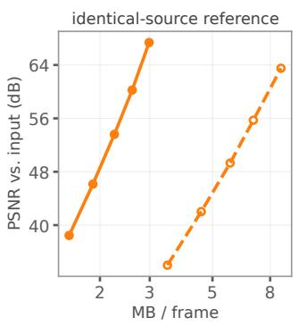

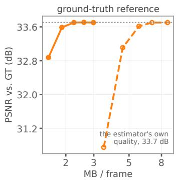  
Fig. 5. The same four runs of G-PCC on 3DGStream Flame Steak, scored against the two references. Against the input, the rate points span 30 dB and the two branches stay apart, so a BD-rate between them is well posed. Against the held-out camera, both branches run into the quality of the estimator itself and flatten within a few tenths of a decibel of each other, which leaves almost no quality interval to integrate over.

The HGSC rates were corrected once after scoring. A restarted task appended a second, identical ledger row for a frame, and two tasks writing to one ledger at the same time lost a row. Both errors favoured concatenation. Rates now come from exactly one row per frame or GoF, checked to cover the whole sequence, and the reported six-sequence BD-rates (−66.4% tracked, +27.8% untracked) are the corrected ones.

## D.3. BD-rate and six-sequence averages

BD-rate follows [25]: the logarithm of the rate of each curve is fitted as a cubic polynomial of PSNR (a quadratic for the three rate points of L-GSC), and both fits are integrated over the PSNR interval that the two curves share. A negative value means that concatenation needs less rate for the same quality. A six-sequence average curve averages the rate and the PSNR of the i-th rate point, sorted by rate, over the six sequences, and the average BD-rate is computed between two average curves. It is therefore not the mean of the per-sequence BD-rates in App. K.

## D.4. Throughput, memory, and delay

In Table 1, encoding time (Enc T) runs from the input frames to the last bitstream byte and includes concatenation and partitioning; decoding time (Dec T) runs from the bitstreams to per-frame Gaussian sets and includes splitting the GoF. Both are divided by the 300 frames and averaged over the rate points.

The measurement is one job. A group length is not comparable with another unless both met the same machine and the same amount of competition for it, and the number of slices a GoF is cut into grows with the GoF, so any fixed number of parallel coding processes would give the longer groups more company than the shorter ones. Every rate point therefore runs all six group lengths back to back inside one task, on one node, with one coding process at a time and one thread in every library, and the six lengths run in a different order in each of the five tasks, so a node that drifts over the hours of a task cannot drift along the group-length axis. A fixed single-frame job between every pair of measurements reports what the node was doing: within a task those probes scatter by 11–21% without a trend, while the group-length effect is monotone.

Memory is the peak resident set of the coder’s own process tree, sampled every 0.1 s. It is not the figure a job scheduler reports: that one also counts the page cache of every PLY the run reads and writes, which on this pipeline is the larger half of it and is reclaimed before any process is killed, so it says more about how much memory the job was granted than about how much it needed. The two columns separate the only part that grows from the part that does not. Concat is the peak of the pass that concatenates the GoF and derives its slice partition: it holds the whole group and costs 22.3 MB per frame, linear from 0.065 GB at GoF-1 to 3.38 GB at GoF-150. Encode is the peak of the coder itself and is bounded instead: the partition caps a slice at 1.1M Gaussians, and the peak, which falls on the decoder rather than the encoder, is 3.3 GB per million Gaussians of the largest slice, so it rises only while the slices do and settles at 1.29 → 3.75 GB. Per-frame coding sits below that bound, not on it, because one frame of this sequence is 357k Gaussians and is never split.

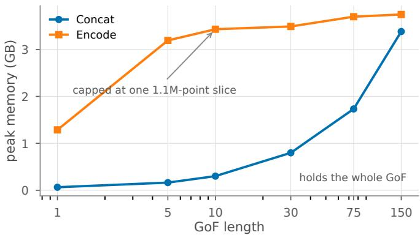  
Fig. 6. The two memory columns of Table 1. Only Concat grows with the group; Encode is bounded by the slice budget and stops. The two meet at GoF-150, where a slice first reaches the cap.

Delay is the structural delay of collecting a GoF at 30 frames per second. Our unoptimized implementation adds processing time on top of it (294 s before the first frame of a GoF-30 set is available), which is not included.

## E. STATIC GS CODECS

Table 6 lists the six static GS codecs, their rate points, and how each returns decoded Gaussians to their frames. Both branches of a codec use identical settings at every rate point, and every rate point codes the same Gaussians. The importance-based pruning of HGSC, enabled by default at 60%, is disabled. LGSCV maps Gaussians to square images and therefore keeps the $\lfloor \sqrt { N } \rfloor ^ { 2 }$ Gaussians of highest importance; on the 10.70M Gaussians of a GoF-30 set of 3DGStream Flame Steak, this removes 0.43%, and the same rule applies in the per-frame branch. GSCodec-S pads its square images with Gaussians of negligible opacity; the per-frame branch keeps them in the decoded frames, as the codec defines, and the concatenated branch removes them when splitting. The SPZ decoder writes an opacity of one as an infinite logit, which we clamp to ±12 before rendering in both branches.

Only G-PCC spatially partitions the concatenated set. Its encoder divides the set along the longest axis of its bounding box into slices of at most 1.1M Gaussians, and every slice is coded as an independent unit with its own coordinate scaling. HGSC applies the same bound when it codes its anchors with G-PCC. The other codecs code a GoF-30 set as a single unit; the largest sets, from the two QUEEN sequences with 437k Gaussians per frame, need about 80 GB of memory in HGSC and 52 GB in LGSCV.

## E.1. Recovering frames after decoding

A concatenated set is decoded as one Gaussian set, and each Gaussian must then be assigned to its frame. Geometry cannot do this, because the frames of one GoF are nearly co-located, which is precisely what concatenation exploits: on the uncompressed GoF-30 set of 3DGStream Flame Steak, only 66% of nearest-neighbour queries return a Gaussian of the correct frame. The six codecs recover frames in three ways.

G-PCC and HGSC transmit the frame index. It is an 8-bit attribute coded losslessly, spread over the code range in steps of $2 5 5 / ( L - 1 )$ so that the attribute scaling of the encoder cannot merge indices, and its cost is part of the rate (App. H). In HGSC, merging of duplicate positions is disabled, so co-located Gaussians of different frames are not fused. The per-frame branch runs the same configuration with a constant index. SPZ preserves the order and number of Gaussians, so a decoded set is split by the per-frame counts.

L-GSC, LGSCV and GSCodec-S reorder the Gaussians (by Morton code, by Morton code followed by MiniPLAS, and by PLAS), and none of them has a channel that could carry a per-Gaussian index. To evaluate concatenation in these codecs without redesigning them, we recover the frame of each decoded Gaussian from the reordering computed at the encoder: the Morton sort of L-GSC is replayed on the input positions, and the permutations of LGSCV and GSCodec-S are recorded when their maps are built. For L-GSC, we also verify that every decoded Gaussian lies within quantization error of the source Gaussian it is assigned to. This information is not transmitted; in its place, the rates of these three codecs are charged a uniformly coded index (App. B.1).

## E.2. Keeping Gaussian identity

Concatenation exposes faults that per-frame coding does not reach, because Gaussians of different frames coincide or nearly coincide. In HGSC as released, farthest-point sampling returned the same Gaussian repeatedly once the distinct positions of a block ran out (31% of the selection was duplicated on a GoF-30 set), and the anchor coder returned anchors in sorted order while their frame indices remained in sampling order, which assigned 7.7% of the reconstruction to wrong frames. Both faults caused a quality ceiling that no rate setting could lift (0.2 dB over a 36% range of rate), and both are corrected in all reported results. On QUEEN input, whose persisting Gaussians keep identical positions, the recursive KD-tree split of HGSC also does not terminate on a block of identical positions; such blocks are split into chunks of the leaf size. The repository lists every modification of this kind for all codecs.

## F. INTER-FRAME SIMILARITY

The matrices of Fig. 2 evaluate the cost of Eqs. $( 2 ) - ( 4 )$ with the level-of-detail structure of G-PCC’s predicting transform and the quantization steps of our G-PCC configuration, so that $D ( t , u )$ approximates what G-PCC would pay to predict the Gaussians of one frame from those of the other. It differs from the conceptual form of Sec. 2.1 as follows.

1. Neighbourhood. The two frames are concatenated and their positions quantized on one grid of $2 ^ { 1 8 }$ steps spanning the pair, the coding grid of G-PCC. A level-of-detail pass as in G-PCC’s predicting transform keeps one Gaussian per occupied voxel at each level, with the voxel starting at the median nearest-neighbour distance, at least two grid steps, and doubling at each level. Every Gaussian the pass removes is compared with a single prediction, the inverse-distance-weighted average of its three nearest kept Gaussians, which may come from either frame, rather than with each of its three nearest Gaussians in the other frame as in Eq. (4).

2. Shape term. $W _ { 2 }$ enters unsquared and only through the covariances: the term is $W _ { 2 } ( \pmb { \Sigma } _ { i } , \hat { \pmb { \Sigma } } _ { i } )$ between the covariance of the Gaussian and the inverse-distance-weighted mean of the covariances of its neighbours, divided by the square root of the mean covariance trace of the sequence. Positions act through the neighbour search and its weights rather than as the term $\| \pmb { \mu } _ { i } - \pmb { \mu } _ { j } \| ^ { 2 }$ of Eq. (2).

3. Appearance terms. In place of the weights $\beta$ and $\gamma$ of Eq. (3), the SH DC term, the SH bands of degree 1, 2 and 3 and the opacity each contribute the RMS of their residual, divided by the standard deviation of that attribute over the sequence and weighted by the relative quantization step $2 ^ { - ( \mathrm { Q P } _ { b } - \mathrm { Q P } _ { 0 } ^ { \bullet } ) / 6 }$ of the lowest G-PCC rate point (QPs 26, 38, 46, 49 and 46, i.e., weights 1, 0.25, 0.10, 0.07 and 0.10). The normalization makes the shape and appearance terms comparable without fixing a rate point, which is what $\alpha , \beta$ and $\gamma$ stand for in the main text.

4. Averaging. D(t, u) is the mean cost over all Gaussians of the pair, with the Gaussians the pass keeps costing zero, so the normalization is $N _ { t } + N _ { u }$ rather than 3Nt.

5. Sampling and numerics. Each frame is first reduced to 250k Gaussians by the same octree-centroid rule for every estimator. Non-finite values are replaced by the mean of their attribute, missing SH coefficients are set to zero, covariances are rebuilt from log-scales and quaternions, and $W _ { 2 }$ is computed exactly from eigendecompositions.

6. Normalization ofthe matrix. $\widetilde { D }$ is min–max normalized over the off-diagonal entries of each matrix separately, because absolute cost levels differ between estimators.

The inputs are the exported frames before the edits of Table 5; for 3DGStream, every frame of Flame Steak has the same Gaussian count as the base stream used for coding, 356,663. As a scalar summary we use

$$
\rho = { \frac { \mathrm { m e a n } _ { | t - u | > 1 5 0 } D ( t , u ) } { \mathrm { m e a n } _ { | t - u | = 1 } D ( t , u ) } } ,\tag{7}
$$

over all 44,850 pairs of frames, which equals one when distant frames are as similar as adjacent ones. Table 7 lists $\rho$ for all four estimators on Flame Steak. Untracked input stands out with $\rho \approx 1$ . Among the other estimators, $\rho$ does not rank the gains: 4DGaussians has the lowest $\rho$ of the three but the largest G-PCC gains in the estimator sweep (Table 13).

Table 6. Static GS codecs. Rate points are swept identically in both branches. Frame recovery states how each decoded Gaussian of a concatenated set is assigned to its frame; ∗marks encoder-side information that is not transmitted; the rate is charged $\log _ { 2 }$ 30 bits per Gaussian in its place (Apps. B.1 and E.1).
<table><tr><td>Codec</td><td>Family</td><td>Coding</td><td>Rate points</td><td>Frame recovery</td></tr><tr><td>G-PCC</td><td>geometry</td><td>TMC13 v23.0-rc2 with our Gaussian splat coding profile: octree geometry, RAHT for SH, predictive transform for opacity, scale and rotation</td><td>5: four attribute QP settings, attributes at unit step</td><td>frame index coded losslessly as an 8-bit attribute</td></tr><tr><td>HGSC</td><td>geometry</td><td>G-PCC geometry, anchors by farthest-point sampling, two 4: position levels of detail predicted from coded neighbours</td><td> $\operatorname { q p } \in \{ 1 8 , \dots , 1 5 \}$  with LoD bit depths</td><td>frame index coded losslessly as an 8-bit attribute of its geometry</td></tr><tr><td>L-GSC</td><td>geometry</td><td>fixed bit-width quantization, Morton ordering, zlib</td><td>3: bit-width presets</td><td>Morton sort of the encoder replayed on the input positions*</td></tr><tr><td>SPZ</td><td></td><td>geometry per-Gaussian quantization, zstd</td><td>5: SH bit depths</td><td>order preserved; split by per-frame counts</td></tr><tr><td>LGSCV</td><td>video</td><td>Morton ordering and MiniPLAS into 2D maps, SH reduced 5: released QP settings by PCA, HEVC</td><td></td><td>map permutation recorded at the encoder*</td></tr><tr><td>GSCodec-S video</td><td></td><td>PLAS sorting into 2D maps, all-intra HEVC</td><td>4: released QP settings</td><td>sort permutation recorded at the encoder*</td></tr></table>

Table 7. Temporal structure of Flame Steak for the four estimators, over all 300 frames.
<table><tr><td>Estimator</td><td>Pattern</td><td>ρ</td><td>Range of D</td></tr><tr><td>QUEEN</td><td>semi-tracked</td><td>1.571</td><td>0.362-1.046</td></tr><tr><td>3DGStream</td><td>tracked</td><td>1.292</td><td>0.776-1.087</td></tr><tr><td>4DGaussians</td><td>tracked</td><td>1.179</td><td>0.432-0.552</td></tr><tr><td>INRIA 3DGS</td><td>untracked</td><td>1.002</td><td>1.295-1.442</td></tr></table>

## G. MECHANISMS BEHIND THE GAINS

## G.1. Spatial overlap

The overlap figures of Secs. 3.1 and 3.2 quantize the positions of the GoF-30 set of Flame Steak with the position quantizer of HGSC at its finest setting, qp=18, and count the Gaussians that share a voxel with at least one other Gaussian: 33.7% for 3DGStream, 89.2% for QUEEN and 1.0% for INRIA 3DGS.

Semi-tracked input overlaps more than tracked input because a Gaussian that QUEEN keeps also keeps its exact position. Between adjacent frames, 90.5–92.8% of the Gaussians of QUEEN do not move (only 4.6% between the first two frames, where the initial reconstruction is replaced), whereas 3DGStream moves about two thirds of its Gaussians slightly in every frame (App. G.2). In a GoF-30 set of Cook Spinach, 14.1% of the positions of QUEEN are distinct, against 63.1% for 3DGStream. The number of occupied voxels of the set, relative to the sum over its frames, stays at 11.4% for QUEEN from qp=15 to 18, while it grows from 30.9% to 62.8% for 3DGStream: a finer grid separates slightly moved copies but not identical ones. Accordingly, G-PCC, LGSCV and SPZ gain more on semi-tracked than on tracked input, by 5.3, 7.9 and 17.5 percentage points (Fig. 3).

## G.2. Tracked input

3DGStream moves its Gaussians but keeps their appearance. Over frames 0 to 29 of Flame Steak, all 356 663 Gaussians keep their SH coefficients bit for bit; from frame 1 on, 96.0% also keep their opacity and 98.3% their scale, which change once between frames 0 and 1. 34.8% keep their position, and the others move by a median of $6 . 6 \cdot 1 0 ^ { - 4 }$ , while no Gaussian keeps its rotation. A concatenated set thus holds 30 nearly co-located copies of each Gaussian with the same appearance, and every codec gains on every tracked sequence (Table 12). How much depends on whether the codec places the copies next to each other and predicts one from another.

Predictionfrom neighbours (G-PCC, −66.9%; HGSC, −66.4%). Both codecs predict attributes from nearby Gaussians, and in a concatenated set the nearest ones are copies from other frames. Fig. 7 breaks G-PCC down on the first GoF-30 set of Flame Steak at its coarsest rate point. Every attribute stream shrinks, by 51% for positions to 83% for opacity, including rotation, which changes in every frame but only slightly, so its residuals stay small. Without the frame index, the set would cost 64% less than the per-frame branch; with it, 53% less. HGSC gains mostly in its detail stream, which predicts each detail Gaussian from its anchors: at its finest rate point, this stream costs 3.07 against 12.23 MB per frame, while geometry, including the frame index, goes from 1.23 to 0.95 MB and the anchors from 1.30 to 0.87 MB. The same predictor gains less on QUEEN, whose attributes change slightly in every frame (App. G.3).

Ordering (L-GSC, −71.8%; SPZ, −43.0%). Neither codec predicts across Gaussians: both quantize each Gaussian and compress the resulting bytes losslessly, so the gain depends on how close repeated values end up. L-GSC sorts the set by Morton code with a stable sort, so the 30 copies of each static Gaussian share a code and follow each other in frame order, with identical SH coefficients. SPZ keeps the input order, so the next copy of a Gaussian lies one frame, 356 663 Gaussians, further on in each attribute stream, where only the long-range matching of zstd can find it.

Video-based codecs (LGSCV, −42.0%; GSCodec-S, −47.5%). Sorting also places the copies next to each other in the 2D maps, which HEVC codes lossily. Their frame index is charged separately and takes 5.7–10.3% and 5.9–9.6% of their rates on tracked input (App. B.1). The rates of the individual maps were not recorded, so we do not break these gains down further.

## G.3. Semi-tracked input

HGSC gains much less on semi-tracked input (−37.9%) than on tracked input (−66.4%). Its predictor does find the right Gaussian: 91% of the detail Gaussians of a concatenated set take their nearest anchor from a co-located copy in another frame, against 0.5% with per-frame coding. But QUEEN re-optimizes the attributes of persisting Gaussians in every frame, so the residuals are small but never zero: between adjacent frames, the median change is 0.001 for the SH DC term and 0.0006–0.0009 for the higher SH bands, whereas

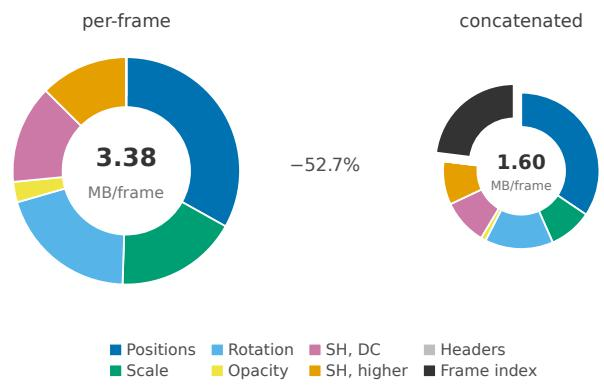  
Fig. 7. The same 30 frames of 3DGStream Flame Steak, coded one by one and coded as one set, by G-PCC at its coarsest rate point. Ring areas are proportional to the totals in their centres. Every stream shrinks; the frame index is the one the concatenated run adds.

3DGStream leaves them unchanged for all Gaussians. HGSC quantizes residuals over their own range at a fixed bit depth and compresses the packed integers with zlib. At coarse bit depths, this jitter falls within one quantization step and costs nothing; at fine bit depths, it becomes low-order noise that does not compress. On Cook Spinach, the geometry and anchor streams of the concatenated branch are cheaper at every rate point (0.41 against 0.90 MB and 0.92 against 1.54 MB per frame at the finest), but its detail stream grows from 0.88 to 10.76 MB per frame across the rate points, against 2.63 to 6.65 MB for the per-frame branch, and the two branches cross at the second finest point. Only 0.3% of the SH residuals in the concatenated set are exactly zero, against 60% within a frame.

SPZ gains most on semi-tracked input for a reason specific to QUEEN, whose higher SH coefficients come from a codebook: a frame of Cook Spinach holds 233 distinct higher-order SH vectors for 261k Gaussians, whereas nearly every Gaussian of 3DGStream and INRIA 3DGS has its own. The rate points of SPZ only change the SH precision, so on QUEEN input they change quality but hardly rate (per-frame branch: 25.0 to 50.7 dB within 0.15 MB per frame). The curves are nearly vertical, and BD-rate essentially measures the rate ratio of the two branches.

## G.4. Untracked input

With 1.0% of Gaussians sharing a voxel, concatenation adds Gaussians without adding coincident positions, and three mechanisms determine the result of each codec.

Quantization steps derived from the data (HGSC, +27.8%). HGSC takes both of its steps from the range of the set it is given: positions are quantized over the bounding box of the set at its position setting, and the two levels of detail are coded as residuals with respect to the nearest Gaussian already coded, quantized over their own range at the bit depth of the rate point. Concatenation widens both ranges on untracked input. The bounding box grows by the factor above. The residuals grow because HGSC splits the set into KD-tree leaves of at most 256 Gaussians and promotes a tenth of each leaf to anchors: with 30 times more Gaussians in the same volume, the nearest already-coded Gaussian usually comes from another frame, and independently estimated frames reach different local optima, so its attributes differ even where the rendered surface agrees. Both effects are distortion that no rate point buys back, and that is what the curves show: on Flame Steak, the concatenated branch is slightly cheaper than the per-frame branch at every rate point (28.9 against 29.4 MB per frame at the finest, 16.2 against 17.2 at the second coarsest) and 3 to 9 dB worse (51.8 against 60.7 dB, 41.7 against 50.9 dB). Duplicate merging is disabled in both branches, so this is not a collision; per sequence, the loss ranges from +18.3% to +50.4%.

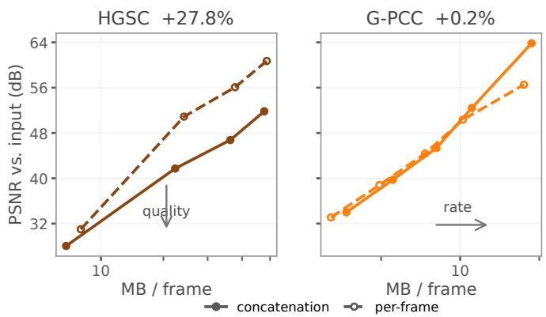  
Fig. 8. The two failures have different shapes on untracked Flame Steak. Concatenation moves HGSC down, spending quality no rate point buys back, and moves G-PCC right, spending only rate. Both panels share a vertical axis.

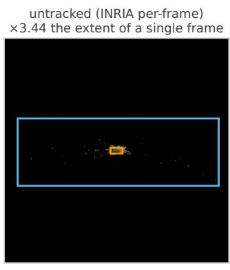

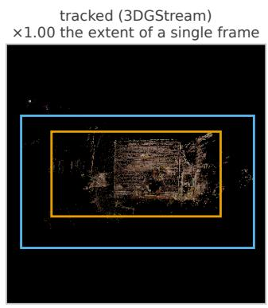

Fig. 9. Every Gaussian of the first GoF-30 group of Flame Steak as one point, with no opacity: it is the positions that set a coder’s range. The scene is nearly the same size in both panels, 52 and 49 world units across, but it covers 6% of the range the untracked group makes a coder span and 73% of the tracked one. The two panels are at different scales.

Wider ranges, absolute steps (L-GSC, G-PCC, SPZ). Every independently estimated frame places its outlying Gaussians differently, so the per-axis extent of the concatenated set is on average 3.44 times that of a single frame, against 1.00 for 3DGStream and QUEEN (Fig. 9). The widening is the work of a small minority: a box 52 world units across holds 99% of the untracked group and one of 49 holds 99% of the tracked one, but that box is 6% of the range the untracked group makes a coder span and 73% of the tracked one. L-GSC quantizes to fixed bit widths over this range and pays with distortion, as HGSC does: on tracked input its two branches reach the same PSNR at every rate point, but on untracked Flame Steak the concatenated branch reaches 37.00 dB against 38.17 dB at the coarsest point. Per sequence, the result of L-GSC ranges from −1.6% to +10.1%, depending on the outliers of each scene. G-PCC is the counter-example that separates the mechanism from the prediction: it also predicts attributes from neighbours (opacity, scale and rotation through the predictive transform; the SH coefficients are coded by RAHT without prediction), but its attribute steps are absolute quantization parameters and its geometry is coded losslessly on a grid derived per slice, so a wider set and worse predictions cost rate, not quality. On untracked Flame Steak its concatenated branch needs 7 to 15% more rate per point at equal or better quality (3.69 against 3.22 MB per frame at 34.0 against 33.1 dB), which integrates to +0.2%. SPZ quantizes each Gaussian independently, so both branches have identical distortion, and it finds little to match across frames (−0.2%).

Table 8 puts the two geometry-based codecs side by side, because their results, +27.8% and +0.2%, are often read as a difference in prediction. Both quantize positions, both predict attributes from neighbours, and both see the same widened set. What separates them is where their quantization steps come from. HGSC derives every step from the data it is handed, so a wider bounding box and wider residuals mean coarser steps at the same bit depth, and the loss lands on quality: on untracked Flame Steak its concatenated branch is 0.5 MB per frame cheaper than its per-frame branch and 8.9 dB worse. G-PCC quantizes attributes with absolute parameters and codes geometry losslessly on a grid derived per slice, so the same widening leaves quality alone and is paid in rate: 0.5 MB per frame more at 0.9 dB better. A codec whose steps follow the data can therefore lose on untracked input however good its predictor is, while one with absolute steps stays near its baseline however poor its predictor becomes.

Table 8. Why concatenation costs HGSC quality and G-PCC only rate on untracked input. The last two rows compare the concatenated with the per-frame branch at the finest rate point of each codec, on Flame Steak.
<table><tr><td></td><td>HGSC</td><td>G-PCC</td></tr><tr><td>Position step</td><td>bounding box of the coded set / 2qp</td><td>1 lossless on a grid derived per slice</td></tr><tr><td>Attribute step Attribute predictor nearest already-coded</td><td>residual range / 2bit depth Gaussian</td><td>absolute QP per attribute RAHT for SH (no prediction); three</td></tr><tr><td></td><td>—0.5 MB per frame</td><td>candidates for opacity, scale, rotation +0.5 MB per frame</td></tr><tr><td>Rate Quality</td><td>-8.9 dB</td><td>+0.9 dB</td></tr><tr><td>BD-rate</td><td>+27.8%</td><td>+0.2%</td></tr></table>

Sorting with spatial prediction (LGSCV, −7.2%; GSCodec-S, −7.1% before the frame-index charge). Both video-based codecs sort the concatenated set into 2D maps and code them with HEVC intra prediction, which benefits whenever neighbouring map positions hold similar values, regardless of their frames. Sorting alone is not sufficient: L-GSC also orders Gaussians by Morton code but has no spatial prediction, and does not gain. Most of these gains is used up by the frame index they are charged, which leaves −1.4% and −3.5% (App. B.1).

## H. FRAME-INDEX OVERHEAD

G-PCC and HGSC code the frame index with the same tool: an 8-bit attribute, spread over the code range in steps of $2 5 5 / ( L - 1 )$ and coded by the predicting transform at unit step, i.e., losslessly. G-PCC codes it on its lossless geometry with the attribute settings of our splat profile. HGSC attaches it to the G-PCC call that codes its quantized positions, with the default prediction settings of its own G-PCC build; this call is separate from the 16-bit reflectance channels in which HGSC codes the Gaussian attributes. Table 9 lists the cost on the first GoF-30 set of Flame Steak. For G-PCC, it is the sum over all slices of the index size that the encoder reports: 9 055 243 bytes for the 9.38M Gaussians of INRIA 3DGS, 7 186 599 bytes for the 7.44M of QUEEN and 11 053 967 bytes for the 10.70M of 3DGStream, identically at the four lossy rate points; the lossless-attribute point codes the index with another geometry configuration and differs by less than 1%. For HGSC, the tracked values come from the encoder logs of six runs, which cover its four rate points. All other values come from re-running the coding of the first group at the coarsest and at the lossless-attribute rate point, which reproduces the size of the original bitstreams byte for byte; at the other lossy rate points, G-PCC codes the index identically. Shares are taken within the same group.

Both codecs spend about the raw 8 bits or more, far above the log 30 = 4.91 bits of an index coded at its uniform entropy, the charge of L-GSC, LGSCV and GSCodec-S (App. B.1), because neighbouring Gaussians in a concatenated set often belong to other frames and prediction does not help. HGSC spends 1.3–2.1 bits more than G-PCC; we did not trace this to a specific setting. The share of the index differs between inputs far more than its cost does, because it is the rest of the bitstream that changes: at the coarsest rate point, a concatenated G-PCC group costs 3.72 MB per frame on untracked input, whose Gaussians carry third-order SH, against 1.60 on 3DGStream, which carries only first-order SH, and 0.96 on QUEEN, which carries second-order SH; the index itself stays between 0.24 and 0.37 MB per frame. Fig. 10 shows what the rest is made of. Untracked input spends 33.6% of its rate on SH and 24.3% on positions; on tracked input the appearance streams collapse, because the 30 copies of a Gaussian carry the same SH coefficients bit for bit (App. G.2), so SH falls to 18.4% and positions, which every copy still needs, rise to 34.4% of a bitstream less than half the size. The index is thus largest in share exactly where concatenation works best. On untracked input it is at most 4.5% of HGSC’s bitstream, far too little to explain the +27.8% of HGSC (App. G.4).

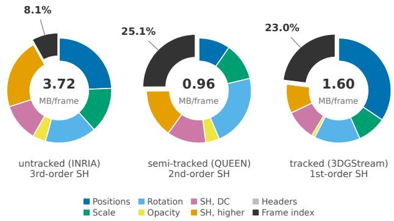  
Fig. 10. Where the rate of a concatenated G-PCC group goes, on the first GoF-30 group of Flame Steak at the coarsest rate point. The rings carry the same streams in the same order and colour, so a wedge can be read across the three inputs; the centre gives the total the shares are taken of. The frame index is the only stream that is not scene content, and is the only wedge pulled out. Slice headers are under 0.02% and not visible.

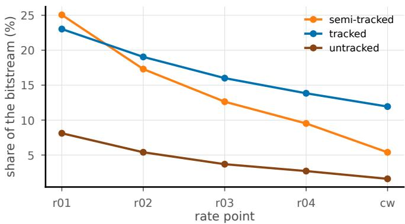  
Fig. 11. The index costs the same bytes at every lossy rate point, so its share falls as the rest of the bitstream grows, and sits highest on the input whose Gaussians carry the fewest SH coefficients.

The ablation of Sec. 3.2 subtracts this cost from every point of the concatenated curve of Flame Steak and recomputes BD-rate against the unchanged per-frame curve. BD-rate changes from −0.4% to −4.7% on untracked input, from −71.1% to −76.4% on semitracked input and from −63.4% to −69.9% on tracked input; the six-sequence average of untracked G-PCC in Fig. 3 is +0.2%.

## I. CONCATENATED KEY FRAME CODING

## I.1. D-FCGS

All D-FCGS results are measured by running its released code on the 3DGStream base stream; no published numbers are used. The first frame of every GoF is an I-frame coded with FCGS [35] at one of five checkpoints, $\lambda \in \{ 1 , 2 , 4 , 8 , 1 6 \} \times 1 0 ^ { - 4 }$ , and every other frame is predicted from the previous reconstruction by the released motion network and checkpoint. FCGS reorders the Gaussians of an I-frame and stores no index map, which breaks the Gaussian correspondence that the P-frame predictor relies on; run as released, the pipeline reaches only 14.8 dB. We therefore compute, at the encoder, the permutation between each decoded I-frame and its source and apply it to the P-frames of the GoF before they are coded. The decoder does not need this permutation, because the P-frames are reconstructed in the order of the decoded I-frame. With this alignment, the groundtruth PSNR averaged over the six sequences is 31.914 dB, against 31.91 dB published for D-FCGS. On Flame Steak at GoF-10, an FCGS I-frame costs 4.86–7.69 MB, and I-frames make up 52–63% of the total rate of 0.93–1.21 MB per frame (Fig. 12).

## I.2. D-GPCC

D-GPCC codes all I-frames of a sequence as one concatenated set with G-PCC (30 I-frames at GoF-10 and 60 at GoF-5), at the five G-PCC rate points, and keeps the P-frame network, checkpoint and parameters of D-FCGS. Two properties of G-PCC are compensated at the encoder before the P-frames are coded. Its output order is aligned as for FCGS. Moreover, G-PCC does not code the real part of a quaternion; it rewrites each Gaussian into an equivalent rotation and scale whose largest quaternion component is the real part. Rendering is unchanged, but the decoded I-frame would differ from the next source frame by a median rotation of 1.57 rad instead of the true motion of 0.017 rad, so the same rewrite is applied to the P-frames of the GoF. The P-frames of each method are coded against its own decoded I-frames, and their bitstreams are part of the rate (App. B.2).

The overall BD-rate of −46.2% (Sec. 3.1) compares two sixpoint curves. GoF-10 reaches lower rates and GoF-5 higher quality, so the curve of each method takes its three cheapest points at GoF-10 and its three best points at GoF-5: for D-GPCC, the three lowest G-PCC rate points at GoF-10 and, at GoF-5, the two highest lossy points and the point with attributes at unit step; for $\mathrm { D } { \cdot } \mathrm { F C G S } , \lambda = 1 6$ 8 and $4 \times 1 0 ^ { - 4 }$ at GoF-10 and $\lambda = 4 ,$ 2 and $1 \times 1 0 ^ { - 4 }$ at GoF-5. Every point averages the six sequences, with PSNR against the input averaged over frames.

## I.3. Group lengths of the dynamic codecs

Table 10 varies the GoF length of D-FCGS on Flame Steak. A longer GoF pays for fewer I-frames, but the motion network then predicts across more frames and quality drops, so each length is an operating regime of its own (Fig. 12, right). The lowest rate occurs at GoF-30, at 33.0 dB. The six-sequence runs of D-FCGS and D-GPCC use GoF-10, the released setting, and GoF-5, which reaches higher quality.

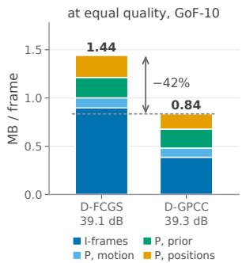

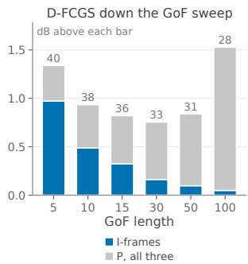  
Fig. 12. What replacing the intra codec moves. Left: the two codecs at matched quality, six-sequence mean at GoF-10 (D-FCGS at λ = $2 \times 1 0 ^ { - 4 }$ , D-GPCC at its third G-PCC rate point). The three P streams move little (−17%; same network and checkpoint, each coded against its own decoded I-frames), and 84% of the −42% is the I segment alone, which falls by 57%. Right: the same split down the sweep of Table 10; a longer GoF buys fewer I-frames, and past GoF-30 the P side grows faster than the I side shrinks. Figures above the bars are MB per frame on the left and PSNR in dB on the right.

GSCodec-D codes a GoP of frames as HEVC video with inter prediction. Table 11 varies the GoP length on Flame Steak, with GoP-1 as the anchor, just as GoF-1 is the anchor in Table 1. Temporal prediction yields almost the entire gain by GoP-16. Beyond that, a longer GoP improves prediction but also widens the per-attribute value range over which the codec quantizes, and GoP-30 gives the best BD-rate. We therefore report GSCodec-D at GoP-30; its released setting is GoP-16. GSCodec-D and GSCodec-S differ in more than grouping: GSCodec-D sorts by Morton code and uses an inter HEVC configuration, GSCodec-S sorts with PLAS and uses an intra configu ration, and the two configurations differ in eight coding tools and an intra QP offset. At one frame per group, the static path is 6% cheaper but 3.0 dB worse, a BD-rate of +11.4%, so the distance between the two codecs in Fig. 4 does not come from temporal prediction alone.

## J. END-TO-END COMPARISON WITH PUBLISHED RESULTS

Every BD-rate in this paper is measured against the input Gaussians, which isolates compression from estimation (App. D.1). That choice makes our numbers incomparable with the literature, where a method is scored end to end against the captured views. Fig. 13 places our runs on that axis instead, next to every N3DV number we could take from a published table.

Table 9. What the frame index costs every codec, on Flame Steak at GoF-30, over the rate points of each codec. G-PCC and HGSC carry the index inside their bitstreams, so their two rate columns are measured on the first group and the share is exact within it; the three codecs that reorder their Gaussians are charged a separate index stream at log 30 bits each (App. B.1), and their columns are the whole sequence. SPZ preserves the order and the count, so it needs none. A range is over the rate points; a single value means the column does not move with the rate.
<table><tr><td>Codec</td><td>Index</td><td>Input</td><td>Total (MB/f)</td><td>Index (MB/f)</td><td>Share (%)</td><td>Bits/Gaussian</td></tr><tr><td>G-PCC</td><td>in the bitstream</td><td>tracked</td><td>1.60-3.08</td><td>0.368</td><td>11.9-23.0</td><td>8.26</td></tr><tr><td></td><td></td><td>semi-tracked</td><td>0.96-4.48</td><td>0.240-0.242</td><td>5.4–25.1</td><td>7.72-7.79</td></tr><tr><td></td><td></td><td>untracked</td><td>3.72–18.72</td><td>0.300-0.302</td><td>1.6-8.1</td><td>7.67-7.72</td></tr><tr><td>HGSC</td><td>in the bitstream</td><td>tracked</td><td>2.26-4.88</td><td>0.437-0.439</td><td>9.0-19.4</td><td>9.81–9.85</td></tr><tr><td></td><td></td><td>semi-tracked</td><td>2.20-11.38</td><td>0.303-0.304</td><td>2.7-13.8</td><td>9.78–9.81</td></tr><tr><td></td><td></td><td>untracked</td><td>7.85–28.66</td><td>0.351-0.352</td><td>1.2-4.5</td><td>8.98–9.00</td></tr><tr><td>L-GSC</td><td>charged</td><td>tracked</td><td>2.13-3.32</td><td>0.219</td><td>6.6-10.3</td><td>4.91</td></tr><tr><td></td><td></td><td>semi-tracked</td><td>1.13-2.88</td><td>0.154</td><td>5.3-13.6</td><td>4.91</td></tr><tr><td></td><td></td><td>untracked</td><td>6.10-13.50</td><td>0.193</td><td>1.4-3.2</td><td>4.91</td></tr><tr><td>LGSCV</td><td>charged</td><td>tracked</td><td>2.40-3.74</td><td>0.219</td><td>5.8-9.1</td><td>4.91</td></tr><tr><td></td><td></td><td>semi-tracked</td><td>1.22–2.06</td><td>0.154</td><td>7.5-12.6</td><td>4.91</td></tr><tr><td></td><td></td><td>untracked</td><td>2.52–4.77</td><td>0.193</td><td>4.0-7.6</td><td>4.91</td></tr><tr><td>GSCodec-S</td><td>charged</td><td>tracked</td><td>2.49–3.70</td><td>0.219</td><td>5.9-8.8</td><td>4.91</td></tr><tr><td></td><td></td><td>semi-tracked</td><td>1.80-3.26</td><td>0.154</td><td>4.7-8.5</td><td>4.91</td></tr><tr><td></td><td></td><td>untracked</td><td>2.93-8.04</td><td>0.193</td><td>2.4-6.6</td><td>4.91</td></tr><tr><td>SPZ</td><td>not needed</td><td>tracked</td><td>2.80-5.21</td><td></td><td>0.0</td><td></td></tr><tr><td></td><td></td><td>semi-tracked</td><td>1.71-1.91</td><td></td><td>0.0</td><td></td></tr><tr><td></td><td></td><td>untracked</td><td>5.49-13.90</td><td></td><td>0.0</td><td></td></tr></table>

Table 10. GoF length of D-FCGS on 3DGStream Flame Steak, at its cheapest checkpoint $( \lambda = 1 6 \times 1 0 ^ { - 4 } )$ . The rate includes all Iand P-frames; PSNR is measured against the input and averaged over frames.
<table><tr><td>GoF</td><td>I-frames</td><td>Rate (MB/f)↓</td><td>PSNR (dB)↑</td></tr><tr><td>5</td><td>60</td><td>1.339</td><td>39.86</td></tr><tr><td>10</td><td>30</td><td>0.935</td><td>37.81</td></tr><tr><td>15</td><td>20</td><td>0.821</td><td>36.21</td></tr><tr><td>30</td><td>10</td><td>0.755</td><td>33.02</td></tr><tr><td>50</td><td>6</td><td>0.839</td><td>30.58</td></tr><tr><td>100</td><td>3</td><td>1.528</td><td>27.52</td></tr></table>

Table 11. GoP length of GSCodec-D on 3DGStream Flame Steak. Enc T is the wall-clock time of eight parallel HEVC encoders and is not comparable with Table 1; delay is structural, at 30 frames per second.
<table><tr><td>GoP</td><td>BD-rate % ↓</td><td>Enc T (s/f)↓</td><td>DecT (s/f)↓)</td><td>Delay (s)↓</td></tr><tr><td>1</td><td>Baseline</td><td>8.4</td><td>0.7</td><td>0.03</td></tr><tr><td>16</td><td>-82.80</td><td>16.2</td><td>0.3</td><td>0.53</td></tr><tr><td>30</td><td>-85.35</td><td>17.2</td><td>0.3</td><td>1.0</td></tr><tr><td>50</td><td>-84.74</td><td>12.2</td><td>0.3</td><td>1.67</td></tr><tr><td>100</td><td>-84.82</td><td>14.9</td><td>0.3</td><td>3.33</td></tr></table>

Three things limit what the figure can show. First, each row is a complete system, an estimator and a codec together, so a point that sits low may do so because of its estimator; our own curves inherit the ceiling of 3DGStream, which Fig. 5 shows at 33.7 dB on one sequence. Second, the printed values are used exactly as printed: we take them from the table of the paper that reports them and convert nothing. Seven of the fourteen methods report a size for the whole 300-frame sequence rather than a rate per frame; dividing one by the other would assume how a shared model is amortized, so those methods appear on the right of the figure at their quality alone. Third, the quality axis is narrow: all fourteen published averages lie between 31.15 and 32.19 dB.

Within those limits, concatenated G-PCC on 3DGStream reaches 32.9 dB, above every published average, but only at 2.5–3.4 MB per frame, where the cheapest published methods report under 0.7. D-GPCC is the configuration of ours that competes on rate: at GoF-5 it reaches 32.6 dB at 1.03 MB per frame, above the best published average we found, QUEEN-l at 32.19 dB, at about 1.4 times its printed size.

One disagreement is visible in the figure and we have not resolved it. Our run of D-FCGS reproduces its published quality, 31.914 against 31.91 dB (App. I), but not its published rate: we measure 1.18–1.55 MB per frame at GoF-10 against the 0.46 printed. The gap is larger than the I-frame accounting can explain, since the Pframes alone cost 0.49–0.50 MB per frame in our run of D-FCGS (App. B.2). We therefore compare D-GPCC against our own run of D-FCGS throughout, under one set of measurement conventions, and report the effect of concatenation alone by holding the P-frame and I-frame codecs fixed (App. B.2); the printed D-FCGS point is shown here for reference, not as the anchor of any BD-rate.

## K. PER-SEQUENCE RESULTS

## K.1. Two rate points that are one

L-GSC has three presets, and its last one changes nothing but the precision of the higher SH bands, from 6 to 5 bits; position, scale, rotation, opacity and the SH DC term are coded identically at both. On QUEEN input that step costs almost no rate on any sequence, 0.4–1.0%, because QUEEN draws its higher-order SH from a small codebook, 205–268 distinct vectors for 248k–432k Gaussians in a frame, the same property that makes the SPZ curves of this input nearly vertical (App. G.3). On Flame Steak it also costs almost no quality: 0.06 dB per-frame and 0.01 dB concatenated, against 2.5– 6.4 dB on the other five sequences (Fig. 14). Of the six, this sequence has the narrowest range of higher-order SH values, 3.78 against 4.23– 6.14, and L-GSC quantizes each attribute over its own range, so one bit less leaves the smallest error of the six; at 39.2 dB that error is below what the attributes the preset does not touch already contribute.

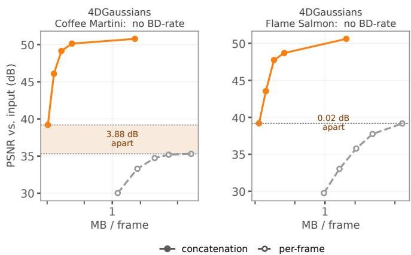

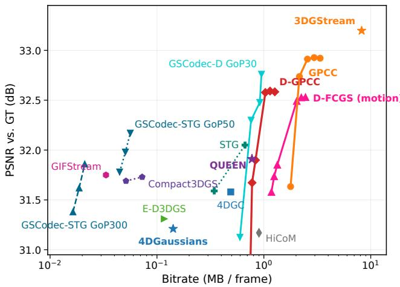  
Fig. 13. Our end-to-end results against the N3DV numbers printed in the cited papers, all six sequences averaged, quality against the held-out camera. GPCC and the I-frames of D-GPCC are both the concatenation branch. D-GPCC and D-FCGS are drawn as the one operating curve the main text uses, three points at GoF-10 and three at GoF-5. The stars are estimators at their own operating point, measured on the representation they train, before the per-frame export every codec here is given; exporting it costs further quality. Each point is a complete system, estimator and codec together.

The two presets are therefore one operating point, in rate and in quality alike, and a quadratic through three points of which two coincide is fixed by the gap between them rather than by the data: it dives to 0.014 MB per frame, 80 times below the cheapest point measured, and returns −98.7%. We merge rate points that differ by less than 0.25 dB before fitting and use the degree the remaining points support, here a line through two points, which gives the −61.2% of Table 12. The same number follows from the data without any fit: the rate ratios of the two branches at the three presets are 0.48, 0.32 and 0.31, whose geometric mean is −63.9%, and the BD-rate with PSNRYUV is −62.7%. Across the repository the rule changes this one cell of Table 12; the next-smallest gap between adjacent rate points is 1.05 dB, 75 times wider. The average column is unaffected, because it averages the i-th rate point over the six sequences first and those means are 3.7 dB apart.

Table 12 lists the BD-rate of concatenation against per-frame coding for every codec, correlation pattern and sequence at GoF-30, together with the six-sequence averages of Fig. 3; as there, the rates of L-GSC, LGSCV and GSCodec-S include the 4.91-bit frame-index charge (App. B.1). On tracked and semi-tracked input, every codec gains on every sequence. On untracked input, the sign is the same on all sequences for HGSC and L-GSC (positive) and for SPZ and GSCodec-S (negative), while G-PCC and LGSCV fall on both sides of zero. The curves behind every entry are on the project page.

Table 13 repeats the comparison for G-PCC at GoF-150 on all four estimators, the setting of the right panel of Fig. 1. The gain again follows the correlation pattern and is largest for 4DGaussians. Two entries are undefined, and the reason is a property of the coding unit rather than of the sequence.

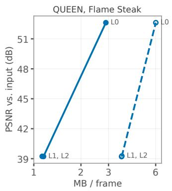

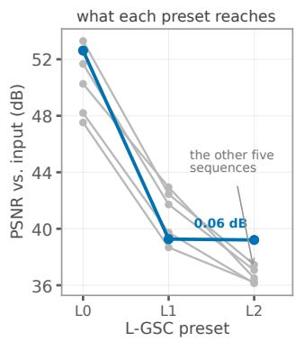  
concatenation per-frame  
Fig. 14. Left: on QUEEN Flame Steak two of L-GSC’s three rate points land on each other in both branches. Right: what each preset reaches on each of the six sequences; the last preset costs 2.5–6.4 dB everywhere else and 0.06 dB here.  
Fig. 15. The two cells of Table 13 that no BD-rate describes. The two branches never reach the same quality, so there is no interval to integrate over; the band is the gap.

G-PCC sizes the position quantizer of a coding unit from that unit’s own bounding box, capping its coded span at $2 ^ { 1 8 }$ steps, so a box inflated by a few far-away points coarsens the grid for everything inside it. The 4DGaussians exporter leaves such points behind (Table 5), and what decides how much they cost is whether the unit is split. A single 4DGaussians frame holds 124k Gaussians, far below the coder’s budget of 1.1M points per slice, so the per-frame branch codes it as one unit spanning the whole frame: 6827 units on Coffee Martini, a step of $2 . { \dot { 6 } } \times 1 0 ^ { - 2 }$ . The concatenated GoF-150 set holds 18.6M Gaussians and is split into 18 slices, each with its own box; one of them collects the outliers (43 950 Gaussians, 0.24% of the set, span 6263) and the other seventeen have a median span of 440. Flame Salmon splits into 21 slices of median span 718 and at most 1736, against 4328 for one of its frames. Concatenation thus codes the same Gaussians on a grid 6 to 15 times finer, with no change of input scale between the branches.

The per-frame branch therefore saturates at 35.3 and 39.2 dB on these two scenes even where attributes are coded at quantization step 1, while the concatenated branch reaches 50.8 and 50.6 dB (Fig. 15), and no BD-rate is defined between two curves that do not share a PSNR interval. The same effect is present but mild elsewhere: across the other 4DGaussians scenes the per-frame ceiling orders with the grid step, 64.8 dB at $3 . 0 \times 1 0 ^ { - 4 }$ , 60.0 at $1 . 1 \times 1 0 ^ { - 3 }$ , 53.8 at $3 . 5 \times \mathrm { { \bar { 1 0 } } ^ { - 3 } }$ . Leaving the two cells undefined is the conservative reading: a BD-rate computed there would credit concatenation with repairing a geometry-quantization artefact rather than with temporal redundancy.

Table 12. BD-rate (%) of GoF-30 concatenation against per-frame coding, per sequence. The last column is the BD-rate between the six-sequence average curves of Fig. 3, which is not the mean of the row. CM: Coffee Martini, CS: Cook Spinach, CRB: Cut Roasted Beef, FSa: Flame Salmon, FSt: Flame Steak, SS: Sear Steak. †Two of L-GSC’s three rate points are one operating point on this sequence and are merged before the fit, which is then a line through two points (App. K.1).
<table><tr><td>Pattern</td><td>Codec</td><td>CM</td><td>CS</td><td>CRB</td><td>FSa</td><td>FSt</td><td>SS</td><td>Average</td></tr><tr><td rowspan="6">Tracked (3DGStream)</td><td>G-PCC</td><td>-68.9</td><td>-67.6</td><td>-64.2</td><td>-69.9</td><td>-63.4</td><td>-62.7</td><td>-66.9</td></tr><tr><td>HGSC</td><td>-69.4</td><td>-67.4</td><td>-62.9</td><td>-69.3</td><td>-62.5</td><td>-62.9</td><td>-66.4</td></tr><tr><td>L-GSC</td><td>-76.0</td><td>-71.1</td><td>-68.1</td><td>-76.8</td><td>-67.0</td><td>-68.5</td><td>-71.8</td></tr><tr><td>SPZ</td><td>-38.4</td><td>-50.0</td><td>-49.8</td><td>-38.2</td><td>-48.3</td><td>-48.7</td><td>-43.0</td></tr><tr><td>LGSCV</td><td>-41.8</td><td>-44.7</td><td>-38.8</td><td>-42.6</td><td>-39.8</td><td>-39.8</td><td>-42.0</td></tr><tr><td>GSCodec-S</td><td>-49.9</td><td>-46.5</td><td>-46.7</td><td>-49.7</td><td>-46.2</td><td>-46.5</td><td>-47.5</td></tr><tr><td rowspan="6">Semi-tracked (QUEEN)</td><td>G-PCC</td><td>-71.4</td><td>-69.8</td><td>-70.5</td><td>-71.8</td><td>-71.1</td><td>-72.7</td><td>-72.2</td></tr><tr><td>HGSC</td><td>-24.1</td><td>-19.3</td><td>-29.1</td><td>-26.6</td><td>-34.1</td><td>-44.9</td><td>-37.9</td></tr><tr><td>L-GSC</td><td>-61.9</td><td>-64.6</td><td>-65.5</td><td>-61.3</td><td>-61.2†</td><td>-65.9</td><td>-63.4</td></tr><tr><td>SPZ</td><td>-60.8</td><td>-61.0</td><td>-61.6</td><td>-60.6</td><td>-60.8</td><td>-61.6</td><td>-60.5</td></tr><tr><td>LGSCV</td><td>-46.9</td><td>-50.4</td><td>-49.8</td><td>-47.7</td><td>-50.0</td><td>-51.2</td><td>-49.2</td></tr><tr><td>GSCodec-S</td><td>-43.4</td><td>-45.3</td><td>-46.6</td><td>-43.8</td><td>-45.7</td><td>-46.8</td><td>-45.2</td></tr><tr><td rowspan="6">Untracked (INRIA 3DGS)</td><td>G-PCC</td><td>0.0</td><td>+0.9</td><td>+1.6</td><td>-0.2</td><td>-0.4</td><td>+0.5</td><td>+0.2</td></tr><tr><td>HGSC</td><td>+18.3</td><td>+26.1</td><td>+23.5</td><td>+21.6</td><td>+50.4</td><td>+28.3</td><td>+27.8</td></tr><tr><td>L-GSC</td><td>+6.5</td><td>+1.1</td><td>+0.5</td><td>+12.0</td><td>+11.7</td><td>+0.9</td><td>+5.0</td></tr><tr><td>SPZ</td><td>-0.1</td><td>-0.3</td><td>-0.2</td><td>-0.1</td><td>-0.3</td><td>-0.3</td><td>-0.2</td></tr><tr><td>LGSCV</td><td>+0.8</td><td>-2.3</td><td>-0.9</td><td>-0.1</td><td>-9.7</td><td>-2.6</td><td>-1.4</td></tr><tr><td>GSCodec-S</td><td>-3.1</td><td>-5.1</td><td>-4.0</td><td>-1.3</td><td>-5.4</td><td>-4.7</td><td>-3.5</td></tr></table>

Table 13. BD-rate (%) of GoF-150 G-PCC concatenation against per-frame G-PCC, per estimator and sequence (abbreviations as in Table 12). N/A: the PSNR ranges of the two branches do not overlap. The six-sequence average for 3DGStream is −69.4%. The Flame Steak entries of 4DGaussians, QUEEN and INRIA 3DGS come from separate runs with identical settings.
<table><tr><td>Estimator</td><td>CM</td><td>CS</td><td>CRB</td><td>FSa</td><td>FSt</td><td>SS</td></tr><tr><td>3DGStream</td><td>-71.8</td><td>-69.8</td><td>-65.9</td><td>-73.3</td><td>-65.1</td><td>-64.9</td></tr><tr><td>4DGaussians</td><td>N/A</td><td>-84.0</td><td>-88.8</td><td>N/A</td><td>-89.5</td><td>-92.0</td></tr><tr><td>QUEEN</td><td>-66.3</td><td>-61.0</td><td>-61.5</td><td>-66.0</td><td>-62.0</td><td>-64.4</td></tr><tr><td>INRIA 3DGS</td><td>-0.9</td><td>0.0</td><td>+1.1</td><td>-1.1</td><td>-1.3</td><td>+0.5</td></tr></table>