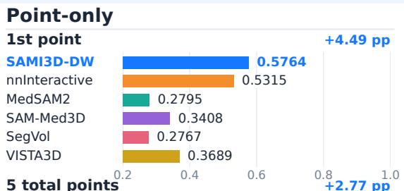
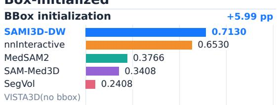
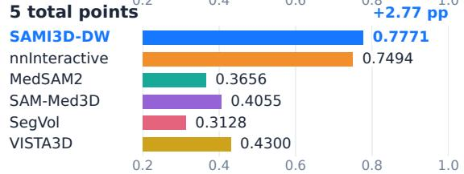
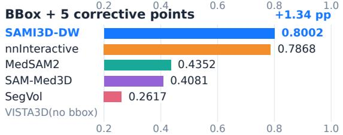
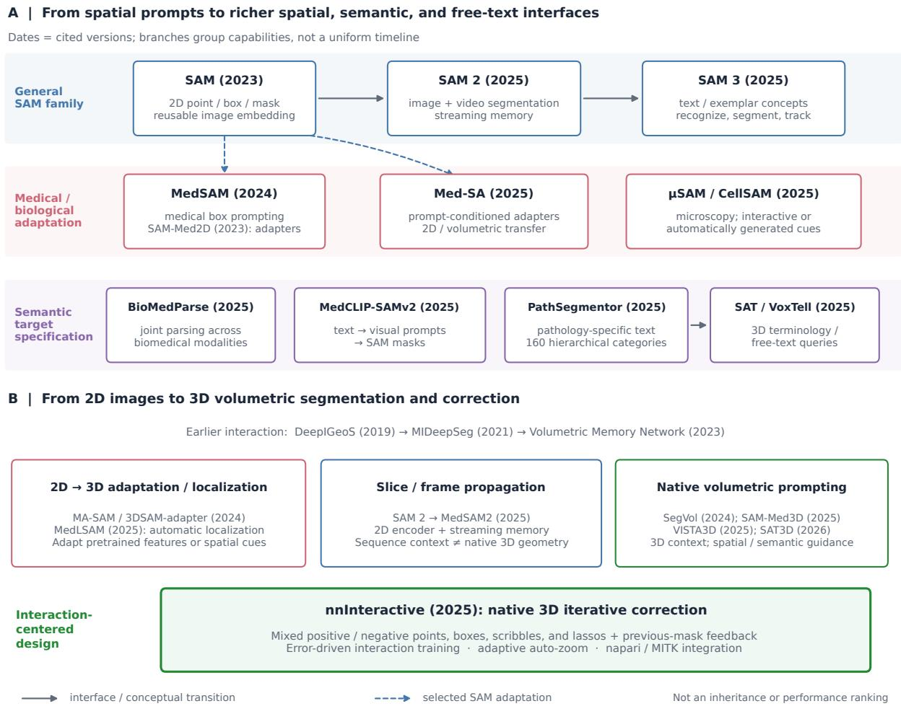
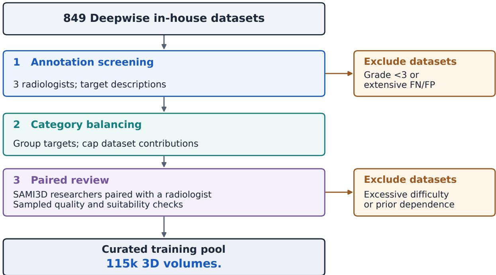
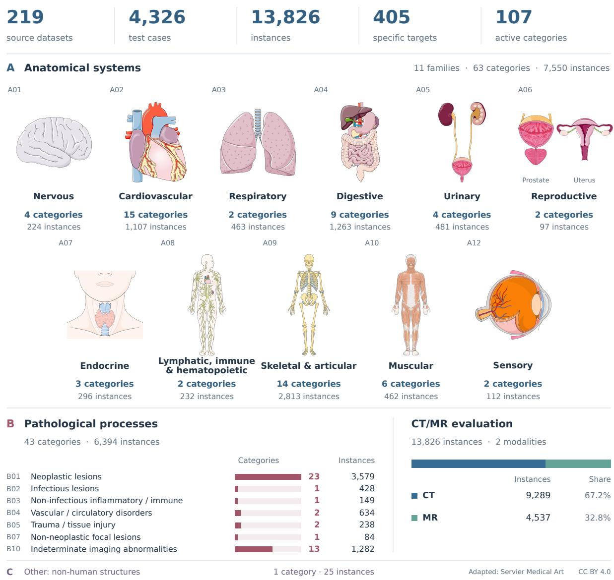

# SAMI3D-DW: Interactive Segmentation of Any 3D Medical Images

Ping Gong1,\*, Shiyuan Su1,\*, Fandong Zhang1, Xinchen Han1, Haowei Sun1, Yiming Li1, Yizhou Yu1,2

1Artificial Intelligence Laboratory, Deepwise Healthcare 2The University of Hong Kong \*Equal contribution.

## Abstract

Interactive segmentation of 3D medical images supports quantitative analysis of anatomical structures and disease while allowing users to specify and refine their targets. Despite substantial progress by nnInteractive and VISTA3D, reliable segmentation across diverse clinical targets remains challenging, particularly for complex anatomical structures and the heterogeneous, long-tailed spectrum of pathology. We present SAMI3D-DW V1 (hereafter SAMI3D-DW), an interactive 3D segmentation model trained on Deepwise’s large-scale proprietary medical image datasets. We evaluate the model under simulated user interactions on a CT/MR benchmark comprising 4,326 cases from 219 source datasets, spanning 107 anatomical and pathological categories, organized by a medical taxonomy and evaluated with a category-balanced DSC score. SAMI3D-DW achieves the highest category-macro Dice among evaluated methods in both interaction modes. With one point, it scores 0.5764 versus 0.5315 for nnInteractive, the strongest baseline, rising to 0.7771 versus 0.7494 with five points. With bounding-box initialization, the scores are 0.7130 versus 0.6530. After five corrective clicks, SAMI3D-DW reaches 0.8002 versus 0.7868, making it the only evaluated box-compatible model to exceed 0.80. For radiologists and clinicians, SAMI3D-DW enables segmentation of complex anatomical structures, including intracranial vessel trees on CT and MR angiography, with a few clicks. In a preliminary in-house comparison involving neurofibromatosis type 1 (NF1), SAMI3D-DW-assisted tumor annotation took minutes per case and approximately one-fifteenth of the time required for manual annotation, highlighting its potential to support volumetric treatment-response assessment.

Category-macro Dice ↑ · Higher is better Axes start at 0.2 · Gains vs nnInteractive CT/MR coverage: 107 categories, 405 specific targets, 219 datasets · 4,326 cases  

  
Figure 1. Benchmark-wide performance with point-only and box-initialized interaction. Top: initial prompts. Bottom: five total points or five corrective points after a BBox. Bar endpoints show category-macro Dice on shared axes starting at 0.2; colors identify methods. Gains over nnInteractive use unrounded scores and are in percentage points (pp). Comparisons are descriptive where coverage of valid scores difers (Tables 3 and 4).

## Contents

1 Introduction 3   
2 Related Work 4   
3 Data and Training Overview 6   
3.1 Training Dataset Curation 6   
3.2 Model Training 7   
4 Evaluation Protocol 7   
4.1 Test Dataset . 7   
4.2 Interaction Modes and Recommended Use 8   
4.3 Simulated Interaction 11   
4.4 Models and Protocol Compatibility 11   
4.5 Metrics and Aggregation 11   
5 Main Results 12   
5.1 Point-Only Segmentation . . 12   
5.2 Box-Initialized Segmentation and Refinement 12   
5.3 Category-Level Results . 13   
5.4 Stratified Results 16   
6 Limitations and Responsible Use 16   
7 Conclusion 17   
Acknowledgments 17   
A Detailed Medical Target Evaluation 21

## 1. Introduction

Medical image segmentation delineates anatomical structures and pathological regions for quantitative analysis, treatment planning, and longitudinal assessment. Task-specific methods such as U-Net and nnU-Net have enabled accurate segmentation across many applications (Ronneberger et al., 2015; Isensee et al., 2021), but extending these systems to new targets or imaging settings generally requires additional annotation, training, and validation. Interactive segmentation offers a flexible way to specify the intended target and refine its boundaries at inference time.

SAM and MedSAM established widely used spatial prompting interfaces (Kirillov et al., 2023; Ma et al., 2024). SAM-Med3D and SegVol extended promptable segmentation to volumetric medical images (Wang et al., 2025; Du et al., 2024). VISTA3D integrates automatic segmentation with interactive editing, MedSAM2 adapts memory-based propagation to medical volumes and videos, and nnInteractive supports diverse prompts and iterative correction in 3D (He et al., 2025; Ma et al., 2025; Isensee et al., 2025). A central question for general-purpose use is how accurately these models segment diverse targets, including complex anatomical structures and heterogeneous pathology, from an initial prompt and how they respond to subsequent correction.

We present SAMI3D-DW, a model for interactive segmentation of 3D medical images, trained on Deepwise’s proprietary medical image datasets. The model produces full-volume masks from spatial prompts and supports point-only interaction as well as initialization with a two-dimensional (2D) bounding box followed by corrective points.

Evaluation must reflect both target diversity and aggregation choices. A few familiar datasets may leave relevant targets unrepresented, while dataset-level averages alone do not reveal repeated coverage of the same structures. Pooling all objects gives more weight to categories with more examples. A medical taxonomy supplies common reporting categories across sources, making anatomical and pathological coverage explicit. Full-volume evaluation and explicit interaction budgets are also essential for comparing interactive methods (Ulrich et al., 2025).

We therefore evaluate SAMI3D-DW on a benchmark comprising 4,326 cases from 219 source datasets and 107 medical categories, focusing on computed tomography (CT) and magnetic resonance (MR), the most common modalities for clinical volumetric imaging. Dataset labels are harmonized through a medical taxonomy. Controlled sampling limits contributions from large source datasets, while category-macro Dice averages object scores within each category and weights category means equally. Both interaction modes use simulated prompts, with performance reported from initialization through successive corrections (Section 4).

This report makes two principal contributions:

• An evaluation framework guided by a medical taxonomy, combining controlled sampling across diverse datasets with equal category weighting to complement dataset-level evaluation.

• SAMI3D-DW achieves the highest reported category-macro Dice among the methods evaluated under each interaction protocol. Compared with nnInteractive, the strongest evaluated baseline, SAMI3D-DW achieves 0.5764 versus 0.5315 with one point and 0.7771 versus 0.7494 with five total points. With box initialization, it achieves 0.7130 versus 0.6530. Results at the reported interaction budgets are reported in Section 5.

## 2. Related Work

From spatial prompts to richer spatial, semantic, and free-text interfaces. Figure 2A summarizes the expansion of target specification. SAM established a reusable point-, box-, and mask prompted interface (Kirillov et al., 2023). Medical evaluations exposed domain gaps (Mazurowski et al., 2023; Huang et al., 2024), motivating MedSAM’s large-scale, box-conditioned medical adaptation and adapter-based methods (Ma et al., 2024; Cheng et al., 2023; Wu et al., 2025). ScribblePrompt, �SAM, and CellSAM further developed biomedical interaction and automatic prompt generation (Wong et al., 2024; Archit et al., 2025; Marks et al., 2025). Semantic specification emerged through SAM 3’s concept prompts (Carion et al., 2025), MedCLIP-SAMv2’s textto-spatial prompting (Koleilat et al., 2025), BioMedParse’s joint segmentation, detection, and recognition across biomedical modalities (Zhao et al., 2025a), and PathSegmentor’s pathologyspecific natural-language interface (Chen et al., 2025). SAT and VoxTell extend medical terminology and free-text queries to volumes (Zhao et al., 2025b; Rokuss et al., 2025). These developments broaden how users express what to segment, but semantic intent does not necessarily determine an exact instance or boundary. Customer feedback at Deepwise and current technical limitations motivate retaining spatial prompts as a necessary tool for fast, high-accuracy interactive annotation: points, boxes, and other spatial cues provide direct localization and precise error correction, even when language supplies the initial target description.

From 2D images to 3D volumetric segmentation and correction. An equally important trend is the transition from slice-wise masks to volume-level prediction and refinement (Figure 2B). Earlier geodesic and memory-based systems already studied correction and unseen-target transfer (Wang et al., 2019; Luo et al., 2021; Zhou et al., 2023). MA-SAM, 3DSAM-adapter, and MedLSAM extend pretrained features or localization to volumes (Chen et al., 2024; Gong et al., 2024; Lei et al., 2025); SAM-Med3D, SegVol, VISTA3D, and SAT3D develop native volumetric prompting (Wang et al., 2025; Du et al., 2024; He et al., 2025; Peiris et al., 2026). SAM 2 and MedSAM2 reduce repeated initialization through memory-based slice propagation (Ravi et al., 2025; Ma et al., 2025). However, propagation remains slice-based: changes in anatomical structures and accumulated errors can still require inspection and correction across many slices. It does not by itself adequately resolve the multi-slice annotation burden motivating this report. nnInteractive is the state-of-the-art reference most closely aligned with this volume-level correction objective (Isensee et al., 2025). Its native 3D model turns points, boxes, scribbles, and lassos placed in 2D orthogonal views into full-volume masks, using previous-mask feedback and error-driven training to support iterative refinement. SAMI3D-DW continues this second line of development, focusing on 3D volumetric segmentation and correction driven by 2D spatial prompts. We evaluate point-only and box-initialized corrective-point workflows, measuring full-volume quality over successive interactions rather than isolated prompted masks, consistent with interactive benchmarking practice (Ulrich et al., 2025).

  
Figure 2. Two major trends in interactive medical segmentation: A, from spatial prompts to richer spatial, semantic, and free-text interfaces; B, from 2D images to 3D volumetric segmentation and correction, the direction pursued by SAMI3D-DW. Arrows indicate conceptual transitions or selected adaptations, not performance rankings or direct architectural inheritance. Dates follow the cited publication or preprint version; grouped branches are not a uniform timeline.

## 3. Data and Training Overview

## 3.1. Training Dataset Curation

The candidate training collection included 849 Deepwise in-house datasets. Three-stage curation yielded 115k 3D volumes (Figure 3).

  
Figure 3. Training data curation. FN and FP denote false-negative and false-positive annotation errors.

Annotation screening. Three radiologists of attending rank or above assessed false-negative (FN) and false-positive (FP) annotation errors, graded contour quality from 1 to 5 (Table 1), and described each target. Datasets with contour grades below 3 or extensive FN/FP errors were excluded.

Category balancing. Datasets were grouped by target description. Sampling caps limited each dataset’s contribution to balance target categories.

Paired review. SAMI3D researchers paired with a radiologist reviewed sampled annotations for quality and training suitability. Datasets judged too dificult for the training objective (e.g., softplaque delineation) or reliant on expert anatomical conventions (e.g., hepatic segments) were excluded.

Table 1. Contour-quality grading. Cases graded 1–2 were excluded.
<table><tr><td>Grade</td><td>Criteria</td></tr><tr><td>5: Excellent</td><td>Accurate boundaries with fine anatomical detail preserved.</td></tr><tr><td>4: Good</td><td>Minor focal contour deviations.</td></tr><tr><td>3: Acceptable</td><td>Overall anatomical structures preserved; localized errors requiring correction.</td></tr><tr><td>2: Poor</td><td>Major contour errors or substantial anatomical distortion.</td></tr><tr><td>1: Unusable</td><td>Absent required annotations, invalid masks, or image-mask mismatch.</td></tr></table>

## 3.2. Model Training

The architecture and detailed training configuration of SAMI3D-DW are not publicly disclosed at this stage. The model was trained from scratch on the Deepwise-curated datasets described above, without using any pretrained weights.

Training comprised two stages: initial training on the full curated dataset collection, followed by fine-tuning at a reduced learning rate on a subset of challenging datasets, particularly those involving lesions.

## 4. Evaluation Protocol

We evaluate SAMI3D-DW retrospectively under two simulated interaction modes. The point-only mode uses one to five cumulative foreground/background points and supports the broadest comparison across model interfaces. The BBox-initialized mode begins with one two-dimensional (2D) box and permits up to five corrective point prompts. Its correction sequence follows the structure of the CVPR 2025 Foundation Models for Interactive 3D Biomedical Image Segmentation Challenge; the prompt construction and aggregation rules below define the protocol used in this report, and the two protocols are not identical. Results from the two interaction modes are reported separately because a box and a point convey diferent amounts of spatial information and need not require equal user efort.

## 4.1. Test Dataset

Medical taxonomy. Combining medical segmentation datasets requires more than concatenating their label lists. The same structure may have diferent names across sources, whereas similar names may denote diferent anatomical structures, pathology, laterality, or annotation policies. We harmonize source annotations with a medical taxonomy independent of dataset-specific label IDs. Each dataset label is mapped to a Specific Target (hereafter target), which identifies the medical object together with its modality, laterality, anatomical or pathological subdivision, and verified imaging sequence or phase, where available. Targets are grouped into pre-defined reporting categories:

$$
\mathrm { d a t a s e t 1 a b e l { \longrightarrow } s p e c i f i c ~ t a r g e t \longrightarrow m e d i c a l ~ c a t e g o r y . }\tag{1}
$$

Thus, 405 specific targets refine the underlying medical objects rather than represent 405 independent object types. These distinctions do not multiply the 107 reporting categories; categorybalanced scoring is unchanged.

The taxonomy comprises three domains. A: Anatomical and physiological structures covers normal human anatomical structures and physiological constituents, including the liver, kidneys, heart, vascular trees, vertebrae, and muscles. B: Pathology and abnormalities covers disease-related lesions, abnormal tissues, and abnormal regions, including tumours such as neurofibromas, haemorrhage, infarction, and infectious lesions. C: Other segmentation targets covers targets outside normal human anatomical structures and human pathology, including non-human structures, medical implants, and foreign bodies. Assignment follows the annotated target: a liver mask belongs to $\mathsf { A } ,$ whereas a liver tumour mask belongs to B, even when both originate from the same image.

Within A, structures are grouped by organ system and tissue family. Within B, lesions are grouped by pathological process, including neoplastic, infectious, inflammatory and immune-mediated, vascular, traumatic, focal non-neoplastic, and indeterminate abnormalities. These domain definitions describe the scope of the taxonomy; benchmark coverage is determined by the observed annotations and evaluation mappings. Table 2 summarizes the domain definitions, illustrative examples, and counts for the represented families.

Benchmark coverage and sampling. The benchmark is designed to cover diverse anatomical and pathological targets across body regions in CT and MR. Sampling is controlled across source datasets to limit dominance by large, commonly used targets. Medical categories, rather than dataset identities, define the principal reporting units, and category means receive equal weight. This combination broadens coverage beyond a small set of familiar datasets and keeps less frequent target categories visible in the overall evaluation. Balanced weighting does not imply equal sample counts across categories or modalities, or a test distribution matching clinical prevalence.

Because this report studies interactive 3D segmentation, the frozen mixed-dimensional candidate pool is filtered at the source-dataset level using an audited dimensionality registry and, where necessary, lightweight spatial metadata. This removes 22 two-dimensional datasets, 754 cases, and 931 physical objects; no image or label voxels are read to make the dimensionality decision. We further restrict evaluation to CT and MR, removing two additional 3D datasets, 36 cases, and 418 objects from other modalities.

The resulting benchmark comprises 219 source datasets, 4,326 test cases, and 13,826 physical target objects. Curated mapping covers 405 specific targets and 107 categories with 13,969 associated instances: 63 categories of anatomical structures with 7,550 associated instances, 43 pathology categories with 6,394 associated instances, and one Other category with 25 associated instances. Each physical object is counted once per category, so the category-level instance total can exceed the physical-object count when an object maps to multiple medical concepts.

The benchmark contains CT (9,289 objects from 2,373 cases) and MR (4,537 objects from 1,953 cases), covering major body regions from the brain and head and neck through the thorax, abdomen, pelvis, spine, and extremities. Representative coverage is shown in Figure 4.

Training–test separation. None of the 4,326 test cases is used for training. Some source datasets also contribute diferent cases to model development. The results therefore measure performance on unseen cases from a heterogeneous multi-source benchmark; they do not establish transfer to entirely unseen datasets. We do not describe this evaluation as external, zero-shot, fully independent, or prospective validation. Dataset, institution, and case identifiers are withheld from the public report.

## 4.2. Interaction Modes and Recommended Use

A point is quick to place, straightforward to interpret as foreground or background, and available in all six displayed entries. Point-only prompting is therefore a practical interface and an important common comparison, not merely a diagnostic. Its first positive point localizes a target but does not necessarily identify it. This limitation is intrinsic to nested and adjacent structures: a point inside a liver tumour, for example, is simultaneously inside the tumour and the liver, so the intended mask cannot be inferred from that coordinate alone.

A BBox supplies approximate extent and generally narrows the set of plausible interpretations before refinement. It does not encode class identity or eliminate every ambiguity, but it provides a more informative spatial initialization across heterogeneous anatomical structures and pathological targets. We therefore recommend BBox initialization followed by corrective points when approximate extent is convenient to provide; point-only interaction remains the simpler option and enables comparison with point-only systems such as VISTA3D. The recommendation concerns the accuracy trajectories measured here and is not a claim about user time.

Table 2. Medical taxonomy and coverage of the scored test set. Domain definitions and illustrative examples describe the classification scope; counts refer only to represented families. Instance counts are deduplicated within each category; a physical object can contribute to more than one category.
<table><tr><td>Code Taxonomy family Categories Instances</td></tr><tr><td>A: Anatomical and physiological structures Scope: Normal human anatomical structures and physiological constituents. Examples: Liver, kidneys,</td></tr><tr><td>heart, vascular trees, vertebrae, and muscles.</td></tr><tr><td>A01 Nervous system 4 224</td></tr><tr><td>A02 Cardiovascular system 15 1,107 A03</td></tr><tr><td>Respiratory system 2 463 A04 Digestive system 9 1,263</td></tr><tr><td>A05 Urinary system 4 481</td></tr><tr><td>A06</td></tr><tr><td>Reproductive system 2 97</td></tr><tr><td>A07 Endocrine system 3 296</td></tr><tr><td>A08 Lymphatic, immune, and hematopoietic systems 2 232 A09 Skeletal and articular system 14 2,813</td></tr><tr><td>A10 Muscular system 6 462</td></tr><tr><td>A12 Sensory system 2 112</td></tr><tr><td></td></tr><tr><td>A subtotal 63 7,550</td></tr><tr><td>B: Pathology and abnormalities Scope: Disease-related lesions, abnormal tissues, and abnormal regions. Examples: Tumours (including</td></tr><tr><td>neurofibromas), haemorrhage, infarction, and infectious lesions.</td></tr><tr><td>B01 Neoplastic lesions 23 3,579</td></tr><tr><td>B02 Infectious lesions 1 428</td></tr><tr><td>B03 Non-infectious inflammatory and immune-mediated lesions 1 149</td></tr><tr><td>B04 Vascular and circulatory disorders 2 634</td></tr><tr><td>B05 Trauma and tissue injury 2 238</td></tr><tr><td>B07 Non-neoplastic focal lesions 1 84</td></tr><tr><td>B10 Indeterminate imaging abnormalities 13 1,282</td></tr><tr><td>B subtotal 43 6,394</td></tr><tr><td>C: Other segmentation targets</td></tr><tr><td>Scope: Targets outside normal human anatomical structures and human pathology. Examples:</td></tr><tr><td>Non-human structures, medical implants, and foreign bodies.</td></tr><tr><td>C99 Other uncategorized targets 1 25 Total 107 13,969</td></tr></table>

  
Figure 4. Anatomical, pathological, and modality coverage of the CT/MR benchmark. Medical illustrations show representative anatomical structures for all 11 represented anatomical families (A). The pathology panel (B) lists seven families, with bar lengths indicating category counts; the Other domain (C) retains non-human structures for complete accounting. Category-level instance counts are deduplicated within each category; a physical instance can contribute to more than one category. The overall count and modality shares use the 13,826 unique physical instances. Illustrations are cropped and arranged from Servier Medical Art, licensed under CC BY 4.0; they are not to scale and do not imply exhaustive organ coverage.

## 4.3. Simulated Interaction

The point-only protocol omits the BBox and applies five cumulative EDT-maximum points. The first point is generated from the target mask; later points use the same largest-error-component rule. Results are reported after one, three, and five points. All methods use the same initial point prompts. SAMI3D-DW and nnInteractive share the same cohort, point-selection rule, interaction budget, and metric implementation in both protocols. Subsequent locations can difer because they are generated from each model’s current error mask.

For the BBox-initialized protocol, the simulator places a tight 2D box around the largest connected component on the axial slice with the greatest target area; no in-plane margin is added. It then performs five correction rounds. At each round, the evaluator compares the current prediction with the reference mask, selects the largest 26-connected error component, and places a point at a maximally interior location determined by the Euclidean distance transform. Falsenegative and false-positive regions yield positive and negative points, respectively. The BBox, preceding points, and previous prediction are retained.

Every prompt is derived from a reference mask. The evaluation therefore models a deterministic, error-aware annotator under controlled conditions; it does not reproduce the imprecision, stopping decisions, timing, or variability of real users. Unless stated otherwise, all interactions in this report are simulated.

## 4.4. Models and Protocol Compatibility

The complete paired comparison in each interaction mode is between SAMI3D-DW and nnInteractive, for which all 13,826 objects and all 107 categories have valid inference results (Dice scores) at every stage. The point-only table additionally reports MedSAM2, SAM-Med3D, SegVol, and the VISTA3D CVPR 2025 checkpoint. VISTA3D is included here because its published interactive branch accepts positive and negative 3D points, but it is absent from the BBox table because that branch does not define a BBox input compatible with this protocol (He et al., 2025). For overlapping targets such as pancreas and pancreatic tumour, its formulation also assumes that target class � is known and uses that information in an ambiguity embedding. Its point-only values are therefore useful descriptive references but are not treated as a fully input-equivalent inferential comparison.

MedSAM2, SAM-Med3D, and SegVol also provide descriptive reference points under the BBoxplus-correction sequence. They have valid scores for 13,420, 13,823, and 13,540 objects, respectively, at each displayed stage. All three still represent all 107 categories. Missing or invalid scores are never replaced with zero, and method-specific coverage accompanies both comparisons (Tables 3 and 4).

The comparison concerns the evaluated configurations under our simulator. Published workflows difer: MedSAM2 initializes a box on the target’s middle slice and propagates bidirectionally, while SegVol’s main comparison uses box and text prompts together (Ma et al., 2025; Du et al., 2024). Rankings here are specific to the evaluated interaction modes rather than a summary of every prompting option ofered by each method.

## 4.5. Metrics and Aggregation

The principal metric is Dice on the [0, 1] scale. For each method and stage, we first average valid object scores within every category and then weight the available category means equally. For point-only interaction, we report category-macro Dice after one, three, and five points, making both immediate response and fixed-budget refinement visible. For BBox-initialized interaction, we report initialization and predictions after one, three, and five corrections. We do not combine the two modes into an equal-efort ranking.

The size, spacing, and modality analyses in Section 5.4 are descriptive category-macro summaries. Within each subgroup, the comparison uses the categories with at least one valid score at each of the BBox and +5 stages for all five methods, so every method in a table row has the same category denominator. Size is defined by reference-mask voxel count (small: < 10,000; medium: 10,000–99,999; large: ≥ 100,000). Acquisition spacing is the maximum voxel spacing across three image axes (thin: < 1 mm; intermediate: [1, 5) mm; thick: ≥ 5 mm). Modality comes from the audited object metadata and target mappings. These analyses are not adjusted for multiple comparisons.

## 5. Main Results

We first compare segmentation accuracy under point-only and box-initialized interaction, then examine diferences across medical categories and imaging strata. The paired comparison with nnInteractive covers all 13,826 objects and 107 categories. Additional baselines provide de scriptive comparisons under the evaluated configurations, with method-specific coverage of valid scores (Section 4.4 and Tables 3 and 4).

## 5.1. Point-Only Segmentation

SAMI3D-DW achieves the highest observed category-macro Dice among the evaluated point-only configurations (Table 3). It leads nnInteractive, clearly the strongest baseline, from the first point, scoring 0.5764 versus 0.5315, and reaches 0.7771 versus 0.7494 with five total points.

Table 3. Point-only prompt comparison. Scores are category-macro Dice; invalid object scores are excluded rather than replaced with zero. VISTA3D values are descriptive because its published interface can use target-type information that is absent from the spatial-only protocols.
<table><tr><td>Method</td><td>1 point</td><td>3 points</td><td>5 points</td><td>Valid objects</td><td>Categories</td></tr><tr><td>SAMI3D-DW</td><td>0.5764</td><td>0.7398</td><td>0.7771</td><td>13,826</td><td>107</td></tr><tr><td>nnInteractive</td><td>0.5315</td><td>0.6917</td><td>0.7494</td><td>13,826</td><td>107</td></tr><tr><td>MedSAM2</td><td>0.2795</td><td>0.3233</td><td>0.3656</td><td>13,715</td><td>107</td></tr><tr><td>SAM-Med3D</td><td>0.3408</td><td>0.3928</td><td>0.4055</td><td>13,823</td><td>107</td></tr><tr><td>SegVol</td><td>0.2767</td><td>0.2965</td><td>0.3128</td><td>13,785</td><td>107</td></tr><tr><td>VISTA3D (CVPR&#x27;25)</td><td>0.3689</td><td>0.4186</td><td>0.4300</td><td>13,747</td><td>107</td></tr></table>

## 5.2. Box-Initialized Segmentation and Refinement

With box initialization, SAMI3D-DW has the highest observed category-macro Dice among the five methods evaluated under this protocol (Table 4). Its advantage over nnInteractive is largest before correction and narrows as corrective points are added. At initialization, it scores 0.7130 versus 0.6530; after five corrections, the scores are 0.8002 versus 0.7868. These accuracy trajectories describe distinct prompting interfaces; the box and point budgets are not matched for user efort (Section 4.2).

Table 4. BBox-initialized point-refinement comparison. Scores are category-macro Dice computed from each method’s valid object scores. Object and category coverage is identical across the four displayed stages; invalid scores are excluded, not replaced with zero.
<table><tr><td>Method</td><td>BBox</td><td>+1</td><td> $+ 3$ </td><td>+5</td><td>Valid objects</td><td>Categories</td></tr><tr><td>SAMI3D-DW</td><td>0.7130</td><td>0.7604</td><td>0.7853</td><td>0.8002</td><td>13,826</td><td>107</td></tr><tr><td>nnInteractive</td><td>0.6530</td><td>0.7154</td><td>0.7638</td><td>0.7868</td><td>13,826</td><td>107</td></tr><tr><td>MedSAM2</td><td>0.3766</td><td>0.3780</td><td>0.4099</td><td>0.4352</td><td>13,420</td><td>107</td></tr><tr><td>SAM-Med3D</td><td>0.3408</td><td>0.3796</td><td>0.4013</td><td>0.4081</td><td>13,823</td><td>107</td></tr><tr><td>SegVol</td><td>0.2408</td><td>0.2530</td><td>0.2582</td><td>0.2617</td><td>13,540</td><td>107</td></tr></table>

## 5.3. Category-Level Results

Detailed category comparisons focus on nnInteractive, for which complete paired results are available. Tables 5 and 6 list all 63 categories of anatomical structures and 43 pathology categories, with their full names, object counts, and both methods’ Dice at BBox initialization and after five corrective points. Detailed results for SAMI3D-DW at BBox, +1, +3, and +5 appear in Section A, using Combined Targets that pool specific-target variants for compact presentation.

Vascular targets and the renal collecting system. The largest final gains among anatomical structures occur in pulmonary vessels of unspecified artery/vein type, head and lower-limb vascular trees, and the renal collecting system (Table 5). For head vascular trees, SAMI3D-DW reaches 0.8228 versus 0.4455 after five corrections; the renal collecting system improves by +0.2299. Neck vascular trees also benefit, reaching 0.9576 versus 0.8805 over 50 objects. Pulmonary vessels, lower-limb vascular trees, and the renal collecting system are represented by only 10, 11, and 20 objects, respectively. The large gains in these categories are based on small samples and need confirmation in larger cohorts.

Gains across neoplastic categories. Pelvic, gastrointestinal, and bone tumors show final BBoxrefinement gains of +0.2693, +0.1492, and +0.1527, respectively (Table 6).

NF1-related tumors can occur throughout the body and exhibit complex morphologies, including nodular, difuse, and mixed forms. In this category (381 objects from 31 cases), SAMI3D-DW achieves 0.6441 Dice at BBox initialization, compared with 0.5512 for nnInteractive (+0.0929). After five corrective clicks, SAMI3D-DW reaches 0.7351 versus 0.7077, retaining an advantage of +0.0275.

Observed Relative Weaknesses. Brain favors SAMI3D-DW at five total points (+0.1187) but nnInteractive after BBox refinement (−0.1282). Jaw bones show the largest final deficit among anatomical structures with a box (−0.6104, 14 objects), despite an approximate tie in pointonly mode. CNS demyelinating and immune-mediated lesions favor nnInteractive in both modes. These category comparisons are descriptive; no multiplicity-adjusted inference is made, and the means alone do not explain failure mechanisms or establish vascular branch completeness.

Table 5. Anatomical and Physiological Structures: BBox and BBox + 5 Clicks (Dice)
<table><tr><td rowspan=1 colspan=9>SamplesCode   Category                                                     (instances)  SAMI3D-DW   nnInteractiveBBox   +5   BBox   +5</td></tr><tr><td rowspan=1 colspan=9>Mean                                                                    0.68640.79120.63220.7784</td></tr><tr><td rowspan=3 colspan=6>A01    Brain                                                                720.6170Ventricular &amp; Cerebrospinal Fluid System                              220.2870Spinal Cord                                                          890.6410</td><td rowspan=1 colspan=2>0.67670.7260</td><td rowspan=1 colspan=1>0.8049</td></tr><tr><td rowspan=1 colspan=1>0.4918</td><td rowspan=1 colspan=1>0.1857</td><td rowspan=1 colspan=1>0.3331</td></tr><tr><td rowspan=1 colspan=1>0.8487</td><td rowspan=1 colspan=1>0.6227</td><td rowspan=1 colspan=1>0.8381</td></tr><tr><td rowspan=4 colspan=6>A02    HeartOther Arterial Vessels                                                4000.6981Other Venous Vessels                                                 610.6526Pulmonary Vessels, Artery/Vein Unspecified                            100.5637160.2849</td><td rowspan=1 colspan=3></td></tr><tr><td rowspan=1 colspan=4></td><td rowspan=1 colspan=1>0.8545</td><td rowspan=1 colspan=1>0.8011</td><td rowspan=1 colspan=1>0.8830</td></tr><tr><td rowspan=1 colspan=1></td><td rowspan=1 colspan=1>0.8601</td><td rowspan=1 colspan=1>0.6855</td><td rowspan=1 colspan=1>0.8806</td></tr><tr><td rowspan=1 colspan=1></td><td rowspan=1 colspan=2>0.8323 0.6284</td><td rowspan=1 colspan=1>0.8505</td></tr><tr><td rowspan=1 colspan=1></td><td></td><td rowspan=1 colspan=4></td><td rowspan=1 colspan=2>0.82880.1181</td><td rowspan=1 colspan=1>0.3597</td></tr><tr><td rowspan=3 colspan=2></td><td rowspan=1 colspan=4></td><td rowspan=1 colspan=1>0.5908</td><td rowspan=1 colspan=1>0.2455</td><td rowspan=1 colspan=1>0.5367</td></tr><tr><td rowspan=3 colspan=4>Aortic Arterial Tree                                                   290.8252Head Vascular Tree                                                   360.6611Neck Vascular Tree                                                    500.8657</td><td rowspan=1 colspan=1>0.9173</td><td rowspan=1 colspan=1>0.6289</td><td rowspan=1 colspan=1>0.8397</td></tr><tr><td rowspan=1 colspan=1>0.8228</td><td rowspan=1 colspan=1>0.0747</td><td rowspan=1 colspan=1>0.4455</td></tr><tr><td rowspan=1 colspan=1></td><td></td><td rowspan=1 colspan=1>0.9576</td><td rowspan=1 colspan=1>0.7659</td><td rowspan=1 colspan=1>0.8805</td></tr><tr><td rowspan=1 colspan=1></td><td></td><td rowspan=1 colspan=4>Coronary Arterial Tree                                                500.8152</td><td rowspan=1 colspan=1>0.9293</td><td rowspan=1 colspan=1>0.8555</td><td rowspan=1 colspan=1>0.9113</td></tr><tr><td rowspan=2 colspan=2></td><td rowspan=3 colspan=4>Lower-limb Vascular Tree                                             110.4800Pulmonary Circulation Vessels                                            0.7214Hepatic Arteries and Veins                                            240.8088</td><td rowspan=1 colspan=1>0.7672</td><td rowspan=1 colspan=1>0.1854</td><td rowspan=1 colspan=1>0.5057</td></tr><tr><td rowspan=1 colspan=2>29 0.7214</td><td rowspan=1 colspan=1>0.8265</td><td rowspan=1 colspan=1>0.4141</td><td rowspan=1 colspan=1>0.8346</td></tr><tr><td rowspan=1 colspan=2></td><td rowspan=1 colspan=2>24 0.8088</td><td rowspan=1 colspan=1>0.8518</td><td rowspan=1 colspan=1>0.7026</td><td rowspan=1 colspan=1>0.7984</td></tr><tr><td rowspan=1 colspan=2></td><td rowspan=1 colspan=2>Portal Venous System</td><td rowspan=1 colspan=2>480.6355</td><td rowspan=1 colspan=1>0.7598</td><td rowspan=1 colspan=1>0.5167</td><td rowspan=1 colspan=1>0.7697</td></tr><tr><td rowspan=2 colspan=2></td><td rowspan=1 colspan=2>Vena Caval System</td><td rowspan=1 colspan=2>1560.7454</td><td rowspan=1 colspan=1>0.8746</td><td rowspan=1 colspan=1>0.6124</td><td rowspan=1 colspan=1>0.8911</td></tr><tr><td rowspan=1 colspan=2>Brachiocephalic Veins</td><td rowspan=1 colspan=2>680.8186</td><td rowspan=1 colspan=1>0.8987</td><td rowspan=1 colspan=1>0.8073</td><td rowspan=1 colspan=1>0.9202</td></tr><tr><td rowspan=1 colspan=2>A03</td><td rowspan=1 colspan=2>Lung</td><td rowspan=1 colspan=2>3870.9061</td><td rowspan=1 colspan=1>0.9290</td><td rowspan=1 colspan=1>0.8887</td><td rowspan=1 colspan=1>0.9465</td></tr><tr><td rowspan=1 colspan=2></td><td rowspan=1 colspan=2>Respiratory Tract and Airway</td><td rowspan=1 colspan=2>760.6650</td><td rowspan=1 colspan=1>0.7730</td><td rowspan=1 colspan=1>0.5933</td><td rowspan=1 colspan=1>0.7629</td></tr><tr><td rowspan=1 colspan=1>A04</td><td rowspan=2 colspan=1>A04</td><td rowspan=3 colspan=2>Oral Cavity &amp; PharynxSalivary GlandsEsophagus</td><td rowspan=1 colspan=2>420.6106</td><td rowspan=1 colspan=1>0.7039</td><td rowspan=1 colspan=1>0.5165</td><td rowspan=1 colspan=1>0.6936</td></tr><tr><td></td><td rowspan=1 colspan=2>560.7905</td><td rowspan=1 colspan=1>0.8497</td><td rowspan=1 colspan=1>0.7521</td><td rowspan=1 colspan=1>0.8528</td></tr><tr><td rowspan=1 colspan=2></td><td rowspan=1 colspan=2>1460.5984</td><td rowspan=1 colspan=1>0.8076</td><td rowspan=1 colspan=1>0.5918</td><td rowspan=1 colspan=1>0.8213</td></tr><tr><td rowspan=1 colspan=2></td><td rowspan=1 colspan=2>Stomach</td><td rowspan=1 colspan=2>1300.8050</td><td rowspan=1 colspan=1>0.8800</td><td rowspan=1 colspan=1>0.8050</td><td rowspan=1 colspan=1>0.9035</td></tr><tr><td rowspan=1 colspan=2></td><td rowspan=1 colspan=2>Small Intestine</td><td rowspan=1 colspan=2>2240.5992</td><td rowspan=1 colspan=1>0.7458</td><td rowspan=1 colspan=1>0.5480</td><td rowspan=1 colspan=1>0.7678</td></tr><tr><td rowspan=2 colspan=2></td><td rowspan=2 colspan=2>Large IntestineLiver</td><td rowspan=1 colspan=2>2070.5588</td><td rowspan=1 colspan=1>0.7431</td><td rowspan=1 colspan=1>0.5362</td><td rowspan=1 colspan=1>0.7729</td></tr><tr><td rowspan=1 colspan=2>1510.9284</td><td rowspan=1 colspan=1>0.9335</td><td rowspan=1 colspan=1>0.9319</td><td rowspan=1 colspan=1>0.9546</td></tr><tr><td rowspan=1 colspan=2></td><td rowspan=1 colspan=2>Gallbladder &amp; Biliary System</td><td rowspan=1 colspan=2>1210.7798</td><td rowspan=1 colspan=1>0.8453</td><td rowspan=1 colspan=1>0.7711</td><td rowspan=1 colspan=1>0.8602</td></tr><tr><td rowspan=1 colspan=2></td><td rowspan=1 colspan=2>Pancreas</td><td rowspan=1 colspan=2>1860.7382</td><td rowspan=1 colspan=1>0.8149</td><td rowspan=1 colspan=1>0.6492</td><td rowspan=1 colspan=1>0.8052</td></tr><tr><td rowspan=1 colspan=2>A05</td><td rowspan=1 colspan=2>Kidney</td><td rowspan=1 colspan=1>349</td><td rowspan=1 colspan=1>0.9279</td><td rowspan=1 colspan=1>0.9404</td><td rowspan=1 colspan=1>0.8829</td><td rowspan=1 colspan=1>0.9151</td></tr><tr><td rowspan=2 colspan=2></td><td rowspan=3 colspan=2>Renal Collecting SystemUreterUrinary Bladder</td><td rowspan=1 colspan=1>20</td><td rowspan=1 colspan=1>0.7158</td><td rowspan=1 colspan=1>0.7766</td><td rowspan=1 colspan=1>0.3857</td><td rowspan=1 colspan=1>0.5467</td></tr><tr><td rowspan=1 colspan=1>18</td><td rowspan=1 colspan=1>0.6432</td><td rowspan=1 colspan=1>0.7711</td><td rowspan=1 colspan=1>0.3397</td><td rowspan=1 colspan=1>0.6369</td></tr><tr><td rowspan=1 colspan=2></td><td rowspan=1 colspan=1>94</td><td rowspan=1 colspan=1>0.8111</td><td rowspan=1 colspan=1>0.8361</td><td rowspan=1 colspan=1>0.8062</td><td rowspan=1 colspan=1>0.8482</td></tr><tr><td rowspan=1 colspan=2>A06</td><td rowspan=2 colspan=2>ProstateProstate or Uterus, Sex-conditional Composite</td><td rowspan=1 colspan=1>82</td><td rowspan=1 colspan=1>0.6867</td><td rowspan=1 colspan=1>0.7703</td><td rowspan=1 colspan=1>0.6607</td><td rowspan=1 colspan=1>0.7860</td></tr><tr><td rowspan=1 colspan=2></td><td rowspan=1 colspan=1>15</td><td rowspan=1 colspan=1>0.8346</td><td rowspan=1 colspan=1>0.8822</td><td rowspan=1 colspan=1>0.8130</td><td rowspan=1 colspan=1>0.8879</td></tr><tr><td rowspan=1 colspan=2>A07</td><td rowspan=2 colspan=1>Pituitary GlandThyroid Gland</td><td rowspan=2 colspan=1></td><td rowspan=1 colspan=1>14</td><td rowspan=1 colspan=1>0.7247</td><td rowspan=1 colspan=1>0.7816</td><td rowspan=1 colspan=1>0.7075</td><td rowspan=1 colspan=1>0.7732</td></tr><tr><td rowspan=1 colspan=2></td><td rowspan=1 colspan=1>45</td><td rowspan=1 colspan=1>0.7059</td><td rowspan=1 colspan=1>0.8337</td><td rowspan=1 colspan=1>0.6523</td><td rowspan=1 colspan=1>0.8448</td></tr><tr><td rowspan=1 colspan=2></td><td rowspan=1 colspan=2>Adrenal Gland</td><td rowspan=1 colspan=1>237</td><td rowspan=1 colspan=1>0.7391</td><td rowspan=1 colspan=1>0.7924</td><td rowspan=1 colspan=1>0.7308</td><td rowspan=1 colspan=1>0.8160</td></tr><tr><td rowspan=1 colspan=2>A08</td><td rowspan=1 colspan=2>Lymph Nodes</td><td rowspan=1 colspan=1>103</td><td rowspan=1 colspan=1>0.7035</td><td rowspan=1 colspan=1>0.7660</td><td rowspan=1 colspan=1>0.6838</td><td rowspan=1 colspan=1>0.7818</td></tr><tr><td rowspan=1 colspan=2></td><td rowspan=1 colspan=2>Spleen</td><td rowspan=1 colspan=1>129</td><td rowspan=1 colspan=1>0.9271</td><td rowspan=1 colspan=1>0.9380</td><td rowspan=1 colspan=1>0.9239</td><td rowspan=1 colspan=1>0.9473</td></tr><tr><td rowspan=1 colspan=2>A09</td><td rowspan=1 colspan=2>Cartilage &amp; Fibrocartilage</td><td rowspan=1 colspan=1>336</td><td rowspan=1 colspan=1>0.4218</td><td rowspan=1 colspan=1>0.6184</td><td rowspan=1 colspan=1>0.4180</td><td rowspan=1 colspan=1>0.6611</td></tr><tr><td rowspan=1 colspan=2></td><td rowspan=1 colspan=2>Ligament</td><td rowspan=1 colspan=1>101</td><td rowspan=1 colspan=1>0.3348</td><td rowspan=1 colspan=1>0.4950</td><td rowspan=1 colspan=1>0.2337</td><td rowspan=1 colspan=1>0.4022</td></tr><tr><td rowspan=2 colspan=2></td><td rowspan=2 colspan=2>Intervertebral DiscSkull</td><td rowspan=1 colspan=1>182</td><td rowspan=1 colspan=1>0.8028</td><td rowspan=1 colspan=1>0.8190</td><td rowspan=1 colspan=1>0.7593</td><td rowspan=1 colspan=1>0.8173</td></tr><tr><td></td><td rowspan=1 colspan=1>0.5389</td><td rowspan=1 colspan=1>0.7919</td><td rowspan=1 colspan=1>0.7700</td><td rowspan=1 colspan=1>0.8359</td></tr><tr><td rowspan=1 colspan=2></td><td rowspan=1 colspan=2>Jaw Bones</td><td rowspan=1 colspan=1>14</td><td rowspan=1 colspan=1>0.0404</td><td rowspan=1 colspan=1>0.2028</td><td rowspan=1 colspan=1>0.6107</td><td rowspan=1 colspan=1>0.8132</td></tr><tr><td rowspan=1 colspan=2></td><td rowspan=1 colspan=2>Cervical Vertebrae</td><td rowspan=1 colspan=1>117</td><td rowspan=1 colspan=1>0.6829</td><td rowspan=1 colspan=1>0.8021</td><td rowspan=1 colspan=1>0.8660</td><td rowspan=1 colspan=1>0.9114</td></tr><tr><td rowspan=2 colspan=2></td><td rowspan=1 colspan=2>Thoracic Vertebrae</td><td rowspan=1 colspan=1>372</td><td rowspan=1 colspan=1>0.9114</td><td rowspan=1 colspan=1>0.9359</td><td rowspan=1 colspan=1>0.9315</td><td rowspan=1 colspan=1>0.9518</td></tr><tr><td rowspan=2 colspan=2>Lumbar VertebraeRibs</td><td rowspan=1 colspan=1>118</td><td rowspan=1 colspan=1>0.9049</td><td rowspan=1 colspan=1>0.9273</td><td rowspan=1 colspan=1>0.9347</td><td rowspan=1 colspan=1>0.9583</td></tr><tr><td rowspan=1 colspan=2></td><td rowspan=1 colspan=1>779</td><td rowspan=1 colspan=1>0.8498</td><td rowspan=1 colspan=1>0.9121</td><td rowspan=1 colspan=1>0.8924</td><td rowspan=1 colspan=1>0.9363</td></tr><tr><td rowspan=1 colspan=2></td><td rowspan=1 colspan=2>Sternum</td><td rowspan=1 colspan=1>37</td><td rowspan=1 colspan=1>0.8408</td><td rowspan=1 colspan=1>0.9247</td><td rowspan=1 colspan=1>0.6633</td><td rowspan=1 colspan=1>0.9351</td></tr><tr><td rowspan=2 colspan=2></td><td rowspan=1 colspan=2>Bony Pelvis</td><td rowspan=1 colspan=1>118</td><td rowspan=1 colspan=1>0.8038</td><td rowspan=1 colspan=1>0.8763</td><td rowspan=1 colspan=1>0.7771</td><td rowspan=1 colspan=1>0.8795</td></tr><tr><td rowspan=2 colspan=2>Shoulder-girdle BonesLimb Bones</td><td rowspan=1 colspan=1>139</td><td rowspan=1 colspan=1>0.8627</td><td rowspan=1 colspan=1>0.9074</td><td rowspan=1 colspan=1>0.8861</td><td rowspan=1 colspan=1>0.9169</td></tr><tr><td rowspan=1 colspan=2></td><td rowspan=1 colspan=2>3350.8677</td><td rowspan=1 colspan=1>0.8945</td><td rowspan=1 colspan=1>0.8036</td><td rowspan=1 colspan=1>0.8937</td></tr><tr><td rowspan=1 colspan=2></td><td rowspan=1 colspan=2>Spinal Column, Spinal Canal and Level-unspecified Vertebra</td><td rowspan=1 colspan=2>1450.6140</td><td rowspan=1 colspan=1>0.7692</td><td rowspan=1 colspan=1>0.5225</td><td rowspan=1 colspan=1>0.7352</td></tr><tr><td rowspan=1 colspan=2>A10</td><td rowspan=1 colspan=2>Tendons &amp; Aponeuroses</td><td rowspan=1 colspan=2>390.4233</td><td rowspan=1 colspan=1>0.5355</td><td rowspan=1 colspan=1>0.4104</td><td rowspan=1 colspan=1>0.5632</td></tr><tr><td rowspan=6 colspan=2>A12</td><td rowspan=2 colspan=4>Fascia &amp; Muscular Compartments                                     130.1836Head and Neck Muscles                                               130.6187</td><td rowspan=1 colspan=1>0.2153</td><td rowspan=1 colspan=1>0.2003</td><td rowspan=1 colspan=1>0.2207</td></tr><tr><td rowspan=1 colspan=1>0.7473</td><td rowspan=1 colspan=1>0.4063</td><td rowspan=1 colspan=1>0.7293</td></tr><tr><td rowspan=2 colspan=4>Abdominal Muscles                                                   920.7339Paraspinal Muscles                                                  1250.7365</td><td rowspan=1 colspan=1>0.8480</td><td rowspan=1 colspan=1>0.7227</td><td rowspan=1 colspan=1>0.8703</td></tr><tr><td rowspan=1 colspan=1>0.8726</td><td rowspan=1 colspan=1>0.7193</td><td rowspan=1 colspan=1>0.8779</td></tr><tr><td rowspan=2 colspan=4>Lower-limb Muscles                                                  1800.7622</td><td rowspan=1 colspan=1>0.8659</td><td rowspan=1 colspan=1>0.7892</td><td rowspan=1 colspan=1>0.8665</td></tr><tr><td rowspan=1 colspan=4>0.7420</td><td rowspan=1 colspan=1>0.8014</td><td rowspan=1 colspan=1>0.7249</td><td rowspan=1 colspan=1>0.7813</td></tr><tr><td rowspan=1 colspan=2></td><td rowspan=1 colspan=4>Ear &amp; Auditory-Vestibular Structures                                   280.7173</td><td rowspan=1 colspan=1>0.7732</td><td rowspan=1 colspan=1>0.7192</td><td rowspan=1 colspan=1>0.7899</td></tr></table>

CT/MR cohort; taxonomy codes follow Table 2. BBox is the initial 2D box; +5 denotes five corrective points. Category scores average valid instance Dice, counting each physical object once per category. Mean weights categories equally. Missing scores are excluded. Bold marks the higher score at the same stage.

Table 6. Pathological Findings and Abnormalities: BBox and BBox + 5 Clicks (Dice)
<table><tr><td>Code</td><td>Category</td><td>Samples (instances)</td><td colspan="4">SAMI3D-DW nnInteractive</td></tr><tr><td></td><td></td><td></td><td colspan="2">BBoX</td><td colspan="2">BBox +5</td></tr><tr><td></td><td>Mean</td><td></td><td>0.7545</td><td>0.8185</td><td>0.6775</td><td>0.7954</td></tr><tr><td>B01</td><td>Lung Cancer or Pulmonary Mass</td><td>238</td><td>0.7213</td><td>0.7913</td><td>0.6599</td><td>0.7798</td></tr><tr><td></td><td>Adrenal Tumor</td><td>51</td><td>0.8268</td><td>0.9320</td><td>0.9000</td><td>0.9294</td></tr><tr><td></td><td>Kidney Cancer</td><td>39</td><td>0.8295</td><td>0.8747</td><td>0.7200</td><td>0.8454</td></tr><tr><td></td><td>Kidney Tumor</td><td>126</td><td>0.8931</td><td>0.9228</td><td>0.8566</td><td>0.9162</td></tr><tr><td></td><td>Gastric Cancer</td><td>206</td><td>0.7046</td><td>0.7763</td><td>0.5376</td><td>0.6940</td></tr><tr><td></td><td>Gastrointestinal Tumor</td><td>151</td><td>0.6481</td><td>0.7473</td><td>0.3679</td><td>0.5981</td></tr><tr><td></td><td>Gastrointestinal Stromal Tumor</td><td>31</td><td>0.8255</td><td>0.8743</td><td>0.7737</td><td>0.8535</td></tr><tr><td></td><td>Thymic Cancer</td><td>70</td><td>0.7540</td><td>0.8380</td><td>0.6504</td><td>0.7475</td></tr><tr><td></td><td>Other Abdominal Tumor</td><td>10</td><td>0.7861</td><td>0.8488</td><td>0.7089</td><td>0.8247</td></tr><tr><td></td><td>Bone Tumor Whole-body NF1-related Tumor Burden</td><td>41</td><td>0.7372</td><td>0.8377</td><td>0.5183</td><td>0.6849</td></tr><tr><td></td><td>Cervical Cancer</td><td>381</td><td>0.6441</td><td>0.7351</td><td>0.5512</td><td>0.7077</td></tr><tr><td></td><td>Pelvic Tumor</td><td>67</td><td>0.7505</td><td>0.7977</td><td>0.6441</td><td>0.7694</td></tr><tr><td></td><td>Liver Tumor</td><td>64</td><td>0.7687</td><td>0.8251</td><td>0.4528</td><td>0.5558</td></tr><tr><td></td><td>Brain and Intracranial Tumor</td><td>339</td><td>0.7050</td><td>0.8012</td><td>0.7049</td><td>0.7969</td></tr><tr><td></td><td>Parotid Tumor</td><td>318</td><td>0.7942</td><td>0.8340</td><td>0.6950</td><td>0.7801</td></tr><tr><td></td><td>Soft-tissue Tumor</td><td>33</td><td>0.8381</td><td>0.8686</td><td>0.7922</td><td>0.8662</td></tr><tr><td></td><td>Breast Tumor</td><td>48</td><td>0.7896</td><td>0.8383</td><td>0.7741</td><td>0.8469</td></tr><tr><td></td><td></td><td>390</td><td>0.8039</td><td>0.8493</td><td>0.7217</td><td>0.8313</td></tr><tr><td></td><td>Prostate Tumor</td><td>14</td><td>0.7311</td><td>0.7847</td><td>0.6673</td><td>0.8057</td></tr><tr><td></td><td>Pancreatic Tumor</td><td>94</td><td>0.8430</td><td>0.8832</td><td>0.7665</td><td>0.8732</td></tr><tr><td></td><td>Other Head and Neck Tumor</td><td>167</td><td>0.7219</td><td>0.7986</td><td>0.7147</td><td>0.8362</td></tr><tr><td></td><td>Metastatic Tumor</td><td>404</td><td>0.7366</td><td>0.8178</td><td>0.7354</td><td>0.8096</td></tr><tr><td></td><td>Other or Site-unspecified Tumor</td><td>297</td><td>0.7316</td><td>0.8032</td><td>0.6848</td><td>0.8231</td></tr><tr><td>B02</td><td>Pneumonia</td><td>428</td><td>0.6880</td><td>0.7778</td><td>0.6567</td><td>0.7836</td></tr><tr><td>B03</td><td>Central Nervous-system Demyelinating and Immune-mediated Lesion</td><td>149</td><td>0.7420</td><td>0.7363</td><td>0.7531</td><td>0.8566</td></tr><tr><td>B04</td><td>Intracranial Hemorrhage</td><td>461</td><td>0.6421</td><td>0.7051</td><td>0.5823</td><td>0.6870</td></tr><tr><td></td><td>Cerebral Ischemia, Infarction and Hypoxic-ischemic Injury</td><td>173</td><td>0.6256</td><td>0.7130</td><td>0.6082</td><td>0.7407</td></tr><tr><td>B05</td><td>Anterior Cruciate Ligament Injury</td><td>54</td><td>0.7102</td><td>0.7557</td><td>0.5101</td><td>0.6724</td></tr><tr><td></td><td>Fracture</td><td>184</td><td>0.9279</td><td>0.9606</td><td>0.8935</td><td>0.9491</td></tr><tr><td>B07</td><td>Renal Cyst</td><td>84</td><td>0.8961</td><td>0.9258</td><td>0.8751</td><td>0.9230</td></tr><tr><td>B10</td><td>Indeterminate Breast Lesion</td><td>77</td><td>0.7067</td><td>0.7823</td><td>0.5649</td><td>0.7427</td></tr><tr><td></td><td>Breast Nodule</td><td>76</td><td>0.8424</td><td>0.8696</td><td>0.7516</td><td>0.8507</td></tr><tr><td></td><td>Thyroid Nodule</td><td>30</td><td>0.7753</td><td>0.8326</td><td>0.6685</td><td>0.8043</td></tr><tr><td></td><td>Indeterminate Liver Lesion</td><td>121</td><td>0.7687</td><td>0.8432</td><td>0.7488</td><td>0.8343</td></tr><tr><td></td><td>Pulmonary Nodule</td><td>405</td><td>0.8029</td><td>0.8493</td><td>0.7616</td><td>0.8387</td></tr><tr><td></td><td>Indeterminate Pancreatic Lesion</td><td>12</td><td>0.7402</td><td>0.7850</td><td>0.6387</td><td>0.8164</td></tr><tr><td></td><td>Indeterminate Prostate Lesion</td><td>91</td><td>0.6363</td><td>0.7476</td><td>0.6590</td><td>0.7724</td></tr><tr><td></td><td>Indeterminate Ovarian Lesion</td><td>87</td><td>0.8264</td><td>0.8669</td><td>0.7922</td><td>0.8864</td></tr><tr><td></td><td>Perirectal Lymph-node Target of Indeterminate Status</td><td>15</td><td>0.8573</td><td>0.8806</td><td>0.5408</td><td>0.7826</td></tr><tr><td></td><td>Indeterminate Nervous-system Imaging Abnormality</td><td>20</td><td>0.7854</td><td>0.8550</td><td>0.7005</td><td>0.7963</td></tr><tr><td></td><td>Other Indeterminate Abdominopelvic Lesion</td><td>145</td><td>0.7810</td><td>0.8376</td><td>0.7351</td><td>0.8303</td></tr><tr><td></td><td>Indeterminate Lymph-node Target</td><td>188</td><td>0.6914</td><td>0.7643</td><td>0.6817</td><td>0.7838</td></tr><tr><td></td><td>Pathologic Fluid Collection and Abnormal Gas in Body Cavity</td><td>15</td><td>0.4129</td><td>0.6253</td><td>0.4126</td><td>0.6734</td></tr></table>

CT/MR cohort; taxonomy codes follow Table 2. BBox is the initial 2D box; +5 denotes five corrective points. Category scores average valid instance Dice, counting each physical object once per category. Mean weights categories equally. Missing scores are excluded. Bold marks the higher score at the same stage.

## 5.4. Stratified Results

Imaging modality. SAMI3D-DW has the highest observed BBox-initialized category-macro score in both evaluated modalities. After five corrections, it remains highest on CT (0.8300 versus 0.8195 for nnInteractive) and MR (0.7455 versus 0.7433) (Table 7). CT and MR contribute 85 and 69 represented categories, respectively; these sets overlap and difer in target composition.

Table 7. Category-macro Dice by 3D imaging modality. Each method cell reports BBox / +5 corrections. Categories denotes the common denominator of categories with valid scores for all five methods; bold marks the best value at each stage within a row. The cohort is restricted to CT and MR.
<table><tr><td></td><td>Modality Categories (used/mapped)</td><td>Objects</td><td>SAMI3D-DW</td><td>nnInteractive</td><td>MedSAM2</td><td>SAM-Med3D</td><td>SegVol</td></tr><tr><td>CT</td><td>85/85</td><td>9,289</td><td>0.7447 / 0.8300</td><td>0.6872 / 0.8195</td><td>0.3768 / 0.4155</td><td>0.3584 / 0.4374</td><td>0.2291 / 0.2500</td></tr><tr><td>MR</td><td>69/69</td><td>4,537</td><td>0.6405 / 0.7455</td><td>0.5997 / 0.7433</td><td>0.3384 / 0.4080</td><td>0.3378 / 0.4162</td><td>0.2382 / 0.2741</td></tr></table>

Object size and voxel spacing. SAMI3D-DW has the highest initial and final category-macro Dice in each reported size and maximum-spacing stratum. The final margins over nnInteractive are small: +0.0034 to +0.0097 across size strata and +0.0059 to +0.0178 across spacing strata. Full five-method results and category denominators appear in Tables 8 and 9. These exploratory comparisons use common category denominators based on valid scores within each stratum, but do not control for diferences in target composition or support causal claims about size, spacing, or modality.

Table 8. Category-macro Dice by reference-object size. Each method cell reports BBox / +5 corrections. Categories denotes the common denominator of categories with valid scores for all five methods; bold marks the best value at each stage within a row.
<table><tr><td>Size by target voxels</td><td>Categories (used/mapped)</td><td>Objects</td><td>SAMI3D-DW</td><td>nnInteractive</td><td>MedSAM2</td><td>SAM-Med3D</td><td>SegVol</td></tr><tr><td>Small (&lt; 10,000)</td><td>97/97</td><td>7,855</td><td>0.6764 / 0.7654</td><td>0.6141/ 0.7558</td><td>0.3649 / 0.4735</td><td>0.2972 / 0.3256</td><td>0.3429 / 0.3585</td></tr><tr><td>Medium (10,000–99,999)</td><td>90/90</td><td>4,009</td><td>0.7443 / 0.8268</td><td>0.7089 / 0.8230</td><td>0.4136 / 0.4282</td><td>0.4400 / 0.5255</td><td>0.1650 / 0.2132</td></tr><tr><td>Large (≥ 100,000)</td><td>68/69</td><td>1,962</td><td>0.7523 / 0.8392</td><td>0.7237 / 0.8358</td><td>0.4782 / 0.4181</td><td>0.4711 / 0.6068</td><td>0.0555 / 0.1128</td></tr></table>

Table 9. Category-macro Dice by maximum voxel spacing. Each method cell reports BBox / +5 corrections. Categories denotes the common denominator of categories with valid scores for all five methods; bold marks the best value at each stage within a row.
<table><tr><td>Maximum spacing</td><td>Categories (used/mapped)</td><td>Objects</td><td>SAMI3D-DW</td><td>nnInteractive</td><td>MedSAM2</td><td>SAM-Med3D</td><td>SegVol</td></tr><tr><td>Thin (&lt; 1 mm)</td><td>46/47</td><td>981</td><td>0.7826 /0.8403</td><td>0.7282 /0.8343</td><td>0.3616 / 0.3402</td><td>0.3810 /0.4828</td><td>0.1127 / 0.1064</td></tr><tr><td>Intermediate (1-&lt; 5 mm)</td><td>104/104</td><td>9,657</td><td>0.7169 /0.8028</td><td>0.6518 / 0.7850</td><td>0.3635 / 0.4149</td><td>0.3367 / 0.4072</td><td>0.2207 / 0.2375</td></tr><tr><td>Thick (≥ 5 mm)</td><td>70/70</td><td>3,188</td><td>0.6801 / 0.7762</td><td>0.6334 / 0.7685</td><td>0.4418 / 0.5389</td><td>0.3860 / 0.4367</td><td>0.3418 / 0.3702</td></tr></table>

## 6. Limitations and Responsible Use

Evaluation scope. Training and test cases are disjoint, but some source datasets contribute to both splits; transfer to unseen datasets and institutions remains untested. The current evaluation covers CT and MR only. Future work will include PET, 3D ultrasound, and independent external validation.

Simulated interaction. Reference masks determine the targets and prompts, so this benchmark does not measure human prompt variability or annotation time. The preliminary NF1 timing comparison is task-specific and requires fuller reporting. Predicted masks and subsequent corrections require qualified human review.

Baseline comparability. Coverage of valid scores difers across baselines. VISTA3D can also use target-type information. Their comparisons are descriptive and specific to the evaluated configurations. Category averages do not establish uniform superiority across targets or clinical efectiveness.

## 7. Conclusion

We present SAMI3D-DW and evaluate interactive 3D segmentation on a CT/MR benchmark of 219 source datasets, 4,326 cases, and 107 medical categories. With equal category weighting, SAMI3D-DW achieves the highest observed mean Dice among the evaluated configurations: 0.5764 with one point, 0.7771 with five points, 0.7130 with BBox initialization, and 0.8002 after five corrective clicks. These results support point-only interaction as a simple interface and BBox initialization when approximate target extent is available. Independent external validation, real-user studies, and evaluation on additional imaging modalities remain necessary to establish broader applicability and workflow benefits.

## Acknowledgments

We would like to thank Professor Zhichao Wang and Dr. Jun Liu, from Shanghai Jiao Tong University School of Medicine and its afiliated Shanghai Ninth People’s Hospital, for their valuable feedback during the early development of SAMI3D-DW.

## References

A. Archit, L. Freckmann, S. Nair, N. Khalid, P. Hilt, V. Rajashekar, M. Freitag, C. Teuber, M. Spitzner, C. Tapia Contreras, G. Buckley, S. von Haaren, S. Gupta, M. Grade, M. Wirth, G. Schneider, A. Dengel, S. Ahmed, and C. Pape. Segment anything for microscopy. Nature Methods, 22(3):579–591, 2025. doi: 10.1038/s41592-024-02580-4.

N. Carion, L. Gustafson, Y.-T. Hu, S. Debnath, R. Hu, D. Suris, C. Ryali, K. V. Alwala, H. Khedr, et al. SAM 3: Segment anything with concepts, 2025. URL https://arxiv.org/abs/2511.16719.

C. Chen, J. Miao, D. Wu, A. Zhong, Z. Yan, S. Kim, J. Hu, Z. Liu, L. Sun, X. Li, T. Liu, P.-A. Heng, and Q. Li. MA-SAM: Modality-agnostic SAM adaptation for 3D medical image segmentation. Medical Image Analysis, 98:103310, 2024. doi: 10.1016/j.media.2024.103310.

Z. Chen, J. Hou, L. Lin, Y. Wang, Y. Bie, X. Wang, Y. Zhou, R. C. K. Chan, and H. Chen. Segment anything in pathology images with natural language. arXiv preprint arXiv:2506.20988v2, 2025. URL https://arxiv.org/abs/2506.20988v2.

J. Cheng, J. Ye, Z. Deng, J. Chen, T. Li, H. Wang, Y. Su, Z. Huang, J. Chen, L. Jiang, J. He, S. Zhang, M. Zhu, and Y. Qiao. SAM-Med2D, 2023. URL https://arxiv.org/abs/2308.16184.

Y. Du, F. Bai, T. Huang, and B. Zhao. SegVol: Universal and interactive volumetric medical image segmentation. In Advances in Neural Information Processing Systems, volume 37, pages 110746–110783, 2024.

S. Gong, Y. Zhong, W. Ma, J. Li, Z. Wang, J. Zhang, P.-A. Heng, and Q. Dou. 3DSAM-adapter: Holistic adaptation of SAM from 2D to 3D for promptable tumor segmentation. Medical Image Analysis, 98:103324, 2024. doi: 10.1016/j.media.2024.103324.

Y. He, P. Guo, Y. Tang, A. Myronenko, V. Nath, Z. Xu, D. Yang, C. Zhao, B. Simon, M. Belue, S. Harmon, B. Turkbey, D. Xu, and W. Li. VISTA3D: A unified segmentation foundation model for 3D medical imaging. In Proceedings of the IEEE/CVF Conference on Computer Vision and Pattern Recognition, pages 20863–20873, 2025. doi: 10.1109/CVPR52734.2025.01943. URL https://arxiv.org/abs/2406.05285.

Y. Huang, X. Yang, L. Liu, H. Zhou, A. Chang, X. Zhou, R. Chen, J. Yu, J. Chen, C. Chen, et al. Segment anything model for medical images? Medical Image Analysis, 92:103061, 2024. doi: 10.1016/j.media.2023.103061.

F. Isensee, P. F. Jaeger, S. A. A. Kohl, J. Petersen, and K. H. Maier-Hein. nnU-Net: A selfconfiguring method for deep learning-based biomedical image segmentation. Nature Methods, 18(2):203–211, 2021. doi: 10.1038/s41592-020-01008-z.

F. Isensee, M. Rokuss, L. Krämer, S. Dinkelacker, A. Ravindran, F. Stritzke, B. Hamm, T. Wald, M. Langenberg, C. Ulrich, J. Deissler, R. Floca, and K. Maier-Hein. nnInteractive: Redefining 3D promptable segmentation, 2025. URL https://arxiv.org/abs/2503.08373.

A. Kirillov, E. Mintun, N. Ravi, H. Mao, C. Rolland, L. Gustafson, T. Xiao, S. Whitehead, A. C. Berg, W.-Y. Lo, P. Dollár, and R. Girshick. Segment anything. In Proceedings of the IEEE/CVF International Conference on Computer Vision, pages 4015–4026, 2023. doi: 10.1109/ICCV51070. 2023.00371.

T. Koleilat, H. Asgariandehkordi, H. Rivaz, and Y. Xiao. MedCLIP-SAMv2: Towards universal text-driven medical image segmentation. Medical Image Analysis, 106:103749, 2025. doi: 10.1016/j.media.2025.103749.

W. Lei, W. Xu, K. Li, X. Zhang, and S. Zhang. MedLSAM: Localize and segment anything model for 3D CT images. Medical Image Analysis, 99:103370, 2025. doi: 10.1016/j.media.2024.103370.

X. Luo, G. Wang, T. Song, J. Zhang, M. Aertsen, J. Deprest, S. Ourselin, T. Vercauteren, and S. Zhang. MIDeepSeg: Minimally interactive segmentation of unseen objects from medical images using deep learning. Medical Image Analysis, 72:102102, 2021. doi: 10.1016/j.media. 2021.102102.

J. Ma, Y. He, F. Li, L. Han, C. You, and B. Wang. Segment anything in medical images. Nature Communications, 15(1):654, 2024. doi: 10.1038/s41467-024-44824-z.

J. Ma, Z. Yang, S. Kim, B. Chen, M. Baharoon, A. Fallahpour, R. Asakereh, H. Lyu, and B. Wang. MedSAM2: Segment anything in 3D medical images and videos, 2025. URL https://arxiv. org/abs/2504.03600.

M. Marks, U. Israel, R. Dilip, Q. Li, C. Yu, E. Laubscher, A. Iqbal, E. Pradhan, A. Ates, M. Abt, C. Brown, E. Pao, S. Li, A. Pearson-Goulart, P. Perona, G. Gkioxari, R. Barnowski, Y. Yue, and D. Van Valen. CellSAM: A foundation model for cell segmentation. Nature Methods, 22(12): 2585–2593, 2025. doi: 10.1038/s41592-025-02879-w.

M. A. Mazurowski, H. Dong, H. Gu, J. Yang, N. Konz, and Y. Zhang. Segment anything model for medical image analysis: An experimental study. Medical Image Analysis, 89:102918, 2023. doi: 10.1016/j.media.2023.102918.

H. Peiris, S. Wang, G. Egan, M. Harandi, M. Law, and Z. Chen. Segment any tumour: An uncertainty-aware vision foundation model for whole-body analysis. Nature Communications, 17(1):9640, 2026. doi: 10.1038/s41467-026-76531-2.

N. Ravi, V. Gabeur, Y.-T. Hu, R. Hu, C. Ryali, T. Ma, H. Khedr, R. Rädle, C. Rolland, L. Gustafson, E. Mintun, J. Pan, K. V. Alwala, N. Carion, C.-Y. Wu, R. Girshick, P. Dollár, and C. Feichtenhofer. SAM 2: Segment anything in images and videos. In International Conference on Learning Representations, 2025. URL https://arxiv.org/abs/2408.00714.

M. Rokuss, M. Langenberg, Y. Kirchhof, F. Isensee, B. Hamm, C. Ulrich, S. Regnery, L. Bauer, E. Katsigiannopulos, T. Norajitra, and K. Maier-Hein. VoxTell: Free-text promptable universal 3D medical image segmentation. arXiv preprint arXiv:2511.11450v1, 2025. URL https:// arxiv.org/abs/2511.11450v1.

O. Ronneberger, P. Fischer, and T. Brox. U-Net: Convolutional networks for biomedical image segmentation. In Medical Image Computing and Computer-Assisted Intervention – MICCAI 2015, volume 9351 of Lecture Notes in Computer Science, pages 234–241. Springer, 2015. doi: 10. 1007/978-3-319-24574-4\_28.

C. Ulrich, T. Wald, E. Tempus, M. Rokuss, P. F. Jaeger, and K. Maier-Hein. RadioActive: 3D radiological interactive segmentation benchmark. arXiv preprint arXiv:2411.07885v3, 2025. URL https://arxiv.org/abs/2411.07885v3.

G. Wang, M. A. Zuluaga, W. Li, R. Pratt, P. A. Patel, M. Aertsen, T. Doel, A. L. David, J. Deprest, S. Ourselin, and T. Vercauteren. DeepIGeoS: A deep interactive geodesic framework for medical image segmentation. IEEE Transactions on Pattern Analysis and Machine Intelligence, 41(7): 1559–1572, 2019. doi: 10.1109/TPAMI.2018.2840695.

H. Wang, S. Guo, J. Ye, Z. Deng, J. Cheng, T. Li, J. Chen, Y. Su, Z. Huang, Y. Shen, B. Fu, S. Zhang, and J. He. SAM-Med3D: A vision foundation model for general-purpose segmentation on volumetric medical images. IEEE Transactions on Neural Networks and Learning

Systems, 36(10):17599–17612, 2025. doi: 10.1109/TNNLS.2025.3586694. URL https: //arxiv.org/abs/2310.15161.

H. E. Wong, M. Rakic, J. Guttag, and A. V. Dalca. ScribblePrompt: Fast and flexible interactive segmentation for any biomedical image. In Computer Vision – ECCV 2024, pages 207–229. Springer, 2024. doi: 10.1007/978-3-031-73661-2\_12. URL https://arxiv.org/abs/2312. 07381.

J. Wu, Z. Wang, M. Hong, W. Ji, H. Fu, Y. Xu, M. Xu, and Y. Jin. Medical SAM adapter: Adapting segment anything model for medical image segmentation. Medical ImageAnalysis, 102:103547, 2025. doi: 10.1016/j.media.2025.103547.

T. Zhao, Y. Gu, J. Yang, N. Usuyama, H. H. Lee, S. Kiblawi, T. Naumann, J. Gao, A. Crabtree, J. Abel, C. Moung-Wen, B. Piening, C. Bifulco, M. Wei, H. Poon, and S. Wang. A foundation model for joint segmentation, detection and recognition of biomedical objects across nine modalities. Nature Methods, 22(1):166–176, 2025a. doi: 10.1038/s41592-024-02499-w.

Z. Zhao, Y. Zhang, C. Wu, X. Zhang, X. Zhou, Y. Zhang, Y. Wang, and W. Xie. Large-vocabulary segmentation for medical images with text prompts. npj Digital Medicine, 8(1):566, 2025b. doi: 10.1038/s41746-025-01964-w. URL https://arxiv.org/abs/2312.17183.

T. Zhou, L. Li, G. Bredell, J. Li, J. Unkelbach, and E. Konukoglu. Volumetric memory network for interactive medical image segmentation. Medical Image Analysis, 83:102599, 2023. doi: 10.1016/j.media.2022.102599.

## A. Detailed Medical Target Evaluation

The benchmark distinguishes 405 Specific Targets by modality, laterality, anatomical or pathological subdivisions, and verified imaging sequences or phases where available. These refine the underlying medical objects. To avoid listing every variant, this appendix reports Combined Targets, pooling modality, laterality, and finer distinctions within each listed medical object. The examples below illustrate the refinement; knee laterality and medial/lateral meniscal position are recorded separately.

<table><tr><td>Combined Target</td><td>Specific Target example</td><td>Added distinctions</td></tr><tr><td>Rib</td><td>CT-left-first rib</td><td>Modality, laterality, rib number</td></tr><tr><td>Rib</td><td>CT-right-twelfth rib</td><td>Modality, laterality, rib number</td></tr><tr><td>Meniscus</td><td>MR-left knee-medial meniscus</td><td>Knee laterality and medial/lateral position</td></tr><tr><td>Meniscus</td><td>MR-right knee-lateral meniscus</td><td>Knee laterality and medial/lateral position</td></tr></table>

Table 10. Anatomical and Physiological Targets: BBox + Point Segmentation (Dice)
<table><tr><td rowspan="2">Taxonomy</td><td rowspan="2">Category</td><td rowspan="2">Combined Targets</td><td rowspan="2">Samples (instances)</td><td colspan="4">SAMI3D-DW</td></tr><tr><td>BBox</td><td>+1</td><td>+3</td><td>+5</td></tr><tr><td>Mean</td><td></td><td></td><td></td><td>0.6933</td><td>0.7408</td><td>0.7671</td><td>0.7888</td></tr><tr><td>A01 Nervous System</td><td>Brain</td><td>Brain</td><td>14</td><td>0.9121</td><td>0.9063</td><td>0.9174</td><td>0.9279</td></tr><tr><td></td><td></td><td>Brainstem</td><td>14</td><td>0.7552</td><td>0.8059</td><td>0.8275</td><td>0.8416</td></tr><tr><td></td><td></td><td>Cerebral Gray Matter</td><td>22</td><td>0.4740</td><td>0.6228</td><td>0.4513</td><td>0.4913</td></tr><tr><td></td><td>Ventricular &amp;</td><td>Cerebral White Matter</td><td>22</td><td>0.4841</td><td>0.3970</td><td>0.5267</td><td>0.5973</td></tr><tr><td></td><td>Cerebrospinal Fluid System</td><td>Cerebrospinal Fluid</td><td>22</td><td>0.2870</td><td>0.3118</td><td>0.4743</td><td>0.4918</td></tr><tr><td></td><td>Spinal Cord</td><td>Spinal Cord</td><td>89</td><td>0.6410</td><td>0.7856</td><td>0.8316</td><td>0.8487</td></tr><tr><td></td><td>Cranial Nerves</td><td>Optic Nerve</td><td>28</td><td>0.5084</td><td>0.5770</td><td>0.6204</td><td>0.6418</td></tr><tr><td>A02</td><td></td><td>Optic Chiasm</td><td>13</td><td>0.4811</td><td>0.4886</td><td>0.5142</td><td>0.5236</td></tr><tr><td>Cardiovascular System</td><td>Heart</td><td>Heart</td><td>51</td><td>0.8642</td><td>0.8830</td><td>0.8888</td><td>0.8972</td></tr><tr><td></td><td></td><td>Left Atrium</td><td></td><td>100.9302</td><td></td><td></td><td>0.9364 0.9400 0.9435</td></tr><tr><td></td><td></td><td>Left Ventricular Cavity</td><td>10</td><td>0.8859</td><td>0.9104</td><td>0.9158</td><td>0.9195</td></tr><tr><td></td><td></td><td>Right Ventricular Cavity</td><td>10</td><td>0.8073</td><td>0.8399</td><td>0.8586</td><td>0.8623</td></tr><tr><td></td><td></td><td>Myocardium</td><td>10</td><td>0.4342</td><td>0.4637</td><td>0.4329</td><td>0.5267</td></tr><tr><td></td><td></td><td>Left Atrial Appendage</td><td>28</td><td>0.8429</td><td>0.8288</td><td>0.8234</td><td>0.8360</td></tr><tr><td></td><td>Other Arterial Vessels</td><td>Aorta</td><td>140</td><td>0.8141</td><td>0.8668</td><td>0.8887</td><td>0.9005</td></tr><tr><td></td><td></td><td>Common Carotid Artery</td><td>94</td><td>0.5746</td><td>0.7321</td><td>0.8041</td><td>0.8346</td></tr><tr><td></td><td></td><td>Subclavian Artery</td><td>69</td><td>0.6631</td><td>0.8024</td><td>0.8515</td><td>0.8678</td></tr><tr><td></td><td></td><td>Brachiocephalic Trunk</td><td>34</td><td>0.8072</td><td>0.8332</td><td>0.8714</td><td>0.8836</td></tr><tr><td></td><td></td><td>Iliac Artery</td><td>63</td><td>0.6043</td><td>0.6830</td><td>0.7329</td><td>0.7874</td></tr><tr><td></td><td>Other Venous Vessels</td><td>Iliac Vein</td><td>61</td><td>0.6526</td><td>0.7595</td><td>0.8098</td><td>0.8323</td></tr><tr><td></td><td>Pulmonary Vessels, Artery/Vein Unspecified</td><td>Pulmonary Vessels, Artery/Vein Unspecified</td><td>10</td><td>0.5637</td><td>0.7347</td><td>0.8170</td><td>0.8288</td></tr><tr><td></td><td>Hepatic Vessels, Artery/Vein Unspecified</td><td>Hepatic Vessels, Artery/Vein Unspecified</td><td>16</td><td>0.2849</td><td>0.4818</td><td></td><td>0.5621 0.5908</td></tr><tr><td></td><td>Aortic Arterial Tree</td><td>Aortic Vessel Tree</td><td>29</td><td>0.8252</td><td>0.8968</td><td>0.9189</td><td>0.9173</td></tr><tr><td></td><td>Head Vascular Tree</td><td>Head Vascular Tree, Artery/Vein Unspecified</td><td>36</td><td>0.6611</td><td>0.7902</td><td>0.8201</td><td>0.8228</td></tr><tr><td></td><td>Neck Vascular Tree</td><td>Neck Vascular Tree, Artery/Vein Unspecified</td><td>50</td><td>0.8657</td><td>0.9535</td><td></td><td>0.9600 0.9576</td></tr><tr><td></td><td>Coronary Arterial Tree</td><td>Coronary Arterial Tree</td><td>50</td><td>0.8152</td><td>0.8500</td><td></td><td>0.9050 0.9293</td></tr></table>

Continued on next page

Table 10 (continued)
<table><tr><td rowspan="2">Taxonomy</td><td rowspan="2">Category</td><td rowspan="2">Combined Targets</td><td colspan="4">Samples (instances)</td></tr><tr><td>BBox</td><td>+1</td><td>+3</td><td>+5</td></tr><tr><td rowspan="17">A03 Respiratory System</td><td>Lower-limb Vascular Tree</td><td>Lower-limb Vascular Tree, Artery/Vein Unspecified</td><td>11 0.4800</td><td>0.5886</td><td>0.6836</td><td>0.7672</td></tr><tr><td>Pulmonary Circulation Vessels</td><td>Pulmonary Vein</td><td>29 0.7214</td><td>0.8061</td><td>0.8178 0.8265</td><td></td></tr><tr><td>Hepatic Arteries and Veins Hepatic Artery</td><td></td><td>12 0.8549</td><td>0.8739</td><td>0.8788</td><td>0.8857</td></tr><tr><td>Portal Venous System</td><td>Hepatic Vein Portal Vein</td><td>12 0.7627</td><td>0.7788</td><td>0.7946</td><td>0.8180</td></tr><tr><td></td><td>Portal and Splenic Vein</td><td>12 0.7301 36 0.6040</td><td>0.7643 0.7125</td><td>0.7342 0.7358</td><td>0.7754 0.7547</td></tr><tr><td>Vena Caval System</td><td>Union Superior Vena Cava</td><td>32 0.8622</td><td>0.9031</td><td></td><td>0.9196</td></tr><tr><td></td><td>Inferior Vena Cava</td><td>124 0.7153</td><td>0.8264</td><td>0.9167 0.8471</td><td>0.8630</td></tr><tr><td>Brachiocephalic Veins</td><td>Brachiocephalic Vein</td><td>68 0.8186</td><td>0.8641</td><td>0.8880</td><td>0.8987</td></tr><tr><td>Lung</td><td>Lung</td><td>204 0.9079</td><td>0.9312</td><td>0.9319</td><td>0.9344</td></tr><tr><td></td><td>Lung Lobe</td><td>183 0.9041</td><td>0.9140</td><td>0.9229</td><td>0.9231</td></tr><tr><td>Respiratory Tract and Airway</td><td>Trachea</td><td>36 0.8526</td><td>0.9104</td><td>0.9206</td><td>0.9291</td></tr><tr><td></td><td>Glottis</td><td></td><td></td><td></td><td></td></tr><tr><td></td><td>Supraglottic Larynx</td><td>13 14</td><td>0.4361 0.4476 0.6307 0.6588</td><td>0.4783</td><td>0.5471 0.7136</td></tr><tr><td></td><td>Arytenoid Cartilage</td><td>13</td><td>0.4113 0.5602</td><td>0.7115 0.6070</td><td>0.6304</td></tr><tr><td>A04 Digestive</td><td>Oral Cavity &amp; Pharynx Oral Cavity</td><td>14</td><td>0.8531 0.8729</td><td>0.8824</td><td>0.8836</td></tr><tr><td>System</td><td></td><td></td><td></td><td></td><td></td></tr><tr><td></td><td></td><td>Buccal Mucosa</td><td>14 0.4474 14</td><td>0.5591 0.5914</td><td>0.5915</td></tr><tr><td>Salivary Glands</td><td>Lips Parotid Gland</td><td></td><td>0.5314 28</td><td>0.5899 0.6288</td><td>0.6365</td></tr><tr><td></td><td>Submandibular Gland</td><td></td><td>0.7945 0.7866 0.8364</td><td>0.8080 0.8193</td><td>0.8339 0.8655</td></tr><tr><td>Esophagus</td><td>Esophagus</td><td></td><td>0.5984 0.7423</td><td>0.8557</td><td></td></tr><tr><td>Stomach</td><td>Stomach</td><td></td><td></td><td>0.7922</td><td>0.8076</td></tr><tr><td>Small Intestine</td><td>Duodenum</td><td>130</td><td>0.8050 0.8608</td><td>0.8803</td><td>0.8800</td></tr><tr><td></td><td>Small Intestine</td><td>122 102</td><td>0.6030 0.7138</td><td>0.7626</td><td>0.7816</td></tr><tr><td>Large Intestine</td><td></td><td>5</td><td>0.5947 0.6611</td><td>0.6955</td><td>0.7029</td></tr><tr><td></td><td>Appendix Cecum</td><td>10</td><td>0.3531 0.4432</td><td>0.4606</td><td>0.4813</td></tr><tr><td></td><td>Colon</td><td></td><td>0.6300 0.6736</td><td>0.7097</td><td>0.7218</td></tr><tr><td></td><td></td><td>97</td><td>0.5538 0.6681</td><td>0.7467</td><td>0.7484</td></tr><tr><td></td><td>Ascending Colon Transverse Colon</td><td>10</td><td>0.7523 0.8036</td><td>0.7881</td><td>0.7940</td></tr><tr><td></td><td></td><td>10 10</td><td>0.3130 0.3730</td><td>0.4901</td><td>0.5753</td></tr><tr><td></td><td></td><td>Descending Colon</td><td>0.5422 0.6765</td><td>0.7365</td><td>0.7614</td></tr><tr><td></td><td></td><td>Sigmoid Colon</td><td>10 0.2989</td><td>0.4344 0.6082</td><td>0.6523</td></tr><tr><td></td><td>Liver</td><td>Rectum Liver</td><td>55 0.6331 151 0.9284</td><td>0.7429 0.7782</td><td>0.7958</td></tr><tr><td></td><td>Gallbladder &amp; Biliary</td><td>Gallbladder</td><td>113 0.7993</td><td>0.9348 0.8296</td><td>0.9416 0.9335 0.8478 0.8589</td></tr><tr><td></td><td>System</td><td>Bile Duct</td><td></td><td></td><td></td></tr><tr><td></td><td>Pancreas</td><td>Pancreas</td><td>8 0.5042 186 0.7382</td><td>0.5942</td><td>0.6218 0.6536 0.8048 0.8149</td></tr><tr><td>A05 Urinary System</td><td>Kidney</td><td>Kidney</td><td>309 0.9341</td><td>0.7819</td><td>0.9497</td></tr><tr><td></td><td></td><td></td><td></td><td>0.9427</td><td>0.9484</td></tr><tr><td></td><td></td><td>Renal Cortex</td><td>20 0.9060</td><td>0.9036 0.8249</td><td>0.8766</td></tr><tr><td></td><td></td><td>Renal Medulla</td><td>20 0.8542</td><td>0.8592 0.8607</td><td>0.8615</td></tr><tr><td>Ureter</td><td>Renal Collecting System</td><td>Renal Pelvis and Calyces</td><td>20 0.7158</td><td>0.7426 0.7620</td><td>0.7766</td></tr><tr><td></td><td>Urinary Bladder</td><td>Ureter Urinary Bladder</td><td>18 0.6432 94 0.8111</td><td>0.7004 0.7444</td><td>0.7711</td></tr><tr><td>A06 Reproductive</td><td>Prostate</td><td>Prostate</td><td>63 0.7040</td><td>0.8149 0.7413</td><td>0.8308 0.8361 0.7692 0.7892</td></tr><tr><td>System</td><td></td><td></td><td></td><td></td><td></td></tr><tr><td></td><td></td><td></td><td></td><td></td><td></td></tr><tr><td></td><td>Prostate Transition Zone</td><td>Prostate Peripheral Zone</td><td>100.4955</td><td>0.5394 0.5777</td><td>0.5984</td></tr></table>

Continued on next page

Table 10 (continued)
<table><tr><td rowspan="2">Taxonomy</td><td rowspan="2">Category</td><td rowspan="2">Combined Targets</td><td colspan="5">Samples (instances)</td></tr><tr><td>BBoX</td><td>+1</td><td>SAMI3D-DW +3</td><td colspan="2">+5</td></tr><tr><td></td><td>Prostate or Uterus, Sex-conditional</td><td>Prostate or Uterus,</td><td>15 0.8346</td><td>0.8787</td><td>0.8742</td><td colspan="2">0.8822</td></tr><tr><td></td><td>Composite</td><td>Sex-conditional Label</td><td></td><td></td><td></td><td colspan="2"></td></tr><tr><td>A07 Endocrine System</td><td>Pituitary Gland</td><td>Pituitary Gland</td><td>14 0.7247</td><td>0.7701</td><td>0.7813 0.7816</td><td colspan="2"></td></tr><tr><td></td><td>Thyroid Gland</td><td>Thyroid Gland</td><td>45 0.7059</td><td>0.7992</td><td>0.8291</td><td colspan="2">0.8337</td></tr><tr><td>A08 Lymphatic,</td><td>Adrenal Gland</td><td>Adrenal Gland</td><td>237</td><td>0.7391 0.7711 0.7369</td><td>0.7877</td><td colspan="2">0.7924 0.7638 0.7660</td></tr><tr><td>Immune &amp; Hematopoietic</td><td>Lymph Nodes</td><td>Lymph Node</td><td>0.7035</td><td></td><td></td><td colspan="2"></td></tr><tr><td>System A09 Skeletal &amp;</td><td>Spleen</td><td>Spleen</td><td>129</td><td>0.9271 0.9256</td><td>0.9326 0.9380</td><td colspan="2"></td></tr><tr><td>Articular System</td><td>Cartilage &amp; Fibrocartilage</td><td>Costal Cartilage</td><td>39</td><td>0.4945 0.5977</td><td>0.6483</td><td colspan="2">0.6735</td></tr><tr><td></td><td></td><td>Meniscus</td><td>102 0.4237</td><td>0.5862</td><td>0.6742</td><td colspan="2">0.6862</td></tr><tr><td></td><td></td><td>Patellar Cartilage Femoral Articular Cartilage</td><td>51</td><td>0.6030 0.7396</td><td>0.7875</td><td colspan="2">0.7885</td></tr><tr><td></td><td></td><td>Tibial Articular Cartilage</td><td>63 0.1429</td><td>0.2351</td><td>0.2685</td><td colspan="2">0.3003</td></tr><tr><td></td><td></td><td></td><td>81</td><td>0.4871 0.5973</td><td>0.6218</td><td colspan="2">0.6470</td></tr><tr><td></td><td>Ligament</td><td>Anterior Cruciate Ligament</td><td>20</td><td>0.5456 0.6292</td><td>0.6666</td><td colspan="2">0.6881</td></tr><tr><td></td><td></td><td>Posterior Cruciate Ligament</td><td>20</td><td>0.3739 0.4596</td><td>0.5032</td><td colspan="2">0.5484</td></tr><tr><td></td><td></td><td>Patellar Ligament</td><td>7</td><td>0.2775 0.2355</td><td>0.3582</td><td colspan="2">0.3847</td></tr><tr><td></td><td></td><td>Knee Collateral Ligament</td><td>26</td><td>0.2223 0.2462</td><td>0.2586</td><td colspan="2">0.2756</td></tr><tr><td></td><td></td><td>Patellar Retinaculum</td><td>28 0.2751</td><td>0.3169</td><td>0.4211</td><td colspan="2">0.5502</td></tr><tr><td></td><td>Intervertebral Disc</td><td>Intervertebral Disc</td><td>182</td><td>0.8028 0.8109</td><td>0.8160</td><td colspan="2">0.8190</td></tr><tr><td></td><td>Skull</td><td>Skull</td><td>20</td><td>0.5389 0.5824</td><td>0.6369</td><td colspan="2">0.7919</td></tr><tr><td></td><td>Jaw Bones</td><td>Mandible</td><td>14</td><td>0.0404 0.1079</td><td>0.1252</td><td colspan="2">0.2028</td></tr><tr><td></td><td>Cervical Vertebrae</td><td>C1 Vertebra</td><td>11</td><td>0.7951 0.8458</td><td>0.8647</td><td colspan="2">0.8838</td></tr><tr><td></td><td></td><td>C2 Vertebra</td><td>12 0.7914</td><td>0.7541</td><td>0.7659</td><td colspan="2">0.8219</td></tr><tr><td></td><td></td><td>C3 Vertebra</td><td>10 0.5887</td><td>0.4703</td><td>0.4697</td><td colspan="2">0.7186</td></tr><tr><td></td><td></td><td>C4 Vertebra</td><td>12</td><td>0.5029 0.4822</td><td>0.5243</td><td colspan="2">0.7901</td></tr><tr><td></td><td></td><td>C5 Vertebra</td><td>15</td><td>0.5221 0.5466</td><td>0.6156</td><td colspan="2">0.6658</td></tr><tr><td></td><td></td><td>C6 Vertebra</td><td>25</td><td>0.6277 0.6740</td><td>0.7239</td><td colspan="2">0.7615</td></tr><tr><td></td><td></td><td></td><td>32</td><td>0.8189 0.8368</td><td>0.8919</td><td colspan="2">0.8929</td></tr><tr><td></td><td></td><td>C7 Vertebra</td><td></td><td></td><td></td><td colspan="2"></td></tr><tr><td></td><td>Thoracic Vertebrae</td><td>T1 Vertebra</td><td>32 0.9318</td><td>0.9401</td><td>0.9438</td><td colspan="2">0.9464</td></tr><tr><td></td><td></td><td>T2 Vertebra</td><td>33</td><td>0.8969 0.8807</td><td>0.9117</td><td colspan="2">0.9282</td></tr><tr><td></td><td></td><td>T3 Vertebra</td><td>34</td><td>0.8644 0.8615</td><td>0.8779</td><td colspan="2">0.8991</td></tr><tr><td></td><td></td><td>T4 Vertebra</td><td>33</td><td>0.8736 0.9118</td><td>0.9016</td><td colspan="2">0.9161</td></tr><tr><td></td><td></td><td>T5 Vertebra</td><td>32</td><td>0.8462 0.8462</td><td>0.8714</td><td colspan="2">0.8841</td></tr><tr><td></td><td></td><td>T6 Vertebra</td><td>29 0.9073</td><td>0.9144</td><td>0.9132</td><td colspan="2">0.9209</td></tr><tr><td></td><td></td><td>T7 Vertebra</td><td>27</td><td>0.9402 0.9341</td><td>0.9507</td><td colspan="2">0.9551</td></tr><tr><td></td><td></td><td>T8 Vertebra</td><td>28</td><td>0.9334 0.9533</td><td>0.9577</td><td colspan="2">0.9580</td></tr><tr><td></td><td></td><td>T9 Vertebra</td><td>30</td><td>0.9414 0.9593</td><td>0.9626</td><td colspan="2">0.9635</td></tr><tr><td></td><td></td><td>T10 Vertebra</td><td>31 0.9401</td><td>0.9562</td><td>0.9582</td><td colspan="2">0.9612</td></tr><tr><td></td><td></td><td>T11 Vertebra</td><td>32 0.9350</td><td>0.9498</td><td>0.9521</td><td colspan="2">0.9524</td></tr><tr><td></td><td></td><td>T12 Vertebra</td><td>31 0.9419</td><td>0.9477</td><td>0.9561</td><td colspan="2">0.9568</td></tr><tr><td></td><td>Lumbar Vertebrae</td><td>L1 Vertebra</td><td>30</td><td>0.9582 0.9216</td><td>0.9483</td><td colspan="2">0.9457</td></tr><tr><td></td><td></td><td>L2 Vertebra</td><td>26</td><td>0.8810 0.9235</td><td>0.9285</td><td colspan="2">0.9264</td></tr><tr><td></td><td></td><td>L3 Vertebra</td><td>21</td><td>0.9059 0.9642</td><td>0.9652</td><td colspan="2">0.9676</td></tr><tr><td></td><td></td><td>L4 Vertebra</td><td>20</td><td>0.9368 0.8921</td><td>0.8766</td><td colspan="2">0.9152</td></tr><tr><td></td><td></td><td>L5 Vertebra</td><td>21</td><td>0.8268 0.7900</td><td>0.8565</td><td colspan="2">0.8730</td></tr><tr><td></td><td>Ribs</td><td>Rib</td><td>779</td><td>0.8498 0.8984</td><td>0.9049</td><td colspan="2">0.9121</td></tr><tr><td></td><td>Sternum</td><td>Sternum</td><td>37</td><td>0.8408</td><td>0.8954 0.9189</td><td colspan="2">0.9247</td></tr><tr><td></td><td>Bony Pelvis</td><td>Sacrum</td><td>33</td><td>0.8452 0.8515</td><td>0.8711</td><td colspan="2">0.8736</td></tr><tr><td></td><td></td><td>Hip Bone</td><td>65</td><td>0.7626 0.8065</td><td>0.8460</td><td colspan="2">0.8712</td></tr><tr><td></td><td></td><td>S1 Vertebra</td><td>20</td><td>0.8694 0.8847</td><td>0.8934</td><td colspan="2">0.8972</td></tr><tr><td></td><td></td><td></td><td></td><td></td><td></td><td colspan="2"></td></tr><tr><td></td><td></td><td></td><td></td><td></td><td>0.8729</td><td colspan="2">0.8782</td></tr><tr><td></td><td>Shoulder-girdle Bones</td><td>Scapula</td><td>68</td><td colspan="4">0.8145 0.8632</td></tr><tr><td rowspan="2">Taxonomy</td><td rowspan="2">Category</td><td rowspan="2">Combined Targets</td><td rowspan="2">Samples (instances)</td><td colspan="4">SAMI3D-DW</td></tr><tr><td>BBoX</td><td>+1</td><td>+3</td><td>+5</td></tr><tr><td rowspan="20">A10 Muscular System A12 Sensory System</td><td rowspan="4">Limb Bones</td><td></td><td>59</td><td>0.8848</td><td>0.9012</td><td>0.9146</td><td>0.9171</td></tr><tr><td>Humerus Femur</td><td>157</td><td>0.8866</td><td>0.8988</td><td>0.9044</td><td>0.9074</td></tr><tr><td>Femoral Head</td><td>21</td><td>0.8736</td><td>0.8688</td><td>0.9051</td><td>0.9159</td></tr><tr><td>Tibia</td><td>34</td><td>0.8763</td><td>0.8708</td><td>0.8676</td><td>0.8633</td></tr><tr><td>Fibula</td><td></td><td>34</td><td>0.7726</td><td>0.8137</td><td>0.8210</td><td>0.8404</td></tr><tr><td>Spinal Column, Spinal</td><td>Patella</td><td>30</td><td>0.8289</td><td>0.8452</td><td>0.8547</td><td>0.8646</td></tr><tr><td>Canal and Level-unspecified Vertebra</td><td>Vertebra, Level Unspecified</td><td>122</td><td></td><td></td><td></td><td>0.5892 0.7020 0.7386 0.7496</td></tr><tr><td>Tendons &amp; Aponeuroses</td><td>Vertebral Column</td><td>23</td><td>0.7456</td><td>0.8518 0.8666 0.8730</td><td></td><td></td></tr><tr><td></td><td>Quadriceps Tendon</td><td>7</td><td>0.5419</td><td></td><td></td><td>0.5582 0.6181 0.6656</td></tr><tr><td></td><td>Biceps Femoris Tendon</td><td>13</td><td>0.2150</td><td>0.2541</td><td>0.2785</td><td>0.3011</td></tr><tr><td>Fascia &amp; Muscular</td><td>Popliteus Tendon</td><td>19</td><td>0.5221</td><td>0.5709</td><td>0.5928</td><td>0.6479</td></tr><tr><td>Compartments</td><td>Iliotibial Band</td><td>13</td><td>0.1836</td><td>0.1945</td><td>0.2058</td><td>0.2153</td></tr><tr><td>Head and Neck Muscles</td><td>Cricopharyngeus Muscle</td><td>13</td><td>0.6187</td><td>0.6939</td><td>0.7283</td><td>0.7473</td></tr><tr><td>Abdominal Muscles</td><td>Iliopsoas</td><td>92</td><td>0.7339</td><td>0.8188</td><td>0.8376</td><td>0.8480</td></tr><tr><td>Paraspinal Muscles</td><td>Intrinsic Back Muscle</td><td>125</td><td>0.7365</td><td>0.8286</td><td>0.8586</td><td>0.8726</td></tr><tr><td>Lower-limb Muscles</td><td>Gluteus Maximus</td><td>59</td><td>0.8458</td><td>0.8706</td><td>0.8817</td><td>0.8897</td></tr><tr><td></td><td>Gluteus Medius</td><td>62</td><td>0.6933</td><td>0.8489</td><td>0.8625</td><td>0.8803</td></tr><tr><td></td><td>Gluteus Minimus</td><td>59</td><td>0.7510</td><td>0.7859</td><td>0.8194</td><td>0.8269</td></tr><tr><td>Eye &amp; Ocular Adnexa</td><td>Anterior Eye Segment</td><td>28</td><td>0.7485</td><td>0.7989</td><td>0.8169</td><td>0.8243</td></tr><tr><td></td><td>Posterior Eye Segment</td><td>28</td><td>0.8789</td><td>0.8739</td><td></td><td></td></tr><tr><td></td><td>Lacrimal Gland</td><td>28</td><td>0.5985</td><td>0.6945</td><td>0.8763 0.6951</td><td>0.8763 0.7035</td></tr><tr><td>Ear &amp; Auditory-Vestibular Structures</td><td>Cochlea</td><td>28</td><td></td><td>0.7173 0.7641 0.7706 0.7732</td><td></td><td></td></tr></table>

BBox denotes the initial tight 2D box on the axial slice with the largest target area. +1/3/5 denote 1/3/5 cumulative point refinements after the initial box. The cohort contains CT and MR only. Each row averages valid instance Dice within one Combined Target; a physical object can contribute to multiple Combined Target rows. Mean is the unweighted average of Combined Target means with valid scores.

Table 11. Pathological and Abnormal Targets: BBox + Point Segmentation (Dice)
<table><tr><td rowspan="2">Taxonomy</td><td rowspan="2">Category</td><td rowspan="2">Combined Targets</td><td rowspan="2">Samples (instances)</td><td colspan="4"></td></tr><tr><td>BBoX</td><td>+1</td><td>SAMI3D-DW +3</td><td>+5</td></tr><tr><td>Mean</td><td></td><td></td><td></td><td>0.7483</td><td>0.7846</td><td>0.8043</td><td>0.8132</td></tr><tr><td>B01 Neoplastic Lesion</td><td>Lung Cancer or</td><td>Lung Cancer Lesion</td><td>156</td><td>0.7978</td><td>0.8296</td><td>0.8477</td><td>0.8579</td></tr><tr><td></td><td>Pulmonary Mass</td><td>Primary Non-small-cell Lung Cancer</td><td>82</td><td>0.5757</td><td>0.6196</td><td>0.6643</td><td>0.6646</td></tr><tr><td></td><td>Adrenal Tumor</td><td>Adrenal Tumor</td><td>51</td><td>0.8268</td><td>0.9070</td><td>0.9275</td><td>0.9320</td></tr><tr><td></td><td>Kidney Cancer</td><td>Kidney Cancer Lesion</td><td>39</td><td>0.8295</td><td>0.8463</td><td>0.8747</td><td>0.8747</td></tr><tr><td></td><td>Kidney Tumor</td><td>Kidney Tumor</td><td>126</td><td>0.8931</td><td>0.9094</td><td>0.9218</td><td>0.9228</td></tr><tr><td></td><td>Gastric Cancer</td><td>Gastric Cancer Lesion</td><td>206</td><td>0.7046</td><td>0.7422</td><td>0.7636</td><td>0.7763</td></tr><tr><td></td><td>Gastrointestinal Tumor</td><td>Colorectal Cancer Lesion</td><td>151</td><td>0.6481</td><td>0.7004</td><td>0.7338</td><td>0.7473</td></tr><tr><td></td><td>Gastrointestinal Stromal Tumor</td><td>Gastrointestinal Stromal Tumor</td><td>31</td><td>0.8255</td><td>0.8479</td><td>0.8653</td><td>0.8743</td></tr><tr><td></td><td>Thymic Cancer</td><td>Thymic Tumor</td><td></td><td>700.7540</td><td>0.7837</td><td>0.8197</td><td>0.8380</td></tr><tr><td></td><td>Other Abdominal Tumor</td><td>Abdominal Tumor, Site Unspecified</td><td></td><td>100.7861</td><td>0.7836</td><td>0.8251</td><td>0.8488</td></tr><tr><td></td><td>Bone Tumor</td><td>Osteosarcoma</td><td></td><td>7 0.7620</td><td>0.8199</td><td>0.8330</td><td>0.8554</td></tr><tr><td></td><td></td><td>Bone Tumor, Type Unspecified</td><td>340.7321</td><td></td><td>0.7694</td><td>0.7932</td><td>0.8340</td></tr><tr><td></td><td>Whole-body NF1-related Tumor Burden</td><td>Neurofibroma</td><td>381</td><td>0.6441</td><td>0.6949</td><td>0.7213</td><td>0.7351</td></tr><tr><td></td><td>Cervical Cancer</td><td>Cervical Cancer Lesion</td><td>67</td><td>0.7505</td><td>0.7737 0.7859</td><td></td><td></td></tr><tr><td></td><td>Pelvic Tumor</td><td>Pelvic Tumor, Site Unspecified</td><td>64</td><td>0.7687</td><td>0.7834</td><td>0.8057</td><td>0.7977 0.8251</td></tr><tr><td></td><td>Liver Tumor</td><td>Liver Tumor</td><td></td><td>0.7657</td><td>0.8228</td><td></td><td></td></tr><tr><td></td><td></td><td>Liver Cancer Lesion</td><td>61 183</td><td>0.6963</td><td>0.7313 0.7545</td><td>0.8341</td><td>0.8479 0.7702</td></tr><tr><td></td><td></td><td>Hepatocellular Carcinoma</td><td>95</td><td>0.6827</td><td>0.7923</td><td>0.8263</td><td>0.8310</td></tr><tr><td></td><td>Brain and Intracranial</td><td>Lesion Meningioma</td><td></td><td>4 0.8394</td><td>0.9101</td><td></td><td></td></tr><tr><td></td><td>Tumor</td><td></td><td></td><td></td><td></td><td>0.8987</td><td>0.9131</td></tr><tr><td></td><td></td><td>Glioma Pituitary Tumor</td><td>68</td><td>0.6727</td><td>0.7063</td><td>0.7334</td><td>0.7524</td></tr><tr><td></td><td></td><td>Brain Tumor, Type</td><td>10 207</td><td>0.8247 0.8282</td><td>0.8522 0.8451 0.8542</td><td>0.8647</td><td>0.8689</td></tr><tr><td></td><td></td><td>Unspecified</td><td></td><td></td><td></td><td></td><td>0.8558</td></tr><tr><td></td><td></td><td>Medulloblastoma Brain Tumor with Edema</td><td>24 0.8470</td><td>0.6897</td><td>0.8674</td><td>0.8653</td><td>0.8711</td></tr><tr><td></td><td></td><td>Composite</td><td>5</td><td></td><td>0.7410</td><td>0.7535</td><td>0.7265</td></tr><tr><td></td><td>Parotid Tumor Soft-tissue Tumor</td><td>Parotid Tumor Soft-tissue Sarcoma</td><td>33</td><td>0.8381</td><td>0.8706</td><td>0.8670</td><td>0.8686</td></tr><tr><td></td><td></td><td>Soft-tissue Tumor, Type</td><td>41 7</td><td>0.8042 0.7040</td><td>0.8235 0.7531 0.7817</td><td>0.8429</td><td>0.8485 0.7789</td></tr><tr><td></td><td>Breast Tumor</td><td>Unspecified</td><td></td><td></td><td></td><td></td><td></td></tr><tr><td></td><td></td><td>Breast Tumor Breast Cancer Lesion</td><td>257</td><td>0.7935 0.8239</td><td>0.8126 0.8461</td><td>0.8341</td><td>0.8442</td></tr><tr><td></td><td>Prostate Tumor</td><td>Prostate Cancer Lesion</td><td>133</td><td>0.7311</td><td>0.7755</td><td>0.8573</td><td>0.8592</td></tr><tr><td></td><td>Pancreatic Tumor</td><td>Pancreatic Cancer Lesion</td><td>14</td><td>0.8270</td><td>0.8483</td><td>0.7854</td><td>0.7847</td></tr><tr><td></td><td></td><td>Pancreatic Tumor</td><td>30 64</td><td>0.8504</td><td>0.8761</td><td>0.8658 0.8844</td><td>0.8708 0.8890</td></tr><tr><td></td><td>Other Head and Neck Tumor</td><td>Head and Neck Primary</td><td>150</td><td>0.7244</td><td>0.7648</td><td>0.7859</td><td>0.8014</td></tr><tr><td></td><td></td><td>Tumor Tongue Cancer Lesion</td><td>17</td><td>0.6995</td><td>0.7264</td><td>0.7742</td><td>0.7742</td></tr><tr><td></td><td>Metastatic Tumor</td><td>Metastatic Lymph-node</td><td>26</td><td>0.8189</td><td>0.8635</td><td>0.8805</td><td>0.8823</td></tr><tr><td></td><td></td><td>Tumor Liver Metastasis</td><td>378</td><td>0.7309</td><td>0.7811</td><td>0.7976</td><td>0.8134</td></tr><tr><td></td><td>Other or Site-unspecified</td><td>Tumor Lesion, Site</td><td>297</td><td>0.7316</td><td>0.7618</td><td>0.7888</td><td>0.8032</td></tr><tr><td>B02 Infectious</td><td>Tumor Pneumonia</td><td>Unspecified COVID-19 Pulmonary</td><td></td><td></td><td></td><td></td><td></td></tr><tr><td>Lesion</td><td></td><td></td><td></td><td>342 0.6834 0.7440</td><td></td><td>0.7611</td><td>0.7692</td></tr><tr><td></td><td></td><td>Infection Lesion Pneumonia Lesion</td><td></td><td>860.7063 0.7593</td><td></td><td>0.8043 0.8120</td><td></td></tr><tr><td>Taxonomy</td><td>Category</td><td></td><td colspan="5">Samples</td></tr><tr><td></td><td></td><td>Combined Targets</td><td>(instances)</td><td>BBox</td><td>SAMI3D-DW +1</td><td>+3</td><td>+5</td></tr><tr><td>B03 Non-infectious</td><td>Central Nervous-system Demyelinating and</td><td>Multiple Sclerosis Lesion</td><td>149 0.7420</td><td></td><td>0.7095</td><td></td><td>0.7210 0.7363</td></tr><tr><td>Inflammatory &amp; Immune- mediated Lesion B04 Vascular &amp;</td><td>Immune-mediated Lesion</td><td></td><td></td><td></td><td></td><td></td><td></td></tr><tr><td>Circulatory Disorder</td><td></td><td></td><td></td><td></td><td></td><td></td><td>51 0.6524 0.6583 0.6730 0.6697</td></tr><tr><td></td><td></td><td>Intraparenchymal Hemorrhage</td><td></td><td></td><td>73 0.7457 0.7744 0.7796 0.7842</td><td></td><td></td></tr><tr><td></td><td></td><td>Intraventricular Hemorrhage</td><td></td><td></td><td></td><td></td><td></td></tr><tr><td></td><td></td><td>Epidural Hemorrhage</td><td>8 0.5720</td><td>580.6453</td><td>0.6931</td><td>0.7299 0.7439</td><td></td></tr><tr><td></td><td></td><td>Subdural Hemorrhage</td><td>360.47340.4976</td><td></td><td>0.6750</td><td>0.7085</td><td>0.7403 0.5028</td></tr><tr><td></td><td>Cerebral Ischemia,</td><td>Subarachnoid Hemorrhage</td><td></td><td>235 0.6351</td><td>0.6802</td><td>0.4973 0.7016 0.7084</td><td></td></tr><tr><td></td><td>Infarction and Hypoxic-ischemic Injury</td><td>Cerebral Infarction Lesion</td><td></td><td></td><td>173 0.6256 0.6737 0.6985 0.7130</td><td></td><td></td></tr><tr><td>B05 Trauma &amp; Tissue Injury</td><td>Anterior Cruciate</td><td>Anterior Cruciate Ligament</td><td></td><td>54 0.7102 0.7351 0.7521 0.7557</td><td></td><td></td><td></td></tr><tr><td></td><td>Ligament Injury Fracture</td><td>Injury Pelvic Fracture Fragment</td><td></td><td>1840.92790.92950.95560.9606</td><td></td><td></td><td></td></tr><tr><td>B07 Non-neoplastic Focal Lesion</td><td>Renal Cyst</td><td>Renal Cyst</td><td></td><td></td><td>84 0.8961 0.9131 0.9223 0.9258</td><td></td><td></td></tr><tr><td>B10 Indeterminate Imaging</td><td>Indeterminate Breast Lesion</td><td>Indeterminate Breast Lesion</td><td></td><td></td><td>77 0.7067 0.7494 0.7748 0.7823</td><td></td><td></td></tr><tr><td>Abnormality</td><td></td><td></td><td></td><td></td><td></td><td></td><td></td></tr><tr><td></td><td>Breast Nodule Thyroid Nodule</td><td>Breast Nodule Indeterminate Thyroid</td><td></td><td></td><td>76 0.8424 0.8565</td><td>0.8666 0.8696</td><td></td></tr><tr><td></td><td></td><td>Lesion Thyroid Nodule</td><td></td><td>23 0.7831</td><td>0.8104</td><td>0.8244 0.8296</td><td></td></tr><tr><td></td><td>Indeterminate Liver</td><td>Indeterminate Liver Lesion</td><td></td><td>7 0.7500</td><td>0.8012</td><td>0.8370</td><td>0.8428</td></tr><tr><td></td><td>Lesion</td><td>Pulmonary Ground-glass</td><td></td><td>121 0.7687</td><td>0.8158</td><td>0.8320 0.8432</td><td></td></tr><tr><td></td><td>Pulmonary Nodule</td><td>Nodule</td><td></td><td></td><td>51 0.8133 0.8450 0.8591 0.8626</td><td></td><td></td></tr><tr><td></td><td></td><td>Pulmonary Nodule Pulmonary Nodule and Mass</td><td></td><td></td><td>350 0.8010 0.8277</td><td>0.8414 0.8470</td><td></td></tr><tr><td></td><td>Indeterminate Pancreatic</td><td>Composite Indeterminate Pancreatic</td><td></td><td></td><td>4 0.8343 0.8702 0.8798 0.8816</td><td></td><td></td></tr><tr><td></td><td>Lesion Indeterminate Prostate</td><td>Lesion Prostate Nodule</td><td></td><td></td><td>12 0.7402 0.7583 0.7493 0.7850</td><td></td><td></td></tr><tr><td></td><td>Lesion Indeterminate Ovarian</td><td>Indeterminate Ovarian</td><td></td><td></td><td>91 0.6363 0.7065 0.73700.7476</td><td></td><td></td></tr><tr><td></td><td>Lesion Perirectal Lymph-node Target of Indeterminate</td><td>Lesion Perirectal Lymph Node of</td><td></td><td>87 0.8264 0.8406 0.8626 0.8669</td><td>15 0.8573 0.86800.8589 0.8806</td><td></td><td></td></tr><tr><td></td><td>Status Indeterminate Nervous-system Imaging</td><td>Indeterminate Status Indeterminate Brain Lesion</td><td></td><td></td><td></td><td></td><td></td></tr><tr><td></td><td>Abnormality Other Indeterminate</td><td></td><td></td><td></td><td></td><td></td><td></td></tr><tr><td></td><td>Abdominopelvic Lesion</td><td>Indeterminate Kidney Lesion</td><td></td><td></td><td>78 0.7840 0.8131</td><td>0.8261 0.8318</td><td></td></tr><tr><td></td><td></td><td>Indeterminate Uterine Lesion</td><td></td><td>390.7452</td><td>0.8097</td><td>0.8280 0.8375</td><td></td></tr><tr><td></td><td></td><td>Indeterminate Bladder Lesion</td><td></td><td>26 0.8247</td><td>0.8401</td><td>0.8519</td><td>0.8549</td></tr><tr><td></td><td></td><td>Adrenal Nodule</td><td></td><td>2 0.7937 0.8525</td><td></td><td>0.8536 0.8433</td><td></td></tr><tr><td></td><td>Indeterminate</td><td>Indeterminate Lymph Node</td><td></td><td>188 0.6914 0.7386</td><td></td><td>0.7529 0.7643</td><td></td></tr><tr><td rowspan="2">Taxonomy</td><td rowspan="2">Category</td><td rowspan="2">Combined Targets</td><td rowspan="2">Samples (instances)</td><td colspan="4"></td></tr><tr><td>BBoX</td><td>+1</td><td>SAMI3D-DW +3</td><td>+5</td></tr><tr><td></td><td>Pathologic Fluid Collection and Abnormal Gas in Body Cavity</td><td>Pleural Effusion</td><td></td><td></td><td></td><td>15 0.4129 0.5041 0.6242 0.6253</td><td></td></tr></table>

BBox denotes the initial tight 2D box on the axial slice with the largest target area. +1/3/5 denote 1/3/5 cumulative point refinements after the initial box. The cohort contains CT and MR only. Each row averages valid instance Dice within one Combined Target; a physical object can contribute to multiple Combined Target rows. Mean is the unweighted average of Combined Target means with valid scores.