# Sample, Simulate, Select:

# Physics-in-the-Loop Text-to-Motion for Humanoids Without Training

Raphael Memmesheimer and Sven Behnke

Abstract— Text-to-motion models generate plausible human motion but do not model a robot’s dynamics; whole-body tracking controllers execute robot references reliably but cannot replan an infeasible one. Recent language-to-humanoid systems bridge this gap by training. We measure how much of the gap closes with no training at all, by putting the deployment controller itself in the loop. Sample-simulate-select (S3) draws N motions per prompt from a frozen text-to-motion model, retargets each to a Unitree G1 by direction-matching inverse kinematics, rolls all of them out under full rigid-body dynamics with the pretrained SONIC tracking policy, and keeps the candidate the policy executed best. Because the verifier is the deterministic simulator itself, S3 attains the any-of-N ceiling by construction; what we measure is where that ceiling lies and what falls short of it. On 200 stratified HumanML3D test prompts with N=8, upright execution rises from 83.5% to 89.5% and hardware-gate passes from 33 to 85; on the complete test split (4,184 prompts) it rises from 80.5% to 89.5%. A kinematic verifier that predicts falls well (AUROC 0.90) recovers only a quarter of this gain: ranking a prompt’s own candidates is harder than classifying the population. What selection cannot fix is one class, prompts that lower the pelvis, which a generator trained on retargeted robot data does execute. We further score the semantic fidelity of the executed motion with the standard text–motion evaluator, with a real-mocap control that attributes the loss to the robot projection, ablate the retargeter against GMR (complementary failures: the any-of-8 ceiling rises to 95.0% over both), and execute all 177 gate-selected clips on the real G1: every one completes standing, with hardware tracking error matching simulation (r=0.94). Videos and an interactive browser: https://raphaelmemmesheimer.github.io/ sample-simulate-select/.

## I. INTRODUCTION

Natural language is a convenient interface for specifying humanoid motion: “walk forward and wave”, “sit down”. Two mature lines of work bring this within reach. Textto-motion generation for the SMPL body [1], anchored by HumanML3D [2], has moved from diffusion [3], [4], [5] to token generators [6], [7], [8] trained on million-clip corpora [9], [10]. In parallel, reinforcement-learned wholebody trackers reproduce retargeted human motion on real humanoids [11], [12], [13], [14], [15], [16], culminating in behaviour foundation models such as SONIC [17] that track arbitrary references zero-shot.

What separates the two is dynamics. A generator trained on human motion has no notion of the robot’s mass distribution, actuator limits or contact schedule, and a tracker can regularise a reference but not replan it. The recent wave of

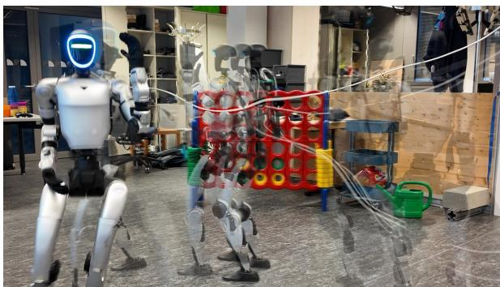  
“a man walks in a clockwise circle while holding something to his left shoulder”

Fig. 1. Nothing trained: a frozen text-to-motion model, a pretrained tracking policy, a real Unitree G1. One take, instants overlaid.

language-to-humanoid systems [18], [19], [20], [21], [22], [23], [24], [25], [26], [27] repairs this inside a model: a generator trained on retargeted robot data [18], [23], an end-to-end language-conditioned policy [19], or a humanspace generator fine-tuned with feedback from a simulated tracker [21], [22], [26]. Each reports success on a real robot; none reports what a frozen composition of the same public components achieves, so the value added by the training is never isolated.

This paper measures that value from the other side. Our premise is that the deployment controller is the best available judge of feasibility and that its cost per candidate is low enough to evaluate all of them: a SONIC rollout of a fivesecond clip in MuJoCo takes three seconds on one CPU core, a MoMask sample about one. Sample-simulate-select (S3, Fig. 2) therefore draws N candidates per prompt, retargets and simulates all of them with the policy that later runs on the hardware, and keeps the candidate the policy executed best. Nothing is trained, by design: $S ^ { 3 }$ is the composition every trained language-to-humanoid system implicitly claims to improve on and none has reported, and without it a trained system’s success cannot be attributed to the training rather than to the public components it inherits. The question is therefore not whether ${ \bar { \mathbf { S } } } ^ { 3 }$ beats trained systems, but how much of the gap they close is sampling variance a verifier can exploit and how much is motion the generator never produces feasibly. With a deterministic simulator as verifier, selection attains the any-of-N ceiling by construction, so the ceiling itself is the measurement that separates the two.

Concretely, we contribute (i) $S ^ { 3 } .$ , a training-free text-tohumanoid pipeline whose selection criterion is the physics rollout of the deployment policy, bounded below by a kinematic-verifier baseline and above by an any-of-N oracle; (ii) an evaluation protocol on HumanML3D test captions that stratifies by behaviour category, uses a fall criterion that does not penalise legitimate crouching, and adds a referencetracking criterion that also scores the lying-down and pushup prompts “upright” must exclude; (iii) the measurement of a frozen generator’s any-of-8 ceiling, 89.5% on the 200 stratified prompts (from 83.5%) and on the complete test split (from 80.5%), of which a kinematic predictor with AUROC 0.90 recovers 1.5 points, and the result that the unrecoverable remainder is a single class, pelvis-lowering motion, which a generator trained on retargeted robot data (TEXEDO) does execute under the same verifier; (iv) semantic fidelity of the executed motion on the benchmark’s own evaluator with a real-mocap control, a GMR retargeting ablation, and the execution of all 177 gate-selected clips on the real G1, with hardware tracking error matching simulation.

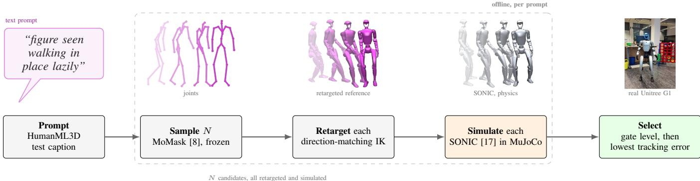  
Fig. 2. Sample-simulate-select $( \mathbf { S } ^ { 3 } )$ . Top: one result (“figure seen walking in place lazily”, a clip later executed on the real G1) in the three representations the pipeline passes through, four instants overlaid. Bottom: per prompt, N candidates are sampled from a frozen text-to-motion model, retargeted to the Unitree G1, rolled out in MuJoCo with the pretrained SONIC policy that also runs on the hardware, and the one executed best is selected. Nothing is trained.

## II. RELATED WORK

a) Text-to-motion in human space: HumanML3D [2] fixed the 22-joint, 20 fps representation on which tokenbased [28], [6], [7] and diffusion models [3], [4], [5], [29], [30] are compared; we use MoMask [8]. Scale is the current frontier [31], [9], [10], but none of these models represents contact, balance or actuation. Graphics closes that gap for simulated characters with a tracking controller [32], [33], [34], [35], [36], but on a SMPL body whose morphology matches the data; a robot adds retargeting and hardware.

b) Retargeting and tracking on humanoids: Humanoid trackers are built on IK against SMPL keypoints (H2O [37], OmniH2O [11], ExBody2 [12]). Araujo et al. [38] show that retargeting quality materially affects tracking and release GMR, which we adopt for our ablation. G1 trackers include HOVER [13], GMT [14], UniTracker [15], TWIST [16] and BeyondMimic [39]; SONIC [17], a behaviour foundation model trained on >100 M frames, is the policy we use unchanged.

c) Language-to-humanoid systems: Table I groups recent systems by where language enters and what is trained. Robot-space generators learn from retargeted data (UH-1 [18], Humanoid-LLA [22], FRoM-W1 [23]); end-toend policies condition on language (LangWBC [19]) or on language-grounded latents (RoboGhost [20]); physically aligned generators fine-tune a human-space model with simulated-tracker feedback (RLPF [21]) or guide and gate a flow model with physics (SafeFlow [26]). Modular pipelines are closest to ours: TextOp [24] streams a diffusion model into a tracker, ECHO [25] splits generator and tracker across cloud and edge, and TEXEDO [27], the nearest neighbour, samples N=32 candidates from a generator it trains in G1 joint space on retargeted AMASS+CLAW and ranks them with a verifier distilled from SONIC rollouts, so that no physics runs at test time. We keep the generator frozen in human space, use the rollout itself as the verifier (the oracle its verifier imitates), train nothing, report the any-of-N ceiling explicitly, and evaluate at a scale none of these report: physics-validated execution on the complete HumanML3D test split (TEXEDO: 9,116 captions of its own split) and 177 distinct prompts on the real robot (TEXEDO: 30; UH-1: 12).

## III. METHOD

## A. Overview and notation

Given a prompt p, the generator G yields candidates $\mathbf { x } _ { i } = G ( p , \epsilon _ { i } ) , i = 1 . . N$ , each a $T _ { i } \times 2 2 \times 3$ joint trajectory. The retargeter R maps each to a robot reference $( { \bf q } _ { i } ^ { \mathrm { r e f } } , { \bf b } _ { i } )$ of joint angles and floating-base pose; the deployment policy π rolled out in simulation produces the achieved trajectory $\mathbf { q } _ { i } ^ { \mathrm { p h y s } }$ and the outcome features from which a gate $g ( \cdot ) \in$ {PASS, CAUTION, REJECT} and a tracking error $e _ { i }$ are computed. $S ^ { 3 }$ returns arg mini $( g _ { i } , e _ { i } )$ in lexicographic order. Every component below is public and used as released, and all thresholds were fixed before the study.

TABLE I  
RECENT LANGUAGE-TO-HUMANOID SYSTEMS: GENERATION SPACE, FEASIBILITY MECHANISM, AND WHAT IS TRAINED.
<table><tr><td>System</td><td>Generation space</td><td>Feasibility mechanism</td><td>Trained</td></tr><tr><td>UH-1 [18]</td><td>robot tokens</td><td>data-side</td><td>gen.+policy</td></tr><tr><td>FRoM-W1 [23]</td><td>human → track</td><td>data-side</td><td>gen.+tracker</td></tr><tr><td>Humanoid-LLA [22]</td><td>unified vocab.</td><td>RL w/ physics</td><td>LLA</td></tr><tr><td>LangWBC [19]</td><td>none (end-to-end)</td><td>RL</td><td>policy</td></tr><tr><td>RoboGhost [20]</td><td>latent</td><td>RL</td><td>policy</td></tr><tr><td>RLPF [21]</td><td>human</td><td>RL fine-tuning</td><td>generator</td></tr><tr><td>SafeFlow [26]</td><td>latent flow</td><td>guidance + gate</td><td>generator</td></tr><tr><td>TextOp [24]</td><td>human, streaming</td><td>tracker</td><td>gen.+tracker</td></tr><tr><td>ECHO [25]</td><td>human (cloud)</td><td>tracker</td><td>gen.+tracker</td></tr><tr><td>PhyGile [40]</td><td>human, prefixed</td><td>physics prefix</td><td>gen.+tracker</td></tr><tr><td>TEXEDO [27]</td><td>robot, best-of-N</td><td>learned verifier</td><td>gen.+verifier</td></tr><tr><td>S3 (ours)</td><td>human, best-of-N</td><td>deployment rollout</td><td>nothing</td></tr></table>

## B. Sample: frozen text-to-motion

MoMask [8] with its public HumanML3D checkpoints turns a prompt into 22 joint positions at 20 fps; we draw N samples per prompt with the model’s length estimator and default sampling settings, and keep its foot-contact postprocess. Joints are rotated into our Z-up convention and grounded; no scaling is applied.

## C. Retarget: direction-matching IK

The source is a position-only 22-joint trajectory, so joint twist and hand orientation are unobservable; we retarget limb directions. A canonical body frame built from hips and shoulders makes the subject face +X; the root’s horizontal translation and full orientation (pitch and roll damped) drive the robot’s floating base. For each limb chain (thigh, shank, upper arm, forearm on both sides), the goal for the chain’s end body is its anchor body’s current position plus the robot’s own segment length along the source’s unit direction. The result is a robot-scaled target skeleton that reproduces the human’s limb directions without importing the human’s limb lengths. Joint angles follow by damped least squares over the actuated DoFs, regularised toward the G1’s default stand and the previous frame, clipped to the joint limits and resampled to 50 Hz. The map is deterministic and untrained and costs about 15 s of CPU per clip. On 1,979 AMASS test sequences it reproduces limb orientation to $4 . 2 ^ { \circ }$ on the G1 (elbows worst, $\approx 8 . 5 ^ { \circ }$ , for lack of forearm articulation); root-aligned keypoints land 15.5 cm from the human’s, the morphological floor of joint-space retargeting.

## D. Simulate: the deployment policy as verifier

SONIC [17] is a G1 motion-tracking policy trained on >100 M mocap frames; we use NVIDIA’s released ONNX checkpoint unchanged. References are name-mapped into its 29-DoF motion-library format and rolled out in MuJoCo [41] with SONIC’s own G1 model, PD actuation and observation pipeline (50 Hz control, 200 Hz physics), reproducing its C++ deployment stack. A clip costs about three CPU-seconds.

a) Fall criterion: A height threshold would count every squat as a fall. A rollout is fallen if the pelvis drops below 0.25 m (on the ground), or its up-axis tilts more than $6 0 ^ { \circ }$ from vertical (toppled), or it sinks more than 0.30 m below the reference pelvis for longer than 0.5 s (collapsed rather than crouched). Crouching references reach 0.16 m pelvis height on the G1 and pass this criterion when tracked. Upright is also the end state we aim for, not only the safe one: a clip that finishes standing hands over cleanly to the next prompt through the stance blend of Section III-G, so prompts can be chained. “Upright” is nevertheless a proxy defined on the controller’s side, so we also report a referencetracking criterion that needs no notion of standing: a rollout is tracked if it never sinks 0.30 m below the reference pelvis, its pelvis orientation stays within $4 5 ^ { \circ }$ of the reference’s, and the mean joint error is below 0.3 rad. It scores lying, crawling and push-up prompts that the upright metric must exclude.

b) Deploy gate: For hardware we keep a conservative three-level gate on the same rollout: REJECT if fallen; CAUTION if the first frame deviates more than 0.6 rad from the standing pose (the robot drives into it unattended) or any joint rate exceeds 8 rad/s; PASS otherwise. Export to the robot additionally requires a simulated pelvis height of at least 0.5 m throughout the clip.

## E. Select, and what to compare it with

Per prompt, $S ^ { 3 }$ keeps the candidate with the best gate level, ties broken by the lowest mean joint-tracking error $e _ { i } ~ =$ $\begin{array} { r } { \frac { 1 } { T } \sum _ { t } \| \mathbf { q } _ { t } ^ { \mathrm { p h y s } } - \mathbf { q } _ { t } ^ { \mathrm { r e f } } \| _ { 1 } } \end{array}$ , i.e. the sample the policy reproduced most faithfully. Three arms bound it. Single is the first sample (no selection). Kinematic best-of-N ranks candidates by a risk score computed from the generator’s output alone, the natural “predict feasibility from kinematics” baseline: six features (Table III) z-scored over the sweep, sign-aligned so that larger means riskier, and averaged. Oracle counts a prompt as upright if any of its N candidates was, the ceiling of any selection rule. Because the rollout is deterministic and REJECT ranks last, $S ^ { 3 }$ attains this ceiling by construction; the oracle row therefore measures the generator’s headroom at $N$ , and the informative comparisons are the kinematic arm below it and the hardware outcome of what it selects (Section III-G).

## F. Semantic fidelity of the executed motion

Selection could trivially favour bland candidates, and retargeting and tracking could lose the prompt’s content. We score every sample with the HumanML3D text–motion evaluator [2], the contrastive encoders behind R-precision and matching score in $[ 8 ] , [ 3 ] ,$ , at three stages: the generator’s joints, the retargeted reference projected back to 22 SMPL joints by forward kinematics of the G1, and the executed motion projected the same way; the evaluator’s uniform-skeleton step re-imposes human bone lengths. Matching score is the embedding distance to the prompt; R-precision is whether the prompt is nearest among a batch of 32. To separate what the evaluator penalises in generated motion from what it penalises in any robot projection, real HumanML3D test motions are sent through the identical path as a control (Section IV-E).

## G. Hardware: batched, gate-screened sessions

Selected clips are exported into SONIC’s deployment format and played on the real G1 through the same C++ binary used for the rollouts. For safety, every clip is first executed on a gantry that would arrest a fall; clips that completed cleanly there were afterwards re-executed without it, in a second pass over a subset. Every exported clip is padded with a 3 s cosine blend from the policy’s default stance into its first frame and a 2 s blend back, so that neither arming nor the end of a clip is a step change on a 35 kg robot without fall detection. Clips are exported as sessions of eight, ordered lowest risk first and re-screened by the gate at export.

TABLE II  
MAIN RESULT. FOUR SELECTION ARMS AT N=8 ON THE 200 STRATIFIED PROMPTS, ON THE SAME PROMPTS WITH TEXEDO’S TRAINED GENERATOR, AND ON THE COMPLETE TEST SPLIT.
<table><tr><td>Arm</td><td>Upright</td><td>95 % CI</td><td>PASS</td><td>CAUT.</td><td>REJ.</td><td>e</td></tr><tr><td>single (first sample)</td><td>83.5%</td><td>[77.7, 88.0]</td><td>33</td><td>134</td><td>33</td><td>0.171</td></tr><tr><td>kinematic best-of-8</td><td>85.0%</td><td>[79.4, 89.3]</td><td>56</td><td>114</td><td>30</td><td>0.163</td></tr><tr><td>physics best-of-8 (S³)</td><td>89.5%</td><td>[84.5, 93.0]</td><td>85</td><td>94</td><td>21</td><td>0.138</td></tr><tr><td>oracle (any-of-8)</td><td>89.5%</td><td>[84.5, 93.0]</td><td>85</td><td>94</td><td>21</td><td>0.135</td></tr><tr><td colspan="7">TEXEDO&#x27;s trained robot-space g generator [27], same 200 prompts, same verifier</td></tr><tr><td>single (first sample)</td><td>97.0%</td><td>[93.6, 98.6]</td><td>42</td><td>136</td><td>22</td><td></td></tr><tr><td>physics best-of-8  $( \mathsf { S } ^ { 3 } )$ </td><td>98.0%</td><td>[95.0, 99.2]</td><td>101</td><td>87</td><td>12</td><td>0.086</td></tr><tr><td>oracle (any-of-8)</td><td>98.0%</td><td>[95.0, 99.2]</td><td>101</td><td>87</td><td>12</td><td></td></tr><tr><td colspan="7">complete test split, 4,184 prompts</td></tr><tr><td>single (first sample)</td><td>80.5%</td><td>[79.3, 81.7]</td><td>704</td><td>2646</td><td>834</td><td>0.178</td></tr><tr><td>physics best-of-8 (S3)</td><td>89.5%</td><td>[88.6, 90.4]</td><td>1680</td><td>2042</td><td>462</td><td>0.134</td></tr><tr><td>oracle (any-of-8)</td><td>89.5%</td><td>[88.6, 90.4]</td><td>1680</td><td>2042</td><td>462</td><td>0.132</td></tr></table>

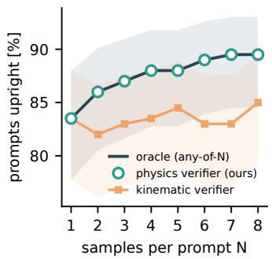

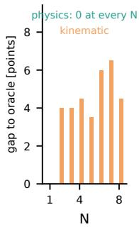  
Fig. 3. Prompts executed upright vs. number of samples N. The physics verifier (markers) lies on the any-of-N ceiling (line) by construction; the kinematic verifier does not improve with N. Right: gap to the ceiling in points. Shaded: Wilson 95 % intervals.

## IV. EXPERIMENTS

## A. Prompt set and protocol

We draw 200 captions from the HumanML3D test split (4,384 motions, 12,584 whole-clip captions), taking the shortest caption of each motion (3–20 words) and stratifying by keyword rules into six behaviour categories: locomotion (60), turning (30), upper-body (50), squat/bend (30), ballistic (20), other (10). Two rules make “upright” meaningful. Captions whose motion requires leaving the upright state (lying, crawling, rolling, falling, push-ups, handstands; 128 of the pool) are excluded, since no upright outcome could satisfy them; captions that legitimately lower the pelvis (sit, squat, kneel, bend, pick up; 31 of the 200) are labelled lowpelvis and reported separately, and the reference-relative fall criterion keeps them scorable. The rules are auditable and released; captions are used verbatim (typos included). All 200 prompts × 8 samples are generated, retargeted and rolled out once. The pipeline was then run on the complete test split (4,184 usable prompts, 33,472 rollouts), reported next to the stratified set.

## B. Main result: the ceiling, and how far selection reaches

Table II and Fig. 3 contain the central result for the 200 stratified prompts (MoMask, frozen), the same prompts with TEXEDO’s trained generator, and the complete test split; upright is the fall criterion of Section III-D. Columns: upright rate with Wilson 95 % interval, gate level of the selected sample, mean joint tracking error e [rad]. With a single sample, 83.5% of prompts execute upright and 33 pass the hardware gate. Physics selection over eight samples raises this to 89.5% and 85 PASS clips. The $\mathrm { S ^ { \bar { 3 } } }$ curve lies on the ceiling at every N, as it must (Section III); what Fig. 3 measures is the shape of that ceiling: three quarters of the gain arrive by N=4 and the curve is flat from N=7, so most of the headroom is reached within a small sample budget. Tracking error of the selected samples falls from 0.171 to 0.138 rad, within 0.003 of the best candidate’s. Of the 33 prompts whose first sample fell, 12 are recovered by selection, and 12 is also the number recoverable with this retargeter: the remaining 21 fell in all eight samples. The complete test split reproduces this at 20× the size: 80.5% single, 89.5% at the ceiling, 704 to 1,680 PASS clips, with the kinematic verifier again halfway (84.5%) and 438 of 4,184 prompts never upright. The conclusions also survive a change of success criterion: reference tracking (Section III-D) agrees with “upright” on 98.4% of the 33,472 samples, and the ceiling under it is 89.6% (from 79.3%). Where “upright” cannot judge at all, on the 128 test prompts the exclusion rule removes because they demand lying down, push-ups or kneeling, tracking credits 29.7% of first samples and 50.0% at the ceiling: selection matters most exactly where the generator is weakest.

a) Against a trained robot-space generator: To put the frozen composition next to a trained one, we ran TEXEDO’s released generator [27]—FSQ-GPT trained in G1 joint space on AMASS+CLAW retargeted with HumanML3D captions—on the same 200 prompts with the same N=8 and the same verifier (Table II). Training the generator on retargeted data yields what selection cannot: 97.0% of first samples execute (3.6% of samples fall vs. 17.6%), squat/bend reaches 93% because its references keep the pelvis higher (executed minimum 0.55 vs. 0.35 m), and selection adds one point (98.0%, its ceiling) but lifts PASS clips from 42 to 101. This is not memorisation: 106 of our 200 source motions lie in TEXEDO’s training split, yet its rate on the 94 unseen prompts is the same (97.9%). The gain in feasibility is not offset by a loss of semantic fidelity: scored by the same evaluator, its executed motion is indistinguishable from MoMask’s (R@1 0.09 vs. 0.08, matching 6.49 vs. 6.45) and its kinematic reference slightly lower (R@1 0.11 vs. 0.13).

## C. Why a kinematic verifier is not enough

Falls are predictable from kinematics: over 1,600 samples (282 fell), trunk lean alone reaches AUROC 0.92 and the combined score 0.90 (Table III). Yet ranking candidates by that score gains only 1.5 points (85.0%), does not improve with N (Fig. 3), and yields 56 rather than 85 PASS clips.

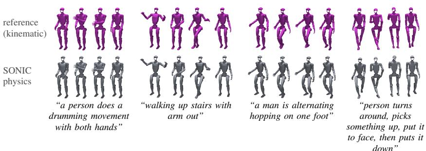  
Fig. 4. Selected clips that execute well, one per category: retargeted reference (top), SONIC rollout (bottom). All four ran on the real G1 and completed standing (0.08–0.10 rad). Squat/bend is the class of Fig. 6, where the success rate is lower but non-zero.

TABLE III  
PREDICTING A FALL FROM THE GENERATOR’S OUTPUT ALONE: PER-FEATURE AND COMBINED AUROC.
<table><tr><td>feature</td><td>AUROC</td><td>feature</td><td>AUROC</td></tr><tr><td>trunk lean</td><td>0.923</td><td>flight fraction</td><td>0.597</td></tr><tr><td>pelvis excursion</td><td>0.791</td><td>peak joint rate</td><td>0.594</td></tr><tr><td>min. pelvis height</td><td>0.752</td><td>start deviation</td><td>0.580</td></tr><tr><td>combined risk score</td><td>0.899</td><td></td><td></td></tr></table>

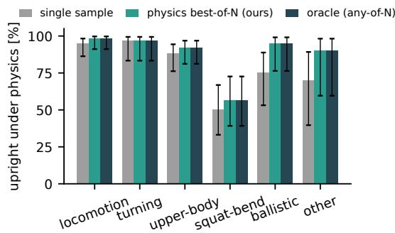  
Fig. 5. Upright rate per behaviour category. Selection closes the gap in every category but squat/bend, where the ceiling is 57 %.

The reason is the difference between classifying and ranking. A feature that separates the population of fallen from upright samples need not order the eight candidates of one prompt, which share the prompt’s semantics and hence similar lean and excursion. Among the candidates of a prompt whose first sample fell, the kinematic score prefers a falling one often enough to erase its advantage, whereas the rollout observes the outcome. This is the empirical case for physics in the loop rather than a learned proxy [27]: a verifier must rank within a prompt, and population-level accuracy is not evidence that it does.

## D. Where selection stops: the failure class

Fig. 5 breaks the result down by category. Locomotion (98%), turning (97%) and upper-body prompts (92%) are essentially solved after selection. Ballistic prompts, the worst single-sample category apart from squat/bend (75%), gain the most and reach 95%: a jump is frequently feasible in some sample. Squat/bend improves only from 50% to 57%, and that is its ceiling. Restricted to the 169 upright-applicable prompts, $S ^ { 3 }$ reaches 96% [92, 98]; on the 31 low-pelvis prompts, 55% [38, 71]. The complete split agrees: 94% on 3,742 applicable, 53% on 442 low-pelvis prompts. The

TABLE IV  
SEMANTIC FIDELITY AT THE GENERATOR, AFTER RETARGETING, AND AFTER EXECUTION.
<table><tr><td></td><td colspan="3">generator</td><td colspan="3">retargeted</td><td colspan="3">executed</td></tr><tr><td>samples</td><td>match</td><td>R@1</td><td>R@3</td><td>match</td><td>R@1</td><td>R@3</td><td>match</td><td>R@1</td><td>R@3</td></tr><tr><td>all (1,536)</td><td>2.86</td><td>0.46</td><td>0.78</td><td>5.71</td><td>0.13</td><td>0.34</td><td>6.45</td><td>0.08</td><td>0.23</td></tr><tr><td>single-arm picks (192)</td><td>2.82</td><td>0.47</td><td>0.79</td><td>5.71</td><td>0.15</td><td>0.37</td><td>6.46</td><td>0.09</td><td>0.21</td></tr><tr><td>s³ picks (192)</td><td>2.84</td><td>0.43</td><td>0.78</td><td>5.70</td><td>0.11</td><td>0.33</td><td>6.43</td><td>0.07</td><td>0.23</td></tr><tr><td>real mocap control (68)</td><td>3.27</td><td>0.26</td><td>0.62</td><td>6.86</td><td>0.07</td><td>0.19</td><td>6.80</td><td>0.04</td><td>0.18</td></tr></table>

21 unrecoverable prompts make the class explicit: 13 are squat/bend, and most of the rest are the same motion under another label (“bends down and jumps forward”). A second retargeter (Section IV-F) recovers 11 of the 21 in some sample, but the 10 that survive both are the same class: seven squat/bend, a rise from seated, and a stair climb with no stairs in the world (Fig. 6). This is neither sampling variance nor a limit of one retargeter but motion the frozen generator never produces executably, exactly what physically aligned generators [21], [26] are trained to reshape and what TEXEDO’s retargeted-data training does reshape: the same class reaches 93% there (Table II).

## E. Semantic fidelity: where meaning is lost

Two questions follow: whether selection sacrifices semantic fidelity for stability, and how much of the prompt survives the projection onto the robot. Table IV answers the first. It reports matching score (↓) and R@1/R@3 (↑) for all samples, each arm’s picks and the real-mocap control: the samples $S ^ { 3 }$ picks score the same as first samples at every stage (matching 2.84 vs. 2.82 at the generator, 6.43 vs. 6.46 executed); the verifier is blind to content. For the second, the same motion is scored at the generator, after retargeting (kinematic reference) and after execution (Fig. 7); eight prompts whose clips are ≤2 s, below the evaluator’s minimum length (98 of 4,184 on the complete split), are unscored but kept in the execution results. The generator’s samples reach R@1 0.46 and matching 2.86, consistent with MoMask’s published numbers. The retargeted reference, scored through the robot’s forward kinematics before any simulation, already drops to R@1 0.13 and matching 5.71; executing it costs comparatively little more (0.08 / 6.45). The complete split gives the same staircase (R@1 0.49 → 0.13 → 0.09 over 32,688 scored samples). The loss is categorydependent: upper-body prompts keep the most (R@3 0.40 retargeted, 0.35 executed), whereas ballistic prompts lose everything at retargeting (R@1 0.00), because the evaluator’s features rest on foot contacts and root velocity that the G1’s grounded, shorter-legged reference no longer reproduces.

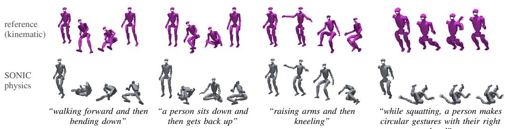  
Fig. 6. The unrecoverable class: squat/bend prompts on which all eight samples fell. Top: the retargeted reference; bottom: the policy follows it to the floor.

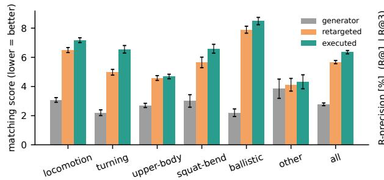

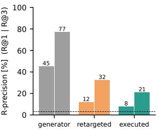  
Fig. 7. Semantic fidelity at three stages of the pipeline, HumanML3D text-motion evaluator on upright samples (n = 1,255). Left: matching score (lower is better) per category. Right: R-precision (dashed: chance). Most of the loss occurs at retargeting, before any physics.

A control decides whether this drop indicts the generated motion or the robot projection: every HumanML3D test motion whose AMASS source we hold (DFaust, Transitions, SSM; 74 captioned clips, 68 tracked without error) is rebuilt with HumanML3D’s own preprocessing and sent as real motion through the identical path (last row of Table IV). Real motion starts lower on the evaluator than MoMask’s samples (R@1 0.26 vs. 0.46; the model was trained toward the evaluator’s distribution) and falls by the same mechanism to the same floor (R@1 0.26 → 0.07 → 0.04); executed real and generated motion are indistinguishable to the evaluator. We therefore read the executed-stage scores as a floor set by the robot’s morphology, the FK proxy skeleton and the evaluator’s human training domain, and the generatorstage scores as the comparison between arms. Caveats: the evaluator sees our home regularisation and resting wrists, and the control is small. Only 76.5% of it executes upright without selection (DFaust hops, Transitions kicks): feasibility is a property of the motion, not of its origin.

## F. Retargeting ablation: direction IK vs. GMR

We replace our direction-matching IK by the optimisationbased GMR [38] on the first sample of every prompt (n = 200). GMR consumes SMPL-X pose, so we fit SMPL to the generated joints (5–20 mm joint RMSE) and pass its G1 output through the identical SONIC conversion and rollout. Table V reports first-sample upright rate [Wilson 95 % CI], tracking error e [rad], and the any-of-8 ceiling per retargeter and for their union. Neither retargeter dominates. GMR is 2.5 points ahead overall (86.0 vs. 83.5%, intervals overlapping);

TABLE V  
RETARGETING ABLATION PER CATEGORY: DIRECTION-MATCHING IK VS. GMR, BOTH TRACKED BY SONIC.
<table><tr><td></td><td></td><td colspan="3">upright, single</td><td colspan="2">e</td><td colspan="3">any-of-8</td></tr><tr><td>category</td><td>n</td><td>dir-IK</td><td></td><td>GMR</td><td>dir-IK</td><td>GMR</td><td>IK</td><td>GMR</td><td>both</td></tr><tr><td>locomotion</td><td>60</td><td>95.0 [86,98]</td><td></td><td>83.3 [72,91]</td><td>0.135</td><td>0.159</td><td>98.3</td><td>90.0</td><td>98.3</td></tr><tr><td>turning</td><td>30</td><td>96.7 [83,99]</td><td></td><td>96.7 [83,99]</td><td>0.137</td><td>0.154</td><td>96.7</td><td>100</td><td>100</td></tr><tr><td>upper-body</td><td>50</td><td>88.0 [76,94]</td><td></td><td>92.0 [81,97]</td><td>0.168</td><td>0.219</td><td>92.0</td><td>96.0</td><td>96.0</td></tr><tr><td>squat/bend</td><td>30</td><td>50.0 [33,67]</td><td></td><td>66.7 [49,81]</td><td>0.263</td><td>0.217</td><td>56.7</td><td>76.7</td><td>76.7</td></tr><tr><td>ballistic</td><td>20</td><td>75.0 [53,89]</td><td></td><td>95.0 [76,99]</td><td>0.200</td><td>0.158</td><td>95.0</td><td>100</td><td>100</td></tr><tr><td>other</td><td>10</td><td>70.0 [40,89]</td><td></td><td>80.0 [49,94]</td><td>0.165</td><td>0.201</td><td>90.0</td><td>100</td><td>100</td></tr><tr><td>all</td><td>200</td><td>83.5 [78,88]</td><td></td><td>86.0 [81,90]</td><td>0.171</td><td>0.184</td><td>89.5</td><td>92.5</td><td>95.0</td></tr></table>

ours is better on locomotion (95.0 vs. 83.3%) and tracks more tightly wherever the robot stays up (e 0.171 vs. 0.184); GMR is better on squat/bend (66.7 vs. 50.0%) and ballistic (95.0 vs. 75.0%), where its references keep a higher pelvis. The failures are complementary, so the retargeter is a second axis the verifier can exploit at no training cost: selecting over both on a single sample reaches 91.0% (182/200), and over eight samples each (Table V, right) GMR’s ceiling is 92.5% [88.0, 95.4] and the union 95.0% [91.0, 97.3] (190/200). On squat/bend the ceiling rises from 56.7 to 76.7%, so a third of the prompts unrecoverable under our retargeter are limited by the retargeting rather than by the generator; the seven that remain unrecoverable under both are the sits, kneels and deep bends of Section IV-D. GMR’s references start 1.10 rad from the G1’s standing pose on average, against 0.69 for our home-regularised map: home regularisation is a safety property as much as a semantic liability (Section IV-E).

## G. Hardware sessions

All 179 clips that pass the gate (85 PASS, 94 CAUTION) were exported lowest risk first as 23 sessions of up to eight clips; two kneeling clips with a simulated pelvis height

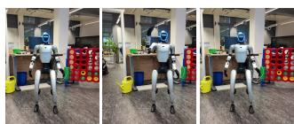  
“this person waves forward with his right hand”

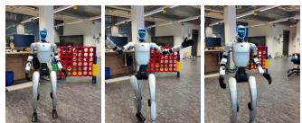  
“someone walking stands and begins to move shoulders and arms”

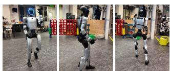  
“a man walks in a clockwise circle while holding something to his left shoulder”

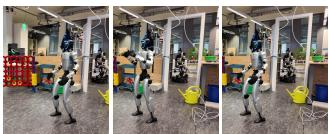  
“a person flaps their arms like a chicken”

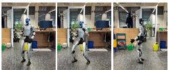  
“a person runs forward to throw with the left arm”

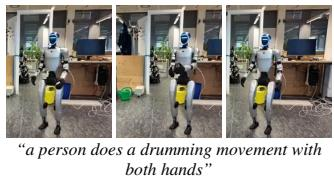

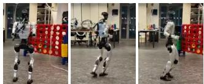  
“a person side steps back and forth jogging”

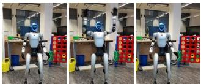  
“waving hands in the air above head”

Fig. 8. Eight of the 177 gate-selected clips on the real G1, three instants each, in time order. All completed standing.  
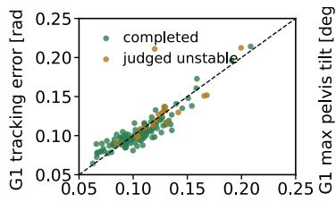  
sim tracking error [rad]

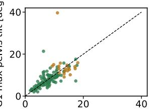  
sim max pelvis tilt [deg]

Fig. 9. Simulation predicts the hardware: per logged clip, tracking error and max pelvis tilt in the rollout vs. on the G1 (dashed: identity).

of 0.46 m fell under the 0.5 m export floor, leaving 177. All 23 sessions were executed on the G1 over two days, one trial per clip (Fig. 8). All 177 clips completed with the robot standing: no fall, no abort, PASS 85/85 and CAUTION 92/92, a Wilson 95 % lower bound of 0.98 on the hardware success of gate-selected clips. The operator judged 21 unstable (visible wobble, or a motion not executed as prompted: 15 of the 19 ballistic clips never left the ground), all of which recovered without gantry load. A subset judged safe from this first pass was then re-executed with the gantry removed, and completed standing again. The controller logs of 134 clips (Fig. 9) show that the simulation is a faithful verifier: mean joint tracking error on the robot is 0.114 rad against 0.115 rad in simulation for the same clips (Pearson r = 0.94), and the clips judged unstable are the ones both sides flag (error 0.150 vs. 0.108 rad, maximum pelvis tilt 14◦ vs. 8◦, in simulation as on the robot). The rollout also predicts instability per clip: its maximum pelvis tilt separates the 21 unstable from the 156 stable clips with AUROC 0.94, as well as the tilt measured on the robot itself (0.92) and better than the kinematic risk score (0.81) or the simulated tracking error (0.79). The two clips the export floor had refused were tried with the floor lowered to 0.45 m: both lowered the body unstably and did not recover, so the floor sits where the hardware fails.

## V. DISCUSSION

a) Scope and limits of rollout-based selection: Selection with the deployment policy realises the generator’s any-of-N ceiling at a few CPU-seconds per candidate and raises the hardware-ready yield by 2.6×, but cannot create motion the generator does not produce. The head-to-head with TEXEDO’s generator makes the split quantitative: a generator trained on retargeted robot data lifts first-sample execution from 83.5 to 97% and closes squat/bend, while selection lifts the frozen generator from 83.5 to its 89.5% ceiling and the trained one by one point. Training raises the feasibility of the samples themselves, selection recovers the feasible ones already present, and both leave a remainder that no verifier can remove. A learned verifier can improve on the rollout only in evaluation cost, the trade-off TEXEDO’s distilled verifier makes.

b) Why keep generation in human space: Robot-space generators embed the robot in the model. Ours transfers to other humanoids through a chain definition, attributes a failure to the prompt, the generator or the robot, and scores the executed motion on the human benchmark’s own scale (Section IV-E).

c) Threats to validity: Two generators, one retargeter family, one controller, one robot: the numbers bound these compositions, not the design space. Simulation is SONIC’s own MuJoCo model without system identification, so a PASS is evidence about the deployment stack rather than a guarantee; the hardware sessions are the check. Category and upright labels come from keyword rules, and “upright” is a proxy inherited from tracking evaluation; the tracking criterion is the general one and agrees with it where both apply. N=8 is a budget, not a limit.

d) Limitations and outlook: The pipeline is offline and open-loop; TextOp [24] shows what streaming adds, and the verifier is fast enough to run inside such a loop. Neither the generator nor the verifier senses the scene: no visual or other exteroceptive measurement enters the loop, and no object interaction is modelled. The rollout is the robot on flat ground with no props, so a prompt presupposing a chair, a step or a handled object is scored as free-space motion—one reason the pelvis-lowering class fails.

## VI. CONCLUSION

Sampling several candidates from a frozen text-to-motion model, simulating all of them with the whole-body policy that will run on the robot, and keeping the one it executed best raises upright execution from 83.5% to 89.5% on 200 HumanML3D test prompts and from 80.5% to 89.5% on the complete test split, the frozen generator’s any-of-8 ceiling, and all 177 gate-selected clips completed standing on the real G1, with no training anywhere. A kinematic verifier that predicts falls well still cannot rank candidates well. What remains infeasible lowers the pelvis, and a generator trained on retargeted robot data closes exactly that class. That split, the semantic-fidelity floor of the robot projection, and the complementarity of two retargeters are the reference points against which trained language-to-humanoid systems should be measured.

## REFERENCES

[1] M. Loper, N. Mahmood, J. Romero, G. Pons-Moll, and M. J. Black, “SMPL: A skinned multi-person linear model,” ACM Trans. on Graphics (SIGGRAPH Asia), vol. 34, no. 6, 2015.

[2] C. Guo, S. Zou, X. Zuo, S. Wang, W. Ji, X. Li, and L. Cheng, “Generating diverse and natural 3d human motions from text,” in IEEE/CVF Conf. on Computer Vision and Pattern Recognition (CVPR), 2022.

[3] G. Tevet, S. Raab, B. Gordon, Y. Shafir, D. Cohen-Or, and A. H. Bermano, “Human motion diffusion model,” in Int. Conf. on Learning Representations (ICLR), 2023.

[4] M. Zhang, Z. Cai, L. Pan, F. Hong, X. Guo, L. Yang, and Z. Liu, “MotionDiffuse: Text-driven human motion generation with diffusion model,” IEEE Trans. on Pattern Analysis and Machine Intelligence, 2024.

[5] X. Chen, B. Jiang, W. Liu, Z. Huang, B. Fu et al., “Executing your commands via motion diffusion in latent space,” in IEEE/CVF Conf. on Computer Vision and Pattern Recognition (CVPR), 2023.

[6] J. Zhang, Y. Zhang, X. Cun, S. Huang, Y. Zhang et al., “T2M-GPT: Generating human motion from textual descriptions with discrete representations,” in IEEE/CVF Conf. on Computer Vision and Pattern Recognition (CVPR), 2023.

[7] B. Jiang, X. Chen, W. Liu, J. Yu, G. Yu, and T. Chen, “MotionGPT: Human motion as a foreign language,” in Advances in Neural Information Processing Systems (NeurIPS), 2023.

[8] C. Guo, Y. Mu, M. G. Javed, S. Wang, and L. Cheng, “MoMask: Generative masked modeling of 3d human motions,” in IEEE/CVF Conf. on Computer Vision and Pattern Recognition (CVPR), 2024.

[9] K. Fan, S. Lu, M. Dai, R. Yu, L. Xiao et al., “Go to zero: Towards zero-shot motion generation with million-scale data,” arXiv preprint arXiv:2507.07095, 2025.

[10] D. Rempe, M. Petrovich, Y. Yuan, H. Zhang, X. B. Peng et al., “Kimodo: Scaling controllable human motion generation,” arXiv preprint arXiv:2603.15546, 2026.

[11] T. He, Z. Luo, X. He, W. Xiao, C. Zhang et al., “OmniH2O: Universal and dexterous human-to-humanoid whole-body teleoperation and learning,” in Conf. on Robot Learning (CoRL), 2024.

[12] M. Ji, X. Peng, F. Liu, J. Li, G. Yang, X. Cheng, and X. Wang, “Ex-Body2: Advanced expressive humanoid whole-body control,” arXiv preprint arXiv:2412.13196, 2024.

[13] T. He, W. Xiao, T. Lin, Z. Luo, Z. Xu et al., “HOVER: Versatile neural whole-body controller for humanoid robots,” in IEEE Int. Conf. on Robotics and Automation (ICRA), 2025.

[14] Z. Chen, M. Ji, X. Cheng, X. Peng, X. B. Peng, and X. Wang, “GMT: General motion tracking for humanoid whole-body control,” arXiv preprint arXiv:2506.14770, 2025.

[15] K. Yin, W. Zeng, K. Fan, M. Dai, Z. Wang et al., “UniTracker: Learning universal whole-body motion tracker for humanoid robots,” arXiv preprint arXiv:2507.07356, 2025.

[16] Y. Ze, Z. Chen, J. P. Araujo, Z.-a. Cao, X. B. Peng, J. Wu, and C. K.´ Liu, “TWIST: Teleoperated whole-body imitation system,” in Conf. on Robot Learning (CoRL), 2025.

[17] Z. Luo, Y. Yuan, T. Wang, C. Li, F. Castaneda˜ et al., “SONIC: Supersizing motion tracking for natural humanoid whole-body control,” Science Robotics, vol. 11, no. 117, p. eaed4592, 2026.

[18] J. Mao, S. Zhao, S. Song, T. Shi, J. Ye et al., “Learning from massive human videos for universal humanoid pose control,” in Int. Conf. on Learning Representations (ICLR), 2025.

[19] Y. Shao, X. Huang, B. Zhang, Q. Liao, Y. Gao et al., “LangWBC: Language-directed humanoid whole-body control via end-to-end learning,” in Robotics: Science and Systems (RSS), 2025.

[20] Z. Li, C. Chi, Y. Wei, B. Zhu, Y. Peng et al., “From language to locomotion: Retargeting-free humanoid control via motion latent guidance,” arXiv preprint arXiv:2510.14952, 2025.

[21] J. Yue, Z. Wang, Y. Wang, W. Zeng, J. Wang et al., “RL from physical feedback: Aligning large motion models with humanoid control,” arXiv preprint arXiv:2506.12769, 2025.

[22] Z. Liu, K. Ji, K. Yang, Y. Fan, J. Yu, Y. Shi, and J. Wang, “Commanding humanoid by free-form language: A large language action model with unified motion vocabulary,” arXiv preprint arXiv:2511.22963, 2025.

[23] P. Li, Z. Zhuang, Y. Gao, Y. Dong, S. Li et al., “FRoM-W1: Towards general humanoid whole-body control with language instructions,” arXiv preprint arXiv:2601.12799, 2026.

[24] W. Xie, J. Zheng, J. Han, J. Shi, W. Zhang, C. Bai, and X. Li, “TextOp: Real-time interactive text-driven humanoid robot motion generation and control,” arXiv preprint arXiv:2602.07439, 2026.

[25] H. Jia, J. Song, Y. Zhang, H. Jin, Y. Fan et al., “ECHO: Edgecloud humanoid orchestration for language-to-motion control,” arXiv preprint arXiv:2603.16188, 2026.

[26] H. Cho, S.-H. Kim, J. Kang, and D. Koo, “SafeFlow: Real-time textdriven humanoid whole-body control via physics-guided rectified flow and selective safety gating,” arXiv preprint arXiv:2603.23983, 2026.

[27] J. Cao, Y. Chen, Y. Song, M. Tomizuka, C. Li, and T. Tian, “TEXEDO: Test time scaling for controller-aware language-conditioned humanoid motion generation,” arXiv preprint arXiv:2606.22998, 2026.

[28] C. Guo, X. Zuo, S. Wang, and L. Cheng, “TM2T: Stochastic and tokenized modeling for the reciprocal generation of 3d human motions and texts,” in European Conf. on Computer Vision (ECCV), 2022.

[29] M. Zhang, X. Guo, L. Pan, Z. Cai, F. Hong et al., “ReMoDiffuse: Retrieval-augmented motion diffusion model,” in IEEE/CVF Int. Conf. on Computer Vision (ICCV), 2023.

[30] Y. Xie, V. Jampani, L. Zhong, D. Sun, and H. Jiang, “OmniControl: Control any joint at any time for human motion generation,” in Int. Conf. on Learning Representations (ICLR), 2024.

[31] J. Lin, A. Zeng, S. Lu, Y. Cai, R. Zhang, H. Wang, and L. Zhang, “Motion-X: A large-scale 3d expressive whole-body human motion dataset,” in Advances in Neural Information Processing Systems (NeurIPS), Datasets and Benchmarks, 2023.

[32] X. B. Peng, P. Abbeel, S. Levine, and M. van de Panne, “DeepMimic: Example-guided deep reinforcement learning of physics-based character skills,” in ACM Trans. on Graphics (SIGGRAPH), 2018.

[33] Z. Luo, J. Cao, K. Kitani, and W. Xu, “Perpetual humanoid control for real-time simulated avatars,” in IEEE/CVF Int. Conf. on Computer Vision (ICCV), 2023.

[34] C. Tessler, Y. Guo, O. Nabati, G. Chechik, and X. B. Peng, “Masked-Mimic: Unified physics-based character control through masked motion inpainting,” ACM Trans. on Graphics (SIGGRAPH Asia), vol. 43, no. 6, 2024.

[35] G. Tevet, S. Raab, S. Cohan, D. Reda, Z. Luo et al., “CLoSD: Closing the loop between simulation and diffusion for multi-task character control,” in Int. Conf. on Learning Representations (ICLR), 2025.

[36] J. Zhang, H. Liang, R. Zhang, B. Li, J. Zhang et al., “SCRIPT: Scalable diffusion policy with multi-stage training for language-driven physics-based humanoid control,” arXiv preprint arXiv:2605.22894, 2026.

[37] T. He, Z. Luo, W. Xiao, C. Zhang, K. Kitani, C. Liu, and G. Shi, “Learning human-to-humanoid real-time whole-body teleoperation,” in IEEE/RSJ Int. Conf. on Intelligent Robots and Systems (IROS), 2024.

[38] J. P. Araujo, Y. Ze, P. Xu, J. Wu, and C. K. Liu, “Retargeting matters: General motion retargeting for humanoid motion tracking,” arXiv preprint arXiv:2510.02252, 2025.

[39] Q. Liao, T. E. Truong, X. Huang, Y. Gao, G. Tevet, K. Sreenath, and C. K. Liu, “BeyondMimic: From motion tracking to versatile humanoid control via guided diffusion,” arXiv preprint arXiv:2508.08241, 2025.

[40] J. Bao, H. Yang, Y. Xin, J. Liu, Y. Xu et al., “PhyGile: Physicsprefix guided motion generation for agile general humanoid motion tracking,” arXiv preprint arXiv:2603.19305, 2026.

[41] E. Todorov, T. Erez, and Y. Tassa, “MuJoCo: A physics engine for model-based control,” in IEEE/RSJ Int. Conf. on Intelligent Robots and Systems (IROS), 2012.