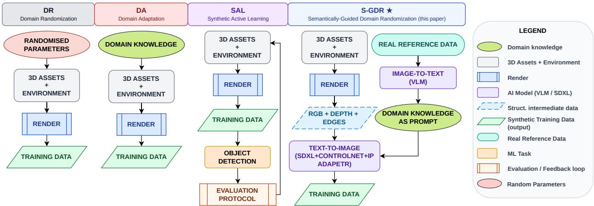
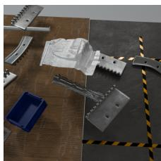
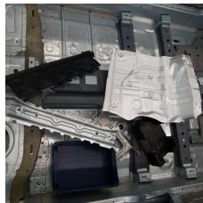
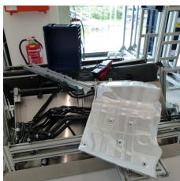
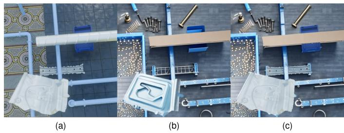
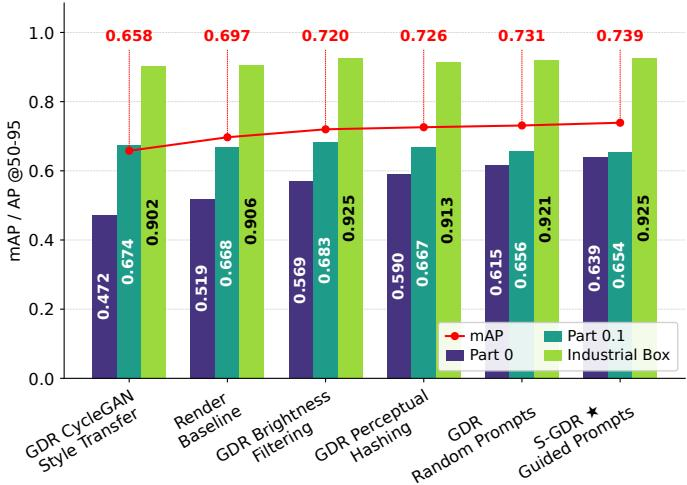

# Semantically-Guided Domain Randomization for Industrial Object Detection in Low-Image-Budget Regimes

1st Jose Moises Araya-Martinez\*

Electrical Engineering and Computer Science

2nd Gautham Mohan

TU Berlin

Electrical Engineering

Berlin, Germany

araya.martinez@campus.tu-berlin.de

3rd Jens Lambrecht

University of Stuttgart

Institute for Cognitive Robotics

Stuttgart, Germany

st184914@stud.uni-stuttgart.com

TU Braunschweig

Braunschweig, Germany

jens.lambrecht@tu-braunschweig.de

Abstract—Retraining visual perception pipelines in High-Mix, Low-Volume (HMLV) automotive manufacturing must be carried out under tight annotation, energy, and time budgets, yet most Synthetic Data Generation (SDG) strategies still operate in the thousands of images. This work evaluates Semantically-Guided Domain Randomization (S-GDR), an annotation-free adaptation pipeline that couples Vision-Language Model (VLM)- based semantic captioning of a small unannotated real reference set with diffusion-based background synthesis (Stable Diffusion XL (SDXL) conditioned by ControlNet and IP-Adapter) and mask-based object composition. On an automotive multi-object detection benchmark and with a fixed budget of 200 synthetic training images, S-GDR reaches mAP50-95 = 0.739 on a real held-out test set, outperforming a domain-randomized render baseline $( \mathbf { m } \mathbf { A } \mathbf { P } _ { 5 0 - 9 5 } ~ = ~ 0 . 6 9 7 )$ as well as brightness filtering, perceptual hashing, CycleGAN style transfer, and unguided diffusion variants sharing the same 200-image budget. These initial observations position S-GDR as a promising annotationfree alternative for extreme data-scarcity regimes.

Index Terms—Synthetic data generation, domain randomization, semantic domain adaptation, vision–language models, diffusion models, industrial object detection, sim-to-real transfer, data scarcity.

## I. INTRODUCTION

Visual perception underpins factory automation and smart manufacturing, yet deep learning models for object detection, segmentation, and pose estimation still rely on large, manually annotated datasets [1]. This burden is particularly acute in High-Mix, Low-Volume (HMLV) settings [2], where high product variety demands frequent retraining and perception pipelines must scale automatically to track real-world variability [3]. In automotive body-in-white assembly, for example, a single perception task can involve many visually similar sheetmetal parts, industrial containers, and subassemblies whose appearance changes across model years, plants, and lighting conditions.

This paper focuses on the practical regime in which (i) the task is multi-object detection of automotive parts, (ii) no manual annotations are available, (iii) a small unannotated set of real deployment images can be collected (order of tens of images), and (iv) the number of synthetic training images is capped at a few hundred (in our experiments, $| \mathcal { D } _ { \mathrm { t r a i n } } | = 2 0 0 )$ for financial, energy, and iteration-time reasons [4]. Under this budget, the research question we address is: can grounding synthetic image generation on semantic descriptions of the real deployment context produce higher-value training data than randomization or feature-based selection ?

Synthetic Data Generation (SDG) has emerged as a key strategy to reduce the annotation burden. As illustrated in Figure 1, existing approaches span four broad paradigms. Domain Randomization (DR) [5]–[7] varies simulation parameters in an open loop, often producing task-irrelevant samples [8]. Domain Adaptation (DA) incorporates domain knowledge via manual tuning and structured randomization [3], [9], [10], but does not scale automatically to novel environments without human intervention. Synthetic Active Learning (SAL) [11] introduces feedback-driven generation, yet evaluates distributional gaps using fixed criteria on synthetic data, leaving the sim-to-real gap of generated samples unverified against a real target distribution.

Prior work [12] has shown that when sufficient rendering variability is available (a few thousand images), simple feature-based methods aligning synthetic and real distributions can outperform generative augmentation in both accuracy and compute cost. In parallel, GenAI-based 3D asset reconstruction has been proposed as a viable DA alternative to manual geometric part modeling [10]. The question we investigate here is complementary: whether generative augmentation provides higher-value contextualized data specifically in the extreme data-scarcity regime that HMLV retraining forces on manufacturers.

Concretely, we generalise the pipeline of [12] as Semantically-Guided Domain Randomization (S-GDR): a family of methods that couples DR with VLM-based semantic scene evaluation of the real reference set and with diffusionbased image synthesis conditioned by that semantic description. The working hypothesis is that, under a fixed 200-image budget, combining a high-variability randomized subset with a semantically contextualized counterpart produces stronger multi-target object detection performance than randomization alone or than feature-based selection methods, while remaining fully annotation-free.

  
Fig. 1: Comparison of SDG paradigms. DR randomizes simulation parameters in an open loop; DA incorporates domain knowledge via manual tuning; SAL closes the loop with a fixed, non-semantic evaluator on synthetic data; the proposed S-GDR replaces the fixed evaluator with VLM-driven semantic feedback over real reference data ${ \mathcal { D } } _ { \mathrm { r e f } }$ and conditions a generative model on the resulting caption to produce context-aware training images.

The main contributions of this work-in-progress paper are:

• We instantiate and evaluate S-GDR using Qwen2-VL [13] as the semantic captioner and SDXL [14] with ControlNet [15] and IP-Adapter [16], followed by maskbased object composition, all under a fixed budget of 200 synthetic training images.

• On the public automotive multi-object detection benchmark of [17], S-GDR obtains $\mathrm { m A P _ { 5 0 - 9 5 } = 0 . 7 3 9 }$ on the real held-out test set, versus a domain-randomized render baseline of 0.697 and four additional feature-based and generative variants that share the same 200-image budget.

• We position S-GDR against the SDG landscape (Table I), and we discuss the limitations of the current singlerun, single-detector, single-benchmark evaluation, including the effect of mask-based composition and possible blending alternatives [18]–[20], the qualitative computational cost of the pipeline, and the open ablation of the individual conditioning components.

## II. RELATED WORK

This section only complements Section I; the four SDG paradigms in Figure 1 are not restated.

## A. Data Scarcity in Industrial Vision

Foundation models for segmentation [21] and 6D pose estimation [22] reduce data dependency but still require a prior detector for downstream tasks. Zero-shot detectors such as Grounding DINO [23] remain inferior to supervised counterparts on domain-specific industrial objects, motivating the practical need for automated data generation to enable retraining in HMLV settings [2], [3].

## B. Domain Randomization and Domain Adaptation for SDG

DR [5]–[7] generates annotated images by randomizing simulation parameters over wide ranges; without feedback from the target domain, it may produce task-irrelevant samples and offers no guarantee of distributional coverage [8]. Structured DA [3], [9] and photorealistic asset reconstruction [10] constrain synthesis using domain knowledge but require iterative human tuning and do not generalize automatically to new environments. SAL [11] closes the loop by triggering data generation in response to model evaluation, but its evaluators are fixed, non-semantic, and applied to synthetic rather than real data.

## C. Generative and Semantic Adaptation

Latent diffusion models such as Stable Diffusion [24] and SDXL [14] enable photorealistic image synthesis conditioned on text prompts, depth maps, or reference images. Spatial conditioning is typically added via ControlNet [15], and appearance conditioning via IP-Adapter [16]. Diffusion-based data augmentation for downstream vision tasks has been explored, e.g., by DA-Fusion [25], but not specifically for industrial multi-object detection in the 200-image regime. Prior work [12] has shown that with a few thousand rendered images simple feature-based methods can match or outperform generative augmentation. This paper investigates the complementary regime. Vision-Language Model (VLM)s such as LLaVA [26] and Qwen2-VL [13] provide open-vocabulary natural-language descriptions of visual scenes; their use as semanticfeedback signals within an SDG pipeline to condition generative models on real deployment context is, to our knowledge, unexplored for industrial object detection.

TABLE I: Representative SDG approaches for object detection. $\begin{array} { r l } { \pmb { \check { \check { \mathbf { \Psi } } } } } & { { } = } \end{array}$ present; ✗ = absent. Adaptation features: low = color/lighting/texture; struct. = geometry/layout; sem. = natural-language semantics.
<table><tr><td>Work</td><td>Strategy</td><td>DA Features</td><td>Real Context</td><td>Sem. Eval.</td><td>Train Set</td></tr><tr><td>Tobin et al. [5]</td><td>DR</td><td>None</td><td>x</td><td>x</td><td>≥5k</td></tr><tr><td>Tremblay et al. [6]</td><td>DR</td><td>Low</td><td>x</td><td>x</td><td>≥2.5k</td></tr><tr><td>Prakash et al. [3]</td><td>DA</td><td>Struct.</td><td>x</td><td>x</td><td>≥1k</td></tr><tr><td>Mayershofer et al. [9]</td><td>DA</td><td>Low + struct.</td><td>x</td><td>x</td><td>≥2.5k</td></tr><tr><td>SynthRender [10]</td><td>DA</td><td>Low + struct.</td><td>x</td><td>x</td><td>≥400</td></tr><tr><td>Zhu et al. [11]</td><td>SAL</td><td>Low (synth.)</td><td>x</td><td>x</td><td>≥4k</td></tr><tr><td>Araya-Martinez et al. [12]</td><td>GDR</td><td>Low + sem. (part.)</td><td>√</td><td>Partial</td><td>≥400</td></tr><tr><td>S-GDR (ours)</td><td>S-GDR</td><td>Sem. (VLM)</td><td>√</td><td>√</td><td>200</td></tr></table>

## D. Object Compositing

S-GDR composites rendered target objects onto generated backgrounds using their segmentation masks. Simple copypaste has been shown to be a strong augmentation for instance segmentation [20], but is known to introduce photometric discontinuities at object boundaries when foreground and background statistics differ. Poisson image editing [18] and learned harmonization [19] attenuate these inconsistencies at the cost of additional processing. Section V revisits this tradeoff in the context of the present pipeline.

## E. Positioning S-GDR in the SDG Landscape

Table I locates S-GDR against prior work along dimensions critical to data-scarce applications. The key differentiator is the training set scale: whereas most SDG methods operate in the thousands of images to reach higher terminal accuracies, S-GDR, derived from [12], targets the 200-image regime while introducing semantic, real-data-grounded feedback.

## III. METHODOLOGY

## A. Problem Setting, Detector, and Dataset

We use the public automotive multi-object detection benchmark introduced in [17], which contains three disjoint image sets illustrated in Figure 2:

• a synthetic training set $\mathcal { D } _ { \mathrm { t r a i n } }$ of domain-randomized rendered images produced from CAD models of the target parts;

• a real-world test set $\mathcal { D } _ { \mathrm { t e s t } }$ used exclusively for performance evaluation; and

• a small real-world reference set ${ \mathcal { D } } _ { \mathrm { r e f } }$ used by S-GDR as the semantic context source for generative augmentation.

The task is multi-class detection of automotive body-in-white components (denoted in Figure 4 as Part 0, Part 0.1, and Industrial $B o x )$ . Training uses only synthetic images; images from $\mathcal { D } _ { \mathrm { t e s t } }$ and ${ \mathcal { D } } _ { \mathrm { r e f } }$ are excluded from training, so all reported detection scores refer to $\mathcal { D } _ { \mathrm { t e s t } }$

All experiments use YOLOv8 [27] with default hyperparameters and no task-specific tuning, in order to isolate the effect of training-data composition from model optimization. Under this fixed detector setting, differences between methods can be attributed to the training data alone, but only within the range of behaviours the default-hyperparameter YOLOv8 exposes; we return to this limitation in Section VI. All evaluations use the standard COCO-style mean Average Precision (mAP)

  
(a)

  
(b)

  
(c)  
Fig. 2: Representative samples from the three dataset partitions used in this work: (a) domain-randomized rendered training image $( \mathcal { D } _ { \mathrm { t r a i n } } ) ;$ (b) real test image $\left( \mathcal { D } _ { \mathrm { t e s t } } \right)$ , used solely for evaluation; (c) real reference image $( \mathcal { D } _ { \mathrm { r e f } } )$ , used as semantic context source for S-GDR augmentation.

averaged over IoU thresholds from 0.50 to 0.95 in steps of 0.05, denoted $\mathrm { m A P _ { 5 0 - 9 5 } }$ , and computed on $\mathcal { D } _ { \mathrm { t e s t } }$

## B. The S-GDR Pipeline

S-GDR generalizes the methodology of [12] as a family of annotation-free adaptation methods that extract contextual information from $\mathcal { D } _ { \mathrm { r e f } }$ to automatically augment $\mathcal { D } _ { \mathrm { t r a i n } }$ . The concrete instantiation evaluated here is depicted in Figure 1 and detailed in Algorithm 1. It has three stages.

a) Semantic captioning: For each reference image $r \in$ $\mathcal { D } _ { \mathrm { r e f } }$ , Qwen2-VL [13] produces a natural-language description of the scene. In the guided-prompt configuration, the resulting captions are used as positive prompts p conditioning the generator on the deployment context; in the random-prompt configuration, prompts are drawn from an unrelated distribution to obtain a control condition with the same generator but without semantic grounding.

b) Structural and appearance conditioning: For each rendered image $i \in \mathcal { D } _ { \operatorname { t r a i n } }$ we extract a monocular depth map d (using an off-the-shelf zero-shot estimator such as MiDaS [28]), a Canny edge map c [29], and the ground-truth segmentation mask m available from the renderer. d and c are provided to ControlNet [15] to constrain scene geometry, while i is used by IP-Adapter [16] to condition object appearance in SDXL [14]. The caption p conditions the semantic content of the generated background.

c) Object composition: The generator produces an augmented image i′. The target objects are then re-inserted onto $i ^ { \prime }$ using the segmentation mask m, producing the final training image and preserving the original bounding-box and class annotations. This mask-based copy-paste follows the practice of [20]; a discussion of the resulting photometric artifacts is deferred to Section V-B.

## C. Compared Configurations

All configurations share the same YOLOv8 detector, the same $\mathcal { D } _ { \mathrm { t r a i n } }$ pool, the same ${ \mathcal { D } } _ { \mathrm { r e f } }$ context source, and the same total training-set size of 200 images:

• Render baseline: 200 images drawn at random from $\mathcal { D } _ { \mathrm { t r a i n } }$ (pure DR).

Algorithm 1 S-GDR image generation.   
1: Input: Reference images $\mathcal { D } _ { \mathrm { r e f } } ;$ rendered images I with   
depth maps D, Canny edges $C$ and segmentation masks   
$M$   
2: Output: Annotated augmented training images.   
3: Caption ${ \mathcal { D } } _ { \mathrm { r e f } }$ with Qwen2-VL → prompt set $P .$   
4: Initialize SDXL with ControlNet and IP-Adapter.   
5: for $( i , d , c , m ) \in ( I , D , C , M )$ do   
6: Sample $p \in P$ (or from a random distribution for the   
control condition).   
7: IP-Adapter encodes i as a visual prompt for appearance.   
8: ControlNet encodes $( d , c )$ as spatial conditions.   
9: Generate augmented image $i ^ { \prime } \gets \mathrm { S D X L } ( p , d , c , i )$   
10: Paste target objects from i onto $i ^ { \prime }$ using m.   
11: Save $i ^ { \prime }$ with the original annotations of i to $\mathcal { D } _ { \mathrm { t r a i n } }$   
12: end for

• Brightness filtering: 200 images selected from $\mathcal { D } _ { \mathrm { t r a i n } }$ based on average-luminance similarity to ${ \mathcal { D } } _ { \mathrm { r e f } } \ [ 1 7 ] .$

• Perceptual hashing: 200 images selected from $\mathcal { D } _ { \mathrm { t r a i n } }$ based on low-frequency perceptual-hash similarity to $\mathcal { D } _ { \mathrm { r e f } }$ [17].

• GDR CycleGAN style transfer: 100 random images from $\mathcal { D } _ { \mathrm { t r a i n } } ,$ augmented by unpaired CycleGAN [30] style transfer from ${ \mathcal { D } } _ { \mathrm { r e f } } ,$ , combined with 100 random $\mathcal { D } _ { \mathrm { t r a i n } }$ images.

• GDR random prompts: 100 random images augmented via the pipeline of Algorithm 1 but with random (nongrounded) prompts, combined with 100 random $\mathcal { D } _ { \mathrm { t r a i n } }$ images.

• S-GDR guided prompts (ours): 100 random images augmented via the pipeline of Algorithm 1 with Qwen2- VL-generated prompts grounded on ${ \mathcal { D } } _ { \mathrm { r e f } } ,$ , combined with 100 random $\mathcal { D } _ { \mathrm { t r a i n } }$ images.

Because the two right-most configurations share every component except the source of the text prompt, their comparison isolates the effect of semantic grounding but does not constitute a leave-one-component-out ablation of the ControlNet or the IP-Adapter; we make this scope explicit in Sections V and VI.

## IV. EXPERIMENTS AND RESULTS

Figure 3 illustrates the output of the S-GDR pipeline: Figure 3(a) shows a rendered synthetic input from $\mathcal { D } _ { \mathrm { t r a i n } } ;$ Figure 3(b) shows the SDXL output conditioned via ControlNet, IP-Adapter, and the contextual prompt generated by Qwen2- VL from $\mathcal { D } _ { \mathrm { r e f } } ;$ Figure 3(c) shows the final training image after mask-based composition of the target objects from (a) onto (b).

Figure 4 reports per-class AP and overall $\mathrm { m A P _ { 5 0 - 9 5 } }$ on the real test set $\mathcal { D } _ { \mathrm { t e s t } }$ , all with training set size $| \mathcal { D } _ { \mathrm { t r a i n } } | = 2 0 0$

  
Fig. 3: Sample images produced by the S-GDR pipeline. (a) Original domain-randomized synthetic image. (b) Generatively augmented background. (c) Final training image with semantically contextualized background and original target objects re-inserted via mask-based composition.

  
Fig. 4: Per-class AP and overall mAP $( \mathrm { m A P _ { 5 0 - 9 5 } ) }$ on the real test set $\mathcal { D } _ { \mathrm { t e s t } }$ of the automotive benchmark of [17], for the six configurations of Section III-C. YOLOv8 was trained on 200 synthetic images per configuration. Bars: per-class AP; red line: overall $\mathrm { m A P _ { 5 0 - 9 5 } }$ . Scores are single-run values.

## A. Overall Results

The render baseline establishes the floor with $\mathrm { m A P _ { 5 0 - 9 5 } = }$ 0.697. Feature-based selection improves over this baseline to 0.720 (brightness filtering) and 0.726 (perceptual hashing) by biasing the training subset toward the low-level statistics of ${ \mathcal { D } } _ { \mathrm { r e f } }$ . Contextualizing $\mathcal { D } _ { \mathrm { t r a i n } }$ with unpaired CycleGAN style transfer from $\mathcal { D } _ { \mathrm { r e f } }$ falls below the baseline (0.658), which is consistent with the interpretation that unpaired style transfer introduces features that do not correlate with the target distribution. S-GDR with random prompts (unguided diffusion background augmentation) improves the baseline to 0.731, and S-GDR with guided prompts anchored on ${ \mathcal { D } } _ { \mathrm { r e f } }$ achieves the highest score, $\mathrm { n A P _ { 5 0 - 9 5 } = 0 . 7 3 9 }$

Taken at face value, these observations are consistent with the hypothesis that high-level semantic grounding of the augmentation via a VLM provides a stronger guidance signal than low-level feature matching or unguided generation in the 200- image regime evaluated here. Because the scores are single-run values, we report $\mathrm { a \ + 0 . 0 4 2 \ m A P _ { 5 0 - 9 5 } }$ improvement over the render baseline and $\mathrm { a + 0 . 0 0 8 \ m A P _ { 5 0 - 9 5 } }$ improvement over the strongest non-semantic generative variant (random prompts) as observed magnitudes rather than as statistically significant differences. Statistical significance and cross-seed variability are discussed as open items in Section VI.

## B. Per-Class Observations

Figure 4 shows that the improvement over the render baseline is not uniform across classes. For the visually most challenging class (Part 0), S-GDR with guided prompts improves AP substantially over the render baseline (from 0.519 to 0.639). For the Industrial Box class, which already reaches 0.906 AP with the render baseline, all methods saturate in a narrow band (0.902–0.925), so absolute improvements are limited. For the intermediate class Part 0.1, S-GDR with guided prompts and CycleGAN show slightly lower AP than the render baseline. A likely explanation is that the contextinjection process modifies mid-frequency background statistics in a way that YOLOv8 has to “compete” with when localizing mid-difficulty parts; a systematic verification of this hypothesis requires per-class ablation studies that are beyond the scope of this work-in-progress paper.

## V. DISCUSSION

## A. What the Prompt Comparison Can and Cannot Attribute

The gap between the random-prompt and guided-prompt configurations isolates the effect of semantic grounding conditional on the presence of ControlNet, IP-Adapter, SDXL, and mask-based composition. It does not attribute performance to those components individually. A full leave-one-componentout ablation, in which each conditioning branch (VLM prompt, ControlNet, IP-Adapter) is disabled in turn, is the natural next experiment and is called out explicitly in Sections VI and VII. Similarly, the effect of alternative captioners (e.g., LLaVA [26]) and of prompt-engineering choices is not resolved by the current data.

## B. Compositing Artifacts and Blending Alternatives

The mask-based composition of Algorithm 1 inherits the well-known limitations of copy-paste augmentation [20]: photometric discontinuities at the object boundary (lighting direction mismatch, shadow inconsistencies, color-tone gaps) and, potentially, scale or perspective inconsistencies between foreground and generated background. Two families of blending techniques are commonly used to attenuate these artifacts: (i) gradient-domain seamless cloning [18], which imposes source-gradient constraints while enforcing continuity with the background, and (ii) learned image harmonization [19], which adapts the foreground statistics to the background using a data-driven model. Neither has been evaluated in the present pipeline, and a systematic comparison is left for future work. Qualitative inspection of the generated composites in Figure 3 does not reveal gross artifacts at typical viewing scales, but a formal artifact assessment would require a labeled corpus of composited images that we have not collected.

## C. Computational Cost, Scalability, and Deployment

A quantitative cost characterisation is out of scope for this WiP paper, but we can describe the qualitative structure of the cost. The pipeline of Algorithm 1 has three cost drivers: (i) Qwen2-VL captioning of $\mathcal { D } _ { \mathrm { r e f } } .$ , which is executed once and whose cost scales linearly with $| \mathcal { D } _ { \mathrm { r e f } } | ;$ (ii) depth and edge extraction, which is deterministic and negligible compared to (iii); (iii) SDXL generation with ControlNet and IP-Adapter, which dominates and whose cost scales linearly with the number of augmented images, i.e. with $| \mathcal { D } _ { \mathrm { t r a i n } } | / 2$ in our configuration. Compared to a pure render baseline, S-GDR adds one diffusion pass per augmented image, which is orders of magnitude more expensive than a single rendering call. However, the target regime is exactly the one in which the training set is bounded by design (200 images in our experiments), so the absolute cost of augmentation is bounded a priori. For HMLV deployment, the amortized cost per retraining cycle is dominated by the diffusion passes and can, if needed, be mitigated by using the VLM-derived scene descriptions to condition the randomization parameters of rendering engines such as SynthRender [10] directly, avoiding the diffusion step at the cost of losing some of the appearance realism. A formal wall-clock, GPU-memory, and energy characterisation is called out in Section VII.

## VI. LIMITATIONS AND POTENTIALS

The evidence presented in this paper is subject to the following scope conditions, each of which we make explicit:

1) Single benchmark: results are reported on the automotive benchmark of [17] only. Generalisation to other industrial domains is a research hypothesis, not an established fact.

2) Single detector: only YOLOv8 is used, with default hyperparameters. Whether the observed ranking transfers to other architectures (e.g., transformer-based detectors) is not resolved by this evaluation.

3) Single training run per configuration: all reported scores in Figure 4 correspond to a single training run. Because SDXL generation and VLM captioning are stochastic, the +0.042 and +0.008 mAP50-95 gaps highlighted above should be treated as observed magnitudes; their statistical significance would require multiple training runs with different generation seeds and reporting mean±std.

4) No component-wise ablation: the guided- vs. randomprompt comparison does not attribute the effect to individual components. A leave-one-component-out ablation (VLM prompt, ControlNet, IP-Adapter) is needed to isolate their contributions.

5) Dependency on a small real reference set: even though training is annotation-free, the pipeline still needs tens of unlabeled real deployment images to build ${ \mathcal { D } } _ { \mathrm { r e f } }$ and a small labelled $\mathcal { D } _ { \mathrm { t e s t } }$ for evaluation.

6) VLM non-determinism: hallucinations and off-domain lexical choices of Qwen2-VL [13] can propagate seman-

tic inconsistencies through the augmentation pipeline;   
quantifying this failure mode is left for future work.

7) Compositing artifacts: mask-based copy-paste can introduce photometric and geometric inconsistencies at object boundaries; blending alternatives such as Poisson editing [18] and learned harmonization [19] have not been evaluated.

8) Scope to data-scarcity: as [12], [17] show, with sufficient rendering variability (an order of magnitude more training images) simpler feature-based methods can reach higher $\mathrm { m A P _ { 5 0 - 9 5 } }$ at lower compute cost. S-GDR is therefore positioned specifically for the 200-image regime, not as a general replacement for feature-based sim-toreal adaptation.

Despite these open items, S-GDR offers a principled path toward fully automated synthetic-data contextualisation driven solely by unannotated real reference images, removing the iterative human tuning required by conventional DA approaches. VLM-generated semantic descriptions operate at a level of abstraction beyond the low-level color, texture, and structural features employed by existing evaluators, and can also be reused outside diffusion-based synthesis to condition classical rendering engines directly, extending the utility of S-GDR beyond the data-scarcity regime.

## VII. CONCLUSIONS AND FUTURE WORK

This work-in-progress paper evaluated S-GDR, a semantic DR pipeline combining Qwen2-VL captioning of a small real reference set with SDXL+ControlNet+IP-Adapter background synthesis and mask-based object composition, on the automotive benchmark of [17]. With a fixed budget of 200 synthetic training images and YOLOv8 at default hyperparameters, S-GDR with guided prompts reached $\mathrm { m A P _ { 5 0 - 9 5 } = 0 . 7 3 9 }$ on the real held-out test set, above a domain-randomized render baseline of 0.697, feature-based selection variants (0.720 and 0.726), CycleGAN style transfer (0.658), and the same generative pipeline with random prompts (0.731). These are observed magnitudes rather than statistically established gaps.

As already established in [12], simpler feature-based methods remain preferable when sufficient rendering variability is available; the practical value of S-GDR is therefore specifically in the extreme data-scarcity regime, where efficient training on small datasets is as important as terminal accuracy.

Future work will address the open items enumerated in Section VI. In particular, we plan (i) a leave-one-componentout ablation of the VLM prompt, ControlNet and IP-Adapter branches; (ii) a multi-seed evaluation with reported mean±std over at least three independent training runs; (iii) an evaluation on an additional industrial domain to test external validity; (iv) a controlled comparison of mask-based copy-paste, Poisson blending [18] and learned harmonization [19]; (v) a quantitative wall-clock, GPU-memory, and energy characterisation of the pipeline; and (vi) the unification of S-GDR with SAL [11], coupling VLM-driven semantic feedback with model-guided data generation to serve higher-value synthetic training data across the full spectrum of data availability.

[1] Q. Demlehner and S. Laumer, “Shall we use it or not? explaining the adoption of artificial intelligence for car manufacturing purposes,” in Proceedings of the 28th European Conference on Information Systems (ECIS). Association for Information Systems, 2020.

[2] E. B. Hansen and S. Bøgh, “Artificial intelligence and internet of things in small and medium-sized enterprises: A survey,” Journal of Manufacturing Systems, vol. 58, pp. 362–372, 2021.

[3] A. Prakash, S. Boochoon, M. Brophy, D. Acuna, E. Cameracci, G. State, O. Shapira, and S. Birchfield, “Structured domain randomization: Bridging the reality gap by context-aware synthetic data,” in 2019 International Conference on Robotics and Automation (ICRA). IEEE, 2019, pp. 7249–7255.

[4] E. Strubell, A. Ganesh, and A. McCallum, “Energy and policy considerations for deep learning in NLP,” in Proceedings of the 57th Annual Meeting of the Association for Computational Linguistics. Florence, Italy: Association for Computational Linguistics, 2019, pp. 3645–3650.

[5] J. Tobin, R. Fong, A. Ray, J. Schneider, W. Zaremba, and P. Abbeel, “Domain randomization for transferring deep neural networks from simulation to the real world,” in 2017 IEEE/RSJ international conference on intelligent robots and systems (IROS). IEEE, 2017, pp. 23–30.

[6] J. Tremblay, A. Prakash, D. Acuna, M. Brophy, V. Jampani, C. Anil, T. To, E. Cameracci, S. Boochoon, and S. Birchfield, “Training deep networks with synthetic data: Bridging the reality gap by domain randomization,” 2018.

[7] X. Zhu, J. Henningsson, D. Li, P. Martensson, L. Hanson, M. Bj˚ orkman,¨ and A. Maki, “Domain randomization for object detection in manufacturing applications using synthetic data: A comprehensive study,” in 2025 IEEE International Conference on Robotics and Automation (ICRA), 2025.

[8] J. M. Araya-Martinez, T. Tom, S. Sardari, A. Sanchis Reig, G. Mohan, A. Shukla, F. Toper, J. Lambrecht, and J. Kr¨ uger, “Domain adaptation¨ using vision transformers and xai for fully synthetic industrial training,” Procedia CIRP, vol. 135, 2025, 35th CIRP Design Conference.

[9] C. Mayershofer, T. Ge, and J. Fottner, “Towards fully-synthetic training for industrial applications,” in LISS 2020. Springer Singapore, 2021, pp. 765–782.

[10] J. M. Araya-Martinez, T. Tom, A. S. Reig, P. R. Valiente, J. Lambrecht, and J. Kruger, “Synthrender and iris: Open-source framework and¨ dataset for bidirectional sim-real transfer in industrial object perception,” 2026. [Online]. Available: https://arxiv.org/abs/2602.21141

[11] X. Zhu, J. Henningsson, P. Martensson, L. Hanson, M. Bj˚ orkman,¨ and A. Maki, “Designing synthetic active learning for model refinement in manufacturing parts detection,” Journal of Manufacturing Systems, vol. 84, pp. 68–84, 2026. [Online]. Available: https: //www.sciencedirect.com/science/article/pii/S0278612525002857

[12] J. M. Araya-Martinez, A. Sanchis Reig, G. Mohan, S. Sardari, J. Lambrecht, and J. Kruger, “Synthetic industrial object detection: Genai vs.¨ feature-based methods,” Procedia CIRP, 2025, 19th CIRP Conference on Intelligent Computation in Manufacturing Engineering, in press.

[13] P. Wang et al., “Qwen2-vl: Enhancing vision-language model’s perception of the world at any resolution,” arXiv preprint arXiv:2409.12191, 2024.

[14] D. Podell, Z. English, K. Lacey, A. Blattmann, T. Dockhorn, J. Muller,¨ J. Penna, and R. Rombach, “SDXL: Improving latent diffusion models for high-resolution image synthesis,” 2023. [Online]. Available: https://arxiv.org/abs/2307.01952

[15] L. Zhang, A. Rao, and M. Agrawala, “Adding conditional control to text-to-image diffusion models,” in Proceedings of the IEEE/CVF International Conference on Computer Vision, 2023, pp. 3836–3847.

[16] H. Ye, J. Zhang, S. Liu, X. Han, and W. Yang, “IP-Adapter: Text compatible image prompt adapter for text-to-image diffusion models,” 2023. [Online]. Available: https://arxiv.org/abs/2308.06721

[17] J. M. Araya-Martinez, S. Sardari, M. Lambert, J. A. Zak, F. Toper,¨ J. Kruger, and J. Lambrecht, “A data-centric evaluation of leading¨ multi-class object detection algorithms using synthetic industrial data,” in Advances in Automotive Production Technology – Digital Product Development and Manufacturing, D. Holder, F. Wulle, and J. Lind, Eds. Cham: Springer Nature Switzerland, 2025, pp. 283–302.

[18] P. Perez, M. Gangnet, and A. Blake, “Poisson image editing,”´ ACM Transactions on Graphics (SIGGRAPH), vol. 22, no. 3, pp. 313–318, 2003.

[19] Y.-H. Tsai, X. Shen, Z. Lin, K. Sunkavalli, X. Lu, and M.-H. Yang, “Deep image harmonization,” in Proceedings of the IEEE Conference on Computer Vision and Pattern Recognition (CVPR), 2017, pp. 3789– 3797.

[20] G. Ghiasi, Y. Cui, A. Srinivas, R. Qian, T.-Y. Lin, E. D. Cubuk, Q. V. Le, and B. Zoph, “Simple copy-paste is a strong data augmentation method for instance segmentation,” in Proceedings of the IEEE/CVF Conference on Computer Vision and Pattern Recognition (CVPR), 2021, pp. 2918– 2928.

[21] A. Kirillov, E. Mintun, N. Ravi, H. Mao, C. Rolland, L. Gustafson, T. Xiao, S. Whitehead, A. C. Berg, W.-Y. Lo, P. Dollar, and R. Girshick,´ “Segment anything,” in Proceedings of the IEEE/CVF International Conference on Computer Vision (ICCV), October 2023, pp. 4015–4026.

[22] B. Wen, W. Yang, J. Kautz, and S. Birchfield, “Foundationpose: Unified 6d pose estimation and tracking of novel objects,” in Proceedings of the IEEE/CVF Conference on Computer Vision and Pattern Recognition, 2024, pp. 17 868–17 879.

[23] S. Liu, Z. Zeng, T. Ren, F. Li, H. Zhang, J. Yang, C. Li, J. Yang, H. Su, J. Zhu, and L. Zhang, “Grounding DINO: Marrying DINO with grounded pre-training for open-set object detection,” arXiv preprint arXiv:2303.05499, 2023.

[24] R. Rombach, A. Blattmann, D. Lorenz, P. Esser, and B. Ommer, “Highresolution image synthesis with latent diffusion models,” in Proceedings of the IEEE/CVF Conference on Computer Vision and Pattern Recognition (CVPR), June 2022, pp. 10 684–10 695.

[25] B. Trabucco, K. Doherty, M. Gurinas, and R. Salakhutdinov, “Effective data augmentation with diffusion models,” in International Conference on Learning Representations (ICLR), 2024.

[26] H. Liu, C. Li, Q. Wu, and Y. J. Lee, “Visual instruction tuning,” 2023.

[27] G. Jocher, A. Chaurasia, and J. Qiu, “Ultralytics YOLO,” Jan. 2023. [Online]. Available: https://github.com/ultralytics/ultralytics

[28] R. Ranftl, K. Lasinger, D. Hafner, K. Schindler, and V. Koltun, “Towards robust monocular depth estimation: Mixing datasets for zero-shot crossdataset transfer,” IEEE Transactions on Pattern Analysis and Machine Intelligence, vol. 44, no. 3, 2022.

[29] J. Canny, “A computational approach to edge detection,” IEEE Transactions on Pattern Analysis and Machine Intelligence, vol. PAMI-8, no. 6, pp. 679–698, 1986.

[30] J.-Y. Zhu, T. Park, P. Isola, and A. A. Efros, “Unpaired image-to-image translation using cycle-consistent adversarial networks,” 2020. [Online]. Available: https://arxiv.org/abs/1703.10593