# Shallow to Deep: Aligning Token Pruning with Stage-wise Roles in LVLMs

Shuo Zhang\* Jintao Tong\* Yixiong ZouB Yuhua Li Ruixuan Li School of Computer Science and Technology, Huazhong University of Science and Technology {zhangshuo, jintaotong, yixiongz, idcliyuhua, rxli}@hust.edu.cn

## Abstract

Large Vision-Language Models (LVLMs) incur high computational costs from redundant visual tokens. Although training-free attentionbased multi-layer pruning in the vision encoder stage has been explored as an effective strategy, we find that pruning in shallow layers consistently degrades performance. In this paper, we aim to understand this problem and seek a solution. By analyzing attention patterns across network depth, we find that shallow layers primarily function as edge detectors with chaotic attention maps, while deeper layers transition through local subject recognition and unstable semantic aggregation. To address the misalignment between pruning strategies and network stages, we propose STD, a hierarchical token pruning framework that adapts token selection mechanisms to the functional role of each network stage. STD employs High-Frequency Spectral Analysis in shallow layers to deterministically preserve structural edges, uses Gaussian-Smoothed Attention in intermediate layers to maintain spatial coherence, and introduces a Stability-Adaptive Trigger in deep layers to execute pruning only during semantically stable phases. Extensive experiments show that STD outperforms state-ofthe-art pruning methods by 1.1% on LLaVA-1.5-7B with 88.9% token reduction, while also being plug-and-play and highly effective when combined with other methods, and by 2.1% on LLaVA-NeXT-7B with 94.4% reduction, delivering a 3.9× speed-up in the prefilling stage. Our code will be released at https: //github.com/Twilight03/STD.

## 1 Introduction

Large Vision-Language Models (LVLMs) (Bai et al., 2023; Li et al., 2023a; Liu et al., 2023; Tong et al., 2024b) incur high cost when processing massive visual token sequences, especially for highresolution inputs (Chen et al., 2024a; Liu et al., 2024a; Wang et al., 2024). To improve efficiency, training-free visual token pruning methods have been proposed. Compared with pruning at the LLM stage using cross-modal attention (Zhang et al., 2025b; Xing et al., 2025; Wu et al., 2026), pruning in the vision encoder or projection layer is more efficient because redundant tokens are removed before entering the LLM (Yang et al., 2025; Tong et al., 2025; Han et al., 2026; Chen et al., 2026b). Among these methods, attention-based multi-layer pruning has become an effective approach (Han et al., 2026; Tong et al., 2025; Chen et al., 2026b). It progressively discards low-attention tokens from shallow to deep layers, reducing redundancy and accelerating inference while preserving performance.

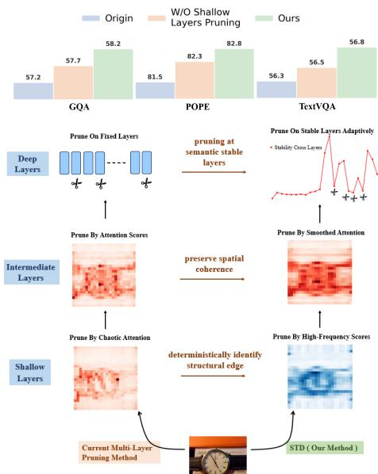  
Figure 1: (Top) Current works suffer from the degraded performance in pruning shallow-layer visual tokens, which is under-explored so far. (Bottom) In this paper, we handle this problem by revisiting stage-wise roles of the vision encoder, and design a method STD to align with these roles, improving the maintained semantics of each stage.

Despite the success of multi-layer strategies, we find that standard pruning in shallow layers often harms the model, making pruning in these layers ineffective. As illustrated in Fig. 1 (Top), disabling pruning in shallow layers while retaining it in deeper stages yields better performance than standard full-layer pruning. Although this issue is common in existing methods, to the best of our knowledge, it has rarely been studied.

In this paper, we aim to understand this problem and seek a solution. Since attention is a widely used pruning criterion (Zhang et al., 2025b; Yang et al., 2025; Tong et al., 2025), we analyze attention patterns across network depths, especially in shallow layers. Existing works (Park and Kim, 2022) generally assume token interactions with neighbors in shallow layers.. However, we find that this assumption does not hold in the very shallow layers. Instead, their attention maps are inherently chaotic and noisy, failing to capture meaningful semantic structures and exhibiting random information flow. Therefore, using these chaotic signals can mistakenly remove critical information.

However, this chaos in the very shallow layers is not merely noise. We further show that the model operates primarily as an edge detector when semantic understanding is immature. At this stage, the network focuses on high-frequency contours rather than objects, indicating that token importance is more related to spectral properties than to attention weights. As the network deepens, it shifts from frequency-based edge perception to recognition of local subjects, requiring spatial coherence for object integrity. Finally, the model enters an abstract semantic aggregation phase: distant image regions exchange information through hub tokens, resembling the attention-sink phenomenon (Yi et al., 2026), and gradually converge into abstract wholeimage semantic representations, where we observe instability in semantic evolution.

Based on the above observations, we propose STD, a hierarchical token pruning framework that aligns pruning strategies with the functional roles of different network stages. As shown in Fig. 1 (Right), STD redesigns pruning in three phases: (1) In shallow layers, we replace noisy attention weights with High-Frequency Spectral Analysis to deterministically identify structural edge features; (2) In intermediate layers, we use Gaussian-Smoothed Attention to preserve spatial coherence and feature continuity; (3) In deep layers, we introduce a Stability-Adaptive Trigger that prunes only at semantically stable moments. Extensive experiments show that STD is effective on image and video understanding tasks, remains plug-and-play and compatible with other methods, and substantially improves inference efficiency.

Table 1: Performance comparison of attention-based multilayer pruning with and without shallow layer pruning. Results reveal the flaw of indiscriminate pruning in early stages.
<table><tr><td>Method</td><td>GQA MME POPE TextVQA</td><td></td><td></td><td>Avg.</td></tr><tr><td colspan="5">Retain 192 Tokens</td></tr><tr><td>Full Multi-layer Pruning</td><td>58.3 1716</td><td>84.3</td><td>56.7</td><td>95.4%</td></tr><tr><td>w/o Shallow Pruning</td><td>58.6 1742</td><td>84.9</td><td>56.9</td><td>96.1%</td></tr><tr><td colspan="5">Retain 128 Tokens</td></tr><tr><td>Full Multi-layer Pruning</td><td>57.2 1669</td><td>81.5</td><td>56.3</td><td>93.3%</td></tr><tr><td>w/o Shallow Pruning</td><td>57.7 1693</td><td>82.3</td><td>56.5</td><td>94.1%</td></tr><tr><td colspan="5">Retain 64 Tokens</td></tr><tr><td>Full Multi-layer Pruning</td><td>54.7 1607</td><td>79.2</td><td>54.5</td><td>90.5%</td></tr><tr><td>w/o Shallow Pruning</td><td>55.0 1646</td><td>79.8</td><td>54.7</td><td>91.0%</td></tr></table>

In summary, our main contributions are:

• We identify the failure mechanism of conventional shallow layer pruning, attributing it to chaotic attention patterns misaligned with the edgedetection role of early layers.

• We characterize LVLM functional evolution across depth: shallow layers detect high-frequency structural contours, intermediate layers shift to local subject recognition, and deep layers perform abstract semantic aggregation where information converges through inherently unstable hub tokens;

• We propose STD, a unified approach that adapts pruning to each stage’s role: shallow layers use high-frequency spectral analysis for deterministic edge preservation, intermediate layers use Gaussian-smoothed attention for spatial coherence, and deep layers use stability-adaptive triggering for stable semantic aggregation;

• Experiments show that STD outperforms SoTA by 1.1% on LLaVA-1.5-7B with 88.9% token reduction, and gains a further 1.8% when combined with other methods. On LLaVA-NeXT-7B, STD improves SoTA by 2.1% with 94.4% token reduction and achieves a 3.9× prefilling speed-up.

## 2 Rethinking Model’s Stage-wise Roles from Shallow-layer Failure

2.1 Shallow-layer Pruning Harms Accuracy Attention-based pruning is widely used for visual token compression in the Vision Encoder Stage, estimating token importance via attention weights. Compared with single-layer pruning, which removes tokens once at a selected layer, multi-layer pruning is generally more effective. As token redundancy emerges progressively as the network deepens; removing redundant tokens early helps avoid ineffective dispersion of attention resources.

Although attention-based multi-layer pruning outperforms single-layer approaches, we find a counter-intuitive phenomenon: indiscriminate attention-based pruning in shallow layers degrades model performance. To verify this, we conduct a controlled study on four benchmarks under three token retention budgets. For each budget, we compare (1) Standard Multi-layer Pruning, applying attention-based pruning every two layers, and (2) w/o Shallow Pruning, disabling pruning in shallow layers while keeping it in middle and deep layers. The final pruning step strictly enforces the token retention budget. As shown in Table 1, the latter consistently outperforms the former across all benchmarks and budgets.

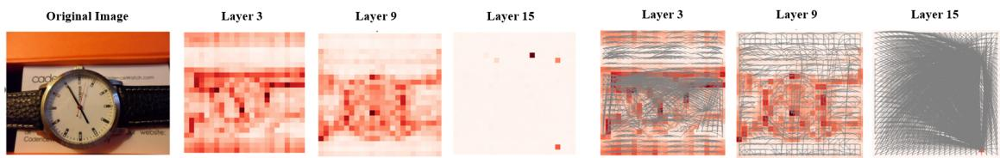  
Figure 2: (Left) CLS token attention heatmaps at layers 3, 9 and 15, showing chaotic and noisy distributions in shallow layers (3), focused on main objects in middle layers (9), and hub token concentration in deep layers (15). (Right) Information flow visualization of connections between tokens and their top-3 attended tokens, showing irregular flow in shallow layers, stable local structures in middle layers, and hub-centric patterns in deep layers.

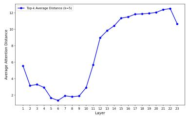

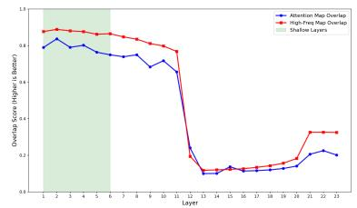

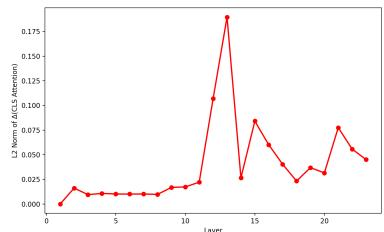  
Figure 3: (Left) Average attention distance exhibits a “U-shaped” curve, challenging the view that shallow layers only attend to neighbors; (Middle) Edge detection accuracy shows high-frequency analysis is a more deterministic proxy for token selection than attention weights; (Right) Semantic change instability in the deep stage alternates between rapid semantic evolution and relative stability.

This finding shows that shallow-layer attention weights are unreliable signals. Existing attentionbased multi-layer pruning assumes that attention is equally informative across all depths, but this fails in early layers. Motivated by this, we analyze why attention-based pruning fails in shallow layers.

## 2.2 Attention Fails in Shallow-Layer Pruning

Chaotic Shallow-Layer Attention. To explain the poor performance of shallow-layer pruning, we analyze CLS token attention patterns. Fig. 2 (Left) shows that shallow layers (3) have chaotic and noisy distributions, often attending to padding and edges rather than semantic objects. In contrast, middle layers (9) consistently focus on objects, while deep layers (15) converge on hub tokens.

Disordered Information Flow. Existing analyses of information flow (Tong et al., 2025) often assume that shallow layers mainly aggregate local neighborhood information. However, as shown in Fig. 2 (right), the very shallow layers instead show irregular attention patterns: tokens attend not only to nearby neighbors but also to distant irrelevant positions, and even low-semantic tokens can become hubs. The local structures attributed to shallow layers in prior work become clear only in the deeper shallow layers (i.e., the middle layers), while deep layers are dominated by hub-centric patterns.

Abnormal Attention Distances. Conventional wisdom suggests that shallow layers mainly attend to nearby tokens, resulting in low attention distances (Dosovitskiy et al., 2021; Park and Kim, 2022; Liu et al., 2022). However, Fig. 3 (right) reveals a U-shaped trend: attention distances are unexpectedly high in the very shallow layers due to noisy patterns, decrease in the deeper shallow layers (i.e., the middle layers) as local object recognition becomes more coherent, and rise again in the deep layers as attention converges onto hubs.

Summary. The observation of shallow layers made by prior works are mainly about the “deeper shallow layer”, but not for the “very shallow layer”, leading to misalignment between pruning criterion and layer roles and finally harms performance.

## 2.3 Stage-wise Evolution of Functional Roles

To analyze the very shallow layers, we divide the shallow layer” into the very shallow layer” and “deeper shallow layer”, hereafter denoted as shallow layer and middle/intermediate layers.

(a) Model Perception Stage: From Edge Detec-

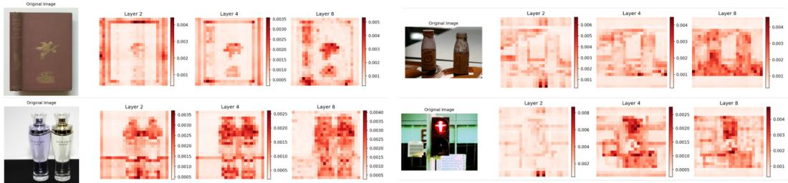  
Figure 4: Attention distribution patterns in shallow and middle layers for three samples. Shallow layers (2, 4) primarily focus on edge contours, while middle layers (8) successfully identify complete semantic subjects.

## tion to Object-Level Semantic.

Although shallow layers appear semantically chaotic, they are not noise but play a distinct role in pattern learning. As shown in Figure 4, in the shallow stage, the model focuses on object edge contours rather than semantic subjects, suggesting that the model operates primarily as an edge detector when semantic understanding is immature. Given this, we hypothesize that frequency-domain analysis offers a more deterministic and accurate proxy for token selection. Since high-frequency components capture edges and fine details (Tong et al., 2024a), they provide a more reliable way to identify edge-related tokens than attention patterns.

To quantitatively verify the role of shallow layers in edge detection, Fig. 3 (middle) compares tokens selected via Canny edge detection, attention scores, and high-frequency analysis. The results show high similarity between edge maps and attention weights in shallow layers (≈ 0.8), which decreases with depth, supporting the edge detector hypothesis. Moreover, across shallow layers (1– 6), high-frequency scores consistently show higher similarity to the Canny reference than attentionbased scores. This confirms that high-frequency spectral analysis provides more accurate edge localization than erratic attention patterns.

The above observation suggests a plausible empirical pattern: shallow layers tend to detect edge contours, while intermediate layers progressively capture object-level features. This edge-to-object progression is consistent with the hierarchical learning of visual representations.

## (b) Abstract Semantic Aggregation Stage: Instability of Semantic Integration

Deep layers process information differently from shallow and middle layers. Beyond a certain layer, attention rapidly concentrates on a few hub tokens, marking the abstract semantic aggregation phase. In this phase, token interaction is mainly mediated by hub tokens, and the model shifts from perceiving diverse visual content to aggregating abstract semantics. Given this change in processing mode, local subject retention no longer applies, so we instead emphasize the stability of inter-layer semantic changes.

The semantic shifts in deep layers are not uniform but show significant instability. In Fig. 3(Right), we compute the difference between adjacent layers (∆ CLS Attention) and use the $L _ { 2 }$ norm to measure its magnitude. During the perception stage, this change remains low and stable; during the deep-layer semantic-aggregation phase, it fluctuates significantly. At layers with a high $L _ { 2 }$ norm of differences (i.e., unstable layers), the pattern evolves effectively between adjacent layers, indicating that the model extracts useful patterns from these layers, so pruning tokens there is harmful. In contrast, at layers with a low $L _ { 2 }$ norm of differences (i.e., stable layers), adjacent-layer patterns are similar, implying less information is extracted and more redundancy may exist. Consequently, pruning at these layers will be harmless.

In summary, our empirical observations suggest a functional pattern across shallow to deep layers: shallow layers respond to to high-frequency edges, middle layers exhibit stronger Object-Level semantic recognition, and deep layers tend to aggregate semantic information while showing greater instability. In the following sections, we propose a method designed to better align with these roles.

## 3 Methodology

Building upon our analysis of visual attention evolution, we propose STD, a hierarchical token pruning framework aligned with the functional roles of different network stages. As shown in Fig. 5, STD uses three phases: (1) replacing noisy attention weights with High-Frequency Spectral Analysis in shallow layers; (2) using Gaussian-Smoothed Attention in intermediate layers; and (3) applying Stability-Adaptive Trigger in deep layers.

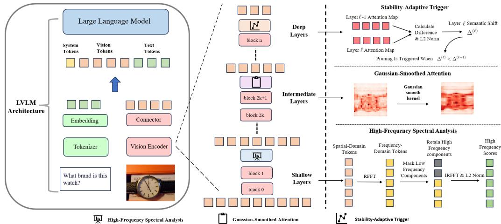  
Figure 5: Overview of the STD Framework. The pipeline adapts pruning strategies across network depths, employing stage-specific strategies to replace the original uniform attention-based approach.

## 3.1 Phase 1: Shallow Layers via High-Frequency Spectral Analysis

In shallow layers $( \ell \leq L _ { 1 } )$ , attention patterns are chaotic and noisy and thus unreliable for token selection. We therefore replace them with High-Frequency Spectral Analysis to deterministically identify structural edge features.

Let $\mathbf { P } ^ { ( \ell ) } = [ \mathbf { p } _ { 1 } ^ { ( \ell ) } , \ldots , \mathbf { p } _ { N } ^ { ( \ell ) } ] ^ { \top } \in \mathbb { R } ^ { N \times D }$ denote the sequence of N patch tokens at layer ℓ. We apply the real-valued fast Fourier transform (RFFT) along the token sequence:

$$
\widehat { \mathbf { P } } ^ { ( \ell ) } = \mathcal { F } _ { \mathrm { r f f t } } \left( \mathbf { P } ^ { ( \ell ) } \right) \in \mathbb { C } ^ { F \times D } ,\tag{1}
$$

where $F = \lfloor N / 2 \rfloor + 1$ . To isolate high-frequency information corresponding to edge features, we retain the upper two-thirds of the spectrum:

$$
\widehat { \mathbf { P } } _ { \mathrm { h i g h } } ^ { ( \ell ) } [ f , : ] = \left\{ \begin{array} { l l } { \widehat { \mathbf { P } } ^ { ( \ell ) } [ f , : ] , } & { f \ge \lceil F / 3 \rceil } \\ { 0 , } & { \mathrm { o t h e r w i s e } } \end{array} \right. .\tag{2}
$$

The high-frequency representation is reconstructed by inverse RFFT: $\widetilde { \mathbf { P } } _ { \mathrm { h i g h } } ^ { ( \ell ) } = \mathcal { F } _ { \mathrm { i r f f t } } ( \widehat { \mathbf { P } } _ { \mathrm { h i g h } } ^ { ( \ell ) } ; n = N )$ The high-frequency energy score of token i is:

$$
s _ { i } ^ { \mathrm { h i g h , ( \ell ) } } = \left\| \widetilde { \mathbf { p } } _ { i } ^ { ( \ell ) , \mathrm { h i g h } } \right\| _ { 2 } ^ { 2 } .\tag{3}
$$

To ensure a smooth transition, we combine the high-frequency score with attention weights:

$$
r _ { i } ^ { ( \ell ) } = \alpha \cdot s _ { i } ^ { \mathrm { \tiny { h i g h , ( \ell ) } } } + ( 1 - \alpha ) \cdot a _ { i } ^ { ( \ell ) } , \quad \ell \leq L _ { 1 } ,\tag{4}
$$

where α balances frequency cues and attention, and $a _ { i } ^ { ( \ell ) }$ is the attention weight from the [CLS] token to patch token i at layer ℓ. All scores are normalized to [0, 1] by min-max scaling.

## 3.2 Phase 2: Intermediate Layers via Gaussian-Smoothed Attention

In intermediate layers $( L _ { 1 } < \ell \leq L _ { 2 } )$ , the model begins subject-level semantic recognition, and attention becomes more reliable with strong locality around main subjects. We therefore use attention weights with Gaussian-Smoothed Attention to preserve spatial coherence and ensure robust feature continuity. This reduces object-part fragmentation caused by hard thresholding.

The smoothed attention score is:

$$
r _ { i } ^ { ( \ell ) } = \sum _ { \delta = - \lfloor K / 2 \rfloor } ^ { \lfloor K / 2 \rfloor } \mathcal { G } _ { \sigma } ( \delta ) \cdot a _ { i + \delta } ^ { ( \ell ) } , \quad L _ { 1 } < \ell \leq L _ { 2 } ,\tag{5}
$$

where $\mathcal { G } _ { \sigma }$ is a 1D Gaussian kernel with standard deviation $\sigma ,$ and K is the kernel size.

For shallow and intermediate layers, pruning is performed every two layers to progressively reduce redundancy as the model builds semantic awareness in the perception stage.

## 3.3 Phase 3: Deep Layers via Stability-Adaptive Trigger

In deep layers $( \ell > L _ { 2 } )$ , the model enters the abstract semantic aggregation phase, where attention converges to hub tokens. Our analysis shows that semantic changes in this stage are unstable

Instead of fixed-interval pruning, we introduce a Stability-Adaptive Trigger to execute compression only during semantic stability. Let $\mathbf { a } ^ { ( \ell ) ^ { \ast } } \in \mathbb { R } ^ { N }$ denote the attention vector from the [CLS] token to all patch tokens at layer ℓ. The semantic shift between consecutive layers is:

$$
\Delta ^ { ( \ell ) } = \Big \| \mathbf { a } ^ { ( \ell ) } - \mathbf { a } ^ { ( \ell - 1 ) } \Big \| _ { 2 } .\tag{6}
$$

Table 2: Performance evaluation of STD on LLaVA-1.5-7B under varying configurations. With 576 visual tokens as the baseline, the final column denotes the average accuracy normalized to the theoretical upper bound.
<table><tr><td>Method</td><td colspan="8">GQA MMB MMBCN MME POPE SQA  $\mathbf { V Q A } ^ { \mathrm { V } 2 }$   $\mathbf { V Q A } ^ { \mathrm { T e x t } } \parallel$ </td></tr><tr><td></td><td>Upper Bound, 576 Tokens (100%)</td><td></td><td></td><td></td><td></td><td></td><td></td><td>Avg.</td></tr><tr><td>Vanilla</td><td>61.9</td><td>64.7</td><td>58.1</td><td>1865</td><td>85.9</td><td>69.5</td><td>78.5 58.3</td><td>100%</td></tr><tr><td colspan="9">Retain 192 Tokens (↓66.7%)</td></tr><tr><td>PDrop (CVPR25)</td><td>57.3</td><td>62.9 56.8</td><td>1766</td><td>82.3</td><td>68.8</td><td>75.1</td><td>56.5</td><td>96.2%</td></tr><tr><td>SparseVLM (ICML25)</td><td>57.6</td><td>62.5</td><td>53.7</td><td>1721 83.6</td><td>68.9</td><td>75.6</td><td>56.1</td><td>95.4%</td></tr><tr><td>FÎowcut (NeurIPS25)</td><td>59.5</td><td>63.0</td><td>56.8</td><td>1833 85.7</td><td>68.4</td><td>76.8</td><td>57.3</td><td>97.8%</td></tr><tr><td>FiCoCo-V (AAAI26)</td><td>58.5</td><td>62.3</td><td>55.3</td><td>1732 82.5</td><td>67.8</td><td>74.4</td><td>55.7</td><td>95.3%</td></tr><tr><td>V²Drop (CVPR26)</td><td>58.5</td><td>63.7</td><td>56.8</td><td>1826</td><td>85.1 69.3</td><td>75.2</td><td>55.6</td><td>97.3%</td></tr><tr><td>STD (Öurs)</td><td>60.1</td><td>63.1</td><td>57.4</td><td>1812</td><td>86.3</td><td>68.5 77.5</td><td>57.7</td><td>98.5%</td></tr><tr><td>Flowċut + ŚTD (Ours)</td><td>60.3</td><td>63.5</td><td>57.4</td><td>1845</td><td>86.3</td><td>68.6 77.7</td><td>57.9</td><td>98.9%</td></tr><tr><td>SparseVLM + STD (Óurs)</td><td>60.6</td><td>63.7</td><td>57.6</td><td>1818</td><td>86.2</td><td>68.9 77.7</td><td>58.0</td><td>99.0%</td></tr><tr><td colspan="9">Retain 128 Tokens (↓77.8%)</td></tr><tr><td>PDrop (CVPR25)</td><td>57.1</td><td>61.6</td><td>56.3</td><td>1664</td><td>82.3</td><td>68.3 72.9</td><td>56.6</td><td>94.7%</td></tr><tr><td>SparseVLM (ICML25)</td><td>56.0</td><td>60.0</td><td>51.1</td><td>1696</td><td>80.5</td><td>67.1 73.8</td><td>54.9</td><td>92.5%</td></tr><tr><td>Flowcut (NeurIPS25)</td><td>58.2</td><td>61.7</td><td>56.0</td><td>1781</td><td>83.7</td><td>68.4 75.8</td><td>57.0</td><td>96.1%</td></tr><tr><td>FiCoCo-V (AAAI26)</td><td>57.6</td><td>61.1</td><td>54.3</td><td>1711</td><td>82.2</td><td>68.3 73.1</td><td>55.6</td><td>94.3%</td></tr><tr><td>V2Drop (CVPR26)</td><td>56.3</td><td>61.8</td><td>55.6</td><td>1712</td><td>80.9</td><td>68.8 73.7</td><td>53.8</td><td>94.1%</td></tr><tr><td>STD (urs)</td><td>58.8</td><td>62.4</td><td>56.3</td><td>1763</td><td>84.6</td><td>68.8 76.2</td><td>57.4</td><td>97.0%</td></tr><tr><td>Flowċut + ŚTD (Ours)</td><td>59.1</td><td>62.5</td><td>56.1</td><td>1792</td><td>85.6</td><td>68.3 76.4</td><td>57.3</td><td>97.2%</td></tr><tr><td>Sparse VLM + STD (Óurs)</td><td>59.6</td><td>62.9</td><td>56.3</td><td>1779</td><td>85.8</td><td>68.7 76.8</td><td>57.6</td><td>97.6%</td></tr><tr><td colspan="9">Retain 64 Tokens</td></tr><tr><td>PDrop (CVPR25)</td><td>47.5</td><td>58.8</td><td>50.5</td><td>88.9%) 1561</td><td>55.9</td><td>68.6 69.2</td><td>50.6</td><td>84.6%</td></tr><tr><td>SparseVLM (ICML25)</td><td>52.7</td><td>56.2</td><td>46.1</td><td>1505</td><td>75.1</td><td>62.2 68.2</td><td>51.8</td><td>85.6%</td></tr><tr><td>Flowcut (NeurIPS25)</td><td>55.3</td><td>60.6</td><td>54.7</td><td>1712</td><td>79.3</td><td>68.9 72.8</td><td>55.6</td><td>93.2%</td></tr><tr><td>FiCoCo-V (AAAI26)</td><td>52.4</td><td>60.3</td><td>53.0</td><td>1591</td><td>76.0</td><td>68.1 71.3</td><td>53.6</td><td>90.5%</td></tr><tr><td>V2Drop (CVPR26)</td><td>50.5</td><td>55.2</td><td>53.1</td><td>1470</td><td>75.1</td><td>68.9 68.9</td><td>51.8</td><td>87.5%</td></tr><tr><td>STD (urs)</td><td>56.1</td><td>61.1</td><td>55.3</td><td>1709</td><td>81.2</td><td>68.6 73.3</td><td>56.0</td><td>94.3%</td></tr><tr><td>Flowċut + ŚTD (Ours)</td><td>56.4</td><td>61.3</td><td>55.9</td><td>1744</td><td>81.6</td><td>68.8 73.9</td><td>55.9</td><td>95.0%</td></tr><tr><td>SparseVLM + STD (Óurs)</td><td>54.6</td><td>60.7</td><td>55.0</td><td>1665</td><td>79.6</td><td>69.6 71.8</td><td>55.0</td><td>93.0%</td></tr></table>

Table 3: Evaluation of STD on LLaVA-NeXT-7B.
<table><tr><td>Method</td><td colspan="5">GQA MMB MMBCN MME POPE VQAV2 VQAText</td></tr><tr><td colspan="5">Upper Bound, 2880 Tokens (100%)</td><td></td></tr><tr><td>Vanilla</td><td>64.2 67.9 60.6 1846 86.4 81.8</td><td></td><td></td><td>61.3</td><td>3 100%</td></tr><tr><td colspan="6">Retain 640 Tokens (↓ 77.8%) 60.6 65.5 58.5 1781 83.7 78.3</td></tr><tr><td>PDrop SparseVLM FiCoCo-V v2Drop</td><td>60.3 65.8 58.5 1773 84.2 60.9 66.0 57.9 1793 84.6 61.1 65.6 58.4 1796 83.9</td><td></td><td>77.1 78.7 78.8</td><td>60.5 59.3 58.3 58.9</td><td>|96.4% 95.9% 96.2% 96.4%</td></tr><tr><td colspan="6">61.8 66.4 58.9 1807 86.2 79.6 Retain 320 Tokens (↓ 88.9%)</td></tr><tr><td>PDrop SparseVLM FiCoCo-V V2Drop 57.4 63.7</td><td>58.3 63.9 57.7 63.2 58.8 63.4</td><td>56.8 1736 80.2 54.4 1685 55.3 1731 81.9 55.5 1701 80.2</td><td>75.2 82.2 73.4 75.5 74.6</td><td>57.8 56.9 57.2 54.6</td><td>|93.1% 91.6% 93.0% 91.4%</td></tr><tr><td colspan="6">STD 59.6 64.3 56.1 1742 83.2 76.8 Retain 160 Tokens (↓94.4%)</td></tr><tr><td>PDrop 54.9 61.8 SparseVLM FiCoCo-V 55.1 60.4 V2Drop 54.3 60.1</td><td>54.9 51.2 52.1 52.4</td><td>151372.3 48.6 1542 72.7 1621</td><td>74.5</td><td>70.2 66.3 70.7</td><td>53.9 86.6% 49.2 80.8% 55.3 87.5%</td></tr></table>

Pruning is triggered at layer ℓ only when the system enters a stable phase, indicated by decreasing semantic change:

$$
\Delta ^ { ( \ell ) } < \Delta ^ { ( \ell - 1 ) } .\tag{7}
$$

This ensures token reduction occurs only when semantic changes are diminishing, indicating that the model is entering a semantically stable state.

When pruning is triggered in this semantic aggregation phase, we use only attention weights $r _ { i } ^ { ( \ell ) } = a _ { i } ^ { ( \ell ) }$ to select tokens for triggered layers.

## 4 Experiments

Experimental Settings. We validate STD on image understanding tasks using the LLaVA family (LLaVA-1.5-7B (Liu et al., 2024a) and LLaVA-NeXT-7B (Liu et al., 2024b)), Qwen2-VL (Wang et al., 2024), and the recent InternVL3-8B (Zhu et al., 2025) and Qwen3-VL-8B-Instruct (Bai et al., 2025) models. Performance is evaluated across eleven benchmarks under different token-reduction ratios. For video understanding, we conduct experiment on Video-LLaVA (Lin et al., 2024) across three benchmarks.

Implementation Details. Our method is integrated into existing models in a strictly trainingfree manner. We use α to balance frequency and attention scores, setting α = 0.8 for LLaVA-1.5 and α = 0.5 for LLaVA-NeXT and Qwen2-VL. Stage-wise partitioning parameters are uniformly set to $L _ { 1 } = 6$ and $L _ { 2 } = 1 2$ . Token pruning is performed within the vision encoder for all models and is forced to reach the target retained token number at the final pruning layer. All experiments are conducted on Nvidia RTX 4090D (24GB) GPUs.

## 4.1 Effectiveness of STD

Image understanding tasks We evaluate STD on LLaVA-1.5-7B in a training-free inference setting. As shown in Table 2, STD outperforms existing methods by 1.1% with 64 tokens, and by 1.8% when combined with Flowcut. With 192 retained tokens, STD + SparseVLM surpasses the SOTA by 1.5% and the original SparseVLM by 3.6%. On

Table 4: Performance of STD on Qwen2-VL-7B-Instruct for image understanding. As the initial number of tokens varies dynamically, the reduction ratio is approximate.
<table><tr><td>Method</td><td>GQA MMB MMBCN MME POPE SQA VQAText|</td><td></td><td> $\mathbf { A v } \mathbf { g } .$ </td></tr><tr><td colspan="4">Upper Bound, All Tokens (100%) 61.9 79.8 79.5 2334 87.2 85.1 82.2 |100%</td></tr><tr><td>Vanilla</td><td>Token Reduction (↓ 66.7%)</td><td></td><td></td></tr><tr><td colspan="4">FiCoCo-V| |59.4 78.1 75.8 2189 83.6 83.1 80.3</td></tr><tr><td>v2Drop STD</td><td>59.8 78.4 75.8 2252 84.0 83.0 79.8</td><td></td><td>|96.3% 96.8%</td></tr><tr><td>60.3 79.0</td><td>76.5 2246 86.1 83.4 81.0 77.8%)</td><td></td><td>97.7%</td></tr><tr><td colspan="4"> 73.5 2125 81.4 78.7 75.8</td></tr><tr><td>FiCoCo-V| 57.8 75.6</td><td>Token Reduction</td><td></td><td>|93.0%</td></tr><tr><td>v2Drop 56.5 STD 58.9</td><td>75.6 74.3 2139 81.5 78.9 73.8 76.4 74.5 2187</td><td>84.5 79.0 76.6</td><td>92.4% 94.5%</td></tr><tr><td colspan="4">Token Reduction 88.9%)</td></tr><tr><td>FiCoCo-V| 54.7 70.8</td><td>70.1 205979.1 77.7 66.3</td><td></td><td>|88.0%</td></tr><tr><td></td><td></td><td></td><td></td></tr><tr><td>v2Drop STD</td><td>54.371.3 69.8 56.3 72.1</td><td>2067 78.6 77.5 65.3 71.8 2116 81.4 77.8 68.5</td><td>87.7% 90.1%</td></tr></table>

Table 5: Performance of STD on video understanding tasks. Video-LLaVA uses 2048 video tokens, while our method retains 256 tokens, i.e., 32 per frame.
<table><tr><td rowspan="2">Method</td><td colspan="2">TGIF</td><td colspan="2">MSVD MSRVT</td><td colspan="2"> $\mathbf { A v g . }$ </td></tr><tr><td>Acc Score</td><td>Acc</td><td>Score</td><td>Acc Score</td><td>Acc</td><td>Score</td></tr><tr><td>Video-LLaVA</td><td>46.9 3.34</td><td>69.8</td><td>3.91</td><td>57.1 3.49</td><td>100%</td><td>100%</td></tr><tr><td>SparseVLM</td><td>45.9 3.32 98.9% 99.4%</td><td>68.6</td><td>3.90 98.3% 99.7%</td><td>32.9 3.02 |57.6% 86.5%</td><td></td><td>84.6% 95.2%</td></tr><tr><td>PDrop</td><td>40.3 3.21 85.9% 96.1%</td><td>61.5</td><td>3.74 88.1% 95.7%</td><td>41.8 73.2% 91.4%</td><td>3.19</td><td>82.4% 94.4%</td></tr><tr><td>FiCoCo-V</td><td>43.4 3.25</td><td>67.9</td><td>3.89</td><td>48.3 3.26</td><td></td><td>91.4% 96.7%</td></tr><tr><td>STD</td><td>92.5% 97.3% 45.7 3.32 97.4% 99.4%|96.8% 99.2%|96.1% 98.6%</td><td>67.6</td><td>97.2% 99.5% 3.88</td><td>84.6% 93.4% 54.9 3.44</td><td></td><td>96.7% 99.1%</td></tr></table>

Table 6: Performance of STD on LLaVA-1.5-7B (left) and LLaVA-NeXT-7B (right). \Delta denotes the inference speedup factor. All experiments used the POPE benchmark on a single NVIDIA 4090D GPU.
<table><tr><td>Methods</td><td>Token</td><td>Total Time↓</td><td> $\Delta \uparrow$ </td><td>Prefilling Time↓</td><td> $\Delta \uparrow$ </td><td>TFLOPs</td></tr><tr><td>LLaVA-1.5-7B</td><td>576</td><td>17:53</td><td>1.0×</td><td>118.0ms</td><td>1.0×</td><td>10.20</td></tr><tr><td>+ SparseVLM</td><td>64</td><td>16:15</td><td>1.1×</td><td>107.3ms</td><td>1.1×</td><td>2.67</td></tr><tr><td>+ PDrop</td><td>64</td><td>13:45</td><td>1.3×</td><td>84.3ms</td><td>1.4×</td><td>2.49</td></tr><tr><td>+ FlowCut</td><td>64</td><td>11:55</td><td>1.5×</td><td>73.8ms</td><td>1.6×</td><td>2.25</td></tr><tr><td>+ V2Drop</td><td>64</td><td>12:51</td><td>1.4×</td><td>79.2ms</td><td>1.5×</td><td>2.39</td></tr><tr><td>+ STD</td><td>64</td><td>10:05</td><td>1.7×</td><td>64.3ms</td><td>1.8×</td><td>1.99</td></tr></table>

LLaVA-NeXT-7B, Table 3 shows that STD exceeds the state-of-the-art by 2.1% with 160 tokens. We also evaluate Qwen2-VL, and Table 4 shows that STD consistently performs best across different token reduction ratios on Qwen2-VL-7B.

Video understanding tasks To evaluate STD for video understanding, we integrate it into Video-LLaVA. Each video has 8 frames with 256 tokens per frame (2048 total), compressed to 256 tokens, i.e., 32 per frame. As shown in Table 5, STD remains robust, retaining 96.7% average accuracy on TGIF, MSVD, and MSRVT. It outperforms the previous state-of-the-art FiCoCo-V by 5.3%, showing its ability to preserve key information while reducing computation for multimodal video reasoning.

Efficiency Analysis Our proposed STD improves the inference efficiency of LVLMs . Table 6 compares total inference time, prefilling time, and FLOPs of our method with existing approaches on LLaVA-1.5-7B and LLaVA-NeXT-7B. STD consistently achieves the best efficiency gains, including a 3.9× speedup in prefilling and a 3.8× speedup in overall inference on LLaVA-NeXT.

## 4.2 Ablation Studies

Effectiveness of Each Component. Table 7 reports the ablation results on three benchmarks with 64 retained tokens. Adding any single component, High-Frequency Spectral Analysis(HSA),

<table><tr><td>Methods</td><td>Token</td><td>Total Time↓</td><td> $\Delta \uparrow$ </td><td>Prefilling Time↓</td><td> $\Delta \uparrow$ </td><td>TFLOPs</td></tr><tr><td>LLaVA-NeXT-7B</td><td>2880</td><td>50:24</td><td>1.0×</td><td>323.0ms</td><td>1.0×</td><td>45.61</td></tr><tr><td>+ SparseVLM</td><td>160</td><td>42:00</td><td>1.2×</td><td>215.3ms</td><td>1.5×</td><td>11.20</td></tr><tr><td>+ PDrop</td><td>160</td><td>19:23</td><td>2.6×</td><td>124.2ms</td><td>2.6×</td><td>9.96</td></tr><tr><td>+ FlowCut</td><td>160</td><td>16:48</td><td>3.0×</td><td>100.9ms</td><td>3.2×</td><td>6.30</td></tr><tr><td>+ V2Drop</td><td>160</td><td>18:10</td><td>2.8×</td><td>114.7ms</td><td>2.8×</td><td>8.97</td></tr><tr><td>+ STD</td><td>160</td><td>13:07</td><td>3.8×</td><td>83.2ms</td><td>3.9×</td><td>5.16</td></tr></table>

Gaussian-Smoothed Attention(GSA), or Stability-Adaptive Trigger(SAT), consistently improves over the baseline variants. Using all three yields the best results, showing that each module is effective and most effective when combined.

Importance of Layer-Specific Deployment. Our design uses HSA in shallow layers, GSA in intermediate layers, and SAT in deep layers. Table 8 shows that changing this assignment degrades performance. For example, applying HSA module to deeper layers lowers the POPE score by up to 7.6% than our shallow-layer setup. These results show the importance of layer-specific strategies.

## 4.3 Generalization to Recent MLLMs

We examine whether our stage-wise findings generalize to recent visual encoders and STD remains effective on these models. We use token-level attention as a proxy for visual focus. For the shallowlayer analysis, Canny responses are aggregated into token-level edge references. For the intermediatelayer analysis, the main subjects of 1,024 images are manually annotated and converted into tokenlevel subject references. We report cosine similarity between these references and layer-wise attention. For deep layers, we report the $L _ { 2 }$ distance between adjacent attention maps (×0.01). For visualization, each model’s curve is independently min–max normalized within each metric.

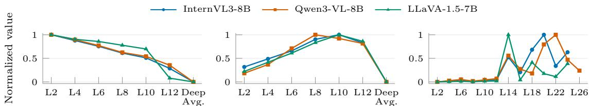  
Figure 6: Generalization of stage-wise findings on recent MLLMs. From left to right: edge similarity, object similarity, and adjacent-layer attention shift. Each series is min–max normalized within its model and metric. “Deep Avg.” averages L14 through the final layer in the first two plots. Recent MLLMs exhibit the same pattern with LLaVA-1.5: edge similarity peaks in shallow layers, object similarity peaks in intermediate layers, and semantic representations shift markedly in deep layers.

Table 7: Ablation study on component effectiveness.
<table><tr><td>Methods</td><td>Token HSA GSA SAT TextVQA GQA</td><td></td><td></td><td></td><td>POPE</td></tr><tr><td>LLaVA-1.5-7B</td><td>576</td><td></td><td>58.3</td><td>61.9</td><td>85.9</td></tr><tr><td>Standard Multi-Layer Pruning</td><td>64</td><td>1 - 一</td><td>54.5</td><td>54.7</td><td>79.2</td></tr><tr><td>Standard Multi-Layer Pruning(w/o Shallow)</td><td>64 -</td><td>- 一</td><td>55.0</td><td>55.1</td><td>79.8</td></tr><tr><td>STD(a)</td><td>64</td><td>√</td><td>55.5</td><td>55.6</td><td>80.3</td></tr><tr><td>STD(b)</td><td>64</td><td>√</td><td>55.2</td><td>55.4</td><td>79.9</td></tr><tr><td>STD(c)</td><td>64</td><td></td><td>√ 55.4</td><td>55.6</td><td>80.6</td></tr><tr><td>STD</td><td>64</td><td>√ √</td><td>√</td><td>56.0 56.1</td><td>81.2</td></tr></table>

Table 8: Performance comparison of deploying components at different layer depths.

Figure 6 exhibits the same qualitative pattern across both recent architectures and the LLaVA-1.5 reference: edge similarity is highest in shallow layers, object similarity peaks at intermediate depths, and the variation between adjacent attention maps remains consistently low in shallow and intermediate layers but fluctuate sharply in deep layers. These results demonstrate that our stage-wise findings also hold for recent models. To further evaluate its generalization, we apply STD to the recent models and report the results in Table 9. STD achieves the best average performance among the compared pruning methods on both models, outperforming the SOTA method by 1.3% and 1.7%, respectively, demonstrating that our method remains highly effective on recent models.

Visual token pruning can be performed at different stages of the multimodal pipeline, including the vision encoder, projector, and LLM. Vision-encoder pruning identifies redundancy from a visualperception perspective, whereas projector/LLMstage pruning targets semantic redundancy and can leverage textual guidance for token selection. We find that vision-encoder pruning and projector/LLM-stage pruning are complementary. To verify this fairly, we apply STD within the vision encoder and subsequently apply DART (Wen et al., 2025) or V2Drop (Chen et al., 2026a) at downstream stages.

## 4.4 Complementarity with Projector/LLM-Stage Pruning

<table><tr><td>Component | Shallow Intermediate Deep | TextVQA POPE</td><td></td><td></td><td></td><td></td><td></td></tr><tr><td>HSA</td><td>√</td><td>√</td><td>√</td><td>55.5 54.1 51.6</td><td>80.3 79.0 72.7</td></tr><tr><td>GSA</td><td>√</td><td>√</td><td>√</td><td>53.9 55.2 53.2</td><td>78.6 79.9 77.8</td></tr><tr><td>SAT</td><td>√</td><td>√</td><td>√</td><td>54.3 54.7 55.4</td><td>78.8 79.6 80.6</td></tr></table>

Both combinations substantially outperform the corresponding individual methods and achieve the best average scores (Table 10). These results show that pruning at different stages addresses distinct sources of redundancy and can be effectively combined. The SparseVLM+STD results in Table 2 further support this observation.

## 4.5 Analysis and Discussion

Effectiveness of High-Frequency Spectral Analysis in Shallow Layers. As shown in Fig. 7(Left), we visualize shallow-layer attention maps and our High-Frequency Spectral Analysis results. Standard shallow-layer attention can detect edges, but is often uncertain and chaotic. In contrast, our spectral analysis offers a more deterministic proxy to detect edge contours. This is further supported by the quantitative results in Fig. 3(Middle).

Validation of Stability-Adaptive Triggering Strategy. To validate the Stability-Adaptive Trigger, we plot its selected deep pruning layers under different strategies in Fig. 7(Right). For each strategy, we compute the selected layers’ average stability metric to evaluate pruning stability. We compare uniform intervals (every k layers) with stability-based approaches. The results show that uniform pruning often selects layers with high semantic fluctuation, causing instability. Among the stability-aware strategies, the selected pruning layers are stable and yield similar average stability metrics. However, our approach avoids re-selecting fixed layers or re-tuning thresholds for different

Table 9: Comparison with state-of-the-art methods on recent MLLMs at a 90.0% token reduction rate. Our method consistently achieves the best performance.
<table><tr><td colspan="5">InternVL3-8B</td></tr><tr><td>Method</td><td></td><td>MME MMB POPE</td><td>SQA</td><td>Avg.</td></tr><tr><td>Vanilla</td><td>2369</td><td>85.7</td><td>90.4 97.9</td><td>100%</td></tr><tr><td>FlowCut</td><td>1978</td><td>77.9 86.3</td><td>85.8</td><td>89.4%</td></tr><tr><td>FiCoCo-V</td><td>1869</td><td>74.8</td><td>82.7 81.5</td><td>85.2%</td></tr><tr><td>V2Drop</td><td>1994</td><td>78.1</td><td>83.4 86.3</td><td>88.9%</td></tr><tr><td>STD</td><td>2034</td><td>78.3</td><td>87.5 86.8</td><td>90.7%</td></tr></table>

<table><tr><td colspan="4">Qwen3-VL-8B-Instruct</td></tr><tr><td>Method</td><td>MIA-Bench MMB MMStar</td><td></td><td>RWQA</td><td>Avg.</td></tr><tr><td>Vanilla</td><td>91.1</td><td>85.0 70.9</td><td>71.5</td><td>100%</td></tr><tr><td>FlowCut</td><td>87.2 77.5</td><td>54.4</td><td>60.6</td><td>87.1%</td></tr><tr><td>FiCoCo-V</td><td>83.9 76.1</td><td>50.2</td><td>56.6</td><td>82.9%</td></tr><tr><td>V2Drop</td><td>84.6 77.0</td><td>52.4</td><td>57.8</td><td>84.5%</td></tr><tr><td>STD</td><td>88.0 77.2</td><td>56.7</td><td></td><td>62.788.8%</td></tr></table>

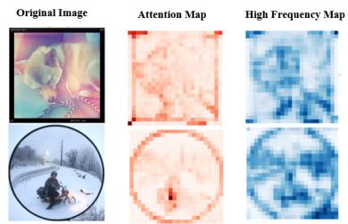

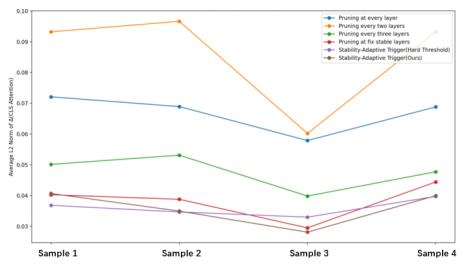  
Figure 7: (Left) Shallow-layer attention versus High-Frequency Spectral Analysis; the spectral representation provides a deterministic proxy for structural contours. (Right) Deep-layer pruning strategies; our Stability-Adaptive Trigger adaptively selects more stable layers than uniform-interval pruning.

Table 10: Complementarity of pruning stages on LLaVA-1.5-7B. Combining STD(Vision Encoder Stage) with Projector/LLM Stage pruning achieves better performance than either approach alone.
<table><tr><td>Method</td><td>Stage</td><td>GQA POPE SQA TextVQA</td><td></td><td></td><td>Avg.</td></tr><tr><td>Original</td><td>None</td><td>61.9</td><td>85.9 69.5</td><td></td><td>58.3 100%</td></tr><tr><td>STD</td><td>Vision</td><td>58.8</td><td>84.6 68.8</td><td></td><td>57.4 97.7%</td></tr><tr><td>DART</td><td>Projector</td><td>57.9</td><td>80.1 69.1</td><td></td><td>56.495.7%</td></tr><tr><td>STD+DART</td><td>Vision+Projector</td><td>59.3</td><td>85.0 69.1</td><td></td><td>57.8 98.3%</td></tr><tr><td>V2Drop</td><td>LLM</td><td>56.3</td><td>80.9 68.8</td><td></td><td>53.8 94.1%</td></tr><tr><td></td><td>STD+V2Drop Vision+LLM</td><td>59.5</td><td>84.8 69.3</td><td></td><td>57.6 98.3%</td></tr></table>

model architectures, providing better adaptability.

## 5 Related Work

Projector/LLM Stage Pruning. Token pruning can be performed in the Projector or LLM stage. Its main advantage is that pruning can be guided by cross-modal attention in LLM layers (e.g., Sparse-VLM (Zhang et al., 2025b)). Many studies (Xing et al., 2025; Zhang et al., 2025a; Chen et al., 2026a; Ye et al., 2025; Li et al., 2026) progressively remove redundant tokens from shallow to deep LLM layers. For example, PDrop (Xing et al., 2025) divides LLM layers into stages and drops tokens with low text-vision similarity at predefined ratios in selected layers. Some advanced methods (Hu et al., 2024; Zhang et al., 2026; Wu et al., 2026) further analyze modality interaction patterns across layers and design stage-specific strategies. However, these methods have several distinct drawbacks: (1) the Vision Encoder still incurs high computational costs before pruning; (2) for LLM-stage pruning, sending all visual tokens into early LLM layers causes heavy VRAM usage; and (3) they are unfriendly to multi-round conversations, since visual tokens must be recompressed for each new query.

Vision Encoder Pruning. Pruning within the Vision Encoder offers larger gains in both speed and memory efficiency, as redundant tokens are removed before entering the LLM. A notable branch of work (Tong et al., 2025; Han et al., 2026; Chen et al., 2026b) progressively removes redundancy from shallow to deep Vision Encoder layers. These methods also recognize the limitations of attentiononly criteria. For example, FlowCut (Tong et al., 2025) combines Semantic Similarity and Information Density with attention, while FiCoCo-V (Han et al., 2026) further considers a Local Penalty Strategy and Correlation-Based Information Recycling. Although these multi-metric methods partly reduce the errors caused by pure attention-based pruning, they still apply the same criteria across all layers without considering the distinct functional characteristics and attention patterns of shallow and deep Vision Encoder layers.

## 6 Conclusion

In this work, we present empirical evidence for a recurring stage-wise pattern: shallow representations emphasize edges, intermediate representations align with object-level regions, and deep representations exhibit non-uniform attention shifts consistent with semantic aggregation. Motivated by this hypothesis, we propose STD, a hierarchical pruning framework that preserves edges in shallow layers, enhances spatial coherence in intermediate layers, and avoids pruning during unstable deeplayer transitions. Extensive experiments across model families show the effectiveness of STD.

## Acknowledgments

This work is supported by the National Natural Science Foundation of China under grants 62206102; the National Key Research and Development Program of China under grant 2024YFC3307900; the National Natural Science Foundation of China under grants 62436003, 62376103 and 62302184; Major Science and Technology Project of Hubei Province under grant 2025BAB011 and 2024BAA008; Hubei Science and Technology Talent Service Project under grant 2024DJC078; Ant Group through CCF-Ant Research Fund;

## Limitations

Although STD achieves consistent improvements across different LVLMs and tasks, it still has several limitations. First, our method is built on an empirical characterization of stage-wise functional roles in the vision encoder, and its effectiveness may depend on the architectural properties of the underlying visual backbone. Whether the same shallow-to-deep transition pattern holds universally for other encoders or multimodal architectures requires further investigation. Second, while STD is training-free and plug-and-play, it still introduces additional hand-crafted components, such as spectral analysis, Gaussian smoothing, and stabilitybased triggering, whose hyperparameters may require adjustment under different resolutions, token budgets, or model scales. Third, although STD significantly reduces prefilling cost, it is designed mainly for visual token redundancy in inference and does not directly address other efficiency bottlenecks, such as KV-cache growth or decoding latency in the LLM stage. Finally, our current study mainly validates the method on image and video understanding benchmarks; its robustness on more diverse multimodal settings, such as document understanding, embodied perception, or highly finegrained visual reasoning, remains an important direction for future work.

## References

Saeed Ranjbar Alvar, Gursimran Singh, Mohammad Akbari, and Yong Zhang. 2025. Divprune: Diversitybased visual token pruning for large multimodal models. In Proceedings of the IEEE/CVF Conference on Computer Vision and Pattern Recognition, pages 9392–9401. IEEE.

Jinze Bai, Shuai Bai, Shusheng Yang, Shijie Wang, Sinan Tan, Peng Wang, Junyang Lin, Chang Zhou,

and Jingren Zhou. 2023. Qwen-VL: A versatile vision-language model for understanding, localization, text reading, and beyond. arXiv preprint arXiv:2308.12966.

Shuai Bai, Yuxuan Cai, Ruizhe Chen, Keqin Chen, Xionghui Chen, Zesen Cheng, Lianghao Deng, Wei Ding, Chang Gao, Chunjiang Ge, Wenbin Ge, Zhifang Guo, Qidong Huang, Jie Huang, Fei Huang, Binyuan Hui, Shutong Jiang, Zhaohai Li, Mingsheng Li, and 45 others. 2025. Qwen3-VL technical report. arXiv preprint arXiv:2511.21631.

Junjie Chen, Xuyang Liu, Zichen Wen, Yiyu Wang, Siteng Huang, and Honggang Chen. 2026a. Variation-aware vision token dropping for faster large vision-language models. In Proceedings of the IEEE/CVF Conference on Computer Vision and Pattern Recognition, pages 3489–3499.

Liang Chen, Haozhe Zhao, Tianyu Liu, Shuai Bai, Junyang Lin, Chang Zhou, and Baobao Chang. 2024a. An image is worth 1/2 tokens after layer 2: Plug-andplay inference acceleration for large vision-language models. In European Conference on Computer Vision, pages 19–35. Springer.

Lin Chen, Jinsong Li, Xiaoyi Dong, Pan Zhang, Yuhang Zang, Zehui Chen, Haodong Duan, Jiaqi Wang, Yu Qiao, Dahua Lin, and Feng Zhao. 2024b. Are we on the right way for evaluating large vision-language models? In Advances in Neural Information Processing Systems, volume 37.

Yuhao Chen, Bin Shan, Xin Ye, and Cheng Chen. 2026b. Evoprune: Early-stage visual token pruning for efficient mllms. arXiv preprint arXiv:2603.03681.

Alexey Dosovitskiy, Lucas Beyer, Alexander Kolesnikov, Dirk Weissenborn, Xiaohua Zhai, Thomas Unterthiner, Mostafa Dehghani, Matthias Minderer, Georg Heigold, Sylvain Gelly, Jakob Uszkoreit, and Neil Houlsby. 2021. An image is worth 16x16 words: Transformers for image recognition at scale. In International Conference on Learning Representations.

Chaoyou Fu, Peixian Chen, Yunhang Shen, Yulei Qin, Mengdan Zhang, Xu Lin, Jinrui Yang, Xiawu Zheng, Ke Li, Xing Sun, Yunsheng Wu, Rongrong Ji, Caifeng Shan, and Ran He. 2023. MME: A comprehensive evaluation benchmark for multimodal large language models. arXiv:2306.13394.

Yash Goyal, Tejas Khot, Douglas Summers-Stay, Dhruv Batra, and Devi Parikh. 2017. Making the v in vqa matter: Elevating the role of image understanding in visual question answering. In Proceedings ofthe IEEE conference on computer vision and pattern recognition, pages 6904–6913.

Yuhang Han, Xuyang Liu, Zihan Zhang, Pengxiang Ding, Junjie Chen, Honggang Chen, Donglin Wang, Qingsen Yan, and Siteng Huang. 2026. Filter, correlate, compress: Training-free token reduction for

mllm acceleration. In Proceedings ofthe AAAI Conference on Artificial Intelligence, volume 40, pages 4601–4609.

Lianyu Hu, Liqing Gao, Fanhua Shang, Liang Wan, and Wei Feng. 2024. iLLaVA: An image is worth fewer than 1/3 input tokens in large multimodal models. arXiv preprint arXiv:2412.06263.

Drew A Hudson and Christopher D Manning. 2019. GQA: A new dataset for real-world visual reasoning and compositional question answering. In Proceedings ofthe IEEE/CVF Conference on Computer Vision and Pattern Recognition, pages 6700–6709.

Yunseok Jang, Yale Song, Youngjae Yu, Youngjin Kim, and Gunhee Kim. 2017. Tgif-qa: Toward spatiotemporal reasoning in visual question answering. In Proceedings of the IEEE conference on computer vision and pattern recognition, pages 2758–2766.

Ao Li, Yuxiang Duan, Jinghui Zhang, Congbo Ma, Yutong Xie, Gustavo Carneiro, Mohammad Yaqub, and Hu Wang. 2026. Transprune: Token transition pruning for efficient large vision-language model. In Proceedings ofthe IEEE/CVF Conference on Computer Vision and Pattern Recognition, pages 39529–39538.

Junnan Li, Dongxu Li, Silvio Savarese, and Steven Hoi. 2023a. Blip-2: Bootstrapping language-image pretraining with frozen image encoders and large language models. In International conference on machine learning, pages 19730–19742. PMLR.

Yifan Li, Yifan Du, Kun Zhou, Jinpeng Wang, Wayne Xin Zhao, and Ji-Rong Wen. 2023b. Evaluating object hallucination in large vision-language models. In Proceedings ofthe 2023 Conference on Empirical Methods in Natural Language Processing, pages 292–305. Association for Computational Linguistics.

Bin Lin, Yang Ye, Bin Zhu, Jiaxi Cui, Munan Ning, Peng Jin, and Li Yuan. 2024. Video-llava: Learning united visual representation by alignment before pro jection. In Proceedings of the 2024 Conference on Empirical Methods in Natural Language Processing, pages 5971–5984.

Haotian Liu, Chunyuan Li, Yuheng Li, and Yong Jae Lee. 2024a. Improved baselines with visual instruction tuning. In Proceedings of the IEEE/CVF Conference on Computer Vision and Pattern Recognition, pages 26296–26306.

Haotian Liu, Chunyuan Li, Yuheng Li, Bo Li, Yuanhan Zhang, Sheng Shen, and Yong Jae Lee. 2024b. Llavanext: Improved reasoning, ocr, and world knowledge.

Haotian Liu, Chunyuan Li, Qingyang Wu, and Yong Jae Lee. 2023. Visual instruction tuning. Advances in neural information processing systems, 36:34892– 34916.

Yuan Liu, Haodong Duan, Yuanhan Zhang, Bo Li, Songyang Zhang, Wangbo Zhao, Yike Yuan, Jiaqi Wang, Conghui He, Ziwei Liu, Kai Chen, and Dahua Lin. 2024c. Mmbench: Is your multi-modal model an all-around player? In European conference on computer vision, pages 216–233. Springer.

Zhuang Liu, Hanzi Mao, Chao-Yuan Wu, Christoph Feichtenhofer, Trevor Darrell, and Saining Xie. 2022. A convnet for the 2020s. In Proceedings of the IEEE/CVF Conference on Computer Vision and Pattern Recognition, pages 11976–11986.

Pan Lu, Swaroop Mishra, Tanglin Xia, Liang Qiu, Kai-Wei Chang, Song-Chun Zhu, Oyvind Tafjord, Peter Clark, and Ashwin Kalyan. 2022. Learn to explain: Multimodal reasoning via thought chains for science question answering. Advances in Neural Information Processing Systems, 35:2507–2521.

Namuk Park and Songkuk Kim. 2022. How do vision transformers work? In International Conference on Learning Representations.

Yusu Qian, Hanrong Ye, Jean-Philippe Fauconnier, Peter Grasch, Yinfei Yang, and Zhe Gan. 2025. MIA-Bench: Towards better instruction following evaluation of multimodal LLMs. In The Thirteenth International Conference on Learning Representations.

Amanpreet Singh, Vivek Natarajan, Meet Shah, Yu Jiang, Xinlei Chen, Dhruv Batra, Devi Parikh, and Marcus Rohrbach. 2019. Towards vqa models that can read. In Proceedings ofthe IEEE/CVF conference on computer vision and pattern recognition, pages 8317–8326.

Dingjie Song, Wenjun Wang, Shunian Chen, Xidong Wang, Michael X. Guan, and Benyou Wang. 2025. Less is more: A simple yet effective token reduction method for efficient multi-modal LLMs. In Proceedings ofthe 31st International Conference on Computational Linguistics, pages 7614–7623. Association for Computational Linguistics.

Jintao Tong, Wenwei Jin, Pengda Qin, Anqi Li, Yixiong Zou, Yuhong Li, Yuhua Li, and Ruixuan Li. 2025. Flowcut: Rethinking redundancy via information flow for efficient vision-language models. In Advances in Neural Information Processing Systems, volume 38.

Jintao Tong, Yixiong Zou, Yuhua Li, and Ruixuan Li. 2024a. Lightweight frequency masker for crossdomain few-shot semantic segmentation. Advances in Neural Information Processing Systems, 37:96728– 96749.

Shengbang Tong, Ellis Brown, Penghao Wu, Sanghyun Woo, Manoj Middepogu, Sai Charitha Akula, Jihan Yang, Shusheng Yang, Adithya Iyer, Xichen Pan, Austin Wang, Rob Fergus, Yann LeCun, and Saining Xie. 2024b. Cambrian-1: A fully open, vision-centric exploration of multimodal llms. Advances in Neural Information Processing Systems, 37:87310–87356.

Peng Wang, Shuai Bai, Sinan Tan, Shijie Wang, Zhihao Fan, Jinze Bai, Keqin Chen, Xuejing Liu, Jialin Wang, Wenbin Ge, Yang Fan, Kai Dang, Mengfei Du, Xuancheng Ren, Rui Men, Dayiheng Liu, Chang Zhou, Jingren Zhou, and Junyang Lin. 2024. Qwen2- vl: Enhancing vision-language model’s perception of the world at any resolution. arXiv preprint arXiv:2409.12191.

Zichen Wen, Yifeng Gao, Shaobo Wang, Junyuan Zhang, Qintong Zhang, Weijia Li, Conghui He, and Linfeng Zhang. 2025. Stop looking for Important Tokens in multimodal language models: Duplication matters more. In Proceedings ofthe 2025 Conference on Empirical Methods in Natural Language Processing, pages 9961–9980, Suzhou, China. Association for Computational Linguistics.

Hao Wu, Yingqi Fan, Jinyang Dai, Junlong Tong, Yunpu Ma, and Xiaoyu Shen. 2026. Hidrop: Hierarchical vision token reduction in mllms via late injection, concave pyramid pruning, and early exit. In International Conference on Learning Representations.

xAI. 2024. RealWorldQA: A benchmark for realworld understanding. https://huggingface.co/ datasets/xai-org/RealworldQA. Dataset repository.

Long Xing, Qidong Huang, Xiaoyi Dong, Jiajie Lu, Pan Zhang, Yuhang Zang, Yuhang Cao, Conghui He, Jiaqi Wang, Feng Wu, and Dahua Lin. 2025. Conical visual concentration for efficient large vision-language models. In Proceedings of the IEEE/CVF Conference on Computer Vision and Pattern Recognition, pages 14593–14603.

Dejing Xu, Zhou Zhao, Jun Xiao, Fei Wu, Hanwang Zhang, Xiangnan He, and Yueting Zhuang. 2017. Video question answering via gradually refined attention over appearance and motion. In Proceedings of the 25th ACM international conference on Multimedia, pages 1645–1653.

Senqiao Yang, Yukang Chen, Zhuotao Tian, Chengyao Wang, Jingyao Li, Bei Yu, and Jiaya Jia. 2025. Visionzip: Longer is better but not necessary in vision language models. In Proceedings of the IEEE/CVF Conference on Computer Vision and Pattern Recognition, pages 19792–19802.

Xubing Ye, Yukang Gan, Yixiao Ge, Xiao-Ping Zhang, and Yansong Tang. 2025. Atp-llava: Adaptive token pruning for large vision language models. In Proceedings of the IEEE/CVF Conference on Computer Vision and Pattern Recognition, pages 24972–24982.

Shuai Yi, Yixiong Zou, Yuhua Li, and Ruixuan Li. 2026. Addressing exacerbated attention sink for source-free cross-domain few-shot learning. In Proceedings of the IEEE/CVF Conference on Computer Vision and Pattern Recognition, pages 29494–29503.

Ce Zhang, Kaixin Ma, Tianqing Fang, Wenhao Yu, Hongming Zhang, Zhisong Zhang, Yaqi Xie, Katia Sycara, Haitao Mi, and Dong Yu. 2026. Vscan:

Rethinking visual token reduction for efficient large vision-language models. Transactions on Machine Learning Research.

Weichen Zhang, Zhui Zhu, Ningbo Li, Shilong Tao, Kebin Liu, and Yunhao Liu. 2025a. Adaptinfer: Adaptive token pruning for vision-language model inference with dynamical text guidance. arXiv preprint arXiv:2508.06084.

Yuan Zhang, Chun-Kai Fan, Junpeng Ma, Wenzhao Zheng, Tao Huang, Kuan Cheng, Denis A. Gudovskiy, Tomoyuki Okuno, Yohei Nakata, Kurt Keutzer, and Shanghang Zhang. 2025b. Sparsevlm: Visual token sparsification for efficient visionlanguage model inference. In Proceedings of the 42nd International Conference on Machine Learning, volume 267 of Proceedings of Machine Learning Research, pages 74840–74857. PMLR.

Jinguo Zhu, Weiyun Wang, Zhe Chen, Zhaoyang Liu, Shenglong Ye, Lixin Gu, Hao Tian, Yuchen Duan, Weijie Su, Jie Shao, Zhangwei Gao, Erfei Cui, Xuehui Wang, Yue Cao, Yangzhou Liu, Xingguang Wei, Hongjie Zhang, Haomin Wang, Weiye Xu, and 32 others. 2025. InternVL3: Exploring advanced training and test-time recipes for open-source multimodal models. arXiv preprint arXiv:2504.10479.

## A Dataset

Our approach was rigorously evaluated using thirteen distinct benchmarks: ten dedicated to image understanding and three focused on video understanding. Each benchmark targets specific dimensions of multimodal intelligence.

GQA (Hudson and Manning, 2019) Structured around scene graphs, queries, and corresponding images, the GQA benchmark enriches visual data with detailed spatial relationships and object attributes. Its questions are specifically crafted to test a model’s capacity for scene comprehension and reasoning across various image aspects.

MMBench (Liu et al., 2024c) MMBench assesses model performance through a three-tiered hierarchy. The initial level (L-1) examines basic perception and reasoning skills. The second tier (L-2) broadens this scope into six sub-abilities, while the final level (L-3) further delineates these into 20 precise dimensions. This layered architecture facilitates a granular and thorough evaluation of diverse model capabilities. The benchmark also includes MMB-CN, its Chinese-language counterpart.

MME (Fu et al., 2023) The MME benchmark provides a comprehensive assessment of perceptual and cognitive faculties across 14 subtasks. By utilizing manually curated instruction-answer pairs alongside concise prompts, it effectively mitigates data leakage risks, ensuring a fair and accurate measurement of model performance.

POPE (Li et al., 2023b) POPE is designed to systematically detect object hallucinations via binary queries regarding object presence in images. Employing metrics such as accuracy, recall, precision, and F1 score, it offers a precise quantification of hallucination rates under various sampling strategies.

ScienceQA (Lu et al., 2022) Covering a broad spectrum of domains including natural, language, and social sciences, ScienceQA organizes its queries hierarchically into 26 topics, 127 categories, and 379 distinct skills. This extensive structure provides a diverse set of scientific problems, effectively testing multimodal comprehension, multistep reasoning, and model interpretability.

VQA-V2 (Goyal et al., 2017) VQA-V2 tests visual perception through open-ended inquiries based on 265,016 real-world images. With each question accompanied by ten human-annotated ground truth answers, the benchmark allows for a robust evaluation of a model’s ability to interpret and respond to

visual questions.

TextVQA (Singh et al., 2019) TextVQA centers on the synergy between visual elements and embedded text within images. It challenges models to simultaneously process visual cues and textual content to accurately answer questions, thereby evaluating integrated visual-textual understanding.

MIA-Bench (Qian et al., 2025) MIA-Bench evaluates whether multimodal large language models can strictly follow complex, layered instructions grounded in images. It contains 400 image–prompt pairs with manually written instructions comprising multiple sub-instructions, enabling fine-grained assessment of both visual understanding and instruction adherence.

MMStar (Chen et al., 2024b) MMStar is a vision-indispensable multimodal benchmark containing 1,500 human-curated samples. Its evaluation spans six core capabilities and 18 detailed axes, with samples selected to require visual input and to reduce the effects of data leakage and text-only shortcuts.

RWQA (xAI, 2024) RealWorldQA (RWQA) evaluates understanding of real-world visual scenes. Its initial release contains more than 700 images, including anonymized images captured from vehicles and other real-world images, with each image paired with a question and an easily verifiable answer.

TGIF-QA (Jang et al., 2017) Extending question answering to the video domain, TGIF-QA utilizes 165,000 QA pairs derived from GIFs. It defines four task categories: three that demand spatiotemporal reasoning (counting repetitions, identifying repeating actions, and tracking state transitions) and one frame-based QA task solvable from single images.

MSVD-QA (Xu et al., 2017) Built upon the MSVD dataset, the MSVD-QA benchmark includes 1,970 video clips paired with approximately 50.5K question-answer sets. It features open-ended questions spanning five categories (what, who, how, when, where), covering varied aspects of video content to support both video QA and captioning evaluations.

MSRVTT-QA (Xu et al., 2017) Comprising 10,000 video clips and 243,000 QA pairs, MSRVTT-QA challenges models to synthesize visual and temporal information. Mirroring the structure of MSVD-QA, it incorporates five question types to assess a model’s proficiency in understanding complex dynamic video content.

Table 11: Performance of STD on LLaVA-1.5 under 32 visual token setting.
<table><tr><td>Method</td><td>Tokens</td><td>GQA</td><td>MMB</td><td>MMB-CN</td><td>MME</td><td>POPE</td><td>SQA</td><td>VQAv2</td><td>TextVQA</td><td>Avg</td></tr><tr><td>LLaVA-1.5 7B (upper limit)</td><td>576</td><td>61.9</td><td>64.7</td><td>58.1</td><td>1865</td><td>85.9</td><td>69.5</td><td>78.5</td><td>58.3</td><td>100%</td></tr><tr><td>FlowCut</td><td>32</td><td>52.1</td><td>57.0</td><td>50.3</td><td>1612</td><td>69.6</td><td>68.7</td><td>66.9</td><td>53.0</td><td>87.6%</td></tr><tr><td>FiCoCo-V</td><td>32</td><td>51.8</td><td>55.9</td><td>50.0</td><td>1534</td><td>69.4</td><td>68.4</td><td>65.7</td><td>52.3</td><td>86.3%</td></tr><tr><td>STD (Ours)</td><td>32</td><td>53.8</td><td>58.4</td><td>51.5</td><td>1599</td><td>74.8</td><td>68.6</td><td>69.3</td><td>54.3</td><td>89.8%</td></tr></table>

## B Evaluation under less token budgets and Comparison with More Methods

Retain less visual tokens To further validate the robustness of our method under highly constrained token budgets, we conduct experiments retaining only 32 visual tokens. As shown in Table 11, our method achieves superior performance compared to existing approaches under this aggressive compression setting. Notably, the performance gain of STD over FlowCut in this 32-token setting is even more pronounced than in the 64-token scenario, demonstrating that our approach is particularly effective at preserving critical informative content when the token budget is severely limited.

Compare with more methods In addition to the representative methods discussed in the main text, we extend our comparison to include several recent works listed in Table 12: FastV (Chen et al., 2024a) is one of the earliest explorations into vision token pruning for multimodal models, identifying significant token redundancy in the deep layers of the vision encoder and proposing a method that leverages deep-layer attention mechanisms to perform effective token pruning. DART (Wen et al., 2025) challenges traditional importance-based pruning by instead selecting tokens with low duplication relative to a small set of pivot tokens. DivPrune (Alvar et al., 2025) formulates token selection as a Max-Min Diversity Problem to maximize the diversity of retained visual tokens, thereby minimizing redundancy. TRIM (Song et al., 2025) mimics human attention patterns in Visual Question Answering by utilizing CLIP-based metrics to identify and retain only the most semantically relevant image tokens.

Most existing methods either apply importance metrics (e.g., attention in FastV, diversity in DivPrune, or semantic relevance in TRIM) at a single layer or employ uniform criteria across multiple layers without differentiation, thereby overlooking the distinct evolutionary characteristics of the model from shallow to deep stages. In contrast, our STD framework pioneers a stage-aware paradigm that adapts to the intrinsic evolution of visual features: utilizing High-Frequency Spectral Analysis for noisy shallow layers, Gaussian-Smoothed Attention for coherent intermediate regions, and a Stability-Adaptive Trigger for deep semantic aggregation. As shown in Table 12, this adaptive approach yields superior comprehensive performance, achieving the highest average score (93.5) among all compared methods.

Table 12: Comparison of methods on LLaVA-1.5-7B with various benchmarks.
<table><tr><td>Method</td><td>GQA</td><td>MMB</td><td>MMBCN</td><td>POPE</td><td>VQAv2</td><td>TextVQA</td><td>Avg</td></tr><tr><td>LLaVA-1.5 7B (Upper Limit)</td><td>61.9</td><td>64.7</td><td>58.1</td><td>85.9</td><td>78.5</td><td>58.2</td><td>100%</td></tr><tr><td>FastV (ECCV24)</td><td>46.1</td><td>48.0</td><td>52.7</td><td>48.0</td><td>55.0</td><td>47.8</td><td>74.6%</td></tr><tr><td>DART (EMNLP25)</td><td>54.7</td><td>59.5</td><td>54.0</td><td>73.8</td><td>71.3</td><td>54.7</td><td>90.7%</td></tr><tr><td>DivPrune (CVPR25)</td><td>57.2</td><td>60.1</td><td>51.9</td><td>85.2</td><td>74.0</td><td>54.0</td><td>93.5%</td></tr><tr><td>TRIM (COLING25)</td><td>56.9</td><td>61.5</td><td>44.9</td><td>86.7</td><td>71.6</td><td>50.0</td><td>90.4%</td></tr><tr><td>STD (Ours)</td><td>56.1</td><td>61.1</td><td>55.3</td><td>81.6</td><td>73.3</td><td>56.0</td><td>94.1%</td></tr></table>

## C Sensitivity Analyses of Hyper Parameters

To report the STD parameters and examine their robustness, we conduct a sensitivity analysis on LLaVA-NeXT-7B and Qwen2.5-VL-7B using POPE. We study three key parameters: α, which balances frequency and attention scores; $( L _ { 1 } , L _ { 2 } )$ which defines the stage-wise partition boundaries; and $\rho ,$ which specifies the proportion of highfrequency bands. When varying one parameter, we fix the others at $\alpha = 0 . 5 , ( L _ { 1 } , L _ { 2 } ) = ( 6 , 1 2 )$ and $\rho = 1 / 3$

As shown in Table 13, both models are robust to these choices. Relative to the default $\alpha = 0 . 5 $ setting $\alpha = 1 . 0$ changes the POPE score by only 0.2 for LLaVA-NeXT-7B and 0.3 for Qwen2.5-VL-7B. The sweeps over $( L _ { 1 } , L _ { 2 } )$ and $\rho$ similarly yield small variations, demonstrating that STD is not sensitive to the precise parameter settings within the tested ranges.

## D More Visualization Results

To further examine our empirical hypothesis about attention evolution, we provide additional visualizations of CLS-token attention maps across six representative samples in Fig. 8. Consistent with our quantitative evidence, these examples illustrate the recurring depth-dependent pattern. In the shallow layers (Layers 2 and 4), the attention distributions are inherently chaotic yet edge-centric, predominantly highlighting high-frequency structural contours and object boundaries rather than complete semantic entities, consistent with strong edge alignment during early processing. As the network deepens to intermediate stages (Layers 8 and 10), the attention patterns transition sharply to focus on coherent semantic subjects, demonstrating robust localization of main objects with suppressed background noise. Finally, in the deep layers (Layer 14), we observe a pronounced convergence where attention collapses onto a few hub tokens, indicating the shift towards abstract semantic aggregation. These examples qualitatively support, but do not establish causally, the edge-to-object-to-aggregation hypothesis motivating our stage-specific pruning design.

Table 13: Sensitivity analysis of STD on POPE. When one parameter is varied, the others are fixed at $\alpha = 0 . 5 ,$ $( L _ { 1 } , L _ { 2 } ) = ( 6 , 1 2 )$ , and $\rho = 1 / 3$ . Bold indicates the best score within each model and parameter sweep.
<table><tr><td>Parameter</td><td>Model</td><td colspan="7">Parameter values and POPE scores</td></tr><tr><td>α</td><td></td><td>0</td><td>0.2</td><td>0.4</td><td>0.5</td><td>0.6</td><td>0.8</td><td>1.0</td></tr><tr><td rowspan="3"></td><td>LLaVA-NeXT-7B</td><td>82.1</td><td>82.4</td><td>82.9</td><td>83.2</td><td>83.2</td><td>83.1</td><td>83.0</td></tr><tr><td>Qwen2.5-VL-7B</td><td>83.5</td><td>83.8</td><td>84.2</td><td>84.5</td><td>84.4</td><td>84.2</td><td>84.2</td></tr><tr><td></td><td>(2,8)</td><td>(4,10)</td><td>(4,12)</td><td>(6,12)</td><td>(6,14)</td><td>(8,14)</td><td>(8,16)</td></tr><tr><td></td><td>LLaVA-NeXT-7B Qwen2.5-VL-7B</td><td>82.3 83.7</td><td>82.6 84.1</td><td>83.0 84.3</td><td>83.2 84.5</td><td>83.1 84.5</td><td>82.7 83.9</td><td>82.4 83.5</td></tr><tr><td></td><td></td><td></td><td></td><td></td><td></td><td></td><td></td><td></td></tr><tr><td> $\rho$ </td><td></td><td>1/6</td><td> $1 / 4$ </td><td>1/3</td><td>1/2</td><td>2/3</td><td>3/4</td><td>5/6</td></tr><tr><td></td><td>LLaVA-NeXT-7B</td><td>82.7</td><td>83.1</td><td>83.2</td><td>83.0</td><td>83.0</td><td>82.8</td><td>82.5</td></tr><tr><td></td><td>Qwen2.5-VL-7B</td><td>84.0</td><td>84.2</td><td>84.5</td><td>84.5</td><td>84.4</td><td>84.3</td><td>84.1</td></tr></table>

Furthermore, we extend our analysis of semantic stability by visualizing the inter-layer semantic changes $( \Delta$ CLS Attention) for six additional cases in Fig. 9. These plots quantify the $L _ { 2 }$ norm of differences between adjacent layers, reinforcing our observation of the instability inherent in the deep semantic aggregation phase. In the early perception stages (covering both shallow and intermediate layers), the curves remain consistently low and stable, indicating that the model’s representation evolves gradually with minimal abrupt changes, suggesting high redundancy suitable for pruning. In stark contrast, once the model enters the deep semantic aggregation phase, the curves exhibit significant fluctuations and spikes. These peaks correspond to layers where rapid semantic evolution and critical information refinement occur. This visual evidence strongly supports our hypothesis that pruning during these unstable deep layers disrupts essential semantic induction, whereas pruning during the stable phases is safe. Consequently, a stability-adaptive strategy is crucial to safeguard these critical refinement steps while maximizing compression efficiency.

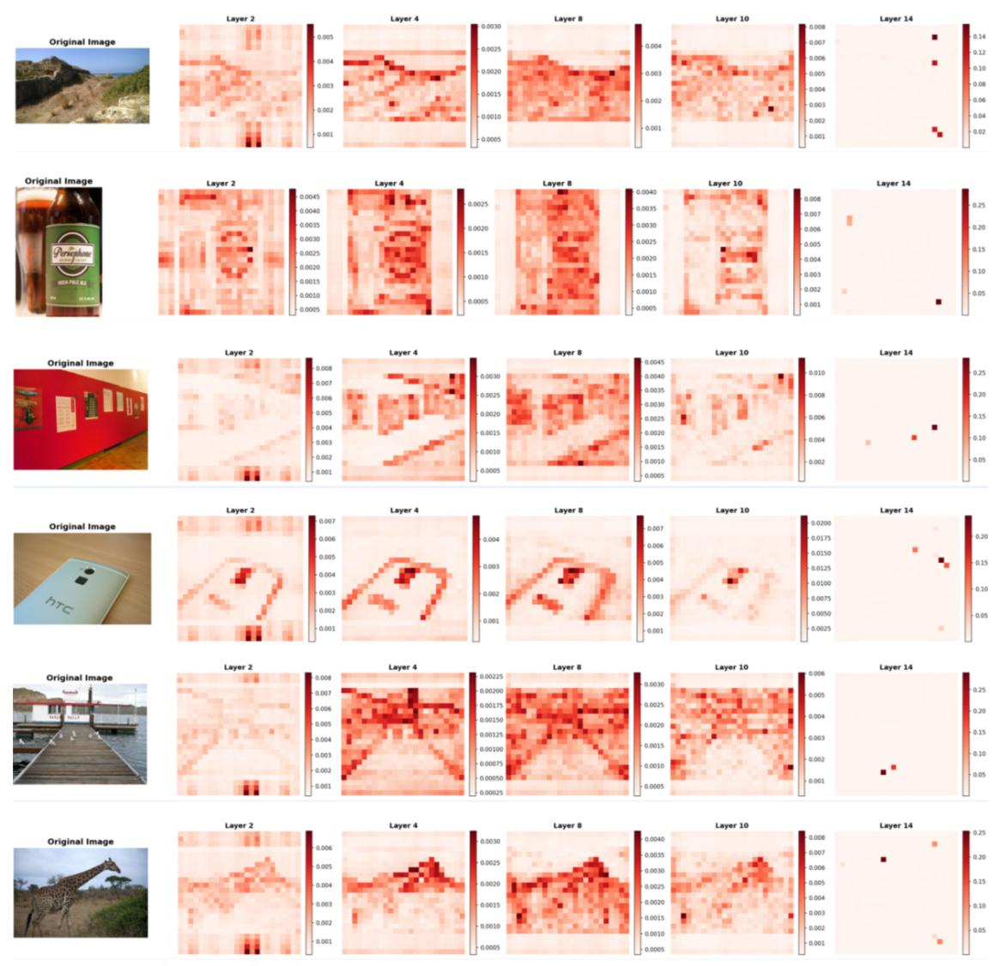  
Figure 8: Additional visualization of attention maps. We display CLS token attention heatmaps for six diverse samples across Layers 2, 4, 8, 10, and 14. The progression reveals a consistent pattern: shallow layers focus on edge contours with noisy distributions; middle layers achieve semantic subject localization; and deep layers converge attention onto hub tokens for abstract aggregation.

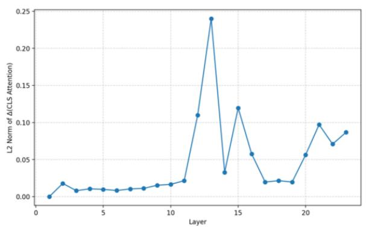

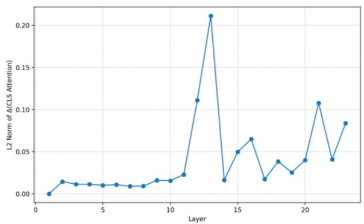

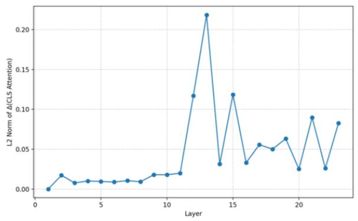

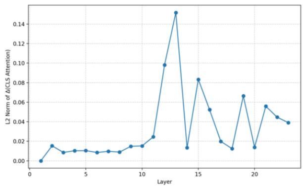

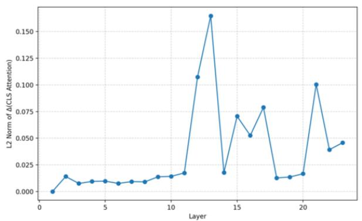

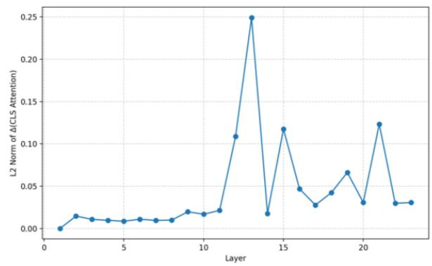  
Figure 9: Visualization of inter-layer semantic changes. We plot the $L _ { 2 }$ norm of attention differences between adjacent layers for six samples. The results consistently show stable, low-magnitude changes during the shallow and intermediate perception stages, contrasting sharply with the significant instability and fluctuations observed in the deep semantic aggregation stages. This pattern is consistent with intermittent semantic evolution in deep layers and motivates stability-aware pruning.