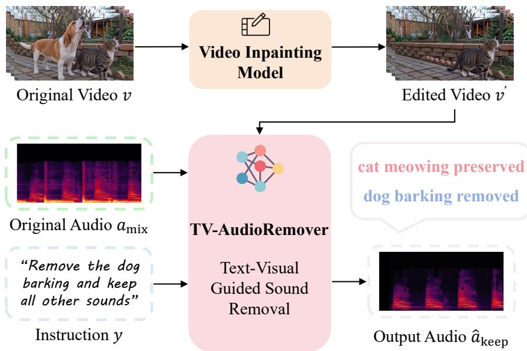
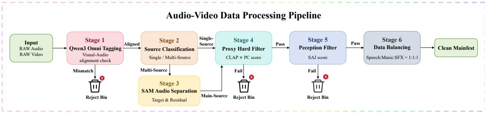
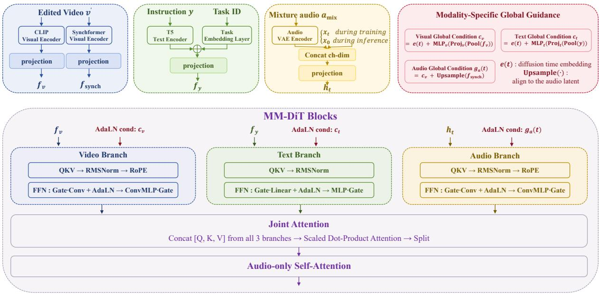
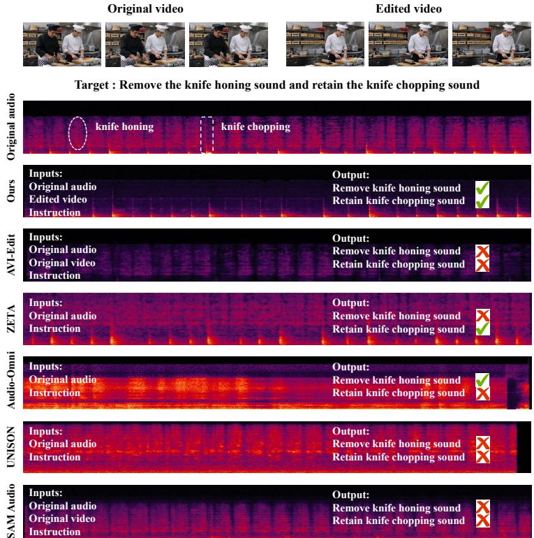

# TV-AudioRemover: Joint Text-Visual Guided Sound Removal with Multi-Task Hard-Mixture Curriculum

Xinyue Guo∗, Jianxuan Yang∗†, Daiguo Zhou∗, Jiagao Hu, Yuxuan Chen, Fei Wang, Jian Luan

MiLM Plus, Xiaomi Inc.

## Abstract

Visual object removal can eliminate a target from video frames, yet its acoustic trace persists in the soundtrack, causing obvious audio-visual inconsistency. Existing video inpainting models operate solely on pixels, while audio editing models, especially for the sound removal task, are typically driven by text and therefore rely on limited single-modal control, which is less efective than multimodal guidance that provides stronger semantic grounding and temporal synchronization cues. In this paper, we present Text-Visual Guided Sound Removal (TV-AudioRemover), a target sound removal framework that leverages the visually edited video together with a natural-language instruction to suppress the sound associated with the removed visual object from the original audio mixture. To acquire high-quality training data, we devise a pipeline to construct a million-scale dataset of single-object audio-visual aligned samples, from which we synthesize mixture-target pairs customized for model training. To efectively leverage visual context and follow instruction intent, we augment the model architecture with task tokens, generalizable instruction modeling, and modality-specific global guidance. We further adopt multi-task training to strengthen task-role comprehension, and employ a hard-mixture curriculum that leverages semantically similar acoustic mixtures during finetuning to enhance fine-grained source discrimination. To support evaluation, we present AV-Remove-Bench, a comprehensive audio-visual object removal benchmark, along with dedicated objective metrics and an MLLM-based evaluation protocol. Experiments demonstrate that our method achieves state-ofthe-art performance on both subjective and objective metrics. Project page: https://yjx-research.github.io/TV-AudioRemover/.

## 1 Introduction

Object removal has become a fundamental operation in modern video editing. Recent video erasers can remove a visible object and synthesize plausible pixels for the uncovered region [1–4]. However, videos are not purely visual signals. A removed person may still speak, a deleted dog may still bark, and an erased vehicle may still leave engine noise in the soundtrack. A common workaround is to mute the entire audio track or regenerate a new soundtrack, but both choices are undesirable. Muting destroys useful background ambience, speech, or music, while full regeneration often changes timing, reverberation, and source identity. A practical system should instead perform selective acoustic erasure: remove only the sound associated with the visually removed target and preserve everything else.

  
Figure 1 Overview of the Text-Visual Guided Target-Sound Removal framework TV-AudioRemover.

There are two main families of models that perform audio editing: audio-visual editing models that jointly modify image and sound under shared control, and audio editing models that edit audio only while taking text, reference audio, or visual queries as multimodal control signals. Although both directions have made rapid progress, they still expose a structural gap for post-removal scenarios. For audio-visual editing models, existing strategies typically either use text instructions to synchronize the editing of visual frames and audio [5–7], or first edit one modality and then use the edited result to guide the other modality [8, 9]. The former fails to fully exploit the inter-modal interactions between image and sound, while the latter can amplify errors introduced by the first-stage edit and makes the editing modules of diferent modalities tightly coupled, which hinders optimizing each modality independently. Furthermore, most existing audio-visual editing models are designed for general editing tasks and are better suited for object replacement rather than removal. For audio-only editing models, the visual signal is either underused—with the model relying mainly on text and the mixed audio [10–12]—or the task is formulated as visual-query-based sound separation [13–15], which does not transfer well to deletion-oriented settings.

To fill this research gap in visual-guided audio editing, we introduce TV-AudioRemover, a sound removal model with multimodal control tailored for audio-visual media requiring sound elimination. As illustrated in Figure 1, given an object-removed edited video, the original mixed audio, and a textual instruction, our model aims to generate the target audio that suppresses undesirable source sounds while fully preserving edit-irrelevant audio components. TV-AudioRemover adopts multimodal difusion Transformer (MM-DiT) [16] as backbone. CLIP [17] and Synchformer [18] extract semantic and temporal synchronization-aware visual features from edited frames, and T5 [19] encodes language instructions. The latent of the original mixed audio is concatenated with the noisy latent to guide the denoising process. Faced with the problems of mapping acoustic components to visual entities and distinguishing mutually exclusive extraction and removal outputs in text-visual-controlled target sound removal, we make improvements in data construction, model architecture and training strategy. In terms of data construction, we first develop a dedicated pipeline to construct a million-scale, high-quality dataset of single-object audio-visual aligned samples. It combines MLLM recognition [20], SAM Audio segmentation, and quality filtering based on CLAP [21] and SAJ scores [22]. Afterwards, we perform audio mixing based on the curated dataset to synthesize mixture-target pairs tailored for the target sound removal task. As for model architecture, we introduce task tokens together with generalized instruction modeling to improve instruction following. To leverage suficient visual information without conflicting with textual features, We employ modality-specific global guidance, where dedicated global conditions are applied to each modal branch. With the above design, the model determines preservable audio content corresponding to retained visual elements and identifies acoustic components to be suppressed for visually removed objects. Meanwhile, textual instructions remain focused on clarifying the editing intent. Regarding the training strategy, we jointly apply two optimization schemes. On one hand, multi-task supervised learning integrates extraction, removal, and joint editing tasks. It enhances the model’s awareness of task boundaries and target sound source localization, enabling the model to diferentiate audio preservation and suppression. On the other hand, we adopt a two-stage curriculum learning framework. The pre-training stage utilizes semantically distant mixtures for the model to preliminarily acquire audio elimination capability, while the fine-tuning stage leverages hard mixtures with similar semantic and acoustic features to boost fine-grained source discrimination. For evaluation, we construct AV-Remove-Bench, the first audio-visual target removal benchmark with rich scene diversity and broad acoustic coverage. This benchmark consists of samples spanning public data, synthetic data and recorded real-world data, covering speech, music and sound efects. Furthermore, based on this dataset, we propose a comprehensive set of objective metrics as well as an MLLM-based evaluation protocol for the sound removal task. Finally, We compare our method against a variety of audio editing baselines. Experimental results demonstrate that TV-AudioRemover achieves state-of-the-art performance on both subjective and objective metrics.

In summary, our main contributions are as follows:

• A high-quality data construction pipeline. It generates million-scale single-object audio-video aligned samples and synthesizes task-specific mixture-target pairs for target removal from these samples.

• A modality-decoupled audio editing architecture. With task tokens and global modal guidance, the model efectively distinguishes preservable and suppressible audio under joint visual-textual conditions.

• A multi-task curriculum training strategy. Combined multi-task supervision and two-stage curriculum learning enhances task understanding and fine-grained acoustic discrimination capacity.

• AV-Remove-Bench, the first audio-visual target removal benchmark with comprehensive scene diversity and broad acoustic coverage, equipped with dedicated objective metrics and an MLLM-based evaluation protocol.

## 2 Related Work

## 2.1 Video Object Removal

Video object removal aims to erase target objects and fill the revealed region with temporally coherent content. ROSE constructs synthetic object-efect pairs and uses difusion Transformers to remove objects together with shadows, reflections, and illumination efects [1]. EfectErase and UnderEraser further emphasize object-induced side efects and scene understanding [2, 3]. SVOR studies stable video object removal under imperfect real-world conditions such as mask drops and abrupt motion [4]. Existing literature demonstrates that video object removal techniques have achieved remarkable maturity. While these methods yield visually plausible videos, they leave the original audio track untouched. In practical editing scenarios, however, users expect erased objects to disappear across both modalities. Accordingly, integrating an audio editing model upon video object removal brings substantial practical value.

## 2.2 Audio Editing

Text-guided audio editing modifies an input waveform according to natural language. Trainingfree difusion editing methods include inversion-based approaches such as ZETA and AudioEditor, which invert the input audio into the difusion trajectory for prompt-based editing [23, 24], as well as inversion-free approaches such as DirectAudioEdit and AudioMorphix [25, 26]. Meanwhile, unified audio models such as Audio-Omni, UNISON and AudioWeave support editing across multiple audio tasks [27–29]. These models take only text and mixed audio as inputs, without leveraging any visual cues. Several models leverage visual conditions for audio manipulation, such as OmniSep, MMAudioSep and SAM Audio. Nevertheless, these are sound extraction models designed for source separation driven by multimodal queries, and they are not tailored for target removal. Specifically, most source separation systems are optimized for extraction tasks: the query specifies the sound source to retain, and the output preserves that target source. By contrast, removal tasks require the query to describe what should be excluded from the output.

## 2.3 Audio-Visual Editing

The first category of audio-visual editing methods modifies audio and visual content under shared instruction control. AVEdit [30] uses text instructions to adapt paired image and audio events; Object-AVEdit [31] moves this idea toward object-level manipulation, while InstructAV2AV and JAVEdit further study instruction-following joint audio-video editing at broader task levels [32, 33]. These methods do not fully exploit multimodal interactions, and they perform less well on dedicated tasks such as audio-visual removal, being more suited to target replacement—for example, swapping a cat for a dog while preserving the original object region and audio timing, where only the object category changes within a fixed spatial extent—or human-centric editing tasks. The second category edits one modality first and then uses the edited result to guide the other modality. AVI-Edit uses an audio agent and audio-synchronized cues to guide instancelevel video editing with mask refinement. Although such cascaded architectures perform audio and video editing separately, each module is tightly coupled and cannot be replaced. Errors introduced by the first-stage audio agent propagate to subsequent stages, and this audio agent is not optimizable. In another case, CAVE leverages edited videos to guide the audio generation process, yet it merely supports limited audio style transfer and lacks native capability for visualobject-based sound removal. Unlike the aforementioned approaches, TV-AudioRemover is designed as a plug-and-play downstream audio remover that accepts outputs from from arbitrary visual object removal methods. This decoupled formulation facilitates reusing powerful visual removal models, isolating failure sources, and optimizing the audio module alone.

In addition, Open-source benchmarks for audio-visual removal remain scarce in terms of both data volume and category diversity. For instance, JAVEditBench proposed in JAVEdit only contains 25 audio-visual removal test samples, all of which are human-centric.

  
Figure 2 Data processing pipeline for constructing single-object audio-visual aligned samples.

## 3 Method

As shown in Figure 1, given edited video $\mathbf { v } ^ { \prime }$ obtained via a video inpainting model, the original mixed audio $\mathbf { a } _ { \mathrm { m i x } } ,$ , and an instruction y, TV-AudioRemover generates $\hat { \mathbf { a } } _ { \mathrm { k e e p } }$ that removes the target sound while preserving the remaining audio. The details of the dataset construction, model architecture, training strategy and evaluation benchmark are elaborated below.

## 3.1 Data Construction

To acquire high-quality task-specific training data, we construct a million-scale dataset of singleobject audio-visual aligned samples. The data processing pipeline is shown in Figure 2. The raw corpus combines audio-visual samples from video datasets, including VGGSound [34], AudioSet [35], and ACAVCaps[36], with audio-only samples from WavCaps1 [37] and self-collected high-quality audio resources. Qwen3-Omni [20] is used to annotate each candidate with structured information, including scene type, source multiplicity, sound category, and the main soundingobject label; for video candidates, it further checks whether the dominant sound source is visually present as the main object. Candidates that fail this audio-visual correspondence check are rejected, and the remaining aligned samples are divided into single-source and multi-source cases. Single-source samples are directly sent to quality filtering, while multi-source samples are processed by SAM Audio to separate the source corresponding to the main visual object for audio-visual data, or the dominant sound source for audio-only data. Finally, we apply a proxy hard filter based on CLAP and PC scores [38], a perceptual filter based on SAJ, and category balancing over speech, music, and sound efects to obtain the clean manifest. The Qwen3-Omni tagging protocol and filtering thresholds are detailed in Appendix section 6.1.

Based on the curated single-object aligned samples, we synthesize task-specific mixture-target pairs for model training. For each clean sample �, we sample semantically diferent interference clips � and optionally �, apply random temporal cropping and signal-to-noise-ratio scaling to the interference sources, and mix them with � to form both two-source mixtures for basic role supervision and three-source mixtures for more complex multi-source scenes. This gives rise to three edit modes:

$$
\begin{array} { r l } & { \mathrm { e x t r a c t : } \quad \mathbf { a } _ { \mathrm { m i x } } = \mathbf { A } + \mathbf { B } ( + \mathbf { C } ) , \quad \mathbf { a } _ { \mathrm { t a r } } = \mathbf { A } , } \\ & { \mathrm { d e l e t e : } \quad \mathbf { a } _ { \mathrm { m i x } } = \mathbf { A } + \mathbf { B } ( + \mathbf { C } ) , \quad \mathbf { a } _ { \mathrm { t a r } } = \mathbf { A } ( + \mathbf { C } ) , } \\ & { \mathrm { b o t h : } \quad \mathbf { a } _ { \mathrm { m i x } } = \mathbf { A } + \mathbf { B } , \quad \mathbf { a } _ { \mathrm { t a r } } = \mathbf { A } . } \end{array}\tag{1}
$$

For audio-visual samples, the visual condition is usually taken from the source sample $A ;$ in the three-source delete case, where the target output becomes $A + C ,$ the implementation masks the

  
Figure 3 Architecture of the TV-AudioRemover multimodal difusion Transformer.

visual condition to avoid providing a cue that only corresponds to part of the preserved output.   
Audio-only samples use empty visual features by default.

## 3.2 Model Architecture

TV-AudioRemover follows a latent flow-matching formulation, with the internal architecture illustrated in Figure 3. During training, we sample the target latent as $\mathbf { x } _ { 1 }$ and the mixture latent as $\mathbf { X _ { \mathrm { { c o n d } } } } ^ { 2 }$ , normalize both latents, and construct the noisy state $\mathbf { X } _ { t }$ between Gaussian noise x0 and $\mathbf { x } _ { 1 }$ . The current noisy latent and the mixture latent are then concatenated along the channel dimension before audio input projection:

$$
{ \bf x } _ { t } = ( 1 - t ) { \bf x } _ { 0 } + t { \bf x } _ { 1 } , ~ { \bf h } _ { t } = \mathrm { P r o j } _ { \mathrm { a u d i o } } \big ( [ { \bf x } _ { t } , { \bf x } _ { \mathrm { c o n d } } ] \big ) ,\tag{2}
$$

where [·, ·] denotes channel-wise concatenation. The denoising network takes $\mathbf { h } _ { t }$ as the audio input and predicts the flow toward $\mathbf { x } _ { 1 }$ conditioned on edited video, instruction, and $\mathbf { x } _ { \mathrm { c o n d } } ;$ at inference, $\mathbf { X } _ { \mathrm { c o n d } }$ is concatenated with the current denoising latent at each step.

In parallel, visual and textual features are projected into the Transformer hidden space and interact with the audio branch via MM-DiT blocks, where visual cues mark the sound sources to retain, textual instructions specify the intended operation, and the source mixture supplies acoustic materials for reconstruction. On top of this design, the architecture introduces three key modifications: (1) Task tokens. For the three edit modes � ∈ {ext, del, both}, we encode their task ids as $q _ { m } \in \{ 0 , 1 , 2 \}$ and map them to task embeddings ${ \bf e } _ { m } = \mathrm { E m b } _ { \mathrm { t a s k } } ( q _ { m } )$ . The embedding is added to the encoded instruction features, i.e., $\mathbf { f } _ { y } = E _ { \mathrm { t x t } } ( \mathbf { y } ) + \mathbf { e } _ { m }$ , so that the instruction condition explicitly carries the designated task role. (2) Generalized instruction modeling. We diversify instructions across task types and language forms: extraction, deletion, and combined preserveremove commands are each described by multiple natural-language templates. This helps the model learn complementary acoustic roles, improves robustness to linguistic variation, and reduces prompt-pattern overfitting. Representative examples and the complete template set are provided in Appendix section 6.2. (3) Modality-specific global guidance. Visual and textual features are projected into separate global conditions, and the audio branch is modulated by the visual condition together with difusion-time and synchronization cues:

$$
\begin{array} { r l } & { \mathbf { c } _ { \nu } = \mathbf { e } ( t ) + \mathbf { M L P } _ { \nu } \big ( \mathbf { P r o j } _ { \nu } \big ( \mathbf { P o o l } ( \mathbf { f } _ { \nu } ) \big ) \big ) , } \\ & { \mathbf { c } _ { t } = \mathbf { e } ( t ) + \mathbf { M L P } _ { t } \big ( \mathbf { P r o j } _ { t } \big ( \mathbf { P o o l } ( \mathbf { f } _ { y } ) \big ) \big ) , } \\ & { \mathbf { g } _ { a } ( t ) = \mathbf { c } _ { \nu } + \mathbf { U p } ( \mathbf { f } _ { \mathrm { s y n c h } } ) . } \end{array}\tag{3}
$$

where e(�) is the difusion-time embedding, $\mathbf { f } _ { \mathrm { s y n c h } }$ denotes synchronization-aware visual features, and Up(·) aligns them to the audio-latent length. The visual branch is conditioned on $\mathbf { c } _ { \nu } .$ the audio denoising branch is guided by ${ \pmb g } _ { a } ( t )$ , and the instruction branch receives $\mathbf { c } _ { t }$ . Notably, the audio branch uses visual rather than textual global modulation, since the edited video provides a positive global cue about the desired visual-acoustic state, whereas text may specify either preservation or removal.

## 3.3 Training Strategy

The training strategy consists of two components: multi-task learning across complementary edit modes, and a two-stage hard-mixture curriculum built upon source pairs of two distinct dificulty levels. For multi-task learning, each batch randomly samples from source extraction, source deletion, and joint editing modes. The extraction task is not introduced mainly for standalone extraction, but to strengthen target-source localization, condition alignment between visual cues and acoustic sources, and the distinction between positive preservation and negative suppression. Training only with deletion samples and instructions can both overfit to specific prompt patterns and cause over-removal. For the two-stage hard-mixture curriculum, training proceeds from easy to hard mixtures. In the pre-training stage, the interference sources � and � mixed with source � are selected as semantic-far samples, requiring diferent labels from � and T5-based label similarity below a preset threshold. During fine-tuning, we instead sample hard pairs, such as male versus female voices or timbre-similar instruments, to enhance fine-grained and attribute-level discrimination. Signal-to-noise ratios are also varied so that the model handles both dominant and subtle targets. The advantages of multi-task training and sample construction details are discussed in Appendix section 6.3.

We further use modality-wise classifier-free training with mutually exclusive dropout masks: both visual and text conditions are dropped with probability 0.05, only visual conditions with probability 0.15, and only text conditions with probability 0.05; when text is dropped, the task id is also masked. This enables a unified model to operate under visual-only, text-only, and joint visual-text conditioning. Given conditions $C = \{ \mathbf { f } _ { \nu } , \mathbf { f } _ { \mathrm { s y n c h } } , \mathbf { f } _ { y } , { \mathbf { x } } _ { \mathrm { c o n d } } \}$ , the network $F _ { \theta }$ predicts the latent velocity field from noise $\mathbf { x } _ { 0 }$ to target audio latent $\mathbf { x } _ { 1 }$ . The flow-matching objective is

$$
\mathcal { L } _ { \mathrm { f m } } = \mathbb { E } _ { t , { \mathbf { x } _ { 0 } } , { \mathbf { x } _ { 1 } } } \left[ \| F _ { \theta } ( \mathbf { x } _ { t } , t , C ) - ( { \mathbf { x } _ { 1 } } - { \mathbf { x } _ { 0 } } ) \| _ { 2 } ^ { 2 } \right] .\tag{4}
$$

At inference, classifier-free guidance compares conditional predictions with an unconditional branch that masks visual-text cues but keeps $\mathbf { X } _ { \mathrm { c o n d } }$ , so guidance adjusts the editing intent without removing access to the source-audio reconstruction prior.

## 3.4 AV-Remove-Bench

To support evaluation, we present AV-Remove-Bench, a comprehensive audio-visual object removal benchmark with 77 samples. All samples are audio-visual clips of about six seconds, covering speech, music, and sound efects from three sources: public datasets, including MUSIC-AVQA3 [39] for music, AVSpeech [40] for speech, and Condensed Movies [41], AVSBench4 [42], and VGGSound-test for sound efects; Seedance 2.0 [43] generated videos with prompts spanning the same three audio categories; and real recordings of sound-efect-centric daily scenes. Each sample falls into either a multi-sounding-object setting or a foreground-target-plus-stable-background setting, and the goal is to remove a specified sounding object from both the visual and audio streams. The benchmark design is detailed in Appendix section 6.4. To thoroughly evaluate sound removal performance, we combine two proposed objective metrics, Target Source Suppression Ratio (TSSR) and Preserved Source Fidelity (PSF), with established evaluation metrics described in the experimental section, assessing both target-source suppression and non-target sound preservation.

TSSR and PSF are computed using an AST audio classifier [44], which predicts event-level confidence scores for the queried source categories from the original and edited audio. Let $P _ { A , \mathrm { r } }$ and $P _ { B , \mathrm { r } }$ denote the confidence of the target-to-remove in the original audio � and edited audio $B ,$ and let $P _ { A , \mathrm { k } }$ and $P _ { B , { \mathrm k } }$ denote the confidence of the source to be preserved. TSSR measures the relative confidence drop of the removed source:

$$
\mathrm { T S S R } = \frac { P _ { A , \mathrm { r } } - P _ { B , \mathrm { r } } } { P _ { A , \mathrm { r } } } , \quad P _ { A , \mathrm { r } } > \epsilon .\tag{5}
$$

When $P _ { A , \mathrm { r } } \leq \epsilon ,$ the original audio barely contains the target source, so TSSR is undefined. Larger TSSR indicates stronger suppression. For preservation, PSF penalizes confidence drops but allows a bounded bonus when denoising improves the preserved source:

$$
\begin{array} { r } { \mathrm { P S F } = \left\{ \begin{array} { l l } { 1 - ( P _ { A , \mathrm { k } } - P _ { B , \mathrm { k } } ) , } & { P _ { B , \mathrm { k } } < P _ { A , \mathrm { k } } , } \\ { 1 + \operatorname* { m i n } ( P _ { B , \mathrm { k } } - P _ { A , \mathrm { k } } , \gamma ) , } & { P _ { B , \mathrm { k } } \geq P _ { A , \mathrm { k } } , } \end{array} \right. } \end{array}\tag{6}
$$

where $\gamma = 0 . 5$ limits score drift. Higher PSF indicates better preservation of the non-target source.

In addition, we use Gemini 2.5 Pro [45] as a multimodal judge to approximate human subjective perception. Although our main focus is audio editing after visual removal, the evaluation also checks the visual edit because sound removal quality partly depends on the upstream inpainting result. Specifically, Gemini assigns 1–5 scores to four aspects: visual target removal, video fidelity, audio instruction compliance, and preserved-audio fidelity. For video, it compares the original and edited videos with the removal instruction and, when available, the object mask; for audio, it compares the original and edited audio tracks to assess both target-sound suppression and the fidelity of preserved sounds. The detailed Gemini scoring criteria are provided in Appendix section 6.5.

## 4 Experiments

## 4.1 Experimental Setup

Datasets and implementation details. Training uses the curated single-object aligned corpus described in the Data Construction section. Each training clip is 8 seconds long. The pre-training split contains about 1.11M general clips, including 602.9K audio-visual clips and 511.2K audioonly clips; the fine-tuning split contains 5.65K hard clips with an approximately 1:1 ratio of audio-visual to audio-only data. We synthesize mixture-target pairs online rather than storing fixed mixtures, and train extraction, deletion, and preserve-remove modes with probabilities 0.4, $0 . 4 ,$ and 0.2, respectively. We use a 44 kHz audio sampling rate and perform flow-matching inference with Euler sampling for 25 denoising steps. Optimization uses AdamW with weight decay $1 0 ^ { - 6 }$ and gradient clipping at 1.0; pre-training runs for 350k iterations with learning rate $1 0 ^ { - 4 }$ and step decay, and fine-tuning runs for 80k iterations from the pre-trained checkpoint with learning rate $2 \times 1 0 ^ { - 6 }$ . Evaluation is conducted on the AV-Remove-Bench introduced before.

Baselines. We compare against three groups of systems. The first group consists of the joint audio-visual edit models AVI-Edit and InstructAV2AV, used to evaluate sound removal under an end-to-end audio-visual setting. The second group consists of pure text-guided audio editing models that do not use visual conditions, including ZETA, Audio-Omni, and UNISON; together, they cover inversion-based, instruction-guided, and LLM-guided audio editing paradigms. The third group is SAM Audio, a video- and text-controlled audio extraction model similar to our task. For evaluations of SAM Audio, we reformulate removal as extracting the sources to keep for multi-sounding-object cases; for foreground-target-plus-background cases, we reformulate it as extracting the source to remove and adopt the residual branch for output. For fair comparison, we set reranking-candidates to 1 during SAM-Audio inference. This means each sample undergoes a single inference pass instead of multiple runs to select the best candidate, maintaining consistency with other models. We use the best oficial versions of these open-source SOTA models for inference under identical experimental conditions. Furthermore, we perform comprehensive comparisons with the commercial audio-video editing model, including Seedance 2.0, Seedance 2.5 and MiniMax H3, and demonstrate the superiority of our method. Complete experimental results are available in Appendix section 6.6. Since TV-AudioRemover takes the edited video as input, we also evaluate how upstream visual removal afects the final result by pairing TV-AudioRemover with EfectErase, ROSE, UnderEraser, and SVOR, and report the best-performing visual-removal pairing.

Objective metrics. Because most evaluation samples do not provide reference target-removed audio, reference-based separation metrics such as SDR are not applicable. We therefore evaluate sound removal with both model-based metrics and MLLM-based judging. For model-based metrics, IS measures audio quality and diversity using a pre-trained audio classifier PANNs [46], SAJ Overall measures perceptual separation quality, while IB-AV and DeSync measure audio-visual consistency, where IB-AV evaluates semantic audio-visual alignment with ImageBind [47] and DeSync estimates temporal ofset with Synchformer. TSSR and PSF are the two removal-specific metrics, together with MLLM-based metrics Instruction Compliance� and $\mathrm { F i d e l i t y } _ { a } ,$ are proposed in the AV-Remove-Bench section. Detailed computation protocols are provided in Appendix section 6.7. Furthermore, we report the number of parameters and average runtime for each model. For ZETA, we adopt AudioLDM2-Large as its backbone when counting parameters. For Audio-Omni, only the parameters of its trainable DiT generation backbone are counted.

Subjective metrics. We further conduct human listening evaluation on the same benchmark. The scores are provided by 10 raters with professional audio-editing experience, and the model identities are blinded during scoring. Raters score each output on a three-level scale {0, 0.5, 1} along four dimensions: target-removal completeness, background preservation, temporal naturalness, and overall listening quality. The first dimension checks whether the unwanted sound is still audible; the second checks whether non-target sources are weakened or accidentally removed; the third penalizes discontinuities, unstable loudness, and unnatural transitions; and the last evaluates the overall audio quality and whether the output retains meaningful audio content.

<table><tr><td>Group Method</td><td></td><td colspan="6">Audio metrics</td><td colspan="2">Audio-visual metrics</td><td colspan="2">Efficiency</td></tr><tr><td></td><td></td><td>IS↑</td><td>SAJ Overall ↑</td><td>TSSR ↑</td><td>PSF↑</td><td>Instr. Comp.a↑</td><td>Fidelitya↑</td><td>IB-AV ↑</td><td>DeSync ↓</td><td>Params</td><td>Times (s) ↓</td></tr><tr><td rowspan="2">T-AV</td><td>AVI-Edit</td><td>3.16</td><td>2.24</td><td>0.260</td><td>0.958</td><td>3.56</td><td>2.57</td><td>19.22</td><td>0.77</td><td>7.24B</td><td>255.89</td></tr><tr><td>InstructAV2AV</td><td>3.45</td><td>2.60</td><td>-0.288</td><td>0.986</td><td>2.65</td><td>3.04</td><td>14.81</td><td>0.76</td><td>15.63B</td><td>299.55</td></tr><tr><td rowspan="2">T-A</td><td>ZETA</td><td>3.27</td><td>2.95</td><td>0.571</td><td>1.054</td><td>3.69</td><td>3.22</td><td>18.71</td><td>0.75</td><td>1.5B</td><td>86.98</td></tr><tr><td>Audio-Omni</td><td>2.15</td><td>2.20</td><td>0.496</td><td>0.901</td><td>4.39</td><td>1.68</td><td>8.23</td><td>1.13</td><td>3.05B</td><td>6.18</td></tr><tr><td></td><td>UNISON</td><td>3.63</td><td>2.77</td><td>-0.239</td><td>0.999</td><td>4.27</td><td>3.44</td><td>18.00</td><td>0.78</td><td>731.71M</td><td>5.82</td></tr><tr><td>VT-A</td><td>SAM Audio</td><td>3.23</td><td>2.42</td><td>0.354</td><td>1.007</td><td>3.70</td><td>3.90</td><td>17.89</td><td>0.93</td><td>3.72B</td><td>1.94</td></tr><tr><td>Ours</td><td>TV-AudioRemover</td><td>3.55</td><td>3.46</td><td>0.635</td><td>1.079</td><td>4.79</td><td>3.96</td><td>27.32</td><td>0.60</td><td>1.04B</td><td>2.07</td></tr></table>

Table 1 Objective evaluation on the AV-Remove Bench. Best results are shown in bold and second-best results are underlined.
<table><tr><td colspan="7">Human subjective scores</td></tr><tr><td>Method</td><td>Target Remove Com. ↑ Background Pre. ↑ Temporal Natura. ↑ Overall Qua. ↑</td><td></td><td></td><td></td><td>AC ↑</td><td>ASR ↑</td></tr><tr><td>AVI-Edit</td><td>0.51</td><td>0.32</td><td>0.35</td><td>0.35</td><td>39.37</td><td>21.43%</td></tr><tr><td>InstructAV2AV</td><td>0.38</td><td>0.43</td><td>0.28</td><td>0.31</td><td>37.20</td><td>18.86%</td></tr><tr><td>ZETA</td><td>0.42</td><td>0.63</td><td>0.55</td><td>0.55</td><td>53.36</td><td>36.69%</td></tr><tr><td>Audio-Omni</td><td>0.48</td><td>0.24</td><td>0.20</td><td>0.19</td><td>30.75</td><td>11.69%</td></tr><tr><td>UNISON</td><td>0.65</td><td>0.60</td><td>0.60</td><td>0.62</td><td>62.00</td><td>49.35%</td></tr><tr><td>SAM Audio</td><td>0.86</td><td>0.83</td><td>0.89</td><td>0.88</td><td>85.72</td><td>81.58%</td></tr><tr><td>TV-AudioRemover</td><td>0.98</td><td>0.89</td><td>0.94</td><td>0.95</td><td>93.80</td><td>97.40%</td></tr></table>

Table 2 Human subjective scores on the AV-Remove-Bench.

## 4.2 Objective Results

Table 1 shows the objective results. For audio-editing-only methods, the IB-AV and DeSync metrics are computed by pairing their sound-removal outputs with edited videos produced by SVOR, the best-performing visual remover. Evaluations of all tested visual removal models are reported in Appendix section 6.8. For PSF, we only compute the cases where the original audio contains two sounding objects, so that the source to be preserved can be described by a single label. Pure audio editing models show diferent strengths but remain unbalanced for removal. Although UNISON achieves the highest IS metric, which reflects general audio quality, it yields a low TSSR and PSF, indicating limited suppression of target sound sources and limited preservation of non-target sound. This phenomenon arises because the model retains a large portion of the original input mixture, leading to an inflated IS score. Audio-Omni obtains moderate instruction compliance, but its low Fidelity reveals that the model incurs substantial damage to the preserved audio when performing target sound removal. SAM Audio achieves high audio fidelity and relatively competitive overall performance. However, comprehensive comparisons against our model reveal that an extraction-oriented model is not directly optimized for sound deletion and residual source preservation. Lastly, Joint audio-visual editing models including AVI-Edit and InstructAV2AV achieve poor performance on the sound removal task. TV-AudioRemover achieves the best TSSR, PSF, Instruction Compliance�, and Fidelity�, demonstrating stronger target suppression while preserving non-target sources. It also obtains the best IB-AV and DeSync scores, indicating that the edited audio is more semantically and temporally consistent with the edited video. For a better comparison, the visualization results are shown in Figure 4.

## 4.3 Subjective Results

Table 2 presents human listening scores. Here, Target Remove Com. (TRC), Background Pre. (BP), Temporal Natura. (TN), and Overall Qua. (OQ) denote target removal completeness, background preservation, temporal naturalness, and overall quality, respectively. AC denotes the audio composite score, computed as (0.35×TRC +0.35×BP +0.15×TN +0.15×OQ) × 100, and ASR denotes the audio success rate, i.e., the fraction of samples whose four human scores are all non-zero. In the human evaluation, TV-AudioRemover ranks first on all reported metrics. Against SAM Audio, a strong video-text baseline, TV-AudioRemover gains 13.8% on TRC, 7.3% on BP, 6.0% on TN, 7.5% on OQ, 9.4% on AC, and 19.4% on ASR, highlighting the benefit of task-specific tuning for removal. Compared with strong text-guided audio editing baselines such as UNISON, TV-AudioRemover further improves all metrics, showing that visual conditioning enhances source identification and preserves scene-consistent non-target sounds.

  
Figure 4 Qualitative comparison of diferent sound removal methods.

## 4.4 Ablation

Tables 3 summarizes the ablation results on three aspects. First, the training-strategy ablation shows that two-stage training is crucial for removal quality. Compared with single-stage training, the two-stage variant improves all metrics and is especially beneficial for target suppression. This is likely because pre-training builds general sound removal ability, while fine-tuning sharpens finegrained source discrimination. Second, the multi-task training strategy outperforms single-task training across all evaluation metrics. Multi-task training achieves higher SAJ, TSSR, PSF and IB-AV scores while yielding a lower DeSync value, which demonstrates that joint optimization of multiple related tasks efectively boosts all performance metrics of TV-AudioRemover for sound removal tasks. Third, the input-modality ablation shows that text remains a strong control signal, while visual information provides complementary grounding. Text-only conditioning yields the same SAJ Overall score as the full model and only slightly lower TSSR and PSF, suggesting that linguistic instructions already specify most removal targets. However, when the model struggles to interpret the instructions, the visual stream supplies additional semantic and temporal cues, as evidenced by the higher IB-AV and lower DeSync under joint visual-text conditioning. Under visual-only conditioning, TSSR decreases substantially. The model still succeeds on a considerable subset of samples, indicating that visual information can guide source removal but cannot deliver precise editing without textual task intent. Overall, joint visual-text conditioning achieves the best performance across all metrics. Fourth, the upstream-visual-remover ablation further reveals that sound removal quality relies on the edited video adopted for visual guidance. When SVOR serves as the upstream visual-removal module, TV-AudioRemover attains optimal results on all metrics. These trends indicate that higher-quality visual removal produces cleaner, temporally consistent visual conditions to facilitate sound removal.

<table><tr><td colspan="5">Setting SAJ ↑ TSSR↑PSF ↑IB-AV↑ DeSync ↓</td></tr><tr><td>Training strategy Single-stage Two-stage</td><td>3.22 3.46</td><td>0.48 0.64</td><td>1.05 25.17 1.08 27.32</td><td>0.62 0.60</td></tr><tr><td>Training task Single-task Multi-task</td><td>3.11 0.52 3.46 0.64</td><td>1.04 1.08</td><td>26.90 27.32</td><td>0.69 0.60</td></tr><tr><td colspan="5">Input modalities Text only 3.46 0.63 1.07 25.02 Visual only 2.97 -0.36 1.03 26.72 Visual + Text 3.46 0.64 1.08 27.32</td></tr><tr><td colspan="5">Upstream visual removers 1.07 26.07</td></tr><tr><td>ROSE 3.29 3.22</td><td colspan="3">0.63 0.55 1.07 3.23 0.58</td><td rowspan="2">0.77 24.21 0.89</td></tr><tr><td colspan="5">EffectErase</td></tr><tr><td>UnderEraser SVOR</td><td>3.46 0.64</td><td>1.07 1.08</td><td>26.12 27.32</td><td>0.75 0.60</td></tr></table>

Table 3 Ablation studies of TV-AudioRemover including training strategy, input modalities and upstream visual removers.

## 5 Conclusion

In this paper, we propose TV-AudioRemover, a target sound removal system tailored for audiovisual media requiring sound elimination. To support this task, we construct a million-scale corpus of single-object audio-visual aligned samples, and further introduce AV-Remove-Bench for evaluation. Built on a MM-DiT-based audio editing architecture with task tokens and global modal guidance, and trained with a multi-task two-stage curriculum, TV-AudioRemover better distinguishes preservable from suppressible audio under joint visual-text conditions. Experiments show that the proposed system achieves state-of-the-art performance on both objective and subjective metrics across audio-visual joint editing models and audio-editing models, demonstrating the efectiveness of our data construction, model design, and training strategy in target sound removal.

## References

[1] C. Miao, Y. Feng, J. Zeng, Z. Gao, H. Liu, Y. Yan, D. Qi, X. Chen, B. Wang, and H. Zhao, “Rose: Remove objects with side efects in videos,” Advances in Neural Information Processing Systems, vol. 38, pp. 149 140–149 162, 2026.

[2] Y. Fu, Y. Zheng, Z. Dai, and H. Ding, “EfectErase: Joint video object removal and insertion for high-quality efect erasing,” in Proceedings of the IEEE/CVF Conference on Computer Vision and Pattern Recognition (CVPR), 2026.

[3] D. Liu, W. Wang, C. Li, and J. Lyu, “From understanding to erasing: Towards complete and stable video object removal,” arXiv preprint arXiv:2604.01693, 2026.

[4] J. Hu, Y. Chen, F. Li, Z. Wang, F. Wang, D. Zhou, and J. Luan, “From ideal to real: Stable video object removal under imperfect conditions,” arXiv preprint arXiv:2603.09283, 2026.

[5] Y.-B. Lin, K. Lin, Z. Yang, L. Li, J. Wang, C.-C. Lin, X. Wang, G. Bertasius, and L. Wang, “Zero-shot audio-visual editing via cross-modal delta denoising,” in 2026 IEEE/CVF Winter Conference on Applications of Computer Vision (WACV). IEEE, 2026, pp. 7344–7354.

[6] W. Xu, K. J. Cheng, K. Saito, M. J. Mirza, T. Li, Y. Liu, A. H. Liu, L. Wang, M. Ishii, T. Shibuya et al., “Schrodinger audio-visual editor: Object-level audiovisual removal,” arXiv preprint arXiv:2512.12875, 2025.

[7] S. Liang, C. Wang, F. Guan, Z. Yu, Y. Lu, Y. Wang, Y. Zhou, X. Li, and Z. Chen, “Spongebob: Sync-aware harmonious audio-visual generative editing,” arXiv preprint arXiv:2605.25193, 2026.

[8] H. Zheng, S. Weng, J. Liu, S. Yang, B. Shi, and X. Wang, “Avi-edit: Audio-sync video instance editing with granularity-aware mask refiner,” in Proceedings of the IEEE/CVF Conference on Computer Vision and Pattern Recognition, 2026, pp. 23 150–23 160.

[9] M. Ishii, A. Hayakawa, T. Shibuya, and Y. Mitsufuji, “Coherent audio-visual editing via conditional audio generation following video edits,” arXiv preprint arXiv:2512.07209, 2025.

[10] Y. Wang, Z. Ju, X. Tan, L. He, Z. Wu, J. Bian et al., “Audit: Audio editing by following instructions with latent difusion models,” Advances in Neural Information Processing Systems, vol. 36, pp. 71 340–71 357, 2023.

[11] M. Ungersböck, F. Grötschla, L. Lanzendörfer, J. Y. Yi, C. Choi, and R. Wattenhofer, “Saoinstruct: Free-form audio editing using natural language instructions,” Advances in Neural Information Processing Systems, vol. 38, pp. 83 411–83 437, 2026.

[12] Y. Tao, W. Wu, C. Zhang, M. Wu, S. Wang, and X. Xu, “Mmedit: A unified framework for multi-type audio editing via audio language model,” arXiv preprint arXiv:2512.20339, 2025.

[13] X. Cheng, S. Zheng, M. Fang, Z. Zhang, R. Huang, S. Ji, J. Zuo, T. Jin, Z. Zhao et al., “Omnisep: Unified omni-modality sound separation with query-mixup,” in International Conference on Learning Representations, vol. 2025, 2025, pp. 55 196–55 213.

[14] A. Takahashi, S. Takahashi, and Y. Mitsufuji, “Mmaudiosep: Taming video-to-audio generative model towards video/text-queried sound separation,” in ICASSP 2026-2026 IEEE International Conference on Acoustics, Speech and Signal Processing (ICASSP). IEEE, 2026, pp. 15 667–15 671.

[15] B. Shi, A. Tjandra, J. Hofman, H. Wang, Y.-C. Wu, L. Gao, J. Richter, M. Le, A. Vyas, S. Chen et al., “Sam audio: Segment anything in audio,” arXiv preprint arXiv:2512.18099, 2025.

[16] W. Peebles and S. Xie, “Scalable difusion models with transformers,” in Proceedings of the IEEE/CVF international conference on computer vision, 2023, pp. 4195–4205.

[17] A. Radford, J. W. Kim, C. Hallacy, A. Ramesh, G. Goh, S. Agarwal, G. Sastry, A. Askell, P. Mishkin, J. Clark et al., “Learning transferable visual models from natural language supervision,” in International conference on machine learning. PmLR, 2021, pp. 8748–8763.

[18] V. Iashin, W. Xie, E. Rahtu, and A. Zisserman, “Synchformer: Eficient synchronization from sparse cues,” in ICASSP 2024-2024 IEEE International Conference on Acoustics, Speech and Signal Processing (ICASSP). IEEE, 2024, pp. 5325–5329.

[19] C. Rafel, N. Shazeer, A. Roberts, K. Lee, S. Narang, M. Matena, Y. Zhou, W. Li, and P. J. Liu, “Exploring the limits of transfer learning with a unified text-to-text transformer,” Journal of machine learning research, vol. 21, no. 140, pp. 1–67, 2020.

[20] J. Xu, Z. Guo, H. Hu, Y. Chu, X. Wang, J. He, Y. Wang, X. Shi, T. He, X. Zhu, Y. Lv, Y. Wang, D. Guo, H. Wang, L. Ma, P. Zhang, X. Zhang, H. Hao, Z. Guo, B. Yang, B. Zhang, Z. Ma, X. Wei, S. Bai, K. Chen, X. Liu, P. Wang, M. Yang, D. Liu, X. Ren, B. Zheng, R. Men, F. Zhou, B. Yu, J. Yang, L. Yu, J. Zhou, and J. Lin, “Qwen3-omni technical report,” 2025.

[21] Y. Wu, K. Chen, T. Zhang, Y. Hui, T. Berg-Kirkpatrick, and S. Dubnov, “Large-scale contrastive language-audio pretraining with feature fusion and keyword-to-caption augmentation,” in ICASSP 2023-2023 IEEE International Conference on Acoustics, Speech and Signal Processing (ICASSP). IEEE, 2023, pp. 1–5.

[22] H. Wang, B. Shi, A. Tjandra, J. Hofman, Y.-C. Wu, A. Vyas, N. Dehak, A. Lee, and W.-N. Hsu, “Sam audio judge: A unified multimodal framework for perceptual evaluation of audio separation,” 2026.

[23] H. Manor and T. Michaeli, “Zero-shot unsupervised and text-based audio editing using ddpm inversion,” arXiv preprint arXiv:2402.10009, 2024.

[24] Y. Jia, Y. Chen, J. Zhao, S. Zhao, W. Zeng, Y. Chen, and Y. Qin, “Audioeditor: A trainingfree difusion-based audio editing framework,” in ICASSP 2025-2025 IEEE International Conference on Acoustics, Speech and Signal Processing (ICASSP). IEEE, 2025, pp. 1–5.

[25] Z. Ge, X. Liu, H. Zhang, Y. Ge, J. Zhang, Z. Yu, J. Zhu, and T. Xiao, “Directaudioedit: Inversion-free text-guided audio editing via difusion prediction contrast,” arXiv preprint arXiv:2606.07356, 2026.

[26] J. Liang, Y. Chen, Y. Yuan, D. Jia, X. Zhuang, Z. Chen, Y. Wang, and Y. Wang, “Audiomorphix: Training-free audio editing with difusion probabilistic models,” arXiv preprint arXiv:2505.16076, 2025.

[27] Z. Tian, B. Yang, Z. Liu, J. Zhang, R. Yuan, H. Yin, Q. Chen, C. Li, J. Lyu, W. Xue et al., “Audioomni: Extending multi-modal understanding to versatile audio generation and editing,” arXiv preprint arXiv:2604.10708, 2026.

[28] Z. Li, H. Xu, J. Su, Y. Liu, Z. Rao, H. Wang, J. Deng, T. Wang, Z. Jin, R. Liu et al., “Unison: A unified sound generation and editing framework via deep llm fusion,” arXiv preprint arXiv:2605.31530, 2026.

[29] H. Dong, Y. Lu, C. Gong, S. Liu, X.-L. Zhang, and X. Li, “Unified audio generation and editing via joint condition modeling and progressive training,” arXiv preprint arXiv:2606.16435, 2026.

[30] S. Liang, C. Huang, Y. Tian, A. Kumar, and C. Xu, “Language-guided joint audio-visual editing via one-shot adaptation,” in Proceedings of the Asian Conference on Computer Vision, 2024, pp. 1011–1027.

[31] Y. Fu, R. Si, H. Wang, D. Zhou, J. Sun, P. Luo, D. Hu, H. Zhang, and X. Li, “Object-avedit: An object-level audio-visual editing model,” arXiv preprint arXiv:2510.00050, 2025.

[32] H. Zheng, Y. Yang, S. Yang, S. Weng, and B. Shi, “Instructav2av: Instruction-guided audiovideo joint editing,” arXiv preprint arXiv:2605.18467, 2026.

[33] Y. Chen, C. Lin, Z. Chen, Y. Zeng, J. Zhu, Y. Bi, X. Huang, C. Xu, D. Luo, Z. Xue et al., “Javedit: Joint audio-visual instruction-guided video editing with agentic data curation,” arXiv preprint arXiv:2606.03168, 2026.

[34] H. Chen, W. Xie, A. Vedaldi, and A. Zisserman, “Vggsound: A large-scale audio-visual dataset,” in ICASSP 2020-2020 IEEE International Conference on Acoustics, Speech and Signal Processing (ICASSP). IEEE, 2020, pp. 721–725.

[35] J. F. Gemmeke, D. P. Ellis, D. Freedman, A. Jansen, W. Lawrence, R. C. Moore, M. Plakal, and M. Ritter, “Audioset: An ontology and human-labeled dataset for audio events,” in 2017 IEEE international conference on acoustics, speech and signal processing (ICASSP). IEEE, 2017, pp. 776–780.

[36] Y. Niu, T. Wang, H. Dinkel, X. Sun, J. Zhou, G. Li, J. Liu, J. Zhang, and J. Luan, “Acavcaps: Enabling large-scale training for fine-grained and diverse audio understanding,” in ICASSP 2026-2026 IEEE International Conference on Acoustics, Speech and Signal Processing (ICASSP). IEEE, 2026, pp. 15 347–15 351.

[37] X. Mei, C. Meng, H. Liu, Q. Kong, T. Ko, C. Zhao, M. D. Plumbley, Y. Zou, and W. Wang, “Wavcaps: A chatgpt-assisted weakly-labelled audio captioning dataset for audio-language multimodal research,” IEEE/ACM Transactions on Audio, Speech, and Language Processing, vol. 32, pp. 3339–3354, 2024.

[38] A. Tjandra, Y.-C. Wu, B. Guo, J. Hofman, B. Ellis, A. Vyas, B. Shi, S. Chen, M. Le, N. Zacharov et al., “Meta audiobox aesthetics: Unified automatic quality assessment for speech, music, and sound,” arXiv preprint arXiv:2502.05139, 2025.

[39] X. Liu, Z. Dong, and P. Zhang, “Tackling data bias in music-avqa: Crafting a balanced dataset for unbiased question-answering,” in Proceedings of the IEEE/CVF Winter Conference on Applications of Computer Vision (WACV), January 2024, pp. 4478–4487.

[40] A. Ephrat, I. Mosseri, O. Lang, T. Dekel, K. Wilson, A. Hassidim, W. T. Freeman, and M. Rubinstein, “Looking to listen at the cocktail party: a speaker-independent audio-visual model for speech separation,” ACM Transactions on Graphics, vol. 37, no. 4, p. 1–11, 2018. [Online]. Available: http://dx.doi.org/10.1145/3197517.3201357

[41] M. Bain, A. Nagrani, A. Brown, and A. Zisserman, “Condensed movies: story based retrieval with contextual embeddings,” in 15th Asian Conference on Computer Vision, 2020, ser. Lecture Notes in Computer Science. Springer, 2021, pp. 460–479.

[42] J. Zhou, J. Wang, J. Zhang, W. Sun, J. Zhang, S. Birchfield, D. Guo, L. Kong, M. Wang, and Y. Zhong, “Audio–visual segmentation,” in European Conference on Computer Vision. Springer, 2022, pp. 386–403.

[43] T. Seedance, D. Chen, L. Chen, X. Chen, Y. Chen, Z. Chen, Z. Chen, F. Cheng, T. Cheng, Y. Cheng et al., “Seedance 2.0: Advancing video generation for world complexity,” arXiv preprint arXiv:2604.14148, 2026.

[44] Y. Gong, Y.-A. Chung, and J. Glass, “Ast: Audio spectrogram transformer,” 2021. [Online]. Available: https://arxiv.org/abs/2104.01778

[45] G. Comanici, E. Bieber, M. Schaekermann, I. Pasupat, N. Sachdeva, I. Dhillon, M. Blistein, O. Ram, D. Zhang, E. Rosen et al., “Gemini 2.5: Pushing the frontier with advanced reasoning, multimodality, long context, and next generation agentic capabilities,” arXiv preprint arXiv:2507.06261, 2025.

[46] Q. Kong, Y. Cao, T. Iqbal, Y. Wang, W. Wang, and M. D. Plumbley, “Panns: Large-scale pretrained audio neural networks for audio pattern recognition,” IEEE/ACM Transactions on Audio, Speech, and Language Processing, vol. 28, pp. 2880–2894, 2020.

[47] R. Girdhar, A. El-Nouby, Z. Liu, M. Singh, K. V. Alwala, A. Joulin, and I. Misra, “Imagebind: One embedding space to bind them all,” in Proceedings of the IEEE/CVF conference on computer vision and pattern recognition, 2023, pp. 15 180–15 190.

## 6 Appendix

## 6.1 Qwen3-Omni Tagging Protocol

We use Qwen3-Omni to obtain structured labels for raw audio-only and audio-visual candidates. The protocol is audio-first: the main sounding object is selected according to the audio evidence rather than the visible subject. Before producing the final label, the model is instructed to internally compare candidate sources by loudness dominance and clarity/intelligibility, and to choose a single dominant source.

For audio-only samples, Qwen3-Omni outputs six fields: scene type, whether multiple similar sounding objects exist, whether the clip is efectively single-source for the selected main object, the coarse sound category, the fine-grained category, and a concise main sounding-object prompt. The scene label is selected from {Indoor, Urban, Nature}. The multiple-source and single-source judgments are binary Yes/No labels. The coarse category is selected from {Human Voice, Music, SFX}, while the fine-grained category is selected from {Speech, Non-verbal, Crowd, Instrument, Score, Animal, Ambience, Mechanical, Foley}. The prompt is written as a short NP/VP-style phrase, such as “dog barking”, “single adult male speaking”, or “piano playing”.

For audio-visual samples, Qwen3-Omni outputs the same audio-centric fields and additionally predicts whether the selected audio source is the main visible object and what the main visual object is. The visual correspondence label is set to Yes only when the dominant sounding object is clearly visible, visually salient, and plausibly responsible for the dominant sound. Otherwise, the sample is regarded as audio-visual mismatched and rejected from the aligned data pool. This rule prevents visually salient but acoustically irrelevant objects from being used as positive audio-visual pairs.

The output space is therefore fixed and auditable: binary fields use Yes/No labels, scene and sound types are selected from predefined category sets, and the sounding-object prompt is constrained to a concise separable NP/VP phrase.

After data annotation, the pipeline first filters out audio-video samples where the sounding object does not match the visual content. All audio-video and audio-only samples are then split into single-source and multi-source subsets according to the binary single-source label. Multi-source samples containing multiple similar sounding objects are discarded. For remaining multi-source samples, SAM Audio extracts target audio guided by the prompt of the main sounding object; these extracted audio samples are fed into the filtering module together with raw single-source samples. The first filtering stage removes silent segments via VAD detection. Next, CLAP and PC scores are jointly adopted to evaluate candidate samples in terms of semantic alignment and structural complexity. For native single-source samples, we retain samples satisfying either (PC < 2.5 and CLAP > 0) or (PC < 4 and CLAP > 0.35). For samples derived from multi-source data after target audio extraction by SAM Audio, we keep cases where the CLAP score between SAM-extracted target audio and the target label exceeds 0.25, while the CLAP score between residual audio and the target label is below 0. The second filtering stage leverages SAJ scores to screen samples based on audio quality. Specifically, only samples with an SAJ score higher than 3.5 are preserved. Through the above pipeline, around 50% of candidate samples are eliminated, yielding approximately one million high-quality single-target audio-video aligned samples.

## 6.2 Instruction Templates

Training uses generalized instructions to cover both task-level and language-level diversity. At the task level, templates are organized into extraction, deletion, and combined preserve-remove modes, so that the model learns positive preservation, negative suppression, and their joint use in a single command. At the language level, each mode is expressed by multiple surface forms to reduce prompt overfitting and improve robustness to natural user instructions.

For extraction, the target source is denoted as �, and we use the following templates: “extract �”, “isolate �”, “separate �”, “keep �”, “keep only �”, “only keep �”, “I want to hear �”, “I want only �”, “give me �”, “give me only �”, “leave only �”, “preserve �”, “retain �”, “the sound of �”, “focus on �”, “highlight �”, “amplify �”, “let me hear �”, “please isolate �”, and “please keep �”.

For deletion, the removed source is denoted as �, and we use the following templates: “delete � and keep all other sounds”, “remove � and keep all other sounds”, “eliminate � and preserve the remaining audio”, “exclude � while preserving everything else”, “get rid of � but keep the other sounds”, “suppress � and keep the background intact”, “mute � without changing the other sounds”, “silence � and preserve all other audio”, “drop � while keeping the remaining sounds”, “discard � without removing anything else”, “remove the sound of � and keep everything else”, “I do not want �, but keep the rest”, “do not include �, preserve all other sounds”, “without �, keep the remaining audio unchanged”, “no �, keep all other sounds”, “everything except �”, “anything but �”, “all sounds except �”, “please remove only �”, and “kindly remove � and keep the rest”.

For combined preserve-remove instructions, we first sample an extraction phrase ext(�) from the extraction templates and a removal phrase rem( �) from a deletion-oriented phrase pool, including “delete �”, “remove �”, “eliminate �”, “exclude �”, “get rid of �”, “suppress �”, “mute �”, “silence �”, “drop �”, “discard �”, “remove the sound of �”, “I do not want �”, “do not include �”, “without �”, “no �”, “please remove �”, and “kindly remove �”. The two phrases are then composed with connective templates: “ext(�) and rem( �)”, “ext(�), and rem( �)”, “ext(�); rem( �)”, “ext(�) but rem( �)”, “ext(�) while rem( �)”, “rem( �) and ext(�)”, “rem( �), then ext(�)”, “rem( �) so I can hear �”, and “ext(�) and at the same time rem( �)”. During training, surface perturbations such as capitalization, punctuation, and polite sufixes are randomly applied.

## 6.3 Multi-Task Training and Mixture Construction

Multi-task training complements the deletion objective with extraction and joint editing samples. Extraction improves target-source localization and multimodal condition alignment, while joint editing exposes the model to positive preservation and negative suppression in the same instruction. This design reduces over-dependence on deletion-only prompts and helps prevent over-removal of acoustically similar non-target sources. Specifically, multi-task training yields several distinct benefits, as summarized below.

• Enhanced target understanding. The extraction task forces the model to learn the explicit correspondence between visual/textual conditions and sounding sources. With such awareness, the model can accurately determine which acoustic components should be removed during deletion-oriented editing.

• Positive-negative contrast learning. Joint optimization of two opposite task polarities enables the model to clearly distinguish between preservable and suppressible acoustic targets.

• Improved visual condition utilization. Since visual cues primarily describe objects to be retained, the extraction task strengthens the binding between visual objects and their corresponding audio components. This avoids the model over-reliance on textual conditions in pure deletion scenarios.

• Alleviated over-removal artifacts. Models trained solely on deletion tasks tend to indiscriminately suppress background sounds and acoustically similar interfering sources. Incorporating extraction supervision guides the model to produce structurally meaningful and source-aware outputs.

• Stronger generalization capability. Introducing extraction and composite preserve-remove tasks enriches the semantic coverage of training instructions, leading to better generalization toward diverse real-world user prompts.

Training samples for the two-stage curriculum are divided into easy and hard samples according to diferent training phases. In the pre-training stage, simple mixtures are sampled from general-mix datasets using semantic-far negative sampling: For an anchor source �, interference sources � and optional � must have labels diferent from �, and their T5-based label similarity to the selected sources must be lower than a preset threshold (e.g., 0.5). This generates semantically distant source pairs and provides unambiguous supervision for source discrimination. In the fine-tuning stage, dificult mixtures are sampled from hard-mix datasets. These hard-mix datasets contain groups of samples with fine-grained acoustically confusing sounds. The defined groups include human voice groups (voice\_age\_emotion, voice\_gender\_speech, voice\_gender\_singing) covering male/female speech, male/female singing, children crying, laughter, screams, crowd sounds and more; instrument groups (instruments\_strings, instruments\_winds, instruments\_percussion) including strings, winds, and percussion; animal sound groups (animals\_mammals\_pets, animals\_birds, animals\_insects\_amphibians) consisting of mammals such as cats, dogs, cattle, sheep, horses, donkeys and wolves, birds like ducks, geese, crows and parrots, as well as insects and frogs; crowd and action groups; mechanical, trafic and tool groups; foley material groups; and natural ambience groups. During the fine-tuning stage, each training mixture is constructed by mixing distinct samples drawn from the same hard group, and mixtures are uniformly sampled across all hard groups.

## 6.4 AV-Remove-Bench Design

AV-Remove-Bench is designed to evaluate whether an audio editing model can make the soundtrack consistent with a visually edited video. Each sample is an audio-visual clip of about six seconds and specifies one sounding object to be removed from both the visual and audio streams. The benchmark contains two scenario types: multi-sounding-object scenes, where a single clip contains two or more clearly distinguishable sounding objects and corresponding sources, and foreground target-plus-stable-background scenes, where a foreground target sound is mixed with a stable background ambience.

The benchmark draws from three data sources. Public-dataset samples cover music, speech, and sound efects: Music-AVQA and Music-Duets are used for music cases, AVSpeech for speech cases, and Condensed Movies, AVSBench, and VGGSound-test for sound-efect cases. Generated samples are produced by Seedance 2.0 from manually designed prompts. These prompts are organized to cover speech, music, and sound efects, with sound efects further spanning tool actions, natural ambience, electronic and mechanical sounds, vehicles, and animals. The prompt set also explicitly balances the two scenario types above, so that generated clips include both multiple foreground sounding objects and foreground objects accompanied by stable background sound. Real recordings are collected from daily real-world scenes and mainly focus on sound-efect-centric object removal, such as vehicles and environmental sounds.

For public datasets, we manually select 42 high-quality samples from the aforementioned sources. For synthetic samples, we adopt the top 27 generated instances. For real recordings, we carefully collect samples covering eight distinct real-life scenarios with clear documentation. Furthermore, an example prompt for Seedance 2.0 video generation is provided below:

<table><tr><td>metric</td><td>Kendall ↑</td></tr><tr><td>Instruction Compliance Fidelityν</td><td>0.7494 0.7113</td></tr><tr><td>Instruction Compliancea</td><td>0.7063</td></tr><tr><td>Fidelitya</td><td>0.7092</td></tr><tr><td>Overall</td><td>0.7191</td></tr></table>

Table 4 Consistency Analysis Between MLLM Scores and Human Subjective Ratings

Two people working on a backyard fence --- one hammering nails with a hammer, the   
other sawing a board with a hand saw --- both working simultaneously. Landscape   
orientation (16:9 horizontal frame). Fixed camera, side view capturing both   
workers beside the fence. AUDIO REQUIREMENTS: Two clearly distinguishable tool   
sounds emitted by two different visible people working concurrently: (1) sharp   
metallic clang produced by the hammer striking nails into wood; (2) rhythmic back  
and-forth rasping sound as the saw cuts through the board. The two sounds overlap   
continuously, and each sound is synchronized with the visible motions of the   
corresponding worker. Fixed camera, clip duration of 6 seconds. No voiceover,   
narration, or off-screen audio. High signal-to-noise ratio, clear and crisp audio,   
high-definition video.

## 6.5 Gemini-Based Scoring Criteria

We use Gemini as a multimodal judge to provide subjective-style scores for the edited results. Each evaluation item contains the original video, the edited video, the removal instruction, and, when available, the edit mask. The judge outputs four 1–5 scores: visual target removal (Instruction Compliance�), video fidelity (Fidelity�), audio target removal (Instruction Compliance�), and preserved-audio fidelity (Fidelity ).

For video evaluation, Gemini is instructed to watch both the original and edited videos and to focus only on visual content. Instruction Compliance measures whether the target object or action specified by the instruction has disappeared from the edited video. The mask, when provided, is used to localize the edited region. The score is based on semantic removal: changing the target’s appearance, color, texture, or blur level does not count as removal if the target identity remains recognizable. Fidelity� measures both the realism of the generated content inside the mask and the preservation of non-target content outside the mask; severe inpainting artifacts, boundary seams, blur, or damage to preserved objects lower this score.

For audio evaluation, Gemini compares the original and edited audio tracks. Instruction Compliance� only measures whether the target sound is removed, with the target status categorized as absent, faint, or clear. Fidelity measures whether non-target sounds remain audible, natural, and close to the original, while also considering overall audio quality. Near-silent or severely distorted edited audio receives a low fidelity score even if the target sound is absent. The two audio scores are intentionally independent, so a result can achieve high target-removal compliance but low fidelity if it removes all sounds or introduces strong artifacts.

To verify the accuracy of scores generated by the MLLM, we conduct a consistency analysis between model predictions and human subjective ratings on AV-Remove-Bench, quantified via the Kendall rank correlation coeficient. The results are presented in Table 4. The Kendall rank correlation coeficient measures the agreement of sample ordering between two sets of scores and ranges from −1 to 1. Higher values indicate stronger consistency in ranking; zero signifies no correlation, while negative values imply opposite ordering. Our results yield Kendall coeficients of 0.7494, 0.7113, 0.7063 and 0.7092 for each metric, with an overall average of 0.7191. This demonstrates strong agreement between model and human evaluations, validating the reliability of the MLLM.

<table><tr><td rowspan="2">Method</td><td colspan="6">Audio metrics</td><td colspan="2">Audio-visual metrics</td></tr><tr><td>IS ↑</td><td>SAJ Overall ↑</td><td>TSSR ↑</td><td>PSF ↑</td><td>Instr. Comp.a ↑</td><td>Fidelitya ↑</td><td>IB-AV ↑</td><td>DeSync ↓</td></tr><tr><td>Seedance 2.0</td><td>3.36</td><td>2.50</td><td>-0.563</td><td>0.970</td><td>3.17</td><td>3.83</td><td>23.71</td><td>0.58</td></tr><tr><td>Seedance 2.5</td><td>2.85</td><td>2.93</td><td>0.363</td><td>1.0588</td><td>4.36</td><td>4.11</td><td>30.66</td><td>0.49</td></tr><tr><td>MiniMax H3</td><td>3.30</td><td>2.25</td><td>0.076</td><td>1.0588</td><td>3.41</td><td>4.30</td><td>23.52</td><td>0.64</td></tr><tr><td>TV-AudioRemover</td><td>3.55</td><td>3.46</td><td>0.635</td><td>1.079</td><td>4.79</td><td>3.96</td><td>27.32</td><td>0.60</td></tr></table>

Table 5 Objective Evaluation: TV-AudioRemover versus commercial models on the AV-Remove-Bench.

## 6.6 Comparison with Commercial Models

Seedance 2.0, Seedance 2.5, and MiniMax H3 are commercial closed-source and open-source generative models that supporting joint audio-video editing. These models enable collaborative modification, regional inpainting and content completion for input videos and their audio tracks conditioned on text or multimodal prompts. We compare our method with these commercial models in terms of target sound removal on AV-Remove-Bench, and the corresponding results are summarized in Table 5.

The results demonstrate that our model achieves overall superior performance on the target sound removal task compared with these commercial models. Seedance 2.0 and MiniMax H3 exhibit limited instruction-following capability for audio editing, while Seedance 2.5 achieves improved audio-editing performance over Seedance 2.0, yet it tends to regenerate both video frames and audio tracks, which accounts for its strong audiovisual synchronization. An example prompt for audiovisual editing with Seedance 2.0, Seedance 2.5 and MiniMax H3 is provided below:

Perform integrated editing for both video frames and audio tracks synchronously:   
Visual editing: Remove all subjects that produce meowing sounds (the meowing cat)   
from the frames. The barking dog, dog barks, all other sound sources and visual   
content should be fully preserved without any deletion, replacement or   
modification.   
Audio editing: Completely eliminate all cat meows. The dog barks, the barking dog and   
all other sound sources are retained. The generated result reguires natural   
audiovisual temporal alignment, free of audiovisual desynchronization and   
unnatural acoustic artifacts.

## 6.7 Objective Metric Computation

We use two groups of objective metrics. The first group is model-based and measures acoustic quality, audio-visual consistency, target suppression, and preservation fidelity. The second group is MLLM-based and measures whether the edited audio follows the removal instruction while preserving non-target content.

<table><tr><td>Method</td><td>Instr. Comp.v ↑ Fidelityv ↑</td></tr><tr><td>ROSE</td><td>4.86 3.30</td></tr><tr><td>AVI-Edit</td><td>2.68 2.48</td></tr><tr><td>EffectErase</td><td>4.74 3.33</td></tr><tr><td>UnderEraser</td><td>4.91 3.49</td></tr><tr><td>SVOR</td><td>5.00 4.03</td></tr></table>

Table 6 Gemini-Based Evaluation of Visual Removal Quality on AV-Remove-Bench.

<table><tr><td>Method</td><td>TRC ↑</td><td>BP↑</td><td>BN↑</td><td>CR↑</td><td>TC↑</td><td>AC↑</td><td>VSR↑</td></tr><tr><td>ROSE</td><td>0.53</td><td>0.49</td><td>0.38</td><td>0.44</td><td>0.42</td><td>46.95</td><td>42.21%</td></tr><tr><td>AVI-Edit</td><td>0.01</td><td>0.42</td><td>0.21</td><td>0.19</td><td>0.34</td><td>22.15</td><td>0.65%</td></tr><tr><td>EffectErase</td><td>0.64</td><td>0.47</td><td>0.50</td><td>0.46</td><td>0.50</td><td>52.72</td><td>41.56%</td></tr><tr><td>UnderEraser</td><td>0.78</td><td>0.69</td><td>0.68</td><td>0.64</td><td>0.59</td><td>70.03</td><td>68.83%</td></tr><tr><td>SVOR</td><td>0.97</td><td>0.91</td><td>0.94</td><td>0.94</td><td>0.98</td><td>94.43</td><td>91.56%</td></tr></table>

Table 7 Subjective video-quality evaluation on AV-Remove-Bench.

For audio quality, IS is computed with a pre-trained PANNs audio classifier and summarizes both confidence and diversity of predicted audio classes. The classifier outputs probability distributions across audio categories for every edited audio, and the average category distribution over the full test set is estimated. We calculate the KL divergence between each sample’s predicted distribution and the global distribution. The final IS score is acquired by averaging all KL divergence values and performing exponential transformation. SAJ Overall is produced by SAM Audio Judge; it aggregates faithfulness, recall, and precision, where faithfulness measures whether the preserved sound is undistorted, recall measures whether preserved sources remain complete, and precision measures whether unwanted source leakage is suppressed.

For audio-visual consistency, IB-AV is the cosine similarity between ImageBind audio and video embeddings, with higher values indicating stronger cross-modal alignment. DeSync is estimated by Synchformer and measures the predicted temporal ofset between the edited audio and video; lower values indicate better synchronization. In Table 1, for audio-editing-only models, IB-AV and DeSync are computed after pairing each audio editing result with the best tested visual remover, SVOR, so that these metrics reflect audio-visual consistency under the same edited-video condition. The video-side evaluation used to choose SVOR is provided in Appendix section 6.8.

For removal-specific source behavior, Rel-TSSR and PSF are computed with an AST audio classifier. The corresponding calculation formulas are presented in the AV-Remove-Bench subsection of the main text.

For MLLM-based evaluation, Gemini receives the original video, edited video, removal instruction, and optional mask. Detailed definitions are provided in Appendix section 6.5.

## 6.8 Visual Removal Evaluation

We select SVOR as the visual-removal precursor for our sound removal model according to the video-side evaluations in Tables 6 and Tables 7. These evaluations compare the open-source models AVI-Edit, ROSE, EfectErase, UnderEraser, and SVOR on the 77-sample AV-Remove-Bench. Gemini-based scores evaluate whether the edited video follows the removal instruction and preserves non-target visual content, while subjective scores measure target removal completeness (TRC), background preservation (BP), boundary naturalness (BN), generated-content realism (CR), and temporal consistency (TC). AC denotes the video composite score, computed as (0.3×TRC $+ 0 . 3 { \times } \mathrm { B P } + 0 . 1 5 { \times } \mathrm { B N } + 0 . 1 5 { \times } \mathrm { C R } + 0 . 1 { \times } \mathrm { T C } ) \times 1 0 0 $ , and VSR denotes the video success rate, i.e., the fraction of samples whose four human scores are all non-zero. SVOR obtains the best results in both evaluations, so it is used as the fixed edited-video input when computing IB-AV and DeSync for audio-editing-only methods.

<table><tr><td colspan="3">GSB scores for TV-AudioRemover versus baselines Bad rate</td></tr><tr><td>Metric</td><td>Good rate</td><td>Same rate</td></tr><tr><td>TRC</td><td>0.92</td><td>0.06 0.03</td></tr><tr><td>BP</td><td>0.71 0.14</td><td>0.15</td></tr><tr><td>TN</td><td>0.86</td><td>0.10 0.04</td></tr><tr><td>OQ</td><td>0.67</td><td>0.21 0.13</td></tr></table>

Table 8 GSB scores for TV-AudioRemover versus baselines.
<table><tr><td>Metric</td><td>p-value ↓</td><td>Kendall&#x27;s W ↑</td><td>Significant</td></tr><tr><td>TRC</td><td> $1 . 3 1 \times 1 0 ^ { - 9 }$ </td><td>0.154</td><td>Yes</td></tr><tr><td>BP</td><td> $4 . 4 3 \times 1 0 ^ { - 2 6 }$ </td><td>0.406</td><td>Yes</td></tr><tr><td>TN</td><td> $1 . 7 4 \times 1 0 ^ { - 2 6 }$ </td><td>0.412</td><td>Yes</td></tr><tr><td>OQ</td><td> $6 . 8 6 \times 1 0 ^ { - 2 6 }$ </td><td>0.403</td><td>Yes</td></tr></table>

Table 9 Friedman significance tests for subjective metrics on the dashboard. All reported metrics show statistically significant diferences among models $( p < 0 . 0 5 )$

## 6.9 Subjective Evaluation Statistics

For human listening, 10 raters with professional audio-editing experience independently score anonymized model outputs under the same sample, with model identities blinded during annotation. Each sample is rated on four dimensions using scores in {0, 0.5, 1}: target removal completeness (TRC), background preservation (BP), temporal naturalness (TN), and overall quality (OQ). TRC measures whether the target sound has been removed, BP measures whether non-target sounds are preserved, TN measures whether the edited audio sounds temporally smooth and natural, and OQ summarizes the overall perceptual quality of the result. A score of 1 indicates a clear success on the corresponding aspect, 0.5 indicates a partial or moderate success, and 0 indicates a clear failure.

For the GSB evaluation, annotators perform pairwise comparisons between TV-AudioRemover and all baseline methods across all samples on each evaluation dimension, and vote for three grades: Better, Same, or Worse. As illustrated in Table 8, the GSB pairwise comparison results reveal that TV-AudioRemover obtains considerably higher good rates than bad rates across all evaluation dimensions. Annotators tend to favor the outputs generated by TV-AudioRemover over baseline methods comprehensively, demonstrating the superiority of our approach from human subjective perspectives.

To verify whether the observed advantage that Model A achieves higher average subjective scores than Model B reflects genuine performance gaps instead of random sampling noise, we conduct statistical significance tests. The Friedman test is adopted to identify overall significant diferences among multiple models for each metric, and Kendall’s W is utilized to measure the magnitude of such diferences. Interpretation of Friedman p-values: $p < 0 . 0 5$ rejects the null hypothesis, confirming significant diferences among models; $p \ge 0 . 0 5$ fails to reject the null hypothesis, indicating no significant diference. Interpretation of Kendall’s W: Values near 0 correspond to weak ranking consistency and minor diferences between models; values close to 1 reflect stable rankings and stronger performance disparities. The corresponding results are presented in Table 9. The Friedman test yields $p < 0 . 0 5$ for all four subjective evaluation metrics, confirming statistically significant diferences among compared models. Overall statistical results verify that the performance gaps observed in subjective scores are not caused by random noise.

## 6.10 Limitations

The existing benchmark sufers from limited scale, especially for sound-efect samples. Larger public benchmarks paired with reference audios after target sound removal will facilitate standardized evaluation. In addition, highly entangled sound sources, such as overlapping speech from visually similar speakers, remain challenging. Such complicated cases demand more powerful modeling of speaker and object identity.