# VIDEO-HOPCHAIN: MULTI-HOP QUESTIONS AND CONFIDENCE-GATED EXPLORATION FOR VIDEO REASONING MODELS

Nguyen Quang Trung1 Yuhao Dong1 Shuo Sun2 Shuai Liu1 Shulin Tian1 Kim-Hui Yap3 Ziwei Liu1 B 1S-Lab, Nanyang Technological University (NTU) 2Johns Hopkins University 3NTU B Corresponding author

## ABSTRACT

HopChain has shown on still images that multi-hop data synthesis improves vision-language reasoning, because long chain-of-thought reasoning exposes errors that compound across steps, while most data used for reinforcement learning with verifiable rewards (RLVR) rarely demands a chain of visual evidence, so these weaknesses are likely to stay unexposed. We observe the same problem in video, where this framework has not yet been explored. We therefore build Video-HopChain, a dataset of 22,550 multi-hop video questions over 13,378 videos, together with a held-out benchmark of 1,000 questions. Each question chains three to six yes/no questions about moments in one video, and each of them yields one of two integers depending on its answer. The final answer is the sum of these integers, so an exact match on that sum gives the verifiable reward that RLVR needs. We first train Qwen3-VL-8B with GRPO on a standard video dataset, and a second stage on Video-HopChain then raises the mean over eight video understanding and reasoning benchmarks from 55.4 to 57.9 and improves every one of them. Training on such a dataset, however, also exposes a known limitation of GRPO: its learning signal comes from the reward variance within a group, so hard questions whose rollouts are all incorrect and easy questions whose rollouts are all correct both leave the group with no gradient. To recover these groups at the same compute budget, we introduce Confidence-Gated Exploration (CGE). With 8 rollouts per question, CGE samples the first 4 rollouts as usual. If these 4 rollouts are either all correct or all incorrect, it then samples the last 4 rollouts with the policy’s most confident token masked inside the reasoning span, and it removes the masked positions from the loss while all 8 rollouts enter the advantage. With CGE, the mean rises further to 59.3. We release the dataset, the checkpoint, the data generation code, and the training code.

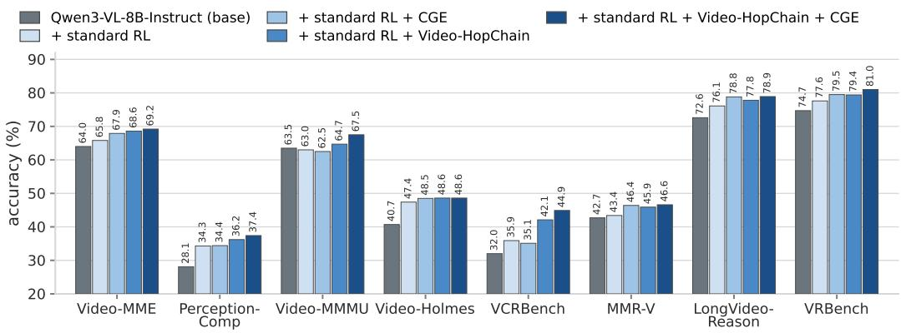  
Figure 1: Main result. Accuracy on the eight public video benchmarks, for the base model and for our four training runs.

## 1 INTRODUCTION

Rule-based reinforcement learning with verifiable rewards (RLVR) has become the standard route to a reasoning model, first in mathematics and code (DeepSeek-AI et al., 2025; Shao et al., 2024; Yu et al., 2025b) and then in images (Zhang et al., 2025c; Wang et al., 2025e). Video is the natural next domain, and a growing number of systems now train video question answering models with Group Relative Policy Optimization (GRPO) against a verifiable answer (Feng et al., 2025a; Li et al., 2025a; Wang et al., 2025b; Chen et al., 2025b; Feng et al., 2025b). However, what such a model learns depends on the questions it is trained on. HopChain (Wang et al., 2026a) made this point for still images: long chain-of-thought reasoning exposes perception, reasoning, knowledge and hallucination errors that compound across intermediate steps, yet most RLVR data asks for no reasoning chain that relies on visual evidence throughout, so these weaknesses stay largely unexposed during training. We observe the same problem in video. Much of the existing video RLVR data is already verifiable, because it is multiple choice or numeric, but the questions that would require a chain of visual evidence are often conceptual, and they are therefore hard to verify. Prior audits also report that video models often answer without looking at the video at all (Zhang et al., 2026b; Krojer et al., 2025), and that a model can encode what it sees and still answer from its priors (Quang et al., 2026). We therefore design the training data so that the model must look at the video, and look at it several times, before it answers.

HopChain addresses this weakness on images with multi-hop data synthesis. It builds each question as a chain of dependent hops, in which earlier hops fix the objects and conditions that later hops need, and it ends the chain in one unambiguous number, so a wrong step changes the final answer. In addition, training on such data yields reasoning that generalizes across general understanding and reasoning benchmarks. We expect such chains to matter most in video, because the evidence a chain must revisit is spread over time rather than held within a single frame.

For this reason, we adapt this framework to video and build Video-HopChain, in which every question asks about the moments of one video rather than about the regions of one image. Each question chains three to six hops, and every hop is a yes/no question about one or two moments of the video that yields one of two integers depending on its answer, so the final answer is the sum of these integers and is verifiable by exact match. Every question includes at least one hop on the order of two moments, so a single frame does not carry the evidence that a chain needs. In addition, some hops act as selectors, where an earlier answer decides which moment a later hop examines. To generate the questions, we first caption each shot of a video with a vision-language model, and then we use a text-only language model to write the multi-hop question from those captions. The resulting dataset holds 22,550 training questions over 13,378 videos, plus 1,000 held-out videos with one question each as a benchmark.

We expect that training on this dataset improves general video understanding and reasoning, even though the dataset targets one specific reasoning type. To test this, we train Qwen3-VL-8B-Instruct with GRPO and evaluate on eight general-purpose video benchmarks. Figure 1 shows the result. Training further on Video-HopChain raises the mean over the eight benchmarks from 55.4 to 57.9 and improves every one of them.

Training with GRPO, however, has a known limitation. GRPO takes its learning signal from the reward variance within a group of G rollouts of one question, so a group whose rollouts all earn the same reward carries zero advantage and contributes nothing to the update. The literature calls this failure advantage collapse (He et al., 2026; Zhang et al., 2025d), and we call such a group a zero-variance group. Prior work handles this limitation either by discarding the group and sampling new prompts until the batch is full (Yu et al., 2025b), which spends more rollouts, or by reshaping the advantage of the group it already has (Le et al., 2025; Nan et al., 2025).

Instead of drawing more groups, we change how each group is drawn: with G = 8 rollouts per question, we sample the first 4 rollouts normally. If these 4 rollouts are either all correct or all incorrect, we sample the last 4 rollouts under a top-token mask inside the reasoning span. Wherever the policy places more than τ = 0.95 of its mass on one token, we drop that token and renormalize over the rest, so the model continues from a token that it samples rarely on its own. We then remove the masked positions from the loss, while all 8 rollouts enter the group advantage, so the intervention adds no rollouts. We call this Confidence-Gated Exploration (CGE). On top of Video-HopChain, it raises the mean over the eight benchmarks from 57.9 to 59.3.

A In the scene where a cat sits on a red chair at a circular table with papers in its hand, look at the position of the golden Christmas tree: if the tree is on the left side of the frame, let A be 63; otherwise let A be 10.

B Compare two moments: the moment a spherical firework explosion fills the frame, and the moment an outdoor scene shows a tall green pole supporting a cluster of traffic lights. If the firework explosion is shown before the traffic light scene, let B be 22; otherwise let B be 63.

C Use the first check to choose where to look: if the tree is on the left side of the frame, look at the room where two children stand beneath an upside-down Christmas tree; otherwise look at the scene where a dog and a grey cat rest on a flat surface with the cat holding one paw raised near its face. In whichever of those two places you were sent to, look at the surface beneath the characters: if the surface is green, let C be 64; otherwise let C be 41.

D Use the third check to choose which pair of moments to compare: if the surface is green, compare the moment the dog’s face fills the frame in close-up with out-of-focus colored lights on the left against the moment the camera zooms in until the grey cat’s face fills most of the frame; if the surface is not green, compare the moment the dog’s head is turned toward the cat with a teal banner at the bottom of the frame against the moment a small rodent in a Santa hat is shown with fireworks bursting around it. In whichever pair you were sent to, if the first-named moment is shown before the second-named moment, let D be 73; otherwise let D be 79.

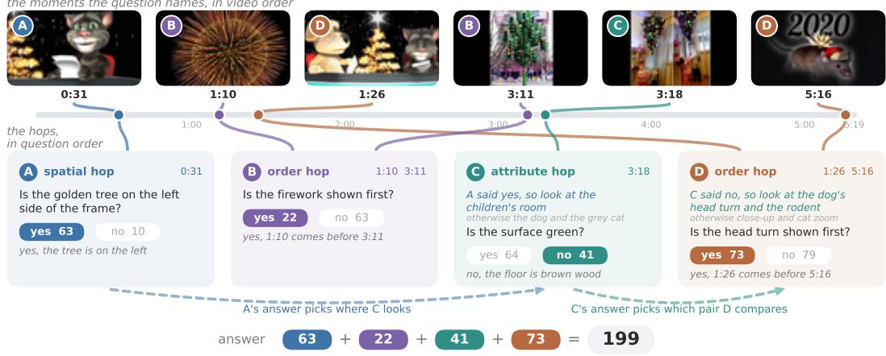  
Figure 2: One Video-HopChain question. The text carries one colour per hop, the strip above shows the six moments in video order, the panels below show the four hops in question order, and the dashed arrows mark the two selector hops.

In summary, we make three contributions.

• The Video-HopChain framework. We propose a framework that generates multi-hop questions for training video reasoning models (Section 2.2).

• The Video-HopChain dataset and benchmark. We release 22,550 training questions over 13,378 videos, together with 1,000 questions on 1,000 held-out videos as a benchmark built from the framework.

• Confidence-Gated Exploration (CGE). We introduce a simple and lightweight method that recovers zero-variance groups, which improves the results of GRPO training on Video-HopChain.

## 2 VIDEO-HOPCHAIN

## 2.1 QUESTION DESIGN

Video-HopChain is a dataset of multi-hop video questions, in which every question chains n hops over one video, with n between three and six. Every hop carries two numbers, of which the first one counts when the answer to the hop is yes and the second one when the answer is no. The model then adds the numbers of all the hops, which makes this sum the answer to the question. Figure 2 presents a sample of Video-HopChain hop by hop.

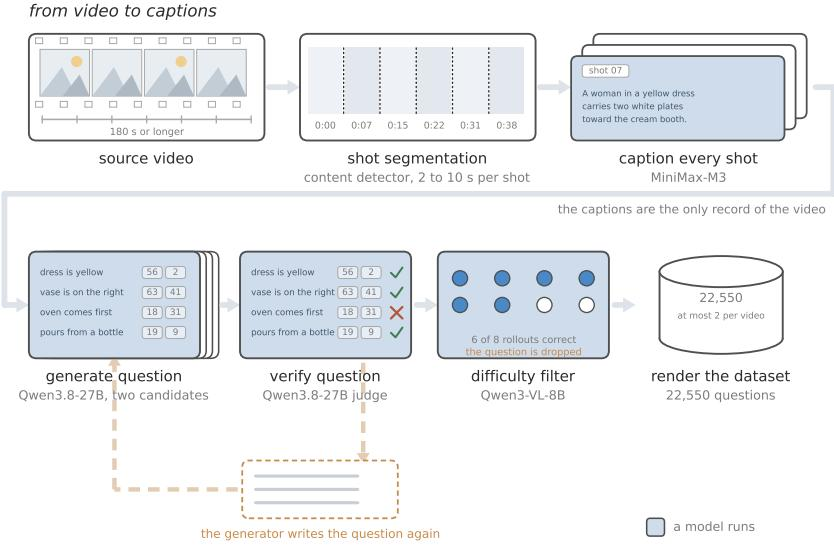  
Figure 3: The Video-HopChain generator.

For every hop we assign the two numbers by sampling integers at random in the range 1 to 80. We then resample them until no two combinations of answers give the same total. In addition, we keep the arithmetic a plain sum, so that the model only adds the numbers that its answers select. With this design, we intend the difficulty to come from the video, not the calculation.

A hop is a yes/no question that the video settles, and we use four main categories of question for each hop, each over a different kind of visual evidence. The video settles three of these categories at one moment, whereas it settles the order category across two moments. We choose these four categories because, from our observation, a caption records this kind of information reliably.

• An order hop asks about the temporal order of two events, so it spans two moments.

• A spatial hop asks how two things are arranged inside one frame, such as left, right or middle, in terms anchored to the frame rather than to the body of the person shown.

• An action hop asks which physical action an agent performs, such as pour or lift.

• An attribute hop asks about a visible property of a named object, namely its colour.

Beyond the category of each hop, we link the hops in one of two ways. In a flat question, which we choose with probability 0.30, every hop names the moment it asks about and does not chain to another hop, so the model can answer the hops in any order. By contrast, in a selector question, which we choose with probability 0.70, the answer to an earlier hop decides which of two moments a later hop asks about, so the model has to work through the hops in order.

## 2.2 GENERATION PIPELINE

We show in Figure 3 the pipeline that turns raw video into questions. The source videos come from FineVideo (Farre et al.´ , 2024), from LongVILA (Chen et al., 2024b) as released with the OneThinker training data (Feng et al., 2025b), and from the long split of Vript (Yang et al., 2024).

From video to captions. From these sources, we keep a source video only when it lasts at least three minutes, because we want the questions to stay hard and to force the model to reason over moments that lie far apart in time. We then cut the video into shots with PySceneDetect (Castellano, 2026), and we caption every shot once with the MiniMax-M3 model (Lai et al., 2026).

Generating the question. Before we write a question from these captions, we fix its specification. To keep the questions diverse, we sample the hop count and the hop types with fixed probabilities. Table 6 reports the hop counts of the corpus that these draws produced. This specification also fixes the way the hops link and the two numbers of each hop. We then use Qwen3.8-27B as a question generator that writes two candidate questions per video from the captions and this specification.

Verifying and assembling. Once the generator writes the candidates, the same model re-examines every one of them against the same captions, and it passes a question only when it faults no hop. When the judge faults a hop, we send the question back to the generator, which writes it again from the same captions and the same specification. The judge then examines the new question. We repeat this loop until the judge reports no fault, but we drop the question when it still faults after three attempts. We then apply a difficulty filter that removes every question the base model already solves in 6 of 8 rollouts, so the dataset retains the questions that remain difficult for the policy.

## 2.3 STATISTICS AND SPLIT

Together, these stages yield 22,550 training questions over 13,378 videos and a held-out split of 1,000 questions over 1,000 further videos. We split by video, so no video appears on both sides. In addition, we draw the held-out side from the longer and more varied questions, stratified by hop count, video length and source.

## 3 CONFIDENCE-GATED EXPLORATION

## 3.1 PRELIMINARIES

We train with Group Relative Policy Optimization (GRPO) (Shao et al., 2024; DeepSeek-AI et al., 2025). For a prompt q, which here is a video and a question, the policy πθ samples a group of G rollouts $\{ o _ { i } \} _ { i = 1 } ^ { \hat { G } }$ , and a verifier then scores each one with a reward $r _ { i }$ . Reasoning work commonly rewards the answer and the response format together. We use this reward in this paper:

$$
r _ { i } = 0 . 8 a _ { i } + 0 . 2 f _ { i } ,\tag{1}
$$

where $a _ { i }$ is 1 when the answer matches the reference and $f _ { i }$ is 1 when the response follows the format that the system prompt asks for, namely a reasoning span inside the think tags and then an answer that carries the final integer in a boxed expression. Appendix F gives that system prompt in full. GRPO needs no value model, because the advantage ${ \hat { A } } _ { i }$ of a rollout is its reward standardized over the rewards of its own group. Every token of $o _ { i }$ then carries that one value. With the importance ratio $\rho _ { i , t } ( \boldsymbol { \theta } )$ between the current policy and the policy that sampled the rollout, we maximize the token-level clipped objective:

$$
\mathcal { I } ( \theta ) = \mathbb { E } _ { q , \{ o _ { i } \} } \left[ \frac { 1 } { \sum _ { i = 1 } ^ { G } \left| o _ { i } \right| } \sum _ { i = 1 } ^ { G } \sum _ { t = 1 } ^ { \left| o _ { i } \right| } \operatorname* { m i n } \Bigl ( \rho _ { i , t } ( \theta ) \hat { A } _ { i } , \ \mathrm { c l i p } \left( \rho _ { i , t } ( \theta ) , 1 - \epsilon _ { \mathrm { l o w } } , 1 + \epsilon _ { \mathrm { h i g h } } \right) \hat { A } _ { i } \Bigr ) \right] .\tag{2}
$$

The clip range is asymmetric, following Yu et al. (2025b). Throughout, we use $G = 8 , \epsilon _ { \mathrm { l o w } } = 0 . 2 $ $\mathrm { \epsilon _ { h i g h } = 0 . 3 }$ and no KL penalty.

## 3.2 CONFIDENCE-GATED EXPLORATION

The advantage of GRPO has a direct consequence. When every rollout of a group earns the same reward, the group has no reward variance, so every advantage is zero. We roll out and score such a group in full, and it then contributes no gradient. Following Le et al. (2025), we call such a group a zero-variance group. These groups appear from both directions, because a question the model cannot solve returns all-incorrect rollouts, whereas a question it has learned returns all-correct ones. Among the methods that answer this problem, the closest design to ours is EEPO (Chen et al., 2025a), which also regenerates part of a group after an intervention. CGE instead keeps the group and samples its second half differently, as Figure 4 and Algorithm 1 summarize.

When we encourage the model to explore. We draw each group in two waves of equal size, so the first wave takes $G _ { 1 } = 4$ of the 8 rollouts from $\pi _ { \theta } ,$ and we then score them. If those 4 rollouts do not all earn the same accuracy, the group already carries variance, so we draw the second wave from $\pi _ { \theta }$ unchanged. If they are all correct or all incorrect, however, the first wave is zero-variance, so we draw the second wave under the mask below instead. This check reads the accuracy $a _ { i }$ of Equation 1 rather than the full reward $r _ { i } .$ , so the format term $f _ { i }$ alone never makes a group appear to carry variance. We intervene on both kinds of zero-variance group, all correct and all incorrect. To test this choice, we also ablate the alternative that intervenes on all-incorrect groups alone. This alternative is intuitive, because exploration appears most necessary on the questions that the model fails to solve, yet it performs worse, as Appendix D reports.

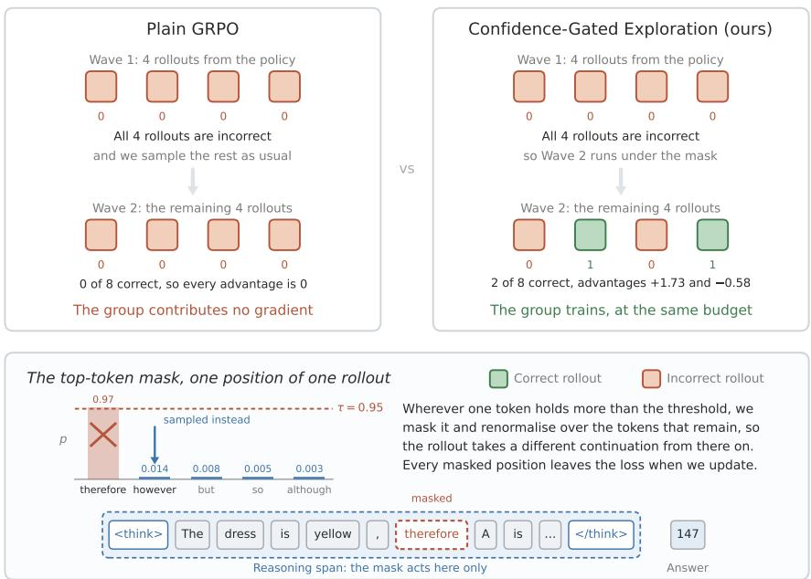  
Figure 4: Confidence-Gated Exploration on one group of G rollouts.

Top-token mask. When the first wave is zero-variance, the second wave samples differently. Let $y _ { t } ^ { \star }$ denote the token the policy finds most likely at position t and $p _ { t } ^ { \star }$ its probability. Wherever $p _ { t } ^ { \star }$ exceeds τ and the position lies inside the reasoning span, between the think tags, we drop that token and share its probability over the rest:

$$
\tilde { \pi } _ { \theta } ( y _ { t } ^ { \star } ) = 0 , \qquad \tilde { \pi } _ { \theta } ( y ) = \frac { \pi _ { \theta } ( y \mid q , o _ { i , < t } ) } { 1 - p _ { t } ^ { \star } } \quad \mathrm { f o r e v e r y ~ o t h e r ~ t o k e n } y .\tag{3}
$$

Here $\pi _ { \theta }$ is the policy we train, $q$ is the prompt, y is a candidate token at position t, and $o _ { i , < t }$ is the part of rollout i that the policy has already produced. Everywhere else the second wave samples from $\pi _ { \theta }$ unchanged. Because we renormalize the remaining mass, the sampler draws from the policy’s own alternatives in proportion to their probability, so the rollout continues from an alternative token that the policy samples rarely at that position. We set τ = 0.95 (see Appendix D for the ablation on τ ). We name the method after this gate, because the second wave explores exactly at the positions where the policy is most confident. Because the mask acts only inside the reasoning span, it never changes the answer tokens that the reward reads. The think tags that bound that span lie outside it, so the mask never removes them. Most token-level exploration methods trigger on the entropy or the surprisal of the next token, or on a statistic that also needs the advantage (Wang et al., 2025c; Lv et al., 2026; Luo et al., 2026; Cui et al., 2025). We follow this direction, but we use $p _ { t } ^ { \star }$ as the trigger instead, because the mask acts on the top-1 token and the sampler already computes its probability. A fixed top-1 probability still allows many different entropy values, so a trigger on $p _ { t } ^ { \star }$ and a trigger on the entropy select different positions.

Loss mask. With the mask in place, we drop from the sum of Equation 2 the masked positions, which are the positions where the mask forces a token other than the top one. We keep every other position of every rollout, including every position that follows a masked one. The advantage $\hat { A } _ { i }$ still covers all $\dot { G }$ rollouts of both waves together, so each rollout of the second wave contributes in the same way as a rollout of the first wave. A masked token is off-policy, so one could instead correct it with an importance weight. However, the sampling engine scores it under the masked and renormalized distribution, so the ratio in Equation 2 falls to $\bar { 1 } - \bar { p } _ { t } ^ { \star } \le 0 . 0 5$ at the first update:

Algorithm 1 Confidence-Gated Exploration for one prompt   
Require: prompt q, policy $\pi _ { \theta } ,$ , group size G, threshold τ   
1: sample $o _ { 1 } , \dots , o _ { G / 2 } \sim \pi _ { \theta } ( \cdot \mid q )$ and score $r _ { 1 } , \dots , r _ { G / 2 }$ with accuracies $a _ { 1 } , \dots , a _ { G / 2 }$ ▷ first   
wave   
2: $g  1 \mathrm { i f } a _ { 1 } = \cdot \cdot \cdot = a _ { G / 2 } ,$ else 0 ▷ is the first wave all correct or all incorrect?   
3: for $i = { G } / { 2 } + 1 , \ldots , { G }$ do ▷ second wave   
4: for $t = 1 , 2 , \dots$ until end of response do   
5: $p _ { t } ^ { \star } \gets \operatorname* { m a x } _ { y } \pi _ { \theta } ( y \mid q , o _ { i , < t } )$   
6: i $: g = 1$ and $p _ { t } ^ { \star } > \tau$ and t is inside the reasoning span then   
7: sample $o _ { i , t } \sim \tilde { \pi } _ { \boldsymbol { \theta } } ( \cdot \mid q , o _ { i , < t } ) ; v _ { i , t }  1$ ▷ top-token mask, Eq. 3   
8: else   
9: sample $o _ { i , t } \sim \pi _ { \theta } ( \cdot \mid q , o _ { i , < t } ) ; v _ { i , t }  0$   
10: end if   
11: end for   
12: score $r _ { i }$   
13: end for   
14: compute $\hat { A } _ { 1 } , \dotsc , \hat { A } _ { G }$ over all G responses ▷ standardized within the group   
15: return $\{ ( o _ { i } , \hat { A } _ { i } , v _ { i } ) \} _ { i = 1 } ^ { G }$ , and drop the masked positions from the loss

$$
\rho _ { i , t } = \frac { \pi _ { \theta } ( o _ { i , t } \mid \cdot ) } { \tilde { \pi } _ { \theta } ( o _ { i , t } \mid \cdot ) } = 1 - p _ { t } ^ { \star } \ \leq \ 1 - \tau = 0 . 0 5 .\tag{4}
$$

This value is far below the lower clip bound, so the clipped objective would treat the position according to the sign of its advantage. It would keep the position at a small weight for a positive advantage, and it would drop the position for a negative one. We drop the position instead, because this choice is symmetric in that sign. If the second wave changes the outcome of a zero-variance group, every rollout in the group now receives a gradient. Otherwise, the group stays zero-variance and costs nothing more than before.

Cost. CGE adds only one barrier per prompt, since the second wave cannot start before we score the first wave. In our asynchronous trainer, however, we measure no significant change in throughput, as Appendix K reports.

## 4 EXPERIMENTS

## 4.1 SETUP

Training data. The general dataset is a 105,993-row mixture of public multiple-choice video question answering data that prior video reasoning work assembled. Specifically, it draws on LLaVA-Video (Zhang et al., 2024c) (72,421 rows), STAR (Wu et al., 2021) (11,455), CLEVRER (Yi et al., 2020) (8,220), NExT-QA (Xiao et al., 2021) (7,549) and PerceptionTest (Patr˘ aucean et al.˘ , 2023) (6,348). The multi-hop dataset, in contrast, is Video-HopChain with 22,550 rows.

Model and training. On both datasets, every run starts from Qwen3-VL-8B-Instruct (Bai et al., 2025). From this base model, we train on 4 nodes of 8 H100 80GB GPUs, split as 2 rollout nodes and 2 trainer nodes, with a fully asynchronous GRPO trainer built on verl (Sheng et al., 2024). For the video input, we sample frames evenly over the whole video, namely 140 frames for Video-HopChain and 24 frames for the general dataset. For CGE, we also use $\tau = 0 . 9 5$ and a first wave of $G _ { 1 } = 4 \mathrm { r o l l o u t s } .$

Training stages. With these datasets and this trainer, we run the following stages.

• First stage, on the general dataset. We train the base model on the general dataset. We then keep the checkpoint at which its accuracy peaks, because the accuracy falls again when we train past that point. This checkpoint is the warm start for the longer and more complicated reasoning traces that Video-HopChain asks for. We call this run standard RL, and Table 1 uses that name.

<table><tr><td>model</td><td>VMME</td><td>PComp</td><td>VMMMU</td><td>Holmes</td><td>VCR</td><td>MMR-V</td><td>LVR</td><td>VRB</td><td>mean</td><td>in-domain</td></tr><tr><td>Qwen3-VL-8B-Instruct</td><td>64.0</td><td>28.1</td><td>63.5</td><td>40.7</td><td>32.0</td><td>42.7</td><td>72.6</td><td>74.7</td><td>52.3</td><td>13.4</td></tr><tr><td>+ standard RL</td><td>65.8</td><td>34.3</td><td>63.0</td><td>47.4</td><td>35.9</td><td>43.4</td><td>76.1</td><td>77.6</td><td>55.4</td><td>13.4</td></tr><tr><td>+ standard RL + CGE</td><td>67.9</td><td>34.4</td><td>62.5</td><td>48.5</td><td>35.1</td><td>46.4</td><td>78.8</td><td>79.5</td><td>56.6</td><td>16.4</td></tr><tr><td>+ standard RL + Video-HopChain</td><td>68.6</td><td>36.2</td><td>64.7</td><td>48.6</td><td>42.1</td><td>45.9</td><td>77.8</td><td>79.4</td><td>57.9</td><td>21.2</td></tr><tr><td>+ standard RL + Video-HopChain + CGE</td><td>69.2</td><td>37.4</td><td>67.5</td><td>48.6</td><td>44.9</td><td>46.6</td><td>78.9</td><td>81.0</td><td>59.3</td><td>23.2</td></tr></table>

Table 1: Main results with the best value of each column in bold. The last row model is V-HopChain.
<table><tr><td>model</td><td>base</td><td>VMME</td><td>PComp</td><td>VMMMU</td><td>Holmes</td><td>VCR</td><td>MMR-V</td><td>LVR</td><td>VRB</td></tr><tr><td>base model</td><td></td><td></td><td></td><td></td><td></td><td></td><td></td><td></td><td></td></tr><tr><td>Qwen3-VL-8B-Instruct†</td><td></td><td>64.0</td><td>28.1</td><td>63.5</td><td>40.7</td><td>32.0</td><td>42.7</td><td>72.6</td><td>74.7</td></tr><tr><td colspan="10">open-source video reasoning models</td></tr><tr><td>Video-R1 (Feng et al., 2025a)</td><td>Qwen2.5-VL-7B</td><td>61.4</td><td>26.3</td><td>52.4</td><td>36.5</td><td>48.0*</td><td>36.3*</td><td>68.1</td><td>69.5*</td></tr><tr><td>VideoChat-R1 (Li et al., 2025a)</td><td>Qwen2.5-VL-7B</td><td>60.0</td><td>28.6</td><td>46.4</td><td>33.0</td><td>48.2*</td><td>36.1*</td><td>67.2</td><td>61.5*</td></tr><tr><td>VideoRFT (Wang et al., 2025b)</td><td>Qwen2.5-VL-7B</td><td>59.8</td><td></td><td>51.1</td><td></td><td></td><td></td><td></td><td></td></tr><tr><td>Video-RTS (Wang et al., 2025f)</td><td>Qwen2.5-VL-7B</td><td>63.0</td><td></td><td>52.7</td><td>40.7</td><td></td><td></td><td></td><td></td></tr><tr><td>Video-KTR (Wang et al., 2026b)</td><td>Qwen2.5-VL-7B</td><td>62.5</td><td></td><td>53.1</td><td>42.7</td><td></td><td></td><td></td><td></td></tr><tr><td>Video-Thinker (Wang et al., 2025d)</td><td>Qwen2.5-VL-7B</td><td></td><td></td><td></td><td>43.2</td><td></td><td></td><td></td><td>80.7</td></tr><tr><td>Video-o3 (Zeng et al., 2026)</td><td>Qwen2.5-VL-7B</td><td>66.5</td><td></td><td>51.7</td><td>46.5</td><td></td><td>44.7</td><td></td><td></td></tr><tr><td>Conan (Ouyang et al., 2026)</td><td>Qwen2.5-VL-7B</td><td>1</td><td></td><td></td><td>44.6</td><td>51.0*</td><td>42.7</td><td>72.8</td><td>81.0</td></tr><tr><td>LongVILA-R1 (Chen et al., 2025b)</td><td>LongVILA-7B</td><td>65.1</td><td></td><td>51.0</td><td></td><td></td><td></td><td>72.0</td><td></td></tr><tr><td>OneThinker (Feng et al., 2025b)</td><td>Qwen3-VL-8B</td><td>66.5</td><td></td><td>66.2</td><td>48.7</td><td>1</td><td></td><td>79.2</td><td></td></tr><tr><td>V-HopChain (ours)</td><td>Qwen3-VL-8B</td><td>69.2</td><td>37.4</td><td>67.5</td><td>48.6</td><td>44.9</td><td>46.6</td><td>78.9</td><td>81.0</td></tr></table>

Table 2: Comparison with open-source video reasoning models. A dash marks an unreported number, and the best value of each column is bold with the second best underlined. A star marks a value taken from Ouyang et al. (2026). A dagger marks a result that we reproduce under our own setting.

• Second stage, on Video-HopChain with plain GRPO. We start this run from the single checkpoint of the first stage, and we then train on Video-HopChain with plain GRPO.

• Second stage, on Video-HopChain with CGE. We start this run from the same checkpoint, but we train on Video-HopChain with CGE instead of plain GRPO.

• CGE on the general dataset. Unlike the two second-stage runs above, this run is not a second stage, because we start it from the base model and enable the method from the first step.

Benchmarks. To measure these runs, we report eight public video benchmarks, namely Video-MME (Fu et al., 2024), PerceptionComp (Li et al., 2026), Video-MMMU (Hu et al., 2025), Video-Holmes (Cheng et al., 2025b), VCRBench (Sarkar & Etemad, 2025), MMR-V (Zhu et al., 2025), LongVideo-Reason (Chen et al., 2025b) and VRBench (Yu et al., 2025a). We report VCRBench on its multiple-choice subset. We evaluate every benchmark with the lmms-eval framework (Zhang et al., 2024a), under the same settings for every run, and we give the model the same system prompt that it sees during training. For every benchmark, we sample 100 frames evenly over the whole video, and we decode with at most 501,760 pixels per frame, a context of 33,792 tokens, at most 16,384 generated tokens. We report the accuracy on the 1,000 held-out Video-HopChain questions.

## 4.2 MAIN RESULTS

The dataset improves the model, and the method improves it further. On these eight public benchmarks, a second stage on Video-HopChain raises the mean and improves every one of them. Enabling CGE on top of that dataset raises the mean again. In addition, the combined run holds the best value of every column, where it ties the Video-HopChain run on Video-Holmes.

V-HopChain outperforms open-source video reasoning models. Table 2 places V-HopChain beside ten open-source video reasoning models on the same eight benchmarks. V-HopChain gives the best value on most of these benchmarks, ties with Conan on VRBench, and comes a close second on Video-Holmes and on LongVideo-Reason, where OneThinker leads and is the one model of thi set that starts from the same base model as ours. We compare released systems rather than recipes, because the ten models differ in base model, training data and compute.

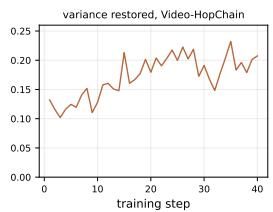

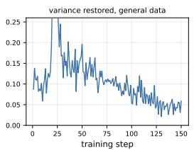

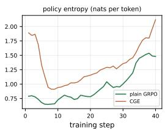

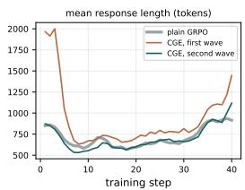  
Figure 5: Four training metrics of our runs, over the training steps.

## 5 ANALYSIS

CGE recovers one zero-variance group in six. The first panel of Figure 5 tracks the share of the intervened groups whose second wave restores the variance of the group. This share grows over training, from about one group in seven to one in five. Almost every intervened group is a question the model cannot yet solve, because on Video-HopChain the first wave comes back all incorrect far more often than all correct. However, the mask changes the outcome of an all-correct group much more often than that of an all-incorrect one, so we attribute the rise to the growing share of all-correct groups. The restored variance also comes from new solutions rather than from noise, because the second wave solves questions that the first wave never solves, and it answers as accurately as the first wave does. When we count both waves, therefore, CGE gives about half again as many groups with a gradient at the same compute budget. Appendix G gives the full numbers.

CGE holds the policy entropy above plain GRPO. While the first panel counts groups, the third panel tracks the token entropy of the policy on its own rollouts, where CGE stays a few tenths of a nat above plain GRPO for the whole run, although both runs reach the same training reward. This margin matters, because reinforcement learning for reasoning models tends to lose entropy as the reward rises, until the policy stops exploring and the reward saturates, a failure that prior work calls entropy collapse (Cui et al., 2025). Neither run reaches that failure here, yet CGE keeps more room to explore. We attribute this margin to the masked positions and to the tokens that follow them, because one alternative token carries a rollout along a path the policy samples rarely.

CGE lengthens the reasoning span only a little. The mask could also change the length of a rollout, and the fourth panel therefore tracks the mean response length of the two runs on Video-HopChain. Both of them settle between 600 and 900 tokens once the format is stable, and both of them lengthen again late in training. CGE gives the longer responses, at 810 tokens against 708 for plain GRPO. The mask itself is not the source, however, because the second wave that carries it stays shorter than the first, at 696 tokens against 923. We therefore attribute the extra length to the policy that CGE trains, and we hypothesize that the mask moves the model off its longest paths.

The dataset and the method fit together. Length matters here for a second reason. Because the mask acts only inside the reasoning span, the number of positions it can change grows with the length of that span, and a multi-hop question of Video-HopChain therefore offers it many more positions than a multiple-choice question does. On the general dataset, the second wave restores the variance of far fewer intervened groups than on Video-HopChain. We attribute this gap to the shape of the question, because a multi-hop chain offers many decision points, whereas a multiple-choice question about a single shot offers few.

## 6 CONCLUSION

We presented Video-HopChain, a dataset of multi-hop questions over videos. Training on this dataset improves general video understanding and reasoning more than training on general video reasoning datasets does. Because such training also produces zero-variance groups, we then introduced Confidence-Gated Exploration, which resamples the second half of a zero-variance group under a top-token mask. The method therefore recovers these groups without additional rollouts, and it improves the results further. We hope that both contributions help future work on video reasoning.

## AI USE STATEMENT

We used a generative AI tool to polish the writing and to check the grammar of this paper, and we also used one to help write the code. In both cases, the authors checked the result and take responsibility for it. Besides this use, we used generative AI to build the dataset. Video-HopChain is synthetic data, because a vision-language model captions every shot of a video, and a language model then writes and verifies every question. Section 2.2 describes that pipeline in full.

## REPRODUCIBILITY STATEMENT

We release everything that is necessary to repeat this work, namely the code that generates the dataset, the code that trains the model, the dataset itself, and the trained checkpoint. The dataset is available at https://huggingface.co/datasets/ngqtrung/video-hopchain, the checkpoint at https://huggingface.co/ngqtrung/video-hopchain-8b, and the code at https://github.com/ngquangtrung57/video-hopchain, and we group the dataset and the checkpoint in one collection at https://huggingface.co/collections/ ngqtrung/video-hopchain. The paper also describes the generation pipeline in Section 2.2, the training configuration in Appendix C, and the evaluation protocol in Section 4.1, which runs on the public lmms-eval framework (Zhang et al., 2024a) at the settings given there.

## REFERENCES

Sanghwan Bae, Jiwoo Hong, Min Young Lee, Hanbyul Kim, JeongYeon Nam, and Donghyun Kwak. Online difficulty filtering for reasoning oriented reinforcement learning. arXiv preprint arXiv:2504.03380, apr 2025. URL https://arxiv.org/abs/2504.03380.

Emad Bahrami, Olga Zatsarynna, Parth Pathak, Sunando Sengupta, Juergen Gall, and Mohsen Fayyaz. STRIVE: Structured spatiotemporal exploration for reinforcement learning in video question answering. arXiv preprint arXiv:2604.01824, apr 2026. URL https://arxiv. org/abs/2604.01824.

Bizhe Bai, Xinyue Wang, Peng Ye, and Tao Chen. Learning to explore with Parameter-Space noise: A deep dive into Parameter-Space noise for reinforcement learning with verifiable rewards. arXiv preprint arXiv:2602.02555, jan 2026. URL https://arxiv.org/abs/2602.02555.

Shuai Bai, Yuxuan Cai, Ruizhe Chen, Keqin Chen, Xionghui Chen, Zesen Cheng, Lianghao Deng, Wei Ding, Chang Gao, Chunjiang Ge, Wenbin Ge, Zhifang Guo, Qidong Huang, Jie Huang, Fei Huang, Binyuan Hui, Shutong Jiang, Zhaohai Li, Mingsheng Li, Mei Li, Kaixin Li, Zicheng Lin, Junyang Lin, Xuejing Liu, Jiawei Liu, Chenglong Liu, Yang Liu, Dayiheng Liu, Shixuan Liu, Dunjie Lu, Ruilin Luo, Chenxu Lv, Rui Men, Lingchen Meng, Xuancheng Ren, Xingzhang Ren, Sibo Song, Yuchong Sun, Jun Tang, Jianhong Tu, Jianqiang Wan, Peng Wang, Pengfei Wang, Qiuyue Wang, Yuxuan Wang, Tianbao Xie, Yiheng Xu, Haiyang Xu, Jin Xu, Zhibo Yang, Mingkun Yang, Jianxin Yang, An Yang, Bowen Yu, Fei Zhang, Hang Zhang, Xi Zhang, Bo Zheng, Humen Zhong, Jingren Zhou, Fan Zhou, Jing Zhou, Yuanzhi Zhu, and Ke Zhu. Qwen3-VL technical report. arXiv preprint arXiv:2511.21631, nov 2025. URL https://arxiv.org/ abs/2511.21631.

Vladislav Beliaev. Max out GRPO signal: Adaptive trace prefix control for hard reasoning problems. arXiv preprint arXiv:2607.07674, jul 2026. URL https://arxiv.org/abs/2607. 07674.

Brandon Castellano. PySceneDetect: Video scene cut detection and analysis tool. https:// github.com/Breakthrough/PySceneDetect, 2026. Software, version 0.7.

Liang Chen, Xueting Han, Qizhou Wang, Bo Han, Jing Bai, Hinrich Schutze, and Kam-Fai Wong.¨ EEPO: Exploration-Enhanced policy optimization via Sample-Then-Forget. arXiv preprint arXiv:2510.05837, oct 2025a. URL https://arxiv.org/abs/2510.05837.

Lin Chen, Jinsong Li, Xiaoyi Dong, Pan Zhang, Yuhang Zang, Zehui Chen, Haodong Duan, Jiaqi Wang, Yu Qiao, Dahua Lin, and Feng Zhao. Are we on the right way for evaluating large visionlanguage models? In Advances in Neural Information Processing Systems, 2024a.

Yukang Chen, Fuzhao Xue, Dacheng Li, Qinghao Hu, Ligeng Zhu, Xiuyu Li, Yunhao Fang, Haotian Tang, Shang Yang, Zhijian Liu, Ethan He, Hongxu Yin, Pavlo Molchanov, Jan Kautz, Linxi Fan, Yuke Zhu, Yao Lu, and Song Han. LongVILA: Scaling Long-Context visual language models for long videos. arXiv preprint arXiv:2408.10188, aug 2024b. URL https://arxiv.org/ abs/2408.10188.

Yukang Chen, Wei Huang, Baifeng Shi, Qinghao Hu, Hanrong Ye, Ligeng Zhu, Zhijian Liu, Pavlo Molchanov, Jan Kautz, Xiaojuan Qi, Sifei Liu, Hongxu Yin, Yao Lu, and Song Han. Scaling RL to long videos. arXiv preprint arXiv:2507.07966, jul 2025b. URL https://arxiv.org/ abs/2507.07966.

Daixuan Cheng, Shaohan Huang, Xuekai Zhu, Bo Dai, Wayne Xin Zhao, Zhenliang Zhang, and Furu Wei. Reasoning with exploration: An entropy perspective. arXiv preprint arXiv:2506.14758, jun 2025a. URL https://arxiv.org/abs/2506.14758.

Junhao Cheng, Yuying Ge, Teng Wang, Yixiao Ge, Jing Liao, and Ying Shan. Video-Holmes: Can MLLM think like holmes for complex video reasoning? arXiv preprint arXiv:2505.21374, may 2025b. URL https://arxiv.org/abs/2505.21374.

Ganqu Cui, Yuchen Zhang, Jiacheng Chen, Lifan Yuan, Zhi Wang, Yuxin Zuo, Haozhan Li, Yuchen Fan, Huayu Chen, Weize Chen, Zhiyuan Liu, Hao Peng, Lei Bai, Wanli Ouyang, Yu Cheng, Bowen Zhou, and Ning Ding. The entropy mechanism of reinforcement learning for reasoning language models. arXiv preprint arXiv:2505.22617, may 2025. URL https://arxiv.org/ abs/2505.22617.

DeepSeek-AI, Daya Guo, Dejian Yang, Haowei Zhang, Junxiao Song, Peiyi Wang, Qihao Zhu, Runxin Xu, Ruoyu Zhang, Shirong Ma, Xiao Bi, Xiaokang Zhang, Xingkai Yu, Yu Wu, Z. F. Wu, Zhibin Gou, Zhihong Shao, Zhuoshu Li, Ziyi Gao, Aixin Liu, Bing Xue, Bingxuan Wang, Bochao Wu, Bei Feng, Chengda Lu, Chenggang Zhao, Chengqi Deng, Chenyu Zhang, Chong Ruan, Damai Dai, Deli Chen, Dongjie Ji, Erhang Li, Fangyun Lin, Fucong Dai, Fuli Luo, Guangbo Hao, Guanting Chen, Guowei Li, H. Zhang, Han Bao, Hanwei Xu, Haocheng Wang, Honghui Ding, Huajian Xin, Huazuo Gao, Hui Qu, Hui Li, Jianzhong Guo, Jiashi Li, Jiawei Wang, Jingchang Chen, Jingyang Yuan, Junjie Qiu, Junlong Li, J. L. Cai, Jiaqi Ni, Jian Liang, Jin Chen, Kai Dong, Kai Hu, Kaige Gao, Kang Guan, Kexin Huang, Kuai Yu, Lean Wang, Lecong Zhang, Liang Zhao, Litong Wang, Liyue Zhang, Lei Xu, Leyi Xia, Mingchuan Zhang, Minghua Zhang, Minghui Tang, Meng Li, Miaojun Wang, Mingming Li, Ning Tian, Panpan Huang, Peng Zhang, Qiancheng Wang, Qinyu Chen, Qiushi Du, Ruiqi Ge, Ruisong Zhang, Ruizhe Pan, Runji Wang, R. J. Chen, R. L. Jin, Ruyi Chen, Shanghao Lu, Shangyan Zhou, Shanhuang Chen, Shengfeng Ye, Shiyu Wang, Shuiping Yu, Shunfeng Zhou, Shuting Pan, S. S. Li, Shuang Zhou, Shaoqing Wu, Shengfeng Ye, Tao Yun, Tian Pei, Tianyu Sun, T. Wang, Wangding Zeng, Wanjia Zhao, Wen Liu, Wenfeng Liang, Wenjun Gao, Wenqin Yu, Wentao Zhang, W. L. Xiao, Wei An, Xiaodong Liu, Xiaohan Wang, Xiaokang Chen, Xiaotao Nie, Xin Cheng, Xin Liu, Xin Xie, Xingchao Liu, Xinyu Yang, Xinyuan Li, Xuecheng Su, Xuheng Lin, X. Q. Li, Xiangyue Jin, Xiaojin Shen, Xiaosha Chen, Xiaowen Sun, Xiaoxiang Wang, Xinnan Song, Xinyi Zhou, Xianzu Wang, Xinxia Shan, Y. K. Li, Y. Q. Wang, Y. X. Wei, Yang Zhang, Yanhong Xu, Yao Li, Yao Zhao, Yaofeng Sun, Yaohui Wang, Yi Yu, Yichao Zhang, Yifan Shi, Yiliang Xiong, Ying He, Yishi Piao, Yisong Wang, Yixuan Tan, Yiyang Ma, Yiyuan Liu, Yongqiang Guo, Yuan Ou, Yuduan Wang, Yue Gong, Yuheng Zou, Yujia He, Yunfan Xiong, Yuxiang Luo, Yuxiang You, Yuxuan Liu, Yuyang Zhou, Y. X. Zhu, Yanhong Xu, Yanping Huang, Yaohui Li, Yi Zheng, Yuchen Zhu, Yunxian Ma, Ying Tang, Yukun Zha, Yuting Yan, Z. Z. Ren, Zehui Ren, Zhangli Sha, Zhe Fu, Zhean Xu, Zhenda Xie, Zhengyan Zhang, Zhewen Hao, Zhicheng Ma, Zhigang Yan, Zhiyu Wu, Zihui Gu, Zijia Zhu, Zijun Liu, Zilin Li, Ziwei Xie, Ziyang Song, Zizheng Pan, Zhen Huang, Zhipeng Xu, Zhongyu Zhang, and Zhen Zhang. DeepSeek-R1: Incentivizing reasoning capability in LLMs via reinforcement learning. arXiv preprint arXiv:2501.12948, jan 2025. URL https://arxiv.org/abs/2501.12948.

Lasse Espeholt, Hubert Soyer, Remi Munos, Karen Simonyan, Volodymyr Mnih, Tom Ward, Yotam Doron, Vlad Firoiu, Tim Harley, Iain Dunning, Shane Legg, and Koray Kavukcuoglu. IMPALA: Scalable distributed Deep-RL with importance weighted Actor-Learner architectures. arXiv preprint arXiv:1802.01561, feb 2018. URL https://arxiv.org/abs/1802.01561.

Miquel Farre, Andi Marafioti, Lewis Tunstall, Leandro Von Werra, and Thomas Wolf. FineVideo.´ https://huggingface.co/datasets/HuggingFaceFV/finevideo, 2024.

Kaituo Feng, Kaixiong Gong, Bohao Li, Zonghao Guo, Yibing Wang, Tianshuo Peng, Junfei Wu, Xiaoying Zhang, Benyou Wang, and Xiangyu Yue. Video-R1: Reinforcing video reasoning in MLLMs. arXiv preprint arXiv:2503.21776, mar 2025a. URL https://arxiv.org/abs/ 2503.21776.

Kaituo Feng, Manyuan Zhang, Hongyu Li, Kaixuan Fan, Shuang Chen, Yilei Jiang, Dian Zheng, Peiwen Sun, Yiyuan Zhang, Haoze Sun, Yan Feng, Peng Pei, Xunliang Cai, and Xiangyu Yue. OneThinker: All-in-one reasoning model for image and video. arXiv preprint arXiv:2512.03043, dec 2025b. URL https://arxiv.org/abs/2512.03043.

Yunzhen Feng, Parag Jain, Anthony Hartshorn, Yaqi Duan, and Julia Kempe. Don’t waste mistakes: Leveraging negative RL-Groups via confidence reweighting. arXiv preprint arXiv:2510.08696, oct 2025c. URL https://arxiv.org/abs/2510.08696.

Chaoyou Fu, Yuhan Dai, Yongdong Luo, Lei Li, Shuhuai Ren, Renrui Zhang, Zihan Wang, Chenyu Zhou, Yunhang Shen, Mengdan Zhang, Peixian Chen, Yanwei Li, Shaohui Lin, Sirui Zhao, Ke Li, Tong Xu, Xiawu Zheng, Enhong Chen, Caifeng Shan, Ran He, and Xing Sun. Video-MME: The First-Ever comprehensive evaluation benchmark of multi-modal LLMs in video analysis. arXiv preprint arXiv:2405.21075, may 2024. URL https://arxiv.org/abs/2405.21075.

Madeleine Grunde-McLaughlin, Ranjay Krishna, and Maneesh Agrawala. AGQA: A benchmark for compositional Spatio-Temporal reasoning. arXiv preprint arXiv:2103.16002, mar 2021. URL https://arxiv.org/abs/2103.16002.

Zhuowen Han, Jinwei Xiao, Zhengxi Lu, Renren Jin, Zhiyuan Yao, Yuxin Liu, Hongyan Hao, Yueqing Sun, Yu Yang, Qi GU, Xunliang Cai, and Deyi Xiong. Distill where you fail: Recovering learning signals of negative RL-Groups from adaptive teacher guidance. arXiv preprint arXiv:2608.00782, aug 2026. URL https://arxiv.org/abs/2608.00782.

Xixiang He, Qiyao Sun, Ao Cheng, Xingming Li, Xuanyu Ji, Hailun Lu, Runke Huang, and Qingyong Hu. Advantage collapse in group relative policy optimization: Diagnosis and mitigation. arXiv preprint arXiv:2605.21125, may 2026. URL https://arxiv.org/abs/2605. 21125.

Kairui Hu, Penghao Wu, Fanyi Pu, Wang Xiao, Yuanhan Zhang, Xiang Yue, Bo Li, and Ziwei Liu. Video-MMMU: Evaluating knowledge acquisition from Multi-Discipline professional videos. arXiv preprint arXiv:2501.13826, jan 2025. URL https://arxiv.org/abs/ 2501.13826.

Guanhua Huang, Tingqiang Xu, Mingze Wang, Qi Yi, Xue Gong, Siheng Li, Ruibin Xiong, Kejiao Li, Yuhao Jiang, and Bo Zhou. Low-probability tokens sustain exploration in reinforcement learning with verifiable reward. arXiv preprint arXiv:2510.03222, oct 2025. URL https: //arxiv.org/abs/2510.03222.

Langlin Huang, Chengsong Huang, Jinyuan Li, Donghong Cai, Yuyi Yang, and Jiaxin Huang. Nonsense helps: Prompt space perturbation broadens reasoning exploration. arXiv preprint arXiv:2605.05566, may 2026. URL https://arxiv.org/abs/2605.05566.

Yifu Huo, Chenglong Wang, Ziming Zhu, Shunjie Xing, Peinan Feng, Tongran Liu, Qiaozhi He, Tianhua Zhou, Xiaojia Chang, Jingbo Zhu, Zhengtao Yu, and Tong Xiao. SPS: Steering probability squeezing for better exploration in reinforcement learning for large language models. arXiv preprint arXiv:2604.16995, apr 2026. URL https://arxiv.org/abs/2604.16995.

Anmol Kabra, Yilun Yin, Albert Gong, Kamile Stankevi ˙ ciˇ ut¯ e, Dongyoung Go, Johann Lee, Katie Z. ˙ Luo, Carla P. Gomes, and Kilian Q. Weinberger. Learning from synthetic data improves multi-hop reasoning. arXiv preprint arXiv:2603.02091, mar 2026. URL https://arxiv.org/abs 2603.02091.

Aniruddha Kembhavi, Mike Salvato, Eric Kolve, Minjoon Seo, Hannaneh Hajishirzi, and Ali Farhadi. A diagram is worth a dozen images. In Proceedings of the European Conference on Computer Vision, 2016.

Soeun Kim and Albert No. Where rollouts begin: Low-Load, High-Leverage First-Token diversification for RLVR. arXiv preprint arXiv:2605.28295, may 2026. URL https://arxiv.org/ abs/2605.28295.

Benno Krojer, Mojtaba Komeili, Candace Ross, Quentin Garrido, Koustuv Sinha, Nicolas Ballas, and Mahmoud Assran. A shortcut-aware Video-QA benchmark for physical understanding via minimal video pairs. arXiv preprint arXiv:2506.09987, jun 2025. URL https://arxiv. org/abs/2506.09987.

Sutej Kulgod, Sean Ye, Sanchit Tanwar, and Christoffer Heckman. Reducing text bias in synthetically generated MCQAs for VLMs in autonomous driving. arXiv preprint arXiv:2602.17677, jan 2026. URL https://arxiv.org/abs/2602.17677.

Xunhao Lai, Weiqi Xu, Yufeng Yang, Qiaorui Chen, Yang Xu, Lunbin Zeng, Xiaolong Li, Haohai Sun, Haichao Zhu, Vito Zhang, et al. MiniMax sparse attention. arXiv preprint arXiv:2606.13392, 2026.

Thanh-Long V. Le, Myeongho Jeon, Kim Vu, Viet Lai, and Eunho Yang. No prompt left behind: Exploiting Zero-Variance prompts in LLM reinforcement learning via Entropy-Guided advantage shaping. arXiv preprint arXiv:2509.21880, sep 2025. URL https://arxiv.org/abs/ 2509.21880.

Shaoxuan Li, Zhixuan Zhao, Hanze Deng, Zirun Ma, Shulin Tian, Zuyan Liu, Yushi Hu, Haoning Wu, Yuhao Dong, Benlin Liu, Ziwei Liu, and Ranjay Krishna. PerceptionComp: A video bench mark for complex Perception-Centric reasoning. arXiv preprint arXiv:2603.26653, mar 2026. URL https://arxiv.org/abs/2603.26653.

Xinhao Li, Ziang Yan, Desen Meng, Lu Dong, Xiangyu Zeng, Yinan He, Yali Wang, Yu Qiao, Yi Wang, and Limin Wang. VideoChat-R1: Enhancing Spatio-Temporal perception via reinforcement Fine-Tuning. arXiv preprint arXiv:2504.06958, apr 2025a. URL https://arxiv.org/ abs/2504.06958.

Ziniu Li, Congliang Chen, Tianyun Yang, Tian Ding, Ruoyu Sun, Ge Zhang, Wenhao Huang, and Zhi-Quan Luo. Knapsack RL: Unlocking exploration of LLMs via optimizing budget allocation. arXiv preprint arXiv:2509.25849, sep 2025b. URL https://arxiv.org/abs/2509. 25849.

Xiangyan Liu, Jinjie Ni, Zijian Wu, Chao Du, Longxu Dou, Haonan Wang, Tianyu Pang, and Michael Qizhe Shieh. NoisyRollout: Reinforcing visual reasoning with data augmentation. arXiv preprint arXiv:2504.13055, apr 2025. URL https://arxiv.org/abs/2504.13055.

Yuan Liu, Haodong Duan, Yuanhan Zhang, Bo Li, Songyang Zhang, Wangbo Zhao, Yike Yuan, Jiaqi Wang, Conghui He, Ziwei Liu, Kai Chen, and Dahua Lin. MMBench: Is your multi-modal model an all-around player? In Proceedings of the European Conference on Computer Vision, 2024.

Xiuyi Lou, Zicheng Xu, Yu-Neng Chuang, Hoang Anh Duy Le, Zhaozhuo Xu, Guanchu Wang, and Vladimir Braverman. When implausible tokens get reinforced: Tail-Aware credit calibration for LLM reinforcement learning. arXiv preprint arXiv:2607.07976, jul 2026. URL https: //arxiv.org/abs/2607.07976.

Pan Lu, Hritik Bansal, Tony Xia, Jiacheng Liu, Chunyuan Li, Hannaneh Hajishirzi, Hao Cheng, Kai-Wei Chang, Michel Galley, and Jianfeng Gao. MathVista: Evaluating mathematical reasoning of foundation models in visual contexts. In International Conference on Learning Representations, 2024.

Haipeng Luo, Qingfeng Sun, Songli Wu, Can Xu, Wenfeng Deng, Han Hu, and Yansong Tang. STARE: Surprisal-Guided Token-Level advantage reweighting for policy entropy stability. arXiv preprint arXiv:2606.19236, jun 2026. URL https://arxiv.org/abs/2606.19236.

Outongyi Lv, Yanzhao Zheng, Yuanwei Zhang, Zhenghao Huang, Xingjun Wang, Baohua Dong, Hangcheng Zhu, and Yingda Chen. Which tokens matter? adaptive token selection for RLVR with the relative surprisal index. arXiv preprint arXiv:2606.31575, jun 2026. URL https: //arxiv.org/abs/2606.31575.

Gongrui Nan, Siye Chen, Jing Huang, Mengyu Lu, Dexun Wang, Chunmei Xie, Weiqi Xiong, Xianzhou Zeng, Qixuan Zhou, Yadong Li, and Xingzhong Xu. NGRPO: Negative-enhanced group relative policy optimization. arXiv preprint arXiv:2509.18851, sep 2025. URL https: //arxiv.org/abs/2509.18851.

Kun Ouyang, Yuanxin Liu, Linli Yao, Yishuo Cai, Hao Zhou, Fandong Meng, Jie Zhou, and Xu Sun. Conan: Progressive learning to reason like a detective over multi-scale visual evidence. In Proceedings ofthe IEEE/CVF Conference on Computer Vision and Pattern Recognition, pp. 41089– 41099, 2026. URL https://arxiv.org/abs/2510.20470.

Ruotian Peng, Yi Ren, Zhouliang Yu, Weiyang Liu, and Yandong Wen. Beyond the sampled token: Preserving candidate support in RLVR. arXiv preprint arXiv:2510.14807, oct 2025. URL https://arxiv.org/abs/2510.14807.

Viorica Patr˘ aucean, Lucas Smaira, Ankush Gupta, Adri˘ a Recasens Continente, Larisa Markeeva,\` Dylan Banarse, Skanda Koppula, Joseph Heyward, Mateusz Malinowski, Yi Yang, Carl Doersch, Tatiana Matejovicova, Yury Sulsky, Antoine Miech, Alex Frechette, Hanna Klimczak, Raphael Koster, Junlin Zhang, Stephanie Winkler, Yusuf Aytar, Simon Osindero, Dima Damen, Andrew Zisserman, and Joao Carreira. Perception test: A diagnostic benchmark for multimodal video˜ models. arXiv preprint arXiv:2305.13786, may 2023. URL https://arxiv.org/abs/ 2305.13786.

Runqi Qiao, Qiuna Tan, Guanting Dong, Minhui Wu, Chong Sun, Xiaoshuai Song, Jiapeng Wang, Zhuoma GongQue, Shanglin Lei, Yifan Zhang, Zhe Wei, Miaoxuan Zhang, Runfeng Qiao, Xiao Zong, Yida Xu, Peiqing Yang, Zhimin Bao, Muxi Diao, Chen Li, and Honggang Zhang. We-Math: Does your large multimodal model achieve human-like mathematical reasoning? In Proceedings of the 63rd Annual Meeting of the Association for Computational Linguistics (Volume 1: Long Papers), pp. 20023–20070, 2025.

Trung Nguyen Quang, Yiming Gao, Fanyi Pu, Kaichen Zhang, Shuo Sun, and Ziwei Liu. Senses wide shut: A representation-action gap in omnimodal LLMs. arXiv preprint arXiv:2605.13737, 2026.

Pritam Sarkar and Ali Etemad. VCRBench: Exploring Long-form causal reasoning capabilities of large video language models. arXiv preprint arXiv:2505.08455, may 2025. URL https: //arxiv.org/abs/2505.08455.

Zhihong Shao, Peiyi Wang, Qihao Zhu, Runxin Xu, Junxiao Song, Xiao Bi, Haowei Zhang, Mingchuan Zhang, Y. K. Li, Y. Wu, and Daya Guo. DeepSeekMath: Pushing the limits of mathematical reasoning in open language models. arXiv preprint arXiv:2402.03300, feb 2024. URL https://arxiv.org/abs/2402.03300.

Guangming Sheng, Chi Zhang, Zilingfeng Ye, Xibin Wu, Wang Zhang, Ru Zhang, Yanghua Peng, Haibin Lin, and Chuan Wu. HybridFlow: A flexible and efficient RLHF framework. arXiv preprint arXiv:2409.19256, 2024.

Junyoung Sung, Seungwoo Lyu, Minjun Kim, Sumin An, Arsha Nagrani, and Paul Hongsuck Seo. CRIT: Graph-Based automatic data synthesis to enhance Cross-Modal Multi-Hop reasoning. arXiv preprint arXiv:2604.01634, apr 2026. URL https://arxiv.org/abs/2604. 01634.

Ling Team, Anqi Shen, Baihui Li, Bin Hu, Bin Jing, Cai Chen, Chao Huang, Chao Zhang, Chaokun Yang, Cheng Lin, Chengyao Wen, Congqi Li, Deng Zhao, Dingbo Yuan, Donghai You, Fagui Mao, Fanzhuang Meng, Feng Xu, Guojie Li, Guowei Wang, Hao Dai, Haonan Zheng, Hong Liu, Jia Guo, Jiaming Liu, Jian Liu, Jianhao Fu, Jiannan Shi, Jianwen Wang, Jianxin Lai, Jin Yang, Jun Mei, Jun Zhou, Junbo Zhao, Junping Zhao, Kuan Xu, Le Su, Lei Chen, Li Tang, Liang Jiang, Liangcheng Fu, Lianhao Xu, Linfeng Shi, Lisha Liao, Longfei Zheng, Meng Li, Mingchun Chen, Qi Zuo, Qiang Cheng, Qianggang Cao, Qitao Shi, Quanrui Guo, Senlin Zhu, Shaofei Wang, Shaomian Zheng, Shuaicheng Li, Shuwei Gu, Siba Chen, Tao Wu, Tao Zhang, Tianyu Zhang, Tianyu Zhou, Tiwei Bie, Tongkai Yang, Wang Hong, Wang Ren, Weihua Chen, Wenbo Yu, Wengang Zheng, Xiangchun Wang, Xiaodong Yan, Xiaopei Wan, Xin Zhao, Xinyu Kong, Xinyu Tang, Xudong Han, Xudong Wang, Xuemin Yang, Xueyu Hu, Yalin Zhang, Yan Sun, Yicheng

Shan, Yilong Wang, Yingying Xu, Yongkang Liu, Yongzhen Guo, Yuanyuan Wang, Yuchen Yan, Yuefan Wang, Yuhong Guo, Zehuan Li, Zhankai Xu, Zhe Li, Zhenduo Zhang, Zhengke Gui, Zhenxuan Pan, Zhenyu Huang, Zhenzhong Lan, Zhiqiang Ding, Zhiqiang Zhang, Zhixun Li, Zhizhen Liu, Zihao Wang, and Zujie Wen. Every step evolves: Scaling reinforcement learning for Trillion-Scale thinking model. arXiv preprint arXiv:2510.18855, oct 2025. URL https: //arxiv.org/abs/2510.18855.

Harsh Trivedi, Niranjan Balasubramanian, Tushar Khot, and Ashish Sabharwal. MuSiQue: Multihop questions via single-hop question composition. arXiv preprint arXiv:2108.00573, aug 2021. URL https://arxiv.org/abs/2108.00573.

Hongcheng Wang, Yinuo Huang, Sukai Wang, Guanghui Ren, and Hao Dong. Why Tree-Style branching matters for thought advantage estimation in GRPO. arXiv preprint arXiv:2509.24494, sep 2025a. URL https://arxiv.org/abs/2509.24494.

Qi Wang, Yanrui Yu, Ye Yuan, Rui Mao, and Tianfei Zhou. VideoRFT: Incentivizing video reasoning capability in MLLMs via reinforced Fine-Tuning. arXiv preprint arXiv:2505.12434, may 2025b. URL https://arxiv.org/abs/2505.12434.

Shenzhi Wang, Le Yu, Chang Gao, Chujie Zheng, Shixuan Liu, Rui Lu, Kai Dang, Xionghui Chen, Jianxin Yang, Zhenru Zhang, Yuqiong Liu, An Yang, Andrew Zhao, Yang Yue, Shiji Song, Bowen Yu, Gao Huang, and Junyang Lin. Beyond the 80/20 rule: High-Entropy minority tokens drive effective reinforcement learning for LLM reasoning. arXiv preprint arXiv:2506.01939, jun 2025c. URL https://arxiv.org/abs/2506.01939.

Shenzhi Wang, Shixuan Liu, Jing Zhou, Chang Gao, Xiong-Hui Chen, Binghai Wang, An Yang, Shiji Song, Bowen Yu, Gao Huang, and Junyang Lin. HopChain: Multi-Hop data synthesis for generalizable Vision-Language reasoning. arXiv preprint arXiv:2603.17024, mar 2026a. URL https://arxiv.org/abs/2603.17024.

Shijian Wang, Jiarui Jin, Xingjian Wang, Linxin Song, Runhao Fu, Hecheng Wang, Zongyuan Ge, Yuan Lu, and Xuelian Cheng. Video-Thinker: Sparking “thinking with videos” via reinforcement learning. arXiv preprint arXiv:2510.23473, oct 2025d. URL https://arxiv.org/abs/ 2510.23473.

Xiyao Wang, Zhengyuan Yang, Chao Feng, Hongjin Lu, Linjie Li, Chung-Ching Lin, Kevin Lin, Furong Huang, and Lijuan Wang. SoTA with less: MCTS-Guided sample selection for Data-Efficient visual reasoning Self-Improvement. arXiv preprint arXiv:2504.07934, apr 2025e. URL https://arxiv.org/abs/2504.07934.

Zirui Wang, Mengzhou Xia, Luxi He, Howard Chen, Yitao Liu, Richard Zhu, Kaiqu Liang, Xindi Wu, Haotian Liu, Sadhika Malladi, Alexis Chevalier, Sanjeev Arora, and Danqi Chen. CharXiv: Charting gaps in realistic chart understanding in multimodal LLMs. In Advances in Neural Information Processing Systems, volume 37, pp. 113569–113697, 2024.

Ziyang Wang, Jaehong Yoon, Shoubin Yu, Md Mohaiminul Islam, Gedas Bertasius, and Mohit Bansal. Video-RTS: Rethinking reinforcement learning and Test-Time scaling for efficient and enhanced video reasoning. arXiv preprint arXiv:2507.06485, jul 2025f. URL https: //arxiv.org/abs/2507.06485.

Ziyue Wang, Sheng Jin, Zhongrong Zuo, Jiawei Wu, Han Qiu, Qi She, Hao Zhang, and Xudong Jiang. Video-KTR: Reinforcing video reasoning via key token attribution. arXiv preprint arXiv:2601.19686, jan 2026b. URL https://arxiv.org/abs/2601.19686.

Bo Wu, Shoubin Yu, Zhenfang Chen, Joshua B Tenenbaum, and Chuang Gan. STAR: A benchmark for situated reasoning in Real-World videos. In Proceedings of the Neural Information Processing Systems Track on Datasets and Benchmarks, 2021. URL https://datasets-benchmarks-proceedings.neurips.cc/paper/2021/ hash/5ef059938ba799aaa845e1c2e8a762bd-Abstract-round2.html.

xAI. RealWorldQA. Dataset release accompanying Grok-1.5 Vision, 2024.

Junbin Xiao, Xindi Shang, Angela Yao, and Tat-Seng Chua. NExT-QA: Next phase of Question-Answering to explaining temporal actions. In Proceedings of the IEEE/CVF Conference on Computer Vision and Pattern Recognition, 2021. URL https: //openaccess.thecvf.com/content/CVPR2021/html/Xiao\_NExT-QA\_Next\_ Phase\_of\_Question-Answering\_to\_Explaining\_Temporal\_Actions\_CVPR\_ 2021\_paper.html.

Wei Xiong, Chenlu Ye, Baohao Liao, Hanze Dong, Xinxing Xu, Christof Monz, Jiang Bian, Nan Jiang, and Tong Zhang. Reinforce-Ada: An adaptive sampling framework under non-linear RL objectives. arXiv preprint arXiv:2510.04996, oct 2025. URL https://arxiv.org/abs/ 2510.04996.

Jianhao Yan, Yafu Li, Zican Hu, Zhi Wang, Ganqu Cui, Xiaoye Qu, Yu Cheng, and Yue Zhang. Learning to reason under Off-Policy guidance. arXiv preprint arXiv:2504.14945, apr 2025. URL https://arxiv.org/abs/2504.14945.

Dongjie Yang, Suyuan Huang, Chengqiang Lu, Xiaodong Han, Haoxin Zhang, Yan Gao, Yao Hu, and Hai Zhao. Vript: A video is worth thousands of words. arXiv preprint arXiv:2406.06040, jun 2024. URL https://arxiv.org/abs/2406.06040.

Kexin Yi, Chuang Gan, Yunzhu Li, Pushmeet Kohli, Jiajun Wu, Antonio Torralba, and Joshua B. Tenenbaum. CLEVRER: CoLlision events for video REpresentation and reasoning. In International Conference on Learning Representations, 2020. URL https://openreview.net/ forum?id=HkxYzANYDB.

Jiashuo Yu, Yue Wu, Meng Chu, Zhifei Ren, Zizheng Huang, Pei Chu, Ruijie Zhang, Yinan He, Qirui Li, Songze Li, Zhenxiang Li, Zhongying Tu, Conghui He, Yu Qiao, Yali Wang, Yi Wang, and Limin Wang. VRBench: A benchmark for Multi-Step reasoning in long narrative videos. arXiv preprint arXiv:2506.10857, jun 2025a. URL https://arxiv.org/abs/ 2506.10857.

Qiying Yu, Zheng Zhang, Ruofei Zhu, Yufeng Yuan, Xiaochen Zuo, Yu Yue, Weinan Dai, Tiantian Fan, Gaohong Liu, Lingjun Liu, Xin Liu, Haibin Lin, Zhiqi Lin, Bole Ma, Guangming Sheng, Yuxuan Tong, Chi Zhang, Mofan Zhang, Wang Zhang, Hang Zhu, Jinhua Zhu, Jiaze Chen, Jiangjie Chen, Chengyi Wang, Hongli Yu, Yuxuan Song, Xiangpeng Wei, Hao Zhou, Jingjing Liu, Wei-Ying Ma, Ya-Qin Zhang, Lin Yan, Mu Qiao, Yonghui Wu, and Mingxuan Wang. DAPO: An Open-Source LLM reinforcement learning system at scale. arXiv preprint arXiv:2503.14476, mar 2025b. URL https://arxiv.org/abs/2503.14476.

Xiang Yue, Yuansheng Ni, Kai Zhang, Tianyu Zheng, Ruoqi Liu, Ge Zhang, Samuel Stevens, Dongfu Jiang, Weiming Ren, Yuxuan Sun, Cong Wei, Botao Yu, Ruibin Yuan, Renliang Sun, Ming Yin, Boyuan Zheng, Zhenzhu Yang, Yibo Liu, Wenhao Huang, Huan Sun, Yu Su, and Wenhu Chen. MMMU: A massive multi-discipline multimodal understanding and reasoning benchmark for expert AGI. In Proceedings of the IEEE/CVF Conference on Computer Vision and Pattern Recognition, 2024.

Xiangyu Zeng, Zhiqiu Zhang, Yuhan Zhu, Xinhao Li, Zikang Wang, Changlian Ma, Qingyu Zhang, Zizheng Huang, Kun Ouyang, Tianxiang Jiang, Ziang Yan, Yi Wang, Hongjie Zhang, Yali Wang, and Limin Wang. Video-o3: Native interleaved clue seeking for long video Multi-Hop reasoning. arXiv preprint arXiv:2601.23224, jan 2026. URL https://arxiv.org/abs/2601. 23224.

Congzhi Zhang, Zhibin Wang, Yinchao Ma, Jiawei Peng, Yihan Wang, Qiang Zhou, Jun Song, and Bo Zheng. ReWatch-R1: Boosting complex video reasoning in large Vision-Language models through agentic data synthesis. arXiv preprint arXiv:2509.23652, sep 2025a. URL https: //arxiv.org/abs/2509.23652.

Kaichen Zhang, Bo Li, Peiyuan Zhang, Fanyi Pu, Joshua Adrian Cahyono, Kairui Hu, Shuai Liu, Yuanhan Zhang, Jingkang Yang, Chunyuan Li, and Ziwei Liu. LMMs-Eval: Reality check on the evaluation of large multimodal models, 2024a. URL https://arxiv.org/abs/2407. 12772.

Kaichen Zhang, Yuzhong Hong, Junwei Bao, Hongfei Jiang, Yang Song, Dingqian Hong, and Hui Xiong. GVPO: Group variance policy optimization for large language model Post-Training. arXiv preprint arXiv:2504.19599, apr 2025b. URL https://arxiv.org/abs/2504.19599.

Kaichen Zhang, Keming Wu, Zuhao Yang, Bo Li, Kairui Hu, Bin Wang, Ziwei Liu, Xingxuan Li, and Lidong Bing. OpenMMReasoner: Pushing the frontiers for multimodal reasoning with an open and general recipe. arXiv preprint arXiv:2511.16334, nov 2025c. URL https:// arxiv.org/abs/2511.16334.

Renrui Zhang, Dongzhi Jiang, Yichi Zhang, Haokun Lin, Ziyu Guo, Pengshuo Qiu, Aojun Zhou, Pan Lu, Kai-Wei Chang, Yu Qiao, Peng Gao, and Hongsheng Li. MathVerse: Does your multi-modal LLM truly see the diagrams in visual math problems? In European Conference on Computer Vision, pp. 169–186. Springer, 2024b.

Xingjian Zhang, Siwei Wen, Wenjun Wu, and Lei Huang. EDGE-GRPO: Entropy-Driven GRPO with guided error correction for advantage diversity. arXiv preprint arXiv:2507.21848, jul 2025d. URL https://arxiv.org/abs/2507.21848.

Yuanhan Zhang, Jinming Wu, Wei Li, Bo Li, Zejun Ma, Ziwei Liu, and Chunyuan Li. LLaVA-Video: Video instruction tuning with synthetic data. arXiv preprint arXiv:2410.02713, oct 2024c. URL https://arxiv.org/abs/2410.02713.

Yuheng Zhang, Chenlu Ye, Shuowei Jin, Changlong Yu, Wei Xiong, Saurabh Sahu, and Nan Jiang. Rethinking importance sampling in LLM policy optimization: A cumulative token perspective. arXiv preprint arXiv:2605.07331, may 2026a. URL https://arxiv.org/abs/2605. 07331.

Yuxuan Zhang, EunJeong Hwang, Huaisong Zhang, Penghui Du, Yiming Jia, Dongfu Jiang, Xuan He, Shenhui Zhang, Ping Nie, Peter West, and Kelsey R. Allen. Watch before you answer: Learning from visually grounded Post-Training. arXiv preprint arXiv:2604.05117, apr 2026b. URL https://arxiv.org/abs/2604.05117.

Chujie Zheng, Shixuan Liu, Mingze Li, Xiong-Hui Chen, Bowen Yu, Chang Gao, Kai Dang, Yuqiong Liu, Rui Men, An Yang, Jingren Zhou, and Junyang Lin. Group sequence policy optimization. arXiv preprint arXiv:2507.18071, jul 2025a. URL https://arxiv.org/abs/ 2507.18071.

Tianyu Zheng, Tianshun Xing, Qingshui Gu, Taoran Liang, Xingwei Qu, Xin Zhou, Yizhi Li, Zhoufutu Wen, Chenghua Lin, Wenhao Huang, Qian Liu, Ge Zhang, and Zejun Ma. First return, Entropy-Eliciting explore. arXiv preprint arXiv:2507.07017, jul 2025b. URL https: //arxiv.org/abs/2507.07017.

Tianle Zhong, Neiwen Ling, Yifan Pi, Zijun Wei, Tianshu Yu, Geoffrey Fox, Peng Wu, and Xiao Yu. Diagnosing training inference mismatch in LLM reinforcement learning. arXiv preprint arXiv:2605.14220, may 2026. URL https://arxiv.org/abs/2605.14220.

Kejian Zhu, Zhuoran Jin, Hongbang Yuan, Jiachun Li, Shangqing Tu, Pengfei Cao, Yubo Chen, Kang Liu, and Jun Zhao. MMR-V: What’s left unsaid? a benchmark for multimodal deep reasoning in videos. arXiv preprint arXiv:2506.04141, jun 2025. URL https://arxiv.org/ abs/2506.04141.

Chengke Zou, Xingang Guo, Rui Yang, Junyu Zhang, Bin Hu, and Huan Zhang. DynaMath: A dynamic visual benchmark for evaluating mathematical reasoning robustness of vision language models. In International Conference on Learning Representations, 2025.

## APPENDIX CONTENTS

• Appendix A, Related work. Prior work on data for multimodal reinforcement learning, on video reasoning, on zero-variance groups, and on token-level exploration.

• Appendix B, Limitations. What this study does not show.

• Appendix C, Configuration. Every hyperparameter of the two runs.

• Appendix D, Ablations. The threshold τ and the groups we intervene on, measured on image data.

• Appendix E, Image benchmark results. The effect of this training on general image ability.

• Appendix F, Dataset details. Statistics, row format, system prompt and the held-out split.

• Appendix G, Group-level analysis of the second wave. Which groups the second wave returns a gradient to.

• Appendix H, Token-level analysis of the mask. Where the mask acts and what it removes.

• Appendix I, Derivations. The entropy bounds and the importance ratio at a masked position.

• Appendix J, Effect of the second wave on the update. What the second wave changes in the update.

• Appendix K, Computational cost and response length. The cost of the second wave, and its effect on response length.

## A RELATED WORK

Training data for multimodal reinforcement learning. Reinforcement learning with verifiable rewards needs questions with one correct answer, so most multimodal datasets obtain such questions by pooling public benchmarks and instruction sets (Feng et al., 2025a;b). However, a growing line of work shows that these questions often do not require the visual input at all. Audits find that a model answers a large share of long-video benchmark questions from text alone, and that the same holds for the questions in post-training data (Zhang et al., 2026b). In addition, shortcut-aware benchmarks measure when a model answers from its priors instead of from the video (Krojer et al., 2025), and probes on the hidden states of an omnimodal model recover a premise-perception mismatch that the model itself never acts on (Quang et al., 2026). Because such shortcuts are common, the usual response is to remove them after the fact, either by filtering with a text-only solver (Zhang et al., 2026b), by filtering inside a caption-grounded synthesis loop (Zhang et al., 2025a), or by reducing text bias when writing the options (Kulgod et al., 2026). All of these methods therefore act on a question after it fails a test. In contrast, we build every question around a structure that we expect a text-only solver to find hard to exploit. Moreover, our pipeline repairs a question that fails our own check rather than removing it. We take this structure from multi-hop question synthesis, which prior work applies to text (Trivedi et al., 2021; Kabra et al., 2026) and to compositional and crossmodal video reasoning (Grunde-McLaughlin et al., 2021; Sung et al., 2026), and which targets the reasoning pattern that recent multi-hop video benchmarks measure (Yu et al., 2025a). The work that inspired us is HopChain, which grounds every hop in an instance of a single image, and which verifies a query by asking four annotators to solve it independently, and by keeping only the queries on which all four agree (Wang et al., 2026a). We therefore adapt this framework to video, where a hop becomes a yes/no question about a moment in time rather than an instance located in a frame.

Reinforcement learning for video reasoning. Video-R1 introduced GRPO on video questions with a rule-based reward and a temporal contrast term (Feng et al., 2025a). Later systems extend this recipe to spatio-temporal grounding (Li et al., 2025a), to explicit reasoning traces and thinking with video (Wang et al., 2025b;d), to key-token attribution (Wang et al., 2026b), to long video with a sequence-parallel trainer (Chen et al., 2025b), and to joint image-and-video training under one policy (Feng et al., 2025b). Although these systems differ in data and reward design, almost all of them use the same sampler, because they draw every group from the unmodified policy and then either remove a group whose rollouts all receive the same reward or keep it with no gradient. The one exception is STRIVE, which builds several spatio-temporal variants of each video and then normalizes across them, so it changes what a group is drawn over rather than how the sampler draws each rollout (Bahrami et al., 2026). In contrast, CGE changes the sampler itself, so we expect it to combine with many of these recipes.

Zero-variance groups. The sampler that these systems share leaves in place the zero-variance limitation of Section 3.2, which many recent papers now report and which they call advantage collapse (He et al., 2026). In response, objective-level variants reshape the estimator at the sequence or the variance level (Zheng et al., 2025a; Zhang et al., 2025b). Beyond the objective, two families of remedy act on the group itself. The first family spends more compute, because it discards the group and resamples (Yu et al., 2025b), reallocates rollouts across prompts (Xiong et al., 2025; Li et al., 2025b), branches an existing rollout into extra continuations (Wang et al., 2025a), or filters by difficulty inside the training loop (Bae et al., 2025). The second family instead reuses the group it already has, either by reshaping the advantage without new rollouts (Le et al., 2025; Nan et al., 2025) or by recovering signal from all-incorrect groups (Feng et al., 2025c), in some designs with guidance from a teacher model (Han et al., 2026). We place CGE in the second family, but it differs in what it changes, since we neither reweight the advantage nor drop the group. Instead, we sample the second half of a zero-variance group differently, so that the group can regain variance.

Exploration at the token level. Because CGE changes the sampler, our work also relates to a parallel line of work that makes the rollout itself more exploratory. Many of these methods use the entropy of the next-token distribution to reweight or restrict the gradient at high-entropy positions (Wang et al., 2025c; Cheng et al., 2025a), or at the tokens whose log-probability covaries most with the advantage (Cui et al., 2025). Others instead act on low-probability or tail tokens (Huang et al., 2025; Lou et al., 2026), on the concentration of probability mass that an inverse reinforcementlearning stage reshapes after the rollout (Huo et al., 2026), or on noise added in prompt or parameter space (Huang et al., 2026; Bai et al., 2026). In addition, recent work replaces entropy with a related statistic, such as the relative surprisal of the sampled token (Lv et al., 2026) or a surprisal quantile (Luo et al., 2026). Closer to the sampler, FR3E explores from the high-uncertainty decision points of a trajectory (Zheng et al., 2025b), while EDGE-GRPO corrects the rollout errors that drive the advantage to zero (Zhang et al., 2025d). Closest to our own trigger, CaSP studies the same quantity that we use, namely the top-1 candidate probability, but it acts on the loss rather than on the sampler (Peng et al., 2025). In contrast, CGE uses that probability to select positions and then acts on the sampler, because it masks the single most likely token only where the policy is already near-certain.

Perturbed rollouts and the loss. Within this line of work, two methods are closest to ours. The first is EEPO, which regenerates the second half of a group after a transient weight update that discourages the rollouts it has already drawn. EEPO applies no group-variance condition, and it perturbs the whole rollout in weight space (Chen et al., 2025a). In contrast, CGE acts only on zerovariance groups, perturbs one token at a time in the sampler, and removes the perturbed positions from the loss. The second is REFT, which resamples the first token after the reasoning marker uniformly from the policy’s own top-N candidates (Kim & No, 2026), whereas CGE applies a probability threshold at every reasoning position and leaves the answer tokens untouched. Both interventions make the rollout off-policy, because both of them sample from a distribution other than the policy, and this is the same mismatch that arises between a training engine and an inference engine (Zhong et al., 2026). The standard fix either masks the discrepant tokens (Team et al., 2025) or corrects the importance weight of any off-policy sample (Zhang et al., 2026a), and this fix follows the importance-weighted actor-learners of distributed reinforcement learning (Espeholt et al., 2018). A deliberate perturbation raises the same question of how the loss should treat the off-policy tokens, whether that perturbation comes from data augmentation (Liu et al., 2025) or from the sampler itself. Prefix-guided methods answer that question by removing the injected tokens from the loss (Beliaev, 2026), whereas LUFFY keeps those tokens and reshapes their gradient with regularized importance sampling (Yan et al., 2025). We therefore remove the masked token from the loss instead of correcting its importance weight, because the ratio at a masked position falls far below the lower clip bound, as Section 3.2 explains and Appendix I derives. In addition, we sample the tokens that follow a mask from the unmodified policy, so we apply no correction to them.

## B LIMITATIONS

We train one base model at one scale, so we do not test whether our results hold at other scales. In addition, we generate and verify Video-HopChain automatically, and although this dataset improves both the in-domain measure and the public benchmarks, a manually labelled and manually verified dataset could give different results. Finally, we do not run a few ablations, namely the first-wave size G1, the restriction of the mask to the reasoning span, and an adaptive τ .

## C CONFIGURATION

Table 3 lists the settings of the two video runs, read from their resolved configurations. In this table, the default column reports the plain GRPO run, whereas the CGE column reports the run that enables the mask, and these two runs differ only in the exploration settings.

<table><tr><td>setting</td><td>default</td><td>CGE</td></tr><tr><td>data</td><td></td><td></td></tr><tr><td>maximum prompt length</td><td>5,376</td><td>5,376</td></tr><tr><td>maximum response length</td><td>16,384</td><td>16,384</td></tr><tr><td>optimizer</td><td></td><td></td></tr><tr><td>learning rate</td><td> $1 \times 1 0 ^ { - 6 }$ </td><td> $1 \times 1 0 ^ { - 6 }$ </td></tr><tr><td>warmup steps</td><td>25</td><td>25</td></tr><tr><td>weight decay</td><td>0.1</td><td>0.1</td></tr><tr><td>PPO mini-batch size</td><td>16</td><td>16</td></tr><tr><td>micro-batch size per GPU</td><td>dynamic</td><td>dynamic</td></tr><tr><td>maximum tokens per actor micro-batch</td><td>21,504</td><td>21,504</td></tr><tr><td>PPO epochs per batch</td><td>1</td><td>1</td></tr><tr><td>objective</td><td></td><td></td></tr><tr><td>advantage estimator</td><td>GRPO</td><td>GRPO</td></tr><tr><td>advantage normalized by group std.</td><td>yes</td><td>yes</td></tr><tr><td>clip range, low (Eq. 2)</td><td>0.2</td><td>0.2</td></tr><tr><td>clip range, high</td><td>0.3</td><td>0.3</td></tr><tr><td>KL loss</td><td>off</td><td>off</td></tr><tr><td>KL coefficient</td><td>0</td><td>0</td></tr><tr><td>KL term in the reward</td><td>off</td><td>off</td></tr><tr><td>entropy coefficient</td><td>0</td><td>0</td></tr><tr><td>loss aggregation</td><td>token-mean</td><td>token-mean</td></tr><tr><td>old log-probabilities (Eq. 4)</td><td>from the engine</td><td>from the engine</td></tr><tr><td>cross-engine correction</td><td>none</td><td>none</td></tr><tr><td>rollout</td><td></td><td></td></tr><tr><td>group size G</td><td>8</td><td>8</td></tr><tr><td>sampling temperature</td><td>1.0</td><td>1.0</td></tr><tr><td>top-p</td><td>1.0</td><td>1.0</td></tr><tr><td>top-k</td><td>-1, off</td><td>-1, off</td></tr><tr><td>tensor parallel size</td><td>2</td><td>2</td></tr><tr><td>GPU memory fraction</td><td>0.8</td><td>0.8</td></tr><tr><td>exploration</td><td></td><td></td></tr><tr><td>exploration enabled</td><td>no</td><td>yes</td></tr><tr><td>second wave enabled</td><td>no</td><td>yes</td></tr><tr><td>first-wave fraction</td><td></td><td> $\dot { 0 } . 5 , G _ { 1 } = 4$ </td></tr><tr><td>first-wave reward variance</td><td></td><td>0</td></tr><tr><td>reward the check uses</td><td></td><td>accuracy</td></tr><tr><td>intervene on all-correct groups too</td><td></td><td>yes</td></tr><tr><td>trigger mode</td><td></td><td>high</td></tr><tr><td>mask threshold τ (Eq. 3)</td><td></td><td>0.95</td></tr><tr><td>lower band edge, unused here</td><td></td><td>0.8</td></tr><tr><td>tokens masked per position</td><td></td><td>1</td></tr><tr><td>positions eligible</td><td></td><td>reasoning span</td></tr><tr><td>cap on masks per response</td><td></td><td>16,384</td></tr><tr><td>mask removed from the loss</td><td></td><td>always on</td></tr><tr><td></td><td></td><td></td></tr><tr><td>schedule and hardware</td><td></td><td></td></tr><tr><td>epochs over the dataset total training steps</td><td>4</td><td>4</td></tr><tr><td></td><td>not set</td><td>not set</td></tr><tr><td>trainer nodes × GPUs</td><td> $2 \times 8$ </td><td> $2 \times 8$ </td></tr><tr><td>rollout nodes × GPUs</td><td> $2 \times 8$ </td><td> $2 \times 8$ </td></tr><tr><td>staleness threshold</td><td>0.5</td><td>0.5</td></tr><tr><td>parameter-sync interval</td><td>4 steps</td><td>4 steps</td></tr></table>

Table 3: Configuration of the default run and the CGE run.

## D ABLATIONS

Scope of the ablations. We ablate two choices of Section 3.2, namely the threshold τ and the groups we intervene on. We run every one of them on the OpenMMReasoner RL dataset (Zhang et al., 2025c), a 74K-sample image dataset, and we hold everything else fixed, namely the same base model, the same algorithm, the same reward and the same compute budget, so we change only the training dataset. We run them on image data because a reinforcement-learning step on video costs 2,275 seconds on four nodes of eight H100 GPUs (Table 11), so a single run of a few hundred steps takes days, and every ablation needs a full run of its own. An image run also logs many more validation points than a video run of the same wall-clock budget, so it locates the best accuracy of a run far more precisely. We therefore treat these ablations as evidence about CGE itself rather than as measurements of video accuracy.

Setting. On that image dataset, every run here measures CGE alone, because CGE makes no assumption about the modality of the prompt and therefore applies to an image dataset as it does to video. Every run is a cold start from the base model on the same data, and we then score it on the validation split of OpenMMReasoner, of which we report the mean. It combines six public image benchmarks, namely CharXiv (Wang et al., 2024), DynaMath (Zou et al., 2025), MathVerse (Zhang et al., 2024b), MathVista (Lu et al., 2024), MMMU (Yue et al., 2024) and WeMath (Qiao et al., 2025), and every mean we report on this dataset is the mean over those six.

Threshold. Figure 6 gives the best mean accuracy of the threshold sweep, together with plain GRPO as the run without any exploration. At 0.90 and 0.95 both runs learn the answer format and reach more than five points above plain GRPO at the same compute budget. Moreover, the two thresholds stay within 0.1 points of each other, so the threshold needs no tuning inside that range. At 0.85 and 0.80, by contrast, the model never learns to emit the answer format, the response length grows from 380 to over 13,000 tokens, the fraction of clipped tokens rises from zero to 0.69, and the step time grows thirteenfold. The accuracy at τ = 0.85 rises again late in that run, however, and we attribute this rise to length inflation rather than to recovery.

We read these two failures as one mechanism. A lower threshold makes the mask eligible at positions of ordinary uncertainty, not only where the policy is nearly certain, so the second wave fires at many more positions of the same rollout. The model then never settles on a line of reasoning, because at every step where it starts to commit, the mask moves it off the token it was about to write. The reasoning span therefore keeps growing instead of closing, which is what the rise from 380 to over 13,000 tokens measures. The response finally meets the token budget rather than an end of its own, and the fraction of clipped tokens of 0.69 is that collision. A clipped response stops inside the reasoning span, so it never reaches the answer that the format asks for, and the format rate falls with it. Moreover, the mask applies only inside the reasoning span, between the think tags, as Section 3.2 defines it, so a token of the answer block is never eligible to be dropped at any threshold. The format degrades because the reasoning never ends, not because the mask deletes the format. We therefore apply the mask only where the policy is nearly certain, since that is the setting under which the reasoning still converges.

Choice of the intervened groups. In Section 3.2, we intervene on all-correct and all-incorrect groups alike. A natural alternative is to intervene only when the first wave is all-incorrect, because a group that the model already solves appears to need no exploration. However, Table 4 shows that this alternative fails. Because most zero-variance groups are all correct, a rule that skips them reduces the share of intervened groups from 0.79 to 0.29, and the run then peaks at 66.7, which is 5.8 points below CGE and no better than plain GRPO, before it collapses. For this reason we intervene on all-correct and all-incorrect groups alike.

<table><tr><td>we intervene on</td><td>T</td><td>best mean accuracy (step) vs. CGE</td><td></td></tr><tr><td>all-correct and all-incorrect</td><td>0.95</td><td>72.5 (180)</td><td></td></tr><tr><td>all-incorrect only</td><td>0.95</td><td>66.7 (50)</td><td>-5.8</td></tr></table>

Table 4: Effect of the choice of intervened groups, measured on OpenMMReasoner.

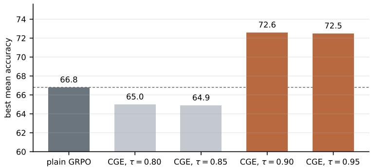  
Figure 6: Best mean accuracy over the six image benchmarks of the OpenMMReasoner validation split, for plain GRPO and for CGE at four thresholds. The dashed line marks plain GRPO, and the two grey bars are the runs that never learn the answer format.

## E IMAGE BENCHMARK RESULTS

Because every training stage of this paper uses video, we check whether this training lowers general image ability. We therefore evaluate the same checkpoints of Table 1 on six public image benchmarks, namely AI2D (Kembhavi et al., 2016), MathVista (Lu et al., 2024), MMBench-EN (Liu et al., 2024), MMMU (Yue et al., 2024), MMStar (Chen et al., 2024a) and RealWorldQA (xAI, 2024), for a total of 11,527 questions. We take the multiple-choice split of AI2D, the testmini split of MathVista, the English dev split of MMBench and the validation split of MMMU, and on MMMU we keep the multiple-choice questions only. We score every benchmark by exact match on a multiple-choice letter or on a numeric answer, so we use no model as a judge. Because we otherwise follow the settings of Section 4.1, we measure these image numbers in the same way as the video numbers of Table 1. Table 5 then reports the result.

<table><tr><td>model</td><td>AI2D 3,088</td><td>998</td><td>4,329</td><td>847</td><td>1,500</td><td>MathVista MMBench MMMU MMStar RealWorldQA 765</td><td>mean</td></tr><tr><td>Qwen3-VL-8B-Instruct</td><td>79.5</td><td>75.2</td><td>88.3</td><td>61.6</td><td>67.5</td><td>63.3</td><td>72.6</td></tr><tr><td>+ standard RL</td><td>82.4</td><td>71.2</td><td>89.3</td><td>62.3</td><td>67.7</td><td>65.0</td><td>73.0</td></tr><tr><td>+ standard RL + CGE</td><td>83.3</td><td>70.5</td><td>89.6</td><td>62.8</td><td>66.3</td><td>69.8</td><td>73.7</td></tr><tr><td>+ standard RL + Video-HopChain</td><td>82.7</td><td>71.6</td><td>89.4</td><td>62.2</td><td>66.8</td><td>66.3</td><td>73.2</td></tr><tr><td>+ standard RL + Video-HopChain + CGE</td><td>82.8</td><td>73.0</td><td>89.2</td><td>62.9</td><td>67.5</td><td>67.3</td><td>73.8</td></tr></table>

Table 5: Image understanding, accuracy in percent, with the number of questions under each benchmark, the best value of each column in bold and the second best underlined.

## F DATASET DETAILS

This appendix gives the statistics of the dataset, the row format of the released dataset, the system prompt, and how we draw the held-out split.

Dataset statistics. Table 6 reports the size of the two splits, the hop counts and the range of the ground-truth answer, which is the integer that the hops of a question sum to.

<table><tr><td></td><td>train</td><td>held-out</td></tr><tr><td colspan="2">questions 22,550 13,378</td><td>1,000</td></tr><tr><td colspan="2">videos</td><td>1,000</td></tr><tr><td colspan="2">questions per video 1.69 595 / 12,604 / 7,527 / 1,824</td><td>1.00</td></tr><tr><td colspan="2">questions with 3 / 4 / 5 / 6 hops</td><td>0 / 302 / 450 / 248</td></tr><tr><td colspan="2">hops by type: order / spatial / action / attribute 44,416 / 22,476 / 21,372 / 12,516</td><td>2,082 /1,141 /1,072 /651</td></tr><tr><td colspan="2">ground-truth answer, smallest to largest</td><td>52 to 366</td></tr><tr><td colspan="2">ground-truth answer, median</td><td>198</td></tr></table>

Table 6: Video-HopChain statistics for the training split and the held-out split.

Row format. Each training row of Video-HopChain holds a two-message prompt, namely the system prompt of the dataset, which the released code carries, and a user turn that starts with the video placeholder and continues with the question text. The row also carries the video path with its decode contract, the ground-truth answer as a string, and an extra-information record with the answer, the hop count, the hop types, and the question and video identifiers. We store the hop records, with their moment references, mappings, values and caption quotes, beside the dataset for auditing, but we keep them out of the training rows.

System prompt. Every training row and every held-out row carries this system prompt, so we evaluate every model we train with the same prompt.

You are a careful reasoning assistant. ALWAYS respond in this EXACT format:   
<think>step-by-step reasoning</think>   
<answer>\boxed{final\_answer}</answer>   
Examples:   
Q: 7 x 8?   
<think>7 x 8 = 56.</think>   
<answer>\boxed{56}</answer>   
Q: A right triangle has legs of length 3 and 4. What is the hypotenuse?   
<think>By the Pythagorean theorem, cˆ2 = 3ˆ2 + 4ˆ2 = 9 + 16 = 25, so c = 5.</think>   
<answer>\boxed{5}</answer>   
For multiple-choice, put the letter, e.g. \boxed{B}.   
Always wrap reasoning in <think>...</think> and answer in <answer>\boxed{...}</answer>. No text outside   
these tags.

Held-out split. We split the dataset by video with seed 42, and we then draw the held-out split with seed 1234 from the questions with at least four hops and at least two distinct hop types, with exactly one question per video, and we stratify this split on three axes at once. By hop count it holds 302, 450 and 248 questions with 4, 5 and 6 hops. By video length it holds 151 questions on videos under 40 segments, 301 on 40 to 70 segments, 300 on 70 to 110 segments, and 248 on longer videos. By source it holds 467 questions from LongVILA, 358 from FineVideo and 175 from Vript.

## G GROUP-LEVEL ANALYSIS OF THE SECOND WAVE

Table 7 gives the numbers behind the observations of Section 5, and we measure every row on the CGE run of Table 1, over the same window that Figure 5 plots. We report the mean over the first half of that window, which we label early, and the mean over the second half, which we label later.

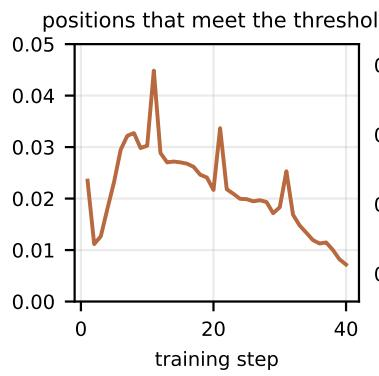

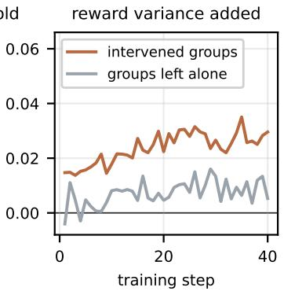

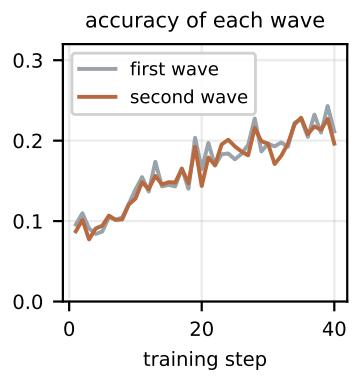

Figure 7: Three measurements of the second wave on Video-HopChain, over the training steps. The left panel gives the share of the positions the mask examines whose top-1 probability exceeds τ, whereas the middle panel gives the reward variance the second wave adds to a group, both on the intervened groups and on the groups the mask leaves alone, which already carry variance in their first wave. The right panel then gives the training accuracy of each wave over all groups.
<table><tr><td>share of</td><td>early</td><td>later</td></tr><tr><td>what the first wave produces, over all groups</td><td></td><td></td></tr><tr><td>groups whose 4 rollouts are all incorrect</td><td>0.73</td><td>0.64</td></tr><tr><td>groups whose 4 rollouts are all correct</td><td>0.03</td><td>0.08</td></tr><tr><td>groups that already carry variance</td><td>0.24</td><td>0.28</td></tr><tr><td>what the second wave adds, over the intervened groups</td><td></td><td></td></tr><tr><td>groups whose variance the second wave restores</td><td>0.15</td><td>0.20</td></tr><tr><td>all-correct groups whose outcome the mask changes</td><td>0.70</td><td>0.61</td></tr><tr><td>all-incorrect groups in which the mask produces a correct rollout</td><td>0.13</td><td>0.15</td></tr><tr><td>groups in which the second wave solves what the first wave never solves</td><td>0.12</td><td>0.13</td></tr><tr><td>accuracy of the second wave minus the first</td><td>+0.02</td><td>+0.01</td></tr><tr><td>what the group contributes to the update</td><td></td><td></td></tr><tr><td>groups that carry a gradient, first wave alone</td><td>0.24</td><td>0.28</td></tr><tr><td>groups that carry a gradient, both waves together</td><td>0.36</td><td>0.42</td></tr><tr><td>questions solved by at least one of the 8 rollouts</td><td>0.37</td><td>0.45</td></tr><tr><td>questions solved by at least one of the first 4</td><td>0.28</td><td>0.36</td></tr></table>

Table 7: The signal that the second wave recovers, measured on Video-HopChain.

The variance the second wave adds. Table 7 counts the groups whose variance the second wave restores, and we also measure how much variance it adds. For a group of G rollouts whose first wave answers a share p of them correctly, an unperturbed second wave would leave the group with a reward variance of $p ( \bar { 1 } - p ) ( G - 1 ) .$ /G on average, so we subtract that quantity from the variance we measure after the second wave and report the difference, which the middle panel of Figure 7 plots. On an intervened group the first wave is all correct or all incorrect, hence p is 0 or 1, the quantity we subtract is exactly zero, and the whole of the remaining variance follows from the mask. This difference grows from 0.020 early in the run to 0.028 later, whereas on the groups that the mask leaves alone the same difference reaches only 0.005 early and 0.009 later, so the subtraction leaves almost no variance on those groups.

The accuracy of each wave. The right panel of Figure 7 tracks the accuracy of each wave. Over all groups the two waves reach the same accuracy for the whole run, at 0.17 for the first wave and 0.16 for the second, whereas over the intervened groups alone the second wave is more accurate than the first by 0.02 early and by 0.01 later, as the accuracy row of Table 7 reports. We measure the same on the general dataset, where the first wave reaches 0.81 and the second reaches 0.80 over the whole run. Therefore the second wave answers as accurately as the first, and it answers more

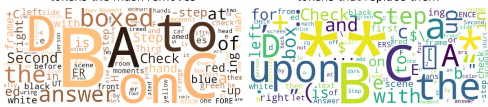  
tokens that replace them

Figure 8: The tokens that the mask removes, and the tokens that the sampler draws in their place, over the masked positions of the CGE run. Size follows frequency. Both panels fold a token onto its printed form, so a token and its word-boundary variant appear once.

accurately on the groups the mask acts on, while it follows a path that the policy would otherwise not have taken.

## H TOKEN-LEVEL ANALYSIS OF THE MASK

The section above measures the second wave over a whole group, and we now measure it at the level of the token. The top-1 probability exceeds τ at 2.2% of the positions the mask examines, as the left panel of Figure 7 shows, and no response reaches the cap on masks of Table 3. To see which positions those are, we record every token that the mask removes together with the token that the sampler draws in its place, over the CGE run of Table 1. Each of the 16 sampler processes writes the first 20,000 masked positions it produces, which gives 320,000 positions in total, and the sampler resolves every one of them to a replacement. Figure 8 shows the two sides of that substitution, and Table 9 reports where those positions sit and which token the sampler draws in their place.

The two panels of Figure 8, however, do not carry the same kind of word, because the mask removes mostly the answer letters A to E, boxed and answer, and frequent function words such as to and the. The mask therefore acts most often at the moment the model commits to an answer inside it reasoning span, which is where a near-certain token sits. The tokens boxed and answer appear in this list because the model drafts its answer inside the reasoning span before it closes that span. The mask therefore reaches that draft rather than the answer the reward reads, which lies after the closing think tag and outside the span. The mask never removes the think tags either. What replaces those tokens looks different, because emphasis markers and other punctuation take a far larger share, so the model often opens a new phrase rather than naming a different object.

The substitution also reaches the content of a hop, as Table 8 shows. The upper block of that table changes the value a hop reads, because the sampler names a different answer letter, one side of the frame for the other, one vertical half for the other, the opposite direction of an order relation, a different colour, and a different part of a person. These are the kinds of hop that a Video-HopChain question asks about, so the mask reaches the content on which the answer depends and not only the wording that surrounds it. The lower block changes the direction the rest of the response takes, because the sampler alters the relation between two objects, commits to a side that the model had not yet named, weakens the claim the model was about to make, and renames the step of the chain that the model is working on. We therefore treat the second wave as exploration of the answer rather than as noise, and Appendix G supports this at the level of the group, because the mask produces a correct rollout in 0.13 of the all-incorrect groups and gives 0.12 of the groups a solution that the first wave never finds.

Three rows of that table matter for the method. First, the mask acts across the whole reasoning span rather than at its opening, because the median masked position sits at token 242 and about one masked position in three sits beyond token 400. Second, the sampler usually draws the token that the policy itself ranks second, which happens at half of the masked positions, and it draws one of the first three candidates at about two thirds of them, so the second wave follows a continuation that the policy already ranks highly rather than an arbitrary token. Third, the second most likely token holds more than half of the probability that the mask leaves behind at 46% of the positions, hence a masked position is most often a choice between the token the policy would commit to and one alternative.

<table><tr><td>removed</td><td>sampled instead</td><td>what the substitution changes</td></tr><tr><td colspan="3">the value that a hop reads</td></tr><tr><td>B</td><td>C</td><td>the answer the model was about to name</td></tr><tr><td>right</td><td>left</td><td>the side of the frame that a spatial hop reads</td></tr><tr><td>bottom</td><td>top</td><td>the vertical half that a spatial hop reads</td></tr><tr><td>before</td><td>after</td><td>the direction of an order hop</td></tr><tr><td>orange arms</td><td>yellow</td><td>the colour that an attribute hop reads</td></tr><tr><td></td><td>hands</td><td>the part of a person that a hop refers to</td></tr><tr><td colspan="3">where the rest of the response goes</td></tr><tr><td>on</td><td>in</td><td>the relation between two objects</td></tr><tr><td>the</td><td>left</td><td>a side the model had not yet named</td></tr><tr><td>is</td><td>appears</td><td>how firmly the model commits to what it reports</td></tr><tr><td>Second</td><td>First</td><td>the step of the chain the model is working on</td></tr></table>

Table 8: Notable substitutions of the CGE run.
<table><tr><td>over the 320,000 masked positions</td><td>value</td></tr><tr><td>where the mask acts</td><td></td></tr><tr><td>median position of a masked token in the response</td><td>242</td></tr><tr><td>share within the first 100 tokens of the response</td><td>0.30</td></tr><tr><td>share beyond token 400 of the response</td><td>0.37</td></tr><tr><td>how certain the policy is at a masked position</td><td></td></tr><tr><td>mean top-1 probability</td><td>0.98</td></tr><tr><td>share whose top-1 probability exceeds 0.99</td><td>0.42</td></tr><tr><td>share where the second most likely token holds more than half of the rest</td><td>0.46</td></tr><tr><td>which token the sampler draws instead</td><td></td></tr><tr><td>share where the sampler draws the second most likely token</td><td>0.50</td></tr><tr><td>share where it draws the second or the third most likely token</td><td>0.65</td></tr><tr><td>share where it draws a token outside the 8 that the trace records</td><td>0.18</td></tr></table>

Table 9: The masked positions of the CGE run, and the tokens the sampler draws in their place.

One property of the vocabulary shapes the right panel. A byte-level vocabulary holds pieces that carry only part of a character, and such a piece prints as a replacement character on its own although the token that follows completes it. We therefore leave those pieces out of the cloud rather than show one block of replacement characters.

## I DERIVATIONS

Entropy at a fixed top-1 probability. Let V be the vocabulary size and $p ^ { \star }$ the probability of the most likely token. The entropy of the distribution is smallest when one token holds all the remaining mass, whereas it is largest when the mass is spread evenly over the other V − 1 tokens, which gives two bounds:

$$
\begin{array} { r l } & { H _ { \operatorname* { m i n } } ( p ^ { \star } ) = - p ^ { \star } \log { p ^ { \star } } - ( 1 - p ^ { \star } ) \log ( 1 - p ^ { \star } ) , } \\ & { H _ { \operatorname* { m a x } } ( p ^ { \star } ) = - p ^ { \star } \log { p ^ { \star } } + ( 1 - p ^ { \star } ) \big ( \log ( V - 1 ) - \log ( 1 - p ^ { \star } ) \big ) . } \end{array}\tag{5}
$$

With V = 151,936 the interval is [0.50, 2.89] nats at $p ^ { \star } = 0 . 8 0 , [ 0 . 3 3 , 1 . 5 2 ]$ at 0.90, [0.20, 0.80] at 0.95 and [0.06, 0.18] at 0.99, so the top-1 probability determines the entropy only within a wide

range. In the other direction, a fixed entropy leaves a wide range of top-1 probabilities, because at $H = 0 . 5$ nats the value of $p ^ { \star }$ can lie anywhere in [0.80, 0.97].

Entropy after the mask. Because the mask removes the top token and renormalizes the remaining mass, it gives a distribution $q ( y ) = \pi ( y ) / ( 1 - p ^ { \star } )$ for $y \neq y ^ { \star }$ , and the entropy of this distribution has a closed form:

$$
H _ { \mathrm { p o s t } } = \frac { H + p ^ { \star } \log p ^ { \star } } { 1 - p ^ { \star } } + \log ( 1 - p ^ { \star } ) .\tag{6}
$$

Since a trace stores $p ^ { \star }$ to five decimals, we evaluate this form only where $1 - p ^ { \star } > 1 0 ^ { - 3 }$ , below which the denominator loses too much precision.

The ratio at a masked position. The mask also changes the importance ratio, because the sampling engine returns the log-probability of each generated token under the distribution it sampled from. At a masked position, that distribution is $\tilde { \pi } _ { \boldsymbol { \theta } }$ of Equation 3, whose value at the sampled token is $\pi _ { \boldsymbol { \theta } } ( o _ { t } \mid \cdot ) / ( 1 - \bar { p ^ { \star } } )$ , and the trainer therefore uses this value as the old log-probability. Hence, at the first update, before θ has moved, the ratio is $\pi _ { \boldsymbol { \theta } } ( o _ { t } \mid \cdot ) / \big ( \pi _ { \boldsymbol { \theta } } ( o _ { t } \mid \cdot ) / ( 1 - p ^ { \star } ) \big ) = 1 - p ^ { \star }$ , which is Equation 4. Later updates move the ratio by the same factor as any other token, whereas the policy samples the positions after the mask from $\pi _ { \theta }$ itself, so their ratio is one.

## J EFFECT OF THE SECOND WAVE ON THE UPDATE

The derivation above concerns one masked position, and we also measure what the second wave does to the update as a whole. Table 10 compares the two runs of Table 1 on four quantities that the trainer logs, over the same window as Table 7, and we again report the mean over the first half of that window and the mean over the second half.

<table><tr><td></td><td colspan="2">plain GRPO</td><td colspan="2">CGE</td></tr><tr><td>per training step</td><td>early</td><td>later</td><td>early</td><td>later</td></tr><tr><td>share of positions the clip range removes</td><td>0.005</td><td>0.009</td><td>0.023</td><td>0.021</td></tr><tr><td>mean magnitude of the advantage</td><td>0.337</td><td>0.332</td><td>0.393</td><td>0.338</td></tr><tr><td>gradient norm</td><td>1.23</td><td>1.30</td><td>1.26</td><td>1.16</td></tr><tr><td>mean training reward</td><td>0.302</td><td>0.355</td><td>0.293</td><td>0.360</td></tr></table>

Table 10: What the second wave changes in the update, on the two runs that continue on Video-HopChain.

Three of these rows carry the result. First, the clip range removes more positions under CGE than under plain GRPO, at 0.023 and 0.021 against 0.005 and 0.009, and we attribute this to the second wave, because a perturbed rollout follows a continuation that the policy reaches rarely and its importance ratio therefore leaves the range more often. However, that share stays near two positions in a hundred, so the clip absorbs the perturbation rather than removing the rollout that carries it. Second, the magnitude of the advantage is larger under CGE early in training, and we attribute this to the restored groups, because a group whose rewards vary gives a non-zero advantage to every one of its rollouts. Third, the two runs reach the same training reward, at 0.360 against 0.355 in the second half of the window, so CGE obtains the extra groups of Table 7 at the same training reward as plain GRPO. In addition, the gradient norm stays within 0.14 of plain GRPO over the whole window, hence the second wave does not change the scale of the update.

## K COMPUTATIONAL COST AND RESPONSE LENGTH

We measure how much time the second wave costs, and how the mask changes the length of a response, on the two runs of Table 1 that continue on Video-HopChain, namely plain GRPO and CGE, which we train on the same 4 nodes.

Training time. Table 11 reports the timing that the trainer logs, averaged over the run. Every timing row of that table, except the advantage and check step, differs by at most 2.0% between the two runs, and the largest of these differences is the actor update, which the CGE run makes slower because this run produces slightly longer sequences. The advantage and check step itself grows from 0.15 to 0.58 seconds, which is negligible compared with a step of more than 2,000 seconds. In addition, token throughput differs by 1.4%, model utilization is 0.137 against 0.139, and the trainer waits for rollouts during about 48% of its time in both runs, so neither run is limited by the extra computation that CGE adds. This result follows from the design of CGE, because we keep the compute budget fixed at 8 rollouts per question and we apply the mask inside the sampler as a logits processor, so the second wave adds no forward passes beyond the ones that plain GRPO already spends. Although the second wave waits for the rewards of the first wave, the asynchronous rollouter samples many other questions during that wait, so we measure no cost from this wait in the step time.
<table><tr><td>per training step</td><td>plain GRPO</td><td>CGE</td><td>difference</td></tr><tr><td>step time (s)</td><td>2,275</td><td>2,285</td><td>+0.4%</td></tr><tr><td>wall-clock between steps (s)</td><td>2,435</td><td>2,459</td><td>+1.0%</td></tr><tr><td>generation (s)</td><td>1,097</td><td>1,084</td><td>-1.2%</td></tr><tr><td>actor update (s)</td><td>1,167</td><td>1,190</td><td>+2.0%</td></tr><tr><td>advantage and check (s)</td><td>0.15</td><td>0.58</td><td>+0.4 s</td></tr><tr><td>tokens per second</td><td>281</td><td>285</td><td>+1.4%</td></tr><tr><td>actor model utilization</td><td>0.137</td><td>0.139</td><td></td></tr><tr><td>trainer idle ratio</td><td>0.48</td><td>0.47</td><td></td></tr></table>

Table 11: Training cost of the two runs that continue on Video-HopChain, averaged over the run, on 4 nodes of 8 H100 GPUs. The wall-clock row is the mean gap between the timestamps of consecutive steps.

Response length. The second wave also changes the response length, because the CGE run gives longer responses on average, at 810 tokens against 708 for plain GRPO. Within the CGE run, however, the second wave gives shorter responses than the first, at 696 tokens against 923, so the mask does not lengthen a rollout by itself, and we expect instead that it moves the model off its longest reasoning paths. The first wave of the CGE run is nevertheless longer than plain GRPO, at 923 tokens against 708, although that wave carries no mask. The policy that CGE trains therefore reasons for longer than the policy that plain GRPO trains, and it keeps that longer span at evaluation, where we disable the mask for both checkpoints. In addition, fewer than 0.4% of the responses of either run reach the 16,384-token limit, so truncation costs neither run a measurable amount of reward.