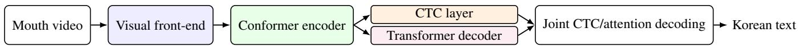
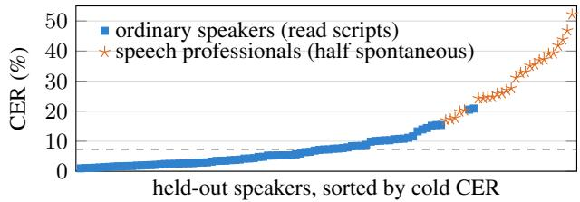

# PERSONALIZED KOREAN LIPREADING AS VISUAL SPEECH RECOGNITION: TRANSFER, CENSUS AND ADAPTATION ON OLKAVS

Se Un Park∗, Hakjun Kim, Taehoon Roh, Junyoung Park∗

UX Factory, Inc.

## ABSTRACT

We present a personalized Korean visual speech recognition (VSR) system and quantify, on the nine-camera OLKAVS corpus, the gap between the population-level benchmark score and an individual user’s error. A video-only Conformer initialized from Englishtrained weights attains 9.95 - 12.19% character error rate (CER) under the corpus protocol against the published 26.64, and 19.00 - 21.52 on unseen wording. Per speaker, CER spans 1.0 to 52.2%, with seen wording lowering CER by 7.0 - 9.0 points and professional delivery and spontaneous speech raising it by 8.5 - 10.5 and 12.7 points. A low-rank adapter with 4.6% of the parameters, trained on 4 to 29 minutes of the user’s frontal video, lowers the CER of twelve high-error speakers by 2.13 to 3.58 points, transfers to every camera without loss, and keeps 85% of the full fine-tuning gain at 12% of its cost to other speakers. Cameras above the mouth plane add about six CER points as a constant offset that training on all views keeps small.

Index Terms— visual speech recognition, lipreading, Korean, personalization, low-rank adaptation

## 1. INTRODUCTION

Lipreading could let a conversational assistant understand its user where a microphone fails, on a crowded train or in a noisy street, and let a user in a quiet office address a coding assistant by mouthing words with little or no sound. In these settings the system serves one person, who holds a phone camera at an arbitrary angle and speaks unscripted sentences. A VSR benchmark, by contrast, reports a single score over a population of speakers, mostly filmed frontally and often reading sentences drawn from a pool shared with the training data. We quantify the gap between the two on OLKAVS [1], a 1,107- speaker Korean audio-visual corpus, with a model that outperforms the published baseline by a wide margin, and we measure what a few minutes of the user’s own video and the camera angle change.

Three factors separate the benchmark score from the individual user’s error. Speakers differ far more in appearance than in voice, so a population mean hides a spread that matters to each user. Previous speaker adaptation of VSR models, by user-dependent padding [2] and by vision-and-language prompting [3], reports gains on English data. Here we measure the gain as a function of the minutes of the user’s video available, its transfer across camera views, and its cost for other speakers, for full fine-tuning and for a low-rank adapter [4]. Scripted corpora share sentences across partitions, so part of a reported score reflects memorized wording rather than lipreading [5, 6, 7]. We separate the wording effect from speaker type and speech mode, the latter a distinct problem for spontaneous Korean even in audio-based recognition [8]. Finally, benchmarks are frontal and level whereas hand-held cameras may not be. Multi-view VSR has concentrated on horizontal camera placements and yaw-invariant modeling [9, 10, 11, 12, 13], whereas elevation, the angle that a hand-held camera varies most, has been measured only on a closed vocabulary [14] or on unmatched content [1], and studies of human speechreading do not predict an asymmetric loss for elevated views [15, 16, 17].

We address all three with a single model, a 232M-parameter hybrid CTC/attention Conformer initialized from an English-trained VSR model [18] and trained on video from the OLKAVS training partition only. Our contributions are as follows. (i) A new state of the art for Korean sentence-level VSR under the corpus protocol, 9.95 - 12.19% CER against the published 26.64 [1, 19] (Sec. 3.1). (ii) The error distribution over every held-out speaker rather than its mean, and a decomposition of the official score into wording, delivery and spontaneity with a speech mode recovered from sentence sharing (Sec. 3.2). (iii) Personalization measured as a function of minutes of the user’s own video on speakers with high base error, with all evaluation sentences held out. One frontal recording transfers to every camera, a low-rank adapter retains most of the full fine-tuning gain at a fraction of its cost to other speakers, and the gain is confined to the visual encoder (Sec. 3.3). (iv) A paired evaluation of camera elevation on identical utterances shows that cameras above the mouth plane add about six CER points, additively throughout training, and that training on all views keeps the penalty at that level (Sec. 3.4).

## 2. CORPUS, MODEL AND PROTOCOL

## 2.1. Corpus

OLKAVS [1, 20] comprises 1,000 speakers in 12,000 five-minute studio recordings, each captured simultaneously by five of nine cameras, for about 727 hours of unique transcribed speech. The official partition is speaker-disjoint (893 training and 107 validation speakers). Every model in this paper is trained on the training partition only and evaluated on validation speakers never seen in training. We store one 160-pixel grayscale crop of the lower face per recording at 25 fps and feed the model a 96-pixel center crop (mouth width about 57 pixels). The cameras form three rows.1 A is frontal, B, I and H are above it, C and G are level with it, and D, E and F are below. Each recording uses camera A together with either {B,D,F,H} (camera group 1) or {C,E,G,I} (camera group 2). The two groups therefore partition the validation set, and a view is compared only with camera A of its own group on identical utterances. CERs are never pooled across groups.

Speaker type and speech mode. The corpus annotates 30% of the speakers as speech professionals (announcers, actors and trainees, denoted P, against O for ordinary speakers). Roughly half of their recordings are spontaneous (impromptu) speech on a news article, whereas ordinary speakers only read scripts [1]. No perrecording annotation distinguishes script reading from spontaneous speech, which we call the speech mode. Scripts are drawn from a shared pool and recur across speakers, whereas a spontaneous sentence cannot, so we label a recording as spontaneous when fewer than 20% of its sentences are spoken by any other speaker. The rule marks a median 50% of each professional’s recordings and none of any ordinary speaker’s, in agreement with the proportions reported in [1]. The model operates on jamo, the letters of written Korean and roughly its phonemic units (19 initial consonants, 21 vowels and 27 final consonants). Two or three jamo compose one syllable, so a jamo sequence maps to text without a lexicon, and CER is computed over composed characters, as in the published protocol.

  
Fig. 1. Our VSR architecture. Mouth video (96 pixels at 25 fps) passes through the visual front-end (3D convolution and ResNet-18) and the Conformer encoder (12 blocks of width 768). A CTC layer over 70 jamo symbols (loss weight 1.0) and a 6-block Transformer decoder (label-smoothed cross-entropy, weight 0.3) share the encoder output, and joint CTC/attention decoding yields Korean text.

## 2.2. Model and training

We present the model architecture in Fig. 1. The encoder is the Auto-AVSR visual front-end and Conformer back-end [21, 18, 22] with rotary position encoding [23], operating on 96-pixel frames at the full 25 Hz frame rate, and a linear CTC layer and a 6-layer attention decoder share a vocabulary of 70 positional jamo symbols. The model has 175.0M encoder and 56.8M decoder parameters, about 232M in total, and no audio branch. The encoder and decoder are initialized from the LRS3 visual-only Auto-AVSR checkpoint [18], trained on English video with automatically generated transcripts. The vocabulary-dependent layers and the CTC layer are randomly initialized, and all parameters are trained. Training uses the hybrid CTC/attention loss with the loss weights given in Fig. 1 [24]. No camera, view, speaker or speech-mode information is supplied to the model in training or evaluation, so any view robustness of an all-view model is learned from the data mixture alone. We train with AdamW to the end of a cosine schedule without early stopping.2 M9 is trained on all nine views of the training partition (2.12M utterances, 3,166 hours of video, 876 speakers) and is the model behind every result below unless stated otherwise. M1 is its counterpart trained on frontal views only (434k utterances), differing only in that training condition. Training M9 took 140 GPU-hours on one RTX PRO 6000 Blackwell (96 GB). Reported scores use joint CTC/attention beam search [24] (beam 5, CTC weight 0.2), as our deployment configuration. Only the per-view analyses, which require many evaluations, use greedy CTC decoding, which needs no decoder, costs 25 - 30 times less, and preserves the ranking of the views.

## 2.3. Evaluation protocol

We implement the published protocol [1, 19]; it trains on the training partition and scores camera A of the separate validation speakers with hybrid decoding and a CER pooled over utterances, spaces included. Every evaluation reads a fixed list of utterance identifiers, and for the official score we draw 1,800 utterances per view from the five-camera-matched validation utterances of each camera group. The two partitions are drawn from one sentence pool, and 63.2% of the validation utterances are sentences that also occur, spoken by other people, in the training partition. We therefore define two subsets per camera group. The seen-wording subset is drawn from the full protocol population and corresponds to what the published protocol measures (60.3% / 55.4% of its sentences in camera group 1 / group 2 occur in the training text). The unseen-wording subset excludes every sentence whose text occurs in the training transcripts (after text normalization, none of its 3,578 sentences does). Because unseen sentences are longer (median 5.71 against 4.95 s), the seen subset is sampled to match their duration histogram. Every evaluation is a single pass with a per-utterance record, so every difference between cameras, subsets or models is computed on identical utterances, with 95% percentile confidence intervals (CI) from 2,000 bootstrap resamples of the utterances [25], each difference evaluated on the same resamples for both sides. A view gap is the CER of a view minus that of camera A of its own group.

## 2.4. Speaker-level evaluation and personalization protocol

For every validation speaker with all twelve recordings, three recordings are held out as an evaluation set (85 - 203 utterances each), and the base model, M before any speaker adaptation, scores all of them (106 speakers, 11,835 utterances, camera A). We call this evaluation the census and assign each utterance to a case by speaker type, speech mode and whether its sentence occurs in the training text. For personalization the same three recordings serve as the evaluation set at every budget, one further recording is held out to score the training checkpoints and select the best step, and the remaining recordings provide nested budgets of 1, 2, 4, 8 recordings, about 4, 7, 14, 29 minutes of frontal video. Recordings are the unit of the split, and any sentence shared between personalization and evaluation recordings is removed. The reference population for the effect on other speakers is the frontal unseen-wording subset (1,786 utterances of 50 other validation speakers). The twelve pilot speakers were selected from the census for high base-model CER, six P and six O spanning 8.4 - 43.8%, and eight further speakers drawn uniformly from the census serve as a check on the selection.

Every configuration resumes the trained model, runs 200 steps on the personalization recordings, and scores the checkpoint with the best validation CER on the held-out recording.3 Full fine-tuning (FT) updates all parameters, FT with the front-end frozen (FT-FE) keeps the 3D stem and ResNet trunk fixed, and LoRA-32 [4] freezes the base model and trains a rank-32 adapter (α = 64, 10.9M parameters, 4.6%) in parallel with every attention and feed-forward linear layer of the Conformer and the decoder, and the adapter is merged into the base weights for scoring.

Table 1. Official protocol on camera A, camera group 1/group 2, CER and WER (%). Parentheses give the training views. Published row as released [19] (hybrid decoding, beam 1, parameter count without its frozen front-end). joint = CTC/attention, greedy = greedy CTC, unseen = unseen-wording subset. 1,790 / 1,792 utterances per row.
<table><tr><td>System (views, decoding) Params</td><td>CER</td></tr><tr><td>V-model [1] (not stated) 34M</td><td>26.64 47.89</td></tr><tr><td> $\mathbf { M } _ { 9 }$  (all views, joint) 232M</td><td>9.95/12.19 20.47/24.08</td></tr><tr><td> $\mathbf { M } _ { 9 }$  (all views, greedy)</td><td>14.06/16.82 29.60/34.13</td></tr><tr><td> $\bf { M } _ { 9 } ,$  unseen (joint)</td><td>19.00/21.5236.87/40.57</td></tr><tr><td> $\mathbf { M } _ { 1 }$  (frontal only, joint) 232M</td><td>9.92/12.25 21.08/24.60</td></tr></table>

## 3. RESULTS

All differences are in CER points. The personalization gain is the base CER minus the adapted CER on the speaker’s own evaluation set, and the degradation of other speakers is the adapted minus the base CER on the reference population, so a positive value is an improvement in the first case and a loss in the second.

## 3.1. Official protocol

Table 1 compares $\mathbf { M } _ { 9 }$ at the end of its schedule with the published baseline. Under the published protocol (Sec. 2.3) it attains 9.95 (95% CI [9.18, 10.72]) and 12.19 [11.35, 13.16]% CER on the two camera groups, 14.5 - 16.7 points below the published V-model, with less than half of its word error rate and 48.8% of the utterances recognized exactly.4 The margin does not depend on the decoding method. Greedy CTC decoding attains 14.06 / 16.82, and joint decoding improves on it by 4.1 - 4.6 points on the seen-wording subset and 5.4 - 5.9 on the unseen-wording subset.5 On the unseen-wording subset the same model attains 19.00 [18.21, 19.78] and 21.52 [20.67, 22.33]%, still below the published seen-subset figure, while exact matches fall to 9.7%. The seen subset therefore measures memorization to a large extent, and the unseen subset measures lipreading. The two subsets are matched in length but not in speaker composition (professionals speak 29 - 36% of the seen and 60 - 66% of the unseen utterances, since their spontaneous sentences cannot occur in the training text), so their difference combines a wording effect with a change of population, which the census separates.

## 3.2. Per-speaker error distribution

Fig. 2 and Table 2 present the census. The population CER mean is 14.65%, from a per-speaker distribution ranging from 1.0 to 52.2% (quartiles 2.9, 7.3 and 17.3). Gender does not explain the spread (female 14.54, male 14.75), whereas the speaker-type annotation does. Ordinary speakers are recognized at 6.17% [6.0, 6.4] and professionals at 31.26 [30.7, 31.9] (80 and 26 speakers), a five-fold difference, and the professionals form the upper tail of the distribution. The spread is a property of the speakers rather than of the model. The per-speaker CERs of $\mathbf { M } _ { 1 }$ on the same 106 speakers correlate with those of $\mathbf { M } _ { 9 }$ at a Spearman coefficient of 0.989, and nine of its ten most difficult speakers are among the ten most difficult for $\mathbf { M _ { 9 } } . ^ { 6 }$

  
Fig. 2. Sorted census CER per held-out speaker (106 speakers, camera A, greedy CTC), the dashed line at the median, 7.3%.

Table 2. Census by case: base CER (%, camera A) by speaker type, speech mode and wording (seen = the sentence occurs in the training text), under greedy CTC decoding with its 95% CI and under joint decoding, n utterances per case.
<table><tr><td>Speaker</td><td>Mode, wording</td><td>n</td><td>greedy [95% CI]</td><td>joint</td></tr><tr><td>ordinary</td><td>read, seen</td><td>6,561</td><td>4.79 [4.6, 5.0]</td><td>1.56</td></tr><tr><td>ordinary</td><td>read, unseen</td><td>1,463</td><td>11.82 [11.3, 12.3]</td><td>6.41</td></tr><tr><td>professional</td><td>read, seen</td><td>474</td><td>13.31 [12.1, 14.5]</td><td>6.88</td></tr><tr><td></td><td>professional read, unseen</td><td>407</td><td>22.32 [21.0, 23.8]</td><td>15.32</td></tr><tr><td></td><td>professional spontaneous</td><td></td><td>2,579 35.03 [34.5, 35.7]</td><td>29.10</td></tr></table>

Decomposition. Within a speaker type and speech mode, a sentence present in the training text is recognized $\mathrm { { O } / \mathrm { { P } = 7 . 0 \ / 9 . 0 } }$ points better than one that is not. This wording effect of the shared sentence pool is the smallest of the three. Professionals reading the same kind of script are recognized 8.5 - 10.5 points worse than ordinary speakers on matched wording, and spontaneous speech adds a further 12.7 points.7 Since most of the sentences scored by the published protocol occur in the training text (Sec. 2.3) and only 29 - 36% of its utterances are professional speech, the official score in Table 1, which follows the protocol of [1], is dominated by the easiest case of Table 2. The target application, spontaneous speech by ordinary speakers, is a case the corpus does not contain.

Every one of the twelve speakers improves under both the adapter and FT-FE with a CI excluding zero, and the gain saturates quickly. Averaged over the twelve speakers, the adapter gains 2.13 points at 7 minutes and 3.58 at 29 minutes, so more than half of the 29-minute gain is obtained within 7 minutes, and on the six speakers with the full budget curve it gains 1.32 / 1.60 / 2.11 / 2.96 points at 4 / 7 / 14 / 29 minutes. The gain is concentrated where the base error is largest, and O/P speakers recover 11% - 46% / 7% - 10% of their errors. The eight randomly sampled speakers gain 1.96 points on average (2.42 under FT-FE), with a median relative recovery of 16%, again

## 3.3. Personalization

in proportion to the base error. We note that FT overfits within 20 steps, FT-FE gives the largest gain for a single user (4.22 points at 29 minutes) and serves as the reference for the attainable gain, and the adapter is the configuration for deployment. Its rank is the decisive hyperparameter, and rank 32 retains 85% of the FT-FE gain in a 44 MB file per user. The LoRA-32 models are used in all analyses below.

Cross-view transfer. Scored on every other camera available for each speaker, the LoRA-32 models adapted on camera A alone improve 60 of 68 camera-speaker sets with a CI excluding zero, and the gain is the same above, level with and below the mouth plane (4.09 / 3.37 / 3.45 points). The adapter therefore captures the speaker’s appearance and articulation rather than the camera’s geometry, and a single frontal recording personalizes the model for every view in which the device is subsequently held.

Effect on other speakers. On 50 other held-out speakers, FT-FE raises the CER by 8.27 points on average over the twelve adapted models, more than the owner gains in every case, whereas the rank-32 adapter raises it by 0.98 on average and never by more than 2.50, 12% of the FT-FE figure. In deployment the adapter is a per-user file that is detached for other speakers, who are then unaffected.

Visual encoder versus language decoder adaptation. Rank-32 adapters trained on the Conformer only, the decoder only, and both (twelve speakers, 29 minutes, joint decoding) show that the encoder adapter alone matches the full adapter (O/P = 2.09 / 2.57 against 2.07 / 2.33 points) whereas the decoder adapter alone yields 0.09 / 0.49. Personalization is therefore visual adaptation, and the professionals’ residual error is not a speaker-specific language problem, since adapting the decoder to half an hour of their own speech does not reduce it.

## 3.4. Camera elevation

Every view is scored against camera A of its own group on identical utterances with paired intervals. On the unseen-wording subset of M , the three cameras above the mouth plane add 5.77 points on average under greedy CTC decoding, with every CI excluding zero,8 whereas the level cameras add 1.28 and the lower cameras 0.36. Within camera group 2, on identical utterances, pure azimuth (C, G) costs at most 2.03 whereas the upper-center camera I, pure elevation, costs 6.51, so the off-axis cost is due to elevation rather than azimuth.9 Training on all views keeps this penalty small. M1, trained on frontal views only, recognizes camera A as well as M9, but it incurs 18.93 on the upper band where M incurs 5.77, and 4.52 / 4.79 on the level and lower bands where M9 incurs about one point and none. A model trained on frontal views alone depends on cues that an elevated camera removes.

## 4. DISCUSSION AND LIMITATIONS

The per-speaker distribution should be reported alongside the official score, since for an individual user the distribution, not its mean, is the relevant figure of merit.

Personalization gains are concentrated on the speakers that the base model recognizes worst for visual reasons, mostly older ordinary speakers, and are relatively smallest for the professionals, whose errors stem from the wording rather than the face. The whole gain comes from an adapter on the visual encoder, whereas an adapter on the decoder, trained on half an hour of the speaker’s own transcripts, changes nothing for any speaker. The 12.7-point penalty of spontaneous speech is thus a language-modeling problem that a speaker’s own sentences cannot solve. A count-based language model and fine-tuning on the 587 hours of spontaneous recordings in the training partition do not solve it either. What is required is a language model of spontaneous Korean in general, trained on spontaneous wording.

We cover one corpus and one language with one architecture, one English-trained initialization and one training configuration, and run-to-run variation is bounded by a second seed rather than by a seed study. Elevations are qualitative, and camera identity, distance and elevation are confounded within the array. We measure the value and the cost of adaptation rather than rank adapters, so the adaptation methods of prior work [2, 3] are not compared, and the adapter was not swept over the layers it is attached to. Speech mode is inferred by a rule, all personalization is frontal, and all data are voiced studio speech, so mouthed speech may constitute a further shift [26].

## 5. CONCLUSION

A video-only Conformer transferred from English pretraining recognizes Korean under the OLKAVS protocol at less than half of the published error rate,10 and its held-out speakers are recognized at per-speaker CERs between 1% and 52%. The corpus’s own speaker annotation explains the spread. Ordinary speakers reading scripts are recognized several times better than professionals speaking spontaneously, with wording, delivery and spontaneity each accounting for a measurable share of the difference, and the official protocol samples the easiest case. Personalization on a few minutes of a speaker’s own frontal video improves high-error speakers on every camera, and more than half of the gain is obtained within 7 minutes. Full fine-tuning degrades other speakers by more than the owner gains, whereas a low-rank encoder adapter retains most of the gain at a fraction of that cost, and adapting the decoder to a speaker’s own speech has no effect. Cameras above the mouth plane add about six CER points as a constant offset, and training on all views keeps that penalty small.

For deployment, our results suggest a simple recipe. Personalize once, frontally, use the camera level with or below the mouth, and keep the encoder adapter as a per-user file. Spontaneous speech will require a language model of spontaneous speech, which a user’s own video does not provide. The intended uses include an assistant that understands its user in a crowd or on public transport, a coding assistant addressed silently in an office, and smart glasses for people who mouth words but cannot voice them and for people with hearing difficulty.

Future work will collect and process real-world videos from content-sharing platforms such as YouTube, use generative models to synthesize multiple views of frontal recordings [29] and extensions of a user’s personalization video to unseen wording, train a neural language model of spontaneous Korean, and engage professional lipreaders for annotation and evaluation, whose performance is the ceiling for a silent-speech interface.

## 6. REFERENCES

[1] Jeongkyun Park, Jung-Wook Hwang, Kwanghee Choi, Seung-Hyeon Lee, Jun Hwan Ahn, Rae-Hong Park, and Hyung-Min Park, “OLKAVS: An open large-scale Korean audio-visual speech dataset,” in Proc. IEEE ICASSP, 2024, pp. 6385–6389.

[2] Minsu Kim, Hyunjun Kim, and Yong Man Ro, “Speakeradaptive lip reading with user-dependent padding,” in Proc. ECCV, 2022.

[3] Jeong Hun Yeo, Chae Won Kim, Hyunjun Kim, Hyeongseop Rha, Seunghee Han, Wen-Huang Cheng, and Yong Man Ro, “Personalized lip reading: Adapting to your unique lip movements with vision and language,” arXiv preprint arXiv:2409.00986, 2024.

[4] Edward J. Hu, Yelong Shen, Phillip Wallis, Zeyuan Allen-Zhu, Yuanzhi Li, Shean Wang, Lu Wang, and Weizhu Chen, “LoRA: Low-rank adaptation of large language models,” arXiv preprint arXiv:2106.09685, 2021.

[5] Sayash Kapoor and Arvind Narayanan, “Leakage and the reproducibility crisis in machine-learning-based science,” Patterns, vol. 4, no. 9, pp. 100804, 2023.

[6] Yuan Tseng, Titouan Parcollet, Rogier van Dalen, Shucong Zhang, and Sourav Bhattacharya, “Evaluation of LLMs in speech is often flawed: Test set contamination in large language models for speech recognition,” in Proc. IEEE ASRU, 2025, pp. 1–8.

[7] Rishabh Jain and Naomi Harte, “The lipreading gap: Do VSR models perceive visual speech like human lipreaders?,” arXiv preprint arXiv:2606.07435, 2026, To appear in Proc. Interspeech 2026.

[8] Jeong-Uk Bang, Seung Yun, Seung-Hi Kim, Mu-Yeol Choi, Min-Kyu Lee, Yeo-Jeong Kim, Dong-Hyun Kim, Jun Park, Young-Jik Lee, and Sang-Hun Kim, “KsponSpeech: Korean spontaneous speech corpus for automatic speech recognition,” Applied Sciences, vol. 10, no. 19, pp. 6936, 2020.

[9] Iryna Anina, Ziheng Zhou, Guoying Zhao, and Matti Pietikainen, “OuluVS2: A multi-view audiovisual database for¨ non-rigid mouth motion analysis,” in Proc. IEEE FG, 2015, pp. 1–5.

[10] Joon Son Chung and Andrew Zisserman, “Lip reading in profile,” in Proc. BMVC, 2017.

[11] Alexandros Koumparoulis and Gerasimos Potamianos, “Deep View2View mapping for view-invariant lipreading,” in Proc. IEEE SLT, 2018, pp. 588–594.

[12] Stavros Petridis, Yujiang Wang, Zuwei Li, and Maja Pantic, “End-to-end multi-view lipreading,” in Proc. BMVC, 2017.

[13] Shiyang Cheng, Pingchuan Ma, Georgios Tzimiropoulos, Stavros Petridis, Adrian Bulat, Jie Shen, and Maja Pantic, “Towards pose-invariant lip-reading,” in Proc. IEEE ICASSP, 2020, pp. 4357–4361.

[14] Shinnosuke Isobe, Satoshi Tamura, Yuuto Gotoh, and Masaki Nose, “Efficient multi-angle audio-visual speech recognition using Parallel WaveGAN based scene classifier,” in Proc. ICPRAM, 2022.

[15] Norman P. Erber, “Effects of angle, distance, and illumination on visual reception of speech by profoundly deaf children,” Journal of Speech and Hearing Research, vol. 17, no. 1, pp. 99–112, 1974.

[16] Timothy R. Jordan and Sharon M. Thomas, “When half a face is as good as a whole: Effects of simple substantial occlusion on visual and audiovisual speech perception,” Attention, Perception, & Psychophysics, vol. 73, no. 7, pp. 2270–2285, 2011.

[17] Jill E. Preminger, Hwei-Bing Lin, Michel Payen, and Harry Levitt, “Selective visual masking in speechreading,” Journal of Speech, Language, and Hearing Research, vol. 41, no. 3, pp. 564–575, 1998.

[18] Pingchuan Ma, Alexandros Haliassos, Adriana Fernandez-Lopez, Honglie Chen, Stavros Petridis, and Maja Pantic, “Auto-AVSR: Audio-visual speech recognition with automatic labels,” in Proc. IEEE ICASSP, 2023, pp. 1–5.

[19] IIP-Sogang, “olkavs-avspeech,” GitHub repository, source code and baseline checkpoints for OLKAVS, https: //github.com/IIP-Sogang/olkavs-avspeech, 2023, accessed Sep. 2, 2026.

[20] NIA AI Hub, “Lip reading (mouth shape) speech recognition data (dataset no. 538),” https://aihub.or.kr/ aihubdata/data/view.do?dataSetSn=538, 2022, Provider: Maum.ai (MindsLab); accessed Sep. 2, 2026.

[21] Pingchuan Ma, Stavros Petridis, and Maja Pantic, “End-to-end audio-visual speech recognition with conformers,” in Proc. IEEE ICASSP, 2021, pp. 7613–7617.

[22] Anmol Gulati, James Qin, Chung-Cheng Chiu, Niki Parmar, Yu Zhang, Jiahui Yu, Wei Han, Shibo Wang, Zhengdong Zhang, Yonghui Wu, and Ruoming Pang, “Conformer: Convolution-augmented Transformer for speech recognition,” in Proc. Interspeech, 2020, pp. 5036–5040.

[23] Jianlin Su, Murtadha Ahmed, Yu Lu, Shengfeng Pan, Wen Bo, and Yunfeng Liu, “RoFormer: Enhanced transformer with rotary position embedding,” Neurocomputing, vol. 568, pp. 127063, 2024.

[24] Shinji Watanabe, Takaaki Hori, Suyoun Kim, John R. Hershey, and Tomoki Hayashi, “Hybrid CTC/attention architecture for end-to-end speech recognition,” IEEE Journal of Selected Topics in Signal Processing, vol. 11, no. 8, pp. 1240–1253, 2017.

[25] Maximilian Bisani and Hermann Ney, “Bootstrap estimates for confidence intervals in ASR performance evaluation,” in Proc. IEEE ICASSP, 2004, vol. 1, pp. 409–412.

[26] Stavros Petridis, Jie Shen, Doruk Cetin, and Maja Pantic, “Visual-only recognition of normal, whispered and silent speech,” in Proc. IEEE ICASSP, 2018, pp. 6219–6223.

[27] Marshall Thomas, Edward Fish, and Richard Bowden, “VALLR: Visual ASR language model for lip reading,” in Proc. IEEE/CVF ICCV, 2025, pp. 2846–2856.

[28] Oscar Chang, Hank Liao, Dmitriy Serdyuk, Ankit Shah, and Olivier Siohan, “Conformer is all you need for visual speech recognition,” in Proc. IEEE ICASSP, 2024, pp. 10136–10140.

[29] Xubo Liu, Egor Lakomkin, Konstantinos Vougioukas, Pingchuan Ma, Honglie Chen, Ruiming Xie, Morrie Doulaty, Niko Moritz, Jachym Kolar, Stavros Petridis, Maja Pantic, and Christian Fuegen, “SynthVSR: Scaling up visual speech recognition with synthetic supervision,” in Proc. IEEE/CVF CVPR, 2023, pp. 18806–18815.