# PoEM: Predicting RL Outcomes from Existing Policies

Kimia Hamidieh∗ MIT CSAIL

Giannis Daras MIT CSAIL

Antonio Torralba MIT CSAIL

## Abstract

Foundation models are post-trained with reinforcement learning (RL) to maximize specific rewards, such as human alignment, correctness, or instruction following. This post-training process is computationally intensive, sometimes unstable, and has to be run from scratch every time the reward model changes or when we want to combine multiple rewards. We hence ask: given a new reward function, is it possible to predict the RL outcomes without actually running RL on it? We answer this in the affirmative by introducing PoEM, a framework to predict the outputs of RL on a new reward function using a set of models already post-trained on other rewards. First, we show that if the new reward function can be written as a linear combination of existing ones, then the new policy in log-space can be written as a linear combination of the existing log-policies. Surprisingly, even in cases where the rewards are not linearly connected, we observe that often logpolicies from RL training span an approximately low-rank subspace across rewards. To our benefit, the weighting coefficients for this combination can be estimated using only the reward or basis policy outputs on the samples. We turn these observations into an algorithm that takes post-trained models and a new reward function, and approximates the target RL policy without actually running any additional RL training. We experimentally validate our approach across synthetic and real rewards, spanning both text and image modalities.

## 1 Introduction

Model post-training has become a crucial step in adapting frontier models to align with human preferences and achieve desirable outcomes [6, 45, 35]. Unfortunately, post-training through Reinforcement Learning (RL) is expensive, sometimes unstable, and has to be redone every time the reward changes. Current heuristics, such as averaging adapter weights [40, 19, 17], degrade as the number of models to be combined increases [51, 52], and alternative methods like best-of-N sampling [34, 7] remain effective only within narrow regimes. Our broad motivation is to predict the RL outcome on a new reward without running RL on it. Concretely, we ask:

Given a basis ofsingle-reward post-trained adapters, can we predict the RL outcome on a new reward without training?

We start by making the simple theoretical observation that if the new reward is a linear combination of the existing rewards, there is a convenient closed-form solution for the optimum policy: it is a weighted log-mixture of the base model and the policies that have been trained on the existing rewards. We further make the experimental observation that the coefficients of this log-mixture can be estimated (if unknown) through samples by performing a linear regression on the reward outcomes. This observation allows us to simulate the RL outcomes on linear combinations of existing rewards without actually running RL.

(a) Low-rank structure in log-policy space  
(b) Recover weights from model outputs  
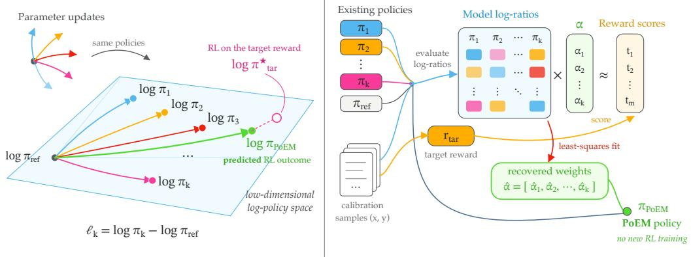  
Figure 1: Overview of PoEM. (a) Policies $\pi _ { 1 } , \ldots , \pi _ { k }$ post-trained from a shared reference $\pi _ { \mathrm { r e f } }$ on different rewards have nearly orthogonal parameter updates, yet their policy log-ratios $\phi _ { k } = $ log $\pi _ { k } - \log \pi _ { \mathrm { r e f } }$ span a low-dimensional space (measured in Fig. 2). The RL outcome $\pi ^ { \star }$ on a target reward can lie close to this space even when that reward is not a combination of the basis rewards, so a composition πˆ of the basis approximates it. (b) PoEM evaluates the basis log-ratios on shared calibration samples $( x , y )$ , centers them within each prompt, and fits weights αˆ by least squares so that Φeαˆ matches the centered scores $\widetilde { r } _ { \mathrm { t a r } }$ of the target reward $r _ { \mathrm { t a r } }$ on the same samples. The PoEM policy πˆ composes the basis with these weights at inference time, with no new RL training.

What if we want to simulate a completely new reward? The new reward rarely decomposes linearly into a small fixed basis. Despite this, we find that the policies learned by single-reward adapters often span a much smaller behavioral space than the reward geometry suggests. Even when the adapter weight updates are nearly orthogonal, the matrix of log-ratios against the base model [39] spans far fewer effective directions. A new optimal policy can therefore lie inside this subspace even when its reward is not a linear combination of the basis rewards. The strong linearity assumption on reward is replaced by a much weaker geometric assumption on log-policies.

Inspired by these observations, we propose PoEM (Product of Experts Mixing), a framework for predicting RL outcomes for new rewards from past RL trainings on a different set of rewards (Fig. 1). We estimate composition weights from a small set of samples scored under the new reward, using either the basis reward outputs or the basis policy log-ratios. At inference time, the policy we output is a weighted log mixture of the base model and the previously obtained policies [28, 27, 29, 31]. No parameters are updated, and no additional RL run is launched.

We evaluate PoEM across text and image modalities. On bases of 20 adapters trained with GRPO or DPO on programmatic text rewards on Qwen3-0.6B, generations from PoEM recover most of the reward gain of a directly trained RL policy on composite rewards, with an error close to the difference between two RL runs. In the general setting, a coverage score ranks in advance which held-out rewards PoEM can reach. On a basis of ten diverse public reward models adapted with PPO, generations from PoEM are closer to the directly trained RL policy than the leading single expert on 9 of 10 held-out rewards. On image generation with 13 adapters trained with DDPO on Stable Diffusion v1.4, PoEM approximates a held-out RL adapter from the remaining basis. Our contributions are as follows:

• We propose PoEM, an inference-time method that approximates the RL outcome on a new reward by composing existing single-reward adapters, with no further training.

• We give a regression recipe for recovering composition weights, using either basis reward scores or basis log-ratios.

• We find a policy space rank gap: near-orthogonal adapters span far fewer directions in log-likelihood space than in parameter space.

• We validate PoEM across language and image, with comparisons to best-of-N, and other decoding-time methods.

## 2 Predicting RL Outcomes by Policy Composition

In this section, we propose PoEM to predict the policy that RL training on a new reward would produce, as formalized in Section 2.1. We first consider the case in which the target reward is a linear combination of the rewards the basis policies were trained on 2.2, and instantiate the resulting composition for autoregressive and diffusion models 2.3. We then explain how to recover the composition weights from the basis rewards or from the basis policies alone 2.4, and show how to check whether the basis policies cover the new reward 2.5.

## 2.1 Problem setup

Let $\pi _ { \mathrm { r e f } }$ be a reference model and let $\boldsymbol { B } = \{ \pi _ { 1 } , \ldots , \pi _ { n } \}$ be a basis of policies obtained by posttraining the same reference model on different rewards. Basis policy $\pi _ { k }$ is trained on reward $r _ { k }$ using the KL regularized objective

$$
J _ { r _ { k } } ( \pi ) = \mathbb { E } _ { x \sim \mathcal { D } } \left[ \mathbb { E } _ { y \sim \pi ( \cdot \vert x ) } [ r _ { k } ( x , y ) ] - \beta \operatorname { K L } ( \pi ( \cdot \vert x ) \Vert \pi _ { \mathrm { r e f } } ( \cdot \vert x ) ) \right] ,\tag{1}
$$

with a common reference policy and KL coefficient $\beta > 0$ . Given a new target reward $r _ { \mathrm { t a r } }$ , our goal is to approximate the policy $\pi _ { \mathrm { t a r } } ^ { * } \in \arg \operatorname* { m a x } _ { \pi } J _ { r _ { \mathrm { t a r } } } ( \pi )$ without training.

## 2.2 Exact composition for linear rewards

We first study the idealized case in which the new reward is a linear combination of the basis rewards,

$$
r _ { \mathrm { t a r } } ( x , y ) = \sum _ { k = 1 } ^ { n } \alpha _ { k } r _ { k } ( x , y ) .\tag{2}
$$

For an unrestricted policy class, the optimizer of Eq. (1) for any reward r is the exponentially tilted reference policy [36, 23, 39],

$$
\pi _ { r } ^ { * } ( y \mid x ) = \frac { 1 } { Z _ { r } ( x ) } \pi _ { \mathrm { r e f } } ( y \mid x ) \exp \left( \frac { r ( x , y ) } { \beta } \right) , \qquad Z _ { r } ( x ) = \mathbb { E } _ { y \sim \pi _ { \mathrm { r e f } } ( \cdot \mid x ) } \left[ \exp \left( \frac { r ( x , y ) } { \beta } \right) \right] .\tag{3}
$$

If every basis policy is the exact optimizer for its nominal reward, $\pi _ { k } = \pi _ { r _ { k } } ^ { * }$ , substituting Eq. (2) into Eq. (3) yields

$$
\pi _ { \mathrm { t a r } } ^ { * } ( y \mid x ) \propto \pi _ { \mathrm { r e f } } ( y \mid x ) \prod _ { k = 1 } ^ { n } \left( \frac { \pi _ { k } ( y \mid x ) } { \pi _ { \mathrm { r e f } } ( y \mid x ) } \right) ^ { \alpha _ { k } } = \pi _ { \mathrm { r e f } } ( y \mid x ) ^ { 1 - \sum _ { k } \alpha _ { k } } \prod _ { k = 1 } ^ { n } \pi _ { k } ( y \mid x ) ^ { \alpha _ { k } } .\tag{4}
$$

Thus, the target RL solution is a product of experts in policy space. Specifically, we can rewrite this in terms of policy log-ratio for each basis policy, or how much it has moved away from the reference policy in terms of probability on each sequence

$$
\phi _ { k } ( x , y ) = \log \pi _ { k } ( y \mid x ) - \log \pi _ { \mathrm { r e f } } ( y \mid x ) ,\tag{5}
$$

so that $\begin{array} { r } { \pi _ { \mathrm { t a r } } ^ { * } \propto \pi _ { \mathrm { r e f } } \exp ( \sum _ { k } \alpha _ { k } \phi _ { k } ) } \end{array}$ . When $\textstyle \sum _ { k } \alpha _ { k } = 1$ , the explicit reference term vanishes.

Equation (4) is exact under the idealized assumptions above. In practice, finite capacity models and imperfect optimization mean that a trained basis policy might not reach $\pi _ { r _ { k } } ^ { * }$ . Our method therefore composes the implicit rewards actually represented by the trained policies, rather than assuming that every basis perfectly maximizes its corresponding reward. We make this distinction explicit in Section 2.4.

## 2.3 PoEM: Product-of-Experts Mixing

## 2.3.1 PoEM for Autoregressive language models

For a language model, x is a prompt and $y = ( y _ { 1 } , \dotsc , y _ { T } )$ is a response. Equation (4) defines a distribution over complete responses, but sampling from that distribution exactly requires normalizers over the full response space. We obtain a practical decoder by applying the same log-ratio composition

locally at each prefix $h _ { t } ~ = ~ ( x , y _ { < t } )$ , using the token-level log-ratios $\phi _ { k } ( h _ { t } , y _ { t } ) \ : = \ : \log \pi _ { k } ( y _ { t } \mid$ $h _ { t } ) - \log \pi _ { \mathrm { r e f } } ( \bar { y _ { t } } \mid h _ { t } )$ , which sum to the sequence-level ones, $\begin{array} { r } { \phi _ { k } ( x , y ) = \sum _ { t } \phi _ { k } ( h _ { t } , y _ { t } ) \colon } \end{array}$

$$
\log \pi _ { \mathrm { P o E M } ( \alpha ) } ( y _ { t } \mid h _ { t } ) \doteq \log \pi _ { \mathrm { r e f } } ( y _ { t } \mid h _ { t } ) + \sum _ { k = 1 } ^ { n } \alpha _ { k } \phi _ { k } ( h _ { t } , y _ { t } ) ,\tag{6}
$$

where $\doteq$ denotes equality up to the token-level normalizing constant. This decoder is inexpensive, as it requires only the next-token logits of the reference and basis policies, and it performs no parameter updates.

This is not generally identical to the globally normalized sequence distribution in $\operatorname { E q . } \left( 4 \right)$ , as the local normalization conditions on the prefix at every step. The two are similar in special cases in which these continuation normalizers do not depend on the generated path. In general, we treat Eq. (6) as the autoregressive approximation used by PoEM. Note that sampling strategy is similar to the decoding strategy of prior work in multi-objective alignment [43].

## 2.3.2 PoEM for Diffusion models

We now instantiate the framework for diffusion models [16, 44].

Background. Before we proceed, it is useful to provide some background on diffusion models. The goal in diffusion modeling is to sample from some distribution $p _ { 0 }$ . During training, we are given samples $X _ { 0 }$ from $p _ { 0 }$ , we corrupt them by adding noise forming random variables $X _ { t } ~ =$ $\bar { X } _ { 0 } + \sigma ( t ) \bar { Z } , Z \sim \mathcal { N } ( 0 , \bar { I } )$ , for different noise levels $\sigma ( t )$ , and we train the model to reconstruct $X _ { 0 }$ from $X _ { t }$ with an l loss. For a fixed noise level t, the optimal $l _ { 2 }$ denoiser is the conditional expectation $\mathbb { E } [ X _ { 0 } | X _ { t } = \cdot , t ]$ . A network $h _ { \theta ^ { * } }$ ∗ is hence trained to approximate this object.

Using the notation above, and for simplicity assuming $\textstyle \sum _ { k } \alpha _ { k } = 1$ , Eq. (4) reads $\pi _ { \mathrm { t a r } } ^ { * } ( x _ { 0 } )$ ∝ $\textstyle \prod _ { k } { \bar { \pi _ { k } } } ( x _ { 0 } ) ^ { \alpha _ { k } }$ . The question here becomes; is it possible to connect the objects being trained, i.e. the conditional expectations, via the equation above? Since we assumed $\begin{array} { r } { \sum _ { k } \alpha _ { k } = 1 } \end{array}$ , the posterior distribution can be composed as:

$$
\pi _ { \mathrm { t a r } } ^ { * } ( x _ { 0 } \mid X _ { t } = x _ { t } ) = { \frac { 1 } { Z ( x _ { t } ) } } \prod _ { k } \pi _ { k } ( x _ { 0 } \mid X _ { t } = x _ { t } ) ^ { \alpha _ { k } } , \qquad Z ( x _ { t } ) = \int \prod _ { k } \pi _ { k } ( x _ { 0 } \mid X _ { t } = x _ { t } ) ^ { \alpha _ { k } } d x _ { 0 } .
$$

By taking logarithms and the gradient with respect to $x _ { t }$ in both sides, we have that

$$
\nabla \log \pi _ { \mathrm { t a r } } ^ { * } ( x _ { 0 } \mid X _ { t } = x _ { t } ) = \sum _ { k } \alpha _ { k } \nabla \log \pi _ { k } ( x _ { 0 } \mid X _ { t } = x _ { t } ) - \nabla \log Z ( x _ { t } ) .\tag{7}
$$

We now have to work with these conditional scores. An application of Bayes formula gives $\nabla \log \pi _ { i } ( x _ { 0 } \mid X _ { t } = x _ { t } ) = \nabla \log \pi _ { i } ( x _ { t } \mid X _ { 0 } = x _ { 0 } ) - \nabla \log \overleftarrow { \pi } _ { i } ( x _ { t } )$ . The important observation A

is that with $x _ { 0 }$ fixed, the first likelihood term is Gaussian independent of the policy $\pi _ { i }$ . Hence, Eq. (7) becomes $\begin{array} { r } { A - \nabla \log \pi _ { \mathrm { t a r } } ^ { * } ( x _ { t } ) = \sum _ { k } \alpha _ { k } \bigl ( A - \nabla \log \pi _ { k } ( x _ { t } ) \bigr ) \stackrel { \cdot } { - } \nabla \log Z ( x _ { t } ) \stackrel { \cdot } { \iff } \nabla \log \pi _ { \mathrm { t a r } } ^ { * } ( x _ { t } ) = \frac { 1 } { \sqrt { 3 } } \int \log \pi _ { \mathrm { t a r } } ^ { * } ( x _ { t } ) d x _ { t } . } \end{array}$ $\begin{array} { r } { \sum _ { k } \alpha _ { k } \nabla \log \pi _ { k } ( x _ { t } ) + \nabla \log Z ( \overline { { x _ { t } } } ) } \end{array}$ . For the last step of this calculation, we are invoking a powerful statistical tool, called Tweedie’s Formula $[ 1 1 , 4 7 ] , \mathbb { E } [ X _ { 0 } \mid X _ { t } = x _ { t } ] = x _ { t } + \sigma ^ { 2 } ( t ) \nabla$ log $\pi ( \boldsymbol { x } _ { t } )$ , that connects the gradient of the log-likelihood (also known as the score) with the conditional expectation the model is trained to estimate. The final expression becomes:

$$
\mathbb { E } _ { r _ { \mathrm { t a r } } } [ X _ { 0 } | X _ { t } = x _ { t } ] = \sum _ { k } \alpha _ { k } \mathbb { E } _ { r _ { k } } [ X _ { 0 } | X _ { t } = x _ { t } ] + \sigma ^ { 2 } ( t ) \nabla \log Z ( x _ { t } ) .\tag{8}
$$

Remark 2.1. Simply put, Equation (8) states that the denoiser that we will get by adapting a diffusion model with a new reward $r _ { \mathrm { t a r } }$ is a linear combination of the existing denoisers that have been adapted to previous rewards, plus a correction term $\sigma ^ { 2 } ( t ) \nabla \log Z ( x _ { t } )$ , as long as the new reward can be expressed as a linear combination of those rewards. By Hölder’s inequality, $Z ( x _ { t } ) \leq 1$ , with equality if and only if all posteriors $\pi _ { k } ( \cdot \mid X _ { t } = x _ { t } )$ coincide. The correction vanishes as $\sigma ( t )  0$ , where all posteriors concentrate at $x _ { t } ,$ and it is exactly zero when, $\mathrm { e . g . }$ , the basis policies are Gaussians with a shared covariance, since then $Z ( x _ { t } )$ does not depend on $x _ { t }$ . In general, however, it is non-zero, so dropping it and linearly combining the predictions of the existing networks is an approximation to the target denoiser rather than an exact identity. This approximation still allows us to skip RL-training altogether for the new reward.

## 2.4 Recovering composition weights

The composition rules above require coefficients α. These may be specified directly by the user, but our primary setting is one in which only a new reward function is given. In what follows, we present an algorithm that estimates these coefficients from a small calibration data pool and access to the new reward function. We present the algorithm for the autoregressive models case, but it naturally extend to the diffusion modeling paradigm.

The calibration set. We fit the weights on a small calibration set of prompts $x _ { p } ,$ , each with $M _ { p }$ responses $y _ { p , m }$ . The responses can be sampled from the reference model or, if the experts are far from it, from the experts. A reward term that depends only on the prompt does not change the optimal policy, since $Z _ { r } ( x )$ in Eq. (3) absorbs it. As in DPO [39], we remove such terms by comparing responses to the same prompt. We subtract from each reward and log-ratio its mean over the prompt’s responses, and refer to these centered values with a tilde.

Algorithm when the basis rewards are available. We score every response using the new reward and the basis rewards, stack the centered target scores into $\widetilde { r } _ { \mathrm { t a r } } \in \mathbb { R } ^ { N }$ , where $\begin{array} { r } { N = \mathbf { \sum } _ { p } M _ { p } , } \end{array}$ , and the centered basis rewards into $\widetilde { R } \in \mathbb { R } ^ { N \times n }$ , with columns $\widetilde { r } _ { k }$ . We estimate the reward space weights by ridge regression,

$$
\pmb { \alpha } ^ { \mathrm { R } } = \arg \operatorname* { m i n } _ { \alpha \in \mathbb { R } ^ { n } } \left\| \widetilde { \pmb { r } } _ { \mathrm { t a r } } - \widetilde { R } \pmb { \alpha } \right\| _ { 2 } ^ { 2 } + \lambda \| \pmb { \alpha } \| _ { 2 } ^ { 2 } .\tag{9}
$$

When Eq. (2) holds and the calibration matrix has sufficient rank, $\alpha ^ { \mathrm { R } }$ recovers the true weights. Outside that setting, it gives the best regularized linear approximation of the new reward by basis rewards on the calibration distribution.

Algorithm when only the basis policies are available. To run the algorithm above, we require access not only to the basis policies but also to the reward policies that produced them. If those are not available, they can be estimated instead. In particular, our observation is that each trained policy also defines an implicit reward. Specifically, this is related to how much more probability the new policy assigns to a data point in comparison to the base policy. Rearranging Eq. (3) gives

$$
r ( x , y ) = \beta \left[ \log \pi _ { r } ^ { * } ( y \mid x ) - \log \pi _ { \mathrm { r e f } } ( y \mid x ) \right] + \beta \log Z _ { r } ( x ) .\tag{10}
$$

Applied to a trained basis policy, this identity makes $\beta \phi _ { k }$ the reward for which $\pi _ { k }$ is exactly KLoptimal, up to the final, prompt-only term, which centering removes. We can therefore use the policy log-ratios of Eq. (5) as regression features. Let $\widetilde { \Phi } \in \mathbb { R } ^ { N \times n }$ be the feature matrix with columns $\phi _ { k }$ and estimate the policy space coefficients by

$$
\widehat { \pmb { \alpha } } = \arg \operatorname* { m i n } _ { { \pmb { \alpha } } \in \mathbb { R } ^ { n } } \left\| \widetilde { \pmb { r } } _ { \mathrm { t a r } } - \beta \widetilde { \Phi } { \pmb { \alpha } } \right\| _ { 2 } ^ { 2 } + \lambda \| { \boldsymbol { \alpha } } \| _ { 2 } ^ { 2 } .\tag{11}
$$

The scale $\beta$ can be absorbed into α when the effective KL coefficient of the basis is unknown. Unlike $\alpha ^ { \mathrm { R } }$ , which describes how we can recover $r _ { \mathbf { t a r } }$ from rewards, αb describes how we can express it in terms of the directions ofbasis policies. These two are similar at the exact KL regularized optimum with a shared $\beta ,$ but are different when the basis policies are imperfectly optimized or have different effective strengths.

## 2.5 Policy space coverage beyond linear rewards

So far, we have assumed that the new reward to be estimated can be expressed as a linear combination of the existing rewards. This exact reward composition is a sufficient condition for Eq. (4) to hold, but it is not the only regime in which PoEM can be useful. Specifically, the PoEM decoder is the span of the log-ratios $\phi _ { 1 } , \ldots , \phi _ { n } ,$ regardless of any assumptions about the target reward. If the target policy that we would obtain through RL lies in that span, PoEM can approximate it. We propose a coverage score that measures whether this condition holds or not. After fitting $\widehat { \mathbf { \alpha } } \widehat { \mathbf { \alpha } }$ on the fitting subset of the calibration set as explained above, we evaluate

$$
\mathrm { C o v } _ { B } ( r _ { \mathrm { t a r } } ) = 1 - \frac { \left\| \widetilde { r } _ { \mathrm { t a r } } ^ { \mathrm { v a l } } - \beta \widetilde { \Phi } ^ { \mathrm { v a l } } \widehat { \alpha } \right\| _ { 2 } ^ { 2 } } { \left\| \widetilde { r } _ { \mathrm { t a r } } ^ { \mathrm { v a l } } \right\| _ { 2 } ^ { 2 } } .\tag{12}
$$

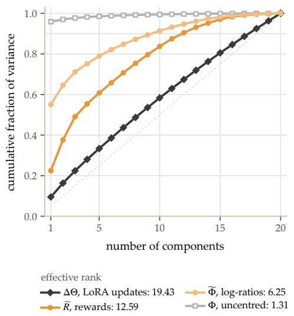

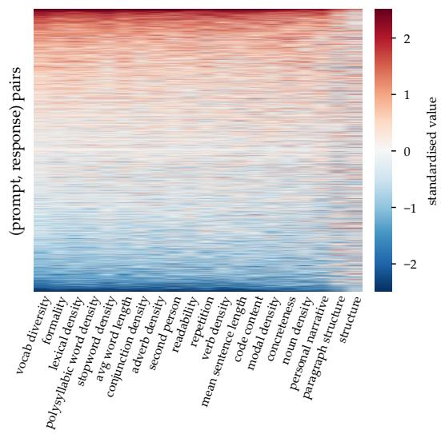  
Figure 2: Policies trained on different rewards vary along fewer directions than the rewards themselves. Twenty experts trained with GRPO, one per programmatic reward, evaluated on basemodel responses. (a) Cumulative variance of the experts’ weight updates (∆Θ), rewards $( \widetilde { R } )$ and log-ratios (Φe). The weight updates are close to full rank, while the log-ratios use about half as many effective directions as the rewards. (b) The log-ratio matrix Φe, rows sorted by its first principal component: nearly all experts move together along one shared direction. App. C.4 shows the same for policies trained on public reward models.

This is the explained variance or $R ^ { 2 }$ of the target reward against the policy log-ratio features. For best results, the calibration distribution should consist of samples that we are interested in evaluating the approximated policy in. Naturally, if the target reward can be represented as a linear combination of basis policies the coverage score will be high. However, this metric can also be high for target rewards that are not linear combinations of the existing ones. We can leverage PoEM when coverage is high, and abstain or train a new basis policy when it is low.

This result formalizes the case in which PoEM can generalize beyond literal reward combinations, as it does not rely on the reward linearity assumption. App. A bounds the gap to $\pi _ { \mathrm { t a r } } ^ { * }$ when the target reward is uniformly close to the span of the log-ratios. This coverage metric is relevant to the role of task coverage in successor feature transfer [2], but here the reusable features are given by previous post-training runs rather than specified in advance.

Method summary. Given a target reward $r _ { \mathrm { t a r } } .$ , PoEM 1) scores a small calibration set, 2) obtains coefficients using reward space regression in Eq. (9) or policy space regression in Eq. (11), 3) checks the held-out coverage score in Eq. (12), and 4) composes the basis at inference time using Eq. (6) for language models or Eq. (8) for diffusion models. No model parameters are updated and no additional RL run is required.

## 3 Experimental Setup

We test PoEM as a predictor of RL. For each target reward $r _ { \mathrm { t a r } }$ we train one policy $\pi _ { \mathrm { t a r } }$ with RL and we use it as the oracle that PoEM tries to approximate. We run three different types of experiments. In the first type, the rewards we are testing are exact linear combinations of the basis rewards. The second type measures whether the experts’ log-ratios vary along fewer directions than their rewards (geometry). The third predicts RL on held-out rewards, which are not weighted sums of the basis rewards. Section 4 reports them in this order on all bases. App. B lists the bases and the experiments run on each, and includes the full training and evaluation details.

## 3.1 Basis training

We experiment with different types of reward functions for our basis across our language and diffusion experiments.

Programmatic rewards for language. P-GRPO and P-DPO share 20 programmatic rewards. Each is a deterministic function of the response text, such as vocabulary diversity, formality, readability (App. B.1). Each expert is a rank-64 LoRA adapter on Qwen3-0.6B, trained on one reward from a shared initialization. P-GRPO trains its experts on-policy with GRPO [42] for one epoch, with a KL penalty to $\pi _ { \mathrm { r e f } }$ in the loss. P-DPO trains them offline with DPO, on pairs of fixed responses generated by the reference model, and ranked by the reward. The two bases share the rewards and differ in how their experts were trained.

Reward models for language. The next three bases are trained with PPO on reward models (RMs), with the KL penalty in the reward. RM-RB uses four RMs that rank high on RewardBench [26]. RM-HH uses the helpfulness and harmlessness heads of ArmoRM [48]. RM-Div uses ten diverse public RMs released by different groups, and each of its experts passes a check for reward hacking (App. B.2).

Image reward functions. SD-DDPO has 13 LoRA experts on Stable Diffusion v1.4 [41], trained with DDPO [3]. Ten are trained on image statistics, such as compressibility, colorfulness and sharpness, and three on image RMs: aesthetic score [33], PickScore [21] and CLIP score [38].

## 3.2 Datasets and target policies

All language model experts and targets are trained on UltraChat prompts [9]. For RM-HH and RM-Div, about half of the training prompts are harmful requests from PKU-SafeRLHF [20]. Evaluation prompts come from the same datasets and are held out from every training set. The calibration responses that weights and coverage are fit on are sampled on held-out UltraChat prompts for P-GRPO and P-DPO and on training prompts for the RM bases. For a combined reward, $\pi _ { \mathrm { t a r } }$ is trained on $r _ { \mathrm { t a r } }$ with the method and recipe of its basis. On the programmatic bases, the combined rewards mix 2 to 16 z-scored basis rewards, with weights ranging from one dominant reward to uniform. For a held-out reward, $\pi _ { \mathrm { t a r } }$ is the held-out expert itself.

## 3.3 Evaluation and metrics

Decoding and aggregation. We decode from PoEM with Eq. (6), which requires loading k experts at a time. All language model policies, including PoEM, decode greedily on held-out prompts: up to 96 new tokens on the programmatic bases, and up to 512 on the RM bases, the length their experts were trained with. Each decoded policy is scored against the $\pi _ { \mathrm { r e f } }$ and $\pi _ { \mathrm { t a r } }$ decoded in the same run, and we report medians over targets (means over the 13 rewards on SD-DDPO), with 95% bootstrap intervals on the programmatic bases. App. B.4 lists the prompt sets and the remaining protocol details.

Composition strength. We optionally multiply the basis contribution in Eq. (6) by a scalar $\gamma > 0$

$$
\log \pi _ { \mathrm { P o E M } ( \alpha ; \gamma ) } ( y _ { t } \mid h _ { t } ) \doteq \log \pi _ { \mathrm { r e f } } ( y _ { t } \mid h _ { t } ) + \gamma \sum _ { k } \alpha _ { k } \phi _ { k } ( h _ { t } , y _ { t } ) .\tag{13}
$$

At the sequence level, scaling by γ is equivalent to scaling the composed implicit reward, or to replacing β by $\beta / \gamma$ . Thus γ is a test-time adjustment to the KL from the reference model. This is useful because when the active basis directions are weakly correlated, the norm of their average can shrink with the number of components. In this regime, a larger γ compensates for cancellation. The shrinkage would be correct if every policy optimized Eq. (1) on its reward as given, since Eq. (4) then holds at $\gamma = 1$ . However, common RL recipes discard the reward’s scale. For instance, GRPO divides each reward by its standard deviation among the responses to a prompt, and DPO keeps only which response of a pair ranks higher, while PPO with the KL penalty in the reward, which trains the RM bases, keeps the scale. A policy trained with GRPO or DPO receives a training update of the same size whatever its reward, and this holds for $\pi _ { \mathrm { t a r } }$ even though its reward combines several. The weighted average of the experts’ log-ratios is not rescaled in this way, so at $\gamma = 1$ it is lower in magnitude than $\pi _ { \mathrm { t a r } } \gamma _ { \mathrm { s } }$ log-ratio. We set this compensation without training on $r _ { \mathrm { t a r } }$ by rescaling the composed log-ratio to the typical size of a single expert’s,

$$
\gamma _ { \mathrm { g e o m } } = \bigg ( \frac { \sum _ { k } \left| \alpha _ { k } \right| G _ { k k } } { \alpha ^ { \top } G \alpha } \bigg ) ^ { 1 / 2 } ,\tag{14}
$$

where $G$ is the Gram matrix of the experts’ log-ratios on reference model responses, centered within each prompt, and α is rescaled so that $\begin{array} { r } { \sum _ { k } | \alpha _ { k } | = 1 } \end{array}$ . It equals one for identical experts and $1 / \| \alpha \| _ { 2 }$ 2 for uncorrelated experts of equal size. The correction is exact in an idealized case. If each policy optimizes Eq. (1) on its reward divided by the reward’s standard deviation within a prompt, and the basis rewards share one standard deviation $s ,$ then $r _ { \mathrm { t a r } }$ divided by its own standard deviation equals γgeom $\textstyle \sum _ { k } \alpha _ { k } r _ { k } / s$ . An alternative, the drift-matched $\gamma ^ { \star }$ , picks the strength at which the prediction’s per-token log-likelihood under $\pi _ { \mathrm { r e f } }$ has dropped by the |α|-weighted average of the drops of the experts it composes. More details are in Appendix B.4.

Reward recovery and distance to the target policy. We score a policy π by its mean target reward $r ( \pi )$ and report the share of $\pi _ { \mathrm { t a r } } \mathrm { \bar { s } }$ reward gain that it recovers,

$$
\mathrm { r e c } ( \pi ) = \frac { r ( \pi ) - r ( \pi _ { \mathrm { r e f } } ) } { r ( \pi _ { \mathrm { t a r } } ) - r ( \pi _ { \mathrm { r e f } } ) } ,\tag{15}
$$

so that $\pi _ { \mathrm { r e f } }$ scores $_ 0$ and $\pi _ { \mathrm { t a r } }$ scores 1. The reward error is $\left| 1 - \operatorname { r e c } ( \pi ) \right|$ |. A policy can reach the target reward without behaving like $\pi _ { \mathrm { t a r } } ,$ so we also measure the per-token $\dot { \mathrm { K L } } ( \bar { \pi } _ { \mathrm { t a r } } \Vert \pi )$ along $\pi _ { \mathrm { t a r } } \mathrm { \bar { s } }$ own greedy responses. The relative KL divides it by $\mathrm { K L } ( \pi _ { \mathrm { t a r } } \parallel \pi _ { \mathrm { r e f } } )$ , so a relative KL below 1 means the prediction is closer to $\pi _ { \mathrm { t a r } }$ than the reference model is.

Weights, strengths and baselines. For combined rewards on the programmatic bases, $\hat { \alpha }$ is fit on reference model responses. For held-out rewards and on the RM bases, it comes from non-negative least squares on responses sampled from the experts, without the held-out expert’s responses. We decode at $\gamma = 1$ , on the programmatic bases also at $\gamma _ { \mathrm { g e o m } } ,$ , and for held-out rewards also at the drift-matched $\gamma ^ { \star }$ . None of these uses $\pi _ { \mathrm { t a r } }$ , and the $\gamma$ tuned on $\pi _ { \mathrm { t a r } }$ serves only as a reference. The baselines are best-of-N, the top expert and, on RM-Div, uniform weights.

Coverage. Before decoding for a held-out reward, we compute the coverage of Eq. (12), which is equivalent to the held-out $R ^ { 2 }$ of the target reward regressed on the experts’ log-ratios, on a calibration set of responses sampled from the experts. A reward is covered when its coverage is higher than a threshold (threshold = 0.3 in our experiments). On RM-Div we use within expert coverage, which includes on-policy responses for the basis models. All its values fall below 0.3, so we split RM-Div at its median coverage instead (App. B.4).

Geometry. The effective rank of a matrix is $\begin{array} { r } { \operatorname { * { x p } } ( - \sum _ { i } { p _ { i } \log p _ { i } } ) } \end{array}$ , where $p _ { i }$ is the share of variance along its i-th principal direction. We compute it on 2,400 reference model responses to 600 prompts, for the reward matrix $\widetilde { R }$ and the log-ratio matrix $\widetilde { \Phi }$ of Section 2.4, each centered within prompt and standardized per column, and for the Gram matrix of the experts’ weight updates ∆Θ.

## 4 Results

We first test PoEM on combined rewards, where our theory applies directly, then study the geometry of the trained experts and test PoEM on held-out rewards and on image diffusion.

## 4.1 Combined rewards

When $r _ { \mathrm { t a r } }$ is a weighted sum of the basis rewards, Eq. (4) makes the RL optimum exactly the product of the experts with the true weights $\ b { \alpha } ^ { * }$ that define $r _ { \mathrm { t a r } }$ . In practice this holds only approximately since trained experts are not exact optima, and the decoder normalizes at every token rather than over whole responses (App. C.2). We therefore ask whether PoEM matches the reward of the target policy, and if it is distributionally close to the target policy. Table 1 and Fig. 3 answer both on the four language model bases, and $\dot { \mathrm { F i g } }$ . 7 shows the RM bases in detail.

Table 1: On combined rewards, PoEM with the true weights is close to a second RL run. Reward error is 0 when a method matches $\pi _ { \mathrm { t a r } } \mathrm { \bar { s } }$ reward gain and 1 when it is as far off as the reference model. A second RL run with another seed shows how much RL itself varies. The last two columns measure if PoEM is distributionally close to $\pi _ { \mathrm { t a r } } \colon$ its KL to $\pi _ { \mathrm { t a r } }$ as a fraction of the reference model’s, and how often it is the closer of the two. We report medians over combined rewards, with PoEM at γgeom on the programmatic bases and $\gamma = 1$ on the RM bases.
<table><tr><td></td><td></td><td colspan="5">Reward error ↓</td><td colspan="2">Distance of PoEM  $( \alpha ^ { * } )$ </td></tr><tr><td>Basis</td><td>Targets</td><td>PoEM ()</td><td></td><td>PoEM (α*) top expert</td><td>best-of-16</td><td>2nd RL run</td><td>relative KL</td><td>closer</td></tr><tr><td>P-GRPO</td><td>32</td><td>0.28</td><td>0.19</td><td>0.23</td><td>0.37</td><td>0.12</td><td>0.24</td><td>32/32</td></tr><tr><td>P-DPO</td><td>32</td><td>0.19</td><td>0.21</td><td>0.32</td><td>0.40</td><td>0.17</td><td>1.05</td><td>13/32</td></tr><tr><td>RM-RB</td><td>8</td><td>0.05</td><td>0.08</td><td>0.13</td><td>0.24</td><td>一</td><td>0.29</td><td>8/8</td></tr><tr><td>RM-HH</td><td>3</td><td>0.07</td><td>0.22</td><td>0.07</td><td>0.22</td><td>一</td><td>0.58</td><td>3/3</td></tr></table>

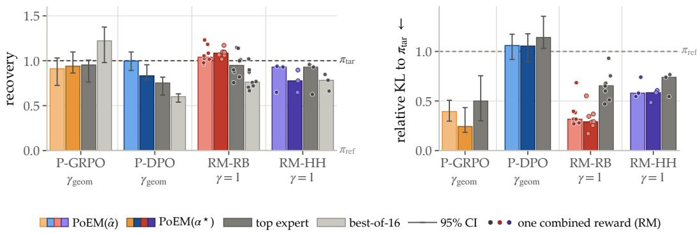  
Figure 3: On combined rewards, PoEM recovers most of RL’s reward gain, and is closer to the target policy. Left: $\pi _ { \mathrm { t a r } } \mathrm { \bar { s } }$ reward gain, where 1 matches $\pi _ { \mathrm { t a r } }$ and 0 the reference model. Right: KL to $\pi _ { \mathrm { t a r } }$ relative to that of the reference model. Bars are medians over combined rewards, with 95% bootstrap intervals on the programmatic bases and single combined rewards as dots on the RM bases. PoEM uses fitted (light) or true (dark) weights, at $\gamma _ { \mathrm { g e o m } }$ on the programmatic bases and $\gamma = 1$ on the RM bases.

PoEM recovers RL’s reward gain. On the RM bases, PoEM at $\gamma = 1$ already recovers 0.78 to 1.08 of $\pi _ { \mathrm { t a r } } \mathrm { \bar { s } }$ reward gain. On the programmatic bases, $\gamma = 1$ falls short, more so as more rewards are combined $( \mathrm { A p p . C . 1 } ) . \gamma _ { \mathrm { g e o m } }$ estimates how much policy log-ratios shrink in comparison to the experts, and after applying it, recovery increases to 0.83 to 1.00. We also find that PoEM recovery is close to RL’s own variation. Specifically, a second RL run with another seed achieves a 0.12 to 0.17 recovery error. PoEM has a recovery error of 0.19 to 0.28 on the programmatic bases, and on the nine P-GRPO combined rewards that have a second run it matches that run.

PoEM is distributionally close to the target policy. Obtaining RL’s reward does not yet mean we have predicted $\pi _ { \mathrm { t a r } }$ . On P-GRPO and the RM bases, PoEM does both: it is closer to $\pi _ { \mathrm { t a r } }$ than the reference model on all combined rewards. P-DPO, whose experts are trained offline, is the exception, as PoEM matches the reward at $\gamma _ { \mathrm { g e o m } }$ but not the distance, and at $\gamma = 1$ the reverse.

PoEM is closer to $\pi _ { \mathrm { t a r } }$ than the top expert on every RM combined reward, and unlike best-of-N does not need to query $r _ { \mathrm { t a r } }$ at decoding. App. C.1 includes more baseline comparisons. On combined rewards, PoEM predicts RL’s reward about as well as a second RL run, and with on-policy experts it also predicts the policy.

## 4.2 Beyond the linear case: policy space geometry of post-trained models

Theoretically, we relied on the strong assumption that the new reward is exactly a linear combination of the basis rewards, $\begin{array} { r } { r _ { \mathrm { t a r } } = \sum _ { k } \alpha _ { k } r _ { k } } \end{array}$ . We now turn our interest to exploring what happens when this assumption is violated. We present this section for the instantiation of our framework for

Table 2: Coverage separates the held-out rewards PoEM can approximate from those it cannot. On every basis, covered rewards recover more of RL’s reward gain than uncovered ones, and $\rho ,$ the rank correlation between coverage and reward error, is strongly negative. A reward counts as covered when its coverage is larger than a threshold. We find that covered rewards have higher recovery in comparison to rewards that are not covered, as well as lower relative KL.
<table><tr><td></td><td></td><td></td><td colspan="3">Covered</td><td colspan="3">Not covered</td></tr><tr><td>Basis</td><td>Targets</td><td>ρ</td><td>recovery</td><td>relative KL</td><td>closer</td><td>recovery</td><td>relative KL</td><td>closer</td></tr><tr><td>P-GRPO</td><td>20</td><td>-0.79</td><td>0.55</td><td>0.47</td><td>9/9</td><td>0.22</td><td>1.04</td><td>5/11</td></tr><tr><td>P-DPO</td><td>20</td><td>-0.71</td><td>0.69</td><td>1.28</td><td>3/9</td><td>0.29</td><td>2.01</td><td>0/11</td></tr><tr><td>RM-Div</td><td>10</td><td>-0.81</td><td>0.60</td><td>0.64</td><td>4/5</td><td>0.43</td><td>0.99</td><td>3/5</td></tr></table>

Autoregressive models, but similar findings extend to the case of image diffusion models as we show experimentally in Section 4.4.

For LLMs, the PoEM decoder of Eq. (6) combines the basis policy log-ratios log $\pi _ { k } - \log \pi _ { \mathrm { r e f } }$ , not the basis rewards. A relevant question is therefore whether the optimal log-policy for $r _ { \mathrm { t a r } }$ lies in the subspace spanned by the basis log-ratios. A sufficient condition for that to happen is when $r _ { \mathrm { t a r } }$ lies in the linear span of the basis rewards. We show here that this condition is not necessary.

Specifically, we measure the dimensionality of that subspace directly on the matrix $\widetilde { \Phi }$ from Section 2.4, instantiated on a basis of $n = 2 0$ adapters trained on Qwen3-0.6B for distinct programmatic rewards (vocabulary diversity, formality, stopword density, sentence length, and others). We make the surprising experimental finding that the (approximate) rank of this matrix is markedly smaller than n (Fig. 2). The 20 adapters use almost all of their parameter degrees of freedom. Their stacked weight updates $\Delta \theta$ are full rank, a median pairwise cosine 0.02 between adapters, so they are nearly mutually orthogonal. By every parameter space measure, the basis is doing n different things. In log-likelihood space it is not. Centered $\widetilde { \Phi }$ has effective rank 6.3 out of 20, three times smaller than in ∆θ (19.4). Surprisingly, even when the rewards driving these adapters share no obvious linear relationship, their induced log-policies often span an approximately low-rank subspace, and part of this shared structure is response length (App. C.4).

Because $\widetilde { \Phi }$ is approximately low-rank with effective dimension much smaller than $n ,$ the set of log-policies reachable by $\begin{array} { r } { \sum _ { k } ^ { } \alpha _ { k } ( \log \pi _ { k } - \log \pi _ { \mathrm { r e f } } ) } \end{array}$ is, up to a prompt-only offset, a low-dimensional space that the basis covers densely. A new reward $r _ { \mathrm { t a r } }$ does not need to admit a closed-form decomposition $\sum _ { k } \beta _ { k } r _ { k }$ for PoEM to fit it. It suffices that the optimal log-policy for $r _ { \mathrm { t a r } }$ lies near the subspace spanned by the basis log-ratios. The strong linearity assumption on rewards from Section 2.2 is therefore replaced by a much weaker geometric assumption on the optimal log-policy. The same low-rank structure also conditions the regression of Section 2.4, whose effective column dimension is the policy space rank rather than $n ,$ so a small calibration set suffices.

## 4.3 Held-out rewards

The previous section suggests that PoEM can approximate target policy of a given reward even when the reward is not a weighted sum of the basis rewards, as long as $\pi _ { \mathrm { t a r } } \mathrm { \bar { s } }$ log-ratio lies near the span of the experts’ log-ratios. Coverage (Eq. (12)) checks this before any decoding and without $\pi _ { \mathrm { t a r } } ,$ , by measuring how much of the held-out reward the experts’ log-ratios explain. We hold out each expert of P-GRPO, P-DPO and RM-Div in turn and predict it from the others (Table 2, Fig. 4).

Coverage tells in advance which rewards PoEM can reach. On all three bases it ranks the reward error (ρ from −0.71 to −0.81), and covered rewards recover more of RL’s gain than the others (0.55 to 0.69, against 0.22 to 0.43). When coverage is high, the direction in which RL moves the policy already lies in the span of the experts’ directions; when it is low, that direction is missing. Held-out rewards remain harder than combined ones (reward error about 0.45 when covered, against 0.2), so coverage is best read as a warning of which predictions to distrust. It ranks rewards within a basis but is not a threshold across bases: on RM-RB, the held-out rewards have coverage near zero yet recover 0.56 to 0.83, because its reward models largely agree (App. C.5).

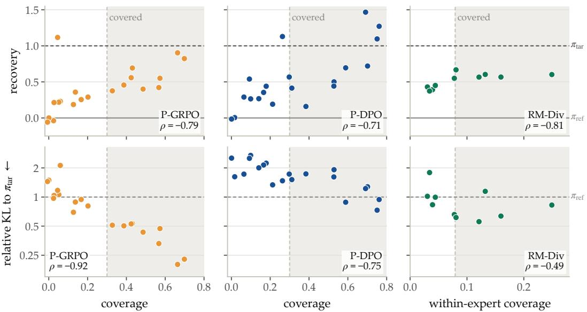  
Figure 4: Coverage, computed before decoding, predicts both how much of a held-out reward PoEM recovers and how close it gets to $\pi _ { \mathrm { t a r } } .$ Each point is one expert, held out and predicted from the others. Top: recovery of its reward. Bottom: KL to $\pi _ { \mathrm { t a r } }$ relative to that of the reference model, where values below 1 are closer. The shaded region is covered. We find that with higher coverage, the achieved recovery increases, and relative KL decreases.

With on-policy experts, covered predictions also resemble $\pi _ { \mathrm { t a r } } .$ . On P-GRPO, all nine covered predictions are closer to $\pi _ { \mathrm { t a r } }$ than the reference model, and coverage ranks this distance even better than the reward error $( \rho = - 0 . 9 2$ , against −0.75 on P-DPO and −0.49 on RM-Div). On RM-Div, four of the five better-covered predictions are closer. On P-DPO, as for combined rewards, covered predictions reach the reward but not the distance.

Uncovered rewards fail for lack of a direction, regardless of $\gamma$ used for decoding. Specifically, increasing γ helps only covered rewards (App. C.3). On P-GRPO, as γ grows from 0.5 to 2, the median covered prediction gains reward and moves closer to $\pi _ { \mathrm { t a r } }$ (recovery 0.18 to 0.64), while the median uncovered one reaches only 0.26 and drifts away. Even $\gamma$ tuned on $\pi _ { \mathrm { t a r } }$ for each reward leaves uncovered rewards at a recovery of 0.60 on P-GRPO and 0.39 on P-DPO, against 1.04 and 0.88 for covered ones. In conclusion, scaling the directions the basis has cannot help represent a direction it lacks.

Composing also beats decoding the top expert alone. On RM-Div, PoEM is closer to the held-out expert than the top expert on 9 of 10 rewards and recovers more of its reward on 8 (0.56 against 0.44). Best-of-16 reaches a similar reward (0.60) but needs $r _ { \mathrm { t a r } }$ and sixteen responses per prompt, and uniform weights are as close in KL but recover less (0.50).

## 4.4 Image diffusion models: qualitative results

A similar result holds in image diffusion models. In Fig. 5, composing the experts trained on the other rewards reproduces the change the held-out expert makes (Target), such as more saturated colors, finer texture, and a centered subject on a blurred background. Unlike for language models, the weights are fit separately at each denoising step. Our finding is that the held-out expert’s effect lies largely within what the other experts can express (App. C.6), meaning that linear combinations of the conditional expectations of the policies in the basis can accurately predict the target denoiser.

## 5 Related Work

Policy composition. One way to combine post-trained models is to average their weight updates in parameter space. This works when the fine-tuned checkpoints sit in a shared basin and linear mode connectivity holds [40, 19, 54, 50]. Averaging helps with a few models but gets worse as more are added, since updates in different directions dilute each other. Other methods combine models at decode time by mixing their next-token logits, with no further training. DExperts [28], contrastive decoding [27], and proxy-tuning [29] use one positive expert and sometimes a negative one. Multi-LoRA methods [49, 13, 58] pick among many adapters at each token using learned gates or task tags. MOD [43] is closest to our setting. It mixes the logits of single-objective policies with user-chosen weights, which corresponds to PoEM where the weights are given. DeRa [31] interpolates between an aligned policy and the reference model to change regularization strength at decode time. PoEM differs in two ways. Its composition rule follows from the closed-form solution of KL-regularized RL (Eq. 4). When the weights are unknown, it fits them from the experts’ log-ratios on a small calibration set (Section 2).

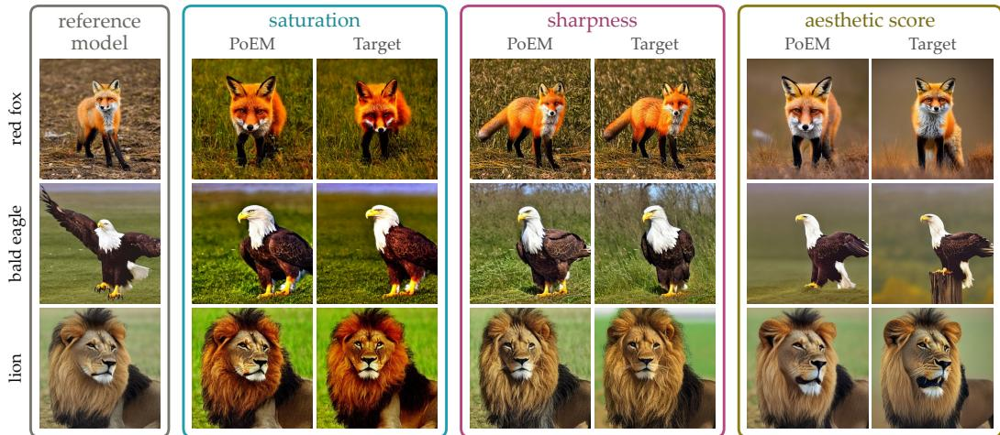  
Figure 5: Composing the other experts approximates the effect of RL fine-tuning on a held-out image reward. For each of three rewards, PoEM is composed from the experts trained on the other rewards, and Target is the model fine-tuned on that reward with DDPO [3]. The first column shows the reference model.

Multi-objective alignment. Multi-objective alignment trains one model, or a family of models, to balance several rewards with weights fixed at training time. Examples are multi-head reward models [48], multi-objective DPO [56], and conditional versions of DPO and PPO [15, 1]. PoEM instead composes existing single-reward experts at decode time and fits the weights afterwards from a small calibration set, so they do not have to be chosen before training.

Implicit rewards and policy space structure. DPO [39] shows that the KL-regularized optimum has a closed form in the reward. The trained policy’s log-ratio to the reference model is the implicit reward, up to a per-prompt constant. Prior work uses this log-ratio as one score per response, for iterative self-training [5], for picking preference pairs by difficulty [37], and for process reward models [8]. We use the log-ratios of all experts together and regress the target reward on them to get the weights. This works with only a few experts. Work on datamodels [18] and linear mode connectivity [14] also finds that fine-tuned models span far fewer dimensions in policy space than in parameter space.

## 6 Discussion

What RL post-training changes. The experts’ weight updates are nearly orthogonal, yet in policy space they move along only a few shared directions (Section 4.2). This fits the view that post-training mostly re-weights what the reference model already does. It is also why composition works. RL on a new reward can be predicted when it would move the policy in a direction the basis already has. We have only checked this on small models.

Previewing a reward before training on it. PoEM obtains a policy without training, so one can see what a candidate reward would do before paying for an RL run, and trust the preview only when coverage is high.

Approximating expensive rewards. RL calls the target reward on every rollout, while PoEM calls it only on a small calibration set. So RL on a reward that is expensive to evaluate, such as a large reward model, an LLM judge or a human rater, could be approximated with experts trained on cheap rewards. RM-Div does this on a small scale, and predicts each held-out 7-8B reward model from experts trained on the others. If the expensive reward depends on a direction that no cheap reward induces, coverage is low and PoEM fails. Coverage also tells us which expensive rewards a basis can stand in for.

Building the basis. Coverage shows which target rewards the current basis cannot reach, so the next expert could target the reward with the lowest coverage. Running k experts at inference is also costly. Distilling PoEM into a single model, or starting RL from it so that training only adds the missing directions, would remove this cost. We have not tested these ideas.

## 7 Conclusion

We studied whether the outcome of RL on a new reward can be predicted from policies already trained on other rewards. When the new reward is a linear combination of the old ones, composing the experts with the combination weights, at a scale set without any new training, the RL outcome’s reward performs similarly to a second RL run does. When the new reward is not a combination, a coverage score computed from the experts ranks in advance which rewards can be reached by our basis. Rewards with low coverage stay far from the RL outcome at every γ we tried. With experts trained on reward models, PoEM is closer to the RL outcome than the reference model and the top expert on every combined reward, and coverage again ranks the held-out RMs. Together, these results suggest that a set of trained RL policies carry enough structure to compose new reward aligned behavior at inference time.

## Limitations

The method’s coverage is bounded by the policy space span of the chosen basis. Rewards whose target direction lies outside the span cannot be recovered, regardless of probe set size or regression strength. Practical use therefore depends on assembling a basis whose policy log-ratios cover the directions of interest, which is straightforward for taxonomies of related rewards and harder for rewards orthogonal to the available adapters. Exact composition assumes each expert is a KL-regularized optimum, with a shared reference model and β. In practice, a large number of post-training runs do not include the KL term in the loss. The method is most compelling when reward evaluation is expensive or the basis is large, because best-of-N from the base model becomes more competitive as reward-evaluation cost shrinks. We have not tested long-context generation, or whether weights fitted on one reference model carry over to another.

## Acknowledgements

We thank Yoon Kim, Mehul Damani, and Idan Shenfeld for helpful discussions. This work was supported by ONR MURI grant N00014-26-1-2255. Giannis Daras is additionally supported by a Jane Street Research Collaboration award, Google’s TPU Research Cloud (TRC) program, and Lambda’s Research Grant Program.

## References

[1] Akhil Agnihotri, Rahul Jain, Deepak Ramachandran, and Zheng Wen. Multi-objective preference optimization: Improving human alignment of generative models. arXiv preprint arXiv:2505.10892, 2025.

[2] A Barreto, W Dabney, R Munos, JJ Hunt, T Schaul, H van Hasselt, and D Silver. Successor features for transfer in reinforcement learning. arxiv. arXiv preprint arXiv:1606.05312, 2016.

[3] Kevin Black, Michael Janner, Yilun Du, Ilya Kostrikov, and Sergey Levine. Training diffusion models with reinforcement learning. arXiv preprint arXiv:2305.13301, 2023.

[4] Zheng Cai et al. InternLM2 technical report. arXiv preprint arXiv:2403.17297, 2024.

[5] Changyu Chen, Zichen Liu, Chao Du, Tianyu Pang, Qian Liu, Arunesh Sinha, Pradeep Varakantham, and Min Lin. Bootstrapping language models with dpo implicit rewards. arXiv preprint arXiv:2406.09760, 2024.

[6] Paul F Christiano, Jan Leike, Tom Brown, Miljan Martic, Shane Legg, and Dario Amodei. Deep reinforcement learning from human preferences. Advances in neural information processing systems, 30, 2017.

[7] Karl Cobbe, Vineet Kosaraju, Mohammad Bavarian, Mark Chen, Heewoo Jun, Lukasz Kaiser, Matthias Plappert, Jerry Tworek, Jacob Hilton, Reiichiro Nakano, et al. Training verifiers to solve math word problems. arXiv preprint arXiv:2110.14168, 2021.

[8] Ganqu Cui, Lifan Yuan, Zefan Wang, Hanbin Wang, Yuchen Zhang, Jiacheng Chen, Wendi Li, Bingxiang He, Yuchen Fan, Tianyu Yu, et al. Process reinforcement through implicit rewards. arXiv preprint arXiv:2502.01456, 2025.

[9] Ning Ding, Yulin Chen, Bokai Xu, Yujia Qin, Zhi Zheng, Shengding Hu, Zhiyuan Liu, Maosong Sun, and Bowen Zhou. Enhancing chat language models by scaling high-quality instructional conversations. In Proceedings of the 2023 Conference on Empirical Methods in Natural Language Processing, 2023.

[10] Hanze Dong, Wei Xiong, Bo Pang, Haoxiang Wang, Han Zhao, Yingbo Zhou, Nan Jiang, Doyen Sahoo, Caiming Xiong, and Tong Zhang. Rlhf workflow: From reward modeling to online rlhf. arXiv preprint arXiv:2405.07863, 2024.

[11] Bradley Efron. Tweedie’s formula and selection bias. Journal of the American Statistical Association, 106(496):1602–1614, 2011.

[12] Kawin Ethayarajh, Yejin Choi, and Swabha Swayamdipta. Understanding dataset difficulty with V-usable information. In International Conference on Machine Learning, 2022.

[13] Wenfeng Feng, Chuzhan Hao, Yuewei Zhang, Yu Han, and Hao Wang. Mixture-of-loras: An efficient multitask tuning method for large language models. In Proceedings ofthe 2024 Joint International Conference on Computational Linguistics, Language Resources and Evaluation (LREC-COLING 2024), pages 11371–11380, 2024.

[14] Jonathan Frankle, Gintare Karolina Dziugaite, Daniel Roy, and Michael Carbin. Linear mode connectivity and the lottery ticket hypothesis. In International conference on machine learning, pages 3259–3269. PMLR, 2020.

[15] Raghav Gupta, Ryan Sullivan, Yunxuan Li, Samrat Phatale, and Abhinav Rastogi. Robust multi-objective preference alignment with online dpo. In Proceedings ofthe AAAI Conference on Artificial Intelligence, volume 39, pages 27321–27329, 2025.

[16] Jonathan Ho, Ajay Jain, and Pieter Abbeel. Denoising diffusion probabilistic models. Advances in neural information processing systems, 33:6840–6851, 2020.

[17] Gabriel Ilharco, Marco Tulio Ribeiro, Mitchell Wortsman, Suchin Gururangan, Ludwig Schmidt, Hannaneh Hajishirzi, and Ali Farhadi. Editing models with task arithmetic. arXiv preprint arXiv:2212.04089, 2022.

[18] Andrew Ilyas, Sung Min Park, Logan Engstrom, Guillaume Leclerc, and Aleksander Madry. Datamodels: Predicting predictions from training data. arXiv preprint arXiv:2202.00622, 2022.

[19] Joel Jang, Seungone Kim, Bill Yuchen Lin, Yizhong Wang, Jack Hessel, Luke Zettlemoyer, Hannaneh Hajishirzi, Yejin Choi, and Prithviraj Ammanabrolu. Personalized soups: Personalized large language model alignment via post-hoc parameter merging. arXiv preprint arXiv:2310.11564, 2023.

[20] Jiaming Ji, Donghai Hong, Borong Zhang, Boyuan Chen, Josef Dai, Boren Zheng, Tianyi Qiu, Boxun Li, and Yaodong Yang. PKU-SafeRLHF: Towards multi-level safety alignment for LLMs with human preference. arXiv preprint arXiv:2406.15513, 2024.

[21] Yuval Kirstain, Adam Polyak, Uriel Singer, Shahbuland Matiana, Joe Penna, and Omer Levy. Pick-a-pic: An open dataset of user preferences for text-to-image generation. Advances in neural information processing systems, 36:36652–36663, 2023.

[22] Andreas Köpf et al. OpenAssistant conversations: Democratizing large language model alignment. In Advances in Neural Information Processing Systems, Datasets and Benchmarks Track, 2023.

[23] Tomasz Korbak, Ethan Perez, and Christopher Buckley. Rl with kl penalties is better viewed as bayesian inference. In Findings ofthe Associationfor Computational Linguistics: EMNLP 2022, pages 1083–1091, 2022.

[24] Woosuk Kwon, Zhuohan Li, Siyuan Zhuang, Ying Sheng, Lianmin Zheng, Cody Hao Yu, Joseph E. Gonzalez, Hao Zhang, and Ion Stoica. Efficient memory management for large language model serving with pagedattention. In Proceedings of the 29th Symposium on Operating Systems Principles, 2023.

[25] Nathan Lambert, Jacob Morrison, Valentina Pyatkin, Shengyi Huang, Hamish Ivison, Faeze Brahman, Lester James V. Miranda, Alisa Liu, Nouha Dziri, Shane Lyu, Yuling Gu, Saumya Malik, Victoria Graf, Jena D. Hwang, Jiangjiang Yang, Ronan Le Bras, Oyvind Tafjord, Chris Wilhelm, Luca Soldaini, Noah A. Smith, Yizhong Wang, Pradeep Dasigi, and Hannaneh Hajishirzi. Tülu 3: Pushing frontiers in open language model post-training. arXiv preprint arXiv:2411.15124, 2024.

[26] Nathan Lambert, Valentina Pyatkin, Jacob Morrison, LJ Miranda, Bill Yuchen Lin, Khyathi Chandu, Nouha Dziri, Sachin Kumar, Tom Zick, Yejin Choi, et al. Rewardbench: Evaluating reward models for language modeling. In Findings of the Association for Computational Linguistics: NAACL 2025, pages 1755–1797, 2025.

[27] Xiang Lisa Li, Ari Holtzman, Daniel Fried, Percy Liang, Jason Eisner, Tatsunori B Hashimoto, Luke Zettlemoyer, and Mike Lewis. Contrastive decoding: Open-ended text generation as optimization. In Proceedings ofthe 61st annual meeting ofthe associationfor computational linguistics (volume 1: Long papers), pages 12286–12312, 2023.

[28] Alisa Liu, Maarten Sap, Ximing Lu, Swabha Swayamdipta, Chandra Bhagavatula, Noah A Smith, and Yejin Choi. Dexperts: Decoding-time controlled text generation with experts and anti-experts. In Proceedings ofthe 59th Annual Meeting ofthe Associationfor Computational Linguistics and the 11th International Joint Conference on Natural Language Processing (Volume 1: Long Papers), pages 6691–6706, 2021.

[29] Alisa Liu, Xiaochuang Han, Yizhong Wang, Yulia Tsvetkov, Yejin Choi, and Noah A Smith. Tuning language models by proxy. arXiv preprint arXiv:2401.08565, 2024.

[30] Chris Yuhao Liu, Liang Zeng, Yuzhen Xiao, Jujie He, Jiacai Liu, Chaojie Wang, Rui Yan, Wei Shen, Fuxiang Zhang, Jiacheng Xu, Yang Liu, and Yahui Zhou. Skywork-reward-v2: Scaling preference data curation via human-ai synergy, 2026. URL https://arxiv.org/abs/2507. 01352.

[31] Tianlin Liu, Shangmin Guo, Leonardo Bianco, Daniele Calandriello, Quentin Berthet, Felipe Llinares, Jessica Hoffmann, Lucas Dixon, Michal Valko, and Mathieu Blondel. Decoding-time realignment of language models. arXiv preprint arXiv:2402.02992, 2024.

[32] Zihan Liu, Yang Chen, Mohammad Shoeybi, Bryan Catanzaro, and Wei Ping. AceMath: Advancing frontier math reasoning with post-training and reward modeling. arXiv preprint arXiv:2412.15084, 2024.

[33] Naila Murray, Luca Marchesotti, and Florent Perronnin. Ava: A large-scale database for aesthetic visual analysis. In 2012 IEEE conference on computer vision and pattern recognition, pages 2408–2415. IEEE, 2012.

[34] Reiichiro Nakano, Jacob Hilton, Suchir Balaji, Jeff Wu, Long Ouyang, Christina Kim, Christopher Hesse, Shantanu Jain, Vineet Kosaraju, William Saunders, et al. Webgpt: Browser-assisted question-answering with human feedback. arXiv preprint arXiv:2112.09332, 2021.

[35] Long Ouyang, Jeff Wu, Xu Jiang, Diogo Almeida, Carroll L. Wainwright, Pamela Mishkin, Chong Zhang, Sandhini Agarwal, Katarina Slama, Alex Ray, John Schulman, Jacob Hilton, Fraser Kelton, Luke Miller, Maddie Simens, Amanda Askell, Peter Welinder, Paul Christiano, Jan Leike, and Ryan Lowe. Training language models to follow instructions with human feedback, 2022. URL https://arxiv.org/abs/2203.02155.

[36] Xue Bin Peng, Aviral Kumar, Grace Zhang, and Sergey Levine. Advantage-weighted regression: Simple and scalable off-policy reinforcement learning. arXiv preprint arXiv:1910.00177, 2019.

[37] Xuan Qi, Rongwu Xu, and Zhijing Jin. Difficulty-based preference data selection by dpo implicit reward gap. arXiv preprint arXiv:2508.04149, 2025.

[38] Alec Radford, Jong Wook Kim, Chris Hallacy, Aditya Ramesh, Gabriel Goh, Sandhini Agarwal, Girish Sastry, Amanda Askell, Pamela Mishkin, Jack Clark, et al. Learning transferable visual models from natural language supervision. In International conference on machine learning, pages 8748–8763. PmLR, 2021.

[39] Rafael Rafailov, Archit Sharma, Eric Mitchell, Christopher D Manning, Stefano Ermon, and Chelsea Finn. Direct preference optimization: Your language model is secretly a reward model. Advances in neural information processing systems, 36:53728–53741, 2023.

[40] Alexandre Rame, Guillaume Couairon, Corentin Dancette, Jean-Baptiste Gaya, Mustafa Shukor, Laure Soulier, and Matthieu Cord. Rewarded soups: towards pareto-optimal alignment by interpolating weights fine-tuned on diverse rewards. Advances in Neural Information Processing Systems, 36:71095–71134, 2023.

[41] Robin Rombach, Andreas Blattmann, Dominik Lorenz, Patrick Esser, and Björn Ommer. Highresolution image synthesis with latent diffusion models. In Proceedings of the IEEE/CVF Conference on Computer Vision and Pattern Recognition, pages 10684–10695, 2022.

[42] Zhihong Shao, Peiyi Wang, Qihao Zhu, Runxin Xu, Junxiao Song, Xiao Bi, Haowei Zhang, Mingchuan Zhang, Y. K. Li, Y. Wu, and Daya Guo. DeepSeekMath: Pushing the limits of mathematical reasoning in open language models. arXiv preprint arXiv:2402.03300, 2024.

[43] Ruizhe Shi, Yifang Chen, Yushi Hu, Alisa Liu, Hannaneh Hajishirzi, Noah A. Smith, and Simon S. Du. Decoding-time language model alignment with multiple objectives. The Thirtyeighth Annual Conference on Neural Information Processing Systems, 2024.

[44] Jascha Sohl-Dickstein, Eric Weiss, Niru Maheswaranathan, and Surya Ganguli. Deep unsupervised learning using nonequilibrium thermodynamics. In Francis Bach and David Blei, editors, Proceedings of the 32nd International Conference on Machine Learning, volume 37 of Proceedings ofMachine Learning Research, pages 2256–2265, Lille, France, 07–09 Jul 2015. PMLR. URL https://proceedings.mlr.press/v37/sohl-dickstein15.html.

[45] Nisan Stiennon, Long Ouyang, Jeffrey Wu, Daniel Ziegler, Ryan Lowe, Chelsea Voss, Alec Radford, Dario Amodei, and Paul F Christiano. Learning to summarize with human feedback. Advances in neural information processing systems, 33:3008–3021, 2020.

[46] Team OLMo. 2 OLMo 2 furious. arXiv preprint arXiv:2501.00656, 2025.

[47] Maurice CK Tweedie. Statistical properties of inverse gaussian distributions. i. The Annals of Mathematical Statistics, 28(2):362–377, 1957.

[48] Haoxiang Wang, Wei Xiong, Tengyang Xie, Han Zhao, and Tong Zhang. Interpretable preferences via multi-objective reward modeling and mixture-of-experts. In Findings ofthe Associationfor Computational Linguistics: EMNLP 2024, pages 10582–10592, 2024.

[49] Xun Wu, Shaohan Huang, and Furu Wei. Mixture of lora experts. arXiv preprint arXiv:2404.13628, 2024.

[50] Guofu Xie, Xiao Zhang, Ting Yao, and Yunsheng Shi. Bone soups: A seek-and-soup model merging approach for controllable multi-objective generation. In Proceedings of the 63rd Annual Meeting of the Association for Computational Linguistics (Volume 1: Long Papers), pages 27237–27263, 2025.

[51] Prateek Yadav, Derek Tam, Leshem Choshen, Colin A Raffel, and Mohit Bansal. Ties-merging: Resolving interference when merging models. Advances in neural information processing systems, 36:7093–7115, 2023.

[52] Enneng Yang, Zhenyi Wang, Li Shen, Shiwei Liu, Guibing Guo, Xingwei Wang, and Dacheng Tao. Adamerging: Adaptive model merging for multi-task learning. arXiv preprint arXiv:2310.02575, 2023.

[53] Rui Yang, Ruomeng Ding, Yong Lin, Huan Zhang, and Tong Zhang. Regularizing hidden states enables learning generalizable reward model for llms. In Advances in Neural Information Processing Systems, 2024.

[54] Rui Yang, Xiaoman Pan, Feng Luo, Shuang Qiu, Han Zhong, Dong Yu, and Jianshu Chen. Rewards-in-context: Multi-objective alignment of foundation models with dynamic preference adjustment. arXiv preprint arXiv:2402.10207, 2024.

[55] Lifan Yuan et al. Advancing LLM reasoning generalists with preference trees. arXiv preprint arXiv:2404.02078, 2024.

[56] Zhanhui Zhou, Jie Liu, Chao Yang, Jing Shao, Yu Liu, Xiangyu Yue, Wanli Ouyang, and Yu Qiao. Beyond one-preference-for-all: Multi-objective direct preference optimization. arXiv preprint arXiv:2310.03708, 2023.

[57] Banghua Zhu, Evan Frick, Tianhao Wu, Hanlin Zhu, and Jiantao Jiao. Starling-7B: Improving LLM helpfulness & harmlessness with RLAIF, 2023. Model release.

[58] Xiandong Zou, Mingzhu Shen, Christos-Savvas Bouganis, and Yiren Zhao. Cached multi-lora composition for multi-concept image generation. arXiv preprint arXiv:2502.04923, 2025.

## A A guarantee under coverage

Coverage (Section 2.5) asks whether the target reward is close to a combination of the experts’ logratios on the calibration set. A uniform version of this condition bounds how far the sequence-level product can be from $\pi _ { \mathrm { t a r } } ^ { * }$ . For any weights α, define the implicit composed reward

$$
{ \widehat { r } } _ { \alpha } ( x , y ) = \beta \sum _ { k = 1 } ^ { n } \alpha _ { k } \phi _ { k } ( x , y ) .\tag{16}
$$

The sequence-level product of Eq. (4) with these weights, $\pi _ { \mathrm { s e q } } \propto \pi _ { \mathrm { r e f } } \exp ( \sum _ { k } \alpha _ { k } \phi _ { k } )$ , is exactly the optimizer of $J _ { \widehat { r } _ { \alpha } } ,$ , even when the experts are not optimal for their basis rewards. Moreover, for any reward r and policy π, the KL regularized objective satisfies the identity

$$
J _ { r } ( \pi _ { r } ^ { * } ) - J _ { r } ( \pi ) = \beta \mathbb { E } _ { x \sim \mathcal { D } } \left[ \mathrm { K L } ( \pi ( \cdot \mid x ) \| \pi _ { r } ^ { * } ( \cdot \mid x ) ) \right] .\tag{17}
$$

Proposition A.1. Ifthere exist weights α and a prompt-onlyfunction b(x) such that

$$
\operatorname* { s u p } _ { x , y } | r _ { \mathrm { t a r } } ( x , y ) - \widehat { r } _ { \alpha } ( x , y ) - b ( x ) | \leq \varepsilon ,\tag{18}
$$

then the sequence-level product $\pi _ { \mathrm { s e q } }$ with these weights obeys

$$
J _ { r _ { \mathrm { t a r } } } ( \pi _ { \mathrm { t a r } } ^ { * } ) - J _ { r _ { \mathrm { t a r } } } ( \pi _ { \mathrm { s e q } } ) \le 2 \varepsilon ,\tag{19}
$$

$$
\mathbb { E } _ { \boldsymbol { x } \sim \mathcal { D } } \left[ \mathrm { K L } ( \pi _ { \mathrm { s e q } } ( \cdot \cdot \mid \boldsymbol { x } ) \parallel \pi _ { \mathrm { t a r } } ^ { * } ( \cdot \mid \boldsymbol { x } ) ) \right] \leq \frac { 2 \varepsilon } { \beta } .\tag{20}
$$

Proof. Adding $b ( x )$ to a reward shifts J by the same constant for every policy, so $\pi _ { \mathrm { s e q } }$ also maximizes ${ \cal J } _ { \widehat { r } _ { \alpha } + b }$ . Replacing a reward by a uniformly ε-close one changes the value of any policy by at most ε. Hence

$$
J _ { r _ { \mathrm { t a r } } } ( \pi _ { \mathrm { t a r } } ^ { * } ) \le J _ { \widehat { r } _ { \alpha } + b } ( \pi _ { \mathrm { t a r } } ^ { * } ) + \varepsilon \le J _ { \widehat { r } _ { \alpha } + b } ( \pi _ { \mathrm { s e q } } ) + \varepsilon \le J _ { r _ { \mathrm { t a r } } } ( \pi _ { \mathrm { s e q } } ) + 2 \varepsilon ,
$$

which is Eq. (19). Eq. (20) then follows from Eq. (17) with $r = r _ { \mathrm { t a r } }$ and $\pi = \pi _ { \mathrm { s e q } }$

The bound holds for the sequence-level product, not for the decoder of Eq. (6). App. C.2 measures the gap between the two.

## B Experimental details

The subsections below include the models, data and protocol details that Section 3 leaves out.

## B.1 Programmatic bases

Table 4 defines the 20 rewards and Table 5 the training recipes. The z-scores use the mean and standard deviation of each reward over the 36,000 completions the DPO preference pairs are drawn from. The P-DPO experts are trained with preference pairs constructed by sampling responses from the reference and labelling the higher-reward response as preferred. The 32 combined rewards are 6, 6, 8, 6 and 6 for k = 2, 4, 8, 10 and 16. Fifteen have hand-set weights (peaked, with a top

Table 3: The six bases and the experiments run on each. The last three columns show the number of target rewards and the section that reports them. App. marks results shown only in the appendix. All language model experts are LoRA adapters on Qwen3-0.6B. †The weights are fit to $\pi _ { \mathrm { t a r } }$ at every denoising step.
<table><tr><td>Basis</td><td>Experts trained on</td><td>RL (KL term)</td><td>Geometry</td><td>Combined</td><td>Held-out</td></tr><tr><td>P-GRPO</td><td>20 programmatic rewards</td><td>GRPO (loss)</td><td>Sec. 4.2</td><td>32, Sec. 4.1</td><td>20, Sec. 4.3</td></tr><tr><td>P-DPO</td><td>the same 20 rewards</td><td>DPO (β)</td><td>App. C.4</td><td>32, Sec. 4.1</td><td>20, Sec. 4.3</td></tr><tr><td>RM-RB</td><td>4 RewardBench RMs</td><td>PPO (reward)</td><td>App. C.5</td><td>8, Sec. 4.1</td><td>4, App. C.5</td></tr><tr><td>RM-HH</td><td>2 ArmoRM heads</td><td>PPO (reward)</td><td></td><td>3, Sec. 4.1</td><td></td></tr><tr><td>RM-Div</td><td>10 public RMs</td><td>PPO (reward)</td><td>Sec. 4.3</td><td></td><td>10, Sec. 4.3</td></tr><tr><td>SD-DDPO</td><td>13 image rewards</td><td>DDPO (none)</td><td></td><td>一</td><td>13†, Sec. 4.4</td></tr></table>

Table 4: The 20 programmatic rewards. Densities are percentages of the response’s words (tokens for the part-of-speech rewards). Every reward is 0 for responses under five words.
<table><tr><td>Reward</td><td>Definition</td></tr><tr><td>vocabulary diversity</td><td>type-token ratio of the words</td></tr><tr><td>repetition</td><td>share of word bigrams that are unique (higher means less repetitive)</td></tr><tr><td>stopword density</td><td>share of tokens in the NLTK English stopword list</td></tr><tr><td>lexical density</td><td>share of words outside a fixed list of function words</td></tr><tr><td>conjunction density</td><td>share of words in a list of 21 conjunctions</td></tr><tr><td>formality</td><td>mean word length, minus 10 times the contraction rate and 5 times the rate of first-person singular pronouns</td></tr><tr><td>readability</td><td>Flesch reading ease</td></tr><tr><td>mean sentence length</td><td>mean number of words per sentence</td></tr><tr><td>average word length</td><td>mean number of characters per word</td></tr><tr><td>modal density</td><td>share of words that are modal verbs (can, could, would, should, may, might,</td></tr><tr><td>structure</td><td>must, will, shall, ought) markdown structure per line: bullets, numbered items, headers and bold text</td></tr><tr><td>paragraph structure</td><td>number of paragraphs with at least ten words</td></tr><tr><td>concreteness</td><td>numbers and capitalized words per 100 words</td></tr><tr><td>noun density</td><td>share of tokens tagged as nouns</td></tr><tr><td>code content</td><td>code markers (backticks and keywords such as def or import) per 100</td></tr><tr><td>verb density</td><td>words share of tokens tagged as verbs</td></tr><tr><td>adverb density</td><td>share of words ending in -ly</td></tr><tr><td>personal narrative</td><td>share of words that are first-person pronouns or end in -ed</td></tr><tr><td>polysyllabic word density</td><td></td></tr><tr><td>second person</td><td>share of words with three or more syllables share of words that are second-person pronouns</td></tr></table>

Table 5: Training recipes of the programmatic bases. Experts and targets share the recipe of their basis.
<table><tr><td></td><td>P-GRPO</td><td>P-DPO</td></tr><tr><td>reference model</td><td colspan="2">Qwen3-0.6B, thinking disabled</td></tr><tr><td>adapter</td><td colspan="2">LoRA, rank 64, α = 128, dropout 0.05, on all 7 projection matrices</td></tr><tr><td>initialization</td><td>one shared</td><td>one shared for the experts, three for the targets (by k)</td></tr><tr><td>algorithm</td><td>GRPO, 8 rollouts per prompt  $k _ { 3 }$ </td><td>DPO, sigmoid loss</td></tr><tr><td>KL to  $\pi _ { \mathrm { r e f } }$ </td><td>estimator in the loss, coefficient 0.04</td><td> $\beta = 0 . 1$ </td></tr><tr><td>optimizer</td><td>AdamW, lr  $1 0 ^ { - 5 } ,$  weight decay 0.01, AdamW, lr gradient clip 1.0</td><td> $5 \times 1 0 ^ { - 5 }$ </td></tr><tr><td>batch</td><td>64 prompts  $\times 8$  rollouts, 2 updates per</td><td>16 pairs</td></tr><tr><td>training length</td><td>step 1 epoch (28 steps)</td><td>6 epochs</td></tr><tr><td>training data</td><td>1,518 UltraChat prompts (1,792 with re- peats)</td><td>4 pairs per prompt for 4,500 UltraChat prompts</td></tr><tr><td>sampling</td><td>temperature 1.0, top-p 1.0</td><td></td></tr><tr><td>max. length</td><td>512 prompt and 512 response tokens</td><td>512 tokens</td></tr></table>

weight of 0.85 for $k \leq 4$ and 0.82 otherwise, medium or uniform), and seventeen draw them from a Dirichlet(1) distribution. The second P-GRPO seed changes only the order of the training prompts. GDPO normalizes each basis reward within its group of rollouts, weights the results by $\ b { \alpha } ^ { * }$ , sums them and whitens the sum over the batch.

## B.2 Reward model bases

Table 6 includes the recipes. The RM-RB RMs are Skywork-Reward-V2-Llama-3.1-8B [30], FsfairX-LLaMA3-RM-v0.1 [10], GRM-Llama3-8B-rewardmodel-ft [53] and Llama-3.1-Tulu-3-8B-RM [25]. The RM-HH experts use heads 0 (helpfulness) and 10 (safety) of ArmoRM-Llama3-8B-v0.1 [48]. The RM-Div RMs are Skywork-Reward-V2-Llama-3.1-8B, internlm2-7b-reward [4], Eurus-RM-7b [55],

Table 6: Training recipes of the reward model bases.
<table><tr><td></td><td>RM-RB</td><td>RM-HH</td><td>RM-Div</td></tr><tr><td>expert reward</td><td>raw score</td><td>raw score</td><td>z-scored score</td></tr><tr><td>training prompts</td><td>1,861 UltraChat</td><td></td><td>1,979 UltraChat and PKU-SafeRLHF, about half each</td></tr><tr><td>initialization</td><td>independent per run</td><td>independent per run</td><td>one shared</td></tr><tr><td>adapter</td><td> $\mathrm { L o R A } ,$  rank  $6 4 , \alpha = 1 2 8 ,$ </td><td>all linear layers</td><td></td></tr><tr><td>algorithm</td><td></td><td>PPO with a separate full-parameter critic, GAE without discounting, 1 PPO epoch</td><td></td></tr><tr><td>optimizer</td><td>AdamW,  $\mathrm { l r ~ 3 \times 1 0 ^ { - 6 } }$  (actor) and</td><td> $1 0 ^ { - 5 }$ </td><td>(critic), weight decay 0.01, gradient clip 1.0</td></tr><tr><td>batch</td><td></td><td>32 prompts × 8 rollouts per step, mini-batches of 8 prompts</td><td></td></tr><tr><td>training length</td><td>232 steps (4 epochs)</td><td>232 steps (3.75 epochs)</td><td></td></tr><tr><td>KL to πref</td><td></td><td>k3 estimator in the reward, adaptive coefficient from</td><td> $1 0 ^ { - 3 }$  , target 0.1</td></tr><tr><td>sampling</td><td></td><td>temperature 0.7, top-p 0.8, top-k 20</td><td></td></tr><tr><td>max. length</td><td></td><td>1,024 prompt and 512 response tokens</td><td></td></tr></table>

Table 7: Training and evaluation of the diffusion experts.
<table><tr><td>reference model adapter</td><td>Stable Diffusion v1.4 [41] (UNet, VAE and text encoder frozen) LoRA, rank 4, on the query, key, value and output projections of every attention</td></tr><tr><td>algorithm</td><td>layer DDPO, clip range  $1 0 ^ { - 4 } ,$  no KL penalty</td></tr><tr><td>optimizer</td><td>Adam, lr  $3 \times 1 0 ^ { - 4 } .$  weight decay  $1 0 ^ { - 4 }$  , gradient clip 1.0</td></tr><tr><td>batch</td><td>256 images per epoch, 4 updates of 64 images</td></tr><tr><td>training length</td><td>42 epochs</td></tr><tr><td>training sampler</td><td>DDÍM, 50 steps,  $\eta = 1 ,$  classifier-free guidance 5.0</td></tr><tr><td>training prompts</td><td>ImageNet class names (first 398 classes)</td></tr><tr><td>evaluation sampler evaluation prompts</td><td>DDIM, 50 steps,  $\eta = 0 ,$  classifier-free guidance 5.0 “a photo of a red fox&quot;, “a photo of a bald eagle&quot;, “a photo of a lion&quot;, one seed each</td></tr></table>

AceMath-7B-RM [32], OLMo-2-1124-7B-RM [46], reward-model-deberta-v3-large-v2, oasst-rm-2.1-pythia-1.4b [22], SteamSHP-flan-t5-xl [12], Starling-RM-7B-alpha [57] and Llama8B-CreativeWritingVerifier. Writing Sky, Fs, GRM and Tulu for the z-scored RM-RB scores, its eight targets are $\begin{array} { r } { \frac { 1 } { 2 } \bar { \bf S k y } + \frac { \bar { 1 } } { 2 } { \bf F s } , } \end{array}$ 1Sky+1Tulu, $\scriptstyle { \frac { 1 } { 2 } } \mathrm { F s } + { \frac { 1 } { 2 } }$ Tulu, 0.85Sky+0.15Fs, 1(Sky+Fs+Tulu), 0.6Sky+0.3Fs+0.1Tulu, 1(Sky+Fs+Tulu+GRM) and 0.4Sky+0.3Fs+0.2Tulu+0.1GRM. The three RM-HH targets weight helpfulness and harmlessness 0.5/0.5, 0.75/0.25 and 0.25/0.75.

The full RM-HH harmlessness run and the full RM-Div SteamSHP run exploited their rewards, so we use their step-100 checkpoints. The RM-Div health check runs on the 600 prompts of App. B.5. A candidate fails if, on benign prompts, any of four judges other than its own RM (the two ArmoRM heads, Qwen3Guard and Skywork-Reward-V2) scores it at least 0.5 standard deviations below $\pi _ { \mathrm { r e f } } .$ , or if one surface feature (emoji, a repeated opening or a refusal) appears in at least half of its responses at no less than twice $\pi _ { \mathrm { r e f } } \gamma _ { \mathrm { s } }$ rate. The ten members were fixed before any held-out decode of this basis. Four keep mild surface tics (emoji sign-offs in 19 to 26% of benign responses for SteamSHP and Starling, and a repeated opening in 11 to 22% on one prompt half for Skywork and the creative-writing verifier), and the OASST-Pythia expert complies more with harmful requests than the others.

## B.3 Diffusion basis

Table 7 includes the training configuration of the RMS-contrast expert. The other experts are trained with the same code. At every denoising step, the weights come from a least-squares fit, with an intercept, of the held-out expert’s noise prediction on those of the other twelve experts at the current latent.

## B.4 Evaluation

Table 8 lists the prompt sets and the baselines’ settings. On the programmatic bases, the calibration prompts come from the same pool of 500 held-out UltraChat prompts as the evaluation prompts. The weight and coverage fits drop the 48 of them that are among the first 50 prompts of the pool, which include the evaluation prompts, while the Gram matrix of $\gamma _ { \mathrm { g e o m } }$ uses all 452.

Table 8: Prompt sets and baseline settings. All decoding uses vLLM [24].
<table><tr><td>P-GRPO,P-DPO</td><td></td><td>RM-RB, RM-HH, RM-Div</td></tr><tr><td>evaluation prompts</td><td>30 held-out UltraChat</td><td>RM-RB: 300 held-out UltraChat. RM-HH, RM-Div: 197 UltraChat and 150 PKU- SafeRLHF red-team, held out</td></tr><tr><td>calibration responses</td><td>452 held-out UltraChat prompts × 4, tem- perature 1.0, up to 128 tokens</td><td>4 per expert for 150 (RM-RB) or 300 train- ing prompts, temperature 0.7, top-p 0.8, top-k 20, up to 512 tokens</td></tr><tr><td>best-of-N</td><td> $6 4 \pi _ { \mathrm { r e f } }$  samples per prompt, temperature 1.0, top-p 0.95, top-k 20 exact expectation of the best of N over random subsets</td><td> $1 6 \pi _ { \mathrm { r e f } }$  samples per prompt, temperature 0.7, top-p 0.8, top-k 20</td></tr><tr><td>top expert</td><td colspan="2">largest weight in  $\alpha ^ { * }$  (combined rewards) or in  (held-out rewards)</td></tr><tr><td>DeRa</td><td colspan="2">top expert alone  $( \lambda = 1 )$  or 2 log  $\pi _ { \mathrm { t o p } } \mathrm { ~ - ~ } \mathrm { ~ \Omega ~ } - { }$   $\log \pi _ { \mathrm { r e f } } \left( \lambda = 2 \right)$ </td></tr><tr><td>MOD</td><td colspan="2">forward-KL rule</td></tr></table>

Fits. For combined rewards on the programmatic bases, αˆ is a ridge regression with a large penalty on negative weights, its strength chosen by 5-fold cross-validation over prompts, normalized to $\textstyle \sum _ { k } | { \bar { \alpha _ { k } } } | = 1$ . Weights with $| \hat { \alpha } _ { k } | < 0 . 0 1$ are dropped at decoding. Non-negative least squares keeps at most the eight largest weights and normalizes them to sum to one. Coverage averages the validation $R ^ { 2 }$ over 20 random splits that hold out 20% of the prompts. The 0.3 threshold was set on an earlier decode of the same experts. Within-expert coverage regresses the reward and the log-ratios on indicators of the expert that wrote each response, and fits a ridge regression on the residuals.

Composition strength. On the RM bases, $\gamma _ { \mathrm { g e o m } }$ uses the expert calibration set instead of reference model responses. For the drift-matched $\gamma ^ { \star }$ , let $D ( \pi )$ be the drop in mean per-token log-likelihood under $\pi _ { \mathrm { r e f } }$ when $\pi _ { \mathrm { r e f } } \gamma _ { \mathrm { s } }$ greedy responses to the evaluation prompts are replaced by those of π. With α rescaled so that $\begin{array} { r } { \sum _ { k } | \bar { \alpha } _ { k } | = 1 , \bar { \gamma ^ { \star } } } \end{array}$ solves

$$
D \big ( \pi _ { \mathrm { P o E M } ( \alpha ; \gamma ^ { \star } ) } \big ) = \sum _ { k } | \alpha _ { k } | D ( \pi _ { k } ) .\tag{21}
$$

We decode PoEM at $\gamma \in \{ 0 . 5 , 1 , 1 . 5 , 2 , 3 \}$ , set $D = 0 \mathrm { a t } \gamma = 0$ , make D non-decreasing in $\gamma$ with a running maximum and interpolate it linearly. If the right-hand side is above the whole curve, $\gamma ^ { \star } = 3$ $\gamma ^ { \star }$ thus costs a decode of every expert and of PoEM at each grid value.

## B.5 Geometry

The 600 prompts are 150 UltraChat and 150 PKU-SafeRLHF prompts from the training set of RM-HH and RM-Div, and 150 of each held out from every training set. Their four responses are sampled from $\pi _ { \mathrm { r e f } }$ at temperature 0.7, top-p 0.8 and top-k 20, up to 512 tokens. ∆Θ is the uncentered Gram matrix of the flattened LoRA updates BA, reported only for bases whose experts share one initialization. Intervals come from 200 bootstrap draws over prompts, and the log-ratio and reward predictions use ordinary least squares on 5 prompt-disjoint 80/20 splits.

## C Additional results

## C.1 Additional results on combined rewards

Fig. 6 shows the combined rewards of the programmatic bases at $\gamma = 1$ and $\gamma _ { \mathrm { g e o m } }$ . We then break recovery down by the number of composed rewards k (Figs. 8 and 9) and compare PoEM with decoding-time baselines (Fig. 10).

Comparison with a second RL run. We repeated RL with a different seed for 6 combined rewards on P-DPO and 9 on P-GRPO. On the nine P-GRPO rewards, PoEM $( \alpha ^ { * } )$ at $\gamma _ { \mathrm { g e o m } }$ has the same median reward error as the second run (0.12), but the second run is closer on six of them. Retraining $\pi _ { \mathrm { t a r } }$ with GDPO, a multi-reward RL algorithm, misses the first run by 0.09 on 6 P-GRPO combined rewards (Fig. 10). On P-DPO, the second run is only a little closer to $\pi _ { \mathrm { t a r } }$ than the reference model is (KL 0.54 against 0.69). Distance to $\pi _ { \mathrm { t a r } }$ is a noisy target there.

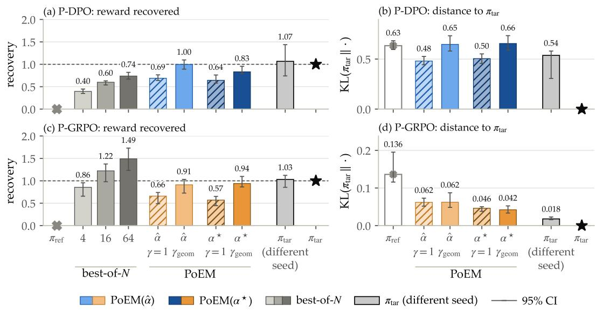  
Figure 6: PoEM recovers RL’s reward gain on combined rewards. Bars show medians over 32 combined rewards, with 95% intervals. The left panels show what share of the reward gain of the RL-trained policy $\pi _ { \mathrm { t a r } }$ each method reaches, where 1 matches $\pi _ { \mathrm { t a r } } .$ . The right panels show the KL divergence from $\pi _ { \mathrm { t a r } } ,$ where lower is closer. PoEM uses either weights fitted to the experts’ log-ratios (αˆ) or the true weights of the combined reward $( \alpha ^ { * } )$ , and never sees $\pi _ { \mathrm { t a r } }$ . On P-GRPO, it also ends much closer to $\pi _ { \mathrm { t a r } }$ than the reference model does. For some combined rewards, a second RL run with a different seed shows how much RL itself varies.  
RM-RB, 8 combined rewards

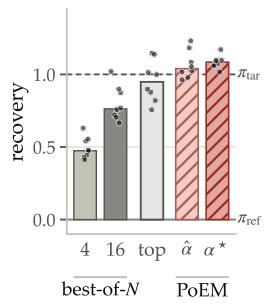

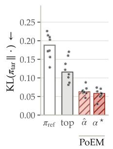  
ZXDA RM-HH, 3 combined rewards

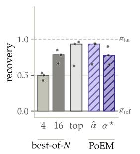

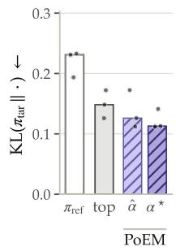  
Figure 7: On combined rewards of reward models, PoEM ends closest to $\pi _ { \mathrm { t a r } } .$ . The left pair combines the four RewardBench reward models (RM-RB) and the right pair ArmoRM’s helpfulness and harmlessness heads (RM-HH). In each pair, the first panel shows the share of $\pi _ { \mathrm { t a r } } { \mathrm { : } }$ s reward gain and the second the KL divergence from $\pi _ { \mathrm { t a r } } .$ . Bars are medians and dots are single combined rewards. PoEM either fits its weights to the experts’ log-ratios (αˆ) or uses the true weights (α∗). The top expert is the one with the largest true weight.

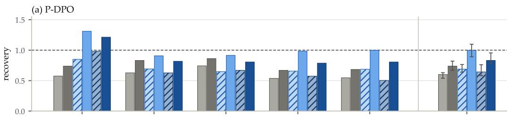

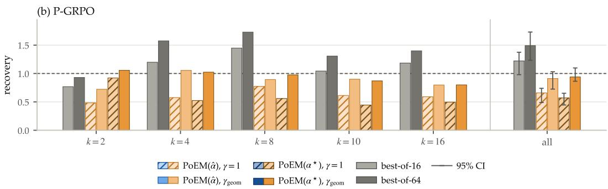

Figure 8: With $\gamma _ { \mathrm { g e o m } } ,$ recovery holds up as more rewards are composed. Median recovery for each k and for all 32 combined rewards, drawn as in Fig. $6 . \ \mathrm { A t } \ \gamma = 1$ , recovery of PoEM $( \alpha ^ { * } )$ drops once more than two rewards are composed, while $\gamma _ { \mathrm { g e o m } }$ keeps it between about 0.8 and 1.2. Best-of-N falls short of $\pi _ { \mathrm { t a r } }$ on P-DPO and overshoots it on P-GRPO for $k \geq 4 ,$  
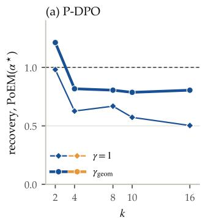

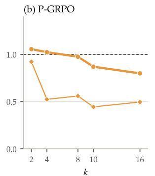

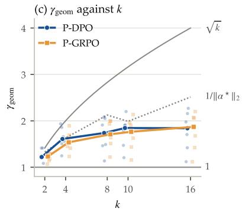  
Figure 9: Recovery at $\gamma = 1$ drops once $k > 2 ,$ and $\gamma _ { \mathrm { g e o m } }$ makes up much of the drop. (a, b) Median recovery of PoEM $( \alpha ^ { * } )$ at $\gamma = 1$ (thin) and at $\gamma _ { \mathrm { g e o m } }$ (thick). For $k \geq 4 , \gamma _ { \mathrm { g e o m } }$ closes about half of the gap to $\pi _ { \mathrm { t a r } }$ on P-DPO and most of it on P-GRPO. $( \mathrm { c } ) \gamma _ { \mathrm { g e o m } }$ grows with k because averaging more experts shrinks the composed log-ratio. It follows the value expected for independent experts, $1 / \| \alpha ^ { * } \| _ { 2 }$ , up to $k = 4$ and falls below it for larger $k ,$ where the experts overlap.

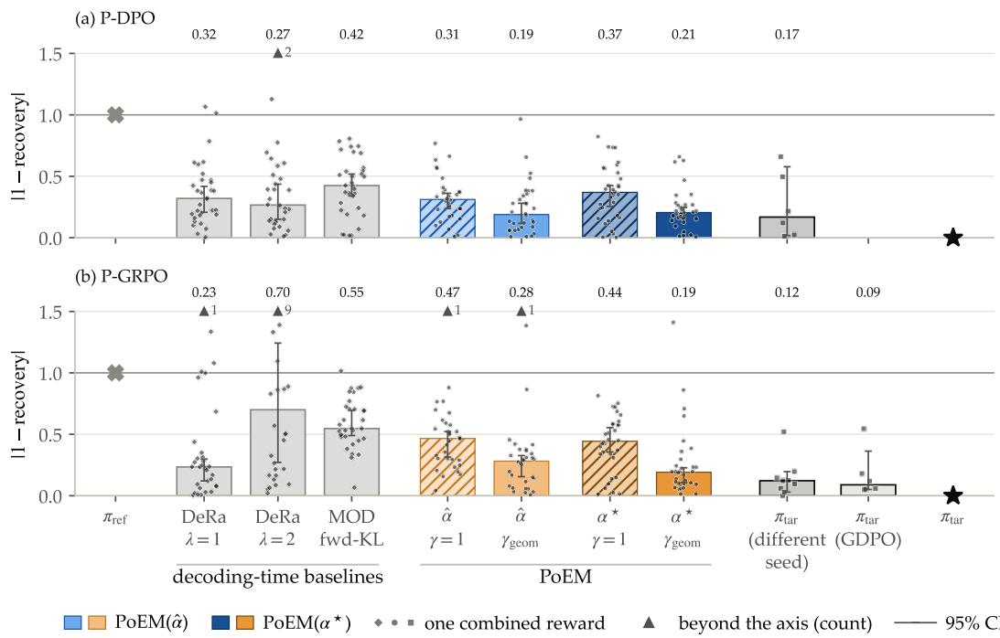  
Figure 10: $\mathbf { A t } \gamma _ { \mathrm { g e o m } } ,$ , PoEM has the lowest reward error of the decoding-time methods on P-DPO, while on P-GRPO the top expert does about as well. Error is |1−recovery| on the combined rewards of Fig. 6. DeRa [31] decodes the highest-weight expert alone $( \lambda = 1 )$ or extrapolates it $( \lambda = 2 )$ MOD [43] fuses the experts under a forward-KL rule (its reverse-KL rule coincides with PoEM $( \alpha ^ { * } )$ $\mathfrak { t } \gamma = 1 )$ . The last columns retrain $\pi _ { \mathrm { t a r } }$ with another seed or, on P-GRPO, with GDPO, a multi-reward RL algorithm. They show how much RL itself varies.

## C.2 Gap between the decoder and the sequence-level product

The decoder in Eq. (6) normalizes at every token, so its distribution $\pi _ { \mathrm { t o k } }$ differs from the sequencelevel product $\pi _ { \mathrm { s e q } }$ in Eq. (4). The two are related exactly by $\pi _ { \mathrm { s e q } } ( y ) = \pi _ { \mathrm { t o k } } ( y ) \prod _ { t } Z _ { t } ( h _ { t } ) / Z$ , where $Z _ { t } ( h _ { t } )$ is the decoder’s normalizing constant at prefix $h _ { t }$ . Weighting decoder samples by $\prod _ { t } Z _ { t } ( h _ { t } )$ therefore gives an importance sample of $\pi _ { \mathrm { s e q } }$ . We do this for three P-GRPO combined rewards $( k = 2 , 4 , 8 )$ at $\gamma = 1$ and $\gamma _ { \mathrm { g e o m } }$ , drawing 64 responses per prompt at temperature 1 on 16 evaluation prompts, over the 96-token evaluation window. Table 9 reports the results. The two distributions differ by 0.6 to 2.7 nats per response, more for larger k and $\gamma .$ Reweighting moves the combined reward by at most 0.03 z-units, and the sequence-level product is further from $\pi _ { \mathrm { t a r } }$ than the decoder in all six settings, significantly in five. So local normalization is not what limits PoEM on this basis.

Table 9: The decoder against the sequence-level product, estimated by importance sampling on P-GRPO. KL is $\mathrm { K L } ( \pi _ { \mathrm { t o k } } | | \pi _ { \mathrm { s e q } } )$ in nats per 96-token response, and ESS is the effective sample size as a fraction of the samples. The reward change is the combined reward under $\pi _ { \mathrm { s e q } }$ minus that under $\pi _ { \mathrm { t o k } }$ , in z-units. Relative KL is $\mathrm { K L } ( \pi _ { \mathrm { t a r } } \| \cdot ) \mathrm { \bar { / } K L } ( \pi _ { \mathrm { t a r } } \| \pi _ { \mathrm { r e f } } )$ . For each k, the second row uses $\gamma _ { \mathrm { g e o m } } .$
<table><tr><td>k</td><td>γ</td><td>KL</td><td>ESS</td><td>reward change</td><td>relative KL,  $\pi _ { \mathrm { t o k } } / \pi _ { \mathrm { s e q } }$ </td></tr><tr><td>2</td><td>1</td><td>0.62</td><td>0.53</td><td>+0.02</td><td>0.25 / 0.30</td></tr><tr><td>2</td><td>1.29</td><td>0.65</td><td>0.48</td><td>-0.02</td><td>0.35 / 0.38</td></tr><tr><td>4</td><td>1</td><td>1.10</td><td>0.34</td><td>+0.00</td><td>0.22 / 0.28</td></tr><tr><td>4</td><td>1.63</td><td>1.48</td><td>0.20</td><td>+0.02</td><td>0.19 / 0.30</td></tr><tr><td>8</td><td>1</td><td>1.59</td><td>0.21</td><td>-0.03</td><td>0.45 / 0.61</td></tr><tr><td>8</td><td>2.00</td><td>2.72</td><td>0.11</td><td>-0.03</td><td>0.51 / 0.76</td></tr></table>

## C.3 Held-out reward recovery

This section includes the per-target results for Section 4.3 and compares values of $\gamma$ (Fig. 12). Fig. 11 shows recovery against coverage and against the distance to $\pi _ { \mathrm { t a r } } ,$ with arrows that follow the median prediction as γ grows.

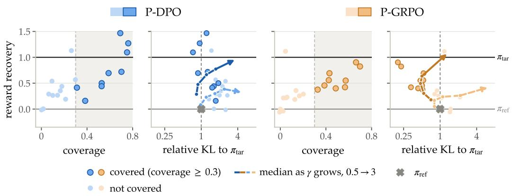  
Figure 11: Coverage predicts which held-out rewards PoEM can reach. Each dot is one expert, held out and predicted by composing the other 19. Coverage is computed from those 19 before any decoding. Covered rewards (dark) recover more of $\pi _ { \mathrm { t a r } } \mathbf { \bar { s } }$ reward gain. On P-GRPO they also end closer to $\pi _ { \mathrm { t a r } }$ than the reference model, which sits at a relative KL of 1. Arrows show how the median prediction moves as γ grows.

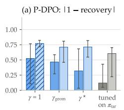

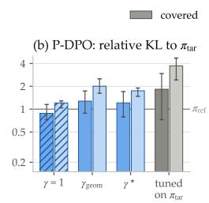

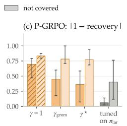

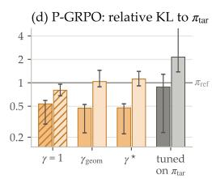  
Figure 12: Uncovered rewards miss a direction, not γ. Median reward error |1 − recovery| (a, c) and relative KL to $\pi _ { \mathrm { t a r } }$ (b, d) for covered (dark) and uncovered (light) held-out rewards. A relative KL below 1 means closer to $\pi _ { \mathrm { t a r } }$ than $\pi _ { \mathrm { r e f } }$ is. $\gamma = 1$ , γgeom and $\gamma ^ { \star }$ (Sec. 2.3.1) are set without $\pi _ { \mathrm { t a r } } .$ The grey bars, shown only as a reference, tune γ on $\pi _ { \mathrm { t a r } }$ for each reward. Even then, uncovered rewards keep a large error and stay far from $\pi _ { \mathrm { t a r } }$ . On P-GRPO, every covered reward ends closer to $\pi _ { \mathrm { t a r } }$ than $\pi _ { \mathrm { r e f } }$ at $\gamma = 1$ $\gamma _ { \mathrm { g e o m } }$ and $\gamma ^ { \star }$

## C.4 Policy space geometry: additional figures

Fig. 13 repeats the measurement of Fig. 2 for ten policies trained on public reward models and shows the three spaces for each basis, including P-DPO.

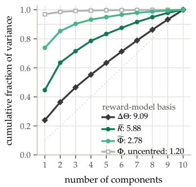

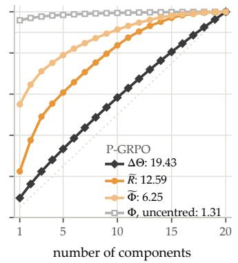

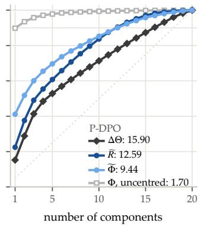  
Figure 13: The gap depends on how the experts were trained. Cumulative variance of the weight updates, rewards and log-ratios for the ten public reward models, P-GRPO and P-DPO. Both programmatic bases show a gap (ratios 0.50 and 0.75).

## C.5 Experts trained with reward models: additional results

We hold out each expert of RM-Div (ten models) and RM-RB (four models) in turn. Its reward becomes $r _ { \mathrm { t a r } }$ and the expert itself plays $\pi _ { \mathrm { t a r } }$ (written $r _ { j }$ and $\pi _ { j }$ in the figures). PoEM composes the other experts with $\hat { \alpha } ,$ fitted by non-negative least squares on their responses, with at most eight non-zero weights normalized to sum to one. The held-out expert’s responses are left out of the fit, and $\pi _ { \mathrm { t a r } }$ is not used for decoding either. Relative KL is KL $\lvert ( \pi _ { \mathrm { t a r } } \| \cdot ) / \mathrm { K L } \overline { { ( \pi _ { \mathrm { t a r } } \| \pi _ { \mathrm { r e f } } ) } }$ , and a value below 1 means closer to $\pi _ { \mathrm { t a r } }$ than $\pi _ { \mathrm { r e f } }$ is.

On RM-Div the ten log-ratios have effective rank 2.84 on reference-model responses, against 6.96 for the ten rewards. On the experts’ own responses the gap narrows to 6.09 against 8.00. On RM-RB the log-ratios have lower rank than the rewards on reference-model responses (1.64 against 2.30) but not on the experts’ own responses (2.77 against 2.43).

Within-expert coverage, which we chose before decoding, ranks recovery across the ten held-out RM-Div experts better than the per-prompt coverage of Eq. (12) (Spearman $\rho = 0 . 8 1$ against 0.45). It also ranks relative KL better $( \rho = - 0 . 4 9$ against −0.16). On RM-RB both scores are below 0.12 for all four held-out experts, yet PoEM recovers 0.56 to 0.83 of their gain. A near-zero coverage does not rule out recovery there.

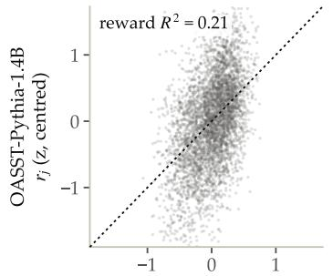

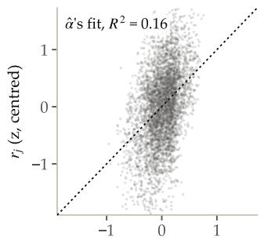

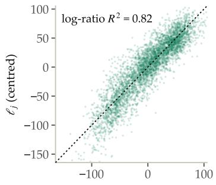

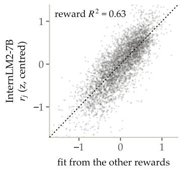

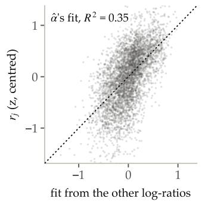

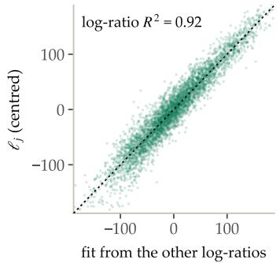  
Figure 14: A held-out expert’s log-ratio can be close to a combination of the others’ when its reward is not. Two held-out models of RM-Div, OASST-Pythia-1.4B (top) and InternLM2-7B (bottom), on held-out prompts, with every quantity centred per prompt. Left: the target reward against its fit from the other nine rewards. Middle: the same reward against αˆ’s fit from the other nine log-ratios. Right: the held-out expert’s log-ratio $\ell _ { j } = \log \pi _ { j } - \log \pi _ { \mathrm { r e f } }$ against its fit from the other log-ratios.

All within-expert scores are below 0.25, under the 0.3 threshold of Fig. 11, so we split RM-Div at its median. On the more-covered half, $\gamma ^ { \star }$ increases median recovery from 0.60 to 0.66 and relative KL from 0.64 to 0.72. On the less-covered half, recovery goes from 0.43 to 0.51 and relative KL from 0.99 to 1.28. Tuning γ on $\pi _ { \mathrm { t a r } }$ brings the less-covered half to 0.67, at a relative KL of 2.04. On RM-RB, $\gamma ^ { \star }$ changes median recovery only from 0.79 to 0.81.

A held-out expert can lie close to the span of the other experts even when its reward is far from the span of the other rewards (Fig. 14). For OASST-Pythia-1.4B, the other nine rewards explain 21% of its reward’s variance on held-out prompts and αˆ’s fit from the other log-ratios explains 16%. Yet the other log-ratios explain 82% of the expert’s own log-ratio. For InternLM2-7B the three numbers are 63%, 35% and 92%. $\mathbf { A } \mathbf { t } \gamma = 1$ , PoEM (αˆ) recovers 0.43 and 0.57 of their gains.

## C.6 Diffusion models: additional results

Table 10 holds out each of the 13 image experts in turn, on three prompts with one seed each (App. B.3). Composing the other twelve recovers on average 0.67 of the held-out expert’s reward gain, from 0.25 on aesthetic score to 1.07 on CLIP score. Recovery counts only the gain in the held-out reward. It ignores image quality and likeness to the held-out expert’s images. The weights are fit at every denoising step to the held-out expert’s own noise prediction, so recovery shows how much of that expert lies in the span of the others. It is not a prediction made without the expert. Span $R ^ { 2 }$ uses the full noise prediction rather than each expert’s change to the reference model’s prediction. It is above 0.99 for every reward and does not track recovery (Spearman $\rho = 0 . 1 2$ across rewards). Fig. 15 shows how image rewards vary across images.

Table 10: Composing the other twelve experts recovers more than half of the held-out expert’s reward gain on 9 of the 13 image rewards. Each row holds out one expert. Recovery is averaged over three prompts. Span $R ^ { 2 }$ is the share of variance in the held-out expert’s noise prediction explained by the per-step fit, averaged over the 50 denoising steps and the prompts. †On one prompt the expert barely improves over the reference model (aesthetic score 6.05 against 5.86, PickScore 0.2223 against 0.2216), which makes recovery on that prompt unstable. It is kept in the mean. ‡The expert lowers CLIP score on two of the three prompts, where recovery measures how closely PoEM reproduces that decrease.
<table><tr><td>held-out reward</td><td>recovery</td><td>span  $R ^ { 2 }$ </td><td>held-out reward</td><td>recovery</td><td>span  $R ^ { 2 }$ </td></tr><tr><td>CLIP score‡</td><td>1.07</td><td>0.995</td><td>BRISQUE</td><td>0.96</td><td>0.994</td></tr><tr><td>edge density</td><td>0.86</td><td>0.991</td><td>entropy</td><td>0.85</td><td>0.995</td></tr><tr><td>incompressibility</td><td>0.79</td><td>0.995</td><td>compressibility</td><td>0.76</td><td>0.995</td></tr><tr><td>saturation</td><td>0.74</td><td>0.996</td><td>symmetry</td><td>0.72</td><td>0.994</td></tr><tr><td>RMS contrast</td><td>0.54</td><td>0.993</td><td>colorfulness</td><td>0.47</td><td>0.995</td></tr><tr><td>PickScore†</td><td>0.33</td><td>0.994</td><td>sharpness</td><td>0.33</td><td>0.994</td></tr><tr><td>aesthetic score†</td><td>0.25</td><td>0.995</td><td>mean</td><td>0.67</td><td>0.994</td></tr></table>

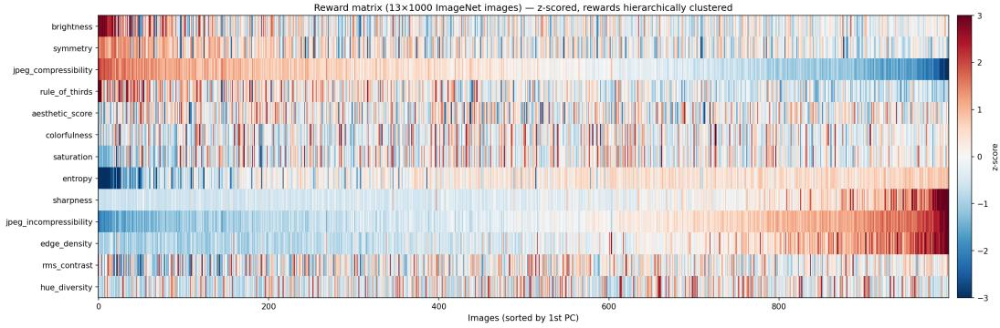  
Figure 15: Most diffusion rewards vary independently of one another. Each row is one z-scored image reward on 1,000 ImageNet photographs, sorted by the first principal component. Brightness, hue diversity and rule of thirds have no expert in SD-DDPO, and BRISQUE, PickScore and CLIP score are not shown. Only one group tied to image detail (sharpness, edge density, entropy and the two JPEG rewards) moves together.