# SPECTRAL AMPLITUDE PURIFICATION IN DISTRIBU-TION MATCHING FOR DIFFUSION DISTILLATION

Zhenyu Zhou1, Can Wang1, Chun Chen1, Zeyu Zheng2, Defang Chen2†

1Zhejiang University 2University of California, Berkeley

zhyzhou@zju.edu.cn, defchern@berkeley.edu

## ABSTRACT

Distribution Matching Distillation (DMD) enables high-quality diffusion sampling in only a few steps, but its optimization dynamics remain dominated by coarse, low-frequency signals, delaying the recovery of fine-grained details. We identify a pronounced concentration of spectral amplitudes at low frequencies in the DMD directional error, where dominant low-frequency components overwhelm weaker mid- and high-frequency signals. To address this issue, we propose Spectral Amplitude Purification for Distribution Matching Distillation (SAP-DMD), a plug-and-play approach that adaptively modulates the amplitude spectrum of the DMD directional field. By suppressing the dominant tail of the amplitude spectrum, SAP-DMD reduces low-frequency dominance and promotes more effective recovery of fine structures and textures. Experiments on PixArt-α, SD3, and SD3.5 demonstrate that SAP-DMD accelerates training convergence and improves generation quality under both 2-step and 4-step sampling.

## 1 INTRODUCTION

Diffusion models achieve remarkable generative quality across image (Dhariwal & Nichol, 2021; Karras et al., 2022; Rombach et al., 2022; Podell et al., 2024), video (Ho et al., 2022; Blattmann et al., 2023; Zheng et al., 2024; Seed, 2026), and audio (Kong et al., 2021; Chen et al., 2021; Evans et al., 2025) generation, but typically require dozens of network evaluations during sampling (Sohl-Dickstein et al., 2015; Ho et al., 2020; Song et al., 2021). As modern generative models continue to scale (Esser et al., 2024; Black Forest Labs, 2024; Wu et al., 2025), this iterative process incurs substantial computational overhead and latency. Few-step distillation addresses this bottleneck by compressing the sampling trajectory into only a few network evaluations (Meng et al., 2023; Song et al., 2023; Yin et al., 2024b). Among these approaches, Distribution Matching Distillation (DMD) (Luo et al., 2023b; Yin et al., 2024b;a) has emerged as a powerful paradigm that directly aligns the distributions of a few-step generator and a pretrained diffusion model.

Despite the strong global fidelity of DMD, we observe that it recovers fine-grained details more slowly than coarse structures during training (see Figure 1). To understand this behavior, we analyze its optimization dynamics from a frequency-domain perspective. In DMD, the generator update is driven by the directional error between the real and fake model predictions. We find that its amplitude spectrum is strongly concentrated at low frequencies: a small number of low-frequency components dominate the directional signal, while substantially weaker mid- and high-frequency components contribute less to the update. Such low-frequency dominance can bias optimization toward coarse structures and delay the recovery of textures and sharp boundaries.

Motivated by this observation, we propose Spectral Amplitude Purification for Distribution Matching Distillation (SAP-DMD), a plug-and-play approach that directly modulates the amplitude spectrum of the DMD directional field. SAP-DMD adaptively suppresses large upper-tail spectral amplitudes while preserving the phase, thereby reducing the disproportionate influence of dominant spectral components without altering the underlying DMD framework. This simple modification promotes faster recovery of fine structures, requiring only lightweight FFT-based computation during training and no additional inference-time cost. Extensive experiments on PixArt-α, SD3, and

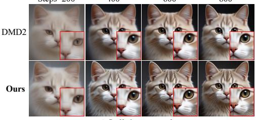

Steps=200  
400  
600  
A fluffy kitten cat face  
800  
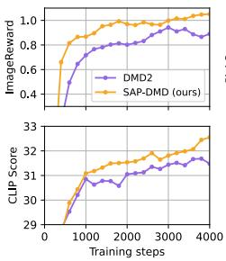

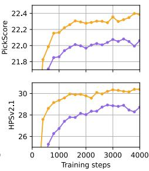  
(a) 2-step performance evolution during training.

  
(b) 2-step qualitative samples.  
Figure 1: Performance overview on SD3.5 Medium. (a) Training evolution of DMD2 and SAP-DMD. SAP-DMD recovers fine details earlier and improves DrawBench (Saharia et al., 2022) evaluation metrics faster on all 200 prompts using 2-step generation without GAN loss. (b) 2-step samples generated by SAP-DMD, which show sharp structures and rich details across diverse prompts.

SD3.5 demonstrate clear improvements in training convergence and generation quality under both 2-step and 4-step sampling.

Our main contributions are summarized as follows:

• We reveal a spectral amplitude concentration in the DMD directional field, which is associated with under-emphasized fine-scale corrections and delayed fine-detail recovery.

• We develop SAP-DMD, a simple plug-and-play spectral purification method that adaptively suppresses excessive amplitudes while preserving phase and the distributionmatching fixed point.

• We demonstrate through extensive experiments on multiple text-to-image models that SAP-DMD accelerates detail recovery and consistently improves few-step generation quality over competitive baselines.

## 2 PRELIMINARIES

## 2.1 DIFFUSION MODELS

Diffusion models connect the data distribution $q _ { \mathrm { r e a l } }$ to a predefined noise distribution $q _ { \mathrm { n o i s e } }$ through a stochastic forward process. Let $\mathbf { x } _ { t } \in \mathbb { R } ^ { C \times H \times W }$ denote a sample at time $t \in [ 0 , 1 ]$ . The forward process can be described by the stochastic differential equation (SDE) $\mathrm { d } \mathbf { x } _ { t } = f ( t ) \mathbf { x } _ { t } \mathrm { d } t + g ( t ) \mathrm { d } \mathbf { w } _ { t }$ where $f ( t )$ and $g ( t )$ are the drift and diffusion coefficients, respectively, and $\mathbf { w } _ { t }$ denotes standard Brownian motion (Song et al., 2021). Its transition kernel takes the form $q ( \mathbf { x } _ { t } | \mathbf { x } _ { 0 } ) =$ $\mathcal { N } ( \mathbf { x } _ { t } ; \alpha _ { t } \mathbf { x } _ { 0 } , \sigma _ { t } ^ { 2 } \mathbf { I } )$ ), $\mathbf { x } _ { 0 } ~ \sim ~ q _ { \mathrm { r e a l } }$ , where $\alpha _ { t } , \sigma _ { t } \ \geq \ 0$ are time-dependent coefficients. For example, $\alpha _ { t } ^ { 2 } + \sigma _ { t } ^ { 2 } = 1$ corresponds to variance-preserving diffusion (Song et al., 2021), while $\alpha _ { t } = 1 - t$ and $\sigma _ { t } = t$ define the linear interpolation used in flow models (Lipman et al., 2023; Liu et al., 2023).

The forward SDE admits a corresponding probability flow ODE with the same marginal distributions $\begin{array} { r } { \{ q _ { t } \} _ { t = 0 } ^ { 1 } \colon \mathrm { d } \mathbf { x } _ { t } = [ f ( t ) \mathbf { x } _ { t } - \frac { 1 } { 2 } g ( \bar { t } ) ^ { 2 } \mathbf { s } _ { \psi } ( \bar { \mathbf { x } _ { t } } , t ) ] \mathrm { d } t } \end{array}$ , where $\mathbf { s } _ { \psi } ( \mathbf { x } _ { t } , t ) \approx \nabla _ { \mathbf { x } _ { t } }$ log $q _ { t } ( \mathbf { x } _ { t } )$ is the learned score function (Hyvarinen, 2005; Vincent, 2011). Flow-based models instead directly parameterize¨ a deterministic velocity field: $\mathrm { d } \mathbf { x } _ { t } = \mathbf { v } _ { \psi } ( \mathbf { x } _ { t } , t ) \mathrm { d } t$ . Different prediction parameterizations can be

related through the score function. In particular,

$$
\mathbf { s } _ { \psi } ( \mathbf { x } _ { t } , t ) = - \frac { \mathbf { x } _ { t } - \alpha _ { t } \mathbf { f } _ { \psi } ( \mathbf { x } _ { t } , t ) } { \sigma _ { t } ^ { 2 } } ,\tag{1}
$$

where $\mathbf { f } _ { \psi }$ denotes the $\mathbf { x } _ { \mathrm { 0 } }$ -prediction model. Under the linear flow parameterization $\alpha _ { t } = 1 - t$ and $\sigma _ { t } = t$ , the velocity prediction $\mathbf { v } _ { \psi }$ further satisfies $\begin{array} { r } { \mathbf { s } _ { \psi } ( \mathbf { x } _ { t } , t ) = - \frac { \mathbf { x } _ { t } + \alpha _ { t } \mathbf { v } _ { \psi } ( \mathbf { x } _ { t } , t ) } { \sigma _ { t } } } \end{array}$ . For simplicity, we omit the explicit dependence on t when it is clear from context.

## 2.2 DISTRIBUTION MATCHING DISTILLATION

DMD trains a few-step generator $\mathbf { G } _ { \theta }$ by minimizing the time-weighted reverse KL divergence between the generator marginal ${ p } _ { \theta , t }$ and the target marginal $q _ { t }$ (Yin et al., 2024b):

$$
\mathcal { L } _ { \mathrm { D M D } } ( \theta ) = \int _ { t } \omega ( t ) \mathbb { E } _ { \mathbf { x } _ { 0 } \sim p _ { \theta , 0 } , \mathbf { x } _ { t } \sim q ( \mathbf { x } _ { t } | \mathbf { x } _ { 0 } ) } \left[ \log p _ { \theta , t } ( \mathbf { x } _ { t } ) - \log q _ { t } ( \mathbf { x } _ { t } ) \right] \mathrm { d } t ,\tag{2}
$$

where $\omega ( t )$ is a time-dependent weighting function. Taking the gradient with respect to θ yields

$$
\nabla _ { \theta } \mathcal { L } _ { \mathrm { D M D } } ( \theta ) = \int _ { t } \omega ( t ) \mathbb { E } _ { \mathbf { x } _ { 0 } \sim p _ { \theta , 0 } , \mathbf { x } _ { t } \sim q ( \mathbf { x } _ { t } | \mathbf { x } _ { 0 } ) } \left[ \mathbf { s } _ { \phi } ( \mathbf { x } _ { t } ) - \mathbf { s } _ { \psi } ( \mathbf { x } _ { t } ) \right] \frac { \partial \mathbf { x } _ { t } } { \partial \theta } \mathrm { d } t ,\tag{3}
$$

where $\mathbf { s } _ { \psi } ( \mathbf { x } _ { t } ) \approx \nabla _ { \mathbf { x } _ { t } } \log q _ { t } ( \mathbf { x } _ { t } )$ is the real score provided by the frozen real model, and ${ \bf s } _ { \phi } ( { \bf x } _ { t } )$ ≈ $\nabla _ { \mathbf { x } _ { t } }$ log $p _ { \theta , t } ( \mathbf { x } _ { t } )$ is thefake score estimated by a trainable fake model. The fake model is optimized via denoising score matching (Vincent, 2011):

$$
\mathcal { L } _ { \mathrm { f a k e } } ( \phi ) = \int _ { t } \lambda ( t ) \mathbb { E } _ { \mathbf { x } _ { 0 } \sim p _ { \theta , 0 } , \mathbf { x } _ { t } \sim q ( \mathbf { x } _ { t } | \mathbf { x } _ { 0 } ) } \left[ \| \mathbf { s } _ { \phi } ( \mathbf { x } _ { t } ) - \nabla _ { \mathbf { x } _ { t } } \log q _ { t } ( \mathbf { x } _ { t } | \mathbf { x } _ { 0 } ) \| _ { 2 } ^ { 2 } \right] \mathrm { d } t ,\tag{4}
$$

where $\lambda ( t )$ is a weighting function. DMD jointly optimizes the generator and the auxiliary fake model, but retains only $\mathbf { G } _ { \theta } ^ { - }$ for few-step inference. See Appendix A for related work.

## 2.3 PHASE-AMPLITUDE DECOUPLING

The two-dimensional discrete Fourier transform (2D DFT), denoted by ${ \mathcal { F } } ,$ , transforms a spatial tensor $\mathbf { x } \in \mathbb { R } ^ { C \times H \times W }$ into a complex-valued spectrum $\mathcal { F } [ \mathbf { x } ] \in \mathbb { C } ^ { C \times H \times W }$ . At each frequency coordinate u, the spectrum can be expressed in polar form as

$$
\mathcal { F } [ \mathbf { x } ] ( \mathbf { u } ) = \mathcal { A } _ { \mathbf { x } } ( \mathbf { u } ) \cdot e ^ { i \mathcal { P } _ { \mathbf { x } } ( \mathbf { u } ) } ,\tag{5}
$$

where $\mathcal { A } _ { \mathbf { x } } ( \mathbf { u } ) \ \triangleq \ | \mathcal { F } [ \mathbf { x } ] ( \mathbf { u } ) | \ \in \ \mathbb { R } _ { \ge 0 }$ denotes the amplitude of each frequency component, and $\mathcal { P } _ { \mathbf { x } } ( \mathbf { u } ) \triangleq \angle \mathcal { F } [ \mathbf { x } ] ( \mathbf { u } ) \in [ - \pi , \pi ]$ denotes its phase, which encodes the relative spatial arrangement. The original spatial tensor x can be exactly reconstructed via the inverse DFT $\scriptstyle { \dot { \mathcal { F } } } ^ { - 1 }$

$$
\mathbf { x } = \mathcal { F } ^ { - 1 } \left[ \mathcal { A } _ { \mathbf { x } } \cdot e ^ { i \mathcal { P } _ { \mathbf { x } } } \right] .\tag{6}
$$

Compared with the traditional decomposition into real and imaginary parts, the polar form explicitly separates amplitude from phase. Since modifying either the real or imaginary component generally changes both amplitude and phase, this representation is better suited to modulating spectral amplitudes while preserving phase.

## 3 METHOD

## 3.1 FREQUENCY-DOMAIN DIAGNOSTICS OF DMD

To better understand the optimization dynamics of DMD, we analyze its generator update from a frequency-domain perspective. For clarity and visualization, we rewrite Eq. (3) from score prediction to $\mathbf { x } _ { \mathrm { 0 } }$ prediction using Eq. (1):

$$
\nabla _ { \theta } \mathcal { L } _ { \mathrm { D M D } } ( \theta ) = \int _ { t } \tilde { \omega } ( t ) \mathbb { E } _ { \mathbf { x } _ { 0 } \sim p _ { \theta , 0 } , \mathbf { x } _ { t } \sim q ( \mathbf { x } _ { t } | \mathbf { x } _ { 0 } ) } \left[ \mathbf { f } _ { \phi } ( \mathbf { x } _ { t } ) - \mathbf { f } _ { \psi } ( \mathbf { x } _ { t } ) \right] \frac { \partial \mathbf { x } _ { t } } { \partial \theta } \mathrm { d } t ,\tag{7}
$$

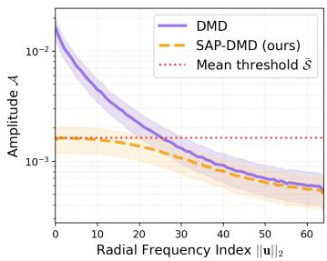  
(a) Radial amplitude suppression

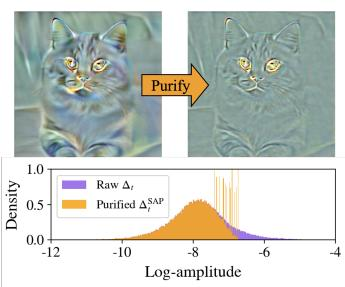  
(b) Amplitude distribution

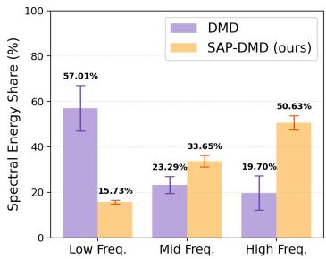  
(c) Spectral energy share  
Figure 2: Frequency-domain diagnostics of the DMD directional error $\Delta _ { t }$ on SD3.5 Medium. Statistics are computed at $t = 0 . 5$ from a DMD2 checkpoint trained for 200 steps and averaged over 1,000 samples. (a) Radial amplitude profiles before and after purification; the dotted line denotes the mean channel-wise threshold S¯. (b) Spatial visualization of $\Delta _ { t }$ before and after purification (top), with the corresponding log-amplitude distributions and channel-wise thresholds $\mathbf { \hat { \mathcal { S } } } _ { c }$ (bottom). (c) Relative spectral energy shares of low-, mid-, and high-frequency components, defined by $\| \mathbf { u } \| _ { 2 } < 1 6$ $1 6 \leq \| \mathbf { u } \| _ { 2 } < 3 2$ , and $3 2 \leq \| \mathbf { u } \| _ { 2 } \leq 6 4$ , respectively.

where $\begin{array} { r } { \tilde { \omega } ( t ) = \frac { \alpha _ { t } } { \sigma _ { \star } ^ { 2 } } \omega ( t ) } \end{array}$ and the instantaneous directional error is defined as $\pmb { \Delta } _ { t } = \mathbf { f } _ { \phi } ( \mathbf { x } _ { t } ) - \mathbf { f } _ { \psi } ( \mathbf { x } _ { t } )$ In practice, this gradient can be implemented through the stop-gradient surrogate (Yin et al., 2024a):

$$
\mathcal { L } _ { \mathrm { D M D - p s e u d o } } ( \theta ) = \frac { 1 } { 2 } \int _ { t } \tilde { \omega } ( t ) \mathbb { E } _ { \mathbf { x } _ { 0 } \sim p _ { \theta , 0 } , \mathbf { x } _ { t } \sim q ( \mathbf { x } _ { t } | \mathbf { x } _ { 0 } ) } \left[ \| \mathbf { x } _ { t } - \mathrm { s g } \left[ \mathbf { x } _ { t } - \Delta _ { t } \right] \| _ { 2 } ^ { 2 } \right] \mathrm { d } t .\tag{8}
$$

Although Eq. (8) does not define an independent global objective, its gradient at the current iterate recovers Eq. (7). This surrogate gives an intuitive view of the generator update: $\mathbf { x } _ { t }$ is locally driven toward a dynamic target determined by $\Delta _ { t } ,$ which then propagates to the generator through $\partial \mathbf { x } _ { t } / \partial \theta$

The spatial formulation, however, does not explicitly reveal how different spatial scales contribute to this directional field. Fine textures, sharp boundaries, and coarse structures exhibit distinct spectral characteristics, making the frequency domain a natural space for examining their relative contributions. We therefore decompose $\Delta _ { t }$ using the 2D DFT:

$$
\mathcal { F } [ \Delta _ { t } ] ( \mathbf { u } ) = \boldsymbol { \mathcal { A } } _ { \Delta _ { t } } ( \mathbf { u } ) \cdot e ^ { i \mathcal { P } _ { \Delta _ { t } } ( \mathbf { u } ) } .\tag{9}
$$

Our analysis reveals a pronounced concentration of spectral amplitudes in the DMD directional field. As shown in Figure $^ { 2 \mathrm { a , } }$ the mean radial amplitude decays rapidly toward higher frequencies. The purified profile shows that SAP-DMD selectively suppresses the largest spectral amplitudes while leaving weaker components largely unchanged. The log-amplitude distribution in Figure 2b further reveals a pronounced upper tail, indicating a small number of dominant spectral components. Combined with Figure 2a, this shows that these components are concentrated mainly at low frequencies, giving coarse-scale discrepancies a disproportionately large influence on the directional signal.

The spectral energy statistics in Figure 2c provide a complementary view. Before purification, lowfrequency components account for the majority of the spectral energy of $\Delta _ { t }$ , while SAP-DMD substantially reduces this concentration and increases the relative contributions of mid- and highfrequency components. Such spectral concentration may bias the generator update toward coarsescale corrections and under-emphasize weaker fine-scale signals. This behavior is consistent with the delayed recovery of fine-grained details observed during DMD training in Figure 1. Together, these observations motivate us to regulate the amplitude spectrum of $\Delta _ { t }$ by suppressing dominant components while preserving informative weaker signals.

## 3.2 SPECTRAL AMPLITUDE PURIFICATION

We introduce Spectral Amplitude Purification (SAP), a plug-and-play mechanism designed to mitigate the dominance of large spectral amplitudes identified in the DMD directional field. Rather than directly propagating the raw directional error $\Delta _ { t }$ , SAP modulates its amplitude spectrum to suppress dominant components while preserving weaker spectral signals.

Algorithm 1 Spectral Amplitude Purification for Distribution Matching Distillation   
Require: real model $\mathbf { f } _ { \psi }$ , learning rates $\eta _ { f }$ and $\eta _ { g } ,$ scaling kernel $\kappa ( \cdot , \cdot )$   
Ensure: optimized generator $\mathbf { G } _ { \theta }$   
1: Initialize $\mathbf { G } _ { \theta }$ and the fake model $\mathbf { f } _ { \phi }$ from $\mathbf { f } _ { \psi }$   
2: while not converged do   
3: Sample $t , \mathbf { x } _ { 0 } \sim p _ { \theta , 0 } ,$ and $\mathbf { x } _ { t } \sim q ( \mathbf { x } _ { t } | \mathbf { x } _ { 0 } )$   
4: $\phi  \phi - \eta _ { f } \nabla _ { \phi } \mathcal { L } _ { \mathrm { f a k e } } ( \phi )$ ▷ Update the fake model via Eq. (4)   
5: $\pmb { \Delta } _ { t } \gets \mathbf { f } _ { \phi } ( \bar { \mathbf { x } } _ { t } ) - \mathbf { f } _ { \psi } ( \mathbf { x } _ { t } )$ ▷ Compute the directional error   
6: $\Delta _ { t } ^ { \mathrm { S A P } }  T [ \Delta _ { t } ]$ ▷ Purify via Eq. (10)   
7: $\theta \gets \theta - \eta _ { g } \mathsf { \bar { V } } _ { \theta } \mathsf { \bar { L } } _ { \mathrm { S A P - p s e u d o } } ( \theta )$ ▷ Update the generator via Eq. (14)   
8: end while

Formally, we define the purified directional error as

$$
\Delta _ { t } ^ { \mathrm { S A P } } = \mathcal { T } [ \Delta _ { t } ] = \mathcal { F } ^ { - 1 } \Big [ \kappa \big ( \mathbf { u } , \boldsymbol { \mathcal { A } } _ { \Delta _ { t } } ( \mathbf { u } ) \big ) \cdot \mathcal { F } [ \Delta _ { t } ] ( \mathbf { u } ) \Big ] ,\tag{10}
$$

where Ω denotes the set of frequency coordinates and $\kappa : \Omega \times \mathbb { R } _ { > 0 }  \mathbb { R } _ { > 0 }$ is a real-valued, nonlinear scaling kernel. Since κ is real and non-negative, SAP modifies only the spectral amplitude while leaving the phase unchanged:

$$
\mathcal { F } [ \Delta _ { t } ^ { \mathrm { { S A P } } } ] ( \mathbf { u } ) = \underbrace { \kappa \big ( \mathbf { u } , \mathcal { A } _ { \Delta _ { t } } ( \mathbf { u } ) \big ) \mathcal { A } _ { \Delta _ { t } } ( \mathbf { u } ) } _ { \mathrm { p u r i f i e d ~ a m p l i t u d e } } e ^ { i \mathcal { P } _ { \Delta _ { t } } ( \mathbf { u } ) } .\tag{11}
$$

This amplitude-only modulation directly targets the spectral concentration observed in Section 3.1 without introducing additional phase perturbations.

The scaling kernel is designed according to two principles: (1) Small-Amplitude Preservation, where weak spectral components should remain nearly unchanged; and (2) Large-Amplitude Suppression, where unusually large components should be compressed. As observed in Figure 2 and quantitatively validated in Appendix D.1, the raw spectral amplitudes are highly skewed, whereas the log transform yields a substantially more symmetric, bell-shaped distribution. We therefore define an adaptive boundary using a one-sided k-sigma criterion in log-amplitude space. For each sample and channel $c ,$ we estimate

$$
\mu _ { c } = \mathbb { E } _ { \mathbf { u } } [ \mathrm { l o g } ( A _ { \Delta _ { t } , c } ( \mathbf { u } ) + \epsilon ) ] , \qquad s _ { c } = \sqrt { \mathbb { E } _ { \mathbf { u } } [ ( \mathrm { l o g } ( \mathcal { A } _ { \Delta _ { t } , c } ( \mathbf { u } ) + \epsilon ) - \mu _ { c } ) ^ { 2 } ] } ,\tag{12}
$$

where $\epsilon = 1 0 ^ { - 6 }$ ensures numerical stability. We define the adaptive channel-wise threshold as $S _ { c } = \exp ( \mu _ { c } + k \cdot s _ { c } )$ , mapping the log-domain k-sigma boundary back to the original amplitude domain. This threshold provides a sample- and channel-adaptive criterion for identifying dominant upper-tail amplitudes. Given the adaptive boundary, the scaling kernel is defined as

$$
\kappa _ { c } ( \mathbf { u } , \boldsymbol { A } _ { \Delta _ { t } , c } ( \mathbf { u } ) ) = \left( 1 + \left( \frac { \boldsymbol { A } _ { \Delta _ { t } , c } ( \mathbf { u } ) } { \mathcal { S } _ { c } } \right) ^ { p } \right) ^ { - \frac { 1 } { p } } ,\tag{13}
$$

where $p$ controls the shape of the modulation. This kernel provides a smooth approximation to clipping the amplitude at $\textstyle S _ { c } .$ : for $\mathbf { \mathcal { A } } _ { \Delta _ { t } , c } ( \mathbf { u } ) \ll \mathcal { S } _ { c } , \kappa _ { c } \approx 1$ , leaving weak components nearly unchanged; for amplitudes substantially larger than $\boldsymbol { S } _ { c }$ , the purified amplitude approaches $S _ { c } . \ \mathrm { A s } \ p  \infty$ , the modulation converges to hard clipping, $\kappa _ { c } ( \mathbf { u } , \bar { \mathcal { A } } _ { \Delta _ { t } , c } ( \mathbf { u } ) ) \bar { \mathcal { A } } _ { \Delta _ { t } , c } ( \mathbf { u } ) \overset { \left. } { \right. } \operatorname* { m i n } ( \mathcal { A } _ { \Delta _ { t } , c } ( \mathbf { u } ) , \mathcal { S } _ { c } )$ , while a smaller $p$ yields a smoother saturation. As shown in Figure 2, this adaptive modulation suppresses dominant spectral amplitudes while largely preserving weaker components.

SAP is incorporated into DMD by simply replacing the raw directional error $\Delta _ { t }$ with $\Delta _ { t } ^ { \mathrm { S A P } }$ . The resulting stop-gradient surrogate is

$$
\mathcal { L } _ { \mathrm { S A P - p s e u d o } } ( \theta ) = \frac { 1 } { 2 } \int _ { t } \tilde { \omega } ( t ) \mathbb { E } _ { \mathbf { x } _ { 0 } \sim p \theta , 0 , \mathbf { x } _ { t } \sim q ( \mathbf { x } _ { t } | \mathbf { x } _ { 0 } ) } \left[ \left\| \mathbf { x } _ { t } - \mathbf { s g } \left[ \mathbf { x } _ { t } - \Delta _ { t } ^ { \mathrm { s A P } } \right] \right\| _ { 2 } ^ { 2 } \right] \mathrm { d } t .\tag{14}
$$

In this way, SAP-DMD directly preconditions the DMD directional field without modifying the model architecture. By reducing the disproportionate influence of dominant spectral components, SAP-DMD increases the relative contribution of weaker frequency components and accelerates the recovery of fine-grained structures, as shown in Figure 1a. Algorithm 1 summarizes the training procedure. We next analyze how this preconditioning affects the distribution-matching dynamics.

## 3.3 THEORETICAL ANALYSIS

We analyze SAP-DMD from the distribution-matching perspective. For a fixed diffusion timestep t, we introduce an auxiliary time variable τ that describes the distributional evolution induced by SAP-DMD, and denote

$$
\mathcal { E } _ { t } ( \tau ) = \mathcal { D } _ { \mathrm { K L } } \big ( p _ { \theta , t } ( \tau ) \lVert q _ { t } \big ) .\tag{15}
$$

Under ideal score estimation, $\Delta _ { t }$ is proportional to the relative score $\nabla _ { \mathbf { x } _ { t } } \log ( p _ { \theta , t } ( \tau ) / q _ { t } )$ up to a positive time-dependent factor, which we absorb into $\tilde { \omega } ( t )$

Theorem 1 (KL Descent under the Idealized SAP-DMD Flow). Assume $\tilde { \omega } ( t ) > 0$ and $\kappa _ { c } ( \mathbf { u } , \cdot ) > 0$ for all c and $\mathbf { u } \in \Omega$ . Under ideal score estimation and standard regularity conditions,

$$
\frac { \mathrm { d } } { \mathrm { d } \tau } \mathcal { E } _ { t } = - \tilde { \omega } ( t ) \mathbb { E } _ { p _ { \theta , t } ( \tau ) } \left[ \sum _ { c } \sum _ { \mathbf { u } \in \Omega } \kappa _ { c } ( \mathbf { u } , \mathcal { A } _ { \Delta _ { t } , c } ( \mathbf { u } ) ) \mathcal { A } _ { \Delta _ { t } , c } ^ { 2 } ( \mathbf { u } ) \right] \leq 0 ,\tag{16}
$$

with equality if and only $i f p _ { \theta , t } ( \tau ) = q _ { t }$ almost everywhere.

A complete proof is provided in Appendix C. Theorem 1 characterizes SAP-DMD as a positive spectral preconditioner of the idealized DMD distributional flow: it reweights the contribution of each frequency to KL dissipation without changing the distribution-matching fixed point. For the kernel in Eq. $( 1 3 ) , 0 < \kappa _ { c } \leq 1$ , so dominant spectral amplitudes are selectively suppressed while remaining positively aligned with the original directional field.

## 4 EXPERIMENTS

## 4.1 EXPERIMENTAL SETUP

Models and baselines. We conduct experiments on three representative text-to-image backbones: PixArt-α (Chen et al., 2024), Stable Diffusion 3 Medium, and Stable Diffusion 3.5 Medium (Esser et al., 2024). We compare SAP-DMD with a broad range of few-step distillation methods, including: (i) distribution matching methods, DMD2 (Yin et al., 2024a), Flash (Chadebec et al., 2025), TDM (Luo et al., 2025b), SenseFlow (Ge et al., 2025), and Decoupled DMD (Liu et al., 2026); (ii) consistency-based methods, PCM (Wang et al., 2024), Hyper-SD (Ren et al., 2024), and SANA-Sprint (Chen et al., 2025); and (iii) adversarial distillation methods, YOSO (Luo et al., 2025a), Turbo (Sauer et al., 2024), and SDXL-Lightning (Lin et al., 2024). We further include models from the FLUX.1 series (Black Forest Labs, 2024) to broaden the comparison under the 2-step setting.

Training. We train both 4-step and 2-step generators together with their auxiliary fake models using LoRA (Hu et al., 2022) with rank $r = 3 2$ and scaling factor $\alpha = 3 2$ . We use AdamW (Loshchilov & Hutter, 2019) with learning rates of $1 \times 1 0 ^ { - 5 }$ for the generator and $5 \times 1 0 ^ { - 5 }$ for the fake model. Unless otherwise specified, SAP-DMD uses $p = \infty$ , with $k = 3$ for PixArt-α and $k = 1$ for SD3 and SD3.5. Training consists of 4K iterations without GAN loss, followed by 2K additional iterations with GAN supervision. For a controlled comparison, we re-implement DMD2, TDM, SenseFlow, and Decoupled DMD using the same training recipe while retaining their respective method-specific components. All experiments are conducted on 4 NVIDIA A100 GPUs, with detailed configurations provided in Appendix B.

Evaluation. Sampling cost is measured by the number of function evaluations (NFE). We evaluate generation quality on 5K prompts from MS-COCO (Lin et al., 2014) using ImageReward (IR) (Xu et al., 2023), PickScore (PS) (Kirstain et al., 2023), and CLIP Score (CS) (Radford et al., 2021). We further evaluate human-preference alignment on 3K HPSv2.1 (Wu et al., 2023) prompts across its four categories: Anime, Concept-art, Painting, and Photo.

## 4.2 MAIN RESULTS

We evaluate SAP-DMD quantitatively and qualitatively in the extreme 2-step and 4-step regimes.

4-step generation. As shown in Table 1, SAP-DMD consistently improves over DMD2 across PixArt-α, SD3, and SD3.5, with particularly strong gains in ImageReward and HPSv2.1. Without GAN supervision, SAP-DMD already matches or surpasses competitive distribution-matching baselines, while the GAN-enhanced variant further achieves the best overall preference scores on SD3. On SD3.5, SAP-DMD also outperforms TDM, SenseFlow, and Decoupled DMD on the main preference metrics. Qualitative results in Figure 4 further demonstrate improved fine-detail quality with only four inference steps.

Table 1: Quantitative results of 4-step generation on MS-COCO and HPSv2.1. †: results from our reimplementation. ×2 indicates classifier-free guidance (Ho & Salimans, 2022) requiring two NFEs per sampling step. GAN: with adversarial training enabled. Gray rows: multi-step base models. Best results are in bold and second best underlined.
<table><tr><td rowspan="2">Method</td><td rowspan="2">NFE</td><td rowspan="2">GAN</td><td colspan="3">MS-COCO</td><td colspan="5">HPSv2.1</td></tr><tr><td>IR</td><td>PS</td><td>CS</td><td>Anime</td><td></td><td>Concept Painting</td><td>Photo</td><td>Avg.</td></tr><tr><td colspan="10">PixArt-α (512 × 512)</td></tr><tr><td>PixArt-α</td><td>25×2</td><td></td><td>0.7893</td><td>22.4067</td><td>30.47</td><td>30.87</td><td>29.04</td><td>28.69</td><td>28.43</td><td>29.26</td></tr><tr><td>YOSO</td><td>4</td><td>√</td><td>0.7730</td><td>21.7805</td><td>27.87</td><td>30.43</td><td>30.44</td><td>30.38</td><td>27.42</td><td>29.67</td></tr><tr><td>DMD2†</td><td>4</td><td></td><td>0.7945</td><td>22.2972</td><td>30.53</td><td>32.20</td><td>31.27</td><td>31.27</td><td>28.68</td><td>30.86</td></tr><tr><td>DMD2†</td><td>4</td><td>√</td><td>0.8047</td><td>22.4519</td><td>30.82</td><td>32.35</td><td>31.33</td><td>31.35</td><td>29.03</td><td>31.02</td></tr><tr><td>TDM†</td><td>4</td><td></td><td>0.8413</td><td>22.4650</td><td>30.93</td><td>32.57</td><td>31.80</td><td>31.72</td><td>29.64</td><td>31.43</td></tr><tr><td>SAP-DMD</td><td>4</td><td></td><td>0.8761</td><td>22.5569</td><td>31.13</td><td>33.12</td><td>32.11</td><td>32.20</td><td>29.83</td><td>31.81</td></tr><tr><td>SAP-DMD</td><td>4</td><td>√</td><td>0.8805</td><td>22.6452</td><td>31.29</td><td>33.23</td><td>32.30</td><td>32.39</td><td>29.99</td><td>31.98</td></tr><tr><td colspan="10">Stable Diffusion 3 Medium (1024× 1024)</td></tr><tr><td>SD3 Medium</td><td>25×2</td><td></td><td>1.0026</td><td>22.5014</td><td>32.19</td><td>30.63</td><td>29.91</td><td>30.29</td><td>27.62</td><td>29.61</td></tr><tr><td>Hyper-SD</td><td>4×2</td><td></td><td>0.8687</td><td>22.4059</td><td>31.33</td><td>31.08</td><td>29.36</td><td>29.91</td><td>27.01</td><td>29.34</td></tr><tr><td>PCM</td><td>4</td><td>√</td><td>0.6384</td><td>22.2444</td><td>30.54</td><td>29.85</td><td>28.37</td><td>28.87</td><td>26.24</td><td>28.33</td></tr><tr><td>Flash</td><td>4</td><td>√</td><td>0.9009</td><td>22.5143</td><td>31.25</td><td>30.32</td><td>29.40</td><td>30.11</td><td>27.06</td><td>29.22</td></tr><tr><td>DMD2†</td><td>4</td><td>√</td><td>0.9165</td><td>22.3188</td><td>30.53</td><td>31.35</td><td>30.21</td><td>30.72</td><td>29.32</td><td>30.40</td></tr><tr><td>DMD2†</td><td>4</td><td></td><td>1.0026</td><td>22.6412</td><td>30.77</td><td>31.95</td><td>30.97</td><td>31.35</td><td>29.33</td><td>30.90</td></tr><tr><td>SAP-DMD SAP-DMD</td><td>4</td><td>√</td><td>0.9903</td><td>22.4440</td><td>30.74</td><td>31.84</td><td>30.71</td><td>30.91</td><td>29.39</td><td>30.71</td></tr><tr><td></td><td>4</td><td></td><td>1.0434</td><td>22.7133</td><td>30.89</td><td>32.92</td><td>31.64</td><td>31.85</td><td>29.23</td><td>31.41</td></tr><tr><td colspan="10">Stable Diffusion 3.5 Medium (1024 × 1024)</td></tr><tr><td>SD3.5 Medium</td><td>25×2</td><td></td><td>1.0208</td><td>22.4234</td><td>32.78</td><td>31.32</td><td>30.49</td><td>30.48</td><td>27.66</td><td>29.99</td></tr><tr><td>Turbo</td><td>4×2</td><td>√</td><td>0.5763</td><td>21.9061</td><td>31.23</td><td>29.33</td><td>27.17</td><td>28.03</td><td>26.09</td><td>27.65</td></tr><tr><td>DMD2†</td><td>4</td><td></td><td>1.0960</td><td>22.5591</td><td>31.44</td><td>34.11</td><td>33.46</td><td>33.66</td><td>30.45</td><td>32.92</td></tr><tr><td>DMD2†</td><td>4</td><td>√</td><td>1.1217</td><td>22.7215</td><td>31.63</td><td>33.68</td><td>32.99</td><td>33.26</td><td>30.10</td><td>32.51</td></tr><tr><td>TDM†</td><td>4</td><td></td><td>1.0689</td><td>22.5779</td><td>31.83</td><td>33.04</td><td>32.72</td><td>32.82</td><td>29.15</td><td>31.93</td></tr><tr><td>SenseFlow†</td><td>4</td><td></td><td>1.0792</td><td>22.5966</td><td>31.83</td><td>33.93</td><td>33.10</td><td>33.44</td><td>29.46</td><td>32.48</td></tr><tr><td>Decoupled DMD†</td><td>4</td><td></td><td>1.0422</td><td>22.5071</td><td>31.55</td><td>33.57</td><td>32.42</td><td>32.95</td><td>29.50</td><td>32.11</td></tr><tr><td>SAP-DMD</td><td>4</td><td></td><td>1.1120</td><td>22.5980</td><td>31.81</td><td>34.42</td><td>33.77</td><td>33.89</td><td>30.61</td><td>33.17</td></tr><tr><td>SAP-DMD</td><td>4</td><td>√</td><td>1.1401</td><td>22.7480</td><td>31.77</td><td>34.03</td><td>33.38</td><td>33.72</td><td>30.69</td><td>32.96</td></tr></table>

Table 2: Cross-model comparison of 2-step generation on MS-COCO and HPSv2.1. †: results from our re-implementation. GAN: with adversarial training enabled. Gray rows: multi-step base models. Best results are in bold and second best underlined.
<table><tr><td rowspan="2">Method</td><td rowspan="2">NFE</td><td rowspan="2">GAN</td><td colspan="3">MS-COCO</td><td colspan="5">HPSv2.1</td></tr><tr><td>IR</td><td>PS</td><td>CS</td><td>Anime</td><td>Concept</td><td>Painting</td><td>Photo</td><td>Avg.</td></tr><tr><td>SDXL</td><td>25×2</td><td></td><td>0.7586</td><td>22.4153</td><td>32.76</td><td>30.32</td><td>28.55</td><td>28.15</td><td>26.95</td><td>28.49</td></tr><tr><td>SD3 Medium</td><td>25×2</td><td></td><td>1.0026</td><td>22.5014</td><td>32.19</td><td>30.63</td><td>29.91</td><td>30.29</td><td>27.62</td><td>29.61</td></tr><tr><td>SD3.5 Medium</td><td>25×2</td><td></td><td>1.0208</td><td>22.4234</td><td>32.78</td><td>31.32</td><td>30.49</td><td>30.48</td><td>27.66</td><td>29.99</td></tr><tr><td>FLUX.1-dev</td><td>25</td><td></td><td>1.0653</td><td>23.0421</td><td>31.50</td><td>32.08</td><td>30.38</td><td>30.88</td><td>29.40</td><td>30.68</td></tr><tr><td>SDXL-Lightning</td><td>2</td><td>√</td><td>0.6511</td><td>22.3895</td><td>31.28</td><td>30.86</td><td>29.53</td><td>29.49</td><td>27.23</td><td>29.28</td></tr><tr><td>PCM-SD3</td><td>2</td><td>√</td><td>0.5722</td><td>21.8711</td><td>30.60</td><td>28.94</td><td>27.78</td><td>28.78</td><td>26.16</td><td>27.92</td></tr><tr><td>SANA-Sprint</td><td>2</td><td>√</td><td>1.0168</td><td>22.8824</td><td>31.71</td><td>31.88</td><td>30.05</td><td>29.83</td><td>29.32</td><td>30.27</td></tr><tr><td>FLUX.1-schnell</td><td>2</td><td>√</td><td>1.0186</td><td>22.6435</td><td>32.30</td><td>30.92</td><td>29.71</td><td>29.91</td><td>28.47</td><td>29.75</td></tr><tr><td>DMD2-SD35†</td><td>2</td><td></td><td>0.9623</td><td>22.1067</td><td>31.57</td><td>32.97</td><td>31.74</td><td>31.94</td><td>28.43</td><td>31.27</td></tr><tr><td>DMD2-SD35†</td><td>2</td><td>V</td><td>1.0465</td><td>22.3839</td><td>31.87</td><td>32.77</td><td>31.48</td><td>31.83</td><td>28.46</td><td>31.14</td></tr><tr><td>SAP-DMD-SD35</td><td>2</td><td></td><td>1.0867</td><td>22.4414</td><td>31.87</td><td>34.16</td><td>33.17</td><td>33.35</td><td>29.99</td><td>32.67</td></tr><tr><td>SAP-DMD-SD35</td><td>2</td><td>√</td><td>1.1104</td><td>22.5945</td><td>32.14</td><td>33.58</td><td>32.92</td><td>33.04</td><td>29.97</td><td>32.38</td></tr></table>

2-step generation. As shown in Table 2, SAP-DMD remains highly competitive under the challenging 2-step setting. Without GAN supervision, SAP-DMD already achieves the best HPSv2.1 average score among all compared 2-step methods, while substantially outperforming DMD2 on ImageReward, CLIP Score, and HPSv2.1. With GAN supervision, SAP-DMD further achieves the highest ImageReward among the evaluated 2-step models. Figure 4 also shows that SAP-DMD preserves sharp structures and fine visual details with only two inference steps.

Table 3: Ablation study on the kernel shape parameter p and the statistical boundary factor k on SD3.5 Medium. Gray row: DMD2.
<table><tr><td rowspan="2">p</td><td rowspan="2">k</td><td colspan="3">MS-COCO 5K</td><td rowspan="2">HPSv2.1</td></tr><tr><td>IR</td><td>PS</td><td>CS</td></tr><tr><td>一</td><td>-</td><td>1.0960</td><td>22.5591</td><td>31.44</td><td>Avg. 32.92</td></tr><tr><td>8</td><td>1</td><td>1.1120</td><td>22.5980</td><td>31.81</td><td>33.17</td></tr><tr><td>8</td><td>2</td><td>1.1195</td><td>22.6227</td><td>31.66</td><td>33.43</td></tr><tr><td>8</td><td>3</td><td>1.1131</td><td>22.6160</td><td>31.71</td><td>33.21</td></tr><tr><td>3</td><td>1</td><td>1.0973</td><td>22.5869</td><td>31.61</td><td>33.41</td></tr><tr><td>3</td><td>2</td><td>1.1043</td><td>22.5819</td><td>31.66</td><td>33.39</td></tr><tr><td>3</td><td>3</td><td>1.1318</td><td>22.6562</td><td>31.66</td><td>33.51</td></tr><tr><td>1</td><td>1</td><td>1.1254</td><td>22.6230</td><td>31.70</td><td>33.42</td></tr><tr><td>1</td><td>2</td><td>1.1284</td><td>22.6482</td><td>31.75</td><td>33.32</td></tr><tr><td>1</td><td>3</td><td>1.1260</td><td>22.6050</td><td>31.70</td><td>33.36</td></tr></table>

Table 4: Design ablation on SD3.5 Medium. Phase: phase-only modulation; S-Clip: spatialdomain clipping; R-Mask: random masking; LF-Sup: fixed low-frequency suppression; SAP-DMD: amplitude-only purification.
<table><tr><td rowspan="2">Variant</td><td colspan="3">MS-COCO 5K</td><td rowspan="2">HPSv2.1</td></tr><tr><td>IR</td><td>PS</td><td>CS</td></tr><tr><td>DMD2</td><td>1.0960</td><td>22.5591</td><td>31.44</td><td>Avg. 32.92</td></tr><tr><td>Phase</td><td>1.0912</td><td>22.5630</td><td>31.49</td><td>32.68</td></tr><tr><td>S-Clip</td><td>1.0383</td><td>22.5444</td><td>31.71</td><td>32.04</td></tr><tr><td>R-Mask</td><td>1.0717</td><td>22.5085</td><td>31.45</td><td>32.30</td></tr><tr><td>LF-Sup</td><td>1.0974</td><td>22.5696</td><td>31.56</td><td>32.65</td></tr><tr><td>SAP-DMD</td><td>1.1120</td><td>22.5980</td><td>31.81</td><td>33.17</td></tr></table>

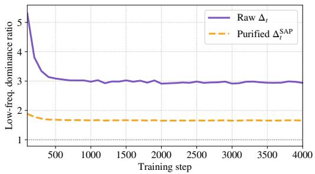  
(a) Low-frequency dominance evolution

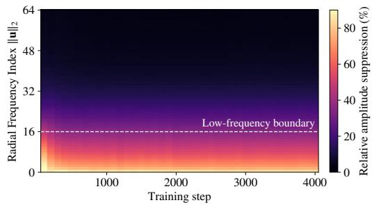  
(b) Frequency-wise suppression  
Figure 3: Spectral evolution throughout SAP-DMD training on SD3.5 Medium. Statistics are averaged over 256 samples at $t = 0 . 5$ with a checkpoint interval of 100 steps. (a) Low-frequency dominance $R _ { \mathrm { L F } }$ , defined as the ratio of mean amplitudes over $\| \mathbf { u } \| _ { 2 } < 1 6$ and $1 6 \leq \| \mathbf { u } \| _ { 2 } \leq 6 \dot { 4 }$ remains consistently reduced after purification. (b) Relative amplitude suppression, measured as $1 - \bar { \mathcal { A } } ^ { \mathrm { S A P } } ( \| \mathbf { u } \| _ { 2 } ) / \bar { \bar { \mathcal { A } } } ( \| \mathbf { u } \| _ { 2 } )$ , where A¯ denotes the sample-averaged radial amplitude.

Training acceleration. SAP-DMD introduces negligible computational overhead. Under identical hardware and training settings, DMD2 and SAP-DMD require 10.53 and 10.56 A100 GPU hours, respectively. Meanwhile, as shown in Figure 1a and Appendix D.5, SAP-DMD substantially accelerates the early-stage recovery of fine-grained details compared with DMD2, accompanied by consistently faster improvements across multiple evaluation metrics. This faster recovery enables SAP-DMD to reach higher generation quality within fewer training iterations, demonstrating improved training efficiency.

Ablation study. We study both the hyperparameter sensitivity and the design choices of SAP-DMD on SD3.5. As shown in Table 3, all tested SAP-DMD configurations outperform the DMD2 baseline across the evaluated metrics, indicating robustness to the choice of p and k. While $p = 3 , k = 3$ achieves the best preference-oriented scores, we adopt $p = \infty , k = 1$ as the default setting since it yields the highest CLIP Score while remaining competitive on the other metrics. Table 4 further shows that phase-only modulation, spatial-domain clipping, random masking, and fixed lowfrequency suppression fail to provide consistent improvements over DMD2, whereas amplitude purification improves all evaluated metrics. These results indicate that the gains of SAP-DMD stem from adaptive amplitude modulation rather than from generic gradient suppression or frequency specific attenuation. Implementation details are provided in Appendix B.

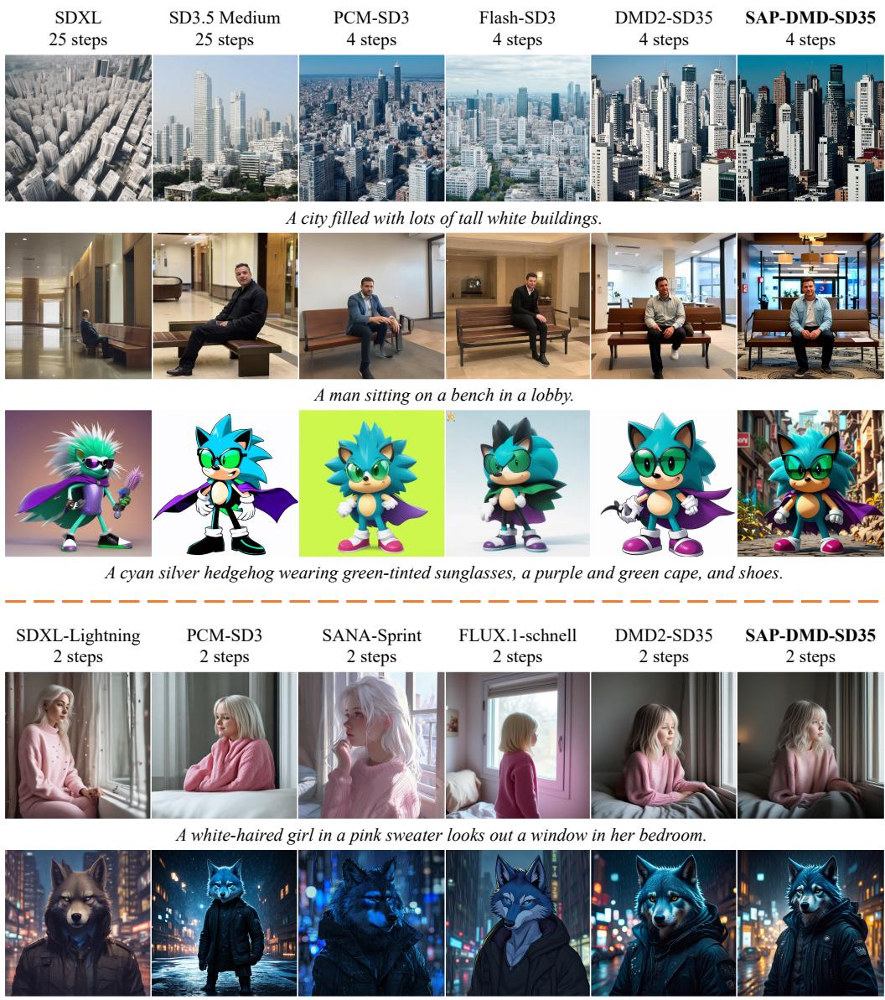  
Portrait of a male furry wolf wearing black cyberpunk clothes in a city at raining night.

Figure 4: Qualitative comparison of 4-step (top) and 2-step (bottom) generation.

Spectral evolution. Figure 3 further shows that the diagnosed spectral concentration persists throughout training. SAP-DMD consistently reduces the low-frequency dominance ratio (Figure 3a), while the frequency-resolved suppression map (Figure 3b) reveals substantially stronger attenuation at low frequencies. These results demonstrate that SAP-DMD provides persistent, adaptive spectral preconditioning beyond the early-stage snapshot in Figure 2c.

## 5 CONCLUSION

In this paper, we provide a frequency-domain perspective on the optimization dynamics of DMD. Our analysis reveals a pronounced spectral amplitude concentration in the DMD directional field, where dominant low-frequency components overwhelm weaker mid- and high-frequency signals and delay fine-detail recovery. To address this issue, we introduce SAP-DMD, a plug-and-play spectral preconditioning method that adaptively suppresses dominant amplitudes while preserving phase and weaker spectral components. Our idealized analysis further shows that SAP-DMD preserves the distribution-matching fixed point and maintains KL descent under ideal score estimation. Experiments across multiple text-to-image backbones demonstrate faster convergence and improved 2-step and 4-step generation quality.

Despite these improvements, preserving complex semantic details remains challenging under limited sampling budgets. We hope our findings motivate further study of spectral distillation dynamics and frequency-aware optimization for more accurate and efficient few-step generation.

## AI USE STATEMENT

Generative AI tools were used for language editing, feedback on experimental design, code refinement, implementation of several ablation experiments, and assistance with the theoretical analysis and proof writing. All AI-assisted code, mathematical derivations, and manuscript content were reviewed and verified by the authors. The authors take full responsibility for the final content and claims of this work.

## REFERENCES

Black Forest Labs. Flux. https://github.com/black-forest-labs/flux, 2024.

Andreas Blattmann, Robin Rombach, Huan Ling, Tim Dockhorn, Seung Wook Kim, Sanja Fidler, and Karsten Kreis. Align your latents: High-resolution video synthesis with latent diffusion models. In Proceedings of the IEEE/CVF Conference on Computer Vision and Pattern Recognition, pp. 22563–22575, 2023.

Clement Chadebec, Onur Tasar, Eyal Benaroche, and Benjamin Aubin. Flash diffusion: Accelerat-´ ing any conditional diffusion model for few steps image generation. In Proceedings of the AAAI Conference on Artificial Intelligence, pp. 15686–15695, 2025.

Junsong Chen, Jincheng Yu, Chongjian Ge, Lewei Yao, Enze Xie, Zhongdao Wang, James Kwok, Ping Luo, Huchuan Lu, and Zhenguo Li. Pixart-α: Fast training of diffusion transformer for photorealistic text-to-image synthesis. In International Conference on Learning Representations, 2024.

Junsong Chen, Shuchen Xue, Yuyang Zhao, Jincheng Yu, Sayak Paul, Junyu Chen, Han Cai, Song Han, and Enze Xie. Sana-sprint: One-step diffusion with continuous-time consistency distillation. In Proceedings ofthe IEEE/CVF International Conference on Computer Vision, pp. 16185– 16195, 2025.

Nanxin Chen, Yu Zhang, Heiga Zen, Ron J Weiss, Mohammad Norouzi, and William Chan. Wavegrad: Estimating gradients for waveform generation. In International Conference on Learning Representations, 2021.

Prafulla Dhariwal and Alexander Quinn Nichol. Diffusion models beat gans on image synthesis. In Advances in Neural Information Processing Systems, pp. 8780–8794, 2021.

Patrick Esser, Sumith Kulal, Andreas Blattmann, Rahim Entezari, Jonas Muller, Harry Saini, Yam¨ Levi, Dominik Lorenz, Axel Sauer, Frederic Boesel, Dustin Podell, Tim Dockhorn, Zion English, and Robin Rombach. Scaling rectified flow transformers for high-resolution image synthesis. In International Conference on Machine Learning, pp. 12606–12633, 2024.

Zach Evans, Julian D Parker, CJ Carr, Zack Zukowski, Josiah Taylor, and Jordi Pons. Stable audio open. In IEEE International Conference on Acoustics, Speech and Signal Processing, pp. 1–5, 2025.

Fabian Falck, Teodora Pandeva, Kiarash Zahirnia, Rachel Lawrence, Richard Turner, Edward Meeds, Javier Zazo, and Sushrut Karmalkar. A fourier space perspective on diffusion models. arXiv preprint arXiv:2505.11278, 2025.

Xingtong Ge, Xin Zhang, Tongda Xu, Yi Zhang, Xinjie Zhang, Yan Wang, and Jun Zhang. Senseflow: Scaling distribution matching for flow-based text-to-image distillation. arXiv preprint arXiv:2506.00523, 2025.

Zhengyang Geng, Mingyang Deng, Xingjian Bai, Zico Kolter, and Kaiming He. Mean flows for one-step generative modeling. In Advances in Neural Information Processing Systems, 2025.

Jonathan Ho and Tim Salimans. Classifier-free diffusion guidance. arXiv preprint arXiv:2207.12598, 2022.

Jonathan Ho, Ajay Jain, and Pieter Abbeel. Denoising diffusion probabilistic models. In Advances in Neural Information Processing Systems, pp. 6840–6851, 2020.

Jonathan Ho, Tim Salimans, Alexey A. Gritsenko, William Chan, Mohammad Norouzi, and David J. Fleet. Video diffusion models. In Advances in Neural Information Processing Systems, pp. 8633– 8646, 2022.

Edward J. Hu, Yelong Shen, Phillip Wallis, Zeyuan Allen-Zhu, Yuanzhi Li, Shean Wang, Lu Wang, and Weizhu Chen. Lora: Low-rank adaptation of large language models. In International Conference on Learning Representations, 2022.

Aapo Hyvarinen. Estimation of non-normalized statistical models by score matching.¨ Journal of Machine Learning Research, 6:695–709, 2005.

Tero Karras, Miika Aittala, Timo Aila, and Samuli Laine. Elucidating the design space of diffusionbased generative models. In Advances in Neural Information Processing Systems, pp. 26565– 26577, 2022.

Dongjun Kim, Chieh-Hsin Lai, WeiHsiang Liao, Naoki Murata, Yuhta Takida, Toshimitsu Uesaka, Yutong He, Yuki Mitsufuji, and Stefano Ermon. Consistency trajectory models: Learning probability flow ode trajectory of diffusion. In International Conference on Learning Representations, 2024.

Yuval Kirstain, Adam Polyak, Uriel Singer, Shahbuland Matiana, Joe Penna, and Omer Levy. Picka-pic: An open dataset of user preferences for text-to-image generation. In Advances in Neural Information Processing Systems, 2023.

Zhifeng Kong, Wei Ping, Jiaji Huang, Kexin Zhao, and Bryan Catanzaro. Diffwave: A versatile diffusion model for audio synthesis. In International Conference on Learning Representations, 2021.

Daiqing Li, Aleks Kamko, Ehsan Akhgari, Ali Sabet, Linmiao Xu, and Suhail Doshi. Playground v2.5: Three insights towards enhancing aesthetic quality in text-to-image generation. arXiv preprint arXiv:2402.17245, 2024.

Shanchuan Lin, Anran Wang, and Xiao Yang. Sdxl-lightning: Progressive adversarial diffusion distillation. arXiv preprint arXiv:2402.13929, 2024.

Tsung-Yi Lin, Michael Maire, Serge J. Belongie, James Hays, Pietro Perona, Deva Ramanan, Piotr Dollar, and C. Lawrence Zitnick. Microsoft COCO: common objects in context. In´ European Conference on Computer Vision, pp. 740–755, 2014.

Yaron Lipman, Ricky T. Q. Chen, Heli Ben-Hamu, Maximilian Nickel, and Matthew Le. Flow matching for generative modeling. In International Conference on Learning Representations, 2023.

Dongyang Liu, Peng Gao, David Liu, Ruoyi Du, Zhen Li, Qilong Wu, Xin Jin, Sihan Cao, Shifeng Zhang, Hongsheng Li, and Steven C. H. Hoi. Decoupled DMD: CFG augmentation as the spear, distribution matching as the shield. In International Conference on Learning Representations, 2026.

Xingchao Liu, Chengyue Gong, and Qiang Liu. Flow straight and fast: Learning to generate and transfer data with rectified flow. In International Conference on Learning Representations, 2023.

Ilya Loshchilov and Frank Hutter. Decoupled weight decay regularization. In International Conference on Learning Representations, 2019.

Eric Luhman and Troy Luhman. Knowledge distillation in iterative generative models for improved sampling speed. arXiv preprint arXiv:2101.02388, 2021.

Simian Luo, Yiqin Tan, Longbo Huang, Jian Li, and Hang Zhao. Latent consistency models: Synthesizing high-resolution images with few-step inference. arXiv preprint arXiv:2310.04378, 2023a.

Weijian Luo, Tianyang Hu, Shifeng Zhang, Jiacheng Sun, Zhenguo Li, and Zhihua Zhang. Diffinstruct: A universal approach for transferring knowledge from pre-trained diffusion models. In Advances in Neural Information Processing Systems, 2023b.

Yihong Luo, Xiaolong Chen, Xinghua Qu, Tianyang Hu, and Jing Tang. You only sample once: Taming one-step text-to-image synthesis by self-cooperative diffusion gans. In International Conference on Learning Representations, 2025a.

Yihong Luo, Tianyang Hu, Jiacheng Sun, Yujun Cai, and Jing Tang. Learning few-step diffusion models by trajectory distribution matching. In Proceedings of the IEEE/CVF International Conference on Computer Vision, pp. 17719–17728, 2025b.

Zehong Ma, Longhui Wei, Shuai Wang, Shiliang Zhang, and Qi Tian. Deco: Frequency-decoupled pixel diffusion for end-to-end image generation. In Proceedings ofthe IEEE/CVF Conference on Computer Vision and Pattern Recognition, pp. 43600–43610. Computer Vision Foundation, 2026.

Chenlin Meng, Robin Rombach, Ruiqi Gao, Diederik Kingma, Stefano Ermon, Jonathan Ho, and Tim Salimans. On distillation of guided diffusion models. In Proceedings of the IEEE/CVF Conference on Computer Vision and Pattern Recognition, pp. 14297–14306, 2023.

Thuan Hoang Nguyen and Anh Tran. Swiftbrush: One-step text-to-image diffusion model with variational score distillation. In Proceedings of the IEEE/CVF Conference on Computer Vision and Pattern Recognition, pp. 7807–7816, 2024.

Maxime Oquab, Timothee Darcet, Th´ eo Moutakanni, Huy V. Vo, Marc Szafraniec, Vasil Khalidov,´ Pierre Fernandez, Daniel Haziza, Francisco Massa, Alaaeldin El-Nouby, Mido Assran, Nicolas Ballas, Wojciech Galuba, Russell Howes, Po-Yao Huang, Shang-Wen Li, Ishan Misra, Michael Rabbat, Vasu Sharma, Gabriel Synnaeve, Hu Xu, Herve J´ egou, Julien Mairal, Patrick Labatut, Ar-´ mand Joulin, and Piotr Bojanowski. Dinov2: Learning robust visual features without supervision. Transactions on Machine Learning Research, 2024.

Dustin Podell, Zion English, Kyle Lacey, Andreas Blattmann, Tim Dockhorn, Jonas Muller, Joe¨ Penna, and Robin Rombach. SDXL: improving latent diffusion models for high-resolution image synthesis. In International Conference on Learning Representations, 2024.

Alec Radford, Jong Wook Kim, Chris Hallacy, Aditya Ramesh, Gabriel Goh, Sandhini Agarwal, Girish Sastry, Amanda Askell, Pamela Mishkin, Jack Clark, Gretchen Krueger, and Ilya Sutskever. Learning transferable visual models from natural language supervision. In International Conference on Machine Learning, pp. 8748–8763, 2021.

Sucheng Ren, Qihang Yu, Ju He, Xiaohui Shen, and Liang-Chieh Chen. Frequency-aware flow matching for high-quality image generation. In Proceedings of the IEEE/CVF Conference on Computer Vision and Pattern Recognition, pp. 9074–9083, 2026.

Yuxi Ren, Xin Xia, Yanzuo Lu, Jiacheng Zhang, Jie Wu, Pan Xie, Xing Wang, and Xuefeng Xiao. Hyper-sd: Trajectory segmented consistency model for efficient image synthesis. In Advances in Neural Information Processing Systems, 2024.

Robin Rombach, Andreas Blattmann, Dominik Lorenz, Patrick Esser, and Bjorn Ommer. High-¨ resolution image synthesis with latent diffusion models. In Proceedings of the IEEE/CVF Con ference on Computer Vision and Pattern Recognition, pp. 10674–10685, 2022.

Chitwan Saharia, William Chan, Saurabh Saxena, Lala Li, Jay Whang, Emily L. Denton, Seyed Kamyar Seyed Ghasemipour, Raphael Gontijo Lopes, Burcu Karagol Ayan, Tim Salimans, Jonathan Ho, David J. Fleet, and Mohammad Norouzi. Photorealistic text-to-image diffusion models with deep language understanding. In Advances in Neural Information Processing Systems, pp. 36479–36494, 2022.

Tim Salimans and Jonathan Ho. Progressive distillation for fast sampling of diffusion models. In International Conference on Learning Representations, 2022.

Axel Sauer, Dominik Lorenz, Andreas Blattmann, and Robin Rombach. Adversarial diffusion distillation. In European Conference on Computer Vision, pp. 87–103, 2024.

ByteDance Seed. Seedance 2.0: Advancing video generation for world complexity. arXiv preprint arXiv:2604.14148, 2026.

Chenyang Si, Ziqi Huang, Yuming Jiang, and Ziwei Liu. Freeu: Free lunch in diffusion u-net. In Proceedings of the IEEE/CVF Conference on Computer Vision and Pattern Recognition, pp. 4733–4743, 2024.

Jascha Sohl-Dickstein, Eric A. Weiss, Niru Maheswaranathan, and Surya Ganguli. Deep unsupervised learning using nonequilibrium thermodynamics. In International Conference on Machine Learning, pp. 2256–2265, 2015.

Yang Song and Prafulla Dhariwal. Improved techniques for training consistency models. In International Conference on Learning Representations, 2024.

Yang Song, Jascha Sohl-Dickstein, Diederik P. Kingma, Abhishek Kumar, Stefano Ermon, and Ben Poole. Score-based generative modeling through stochastic differential equations. In International Conference on Learning Representations, 2021.

Yang Song, Prafulla Dhariwal, Mark Chen, and Ilya Sutskever. Consistency models. In International Conference on Machine Learning, pp. 32211–32252, 2023.

Keqiang Sun, Junting Pan, Yuying Ge, Hao Li, Haodong Duan, Xiaoshi Wu, Renrui Zhang, Aojun Zhou, Zipeng Qin, Yi Wang, Jifeng Dai, Yu Qiao, Limin Wang, and Hongsheng Li. Journeydb: A benchmark for generative image understanding. In Advances in Neural Information Processing Systems, 2023.

Pascal Vincent. A connection between score matching and denoising autoencoders. Neural Computation, 23(7):1661–1674, 2011.

Fu-Yun Wang, Zhaoyang Huang, Alexander William Bergman, Dazhong Shen, Peng Gao, Michael Lingelbach, Keqiang Sun, Weikang Bian, Guanglu Song, Yu Liu, Xiaogang Wang, and Hongsheng Li. Phased consistency models. In Advances in Neural Information Processing Systems, 2024.

Chenfei Wu, Jiahao Li, Jingren Zhou, Junyang Lin, Kaiyuan Gao, Kun Yan, Shengming Yin, Shuai Bai, Xiao Xu, Yilei Chen, Yuxiang Chen, Zecheng Tang, Zekai Zhang, Zhengyi Wang, An Yang, Bowen Yu, Chen Cheng, Dayiheng Liu, Deqing Li, Hang Zhang, Hao Meng, Hu Wei, Jingyuan Ni, Kai Chen, Kuan Cao, Liang Peng, Lin Qu, Minggang Wu, Peng Wang, Shuting Yu, Tingkun Wen, Wensen Feng, Xiaoxiao Xu, Yi Wang, Yichang Zhang, Yongqiang Zhu, Yujia Wu, Yuxuan Cai, and Zenan Liu. Qwen-image technical report. arXiv preprint arXiv:2508.02324, 2025.

Xiaoshi Wu, Yiming Hao, Keqiang Sun, Yixiong Chen, Feng Zhu, Rui Zhao, and Hongsheng Li. Human preference score v2: A solid benchmark for evaluating human preferences of text-toimage synthesis. arXiv preprint arXiv:2306.09341, 2023.

Jiazheng Xu, Xiao Liu, Yuchen Wu, Yuxuan Tong, Qinkai Li, Ming Ding, Jie Tang, and Yuxiao Dong. Imagereward: Learning and evaluating human preferences for text-to-image generation. In Advances in Neural Information Processing Systems, 2023.

Xingyi Yang, Daquan Zhou, Jiashi Feng, and Xinchao Wang. Diffusion probabilistic model made slim. In Proceedings of the IEEE/CVF Conference on Computer Vision and Pattern Recognition, pp. 22552–22562, 2023.

Tianwei Yin, Michael Gharbi, Taesung Park, Richard Zhang, Eli Shechtman, Fredo Durand, and ¨ William T Freeman. Improved distribution matching distillation for fast image synthesis. In Advances in Neural Information Processing Systems, 2024a.

Tianwei Yin, Michael Gharbi, Richard Zhang, Eli Shechtman, Fredo Durand, William T Freeman,¨ and Taesung Park. One-step diffusion with distribution matching distillation. In Proceedings of the IEEE/CVF Conference on Computer Vision and Pattern Recognition, pp. 6613–6623, 2024b.

Jiahui Yu, Yuanzhong Xu, Jing Yu Koh, Thang Luong, Gunjan Baid, Zirui Wang, Vijay Vasudevan, Alexander Ku, Yinfei Yang, Burcu Karagol Ayan, Ben Hutchinson, Wei Han, Zarana Parekh, Xin Li, Han Zhang, Jason Baldridge, and Yonghui Wu. Scaling autoregressive models for content-rich text-to-image generation. Transactions on Machine Learning Research, 2022.

Richard Zhang, Phillip Isola, Alexei A Efros, Eli Shechtman, and Oliver Wang. The unreasonable effectiveness of deep features as a perceptual metric. In Proceedings of the IEEE Conference on Computer Vision and Pattern Recognition, pp. 586–595, 2018.

Zangwei Zheng, Xiangyu Peng, Tianji Yang, Chenhui Shen, Shenggui Li, Hongxin Liu, Yukun Zhou, Tianyi Li, and Yang You. Open-sora: Democratizing efficient video production for all. arXiv preprint arXiv:2412.20404, 2024.

Zhenyu Zhou, Defang Chen, Can Wang, Chun Chen, and Siwei Lyu. Simple and fast distillation of diffusion models. In Advances in Neural Information Processing Systems, pp. 40831–40860, 2024.

## A RELATED WORK

Few-step diffusion distillation. Diffusion distillation aims to reduce the number of sampling steps while maintaining high generation quality. Existing approaches can be broadly grouped into three major categories: trajectory distillation, consistency distillation, and distribution matching. Trajectory distillation methods (Luhman & Luhman, 2021; Salimans & Ho, 2022; Meng et al., 2023; Zhou et al., 2024) align the intermediate states along the teacher’s sampling trajectory with those of the student model, emphasizing temporal consistency and often relying on carefully designed schedules. Consistency distillation (Song et al., 2023; Song & Dhariwal, 2024; Kim et al., 2024; Luo et al., 2023a; Wang et al., 2024; Ren et al., 2024; Chen et al., 2025; Geng et al., 2025) enforces output consistency across noise levels, simplifying training and improving sample quality, but typically requires careful hyperparameter tuning for stable optimization. Distribution Matching Distillation (DMD) formulates few-step distillation as explicit distribution alignment (Luo et al., 2023b; Yin et al., 2024b; Nguyen & Tran, 2024; Yin et al., 2024a). By minimizing the KL divergence between the student and teacher marginal distributions at each diffusion step, DMD provides an effective framework for training few-step generators to approximate the teacher distribution. Several extensions further improve scalability and generation fidelity. TDM (Luo et al., 2025b) partitions the optimization into non-overlapping intervals and introduces importance sampling for efficient fake model training. SenseFlow (Ge et al., 2025) introduces parameter shifting to stabilize fake model training and intra-segment guidance as additional supervision. Decoupled DMD (Liu et al., 2026) separates distribution matching from classifier-free guidance (CFG) augmentation through independent re-noising strategies. Different from these approaches, SAP-DMD investigates the spectral characteristics of the DMD directional field and introduces a spectral amplitude modulation mechanism. By reducing the dominance of concentrated low-frequency components, SAP-DMD improves few-step distillation without modifying the model architecture or training objective.

Frequency-domain perspectives on diffusion models. Recent studies have revealed that diffusion models exhibit frequency-dependent generation dynamics. Fourier-space analysis shows that different frequency components undergo distinct corruption and recovery throughout the diffusion process, leading to a coarse-to-fine generation behavior (Falck et al., 2025). Beyond analysis, recent methods incorporate frequency information into diffusion generation. FreqFlow (Ren et al., 2026) incorporates frequency-aware conditioning into flow matching by explicitly modeling lowand high-frequency components to improve generation quality, while FreeU (Si et al., 2024) and DeCo (Ma et al., 2026) introduce frequency-aware modulation in intermediate representations and generation architectures, respectively. Frequency-aware spectral modeling has also been explored in diffusion compression (Yang et al., 2023). However, existing frequency-domain approaches mainly focus on generation dynamics, model representations, or reconstruction objectives, while the spectral properties of optimization signals in diffusion distillation remain largely underexplored. In contrast, SAP-DMD studies the Fourier structure of the DMD directional field and introduces spectral amplitude modulation during distillation.

## B IMPLEMENTATION DETAILS

General settings. We optimize the generator and the fake model using LoRA (Hu et al., 2022) with hyperparameters α = 32 and rank r = 32, employing the AdamW (Loshchilov & Hutter, 2019) optimizer. LoRA adapters are applied to the attention projections {to q, to k, to v, to out.0}. Training is conducted in two phases. The generator is first trained for 4,000 iterations without GAN loss, using only the prompts of the JourneyDB (Sun et al., 2023) dataset. Subsequently, the GAN loss is introduced for an additional 2,000 iterations using the MJHQ-30K (Li et al., 2024) dataset to further improve generation quality. For the GAN loss, we adopt the implementation from SenseFlow (Ge et al., 2025), where the discriminator leverages pretrained DINOv2 (Oquab et al., 2024) and CLIP (Radford et al., 2021) encoders to provide semantically rich and spatially aligned supervision. Due to limited computational resources, a global batch size of 4 is used in all experiments. For a controlled comparison, we keep the common training setup fixed across the re-implemented distribution-matching baselines. In the following, we detail the hyperparameters specific to each re-implemented method.

DMD2 introduces several improvements over vanilla DMD: the Two Time-scale Update Rule (TTUR), which performs more updates on the fake score model per generator update; backward simulation, which mitigates the training–inference mismatch; and a GAN loss that enhances generation quality. In our experiments, following TDM, we disable TTUR and instead use a larger learning rate of $\mathrm { 5 \times 1 0 ^ { - 5 } }$ for the fake model, while setting the generator learning rate to $1 \times 1 0 ^ { - 5 }$ . We set the GAN loss weight to 0.1 in all second-stage training. For generator training, we follow the standard protocol: the real model employs classifier-free guidance (e.g., 7.0 in our experiments), while the fake model does not.

SAP-DMD. SAP-DMD strictly follows the above training settings of DMD2. For the proposed amplitude modulation mechanism, we set the kernel shape parameter $p = \infty ,$ corresponding to a hard clipping function, and set the statistical boundary factor to $k = 3$ for PixArt-α and $k = 1$ for both SD3 and SD3.5.

TDM introduces a re-noising strategy that segments optimization into non-overlapping intervals. It further introduces importance sampling for training the fake model and employs a Pseudo-Huber loss for generator training. In our re-implementation of TDM, we enable these modifications while keeping the other settings consistent with those used in DMD2.

SenseFlow. For SenseFlow, we follow the practical implementation by shifting the fake model parameters toward the generator using $\phi  0 . 9 8 \cdot \phi + 0 . 0 2 \cdot \theta .$ . We also enable the proposed intra segment guidance with a weight of 0.5. All other settings remain consistent with those of DMD2.

Decoupled DMD separates generator training into two components: a distribution matching (DM) term and a classifier-free guidance augmentation (CA) term. It applies independent re-noising timesteps to the two terms, constraining the CA re-noising timestep while leaving the DM re-noising timestep unconstrained. All other settings are kept consistent with those of DMD2.

Design ablations. For the design ablations in Table 4, all variants modify the same DMD directional error while keeping the remaining training settings unchanged. For Phase, we preserve the spectral amplitude and apply the same statistical clipping rule only to the phase magnitude, with $p = \infty$ and $k = 1$ ; the channel-wise threshold is given by the mean plus k standard deviations of the absolute phase and capped at π. For S-Clip, the same hard-clipping rule is applied directly to the spatialdomain magnitude with $p = \infty$ and $k = 1$ . For R-Mask, conjugate-symmetric frequency pairs are independently masked with probability 0.1, preserving a real-valued inverse transform. For LF-Sup, Fourier coefficients with normalized radial frequency $r \leq 0 . 2 5$ are uniformly scaled by 0.5, while the remaining frequencies are left unchanged.

## C THEORETICAL PROOF

For a fixed diffusion timestep t, we omit the subscript t when no ambiguity arises. Let $p ( \mathbf { x } )$ denote the density evolving with the auxiliary parameter τ, initialized from $p _ { \theta , t } ,$ and let $q ( \mathbf { x } ) = q _ { t } ( \mathbf { x } )$ and $\Delta ( \mathbf { x } ) = \Delta _ { t } ( \mathbf { x } )$ . We assume that the involved densities are sufficiently smooth, positive on a common connected support, and decay properly at the boundary so that integration by parts is valid.

Under ideal score estimation, the fake and real models recover the scores of $p$ and $q ,$ respectively. From the score–prediction relation in Eq. (1), the directional error in Eq. (7) satisfies

$$
\pmb { \Delta } ( \mathbf { x } ) = a _ { t } \nabla _ { \mathbf { x } } \log \frac { p ( \mathbf { x } ) } { q ( \mathbf { x } ) } ,\tag{17}
$$

where $a _ { t } > 0$ is a time-dependent factor determined by the diffusion parameterization.

We consider the idealized distributional flow induced by SAP-DMD,

$$
\frac { \mathrm { d } \mathbf { x } } { \mathrm { d } \tau } = \mathbf { v } ( \mathbf { x } ) = - \tilde { \omega } ( t ) T [ \Delta ] ( \mathbf { x } ) .\tag{18}
$$

The corresponding density evolves according to the continuity equation

$$
\frac { \partial p ( \mathbf { x } ) } { \partial \tau } = - \nabla _ { \mathbf { x } } \cdot \big ( p ( \mathbf { x } ) \mathbf { v } ( \mathbf { x } ) \big ) .\tag{19}
$$

Recall that

$$
\mathcal { E } _ { t } = \mathcal { D } _ { \mathrm { K L } } ( p \| q ) = \int p ( \mathbf { x } ) \log \frac { p ( \mathbf { x } ) } { q ( \mathbf { x } ) } \mathrm { d } \mathbf { x } .\tag{20}
$$

Differentiating with respect to τ gives

$$
\begin{array} { r l r } & { \displaystyle \frac { \mathrm { d } } { \mathrm { d } \tau } \mathcal { E } _ { t } = \int \frac { \partial p } { \partial \tau } \left( \log \frac { p } { q } + 1 \right) \mathrm { d } \mathbf { x } } & \\ & { \displaystyle \quad \quad = \int \frac { \partial p } { \partial \tau } \log \frac { p } { q } \mathrm { d } \mathbf { x } , } & \end{array}\tag{21}
$$

where the second equality follows from conservation of probability, $\begin{array} { r } { \int \partial p / \partial \tau \mathrm d \mathbf x = 0 } \end{array}$ . Substituting Eq. (19) and applying integration by parts yields

$$
\begin{array} { l } { \displaystyle \frac { \mathrm { d } } { \mathrm { d } \tau } { \mathcal E } _ { t } = - \int \nabla _ { \mathbf x } \cdot ( p \mathbf v ) \log \frac { p } { q } \mathrm { d } \mathbf x } \\ { \displaystyle = \int p ( \mathbf x ) \mathbf v ( \mathbf x ) ^ { \top } \nabla _ { \mathbf x } \log \frac { p ( \mathbf x ) } { q ( \mathbf x ) } \mathrm { d } \mathbf x . } \end{array}\tag{22}
$$

Substituting Eqs. (17) and (18) into Eq. (22) yields a positive factor $\tilde { \omega } ( t ) / a _ { t }$ . Since $a _ { t } > 0$ depends only on t, we absorb $1 / a _ { t }$ into $\tilde { \omega } ( t )$ and obtain

$$
\frac { \mathrm { d } } { \mathrm { d } \tau } \mathcal { E } _ { t } = - \tilde { \omega } ( t ) \mathbb { E } _ { \mathbf { x } \sim p } \left[ \langle \pmb { \Delta } , \mathcal { T } [ \pmb { \Delta } ] \rangle \right] .\tag{23}
$$

It remains to characterize the inner product in Eq. (23). For each sample, Eq. (10) gives

$$
\mathcal { F } \left[ \mathcal { T } [ \Delta ] \right] _ { c } ( \mathbf { u } ) = \kappa \left( \mathbf { u } , \mathcal { A } _ { \Delta , c } ( \mathbf { u } ) \right) \mathcal { F } [ \Delta ] _ { c } ( \mathbf { u } ) ,\tag{24}
$$

where c denotes the channel index. Applying Parseval’s identity to the spatial inner product yields

$$
\begin{array} { r l } { \langle \Delta , \mathcal { T } [ \Delta ] \rangle = \displaystyle \sum _ { c } \displaystyle \sum _ { \mathbf { u } \in \Omega } \mathcal { F } [ \Delta ] _ { c } ( \mathbf { u } ) ^ { * } \mathcal { F } \left[ \mathcal { T } [ \Delta ] \right] _ { c } ( \mathbf { u } ) } & { } \\ { = \displaystyle \sum _ { c } \displaystyle \sum _ { \mathbf { u } \in \Omega } \kappa \left( \mathbf { u } , \mathcal { A } _ { \Delta , c } ( \mathbf { u } ) \right) \left| \mathcal { F } [ \Delta ] _ { c } ( \mathbf { u } ) \right| ^ { 2 } } & { } \\ { = \displaystyle \sum _ { c } \displaystyle \sum _ { \mathbf { u } \in \Omega } \kappa \left( \mathbf { u } , \mathcal { A } _ { \Delta , c } ( \mathbf { u } ) \right) \mathcal { A } _ { \Delta , c } ^ { 2 } ( \mathbf { u } ) . } \end{array}\tag{25}
$$

Here we use the unitary DFT convention for simplicity; any alternative DFT normalization only introduces a positive constant that can be absorbed into $\tilde { \omega } ( t )$

Substituting Eq. (25) into Eq. (23) gives

$$
\frac { \mathrm { d } } { \mathrm { d } \tau } \mathcal { E } _ { t } = - \tilde { \omega } ( t ) \mathbb { E } _ { \mathbf { x } \sim p } \left[ \sum _ { c } \sum _ { \mathbf { u } \in \Omega } \kappa \left( \mathbf { u } , \mathcal { A } _ { \Delta , c } ( \mathbf { u } ) \right) \boldsymbol { A } _ { \Delta , c } ^ { 2 } ( \mathbf { u } ) \right] \leq 0 ,\tag{26}
$$

because $\tilde { \omega } ( t ) > 0$ and $\kappa ( { \bf { u } } , \cdot ) > 0$

Finally, equality in Eq. (26) requires $\mathcal { A } _ { \Delta , c } ( \mathbf { u } ) = 0$ for every channel and frequency almost everywhere under $p ,$ which by the invertibility of the DFT implies $\pmb { \Delta } ( \mathbf { x } ) = 0$ almost everywhere. From Eq. (17),

$$
\nabla _ { \mathbf { x } } \log { \frac { p ( \mathbf { x } ) } { q ( \mathbf { x } ) } } = 0 .\tag{27}
$$

Hence $\log ( p / q )$ is constant on the common connected support of p and $q ,$ so that $p = C q$ for some constant $C .$ . Since both are normalized probability densities, $C = 1 .$ , yielding $p = q$ almost everywhere. Conversely, $p = q$ immediately implies $\Delta = 0$ and therefore $\begin{array} { r } { \frac { \mathrm { d } } { \mathrm { d } \tau } \mathcal { E } _ { t } = 0 } \end{array}$

This completes the proof of Theorem 1.

## D ADDITIONAL RESULTS

## D.1 SPECTRAL DIAGNOSTICS ACROSS TIMESTEPS

To examine whether the spectral behavior observed in Figure 2a is specific to a particular diffusion timestep, we repeat the analysis at representative timesteps $t \in \{ \bar { 1 . 0 } , 0 . 7 5 , 0 . 5 , 0 . 2 5 \}$ . As shown in Figure 5, although the absolute spectral scale varies substantially with t, the DMD directional field consistently exhibits low-frequency concentration. SAP-DMD suppresses the dominant lowfrequency amplitudes across all timesteps, with weaker modulation toward higher frequencies.

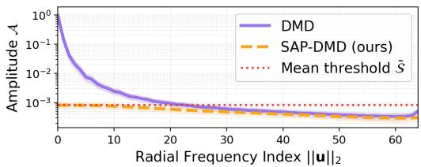  
(a) t = 1.0

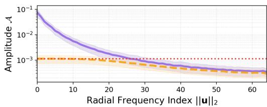  
(b) t = 0.75

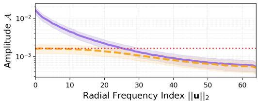  
(c) t = 0.50

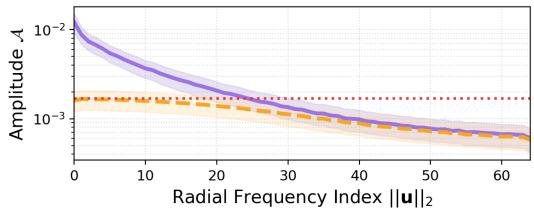  
(d) t = 0.25

Figure 5: Radial amplitude profiles across representative diffusion timesteps on SD3.5 Medium. The DMD directional field consistently exhibits pronounced low-frequency amplitude concentration, while SAP-DMD suppresses dominant amplitudes and largely preserves weaker components.  
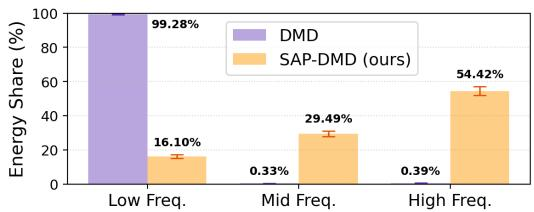  
(a) t = 1.0

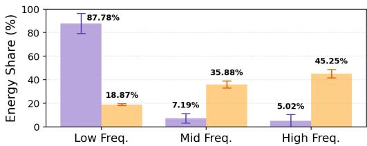

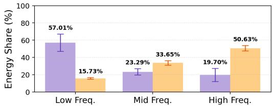  
(c) t = 0.50

(b) t = 0.75  
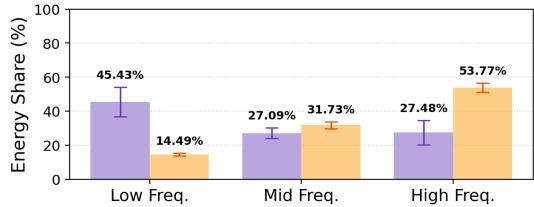  
(d) t = 0.25  
Figure 6: Relative spectral energy shares across representative diffusion timesteps on SD3.5 Medium. Low-frequency energy becomes increasingly dominant in the raw DMD directional field as t increases. Across all timesteps, SAP-DMD substantially reduces this relative low-frequency dominance and increases the energy shares of mid- and high-frequency components.

The relative spectral energy statistics in Figure 6 provide a complementary view. Low-frequency dominance becomes substantially stronger at larger t and gradually decreases toward smaller t. SAP-DMD consistently reduces the relative low-frequency energy share, confirming that the spectral behavior diagnosed in the main analysis is not confined to a particular diffusion timestep.

We further examine the log-amplitude statistics underlying the adaptive threshold. As shown in Figure 7, the log transform consistently produces substantially more symmetric, bell-shaped distributions across timesteps, although heavier tails remain at larger t. Across 128 samples and 16 channels, the median absolute skewness decreases from 74.53, 12.94, 4.47, and 3.57 in the raw amplitude domain to 0.69, 0.73, 0.13, and 0.22 after the log transform for $t = 1 . 0 , 0 . 7 5 , 0 . 5$ , and 0.25, respectively, with similarly substantial reductions in excess kurtosis. These results support the log domain as a more stable and symmetric space for defining the adaptive boundary $S _ { c } = \exp ( \mu _ { c } + k s _ { c } )$ .

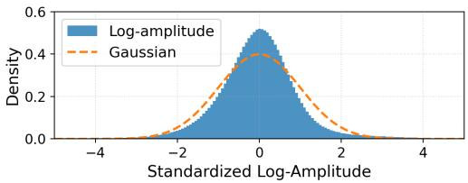  
(a) t = 1.0

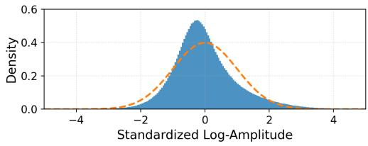  
(b) t = 0.75

  
(c) t = 0.50

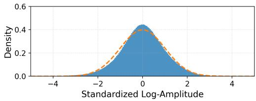  
(d) t = 0.25  
Figure 7: Standardized log-amplitude distributions across representative diffusion timesteps on SD3.5 Medium. Statistics are computed at each timestep from a DMD2 trained for 200 steps and averaged over 128 samples, with each distribution standardized independently before aggregation. The dashed curve denotes a standard Gaussian for reference. The log-amplitude distributions are substantially more symmetric than the raw amplitude distributions and remain bell-shaped across timesteps, supporting the log-domain k-sigma boundary used by SAP-DMD.

## D.2 PROPAGATION THROUGH THE GENERATOR JACOBIAN

SAP-DMD modifies the directional error $\Delta _ { t }$ in the output space, whereas the generator is updated by $g = J _ { \theta } ^ { \top } \Delta _ { t } ,$ where $J _ { \theta } = \partial \mathbf { x } _ { t } / \partial \theta$ . To verify that the effect of SAP-DMD survives this transformation, we decompose $\Delta _ { t }$ into low-, mid-, and high-frequency components $\Delta _ { t , b }$ and compute

$$
g _ { b } = J _ { \theta } ^ { \top } \Delta _ { t , b } , \qquad q _ { b } = { \frac { \langle g _ { b } , g \rangle } { \| g \| _ { 2 } ^ { 2 } } } , \qquad g = \sum _ { b } g _ { b } .\tag{28}
$$

Here, $q _ { b }$ measures the relative contribution of frequency band b to the parameter update. We use the same 4,000-step DMD2 checkpoint and Jacobian for the raw and SAP-transformed signals, thereby isolating the effect of the $\mathsf { S A } \dot { \mathsf { P } }$ operator. Results are averaged over 128 prompts. As in the main text, the low-, mid-, and high-frequency bands are defined by $\| \mathbf { u } \| _ { 2 } < 1 \bar { 6 } , 1 6 \mathbf { \bar { \ t } } \leq \| \mathbf { u } \| _ { 2 } < 3 2$ , and $3 2 \leq \| \mathbf { u } \| _ { 2 } \leq 6 4$ , respectively.

As shown in Figure 8, the frequency redistribution introduced by SAP-DMD remains evident after multiplication by the generator Jacobian across all tested noise levels. This confirms that SAP-DMD directly affects the parameter-space update rather than only modifying $\Delta _ { t }$ in the output space.

## D.3 SENSITIVITY TO TRAINING RECIPE

Our default implementation uses a resource-efficient training recipe with a global batch size of 4 and $\mathrm { T T U R } = \mathbf { \bar { 1 } }$ , where TTUR denotes the number of fake-model updates per generator update. We examine the sensitivity of 2-step SAP-DMD on SD3.5 to these choices by varying the effective batch size and the fake-model update frequency.

Batch size. Increasing the effective batch size generally improves preference-based metrics, although the gains are modest and vary across evaluation criteria. The effect of adversarial fine-tuning also depends on the batch size: it provides clearer improvements with a larger batch, but does not consistently benefit every metric. More importantly, increasing the batch size from 4 to 32 raises the training cost by more than eightfold. Thus, while larger batches can provide moderate quality gains, they result in a substantially less favorable performance–compute trade-off. We therefore use a global batch size of 4 in our main experiments.

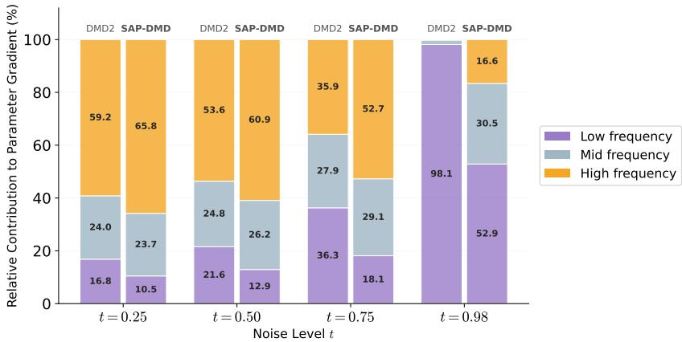  
Figure 8: Relative contributions of different source frequency bands to the parameter gradient on SD3.5. SAP-DMD consistently reduces the low-frequency contribution and increases the highfrequency contribution after backpropagation through the generator Jacobian. $t ~ = ~ 0 . 9 8$ is used because the generator Jacobian vanishes at the terminal timestep t = 1.0.

Table 5: Sensitivity of 2-step SAP-DMD on SD3.5 Medium to the training recipe. GAN: with GAN loss in the second training stage; +: additional A100 hours of this stage.
<table><tr><td rowspan="2">Batch size</td><td rowspan="2">TTUR</td><td rowspan="2">GAN</td><td colspan="3">MS-COCO</td><td colspan="5">HPSv2.1</td><td rowspan="2">A100 hours</td></tr><tr><td>IR</td><td>PS</td><td>CS</td><td>Anime</td><td>Concept Painting</td><td></td><td>Photo</td><td>Avg.</td></tr><tr><td>4</td><td>1</td><td></td><td>1.0867</td><td>22.4414</td><td>31.87</td><td>34.16</td><td>33.17</td><td>33.35</td><td>29.99</td><td>32.67</td><td>10.56</td></tr><tr><td>4</td><td>5</td><td></td><td>1.0761</td><td>22.4248</td><td>31.92</td><td>34.01</td><td>32.96</td><td>33.09</td><td>29.78</td><td>32.46</td><td>28.82</td></tr><tr><td>4</td><td>1</td><td>√</td><td>1.1104</td><td>22.5945</td><td>32.14</td><td>33.58</td><td>32.92</td><td>33.04</td><td>29.97</td><td>32.38</td><td>+11.09</td></tr><tr><td>32</td><td>1</td><td></td><td>1.1245</td><td>22.5483</td><td>32.00</td><td>34.28</td><td>33.29</td><td>33.32</td><td>30.50</td><td>32.85</td><td>90.34</td></tr><tr><td>32</td><td>1</td><td>√</td><td>1.1444</td><td>22.6080</td><td>31.98</td><td>34.45</td><td>33.48</td><td>33.63</td><td>30.77</td><td>33.08</td><td>+86.39</td></tr></table>

TTUR. Increasing the fake-to-generator update ratio from 1 to 5 provides no consistent improvement. With a batch size of 4, TTUR = 5 leaves the MS-COCO scores nearly unchanged and decreases the average HPSv2.1 score from 32.67 to 32.46, while increasing the training cost from 10.56 to 28.82 A100 hours. These results indicate that more frequent fake-model updates offer no measurable quality benefit under our setting. We therefore adopt TTUR = 1, which achieves a substantially better performance–compute trade-off.

Robustness across training seeds. We additionally evaluate 4-step DMD2 and SAP-DMD using three matched training seeds on SD3.5 Medium. As shown in Table 6, SAP-DMD improves all metrics on average. The relatively small standard deviations further demonstrate that the improvements are reproducible across training seeds rather than being driven by a single run.

## D.4 SAMPLE DIVERSITY

We evaluate whether the quality improvements of SAP-DMD come at the cost of reduced sample diversity. Following the evaluation protocol of DMD2 (Yin et al., 2024a), we select a fixed set of 128 prompts from PartiPrompts (Yu et al., 2022) and generate four images per prompt using different initial noise seeds. For each prompt, we compute the LPIPS distance (Zhang et al., 2018) for all six image pairs and average the results across prompts. DMD2 and SAP-DMD use identical prompts, seeds, and four-step inference settings.

As shown in Table 7, SAP-DMD improves pairwise LPIPS diversity on SD3 and SD3.5, while producing a statistically indistinguishable result on PixArt-α. These results indicate that the improvements in generation quality and convergence do not arise from reduced sensitivity to the initial noise or from reduced sample diversity. Since the models generate at different native resolutions, the absolute LPIPS values should only be compared within each backbone.

Table 6: Results of 4-step DMD2 and SAP-DMD on SD3.5 Medium without GAN loss over three matched training seeds, reported as mean ± standard deviation.
<table><tr><td rowspan="2">Method</td><td colspan="3">MS-COCO</td><td colspan="5">HPSv2.1</td></tr><tr><td>IR</td><td>PS</td><td>CS</td><td>Anime</td><td>Concept</td><td>Painting</td><td>Photo</td><td> $\mathbf { A v } \mathbf { g } .$ </td></tr><tr><td>DMD2</td><td> $1 . 0 6 9 3 { \scriptstyle \pm . 0 2 4 6 }$ </td><td> $2 2 . 5 1 9 6 _ { \pm . 0 3 5 9 }$ </td><td> $3 1 . 4 9 7 4 { \scriptstyle \pm . 0 7 2 7 }$ </td><td> $3 3 . 7 1 _ { \pm . 4 0 }$ </td><td> $3 3 . 1 1 _ { \pm . 3 1 }$ </td><td> $3 3 . 3 3 { \scriptstyle \pm . 3 0 }$ </td><td> $3 0 . 1 7 _ { \pm . 2 9 }$ </td><td> $3 2 . 5 8 _ { \pm . 3 2 }$ </td></tr><tr><td>SAP-DMD</td><td> $\mathbf { 1 . 1 1 2 5 { \scriptstyle \pm . 0 0 0 9 } }$ </td><td> $\mathbf { 2 2 . 6 2 4 0 _ { \pm . 0 2 2 7 } }$ </td><td> $\mathbf { 3 1 . 6 9 1 0 _ { \pm . 1 2 5 3 } }$ </td><td> $\mathbf { 3 4 . 5 0 _ { \pm . 1 0 } }$ </td><td> $\mathbf { 3 3 . 8 0 _ { \pm . 1 0 } }$ </td><td> $\mathbf { 3 3 . 9 8 _ { \pm . 1 3 } }$ </td><td> $\mathbf { 3 0 . 8 5 _ { \pm . 2 4 } }$ </td><td> $\mathbf { 3 3 . 2 8 _ { \pm . 1 3 } }$ </td></tr></table>

Table 7: Sample diversity measured by average pairwise LPIPS (higher is more diverse) for 4-step generation. Results are reported as mean ± standard error over 128 prompts.
<table><tr><td>Backbone</td><td>DMD2</td><td>SAP-DMD</td><td>∆</td></tr><tr><td>PixArt-α</td><td> $\mathbf { 0 . 5 6 8 \pm 0 . 0 0 7 }$ </td><td> $0 . 5 6 6 \pm 0 . 0 0 6$ </td><td> $- 0 . 0 0 2$ </td></tr><tr><td>SD3</td><td> $0 . 5 9 8 \pm 0 . 0 0 9$ </td><td> $\mathbf { 0 . 6 1 7 \pm 0 . 0 0 7 }$ </td><td> $+ 0 . 0 1 9$ </td></tr><tr><td>SD3.5</td><td> $0 . 6 5 6 \pm 0 . 0 0 8$ </td><td> $\mathbf { 0 . 6 7 2 \pm 0 . 0 0 5 }$ </td><td> $+ 0 . 0 1 6$ </td></tr></table>

## D.5 EARLY-STAGE HIGH-FREQUENCY RECOVERY

We quantitatively evaluate how rapidly the high-frequency spectrum of each student output approaches that of its paired 25-step teacher output during training. At each checkpoint s, we compute the RMS log-power discrepancy over the upper half of the normalized radial-frequency range:

$$
e _ { s } = { \sqrt { \textstyle { \frac { 1 } { | \mathcal { H } | } } \sum _ { r \in \mathcal { H } } \left( \log _ { 1 0 } P _ { s } ( r ) - \log _ { 1 0 } P _ { \mathrm { t e a c h e r } } ( r ) \right) ^ { 2 } } } , \qquad \mathcal { H } = \{ r : 0 . 5 \leq r < 1 . 0 \} ,\tag{29}
$$

where $P _ { s } ( r )$ and $P _ { \mathrm { t e a c h e r } } ( r )$ denote the radially averaged power spectra of the student output at checkpoint s and of the teacher output, respectively. The teacher-relative discrepancy measures high-frequency recovery without rewarding arbitrary noise amplification or excessive sharpening. We summarize early-stage recovery using the normalized area under the error curve over the first 25% of the 4,000-step training budget:

$$
\mathrm { A U C _ { H F } } = \frac { 1 } { s _ { K } - s _ { 1 } } \int _ { s _ { 1 } } ^ { s _ { K } } e _ { s } \mathrm { d } s , \qquad s _ { K } \leq 1 0 0 0 ,\tag{30}
$$

where $s _ { 1 }$ and $s _ { K }$ are the first and last evaluated checkpoints, and a lower value indicates faster convergence toward the teacher’s high-frequency spectrum. As shown in Figure 9, SAP-DMD reduces $\mathrm { \bar { A } U C _ { H F } }$ by 10.0%, 13.5%, and 33.1% on SD3.5, SD3, and PixArt-α, respectively. These improvements show that SAP-DMD accelerates high-frequency recovery across architectures.

Figures 10, 11, and 12 provide qualitative visualizations of this recovery process using four-step generation. For each comparison, DMD2 and SAP-DMD use the same prompt, initial noise, and inference schedule. Both methods recover the coarse image structure at early checkpoints, whereas SAP-DMD develops fine-grained content, such as fur, hair, facial features, feathers, and flower petals, more rapidly. Across all three architectures, the improvement is already visible at intermediate checkpoints, while the global composition and semantic content remain comparable. This indicates that the observed difference primarily reflects faster recovery of local structures rather than a change in the generated content or layout. Together, the quantitative and qualitative results demonstrate that SAP-DMD accelerates fine-detail recovery during training.

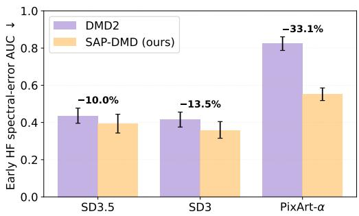  
Figure 9: Early-stage high-frequency recovery on SD3.5, SD3, and PixArt-α. We report the normalized AUC of the high-frequency log-power discrepancy relative to paired 25-step teacher outputs over the first 25% of training. Bars show the mean over 128 prompts, and error bars denote 95% bootstrap confidence intervals.

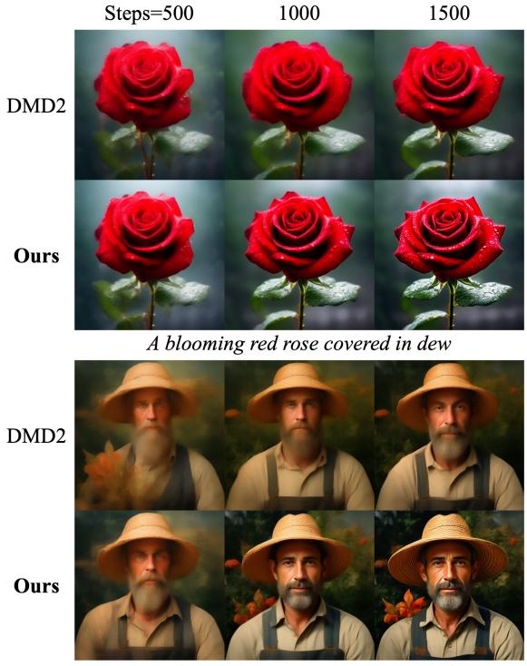

Steps=500  
1000  
1500  
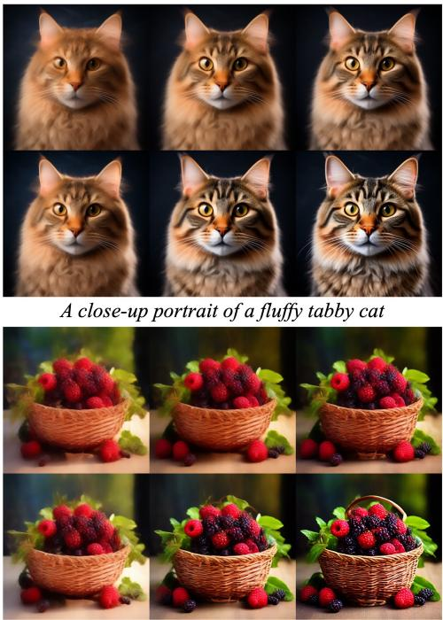  
A gardener portrait wearing a woven hat  
A woven basket filled with ripe berries  
Figure 10: Fine-detail recovery during training on PixArt-α with 4-step generation. Columns: training steps; both methods share the prompt and initial noise.

Steps=200  
400  
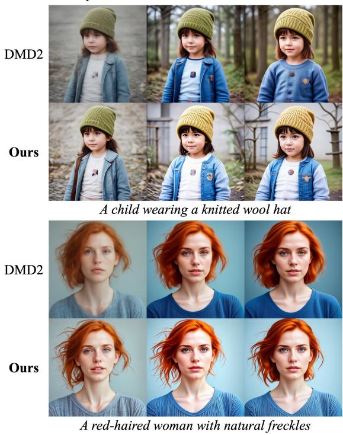  
600

Steps=200  
400  
600  
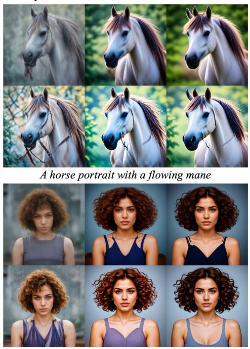  
A young woman with curly hair, close-up portrait  
Figure 11: Fine-detail recovery during training on SD3 with 4-step generation. Columns: training steps; both methods share the prompt and initial noise.

Steps=200  
400  
600  
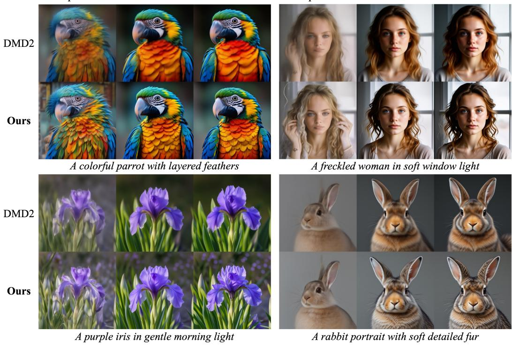  
Steps=200  
400  
600  
Figure 12: Fine-detail recovery during training on SD3.5 with 4-step generation. Columns: training steps; both methods share the prompt and initial noise.