# Seeing Is Not Measuring: Tool-Augmented Metric Spatial Reasoning for Vision-Language Models

Clemens Grange Kai Glantz Technical University of Munich {clemens.grange, kai.glantz}@tum.de

## Abstract

Vision-Language Models (VLMs) describe scenes well but reason poorly about metric 3D structure such as absolute distances, physical sizes, or egocentric directions. We present a modular, predictor-agnostic, tool-augmentedframework that equips a small VLM (Qwen3.5-4B) with geometric tools: 3D object detection, metric depth estimation, and deterministic solvers for distance, size and bearing. Each object is detected in the camera frame of its own best view, and the tools use that frame’s pose to lift every detection into one shared worldframe. Moving metric computation out ofthe model’s weights and into explicit solvers yields large gains on three offour ReVSI-Bench tasks: with a strong monocular detector (WildDet3D), absolute distance risesfrom 0.46 to 0.74 Mean Relative Accuracy (MRA), relative distancefrom 39.1% to 67.4%, and relative directionfrom a below-chance 25.9% to 73.4%. Because any detector can be swapped in behind the tool interface, comparing real detectors against ground-truth boxes separates perception errorfrom reasoning error: orchestration costs only 0.03 MRA. Object size is bounded by the detector: the tools are near-exact on groundtruth boxes (0.97) yet the best real detector barely beats the no-tool baseline (0.61 vs. 0.58), because size reads straight off a box extent monocular detectors get wrong. Without a predefined recipe, the model already sequences the tools correctly on its own, matching a scripted pipeline on three of four tasks.

## 1. Introduction

Embodied and robotic agents operating in real environments need precise metric spatial understanding: how far apart two objects are, how large they are, and where they lie relative to the viewer. Vision-Language Models (VLMs) excel at qualitative scene description, yet remain unreliable at exactly this kind of metric 3D reasoning.

This bottleneck is documented by benchmarks such as VSI-Bench [23] and its corrected successor ReVSI-

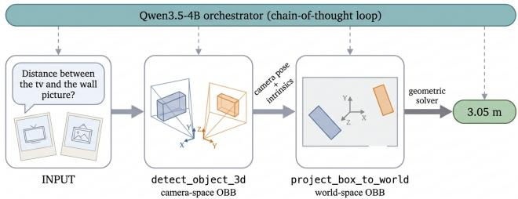  
Figure 1. Example of tool-augmented metric spatial reasoning. The VLM orchestrates tools to answer a spatial distance question from video frames: detect object 3d returns an oriented 3D box in the camera frame of each object’s own best view, project box to world lifts those boxes into a single shared metric world frame using the frames’ camera poses, and a deterministic solver returns the surface-to-surface distance.

Bench [28]. On the ARKitScenes subset, Qwen3.5-4B [18] reaches only 0.46 Mean Relative Accuracy (MRA) on absolute distance, and smaller models fall further, to 0.21 (2B) and 0.00 (0.8B). Simply supplying the missing information does not help: appending the camera intrinsics to the prompt as text lowers MRA to 0.17. Metric geometry is better encapsulated behind something the model can call than verbalized into its context window.

We present a modular, predictor-agnostic framework (Fig. 1) that equips Qwen3.5-4B with geometric tools to detect camera-space 3D boxes, project them into a shared world coordinate system, and compute distances, sizes, and bearing angles, orchestrated through a chain-of-thought (CoT) toolcalling loop. Unlike prior tool-augmented work (Sec. 2), we ask whether a single, off-the-shelf small VLM can orchestrate such tools on its own, and when it fails, whether the fault lies in its tool-calling or in the underlying 3D perception. The perception backend swaps freely behind the same tool interface: a ground-truth (GT) oracle, real monocular 3D detectors (Cube R-CNN [3], OVMono3D [26], Wild-Det3D [11]), or a 2D grounding plus metric-depth pipeline (Grounding DINO [15] with Depth Pro [2]).

With a strong detector the tools improve the small model on all four tasks, though only marginally on object size (Sec. 4). The largest gain is on relative direction, where the unaided model scores 25.9% against a chance rate of 29.3%, no better than a blind model that never sees the frames (28.3%); with tools it reaches 73.4%. Substituting the GT oracle behind the same tool chain then localizes the residual error: absolute distance climbs to 0.94 MRA, 0.03 below the geometric ceiling, the score the same tools reach when a script rather than the VLM calls them. This leaves the monocular detector as the binding constraint, and it binds hard. On object size the tools are near-exact on ground-truth boxes (0.97), yet the best real detector only just clears the 0.58 no-tool baseline (0.61); on absolute distance every backend but one falls below the 0.46 baseline. Relative direction is the one task limited by the model rather than perception: it caps at 80% against a 100% ceiling, skipping the tools on 23% of questions.

## Contributions.

• A predictor-agnostic tool framework that lifts cameraspace detections into a shared, oriented world frame using the camera poses, letting a small VLM reason metrically across views. The same tool chain runs on monocular 3D detectors or on 2D grounding with metric depth.

• An orchestration-perception error decomposition over four ReVSI-Bench tasks. Comparing each detector backend, behind a fixed tool chain, against a ground-truth oracle and a VLM-free geometric ceiling separates the two error sources and attributes the residual error on three tasks to the detector.

• An analysis of tool-use behavior. The off-the-shelf VLM already discovers correct tool sequencing without an explicit recipe; what it lacks is the discipline to invoke the tools on questions that appear answerable by inspection, which we identify as the target for fine-tuning.

## 2. Related Work

Benchmarks for spatial reasoning. Early spatialintelligence evaluations for VLMs focused on 2D relationships (e.g., “left of”, “inside”) on datasets like GQA [12], missing the metric 3D understanding embodied interaction needs. VSI-Bench [23] and its corrected successor ReVSI-Bench [28] instead probe metric spatial reasoning over multiview video of indoor scans, and MMSI-Video-Bench [14] broadens the task suite. MV-RoboBench [9] makes the multiview setting explicit for robotic manipulation and finds that single-view spatial competence does not reliably transfer to multi-camera scenes. We evaluate on ReVSI-Bench because it provides, per question, the camera poses and intrinsics our tools need plus the ground-truth 3D boxes for an oracle detector; benchmarks without camera calibration are out of reach for this framework.

Baking spatial ability into the model. A broad wave of work trains 3D spatial competence into the VLM itself: supervised fine-tuning (MM-Spatial [7], Visual Spatial Tuning [24], SpatialLadder [13], Spatial-MLLM [22]), spatialreward RL (SpatialThinker [1]), 3D-reconstruction architectures (VLM-3R [8]), and scaling studies (Cambrian-S [25], Scaling Spatial Intelligence [4]). All change the model’s weights; we instead leave it untouched and ask how far a small, in-context VLM gets through tool orchestration alone.

Tool-augmented and agentic VLMs. Several works equip VLMs with external tools to bypass unreliable direct reasoning, interleaving reasoning with tool calls as in ReAct [27] rather than baking the calls into the weights as in Toolformer [19]: SpaceTools [5] uses two-phase interactive RL to teach a VLM to compose pointing and depth tools on a single image. Agentic frameworks (Visual Programming [10], ViperGPT [20]) compile queries into executable programs. GCA [6] and SpatialPIN [16] combine prompting with geometric constraints and 3D priors, and ViSRA [17] pairs a VLM with camera-lifted point clouds to build an explicit 3D scene. We instead target multi-view, video-based geometry with a training-free orchestration loop across frames.

## 3. Method

## 3.1. Dataset

We evaluate on the ARKitScenes subset of ReVSI-Bench [28] across four question categories: absolute distance (401 questions), object size (423), relative distance (215), and relative direction (290), each question coming with 16 candidate frames sampled from the scene’s video. Unlike VSI-Bench [23], ReVSI-Bench verifies the queried objects are actually visible across these frames, guaranteeing the question is answerable in the first place. We merge this with the original ARKitScenes camera intrinsics and extrinsics for all 16 frames and the ground-truth 3D boxes of the objects relevant to each question, provided by ReVSI-Bench. Numeric tasks (distance, size) use the benchmark’s Mean Relative Accuracy, $\begin{array} { r } { \mathbf { M R A } = \frac { 1 } { | \mathcal { C } | } \sum _ { \theta \in \mathcal { C } } \mathbf { 1 } \big [ | \hat { x } - x | / x < 1 - \theta \big ] } \end{array}$ over the confidence thresholds $\mathcal { C } = \{ 0 . 5 , 0 . 5 5 , \hdots , 0 . 9 5 \}$ classification tasks (relative distance, direction) use exactletter accuracy.

## 3.2. Frame Selection

Rather than handing all 16 frames to the VLM, we select only the frames a question needs: two for a distance comparison, one for object size. For each relevant object we project its ground-truth 3D box corners into every candidate frame using that frame’s camera pose and intrinsics, and keep the frame(s) where the projected corners stay furthest inside the image bounds, i.e. where the object is most visible. Passing all 16 frames per question is computationally impractical, and the 3D detector fails outright on an object a frame does not clearly show. Letting the VLM pick its own frames proved unreliable, so selection happens up front; it is therefore load-bearing rather than preprocessing, and Sec. 5 returns to its reliance on ground-truth boxes.

## 3.3. Tool-Use Loop

At each turn the VLM (Qwen3.5-4B) receives the selected frame(s), the question, and a system prompt listing the available tools, their JSON signatures, a pipeline-specific hint on the order to chain them, and the answer format (Sec. B). Rather than reading metric quantities off the pixels, it acts as an orchestrator (Fig. 1): it reasons in a chain-of-thought (CoT) loop and calls tools one at a time via JSON payloads wrapped in <tool call> tags, passing only object identifiers (e.g., "sofa"). Coordinates and matrices stay cached in the host environment, so the context never fills with numbers and the model never does the arithmetic itself.

## 3.4. Toolsets and Pipelines

A per-task toolset (Tab. A4, Sec. C) exposes the tools the question needs and hints at the order to chain them.

Absolute Distance. The baseline gdino depthpro abs dist pipeline detects a 2D box (Grounding DINO [15]), estimates depth (Depth Pro [2]), and computes center-to-center distance. Since ReVSI-Bench ground truth measures surface-to-surface distance, bbox 3d abs dist instead detects 3D camera-space OBBs (detect object 3d), lifts them to world space (project box to world), and computes the minimum surface distance (calculate object distance). The choice of geometry accounts for most of the achievable accuracy: on GT boxes, center-to-center distance has an MAE of 0.644 m against the benchmark answer, versus 0.077 m for surface-to-surface.

Object Size. Object size is the longest dimension of the oriented 3D extent. The bbox 3d size pipeline detects the camera-space box and extracts its longest side (calculate object size); no world-frame projection is needed since extent is rotation-invariant. The gdino depthpro size baseline instead back-projects the 2D box, which measures the object’s apparent projection and ignores its extent along the viewing direction.

Relative Distance and Direction. Relative distance ranking (bbox 3d reldist) generalizes the absolute distance chain across candidates to find the closest/farthest option. Relative direction tracking (bbox 3d reldir) projects viewer, facing, and target into a unified world space and classifies the egocentric bearing angle θ into 3-way or 4-way sectors.

## 3.5. Predictor-Agnostic Detector Backends

Swapping the backend behind detect object 3d changes only where the camera-space boxes come from, never the tool-calling structure. A GT oracle isolates orchestration; monocular 3D detectors (Cube R-CNN [3], OVMono3D [26], WildDet3D [11]) substitute real predictions, cached for reproducibility.

## 4. Experiments

We run on the full ReVSI-Bench ARKitScenes splits of Sec. 3, using cached backend predictions for determinism; the orchestrator is Qwen3.5-4B, decoded greedily (Sec. A).

## 4.1. Baselines and Model Scale

Native (no-tool) VLMs degrade sharply below 4B (Tab. 1), leaving Qwen3.5-4B as the only usable baseline; even there +intrinsics costs it 0.29 MRA.

## 4.2. Main Results

Under the GT oracle, our framework reaches 0.94/0.97 VLM MRA against a tool ceiling of 0.97/1.00: orchestration costs 0.03 MRA, and the rest is perception.

Real detectors bear this out: every backend but one falls below the 0.46 no-tool baseline. OVMono3D reaches 0.26, Cube R-CNN 0.32, and the 2D+depth pipeline 0.32, the last undone by depth outliers of up to 10 187 m. A bad box is worse than no box at all (Sec. E); where a backend misses objects, the model’s fallback guess can even push its MRA above its own ceiling (Sec. A). Only WildDet3D pays off, lifting distance from 0.46 to 0.74 at full coverage.

Object size is bounded by the detector alone. The tools are near-exact given good boxes (0.97 against a 1.00 ceiling), yet the best real detector barely converts that into a gain: WildDet3D reaches 0.61 against the 0.58 baseline, because size reads straight off the box extent and WildDet3D’s longest side is a median 14.3% off. Distance tolerates a noisy box, since surface distance is dominated by the separation of the centers; size does not.

## 4.3. Multiple-Choice Tasks

Relative Distance. Tool calling lifts accuracy from 39.1% (visual) to 67.4% (WildDet3D) and 92.1% (GT), 2.8 points below the GT ceiling (94.9%), which itself falls short of 100% because the ground truth scores against the closest instance of a name (Sec. 5).

Relative Direction. Chance is 29.3% (149 three-option and 141 four-option questions). Both no-tool baselines sit at or below it, and the visual baseline (25.9%) does not beat the blind one (28.3%), so the frames carry no orientation signal the VLM can use. The bearing tool raises accuracy to 80.0% (GT) and 73.4% (WildDet3D). The two ceilings separate the error sources: perception costs 11 points here (100.0 → 89.0%) against 25.6 on relative distance, since a bearing reads object centers and never their extents (Sec. G). Orchestration costs more, 15.6 points below the WildDet3D ceiling, because on 23% of questions the model calls no tool and answers directly (Sec. D).

<table><tr><td colspan="3">No-tool baselines, absolute distance (MRA ↑)</td></tr><tr><td>Model</td><td>visual blind</td><td>+intrinsics</td></tr><tr><td>Qwen3.5-0.8B 0.00</td><td>0.00</td><td>0.02</td></tr><tr><td>Qwen3.5-2B</td><td>0.21 0.00</td><td>0.03</td></tr><tr><td>Qwen3.5-4B</td><td>0.46 0.29</td><td>0.17</td></tr></table>

Table 1. Native (no-tool) VLMs on absolute distance. Only the 4B model is a usable baseline; passing camera intrinsics as text does not help.
<table><tr><td>Method</td><td>MRA↑</td><td>Ceiling ↑</td></tr><tr><td>Absolute distance (401 Q) No tools (visual)</td><td>0.46</td><td></td></tr><tr><td>Tools, 2D + depth</td><td></td><td>0.29</td></tr><tr><td>Tools, 3D boxes (OVMono3D)</td><td>0.32 0.26</td><td>0.26</td></tr><tr><td>Tools, 3D boxes (Cube R-CNN)</td><td>0.32</td><td>0.28</td></tr><tr><td>Tools, 3D boxes (WildDet3D)</td><td>0.74</td><td>0.74</td></tr><tr><td>Tools, 3D boxes (GT oracle)</td><td>0.94</td><td>0.97</td></tr><tr><td></td><td></td><td></td></tr><tr><td>Object size (423 Q)</td><td></td><td></td></tr><tr><td>No tools (visual)</td><td>0.58</td><td></td></tr><tr><td>Tools, 2D + depth</td><td>0.34</td><td>0.34</td></tr><tr><td>Tools, 3D boxes (Cube R-CNN)</td><td>0.34</td><td>0.34</td></tr><tr><td>Tools, 3D boxes (WildDet3D)</td><td>0.61</td><td>0.62</td></tr><tr><td>Tools, 3D boxes (GT oracle)</td><td>0.97</td><td>1.00</td></tr></table>

Table 2. Absolute distance and object size results (ReVSI-Bench ARKitScenes); the toolset behind each row is given in Tab. A4. “Ceiling” runs the geometric tools directly on the boxes, without a VLM, so it measures what the perception backend allows before any orchestration.
<table><tr><td>Method</td><td>Acc. ↑</td><td>Parse</td><td>Ceiling</td></tr><tr><td colspan="4">Relative distance (215 Q, chance 25.0%)</td></tr><tr><td>No tools (blind)</td><td>30.2%</td><td>100.0%</td><td></td></tr><tr><td>No tools (visual)</td><td>39.1%</td><td>100.0%</td><td></td></tr><tr><td>Tools, 3D boxes (WildDet3D)</td><td>67.4%</td><td>100.0%</td><td>69.3%</td></tr><tr><td>Tools, 3D boxes (GT oracle)</td><td>92.1%</td><td>100.0%</td><td>94.9%</td></tr><tr><td colspan="4">Relative direction (290 Q, chance 29.3%)</td></tr><tr><td>No tools (blind)</td><td>28.3%</td><td>100.0%</td><td></td></tr><tr><td>No tools (visual)</td><td>25.9%</td><td>100.0%</td><td></td></tr><tr><td>Tools, 3D boxes (WildDet3D)</td><td>73.4%</td><td>98.3%</td><td>89.0%</td></tr><tr><td>Tools, 3D boxes (GT oracle)</td><td>80.0%</td><td>96.6%</td><td>100.0%</td></tr></table>

Table 3. Multiple-choice results on ReVSI-Bench. “Parse” is the share of runs emitting a usable option letter (Sec. A); unparseable answers score wrong. Both no-tool baselines parse at 100%, so their at-or-below-chance relative-direction accuracy is a real reasoning failure and not a formatting artifact.

## 4.4. No-Recipe Autonomous Probe

We expose all tools at once behind a generic prompt that names them but prescribes no order, over 40 questions from each of the four tasks, with the most generous of the scripted budgets (20 steps, 2048 tokens; Sec. A).

Reaching a working autonomous loop meant fixing the tools, not the prompt. The original error strings were terse (“No 3D box found for [tv, sink]”), so a mis-ordered call told the model nothing about what to do next and it simply retried. Rewriting each error to name the missing step removes most of that looping: in an 80-question ablation it cuts tool errors from 138 to 36 and raises distance from 0.58 to 0.88 MRA (Sec. H); all runs here use the rewritten errors. With that feedback the recipe becomes unnecessary (Tab. 4): the generic prompt reaches 0.94 and 0.97 MRA on distance and size and 92.5% on relative distance, matching the scripted pipeline on all three. Few-shot ordering examples do not improve on it: they gain on size and relative direction but cost 0.05 MRA on distance and 12.5 points of relative-distance accuracy. Relative direction again lags at 70.0%, where the model skips the tools. Routing capability is already present; the discipline to invoke the tools is not.

<table><tr><td></td><td colspan="2">MRA↑</td><td colspan="2">Acc. ↑</td></tr><tr><td>Method</td><td>Dist.</td><td>Size</td><td>R. dist</td><td>R. dir</td></tr><tr><td>No recipe (generic prompt)</td><td>0.94</td><td>0.97</td><td>92.5</td><td>70.0</td></tr><tr><td>+ few-shot order examples</td><td>0.89</td><td>1.00</td><td>80.0</td><td>75.0</td></tr><tr><td>Scripted recipe (Tabs. 2 and 3)</td><td>0.94</td><td>0.97</td><td>92.1</td><td>80.0</td></tr></table>

Table 4. Autonomous probe: every tool exposed at once, no pertask recipe (160 questions, 40 per task, GT backend). Distance and size are scored by MRA, the two relative tasks by accuracy. The scripted-recipe row repeats the GT-oracle results of Tabs. 2 and 3, measured on the full splits rather than on this subsample.

## 5. Conclusion and Next Steps

Conclusion. Encapsulating 3D geometry behind modular tools lets a small VLM perform multi-view metric spatial reasoning it cannot do from pixels alone. Comparing each detector against a ground-truth oracle attributes the residual error to monocular 3D perception: orchestration costs only 0.03 MRA, while a weak detector is worse than no tool at all.

Limitations. Our framework selects one “best frame” per object using the ground-truth boxes, and never triangulates across views. The no-tool baselines also see all 16 frames while the tool runs see only the selected one or two, so part of the gain may come from framing rather than from the tools; the GT-oracle numbers are invariant to the frame chosen. For relative distance we map each name to a single predicted box (5.1% ceiling penalty). All three detectors are trained on Omni3D [3], which contains the ARKitScenes training split; our 161 scenes come from the validation fold, so none is seen in training, but perception stays in-domain.

Next steps. Frame selection is the first oracle to remove: the visibility score should become a tool the model calls, scored by the open-vocabulary 2D detector we already expose. A feed-forward pose predictor [21] would remove the second oracle, letting the chain run on uncalibrated video. Beyond that: better box extents, multi-frame triangulation, instance-aware routing, and fine-tuning.

## Acknowledgments

We thank our supervisor, Bartlomiej Baranowski, for his guidance and feedback throughout this project.

## References

[1] Hunar Batra, Haoqin Tu, Hardy Chen, Yuanze Lin, Cihang Xie, and Ronald Clark. Spatialthinker: Reinforcing scene graph-grounded spatial reasoning via dense rewards. arXiv preprint arXiv:2511.07403, 2025. 2

[2] Aleksei Bochkovskii, Amael Delaunoy, Hugo Germain, Mar-¨ cel Santos, Yichao Zhou, Stephan R. Richter, and Vladlen Koltun. Depth pro: Sharp monocular metric depth in less than a second. arXiv preprint arXiv:2410.02073, 2024. Apple Depth Pro. 1, 3

[3] Garrick Brazil, Abhinav Kumar, Julian Straub, Nikhila Ravi, Justin Johnson, and Georgia Gkioxari. Omni3d: A large benchmark and model for 3d object detection in the wild. In CVPR, 2023. Cube R-CNN. 1, 3, 4

[4] Zhongang Cai, Ruisi Wang, Chenyang Gu, Fanyi Pu, Junxiang Xu, Yubo Wang, Wanqi Yin, Zhitao Yang, Chen Wei, Qingping Sun, Tongxi Zhou, Jiaqi Li, Hui En Pang, Oscar Qian, Yukun Wei, Zhiqian Lin, Xuanke Shi, Kewang Deng, Xiaoyang Han, Zukai Chen, Xiangyu Fan, Hanming Deng, Lewei Lu, Liang Pan, Bo Li, Ziwei Liu, Quan Wang, Dahua Lin, and Lei Yang. Scaling spatial intelligence with multimodal foundation models. In CVPR, 2026. 2

[5] Siyi Chen, Mikaela Angelina Uy, Chan Hee Song, Faisal Ladhak, Adithyavairavan Murali, Qing Qu, Stan Birchfield, Valts Blukis, and Jonathan Tremblay. Spacetools: Tool-augmented spatial reasoning via double interactive rl. In CVPR, 2026. arXiv:2512.04069. 2

[6] Zeren Chen, Xiaoya Lu, Zhijie Zheng, Pengrui Li, Lehan He, Yijin Zhou, Jing Shao, Bohan Zhuang, and Lu Sheng. Geometrically-constrained agent for spatial reasoning. arXiv preprint arXiv:2511.22659, 2025. 2

[7] Erik Daxberger, Nina Wenzel, David Griffiths, Haiming Gang, Justin Lazarow, Gefen Kohavi, Kai Kang, Marcin Eichner, Yinfei Yang, Afshin Dehghan, and Peter Grasch. Mm-spatial: Exploring 3d spatial understanding in multimodal llms. In ICCV, 2025. 2

[8] Zhiwen Fan, Jian Zhang, Renjie Li, Junge Zhang, Runjin Chen, Hezhen Hu, Kevin Wang, Huaizhi Qu, Shijie Zhou, Dilin Wang, Zhicheng Yan, Hongyu Xu, Justin Theiss, Tianlong Chen, Jiachen Li, Zhengzhong Tu, Zhangyang Wang, and Rakesh Ranjan. Vlm-3r: Vision-language models augmented with instruction-aligned 3d reconstruction. arXiv preprint arXiv:2505.20279, 2025. 2

[9] Zhiyuan Feng, Zhaolu Kang, Qijie Wang, Zhiying Du, Jiongrui Yan, Shubin Shi, Chengbo Yuan, Huizhi Liang, Yu Deng, Qixiu Li, Rushuai Yang, Arctanx An, Leqi Zheng, Weijie Wang, Shawn Chen, Sicheng Xu, Yaobo Liang, Jiaolong Yang, and Baining Guo. Seeing across views: Benchmarking spatial reasoning of vision-language models in robotic scenes. arXiv preprint arXiv:2510.19400, 2025. 2

[10] Tanmay Gupta and Aniruddha Kembhavi. Visual programming: Compositional visual reasoning without training. In

Proceedings ofthe IEEE/CVF Conference on Computer Vision and Pattern Recognition (CVPR), pages 14953–14962, 2023. 2

[11] Weikai Huang, Jieyu Zhang, Sijun Li, Taoyang Jia, Jiafei Duan, Yunqian Cheng, Jaemin Cho, Matthew Wallingford, Rustin Soraki, Chris Dongjoo Kim, Shuo Liu, Donovan Clay, Taira Anderson, Winson Han, Ali Farhadi, Bharath Hariharan, Zhongzheng Ren, and Ranjay Krishna. Wilddet3d: Scaling promptable 3d detection in the wild. arXiv preprint arXiv:2604.08626, 2026. 1, 3

[12] Drew A. Hudson and Christopher D. Manning. Gqa: A new dataset for real-world visual reasoning and compositional question answering. In Proceedings of the IEEE/CVF Conference on Computer Vision and Pattern Recognition (CVPR), 2019. 2

[13] Hongxing Li, Dingming Li, Zixuan Wang, Yuchen Yan, Hang Wu, Wenqi Zhang, Yongliang Shen, Weiming Lu, Jun Xiao, and Yueting Zhuang. Spatialladder: Progressive training for spatial reasoning in vision-language models. arXiv preprint arXiv:2510.08531, 2025. 2

[14] Jingli Lin, Runsen Xu, Shaohao Zhu, Sihan Yang, Peizhou Cao, Yunlong Ran, Miao Hu, Chenming Zhu, Yiman Xie, Yilin Long, Wenbo Hu, Dahua Lin, Tai Wang, and Jiangmiao Pang. Mmsi-video-bench: A holistic benchmark for videobased spatial intelligence. arXiv preprint arXiv:2512.10863, 2025. 2

[15] Shilong Liu, Zhaoyang Zeng, Tianhe Ren, Feng Li, Hao Zhang, Jie Yang, Chunyuan Li, Jianwei Yang, Hang Su, Jun Zhu, and Lei Zhang. Grounding dino: Marrying dino with grounded pre-training for open-set object detection. In ECCV, 2024. 1, 3

[16] Chenyang Ma, Kai Lu, Ta-Ying Cheng, Niki Trigoni, and Andrew Markham. Spatialpin: Enhancing spatial reasoning capabilities of vision-language models through prompting and interacting 3d priors. In NeurIPS, 2024. arXiv:2403.13438. 2

[17] Tingshu Mou, Jiabo He, Renying Wang, Ce Liu, Hao Yang, Tiehua Zhang, Jingjing Chen, and Xingjun Ma. Visra: A video-based spatial reasoning agent for multi-modal large language models. arXiv preprint arXiv:2605.10106, 2026. 2

[18] Qwen Team. Qwen3.5: Towards native multimodal agents. https://qwen.ai/blog?id=qwen3.5, 2026. 1

[19] Timo Schick, Jane Dwivedi-Yu, Roberto Dess\`ı, Roberta Raileanu, Maria Lomeli, Luke Zettlemoyer, Nicola Cancedda, and Thomas Scialom. Toolformer: Language models can teach themselves to use tools. In NeurIPS, 2023. arXiv:2302.04761. 2

[20] D´ıdac Sur´ıs, Sachit Menon, and Carl Vondrick. Vipergpt: Visual inference via python execution for reasoning. In Proceedings of the IEEE/CVF International Conference on Computer Vision (ICCV), pages 11888–11898, 2023. 2

[21] Jianyuan Wang, Minghao Chen, Nikita Karaev, Andrea Vedaldi, Christian Rupprecht, and David Novotny. Vggt: Visual geometry grounded transformer. In CVPR, 2025. arXiv:2503.11651. 4

[22] Diankun Wu, Fangfu Liu, Yi-Hsin Hung, and Yueqi Duan. Spatial-mllm: Boosting mllm capabilities in visual-based spatial intelligence. arXiv preprint arXiv:2505.23747, 2025. 2

[23] Jihan Yang, Shusheng Yang, Anjali Gupta, Rilyn Han, Li Fei-Fei, and Saining Xie. Thinking in space: How multimodal large language models see, remember, and recall spaces. arXiv preprint arXiv:2412.14171, 2024. VSI-Bench. 1, 2

[24] Rui Yang, Ziyu Zhu, Yanwei Li, Jingjia Huang, Shen Yan, Siyuan Zhou, Zhe Liu, Xiangtai Li, Shuangye Li, Wenqian Wang, Yi Lin, and Hengshuang Zhao. Visual spatial tuning. arXiv preprint arXiv:2511.05491, 2025. 2

[25] Shusheng Yang, Jihan Yang, Pinzhi Huang, Ellis Brown, Zihao Yang, Yue Yu, Shengbang Tong, Zihan Zheng, Yifan Xu, Muhan Wang, Daohan Lu, Rob Fergus, Yann LeCun, Li Fei-Fei, and Saining Xie. Cambrian-s: Towards spatial supersensing in video. arXiv preprint arXiv:2511.04670, 2025. 2

[26] Jin Yao, Hao Gu, Xuweiyi Chen, Jiayun Wang, and Zezhou Cheng. Open vocabulary monocular 3d object detection. arXiv preprint arXiv:2411.16833, 2024. OVMono3D. 1, 3

[27] Shunyu Yao, Jeffrey Zhao, Dian Yu, Nan Du, Izhak Shafran, Karthik Narasimhan, and Yuan Cao. React: Synergizing reasoning and acting in language models. In ICLR, 2023. arXiv:2210.03629. 2

[28] Yiming Zhang, Jiacheng Chen, Jiaqi Tan, Yongsen Mao, Wenhu Chen, and Angel X. Chang. Revsi: Rebuilding visual spatial intelligence evaluation for accurate assessment of vlm 3d reasoning. In International Conference on Machine Learning (ICML), 2026. arXiv:2604.24300. 1, 2

# Seeing Is Not Measuring: Tool-Augmented Metric Spatial Reasoning for Vision-Language Models

Supplementary Material

## A. Implementation Details

Orchestrator and decoding. Every tool-use run drives the same orchestrator, Qwen3.5-4B in bfloat16, with greedy decoding (do sample=False); no sampling temperature is involved, so a run reproduces its own trace. Each selected frame enters the VLM at a budget of 16–144 visual tokens (≈ $1 1 2 ^ { 2 } { - } 3 3 6 ^ { 2 } { \ } \mathbf { p } \mathbf { x } )$ . The generation budget is 1024 new tokens per turn on the numeric tasks and 2048 on the multiplechoice and autonomous runs, so that a long chain-of-thought cannot truncate mid-tool call.

Step caps. The tool-use loop is capped per task, always with headroom over the minimal chain (Sec. F): 5 steps for object size (minimal 2), 10 for absolute distance (minimal 5), 14 for relative direction (minimal 7), and 20 for relative distance (minimal 14) and the autonomous probe. A run that hits the cap is scored on whatever answer it has produced, i.e. as a miss unless it already emitted one.

Answer parsing. Numeric answers are the last number in the final message; an unparseable answer scores MRA = 0 (a miss) but contributes no metre value, so it is excluded from the error statistics of Fig. A4. Multiple-choice answers are the option letter, or the uniquely matching option name if no bare letter is emitted; the resulting parse rates are the Parse column of Tab. 3.

Cached backends and coverage. detect object 3d reads pre-computed camera-space boxes, so every backend is deterministic and the tool-calling structure is identical across them (Sec. 3). A backend that has no box for a queried name returns an error string instead, and the model then answers from the frames alone. Table A1 gives the resulting coverage on the absolute-distance split. This is the mechanism behind the two inversions in the main results. Cube R-CNN misses 8.2% of objects, and on the 15% of questions where a box is missing the VLM falls back to guessing, which beats the zero MRA the tool ceiling records for a missing box, so its VLM MRA (0.32) exceeds its own ceiling (0.28); the 2D grounding front-end inverts for the same reason (0.32 against a 0.29 ceiling).

<table><tr><td>Backend</td><td>Objects found</td><td>Questions fully covered</td></tr><tr><td>GT Oracle</td><td>100.0% (802/802)</td><td>100.0% (401/401)</td></tr><tr><td>OVMono3D</td><td>100.0% (802/802)</td><td>100.0% (401/401)</td></tr><tr><td>Cube R-CNN</td><td>91.8% (736/802)</td><td>85.0% (341/401)</td></tr><tr><td>WildDet3D</td><td>100.0% (802/802)</td><td>100.0% (401/401)</td></tr><tr><td>Grounding DINO (2D)</td><td>93.6% (751/802)</td><td>87.8% (352/401)</td></tr></table>

Table A1. Detector coverage on the absolute-distance split (401 questions, 802 queried object instances). Objectsfound: the backend returns a box for the queried name. Questions fully covered: boxes exist for both objects, i.e. the tool chain can run end-to-end. Cube R-CNN and the 2D grounding front-end miss objects, which is why their VLM MRA can exceed their own ceiling; OVMono3D is fully covered yet still the weakest backend (Tab. 2), so coverage and accuracy are independent failure modes.

## B. System Prompts and Toolset Hints

Every run assembles its system prompt from a single template (Listing A1): a fixed preamble, the JSON schemas of the tools exposed for that pipeline, the pipeline-specific hint (the recipe), a one-tool-at-a-time calling convention, and the task-specific answer format. Only the tool subset, the task/answer-format strings, and the hint change between pipelines; the scaffold is identical. Table A2 lists the perpipeline task and answer-format strings, and Listings A2 and A3 give two hints verbatim. The other four (2D+depth distance, object size, relative distance, relative direction) follow the same detect → project → measure shape and are omitted for space; Tab. A4 gives each pipeline’s tool chain.

<table><tr><td>Pipeline</td><td>task/answer_format</td></tr><tr><td>bbox_3d_abs_dist</td><td>distances between objects</td></tr><tr><td></td><td>gdino_depthpro_abs_dist a single number in metres, e.g.: 1.5</td></tr><tr><td>bbox_3d_size</td><td>the size (longest dimension) of ob- jects</td></tr><tr><td>gdino_depthpro_size</td><td>a single number in centimetres, e.g.: 120</td></tr><tr><td>bbox_3d_reldist</td><td>which of several candidate objects is closest or farthest to a reference object</td></tr><tr><td>bbox_3d_reldir</td><td>the letter (A, B, C, or D) the egocentric direction (left- /right/back, or a front/back- left/right quadrant) of a target from a viewer</td></tr><tr><td>autonomous_3d</td><td>spatial questions about objects (all four tasks mixed) the exact format the question asks</td></tr></table>

Table A2. Per-pipeline task and answer format strings substituted into the scaffold of Listing A1. These reuse the same tool interface across numeric (MRA) and multiple-choice tasks.

Listing A1. Prompt scaffold (build system prompt).   
{tools} is the pretty-printed JSON of the exposed tool schemas;   
{hint}, {task} and {answer format} are filled per pipeline.

You are a precise spatial measurement assistant.   
You answer questions about {task} by calling tools.   
Available tools:   
{tools}   
{hint}   
Call ONE tool at a time and wait for its result before   
calling the next tool.   
To call a tool, use this exact format:   
<tool\_call>{"name": "tool\_name",   
"arguments": {"arg": "value"}}</tool\_call>   
When you have computed the answer, output it as   
{answer\_format}

Listing A2. Hint for bbox 3d abs dist (absolute distance). The recipe enforces the camera→world lift before any metric comparison.

detect\_object\_3d returns a box in CAMERA space,   
measured from that object’s own camera, so two   
such boxes cannot be compared until each is   
lifted to world space.   
Every tool takes ONLY object names -- never copy   
coordinates between calls.   
Follow this exact sequence; do not repeat a step:   
1. detect\_object\_3d for the first object   
-> camera-space box   
2. project\_box\_to\_world for the first object   
-> world box   
3. detect\_object\_3d for the second object   
-> camera-space box   
4. project\_box\_to\_world for the second object   
5. calculate\_object\_distance (two names)   
-> distance in metres   
Call detect\_object\_3d and project\_box\_to\_world

Listing A3. Hint for autonomous 3d (no-recipe probe, Sec. 4). The full 5-tool union with no step sequence: the model must route and order the tools itself.

You have tools to detect an object’s 3D box,   
lift a box into world coordinates, measure an   
object’s size, measure the distance between two   
objects, and compute the egocentric direction   
of one object from a viewer facing another.   
Decide which tools to call, and in what order,   
to answer THIS question -- not every tool is   
needed for every question. First read the   
question and identify what it asks: one   
object’s size, the distance between two   
objects, which listed object is closest or   
farthest to a reference, or the direction of   
an object relative to a viewer. Use the tools   
to compute the answer rather than guessing   
from the images. Answer in the exact format   
the question asks for.

## C. Tool Library and Geometric Logic

All metric computation lives inside the tools; the orchestrator only passes object names, and each tool reads the cached geometry for that name from the execution context. This section gives the exact math behind the four geometric solvers, plus how detect object 3d turns pixels into a metric box in the first place. Let a detected oriented box be $( \mathbf { c } , R , \mathbf { e } )$ with center $\mathbf { c } \in \mathbb { R } ^ { 3 }$ , rotation $R \in \mathrm { S O ( 3 ) }$ (columns are the box axes), and full extent $\mathbf { e } \in \mathbb { R } _ { > 0 } ^ { 3 }$ .

Camera-space detection (detect object 3d). Unlike the solvers below, this tool is a predictor-agnostic wrapper around a monocular 3D detector (Cube R-CNN, OV-Mono3D, WildDet3D) or the GT oracle. The real detectors need the frame’s camera intrinsics: we rescale and re-orient the native sensor matrix to the upright display frame the model actually sees, $K _ { \mathrm { e f f } } = { \bigl [ } { \begin{array} { l l l } { f _ { x } } & { 0 } & { c _ { x } } \\ { 0 } & { f _ { y } } & { c _ { y } } \\ { 0 } & { 0 } & { 1 } \end{array} } { \bigr ] }$ (compute keff), and pass $K _ { \mathrm { e f f } }$ into the model’s forward pass so it can convert its 2D detection and relative depth into a metric cameraspace box. This is the only place intrinsics enter the pipeline; downstream, project box to world uses only extrinsics.

World projection (project box to world). detect object 3d returns a box in the camera frame of that object’s best frame. Lifting it to world space needs only that frame’s extrinsics: inverting the stored world-to-camera pose $( R _ { w  c } , { \bf t } _ { w  c } )$ gives the camera-to-world rigid transform $( R _ { c  w } , { \bf t } _ { c  w } ) \in \mathrm { S E } ( 3 )$ and

$$
{ \bf c } _ { w } = R _ { c  w } { \bf c } _ { c } + { \bf t } _ { c  w } , \quad R _ { w } = R _ { c  w } R _ { c } , \quad { \bf e } _ { w } = { \bf e } _ { c } ,\tag{1}
$$

i.e. the extent is invariant (the lift is rigid). This is what makes two boxes from different cameras comparable; without it a distance between them is meaningless. No pixel is back-projected here, so the camera intrinsics play no role in this step.

## Surface-to-surface

(calculate object distance). ReVSI ground truth measures the distance between the nearest surfaces, not centers. We approximate it by subtracting each oriented box’s half-extent, projected onto the centerseparation direction, from the center distance. With $\hat { \mathbf { d } } = ( \mathbf { c } _ { b } - \mathbf { c } _ { a } ) / \| \mathbf { c } _ { b } - \mathbf { c } _ { a } \|$

$$
\mathrm { p r o j } ( \mathbf { b o x } ) = \left| R ^ { \top } \hat { \mathbf { d } } \right| \cdot \frac { 1 } { 2 } \mathbf { e } ,\tag{2}
$$

$$
\begin{array} { r l } & { d _ { \mathrm { s u r f } } = \operatorname* { m a x } \ ( 0 , \ \lVert { \bf c } _ { b } - { \bf c } _ { a } \rVert } \\ & { \qquad - \ \mathrm { p r o j } ( { \bf b } \mathrm { o x } _ { a } ) - \mathrm { p r o j } ( { \bf b } \mathrm { o x } _ { b } ) ) . } \end{array}\tag{3}
$$

On GT boxes this reduces MAE against the benchmark from 0.644 m (center-to-center) to 0.077 m (71% of samples within 0.1 m).

Object size (calculate object size). Size is the longest side of the oriented box, in centimeters: $\begin{array} { r l r } { \mathrm { s i z e } _ { \mathrm { c m } } } & { { } = } & { 1 0 0 \ \cdot \ \operatorname* { m a x } _ { i } e _ { i } . } \end{array}$ Because the extent is rigid-invariant (above), no world lift is needed and the size pipeline is the minimal two-step chain detect object 3d→calculate object size.

Egocentric bearing (relative direction). Given three world centers projected to the ground plane (heights dropped), namely viewer a, facing b and target c, the facing and target vectors are

$$
\mathbf { f } = { \left\{ \begin{array} { l l } { \mathbf { b } - \mathbf { a } } & { { \mathrm { m o d e ~ } } = { \mathrm { t o w a r d } } } \\ { \mathbf { a } - \mathbf { b } } & { { \mathrm { m o d e ~ } } = { \mathrm { a w a y } } } \end{array} \right. } , \qquad \mathbf { t } = \mathbf { c } - \mathbf { a } ,\tag{4}
$$

and the signed bearing (positive ⇒ target on the left) is

$$
\theta = \mathrm { a t a n 2 } ( f _ { x } t _ { y } - f _ { y } t _ { x } , \textbf { f } \cdot \textbf { t } ) .\tag{5}
$$

It is classified into the answer’s direction words. 3-way: BACK if $| \theta | ~ \geq ~ 1 3 5 ^ { \circ }$ , else LEFT/RIGHT by sign. 4-way: FRONT if $| \theta | < 9 0 ^ { \circ }$ else BACK, combined with left/right. This bearing reproduces the ReVSI ground-truth letter on all 290/290 relative-direction samples, so the residual error on this task is orchestration, not geometry.

Table A3 summarizes the full tool registry and which pipelines expose each tool.

<table><tr><td>Tool</td><td>Role (in/out)</td></tr><tr><td>detect_object_3d</td><td>name → camera-space OBB (predictor- agnostic backend)</td></tr><tr><td>project_box_to_world</td><td>name → world-space OBB (pose lift)</td></tr><tr><td>calculate_object_distance</td><td>two names → surface distance (m)</td></tr><tr><td>calculate_object_size</td><td>name → longest dim (cm)</td></tr><tr><td>relative_direction</td><td>three names + mode → 3-/4-way label</td></tr><tr><td>detect_object</td><td>name → 2D bbox (Grounding DINO)</td></tr><tr><td>estimate_depth</td><td>bbox → metric depth (Depth Pro)</td></tr><tr><td>project_to_world</td><td>bbox+depth → 3D world point</td></tr><tr><td>calculate_distance</td><td>two points → center distance (m)</td></tr><tr><td>estimate_size_from_bbox</td><td>bbox+depth → apparent size (cm)</td></tr></table>

Table A3. Tool registry. Top block: 3D OBB tools (used by the bbox 3d and autonomous 3d pipelines). Bottom block: the 2D + depth contrast tools (gdino depthpro <sub>\*</sub>). Every tool takes object names; geometry is cached host-side.

Table A4 groups these tools into the four core pipelines (toolsets) referenced from Sec. 3, one per task, plus the 2D + depth baselines for absolute distance and object size.

## D. Qualitative Agent Traces

Listing A4 shows a complete successful absolute-distance trace (tv ↔ wall picture): the model follows the recipe exactly (detect, lift, detect, lift, measure), and the surfacedistance tool returns 3.05 m against a 3.20 m ground truth (MRA 1.00), while the naive center-to-center distance would have been 3.34 m. Listing A5 shows the dominant relativedirection failure mode: the model calls zero tools, reasons directly from the frames, and guesses the wrong quadrant, which is the “discipline” gap analyzed in Sec. 4.

Listing A4. Success trace (bbox 3d abs dist, GT backend). CoT abbreviated; tool calls and returns verbatim. GT 3.2 m, prediction 3.05 m (MRA 1.00).

Q: Measuring from the closest point of each   
object, what is the direct distance between   
the tv and the wall picture?   
[1] CoT: follow the sequence; start with the tv.   
-> detect\_object\_3d{object\_name: "tv"}   
<- {center\_cam:[-1.17,0.36,1.74],   
extent:[0.04,0.89,0.51]}   
[2] CoT: lift the tv box to world space.   
-> project\_box\_to\_world{object\_name: "tv"}   
<- {world\_center:[-2.96,1.32,0.78],   
extent:[0.04,0.89,0.51]}   
[3] -> detect\_object\_3d{object\_name:"wall picture"}   
<- {center\_cam:[0.87,-0.22,1.43],   
extent:[0.77,0.05,0.80]}   
[4] -> project\_box\_to\_world{object\_name:   
"wall picture"}   
<- {world\_center:[0.36,0.94,0.79],   
extent:[0.77,0.05,0.80]}   
[5] CoT: both in world space; measure the distance.   
-> calculate\_object\_distance{   
object\_a:"tv", object\_b:"wall picture"}   
<- {distance\_m: 3.05, center\_distance\_m: 3.34}   
[final] Answer: 3.05  
Listing A5. Failure trace (bbox 3d reldir, GT backend): a zero-tool guess. The bearing tool would have returned LEFT (A); the model answered RIGHT (B) from the frames alone.

<table><tr><td>Task</td><td>Pipeline (Toolset)</td><td>Geometry Representation</td><td>Min. Steps</td><td>Median Steps</td></tr><tr><td>Abs. Distance</td><td>gdino_depthpro_abs_dist</td><td>2D bbox + Depth (center-to-center)</td><td>7</td><td>7</td></tr><tr><td>Abs. Distance</td><td>bbox_3d_abs_dist</td><td>3D OBB (surface-to-surface)</td><td>5</td><td>5</td></tr><tr><td>Object Size</td><td>gdino_depthpro_size</td><td>Apparent 2D projection</td><td>32</td><td></td></tr><tr><td>Object Size</td><td>bbox_3d_size</td><td>3D OBB extent (rigid invariant)</td><td></td><td>32</td></tr><tr><td>Reǐ. Distance</td><td>bbox_3d_reldist</td><td>3D OBB (nearest-instance surface)</td><td>14</td><td>16</td></tr><tr><td>Rel. Direction</td><td>bbox_3d_reldir</td><td>3D OBB (egocentric bearing angle)</td><td>7</td><td>8</td></tr></table>

Table A4. The four core toolsets, plus the 2D + depth baselines. Direct 3D box pipelines compute surface-to-surface relationships and rigid invariants. Median Steps (Sec. F; GT backend for the 3D pipelines, real detector for the 2D) equals Min. Steps on every numeric pipeline and exceeds it only on the two multiple-choice tasks, a benign overhead: a premature bearing call that errors and is retried (rel. direction), and redundant distance calls (rel. distance).

Q: If I am standing by the wall picture and   
facing the radiator, is the dresser to my   
left, right, or back?   
Options: A. left B. right C. back (GT: A)   
[final] CoT (no tool call): "wall picture   
visible above the bed headboard; radiator on   
the far wall; the dresser is off to the   
side ... it should be to my right."   
Answer: B (WRONG -- 0 tools called)

## E. Perception and Quantitative Visualizations

Perception. Figure A1 compares the camera-space 3D boxes produced by each detect object 3d backend on the same object, making the perception bottleneck of Sec. 4 visible: the OVMono3D box is oversized and offset and the Cube R-CNN box drifts onto a neighboring object, while WildDet3D closely tracks the GT oracle. Figure A2 shows the intermediate 2D + depth signals of the gdino depthpro abs dist pipeline.

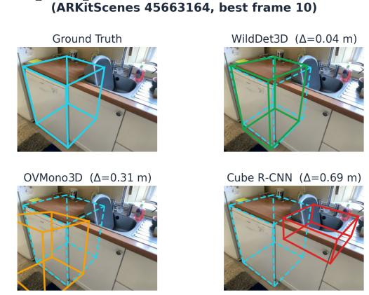

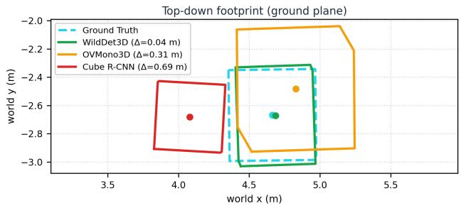  
Figure A1. Detector backends behind detect object 3d on one object (dishwasher, ARKitScenes 45663164, best frame 10). Topfour panels: each backend’s predicted 3D box (solid) with the ground-truth box (dashed cyan) reprojected onto the best frame; ∆ is the world-space center error. Bottom: the same boxes as topdown ground-plane footprints. WildDet3D (∆=0.04 m) nearly coincides with GT, OVMono3D (0.31 m) is oversized and offset, and Cube R-CNN (0.69 m) drifts onto the sink. The tool-calling chain is identical across backends; only the box origin changes, so this gap is the perception bottleneck of Sec. 4.

2D + depth pipeline intermediates (gdino depthpro) ARKitScenes 41069042 — center-to-center 3.10 m vs. surface GT 2.4 m  
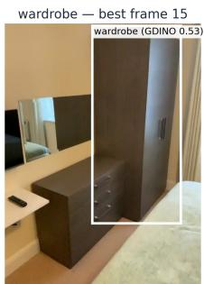

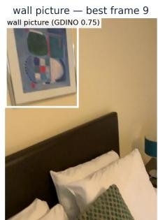  
Depth Pro — median in box 1.02 m

Depth Pro — median in box 2.52 m  
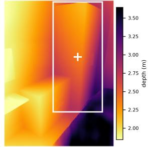

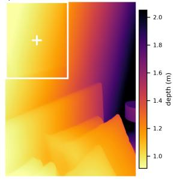  
Figure A2. Intermediate signals of the 2D + depth pipeline (gdino depthpro abs dist) on a wardrobe/wall-picture distance query (ARKitScenes 41069042). Top: each object’s best frame with its Grounding DINO 2D box. Bottom: the metric depth map Depth Pro predicts for that frame (bright = near, each map scaled to its own range), with the same box and the sampled center pixel $( ^ { 6 6 } + { } ^ { , 5 } )$ ; the pipeline keeps only the median depth inside the box (2.52 m for the wardrobe, 1.02 m for the wall picture). Back-projecting the two box centers yields a center-to-center distance (3.10 m) that overshoots the surface-to-surface ground truth (2.4 m), the systematic bias the OBB pipeline corrects. Depth Pro also reads the bedspread in the lower right asfar (dark) although it is the nearest surface: monocular depth degrades on large textureless regions, the weakness behind the error tail in Fig. A4.

Quantitative plots. Figure A3 and Fig. A4 give the same 401 absolute-distance questions in accuracy and in metric error; together they are the depth blow-up argument of Sec. 4. The 2D + depth baseline has a small median error but a heavy tail that inflates the MAE, whereas the OBB pipelines are stable. Figure A5 shows the per-sample MRA distributions; Fig. A6 shows why the 2D baseline is unreliable on object size.

ReVSI absolute distance: mean vs. median accuracy (401 questions)  
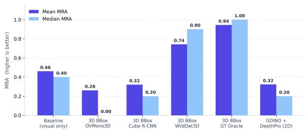  
Figure A3. Mean vs. median MRA across every absolute-distance pipeline (401 questions); the gap between the bars measures tail sensitivity. Only WildDet3D beats the no-tool baseline: OVMono3D (0.26), Cube R-CNN (0.32) and the 2D+depth pipeline (0.32) all land below it (0.46), so a poor box is worse than no box. OV-Mono3D’s median is 0.00, i.e. more than half its answers are off by over 50%. WildDet3D (mean 0.74, median 0.90) approaches the GT oracle (0.94/1.00).

ReVSI absolute distance: mean vs. median error (401 questions)  
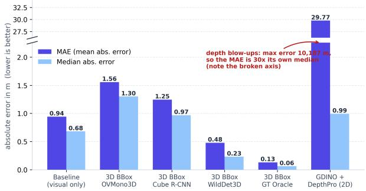  
Figure A4. The same pipelines in metric error, which corroborates the MRA ranking. The weak 3D backends are worse than the notool baseline (MAE 1.56 m for OVMono3D and 1.25 m for Cube R-CNN, against 0.94 m), while WildDet3D (0.48 m) and the GT oracle (0.13 m) sit far below it. Every OBB pipeline stays bounded (max error ≤ 6.2 m), so their means are trustworthy. The 2D+depth pipeline is the exception: monocular depth blows up on boundary boxes to a worst error of 10 187 m, leaving an MAE (29.8 m) thirty times its own median (0.99 m).

Tool calls per question type: minimal correct chain vs. observed (GT backend)  
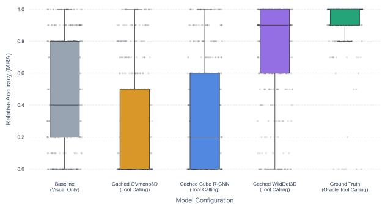  
Figure A5. Per-sample MRA distributions on absolute distance (401 questions) for the no-tool visual baseline and each detect object 3d backend. The GT oracle concentrates at 1.0 (median 1.00) and WildDet3D tracks it (median 0.90), whereas OVMono3D and Cube R-CNN pile up at zero: their medians (0.00 and 0.20) sit below the no-tool baseline’s (0.40), so over half of OVMono3D’s answers are more than 50% off. Tool augmentation only pays off once the detector is strong enough.

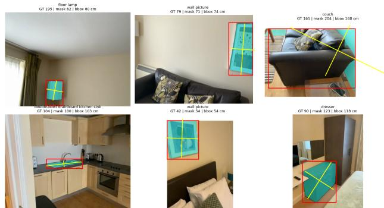  
Figure A6. Object size from a 2D box (gdino depthpro size) on six ReVSI objects: the Grounding DINO box (red) and mask (cyan) with the longest image-plane axis (yellow). Panel titles give GT and both back-projected estimates in cm, mask-based and box-based (bbox, the reported variant). Back-projection sees only the image-plane dimensions, so it is accurate when the longest axis lies in that plane (kitchen sink 104 → 103, couch 165 → 168) and fails in two ways: the box covers only part of the object (floor lamp 195 → 80: only the shade is grounded), or it lands on the wrong surface (dresser 90 → 118). This variance, not a constant bias, caps the 2D size pipeline at 0.34 MRA.

## F. Tool-Call Step Analysis

Figure A7 compares the minimal correct chain against the tool calls the orchestrator actually made (GT backend, so the counts isolate orchestration from perception). The minimal chain is structural, $2 n _ { \mathrm { o b j } } + n _ { \mathrm { m e a s } }$ for the OBB pipelines (one detect and one project per object, plus the measurements), dropping the project step for object size: 2 calls for size, 5 for absolute distance, 7 for relative direction, and 14 for relative distance (reference + 4 candidates). Three patterns stand out.

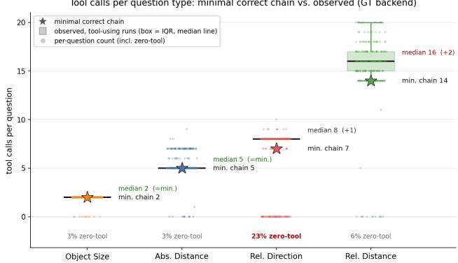  
Figure A7. Minimal correct chain vs. observed tool-call count per question type (GT backend). Stars mark the minimal chain $( 2 n _ { \mathrm { o b j } } + n _ { \mathrm { m e a s } }$ , structural per question); boxes summarize the toolusing runs (median line, IQR), and jittered points show every run including the zero-tool band (annotated %). Numeric tasks run the minimal chain exactly; relative direction runs +1 (a premature relative direction call that errors and is retried) and relative distance +2 (redundant distance calls). The 23% zero-tool rate on relative direction is the orchestration discipline gap, separate from this overhead.

Numeric tasks run the minimal chain exactly. Object size sits at 2 (412/423 samples) and absolute distance at a median of 5. This near-zero orchestration overhead is what lets GT-backend accuracy sit within 3 points of the tool ceiling (Sec. 4).

The multi-object MC tasks carry a small, systematic overhead. Relative direction runs +1: 198 of the 223 engaged runs call relative direction twice, once prematurely (before the boxes are lifted, which returns the “project first” error) and again after projecting. Relative distance runs +2, from redundant calculate object distance calls beyond the 4 it needs. Both are benign, since the answer is still correct, but sequencing is not tight on the longer chains.

The disciplinefailure is a separate zero-tool spike. Every task carries a band of runs that call no tool and answer from the frames: 2.6–5.6% on the numeric and relative-distance tasks, but 23% (67/290) on relative direction. Because that unaided guess is no better than chance (25.9% visual vs. 29.3%, Sec. 4), it is this spike rather than the sequencing overhead that caps relative-direction accuracy at 80% against a 100% geometric ceiling.

## G. Relative-Direction Subtype Breakdown

Table A5 breaks relative-direction accuracy down by subtype. The GT oracle is stable across subtypes (73.6–84.1%); Wild-Det3D trails it by at most 8 pt everywhere except the “backward hard” cases $( 8 4 . 1  6 8 . 1 \% )$ , the doubly boundarysensitive ones: they are 4-way quadrant questions, so center noise can flip the target across the 90<sup>◦</sup> front/back split, and they use the away facing mode, which negates f, so noise on the viewer center swings the bearing too (Sec. C). Even so, the overall oracle gap is only 6.6 pt against a 25-pt gap on relative distance. The bearing reads object centers alone and never their extents, which makes it far less detector-sensitive: swapping GT boxes for WildDet3D costs the tool-only ceiling 11 pt (100.0 → 89.0%), where the same swap costs relative distance 25.6 pt (94.9 → 69.3%). The larger share of the remaining error on this task is therefore tool-use discipline rather than perception.

<table><tr><td>Subtype</td><td>N</td><td>GT Oracle</td><td>WildDet3D</td></tr><tr><td>Backward Easy (3-way)</td><td>53</td><td>79.2%</td><td>75.5%</td></tr><tr><td>Backward Hard (4-way)</td><td>69</td><td>84.1%</td><td>68.1%</td></tr><tr><td>Forward Easy (3-way)</td><td>96</td><td>82.3%</td><td>74.0%</td></tr><tr><td>Forward Hard (4-way)</td><td>72</td><td>73.6%</td><td>76.4%</td></tr><tr><td>Overall</td><td>290</td><td>80.0%</td><td>73.4%</td></tr></table>

Table A5. Relative-direction accuracy by subtype (“easy” = 3-way left/right/back; “hard” = 4-way quadrant; “backward” = the away facing mode). The GT oracle averages 6.1 tool calls per question over all runs, or 8.0 (median 8) over the runs that call any tool at all; the gap to the 100% geometric ceiling is the 23% zero-tool guessing rate.

## H. Autonomous Probe: Tool Feedback and Prompting

The no-recipe probe of Sec. 4 strips the per-task recipe and leaves only the generic tool description of Listing A3: the model must route and order the tools itself. This section reports two runs, both on the GT backend. The first is a staged ablation on 80 questions (absolute distance and object size only) that varies what the environment tells the model and produced the tool-error strings we now ship (Tab. A6). The second is the four-task probe on 160 questions, which supplies the numbers reported in Tab. 4. They are separate runs over different task mixes and question samples, so their per-task numbers are not directly comparable; the four-task probe is the one we report.

Staged ablation (80 questions). Stage 1 (terse errors) exposes the tool errors of the original library. Calling calculate object distance before detecting and lifting the boxes returns only “No 3D box found for [tv, sink]”, which does not say what to do next, so the model retries the same call: 138 error results over 80 questions, and a mean of 5.0 calls where 3.5 suffice. This is the looping the main text reports, and it costs the most on distance (0.58 MRA), the task with the longest chain.

Stage 2 (actionable tool errors) rewrites every tool error into an actionable instruction naming the missing step, e.g. “No world-space boxfor [tv, radiator]. For each ofthese objects call project box to world first.” Errors collapse to 36 and distance jumps to 0.88, but the prompt still never shows the model when a tool is needed: zero-tool guessing rises to 14/80, dragging size down to 0.74.

Stage 3 (few-shot order examples) appends Listing A6: one tool-order example per task, showing which tools to chain and in what order, never an answer. Both failure modes disappear at once (errors 13, zero-tool 0/80) and MRA reaches 0.93. Within this ablation the examples look decisive; the four-task probe below shows they are not.

<table><tr><td>Condition</td><td>MRA</td><td>Dist.</td><td>Size</td><td>Errors</td><td>Zero-tool</td></tr><tr><td>1. Terse tool errors</td><td>0.729</td><td>0.575</td><td>0.883</td><td>138</td><td>5/80</td></tr><tr><td>2. + actionable errors</td><td>0.800</td><td>0.878</td><td>0.723</td><td>36</td><td>14/80</td></tr><tr><td>3. + few-shot examples</td><td>0.933</td><td>0.938</td><td>0.928</td><td>13</td><td>0/80</td></tr></table>

Table A6. The staged ablation on tool feedback (80 questions: 40 absolute distance, 40 object size; GT backend). Errors counts tool results returned as errors across all 80 traces; Zero-tool counts runs that answered without calling a single tool. Better feedback removes the looping, and here the few-shot examples remove the remaining guessing; on the four-task probe (Tab. 4) they no longer help.

Listing A6. Few-shot block appended to the autonomous 3d hint (Listing A3) in stage 3. One tool-order example per task; no ground-truth answers and no per-question recipe.  
```prolog
Examples of tool choice+order (these show which
tools, NOT the answers):
- size: ’longest dimension of the chair?’
-> detect_object_3d(chair);
calculate_object_size(chair).
- distance: ’distance between tv and sofa?
-> detect_object_3d(tv);
project_box_to_world(tv);
detect_object_3d(sofa);
project_box_to_world(sofa);
calculate_object_distance(tv, sofa).
- rel-distance: ’which of X/Y/Z is closest to the
lamp?’ -> lift the lamp and each candidate
(detect_object_3d + project_box_to_world),
calculate_object_distance(lamp, each),
pick the smallest.
- rel-direction: ’standing by A facing B, where
is C?’ -> lift A, B, C (detect_object_3d +
project_box_to_world each),
relative_direction(A, B, C).
```

Four-task probe (160 questions). Running all four tasks at once (40 questions each), with the rewritten tool errors in place, gives the results of Tab. 4 and confirms that routing itself is not the bottleneck. With the generic prompt alone (no recipe, no examples), the model calls the correct final tool on 98% (size), 100% (distance) and 90% (relative distance) of questions and scores 0.97 MRA, 0.94 MRA and 92.5% accuracy, matching its per-task numbers under the hardcoded recipe. Relative direction is the single exception (70% routed, 70.0% accuracy): on 30% of those questions it calls no tool at all, the same discipline failure that caps the recipe-driven runs (Sec. F).

The few-shot examples that were decisive in the staged ablation do not carry over. Repeating the four-task probe with the stage-3 few-shot block leaves size (1.00) and relative direction (75.0%) slightly better but drags absolute distance to 0.89 and relative distance to 80.0%, below the generic prompt on both. Once the tools report their errors clearly, the in-context examples add nothing to routing and can bias the model toward the example’s chain on questions that need a different one. We therefore report the generic prompt as the headline autonomous condition, not the few-shot one.