# TOLA: Text-aware One-Step Latent Adaptation for Difusion-based Text Image Super-Resolution

Yike Xu1,2∗ Yue Shi1,3 Yong Guo1 Jiezhang Cao1†

1Shanghai Jiao Tong University 2University of Chinese Academy of Sciences 3Shanghai AI Laboratory

## Abstract

Text image super-resolution (TSR) aims to recover visually faithful and readable text under unknown degradations. Existing difusion-based methods typically rely on multi-step prediction of either the high-resolution image or its text prior, resulting in prohibitive computational cost and inference latency. More critically, an erroneous text prior may be repeatedly injected into the denoising process, causing image and text predictions to reinforce each other and progressively amplify an early recognition error into a sharp yet semantically incorrect character. To address these limitations, we propose TOLA, a Text-aware One-step Latent Adaptation framework without iterative image-text difusion. TOLA consists of two key modules. First, a confidence-weighted text conditioning module constructs the semantic condition only once and suppresses unreliable OCR predictions before they contaminate image reconstruction. Second, a lightweight latent residual correction module explicitly estimates and corrects the structured residual errors to recover missing or distorted stroke details. Extensive experiments demonstrate our state-of-the-art performance across all evaluation metrics on both CTR-TSR-Test (×4) and RealCE-200 benchmarks. It is worth noting that our TOLA consistently surpasses existing difusion-based TSR methods by at least 2.72 dB in PSNR on CTR-TSR-Test.

## Introduction

Text image super-resolution (TSR) aims to recover highresolution text images from degraded low-resolution observations while preserving both visual details and character-level semantics (Zhao et al., 2021). This challenge becomes more pronounced in the blind setting, where the degradation process is unknown. Unlike natural-image super-resolution, TSR must preserve not only perceptual quality but also character-level semantic accuracy, as a single missing, merged, or hallucinated stroke may lead to an incorrect transcription even when the reconstructed image appears visually sharp. Therefore, TSR models need to recover fine-grained visual structures while maintaining semantic fidelity.

Early TSR methods enhance reconstruction by incorporating sequence modeling, text-aware attention, recognition guidance, and character-structure priors (Wang et al., 2020; Ma et al., 2022, 2023a; Li et al., 2023). These methods perform well when the low-resolution input still contains reliable structural or semantic cues. Under severe degradations, however, missing and merged strokes make both visual reconstruction and text recognition highly ambiguous. Difusion models have recently emerged as a promising solution because their generative priors can synthesize plausible high-frequency details that deterministic restoration networks often fail to recover (Ho et al., 2020; Rombach et al., 2022; Kawar et al., 2022; Saharia et al., 2023; Wang et al., 2024a). Existing difusion-based TSR methods typically rely on multi-step prediction of either the high-resolution image or its text-aware prior (Zhang et al., 2024; Xu et al., 2026), as shown in figure 1. Although iterative refinement improves generative capacity, it also introduces two fundamental limitations. First, repeatedly evaluating image and text networks incurs computational cost and inference latency. Second, the text prior used to guide reconstruction is itself inferred from the degraded observation and may therefore be incorrect (Yang et al., 2024). When an erroneous prior is repeatedly injected into the denoising process, image and text predictions may reinforce each other, progressively amplifying an early recognition error into a sharp yet semantically incorrect character.

Directly reducing multi-step difusion-based TSR to a single image-denoising step is non-trivial due to two challenges. First, reliable text guidance must be constructed in a single pass without repeatedly injecting uncertain OCR predictions into image reconstruction. Second, the clean latent estimated from one high-noise prediction inevitably contains structured errors, especially around thin strokes, character boundaries, and ambiguous local patterns, which can no longer be corrected by subsequent reverse updates. Introducing another iterative prior-recovery or refinement process would merely shift, rather than eliminate, the computational burden. The key is therefore to combine one-time semantic conditioning with explicit, non-iterative latent residual correction.

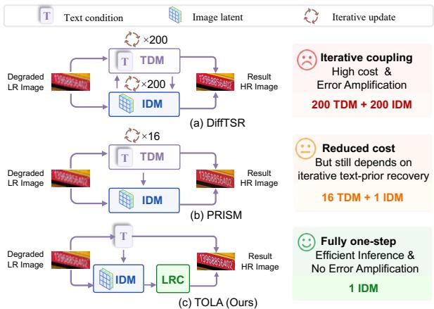  
Figure 1: Comparison of three diferent difusion-based TSR inference paradigms. (a) DifTSR performs 200-step iterative text-prior and image restoration. (b) PRISM uses one-step image reconstruction with 16-step text-prior recovery. (c) TOLA constructs the text condition once, evaluates IDM once, and applies a Latent Residual Correction (LRC) for clean-latent correction. Prior iterative text-image refinement may repeatedly propagate inaccurate semantic cues through multiple denoising stages, leading to accumulated recognition errors. In contrast, TOLA avoids error amplification by designing a one-step textconditioned IDM.

Based on this observation, we propose TOLA, a Textaware One-step Latent Adaptation framework. Our central insight is that semantic conditioning and latent residual correction need not be coupled along the same reverse trajectory. Instead, reliable semantic evidence can be selected once before image prediction, while structured reconstruction errors can be modeled explicitly afterward in the clean-latent space. As illustrated in figure 2, TOLA consists of two complementary modules. First, the confidence-weighted text conditioning module uses frozen TransOCR to predict text tokens and token-wise confidence scores, then constructs the semantic condition once via the frozen MoM module. By suppressing uncertain OCR predictions, this module reduces the risk that an unreliable text hypothesis will dominate image reconstruction. Second, the lightweight latent residual correction module explicitly estimates the structured residual remaining in the initial clean latent and restores missing or distorted stroke details without introducing another reverse trajectory.

Our main contributions are summarized as follows:

• We propose TOLA, which reformulates the original multi-step image-text difusion pipeline into a noniterative framework with one-shot text conditioning and one-step latent prediction.

• We introduce confidence-weighted text conditioning, which constructs the semantic condition once and suppresses unreliable character priors using OCR confidence scores. This prevents erroneous text information from being repeatedly injected and amplified during denoising, yielding reliability-aware semantic guidance.

• Extensive experiments demonstrate that TOLA achieves state-of-the-art performance across all reported metrics on CTR-TSR-Test (×4) and RealCE-200. TOLA outperforms the oficial 200-step DifTSR in all nine metrics, improving PSNR by 4.2137 dB while reducing FID by 12.2271. Meanwhile, it shortens the average inference time from 9.9548s to 0.1319s, achieving a 75.5× speedup.

## Related Work

Text-Aware Scene Text Image Super-Resolution. Generic SR optimizes visual fidelity without preserving character identity (Dong et al., 2016; Wang et al., 2018; Chen et al., 2022b; Liang et al., 2021). TSR models strokes, sequences, layout, deformation, and location (Wang et al., 2020; Chen et al., 2021; Ma et al., 2022; Chen et al., 2022a; Zhao et al., 2022; Zhu et al., 2023b; Guo et al., 2023; Wei et al., 2025; TomyEnrique et al., 2024). Recognition, style, and structure priors provide guidance (Ma et al., 2023a; Li et al., 2023; Zhu et al., 2023a; Park and Ko, 2025; Yuan et al., 2025), but cues extracted from degraded inputs remain unreliable (Kong et al., 2024).

Difusion-Based Text Image Restoration. Difusion TSR conditions denoising on masks, LR text, recognition, or character embeddings (Liu et al., 2025; Zhou et al., 2024; Noguchi et al., 2024; Singh et al., 2024). DifTSR couples IDM and TDM through MoM; Boosting DifTSR adds mixed training, ResShift, cross-attention, and confidence weighting (Zhang et al., 2024; Pan et al., 2025). TextSR, TEXTS-Dif, and TADiSR address multilingual or real-world restoration (Ye et al., 2025; He et al., 2026; Hu et al., 2025); DualTSR and TeReDif combine text difusion or recognition with restoration (Niu et al., 2026; Min et al., 2026). These methods retain iterative refinement.

One-Step Difusion Restoration. DDIM, ResShift, SinSR, and AddSR shorten or distill difusion trajectories (Song et al., 2021; Yue et al., 2023; Wang et al., 2024b; Tai et al., 2026; Dong et al., 2025); OSEDif uses LoRA and score distillation (Hu et al., 2022; Wu et al., 2024), while FiDeSR combines frequency injection with latent residual refinement (Kim et al., 2026). These methods target generic SR rather than the coupled DifTSR process. PRISM is text-specific but uses K = 16 Euler steps for prior recovery (Xu et al., 2026). TOLA instead adapts pretrained DifTSR to one IDM evaluation by constructing confidence-weighted TransOCR–MoM conditioning once and correcting the latent after noise-to-clean conversion.

## Method

## Overview

As shown in figure 2, TOLA converts iterative DifTSR into a single-pass restoration path. TransOCR predicts tokens and confidence scores, while the LoRA-adapted VAE encoder maps the LR image to ${ z } _ { \mathrm { L R } }$ and q-sampling obtains $\mathbf { z } _ { t }$ at $t = 9 9 9$ . MoM fuses confidence-weighted token embeddings with $\ [ z _ { \mathrm { L R } } , \mathbf { z } _ { t } ]$ to construct $\mathbf { C } _ { \mathrm { c o n d } }$ once. Conditioned on $\mathbf { C _ { \mathrm { { c o n d } } } }$ , the LoRA-adapted IDM performs one noise prediction, which is converted into the initial clean latent $\hat { \mathbf { z } } _ { 0 }$ . LRC then corrects the residual $z _ { \mathrm { L R } } - \hat { \mathbf { z } } _ { 0 }$ before VAE decoding. Only LoRA and LRC are optimized, and inference requires neither TDM nor iterative reverse updates.

## Text-Aware One-Step Adaptation

Fixed-Timestep q-Sampling. The LoRA-adapted VAE encoder first encodes the degraded input image ${ \pmb x } _ { \mathrm { L R } }$ into an unscaled latent representation ${ z _ { \mathrm { L R } } }$

$$
\begin{array} { r } { z _ { \mathrm { L R } } = \mathcal { E } _ { \mathrm { V A E } } ( \pmb { x } _ { \mathrm { L R } } ) . } \end{array}\tag{1}
$$

Following DifTSR q-sampling, we sample a noisy latent at the fixed, zero-indexed timestep t = 999:

$$
\begin{array} { r } { \mathbf { z } _ { t } = \sqrt { \bar { \alpha } _ { t } } z _ { \mathrm { L R } } + \sqrt { 1 - \bar { \alpha } _ { t } } \mathbf { \epsilon } , \qquad \mathbf { \epsilon } \sim \mathcal { N } ( \mathbf { 0 } , I ) , } \end{array}\tag{2}
$$

where $\begin{array} { r } { \bar { \alpha } _ { t } = \prod _ { \tau = 0 } ^ { t } ( 1 - \beta _ { \tau } ) } \end{array}$ follows the 1000-step linear schedule, with $\beta _ { 0 } = 0 . 0 0 \mathrm { \Omega }$ 15 and $\beta _ { 9 9 9 } = 0 . 0 2 0 5$ . We draw one Gaussian sample per input and supply ${ z } _ { \mathrm { L R } }$ and $\mathbf { z } _ { t }$ to IDM on the VAE latent scale. Unlike TOLA, OSEDif feeds the unnoised LR latent to its one-step U-Net (Wu et al., 2024).

Confidence-Weighted Text Conditioning. The frozen TransOCR instance used for conditioning predicts a token sequence and the corresponding token-wise confidence scores,

$$
\begin{array} { r } { ( \tilde { c } ^ { \mathrm { n a t } } , \alpha ) = \mathrm { T r a n s O C R } ( \pmb { x } _ { \mathrm { L R } } ) , \ } \\ { \tilde { c } = \mathrm { M a p } \bigl ( \mathrm { N o r m } ( \tilde { c } ^ { \mathrm { n a t } } ) \bigr ) . \ } \end{array}\tag{3}
$$

Norm normalizes characters to Simplified Chinese; Map maps them to the IDM vocabulary with α alignment. Following Boosting DifTSR (Pan et al., 2025), confidence-weighted embeddings enter MoM, which computes

$$
[ \mathbf { I } _ { \mathrm { c o n d } } , \mathbf { C } _ { \mathrm { c o n d } } ] = \mathcal { M } ( s \left[ z _ { \mathrm { L R } } , \mathbf { z } _ { t } \right] , \alpha \odot \mathrm { E m b } ( \tilde { c } ) , t ) .\tag{4}
$$

Algorithm 1 TOLA one-step inference.   
Require: LR image $\mathbf { \hat { x } _ { L R } ; }$ fixed $t = 9 9 9$   
Output: Restored image xSR   
1: $\begin{array} { r l r l r l } { z _ { \mathrm { L R } } } & { { } \quad } & {  } & { { } } & { { \mathcal { E } } _ { \mathrm { V A E } } ( { \pmb x } _ { \mathrm { L R } } ) ; } & { } & { { } ( \tilde { c } ^ { \mathrm { n a t } } , \alpha ) } \end{array}$ ←   
$\mathrm { T r a n s O C R } ( { \pmb x } _ { \mathrm { L R } } )$   
2: $\tilde { c } \gets \mathrm { M a p } ( \mathrm { N o r m } ( \tilde { c } ^ { \mathrm { n a t } } ) )$   
3: Draw $\mathbf { \epsilon } \sim { \mathcal { N } } ( \mathbf { 0 } , I ) ;$ construct $\mathbf { z } _ { t }$ with equation 2   
4: $[ \mathbf { I } _ { \mathrm { c o n d } } , \mathbf { C } _ { \mathrm { c o n d } } ] \gets \mathcal { M } ( s [ z _ { \mathrm { L R } } , \mathbf { z } _ { t } ] , \alpha \odot$ Emb(c˜), t)   
5: $\hat { \mathbf { \epsilon } } _ { \theta } \gets f _ { \theta } \left( [ \mathbf { z } _ { t } , z _ { \mathrm { L R } } ] , t , \mathbf { C } _ { \mathrm { c o n d } } \right)$   
6: Reconstruct zˆ with equation 6   
7: ${ \bf r }  z _ { \mathrm { L R } } - \hat { { \bf z } } _ { 0 } ; \Delta { \bf r }  g _ { \phi } ( [ z _ { \mathrm { L R } } , { \bf r } ] )$   
8: $\hat { \mathbf { z } } _ { 0 } ^ { \mathrm { c o r r } }  z _ { \mathrm { L R } } - ( \mathbf { r } + \Delta \mathbf { r } ) ; \mathbf { x } _ { \mathrm { S R } }  \mathcal { D } _ { \mathrm { V A E } } ( s ^ { - 1 } \hat { \mathbf { z } } _ { 0 } ^ { \mathrm { c o r r } } )$

where $s = 0 . 1 8 2 1 5$ scales image latents and ⊙ broadcasts token confidences over embeddings. IDM uses only $\mathbf { C _ { \mathrm { { c o n d } } } }$ for cross-attention; $\mathbf { I } _ { \mathrm { c o n d } }$ is discarded. Confidence is neither calibrated nor thresholded, and MoM runs once.

One-Step Clean-Latent Reconstruction. The LoRAadapted IDM receives channel-wise concatenated noisy and LR latents and predicts

$$
\hat { \mathbf { \epsilon } } _ { \theta } = f _ { \theta } \left( [ \mathbf { z } _ { t } , z _ { \mathrm { L R } } ] , t , \mathbf { C } _ { \mathrm { c o n d } } \right) ,\tag{5}
$$

where $[ \cdot , \cdot ]$ is channel-wise concatenation and θ combines frozen base and trainable LoRA parameters. Since DifTSR predicts noise, the clean latent is

$$
\hat { \mathbf { z } } _ { 0 } = \frac { \mathbf { z } _ { t } - \sqrt { 1 - \bar { \alpha } _ { t } } \hat { \mathbf { \epsilon } } _ { \theta } } { \sqrt { \bar { \alpha } _ { t } } } .\tag{6}
$$

No reverse update follows equation $6 ; \hat { \mathbf { z } } _ { 0 }$ is passed directly to LRC. Algorithm 1 summarizes inference.

TOLA evaluates the VAE encoder/decoder, TransOCR, MoM, IDM, and LRC once each while omitting TDM; DifTSR evaluates IDM and TDM 200 times each.

## Latent Residual Correction

A FiDeSR-inspired LRC corrects local errors after noiseto-clean conversion (Kim et al., 2026). FiDeSR refines a directly predicted residual, whereas TOLA corrects the clean-latent residual without changing semantic conditioning.

Given the initial clean-latent estimate $\hat { \mathbf { z } } _ { 0 }$ , we define

$$
{ \bf r } = z _ { \mathrm { L R } } - \hat { { \bf z } } _ { 0 } .\tag{7}
$$

From the concatenated input $[ z _ { \mathrm { L R } } , \mathbf { r } ] .$ , LRC predicts

$$
\Delta \mathbf { r } = g _ { \phi } ( [ z _ { \mathrm { L R } } , \mathbf { r } ] ) ,\tag{8}
$$

The trainable $g _ { \phi }$ uses a $1 \times 1$ projection from 6 to 32 channels, one RRDB of three five-layer RDBs with $3 \times 3$ convolutions, and a $1 \times 1$ projection to 3 channels, with growth width 16 and residual scaling 0.2.

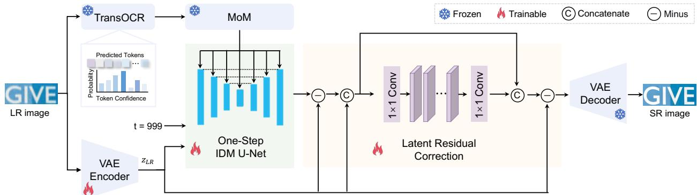  
Figure 2: TOLA architecture. The LR image is encoded and q-sampled at fixed $t = 9 9 9 .$ , while confidence-weighted TransOCR tokens and latent features form one MoM condition. A LoRA-adapted IDM predicts noise once, and LRC corrects the clean latent before frozen VAE decoding. Snowflakes and flames denote frozen and trainable components, respectively.

<table><tr><td>Method</td><td>PSNR↑</td><td>SSIM↑</td><td>LPIPS↓</td><td>DISTS↓</td><td>FID↓</td><td>T-ACC↑</td><td>T-NED↑</td><td>P-ACC↑</td><td>P-NED↑</td></tr><tr><td>SRCNN</td><td>22.0288</td><td>0.5860</td><td>0.6021</td><td>0.3886</td><td>156.9406</td><td>0.4255</td><td>0.6107</td><td>0.3303</td><td>0.5279</td></tr><tr><td>ESRGAN</td><td>21.7741</td><td>0.5588</td><td>0.6455</td><td>0.3979</td><td>155.7055</td><td>0.4188</td><td>0.6061</td><td>0.3287</td><td>0.5273</td></tr><tr><td>NAFNet</td><td>21.5568</td><td>0.5678</td><td>0.5924</td><td>0.3776</td><td>144.9606</td><td>0.4187</td><td>0.5998</td><td>0.2998</td><td>0.4870</td></tr><tr><td>TSRN</td><td>20.4381</td><td>0.5840</td><td>0.6768</td><td>0.3926</td><td>140.2070</td><td>0.3307</td><td>0.5192</td><td>0.2238</td><td>0.4196</td></tr><tr><td>TBSRN</td><td>20.6883</td><td>0.5840</td><td>0.6510</td><td>0.3918</td><td>137.1033</td><td>0.3539</td><td>0.5425</td><td>0.2574</td><td>0.4563</td></tr><tr><td>TATT</td><td>20.9523</td><td>0.5846</td><td>0.6614</td><td>0.3896</td><td>125.6047</td><td>0.3558</td><td>0.5450</td><td>0.2491</td><td>0.4466</td></tr><tr><td>MARCONet</td><td>21.3460</td><td>0.6132</td><td>0.4386</td><td>0.3566</td><td>102.7384</td><td>0.3895</td><td>0.5735</td><td>0.2796</td><td>0.4600</td></tr><tr><td>PRISM</td><td>22.08--</td><td></td><td>0.2314</td><td></td><td>12.57--</td><td>0.4212</td><td>0.6644</td><td></td><td></td></tr><tr><td>DiffTSR</td><td>20.5958</td><td>0.6261</td><td>0.3103</td><td>0.2428</td><td>24.9120</td><td>0.4645</td><td>0.6519</td><td>0.3970</td><td>0.5873</td></tr><tr><td>TeReDiff</td><td>19.6333</td><td>0.5125</td><td>0.4714</td><td>0.3466</td><td>77.0387</td><td>0.2893</td><td>0.4491</td><td>0.1972</td><td>0.3592</td></tr><tr><td>Ours</td><td>24.8095</td><td>0.7235</td><td>0.2288</td><td>0.1953</td><td>12.6849</td><td>0.5401</td><td>0.7370</td><td>0.4626</td><td>0.6585</td></tr></table>

Table 1: Results on 8,089 CTR-TSR-Test ×4 images. Non-difusion methods are retrained on the CTR-TSR split, and all unified protocol outputs share one evaluation implementation. T/P denote TransOCR/PaddleOCR; bold marks the best unified-protocol result. PRISM (Xu et al., 2026) is a BTL-test ×4/PP-OCRv5 cross-protocol reference; dashes preserve its reported precision. Note: “–” denotes unavailable values. PRISM results arefrom its arXiv paper due to unavailable code.

The corrected residual and latent are

$$
{ \bf r } ^ { \mathrm { c o r r } } = { \bf r } + \Delta { \bf r } , \qquad \hat { \bf z } _ { 0 } ^ { \mathrm { c o r r } } = z _ { \mathrm { L R } } - { \bf r } ^ { \mathrm { c o r r } } .\tag{9}
$$

The frozen VAE decoder then reconstructs

$$
\begin{array} { r } { \mathbf { x } _ { \mathrm { S R } } = \mathcal { D } _ { \mathrm { V A E } } \left( s ^ { - 1 } \hat { \mathbf { z } } _ { 0 } ^ { \mathrm { c o r r } } \right) , } \end{array}\tag{10}
$$

The inherited scale is s = 0.18215. Zero-initializing the LRC output projection initially preserves $\hat { \mathbf { z } } _ { 0 }$ and learns only the residual correction.

## Training Objective

TOLA uses pixel, perceptual, and recognition objectives:

$$
\begin{array} { r l } & { \mathcal { L } = \mathcal { L } _ { 1 } ( \mathbf { x } _ { \mathrm { S R } } , \pmb { x } _ { \mathrm { H R } } ) + \mathcal { L } _ { \mathrm { L P I P S } } ^ { \mathrm { V G G } } ( \mathbf { x } _ { \mathrm { S R } } , \pmb { x } _ { \mathrm { H R } } ) } \\ & { \quad \quad \quad + 0 . 0 2 \mathcal { L } _ { \mathrm { O C R } } ^ { \mathrm { C E } } ( \mathrm { O C R } ( \mathbf { x } _ { \mathrm { S R } } ) , \pmb { y } _ { \mathrm { G T } } ) . } \end{array}\tag{11}
$$

${ \pmb x } _ { \mathrm { H R } }$ and $\scriptstyle { \pmb { y } } _ { \mathrm { G T } }$ are the ground-truth image and transcription; $\mathcal { L } _ { 1 } \mathrm { { i s } } \ell _ { 1 } , \mathcal { L } _ { \mathrm { { L P I P S } } } ^ { \mathrm { { V G G } } }$ is LPIPS-VGG, and $\mathcal { L } _ { \mathrm { O C R } } ^ { \mathrm { C E } }$ is tokenlevel cross-entropy. Two frozen TransOCR instances provide conditioning and OCR supervision; OCR gradients update LoRA and LRC. Conditioning uses the IDM vocabulary, whereas $\mathcal { L } _ { \mathrm { O C R } } ^ { \mathrm { C E } }$ retains the native TransOCR labels. No latent $\ell _ { 1 } .$ , noise-prediction, distillation, or teacher loss is used.

## Experiments

## Experimental Setup

Datasets. We use 62,371 training and 1,273 validation images from the CTR-TSR preprocessing set (Zhang et al., 2024). LR inputs are generated online with Real-ESRGAN or BSRGAN degradations at scales {1, 2, 4} (Wang et al., 2021; Zhang et al., 2021); all images use a 128 × 512 canvas. Evaluation uses all 8,089 pairs in CTR-TSR-Test ×4.

For real-image generalization, we use two complementary test sets. RealCE-200 contains 200 filtered and deduplicated pairs from the RealCE validation split (Ma et al., 2023b), using matched oficial 13 mm and 52 mm crops as LR and reference images. We construct RT50 to extend text-category and acquisition-condition coverage beyond existing paired benchmarks. Its 50 images, collected through multiple routes, include 17 Chinese, 17 English, and 16 numeric samples spanning varied blur, illumination, viewpoints, resolutions, and backgrounds. A predefined output-independent protocol screens content validity, geometry, degradation dificulty, quality, and duplication. Neither set is used for training, validation, or checkpoint selection.

Evaluation Protocol and Metrics. To ensure a fair comparison, we adapt all non-difusion methods to ×4 restoration and retrain them on the same CTR-TSR training split. All unified-protocol methods are evalu ated on the same 8,089-pair manifest at 128 × 512 using identical filename matching and metric implementations. We report luminance-channel PSNR and SSIM without border cropping (Wang et al., 2004), LPIPS-AlexNet (Zhang et al., 2018), DISTS (Ding et al., 2022), and FID (Heusel et al., 2017); training instead uses LPIPS-VGG. TransOCR predictions undergo full-to-halfwidth and simplified-Chinese conversion and whitespace removal while preserving case. ACC denotes exactmatch accuracy, and NED denotes mean normalized editdistance similarity. Independent PaddleOCR ACC and NED (Du et al., 2020) provide a recognizer cross-check.

Compared Methods. We compare TOLA with SR-CNN, ESRGAN, NAFNet, TSRN, TBSRN, TATT, MAR-CONet, DifTSR, and TeReDif, and additionally include the published PRISM results as a cross-protocol reference.

Implementation Details. Starting from the oficial CTR-trained DifTSR checkpoint, we optimize rank-4 LoRA and LRC for 100K steps on four NVIDIA RTX PRO 6000 GPUs with batch size 16 per GPU. FP32 AdamW uses learning rate $5 \times 1 0 ^ { - 5 } , ( \beta _ { 1 } , \beta _ { 2 } ) =$ (0.9, 0.999), weight decay 0.01, 500-step linear warmup, and gradient clipping at 1.0. Training takes about 55 hours, and validation selects the checkpoint. Loss weights are 1, 1, and 0.02. Each image is restored once without sample selection or averaging.

Diagnostic Protocol. All trainable variants in Table 4 share CTR data, DifTSR initialization, data order, optimization, and the 8,089-image evaluation. Conditioning controls alter only the fixed checkpoint input; GT prior is an oracle. Paired comparisons use identical per-image noise.

## Main Results

Quantitative Comparisons. Table 1 shows that TOLA surpasses DifTSR in all nine metrics, gaining 4.2137 dB

<table><tr><td>Method</td><td>PSNR↑ SSIM↑ T-ACC↑ T-NED↑ P-ACC↑ P-NED↑</td></tr><tr><td>SRCNN</td><td>19.1609 0.6024 0.3850 0.5837 0.4950 0.6670</td></tr><tr><td>ESRGAN</td><td>19.2062 0.5971 0.3850 0.5799 0.5000 0.6710</td></tr><tr><td>NAFNet</td><td>18.9038 0.5920 0.3650 0.5704 0.4750 0.6406</td></tr><tr><td>TSRN</td><td>18.6767 0.6009 0.2850 0.5103 0.3850 0.5649</td></tr><tr><td>TBSRN</td><td>18.9903 0.5947 0.3400 0.5364 0.3950 0.5980</td></tr><tr><td>TATT</td><td>18.97250.5954 0.3300 0.5291 0.4000 0.5970</td></tr><tr><td>MARCONet 18.3506 0.6198</td><td>0.3500 0.5408 0.3800 0.5972</td></tr><tr><td>DiffTSR</td><td>17.6287 0.5970 0.3500 0.5402 0.4300 0.6188</td></tr><tr><td>TeReDiff</td><td>17.8180 0.5272 0.2900 0.4826 0.3350 0.5508</td></tr><tr><td>Ours</td><td>19.2240 0.6199 0.3950 0.5841 0.5100 0.6720</td></tr></table>

Table 2: RealCE-200 cross-dataset results on the same 200 pairs. RealCE is excluded from training and checkpoint selection; T/P denote TransOCR/PaddleOCR.

PSNR and 0.0756 TransOCR ACC while reducing FID by 12.2271. PaddleOCR confirms this trend: ACC/NED rise from 0.3970/0.5873 to 0.4626/0.6585.

CTR-TSR Qualitative Results. Figure 3 shows more coherent strokes and closer character shapes and layouts across Chinese, English, and numeric examples.

Cross-Dataset Results. Table 2 shows TOLA leading all six metrics, exceeding DifTSR by 1.5953 dB PSNR, 4.50 points TransOCR ACC, and 8.00 points PaddleOCR ACC.

Evaluation on RT50. Figure 4 shows that TOLA better preserves strokes and character shapes on Chinese, English, and numeric text under varied real degradations.

Inference Cost and Latency. We use synchronized batch-1 timing on 100 fixed CTR images with one NVIDIA RTX PRO 6000, excluding loading. Table 3 reports complete-trajectory MACs at 128 × 512 and restoration-module parameters excluding VAEs and auxiliary text modules. TOLA uses 297.497 G MACs and 0.1319 seconds per image, versus 59,213.970 G and 9.9548 seconds for DifTSR, while its optimized and saved state is 2.46M parameters. Figure 5 visualizes the quality–latency trade-of.

## Ablations and Diagnostic Analyses

Core Components. Table 4 shows that LoRA drives one-step adaptation and LRC adds 0.3847 dB PSNR while reducing LPIPS/DISTS by 0.0121/0.0017; its ACC change is not significant $( p \ = \ 0 . 5 8 4 )$ . A parametermatched plain correction loses 0.8249 dB PSNR and increases FID by 4.2491, so capacity alone does not explain the gain. IDM-only LoRA remains much closer to Full than VAE-only LoRA.

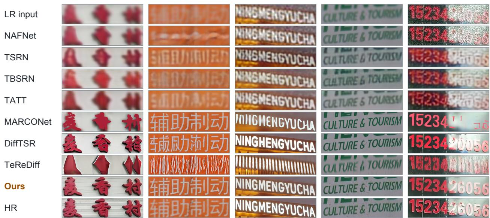  
Figure 3: Comparison on five selected CTR-TSR-Test ×4 images covering Chinese, English, and numeric text. Each column presents an aligned test sample, and the rows show the LR input, displayed baselines, Ours, and the HR reference.

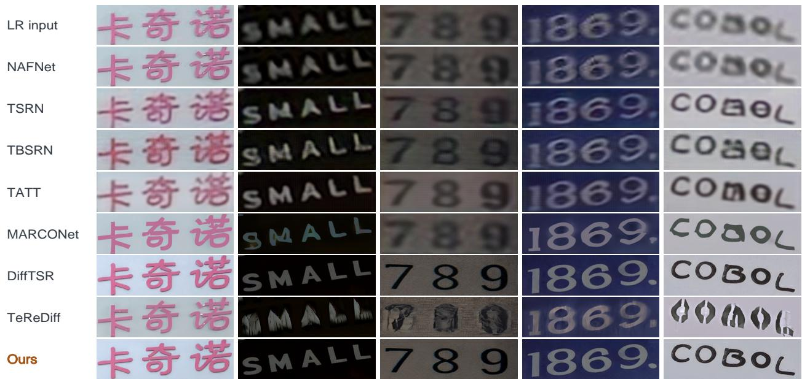  
Figure 4: RT50 comparison on Chinese, English, and numeric text under varied real degradations. Rows show LR inputs, displayed baselines, and Ours; examples cover blur, illumination, viewpoint, resolution, and background variations.

Removing MoM or bypassing its latent fusion degrades every metric. Relative to uniform confidence, confidence weighting adds 0.1908 dB PSNR and 0.0134/0.0138 TransOCR ACC/NED while reducing LPIPS/DISTS/FID by 0.0213/0.0160/4.2766. Null context confirms the value of predicted text, and the GT oracle adds another 0.0862 ACC and 0.0716 NED, revealing headroom from better priors.

Objective and Hyperparameter Diagnostics. Rank 4 outperforms ranks 2 and 8. Small, default, and large LRCs use (hidden, growth, RRDBs) = (16, 8, 1), (32, 16, 1), and (32, 16, 2) with 0.045235M, 0.180323M, and 0.360323M parameters; the default gives the best trade-of. Removing $\ell _ { 1 }$ most reduces PSNR, removing LPIPS most harms perceptual metrics, and OCR weight 0 lowers recognition; 0.05 brings no gain. Among tested timesteps, t = 999 performs best.

Text-Prior Reliability and Error Analysis. Figure 7 shows TOLA outperforms DifTSR across confidence bins and text categories, reducing substitutions, deletions, and insertions. The exact-match gap between correct and incorrect priors identifies recognition errors as the main limitation.

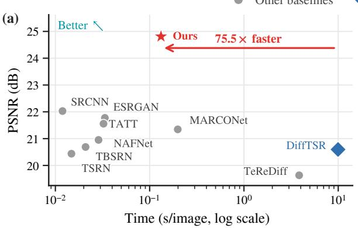

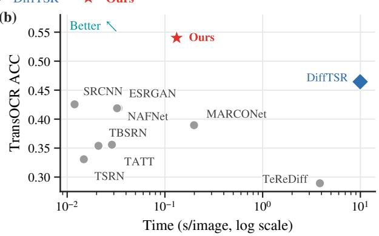  
Figure 5: Quality–latency comparison on CTR-TSR-Test ×4. Panels (a) and (b) plot PSNR and TransOCR ACC against synchronized batch-1 inference time measured on 100 fixed CTR inputs using one NVIDIA RTX PRO 6000.

(a) Complementary roles of LoRA and LRRB  
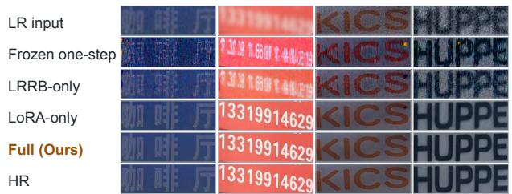

(b) Text-conditioning pathway  
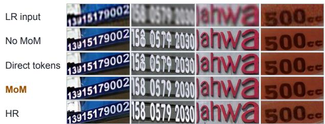  
Figure 6: Core component visualization. (a) LoRA enables one-step adaptation and LRC corrects local structure over frozen and single-module controls. (b) No MoM and direct-token conditioning cause character errors; LR and HR provide references.

<table><tr><td>Method</td><td># Params. (M)</td><td>MACs (G)</td><td>Inference Time (s)</td></tr><tr><td>SRCNN</td><td>0.057</td><td>3.748</td><td>0.0119</td></tr><tr><td>ESRGAN</td><td>16.70</td><td>73.453</td><td>0.0335</td></tr><tr><td>NAFNet</td><td>67.89</td><td>63.195</td><td>0.0324</td></tr><tr><td>TSRN</td><td>2.68</td><td>0.904</td><td>0.0148</td></tr><tr><td>TBSRN</td><td>3.21</td><td>2.535</td><td>0.0209</td></tr><tr><td>TATT</td><td>7.61</td><td>1.269</td><td>0.0287</td></tr><tr><td>MARCONet</td><td>87.90</td><td>466.178</td><td>0.1986</td></tr><tr><td>DiffTSR</td><td>874.00</td><td>59,213.970</td><td>9.9548</td></tr><tr><td>TeReDiff</td><td>1682.54</td><td>26,839.909</td><td>3.8499</td></tr><tr><td>Ours</td><td>876.23</td><td>297.497</td><td>0.1319</td></tr></table>

Table 3: Restoration parameters, MACs, and batch-1 inference time on 100 CTR images. VAEs and text modules are excluded; TOLA stores 2.46M adapted parameters.

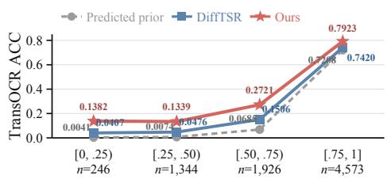  
(a)

(b)  
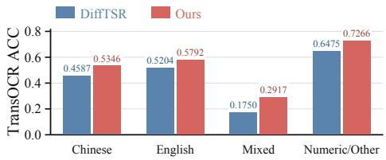

Inference Controls and Stochastic Stability. Controls favor t = 999; zero noise and disabled VAE LoRA reduce quality, while LR-input and frozen-VAE controls rule out copying or VAE-only reconstruction. Across three draws, maximum standard deviations are 0.0019 dB PSNR and 0.0012 ACC.

(c)  
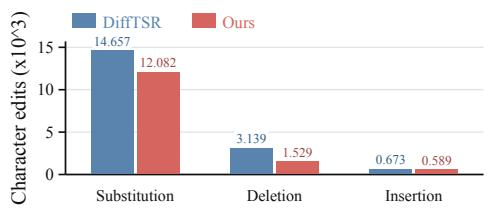  
Figure 7: Recognition diagnostics on CTR-TSR-Test ×4: (a) ACC across confidence bins, (b) ACC across text categories, and (c) character-level edit counts.

<table><tr><td>Configuration</td><td>PSNR↑</td><td>SSIM↑</td><td>LPIPS↓</td><td>DISTS↓</td><td>FID↓</td><td>T-ACC↑</td><td>T-NED↑</td><td>P-ACC↑</td><td>P-NED↑</td></tr><tr><td>Frozen one-step</td><td>20.0416</td><td>0.5342</td><td>0.5254</td><td>0.3464</td><td>119.4517</td><td>0.2276</td><td>0.3925</td><td>0.1278</td><td>0.2918</td></tr><tr><td>LRC only</td><td>21.9696</td><td>0.6021</td><td>0.4880</td><td>0.3301</td><td>110.0081</td><td>0.3785</td><td>0.5713</td><td>0.2440</td><td>0.4337</td></tr><tr><td>LoRA only</td><td>24.4220</td><td>0.7109</td><td>0.2410</td><td>0.1970</td><td>12.7420</td><td>0.5378</td><td>0.7337</td><td>0.4570</td><td>0.6564</td></tr><tr><td>Full</td><td>24.8095</td><td>0.7235</td><td>0.2288</td><td>0.1953</td><td>12.6849</td><td>0.5401</td><td>0.7370</td><td>0.4626</td><td>0.6585</td></tr><tr><td>Plain residual correction</td><td>23.9846</td><td>0.6991</td><td>0.2843</td><td>0.2180</td><td>16.9340</td><td>0.5080</td><td>0.7047</td><td>0.4256</td><td>0.6243</td></tr><tr><td>No MoM</td><td>23.9624</td><td>0.6984</td><td>0.2833</td><td>0.2170</td><td>16.1812</td><td>0.5060</td><td>0.7049</td><td>0.4117</td><td>0.6197</td></tr><tr><td>Direct token condition</td><td>24.0026</td><td>0.6993</td><td>0.2846</td><td>0.2186</td><td>16.7650</td><td>0.5079</td><td>0.7038</td><td>0.4093</td><td>0.6185</td></tr><tr><td>IDM LoRA only</td><td>23.8812</td><td>0.6987</td><td>0.2844</td><td>0.2174</td><td>16.7593</td><td>0.5104</td><td>0.7058</td><td>0.4232</td><td>0.6254</td></tr><tr><td>VAE LoRA only</td><td>22.4861</td><td>0.6141</td><td>0.4635</td><td>0.3221</td><td>108.0600</td><td>0.3989</td><td>0.5926</td><td>0.2597</td><td>0.4505</td></tr><tr><td>Null context</td><td>24.5495</td><td>0.7118</td><td>0.2695</td><td>0.2239</td><td>22.1417</td><td>0.5308</td><td>0.7280</td><td>0.4390</td><td>0.6438</td></tr><tr><td>Uniform confidence</td><td>24.6159</td><td>0.7149</td><td>0.2502</td><td>0.2113</td><td>16.9615</td><td>0.5258</td><td>0.7224</td><td>0.4285</td><td>0.6356</td></tr><tr><td>GT prior (oracle)</td><td>24.9148</td><td>0.7283</td><td>0.2216</td><td>0.1920</td><td>12.7565</td><td>0.6253</td><td>0.8079</td><td>0.5520</td><td>0.7387</td></tr></table>

Table 4: Ablation on CTR-TSR-Test ×4. Full uses IDM/VAE LoRA, LRC, and confidence-aware MoM. Plain is parameter-matched; No MoM removes the text branch; direct tokens bypass fusion; GT is oracle; T/P denote TransOCR/PaddleOCR.

Paired Uncertainty. Paired bootstrap intervals exclude zero for LRC efects on PSNR, SSIM, LPIPS, and DISTS, but not NED; exact McNemar testing finds no significant ACC change. Predicted conditioning improves ACC over null context, and the GT-prior gap confirms prior errors.

## Conclusion

We presented TOLA, a text-aware one-step adaptation of DifTSR. TOLA constructs a confidence-aware TransOCR–MoM condition once, adapts IDM and the VAE encoder with rank-4 LoRA, and corrects clean-latent residual errors with LRRB without invoking TDM. It improves all nine CTR-TSR-Test metrics over DifTSR while reducing IDM/TDM evaluations from 200/200 to 1/0 and latency from 9.9548 to 0.1319 seconds per image. The optimized and saved state contains only 2.46M parameters, while inference retains the pretrained backbone without introducing another iterative restoration trajectory. Component ablations and independent-OCR evaluation support the complementary roles of LoRA, LRRB, and confidence-aware conditioning. Results on RealCE-200 and RT50 further demonstrate generalization across paired camera observations, Chinese, English, and numeric text, and varied real capture conditions. These results establish eficient one-step difusion TSR without iterative image–text refinement.

## References

Jingye Chen, Bin Li, and Xiangyang Xue. Scene Text Telescope: Text-focused scene image super-resolution. In Proceedings ofthe IEEE/CVF Conference on Computer Vision and Pattern Recognition, pages 12026– 12035, 2021.

Jingye Chen, Haiyang Yu, Jianqi Ma, Bin Li, and Xiangyang Xue. Text Gestalt: Stroke-aware scene text

image super-resolution. In Proceedings of the AAAI Conference on Artificial Intelligence, volume 36, pages 285–293, 2022a.

Liangyu Chen, Xiaojie Chu, Xiangyu Zhang, and Jian Sun. Simple baselines for image restoration. In European Conference on Computer Vision, pages 17–33, 2022b.

Keyan Ding, Kede Ma, Shiqi Wang, and Eero P. Simoncelli. Image quality assessment: Unifying structure and texture similarity. IEEE Transactions on Pattern Analysis and Machine Intelligence, 44(5):2567–2581, 2022.

Chao Dong, Chen Change Loy, Kaiming He, and Xiaoou Tang. Image super-resolution using deep convolutional networks. IEEE Transactions on Pattern Analysis and Machine Intelligence, 38(2):295–307, 2016.

Linwei Dong, Qingnan Fan, Yihong Guo, Zhonghao Wang, Qi Zhang, Jinwei Chen, Yawei Luo, and Changqing Zou. TSD-SR: One-step difusion with target score distillation for real-world image superresolution. In Proceedings of the IEEE/CVF Conference on Computer Vision and Pattern Recognition, pages 23174–23184, 2025.

Yuning Du, Chenxia Li, Ruoyu Guo, Xiaoting Yin, Weiwei Liu, Jun Zhou, Yifan Bai, Zilin Yu, Yehua Yang, Qingqing Dang, and Haoshuang Wang. PP-OCR: A practical ultra lightweight OCR system, 2020.

Hang Guo, Tao Dai, Guanghao Meng, and Shu-Tao Xia. Towards robust scene text image super-resolution via explicit location enhancement. In International Joint Conference on Artificial Intelligence, pages 782–790, 2023.

Haodong He, Xin Zhan, Yancheng Bai, Rui Lan, Lei Sun, and Xiangxiang Chu. TEXTS-Dif: TEXTSaware difusion model for real-world text image superresolution. In IEEE International Conference on Acoustics, Speech and Signal Processing, pages 4306– 4310, 2026.

Martin Heusel, Hubert Ramsauer, Thomas Unterthiner, Bernhard Nessler, and Sepp Hochreiter. GANs trained by a two time-scale update rule converge to a local nash equilibrium. In Advances in Neural Information Processing Systems, volume 30, pages 6626–6637, 2017.

Jonathan Ho, Ajay Jain, and Pieter Abbeel. Denoising difusion probabilistic models. In Advances in Neural Information Processing Systems, volume 33, pages 6840–6851, 2020.

Edward J. Hu, Yelong Shen, Phillip Wallis, Zeyuan Allen-Zhu, Yuanzhi Li, Shean Wang, Lu Wang, and Weizhu Chen. LoRA: Low-rank adaptation of large language models. In International Conference on Learning Representations, 2022.

Qiming Hu, Linlong Fan, Yiyan Luo, Yuhang Yu, Xiaojie Guo, and Qingnan Fan. Text-aware real-world image super-resolution via difusion model with joint segmentation decoders. In Advances in Neural Information Processing Systems, volume 38, pages 61522– 61543, 2025.

Bahjat Kawar, Michael Elad, Stefano Ermon, and Jiaming Song. Denoising difusion restoration models. In Advances in Neural Information Processing Systems, volume 35, pages 23593–23606, 2022.

Aro Kim, Myeongjin Jang, Chaewon Moon, Youngjin Shin, Jinwoo Jeong, and Sang-hyo Park. FiDeSR: High-fidelity and detail-preserving one-step difusion super-resolution. In Proceedings of the IEEE/CVF Conference on Computer Vision and Pattern Recognition, pages 38270–38280, 2026.

Yuxin Kong, Weihong Ma, Lianwen Jin, and Yang Xue. GARDEN: Generative prior guided network for scene text image super-resolution. In International Conference on Document Analysis and Recognition, volume 14808, pages 196–214, 2024.

Xiaoming Li, Wangmeng Zuo, and Chen Change Loy. Learning generative structure prior for blind text image super-resolution. In Proceedings of the IEEE/CVF Conference on Computer Vision and Pattern Recognition, pages 10103–10113, 2023.

Jingyun Liang, Jiezhang Cao, Guolei Sun, Kai Zhang, Luc Van Gool, and Radu Timofte. SwinIR: Image

restoration using Swin transformer. In Proceedings of the IEEE/CVF International Conference on Computer Vision Workshops, pages 1833–1844, 2021.

Baolin Liu, Zongyuan Yang, Chinwai Chiu, and Yongping Xiong. TextDif: Enhancing scene text image super-resolution with mask-guided residual difusion models. Pattern Recognition, 164:111513, 2025.

Jianqi Ma, Zhetong Liang, and Lei Zhang. A text attention network for spatial deformation robust scene text image super-resolution. In Proceedings ofthe IEEE/CVF Conference on Computer Vision and Pattern Recognition, pages 5911–5920, 2022.

Jianqi Ma, Shi Guo, and Lei Zhang. Text prior guided scene text image super-resolution. IEEE Transactions on Image Processing, 32:1341–1353, 2023a.

Jianqi Ma, Zhetong Liang, Wangmeng Xiang, Xi Yang, and Lei Zhang. A benchmark for chinese-english scene text image super-resolution. In Proceedings of the IEEE/CVF International Conference on Computer Vision, pages 19452–19461, 2023b.

Jaewon Min, Jin Hyeon Kim, Paul Hyunbin Cho, Jaeeun Lee, Jihye Park, Minkyu Park, Sangpil Kim, Hyunhee Park, and Seungryong Kim. Text-aware image restoration with difusion models. In International Conference on Learning Representations, 2026.

Axi Niu, Kang Zhang, Qingsen Yan, Hao Jin, Jinqiu Sun, and Yanning Zhang. DualTSR: Unified dual-difusion transformer for scene text image super-resolution, 2026.

Chihiro Noguchi, Shun Fukuda, and Masao Yamanaka. Scene text image super-resolution based on textconditional difusion models. In Proceedings of the IEEE/CVF Winter Conference onApplications ofComputer Vision, pages 1485–1495, 2024.

Chenglu Pan, Xiaogang Xu, Ganggui Ding, Yunke Zhang, Wenbo Li, Jiarong Xu, and Qingbiao Wu. Boosting difusion-based text image super-resolution model towards generalized real-world scenarios. In Proceedings of the IEEE/CVF International Conference on Computer Vision Workshops, pages 7459–7468, 2025.

Dongwoo Park and Suk Pil Ko. NCAP: Scene text image super-resolution with Non-CAtegorical prior. In Proceedings of the IEEE/CVF Winter Conference on Applications of Computer Vision, pages 2432–2441, 2025.

Robin Rombach, Andreas Blattmann, Dominik Lorenz, Patrick Esser, and Björn Ommer. High-resolution image synthesis with latent difusion models. In Proceedings of the IEEE/CVF Conference on Computer Vision and Pattern Recognition, pages 10684–10695, 2022.

Chitwan Saharia, Jonathan Ho, William Chan, Tim Salimans, David J. Fleet, and Mohammad Norouzi. Image super-resolution via iterative refinement. IEEE Transactions on Pattern Analysis and Machine Intelligence, 45(4):4713–4726, 2023.

Shrey Singh, Prateek Keserwani, Masakazu Iwamura, and Partha Pratim Roy. DCDM: Difusion-conditioneddifusion model for scene text image super-resolution. In European Conference on Computer Vision, pages 303–320, 2024.

Jiaming Song, Chenlin Meng, and Stefano Ermon. Denoising difusion implicit models. In International Conference on Learning Representations, 2021.

Ying Tai, Rui Xie, Chen Zhao, Kai Zhang, Zhenyu Zhang, Jun Zhou, and Jian Yang. AddSR: Accelerating difusion-based blind super-resolution with adversarial difusion distillation. Pattern Recognition, 175:113012, 2026.

LeoWu TomyEnrique, Xiangcheng Du, Kangliang Liu, Han Yuan, Zhao Zhou, and Cheng Jin. Eficient scene text image super-resolution with semantic guidance. In IEEE International Conference on Acoustics, Speech and Signal Processing, pages 3160–3164, 2024.

Jianyi Wang, Zongsheng Yue, Shangchen Zhou, Kelvin C. K. Chan, and Chen Change Loy. Exploiting difusion prior for real-world image super-resolution. International Journal of Computer Vision, 132(12):5929– 5949, 2024a.

Wenjia Wang, Enze Xie, Xuebo Liu, Wenhai Wang, Ding Liang, Chunhua Shen, and Xiang Bai. Scene text image super-resolution in the wild. In European Conference on Computer Vision, pages 650–666, 2020.

Xintao Wang, Ke Yu, Shixiang Wu, Jinjin Gu, Yihao Liu, Chao Dong, Yu Qiao, and Chen Change Loy. ESR-GAN: Enhanced super-resolution generative adversarial networks. In European Conference on Computer Vision Workshops, pages 63–79, 2018.

Xintao Wang, Liangbin Xie, Chao Dong, and Ying Shan. Real-ESRGAN: Training real-world blind superresolution with pure synthetic data. In Proceedings of the IEEE/CVF International Conference on Computer Vision Workshops, pages 1905–1914, 2021.

Yufei Wang, Wenhan Yang, Xinyuan Chen, Yaohui Wang, Lanqing Guo, Lap-Pui Chau, Ziwei Liu, Yu Qiao, Alex C. Kot, and Bihan Wen. SinSR: Difusion-based image super-resolution in a single step. In Proceedings of the IEEE/CVF Conference on Computer Vision and Pattern Recognition, pages 25796–25805, 2024b.

Zhou Wang, Alan C. Bovik, Hamid R. Sheikh, and Eero P. Simoncelli. Image quality assessment: From error visibility to structural similarity. IEEE Transactions on Image Processing, 13(4):600–612, 2004.

Baole Wei, Yuxuan Zhou, Liangcai Gao, and Zhi Tang. GlyphSR: A simple glyph-aware framework for scene text image super-resolution. In Proceedings of the AAAI Conference on Artificial Intelligence, volume 39, pages 8277–8285, 2025.

Rongyuan Wu, Lingchen Sun, Zhiyuan Ma, and Lei Zhang. One-step efective difusion network for realworld image super-resolution. In Advances in Neural Information Processing Systems, volume 37, pages 92529–92553, 2024.

Zihang Xu, Xiaoyang Liu, Zheng Chen, Yulun Zhang, and Xiaokang Yang. PRISM: Prior rectification and uncertainty-aware structure modeling for difusionbased text image super-resolution, 2026.

Wei Yang, Yihong Luo, Mayire Ibrayim, and Askar Hamdulla. More and less: Enhancing abundance and refining redundancy for text-prior-guided scene text image super-resolution. In International Conference on Document Analysis and Recognition, volume 14808, pages 129–146, 2024.

Keren Ye, Ignacio Garcia Dorado, Michalis Raptis, Mauricio Delbracio, Irene Zhu, Peyman Milanfar, and Hossein Talebi. TextSR: Difusion super-resolution with multilingual OCR guidance, 2025.

Shengrong Yuan, Runmin Wang, Ke Hao, Xuqi Ma, Changxin Gao, Li Liu, and Nong Sang. StyleSRN: Scene text image super-resolution with text style embedding. In Proceedings of the IEEE/CVF International Conference on Computer Vision, pages 18693– 18702, 2025.

Zongsheng Yue, Jianyi Wang, and Chen Change Loy. ResShift: Eficient difusion model for image superresolution by residual shifting. In Advances in Neural Information Processing Systems, volume 36, pages 13294–13307, 2023.

Kai Zhang, Jingyun Liang, Luc Van Gool, and Radu Timofte. Designing a practical degradation model for deep blind image super-resolution. In Proceedings of the

IEEE/CVF International Conference on Computer Vision, pages 4791–4800, 2021.

Richard Zhang, Phillip Isola, Alexei A. Efros, Eli Shechtman, and Oliver Wang. The unreasonable efectiveness of deep features as a perceptual metric. In Proceedings of the IEEE/CVF Conference on Computer Vision and Pattern Recognition, pages 586–595, 2018.

Yuzhe Zhang, Jiawei Zhang, Hao Li, Zhouxia Wang, Luwei Hou, Dongqing Zou, and Liheng Bian. Difusion-based blind text image super-resolution. In Proceedings of the IEEE/CVF Conference on Computer Vision and Pattern Recognition, pages 25827– 25836, 2024.

Cairong Zhao, Shuyang Feng, Brian Nlong Zhao, Zhijun Ding, Jun Wu, Fumin Shen, and Heng Tao Shen. Scene text image super-resolution via parallelly contextual attention network. In ACM International Conference on Multimedia, pages 2908–2917, 2021.

Minyi Zhao, Miao Wang, Fan Bai, Bingjia Li, Jie Wang, and Shuigeng Zhou. C3-STISR: Scene text image super-resolution with triple clues. In International Joint Conference on Artificial Intelligence, pages 1707–1713, 2022.

Yuxuan Zhou, Liangcai Gao, Zhi Tang, and Baole Wei. Recognition-guided difusion model for scene text image super-resolution. In IEEE International Conference on Acoustics, Speech and Signal Processing, pages 2940–2944, 2024.

Shipeng Zhu, Zuoyan Zhao, Pengfei Fang, and Hui Xue. Improving scene text image super-resolution via dual prior modulation network. In Proceedings of the AAAI Conference on Artificial Intelligence, volume 37, pages 3843–3851, 2023a.

Xiangyuan Zhu, Kehua Guo, Hui Fang, Rui Ding, Zheng Wu, and Gerald Schaefer. Gradient-based graph attention for scene text image super-resolution. In Proceedings ofthe AAAI Conference on Artificial Intelligence, volume 37, pages 3861–3869, 2023b.

## Appendices

This supplement provides implementation and evaluation details complementary to the self-contained main paper. It clarifies the system boundary relative to nearby difusion methods, enumerates the modules executed by the one-step route, specifies the saved adaptation state, datasets, metrics, and controlled variants, and reports the exact values underlying the extended diagnostics. It also presents additional ablations, inference controls, uncertainty analysis, and qualitative comparisons.

## A System and Comparison Boundaries

## A.1 One-Step Inference Route

For an input image, the VAE encoder first produces the unscaled three-channel latent $z _ { \mathrm { L R } }$ . TOLA uses the zeroindexed timestep $t = 9 9 9$ of the 1000-step linear schedule inherited from DifTSR, whose endpoints are $\beta _ { 0 } = 0 . 0 0 1 5$ and $\beta _ { 9 9 9 } = 0 . 0 2 0 5$ . One Gaussian sample is drawn to construct

$$
z _ { t } = \sqrt { \bar { \alpha } _ { t } } z _ { \mathrm { L R } } + \sqrt { 1 - \bar { \alpha } _ { t } } \epsilon .
$$

TransOCR is evaluated once. After Simplified-Chinese normalization, its token embeddings are multiplied by the aligned raw token confidences and passed to the frozen MoM together with $0 . 1 8 2 1 5 [ z _ { \mathrm { L R } } , z _ { t } ]$ . MoM computes both inherited image and text conditions once, but the one-step IDM uses only the text condition as cross-attention context.

IDM receives $[ z _ { t } , z _ { \mathrm { L R } } ]$ and predicts noise once. Because the oficial DifTSR checkpoint uses epsilon prediction, the initial clean latent is reconstructed as

$$
\hat { z } _ { 0 } = \frac { z _ { t } - \sqrt { 1 - \bar { \alpha } _ { t } } \hat { \epsilon } } { \sqrt { \bar { \alpha } _ { t } } } .
$$

There is no reverse chain after this conversion. Latent residual correction (LRC) uses a compact correction branch to correct the LR-to-clean residual $r = z _ { \mathrm { L R } } - \hat { z } _ { 0 } \mathrm { : }$

$$
\Delta r = g _ { \phi } ( [ z _ { \mathrm { L R } } , r ] ) , \qquad \hat { z } _ { 0 , \mathrm { c o r r } } = z _ { \mathrm { L R } } - ( r + \Delta r ) .
$$

Finally, the frozen decoder maps $\hat { z } _ { 0 , \mathrm { c o r r } } / 0 . 1 8 2 1 5$ to xSR. Each image is restored once, without multi-sample selection or averaging.

## B Architecture and Saved State

## B.1 LoRA Placement and Frozen Components

Rank-4 LoRA adapters use α = 4 and zero dropout. They are inserted into eligible linear and convolutional layers of IDM and the VAE encoder, including its encoder-side 1 × 1 latent projection. The first input convolution of IDM, the decoderside latent projection, and the complete VAE decoder remain unadapted. TransOCR, MoM, all base IDM/VAE weights, and the loaded but unused TDM decoder remain frozen. The conditioning TransOCR and the OCR-loss recognizer are separate frozen instances initialized from the same checkpoint.

<table><tr><td>Trainable partition</td><td>Parameters</td><td>Saved?</td></tr><tr><td>IDM LoRA</td><td>2,027,520</td><td>yes</td></tr><tr><td>VAE-encoder LoRA</td><td>250,548</td><td>yes</td></tr><tr><td>LRC</td><td>180,323</td><td>yes</td></tr><tr><td>Total adaptation state</td><td>2,458,391</td><td>yes</td></tr></table>

Table S3: Optimized and saved parameters.

## B.2 Latent Residual Correction

TOLA implements LRC with a compact correction branch inspired by FiDeSR. It receives the six-channel concatenation $[ z _ { \mathrm { L R } } , r ]$ . A 1×1 input projection maps 6 channels to 32, followed by one residual-in-residual dense block (RRDB) and a 1×1 output projection from 32 channels to 3. The RRDB contains three residual dense blocks; each residual dense block contains five densely connected 3×3 convolutions with growth width 16. Residual scaling is 0.2 at both dense-block and RRDB levels. The output projection is zero initialized, so LRC initially leaves $\hat { z } _ { 0 }$ unchanged.

Small, Default, and Large LRC use $( h , g , n _ { \mathrm { R R D B } } ) \ =$ (16, 8, 1), (32, 16, 1), and (32, 16, 2), respectively, with 0.045235M, 0.180323M, and 0.360323M parameters. The parameter-matched baseline uses a plain correction branch with a 6→30 projection, 11 two-convolution residual blocks with LeakyReLU and residual scaling 0.2, a 30→30 mixing layer, and a zero-initialized 30→3 projection (0.180093M parameters).

## C Training Protocol

Computing Environment. Experiments run on Ubuntu 22.04 with an AMD EPYC 9J14 96-Core Processor, 503 GiB of system memory, and NVIDIA RTX PRO 6000 Blackwell Server Edition GPUs with 97,887 MiB per GPU. The NVIDIA driver version is 580.142. The primary environment uses Python 3.10.12, PyTorch 2.11.0+cu128, Torchvision 0.26.0+cu128, CUDA 12.8, cuDNN 9.19, PyIQA 0.1.15.post2, and LPIPS 0.1.4. The independent OCR evaluation uses PaddlePaddle 2.6.2 and PaddleOCR 2.7.3. These package versions define the software environment used for the reported results.

Training reads 63,644 high-quality CTR preprocessing images and applies a deterministic local 98%/2% partition: 62,371 images for training and 1,273 for validation. This is a local partition rather than an oficial CTR split. Each image is degraded online with equal probability by the Real-ESRGAN or BSRGAN pipeline (Wang et al., 2021; Zhang et al., 2021); the scale is drawn from {1, 2, 4}. Both degraded inputs and targets use a 128×512 canvas.

The complete objective is

$$
\begin{array} { r } { \mathcal { L } = \mathcal { L } _ { 1 } ( x _ { \mathrm { { S R } } } , x _ { \mathrm { { H R } } } ) { + } \mathcal { L } _ { \mathrm { L P I P S - V G G } } ( x _ { \mathrm { { S R } } } , x _ { \mathrm { { H R } } } ) { + } 0 . 0 2 \mathcal { L } _ { \mathrm { O C R } } . } \end{array}
$$

The frozen OCR recognizer remains diferentiable with respect to its image input, so OCR-loss gradients reach LoRA and LRC. No latent $\ell _ { 1 } .$ , noise-prediction, score-distillation, VSD/CSD, or teacher-regularization loss is used.

<table><tr><td>Method</td><td>Image route</td><td>Text route</td><td>Distinction</td></tr><tr><td>DiffTSR</td><td>Iterative IDM</td><td>TDM-MoM iterations</td><td>Coupled image/text diffusion</td></tr><tr><td>Boosting DiffTSR</td><td>Iterative diffusion</td><td>Confidence-guided TDM-MoM</td><td>SR prior + progressive sampling</td></tr><tr><td>OSEDiff</td><td>One-step latent</td><td>Degradation prompt</td><td>LoRA + VSD</td></tr><tr><td>FiDeSR</td><td>One-step residual</td><td>No OCR</td><td>LRC + detail/frequency modules</td></tr><tr><td>PRISM</td><td>Single-pass flow</td><td>Rectified prior</td><td>Flow matching + structure modeling</td></tr><tr><td>TADiSR</td><td>Text-aware diffusion</td><td>Text segmentation</td><td>Joint segmentation decoders</td></tr><tr><td>TEXTS-Diff</td><td>One-step latent</td><td>Abstract + region cues</td><td>Real-Texts + text-aware restoration</td></tr><tr><td>DualTSR</td><td>Conditional flow</td><td>Discrete diffusion</td><td>Shared multimodal transformer</td></tr><tr><td>TOLA (Ours)</td><td>One IDM call</td><td>TransOCR-MoM once</td><td>One-Step; no TDM</td></tr></table>

Table S1: Mechanistic positioning of the closest difusion routes. Methods follow (Zhang et al., 2024; Pan et al., 2025; Wu et al., 2024; Kim et al., 2026; Xu et al., 2026; Hu et al., 2025; He et al., 2026; Niu et al., 2026). The table distinguishes system boundaries.

<table><tr><td>Component</td><td>Function</td><td>Trainable update</td><td>Calls/image</td></tr><tr><td>TransOCR</td><td>token and confidence prediction</td><td>frozen</td><td>1</td></tr><tr><td>VAE encoder</td><td>LR latent encoding</td><td>LoRA</td><td>1</td></tr><tr><td>MoM</td><td>text-aware condition construction</td><td>frozen</td><td>1</td></tr><tr><td>IDM U-Net</td><td>one-step diffusion prediction</td><td>LoRA</td><td>1</td></tr><tr><td>LRC</td><td>latent residual correction</td><td>full branch</td><td>1</td></tr><tr><td>VAE decoder</td><td>corrected-latent decoding</td><td>frozen</td><td>1</td></tr></table>

Table S2: Inference boundary of TOLA. TransOCR, MoM, and IDM are each executed once; TDM is not executed.

<table><tr><td>Item</td><td>Setting</td></tr><tr><td>Initialization</td><td>official DiffTSR CTR checkpoint</td></tr><tr><td>Training steps</td><td>100,000</td></tr><tr><td>GPUs</td><td>4× RTX PRO 6000</td></tr><tr><td>Batch/GPU</td><td>16</td></tr><tr><td>Effective batch</td><td>64</td></tr><tr><td>Precision</td><td>FP32</td></tr><tr><td>Training time</td><td>approximately 55 hours</td></tr><tr><td>Optimizer</td><td>AdamW</td></tr><tr><td>Learning rate</td><td>5 × 10−5</td></tr><tr><td>Adam betas</td><td>(0.9,0.999)</td></tr><tr><td>Weight decay</td><td>0.01</td></tr><tr><td>Warm-up</td><td>500 linear steps</td></tr><tr><td>Gradient clipping</td><td>1.0</td></tr><tr><td>Selection</td><td>validation performance</td></tr></table>

Table S4: Primary training configuration.

## C.1 Hyperparameter Search and Selection

Table S5 summarizes the search. The final architecture, objective, OCR-loss weight, and training timestep are selected using validation performance. Most candidate checkpoints use validation LPIPS; the no-LPIPS objective uses validation PSNR. The remaining optimization settings are reported in Table S4.

## D Dataset Appendix and Evaluation Metrics

## D.1 Dataset Inventory

Table S6 summarizes the evaluation sets. The primary benchmark is the complete 8,089-image CTR-TSR-Test ×4

set. All methods under the unified protocol are filenamematched to the same references and evaluated on a 128×512 output canvas.

## D.2 Motivation and Coverage

Existing benchmarks do not individually cover all conditions required for evaluating real scene-text restoration. CTR-TSR-Test provides a large paired benchmark but primarily reflects synthetic degradations, whereas available real-image datasets difer in language coverage, capture conditions, annotation format, and reference availability. RealCE-200 provides a paired protocol constructed from real multi-focal observations, while RT50 balances Chinese, English, and numeric text collected through heterogeneous acquisition routes. Together, these sets broaden the evaluated conditions.

## D.3 RealCE-200 Construction

We construct RealCE-200 from the multi-focal images and oficial text annotations in the RealCE validation split before evaluation. For each oficial text annotation, identical bounding-box coordinates are applied to the corresponding 13 mm and 52 mm focal images, which serve as LR and reference observations. Both crops are bicubically resized to 128×512 without geometric registration. Automatic filtering considers transcription length and composition, bounding box size, aspect ratio, sharpness, and contrast. Duplicate candidates are removed using transcription identity and perceptual dHash. Oficial transcriptions are retained after whitespace cleaning, and no manual relabeling is performed. The resulting records use fixed identifiers R001–R200. RealCE is not used for training, validation, or checkpoint selection.

<table><tr><td>Hyperparameter</td><td>Values examined</td><td>Count</td><td>Final setting</td></tr><tr><td>LoRA (r, α)</td><td>(2, 2), (4, 4), (8, 8)</td><td>3</td><td>(4,4)</td></tr><tr><td>LRC  $( h , g , n _ { \mathrm { R R D B } } )$ </td><td> $( 1 6 , 8 , 1 ) , ( 3 2 , 1 6 , 1 ) , ( 3 2 , 1 6 , 2 )$ </td><td>3</td><td> $( 3 2 , 1 6 , 1 )$ </td></tr><tr><td>Reconstruction objective</td><td>Full, without  $\ell _ { 1 } ,$  without LPIPS</td><td>3</td><td>Full</td></tr><tr><td>OCR-loss weight</td><td>{0, 0.02, 0.05}</td><td>3</td><td>0.02</td></tr><tr><td>Training timestep</td><td>{899, 949, 999}</td><td>3</td><td>999</td></tr></table>

Table S5: Hyperparameter and objective settings examined during development and the final configuration used by TOLA.
<table><tr><td>Set</td><td>Source</td><td>Size</td><td>Content and reference</td></tr><tr><td>CTR-TSR-Test ×4</td><td>Official CTR-TSR-Test</td><td>8,089 pairs</td><td>Filename-aligned LR/HR images and transcriptions</td></tr><tr><td>RealCE-200</td><td>RealCE multi-focal images (Ma et al., 2023b)</td><td>200 pairs</td><td>Paired 13 mm LR/52 mm reference crops</td></tr><tr><td>RT50</td><td>Multi-source real images</td><td>50 inputs</td><td>17 Chinese, 17 English, and 16 numeric samples</td></tr></table>

Table S6: Evaluation datasets. RealCE-200 and RT50 are constructed in this work.

## D.4 RT50 Construction

RT50 contains 50 real text inputs collected through multiple acquisition routes. The fixed composition contains 17 Chinese samples, 17 English samples, and 16 numeric samples; the dificulty partition contains 10 mild, 20 medium, and 20 hard samples. Candidate labels are restricted to 2– 8 Chinese characters, 3–12 English letters, or 2–6 digits. Images must be at least 24×8 pixels with aspect ratios between 2 and 10. After canonical resizing, admissible candidates have gray mean in [20, 235], gray standard deviation in [10, 80], Laplacian variance in [2, 1200], edge density in [0.01, 0.65], and entropy of at least 3.0. Repeated transcriptions are removed, and near duplicates are rejected at a dHash Hamming-distance threshold of 7. The selection protocol is finalized before model inference without consulting restoration or OCR outputs. Records use fixed identifiers RT001–RT050 and are normalized to the same 128×512 model-input canvas.

## D.5 Included Dataset Records

The public data release will include the exact image files evaluated in this work rather than requiring users to reconstruct them. For RealCE-200, it will provide all 200 LR/reference pairs together with the pair manifest, transcriptions, source filenames, and SHA-256 values. For RT50, it will provide all 50 input images together with the complete manifest, labels, provenance table, selection protocol, perimage geometry and quality statistics, category and dificulty assignment, dHash, and SHA-256 values. The accompanying records define the evaluated samples independently of model outputs and verify every released file. Upon publication, these exact datasets and their metadata will be publicly available under research-use terms documented with the release.

## D.6 Metric Implementations

Predictions and references are matched by exact filename. PyIQA computes PSNR and SSIM on luminance without border crop. Evaluation LPIPS uses the AlexNet backbone, while training LPIPS uses VGG. DISTS and FID use Py-IQA; FID is computed once over the complete output and reference directories.

The primary recognizer is TransOCR. Predictions undergo full-width to half-width conversion, Simplified-Chinese conversion, and whitespace removal; case is preserved. Exact-match accuracy is denoted ACC. Per-image normalized edit-distance similarity is

$$
\mathrm { N E D } = 1 - \frac { \mathrm { E D } ( p , g ) } { \operatorname* { m a x } ( | p | , | g | , 1 ) } ,
$$

and is averaged across the set. The independent cross-check uses PaddleOCR 2.7.3 with PaddlePaddle 2.6.2 and the Chinese PP-OCRv4 recognition model; detection and orientation classification are disabled. This recognizer is not used for conditioning, training, validation, or checkpoint selection.

## E Extended Qualitative Comparisons

## E.1 Additional RealCE Comparison

Figure S1 provides additional paired RealCE-200 examples under the unified evaluation protocol.

## E.2 BTL Cross-Protocol Comparison

Figure S2 compares TOLA, DifTSR, TeReDif, and PRISM on five BTL-test ×4 examples (Xu et al., 2026). The examples cover Chinese text, English words, and numeric sequences.

## F Controlled Variant Definitions

All filename-paired comparisons use identical per-image Gaussian noise for the two compared outputs. Efect-size intervals use 5,000 filename-paired bootstrap resamples. Exact-match ACC is additionally tested with the exact paired McNemar test. Table S7 defines all architecture and conditioning controls.

<table><tr><td rowspan=13 colspan=1>LR inputSRCNNESRGANNAFNetTSRNTBSRNTATTMARCONetDiffTSRTeReDiffOursHR</td><td></td><td></td><td></td><td></td><td></td></tr><tr><td rowspan=1 colspan=1>环保投诉举报电话</td><td rowspan=1 colspan=1>NSUNSIAINE</td><td rowspan=1 colspan=1>地址：青松路125号</td><td rowspan=1 colspan=1>13958832240</td><td rowspan=1 colspan=1>Blockchain</td></tr><tr><td rowspan=1 colspan=1>环保投诉举报电话</td><td rowspan=1 colspan=1>MSUNSLINE</td><td rowspan=1 colspan=1>地址：青松路125号</td><td rowspan=1 colspan=1>13958832240</td><td rowspan=1 colspan=1>Blockchain</td></tr><tr><td rowspan=1 colspan=1>环保投诉举报电话</td><td rowspan=1 colspan=1>NUNSEINE</td><td rowspan=1 colspan=1>地址：青松路125号</td><td rowspan=1 colspan=1>13958832240</td><td rowspan=1 colspan=1>Blockchain</td></tr><tr><td rowspan=1 colspan=1>环保投诉举报电话</td><td rowspan=1 colspan=1>NUNINE</td><td rowspan=1 colspan=1>地址：青松路125号</td><td rowspan=1 colspan=1>13958832240</td><td rowspan=1 colspan=1>Blockchain</td></tr><tr><td rowspan=1 colspan=1>环保投近单报电话</td><td rowspan=1 colspan=1></td><td rowspan=1 colspan=1>地址：青松路125号</td><td rowspan=1 colspan=1>13958832240</td><td rowspan=1 colspan=1>Blockchain</td></tr><tr><td rowspan=1 colspan=1>环保投诉单报电话</td><td rowspan=1 colspan=1></td><td rowspan=1 colspan=1>地址：青松路125号</td><td rowspan=1 colspan=1>13958832240</td><td rowspan=1 colspan=1>Blockchain</td></tr><tr><td rowspan=1 colspan=1>环保投诉单报电话</td><td rowspan=1 colspan=1></td><td rowspan=1 colspan=1>地址：青松路125号</td><td rowspan=1 colspan=1>13958832240</td><td rowspan=1 colspan=1>Blockchain</td></tr><tr><td rowspan=1 colspan=1>环保投诉举报电话</td><td rowspan=1 colspan=1></td><td rowspan=1 colspan=1>地址：青松路125号</td><td rowspan=1 colspan=1>13958832240</td><td rowspan=1 colspan=1>Blockchain</td></tr><tr><td rowspan=1 colspan=1>环保投诉举报电话</td><td rowspan=1 colspan=1>AA BUEELTISIO</td><td rowspan=1 colspan=1>地址：背松路125号</td><td rowspan=1 colspan=1>13958832240</td><td rowspan=1 colspan=1>Blockchain</td></tr><tr><td rowspan=1 colspan=1>环保投诉华报中话</td><td rowspan=1 colspan=1>NSUNSHINE</td><td rowspan=1 colspan=1>地址：粤松路125号</td><td rowspan=1 colspan=1>13958832240</td><td rowspan=1 colspan=1>Blockchain</td></tr><tr><td rowspan=1 colspan=1>环保投诉举报电话</td><td rowspan=1 colspan=1>NMSUNSEINE</td><td rowspan=1 colspan=1>地址：青松路125号</td><td rowspan=1 colspan=1>13958832240</td><td rowspan=1 colspan=1>Blockchain</td></tr><tr><td rowspan=1 colspan=1>环保投诉举报电话</td><td rowspan=1 colspan=1>SUNSHINE</td><td rowspan=1 colspan=1>地址：青松路125号</td><td rowspan=1 colspan=1>13958832240</td><td rowspan=1 colspan=1>Blockchain</td></tr></table>

Figure S1: Qualitative comparison on five paired RealCE-200 examples. Rows show the LR input, SRCNN, ESRGAN, NAFNet, TSRN, TBSRN, TATT, MARCONet, DifTSR, TeReDif, Ours, and the HR reference.

<table><tr><td rowspan=7 colspan=1>LR inputDiffTSRTeReDiffPRISMOursHR</td><td></td><td></td><td></td><td></td><td></td><td></td><td></td></tr><tr><td rowspan=1 colspan=2>碗汤面</td><td rowspan=1 colspan=1></td><td rowspan=1 colspan=2>STADIUM</td><td rowspan=1 colspan=1></td><td rowspan=1 colspan=1>726543210</td></tr><tr><td rowspan=1 colspan=2>碗汤面</td><td rowspan=1 colspan=1>烤全鱼</td><td rowspan=1 colspan=2>STADIUM</td><td rowspan=1 colspan=1>1010</td><td rowspan=1 colspan=1>726543210</td></tr><tr><td rowspan=1 colspan=1></td><td rowspan=1 colspan=1>碗汤面</td><td rowspan=1 colspan=1>烤全鱼</td><td rowspan=1 colspan=2>STADIUM</td><td rowspan=1 colspan=1>1010</td><td rowspan=1 colspan=1>726543210</td></tr><tr><td rowspan=1 colspan=2>碗汤面</td><td rowspan=1 colspan=1>烤全鱼</td><td rowspan=1 colspan=2>STADIUM</td><td rowspan=1 colspan=1>1910</td><td rowspan=1 colspan=1>726543210</td></tr><tr><td rowspan=1 colspan=2>碗汤面</td><td rowspan=1 colspan=1>烤全鱼</td><td rowspan=1 colspan=2>STADIUM</td><td rowspan=1 colspan=1>1910</td><td rowspan=1 colspan=1>726543210</td></tr><tr><td rowspan=1 colspan=2>碗汤面</td><td rowspan=1 colspan=1>烤全鱼</td><td rowspan=1 colspan=1>STA</td><td rowspan=1 colspan=1>DIUM</td><td rowspan=1 colspan=1>19107</td><td rowspan=1 colspan=1>26543210</td></tr></table>

Figure S2: Cross-protocol comparison on five BTL-test ×4 examples. Rows show the LR input, DifTSR, TeReDif (Min et al., 2026), PRISM (Xu et al., 2026), Ours, and GT. BTL-test combines real and rendered HQ sources with BSRGAN/Real-ESRGAN degradations; the PRISM row is reproduced from the original paper.

<table><tr><td>Variant</td><td>Definition</td></tr><tr><td>Frozen one-step</td><td>Frozen DiffTSR pathway with one IDM call and no LoRA or LRC.</td></tr><tr><td>LRC only</td><td>Default LRC is optimized while the pretrained image pathway remains frozen.</td></tr><tr><td>LoRA only</td><td>Rank-4 IDM and VAE-encoder LoRA without LRC.</td></tr><tr><td>Full</td><td>Rank-4 LoRA plus the default LRC and confidence-aware MoM condition.</td></tr><tr><td>No MoM</td><td>The TransOCR-MoM conditioning branch is removed during training and inference.</td></tr><tr><td>Direct tokens</td><td>Predicted token embeddings are supplied without MoM latent fusion.</td></tr><tr><td>Null context</td><td>Fixed-checkpoint control retaining MoM with a null text context.</td></tr><tr><td>Uniform confidence</td><td>Fixed-checkpoint control retaining predicted tokens and MoM with unit confidences.</td></tr><tr><td>GT prior</td><td>Fixed-checkpoint oracle replacing predicted tokens with ground-truth text.</td></tr><tr><td>IDM LoRA only</td><td>VAE-encoder LoRA is omitted; IDM LoRA and default LRC remain.</td></tr><tr><td>VAE LoRA only</td><td>IDM LoRA is omitted; VAE-encoder LoRA and default LRC remain.</td></tr><tr><td>VAE LoRA off</td><td>Inference disables all VAE-encoder LoRA, including the latent projection, while retaining IDM LoRA and LRC.</td></tr></table>

Table S7: Architecture and conditioning controls used in the diagnostics.

<table><tr><td>Configuration</td><td>PSNR</td><td>SSIM</td><td>LPIPS</td><td>DISTS</td><td>FID</td></tr><tr><td>Full</td><td>24.8095</td><td>.7235</td><td>.2288</td><td>.1953</td><td>12.6849</td></tr><tr><td>Rank 2</td><td>23.9287</td><td>.6979</td><td>.2835</td><td>.2168</td><td>16.8514</td></tr><tr><td>Rank 8</td><td>23.9573</td><td>.6993</td><td>.2815</td><td>.2179</td><td>17.2784</td></tr><tr><td>LRC Small</td><td>23.9506</td><td>.6984</td><td>.2870</td><td>.2192</td><td>17.4977</td></tr><tr><td>LRC Large</td><td>23.9967</td><td>.6990</td><td>.2781</td><td>.2154</td><td>15.6799</td></tr><tr><td>No  $\ell _ { 1 }$ </td><td>23.1142</td><td>.6906</td><td>.2801</td><td>.2153</td><td>15.6182</td></tr><tr><td>No LPIPS</td><td>24.0026</td><td>.6888</td><td>.3820</td><td>.2744</td><td>50.5338</td></tr><tr><td>OCR wt. 0</td><td>23.9157</td><td>.6997</td><td>.2741</td><td>.2132</td><td>16.0079</td></tr><tr><td>OCR wt. .05</td><td>23.9290</td><td>.6961</td><td>.2955</td><td>.2232</td><td>18.1809</td></tr><tr><td>Train t = 899</td><td>24.2532</td><td>.7088</td><td>.2571</td><td>.2101</td><td>13.5299</td></tr><tr><td>Train t = 949</td><td>24.1818</td><td>.7068</td><td>.2644</td><td>.2121</td><td>13.8379</td></tr></table>

Table S8: Image-quality diagnostics on CTR-TSR-Test ×4. The reference uses rank 4, the default 0.180M LRC, OCR weight 0.02, and t = 999.

Inference Runs. The main comparisons, ablations, and controls use one restored output per image without multisample selection or output averaging. The stochasticstability analysis contains three inference runs and reports their mean and standard deviation. Bootstrap resampling does not generate additional restored outputs.

## G Extended Ablation and Control Results

## G.1 Objective and Hyperparameter Diagnostics

Tables S8 and S9 show that rank 4 provides a better overall balance than ranks 2 and 8. The default LRC also outperforms its smaller and larger variants overall, indicating that additional capacity is not the source of the gain. Removing ℓ1 causes the largest PSNR reduction, whereas removing LPIPS most strongly degrades perceptual and distributional metrics. An OCR weight of 0.02 outperforms both zero weight and 0.05, and t = 999 gives the strongest overall training result among the tested timesteps.

## G.2 Prior-Stratified Performance

Table S10 separates samples according to whether the predicted TransOCR prior matches the ground truth.

<table><tr><td>Statistic</td><td>Correct prior</td><td>Wrong prior</td></tr><tr><td>N</td><td>3,439</td><td>4,650</td></tr><tr><td>Mean confidence</td><td>0.9536</td><td>0.6015</td></tr><tr><td>DiffTSR ACC</td><td>0.9514</td><td>0.1043</td></tr><tr><td>TOLA ACC</td><td>0.9683</td><td>0.2217</td></tr><tr><td>DiffTSR NED</td><td>0.9872</td><td>0.4038</td></tr><tr><td>TOLA NED</td><td>0.9906</td><td>0.5482</td></tr><tr><td>TOLA PSNR</td><td>26.2307</td><td>23.7535</td></tr><tr><td>TOLA LPIPS</td><td>0.1652</td><td>0.2760</td></tr></table>

Table S10: Performance stratified by TransOCR prior correctness, with image and recognition metrics.

## G.3 Inference Controls and Stochastic Stability

Table S11 shows that t = 949 slightly increases PSNR and SSIM but worsens LPIPS, DISTS, and FID, while t = 899 further degrades perceptual and distributional quality. The default t = 999 therefore provides the best overall balance. Zero noise and disabled VAE LoRA substantially reduce reconstruction quality, and the input controls rule out copying or a frozen-VAE round trip as explanations for the gains. Repeated inference shows low sensitivity to the sampled Gaussian noise.

<table><tr><td>Configuration</td><td>T-ACC</td><td>T-NED</td><td>P-ACC</td><td>P-NED</td></tr><tr><td>Full</td><td>.5401</td><td>.7370</td><td>.4626</td><td>.6585</td></tr><tr><td>Rank 2</td><td>.5138</td><td>.7056</td><td>.4253</td><td>.6247</td></tr><tr><td>Rank 8</td><td>.5119</td><td>.7052</td><td>.4211</td><td>.6224</td></tr><tr><td>LRC Small</td><td>.5079</td><td>.7038</td><td>.4235</td><td>.6235</td></tr><tr><td>LRC Large</td><td>.5097</td><td>.7054</td><td>.4247</td><td>.6240</td></tr><tr><td>No l1</td><td>.5092</td><td>.7031</td><td>.4248</td><td>.6237</td></tr><tr><td>No LPIPS</td><td>.5044</td><td>.6987</td><td>.4015</td><td>.6049</td></tr><tr><td>OCR wt. 0</td><td>.5025</td><td>.6981</td><td>.4253</td><td>.6216</td></tr><tr><td>OCR wt. .05</td><td>.5096</td><td>.7042</td><td>.4217</td><td>.6234</td></tr><tr><td>Train t = 899</td><td>.5127</td><td>.7063</td><td>.4249</td><td>.6266</td></tr><tr><td>Train t = 949</td><td>.5107</td><td>.7060</td><td>.4271</td><td>.6256</td></tr></table>

Table S9: Recognition diagnostics for the same configurations. Most checkpoints use validation LPIPS; the no-LPIPS variant uses validation PSNR.

Eficiency Measurement Details. All methods are timed on the same 100 CTR-TSR-Test images at batch size 1 on one NVIDIA RTX PRO 6000 GPU. Timing follows warm-up, excludes loading, and synchronizes CUDA. TOLA timing includes VAE encoding, TransOCR, MoM, one IDM evaluation, LRC, and VAE decoding; DifTSR and TeReDif use their full 200- and 50-step routes. MACs sum restorationbackbone evaluations at 128×512. Counts exclude VAEs and auxiliary recognition, detection, and spotting modules, so the reported 876.23M restoration-module count difers from the 2.46M optimized and saved adaptation state.

Planned Public Release. Upon publication, we will release the implementation, configurations, and exact RealCE-200 and RT50 image records under research-use terms. The release will document the required third-party checkpoints without redistributing their pretrained weights.

## G.4 Paired Uncertainty

Table S12 reports paired intervals, which exclude zero for the LRC efects on PSNR, SSIM, LPIPS, and DISTS, but not NED; the exact paired McNemar test likewise finds no significant ACC diference. Because all comparisons use filename-aligned outputs, the intervals measure withinsample changes and separate consistent reconstruction gains from limited recognition changes. Paired resampling preserves image correspondence when estimating uncertainty across methods. Predicted conditioning significantly improves ACC over null context, whereas the GT-prior gap confirms remaining headroom from prior errors. Figure S3 plots these conditioning controls, and Figure S4 visualizes the paired LRC efects.

(a) Fixed-checkpoint image metrics
<table><tr><td>Control</td><td>PSNR↑</td><td>SSIM↑</td><td>LPIPS↓</td><td>DISTS↓</td><td>FID↓</td></tr><tr><td>Inference t = 999</td><td>24.8067</td><td>.7235</td><td>.2289</td><td>.1953</td><td>12.6849</td></tr><tr><td>Inference t = 949</td><td>24.9307</td><td>.7257</td><td>.2536</td><td>.2109</td><td>17.8904</td></tr><tr><td>Inference t = 899</td><td>24.6970</td><td>.7219</td><td>.2777</td><td>.2250</td><td>22.6079</td></tr><tr><td>€ = 0</td><td>23.4153</td><td>.7014</td><td>.2360</td><td>.2011</td><td>14.7950</td></tr><tr><td>VAE LoRA off</td><td>23.0239</td><td>.7188</td><td>.2458</td><td>.2074</td><td>17.4872</td></tr></table>

(c) Input controls
<table><tr><td>Control</td><td>PSNR</td><td>SSIM</td><td>LPIPS</td><td>DISTS</td><td>T-ACC</td><td>T-NED</td></tr><tr><td>LR input</td><td>21.9863</td><td>.5799</td><td>.6519</td><td>.3964</td><td>.4235</td><td>.6102</td></tr><tr><td>Frozen VAE</td><td>15.5357</td><td>.5033</td><td>.5913</td><td>.4025</td><td>.3427</td><td>.5245</td></tr></table>

(b) Fixed-checkpoint recognition metrics
<table><tr><td>Control</td><td>T-ACC↑ T-NED↑</td><td></td><td>P-ACC↑ P-NED↑</td></tr><tr><td>Inference t = 999</td><td>.5391</td><td>.7362</td><td>.4626 .6585</td></tr><tr><td>Inference t = 949</td><td>.5402</td><td>.7381</td><td>.4614 .6589</td></tr><tr><td>Inference t = 899</td><td>.5395</td><td>.7365</td><td>.4615 .6585</td></tr><tr><td>€ = 0</td><td>.5359</td><td>.7295</td><td>.4539 .6521</td></tr><tr><td>VAE LoRA off</td><td>.5389</td><td>.7335</td><td>.4572 .6552</td></tr></table>

(d) Repeated stochastic inference
<table><tr><td>Metric</td><td>LoRA</td><td>LoRA+LRC</td></tr><tr><td>PSNR</td><td>24.4242±.0019</td><td>24.8082±.0013</td></tr><tr><td>SSIM</td><td>.710845±.000034</td><td>.723514±.000012</td></tr><tr><td>LPIPS</td><td>.241043±.000078</td><td>.228854±.000054</td></tr><tr><td>DISTS</td><td>.197032±.000057</td><td>.195314±.000031</td></tr><tr><td>T-ACC</td><td>.537603±.000143</td><td>.540487±.001192</td></tr><tr><td>T-NED</td><td>.734259±.000461</td><td>.736198±.000637</td></tr></table>

Table S11: Inference controls and stochastic stability on CTR-TSR-Test ×4. Panels (a)–(c) use fixed checkpoints; panel (d) reports mean±standard deviation across repeated inference. VAE LoRA of disables all VAE-encoder LoRA, including the latent projection, while retaining IDM LoRA and LRC.

<table><tr><td>Comparison Metric</td><td>Change</td><td></td><td>95% CI</td></tr><tr><td rowspan="5">LRC-LoRA</td><td>PSNR</td><td>+0.3847</td><td>[+0.3740, +0.3955]</td></tr><tr><td>SSIM</td><td>+0.0127</td><td>[+0.0123, +0.0130]</td></tr><tr><td>LPIPS</td><td>-0.0121</td><td>[-0.0128, -0.0115]</td></tr><tr><td>DISTS</td><td>-0.0017</td><td>[-0.0021, -0.0013]</td></tr><tr><td>ACC (p = 0.584) NED</td><td>+0.0014 +0.0025</td><td>[-0.0031, +0.0058] [−0.0002, +0.0053]</td></tr><tr><td rowspan="2">Pred.-Null</td><td>ACC (p = 0.0035)</td><td>+0.0083</td><td>[+0.0028, +0.0138]</td></tr><tr><td>NED</td><td>+0.0082</td><td>[+0.0051, +0.0113]</td></tr><tr><td rowspan="2">GT-Pred.</td><td> $\mathsf { A C C } \left( p < 0 . 0 0 1 \right)$ </td><td>+0.0862</td><td>[+0.0797, +0.0925]</td></tr><tr><td>NED</td><td>+0.0716</td><td>[+0.0675,+0.0757]</td></tr></table>

Table S12: Filename-paired uncertainty on CTR-TSR-Test ×4. Efect-size intervals use 5,000 paired bootstrap resamples; ACC significance is additionally evaluated with the exact paired McNemar test. Changes are computed from unrounded values.

## G.5 Exact Recognition Diagnostics

Tables S13–S16 summarize recognition behavior by confidence, text category, and edit operation. Confidence denotes the mean confidence of the predicted TransOCR tokens. Prior ACC is the exact-match accuracy of the predicted text prior, and D and T denote DifTSR and TOLA, respectively. The same 8,089 filename-aligned CTR-TSR-Test ×4 samples and TransOCR normalization are used throughout.

The confidence relationship is monotonic, but the method improvement is not restricted to high-confidence priors. TOLA improves ACC and NED in all four confidence intervals and all four text categories. The edit decomposition also shows reductions in substitutions, deletions, and insertions, lowering the overall error rate from 42.34 to 32.55 edits per 100 characters. The large gap between correct- and wrong-prior strata identifies prior recognition as the primary remaining source of exact-transcription error.

<table><tr><td>Confidence</td><td>N</td><td>Prior</td><td>D-A</td><td>T-A</td><td>D-N</td><td>T-N</td></tr><tr><td>[0, .25)</td><td>246</td><td>.0041</td><td>.0407</td><td>.1382</td><td>.1618</td><td>.3454</td></tr><tr><td>[.25, .50)</td><td>1,344</td><td>.0074</td><td>.0476</td><td>.1339</td><td>.1976</td><td>.3694</td></tr><tr><td>[.50, .75)</td><td>1,926</td><td>.0685</td><td>.1506</td><td>.2721</td><td>.4273</td><td>.5771</td></tr><tr><td>[.75, 1]</td><td>4,573</td><td>.7208</td><td>.7420</td><td>.7923</td><td>.9063</td><td>.9321</td></tr></table>

Table S13: Exact recognition by predicted-prior confidence. D/T denote DifTSR/TOLA; A/N denote ACC/NED.

<table><tr><td>Category</td><td>N</td><td>D-A</td><td>T-A</td><td>D-N</td><td>T-N</td></tr><tr><td>Chinese</td><td>6,946</td><td>.4587</td><td>.5346</td><td>.6366</td><td>.7251</td></tr><tr><td>English</td><td>884</td><td>.5204</td><td>.5792</td><td>.7539</td><td>.8098</td></tr><tr><td>Mixed</td><td>120</td><td>.1750</td><td>.2917</td><td>.5543</td><td>.6435</td></tr><tr><td>Num./Other</td><td>139</td><td>.6475</td><td>.7266</td><td>.8487</td><td>.9038</td></tr></table>

Table S14: Exact recognition by text category. TOLA improves over DifTSR in every category.

<table><tr><td>Method</td><td>Sub.</td><td>Del.</td><td>Ins.</td><td>Total</td><td>Edits/100</td></tr><tr><td>DiffTSR</td><td>14,657</td><td>3,139</td><td>673</td><td>18,469</td><td>42.34</td></tr><tr><td>TOLA</td><td>12,082</td><td>1,529</td><td>589</td><td>14,200</td><td>32.55</td></tr></table>

Table S15: Character-level edits over 43,622 ground-truth characters under the normalized TransOCR evaluation used for ACC and NED.

<table><tr><td>Prior</td><td>N</td><td>Exact GT</td><td>Copy</td><td>Other</td></tr><tr><td>Correct</td><td>3,439</td><td>3,330</td><td>一</td><td>109</td></tr><tr><td>Wrong</td><td>4,650</td><td>1,031</td><td>376</td><td>3,243</td></tr></table>

Table S16: Behavior conditioned on predicted-prior correctness. Counts sum to all 8,089 CTR-TSR-Test samples.

(a)  
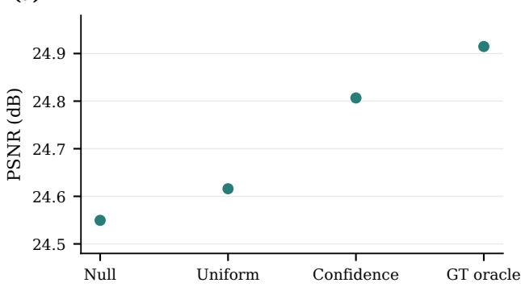

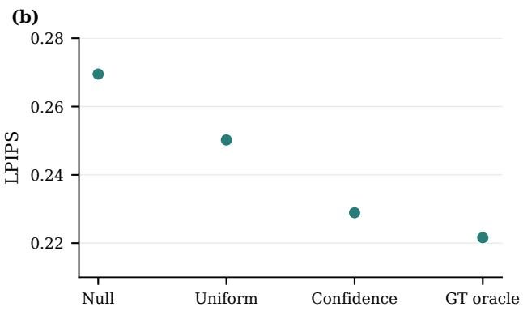

(c)  
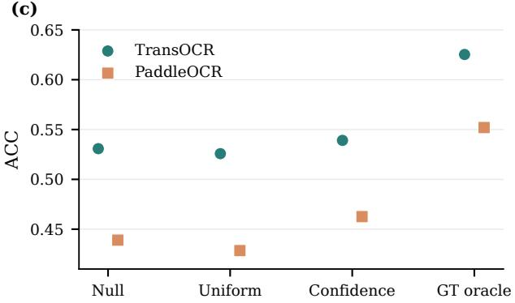

(d)  
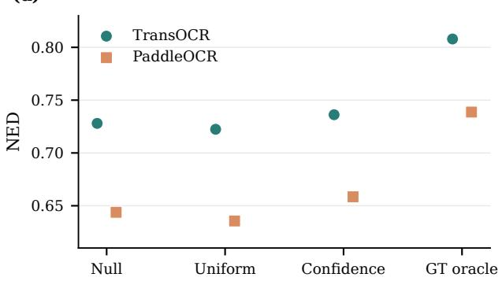  
Figure S3: Text-prior controls with null (N), uniform (U), predicted (C), and ground-truth oracle (GT) conditions.

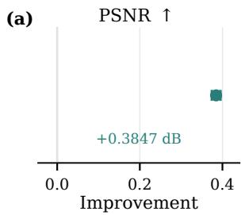

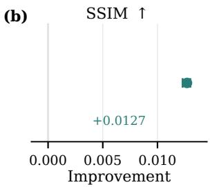

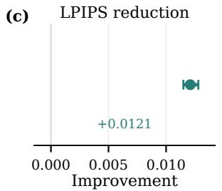

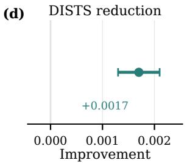

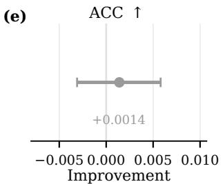

(f)  
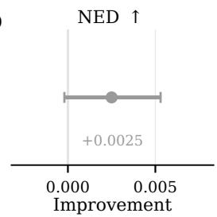  
Figure S4: Paired LRC efects over LoRA-only with 95% CIs.