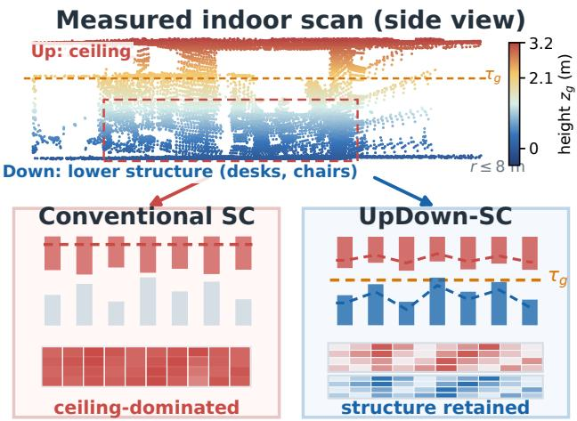
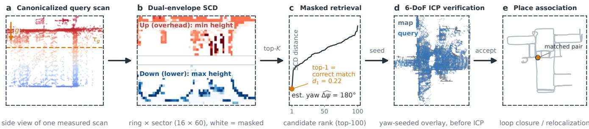
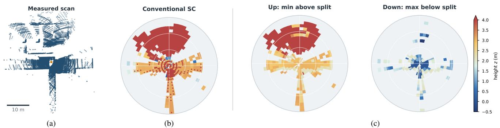
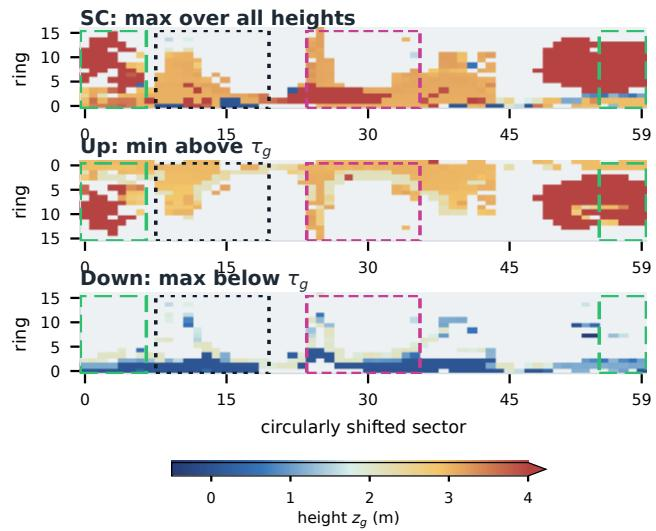
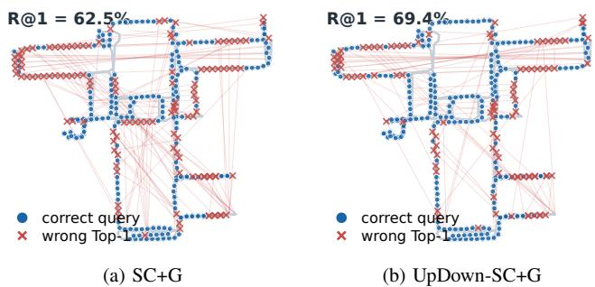
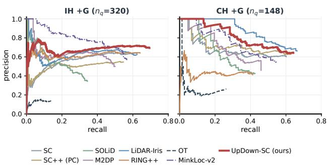
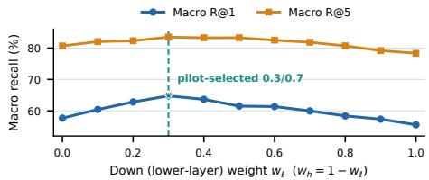
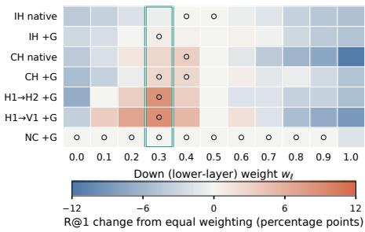

# UpDown-SC: Gravity-Canonicalized Dual-Envelope Scan Context for Indoor LiDAR Place Recognition

Jie Xu, Yongxin Yang, Ziyi Jin, Kangjin Yu, Hongjun Huang, Chao Han, and Zhongpu Xia

Abstract— LiDAR place recognition is a key front end for loop closure and global relocalization, yet indoor retrieval remains dificult when attitude or sensor mounting height changes between mapping and query sessions. Scan Context stores the maximum height in each polar cell; indoors, broad ceilings can suppress the lower and mid-level geometry that distinguishes adjacent rooms and corridors. We present UpDown-SC, a training-free polar descriptor that first canonicalizes gravity and then represents two complementary surfaces: the upper envelope of lower/middle structures and the lower envelope of overhead structures. Their physical split is estimated once from a cell-balanced map height distribution and reused by every query. A mask-aware, non-uniform two-channel distance retains discriminative lower-level evidence while limiting sensitivity to its cross-session variation, without treating unobserved cells as zero-height measurements. Conventional Scan Context shortlisting and circular yaw alignment are retained, so retrieved hypotheses directly initialize geometric verification. Experiments across repeated indoor sessions, mounting-height changes, mixed outdoor-to-indoor trajectories, and an outdoor transfer sequence show more reliable first-choice retrieval on the indoor and mounting-height-varied sessions. A paired test finds a significant gain over Scan Context on the in-house sessions. UpDown-SC also gives the best or second-best F1max and AUPR under threshold-based acceptance while retaining a lightweight CPU front end. Continuous replay confirms that the retrieved hypotheses support metric prior-map localization. Code and evaluation artifacts: https://github.com/ jiejie567/updown-sc.

## I. INTRODUCTION

LiDAR place recognition (LPR) associates a current observation with a previously mapped place, supplying loop closures or global pose hypotheses to a localization back end. In indoor service robotics, a map is often reused after the sensor is remounted or its motion changes, so queries at the same place can difer in mounting height, body occlusion, roll, or pitch.

Scan Context (SC) provides an eficient and trainingfree solution by partitioning an egocentric point cloud into polar ring–sector cells and storing the maximum height in each cell [1]. Its circular sector search naturally handles heading changes and returns a yaw estimate. The maximum operator that works well in outdoor streets can become less informative indoors: a ceiling may occupy many cells and repeatedly become their maximum, suppressing the shelves, door frames, partitions, and furniture below it. The resulting descriptor is stable but insuficiently distinctive, especially along corridors with similar ceiling geometry. SC also assumes that roll and pitch are mild, an assumption stated explicitly by subsequent SC variants [2].

  
Fig. 1. Why maximum-height SC loses indoor structure. Top: a gravitycanonicalized side view of one measured 0.1-s indoor query, colored by height. The dashed line marks the map split τg; the display omits far and above-ceiling returns. Where lower and overhead structure share a polar cell, SC keeps only the upper maximum. UpDown-SC keeps both envelopes. Lower panels are schematics, not measured performance.

Mounting variation adds a second dificulty: a sensorframe height split moves relative to the scene when the LiDAR is remounted, and roll and pitch mix vertical and horizontal structure. We therefore use gravity and a measured descriptor-origin height to express vertical structure consistently across acquisitions, and estimate the physical split from the map instead of tuning an environment-specific threshold.

We address these issues with UpDown-SC, a gravitycanonicalized dual-envelope extension of SC. Each deskewed frame is restored to the descriptor-origin body frame and leveled while yaw remains free, with the measured descriptororigin height expressing returns relative to the ground. A constrained, cell-balanced Otsu criterion selects one maplevel split that is stored with the database and reused for queries. Each polar cell records the highest return below this split and the lowest return above it, preventing overhead structure from overwriting lower geometry. A masked, fixed non-uniform distance retains the more variable lower channel while weighting the typically more persistent upper channel when retrieving place and yaw hypotheses.

The contributions of this work are threefold:

• We introduce a dual-envelope polar descriptor and mask-aware non-uniform matcher that preserve both lower/middle and overhead surfaces while limiting the

LIO deskew + inertial gravity → gravity canonicalization (roll/pitch removed, yaw free); shared map/query front end

  
Fig. 2. End-to-end pipeline on one measured IH query from the 2 m evaluation. The shared map/query front end canonicalizes gravity and builds the dual-envelope SCD. Mask-aware retrieval returns ranked place and yaw hypotheses (here $\widehat { \Delta \psi } = \bar { 1 8 0 ^ { \circ } } )$ , and point-to-map ICP verifies each 6-DoF seed. dPanel (d) overlays the query on the retrieved keyframe using only the descriptor seed, before ICP. Retrieval metrics are measured before ICP.

influence of cross-session changes in the lower layer.

• We construct a practical shared map/query front end for this descriptor. Independent gravity canonicalization removes roll/pitch disagreement while retaining free yaw, and a measured descriptor-origin height expresses returns in a common ground-relative frame. A constrained, cell-balanced adaptive split is estimated once from the map and reused by every query, removing perenvironment threshold tuning and reducing to singlelayer SC when vertical separation is unsupported.

• We validate the implemented pipeline through controlled ablations, retrieval comparisons with paired significance tests and precision-oriented acceptance metrics, measured point-cloud cases, and continuous replay across indoor, mixed outdoor/indoor, mounting-height, and outdoor sequences. The implementation, descriptors, query clouds, and evaluation protocols accompany this preprint.

## II. RELATED WORK

## A. Global LiDAR Descriptors

Handcrafted global descriptors remain attractive for onboard LPR because they require neither training data nor a GPU. M2DP summarizes multiple point-cloud projections [3]. SC uses a polar maximum-height image whose column shifts represent yaw [1]; SC++ adds lateral-shifttolerant variants [2]. FreSCo moves SC matching to the frequency domain [4], LiDAR Iris forms a binary polar signature [5], and SOLiD reorganizes range, azimuth, and elevation for restricted fields of view [6]. Contour Context encodes abstract structural contours [7], and RING++ derives a roto-translation-invariant representation with a planar pose estimate [8]. None of these prevents an indoor overhead surface from replacing lower structures in the same SC cell; UpDown-SC retains the eficient polar organization while making this vertical competition explicit.

## B. Geometric and Cross-Platform Recognition

Geometric methods use transform-invariant local constellations. STD hashes triangles formed from stable keypoints [9], and BTC augments triangle geometry with local binary descriptions [10]. Beyond pure geometry, textual cues read from signage can disambiguate repetitive indoor scenes [11]; UpDown-SC stays geometry-only. Multi-session systems can instead exploit normal-vector consistency during map alignment [12]; our focus is the retrieval front end before such optimization.

Learned global descriptors include point-set aggregation in PointNetVLAD [13], sparse-voxel features in MinkLoc3Dv2 (MinkLoc-v2) [14], range-image learning in OverlapNet [15], and the yaw-invariant OverlapTransformer (OT) [16]. UpDown-SC is training-free; our mounting-height experiments use the same LiDAR model to isolate vertical geometric mismatch rather than beam-pattern changes.

## III. METHOD

## A. Problem Formulation and Overview

Let a motion-compensated query frame be $\mathcal { P } ^ { q } = \{ \mathbf { p } _ { n } ^ { q } \} _ { n = 1 } ^ { N _ { q } }$ expressed at its reference time in the descriptor-origin body frame. Its inertial estimate supplies a gravity vector $\hat { \mathbf { g } } ^ { q }$ in that frame. A map database contains keyframe scans $\mathcal { P } ^ { m }$ and their poses $\mathbf { T } _ { m } ^ { w } \in S E ( 3 )$ . For a query, the desired front-end output is a ranked list

$$
\mathcal { V } ^ { q } = \left\{ \left( m _ { k } , \{ \left( d _ { k \ell } , \Delta \psi _ { k \ell } \right) \} _ { \ell = 1 } ^ { L _ { k } } \right) \right\} _ { k = 1 } ^ { K _ { q } } , \quad L _ { k } \le 3 ,\tag{1}
$$

where $m _ { k }$ is a database keyframe and each pair contains a descriptor distance and sector-shift yaw hypothesis; candidates are ranked by $d _ { k } = \operatorname* { m i n } _ { \ell } d _ { k \ell } .$ A geometric verifier then refines the corresponding pose seeds.

Fig. 2 summarizes the complete online chain. The LIO front end deskews one scan and supplies its inertial gravity estimate. Gravity canonicalization removes roll and pitch while retaining free yaw, and the dual-envelope descriptor queries a keyframe database for ranked place and yaw hypotheses. Each forms a gravity-consistent 6-DoF seed for point-to-map ICP. Only a registration that passes overlap, fitness, and convergence checks confirms the retrieved place and supplies a geometric constraint to the loop-closure or global-relocalization back end. Fig. 1 highlights the indoor information loss addressed by the dual envelope.

## B. Gravity Canonicalization

We use one LiDAR frame and deskew every return to its reference timestamp using LiDAR-inertial odometry [17], restoring points transformed to the IMU frame for deskewing back to the descriptor-origin body frame before descriptor construction. Let the measured up direction be $\hat { \mathbf { u } } = - \hat { \mathbf { g } } / \| \hat { \mathbf { g } } \|$ We compute the minimum rotation $\mathbf { R } _ { G  B } \ \in \ S O ( 3 )$ that maps uˆ to $\mathbf { e } _ { z } = [ 0 , 0 , 1 ] ^ { \top }$ . Because ${ \bf p } _ { n }$ is already descriptororigin centered, its canonical coordinate is

  
Fig. 3. One measured query shown at a common gravity-canonicalized reference. (a) White-background top view with a display-only crop of sparse range-boundary returns; all valid points still enter the descriptor, and the orange marker is its origin. (b) Conventional SC is dominated by overhead maxima in 431 of 467 occupied cells; 197 of these cells also contain lower/middle returns. (c) Up retains the overhead layer and Down separately retains the lower/middle layer. Descriptor heights share a color scale capped at 4.0 m, with the triangular tip denoting larger values.

$$
\tilde { { \bf p } } _ { n } = { \bf R } _ { G  B } { \bf p } _ { n } ,\tag{2}
$$

where B and G denote the body and gravity-canonical frames. This operation fixes the vertical axis without choosing a horizontal heading, so rotations about gravity remain circular shifts of the descriptor sectors, preserving SC’s eficient yaw search. Map and query scans are leveled independently, so their roll and pitch need not be known relative to one another.

Gravity canonicalization assumes that the inertial gravity estimate is suficiently accurate at the scan reference time; sustained acceleration and residual deskew error remain failure modes discussed in Sec. VI.

## C. Map-Adaptive Dual-Envelope Scan Context

For each canonicalized point $\tilde { \mathbf { p } } = ( x , y , z )$ , define range $r = \sqrt { x ^ { 2 } + y ^ { 2 } }$ and azimuth $\theta = \mathtt { a t a n 2 } ( y , x )$ . The disk $r \leq$ $r _ { \mathrm { m a x } }$ is divided into $N _ { r }$ rings and $N _ { s }$ sectors. Let $\mathcal { C } _ { i j }$ denote the points in ring i and sector j. If platform a has descriptororigin height $h _ { a } ,$ each point is first expressed by its groundrelative height

$$
z _ { g } = z + h _ { a } .\tag{3}
$$

The height $h _ { a }$ is a once-measured platform quantity, not a per-frame fitted ground plane. To avoid tuning the lower/overhead boundary for each environment, we estimate one physical split $\tau _ { g }$ from all map keyframes. Heights are quantized into a histogram in which each polar cell casts at most one vote per occupied height bin, preventing dense surfaces and LiDAR sampling patterns from dominating. Among thresholds in $[ \tau _ { \operatorname* { m i n } } , \tau _ { \operatorname* { m a x } } ]$ for which both partitions contain at least $\rho _ { \mathrm { m i n } }$ of the votes, we select the constrained Otsu optimum

$$
\tau _ { g } = \arg \operatorname* { m a x } _ { \tau } \ \omega _ { \ell } ( \tau ) \omega _ { h } ( \tau ) \left[ \mu _ { \ell } ( \tau ) - \mu _ { h } ( \tau ) \right] ^ { 2 } .\tag{4}
$$

Here $\omega _ { \ell , h }$ are the normalized vote fractions and $\mu _ { \ell , h }$ their weighted mean heights. Equal-score plateaus use their midpoint, and $\tau _ { g }$ is frozen in the map database so queries reuse the map’s definition. Both classification and stored values use $z _ { g } .$

$$
E _ { i j } ^ { \downarrow } = \operatorname* { m a x } _ { { \tilde { \mathbf { p } } } \in \mathcal { C } _ { i j } , z _ { g } \leq \tau _ { g } } z _ { g } ,\tag{5}
$$

$$
E _ { i j } ^ { \uparrow } = \operatorname* { m i n } _ { { \tilde { \mathbf { p } } } \in \mathcal { C } _ { i j } , z _ { g } > \tau _ { g } } z _ { g } .\tag{6}
$$

Each extremum is used only when its corresponding mask below is one; hence an empty maximization or minimization never enters matching. Here $^ { \mathsf { \bullet } } \mathrm { U p } ^ { \mathsf { \bullet } }$ and “Down” name the physical height layers, not the surface-normal directions: Up is the upper/overhead layer and stores its downward-facing minimum, whereas Down is the lower/middle layer and stores its upward-facing maximum. We store one validity bit per cell and channel:

$$
\begin{array} { r } { M _ { i j } ^ { \downarrow } = \mathbb { I } [ \exists \tilde { \mathbf { p } } \in \mathcal { C } _ { i j } : z _ { g } \leq \tau _ { g } ] , } \\ { M _ { i j } ^ { \uparrow } = \mathbb { I } [ \exists \tilde { \mathbf { p } } \in \mathcal { C } _ { i j } : z _ { g } > \tau _ { g } ] . } \end{array}\tag{7}
$$

An invalid cell is missing data rather than a zero-height measurement. If the map lacks enough support for two admissible height groups, descriptor construction reduces to single-layer SC. In a mixed trajectory, a jointly absent upper channel is ignored only when at most 5% of at least three map keyframes within 10 m contain upper observations.

The two envelopes resolve a specific loss of information in maximum-height SC. If a cell contains a shelf edge and a ceiling return, conventional SC retains only the ceiling. Equations (5)–(6) retain both the shelf’s highest visible surface and the ceiling’s lowest visible surface, so the Up channel preserves the overhead structure represented by conventional SC while the Down channel prevents it from overwriting lower geometry. In the measured query of Fig. 3, overhead returns set 431 of 467 occupied cells, 197 of which also contain lower/middle returns that conventional SC discards.

Fig. 4 expands the same scan into rectangular SC-style feature maps. This separates two efects that are dificult to see in the polar rendering: taking the minimum above the split preserves broad overhead support while exposing underside-height variation, and taking the maximum below the split restores the lower/middle pattern hidden by SC’s full-height maximum.

  
Fig. 4. Rectangular SC-style feature maps of the same query as ${ \mathrm { F i g . ~ } } 3 ,$ sharing one 16 60 grid, color scale, and circular shift (Up drawn with near rings at the top, as in Fig. 2). Up retains $\mathrm { { s c } \mathrm { { \ ' } } _ { \mathrm { { s } } } }$ overhead support (431 cells, $9 \hat { 2 } . 3 \% ) ;$ Down restores all 197 lower/middle observations hidden by SC’s full-height maximum. Data-selected 12-sector windows mark three advantages: magenta, the densest mixed-cell region (59 cells); green dashed, 49 overhead cells whose stored maximum and visible underside difer by a median 2.2 m (kept only by Up); black dotted, lower structure spreading 0.90 m where overhead pins SC’s spread to 0.35 m. No value is interpolated or edited.

The extrema are taken over the voxel-downsampled scan, whose centroids control point density while preserving a clear max/min envelope interpretation.

## D. Non-Uniform Dual-Channel Matching

The stored descriptor retains valid ground-relative heights, and an explicit mask distinguishes a genuine near-zero height from missing data. Write $\bar { \mathbf { e } } _ { i } ^ { c , a } = \mathbf { E } _ { : , i } ^ { c , a }$ for column j of scan $a \in \{ q , m \}$ . We define [shift $( { \bf v } ) \big ] _ { j } ^ { \cdot } \ = \ v _ { ( j - s ) }$ mod $N _ { s }$ ; thus query sector j is compared with map sector $j - s$ . Their joint mask is $\mathbf { m } _ { j } ^ { c } ( s ) = \mathbf { M } _ { : , j } ^ { c , \bar { q } } { \odot } \mathbf { M } _ { : , j - s } ^ { c , m }$ for $c \in \{ \uparrow , \downarrow \}$ . A small ofset $b ,$ used only on valid entries in retrieval, conditions nearground cosine vectors without changing the stored SCD:

$$
\bar { \mathbf { e } } _ { j } ^ { c , q } ( s ) = \mathbf { m } _ { j } ^ { c } ( s ) \odot ( \mathbf { e } _ { j } ^ { c , q } + b \mathbf { 1 } ) , \ \bar { \mathbf { e } } _ { j - s } ^ { c , m } ( s ) = \mathbf { m } _ { j } ^ { c } ( s ) \odot ( \mathbf { e } _ { j - s } ^ { c , m } + b \mathbf { 1 } ) ,\tag{8}
$$

so only jointly observed rings enter the height cosine and absent cells remain masked. To prevent a small coincident subset from producing a spuriously high cosine, we also measure the normalized overlap of the two binary masks,

$$
\gamma _ { j } ^ { c } ( s ) = \frac { \Vert \mathbf { m } _ { j } ^ { c } ( s ) \Vert _ { 0 } } { \sqrt { \Vert \mathbf { M } _ { : , j } ^ { c , q } \Vert _ { 0 } \Vert \mathbf { M } _ { : , j - s } ^ { c , m } \Vert _ { 0 } } } .\tag{9}
$$

Equation (9) is evaluated only for $j \in \mathcal { T } _ { c } ( s )$ . The coeficient equals one for identical valid-ring support and decreases when only a subset overlaps. With $n _ { \mathrm { m i n } } ~ = ~ 2$ , let $\mathcal { Q } _ { c } ~ =$ $\{ j : \| \mathbf { M } _ { : , j } ^ { c , q } \| _ { 0 } \geq n _ { \operatorname* { m i n } } \} , \mathcal { C } _ { c } ( s ) = \{ j : \| \mathbf { M } _ { : , j - s } ^ { c , m } \| _ { 0 } \geq n _ { \operatorname* { m i n } } \} .$

and $\mathcal { T } _ { c } ( s ) = \{ j : \| \mathbf { m } _ { i } ^ { c } ( s ) \| _ { 0 } \geq n _ { \operatorname* { m i n } } \}$ . Columns with either cosine norm below a numerical tolerance are also excluded from $\mathcal { I } _ { c } ( s )$ . For a comparable channel $( | \mathcal { T } _ { c } ( s ) | > 0 )$ , the sector-support coeficient

$$
\eta _ { c } ( s ) = \frac { \left| \mathcal { T } _ { c } ( s ) \right| } { \sqrt { \left| \mathcal { Q } _ { c } \right| \left| \mathcal { C } _ { c } ( s ) \right| } }\tag{10}
$$

measures the agreement of the supported-sector masks; its denominator is then nonzero. Because $\gamma _ { j } ^ { c }$ already penalizes missing support at the ring level, we apply the square root of $\eta _ { c }$ to avoid counting partial visibility twice while still suppressing candidates supported by only a few accidental sectors. The channel distance is

$$
\delta _ { c } ( s ) = 1 - \frac { \sqrt { \eta _ { c } ( s ) } } { | \mathcal { I } _ { c } ( s ) | } \sum _ { j \in \mathcal { I } _ { c } ( s ) } \gamma _ { j } ^ { c } ( s ) \frac { \langle \bar { \mathbf { e } } _ { j } ^ { c , q } ( s ) , \bar { \mathbf { e } } _ { j - s } ^ { c , m } ( s ) \rangle } { \| \bar { \mathbf { e } } _ { j } ^ { c , q } ( s ) \| _ { 2 } \| \bar { \mathbf { e } } _ { j - s } ^ { c , m } ( s ) \| _ { 2 } } ,\tag{11}
$$

where shifts wrap modulo $N _ { s } . \mathrm { ~ A ~ }$ jointly absent Down channel is omittable; a jointly absent Up channel is omittable only under the locally overhead-sparse rule above. Let $\boldsymbol { \mathcal { A } } ( \boldsymbol { s } )$ contain the comparable channels. If any positive-weight channel is neither comparable nor omittable, we set $d ( s ) = 1$ otherwise

$$
d ( s ) = \frac { \sum _ { c \in A ( s ) } w _ { c } \delta _ { c } ( s ) } { \sum _ { c \in A ( s ) } w _ { c } } , \quad ( w _ { \downarrow } , w _ { \uparrow } ) = ( w _ { \ell } , w _ { h } ) .\tag{12}
$$

If $\boldsymbol { \mathcal { A } } ( \boldsymbol { s } ) = \boldsymbol { \mathcal { O } }$ , the shift is discarded. Thus omitted channels are removed from both the sum and its weight normalization.

The lower/middle channel is often more discriminative but is also more exposed to people, chairs, carts, and open doors. We therefore select $( w _ { \ell } , w _ { h } ) = ( 0 . 3 , 0 . 7 )$ on the IH+G pilot and freeze it for every other dataset. This bounded robustness choice is not a dynamic-object model, and lower structures remain in the descriptor.

As in SC, a compact ring key shortlists K map entries. It aggregates masked sectors from both channels and remains yaw invariant because the sector index is removed. For each entry, a sector-key comparison over all circular shifts gives a coarse alignment, and the full dual-envelope distance is evaluated only in released SC’s local 10% window: seven shifts for $N _ { s } = 6 0$

## E. Yaw Estimation

We preserve the conventional SC decision order. Let ${ \bf k } ^ { q }$ and $\mathbf { k } ^ { m }$ denote the query and map sector keys. For each shortlisted map entry, define

$$
\begin{array} { r l } & { e _ { k } ( s ) = \left\| \mathbf { k } ^ { q } - \mathrm { s h i f t } _ { s } ( \mathbf { k } ^ { m } ) \right\| _ { 2 } , } \\ & { \qquad \bar { s } = \underset { s \in \{ 0 , \dots , N _ { s } - 1 \} } { \arg \operatorname* { m i n } } e _ { k } ( s ) , \quad r = \mathrm { r o u n d } ( 0 . 0 5 N _ { s } ) , } \\ & { \qquad S ( \bar { s } ) = \{ \bar { s } - r , \dots , \bar { s } + r \} . } \end{array}\tag{13}
$$

where indices wrap modulo $N _ { s }$ . We evaluate $d ( s )$ for $s \in$ $S ( \bar { s } )$ and retain the best three, preferentially separated, yaw hypotheses. For any retained $s ^ { * }$ , the descriptor sector shift is

$$
\widehat { \Delta \psi } = \frac { 2 \pi s ^ { * } } { N _ { s } } .\tag{14}
$$

## F. 6-DoF Verification and Complexity

For candidate m in the gravity-aligned map frame w, let $\psi _ { m } ^ { G }$ be its stored canonical heading and let $\mathbf { R } _ { G  B } ^ { q }$ rotate the query body frame into its gravity-canonical frame. The descriptor does not infer roll and pitch from height values; the measured gravity direction constrains them, while Eq. (14) estimates the remaining heading ofset. Together with the candidate translation $\mathbf { t } _ { m } ^ { w } .$ , these terms form the complete initialization

$$
\widehat { \mathbf { R } } _ { w \longleftarrow B } ^ { q } = \mathbf { R } _ { z } \left( \psi _ { m } ^ { G } - \widehat { \Delta \psi } \right) \mathbf { R } _ { G \longleftarrow B } ^ { q } , \qquad \widehat { \mathbf { t } } _ { w \longleftarrow B } ^ { q } = \mathbf { t } _ { m } ^ { w } .\tag{15}
$$

No descriptor-derived vertical correction is applied; ICP thus starts from a gravity-consistent 6-DoF pose rather than searching attitude from scratch. Point-to-map ICP then refines all six degrees of freedom and rejects candidates that fail overlap, fitness, or convergence checks; the retrieval benchmarks score descriptor rankings before ICP.

Envelope construction is linear in the scan point count. A compact float-and-bitset representation of $2 N _ { r } N _ { s }$ values and two masks requires ≈7.9 kB per keyframe at 16 × 60; database memory and ring-key shortlisting therefore scale linearly in keyframe count, as in SC. After ring-key retrieval, yaw matching has the conventional SC circularshift cost. The runtime experiment reports query descriptor construction and database matching/ranking separately from geometric verification.

## IV. EVALUATION PROTOCOL

## A. Datasets

The in-house (IH) two-session pilot uses front and rear MID-360 units, calibrated into a common body frame and fused into the single observation consumed by FAST-LIO and every descriptor. A loop-corrected mapping bag supplies 376 database keyframes; a separately recorded localization bag supplies 322 query keyframes, of which 320 have a database keyframe within the predeclared 2 m positive radius. Query positions come from an independent prior-map localization replay (pseudo-reference positions, not survey ground truth).

We evaluate public cross-sequence transfer on the RTK-SLAM Construction Hall data [18]1. Both MID-360 traversals begin and end outdoors and pass through the GNSSdegraded hall interior (0.48 km and 0.39 km routes); Sequence 1 forms the map/database and Sequence 2 supplies queries. The shared experimental 2 m sampling below yields 189 map keyframes and 148 single-frame queries. We align each FAST-LIO trajectory to a metric frame using valid GNSS segments and count a retrieval as correct when any returned map keyframe is within 5 m of the query; all 148 queries have map overlap under this rule, and this trajectorylevel protocol complements the dataset’s sparse surveyed control points.

The indoor mounting-height deployment uses one handcarried run (H1) as the map and independently recorded hand-carried (H2) and vehicle-mounted (V1) runs as queries.

All use the same MID-360, so the comparison isolates session, occlusion, attitude, and mounting height from beampattern variation.

For public indoor transfer with surveyed per-frame truth, we use the M2DGR hall sequences [19] (VLP-32C ground robot): hall\_04 forms the 33-keyframe map and cross-day hall\_02 supplies 28 eligible queries. Sessions align to their Leica MS60 tracks by jointly estimated truth clock ofsets and prism lever arm (4.4/4.9 cm RMSE); the two days station frames are registered by wall-point ICP (10.3 cm median); measured origin heights are 0.79/0.80 m.

For outdoor generalization, we use the OS0-128 Quad-Easy traversal from the Newer College extension [20]: its first temporal half forms the map, the second half supplies queries, and the same 2 m sampling produces 59 map keyframes and 60 queries, all with a map keyframe within the 5 m correctness radius under the published ground truth.

## B. Sampling and Metrics

For all retrieval experiments, a new experimental keyframe is selected after 2 m of 3-D translation (first frame retained); time and yaw triggers are disabled only for this evaluation. Each query is one deskewed frame (nominally 0.1 s). IH, the indoor deployment, and M2DGR use a 2 m positive radius; CH and Newer College use 5 m, matching CH’s trajectorylevel GNSS reference. We report Recall@1/@5 before geometric verification; failed descriptors and empty candidate sets count as failures. Because query counts are limited, we quantify uncertainty with Wilson 95% intervals for Recall@1 (half-widths ≈ ±5 points on IH, ±8 on CH, and ±12 on the 57–58-query deployments) and paired McNemar exact tests on shared queries. Sweeping an acceptance threshold over each query’s top-1 confidence yields precision–recall curves, F1max, and AUPR. Runtime covers query construction and retrieval/ranking from a preloaded database, excluding I/O, map construction, and ICP.

## V. EXPERIMENTS

## A. Baselines and Fairness

Table I lists the core descriptor and retrieval settings. We compare SC [1], SC++ [2], SOLiD [6], M2DP [3], LiDAR Iris [5], RING++ [8], and BTC [10]. OT and MinkLocv2 use the oficial KITTI- and Oxford-trained checkpoints, respectively, without fine-tuning. Every native single-frame baseline receives the same deskewed body-frame cloud and spatial crop; the explicitly labeled $\mathrm { \ddot { \Omega } + G \dot { \Omega } } ^ { \mathrm { , } \mathrm { , } }$ diagnostic additionally receives our gravity canonicalization, isolating the shared front end. BTC retains its native accumulated-input protocol and is marked separately. STD [9], evaluated under the same accumulated protocol, retrieved near-zero indoor recall (2.2/7.7% on IH, 0.7/0.7% on CH), so BTC represents the keypoint-triangle family in Table II.

## B. Cross-Session Place Retrieval

Table II compares the in-house pilot (IH), the public mixed outdoor-to-indoor Construction Hall (CH) sequence, and two mounting-height deployments, with Newer College (NC) as an outdoor transfer check. IH contains 376 map keyframes and 320 eligible queries; CH contains 189 and 148. IH is already ground-referenced and uses h = 0, while CH ground audits give $h = 1 . 3$ m for both traversals. The adaptive map splits are 2.1 m (IH), 4.0 m (CH), and 2.4 m (H1), and each query reads the split stored in its map database. BTC uses the current scan and nine causal predecessors registered into its current frame; excluding incomplete prefixes leaves 319 IH, 139 CH, and 59 NC queries. Bold and underline denote the best and second-best single-frame values in each column. Latency is measured on an Intel Core Ultra 5 225H using 92 preloaded queries against the 2,574-keyframe production IH prior-map database held in memory.

TABLE I  
CORE DESCRIPTOR AND RETRIEVAL SETTINGS.
<table><tr><td>Parameter</td><td>Value</td></tr><tr><td>Descriptor construction</td><td></td></tr><tr><td>Rings / sectors</td><td>16 / 60</td></tr><tr><td>Maximum radius</td><td>30 m</td></tr><tr><td>Voxel size</td><td>0.25 m</td></tr><tr><td>Adaptive split range / bin</td><td>[1.5, 4.5] m / 0.1 m</td></tr><tr><td>Adaptive split: support / map keyframes</td><td>5% /  20</td></tr><tr><td>Descriptor retrieval</td><td></td></tr><tr><td>Retrieval-only offset b</td><td>0.1 m</td></tr><tr><td>Minimum joint rings nmin</td><td>2</td></tr><tr><td>Sector-support exponent</td><td> $1 / 2$ </td></tr><tr><td>Down/Up weights  $( w _ { \ell } , w _ { h } )$ </td><td> $( \dot { 0 } . 3 , 0 . 7 )$ </td></tr><tr><td>Ring-key shortlist K</td><td>100</td></tr><tr><td>Retained yaw hypotheses</td><td>3</td></tr></table>

SC, SC++ (PC), SOLiD, and M2DP use audited formulaequivalent CPU implementations (the SOLiD port matches the oficial descriptor to a maximum absolute error of 3.8 × $1 0 ^ { - 6 }$ on a sample scan); LiDAR Iris and BTC use oficial C++ cores with dataset adapters; OT uses the oficial 64×900 spherical projection and released PNG-to-uint8 input conversion; MinkLoc-v2 uses its PointNetVLAD centroid/meanradius normalization, including the global coordinate-sign convention, and sparse-voxel model; both retrieve by 256- D L2 distance. UpDown-SC calls the production C++ implementation. All baseline adapters and configurations are included in the release. †M2DP follows its released MAT-LAB formula. ⋆RING++ is a faithful CPU port (runtime not representative of its CUDA extension). §OT: KITTI checkpoint; ¶MinkLoc-v2: Oxford-only baseline checkpoint; both are zero-shot. ‡BTC is an accumulated-input competitor; its complete causal ten-scan windows use the common crop, incomplete prefixes are excluded, and the NC cell uses 59 windows. Failures and empty candidate sets remain in every aggregate; BTC’s causal ten-scan windows were not constructed for M2DGR.

UpDown-SC gives the best IH Recall@1, 5.3 points above gravity-aligned RING++, while RING++ leads IH Recall@5 by 0.9 points. Under McNemar’s exact test on the shared queries, the first-choice gain over SC+G is significant $( p =$ 0.002), whereas the margin over RING++ is consistent across both IH protocols but not individually significant $( p = 0 . 0 5 3$ native, 0.15 +G). On CH, UpDown-SC ranks second at both cutofs behind LiDAR Iris. This complementary behavior suggests that RING++ favors candidate coverage under horizontal displacement, whereas the dual envelope improves first-choice discrimination. CH begins outdoors, crosses the hall, and returns outdoors, demonstrating operation across a mixed transition but not replacing an outdoor-only benchmark. In the indoor deployment, measured descriptor-origin heights of 1.6 m (H) and 0.8 m (V) express both platforms relative to the ground. UpDown-SC returns finite candidates for all queries, leads H1→H2 Recall@5, and ranks second on H1→V1; at these query counts the orderings among the leading methods lie within the interval half-widths and are indicative rather than individually significant. The retained top-1 yaw hypotheses are also accurate seeds: on IH+G, over the 222 correctly retrieved queries, the estimated heading deviates from the localization reference by $1 . 9 ^ { \circ }$ at the median and $6 . 5 ^ { \circ }$ at the 95th percentile, consistent with the $6 ^ { \circ }$ sector resolution; rare near-180◦ ambiguities in symmetric corridors are left to the geometric verifier. The single-hall M2DGR database saturates most methods; UpDown-SC stays competitive (92.9/100.0, within one query of SC+G) while transferring to a spinning 32-beam LiDAR with surveyed truth. This beam-pattern check is absent from the MID-360 experiments. MinkLoc-v2 exceeds OT on IH/CH and reaches 80.0/93.3 on NC, yet drops to 19.0–21.1 Recall@1 across indoor mounts despite per-cloud normalization; both learned baselines expose cross-domain and cross-mount limits without test-set fine-tuning.

  
Fig. 5. Top-1 retrievals for all 320 eligible IH queries (shared +G protocol): blue circles correct, red crosses failures linked to their selected keyframes, gray trajectories.

Unlike a selected recovery case, Fig. 5 uses all 320 IH queries. The reduction in first-choice failures is distributed over several repeated branches of the trajectory rather than being attributable to one visually favorable location.

A loop-closure front end must also reject wrong matches, so Fig. 6 sweeps an acceptance threshold over each method’s top-1 confidence. UpDown-SC traces the upper envelope on IH and is second behind LiDAR Iris on CH; without canonicalization it leads AUPR on both IH (0.477 vs. 0.370) and CH (0.374 vs. 0.354). Full four-condition curves accompany the release.

## C. Outdoor Generalization

The Newer College column evaluates the gravitycanonicalized front ends on an outdoor OS0-128 run.

TABLE II  
INDOOR AND OUTDOOR RETRIEVAL (R@1/R@5, %).
<table><tr><td>Method</td><td colspan="3">IH pilot  $( n _ { q } = 3 2 0 )$  CH public</td><td colspan="3"> $( n _ { q } = 1 4 8 )$  Indoor deployment (+G)</td><td colspan="3">M2DGR (+G) NC outdoor (+G) Query latency</td></tr><tr><td></td><td>Native</td><td>+G</td><td>Native</td><td>+G</td><td> $\mathrm { H 1 } {  } \mathrm { H 2 } \ ( n _ { q } = 5 8 )$ </td><td> ${ \mathrm { H 1 } } {  } { \mathrm { V 1 } } \ ( n _ { q } = 5 7 )$ </td><td> $n _ { q } = 2 8$ </td><td> $n _ { q } = 6 0$ </td><td>Median (ms) ↓</td></tr><tr><td>SC</td><td>59.1/74.1</td><td>62.5/79.4</td><td>51.4/66.9</td><td>60.1/82.4</td><td>39.7/67.2</td><td>47.4/78.9</td><td>96.4/96.4</td><td>98.3/100.0</td><td>3.6</td></tr><tr><td>SC++ (PC)</td><td>53.4/76.9</td><td>54.7/77.8</td><td>39.9/68.9</td><td>62.8/87.2</td><td>31.0/51.7</td><td>50.9/80.7</td><td>75.0/100.0</td><td>96.7/100.0</td><td>8.8</td></tr><tr><td>SOLiD</td><td>35.6/57.5</td><td>34.4/55.6</td><td>35.8/75.0</td><td>42.6/69.6</td><td>39.7/60.3</td><td>36.8/61.4</td><td>92.9/100.0</td><td>53.3/88.3</td><td>13.3</td></tr><tr><td>M2DP†</td><td>47.8/63.7</td><td>50.0/64.1</td><td>48.6/68.2</td><td>45.9/63.5</td><td>6.9/24.1</td><td>5.3/28.1</td><td>46.4/85.7</td><td>93.3/100.0</td><td>25.5</td></tr><tr><td>LiDAR Iris</td><td>58.1/72.2</td><td>61.9/76.2</td><td>42.6/67.6</td><td>66.2/91.2</td><td>44.8/69.0</td><td>61.4/86.0</td><td>85.7/92.9</td><td>95.0/100.0</td><td>515.2</td></tr><tr><td> $\mathrm { R I N G } { + + } ^ { \star }$ </td><td>62.2/88.8</td><td>64.1/87.8</td><td>34.5/56.8</td><td>41.2/73.0</td><td>31.0/67.2</td><td>26.3/59.6</td><td>85.7/100.0</td><td>100.0/100.0</td><td>4766.3</td></tr><tr><td>OT§</td><td>13.4/43.4</td><td>14.1/34.4</td><td>12.8/37.2</td><td>26.4/52.7</td><td>12.1/22.4</td><td>17.5/24.6</td><td>50.0/85.7</td><td>71.7/95.0</td><td>43.2</td></tr><tr><td> $\mathbf { M i n k L o c { - } v } 2 ^ { \dagger }$ </td><td>55.3/78.8</td><td>56.6/79.1 52.0/64.3</td><td>32.4/66.9</td><td>54.7/82.4</td><td>19.0/51.7</td><td>21.1/33.3</td><td>60.7/89.3</td><td>80.0/93.3</td><td>401.4</td></tr><tr><td>BTC (10 scans)‡</td><td>48.3/66.1</td><td>69.4/86.9</td><td>11.5/23.0 51.4/70.3</td><td>15.8/30.9</td><td>25.9/46.6 48.3/70.7</td><td>19.3/47.4 54.4/82.5</td><td></td><td>45.8/59.3</td><td>93.3 11.6</td></tr><tr><td colspan="10">UpDown-SC (ours) 69.1/86.9</td></tr></table>

UpDown-SC reaches 96.7/100.0% Recall@1/5, RING++ 100.0/100.0%, and SC 98.3/100.0%: the indoor-oriented dual envelope remains usable when overhead structure is intermittent, but this 60-query temporal split is a transfer check rather than evidence of outdoor superiority. Accumulated-input BTC reaches 45.8/59.3% on its 59 complete +G windows (52.5/61.0% without +G), showing that gravity canonicalization is not uniformly beneficial to every geometric descriptor.

## D. Continuous Prior-Map Localization

In a full Sequence 2 replay against the Sequence 1 prior map, the system first relocalizes in 371 ms and outputs 5,872 trusted poses without a localization-health warning; the trusted trajectory follows the independently GNSS-aligned reference with 0.155 m median, 0.308 m 95th-percentile, and 0.349 m maximum position error over the complete traversal. Because these metrics aggregate the outdoor and indoor portions, they demonstrate operation across a mixed transition rather than proving outdoor-only superiority.

## E. Indoor Mounting-Height Replay

We additionally map one indoor traversal acquired with the hand-carried setup and replay two independently recorded query traversals against that prior: a second hand-carried run and a vehicle-mounted run. The production prior contains 477 descriptors; the experiment-only 2 m sampling yields 64 map keyframes and 58/57 overlapping queries with localization-derived pseudo-reference positions (Table II). Both bags initialize from one 0.1 s scan, complete without a localization-health warning, and yield 1,609/1,715 trusted poses. These are two deployment cases rather than a statistically estimated success rate.

  
Fig. 6. Top-1 acceptance precision–recall under the shared gravitycanonicalized protocol. UpDown-SC attains the best F1max/AUPR on IH (0.696/0.475, vs. 0.643/0.398 for RING++) and the second-best on CH (0.644/0.530) behind LiDAR Iris (0.671/0.587) at roughly 40 its query latency. BTC lacks a comparable scalar confidence.

## F. Ablations and Sensitivity

Table II includes the completed gravity-front-end ablation. Gravity is not a generic score boost: for UpDown-SC, it changes IH Recall@1/5 by only +0.3/0.0 points, but improves mixed-attitude CH by +12.8/ + 16.9 points. The varying baseline responses in Table II show that canonicalization mainly protects height-structured descriptors when attitude varies.

To isolate channel weighting, we reuse the final descriptors and override only $( w _ { \ell } , w _ { h } )$ , leaving shortlist size, yaw search, masks, and radii unchanged. Fig. 7 reports the macroaverage and all seven condition-level responses. To avoid test-sequence tuning, the pair is selected on IH+G pilot Recall@1 and frozen elsewhere. Post hoc, the selected (0.3, 0.7) setting improves macro Recall@1 by 3.3 points over equal weighting, with its largest gains in the independent indoor replays (+8.6 and +8.8 points on H1→H2 and H1→V1), which are most exposed to session-dependent occlusion and lower-layer layout change. Both single-channel extremes are worse, confirming complementarity; the selected pair is a fixed global compromise, not a uniformly dominant setting.

The adaptive maps select $\tau _ { g } = 2 . 1 , 4 . 0 $ , and 2.4 m on IH, gravity-aligned CH, and H1, respectively. Against the fixed 2.5 m ablation, adaptation changes Recall@1 by at most +1.0 point and Recall@5 by −0.3 to +1.8 points over the four dual-envelope conditions (e.g., 68.4/87.2 to 69.4/86.9 on IH); its value is removing per-environment threshold selection rather than a uniform recall gain. Ground-normalized indoor descriptors provide 100% candidate coverage; under a ±0.1 m height-calibration perturbation, H1→V1 Recall@5 remains 80.7–84.2%.

## G. Runtime and Failure Cases

Table II reports the common in-memory front-end benchmark: UpDown-SC requires 11.6 ms at the median and 15.0 ms at the 95th percentile, and all 92 queries meet a

(a)  
  
(b)  
Fig. 7. Channel-weight sensitivity over 11 pairs. (a) Macro Recall@1/5; dashed: IH+G-pilot selection $( w _ { \ell } , w _ { h } ) = ( 0 . 3 , 0 . 7 )$ . (b) Recall@1 change from equal weighting for the seven Table II conditions; circles mark row maxima and the outline marks the selected pair.

10 Hz budget, excluding ICP. Failures arise from repetitive ceilings, glass, multi-level spaces, sparse overhead sampling, crowds, and excessive horizontal displacement.

## VI. DISCUSSION

Two envelopes suit scenes with distinctive but activitysensitive lower geometry and stable but repetitive overhead structure. Fixed weights bound lower-layer influence without removing dynamic objects; excessive overhead weight may worsen aliasing. Limitations include inertial gravity error, one measured origin height per platform, a global split missing local modes, large horizontal displacement, and extrema sensitive to height outliers. IH uses localizationderived pseudo-reference positions rather than survey ground truth, while the mounting-height study uses only one LiDAR model; M2DGR adds a cross-sensor retrieval check, not a mounting study.

## VII. CONCLUSION

We presented UpDown-SC, a training-free, gravitycanonicalized dual-envelope Scan Context. A cell-balanced map distribution determines the split; complementary envelopes preserve lower/middle and overhead structure; and masked non-uniform matching retains SC-style retrieval and yaw estimation. UpDown-SC gives the best first-choice and precision-oriented results on the in-house pilot, remains competitive on Construction Hall and M2DGR, and supports continuous prior-map localization. Heterogeneous-sensor invariance and explicit dynamic-object reasoning remain outside the present claim.

## ACKNOWLEDGMENT

Generative AI tools (OpenAI Codex, Anthropic Claude Code) assisted with editing, figures, and tooling; the authors verified all content.

[1] G. Kim and A. Kim, “Scan context: Egocentric spatial descriptor for place recognition within 3D point cloud map,” in Proc. IEEE/RSJ Int. Conf. Intell. Robots Syst. (IROS), 2018, pp. 4802–4809.

[2] G. Kim, S. Choi, and A. Kim, “Scan context++: Structural place recognition robust to rotation and lateral variations in urban environments,” IEEE Trans. Robot., vol. 38, no. 3, pp. 1856–1874, 2022.

[3] L. He, X. Wang, and H. Zhang, “M2DP: A novel 3D point cloud descriptor and its application in loop closure detection,” in Proc. IEEE/RSJ Int. Conf. Intell. Robots Syst. (IROS), 2016, pp. 231–237.

[4] Y. Fan, X. Du, L. Luo, and J. Shen, “FreSCo: Frequency-domain scan context for LiDAR-based place recognition with translation and rotation invariance,” in Proc. Int. Conf. Control, Autom., Robot. Vis. (ICARCV), 2022, pp. 576–583.

[5] Y. Wang, Z. Sun, C.-Z. Xu, S. E. Sarma, J. Yang, and H. Kong, “LiDAR iris for loop-closure detection,” in Proc. IEEE/RSJ Int. Conf. Intell. Robots Syst. (IROS), 2020, pp. 5769–5775.

[6] H. Kim, J. Choi, T. Sim, G. Kim, and Y. Cho, “Narrowing your FOV with SOLiD: Spatially organized and lightweight global descriptor for FOV-constrained LiDAR place recognition,” IEEE Robot. Autom. Lett., vol. 9, no. 11, pp. 9645–9652, 2024.

[7] B. Jiang and S. Shen, “Contour context: Abstract structural distribution for 3D LiDAR loop detection and metric pose estimation,” in Proc. IEEE Int. Conf. Robot. Autom. (ICRA), 2023, pp. 8386–8392.

[8] X. Xu, S. Lu, J. Wu, H. Lu, Q. Zhu, Y. Liao, R. Xiong, and Y. Wang, “RING++: Roto-translation invariant gram for global localization on a sparse scan map,” IEEE Trans. Robot., vol. 39, no. 6, pp. 4616–4635, 2023.

[9] C. Yuan, J. Lin, Z. Zou, X. Hong, and F. Zhang, “STD: Stable triangle descriptor for 3D place recognition,” in Proc. IEEE Int. Conf. Robot. Autom. (ICRA), 2023, pp. 1897–1903.

[10] C. Yuan, J. Lin, Z. Liu, H. Wei, X. Hong, and F. Zhang, “BTC: A binary and triangle combined descriptor for 3-D place recognition,” IEEE Trans. Robot., vol. 40, pp. 1580–1599, 2024.

[11] T. Jin, T.-M. Nguyen, X. Xu, Y. Yang, S. Yuan, J. Li, and L. Xie, “Robust loop closure by textual cues in challenging environments,” IEEE Robot. Autom. Lett., vol. 10, no. 1, pp. 812–819, 2025.

[12] Y. Ma, C. Zhao, J. Xu, Y. Li, X. Zhang, S. Yuan, and L. Xie, “NVMS-SLAM: Normal vector-based multi-session LiDAR SLAM in indoor environments,” IEEE Trans. Autom. Sci. Eng., vol. 23, pp. 8034–8045, 2026.

[13] M. A. Uy and G. H. Lee, “PointNetVLAD: Deep point cloud based retrieval for large-scale place recognition,” in Proc. IEEE Conf. Comput. Vis. Pattern Recognit. (CVPR), 2018, pp. 4470–4479.

[14] J. Komorowski, “Improving point cloud based place recognition with ranking-based loss and large batch training,” in Proc. 26th Int. Conf. Pattern Recognit. (ICPR), 2022, pp. 3699–3705.

[15] X. Chen, T. Läbe, A. Milioto, T. Röhling, O. Vysotska, A. Haag, J. Behley, and C. Stachniss, “OverlapNet: Loop closing for LiDARbased SLAM,” in Proc. Robot.: Sci. Syst. (RSS), 2020.

[16] J. Ma, J. Zhang, J. Xu, R. Ai, W. Gu, and X. Chen, “OverlapTransformer: An eficient and yaw-angle-invariant transformer network for LiDAR-based place recognition,” IEEE Robot. Autom. Lett., vol. 7, no. 3, pp. 6958–6965, 2022.

[17] W. Xu, Y. Cai, D. He, J. Lin, and F. Zhang, “FAST-LIO2: Fast direct LiDAR-inertial odometry,” IEEE Trans. Robot., vol. 38, no. 4, pp. 2053–2073, 2022.

[18] W. Zhang, V. Ress, D. Skuddis, U. Soergel, and N. Haala, “An RTK-SLAM dataset for absolute accuracy evaluation in GNSS-degraded environments,” arXiv preprint arXiv:2604.07151, 2026.

[19] J. Yin, A. Li, T. Li, W. Yu, and D. Zou, “M2DGR: A multi-sensor and multi-scenario SLAM dataset for ground robots,” IEEE Robot. Autom. Lett., vol. 7, no. 2, pp. 2266–2273, 2022.

[20] L. Zhang, M. Camurri, D. Wisth, and M. Fallon, “Multi-camera LiDAR inertial extension to the newer college dataset,” arXiv preprint arXiv:2112.08854, 2021.