# WILDHSR: METRIC FEED-FORWARD 4D PEOPLE-SCENERECONSTRUCTION FROM A 3D FOUNDATION MODEL

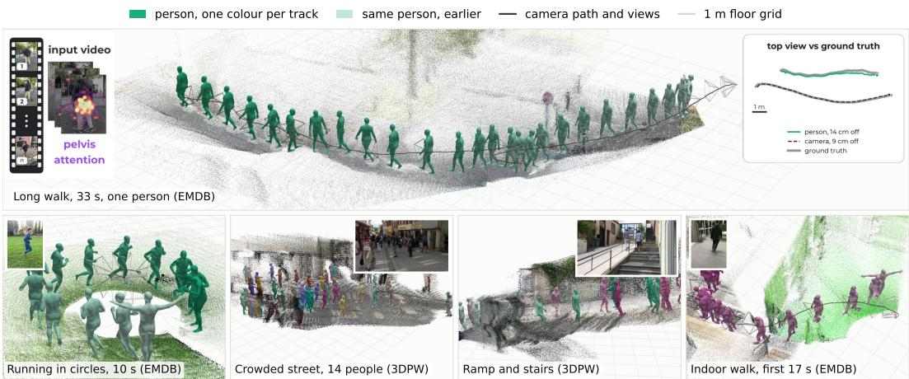  
Figure 1: Metric people, scene and camera from one moving camera. Each panel overlays persistent people, the person-free scene and the camera path on a 1 m grid. The large EMDB example spans 33 s; its insets show pelvis-token attention and a top view against ground truth after rigid rotation-and-translation alignment, preserving the predicted scale. The remaining clips cover cyclic motion, a 14-person street, stairs and an indoor walk. Inference receives a single monocular video.

## ABSTRACT

3D foundation models recover video cameras and geometry in one forward pass, but some of the strongest are up to scale. Joint people-scene reconstruction then requires two missing outputs: metric scale and persistent person identity. We ask whether one up-to-scale foundation representation can support both through lightweight adaptation. Exact metric labels are scarce, but unlabeled in-the-wild video is abundant. We use people in curated web video to initialise the solution: a posed metric body and 2D keypoints give an approximate, closed-form scale pseudo-label. These pseudo-labels pretrain a Scale Readout, which is then finetuned together with a lightweight adapter using exact metric supervision from standard real-video training splits. At inference the head predicts metric scale from foundation-model tokens, without the ruler or its teachers. For person identity, we probe the pretrained foundation model alone and find evidence that its intermediate query-key features encode person correspondence across frames. In most evaluated moving-person clips, a mid-layer token prefers that person over the vacated location and other people. A tiny projection reads this correspondence; together with metric pelvis motion and proposal confidence, it drives dustbinaware Sinkhorn association of per-frame bodies. WildHSR combines both readouts to reconstruct metric cameras, scene and people from monocular video. Each window is predicted feed-forward; analytic association and Sim(3) composition connect windows. On EMDB-2, WildHSR is the first feed-forward method in the published comparison to beat the best optimization-based WA-MPJPE and RTE while leading feed-forward methods on all three world-frame metrics. On RICH, it leads feed-forward people-and-scene methods on WA-MPJPE and W-MPJPE. The complete pipeline runs at 10.1 fps on one GPU.

## 1 INTRODUCTION

Reconstructing people together with their surroundings from monocular video requires bodies, cameras and scene geometry in one metric world. 3D foundation models now recover strong relative geometry and camera motion in a single forward pass (Wang et al., 2024a; 2025b;a; 2026), including video whose content moves (Zhang et al., 2025). Some learn metric output from metric supervision (Wang et al., 2025b; Keetha et al., 2026; Ma et al., 2026); some of the strongest reported camera estimates instead come from models whose output is up to scale (Wang et al., 2025a; 2026), and it is such a representation we study. Joint people-scene reconstruction then lacks two quantities. First, monocular geometry is ambiguous up to a global metric scale (Eigen et al., 2014), and an up-to-scale model normalises each window to an arbitrary unit. Second, its geometric output has no persistent person identity: it does not say which body in one frame is the same person later. Over time, independently scaled windows distort trajectories, while identity switches splice different people into one path.

The prevailing answer is to obtain both outside the up-to-scale representation: metric scale from a metric-native backbone (Chen et al., 2025b; Wang et al., 2025b), from metric depth priors (Wang et al., 2024b), or from synthetic metric supervision and a depth teacher (Li et al., 2026; Shi et al., 2026), and person identity from external detectors and trackers (Ye et al., 2023; Shin et al., 2024; Shen et al., 2024). These choices introduce separate models, supervision sources or sequenceprocessing stages. We ask whether one up-to-scale foundation representation can support both capabilities without an external scale network or separately trained tracker. Scale requires supervision. Person correspondence presents a different opportunity: 3D foundation models learn matching and geometric consistency across views, so their intermediate representations may retain correspondence even on moving people. Large vision models often encode structure beyond their explicit outputs: object segmentation emerges in the attention of self-supervised transformers (Caron et al., 2021), 3D structure can be probed out of image foundation models (El Banani et al., 2024), and the attention of a pairwise geometry model separates moving objects from the static scene with no training at all (Chen et al., 2025a). We therefore transfer automatic human-derived scale supervision into its scene tokens and test whether person correspondence can be read from its pretrained representation (Alain & Bengio, 2017).

Reading person correspondence from the representation. Reconstructing a body in each frame does not establish which bodies belong to the same person over time. Rather than importing a separate visual tracker, we ask whether the 3D backbone itself carries that correspondence. It learns geometric matching across views, yet moving people are excluded from its matching supervision (Wang et al., 2026). We probe the unmodified backbone before training an identity readout and find a correspondence signal on people in its intermediate query-key features. Figure 2 illustrates the finding: patches on each person in one frame preferentially match patches on that person later, forming same-person blocks. A retrieval probe validates the layer choice: intermediate query-key features retrieve the person even after motion, while early and late features are nearer chance. This identifies a useful layer for reading identity. A small projection extracts person features from the intermediate representation; metric pelvis motion and proposal confidence then help resolve ambiguous links through dustbin-aware analytic assignment. Thus the same 3D representation that supports people and scene reconstruction also supplies the correspondence cue for persistent tracks, without a separately trained visual tracker.

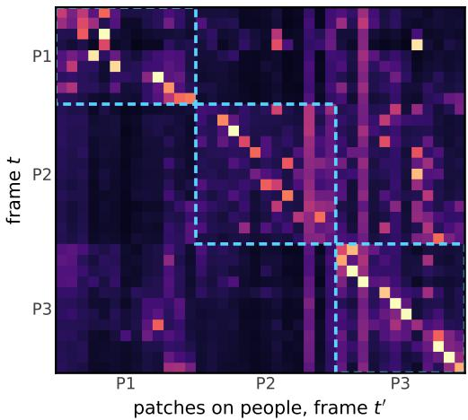  
Figure 2: Person-patch matching at layer 13. Rows are patches on three people at t; columns are patches on the same people at t′. Color shows pre-rotation query-key probe scores, normalized only over these candidates per head and then averaged, not scene-wide attention. Dashed blocks mark same-person pairs; 82% of top matches have the right identity here.

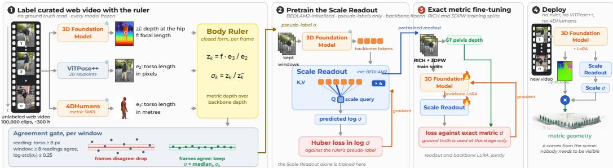  
Figure 3: Training and deploying the Scale Readout. (1) A body ruler combines observed 2D torso extent $e _ { 2 } ,$ the posed body’s metric in-plane extent $e _ { 3 } ,$ , backbone depth $\tilde { z } _ { k }$ and focal length f to estimate $\sigma _ { k } = ( \bar { f } e _ { 3 } / e _ { 2 } ) / \tilde { z } _ { k } ;$ an agreement gate yields window pseudo-labels. (2) These labels pretrain the readout on web clips. (3) Exact RICH and 3DPW targets fine-tune the readout and backbone LoRA. (4) Deployment predicts σ from backbone tokens alone, without the ruler or teachers.

Teaching metric scale to scene tokens. Exact metric labels for ordinary real video are scarce. We instead use people as offline rulers: a posed body supplies a metric torso extent in the image plane (Loper et al., 2015; Pavlakos et al., 2019), which we compare with 2D keypoints to obtain an approximate, closed-form scale pseudo-label (Fig. 3). Repeated readings expose inconsistent labels, enabling pretraining on curated unlabeled web video before exact metric fine-tuning on standard real-video training splits. The resulting Scale Readout predicts from scene-level foundation-model tokens rather than repeating the body measurement at inference. This transfers human-derived supervision into a scale estimate that is independent of a visible person at deployment.

WildHSR is the system these two mechanisms make possible: metric cameras, scene and people from monocular video, with no external scale network or separately trained external tracker (Fig. 4). Each window is reconstructed by a feed-forward network. Fixed analytic association and Sim(3) composition connect the window predictions. Our contributions are:

• WildHSR, a system that jointly reconstructs people, cameras and scene geometry in one metric world from monocular video while maintaining person tracks.

• Emergent person correspondence in a 3D foundation model: a controlled probe locates motion-robust identity cues in intermediate query-key features; a lightweight projection reads them for association without an external tracker (§3.2).

• Human-derived scale supervision for scene tokens: closed-form pseudo-labels from people in unlabeled video initialise a Scale Readout before exact metric adaptation (§4.2).

• State-of-the-art global motion: on EMDB-2, the first feed-forward method in our comparison to beat the best optimization method on WA-MPJPE and RTE; on RICH, the best feed-forward people-and-scene method on WA-MPJPE and W-MPJPE.

## 2 RELATED WORK

3D foundation models, and what they encode. Feed-forward geometry models recover cameras and dense structure from unposed images in one pass (Wang et al., 2024a; 2025a), online with a persistent state (Wang et al., 2025b) and in the presence of motion (Zhang et al., 2025). Those that output metres learn them from metric supervision (Wang et al., 2025b; Keetha et al., 2026; Ma et al., 2026); some of the strongest reported camera estimates come from a model that is up to scale and re-normalised per inference (Wang et al., 2025a; 2026). We build on that representation and learn its metric conversion. What such models encode beyond their outputs is less studied. Image foundation models carry 3D structure that probes can read (El Banani et al., 2024), segmentation emerges in self-supervised attention (Caron et al., 2021), DUSt3R’s attention separates moving from static content without training (Chen et al., 2025a), and the authors of VGGT-Ω report that clustering its intermediate tokens isolates a moving dancer, and that auxiliary quantities, metric scale among them, can be decoded from its register tokens in preliminary experiments (Wang et al., 2026). We test two readouts: metric scale from in-the-wild pseudo-labels followed by exact adaptation, and person identity from cross-frame correspondence in intermediate features.

Supervision for metric scale. Systems that reconstruct people and scenes in metres obtain metric scale from a metric-native backbone (Chen et al., 2025b), from metric depth priors (Wang et al., 2024b), from synthetic metric supervision with an expert depth teacher (Li et al., 2026), or by training the body’s scale prior into point-map prediction (Shi et al., 2026). Anthropometric size is an older cue. People as Scene Probes (Wang et al., 2020) reads depth, occlusion and lighting from passing pedestrians, SLAHMR and PACE use body priors inside their objectives (Ye et al., 2023; Kocabas et al., 2024), HAMSt3R (Rojas et al., 2025) distils a mesh recovery encoder into a stereo network, HSfM (Müller et al., 2025) recovers approximate metric scale by per-scene optimization and, closest in mechanism, HAC (Yang et al., 2025) calibrates a SLAM reconstruction against the metric depth of contact joints from a mesh recovery model. In these uses, the body measurement remains part of scale recovery at inference. We instead use the reading offline to pretrain on curated unlabeled video, in the tradition of self-training (Lee, 2013; Xie et al., 2020) and consistency supervision (Godard et al., 2019), then refine the predictor with exact metric labels from real-video training splits. UniSH also trains on unlabeled in-the-wild video, but uses an external metric teacher; our pseudo-label is produced by the geometric body ruler.

Humans and scenes from video. Global human mesh recovery places SMPL (Loper et al., 2015) bodies in world coordinates, by optimization over SLAM and motion priors (Ye et al., 2023; Kocabas et al., 2024) or by regressing world trajectories (Yuan et al., 2022; Shin et al., 2024; Wang et al., 2024b; Shen et al., 2024; Wang et al., 2025c). Closest to us, Human3R (Chen et al., 2025b), UniSH (Li et al., 2026), SHOW (Shi et al., 2026) and GUSH3R (Abe et al., 2026) attach human decoders to geometry foundation models and reconstruct people and scene in one feed-forward pass, the last as Gaussians; MetricHMSR (Song et al., 2025) does so metrically from one image, and JOSH3R (Liu et al., 2026) is trained from the pseudo-labels of a per-sequence optimization. These systems differ in where the human branch reads the backbone. Human3R decodes SMPL-X parameters at a detected head cell, which becomes ambiguous when two people share that token. We read each person at the pelvis, a geometric anchor for body placement (§3.2).

## 3 METHOD

## 3.1 PROBLEM FORMULATION AND SYSTEM OVERVIEW

A window of video passes once through a 3D foundation model (VGGT-Ω (Wang et al., 2026), the successor of VGGT (Wang et al., 2025a)), adapted with a small LoRA for metric transfer, which predicts per-frame cameras with focal length f and depth z˜, from which point maps are obtained by unprojection, together with the tokens used to decode these outputs (Fig. 4, top). All of it is correct up to one unknown scale. We write $\sigma = z _ { \mathrm { m e t r i c } } / z _ { \mathrm { b a c k b o n e } }$ for the metres-per-unit conversion of that inference. The backbone re-normalises every pass, so σ must be predicted per window rather than pooled over a sequence. Cameras and scene are in backbone units, whereas SMPL-X dimensions are metric; σ puts both in one world.

The body prior supplies shape, not placement; VGGT supplies cameras and depth, not identity.   
Cross-attention grounds proposals; scale and association connect windows.

Two pretrained networks supply scene and human tokens, while our Scale Readout, Pelvis Readout, cross-attention fusion and identity projection expose the quantities needed for joint reconstruction. Their released weights remain frozen; small LoRA adapters support metric and body adaptation. Appendix B gives the exact modules, parameter counts and training configuration. We next describe how the system reads and associates people, learns scale, and composes one metric world.

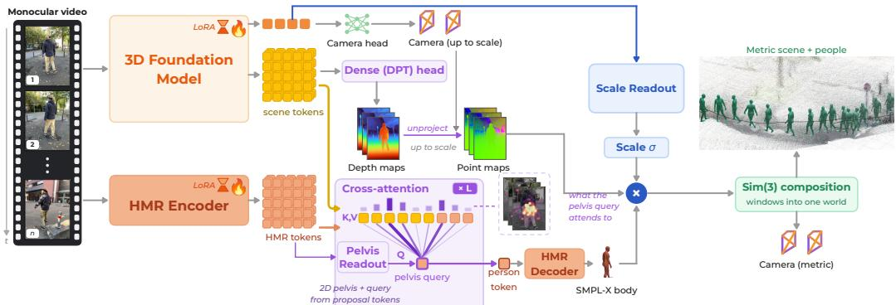  
Figure 4: Overview of WildHSR. A 3D foundation model produces up-to-scale cameras, geometry and scene tokens. A mesh branch proposes people; a Pelvis Readout forms a body-localized query, and cross-attention decodes a metric SMPL-X body. The Scale Readout supplies σ; analytic association and Sim(3) composition link people and windows in one metric world.

## 3.2 PERSON RECONSTRUCTION AND TEMPORAL ASSOCIATION

Per-frame proposals and bodies. Multi-HMR (Baradel et al., 2024), adapted with a 0.75M LoRA, scores person-centre patches and proposes initial SMPL-X bodies per frame; VGGT-Ω independently supplies scene tokens for the video window. For proposal n at time t, a lightweight Pelvis Readout takes its HMR tokens and produces a 2D pelvis location and person query. During training, the location is supervised by the pelvis joint of the ground-truth SMPL-X body projected into the image; the target does not come from the model’s own final prediction. We then fuse the readout query with the two token streams:

$$
\begin{array} { r l } & { ( u _ { t , n } , q _ { t , n } ^ { \mathrm { p e l } } ) = R _ { \mathrm { p e l } } ( H _ { t , n } ) , } \\ & { \qquad h _ { t , n } = \mathrm { C r o s s A t t n } \Big ( q _ { t , n } ^ { \mathrm { p e l } } , [ S _ { 1 : T } ; H _ { t } ] \Big ) , \quad B _ { t , n } = D _ { \mathrm { H M R } } ( h _ { t , n } ) . } \end{array}\tag{1}
$$

Here $H _ { t , n }$ denotes the HMR tokens of proposal $n , u _ { t , n }$ is the readout’s image-space pelvis location, $q _ { t , n } ^ { \mathrm { p e l } }$ its query, $S _ { 1 : T }$ the VGGT scene tokens, and $H _ { t }$ the frame’s HMR tokens; the latter two supply keys and values. At inference, the Pelvis Readout needs no ground-truth body or external keypoint model. No external detector runs in the deployed path.

The pelvis anchor. Placement unprojects the Pelvis Readout’s pixel $u _ { t , n }$ using the median backbone depth $\tilde { z } _ { t , n }$ over the body’s projected torso. With backbone-unit camera centre $C _ { t } .$ , camera-to-window rotation $R _ { t }$ , intrinsics $K _ { t }$ and $\bar { u } _ { t , n } = [ u _ { t , n } ^ { \top } , 1 ] ^ { \top }$ , the metric pelvis in window w is

$$
p _ { t , n } ^ { ( w ) } = \sigma \big ( C _ { t } + R _ { t } ( \tilde { z } _ { t , n } K _ { t } ^ { - 1 } \bar { u } _ { t , n } ) \big ) .\tag{2}
$$

The readout is supervised at SMPL’s hip midpoint, so $p _ { t , n } ^ { ( w ) }$ places the body’s root. The torso median avoids a body–ground depth discontinuity at the anchor. Direct metric-translation regression performs worse; a head anchor introduces an orientation-sensitive lever arm of roughly 0.6 m.

Identity readout and association. The probe of Fig. 5 peaks in the layer-13 query-key space. We pool those vectors around each pelvis and map them to a 128-dimensional unit descriptor with a two-layer projection trained by supervised contrastive loss. For track i and proposal $j ,$ let $m _ { i } , e _ { j }$ be unit descriptors, $\hat { p } _ { i } , p _ { j }$ their predicted and observed metric pelvis positions, $c _ { j }$ proposal confidence and $g _ { i }$ a time-dependent motion gate. Their assignment cost is

$$
C _ { i j } = \textstyle { \frac { 1 } { 2 } } ( 1 - \langle m _ { i } , e _ { j } \rangle ) + \operatorname* { m i n } \biggl ( \frac { \| p _ { j } - \hat { p } _ { i } \| _ { 2 } } { g _ { i } } , 1 \biggr ) + 0 . 2 5 ( 1 - c _ { j } ) .\tag{3}
$$

Pairs beyond $g _ { i }$ are invalid; Appendix I specifies the gate and track state. A dustbin and Sinkhorn optimal transport (Cuturi, 2013) give a soft assignment, which is hardened one-to-one with Hungarian matching. The projection also receives a ground-truth assignment loss through the soft Sinkhorn matrix; Hungarian selection and confidence-gated memory updates remain outside backpropagation. Appendix I gives the full specification. Learned inference is feed-forward within each window; fixed-step association and memory updates require no test-time gradient-based fitting.

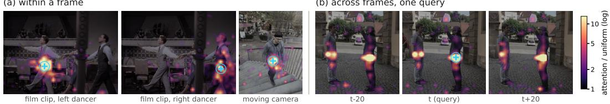  
Figure 5: Pretrained person correspondence. At layer 13, a VGGT-Ω pelvis token attends to its own person within a frame (3.8× uniform over four clips) and across the window (5.8×). When the person moves, attention follows the person (5.0×), not the vacated location (1.2×). This probe runs the backbone alone; Appendix I gives controls and the complete sample accounting.

## 3.3 SCALE READOUT AND METRIC ADAPTATION

Ruler pseudo-labels. For each visible person, ViTPose++-H (Xu et al., 2024) at 256×192 gives the observed image-plane extent $e _ { 2 }$ from shoulder midpoint to hip midpoint. 4DHumans (Goel et al., 2023) supplies the posed metric torso; $e _ { 3 }$ is the in-plane extent between its corresponding midpoints. With the backbone’s focal length $f$ and estimated depth $\tilde { z } _ { k }$ , a local weak-perspective approximation gives the ruler reading (Fig. 3, stage 1)

$$
z _ { k } = f \frac { e _ { 3 } } { e _ { 2 } } , \qquad \sigma _ { k } = \frac { z _ { k } } { \tilde { z } _ { k } } ,\tag{4}
$$

without a metric label or sensor for the web clip. The estimate can be biased when the torso endpoints have different depths. We retain confident detections with $e _ { 2 } \geq 8 \mathbf { p x } ;$ a window needs at least eight readings and $\mathrm { s t d } ( \log \sigma _ { k } ) \le 0 . 2 5$ . Its pseudo-label is the median across eligible frames and people; agreement tests consistency, not absolute correctness.

Pretraining and adaptation. These labels pretrain the Scale Readout on 100,000 curated webvideo clips (about 300 hours). The clips include publicly accessible video such as YouTube; YOLO person counts guide sampling across crowd sizes. A learned query reads the backbone’s camera and register tokens to regress log σ with a log-space Huber loss while the backbone remains fixed (architecture in Appendix B). After synthetic initialization and ruler pretraining, we fine-tune the readout and backbone LoRA with exact metric targets from standard RICH (Huang et al., 2022) and 3DPW (von Marcard et al., 2018) training splits (Chen et al., 2025b). Camera calibration and body translation provide reference pelvis depth; no scene point cloud is needed. At inference, the readout needs only backbone tokens, with no ruler, teacher or visible person.

## 3.4 COMPOSING ONE METRIC WORLD

Given $\sigma ,$ the backbone’s camera centres, depth and point maps are multiplied by it, while the metric body is not, and one forward pass per window yields the metric scene, the metric camera path and the people placed in it (Fig. 4). Long video needs one continuous world frame, but every window is an independent inference with its own frame and unit. We use 100-frame windows with stride 50 and require at least eight shared frames.

For consecutive windows a and $b ,$ the relative rotation $R _ { b a }$ is the chordal mean of the framewise rotations between their shared camera orientations. With $R _ { b a }$ fixed, we solve

$$
\left( s _ { b a } , t _ { b a } \right) = \arg \operatorname* { m i n } _ { s , t } \sum _ { k \in a \cap b } \left\| C _ { k } ^ { a } - \left( s R _ { b a } C _ { k } ^ { b } + t \right) \right\| _ { 2 } ^ { 2 } ,\tag{5}
$$

in closed form on their metric camera centres. If fewer than eight correspondences survive or the centred camera trajectory is degenerate, we retain the previous cumulative similarity. All shared frames have equal weight and no outlier trimming is applied. We compose valid relative similarities in temporal order. $\mathrm { I f } \ S _ { w } ^ { \mathrm { v } }$ is the cumulative scale of window w, we divide every cumulative similarity by $\begin{array} { r } { \boldsymbol { g } = \exp \left( | \mathcal { W } | ^ { - 1 } \sum _ { w } \log S _ { w } \right) } \end{array}$ , preserving the sequence’s aggregate metric scale rather than letting one window set it. The similarity acts fully on camera centres, point maps and pelvis translations; its rotation also acts on camera and SMPL-X global orientations, while body dimensions remain unscaled and no network or scene parameters are optimized at test time.

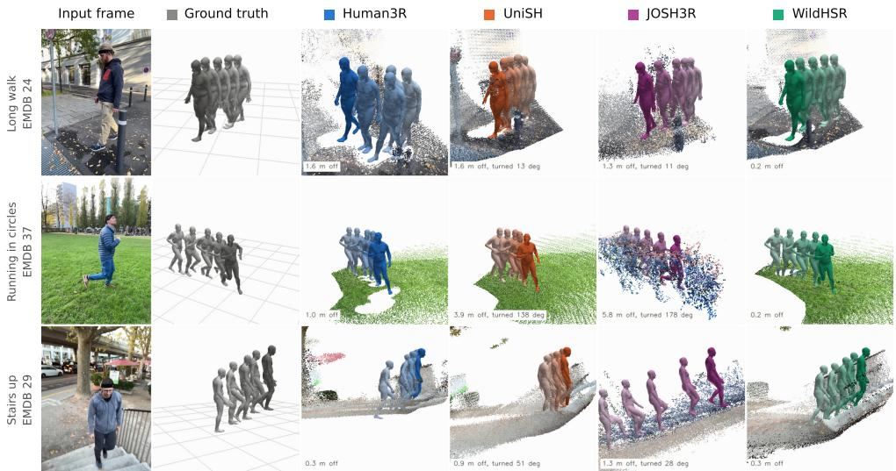  
Figure 6: Scene and people in one metric world (three EMDB-2 clips), each method at its own metric scale; labels give placement error and, for UniSH and JOSH3R, view turn. WildHSR is 0.2 to 0.3 m off, against 0.3 to 1.6 m (Human3R), 0.9 to 3.9 m (UniSH) and 1.3 to 5.8 m (JOSH3R).

## 3.5 TRAINING OBJECTIVES

The scale pathway uses the log-space Huber objective above; the Pelvis Readout’s location is supervised by projected ground-truth SMPL-X pelvis joints, while its query and the fusion receive gra dients through the decoded body. No target is imposed on the cross-attention weights themselves. Body losses cover SMPL-X parameters, mesh and reprojection; identity losses use contrastive and soft assignment, while scene contact regularizes placement.

Feet on the reconstructed ground. A scene-contact consistency term encourages supporting feet to agree with the local reconstructed surface during training. The body branch predicts its placement directly at inference, without a manual vertical shift (Appendix G).

## 4 EXPERIMENTS

Protocol. We follow the published EMDB-2 (Kaufmann et al., 2023) 25-sequence and RICH (Huang et al., 2022) protocols used by the compared methods (Chen et al., 2025b; Li et al., 2026; Shi et al., 2026; Liu et al., 2026; Ying et al., 2025; Sun et al., 2023; Li et al., 2024). WA-MPJPE uses similarity alignment, W-MPJPE aligns the first two frames, and RTE aligns trajectories by rotation and translation only; RTE therefore preserves scale error.

## 4.1 METRIC CAMERAS, SCENE AND PEOPLE

EMDB-2. Table 1 compares WildHSR with previously reported EMDB-2 results. Trajectory error is the best published: RTE 0.9 improves on the prior best (1.3) by 31%. On the joint metrics only JOSH (Liu et al., 2026), which optimizes each sequence jointly over scene and body, is ahead on W-MPJPE (174.7 against 193.6). WildHSR has the lowest WA-MPJPE in the full table (66.3). Amongfeed-forward methods WildHSR leads all three metrics, by 38%, 26% and 47% over the best of the others on each. What differs is what each system spends to become metric: metric depth priors, large-scale supervised pretraining or a metric-native backbone, where WildHSR learns scale from the people. Fig. 6 shows the reconstructions behind these numbers, and Appendix F the paths themselves (Fig. 8) and six more clips. The visual comparison is restricted to systems whose neural reconstruction networks jointly predict people and scene: Human3R, UniSH and JOSH3R (Liu et al., 2026); SHOW (Shi et al., 2026) has not released weights and appears in the tables only (alignment and re-run details in Appendix F). Because RTE preserves scale error, this comparison tests the shared metric scene and pelvis-based body placement, not only local pose quality.

Table 1: EMDB-2 global motion. WA/W: global joint error; RTE: trajectory error. best 2nd 3rd applies throughout.
<table><tr><td rowspan=1 colspan=4>method          WA↓  W↓  RTE↓</td></tr><tr><td rowspan=5 colspan=3>Ooptq-ased SLAHMR        326.9 776.1COIN152.8TRAM76.4PromptHMR-vid71.0JOSH68.9</td><td rowspan=1 colspan=1>10.2</td></tr><tr><td rowspan=1 colspan=1>407.3</td><td rowspan=1 colspan=1>3.5</td></tr><tr><td rowspan=1 colspan=1>222.4</td><td rowspan=1 colspan=1>1.4</td></tr><tr><td rowspan=1 colspan=1>216.5</td><td rowspan=1 colspan=1>1.3</td></tr><tr><td rowspan=1 colspan=1>174.7</td><td rowspan=1 colspan=1>1.3</td></tr><tr><td rowspan=1 colspan=1>WHAM</td><td rowspan=1 colspan=1>135.6</td><td rowspan=1 colspan=1>354.8</td><td rowspan=1 colspan=1>6.0</td></tr><tr><td rowspan=7 colspan=1>GVHMRFeo-rd WATCHJOSH3RHuman3RUniSHSHOWWildHSR</td><td rowspan=1 colspan=1>111.0</td><td rowspan=1 colspan=1>276.5</td><td rowspan=1 colspan=1>2.0</td></tr><tr><td rowspan=1 colspan=1>106.4</td><td rowspan=1 colspan=1>269.3</td><td rowspan=1 colspan=1>1.7</td></tr><tr><td rowspan=1 colspan=1>220.0</td><td rowspan=1 colspan=1>661.7</td><td rowspan=1 colspan=1>13.1</td></tr><tr><td rowspan=1 colspan=1>112.2</td><td rowspan=1 colspan=1>267.9</td><td rowspan=1 colspan=1>2.2</td></tr><tr><td rowspan=1 colspan=1>118.5</td><td rowspan=1 colspan=1>270.1</td><td rowspan=1 colspan=1>5.8</td></tr><tr><td rowspan=1 colspan=1>109.1</td><td rowspan=1 colspan=1>262.3</td><td rowspan=1 colspan=1>2.1</td></tr><tr><td rowspan=1 colspan=1>66.3</td><td rowspan=1 colspan=1>193.6</td><td rowspan=1 colspan=1>0.9</td></tr><tr><td rowspan=1 colspan=4>∆ vs best           -3.8%  +10.8% -30.8%</td></tr></table>

Table 2: RICH global motion. WA/W: global joint error; RTE: per-segment trajectory error.
<table><tr><td>method</td><td>WA↓</td><td>W↓</td><td>RTE↓</td></tr><tr><td>Optimization-based</td><td></td><td></td><td></td></tr><tr><td>TRAM</td><td>127.8</td><td>238.0</td><td>6.0</td></tr><tr><td>JOSH</td><td>89.0</td><td>132.5</td><td>3.0</td></tr><tr><td>Feed-forward, people and scene</td><td></td><td></td><td></td></tr><tr><td>Human3R</td><td>110.0</td><td>184.9</td><td>3.3</td></tr><tr><td>UniSH</td><td>118.1</td><td>183.2</td><td>4.8</td></tr><tr><td>SHOW</td><td>107.3</td><td>172.7</td><td>2.2</td></tr><tr><td>WildHSR</td><td>73.2</td><td>163.1</td><td>2.7</td></tr><tr><td>∆ vs best</td><td>-17.8%</td><td>+23.1%</td><td>+22.7%</td></tr></table>

Table 3: Training-data ablation on EMDB-2. End-to-end joint-position (WA, W) and trajectory (RTE) errors for checkpoints trained with the indicated data sources.
<table><tr><td></td><td colspan="3">training data</td><td colspan="3">EMDB-2</td></tr><tr><td>checkpoint</td><td>BEDLAM2</td><td>curated ITW</td><td>RICH+3DPW</td><td>WA↓</td><td>W↓</td><td>RTE↓</td></tr><tr><td>synthetic base</td><td>√</td><td></td><td></td><td>182.2</td><td>1009.2</td><td>11.3</td></tr><tr><td>ITW pretrained</td><td>S</td><td>√</td><td></td><td>136.7</td><td>418.6</td><td>4.63</td></tr><tr><td>no ITW pretraining</td><td>v√</td><td></td><td>√</td><td>116.3</td><td>255.9</td><td>3.7</td></tr><tr><td>metric fine-tuned</td><td></td><td>√</td><td>√</td><td>66.3</td><td>193.6</td><td>0.90</td></tr></table>

Table 4: Held-out 3DPW body reconstruction. 14-joint test errors in mm; published baselines from SHOW (Shi et al., 2026).
<table><tr><td>method</td><td>PA-MPJPE↓ MPJPE↓</td><td>PVE↓</td></tr><tr><td>Human3R</td><td>44.1</td><td>71.2 84.9</td></tr><tr><td>UniSH</td><td>48.8 75.6</td><td>88.8</td></tr><tr><td>SHOW</td><td>41.0</td><td>67.7 78.7</td></tr><tr><td>WildHSR</td><td>38.7</td><td>65.2 74.4</td></tr></table>

Local body accuracy. Table 4 evaluates heldout 3DPW. PA-MPJPE removes per-pose similarity; MPJPE and PVE measure camera-frame joints and mesh. WildHSR improves on SHOW, the strongest baseline, by 2.3, 2.5 and 4.3 mm, respectively. These metrics do not assess world placement. Together with Tables 1 and 2, they show that WildHSR gains global accuracy without sacrificing local body fidelity.

RICH. WildHSR has the best WA-MPJPE of Table 2 and leads the feed-forward people-and-scene methods on W-MPJPE, where only JOSH, an optimization, is ahead. Its median multiplicative scale error is 7.2%. Its per-segment RTE is second among feed-forward people-and-scene systems (2.7), behind SHOW at 2.2; subjects are near-stationary and RTE divides by a median displacement of 0.52 m. Our model is fine-tuned with exact labels from RICH-train and 3DPW-train; the RICH test partition is held out. Table 2 uses the same test split and evaluation protocol as the baselines, not necessarily the same training data. With camera motion largely removed, the joint results are consistent with the Scale Readout and pelvis-to-scene fusion placing bodies in a shared metric frame.

Pretrained person correspondence. Figures 2 and 5 show intermediate features matching a moving person across frames. Tested on 1,500 clips, same-person retrieval reaches 80 to 82% in layers 11 to 15 against 46% chance. This retrieval accuracy is distinct from the conditional match weights in Fig. 2 and the attention lift in Fig. 5. The identity projection reads these mid-depth features and combines them with metric pelvis motion for cross-frame assignment (Appendix I).

Long video and runtime. Over 1000 frames (33 s), WildHSR’s camera-to-person distance error is 5.4 to 6.0% (9.4 to 12.9% for Human3R); without alignment, its median range error is 14.1 cm and its proxemic zone is correct on 100% of frames. The complete pipeline runs at 10.1 fps on one RTX PRO 6000 Blackwell. Fixed association and Sim(3) composition link feed-forward windows without per-video fitting; Appendix B gives the matched runtime breakdown.

Table 5: Association on 13 two-person 3DPW test sequences. WildHSR variants share fixed Multi-HMR outputs; Human3R uses its native pipeline. Assignment thresholds were tuned on four validation sequences.
<table><tr><td>method</td><td>IDF1↑</td><td>HOTA↑</td><td>ID switches↓</td><td>fragments↓</td><td>MOTA↑</td></tr><tr><td>Human3R (native)</td><td>87.4</td><td>72.3</td><td>1682</td><td>87</td><td>87.1</td></tr><tr><td>motion + confidence DP</td><td>66.9</td><td>56.9</td><td>97</td><td>77</td><td>87.5</td></tr><tr><td>raw VGGT query/key</td><td>51.8</td><td>53.4</td><td>8065</td><td>861</td><td>51.7</td></tr><tr><td>projected identity</td><td>60.2</td><td>54.5</td><td>664</td><td>284</td><td>73.7</td></tr><tr><td>projection + motion + confidence</td><td>82.1</td><td>74.5</td><td>39</td><td>73</td><td>96.5</td></tr></table>

Temporal association. Table 5 compares association cues on 13 two-person 3DPW test sequences with fixed Multi-HMR proposals and bodies. The combined cost reaches 74.5 HOTA and 39 ID switches, versus 72.3 and 1682 for native Human3R. Human3R leads IDF1 (87.4 versus 82.1) and nine sequences; one crowded clip dominates its switch count. The weaker single-cue variants support combining projected identity with motion, but do not isolate confidence. This controlled component test does not measure the final end-to-end pipeline (Appendix A).

## 4.2 EFFECT OF THE SCALE-TRAINING STAGES

Table 3 tests web-video pseudo-labeling within the final recipe. Removing it while keeping BED-LAM2 initialization and exact RICH/3DPW fine-tuning worsens WA/W/RTE from 66.3/193.6/0.90 to 116.3/255.9/3.7. The pseudo-label stage contributes beyond exact labels.

## 5 CONCLUSION

WildHSR transfers human-derived scale pseudo-labels into an up-to-scale 3D foundation model and reads person correspondence from its pretrained intermediate query-key features. The Scale Readout is initialized on real-video pseudo-labels before exact metric adaptation; a small identity projection combines the correspondence signal with metric motion for association. Together they enable joint metric reconstruction of people, cameras and scene in feed-forward windows, linked by analytic association and Sim(3) composition without test-time optimization.

Limitations. Identity weakens under interaction and occlusion, and its specificity to people is untested. Sequence composition is offline; RICH training mixtures may differ across methods.

## REPRODUCIBILITY STATEMENT

VGGT-Ω and Multi-HMR retain their released base weights; small LoRAs adapt them (Hu et al., 2022). The Scale Readout starts on BEDLAM2, learns from offline ruler pseudo-labels, then receives exact metric supervision from RICH- and 3DPW-train; EMDB-2 is held out. The ruler, agreement gate, ViTPose++-H and 4DHumans are absent at inference. The appendix details objectives, splits, settings and evaluation; code, models and outputs will be released.

## ETHICS AND WEB-DATA STATEMENT

Public web video supplies 100,000 clips for non-identifying scale pseudo-labels; we do not redistribute it. Persistent reconstruction may enable surveillance. Track IDs do not identify people, and the system should not be used for biometric or high-stakes decisions. Web video and parametric body priors may introduce demographic, body-shape, clothing, mobility and visibility biases.

## AI USE STATEMENT

Large language models assisted manuscript drafting, restructuring and editing. The authors directed and revised the generated text and take full responsibility for this paper.

## REFERENCES

Keito Abe, Kaede Shiohara, Takashi Otonari, and Toshihiko Yamasaki. Gush3r: Everyone everywhere all at once as gaussians. arXiv preprint arXiv:2607.05243, 2026.

Guillaume Alain and Yoshua Bengio. Understanding intermediate layers using linear classifier probes. In International Conference on Learning Representations (ICLR), Workshop Track, 2017.

Fabien Baradel, Matthieu Armando, Salma Galaaoui, Romain Brégier, Philippe Weinzaepfel, Gré- gory Rogez, and Thomas Lucas. Multi-hmr: Multi-person whole-body human mesh recovery in a single shot. In ECCV, 2024.

Mathilde Caron, Hugo Touvron, Ishan Misra, Hervé Jégou, Julien Mairal, Piotr Bojanowski, and Armand Joulin. Emerging properties in self-supervised vision transformers. In IEEE/CVF International Conference on Computer Vision (ICCV), 2021.

Xingyu Chen, Yue Chen, Yuliang Xiu, Andreas Geiger, and Anpei Chen. Easi3R: Estimating disentangled motion from DUSt3R without training. In IEEE/CVF International Conference on Computer Vision (ICCV), 2025a.

Yue Chen, Xingyu Chen, Yuxuan Xue, Anpei Chen, Yuliang Xiu, and Gerard Pons-Moll. Human3r: Everyone everywhere all at once. arXiv preprint arXiv:2510.06219, 2025b.

Marco Cuturi. Sinkhorn distances: Lightspeed computation of optimal transport. In Advances in Neural Information Processing Systems, 2013.

David Eigen, Christian Puhrsch, and Rob Fergus. Depth map prediction from a single image using a multi-scale deep network. In Advances in Neural Information Processing Systems (NeurIPS), 2014.

Mohamed El Banani, Amit Raj, Kevis-Kokitsi Maninis, Abhishek Kar, Yuanzhen Li, Michael Rubinstein, Deqing Sun, Leonidas Guibas, Justin Johnson, and Varun Jampani. Probing the 3D awareness of visual foundation models. In IEEE/CVF Conference on Computer Vision and Pattern Recognition (CVPR), 2024.

Clément Godard, Oisin Mac Aodha, Michael Firman, and Gabriel J. Brostow. Digging into selfsupervised monocular depth estimation. In IEEE/CVF International Conference on Computer Vision (ICCV), 2019.

Shubham Goel, Georgios Pavlakos, Jathushan Rajasegaran, Angjoo Kanazawa, and Jitendra Malik. Humans in 4D: Reconstructing and tracking humans with transformers. In IEEE/CVF International Conference on Computer Vision (ICCV), 2023.

Edward J. Hu, Yelong Shen, Phillip Wallis, Zeyuan Allen-Zhu, Yuanzhi Li, Shean Wang, Lu Wang, and Weizhu Chen. LoRA: Low-rank adaptation of large language models. In International Conference on Learning Representations (ICLR), 2022.

Chun-Hao P. Huang, Hongwei Yi, Markus Höschle, Matvey Safroshkin, Tsvetelina Alexiadis, Senya Polikovsky, Daniel Scharstein, and Michael J. Black. Capturing and inferring dense full-body human-scene contact. In IEEE/CVF Conference on Computer Vision and Pattern Recognition (CVPR), 2022.

Manuel Kaufmann, Jie Song, Chen Guo, Kaiyue Shen, Tianjian Jiang, Chengcheng Tang, Juan Zarate, and Otmar Hilliges. EMDB: The electromagnetic database of global 3d human pose and shape in the wild. In ICCV, 2023.

Nikhil Keetha, Norman Müller, Johannes Schönberger, Lorenzo Porzi, Yuchen Zhang, Tobias Fischer, Arno Knapitsch, Duncan Zauss, Ethan Weber, Nelson Antunes, Jonathon Luiten, Manuel Lopez-Antequera, Samuel Rota Bulò, Christian Richardt, Deva Ramanan, Sebastian Scherer, and Peter Kontschieder. Mapanything: Universal feed-forward metric 3D reconstruction. In International Conference on 3D Vision (3DV), 2026.

Muhammed Kocabas, Ye Yuan, Pavlo Molchanov, Yunrong Guo, Michael J. Black, Otmar Hilliges, Jan Kautz, and Umar Iqbal. PACE: Human and camera motion estimation from in-the-wild videos. In 3DV, 2024.

Dong-Hyun Lee. Pseudo-label: The simple and efficient semi-supervised learning method for deep neural networks. In ICML Workshop on Challenges in Representation Learning, 2013.

Jiefeng Li, Ye Yuan, Davis Rempe, Haotian Zhang, Pavlo Molchanov, Cewu Lu, Jan Kautz, and Umar Iqbal. COIN: Control-inpainting diffusion prior for human and camera motion estimation. In European Conference on Computer Vision (ECCV), 2024.

Mengfei Li, Peng Li, Zheng Zhang, Jiahao Lu, Chengfeng Zhao, Wei Xue, Qifeng Liu, Sida Peng, Wenxiao Zhang, Wenhan Luo, Yuan Liu, and Yike Guo. UniSH: Unifying scene and human reconstruction in a feed-forward pass, 2026.

Zhizheng Liu, Joe Lin, Wayne Wu, and Bolei Zhou. Joint optimization for 4D human-scene reconstruction in the wild. In International Conference on Learning Representations (ICLR), 2026.

Matthew Loper, Naureen Mahmood, Javier Romero, Gerard Pons-Moll, and Michael J. Black. SMPL: A skinned multi-person linear model. In ACM TOG (SIGGRAPH Asia), 2015.

Baorui Ma, Jiahui Yang, Donglin Di, Xuancheng Zhang, Jianxun Cui, Hao Li, Yan Xie, and Wei Chen. Metricanything: Scaling metric depth pretraining with noisy heterogeneous sources. In European Conference on Computer Vision (ECCV), 2026.

Lea Müller, Hongsuk Choi, Anthony Zhang, Brent Yi, Jitendra Malik, and Angjoo Kanazawa. Reconstructing people, places, and cameras. In IEEE/CVF Conference on Computer Vision and Pattern Recognition (CVPR), 2025.

Georgios Pavlakos, Vasileios Choutas, Nima Ghorbani, Timo Bolkart, Ahmed A. A. Osman, Dimitrios Tzionas, and Michael J. Black. Expressive body capture: 3D hands, face, and body from a single image. In CVPR, 2019.

Sara Rojas, Matthieu Armando, Bernard Ghanem, Philippe Weinzaepfel, Vincent Leroy, and Gregory Rogez. HAMSt3R: Human-aware multi-view stereo 3D reconstruction. In IEEE/CVF International Conference on Computer Vision (ICCV), 2025.

Zehong Shen, Huaijin Pi, Yan Xia, Zhi Cen, Sida Peng, Zechen Hu, Hujun Bao, Ruizhen Hu, and Xiaowei Zhou. World-grounded human motion recovery via gravity-view coordinates. In SIGGRAPH Asia, 2024.

Boao Shi, Qiao Feng, Yiming Huang, and Lingjie Liu. Scene and human in one world: Reconstruction in a feedforward pass, 2026.

Soyong Shin, Juyong Kim, Eni Halilaj, and Michael J. Black. WHAM: Reconstructing worldgrounded humans with accurate 3d motion. In CVPR, 2024.

Chentao Song, He Zhang, Haolei Yuan, Haozhe Lin, Jianhua Tao, Hongwen Zhang, and Tao Yu. Metrichmsr: Metric human mesh and scene recovery from monocular images. arXiv preprint arXiv:2506.09919, 2025.

Yu Sun, Qian Bao, Wu Liu, Tao Mei, and Michael J. Black. TRACE: 5d temporal regression of avatars with dynamic cameras in 3d environments. In CVPR, 2023.

Timo von Marcard, Roberto Henschel, Michael J. Black, Bodo Rosenhahn, and Gerard Pons-Moll. Recovering accurate 3d human pose in the wild using IMUs and a moving camera. In European Conference on Computer Vision (ECCV), pp. 601–617, 2018.

Hengyi Wang and Lourdes Agapito. AMB3R: Accurate feed-forward metric-scale 3d reconstruction with backend. In IEEE/CVF Conference on Computer Vision and Pattern Recognition (CVPR), 2026.

Jianyuan Wang, Minghao Chen, Nikita Karaev, Christian Rupprecht, and David Novotny. Vggt: Visual geometry grounded transformer. In CVPR, 2025a.

Jianyuan Wang, Minghao Chen, Shangzhan Zhang, Nikita Karaev, Johannes Schönberger, Patrick Labatut, Piotr Bojanowski, David Novotny, Andrea Vedaldi, and Christian Rupprecht. VGGT-ω. arXiv preprint arXiv:2605.15195, 2026.

Qianqian Wang, Yifei Zhang, Aleksander Holynski, Alexei A. Efros, and Angjoo Kanazawa. Continuous 3D perception model with persistent state. In IEEE/CVF Conference on Computer Vision and Pattern Recognition (CVPR), 2025b.

Shuzhe Wang, Vincent Leroy, Yohann Cabon, Boris Chidlovskii, and Jérôme Revaud. DUSt3R: Geometric 3D vision made easy. In IEEE/CVF Conference on Computer Vision and Pattern Recognition (CVPR), 2024a.

Yifan Wang, Brian Curless, and Steve Seitz. People as scene probes. In European Conference on Computer Vision (ECCV), 2020.

Yufu Wang, Ziyun Wang, Zhicheng Liu, and Kostas Daniilidis. TRAM: Global trajectory and motion of 3d humans from in-the-wild videos. In ECCV, 2024b.

Yufu Wang, Yu Sun, Priyanka Patel, Kostas Daniilidis, Michael J. Black, and Muhammed Kocabas. PromptHMR: Promptable human mesh recovery. In IEEE/CVF Conference on Computer Vision and Pattern Recognition (CVPR), 2025c. arXiv:2504.06397; video variant numbers as reported in Ying et al. (2025).

Qizhe Xie, Minh-Thang Luong, Eduard Hovy, and Quoc V. Le. Self-training with noisy student improves ImageNet classification. In IEEE/CVF Conference on Computer Vision and Pattern Recognition (CVPR), 2020.

Yufei Xu, Jing Zhang, Qiming Zhang, and Dacheng Tao. ViTPose++: Vision transformer for generic body pose estimation. IEEE Transactions on Pattern Analysis and Machine Intelligence, 46(2): 1212–1230, 2024.

Fengyuan Yang, Kerui Gu, Ha Linh Nguyen, Tze Ho Elden Tse, and Angela Yao. Humans as checkerboards: Calibrating camera motion scale for world-coordinate human mesh recovery. In IEEE/CVF International Conference on Computer Vision (ICCV), 2025.

Vickie Ye, Georgios Pavlakos, Jitendra Malik, and Angjoo Kanazawa. Decoupling human and camera motion from videos in the wild. In CVPR, 2023.

Qijun Ying, Zhongyuan Hu, Rui Zhang, Ronghui Li, Yu Lu, and Zijiao Zeng. WATCH: World-aware allied trajectory and pose reconstruction for camera and human, 2025.

Ye Yuan, Umar Iqbal, Pavlo Molchanov, Kris Kitani, and Jan Kautz. GLAMR: Global occlusionaware human mesh recovery with dynamic cameras. In CVPR, 2022.

Junyi Zhang, Charles Herrmann, Junhwa Hur, Varun Jampani, Trevor Darrell, Forrester Cole, Deqing Sun, and Ming-Hsuan Yang. MonST3R: A simple approach for estimating geometry in the presence of motion. In International Conference on Learning Representations (ICLR), 2025.

# Supplementary Material

WildHSR: Metric Feed-Forward 4D People-Scene Reconstruction from a 3D Foundation Model

Appendices A–E cover the association protocol, runtime, RICH evaluation, scale calibration, and scene reconstruction. Appendix F presents qualitative results. Appendices G–K cover ablations, people-scene consistency, identity and pelvis probes, robustness, and failure modes.

## A TEMPORAL ASSOCIATION PROTOCOL

Table 5 reports a controlled component experiment, not the final end-to-end pipeline. WildHSR variants use fixed Multi-HMR proposals and frozen bodies, camera-frame pelvis positions, nonoverlapping windows, and an identity projection trained on 3DPW only. Assignment thresholds were tuned on four validation sequences. Human3R retains its native pipeline; the comparison therefore tests tracking behavior, not identical upstream reconstructions.

## B COMPUTATIONAL COST

Training configuration. The released VGGT-Ω and Multi-HMR base weights remain frozen. The backbone LoRA uses rank 16, α = 32 and dropout 0.05 on the linear layers of the last four frameattention and last four global-attention blocks (2.10M parameters); the mesh adapter has 0.75M parameters. Every Scale Readout in Table 3 uses a 512-dimensional query, four decoder layers, eight attention heads, batch size 16 and 6,000 pretraining steps. It is initialized on BEDLAM2, pretrained from ruler labels with the backbone frozen, then jointly fine-tuned with the backbone LoRA on the standard RICH and 3DPW training splits using AdamW at $1 0 ^ { - 4 }$ . Standard validation partitions are used for model selection. The Pelvis Readout uses each proposal’s HMR tokens to produce the image-space hip-midpoint location and query. The location is trained against the projected ground-truth SMPL-X pelvis; decoded-body losses train the query and fusion, without an attention-map target. The identity readout pools layer-13 query and key vectors around each Pelvis Readout location, maps them to a 128-dimensional unit vector with a two-layer MLP, and is trained with supervised contrastive and dustbin-aware soft-assignment losses on the BEDLAM2, RICHtrain and 3DPW-train identities while both base networks remain frozen. Training windows contain 17 frames for BEDLAM2 and 32 frames for real video. These are training clip lengths, not the inference window: the reported evaluations use 100-frame windows with stride 50. No window-length ablation is reported.

Table 6: Compute on one GPU, same 60-frame clip. End-to-end throughput and peak memory; FLOPs count traced model stages.
<table><tr><td>method</td><td>params run↓</td><td>TFLOPs/frame↓</td><td>fps↑</td><td>s / 60 frames↓</td><td>peak GPU↓</td></tr><tr><td>Human3R</td><td>1.17B</td><td>n/a</td><td>8.8</td><td>6.8</td><td>5.95 GB</td></tr><tr><td>UniSH</td><td>1.86B</td><td>7.29</td><td>4.9</td><td>12.2</td><td>7.06 GB</td></tr><tr><td>JOSH3R</td><td>1.50B</td><td>3.77</td><td>6.1</td><td>9.8</td><td>7.55 GB</td></tr><tr><td>WildHSR (512 × 288)</td><td>1.52B</td><td>6.94</td><td>12.6</td><td>4.8</td><td>8.85 GB</td></tr><tr><td>WildHSR (688 × 384, ours)</td><td>1.52B</td><td>11.43</td><td>10.1</td><td>6.0</td><td>11.22 GB</td></tr></table>

Table 6 reports throughput, peak GPU memory and traced model FLOPs on the first 60 frames of EMDB-2 24\_outdoor\_long\_walk. We use one RTX PRO 6000 Blackwell per method, two warmup passes and three timed passes, excluding model loading. Each system uses its evaluated resolution. FPS measures the full pipeline; FLOPs cover traced neural stages only. The parameter count includes every loaded model in the inference path.

At its main 688 × 384 resolution, WildHSR processes 10.1 frames per second, the highest end-toend throughput among the configurations in Table 6. Its body encoder accounts for 62% of runtime, making that stage the clearest target for further speedups.

## C RICH EVALUATION PROTOCOL

Identifying the target subject. RICH annotates one subject while up to 7 people are visible, so every method must decide which reconstruction to score; 18 of our 46 segments contain more than one person. Motion and centre confidence alone do not reliably separate a smoothly walking, confi dently detected bystander from the annotated subject. Our association instead matches the projected VGGT identity descriptor against the track memory and uses metric pelvis motion only as a complementary cue. A dustbin permits the annotated person to be temporarily missing rather than forcing a match to a bystander. No image-centre prior or capture-rig-specific rule enters the method.

Scale-error metric. Throughout the paper, “median multiplicative scale error $( \% ) ^ { \dag }$ denotes

$$
E _ { \sigma } = 1 0 0 \left[ \exp \left( \operatorname* { m e d i a n } _ { i } \left| \log \frac { \sigma _ { i } ^ { \mathrm { p r e d } } } { \sigma _ { i } ^ { \mathrm { g t } } } \right| \right) - 1 \right] .\tag{6}
$$

This is symmetric in log scale before conversion to a percentage: predicting either twice or half the ground-truth scale gives $E _ { \sigma } = 1 0 0 \%$

We use the published RICH test split and evaluator, though training may differ. Median segment displacement is 0.52 m, so RTE magnifies small trajectory errors.

## D HELD-OUT RULER CALIBRATION ON RICH

Table 7: Ruler calibration on held-out RICH. Median multiplicative scale error (%).
<table><tr><td>scale source</td><td>error↓</td></tr><tr><td>body-ruler pseudo-label</td><td>14.1</td></tr><tr><td>Scale Readout, ruler-pretrained</td><td>8.4</td></tr><tr><td>Scale Readout, metric fine-tuned</td><td>7.2</td></tr></table>

Table 8: 7Scenes scene accuracy. Mean pointmap accuracy in cm (↓);
<table><tr><td>method</td><td>Acc. (cm)↓</td></tr><tr><td>Spann3R</td><td>4.81</td></tr><tr><td>MapAnything</td><td>3.48</td></tr><tr><td>CUT3R</td><td>2.88</td></tr><tr><td>VGGT</td><td>2.32</td></tr><tr><td>AMB3R</td><td>1.75</td></tr><tr><td>WildHSR</td><td>1.66</td></tr><tr><td>∆ vs best</td><td>-5.1%</td></tr></table>

The body ruler can inherit systematic error from the metric body teacher. Table 7 compares the scale pathway’s stages on the same held-out RICH examples using the median multiplicative scale error of Eq. (6). Error falls from 14.1% for the pseudo-label to 8.4% after ruler pretraining and 7.2% after exact metric fine-tuning.

## E PERSON-FREE SCENE RECONSTRUCTION

Table 8 compares published 7Scenes point-map accuracy under the same scale-aligned protocol (Wang & Agapito, 2026). WildHSR has the lowest error at 1.66 cm versus 1.75 cm for AMB3R. This tests scene geometry, not metric scale without visible people.

## F QUALITATIVE RESULTS

Figures 7–11 show metric people, cameras and scene geometry across varied motion, longer videos and crowds. Rigid camera-path alignment preserves predicted scale in the people-scene views; similarity alignment isolates trajectory shape and drift.

Input frame

Ground truth

Human3R

UniSH

JOSH3R

WildHSR

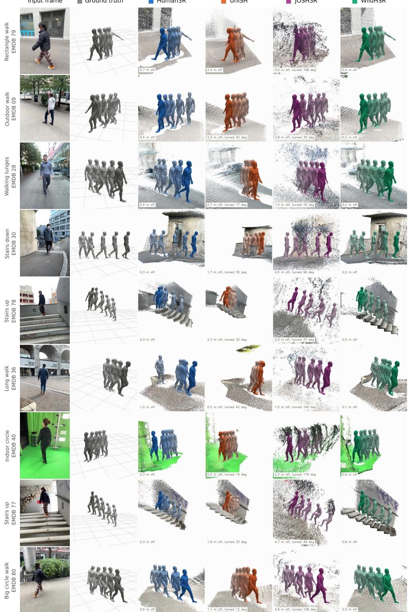

Figure 7: Metric people-scene placement on nine EMDB-2 clips. Each method’s body history and scene retain predicted scale after rigid camera-path alignment. Labels report pelvis offset in metres; UniSH and JOSH3R also show the view rotation required for alignment.

What the alignment shows. Across walks, stairs and lunges, WildHSR has the lowest pelvis offset on seven of nine clips. Human3R is closer on two stairs-up clips (0.3 versus 0.5 and 0.8 m). The body history stays positioned relative to its reconstructed ground, linking human placement to a coherent metric people-scene reconstruction throughout each motion.

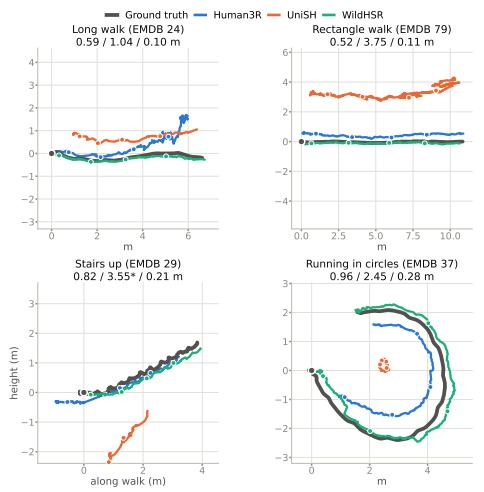  
ground-truth camera Human3R UniSH WildHSR ground-truth feet maps: world size vs ground truth, camera error (fixed scale) · floor row: floor-gap under the real feet, Human3R / UniSH / WildHSR

Figure 8: Global human trajectories on four EMDB-2 clips after WA-MPJPE alignment. Stairs plot height; other panels are top-down. Numbers give mean path error (Human3R / UniSH / WildHSR); dots mark 2 s intervals and ∗ a path leaving the plot.

What the paths show. Figure 8 tests whether placement stays coherent through long walks, turns and stairs. WildHSR follows the route and ascent, while Human3R drifts on the long walk and UniSH loses the turning path. Mean path error is 0.10 to 0.28 m for WildHSR, 0.52 to 0.96 m for Human3R and 1.04 to 3.75 m for UniSH. These paths are similarity-aligned; Fig. 9 separately tests metric scale.

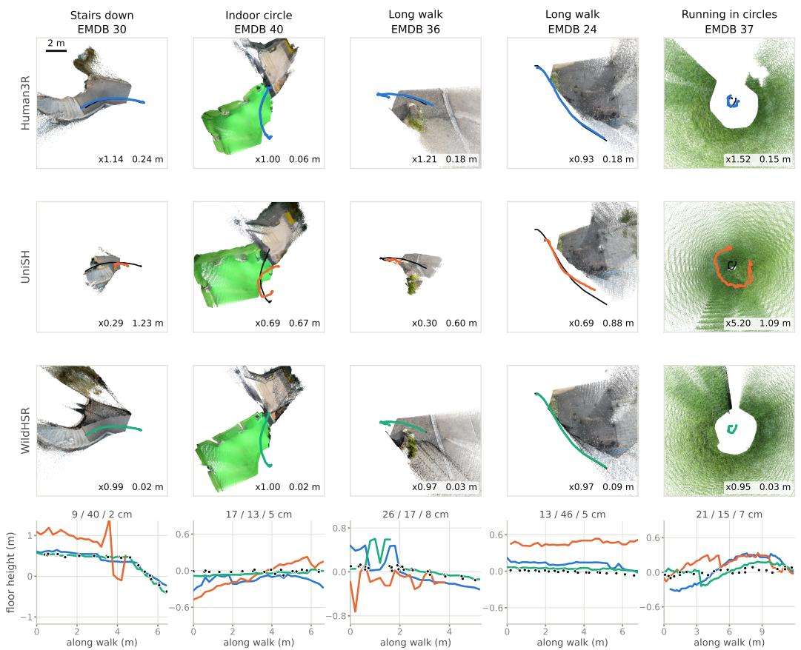  
Figure 9: Metric scene, camera and ground. Top three rows: person-free scene and camera path after rigid alignment, preserving predicted scale; labels give world-size ratio and mean camera error. Bottom: reconstructed floor height along the walk against the ground-truth feet; values are median foot-floor gap for Human3R / UniSH / WildHSR.

What the scene shows. WildHSR reconstructs all five worlds at 0.95 to 1.00× ground-truth size with 0.02 to 0.09 m mean camera error. Its median foot-floor gap is 2 to 8 cm, compared with 9 to 26 cm for Human3R and 4 to 46 cm for UniSH. The scene scale, camera path and ground beneath the person remain mutually consistent, giving the human trajectory a metric reference in the reconstructed environment.

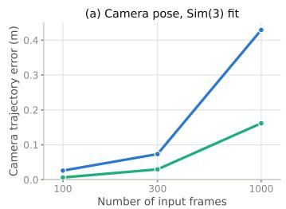

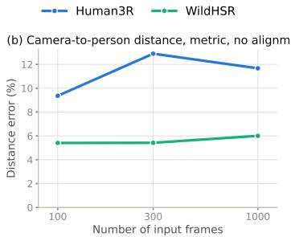

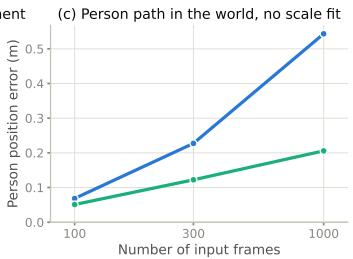  
Figure 10: Accuracy against video length, averaged over six EMDB-2 clips of at least 1000 frames. (a) Camera trajectory error after Sim(3) alignment. (b) Metric camera-to-person distance error without alignment. (c) World-frame person-path error after rigid alignment, retaining scale error.

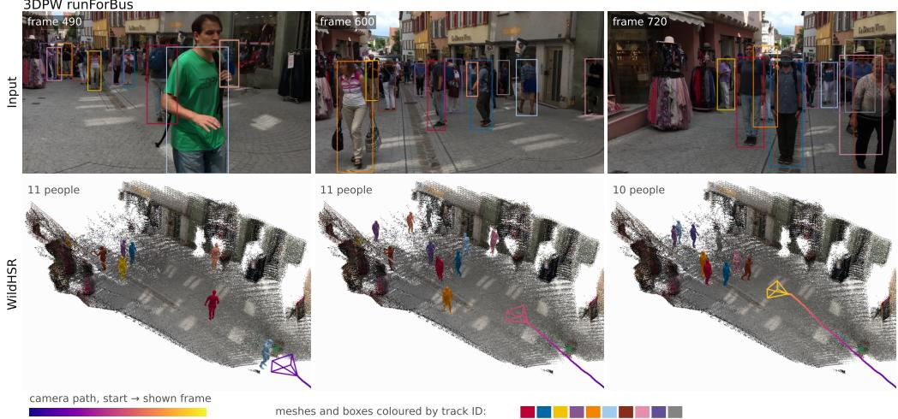  
Figure 11: Crowded in-the-wild reconstruction on 3DPW downtown\_runForBus. Top: input and persistent tracks. Bottom: metric scene, camera trajectory and bodies colored by identity. The sequence contains 14 tracks over 10 s, with 10 to 11 people reconstructed per frame.

What the crowd shows. WildHSR maintains 14 tracks over 10 s and reconstructs 10 to 11 people per frame in one scene. For the two people with 3DPW annotations, hip-depth error is 0.29 m for WildHSR and 1.20 m for Human3R, while local pose is similar (PA-MPJPE 55.3 versus 51.7 mm). The larger improvement in placement shows the value of relating each person’s body to the shared scene and camera estimate.

What longer videos show. From 100 to 1000 frames in Fig. 10, WildHSR accumulates less camera and human-path error than Human3R, while its metric camera-to-person distance error stays near 5 to 6%. The method maintains person placement in its reconstructed world as the observed path grows. WildHSR processes each complete prefix; Human3R runs causally.

## G ADDITIONAL ABLATIONS

Table 9: Ablations on EMDB-2. Each row substitutes one component of the full system.
<table><tr><td></td><td colspan="2">EMDB-2</td></tr><tr><td>configuration</td><td>WA↓</td><td>W↓ RTE↓</td></tr><tr><td>WildHSR (full)</td><td>66.3</td><td>193.6 0.90</td></tr><tr><td>synthetic-only scale</td><td>182.2 1009.2</td><td>11.3</td></tr><tr><td>— scene contact</td><td>72.2</td><td>203.4 0.91</td></tr></table>

Scale pathway. Table 9 shows the largest loss when the final two-stage Scale Readout is replaced by the best regressor trained on synthetic metric ground truth: 2.7× WA and 13× RTE. Because the final head combines ruler pretraining with ground-truth fine-tuning, this substitution does not isolate their separate contributions.

## H PLAUSIBILITY AND METRIC SCALE ON EMDB-2

Table 10 measures people-scene consistency on all 25 EMDB-2 sequences. Foot gap compares the sole with each method’s reconstructed floor, and sliding measures toe speed during ground-truth contact. World size compares camera-trajectory scale with ground truth (ideal: one), while camera error aligns rigidly without rescaling. WildHSR reduces the foot gap to 3.6 cm versus 12.7 cm for Human3R and 15.5 cm for UniSH. Its 6% world-size error and 0.13 m camera error support placing bodies and scene in a shared metric frame; contact is a training term, not an inference correction.

Table 10: People-scene consistency on EMDB-2. Five diagnostics use the first 300 frames of each sequence; WA-MPJPE uses full sequences. Shades rank methods per column, with world size ranked by distance from one.
<table><tr><td>method</td><td>foot gap (cm)↓</td><td>sliding (cm/s)↓</td><td>world size (×GT)</td><td>size err.↓</td><td>camera (m)↓</td><td>WA (mm)↓</td></tr><tr><td>Human3R</td><td>12.7</td><td>22.6</td><td>1.03</td><td>15%</td><td>0.20</td><td>112.2</td></tr><tr><td>UniSH</td><td>15.5</td><td>28.1</td><td>0.47</td><td>73%</td><td>0.98</td><td>118.5</td></tr><tr><td>WildHSR</td><td>3.6</td><td>17.4</td><td>0.99</td><td>6%</td><td>0.13</td><td>66.3</td></tr></table>

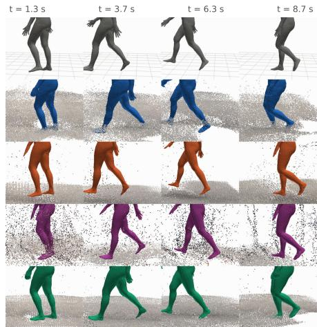  
Figure 12: Feet on the reconstructed ground (EMDB 79), each method on its own scene, at four moments with the same viewing direction and zoom.

Human3R 19 cm WildHSR 2 cmFig. 12 shows feet relative to each method’s reconstructed ground; Table 10 extends the measurement to every EMDB-2 sequence.

How Table 10 is measured. Feet-to-ground )and sliding are read at each method’s own met-(cric scale: the method is placed in the ground-outruth world by a rotation and translation only 0n alignment of its camera trajectory, so no grounde truth scale is imposed on its body or on its abscene. Feet-to-ground is, per sequence, the mesoldian over frames of the absolute height gap between the lower foot sole and the floor of the −40method’s own reconstructed scene directly beneath it, where that floor is the mode of scene-time (s)point heights within 25 cm horizontally, gathered from frames within ±1 s. EMDB provides no ground-truth scene, so the quantity measures how self-consistent a method’s human and scene are, not how accurate either one is.

The fraction of frames carrying a floor estimate is 95% for Human3R, 100% for UniSH and 98% for WildHSR; admitting floors up to 2.5 m above the sole instead of 0.5 m moves the means to 12.7, 16.9 and 3.6 cm, so the ordering is not an artefact of that threshold.

Other diagnostics in Table 10. Sliding is median horizontal toe speed on contact frames. A groundtruth toe counts as contacting when its speed is below 0.25 m/s and its height is within 5 cm of its local minimum, after five-frame smoothing. World size is the median ratio of reconstructed to ground-truth camera-trajectory scale (ideal: one). Size error averages |1 − s| over sequences, so a near-one median can still conceal large errors on individual sequences. Camera error is mean camera-centre distance after rotation and translation alignment only. WA-MPJPE repeats the fullbenchmark values of Table 1, not a first-300-frame recomputation.

Physical plausibility. Table 9 shows that contact regularization improves WA while leaving W-MPJPE and RTE nearly unchanged. These metrics do not directly test body-ground consistency. Measured against the backbone’s own reconstructed floor on all 25 EMDB-2 sequences, the lowest body vertex floats 9.8 cm above the floor without the term and 1.1 cm with it, with 1.2% of frames penetrating the floor by more than 5 cm; foot skate and vertex jitter are unchanged (1.45 cm/frame, 3.9 cm/frame2). These measurements complement the benchmark metrics by testing people-scene consistency directly.

## I IDENTITY FEATURES AND PELVIS LOCALIZATION

Probe setup. We run the unmodified pretrained VGGT-Ω alone; the mesh model, fusion and adapters are absent. Person boxes and tracks select evaluation patches and provide identity labels, but are not inputs to the backbone. VGGT-Ω learns geometric matching on static scene points, with movable content excluded from that supervision (Wang et al., 2026). The question is whether its matching representation also links moving people, even though no training target associates their identities.

Position control. A stationary person can be matched by image location alone, so the probe separately tests pairs where the person moves (box IoU below 0.2). It compares the person’s new position with the vacated position and other people. The aggregate result below, rather than a selected frame pair, motivates the intermediate-depth identity features.

Retrieval over 1,500 clips. For each 100-frame multi-person window, a patch on one person is matched to on-person patches in a later frame. A match is correct when its top candidate belongs to the same person. We evaluate output-token cosine similarity and pre-rotation query-key logits, including hard pairs where the nearest image-space candidate is the wrong person. Chance is 46% overall and 40% on hard pairs; moved-person pairs (box IoU below 0.2) have 38% chance. In query-key space, retrieval peaks at 80 to 82% in layers 11 to 15, including 70% after motion and 60% on hard pairs, then returns to chance in late layers. Figure 13(a) shows the intermediate-depth advantage on hard pairs, where matching by image location fails. Output tokens already retrieve at 85% at layer 0, consistent with appearance information from the image encoder, but their retrieval decays with depth. This contrast motivates reading identity from intermediate query-key features rather than final tokens.

After motion. At layer 13, attention lift on the person’s new position averages 5.0× uniform, compared with 1.2× on the vacated position and 1.5× on other people among clips with sufficient moved pairs. The new position wins in 91% of those clips, although overlap and small people weaken the effect. This control separates person correspondence from simply revisiting an image location; it does not by itself measure the trained tracker’s accuracy.

What the probe does not show. We have not run the same test on objects other than people, so we do not claim the behaviour is specific to people: a model that matches any moving surface across frames would pass it, and for our purpose that would serve equally. The probe alone also cannot establish that its correspondence improves tracking. The association-component experiment in Table 5 tests how descriptor and motion cues combine when upstream proposals and bodies are held fixed; it does not isolate their effect in the final end-to-end pipeline.

Identity readout and training. The pelvis is the body root, giving a smoother motion anchor than distal joints and avoiding a head-to-root translation lever arm. Lower-body occlusion is examined in Appendix J. For proposal n in frame t, we take the QK-normalised layer-13 query and key vectors before positional rotation, average each head over the $3 \times 3$ token neighbourhood around the pelvi patch, concatenate all heads and both roles, and compute

$$
e _ { t , n } = \mathrm { n o r m } _ { 2 } \big ( P \left( \left[ \bar { q } _ { t , n } ; \bar { k } _ { t , n } \right] \right) \big ) , \qquad P = \mathrm { L i n e a r } \circ \mathrm { G E L U } \circ \mathrm { L i n e a r } \circ \mathrm { L a y e r N o r m } ,\tag{7}
$$

where $\boldsymbol { e } _ { t , n } \in \mathbb { R } ^ { 1 2 8 }$ . VGGT and the mesh branch remain frozen. We first train only P with supervised contrastive temperature 0.07: observations of the same training identity at different times are positives and co-occurring people are hard negatives. We then fine-tune P through the soft assignment defined below using negative log likelihood of the ground-truth match, birth and miss decisions. Identity groups are disjoint between training and validation, and only BEDLAM2, RICH-train and 3DPW-train identities are used.

(b) after the person has moved  
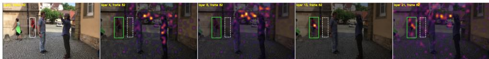

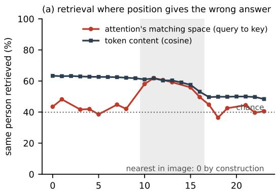

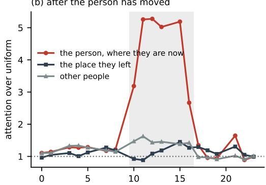  
layer layerFigure 13: Position or person? Pretrained VGGT-Ω by itself. Top: a query token on a walking person (white box) and its global attention on a later frame, at layers 4, 8, 13 and 21; dashed box, where the person was; green box, where they are. The example is the clip’s median, not its best. Bottom, means over clips, layers 10 to 16 shaded: (a) same-person retrieval on pairs where the nearest candidate in the image is the wrong person, in the attention’s query and key space and in token content; (b) attention lift after the person has moved.

State and dimensionless cost. Association is applied after each window has been composed into the common world frame of §3.4. A live track i stores a unit descriptor $m _ { i } .$ , its last metric pelvis $p _ { i } ,$ an exponentially smoothed velocity $v _ { i } ,$ last-seen time and track shape. At elapsed time $\bar { \Delta } t ,$ its predicted pelvis is $\hat { p } _ { i } = p _ { i } + v _ { i } \Delta t$ . Proposal $j$ has descriptor $e _ { j }$ , world pelvis $p _ { j }$ and confidence $c _ { j }$ We use

$$
\begin{array} { r l } & { d _ { i j } ^ { \mathrm { i d } } = \frac { 1 } { 2 } \left( 1 - \langle m _ { i } , e _ { j } \rangle \right) , } \\ & { \quad g _ { i } = 0 . 5 \mathrm { m } + \operatorname* { m i n } ( 3 \mathrm { m s } ^ { - 1 } \Delta t , 3 \mathrm { m } ) , } \\ & { d _ { i j } ^ { \mathrm { m o t } } = \operatorname* { m i n } ( \| p _ { j } - \hat { p } _ { i } \| _ { 2 } / g _ { i } , 1 ) , \qquad d _ { j } ^ { \mathrm { c o n f } } = 1 - c _ { j } , } \\ & { \quad C _ { i j } = d _ { i j } ^ { \mathrm { i d } } + d _ { i j } ^ { \mathrm { m o t } } + 0 . 2 5 d _ { j } ^ { \mathrm { c o n f } } . } \end{array}\tag{8}
$$

The three component costs lie in [0, 1], while $C _ { i j } \in [ 0 , 2 . 2 5 ]$ . A real pair outside the motion gate, $\| p _ { j } - \hat { p } _ { i } \| _ { 2 } > g _ { i }$ , is invalid. These weights and gates are fixed before benchmark evaluation.

Births, misses and one-to-one hardening. With M tracks and N proposals of confidence at least 0.5, we construct a square $( M + N ) \times ( N ^ { \top } + M )$ cost matrix. Its top-left block is $C .$ Track i has one dedicated miss column of cost 0.7, proposal $j$ has one dedicated birth row of cost 0.7, invalid dummy edges have infinite cost, and the dummy-to-dummy block has zero cost. Log-domain Sinkhorn with temperature 0.1 and 20 normalisation iterations produces the soft matrix used by the assignment loss. At inference, Hungarian matching on its negative log probabilities gives exactly one decision per real track and proposal. A matched real pair continues a track, a matched birth starts one, and a matched miss preserves the track without fabricating an observation.

Safe memory update. A match updates memory only when its Sinkhorn probability is at least $0 . 7 \colon \ m _ { i } \gets \mathrm { n o r m } _ { 2 } ( 0 . 9 m _ { i } + 0 . 1 e _ { j } )$ , while velocity uses the analogous 0.8/0.2 update. Lowerconfidence matches keep the identity but do not change descriptor, velocity or shape memory. A missed track can be reactivated for one second and is then terminated. Track shape is the median of confident matched observations only. Proposal selection, Hungarian hardening, births, misses, memory updates and the shape median receive no gradient. Sinkhorn is differentiable during training and analytic at inference; no test-time model fitting or backpropagation is used.

Clean  
Legs cut (below hips)  
Head cut (above shoulders)  
Moving occluder  
Frame dropout  
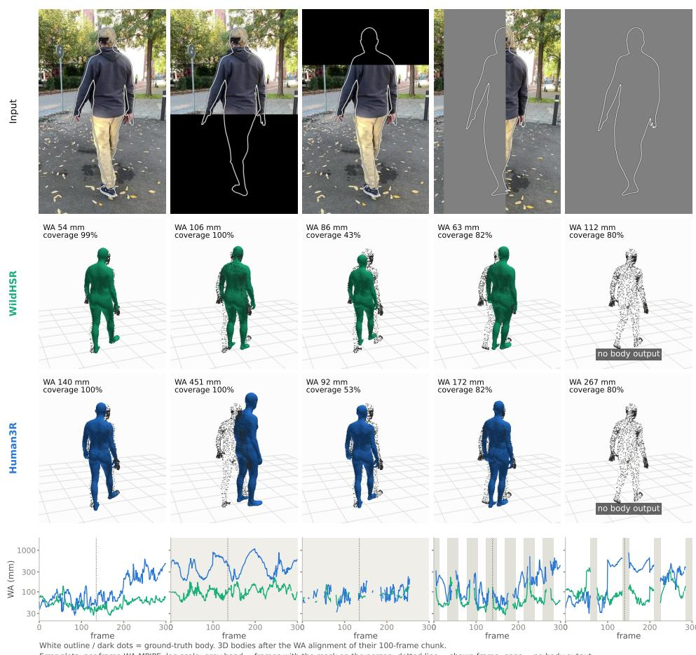  
Figure 14: Truncation and occlusion on a 300-frame EMDB-2 clip. Top: masked input and groundtruth outline. Middle: reconstructed bodies after WA alignment, with ground truth as dots. Bottom: per-frame WA-MPJPE on a log scale; shading marks masked frames.

Table 11: Six-clip truncation and occlusion. Median WA-MPJPE (mm); body coverage is WildHSR / Human3R. Shading compares methods within each condition.
<table><tr><td>condition</td><td>WildHSR↓</td><td>Human3R↓</td><td>coverage</td></tr><tr><td>clean</td><td>63.6</td><td>89.1</td><td>100/100%</td></tr><tr><td>legs cut</td><td>119.5</td><td>238.1</td><td>100/100%</td></tr><tr><td>head cut</td><td>80.9</td><td>131.8</td><td>48/52%</td></tr><tr><td>moving occluder</td><td>71.3</td><td>181.6</td><td>82/82%</td></tr><tr><td>frame dropout</td><td>183.6</td><td>254.4</td><td>80/80%</td></tr></table>

Six-sequence evaluation. Table 11 reports the median over six EMDB-2 clips under identical synthetic masks. WildHSR has lower error in 29 of 30 clip-condition pairs. Leg removal mainly worsens placement; head removal roughly halves detection coverage for both systems. Blank frames are hardest because camera and scale are shared across the window.

The crop-based mesh branch preserves local articulation under these masks; the larger changes are in person detection and placement. The masks are synthetic, so the table tests sensitivity to missing input rather than natural-occlusion frequency.

## K MEASURED FAILURE MODES

## (a) Feet sink into stairs

EMDB 77, stairs up: soles sink below the reconstructed step while climbing, median -9 cm against -3 cm on a flat walk (Human3R -17 cm).

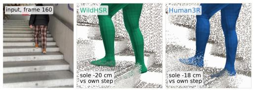  
(b) Wrong knee bend in deep lunges

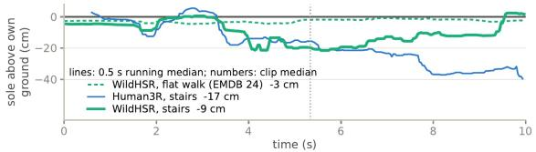  
EMDB 28. WildHSR's knee-flexion estimate deviates from ground truth during deep lunges.

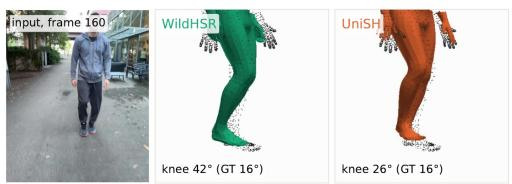

## (c) Person lost on the ground, back under a new ID

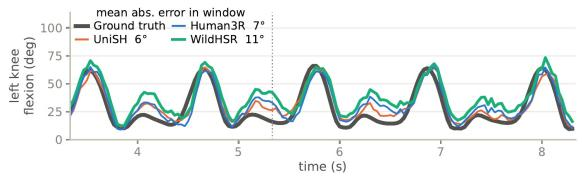  
RICH burpee. No WildHSR body is reconstructed in frames 100-149; the person returns under a new ID

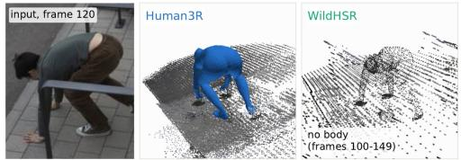

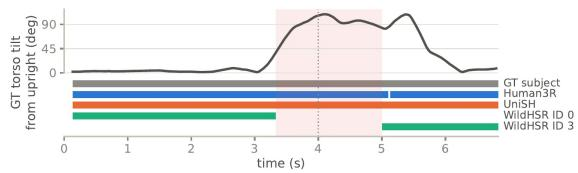  
Figure 15: Measured failure modes. (a) Stair contact, (b) knee articulation, and (c) identity continuity during a burpee. Distances use each method’s own metric scale.

What the failures show. (a) On EMDB 77, the soles sink below the reconstructed step while climbing: a median of −9 cm over the clip and about −20 cm on the steepest stretch, versus −3 cm on a flat walk; Human3R also sinks (−17 cm). Scene contact is a training term, not an inferencetime correction. (b) On EMDB 28, full-clip knee-flexion error is $7 . 8 ^ { \circ }$ for WildHSR versus $5 . 4 ^ { \circ }$ for Human3R; the plotted window reports its own error. (c) In a RICH burpee, no WildHSR body is reconstructed for frames 100–149, and the person returns under a new track ID. These examples expose limits in stair placement, body articulation and track continuity.