# WanPE: Towards Cinematic Prompt Enhancement for Modern Text-to-Video Generation

Yubo Zhu1,2∗, Yawen Shao2,3∗, Ziyun Dai2,4∗, Zixun Fang2,3∗, Kai Zhu2†‡, Siyang Sun2 Haolan Xue2, Chuxin Wang2, Tingyu Weng2, Jingming Luo2, Chen Shi2, Lianghua Huang2, Yufeng Ai2 Yuzheng Wang2, Wenyuan Zhang2, Yu Shang2, Yuxiang Bao2, Zoubin Bi2, Jie Xiao2, Jinbo Xing2 Jiaxing Zhao2, Chongyang Zhong2, Hengjian Chen2, Chenwei Xie2, Akide Liu2, Zhehan Kan5 Yu Liu2, Wei Zhai3‡, Sheng Zhong1, Wei Tong1‡

1Nanjing University 2Wan Team, Alibaba Group

3University of Science and Technology of China 4Fudan University 5Tsinghua University

∗Equal contribution, †Project leader, ‡Corresponding author

## Abstract

Video generation begins in text space by authoring a cinematic screenplay, then materializes into pixels. As contemporary video generators scale to 30 seconds and faithfully follow complex conditions, the textual prompt largely directs the production, planning how actions, camera trajectories, lighting, and sound unfold across multi-shot sequences. In this paper, we present WanPE, a 397B-parameter prompt enhancement model trained on 1.05M real-world videos to master director-level cinematic planning. WanPE formulates shot-level cinematic plans via video-grounded reverse construction, and employs Semantic-Consistency GRPO (SC-GRPO) to faithfully preserve user requirements across shots and over time. To benchmark this capability, we curate WanPEval, a human-annotated testbed covering durations from 5 to 30 seconds across varying intent granularities, supported by ∼ 11K blind pairwise assessments. When powering Wan3.0’s video generator, WanPE-397B boosts human preference over raw user prompts by 10.66-18.84 points at 5-15 seconds, and by a dramatic 50.86 points in the 30-second arena. Ablation studies show that reverse construction demonstrates clear superiority over forward rewriting, while SC-GRPO robustly preserves semantic fidelity across model scales. Ultimately, WanPE leads all evaluated commercial oferings at 5-15 seconds and remains competitive with Seedance 2.5 at 30 seconds.

Project page: https://wan-pe.github.io/

## 1 Introduction

Recent advances in text-to-video (T2V) generation have enabled systems such as Wan3.0 [1] and Seedance 2.5 [2] to generate up to 30 seconds of cinematic-quality video, with expressive camera movements, realistic lighting, and coherent narratives. These systems rely on two tightly coupled components: a prompt enhancer that transforms user input into textual conditions, and a video generator that renders these conditions into video. As video generators process longer contexts and faithfully follow increasingly complex instructions, textual control now reaches the level of cinematic direction. Accordingly, the role of prompt enhancement shifts from enriching user requests with descriptive details to directing the entire production, planning how actions, camera, lighting, dialogue, and sound unfold coherently across shots and over time.

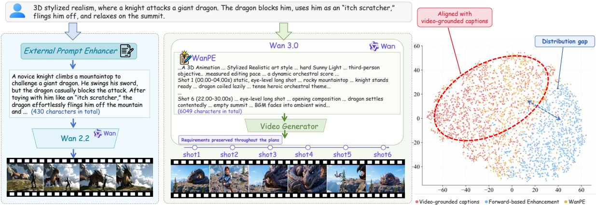  
Figure 1 Left: Earlier models use optional prompt expansions, while modern video generators can process longer contexts and follow complex instructions. Right: t-SNE shows WanPE outputs align closely with video-grounded captions, while forward-based enhancement exhibits a distribution gap.

Many recent works have explored prompt enhancement for T2V generation, including learned prompt rewriting from user requests to detailed descriptions and multi-step LLM refinement [3–12]. Historically, constrained by bounded context and weak instruction following in early video models, such as Wan2.2 [13], prompt enhancement merely served as cosmetic visual enrichment. Today, modern video generators have broken these bottlenecks, stretching horizons to 30 seconds and unlocking unprecedented headroom for expressive textual control. In this paper, we break away from the conventional paradigm of descriptive prompt rewriting. Instead, we conceptualize text as the living flow of the video itself, the very blueprint where temporal cadence, camera choreography, and multi-shot transitions unfold before pixel rendering. Guided by this philosophy, we fundamentally redesign the prompt enhancement framework into a cinematic planning architecture. Realizing this architecture introduces two key challenges: learning coherent cinematic planning across interdependent production components, and preserving user-specified requirements throughout the unfolding plan.

For the first challenge, most T2V prompt enhancers are built around forward expansion from user requests to richer conditions. Their outputs follow a synthetic rewriting distribution. This creates a training–inference mismatch for downstream video generators trained on video-grounded captions. As prompt enhancement scales toward coherent cinematic planning, this conditioning mismatch reflects an asymmetry beyond linguistic style, as illustrated in Figure 1. For example, to expand a request for a two-person action scene, a forward enhancer must not only imagine a sequence of fast interactions, but also determine how camera movement, lighting, audio, and other elements evolve with these interactions over time. However, a professionally filmed action sequence embodies coordination across acting, choreography, cinematography, editing, lighting, and sound. These real-world videos provide realized cinematic structure and video-grounded distribution targets.

For the second challenge, coherent cinematic planning elevates semantic preservation into a global consistency requirement over the entire plan. The enhancer must faithfully propagate user-specified subjects, actions, dialogue, camera instructions, and event order to every relevant shot while preserving their bindings and temporal relationships across the full sequence. At the same time, newly introduced details must remain compatible with both the original request and preceding planning decisions. As the plan unfolds, requirements may otherwise be omitted, altered, assigned to the wrong subject or shot, or contradicted later.

In this paper, we introduce WanPE, a prompt enhancer trained on 1.05M real-world videos for director-level cinematic planning. WanPE reverses conventional supervision construction by deriving a hierarchical cinematic condition y from each high-quality video and reconstructing a compatible user request x. To preserve user requirements throughout the cinematic plan, we optimize the enhancer with SC-GRPO using a ninedimensional reward that penalizes omissions, alterations, incorrect bindings, and temporal inconsistencies. We evaluate 4B–397B variants on WanPEval, a human-annotated 5-30-second testbed with varying intent granularities, using text-level scoring and ∼ 11K blind pairwise video assessments. WanPE-397B improves over raw prompts by up to 18.84 points at 5-15 seconds and 50.86 points at 30 seconds. It leads evaluated commercial oferings at 5-15 seconds while remaining competitive with Seedance 2.5 at 30 seconds. Ablations show reverse construction outperforms forward rewriting, while SC-GRPO improves semantic consistency by

18.6-23.3 points across scales. WanPE transfers across video generators after format adaptation.

Our contributions are summarized as follows:

• We redesign prompt enhancement as a scalable cinematic planning architecture, transforming text into the blueprint that orchestrates actions, camera choreography, audio, and narrative across shots and through time before pixel rendering.

• We realize this architecture by learning realized cinematic structure from real-world videos through video-grounded reverse SFT and faithfully preserving all user requirements throughout the unfolding cinematic plan through SC-GRPO.

• We introduce WanPEval, spanning diverse request complexities and generation durations from 5 to 30 seconds, and scale WanPE from 4B to 397B to demonstrate consistent efectiveness across model scales and downstream video generators.

## 2 Methodology

In this section, we present how WanPE realizes director-level cinematic planning while preserving user requirements across shots and over time. WanPE first formalizes these dual objectives (Section 2.1), learns coherent cinematic planning through video-grounded reverse construction (Section 2.2), and strengthens semantic fidelity with SC-GRPO (Section 2.3). Finally, WanPEval enables text and video-level evaluation across request granularities and generation durations (Section 2.4).

## 2.1 Problem Overview and Formulation

A modern text-to-video (T2V) system composes a prompt enhancer $\pi _ { \theta }$ with a video generator $G _ { \phi }$ . Given a natural-language user request x from the user-prompt distribution $p _ { \mathrm { u } } ,$ the prompt enhancer πθ produces a textual condition $y ,$ which guides the video generator $G _ { \phi }$ to synthesize a video vˆ:

$$
x \sim p _ { \mathrm { u } } , \qquad y \sim \pi _ { \theta } \left( \cdot \mid x \right) , \qquad \hat { v } \sim G _ { \phi } \left( \cdot \mid y \right) .\tag{1}
$$

The textual condition $y$ should preserve all requirements in the user request x. For a given $x ,$ multiple outputs may satisfy these requirements. We denote the set of such outputs by $\mathscr { D } _ { \mathrm { s e m } } \left( x \right)$

$$
\mathcal { V } _ { \mathrm { s e m } } \left( x \right) = \left\{ y \mid c \left( y \right) = 1 , \forall c \in \mathcal { C } \left( x \right) \right\} ,\tag{2}
$$

where $\mathcal { C } \left( x \right)$ denotes the set of user-specified semantic and instructional constraints in x, and $c \left( y \right) = 1$ indicates that y satisfies the requirement c without omission, alteration, or contradiction.

The output distribution of the enhancer should align with the conditioning distribution of the video generator $G _ { \phi } .$ . The video generator $G _ { \phi }$ is trained on real-world videos paired with video-grounded captions. We denote the video-grounded caption distribution by $p _ { \mathrm { v g } } \left( y \right)$

Combining semantic preservation with distributional alignment, we define the ideal target distribution as the video-grounded caption distribution restricted to semantically valid outputs:

$$
p ^ { * } \left( y \mid x \right) = \frac { p _ { \mathrm { v g } } \left( y \right) \mathbb { I } [ y \in \mathcal { V } _ { \mathrm { s e m } } \left( x \right) ] } { Z \left( x \right) } ,\tag{3}
$$

where $Z \left( x \right)$ normalizes the distribution. We then learn $\pi _ { \theta }$ to match $p ^ { * }$ over $x \sim p _ { \mathrm { u } }$

$$
\theta ^ { * } = \arg \operatorname* { m i n } _ { \theta } \mathbb { E } _ { x \sim p _ { \mathrm { u } } } \left[ D _ { \mathrm { K L } } \left( p ^ { * } \left( \cdot \mid x \right) \parallel \pi _ { \theta } \left( \cdot \mid x \right) \right) \right] .\tag{4}
$$

Modern video generators can synthesize videos of up to 30 seconds, process longer textual contexts, and follow more complex instructions. This conditioning capacity creates unprecedented room for textual control. To harness this capacity, we redesign the prompt enhancement framework into a cinematic planning architecture. Learning such conditions poses two challenges. (i) Learning coherent cinematic planning. $\pi _ { \theta }$ must learn the joint organization of interdependent cinematic elements while matching $p _ { \mathrm { v g } }$ . (ii) Maintaining long-range semantic fidelity. User-specified constraints such as identity, dialogue, and camera must stay consistent across temporally ordered shots.

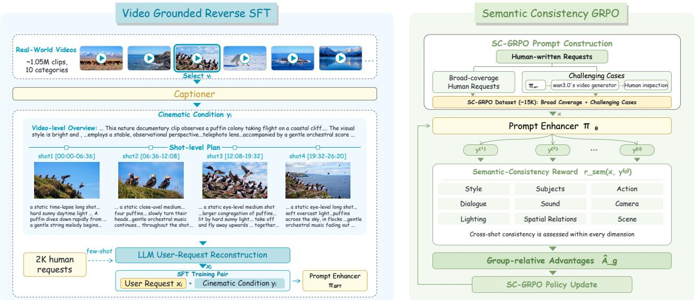  
Figure 2 WanPE training pipeline. Video-grounded reverse SFT and semantic-consistency GRPO.

## 2.2 Video-Grounded Supervised Fine-Tuning

To learn how cinematic elements are jointly organized across shots and over time while aligning the enhancer’s outputs with $p _ { \mathrm { v g } }$ , we first perform supervised fine-tuning on prompt–caption pairs $( x , y )$ satisfying $y \in$ $y _ { \mathrm { s e m } } ( x )$ . Starting from x and enriching it along predefined descriptive dimensions can readily satisfy this semantic requirement. However, the added content and its cinematic organization are determined by the rewriting procedure, causing the resulting targets to follow a synthetic rewriting distribution rather than $p _ { \mathrm { v g } }$ Our key design is to reverse the pair-construction process: we first obtain y by captioning a real-world video and then derive a semantically compatible x from y.

Real-world video collection and filtering. To support alignment with $p _ { \mathrm { v g } } .$ , we collect a large and diverse set of real-world videos that are either publicly available or licensed for use. We segment long-form videos into clips of at most 30 seconds and apply multi-stage filters for technical validity, visual quality, and motion quality. After filtering, the resulting dataset contains ∼ 1.05M clips spanning ten content dimensions with diverse camera movements. The details are in the Appendix A.

Video-grounded cinematic captioning. For each curated video clip $v _ { i } ,$ we use a multimodal video captioner $f _ { \mathrm { c a p } }$ to analyze its visual and audio content and produce a textual cinematic target $y _ { i } { \mathrm { : } }$

$$
y _ { i } = f _ { \mathrm { c a p } } ( v _ { i } ; s _ { i } ) ,\tag{5}
$$

where $s _ { i }$ denotes the category-specific captioning instruction for $v _ { i }$

The target $y _ { i }$ organizes $v _ { i }$ hierarchically into a video-level summary and temporally ordered shot-level descriptions with timestamps. Each shot specifies its composition, subjects, actions, lighting, camera movement, transitions, dialogue, music, and sound efects, together with their progression over time. The instruction $s _ { i }$ adapts this structure to the category of $v _ { i }$ . We keep captions that pass checks for structural completeness, timestamp validity, and consistency with the source video, and use them as video-grounded targets from $p _ { \mathrm { v g } }$ for SFT. The details are in the Appendix B.

User-request reconstruction. In reverse pair construction, we derive a user request $x _ { i }$ from video-grounded target $y _ { i } .$ Summarizing $y _ { i }$ tends to retain the caption’s structure and detail, producing a compressed caption rather than a natural user request. We therefore employ gpt-5.4 with few-shot prompting, using a pool of 2K requests written by human annotators across ten content categories.

Let $d _ { i }$ denote the category of $y _ { i }$ , and let $\mathcal { H } _ { d _ { i } }$ denote the corresponding request pool. We sample five demon-

strations $\mathcal { E } _ { i }$ from $\mathcal { H } _ { d _ { i } }$ . Given $y _ { i }$ and $\mathcal { E } _ { i } .$ , the LLM reconstructs

$$
x _ { i } = f _ { \mathrm { L M } } ( y _ { i } ; \mathcal { E } _ { i } ) .\tag{6}
$$

The reconstruction prompt requires $x _ { i }$ to contain only requirements supported by $y _ { i } ,$ , ensuring $y _ { i } \in \mathcal { V } _ { \mathrm { s e m } } ( x _ { i } )$ The demonstrations $\mathcal { E } _ { i }$ guide $x _ { i }$ toward language and specificity of natural user requests.

Supervised fine-tuning. The reverse construction yields the SFT dataset $\mathcal { D } _ { \mathrm { S F T } } = \{ ( x _ { i } , y _ { i } ) \} _ { i = 1 } ^ { N }$ . We finetune the prompt enhancer $\pi _ { \theta }$ by minimizing the negative log-likelihood of each video-grounded cinematic condition given its reconstructed user request:

$$
\mathcal { L } _ { \mathrm { S F T } } ( \theta ) = - \frac { 1 } { N } \sum _ { i = 1 } ^ { N } \log \pi _ { \theta } ( y _ { i } \mid x _ { i } ) .\tag{7}
$$

Through this objective, the enhancer learns to transform natural user requests into video-grounded cinematic conditions that capture the joint organization of elements across shots and over time.

## 2.3 Semantic-Consistency GRPO

To preserve user requirements as cinematic conditions unfold across shots and events, we introduce Semantic-Consistency GRPO (SC-GRPO). It applies Group Relative Policy Optimization [14] with a semantic-consistency reward penalizing omissions, alterations, inconsistent bindings between subjects, actions, and dialogue, and temporal inconsistencies across shots.

Training data construction. To cover diverse requests and challenging cases, human annotators write T2V prompts for videos up to 30 seconds. We generate videos with Wan3.0’s video generator conditioned on the SFT enhancer’s outputs. Through visual assessment, annotators flag prompts whose videos inadequately realize the requested content. We combine these challenging cases with diverse human-written prompts to form $\mathcal { D } _ { \mathrm { S C - G R P O } }$ , containing approximately 15K prompts.

Semantic consistency reward. We use Qwen3.7-Max to assess whether y preserves the specified constraints $\mathcal C ( x )$ , producing a text-only reward $r _ { \mathrm { s e m } } ( x , y ) \in [ 0 , 1 0 0 ]$ , with higher scores indicating better requirement preservation. Evaluation spans nine dimensions: style, subjects, actions, dialogue, sound, camera, lighting, spatial relations, and scene. The evaluator checks for omitted, weakened, altered, or contradictory user requirements, incorrect subject–attribute and speaker–dialogue bindings, action and shot ordering errors, and cross-shot conflicts. Semantically equivalent paraphrases and compatible elaborations are accepted, while semantic discrepancies are penalized by severity.

Policy optimization. We initialize $\pi _ { \theta }$ from the frozen reference πSFT. For each $x \in { \mathcal { D } } _ { \mathrm { S C - G R P O } }$ , we sample G conditions $\{ y ^ { ( g ) } \} _ { g = 1 } ^ { G }$ from $\pi _ { \theta _ { \mathrm { o l d } } } ( \cdot \mid x )$ and standardize their rewards $r _ { \mathrm { s e m } } ( x , y ^ { ( g ) } )$ into group-relative advantages $\hat { A } _ { g }$ . We maximize

$$
\mathcal { I } _ { \mathrm { S C - G R P O } } ( \theta ) = \mathbb { E } \left[ \frac { 1 } { G } \sum _ { g = 1 } ^ { G } \frac { 1 } { T _ { g } } \sum _ { t = 1 } ^ { T _ { g } } \left( \operatorname* { m i n } \Bigl \{ \rho _ { g , t } \hat { A } _ { g } , \mathrm { c l i p } ( \rho _ { g , t } , 1 - \epsilon , 1 + \epsilon ) \hat { A } _ { g } \Bigr \} - \beta K _ { g , t } \right) \right] ,\tag{8}
$$

where $T _ { g }$ is output length, $\rho _ { g , t }$ t the current/old policy ratio, and $\kappa _ { g , \ast }$ t the SFT-reference KL penalty.

## 2.4 WanPEval: Testbed and Evaluation

Evaluating modern T2V prompt enhancers requires diverse generation durations and request complexities. We therefore introduce WanPEval, a human-annotated testbed spanning 5 to 30 seconds and requests ranging from concise high-level intents to detailed shot-level instructions.

Data construction and curation. Human annotators write practical T2V requests across diverse topics, stratified by duration and granularity, from high-level intents to structured shot-level instructions. We review requests for semantic clarity, internal consistency, and temporal feasibility, remove duplicates, and exclude overlap with SFT and SC-GRPO training data. The curated WanPEval contains 249 requests. Details are in the Appendix C.

Text-level semantic evaluation. To evaluate semantic fidelity at text level, we apply the semantic consistency reward $r _ { \mathrm { s e m } } ( x , y )$ defined in Section 2.3 to each condition generated for WanPEval.

Expert video evaluation. The practical value of a prompt enhancer lies in the quality of downstream videos conditioned on its outputs, which requires jointly assessing request adherence, perceptual quality, and cinematic coherence. As automated metrics struggle to reliably capture these aspects, we adopt anonymous pairwise human preference evaluation following the Artificial Analysis Video Arena [15], a widely recognized leaderboard for modern video generation models.

Each of the M methods generates one video per request, yielding up to $N { \binom { M } { 2 } }$ pairs across N requests. Evaluation involves 60 experts in screenwriting, directing, cinematography, and related film disciplines. Each pair is presented with its request x, with method identities hidden and left–right order randomized. Experts select one of four outcomes: A preferred, B preferred, both good, or both poor. For method $k ,$ let $N _ { k }$ denote its number of valid comparisons after excluding unsuccessful generations, and let $N _ { \mathrm { w i n } } ^ { k }$ and $N _ { \mathrm { b g } } ^ { k }$ denote its win and both-good counts, respectively. We compute its lower-bound, upper-bound, and overall preference scores as

$$
S _ { \mathrm { l o w e r } } ^ { k } = \frac { N _ { \mathrm { w i n } } ^ { k } } { N _ { k } } , \qquad S _ { \mathrm { u p p e r } } ^ { k } = \frac { N _ { \mathrm { w i n } } ^ { k } + N _ { \mathrm { b g } } ^ { k } } { N _ { k } } , \qquad S ^ { k } = \frac { N _ { \mathrm { w i n } } ^ { k } + 0 . 5 N _ { \mathrm { b g } } ^ { k } } { N _ { k } } .
$$

We additionally fit a Bradley–Terry model [16] to account for opponent strength, treating both-good and both-poor outcomes as ties:

$$
p _ { k j } = \sigma ( b _ { k } - b _ { j } ) , \qquad \sum _ { k } b _ { k } = 0 , \qquad { \mathrm { B T } } ^ { k } = 1 0 0 \sigma ( b _ { k } ) .
$$

Here, $b _ { k }$ denotes strength. We report $\mathrm { B T } ^ { k }$ as the preference score against a mean-strength opponent.

## 3 Experiments

In this section, we comprehensively evaluate WanPE from four perspectives: generation quality (Section 3.1), the efectiveness of reverse-constructed supervision (Section 3.2), transferability across downstream video generators (Section 3.3), and training analysis (Section 3.4).

Settings. We instantiate four model variants initialized from Qwen3.5-4B, Qwen3.5-9B, Qwen3.5-35B-A3B, and Qwen3.5-397B-A17B [17], denoted as WanPE-4B, WanPE-9B, WanPE-35B, and WanPE-397B, respectively. The experiments are conducted on 512 GPUs. Unless otherwise specified, each request is first enhanced by WanPE, and the output is then provided to Wan3.0’s video generator [1] for video generation and evaluation. For an evaluation involving n methods, we construct all n pairwise video comparisons for each request and aggregate the resulting judgments to compute the final scores.

## 3.1 Overall Comparison

We evaluate the generation quality of WanPE on WanPEval. We compare our prompt-enhanced pipeline with Seedance 2.5 [2], Seedance 2.0 [18], HappyHorse 1.1 [19], Kling 3.0 [20], MiniMax-H3 [21], and LTX-2.5 [22], and an original-request baseline without prompt enhancement. Given each system’s maximum supported duration, we evaluate Seedance 2.5 against WanPE-397B on the 30-second subset and all other systems on the 5–15-second subset of WanPEval

Settings. For MiniMax-H3 and LTX-2.5, each request is first enhanced by the native prompt enhancer, H3- Context-IR or LTX-2.5-PE, and the enhanced condition is passed to the generator, H3-Base or LTX-2.5-Base. For the remaining baselines, the native prompt enhancer and video generator form an end-to-end API, so we submit each request directly and evaluate the returned video.

Wan3.0 w/o PE +WanPE-4B +WanPE-9B +WanPE-35B +WanPE-397B

Table 1 Expert preference score and Bradley–Terry score on the 5–15 seconds subset of WanPEval.
<table><tr><td></td><td>S</td><td colspan="2">5 seconds</td><td colspan="2">10 seconds</td><td colspan="2">15 seconds</td><td colspan="2">Overall</td></tr><tr><td>Method</td><td></td><td></td><td></td><td></td><td>BT</td><td>S</td><td>BT</td><td>S</td><td>BT</td></tr><tr><td>LTX-2.5</td><td>18.69</td><td>31.23</td><td>18.47</td><td></td><td></td><td>16.10</td><td>32.20</td><td>17.30</td><td>33.02</td></tr><tr><td>Kling 3.0</td><td>31.11</td><td>43.02</td><td>23.47</td><td></td><td>39.84</td><td>16.10</td><td>34.07</td><td>20.80</td><td>37.40</td></tr><tr><td>HappyHorse 1.1</td><td>20.28</td><td>32.82</td><td></td><td>24.00</td><td>40.72</td><td>26.80</td><td>42.39</td><td>24.89</td><td>40.46</td></tr><tr><td>MiniMax-H3</td><td>29.09</td><td>41.24</td><td></td><td>36.46</td><td>49.59</td><td>38.30</td><td>51.13</td><td>36.40</td><td>49.27</td></tr><tr><td>Seedance 2.0</td><td>46.20</td><td>54.20</td><td>41.40</td><td></td><td>52.16</td><td>44.31</td><td>56.90</td><td>43.42</td><td>54.70</td></tr><tr><td colspan="10">downstream generator: Wan3.0&#x27;s video generator 30.59</td></tr><tr><td>Original request +WanPE-4B</td><td>46.08</td><td>57.13</td><td>33.63 41.27</td><td>49.40 54.58</td><td></td><td></td><td>47.69</td><td>33.80</td><td>49.59</td></tr><tr><td></td><td>48.17</td><td>57.28</td><td>44.40</td><td></td><td></td><td>44.00</td><td>57.10</td><td>43.60</td><td>56.21</td></tr><tr><td>+WanPE-9B</td><td>50.91 50.69</td><td>59.76 59.32</td><td></td><td></td><td>57.06</td><td>45.78</td><td>58.24</td><td>46.00</td><td>58.01</td></tr><tr><td>+WanPE-35B</td><td></td><td></td><td>48.76</td><td></td><td>60.22 62.00</td><td>46.45 49.43</td><td>60.27</td><td>47.85</td><td>60.09</td></tr><tr><td>+WanPE-397B</td><td>56.74</td><td>65.00</td><td>49.91</td><td></td><td></td><td></td><td>60.95</td><td>50.61</td><td>61.85</td></tr></table>

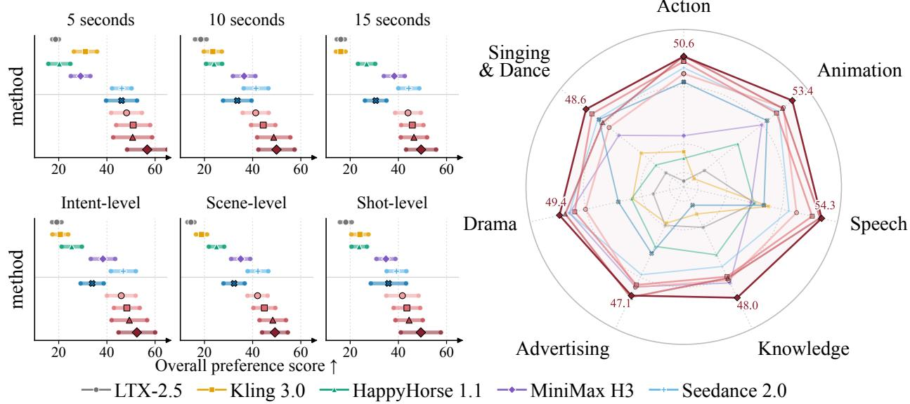  
Figure 3 Fine-grained expert evaluation on the 5-15 seconds subset of WanPEval. Left: Preference scores across generation durations and request-granularity levels. Markers denote S, and horizontal intervals span $[ S _ { \mathrm { l o w e r } } , S _ { \mathrm { u p p e r } } ]$ Right: Preference scores S across seven content categories.

WanPE is strong and consistent on WanPEval. We first ablate PE scale under the same Wan3.0 video generator. Figure 3 shows that WanPE-397B ranks first on intent-, scene-, and shot-level requests, with scores of 52.44, 49.26, and 49.32. Compared with using no prompt enhancement, WanPE-397B delivers substantial gains of 18.55, 16.97, and 13.45 points across the three request granularities. We then compare WanPE-397B with other leading video generation systems. As shown in Table 1, it ranks first in both S and BT at every duration on the 5–15-second subset, with overall scores of 50.61 and 61.85, and outperforms Seedance 2.0 by 7.19 points in S. As shown in Table 2, it remains competitive with Seedance 2.5 on the 30-second subset, especially on animation and speech, where it scores 81.25 and 73.68. Details are provided in the Appendix D.

Prompt enhancement becomes increasingly important as the generation horizon grows. Under the same Wan3.0 video generator, WanPE-397B improves over the original-request baseline by 10.66, 16.28, and 18.84 points at 5, 10, and 15 seconds. On the 30-second subset, it raises S from 9.38 to 60.24. The gains therefore increase over 5–15 seconds and remain large at 30 seconds.

## 3.2 Reverse-Constructed Supervision vs. Forward Prompt Expansion

A central design choice of WanPE is to construct supervision in reverse from video-grounded captions. We isolate its efect through two forward-based baselines: (i) Forward Rewriting. 8 experts in computer science and film directing designed an instruction covering semantic fidelity, cinematic structure, temporal progression, camera language, lighting, narrative development, and audiovisual coherence. These dimensions match those of the video-grounded targets y in Section 2.2. On a separate validation set, gemini-3.1-pro-preview [23] rewrites the original requests, and the Wan3.0 DiT generates videos conditioned on the rewritten prompts. Following the blind protocol in Section 2.4, we refined the instruction over 27 versions. The final version is the Forward Rewriting baseline. (ii) Forward-target SFT. Using the reconstructed requests x from Section 2.2, we apply the above Forward Rewriting method to obtain $y _ { \mathrm { f w d } } .$ and train on $( x , y _ { \mathrm { f w d } } )$ with same settings.

Table 2 Preference scores S on WanPEval. (i) 30-second subset against Seedance 2.5, under Wan3.0. (ii) Reverse-constructed vs. forward-based enhancement, under Wan3.0. (iii) Format-adapted WanPE vs. native enhancers on LTX-2.5 and MiniMax-H3 in two separate battles.
<table><tr><td>Method</td><td>Action</td><td>Anim.</td><td>Speech</td><td>Ad.</td><td>Sing &amp; Dance</td><td>Drama</td><td>Know.</td><td>Overall</td></tr><tr><td colspan="9">Exp1: 30-second subset</td></tr><tr><td>Seedance 2.5</td><td>68.18</td><td>46.43</td><td>55.00</td><td>81.25</td><td>60.00</td><td>56.00</td><td>60.71</td><td>59.76</td></tr><tr><td></td><td></td><td></td><td>downstream generator: Wan3.0&#x27;s video generator</td><td></td><td></td><td></td><td></td><td></td></tr><tr><td>Original request</td><td>4.17</td><td>9.38</td><td>15.79</td><td>5.00</td><td>22.50</td><td>4.00</td><td>3.57</td><td>9.38</td></tr><tr><td>+WanPE-397B</td><td>50.00</td><td>81.25</td><td>73.68</td><td>75.00</td><td>47.50</td><td>53.85</td><td>57.14</td><td>60.24</td></tr><tr><td colspan="9">Exp2: Reverse vs. forward enhancement</td></tr><tr><td>21.01</td><td>downstream generator: Wan3.0&#x27;s video generator</td><td></td><td></td><td></td><td></td><td></td><td></td><td></td></tr><tr><td>Original Request + Forward Rewriting</td><td>23.97</td><td>38.43</td><td>29.85</td><td>19.32</td><td>35.00</td><td>22.60</td><td>6.38</td><td>23.05 39.49</td></tr><tr><td>+ Forward-target SFT</td><td></td><td>39.57</td><td>42.13</td><td>43.57 37.00</td><td>38.61 35.34</td><td>34.62 33.72</td><td>41.89 34.26</td><td>35.17</td></tr><tr><td>+ WanPE-397B-SFT</td><td>30.36</td><td>44.23</td><td>32.28</td><td>49.32</td><td>45.51</td><td>51.54</td><td>51.23</td><td>49.86</td></tr><tr><td></td><td>46.48</td><td>55.98</td><td>48.31</td><td></td><td></td><td></td><td></td><td></td></tr><tr><td colspan="9">Exp3: Cross-generator transfer (5–15s) downstream generator: LTX-2.5-Base</td></tr><tr><td></td><td>18.33</td><td></td><td></td><td></td><td>7.50</td><td>26.67</td><td>25.00</td><td>21.11</td></tr><tr><td>+ LTX-2.5-PE + WanPE-397B</td><td>8.33 25.00</td><td></td><td>30.00</td><td>32.50</td><td>27.50</td><td>36.67</td><td>35.00</td><td>35.56</td></tr><tr><td></td><td></td><td>38.33</td><td>53.33</td><td>27.50</td><td></td><td></td><td></td><td></td></tr><tr><td colspan="9">downstream generator: MiniMax-H3-Base</td></tr><tr><td>+ H3-Context-IR</td><td>44.44</td><td>31.03 37.93</td><td>33.33 40.00</td><td>39.47</td><td>37.50</td><td>29.31</td><td>40.00</td><td>35.92</td></tr><tr><td>+ WanPE-397B</td><td></td><td>29.63</td><td></td><td>44.74</td><td>47.50</td><td>50.00</td><td>40.00</td><td>41.09</td></tr></table>

Video-grounded learning provides stronger conditions than forward rewriting. As shown in Table 2, WanPE-397B-SFT attains an overall S of 49.86, outperforming Forward Rewriting by 10.37 points and Forward-target SFT by 14.69 points. It ranks first in all seven content categories. These results indicate that video-grounded cinematic captions provide more efective conditions than forward-constructed targets.

## 3.3 Transferability of Cinematic Planning Across Video Generators

We test whether WanPE plans remain efective beyond Wan3.0. Because video generators use diferent conditioning formats, we adapt WanPE to each native format while keeping the cinematic content. We use MiniMax-H3 and LTX-2.5, whose enhancers and generators are separately accessible. GPT-5.4 converts WanPE outputs into H3-Context-IR and LTX-2.5-PE formats, then fed to H3-Base and LTX-2.5-Base.

WanPE transfers across video generators. After format adaptation, WanPE-397B outperforms the native enhancers on both generators (Table 2, Exp3), improving S by 14.45 points on LTX-2.5-Base and 5.17 on MiniMax-H3-Base. These results suggest its learned cinematic organization remains efective across formats.

## 3.4 Semantic Consistency and SC-GRPO Analysis

In this subsection, we evaluate whether SC-GRPO improves semantic consistency and whether this improvement also benefits downstream video generation.

SC-GRPO consistently improves semantic consistency. Figure 4 shows that the mean training reward increases substantially across four model sizes, with larger models reaching higher final values. These gains are reflected on WanPEval. As shown in Table 3, SC-GRPO improves the overall semantic-consistency score by 18.6–23.3 points across four model sizes, as evaluated by gemini-3.1-pro-preview, with consistent gains at every evaluated duration. It increases the proportion of perfect outputs and reduces failures.

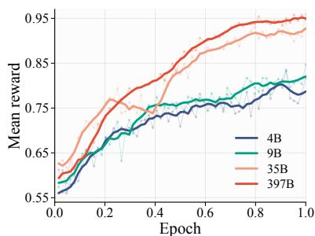  
Figure 4 Mean reward during SC-GRPO training at four scales.

Table 3 (i) Semantic consistency evaluated by gemini-3.1-pro-preview. † denotes results computed on the 5–15-second subset. (ii) Expert preference S for 397B SFT vs. WanPE-397B under Wan3.0.
<table><tr><td colspan="9">(i) Semantic consistency</td></tr><tr><td>Method</td><td>Overall↑</td><td>5 seconds↑</td><td>10 seconds↑</td><td>15 seconds↑</td><td>30 seconds↑</td><td>Perfect↑</td><td>Failure↓</td></tr><tr><td>Fwd. Rewriting</td><td>90.7</td><td>93.5</td><td>91.8</td><td>90.3</td><td>89.4</td><td>55.0</td><td>10.0</td></tr><tr><td>LTX-2.5-PE</td><td>77.3</td><td>76.1 89.4</td><td>81.6</td><td>74.9</td><td>77.0</td><td>33.7</td><td>38.6</td></tr><tr><td>H3-Context-IR</td><td>88.3†</td><td></td><td>88.8</td><td>87.6</td><td></td><td>54.2†</td><td>17.3†</td></tr><tr><td colspan="8">Ours 66.7</td></tr><tr><td>WanPE-4B-SFT</td><td>66.5</td><td>67.0</td><td colspan="2">68.4</td><td>64.2</td><td>20.1</td><td>56.6</td></tr><tr><td>+ SC-GRPO</td><td>85.3+18.8</td><td>91.9+24.9</td><td>83.1+14.7</td><td>85.3+18.6</td><td>84.8+20.6</td><td>52.0+31.9</td><td>27.4-29.2</td></tr><tr><td>WanPE-9B-SFT</td><td>70.2</td><td>74.6</td><td>69.5</td><td>72.9</td><td>65.6</td><td>22.5</td><td>48.6</td></tr><tr><td>+ SC-GRPO</td><td>88.8+18.6</td><td>94.0+19.4</td><td>90.6+21.1</td><td>87.9+15.0</td><td>86.5+20.9</td><td>53.8+31.3</td><td>15.7-32.9</td></tr><tr><td>WanPE-35B-SFT</td><td>73.1</td><td>69.0</td><td colspan="2">70.1</td><td>71.7</td><td>21.3</td><td>42.6</td></tr><tr><td>+ SC-GRPO</td><td>96.4+23.3</td><td>99.3+30.3</td><td colspan="2">97.9+27.8</td><td>95.9+24.2</td><td>80.7+59.4</td><td>4.4-38.2</td></tr><tr><td>WanPE-397B-SFT</td><td>75.5</td><td>73.2</td><td>70.0</td><td>95.0+17.7 81.5</td><td>73.4</td><td>29.7</td><td>36.9</td></tr><tr><td>+ SC-GRPO</td><td>97.6+22.1</td><td>99.1 +25.9</td><td>98.0+28.0</td><td>96.9+15.4</td><td>97.6+24.2</td><td>85.5+55.8</td><td>2.8-34.1</td></tr><tr><td colspan="8">(ii) PE-scale expert preference on WanPEval</td></tr><tr><td>Method</td><td>Action</td><td>Anim.</td><td>Speech Ad.</td><td>Sing &amp; Dance</td><td>Drama</td><td>Know.</td><td>Overall</td></tr><tr><td colspan="8">Video generator: Wan3.0&#x27;s video generator 27.44</td></tr><tr><td>Original Request + 397B SFT</td><td>24.71 47.02</td><td>26.62</td><td>11.00</td><td>32.50 37.50</td><td>30.12 38.75</td><td>15.74 34.26</td><td>24.95</td></tr><tr><td>+ WanPE-397B</td><td>47.65</td><td>47.37 48.70</td><td>54.00 55.00</td><td>53.33</td><td>40.96</td><td>53.70</td><td>42.70</td></tr><tr><td></td><td></td><td></td><td></td><td></td><td></td><td></td><td>49.69</td></tr></table>

SC-GRPO improves downstream video generation. We compare WanPE-397B before and after SC-GRPO using the expert video-evaluation protocol in Section 2.4. Both variants use the same Wan3.0 video generator and difer only in their enhanced conditions. As shown in Table 3, SC-GRPO increases the overall preference score from 42.70 to 49.69 and improves performance across all seven content categories, with larger gains in knowledge, singing and dance, and speech. These results thus show that optimizing semantic consistency also benefits downstream video quality, producing more efective textual conditions for video generation.

## 4 Related Work

Text-to-video generation. Text-to-video generation has progressed rapidly with difusion and transformer architectures, from early latent video models [24–27] to large difusion transformers such as Open-Sora [28], CogVideoX [29], HunyuanVideo 1.5 [30], Wan2.2 [13], LTX series [31], Lingbot-Video [32], and MiniMax-H3 [21]. Closed-source systems include Sora 2 [33], Kling [20], Seedance 2.5 [2], Wan3.0 [1].

Prompt enhancementfor text-to-video generation. Recent works have explored T2V prompt enhancement from several directions. POS [9] jointly optimizes noise and textual prompts with semantic-preserving rewriting, while RAPO [34] combines retrieval-augmented modifiers with LLM rewriting to better align user prompts with the training-prompt distribution. VPO [4] and Prompt-A-Video [5] train prompt optimizers with supervised and preference-based objectives, while VidPrompter [3] adopts multimodal multi-task training with hallucination-aware preference optimization. CAPE-T2V [7] studies captioner-anchored two-sided conditioning alignment. Other methods focus on iterative refinement during inference: PhyT2V [8] introduces reasoning-based self-refinement for physical realism, SCMAPR [10] coordinates scenario-aware agents with semantic verification, and VISTA [12] iteratively revises prompts using generated-video selection and critique. RAPO++ [11] combines training-data alignment, test-time optimization, and rewriter fine-tuning, while PhyPrompt [6] trains a physics-aware rewriter with supervised fine-tuning and GRPO. These works highlight the importance of prompt enhancement as an interface between user requests and video generators.

Modern commercial T2V systems also increasingly rely on proprietary prompt enhancers. For example, HappyHorse 1.1 [19], Kling 3.0 [20], MiniMax-H3 [21], Seedance 2.0 [18], and Seedance 2.5 [2] employ native prompt-enhancement components whose model designs and training recipes remain largely undisclosed. MiniMax-H3 provides H3-Context-IR as a separately accessible prompt enhancer paired with H3-Base, whereas the prompt enhancers of other systems are integrated into their end-to-end generation APIs.

## 5 Conclusion

This work reframes prompt enhancement for modern video generators. As generators process longer contexts, follow complex instructions, and synthesize videos of up to 30 seconds, the prompt is no longer a decorated caption but the blueprint that orchestrates actions, camera choreography, audio, and narrative across shots and through time before pixel rendering. We introduced WanPE as a scalable realization of this cinematic planning architecture. It learns realized cinematic structure from real-world videos through video-grounded reverse SFT and faithfully preserves user requirements throughout the unfolding plan through SC-GRPO. Scaling WanPE from 4B to 397B consistently improves semantic fidelity and downstream video quality. Ablations show that reverse construction outperforms forward rewriting and that SC-GRPO improves semantic fidelity across model scales, while format-adapted WanPE outputs remain efective across video generators. These findings lay a reliable foundation for the next stage of prompt enhancement development.

## 6 Acknowledgements

We sincerely thank Junjie He, Xinhua Cheng, Zeyinzi Jiang, Xiaowen Li, Wei Wang∼1, Tianyi Gui, Xiaoyi Bao, Wenting Shen, Tianxing Wang, Ang Wang, Weize Duan, Wei Wang∼2, Zhi-Fan Wu, Chaojie Mao, and Lei Shang for their valuable support and contributions to this work.

## References

[1] Wan Team. Wan AI: Leading ai video generation model. https://wan.video, 2026.

[2] ByteDance Seed. Seedance 2.5. https://seed.bytedance.com/en/seedance2\_5, 2026.

[3] Jiapeng Wang, Chengyu Wang, Jun Huang, and Lianwen Jin. Hallucination-aware prompt optimization for text-to-video synthesis. In James Kwok, editor, Proceedings of the Thirty-Fourth International Joint Conference on Artificial Intelligence, IJCAI-25, pages 10198–10206. International Joint Conferences on Artificial Intelligence Organization, 8 2025. doi: 10.24963/ijcai.2025/1133. URL https://doi.org/10.24963/ijcai.2025/1133. AI, Arts & Creativity.

[4] Jiale Cheng, Ruiliang Lyu, Xiaotao Gu, Xiao Liu, Jiazheng Xu, Yida Lu, Jiayan Teng, Zhuoyi Yang, Yuxiao Dong, Jie Tang, et al. Vpo: Aligning text-to-video generation models with prompt optimization. In 2025 IEEE/CVF International Conference on Computer Vision (ICCV), pages 15636–15645. IEEE, 2025.

[5] Yatai Ji, Jiacheng Zhang, Jie Wu, Shilong Zhang, Shoufa Chen, Chongjian Ge, Peize Sun, Weifeng Chen, Wenqi Shao, Xuefeng Xiao, et al. Prompt-a-video: Prompt your video difusion model via preference-aligned llm. In 2025 IEEE/CVF International Conference on Computer Vision (ICCV), pages 18725–18735. IEEE, 2025.

[6] Shang Wu, Chenwei Xu, Zhuofan Xia, Weijian Li, Lie Lu, Pranav Maneriker, Fan Du, Manling Li, and Han Liu. Phyprompt: Rl-based prompt refinement for physically plausible text-to-video generation, 2026. URL https://arxiv.org/abs/2603.03505.

[7] Yizhuo Jia, Jingyun Hua, and Yuanxing Zhang. Cape-t2v: Captioner-anchored prompt enhancement toward two-sided conditioning alignment in text-to-video generation. arXiv preprint arXiv:2608.03046, 2026.

[8] Qiyao Xue, Xiangyu Yin, Boyuan Yang, and Wei Gao. Phyt2v: Llm-guided iterative self-refinement for physicsgrounded text-to-video generation. In Proceedings of the IEEE/CVF Conference on Computer Vision and Pattern Recognition (CVPR), pages 18826–18836, June 2025.

[9] Shijie Ma, Huayi Xu, Mengjian Li, Weidong Geng, Yaxiong Wang, and Meng Wang. Pos: A prompts optimization suite for augmenting text-to-video generation, 2024. URL https://arxiv.org/abs/2311.00949.

[10] Chengyi Yang, Pengzhen Li, Jiayin Qi, Aimin Zhou, Ji Wu, and Ji Liu. SCMAPR: Self-correcting multi-agent prompt refinement for complex-scenario text-to-video generation. In Maria Liakata, Viviane P. Moreira, Jiajun Zhang, and David Jurgens, editors, Findings of the Association for Computational Linguistics: ACL 2026, pages 6942–6973, San Diego, California, United States, July 2026. Association for Computational Linguistics. ISBN 979- 8-89176-395-1. doi: 10.18653/v1/2026.findings-acl.345. URL https://aclanthology.org/2026.findings-acl.345/.

[11] Bingjie Gao, Qianli Ma, Xiaoxue Wu, Shuai Yang, Guanzhou Lan, Haonan Zhao, Jiaxuan Chen, Qingyang Liu, Yu Qiao, Xinyuan Chen, Yaohui Wang, and Li Niu. Rapo++: Cross-stage prompt optimization for text-to-video generation via data alignment and test-time scaling, 2026. URL https://arxiv.org/abs/2510.20206.

[12] Do Xuan Long, Xingchen Wan, Hootan Nakhost, Chen-Yu Lee, Tomas Pfister, and Sercan Ö. Arik. Vista: A testtime self-improving video generation agent. In Proceedings of the IEEE/CVF Conference on Computer Vision and Pattern Recognition (CVPR), pages 6021–6032, June 2026.

[13] Wan Team, Ang Wang, Baole Ai, Bin Wen, Chaojie Mao, Chen-Wei Xie, Di Chen, Feiwu Yu, Haiming Zhao, Jianxiao Yang, Jianyuan Zeng, Jiayu Wang, Jingfeng Zhang, Jingren Zhou, Jinkai Wang, Jixuan Chen, Kai Zhu, Kang Zhao, Keyu Yan, Lianghua Huang, Mengyang Feng, Ningyi Zhang, Pandeng Li, Pingyu Wu, Ruihang Chu, Ruili Feng, Shiwei Zhang, Siyang Sun, Tao Fang, Tianxing Wang, Tianyi Gui, Tingyu Weng, Tong Shen, Wei Lin, Wei Wang, Wei Wang, Wenmeng Zhou, Wente Wang, Wenting Shen, Wenyuan Yu, Xianzhong Shi, Xiaoming Huang, Xin Xu, Yan Kou, Yangyu Lv, Yifei Li, Yijing Liu, Yiming Wang, Yingya Zhang, Yitong Huang, Yong Li, You Wu, Yu Liu, Yulin Pan, Yun Zheng, Yuntao Hong, Yupeng Shi, Yutong Feng, Zeyinzi Jiang, Zhen Han, Zhi-Fan Wu, and Ziyu Liu. Wan: Open and advanced large-scale video generative models, 2025. URL https://arxiv.org/abs/2503.20314.

[14] Zhihong Shao, Peiyi Wang, Qihao Zhu, Runxin Xu, Junxiao Song, Xiao Bi, Haowei Zhang, Mingchuan Zhang, Y. K. Li, Y. Wu, and Daya Guo. Deepseekmath: Pushing the limits of mathematical reasoning in open language models, 2024. URL https://arxiv.org/abs/2402.03300.

[15] Artificial Analysis. Video generation benchmarking methodology. URL https://artificialanalysis.ai/video/ methodology. Accessed: September 19, 2026.

[16] Ralph Allan Bradley and Milton E Terry. Rank analysis of incomplete block designs: I. the method of paired comparisons. Biometrika, 39(3/4):324–345, 1952.

[17] Qwen Team. Qwen3.5: Towards native multimodal agents. https://qwen.ai/blog?id=qwen3.5, 2026.

[18] Team Seedance, De Chen, Liyang Chen, Xin Chen, Ying Chen, Zhuo Chen, Zhuowei Chen, Feng Cheng, Tianheng Cheng, Yufeng Cheng, Mojie Chi, Xuyan Chi, Jian Cong, Qinpeng Cui, Fei Ding, Qide Dong, Yujiao Du, Haojie Duanmu, Junliang Fan, Jiarui Fang, Jing Fang, Zetao Fang, Chengjian Feng, Yu Gao, Diandian Gu, Dong Guo, Hanzhong Guo, Qiushan Guo, Boyang Hao, Hongxiang Hao, Haoxun He, Jiaao He, Qian He, Tuyen Hoang, Heng Hu, Ruoqing Hu, Yuxiang Hu, Jiancheng Huang, Weilin Huang, Zhaoyang Huang, Zhongyi Huang, Jishuo Jin, Ming Jing, Ashley Kim, Shanshan Lao, Yichong Leng, Bingchuan Li, Gen Li, Haifeng Li, Huixia Li, Jiashi Li, Ming Li, Xiaojie Li, Xingxing Li, Yameng Li, Yiying Li, Yu Li, Yueyan Li, Chao Liang, Han Liang, Jianzhong Liang, Ying Liang, Wang Liao, J. H. Lien, Shanchuan Lin, Xi Lin, Feng Ling, Yue Ling, Fangfang Liu, Jiawei Liu, Jihao Liu, Jingtuo Liu, Shu Liu, Sichao Liu, Wei Liu, Xue Liu, Zuxi Liu, Ruijie Lu, Lecheng Lyu, Jingting Ma, Tianxiang Ma, Xiaonan Nie, Jingzhe Ning, Junjie Pan, Xitong Pan, Ronggui Peng, Xueqiong Qu, Yuxi Ren, Yuchen Shen, Guang Shi, Lei Shi, Yinglong Song, Fan Sun, Li Sun, Renfei Sun, Wenjing Tang, Boyang Tao, Zirui Tao, Dongliang Wang, Feng Wang, Hulin Wang, Ke Wang, Qingyi Wang, Rui Wang, Shuai Wang, Shulei Wang, Weichen Wang, Xuanda Wang, Yanhui Wang, Yue Wang, Yuping Wang, Yuxuan Wang, Zijie Wang, Ziyu Wang, Guoqiang Wei, Meng Wei, Di Wu, Guohong Wu, Hanjie Wu, Huachao Wu, Jian Wu, Jie Wu, Ruolan Wu, Shaojin Wu, Xiaohu Wu, Xinglong Wu, Yonghui Wu, Ruiqi Xia, Xin Xia, Xuefeng Xiao, Shuang Xu, Bangbang Yang, Jiaqi Yang, Runkai Yang, Tao Yang, Yihang Yang, Zhixian Yang, Ziyan Yang, Fulong Ye, Bingqian Yi, Xing Yin, Yongbin You, Linxiao Yuan, Weihong Zeng, Xuejiao Zeng, Yan Zeng, Siyu Zhai, Zhonghua Zhai, Bowen Zhang, Chenlin Zhang, Heng Zhang, Jun Zhang, Manlin Zhang, Peiyuan Zhang, Shuo Zhang, Xiaohe Zhang, Xiaoying Zhang, Xinyan Zhang, Xinyi Zhang, Yichi Zhang, Zixiang Zhang, Haiyu Zhao, Huating Zhao, Liming Zhao, Yian Zhao, Guangcong Zheng, Jianbin Zheng, Xiaozheng Zheng, Zerong Zheng, Kuan Zhu, and Feilong Zuo. Seedance 2.0: Advancing video generation for world complexity, 2026. URL https://arxiv.org/abs/2604.14148.

[19] HappyHorse Team. Happyhorse 1.1. https://www.happyhorse.cn/, 2026.

[20] Kling AI. Kling video 3.0: Professional cinematic ai video production, 2026. URL https://kling.ai/feature/ kling-video-3.

[21] MiniMax Team. Minimax-h3. https://www.minimax.io/blog/minimax-h3, 2026.

[22] Lightricks. Ltx-2.5. https://ltx.io/model/ltx-2-5, 2026.

[23] Google. Gemini 3.1 pro: A smarter model for your most complex tasks. https://blog.google/innovation-and-ai/ models-and-research/gemini-models/gemini-3-1-pro/, 2026.

[24] Andreas Blattmann, Tim Dockhorn, Sumith Kulal, Daniel Mendelevitch, Maciej Kilian, Dominik Lorenz, Yam Levi, Zion English, Vikram Voleti, Adam Letts, Varun Jampani, and Robin Rombach. Stable video difusion: Scaling latent video difusion models to large datasets, 2023. URL https://arxiv.org/abs/2311.15127.

[25] Yaohui Wang, Xinyuan Chen, Xin Ma, Shangchen Zhou, Ziqi Huang, Yi Wang, Ceyuan Yang, Yinan He, Jiashuo Yu, Peiqing Yang, Yuwei Guo, Tianxing Wu, Chenyang Si, Yuming Jiang, Cunjian Chen, Chen Change Loy, Bo Dai, Dahua Lin, Yu Qiao, and Ziwei Liu. Lavie: High-quality video generation with cascaded latent difusion models, 2023. URL https://arxiv.org/abs/2309.15103.

[26] Yuwei Guo, Ceyuan Yang, Anyi Rao, Zhengyang Liang, Yaohui Wang, Yu Qiao, Maneesh Agrawala, Dahua Lin, and Bo Dai. Animatedif: Animate your personalized text-to-image difusion models without specific tuning, 2024. URL https://arxiv.org/abs/2307.04725.

[27] Xin Ma, Yaohui Wang, Xinyuan Chen, Gengyun Jia, Ziwei Liu, Yuan-Fang Li, Cunjian Chen, and Yu Qiao. Latte: Latent difusion transformer for video generation, 2025. URL https://arxiv.org/abs/2401.03048.

[28] Zangwei Zheng, Xiangyu Peng, Tianji Yang, Chenhui Shen, Shenggui Li, Hongxin Liu, Yukun Zhou, Tianyi Li, and Yang You. Open-sora: Democratizing eficient video production for all, 2024. URL https://arxiv.org/abs/ 2412.20404.

[29] Zhuoyi Yang, Jiayan Teng, Wendi Zheng, Ming Ding, Shiyu Huang, Jiazheng Xu, Yuanming Yang, Wenyi Hong, Xiaohan Zhang, Guanyu Feng, Da Yin, Yuxuan Zhang, Weihan Wang, Yean Cheng, Bin Xu, Xiaotao Gu, Yuxiao Dong, and Jie Tang. Cogvideox: Text-to-video difusion models with an expert transformer, 2025. URL https://arxiv.org/abs/2408.06072.

[30] Bing Wu, Chang Zou, Changlin Li, Duojun Huang, Fang Yang, Hao Tan, Jack Peng, Jianbing Wu, Jiangfeng Xiong, Jie Jiang, Linus, Patrol, Peizhen Zhang, Peng Chen, Penghao Zhao, Qi Tian, Songtao Liu, Weijie Kong, Weiyan Wang, Xiao He, Xin Li, Xinchi Deng, Xuefei Zhe, Yang Li, Yanxin Long, Yuanbo Peng, Yue Wu, Yuhong Liu, Zhenyu Wang, Zuozhuo Dai, Bo Peng, Coopers Li, Gu Gong, Guojian Xiao, Jiahe Tian, Jiaxin Lin, Jie Liu, Jihong Zhang, Jiesong Lian, Kaihang Pan, Lei Wang, Lin Niu, Mingtao Chen, Mingyang Chen, Mingzhe Zheng, Miles Yang, Qiangqiang Hu, Qi Yang, Qiuyong Xiao, Runzhou Wu, Ryan Xu, Rui Yuan, Shanshan Sang, Shisheng

Huang, Siruis Gong, Shuo Huang, Weiting Guo, Xiang Yuan, Xiaojia Chen, Xiawei Hu, Wenzhi Sun, Xiele Wu, Xianshun Ren, Xiaoyan Yuan, Xiaoyue Mi, Yepeng Zhang, Yifu Sun, Yiting Lu, Yitong Li, You Huang, Yu Tang, Yixuan Li, Yuhang Deng, Yuan Zhou, Zhichao Hu, Zhiguang Liu, Zhihe Yang, Zilin Yang, Zhenzhi Lu, Zixiang Zhou, and Zhao Zhong. Hunyuanvideo 1.5 technical report, 2025. URL https://arxiv.org/abs/2511.18870.

[31] Yoav HaCohen, Benny Brazowski, Nisan Chiprut, Yaki Bitterman, Andrew Kvochko, Avishai Berkowitz, Daniel Shalem, Daphna Lifschitz, Dudu Moshe, Eitan Porat, Eitan Richardson, Guy Shiran, Itay Chachy, Jonathan Chetboun, Michael Finkelson, Michael Kupchick, Nir Zabari, Nitzan Guetta, Noa Kotler, Ofir Bibi, Ori Gordon, Poriya Panet, Roi Benita, Shahar Armon, Victor Kulikov, Yaron Inger, Yonatan Shiftan, Zeev Melumian, and Zeev Farbman. Ltx-2: Eficient joint audio-visual foundation model, 2026. URL https://arxiv.org/abs/2601. 03233.

[32] Shuailei Ma, Jiaqi Liao, Xinyang Wang, Jingjing Wang, Chaoran Feng, Zijing Hu, Chong Bao, Zichen Xi, Yuqi Gan, Weisen Wang, Yanhong Zeng, Qin Zhao, Zifan Shi, Wei Wu, Hao Ouyang, Qiuyu Wang, Shangzhan Zhang, Jiahao Shao, Yipengjing Sun, Liangxiao Hu, Lunke Pan, Nan Xue, Kecheng Zheng, Yinghao Xu, Xing Zhu, Yujun Shen, and Ka Leong Cheng. Scaling mixture-of-experts video pretraining for embodied intelligence, 2026. URL https://arxiv.org/abs/2607.07675.

[34] Bingjie Gao, Xinyu Gao, Xiaoxue Wu, Yujie Zhou, Yu Qiao, Li Niu, Xinyuan Chen, and Yaohui Wang. The devil is in the prompts: Retrieval-augmented prompt optimization for text-to-video generation. In Proceedings of the IEEE/CVF Conference on Computer Vision and Pattern Recognition (CVPR), pages 3173–3183, June 2025.

[33] OpenAI. Sora 2 is here. https://openai.com/index/sora-2/, 2025.

## A Video Data Collection and Curation

This section describes the real-world video corpus used to construct video-grounded supervision. Section A.1 introduces the collection scope. Section A.2 describes the organization of shot- and sequence-level clips. Section A.3 presents the quality filtering and curation criteria. Section A.4 summarizes the resulting corpus.

## A.1 Collection Scope

Cinematic planning requires supervision that captures both local realization and temporal organization. A detailed individual shot provides evidence about subject behavior, composition, camera work, lighting, and sound, whereas a sequence reveals how these elements develop through transitions, editing, and narrative progression. We therefore retain both shot-level clips and multi-shot sequences.

The source videos are publicly available or licensed for use. Long-form videos are divided into clips of no more than 30 seconds, allowing each sample to preserve detailed audiovisual content while remaining suitable for structured cinematic captioning.

## A.2 Shot- and Sequence-Level Organization

At the shot level, the corpus emphasizes semantically complete and visually expressive moments. The relevant signals include character actions and emotions, lighting and color, camera configuration and movement, music, speech, sound efects, animation-specific appearance and motion, and motion-graphics design. These clips provide dense evidence about how cinematic elements are combined within a single shot.

At the sequence level, the emphasis shifts to relationships among temporally ordered shots. The retained sequences expose changes in action, scene, camera, and audio, together with the transitions and editing patterns that connect them. They therefore provide direct examples of how individually meaningful shots are arranged into a coherent narrative progression.

This organization supplies complementary supervision: shot-level clips capture fine-grained cinematic realization, while sequence-level clips capture long-range structure.

## A.3 Quality Filtering and Curation

We first filter the collected clips for technical validity, visual quality, and motion quality. The remaining samples are then curated according to their temporal structure.

For shot-level clips, curation considers the clarity and completeness of the central event together with the quality of character performance, visual presentation, camera behavior, audio-visual content, animation, and motion graphics.

For multi-shot sequences, curation considers whether the sequence is understandable as an independent unit, whether its ordered shots form a meaningful narrative progression, and whether it uses suficiently rich cinematic organization. Content-specific properties are also considered where applicable, including visualstyle consistency across animated shots and efective information delivery in motion-graphics sequences.

## A.4 Resulting Corpus

The resulting corpus contains approximately 1.05M clips of up to 30 seconds across ten content dimensions. By combining fine-grained shot-level evidence with realized multi-shot organization, the corpus supports learning cinematic conditions at both local and long-range temporal scales. Appendix B describes how these videos are converted into video-grounded cinematic targets.

## B Video-Grounded Reverse Construction

This section describes how curated videos are converted into video-grounded cinematic targets. Section B.1 introduces the shared caption structure, Section B.2 describes category-adaptive captioning, and Section B.3 presents caption quality control.

## B.1 Hierarchical Caption Structure

Each cinematic target yi contains a video-level summary and temporally ordered shot-level descriptions with timestamps. The video-level summary captures the overall content, setting, visual style, narrative perspective, pacing, and audio design. Each shot describes its composition, subjects, actions, lighting, camera movement, transitions, dialogue, music, and sound efects.

## B.2 Category-Adaptive Captioning

To accommodate diverse video content, we use diferentiated captioning schemes. General videos emphasize comprehensive scene coverage and detail completeness. Large-motion videos focus on displacement, speed, body-posture dynamics, and fast-paced audio. Music-related videos jointly describe performance, movement rhythm, music style, lyrics, and audio-visual synchronization. Dialect videos require accurate speech transcription grounded in visual context, while rich-text videos capture visible text together with its position, style, and layout.

For animation, captions emphasize visual style, animation-specific motion, and audio characteristics. Advertisement and motion-graphics videos focus on visual design, motion pacing, and brand presentation. Visualefects videos describe efect types and their integration with the scene. Videos with complex camera movement or long takes require descriptions of movement type, direction, speed, and narrative function.

The captioner applies distinct system prompts for diferent schemes and uses preprocessing tags produced by vision-language or lightweight specialized models to reinforce the relevant descriptive dimensions.

## B.3 Caption Quality Control

We assess generated captions for structural completeness, timestamp validity, and consistency with the source video. Captions that fail these checks are regenerated. The retained captions serve as the video-grounded targets used for supervised fine-tuning.

## C WanPEval Design and Construction

WanPEval contains 249 curated requests spanning diverse content categories, target durations, aspect ratios, and levels of request granularity. Section C.1 presents the benchmark distribution, while Section C.2 provides representative intent-level, scene-level, and shot-level requests

## C.1 Benchmark Coverage and Distribution

Figure 5 summarizes the distribution of the 249 requests in WanPEval. The benchmark covers seven content categories, four target durations from 5 to 30 seconds, two aspect ratios, and three request-granularity levels. It further characterizes shot-count specifications, audio components, and cinematic language across the requests. Together, these dimensions reflect practical text-to-video generation scenarios and requirements.

## C.2 Representative Requests Across Granularity Levels

The following nine requests are taken from WanPEval, with three examples at each granularity level. They illustrate the diversity of the benchmark across categories, durations, and levels of request detail.

Intent-level examples.

Drama, 10 seconds, 16:9.

Cinematic realistic style, a company corridor in the early morning, a mid-long shot of an intern working overtime alone, constantly complaining, being overheard by the boss.

Speech, 5 seconds, 16:9.

Generate a historical court drama dialogue video with 3 shots. The content is about an imperial concubine aggressively scolding a maid, and the maid responding aggrievedly.

Animation, 15 seconds, 9:16.

F. Audio Components

A. Distribution of Video Categories

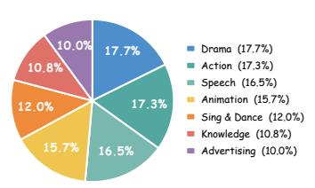  
B. Video Durations

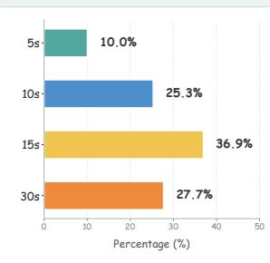

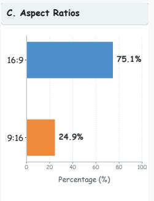

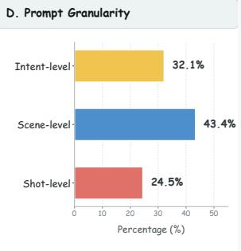  
E. Shot Count Specification

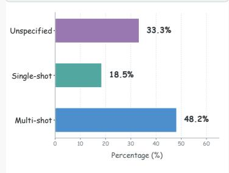

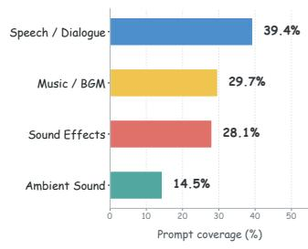

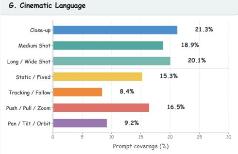  
Figure 5 Distribution of the 249 requests in WanPEval. The panels report video category, target duration, aspect ratio, prompt granularity, shot-count specification, audio components, and cinematic language.

3D exquisite realistic animation, in front of a Gothic church under the moonlight, a little girl in a Gothic nun’s attire holds a thorny rose and makes eye contact with a plaster statue of Jesus, cool color tone, exquisite and beautiful.

## Scene-level examples.

## Drama, 10 seconds, 16:9.

A young man with the power to sense and purify evil energies walks alone through a deserted alley on a rainy night. Suddenly, he is entangled by a ferocious evil spirit lurking in the dark. He faces the roaring, pouncing evil spirit alone, fighting against the malevolent forces by himself to protect the peace of the human world.

## Action, 30 seconds, 16:9.

A wandering monk wearing a bamboo hat is traveling when he witnesses a young woman being harassed by thugs. He immediately rushes forward, uses the bamboo flute in his hand to fight them of and rescues the woman. After accepting her thanks, he turns and walks away, playing the bamboo flute as he goes.

## Animation, 15 seconds, 16:9.

Classic fairytale princess style 3D animation. In a glass vase in a flower shop, a small white flower quietly blooms, and a glowing flower fairy appears from within the petals. She slowly floats among the flower stands, looking around at the room full of fresh flowers and water droplets. Suddenly, she hears the shop’s doorbell ring, immediately returns inside the flower bud, and the flower bud closes again.

## Shot-level examples.

## Drama, 10 seconds, 16:9.

Shot 1: Long shot, modern realistic style, a playground. Afternoon sun casts dappled light and shadows through tree leaves, with students walking and jogging in the background. The camera slowly pushes in, focus gradually shifts from the light spots on the playground floor to the running students in the distance. The foreground leaves are slightly blurred to create a sense of spatial depth.

Shot 2: Mid shot, tracking. The male protagonist, carrying a backpack, walks towards the school building. The camera follows from his side-rear, with a stabilizer for smooth tracking. A slight high angle captures the rhythm of his steps and his elongated shadow. The background is blurred to make the subject stand out.

Shot 3: Mid shot pushing in to a close-up. The female protagonist is sitting on a bench, reading a book. Dappled sunlight falls on the tips of her hair and the book pages. The camera slowly pushes in from a mid shot to a side-profile close-up. A slight handheld shake is added for a more lifelike feel. A shallow depth of field focuses on the female protagonist’s expression, with the background softly blurred.

Shot 4: Close shot. The male protagonist walks up to the female protagonist and hands her a bottle of water. The camera pans horizontally from the male protagonist’s hand to the female protagonist’s hand, keeping both centered in the frame. A slight focus pull transitions between them, capturing the moment their hands touch. The background remains slightly blurred.

## Speech, 5 seconds, 16:9.

A dialogue scene of a long-awaited reunion in an old mansion from the Republic of China era. The text and tone must exactly match the instructions. Shot 1: A two-person mid-shot, static camera. A girl in a simple and elegant cheongsam (in the calm tone of a young lady from a wealthy family): “You still know to come back.” A man in a dark Zhongshan suit (in the sincere tone of a mature and steady young man): “I haven’t forgotten our promise.” Shot 2: Cut to a close-up of the girl’s side profile. The girl (emotionally overwhelmed, crying, voice trembling and choked): “All these years, I’ve been waiting for you.”

## Speech, 30 seconds, 16:9.

On a late autumn evening, in a quiet street alley, a tall ginkgo tree gently sheds its golden leaves. Pale, warm evening light filters through the branches, casting mottled bright spots. The ambient sound is of a low wind and the subtle rustling of leaves scraping the ground. The camera uses a fixed medium shot, where a woman in a simple, light-colored knitted sweater with her long hair hanging naturally stands quietly by the ginkgo tree, her gaze fixed on the end of the alley. Then, the frame slowly cuts to a close-up of her fingers gently twirling a leaf, capturing the small and restrained action. Next, it slowly transitions to a wide shot; the woman turns slightly to the side and walks with a composed pace deeper into the street alley, her silhouette gradually receding. The camera slowly pulls back, finally stopping on a quiet picture of her back intertwined with the long alley in late autumn. Narrator (in a calm tone): “The wind brushes the long street, yellow leaves fall silently. Those fragments buried deep in the years, when recalled, leave only a touch of warmth and a bit of melancholy that was never spoken.”

These examples illustrate how request detail varies across the three granularity levels. Intent-level requests primarily specify a high-level scenario with limited temporal detail. Scene-level requests describe the progression of events without detailed shot-by-shot instructions. Shot-level requests explicitly organize content into shots and specify elements such as shot scale, camera movement, focus, action, and dialogue.

## D Additional Quantitative Results

This section provides additional quantitative results that supplement Table 1 and Figure 3. We report baseline-specific preference results and exact breakdowns by duration and request granularity on the 5-15- second subset of WanPEval.

## D.1 Baseline-Specific Preference Results

Table 4 reports preference results relative to individual external baselines. Each block compares an external system with the original-request baseline and WanPE-397B, with the gray row indicating the downstream generator used by the latter two. Scores aggregate valid pairwise judgments within each block.

Table 4: Baseline-specific preference scores across seven content categories and overall.
<table><tr><td>Method</td><td>Action</td><td>Anim.</td><td>Speech</td><td>Ad.</td><td>Sing &amp; Dance</td><td>Drama</td><td>Know.</td><td>Overall</td></tr><tr><td colspan="9">LTX-2.5 vs. Ours</td></tr><tr><td>LTX-2.5</td><td>6.78</td><td>10.83</td><td>36.21</td><td>19.23</td><td>5.56</td><td>16.10</td><td>26.32</td><td>17.34</td></tr><tr><td></td><td></td><td></td><td>Downstream generator: Wan3.0&#x27;s video generator</td><td></td><td></td><td></td><td></td><td></td></tr><tr><td>Original Request</td><td>43.33</td><td>48.33</td><td>35.34</td><td>38.46</td><td>47.37</td><td>35.00</td><td>11.54</td><td>37.85</td></tr><tr><td>+WanPE-397B</td><td>50.85</td><td>57.50</td><td>40.52</td><td>48.68</td><td>52.63</td><td>51.69</td><td>50.00</td><td>50.28</td></tr><tr><td colspan="9">Kling 3.0 vs. Ours</td></tr><tr><td>Kling 3.0</td><td>9.32</td><td>10.00</td><td>35.34</td><td>16.67</td><td>26.25</td><td>18.97</td><td>17.57</td><td>18.95</td></tr><tr><td></td><td></td><td></td><td></td><td></td><td>Downstream generator: Wan3.0&#x27;s video generator</td><td></td><td></td><td></td></tr><tr><td>Original Request +WanPE-397B</td><td>40.00</td><td>42.50</td><td>26.32</td><td>32.05</td><td>35.00</td><td>32.50</td><td>12.82</td><td>32.54</td></tr><tr><td></td><td>50.00</td><td>62.50</td><td>44.92</td><td>57.89</td><td>48.75</td><td>50.86</td><td>56.58</td><td>52.84</td></tr><tr><td colspan="9">HappyHorse 1.1 vs. Ours</td></tr><tr><td>HappyHorse 1.1</td><td>12.07</td><td>17.50</td><td>26.27</td><td>31.58</td><td>8.75</td><td>24.56</td><td>35.53</td><td>21.71</td></tr><tr><td></td><td></td><td></td><td></td><td></td><td>Downstream generator: Wan3.0&#x27;s video generator</td><td></td><td></td><td></td></tr><tr><td>Original Request +WanPE-397B</td><td>36.44 44.92</td><td>40.00</td><td>34.75</td><td>24.36 50.00</td><td>47.50 51.25</td><td>24.14 52.54</td><td>3.85 46.15</td><td>31.07 51.14</td></tr><tr><td colspan="9">60.83 50.00</td></tr><tr><td>MiniMax-H3</td><td></td><td></td><td></td><td>MiniMax-H3 vs. Ours</td><td></td><td></td><td></td><td></td></tr><tr><td></td><td>11.54</td><td>25.00</td><td>22.50</td><td>33.33</td><td>25.00</td><td>39.17</td><td>42.11</td><td>27.83</td></tr><tr><td>Original Request</td><td>35.96</td><td></td><td>Downstream generator: Wan3.0&#x27;s video generator</td><td>28.95</td><td>37.50</td><td>30.00</td><td>12.82</td><td>33.33</td></tr><tr><td>+WanPE-397B</td><td>42.73</td><td>37.07 59.48</td><td>44.07 53.39</td><td>46.15</td><td>45.00</td><td>45.83</td><td>48.72</td><td>49.14</td></tr><tr><td></td><td></td><td></td><td></td><td>Seedance 2.0 vs. Ours</td><td></td><td></td><td></td><td></td></tr><tr><td colspan="9">Downstream generator: Wan3.0&#x27;s video generator</td></tr><tr><td>Seedance 2.0</td><td>41.11</td><td>44.90</td><td>35.96</td><td>33.78</td><td>29.03</td><td>43.75</td><td>30.56</td><td>37.94</td></tr><tr><td>Original Request</td><td>27.36</td><td></td><td></td><td>31.58</td><td>31.43</td><td>22.41</td><td>5.26</td><td>25.98</td></tr><tr><td>+WanPE-397B</td><td>38.46</td><td>22.22</td><td>38.60</td><td>47.30</td><td>38.89</td><td>50.86</td><td>39.47</td><td>44.76</td></tr><tr><td></td><td></td><td>52.73</td><td>42.24</td><td></td><td></td><td></td><td></td><td></td></tr></table>

## D.2 Fine-Grained Preference Breakdowns

Tables 5 and 6 list the exact values represented by the markers and intervals in the left panel of Figure 3. Each entry follows the order $S _ { \mathrm { l o w e r } } / S / S _ { \mathrm { u p p e r } }$ . WanPE-397B attains the highest central score at every duration and request granularity.

Table 5: Exact preference intervals by duration. Entries are $S _ { \mathrm { l o w e r } } / S / S _ { \mathrm { u p p e r } }$
<table><tr><td>Method</td><td>5 seconds</td><td>10 seconds</td><td>15 seconds</td><td></td></tr><tr><td>LTX-2.5</td><td>17.29 18.69 20.09</td><td>16.04 18.47 20.90</td><td>14.39 16.10</td><td>17.80</td></tr><tr><td>Kling 3.0</td><td>26.27 31.11 35.94</td><td>19.68 23.47 27.26</td><td>14.07</td><td>16.10 18.12</td></tr><tr><td>HappyHorse 1.1</td><td>15.67 20.28 24.88</td><td>20.65 24.00 27.36</td><td>23.20 26.80</td><td>30.41</td></tr><tr><td>MiniMax-H3</td><td>25.00 29.09 33.17</td><td>31.77 36.46 41.16</td><td>33.93 38.30</td><td>42.67</td></tr><tr><td>Seedance 2.0</td><td>42.11 46.20 50.29</td><td>36.23 41.40 46.58</td><td>39.94 44.31</td><td>48.69</td></tr><tr><td colspan="5">Downstream generator: Wan3.0&#x27;s video generator</td></tr><tr><td>Original request</td><td>39.63 46.08 52.53</td><td>27.70 33.63 39.57</td><td>26.09 30.59</td><td>35.08</td></tr><tr><td>+WanPE-4B</td><td>41.74 48.17 54.59</td><td>35.83 41.27 46.70</td><td>38.61 44.00</td><td>49.38</td></tr><tr><td>+WanPE-9B</td><td>43.84 50.91 57.99</td><td>39.32 44.40 49.47</td><td>41.12 45.78</td><td>50.43</td></tr><tr><td>+WanPE-35B</td><td>42.59 50.69 58.80</td><td>41.84 48.76 55.67</td><td>40.97 46.45</td><td>51.93</td></tr><tr><td>+WanPE-397B</td><td>48.37 56.74 65.12</td><td>42.37 49.91 57.45</td><td>43.18 49.43</td><td>55.68</td></tr></table>

Table 6: Exact preference intervals by request granularity. Entries are $S _ { \mathrm { l o w e r } } / S / S _ { \mathrm { u p p e r } } .$
<table><tr><td>Method</td><td>Intent-level</td><td>Scene-level</td><td>Shot-level</td></tr><tr><td>LTX-2.5</td><td>17.23 19.21 21.19</td><td>12.92 14.39 15.87</td><td>15.70 18.18 20.66</td></tr><tr><td>Kling 3.0</td><td>17.35 20.66 23.98</td><td>16.45 18.79 21.12</td><td>20.44 24.03 27.62</td></tr><tr><td>HappyHorse 1.1</td><td>21.18 25.42 29.65</td><td>21.78 25.00 28.22</td><td>20.51 23.74 26.97</td></tr><tr><td>MiniMax-H3</td><td>33.28 38.37 43.45</td><td>31.05 35.05 39.05</td><td>30.87 34.84 38.80</td></tr><tr><td>Seedance 2.0</td><td>41.61 46.83 52.05</td><td>37.89 42.21 46.53</td><td>35.10 39.23 43.36</td></tr><tr><td colspan="4">Downstream generator: Wan3.0&#x27;s video generator</td></tr><tr><td>Original request</td><td>29.07 33.89 /38.70</td><td>27.86 32.29 36.72</td><td>28.53 35.87 43.21</td></tr><tr><td>+WanPE-4B</td><td>39.97 45.96 51.95</td><td>37.84 42.05 46.25</td><td>34.95 41.67 48.39</td></tr><tr><td>+WanPE-9B</td><td>42.90 48.28 53.66</td><td>40.29 44.87 49.45</td><td>38.01 43.53 49.06</td></tr><tr><td>+WanPE-35B</td><td>41.94 49.33 56.72</td><td>42.83 48.35 53.86</td><td>38.75 44.44 50.14</td></tr><tr><td>+WanPE-397B</td><td>44.82 52.44 60.06</td><td>43.91 49.26 54.61</td><td>40.98 49.32 57.65</td></tr></table>