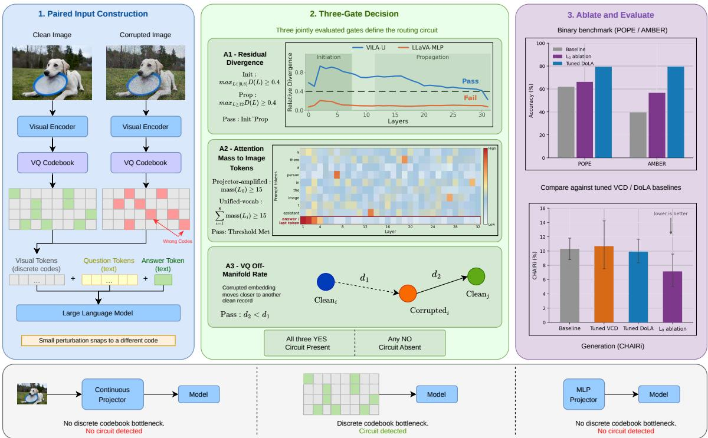
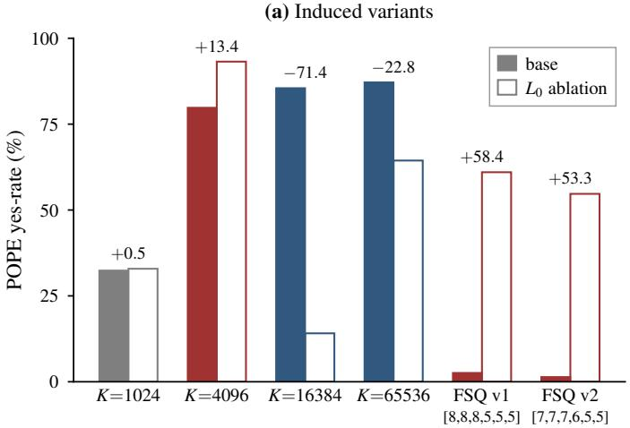
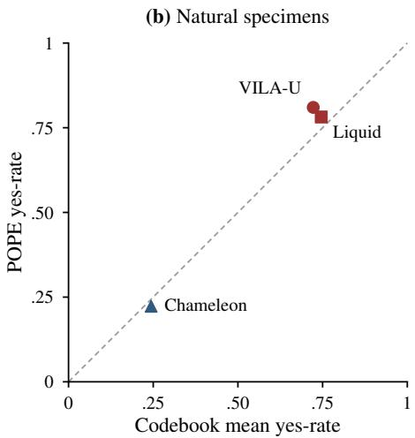

# Where Hallucinations Live: A Cross-Architecture Circuit in VQ-Tokenized Vision-Language Models

Shamanthak Hegde1\* Xiangrui Liu1 Maitreya Patel2† Yezhou Yang1 1Arizona State University 2Adobe

https://shamanthak-hegde.github.io/where-hallucinations-live

## Abstract

Unified vision-language models (VLMs) that tokenize images through a vector-quantized (VQ) codebook routinely hallucinate objects on grounded yes/no benchmarks, yet existing decoding-time fixes treat this as generic miscalibration without an architectural account. Using activation patching across twenty-five models spanning eight LLM families, we identify an early-layer (L ) attention routing circuit shared across VQ-tokenized VLMs and propose a three-gate diagnostic that distinguishes the models carrying it from those that do not. The diagnostic isolates ten positive models (five natural unified-VQ VLMs across three LLM families and five induced variants) and rejects the remaining fifteen. A single-variable architectural swap (LLaVA-1.6 CLIP+MLP VQ+Linear) installs the circuit, while a matched-compute MLP control on identical data does not, isolating vector quantization as the source of the pathological signal; the routing pathway that carries it is one that the backbone already provides. Against tuned VCD and DoLA baselines, tuned DoLA wins on binary calibration, but only $L _ { 0 }$ ablation reduces ob ject hallucination in open-ended generation (CHAIR reduces by 31 % relatively, whereas tuned DoLA and VCD leave it unchanged or worsen it). These results recast object hallucination in unified VQ VLMs as a property of architecture and pretraining, and yield a targeted intervention that mechanism-agnostic decoding cannot replicate.

## 1 Introduction

Unified vision-language models that share a single transformer between image and text tokens have become a dominant architecture (Wu et al., 2024; Team, 2024; Wu et al., 2025; Chern et al., 2024; Liu et al., 2024a; Chen et al., 2025; Xie et al., 2024; Wang et al., 2024; Jin et al., 2024). Most of them tokenize images through a vector-quantized (VQ) codebook so visual tokens occupy the same vocabulary as text. While elegant, this design suffers from a persistent failure mode on grounded yes/no benchmarks such as POPE (Li et al., 2023) and AMBER (Wang et al., 2023): VQ-tokenized models exhibit extreme and architecturally consistent biases. Several, including VILA-U (Wu et al., 2024) and Liquid (Wu et al., 2025), answer "YES" on roughly 78 81% of records regardless of image content, while others collapse to the opposite extreme: Chameleon (Team, 2024) answers "YES" on only 22% of records, and LuminamGPT (Liu et al., 2024a) on 0.07%. Continuousprojector VLMs such as LLaVA-1.6 (Liu et al., 2024b) and Qwen2.5-VL (Bai et al., 2025) show none of these extreme patterns. The signature is too consistent within the VQ family to be coincidental, and too at odds with the continuous family to be a generic VLM defect, pointing to a shared architectural cause.

Existing interventions for VLM hallucination such as VCD (Leng et al., 2024), DoLA (Chuang et al., 2024), ITI (Li et al., 2024b), VTI (Liu et al., 2024c), operate on output logits without an architectural account. These methods are mechanismagnostic: each targets a downstream symptom (pertoken calibration, layer-contrast logits, residualdirection steering) without explaining why a particular family of models hallucinates in the first place. They are also evaluated almost exclusively on binary benchmarks, where a single-token forcedchoice makes logit-level fixes maximally effective; whether they actually reduce object hallucination in open-ended generation is a separate question. Recent mechanistic studies of individual VLMs have begun to address the why (Olsson et al., 2022; Meng et al., 2022; Wang et al., 2022; Liu et al., 2025), but typically as single-model case studies. Whether a shared circuit, a specific attention pathway through which information flows to causally produce a behavior, underlies hallucination across VQ-tokenized architectures, whether such a circuit can be detected before training a model, and whether targeting it yields interventions that beat mechanism-agnostic baselines on generative metrics remain unanswered.

We answer these questions affirmatively. Using activation patching (Meng et al., 2022) across twenty-five models spanning eight LLM families, we identify an early-layer $( L _ { 0 } )$ attention routing circuit present across five unified-VQ VLMs spanning three LLM families. The circuit is absent in continuous-projector models and is discriminable from other unified-VQ VLMs that fail the diagnostic for mechanistically distinct reasons. It can be constructed from a healthy backbone by a singlevariable swap, replacing LLaVA-1.6’s CLIP+MLP projector with a VQ+Linear projector; a matchedcompute MLP variant on identical data and budget fails to install it, isolating the VQ bottleneck as the cause.

To formalize the cross-architecture pattern, we propose a three-gate diagnostic combining residualstream divergence, attention-routing concentration at $L _ { 0 }$ , and codebook off-manifold rate, with thresholds tied to architectural properties measured before behavioral outcomes (Section 3.1). The mechanism also yields a targeted intervention. Sweeping VCD and DoLA over 36 configurations on VILA-U reveals a striking dissociation: tuned DoLA wins on binary POPE/AMBER, but only $L _ { 0 }$ ablation reduces object hallucination in open-ended generation (CHAIR 10.3 % 7.1 %). Logit-level fixes calibrate the yes/no decision but do not disrupt the $L _ { 0 }$ circuit that injects hallucinated objects during generation. Our main contributions are summarized as follows:

• A cross-architecture $L _ { 0 }$ routing circuit present in five natural unified-VQ VLMs across three LLM families, absent in continuous-projector models, and structurally validated on a held-out model not used to calibrate the diagnostic.

• Causal identification of the VQ bottleneck via single-variable construction with a matchedcompute MLP control, and a training-time asymmetry showing the circuit is encoded in LLM backbone weights.

• A three-gate diagnostic chain with an architecturally motivated (not threshold-fit) two-tier criterion that correctly discriminates twenty-five models with mechanistically distinct positive and neg-

ative signatures.

• A mechanism-targeted intervention that loses to tuned VCD/DoLA on binary calibration but uniquely reduces object hallucination in openended generation.

## 2 Background and Related Work

Vector quantization in VLMs. VQ tokenizers (Van Den Oord et al., 2017; Esser et al., 2020; Lee et al., 2022; Mentzer et al., 2024; Yu et al., 2024) map each patch of a continuous visual encoder’s output to its nearest entry in a learned codebook of size K, so visual content becomes discrete tokens sharing a vocabulary with text. Two failure modes recur: codebook collapse, where only a small fraction of the K codes are used in practice (Section 4.2); and snapping artifacts, where a small input perturbation flips the output to an unrelated code with no smooth gradient between them, a property that becomes load-bearing for the hallucination mechanism we develop.

Hallucination correction in VLMs. Decodingtime methods correct hallucination through logitlevel interventions at inference, without modifying weights: VCD (Leng et al., 2024), DoLA (Chuang et al., 2024), ITI (Li et al., 2024b), and VTI (Liu et al., 2024c). All are architecture-agnostic and offer no account of why a given model hallucinates. A separate line of mechanistic-interpretability work addresses the why, but as single-model case studies. We extend mechanistic analysis to crossarchitecture generality and compare against fully tuned versions of these baselines.

Activation patching and routing circuits. Activation patching (Meng et al., 2022; Wang et al., 2022; Olsson et al., 2022) localizes where behavior is causally encoded: one runs the model on a clean input and a corrupted variant, then re-runs the corrupted input while patching in clean activations one site at a time. Our diagnostic (Section 3.1) builds on this procedure.

## 3 Method

With reference to Figure 1, our method has three components, each motivated by a question the preceding component leaves open: (i) a mechanistic diagnostic that identifies whether a given VLM has the candidate routing circuit; (ii) a constructive induction procedure with a matched-compute control that tests whether the circuit is causally tied to the

  
Figure 1: Methodology overview. Clean and corrupted image pairs are constructed and passed through the transformer; residual divergence and early-layer attention mass are measured to detect a routing circuit via a three-gate diagnostic. Models passing all three gates have a VQ-installed $L _ { 0 }$ circuit confirmed by a single-variable causal control: swapping only the projector type from MLP to VQ installs the circuit; a matched-compute MLP control does not. Ablating $L _ { 0 }$ reduces object hallucination in open-ended generation (CHAIRi drops 31% relative) while tuned DoLA achieves better binary calibration.

VQ bottleneck, rather than to the incidental features of the models that happen to exhibit it; and (iii) a sanity criterion that distinguishes mechanismtargeted reductions in hallucination from numerical improvements driven by the model failing to respond at all.

## 3.1 Mechanistic diagnostic: a three-gate chain

We instantiate the activation-patching procedure of Section 2 with two corruption types: Gaussian noise on visual embeddings and image-swap corruption, applied across a fixed set of 500 paired records (300 NaturalBench (Li et al., 2024a) image-swap pairs and 200 POPE (Li et al., 2023) Gaussian-noise pairs). For each record, we run the model on the clean visual embedding v and, depending on corruption type, either a noise version $v + \sigma \cdot \epsilon$ where $\epsilon \sim \mathcal { N } ( 0 , I )$ or a swapped-image embedding, caching activations at every layer; we then re-run the corrupted input while patching in the clean activation at one (token-category, layer) site at a time, with categories visual, question, and answer grouping image-embedding, prompt, and response positions. The restoration score $R =$ $\mathrm { ( l o g i t _ { p a t c h } - l o g i t _ { c o r r u p t } ) / ( l o g i t _ { c l e a n } - l o g i t _ { c o r r u p t } ) }$ is read out on the answer token: $R = 0 , 1 , > 1$ correspond to no effect, full restoration, and overshoot.

Per-model noise calibration. Visual-embedding norms vary by over an order of magnitude across our cohort, so a fixed σ would over-perturb some models and under-perturb others. For each model, we sweep σ over a logarithmic grid and select the value whose mean per-token cosine similarity between clean and noisy embeddings, averaged over a subset of POPE probe records, is closest to 0.5; this operates purely on input embeddings, independent of model predictions and labels. Accordingly, σ sorts our cohort into three architectural classes (σ-tiers): projector-amplified VQ (highnorm; e.g., VILA-U, Liquid), continuous-projector (e.g., LLaVA-1.6, Qwen2.5-VL), and unified-vocab VQ (low-norm; e.g., the Chameleon family, where visual tokens enter the LM’s token-embedding table at text-token scale).

Robustness to corruption type. The early-layer divergence that A1 measures is not specific to Gaussian embedding noise: token dropout reproduces the early peak in both tiers, while permuting the visual-token embeddings produces near-zero divergence despite carrying the largest perturbation magnitude of the corruptions tested, indicating that the routing pools visual-token content independently of order (Appendix A.8).

The three gates. A model passes the diagnostic if it satisfies three gates jointly. Gate A1: early routing event with downstream propagation. We measure the per-layer relative divergence between clean and corrupted residual streams $( \ell _ { 2 }$ distance between hidden states, normalized by the clean hidden-state norm). The candidate circuit predicts two things: a routing event concentrated in the early layers, and persistence of the resulting signal rather than its dissipation. A1 therefore has two parts. A1-initiation requires the relative divergence to reach $\ge 0 . 4$ within the early layers [0, 8), the first quarter of the stack. A1-propagation requires it to reach $\geq 0 . 4$ somewhere in the layers $\ell \geq 1 2 .$ , so that the signal is still carried in the second half of the network. The two measurements are taken on disjoint ranges separated by a four-layer buffer, so neither can be satisfied by the decaying shoulder of the other; the gate tests sustained divergence rather than two separate events, and in several passing models, the elevated divergence is a single contin uous ramp or plateau whose onset and persistence the two measurements probe. A model passes A1 only if both hold. A perturbation that produces no early event (initiation fails) reflects a model that does not route visual information through its early layers; one that rises early and then decays below threshold (propagation fails) reflects a routing event that is causally inert. Neither bound is tuned to the cohort partition: the verdict partition is invariant across initiation windows [0, 4) and [0, 8), while at $\ell \geq 8$ the propagation maximum for two positive models falls on the decaying shoulder of the initia tion peak, and at $\ell \geq 1 6$ a positive model drops be low threshold. Section 4.3 shows that both failure modes are populated by mechanistically distinct negatives. Gate A2: early-layer attention con centration. We measure the fraction of attention mass at layer 0 that the prompt-last token directs to visual tokens, summed over heads. Because the three σ-tiers operate at different embedding-norm regimes, A2 applies a two-tier criterion: $L _ { 0 }$ mass $\geq 1 5$ for projector-amplified models; window total over [0, 8) of 15 for unified-vocab models. The two-tier structure is inherited from the σ-tier clas sification (defined from embedding norms before any behavioral outcome is measured) rather than fit to cohort labels. Continuous-projector and decoupled models, which have no early-routing pathway, are measured at the layer-0 sink like projectoramplified models and fall well below the threshold. Gate A3: codebook off-manifold rate. For each record, we check whether the noised visual embedding is closer to a different record’s nearest codebook entry than to its own. A3 requires this rate to be $\geq 8 0 \%$ , capturing the snapping artifact at the cohort scale. A model that cannot be measured at a gate does not pass it, except where the gate is explicitly waived. Where the quantizer exists but uses a fixed lattice, as in the FSQ variants, A3 is waived; where the understanding pathway is not quantized at all, the premise the gate tests is absent, and the model is rejected at this gate.

Why a chain. The gates are applied as a conjunctive chain because, individually, they admit confounds. A2 alone can be passed by a model that routes visual tokens through $L _ { 0 }$ without driving a pathological signal along that route: the matchedcompute MLP control of Section 4.2 passes A2 in isolation, a healthy backbone already routes early visual attention through $L _ { 0 } .$ , yet fails A1 and shows a null behavioral $L _ { 0 }$ effect. Two natural negatives make the same point: UniTok and Emu3 both clear the A2 mass threshold yet fail A1, UniTok for lack of an early event and Emu3 for lack of propagation. Qwen-VQ makes the converse point, passing A1 and A3 and failing only the mass screen. Only the conjunction of a routing event (A2), a divergence signal that initiates early and propagates downstream (A1), and codebook off-manifold behavior (A3) recovers the correct verdict.

## 3.2 Constructive induction procedure with matched-compute control

The cross-architecture pattern across natural unified-VQ models admits a confounding explanation: those models differ from the continuousprojector models in many ways besides the tokenizer. To isolate vector quantization, we run a single-variable contrast. Starting from a healthy continuous-projector backbone (LLaVA-1.6 with Vicuna-7B and CLIP), we freeze the LM and the CLIP encoder and train only the projector under two configurations that differ in exactly one component. The first replaces the continuous CLIP+MLP projector with a VQ+Linear projector (a linear map with codebook quantization at capacity K). The second replaces it with a 2-layer GeLU MLP, same as LLaVA’s original projector. Both configurations are trained for 2000 steps on the same 50k CC3M (Sharma et al., 2018) caption subset under identical hyperparameters (Appendix A.5); the only difference is whether the projector output is quantized through a codebook before reaching the LM.

If a brief projector-only training were itself sufficient to install the behavioral circuit, both configurations would do so. If the VQ bottleneck is the causally responsible component, only the VQ configuration should, and we treat this as the central causal test in Section 4.2. Two additional sweeps probe how the circuit depends on codebook structure. We vary capacity $K \in$ 1024, 4096, 16384, 65536 to test whether K alone predicts the circuit’s polarity, whether the model is biased toward YES or NO answers under the resulting circuit. We also train two finite-scalarquantization FSQ (Mentzer et al., 2024) variants with different per-dimension level configurations (Appendix A.5). Because FSQ cannot exhibit codebook collapse by construction, the FSQ configuration tests whether the circuit forms in the absence of collapse. A second configuration was trained to distinguish a regime effect from a single-configuration artifact, but it fails A1 at initiation, so the comparison is between one circuit-installing configuration and one that is not.

## 3.3 Interventions and a sanity criterion

Interventions. We evaluate three mechanismtargeted interventions on VILA-U, each implemented as a forward-pass hook that modifies activations during inference without retraining: $L _ { 0 }$ ablation, $L _ { 1 }$ ablation, and VTI. $L _ { \ell }$ ablation zeroes the self-attention output at layer-ℓ; we report $L _ { 0 }$ (the candidate circuit) and $L _ { 1 }$ (the downstream writer in models such as Chameleon, Section 4.4). A separate window variant generalizes $L _ { \ell }$ ablation to a contiguous range $[ L _ { s } , L _ { e } )$ and is used only as a structural probe for Show-o and SEED-LLaMA, whose divergence has no single localized event to target, so no $L _ { 0 }$ ablation is reported for them (Table 3). VTI (Liu et al., 2024c), described in Section 2, computes its steering direction from mean clean  corrupt residual differences over demonstration records; we add it at every decoder block with α = 0.005. VTI is prior work rather than a contribution of ours; we include it as a mechanismadjacent comparison because its steering direction is built from the same clean corrupt residual differences the diagnostic uses.

A sanity criterion for hallucination reduction. An intervention that improves a binary accuracy number is not automatically a hallucination reduction. Liquid’s $L _ { 0 }$ ablation, for instance, drives POPE yes-rate from 78 % to 0 % while producing all empty open-ended generations, the score improves because the model has stopped responding to the input, not because it has become better grounded. To rule out such cases, for each POPE record, we compute the logit gap g = logit $\mathrm { \Delta _ { \ Y E S } - l o g i t _ { N O } }$ and apply a question-conditional sanity criterion, computed separately on the yes-GT and no-GT record subsets, so a collapse affecting either alone is still detected. An intervention is preserved only if both (a) the ratio of baseline to intervention within-class standard deviation of g remains below 3 (the model still varies across inputs), and (b) the across-class mean difference $\overline { { g } } _ { \mathrm { y e s - G T } } - \overline { { g } } _ { \mathrm { n o - G T } }$ remains > 0.5 logits (the model still discriminates the two classes on average). An intervention failing either is a degenerate emitter: it demonstrates that the targeted circuit is present (Section 4.1) but not as a practical hallucination reduction.

## 3.4 Experimental setup

We summarize the setup here; full details are in Appendix A.5. We evaluate on POPE, AM-BER, and CHAIR (Rohrbach et al., 2018) (500 images). For activation patching, we use 500 paired records (300 NaturalBench image\_swap + 200 POPE gaussian\_noise), each pair consisting of one YES and one NO record, which is what validates the paired-bootstrap CIs. A unified hook framework provides a consistent visual / question / answer / other token-category mapping across all models. All interval estimates reported in Appendix A.3 use 10,000 bootstrap resamples, resampling paired records on the binary benchmarks and images on CHAIR.

The studied models span natural VQ-VLMs (VILA-U (Wu et al., 2024), Chameleon-7B (Team, 2024), Liquid (Wu et al., 2025), Anole (Chern et al., 2024), Lumina-mGPT (Liu et al., 2024a), UniTok (Ma et al., 2025), Show-o (Xie et al., 2024), SEED-LLaMA (Ge et al., 2023), Emu3 (Wang et al., 2024), Janus-Pro (Chen et al., 2025)), continuous-projector controls (LLaVA-1.6 (Liu et al., 2024b), VILA (Lin et al., 2024), Qwen2.5- VL (Bai et al., 2025), HaploOmni (Xiao et al., 2025), LaVIT (Jin et al., 2024), GILL (Koh et al., 2023)), and induced variants (LLaVA-VQ at K  1024, 4096, 16384, 65536 , two LLaVA-VQ-FSQ configurations, Qwen-VQ, and a matchedcompute LLaVA-MLP variant). Detailed gate values for all models appear in Appendix A.1

Table 1: Five natural unified-VQ VLMs spanning three LLM families that pass the three-gate diagnostic. For A1, init is the maximum relative divergence over layers [0, 8) and prop the maximum over $\ell \geq 1 2 ;$ both must reach 0.4. A2 is scored on $L _ { 0 }$ mass for projector-amplified models (P) and the [0, 8) window total for unified-vocabulary models (U); both apply $\mathbf { a } \geq 1 5$ threshold (Section 3.1). Behavioral 95% CIs from 10,000 paired-record bootstrap resamples. †Lumina-mGPT is held out: baseline yes-rate at the behavioral floor.
<table><tr><td></td><td></td><td colspan="2">Gate A1</td><td></td><td></td><td colspan="2">POPE yes-rate (%)</td></tr><tr><td>Model</td><td>Backbone</td><td>init [0, 8)</td><td> $\operatorname { p r o p } \ell \geq 1 2$ </td><td>A2 (tier)</td><td>A3</td><td>base→L0</td><td>∆ [95% CI]</td></tr><tr><td>VILA-U-7B</td><td>Vicuna</td><td> $0 . 9 3 2 \left( L _ { 2 } \right)$ </td><td> $0 . 7 2 4 \ : ( L _ { 1 6 } )$ </td><td>17.5 (P)</td><td>100</td><td>81.0→72.6</td><td> $- 8 . 4 \ : [ - 9 . 7 , - 7 . 2 ]$ </td></tr><tr><td>Liquid-7B</td><td>Gemma</td><td> $0 . 7 6 8 \left( L _ { 1 } \right)$ </td><td> $0 . 8 1 9 ( L _ { 2 4 } )$ </td><td>19.2 (U)</td><td>100</td><td>78.2→ 0.0</td><td>-78.2 [-79.7, -76.7]</td></tr><tr><td>Chameleon-7B</td><td>Chameleon</td><td>0.635  $( L _ { 7 } )$ </td><td> $7 . 2 6 7 ( L _ { 3 1 } )$ </td><td>22.0 (U)</td><td>100</td><td>22.3→ 9.8</td><td>-12.5 [-14.3, -10.7]</td></tr><tr><td>Anole-7B</td><td>Chameleon</td><td>2.009  $( L _ { 1 } )$ </td><td> $3 4 . 1 4 9 ( L _ { 3 1 } )$ </td><td>111.2 (U)</td><td>100</td><td>75.3→ 2.0</td><td>-73.3[-74.9, -71.7]</td></tr><tr><td> $\mathrm { L u m i n a - m G P T - 7 B ^ { \dag } }$ </td><td>Chameleon</td><td> $2 . 8 0 7 ( L _ { 6 } )$ </td><td> $0 . 6 2 3 ( L _ { 2 0 } )$ </td><td>175.0 (U)</td><td>100</td><td>0.07→ 0.0</td><td>-0.07 [-0.17, 0.00]</td></tr></table>

## 4 Results

## 4.1 A shared early-layer routing circuit across VQ-tokenized VLMs

The diagnostic chain identifies a shared $L _ { 0 }$ attention routing circuit across five natural unified-VQ VLMs spanning three LLM families (Table 1): Vicuna-7B in VILA-U, Gemma-7B (Team et al., 2024) in Liquid, and the Chameleon family in Chameleon-7B, Anole, and a held-out LuminamGPT. All five pass A1 (both halves), A2 under the two-tier criterion, and A3. Four exhibit large behavioral changes under $L _ { 0 }$ ablation; Anole is particularly informative as an image-generation fine-tune of Chameleon-7B, with a gate-A2 window total five times larger than its base model, the circuit strengthens through generation fine-tuning, consistent with the broader claim that VQ-based training installs it. The layer-0 routing is a distributed pattern rather than a few-head circuit. Ranking the 32 heads at the routing layer by visual-to-prompt mass, thirteen heads are required to account for half of the total mass and twenty-two for eighty percent, with near-even per-head contributions (the strongest head carries 0.80 and the twenty-second still 0.63). No small subset dominates, which is why a full early-window knockout rather than a single-head ablation is required to disrupt the route (Section 4.4), and why UniTok’s diffuse layer-0 mass (Table 14) is disqualifying only in conjunction with its misaligned divergence event. “Circuit” here therefore denotes a coherent layer-level routing channel, not a sparse set of privileged heads.

Lumina-mGPT is held out: not in the thresholdcalibration cohort. It passes all three gates with the strongest A2 signal observed in any model (Table 1), yet its behavioral change under $L _ { 0 }$ ablation is null, its baseline yes-rate is 0.07 %, leaving no room to drop. This structural–behavioral dissociation is itself informative: the diagnostic detects a structural property of the architecture independent of whether the language prior happens to manifest it behaviorally, and the held-out model confirms the thresholds were not over-fit to the calibration cohort. Under the conjunctive definition of A1, Lumina-mGPT’s binding value is its propagation maximum (0.623 at $L _ { 2 0 } )$ rather than its initiation peak, and that propagation value is the weakest among the natural models.

Polarity tracks codebook bias. The five models fall into three polarity regimes that align with their codebook’s training distribution. VILA-U and Liquid have universally YES-biased codebooks and YES-promoting circuits; Chameleon’s codebook is universally NO-biased and its baseline yes-rate is 22 %. The induced FSQ model of Section 4.2, whose tokenizer cannot collapse by construction, produces a YES-suppressing circuit; a second FSQ configuration reproduces the polarity inversion behaviorally but does not install a gate-detectable early event. We frame this as associational rather than causal: Chameleon’s $L _ { 0 }$ still mildly promotes YES despite the codebook’s NO-bias (its overall NO behavior comes from a downstream $L _ { 1 }$ NO-writer, Section 4.4), and the LLaVA-VQ K-sweep is nonmonotonic (Section 4.2).

  
Figure 2: Codebook structure governs circuit polarity. (a) Induced LLaVA-VQ: capacity sweep and FSQ configurations, of which v1 installs the circuit and $\mathbf { v } 2$ does not. (b) Natural unified-VQ models: codebook mean yes-rate against behavioral baseline POPE yes-rate.

Table 2: The matched-compute contrast under identical training parameters on POPE. The VQ projector installs the $L _ { 0 }$ routing circuit; the matched-compute MLP projector does not, failing both halves of A1, passing A2.
<table><tr><td>Metric</td><td>VQ+Linear  $( K = 1 6 3 8 4 )$ </td><td>MLP (matched-compute)</td></tr><tr><td>A1 init [0, 8)</td><td>1.276√</td><td>0.206 X</td></tr><tr><td> $A 1 \mathsf { p r o p } \ell \geq 1 2$ </td><td>1.117√</td><td>0.106 X</td></tr><tr><td> $A 2 \left( L _ { 0 } \mathrm { m a s s } \right)$ </td><td>26.02√</td><td>25.52√</td></tr><tr><td> $\yen 123,456,70$ </td><td> $8 5 . 5  1 4 . 1$ </td><td> $1 3 . 7  8 . 7$ </td></tr></table>

## 4.2 Causal identification: induction and asymmetry

The cross-architecture pattern is consistent with VQ as the cause, but natural models differ in many ways besides their tokenizers. The singlevariable contrast (Section 3.2) isolates the bottleneck: starting from LLaVA-1.6 with Vicuna-7B and CLIP frozen, we train one projector that quantizes through a codebook and one that does not, under identical hyperparameters.

The two configurations diverge cleanly (Figure 2). LLaVA-VQ installs the circuit: all three gates pass, and POPE yes-rate rises to 85.5 %, with $L _ { 0 }$ ablation collapsing it to 14.1 %. The matchedcompute LLaVA-MLP control, on identical data and budget, fails both halves of A1 (initiation 0.206; propagation 0.106) and shows only a negligible behavioral change under $L _ { 0 }$ ablation (13.7% 8.7%, a 5-point drop against the 71-point drop for LLaVA-VQ), yet passes A2 in isolation, with an $L _ { 0 }$ mass of 25.52. Vicuna-7B’s pretrained backbone routes early visual attention through $L _ { 0 }$ regardless of projector type; the chain-of-gates recovers the correct verdict where any single gate would

not.

Within the VQ configuration, sweeping $K \in$ 1024, 4096, 16384, 65536 shows that capacity alone does not determine polarity (Figure 2): all four collapse to a similar effective vocabulary, between roughly  80-160 active codes regardless of nominal capacity, yet their polarities differ: K = 1024 shows no measurable polarity shift, K = 4096 inverts to YES-suppressing, and the two larger capacities are YES-promoting. The K = 4096 inversion is not explained by the present account and is retained as an open anomaly (Section 6). Collapse is not the operative factor either. The FSQ configuration, which cannot collapse by construction, inverts polarity, yielding a YES-suppressing model. A second FSQ configuration reproduces that inversion behaviorally (POPE yes-rate +53.3 points, AMBER accuracy 19.8) but does not install a gate-detectable early divergence event: its initiation value of 0.379 falls below threshold, with divergence first clearing 0.4 only at $L _ { 1 4 }$ . The two lattices, therefore, agree on the behavioral consequence and differ on the mechanism, so the polarity inversion cannot be attributed to the

Table 3: Models the diagnostic rejects, each at a distinct gate. For A1 failures, the failing half is marked init or prop. $L _ { 0 }$ ∆POPE is the accuracy change under $L _ { 0 }$ ablation, where it was run; Show-o and SEED-LLaMA were probed with the window variant, so no $L _ { 0 }$ value applies. Gates a model passes are discussed in Section 4.3.
<table><tr><td>Model</td><td>Class</td><td>Primary failure</td><td> $L _ { 0 } \ \Delta \mathrm { P O P E }$ </td><td>Note</td></tr><tr><td colspan="5">Continuous-projector controls (no routing concentration; A2 fails):</td></tr><tr><td>LLaVA-1.6-7B</td><td>continuous</td><td>A2</td><td>-0.7</td><td>Null ablation effect</td></tr><tr><td>Qwen2.5-VL-7B</td><td>continuous</td><td>A2</td><td>-34.3</td><td>Catastrophic collapse</td></tr><tr><td>HaploOmni-7B</td><td>continuous</td><td>A2</td><td>-16.1</td><td>Catastrophic collapse</td></tr><tr><td>LaVIT-7B</td><td>continuous</td><td>A2</td><td>-2.0</td><td>yes → no flip on AMBER</td></tr><tr><td colspan="5">VQ-tokenized models, distinct failure modes:</td></tr><tr><td>UniTok-7B</td><td>VQ + TokenEmb</td><td>A1 (init)</td><td>+1.9</td><td>Mass without early event</td></tr><tr><td>Show-o-1.3B</td><td>MÂGVIT-v2 LFQ</td><td>A1 (init)</td><td></td><td>No divergence event</td></tr><tr><td>SEED-LLaMA-8B</td><td>VQ vocab-inj.</td><td>A1 (init)</td><td></td><td>Event too late for window</td></tr><tr><td>Emu3-Chat-8B</td><td>Emu3 VQ</td><td>A1 (prop)</td><td>-30.9</td><td>Early event, no propagation</td></tr><tr><td>Janus-Pro-7B</td><td>decoupled</td><td>A3</td><td>-0.4</td><td>No codebook to probe</td></tr><tr><td colspan="5">Induced negative controls:</td></tr><tr><td>Qwen-VQ</td><td>induced VQ</td><td>A2</td><td>-0.2</td><td>Collapse without circuit</td></tr><tr><td>LLaVA-MLP</td><td>matched MLP</td><td>A1 (init)</td><td>+0.3</td><td>Single-gate pass, chain rejects</td></tr></table>

early-layer circuit alone.

Induction is fast: 2000 steps install the circuit. Reversal is not. Training a continuous SigLIP MLP adapter on top of VILA-U’s VQ-pretrained Vicuna-7B for the same 2000 steps fails to remove the circuit; the adapted variant continues to pass A1 (0.672 initiation; 0.647 propagation) and A2, with $L _ { 0 }$ mass rising from 17.50 to 20.53 and POPE yesrate from 81 99.2 %. It is nonetheless recorded as a chain FAIL, rejected at A3, because the continuous adapter leaves no codebook to probe; the structural gates it does pass are what carry the reversal argument. The asymmetry locates the circuit: in LLM backbone weights from VQ-based pretraining, not in the current projector. A healthy Vicuna-7B already routes $L _ { 0 }$ attention with mass 25.52 (the MLP control above), so the routing pattern is in the backbone; what VQ pretraining installs is the pathological signal content flowing through that route, plus the residual divergence (A1) that propagates it forward.

## 4.3 The diagnostic generalizes across models

Beyond the models that pass, the diagnostic rejects fifteen models in the cohort, each for a mechanistically distinct reason; Table 3 details the eleven that most resemble the positive class. Continuousprojector VLMs (LLaVA-1.6, VILA, Qwen2.5-VL, HaploOmni, LaVIT) lack A2 concentration entirely; $L _ { 0 }$ ablation is null on LLaVA-1.6 ( 0.7 points on POPE) and catastrophic on Qwen2.5- VL ( 34.3 points on POPE, 20.1 points on AM-BER), an opposite-sign discrimination across architecture classes. VQ-tokenized models fail with distinct signatures. UniTok’s $L _ { 0 }$ attention mass (18.23) clears the A2 threshold, but it carries no early routing event: its early-window divergence reaches only 0.347 and first clears 0.4 at $L _ { 1 3 }$ , so it fails A1 at initiation, the opposite end from Emu3. Show-o’s divergence never approaches threshold, reaching 0.136 in the early window and a wholestack maximum of 0.151, and so fails A1 at initiation. SEED-LLaMA fails A1 for the same reason but on a different curve: its divergence reaches only 0.278 within the early window and first clears 0.4 at $L _ { 1 4 }$ , outside the range A1-initiation measures. Emu3 passes A2 under its unified-vocabulary criterion (window mass 48.44 15) and shows a genuine $L _ { 0 }$ initiation event (early divergence 0.435), but it is the one model whose early spike fails to propagate: divergence decays to a downstream maximum of 0.215, so it fails A1 at propagation. Janus-Pro fails for a structural reason rooted in its decoupled design: its understanding pathway uses continuous SigLIP features with no VQ codebook to probe, so it fails A3 outright; its $L _ { 0 }$ mass of 13.57 is incidentally also below the projectoramplified threshold. The Qwen-VQ induced control is especially clean: its codebook collapses severely yet $A 2 = 6 . 0 7 $ , and POPE collapses to all-NO, establishing that codebook collapse alone is not sufficient to install the circuit. Conversely, the FSQ configuration of Section 4.2 installs the circuit without any collapse, establishing that collapse is not necessary either, though on a single model, since the second FSQ configuration fails A1. Both observations together point to the VQ bottleneck, discretization through a codebook, as the operative factor, with the surviving codes’ training distribution governing polarity.

Table 4: Mechanism-targeted interventions. (a) Three interventions on VILA-U, with paired-bootstrap 95% CIs reported in Table 9. (b) Architecture-specificity of $L _ { 0 }$ ablation: the same intervention applied across the cohort. Each cell is tagged by outcome, where null denotes a 95% paired-bootstrap CI spanning zero and catas. denotes a catastrophic collapse of the question-conditional logit gap (Section 3.3).
<table><tr><td>Method / Model</td><td>POPE acc  $\Delta$ </td><td>AMBER acc  $\Delta$ </td></tr><tr><td colspan="3">(a) Mechanism-targeted interventions on VILA-U:</td></tr><tr><td> $L _ { \mathrm { 0 } } \mathrm { a b l a t i o n }$ </td><td>+4.23</td><td> $+ 1 6 . 9$ </td></tr><tr><td> $L _ { \mathrm { 1 } } \mathrm { a b l a t i o n }$ </td><td> $+ 1 1 . 6 0$ </td><td> $+ 2 3 . 3 7$ </td></tr><tr><td> $\mathrm { V T I } \left( \alpha { = } 0 . 0 0 5 \right)$ </td><td>+8.3</td><td>+30.23</td></tr><tr><td colspan="3">(b) Architecture-specificity of  $L _ { 0 }$  ablation (same intervention, different models):</td></tr><tr><td>VILA-U</td><td> $+ 4 . 2 3 \ : ( \mathrm { r e s t o r e d } )$ </td><td> $+ 1 6 . 9 \ ( \mathrm { r e s t o r e d } )$ </td></tr><tr><td>Chameleon-7B</td><td>−1.4 (null)</td><td> $- 4 . 4 ( \mathrm { d e g r a d e d } )$ </td></tr><tr><td> $\mathrm { L L a V A – 1 } . 6$ </td><td>-0.7 (null)</td><td> $- 1 . 0 ( \mathrm { d e g r a d e d } )$ </td></tr><tr><td> $\mathrm { Q w e n } 2 . 5 – \mathrm { V L }$ </td><td>-34.3 (catas.)</td><td>-20.1 (catas.)</td></tr><tr><td> $\mathrm { E m u } 3 { \mathrm { - } } \mathrm { C h a t }$ </td><td>—30.9 (catas.)</td><td>-30.2 (catas.)</td></tr></table>

Three single-measure A2 alternatives each produce 2-3 misclassifications on our 10-model cohort (Appendix A.6); the two-tier rule instead derives from the σ-calibration tier structure (Section 3.1), an architectural property documented before any behavioral outcome was measured.

## 4.4 Mechanism-targeted intervention reduces hallucination in generation

The mechanism provides a targeted intervention: ablate $L _ { 0 }$ (or $L _ { 1 }$ when the writer is downstream, as in Chameleon). On VILA-U, the model that passes the sanity criterion cleanly, all three mechanismtargeted interventions yield substantial gains with tight paired-bootstrap CIs (Table 4, top): $L _ { 0 }$ ablation reaches +4.23 POPE; $L _ { 1 }$ ablation, targeting the downstream amplifier in the writer/reader pattern, +11.60 POPE and +23.37 AMBER; VTI $( \alpha ~ = ~ 0 . 0 0 5 )$ gives the largest AMBER effect at +30.23. The writer/reader pattern generalizes across architectures with codebook-bias-tracking signs: VILA-U has YES-promoting $L _ { 0 }$ and $L _ { 1 }$ Chameleon a mildly YES-promoting $L _ { 0 }$ alongside a dominant $L _ { 1 }$ NO-writer $( L _ { 1 }$ ablation flips POPE yes-rate $2 2 . 3  6 6 . 2 \%$ , and Liquid a dominant $L _ { 0 }$ with a partial $L _ { 1 }$ . Architecture-specificity is sharp (Table 4, bottom): the same $L _ { 0 }$ ablation is null on LLaVA-1.6 and catastrophic on Qwen2.5-VL, opposite-sign discrimination hard to explain on any non-mechanistic account.

The benefit is also specific to the early routing layers rather than a generic consequence of perturbing the network. Applying the same ablation layer by layer, it helps at layers 0 and 1 (+4.23 and +11.60 on POPE) but worsens accuracy at layers 2 and 4 ( 10.67 and 4.47) and has no effect at layers 8 and 16; a generic-degradation account predicts no such sign structure. Scaling the routing layer’s attention output rather than zeroing it reveals a graded dose-response, with attenuation factors of 0.75, 0.50, and 0.25 yielding +8.67, +8.17, and +12.30 points, so a soft intervention outperforms full ablation on binary accuracy. Because the remainder of this section shows that binary gains need not transfer to open-ended generation, the attenuation sweep is reported here as a specificity control; the generative comparison under graded attenuation is left to future work.

Would a mechanism-agnostic method, given the same tuning budget, do equally well? We swept VCD over 16 configurations and DoLA over 20 on POPE and AMBER (Appendix A.4). On binary benchmarks tuned DoLA wins: best DoLA $( \alpha = 0 . 1 0 , \ell = 1 6 )$ reaches POPE 0.794 and AM-BER 0.795, beating our best mechanism-targeted intervention by +5.9 and +9.6 points respectively. On a single-token forced choice, a tuned decodingtime logit fix can match or exceed mechanismtargeted ablation.

The binary picture is not the whole picture. On open-ended COCO captioning via CHAIR, with the winning sweep configurations (Table 5), the ranking reverses: only $L _ { 0 }$ ablation reduces CHAIR $( 1 0 . 3 \to 7 . 1 \%$ , 31 % relative), while tuned DoLA barely moves it ( 0.4 %) and tuned VCD worsens it, collapsing recall to 43.9 %. This reduction is not an artifact of shorter captions: truncating each baseline caption to the length of its paired ablated caption lowers baseline CHAIRi only from 10.3 to 9.53, so brevity accounts for less than a third of the observed drop. The length-controlled reduction attributable to the intervention is 2.40 points, holding consistently across captions with different object counts. Image-level intervals for all three metrics are in Appendix A.3.

Table 5: CHAIR open-ended captioning on 500 COCO (Lin et al., 2014) images. AvgLen uses the CHAIR-scorer’s tokenization.
<table><tr><td>Condition</td><td> $\mathrm { C H A I R } _ { s }$ </td><td> $\mathrm { C H A I R } _ { i }$ </td><td>Recall</td><td>AvgLen</td></tr><tr><td>VILA-U:</td><td></td><td></td><td></td><td></td></tr><tr><td>Baseline</td><td>35.8</td><td>10.3</td><td>58.5</td><td>158</td></tr><tr><td> $L _ { 0 }$  ablation (ours)</td><td>17.6</td><td>7.1</td><td>51.6</td><td>78</td></tr><tr><td>VCD  $( \alpha = 0 . 5 0 , \sigma = 8 0 )$ </td><td>20.6</td><td>10.7</td><td>43.9</td><td>84</td></tr><tr><td> $\mathrm { D o L A } \left( \alpha { = } 0 . 1 0 , \ell { = } 1 6 \right)$ </td><td>31.8</td><td>9.9</td><td>55.4</td><td>156</td></tr><tr><td colspan="5">LLaVA-VQ K = 65,536 (induced, same backbone as VILA-U):</td></tr><tr><td>Baseline</td><td>31.2</td><td>52.5</td><td>11.1</td><td>158</td></tr><tr><td> $L _ { 0 } \mathrm { a b l a t i o n ( o u r s ) }$ </td><td>19.6</td><td>42.7</td><td>9.5</td><td>145</td></tr></table>

The dissociation is mechanistically interpretable: DoLA’s early–late layer contrast calibrates a forced choice but does not disrupt the $L _ { 0 }$ circuit that injects hallucinated objects during generation; VCD’s noise-subtraction penalizes object tokens broadly, cutting recall without reducing the hallucination rate among emitted objects. The reduction also preserves substantial informativeness (Table 15): object mentions per caption fall modestly $( 6 . 0 2  5 . 3 8 )$ and object recall from 58.5 to 51.6, while reference alignment measured by METEOR (?) improves $( 0 . 1 2 7  0 . 1 7 7 )$ . Hallucination is reduced while captions still name about five objects and recall roughly half of the groundtruth objects.

A second CHAIR run on the induced LLaVA-VQ K = 65,536 variant strengthens the endto-end story: baseline CHAIR is 52.5 %, five times $\mathrm { { V I L A } { - } U ' _ { S } }$ , so the controlled architectural change inflates open-ended hallucination fivefold on the same backbone, and $L _ { 0 }$ ablation cuts it to 42.7 % ( 19 % relative) with only 8 % length reduction. At the image level, however, the induced model’s $\mathrm { C H A I R } _ { i }$ reduction is not significant $( - 9 . 7 1 \left[ - 3 0 . 4 0 , + 1 1 . 0 1 \right] )$ ; its CHAIRs reduction is, and its length-matched $\mathrm { C H A I R } _ { i }$ difference is 5.82 points. The induced variant is therefore supporting but underpowered evidence, with the VILA-U result as the clean, significant one. The intervention’s effect is concentrated on exactly the images that hallucinate most: across the 500 images, the correlation between baseline hallucination count and the change under ablation is 0.383, and images with at least two baseline hallucinations (76 images) lose on average 1.59 hallucinated objects while images with at most one (424 images) are essentially unchanged (+0.01). The circuit thus acts where hallucination actually occurs, leaving grounded captions intact. This inductionto-intervention sequence remains the most direct end-to-end link between the mechanism and the behavior.

## 5 Discussion

Implications for VQ tokenizer design. The polarity association has practical implications. In practice, unified VQ tokenizers tend to develop codebook collapse, and the natural models we examined that do collapse (VILA-U, Liquid, Chameleon, Anole) all carry the $L _ { 0 }$ routing circuit; whether the model hallucinates by over-claiming or by denying then depends on what the training distribution encoded into surviving codes. The induced Qwen-VQ counterexample shows that collapse alone is insufficient; the circuit requires both the VQ bottleneck and a backbone where it can form, while the non-collapsing FSQ configuration of Section 4.2 installs the same circuit with inverted polarity, so collapse is neither necessary nor sufficient. The $L _ { 0 }$ routing structure itself is the problem, regardless of the polarity sign.

Where the circuit lives. The reverse-ablation failure indicates that the $L _ { 0 }$ circuit is in the LLM backbone weights, not the projector. The matchedcompute LLaVA-MLP control reinforces this: even a healthy Vicuna-7B backbone with an MLP projector trained for 2000 steps shows $L _ { 0 }$ attention mass 25.52, the routing pattern is in the backbone already. What VQ pretraining installs is the pathological signal content that flows through that routing pattern, plus the residual divergence that propagates it forward.

Binary vs. generative dissociation. The cleanest scientific finding is the dissociation between binary and generative metrics. Tuned DoLA wins POPE/AMBER; only $L _ { 0 }$ ablation wins CHAIR. This is exactly what a mechanistic account predicts, and a decoding-time fix does not: routing circuits operate during open-ended generation, not just at single-token forced-choice. This link is supported directly by the per-image finding that the intervention’s benefit scales with an image’s baseline hallucination (Section 4.4). The dissociation makes the mechanism-targeted intervention nonredundant with the mechanism-agnostic baselines, even when those baselines win on a single benchmark.

## 6 Conclusion

We identified an early-layer attention routing circuit shared across VQ-tokenized vision-language models, validated it on a held-out model, isolated its cause via a single-variable construction with a matched-compute control, and showed that ablating it is the only method (in a 36-config sweep of tuned baselines) that reduces object hallucination in open-ended generation. The circuit is architecturally caused, lives in LLM backbone weights from VQ-pretraining, and is discriminable by a three-gate diagnostic that requires no singlemeasure fit. The findings reframe object hallucination in unified VLMs as a property of architecture and pretraining, not of decoding-time calibration, and point to VQ tokenizer design as the leverage point for the next generation of unified VLMs.

## Limitations

Several limitations temper our results. First, our reverse-ablation result is reported as an asymmetry at matched budget, not as impossibility: a longer fine-tuning run with the LM unfrozen might, in principle, reverse the circuit, and we make only the weaker claim. Second, the polarity association in Section 4.1 is associational, not causal; two anomalies (the K = 4096 inversion and Chameleon’s mildly YES-promoting $L _ { 0 } )$ lack a mechanistic explanation, and we do not claim that intervening on codebook bias would flip polarity. Third, while the circuit topology is shared across architectures, the intervention direction is model-specific: permodel VTI directions have pairwise cosine similarity $\leq 0 . 0 5 4$ and must be re-derived per architecture. Fourth, the sanity criterion of Section 3.3 excludes Liquid and Anole as practical intervention models (their $L _ { 0 }$ ablation collapses to a degenerate emitter); we use them as gate-level evidence only. Relatedly, the distributed-head account of the $L _ { 0 }$ routing rests on the per-head mass distribution, so the head-level claim is structural rather than causal. Further, the claim that codebook collapse is not necessary for the circuit rests on a single FSQ model: a second FSQ configuration reproduces the polarity-inversion behavior but fails A1 at initiation (0.379), so the two lattices agree on the behavioral consequence and differ in the mechanism. Finally, the open-ended (CHAIR) result rests on VILA-U together with a single induced variant, so the generative intervention is evidenced more narrowly than the diagnostic itself; the induced variant’s $\mathrm { C H A I R } _ { i }$ reduction is not significant at the image level, so the significant open-ended evidence rests on VILA-U alone.

## Acknowledgments

The work is partially supported by National Science Foundation Robust Intelligence grant #2132724. The authors thank Research Computing at Arizona State University for providing the computing resources used in this work. The views and opinions expressed are solely those of the authors and do not necessarily reflect those of their institutions or employers. Maitreya Patel is currently affiliated with Adobe; the work presented here was conducted while at Arizona State University and is not associated with Adobe.

## References

Shuai Bai, Keqin Chen, Xuejing Liu, Jialin Wang, Wenbin Ge, Sibo Song, Kai Dang, Peng Wang, Shijie Wang, Jun Tang, Humen Zhong, Yuanzhi Zhu, Mingkun Yang, Zhaohai Li, Jianqiang Wan, Pengfei Wang, Wei Ding, Zheren Fu, Yiheng Xu, and 8 others. 2025. Qwen2.5-vl technical report. arXiv preprint arXiv:2502.13923.

Xiaokang Chen, Zhiyu Wu, Xingchao Liu, Zizheng Pan, Wen Liu, Zhenda Xie, Xingkai Yu, and Chong Ruan. 2025. Janus-pro: Unified multimodal understanding and generation with data and model scaling. arXiv preprint arXiv:2501.17811.

Ethan Chern, Jiadi Su, Yan Ma, and Pengfei Liu. 2024. Anole: An open, autoregressive, native large multimodal models for interleaved image-text generation. arXiv preprint arXiv:2407.06135.

Yung-Sung Chuang, Yujia Xie, Hongyin Luo, Yoon Kim, James R. Glass, and Pengcheng He. 2024. Dola: Decoding by contrasting layers improves factuality in large language models. In The Twelfth International Conference on Learning Representations.

Patrick Esser, Robin Rombach, and Björn Ommer. 2020. Taming transformers for high-resolution image synthesis. Preprint, arXiv:2012.09841.

Yuying Ge, Sijie Zhao, Ziyun Zeng, Yixiao Ge, Chen Li, Xintao Wang, and Ying Shan. 2023. Making llama see and draw with seed tokenizer. arXiv preprint arXiv:2310.01218.

Yang Jin, Kun Xu, Kun Xu, Liwei Chen, Chao Liao, Jianchao Tan, Yadong Mu, and 1 others. 2024. Unified language-vision pretraining in llm with dynamic discrete visual tokenization. In International Conference on Learning Representations.

Jing Yu Koh, Daniel Fried, and Ruslan Salakhutdinov. 2023. Generating images with multimodal language models. NeurIPS.

Doyup Lee, Chiheon Kim, Saehoon Kim, Minsu Cho, and Wook-Shin Han. 2022. Autoregressive image generation using residual quantization. In Proceedings of the IEEE/CVF Conference on Computer Vision and Pattern Recognition, pages 11523–11532.

Sicong Leng, Hang Zhang, Guanzheng Chen, Xin Li, Shijian Lu, Chunyan Miao, and Lidong Bing. 2024. Mitigating object hallucinations in large visionlanguage models through visual contrastive decoding. In Proceedings of the IEEE/CVF Conference on Computer Vision and Pattern Recognition, pages 13872–13882.

Baiqi Li, Zhiqiu Lin, Wenxuan Peng, Jean de Dieu Nyandwi, Daniel Jiang, Zixian Ma, Simran Khanuja, Ranjay Krishna, Graham Neubig, and Deva Ramanan. 2024a. Naturalbench: Evaluating vision-language models on natural adversarial samples. In The Thirtyeight Conference on Neural Information Processing Systems Datasets and Benchmarks Track.

Kenneth Li, Oam Patel, Fernanda Viégas, Hanspeter Pfister, and Martin Wattenberg. 2024b. Inferencetime intervention: Eliciting truthful answers from a language model. Advances in Neural Information Processing Systems, 36.

Yifan Li, Yifan Du, Kun Zhou, Jinpeng Wang, Xin Zhao, and Ji-Rong Wen. 2023. Evaluating object hallucination in large vision-language models. In Proceedings of the 2023 conference on empirical methods in natural language processing, pages 292– 305.

Ji Lin, Hongxu Yin, Wei Ping, Pavlo Molchanov, Mohammad Shoeybi, and Song Han. 2024. Vila: On pre-training for visual language models. In Proceedings of the IEEE/CVF conference on computer vision and pattern recognition, pages 26689–26699.

Tsung-Yi Lin, Michael Maire, Serge Belongie, James Hays, Pietro Perona, Deva Ramanan, Piotr Dollár, and C Lawrence Zitnick. 2014. Microsoft coco: Common objects in context. In European conference on computer vision, pages 740–755. Springer.

Dongyang Liu, Shitian Zhao, Le Zhuo, Weifeng Lin, Yu Qiao, Hongsheng Li, and Peng Gao. 2024a. Lumina-mgpt: Illuminate flexible photorealistic textto-image generation with multimodal generative pretraining. Preprint, arXiv:2408.02657.

Haotian Liu, Chunyuan Li, Yuheng Li, Bo Li, Yuanhan Zhang, Sheng Shen, and Yong Jae Lee. 2024b. Llavanext: Improved reasoning, ocr, and world knowledge.

Sheng Liu, Haotian Ye, and James Zou. 2024c. Reducing hallucinations in vision-language models via latent space steering. arXiv preprint arXiv:2410.15778.

Xiangrui Liu, Man Luo, Agneet Chatterjee, Hua Wei, Chitta Baral, and Yezhou Yang. 2025. Investigating vlm hallucination from a cognitive psychology perspective: A first step toward interpretation with intriguing observations. arXiv preprint arXiv:2507.03123.

Chuofan Ma, Yi Jiang, Junfeng Wu, Jihan Yang, Xin Yu, Zehuan Yuan, Bingyue Peng, and Xiaojuan Qi. 2025. Unitok: A unified tokenizer for visual generation and understanding. arXiv preprint arXiv:2502.20321.

Kevin Meng, David Bau, Alex Andonian, and Yonatan Belinkov. 2022. Locating and editing factual associations in GPT. Advances in Neural Information Processing Systems, 36. ArXiv:2202.05262.

Fabian Mentzer, David Minnen, Eirikur Agustsson, and Michael Tschannen. 2024. Finite scalar quantization: Vq-vae made simple. In International Conference on Learning Representations, volume 2024, pages 51772–51783.

Catherine Olsson, Nelson Elhage, Neel Nanda, Nicholas Joseph, Nova DasSarma, Tom Henighan, Ben Mann, Amanda Askell, Yuntao Bai, Anna Chen, Tom Conerly, Dawn Drain, Deep Ganguli, Zac Hatfield-Dodds, Danny Hernandez, Scott Johnston, Andy Jones, Jackson Kernion, Liane Lovitt, and 7 others. 2022. In-context learning and induction heads. Transformer Circuits Thread. Https://transformer-circuits.pub/2022/incontext-learning-and-induction-heads/index.html.

Anna Rohrbach, Lisa Anne Hendricks, Kaylee Burns, Trevor Darrell, and Kate Saenko. 2018. Object hallucination in image captioning. In Proceedings of the 2018 Conference on Empirical Methods in Natural Language Processing, pages 4035–4045.

Piyush Sharma, Nan Ding, Sebastian Goodman, and Radu Soricut. 2018. Conceptual captions: A cleaned, hypernymed, image alt-text dataset for automatic image captioning. In Proceedings ofACL.

Chameleon Team. 2024. Chameleon: Mixed-modal early-fusion foundation models. arXiv preprint arXiv:2405.09818.

Gemma Team, Thomas Mesnard, Cassidy Hardin, Robert Dadashi, Surya Bhupatiraju, Shreya Pathak, Laurent Sifre, Morgane Rivière, Mihir Sanjay Kale, Juliette Love, and 1 others. 2024. Gemma: Open models based on gemini research and technology. arXiv preprint arXiv:2403.08295.

Aaron Van Den Oord, Oriol Vinyals, and 1 others. 2017. Neural discrete representation learning. Advances in neural information processing systems, 30.

Ramakrishna Vedantam, C Lawrence Zitnick, and Devi Parikh. 2015. Cider: Consensus-based image description evaluation. In Proceedings of the IEEE conference on computer vision and pattern recognition, pages 4566–4575.

Junyang Wang, Yuhang Wang, Guohai Xu, Jing Zhang, Yukai Gu, Haitao Jia, Ming Yan, Ji Zhang, and Jitao Sang. 2023. An llm-free multi-dimensional benchmark for mllms hallucination evaluation. arXiv preprint arXiv:2311.07397.

Kevin Wang, Alexandre Variengien, Arthur Conmy, Buck Shlegeris, and Jacob Steinhardt. 2022. Interpretability in the wild: a circuit for indirect object identification in gpt-2 small. arXiv preprint arXiv:2211.00593.

Xinlong Wang, Xiaosong Zhang, Zhengxiong Luo, Quan Sun, Yufeng Cui, Jinsheng Wang, Fan Zhang, Yueze Wang, Zhen Li, Qiying Yu, and 1 others. 2024. Emu3: Next-token prediction is all you need. arXiv preprint arXiv:2409.18869.

Junfeng Wu, Yi Jiang, Chuofan Ma, Yuliang Liu, Hengshuang Zhao, Zehuan Yuan, Song Bai, and Xiang Bai. 2025. Liquid: Language models are scalable and unified multi-modal generators. International Journal of Computer Vision.

Yecheng Wu, Zhuoyang Zhang, Junyu Chen, Haotian Tang, Dacheng Li, Yunhao Fang, Ligeng Zhu, Enze Xie, Hongxu Yin, Li Yi, and 1 others. 2024. Vila-u: a unified foundation model integrating visual understanding and generation. arXiv preprint arXiv:2409.04429.

Yicheng Xiao, Lin Song, Rui Yang, Cheng Cheng, Zunnan Xu, Zhaoyang Zhang, Yixiao Ge, Xiu Li, and Ying Shan. 2025. Haploomni: Unified single transformer for multimodal video understanding and generation. arXiv preprint arXiv:2506.02975.

Jinheng Xie, Weijia Mao, Zechen Bai, David Junhao Zhang, Weihao Wang, Kevin Qinghong Lin, Yuchao Gu, Zhijie Chen, Zhenheng Yang, and Mike Zheng

Shou. 2024. Show-o: One single transformer to unify multimodal understanding and generation. arXiv preprint arXiv:2408.12528.

Lijun Yu, José Lezama, Nitesh Bharadwaj Gundavarapu, Luca Versari, Kihyuk Sohn, David Minnen, Yong Cheng, Agrim Gupta, Xiuye Gu, Alexander G Hauptmann, and 1 others. 2024. Language model beats diffusion-tokenizer is key to visual generation. In International Conference on Learning Representations, volume 2024, pages 765–783.

## A Appendix

## A.1 Cohort taxonomy

Tables 6 and 7 give the complete model cohort. Table 6 reports architecture, σ-calibration, and the three structural gate values; Table 7 reports behavioral results under $L _ { 0 }$ ablation. A2 is two-tier: projector-amplified models require $L _ { 0 }$ mass 15 while unified-vocabulary models require [0, 8) window total $\geq 1 5$

## A.2 σ calibration table

Table 8 reports per-model σ calibration values and achieved cosine similarities for the causal sweep.

## A.3 Paired-bootstrap CIs

Table 9 reports all 24 record-level paired-bootstrap 95% confidence intervals for the binary benchmarks (10,000 resamples per cell). Every interval in Table 9 is at most 3.8 pp wide; AMBER intervals are at most 1.7 pp wide, owing to the larger record count (14,216 for AMBER vs. 3,000 for POPE). Table 10 reports the corresponding intervals for open-ended captioning. These resample the 500 COCO images rather than paired records, since CHAIR is scored per caption, and are correspondingly wider: CHAIRi falls from 10.30 [8.80, 11.82] to 7.13 [5.04, 9.57], a difference of -3.17 [-5.37, -0.76] whose interval excludes zero, while CHAIRs falls by 18.20 [13.80, 22.80] and recall by 6.89 [4.86, 8.98].

## A.4 Sweep grid

Tables 11 and 12 give accuracy on POPEadversarial and AMBER for all 36 hyperparameter configurations swept. VILA-U baseline: POPE acc = 0.619; AMBER acc = 0.397. Winning configurations are bold.

## A.5 Training hyperparameters

Table 13 lists the projector configuration and final codebook utilization for all induced models. All were trained for 2,000 steps on the same 50kcaption CC3M subset with batch size 8, gradient accumulation 4, and learning rate 2e-3, with the CLIP ViT-L/14 encoder and the Vicuna-7B language model frozen throughout. “Codes” is the number of distinct codebook entries with positive EMA usage at the final checkpoint.

## A.6 Three-gate diagnostic: alternative single-measure $A _ { 2 }$ criteria

Table 14 reports the four A2 mass metrics for the ten-model subset used to motivate the two-tier rule. Three single-measure alternatives are evaluated against the correct two-tier A2 mass verdict: (i) a uniform $L _ { 0 }$ mass threshold of 15 produces three errors: Liquid, Chameleon and Emu3, which carry sufficient mass at their architecture-class window but fall below a uniform $L _ { 0 }$ threshold; (ii) a uniform [0, 8) window-mass threshold produces two false positives, Qwen-VQ and Janus-Pro, whose window totals clear 15 despite negligible earlylayer mass; (iii) a normalized window measure ([0, 8)/total mass) produces at best two errors, both false positives, at any threshold. No single mass threshold reproduces the architecture-class verdicts. The two-tier rule is grounded in the architectural σ-tier distinction: projector-amplified vs. unifiedvocab is a property of the model’s embedding pathway, not a post-hoc fit to gate values.

A direct sweep of the thresholds themselves confirms the same conclusion. Over the nineteen cohort models carrying instrumented gate values (ten positive, nine negative), holding the diagnostic definition fixed and sweeping one gate at a time, the partition is invariant to A3 across 60-95% with zero verdict changes. The A2 partition is invariant from 8  15 and first changes only at 18, where the lowest-mass positive model (mass 17.50) drops out, so the binding constraint is the weakest true positive rather than a tuned cutoff. A1 is tightly bound on both sides: lowering the threshold to 0.35 admits FSQ v2 (initiation 0.379) and 0.30 admits UniTok (0.347), while raising it to 0.45 drops the FSQ v1 positive. The default is the only value in the swept range that reproduces the partition, constrained from below by two negatives and from above by a positive. The remaining six cohort models carry no measurable gate values and are trivial rejects.

## A.7 Open-ended generation: supporting analyses

By category, total hallucinated mentions fall from 310 to 192, a 38% reduction; 36 categories improve, 11 worsen, and 31 are unchanged. The mosthallucinated categories are strongly suppressed (orange 41  11, chair 34  8, bird 12  1, bear $1 0  0 )$ , while a few scene-typical categories rise (dining table $2 0  4 3$ , sports ball $8  2 5 )$ , indicating that suppression is broad and circuit-level rather than a per-code edit, with some residual shift toward scene-generic objects.

Table 6: Full cohort: architecture, σ-calibration, and the three structural gate values. $\sigma _ { c a l }$ is calibrated to clean–noisy cosine similarity 0.5. A1 is conjunctive (init over [0, 8), prop over $\ell \geq 1 2 :$ ; both must reach 0.4). A2 is the visual prompt-last attention mass at each model’s architecture-class window $( L _ { 0 }$ sink for projector-amplified and decoupled models, [0, 8) total for unified-vocab), and is not directly comparable across windows; A3 is the VQ off-manifold rate. Em-dash entries denote not applicable or not measured. Verdict combines the structural gate chain with behavioral polarity under $L _ { 0 }$ ablation. Backbone families are counted by base pretrained LLM.
<table><tr><td></td><td colspan="9">Gate A1</td></tr><tr><td>Model</td><td>Class</td><td>Backbone</td><td>σcal</td><td>init [0, 8)</td><td>prop l ≥ 12</td><td>A2</td><td>A3</td><td>Verdict</td><td></td></tr><tr><td colspan="10">Natural PASS models</td></tr><tr><td>VILA-U-7B</td><td>Nat. VQ collapsed</td><td>Vicuna-7B</td><td>1.0</td><td>0.932 (L2)</td><td>0.724 (L16)</td><td>17.50</td><td>100%</td><td>PASS PASS</td><td></td></tr><tr><td>Liquid-7B</td><td>Nat. VQ collapsed</td><td>Gemma-7B</td><td>0.01</td><td>0.768 (L1)</td><td>0.819 (L24)</td><td>19.19</td><td>100%</td><td>PASS</td><td>degenerate L0</td></tr><tr><td>Chameleon-7B</td><td>Nat. VQ collapsed</td><td>Chameleon-7B</td><td>0.0063</td><td>0.635 (L7)</td><td>7.267 (L31)</td><td>22.04</td><td>100%</td><td></td><td></td></tr><tr><td>Anole-7B</td><td>Nat. VQ + FT</td><td>Chameleon-7B</td><td>0.0063</td><td>2.009 (L1)</td><td>34.149 (L31)</td><td>111.20</td><td>100%</td><td>PASS</td><td>degenerate L0</td></tr><tr><td>Lumina-mGPT-7B</td><td>Nat. VQ</td><td>Chameleon-7B</td><td>0.0075</td><td>2.807 (L6)</td><td>0.623 (L20)</td><td>175.02</td><td>100%</td><td>PASS</td><td>structural; behavioral floor</td></tr><tr><td colspan="10">Induced PASS models</td></tr><tr><td>LLaVA-VQ-K1024</td><td>Induced K-sweep</td><td>Vicuna-7B</td><td>2.0</td><td>1.187 (L6)</td><td>1.125 (L12)</td><td>25.81</td><td>100%</td><td>PASS</td><td>induced, no behav. effect</td></tr><tr><td>LLaVA-VQ-K4096</td><td>Induced K-sweep</td><td>Vicuna-7B</td><td>2.0</td><td>1.140 (L6)</td><td>1.029 (L12)</td><td>26.10</td><td>100%</td><td>PASS</td><td>induced, inverted (anomaly)</td></tr><tr><td>LLaVA-VQ-K16384</td><td>Induced VQ coll.</td><td>Vicuna-7B</td><td>2.0</td><td>1.276 (L5)</td><td>1.117 (L12)</td><td>26.02</td><td>100%</td><td>PASS</td><td>induced</td></tr><tr><td>LLaVA-VQ-K65536</td><td>Induced K-sweep</td><td>Vicuna-7B</td><td>2.0</td><td>1.228 (L5)</td><td>1.102 (L12) 0.466 (L12)</td><td>25.89 27.00</td><td>100%</td><td>PASS</td><td>induced, YES-promoting (weak)</td></tr><tr><td>LLaVA-VQ-FSQ v1 FAIL models</td><td>Induced no-coll.</td><td>Vicuna-7B</td><td>0.5</td><td>0.450 (L7)</td><td></td><td></td><td></td><td>PASS</td><td>- induced, inverted polarity</td></tr><tr><td colspan="10">LLaVA-VQ-FSQ v2</td></tr><tr><td></td><td>Induced no-coll.</td><td>Vicuna-7B</td><td>2.0</td><td>0.379 (L7)</td><td>0.510 (L14)</td><td>26.91</td><td></td><td>FAIL</td><td>— A1 initiation</td></tr><tr><td>LLaVA-MLP (matched)</td><td>Induced no-VQ</td><td>Vicuna-7B</td><td>0.5</td><td>0.206 (L2) 0.347 (L2)</td><td>0.106 (L25)</td><td>25.52</td><td>100%</td><td></td><td>FAIL — A1 initiation + null behav.</td></tr><tr><td>UniTok</td><td>Nat. VQ + TokenEmb</td><td>Vicuna-7B</td><td>0.2 0.1</td><td>0.136 (L6)</td><td>0.493 (L13) 0.147 (L15)</td><td>18.23 5.838</td><td>100%</td><td></td><td>FAIL — A1 initiation</td></tr><tr><td>Show-o-1.3B SEED-LLaMA-8B</td><td>Nat. VQ vocab-inj</td><td>Phi-1.5 LLaMA-2-7B</td><td>0.033</td><td>0.278 (L7)</td><td>0.409 (L14)</td><td>9.455</td><td>86.3%</td><td></td><td>FAIL — A1 initiation</td></tr><tr><td>Emu3-Chat</td><td>Nat. VQ vocab-inj</td><td>Emu3</td><td>0.01</td><td>0.435 (L0)</td><td>0.215 (L28)</td><td>48.44</td><td>100%</td><td></td><td>FAIL — A1 initiation</td></tr><tr><td>Qwen-VQ</td><td>Nat. VQ no proj</td><td>Qwen2.5-7B</td><td>1.0</td><td></td><td>0.687 (L17)</td><td>6.07</td><td>100%</td><td></td><td>FAIL — A1 propagation</td></tr><tr><td>Janus-Pro-7B</td><td>Induced VQ coll.</td><td>DeepSeek LLM</td><td>7.0</td><td>0.468 (L7)</td><td>0.876 (L12)</td><td>13.57</td><td></td><td></td><td>FAIL — A2, collapse w/o circuit</td></tr><tr><td>VILA-U-MLP (reverse)</td><td>Decoupled cts. und. Adapted cts.</td><td>Vicuna-7B</td><td>10.0</td><td>0.786 (L5) 0.672 (L7)</td><td>0.647 (L13)</td><td>20.53</td><td></td><td></td><td>FAIL — A3 (no codebook); A2 sub-thres.</td></tr><tr><td>LLaVA-1.6</td><td>Continuous (ctrl)</td><td>Vicuna-7B</td><td>0.5</td><td></td><td></td><td></td><td></td><td></td><td>FAIL — A3 (no codebook); reversal control</td></tr><tr><td>Qwen2.5-VL-7B-Instr</td><td>Continuous (ctrl)</td><td>Qwen2.5-7B</td><td>0.5</td><td></td><td></td><td></td><td></td><td></td><td>FAIL — continuous, no circuit</td></tr><tr><td>HaploOmni</td><td>Continuous (ctrl)</td><td>Qwen2.5-7B</td><td>0.5</td><td></td><td></td><td></td><td></td><td></td><td>FAIL — continuous, no circuit FAIL — continuous, no circuit</td></tr><tr><td>LaVIT-7B</td><td>Continuous (ctrl)</td><td>LLaMA-2-7B</td><td>0.5</td><td></td><td></td><td></td><td></td><td></td><td>FAIL — continuous, no circuit</td></tr><tr><td>VILA-7B</td><td>Continuous (ctrl)</td><td>LLaMA-2-7B</td><td>0.5</td><td></td><td></td><td></td><td></td><td></td><td>- continuous, no circuit</td></tr><tr><td>GILL</td><td>Continuous CLIP+OPT</td><td>OPT-6.7B</td><td>10.0</td><td></td><td></td><td></td><td></td><td></td><td>FAIL FAIL — continuous, OPT-norm artifact</td></tr></table>

CIDEr (Vedantam et al., 2015) is not reported, as it sits near zero for both conditions when detailed captions of roughly 158 words are scored against short COCO references.

## A.8 Robustness to corruption type

Section 3.1 reports that the A1 divergence is not specific to Gaussian embedding noise. This appendix gives the per-corruption detail behind that claim, measured on one model from each VQ tier. Four corruptions were compared: Gaussian embedding noise (the default), token dropout, visualtoken permutation, and image blur applied before encoding. The first two reproduce the early peak; the latter two qualify rather than confirm the result. On VILA-U (projector-amplified) and Chameleon (unified-vocabulary), token dropout, zeroing half the visual tokens, strengthens the early peak (VILA-U 0.93 1.08 at layer 2; Chameleon 0.64 2.25 at layer 1), in each case within the initiation window. VILA-U’s dropout peak coincides with its Gaussian initiation maximum; Chameleon’s shifts earlier within the window. Image blur surfaces the early peak only in the unified-vocabulary model, whose full-image tokenizer is blur-sensitive, and not in the projector-amplified model, whose tokenizer is blur-robust. The precise claim is therefore that the circuit responds to corruption of visual content and is order-invariant, rather than that any input perturbation triggers it.

Table 7: Full cohort: behavioral results under $L _ { 0 }$ ablation, for every model on which an $L _ { 0 }$ ablation was run. ∆acc and ∆yr (yes-rate) are percentage-point changes. Models probed only with the window variant, and continuous controls not ablated, are omitted. d generation-confirmed degenerate emitter (whitespace output): ∆yr is real, but question-conditionality is lost. c catastrophic collapse. For the collapsed-baseline induced models, POPE ∆acc is insensitive (base acc chance); the circuit shows in ∆yr and AMBER ∆acc.
<table><tr><td></td><td colspan="3">POPE</td><td colspan="3">AMBER</td></tr><tr><td>Model</td><td>Base Acc</td><td>∆acc</td><td>∆yr</td><td>Base Acc</td><td>∆acc</td><td>∆yr</td></tr><tr><td>PASS models</td><td></td><td></td><td></td><td></td><td></td><td></td></tr><tr><td>VILA-U</td><td>0.619</td><td>+4.2</td><td>-8.4</td><td>0.397</td><td>+16.9</td><td>-19.3</td></tr><tr><td>Liquidd</td><td>0.650</td><td>-15.0</td><td>-78.2</td><td>0.646</td><td>+1.7</td><td>-51.7</td></tr><tr><td>Chameleon</td><td>0.502</td><td>-1.4</td><td>-12.5</td><td>0.639</td><td>-4.4</td><td>+12.6</td></tr><tr><td> $\mathbf { A n o l e } ^ { d }$ </td><td>0.659</td><td>-16.0</td><td>-73.3</td><td>0.502</td><td>+15.6</td><td>-58.8</td></tr><tr><td>Lumina-mGPT</td><td>0.499</td><td>+0.1</td><td>-0.1</td><td>0.663</td><td>+0.1</td><td>-0.1</td></tr><tr><td>LLaVA-VQ-FSQ v1</td><td>0.498</td><td>+0.8</td><td>+58.4</td><td>0.647</td><td>-20.5</td><td>+40.8</td></tr><tr><td>LLaVA-VQ-K1024</td><td>0.486</td><td>+1.1</td><td>+0.5</td><td>0.529</td><td>-7.6</td><td>+5.2</td></tr><tr><td>LLaVA-VQ-K4096</td><td>0.503</td><td>-1.3</td><td>+13.4</td><td>0.392</td><td>-3.4</td><td>-5.0</td></tr><tr><td>LLaVA-VQ-K16384</td><td>0.530</td><td>+0.1</td><td>-71.4</td><td>0.402</td><td>+16.7</td><td>-66.9</td></tr><tr><td>LLaVA-VQ-K65536</td><td>0.494</td><td>+3.7</td><td>-22.8</td><td>0.421</td><td>-1.2</td><td>-16.1</td></tr><tr><td colspan="3">Non-PASS and control models</td><td></td><td></td><td></td><td></td></tr><tr><td>LLaVA-VQ-FSQ v2</td><td>0.503</td><td>+7.6</td><td>+53.3</td><td>0.663</td><td>-19.8</td><td>+41.2</td></tr><tr><td>LLaVA-MLP ctrl</td><td>0.501</td><td>+0.3</td><td>-5.0</td><td>0.635</td><td>+1.4</td><td>-3.5</td></tr><tr><td>LLaVA-1.6</td><td>0.860</td><td>-0.7</td><td>-1.0</td><td>0.814</td><td>-1.0</td><td>+0.4</td></tr><tr><td>Qwen2.5-VLc</td><td>0.847</td><td>-34.3</td><td>-35.9</td><td>0.841</td><td>-20.1</td><td>-16.8</td></tr><tr><td> $\mathrm { E m u } 3 \mathrm { - } \mathrm { C h a t } ^ { c }$ </td><td>0.791</td><td>-30.9</td><td>-10.6</td><td>0.831</td><td>-30.2</td><td>+2.5</td></tr><tr><td>HaploOmnic</td><td>0.830</td><td>-16.1</td><td>-4.5</td><td>0.761</td><td>-12.9</td><td>-8.6</td></tr></table>

Table 8: Per-model noise standard deviation $\sigma _ { \mathrm { c a l } }$ for the causal sweep. Calibrated so the cosine similarity between clean and Gaussian-corrupted post-projector embeddings is approximately 0.5.
<table><tr><td>Model</td><td> $\sigma _ { \mathrm { c a l } }$ </td><td>Achieved cos-sim</td><td>Tier</td></tr><tr><td>VILA-U</td><td>1.0</td><td>0.39</td><td>Projector-amplified VQ</td></tr><tr><td>LLaVA-VQ-K16384</td><td>2.0</td><td>0.40</td><td>Projector-amplified VQ</td></tr><tr><td>LLaVA-VQ-FSQ v1</td><td>0.5</td><td>0.57</td><td>Projector-amplified VQ (FSQ)</td></tr><tr><td>LLaVA-VQ-FSQ v2</td><td>2.0</td><td>0.59</td><td>Projector-amplified VQ (FSQ)</td></tr><tr><td>LLaVA-1.6 / VILA / Qwen2.5-VL / HaploOmni / LaVIT</td><td>0.5</td><td>≈0.50</td><td>Continuous projector</td></tr><tr><td>Janus-Pro</td><td>7.0</td><td>0.50</td><td>Continuous (SigLIP, large norms)</td></tr><tr><td>GILL</td><td>10.0</td><td>0.49</td><td>Continuous (OPT norm artifact)</td></tr><tr><td>UniTok</td><td>0.2</td><td>0.66</td><td>VQ + TokenEmbedder</td></tr><tr><td>Show-0</td><td>0.1</td><td>0.41</td><td>Unified-vocab VQ (vocab-injection)</td></tr><tr><td>SEED-LLaMA</td><td>0.033</td><td>0.49</td><td>Unified-vocab VQ (vocab-injection)</td></tr><tr><td>Emu3-Chat</td><td>0.01</td><td>0.51</td><td>Unified-vocab VQ (no projector)</td></tr><tr><td>Chameleon</td><td>0.0063</td><td>0.48</td><td>Unified-vocab VQ</td></tr><tr><td>Liquid</td><td>0.01</td><td>0.50</td><td>Unified-vocab VQ</td></tr><tr><td>Lumina-mGPT</td><td>0.0075</td><td>0.50</td><td>Unified-vocab VQ</td></tr><tr><td>Anole</td><td>0.0063</td><td>0.48</td><td>Unified-vocab VQ</td></tr><tr><td>LLaVA-MLP (matched ctrl)</td><td>0.5</td><td>0.49</td><td>Continuous induced (control; no noise)</td></tr><tr><td>VILA-U-MLP (reverse)</td><td>10.0</td><td>0.51</td><td>Continuous adapter on VQ backbone</td></tr><tr><td>Qwen-VQ</td><td>1.0</td><td>0.55</td><td>Projector-amplified VQ (induced)</td></tr></table>

Table 9: Full 10 000-resample paired-bootstrap 95% CIs. $\Delta$ and CI bounds are in percentage-point units of the reported metric.
<table><tr><td>Condition</td><td>Bench</td><td>Metric</td><td>∆(pp)</td><td>CI lo</td><td>CI hi</td><td>Width</td></tr><tr><td>VILA-U  $L _ { 0 }$  ablation</td><td>POPE</td><td>acc</td><td>+4.23</td><td>+2.90</td><td>+5.53</td><td>2.63</td></tr><tr><td>VILA-U  $L _ { 0 }$  ablation</td><td>POPE</td><td>yes_rate</td><td>-8.43</td><td>-9.73</td><td>-7.17</td><td>2.57</td></tr><tr><td>VILA-U  $L _ { 0 }$  ablation</td><td>AMBER</td><td>acc</td><td>+16.92</td><td>+16.26</td><td>+17.62</td><td>1.36</td></tr><tr><td>VILA-U  $L _ { 0 }$  ablation</td><td>AMBER</td><td>yes_rate</td><td>-19.26</td><td>-19.93</td><td>-18.61</td><td>1.32</td></tr><tr><td>VILA-U  $L _ { 1 }$  ablation</td><td>POPE</td><td>acc</td><td>+11.60</td><td>+9.70</td><td>+13.47</td><td>3.77</td></tr><tr><td>VILA-U  $L _ { 1 }$  ablation</td><td>POPE</td><td>yes_rate</td><td>-28.73</td><td>-30.40</td><td>-27.10</td><td>3.30</td></tr><tr><td>VILA-U  $L _ { 1 }$  ablation</td><td>AMBER</td><td>acc</td><td>+23.37</td><td>+22.59</td><td>+24.16</td><td>1.56</td></tr><tr><td>VILA-U  $L _ { 1 }$  ablation</td><td>AMBER</td><td>yes_rate</td><td>-26.73</td><td>-27.48</td><td>-26.00</td><td>1.48</td></tr><tr><td>VILA-U VTI (α=0.005)</td><td>AMBER</td><td>acc</td><td>+30.23</td><td>+29.42</td><td>+31.05</td><td>1.63</td></tr><tr><td>VILA-U VTI (α=0.005)</td><td>AMBER</td><td>yes_rate</td><td>-31.77</td><td>-32.58</td><td>-30.97</td><td>1.61</td></tr><tr><td>Liquid  $L _ { 0 }$  ablation</td><td>POPE</td><td>acc</td><td>-15.03</td><td>-18.13</td><td>-11.97</td><td>6.17</td></tr><tr><td>Liquid  $L _ { 0 }$  ablation</td><td>POPE</td><td>yes_rate</td><td>-78.17</td><td>-79.67</td><td>-76.70</td><td>2.97</td></tr><tr><td>Liquid  $L _ { 0 }$  ablation</td><td>AMBER</td><td>acc</td><td>+1.72</td><td>+0.55</td><td>+2.91</td><td>2.36</td></tr><tr><td>Liquid  $L _ { 0 }$  ablation</td><td>AMBER</td><td>yes_rate</td><td>-51.74</td><td>-52.55</td><td>-50.89</td><td>1.66</td></tr><tr><td>Liquid  $L _ { 1 }$  ablation</td><td>POPE</td><td>acc</td><td>+1.53</td><td>-0.13</td><td>+3.13</td><td>3.27</td></tr><tr><td>Liquid  $L _ { 1 }$  ablation</td><td>POPE</td><td>yes_rate</td><td>-14.80</td><td>-16.37</td><td>-13.23</td><td>3.13</td></tr><tr><td>Liquid  $L _ { 1 }$  ablation</td><td>AMBER</td><td>acc</td><td>+0.35</td><td>-0.37</td><td>+1.09</td><td>1.46</td></tr><tr><td>Liquid  $L _ { 1 }$  ablation</td><td>AMBER</td><td>yes_rate</td><td>-9.85</td><td>-10.54</td><td>-9.14</td><td>1.39</td></tr><tr><td>Chameleon  $L _ { 0 }$  ablation</td><td>POPE</td><td>acc</td><td>-1.37</td><td>-3.30</td><td>+0.53</td><td>3.83</td></tr><tr><td>Chameleon  $L _ { 0 }$  ablation</td><td>POPE</td><td>yes_rate</td><td>-12.50</td><td>-14.33</td><td>-10.67</td><td>3.67</td></tr><tr><td>Chameleon  $L _ { 0 }$  ablation</td><td>AMBER</td><td>acc</td><td>-4.39</td><td>-5.19</td><td>-3.59</td><td>1.60</td></tr><tr><td>Chameleon  $L _ { 0 }$  ablation</td><td>AMBER</td><td>yes_rate</td><td>+12.63</td><td>+11.87</td><td>+13.41</td><td>1.54</td></tr><tr><td>Chameleon  $L _ { 1 }$  ablation</td><td>POPE</td><td>acc</td><td>+1.33</td><td>-1.47</td><td>+4.17</td><td>5.63</td></tr><tr><td>Chameleon  $L _ { 1 }$  ablation</td><td>POPE</td><td>yes_rate</td><td>+43.87</td><td>+41.43</td><td>+46.27</td><td>4.83</td></tr><tr><td>Chameleon  $L _ { 1 }$  ablation</td><td>AMBER</td><td>acc</td><td>-16.74</td><td>-17.88</td><td>-15.55</td><td>2.33</td></tr><tr><td>Chameleon  $L _ { 1 }$  ablation</td><td>AMBER</td><td>yes_rate</td><td>+47.17</td><td>+46.26</td><td>+48.09</td><td>1.82</td></tr></table>

Table 10: Image-level paired-bootstrap 95% confidence intervals for open-ended captioning (500 COCO images, 10,000 resamples). For the primary model (VILA-U), both hallucination reductions are significant, as is the accompanying recall cost. For the induced LLaVA-VQ $( K = 6 5 , 5 3 6 )$ model, the CHAIR and Recall differences are significant, but the CHAIR difference is not; the severely collapsed recall ( 11%) makes CHAIR suggestive only.
<table><tr><td>Metric</td><td>Baseline</td><td> $L _ { 0 }$  ablation</td><td>∆ [95% CI]</td></tr><tr><td>VILA-U:</td><td></td><td></td><td></td></tr><tr><td>CHAIRi</td><td>10.30 [8.80, 11.82]</td><td>7.13 [5.04, 9.57]</td><td>-3.17 [-5.37, -0.76]</td></tr><tr><td>CHAIRs</td><td>35.8 [31.6, 40.0]</td><td>17.6 [14.2, 21.0]</td><td>-18.20 [-22.80, -13.80]</td></tr><tr><td>Recall</td><td>58.5 [55.69, 61.35]</td><td>51.6 [48.75, 54.53]</td><td>-6.89 [-8.98, -4.86]</td></tr><tr><td colspan="4">Induced LLaVA-VQ (K = 65,536):</td></tr><tr><td>CHAIRi</td><td>52.46 [41.02, 63.57]</td><td>42.74 [24.73, 59.76]</td><td>-9.71 [−30.40, +11.01]</td></tr><tr><td>CHAIRs</td><td>31.2 [27.4, 35.4]</td><td>19.6 [16.2, 23.2]</td><td>-11.60 [-16.20, -7.00]</td></tr><tr><td>Recall</td><td>11.14 [9.80, 12.56]</td><td>9.54 [8.33, 10.77]</td><td>-1.60 [−3.00, -0.24]</td></tr></table>

Table 11: VCD sweep: POPE acc / AMBER acc at each $( \alpha , \sigma )$ combination.
<table><tr><td rowspan="2"></td><td colspan="2"> $\sigma = 1 0$ </td><td colspan="2"> $\sigma = 2 0$ </td><td colspan="2"> $\sigma = 4 0$ </td><td colspan="2"> $\sigma = 8 0$ </td></tr><tr><td>POPE</td><td>AMBER</td><td>POPE</td><td>AMBER</td><td>POPE</td><td>AMBER</td><td>POPE</td><td>AMBER</td></tr><tr><td>0.50</td><td>0.721</td><td>0.698</td><td>0.724</td><td>0.698</td><td>0.723</td><td>0.703</td><td>0.729</td><td>0.707</td></tr><tr><td>1.00</td><td>0.504</td><td>0.528</td><td>0.543</td><td>0.545</td><td>0.604</td><td>0.592</td><td>0.656</td><td>0.646</td></tr><tr><td>1.50</td><td>0.312</td><td>0.320</td><td>0.324</td><td>0.334</td><td>0.363</td><td>0.628</td><td>0.456</td><td>0.640</td></tr><tr><td>2.00</td><td>0.305</td><td>0.311</td><td>0.311</td><td>0.518</td><td>0.345</td><td>0.630</td><td>0.396</td><td>0.640</td></tr></table>

Table 12: DoLA sweep: POPE acc / AMBER acc at each $( \alpha , \ell )$ combination.
<table><tr><td rowspan="2">α</td><td colspan="2"> $\ell = 0$ </td><td colspan="2"> $\ell = 4$ </td><td colspan="2"> $\ell = 8$ </td><td colspan="2"> $\ell = 1 6$ </td><td colspan="2"> $\ell = 2 4$ </td></tr><tr><td>POPE</td><td>AMBER</td><td>POPE</td><td>AMBER</td><td>POPE</td><td>AMBER</td><td>POPE</td><td>AMBER</td><td>POPE</td><td>AMBER</td></tr><tr><td>0.10</td><td>0.714</td><td>0.694</td><td>0.714</td><td>0.694</td><td>0.716</td><td>0.697</td><td>0.794</td><td>0.795</td><td>0.481</td><td>0.336</td></tr><tr><td>0.30</td><td>0.714</td><td>0.694</td><td>0.709</td><td>0.686</td><td>0.716</td><td>0.695</td><td>0.648</td><td>0.718</td><td>0.196</td><td>0.219</td></tr><tr><td>0.50</td><td>0.714</td><td>0.694</td><td>0.704</td><td>0.675</td><td>0.715</td><td>0.693</td><td>0.500</td><td>0.664</td><td>0.202</td><td>0.223</td></tr><tr><td>1.00</td><td>0.709</td><td>0.686</td><td>0.684</td><td>0.651</td><td>0.714</td><td>0.687</td><td>0.497</td><td>0.650</td><td>0.205</td><td>0.225</td></tr></table>

Table 13: Projector configuration and final codebook utilization for all induced models.
<table><tr><td>Model</td><td>Projector</td><td> $K$ </td><td>Codes</td></tr><tr><td>LLaVA-VQ-K1024</td><td>VQ+Linear</td><td>1,024</td><td>158 (15.4%)</td></tr><tr><td>LLaVA-VQ-K4096</td><td>VQ+Linear</td><td>4,096</td><td>95 (2.3%)</td></tr><tr><td>LLaVA-VQ-K16384</td><td>VQ+Linear</td><td>16,384</td><td>82 (0.5%)</td></tr><tr><td>LLaVA-VQ-K65536</td><td>VQ+Linear</td><td>65,536</td><td>85 (0.13%)</td></tr><tr><td>LLaVA-VQ-FSQ v1</td><td>FSQ+Linear</td><td>64,000</td><td>full</td></tr><tr><td>LLaVA-VQ-FSQ v2</td><td>FSQ+Linear</td><td>51,450</td><td>full</td></tr><tr><td>Qwen-VQ</td><td>VQ+Linear</td><td>16,384</td><td>33 (0.2%)</td></tr><tr><td>LLaVA-MLP (ctrl)</td><td>2-layer GeLU MLP</td><td>n/a</td><td>n/a</td></tr></table>

Table 14: A2 mass metrics for the ten-model subset. Tier is the architectural class from σ calibration; A2 (mass) is the two-tier structural screen (Section 3.1); Chain is the overall verdict with its rejecting gate. The mass screen tests only whether early-layer attention mass is present, not whether it forms an aligned routing circuit, that is, A1. †VILA-U-MLP is the reverse-ablation variant, not a fresh model. ‡UniTok clears the mass screen, but its mass sits a dozen layers from the divergence event at $L _ { 1 3 } ,$ , so it passes without an aligned circuit (rejected at A1-initiation).
<table><tr><td>Model</td><td>Tier</td><td>A2 (mass)</td><td>Chain</td><td> $L _ { 0 } \mathrm { m a s s }$ </td><td>[0, 8) mass</td><td>Total mass</td><td>Norm. [0, 8)</td><td>Note</td></tr><tr><td colspan="9">A2 (mass) PASS</td></tr><tr><td>VILA-U</td><td>proj-amp</td><td>PASS</td><td>PASS</td><td>17.50</td><td>24.17</td><td>121.41</td><td>0.199</td><td>Natural, Vicuna-7B</td></tr><tr><td>LLaVA-VQ-K16384</td><td>proj-amp</td><td>PASS</td><td>PASS</td><td>26.02</td><td>62.54</td><td>199.91</td><td>0.313</td><td>Induced K=16384</td></tr><tr><td>Liquid</td><td>uni-vocab</td><td>PASS</td><td>PASS</td><td>2.47</td><td>19.19</td><td>75.31</td><td>0.255</td><td>Gemma-7B; L0 low by design</td></tr><tr><td>Chameleon</td><td>uni-vocab</td><td>PASS</td><td>PASS</td><td>7.55</td><td>22.04</td><td>187.71</td><td>0.117</td><td>Unified-vocab tier</td></tr><tr><td>Anole</td><td>uni-vocab</td><td>PASS</td><td>PASS</td><td>27.08</td><td>111.20</td><td>504.12</td><td>0.221</td><td>FT Chameleon; 5× base</td></tr><tr><td>UniTok‡</td><td>proj-amp</td><td>PASS</td><td>FAIL (A1)</td><td>18.23</td><td>31.62</td><td>59.22</td><td>0.534</td><td> $L _ { 0 }$  mass; event at  $L _ { 1 3 }$ </td></tr><tr><td>VILA-U-MLP†</td><td>proj-amp</td><td>PASS</td><td>FAIL (A3)</td><td>20.53</td><td>134.73</td><td>543.00</td><td>0.248</td><td>Reverse ablation</td></tr><tr><td>Emu3-Chat</td><td>uni-vocab</td><td>PASS</td><td>FAIL (A1)</td><td>12.50</td><td>48.44</td><td>115.41</td><td>0.420</td><td> $L _ { 0 }$  init.; no propagation</td></tr><tr><td colspan="9">A2 (mass) FAIL</td></tr><tr><td>Qwen-VQ</td><td>proj-amp</td><td>FAIL</td><td>FAIL (A2)</td><td>6.07</td><td>59.29</td><td>139.20</td><td>0.426</td><td>Collapse w/o circuit</td></tr><tr><td>Janus-Pro</td><td>decoupled</td><td>FAIL</td><td>FAIL (A3)</td><td>13.57</td><td>27.46</td><td>91.23</td><td>0.301</td><td>SigLÍP cts. path</td></tr></table>

Table 15: Caption informativeness on COCO (VILA-U, 500 images). Complements the hallucination rates of Table 5: hallucination is reduced at a moderate informativeness cost, and METEOR improves.
<table><tr><td>Metric</td><td>Baseline</td><td> $L _ { 0 }$  ablation</td></tr><tr><td>METEOR ↑</td><td>0.127</td><td>0.177</td></tr><tr><td>Object mentions / caption</td><td>6.02</td><td>5.38</td></tr><tr><td>Distinct objects / caption</td><td>2.36</td><td>1.88</td></tr><tr><td>Object recall (%) ↑</td><td>58.5</td><td>51.6</td></tr></table>