# DirectUV: Image-Conditioned UV Texture Generation with Surface-Aware Positional Encoding

Jiantao Lin1,∗ Yingjie Xu1,∗ Mingzhi Sheng1 Yangkai Wei3 Hao Chen2 Ying-Cong Chen1,2,†

1The Hong Kong University of Science and Technology (Guangzhou) 2The Hong Kong University of Science and Technology 3knowin.ai

∗Equal contribution. †Corresponding author.

## Abstract

Generating high-quality UV textures for 3D meshes remains challenging. Multiview projection pipelines suffer from occlusion and view inconsistency, and recent methods that generate textures directly in UV space still rely on auxiliary modules to supply 3D information, leaving the attention mechanism tied to UV-grid positions rather than to the underlying surface geometry. This mismatch limits coherence across seams and disconnected UV islands. We propose DirectUV, an imageconditioned UV texture diffusion framework that operates in the latent UV space of a pretrained image VAE, in which a Diffusion Transformer denoises the UV latent given a single input image and a coarse UV map. At its core, Surface-Aware Positional Encoding (SAPE) replaces the standard 2D-grid positional encoding with encodings derived from per-token 3D surface coordinates obtained via UV-tosurface correspondence. As positional encodings define the distance metric that attention operates on, SAPE enables tokens to attend to each other based on true surface proximity rather than UV-grid distance, restoring coherence across seams and disconnected islands. A multi-level extension further assigns different attention heads to progressively finer subdivisions of the same latent UV patch, allowing the model to reason about surface structure at multiple granularities. Experiments show that DirectUV produces sharper and more globally consistent textures than other baselines, with the largest improvements in occluded and view-unseen regions where projection-based methods leave gaps or stretched textures.

## 1 Introduction

Generating high-quality textures for 3D meshes requires reconciling two objectives: producing realistic and detailed appearance, and ensuring consistency across the entire 3D surface, free from seams, view-dependent artifacts, and misaligned details.

Existing approaches to generative mesh texturing largely fall into two paradigms. The first leverages powerful 2D diffusion priors to synthesize multi-view images, which are then projected and baked onto the mesh surface [1–8]. While effective at producing realistic local appearance, these methods suffer from multi-view inconsistency and error accumulation during projection, often resulting in seams, misalignment, and unstable textures. The second paradigm generates textures directly in UV space or mesh-native representations [9–11], avoiding projection artifacts by construction. While some of these methods incorporate 3D information through auxiliary modules such as point cloud attention layers [10] or cross-attention with surface coordinates [12], the core attention mechanism still operates on UV-space positions, leaving the model’s notion of token proximity tied to the 2D UV layout rather than the underlying 3D surface geometry. As a result, texels that are adjacent on the surface but separated across UV charts remain difficult to relate, limiting coherence around seams and across islands. Recent attempts to extend positional encoding itself with 3D awareness, including 3D-aware rotary embeddings for view-space generation [7, 13] and hierarchical multi-level encodings for general 3D fields [14], are either tied to the multi-view image grid or designed for tasks beyond UV texture synthesis, leaving open the question of how to install surface geometry into UV-space attention itself.

Unlike conditioning signals that the model may selectively attend to, positional encodings define the distance metric that attention is compelled to operate on, making them the natural place to embed surface geometry. Recent analysis of diffusion transformers shows that spatial coherence among patch tokens is primarily governed by positional encodings rather than by token-to-token content interactions [14], reinforcing positional encoding as the structural locus where spatial priors take effect. This observation suggests that, rather than relying on auxiliary modules to supply 3D information, surface geometry should be embedded directly into the attention mechanism. We introduce DirectUV, a diffusion-based framework that generates textures directly in latent UV space, conditioned on a single input image and a coarse UV map, while encoding 3D surface geometry into the positional encodings of the diffusion transformer.

DirectUV operates in the latent space of a pretrained image VAE, with the UV map as the sole generation target. A single input image provides appearance guidance, and a coarse UV map supplies surface-aligned layout cues. Both serve purely as conditioning signals rather than intermediate textures to be refined, preventing view-dependent artifacts from propagating into the final output. To bridge the gap between the 2D UV layout and the underlying 3D surface, we introduce Surface-Aware Positional Encoding (SAPE). Unlike existing methods that supply 3D information through auxiliary conditioning modules, SAPE embeds per-token 3D surface coordinates, obtained through UV-to-surface correspondence, directly into the positional encodings of the diffusion transformer. By redefining the positional encoding in this way, tokens attend to each other based on relative offsets between their ambient 3D coordinates, rather than receiving 3D geometry as an external signal that the model may or may not learn to follow. As a result, surface-adjacent texels can be directly related in attention even when they are disconnected in the UV layout, without requiring additional architectural components. We further extend SAPE to Multi-Level SAPE, which exploits the multi-head structure of the transformer by assigning different attention heads positional encodings derived from progressively finer subdivisions of the same latent UV patch. As a result, the model can represent both patch-level surface correspondence and finer sub-patch geometric variation within the existing multi-head attention framework, without introducing additional parameters or modules.

Our contributions are as follows:

• We formulate UV texture generation as a direct image-conditioned generation problem in latent UV space, where a single input image and a coarse UV map serve purely as conditioning signals, rather than generation targets to be projected or refined.

• We introduce Surface-Aware Positional Encoding (SAPE), which embeds per-token 3D surface coordinates into the positional encodings of the diffusion transformer, enabling attention to operate on relative offsets between ambient 3D coordinates rather than UV-grid distance. We further introduce Multi-Level SAPE, which leverages the multi-head structure through progressively finer subdivisions of the same latent UV patch, allowing different heads to capture surface geometry at multiple positional granularities.

• Experiments demonstrate that DirectUV produces sharper, more seam-consistent textures than both projection-based and direct-generation baselines, with the largest gains in occluded and view-unseen regions that are poorly covered by camera-based projection.

## 2 Related Work

## 2.1 Multi-View Projection-Based Texturing

A dominant line of work leverages the strong image prior of large pretrained 2D diffusion models [15, 16] to synthesize textured renderings from multiple viewpoints, typically conditioned on geometry cues such as depth or normals, and then consolidates them into a surface texture via projection, baking, and inpainting. Representative pipelines include [17–22]. This paradigm is appealing as it reuses powerful 2D diffusion backbones with limited 3D supervision, while naturally supporting text prompts and reference images.

However, inconsistencies in texture detail and illumination remain difficult to fully eliminate, even with joint multi-view denoising. A finite set of viewpoints cannot cover occluded or grazing-angle regions, and the subsequent projection and baking must reconcile mismatched signals across views, leading to accumulated errors such as seam artifacts and local collapse. Recent work has begun incorporating 3D awareness directly into the attention of view-space diffusion models, such as the Paint module in Hunyuan3D-2.1 [13], which adopts the 3D-aware RoPE from RomanTex [7]. Nevertheless, these methods still rely on a projection-and-baking stage to map synthesized views onto the mesh surface.

## 2.2 Direct Texture Generation in UV Space

An alternative line of work avoids multi-view projection by generating textures directly in UV space or other mesh-native representations, eliminating projection artifacts by construction. Point-UV Diffusion [9] adopts a coarse-to-fine pipeline combining point cloud representations with UV-space diffusion to improve structural consistency. TEXGen [10] scales this direction with a large diffusion model that interleaves UV-space convolutions and point cloud attention, enabling feed-forward generation of high-resolution textures conditioned on single-view image and text. TexGarment [12] further incorporates global 3D structure via cross-attention between UV latents and point cloud features. More recently, UniTEX [11] retains a multi-view projection stage but performs completion in a learned 3D feature space using a triplane cube representation, querying unobserved regions and merging them with projected partial textures, this avoids UV chart discontinuities but treats projected pixels as ground truth to preserve rather than as conditioning to be regenerated.

Across these methods, 3D structure is introduced through auxiliary mechanisms rather than being integrated into UV-space modeling itself. Point-UV Diffusion, TEXGen, and TexGarment inject geometry via point cloud features or cross-attention, leaving the UV diffusion process unaware of mesh topology at its core, while UniTEX shifts completion into a 3D feature space instead of enriching UV-space modeling. In contrast, DirectUV remains entirely in UV space and embeds surface geometry directly into the positional encodings of the diffusion transformer, making the diffusion process itself surface-aware without relying on auxiliary modules or non-UV representations.

## 2.3 Positional Encoding in Diffusion Transformers

Diffusion Transformers (DiTs) [23] have emerged as a scalable backbone for high-quality image generation by operating on latent patch tokens. Within this architecture, positional encoding defines the spatial organization of tokens by shaping how attention relates different regions in latent space. Rotary positional encoding (RoPE) [16], widely adopted in modern generative models, injects positional information directly into query–key interactions and therefore determines the distance metric on which attention operates. Unlike conditioning signals that may be selectively attended to or ignored, positional encoding fundamentally governs token-to-token interactions throughout the denoising process, making it a natural place to encode spatial priors. Recent study [14] have further shown that the design of positional encoding significantly affects spatial coherence, controllability, and generalization behavior in diffusion transformers, rather than serving merely as an implementation detail.

Recent work has begun extending positional encoding with explicit 3D awareness. RomanTex [7] introduces 3D-aware rotary embeddings for multi-view image diffusion, and Hunyuan3D-2.1 [13] adopts this design in its Paint module to improve consistency during multi-view texture synthesis. However, these methods still operate on multi-view image grids, where surface-aware information is consumed during view-space denoising and only later projected back onto the mesh surface. As a result, coherence across UV seams and disconnected surface regions must still be recovered during the projection and baking stage. In contrast, DirectUV operates directly on UV-space latent tokens, allowing surface-aware attention to participate in the texture generation process itself. This enables seam-crossing surface relationships to be resolved during denoising rather than deferred to a subsequent projection step.

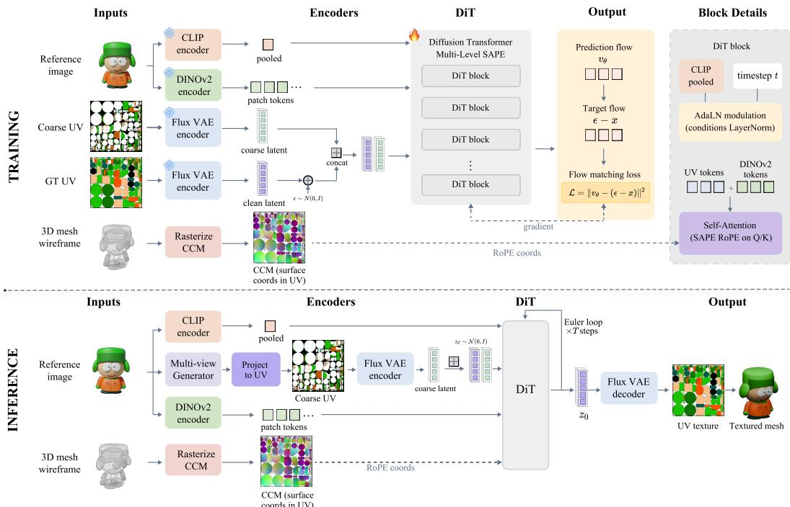  
Figure 1: Overview of DirectUV. Top (training). The reference image is encoded by CLIP [24] into a pooled feature that drives AdaLN modulation, and by DINOv2 [25] into patch tokens that feed the joint-attention stream. A coarse UV map is encoded by the frozen Flux VAE and channelconcatenated with the noisy UV latent to form the DiT input. The CCM supplies per-head RoPE coordinates for Multi-Level SAPE. The model is trained with the rectified flow-matching objective. Bottom (inference). The reference image drives both an off-the-shelf multi-view generator, whose outputs are projected to a coarse UV map, and the CLIP/DINOv2 encoders. Under this conditioning, N Euler steps denoise $\mathbf { z } _ { 1 } ~ \mathrm { t o } ~ \mathbf { z } _ { 0 }$ , which is decoded by the frozen Flux VAE and wrapped onto the mesh as the final texture.

## 3 Method

## 3.1 Overview

Since positional encoding governs the distance metric of attention, embedding surface coordinates into PE offers a direct path to surface-aware denoising without auxiliary 3D modules. DirectUV formulates image-conditioned UV texture generation as a diffusion process directly in UV space, with the UV map as the sole generation target. The pipeline operates in a latent UV space. Given an input image and a mesh with UV parameterization, the UV map is encoded into a compact latent representation by a pretrained image VAE. The same UV parameterization additionally yields a Canonical Coordinate Map (CCM), a UV-space image whose value at each pixel is the 3D surface coordinate of the corresponding mesh point. The CCM is precomputed once per mesh and provides the geometric input from which Surface-Aware Positional Encoding (SAPE) derives per-token surface coordinates. A diffusion transformer (DiT) then models the conditional generation process in this latent space, guided by the input image and a coarse UV map, with SAPE integrated into its attention layers to inject 3D surface geometry directly into token-to-token interactions. The predicted latent is finally decoded back to obtain the UV texture. An overview of the full training and inference pipeline is shown in Figure 1. In the following, we first introduce the latent UV diffusion formulation, then describe the conditioning strategy for incorporating image and UV cues, and finally present the design of SAPE for enabling surface-aware attention in UV-space generation.

## 3.2 Latent UV Diffusion Formulation

We model UV texture generation as a conditional diffusion process in a latent UV space. A UV map, defined as an image-like signal over a regular 2D grid, is encoded into a spatially downsampled latent representation $\mathbf { x } = \mathcal { E } ( I _ { \mathrm { U V } } )$ using a frozen Flux [15] VAE encoder, on which all denoising is performed, and decoded back by D to obtain the final texture. This representation naturally aligns with pretrained 2D image priors, while the VAE reconstructs UV maps with negligible error, allowing the model to operate in a compact space without sacrificing fine-grained appearance.

With the UV map as the sole generation target, texture synthesis reduces to a single diffusion process, avoiding the inconsistencies introduced by projecting and blending intermediate views. The latent representation preserves the UV coordinate structure, providing a direct path for surface geometry to enter through positional encoding rather than through auxiliary modules or external 3D features. We instantiate v using the Flux DiT architecture, and introduce the conditioning bundle c together with Surface-Aware Positional Encoding (SAPE) within its attention layers, whose details are presented in the following subsections.

## 3.3 Conditioning in UV-Space Generation

The conditioning bundle c consists of two complementary signals: a reference image providing appearance information and a coarse UV map encoding surface-aligned layout. These signals are injected into the DiT through different pathways depending on whether they share the UV coordinate system of the target texture.

Image condition. The reference image is incorporated through two streams aligned with how the DiT processes external inputs. A pooled CLIP feature captures global appearance attributes such as color, material tone, and identity, and is injected through the modulation pathway used for timestep and text embeddings in Flux, conditioning all tokens uniformly. In parallel, dense patch tokens from DINOv2 provide spatially localized details and are fed into the joint-attention stream, where they effectively replace text tokens in the original architecture. This enables UV latent tokens to attend to relevant image regions for fine-grained appearance cues.

Coarse UV map. The coarse UV map is obtained by projecting one or more input views into UV space and provides surface-aligned layout guidance. Since it shares the UV coordinate system with the target texture, it is injected through a position-aligned pathway. The same Flux VAE encodes it into a latent representation, which is concatenated with the noisy UV latent along the channel dimension before patchification. This per-position concatenation preserves one-to-one spatial correspondence with the latent being denoised, unlike the image condition, which relies on modulation and cross-attention due to the lack of coordinate alignment.

In contrast to projection-based pipelines that treat projected UV maps as intermediate results for refinement or inpainting, both signals act purely as conditioning. The UV texture is generated from scratch in latent space, allowing DirectUV to leverage multi-view cues without inheriting view-dependent inconsistencies.

## 3.4 Surface-Aware Positional Encoding (SAPE)

Spatial Metric Mismatch. In a diffusion transformer, positional encodings define the spatial metric over which attention relates tokens, fixing which regions are treated as neighbors during denoising. For UV texture generation this metric is critical: appearance should propagate according to proximity on the mesh surface rather than proximity on the flattened UV plane.

Standard DiTs use positional encodings on a regular 2D grid, so token relationships are measured in UV coordinates. This induces a mismatch between the parameterization and the underlying surface: texels that are immediate neighbors on the mesh can be split across a UV seam onto disconnected islands and end up arbitrarily far apart under the UV-grid metric (Figure 2, left), while texels nearby in the UV plane may correspond to distant surface regions. The 2D grid therefore supplies attention with an incorrect neighborhood prior, limiting coherence across seams and surface-disconnected UV regions.

Surface-Aware RoPE. We address this mismatch with Surface-Aware Positional Encoding (SAPE), which replaces the 2D UV-grid positional encoding with positional codes derived from the CCM. Let $\mathbf { x } _ { i }$ denote the i-th token of the latent x and $U _ { i }$ the UV region it covers. We downsample the CCM to the resolution of the token grid so that $U _ { i }$ maps to a single CCM pixel, whose value $\boldsymbol { S } _ { i } \in \mathbb { R } ^ { 3 }$ gives the per-token surface coordinate. For any pair of tokens $\mathbf { x } _ { i } , \mathbf { x } _ { j }$ at head h, SAPE rotates their query and key as

$$
\begin{array} { r } { \tilde { \mathbf { Q } } _ { i } ^ { ( h ) } = \mathrm { R o P E } ( \mathbf { Q } _ { i } ^ { ( h ) } ; S _ { i } ) , \qquad \tilde { \mathbf { K } } _ { j } ^ { ( h ) } = \mathrm { R o P E } ( \mathbf { K } _ { j } ^ { ( h ) } ; S _ { j } ) . } \end{array}\tag{1}
$$

Following the standard axis-factorized form of RoPE, the head’s feature dimension is split into three contiguous groups corresponding to the $( x , y , z )$ axes of Si, with each group rotated independently by its own coordinate. The dot product $\langle \tilde { \bf Q } _ { i } ^ { ( h ) } , \tilde { \bf K } _ { i } ^ { ( h ) } \rangle$ therefore depends only on the relative offset ${ S } _ { j } - { S } _ { i }$ on the 3D surface rather than on the 2D UV grid. Texels nearby on the surface can therefore attend to each other directly, even when separated in UV space.

Multi-Level SAPE. A single per-token surface coordinate cannot simultaneously capture broad surface correspondence across UV islands and fine local structure around seams. We therefore extend SAPE to a multi-level form that reads the CCM at $L$ resolutions over the same latent patch. At level $l \in \{ 0 , \ldots , L - 1 \}$ , the patch is subdivided into a $2 ^ { l } \times 2 ^ { l }$ layout, yielding $4 ^ { l }$ subcell surface coordinates per token. We denote any one of them by ${ \cal S } _ { i } ^ { ( l ) }$ , so the basic SAPE above corresponds to $l = 0$ with $S _ { i } = S _ { i } ^ { ( 0 ) }$

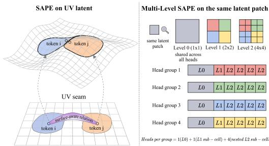  
Figure 2: Mechanism of SAPE and Multi-Level SAPE. Left. Tokens i and j are adjacent on the mesh but separated onto different UV islands by a seam. SAPE measures their attention distance on the surface, allowing direct interaction across the seam. Right. Multi-Level SAPE reads the CCM at L resolutions and assigns the resulting positional encodings to the H heads, organized into G groups (one cell per head, color denotes group).

These per-level coordinates are then distributed across the head dimension of the diffusion transformer. Multi-head attention partitions the pertoken feature into H contiguous slices of size $d _ { \mathrm { h e a d } }$ , with each head rotating its own slice independently. Each head h is assigned a level $l _ { h } \ \in \ \{ 0 , \ldots , L - 1 \}$ and a specific sub-cell within that level. This replaces $s _ { i }$ in the rotation above with the head-specific coordinate $S _ { i } ^ { ( l _ { h } ) }$ , so the head’s queries and keys are rotated using a single 3D surface coordinate at one granularity.

The H heads are organized into G groups, each tied to one sub-cell of the level-1 layout. Within a group (for $L = 3 )$ , one head reads the level-0 coordinate, one head reads the group’s level-1 sub-cell, and the remaining four heads read the level-2 sub-cells nested inside it. The G groups together partition the level-1 layout, so every sub-cell at any level is read by exactly one head across the head dimension. The specific values of $\dot { L } , H , G .$ , and the per-level head budget are given in Section 4.2.

A token’s feature vector therefore simultaneously carries surface information at all L granularities, but on disjoint head slices: each head receives a single CCM coordinate rather than a stacked superposition of multiple levels. Since attention is computed per head and then mixed by the output projection, multi-level surface evidence is integrated downstream of attention, while inside attention each head reasons under a clean single-granularity positional metric. No additional latent maps, parameters, or auxiliary geometry branches are introduced. Figure 2 illustrates how SAPE establishes surface-aware interaction directly on the UV latent map and how each head within a group receives one specific CCM sub-cell.

## 3.5 Training and Inference

Training objective. We train $v _ { \theta }$ under the rectified flow-matching formulation [26]. Given a clean UV latent x, a noise sample $\epsilon \sim \mathcal { N } ( \mathbf { 0 } , \mathbf { I } )$ , and a timestep $t \in [ 0 , 1 ]$ , we form the noisy latent ${ \bf z } _ { t } = ( 1 - t ) { \bf x } + t$ ϵ and train the network to predict the corresponding flow direction $\epsilon - \mathbf { x }$ via

$$
\begin{array} { r } { \mathcal { L } _ { \theta } = \mathbb { E } _ { t , \mathbf { x } , \epsilon , \mathbf { c } } \big [ w ( t ) \| v _ { \theta } ( \mathbf { z } _ { t } , t , \mathbf { c } ) - ( \epsilon - \mathbf { x } ) \| _ { 2 } ^ { 2 } \big ] , } \end{array}\tag{2}
$$

where c is the conditioning bundle defined in Section 3.3. We sample t uniformly from [0, 1] and use a uniform reweighting $w ( t ) \equiv 1$ . Note that the CCM is not part of c and enters the model exclusively through SAPE.

Inference. During inference, given a reference image and a 3D mesh, the coarse UV map is produced from the reference image by an off-the-shelf multi-view generator followed by view-to-UV projection, and the CCM is rasterized once from the mesh. Starting from ${ \bf z } _ { 1 } \sim \mathcal { N } ( { \bf 0 } , { \bf I } )$ , we iterate the Euler update for N denoising steps. The conditioning bundle c and the CCM are deterministic across steps and reused without re-estimation, the final latent is decoded by the frozen Flux VAE to recover the UV texture.

## 4 Experiments

## 4.1 Dataset

We construct our training set from three large-scale 3D asset datasets: TexVerse [27], PartNext [28], and Objaverse [29]. After merging and filtering out meshes with excessive face counts, severely fragmented UV layouts, low-quality UV parameterizations, or invalid UV-space supervision, we retain approximately 100K textured meshes.

For each mesh we generate a UV mask, a ground-truth UV texture, and a CCM, all at $1 0 2 4 \times 1 0 2 4$ resolution. We also render four canonical RGB views at azimuth angles $\{ 0 ^ { \circ } , 9 0 ^ { \circ } , 1 8 0 ^ { \circ } , 2 7 0 ^ { \circ } \}$ with elevation 5◦. The front view serves as the reference image fed to DINOv2 and CLIP.

For latent normalization, we precompute the per-position per-channel mean and standard deviation of VAE-encoded UV latents over the training set, and apply them during training and inference.

## 4.2 Implementation Details

Our UV diffusion model is a Flux-style transformer with 6 MMDiT blocks and 12 single-stream blocks, using $H = 2 4$ attention heads with head dimension $d _ { \mathrm { h e a d } } = 1 2 0$ and axes dimensions (40, 40, 40). For Multi-Level SAPE, we use $L = 3$ subdivision levels and partition the H heads into $G = 4$ groups of six. Within each group, one head reads the level-0 coordinate, one reads its level-1 sub-cell, and the remaining four read the four level-2 sub-cells nested inside, giving a 4:4:16 ratio across levels. Image conditioning uses DINOv2 ViT-L/14 with registers and CLIP ViT-B/32. For UV encoding and decoding, we reuse the frozen VAE from FLUX.1-dev [15], which has 8× spatial downsampling and 64 latent channels. The noisy target UV latent and the VAE-encoded coarse UV are concatenated along the channel dimension, yielding 128 input channels and 64 output channels at the patchify layer.

The coarse UV map is constructed online by projecting rendered views into UV space using the known mesh geometry. At each step, we randomly select 0, 1, 2, or 4 views, where the zero-view case corresponds to a blank UV map. To simulate realistic view-level inconsistencies, some views are rendered with lighting while others use albedo colors, introducing illumination variation across the projected UV and making it an imperfect conditioning signal rather than a target to be directly copied.

We train on 8 NVIDIA A800 GPUs (Accelerate) with batch size 16 per GPU for 170K steps using 8-bit AdamW $( 1 0 ^ { - 5 } \mathrm { l r } , 1 0 ^ { - 4 }$ wd, betas (0.9, 0.999), clip 1.0), bf16 and gradient checkpointing. At inference, we run 28 denoising steps with FlowMatchEulerDiscreteScheduler; coarse UV maps are obtained via Kiss3dGen [20] followed by projection to the mesh.

## 4.3 Evaluation

We evaluate on the full Google Scanned Objects (GSO) [30] dataset, which is disjoint from our training data and thus serves as an out-of-distribution test set. For each object, we render a single front-facing view as the reference image input for all methods.

For quantitative evaluation, each textured mesh is rendered under albedo shading from a set of viewpoints providing full directional coverage, including top-down and bottom-up views. Renderings are compared against ground-truth albedo images, and we report PSNR and SSIM for per-pixel fidelity, along with FID [31] and KID [32] for distributional similarity.

## 4.4 Comparison with State-of-the-Art Methods

We compare our method with representative 3D texture generation baselines. TEXGen [10] generates mesh textures via a hybrid diffusion model that couples 2D UV-space convolutions with 3D point cloud attention, exchanging features between the two representations to achieve surface-aware texture synthesis. FlexPainter [6] unifies multiple control signals within a texture generation diffusion framework, supporting text, image, and multi-modal inputs. Hunyuan3D-2.1 [13] synthesizes multiview images with 3D-aware RoPE in its Paint module and bakes the result into a UV texture. UniTEX [11] retains the multi-view projection stage and completes the resulting partial textured mesh through a Large Texturing Model that produces a triplane feature volume. All methods receive the same input meshes and reference images.

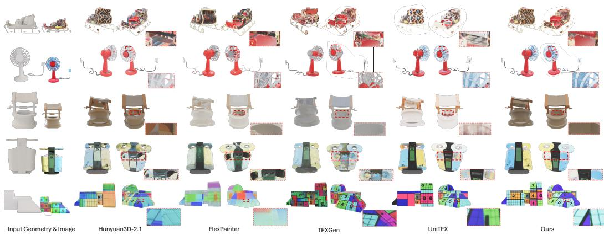  
Figure 3: Qualitative comparison with state-of-the-art texture generation methods. (i) Finer details: our results preserve sharper high-frequency patterns, e.g., the line strokes in the number block. (ii) Occluded regions: for heavily occluded interiors such as the well and the trash bin, our method produces coherent and plausible content, while others yield blurry or incomplete textures. (iii) Robustness to multi-view inconsistency: by denoising directly in latent UV space, our method avoids being misled by conflicting views. In the fan case, UniTEX incorrectly transfers the back-cover texture onto the front blades, whereas ours preserves the correct appearance.

<table><tr><td>Method</td><td>PSNR ↑</td><td>SSIM↑</td><td>FID↓</td><td>KID↓</td></tr><tr><td>TEXGen [10]</td><td>24.45</td><td>0.9417</td><td>44.09</td><td>34.32</td></tr><tr><td>FlexPainter [6]</td><td>23.21</td><td>0.9463</td><td>47.04</td><td>39.25</td></tr><tr><td>Hunyuan3D-2.1 [13]</td><td>24.74</td><td>0.9450</td><td>39.872</td><td>33.34</td></tr><tr><td>UniTEX [11]</td><td>24.23</td><td>0.9504</td><td>42.11</td><td>39.21</td></tr><tr><td>Ours</td><td>25.13</td><td>0.9527</td><td>39.17</td><td>30.03</td></tr></table>

Table 1: Quantitative comparison on the GSO dataset. Best results are shown in bold, and second-best results are underlined.

Quantitative Results. Table 1 reports the quantitative comparison. Our method achieves the best PSNR and SSIM among all compared methods, demonstrating superior reference fidelity and reconstruction accuracy. In addition, our method obtains competitive FID and KID scores, indicating that it preserves perceptual realism while maintaining stable texture consistency. Across all metrics, our method achieves the best overall balance between reconstruction fidelity and perceptual quality.

Qualitative Results. All qualitative renderings are produced under identical lighting conditions applied uniformly to all methods. We compare our method with the strongest baselines on a diverse set of meshes, as illustrated in Figure 3. Our results consistently exhibit finer texture details, as reflected in the sharp recovery of high-frequency patterns on the number block, where competing methods tend to blur or misalign thin structures. In heavily occluded regions, such as the inner walls of the well and the trash bin, our method produces coherent and semantically plausible content, while projection-based pipelines often yield blurry or fragmented artifacts due to limited visible evidence. The fan example further demonstrates robustness to multi-view inconsistency. UniTEX treats projected multi-view results as the target to be completed via inpainting, and thus transfers the back-cover texture onto the front blades when the views are inconsistent. In contrast, our method operates on the UV latent with conditioning signals, resolving such conflicts through global reasoning and preserving the correct appearance.

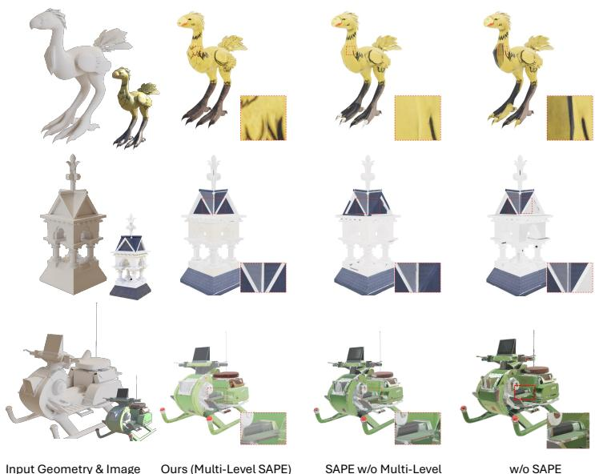  
Figure 4: Qualitative ablation of Surface-Aware Positional Encoding. Without SAPE, texels that are adjacent on the 3D surface but split into different UV islands cannot interact properly, leading to severe appearance divergence in some regions, as seen in the chocobo case where the black texture from the legs is incorrectly generated on the neck. Removing only the multi-level design preserves cross-island coherence but loses spatial precision, yielding blurry textures.

## 4.5 Ablation Study

Effect of Surface-Aware Positional Encoding. To isolate the contribution of SAPE, we replace it with the standard 2D UV-grid RoPE used by Flux while keeping the rest of the model unchanged, yielding a pure latent UV-space DiT with no surface coordinate information in its positional encoding. As shown in Table 2 and Figure 4, this

<table><tr><td>Variant</td><td>PSNR ↑</td><td>SSIM↑</td><td>FID↓</td><td>KID↓</td></tr><tr><td>w/o SAPE</td><td>23.82</td><td>0.9376</td><td>58.42</td><td>72.36</td></tr><tr><td>SAPE w/o Multi-Level</td><td>24.36</td><td>0.9462</td><td>40.86</td><td>36.74</td></tr><tr><td>Ours (Multi-Level SAPE)</td><td>25.13</td><td>0.9527</td><td>39.17</td><td>30.03</td></tr></table>

Table 2: Ablation of SAPE and its multi-level design on the GSO dataset.

variant drops across all metrics, with the most visible degradation on regions that surface-disconnected islands. Attention can only relate tokens by UV-plane proximity, so mesh-adjacent texels split across charts cannot interact directly, producing seam mismatches and inconsistent appearance between disconnected UV islands of the same surface region.

Effect of Multi-Level Design. Holding SAPE in place, we ablate only its multi-level structure by tying all H heads to a single level-0 coordinate $S _ { i } = S _ { i } ^ { ( 0 ) }$ . As illustrated in Table 2 and Figure 4, this single-level variant retains seam coherence but produces blurry textures. With every head reading the same coordinate per token, attention cannot distinguish sub-token positions inside a latent patch, so within-patch detail collapses to a near-uniform appearance after decoding. Multi-level coordinates expose finer sub-patch granularities to different heads, breaking this ambiguity and restoring high-frequency detail.

## 5 Conclusion

We presented DirectUV, an image-conditioned UV texture diffusion framework that generates textures directly in latent UV space, using projected multi-view results only as conditioning signals. The key idea is Surface-Aware Positional Encoding (SAPE), which embeds surface geometry into positional encodings so that attention operates on true surface proximity, enabling coherent synthesis across seams without auxiliary 3D modules. A multi-level design further allows reasoning at multiple spatial scales. DirectUV outperforms other baselines, especially in occluded and view-unseen regions. A remaining limitation is the reliance on UV parameterization quality, which future work may address.

## References

[1] R. Chen, Y. Chen, N. Jiao, and K. Jia, “Fantasia3d: Disentangling geometry and appearance for high-quality text-to-3d content creation,” in Proceedings of the IEEE/CVF international conference on computer vision, 2023, pp. 22 246–22 256.

[2] E. Richardson, G. Metzer, Y. Alaluf, R. Giryes, and D. Cohen-Or, “Texture: Text-guided texturing of 3d shapes,” in ACM SIGGRAPH 2023 conference proceedings, 2023, pp. 1–11.

[3] D. Z. Chen, Y. Siddiqui, H.-Y. Lee, S. Tulyakov, and M. Nießner, “Text2tex: Text-driven texture synthesis via diffusion models,” arXiv preprint arXiv:2303.11396, 2023.

[4] X. Zeng, X. Chen, Z. Qi, W. Liu, Z. Zhao, Z. Wang, B. Fu, Y. Liu, and G. Yu, “Paint3d: Paint anything 3d with lighting-less texture diffusion models,” in Proceedings of the IEEE/CVF Conference on Computer Vision and Pattern Recognition, 2024, pp. 4252–4262.

[5] W. Cheng, J. Mu, X. Zeng, X. Chen, A. Pang, C. Zhang, Z. Wang, B. Fu, G. Yu, Z. Liu et al., “Mvpaint: Synchronized multi-view diffusion for painting anything 3d,” in Proceedings ofthe Computer Vision and Pattern Recognition Conference, 2025, pp. 585–594.

[6] D. Yan, L. Wu, J. Lin, L. Wang, T. Xu, Z. Chen, Z. Yang, L. Xu, S. Zhang, and Y. Chen, “Flexpainter: Flexible and multi-view consistent texture generation,” arXiv preprint arXiv:2506.02620, 2025.

[7] Y. Feng, M. Yang, S. Yang, S. Zhang, J. Yu, Z. Zhao, Y. Liu, J. Jiang, and C. Guo, “Romantex: Decoupling 3d-aware rotary positional embedded multi-attention network for texture synthesis,” in Proceedings of the IEEE/CVF International Conference on Computer Vision, 2025, pp. 17 203–17 213.

[8] Y. Georgiou, M. Loizou, M. Averkiou, and E. Kalogerakis, “Im2surftex: Surface texture generation via neural backprojection of multi-view images,” arXiv preprint arXiv:2502.14006, 2025.

[9] X. Yu, P. Dai, W. Li, L. Ma, Z. Liu, and X. Qi, “Texture generation on 3d meshes with point-uv diffusion,” in Proceedings of the IEEE/CVF International Conference on Computer Vision, 2023, pp. 4206–4216.

[10] X. Yu, Z. Yuan, Y.-C. Guo, Y.-T. Liu, J. Liu, Y. Li, Y.-P. Cao, D. Liang, and X. Qi, “Texgen: a generative diffusion model for mesh textures,” ACM Transactions on Graphics (TOG), vol. 43, no. 6, pp. 1–14, 2024.

[11] Y. Liang, K. Luo, X. Chen, R. Chen, H. Yan, W. Li, J. Liu, and P. Tan, “Unitex: Universal high fidelity generative texturing for 3d shapes,” arXiv preprint arXiv:2505.23253, 2025.

[12] J. Liu, J. Wu, X. Gao, J. Hu, B. Xiong, X. Liu, C. Zhao, H. Pei, H. Feng, Y. Li et al., “Texgarment: Consistent garment uv texture generation via efficient 3d structure-guided diffusion transformer,” in Proceedings ofthe Computer Vision and Pattern Recognition Conference, 2025, pp. 26 566– 26 575.

[13] T. H. Team, “Hunyuan3d 2.1: From images to high-fidelity 3d assets with production-ready pbr material,” 2025.

[14] Y. Bai, H. Li, and Q. Huang, “Positional encoding field,” arXiv preprint arXiv:2510.20385, 2025.

[15] B. F. Labs, “Flux,” https://github.com/black-forest-labs/flux, 2024.

[16] J. Su, M. Ahmed, Y. Lu, S. Pan, W. Bo, and Y. Liu, “Roformer: Enhanced transformer with rotary position embedding,” Neurocomputing, vol. 568, p. 127063, 2024.

[17] R. Liu, R. Wu, B. V. Hoorick, P. Tokmakov, S. Zakharov, and C. Vondrick, “Zero-1-to-3: Zero-shot one image to 3d object,” 2023.

[18] Z. Huang, Y.-C. Guo, H. Wang, R. Yi, L. Ma, Y.-P. Cao, and L. Sheng, “Mv-adapter: Multiview consistent image generation made easy,” in Proceedings of the IEEE/CVF International Conference on Computer Vision, 2025, pp. 16 377–16 387.

[19] X. Long, Y.-C. Guo, C. Lin, Y. Liu, Z. Dou, L. Liu, Y. Ma, S.-H. Zhang, M. Habermann, C. Theobalt et al., “Wonder3d: Single image to 3d using cross-domain diffusion,” in Proceedings ofthe IEEE/CVF conference on computer vision and pattern recognition, 2024, pp. 9970–9980.

[20] J. Lin, X. Yang, M. Chen, Y. Xu, D. Yan, L. Wu, X. Xu, L. Xu, S. Zhang, and Y.-C. Chen, “Kiss3dgen: Repurposing image diffusion models for 3d asset generation,” in Proceedings of the Computer Vision and Pattern Recognition Conference, 2025, pp. 5870–5880.

[21] X. Yang, J. Lin, Y. Xu, H. Li, and Y. Chen, “Advancing high-fidelity 3d and texture generation with 2.5 d latents,” arXiv preprint arXiv:2505.21050, 2025.

[22] Y. Liu, M. Xie, H. Liu, and T.-T. Wong, “Text-guided texturing by synchronized multi-view diffusion,” arXiv preprint arXiv:2311.12891, 2023.

[23] W. Peebles and S. Xie, “Scalable diffusion models with transformers,” in Proceedings ofthe IEEE/CVF international conference on computer vision, 2023, pp. 4195–4205.

[24] A. Radford, J. W. Kim, C. Hallacy, A. Ramesh, G. Goh, S. Agarwal, G. Sastry, A. Askell, P. Mishkin, J. Clark, G. Krueger, and I. Sutskever, “Learning transferable visual models from natural language supervision,” in ICML, 2021.

[25] M. Oquab, T. Darcet, T. Moutakanni, H. V. Vo, M. Szafraniec, V. Khalidov, P. Fernandez, D. Haziza, F. Massa, A. El-Nouby, R. Howes, P.-Y. Huang, H. Xu, V. Sharma, S.-W. Li, W. Galuba, M. Rabbat, M. Assran, N. Ballas, G. Synnaeve, I. Misra, H. Jegou, J. Mairal, P. Labatut, A. Joulin, and P. Bojanowski, “Dinov2: Learning robust visual features without supervision,” 2023.

[26] X. Liu, C. Gong, and Q. Liu, “Flow straight and fast: Learning to generate and transfer data with rectified flow,” arXiv preprint arXiv:2209.03003, 2022.

[27] M. Deitke, R. Liu, M. Wallingford, H. Ngo, O. Michel, A. Kusupati, A. Fan, C. Laforte, V. Voleti, S. Y. Gadre et al., “Objaverse-xl: A universe of 10m+ 3d objects,” arXiv preprint arXiv:2307.05663, 2023.

[28] P. Wang, Y. He, X. Lv, Y. Zhou, L. Xu, J. Yu, and J. Gu, “Partnext: A next-generation dataset for fine-grained and hierarchical 3d part understanding,” arXiv preprint arXiv:2510.20155, 2025.

[29] M. Deitke, D. Schwenk, J. Salvador, L. Weihs, O. Michel, E. VanderBilt, L. Schmidt, K. Ehsani, A. Kembhavi, and A. Farhadi, “Objaverse: A universe of annotated 3d objects,” in Proceedings of the IEEE/CVF conference on computer vision and pattern recognition, 2023, pp. 13 142– 13 153.

[30] L. Downs, A. Francis, N. Koenig, B. Kinman, R. Hickman, K. Reymann, T. B. McHugh, and V. Vanhoucke, “Google scanned objects: A high-quality dataset of 3d scanned household items,” in 2022 International Conference on Robotics and Automation (ICRA). Ieee, 2022, pp. 2553–2560.

[31] M. Heusel, H. Ramsauer, T. Unterthiner, B. Nessler, and S. Hochreiter, “Gans trained by a two time-scale update rule converge to a local nash equilibrium,” Advances in neural information processing systems, vol. 30, 2017.

[32] M. Binkowski, D. J. Sutherland, M. Arbel, and A. Gretton, “Demystifying mmd gans,” ´ arXiv preprint arXiv:1801.01401, 2018.

## Appendix

## A Coarse UV as Soft Conditioning

The coarse UV map assembled from multi-view projections provides a surface-aligned layout cue, but it can carry inaccurate or misleading color in regions where the projected views do not faithfully represent the true surface appearance. DirectUV treats this map as a soft conditioning signal and doe not directly copy its values into the final texture; instead, the denoising process can deviate from the coarse UV when the model’s learned prior suggests a more coherent appearance.

Figure 1 illustrates this on a keyboard example. The coarse UV renders the underside of the chassis as white, yet the reference image and surrounding surface clearly indicate a continuous dark metallic casing. The final texture correctly assigns the metal material to the bottom face, overriding the white coarse UV through global reasoning over the full surface. This behavior confirms that the coarse UV guides rather than constrains the generation.

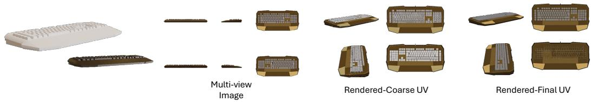  
Figure 1: The keyboard underside appears white in the coarse UV (center) despite being covered by the bottom-view projection, but is correctly recovered as dark metallic casing in the final texture (right), consistent with the reference image. DirectUV’s learned prior overrides the inaccurate coarse UV values rather than copying them.

## B Robustness to Coarse UV Completeness

During training, the number of views used to construct the coarse UV is randomly sampled from {0, 1, 2, 4} at each step, exposing the model to a wide range of coarse UV completeness and preventing it from over-relying on any single input quality level. Figure 2 shows that this strategy yields a model robust to incomplete coarse UV inputs at inference time. Even in the zero-view setting where the coarse UV is entirely blank, DirectUV produces plausible textures by relying on the reference image and geometry-conditioned denoising alone, confirming that the coarse UV is treated as a soft conditioning signal rather than a hard initialization.

## C Application to Generated Meshes

To evaluate DirectUV in the context of current 3D content creation workflows, we apply it to meshes produced by recent image-to-3D shape generators like Tripo and Rodin, forming a complete imageto-textured-mesh pipeline. Given a reference image, the shape generator produces a mesh, and DirectUV textures it conditioned on the same image. Figure 3 shows results across diverse objects, demonstrating that DirectUV handles the varying topologies and UV layouts produced by generative shape models and integrates naturally into an end-to-end production setting.

## D Failure Cases

DirectUV is sensitive to the quality of the underlying UV parameterization. On meshes with highly fragmented UV layouts—composed of many small slivers and corner patches—the per-token surface coordinate $S _ { i }$ aggregates information over relatively large surface regions for each fragment, resulting

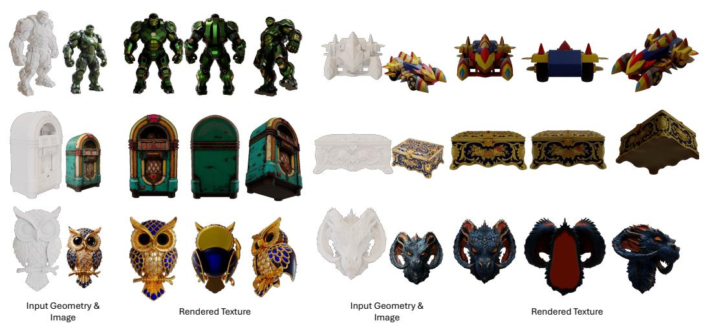  
Figure 2: Texture generation results under varying coarse UV completeness at inference time (0, 1, 2, and 4 projected views). The reference image and mesh are identical across all cases.  
Figure 3: Texture generation on meshes produced by image-to-3D shape generators, demonstrating DirectUV in a complete image-to-textured-mesh pipeline. Each block shows the input reference image alongside the generated texture rendered from multiple viewpoints.

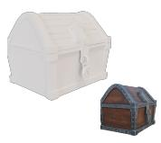

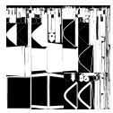

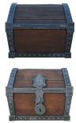

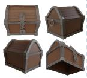

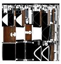

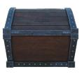

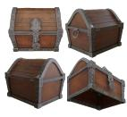

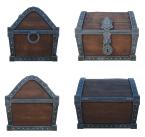

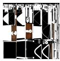

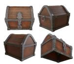

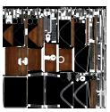

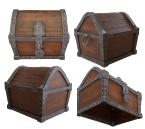

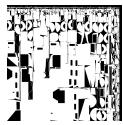

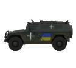

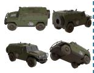

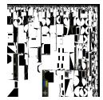

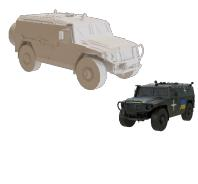

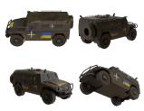  
Input Geometry & Image

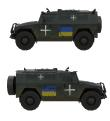  
Multi-view Images

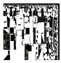  
Coarse UV

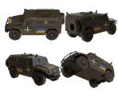  
Rendered Texture

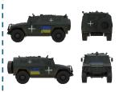  
Multi-view Images

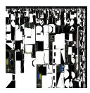  
Coarse UV

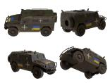  
Rendered Texture

in a coarse CCM signal. In such cases, the multi-level subdivision is unable to fully recover finegrained local detail. Figure 4 shows representative examples where the rendered textures exhibit blurriness and color leakage in these regions.

These failure modes arise from the UV parameterization and mesh quality, rather than from the SAPE design itself. We view this limitation as an opportunity for future work, such as UV-aware preprocessing or jointly learned tokenization strategies tailored to UV-space data.

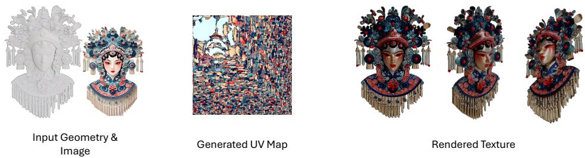  
Figure 4: Failure cases on heavily fragmented UV layouts. The UV map (top row) is split into a large number of small islands and slivers with substantial unused border space, leading to blurred or color-leaked regions in the wrapped texture (bottom row).

## E More Results

We present additional texture generation results in Figure 5, covering a diverse range of object categories and mesh complexities.

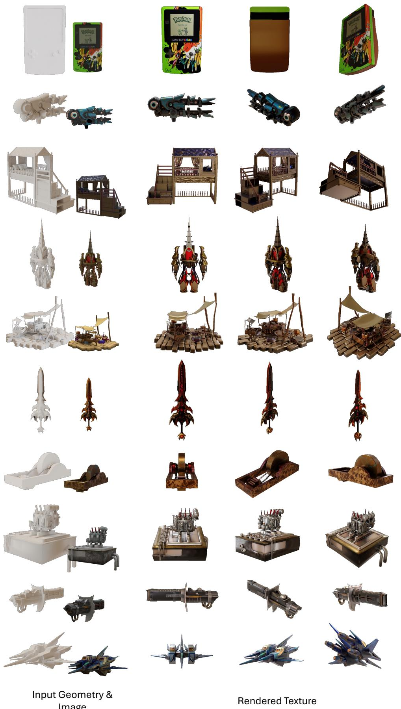  
Figure 5: Additional texture generation results.