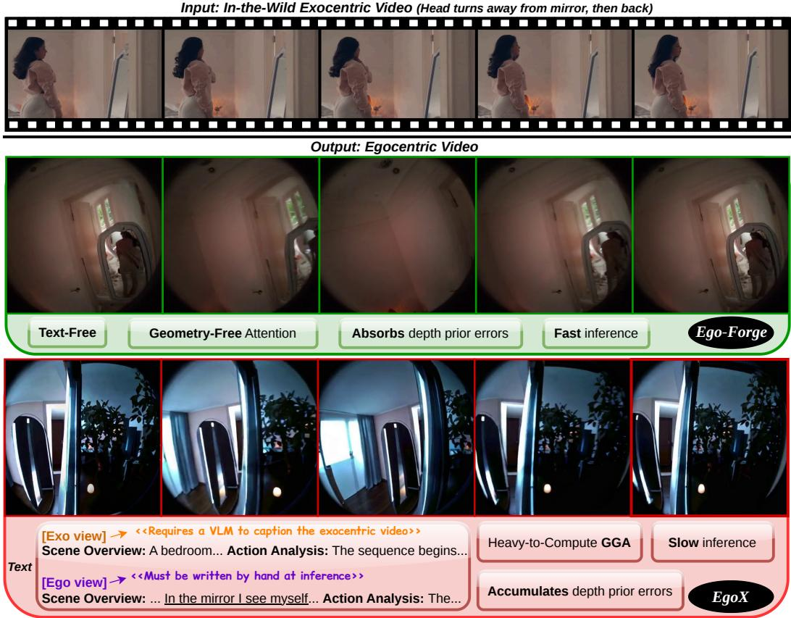
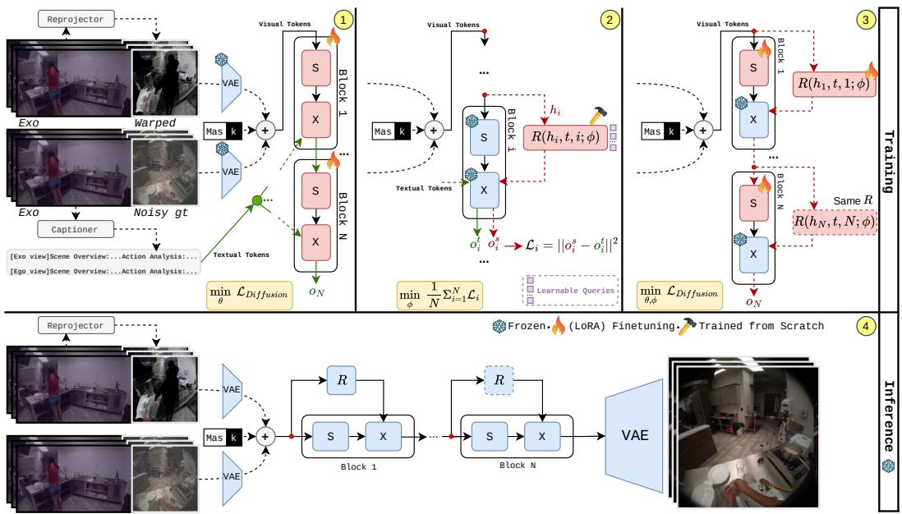
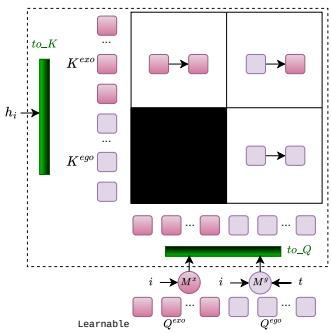
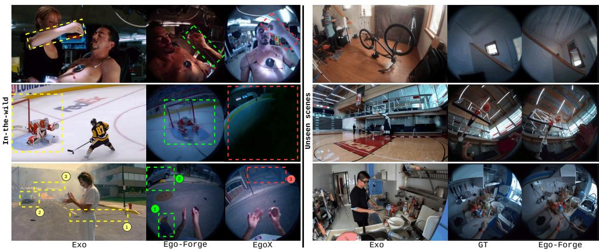
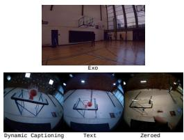
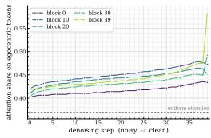
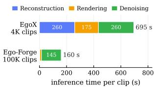
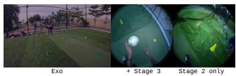
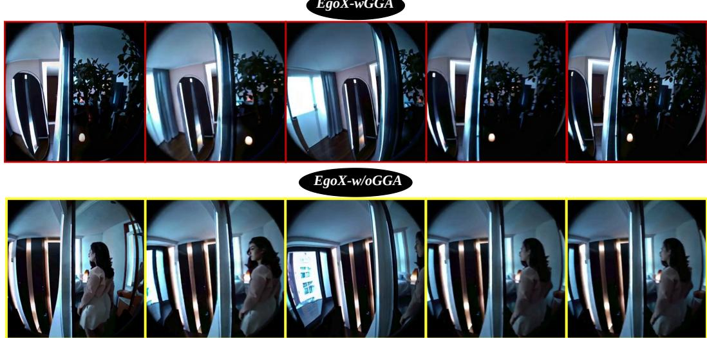

# EGO-FORGE: TEXT AND GEOMETRIC-ATTENTION FREE EXO-TO-EGOCENTRIC VIDEO GENERATION

Mohammad Mahdi∗ Luc Van Gool Danda Pani Paudel INSAIT, Sofia University “St. Kliment Ohridski” {firstname.lastname}@insait.ai

  
Figure 1: Ego-Forge generates egocentric video without text conditioning or geometry-guided attention. Top: An in-the-wild exocentric clip in which the subject turns away from a mirror and then back. Middle: Our method follows the head motion and renders the mirror and its reflection, although the exocentric camera never observes the reflected content and no caption is provided at inference. Bottom: EgoX, conditioned on captions of both views, including an explicit description of the reflection, and Geometry-Guided Self-Attention (GGA), fails to recover the reflection.

## ABSTRACT

Exo-to-egocentric video generation aims to synthesize what a person sees from their own viewpoint given third-person footage and a target head trajectory. The task requires transferring appearance and semantics across large viewpoint changes while hallucinating content never observed by the exocentric camera. Existing approaches either impose additional input requirements, such as a groundtruth initial egocentric frame or multiple synchronized exocentric views, or remain limited to category-specific settings. EgoX (Kang et al., 2026) is the first to address cross-activity and in-the-wild generalization, but requires a human-provided

caption of the non-existent egocentric view at inference and introduces a computationally expensive geometry-guided attention bias that can propagate reconstruction errors and suppress textual and visual context (Figure 1). We therefore propose Ego-Forge, a caption-free and bias-free framework for exo-to-egocentric generation. It introduces Dynamic Captioning, which derives conditioning tokens directly from the model’s hidden states and adapts them to the diffusion timestep and network depth, replacing external text conditioning. By scaling training by an order of magnitude and using all available exocentric viewpoints, Ego-Forge learns cross-view correspondence implicitly and eliminates the need for geometryguided attention, requiring only a lightweight depth prior. Ego-Forge achieves state-of-the-art performance on Ego-Exo4D (Grauman et al., 2024), runs 4.3× faster end-to-end, requires no external annotation at inference, and generalizes to in-the-wild scenes, including cases where over-reliance on geometry blocks appearance inference. Our model and source code will be made publicly available.

## 1 INTRODUCTION

Exo-to-egocentric video generation aims to synthesise what a person sees from their own viewpoint, given third-person footage of them acting and a target camera trajectory for their head. Beyond video synthesis, the task probes visual understanding: the model must infer scene appearance and semantics from an exocentric view, transfer them across a large viewpoint change, and maintain consistency with the specified trajectory, while hallucinating substantial portions of the egocentric view that are never observed by the exocentric camera. This capability has applications in augmented and virtual reality (Engel et al., 2023), embodied learning (Kim et al., 2024; Brohan et al., 2023; Nair et al., 2022; Ma et al., 2022), and egocentric training data generation (Tran et al., 2026), where paired exocentric-egocentric recordings are expensive to collect.

Existing methods make the problem tractable by constraining the setting: EgoExo-Gen (Xu et al., 2025) assumes the ground-truth first egocentric frame is available, and Exo2Ego-V (Liu et al., 2024) and Exo2EgoSyn (Mahdi et al., 2025) require four synchronised exocentric cameras. Syn2Seq-Forcing (Mahdi et al., 2026) avoids such requirements, reformulating the task as continuous sequence modelling by interpolating between the two views. All of them, however, remain categoryspecific, requiring separate finetuning per activity class. A recent method, EgoX (Kang et al., 2026), is the first to generalise across activities. It adapts a pretrained video diffusion model using three conditioning signals: (i) an egocentric prior obtained through 3D reconstruction and reprojection along the target trajectory, (ii) a textual caption of the egocentric view, and (iii) a geometry-guided attention (GGA) bias.

We argue that requiring a caption of the non-existent egocentric view, together with the issues of the GGA bias discussed below, makes this approach impractical. First, the caption must be provided manually at inference, since the target egocentric view does not yet exist. Second, the GGA bias introduces three additional limitations. (i) It incurs high computational cost because it is computed over every query-key pair, making both training and inference expensive. (ii) It depends on the 3D reconstruction, causing reconstruction errors to propagate directly into the attention bias and the generated video. (iii) It suppresses visual and textual context, and is not compatible when the appearance change over the viewpoints (due to its over-reliance on the geometry alone). Figure 1 illustrates the latter case, where the reflection of the person in the mirror, which appears differently in different viewpoints, is not inferred, despite being described in the text (which gets suppressed by the GGA). As shown in the Appendix A, removing GGA recovers the reflection (yet without producing the correct ego view). We therefore propose Ego-Forge, which eliminates both textual and geometric conditioning, avoiding their associated costs and failure modes.

To avoid the ego-view’s caption, Ego-Forge introduces Dynamic Captioning: a lightweight module produces the conditioning tokens directly from the model’s own hidden states, so the cross-attention receives a description derived from the exocentric video rather than from text. It is conditioned on the diffusion timestep and block index, allowing its output to adapt as the egocentric view emerges during denoising and the representation evolves across network depth. Note that no text is generated in this process. The name only reflects that the module serves the role a caption would otherwise play when conditioning the backbone foundation model. On the other hand, we let the model implicitly learn cross-view correspondence and visual context from data, rather than imposing them through a hand-computed geometric prior. Removing the expensive GGA enables efficient end-to-end training on an order of magnitude more data from all exocentric viewpoints 1. Trained this way, the model learns to tolerate noisy reconstructions rather than inherit their errors. It therefore requires only the exocentric frames and a lightweight depth prior, eliminating both the captioning model at training time and human annotation at inference.

Our contributions are:

• Dynamic Captioning. A lightweight module that replaces the text stream, producing conditioning tokens directly from the model’s own hidden states and adapting them to the denoising step and the depth at which they are read. It removes the need for a human-written caption at inference.

• A caption-free, bias-free pipeline. We show that the geometry-guided attention bias can be dropped entirely when training is scaled to all exocentric viewpoints rather than only the best-reconstructed ones, and that a lightweight monocular depth model suffices in place of a heavy reconstruction. This removes the model’s dependence on reconstruction quality.

• State-of-the-art quality, 4.3× faster. Ego-Forge outperforms the state of the art on standard metrics on the Ego-Exo4D (Grauman et al., 2024) benchmark while being 4.3× faster end-to-end, and generalises to in-the-wild footage, including cases where over-reliance on geometry blocks appearance inference.

## 2 RELATED WORK

Diffusion-based video generation. Diffusion models trained at scale have rapidly improved the quality and temporal coherence of video generation (Wan et al., 2025b; Huang et al., 2024a; Liu et al., 2025b;a; Pan et al., 2025; Zhang et al., 2025a; Yang et al., 2024b). Beyond an initial text prompt, a line of work introduces explicit camera control, either by conditioning on trajectories (He et al., 2024; Wang et al., 2024; Yang et al., 2024a) or by manipulating temporal attention within a pretrained generator (Bai et al., 2025a). A complementary direction maintains an explicit 3D representation during generation to keep content consistent across viewpoints (Ren et al., 2025; Li et al., 2025; Yu et al., 2025). These methods synthesise video along a continuous camera path, but do not transform the viewpoint of an existing video: the cross-view setting, where the source and target cameras differ by a large and discontinuous pose change, remains largely unexplored.

Ego–exo cross-view generation. Paired ego–exo datasets (Grauman et al., 2024; Huang et al., 2024b; Grauman et al., 2022) have enabled a body of work on cross-view understanding, including object correspondence (Fu et al., 2025) and visual question answering (He et al., 2025; Lee et al., 2025). Generation is considerably harder, since the model must synthesise the large portion of the egocentric view that the exocentric camera never observes, and existing methods make the problem tractable by adding constraints. PMYS (Luo et al., 2024) first predict hand trajectories and then generate the egocentric video conditioned on them. EgoWorld (Park et al., 2025) reprojects a point cloud built from exocentric depth and 3D hand pose, then inpaints the result. Grounded-Exo2Ego (Wang et al., 2026) uses a dual-branch video diffusion model that combines geometric anchoring from 3D reconstruction with semantic grounding for challenging regions. EgoExo-Gen (Xu et al., 2025) conditions on an action description together with the ground-truth first egocentric frame. Exo2Ego-V (Liu et al., 2024) requires four synchronised exocentric cameras and a PixelNeRF-based representation, while Exo2EgoSyn (Mahdi et al., 2025) repurposes a large pretrained video generator but relies on a single predicted egocentric frame to guide generation and applies camera control per frame despite the backbone’s temporally coupled attention. Syn2Seq-Forcing (Mahdi et al., 2026) takes a different view of the problem, identifying the synchronisation-induced discontinuity between the two views as the central difficulty and interpolating between source and target videos so that the pair forms a single continuous sequence, which a diffusion sequence model (Song et al., 2025) can then follow. However, these methods remain category-specific, requiring separate finetuning per activity class.

  
Figure 2: Overview of Ego-Forge. Throughout, S denotes self-attention and X cross-attention. (1) Text-conditioned adaptation. We adapt the pretrained video diffusion backbone using all available exocentric viewpoints, conditioned on the exocentric video, reprojected egocentric prior, and a textual caption, without geometric attention bias. (2) Learning Dynamic Captioning. A single resampler ${ \dot { R } } ,$ shared across all N blocks, learns to replace the textual conditioning using the hidden state $h _ { i } .$ , block index i, and diffusion timestep t. Here, the superscripts t and s denote the teacher and student, respectively. (3) Joint finetuning. The caption is removed and the model is further finetuned with Dynamic Captioning and self-attention under the diffusion objective. (4) Inference. Only the exocentric video and reprojected prior are required; R provides the conditioning throughout the network without a caption.

EgoX and its dependencies. EgoX (Kang et al., 2026) is the first method in this setting to generalise across activities. It adapts a pretrained video diffusion model (Wan et al., 2025a) with LoRA (Hu et al., 2022) and conditions it on three signals: an egocentric prior obtained by reconstructing the scene with a monocular depth model (Huang et al., 2025) and reprojecting it along the target trajectory, a Geometry-Guided Self-Attention (GGA) bias that steers attention toward spatially corresponding regions, and a textual caption describing both exo and egocentric views. Two of these limitations are the focus of our work. First, the caption must describe a view that does not yet exist. Second, the GGA bias is applied to every (query, key) pair, causing reconstruction errors to propagate directly into the attention computation rather than being washed out. We show that both requirements can be eliminated.

Replacing text conditioning in pretrained generators. Adapting a text-conditioned generator to a setting where captions are unavailable requires producing tokens in the space expected by its crossattention layers. Prior approaches introduce additional learned modules throughout the backbone to provide such conditioning (Alayrac et al., 2022; Ye et al., 2023). In a video diffusion backbone with many blocks—40 in the case of Wan2.1 (Wan et al., 2025a)—this can require a separate set of parameters at multiple depths. Our Dynamic Captioning instead uses a single resampler shared across the network, conditioned on the diffusion timestep and block index, recovering depth-specific behaviour at a fraction of the parameter cost (Section 3.2).

## 3 METHOD

Ego-Forge, as illustrated in Figure 2, is built in three training stages, followed by a caption-free inference. Stage 1 (Section 3.1) adapts a pretrained video diffusion model Wan et al. (2025a) to the exo-to-ego task, conditioned on the exocentric frames, a reprojected egocentric prior and a textual caption but without any geometric attention bias, relying instead on large-scale training to let the model learn the correspondence between the two views. Stage 2 (Section 3.2) freezes that model and trains a single Dynamic Captioner, $R ( . )$ , to reproduce what the frozen cross-attention would have produced from the caption, using the model’s own hidden states as its input. Stage-3 (Section 3.3) removes the caption entirely and finetunes the Dynamic Captioner together with the self-attention layers under the diffusion objective alone. At inference (Section 3.4) the model requires only the exocentric video and a target camera trajectory: no caption is written, and no geometric attention bias is involved.

## 3.1 STAGE 1: TEXT-CONDITIONED ADAPTATION

Conditioning. We place the exocentric and egocentric views on a single canvas (Kang et al., 2026) so that a pretrained video generator can attend over both jointly. Given an exocentric clip $V ^ { \mathrm { e x o } } \in$ $\mathbb { R } ^ { F \times 3 \times H \times W _ { \epsilon } }$ and a target head trajectory $\{ P _ { f } \} _ { f = 1 } ^ { F }$ , we estimate scene geometry with a monocular depth model (Wang et al., 2025) and reproject it along the trajectory to obtain an egocentric prior prior $\in \mathbb { R } ^ { F \times 3 \times H \times W _ { g } }$ . The two are concatenated along width and encoded with the frozen VAE, giving a latent canvas in which the left $w _ { e }$ columns carry the exocentric view and the right $w _ { g }$ columns the egocentric half to be generated. Let $V ^ { \mathrm { e g o } } \in \mathbb { R } ^ { F \times 3 \times H \times W _ { g } }$ denote the ground-truth egocentric video, $x _ { 0 } ~ = ~ \mathcal { E } ( [ { V } ^ { \mathrm { e x o } } \| \mathbf { \bar { V } } ^ { \mathrm { e g o } } ] )$ denote the latent canvas of the ground-truth pair, and $x _ { t } = \left( 1 - \sigma _ { t } \right) x _ { 0 } + \sigma _ { t } \epsilon$ be its noised counterpart at timestep t under the flow-matching schedule, with $\epsilon \sim \mathcal { N } ( 0 , I )$ . The transformer input concatenates $x _ { t }$ , a binary mask m that is one over the exocentric columns and zero over the egocentric ones, and the conditioning latent $c ,$ along the channel axis:

$$
z _ { t } = { \Big [ } x _ { t } \parallel m \parallel c { \Big ] } , \qquad c = \mathcal { E } { \big ( } [ V ^ { \mathrm { e x o } } \parallel V ^ { \mathrm { p r i o r } } ] { \big ) } .\tag{1}
$$

Text conditioning is supplied as in prior work: a caption describing both views is encoded with the frozen text encoder and read by the cross-attention layers. Unlike prior work,we generate these captions with Qwen3-VL-32B-Instruct (Bai et al., 2025b), an open-weight VLM, rather than a paid API, which is what makes captioning the full training set feasible.

No geometric attention bias. Prior work adds a heavy-to-compute geometry-guided bias to the self-attention layers, steering each egocentric query toward the exocentric regions its reconstruction places nearby. The bias is computed from the same reconstruction that produces the prior, so wherever that reconstruction is wrong the bias is wrong in the same place, and because it suppresses rather than reweights, the error is carried into the attention rather than averaged away. We omit this term. Removing it leaves the correspondence to be learned, which requires more data than a geometric prior would: we therefore train on all available exocentric viewpoints rather than restricting to the best-reconstructed camera per take, yielding roughly 25× more clips than prior work.

Training. Only the self-attention and cross-attention projections are adapted, with LoRA of rank r, together with the input patch embedding, which must accommodate a conditioning signal that now spans a stitched canvas rather than a single view. The backbone is otherwise frozen. We train with the flow-matching objective, supervising only the egocentric half of the canvas:

$$
\mathcal { L } _ { \mathrm { D i f f u s i o n } } = \big \| \epsilon _ { \theta } ( z _ { t } , t , \tau ) \big \| _ { \mathrm { e g o } } - v \big | _ { \mathrm { e g o } } \big \| ^ { 2 } ,\tag{2}
$$

where $\tau$ is the encoded caption and v the flow-matching target. The exocentric half is given content and is excluded from the loss.

## 3.2 STAGE 2: LEARNING THE DYNAMIC CAPTIONER

Rationale. The caption used during training is unavailable at inference because the target egocentric view does not yet exist. Removing the caption stream entirely, however, would discard a pathway the backbone was pretrained to use, leading to degraded performance (Table 2). We therefore retain the cross-attention pathway but replace its textual input with conditioning derived from the model’s own hidden states. Our Dynamic Captioner $R ( \cdot )$ reads the hidden state $h _ { i }$ at block i and is conditioned on both i and the diffusion timestep $t ,$ allowing its output to adapt as the representation evolves across depth and the egocentric view emerges during denoising. Rather than using a separate module at each block, we share a single captioner across the network and provide i and t as inputs, achieving depth- and timestep-specific conditioning with a single set of parameters.

Architecture. R is a cross-attention module with learned queries. It maintains two sets of queries, ${ Q } ^ { \mathrm { { e x o } } }$ and $Q ^ { \mathrm { e g o } }$ of n tokens each, mirroring the two-part structure of the captions used in Stage-1: $Q ^ { \mathrm { e x o } }$ attends only to the exocentric tokens of $h _ { i } ,$ while $Q ^ { \mathrm { e g o } }$ attends to the full canvas. Each set is modulated by a scale–shift transform before attending, but the two are conditioned differently: $Q ^ { \mathrm { e g o } }$ on both the block index and the timestep, and $Q ^ { \mathrm { e x o } }$ on the block index alone (Figure 3). The exocentric half is given content, so what the model should extract from it depends on the depth at which it is read but not on how noisy the canvas currently is. The outputs are concatenated and projected, giving 2n conditioning tokens — matching the sequence length the cross-attention was pretrained on:

  
Figure 3: R’s attention structure. $M ^ { x }$ and $M ^ { g }$ apply Eq 4. The black block masks exo queries from ego keys.

$$
\hat { \tau } _ { i } = W _ { o } \big [ \mathrm { A t t n } ( \tilde { Q } ^ { \mathrm { e x o } } , h _ { i } ^ { \mathrm { e x o } } ) \big | \big | \mathrm { A t t n } ( \tilde { Q } ^ { \mathrm { e g o } } , h _ { i } ) \big ] ,\tag{3}
$$

$$
\tilde { Q } ^ { \mathrm { e x o } } = Q ^ { \mathrm { e x o } } \odot ( 1 + \gamma _ { i } ) + \beta _ { i } , \qquad \tilde { Q } ^ { \mathrm { e g o } } = Q ^ { \mathrm { e g o } } \odot ( 1 + \gamma _ { i , t } ) + \beta _ { i , t } .\tag{4}
$$

$W _ { o }$ is zero-initialised, so at the start of training, R contributes nothing and the model behaves exactly as it would with no conditioning.

Training. The Stage-1 weights are loaded and frozen, including the cross-attention layers. Freezing them is what makes the objective well posed: if they could adapt, the loss could be reduced by moving the cross-attention toward whatever R happens to emit, rather than by making R produce something readable. We supervise R directly against the cross-attention’s own output under the teacher caption. Since the self-attention that precedes it is identical in both cases, it cancels, and only one forward pass is required: at each block we record $o _ { i } ^ { t } = X ( h _ { i } , \tau )$ with the encoded caption τ, then recompute the same layer with the predicted tokens, $\overset { \vartriangle } { \boldsymbol { o } _ { i } ^ { s } } = \dot { X } ( h _ { i } , \dot { R } ( h _ { i } , i , t ) )$ ), and minimise

$$
\mathcal { L } = \frac { 1 } { N } \sum _ { i = 1 } ^ { N } { \left\| \boldsymbol { o } _ { i } ^ { s } - \boldsymbol { o } _ { i } ^ { t } \right\| ^ { 2 } } .\tag{5}
$$

This gives a dense signal at every block and every timestep, far stronger than a gradient routed through the full diffusion objective, and lets R reach a useful regime quickly.

## 3.3 STAGE 3: CAPTION-FREE FINETUNING

Stage-2 trains R to imitate the caption pathway, which caps it at what that pathway provided. In Stage-3 we remove the caption entirely and let the model improve beyond it under the generation objective alone. R is initialised from Stage-2 and remains a single module shared across all N blocks, taking i and t as inputs as before, and is finetuned at a lower learning rate than in Stage-2. The self-attention layers are finetuned further, so the backbone can adapt to a conditioning signal that is now derived from its own hidden states rather than from text. The cross-attention layers stay frozen. This is deliberate and load-bearing: if they could adapt, the loss could be reduced by moving the cross-attention toward whatever R happens to emit. Training uses the same flowmatching objective as Stage-1, again supervised on the egocentric half of the canvas only, with τ replaced by $\bar { R } ( h _ { i } , i , t )$ at every block.

## 3.4 INFERENCE

At inference the model requires only an exocentric video and a target head trajectory. The trajectory is used to reproject the depth estimate into an egocentric prior. At every block, R produces the conditioning tokens from the current hidden state, so the description the cross-attention reads is rebuilt at each step as the egocentric view emerges. No caption is written, no language model or text encoder is loaded, and no geometry-guided attention bias is computed.

## 4 EXPERIMENTS

Dataset. We train and evaluate on Ego-Exo4D (Grauman et al., 2024), which provides synchronised egocentric and exocentric recordings with camera poses across a range of everyday activities.

  
Figure 4: Qualitative results. Left: a) Ours better positions the arm on the man’s chest. b) Ours handles small exo-camera motion. c) 1: Ours uses visual cues, e.g., the exo-view shadow. 2: Ours better synthesizes unseen content, using the car observed in the exo view. 3: The baseline misinterprets the “EMERGENCY” sign (mentioned in caption) and generates it at the wrong time.

We apply a motion-aware curation step to select clips with sufficient head motion, described in Appendix B. Each clip is 25 frames at 448×448 for the egocentric view and 448×768 for the exocentric one. Unlike prior work, which restricts training to the single best-reconstructed exocentric camera per take, We retain all available exocentric viewpoints, yielding 100K clips for training and 400 clips for evaluation on seen and unseen scenes. Captions for Stage-1 are generated with Qwen3-VL-32B-Instruct (Bai et al., 2025b), prompted to describe the exocentric and egocentric views in separate blocks (Appendix C); the egocentric prior is obtained by estimating depth with MoGe-v2 (Wang et al., 2025) and reprojecting along the ground-truth head trajectory.

Implementation. Our backbone is Wan2.1-I2V-14B (Wan et al., 2025a), with N = 40 transformer blocks and an inner dimension of 5120. Across all stages we adapt only the attention projections, with LoRA of rank $r \ = \ 1 2 8$ and $\alpha = 1 2 8$ , together with the input patch embedding. The Dynamic Captioner uses n = 256 queries per half, giving 512 conditioning tokens, which matches the sequence length the backbone’s cross-attention was pretrained on; it has 238M parameters in total. Stage-1 is trained for 1 epoch with AdamW (Loshchilov & Hutter, 2017) at a learning rate of $5 \times 1 0 ^ { - 5 }$ . Stage-2 freezes the Stage-1 weights and trains only the Dynamic Captioner for 0.66 epoch at $1 \times 1 0 ^ { - 5 }$ , supervising against the frozen cross-attention’s output at all blocks per step. Stage-3 finetunes the Dynamic Captioner at $5 { \times } 1 0 ^ { - 6 }$ and the self-attention LoRA at $\mathrm { 1 } \times \mathrm { 1 0 ^ { - 5 } }$ for 1 epoch, with the cross-attention frozen throughout. All stages use a batch size of 1 with gradient checkpointing on a single H200 GPU, a flow-matching schedule with 1000 training timesteps, and a classifier-free guidance dropout rate of 0.1. During inference, we sample with the flow-matching Euler scheduler for 40 steps at a guidance scale of 3.0. Training duration and computational resources for each phase are reported in Appendix D.

Metrics. Following (Kang et al., 2026), we report PSNR, SSIM, LPIPS and CLIP-I between each generated frame and its ground truth. We additionally report FVD (Ge et al., 2024) and the three temporal measures of VBench (Zhang et al., 2025b) — Temporal Flickering, Motion Smoothness and Dynamic Degree.

## 4.1 QUANTITATIVE AND QUALITATIVE RESULTS

As shown in Table 1, our method achieves the best overall performance on both seen and unseen scenes (Kang et al., 2026). During data curation, we ensure that these scenes do not overlap with the training set. Figure 4 compares our method with EgoX on in-the-wild examples, while also showcasing our results on unseen scenes. More visualizations are provided in Appendix F. Figure 7 reports the training size and inference cost of both models, with inference performed on 25 frames.

<table><tr><td colspan="2"></td><td colspan="4">Image Criteria</td><td colspan="4">Video Criteria</td></tr><tr><td colspan="2">Scenes Method</td><td>PSNR ↑ SSIM ↑ LPIPS ↓CLIP-I↑ FVD ↓</td><td></td><td></td><td></td><td></td><td>Temporal Flickering</td><td>Motion 个 Smoothness</td><td>Dynamic 个 ← Degree</td></tr><tr><td rowspan="7">Seen</td><td>Exo2Ego-V</td><td>14.41</td><td>0.382</td><td>0.564</td><td>0.794</td><td>642.09</td><td>0.953</td><td>0.944</td><td>0.986</td></tr><tr><td>Trj-Crafter</td><td>13.59</td><td>0.397</td><td>0.591</td><td>0.788</td><td>741.72</td><td>0.960</td><td>0.980</td><td>0.950</td></tr><tr><td>Wan-FCtrl</td><td>13.11</td><td>0.433</td><td>0.622</td><td>0.789</td><td>610.13</td><td>0.966</td><td>0.980</td><td>0.906</td></tr><tr><td>Wan VACE</td><td>13.48</td><td>0.453</td><td>0.611</td><td>0.771</td><td>583.29</td><td>0.989</td><td>0.994</td><td>0.691</td></tr><tr><td>Syn2Seq-F</td><td>15.01</td><td>0.461</td><td>0.549</td><td>0.793</td><td>513.73</td><td>0.965</td><td>0.970</td><td>0.822</td></tr><tr><td>EgoX</td><td>16.03</td><td>0.555</td><td>0.498</td><td>0.901</td><td>189.71</td><td>0.975</td><td>0.991</td><td>0.969</td></tr><tr><td>Ego-Forge (Ours)</td><td>16.37</td><td>0.557</td><td>0.492</td><td>0.893</td><td>170.18</td><td>0.989</td><td>0.992</td><td>0.990</td></tr><tr><td rowspan="7"></td><td>Exo2Ego-V</td><td>12.93</td><td>0.430</td><td>0.594</td><td>0.677</td><td>1123.90</td><td>0.966</td><td>0.970</td><td>0.978</td></tr><tr><td>Trj-Crafter</td><td>12.44</td><td>0.301</td><td>0.619</td><td>0.768</td><td>803.11</td><td>0.966</td><td>0.984</td><td>0.940</td></tr><tr><td>Wan-FCtrl</td><td>13.13</td><td>0.439</td><td>0.615</td><td>0.790</td><td>960.28</td><td>0.971</td><td>0.985</td><td>0.944</td></tr><tr><td>Unseen Wan VACE</td><td>12.97</td><td>0.345</td><td>0.638</td><td>0.820</td><td>1023.19</td><td>0.995</td><td>0.996</td><td>0.427</td></tr><tr><td>Syn2Seq-F</td><td>13.63</td><td>0.402</td><td>0.617</td><td>0.715</td><td>891.43</td><td>0.933</td><td>0.944</td><td>0.733</td></tr><tr><td>EgoX</td><td>14.32</td><td>0.455</td><td>0.555</td><td>0.891</td><td>463.24</td><td>0.984</td><td>0.990</td><td>0.987</td></tr><tr><td>Ego-Forge (Ours)</td><td>14.60</td><td>0.484</td><td>0.533</td><td>0.864</td><td>313.95</td><td>0.984</td><td>0.981</td><td>0.979</td></tr></table>

Table 1: Quantitative comparison on Ego-Exo4D. Bold and underlined denote the best and second-best results, respectively. Trj-Crafter (Yu et al., 2025), Wan-FCtrl (AIGC-Apps, 2024), Wan VACE (Jiang et al., 2025), and Syn2Seq-F (Mahdi et al., 2026).

<table><tr><td>Conditioning</td><td>PSNR ↑</td><td>SSIM↑</td><td>LPIPS</td><td></td><td>CLIP-I↑ FVD↓</td></tr><tr><td>None (zeroed cross-attention)</td><td>14.87</td><td>0.469</td><td>0.556</td><td>0.772</td><td>360.46</td></tr><tr><td>Text caption</td><td>16.24</td><td>0.542</td><td>0.498</td><td>0.901</td><td>187.73</td></tr><tr><td>Dynamic Captioning</td><td>16.37</td><td>0.557</td><td>0.492</td><td>0.893</td><td>170.18</td></tr></table>

Table 2: The cross-attention input. Removing the caption is only worthwhile if something replaces it: the first row leaves the crossattention empty, which isolates the contribution of our module.

  
Figure 5: Examples for the left. Better viewed zoomed.

## 4.2 ABLATION STUDY

We perform a series of ablation studies to validate the necessity of Dynamic Captioning and its components. As shown in Table 2, removing the textual stream substantially degrades performance (Figure 5), while text captions provide a plausible teacher signal for Stage-2 training. Our method first learns from this teacher in Stage 2 and subsequently surpasses it through Stage 3.

Table 3 compares Dynamic Captioning with and without the block index and timestep as conditioning signals. We find that removing the block index i degrades performance the most, as the model then lacks an explicit notion of depth across DiT blocks, causing most blocks to receive out-of-distribution inputs. Figure 6 shows where the Dynamic Captioner looks as denoising proceeds. Every block shifts its attention toward the egocentric half as the view emerges, and the effect grows sharply with depth: the last block shifts by 0.17 against the first block’s 0.03. This is what the timestep and block-index conditioning were designed to allow, and it is not available to a fixed caption, which is read identically at every block and every step.

Furthermore, Table 4 compares Dynamic Captioning with a Static Captioning module, where an adapter maps exocentric visual tokens to the textual-token distribution and produces a static embedding for the cross-attention layers (further details are provided in Appendix E). Finally, Table 5 shows that Stage 3 further improves upon Stage 2, yielding both better quantitative results and higher-quality generations (Figure 8).

<table><tr><td>Block i</td><td>Timestep t PSNR ↑</td><td></td><td>SSIM ↑</td><td>LPIPS ↓</td><td>CLIP-I↑</td><td>FVD↓</td></tr><tr><td>x</td><td>x</td><td>13.93</td><td>0.391</td><td>0.601</td><td>0.690</td><td>540.78</td></tr><tr><td>x</td><td>√</td><td>14.67</td><td>0.444</td><td>0.576</td><td>0.739</td><td>375.75</td></tr><tr><td>√</td><td>x</td><td>14.88</td><td>0.490</td><td>0.549</td><td>0.775</td><td>281.42</td></tr><tr><td>√</td><td>√</td><td>16.37</td><td>0.557</td><td>0.492</td><td>0.893</td><td>170.18</td></tr></table>

  
Figure 6: Dynamic Captioner Attention. The dashed line is the share that uniform attention would give.

Table 3: Conditioning the Dynamic Captioner. The block index lets one shared module specialise by depth; the timestep lets it shift toward the egocentric half as the view emerges (Figure 6).
<table><tr><td>Module</td><td>Visual features</td><td>PSNR ↑ SSIM ↑ LPIPS ↓ CLIP-I ↑</td><td></td><td></td><td></td></tr><tr><td>Distribution matching CLIP + DINO</td><td></td><td>14.06</td><td>0.388</td><td>0.611</td><td>0.702</td></tr><tr><td>Dynamic Captioning VAE latents</td><td></td><td>16.37</td><td>0.557</td><td>0.492</td><td>0.893</td></tr></table>

  
Table 4: Comparison to a static captioner. The static captioner projects CLIP (Radford et al., 2021) and DINO (Oquab et al., 2024) features into the text-token space using distribution-matching losses. (Appendix E)  
Figure 7: Training size and inference cost comparison.

<table><tr><td>Training</td><td colspan="5">PSNR ↑ SSIM ↑LPIPS ↓CLIP-I ↑FVD↓</td></tr><tr><td>Stage 2 only (distillation)</td><td>15.27</td><td>0.498</td><td>0.510</td><td>0.827</td><td>243.46</td></tr><tr><td>+ Stage 3 (joint finetuning)</td><td>16.37</td><td>0.557</td><td>0.492</td><td>0.893</td><td>170.18</td></tr></table>

  
Table 5: Distillation alone against joint finetuning. Stage-3 removes the caption entirely and let the model improve beyond its teacher.  
Figure 8: Examples for the left. Better viewed zoomed.

## 5 CONCLUSION

We presented Ego-Forge, an exo-to-ego video generation model that eliminates the textual and geometric conditioning required by prior work. To avoid the need for a caption describing the nonexistent egocentric view, we introduce Dynamic Captioning: a single module shared across network blocks and conditioned on network depth and diffusion timestep, which produces conditioning tokens directly from the model’s hidden states. Through a staged training procedure, the module first learns to reproduce the conditioning provided by the pretrained text pathway and is then jointly refined with the diffusion model without text. We further show that geometric attention can be removed by scaling training to a large dataset spanning all available exocentric viewpoints, allowing the model to learn cross-view correspondence directly from data while avoiding the propagation of reconstruction errors. Together, these design choices yield a simpler and more efficient pipeline that requires only the exocentric video and a lightweight geometric prior at inference. Ego-Forge outperforms the state of the art on the Ego-Exo4D benchmark while running 4.3× faster end-to-end, requires no human-written caption at inference, and generalises to in-the-wild footage, including challenging cases where geometric correspondence alone is insufficient to recover appearance.

## AI USE STATEMENT

We used generative AI in this work for generating synthetic data, drafting parts of the paper, polishing writing, and assisting with code. The textual captions used to condition Stage 1 training were produced automatically with Qwen3-VL-32B-Instruct. Initial drafts of parts of the method were produced with a large language model and then substantially revised by the authors. Parts of the training, evaluation and visualisation code were written with AI assistance, and all of it was read, executed and verified by the authors.

## REFERENCES

AIGC-Apps. Videox-fun: A flexible framework for video generation. https://github.com/ aigc-apps/VideoX-Fun, 2024. Accessed: 2026-03-05.

Jean-Baptiste Alayrac, Jeff Donahue, Pauline Luc, Antoine Miech, Iain Barr, Yana Hasson, Karel Lenc, Arthur Mensch, Katherine Millican, Malcolm Reynolds, et al. Flamingo: a visual language model for few-shot learning. Advances in neural information processing systems, 35:23716– 23736, 2022.

Jianhong Bai, Menghan Xia, Xiao Fu, Xintao Wang, Lianrui Mu, Jinwen Cao, Zuozhu Liu, Haoji Hu, Xiang Bai, Pengfei Wan, et al. Recammaster: Camera-controlled generative rendering from a single video. arXiv preprint arXiv:2503.11647, 2025a.

Shuai Bai, Yuxuan Cai, Ruizhe Chen, Keqin Chen, Xionghui Chen, Zesen Cheng, Lianghao Deng, Wei Ding, Chang Gao, Chunjiang Ge, Wenbin Ge, Zhifang Guo, Qidong Huang, Jie Huang, Fei Huang, Binyuan Hui, Shutong Jiang, Zhaohai Li, Mingsheng Li, Mei Li, Kaixin Li, Zicheng Lin, Junyang Lin, Xuejing Liu, Jiawei Liu, Chenglong Liu, Yang Liu, Dayiheng Liu, Shixuan Liu, Dunjie Lu, Ruilin Luo, Chenxu Lv, Rui Men, Lingchen Meng, Xuancheng Ren, Xingzhang Ren, Sibo Song, Yuchong Sun, Jun Tang, Jianhong Tu, Jianqiang Wan, Peng Wang, Pengfei Wang, Qiuyue Wang, Yuxuan Wang, Tianbao Xie, Yiheng Xu, Haiyang Xu, Jin Xu, Zhibo Yang, Mingkun Yang, Jianxin Yang, An Yang, Bowen Yu, Fei Zhang, Hang Zhang, Xi Zhang, Bo Zheng, Hu men Zhong, Jingren Zhou, Fan Zhou, Jing Zhou, Yuanzhi Zhu, and Ke Zhu. Qwen3-vl technical report. arXiv preprint arXiv:2511.21631, 2025b.

Anthony Brohan, Noah Brown, Justice Carbajal, Yevgen Chebotar, Xi Chen, Krzysztof Choromanski, Tianli Ding, Danny Driess, Avinava Dubey, Chelsea Finn, et al. Rt-2: Vision-language-action models transfer web knowledge to robotic control. arXiv preprint arXiv:2307.15818, 2023.

Jakob Engel, Kiran Somasundaram, Michael Goesele, Albert Sun, Alexander Gamino, Andrew Turner, Arjang Talattof, Arnie Yuan, Bilal Souti, Brighid Meredith, et al. Project aria: A new tool for egocentric multi-modal ai research. arXiv preprint arXiv:2308.13561, 2023.

Yuqian Fu, Runze Wang, Bin Ren, Guolei Sun, Biao Gong, Yanwei Fu, Danda Pani Paudel, Xuan jing Huang, and Luc Van Gool. Objectrelator: Enabling cross-view object relation understanding across ego-centric and exo-centric perspectives. In 2025 IEEE/CVF International Conference on Computer Vision (ICCV), pp. 6530–6540. IEEE, 2025.

Songwei Ge, Aniruddha Mahapatra, Gaurav Parmar, Jun-Yan Zhu, and Jia-Bin Huang. On the content bias in frechet video distance. In ´ 2024 IEEE/CVF Conference on Computer Vision and Pattern Recognition (CVPR), pp. 7277–7288. IEEE, 2024.

Kristen Grauman, Andrew Westbury, Eugene Byrne, Zachary Chavis, Antonino Furnari, Rohit Girdhar, Jackson Hamburger, Hao Jiang, Miao Liu, Xingyu Liu, et al. Ego4d: Around the world in 3,000 hours of egocentric video. In Proceedings of the IEEE/CVF conference on computer vision and pattern recognition, pp. 18995–19012, 2022.

Kristen Grauman, Andrew Westbury, Lorenzo Torresani, Kris Kitani, Jitendra Malik, Triantafyllos Afouras, Kumar Ashutosh, Vijay Baiyya, Siddhant Bansal, Bikram Boote, et al. Ego-exo4d: Understanding skilled human activity from first-and third-person perspectives. In Proceedings of the IEEE/CVF Conference on Computer Vision and Pattern Recognition, pp. 19383–19400, 2024.

Hao He, Yinghao Xu, Yuwei Guo, Gordon Wetzstein, Bo Dai, Hongsheng Li, and Ceyuan Yang. Cameractrl: Enabling camera control for text-to-video generation. arXiv preprint arXiv:2404.02101, 2024.

Yuping He, Yifei Huang, Guo Chen, Baoqi Pei, Jilan Xu, Tong Lu, and Jiangmiao Pang. Egoexobench: A benchmark for first-and third-person view video understanding in mllms. arXiv preprint arXiv:2507.18342, 2025.

Edward J. Hu, Yelong Shen, Phillip Wallis, Zeyuan Allen-Zhu, Yuanzhi Li, Shean Wang, Lu Wang, and Weizhu Chen. Lora: Low-rank adaptation of large language models. In International Conference on Learning Representations, 2022.

Jiahui Huang, Qunjie Zhou, Hesam Rabeti, Aleksandr Korovko, Huan Ling, Xuanchi Ren, Tianchang Shen, Jun Gao, Dmitry Slepichev, Chen-Hsuan Lin, et al. Vipe: Video pose engine for 3d geometric perception. arXiv preprint arXiv:2508.10934, 2025.

Siteng Huang, Biao Gong, Yutong Feng, Xi Chen, Yuqian Fu, Yu Liu, and Donglin Wang. Learning disentangled identifiers for action-customized text-to-image generation. In Proceedings of the IEEE/CVF Conference on Computer Vision and Pattern Recognition, pp. 7797–7806, 2024a.

Yifei Huang, Guo Chen, Jilan Xu, Mingfang Zhang, Lijin Yang, Baoqi Pei, Hongjie Zhang, Lu Dong, Yali Wang, Limin Wang, et al. Egoexolearn: A dataset for bridging asynchronous ego-and exo-centric view of procedural activities in real world. In Proceedings of the IEEE/CVF Conference on Computer Vision and Pattern Recognition, pp. 22072–22086, 2024b.

Zeyinzi Jiang, Zhen Han, Chaojie Mao, Jingfeng Zhang, Yulin Pan, and Yu Liu. Vace: All-inone video creation and editing. In Proceedings of the IEEE/CVF International Conference on Computer Vision, pp. 17191–17202, 2025.

Taewoong Kang, Kinam Kim, Dohyeon Kim, Minho Park, Junha Hyung, and Jaegul Choo. Egox: Egocentric video generation from a single exocentric video. In Proceedings of the IEEE/CVF Conference on Computer Vision and Pattern Recognition, pp. 11116–11126, 2026.

Moo Jin Kim, Karl Pertsch, Siddharth Karamcheti, Ted Xiao, Ashwin Balakrishna, Suraj Nair, Rafael Rafailov, Ethan Foster, Grace Lam, Pannag Sanketi, et al. Openvla: An open-source vision-language-action model. arXiv preprint arXiv:2406.09246, 2024.

Insu Lee, Wooje Park, Jaeyun Jang, Minyoung Noh, Kyuhong Shim, and Byonghyo Shim. Towards comprehensive scene understanding: Integrating first and third-person views for lvlms. arXiv preprint arXiv:2505.21955, 2025.

Runjia Li, Philip Torr, Andrea Vedaldi, and Tomas Jakab. Vmem: Consistent interactive video scene generation with surfel-indexed view memory. In Proceedings of the IEEE/CVF International Conference on Computer Vision, pp. 25690–25699, 2025.

Jia-Wei Liu, Weijia Mao, Zhongcong Xu, Jussi Keppo, and Mike Z Shou. Exocentric-to-egocentric video generation. Advances in Neural Information Processing Systems, 37:136149–136172, 2024.

Yanxing Liu, Jiancheng Pan, Jianwei Yang, Tiancheng Chen, Peiling Zhou, and Bingchen Zhang. Diverse instance generation via diffusion models for enhanced few-shot object detection in remote sensing images. IEEE Geoscience and Remote Sensing Letters, 2025a.

Yanxing Liu, Jiancheng Pan, and Bingchen Zhang. Control copy-paste: Controllable diffusionbased augmentation method for remote sensing few-shot object detection. arXiv preprint arXiv:2507.21816, 2025b.

Ilya Loshchilov and Frank Hutter. Decoupled weight decay regularization. arXiv preprint arXiv:1711.05101, 2017.

Mi Luo, Zihui Xue, Alex Dimakis, and Kristen Grauman. Put myself in your shoes: Lifting the egocentric perspective from exocentric videos. In European Conference on Computer Vision, pp. 407–425. Springer, 2024.

Yecheng Jason Ma, Shagun Sodhani, Dinesh Jayaraman, Osbert Bastani, Vikash Kumar, and Amy Zhang. Vip: Towards universal visual reward and representation via value-implicit pre-training. arXiv preprint arXiv:2210.00030, 2022.

Mohammad Mahdi, Yuqian Fu, Nedko Savov, Jiancheng Pan, Danda Pani Paudel, and Luc Van Gool. Exo2egosyn: Unlocking foundation video generation models for exocentric-to-egocentric video synthesis. arXiv preprint arXiv:2511.20186, 2025.

Mohammad Mahdi, Nedko Savov, Danda Pani Paudel, and Luc Van Gool. From synchrony to sequence: Exo-to-ego generation via interpolation. In European Conference on Computer Vision, pp. 134–150. Springer, 2026.

Suraj Nair, Aravind Rajeswaran, Vikash Kumar, Chelsea Finn, and Abhinav Gupta. R3m: A universal visual representation for robot manipulation. arXiv preprint arXiv:2203.12601, 2022.

Kepan Nan, Rui Xie, Penghao Zhou, Tiehan Fan, Zhenheng Yang, Zhijie Chen, Xiang Li, Jian Yang, and Ying Tai. Openvid-1m: A large-scale high-quality dataset for text-to-video generation. In International conference on learning representations, volume 2025, pp. 1045–1064, 2025.

Maxime Oquab, Timothee Darcet, Th´ eo Moutakanni, Huy Vo, Marc Szafraniec, Vasil Khalidov,´ Pierre Fernandez, Daniel Haziza, Francisco Massa, Alaaeldin El-Nouby, et al. Dinov2: Learning robust visual features without supervision. Transactions on Machine Learning Research, 2024.

Jiancheng Pan, Shiye Lei, Yuqian Fu, Jiahao Li, Yanxing Liu, Yuze Sun, Xiao He, Long Peng, Xiaomeng Huang, and Bo Zhao. Earthsynth: Generating informative earth observation with diffusion models. arXiv preprint arXiv:2505.12108, 2025.

Junho Park, Andrew Sangwoo Ye, and Taein Kwon. Egoworld: Translating exocentric view to egocentric view using rich exocentric observations. arXiv preprint arXiv:2506.17896, 2025.

Alec Radford, Jong Wook Kim, Chris Hallacy, Aditya Ramesh, Gabriel Goh, Sandhini Agarwal, Girish Sastry, Amanda Askell, Pamela Mishkin, Jack Clark, Gretchen Krueger, and Ilya Sutskever. Learning transferable visual models from natural language supervision. In International Conference on Machine Learning, 2021.

Xuanchi Ren, Tianchang Shen, Jiahui Huang, Huan Ling, Yifan Lu, Merlin Nimier-David, Thomas Muller, Alexander Keller, Sanja Fidler, and Jun Gao. Gen3c: 3d-informed world-consistent video¨ generation with precise camera control. In Proceedings of the IEEE/CVF Conference on Computer Vision and Pattern Recognition, pp. 6121–6132, 2025.

Kiwhan Song, Boyuan Chen, Max Simchowitz, Yilun Du, Russ Tedrake, and Vincent Sitzmann. History-guided video diffusion. arXiv preprint arXiv:2502.06764, 2025.

Danny Tran, Roberto Mart´ın-Mart´ın, and Kristen Grauman. Egoexo-wm: Unlocking exo video for ego world models. arXiv preprint arXiv:2605.15477, 2026.

Team Wan, Ang Wang, Baole Ai, Bin Wen, Chaojie Mao, Chen-Wei Xie, Di Chen, Feiwu Yu, Haiming Zhao, Jianxiao Yang, Jianyuan Zeng, Jiayu Wang, Jingfeng Zhang, Jingren Zhou, Jinkai Wang, Jixuan Chen, Kai Zhu, Kang Zhao, Keyu Yan, Lianghua Huang, Mengyang Feng, Ningyi Zhang, Pandeng Li, Pingyu Wu, Ruihang Chu, Ruili Feng, Shiwei Zhang, Siyang Sun, Tao Fang, Tianxing Wang, Tianyi Gui, Tingyu Weng, Tong Shen, Wei Lin, Wei Wang, Wei Wang, Wenmeng Zhou, Wente Wang, Wenting Shen, Wenyuan Yu, Xianzhong Shi, Xiaoming Huang, Xin Xu, Yan Kou, Yangyu Lv, Yifei Li, Yijing Liu, Yiming Wang, Yingya Zhang, Yitong Huang, Yong Li, You Wu, Yu Liu, Yulin Pan, Yun Zheng, Yuntao Hong, Yupeng Shi, Yutong Feng, Zeyinzi Jiang, Zhen Han, Zhi-Fan Wu, and Ziyu Liu. Wan: Open and advanced large-scale video generative models. arXiv preprint arXiv:2503.20314, 2025a.

Team Wan, Ang Wang, Baole Ai, Bin Wen, Chaojie Mao, Chen-Wei Xie, Di Chen, Feiwu Yu, Haiming Zhao, Jianxiao Yang, et al. Wan: Open and advanced large-scale video generative models. arXiv preprint arXiv:2503.20314, 2025b.

Ruicheng Wang, Sicheng Xu, Yue Dong, Yu Deng, Jianfeng Xiang, Zelong Lv, Guangzhong Sun, Xin Tong, and Jiaolong Yang. Moge-2: Accurate monocular geometry with metric scale and sharp details, 2025. URL https://arxiv.org/abs/2507.02546.

Shengze Wang, Michael Stengel, Tianye Li, Seonwook Park, Amrita Mazumdar, Koki Nagano, Alex Trevithick, and Shalini De Mello. Grounded-exo2ego: Structured semantic grounding for robust exocentric-to-egocentric video generation. arXiv preprint arXiv:2608.20534, 2026.

Zhouxia Wang, Ziyang Yuan, Xintao Wang, Yaowei Li, Tianshui Chen, Menghan Xia, Ping Luo, and Ying Shan. Motionctrl: A unified and flexible motion controller for video generation. In ACM SIGGRAPH 2024 Conference Papers, pp. 1–11, 2024.

Jilan Xu, Yifei Huang, Baoqi Pei, Junlin Hou, Qingqiu Li, Guo Chen, Yuejie Zhang, Rui Feng, and Weidi Xie. Egoexo-gen: Ego-centric video prediction by watching exo-centric videos. arXiv preprint arXiv:2504.11732, 2025.

Shiyuan Yang, Liang Hou, Haibin Huang, Chongyang Ma, Pengfei Wan, Di Zhang, Xiaodong Chen, and Jing Liao. Direct-a-video: Customized video generation with user-directed camera movement and object motion. In ACM SIGGRAPH 2024 Conference Papers, pp. 1–12, 2024a.

Zhuoyi Yang, Jiayan Teng, Wendi Zheng, Ming Ding, Shiyu Huang, Jiazheng Xu, Yuanming Yang, Wenyi Hong, Xiaohan Zhang, Guanyu Feng, et al. Cogvideox: Text-to-video diffusion models with an expert transformer. arXiv preprint arXiv:2408.06072, 2024b.

Hu Ye, Jun Zhang, Sibo Liu, Xiao Han, and Wei Yang. Ip-adapter: Text compatible image prompt adapter for text-to-image diffusion models. arXiv preprint arXiv:2308.06721, 2023.

Mark Yu, Wenbo Hu, Jinbo Xing, and Ying Shan. Trajectorycrafter: Redirecting camera trajectory for monocular videos via diffusion models. In Proceedings of the IEEE/CVF international conference on computer vision, pp. 100–111, 2025.

David Junhao Zhang, Jay Zhangjie Wu, Jia-Wei Liu, Rui Zhao, Lingmin Ran, Yuchao Gu, Difei Gao, and Mike Zheng Shou. Show-1: Marrying pixel and latent diffusion models for text-tovideo generation. International Journal of Computer Vision, 133(4):1879–1893, 2025a.

Fan Zhang, Shulin Tian, Ziqi Huang, Yu Qiao, and Ziwei Liu. Evaluation agent: Efficient and promptable evaluation framework for visual generative models. In Proceedings of the 63rd Annual Meeting of the Association for Computational Linguistics (Volume 1: Long Papers), pp. 7561– 7582, 2025b.

## APPENDIX

## A TEXTUAL AND VISUAL SUPPRESSION BY GGA

As illustrated in Figure A, removing GGA allows EgoX to recover the person’s reflection in the generated video, although the reflection remains inaccurate and the model still fails to produce the correct egocentric view.

  
Figure A: EgoX (Kang et al., 2026) performance depending on GGA presence.

## B TRAINING DATA CURATION

Ego-Exo4D provides long recordings, but not every window within them is useful for our task. A clip in which the head barely moves gives the model little to learn from: the egocentric prior is nearly static, the target view changes little, and the correspondence between the two views is trivial. We therefore select windows by the amount of head motion they contain.

Motion metric. For a window of F frames with egocentric extrinsics $\{ [ R _ { i } \mid t _ { i } ] \} _ { i = 1 } ^ { F }$ , we measure the motion between consecutive frames as the sum of a translational and a rotational term,

$$
m _ { i } = \| t _ { i + 1 } - t _ { i } \| _ { 2 } + \lambda _ { \mathrm { r o t } } \cdot \operatorname { a r c c o s } \left( { \frac { \operatorname { t r } ( R _ { i } ^ { \top } R _ { i + 1 } ) - 1 } { 2 } } \right) ,\tag{6}
$$

where the second term is the geodesic angle of the relative rotation. We set $\lambda _ { \mathrm { { r o t } } } = 1$ , so that one radian of rotation is weighted equally with one metre of translation; Ego-Exo4D poses are metric, and over a short window the two terms are of comparable magnitude.

Selection. We summarise each window by the mean of m and retain those above a threshold, discarding windows in which the head is effectively stationary. We additionally compute a robust within-window statistic: taking $\psi = \mathrm { m e d } ( m ) + \bar { 2 \mathrm { M A D } } ( m )$ , the fraction of frames exceeding ψ measures how bursty the motion is rather than how large it is, and lets us identify windows whose motion is concentrated in a few frames.

Category-balanced ordering. Ego-Exo4D groups takes by activity, and the categories are very unevenly sized. Read in order, a training run would see long runs of a single activity, which at batch size 1 risks the model drifting toward whichever category it is currently inside. We therefore group clips by activity, shuffle within each group, and then draw round-robin across groups, so that consecutive samples come from different activities. Groups are exhausted at different rates and drop out as they empty; no clip is repeated or discarded, so the ordering changes only the sequence in which the data is seen. Unlike prior work, we retain all exocentric viewpoints per take rather than only the best-reconstructed one, which is what brings the training set to 100k clips.

## C CAPTION GENERATION PIPELINE

Stage 1 conditions on a caption describing both views. Ego-Exo4D provides no such annotation, so we generate one for every training clip with Qwen3-VL-32B-Instruct (Bai et al., 2025b), an open-weight vision–language model. Using an open model rather than a paid API is what makes captioning a set of this size feasible; it is also the cost our method removes entirely, since Ego-Forge needs no caption at inference.

Inputs and ordering. The model receives both videos of a clip in a single call, with the egocentric view first. The ordering matters: the two views are passed as one token sequence, so if the budget is exceeded the tail is truncated, and we prefer to lose exocentric detail rather than egocentric. For the same reason the prompt asks for roughly 150 words of egocentric description against 50 of exocentric — the egocentric block is what the model is being asked to generate, and the exocentric view is already supplied to it as pixels.

Prompt design. The prompt is given verbatim in Listing 1. Four of its directives address failure modes we observed in earlier iterations:

• View separation. Without an explicit instruction, the model freely described objects visible only in the exocentric view inside the egocentric block. Since that block is meant to describe what the wearer sees, such content is information the exocentric camera has but the wearer does not, and it makes the caption inconsistent with the target. The prompt forbids it, requires first person in the egocentric block, and forbids describing the wearer’s own body.

• Specificity. Early captions leaned on generic nouns — “tool”, “device”, “utensil” — which carry almost no conditioning signal. The prompt requires precise names together with colour, material and position.

• Objectivity. Subjective adjectives (“modern”, “cluttered”) describe the annotator rather than the scene. The prompt restricts descriptions to physical, observable attributes.

• Honest abstention. Asked to describe every clip in detail, the model invented activity for clips in which little happens or the hands are out of frame. The prompt instructs it to say so plainly and keep the block short instead.

Filtering. Generation is sharded across GPUs and cached per clip. We then audit the output automatically for two failure modes: captions that are empty or truncated mid-sentence, and captions whose two blocks are near-duplicates of one another, which indicates the view separation failed. Clips failing either check are excluded from Stage 1 training.

Output format. According to EgoX (Kang et al., 2026), captions follow a fixed two-block structure, each block carrying a static scene overview followed by an action analysis:

[Ego view] Scene Overview: ... Action Analysis: ...   
[Exo view] Scene Overview: ... Action Analysis: ...

## D TRAINING BUDGET

All training was done on NVIDIA H200 GPUs. Table A gives the cost of each stage.

Preprocessing. Beyond training, the dataset requires two one-time passes: depth estimation and reprojection to produce the egocentric priors, and caption generation with Qwen3-VL-32B-Instruct for Stage 1. Both are sharded across GPUs and cached.

<table><tr><td>Stage</td><td>GPUs</td><td>Days</td><td>Trainable</td></tr><tr><td>1: Text-conditioned adaptation</td><td>2</td><td>5</td><td>LoRA on S, X; patch embedding</td></tr><tr><td>2: Learning the Dynamic Captioner</td><td>1</td><td>3</td><td>R only</td></tr><tr><td>3: Caption-free finetuning</td><td>4</td><td>2</td><td>R and LoRA on S</td></tr></table>

Table A: Training budget. All stages run at batch size 1 per GPU with gradient checkpointing; the 14B backbone and the stitched canvas leave little memory for a larger batch.

## E STATIC CAPTIONING

Overview. We term our exocentric feature adapter the Static Captioner. Its role is to translate exocentric visual tokens into the text-embedding space that the diffusion backbone’s cross-attention was pretrained to consume, so that visual conditioning can be injected through the same pathway originally trained on text, without any accompanying caption at inference time.

Architecture and inputs. Each exocentric clip is encoded with frozen CLIP and DINOv2 vision encoders. Their patch features are concatenated to form a sequence of tokens of dimension 2048 (CLIP 1024 ⊕ DINOv2 1024). The Static Captioner is a lightweight trainable module that maps these visual tokens into 4096 dimension in the umT5 text-embedding space. These projected visual tokens are the only input to the backbone’s cross-attention layers; no textual caption is used at inference.

Pretraining data. We pretrain the Static Captioner on an external, diverse corpus rather than our egocentric training set, so that the learned visual-to-text mapping generalizes beyond a single domain. Starting from OpenVid-1M (Nan et al., 2025), we apply caption-length, resolution, aspectratio, and frame-count filters, yielding approximately 200K video–caption pairs. All frames are motion-normalized to a common frame rate before feature extraction, and CLIP/DINOv2/umT5 features are precomputed and cached.

Distribution-alignment objective. A caption is a linguistically ordered sequence, whereas our visual tokens are spatially ordered; enforcing a per-token correspondence would therefore destroy the spatial layout our conditioning relies on. We instead align the two token sets at the distribution level, which is order-agnostic and thus preserves the spatial identity and ordering of the visual tokens. For a clip, let $X = \breve { \{ } x _ { i } \} _ { i = 1 } ^ { N }$ be the adapter’s projected visual tokens and $Y = \{ y _ { j } \} _ { j = 1 } ^ { M }$ the valid umT5 caption tokens, both in $\mathbb { R } ^ { d }$ . We consider three alignment objectives.

Mean alignment matches only the first-order statistics of the two distributions, i.e. their centroids:

$$
\mathcal { L } _ { \mathrm { m e a n } } \bigl ( X , Y \bigr ) = 1 - \cos \bigl ( \bar { x } , , \bar { y } \bigr ) , \qquad \bar { x } = \frac { 1 } { N } \sum _ { i } x _ { i } , \quad \bar { y } = \frac { 1 } { M } \sum _ { j } y _ { j } .\tag{7}
$$

CORAL additionally matches second-order statistics by aligning the feature covariances of the two token clouds:

$$
\mathcal { L } _ { \mathrm { c o r a l } } ( X , Y ) = \frac { 1 } { d ^ { 2 } } , \left| C _ { X } - C _ { Y } \right| _ { F } ^ { 2 } ,\tag{8}
$$

where $C _ { X }$ and $C _ { Y }$ are the covariance matrices of X and Y and $\| \cdot \| _ { F }$ is the Frobenius norm.

Sliced Wasserstein Distance (SWD) approximates the optimal-transport distance between the two distributions by projecting the tokens onto random one-dimensional directions and matching their sorted marginals:

$$
\mathcal { L } \mathrm { s w d } ( X , Y ) = \frac { 1 } { L } \sum \ell = 1 ^ { L } W _ { 2 } ^ { 2 } ! \Bigl ( \theta _ { \ell } ^ { \top } x _ { i } i , ; \theta \ell ^ { \top } y _ { j _ { j } } \Bigr ) ,\tag{9}
$$

where each $\theta _ { \ell }$ is a random unit direction and $W _ { 2 }$ is the one-dimensional Wasserstein-2 distance (computed by sorting).

Minimizing any of these objectives drives the distribution of visual tokens toward that of the caption tokens, so that individual visual tokens become compatible with the text-trained cross-attention while retaining their spatial layout. Because all three are computed over token sets rather than aligned pairs, they impose no linguistic ordering on the visual tokens.

## F ADDITIONAL VISUALIZATIONS

Additional qualitative results are provided in the supplementary materials ZIP file. The accompanying videos contain more extensive visualizations of our method, where the temporal evolution and flow of the generated egocentric videos can be better appreciated than from individual frames.

Listing 1: The prompt used to caption every training clip with Qwen3-VL-32B-Instruct. Both videos are passed in a single call, egocentric first.  
You are a hyper-realistic scene reconstruction AI. You are given TWO videos of the same   
moment. The FIRST video is the first-person (egocentric) view, recorded by a camera worn on   
the head of the person performing the activity. The SECOND video is the third-person (   
exocentric) view of that same person. Analyze both and produce a two-part analysis for each:   
a static scene overview followed by a dynamic action breakdown. Your guiding principle is   
strict objectivity.   
--- MISSION PROTOCOL   
Phase 1: Scene Establishment   
First, analyze all provided frames to establish a detailed, static description of the   
physical environment. Detail the surfaces (walls, floors), furniture, and all unmoving   
background items. This is your ’establishing shot’.   
Phase 2: Action Transition Analysis   
After establishing the scene, provide a detailed description of the action progression and   
transitions observed across the sequence. Focus on how actions evolve, change, and flow from   
one moment to the next, maintaining awareness of the overall context established in Phase 1.   
CRITICAL DIRECTIVES   
1. Exhaustive Object Inventory: THIS IS YOUR MOST IMPORTANT TASK. You must meticulously   
identify and catalog EVERY visible item.   
- NO GENERIC TERMS: Do not use vague words like ’tool’, ’box’, ’utensil’, or ’device’.   
BE SPECIFIC: Use precise names (e.g., ’smartphone’, ’coffee mug’, ’wooden spoon’, ’cutting   
board’, ’refrigerator’, ’laptop computer’, ’ceramic bowl’, ’stainless steel knife’).   
- DESCRIBE PROPERTIES: Include colors, materials, textures, and positions (e.g., ’a blue   
ceramic mug on a granite countertop’).   
2. Focus on Hand-Object Interaction: THE ACTION’S CORE.   
- Your primary narrative focus MUST be the hands. Describe their precise posture, movement,   
and interaction with objects (e.g., ’the right hand grasps the knife handle,’ ’the left hand   
s fingertips stabilize the tomato’).   
- Every action description should revolve around what the hands are doing.   
3. Strict Objectivity: DESCRIBE, DO NOT INTERPRET.   
- AVOID JUDGMENT: Do not use subjective or abstract adjectives (e.g., AVOID ’modern’,   
beautiful’, ’cluttered’, ’well-lit’). Describe only physical, measurable attributes.   
4. Transition-Focused Analysis   
Analyze the sequence as a continuous flow of actions   
Describe how movements and interactions transition and evolve   
Focus on the progression and changes rather than individual frame descriptions   
Maintain narrative continuity throughout the sequence   
5. VIEW SEPARATION: THE TWO BLOCKS MUST NOT REPEAT EACH OTHER.   
- The [Ego view] block must be written ONLY from the FIRST video. Describe only what falls   
inside that camera’s frame: the hands, the objects they touch or look at, and the surface   
directly in front of them.   
If something appears only in the SECOND video, it must NOT appear anywhere in the [Ego view   
] block.   
- In the [Ego view] block, write in the first person. Never write ’the person’, and never   
describe the wearer’s own body, face, or clothing.   
- Never mention cameras, tripods, or recording equipment in either block.   
- If the video, especially the first-person view video, shows little activity or the hands   
are not visible, say so plainly and keep the block short. Do not invent action.   
OUTPUT STRUCTURE   
You MUST follow this exact two-block format:   
[Ego view] Scene Overview: Detailed description of the static environment as seen in the   
FIRST video, from my own first-person perspective. List the objects within my field of view.   
Action Analysis: Describe the progression of actions and transitions throughout the sequence   
from my first-person perspective. Focus on how my hands move, how the objects I hold change,   
and the flow of the activity from beginning to end.   
[Exo view] Scene Overview: Detailed description of the static background environment as seen   
in the SECOND video, from the third-person perspective. List all background objects. Action   
Analysis: Describe the progression of actions and transitions observed throughout the   
sequence. Focus on how movements evolve, interactions change, and the flow of activities from   
beginning to end.   
-- LENGTH   
Write about 150 words for the [Ego view] block and about 50 words for the [Exo view] block:   
200 words in total. The [Ego view] block carries most of the detail. Both blocks must be   
complete.