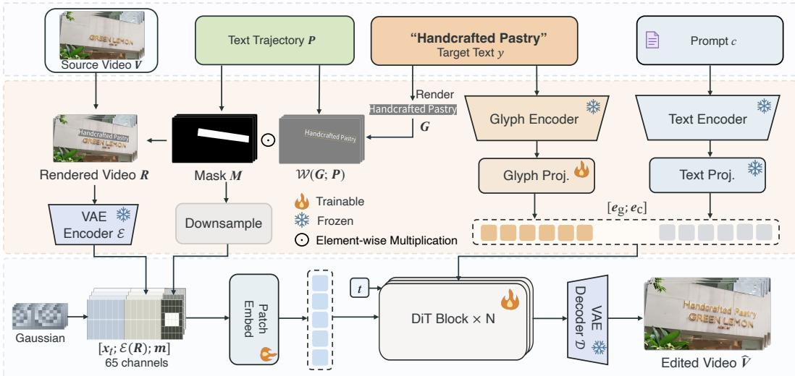
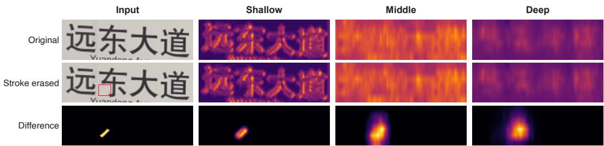
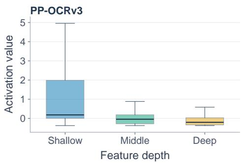
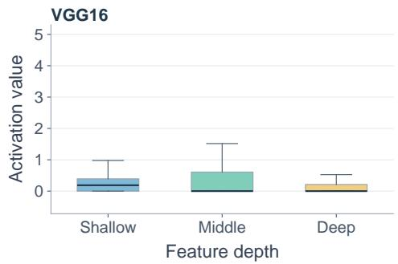
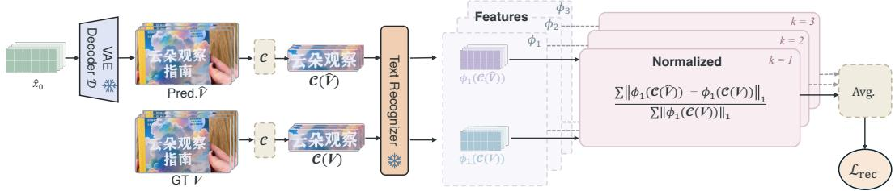
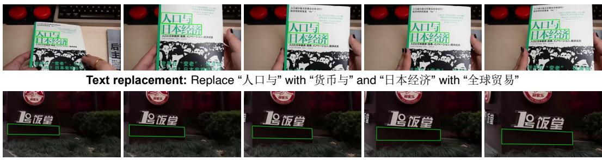
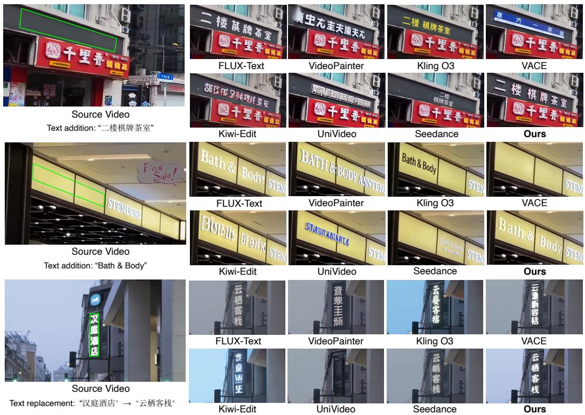
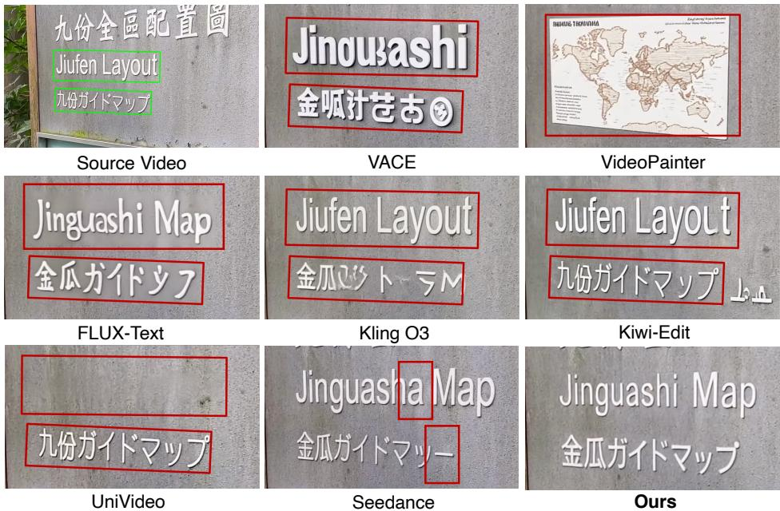
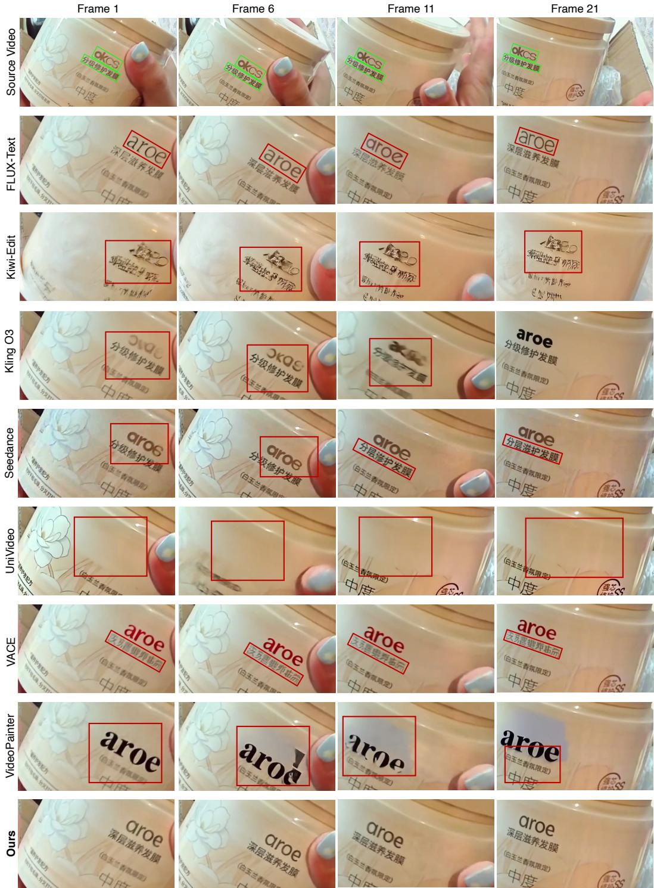
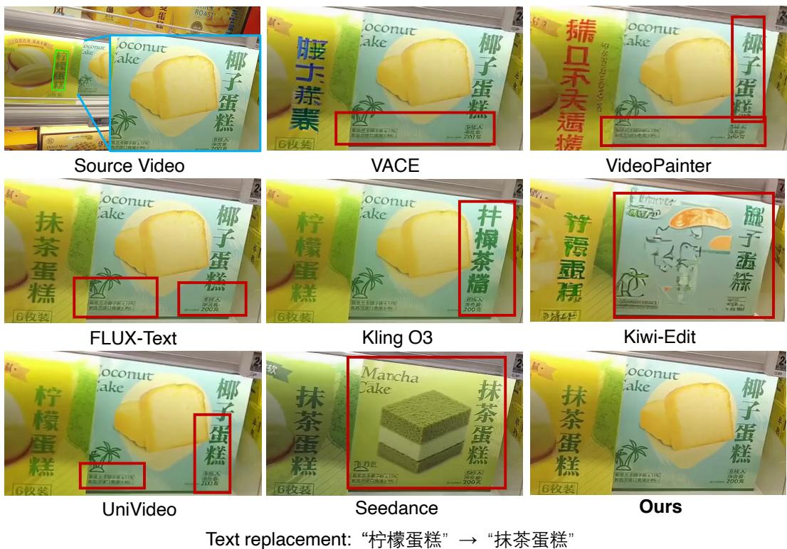

# ENHANCED VIDEO TEXT EDITING WITH TRAJECTORY-ALIGNED GLYPH RENDERING

Shulian Zhang1 Xiangyu Shu1 Wenbo Li2 Jian Chen1† Yong Guo3†

1South China University of Technology 2The Chinese University of Hong Kong 3Huawei

## ABSTRACT

Video text editing aims to replace or add text in a video while keeping the rest of the video unchanged, which requires the edited text to be correct in every frame and to move coherently with the scene. Despite the remarkable progress of video diffusion models, they struggle to reproduce exact stroke structures and often produce garbled or wrong characters, especially for characters with complex strokes. To address this, we propose a trajectory-aligned glyph rendering reference that provides explicit per-frame glyph guidance following the position and perspective of the text, and a depth-normalized recognizer feature supervision that supervises the generated text on multi-depth features of a frozen text recognizer with per-depth normalized errors, targeting stroke errors overlooked by the diffusion loss. We further build VTEdit, a benchmark of 288 real-scene clips with 440 annotated text trajectories covering text replacement and text addition, which will be publicly released to facilitate future research. Experiments on VTEdit show that our method outperforms image text editing methods, video editing methods, and commercial models in text accuracy and background preservation, achieving a sentence accuracy of 0.9408, and receives the highest preference in a user study.

## 1 INTRODUCTION

Video text editing replaces the existing text in a video, or adds new text to it, while leaving the rest of the video unchanged. It serves applications such as advertisement design and film post-production. Compared with editing a single image, editing text in a video is harder in two respects. First, the text must be correct in every frame. A single wrong or missing stroke is easy for a reader to notice, and an error in any frame spoils the whole video. Second, the text must blend naturally into the scene and stay attached to the surface it is written on, following its position and perspective as the camera or the object moves, without flickering between frames.

However, existing video editing methods still struggle to edit text accurately and coherently. Genera video editing models (Jiang et al., 2025; Bian et al., 2025; Wei et al., 2026; Lin et al., 2026) maintain temporal coherence, but they are built for scene- and object-level edits rather than fine-grained text rendering. They offer no glyph-level control over the edited region, and the text they generate is often garbled, especially for characters with complex strokes. Image text editing methods (Tuo et al., 2024a; Lan et al., 2025) achieve accurate glyphs, but they are designed for single images and do not model the relation between frames. Only a few methods are dedicated to video text editing. STRIVE (G et al., 2021) replaces the text in a single frontalized reference frame and then propagates it to the other frames, so errors in any stage of this multi-stage pipeline carry over to the final video. SteerVTE (Zeng et al., 2026) edits videos end to end, but supports only English text. Progress is further limited by data for both training and evaluation. For training, paired videos that differ only in their text can hardly be collected in real scenes. For evaluation, to the best of our knowledge, no public benchmark of real-scene videos exists for video text editing.

Accurate text rendering remains a fundamental challenge for video generation models. A character is defined by its exact strokes, and a single wrong stroke turns it into a different or nonexistent character. Video generation models, however, are built to produce content that looks plausible rather than exact, and they struggle to reproduce the precise stroke structure of characters, especially for Chinese, with thousands of characters and many complex strokes. The difficulty is compounded in videos, where the glyphs must further follow the position and perspective of the text as it moves. Instead of expecting the model to learn the exact strokes of every character, our key idea is to provide them explicitly. When the model is shown what the target glyphs look like and where they should appear in each frame, it can follow the provided strokes instead of generating them on its own, and blend them into the scene by adapting their color, texture, and lighting to the surroundings. The provided glyphs thus serve as a direct reference for the exact strokes, while the generative model focuses on what it does best, namely producing realistic appearance. The same bias toward plausibility persists in training. The diffusion loss measures how closely the generated video matches the target as a whole, to which a single stroke contributes little, so a wrong stroke is barely penalized. We therefore complement the diffusion loss with a text-aware supervision, which evaluates the generated text with prior knowledge of how text is read rather than by its overall appearance alone.

To this end, we formulate video text editing as text-conditioned video inpainting along a text trajectory, i.e., a sequence of per-frame text boxes: the content inside the boxes is regenerated, and the content outside is preserved. Since the original text inside the boxes is hidden from the model, a real video can serve as its own ground truth, which enables training on real videos without paired data. Under this formulation, we realize the two ideas above with two components. First, the trajectory-aligned glyph rendering reference renders the target text and warps it into the text box of every frame, so that the provided glyphs follow the position and perspective of the text throughout the video. The rendered video is fed to the model as a spatially aligned condition, together with a glyph-aware text encoder that specifies the identity of each character. Second, we supervise the generated text with the intermediate features of a frozen text recognizer at multiple depths, from shallow features that retain stroke details (Figure 2) to deep features more related to character identity. We observe that the activations at different depths lie on different scales (Figure 3), so that summing their errors directly lets the depth with larger activations dominate. Our depth-normalized recognizerfeature supervision therefore normalizes the error at each depth by the magnitude of the ground-truth features at that depth, balancing the depths without per-depth weights. For training and evaluation, we collect real-scene videos annotated with text trajectories, from which we build VTEdit, a benchmark for text replacement and text addition.

Overall, we make three key contributions: 1) We propose a trajectory-aligned glyph rendering reference, which renders the target text into the text box of every frame and conditions video generation on it, providing explicit glyph guidance that follows the position and perspective of the text. 2) We introduce depth-normalized recognizerfeature supervision, which supervises the generated text on the decoded frames with multi-depth features of a frozen text recognizer, normalized per depth to balance their contributions. 3) We build VTEdit, a real-scene video text editing benchmark with 440 annotated text trajectories, to be publicly released. On VTEdit, our method achieves the best text accuracy and background preservation, improving Sen.ACC from 0.5980 to 0.9408 over the strongest video editing model, Seedance, and receiving 64.3% of the user votes against its 30.8%.

## 2 RELATED WORK

Video Editing and Visual Text Editing. Diffusion-based video editing has evolved from adapting image diffusion models, through inter-frame feature propagation (Geyer et al., 2024) or per-video tuning (Wu et al., 2023), to building on video foundation models (Kong et al., 2024; Wan Team et al., 2025). Recent frameworks support mask-conditioned editing and inpainting (Jiang et al., 2025; Bian et al., 2025) as well as instruction-guided editing (Wei et al., 2026; Lin et al., 2026), but they target scene- and object-level edits and offer no glyph-level control. Visual text generation and editing has instead been studied mainly for images, where diffusion models are conditioned on characterlevel layouts, glyph images, or text positions to render accurate text (Chen et al., 2023b;a; Ma et al., 2023; Tuo et al., 2024b;a; Lan et al., 2025), and recent methods further address instruction-guided editing (Ma et al., 2026), stylized text in graphic design (Zhao et al., 2025), and bilingual Chinese and English text (Liu et al., 2026). When applied to videos frame by frame, these methods do not model the relation between frames, so the edited text may vary across frames. For video, STRIVE (G et al., 2021) replaces the text in a frontalized reference frame and propagates it to the other frames, so errors in any stage of this multi-stage pipeline carry over to the final video. SteerVTE (Zeng et al., 2026) injects style features and line- and character-level glyph images into a frozen video diffusion transformer through cross-attention, and supports only English text.

Recognizer-based Text Supervision. Since the diffusion loss is barely affected by errors in individual strokes, several methods additionally supervise the generated text in pixel space with pretrained text models. OCR-VQGAN (Rodr´ıguez et al., 2023) trains an image autoencoder with a perceptual loss on multi-layer features of a text detector, normalized along the channel dimension. AnyText (Tuo et al., 2024b) compares the features of a text recognizer before its final fully connected layer between the generated and ground-truth text regions, i.e., at a single depth. JoyType (Li et al., 2024) and CharGen (Ma et al., 2024) extend this comparison to multiple layers, using the early convolutional layers of an OCR model and the multi-scale features of an OCR destylization model, respectively, and SteerVTE (Zeng et al., 2026) brings multi-layer recognizer features, together with a CTC loss, to video text editing. Other methods fine-tune generators via reinforcement learning with rewards computed from recognition results (Liu et al., 2025), which evaluate the recognized text rather than intermediate features. In the multi-layer losses of JoyType, CharGen, and SteerVTE, the error of each layer is normalized only by its feature size before summation, so layers with larger activations can dominate, and the balance among layers depends on which layers are chosen. In contrast, we supervise the generated text at shallow, middle, and deep depths of a frozen text recognizer and normalize the error at each depth by the magnitude of the ground-truth features, placing all depths on a comparable scale without per-depth weights.

## 3 ENHANCED VIDEO TEXT EDITING

## 3.1 PROBLEM DEFINITION

We formulate video text editing as text-conditioned video inpainting along a text trajectory. Given a source video V with F frames, a text trajectory ${ \cal P } = \{ P _ { i } \} _ { i = 1 } ^ { F }$ where $\bar { P _ { i } }$ is the text box in frame $i ,$ a target text $y ,$ and a scene prompt $c ,$ the model generates an edited video $\hat { V }$ by regenerating the content inside the boxes, marked by the mask $M = \{ M _ { i } \} _ { i = 1 } ^ { F } ( M _ { i }$ is 1 inside $P _ { i }$ and 0 elsewhere). The generated text should follow the box in every frame, blend into the scene, and remain consistent across frames, and the content outside the boxes should remain unchanged. Since the original text inside the boxes is hidden from the model, a real video can serve as its own ground truth: during training, y is set to the original text of the video, while at inference y is set to the desired text.

## 3.2 TRAJECTORY-ALIGNED GLYPH RENDERING REFERENCE

Video generation models often fail to reproduce the precise strokes of complex characters and produce garbled or wrong text. Instead of requiring the model to generate the strokes on its own, we render the target glyphs and provide them as a reference, which the model follows and blends into the scene. Since the text moves and changes in perspective across frames, we render y along the text trajectory, so that the glyphs follow the position and perspective of the text throughout the video. We further encode $y$ with a glyph-aware text encoder, Glyph-ByT5 (Liu et al., 2024), which specifies the identity of each character. Figure 1 shows an overview.

Concretely, we first draw $y$ in white on a gray canvas with a fixed font, vertically for vertical text, and crop tightly around the glyphs to obtain a glyph image G, which is shared across all frames. For each frame i, we warp $G$ onto the frame with the perspective transform that maps the four corners of $G$ to the four vertices of $P _ { i }$ , denoted $\mathcal { W } ( G ; P _ { i } )$ . To reduce aliasing and blurring of the strokes, G is drawn at a large font size so that the warp mostly shrinks it, and the warp is performed on a canvas with 4× the frame width and height and then downsampled to the frame resolution by area averaging. The warped glyphs replace the content of the text box in the source frame:

$$
\begin{array} { r } { \pmb { R _ { i } } = ( 1 - M _ { i } ) \odot \pmb { V _ { i } } + M _ { i } \odot \mathcal { W } ( \pmb { G } ; \pmb { P _ { i } } ) , } \end{array}\tag{1}
$$

where $V _ { i }$ and $M _ { i }$ are the i-th frames of $V$ and $M ,$ and $\odot$ denotes element-wise multiplication. Frames without text have $M _ { i } = \mathbf 0$ and remain unchanged, and $\{ R _ { i } \} _ { i = 1 } ^ { F }$ form the rendered video R. Since the training target is the original text in the real video, whose appearance generally differ from those of the rendered glyphs, the reference guides the structure of the glyphs rather than their appearance. Besides R, the glyph-aware text encoder encodes y into a glyph embedding $e _ { g }$

  
Figure 1: Overview of our framework with the trajectory-aligned glyph rendering reference. The target text y is rendered into a glyph image G, which is warped into the text box of every frame along the trajectory $P .$ . The warped glyphs $\bar { \mathcal { W } } ( G ; P )$ replace the content of the source video V inside the mask $M ,$ forming the rendered video R (Eq. 1). The latent ${ \mathcal { E } } ( R )$ and the downsampled mask m are concatenated with the noisy latent $\mathbf { \Delta } _ { \mathbf { \mathcal { X } } _ { t } }$ along the channel dimension, and the glyph embedding $e _ { g }$ is concatenated with the prompt tokens $e _ { c }$ along the sequence dimension, as the inputs of the diffusion transformer. The VAE decoder $\mathcal { D }$ decodes the generated latent into the edited video $\hat { V }$

We then feed this reference into a latent video diffusion transformer. A VAE encoder E maps the rendered video R to a latent ${ \mathcal { E } } ( R )$ of the same size as the noisy latent $\mathbf { \nabla } _ { \mathbf { x } _ { t } } .$ , and the mask M is downsampled to the same latent resolution to obtain m. We concatenate ${ \boldsymbol x } _ { t } , { \boldsymbol \mathcal { E } } ( { \boldsymbol R } )$ , and m along the channel dimension, so that the rendered glyphs are spatially aligned with the latent to be generated. The glyph embedding $e _ { g }$ is concatenated with the prompt tokens $e _ { c } .$ . The transformer $v _ { \theta }$ then predicts the flow-matching velocity (Lipman et al., 2023):

$$
v _ { \theta } \big ( [ { \pmb x } _ { t } ; { \pmb \xi } ( { \pmb R } ) ; { \pmb m } ] , t , [ { \pmb e } _ { g } ; { \pmb e } _ { c } ] \big ) ,\tag{2}
$$

where $t \in [ 0 , 1 ]$ is the timestep, and $[ \cdot ; \cdot ]$ denotes concatenation along the channel dimension for latents and the sequence dimension for tokens. This reference improves text accuracy (Section 5.3).

## 3.3 DEPTH-NORMALIZED RECOGNIZER FEATURE SUPERVISION

The flow-matching loss measures how closely the generated video matches the target as a whole, to which a single wrong stroke contributes little. We therefore additionally supervise the text in the decoded frames with a frozen text recognizer. Since a recognizer may still recognize a character with a missing stroke (Ma et al., 2024), we compare its intermediate features rather than its final output. To see how these features respond to a stroke error, we erase a single stroke and inspect the feature difference at each depth (Figure 2): at the shallow depth the difference is sharp and localized to the missing stroke, while at the middle and deep depths it becomes diffuse and covers a larger part of the character. This suggests that shallow features retain individual strokes, whereas deeper features, being closer to the recognition head, are more related to character identity, consistent with the observation that deeper CNN features are more class-specific (Zeiler & Fergus, 2014). To capture both stroke details and character identity, we supervise at three depths, shallow, middle, and deep. However, we observe that the three depths of the recognizer lie on very different scales (Figure 3), with the shallow depth spanning a much wider range than the middle and deep depths, whereas those of a natural-image network such as VGG (Simonyan & Zisserman, 2015) lie on comparable scales. Since the error at each depth grows with the scale of its activations, summing the three errors directly lets the depth with the largest activations dominate. We therefore propose depth-normalized recognizer feature supervision (Figure 4), which normalizes the error at each depth by the magnitude of the ground-truth features at that depth, balancing the three depths without per-depth weights.

  
Figure 2: Visualization of perceptual features at the three supervised depths of the text recognizer PP-OCRv3. For clarity, we manually erase a stroke (red box) to observe the differences. At the shallow depth, the feature difference is sharp and localized to the missing stroke; at the middle and deep depths, it becomes diffuse and covers a larger part of the character.

  
Figure 3: Distribution of the activation values at the three supervised depths, measured on the text regions. Left: in the text recognizer, the three depths lie on very different scales, with the shallow depth reaching about 5 while the middle and deep depths stay below 1. Right: in VGG, the three depths lie on comparable scales.

Since the recognizer operates on images, we apply the supervision to frames decoded from the prediction of the model. During training, the noisy latent is constructed as $\begin{array} { r } { \pmb { x } _ { t } = ( 1 - t ) \pmb { x } _ { 0 } + t \pmb { \epsilon } _ { : } } \end{array}$ where ${ \pmb x } _ { 0 } = { \pmb \mathcal { E } } ( { \pmb V } )$ is the latent of the source video and $\epsilon \sim \mathcal { N } ( \mathbf { 0 } , \mathbf { I } )$ is Gaussian noise. From the velocity predicted in Eq. 2, we estimate the clean latent as $\hat { \pmb { x } } _ { 0 } = \pmb { x } _ { t } - t \boldsymbol { v } _ { \theta } ( \cdot )$ and decode it with the VAE decoder D into the predicted frames $\hat { V } = \mathcal { D } ( \hat { \pmb x } _ { 0 } )$ . For each frame i that contains the text, an operation $\mathcal { C } _ { i } ( \cdot )$ crops the bounding rectangle of the text box $P _ { i }$ , rotates vertical text to horizontal, and resizes the crop to the input size of the recognizer. The crops of $\hat { V }$ and V are passed through the recognizer backbone, from which we take the features $\phi _ { k }$ at the k-th of the $K = 3$ depths (shallow, middle, and deep). The supervision is defined as

$$
\mathcal { L } _ { \mathrm { r e c } } = \frac { 1 } { K } \sum _ { k = 1 } ^ { K } \frac { \sum _ { i \in S } \left\| \phi _ { k } \left( \mathcal { C } _ { i } ( \hat { V } ) \right) - \phi _ { k } \left( \mathcal { C } _ { i } ( V ) \right) \right\| _ { 1 } } { \sum _ { i \in S } \left\| \phi _ { k } \left( \mathcal { C } _ { i } ( V ) \right) \right\| _ { 1 } } ,\tag{3}
$$

where $s$ is the set of decoded frames that contain the text and $\| \cdot \| _ { 1 }$ denotes the sum of absolute values over all feature elements. The recognizer and the VAE decoder are frozen, and the gradient of $\mathcal { L } _ { \mathrm { r e c } }$ is propagated through D to vθ. Both supervising multiple depths and normalizing each depth improve text accuracy in our ablation studies (Section 5.3).

## 3.4 TRAINING AND INFERENCE METHOD

We build our model on the 480p text-to-video model of HunyuanVideo 1.5 (Team, 2025), with Glyph-ByT5 (Liu et al., 2024) as the glyph-aware text encoder and Qwen2.5-VL (Bai et al., 2025) as the prompt encoder. The base model and both text encoders are frozen, and we train LoRA (Hu et al.,

  
Figure 4: Overview of the depth-normalized recognizer feature supervision. During training, the frozen VAE decoder D decodes the estimated clean latent $\scriptstyle { \hat { \mathbf { x } } } _ { 0 }$ into the predicted video $\hat { V } .$ . The text regions of $\hat { V }$ and the ground truth $V$ are cropped by $\mathcal { C }$ and passed through a frozen text recognizer, which extracts the features $\phi _ { 1 } , \phi _ { 2 } .$ , and $\phi _ { 3 }$ at the shallow, middle, and deep depths. The error at each depth is normalized by the magnitude of the ground-truth features, and the three normalized errors are averaged into $\mathcal { L } _ { \mathrm { r e c } } \left( \mathrm { E q . } 3 \right)$ , which is added to the flow-matching loss.

2022) with rank 32 on all transformer blocks, together with the projector of the glyph embedding $e _ { g }$ and the patch embedding layer. The flow-matching loss is computed over the whole latent,

$$
\begin{array} { r } { \mathcal { L } _ { \mathrm { F M } } = \mathbb { E } _ { t , \epsilon } \big \| v _ { \theta } ( \cdot ) - ( \epsilon - x _ { 0 } ) \big \| _ { 2 } ^ { 2 } , } \end{array}\tag{4}
$$

where $v _ { \theta } ( \cdot )$ is the prediction in Eq. 2, and the model is trained with

$$
\begin{array} { r } { \mathcal { L } = \mathcal { L } _ { \mathrm { F M } } + \mathcal { L } _ { \mathrm { r e c } } . } \end{array}\tag{5}
$$

For $\mathcal { L } _ { \mathrm { r e c } } .$ , we use the backbone of the PP-OCRv3 recognizer (Li et al., 2022) and take the outputs of its 1st, 6th, and 10th blocks as the features $\phi _ { 1 } , \phi _ { 2 } .$ , and $\phi _ { 3 }$ at the shallow, middle, and deep depths. To save memory, only the first 9 frames of $\hat { V }$ are decoded by $\mathcal { D }$ for $\mathcal { L } _ { \mathrm { r e c } }$ . The training data consist of 1,050 real-scene clips with 1,430 text trajectories, collected and annotated with the same pipeline as VTEdit (Section 4) and disjoint from it. Each training sample is a 33-frame clip spatially resized to $4 8 0 \times 8 3 2$ . We use the Muon optimizer (Jordan et al., 2024) with a learning rate of $1 \times \mathrm { i } 0 ^ { - 4 }$ and a batch size of 8, and train for 30,000 steps in total on 8 Ascend 910B NPUs.

At inference, each clip of up to 49 frames is resized to $4 8 0 \times 8 3 2$ and edited as a whole, and the model generates the edited video from Gaussian noise with 50 sampling steps. When a video contains multiple text trajectories, we edit them sequentially, taking the output of each edit as the source video of the next, so that all edits are kept in one video.

## 4 VTEDIT: VIDEO TEXT EDITING BENCHMARK

While scene text editing has been widely benchmarked on static images, to the best of our knowledge, no public benchmark yet exists for video text editing on real-scene videos. To fill this gap, we build a Video Text Editing benchmark (VTEdit) from 4K real-scene videos collected from public social-media platforms. We select clips containing scene text, crop a region from each clip, and resize it to $7 2 0 \times 1 2 8 0$ . Each text instance is annotated as a trajectory of quadrilateral boxes over frames: the text is detected with PP-OCRv6 (Zhang et al., 2026) and associated across frames. Each clip is further captioned with Qwen2.5-VL (Bai et al., 2025). The benchmark contains 288 clips with 440 trajectories, disjoint from the training set and each trimmed to at most 49 frames, follow ing SteerVTE (Zeng et al., 2026). It covers two tasks, shown in Figure 5: text replacement (398 trajectories), where the original text is replaced by a target of similar length, and text addition (42 trajectories in 30 clips), where new text is written onto a text-free surface, whose box is manually drawn in the first frame and propagated to the other frames by a tracking algorithm. The target texts of both tasks are generated by GPT-5 (OpenAI, 2026). Chinese text appears in 358 trajectories and English text in 82, and the Chinese text covers 740 distinct characters.

## 5 EXPERIMENTS

In this section, we evaluate our method on the VTEdit benchmark, with the metrics and compared methods described in Section 5.1. In Section 5.2, our method achieves the highest text accuracy,

  
Text addition: Add “欢迎堂食外带” to the board below the sign

Figure 5: Examples of text replacement and text addition in VTEdit. Each row shows five frames sampled from a clip, with the annotated text boxes in green, and the text below describes the edit.

background preservation, and user preference among image text editing methods, mask-based and instruction-guided video editing methods, and commercial models. The ablation studies in Section 5.3 show that the glyph rendering reference, the supervision at multiple depths of the text recognizer, and the depth-wise normalization each improve text accuracy.

## 5.1 EXPERIMENTAL DETAILS

Evaluation and Metrics. We evaluate text accuracy, temporal consistency, and background preservation, and further conduct a user study. All metrics are computed after resizing the outputs of all methods and the source videos to 480 × 832. Text accuracy is measured by sentence accuracy (Sen.ACC) and normalized edit distance (NED) (Tuo et al., 2024b), using PP-OCRv6 (Zhang et al., 2026), a recognizer different from the one used in training. Both are computed on the text box in each frame and averaged over all frames. Temporal consistency is measured by the warping error $E _ { w a r p }$ (Lai et al., 2018) with RAFT (Teed & Deng, 2020) optical flow. Background preservation is measured by PSNR and SSIM (Wang et al., 2004) between the edited and source videos over the region outside the text boxes, denoted $\mathrm { P S N R } _ { b g }$ and $\mathrm { S S I M } _ { b g } .$ In the user study, six participants view the anonymized results of all methods on 100 cases from VTEdit and select the best one in each case considering text accuracy, natural blending, temporal consistency, and background preservation. The user preference of a method is the percentage of votes it receives.

Compared Methods. We compare with three groups of methods: the image text editing method FLUX-Text (Lan et al., 2025), applied to each frame independently; mask-based video editing methods, which regenerate the masked region of a video, including VACE (Jiang et al., 2025) and VideoPainter (Bian et al., 2025); and instruction-guided video editing methods, which edit a video according to a text instruction, including UniVideo (Wei et $\mathrm { a l . , }$ 2026), Kiwi-Edit (Lin et al., 2026), and the closed-source commercial models Kling O3 (Kling Team et al., 2025) and Seedance 2.0 Fast (Team Seedance et al., 2026), denoted Seedance for brevity. The inputs and settings used for each compared method are detailed in Appendix B.

## 5.2 COMPARISON WITH STATE-OF-THE-ART

Quantitative Results. Table 1 reports the quantitative comparison on VTEdit. Our method achieves the best text accuracy, background preservation, and user preference, while maintaining temporal consistency comparable to the video editing methods. Among the compared methods, the image text editing method FLUX-Text achieves the highest text accuracy, but editing each frame independently results in the largest warping error. The video editing methods achieve lower warping errors, but their text accuracy is considerably lower, with the best Sen.ACC of 0.5980 obtained by Seedance. Compared with FLUX-Text, our method improves Sen.ACC from 0.8393 to 0.9408 and NED from 0.9307 to 0.9862, and reduces the warping error from 4.1516 to 1.5433, close to the lowest value of 1.4862 obtained by Seedance. For background preservation, FLUX-Text and the mask-based video editing methods, which take the editing region as input, achieve $\mathrm { P S N R } _ { b g }$ above 26 dB, whereas the instruction-guided methods, which receive no editing region, achieve about 20 dB. Our method achieves the highest $\mathrm { P S N R } _ { b g }$ of 36.11 dB and $\mathrm { S S I M } _ { b g }$ of 0.9736. In the user study, which considers natural blending, our method receives 64.3% of the votes, followed by Seedance with 30.8%.

Table 1: Quantitative comparison with state-of-the-art methods. The best and second-best results are highlighted in bold and underlined, respectively. † denotes a closed-source commercial model. Our method achieves the best text accuracy, background preservation, and user preference.
<table><tr><td rowspan="2">Method</td><td colspan="2">Text Accuracy</td><td>Temporal</td><td colspan="2">Background Preservation</td><td>User Study</td></tr><tr><td>Sen.ACC↑</td><td>NED↑</td><td> $E _ { w a r p \downarrow }$ </td><td> $\mathrm { P S N R } _ { b g } \uparrow$ </td><td> $\mathbf { S S I M } _ { b g } \uparrow$ </td><td>Preference (%)↑</td></tr><tr><td>FLUX-Text</td><td>0.8393</td><td>0.9307</td><td>4.1516</td><td>34.55</td><td>0.9678</td><td>0.3</td></tr><tr><td>VACE</td><td>0.1532</td><td>0.2991</td><td>1.5593</td><td>34.67</td><td>0.9669</td><td>1.2</td></tr><tr><td>VideoPainter</td><td>0.0395</td><td>0.0945</td><td>2.0111</td><td>26.72</td><td>0.9423</td><td>0.3</td></tr><tr><td>UniVideo</td><td>0.0002</td><td>0.0710</td><td>1.7399</td><td>20.04</td><td>0.6689</td><td>0.2</td></tr><tr><td>Kiwi-Edit</td><td>0.0000</td><td>0.0862</td><td>1.5849</td><td>20.20</td><td>0.7143</td><td>0.0</td></tr><tr><td>Kling O3†</td><td>0.1888</td><td>0.4577</td><td>2.4885</td><td>20.03</td><td>0.6644</td><td>2.8</td></tr><tr><td>Seedance†</td><td>0.5980</td><td>0.7320</td><td>1.4862</td><td>20.36</td><td>0.6835</td><td>30.8</td></tr><tr><td>Ours</td><td>0.9408</td><td>0.9862</td><td>1.5433</td><td>36.11</td><td>0.9736</td><td>64.3</td></tr></table>

Table 2: Ablation on the glyph rendering reference. The reference improves text accuracy.
<table><tr><td>Variant</td><td>Sen.ACC↑</td><td>NED↑</td></tr><tr><td>w/o reference</td><td>0.9013</td><td>0.9658</td></tr><tr><td>Ours</td><td>0.9408</td><td>0.9862</td></tr></table>

Qualitative Results. Figure 6 shows qualitative comparisons on two text addition examples and one text replacement example. VideoPainter, VACE, UniVideo, and Kiwi-Edit mostly generate wrong or garbled characters. In addition, VACE adds no text in the second example, VideoPainter also alters the adjacent text “STENDERS” outside the editing region, and UniVideo removes the original text in the third example without writing the target. The commercial models generate more legible text but do not consistently match the target or the scene. Kling O3 renders the correct text in the two addition examples, but the text does not blend naturally into the scene, and it generates wrong characters in the replacement example. Seedance renders the correct text in the addition examples at a scale much smaller than the editing region, adds the unrequested phrase “The Body Shop” in the second example, and generates a wrong character in the replacement example. FLUX-Text renders mostly correct text in individual frames, but since it edits each frame independently, its text varies across frames (Figure 8). Our method renders the correct text in all three examples, follows the position and perspective of the editing region, and matches the appearance of the surrounding text, such as the white serif letters of “STENDERS” in the second example and the illuminated vertical sign in the third example. Additional qualitative comparisons focusing on text accuracy, temporal consistency, and background preservation are provided in Figures 7–9 of Appendix A.

## 5.3 ABLATION STUDIES

We ablate both components of our method on VTEdit by removing the glyph rendering reference, removing the recognizer feature supervision, replacing its features with those of a single depth or of VGG, and removing its depth-wise normalization. The results show that the glyph rendering reference, the supervision at multiple depths of the recognizer, and the depth-wise normalization each improve text accuracy, with the reference bringing the largest gain.

Effect of the glyph rendering reference. We train a variant without the glyph rendering reference, in which the editing region is erased with a constant value and the target text is provided only as the text condition. As shown in Table 2, the reference improves Sen.ACC from 0.9013 to 0.9408 and NED from 0.9658 to 0.9862, showing that explicit glyph guidance helps render correct characters.

Effect of depth-normalized recognizer feature supervision. We compare our supervision with three variants: no supervision, supervision with a single depth of the recognizer, and supervision with multi-depth VGG features normalized in the same way. As shown in Table 3, supervising with any single depth improves text accuracy over no supervision, and supervising with all three depths further improves Sen.ACC from 0.9282, obtained by the best single depth, to 0.9408. VGG features also improve over no supervision, but less than the multi-depth features of the text recognizer.

  
Figure 6: Qualitative comparison of video text editing. The top two examples show text addition, and the bottom example shows text replacement. For each example, the source frame is shown on the left, and the results of all methods are shown on the right. Green boxes in the source frames indicate the editing regions. Our results show legible text with scene-compatible layout and appearance.

Table 3: Ablation on the features used for supervision. VGG uses features from multiple depths with the same normalization. Multi-depth text recognizer features achieve the best text accuracy.
<table><tr><td rowspan="2">Metric</td><td rowspan="2">w/o supervision</td><td rowspan="2">VGG</td><td colspan="4">Recognizer</td></tr><tr><td>Shallow</td><td>Middle</td><td>Deep</td><td>Multi (Ours)</td></tr><tr><td>Sen.ACC↑</td><td>0.9172</td><td>0.9238</td><td>0.9245</td><td>0.9282</td><td>0.9241</td><td>0.9408</td></tr><tr><td>NED↑</td><td>0.9685</td><td>0.9798</td><td>0.9810</td><td>0.9815</td><td>0.9804</td><td>0.9862</td></tr></table>

Effect of depth-wise normalization. We train a variant that directly sums the errors of the three depths without normalizing each depth by its ground-truth feature magnitude. As shown in Table 4, this variant obtains a Sen.ACC of 0.9270, within the range of the single depths in Table 3 (0.9241 to 0.9282). Without normalization, combining the three depths thus brings no clear gain over a single depth, consistent with one depth dominating the sum (Figure 3). With normalization, the combination improves Sen.ACC to 0.9408.

Table 4: Ablation on depth-wise normalization in the recognizer feature supervision. Normalizing each depth by its ground-truth feature magnitude improves text accuracy.
<table><tr><td>Variant</td><td>Sen.ACC↑</td><td>NED↑</td></tr><tr><td>w/o normalization</td><td>0.9270</td><td>0.9819</td></tr><tr><td>Normalized (Ours)</td><td>0.9408</td><td>0.9862</td></tr></table>

## 6 CONCLUSION

In this paper, we propose a video text editing method that formulates the task as text-conditioned video inpainting along a text trajectory. We introduce a trajectory-aligned glyph rendering reference, which provides per-frame glyphs following the position and perspective of the text, and a depth-normalized recognizer feature supervision, which supervises the generated text on multidepth features of a frozen text recognizer. We further build VTEdit, a real-scene benchmark for video text editing covering text replacement and text addition. Experiments on VTEdit show that our method achieves the best text accuracy and background preservation among image text editing methods, video editing methods, and commercial models, and receives the highest user preference.

## REFERENCES

Shuai Bai, Keqin Chen, Xuejing Liu, Jialin Wang, Wenbin Ge, Sibo Song, Kai Dang, Peng Wang, Shijie Wang, Jun Tang, Humen Zhong, Yuanzhi Zhu, Mingkun Yang, Zhaohai Li, Jianqiang Wan, Pengfei Wang, Wei Ding, Zheren Fu, Yiheng Xu, Jiabo Ye, Xi Zhang, Tianbao Xie, Zesen Cheng, Hang Zhang, Zhibo Yang, Haiyang Xu, and Junyang Lin. Qwen2.5-vl technical report. arXiv preprint arXiv:2502.13923, 2025.

Yuxuan Bian, Zhaoyang Zhang, Xuan Ju, Mingdeng Cao, Liangbin Xie, Ying Shan, and Qiang Xu. VideoPainter: Any-length video inpainting and editing with plug-and-play context control. In Proceedings of the ACM SIGGRAPH 2025 Conference Papers, pp. 153:1–153:12, 2025.

Haoxing Chen, Zhuoer Xu, Zhangxuan Gu, Jun Lan, Xing Zheng, Yaohui Li, Changhua Meng, Huijia Zhu, and Weiqiang Wang. Diffute: Universal text editing diffusion model. In Advances in Neural Information Processing Systems, volume 36, pp. 63062–63074, 2023a.

Jingye Chen, Yupan Huang, Tengchao Lv, Lei Cui, Qifeng Chen, and Furu Wei. Textdiffuser: Diffusion models as text painters. In Advances in Neural Information Processing Systems, volume 36, pp. 9353–9387, 2023b.

Vijay Kumar B G, Jeyasri Subramanian, Varnith Chordia, Eugene Bart, Shaobo Fang, Kelly Guan, and Raja Bala. STRIVE: Scene text replacement in videos. In Proceedings of the IEEE/CVF International Conference on Computer Vision (ICCV), pp. 14549–14558, 2021.

Michal Geyer, Omer Bar-Tal, Shai Bagon, and Tali Dekel. Tokenflow: Consistent diffusion features for consistent video editing. In International Conference on Learning Representations, 2024.

Edward J. Hu, Yelong Shen, Phillip Wallis, Zeyuan Allen-Zhu, Yuanzhi Li, Shean Wang, Lu Wang, and Weizhu Chen. Lora: Low-rank adaptation of large language models. In The Tenth International Conference on Learning Representations, ICLR 2022, Virtual Event, April 25-29, 2022. OpenReview.net, 2022. URL https://openreview.net/forum?id=nZeVKeeFYf9.

Zeyinzi Jiang, Zhen Han, Chaojie Mao, Jingfeng Zhang, Yulin Pan, and Yu Liu. Vace: All-inone video creation and editing. In Proceedings of the IEEE/CVF International Conference on Computer Vision (ICCV), pp. 17191–17202, 2025.

Keller Jordan, Yuchen Jin, Vlado Boza, You Jiacheng, Franz Cesista, Laker Newhouse, and Jeremy Bernstein. Muon: An optimizer for hidden layers in neural networks, 2024. URL https: //kellerjordan.github.io/posts/muon/.

Kling Team, Jialu Chen, Yuanzheng Ci, Xiangyu Du, Zipeng Feng, Kun Gai, Sainan Guo, Feng Han, Jingbin He, Kang He, et al. Kling-Omni technical report. arXiv preprint arXiv:2512.16776, 2025.

Weijie Kong, Qi Tian, Zijian Zhang, Rox Min, Zuozhuo Dai, Jin Zhou, Jiangfeng Xiong, Xin Li, Bo Wu, Jianwei Zhang, et al. HunyuanVideo: A systematic framework for large video generative models. arXiv preprint arXiv:2412.03603, 2024.

Wei-Sheng Lai, Jia-Bin Huang, Oliver Wang, Eli Shechtman, Ersin Yumer, and Ming-Hsuan Yang. Learning blind video temporal consistency. In Proceedings of the European Conference on Computer Vision (ECCV), September 2018.

Rui Lan, Yancheng Bai, Xu Duan, Mingxing Li, Dongyang Jin, Ryan Xu, Dong Nie, Lei Sun, and Xiangxiang Chu. FLUX-Text: A simple and advanced diffusion transformer baseline for scene text editing. arXiv preprint arXiv:2505.03329, 2025.

Chao Li, Chen Jiang, Xiaolong Liu, Jun Zhao, and Guoxin Wang. Joytype: A robust design for multilingual visual text creation. CoRR, abs/2409.17524, 2024. URL https://doi.org/ 10.48550/arXiv.2409.17524.

Chenxia Li, Weiwei Liu, Ruoyu Guo, Xiaoting Yin, Kaitao Jiang, Yongkun Du, Yuning Du, Lingfeng Zhu, Baohua Lai, Xiaoguang Hu, et al. Pp-ocrv3: More attempts for the improvement of ultra lightweight ocr system. arXiv preprint arXiv:2206.03001, 2022.

Yiqi Lin, Guoqiang Liang, Ziyun Zeng, Zechen Bai, Yanzhe Chen, and Mike Zheng Shou. Kiwi-edit: Versatile video editing via instruction and reference guidance. arXiv preprint arXiv:2603.02175, 2026.

Yaron Lipman, Ricky T. Q. Chen, Heli Ben-Hamu, Maximilian Nickel, and Matthew Le. Flow matching for generative modeling. In The Eleventh International Conference on Learning Representations, ICLR 2023, Kigali, Rwanda, May 1-5, 2023, 2023.

Haowei Liu, Runze He, Jian Lu, Ao Ma, Run Ling, Ke Cao, Jiasong Feng, Wei Feng, Shuo Lu, Yexing Xu, Yun Wang, Jing Wang, and Zhanjie Zhang. InnoText: A unified model for visual text generation and editing. arXiv preprint arXiv:2607.22101, 2026.

Jie Liu, Gongye Liu, Jiajun Liang, Yangguang Li, Jiaheng Liu, Xintao Wang, Pengfei Wan, Di Zhang, and Wanli Ouyang. Flow-grpo: Training flow matching models via online RL. In Advances in Neural Information Processing Systems 38: Annual Conference on Neural Information Processing Systems 2025, NeurIPS 2025, San Diego, CA, USA, December 2-7, 2025 /Mexico City, Mexico, November 30 - December 5, 2025, 2025.

Zeyu Liu, Weicong Liang, Zhanhao Liang, Chong Luo, Ji Li, Gao Huang, and Yuhui Yuan. Glyph-byt5: A customized text encoder for accurate visual text rendering. arXiv preprint arXiv:2403.09622, 2024.

Jian Ma, Mingjun Zhao, Chen Chen, Ruichen Wang, Di Niu, Haonan Lu, and Xiaodong Lin. Glyph-Draw: Seamlessly rendering text with intricate spatial structures in text-to-image generation. arXiv preprint arXiv:2303.17870, 2023.

Lichen Ma, Tiezhu Yue, Pei Fu, Yujie Zhong, Kai Zhou, Xiaoming Wei, and Jie Hu. Chargen: High accurate character-level visual text generation model with multimodal encoder. CoRR, abs/2412.17225, 2024. doi: 10.48550/ARXIV.2412.17225. URL https://doi.org/10. 48550/arXiv.2412.17225.

Lichen Ma, Xiaolong Fu, Gaojing Zhou, Zipeng Guo, Ting Zhu, Yichun Liu, Yu Shi, Jason Li, and Junshi Huang. UM-Text: A unified multimodal model for image understanding and visual text editing. In Fortieth AAAI Conference on Artificial Intelligence, pp. 7791–7799, 2026.

OpenAI. Openai GPT-5 system card. CoRR, abs/2601.03267, 2026. URL https://doi.org/ 10.48550/arXiv.2601.03267.

Juan A. Rodr´ıguez, David Vazquez, Issam H. Laradji, Marco Pedersoli, and Pau Rodr´ ´ıguez. OCR-VQGAN: taming text-within-image generation. In IEEE/CVF Winter Conference on Applications ofComputer Vision, WACV 2023, Waikoloa, HI, USA, January 2-7, 2023, pp. 3678–3687. IEEE, 2023.

Karen Simonyan and Andrew Zisserman. Very deep convolutional networks for large-scale image recognition. In Yoshua Bengio and Yann LeCun (eds.), 3rd International Conference on Learning Representations, ICLR 2015, San Diego, CA, USA, May 7-9, 2015, Conference Track Proceedings, 2015. URL http://arxiv.org/abs/1409.1556.

Tencent Hunyuan Foundation Model Team. Hunyuanvideo 1.5 technical report, 2025. URL https://arxiv.org/abs/2511.18870.

Team Seedance, De Chen, Liyang Chen, Xin Chen, Ying Chen, Zhuo Chen, Zhuowei Chen, Feng Cheng, Tianheng Cheng, Yufeng Cheng, et al. Seedance 2.0: Advancing video generation for world complexity. arXiv preprint arXiv:2604.14148, 2026.

Zachary Teed and Jia Deng. Raft: Recurrent all-pairs field transforms for optical flow. In European conference on computer vision, pp. 402–419, 2020.

Yuxiang Tuo, Yifeng Geng, and Liefeng Bo. AnyText2: Visual text generation and editing with customizable attributes. arXiv preprint arXiv:2411.15245, 2024a.

Yuxiang Tuo, Wangmeng Xiang, Jun-Yan He, Yifeng Geng, and Xuansong Xie. Anytext: Multilingual visual text generation and editing. In International Conference on Learning Representations, 2024b.

Wan Team, Ang Wang, Baole Ai, Bin Wen, Chaojie Mao, Chen-Wei Xie, Di Chen, Feiwu Yu, Haiming Zhao, Jianxiao Yang, et al. Wan: Open and advanced large-scale video generative models. arXiv preprint arXiv:2503.20314, 2025.

Zhou Wang, A.C. Bovik, H.R. Sheikh, and E.P. Simoncelli. Image quality assessment: from error visibility to structural similarity. IEEE Transactions on Image Processing, 13(4):600–612, 2004. doi: 10.1109/TIP.2003.819861.

Cong Wei, Quande Liu, Zixuan Ye, Qiulin Wang, Xintao Wang, Pengfei Wan, Kun Gai, and Wenhu Chen. Univideo: Unified understanding, generation, and editing for videos. In International Conference on Learning Representations, 2026.

Jay Zhangjie Wu, Yixiao Ge, Xintao Wang, Stan Weixian Lei, Yuchao Gu, Yufei Shi, Wynne Hsu, Ying Shan, Xiaohu Qie, and Mike Zheng Shou. Tune-a-video: One-shot tuning of image diffusion models for text-to-video generation. In Proceedings of the IEEE/CVF International Conference on Computer Vision (ICCV), pp. 7623–7633, 2023.

Matthew D. Zeiler and Rob Fergus. Visualizing and understanding convolutional networks. In Computer Vision - ECCV 2014 - 13th European Conference, Zurich, Switzerland, September 6- 12, 2014, Proceedings, Part I, volume 8689, pp. 818–833, 2014.

Kai Zeng, Moran Li, Zhengwei Wang, Yingchen Yu, Yiheng Lin, Ruichuan An, Ming Lu, Qi She, and Wentao Zhang. Steervte: Seamless video text editing with style and glyph control. arXiv preprint arXiv:2606.23254, 2026.

Yubo Zhang, Xueqing Wang, Manhui Lin, Yue Zhang, Penglongyi Deng, Ting Sun, Tingquan Gao, Zelun Zhang, Jiaxuan Liu, Changda Zhou, Hongen Liu, Suyin Liang, Cheng Cui, Yi Liu, Dianhai Yu, and Yanjun Ma. Pp-ocrv6: From 1.5m to 34.5m parameters, surpassing billion-scale vlms on ocr tasks, 2026. URL https://arxiv.org/abs/2606.13108.

Yiming Zhao, Yuanpeng Gao, Yuxuan Luo, Jiwei Duan, Shisong Lin, Longfei Xiong, and Zhouhui Lian. UTDesign: A unified framework for stylized text editing and generation in graphic design images. In Proceedings of the SIGGRAPH Asia 2025 Conference Papers, pp. 93:1–93:11, 2025.

## A ADDITIONAL QUALITATIVE COMPARISONS

We provide additional qualitative comparisons with state-of-the-art methods on text accuracy (Figure 7), temporal consistency (Figure 8), and background preservation (Figure 9). Our method renders the correct target text, keeps it consistent across frames, and preserves the content outside the editing region, whereas each compared method falls short in at least one of these aspects.

## A.1 COMPARISON ON TEXT ACCURACY

Figure 7 presents qualitative comparisons with state-of-the-art methods in terms of text accuracy. Seedance produces legible text, but its content does not match the target text. FLUX-Text also generates readable text but suffers from distorted glyphs. VACE, Kling O3, and Kiwi-Edit produce incorrect characters. UniVideo removes the original text rather than completing the requested replacement, while VideoPainter replaces the lettering with a map graphic. In contrast, our method accurately renders the target text with clear and well-formed glyphs.

  
Text replacement: “Jiufen Layout” → “Jinguashi Map” and “九份ガイドマップ” with “⾦⽠ガイドマップ”  
Figure 7: Qualitative comparison of text accuracy. Green boxes mark the editing regions in the source frame, and Red boxes highlight unsuccessful edits and character errors. Our method can produce clear and accurate replacement text.

## A.2 COMPARISON ON TEMPORAL CONSISTENCY

Figure 8 presents qualitative comparisons with state-of-the-art methods on temporal consistency. Although FLUX-Text renders clear and accurate text in individual frames, its lettering style is inconsistent across frames, resulting in pronounced temporal flickering within the edited regions. Seedance renders the target text correctly in some frames but exhibits glyph errors in others. Other video editing methods either fail to replace the original text or produce results with incorrect characters or noticeable blurring. In contrast, our method accurately renders the target text while maintaining a consistent lettering style across frames, resulting in more temporally coherent edits.

## A.3 COMPARISON ON BACKGROUND PRESERVATION

Figure 9 presents qualitative comparisons with state-of-the-art methods on background preservation. The competing methods introduce unintended modifications outside the editing region. Seedance

  
Text replacement: “okcs” → “ aroe ” and “分级修护发膜” with “深层滋养发膜”

Figure 8: Qualitative comparison of temporal consistency. Columns show frames 1, 6, 11, and 21. Green boxes mark the source editing regions, and Red boxes highlight failed edits and inconsistent text appearance. Our method maintains legible lettering and a consistent layout across the frames.

substantially alters the neighboring package, changing its product name, illustration, and color scheme. Kiwi-Edit distorts the package illustration, while Kling O3 incorrectly modifies the neighboring product text. VACE, VideoPainter, FLUX-Text, and UniVideo also corrupt the background text, introducing blurred strokes or malformed characters in regions that should remain unchanged.

  
Figure 9: Qualitative comparison of background preservation. Green boxes mark the text to be edited. The blue inset enlarges the background outside the editing region. Red boxes highlight unintended changes to the background. Our method more faithfully preserves the source content outside the editing region.

In contrast, our method edits the target region while more faithfully preserving the surrounding text, illustrations, and visual details.

## B IMPLEMENTATION DETAILS OF COMPARED METHODS

FLUX-Text and the mask-based methods take the text boxes as the editing region and the target text in the prompt. The instruction-guided methods take the full source video and an instruction specifying the edit: for text replacement, the instruction gives both the original and the target text, which locates the edit; for text addition, it describes the location of the new text in words, and Kling O3 and Seedance, which accept reference images, are further given a reference frame with the editing region marked by a box. Each compared method is run with its default resolution and number of frames, and its output is aligned to the frames of the source video for evaluation.