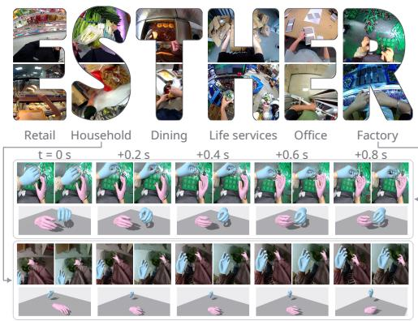
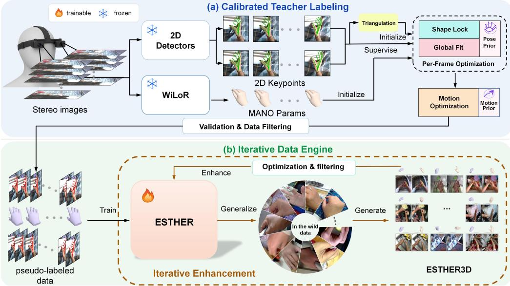
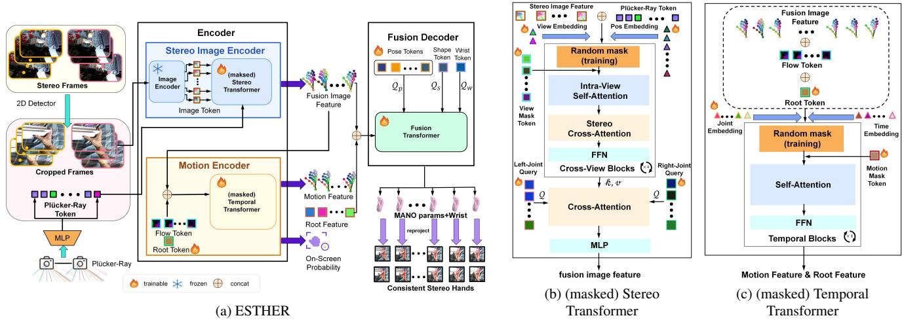
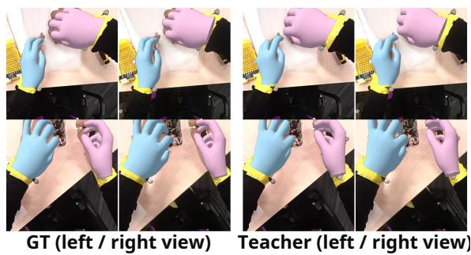
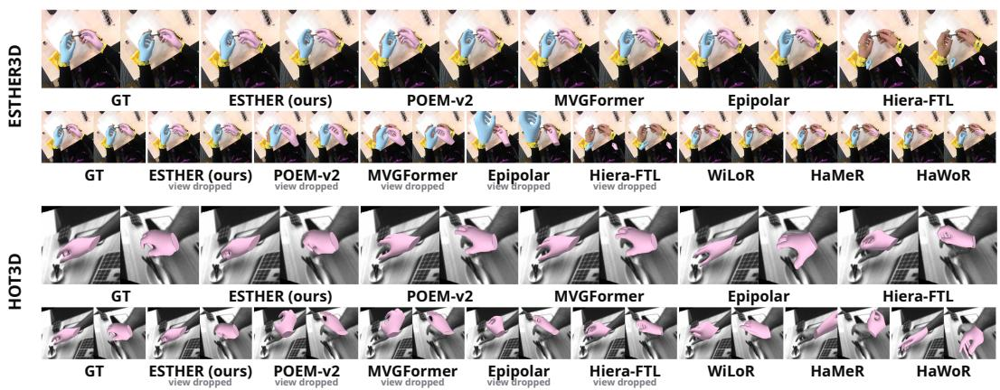
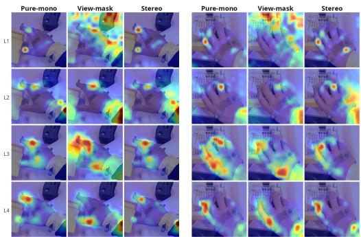
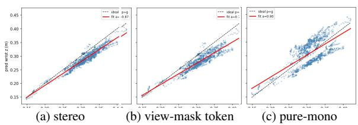
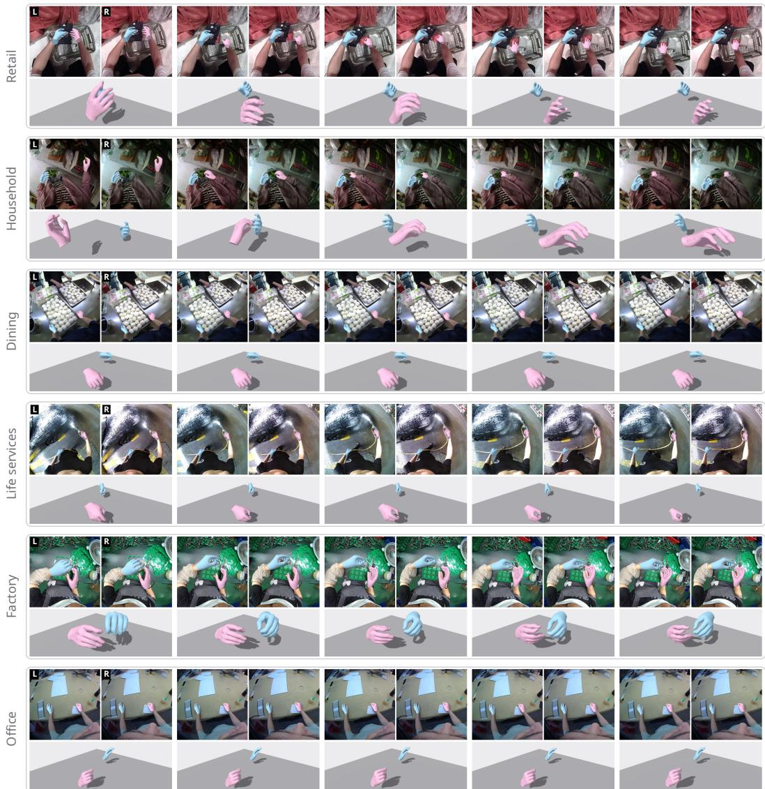
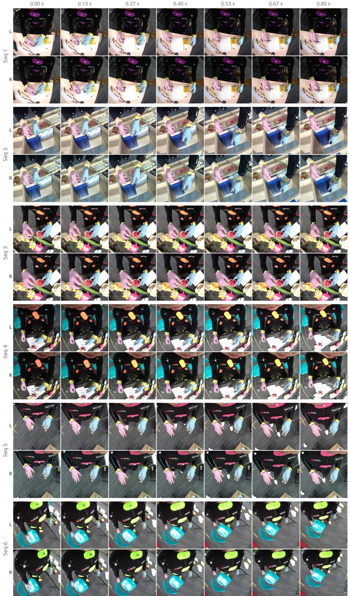
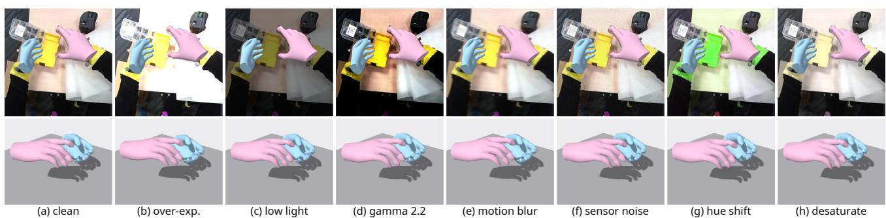

# ESTHER: Egocentric Stereo Hand Estimation and Reconstruction in the Wild

Hongyu Ma, Hairong Qu, Shiqi Zhao, Yongsong Yang, Peng Yin City University of Hong Kong

## Abstract

Human dexterity is guided by two eyes watching two hands: binocular vision supplies the metric 3D structure that finegrained manipulation consumes. Egocentric stereo is therefore the natural perceptual interface for robots, AR, and VR—yet metric 3D hand reconstruction from this very signal still has neither an end-to-end model nor an in-the-wild benchmark. We propose ESTHER, a model whose stereo geometry, temporal reasoning, and output representation are designed for wearable egocentric stereo. It is trained on pseudo-labelsfrom a calibrated labeling pipeline and in turn assembles our benchmark ESTHER3D, an egocentric stereo hand dataset pairing a large in-the-wild training set of model-generated labels with a motion-capture test set oftrue metric ground truth. Experiments show state-of-the-art accuracy, superior external generalization, and robustness to the missing views, droppedframes, and lighting and motion-blur extremes ofreal egocentric capture that break existing methods. This robustness runs deeper than graceful degradation: stereo guidance teaches the model to bind apparent hand scale to metric depth, so it not only adapts to different stereo rigs and modalities with minimal fine-tuning, but more strikingly preserves true metric scale even after collapsing to a single monocular view.

## 1. Introduction

An embodied agent that sees the world through headmounted stereo perceives its own hands much as people do — two eyes on two hands, the binocular disparity carrying the metric 3D structure that fine-grained manipulation depends on. This makes egocentric stereo the natural signal for hand perception in robotics, AR, and VR: it provides the metric constraints that monocular RGB lacks. We study this setting as egocentric stereo 3D hand reconstruction: given shortbaseline head-mounted stereo videos, the system should recover MANO-consistent hand pose, shape, and global wrist translation in metric 3D. Yet despite its practical importance, this very signal still has neither an end-to-end model nor an in-the-wild benchmark. We identify two primary obstacles: the lack of scalable training data with reliable metric

  
stereo 2D projections + metric 3D mesh over time

Figure 1. ESTHER at a glance. Letters: egocentric stereo frames from the six ESTHER3D industries. Bottom: ESTHER outputs over time — stereo 2D projections and metric 3D meshes.

hand labels, and the mismatch between existing hand pose architectures and wearable stereo geometry.

Accurate 3D hand annotation for in-the-wild egocentric capture is hard: the label itself must be recovered from partial, moving, and frequently occluded observations. Existing egocentric hand datasets — H2O [17], AssemblyHands [27], OakInk [43], ARCTIC [6], HOI4D [21], HOT3D [1] — obtain labels through additional sensing or offline reconstruction; HOT3D is closest in viewpoint, but its stereo is monochrome and its ground truth comes from professional motion capture rather than scalable visual labeling of raw RGB stereo. How to scale metric hand labels from raw inthe-wild head-mounted stereo remains open. We therefore build a calibrated labeling pipeline combining 2D evidence, stereo geometry, and hand priors, validate it against motioncapture ground truth, and train a scalable reconstruction model on the pseudo-labels the pipeline generates; the resulting benchmark, ESTHER3D, pairs a mocap ground-truth test set with these in-the-wild training sequences.

The model bottleneck can be traced through the evolution of hand pose architectures. Monocular mesh methods [29, 30] regress plausible hands, but from a single crop they can recover depth and scale only through learned priors rather than geometric measurement, so metric accuracy is not guaranteed. Multi-view methods [15, 19, 46] restore scale through calibrated triangulation, but are single-frame and assume at least two cameras see each point. Temporal models add in-camera video context [35, 41] or lift monocular video into world space with SLAM [47, 48], recovering the camera only up to monocular-SLAM scale ambiguity and offline optimization. Egocentric stereo sharpens all three weaknesses at once. Triangulation anchors are not guaranteed: blur and occlusion routinely erase the hand from one of the two views, so a model hard-wired to triangulation loses its metric anchor exactly on the frames that matter. Detection dropout is the norm: the interacting hand is repeatedly missed for entire frames, so per-frame architectures cannot run stably without temporal in-painting. Hand and head motion are coupled: observed image motion mixes articulation with head egomotion and crop reparameterization, which a model without explicit disentanglement absorbs into finger pose. The setting therefore requires a model designed for these failure modes.

We address this setting with ESTHER, built from two encoders and a decoder. A stereo image encoder fuses calibrated two-view evidence into joint-level tokens; a masked temporal motion encoder reasons over these tokens across time, with camera and crop motion supplied as conditioning tokens; and a query-gated fusion decoder reads both encoders through structured pose, shape, and wrist tokens and outputs MANO pose, sequence-level shape, and a direct metric wrist translation.

In summary, our contributions are as follows:

• We propose ESTHER, an end-to-end egocentric stereo hand reconstruction model built from two encoders and a query-gated fusion decoder that fuses calibrated stereo geometry and temporal context to output metric MANO pose, shape, and an absolute wrist, with state-of-the-art accuracy and robustness.

• We introduce ESTHER3D, an in-the-wild egocentric stereo hand benchmark whose test set carries motioncapture ground truth and whose training set consists of large-scale model-labeled stereo videos, bootstrapped from a calibrated pipeline validated on that ground truth.

• We evaluate under a controlled protocol (shared backbone, data, and losses) on the ESTHER3D test set, on HOT3D, and under view-missing and frame-dropping corruption, and uncover a size-depth binding effect: short-baseline stereo guidance lets direct wrist regression internalize a prior tying apparent hand scale to metric depth, giving surprising monocular-fallback accuracy and cheap adaptation to different baselines, camera parameters, and even the grayscale modality.

## 2. Related Works

## 2.1. Egocentric and Embodied Datasets

Egocentric datasets are central to embodied perception: EPIC-KITCHENS [4] and Ego4D [8] cover long-form daily activity, Ego-Exo4D [9] pairs egocentric and external views, and Nymeria [23] adds multi-modal wearable motion sensing.

Hand-object interaction datasets such as FPHA [7], H2O [17], HOI4D [21], OakInk [43], DexYCB [2], ARC-TIC [6], AssemblyHands [27], and HOT3D [1] provide important supervision for hands and interaction. HOT3D is closest, but its wearable stereo is monochrome and its metric labels come from motion capture. ESTHER3D instead targets in-the-wild calibrated short-baseline RGB stereo with metric MANO labels and train/test protocols.

## 2.2. 3D Hand Pose and Mesh Estimation

Parametric hand reconstruction builds on MANO [32], supported by datasets such as FreiHAND [49], HO-3D [10], InterHand2.6M [26], DexYCB [2], ObMan [13], and ARC-TIC [6]. Monocular models from I2L-MeshNet [25], Mesh Graphormer [20], MobRecon [3], and HandOccNet [28] to HaMeR [29] and WiLoR [30] recover articulation well but must regress scale and metric depth from learned priors alone.

On the temporal side, HTT [41], HandFormer [35], and UmeTrack [11] track hands in head-mounted settings, and HaWoR [48] and Dyn-HaMR [47] recover world-space motion from monocular video via scale-ambiguous SLAM and offline optimization. ESTHER instead obtains metric scale feed-forward from calibrated stereo and disentangles hand from head motion with conditioning tokens and masked temporal training.

## 2.3. Multi-View, Stereo, and Depth-Based Reconstruction

Multi-view pose estimation has explored learnable triangulation, epipolar attention, volumetric fusion, and cross-view transformers [14, 15, 19, 37, 39]; POEM-v2 [46] studies point-embedded multi-view hands. Closer to us, egocentric stereo has been used for absolute hand pose [34] and stereo keypoints [18], and event cameras for stereo hand pose [38] and MANO mesh reconstruction [12]. These estimate sparse keypoints, use non-RGB sensing, or are single-frame; we target temporally consistent metric MANO reconstruction from wearable RGB stereo, where neither two-view visibility nor per-frame detection can be assumed.

## 3. Method

ESTHER is built together with its supervision pipeline (Figure 2). We first collect a large corpus of raw in-the-wild stereo video with our calibrated head-mounted rig, then design a calibrated teacher labeling pipeline and validate it on the motion-capture ground truth of the ESTHER3D test set. Being optimization-based and expensive, the teacher labels only about 15 hours drawn evenly from the six categories, on which ESTHER is trained. The trained model is then applied to the full raw collection: its predictions, refined by the 2D evidence under a DPoser-X pose prior [22] and screened by reprojection and human review, feed back into further training rounds; the final model’s inference over the raw collection constitutes the training set, and the mocap recordings the test set.

  
Figure 2. Supervision pipeline and data engine. (a) The teacher turns stereo 2D keypoints and per-view WiLoR into metric pseudo-labels via a two-stage optimization and a reprojection/human filter. (b) These train ESTHER, which labels in-the-wild stereo to build ESTHER3D.

## 3.1. Calibrated Teacher Labeling Pipeline

The teacher converts 2D evidence — far easier to obtain reliably than metric 3D hands — into metric MANO pseudolabels via stereo calibration, hand priors, and optimization. We design a simple head-mounted RGB stereo rig (camera intrinsics and extrinsics in Appendix F); the formulation is not tied to it, and our experiments show the model adapts to different capture setups with only minimal fine-tuning.

An ensemble of 2D detectors (YOLO11-pose [16] and ViTPose [42]) provides keypoints on both views, triangulated through the calibrated rig and filtered by depth range and bone-length plausibility. Optimization is initialized from the triangulated wrist and per-view monocular MANO estimates from WiLoR [30], and proceeds in two stages under the DPoser-X pose prior. Shape lock: on the 64 most confident frames, shape, pose, and wrist are jointly optimized against the filtered stereo observations, and the per-frame shapes are averaged into one fixed β¯ per hand. Pose and motion optimization: with the shape locked, pose and wrist are re-optimized per frame, then refined by 16-frame slidingwindow motion optimization with velocity limits and an AMASS-pretrained motion prior [5, 24, 31]. The detection filtering thresholds, initialization, full fitting objective, and stage details are given in Appendix A.

## 3.2. Ground-Truth Validation

Before scaling up, we verify that the automatic labels can serve as supervision on the motion-capture test set (Appendix H). The teacher runs on it without access to the labels and reaches 15.9 mm P-MPJPE, 9.3 mm PA-MPJPE, and 19.1 mm wrist error zero-shot (Figure 4). This approaches the roughly 10 mm glove-solving uncertainty of the ground truth itself and is on par with the fitting-based annotation quality of widely used hand benchmarks [10, 49], meeting the accuracy required of pseudo-labels; the full measurement chain is in Appendix I. The validation also exposes failure modes (2D misdetections under heavy occlusion), handled by confidence thresholds and manual quality control.

## 3.3. In-the-Wild Data and Filtering

The validated teacher is applied to a subset of the raw inthe-wild collection, about 15 hours drawn evenly from the six categories (collection statistics in the ESTHER3D section). Labels pass a three-stage filter: a coarse geometric pre-screen on bone length and hand-camera depth range, an automatic 2D check that reprojects each fitted hand into both views and discards hand-frames disagreeing with the detections, and human review for the residual failures these cannot catch (wrong hand identity, implausible articulation). Qualified data trains ESTHER with its pseudo-labels; the full collection is labeled by the trained model itself (ESTHER3D

  
Figure 3. ESTHER. (a) The stereo image encoder and masked temporal motion encoder feed a query-gated fusion decoder that outputs MANO with a metric wrist. (b, c) Stereo and temporal transformer blocks.

  
Figure 4. Teacher pseudo-labels vs. motion-capture ground truth as MANO meshes projected into both stereo views (two ESTHER3D test scenes; the GT mesh is MANO fitted to the mocap joints).

Benchmark section).

## 3.4. Model Overview

ESTHER starts from the standard detect-then-crop pipeline [3, 29, 30]: a detector produces left/right crops with their virtual crop-camera calibration, and the network consumes only these. Training uses right hands exclusively — a left hand is mirrored with its views swapped and the prediction un-mirrored, the single-hand convention of WiLoR [30], halving the pose space to learn.

The model consists of two encoders and a decoder (Figure 3):

$$
\begin{array} { c } { { \boldsymbol { F } = E _ { \mathrm { i m g } } ( I ^ { l } , I ^ { r } , \ell ^ { l } , \ell ^ { r } ) , } } \\ { { \boldsymbol { Z } , { \mathbf { z } ^ { r o o t } } , \hat { o } = E _ { \mathrm { m o t } } ( \boldsymbol { F } , { \mathbf { f } } , { \mathbf { r } } ) , } } \\ { \hat { \Theta } = D _ { \mathrm { f u s e } } ( \boldsymbol { F } , \boldsymbol { Z } , { \mathbf { z } ^ { r o o t } } ) , } \end{array}\tag{1}
$$

where, per hand, $\hat { \Theta } = ( \hat { \pmb \theta } , \hat { \beta } , \hat { \bf t } )$ collects the MANO pose (16 × 3 axis-angle), the 10-dimensional MANO shape, and the 3-dimensional global wrist translation. Il, Ir are cropped stereo images and $\ell ^ { l } , \ell ^ { r }$ the Plucker rays of their patches, computed from the crop-camera calibration. The per-frame stereo image encoder $E _ { \mathrm { i m g } }$ fuses the two views into 21 jointlevel tokens F. The temporal motion encoder $E _ { \mathrm { m o t } }$ , conditioned on a camera-motion flow token f and a learned root token r, outputs a motion feature Z, a root feature ${ \bf z } ^ { r o o t }$ , and a per-frame on-screen probability oˆ that gates, at deployment, whether the decoded hand is emitted at all. The fusion decoder reads all sources with structured queries. During training the image encoder additionally emits 2D keypoints, visibility, and triangulated anchors as guidance, and the motion encoder is trained on randomly masked sequences; heads and losses are detailed in Appendix B.

## 3.5. Stereo Image Encoder

The stereo image encoder pairs a frozen DINOv3-L image encoder [36] with a stereo transformer (Figure 3b). It encodes the 16-frame clip together but injects no temporal information, fusing the two views purely through complementary image evidence; all temporal modeling is left to the motion encoder. Patch tokens of each view are augmented with embeddings of their calibrated Plucker rays, situating independently detected crops in the common metric geometry, and pass through alternating intra-view and cross-view attention, so within-view spatial context and cross-view stereo matching refine each other layer by layer; 21 joint queries per view then read from these fused tokens and are aggregated into the shared feature F. During training one entire view is randomly blanked and replaced by a learned view-mask token, so the fusion explicitly survives a missing camera. Lightweight heads (heatmaps, 2D keypoints, visibility, depth bins, a differentiable triangulation) guide the encoder toward explicit stereo geometry. The DINOv3-L backbone stays frozen throughout; only the stereo transformer and its heads are trained, so the encoder inherits strong pretrained features while keeping the trainable parameter count small (51M of 355M total).

## 3.6. Masked Temporal Motion Encoder

The motion encoder provides the temporal reasoning that egocentric capture demands. It feeds three inputs directly to a temporal transformer (Figure 3c): the fusion image feature F (with joint and time embeddings), the camera-motion flow token f, and a learned root token r that aggregates global hand motion into the root feature zroot.

Detection dropout and occlusion. Tokens are randomly masked per joint, per frame, and over contiguous spans (anchor frames kept), each masked slot filled by a learned motion mask token (distinct from the stereo view-mask token), and auxiliary heads reconstruct joints, pose, and root velocity there: the encoder learns to in-paint exactly the corruption of in-the-wild capture. A per-frame head predicts the whole-hand on-screen probability, supervised with blank-frame negatives.

Hand-head motion coupling. Camera motion enters as a conditioning token: the dense classical optical flow of the crop between consecutive frames, crop-parameter compensated and pooled into a token (Appendix D), computed online. This flow carries both camera and hand motion; it is never masked, unlike the image-feature tokens, so the encoder is forced to read the flow’s global component as camera motion and decouple it from the hand’s own articulation — a feed-forward counterpart of SLAM-based camera factorization [47, 48] when no headset pose stream exists.

## 3.7. Query-Gated Fusion Decoder

The fusion decoder merges the two encoders with structured tokens: since pose, shape, and wrist should read different evidence, it carries 16 kinematic-tree pose tokens, a shape token, and a wrist token over the sources F, Z, and ${ \bf z } ^ { r o o t }$ Realized as the fusion transformer of Figure 3a, per layer the tokens self-attend into states h , then read the sources $S _ { k }$ k ∈ {img, mot, root}, with a per-token softmax gate gi:

$$
{ \bf q } _ { i } ^ { + } = \mathrm { F F N } \Bigl ( { \bf h } _ { i } + \sum _ { k } g _ { i } ^ { k } \mathrm { C r o s s A t t n } ( { \bf h } _ { i } , S _ { k } ) \Bigr ) ,\tag{2}
$$

where ${ \bf q } _ { i } ^ { + }$ is the updated token. The gate is predicted from the token state, pooled source summaries, and evidence statistics such as visibility and triangulation spread (Appendix E): the pose tokens can emphasize the image and motion features while the wrist token leans on the root feature when image evidence is ambiguous.

Pose is decoded along the kinematic tree, each child rotation conditioned on its parent, and shape once per sequence from the time-pooled shape token, yielding a single hand identity per clip. The wrist token decodes the global wrist translation directly in the metric rig frame:

$$
\hat { \mathbf { t } } = \mathrm { M L P } ( \mathbf { q } ^ { w r i s t } ) .\tag{3}
$$

We deliberately do not anchor the wrist to the triangulated point: an anchored wrist is sharper when both views are clean but collapses exactly when the anchor disappears (quantified in the ablation). Triangulation instead contributes through its guidance loss and the gating statistics, and the decoded wrist survives monocular fallback. A MANO forward-kinematics layer maps Θˆ to joints and vertices.

  
Figure 5. ESTHER3D across the six industries. Left: in-the-wild training hours (194 h). Right: motion-capture test tasks (50 tasks, ≈10 h).

## 3.8. Training and Supervision

Training has two stages: the stereo image encoder is pretrained with its geometric guidance, then the full model is trained jointly. The joint stage pairs the final forwardkinematics losses with intermediate guidance in both encoders — the image encoder keeps its 2D and triangulation objectives, while the motion encoder reconstructs canonical joints, pose, and root velocity at the masked positions and classifies on-screen frames — teaching it temporal structure and in-painting (details in Appendix B); every term is masked wherever its target is invalid. Alongside motion token masking, image-level augmentation (noise, erasing, whole-view and whole-frame blanking, the latter doubling as on-screen negatives) exposes the encoders to in-the-wild corruption. The overall objective is

$$
\mathcal { L } = \mathcal { L } _ { \mathrm { F K } } + \mathcal { L } _ { \mathrm { i m g } } + \mathcal { L } _ { \mathrm { m o t } } + \mathcal { L } _ { \mathrm { o n } } ,\tag{4}
$$

where $\mathcal { L } _ { \mathrm { F K } }$ gathers joint, mesh, pose, shape, and wrist terms, ${ \mathcal { L } } _ { \mathrm { i m g } }$ the image guidance, ${ \mathcal { L } } _ { \mathrm { m o t } }$ the masked reconstruction, and ${ \mathcal { L } } _ { \mathrm { o n } }$ the on-screen classification (all terms in Appendix B); no oracle signal is provided at test time. The full model trains in about two days on four RTX 4090 GPUs.

## 4. ESTHER3D Benchmark

ESTHER3D consists of two parts: a large in-the-wild training set carrying model-generated metric pseudo-labels, and a motion-capture test set with true metric ground truth. Every frame carries per-hand MANO pose and shape, absolute metric wrist, calibrated camera parameters, 2D keypoint projections in both views, and hand bounding boxes. The training set comes from a distributed program that collects raw in-the-wild stereo video with our rig across six industries — about 194 hours from 121 collectors in 308 real venues, 44 scene categories, and roughly 800 manipulation tasks (Figure 5; breakdown in Appendix G) — covering what wearable systems actually meet: view-exits, object interactions, self-occlusion, rapid head motion, and asymmetric visibility (Figure 1). The test set is captured in a motion-capture studio mirroring the six industries (about 10 hours, 6 subjects, 50 scripted tasks spanning 14 hand-action types; Appendix H).

## 4.1. Model-Assisted Labeling and Iterative Enhancement

ESTHER labels the raw collection at scale, in the spirit of depth data engines [44, 45] but grounded by stereo geometry and motion-capture validation: each prediction is refined by a light optimization under the DPoser-X prior and the 2D evidence (2D keypoints in both views), then passes the same reprojection-plus-human filter as the teacher. Surviving labels enter the benchmark and feed back into training, each round yielding a stronger labeler and cleaner labels.

Label quality. Judged from 2D alone, the in-the-wild labels reproject onto the 2D keypoints with a median residual of 5.3 px, i.e., 2.8 mm in the image plane, while the 6.0 cm stereo baseline still admits about 21 mm along the viewing ray. The label error is thus bracketed between about 3 and 21 mm, and the teacher’s motion-capture error (15.9 mm P-MPJPE, 19.1 mm wrist) falls inside this band: metric depth, not image alignment, limits the labels, which is what the motion-capture test set measures (Appendix N).

As the experiments show, training on ESTHER3D improves stereo accuracy, monocular-fallback accuracy, and cross-device generalization, transferring to a public benchmark after minimal fine-tuning.

## 5. Experiments

The main text reports the controlled architecture comparison, the robustness studies, and the component ablation; remaining details are in Appendices A–O.

## 5.1. Protocol and Metrics

All trainable methods share the frozen backbone, data, losses, and budget, so the comparison isolates architecture. Evaluation covers the ESTHER3D test set (zero-shot for every method) and HOT3D [1], zero-shot and after fine-tuning on 10% of its data. We report P-MPJPE (wrist-relative per-joint error), PA-MPJPE, absolute wrist error (mm), and temporal jitter $\mathrm { ( m / s ^ { 2 } }$ ; exact formula and on-screen gating protocol in Appendix L); ablations additionally report absolute MPJPE.

Table 1. Main comparison. Errors in mm, jitter in $\mathrm { { m } / \mathrm { { s } ^ { 2 } } }$ . ES-THER3D test = real mocap GT, zero-shot (z.s.) for all methods; HOT3D reported zero-shot and after fine-tuning (f.t.) on 10% of HOT3D. Best per block in bold.
<table><tr><td>Method</td><td></td><td>P-MPJPE↓</td><td>PA-MPJPE ↓</td><td>Wrist↓</td><td>Jitter ↓</td></tr><tr><td>ES3D</td><td>Hiera-FTL [33, 50]</td><td>43.4</td><td>10.0</td><td>277</td><td>79.5</td></tr><tr><td></td><td>POEM-v2 [46]</td><td>19.4</td><td>8.9</td><td>22.5</td><td>8.5</td></tr><tr><td></td><td>MVGFormer [19]</td><td>19.2</td><td>8.9</td><td>21.0</td><td>8.7</td></tr><tr><td></td><td>Epipolar Trans. [14]</td><td>19.0</td><td>9.0</td><td>20.9</td><td>13.3</td></tr><tr><td></td><td>ESTHER (ours)</td><td>17.7</td><td>8.6</td><td>21.3</td><td>3.3</td></tr><tr><td>HS</td><td>Hiera-FTL [33, 50]</td><td>103.2</td><td>13.6</td><td>324.3</td><td>99.6</td></tr><tr><td></td><td>MVGFormer [19]</td><td>52.2</td><td>9.2</td><td>71.9</td><td>31.5</td></tr><tr><td></td><td>POEM-v2 [46]</td><td>49.7</td><td>9.5</td><td>66.4</td><td>33.4</td></tr><tr><td></td><td>Epipolar Trans. [14]</td><td>48.3</td><td>9.6</td><td>83.8</td><td>51.1</td></tr><tr><td></td><td>ESTHER (ours)</td><td>30.5</td><td>8.0</td><td>54.2</td><td>20.9</td></tr><tr><td>HO.</td><td>Hiera-FTL [33, 50]</td><td>45.3</td><td>18.9</td><td>46.0</td><td>52.8</td></tr><tr><td></td><td>POEM-v2 [46]</td><td>35.5</td><td>16.7</td><td>25.9</td><td>23.7</td></tr><tr><td></td><td>Epipolar Trans. [14]</td><td>35.1</td><td>19.5</td><td>45.4</td><td>55.9</td></tr><tr><td></td><td>MVGFormer [19]</td><td>34.9</td><td>18.7</td><td>24.7</td><td>23.2</td></tr><tr><td></td><td>ESTHER (ours)</td><td>29.5</td><td>17.3</td><td>20.8</td><td>17.1</td></tr></table>

Table 2. Missing-view robustness. One stereo view is dropped for the stereo-trained methods (ESTHER falls back via its view-mask token); monocular methods take their usual single view. Metrics as in Table 1.
<table><tr><td>Method</td><td></td><td>P-MPJPE ↓ PA-MPJPE ↓</td><td>Wrist ↓</td><td></td><td>Jitter ↓</td></tr><tr><td>ESEER3D</td><td>Hiera-FTL [33, 50]</td><td>65.2</td><td>9.9</td><td>217</td><td>55.2</td></tr><tr><td></td><td>HaWoR [48] (mono, temporal)</td><td>43.8</td><td>11.2</td><td>97.3</td><td>4.8</td></tr><tr><td></td><td>HaMeR [29] (mono)</td><td>36.3</td><td>11.8</td><td>100</td><td>10.5</td></tr><tr><td></td><td>WiLoR [30] (mono)</td><td>30.2</td><td>11.1</td><td>101.6</td><td>9.5</td></tr><tr><td></td><td>POEM-v2 [46]</td><td>29.5</td><td>9.7</td><td>96.8</td><td>8.8</td></tr><tr><td></td><td>MVGFormer [19]</td><td>28.9</td><td>9.8</td><td>97.1</td><td>9.3</td></tr><tr><td></td><td>Epipolar Trans. [14]</td><td>27.0</td><td>9.5</td><td>171.7</td><td>10.5</td></tr><tr><td></td><td>ESTHER (ours)</td><td>18.0</td><td>9.0</td><td>32.5</td><td>4.3</td></tr><tr><td></td><td>HaWoR [48] (mono, temporal)</td><td>71.8</td><td>29.3</td><td>214</td><td>26.9</td></tr><tr><td>HOt</td><td>HaMeR [29] (mono)</td><td>69.5</td><td>17.4</td><td>126.8</td><td>96.4</td></tr><tr><td></td><td>Hiera-FTL [33, 50]</td><td>52.4</td><td>18.7</td><td>115.6</td><td>53.3</td></tr><tr><td></td><td>Epipolar Trans. [14]</td><td>42.1</td><td>20.1</td><td>93.2</td><td>45.8</td></tr><tr><td></td><td>MVGFormer [19]</td><td>39.9</td><td>22.9</td><td>90.0</td><td>23.3</td></tr><tr><td></td><td>POEM-v2 [46]</td><td>37.2</td><td>19.7</td><td>130.2</td><td>22.7</td></tr><tr><td></td><td>WiLoR [30] (mono)</td><td>31.0</td><td>15.9</td><td>111.5</td><td>91.8</td></tr><tr><td></td><td>ESTHER (ours)</td><td>30.2</td><td>18.1</td><td>33.9</td><td>18.4</td></tr></table>

## 5.2. Architecture Comparison

Baselines. We compare three groups: (1) single-frame multiview architectures adapted to two-view stereo — Epipolar Transformers [14], MVGFormer [19], POEM-v2 [46]; (2) the HOT3D challenge winner — a Hiera backbone [33] with FTL-style camera-aware fusion [50]; and (3) off-the-shelf monocular models — WiLoR [30], HaMeR [29], and the temporal HaWoR [48].

Monocular wrist. The monocular methods predict a weak-perspective camera on the normalized crop, $x _ { \mathrm { c r o p } } =$ $s \left( X + t _ { x } \right)$ , which involves no camera intrinsics. Because the MANO joints X are in meters, the scale s carries units of normalized crop per meter: metric scale already enters through MANO the moment s is predicted, and the hand lives directly in MANO metric coordinates. Writing the same point with the true pinhole, $\boldsymbol { u } = f ( \boldsymbol { X } + t _ { x } ) / t _ { z } + c$ and $x _ { \mathrm { c r o p } } = 2 ( u - c _ { \mathrm { b o x } } ) / b$ for a crop box of side b pixels, and matching the coefficient of X gives $s = 2 f / ( t _ { z } b )$ , i.e., $t _ { z } = 2 f / ( s b )$ , which is dimensionally meters. Recovering the wrist depth is thus a pure unit conversion rather than an intrinsic assumption, so their wrists are evaluated in the same metric camera frame as ESTHER’s.

  
Figure 6. Qualitative results on ESTHER3D and HOT3D: MANO meshes projected into both stereo views (pink right, blue left hand). Per block: top row full stereo, bottom row monocular.

ESTHER3D test set. Against real ground truth (zeroshot for every method; Figure 6), ESTHER leads where stereo and temporal fusion matter: best pose (17.7 mm P-MPJPE) and three to four times lower jitter (3.3 versus 8.5– 13.3 m/s2) — a dimension single-frame architectures cannot address — with a clean-frame wrist on par with the multiview methods (21.3 versus 20.9–22.5 mm; its absolute-wrist design trades a hair of clean-frame accuracy for the missingview robustness of Table 2), while Hiera-FTL’s anchor-free absolute head fails outright (277 mm wrist).

External generalization. On HOT3D the gap widens: zero-shot, ESTHER’s pose error (30.5 mm) already beats the baselines after their fine-tuning, and fine-tuned it remains SOTA on pose, wrist, and jitter. PA-MPJPE is close across methods (Procrustes removes global rotation and scale). ES-THER is also nearly invariant to the HOT3D fisheye-topinhole rectification, unlike the baselines (Appendix M).

## 5.3. Robustness

One stereo view missing. We blank one entire view at inference — the frequent egocentric case where the hand leaves or is occluded in one camera.

With a camera gone, the stereo baselines collapse in wrist: their triangulated anchor vanishes with the view. ESTHER degrades gracefully rather than collapsing: relative pose is nearly unchanged (17.7 → 18.0 mm P-MPJPE, PA-MPJPE flat), while the absolute wrist — the depth cue the missing view carried — loosens from 21.3 to 32.5 mm on ES-THER3D. This is still three to four times closer than any baseline, whose wrist stays at 97–217 mm; view-blanking training and the view-mask token let the model fall back to a single view without the wrist collapse that undoes the triangulation-anchored baselines. Even on a single grayscale view ESTHER surpasses the 1.3B-parameter video-diffusion model ViDiHand [40] at 355M total parameters (51M trainable atop a frozen DINOv3-L backbone). This robustness comes from the stereo training regime and the view-mask token together: stereo supervision instills a metric depth prior, and under it the token learns to complete depth from one view — as the brain does from a single eye — anchoring on scene context (objects, arm) to stay stable and generalizable when a view is lost (Sec. 5.4).

Table 3. Frame-dropping robustness as N of 16 frames are blanked and masked at inference, on the ESTHER3D test set and HOT3D. Each cell: P-MPJPE / PA-MPJPE / wrist (mm) / jitter (m/s2).
<table><tr><td>N dropped / 16</td><td>ESTHER3D</td><td>HOT3D</td></tr><tr><td>0</td><td>17.7 / 8.6 / 21.3 / 3.3</td><td>29.5 / 17.3 / 20.8 / 17.1</td></tr><tr><td>2</td><td>17.8 / 8.6 / 21.3 / 3.9</td><td>29.7 / 17.5 / 20.9 / 18.2</td></tr><tr><td>4</td><td>17.8 / 8.6 / 21.4 / 4.7</td><td>29.8 / 17.4 / 20.9 / 19.5</td></tr><tr><td>6</td><td>17.8 / 8.6 / 21.5 / 7.7</td><td>29.8 / 17.4 / 21.2 / 23.8</td></tr><tr><td>8</td><td>17.8 / 8.6 / 21.5 / 5.4</td><td>30.0 / 17.5 / 21.0 / 20.6</td></tr></table>

Dropped frames. We drop N random frames from each 16-frame clip (images blanked and tokens masked), simulating the detection dropout that is routine in egocentric capture, where fast motion and occlusion break a per-frame detector. Dropping up to half the frames (8 of 16) leaves P-MPJPE, PA-MPJPE, and wrist essentially unchanged on both datasets (Table 3) — from N = 0 to N = 8 the ESTHER3D P-MPJPE shifts by 0.1 mm and the wrist by 0.2 mm — while only jitter rises, reflecting the extra frames interpolated between surviving observations. This graceful degradation comes from the masked-frame objective, which teaches the motion encoder to in-paint missing frames from temporal context. Appendix J reports bootstrap confidence intervals for these gaps and Appendix K a failure-mode study under lighting, motion-blur, sensor-noise, and skin-tone shifts.

## 5.4. Why the Monocular Fallback Stays Reliable

Table 2 shows that dropping a stereo view costs ESTHER only a graceful wrist increase, not the collapse the anchorbased baselines suffer. We probe why, comparing three configurations on the held-out motion-capture set: stereo (both views), view-mask (our model with one view dropped, its learned placeholder token standing in for the missing view), and pure-monocular — a model trained from scratch with the second view always removed (a separate checkpoint, not our model run monocularly).

  
Figure 7. Cross-attention into the kept view (two heldout scenes, four transformer blocks L1–L4). Puremonocular and stereo attend almost identically to the hand; the view-mask placeholder instead spreads onto surrounding objects and the arm, using scene context as a depth reference.

Attention (Figure 7). We visualize, across the four stereo-transformer blocks, the cross-attention that flows into the kept view. The pure-monocular model and the stereo model attend almost identically — both concentrate on the hand itself. The view-mask model is visibly different: its placeholder token queries beyond the hand, onto surrounding objects, the workspace, and the arm. Trained under stereo guidance, the token has learned to use scene context as a depth reference — the feed-forward analogue of the monocular depth prior the human visual system falls back on with one eye — rather than relying on a disparity signal that is no longer present.

Per-frame depth scatter (Figure 8). We fit ${ \hat { z } } = a z _ { \mathrm { g t } } + b$ to the predicted wrist depth on held-out data and decompose the error into a systematic (linearly correctable) and a random (irreducible) part. Stereo tracks true depth tightly (correlation 0.96, random scatter 8 mm). The view-mask model stays close (correlation 0.92, random scatter 11 mm): it still knows how depth varies frame to frame, and its residual error is mostly a systematic scale compression that a single linear term removes. The pure-monocular model, despite being trained end-to-end for the single-view setting, collapses on held-out data — correlation drops to 0.69 and random scatter triples to 32 mm, i.e. it regresses toward a prior mean plus noise. The view-mask token thus keeps depth estimation low-variance and generalizable where a dedicated monocular model overfits its training cues, which is exactly why ESTHER degrades gracefully under a missing view.

  
Figure 8. Held-out wrist-depth prediction vs. ground truth for (a) stereo, (b) the view-mask model with one view dropped, and (c) a separately-trained pure-monocular model. (a) and (b) track true depth (correlation 0.96/0.92, random scatter 8/11 mm); (c) collapses (correlation 0.69, random scatter 32 mm).

Table 4. Component ablation on a subject-disjoint validation split of the pseudo-labeled data (absolute MPJPE, mm).
<table><tr><td>Variant</td><td>MPJPE↓</td><td>∆ vs full</td></tr><tr><td>Full ESTHER</td><td>19.60</td><td>一</td></tr><tr><td>w/o Plucker ray embedding</td><td>33.60</td><td>+14.0</td></tr><tr><td>w/o cross-view attention</td><td>28.70</td><td>+9.1</td></tr><tr><td>w/o all guidance, masking, augmentation</td><td>23.10</td><td>+3.5</td></tr><tr><td>w/o flow token</td><td>22.10</td><td>+2.5</td></tr><tr><td>w/o 2D / heatmap guidance</td><td>20.99</td><td>+1.4</td></tr><tr><td>w/o image augmentation</td><td>20.40</td><td>+0.8</td></tr><tr><td>uniform gate (concat-style fusion)</td><td>19.86</td><td>+0.3</td></tr><tr><td>w/o triangulation guidance</td><td>19.72</td><td>+0.1</td></tr><tr><td>w/o motion token masking</td><td>19.31</td><td>-0.3</td></tr><tr><td>triangulation-anchored wrist</td><td>16.12</td><td>-3.5</td></tr></table>

## 5.5. Ablation

We ablate every component under one budget (Table 4). Geometry matters most: dropping the Plucker-ray embedding or cross-view attention is by far the most damaging, and the camera-motion flow token adds a clear gain. Masking and the absolute wrist slightly hurt clean accuracy but buy the robustness above.

## 6. Conclusion

We presented ESTHER, an end-to-end model for metric 3D hand reconstruction from in-the-wild egocentric stereo, with ESTHER3D, its model-labeled and motion-capturevalidated benchmark. ESTHER reaches state-of-the-art accuracy with superior temporal smoothness and generalization, and a size-depth binding effect keeps its metric scale under a lost view, dropped frames, or monocular input. Detectionfree streaming reconstruction and joint hand-object-body modeling are promising next directions.

## References

[1] Prithviraj Banerjee et al. HOT3D: Hand and Object Tracking in 3D from Egocentric Multi-View Videos. In Proceedings of the IEEE/CVF Conference on Computer Vision and Pattern Recognition (CVPR), 2025. 1, 2, 6

[2] Yu-Wei Chao, Wei Yang, Yu Xiang, Pavlo Molchanov, Ankur Handa, Jonathan Tremblay, Yashraj S. Narang, Karl Van Wyk, Umar Iqbal, Stan Birchfield, Jan Kautz, and Dieter Fox. DexYCB: A Benchmark for Capturing Hand Grasping of Objects. In Proceedings of the IEEE/CVF Conference on Computer Vision and Pattern Recognition, 2021. 2

[3] Xingyu Chen, Yufeng Liu, Chi Ma, Jianlong Chang, Huamin Wang, Yi Chen, Xiaoguang Guo, Pengfei Wan, and Wen Zheng. MobRecon: Mobile-Friendly Hand Mesh Reconstruction from Monocular Image. In Proceedings ofthe IEEE/CVF Conference on Computer Vision and Pattern Recognition, 2022. 2, 4

[4] Dima Damen, Hazel Doughty, Giovanni Maria Farinella, Sanja Fidler, Antonino Furnari, Evangelos Kazakos, Davide Moltisanti, Jonathan Munro, Toby Perrett, Will Price, and Michael Wray. Scaling Egocentric Vision: The EPIC-KITCHENS Dataset. In European Conference on Computer Vision, 2018. 2

[5] Enes Duran, Muhammed Kocabas, Vasileios Choutas, Zicong Fan, and Michael J. Black. HMP: Hand Motion Priors for Pose and Shape Estimation from Video. In Proceedings ofthe IEEE/CVF Winter Conference on Applications of Computer Vision (WACV), 2024. 3

[6] Zicong Fan, Omid Taheri, Dimitrios Tzionas, Muhammed Kocabas, Manuel Kaufmann, Michael J. Black, and Otmar Hilliges. ARCTIC: A Dataset for Dexterous Bimanual Hand-Object Manipulation. In Proceedings of the IEEE/CVF Conference on Computer Vision and Pattern Recognition, 2023. 1, 2

[7] Guillermo Garcia-Hernando, Shanxin Yuan, Seungryul Baek, and Tae-Kyun Kim. First-Person Hand Action Benchmark with RGB-D Videos and 3D Hand Pose Annotations. In Proceedings ofthe IEEE/CVF Conference on Computer Vision and Pattern Recognition, 2018. 2

[8] Kristen Grauman et al. Ego4D: Around the World in 3,000 Hours of Egocentric Video. In Proceedings ofthe IEEE/CVF Conference on Computer Vision and Pattern Recognition, 2022. 2

[9] Kristen Grauman et al. Ego-Exo4D: Understanding Skilled Human Activity from First- and Third-Person Perspectives. In Proceedings of the IEEE/CVF Conference on Computer Vision and Pattern Recognition (CVPR), 2024. 2

[10] Shreyas Hampali, Mahdi Rad, Markus Oberweger, and Vincent Lepetit. HOnnotate: A Method for 3D Annotation of Hand and Object Poses. In Proceedings of the IEEE/CVF Conference on Computer Vision and Pattern Recognition, 2020. 2, 3

[11] Shangchen Han et al. UmeTrack: Unified Multi-View Endto-End Hand Tracking for VR. In SIGGRAPH Asia 2022 Conference Papers, 2022. 2

[12] Ryosei Hara, Wataru Ikeda, Masashi Hatano, and Mariko Isogawa. EventEgoHands: Event-based Egocentric 3D Hand

Mesh Reconstruction. In IEEE International Conference on Image Processing (ICIP), 2025. 2

[13] Yana Hasson, Gul Varol, Dimitrios Tzionas, Igor Kalevatykh, Michael J. Black, Ivan Laptev, and Cordelia Schmid. Learning Joint Reconstruction of Hands and Manipulated Objects. In Proceedings of the IEEE/CVF Conference on Computer Vision and Pattern Recognition, 2019. 2

[14] Yihui He, Rui Yan, Katerina Fragkiadaki, and Shoou-I Yu. Epipolar Transformers. In Proceedings of the IEEE/CVF Conference on Computer Vision and Pattern Recognition, 2020. 2, 6

[15] Karim Iskakov, Egor Burkov, Victor Lempitsky, and Yury Malkov. Learnable Triangulation of Human Pose. In Proceedings ofthe IEEE/CVF International Conference on Computer Vision, 2019. 1, 2

[16] Glenn Jocher and Jing Qiu. Ultralytics YOLO11. https: //github.com/ultralytics/ultralytics, 2024. 3

[17] Taein Kwon, Bugra Tekin, Jan Stuhmer, Federica Bogo, and Marc Pollefeys. H2O: Two Hands Manipulating Objects for First Person Interaction Recognition. In Proceedings of the IEEE/CVF International Conference on Computer Vision, 2021. 1, 2

[18] Yuncheng Li, Zehao Xue, Yingying Wang, Liuhao Ge, Zhou Ren, and Jonathan Rodriguez. End-to-End 3D Hand Pose Estimation from Stereo Cameras. In British Machine Vision Conference (BMVC), 2019. 2

[19] Ziwei Liao, Jialiang Zhu, Chunyu Wang, Han Hu, and Steven L. Waslander. Multiple View Geometry Transformers for 3D Human Pose Estimation. In Proceedings of the IEEE/CVF Conference on Computer Vision and Pattern Recognition, 2024. 1, 2, 6

[20] Kevin Lin, Lijuan Wang, and Zicheng Liu. Mesh Graphormer. In Proceedings of the IEEE/CVF International Conference on Computer Vision, 2021. 2

[21] Yunze Liu et al. HOI4D: A 4D Egocentric Dataset for Category-Level Human-Object Interaction. In Proceedings of the IEEE/CVF Conference on Computer Vision and Pattern Recognition, 2022. 1, 2

[22] Junzhe Lu, Jing Lin, Hongkun Dou, Ailing Zeng, Yue Deng, Xian Liu, Zhongang Cai, Lei Yang, Yulun Zhang, Haoqian Wang, and Ziwei Liu. DPoser-X: Diffusion Model as Robust 3D Whole-body Human Pose Prior. In Proceedings of the IEEE/CVF International Conference on Computer Vision, 2025. 3

[23] Lingni Ma et al. Nymeria: A Massive Collection of Multimodal Egocentric Daily Motion in the Wild. In European Conference on Computer Vision (ECCV), 2024. 2

[24] Naureen Mahmood, Nima Ghorbani, Nikolaus F. Troje, Gerard Pons-Moll, and Michael J. Black. AMASS: Archive of Motion Capture as Surface Shapes. In Proceedings of the IEEE/CVF International Conference on Computer Vision (ICCV), 2019. 3

[25] Gyeongsik Moon and Kyoung Mu Lee. I2L-MeshNet: Imageto-Lixel Prediction Network for Accurate 3D Human Pose and Mesh Estimation from a Single RGB Image. In European Conference on Computer Vision, 2020. 2

[26] Gyeongsik Moon, Shoou-I Yu, He Wen, Takaaki Shiratori, and Kyoung Mu Lee. InterHand2.6M: A Dataset and Baseline for 3D Interacting Hand Pose Estimation from a Single RGB Image. In European Conference on Computer Vision, 2020. 2

[27] Takehiko Ohkawa, Kun He, Fadime Sener, Tomas Hodan, Minh Tran, Cem Keskin, Jamie Shotton, Dima Damen, Greg Mori, and Yoichi Sato. AssemblyHands: Towards Egocentric Activity Understanding via 3D Hand Pose Estimation. In Proceedings ofthe IEEE/CVF Conference on Computer Vision and Pattern Recognition, 2023. 1, 2

[28] JoonKyu Park, Youngjoong Oh, Gyeongsik Moon, Hongsuk Choi, and Kyoung Mu Lee. HandOccNet: Occlusion-Robust 3D Hand Mesh Estimation Network. In Proceedings of the IEEE/CVF Conference on Computer Vision and Pattern Recognition, 2022. 2

[29] Georgios Pavlakos, Dandan Shan, Ilija Radosavovic, Angjoo Kanazawa, David Fouhey, and Jitendra Malik. Reconstructing Hands in 3D with Transformers. In Proceedings of the IEEE/CVF Conference on Computer Vision and Pattern Recognition, 2024. 1, 2, 4, 6

[30] Rolandos Alexandros Potamias, Jinglei Zhang, Jiankang Deng, and Stefanos Zafeiriou. WiLoR: End-to-End 3D Hand Localization and Reconstruction in-the-wild. In Proceedings of the IEEE/CVF Conference on Computer Vision and Pattern Recognition, 2025. 1, 2, 3, 4, 6

[31] Davis Rempe, Tolga Birdal, Aaron Hertzmann, Jimei Yang, Srinath Sridhar, and Leonidas J. Guibas. HuMoR: 3D Human Motion Model for Robust Pose Estimation. In Proceedings of the IEEE/CVF International Conference on Computer Vision (ICCV), 2021. 3

[32] Javier Romero, Dimitrios Tzionas, and Michael J. Black. Embodied Hands: Modeling and Capturing Hands and Bodies Together. ACM Transactions on Graphics, 36(6), 2017. 2

[33] Chaitanya Ryali, Yuan-Ting Hu, Daniel Bolya, Chen Wei, Haoqi Fan, Po-Yao Huang, Vaibhav Aggarwal, Arkabandhu Chowdhury, Omid Poursaeed, Judy Hoffman, Jitendra Malik, Yanghao Li, and Christoph Feichtenhofer. Hiera: A Hierarchical Vision Transformer without the Bells-and-Whistles. In International Conference on Machine Learning, 2023. 6

[34] Kyeongeun Seo, Hyeonjoong Cho, Daewoong Choi, and Taewook Heo. Stereo Feature Learning Based on Attention and Geometry for Absolute Hand Pose Estimation in Egocentric Stereo Views. IEEE Access, 9:116083–116093, 2021. 2

[35] Md Salman Shamil, Dibyadip Chatterjee, Fadime Sener, Shugao Ma, and Angela Yao. On the Utility of 3D Hand Poses for Action Recognition. In European Conference on Computer Vision, 2024. 2

[36] Oriane Simeoni, Huy V. Vo, Maximilian Seitzer, Federico´ Baldassarre, Maxime Oquab, Cijo Jose, Vasil Khalidov, Marc Szafraniec, Seungeun Yi, Michael Ramamonjisoa, Francisco¨ Massa, Daniel Haziza, Luca Wehrstedt, Jianyuan Wang, Timothee Darcet, Th´ eo Moutakanni, Leonel Sentana, Claire´ Roberts, Andrea Vedaldi, Jamie Tolan, John Brandt, Camille Couprie, Julien Mairal, Herve J´ egou, Patrick Labatut, and´ Piotr Bojanowski. DINOv3, 2025. 4

[37] Hanyue Tu, Chunyu Wang, and Wenjun Zeng. VoxelPose: Towards Multi-Camera 3D Human Pose Estimation in Wild

Environment. In European Conference on Computer Vision, 2020. 2

[38] Luming Wang, Hao Shi, Jiajun Zhai, Kailun Yang, and Kaiwei Wang. EgoEV-HandPose: Egocentric 3D Hand Pose Estimation and Gesture Recognition with Stereo Event Cameras. arXiv preprint arXiv:2605.12297, 2026. 2

[39] Tao Wang, Jianfeng Zhang, Yujun Cai, Shuicheng Yan, and Jiashi Feng. Direct Multi-view Multi-person 3D Pose Estimation. In Advances in Neural Information Processing Systems, 2021. 2

[40] Yuxi Wang, Chengkai Jin, Yufei Liu, Wenqi Ouyang, Tianyi Wei, Zhiwei Zeng, Siyuan Huang, Zhiqi Shen, and Xingang Pan. The Surprising Effectiveness of Video Diffusion Models for Hand Motion Reconstruction, 2026. 7

[41] Yilin Wen, Hao Pan, Lei Yang, Jia Pan, Taku Komura, and Wenping Wang. Hierarchical Temporal Transformer for 3D Hand Pose Estimation and Action Recognition from Egocentric RGB Videos. In Proceedings ofthe IEEE/CVF Conference on Computer Vision and Pattern Recognition, 2023. 2

[42] Yufei Xu, Jing Zhang, Qiming Zhang, and Dacheng Tao. ViT-Pose: Simple Vision Transformer Baselines for Human Pose Estimation. In Advances in Neural Information Processing Systems (NeurIPS), 2022. 3

[43] Lixin Yang, Xinyu Zhan, Kailin Li, Wenqiang Xu, Jiefeng Li, and Cewu Lu. OakInk: A Large-Scale Knowledge Repository for Understanding Hand-Object Interaction. In Proceedings of the IEEE/CVF Conference on Computer Vision and Pattern Recognition, 2022. 1, 2

[44] Lihe Yang, Bingyi Kang, Zilong Huang, Xiaogang Xu, Jiashi Feng, and Hengshuang Zhao. Depth Anything: Unleashing the Power of Large-Scale Unlabeled Data. In Proceedings of the IEEE/CVF Conference on Computer Vision and Pattern Recognition, 2024. 6

[45] Lihe Yang, Bingyi Kang, Zilong Huang, Zhen Zhao, Xiaogang Xu, Jiashi Feng, and Hengshuang Zhao. Depth Anything V2. In Advances in Neural Information Processing Systems, 2024. 6

[46] Lixin Yang, Licheng Zhong, Pengxiang Zhu, Xinyu Zhan, Junxiao Kong, Jian Xu, and Cewu Lu. Multi-view Hand Reconstruction with a Point-Embedded Transformer, 2024. 1, 2, 6

[47] Zhengdi Yu, Stefanos Zafeiriou, and Tolga Birdal. Dyn-HaMR: Recovering 4D Interacting Hand Motion from a Dynamic Camera. In Proceedings ofthe IEEE/CVF Conference on Computer Vision and Pattern Recognition (CVPR), 2025. 2, 5

[48] Jinglei Zhang, Jiankang Deng, Chao Ma, and Rolandos Alexandros Potamias. HaWoR: World-Space Hand Motion Reconstruction from Egocentric Videos. In Proceedings ofthe IEEE/CVF Conference on Computer Vision and Pattern Recognition (CVPR), 2025. 2, 5, 6

[49] Christian Zimmermann, Duygu Ceylan, Jimei Yang, Bryan Russell, Max Argus, and Thomas Brox. FreiHAND: A Dataset for Markerless Capture of Hand Pose and Shape from Single RGB Images. In Proceedings of the IEEE/CVF International Conference on Computer Vision, 2019. 2, 3

[50] Minqiang Zou, Zhi Lv, Riqiang Jin, Tian Zhan, Mochen Yu, Yao Tang, and Jiajun Liang. 1st Place Solution of Multiview Egocentric Hand Tracking Challenge ECCV2024, 2024. 6

## Appendix

## A. Teacher Pipeline Details

The 2D evidence is produced by an ensemble of detectors (YOLO11-pose and ViTPose) run independently on both rectified pinhole views. Each detector $d \in \{ 1 , 2 \}$ returns, for every one of the 21 hand joints j, a 2D location $\mathbf { u } _ { j } ^ { d }$ and a perjoint confidence $c _ { j } ^ { d }$ , and each hand box a detector-level score $s ^ { d }$ . Their outputs are fused by a confidence-guided selection in the spirit of WiLoR. With the valid set $V _ { j } = \{ d : c _ { j } ^ { d } \geq \tau \}$ (threshold $\tau { = } 0 . 3 )$ , the fused keypoint is

$$
\hat { \mathbf { u } } _ { j } = \left\{ \begin{array} { l l } { \displaystyle \frac { c _ { j } ^ { 1 } \mathbf { u } _ { j } ^ { 1 } + c _ { j } ^ { 2 } \mathbf { u } _ { j } ^ { 2 } } { c _ { j } ^ { 1 } + c _ { j } ^ { 2 } } , } & { | V _ { j } | = 2 \mathrm { ~ a n d ~ } \| \mathbf { u } _ { j } ^ { 1 } - \mathbf { u } _ { j } ^ { 2 } \| \leq \epsilon w _ { b } , } \\ { \mathbf { u } _ { j } ^ { d ^ { \star } } , } & { \mathrm { o t h e r w i s e } , } \end{array} \right.\tag{5}
$$

where $d ^ { \star } = \arg \operatorname* { m a x } _ { { d \in V _ { j } } } c _ { j } ^ { d }$ (near-ties broken by the box score $s ^ { d } ) , w _ { b }$ is the hand-box side, and joints with $V _ { j } = \emptyset$ are dropped. The agreement radius is $\epsilon { = } 0 . 1$ (two detections are averaged only if they fall within 10% of the hand-box side of each other); it is set to about one MANO joint spacing at the working hand scale and the fusion is insensitive to it in the 0.08–0.15 range. In words: two detectors that agree are averaged with confidence weights, a lone confident detector is trusted, and disagreements fall back to the higher-confidence estimate — retaining each detector’s reliable keypoints while suppressing the isolated false positives that either produces alone. The stereo filtering stage then removes geometrically implausible detections in two steps. First, joints whose triangulated depth falls outside the 0.1– 1.0 m hand-camera range typical of head-mounted capture are rejected. Second, a structural constraint on the relative distances between wrist and finger joints removes isolated matches whose reconstructed bone lengths deviate by more than 40% from the canonical MANO template. The surviving stereo-consistent keypoints and coarse 3D anchors form the observation set $\nu$ of the fitting objective

$$
\begin{array} { r } { \begin{array} { r l } & { { \mathcal { L } } _ { \mathrm { f i t } } = \lambda _ { 2 d } { \mathcal { L } } _ { 2 d } + \lambda _ { p } { \mathcal { R } } _ { \mathrm { p o s e } } ( \pmb { \theta } ) } \\ & { \qquad + \lambda _ { b } \| \pmb { \beta } - \beta _ { 0 } \| _ { 2 } ^ { 2 } + \lambda _ { t } \| \mathbf { t } - \mathbf { t } _ { 0 } \| _ { 2 } ^ { 2 } , } \end{array} } \end{array}\tag{6}
$$

where $\mathcal { L } _ { 2 d }$ is a robust reprojection loss between projected MANO joints and the filtered stereo keypoints over both views. Triangulation serves as both the initialization and a soft constraint: the triangulated wrist depth $\hat { z } _ { \mathrm { w r i s t } }$ seeds the global translation $\mathbf { t } _ { 0 } .$ , and the mild $\lambda _ { t } \mathbf { \lVert t - t _ { 0 } \rVert } _ { 2 } ^ { 2 }$ term then anchors the solution loosely to it while $\mathcal { L } _ { 2 d }$ drives the fit. The weight $\lambda _ { t }$ is small, so this is a soft prior the reprojection can override, not a hard depth constraint. The WiLoR initialization fuses the left- and right-view MANO estimates by averaging their parameters after transforming both into the calibrated stereo frame.

The optimization runs in two stages. Stage 1 (shape lock) selects the 64 frames with the highest stereo detection confidence, optimizes $( \beta , \pmb \theta , \mathbf t )$ jointly on them under ${ \mathcal { L } } _ { \mathrm { f i t } }$ , and averages the per-frame shapes into a single $\hat { \beta }$ per hand. Stage 2 re-optimizes pose and wrist per frame with $\hat { \beta }$ fixed, then applies motion optimization over 16-frame sliding windows with the objective

$$
\begin{array} { r l } {  { \mathcal { L } _ { \mathrm { m o t i o n } } = \sum _ { t } \Big [ \lambda _ { 2 d } \mathcal { L } _ { 2 d , t } + \lambda _ { z } \rho \big ( \boldsymbol { t } _ { z } ^ { ( t ) } - \hat { \boldsymbol { z } } _ { \mathrm { w r i s t } } ^ { ( t ) } \big ) } } \\ & { \quad \quad \quad + \lambda _ { \omega } \rho \big ( \mathcal { L } ( \phi _ { t + 1 } , \phi _ { t } ) - \omega _ { \mathrm { m a x } } \big ) } \\ & { \quad \quad \quad + \lambda _ { v } \rho \big ( \lVert \mathbf { t } _ { t + 1 } - \mathbf { t } _ { t } \rVert - v _ { \mathrm { m a x } } \big ) \Big ] } \\ & { \quad \quad \quad + \lambda _ { m } \mathcal { R } _ { \mathrm { m o t i o n } } \big ( \theta _ { t : t + 1 5 } \big ) , } \end{array}\tag{7}
$$

where $\phi _ { t }$ is the global (wrist) orientation, i.e. the root axisangle component of the pose $\theta _ { t }$ itself (its last three entries in the MANO parameterization); the angular penalty thus acts on a sub-vector of $\theta _ { t }$ , and $\angle ( \cdot , \cdot )$ is the geodesic angle between consecutive orientations. As in Stage 1, the triangulated wrist depth $\hat { z } _ { \mathrm { w r i s t } } ^ { ( t ) }$ enters only as the same soft anchor on the per-frame depth $t _ { z } ^ { ( t ) }$ (small weight $\lambda _ { z } .$ , robust $\rho ) ;$ the reprojection term can override it, so it is a prior rather than a hard depth constraint. Here, as in $\mathcal { L } _ { 2 d } , \rho$ is the Huber function (quadratic within a small threshold $\delta ,$ linear beyond), which down-weights single-frame outliers. It acts on the raw residual for the depth anchor and on the excess over the limit for the two velocity terms, so the velocity penalty is onesided and active only above $\omega _ { \mathrm { m a x } }$ and $v _ { \mathrm { m a x } } \left( \omega _ { \mathrm { m a x } } \approx 3 0 0 ^ { \circ } / \mathrm { s } \right.$ and $v _ { \mathrm { m a x } } { \approx } 1 . { \mathrm { : } }$ 5 m/s at 30 fps); the orientation term carries the larger weight $( \lambda _ { \omega } > \lambda _ { v } )$ , because over a short 16-frame window the global translation t is partly confounded by camera motion and is therefore constrained more loosely. $\mathcal { R }$ motion is the energy of a 16-frame motion prior, from an encoder pretrained on AMASS, over the pose trajectory $\pmb \theta _ { t : t + 1 5 } ;$ it scores the orientation and articulation dynamics of the hand and is independent of the $\mathrm { g l }$ obal translation. The smoothing weights are derived from the prior’s gradient feedback and from inter-frame differences, so windows with implausible dynamics receive stronger regularization while genuinely fast motion is preserved.

The pipeline uses stereo only where it is geometrically reliable and lets the hand model and priors regularize unobserved structure: under hand-object occlusion or selfocclusion the desired annotation is a structured articulated state with semantic joints, MANO shape, and global wrist translation, not the depth of whatever surface happens to be visible. This suits egocentric capture, where hand size, camera distance, and wrist-centered motion occupy a constrained range.

The filtering above (confidence, depth range, bone-length plausibility) is the coarse first stage: it pre-screens the input 2D evidence before fitting. The fitted per-sequence labels then pass two further stages before entering ES-THER3D. Stage two is a fine 2D check: it reprojects each fitted hand into both views and computes the residual r, the mean pixel distance to the fused keypoints over all joints of both views with confidence above τ; hand-frames with $r > 1 5  { \mathrm { p x } }$ are discarded. Stage three is human review for the residual failures the automatic stages cannot catch (wrong hand identity, implausible articulation). This coarse (bonelength/depth) → fine (2D reprojection) → human screen is the three-stage filter referenced in the main text.

## B. Loss Definitions and Weights

Training proceeds in the two stages of the main text: the stereo image encoder is first pretrained under its geometric guidance, then the full model is trained jointly.

Stage 1 — image-encoder pretraining. The image encoder is trained alone under the geometric guidance group ${ \mathcal { L } } _ { \mathrm { i m g } } ~ = ~ \lambda _ { 2 d } { \mathcal { L } } _ { 2 d } + \lambda _ { h m } { \mathcal { L } } _ { h m } + \lambda _ { t r i } { \mathcal { L } } _ { t r i }$ with $\lambda _ { 2 d } \mathrm { = } 0 . 5$ $\lambda _ { h m } { = } 1 . 0 , \lambda _ { t r i } { = } 1 . 0$ . The 2D loss is a Huber loss on pixelnormalized coordinates, masked by per-view, per-joint visibility; a blanked view contributes no 2D or heatmap supervision. The heatmap loss is a cross-entropy against Gaussian soft targets on the prediction grid. The triangulation loss is an L1 loss between ${ \bf X } ^ { t r i }$ and metric 3D joints, applied only to joints visible in both views. Visibility is supervised with binary cross-entropy from in-frame projection validity, and depth bins with cross-entropy over log-spaced bins.

Stage 2 — joint training of the full model. The image encoder (keeping its Stage-1 guidance) is joined by the motion encoder and fusion decoder and trained end-toend. The decoder output is mapped through the MANO forward-kinematics layer, and $\mathcal { L } _ { \mathrm { F K } }$ combines L1 losses on reference-frame joints and canonical (wrist-relative) joints, an L1 mesh vertex loss, a geodesic rotation loss and 6D consistency term on pose, an L1 shape loss, an L1 wrist translation loss, and articulated priors (PCA pose prior, jointlimit prior, and shape regularization), with weights $\lambda _ { J } { = } 1 . 0$ $\lambda _ { J c a n } = 1 . 0 , \lambda _ { V } = 0 . 5 , \lambda _ { \theta } = 1 . 0 , \lambda _ { 6 d } = 0 . 2 , \lambda _ { \beta } = 0 . 0 1 , \lambda _ { t } = 2 . 0$ and prior weights $0 . 1 / 0 . 0 5 / 0 . 0 2$ . In the same stage the motion encoder is supervised at masked positions, reconstructing canonical 3D joints (L1, per masked joint), MANO pose (L1, per masked frame), and root velocity (L1 on frame differences), summed as ${ \mathcal { L } } _ { \mathrm { m o t } }$ with weight $\lambda _ { m o t } { = } 0 . 5$ ; the on-screen term ${ \mathcal { L } } _ { \mathrm { o n } }$ is a binary cross-entropy against a perframe label marking whether the hand is visible in at least one non-blanked view, with weight $\lambda _ { o n } { = } 0 . 5$

## C. Masking and Augmentation Recipe

Token masking rates: per-joint 0.20, whole-frame 0.10, contiguous temporal span 0.10 (span length 3), whole-view drop 0.05 (the first three via the motion mask token, the last via the view-mask token); anchor frames (every T/4) are kept fully observed. Masked 2D observations always mask their associated ray information. Image augmentation: per-view Gaussian noise with standard deviation up to 0.08; random erasing with probability 0.5 (two rectangles covering 10– 40% of each side); whole-view blanking with probability 0.12; whole-frame blanking with probability 0.08, which also provides on-screen negatives.

## D. Camera-Motion Flow Token

The flow token is the dense classical optical flow of the whole crop between two consecutive frames, encoded directly as a conditioning input. It uses a fast learning-free dense estimator over all crop pixels (the hand is not masked out), runs online per frame, and needs no ground truth, so every frame carries a token.

The crops are hand-following: each frame’s crop has its own intrinsic $\mathbf { K } _ { t }$ (its centre and scale track the detected hand every frame), so even a static camera produces apparent motion purely from the moving crop window. Using the crop intrinsics — known at inference — we compensate this before measuring flow: the previous crop is warped by the homography $\mathbf { H } _ { t } = \mathbf { K } _ { t + 1 } \mathbf { K } _ { t } ^ { - 1 }$ into the current crop’s coordinates, so the crop-follow displacement cancels and the remaining flow reflects real scene motion under the camera. Dense flow on this compensated pair is downsampled by median pooling over an $8 \times 8 ~ \mathrm { g r i d }$ , normalized by the 224- pixel crop side, with a per-cell in-frame validity flag:

$$
\mathbf { f } _ { t } = [ \mathrm { v e c } ( \mathbf { F } _ { t } / 2 2 4 ) , \mathrm { v e c } ( \mathbf { M } _ { t } ) ] \in \mathbf { R } ^ { 1 9 2 } ,\tag{8}
$$

where $\mathbf { F } _ { t } ~ \in ~ \mathbf { R } ^ { 8 \times 8 \times 2 }$ is the flow grid (128 values) and $\mathbf { M } _ { t } ~ \in ~ \{ 0 , 1 \} ^ { 8 \times 8 }$ (64 values) marks in-frame cells, for 128+64=192 dimensions; median pooling rejects flow outliers.

Crucially, the token carries the full motion field — the camera egomotion and the hand’s own motion together — and we do not separate them by hand. The token is fed to the motion encoder directly and, being a conditioning input rather than a reconstruction target, is never part of the random token-masking objective. The image and motion tokens, by contrast, are masked during training; unable to lean on the masked appearance, the encoder is forced to read the global, scene-wide component of the flow as camera motion and attribute the residual, hand-localized component to articulation. The decoupling of hand and camera motion is thus learned from this always-present flow cue, rather than absorbing head or crop motion into finger pose.

## E. Implementation Details

The model dimension is 512 with 8 attention heads: 4 stereotransformer blocks, 4 temporal-transformer blocks, and 2 fusion-decoder layers over 16-frame clips. The full model totals 354.5M parameters, of which the frozen DINOv3-L backbone accounts for 303.1M; the trainable remainder is 51.3M (image-encoder blocks and heads 21.9M, motion encoder 12.8M, fusion decoder 16.6M). The decoder gate of each query is predicted by an MLP from the query state, the pooled mean of each source, and four evidence statistics: the mean and minimum predicted visibility, the magnitude of the triangulated wrist, and the triangulation spread. The DINOv3-L backbone is frozen. The image encoder is pretrained, then the full model is trained jointly with AdamW (learning rate $2 \times 1 0 ^ { - 4 }$ , cosine schedule, 500 warmup steps, gradient clipping 1.0, bfloat16 autocast, losses in fp32). Left hands are handled by mirroring the stereo rig, and predictions are un-mirrored for evaluation and projection. At deployment the detector is used only for hand localization, cropping, and left-right stereo matching.

## F. Camera Setups

Our head-mounted RGB stereo rig is two synchronized color cameras on a rigid headband with a 6.2 cm baseline, calibrated once per device. It is a pinhole pair — per eye, focal 624 px and principal point (924, 606) at 1920 × 1200 — which is what the network sees directly. The HOT3D devices instead carry strongly distorted wide-FOV fisheye cameras: both Project Aria and Quest 3 use the Fisheye624 model (FisheyeRadTanThinPrism: six radial, two tangential, and four thin-prism coefficients), on monochrome streams (640 × 480 for Aria, 1280 × 1024 for Quest 3). Table 5 lists the per-eye resolution, focal length, and baseline of every setup; full intrinsics, distortion, and extrinsics are released with the benchmark. Rectifying these fisheye views to pinhole is a design choice, so we ablate several undistortion strategies (Appendix M, Table 8); the HOT3D numbers in the main text use the strategy with the best average accuracy, and ESTHER is in any case nearly invariant to the choice.

Why rectify HOT3D to pinhole. The HOT3D fisheye streams are undistorted to a pinhole crop before they enter the model, for two reasons. First, the 2D hand detectors (YOLO11-pose, ViTPose) are trained on perspective imagery and localize markedly worse on curved fisheye frames; rectification restores straight-line geometry and thus reliable detection and cropping. Second, a pinhole crop makes the Plucker-ray tokens trivial to compute — each pixel backprojects to a single straight ray through K−1 — and matches the parameterization our RGB rig already provides, so the same network consumes the HOT3D fisheye rigs unchanged.

Undistortion and its costs. For the Fisheye624 HOT3D cameras we unproject each pixel with the released model and reproject onto a pinhole camera, baking the fisheye→undistort→crop→resize chain into a single percrop intrinsic K. Rectifying a wide-FOV fisheye to a pinhole plane is not free: the periphery is magnified, so edge pixels are upsampled and lose effective resolution; the full field of view cannot map to a finite pinhole image, so only a central FOV is kept and hands near the rim can be cropped out; and the distortion model leaves a growing residual reprojection error toward large incidence angles. Together with the grayscale modality and different focal length, this is the domain gap that the small HOT3D fine-tuning (main text) closes.

Table 5. Camera setups used in this work (per-eye resolution and focal length; stereo baseline). Fisheye rigs are rectified to pinhole before use.
<table><tr><td>Setup</td><td>Resolution</td><td>Focal (px)</td><td>Baseline (mm)</td><td>Modality</td></tr><tr><td>Collection rig (ours)</td><td> $1 9 2 0 \times 1 2 0 0$ </td><td>623</td><td>62</td><td>RGB</td></tr><tr><td>Test-set rig (mocap)</td><td> $1 9 2 0 \times 1 2 0 0$ </td><td>623</td><td>62</td><td>RGB</td></tr><tr><td>HOT3D Project Aria</td><td> $6 4 0 \times 4 8 0$ </td><td>241</td><td>138</td><td>monochrome</td></tr><tr><td>HOT3D Quest 3</td><td> $1 2 8 0 \times 1 0 2 4$ </td><td>504</td><td>64</td><td>monochrome</td></tr></table>

## G. ESTHER3D Training Set: In-the-Wild Source Collection

The training set of ESTHER3D is the in-the-wild source collection, which comprises about 194 hours of egocentric stereo video spanning six industry categories, 44 scene categories, and 308 distinct real-world venues, with about 800 distinct manipulation tasks performed by 121 collectors (main text). Below we list the scene categories and representative manipulation tasks per industry, ordered by prevalence; Figure 9 shows examples of these in-the-wild scenes.

Retail (44.0 h; 11 scene categories, 44 venues). Convenience stores dominate, followed by department stores, supermarkets, clothing stores, daily-goods stores, food and beverage retail, leather fashion, hardware and tool shops, and toy stores. Representative tasks: stocking and displaying merchandise, arranging bagged and boxed snacks, hanging cable and accessory products, arranging bracelets and ornaments, tidying shelves, folding and arranging garments, and cleaning the store.

Household (40.0 h; 8 scene categories, 71 venues). Multistory rural homes, penthouse apartments, and apartments of diverse layouts from one-bedroom to duplex. Representative tasks: cleaning floors, making beds, organizing clothes and wardrobes, tidying kitchens, bedrooms, and living rooms, arranging desktop items and sofa cushions, washing dishes, wiping surfaces, and cooking.

Dining (32.0 h; 8 scene categories, 57 venues). Fastfood restaurants in urban, village, and roadside settings, tea houses, cafes and drink shops, dine-in restaurants and barbecue venues, and food stalls. Representative tasks: arranging tables and chairs, cleaning counters and table tops, sweeping and mopping, laying out tableware, clearing dishes, washing kitchen containers, and sorting vegetables.

Life services (30.0 h; 6 scene categories, 44 venues). Auto repair shops, daily-service shops, beauty salons, and electronics, phone, and motorcycle repair shops. Representative tasks: removing and installing car headlight parts, chassis repair, phone repair, applying screen protectors, cleaning devices and counters, organizing tools, washing hair, and washing towels.

Factory (26.0 h; 5 scene categories, 42 venues). Printing and book-printing workshops, metalwork shops for tools

t = 0 s

+0.2 s

+0.4 s

+0.6 s

  
Figure 9. ESTHER on in-the-wild ESTHER3D scenes across six industries. Each block shows five timesteps of one scene (columns, spaced 0.2 s apart); per timestep ESTHER’s MANO meshes are projected into both stereo eyes side by side — marked L (left) and R (right); pink right, blue left hand — with the same metric meshes in 3D below.

and doors, and wooden furniture workshops. Representative tasks: operating the main workstation, cutting panels, grinding and polishing, repairing machinery and press machines, positioning and punching, carrying materials, and packaging profiles.

Office (22.0 h; 6 scene categories, 50 venues). Corporate office towers and government service centers. Representative tasks: tidying office desks, arranging bookshelf items, tidying reception coffee tables and tea sets, cleaning office areas, and clearing floor litter.

## H. ESTHER3D Test Set: Motion-Capture Studio

The test set of ESTHER3D is captured in a motioncapture studio by the same head-mounted stereo rig (Kalibrcalibrated, 6.2 cm baseline) synchronized with a Vicon system, giving true metric ground truth (glove-solved MANO/BVH hand skeletons plus raw marker trajectories). It totals about 10 hours from 6 subjects over 50 scripted manipulation tasks, distributed across six instrumented scene zones that mirror the six training industries: retail shelving (12 tasks), a life-services walking/inspection corridor (10), housekeeping (8), factory workbench (7), office reception (7), and dining (6). Each zone uses high-texture backgrounds so the on-board visual odometry stays stable, and every method is evaluated zero-shot.

To cover manipulation broadly, the protocol is organized around a taxonomy of 14 elementary hand actions, and the

50 tasks are designed so that every action is exercised. Each action maps to a concrete manipulation: wipe (surface and equipment cleaning), grasp (picking goods and tools), place (aligning and setting down), twist (screw- and cap-turning), fold/spread (folding garments, bed-making), gather (clearing and tidying), shelve (restocking, book returns), press (buttons and switches), carry (two-handed lifting), flip (turning objects and pages), point (guiding and reception gestures), bimanual (asymmetric two-hand assembly and packaging), pinch (fine part- and screw-picking), and hand-over (passing an object to another person). Table 1 of the main paper reports the per-method accuracy on this set. Figure 10 visualizes the motion-capture ground truth used for evaluation: glove-solved MANO hand skeletons projected into the head-mounted camera across six test sequences and seven timesteps each.

## I. Teacher Pipeline Validation

We validate the teacher pipeline on the motion-capture test set of Appendix H, where it runs without access to the ground truth.

Ground-truth-to-camera chain. Predictions are compared to ground truth directly in the camera frame, with no per-clip alignment. The camera’s per-frame six-degree-offreedom pose in the mocap world comes from a four-marker rigid body on the rig combined with the calibrated deviceto-camera extrinsic; ground-truth hands are mapped into the camera via a fixed similarity solved from wrist markers (residual 10.4 mm, approximately the joint-versus-marker offset). Each link of the chain is verified independently: forward-kinematics bone lengths, joint correspondence via a shuffle test, and time synchronization solved twice by unrelated procedures — a model-free marker-versus-detection alignment and a pose-based sweep — agreeing to 10 ms. Evaluation uses 60 detection-reliable clips of 16 frames, both hands.

The teacher’s accuracy on this set (and the per-method comparison) is reported in the main text; here we only give the measurement chain above and additional ground-truth examples in Figure 10.

## J. Statistical Rigor: Bootstrap Confidence Intervals

All architectures in Table 1 share the same frozen image evidence, training data, forward-kinematics losses, budget, and a single fixed seed, so the comparison isolates the fusion architecture. To test whether the reported gaps — the jitter margin in particular — could be a sampling or single-run artifact, we bootstrap the ESTHER3D motion-capture test set: 2000 resamples of its 120 per-clip scores give a mean, standard deviation, and 95% confidence interval per method and metric (Table 6). ESTHER’s pose and temporal smoothness are separated from every baseline by non-overlapping intervals: its P-MPJPE interval [16.9, 18.7] lies entirely below the best baseline’s [18.1, 20.0], and its jitter interval [3.10, 3.52] lies entirely below the best baseline’s [7.98, 9.17] — even the top of ESTHER’s jitter interval is less than half the bottom of any baseline’s. The 3–4× jitter advantage is therefore statistically significant, not a seed run; ESTHER’s wrist (21.3 mm) is on par with the best multi-view methods. Tables 2 and 3 are deterministic perturbation sweeps of this same model and carry no seed variance; the bootstrap here quantifies the sampling variance of the headline comparison.

Table 6. Bootstrap statistics on the ESTHER3D test set (120 clips, 2000 resamples): mean ± std. Errors in mm, jitter in $\mathrm { { m } / \mathrm { { s } ^ { 2 } } }$ . ES-THER’s P-MPJPE and jitter 95% intervals do not overlap any baseline’s.
<table><tr><td>Method</td><td>P-MPJPE↓</td><td>PA-MPJPE↓</td><td>Wrist↓</td><td>Jitter ↓</td></tr><tr><td>Hiera-FTL</td><td> $4 3 . 4 \pm 1 . 2$ </td><td> $1 0 . 0 \pm 0 . 2$ </td><td> $2 7 7 \pm 5$ </td><td> $7 9 . 5 \pm 3 . 6$ </td></tr><tr><td>Epipolar Trans.</td><td> $1 9 . 0 \pm 0 . 5$ </td><td> $9 . 0 \pm 0 . 1$ </td><td> ${ \bf 2 0 . 9 \pm 0 . 5 }$ </td><td> $1 3 . 3 \pm 0 . 4$ </td></tr><tr><td>MVGFormer</td><td> $1 9 . 2 \pm 0 . 6$ </td><td> $8 . 9 \pm 0 . 1$ </td><td> $2 1 . 0 \pm 0 . 4$ </td><td> $8 . 7 \pm 0 . 3$ </td></tr><tr><td>POEM-v2</td><td> $1 9 . 4 \pm 0 . 6$ </td><td> $8 . 9 \pm 0 . 1$ </td><td> $2 2 . 5 \pm 0 . 4$ </td><td> $8 . 5 \pm 0 . 3$ </td></tr><tr><td>ESTHER (ours)</td><td> ${ \bf 1 7 . 7 \pm 0 . 4 }$ </td><td> ${ \bf 8 . 6 \pm 0 . 1 }$ </td><td> $2 1 . 3 \pm 0 . 5$ </td><td> ${ \bf 3 . 3 \pm 0 . 1 }$ </td></tr></table>

## K. Failure-Mode Robustness

Beyond the missing views and dropped frames of the main text, we stress ESTHER with seven photometric and temporal corruptions applied to the ESTHER3D test frames, spanning the main egocentric failure modes: over- and underexposure and non-linear gamma (lighting), motion blur, sensor noise, a hue shift (skin tone / color), and desaturation (Table 7, Figure 11). The gloved appearance gap is the test condition itself (Appendix H): ESTHER is trained on bare in-the-wild hands, yet every number here is measured on the gloved motion-capture subject, so the bare-hand-to-gloved shift is already priced in.

Across all seven corruptions the metrics barely move: P-MPJPE stays within 0.5 mm of the clean 17.7 (worst case 18.2 under sensor noise), PA-MPJPE within 0.2 mm, wrist within about 2 mm of the clean 21.3, and jitter within $0 . 4 \mathrm { m } / \mathrm { s } ^ { 2 }$ . Frozen DINOv3 evidence and heavy training-time image augmentation make the encoder largely appearanceinvariant, and the temporal motion encoder absorbs blur as it absorbs dropped frames. Skin-tone (hue) and illumination shifts in particular leave pose essentially unchanged (17.7 versus 17.7 clean).

## L. On-Screen Gating and Jitter Protocol

Jitter definition. Jitter is the mean second temporal difference of the joint positions, $\| \mathbf { S } _ { t - 1 } - 2 \mathbf { S } _ { t } + \mathbf { S } _ { t + 1 } \|$ averaged over the 21 joints and scaled by $\mathrm { f p s } ^ { 2 } ( \mathrm { f p s } = 3 0 )$ , taken only over triplets whose three frames are all on-screen. No acceleration is formed across an off-screen frame or an on/off boundary, so a hand that is gated off contributes nothing to jitter.

On-screen gating and off-screen frames. A hand is on-screen (ground truth) when at least half of its 21 joints project inside the image in at least one eye; ESTHER predicts a per-frame on-screen probability that we threshold at 0.5. Pose, wrist, and jitter are scored only on on-screen frames — off-screen frames have no valid target and are excluded — so the gate decides which frames enter every metric.

  
Figure 10. Motion-capture ground truth of the ESTHER3D test set. Six sequences (Seq 1–6), each shown as two rows — the left eye (L, cam0) and right eye (R, cam1) of the head-mounted stereo rig — across seven timesteps (columns, labeled by time). The ground-truth hands (MANO fitted to the motion-capture hand joints) are projected into each view; they are the true metric supervision against which all methods are evaluated zero-shot.

  
Figure 11. ESTHER under input corruptions on an ESTHER3D motion-capture clip: MANO meshes projected on the degraded left view (top) and shown in 3D (bottom), for the clean input (a) and seven corruptions (b–h) spanning lighting, blur, noise, and color shifts. The mesh stays stable throughout.

Table 7. ESTHER under input corruption on the ESTHER3D test set. Errors in mm, jitter in m/s2; every row is within noise of the clean condition.
<table><tr><td>Corruption</td><td>P-MPJPE</td><td>PA-MPJPE</td><td>Wrist</td><td>Jitter</td></tr><tr><td>clean</td><td>17.7</td><td>8.60</td><td>21.3</td><td>3.31</td></tr><tr><td>over-exposure (×1.6)</td><td>17.6</td><td>8.66</td><td>20.1</td><td>3.71</td></tr><tr><td>low light (×0.5)</td><td>17.7</td><td>8.57</td><td>21.5</td><td>3.34</td></tr><tr><td>gamma 2.2</td><td>17.7</td><td>8.49</td><td>21.9</td><td>3.33</td></tr><tr><td>motion blur (k=15)</td><td>18.0</td><td>8.66</td><td>19.5</td><td>3.24</td></tr><tr><td>sensor noise (σ=25)</td><td>18.2</td><td>8.68</td><td>21.6</td><td>3.73</td></tr><tr><td>hue shift (+25, skin tone)</td><td>17.7</td><td>8.60</td><td>21.9</td><td>3.37</td></tr><tr><td>desaturate (×0.4)</td><td>17.8</td><td>8.64</td><td>22.1</td><td>3.39</td></tr></table>

Gate accuracy and its effect on jitter. On the motioncapture test set the gate is exact: precision, recall, and F are all 1.00 over 1920 hand-frames (no false positives or negatives), so the all-frame, ground-truth-gated, and predictiongated jitter coincide at 3.31 m/s2 — the reported value does not depend on the gating protocol here. To probe gate errors we run an off-screen stress test that blanks the middle four frames of every clip. The gate flags them off-screen (recall 1.00); prediction-gated jitter holds at 3.35 m/s2, whereas ungated jitter rises to 4.61 because the on/off/on transition injects a spurious acceleration spike. A missed off-screen frame (a false negative) would thus inflate jitter through such boundary spikes; the gate is what keeps the metric clean.

## M. HOT3D Undistortion-Strategy Robustness

Because the HOT3D cameras are wide-FOV Fisheye624 (Appendix F), the rectified pinhole crop fed to the network is a design choice, and a natural question is how much the results depend on it. On a held-out HOT3D split we rerun every method under four undistortion strategies: axisaligned wide-pinhole undistortion at a virtual focal of 120 px (offbb120, our default), the same pipeline at 90 px (narrow) and 150 px (wide), and a ray-aligned adaptive-focal hand crop with minimal black border (hc). This is not a headto-head accuracy comparison — ESTHER is trained on the offbb120 rectification and the multi-view baselines are run off-the-shelf, which would make an absolute ranking unfair. What Table 8 measures instead is each method’s stability: how much its own numbers move when only the rectification changes, all else fixed.

Table 8. HOT3D undistortion-strategy robustness on a held-out split. Each cell: P-MPJPE / wrist (mm) / jitter (m/s2). The comparison is each method’s stability across strategies, not head-to-head accuracy: ESTHER barely moves (including on the 90/150 px focals it was not trained on) while the multi-view baselines swing widely.
<table><tr><td>Method</td><td>offbb120</td><td>offbb90</td><td>offbb150</td><td>hc</td></tr><tr><td>ESTHER (ours)</td><td>32.4 / 20.8 / 16.3</td><td>32.5 / 22.8 / 16.6</td><td>32.3 / 23.6 / 16.8</td><td>28.9 / 48.0 / 15.6</td></tr><tr><td>POEM-v2</td><td>101.3 / 656 / 635</td><td>100.9 / 450 / 395</td><td>103.6 / 928 / 1044</td><td>46.3 / 65.7 / 48</td></tr><tr><td>MVGFormer</td><td>95.9 / 429 / 449</td><td>95.9 / 291 / 265</td><td>97.6 / 633 / 767</td><td>43.1 / 69.9 / 52</td></tr><tr><td>Epipolar Trans.</td><td>69.4 / 414 / 318</td><td>70.6 / 303 / 191</td><td>69.9 / 571 / 541</td><td>43.2 / 66.9 / 66</td></tr><tr><td>Hiera-FTL</td><td>80.9 / 401 / 105</td><td>78.7 / 390 / 100</td><td>82.8 / 435 / 118</td><td>78.1 / 377 / 91</td></tr></table>

By that within-method measure ESTHER is essentially invariant to the choice — its P-MPJPE stays within 32.3– 32.5 mm and its jitter within 16.3–16.8 m/s2 across the three offbb focals, including the 90 and 150 px settings it never saw in training — whereas the multi-view baselines swing violently: POEM’s wrist error moves 656→450→928 mm across the focal sweep alone, and the anchor-based methods only recover on the bare-crop hc strategy. This is a direct consequence of the absolute-wrist design: ESTHER’s decoded wrist does not depend on a triangulated anchor whose geometry shifts with the rectification, so the reconstruction is stable under the undistortion pipeline rather than tuned to one.

## N. Label Quality Analysis

The motion-capture test set measures the labeling procedure against true metric ground truth, but only in the studio. Here we bound the error of the in-the-wild labels themselves, using only their 2D evidence.

Residual. For every labeled hand-frame we project the 21 label joints into both rectified pinhole views through the calibrated rig and compare them with the fused 2D keypoints of Appendix A (YOLO11-pose and ViTPose, detected on the same views); the residual r is the mean pixel distance over all joints of both views whose confidence exceeds $\tau { = } 0 . 3 .$ . This is exactly the quantity of the fine 2D check $( \mathsf { A p - }$ pendix A), which rejects hand-frames with $r > 1 5 \mathrm { p x }$ . The statistics cover the in-the-wild training set of ESTHER3D (Appendix G).

From 2D residual to 3D error. A residual of r pixels at hand depth z corresponds to an in-plane (image-parallel) displacement of $r z / f ,$ , the component of the 3D error that 2D observes directly. The component along the viewing ray is only constrained through the disparity between the two views: a disparity error δd shifts the triangulated depth by $\delta z = z ^ { 2 } \delta d / ( f b )$ . With independent errors in the two views $\delta d \approx \sqrt { 2 } r ;$ if both views err in opposite directions, $\delta d \leq 2 r$ . Table 9 reports the per-hand-frame distributions of these quantities.

Table 9. In-the-wild label quality from 2D (hand-frames passing the 15 px check). Depth z is the label wrist depth.
<table><tr><td>Quantity</td><td>Median</td><td>Mean</td><td> $\mathsf { p } 9 0$ </td></tr><tr><td>Reprojection residual  $r \left( \mathrm { p x } \right)$ </td><td>5.3</td><td>5.8</td><td>8.6</td></tr><tr><td>Hand depth  $z \left( \mathrm { m } \right)$ </td><td>0.32</td><td>0.33</td><td>0.46</td></tr><tr><td>In-plane error  $r z / f$  (mm)</td><td>2.8</td><td>3.0</td><td>4.6</td></tr><tr><td>Depth per pixel of disparity  $z ^ { 2 } / ( f b )$  (mm)</td><td>2.8</td><td>3.2</td><td>5.6</td></tr><tr><td>Admissible depth error, independent views (mm)</td><td>21.3</td><td>25.1</td><td>44.2</td></tr><tr><td>Admissible depth error, worst case (mm)</td><td>30.1</td><td>35.5</td><td>62.5</td></tr></table>

94.6% of the hand-frames pass the 15 px check and 94.6% of those lie below $1 0 \mathrm { p x }$

Bounds. The in-plane error of about 3 mm (median; 4.6 mm at p90) is the lower end of the label error: whatever the labels get wrong in 3D, at least this much is visible in the image. The upper end is set by depth, which the short baseline constrains only weakly: the same residual still admits about 21 mm (median) along the ray. The motioncapture error of the teacher, 15.9 mm P-MPJPE and 19.1 mm wrist (main text), falls inside this band, consistent with depth rather than image alignment being the limiting factor. Two caveats apply. First, the residual also contains the keypoint detector’s own error, so the in-plane figure is a level of 2D agreement rather than a strict bound on the label’s true 2D error. Second, the admissible depth error is a worstcase allowance, not a measurement; the metric error itself is measured only on the motion-capture set.

## O. Ethics Statement

All human data in ESTHER3D — both the in-the-wild collection and the motion-capture recordings — was gathered from participants who gave informed consent prior to recording and were compensated for their time. Participants were told how the footage would be used (training and evaluating hand-reconstruction models and releasing an anonymized research benchmark) and consented on that basis. The data captures only hands and the manipulated objects/workspace, contains no personally identifying facial imagery, and is released for non-commercial research use only.