# EVOLVINGAVATAR: INTERACTIVE 3D HEAD GENERA-TION THAT ADAPTS AS CONVERSATIONS UNFOLD

Junjie Chen1,2∗ Fei Wang3 Kun Li6 Yiqi Nie3,7 Xun Yang5 Yanbin Hao1† Linfeng Zhang2,4† Meng Wang1†

1 Hefei University of Technology 2 EPIC Lab, Shanghai Jiao Tong University

3 Institute of Artificial Intelligence, Hefei Comprehensive National Science Center

4 SAI, Shanghai Jiao Tong University 5 University of Science and Technology of China

6 United Arab Emirates University 7 Anhui University

jorji.chen@gmail.com

PROJECT PAGE blog.evolving-avatar.com ↗

## ABSTRACT

Interactive 3D head generation requires coordinated speaking and listening motion that responds to an evolving conversation. Existing generators use incoming observations as context but keep their parameters fixed, leaving conversational patterns unused as a learning signal. We introduce EVOLVINGAVATAR, a causal generator that uses test-time training to adapt to user face video and dyadic audio during interaction. Its dyadic context prediction objective provides a self-supervised learning signal from audiovisual context without target motion labels at test time. Persistent fast weights accumulate these updates within each conversation to guide motion generation, while transient jaw adaptation responds to current audiovisual context. Predicted speech activity controls how persistent adaptation guides motion. We also introduce INTERHEAD-BENCH, a unified 455.95-hour benchmark built from single-view and dual-view conversation videos. Experiments show improved conversational motion statistics over strong baselines. On the hardest out-ofdistribution split, generation improves as conversations unfold, reducing mismatch with recorded user–avatar expression statistics by up to 11.1% from the first interval.

## 1 INTRODUCTION

Interactive 3D head generation must coordinate speech articulation, listening responses, and transitions between them. Generated motion should reflect the partner’s behavior and the ongoing conversation. Potential applications include virtual tutors (Graesser et al., 2005) and avatars that offer mental health support by joining therapeutic conversations alongside human clinicians (Cao et al., 2026). Avatar speech can come from dialogue systems that respond to user input in real time (Figure 1). These include full-duplex models that support simultaneous listening and speaking (Defossez´ et al., 2024; Roy et al., 2026) and multimodal models that combine audiovisual perception of the user with streaming generation (Xu et al., 2025; Huang et al., 2026; Thinking Machines Lab, 2026).

In human conversation, listeners signal understanding through nods, while partners coordinate response timing (Clark & Brennan, 1991; Stivers et al., 2009). People may also mirror their partner’s nonverbal behavior, known as the chameleon effect (Chartrand & Bargh, 1999). These findings motivate learning from each conversation. Repeated observations of user behavior and both participants speech provide a basis for self-supervised learning that may help guide motion.

As illustrated in Figure 1, existing generators use (b) avatar audio (e.g., Sun et al., 2024), (c) dyadic audio (e.g., Chu et al., 2026), or (d) dyadic audio with estimated user motion (e.g., Peng et al., 2025).

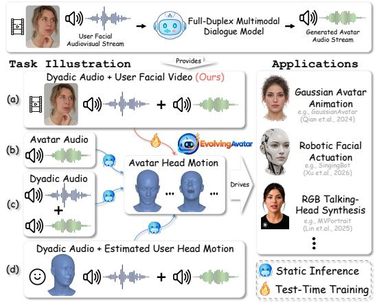  
Figure 1: Learning from interaction. (a) Our method learns from user face video and dyadic audio through test-time training, carrying context-driven updates across the conversation without target motion labels. Existing approaches use (b) avatar audio (e.g., Sun et al., 2024), (c) dyadic audio (e.g., Chu et al., 2026), or (d) dyadic audio and estimated user motion (e.g., Peng et al., 2025). Their parameters remain fixed during inference. A dialogue model can supply avatar speech from user audiovisual input. Generated 3D motion supports avatar animation, robotic facial actuation, and talking-head synthesis.

These inputs add context, but the models do not update their parameters during interaction. Test-time training (TTT) (Sun et al., 2020; Zhang et al., 2025) enables learning from this context. The challenge is to design an objective that guides motion generation without target motion labels.

We introduce EVOLVINGAVATAR, a causal generator that learns during interaction without requiring precomputed user motion (Figure 1(a)). Its Dyadic Context Prediction objective uses user video and dyadic audio to provide a learning signal for TTT. We train the generator on paired audiovisual context and motion to use these updates for conversational motion generation. Persistent fast weights retain information learned from the conversation across intervals, while transient jaw adaptation responds to current speech. Predicted activity controls how persistent adaptation affects speaking and listening motion. A region-structured codec coordinates expression, neck pose, and jaw pose.

To evaluate this setting, DIALOG3D-FACTORY processes single-view and dual-view conversation videos into aligned multimodal annotations. The resulting 455.95-hour INTERHEAD-BENCH combines parameter-space and mesh-space metrics with human ratings to evaluate generated motion. Experiments show improvements in motion statistics over baselines and suggest that learning from conversation context can benefit interactive motion generation. Our three main contributions are:

• EVOLVINGAVATAR, a causal generator that learns at test time without motion labels through Dyadic Context Prediction, with persistent conversational adaptation and transient jaw adaptation.

• INTERHEAD-BENCH, a unified benchmark of single-view and dual-view conversation videos with aligned multimodal annotations and evaluation of speaking and listening across distributions.

• Our results suggest that adaptation during interaction can benefit interactive 3D head generation and motivate further research on learning from video and audio as a conversation unfolds.

## 2 RELATED WORK

Interactive 3D Head Generation. Prior work differs in the conversational context available to the avatar. ❶Avatar audio. Audio-driven talking-head models generate lip motion, expression, and head pose in video (Zhou et al., 2020; Prajwal et al., 2020; Xu et al., 2024). Geometry-aware methods predict motion coefficients (Zhang et al., 2023) in 3DMM representations (Blanz & Vetter, 2023; Egger et al., 2020), while direct-3D methods generate parameters or meshes using data-driven models (Karras et al., 2017; Cudeiro et al., 2019; Richard et al., 2021), transformers, discrete priors, autoregression, or diffusion (Fan et al., 2022; Xing et al., 2023; Sun et al., 2024). ❷ User context. Complementing speech animation, listening-head models use the interlocutor’s speech or facial motion to generate nonverbal feedback (Zhou et al., 2022; Ng et al., 2022). This line spans early conversational agents (Cassell et al., 1994) and recent 3DMM- or mesh-based generation (Tran et al., 2024; Wang et al., 2025). ❸ Dyadic context. Jointly modeling both participants reflects the temporal interdependence of dialogue (Sacks et al., 1974; Skantze, 2021). Approaches include image-space coordination (Zhu et al., 2025; Guo et al., 2025), audiovisual dyadic head generation (Zhou et al., 2025; Chen et al., 2026), and dual-audio 3D motion synthesis (Chu et al., 2026). DualTalk further incorporates user motion to model speaking and listening (Peng et al., 2025). These developments expand the context used for generation, but existing generators retain fixed parameters at deployment.

This motivates adapting the mapping from context to motion as each conversation reveals distinct patterns of user behavior, avatar speaking style, and turn-taking dynamics.

Test-Time Training. Test-time training (TTT) provides a mechanism for such adaptation by updating fast parameters from unlabeled deployment observations. Recent work studies TTT training strategies (Zhang et al., 2025) and next-token or in-place updates (Ouyang et al., 2026; Feng et al., 2026), with applications to vision and spatial memory (Han et al., 2026; Ma et al., 2026), longcontext 3D reconstruction (Wang et al., 2026), and robot policies (Jiang et al., 2026). Interactive 3D head generation offers a natural setting for TTT: each conversation continuously supplies unlabeled audiovisual evidence about user behavior, avatar speaking style, and their evolving coordination. These interaction-specific regularities provide an opportunity to learn during generation, beyond conditioning a fixed model on incoming context. EVOLVINGAVATAR bridges this gap by using the unfolding dialogue itself as a self-supervised adaptation signal, allowing the generator to adjust its context-to-motion mapping within each conversation. This brings conversation-specific adaptation to causal head generation without requiring target motion at deployment.

## 3 PRELIMINARIES

3D head motion representation. Following prior work (Peng et al., 2025; Chu et al., 2026), we represent 3D head motion using FLAME parameters (Li et al., 2017). At each frame t, the motion is encoded as a 106-D vector consisting of expression coefficients, neck pose, and jaw pose:

$$
\begin{array} { r } { z _ { t } = \left[ ( z _ { t } ^ { e } ) ^ { \top } , ( z _ { t } ^ { n } ) ^ { \top } , ( z _ { t } ^ { j } ) ^ { \top } \right] ^ { \top } , \qquad ( d _ { e } , d _ { n } , d _ { j } ) = ( 1 0 0 , 3 , 3 ) . } \end{array}
$$

The components encode expression, neck rotation, and jaw rotation, respectively. Neck and jaw rotations use axis-angle coordinates, with $R : \mathbb { R } ^ { 3 }  \mathrm { S O } ( \bar { 3 } )$ mapping each vector to a rotation matrix. Following the task definition of Peng et al. (2025), we exclude FLAME shape, global root pose, and eye pose. Let $\mathbf { \Delta } _ { \mathbf { \mathcal { X } } _ { t } }$ and ${ \mathbf { } } _ { \mathbf { } } \mathbf { \psi } _ { \mathbf { } } \mathbf { _ { } } \mathbf { \psi } _ { \mathbf { } } \mathbf { _ { } } \mathbf { \psi } _ { \mathbf { } } \mathbf { _ { } } \mathbf { \psi } _ { \mathbf { } } \mathbf { _ { } } \mathbf { \psi } _ { \mathbf { } } \mathbf { _ { } } \mathbf { \psi } _ { \mathbf { } } \mathbf { _ { } } \mathbf { \psi } _ { \mathbf { } \psi } \mathbf { _ { } } \textbf { } \psi _ { } \left. \textbf { } \textbf { } \textbf { } \right.$ denote the predicted and reference motion parameters at frame t. Their temporally ordered sequences define the corresponding motion trajectories $\pmb { X } = ( \pmb { x } _ { 1 } , \dots , \pmb { x } _ { T } ) ^ { \top }$ and $\pmb { Y } = ( \pmb { y } _ { 1 } , \ldots , \pmb { y } _ { T } ) ^ { \top }$ , where $\boldsymbol { X } , \boldsymbol { Y } \in \mathbb { R } ^ { T \times 1 0 6 }$ are temporally aligned.

Interactive 3D head generation task formulation. We study interactive 3D head generation, where an avatar’s head motion is generated from the unfolding conversational context. We call the observed interlocutor the user and the participant being animated the avatar. Let $\mathcal { A } _ { < t } ^ { \mathrm { U } } , \mathcal { V } _ { < t } ^ { \mathrm { U } }$ , and $\boldsymbol { \mathcal { A } } _ { < t } ^ { \mathrm { A } }$ denote the user audio, user visual evidence, and avatar audio available through time t, respectively. Generalizing existing formulations (Sun et al., 2024; Peng et al., 2025; Chu et al., 2026), we define the task as

$$
\begin{array} { r } { x _ { t } \sim p _ { \theta } ( \cdot \mid \mathcal { O } _ { \le t } ) , \qquad \varnothing \neq \mathcal { O } \subseteq \left\{ \mathcal { A } ^ { \cup } , \mathcal { V } ^ { \cup } , \mathcal { A } ^ { \mathrm { A } } \right\} , \qquad X \in \mathbb { R } ^ { T \times 1 0 6 } . } \end{array}
$$

Our setting takes $\mathcal { O } = \{ \mathcal { A } ^ { \mathrm { U } } , \mathcal { V } ^ { \mathrm { U } } , \mathcal { A } ^ { \mathrm { A } } \}$ and observes $\mathcal { V } ^ { \mathrm { U } }$ as causally arrived user face frames rather than a precomputed user FLAME trajectory.

Test-time training. We write a TTT layer with fixed, offline-learned slow weights θ and fast weights $W _ { t }$ that constitute its adaptive state (Zhang et al., 2025). Given an arrived observation $\mathbf { } _ { o _ { t } , }$ a self-supervised inner objective first updates the fast weights, which then encode the same observation:

$$
W _ { t } = W _ { t - 1 } - \eta _ { t } \nabla _ { W } \mathcal { L } _ { \mathrm { i n n e r } } ( W _ { t - 1 } , \pmb { \sigma } _ { t } ) , \qquad \pmb { h } _ { t } = f _ { \theta , W _ { t } } ( \pmb { o } _ { t } ) .
$$

The arrived observation provides its own learning signal, requiring no task label. Section 4.2 instantiates the observation, inner objective, and fast-state lifetime used by EVOLVINGAVATAR.

## 4 EVOLVINGAVATAR

EVOLVINGAVATAR combines a region-structured causal FLAME codec with an adaptive generator, shown in Figure 2. It predicts latent motion from user video and dyadic audio through persistent conversational and transient articulation adaptation. Time is partitioned into fixed-duration intervals $\mathcal { T } _ { g }$ , with observations $\mathcal { O } _ { g } = ( \mathcal { V } _ { \mathcal { T } _ { q } } ^ { \mathrm { U } } , \mathcal { A } _ { \mathcal { T } _ { q } } ^ { \mathrm { U } } , \mathcal { A } _ { \mathcal { T } _ { q } } ^ { \dot { \mathrm { A } } ^ { \ast } } )$ . Generation uses only $\mathcal { O } _ { \leq g }$ and emits motion at the interval boundary. Full implementation and optimization details appear in Appendix E.

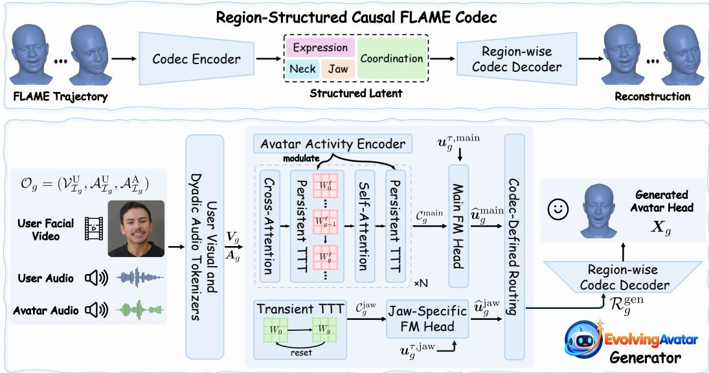  
Figure 2: EVOLVINGAVATAR learns from the ongoing conversation at deployment without motion labels. Dyadic context prediction drives two complementary forms of adaptation: persistent fast weights capture conversational regularities, while transient jaw adaptation tracks current articulation. Regional latent routing combines their predictions through a shared causal decoder.

## 4.1 REGION-STRUCTURED CAUSAL FLAME CODEC

In Figure 2, the Codec Encoder maps $Y _ { g } = [ \boldsymbol { y } _ { t } ] _ { t \in \mathcal { T } _ { g } }$ to a posterior over the Structured Latent:

$$
q _ { \phi } ( { \pmb u } _ { g } \ \vert \ { \pmb Y } _ { \le g } ) = { \mathcal N } \big ( \mu _ { g } , \mathrm { d i a g } ( { \pmb \sigma } _ { g } ^ { 2 } ) \big ) , \qquad { \pmb u } _ { g } = [ { \pmb u } _ { g } ^ { e } , { \pmb u } _ { g } ^ { n } , { \pmb u } _ { g } ^ { j } , { \pmb u } _ { g } ^ { c } ] .\tag{1}
$$

The components represent expression, neck pose, jaw pose, and shared coordination, respectively. Neck pose n represents neck rotation, corresponding to Neck in the figure. The Regionwise Codec Decoder $D _ { \psi }$ combines each private latent with shared coordination via $\mathcal { R } ( \pmb { u } _ { g } ) =$ $( [ { \pmb u } _ { g } ^ { e } , { \pmb u } _ { g } ^ { c } ] , [ { \pmb u } _ { g } ^ { n } , { \pmb u } _ { g } ^ { c } ] , [ { \pmb u } _ { g } ^ { j } , { \pmb u } _ { g } ^ { c } ] )$ . Regional projections then feed a shared causal backbone that reconstructs expression, neck pose, and jaw pose through separate region-specific output heads.

Codec training. A region-balanced Gaussian loss $\mathcal { L } _ { \mathrm { r e c } }$ supervises motion and its first and second temporal differences. We regularize the posterior under a constraint on its information rate:

$$
\begin{array} { c l } { \displaystyle \operatorname* { m i n } _ { \phi , \psi } \mathcal { L } _ { \mathrm { r e c } } + \mathbb { E } _ { s } \left[ \sum _ { g } \kappa _ { s , g } \right] \quad \mathrm { s u b j e c t } \mathrm { t o } } & { \displaystyle \frac { \sum _ { s , g } \kappa _ { s , g } } { \sum _ { s } G _ { s } } \leq \rho , } \\ { \kappa _ { s , g } = D _ { \mathrm { K L } } ( q _ { \phi } ( \boldsymbol { u } _ { s , g } \mid \boldsymbol { Y } _ { s , \leq g } ) | | \mathcal { N } ( \mathbf { 0 } , I ) ) . } \end{array}\tag{2}
$$

Here $G _ { \varepsilon }$ counts valid intervals in sequence s and $\rho$ is the rate budget, enforced through a non-negative dual multiplier. After training, we freeze the codec and use its posterior mean as the generator target, $\pmb { u } _ { g } ^ { \star } = \mathrm { s g } ( \mu _ { g } )$ , where sg denotes stop-gradient. The decoder stays frozen.

## 4.2 ADAPTIVE GENERATOR

For each interval $^ { g , }$ the generator takes the observed user face frames and both participants’ audio, as shown in Figure 2. The User Visual and Dyadic Audio Tokenizers turn these streams into $V _ { q } \in \mathbb { R } ^ { Q _ { v } \times D }$ and $\pmb { A } _ { g } = [ \pmb { A } _ { q } ^ { \mathrm { U } } ; \pmb { A } _ { q } ^ { \mathrm { A } } ] \in \mathbb { R } ^ { 2 Q _ { a } \times D }$ . Here $Q _ { v }$ is the number of visual tokens, $Q _ { a }$ is the number of audio tokens per participant, and D is their shared width. At deployment, these tokens update fast weights before generation, allowing the model to learn from the ongoing conversation.

Fusing and adapting context. Across N blocks, visual tokens alternate Cross-Attention to audio with Self-Attention, producing context $H _ { g } ^ { \ell } \in \mathbb R ^ { \dot { Q } _ { v } \times D }$ at block ℓ. To learn without motion labels, we use test-time training (TTT) with dyadic context prediction (DCP). Learned projections of $H _ { g } ^ { \ell }$ give keys, values, and queries. DCP predicts values from keys to capture regularities in the observed context. Persistent TTT updates fast weights with this prediction error before reading the query:

$$
\begin{array} { r l } & { \mathcal { L } _ { \mathrm { c t x } , g } ^ { \ell } ( W ) = \mathrm { M S E } ( f _ { W } ( \pmb { K } _ { g } ^ { \ell } ) , \pmb { V } _ { g } ^ { \ell } ) , } \\ & { \quad \quad \quad W _ { g } ^ { \ell } = W _ { g - 1 } ^ { \ell } - \eta _ { g } ^ { \ell } \nabla _ { W } \mathcal { L } _ { \mathrm { c t x } , g } ^ { \ell } ( W _ { g - 1 } ^ { \ell } ) , } \\ & { \quad \quad \quad D _ { g } ^ { \ell } = r _ { W _ { g } ^ { \ell } } ^ { \ell } ( \pmb { Q } _ { g } ^ { \ell } ) - r _ { W _ { 0 } ^ { \ell } } ^ { \ell } ( \pmb { Q } _ { g } ^ { \ell } ) . } \end{array}\tag{3}
$$

Here $W _ { 0 } ^ { \ell }$ denotes learned initial weights, $\eta _ { g } ^ { \ell }$ a positive update rate, and $r _ { W } ^ { \ell }$ the output for a query. The difference $D _ { q } ^ { \ell } \in \mathbb R ^ { Q _ { v } \times D }$ compares the adapted and initial outputs. We add this change to the visual tokens before the next block. Fast weights retain context across intervals to guide motion.

Using activity to guide motion. Speaking and listening call for different motions. The Avatar Activity Encoder therefore reads framewise audio and video features and predicts speaking/listening probabilities. Over $F _ { g }$ valid frames, these form $P _ { g } \in \mathbb { R } ^ { F _ { g } \times 2 }$ . A learned mapping gives the gate $\gamma _ { g } \in \mathbb { R } ^ { D }$ . Shared across visual tokens, it scales adaptation to condition motion:

$$
\begin{array} { r } { \boldsymbol { C } _ { g } ^ { \ell } = \boldsymbol { H } _ { g } ^ { \ell } + \gamma _ { g } \odot \boldsymbol { D } _ { g } ^ { \ell } \in \mathbb { R } ^ { Q _ { v } \times D } . } \end{array}\tag{4}
$$

The current context remains directly available through $H _ { g } ^ { \ell } .$ Activity changes only the added adaptation term. It enters neither the fast-weight update nor the context passed to later blocks. Training and inference both use predicted probabilities without requiring activity labels as inputs.

Adapting to current articulation. The jaw route instead adapts to current speech. Its Transient TTT module takes the detached tokens sg $( [ \bar { \mathbf { A } } _ { g } ; V _ { g } ] ) \in \mathbb { R } ^ { ( 2 Q _ { a } + Q _ { v } ) \times D }$ . It projects them to width $D _ { j }$ and applies DCP from its learned initial weights. Adding the resulting change to the projected tokens gives $C _ { q } ^ { \mathrm { j a w } } \in \mathbb R ^ { ( 2 Q _ { a } + Q _ { v } ) \times D _ { j } }$ . This ungated branch discards its fast weights after use.

Generating latent motion. The adapted contexts guide two flow-matching (FM) heads (Lipman et al., 2022). The Main FM Head uses $C _ { g } ^ { \operatorname* { m a i n } } = ( \mathbf { \bar { \Gamma } } _ { g } ^ { 1 } , \dots , C _ { g } ^ { N } )$ to generate the complete codec latent $\widehat { \pmb { u } } _ { q } ^ { \mathrm { m a i n } } \in \mathbb { R } ^ { d _ { z } }$ . The Jaw-Specific FM Head uses $C _ { g } ^ { \mathrm { j a w } }$ to generate $\widehat { \pmb { u } } _ { q } ^ { \mathrm { j a w } } \in \mathbb { R } ^ { d _ { j c } }$ , combining jaw and coordination components. Each head maps its noisy latent to a motion token of width D or $D _ { j }$ attends to its context, and predicts a latent velocity. Integrating this velocity generates motion from noise as flow time τ runs from 0 to 1, while g indexes intervals of the ongoing conversation.

Training the generator. We train the generator to use earlier audiovisual observations when predicting later motion. A sampled interval boundary divides each clip into a context segment A and a supervised segment B. We process both in time order, with DCP updates throughout and motion losses only on B. Clips without A train generation from the learned initial fast weights.

The frozen codec gives targets $\pmb { u } _ { g } ^ { \star , \mathrm { m a i n } } = \pmb { u } _ { g } ^ { \star }$ and ${ \pmb u } _ { g } ^ { \star , \mathrm { j a w } } = \Pi _ { \mathrm { j a w } } ( { \pmb u } _ { g } ^ { \star } )$ , where $\Pi _ { \mathrm { j a w } } ( \pmb { u } ) = [ \pmb { u } ^ { j } , \pmb { u } ^ { c } ]$ For each branch $b ,$ we mix its target with Gaussian noise $\epsilon _ { g } ^ { b }$ at flow time $\tau _ { g }$ . The velocity target is the clean latent minus this noise. The predicted velocity also gives a clean latent estimate:

$$
\begin{array} { r l } & { \boldsymbol { { \mathbf { \em u } } } _ { g } ^ { \tau _ { g } , b } = ( 1 - \tau _ { g } ) \boldsymbol { \epsilon } _ { g } ^ { b } + \tau _ { g } \boldsymbol { \mathbf { \em u } } _ { g } ^ { \star , b } , } \\ & { \mathcal { L } _ { \mathrm { F M } } ^ { b } = \mathrm { M S E } _ { B } \left( v _ { \theta _ { b } } ( \boldsymbol { \mathbf { \ * } } _ { g } ^ { \tau _ { g } , b } , \tau _ { g } , C _ { g } ^ { b } ) , \boldsymbol { \mathbf { \ * } } _ { g } ^ { \star , b } - \boldsymbol { \epsilon } _ { g } ^ { b } \right) , } \\ & { \quad \widetilde { \boldsymbol { u } } _ { g } ^ { b } = \boldsymbol { \mathbf { \ * } } _ { g } ^ { \tau _ { g } , b } + ( 1 - \tau _ { g } ) v _ { \theta _ { b } } ( \boldsymbol { \mathbf { \ * } } _ { g } ^ { \tau _ { g } , b } , \tau _ { g } , C _ { g } ^ { b } ) . } \end{array}\tag{5}
$$

Here $\mathrm { M S E } _ { B }$ averages errors over $B ,$ and $\widetilde { \boldsymbol { u } } _ { g } ^ { b }$ estimates the clean latent. To supervise motion changes, $\mathcal { L } _ { \Delta } ^ { b }$ matches differences between adjacent estimates to target differences, covering the full main latent and only the private jaw latent. $\mathcal { L } _ { \mathrm { d e c } } ^ { \mathrm { j a w } }$ compares decoded jaw parameters with ground truth. These motion losses use $B ,$ , while activity cross-entropy $\mathcal { L } _ { \mathrm { a c t } }$ uses all valid clip frames:

$$
\begin{array} { r l } & { \mathcal { L } _ { \mathrm { g e n } } = \mathcal { L } _ { \mathrm { F M } } ^ { \mathrm { m a i n } } + \mathcal { L } _ { \mathrm { F M } } ^ { \mathrm { j a w } } + \lambda _ { \Delta } \Big ( \mathcal { L } _ { \Delta } ^ { \mathrm { m a i n } } + \mathcal { L } _ { \Delta } ^ { \mathrm { j a w } } \Big ) } \\ & { \quad \quad \quad + \lambda _ { \mathrm { d e c } } \mathcal { L } _ { \mathrm { d e c } } ^ { \mathrm { j a w } } + \lambda _ { \mathrm { a c t } } \mathcal { L } _ { \mathrm { a c t } } . } \end{array}\tag{6}
$$

Motion gradients pass through DCP updates to train the context features and initial fast weights for motion prediction. Detached jaw inputs prevent its losses from updating the main branch. Detached activity probabilities leave the activity predictor supervised only by speaking/listening labels.

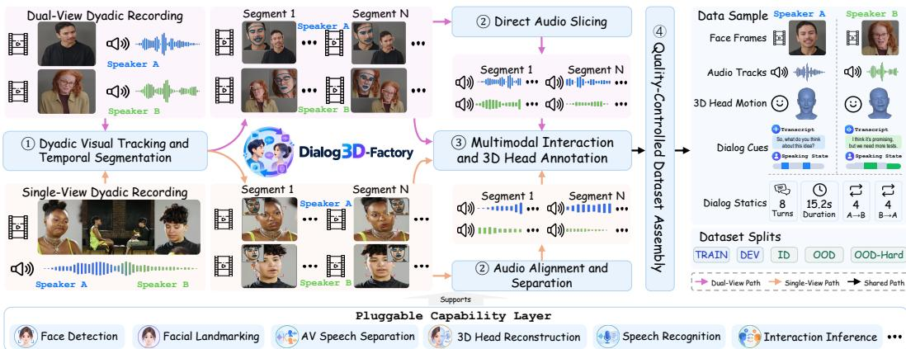  
Figure 3: DIALOG3D-FACTORY processes dual-view recordings with separate audio and single-view recordings with mixed audio. A shared workflow extracts face video, participant speech, FLAME motion, transcripts, speaking and interaction states, and turn statistics on a common timeline.

Decoding and streaming. Both branches update per complete interval and reuse adapted conditions throughout generation. Codec-Defined Routing combines main expression and neck latents with the separate jaw latent. Expression and neck share the main coordination component, while jaw uses its own. The frozen Region-wise Codec Decoder decodes the avatar motion:

$$
\begin{array} { r l } & { \mathcal { R } _ { g } ^ { \mathrm { g e n } } = \left( [ \widehat { \pmb u } _ { g } ^ { \mathrm { m a i n } , e } , \widehat { \pmb u } _ { g } ^ { \mathrm { m a i n } , c } ] , [ \widehat { \pmb u } _ { g } ^ { \mathrm { m a i n } , n } , \widehat { \pmb u } _ { g } ^ { \mathrm { m a i n } , c } ] , \widehat { \pmb u } _ { g } ^ { \mathrm { j a w } } \right) , } \\ & { \quad { \pmb X } _ { g } = D _ { \psi } ( ( \mathcal { R } _ { k } ^ { \mathrm { g e n } } ) _ { k \le g } ) \in \mathbb { R } ^ { F _ { g } \times 1 0 6 } . } \end{array}\tag{7}
$$

DCP updates fast weights for each complete interval while offline-trained parameters stay fixed. Main weights guide current and later motion and reset between conversations. Jaw updates last one interval. Algorithm 1 gives the full streaming procedure, including incomplete final intervals.

## 5 INTERHEAD-BENCH

INTERHEAD-BENCH provides data and an evaluation protocol for interactive 3D head generation. Its construction framework, DIALOG3D-FACTORY, unifies two recording formats. The resulting benchmark supports comparisons of motion accuracy, conversational behavior, and perceptual quality.

Dataset construction framework. DIALOG3D-FACTORY supports two recording formats. Dual-view data provide separate video and audio for each participant. Single-view recordings contain both participants in one video with mixed audio. The four steps in Figure 3 unify both formats.

❶ Track and segment. We standardize the media and track one face per dual-view stream or two faces in a single-view stream. We split at unrecoverable tracking gaps and discard short segments. ❷ Recover participant audio. For each segment, we slice the separate dual-view audio tracks, or separate the single-view mixture and match each speech track to its face. ❸ Annotate motion and interaction. From these participant streams, we reconstruct framewise FLAME motion, transcribe speech, and infer speaking states. Combining the two participants’ states gives interaction states and turn statistics. ❹ Validate and assemble. We check timing and required outputs before assigning accepted segments to dataset splits. Processing components can be replaced while keeping the same output format. Details are provided in Appendix F.

Dataset composition and statistics. We build Train, Dev, ID, and OOD from dual-view Seamless Interaction recordings (Agrawal et al., 2025), and OOD-Hard from single-view RealTalk recordings (Geng et al., 2023). ID holds out samples while allowing overlap with Train in participants or recorded interactions. OOD holds out both participants and interactions. OOD-Hard tests transfer to a different recording domain. Together, the splits contain 455.95 hours of interaction and 4,365 source participant IDs. Figure 4 shows their scale, durations, and turn counts.

Baselines. To compare methods on these data, we adapt four baselines to predict the same 106- D Avatar FLAME motion. Their inputs follow the task definition in Section 3 and are listed in

Table 1: Generation-time conditioning context and parameter sizes of the compared methods. U and A denote User and Avatar, respectively. Parameter counts are reported in millions (M).
<table><tr><td rowspan="2">Method</td><td rowspan="2">Venue</td><td colspan="4">Context</td><td colspan="2">Parameter Size</td></tr><tr><td>U-Video</td><td>U-FLAME</td><td>U-Audio</td><td>A-Audio</td><td>Total (M)</td><td>Trainable (M)</td></tr><tr><td>DiffPoseTalk (Sun et al., 2024)</td><td>TOG &#x27;24</td><td>x</td><td>x</td><td>x</td><td></td><td>129.32</td><td>110.55</td></tr><tr><td>ARTalk (Chu et al., 2025)</td><td>SIGGRAPH Asia &#x27;25</td><td>x</td><td>x</td><td>x</td><td></td><td>382.87</td><td>37.89</td></tr><tr><td>UniLS (Chu et al., 2026)</td><td>CVPR &#x27;26</td><td>x</td><td>X</td><td>√</td><td></td><td>422.88</td><td>27.38</td></tr><tr><td>DualTalk (Peng et al., 2025)</td><td>CVPR &#x27;25</td><td>x</td><td>√</td><td>√</td><td></td><td>647.27</td><td>638.85</td></tr><tr><td>EVOLVINGAVATAR (Ours)</td><td>This work</td><td>√</td><td>x</td><td>√</td><td>J</td><td>159.57</td><td>54.82</td></tr></table>

Table 1. DiffPoseTalk and ARTalk use Avatar audio. UniLS adds User audio, and DualTalk also uses precomputed user FLAME motion. EVOLVINGAVATAR instead uses causally available user face frames and both audio streams. These input differences guide our interpretation of the results.

Quantitative evaluation metrics. We combine metrics from prior work (Richard et al., 2021; Xing et al., 2023; Peng et al., 2025; Chu et al., 2026) in parameter space and mesh space for a shared FLAME evaluation. ❶ Parameter space. MSE measures framewise error, and FD compares motion means and covariances. P-FD compares user–avatar joint statistics, while rPCC measures correlation error. SID measures diversity of generated motion across reference clusters. PDD and JDD measure neck and jaw amplitude errors. ❷ Mesh space. With neutral FLAME identity and zero neck rotation, LVE measures lip error, MHD measures fullmesh error, and FDD compares upper-face motion amplitude. We report all-frame and avatar speaking/listening scores. Lower is better except for SID, interpreted alongside accuracy. Appendix A provides details.

(a) Dataset Scale by Split
<table><tr><td></td><td>Train</td><td>Dev</td><td>ID</td><td>OOD</td><td>OOD-Hard</td><td>All</td></tr><tr><td>Duration (h)</td><td>433.94</td><td>1.00</td><td>10.00</td><td>9.98</td><td>1.03</td><td>455.95</td></tr><tr><td># Identities</td><td>3899</td><td>184</td><td>104</td><td>134</td><td>190</td><td>4365</td></tr></table>

Perceptual evaluation protocol. We assess perceived quality during interaction through a blind, forced-choice A/B study. Raters compare lip

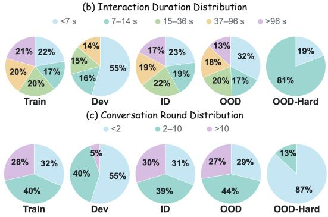  
Figure 4: INTERHEAD-BENCH composition by split, including scale and the distributions of interaction duration and conversational turns.

synchronization, motion naturalness, turn-taking coherence, audiovisual responsiveness, and overall conversational realism. These criteria cover both the animation itself and its fit to the interaction. Study details appear in Appendix H.

## 6 EXPERIMENTAL RESULTS

Our gains span speaking, listening, and challenging distribution shifts. Our expression and neck FD are lowest in both states on every split (Table 2). On OOD-Hard, jaw FD also leads, and speaking/listening FDD reaches 19.09/18.13 versus 20.91/19.84 for ARTalk (Table 3). These results show closer agreement in motion statistics and upper-face amplitude. DualTalk has lower MSE and LVE/MHD, but lower motion coverage (SID). These point errors measure agreement with one recorded response, whereas an interaction can admit several plausible responses. The 86% preference for our method against DualTalk on OOD-Hard (Figure 6) supports separating reference agreement from perceived conversational quality. UniLS retains lower FDD on ID/OOD, revealing a remaining amplitude gap: matching coefficient statistics does not ensure equally accurate geometric variation after FLAME decoding. Parameter metrics also assess neck motion, which the expression-and-jaw meshes omit. Together, the two spaces and human judgments assess different aspects of conversational motion. All-frame results in both parameter and mesh spaces appear in Appendix C.

Table 2: Parameter-space comparison. Speaking and listening results. Green bold and blue underlined values mark the best and second best in each split and state. Lower is better except SID.
<table><tr><td rowspan=1 colspan=1>Method</td><td rowspan=1 colspan=17>FD↓           P-FD↓          MSE↓          rPCC↓          SID ↑JAWPOSE     JAWPOSEEXP JAWPOSEEXP JAWPOSE                PDD ↓ JDD ↓EXP           EXP                                            EXPJAWPOSE(×103)(×102)(×103)(×102)(×101)(×103)(×102)(×102)(×101)(×101)</td></tr><tr><td rowspan=1 colspan=18>In-Distribution Test Set (ID)</td></tr><tr><td rowspan=1 colspan=1></td><td rowspan=1 colspan=2></td><td rowspan=1 colspan=2></td><td rowspan=1 colspan=1></td><td rowspan=1 colspan=1></td><td rowspan=1 colspan=2>Speaking</td><td rowspan=1 colspan=1></td><td rowspan=1 colspan=2></td><td rowspan=1 colspan=1></td><td rowspan=1 colspan=2></td><td rowspan=1 colspan=1></td><td rowspan=1 colspan=1></td><td rowspan=1 colspan=1></td></tr><tr><td rowspan=1 colspan=1>DiffPoseTalk (Sun et al., 2024)</td><td rowspan=1 colspan=2>48.4522.62</td><td rowspan=1 colspan=2>24.60 50.30</td><td rowspan=1 colspan=1>22.93</td><td rowspan=1 colspan=1>25.47</td><td rowspan=1 colspan=2>6.01 10.01</td><td rowspan=1 colspan=1>11.61</td><td rowspan=1 colspan=1>20.11</td><td rowspan=1 colspan=1>1.95</td><td rowspan=1 colspan=1>3.31</td><td rowspan=1 colspan=2>1.84 1.36</td><td rowspan=1 colspan=1>1.35</td><td rowspan=1 colspan=1>9.38</td><td rowspan=1 colspan=1>2.88</td></tr><tr><td rowspan=1 colspan=1>ARTalk (Chu et al., 2025)</td><td rowspan=1 colspan=2>21.11 3.66</td><td rowspan=1 colspan=2>18.89 22.12</td><td rowspan=1 colspan=1>3.75</td><td rowspan=1 colspan=1>19.52</td><td rowspan=1 colspan=2>2.77 1.70</td><td rowspan=1 colspan=1>8.68</td><td rowspan=1 colspan=1>18.83</td><td rowspan=1 colspan=1>1.30</td><td rowspan=1 colspan=1>3.29</td><td rowspan=1 colspan=2>2.18 1.69</td><td rowspan=1 colspan=1>1.38</td><td rowspan=1 colspan=1>5.67</td><td rowspan=1 colspan=1>0.95</td></tr><tr><td></td><td></td><td></td><td></td><td></td><td></td><td></td><td rowspan=1 colspan=2>2.32 1.30</td><td rowspan=1 colspan=1>5.36</td><td rowspan=1 colspan=1>14.73</td><td rowspan=1 colspan=1>1.07</td><td rowspan=1 colspan=1>3.37</td><td rowspan=1 colspan=2>2.84 2.20</td><td rowspan=1 colspan=1>1.13</td><td rowspan=1 colspan=1>7.36</td><td rowspan=1 colspan=1>0.84</td></tr><tr><td rowspan=1 colspan=1>DualTalk (Peng et al., 2025)</td><td rowspan=1 colspan=1>16.80</td><td rowspan=1 colspan=1>4.17</td><td rowspan=1 colspan=2>12.05 16.97</td><td rowspan=1 colspan=1>4.23</td><td rowspan=1 colspan=1>12.16</td><td rowspan=1 colspan=2>1.74 1.59</td><td rowspan=1 colspan=1>4.21</td><td rowspan=1 colspan=1>20.69</td><td rowspan=1 colspan=1>1.31</td><td rowspan=1 colspan=1>4.13</td><td rowspan=1 colspan=2>0.31 0.49</td><td rowspan=1 colspan=1>0.25</td><td rowspan=1 colspan=1>11.37</td><td rowspan=1 colspan=1>2.08</td></tr><tr><td rowspan=1 colspan=1>EVOLVINGAVATAR (Ours)</td><td rowspan=1 colspan=1>15.49</td><td rowspan=1 colspan=1>2.40</td><td rowspan=1 colspan=2>9.39 16.64</td><td rowspan=1 colspan=1>2.56</td><td rowspan=1 colspan=1>9.87</td><td rowspan=1 colspan=2>2.27 1.78</td><td rowspan=1 colspan=1>4.61</td><td rowspan=1 colspan=1>19.01</td><td rowspan=1 colspan=1>1.25</td><td rowspan=1 colspan=1>3.17</td><td rowspan=1 colspan=2>2.30 2.13</td><td rowspan=1 colspan=1>1.35</td><td rowspan=1 colspan=1>7.09</td><td rowspan=1 colspan=1>0.92</td></tr><tr><td rowspan=1 colspan=1></td><td rowspan=1 colspan=1></td><td rowspan=1 colspan=1></td><td rowspan=1 colspan=2></td><td rowspan=1 colspan=1></td><td rowspan=1 colspan=1></td><td rowspan=1 colspan=1>Lister</td><td rowspan=1 colspan=1></td><td rowspan=1 colspan=1></td><td rowspan=1 colspan=1></td><td rowspan=1 colspan=1></td><td rowspan=1 colspan=1></td><td rowspan=1 colspan=2></td><td rowspan=1 colspan=1></td><td rowspan=1 colspan=1></td><td rowspan=1 colspan=1></td></tr><tr><td rowspan=1 colspan=1>DiffPoseTalk (Sun et al., 2024)</td><td rowspan=1 colspan=1>46.68</td><td rowspan=1 colspan=1>27.37</td><td rowspan=1 colspan=2>23.93 48.52</td><td rowspan=1 colspan=1>27.69</td><td rowspan=1 colspan=1>24.88</td><td rowspan=1 colspan=1>5.79</td><td rowspan=1 colspan=1>11.75</td><td rowspan=1 colspan=1>11.22</td><td rowspan=1 colspan=1>19.78</td><td rowspan=1 colspan=1>2.02</td><td rowspan=1 colspan=1>3.06</td><td rowspan=1 colspan=2>1.79 1.33</td><td rowspan=1 colspan=1>1.39</td><td rowspan=1 colspan=1>9.88</td><td rowspan=1 colspan=1>3.03</td></tr><tr><td rowspan=1 colspan=1>ARTalk (Chu et al., 2025)</td><td rowspan=1 colspan=1>24.74</td><td rowspan=1 colspan=1>4.40</td><td rowspan=1 colspan=2>24.21 25.70</td><td rowspan=1 colspan=1>4.50</td><td rowspan=1 colspan=1>24.86</td><td rowspan=1 colspan=1>2.98</td><td rowspan=1 colspan=1>1.97</td><td rowspan=1 colspan=1>9.94</td><td rowspan=1 colspan=1>23.47</td><td rowspan=1 colspan=1>1.76</td><td rowspan=1 colspan=1>3.42</td><td rowspan=1 colspan=2>1.41 1.33</td><td rowspan=1 colspan=1>0.91</td><td rowspan=1 colspan=1>5.99</td><td rowspan=1 colspan=1>1.34</td></tr><tr><td rowspan=1 colspan=1>UniLS (Chu et al., 2026)</td><td rowspan=1 colspan=1>18.61</td><td rowspan=1 colspan=1>3.60</td><td rowspan=1 colspan=2>13.07 19.74</td><td rowspan=1 colspan=1>3.73</td><td rowspan=1 colspan=1>13.53</td><td rowspan=1 colspan=1>2.50</td><td rowspan=1 colspan=1>2.00</td><td rowspan=1 colspan=1>5.45</td><td rowspan=1 colspan=1>17.34</td><td rowspan=1 colspan=1>1.65</td><td rowspan=1 colspan=1>3.25</td><td rowspan=1 colspan=2>1.99 1.65</td><td rowspan=1 colspan=1>0.95</td><td rowspan=1 colspan=1>7.08</td><td rowspan=1 colspan=1>1.10</td></tr><tr><td rowspan=1 colspan=1>DualTalk (Peng et al., 2025)</td><td rowspan=1 colspan=1>17.64</td><td rowspan=1 colspan=1>5.07</td><td rowspan=1 colspan=2>11.06 17.78</td><td rowspan=1 colspan=1>5.11</td><td rowspan=1 colspan=1>11.14</td><td rowspan=1 colspan=1>1.82</td><td rowspan=1 colspan=1>1.95</td><td rowspan=1 colspan=1>3.88</td><td rowspan=1 colspan=1>24.94</td><td rowspan=1 colspan=1>2.01</td><td rowspan=1 colspan=1>3.65</td><td rowspan=1 colspan=2>0.33 0.54</td><td rowspan=1 colspan=1>0.28</td><td rowspan=1 colspan=1>10.31</td><td rowspan=1 colspan=1>1.99</td></tr><tr><td rowspan=1 colspan=1>EVOLVINGAVATAR (Ours)</td><td rowspan=1 colspan=1>17.01</td><td rowspan=1 colspan=1>3.17</td><td rowspan=1 colspan=2>8.99 18.13</td><td rowspan=1 colspan=1>3.33</td><td rowspan=1 colspan=1>9.46</td><td rowspan=1 colspan=1>2.30</td><td rowspan=1 colspan=1>1.95</td><td rowspan=1 colspan=1>4.18</td><td rowspan=1 colspan=2>22.45 1.78</td><td rowspan=1 colspan=1>2.88</td><td rowspan=1 colspan=2>1.95 1.87</td><td rowspan=1 colspan=1>1.29</td><td rowspan=1 colspan=1>6.97</td><td rowspan=1 colspan=1>1.23</td></tr><tr><td rowspan=1 colspan=1></td><td rowspan=1 colspan=2></td><td rowspan=1 colspan=2></td><td rowspan=1 colspan=1>Out-</td><td rowspan=1 colspan=1>of-Distr</td><td rowspan=1 colspan=2>ibution Test S</td><td rowspan=1 colspan=1>et (OOD)</td><td rowspan=1 colspan=2></td><td rowspan=1 colspan=1></td><td rowspan=1 colspan=2></td><td rowspan=1 colspan=2></td><td rowspan=1 colspan=1></td></tr><tr><td rowspan=1 colspan=1>DiffPoseTalk (Sun et al., 2024)</td><td rowspan=1 colspan=1>47.11</td><td rowspan=1 colspan=1>22.89</td><td rowspan=1 colspan=2>31.18 48.81</td><td rowspan=1 colspan=1>23.11</td><td rowspan=1 colspan=1>32.10</td><td rowspan=1 colspan=1>5.77</td><td rowspan=1 colspan=1>9.58</td><td rowspan=1 colspan=1>13.90</td><td rowspan=1 colspan=1>22.16</td><td rowspan=1 colspan=1>1.88</td><td rowspan=1 colspan=1>3.66</td><td rowspan=1 colspan=2>1.78 1.39</td><td rowspan=1 colspan=1>1.27</td><td rowspan=1 colspan=1>9.33</td><td rowspan=1 colspan=1>3.06</td></tr><tr><td rowspan=1 colspan=1>ARTalk (Chu et al., 2025)</td><td rowspan=1 colspan=1>21.82</td><td rowspan=1 colspan=1>2.40</td><td rowspan=1 colspan=2>22.86 22.77</td><td rowspan=1 colspan=1>2.46</td><td rowspan=1 colspan=1>23.52</td><td rowspan=1 colspan=1>2.75</td><td rowspan=1 colspan=1>1.14</td><td rowspan=1 colspan=1>9.82</td><td rowspan=1 colspan=1>21.17</td><td rowspan=1 colspan=1>1.43</td><td rowspan=1 colspan=1>3.63</td><td rowspan=1 colspan=2>2.13 1.82</td><td rowspan=1 colspan=1>1.25</td><td rowspan=1 colspan=1>5.68</td><td rowspan=1 colspan=1>0.68</td></tr><tr><td rowspan=1 colspan=1>DualTalk (Peng et al., 2025)</td><td rowspan=1 colspan=1>15.80</td><td rowspan=1 colspan=1>3.23</td><td rowspan=1 colspan=2>12.86 15.91</td><td rowspan=1 colspan=1>3.26</td><td rowspan=1 colspan=1>12.94</td><td rowspan=1 colspan=1>1.61</td><td rowspan=1 colspan=1>1.20</td><td rowspan=1 colspan=1>4.41</td><td rowspan=1 colspan=1>19.16</td><td rowspan=1 colspan=1>1.42</td><td rowspan=1 colspan=1>4.21</td><td rowspan=1 colspan=1>0.22</td><td rowspan=1 colspan=1>0.43</td><td rowspan=1 colspan=1>0.17</td><td rowspan=1 colspan=1>11.10</td><td rowspan=1 colspan=1>1.64</td></tr><tr><td rowspan=1 colspan=1>EVOLVINGAVATAR (Ours)</td><td rowspan=1 colspan=1>14.10</td><td rowspan=1 colspan=1>2.24</td><td rowspan=1 colspan=2>9.46 15.21</td><td rowspan=1 colspan=1>2.35</td><td rowspan=1 colspan=1>9.94</td><td rowspan=1 colspan=1>2.05</td><td rowspan=1 colspan=1>1.45</td><td rowspan=1 colspan=1>4.59</td><td rowspan=1 colspan=1>15.32</td><td rowspan=1 colspan=1>1.24</td><td rowspan=1 colspan=1>3.17</td><td rowspan=1 colspan=1>2.33</td><td rowspan=1 colspan=1>2.06</td><td rowspan=1 colspan=1>1.35</td><td rowspan=1 colspan=1>6.81</td><td rowspan=1 colspan=1>0.73</td></tr><tr><td rowspan=1 colspan=1></td><td rowspan=1 colspan=1></td><td rowspan=1 colspan=1></td><td rowspan=1 colspan=2></td><td rowspan=1 colspan=1></td><td rowspan=1 colspan=1></td><td rowspan=1 colspan=1>Lister</td><td rowspan=1 colspan=1></td><td rowspan=1 colspan=1></td><td rowspan=1 colspan=1></td><td rowspan=1 colspan=1></td><td rowspan=1 colspan=1></td><td rowspan=1 colspan=1></td><td rowspan=1 colspan=1></td><td rowspan=1 colspan=1></td><td rowspan=1 colspan=1></td><td rowspan=1 colspan=1></td></tr><tr><td rowspan=1 colspan=1>DiffPoseTalk (Sun et al., 2024)</td><td rowspan=1 colspan=1>46.78</td><td rowspan=1 colspan=1>25.23</td><td rowspan=1 colspan=1>31.53</td><td rowspan=1 colspan=1>48.37</td><td rowspan=1 colspan=1>25.46</td><td rowspan=1 colspan=1>32.50</td><td rowspan=1 colspan=1>5.64</td><td rowspan=1 colspan=1>10.43</td><td rowspan=1 colspan=1>13.63</td><td rowspan=1 colspan=1>22.08</td><td rowspan=1 colspan=1>2.08</td><td rowspan=1 colspan=1>3.44</td><td rowspan=1 colspan=1>1.73</td><td rowspan=1 colspan=1>1.34</td><td rowspan=1 colspan=1>1.25</td><td rowspan=1 colspan=1>10.33</td><td rowspan=1 colspan=1>3.22</td></tr><tr><td rowspan=1 colspan=1>ARTalk (Chu et al., 2025)</td><td rowspan=1 colspan=1>22.88</td><td rowspan=1 colspan=1>3.01</td><td rowspan=1 colspan=1>29.52</td><td rowspan=1 colspan=1>23.75</td><td rowspan=1 colspan=1>3.09</td><td rowspan=1 colspan=1>30.20</td><td rowspan=1 colspan=1>2.71</td><td rowspan=1 colspan=1>1.36</td><td rowspan=1 colspan=1>11.57</td><td rowspan=1 colspan=1>24.57</td><td rowspan=1 colspan=1>1.84</td><td rowspan=1 colspan=1>3.70</td><td rowspan=1 colspan=1>1.38</td><td rowspan=1 colspan=1>1.39</td><td rowspan=1 colspan=1>0.82</td><td rowspan=1 colspan=1>6.07</td><td rowspan=1 colspan=1>0.99</td></tr><tr><td rowspan=1 colspan=1>UniLS (Chu et al., 2026)</td><td rowspan=1 colspan=1>17.53</td><td rowspan=1 colspan=1>2.97</td><td rowspan=1 colspan=1>15.60</td><td rowspan=1 colspan=1>18.51</td><td rowspan=1 colspan=1>3.07</td><td rowspan=1 colspan=1>16.05</td><td rowspan=1 colspan=1>2.26</td><td rowspan=1 colspan=1>1.54</td><td rowspan=1 colspan=1>6.17</td><td rowspan=1 colspan=1>16.63</td><td rowspan=1 colspan=1>1.72</td><td rowspan=1 colspan=1>3.69</td><td rowspan=1 colspan=1>1.89</td><td rowspan=1 colspan=1>1.61</td><td rowspan=1 colspan=1>0.81</td><td rowspan=1 colspan=1>6.93</td><td rowspan=1 colspan=1>0.87</td></tr><tr><td rowspan=1 colspan=1>DualTalk (Peng et al., 2025)</td><td rowspan=1 colspan=1>16.04</td><td rowspan=1 colspan=1>3.86</td><td rowspan=1 colspan=1>12.97</td><td rowspan=1 colspan=1>16.13</td><td rowspan=1 colspan=1>3.88</td><td rowspan=1 colspan=1>13.03</td><td rowspan=1 colspan=1>1.64</td><td rowspan=1 colspan=1>1.43</td><td rowspan=1 colspan=1>4.45</td><td rowspan=1 colspan=1>22.69</td><td rowspan=1 colspan=1>2.13</td><td rowspan=1 colspan=1>3.82</td><td rowspan=1 colspan=1>0.24</td><td rowspan=1 colspan=1>0.44</td><td rowspan=1 colspan=1>0.19</td><td rowspan=1 colspan=1>10.12</td><td rowspan=1 colspan=1>1.62</td></tr><tr><td rowspan=1 colspan=1>EVOLVINGAVATAR (Ours)</td><td rowspan=1 colspan=2>14.61 2.37</td><td rowspan=1 colspan=2>9.90 15.70</td><td rowspan=1 colspan=1>2.49</td><td rowspan=1 colspan=1>10.45</td><td rowspan=1 colspan=1>1.99</td><td rowspan=1 colspan=1>1.47</td><td rowspan=1 colspan=1>4.52</td><td rowspan=1 colspan=1>18.92</td><td rowspan=1 colspan=1>1.96</td><td rowspan=1 colspan=1>3.04</td><td rowspan=1 colspan=2>2.05 1.83</td><td rowspan=1 colspan=1>1.29</td><td rowspan=1 colspan=1>6.61</td><td rowspan=1 colspan=1>0.89</td></tr><tr><td rowspan=1 colspan=1></td><td rowspan=1 colspan=2></td><td rowspan=1 colspan=2></td><td rowspan=1 colspan=1>Hard Out-o</td><td rowspan=1 colspan=1>f-Distr</td><td rowspan=1 colspan=1>ibutio</td><td rowspan=1 colspan=1>n Test S</td><td rowspan=1 colspan=1>et (OOD-</td><td rowspan=1 colspan=1>Hard)</td><td rowspan=1 colspan=1></td><td rowspan=1 colspan=1></td><td rowspan=1 colspan=2></td><td rowspan=1 colspan=1></td><td rowspan=1 colspan=1></td><td rowspan=1 colspan=1></td></tr><tr><td rowspan=1 colspan=1></td><td rowspan=1 colspan=2></td><td rowspan=1 colspan=2></td><td rowspan=1 colspan=1></td><td rowspan=1 colspan=1></td><td rowspan=1 colspan=1>Speak</td><td rowspan=1 colspan=1></td><td rowspan=1 colspan=1></td><td rowspan=1 colspan=1></td><td rowspan=1 colspan=1></td><td rowspan=1 colspan=1></td><td rowspan=1 colspan=2></td><td rowspan=1 colspan=1></td><td rowspan=1 colspan=1></td><td rowspan=1 colspan=1></td></tr><tr><td rowspan=1 colspan=1>DiffPoseTalk (Sun et al., 2024)</td><td rowspan=1 colspan=2>54.15 23.00</td><td rowspan=1 colspan=2>26.81 55.22</td><td rowspan=1 colspan=1>23.16</td><td rowspan=1 colspan=1>27.13</td><td rowspan=1 colspan=1>6.07</td><td rowspan=1 colspan=1>9.13</td><td rowspan=1 colspan=1>10.30</td><td rowspan=1 colspan=1>29.85</td><td rowspan=1 colspan=1>2.22</td><td rowspan=1 colspan=1>5.56</td><td rowspan=1 colspan=2>1.59 1.16</td><td rowspan=1 colspan=1>0.98</td><td rowspan=1 colspan=1>8.51</td><td rowspan=1 colspan=1>2.65</td></tr><tr><td rowspan=1 colspan=1>ARTalk (Chu et al., 2025)</td><td rowspan=1 colspan=2>25.36 5.59</td><td rowspan=1 colspan=2>40.46 26.01</td><td rowspan=1 colspan=1>5.65</td><td rowspan=1 colspan=1>40.72</td><td rowspan=1 colspan=1>2.89</td><td rowspan=1 colspan=1>2.24</td><td rowspan=1 colspan=1>14.32</td><td rowspan=1 colspan=1>25.78</td><td rowspan=1 colspan=1>2.15</td><td rowspan=1 colspan=1>6.07</td><td rowspan=1 colspan=2>1.23 0.88</td><td rowspan=1 colspan=1>0.46</td><td rowspan=1 colspan=1>4.26</td><td rowspan=1 colspan=1>0.90</td></tr><tr><td rowspan=1 colspan=1>DualTalk (Peng et al., 2025)</td><td rowspan=1 colspan=2>13.83 3.17</td><td rowspan=1 colspan=2>8.77 13.89</td><td rowspan=1 colspan=1>3.18</td><td rowspan=1 colspan=1>8.81</td><td rowspan=1 colspan=1>1.39</td><td rowspan=1 colspan=1>1.10</td><td rowspan=1 colspan=1>2.97</td><td rowspan=1 colspan=1>16.73</td><td rowspan=1 colspan=1>1.49</td><td rowspan=1 colspan=1>6.46</td><td rowspan=1 colspan=2>0.08 0.21</td><td rowspan=1 colspan=1>0.13</td><td rowspan=1 colspan=1>5.70</td><td rowspan=1 colspan=1>1.48</td></tr><tr><td rowspan=1 colspan=1>EVOLVINGAVATAR (Ours)</td><td rowspan=1 colspan=2>12.72 2.47</td><td rowspan=1 colspan=2>8.14 13.50</td><td rowspan=1 colspan=1>2.54</td><td rowspan=1 colspan=1>8.40</td><td rowspan=1 colspan=2>1.75 1.39</td><td rowspan=1 colspan=1>3.46</td><td rowspan=1 colspan=2>15.44 1.34</td><td rowspan=1 colspan=1>5.45</td><td rowspan=1 colspan=2>2.36 1.93</td><td rowspan=1 colspan=1>1.17</td><td rowspan=1 colspan=1>3.38</td><td rowspan=1 colspan=1>0.68</td></tr><tr><td rowspan=1 colspan=1></td><td rowspan=1 colspan=2></td><td rowspan=1 colspan=2></td><td rowspan=1 colspan=1></td><td rowspan=1 colspan=1></td><td rowspan=1 colspan=2>Listening</td><td rowspan=1 colspan=1></td><td rowspan=1 colspan=2></td><td rowspan=1 colspan=1></td><td rowspan=1 colspan=2></td><td rowspan=1 colspan=1></td><td rowspan=1 colspan=1></td><td rowspan=1 colspan=1></td></tr><tr><td rowspan=1 colspan=1>DiffPoseTalk (Sun et al., 2024)</td><td rowspan=1 colspan=2>51.2625.36</td><td rowspan=1 colspan=1>27.29</td><td rowspan=1 colspan=1>52.49</td><td rowspan=1 colspan=1>25.56</td><td rowspan=1 colspan=1>27.69</td><td rowspan=1 colspan=2>5.77 9.74</td><td rowspan=1 colspan=1>10.35</td><td rowspan=1 colspan=1>30.12</td><td rowspan=1 colspan=1>2.17</td><td rowspan=1 colspan=1>5.25</td><td rowspan=1 colspan=1>1.60</td><td rowspan=1 colspan=1>1.11</td><td rowspan=1 colspan=1>1.10</td><td rowspan=1 colspan=1>10.56</td><td rowspan=1 colspan=1>3.16</td></tr><tr><td rowspan=1 colspan=1>ARTalk (Chu et al., 2025)</td><td rowspan=1 colspan=2>22.59 4.00</td><td rowspan=1 colspan=1>35.94</td><td rowspan=1 colspan=1>23.34</td><td rowspan=1 colspan=1>4.08</td><td rowspan=1 colspan=1>36.27</td><td rowspan=1 colspan=2>2.58 1.64</td><td rowspan=1 colspan=1>12.80</td><td rowspan=1 colspan=1>28.61</td><td rowspan=1 colspan=1>2.13</td><td rowspan=1 colspan=1>5.80</td><td rowspan=1 colspan=1>1.26</td><td rowspan=1 colspan=1>1.18</td><td rowspan=1 colspan=1>0.56</td><td rowspan=1 colspan=1>5.84</td><td rowspan=1 colspan=1>0.95</td></tr><tr><td rowspan=1 colspan=1>DualTalk (Peng et al., 2025)</td><td rowspan=1 colspan=2>13.50 3.25</td><td rowspan=1 colspan=1>8.61</td><td rowspan=1 colspan=1>13.57</td><td rowspan=1 colspan=1>3.28</td><td rowspan=1 colspan=1>8.65</td><td rowspan=1 colspan=2>1.36 1.14</td><td rowspan=1 colspan=1>2.92</td><td rowspan=1 colspan=1>18.77</td><td rowspan=1 colspan=1>2.44</td><td rowspan=1 colspan=1>6.02</td><td rowspan=1 colspan=1>0.13</td><td rowspan=1 colspan=1>0.22</td><td rowspan=1 colspan=1>0.13</td><td rowspan=1 colspan=1>4.81</td><td rowspan=1 colspan=1>1.30</td></tr><tr><td rowspan=1 colspan=1>EVOLVINGAVATAR (Ours)</td><td rowspan=1 colspan=2>13.39 2.54</td><td rowspan=1 colspan=1>8.25</td><td rowspan=1 colspan=1>14.25</td><td rowspan=1 colspan=1>2.63</td><td rowspan=1 colspan=1>8.48</td><td rowspan=1 colspan=2>1.75 1.31</td><td rowspan=1 colspan=1>3.34</td><td rowspan=1 colspan=1>16.82</td><td rowspan=1 colspan=1>1.84</td><td rowspan=1 colspan=1>4.98</td><td rowspan=1 colspan=1>2.09</td><td rowspan=1 colspan=1>1.69</td><td rowspan=1 colspan=1>1.11</td><td rowspan=1 colspan=1>3.85</td><td rowspan=1 colspan=1>0.85</td></tr></table>

Table 3: Mesh-space comparison. Speaking/listening results. LVE and MHD are in millimeters. Green bold and blue underline denote the best and second best per split and state. Lower is better.
<table><tr><td rowspan="3">Method</td><td colspan="6">D</td><td colspan="6">OOD</td><td colspan="6">OOD-Hard</td></tr><tr><td colspan="3">Speaking</td><td colspan="3">Listening</td><td colspan="3">Speaking</td><td colspan="3">Listening</td><td colspan="3">Speaking</td><td colspan="3">Listening</td></tr><tr><td>[FDD ↓ LVE ↓ MHD ↓ FDD ↓ LVE ↓ MHD ↓</td><td></td><td></td><td></td><td></td><td></td><td>|FDD ↓ LVE ↓ MHD ↓ FDD ↓ LVE ↓ MHD ↓</td><td></td><td></td><td></td><td></td><td></td><td></td><td></td><td></td><td></td><td>FDD ↓ LVE ↓ MHD ↓ FDD ↓ LVE ↓ MHD ↓</td><td></td></tr><tr><td>DiffPoseTalk (Sun et al., 2024)</td><td>39.26</td><td>18.78</td><td>4.10</td><td>40.74</td><td>19.97</td><td>4.31</td><td>38.37</td><td>18.10</td><td>4.02</td><td>40.82</td><td>18.60</td><td>4.11</td><td>37.57</td><td>17.94</td><td>3.97</td><td>44.10</td><td>18.28</td><td>4.01</td></tr><tr><td>ARTalk (Chu et al., 2025)</td><td>32.97</td><td>9.33</td><td>2.21</td><td>35.90</td><td>11.77</td><td>2.75</td><td>30.82</td><td>8.18</td><td>1.98</td><td>30.92</td><td>9.85</td><td>2.32</td><td>20.91</td><td>10.79</td><td>2.49</td><td>19.84</td><td>10.10</td><td>2.34</td></tr><tr><td>UniLS (Chu et al., 2026)</td><td>29.21</td><td>7.62</td><td>1.79</td><td>31.11</td><td>9.92</td><td>2.21</td><td>27.37</td><td>7.29</td><td>1.71</td><td>28.19</td><td>8.91</td><td>1.97</td><td>21.84</td><td>10.28</td><td>2.27</td><td>21.78</td><td>10.82</td><td>2.37</td></tr><tr><td>DualTalk (Peng et al., 2025)</td><td>68.51</td><td>8.12</td><td>1.84</td><td>61.57</td><td>9.26</td><td>2.03</td><td>64.35</td><td>7.29</td><td>1.65</td><td>55.63</td><td>8.03</td><td>1.75</td><td>42.83</td><td>7.65</td><td>1.67</td><td>38.31</td><td>7.64</td><td>1.67</td></tr><tr><td>EVOLVINGAVATAR (Ours)</td><td>37.63</td><td>9.35</td><td>2.10</td><td>36.23</td><td>10.08</td><td>2.22</td><td>33.96</td><td>8.55</td><td>1.90</td><td>29.68</td><td>8.84</td><td>1.93</td><td>19.09</td><td>8.83</td><td>1.92</td><td>18.13</td><td>8.76</td><td>1.89</td></tr></table>

Learning throughout a conversation improves expression generation. On ID, full TTT lowers expression P-FD by 20.4% against No write, 4.2% against Freeze-1, and 8.6% against No carry (Table 4). Freeze-1 stops persistent updates after the first, while No carry clears fast state after each group. These same-checkpoint comparisons support both continued updates and retention of learned context. Neck P-FD instead increases by 8.9% against No write. DCP updates fast weights through context prediction, which does not directly constrain each region’s motion statistics. Across five equal-duration intervals (Figure 5), expression P-FD falls by 2.7% on OOD and 7.1% on OOD-Hard from first to last, while all four baselines worsen on OOD. The interval results show improvement over time, while the matched controls test the contribution of online learning to motion generation.

Human judgments favor our conversational behavior. Overall-realism preference over UniLS rises from 58% on ID to 66% on OOD and 72% on OOD-Hard (Figure 6). On OOD-Hard, preference reaches 90% against DiffPoseTalk and ARTalk and 86% against DualTalk. These judgments favor our behavior under distribution shift, complementing the speaking and listening examples. Raters judge motion alongside user video and shared audio, making these preferences informative about behavior within the conversation. The UniLS trend remains descriptive because all three uncertainty intervals include equal preference. These comparisons assess complete methods, while the matched TTT controls test online adaptation. Additional visual comparisons appear in Appendix B.

Table 4: TTT inference ablation. No write disables updates. Freeze-1 stops persistent updates after the first. No carry updates fast state for each prediction and then clears it. All controls use the same offline-trained parameters.
<table><tr><td rowspan=1 colspan=5>FD↓             P-FD↓Variant        JAWPOSE       JAWPOSEEXP $( \times 1 0 ^ { 3 } )$  $( \times 1 0 ^ { 2 } )$ EXP $( \times 1 0 ^ { 3 } )$   $( \times 1 0 ^ { 2 } )$ </td></tr><tr><td rowspan=1 colspan=1>Full model</td><td rowspan=1 colspan=1>15.772.64</td><td rowspan=1 colspan=1>8.89</td><td rowspan=1 colspan=1>16.792.79</td><td rowspan=1 colspan=1>9.32</td></tr><tr><td rowspan=1 colspan=1>No write</td><td rowspan=1 colspan=1>19.91 2.67</td><td rowspan=1 colspan=1>8.03</td><td rowspan=1 colspan=1>21.09 2.81</td><td rowspan=1 colspan=1>8.56</td></tr><tr><td rowspan=1 colspan=1>Freeze-1</td><td rowspan=1 colspan=1>16.51 2.64</td><td rowspan=1 colspan=1>8.85</td><td rowspan=1 colspan=1>17.532.79</td><td rowspan=1 colspan=1>9.29</td></tr><tr><td rowspan=1 colspan=1>No carry</td><td rowspan=1 colspan=1>17.302.64</td><td rowspan=1 colspan=1>8.69</td><td rowspan=1 colspan=1>18.362.79</td><td rowspan=1 colspan=1>9.16</td></tr></table>

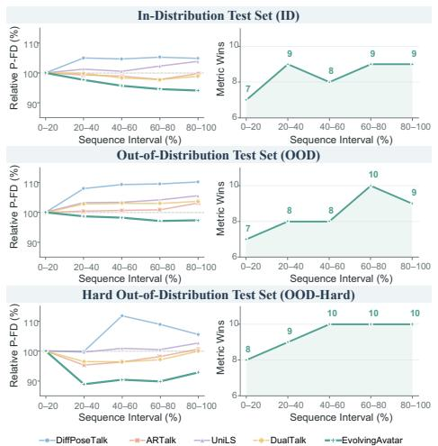  
Figure 5: Performance over five equal-duration intervals. Left: expression P-FD normalized to each method’s first interval (100%, lower is better), showing within-method change. Right: number of 20 metrics on which EVOLVINGAVATAR outperforms the best of four baselines, selected for each metric and interval (higher is better).

Table 5: Module ablation. Unified Codec disables jaw flow and regional partitioning. w/o Activity removes predicted-state features, supervision, and innovation gating. Comparisons use independently trained variants.
<table><tr><td rowspan="2">Variant</td><td colspan="2">FD↓</td><td colspan="2">P-FD↓</td></tr><tr><td>EXP</td><td>JAW POSE  $( \times 1 0 ^ { 3 } )$   $( \times 1 0 ^ { 2 } )$ </td><td>EXP</td><td>JAW POSE  $( \times 1 0 ^ { 3 } )$   $( \times 1 0 ^ { 2 } )$ </td></tr><tr><td>Full model</td><td>15.77</td><td>2.64 8.89</td><td>16.79</td><td>2.79</td><td>9.32</td></tr><tr><td>w/o Jaw FM</td><td>15.79</td><td>2.79 8.89</td><td>16.81</td><td>2.94</td><td>9.32</td></tr><tr><td>Unified Codec</td><td>16.10</td><td>2.79 8.99</td><td>17.13</td><td>2.93</td><td>9.40</td></tr><tr><td>w/o Activity</td><td>16.09</td><td>2.76 8.94</td><td>17.10</td><td>2.90</td><td>9.37</td></tr></table>

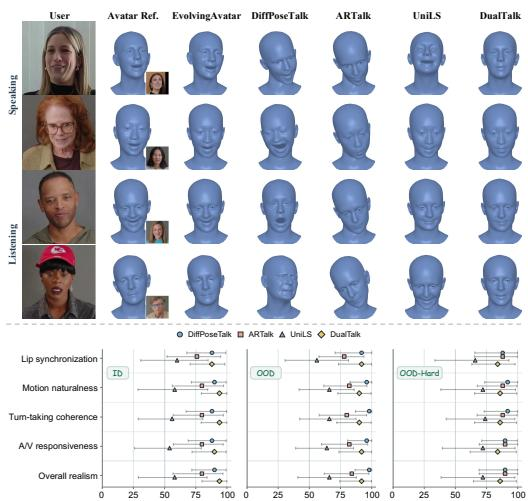  
Figure 6: Top: speaking and listening examples with the user and reference avatar. Bottom: blind A/B preferences for EVOLVINGAVATAR against four baselines across five conversational criteria, from 10 raters across 60 trials. Bars show 95% finite-sample uncertainty intervals. The dashed line marks equal preference (50%).

The components contribute complementary motion improvements. With jaw flow disabled in both codecs, regional coding lowers ID expression and neck P-FD by 1.9% and 0.8% relative to unified coding (Table 5), supporting separate regional latents. Jaw P-FD remains slightly higher, so this benefit is region dependent. Jaw FM is associated with 5.1% lower jaw P-FD, consistent with its articulation role. Activity conditioning lowers all six FD/P-FD scores, including expression P-FD from 17.10 to 16.79, supporting its use in guiding adapted motion. Jaw FM, Activity, and RGB comparisons are exploratory across revisions. In Appendix D, RGB improves expression and neck statistics over audio alone on OOD-Hard, but expression statistics worsen on ID/OOD. Visual context therefore offers selective benefits, motivating better control of how it guides motion generation.

## 7 CONCLUSION

We introduced EVOLVINGAVATAR, a causal generator that learns from user face video and dyadic audio while generating coordinated speaking and listening motion. Dyadic Context Prediction enables test-time training without target motion labels at deployment. Persistent adaptation retains patterns learned within each conversation, while transient jaw adaptation responds to current articulation. We introduced INTERHEAD-BENCH, which unifies single-view and dual-view conversation videos for evaluating speaking and listening across distributions. Experiments show improved motion statistics and human ratings under distribution shifts, while matched ablations support continued learning within conversations. Together, these contributions extend interactive 3D head generation from conditioning on context to learning from it throughout each conversation.

Limitations and future work. Recorded conversations do not capture how users respond to generated motion. Future work could study continual learning in live interactions, distinguishing stable expressive habits from temporary emotional responses to decide what to retain and when to revise it. For psychological support, the key question is whether adaptation leads to nonverbal responses appropriate to users’ changing needs. Clinician-guided studies could assess perceived support alongside motion quality and track their relationship throughout longer conversations.

## AI USE STATEMENT

Generative AI tools helped refine the language and improve readability. The authors take responsibility for the accuracy and integrity of all content, scientific claims, and conclusions.

## ETHICS STATEMENT

All original audiovisual recordings used in this study come from publicly available datasets. Their use and redistribution remain subject to the source datasets’ licenses and access conditions.

## REPRODUCIBILITY STATEMENT

Appendix E documents model architecture, training objectives, and streaming inference. Appendices F and A detail dataset construction and evaluation metric definitions, respectively.

## ACKNOWLEDGMENTS

We thank the reviewers and chairs for their time and thoughtful feedback on our work.

## REFERENCES

Vasu Agrawal, Akinniyi Akinyemi, Kathryn Alvero, Morteza Behrooz, Julia Buffalini, Fabio Maria Carlucci, Joy Chen, Junming Chen, Zhang Chen, Shiyang Cheng, et al. Seamless interaction: Dyadic audiovisual motion modeling and large-scale dataset. arXiv preprint arXiv:2506.22554, 2025.

Volker Blanz and Thomas Vetter. A morphable model for the synthesis of 3d faces. In Seminal Graphics Papers: Pushing the Boundaries, Volume 2, pp. 157–164. 2023.

Jiashuo Cao, Chen Li, Wujie Gao, Simon Hoermann, Nilufar Baghaei, and Mark Billinghurst. “When I see Jodie, I feel relaxed”: Examining the impact of a virtual supporter in remote psychotherapy. arXiv preprint arXiv:2604.16003, 2026. doi: 10.48550/arXiv.2604.16003. Accepted to CSCW 2026.

Justine Cassell, Catherine Pelachaud, Norman Badler, Mark Steedman, Brett Achorn, Tripp Becket, Brett Douville, Scott Prevost, and Matthew Stone. Animated conversation: rule-based generation of facial expression, gesture & spoken intonation for multiple conversational agents. In Proceedings of the 21st annual conference on Computer graphics and interactive techniques, pp. 413–420, 1994.

Tanya L. Chartrand and John A. Bargh. The chameleon effect: The perception–behavior link and social interaction. Journal of Personality and Social Psychology, 76(6):893–910, June 1999. doi: 10.1037/0022-3514.76.6.893.

Junjie Chen, Fei Wang, Zhihao Huang, Qing Zhou, Kun Li, Dan Guo, Linfeng Zhang, and Xun Yang. Towards seamless interaction: Causal turn-level modeling of interactive 3d conversational head dynamics, February 2026.

Xuangeng Chu, Nabarun Goswami, Ziteng Cui, Hanqin Wang, and Tatsuya Harada. ARTalk: Speechdriven 3d head animation via autoregressive model. In Proceedings ofthe SIGGRAPH Asia 2025 Conference Papers, SA Conference Papers ’25, pp. 1–9. ACM, 2025. doi: 10.1145/3757377. 3763955.

Xuangeng Chu, Ruicong Liu, Yifei Huang, Yun Liu, Yichen Peng, and Bo Zheng. Unils: End-toend audio-driven avatars for unified listening and speaking. In Proceedings of the IEEE/CVF Conference on Computer Vision and Pattern Recognition, pp. 25142–25152, 2026.

Joon Son Chung and Andrew Zisserman. Out of time: automated lip sync in the wild. In Asian conference on computer vision, pp. 251–263. Springer, 2016.

Herbert H Clark and Susan E Brennan. Grounding in communication. 1991.

Daniel Cudeiro, Timo Bolkart, Cassidy Laidlaw, Anurag Ranjan, and Michael J Black. Capture, learning, and synthesis of 3d speaking styles. In Proceedings of the IEEE/CVF conference on computer vision and pattern recognition, pp. 10101–10111, 2019.

Radek Daneˇcek, Michael J Black, and Timo Bolkart. Emoca: Emotion driven monocular face captureˇ and animation. In Proceedings of the IEEE/CVF conference on computer vision and pattern recognition, pp. 20311–20322, 2022.

Alexandre Defossez, Laurent Mazar´ e, Manu Orsini, Am´ elie Royer, Patrick P´ erez, Herv´ e J´ egou,´ Edouard Grave, and Neil Zeghidour. Moshi: a speech-text foundation model for real-time dialogue, October 2024.

Bernhard Egger, William AP Smith, Ayush Tewari, Stefanie Wuhrer, Michael Zollhoefer, Thabo Beeler, Florian Bernard, Timo Bolkart, Adam Kortylewski, Sami Romdhani, et al. 3d morphable face models—past, present, and future. ACM Transactions on Graphics (ToG), 39(5):1–38, 2020.

Yingruo Fan, Zhaojiang Lin, Jun Saito, Wenping Wang, and Taku Komura. Faceformer: Speechdriven 3d facial animation with transformers. In Proceedings of the IEEE/CVF conference on computer vision and pattern recognition, pp. 18770–18780, 2022.

Guhao Feng, Shengjie Luo, Kai Hua, Ge Zhang, Di He, Wenhao Huang, and Tianle Cai. In-place test-time training, April 2026.

Yao Feng, Haiwen Feng, Michael J Black, and Timo Bolkart. Learning an animatable detailed 3d face model from in-the-wild images. ACM Transactions on Graphics (ToG), 40(4):1–13, 2021.

Panagiotis P Filntisis, George Retsinas, Foivos Paraperas-Papantoniou, Athanasios Katsamanis, Anastasios Roussos, and Petros Maragos. Visual speech-aware perceptual 3d facial expression reconstruction from videos. arXiv preprint arXiv:2207.11094, 2022.

Scott Geng, Revant Teotia, Purva Tendulkar, Sachit Menon, and Carl Vondrick. Affective faces for goal-driven dyadic communication. arXiv preprint arXiv:2301.10939, 2023.

Arthur C. Graesser, Patrick Chipman, Brian C. Haynes, and Andrew Olney. AutoTutor: An intelligent tutoring system with mixed-initiative dialogue. IEEE Transactions on Education, 48(4):612–618, 2005. doi: 10.1109/TE.2005.856149.

Ying Guo, Xi Liu, Cheng Zhen, Pengfei Yan, and Xiaoming Wei. Arig: Autoregressive interactive head generation for real-time conversations. In Proceedings of the IEEE/CVF International Conference on Computer Vision (ICCV), 2025.

Dongchen Han, Yining Li, Tianyu Li, Zixuan Cao, Ziming Wang, Jun Song, Yu Cheng, Bo Zheng, and Gao Huang. Vit3: Unlocking test-time training in vision, April 2026.

Martin Heusel, Hubert Ramsauer, Thomas Unterthiner, Bernhard Nessler, and Sepp Hochreiter. Gans trained by a two time-scale update rule converge to a local nash equilibrium. In NeurIPS, pp. 6626–6637, 2017.

Muye Huang, Lingling Zhang, Xingyu Yu, Lei Shi, Zhanyu Ma, Jun Xu, Jiuchong Gao, Jinghua Hao, Renqing He, and Jun Liu. Duplexomni: Real-time listening, seeing, thinking, and speaking for full-duplex interaction, June 2026.

Yunfan Jiang, Yevgen Chebotar, Ruijie Zheng, Fengyuan Hu, Yunhao Ge, Jimmy Wu, Tianyuan Dai, Scott Reed, Li Fei-Fei, Yuke Zhu, and Linxi ”Jim” Fan. Robottt: Context scaling for robot policies, July 2026.

Chaeyoung Jung, Suyeon Lee, Kihyun Nam, Kyeongha Rho, You Jin Kim, Youngjoon Jang, and Joon Son Chung. Talknce: Improving active speaker detection with talk-aware contrastive learning. In IEEE International Conference on Acoustics, Speech and Signal Processing, 2024.

Tero Karras, Timo Aila, Samuli Laine, Antti Herva, and Jaakko Lehtinen. Audio-driven facial animation by joint end-to-end learning of pose and emotion. ACM Transactions on Graphics (ToG), 36(4):1–12, 2017.

Kai Li, Kejun Gao, and Xiaolin Hu. Efficient audio-visual speech separation with discrete lip semantics and multi-scale global-local attention. In International Conference on Learning Representations, volume 2026, pp. 137422–137447, 2026.

Tianye Li, Timo Bolkart, Michael J Black, Hao Li, and Javier Romero. Learning a model of facial shape and expression from 4d scans. ACM Trans. Graph., 36(6):194–1, 2017.

Yaron Lipman, Ricky TQ Chen, Heli Ben-Hamu, Maximilian Nickel, and Matt Le. Flow matching for generative modeling. arXiv preprint arXiv:2210.02747, 2022.

Camillo Lugaresi, Jiuqiang Tang, Hadon Nash, Chris McClanahan, Esha Uboweja, Michael Hays, Fan Zhang, Chuo-Ling Chang, Ming Guang Yong, Juhyun Lee, et al. Mediapipe: A framework for building perception pipelines. arXiv preprint arXiv:1906.08172, 2019.

Ziqiao Ma, Xueyang Yu, Haoyu Zhen, Yuncong Yang, Joyce Chai, and Chuang Gan. Fast spatial memory with elastic test-time training, April 2026.

Wataru Nakata, Yuki Saito, Kazuki Yamauchi, Emiru Tsunoo, and Hiroshi Saruwatari. Dialoguesidon: Recovering full-duplex dialogue tracks from in-the-wild dialogue audio. In Proceedings of the 27th Annual Meeting ofthe Special Interest Group on Discourse and Dialogue, pp. 1–12, 2026.

Evonne Ng, Hanbyul Joo, Liwen Hu, Hao Li, Trevor Darrell, Angjoo Kanazawa, and Shiry Ginosar. Learning to listen: Modeling non-deterministic dyadic facial motion. In Proceedings of the IEEE/CVF Conference on Computer Vision and Pattern Recognition, pp. 20395–20405, 2022.

Xuan Ouyang, Zefan Cai, and Junjie Hu. Test-time training with next-token prediction, August 2026.

Ziqiao Peng, Yanbo Fan, Haoyu Wu, Xuan Wang, Hongyan Liu, Jun He, and Zhaoxin Fan. Dualtalk: Dual-speaker interaction for 3d talking head conversations. In Proceedings of the Computer Vision and Pattern Recognition Conference, pp. 21055–21064, 2025.

KR Prajwal, Rudrabha Mukhopadhyay, Vinay P Namboodiri, and CV Jawahar. A lip sync expert is all you need for speech to lip generation in the wild. In Proceedings of the 28th ACM international conference on multimedia, pp. 484–492, 2020.

Alec Radford, Jong Wook Kim, Tao Xu, Greg Brockman, Christine McLeavey, Ilya Sutskever, et al. Robust speech recognition via large-scale weak supervision. arxiv. arXiv preprint arXiv:2212.04356, 10, 2022.

Alexander Richard, Michael Zollhofer, Yandong Wen, Fernando De la Torre, and Yaser Sheikh.¨ Meshtalk: 3d face animation from speech using cross-modality disentanglement. In Proceedings of the IEEE/CVF international conference on computer vision, pp. 1173–1182, 2021.

Rajarshi Roy, Jonathan Raiman, Sang-Gil Lee, Teodor-Dumitru Ene, Robert Kirby, Sungwon Kim, Jaehyeon Kim, and Bryan Catanzaro. Personaplex: Voice and role control for full duplex conversational speech models. In ICASSP 2026 - 2026 IEEE International Conference on Acoustics, Speech and Signal Processing (ICASSP), volume 00, pp. 16137–16141. Institute of Electrical and Electronics Engineers (IEEE), May 2026. doi: 10.1109/icassp55912.2026.11463413.

Harvey Sacks, Emanuel A Schegloff, and Gail Jefferson. A simplest systematics for the organization of turn-taking for conversation. language, 50(4):696–735, 1974.

Gabriel Skantze. Turn-taking in conversational systems and human-robot interaction: a review. Computer Speech & Language, 67:101178, 2021.

Tanya Stivers, Nicholas J Enfield, Penelope Brown, Christina Englert, Makoto Hayashi, Trine Heinemann, Gertie Hoymann, Federico Rossano, Jan Peter De Ruiter, Kyung-Eun Yoon, et al. Universals and cultural variation in turn-taking in conversation. Proceedings of the National Academy ofSciences, 106(26):10587–10592, 2009.

Yu Sun, Xiaolong Wang, Zhuang Liu, John Miller, Alexei Efros, and Moritz Hardt. Test-time training with self-supervision for generalization under distribution shifts. In International conference on machine learning, pp. 9229–9248. PMLR, 2020.

Zhiyao Sun, Tian Lv, Sheng Ye, Matthieu Lin, Jenny Sheng, Yu-Hui Wen, Minjing Yu, and Yongjin Liu. Diffposetalk: Speech-driven stylistic 3d facial animation and head pose generation via diffusion models. ACM Transactions on Graphics (TOG), 43(4):1–9, 2024.

Thinking Machines Lab. Interaction models: A scalable approach to human-ai collaboration. Thinking Machines Lab: Connectionism, May 2026. doi: 10.64434/tml.20260511. https://thinkingmachines.ai/blog/interaction-models/.

Minh Tran, Di Chang, Maksim Siniukov, and Mohammad Soleymani. Dim: Dyadic interaction modeling for social behavior generation. In European Conference on Computer Vision, pp. 484–503. Springer, 2024.

Chen Wang, Hao Tan, Wang Yifan, Zhiqin Chen, Yuheng Liu, Kalyan Sunkavalli, Sai Bi, Lingjie Liu, and Yiwei Hu. tttlrm: Test-time training for long context and autoregressive 3d reconstruction, March 2026.

Yinuo Wang, Yanbo Fan, Xuan Wang, Guo Yu, and Fei Wang. Diffusion-based realistic listening head generation via hybrid motion modeling. In Proceedings ofthe Computer Vision and Pattern Recognition Conference, pp. 15885–15895, 2025.

Jinbo Xing, Menghan Xia, Yuechen Zhang, Xiaodong Cun, Jue Wang, and Tien-Tsin Wong. Codetalker: Speech-driven 3d facial animation with discrete motion prior. In Proceedings of the IEEE/CVF Conference on Computer Vision and Pattern Recognition, pp. 12780–12790, 2023.

Jin Xu, Zhifang Guo, Hangrui Hu, Yunfei Chu, Xiong Wang, Jinzheng He, Yuxuan Wang, Xian Shi, Ting He, Xinfa Zhu, Yuanjun Lv, Yongqi Wang, Dake Guo, He Wang, Linhan Ma, Pei Zhang, Xinyu Zhang, Hongkun Hao, Zishan Guo, Baosong Yang, Bin Zhang, Ziyang Ma, Xipin Wei, Shuai Bai, Keqin Chen, Xuejing Liu, Peng Wang, Mingkun Yang, Dayiheng Liu, Xingzhang Ren, Bo Zheng, Rui Men, Fan Zhou, Bowen Yu, Jianxin Yang, Le Yu, Jingren Zhou, and Junyang Lin. Qwen3-omni technical report, September 2025.

Sicheng Xu, Guojun Chen, Yu-Xiao Guo, Jiaolong Yang, Chong Li, Zhenyu Zang, Yizhong Zhang, Xin Tong, and Baining Guo. VASA-1: Lifelike audio-driven talking faces generated in real time. In The Thirty-eighth Annual Conference on Neural Information Processing Systems, 2024.

Tianyuan Zhang, Sai Bi, Yicong Hong, Kai Zhang, Fujun Luan, Songlin Yang, Kalyan Sunkavalli, William T. Freeman, and Hao Tan. Test-time training done right, May 2025.

Wenxuan Zhang, Xiaodong Cun, Xuan Wang, Yong Zhang, Xi Shen, Yu Guo, Ying Shan, and Fei Wang. Sadtalker: Learning realistic 3d motion coefficients for stylized audio-driven single image talking face animation. In Proceedings of the IEEE/CVF conference on computer vision and pattern recognition, pp. 8652–8661, 2023.

Mohan Zhou, Yalong Bai, Wei Zhang, Ting Yao, Tiejun Zhao, and Tao Mei. Responsive listening head generation: a benchmark dataset and baseline. In European conference on computer vision, pp. 124–142. Springer, 2022.

Mohan Zhou, Yalong Bai, Wei Zhang, Ting Yao, and Tiejun Zhao. Interactive conversational head generation. IEEE Transactions on Pattern Analysis and Machine Intelligence, 47(8):6673–6686, 2025.

Yang Zhou, Xintong Han, Eli Shechtman, Jose Echevarria, Evangelos Kalogerakis, and Dingzeyu Li. Makelttalk: speaker-aware talking-head animation. ACM Transactions On Graphics (TOG), 39(6): 1–15, 2020.

Yongming Zhu, Longhao Zhang, Zhengkun Rong, Tianshu Hu, Shuang Liang, and Zhipeng Ge. Infp: Audio-driven interactive head generation in dyadic conversations. In Proceedings of the Computer Vision and Pattern Recognition Conference, pp. 10667–10677, 2025.

Wojciech Zielonka, Timo Bolkart, and Justus Thies. Towards metrical reconstruction of human faces. In European conference on computer vision, pp. 250–269. Springer, 2022.

## APPENDIX CONTENTS

Metric definitions and properties 16   
A.1 Parameter-space metrics 16   
A.2 Mesh-space metrics 17   
A.3 Interpreting the metrics together . 17   
B Additional visual comparisons 18   
C All-frame quantitative results 26   
D Context signal comparison 27   
E Method implementation and streaming algorithm 29   
E.1 Causal motion codec . 29   
E.2 Audiovisual features and motion backbone 29   
E.3 Fast weights and transient jaw adaptation 30   
E.4 Generator training and optimization . 30   
E.5 Streaming execution 30   
F Dataset construction details . 32   
G Baseline training and comparison protocol 33   
H Perceptual evaluation details 33

## A METRIC DEFINITIONS AND PROPERTIES

Inputs and shapes. For a directed record and evaluation view, T denotes the selected frame count. Predicted avatar, reference avatar, and aligned user motion are $\boldsymbol { X } , \boldsymbol { Y } , \boldsymbol { U } \in \mathbb { R } ^ { T \times 1 0 6 }$ . For component $c \in \{ e , n , j \}$ , their slices $X ^ { c } , Y ^ { c } , U ^ { c } \in \overline { { \mathbb { R } } } ^ { T \times d _ { c } }$ contain expression, neck pose, or jaw pose, with $d _ { e } = 1 0 0$ and $d _ { n } = d _ { j } = 3 .$ A frame vector is $\pmb { x } _ { t } ^ { c } \in \mathbb { R } ^ { d _ { c } }$ . User FLAME motion supplies evaluation context only for P-FD and rPCC. These parameters are never supplied to EVOLVINGAVATAR.

Views and aggregation. Speaking includes avatar speech and overlap, whereas listening includes avatar listening and silence. All-frame scores are recomputed from every valid frame, not averaged from these two views. We compute each scalar metric per directed record, then average equally over records with a defined score. Lower is better except for SID, whose higher value indicates broader occupancy rather than fidelity. Table multipliers only rescale the displayed scores for readability.

## A.1 PARAMETER-SPACE METRICS

We compute MSE, FD, P-FD, rPCC, and SID following DualTalk (Peng et al., 2025), and adapt PDD and JDD from UniLS (Chu et al., 2026). Shared FLAME coordinates and evaluation conventions make comparisons consistent across methods, although scores may differ from original reports.

MSE: aligned coefficient error. MSE averages squared differences across matching frames and channels. It measures fidelity to the recorded coefficients, whose scales differ by component. It does not establish whether another response is perceptually plausible or appropriate to the conversation:

$$
D _ { \mathrm { M S E } } ^ { c } = \frac { 1 } { T d _ { c } } \Vert \boldsymbol { X } ^ { c } - \boldsymbol { Y } ^ { c } \Vert _ { F } ^ { 2 } .
$$

FD: marginal motion statistics. For $Z , W \in \mathbb { R } ^ { T \times d }$ , let $\mu _ { Z } \in \mathbb { R } ^ { d }$ denote the mean over frames and $\pmb { \Sigma } _ { Z } \in \mathbb { R } ^ { d \times d }$ the sample covariance, set to zero for $T = 1$ and otherwise using denominator $T - 1$ . FD compares coefficient means and covariances through the Gaussian moment functional from FID (Heusel et al., 2017), discarding frame order and higher-order distributional structure:

$$
\begin{array} { r l } & { { \mathscr F } ( Z , { W } ) = \| \mu _ { Z } - \mu _ { W } \| _ { 2 } ^ { 2 } + \mathrm { { T r } } \Big ( \Sigma _ { Z } + \Sigma _ { W } - 2 \big ( \Sigma _ { Z } ^ { 1 / 2 } \Sigma _ { W } \Sigma _ { Z } ^ { 1 / 2 } \big ) ^ { 1 / 2 } \Big ) , } \\ & { \qquad D _ { \mathrm { F D } } ^ { c } = { \mathscr F } ( { { X } ^ { c } } , { { Y } ^ { c } } ) . } \end{array}
$$

P-FD: joint interaction statistics. Concatenated features $[ U ^ { c } , X ^ { c } ]$ and $[ U ^ { c } , Y ^ { c } ]$ have shape $T \times 2 d _ { c }$ P-FD compares joint means and covariances, including same-frame user–avatar cross-covariance. It cannot establish response timing, temporal direction, or causal influence between participants:

$$
D _ { \mathrm { P \mathrm { - } F \mathrm { D } } } ^ { c } = \mathcal { F } ( [ U ^ { c } , X ^ { c } ] , [ U ^ { c } , Y ^ { c } ] ) .
$$

rPCC: global correlation agreement. Pearson correlation $\rho$ acts on vec $X ^ { c } \in \mathbb { R } ^ { T d _ { c } }$ , which flattens time and channels. rPCC compares predicted and reference user–avatar correlations. This scalar cannot resolve individual channels, motion amplitude, lagged responses, or causal influence:

$$
D _ { \mathrm { r P C C } } ^ { c } = \left| \rho ( \mathrm { v e c } Y ^ { c } , \mathrm { v e c } U ^ { c } ) - \rho ( \mathrm { v e c } X ^ { c } , \mathrm { v e c } U ^ { c } ) \right| .
$$

SID: occupancy of target motion cells. Fixed-seed K-means fits target centroids $c _ { k } \in \mathbb { R } ^ { d _ { c } }$ for each record, view, and component, with $K _ { e } = 4 0$ and $K _ { n } = K _ { j } = 1 0$ . Each predicted frame is assigned to its nearest centroid, yielding occupancies $\pmb { p } \in \mathbb { R } ^ { K _ { c } }$ . SID measures predicted occupancy spread and evenness, ignoring agreement with target occupancies, distances to centroids, and visit order:

$$
a _ { t } = \mathop { \mathrm { a r g } } _ { k } \operatorname* { m i n } \lVert x _ { t } ^ { c } - c _ { k } \rVert _ { 2 } ^ { 2 } , \qquad p _ { k } = \frac { 1 } { T } \sum _ { t = 1 } ^ { T } \mathbf { 1 } _ { \left\{ a _ { t } = k \right\} } , \qquad S _ { \mathrm { S I D } } ^ { c } = - \sum _ { k = 1 } ^ { K _ { c } } p _ { k } \log _ { 2 } ( p _ { k } + 1 0 ^ { - 6 } ) .
$$

PDD and JDD: motion amplitude. For $X _ { : , k } ^ { c } \in \mathbb { R } ^ { T } , \widehat { \sigma } _ { t }$ denotes sample standard deviation with denominator $T - 1$ . PDD and JDD compare neck and jaw dispersion, ignoring constant offsets and frame order. Low values do not imply correct velocity, smoothness, or cross-channel coordination:

$$
D _ { \mathrm { D D } } ^ { c } = \frac { 1 0 0 } { d _ { c } } \sum _ { k = 1 } ^ { d _ { c } } \left| \widehat { \sigma } _ { t } ( X _ { : , k } ^ { c } ) - \widehat { \sigma } _ { t } ( Y _ { : , k } ^ { c } ) \right| , \qquad \mathrm { P D D } = D _ { \mathrm { D D } } ^ { n } , \quad \mathrm { J D D } = D _ { \mathrm { D D } } ^ { j } .
$$

Numerical conventions. For FD and P-FD, rank deficiency or a non-finite matrix square root triggers ϵI stabilization, with $\epsilon = 1 0 ^ { - 6 }$ . We add it to both covariances inside the square-root term only, retaining their original traces elsewhere. This can yield tiny negative scores. We omit rPCC when a Pearson denominator is numerically zero. SID requires at least $K _ { c }$ distinct target frames and successful codebook fitting. Dispersion metrics require at least two valid frames in the view.

## A.2 MESH-SPACE METRICS

Following UniLS (Chu et al., 2026), FLAME produces meshes $V ^ { X } , V ^ { Y } \in \mathbb { R } ^ { T \times V \times 3 }$ with V vertices in millimeters. We zero identity, root, eye, and neck coefficients for both meshes. Mesh metrics compare expression and jaw geometry, while parameter-space metrics evaluate neck motion.

LVE: largest lip deviation. Let $\mathbb { L } \subseteq \{ 1 , \dots , V \}$ index lip vertices with positions $V _ { t , v } ^ { X } , V _ { t , v } ^ { Y } \in \mathbb { R } ^ { 3 }$ LVE is the root mean square of the largest lip-vertex displacement per frame. It emphasizes localized errors and is sensitive to outliers, but does not directly measure audiovisual synchronization:

$$
D _ { \mathrm { L V E } } = \left[ \frac { 1 } { T } \sum _ { t = 1 } ^ { T } \underset { v \in \mathbb { L } } { \operatorname* { m a x } } \Vert \pmb { V } _ { t , v } ^ { X } - \pmb { V } _ { t , v } ^ { Y } \Vert _ { 2 } ^ { 2 } \right] ^ { 1 / 2 } .
$$

MHD: full-mesh reference error. MHD computes the root mean square error across matching vertices and frames, in millimeters like LVE. It is not a Hausdorff distance. Its spatial average measures reference fidelity, but can dilute local errors and cannot establish perceptual plausibility:

$$
D _ { \mathrm { M H D } } = \left[ \frac { 1 } { T V } \sum _ { t = 1 } ^ { T } \sum _ { v = 1 } ^ { V } \lVert V _ { t , v } ^ { X } - V _ { t , v } ^ { Y } \rVert _ { 2 } ^ { 2 } \right] ^ { 1 / 2 } .
$$

FDD: projected upper-face amplitude. Let $( h _ { 1 } , \ldots , h _ { M } )$ be the upper-face index list of $M = 8 8 4$ entries, including repeats, and $\bar { \mathbf { 1 } ^ { \prime } } = ( 1 , 1 , 1 ) ^ { \top } \in \bar { \mathbb { R } } ^ { 3 }$ . FDD compares sample standard deviations of projections $\mathbf { 1 } ^ { \top } \bar { V _ { t , h _ { m } } } \in \mathbb { R }$ , which sum the three coordinates. It ignores constant offsets and temporal order, and coordinate changes can cancel, so it does not measure full three-dimensional dynamics:

$$
D _ { \mathrm { F D D } } = \frac { 1 0 0 } { M } \sum _ { m = 1 } ^ { M } \left| \widehat { \sigma } _ { t } ( \mathbf { 1 } ^ { \top } \pmb { V } _ { t , h _ { m } } ^ { X } ) - \widehat { \sigma } _ { t } ( \mathbf { 1 } ^ { \top } \pmb { V } _ { t , h _ { m } } ^ { Y } ) \right| .
$$

## A.3 INTERPRETING THE METRICS TOGETHER

Paired error measures agreement with one recorded response, whereas a conversation can admit several appropriate responses. To see the distinction, fix the context and let $Z , Z ^ { \prime } \in \mathbb { R } ^ { d }$ be independent draws from the same conditional response distribution, with mean $\mu$ and covariance Σ. Predicting the mean and sampling a response give different expected squared reference errors:

$$
\begin{array} { r } { \mathbb { E } \| Z - \mu \| _ { 2 } ^ { 2 } = \operatorname { T r } ( \Sigma ) , \qquad \mathbb { E } \| Z ^ { \prime } - Z \| _ { 2 } ^ { 2 } = 2 \operatorname { T r } ( \Sigma ) . } \end{array}
$$

A sampled response can incur more expected squared reference error than predicting the conditional mean. After normalization, these identities apply to parameter MSE and squared MHD, but not directly to LVE or expected MHD. For meshes, averaging decoded responses generally differs from decoding mean FLAME coefficients. Neither construction guarantees a plausible response.

We combine paired fidelity, motion statistics, amplitude, and perceptual evaluation to assess both agreement with the recorded response and the perceived overall quality of conversational behavior.

## B ADDITIONAL VISUAL COMPARISONS

Figures 7–21 provide 15 additional visual comparisons. From top to bottom, rows show the User video, Avatar GT, EvolvingAvatar, DiffPoseTalk, ARTalk, UniLS, and DualTalk. Columns show the same time points across methods, ordered from left to right. Insets in the Avatar GT row show the target person’s face, and colored labels indicate whether the Avatar is speaking or listening.

Across these cases, EvolvingAvatar more closely follows reference expressions, neck poses, and mouth openings during speaking and listening. It preserves smiles during listening, while several baselines show excessive neck deviations, exaggerated mouth openings, or weaker expressions.

EvolvingAvatar follows changes in articulation across speaking and listening. In Figure 9, the smaller listening openings in columns 1–5 give way to larger speaking openings in columns 7–10. Figures 14 and 17 show the reverse change, from speaking articulation to a listening smile. Our outputs follow both patterns and retain smiles even with small mouth openings. Several baselines show less expression change or larger mouth openings than the reference at matching times.

Expressive listening is also visible in these examples. In Figures 8, 13, and 18, the reference Avatar smiles while listening, sometimes with parted lips. EvolvingAvatar preserves these expressions, whereas some baseline outputs understate the smile or mouth opening. Together with the smaller listening openings in Figure 21, these cases illustrate why the desired response depends on the ongoing exchange rather than a fixed facial expression associated with the listening state.

Neck orientation further distinguishes the displayed outputs. In Figure 10, EvolvingAvatar follows the reference’s slight downward listening pose and sideways speaking lean. Figures 12, 19, and 21 instead show a nearly upright reference orientation with changing mouth shapes. Several baselines introduce stronger downward or sideways rotations in these cases. EvolvingAvatar better retains the relation between neck orientation and facial expression across both speaking and listening.

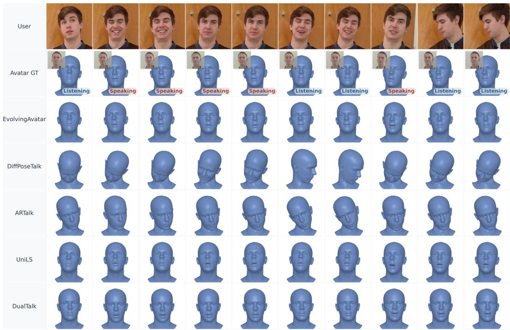  
Figure 7: Restrained neck and mouth motion across activities. EvolvingAvatar preserves the reference’s slightly raised chin and small speaking openings, with a more restrained mouth shape in the intervening listening columns. UniLS opens the mouth too widely at several of these selected instants, while DiffPoseTalk and ARTalk introduce marked downward or sideways neck poses.

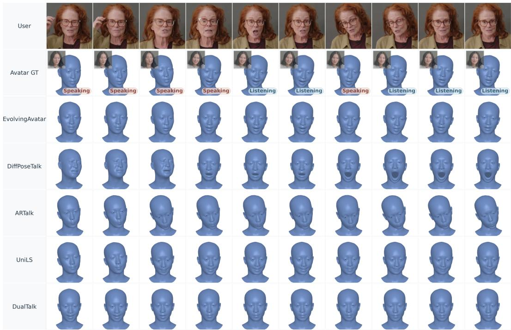  
Figure 8: Smiling while listening. EvolvingAvatar preserves the reference’s smile and moderate mouth opening in columns 4–6, across speaking and listening. UniLS and DualTalk show weaker openings there, while DiffPoseTalk exaggerates mouth opening in later sampled listening frames.

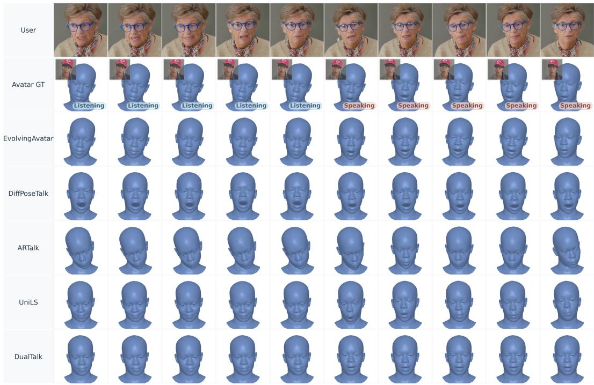  
Figure 9: From listening to speaking. EvolvingAvatar combines the tilted listening posture in columns 1–5 with the larger speaking mouth openings in columns 7–10. UniLS changes the mouth opening less consistently with Avatar GT, while DualTalk largely retains a neutral expression.

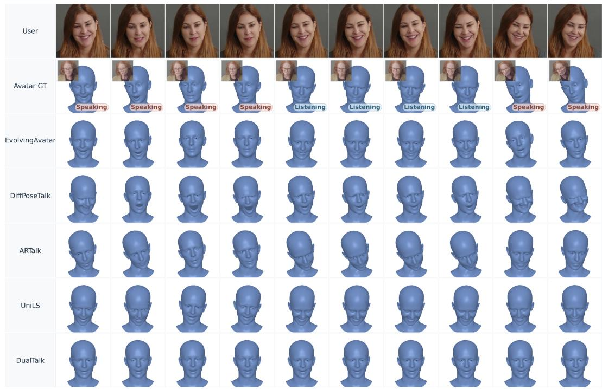  
Figure 10: Coordinating changes in expression and neck pose. EvolvingAvatar follows the reference’s slight downward tilt during listening in columns 5–8 and sideways lean in the final speaking frames. UniLS exaggerates the downward tilt during listening, while DualTalk remains largely frontal and DiffPoseTalk adds a broad grin where the reference expression is restrained.

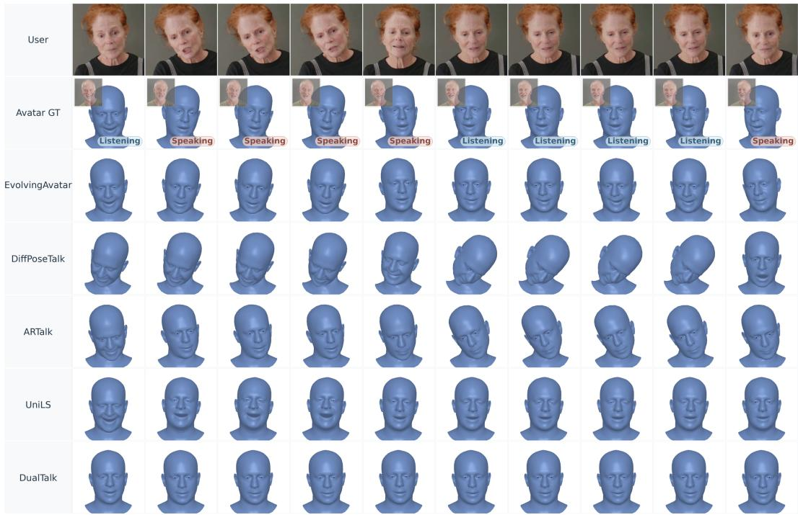  
Figure 11: Moderate mouth openings and neck motion. EvolvingAvatar captures the speaking openings and tilt in columns 2–4, then retains a listening smile. UniLS exaggerates those speaking openings and closes the eyes in columns 6–9, while DiffPoseTalk adds a larger sideways lean.

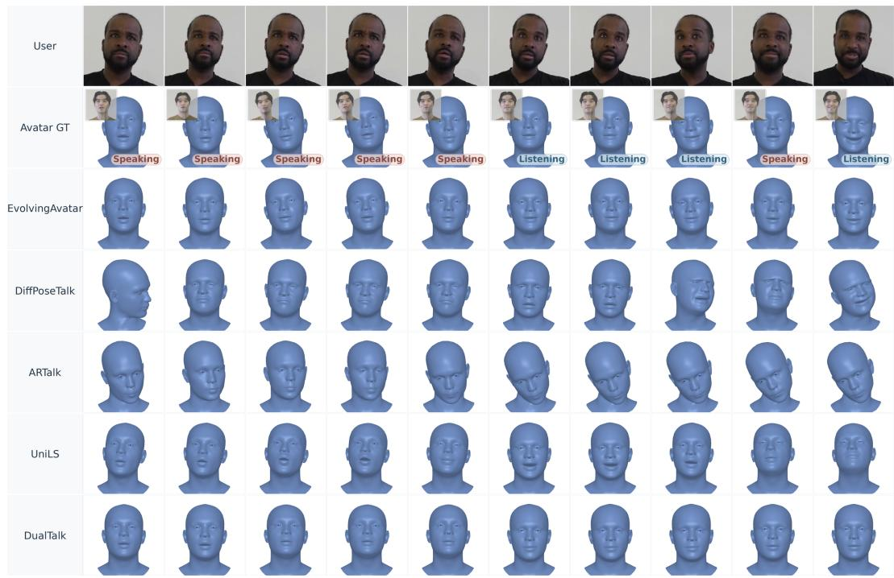  
Figure 12: Matching neck orientation and articulation together. EvolvingAvatar retains the reference’s near-upright orientation and modest changes in mouth opening across the selected speaking and listening instants. UniLS exaggerates the upward tilt or mouth opening at several instants, while ARTalk introduces a pronounced downward tilt that is absent from the reference.

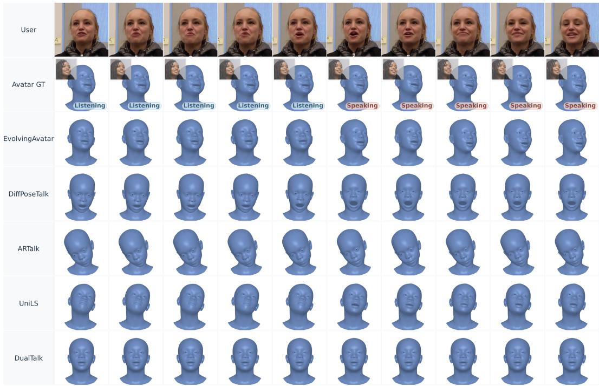  
Figure 13: An expressive listener. EvolvingAvatar follows the reference’s open-mouth smile and upward, sideways orientation during both activities. UniLS largely closes the mouth in the first five listening frames, while ARTalk tilts the face downward and DualTalk retains a more frontal pose.

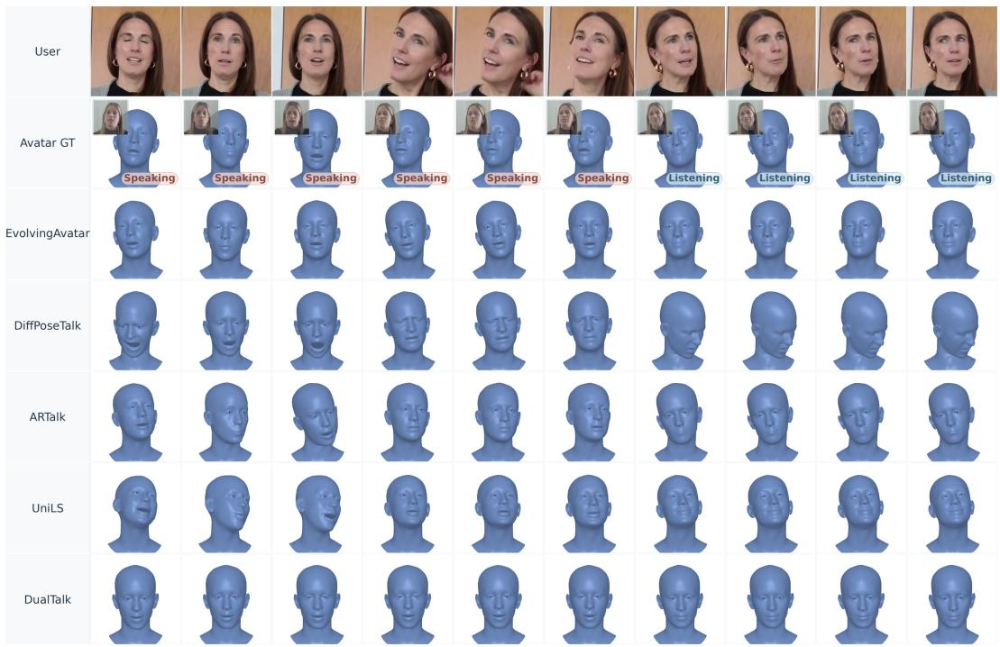  
Figure 14: From varied articulation to a listening smile. EvolvingAvatar captures the speaking openings in columns 1–6 and closed-mouth listening smile in columns 7–10. UniLS exaggerates upward tilt and early openings, while DiffPoseTalk bows and turns the face during listening.

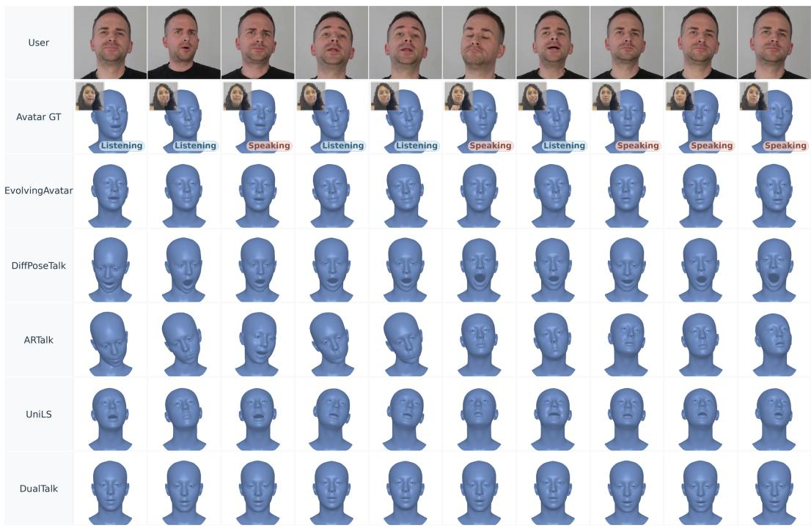  
Figure 15: Changing articulation within each activity. EvolvingAvatar follows the reference’s alternation between smaller and larger mouth openings while retaining a moderate neck pose across the sampled instants. UniLS raises the chin too far and opens the mouth in several near-closed reference frames, while DiffPoseTalk over-opens the mouth across most of the displayed columns.

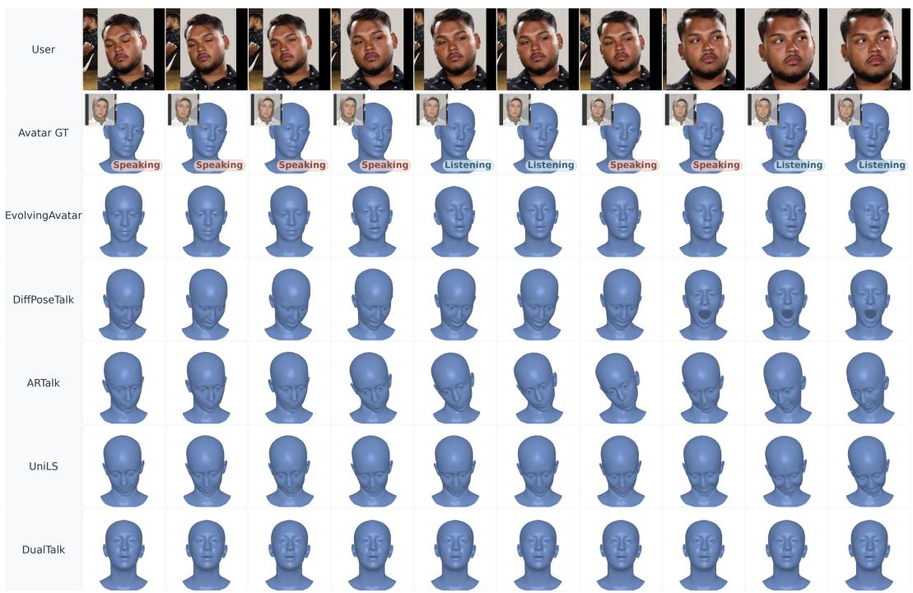  
Figure 16: Subtle articulation with an upright neck pose. EvolvingAvatar preserves the nearupright neck pose and the mild increase in mouth opening in the later columns. UniLS and ARTalk lower the face, while DiffPoseTalk replaces the small final openings with larger ones.

  
Figure 17: A smile across speaking and listening. EvolvingAvatar combines a near-frontal pose with larger speaking openings and a softer listening smile, retaining visible expression across both activities. UniLS and DualTalk understate the reference speaking expression in the first five columns, while DiffPoseTalk produces excessive mouth opening in the subsequent listening frames.

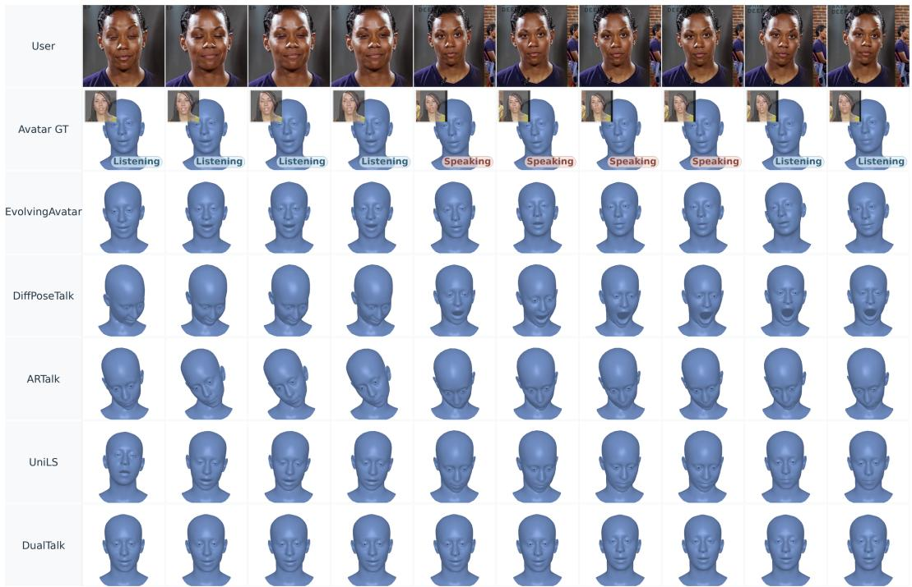  
Figure 18: Expressive listening with an upright pose. EvolvingAvatar captures the listening smile in columns 2–4 and stays near the reference orientation during speaking. UniLS and ARTalk lower the face during speaking, while DualTalk shows less of the reference variation in mouth shape.

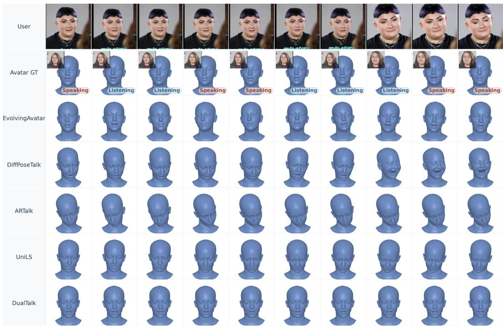  
Figure 19: A frontal smile with varying mouth opening. EvolvingAvatar preserves the reference’s upright pose and smile, including the larger openings in columns 8–9. UniLS and ARTalk lower the face, while DiffPoseTalk adds a pronounced sideways turn and wider grin in the final columns.

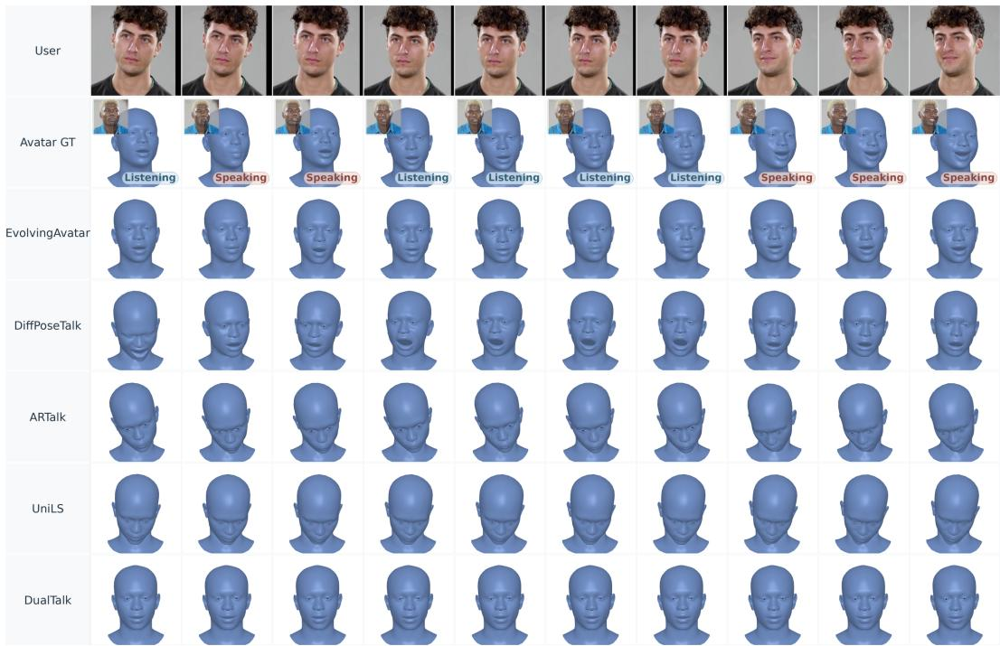  
Figure 20: Expression changes with restrained neck motion. EvolvingAvatar follows the reference’s smaller openings in columns 6–7 and broader speaking smile in columns 8–10. UniLS and ARTalk bow the head, while DualTalk shows less change in mouth shape than the reference.

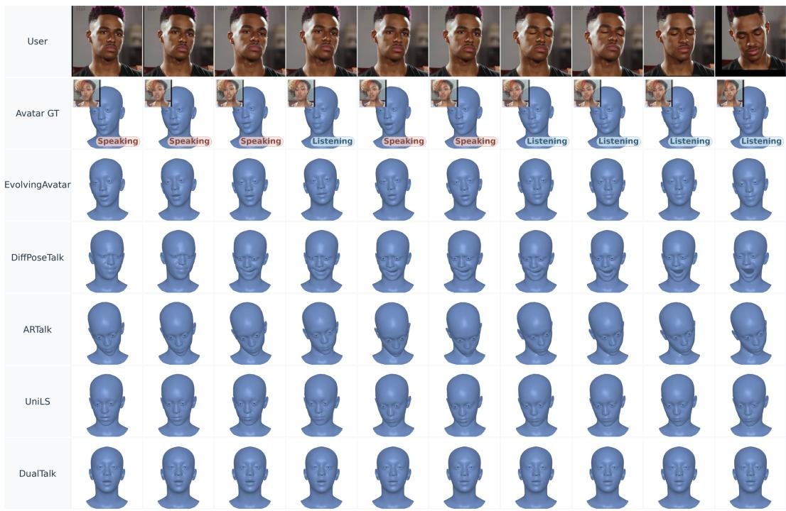  
Figure 21: Reducing articulation during listening. EvolvingAvatar remains nearly upright while following the smaller listening openings in columns 7–10. UniLS and ARTalk lower the face, while DualTalk retains a parted mouth and DiffPoseTalk produces a wider final opening than Avatar GT.

Table 6: Parameter-space comparison. Results over all valid frames. Green bold and blue underline indicate the best and second-best values within each split. Lower is better except for SID.
<table><tr><td rowspan="2">Method</td><td colspan="3">FD↓</td><td colspan="3">P-FD↓</td><td colspan="3">MSE↓</td><td colspan="3">rPCC ↓</td><td colspan="3">SID ↑</td><td rowspan="2"></td><td rowspan="2">PDD ↓ JDD ↓</td></tr><tr><td>EXP</td><td>JAW (×103)</td><td>POSE (×102)</td><td>EXP</td><td>JAW (×103)</td><td>POSE (×102)</td><td>EXP JAW (×101) (×103)</td><td>POSE (×102)</td><td>EXP (×102)</td><td>JAW (×101)</td><td>POSE (×101)</td><td>EXP</td><td>JAW</td><td>POSE</td></tr><tr><td></td><td></td><td></td><td></td><td></td><td>In-Distribution Test Set (ID)</td><td></td><td></td><td></td><td></td><td></td><td></td><td></td><td></td><td></td><td></td><td></td><td></td></tr><tr><td>DiffPoseTalk (Sun et al., 2024)</td><td>45.68</td><td>25.60</td><td>23.10</td><td>47.40</td><td>25.90</td><td>23.99</td><td>5.83</td><td>11.35</td><td>11.38</td><td>18.94</td><td>1.90</td><td>2.90</td><td>1.85</td><td>1.45</td><td>1.48</td><td>9.87</td><td>3.04</td></tr><tr><td>ARTalk (Chu et al., 2025)</td><td>22.99</td><td>3.94</td><td>21.71</td><td>23.91</td><td>4.03</td><td>22.32</td><td>2.93</td><td>1.86</td><td>9.60</td><td>21.72</td><td>1.57</td><td>3.18</td><td>1.69</td><td>1.55</td><td>1.17</td><td>5.93</td><td>1.26</td></tr><tr><td>UniLS (Chu et al., 2026)</td><td>17.19</td><td>3.05</td><td>12.95</td><td>18.20</td><td>3.18</td><td>13.37</td><td>2.45</td><td>1.79</td><td>5.60</td><td>15.86</td><td>1.48</td><td>3.16</td><td>2.31</td><td>1.90</td><td>1.04</td><td>7.52</td><td>1.03</td></tr><tr><td>DualTalk (Peng et al., 2025)</td><td>17.22</td><td>4.63</td><td>11.52</td><td>17.35</td><td>4.68</td><td>11.60</td><td>1.79</td><td>1.81</td><td>4.05</td><td>23.17</td><td>1.81</td><td>3.66</td><td>0.32</td><td>0.57</td><td>0.28</td><td>11.34</td><td>2.09</td></tr><tr><td>EVOLVINGAVATAR (Ours)</td><td>15.77</td><td>2.64</td><td>8.89</td><td>16.79</td><td>2.79</td><td>9.32</td><td>2.28</td><td>1.87</td><td>4.37</td><td>20.74</td><td>1.59</td><td>2.82</td><td>2.14</td><td>2.06</td><td>1.36</td><td>7.41</td><td>1.13</td></tr><tr><td></td><td>Out-of-Distribution Test Set (OOD)</td><td colspan="10"></td><td></td><td></td><td></td><td></td><td></td><td></td></tr><tr><td>DiffPoseTalk (Sun et al., 2024)</td><td>45.54</td><td>23.77</td><td>30.25</td><td>47.04</td><td>23.97</td><td>31.09</td><td>5.68</td><td>10.15</td><td>13.70</td><td>21.32</td><td>1.90</td><td>3.19</td><td>1.75</td><td>1.47</td><td>1.34</td><td>10.27</td><td>3.29</td></tr><tr><td>ARTalk (Chu et al., 2025)</td><td>21.82</td><td>2.54</td><td>26.65</td><td>22.64</td><td>2.61</td><td>27.25</td><td>2.72</td><td>1.24</td><td>11.09</td><td>23.04</td><td>1.61</td><td>3.42</td><td>1.66</td><td>1.66</td><td>1.09</td><td>6.02</td><td>0.90</td></tr><tr><td>UniLS (Chu et al., 2026)</td><td>16.13</td><td>2.39</td><td>14.94</td><td>16.99</td><td>2.47</td><td>15.33</td><td>2.23</td><td>1.33</td><td>6.15</td><td>15.32</td><td>1.48</td><td>3.48</td><td>2.24</td><td>1.93</td><td>0.94</td><td>7.35</td><td>0.78</td></tr><tr><td>DualTalk (Peng et al., 2025)</td><td>15.78 13.61</td><td>3.49</td><td>13.08 9.32</td><td>15.85</td><td>3.51</td><td>13.14</td><td>1.61</td><td>1.31</td><td>4.50</td><td>20.85</td><td>1.89</td><td>3.76</td><td>0.22</td><td>0.47</td><td>0.19</td><td>11.25</td><td>1.73</td></tr><tr><td>EVOLVINGAVATAR (Ours)</td><td></td><td>2.06</td><td></td><td>14.59</td><td>2.16</td><td>9.80</td><td>2.01</td><td>1.45</td><td>4.58</td><td>16.84</td><td>1.67</td><td>2.75</td><td>2.21</td><td>2.06</td><td>1.41</td><td>7.02</td><td>0.83</td></tr><tr><td>Hard Out-of-Distribution Test Set (OOD-Hard)</td><td></td><td></td><td></td><td></td><td></td><td></td><td></td><td></td><td></td><td></td><td></td><td>5.09</td><td></td><td></td><td></td><td></td><td></td></tr><tr><td colspan="10">10.28 29.64</td><td colspan="7">2.07</td></tr><tr><td>DiffPoseTalk (Sun et al., 2024) ARTalk (Chu et al., 2025)</td><td>22.41</td><td>24.55 3.97</td><td>26.56 36.19</td><td>51.91 23.09</td><td>24.71 4.03</td><td>26.95 36.49</td><td>5.82 2.61</td><td>9.64 1.66</td><td>13.01 27.77</td><td>2.06</td><td></td><td>5.67 1.30</td><td>1.66</td><td>1.22 1.20</td><td>1.16 10.74 0.58</td><td>3.26</td><td>0.94</td></tr><tr><td>UniLS (Chu et al., 2026)</td><td>21.75</td><td>3.56</td><td>22.42</td><td>22.58</td><td>3.64</td><td>22.67</td><td>2.66</td><td>1.75</td><td>8.11</td><td>21.91</td><td>2.69</td><td>5.81</td><td>1.62</td><td>1.43</td><td>0.61</td><td>5.80 4.65</td><td>0.99</td></tr><tr><td>DualTalk (Peng et al., 2025)</td><td>13.43</td><td>3.14</td><td>8.65</td><td>13.49</td><td>3.17</td><td>8.69</td><td>1.36</td><td>1.11</td><td>2.94</td><td>18.62</td><td>2.34</td><td>5.98</td><td>0.12</td><td>0.24</td><td>0.13</td><td>5.23</td><td>1.34</td></tr><tr><td>EVOLVINGAVATAR (Ours)</td><td>12.77</td><td>2.25</td><td>7.98</td><td>13.52</td><td>2.32</td><td>8.20</td><td>1.75</td><td>1.26</td><td>3.36</td><td>16.45</td><td>1.73</td><td>4.76</td><td>2.24</td><td>1.83</td><td>1.23</td><td>3.85</td><td>0.82</td></tr><tr><td></td><td></td><td></td><td></td><td></td><td></td><td></td><td></td><td></td><td></td><td></td><td></td><td></td><td></td><td></td><td></td><td></td><td></td></tr></table>

Table 7: Mesh-space comparison. All-frame results. LVE and MHD are measured in millimeters. Green bold and blue underlined values mark the best and second best in each split. Lower is better.
<table><tr><td rowspan="2">Method</td><td colspan="3">ID</td><td colspan="3">OOD</td><td colspan="3">OOD-Hard</td></tr><tr><td>FDD↓</td><td>LVE↓</td><td>MHD↓</td><td>FDD↓</td><td>LVE↓</td><td>MHD↓</td><td>FDD↓</td><td>LVE↓</td><td>MHD↓</td></tr><tr><td>DiffPoseTalk (Sun et al., 2024)</td><td>40.03</td><td>19.77</td><td>4.28</td><td>40.37</td><td>18.52</td><td>4.09</td><td>44.83</td><td>18.31</td><td>4.02</td></tr><tr><td>ARTalk (Chu et al., 2025)</td><td>35.22</td><td>11.17</td><td>2.62</td><td>30.51</td><td>9.35</td><td>2.22</td><td>19.51</td><td>10.09</td><td>2.34</td></tr><tr><td>UniLS (Chu et al., 2026)</td><td>30.39</td><td>9.33</td><td>2.10</td><td>27.64</td><td>8.33</td><td>1.87</td><td>21.65</td><td>10.65</td><td>2.34</td></tr><tr><td>DualTalk (Peng et al., 2025)</td><td>66.70</td><td>8.87</td><td>1.96</td><td>61.46</td><td>7.71</td><td>1.71</td><td>40.10</td><td>7.60</td><td>1.66</td></tr><tr><td>EVOLVINGAVATAR (Ours)</td><td>37.91</td><td>9.83</td><td>2.18</td><td>31.53</td><td>8.74</td><td>1.92</td><td>17.87</td><td>8.71</td><td>1.89</td></tr></table>

## C ALL-FRAME QUANTITATIVE RESULTS

We outperform baselines on all-frame motion statistics. EVOLVINGAVATAR outperforms all four baselines in expression, neck, and jaw FD across splits (Table 6). Metrics are recomputed over all valid speaking and listening frames, including overlapping speech and silence. This extends activity-specific comparisons to statistics over the conversational timeline. P-FD also favors our method except for OOD-Hard expression, where DualTalk is slightly lower (13.49 versus 13.52).

Our mesh motion advantage is strongest on OOD-Hard. EVOLVINGAVATAR outperforms all baselines in all-frame mesh FDD on OOD-Hard (Table 7), indicating closer upper-face motion amplitudes. UniLS leads FDD on ID/OOD, while DualTalk has lower LVE and MHD across splits. As in the main results, motion statistics and agreement with one reference assess different aspects of quality. Parameter metrics also assess neck motion, which mesh evaluation excludes. Both spaces offer complementary evidence, with human judgments assessing perceived conversational quality.

Table 8: Context signals in parameter space. Speaking/listening results. Green bold and blue underlining denote the best and second best per split and state. Lower is better except SID.
<table><tr><td rowspan=1 colspan=18>FD↓           P-FD↓          MSE↓          rPCC↓           SID ↑Method           JAWNECK      JAWNECKEXP JAWNECKEXP JAWNECK                PDD ↓ JDD ↓EXP            EXP                                             EXP JAWNECK(×103)(×102)     (×103)(×102)(×101)(×103)(×102)(×102)(×101)(×101)In-Distribution Test Set (ID)</td></tr><tr><td rowspan=1 colspan=1>UniLS (Chu et al., 2026)</td><td rowspan=1 colspan=4>15.99 2.36 12.31 17.05</td><td rowspan=1 colspan=2>2.45 12.76</td><td rowspan=1 colspan=2>2.32 1.30</td><td rowspan=1 colspan=1>5.36</td><td rowspan=1 colspan=2>14.73 1.07</td><td rowspan=1 colspan=1>3.37</td><td rowspan=1 colspan=2>2.84 2.20</td><td rowspan=1 colspan=2>1.13 7.36</td><td rowspan=1 colspan=1>0.84</td></tr><tr><td rowspan=1 colspan=1>DualTalk (Peng et al., 2025)</td><td rowspan=1 colspan=4>16.80 4.17 12.05 16.97</td><td rowspan=1 colspan=2>4.23 12.16</td><td rowspan=1 colspan=2>1.74 1.59</td><td rowspan=1 colspan=1>4.21</td><td rowspan=1 colspan=2>20.69 1.31</td><td rowspan=1 colspan=1>4.13</td><td rowspan=1 colspan=2>0.31 0.49</td><td rowspan=1 colspan=2>0.25 11.37</td><td rowspan=1 colspan=1>2.08</td></tr><tr><td rowspan=1 colspan=1>Ours (FLAME)</td><td rowspan=1 colspan=3>14.24 2.13 9.07</td><td rowspan=1 colspan=1>15.41</td><td rowspan=1 colspan=2>2.28 9.55</td><td rowspan=1 colspan=2>2.18 1.68</td><td rowspan=1 colspan=1>4.57</td><td rowspan=1 colspan=2>18.78 1.24</td><td rowspan=1 colspan=1>3.07</td><td rowspan=1 colspan=2>2.43 2.16</td><td rowspan=1 colspan=2>1.44 6.89</td><td rowspan=1 colspan=1>0.94</td></tr><tr><td rowspan=1 colspan=1>Ours (RGB)</td><td rowspan=1 colspan=3>15.49 2.40 9.39</td><td rowspan=1 colspan=1>16.64</td><td rowspan=1 colspan=2>2.56 9.87</td><td rowspan=1 colspan=1>2.27</td><td rowspan=1 colspan=1>1.78</td><td rowspan=1 colspan=1>4.61</td><td rowspan=1 colspan=2>19.01 1.25</td><td rowspan=1 colspan=1>3.17</td><td rowspan=1 colspan=2>2.30 2.13</td><td rowspan=1 colspan=2>1.35 7.09</td><td rowspan=1 colspan=1>0.92</td></tr><tr><td rowspan=1 colspan=1></td><td rowspan=1 colspan=3></td><td rowspan=1 colspan=1></td><td rowspan=1 colspan=2></td><td rowspan=1 colspan=1>Liste</td><td rowspan=1 colspan=1>ning</td><td rowspan=1 colspan=1></td><td rowspan=1 colspan=2></td><td rowspan=1 colspan=1></td><td rowspan=1 colspan=2></td><td rowspan=1 colspan=1></td><td rowspan=1 colspan=1></td><td rowspan=1 colspan=1></td></tr><tr><td rowspan=1 colspan=1>UniLS (Chu et al., 2026)</td><td rowspan=1 colspan=3>18.61 3.60 13.07</td><td rowspan=1 colspan=1>19.74</td><td rowspan=1 colspan=2>3.73 13.53</td><td rowspan=1 colspan=1>2.50</td><td rowspan=1 colspan=1>2.00</td><td rowspan=1 colspan=1>5.45</td><td rowspan=1 colspan=2>17.34 1.65</td><td rowspan=1 colspan=1>3.25</td><td rowspan=1 colspan=2>1.99 1.65</td><td rowspan=1 colspan=1>0.95</td><td rowspan=1 colspan=1>7.08</td><td rowspan=1 colspan=1>1.10</td></tr><tr><td rowspan=1 colspan=1>DualTalk (Peng et al., 2025)</td><td rowspan=1 colspan=3>17.64 5.07 11.06</td><td rowspan=1 colspan=1>17.78</td><td rowspan=1 colspan=2>5.11 11.14</td><td rowspan=1 colspan=1>1.82</td><td rowspan=1 colspan=1>1.95</td><td rowspan=1 colspan=1>3.88</td><td rowspan=1 colspan=2>24.94 2.01</td><td rowspan=1 colspan=1>3.65</td><td rowspan=1 colspan=2>0.33 0.54</td><td rowspan=1 colspan=1>0.28</td><td rowspan=1 colspan=1>10.31</td><td rowspan=1 colspan=1>1.99</td></tr><tr><td rowspan=1 colspan=1>Ours (audio)</td><td rowspan=1 colspan=3>15.09 3.08 8.79</td><td rowspan=1 colspan=1>16.30</td><td rowspan=1 colspan=2>3.23 9.31</td><td rowspan=1 colspan=1>2.17</td><td rowspan=1 colspan=1>1.88</td><td rowspan=1 colspan=1>4.25</td><td rowspan=1 colspan=2>19.79 1.71</td><td rowspan=1 colspan=1>3.05</td><td rowspan=1 colspan=2>2.15 1.86</td><td rowspan=1 colspan=1>1.39</td><td rowspan=1 colspan=1>6.73</td><td rowspan=1 colspan=1>1.26</td></tr><tr><td rowspan=1 colspan=1>Ours (FLAME)</td><td rowspan=1 colspan=3>15.57 2.94 8.46</td><td rowspan=1 colspan=1>16.73</td><td rowspan=1 colspan=1>3.10</td><td rowspan=1 colspan=1>8.95</td><td rowspan=1 colspan=1>2.19</td><td rowspan=1 colspan=1>1.84</td><td rowspan=1 colspan=1>4.08</td><td rowspan=1 colspan=2>23.39 1.79</td><td rowspan=1 colspan=1>2.81</td><td rowspan=1 colspan=1>2.10</td><td rowspan=1 colspan=1>1.89</td><td rowspan=1 colspan=1>1.39</td><td rowspan=1 colspan=1>6.77</td><td rowspan=1 colspan=1>1.23</td></tr><tr><td rowspan=1 colspan=1>Ours (RGB)</td><td rowspan=1 colspan=2>17.01 3.17</td><td rowspan=1 colspan=1>8.99</td><td rowspan=1 colspan=1>18.13</td><td rowspan=1 colspan=1>3.33</td><td rowspan=1 colspan=1>9.46</td><td rowspan=1 colspan=2>2.30 1.95</td><td rowspan=1 colspan=1>4.18</td><td rowspan=1 colspan=2>22.45 1.78</td><td rowspan=1 colspan=1>2.88</td><td rowspan=1 colspan=1>1.95</td><td rowspan=1 colspan=1>1.87</td><td rowspan=1 colspan=1>1.29</td><td rowspan=1 colspan=1>6.97</td><td rowspan=1 colspan=1>1.23</td></tr><tr><td rowspan=1 colspan=1></td><td rowspan=1 colspan=2></td><td rowspan=1 colspan=1></td><td rowspan=1 colspan=1></td><td rowspan=1 colspan=1>Ou</td><td rowspan=1 colspan=1>t-of-Dist</td><td rowspan=1 colspan=2>ribution Test</td><td rowspan=1 colspan=1>Set (OOD)</td><td rowspan=1 colspan=2></td><td rowspan=1 colspan=1></td><td rowspan=1 colspan=2></td><td rowspan=1 colspan=1></td><td rowspan=1 colspan=1></td><td rowspan=1 colspan=1></td></tr><tr><td rowspan=1 colspan=1></td><td rowspan=1 colspan=1></td><td rowspan=1 colspan=1></td><td rowspan=1 colspan=1></td><td rowspan=1 colspan=1></td><td rowspan=1 colspan=1></td><td rowspan=1 colspan=1></td><td rowspan=1 colspan=1>Spec</td><td rowspan=1 colspan=1>king</td><td rowspan=1 colspan=1></td><td rowspan=1 colspan=2></td><td rowspan=1 colspan=1></td><td rowspan=1 colspan=2></td><td rowspan=1 colspan=1></td><td rowspan=1 colspan=1></td><td rowspan=1 colspan=1></td></tr><tr><td rowspan=1 colspan=1>UniLS (Chu et al., 2026)</td><td rowspan=1 colspan=1>15.41</td><td rowspan=1 colspan=1>2.14</td><td rowspan=1 colspan=1>13.58</td><td rowspan=1 colspan=1>16.37</td><td rowspan=1 colspan=1>2.21</td><td rowspan=1 colspan=1>14.00</td><td rowspan=1 colspan=1>2.15</td><td rowspan=1 colspan=1>1.06</td><td rowspan=1 colspan=1>5.68</td><td rowspan=1 colspan=1>14.70</td><td rowspan=1 colspan=1>1.10</td><td rowspan=1 colspan=1>3.69</td><td rowspan=1 colspan=2>2.69 2.15</td><td rowspan=1 colspan=1>1.02</td><td rowspan=1 colspan=1>7.00</td><td rowspan=1 colspan=1>0.65</td></tr><tr><td rowspan=1 colspan=1>DualTalk (Peng et al., 2025)</td><td rowspan=1 colspan=1>15.80</td><td rowspan=1 colspan=1>3.23</td><td rowspan=1 colspan=1>12.86</td><td rowspan=1 colspan=1>15.91</td><td rowspan=1 colspan=1>3.26</td><td rowspan=1 colspan=1>12.94</td><td rowspan=1 colspan=1>1.61</td><td></td><td></td><td></td><td></td><td></td><td></td><td></td><td></td><td></td><td></td></tr><tr><td rowspan=1 colspan=1>Ours (audio)</td><td rowspan=1 colspan=1>12.97</td><td rowspan=1 colspan=1>2.02</td><td rowspan=1 colspan=1>9.94</td><td rowspan=1 colspan=1>14.13</td><td rowspan=1 colspan=1>2.12</td><td rowspan=1 colspan=1>10.43</td><td rowspan=1 colspan=1>1.99</td><td rowspan=1 colspan=1>1.39</td><td rowspan=1 colspan=1>4.84</td><td rowspan=1 colspan=1>14.29</td><td rowspan=1 colspan=1>1.26</td><td rowspan=1 colspan=1>3.39</td><td rowspan=1 colspan=2>2.52 2.13</td><td rowspan=1 colspan=1>1.38</td><td rowspan=1 colspan=1>6.66</td><td rowspan=1 colspan=1>0.69</td></tr><tr><td rowspan=1 colspan=1>Ours (FLAME)</td><td rowspan=1 colspan=1>13.46</td><td rowspan=1 colspan=1>1.96</td><td rowspan=1 colspan=1>9.88</td><td rowspan=1 colspan=1>14.61</td><td rowspan=1 colspan=1>2.06</td><td rowspan=1 colspan=1>10.37</td><td rowspan=1 colspan=1>2.02</td><td rowspan=1 colspan=1>1.36</td><td rowspan=1 colspan=1>4.77</td><td rowspan=1 colspan=1>16.39</td><td rowspan=1 colspan=1>1.24</td><td rowspan=1 colspan=1>3.15</td><td rowspan=1 colspan=1>2.45</td><td rowspan=1 colspan=1>2.13</td><td rowspan=1 colspan=1>1.35</td><td rowspan=1 colspan=1>6.65</td><td rowspan=1 colspan=1>0.72</td></tr><tr><td rowspan=1 colspan=1>Ours (RGB)</td><td rowspan=1 colspan=1>14.10</td><td rowspan=1 colspan=1>2.24</td><td rowspan=1 colspan=1>9.46</td><td rowspan=1 colspan=1>15.21</td><td rowspan=1 colspan=1>2.35</td><td rowspan=1 colspan=1>9.94</td><td rowspan=1 colspan=1>2.05</td><td rowspan=1 colspan=1>1.45</td><td rowspan=1 colspan=1>4.59</td><td rowspan=1 colspan=1>15.32</td><td rowspan=1 colspan=1>1.24</td><td rowspan=1 colspan=1>3.17</td><td rowspan=1 colspan=1>2.33</td><td rowspan=1 colspan=1>2.06</td><td rowspan=1 colspan=1>1.35</td><td rowspan=1 colspan=1>6.81</td><td rowspan=1 colspan=1>0.73</td></tr><tr><td rowspan=1 colspan=1>UniLS (Chu et al., 2026)</td><td rowspan=1 colspan=1>17.53</td><td rowspan=1 colspan=1>2.97</td><td rowspan=1 colspan=1>15.60</td><td rowspan=1 colspan=1>18.51</td><td rowspan=1 colspan=1>3.07</td><td rowspan=1 colspan=1>16.05</td><td rowspan=1 colspan=1>2.26</td><td rowspan=1 colspan=1>1.54</td><td rowspan=1 colspan=1>6.17</td><td rowspan=1 colspan=1>16.63</td><td rowspan=1 colspan=1>1.72</td><td rowspan=1 colspan=1>3.69</td><td rowspan=1 colspan=1>1.89</td><td rowspan=1 colspan=1>1.61</td><td rowspan=1 colspan=1>0.81</td><td rowspan=1 colspan=1>6.93</td><td rowspan=1 colspan=1>0.87</td></tr><tr><td rowspan=1 colspan=1>Ours (audio)</td><td rowspan=1 colspan=1>13.65</td><td rowspan=1 colspan=1>2.18</td><td rowspan=1 colspan=1>10.53</td><td rowspan=1 colspan=1>14.81</td><td rowspan=1 colspan=1>2.30</td><td rowspan=1 colspan=1>11.12</td><td rowspan=1 colspan=1>1.95</td><td rowspan=1 colspan=1>1.43</td><td rowspan=1 colspan=1>4.81</td><td rowspan=1 colspan=1>17.48</td><td rowspan=1 colspan=1>1.91</td><td rowspan=1 colspan=1>3.35</td><td rowspan=1 colspan=1>2.26</td><td rowspan=1 colspan=1>1.89</td><td rowspan=1 colspan=1>1.31</td><td rowspan=1 colspan=1>6.53</td><td rowspan=1 colspan=1>0.87</td></tr><tr><td rowspan=1 colspan=1>Ours (FLAME)</td><td rowspan=1 colspan=1>14.01</td><td rowspan=1 colspan=1>2.17</td><td rowspan=1 colspan=1>10.33</td><td rowspan=1 colspan=1>15.14</td><td rowspan=1 colspan=1>2.29</td><td rowspan=1 colspan=1>10.89</td><td rowspan=1 colspan=1>1.96</td><td rowspan=1 colspan=1>1.41</td><td rowspan=1 colspan=1>4.68</td><td rowspan=1 colspan=1>20.44</td><td rowspan=1 colspan=1>1.95</td><td rowspan=1 colspan=1>3.04</td><td rowspan=1 colspan=1>2.18</td><td rowspan=1 colspan=1>1.86</td><td rowspan=1 colspan=1>1.30</td><td rowspan=1 colspan=1>6.50</td><td rowspan=1 colspan=1>0.89</td></tr><tr><td rowspan=1 colspan=1>Ours (RGB)</td><td rowspan=1 colspan=1>14.61</td><td rowspan=1 colspan=1>2.37</td><td rowspan=1 colspan=1>9.90</td><td rowspan=1 colspan=1>15.70</td><td rowspan=1 colspan=1>2.49</td><td rowspan=1 colspan=1>10.45</td><td rowspan=1 colspan=1>1.99</td><td rowspan=1 colspan=1>1.47</td><td rowspan=1 colspan=1>4.52</td><td rowspan=1 colspan=1>18.92</td><td rowspan=1 colspan=1>1.96</td><td rowspan=1 colspan=1>3.04</td><td rowspan=1 colspan=1>2.05</td><td rowspan=1 colspan=1>1.83</td><td rowspan=1 colspan=1>1.29</td><td rowspan=1 colspan=1>6.61</td><td rowspan=1 colspan=1>0.89</td></tr><tr><td rowspan=1 colspan=1></td><td rowspan=1 colspan=2></td><td rowspan=1 colspan=1></td><td rowspan=1 colspan=1></td><td rowspan=1 colspan=1>Hard Out</td><td rowspan=1 colspan=1>-of-Dist</td><td rowspan=1 colspan=1>ributi</td><td rowspan=1 colspan=1>on Test</td><td rowspan=1 colspan=1>Set (OOD</td><td rowspan=1 colspan=1>-Hard)</td><td rowspan=1 colspan=1></td><td rowspan=1 colspan=1></td><td rowspan=1 colspan=2></td><td rowspan=1 colspan=1></td><td rowspan=1 colspan=1></td><td rowspan=1 colspan=1></td></tr><tr><td rowspan=1 colspan=1></td><td rowspan=1 colspan=1></td><td rowspan=1 colspan=1></td><td rowspan=1 colspan=1></td><td rowspan=1 colspan=1></td><td rowspan=1 colspan=1></td><td rowspan=1 colspan=1></td><td rowspan=1 colspan=1>Speak</td><td rowspan=1 colspan=1>ing</td><td rowspan=1 colspan=1></td><td rowspan=1 colspan=1></td><td rowspan=1 colspan=1></td><td rowspan=1 colspan=1></td><td rowspan=1 colspan=1></td><td rowspan=1 colspan=1></td><td rowspan=1 colspan=1></td><td rowspan=1 colspan=1></td><td rowspan=1 colspan=1></td></tr><tr><td rowspan=1 colspan=1>UniLS (Chu et al., 2026)</td><td rowspan=1 colspan=1>20.87</td><td rowspan=1 colspan=1>3.84</td><td rowspan=1 colspan=1>26.15</td><td rowspan=1 colspan=1>21.64</td><td rowspan=1 colspan=1>3.91</td><td rowspan=1 colspan=1>26.38</td><td rowspan=1 colspan=1>2.56</td><td rowspan=1 colspan=1>1.88</td><td rowspan=1 colspan=1>9.33</td><td rowspan=1 colspan=1>19.01</td><td rowspan=1 colspan=1>2.28</td><td rowspan=1 colspan=1>6.04</td><td rowspan=1 colspan=1>1.83</td><td rowspan=1 colspan=1>1.58</td><td rowspan=1 colspan=1>0.55</td><td rowspan=1 colspan=1>4.01</td><td rowspan=1 colspan=1>0.81</td></tr><tr><td rowspan=1 colspan=1>DualTalk (Peng et al., 2025)</td><td rowspan=1 colspan=1>13.83</td><td rowspan=1 colspan=1>3.17</td><td rowspan=1 colspan=1>8.77</td><td rowspan=1 colspan=1>13.89</td><td rowspan=1 colspan=1>3.18</td><td rowspan=1 colspan=1>8.81</td><td rowspan=1 colspan=1>1.39</td><td rowspan=1 colspan=1>1.10</td><td rowspan=1 colspan=1>2.97</td><td rowspan=1 colspan=1>16.73</td><td rowspan=1 colspan=1>1.49</td><td rowspan=1 colspan=1>6.46</td><td rowspan=1 colspan=1>0.08</td><td rowspan=1 colspan=1>0.21</td><td rowspan=1 colspan=1>0.13</td><td rowspan=1 colspan=1>5.70</td><td rowspan=1 colspan=1>1.48</td></tr><tr><td rowspan=1 colspan=1>Ours (audio)</td><td rowspan=1 colspan=1>13.87</td><td rowspan=1 colspan=1>2.23</td><td rowspan=1 colspan=1>9.08</td><td rowspan=1 colspan=1>14.70</td><td rowspan=1 colspan=1>2.31</td><td rowspan=1 colspan=1>9.35</td><td rowspan=1 colspan=1>1.89</td><td rowspan=1 colspan=1>1.37</td><td rowspan=1 colspan=1>3.89</td><td rowspan=1 colspan=1>15.91</td><td rowspan=1 colspan=1>1.30</td><td rowspan=1 colspan=1>5.48</td><td rowspan=1 colspan=1>2.29</td><td rowspan=1 colspan=1>2.04</td><td rowspan=1 colspan=1>1.15</td><td rowspan=1 colspan=1>3.74</td><td rowspan=1 colspan=1>0.66</td></tr><tr><td rowspan=1 colspan=1>Ours (FLAME)</td><td rowspan=1 colspan=1>12.87</td><td rowspan=1 colspan=1>2.20</td><td rowspan=1 colspan=1>7.55</td><td rowspan=1 colspan=1>13.65</td><td rowspan=1 colspan=1>2.27</td><td rowspan=1 colspan=1>7.79</td><td rowspan=1 colspan=1>1.77</td><td rowspan=1 colspan=1>1.33</td><td rowspan=1 colspan=1>3.27</td><td rowspan=1 colspan=1>15.65</td><td rowspan=1 colspan=1>1.32</td><td rowspan=1 colspan=1>4.99</td><td rowspan=1 colspan=1>2.36</td><td rowspan=1 colspan=1>1.99</td><td rowspan=1 colspan=1>1.19</td><td rowspan=1 colspan=1>3.46</td><td rowspan=1 colspan=1>0.65</td></tr><tr><td rowspan=1 colspan=1>Ours (RGB)</td><td rowspan=1 colspan=1>12.72</td><td rowspan=1 colspan=1>2.47</td><td rowspan=1 colspan=1>8.14</td><td rowspan=1 colspan=1>13.50</td><td rowspan=1 colspan=1>2.54</td><td rowspan=1 colspan=1>8.40</td><td rowspan=1 colspan=1>1.75</td><td rowspan=1 colspan=1>1.39</td><td rowspan=1 colspan=1>3.46</td><td rowspan=1 colspan=1>15.44</td><td rowspan=1 colspan=1>1.34</td><td rowspan=1 colspan=1>5.45</td><td rowspan=1 colspan=1>2.36</td><td rowspan=1 colspan=1>1.93</td><td rowspan=1 colspan=1>1.17</td><td rowspan=1 colspan=1>3.38</td><td rowspan=1 colspan=1>0.68</td></tr><tr><td rowspan=1 colspan=1></td><td rowspan=1 colspan=1></td><td rowspan=1 colspan=1></td><td rowspan=1 colspan=1></td><td rowspan=1 colspan=1></td><td rowspan=1 colspan=1></td><td rowspan=1 colspan=1></td><td rowspan=1 colspan=1></td><td rowspan=1 colspan=1></td><td rowspan=1 colspan=1></td><td rowspan=1 colspan=1></td><td rowspan=1 colspan=1></td><td rowspan=1 colspan=1></td><td rowspan=1 colspan=1></td><td rowspan=1 colspan=1></td><td rowspan=1 colspan=1></td><td rowspan=1 colspan=1></td><td rowspan=1 colspan=1></td></tr><tr><td rowspan=1 colspan=1>UniLS (Chu et al., 2026)</td><td rowspan=1 colspan=1>22.76</td><td rowspan=1 colspan=1>3.92</td><td rowspan=1 colspan=1>22.61</td><td rowspan=1 colspan=1>23.70</td><td rowspan=1 colspan=1>4.03</td><td rowspan=1 colspan=1>22.88</td><td rowspan=1 colspan=1>2.70</td><td rowspan=1 colspan=1>1.84</td><td rowspan=1 colspan=1>8.10</td><td rowspan=1 colspan=1>22.93</td><td rowspan=1 colspan=1>2.86</td><td rowspan=1 colspan=1>5.86</td><td rowspan=1 colspan=1>1.47</td><td rowspan=1 colspan=1>1.29</td><td rowspan=1 colspan=1>0.58</td><td rowspan=1 colspan=1>4.63</td><td rowspan=1 colspan=1>1.05</td></tr><tr><td rowspan=1 colspan=1>DualTalk (Peng et al., 2025)</td><td rowspan=1 colspan=1>13.50</td><td rowspan=1 colspan=1>3.25</td><td rowspan=1 colspan=1>8.61</td><td rowspan=1 colspan=1>13.57</td><td rowspan=1 colspan=1>3.28</td><td rowspan=1 colspan=1>8.65</td><td rowspan=1 colspan=1>1.36</td><td rowspan=1 colspan=1>1.14</td><td rowspan=1 colspan=1>2.92</td><td rowspan=1 colspan=1>18.77</td><td rowspan=1 colspan=1>2.44</td><td rowspan=1 colspan=1>6.02</td><td rowspan=1 colspan=1>0.13</td><td rowspan=1 colspan=1>0.22</td><td rowspan=1 colspan=1>0.13</td><td rowspan=1 colspan=1>4.81</td><td rowspan=1 colspan=1>1.30</td></tr><tr><td rowspan=1 colspan=1>Ours (audio)</td><td rowspan=1 colspan=1>14.41</td><td rowspan=1 colspan=1>2.43</td><td rowspan=1 colspan=1>9.56</td><td rowspan=1 colspan=1>15.36</td><td rowspan=1 colspan=1>2.54</td><td rowspan=1 colspan=1>9.83</td><td rowspan=1 colspan=1>1.89</td><td rowspan=1 colspan=1>1.35</td><td rowspan=1 colspan=1>3.88</td><td rowspan=1 colspan=1>17.29</td><td rowspan=1 colspan=1>1.81</td><td rowspan=1 colspan=1>5.36</td><td rowspan=1 colspan=1>2.11</td><td rowspan=1 colspan=1>1.81</td><td rowspan=1 colspan=1>1.13</td><td rowspan=1 colspan=1>4.49</td><td rowspan=1 colspan=1>0.89</td></tr><tr><td rowspan=1 colspan=1>Ours (FLAME)</td><td rowspan=1 colspan=1>13.34</td><td rowspan=1 colspan=1>2.29</td><td rowspan=1 colspan=1>7.61</td><td rowspan=1 colspan=1>14.20</td><td rowspan=1 colspan=1>2.39</td><td rowspan=1 colspan=1>7.83</td><td rowspan=1 colspan=1>1.76</td><td rowspan=1 colspan=1>1.28</td><td rowspan=1 colspan=1>3.13</td><td rowspan=1 colspan=1>16.93</td><td rowspan=1 colspan=1>1.82</td><td rowspan=1 colspan=1>4.71</td><td rowspan=1 colspan=1>2.14</td><td rowspan=1 colspan=1>1.81</td><td rowspan=1 colspan=1>1.17</td><td rowspan=1 colspan=1>3.95</td><td rowspan=1 colspan=1>0.86</td></tr><tr><td rowspan=1 colspan=1>Ours (RGB)</td><td rowspan=1 colspan=1>13.39</td><td rowspan=1 colspan=1>2.54</td><td rowspan=1 colspan=1>8.25</td><td rowspan=1 colspan=1>14.25</td><td rowspan=1 colspan=1>2.63</td><td rowspan=1 colspan=1>8.48</td><td rowspan=1 colspan=3>1.75 1.31 3.34</td><td rowspan=1 colspan=1>16.82</td><td rowspan=1 colspan=1>1.84</td><td rowspan=1 colspan=1>4.98</td><td rowspan=1 colspan=1>2.09</td><td rowspan=1 colspan=1>1.69</td><td rowspan=1 colspan=1>1.11</td><td rowspan=1 colspan=1>3.85</td><td rowspan=1 colspan=1>0.85</td></tr></table>

Table 9: Context signals in mesh space. Speaking/listening results with LVE/MHD in millimeters. Best and second best per split and state use green bold and blue underlining. Lower is better.
<table><tr><td rowspan="3">Method</td><td colspan="6">ID</td><td colspan="6">OOD</td><td colspan="6">OOD-Hard</td></tr><tr><td colspan="3">Speaking</td><td colspan="3">Listening</td><td colspan="2">Speaking</td><td colspan="3">Listening</td><td colspan="3">Speaking</td><td colspan="3">Listening</td></tr><tr><td>|FDD ↓ LVE ↓ MHD ↓ FDD ↓ LVE ↓ MHD ↓ FDD ↓ LVE ↓ MHD ↓ FDD ↓ LVE ↓ MHD ↓ |1</td><td></td><td></td><td></td><td></td><td></td><td></td><td></td><td></td><td></td><td></td><td></td><td></td><td></td><td></td><td></td><td>FDD ↓ LVE ↓ MHD ↓ FDD ↓ LVE ↓ MHD ↓</td></tr><tr><td>UniLS (Chu et al., 2026)</td><td>29.21</td><td>7.62</td><td>1.79</td><td>31.11</td><td>9.92</td><td>2.21</td><td>27.37</td><td>7.29 1.71</td><td>28.19</td><td>8.91</td><td>1.97</td><td>21.84</td><td>10.28</td><td>2.27</td><td>21.78</td><td>10.82</td><td>2.37</td></tr><tr><td>DualTalk (Peng et al., 2025)</td><td>68.51</td><td>8.12</td><td>1.84</td><td>61.57</td><td>9.26</td><td>2.03</td><td>64.35 7.29</td><td>1.65</td><td>55.63</td><td>8.03</td><td>1.75</td><td>42.83</td><td>7.65</td><td>1.67</td><td>38.31</td><td>7.64</td><td>1.67</td></tr><tr><td>Ours (audio)</td><td>36.64</td><td>9.15</td><td>2.05</td><td>35.49</td><td>9.91</td><td>2.17</td><td>32.36 8.45</td><td>1.89</td><td>28.49</td><td>8.83</td><td>1.93</td><td>18.90</td><td>9.06</td><td>1.97</td><td>18.35</td><td>9.24</td><td>2.00</td></tr><tr><td>Ours (FLAME)</td><td>36.96</td><td>9.16</td><td>2.06</td><td>35.49</td><td>9.90</td><td>2.18</td><td>33.09</td><td>8.34 1.87</td><td>29.22</td><td>8.73</td><td>1.91</td><td>18.74</td><td>8.73</td><td>1.90</td><td>18.14</td><td>8.77</td><td>1.90</td></tr><tr><td>Ours (RGB)</td><td>37.63</td><td>9.35</td><td>2.10</td><td>36.23</td><td>10.08</td><td>2.22</td><td>33.96</td><td>8.55</td><td>1.90</td><td>29.68 8.84</td><td>1.93</td><td>19.09</td><td>8.83</td><td>1.92</td><td>18.13</td><td>8.76</td><td>1.89</td></tr></table>

## D CONTEXT SIGNAL COMPARISON

Context choices follow the task definition. Following Section 3, we compare dyadic audio alone, audio with user RGB frames, and audio with pre-extracted user FLAME. Tables 8 and 9 compare speaking and listening with UniLS and DualTalk on the same splits. Each setting retains our adaptive generator design. The models are trained separately, with RGB from an earlier generator revision.

Motion statistics improve across context interfaces. With comparable inputs, our audio model improves FD and P-FD over UniLS across motion components, splits, and states, while our FLAME model improves FD over DualTalk. All three settings lower FDD relative to DualTalk, which retains lower expression/neck MSE, LVE, and MHD. These complementary results support the adaptive backbone across context representations. The same-checkpoint comparisons in Table 4 separately show that continued TTT updates and retained context improve expression statistics on ID.

Explicit geometry provides useful motion structure. User FLAME lowers jaw FD and P-FD relative to both RGB and audio alone in every split and state. Its neck FD/P-FD advantage over RGB holds on ID and OOD-Hard, while RGB remains stronger on OOD. FLAME also generally lowers mesh FDD, LVE, and MHD relative to RGB, which is slightly better on OOD-Hard listening.

Visual evidence complements dyadic audio. Audio alone achieves lower expression FD and P-FD than RGB on ID and OOD. RGB achieves lower neck FD/P-FD on OOD and expression and neck FD/P-FD on OOD-Hard in both states. It also lowers LVE and MHD on OOD-Hard in both states. These gains beyond jaw articulation motivate better use of visible conversational behavior.

RGB establishes a baseline from observable inputs. We retain RGB as the primary setting to establish an end-to-end inference baseline from causally arrived face frames and both audio streams to avatar motion. It avoids the precomputed user FLAME input used by DualTalk, even when explicit geometry yields better scores. Our FLAME comparison evaluates pre-extracted inputs rather than an online reconstruction pipeline. Together, these settings provide a starting point for learning how visual observations can improve responsive head motion during an unfolding conversation.

## E METHOD IMPLEMENTATION AND STREAMING ALGORITHM

This appendix specifies the default model in Section 4. Motion is grouped into 200 ms intervals, giving five frames at 25 fps. Audio features use 10 ms hops aligned with video frames. Training statistics remain fixed after preprocessing. The codec is trained first and frozen, supplying posterior-mean targets during generator training and decoding latents at inference without motion targets.

## E.1 CAUSAL MOTION CODEC

Architecture. Table 10 lists the default module dimensions. The encoder standardizes FLAME parameters, adds learned within-interval phase embeddings, and mixes the five frames into one token before causal convolutions. Regional decoder paths share convolution weights but keep separate bounded histories. Phase embeddings and linear heads expand each token to five motion frames, followed by inverse normalization. The encoder samples its posterior only during codec training.

Table 10: Default architecture. Dimensions and context sizes for the causal codec and generator.
<table><tr><td>Component</td><td>Configuration</td></tr><tr><td>FLAME codec</td><td>Input 106, latent [Exp8, Neck2, Jaw2, Coord4]</td></tr><tr><td>Causal codec stack</td><td>Width 1024, kernel 3, residual dilations (1, 3, 9)</td></tr><tr><td>Posterior and decoder</td><td>Log-variance clamp [—30, 20], regional inputs  $( 1 2 , 6 , 6 ) ,$  outputs (100, 3, 3)</td></tr><tr><td>Audio features</td><td>16 kHz, 80 Mel bins, window/FFT 400, hop 160, range 20–7,600 Hz</td></tr><tr><td>Shared Emformer</td><td>4 layers, width 256, 4 heads, FFN 1024, output 384</td></tr><tr><td>Emformer context</td><td>Acoustic segment 4, left/right context 8/0, memory 16 vectors, dropout 0</td></tr><tr><td>Frozen visual model</td><td>DINOv2 ViT-B/14 with 4 registers, 224 × 224 RGB, backbone width 768</td></tr><tr><td>Visual pooling</td><td>1 class-token feature and 3 learned local queries, 4 heads, regional width 128</td></tr><tr><td>Causal visual adapter</td><td>Input 512, width 384, kernel 3, dilations (1, 2), dropout 0.1, output 256</td></tr><tr><td>Interval tokens</td><td>Width 512, 4 visual queries, 1 audio query per role</td></tr><tr><td>Activity predictor</td><td>Two width-256 tanh branches, product fusion, 2 classes</td></tr><tr><td>Main flow</td><td>8 blocks, width 512, 8 heads, FFN 2048, output 16</td></tr><tr><td>Jaw flow</td><td>4 blocks, width 256, 4 heads, FFN 1024, output 6</td></tr><tr><td>Flow conditioning</td><td>1,000 time buckets, attention/FFN dropout 0, 4 left-Euler steps</td></tr></table>

Reconstruction and rate. Reconstruction uses normalized motion residuals, scaling their first and second differences by channelwise training RMS. Within each 16-sequence loss group G, squared errors are averaged over valid frames and channels within each region, then equally over the three regions and valid temporal orders to give $_ { e g }$ . For $N _ { \mathcal { G } }$ valid frames, the reconstruction term is

$$
\begin{array} { r } { \log \sigma _ { \mathcal { G } } = - 6 + \mathrm { s o f t p l u s } \bigl ( \frac { 1 } { 2 } \log e _ { \mathcal { G } } + 6 \bigr ) , \qquad } \\ { \mathcal { L } _ { \mathcal { G } } = 1 0 6 N _ { \mathcal { G } } \biggl [ \frac { e _ { \mathcal { G } } } { 2 \sigma _ { \mathcal { G } } ^ { 2 } } + \log \sigma _ { \mathcal { G } } + \frac { 1 } { 2 } \log ( 2 \pi ) \biggr ] . } \end{array}\tag{8}
$$

A positive floor stabilizes the logarithm. Reconstruction losses average over loss groups, while unweighted KL sums each sequence’s intervals and latent dimensions before averaging over sequences. The rate constraint adds $\mu \bar { \kappa }$ with target $\rho = 6 9 . 3$ nats per interval, where κ¯ is the global KL per valid interval. The multiplier starts at zero and updates after step 5,000 as follows:

$$
\mu _ { k + 1 } = \mathrm { c l i p } _ { [ 0 , 9 1 ] } \left( \mu _ { k } + \frac { 0 . 0 1 3 } { 1 + k / 1 0 0 0 0 } \left( \frac { \bar { \kappa } } { 6 9 . 3 } - 1 \right) \right) ,\tag{9}
$$

Here k counts dual updates, with initial step size $0 . 0 1 3 = 1 0 ^ { - 3 } \times$ 13 for a 13-interval codec clip.

## E.2 AUDIOVISUAL FEATURES AND MOTION BACKBONE

Features and tokenization. The shared Emformer keeps separate caches for the two audio roles. DINOv2 uses RGB means (0.485, 0.456, 0.406) and standard deviations (0.229, 0.224, 0.225). Local pooling adds signed and absolute patch changes through tanh gates initialized at zero. Regional outputs are concatenated before the temporal adapter, whose input projection also receives signed and absolute frame differences. Phase-aware queries pool five frames into four visual and two audio tokens. Learned slots identify visual queries and audio roles, followed by audio LayerNorm.

Activity and conditioning. Two separate tanh branches project normalized user audio/video and avatar audio. Their product enters LayerNorm and a binary head. Speaking combines avatar-only speech and overlap, and listening combines user-only speech and silence. Detached posteriors enter state embeddings and a phase-aware mixer. LayerNorm, a zero-initialized linear map, and 1 + tanh(·) produce the gate. Motion gradients train the state embedding, mixer, and gate.

Main backbone. Visual tokens alternate audio cross-attention and visual self-attention. The postattention context $B _ { g } ^ { \ell }$ is RMS-normalized to $H _ { g } ^ { \ell }$ before DCP projections. The context residual uses $B _ { g } ^ { \ell } + D _ { g } ^ { \ell }$ , whereas motion attends to $H _ { g } ^ { \ell } + \gamma _ { g } \bigodot D _ { g } ^ { \ell }$ without condition-value or output biases. Both streams share a GELU feed-forward block. Context uses a zero-time AdaLN anchor, and motion uses its sampled flow time. Only the motion token enters the 512 → 512 → 16 ReLU velocity decoder.

## E.3 FAST WEIGHTS AND TRANSIENT JAW ADAPTATION

Persistent update. Each main block uses eight $6 4 \to 1 2 8 \to 6 4 { \mathrm { G E L U } }$ MLPs with biases. The deltas contain 1,060,864 FP32 scalars per conversation. DCP averages squared errors over four context tokens and 512 channels. Keys, values, queries, and update rates share the normalized context:

$$
\eta _ { g , a } ^ { \ell } = \mathrm { s i g m o i d } \left( \alpha ^ { \ell } + { \pmb w } _ { \eta , a } ^ { \ell \top } \frac { 1 } { 4 } \sum _ { r = 1 } ^ { 4 } { \pmb H } _ { g } ^ { \ell } [ r ] \right) .\tag{10}
$$

The $8 \times 5 1 2$ rate projection is zero-initialized, giving initial rates of 0.1 bounded by 1. Analytic updates retain outer gradients. Adapted and initial outputs are separately RMS-normalized, differenced, and projected without bias in FP32. The outer graph is detached every 40 intervals while numerical deltas persist. DCP never reads interval indices, activity predictions, or motion.

Jaw adaptation and decoding. Six detached audio/visual tokens are projected to width 256 with learned role slots and LayerNorm. A four-head fast MLP uses the same head geometry and rate settings, with DCP averaged over six tokens and 256 channels. It updates from zero deltas and adds its adaptation residual without an activity gate. Temporary deltas are discarded, and all four solver steps reuse the adapted context. Routed decoding requires the full main endpoint and private six-dimensional jaw endpoint. One decoder call processes all three routes with separate histories.

## E.4 GENERATOR TRAINING AND OPTIMIZATION

Clip sampling. Training clips contain 130–600 frames in complete intervals, retaining all available intervals for shorter records. A prefix A builds context for a supervised suffix B. With probability 0.2, A is empty. Otherwise, its length is uniform between 20 intervals and the largest feasible prefix, reducing the lower bound for short clips. We reserve at least two B intervals when available. Both parts advance causal frontends and DCP from cold state, with motion losses restricted to B.

Loss settings. Each interval independently samples $u _ { g } \sim \mathrm { B e t a } ( 1 . 5 , 1 )$ and $\tau _ { g } = 0 . 9 9 9 ( 1 - u _ { g } )$ , with independent Gaussian noise. The jaw branch shares the time and the noise’s jaw and coordination slice. Endpoint alignment averages half the squared error in adjacent clean-latent differences over valid B–B scalar elements, covering 16 main dimensions or two private jaw dimensions. It is zero without a valid pair. The decoded-jaw loss compares normalized jaw parameters through the frozen decoder, initialized from empty history. Activity cross-entropy covers valid clip frames. Each loss has an independent distributed sum and count of valid targets, adding $1 0 ^ { - 6 }$ to the denominator.

Optimization. We follow Table 11. Flow losses have unit weight. Endpoint alignment, decoded jaw supervision, and activity cross-entropy each have weight 0.1. Detached jaw inputs block gradients to shared frontends and the main branch, with separate gradient clipping for main and jaw parameters. Training uses BF16 with FP32 codec targets, losses, and adaptation. The codec and DINOv2 stay frozen. The cosine horizon spans one complete epoch. Development does not select checkpoints.

## E.5 STREAMING EXECUTION

Scheduling and boundaries. Algorithm 1 consumes one frame and its aligned audio samples per call. A completed interval emits five frames after the fifth arrival, giving a four-frame buffering delay of 160 ms before computation. Both flows use four left-Euler steps at times $0 , 1 / 4 , 1 / 2 , 3 / \bar { 4 }$ . Only the first main evaluation updates fast weights. Later evaluations read the updated weights without advancing frontend or decoder histories. A partial final interval uses masked pooling without either fast-weight update and emits only its valid frames. All state resets between conversations.

Table 11: Optimization settings. Both stages train on eight GPUs using the listed global batch sizes.
<table><tr><td>Setting</td><td>Codec</td><td>Generator</td></tr><tr><td>Optimizer</td><td>AdamW</td><td>AdamW</td></tr><tr><td>Peak learning rate</td><td> $2 \times 1 0 ^ { - 4 }$ </td><td>10⁻⁴</td></tr><tr><td>Adam moments</td><td>(0.9,0.99)</td><td>(0.9,0.99)</td></tr><tr><td>Weight decay</td><td>0</td><td>10-6</td></tr><tr><td>Global batch size</td><td>512</td><td>64</td></tr><tr><td>Training duration</td><td>200,000 steps</td><td>One epoch</td></tr><tr><td>Warmup</td><td>250 steps</td><td>50 steps</td></tr><tr><td>Schedule</td><td>×0.05 at step 190,000</td><td>Cosine decay</td></tr><tr><td>Clip length</td><td>65 frames</td><td>130–600 frames</td></tr><tr><td>Gradient clipping</td><td></td><td>Norm 1 per parameter group</td></tr><tr><td>Random seed</td><td>42</td><td>42</td></tr></table>

Algorithm 1 Causal streaming generation with persistent context and transient jaw adaptation   
Require: Trained generator, frozen decoder, conversation seed   
1: Initialize empty frontend/decoder caches and pending buffer $P$   
2: Set main fast weights $W ^ { \ell }  W _ { 0 } ^ { \ell }$ and interval index $g = 0$   
3: for each arrived user frame and aligned audio increments do   
4: Advance frontends once and append features and activity posteriors to $P$   
5: i $\mathbf { f } \left| P \right| = 5$ then   
6: GENERATEINTERVAL(P, true), then clear $P$   
7: end if   
8: end for   
9: $\mathbf { i f } \left| P \right| > 0$ then   
10: GENERATEINTERVAL(P, false)   
11: end if   
12: Discard conversation-local state   
13: procedure GENERATEINTERVAL $. ( P , w )$   
14: Set $r = | P |$ and pool valid frames into $V _ { g } , A _ { g } ,$ , and activity token   
15: Draw $\epsilon _ { g }$ from the conversation seed and counter g   
16: $z \gets \epsilon _ { g } , z ^ { j } \gets \Pi _ { \mathrm { j a w } } ( \epsilon _ { g } )$   
17: for $n = 0 , 1 , 2 , 3$ do   
18: Evaluate main velocity $v ( z , n / 4 )$ , updating then reading $W ^ { \ell }$ iff w and $n = 0$   
19: $z \gets z + v / 4$ ▷ All other evaluations read without writing   
20: end for   
21: Form jaw context $J _ { g }$ from $[ A _ { g } ; V _ { g } ]$ and set temporary deltas to zero   
22: $C ^ { j } \gets J _ { g } + \mathrm { T T T R e s i d u a l } ( J _ { g } )$ if $w ,$ else $C ^ { j } \gets J _ { g }$   
23: Discard temporary deltas ▷ One update then read before integration   
24: for $n = 0 , 1 , 2 ,$ 3 do   
25: $z ^ { j } \gets z ^ { j } + v _ { \theta _ { j } } ( z ^ { j } , n / 4 , C ^ { j } ) / 4$   
26: end for   
27: Decode $( z , z ^ { j } )$ once with Equation 7, emitting $r$ frames   
28: $g  g + 1$ ▷ Main fast weights carry to the next interval   
29: end procedure

Noise and memory controls. Noise depends deterministically on the conversation seed and interval index. Matched cross-checkpoint comparisons use an explicit shared seed and stable conversation key. No-write disables both adaptation routes. Freeze-one retains the first main update, and current-only clears main deltas after each interval. Both retain transient jaw updates. Each control retains frontend and decoder histories, frame counters, inputs, solver steps, and matched initial noise.

Table 12: Extraction settings. Models and parameters for extracting aligned dyadic supervision.
<table><tr><td>Component</td><td>Model and settings</td></tr><tr><td>Face tracking</td><td>MediaPipe, full-range for dual-view and short-range for single-view, detec- tion/landmark thresholds 0.5/0.2</td></tr><tr><td>Participant crops</td><td>512 × 512, box scale 2, box interpolation limit 5 frames</td></tr><tr><td>Crop smoothing</td><td>Bidirectional One-Euro average, minimum cutoff 0.5 Hz,  $\beta = 0 . 0 0 7$  , deriva- tive cutoff 1 Hz</td></tr><tr><td>Retained segments</td><td>Both tracks and landmarks valid, boundary trim 2 frames, inward whole-second alignment, minimum 2 s</td></tr><tr><td>Single-view speech</td><td>DialogueSidon with SyncNet assignment, 100 separation steps, 120 s chunks, offset search ±15 frames</td></tr><tr><td>Speech activity</td><td>UniTalk-finetuned TalkNCE, 5-frame smoothing, on/off thresholds 0.55/0.45, minimum run 3 frames</td></tr><tr><td>Transcription</td><td>Whisper turbo, English, sole-speaker intervals, beam size 5, temperature 0</td></tr><tr><td>FLAME fitting</td><td>EMICA-CVT, FLAME 2020, 224 × 224 input, crop scale 1.25, 100 expression and 300 fixed shape coefficients</td></tr><tr><td>Temporal filtering RealTalk identity checks</td><td>Gaussian expression kernel 5 with  $\sigma = 0 . 5 ,$  pose kernel 7 with σ = 2 MICA/ArcFace, within-stream medoid similarity  $\geq 0 . 5 0$  , cross-stream simi-  $\mathrm { \ l a r i t y \le 0 . 5 5 }$ </td></tr></table>

## F DATASET CONSTRUCTION DETAILS

Preserving a shared timeline. The offline framework converts both formats into paired participant streams. Dual-view recordings provide audio and video per person, whereas single-view videos contain two faces and mixed speech. We resample both formats to 25 fps video and mono 16 kHz audio while preserving their temporal origin. Dual-view inputs must already be synchronized. The resulting crops, speech, FLAME motion, activity labels, and timestamped utterances share the retained timeline. This alignment preserves when one participant acts and the other responds.

Selecting valid paired observations. MediaPipe (Lugaresi et al., 2019) detects faces and estimates landmarks, using one track per dual-view stream or two tracks in a single-view video. We interpolate only short gaps in bounding boxes and average forward and backward One-Euro filtering to reduce crop jitter and directional lag. Retained intervals require valid landmarks for both participants. Unreliable boundaries are trimmed and short intervals discarded, so an intact target face is not paired with a missing conversational partner. Each audio crop uses these same interval boundaries.

Recovering participant speech. Separating voices does not identify their visible speakers. DialogueSidon (Nakata et al., 2026) separates single-view audio into two speech channels. Sync-Net (Chung & Zisserman, 2016) then compares both channel-to-face assignments and selects the pairing with the lower total audiovisual distance. This resolves speaker correspondence without imposing alternating turns. Dual-view recordings retain their supplied participant audio. The framework also supports Dolphin (Li et al., 2026), which directly conditions separation on mouth motion. All outputs share the timeline, so assigning a voice to a face retains overlap and silence.

Separating facial identity from motion. We reconstruct FLAME parameters with EMICA-CVT, combining DECA-style pose estimation (Feng et al., 2021), MICA identity shape (Zielonka et al., 2022), and expression features trained with emotion and visual-speech supervision (Daneˇcek et al.ˇ , 2022; Filntisis et al., 2022). Shape is estimated from the first frame and held fixed within each participant segment, while expression, neck pose, and jaw pose vary over time. This prevents framewise shape estimates from changing the identity underlying the motion. Separate temporal filters act on expression and pose within valid intervals to suppress reconstruction jitter. The resulting annotations use the same 106-D motion representation for single-view and dual-view videos.

Annotating interaction before speech content. TalkNCE (Jung et al., 2024) estimates speaking activity from participant audio and both face streams. Smoothing, hysteresis, and short-run suppression stabilize activity estimates before combining them into four states: either participant speaking alone, overlapping speech, and mutual silence. Keeping overlap and silence explicit preserves events that forced speaker alternation would discard. Whisper (Radford et al., 2022) then transcribes each participant’s sole-speaker intervals, and its utterance timestamps are mapped to video frames. Overlap remains labeled without transcripts. The resulting annotations associate speech content with the participant and interval while retaining the conversational context.

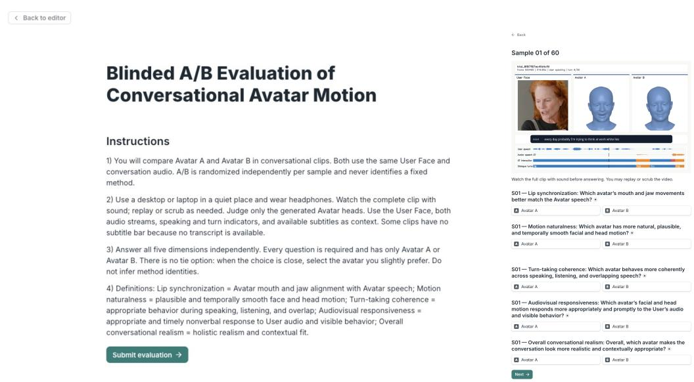  
Figure 22: User study interface. Left: instructions for the blind A/B comparison. Right: a trial showing the User video and two anonymous avatar outputs with shared conversation audio and activity cues. Annotators choose Avatar A or Avatar B separately for lip synchronization, motion naturalness, turn-taking coherence, audiovisual responsiveness, and overall conversational realism.

Validating correspondence. Plausible faces and speech can still pair the wrong participants. We validate matching durations and required outputs, then check single-view samples for incorrect speech assignment, suppressed or duplicated speech, leakage, and identity inconsistency. RealTalk identity checks require each track to remain internally consistent and the two tracks to represent different people. Failed or inconclusive samples are excluded. These checks target preprocessing errors that could resemble conversational behavior. Table 12 summarizes the extraction settings.

Splits. Seamless uses session-level splits. OOD excludes training participant IDs and source interaction IDs. Other held-out sessions form ID, and Dev comes from the training pool. RealTalk supplies OOD-Hard from official single-view intervals, each containing a fixed participant pair.

Counting. Durations count physical segments before expansion into two directions. The 4,365 metadata IDs do not establish globally unique people, as RealTalk has no cross-video person IDs. Turns follow sole-speaker changes across silence or overlap, so pauses do not create turns. Shared bins use pooled 20th, 40th, 60th, and 80th duration percentiles at 6, 14, 36, and 96 seconds.

## G BASELINE TRAINING AND COMPARISON PROTOCOL

All four baselines use the benchmark training partition, method-specific objectives and schedules, and 106-D FLAME outputs at 25 fps. We retain their generation mechanisms and conditioning inputs (Table 1). DiffPoseTalk and ARTalk use fixed training-set styles and offline audio. UniLS uses dyadic audio, and DualTalk uses offline windows with pre-extracted User FLAME. Held-out Avatar motion never conditions generation. We evaluate every method on the same held-out records with shared frame selections, speaking/listening masks, FLAME decoding, and equal-record aggregation.

## H PERCEPTUAL EVALUATION DETAILS

We randomly sample 60 comparison clips, with 20 each from ID, OOD, and OOD-Hard. Ten annotators evaluate the clips using the instructions and blind A/B interface shown in Figure 22.