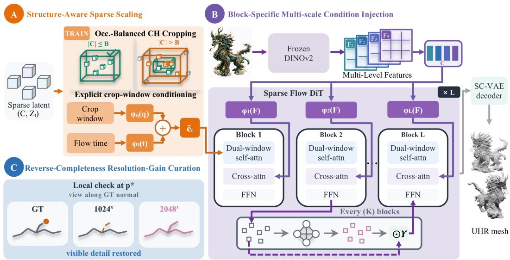
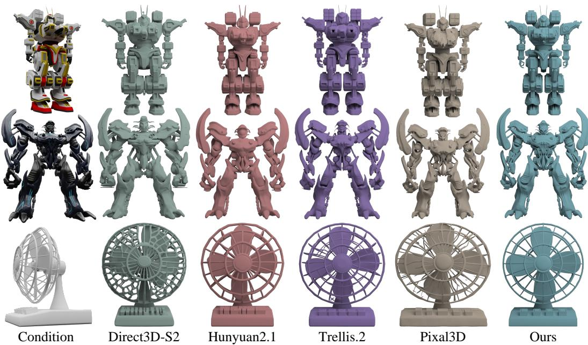
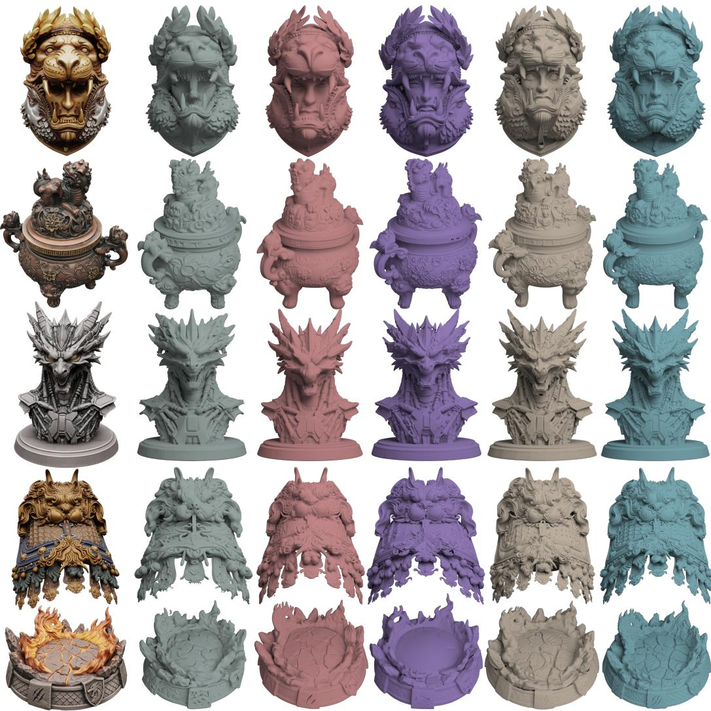
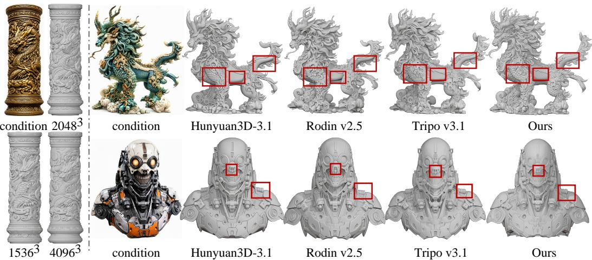
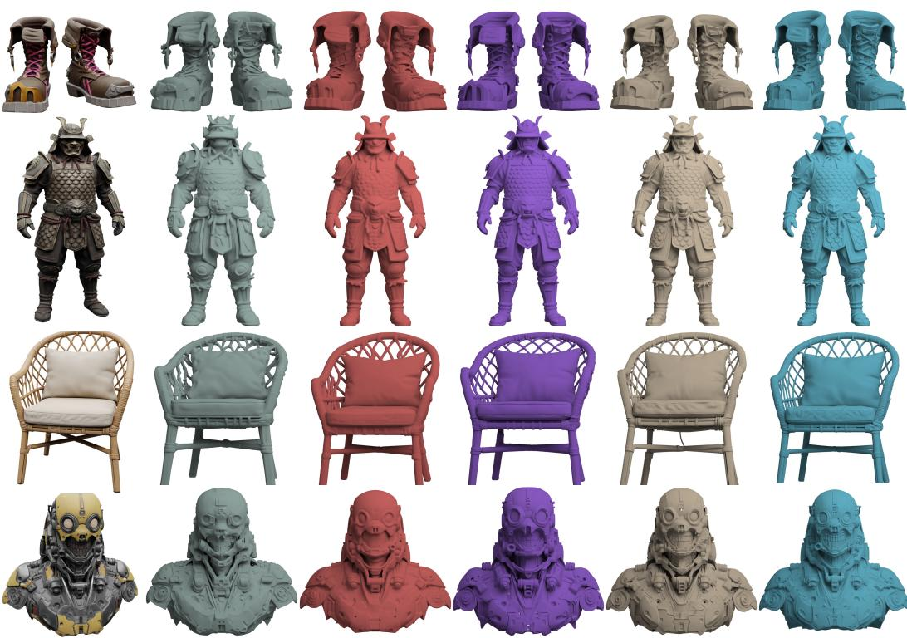

# FILIGREE3D: SCALING SPARSE LATENT FLOW MATCHING FOR ULTRA-HIGH-RESOLUTION IMAGE-TO-3D GENERATION

Hongjie Li1∗, Xinran Yang1∗, Xiuchao Wu1, Jiangjing Lyu1,†, Chengfei Lv1,† 1AlibabaGroup

  
Figure 1: High-resolution geometry generated by Filigree3D. Texture-free renders at 20483 highlight thin structures, intricate ornamentation, and sharp surface details.

## ABSTRACT

Scaling image-to-3D generation to ultra-high resolutions requires controlling rapidly growing computational costs without sacrificing fine geometric detail. We present Filigree3D, a sparse latent flow-matching framework that generates 3D geometry from a single image at voxel resolutions up to 20483, with straightforward extensibility to 40963. To make training tractable, we introduce Structure-Aware Sparse Scaling, which combines spatial bounding with alternating localglobal attention to constrain token growth while preserving both fine-scale details and long-range structural context. To enhance detail reconstruction, we curate training samples based on their high-resolution geometric gains and inject multi-scale image features into a sparse 3D DiT, effectively coupling structural semantics with fine-grained visual cues. Furthermore, a visibility-aware voxel regularization strategy improves robustness against sparse perturbations and facilitates the completion of unobserved geometry. Under our default configuration, Filigree3D maintains peak GPU memory consumption within practical limits for contemporary hardware, enabling the generation of highly intricate 3D geometry in approximately one minute. Extensive experiments demonstrate that our method yields substantial improvements in overall geometric fidelity and finedetail preservation compared to existing baselines, validating practical, detailpreserving 3D generation at unprecedented resolutions.

## 1 INTRODUCTION

Generating a high-fidelity 3D asset from a single image is a longstanding goal in computer vision and graphics, with broad applications in content creation, digital commerce, simulation, and embodied intelligence. Recent image-to-3D systems have made substantial progress by combining pretrained visual encoders, structured 3D representations, and powerful generative priors (Liu et al., 2023a; Long et al., 2024; Xu et al., 2024; Xiang et al., 2025b). Despite these advances, existing models may still oversmooth or omit geometric details, including thin structures, sharp creases, shallow reliefs, and subtle surface variations. A finer 3D representation can raise the upper bound on recoverable detail, but high nominal resolution alone does not guarantee high-fidelity geometry.

Scaling single-image 3D generation to ultra-high resolution exposes three intertwined challenges. First, the computational cost grows rapidly with spatial resolution. Dense voxel grids incur cubic storage and computation, motivating octree and sparse-convolutional representations that avoid allocating features in empty space (Riegler et al., 2017; Graham et al., 2018; Choy et al., 2019; Ren et al., 2024). However, even for a sparse surface, the number of active elements grows sharply as the voxel size decreases, making quadratic global self-attention difficult to scale under practical memory budgets. Thus, high-resolution generation requires more than sparsity alone: it must bound fine-scale computation without discarding the local neighborhoods that define geometric detail.

Second, computational locality must not come at the expense of global shape coherence. Spatial cropping and strictly local windowed attention are natural ways to control memory and attention cost, but they limit direct long-range interaction. Shifted-window and focal mechanisms partially compensate for this limitation through cross-window or pooled global context (Liu et al., 2021; Yang et al., 2021). Independent crops may additionally introduce artificial boundaries and a discrepancy between partial-support training and complete-object inference. These effects are particularly problematic at high resolution, where local structures must remain consistent with the object-level arrangement. A scalable model must therefore preserve fine local interactions while maintaining communication across the full shape.

Third, high-resolution learning requires informative conditioning and genuinely detail-bearing supervision. Single-view reconstruction is intrinsically ambiguous: visible surfaces are constrained by image evidence, whereas self-occluded regions must be inferred from learned shape priors (Tatarchenko et al., 2019; Wu et al., 2018). Features from different ViT depths capture complementary positional and semantic information (Amir et al., 2021), while DINOv2 provides strong general-purpose visual representations (Oquab et al., 2023), motivating the use of both intermediateand final-layer features for conditioning. Training data pose a related challenge: large-scale 3D collections contain diverse objects of uneven quality (Deitke et al., 2023b;a), but scale alone does not guarantee fine-detail supervision. High-resolution training should therefore prioritize assets that reveal additional geometric structure at the target resolution. Thus, both image conditioning and data selection must align with the goal of learning geometric detail.

To address these challenges, we introduce Filigree3D, a sparse latent flow-matching framework for single-image 3D generation at an effective voxel resolution of 20483. Rather than treating resolution as an isolated representational choice, Filigree3D jointly addresses the computational, architectural, conditioning, and data challenges required to translate higher resolution into recoverable geometric detail. Specifically, a structure-aware sparse scaling strategy is proposed to make training tractable while preserving sufficient context and supports full-support inference without crop stitching. Within the sparse 3D DiT, efficient global communication complements fine-grained local interactions, while block-specific multi-level conditioning adapts visual evidence to representations at different network depths. In parallel, resolution-gain data curation prioritizes assets that provide meaningful supervision for fine geometry. Finally, visibility-aware voxel regularization improves robustness to sparse perturbations and facilitates the completion of unobserved regions. Experiments demonstrate that these components effectively translate higher representational resolution into finer recoverable geometry with only modest computational overhead, allowing Filigree3D to outperform existing image-to-3D methods in geometric detail while remaining competitive with commercial systems. Our contributions are summarized as follows:

• We present Filigree3D, a sparse latent flow-matching framework operating at an effective voxel resolution of 20483, scalable to 40963, with joint full-support inference.

• Structure-Aware Sparse Scaling enables tractable high-resolution training while preserving finescale geometric interactions and object-level communication.

• Block-specific multi-level feature injection and resolution-gain data curation align visual conditioning and training supervision with fine-detail reconstruction.

## 2 RELATED WORK

Single-image 3D reconstruction and generation. Score-distillation methods optimize a perinstance 3D representation using 2D diffusion priors (Poole et al., 2023; Liu et al., 2023b), achieving high visual quality but requiring minutes to hours per object. Large reconstruction models established a feed-forward alternative (Hong et al., 2024; Tochilkin et al., 2024; Xu et al., 2024), although their geometric detail remains coupled to the resolution of the tri-plane, implicit field, or mesh-extraction grid. More recent systems learn generative priors over native 3D representa tions, increasingly under a flow-matching objective that regresses a vector field along a prescribed probability path (Lipman et al., 2023; Liu et al., 2023c). CLAY (Zhang et al., 2024), Michelangelo (Zhao et al., 2023), TripoSG (Li et al., 2025c), and CraftsMan3D (Li et al., 2025a) scale latentset or rectified-flow generation to large 3D asset collections; Hunyuan3D 2.1 (Team Hunyuan3D et al., 2025) and Step1X-3D (Li et al., 2025b) pair shape VAEs with flow-based DiTs supervised on TSDF grids; Hi3DGen (Ye et al., 2025) bridges normal-map estimation and 3D generation; and Direct3D (Wu et al., 2024) introduces a scalable image-to-3D latent diffusion transformer. Pixal3D takes a complementary route: it back-projects multi-scale image features into a pixel-aligned 3D fea ture volume in the camera frame, conditioning a Direct3D-S2-based sparse SDF backbone trained progressively up to $1 0 2 4 ^ { 3 }$ (Li et al., 2026). The same flow-matching objective has been paired with non-voxel latent domains, including point-structured Gaussians (Lan et al., 2025), continuous shape tokens (Chang et al., 2024), and topology-bearing sparse voxels (Zhao et al., 2026). Beyond research prototypes, these advances have been productized in commercial image-to-3D platforms such as Hunyuan3D 3.1 (Tencent Hunyuan, 2026), Rodin v2.5 (Hyper3D, 2026), and Tripo v3.1 (Tripo AI, 2026), which emphasize production-ready asset and material quality. Filigree3D inherits sparse flow matching for image-conditioned generation but diverges from representation-level modifications.

Sparse and structured 3D latent representations. The choice of 3D latent space largely determines the attainable geometric resolution. Set-based representations compress a surface into a fixed collection of latent vectors and generate them with latent diffusion (Zhang et al., 2023; Vahdat et al., 2022; Lan et al., 2024); recent benchmarking reveals that reconstruction quality and generation diversity remain in tension (Chen et al., 2025a). These compact tokens do not retain explicit spatial support, limiting resolution scaling. Voxel-based approaches exploit spatial sparsity through hierarchies (Ren et al., 2024), octrees (Xiong et al., 2025), primitives (Chen et al., 2024), constructive geometry (Li et al., 2025d), or part-level attention (Chen et al., 2025b). TRELLIS introduces structured latents (SLATs) that pair active voxel coordinates with local features, factorizing generation into sparse-structure and latent-feature stages (Xiang et al., 2025b), although its mesh decoder operates on a $2 5 6 ^ { 3 }$ grid. SparseFlex scales its VAE to $1 0 2 4 ^ { 3 }$ with rectified flow (He et al., 2025a), while Direct3D-S2 combines a sparse SDF VAE with spatial sparse attention at the same scale (Wu et al., 2025). TRELLIS.2 further adopts the O-Voxel representation and decoupled Sparse Compression VAEs, trained up to $1 0 2 4 ^ { 3 }$ with $\mathrm { 1 5 3 6 ^ { 3 } }$ assets via test-time cascaded scaling (Xiang et al., 2025a). LATTICE instead anchors a compact VoxSet on a coarse sparse grid with a coordinate-aware rectified-flow transformer (Lai et al., 2026). Together, these methods highlight the scalability bene fits of spatial sparsity, while also exposing the distinction among latent density, decoder resolution, and nominal voxel resolution. Filigree3D targets effective resolutions beyond 10243, addressing the scaling of the sparse generative backbone itself.

## 3 METHOD

## 3.1 PRELIMINARY

Filigree3D builds on the O-Voxel representation and sparse generative framework of TREL-LIS.2 (Xiang et al., 2025a). We briefly review the relevant formulations below.

O-Voxel and Sparse flow matching. At resolution $N ^ { 3 }$ , O-Voxel represents geometry using only L surface-intersecting voxels, denoted by $\mathcal { O } = \{ ( \mathbf { p } _ { i } , \mathbf { f } _ { i } ) \} _ { i = 1 } ^ { L }$ Each active coordinate $\mathbf { p } _ { i } ~ \in$ $\{ 0 , \dot { . } . . , N - 1 \} ^ { 3 }$ is paired with $\mathbf { f } _ { i } = ( \mathbf { v } _ { i } , \delta _ { i } , \gamma _ { i } )$ , which encodes the dual vertex, surface intersections, and triangulation parameter. Flexible Dual Grid converts O into a triangle mesh. For efficient latent modeling, TRELLIS.2 employs an SC-VAE to encode it as $\mathcal { Z } = E ( \mathcal { O } )$ . The resulting latent comprises M active entries $( \mathbf { q } _ { j } , \mathbf { z } _ { j } )$ , where $\mathbf q _ { j } \in \{ 0 , \dots , N / 1 6 - 1 \} ^ { 3 }$ and $\mathbf { z } _ { j } \in \mathbb { R } ^ { 3 2 }$ . The encoder reduces each spatial dimension by a factor of 16, while the decoder reconstructs O from Z for subsequent mesh extraction. Let $\mathcal { Q } \doteq \{ \mathbf { q } _ { j } \} _ { j = 1 } ^ { M }$ be the active support predicted by the sparse-structure stage and $\mathbf { x } _ { 0 } = [ \mathbf { z } _ { 1 } , \hdots , \mathbf { z } _ { M } ]$ the corresponding latent features. With Q fixed, an image-conditioned sparse DiT learns to transport noisy features toward x0:

  
Figure 2: Overview of Filigree3D. The framework combines (A) structure-aware sparse scaling for budgeted processing, (B) block-specific multi-scale condition injection for hierarchical image guidance, and (C) resolution-gain curation for resolution-sensitive samples.

$$
\begin{array} { r } { \begin{array} { c } { \mathbf { x } _ { t } = ( 1 - t ) \mathbf { x } _ { 0 } + \left[ \sigma _ { \operatorname* { m i n } } + ( 1 - \sigma _ { \operatorname* { m i n } } ) t \right] \mathbf { \epsilon } , } \\ { \mathcal { L } _ { \mathrm { C F M } } = \mathbb { E } \left[ \left\| \mathbf { v } _ { \theta } ( \mathcal { Q } , \mathbf { x } _ { t } , t , \mathbf { y } ) - ( ( 1 - \sigma _ { \operatorname* { m i n } } ) \mathbf { \epsilon } - \mathbf { x } _ { 0 } ) \right\| _ { 2 } ^ { 2 } \right] , } \end{array} } \end{array}\tag{1}
$$

where $\epsilon \sim \mathcal { N } ( \mathbf { 0 } , \mathbf { I } ) , t \sim \mathcal { U } ( 0 , 1 )$ , y denotes the image condition, and $\sigma _ { \mathrm { m i n } } = 1 0 ^ { - 5 }$ . At inference, the learned flow is integrated from noise to the data endpoint, and the resulting latent is decoded into a mesh. The following sections describe our extensions for ultra-high-resolution generation.

Overview. Given a single image, Filigree3D generates high-resolution 3D geometry via sparse latent flow matching. As shown in Figure 2, an image-conditioned sparse denoiser predicts latents that are decoded by a resolution-specific SC-VAE at an effective $2 0 4 8 ^ { \frac { 3 } { 3 } }$ resolution, scalable to $4 0 9 6 ^ { 3 }$ Structure-aware sparse processing bounds token cost while preserving local detail and global context, while block-specific conditioning provides stage-adaptive guidance. Resolution-gain curation prepares training data by retaining assets that reveal additional geometry at higher resolutions.

## 3.2 STRUCTURE-AWARE SPARSE SCALING

Although O-Voxel latents are sparse, the number of occupied tokens still grows substantially with output resolution and may exceed a fixed per-sample budget B under global attention. The central challenge is therefore to train under a bounded token count without sacrificing spatial coverage or object-level communication. We address this challenge with Structure-Aware Sparse Scaling, which combines occupancy-balanced core–halo cropping and explicit crop-window conditioning for budgeted training with periodic coarse-global interaction for long-range information exchange. Let $\boldsymbol { \mathcal { X } } _ { t } = ( \boldsymbol { \mathcal { C } } , \mathbf { Z } _ { t } )$ denote a sparse latent, where $\mathcal { C } \subseteq \{ 0 , \dots , R - 1 \} ^ { 3 }$ is the occupied support and $\mathbf { Z } _ { t }$ contains its time-dependent features. If $| { \mathcal { C } } | \leq B ,$ , we retain the complete support. Otherwise, we select a spatially coherent subset containing at most B tokens before sampling the flow time and noise. Once this subset is selected, its coordinates remain unchanged within the flow-matching objective, while only the associated features are perturbed and predicted.

Occupancy-balanced core–halo cropping. Sampling anchors uniformly from occupied tokens biases training toward geometrically dense regions. We instead partition the latent grid into coarse cells of width $^ { g , }$ uniformly sample a non-empty cell, and then sample an occupied anchor a within that cell. Around the anchor, we define an outer context region and an inner supervision core:

$$
\begin{array} { r l } & { \mathcal { T } _ { \mathrm { c t x } } ( s ; { \mathbf a } ) = \left\{ i : \| { \mathbf c } _ { i } - { \mathbf a } \| _ { \infty } \leq s \right\} , } \\ & { \mathcal { T } _ { \mathrm { c o r e } } ( s ; { \mathbf a } ) = \left\{ i : \| { \mathbf c } _ { i } - { \mathbf a } \| _ { \infty } \leq \operatorname* { m a x } ( s - h , 0 ) \right\} , } \end{array}\tag{2}
$$

where $h$ is the halo width. The context radius adapts to local occupancy within a fixed token budget:

$$
s ^ { \star } = \operatorname* { m a x } \left\{ s \in \mathbb { Z } _ { \geq 0 } : \left| \mathbb { Z } _ { \mathrm { c t x } } ( s ; \mathbf { a } ) \right| \leq B \right\} .\tag{3}
$$

The denoiser processes the full context, while the flow-matching loss is restricted to the core:

$$
\mathcal { L } _ { \mathrm { c r o p } } = \lvert \mathcal { Z } _ { \mathrm { c o r e } } ( s ^ { \star } ; \mathbf { a } ) \rvert ^ { - 1 } \sum _ { i \in \mathcal { Z } _ { \mathrm { c o r e } } ( s ^ { \star } ; \mathbf { a } ) } \lVert \widehat { \mathbf { v } } _ { i } - \mathbf { v } _ { i } \rVert _ { 2 } ^ { 2 } .\tag{4}
$$

This separation preserves contextual evidence while avoiding direct supervision near artificial crop boundaries. Unlike a fixed spatial crop, the selected extent expands in sparse regions and contracts in dense regions to use the available budget. Coordinates remain in the original latent-grid frame, and samples satisfying $| { \mathcal { C } } | \leq B$ use complete-support supervision.

Explicit crop-window conditioning. A local crop and a complete object may contain identical absolute coordinates but provide different spatial evidence. Conditioning only on occupied-token extrema cannot resolve this ambiguity because those extrema describe the observed geometry rather than the window from which it was sampled. We therefore encode the actual crop bounds. For a cropped support, $\ell = \operatorname* { m a x } ( { \mathbf 0 } , { \mathbf a } - s ^ { \star } { \mathbf 1 } )$ and ${ \bf u } = \mathrm { m i n } ( ( R - 1 ) { \bf 1 } , { \bf a } + s ^ { \star } { \bf 1 } )$ ; for complete support, $\mathbf { \nabla } \ell = \mathbf { 0 }$ and $\mathbf { u } = ( R - 1 ) \mathbf { 1 }$ . The normalized window center, size, and crop indicator are

$$
\mathbf { q } = \left[ [ 2 ( R - 1 ) ] ^ { - 1 } ( { \boldsymbol { \ell } } + \mathbf { u } ) ; R ^ { - 1 } ( \mathbf { u } - { \boldsymbol { \ell } } + \mathbf { 1 } ) ; { \boldsymbol { \rho } } \right] , \qquad { \boldsymbol { \rho } } \in \{ 0 , 1 \} .\tag{5}
$$

where $\rho = 1$ denotes a crop and $\rho = 0$ complete support. A two-layer MLP $\phi _ { q }$ injects this descriptor through the flow-time embedding:

$$
\widetilde { \mathbf { e } } _ { t } = \phi _ { t } ( t ) + \phi _ { q } ( \mathbf { q } ) .\tag{6}
$$

The final layer of $\phi _ { q }$ is zero-initialized so that the added condition does not perturb the original pathway at initialization. This explicit descriptor aligns budgeted crop training with complete-support inference by informing the denoiser of the spatial extent actually observed.

Local interaction with periodic coarse-global communication. Windowed sparse attention provides bounded fine-scale computation but restricts communication between distant occupied regions. We use complementary regular and half-window-shifted partitions for local mixing: half of the heads attend within regular windows of width w, and the remaining heads use windows shifted by $w / 2$ along each axis. To restore object-level context, every K blocks we group fine tokens by stride-p coarse coordinates,

$$
\mathbf { u } _ { i } = \left\lfloor p ^ { - 1 } \mathbf { c } _ { i } \right\rfloor , \qquad S _ { \mathbf { u } } = \{ i : \mathbf { u } _ { i } = \mathbf { u } \} .\tag{7}
$$

and aggregate each occupied coarse cell:

$$
\mathbf { g _ { u } } = ( 1 / | S _ { \mathbf { u } } | ) \sum _ { i \in S _ { \mathbf { u } } } \mathbf { h } _ { i } .\tag{8}
$$

Full self-attention is applied only to the resulting M occupied coarse tokens. The coarse context is mapped back via the inverse grouping assignment and fused with the corresponding fine tokens:

$$
\widehat { \mathbf { G } } = \mathrm { A t t n } _ { \mathrm { g l o b a l } } ( \mathrm { L N } ( \mathbf { G } ) ) , \qquad \mathbf { h } _ { i } ^ { \prime } = \mathbf { h } _ { i } + \gamma \odot \widehat { \mathbf { g } } _ { \mathbf { u } _ { i } } , \qquad \left. \gamma \right| _ { \mathrm { i n i t } } = \mathbf { 0 } .\tag{9}
$$

This periodic pathway propagates object-level context without quadratic attention over all fine tokens, while a zero-initialized gate gradually introduces coarse context during training.

## 3.3 BLOCK-SPECIFIC MULTI-LEVEL CONDITION INJECTION

Effective cross-attention requires conditioning features that capture both fine-grained image details and high-level semantics. However, relying solely on the final encoder layer may omit informative cues retained in intermediate representations. We therefore extract normalized features from four levels of a frozen DINOv2 encoder (Oquab et al., 2023), denoted by $\{ E _ { \ell _ { i } } ( \mathbf { I } ) \} _ { i = 1 } ^ { 4 }$ . Since these features share the same token layout, we concatenate them along the channel dimension to preserve their complementary information without imposing fixed weights. As the sparse voxel representation evolves across the DiT blocks, the most useful combination of abstraction levels may vary with network depth. We thus introduce an independent fusion module for each block:

$$
{ \bf F } _ { \mathrm { c o n d } } ^ { ( l ) } = \phi _ { l } \Big ( \mathrm { C o n c a t } _ { \mathrm { c h } } \left[ \mathrm { L N } ( E _ { \ell _ { k } } ( { \bf I } ) ) \right] _ { k = 1 } ^ { 4 } \Big ) \in \mathbb { R } ^ { P \times D } , \qquad l = 1 , \ldots , L .\tag{10}
$$

Here, $\phi _ { l }$ is a block-specific fusion module consisting of layer normalization followed by a two-layer MLP with a GELU activation. This design allows each DiT block to adaptively combine visual cues from different abstraction levels while keeping the number of conditioning tokens fixed at $P .$

## 3.4 VISIBILITY-AWARE VOXEL REGULARIZATION

To regularize ambiguous occluded geometry, we estimate voxel visibility by comparing the projected voxel depth $d _ { i }$ with a low-resolution depth buffer D:

$$
m _ { i } = \mathbf { 1 } [ z _ { i } < 0 ] \mathbf { 1 } [ \pi _ { i } \in \Omega ] \mathbf { 1 } [ | d _ { i } - D ( \pi _ { i } ) | < 2 / R ] ,\tag{11}
$$

where $\pi _ { i }$ is the projected voxel position, Ω denotes the image crop, and R is the latent resolution. Unseen voxels $( m _ { i } = 0 )$ receive stronger perturbation and feature masking. We define their regression weights as $w _ { i } = 1$ for visible voxels and $w _ { i } = \lambda _ { \mathrm { u } }$ for unseen voxels, where $\lambda _ { \mathrm { u } } ~ > ~ 1$ . The regularization objective is

$$
\mathcal { L } _ { \mathrm { r e g } } = \frac { \sum _ { i \in \mathcal { S } } w _ { i } \Vert \hat { \mathbf { v } } _ { i } - \mathbf { v } _ { i } \Vert _ { 2 } ^ { 2 } } { C \sum _ { i \in \mathcal { S } } w _ { i } } + \frac { \lambda _ { \mathrm { l a p } } \sum _ { ( i , j ) \in \mathcal { E } _ { \mathrm { u } } } \Vert \hat { \mathbf { v } } _ { i } - \hat { \mathbf { v } } _ { j } \Vert _ { 2 } ^ { 2 } } { C \left( \left| \mathcal { E } _ { \mathrm { u } } \right| + \epsilon \right) } .\tag{12}
$$

Here, $s$ contains occupied voxels, ${ \mathcal E } _ { \mathrm u }$ contains adjacent unseen-voxel pairs, and C is the feature dimension. This regularization is applied only during training and introduces no inference overhead.

## 3.5 RESOLUTION-GAIN-AWARE DATA CURATION.

Effective high-resolution geometry generation requires training assets that reveal additional geometric details as the representation resolution increases. We therefore propose a resolution-gain-aware curation protocol to identify such assets, as illustrated in Figure $2 ( \mathrm { c } )$ . Given a ground-truth (GT) mesh, we construct its O-Voxel representations at low and high resolutions, reconstruct each using the corresponding SC-VAE, and extract the resulting meshes $\mathcal { M } _ { R _ { \mathrm { l o } } }$ and $\mathcal { M } _ { R _ { \mathrm { h i } } }$ . To capture small yet important structures, we draw (N) GT surface points using mixed area-based and detail-aware sampling (Chen et al., 2025a):

$$
p ( \mathbf { x } ) = \lambda p _ { \mathrm { a r e a } } ( \mathbf { x } ) + ( 1 - \lambda ) p _ { \mathrm { d e t a i l } } ( \mathbf { x } ) ,\tag{13}
$$

where $p _ { \mathrm { d e t a i l } }$ assigns higher probabilities to regions with large curvature or normal variation. The same GT samples are shared across both resolutions for a fair comparison. Let $d _ { R } ( \boldsymbol { p } )$ denote the distance from a GT point p to the surface of $\mathcal { M } _ { R }$ . We measure the missing geometry at resolution R by $E _ { R } ^ { \mathrm { m a x } } = \mathrm { m a x } _ { i } d _ { R } ( \bar { p } _ { i } )$ and define the resolution gain as $G _ { \mathrm { r e s } } ~ = ~ E _ { R _ { \mathrm { l o } } } ^ { \mathrm { \bar { m a x } } } / E _ { R _ { \mathrm { h i } } } ^ { \mathrm { m a \bar { x } } }$ . An asset is selected as a candidate if $E _ { R _ { \mathrm { l o } } } ^ { \mathrm { m a x } } > \tau _ { \mathrm { m i s s } }$ and $G _ { \mathrm { r e s } } > \gamma .$ . The first condition identifies meaningful geometry missing at low resolution, while the second verifies that it is substantially recovered at high resolution. Because the maximum distance can be sensitive to isolated errors, these criteria are used only for candidate screening. We then inspect aligned reconstructions around the worst-covered GT point and retain only assets showing clear and spatially coherent geometric recovery.

## 4 EXPERIMENTS

## 4.1 EXPERIMENT SETUP

Datasets, Baselines, and Metrics. (1) For a fair comparison, we evaluate all methods on the same subset of Toys4K (Stojanov et al., 2021), comprising 537 manually selected objects with rich geometric detail. To complement the limited coverage of highly intricate shapes in Toys4K, we further introduce FineGeo3D, a supplementary evaluation set of 120 detail-rich cases. (2) We compare Filigree3D quantitatively and qualitatively with Direct3D-S2 (Wu et al., 2024), Hunyuan3D 2.1 (Team Hunyuan3D et al., 2025), TRELLIS.2 (Xiang et al., 2025a), and Pixal3D (Li et al., 2026), using identical input images. Hunyuan3D 2.1 decodes geometry from a resolution-384 octree with 50 diffusion steps; Direct3D-S2 reconstructs 10243 signed distance fields through a dense-to-sparse cascade; and TRELLIS.2 and Pixal3D progressively refine sparse structures and shape latents from 512 to 1536. We additionally provide qualitative comparisons with state-of-the-art commercial systems, including Hunyuan3D-3.1 (Tencent Hunyuan, 2026; Lai et al., 2026), Rodin v2.5 (Hyper3D, 2026), and Tripo v3.1 (Tripo AI, 2026), to assess fine-detail generation in practical settings. (3) We evaluate geometric fidelity using Chamfer Distance (CD) and F-scores at thresholds of 0.01 and 0.002, with the latter emphasizing fine geometric details. Image–geometry alignment is measured by ULIP-2 (Xue et al., 2024) and Uni3D (Zhou et al., 2024) similarities, where higher scores indicate better semantic consistency. All methods use identical normalization and sampling protocols.

  
Figure 3: Qualitative comparison on Toys4K dataset.

Table 1: Quantitative comparison on Toys4K and FineGeo3D dataset. T means inference time.
<table><tr><td rowspan="2">Method</td><td rowspan="2">T (s)↓</td><td colspan="5">Toys4K</td><td colspan="5">FineGeo3D</td></tr><tr><td>CD↓</td><td>F1-0.01↑</td><td>F1-0.002↑</td><td>ULIP-2↑</td><td>Uni3D↑</td><td>CD↓</td><td>F1-0.01↑</td><td>F1-0.002↑</td><td>ULIP-2↑</td><td>Uni3D↑</td></tr><tr><td>Direct3D-S2</td><td>69.2</td><td>0.0339</td><td>0.5062</td><td>0.0596</td><td>0.2293</td><td>0.2785</td><td>0.0326</td><td>0.4917</td><td>0.0499</td><td>0.2184</td><td>0.2783</td></tr><tr><td>Hy3D-2.1</td><td>17.1</td><td>0.0233</td><td>0.6683</td><td>0.1011</td><td>0.2390</td><td>0.2797</td><td>0.0278</td><td>0.5809</td><td>0.0674</td><td>0.2330</td><td>0.2879</td></tr><tr><td>TRELLIS.2</td><td>59.5</td><td>0.0270</td><td>0.6315</td><td>0.0947</td><td>0.2275</td><td>0.2807</td><td>0.0274</td><td>0.5847</td><td>0.0639</td><td>0.2239</td><td>0.2716</td></tr><tr><td>Pixal3D</td><td>26.2</td><td>0.0360</td><td>0.5542</td><td>0.0888</td><td>0.2080</td><td>0.2775</td><td>0.0345</td><td>0.5448</td><td>0.0674</td><td>0.2115</td><td>0.2717</td></tr><tr><td>Ours-1536</td><td>50.9</td><td>0.0058</td><td>0.9744</td><td>0.4616</td><td>0.2624</td><td>0.2965</td><td>0.0054</td><td>0.9963</td><td>0.3679</td><td>0.2665</td><td>0.3042</td></tr><tr><td>Ours-2048</td><td>84.2</td><td>0.0055</td><td>0.9739</td><td>0.5202</td><td>0.2724</td><td>0.3070</td><td>0.0049</td><td>0.9969</td><td>0.4309</td><td>0.2760</td><td>0.3126</td></tr></table>

Implementation Details. (1) SC-VAE.We fine-tune a separate SC-VAE for each target resolution and address resolution-specific issues, including long-edge artifacts at $2 0 4 8 ^ { 3 }$ and coordinate wraparound and out-of-memory failures at 40963. (2) DiT. We set the token budget to (B=50,000) and apply global information flow every five Transformer blocks. For multi-level conditioning, we concatenate DINOv2 features from layers 5, 7, 11, and 23 along the channel dimension (He et al., 2025b). (3) Data Curation. Each GT mesh is normalized to unit maximum extent and reconstructed at $R _ { \mathrm { l o } } = 1 0 2 4$ and $R _ { \mathrm { h i } } = 2 0 4 8$ using resolution-specific SC-VAEs and Flexible Dual Grid. We set $\lambda = 0 . 7 ,$ , use 100,000 shared surface samples for screening and 500,000 for verification, and set $\tau _ { \mathrm { m i s s } } = [ 2 R _ { \mathrm { l o } } ] ^ { - 1 } , \gamma = 2$ , and $\epsilon = 0 . 1 R _ { \mathrm { h i } } ^ { - 1 }$ . (4) Training. To train the model, we use TRELLIS-500K Xiang et al. (2025b) with an additional filtering step to retain geometrically complex objects, and we also collect 200K high-quality, high-precision data. Our model is trained for 10 days on 16 NVIDIA H20 GPUs with a batch size of 1. We use AdamW with an initial learning rate of $\mathrm { i \times 1 0 ^ { - 4 } }$

  
Condition  
Direct3D-S2  
Hunyuan2.1  
Trellis.2  
Pixal3D  
Ours

Figure 4: Qualitative comparison on FineGeo3D dataset.

## 4.2 EXPERIMENT RESULTS

Qualitative comparison. Figures 3 and 4 compare meshes generated by Filigree3D with those produced by state-of-the-art open-source image-to-3D methods on Toys4K and FineGeo3D, respectively. Filigree3D reconstructs more faithful geometry while preserving finer structures, including thin bars, hollow ornaments, sharp creases, and shallow reliefs. In contrast, existing methods often merge nearby components or oversmooth subtle details, leading to loss of local shape information. Filigree3D also produces more plausible geometry in occluded or partially visible regions, while still retaining rich details in visible regions. These improvements are attributed to our dedicated design for ultra-high-resolution generation and fine-detail preservation.

Quantitative comparison. Table 1 reports the quantitative evaluation on the Toys4K subset and FineGeo3D, covering geometric fidelity (CD, F1-0.01, and F1-0.002), semantic alignment (ULIP-2 and Uni3D), and inference time. The runtime reported in the table refers to the inference time of the geometry generation model on a single H20 GPU. Filigree3D consistently outperforms all compared baselines on most metrics across both benchmarks, with particularly large gains on fidelity metrics that emphasize fine surface structures. These results demonstrate that Filigree3D substantially improves geometric reconstruction quality without compromising semantic alignment.

Table 2: Ablation study on FineGeo3D dataset. GIF, VR, MSF, and DC denote global information flow, voxel regularization, multi-scale features and data curation, respectively.
<table><tr><td>Method</td><td>CD↓</td><td>F1-0.01↑</td><td>F1-0.002↑</td><td>ULIP-2↑</td><td>Uni3D↑</td></tr><tr><td>w/o GIF</td><td>0.0053</td><td>0.9865</td><td>0.4121</td><td>0.2605</td><td>0.3077</td></tr><tr><td>w/o VR</td><td>0.0052</td><td>0.9863</td><td>0.4062</td><td>0.2610</td><td>0.3092</td></tr><tr><td>w/o MSF</td><td>0.0072</td><td>0.9662</td><td>0.3845</td><td>0.2407</td><td>0.2712</td></tr><tr><td>w/o DC</td><td>0.0060</td><td>0.9765</td><td>0.3941</td><td>0.2509</td><td>0.2915</td></tr><tr><td>Full Pipeline</td><td>0.0049</td><td>0.9969</td><td>0.4309</td><td>0.2760</td><td>0.3126</td></tr></table>

  
Figure 5: Resolution Scaling and Commercial Comparison. Left: Filigree3D recovers increasingly fine geometry from 15363 to 40963. Right: comparison with leading commercial systems at their highest-quality settings. Red boxes highlight fine geometric details.

## 4.3 ABLATION STUDY

Component Analysis. As shown in Table 2, removing multi-scale features (MSF), global information flow (GIF), voxel regularization (VR), or data curation (DC) consistently degrades performance on FineGeo3D. The full model achieves the best results, demonstrating their complementary contributions to geometric fidelity and semantic consistency.

Resolution Gains and Commercial Comparisons. Figure 5 presents qualitative comparisons along two dimensions. First, increasing the generation resolution from 15363 to 20483 and 40963 progressively improves geometric fidelity, yielding sharper relief patterns and more complete finescale structures. Second, compared with commercial systems including Hunyuan3D-3.1 (Tencent Hunyuan, 2026; Lai et al., 2026), Rodin v2.5 (Hyper3D, 2026), and Tripo v3.1 (Tripo AI, 2026), Filigree3D better preserves intricate geometric patterns and high-frequency details, as highlighted by the red boxes. These results demonstrate both the favorable resolution scalability of Filigree3D and its competitive performance in fine-grained geometry generation.

## 5 CONCLUSION

We presented Filigree3D, a sparse latent flow-matching framework for single-image 3D generation at an effective 20483 resolution, scalable to 40963. By jointly designing sparse computation, multilevel conditioning, and resolution-aware supervision, Filigree3D recovers finer geometry while preserving global consistency under a fixed token budget. Experiments show finer details with modest overhead and performance competitive with leading commercial systems. We hope this work supports further advances in high-resolution 3D generation.

## REFERENCES

Shir Amir, Yossi Gandelsman, Shai Bagon, and Tali Dekel. Deep vit features as dense visual descriptors. arXiv preprint arXiv:2112.05814, 2(3):4, 2021.

Jen-Hao Rick Chang, Yuyang Wang, Miguel Angel Bautista Martin, Jiatao Gu, Xiaoming Zhao, Josh Susskind, and Oncel Tuzel. 3D shape tokenization via latent flow matching. arXiv preprint arXiv:2412.15618, 2024.

Rui Chen, Jianfeng Zhang, Yixun Liang, Guan Luo, Weiyu Li, Jiarui Liu, Xiu Li, Xiaoxiao Long, Jiashi Feng, and Ping Tan. Dora: Sampling and benchmarking for 3D shape variational autoencoders. In IEEE/CVF Conference on Computer Vision and Pattern Recognition, 2025a.

Yiwen Chen, Zhihao Li, Yikai Wang, Hu Zhang, Qin Li, Chi Zhang, and Guosheng Lin. Ultra3D: Efficient and high-fidelity 3D generation with part attention. arXiv preprint arXiv:2507.17745, 2025b.

Zhaoxi Chen, Jiaxiang Tang, Yuhao Dong, Ziang Cao, Fangzhou Hong, Yushi Lan, Tengfei Wang, Haozhe Xie, Tong Wu, Shunsuke Saito, et al. 3DTopia-XL: Scaling high-quality 3D asset generation via primitive diffusion. arXiv preprint arXiv:2409.12957, 2024.

Christopher Choy, JunYoung Gwak, and Silvio Savarese. 4d spatio-temporal convnets: Minkowski convolutional neural networks. In 2019 IEEE/CVF conference on computer vision and pattern recognition (CVPR), pp. 3070–3079. IEEE, 2019.

Matt Deitke, Ruoshi Liu, Matthew Wallingford, Huong Ngo, Oscar Michel, Aditya Kusupati, Alan Fan, Christian Laforte, Vikram Voleti, Samir Yitzhak Gadre, et al. Objaverse-xl: A universe of 10m+ 3d objects. Advances in Neural Information Processing Systems, 36:35799–35813, 2023a.

Matt Deitke, Dustin Schwenk, Jordi Salvador, Luca Weihs, Oscar Michel, Eli VanderBilt, Ludwig Schmidt, Kiana Ehsani, Aniruddha Kembhavi, and Ali Farhadi. Objaverse: A universe of annotated 3d objects. In Proceedings of the IEEE/CVF conference on computer vision and pattern recognition, pp. 13142–13153, 2023b.

Benjamin Graham, Martin Engelcke, and Laurens Van Der Maaten. 3d semantic segmentation with submanifold sparse convolutional networks. In 2018 IEEE/CVF Conference on Computer Vision and Pattern Recognition, pp. 9224–9232. Ieee, 2018.

Xianglong He, Zi-Xin Zou, Chia-Hao Chen, Yuan-Chen Guo, Ding Liang, Chun Yuan, Wanli Ouyang, Yan-Pei Cao, and Yangguang Li. Sparseflex: High-resolution and arbitrary-topology 3d shape modeling. In 2025 IEEE/CVF International Conference on Computer Vision (ICCV), pp. 14822–14833. IEEE, 2025a.

Yisheng He, Xiaodong Gu, Xiaodan Ye, Chao Xu, Zhengyi Zhao, Yuan Dong, Weihao Yuan, Zilong Dong, and Liefeng Bo. Lam: Large avatar model for one-shot animatable gaussian head. arXiv preprint arXiv:2502.17796, 2025b.

Yicong Hong, Kai Zhang, Jiuxiang Gu, Sai Bi, Yang Zhou, Difan Liu, Feng Liu, Kalyan Sunkavalli, Trung Bui, and Hao Tan. LRM: Large reconstruction model for single image to 3D. In International Conference on Learning Representations, 2024.

Hyper3D. Rodin v2.5. https://hyper3d.ai/workspace/rodin, 2026. Accessed: September 23, 2026.

Zeqiang Lai, Yunfei Zhao, Zibo Zhao, Haolin Liu, Qingxiang Lin, Jingwei Huang, Chunchao Guo, and Xiangyu Yue. LATTICE: Democratize high-fidelity 3D generation at scale. In IEEE/CVF Conference on Computer Vision and Pattern Recognition, 2026.

Yushi Lan, Fangzhou Hong, Shuai Yang, Shangchen Zhou, Xuyi Meng, Bo Dai, Xingang Pan, and Chen Change Loy. LN3Diff: Scalable latent neural fields diffusion for speedy 3D generation. In European Conference on Computer Vision, 2024.

Yushi Lan, Shangchen Zhou, Zhaoyang Lyu, Fangzhou Hong, Shuai Yang, Bo Dai, Xingang Pan, and Chen Change Loy. GaussianAnything: Interactive point cloud flow matching for 3D object generation. In International Conference on Learning Representations, 2025.

Dong-Yang Li, Wang Zhao, Yuxin Chen, Wenbo Hu, Meng-Hao Guo, Fang-Lue Zhang, Ying Shan, and Shi-Min Hu. Pixal3D: Pixel-aligned 3D generation from images. In ACM SIGGRAPH Con ference Papers, 2026.

Weiyu Li, Jiarui Liu, Rui Chen, Yixun Liang, Xuelin Chen, Ping Tan, and Xiaoxiao Long. Crafts-Man3D: High-fidelity mesh generation with 3D native diffusion and interactive geometry refiner. In IEEE/CVF Conference on Computer Vision and Pattern Recognition, 2025a.

Weiyu Li, Xuanyang Zhang, Zheng Sun, Di Qi, Hao Li, Wei Cheng, Weiwei Cai, Shihao Wu, Jiarui Liu, Zihao Wang, et al. Step1X-3D: Towards high-fidelity and controllable generation of textured 3D assets. arXiv preprint arXiv:2505.07747, 2025b.

Yangguang Li, Zi-Xin Zou, Zexiang Liu, Dehu Wang, Yuan Liang, Zhipeng Yu, Xingchao Liu, Yuan-Chen Guo, Ding Liang, Wanli Ouyang, and Yan-Pei Cao. TripoSG: High-fidelity 3D shape synthesis using large-scale rectified flow models. arXiv preprint arXiv:2502.06608, 2025c.

Zhihao Li, Yufei Wang, Heliang Zheng, Yihao Luo, and Bihan Wen. Sparc3D: Sparse representation and construction for high-resolution 3D shapes modeling. In Advances in Neural Information Processing Systems, 2025d.

Yaron Lipman, Ricky T. Q. Chen, Heli Ben-Hamu, Maximilian Nickel, and Matthew Le. Flow matching for generative modeling. In International Conference on Learning Representations, 2023.

Minghua Liu, Chao Xu, Haian Jin, Linghao Chen, Mukund Varma T, Zexiang Xu, and Hao Su. One-2-3-45: Any single image to 3d mesh in 45 seconds without per-shape optimization. Advances in Neural Information Processing Systems, 36:22226–22246, 2023a.

Ruoshi Liu, Rundi Wu, Basile Van Hoorick, Pavel Tokmakov, Sergey Zakharov, and Carl Vondrick. Zero-1-to-3: Zero-shot one image to 3D object. In IEEE/CVF International Conference on Computer Vision, 2023b.

Xingchao Liu, Chengyue Gong, and Qiang Liu. Flow straight and fast: Learning to generate and transfer data with rectified flow. In International Conference on Learning Representations, 2023c.

Ze Liu, Yutong Lin, Yue Cao, Han Hu, Yixuan Wei, Zheng Zhang, Stephen Lin, and Baining Guo. Swin Transformer: Hierarchical vision transformer using shifted windows. In IEEE/CVF International Conference on Computer Vision, 2021.

Xiaoxiao Long, Yuan-Chen Guo, Cheng Lin, Yuan Liu, Zhiyang Dou, Lingjie Liu, Yuexin Ma, Song-Hai Zhang, Marc Habermann, Christian Theobalt, et al. Wonder3d: Single image to 3d using cross-domain diffusion. In 2024 IEEE/CVF Conference on Computer Vision and Pattern Recognition (CVPR), pp. 9970–9980. IEEE, 2024.

Maxime Oquab, Timothee Darcet, Th´ eo Moutakanni, Huy Vo, Marc Szafraniec, Vasil Khalidov,´ Pierre Fernandez, Daniel Haziza, Francisco Massa, Alaaeldin El-Nouby, et al. Dinov2: Learning robust visual features without supervision. arXiv preprint arXiv:2304.07193, 2023.

Ben Poole, Ajay Jain, Jonathan T. Barron, and Ben Mildenhall. DreamFusion: Text-to-3D using 2D diffusion. In International Conference on Learning Representations, 2023.

Xuanchi Ren, Jiahui Huang, Xiaohui Zeng, Ken Museth, Sanja Fidler, and Francis Williams. XCube: Large-scale 3D generative modeling using sparse voxel hierarchies. In IEEE/CVF Conference on Computer Vision and Pattern Recognition, 2024.

Gernot Riegler, Ali Osman Ulusoy, and Andreas Geiger. Octnet: Learning deep 3d representations at high resolutions. In Proceedings of the IEEE conference on computer vision and pattern recognition, pp. 3577–3586, 2017.

Stefan Stojanov, Anh Thai, and James M. Rehg. Using shape to categorize: Low-shot learning with an explicit shape bias. In IEEE/CVF Conference on Computer Vision and Pattern Recognition, 2021.

Maxim Tatarchenko, Stephan R Richter, Rene Ranftl, Zhuwen Li, Vladlen Koltun, and Thomas´ Brox. What do single-view 3d reconstruction networks learn? In 2019 IEEE/CVF conference on computer vision and pattern recognition (CVPR), pp. 3400–3409. IEEE, 2019.

Team Hunyuan3D, Shuhui Yang, Mingxin Yang, Yifei Feng, Xin Huang, Sheng Zhang, Zebin He, Di Luo, Haolin Liu, Yunfei Zhao, et al. Hunyuan3D 2.1: From images to high-fidelity 3D assets with production-ready PBR material. arXiv preprint arXiv:2506.15442, 2025.

Tencent Hunyuan. Hunyuan3d 3.1. https://3d.hunyuan.tencent.com/, 2026. Accessed: September 23, 2026.

Dmitry Tochilkin, David Pankratz, Zixuan Guo, Zifan Huang, Adam Letts, Yangguang Li, Ding Liang, Chen Change Loy, and Aydin Varol. TripoSR: Fast 3D object reconstruction from a single image. arXiv preprint arXiv:2403.02151, 2024.

Tripo AI. Tripo studio: Tripo v3.1. https://studio.tripo3d.ai/, 2026. Accessed: September 23, 2026.

Arash Vahdat, Francis Williams, Zan Gojcic, Or Litany, Sanja Fidler, and Karsten Kreis. LION: Latent point diffusion models for 3D shape generation. In Advances in Neural Information Processing Systems, 2022.

Jiajun Wu, Chengkai Zhang, Xiuming Zhang, Zhoutong Zhang, William T Freeman, and Joshua B Tenenbaum. Learning shape priors for single-view 3d completion and reconstruction. In European Conference on Computer Vision, pp. 673–691. Springer, 2018.

Shuang Wu, Youtian Lin, Feihu Zhang, Yifei Zeng, Jingxi Xu, Philip Torr, Xun Cao, and Yao Yao. Direct3D: Scalable image-to-3D generation via 3D latent diffusion transformer. In Advances in Neural Information Processing Systems, 2024.

Shuang Wu, Youtian Lin, Feihu Zhang, Yifei Zeng, Yikang Yang, Yajie Bao, Jiachen Qian, Siyu Zhu, Xun Cao, Philip Torr, and Yao Yao. Direct3D-S2: Gigascale 3D generation made easy with spatial sparse attention. arXiv preprint arXiv:2505.17412, 2025.

Jianfeng Xiang, Xiaoxue Chen, Sicheng Xu, Ruicheng Wang, Zelong Lv, Yu Deng, Hongyuan Zhu, Yue Dong, Hao Zhao, Nicholas Jing Yuan, and Jiaolong Yang. Native and compact structured latents for 3D generation. arXiv preprint arXiv:2512.14692, 2025a.

Jianfeng Xiang, Zelong Lv, Sicheng Xu, Yu Deng, Ruicheng Wang, Bowen Zhang, Dong Chen, Xin Tong, and Jiaolong Yang. Structured 3D latents for scalable and versatile 3D generation. In IEEE/CVF Conference on Computer Vision and Pattern Recognition, 2025b.

Bojun Xiong, Si-Tong Wei, Xin-Yang Zheng, Yan-Pei Cao, Zhouhui Lian, and Peng-Shuai Wang. OctFusion: Octree-based diffusion models for 3D shape generation. Computer Graphics Forum, 44(5), 2025.

Jiale Xu, Weihao Hu, Yikun Geng, Chao Liu, Jiawei Fang, Zhiyuan Zhang, Ziming Wang, Ying Liu, and Yandong Shan. InstantMesh: Efficient 3D mesh generation with a single image. In IEEE/CVF Conference on Computer Vision and Pattern Recognition, 2024.

Le Xue, Ning Yu, Shu Zhang, Artemis Panagopoulou, Junnan Li, Roberto Mart´ın-Mart´ın, Jiajun Wu, Caiming Xiong, Ran Xu, Juan Carlos Niebles, et al. Ulip-2: Towards scalable multimodal pretraining for 3d understanding. In 2024 IEEE/CVF Conference on Computer Vision and Pattern Recognition (CVPR), pp. 27081–27091. IEEE, 2024.

Jianwei Yang, Chunyuan Li, Pengchuan Zhang, Xiyang Dai, Bin Xiao, Lu Yuan, and Jianfeng Gao. Focal attention for long-range interactions in vision transformers. Advances in neural information processing systems, 34:30008–30022, 2021.

Chongjie Ye, Yushuang Wu, Ziteng Lu, Jiahao Chang, Xiaoyang Guo, Jiaqing Zhou, Hao Zhao, and Xiaoguang Han. Hi3DGen: High-fidelity 3D geometry generation from images via normal bridging. arXiv preprint arXiv:2503.22236, 2025.

Biao Zhang, Jiapeng Tang, Matthias Nießner, and Peter Wonka. 3DShape2VecSet: A 3D shape representation for neural fields and generative diffusion models. ACM Transactions on Graphics, 42(4), 2023.

Longwen Zhang, Ziyu Wang, Qixuan Zhang, Qiwei Qiu, Anqi Pang, Haoran Jiang, Wei Yang, Lan Xu, and Jingyi Yu. CLAY: A controllable large-scale generative model for creating high-quality 3D assets. ACM Transactions on Graphics, 43(4), 2024.

Tianhao Zhao, Youjia Zhang, Hang Long, Jinshen Zhang, Wenbing Li, Yang Yang, Gongbo Zhang, Jozef Hladky, Matthias Nießner, and Wei Yang. LATO: 3D mesh flow matching with structured´ topology preserving latents. arXiv preprint arXiv:2603.06357, 2026.

Zibo Zhao, Wen Liu, Xin Chen, Xianfang Zeng, Rui Wang, Pei Cheng, Bin Fu, Tao Chen, Gang Yu, and Shenghua Gao. Michelangelo: Conditional 3D shape generation based on shape-image-text aligned latent representation. In Advances in Neural Information Processing Systems, 2023.

Junsheng Zhou, Jinsheng Wang, Baorui Ma, Yu-Shen Liu, Tiejun Huang, and Xinlong Wang. Uni3d: Exploring unified 3d representation at scale. In International Conference on Learning Representations, 2024.

## A APPENDIX

## A.1 MODEL DETAILS

Configurations inherited from TRELLIS.2. FILIGREE3D builds on the SLat flow-matching architecture of TRELLIS.2 (Xiang et al., 2025a) and retains selected architectural and training configurations. The denoiser processes 32-channel structured latent features using 30 Transformer blocks with an MLP expansion ratio of 5.3334. Self-attention uses rotary positional embeddings (RoPE). We optimize the model using AdamW with a learning rate of $1 \times \mathrm { i } 0 ^ { - 4 }$ . For reproducibility, Table 3 summarizes the architectural and training configurations of our sparse latent flow-matching model.

Filigree3D-specific configurations. The denoiser uses a hidden width of 2,048 and 16 attention heads, resulting in 2.2B parameters. For Structure-Aware Sparse Scaling, we set the token budget to $B \ = \ 5 0 { , } 0 0 0$ Occupancy-Balanced Core–Halo Cropping uses a coarse-cell width of $g \ : = \ : 8$ and a halo width of $h = 2$ . For multi-level conditioning, we concatenate DINOv2 features from layers 5, 7, 11, and 23 along the channel dimension (He et al., 2025b). The resulting representation conditions every DiT block via cross-attention. Local attention uses a window width of $w = 3 2 .$ while coarse-global communication is applied at an interval of $K = 6$ DiT blocks with a pooling stride of $p = 8$

## A.2 IMPLEMENTATION DETAILS

SC-VAE. To support reliable geometry encoding and decoding at high resolutions, we fine-tune the SC-VAE separately for each target resolution and address two resolution-dependent limitations in TRELLIS.2.

(1) Flexible-Dual-Grid represents flattened voxel indices using 32-bit keys for neighbor lookup. A $\dot { 2 } 0 4 8 ^ { 3 }$ grid contains $2 ^ { 3 3 }$ possible voxel positions, exceeding the 32-bit key space. The resulting key collisions may incorrectly connect distant voxels and produce spurious long edges. We therefore use 64-bit keys whenever $R ^ { \mathbf { \breve { 3 } } } > 2 ^ { 3 2 }$ , where R denotes the grid resolution.

(2) The flex gemm backend uses 10 bits per coordinate, restricting each axis to [0, 1023]. To process a $4 0 9 6 ^ { 3 }$ grid, we divide it into $4 \times 4 \times 4$ non-overlapping blocks of size $1 0 2 4 ^ { 3 }$ and encode each block independently using local coordinates. With 16× spatial downsampling, each block yields a $6 4 ^ { 3 }$ latent block. We then assemble these blocks into a $2 5 \mathrm { { \dot { 6 } } ^ { 3 } }$ latent grid by adding the offset 64b, where $\mathbf { b } \in \{ 0 , 1 , 2 , 3 \} ^ { 3 }$ denotes the block index. This strategy applies more generally when the block size does not exceed 1024 and is divisible by 16.

Table 3: Configuration of the sparse latent flow-matching denoiser.
<table><tr><td>Setting</td><td>Value</td><td>Setting</td><td>Value</td></tr><tr><td>Input image resolution</td><td>1024 × 1024</td><td>Local window width w</td><td>32</td></tr><tr><td>Image encoder</td><td>DINOv2 ViT-L/16</td><td>Global communication interval K</td><td>6 blocks</td></tr><tr><td>Feature dimension per layer</td><td>1,024</td><td>Coarse pooling stride p</td><td>8</td></tr><tr><td>DINOv2 feature layers</td><td>5,7,11,23</td><td>Positional encoding</td><td>RoPE</td></tr><tr><td>SLat channels</td><td>32</td><td>Attention backend</td><td>FlashAttention-3</td></tr><tr><td>SLat / geometry resolution</td><td> $1 2 8 ^ { 3 } / 2 0 4 8 ^ { 3 }$ </td><td>Optimizer</td><td>AdamW</td></tr><tr><td>Token budget B</td><td>50,000</td><td>Learning rate</td><td> $1 \times 1 0 ^ { - 4 }$ </td></tr><tr><td>Coarse-cell width g / halo width h</td><td>8/2</td><td>Batch size per GPU</td><td>1</td></tr><tr><td>Transformer width / depth</td><td>2,048 / 30</td><td>Training steps</td><td>1,000,000</td></tr><tr><td>Attention heads</td><td>16</td><td>Precision</td><td>bfloat16</td></tr><tr><td>MLP expansion ratio</td><td>5.3334</td><td>EMA decay</td><td>0.9999</td></tr><tr><td>Denoiser parameters</td><td>2.2B</td><td>CFG dropout probability</td><td>0.1</td></tr></table>

DiT. We train the denoiser on 16 NVIDIA H20 GPUs with a global batch size of 16 and a learning rate of $1 \times 1 0 ^ { - 4 }$ . We first train it on TRELLIS-500K, then fine-tune the $2 0 4 8 ^ { 3 }$ model on the highdetail subset selected by our resolution-gain-aware data curation strategy, together with an additional collection of 200K objects. We additionally fine-tune the sparse-structure DiT to generate structures on a $1 2 8 ^ { 3 }$ voxel grid. At inference, we use 12 sampling steps.

## A.2.1 GEOMETRY METRICS

We evaluate FILIGREE3D using four metrics: Chamfer Distance (CD), F-scores at thresholds of 0.01 and 0.002, ULIP-2 similarity (Xue et al., 2024), and Uni3D similarity (Zhou et al., 2024). The specific computation of each metric is defined as follows.

Visible-surface extraction. Generated meshes may contain floating components or internal shells that are not externally observable. We therefore evaluate only the outer surface. For a mesh M with face set ${ \mathcal F } ,$ we uniformly sample directions on an enclosing sphere and cast $R = 2 0 { , } 0 0 0$ rays toward the mesh using the Open3D RaycastingScene. A face is considered visible if it is intersected by at least one ray. The union of these faces defines the visible submesh $\mathcal { M } _ { \mathrm { v i s } }$ . We compute its relative area as

$$
\frac { \mathrm { A r e a } ( \mathcal { M } _ { \mathrm { v i s } } ) } { \mathrm { A r e a } ( \mathcal { M } ) } .\tag{14}
$$

Surface sampling. We independently sample N = 100,000 points from the visible submeshes of the prediction and ground truth using area-weighted uniform sampling. This yields the predicted and reference point clouds $P$ and $G ,$ , respectively.

Chamfer distance. For a point x and point set $S ,$ we define the nearest neighbor distance as

$$
\begin{array} { r } { d ( \mathbf { x } , S ) = \operatorname* { m i n } _ { \mathbf { y } \in S } \| \mathbf { x } - \mathbf { y } \| _ { 2 } , } \end{array}\tag{15}
$$

which is computed using a KD-tree. We evaluate the untrimmed bidirectional Chamfer distances as

$$
\mathrm { C D } _ { \ell _ { 1 } } = { \frac { 1 } { | G | } } \sum _ { { \bf p } \in G } d ( { \bf p } , P ) + { \frac { 1 } { | P | } } \sum _ { { \bf q } \in P } d ( { \bf q } , G ) ,\tag{16}
$$

$$
\mathrm { C D } _ { \ell _ { 2 } } = { \frac { 1 } { | G | } } \sum _ { { \bf p } \in G } d ( { \bf p } , P ) ^ { 2 } + { \frac { 1 } { | P | } } \sum _ { { \bf q } \in P } d ( { \bf q } , G ) ^ { 2 } .\tag{17}
$$

We also report the two directional mean distances:

$$
\bar { d } _ { G \to P } = \frac { 1 } { | G | } \sum _ { { \bf p } \in G } d ( { \bf p } , P ) ,\tag{18}
$$

$$
\bar { d } _ { P \to G } = \frac { 1 } { | P | } \sum _ { { \bf q } \in P } d ( { \bf q } , G ) .\tag{19}
$$

  
Condition  
Direct3D-S2  
Hunyuan2.1  
Trellis.2  
Pixal3D  
Ours

Figure 6: More qualitative comparisons on FineGeo3D dataset. Our method reconstructs finer geometric structures and preserves intricate details more faithfully than existing methods.

F-score. Given a distance threshold τ, we define precision and recall as

$$
\mathrm { P r e c } _ { \tau } = \frac { 1 } { | P | } \sum _ { { \bf q } \in P } { \bf 1 } [ d ( { \bf q } , G ) < \tau ] ,\tag{20}
$$

$$
\mathrm { R e c } _ { \tau } = \frac { 1 } { | G | } \sum _ { { \bf p } \in G } { \bf 1 } [ d ( { \bf p } , P ) < \tau ] .\tag{21}
$$

Their harmonic mean is

$$
F _ { \tau } = \frac { 2 \mathrm { P r e c } _ { \tau } \mathrm { R e c } _ { \tau } } { \mathrm { P r e c } _ { \tau } + \mathrm { R e c } _ { \tau } } .\tag{22}
$$

We set $F _ { \tau } = 0$ when both precision and recall are zero. We report $F _ { 0 . 0 1 }$ and the stricter $F _ { 0 . 0 0 2 }$ After similarity alignment, all objects share the ground-truth scale, making these absolute threshold comparable across methods.

ULIP-2 and Uni3D scores. We encode each generated point cloud using either the ULIP-2 Point-BERT encoder or the Uni3D point encoder. The corresponding CLIP vision encoder embeds the reference image, which is also used to condition all methods. For each model, we compute the semantic score as the cosine similarity between the normalized point-cloud and image embeddings:

$$
\hat { \mathbf { z } } _ { u } = \frac { \mathbf { z } _ { u } } { \| \mathbf { z } _ { u } \| _ { 2 } } , \quad u \in \{ \mathrm { p c } , \mathrm { i m g } \} , \qquad S _ { \mathrm { s e m } } = \hat { \mathbf { z } } _ { \mathrm { p c } } ^ { \top } \hat { \mathbf { z } } _ { \mathrm { i m g } } .\tag{23}
$$

## A.3 ADDITIONAL COMPARISONS AND $2 0 4 8 ^ { 3 }$ GENERATION RESULTS

We provide additional qualitative comparisons with Direct3D-S2 (Wu et al., 2024), Hunyuan3D 2.1 (Team Hunyuan3D et al., 2025), TRELLIS.2 (Xiang et al., 2025a), and Pixal3D (Li et al., 2026) on the FineGeo3D dataset. As shown in Figure 6, our method better recovers fine local geometry and thin structures while maintaining coherent global shapes across diverse object categories. These comparisons further illustrate its ability to represent geometrically complex regions that are easily smoothed or omitted by existing methods. Figure 7 presents additional 20483 generation results, including objects with intricate surfaces and slender components. The results show that increasing the generation resolution enables the recovery of finer geometric structures without compromising overall shape consistency.

  
Figure 7: Additional 20483 generation results. Our FineGeo3D recovers fine-grained geometric details while preserving coherent global structures across diverse objects.