# FROM STATIC TO DYNAMIC: ON-POLICY DISTILLA-TION FROM IMAGE TO VIDEO DIFFUSION MODELS

Bingqing Jiang1∗ Li Luo1∗ Zichao Yu1∗ Yujin Han1∗ Zhaolong Su2 Difan Zou1†   
1The University of Hong Kong   
2Cornell University

## ABSTRACT

On-policy distillation (OPD) specializes pretrained video diffusion models through teacher supervision along the student’s own generation trajectory. Although large video models are natural teachers, developing specialized video experts can require costly video data and training, while querying them incurs substantially higher latency than querying image experts. More readily available and cheaper to query, image experts offer a cost-effective alternative, particularly for largely temporal-agnostic capabilities such as aesthetics and OCR that admit frame-level supervision. However, heterogeneous image and video latent spaces prevent direct supervision of intermediate student states, while image experts lack cross-frame motion supervision, making temporal consistency vulnerable to frame-level improvements. In this paper, we propose MILD, a Motion-Preserving Image-to-Video Latent Distillation framework that transfers specialized image expertise while preserving pretrained video dynamics. MILD uses a learnable linear connector that aligns student latent states and predicted updates with those of image experts, enabling supervision transfer across heterogeneous latent spaces. We further constrain image-guided corrections around the pretrained student’s predictions to preserve video dynamics and incorporate an optical-flow-based motion reward to improve motion quality and temporal consistency. Across specialized image experts and multiple video-student backbones, our method consistently outperforms video-teacher OPD baselines, with further studies demonstrating effective transfer across connector designs and heterogeneous architectures. These results establish image-to-video distillation as an effective route to improving video generation by drawing on the diverse and evolving capabilities of the image-generation ecosystem.

## 1 INTRODUCTION

Video diffusion models have achieved substantial progress in visual fidelity and temporal coherence (Ho et al., 2022; Blattmann et al., 2023; Wan et al., 2025). As these models become stronger, an increasingly important practical setting is to adapt a pretrained video model toward specific downstream capabilities, such as improved aesthetics and text rendering, without retraining the model from scratch. On-policy distillation (OPD) is an effective strategy for this setting which queries the teacher on states sampled from the student’s own generation process, thereby steering the student’s generation distribution toward that of the stronger teacher during post-training (Li et al., 2026; Fang et a fusion teachers have been shown to improve w

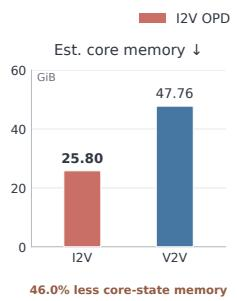

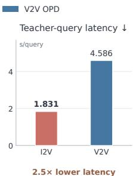  
Figure 1: Computational costs of I2V and V2V OPD. Both train Wan2.1-1.3B using SD3.5- Medium and Wan2.1-14B teachers, respectively. Left: estimated student training-state and teacher memory, excluding activations and auxiliary modules. Right: measured teacher-query latency.

l., 2026). In the video domain, stronger video difeaker video models (Yin et al., 2025; Huang et al.,

  
Prompt: A side view of an owl sitting in a field  
Prompt: A smartphone screen with a notification reading "1000000 Prompt: Il ustration of a mouse using a mushroom as an umbrel a. Unreads" displayed prominently, set against a cluttered desk with scattered notes and a cup of coffee, capturing the overwhelmed feeling of the user.

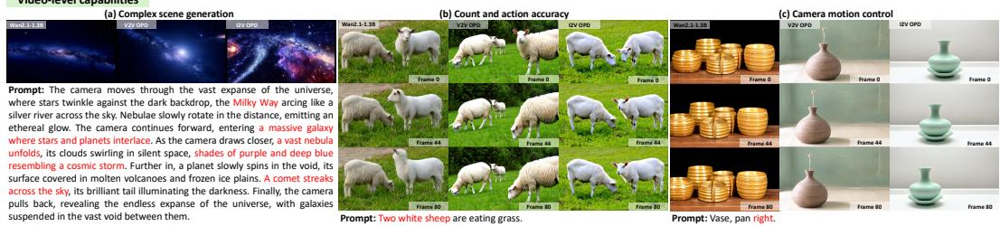  
Figure 2: Qualitative comparisons of Base, V2V OPD, and I2V OPD. Base denotes the pretrained Wan2.1-1.3B model. Top: aesthetic quality on DrawBench, text rendering on the Text Rendering benchmark, and compositional generation. Bottom: complex scene generation, count and action accuracy, and camera motion control on VBench-2.0 prompts.

2026), for example by accelerating student inference through distillation. However, OPD training requires repeated evaluations of an expensive video teacher at student-generated states, introducing substantial computational overhead. As shown in Fig. 1, video-teacher OPD has an estimated core model-state memory footprint of 47.76 GiB and a mean teacher-query latency of 4.59 seconds under the evaluated configurations. In contrast, image-teacher OPD reduces these costs to 25.80 GiB and 1.83 seconds, respectively, while image generation models can provide supervision for downstream video tasks such as visual aesthetics and text rendering (Guo et al., 2023; Kwon et al., 2024; Chen et al., 2024; Zhu et al., 2024). Qualitative comparisons in Fig. 2 further illustrate the potential of image-teacher OPD to improve visual quality and prompt adherence over the pretrained student and video-teacher OPD.

This motivates us to explore whether image generation models post-trained for specialized tasks can serve as attractive teachers for video generation, improving the student video model while maintaining training efficiency. However, applying image models to video generation faces two challenges. First, image and video models typically use different VAEs, resulting in mismatched latent spaces with different channel dimensions and spatial or temporal compression rates. Thus, the student’s video latents during training cannot be directly processed by the image teacher, nor can the teacher’s predictions serve as targets in the student’s latent space. Second, image experts are trained on static images and do not capture temporal dynamics such as cross-frame object and scene evolution, so their frame-level supervision may disrupt temporal coherence. These challenges raise a central question: How can we transfer specialized image expertise to a video student through on-policy distillation across heterogeneous latent spaces while preserving its learned temporal dynamics?

To address this question, we propose MILD, a Motion-Preserving Image-to-Video Latent Distillation framework that transfers specialized visual capabilities from image experts while preserving pretrained video dynamics. In particular, we first develop an adaptive connector to bridge image and video latent spaces and maintain their alignment as the student evolves throughout training. To preserve video dynamics, we anchor image-guided corrections to the student’s frozen pretrained predictions and constrain their magnitude and inter-frame variation. An optical-flow-based motion reward further complements static image expertise with explicit motion feedback, improving motion quality and temporal consistency. Our main contributions are summarized as follows:

• We introduce an image-to-video OPD framework, MILD, that transfers specialized visual capabilities from image experts to video students, reducing reliance on costly specialized video teachers. Its adaptive connector supports both linear and nonlinear designs and enables transfer across different VAEs and backbone architectures.

• We combine image-expert supervision with a frozen video reference and explicit temporal constraints to improve frame quality while preserving pretrained video dynamics. An auxiliary motion reward complements image supervision with direct feedback on video motion.

• Experiments on Wan2.1-1.3B, Wan2.2-5B, and LTX-Video-2B demonstrate effective capability transfer at lower teacher-query costs on VBench-2.0 and EvalCrafter, while connector ablations and cross-architecture distillation support the framework’s generality.

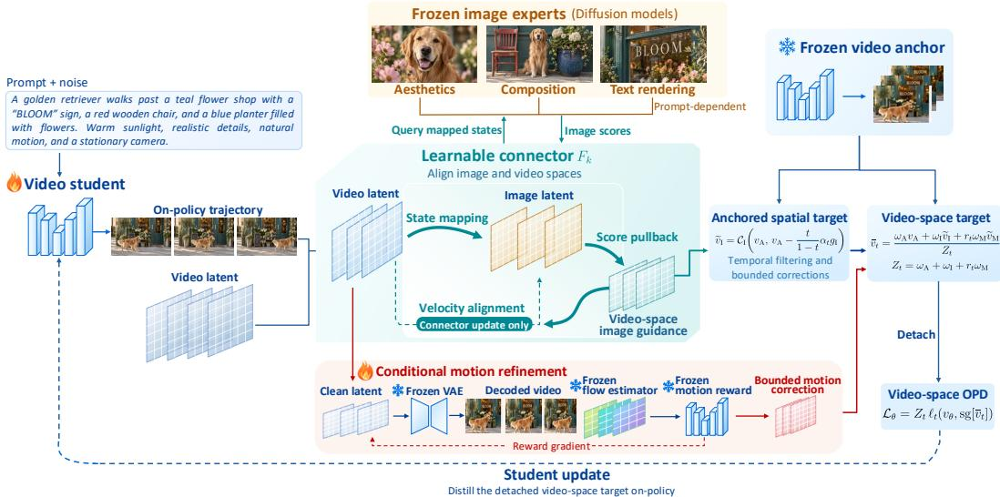  
Figure 3: Overview of MILD. Learnable connectors transfer image-expert supervision to on-policy video states. A frozen video anchor bounds spatial corrections, while optical-flow feedback provides motion refinement. Predictions are fused into a detached distillation target; connectors use a separate alignment objective.

## 2 RELATED WORK

Image priors for video generation. Prior work extends image models with temporal modules (Singer et al., 2022; Blattmann et al., 2023; Guo et al., 2023), fine-tunes spatial modules with high-quality images (Chen et al., 2024), or uses inference-time denoiser fusion (Shao et al., 2025) and image-supervised distillation (Zhai et al., 2024). We transfer specialized image predictions across heterogeneous latent spaces, using bounded corrections to a video anchor to compensate for missing temporal context.

On-policy diffusion distillation. OPD supervises students along their own generation trajectories (Lu & Lab, 2025; Yu et al., 2026). DMD2 reduces multi-step training–inference mismatch (Yin et al., 2024); CausVid distills bidirectional video teachers into autoregressive students, while Self Forcing reduces exposure bias through self-generated rollouts (Yin et al., 2025; Huang et al., 2026). DiffusionOPD and Flow-OPD consolidate specialized image teachers along student denoising trajectories (Li et al., 2026; Fang et al., 2026). We transfer image expertise to video by pulling image scores into video coordinates and integrating video denoising and motion refinement.

Motion-aware video post-training. Prior work improves motion through temporal adaptation, video guidance, or motion-specific objectives (Zhao et al., 2024; Lee et al., 2025; Li et al., 2025; Xue et al., 2025). InstructVideo uses image rewards for video fine-tuning, while VADER backpropagates reward gradients through video generation (Yuan et al., 2024; Prabhudesai et al.). Our motion feedback corrects image-induced denoising directions to construct temporally compatible targets from frame-level supervision.

## 3 METHOD

Figure 3 outlines MILD from frozen image teachers to a video student. We begin by defining the distillation objective (Section 3.1) and introducing learnable connectors to align heterogeneous representations (Section 3.2). Building on this alignment, we constrain and refine image supervision using a video anchor and motion feedback (Section 3.3). Finally, we describe target fusion and connector alignment (Section 3.4).

## 3.1 ON-POLICY DISTILLATION OBJECTIVE

We first formulate an on-policy distillation objective that matches the video student’s denoising transitions to target transitions at latent states sampled from its current generation trajectories. Let $v _ { \theta } ( x _ { t } , t , c )$ denote the student’s velocity at video latent $x _ { t }$ , diffusion time t, and text condition c, and let $\bar { v } ( x _ { t } , t , c )$ denote a target velocity in the same video latent space. For a reverse step from t to $t - h .$ , let $\pi _ { u } ( \cdot \mid x _ { t } , t , c )$ denote the transition induced by velocity u. The OPD objective is

$$
\mathcal { L } _ { \mathrm { O P D } } = \mathbb { E } _ { c , t , x _ { t } \sim p _ { \theta } ( \cdot \vert t , c ) } \left[ \ell _ { t } ( v _ { \theta } , \bar { v } ) \right] , \quad \ell _ { t } ( v _ { \theta } , \bar { v } ) : = \frac { 1 } { d } D _ { \mathrm { K L } } ( \pi _ { v _ { \theta } } ( \cdot \vert x _ { t } , t , c ) \Vert \pi _ { \bar { v } } ( \cdot \vert x _ { t } , t , c ) )\tag{1}
$$

where $p _ { \theta } ( \cdot \mid t , c )$ is the distribution of states visited by the current student at time t, and d is the number of video-latent entries. Both transitions in the KL divergence are conditioned on the same $( x _ { t } , t , c )$ We next obtain a closed form for this loss under the reverse-SDE Euler formulation of OPD (Li et al., 2026). We use the rectified-flow convention $x _ { t } = ( 1 - t ) x _ { 0 } + t \epsilon$ , where $\epsilon \sim \mathcal { N } ( 0 , I )$ is independent of $x _ { 0 }$ (Liu et al., 2023). For $0 < t < 1$ and $0 < h \leq t .$ , the transition associated with $u \in \{ v _ { \theta } , \bar { v } \}$ is $\pi _ { u } = \mathcal { N } ( \mu _ { u } , \sigma _ { t } ^ { 2 } h I )$ , where $\mu _ { u }$ is its reverse-SDE Euler mean and $\sigma _ { t } > 0$ is the shared diffusion coefficient. Under this convention, the difference between the transition means is

$$
\mu _ { v _ { \theta } } - \mu _ { \bar { v } } = - h \left( 1 + { \frac { \sigma _ { t } ^ { 2 } ( 1 - t ) } { 2 t } } \right) ( v _ { \theta } - \bar { v } ) .
$$

Since the transitions share the same covariance, their KL divergence depends only on this mean difference. Substitution gives

$$
\ell _ { t } ( v _ { \theta } , \bar { v } ) = \frac { \| \mu _ { v _ { \theta } } - \mu _ { \bar { v } } \| _ { \mathrm { a v } } ^ { 2 } } { 2 \sigma _ { t } ^ { 2 } h } = w ( t , h ) \| v _ { \theta } - \bar { v } \| _ { \mathrm { a v } } ^ { 2 } ,\tag{2}
$$

$$
w ( t , h ) = \frac { h } { 2 \sigma _ { t } ^ { 2 } } \left( 1 + \frac { \sigma _ { t } ^ { 2 } ( 1 - t ) } { 2 t } \right) ^ { 2 } ,\tag{3}
$$

where $\| q \| _ { \mathrm { a v } } ^ { 2 } = \| q \| _ { 2 } ^ { 2 } / d .$ . Thus, matching these Gaussian denoising transitions is equivalent to minimizing a weighted velocity error in video coordinates. The complete reverse-SDE derivation is provided in Appendix A.1.

## 3.2 CROSS-ARCHITECTURE IMAGE GUIDANCE TRANSFER

Video students and image experts use different VAEs and latent layouts, so their latent states and denoising velocities cannot be compared directly. We introduce a differentiable connector $F _ { \psi }$ : $\mathbb { R } ^ { d ^ { \mathrm { v } } } \xrightarrow { } \bar { \mathbb { R } } ^ { d ^ { \mathrm { I } } }$ to evaluate student states using image experts, where $d ^ { \mathrm { V } }$ and $d ^ { \mathrm { I } }$ denote the respective latent dimensions.

Transferring image guidance. We select video-latent slices at fixed temporal intervals, resize them to the experts’ spatial layout, and map them into the image latent space with a learnable transformation. The K frozen experts share a VAE and input layout, allowing a common connector. To compare denoising behavior, we also map the student’s velocity into image coordinates. Holding ψ fixed, the chain rule gives

$$
z _ { t } = F _ { \psi } ( x _ { t } ) , \qquad { \widehat { v } } _ { \theta } ^ { \mathrm { I } } = J _ { F _ { \psi } } ( x _ { t } ) v _ { \theta } ( x _ { t } , t , c ) ,\tag{4}
$$

where $J _ { F _ { \psi } }$ is the Jacobian with respect to $x _ { t }$ . The mapped velocity $\widehat { v } _ { \theta } ^ { \mathrm { I } }$ can therefore be compared with the expert predictions $u _ { k } ( z _ { t } , t , c )$ at the mapped student state. Expert predictions are expressed in image coordinates and cannot directly serve as video-space updates. Since the connector need not be invertible, we convert the expert velocities into image scores $s _ { k } ^ { \mathrm { I } }$ and pull their guidance back to the video latent space through the chain rule:

$$
g _ { \mathrm { I } } = J _ { F _ { \psi } } ( x _ { t } ) ^ { \top } \sum _ { k = 1 } ^ { K } \beta _ { k } ( c ) s _ { k } ^ { \mathrm { I } } , \qquad \beta _ { k } ( c ) \ge 0 , \quad \sum _ { k } \beta _ { k } ( c ) = 1 .\tag{5}
$$

Here, $g _ { \mathrm { I } }$ gives a video-space direction toward greater agreement with the image experts. The fixed prompt-dependent weights $\beta _ { k } ( c )$ select relevant expertise; for example, OCR guidance is disabled when text rendering is not required. Appendix A.2 details score conversion and pullback.

Aligning the connector. Matching latent dimensions alone does not ensure that the mapped video states preserve the visual content or denoising behavior expected by the image experts. We therefore train the connector using content and velocity alignment. For content alignment, we encode the same image with both VAEs: the video VAE receives a static clip of repeated images, while the image VAE’s output is replicated across the selected temporal slices. This yields paired clean latents $( \bar { x } _ { 0 } , \bar { z } _ { 0 } )$ . For velocity alignment, we compare the mapped student velocity with expert predictions at states sampled from the student’s current trajectories:

$$
\mathcal { L } _ { \mathrm { c o n n } } = \lambda _ { z } \mathbb { E } \| F _ { \psi } ( \bar { x } _ { 0 } ) - \bar { z } _ { 0 } \| _ { \mathrm { a v } } ^ { 2 } + \frac { \lambda _ { v } } { K } \sum _ { k = 1 } ^ { K } \mathbb { E } \| \hat { v } _ { \theta } ^ { \mathrm { I } } - u _ { k } ( z _ { t } , t , c ) \| _ { \mathrm { a v } } ^ { 2 } + \lambda _ { \mathrm { r e g } } \mathcal { R } ( \psi ) .\tag{6}
$$

The content term grounds the mapping in shared visual content, while the velocity term adapts it to the student’s evolving denoising trajectories. The regularizer $\mathcal { R } ( \psi )$ penalizes deviations from the initial connector parameters. During connector updates, input latents, student velocities, and expert predictions are detached, so only ψ is optimized. Although $z _ { t }$ depends on $F _ { \psi }$ , expert predictions are fixed targets; the velocity term updates the connector through $J _ { F _ { \psi } } ( x _ { t } ) v _ { \theta }$

Our default connector is a bias-free linear map $F _ { \psi } ( x ) = A _ { \psi } x$ , implemented using fixed slice selection and resizing followed by learnable spatial convolutions. Its Jacobian satisfies $J _ { F _ { \psi } } ( x ) v = A _ { \psi } v ,$ so the same operator maps both states and velocities. Nonlinear connectors use Jacobian–vector products under the same alignment objective. Neither implementation requires an invertible mapping, a shared image–video VAE, or matching backbone architectures. Appendix A.3 provides the derivation and nonlinear training details.

## 3.3 PRESERVING VIDEO DYNAMICS AND REFINING MOTION

Transferred image guidance can improve spatial content, but it does not account for inter-frame relationships. We therefore constrain its effect using a frozen video reference and optionally add explicit motion feedback.

Preserving video dynamics. We use the velocity $v _ { \mathrm { A } }$ predicted by a frozen video reference as an anchor and apply the transferred image guidance as a controlled correction:

$$
\widetilde v _ { \mathrm { I } } = \mathcal { C } _ { \mathrm { I } } \left( v _ { \mathrm { A } } , v _ { \mathrm { A } } - \frac { t } { 1 - t } \alpha _ { t } g _ { \mathrm { I } } \right) , \qquad 0 < t < 1 .\tag{7}
$$

The factor $t / ( 1 - t )$ converts a score correction into a velocity correction under the rectified-flow convention. The scale $\alpha _ { t } \geq 0$ normalizes guidance relative to the anchor score and caps the initial correction. The operator $\mathcal { C } _ { \mathrm { I } }$ further limits its magnitude relative to the anchor and suppresses abrupt inter-frame variation. This produces an image-enhanced target while constraining departures from pretrained video behavior. Appendix A.4.1 details the guidance normalization and the temporal correction operator.

Refining motion with explicit feedback. Constraining image guidance limits temporal disruption but does not directly reward realistic motion. We hence optionally refine the image-enhanced target using a learned motion reward R. A frozen RAFT estimator (Teed & Deng, 2020) extracts optical flow from the decoded video, and a motion discriminator scores it. The discriminator is trained to distinguish real-video flows from generated and temporally corrupted flows. Specifically, we decode the clean latent prediction $\widehat { x } _ { 0 } = \bar { x _ { t } } - t \mathrm { s g } [ \widetilde { v _ { \mathrm { I } } } ]$ and use the reward gradient to refine the target:

$$
\widetilde { v } _ { \mathrm { M } } = \mathcal { C } _ { \mathrm { M } } \big ( \widetilde { v } _ { \mathrm { I } } , \widetilde { v } _ { \mathrm { I } } - \gamma _ { t } \nabla _ { x _ { t } } R \big ( D ^ { \mathrm { V } } ( \widetilde { x } _ { 0 } ) \big ) \big ) .\tag{8}
$$

Here, $D ^ { \mathrm { V } }$ is the frozen video decoder, sg stops gradients through the image target, and $\gamma _ { t } ~ \geq ~ 0$ controls the reward correction. Before temporal processing, subtracting this gradient from the velocity moves the clean prediction locally toward higher motion reward. The operator $\mathcal { C } _ { \mathrm { M } }$ controls the correction magnitude and its inter-frame variation. The decoder, RAFT, and discriminator remain frozen during refinement, while allowing gradients through their inputs. Appendix B describes discriminator training, and Appendix A.4.2 details reward differentiation and correction scaling.

## 3.4 JOINT OPTIMIZATION

At each student-update state, we combine the frozen video anchor $v _ { \mathrm { A } }$ , image-enhanced target $\widetilde { v _ { \mathrm { I } } }$ and, when applied, motion-refined target $\widetilde { v } _ { \mathrm { M } }$ . Motion refinement requires differentiation through video decoding and optical-flow estimation, so we apply it only at selected states; anchor and image supervision remain active at every state. Let $r _ { t } ~ \in ~ \{ 0 , 1 \}$ indicate whether motion refinement is applied at $x _ { t }$ . For positive weights $\omega _ { \mathrm { A } } , \omega _ { \mathrm { I } } .$ , and $\omega _ { \mathrm { M } } .$ , define $Z _ { t } = \omega _ { \mathrm { A } } + \omega _ { \mathrm { I } } + r _ { t } \omega _ { \mathrm { M } }$ The fused video-space target is $\bar { v } _ { t } = Z _ { t } ^ { - 1 } \bar { ( \omega _ { \mathrm { A } } v _ { \mathrm { A } } + \omega _ { \mathrm { I } } \widetilde v _ { \mathrm { I } } + r _ { t } \omega _ { \mathrm { M } } \widetilde v _ { \mathrm { M } } ) }$ . Appendix B specifies the diffusion-time range eligible for motion refinement and the per-iteration activation budget.

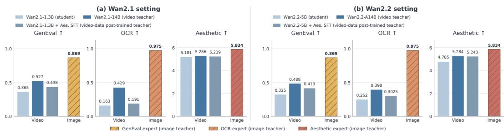  
Figure 4: Spatial capability comparisons across Wan2.1 and Wan2.2 settings. Each setting compares the student, a larger video teacher, a video teacher post-trained on aesthetic video data, and specialized image teachers. Image experts achieve the highest GenEval, OCR, and Aesthetic scores in both settings.

For N states sampled from the current student trajectories, we optimize the student with

$$
\mathcal { L } _ { \mathrm { s t u d e n t } } = \frac { 1 } { N } \sum _ { j = 1 } ^ { N } Z _ { t _ { j } } \ell _ { t _ { j } } \left( v _ { \theta } ( x _ { t _ { j } } , t _ { j } , c ) , \mathrm { s g } [ \bar { v } _ { t _ { j } } ] \right) .\tag{9}
$$

Because $\ell _ { t }$ is a weighted squared velocity error, the factor $Z _ { t }$ restores the component weights after target normalization: with the component targets detached, the student gradient equals that from matching each active target separately with its corresponding fusion weight.

Student updates change the on-policy states and velocities used to align the connector. After a connector-only warm-up, each iteration updates the student using Eq. (9) and the connector using Eq. (6). The fused target is detached during student updates; input states, student velocities, and image-expert predictions are detached during connector updates. Thus, each objective updates only its intended parameters. The video anchor, image experts, and auxiliary motion networks remain frozen, and inference uses only the updated student. Appendix A.5 details the two update rules.

## 4 EXPERIMENTS

## 4.1 EXPERIMENTAL SETTING

Setup. We evaluate MILD on Wan2.1-1.3B, Wan2.2-5B (Wan et al., 2025), and LTX-Video-2B (HaCohen et al., 2024), using a frozen copy of each pretrained student as its video anchor. Following DiffusionOPD (Li et al., 2026), we use three SD3.5-Medium (Esser et al., 2024) image experts specializing in compositional generation (Ghosh et al., 2023), aesthetics, and text rendering. Table 1 lists the video-teacher pairings and the image-expert backbone shared across students. Ordered as GenEval, aesthetic,

Table 1: Experimental setup. Video-teacher pairings and shared image-expert backbone. Each V2V configuration uses one video teacher.
<table><tr><td>Video student</td><td>V2V teacher</td><td>Image experts</td></tr><tr><td rowspan="3">Wan2.1-1.3B</td><td>Wan2.1-14B</td><td rowspan="3">SD3.5-Medium</td></tr><tr><td>Wan2.2-5B</td></tr><tr><td>Wan2.2-A14B</td></tr><tr><td>Wan2.2-5B</td><td>Wan2.2-A14B</td><td></td></tr><tr><td>LTX-Video-2B</td><td>LTX-Video-13B</td><td></td></tr></table>

and OCR experts, their image-score weights are (0.5, 0.5, 0) for ordinary prompts and (0.4, 0.4, 0.2) for text-related prompts. We construct a pool of 10,000 training prompts, with 5,000 from OpenVid-1M (Nan et al., 2025) and 5,000 from LVD-2M (Xiong et al., 2024). Each iteration samples one prompt and generates an on-policy trajectory for an 81-frame video at 480×832 resolution. Training comprises 50 connector-alignment iterations followed by 200 joint optimization iterations. Further implementation details and motion-reward validation are provided in Appendices B and C.1.

Baselines. We compare MILD with the pretrained students and two types of V2V OPD baselines: V2V OPD (teacher name) uses a larger pretrained video teacher, while V2V OPD (Aes. SFT teacher) uses an aesthetic-SFT video teacher. To construct the latter, we fine-tune a copy of each student backbone on video–text data from AesVideo-Bench (Han et al., 2026), then freeze the resulting model as its V2V OPD teacher. Table 1 lists the video-teacher pairings, including Wan2.2-5B and Wan2.2-A14B teachers for Wan2.1-1.3B to assess transfer across video model variants. We evaluate video quality using VBench-2.0 (Zheng et al., 2025) and EvalCrafter (Liu et al., 2024).

## 4.2 MAIN RESULTS

V2V OPD (video teacher) MILD (image teachers: 3 × SD3.5-Medium) Sum of per-GPU peak allocated memory ↓

Table 2: Evaluation results on VBench-2.0 and EvalCrafter. MILD outperforms both V2V OPD baselines on the aggregate scores of both benchmarks across all three student backbones. Compared with the larger-teacher V2V OPD baseline, MILD reduces the sum of per-GPU peak allocated memory by 39.32%, 64.07%, and 19.53% on Wan2.1-1.3B, Wan2.2-5B, and LTX-Video-2B, respectively (Figure 5). Bold and underlined values indicate the best and second-best results within each student group.
<table><tr><td></td><td colspan="6">VBench-2.0 ↑</td><td colspan="5">EvalCrafter ↑</td></tr><tr><td>Method</td><td>Creativity Commonsense</td><td></td><td>Controllability</td><td>Human Fidelity</td><td>Physics AVG.</td><td></td><td>Visual Quality</td><td>Text-Video Alignment</td><td>Motion Quality</td><td>Temporal Consistency</td><td>Final Sum Score</td></tr><tr><td colspan="10">Large video teachers (reference)</td></tr><tr><td>Wan2.1-14B</td><td>48.91</td><td>59.95</td><td>27.44</td><td>90.94</td><td>44.09</td><td>54.27</td><td>66.25</td><td>56.78</td><td>53.97</td><td>63.93</td><td>240.93</td></tr><tr><td>Wan2.2-A14B</td><td>52.98</td><td>67.73</td><td>35.36</td><td>82.59</td><td>51.60</td><td>58.05</td><td>66.47</td><td>60.22</td><td>54.58</td><td>63.10</td><td>244.37</td></tr><tr><td>LTX-Video-13B</td><td>55.02</td><td>40.84</td><td>13.90</td><td>87.60</td><td>43.14</td><td>48.10</td><td>64.08</td><td>51.99</td><td>56.00</td><td>65.04</td><td>237.11</td></tr><tr><td colspan="10">Wan2.1-1.3B</td></tr><tr><td></td><td></td><td></td><td></td><td></td><td></td><td></td><td></td><td></td><td></td><td></td><td>238.87</td></tr><tr><td>Base V2V OPD (Wan2.1-14B)</td><td>45.86 47.34</td><td>59.68 63.71</td><td>22.85 24.67</td><td>85.16 85.17</td><td>42.07 45.32</td><td>51.12 53.24</td><td>65.78 66.64</td><td>56.51 56.38</td><td>53.36 53.70</td><td>63.22 63.03</td><td>239.75</td></tr><tr><td>V2V OPD (Aes. SFT teacher)</td><td>48.12</td><td>61.13</td><td>24.94</td><td>86.45</td><td>44.94</td><td>53.12</td><td>65.47</td><td>58.62</td><td>54.45</td><td>63.16</td><td>241.70</td></tr><tr><td>MILD</td><td>47.89</td><td>64.56</td><td>25.17</td><td>85.47</td><td>46.52</td><td>53.92</td><td>66.84</td><td>57.89</td><td>54.58</td><td>63.79</td><td>243.10</td></tr><tr><td colspan="10">Wan2.2-5B</td></tr><tr><td>Base</td><td>48.20</td><td>58.50</td><td>20.02</td><td>81.89</td><td>49.31</td><td>51.58</td><td>61.48</td><td>55.63</td><td>54.00</td><td>61.93</td><td>233.04</td></tr><tr><td>V2V OPD (Wan2.2-A14B)</td><td>48.29</td><td>60.81</td><td>20.79</td><td>81.98</td><td>51.60</td><td>52.69</td><td>62.06</td><td>57.51</td><td>54.07</td><td>63.10</td><td>236.74</td></tr><tr><td>V2V OPD (Aes. SFT teacher)</td><td>48.64</td><td>61.69</td><td>19.07</td><td>83.75</td><td>50.62</td><td>52.75</td><td>62.23</td><td>57.79</td><td>54.11</td><td>62.73</td><td>236.86</td></tr><tr><td>MILD</td><td>49.50</td><td>62.84</td><td>21.80</td><td>84.89</td><td>54.29</td><td>54.66</td><td>63.76</td><td>59.12</td><td>54.43</td><td>62.79</td><td>240.10</td></tr><tr><td colspan="10">LTX-Video-2B</td></tr><tr><td>Base</td><td>47.95</td><td>43.72</td><td>12.17</td><td>67.35</td><td>37.77</td><td>41.79</td><td>56.31</td><td>46.78</td><td>54.96</td><td>62.76</td><td>220.81</td></tr><tr><td>V2V OPD (LTX-13B)</td><td>56.68</td><td>33.38</td><td>16.22</td><td>68.82</td><td>45.43</td><td>44.11</td><td>56.50</td><td>47.05</td><td>55.19</td><td>64.39</td><td>223.13</td></tr><tr><td>V2V OPD (Aes. SFT teacher)</td><td>56.75</td><td>45.36</td><td>15.97</td><td>69.15</td><td>47.14</td><td>46.87</td><td>56.62</td><td>47.61</td><td>55.21</td><td>64.21</td><td>223.65</td></tr><tr><td>MILD</td><td>57.23</td><td>48.85</td><td>16.78</td><td>72.38</td><td>50.06</td><td>49.06</td><td>56.58</td><td>48.41</td><td>55.30</td><td>64.51</td><td>224.80</td></tr></table>

Table 3: Cross-architecture video-to-video OPD on VBench-2.0. All OPD variants use Wan2.1- 1.3B as the student, with the teacher specified in parentheses. Distillation from Wan2.2 teachers improves the student’s overall performance, showing that the proposed connector transfers supervi sion between heterogeneous video diffusion models.
<table><tr><td>Method</td><td>Creativity</td><td>Commonsense</td><td>Controllability</td><td>Human Fidelity</td><td>Physics</td><td>AVG.</td></tr><tr><td>Wan2.1-1.3B</td><td>45.86</td><td>59.68</td><td>22.85</td><td>85.16</td><td>42.07</td><td>51.12</td></tr><tr><td>V2V OPD (Wan2.1-14B)</td><td>47.34</td><td>63.71</td><td>24.67</td><td>85.17</td><td>45.32</td><td>53.24</td></tr><tr><td>V2V OPD (Wan2.2-A14B)</td><td>48.74</td><td>65.72</td><td>24.59</td><td>82.37</td><td>42.91</td><td>52.87</td></tr><tr><td>V2V OPD (Wan2.2-5B)</td><td>48.29</td><td>58.50</td><td>23.70</td><td>82.51</td><td>43.14</td><td>51.23</td></tr></table>

Quantitative Analysis. Table 2 compares MILD with the pretrained students and V2V OPD baselines across three student backbones on VBench-2.0 and EvalCrafter. MILD achieves stronger aggregate benchmark performance while reducing GPU memory usage, as shown in Figure 5. On Wan2.1- 1.3B, Wan2.2-5B, and LTX-Video-2B, MILD achieves VBench-2.0 averages of 53.92, 54.66, and 49.06, exceeding the best V2V OPD results of 53.24, 52.75, and 46.87, respectively. It also surpasses both V2V OPD baselines in

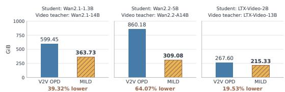  
Figure 5: GPU memory comparison across student backbones. MILD reduces the sum of per-GPU peak allocated memory relative to V2V OPD across all three backbones. The metric sums each participating GPU’s peak allocated memory.

EvalCrafter final score across all three backbones. Meanwhile, the sum of per-GPU peak allocated memory is reduced by 39.32%, 64.07%, and 19.53%, respectively, relative to the V2V OPD baseline. These results demonstrate that specialized image-expert supervision can outperform video-to-video distillation while requiring less aggregate GPU memory. Figure 4 compares specialized image experts with students, larger video teachers, and video teachers post-trained on aesthetic video data across the Wan2.1 and Wan2.2 settings. The GenEval and OCR experts score 0.869 and 0.975, respectively, compared with 0.527 and 0.429 for Wan2.1-14B and 0.488 and 0.398 for Wan2.2-A14B. The aesthetic expert scores 5.834, exceeding all evaluated video models, whose highest score is 5.286. These capability advantages support using specialized image experts as sources of spatial supervision for video post-training. Beyond appearance, MILD improves motion quality, temporal consistency, controllability, and physics over each pretrained student, indicating that transferring static image expertise is compatible with improved temporal behavior. Table 3 further demonstrates the connector’s applicability to cross-architecture video-to-video OPD. Distilling Wan2.2-A14B or Wan2.2-5B into Wan2.1-1.3B raises its VBench-2.0 average from 51.12 to 52.87 or 51.23, respectively. This extension shows that the connector provides a supervision interface for heterogeneous diffusion models beyond the image-to-video setting. Architectural differences, particularly between the mixture-of-experts Wan2.2-A14B teacher and the dense student, may affect transfer effectiveness; understanding and mitigating these effects remains future work. Appendix C.2 provides further comparisons with video models fine-tuned on aesthetic video data, showing that MILD retains an overall advantage and supporting the effectiveness of transferring specialized image expertise to video generation.

Prompt: The moon changes from silver to yellow.  
Prompt: A cat is on the table, then the cat runs to the left of the table.  
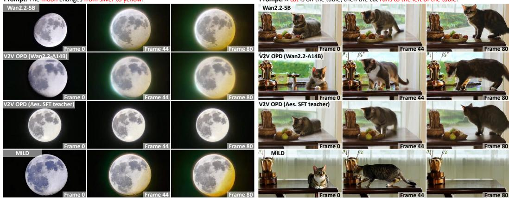  
Figure 6: Qualitative comparisons using Wan2.2-5B as the student. Frames 0, 44, and 80 illustrate MILD’s ability to accurately follow prompts involving color changes and directional motion. In contrast, baselines fail to respond correctly to the moon’s color change and produces artifacts (left), while the cat’s motion direction is incorrect (right). More visualizations are in Appendix C.3.

Table 4: Frame-level spatial capability evaluation using Wan2.2-5B. We evaluate the middle frame of each generated video, using DrawBench prompts for the five model-based metrics and FlowGRPO evaluation splits for GenEval and OCR, consistent with DiffusionOPD (Li et al., 2026). MILD achieves the highest score on every metric among the compared student variants.
<table><tr><td rowspan="2">Method</td><td colspan="5">DrawBench</td><td colspan="2">FlowGRPO splits</td></tr><tr><td>Aesthetic</td><td>PickScore</td><td>HPSv2</td><td>CLIPScore</td><td>ImageReward</td><td>GenEval</td><td>OCR</td></tr><tr><td>Base</td><td>4.7855</td><td>0.7841</td><td>0.2293</td><td>0.2372</td><td>-0.4390</td><td>0.3252</td><td>0.2522</td></tr><tr><td>V2V OPD (Aes. SFT teacher)</td><td>4.9169</td><td>0.7931</td><td>0.2321</td><td>0.2414</td><td>-0.3098</td><td>0.4023</td><td>0.2617</td></tr><tr><td>V2V OPD (Wan2.2-A14B)</td><td>4.8217</td><td>0.7819</td><td>0.2253</td><td>0.2338</td><td>-0.4610</td><td>0.4067</td><td>0.2556</td></tr><tr><td>MILD</td><td>5.0305</td><td>0.8111</td><td>0.2470</td><td>0.2438</td><td>0.0320</td><td>0.4454</td><td>0.2697</td></tr></table>

Qualitative Analysis. Figure 6 compares frames 0, 44, and 80 from videos generated with Wan2.2- 5B as the student. For the moon prompt, MILD shows a clear transition toward yellow while retain ing visible lunar texture, whereas V2V OPD with the aesthetic SFT teacher shows little color change. For the cat prompt, MILD depicts the cat moving left across the table and leaving the frame by the final sampled frame, while the compared baselines keep the cat visible on the table. These cases suggest that MILD transfers spatial expertise while retaining the ability to generate prompt-aligned temporal changes. Appendix C.3 provides additional cases using Wan2.2-5B as the student, while Appendix C.4 compares the aesthetic image expert with the video teacher post-trained on aesthetic video data to illustrate differences in visual expertise available for distillation.

## 4.3 SPATIAL CAPABILITY TRANSFER

We evaluate spatial capability transfer using the evaluation splits and metrics adopted by Dif fusionOPD (Li et al., 2026). For each evaluation prompt, we first generate a video and extract its middle frame for image-level assessment, using the same frame-selection protocol across all methods. On DrawBench (Saharia et al., 2022), we evaluate Aesthetic (Schuhmann, 2022), PickScore (Kirstain et al., 2023), HPSv2 (Wu et al., 2023), CLIPScore (Hessel et al., 2021), and ImageReward (Xu et al., 2023) to assess visual aesthetics, predicted human preference, and text– image alignment. For compositional generation and text rendering, we use the GenEval (Ghosh et al., 2023) and OCR evaluation splits provided by FlowGRPO (Liu et al., 2026), applying their respective scoring procedures to the extracted middle frames. As shown in Table 4, MILD leads the compared student variants on all seven frame-level metrics. It achieves a PickScore of 0.8111, an ImageReward score of 0.0320, and an OCR score of 0.2697; its GenEval score also exceeds the strongest V2V OPD result (0.4454 versus 0.4067). These results support the transfer of specialized

Table 5: Ablation study on Wan2.2-5B using VBench-2.0. The full model uses auxiliary motion refinement, joint optimization, the default connector, and prompt-dependent image-score weights that enable OCR guidance only for text-related prompts. Single-expert variants use only the indicated image expert.
<table><tr><td>Variant</td><td>Creativity</td><td>Commonsense</td><td>Controllability</td><td>Human Fidelity</td><td>Physics</td><td>AVG.</td></tr><tr><td>Pretrained model (reference)</td><td></td><td></td><td></td><td></td><td></td><td></td></tr><tr><td>Wan2.2-5B (Base)</td><td>48.20</td><td>58.50</td><td>20.02</td><td>81.89</td><td>49.31</td><td>51.58</td></tr><tr><td>Supervision and optimization strategy</td><td></td><td></td><td></td><td></td><td></td><td></td></tr><tr><td>w/o image experts</td><td>45.97</td><td>60.79</td><td>20.48</td><td>82.11</td><td>50.95</td><td>52.06</td></tr><tr><td>w/o motion refinement</td><td>48.64</td><td>61.75</td><td>19.73</td><td>83.45</td><td>53.68</td><td>53.45</td></tr><tr><td>V2V OPD (Wan2.2-A14B) + motion refinement</td><td>46.86</td><td>61.68</td><td>20.40</td><td>83.61</td><td>52.74</td><td>53.06</td></tr><tr><td>Alternating optimization</td><td>48.42</td><td>62.84</td><td>20.34</td><td>83.83</td><td>53.93</td><td>53.87</td></tr><tr><td>MILD (joint optimization)</td><td>49.50</td><td>62.84</td><td>21.80</td><td>84.89</td><td>54.29</td><td>54.66</td></tr><tr><td>Connector architecture</td><td></td><td></td><td></td><td></td><td></td><td></td></tr><tr><td>1×1 linear connector</td><td>48.20</td><td>60.80</td><td>19.62</td><td>83.75</td><td>52.37</td><td>52.95</td></tr><tr><td>Nonlinear connector</td><td>48.74</td><td>61.39</td><td>19.68</td><td>84.33</td><td>52.78</td><td>53.38</td></tr><tr><td>MILD (default connector)</td><td>49.50</td><td>62.84</td><td>21.80</td><td>84.89</td><td>54.29</td><td>54.66</td></tr><tr><td>Expert selection, weighting, and routing</td><td></td><td></td><td></td><td></td><td></td><td></td></tr><tr><td>GenEval expert only</td><td>47.99</td><td>61.38</td><td>19.53</td><td>83.12</td><td>49.78</td><td>52.36</td></tr><tr><td>Aesthetic expert only</td><td>49.26</td><td>61.09</td><td>19.70</td><td>84.52</td><td>51.58</td><td>53.23</td></tr><tr><td>Uniform weights (1/3, 1/3, 1/3)</td><td>48.68</td><td>59.66</td><td>20.01</td><td>83.16</td><td>53.21</td><td>52.94</td></tr><tr><td>MILD (prompt-dependent weights)</td><td>49.50</td><td>62.84</td><td>21.80</td><td>84.89</td><td>54.29</td><td>54.66</td></tr></table>

image expertise to video generation and complement the video-level evaluations of motion quality and temporal consistency. Qualitative comparisons are provided in Appendix C.5.

## 4.4 ABLATION STUDY

We ablate image guidance, motion refinement, optimization strategy, connector architecture, and expert configuration on Wan2.2-5B using VBench-2.0, keeping all other settings fixed unless otherwise stated. Results are reported in Table 5.

Supervision and optimization strategy. We remove image-expert guidance while retaining motion feedback, or remove motion refinement while retaining image guidance; both variants retain the video anchor. The full model achieves an average score of 54.66, compared with 52.06 with out image experts and 53.45 without motion refinement, and outperforms both variants across all five categories. It also exceeds V2V OPD with Wan2.2-A14B under the same motion-refinement procedure (53.06), supporting the effectiveness of image-expert transfer when both approaches receive motion feedback. Joint optimization outperforms an alternating schedule of one connector update followed by 16 student updates (54.66 versus 53.87), consistent with the benefit of adapting the connector as the student policy evolves. Both schedules retain the separate objectives and gradient-detachment rules in Section 3.4.

Connector architecture. We replace the default spatial linear connector with a 1×1 linear or nonlinear connector under the same alignment objective. Linear connectors apply the same operator to states and velocities, while the nonlinear variant uses Jacobian–vector products. The 1×1 linear and nonlinear variants score 52.95 and 53.38, respectively, both above the pretrained student’s 51.58 but below the default connector’s 54.66. These results show that the framework supports different connector architectures, while the default design performs best among those tested.

Expert selection, weighting, and activation. We compare the default multi-expert policy with GenEval-only, aesthetic-only, and uniformly weighted variants, keeping the image-guidance scales and target-fusion weights fixed. With experts ordered as GenEval, aesthetic, and OCR, these vari ants use weights (1, 0, 0), (0, 1, 0), and (1/3, 1/3, 1/3), respectively, for every prompt. The default policy scores 54.66, compared with 53.23 for the stronger single-expert variant and 52.94 for uniform weighting. This comparison supports the combined use of specialized experts with promptdependent weighting and activation.

## 5 CONCLUSION

We presented MILD for transferring specialized image expertise to video diffusion models through on-policy distillation. Learnable connectors align heterogeneous latent representations, while videoanchor constraints and motion feedback support spatial improvements alongside temporal consistency. Experiments across three video backbones demonstrate effective capability transfer and con sistent aggregate gains over video-teacher OPD baselines. Our results establish that image experts can be a practical source of diverse supervision for video post-training.

## REFERENCES

Andreas Blattmann, Robin Rombach, Huan Ling, Tim Dockhorn, Seung Wook Kim, Sanja Fidler, and Karsten Kreis. Align your latents: High-resolution video synthesis with latent diffusion models. In IEEE/CVF Conference on Computer Vision and Pattern Recognition (CVPR), pp. 22563–22575. IEEE, 2023.

Haoxin Chen, Yong Zhang, Xiaodong Cun, Menghan Xia, Xintao Wang, Chao Weng, and Ying Shan. Videocrafter2: Overcoming data limitations for high-quality video diffusion models. In IEEE/CVF Conference on Computer Vision and Pattern Recognition (CVPR), pp. 7310–7320. IEEE, 2024.

Zhaoxi Chen, Tianqi Liu, Long Zhuo, Jiawei Ren, Zeng Tao, He Zhu, Fangzhou Hong, Liang Pan, and Ziwei Liu. 4DNex: Feed-forward 4d generative modeling made easy. In 1st Workshop on Reliable and Interactive World Model in Computer Vision Non Archival, 2025.

Patrick Esser, Sumith Kulal, Andreas Blattmann, Rahim Entezari, Jonas Muller, Harry Saini, Yam¨ Levi, Dominik Lorenz, Axel Sauer, Frederic Boesel, et al. Scaling rectified flow transformers for high-resolution image synthesis. In International conference on machine learning, 2024.

Zhen Fang, Wenxuan Huang, Yu Zeng, Yiming Zhao, Shuang Chen, Kaituo Feng, Yunlong Lin, Lin Chen, Zehui Chen, Shaosheng Cao, et al. Flow-opd: On-policy distillation for flow matching models. arXiv preprint arXiv:2605.08063, 2026.

Dhruba Ghosh, Hannaneh Hajishirzi, and Ludwig Schmidt. Geneval: An object-focused framework for evaluating text-to-image alignment. Advances in Neural Information Processing Systems, 36: 52132–52152, 2023.

Yuwei Guo, Ceyuan Yang, Anyi Rao, Zhengyang Liang, Yaohui Wang, Yu Qiao, Maneesh Agrawala, Dahua Lin, and Bo Dai. Animatediff: Animate your personalized text-to-image diffusion models without specific tuning. arXiv preprint arXiv:2307.04725, 2023.

Yoav HaCohen, Nisan Chiprut, Benny Brazowski, Daniel Shalem, Dudu Moshe, Eitan Richardson, Eran Levin, Guy Shiran, Nir Zabari, Ori Gordon, et al. Ltx-video: Realtime video latent diffusion. arXiv preprint arXiv:2501.00103, 2024.

Yujin Han, Yujie Wei, Yefei He, Xinyu Liu, Tianle Li, Zichao Yu, Andi Han, Shiwei Zhang, Tingyu Weng, and Difan Zou. Aesrm: Improving video aesthetics with expert-level feedback. arXiv preprint arXiv:2604.28078, 2026.

Jack Hessel, Ari Holtzman, Maxwell Forbes, Ronan Le Bras, and Yejin Choi. Clipscore: A reference-free evaluation metric for image captioning. In Proceedings of the 2021 conference on empirical methods in natural language processing, pp. 7514–7528, 2021.

Jonathan Ho, Tim Salimans, Alexey Gritsenko, William Chan, Mohammad Norouzi, and David J Fleet. Video diffusion models. Advances in neural information processing systems, 35:8633– 8646, 2022.

Edward J Hu, Yelong Shen, Phillip Wallis, Zeyuan Allen-Zhu, Yuanzhi Li, Shean Wang, Lu Wang, and Weizhu Chen. Lora: Low-rank adaptation of large language models. arXiv preprint arXiv:2106.09685, 2021.

Xun Huang, Zhengqi Li, Guande He, Mingyuan Zhou, and Eli Shechtman. Self forcing: Bridging the train-test gap in autoregressive video diffusion. Advances in Neural Information Processing Systems, 38:167283–167308, 2026.

Yuval Kirstain, Adam Polyak, Uriel Singer, Shahbuland Matiana, Joe Penna, and Omer Levy. Picka-pic: An open dataset of user preferences for text-to-image generation. Advances in neural information processing systems, 36:36652–36663, 2023.

Mingi Kwon, Seoung Wug Oh, Yang Zhou, Difan Liu, Joon-Young Lee, Haoran Cai, Baqiao Liu, Feng Liu, and Youngjung Uh. Harivo: Harnessing text-to-image models for video generation. In European Conference on Computer Vision, pp. 19–36. Springer, 2024.

Dohun Lee, Bryan Sangwoo Kim, Geon Yeong Park, and Jong Chul Ye. Videoguide: Improving video diffusion models without training through a teacher’s guide. In IEEE/CVF Conference on Computer Vision and Pattern Recognition (CVPR), pp. 2599–2608. IEEE, 2025.

Jiachen Li, Qian Long, Jian Skyler Zheng, Xiaofeng Gao, Robinson Piramuthu, Wenhu Chen, and William Wang. T2v-turbo-v2: Enhancing video model post-training through data, reward, and conditional guidance design. In International Conference on Learning Representations, volume 2025, pp. 92279–92305, 2025.

Quanhao Li, Junqiu Yu, Kaixun Jiang, Yujie Wei, Zhen Xing, Pandeng Li, Ruihang Chu, Shiwei Zhang, Yu Liu, and Zuxuan Wu. Diffusionopd: A unified perspective of on-policy distillation in diffusion models. arXiv preprint arXiv:2605.15055, 2026.

Jie Liu, Gongye Liu, Jiajun Liang, Yangguang Li, Jiaheng Liu, Xintao Wang, Pengfei Wan, Di Zhang, and Wanli Ouyang. Flow-grpo: Training flow matching models via online rl. Advances in neural information processing systems, 38:40783–40818, 2026.

Xingchao Liu, Chengyue Gong, and qiang liu. Flow straight and fast: Learning to generate and transfer data with rectified flow. In International Conference on Learning Representations, 2023.

Yaofang Liu, Xiaodong Cun, Xuebo Liu, Xintao Wang, Yong Zhang, Haoxin Chen, Yang Liu, Tieyong Zeng, Raymond Chan, and Ying Shan. Evalcrafter: Benchmarking and evaluating large video generation models. In IEEE/CVF Conference on Computer Vision and Pattern Recognition (CVPR), pp. 22139–22149. IEEE, 2024.

Ilya Loshchilov and Frank Hutter. Decoupled weight decay regularization. arXiv preprint arXiv:1711.05101, 2017.

Kevin Lu and Thinking Machines Lab. On-policy distillation. Thinking Machines Lab: Connectionism, 2025. doi: 10.64434/tml.20251026. https://thinkingmachines.ai/blog/on-policy-distillation.

Lars Mescheder, Andreas Geiger, and Sebastian Nowozin. Which training methods for gans do actually converge? In International conference on machine learning, pp. 3481–3490. PMLR, 2018.

Kepan Nan, Rui Xie, Penghao Zhou, Tiehan Fan, Zhenheng Yang, Zhijie Chen, Xiang Li, Jian Yang, and Ying Tai. Openvid-1m: A large-scale high-quality dataset for text-to-video generation. In International conference on learning representations, volume 2025, pp. 1045–1064, 2025.

Mihir Prabhudesai, Russell Mendonca, Zheyang Qin, Katerina Fragkiadaki, and Deepak Pathak. Video diffusion alignment via reward gradients (2024). arXiv preprint arXiv:2407.08737.

Chitwan Saharia, William Chan, Saurabh Saxena, Lala Li, Jay Whang, Remi Denton, Seyed Kamyar Seyed Ghasemipour, Raphael Gontijo-Lopes, Burcu Karagol Ayan, Tim Salimans, Jonathan Ho, David J. Fleet, and Mohammad Norouzi. Photorealistic text-to-image diffusion models with deep language understanding. In Alice H. Oh, Alekh Agarwal, Danielle Belgrave, and Kyunghyun Cho (eds.), Advances in Neural Information Processing Systems, 2022.

Christoph Schuhmann. LAION-Aesthetics, 2022. URL https://laion.ai/blog/ laion-aesthetics/.

Shitong Shao, Lichen Bai, Haoyi Xiong, Zeke Xie, et al. Iv-mixed sampler: Leveraging image diffusion models for enhanced video synthesis. In International Conference on Learning Representations, volume 2025, pp. 12396–12424, 2025.

Uriel Singer, Adam Polyak, Thomas Hayes, Xi Yin, Jie An, Songyang Zhang, Qiyuan Hu, Harry Yang, Oron Ashual, Oran Gafni, et al. Make-a-video: Text-to-video generation without text-video data. arXiv preprint arXiv:2209.14792, 2022.

Zachary Teed and Jia Deng. Raft: Recurrent all-pairs field transforms for optical flow. In European conference on computer vision, pp. 402–419. Springer, 2020.

Team Wan, Ang Wang, Baole Ai, Bin Wen, Chaojie Mao, Chen-Wei Xie, Di Chen, Feiwu Yu, Haiming Zhao, Jianxiao Yang, et al. Wan: Open and advanced large-scale video generative models. arXiv preprint arXiv:2503.20314, 2025.

Xiaoshi Wu, Keqiang Sun, Feng Zhu, Rui Zhao, and Hongsheng Li. Human preference score: Better aligning text-to-image models with human preference. In 2023 IEEE/CVF International Conference on Computer Vision (ICCV), pp. 2096–2105. IEEE, 2023.

Tianwei Xiong, Yuqing Wang, Daquan Zhou, Zhijie Lin, Jiashi Feng, and Xihui Liu. Lvd-2m: A long-take video dataset with temporally dense captions. Advances in Neural Information Processing Systems, 37:16623–16644, 2024.

Jiazheng Xu, Xiao Liu, Yuchen Wu, Yuxuan Tong, Qinkai Li, Ming Ding, Jie Tang, and Yuxiao Dong. Imagereward: Learning and evaluating human preferences for text-to-image generation. Advances in Neural Information Processing Systems, 36:15903–15935, 2023.

Haotian Xue, Qi Chen, Zhonghao Wang, Xun Huang, Eli Shechtman, Jinrong Xie, and Yongxin Chen. Mogan: Improving motion quality in video diffusion via few-step motion adversarial posttraining. arXiv preprint arXiv:2511.21592, 2025.

Tianwei Yin, Michael Gharbi, Taesung Park, Richard Zhang, Eli Shechtman, Fredo Durand, and¨ William T Freeman. Improved distribution matching distillation for fast image synthesis. Advances in neural information processing systems, 37:47455–47487, 2024.

Tianwei Yin, Qiang Zhang, Richard Zhang, William T Freeman, Fredo Durand, Eli Shechtman, and Xun Huang. From slow bidirectional to fast autoregressive video diffusion models. In 2025 IEEE/CVF Conference on Computer Vision and Pattern Recognition (CVPR), pp. 22963–22974. IEEE, 2025.

Zichao Yu, Chengzhi Yu, Shengze Xu, Yujin Han, Bingqing Jiang, Xu Wang, and Difan Zou. Mismatch matters: On-policy distillation beyond token agreement. arXiv preprint arXiv:2608.09836, 2026.

Hangjie Yuan, Shiwei Zhang, Xiang Wang, Yujie Wei, Tao Feng, Yining Pan, Yingya Zhang, Ziwei Liu, Samuel Albanie, and Dong Ni. Instructvideo: Instructing video diffusion models with human feedback. In 2024 IEEE/CVF Conference on Computer Vision and Pattern Recognition (CVPR), pp. 6463–6474. IEEE, 2024.

Yuanhao Zhai, Kevin Lin, Zhengyuan Yang, Linjie Li, Jianfeng Wang, Chung-Ching Lin, David Doermann, Junsong Yuan, and Lijuan Wang. Motion consistency model: Accelerating video diffusion with disentangled motion-appearance distillation. Advances in Neural Information Processing Systems, 37:111000–111021, 2024.

Rui Zhao, Yuchao Gu, Jay Zhangjie Wu, David Junhao Zhang, Jia-Wei Liu, Weijia Wu, Jussi Keppo, and Mike Zheng Shou. Motiondirector: Motion customization of text-to-video diffusion models. In European Conference on Computer Vision, pp. 273–290. Springer, 2024.

Dian Zheng, Ziqi Huang, Hongbo Liu, Kai Zou, Yinan He, Fan Zhang, Lulu Gu, Yuanhan Zhang, Jingwen He, Wei-Shi Zheng, et al. Vbench-2.0: Advancing video generation benchmark suite for intrinsic faithfulness. arXiv preprint arXiv:2503.21755, 2025.

Yuanzhi Zhu, Hanshu Yan, Huan Yang, Kai Zhang, and Junnan Li. Accelerating video diffusion models via distribution matching. arXiv preprint arXiv:2412.05899, 2024.

## CONTENTS

1 Introduction 1   
2 Related Work 3   
3 Method 3   
4 Experiments 6   
5 Conclusion 9   
A Detailed derivations 14   
B Implementation Details 19   
C Additional Analyses 21

Roadmap. The appendix is organized as follows:

• Appendix A provides the detailed derivations behind the proposed method: the closed-form OPD loss from rectified flow, the connector velocity mapping, the anchored image and motion targets together with their correction bounds, and the gradients used for joint optimization.

• Appendix B gives implementation details: model configurations, training hyperparameters, and evaluation protocols.

• Appendix C presents additional analyses, including the motion-reward validation.

## A DETAILED DERIVATIONS

We use the notation of Section 3 and suppress the conditioning variable c where unambiguous. Local transition calculations use $0 < t < 1 , 0 < h \leq t$ , and a diffusion coefficient $\sigma _ { t } > 0$ that depends only on time. Density calculations assume the regularity and boundary conditions needed to interchange derivatives and integrals. The SDE argument further assumes well-posedness and a matched initial marginal. Connector parameters are held fixed when differentiating a path with respect to diffusion time.

## A.1 FROM RECTIFIED FLOW TO THE CLOSED-FORM OPD LOSS

We derive the Gaussian transition kernels used in Eq. (1) and evaluate their KL divergence. The rectified-flow interpolation $x _ { t } = ( 1 - t ) x _ { 0 } + t \epsilon$ , where $\epsilon \sim \mathcal { N } ( 0 , I )$ is independent of $x _ { 0 } ,$ defines the reference conditional density $p _ { t } ( x \mid x _ { 0 } , c ) = \mathcal { N } ( x ; ( 1 - t ) x _ { 0 } , t ^ { 2 } I )$ ). Differentiating its marginal gives

$$
\begin{array} { r l } & { \nabla _ { \boldsymbol { x } } \log p _ { t } ( \boldsymbol { x } \mid \boldsymbol { c } ) = \frac { \int p _ { \mathrm { d a t a } } ( \boldsymbol { x } _ { 0 } \mid \boldsymbol { c } ) \nabla _ { \boldsymbol { x } } p _ { t } ( \boldsymbol { x } \mid \boldsymbol { x } _ { 0 } , \boldsymbol { c } ) \mathrm { d } \boldsymbol { x } _ { 0 } } { p _ { t } ( \boldsymbol { x } \mid \boldsymbol { c } ) } } \\ & { \qquad = \mathbb { E } \biggl [ - \frac { \boldsymbol { x } - ( 1 - t ) \boldsymbol { x } _ { 0 } } { t ^ { 2 } } \bigg | \boldsymbol { x } _ { t } = \boldsymbol { x } , \boldsymbol { c } \biggr ] } \\ & { \qquad = - \frac { 1 } { t } \mathbb { E } [ \boldsymbol { \epsilon } \mid \boldsymbol { x } _ { t } = \boldsymbol { x } , \boldsymbol { c } ] . } \end{array}
$$

The regression-optimal rectified-flow velocity is $v _ { t } ( x , c ) = \mathbb { E } [ \epsilon - x _ { 0 } \ | \ x _ { t } = x , c ]$ . Since $\epsilon =$ $x _ { t } + ( 1 - t ) ( \epsilon - x _ { 0 } )$ , we have

$$
\mathbb { E } [ \epsilon \mid x _ { t } = x , c ] = x + ( 1 - t ) v _ { t } ( x , c ) .
$$

Consequently, the reference score and its regression-optimal velocity satisfy

$$
\nabla _ { x } \log p _ { t } ( x \mid c ) = - { \frac { x + ( 1 - t ) v _ { t } ( x , c ) } { t } } .
$$

For a learned or constructed velocity u, we use the same algebraic form to define the score estimate $S _ { t } ( x , u ) : = - [ x + ( 1 - t ) u ] / t$ . This estimate need not equal the score of the reference marginal.

For the exact velocity field $v _ { t }$ and reference score $s _ { t } = \nabla \log p _ { t }$ , the flow satisfies $\partial _ { t } p _ { t } = - \nabla$ $\left( { { p } _ { t } } { { v } _ { t } } \right)$ . Introducing the increasing reverse clock $\tau = 1 - t ,$ consider

$$
\mathrm { d } Y _ { \tau } = \left[ - v _ { t } ( Y _ { \tau } , c ) + \frac { \sigma _ { t } ^ { 2 } } { 2 } s _ { t } ( Y _ { \tau } , c ) \right] \mathrm { d } \tau + \sigma _ { t } \mathrm { d } B _ { \tau } , \qquad t = 1 - \tau .
$$

For $q _ { \tau } = p _ { 1 - \tau }$ , the corresponding Fokker–Planck operator gives

$$
\begin{array} { r l } & { - \nabla \cdot \left[ q _ { \tau } \left( - v _ { t } + \frac { \sigma _ { t } ^ { 2 } } { 2 } s _ { t } \right) \right] + \frac { \sigma _ { t } ^ { 2 } } { 2 } \Delta q _ { \tau } } \\ & { \qquad = \nabla \cdot ( q _ { \tau } v _ { t } ) - \frac { \sigma _ { t } ^ { 2 } } { 2 } \nabla \cdot ( q _ { \tau } s _ { t } ) + \frac { \sigma _ { t } ^ { 2 } } { 2 } \Delta q _ { \tau } } \\ & { \qquad = \nabla \cdot ( q _ { \tau } v _ { t } ) = \partial _ { \tau } q _ { \tau } , } \end{array}
$$

where the second equality uses $q _ { \tau } s _ { t } = \nabla q _ { \tau }$ . Under the stated assumptions, this continuous-time SDE has the reference flow marginals. This result applies to the exact fields $v _ { t }$ and $s _ { t }$

For distillation, we use the corresponding drift expression to construct local transitions from predicted velocities. In decreasing diffusion time, substituting $ { \boldsymbol { S } } _ { t } (  { \boldsymbol { { x } } } , u )$ gives

$$
\begin{array} { l } { { b _ { t } ( x , u ) = u - \frac { \sigma _ { t } ^ { 2 } } { 2 } S _ { t } ( x , u ) } } \\ { { \ } } \\ { { \displaystyle \qquad = \frac { \sigma _ { t } ^ { 2 } } { 2 t } x + \chi _ { t } u , \qquad \chi _ { t } = 1 + \frac { \sigma _ { t } ^ { 2 } ( 1 - t ) } { 2 t } . } } \end{array}\tag{10}
$$

Euler–Maruyama discretization over a step $t  t - h$ yields

$$
x _ { t - h } = x _ { t } - h b _ { t } ( x _ { t } , u ) + \sigma _ { t } \sqrt { h } \xi , \qquad \xi \sim \mathcal { N } ( 0 , I ) .
$$

At fixed step size $h ,$ , the conditional transition is therefore

$$
\pi _ { u } ( \cdot \mid x _ { t } , t , c ) = \mathcal { N } ( \mu _ { u } , \sigma _ { t } ^ { 2 } h I ) , \qquad \mu _ { u } = \left( 1 - \frac { h \sigma _ { t } ^ { 2 } } { 2 t } \right) x _ { t } - h \chi _ { t } u ,\tag{11}
$$

where u is evaluated at $( x _ { t } , t , c )$ . Evaluating the student and target velocities at the same state cancels the state-dependent term in their means:

$$
\mu _ { v _ { \theta } } - \mu _ { \bar { v } } = - h \chi _ { t } ( v _ { \theta } - \bar { v } ) .
$$

Because the two Gaussian kernels share the covariance $\sigma _ { t } ^ { 2 } h I ,$ their KL divergence is

$$
\begin{array} { r l } & { \displaystyle { D _ { \mathrm { K L } } ( \pi _ { v _ { \theta } } \| \pi _ { \bar { v } } ) } = \frac { \| \mu _ { v _ { \theta } } - \mu _ { \bar { v } } \| _ { 2 } ^ { 2 } } { 2 \sigma _ { t } ^ { 2 } h } } \\ & { \displaystyle \ = \frac { h \chi _ { t } ^ { 2 } } { 2 \sigma _ { t } ^ { 2 } } \| v _ { \theta } - \bar { v } \| _ { 2 } ^ { 2 } . } \end{array}
$$

Dividing by the number of video-latent entries d and substituting $\chi _ { t }$ gives

$$
\ell _ { t } ( v _ { \theta } , \bar { v } ) = \frac { 1 } { d } D _ { \mathrm { K L } } ( \pi _ { v _ { \theta } } \| \pi _ { \bar { v } } ) = \frac { h } { 2 \sigma _ { t } ^ { 2 } } \left( 1 + \frac { \sigma _ { t } ^ { 2 } ( 1 - t ) } { 2 t } \right) ^ { 2 } \| v _ { \theta } - \bar { v } \| _ { \mathrm { a v } } ^ { 2 } ,
$$

which establishes Eqs. (2)–(3). The KL equality is exact for the constructed Gaussian kernels, while the Euler step approximates the continuous-time dynamics. The OPD objective in Eq. (1) evaluates this local loss at states visited by the current student; it does not assume that $p _ { \theta } ( \cdot \mid t , c )$ equals the reference marginal $p _ { t }$

## A.2 MAPPING IMAGE GUIDANCE TO VIDEO LATENTS

## A.2.1 STATE AND VELOCITY MAPPING

Consider a differentiable rectified-flow path $x ( t )$ and a connector $F _ { \psi }$ whose parameters remain fixed along that path. For $z ( t ) = F _ { \psi } ( x ( t ) )$ , differentiability gives

$$
F _ { \psi } ( x ( t + \Delta t ) ) - F _ { \psi } ( x ( t ) ) = J _ { F _ { \psi } } ( x ( t ) ) \dot { x } ( t ) \Delta t + o ( | \Delta t | ) .
$$

Dividing by $\Delta t$ and taking the limit yields

$$
\dot { z } ( t ) = J _ { F _ { \psi } } ( x ( t ) ) \dot { x } ( t ) .
$$

Setting ${ \dot { x } } ( t ) = v _ { \theta } ( x ( t ) , t , c )$ gives the mapped velocity in Eq. (4). The connector may change between training iterations but is fixed within this local diffusion-time derivative. This chain-rule mapping requires no inverse of $F _ { \psi }$ and does not imply exact transport of stochastic transition distributions.

For a bias-free linear connector $F _ { \psi } ( x ) = A _ { \psi } x .$ , the Jacobian is constant and $J _ { F _ { \psi } } ( x ) v = A _ { \psi } v$ . Fixed linear slice selection and spatial resizing can be included in $A _ { \psi } ,$ , so the complete operator maps both states and velocities.

## A.2.2 VELOCITY-TO-SCORE CONVERSION AND SCORE PULLBACK

The image-expert predictions $u _ { k } ( z _ { t } , t , c )$ are velocities in image latent coordinates. Under the rectified-flow convention, we convert each prediction into the image-space score estimate

$$
s _ { k } ^ { \mathrm { I } } = - \frac { z _ { t } + ( 1 - t ) u _ { k } ( z _ { t } , t , c ) } { t } .
$$

As in the video-space calculation, this expression equals an image reference marginal’s score when $u _ { k }$ is its regression-optimal velocity. For learned experts, it is the score estimate used to construct guidance.

To derive the pullback, first consider exact image scores $\boldsymbol { s } _ { k } ^ { \mathrm { I } } ( z , t , c ) = \nabla _ { z } \log { p _ { k , t } ^ { \mathrm { I } } ( z \mid c ) }$ . With the prompt-dependent weights $\beta _ { k } ( c )$ fixed, define $\begin{array} { r } { \Phi _ { t } ( x ) = \sum _ { k = 1 } ^ { K } \beta _ { k } ( c ) \log p _ { k , t } ^ { \mathrm { I } } ( F _ { \psi } ( x ) \mid c ) } \end{array}$ . For any direction $\delta x$

$$
\begin{array} { c } { \displaystyle \frac { \mathrm { d } } { \mathrm { d } a } \Phi _ { t } ( x + a \delta x ) \Big \vert _ { a = 0 } = \sum _ { k = 1 } ^ { K } \beta _ { k } ( c ) ( s _ { k } ^ { \mathrm { I } } ) ^ { \top } J _ { F _ { \psi } } ( x ) \delta x } \\ { = \displaystyle \left[ J _ { F _ { \psi } } ( x ) ^ { \top } \sum _ { k = 1 } ^ { K } \beta _ { k } ( c ) s _ { k } ^ { \mathrm { I } } \right] ^ { \top } \delta x . } \end{array}
$$

Because this holds for every $\delta x ,$ , it gives $\begin{array} { r } { \nabla _ { \boldsymbol { x } } \Phi _ { t } ( \boldsymbol { x } ) = J _ { F _ { \psi } } ( \boldsymbol { x } ) ^ { \top } \sum _ { k } \beta _ { k } ( c ) s _ { k } ^ { \mathrm { I } } } \end{array}$ , as in Eq. (5). The vector–Jacobian product uses the scores evaluated at the queried state and does not require derivatives through the image experts. It also requires neither an inverse connector nor a change-ofvariables determinant. The potential $\Phi _ { t }$ need not define a normalized density over video latents. For learned score estimates, the same pullback defines the local image-expert direction used by the method.

## A.3 CONNECTOR ALIGNMENT AND NONLINEAR TRAINING

The connector objective in $\operatorname { E q . } \left( 6 \right)$ combines paired-latent content alignment with velocity alignment on student-visited states. In the content term, $\bar { x } _ { 0 }$ and $\bar { z } _ { 0 }$ are fixed encodings of the same visual content under the video and image VAEs. In the velocity term, the sampled video state $x _ { t }$ and student velocity $v _ { \theta } ( x _ { t } , t , c )$ are fixed inputs, while each expert prediction is a detached target. Thus, the expert’s input $z _ { t } = F _ { \psi } ( x _ { t } )$ may change as ψ changes, but gradients are not propagated through the expert prediction $u _ { k } ( z _ { t } , t , c )$

For a nonlinear connector, velocity alignment differentiates the Jacobian–vector product $J _ { F _ { \psi } } ( x _ { t } ) v ^ { \mathrm { d e t } }$ t, where $v ^ { \mathrm { d e t } } = \mathrm { s g } [ v _ { \theta } ( x _ { t } , \overline { { { t } } } , c ) ]$ . Assuming the required mixed derivatives exist, its derivative for output coordinate j and parameter coordinate $p$ is

$$
\frac { \partial [ J _ { F _ { \psi } } ( x _ { t } ) v ^ { \mathrm { d e t } } ] _ { j } } { \partial \psi _ { p } } = \sum _ { i } \frac { \partial ^ { 2 } F _ { \psi , j } ( x _ { t } ) } { \partial \psi _ { p } \partial x _ { i } } v _ { i } ^ { \mathrm { d e t } } .
$$

These mixed input–parameter derivatives allow the velocity term to train a nonlinear connector. For the default linear connector $F _ { \psi } ( x ) = A _ { \psi } x .$ , the corresponding term reduces to $A _ { \psi } v ^ { \mathrm { d e t } }$ . In either case, the connector’s velocity term is an image-space mean-squared error; it does not use the reverse-SDE weight $w ( t , h )$ . The full parameter gradient is given in Appendix A.5.

## A.4 ANCHORED IMAGE AND MOTION TARGETS

## A.4.1 IMAGE-TARGET CONVERSION AND CORRECTION BOUND

Let $s _ { \mathrm { A } } = { \cal S } _ { t } ( x _ { t } , v _ { \mathrm { A } } )$ . For a provisional nonnegative scale $a _ { t }$ , adding image guidance $g _ { \mathrm { I } }$ to the anchor score and converting back to velocity gives

$$
\begin{array} { r l } {  { \frac { - t ( s _ { \mathrm { A } } + a _ { t } g _ { \mathrm { I } } ) - x _ { t } } { 1 - t } = \frac { - t s _ { \mathrm { A } } - x _ { t } } { 1 - t } - \frac { t } { 1 - t } a _ { t } g _ { \mathrm { I } } } } \\ & { = v _ { \mathrm { A } } - \frac { t } { 1 - t } a _ { t } g _ { \mathrm { I } } . } \end{array}
$$

This establishes the sign and time factor of the image-guidance correction in Eq. (7) before applying $\mathcal { C } _ { \mathrm { I } }$

To set its strength, let M be a binary mask selecting video-latent coordinates covered by image supervision. For one sample, define the stabilized RMS

$$
r _ { M } ( q ) = \sqrt { \frac { \| M \odot q \| _ { 2 } ^ { 2 } } { \| M \| _ { 1 } + \varepsilon } } , \qquad \varepsilon > 0 .\tag{12}
$$

Let $\kappa _ { \mathrm { { I } } } \geq 0$ be the image-score RMS multiplier and $\rho _ { \mathrm { I } } ^ { ( 0 ) } \geq 0$ the initial velocity-correction cap relative to the anchor. We normalize the image contribution and rescale its induced velocity correction if necessary:

$$
\begin{array} { l } { \displaystyle a _ { t } = \kappa _ { \mathrm { I } } \frac { r _ { M } \left( s _ { \mathrm { A } } \right) } { r _ { M } \left( g _ { \mathrm { I } } \right) + \varepsilon } , } \\ { \displaystyle \delta v _ { \mathrm { I } } = - \frac { t } { 1 - t } a _ { t } g _ { \mathrm { I } } , } \\ { \displaystyle c _ { \mathrm { I } } = \operatorname* { m i n } \left( 1 , \frac { \rho _ { \mathrm { I } } ^ { ( 0 ) } r _ { M } \left( v _ { \mathrm { A } } \right) } { r _ { M } \left( \delta v _ { \mathrm { I } } \right) + \varepsilon } \right) . } \end{array}
$$

By homogeneity, $r _ { M } ( a _ { t } g _ { \mathrm { I } } ) ~ \leq ~ \kappa _ { \mathrm { I } } r _ { M } ( s _ { \mathrm { A } } )$ . Setting $\alpha _ { t } ~ = ~ c _ { \mathrm { I } } a _ { t }$ gives the initial image-enhanced proposal $v _ { \mathrm { I } } ^ { ( 0 ) } = v _ { \mathrm { A } } + c _ { \mathrm { I } } \delta v _ { \mathrm { I } } = v _ { \mathrm { A } } - [ t / ( 1 - t ) ] \alpha _ { t } g _ { \mathrm { I } }$ . Its correction obeys

$$
\begin{array} { r l } & { r _ { M } ( v _ { \mathrm { I } } ^ { ( 0 ) } - v _ { \mathrm { A } } ) = c _ { \mathrm { I } } r _ { M } ( \delta v _ { \mathrm { I } } ) } \\ & { ~ \leq \rho _ { \mathrm { I } } ^ { ( 0 ) } r _ { M } ( v _ { \mathrm { A } } ) . } \end{array}\tag{13}
$$

This bound applies to the initial proposal. The processed target $\widetilde { v } _ { \mathrm { I } } = \mathcal { C } _ { \mathrm { I } } ( v _ { \mathrm { A } } , v _ { \mathrm { I } } ^ { ( 0 ) } )$ additionally applies temporal processing and magnitude control. A bound on veI requires the corresponding properties of ${ \mathcal { C } } _ { \mathrm { { I } } } ;$ it does not follow from Eq. (13) alone.

Temporal correction constraints. The image and motion branches use the same correction operator with different settings. For a base velocity b and proposed velocity $p ,$ define $\Delta = p - b$ and its temporal mean $\begin{array} { r } { \mu _ { \Delta } = T ^ { - 1 } \sum _ { \tau = 1 } ^ { T } \Delta _ { \tau } } \end{array}$ , broadcast across temporal slices. We separate the shared component from the temporal residual and filter the latter:

$$
e = \Delta - \mu _ { \Delta } , \qquad \widehat { \Delta } = \mu _ { \Delta } + \eta \mathcal { H } e ,\tag{14}
$$

where $\eta$ controls the residual contribution. The three-point temporal filter is

$$
[ \mathcal { H } e ] _ { \tau } = \frac { 1 } { 4 } e _ { \tau - 1 } + \frac { 1 } { 2 } e _ { \tau } + \frac { 1 } { 4 } e _ { \tau + 1 } , \qquad e _ { 0 } = e _ { 1 } , \quad e _ { T + 1 } = e _ { T } .
$$

The filtered correction is scaled and added to the base:

$$
\begin{array} { r } { \mathcal { C } _ { \eta , \rho } ( b , p ) = b + s _ { b } ( \widehat { \Delta } ) \widehat { \Delta } , \qquad 0 \leq s _ { b } ( \widehat { \Delta } ) \leq 1 , } \end{array}\tag{15}
$$

where $\pmb { \rho } = ( \rho _ { g } , \rho _ { f } , \rho _ { d } )$ specifies global, per-slice, and temporal-difference bounds. For one sample, let $r$ denote RMS over all latent entries and $r _ { \tau } ~ \mathrm { R M S }$ over channels and spatial entries at temporal slice τ. Define the adjacent-slice difference $[ \mathrm { D } b ] _ { \tau } = b _ { \tau + 1 } - b _ { \tau }$ . The per-slice and temporaldifference reference levels are

$$
\begin{array} { r l } & { q _ { b , \tau } = \operatorname* { m a x } ( r _ { \tau } ( b ) , \xi r ( b ) ) , } \\ & { q _ { d , \tau } = \operatorname* { m a x } ( r _ { \tau } ( \mathrm { D } b ) , \xi r ( b ) ) , } \end{array}
$$

where $\xi$ supplies a floor when a local reference is small. The scaling factors are

$$
s _ { g } = \frac { \rho _ { g } r ( b ) } { r ( \widehat { \Delta } ) + \varepsilon } ,
$$

$$
s _ { f } = \operatorname* { m i n } _ { \tau } \frac { \rho _ { f } q _ { b , \tau } } { r _ { \tau } ( \widehat { \Delta } ) + \varepsilon } ,
$$

$$
s _ { d } = \operatorname* { m i n } _ { \tau < T } \frac { \rho _ { d } q _ { d , \tau } } { r _ { \tau } ( \mathrm { D } \widehat { \Delta } ) + \varepsilon } ,
$$

$$
s _ { b } ( \widehat { \Delta } ) = \operatorname* { m i n } ( 1 , s _ { g } , s _ { f } , s _ { d } ) .
$$

One scalar is applied to every entry of each sample. Writing $\Delta _ { \mathrm { s a f e } } = s _ { b } ( \widehat { \Delta } ) \widehat { \Delta }$ , linearity of D and homogeneity of RMS give

$$
\begin{array} { r } { r ( \Delta _ { \mathrm { s a f e } } ) \leq \rho _ { g } r ( b ) , } \\ { r _ { \tau } ( \Delta _ { \mathrm { s a f e } } ) \leq \rho _ { f } q _ { b , \tau } , } \\ { r _ { \tau } ( \mathrm { D } \Delta _ { \mathrm { s a f e } } ) \leq \rho _ { d } q _ { d , \tau } . } \end{array}
$$

The operators in the main text are $\mathcal { C } _ { \mathrm { I } } = \mathcal { C } _ { \eta _ { \mathrm { I } } , \rho _ { \mathrm { I } } }$ and $\mathcal { C } _ { \mathrm { M } } = \mathcal { C } _ { \eta _ { \mathrm { M } } , \rho _ { \mathrm { M } } }$ . Their parameter values are reported in Appendix B.

## A.4.2 MOTION-REFINEMENT SIGN AND CORRECTION BOUND

Motion refinement evaluates the clean latent predicted by $\widetilde { v _ { \mathrm { I } } }$ . Let $b _ { \mathrm { I } } = \mathrm { s g } [ \widetilde { v } _ { \mathrm { I } } ]$ and define $f ( x _ { 0 } ) =$ $R ( D ^ { \mathrm { V } } ( x _ { 0 } ) )$ ). Holding $b _ { \mathrm { I } }$ fixed gives

$$
\begin{array} { r l } & { \widehat { \boldsymbol { x } } _ { 0 } = \boldsymbol { x } _ { t } - \boldsymbol { t } \boldsymbol { b } _ { \mathrm { I } } , } \\ & { \boldsymbol { g } _ { \mathrm { M } } = \nabla _ { \boldsymbol { x } } f ( \boldsymbol { x } - \boldsymbol { t } \boldsymbol { b } _ { \mathrm { I } } ) \vert _ { \boldsymbol { x } = \boldsymbol { x } _ { t } } = \nabla f ( \widehat { \boldsymbol { x } } _ { 0 } ) . } \end{array}
$$

If $y = D ^ { \mathrm { V } } ( \widehat { x } _ { 0 } ) , m = \mathcal { O } ( y )$ is the optical flow computed by the frozen estimator, and $R ( y ) =$ $D _ { \mathrm { M } } ( { \mathcal { O } } ( y ) )$ , the chain rule gives

$$
g _ { \mathrm { M } } = J _ { D ^ { \mathrm { V } } } ( { \widehat { x } } _ { 0 } ) ^ { \top } J _ { \mathcal { O } } ( y ) ^ { \top } \nabla _ { m } D _ { \mathrm { M } } ( m ) .
$$

The decoder, flow estimator, and discriminator remain frozen but retain these input derivatives.

Define the per-sample RMS $r ( q ) = \sqrt { \| q \| _ { 2 } ^ { 2 } / d ^ { \mathrm { V } } }$ and let $s _ { \widetilde { \mathrm { I } } } = S _ { t } ( x _ { t } , \widetilde { v } _ { \mathrm { I } } )$ . Let $\chi _ { \mathrm { M } } \geq 0$ be the gradient RMS multiplier, $\kappa _ { \mathrm { M } } \geq 0$ the motion-guidance scale, $\kappa _ { \operatorname* { m a x } } \geq 0$ the time-factor cap, and $\rho _ { \mathrm { M } } ^ { ( 0 ) } \geq 0$ the initial velocity-correction cap. We compute

$$
\begin{array} { r l } & { \bar { g } _ { \mathrm { M } } = \chi _ { \mathrm { M } } \displaystyle \frac { r \left( s _ { \mathrm { \tilde { I } } } \right) } { r \left( g _ { \mathrm { M } } \right) + \varepsilon } { g _ { \mathrm { M } } } , } \\ & { \delta v _ { \mathrm { M } } = - \kappa _ { \mathrm { M } } \operatorname* { m i n } \left( \frac { t } { 1 - t } , \kappa _ { \mathrm { m a x } } \right) \bar { g } _ { \mathrm { M } } , } \\ & { c _ { \mathrm { M } } = \operatorname* { m i n } \left( 1 , \frac { \rho _ { \mathrm { M } } ^ { ( 0 ) } r \left( \tilde { v } _ { \mathrm { I } } \right) } { r \left( \delta v _ { \mathrm { M } } \right) + \varepsilon } \right) . } \end{array}
$$

Collecting the scalar factors, define

$$
\gamma _ { t } = c _ { \mathrm { M } } \kappa _ { \mathrm { M } } \operatorname* { m i n } \left( \frac { t } { 1 - t } , \kappa _ { \mathrm { m a x } } \right) \chi _ { \mathrm { M } } \frac { r ( s _ { \mathrm { \tilde { I } } } ) } { r ( g _ { \mathrm { M } } ) + \varepsilon } .
$$

The initial motion-refined proposal is $v _ { \mathrm { M } } ^ { ( 0 ) } = \widetilde { v } _ { \mathrm { I } } + c _ { \mathrm { M } } \delta v _ { \mathrm { M } } = \widetilde { v } _ { \mathrm { I } } - \gamma _ { t } g _ { \mathrm { M } }$ . By homogeneity,

$$
\begin{array} { r } { r ( v _ { \mathrm { M } } ^ { ( 0 ) } - \widetilde { v } _ { \mathrm { I } } ) = c _ { \mathrm { M } } r ( \delta v _ { \mathrm { M } } ) } \\ { \leq \rho _ { \mathrm { M } } ^ { ( 0 ) } r ( \widetilde { v } _ { \mathrm { I } } ) . } \end{array}\tag{16}
$$

The sign follows from its effect on the predicted clean latent:

$$
x _ { t } - t v _ { \mathrm { M } } ^ { ( 0 ) } = \widehat { x } _ { 0 } + t \gamma _ { t } g _ { \mathrm { M } } .
$$

For a nonzero $g _ { \mathrm { M } }$ and a positive scalar $a  0 ,$ , differentiability gives

$$
f ( \widehat { x } _ { 0 } + a g _ { \mathrm { M } } ) = f ( \widehat { x } _ { 0 } ) + a \| g _ { \mathrm { M } } \| _ { 2 } ^ { 2 } + o ( a ) .
$$

Thus, a sufficiently small positive correction follows a local reward-ascent direction for the initial clean latent. This does not guarantee reward improvement after a finite correction, temporal processing, target fusion, or a full rollout. The processed target $\widetilde { v } _ { \mathrm { M } } = \mathcal { C } _ { \mathrm { M } } ( \widetilde { v } _ { \mathrm { I } } , v _ { \mathrm { M } } ^ { ( 0 ) } )$ ) additionally applies temporal and magnitude control. The fused target is detached before student optimization, so the student loss does not differentiate through the reward gradient.

## A.5 GRADIENT DERIVATION FOR JOINT OPTIMIZATION

We differentiate Eq. (9) with sampled states, motion-activation indicators, and constructed targets held fixed. The sampling distribution of the current student is not differentiated.

At each state, let $\mathcal { T } _ { t }$ contain $( \omega _ { \mathrm { A } } , v _ { \mathrm { A } } )$ and $( \omega _ { \mathrm { I } } , \widetilde { v _ { \mathrm { I } } } )$ , together with $( \omega _ { \mathrm { M } } , \widetilde { v } _ { \mathrm { M } } )$ when $r _ { t } ~ = ~ 1$ . Then $\begin{array} { r } { Z _ { t } = \sum _ { ( \omega , q ) \in \mathcal { T } _ { t } } \omega } \end{array}$ and $\begin{array} { r } { \bar { v } _ { t } = Z _ { t } ^ { - 1 } \sum _ { ( \omega , q ) \in \mathcal { T } _ { t } } \omega q } \end{array}$ . Expanding the squared residuals gives

$$
\sum _ { ( \omega , q ) \in \mathcal { T } _ { t } } \omega \ell _ { t } ( v , q ) = Z _ { t } \ell _ { t } ( v , \bar { v } _ { t } ) + w ( t , h ) \sum _ { ( \omega , q ) \in \mathcal { T } _ { t } } \omega \| q - \bar { v } _ { t } \| _ { \mathrm { a v } } ^ { 2 } .
$$

With the targets fixed, the second term is independent of student parameters. Hence, the fused-target loss has the same student gradient as the weighted sum of the active video-space losses, although their scalar values differ.

Let $V _ { \theta , j } = J _ { \theta } v _ { \theta } ( x _ { t _ { j } } , t _ { j } , c )$ and $e _ { j } = v _ { \theta } ( x _ { t _ { j } } , t _ { j } , c ) - \mathrm { s g } [ \bar { v } _ { t _ { j } } ]$ . The student gradient is

$$
\nabla _ { \boldsymbol { \theta } } \mathcal { L } _ { \mathrm { s t u d e n t } } = \frac { 2 } { N } \sum _ { j = 1 } ^ { N } \frac { Z _ { t _ { j } } w ( t _ { j } , h _ { j } ) } { d ^ { \mathrm { V } } } V _ { \boldsymbol { \theta } , j } ^ { \top } e _ { j } .
$$

Image expertise enters this gradient through $\bar { v } _ { t _ { j } }$ ; the student loss has no separate image-space prediction-matching term. Since the fused target is detached, $\nabla _ { \psi } \mathcal { L } _ { \mathrm { s t u d e n t } } = 0$

For connector optimization, write $\begin{array} { r c l r c l } { { { \cal B } } } & { { = } } & { { J _ { F _ { \psi } } ( x _ { t } ) , v ^ { \mathrm { d e t } } } } & { { = } } & { { \mathrm { s g } [ v _ { \theta } ( x _ { t } , t , c ) ] } } \end{array}$ , and $\begin{array} { r l } { u _ { k } ^ { \mathrm { d e t } } } & { { } = } \end{array}$ sg $[ u _ { k } ( F _ { \psi } ( x _ { t } ) , t , c ) ]$ . Hold the latent inputs and these student and expert predictions fixed when differentiating with respect to $\psi .$ Define $q = F _ { \psi } ( \bar { x } _ { 0 } ) - \bar { z } _ { 0 }$ and $e _ { k } ^ { \mathrm { c o n n } } = B v ^ { \mathrm { d e t } } - u _ { k } ^ { \mathrm { d e t } }$ . Differentiating Eq. (6) gives

$$
\begin{array} { r l } & { \nabla _ { \psi } \mathcal { L } _ { \mathrm { c o n n } } = \cfrac { 2 \lambda _ { z } } { d ^ { \mathrm { I } } } \mathbb { E } _ { \mathrm { p a i r } } \big [ ( J _ { \psi } F _ { \psi } ( \bar { x } _ { 0 } ) ) ^ { \top } q \big ] } \\ & { \qquad + \cfrac { 2 \lambda _ { v } } { K d ^ { \mathrm { I } } } \displaystyle \sum _ { k = 1 } ^ { K } \mathbb { E } _ { \mathrm { r o l l o u t } } \big [ ( J _ { \psi } ( B v ^ { \mathrm { d e t } } ) ) ^ { \top } e _ { k } ^ { \mathrm { c o n n } } \big ] + \lambda _ { \mathrm { r e g } } \nabla _ { \psi } \mathcal { R } ( \psi ) . } \end{array}
$$

The velocity-alignment term uses mean-squared error without the reverse-SDE weight $w ( t , h )$ . Its parameter derivative for a nonlinear connector is given in Appendix A.3. Detached student predictions and latent inputs imply $\nabla _ { \theta } \mathcal { L } _ { \mathrm { c o n n } } = 0$

For the initialization regularizer, we use

$$
\mathcal { R } ( \psi ) = \frac { 1 } { | \mathcal { P } | } \sum _ { p \in \mathcal { P } } \frac { \| p - p ^ { ( 0 ) } \| _ { 2 } ^ { 2 } } { d _ { p } } , \qquad \nabla _ { p } \mathcal { R } = \frac { 2 ( p - p ^ { ( 0 ) } ) } { | \mathcal { P } | d _ { p } } ,
$$

where $\mathcal { P }$ is the set of connector parameter tensors, $d _ { p }$ counts entries in tensor $p ,$ and $p ^ { ( 0 ) }$ is its initial value. Each tensor is normalized by its size before averaging.

## B IMPLEMENTATION DETAILS

Checkpoints and optimization. The student checkpoints are Wan2.1-T2V-1.3B, Wan2.2-TI2V-5B, and LTXV-2B-0.9.6-dev, referred to in the main text as Wan2.1-1.3B, Wan2.2-5B, and LTX-Video-2B. The image experts are SD3.5-Medium models with separate LoRA adapters (Hu et al., 2021). The GenEval, aesthetic, and OCR experts are trained for 200, 1,800, and 1,800 training steps, respectively. Expert predictions use a classifier-free guidance scale of 4.5.

For MILD post-training, we sample one prompt per iteration from the 10,000-prompt pool drawn from OpenVid-1M (Nan et al., 2025) and LVD-2M (Xiong et al., 2024). The current student generates one on-policy trajectory for an 81-frame video at $4 8 0 \times 8 3 2$ resolution, giving a global batch size of one video. We sample four states from this trajectory using the trajectory-index ranges in Table 6. The first 50 iterations update only the connector shared by the three image experts for that backbone; the following 200 iterations jointly optimize the student and connector.

Table 6: Backbone-specific implementation settings. Trajectory-index ranges specify candidate states for OPD supervision; temporal stride is measured in RGB-frame indices.
<table><tr><td>Setting</td><td>Wan2.1-1.3B</td><td>Wan2.2-5B</td><td>LTX-Video-2B</td></tr><tr><td>Student denoising steps</td><td>50</td><td>50</td><td>40</td></tr><tr><td>OPD trajectory-index range</td><td> $2 { \ - } 4 7$ </td><td> $2 { \ - } 4 7$ </td><td>2-37</td></tr><tr><td>Student learning rate</td><td> $5 \times 1 0 ^ { - 7 }$ </td><td> $3 \times 1 0 ^ { - 7 }$ </td><td> $2 \times 1 0 ^ { - 6 }$ </td></tr><tr><td>Connector learning rate</td><td> $5 \times 1 0 ^ { - 6 }$ </td><td> $1 \times 1 0 ^ { - 5 }$ </td><td> $2 \times 1 0 ^ { - 6 }$ </td></tr><tr><td>Connector hidden channels</td><td>16</td><td>48</td><td>128</td></tr><tr><td>Image-supervision temporal stride</td><td>4</td><td>4</td><td>8</td></tr><tr><td>Supervised latent slices</td><td>21</td><td>21</td><td>11</td></tr><tr><td>Effective image-score multiplier  $\kappa _ { \mathrm { I } }$ </td><td>0.10</td><td>0.10</td><td>0.20</td></tr><tr><td>Initial image velocity cap  $\rho _ { \mathrm { I } } ^ { ( 0 ) }$ </td><td>0.10</td><td>0.10</td><td>0.25</td></tr><tr><td>Motion guidance scale  $\kappa _ { \mathrm { M } }$ </td><td>0.02</td><td>0.02</td><td>0.05</td></tr><tr><td>Initial motion velocity cap  $\rho _ { \mathrm { M } } ^ { ( 0 ) }$ </td><td>0.05</td><td>0.05</td><td>0.10</td></tr><tr><td>Anchor fusion weight  $\omega _ { \mathrm { A } }$ </td><td>0.15</td><td>0.15</td><td>0.15</td></tr><tr><td>Image-target fusion weight  $\omega _ { \mathrm { { I } } }$ </td><td>0.10</td><td>0.10</td><td>0.10</td></tr><tr><td>Motion-target fusion weight  $\omega _ { \mathrm { M } }$ </td><td>0.05</td><td>0.05</td><td>0.05</td></tr></table>

During joint training, losses and gradients for all sampled states are evaluated using parameters at the start of the iteration. Gradients are accumulated before either optimizer is stepped; the student optimizer is stepped first, followed by the connector optimizer. Student optimization uses AdamW (Loshchilov & Hutter, 2017) with zero weight decay, a cosine learning-rate schedule, a 5% learning-rate warm-up ratio, and a minimum learning rate of 10% of the initial value. Student and connector gradients are clipped at 1.0 and 0.1, respectively. Computation uses BF16, while master parameters and optimizer states are maintained in FP32. We maintain FP32 exponential movingaverage weights with decay 0.99. The Wan samplers use a sigma shift of $5 . 0 ;$ LTX-Video uses a guidance rescale of 0.7 and a maximum text length of 256 tokens. Backbone-specific settings are listed in Table 6.

Connector implementation. The default connector applies bilinear resizing followed by $1 \times 1$ $3 \times 3 ,$ and $1 \times 1$ convolutions. All convolutions omit biases and nonlinear activations. The input and hidden channel counts match the student’s latent channel count, while the output has 16 channels. We initialize the connector as a near-identity mapping. The latent-alignment, velocity-alignment, and parameter-regularization coefficients in Eq. (6) are 0.1, 0.01, and 0.001, respectively. Temporal sampling uses the strides in Table $^ { 6 , }$ covering all temporal latent slices of the evaluated videos.

Temporal correction settings. The image and motion branches use the correction operator defined in Appendix A.4.1, with different parameters. The image branch uses $\eta _ { \mathrm { I } } ~ = ~ 0 . 2 5$ and $\rho _ { \mathrm { I } } = ( 0 . 0 5 , 0 . 0 5 , 0 . 1 0 )$ , taking $v _ { \mathrm { A } }$ as its base velocity. The motion branch uses $\eta _ { \mathrm { M } } = 0 . 5 0$ and $\pmb { \rho } _ { \mathrm { M } } = ( 0 . 0 2 5 , 0 . 0 2 5 , 0 . 0 5 )$ , taking $\widetilde { v _ { \mathrm { I } } }$ as its base. Both branches use the reference floor $\xi = 0 . 0 5$ The operator acts across all latent temporal slices without a coverage mask. Its final scalar scales both the shared component and filtered temporal residual; no further filtering or clipping is applied after target fusion.

Motion representation and discriminator. For each adjacent-frame flow field $( u _ { i } , v _ { i } )$ , we construct $M _ { i } = ( u _ { i } , v _ { i } , \sqrt { u _ { i } ^ { 2 } + v _ { i } ^ { 2 } } )$ and stack these fields along the temporal dimension. We use the torchvision implementation of RAFT-Small (Teed & Deng, 2020) with 12 flow-estimation updates. Motion volumes used for discriminator training are computed offline and cached in FP32. During OPD, flow is recomputed within the differentiable reward computation. The discriminator consists of a 3D convolutional stem and three factorized spatiotemporal residual stages, with spatial convolution followed by temporal convolution in each block. Spatial average pooling produces temporal tokens, which are augmented with temporal positional embeddings and processed by a two-layer Transformer before a scalar-logit output head.

Table 7: Motion-discriminator training data. Generated negatives use the corresponding video backbone; counts precede balanced sampling.
<table><tr><td>Source</td><td>Train</td><td>Validation</td></tr><tr><td>Real videos</td><td>3,412</td><td>379</td></tr><tr><td>Generated videos</td><td>3,412</td><td>379</td></tr><tr><td>Temporal hard negatives</td><td>3,412</td><td>379</td></tr><tr><td>Total</td><td>10,236</td><td>1,137</td></tr></table>

Motion-discriminator data and objective. Motion-discriminator training is separate from the 10,000-prompt MILD post-training setup. All three motion discriminators use the same realvideo sources and data-construction protocol. The positive collection contains 1,791 videos from OpenVid-1M (Nan et al., 2025) and 2,000 videos from 4DNeX-10M (Chen et al., 2025). For each student backbone, we generate one negative video per positive example using its associated caption and corresponding pretrained video model: Wan2.1-1.3B, Wan2.2-5B (Wan et al., 2025), or LTX-Video-2B (HaCohen et al., 2024). Generation uses text-only conditioning.

Each positive video also contributes one temporal hard negative, constructed by uniformly sampling frame shuffling, repetition and dropping, temporal jitter, or discontinuous temporal splicing. Reversal and static-video transformations are excluded because they need not imply implausible motion. Each corrupted example remains paired with its source video within the same split. This produces 11,373 entries per discriminator, equally divided among positive videos, model-generated negatives, and temporal hard negatives. Table 7 reports the training and validation counts.

Let $m ^ { + }$ denote real motion volumes and $m ^ { - }$ denote generated or temporally corrupted volumes. We use a logistic discrimination objective with R1 regularization (Mescheder et al., 2018):

$$
\mathcal { L } _ { D _ { \mathrm { M } } } = \mathbb { E } _ { m ^ { + } } [ \mathrm { s o f t p l u s } ( - D _ { \mathrm { M } } ( m ^ { + } ) ) ] + \mathbb { E } _ { m ^ { - } } [ \mathrm { s o f t p l u s } ( D _ { \mathrm { M } } ( m ^ { - } ) ) ] + \frac { \lambda _ { \mathrm { R 1 } } } { 2 } \mathbb { E } _ { m ^ { + } } [ \| \nabla _ { m ^ { + } } D _ { \mathrm { M } } ( m ^ { + } ) \| _ { 2 } ^ { 2 } ] .
$$

We use AdamW with learning rate $2 \times 1 0 ^ { - 4 }$ , batch size four, balanced sampling of positive and negative examples, and BF16 computation for 20 epochs. The R1 coefficient is $\lambda _ { \mathrm { R 1 } } = 1$ , with the penalty evaluated every 16 optimizer steps.

Prompt routing and motion-refinement settings. The prompt router detects visible-text requests using text-related keywords and quoted strings. For image-score aggregation, the normalized weights of the GenEval, aesthetic, and OCR experts are (0.5, 0.5, 0) for ordinary prompts and (0.4, 0.4, 0.2) for text-related prompts. These weights apply only to score aggregation. Connector training uses paired clean-latent alignment and equally weighted velocity-alignment targets from all three experts for every prompt, including when the OCR score-pullback weight is zero.

The effective image-score multiplier $\kappa _ { \mathrm { I } }$ is the minimum of the configured image-score scale and score-ratio ceiling. It is 0.10 for the Wan backbones and 0.20 for LTX-Video-2B. Motion refinement uses gradient RMS multiplier $\chi _ { \mathrm { M } } = 1$ and time-factor cap $\kappa _ { \operatorname* { m a x } } = 4$ . Backbone-specific motionguidance scales $\kappa _ { \mathrm { M } }$ and initial velocity caps $\rho _ { \mathrm { M } } ^ { ( 0 ) }$ are listed in Table 6. These coefficients are distinct from the temporal residual scales $\eta _ { \mathrm { I } }$ and $\eta _ { \mathrm { M } }$

During student updates, at most one of the four sampled states receives motion refinement, provided its diffusion time satisfies $t \in [ 0 . 2 , 0 . 6 ]$ . If no state is eligible, motion refinement is skipped for that iteration. The fusion weights $( \omega _ { \mathrm { A } } , \omega _ { \mathrm { I } } , \omega _ { \mathrm { M } } )$ are shared across all three backbones, whereas image and motion guidance scales are backbone-specific, as shown in Table 6. The active fusion weight sum to $Z _ { t } = 0 . 2 5$ without motion refinement and $Z _ { t } = 0 . 3 0$ with it. This sum determines both target normalization and the outer student-loss coefficient.

## C ADDITIONAL ANALYSES

## C.1 MOTION-REWARD VALIDATION

We evaluate the learned motion discriminators through three complementary metrics. AUROC measures their ability to distinguish motion volumes from real videos from those of generated or tem porally corrupted videos. Pairwise accuracy measures how often a real motion volume receives a higher reward than its temporally corrupted counterpart. Reward–magnitude correlation measures the association between the discriminator logit and mean optical-flow magnitude. Together, these metrics assess discrimination performance, sensitivity to temporal corruption, and association with motion magnitude.

Table 8: Validation of the motion discriminators. Higher AUROC and pairwise accuracy are better. Reward–magnitude correlation is reported as a signed value.
<table><tr><td rowspan="2">Student backbone</td><td rowspan="2">AUROC</td><td rowspan="2">Pairwise accuracy</td><td rowspan="2">Reward-magnitude correlation</td></tr><tr><td></td></tr><tr><td>Wan2.1-1.3B</td><td>0.9552</td><td>0.9472</td><td>-0.0817</td></tr><tr><td>Wan2.2-5B</td><td>0.9288</td><td>0.9736</td><td>-0.1078</td></tr><tr><td>LTX-Video-2B</td><td>0.8925</td><td>0.9538</td><td>-0.0521</td></tr></table>

Table 9: Comparison with direct aesthetic video fine-tuning. Aesthetic SFT denotes video models fine-tuned on aesthetic video data and evaluated directly, without subsequent OPD. Bold indicates the better result within each backbone. Higher is better for all metrics.
<table><tr><td></td><td colspan="5">VBench-2.0</td><td colspan="5">EvalCrafter</td></tr><tr><td>Method</td><td>Creativity Commonsense</td><td></td><td>Controllability</td><td>Human Fidelity</td><td>Physics AVG.</td><td>Quality</td><td>Visual Text-Video Alignment</td><td>Motion Quality</td><td>Temporal Consistency</td><td>Final Sum Score</td></tr><tr><td>Wan2.1-1.3B</td><td></td><td></td><td></td><td></td><td></td><td></td><td></td><td></td><td></td><td></td></tr><tr><td>Aesthetic SFT</td><td>49.84</td><td>61.13</td><td>24.94</td><td>86.45</td><td>44.94 53.46</td><td>66.38</td><td>58.90</td><td>54.18</td><td>63.34</td><td>242.80</td></tr><tr><td>MILD</td><td>47.89</td><td>64.56</td><td>25.17</td><td>85.47</td><td>46.52 53.92</td><td>66.84</td><td>57.89</td><td>54.58</td><td>63.79</td><td>243.10</td></tr><tr><td>Wan2.2-5B</td><td></td><td></td><td></td><td></td><td></td><td></td><td></td><td></td><td></td><td></td></tr><tr><td>Aesthetic SFT</td><td>50.65</td><td>63.13</td><td>22.94</td><td>83.44</td><td>46.76 53.38</td><td>63.60</td><td>57.89</td><td>54.45</td><td>62.88</td><td>238.82</td></tr><tr><td>MILD</td><td>49.50</td><td>62.84</td><td>21.80</td><td>84.89</td><td>54.29 54.66</td><td>63.76</td><td>59.12</td><td>54.43</td><td>62.79</td><td>240.10</td></tr><tr><td>LTX-Video-2B</td><td></td><td></td><td></td><td></td><td></td><td></td><td></td><td></td><td></td><td></td></tr><tr><td>Aesthetic SFT</td><td>57.01</td><td>47.99</td><td>15.80</td><td>73.35</td><td>48.72 48.57</td><td>57.57</td><td>47.87</td><td>55.16</td><td>64.39</td><td>224.99</td></tr><tr><td>MILD</td><td>57.23</td><td>48.85</td><td>16.78</td><td>72.38</td><td>50.06 49.06</td><td>56.58</td><td>48.41</td><td>55.30</td><td>64.51</td><td>224.80</td></tr></table>

As shown in Table 8, all three discriminators distinguish real motion from the evaluated negative samples and consistently rank original motion above its temporally corrupted counterpart. The reward–magnitude correlations are small in absolute value, indicating limited linear association with motion magnitude on these validation samples. These findings support sensitivity to the evaluated temporal corruptions, without establishing general motion understanding or independence from motion magnitude.

Under this shared data protocol, positive and generated videos are partitioned independently, while each temporal corruption remains in the same split as its source video. The resulting split is disjoint at the video-file level, but caption-matched positive and generated videos can appear in different splits. Frame rates are also not standardized before flow extraction. The reported results therefore characterize performance under this validation protocol and do not establish generalization to unseen caption groups or robustness to frame-rate differences.

## C.2 COMPARISON WITH AESTHETIC VIDEO FINE-TUNING

Quantitative comparison. We compare MILD with Aesthetic SFT video teacher, which directly fine-tunes each pretrained video backbone on aesthetic video data. Table 9 shows that MILD achieves higher VBench-2.0 average scores across all three backbones and higher EvalCrafter aggregate scores on both Wan backbones, while scoring slightly lower on LTX-Video-2B (224.80 vs. 224.99). MILD also achieves higher physics scores across all three backbones, while improvements in other dimensions vary by backbone. These results support the effectiveness of transferring specialized image expertise compared with direct aesthetic video fine-tuning.

Qualitative comparison. Figure 7 compares MILD with direct aesthetic video fine-tuning using Wan2.2-5B on VBench-2.0. For the moon prompt, MILD shows a clear transition toward yellow while retaining visible lunar texture. For the cat prompt, MILD depicts a single cat moving left and leaving the frame, whereas Aesthetic SFT introduces an additional cat and does not clearly depict the requested leftward motion. These examples complement the quantitative results, illustrating MILD’s ability to follow temporal instructions while preserving visual details.

Prompt: The moon changes from silver to yellow  
Prompt: A cat is on the table, then the cat runs to the left of the table.  
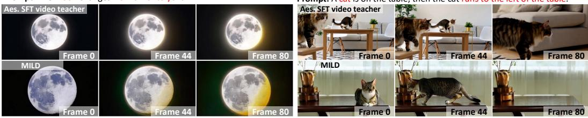

Figure 7: Qualitative comparison with direct aesthetic video fine-tuning on VBench-2.0 using Wan2.2-5B. Frames 0, 44, and 80 illustrate appearance changes and directional motion under matched prompts.  
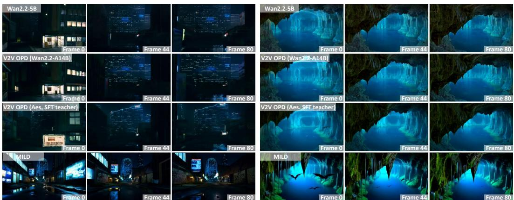  
Prompt: The camera starts at a distance, showing an abandoned city with empty streets, shattered glass windows in high-rise buildings, and winds blowing dust and discarded advertisements. The neon lights flicker on, casting a cold glow in the empty night sky. The camera moves downward, revealing the vacant streets, where puddles reflect the neon lights, and the wet pavement gives the city a desolate feel. Next, the camera moves into a dimly lit al ey, where broken store signs and wal s covered in graffiti and grime add to the sense of decay. The camera continues moving forward. capturing the faint creaking of an advertisement board swaving in the wind As the camera shifts toward the horizon, a massive abandoned skyscraper looms, its once-glorious facade now faded, with dim blue light leaking from the broken elevator windows. Final y, the camera pul s back, showing the entire city in the dark of night, lifeless and abandoned, as if time has stopped here.  
Prompt: The camera slowly descends into an ancient cave, where the rock wal s are covered in moss and lichen. The air is damp, and water drips from the ceiling, creating a rhythmic sound. The camera shifts to reveal a massive stalactite hanging from the ceiling, sharp like a blade. The camera moves deeper into the cave, arriving at an underground lake, its deep blue waters reflecting the stalactites and stone columns. A few bats fly by breaking the stil ness of the lake's surface. Final y, the camera pul s back to reveal the vastness of the cave, with the lake, columns, and stalactites blending together to create a mysterious, dreamlike underground world.  
Figure 8: Abandoned-city and underground-cave comparisons. Left: MILD depicts prominent illuminated signs, wall markings, and wet-pavement reflections. Right: MILD renders distinct foreground stalactites, textured rock surfaces, and visible bat silhouettes. Each example shows frames 0, 44, and 80.

## C.3 ADDITIONAL VIDEO CASE STUDIES

We present five additional qualitative comparisons using Wan2.2-5B as the student, complementing the cases in Section 4.2. Each example compares the pretrained student, V2V OPD with Wan2.2- A14B, V2V OPD with an aesthetic-SFT teacher, and MILD under the same prompt. Frames 0, 44, and 80 are shown for each generated video. These examples examine scene detail, text legibility, and subject composition.

Scene detail and spatial organization. Figure 8 compares the abandoned-city and undergroundcave examples. In the abandoned city, MILD depicts prominent illuminated signs, visible wall markings, and reflections on the wet pavement. These details make the foreground street and surrounding buildings easier to distinguish than in the darker baseline outputs. In the cave, MILD renders pronounced foreground stalactites, textured green rock surfaces, and recognizable bat silhouettes above the blue underground lake. The bats are particularly visible in the first sampled frame and appear farther into the cave in the later frames. The foreground rock formations and illuminated background also provide a clear sense of depth.

Prompt: A whale and a seagull flying side by side, the whale soaring through the clouds while the seagull glides effortlessly.

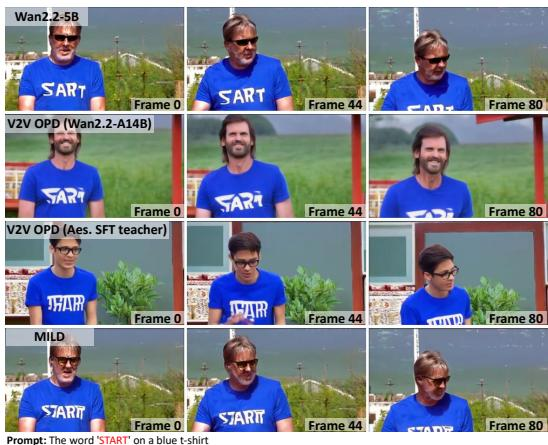

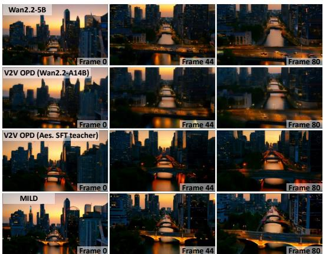  
Prompt: The camera begins with an aerial view of a modern city's skyline bathed in the golden light of sunset. The distant skyscrapers are outlined by the warm glow of the sun, with their glass facades reflecting the colors of the sky. As the camera moves downward, the streets below are il uminated by city lights, with traffic beginning to grow busier. The shadows of trees and buildings stretch long across the pavement as the sunlight fades and nightfal approaches. The camera shifts to a bridge, where the lights turn on, casting a glow across the river below, its surface sparkling with reflections of the bridge lights. The camera continues forward, capturing a few birds flying across the sky, leaving brief traces of their flight. Final y, the camera pul s back, revealing the entire city skyline, now bathed in the final twilight glow, as the city lights and the darkening sky blend together to form a magnificent urban landscape.

Figure 9: Text-rendering and twilight-city comparisons. Left: MILD renders “START” more clearly in the frames where the complete word is visible. Right: MILD depicts distinct architecture, illuminated bridge contours, and water reflections. Each example shows frames 0, 44, and 80.  
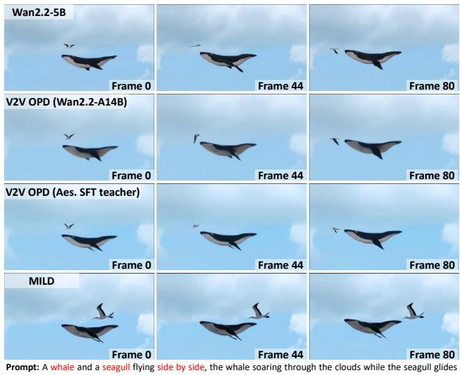  
Figure 10: Whale-and-seagull composition. MILD depicts a more prominent seagull alongside the whale, with both subjects clearly identifiable across frames 0, 44, and 80.

Text rendering and urban scene detail. Figure 9 presents the blue-T-shirt and twilight-city examples. For the T-shirt prompt, the pretrained student renders “SART,” while the V2V OPD outputs contain distorted or ambiguous lettering. MILD renders “START” more clearly in the first two sampled frames, where the word is fully visible; the lettering is partially cropped in the final frame. In the twilight-city example, MILD depicts distinct building outlines and illuminated bridges along the central waterway. The bridge contours and their reflections remain readily identifiable across the displayed viewpoints, illustrating detailed architectural content within the generated sequence.

Subject visibility and composition. Figure 10 examines the unusual composition of a whale and a seagull flying together. Although both subjects appear in the baseline outputs, their seagulls occupy relatively small image regions. MILD depicts a larger, more prominent seagull with a clearly distinguishable body and wing silhouette alongside the whale. Both subjects remain identifiable in all three sampled frames, making the requested two-subject composition visually explicit.

  
Figure 11: Qualitative comparison of aesthetic image and video teachers. Each pair shows the Wan2.2-5B video teacher post-trained on aesthetic video data (left) and the aesthetic image expert (right) under the same prompt. Rows show DrawBench, GenEval, and OCR examples, illustrating differences in visual detail, compositional accuracy, and text rendering available for distillation.

## C.4 QUALITATIVE COMPARISON OF AESTHETIC TEACHERS

Figure 11 compares the aesthetic image expert with the Wan2.2-5B video teacher post-trained on aesthetic video data under matched prompts. These examples examine the visual expertise available for distillation in the Wan2.2-5B student setting, complementing the quantitative teacher comparisons in Figure 4. On DrawBench prompts, the image expert produces more clearly defined details in the magnifying-glass and comic example and richer texture and lighting in the mouseand-mushroom scene. The GenEval cases further reveal differences in compositional accuracy: the image expert depicts four skateboards, a yellow fork, and a chair to the left of a zebra, whereas the video teacher misses the requested count, object identity, or relation. On OCR prompts, the image expert renders phrases such as “Trespassers Will Be Jousted,” “Upgrades Available,” and “Forever Yours” more legibly and accurately. However, improved legibility does not always imply exact text reproduction, as illustrated by the altered spacing in the coffee example. Together, these selected cases illustrate spatial capabilities that image experts can offer for video distillation; they do not assess temporal quality or establish student gains.

## C.5 QUALITATIVE COMPARISONS OF SPATIAL CAPABILITIES

Figure 12 compares MILD with the pretrained Wan2.2-5B student and two V2V OPD baselines under matched prompts, complementing the quantitative evaluation in Section 4.3.

Visual appearance and attribute alignment. For the black-dog prompt, MILD depicts a predom inantly black coat with visible fur shading and facial details. The pretrained student and aesthetic-SFT-teacher OPD produce dogs with substantial tan or white markings, whereas the larger-videoteacher baseline also captures the requested black coat. This example illustrates MILD’s ability to combine subject detail with color-attribute alignment.

Text rendering. MILD renders “FREE HUGS” clearly on the arm and “LAST CALL” legibly on the neon sign. The pretrained student and aesthetic-SFT-teacher OPD do not clearly reproduce the requested phrases, while the larger-video-teacher baseline produces incomplete or altered text, such as “Fre Hugs”. These examples illustrate improved text fidelity on both skin and illuminated signage.

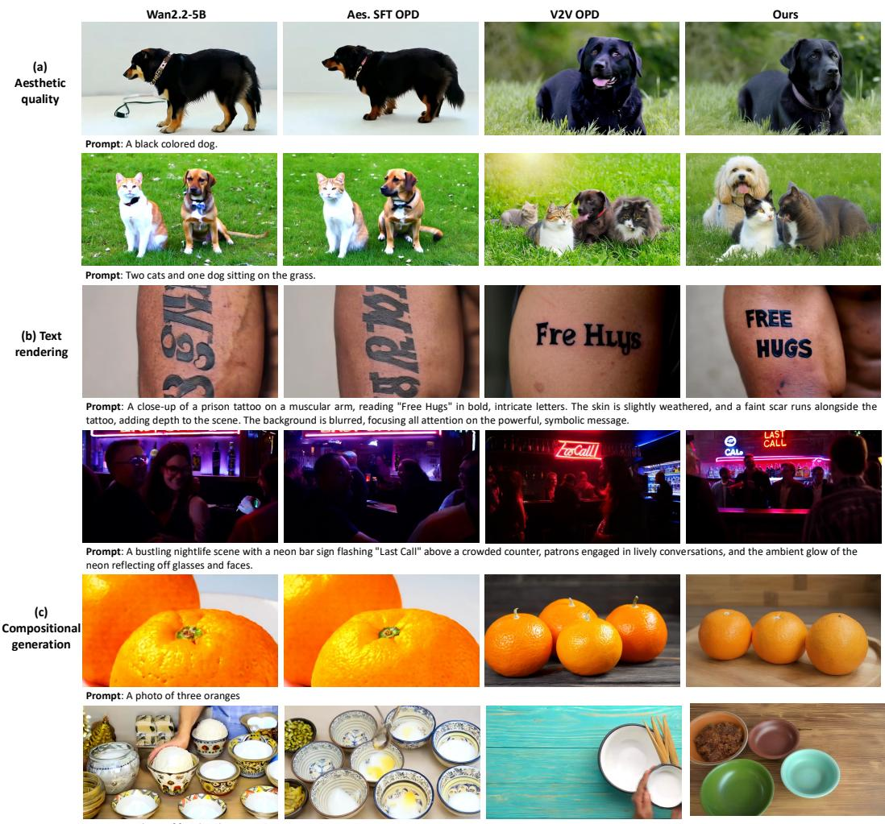

Figure 12: Spatial capability comparisons using Wan2.2-5B. Columns show the pretrained student, OPD with an aesthetic-SFT video teacher, OPD with a larger video teacher, and MILD. Matched-prompt examples illustrate color-attribute alignment, text rendering, and object composition in sampled video frames.  
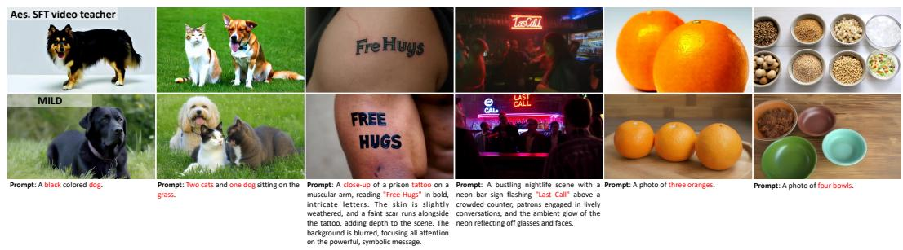  
Figure 13: Spatial capability comparison with direct aesthetic video fine-tuning using Wan2.2- 5B. Matched-prompt examples illustrate color-attribute alignment, text rendering, and object composition in sampled video frames.

Compositional generation. MILD depicts the requested two cats and one dog, three oranges, and four bowls. The pretrained student and aesthetic-SFT-teacher OPD omit one cat in the animal example. In the orange example, these two baselines show only two visible oranges, while the largervideo-teacher baseline depicts four. The bowl examples likewise show count mismatches among the baselines. Together, these cases illustrate more accurate object counts and category composition with MILD.

Comparison with direct aesthetic video fine-tuning. Figure 13 further compares MILD with Aesthetic SFT video teacher, evaluated directly without subsequent OPD. Using Wan2.2-5B, MILD more closely matches the requested black coat, clearly renders “FREE HUGS” and “LAST CALL”, and satisfies the specified object counts. Aesthetic SFT exhibits color-attribute, text, and counting errors in these examples. These comparisons illustrate MILD’s advantages in spatial prompt fidelity over direct aesthetic video fine-tuning.