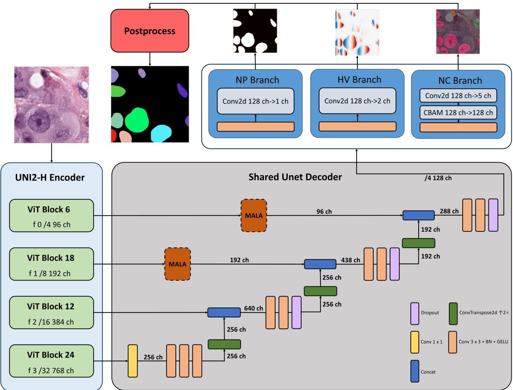
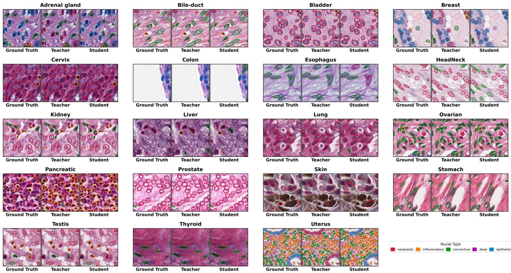

# FROM UNI2-H TO CONVNEXT-T: LIGHTWEIGHT NUCLEI INSTANCE SEGMENTATION VIA KNOWLEDGE DISTILLATION

Wenyan Li

School of Computer Science, Wuhan University, Wuhan, China wenyan li@whu.edu.cn

## ABSTRACT

Nuclei instance segmentation is a core task in digital pathology, yet high-accuracy models rely on large vision transformer (ViT) encoders whose inference speed cannot meet real-time clinical demands. We propose a lightweight scheme that distills the UNI2-h pathology foundation model into a ConvNeXt-Tiny student (Ours-T, 34.7M parameters, 1/20 of the teacher) via output-level knowledge distillation. Ours-T achieves an mPQ of 0.519 on PanNuke (98.8% of the teacher), a zero-shot bPQ of 0.668 on MoNuSeg, and an inference speed of 634.3 img/s, requiring only 0.045 s for full-resolution 10242 analysis (21.8× speedup). Experiments further show that multi-scale gated convolution (MALA) yields no gain under ViT encoders, and output-level distillation alone suffices for efficient knowledge transfer.

Index Terms— nuclei instance segmentation, knowledge distillation, lightweight model, digital pathology, ConvNeXt

## 1. INTRODUCTION

Nuclei instance segmentation—jointly detecting, segmenting, and classifying each nucleus—is a key prerequisite for downstream quantitative analyses such as tumor grading, immuneinfiltration assessment, and prognosis prediction. Nuclei in histopathology images are densely packed, morphologically diverse, and exhibit large staining variation, imposing stringent demands on segmentation accuracy and robustness. HoverNet [1] pioneered multi-task learning that jointly predicts nuclear pixels (NP), horizontal-vertical distance maps (HV), and nuclear classification (NC), and has become the de facto baseline; HoverUnet [2] further compressed HoverNet into a lightweight U-Net via distillation. CellViT [3] introduced vision transformers (ViTs) to nuclei segmentation with substantial gains, but its parameter count ballooned to ∼700M. CFR-SAM [4] adapts SAM [5] to nuclei segmentation and achieves state-of-the-art results on both PanNuke and MoNuSeg, serving as the strongest baseline prior to this work.

Meanwhile, pathology vision foundation models such as UNI [6] and Virchow [7] exhibit powerful general-purpose feature extraction through large-scale pretraining, but their hundreds of millions of parameters (UNI2-h: 683.6M) incur slow inference and heavy memory footprint, hindering direct deployment in real-time clinical analysis. How to retain the feature capacity of foundation models while obtaining a lightweight, fast inference model is the core problem addressed in this paper.

To this end, we propose output-level knowledge distillation from UNI2-h to ConvNeXt-Tiny, with the following contributions: (1) a lightweight student Ours-T—34.7M parameters, retaining 98.8% mPQ under 20× compression, and only 0.045 s for 10242 inference; (2) a multi-task shared decoder that reaches parity with only 37% of the parameters of independent decoders; (3) a negative result—multiscale gated convolution (MALA) brings no gain under ViT encoders; and (4) comprehensive validation on PanNuke (mPQ 0.519) and zero-shot MoNuSeg (bPQ 0.668, surpassing CFR-SAM-H).

## 2. METHOD

## 2.1. Overall Architecture and Teacher Model

Fig. 1 shows the overall architecture, comprising an encoder, a shared U-Net decoder, and task-specific heads. The teacher model (Ours-H) uses UNI2-h (ViT, 683.6M) as the encoder, producing features at four scales (1/4 to 1/32) that are passed to a lightweight shared U-Net decoder (6.9M) via skip connections. The three tasks (NP/HV/NC) share all decoder weights, following multi-task learning [14], and each task head is a single 1 × 1 convolution. The decoder adopts learnable ConvTranspose upsampling and CBAM attention [10] (NC head only). We also verify an independent-decoder variant (UNet3, 18.8M) whose mPQ is on par with the shared decoder, confirming the parameter efficiency of the shared design; a multi-scale gated convolution module (MALA, $3 \times 3 / 5 \times 5 / 7 \times 7$ parallel convolutions with per-pixel gating) yields no significant gain (Sec. 3.4).

  
Fig. 1. Overall architecture of UNI2-SharedUNet: an encoder, a shared U-Net decoder, and three task heads.

## 2.2. Lightweight Student Model and Distillation

Our core goal is a lightweight deployment model balancing accuracy and speed. To this end, we distill Ours-H into a ConvNeXt-Tiny [8] student (encoder 27.9M + shared decoder 6.9M, 34.7M in total, ∼20× compression) via outputlevel distillation [9]. The distillation loss combines Kullback-Leibler divergence and mean squared error:

$$
\begin{array} { r } { \mathcal { L } _ { \mathrm { K D } } = \alpha \mathcal { L } _ { \mathrm { K L } } ( p _ { s } , p _ { t } ) + ( 1 - \alpha ) \mathcal { L } _ { \mathrm { M S E } } ( f _ { s } , f _ { t } ) , } \end{array}\tag{1}
$$

where p and $p _ { s }$ $p _ { t }$ are the student and teacher softmax outputs (temperature $T = 1 . 0 )$ and $\alpha \ : = \ : 0 . 5$ . The student is trained from scratch with the teacher frozen. Training losses match the teacher: NP uses Focal Tversky + Dice, HV uses MSE + MSGE, and NC uses Focal + Dice, with total loss $\mathcal { L } _ { \mathrm { t o t a l } } = 2 \mathcal { L } _ { \mathrm { N P } } + 2 \mathcal { L } _ { \mathrm { H V } } + 2 \mathcal { L } _ { \mathrm { N C } }$

## 3. EXPERIMENTS

## 3.1. Datasets and Evaluation Metrics

PanNuke [11] contains ${ \sim } 7 , 9 0 0 \ 2 5 6 ^ { 2 }$ H&E images across 19 tissue types and five nuclear classes (Neoplastic, Inflammatory, Connective, Dead, Epithelial), split by tissue-level 3- fold cross-validation. MoNuSeg [12] is used to assess crossorgan zero-shot generalization. We report the standard Pan-Nuke metrics: mPQ $( = \mathrm { D Q } \times \mathrm { S Q }$ , the primary metric), bPQ, per-class F1, and additionally AJI on MoNuSeg.

## 3.2. Implementation Details

All models are implemented in PyTorch 2.11 / CUDA 12.8. UNI2-h uses official weights, and ConvNeXt uses ImageNet-22K weights from timm. We use AdamW (l ${ \mathrm { ~ r ~ 1 ~ } } \times { \mathrm { ~ 1 0 ^ { - 4 } ~ } }$ weight decay $5 \times 1 0 ^ { - 3 } )$ ; the encoder is frozen for the first 100 epochs and then fully fine-tuned for 200 epochs under a cosine annealing schedule. Augmentation includes flips, rotations, affine transforms, color jitter, Gaussian blur, and elastic deformation. To counter severe class imbalance (Dead occupies only 0.06%), we adopt inverse-frequency class-balanced sampling. The teacher is trained on an NVIDIA A100 40GB GPU with automatic mixed precision; Ours-T requires only 4GB VRAM for inference.

Table 1. Comparison of average bPQ and mPQ on PanNuke $( \mathrm { b o l d } = \mathrm { b e s t } )$
<table><tr><td>Model</td><td>bPQ</td><td>mPQ</td><td>Params (M)</td></tr><tr><td>Mask R-CNN [13]</td><td>0.553</td><td>0.369</td><td>41.9</td></tr><tr><td>HoVer-Net</td><td>0.660</td><td>0.463</td><td>122.8</td></tr><tr><td>CPP-Net</td><td>0.677</td><td>0.482</td><td>37.6</td></tr><tr><td>PointNu-Net</td><td>0.681</td><td>0.496</td><td>122.8</td></tr><tr><td>CellViT-H</td><td>0.679</td><td>0.498</td><td>699.7</td></tr><tr><td>CFR-SAM-H</td><td>0.696</td><td>0.511</td><td>650.5</td></tr><tr><td>Ours-H</td><td>0.681</td><td>0.524</td><td>690.5</td></tr><tr><td>Ours-T</td><td>0.683</td><td>0.519</td><td>34.7</td></tr></table>

Table 2. Per-class F1 comparison on PanNuke (bold = best).
<table><tr><td>Model</td><td>N</td><td>E</td><td>I</td><td>C</td><td>D</td><td>Det</td></tr><tr><td>Mask R-CNN</td><td>0.59</td><td>0.52</td><td>0.50</td><td>0.42</td><td>0.22</td><td>0.72</td></tr><tr><td>HoVer-Net</td><td>0.62</td><td>0.56</td><td>0.54</td><td>0.49</td><td>0.31</td><td>0.80</td></tr><tr><td>CPP-Net</td><td>0.70</td><td>0.72</td><td>0.58</td><td>0.53</td><td>0.38</td><td>0.82</td></tr><tr><td>PointNu-Net</td><td>0.73</td><td>0.73</td><td>0.60</td><td>0.58</td><td>0.31</td><td>0.81</td></tr><tr><td>CellViT-H</td><td>0.71</td><td>0.73</td><td>0.58</td><td>0.53</td><td>0.36</td><td>0.83</td></tr><tr><td>CFR-SAM-H</td><td>0.76</td><td>0.78</td><td>0.70</td><td>0.62</td><td>0.45</td><td>0.83</td></tr><tr><td>Ours-H</td><td>0.76</td><td>0.74</td><td>0.74</td><td>0.64</td><td>0.49</td><td>0.81</td></tr><tr><td>Ours-T</td><td>0.75</td><td>0.79</td><td>0.73</td><td>0.64</td><td>0.49</td><td>0.81</td></tr></table>

## 3.3. Comparison with State-of-the-Art

Table 1 reports the average comparison on PanNuke. Ours-H attains an mPQ of 0.524, 2.5% higher than the previous best CFR-SAM-H (0.511); Ours-T retains an mPQ of 0.519 under 20× compression, only 1.0% below the teacher, with merely 34.7M parameters (less than 1/19 of CFR-SAM-H), demonstrating the parameter efficiency of a lightweight backbone combined with a shared decoder. In terms of bPQ, Ours-H and Ours-T (0.681/0.683) remain slightly below CFR-SAM-H (0.696), because watershed post-processing separates densely overlapping nuclei less robustly than the SAM prompt mechanism; nevertheless, the mPQ improvement indicates that UNI2-h features, together with the CBAM and ConvTranspose upsampling of the shared decoder, compensate for the instance-separation gap in class discrimination.

In the per-class F1 comparison (Table 2), Ours-T ranks first on Epithelial (0.79), Connective (0.64), and Dead (0.49), outperforming CFR-SAM-H on Dead by 4 percentage points thanks to class-balanced sampling and Focal re-weighting. These classification scores are produced by the first-stage (NP/NC) branches and do not depend on post-processing corrections.

Table 3. Zero-shot generalization on MoNuSeg (3-fold mean).
<table><tr><td>Model</td><td>AJI</td><td>bPQ</td></tr><tr><td>CellViT-SAM-H</td><td>0.644</td><td>0.490</td></tr><tr><td>CFR-SAM-H</td><td>0.668</td><td>0.662</td></tr><tr><td>Ours-H</td><td>0.640</td><td>0.667</td></tr><tr><td>Ours-T</td><td>0.645</td><td>0.668</td></tr></table>

Table 4. Decoder-design ablation.
<table><tr><td>Configuration</td><td>Params (M)</td><td>mPQ</td><td>bPQ</td></tr><tr><td>SharedUNet (baseline)</td><td>690.5</td><td> $0 . 5 2 3 8 { \scriptstyle \pm 0 . 0 0 7 6 }$ </td><td>0.6815±0.0067</td></tr><tr><td>+MALA</td><td>694.3</td><td> $0 . 5 2 3 7 { \scriptstyle \pm 0 . 0 0 7 6 }$ </td><td> $0 . 6 8 1 1 { \scriptstyle \pm 0 . 0 0 5 9 }$ </td></tr><tr><td>UNet3 (independent)</td><td>702.4</td><td> $0 . 5 2 3 6 { \scriptstyle \pm 0 . 0 0 9 2 }$ </td><td> $0 . 6 8 0 3 { \scriptstyle \pm 0 . 0 0 4 8 }$ </td></tr></table>

On zero-shot MoNuSeg (Table 3), Ours-T attains bPQ 0.668 and AJI 0.645, on par with the teacher and surpassing CFR-SAM-H (0.662), indicating that 20× compression does not hurt cross-organ generalization. Fig. 2 shows qualitative results on PanNuke, where Ours-H delineates nuclear boundaries more precisely than CFR-SAM-H in dense regions, and Ours-T is visually indistinguishable from the teacher.

## 3.4. Ablation and Distillation Analysis

The decoder-design ablation (Table 4) shows that the shared decoder (6.9M) attains the same performance with only 37% of the parameters of independent decoders, confirming the implicit regularization of multi-task sharing; adding MALA (+3.8M) yields no gain. In distillation experiments, the KD student retains 98.8% of the teacher’s mPQ (vs. 97.9% for training from scratch), and the +0.006 gain is meaningful under 20× compression. Adding MALA to the student decoder decreases mPQ from 0.5187 to 0.5150, and encoder feature alignment (MSE, λ=0.1) also brings no improvement (mPQ 0.5150), indicating that output-level distillation already suffices for heterogeneous ViT→CNN architectures and feature alignment is unnecessary.

## 3.5. Inference Speed

On an NVIDIA A100 40GB GPU, considering pure inference (without post-processing): Ours-H (690.5M, 186.7 GMacs/tile) reaches 24.8 img/s in a single batch; Ours-T (34.7M, 11.6 GMacs) reaches 105.8 img/s at bs=1 and 634.3 img/s at bs=32, a 24.2× speedup. For full-resolution 10242 analysis (tiled, bs=32), Ours-T requires only 0.045 s (21.8× speedup), satisfying real-time clinical analysis.

  
Fig. 2. Qualitative results on PanNuke. From left to right: input, ground truth, CFR-SAM-H, Ours-H, Ours-T.

## 4. CONCLUSION

We proposed a lightweight nuclei instance segmentation scheme that distills UNI2-h into ConvNeXt-Tiny. Ours-T retains 98.8% of the teacher’s mPQ with 34.7M parameters (20× compression) and requires only 0.045 s for 10242 inference, balancing accuracy and real-time speed. Our experiments further reveal that: (1) MALA is redundant under ViT encoders; (2) output-level distillation suffices for heterogeneous ViT→CNN architectures; and (3) a shared decoder attains equal performance with 37% of the parameters. Limitations include a bPQ still ∼2.2% below CFR-SAM-H and the unresolved extreme imbalance of the Dead class; future work will explore INT8 quantization, TensorRT acceleration, and alternative teacher models.

## 5. REFERENCES

[1] S. Graham, Q. D. Vu, S. E. A. Raza, A. Azam, Y. W. Tsang, J. T. Kwak, and N. Rajpoot, “Hover-Net: Simultaneous segmentation and classification of nuclei in multi-tissue histology images,” Medical Image Analysis, vol. 58, p. 101563, 2019.

[2] D. Horvath, A. Marcos, S. Albouy, J. Frahm, and T. Guiraud, “HoverUnet: Simultaneous nuclei segmentation and classification using a multi-task U-Net,” arXiv preprint, 2023.

[3] F. Horst, M. Rempe, L. Heine, C. Seibold, J. Keyl, G. Fakundiny, C. Levermann, and S. Raff, “CellViT: Vision transformers for precise cell segmentation and classification,” arXiv preprint arXiv:2306.15350, 2023.

[4] W. Liao, H. Li, T. Peng, and X. Liang, “CFR-SAM: Context-aware feature refinement for nuclei segmentation with SAM,” Expert Systems with Applications, vol. 269, p. 126457, 2025.

[5] A. Kirillov, E. Mintun, N. Ravi, H. Mao, C. Rolland, L. Gustafson, T. Xiao, S. Whitehead, A. C. Berg, W.- Y. Lo, P. Dollar, and R. Girshick, “Segment anything,”´ Proc. IEEE/CVF ICCV, pp. 4015–4026, 2023.

[6] R. J. Chen, T. Ding, M. Y. Lu, D. F. K. Williamson, G. Jaume, A. H. Song, B. Chen, A. Zhang, D. Shao, M. Shaban, M. Williams, L. Oldenburg, L. Ta, J. Yin, T. Chen, L. Li, Y. Li, and F. Mahmood, “Towards a general-purpose foundation model for computational pathology,” Nature Medicine, vol. 30, pp. 850–862, 2024.

[7] E. Vorontsov, A. Bozkurt, A. Casson, G. Shaikovski, M. Zelechowski, K. Severson, E. Zimmerman, and C. Kanan, “A foundation model for clinical-grade computational pathology and rare cancers detection,” Nature Medicine, vol. 30, pp. 2924–2935, 2024.

[8] Z. Liu, H. Mao, C.-Y. Wu, C. Feichtenhofer, T. Darrell, and S. Xie, “A ConvNet for the 2020s,” Proc. IEEE/CVF CVPR, pp. 11976–11986, 2022.

[9] G. Hinton, O. Vinyals, and J. Dean, “Distilling the knowledge in a neural network,” NeurIPS Deep Learning Workshop, 2015.

[10] S. Woo, J. Park, J.-Y. Lee, and I. S. Kweon, “CBAM: Convolutional block attention module,” Proc. ECCV, pp. 3–19, 2018.

[11] J. Gamper, N. A. Koohbanani, K. Benet, A. Khuram, and N. Rajpoot, “PanNuke: An open pan-cancer histology dataset for nuclei instance segmentation and classification,” Proc. MICCAI, pp. 11–19, 2019.

[12] N. Kumar, R. Verma, S. Sharma, S. Bhargava, A. Vahadane, and A. Sethi, “A dataset and a technique for generalized nuclear segmentation for computational pathology,” IEEE Trans. Medical Imaging, vol. 36, no. 7, pp. 1550–1560, 2017.

[13] K. He, G. Gkioxari, P. Dollar, and R. Girshick, “Mask´ R-CNN,” Proc. IEEE ICCV, pp. 2961–2969, 2017.

[14] R. Caruana, “Multitask learning,” Machine Learning, vol. 28, pp. 41–75, 1997.