# FURE: EFFICIENT INSTANCE-SPECIFIC 3D FUR RE-CONSTRUCTION WITHOUT ANIMAL-FUR DATASETS

Srinjay Sarkar⋆ Prakhar Kaushik⋆† Soumava Paul Alan Yuille ⋆ Equal contribution † Project lead

Johns Hopkins University   
Baltimore, MD, USA   
{ssarka29, pkaushi1, spaul27, ayuille1}@jh.edu   
https://toshi2k2.github.io/fure

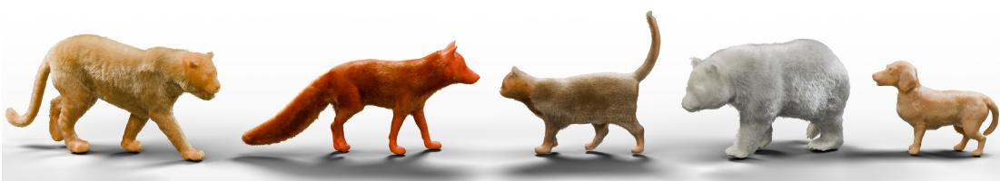  
Figure 1: From multi-view images, FurE efficiently reconstructs a defurred animal body and editable, strand based fur geometry. We utilize fur thickness cues from learned volumetric surface representations to estimate fur depth and an estimate of the unseen defurred body.

## ABSTRACT

Realistic and editable animal fur reconstruction from multi-view images is challenging: fine-scale detail, self-occlusion and obfuscation, and, unlike human hair, the lack of animal fur datasets. Fur usually covers most of an animal’s body, with large inter- and intra-species variability. We present FurE, an efficient strandbased animal fur reconstruction method that recovers a per-strand, editable groom by optimizing a root-conditioned latent field, decoded into strand geometry via a PCA-based decoder. We reconstruct a defurred animal body using local fur thickness cues from surface-constrained Gaussian ”frosting” representation, along with part-based priors. We next show using a PCA-based decoder using knowledge from human hair strand data - allows us to alleviate the animal data scarcity, while allowing for faster optimization. FurE achieves a 10× speedup in strand training over current SOTA dense per-strand optimization, retaining strand fidelity and generalizing across synthetic and, more importantly, real-world sequences, with quantitative and qualitative validation despite this reduction in training time.

## 1 INTRODUCTION

Strand-based hair and fur is the standard representation for high-quality digital assets. Unlike volumetric or surface-based representations, explicit strands remain directly editable, renderable, and simulatable in production pipelines. Recovering such a representation from images is difficult, especially for animal fur where individual fine-scale strands are heavily self-occluded by surrounding fur, and this occlusion is compounded by fur’s view-dependent appearance and the fact that it covers most of the animal’s visible body. Moreover, the surface reconstructed from multiview images is usually the outer furry envelope rather than the underlying skin on which the strand roots should be placed. This ambiguity is substantially greater than in human hair capture, as animal fur varies not only across species but also across body parts of the same individual, with different lengths, densities, directions, and thicknesses around the face, ears, torso, belly, legs, paws, and tail. Disentangling fur from the body also remains crucial for tasks such as pose estimation (Xu et al., 2023), 3D part segmentation, and tracking.

We present FurE, an efficient method for strand-based animal fur reconstruction from multiview images, built on two principles. First, the expensive fur strand-learning problem should be solved in a low dimensional latent space rather than the full 3D strand space. Instead of treating each fur strand as an unconstrained high-dimensional polyline, FurE predicts compact (low-dimensional) codec coefficients (vectors) on a defurred body surface, which a lightweight pretrained (using abun dant human hair data) PERM (He et al., 2025) style decoder maps to explicit local-frame strand geometry, scaled by fur-length and rendered with strand-aligned gaussians. This retains the editing and rendering benefits of strand-based reconstruction while substantially reducing the cost of per-scene strand learning relative to dense per-strand optimization used in current SOTA methods.

Second, FurE treats defurring (estimating the skin underlying the fur) as a local shell-estimation problem (outer shell being the visible fur, and inner is defurred). We discovered that we can use fur-depth cues from Gaussian Frosting (Guedon & Lepetit, 2024), which uses the misalignment of´ surface-aligned Gaussians to identify areas where more volumetric rendering is needed.

FurE extracts view-consistent shell statistics as local evidence for fur-bearing volume, then calibrates this evidence with part-aware priors to produce a defurred surface mesh. Given this defurred mesh approximation, FurE samples strand roots and assigns each a local coordinate framework - TBN basis (Tangent, Bitangent, Normal), semantic part label, and calibrated length; a latent UV texture is then decoded via a lightweight PCA decoder into normalized canonical strands, scaled to target length and transformed into world space. FurE then attaches cylindrical Gaussians to the decoded strand segments and optimizes with multiview photometric loss, yielding explicit polylines and strand-aligned Gaussians compatible with downstream rendering, simulation, and editing applications.

On multiview inputs from the Artemis dataset (Luo et al., 2022), FurE completes strand training in under one hour, achieving a 10× speedup with comparable or better quantitative results while retaining explicit, editable strands. We evaluate reconstruction quality and efficiency against animal fur and strand-based hair baselines, with ablations of the codec representation. We further demonstrate, to our knowledge, the first instance-specific, strand-based animal fur reconstruction from noisy real-world multiview images, on which NeuralFur (Sklyarova et al., 2026) struggles.

Our contributions are:

• We introduce FurE for instance-specific reconstruction of explicit, editable animal fur from calibrated multiview images. Strand training takes under one hour, achieving a 10× speedup over SoTA methods with comparable or better rendering quality.

• We transfer human-hair priors to animal fur through a compact PCA codec, replacing dense strand optimization with root-conditioned latent learning without animal-fur training data.

• We introduce shell-based defurring that combines local Gaussian Frosting cues with partaware priors to estimate a plausible hidden strand-root surface without SMAL fitting.

• We demonstrate, to our knowledge, the first instance-specific, strand-based animal fur reconstruction from noisy real-world multiview images.

## 2 RELATED WORK

Animal reconstruction. SMAL (Zuffi et al., 2017), GenZoo (Niewiadomski et al., 2025), and Ani-Mer (Lyu et al., 2025) recover animal body shape but not explicit fur strands. NeuralFur, our closest prior work, combines NeuS geometry (Wang et al., 2021), SMAL-based part localization, and VLMderived fur attributes to guide defurring and strand reconstruction. Its defurring depends on template fitting and part-level semantic estimates, while dense strand optimization remains computationally expensive. FurE instead uses local Gaussian Frosting cues and part-aware priors to estimate the hidden strand-root surface. Direct part segmentation (Paul et al., 2026) removes the dependency on SMAL fitting. Combined with compact strand learning, this achieves a 10× strand-training speedup with comparable rendering quality. We further reconstruct explicit fur from a noisy real-world bison sequence on which NeuralFur fails.

Strand-based and compact hair reconstruction. Neural Haircut (Sklyarova et al., 2023) introduced prior-guided strand reconstruction. Gaussian Haircut (Zakharov et al., 2024) and GaussianHair (Luo et al., 2024) use strand-aligned Gaussians for differentiable rendering, while CGHair (Luo et al., 2026) reduces memory through strand/card clustering and shared appearance codes. PERM (He et al., 2025) represents human hair using compact PCA coefficients, while GroomGen (Zhou et al., 2023) uses hierarchical latent representations. FurE transfers a humanhair PCA prior to instance-specific animal fur reconstruction, optimizing root-conditioned latent codes rather than dense strand geometry. This reduces per-scene optimization cost without requiring animal-fur training data, while retaining explicit, editable strands.

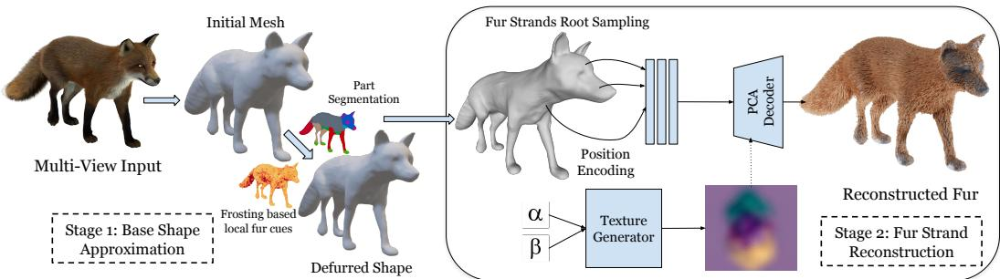  
Figure 2: FurE has 2 stages, 1: Reconstructing the furless mesh geometry from multi view images using Gaussian Frosting by shrinking the initial reconstructed mesh with calculated fur length and 2: a PCA based strand decoder with an optional texture generator to generate 3D fur strands. Our method is optimized end to end from multi-view images in 3DGS compatible framework..

## 3 METHOD

Given calibrated multiview images, FurE first estimates a defurred body mesh $M _ { \mathrm { r o o t } }$ and a target strand length $\ell _ { p }$ for each body part $p$ (section 3.1). We sample roots $\mathbf { r } _ { i }$ (strand attachment points) on this mesh and predict a compact vector of shape coefficients $z _ { i }$ from each root’s position, part label, local thickness cue, and target length. A PCA decoder $D$ , learned from human-hair data, converts these coefficients into a local strand shape, which is scaled to $\ell _ { p }$ and oriented and positioned at the root (section 3.2). We optimize this latent representation against the input views through differentiable rendering with strand-aligned cylindrical 3D Gaussians (section 3.3).

To estimate $M _ { \mathrm { r o o t } }$ , we move each vertex $\mathbf { x } _ { i }$ of the visible furry mesh $M _ { \mathrm { o u t e r } }$ inward along its outward normal $\mathbf { n } _ { i } \colon \mathbf { x } _ { i } ^ { \mathrm { r o o t } } = \mathbf { x } _ { i } - d _ { i } \mathbf { n } _ { i } .$ , where $d _ { i }$ is the estimated inward displacement. We infer $d _ { i }$ from supported local Frosting thickness cues, part-level guidance, and within-part smoothness, subject to geometry-aware displacement bounds (section 3.1; Appendix A.1).

For each part $p ,$ we compute $T _ { p }$ as the 75th percentile of its Frosting shell widths, converted to centimeters. The default target strand length is $\ell _ { p } = \ell _ { p } ^ { \mathrm { s h a p e } } = { \cal T } _ { p } \bar { m _ { p } } ,$ where the fixed part-specific multiplier $m _ { p }$ accounts for the difference between shell thickness and length along a curved or oblique strand. An optional VLM-assisted variant (V2) combines 60% of this length with 40% of a VLM length estimate, limiting the result to 35–135% of the VLM estimate. Root density (roots per unit surface area) is assigned independently for each part, with zero density in non-fur regions.

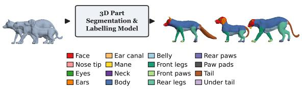  
Figure 3: 3D Part Annotation. We use 3D part segmentation and naming models like Paul et al. (2026); Kalogerakis et al. (2010); Liu et al. (2025) instead of SMAL fitting, enabling fast 3D part segmentation even for non-quadruped mammals.

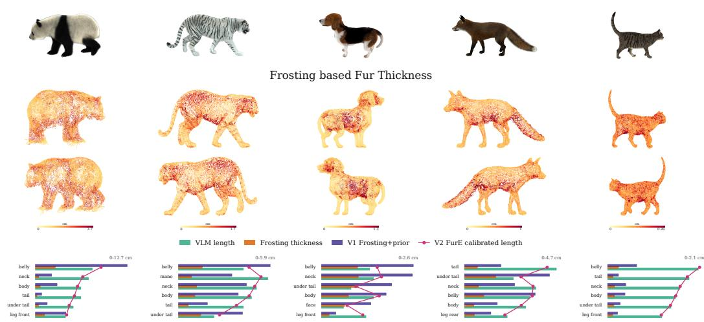  
Figure 4: Frosting thickness and strand-length calibration. Middle rows: local Frosting shell thickness, with warmer colors indicating thicker shells. Bottom: per-part comparisons of raw Frosting thickness, VLM length estimates, and our V1/V2 strand lengths. Shell thickness provides relative geometric evidence, not a direct strand-length measurement.

## 3.1 DEFURRING AND FUR INITIALIZATION

Given calibrated multiview images and foreground masks, NeuS2 (Wang et al., 2023) reconstructs the coat’s outer surface $M _ { \mathrm { o u t e r } }$ . We estimate a plausible defurred mesh $M _ { \mathrm { r o o t } }$ beneath it for strand attachment.

Defurring. Gaussian Frosting surrounds a base mesh with an adaptive layer of 3D Gaussians. Trained on the same images, its layer width provides local fur-thickness cues, not direct measurements of skin depth or strand length. We label body parts using ALIGN-Parts (Paul et al., 2026), with manual verification, avoiding SMAL fitting. We transfer nearby shell widths using part labels and normal agreement, then calibrate them with coarse part-thickness references where available. Rather than copying the inner shell, we solve for smooth inward vertex displacements that balance supported local cues with part-level guidance. Weakly supported regions rely more on part-level estimates, while smoothing is weaker across part boundaries. We keep non-fur regions fixed, bound displacement near opposing surfaces, and reduce offsets causing face flips, severe collapse, or new self-intersections. We obtain $M _ { \mathrm { r o o t } }$ by moving each outer-mesh vertex xi to $x _ { i } ^ { \mathrm { r o o t } } = x _ { i } - d _ { i } n _ { i }$ where $d _ { i }$ is the estimated inward displacement and $n _ { i }$ its outward unit normal.

Fur initialization. Strand length is estimated separately from root displacement: curved or oblique strands can be longer than the coat is thick. For each fur-bearing part $p ,$ V1 initializes strand length as $\ell _ { p } ^ { ( 1 ) } = m _ { p } T _ { p } ,$ where $T _ { p }$ is the 75th percentile of its shell widths, converted to centimeters, and $m _ { p }$ is a fixed part-specific multiplier. Optional V2 blends this length with a coarse VLM or supplied reference length. These variants affect length initialization, not defurring. We assign root-sampling densities independently for each part, with zero or near-zero density and zero strand length in non-fur regions. Full calibration, optimization, and initialization details are given in the appendix.

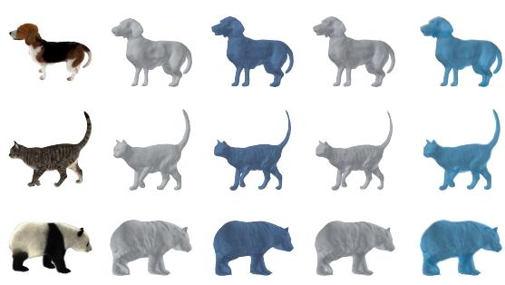  
Figure 5: Defurred geometry comparison. Left to right: input model, $M _ { \mathrm { o u t e r } } .$ , our defurred mesh $M _ { \mathrm { r o o t } } .$ , NeuralFur’s defurred mesh, and $M _ { \mathrm { r o o t } }$ overlaid on $M _ { \mathrm { o u t e r } }$

## 3.2 CODEC-BASED STRAND LEARNING

Rather than independently optimizing each strand’s L 3D points, FurE learns compact shape coefficients. For each sampled root $\mathbf { r } _ { i } \in M _ { \mathrm { r o o t } }$ , a learned function predicts $\mathbf { z } _ { i } = E _ { \theta } ( \gamma ( \mathbf { r } _ { i } ) , j , \rho ( \mathbf { r } _ { i } ) , \boldsymbol { \ell } _ { j } )$ using positional encoding γ, part label $j = \pi ( { \bf r } _ { i } )$ , normalized local Frosting thickness $\rho ,$ and target length $\ell _ { j }$ . A PCA decoder initialized from PERM’s human-hair basis (He et al., 2025) produces a local strand ${ \hat { S } } _ { i } = D _ { \psi } ( \mathbf { z } _ { i } )$ with points $\hat { \mathbf { s } } _ { i k }$ . We anchor, scale, and orient these points through $\begin{array} { r } { \mathbf { s } _ { i k } = \mathbf { r } _ { i } + \frac { \ell _ { j } T _ { i } \left( \hat { \mathbf { s } } _ { i k } - \hat { \mathbf { s } } _ { i 1 } \right) } { s _ { \mathrm { c m } } \left( a _ { i } + \epsilon \right) } } \end{array}$ , where $a _ { i }$ is the sum of decoded segment lengths, $T _ { i }$ is the root’s orthonormal tangent–bitangent–normal frame, $s _ { \mathrm { c m } }$ converts scene units to centimeters, and $\epsilon > 0$ prevents division by zero.

We show that human-hair priors can support animal fur reconstruction despite differences in length, density, and growth direction. Root sampling, local frames, and part-specific lengths control strand placement, orientation, and scale. Reconstruction is instance-specific: we optimize θ and fine-tune ψ using the target animal’s multiview images (section 3.3), without a separate animal-fur training dataset, while retaining explicit, editable strands.

Strand codes can also be represented as a 2D UV texture on $M _ { \mathrm { r o o t } }$ , with guide G and style $S _ { \mathrm { t e x } }$ maps for global structure and local strand detail. The texture generator is optional.

## 3.3 RENDERING AND OPTIMIZATION

Next, in order to integrate the reconstructed strands into the 3DGS differentiable rendering framework, we attach cylindrical Gaussians to the strands with lengths significantly larger than their diameters. Each line segment of a strand is represented by a Gaussian whose length matches the segment length and orientation aligns with the local tangent direction. Each Gaussian is further associated with trainable spherical harmonic coefficients for appearance modeling, allowing the photometric supervision to refine the geometric structure.

Each decoded strand is represented as a continuous chain of anisotropic Gaussian primitives, whose elongated shapes tightly follow the strand’s local geometry. Specifically, we attach cylindrical Gaussians along the reconstructed strands and integrate them into the 3DGS differentiable rendering framework. Each line segment of a strand is represented by a Gaussian whose length matches the segment length and orientation aligns with the local tangent direction.FurE optimizes the latent field parameters with multi-view losses:

$$
\mathcal { L } = \lambda _ { \mathrm { r g b } } \mathcal { L } _ { \mathrm { r g b } } + \lambda _ { \mathrm { s i l } } \mathcal { L } _ { \mathrm { s i l } } + \lambda _ { \mathrm { o r i } } \mathcal { L } _ { \mathrm { o r i } } + \lambda _ { \mathrm { c h m } } \mathcal { L } _ { \mathrm { c h m } } + \lambda _ { \mathrm { s d f } } \mathcal { L } _ { \mathrm { s d f } } + \lambda _ { \mathrm { m a s k } } \mathcal { L } _ { \mathrm { m a s k } }\tag{1}
$$

$\mathcal { L } _ { \mathrm { s i l } }$ matches rendered masks, $\mathcal { L } _ { \mathrm { o r i } }$ matches image-space orientation $\mathcal { L } _ { \mathrm { c h m } }$ attracts fur to the outer envelope, $\mathcal { L } _ { \mathrm { s d f } }$ prevents penetration into the mesh body and ${ \mathcal { L } } _ { \mathrm { m a s k } }$ is the loss between the GT and rendered fur mask.

## 4 EXPERIMENTS

Dataset We evaluate our method on five synthetic fur styles across different animals from the Artemis (Luo et al., 2022) dataset, training on 36 uniformly sampled frames per sequence and evaluating novel-view rendering on the remaining frames. We further demonstrate results on a real-world bison sequence to demonstrate generalization beyond synthetic data. We compare our method against both surface reconstruction and strand-based reconstruction baselines.

Table 1: Runtime comparison. Both methods use 36 views and an A5000 GPU.
<table><tr><td>Stage</td><td>NeuralFur</td><td>FurE</td></tr><tr><td>Strand training</td><td>10.5 h</td><td>52 min</td></tr><tr><td>Preprocessing</td><td>10h</td><td>1h</td></tr></table>

Quantitative results To quantitatively compare our method against GaussianHairCut and NeuralFur we use a synthetic tiger asset with artist generated ground truth strand based fur. As shown in Tab. 2 we compute the precision,recall and F-score between the ground truth and reconstructed strands. We further evaluate on the four synthetic scenes from Artemis (Luo et al., 2022) using unsupervised geometric metrics that assess strand consistency in both local and global spaces, as well as proximity to the surface (Table. 3). The metrics capture three aspects of strand geometry: (1)

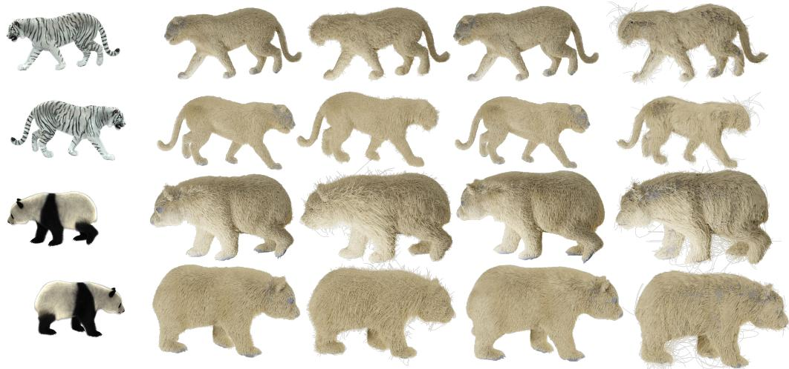  
Input Image  
FurE-(Ours)  
Gaussian HairCut  
NeuralFur  
Neural HairCut

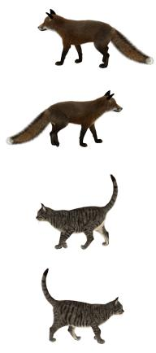  
Input Image

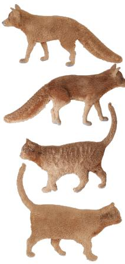  
FurE-(Ours)

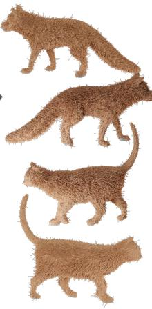  
Gaussian HairCut

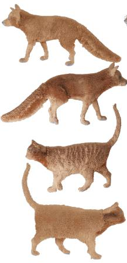  
NeuralFur

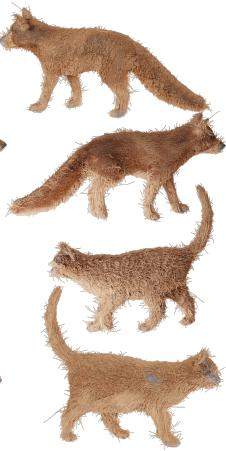  
Neural HairCut

Figure 6: We show the qualitative comparisons between our method and existing baselines. Surface reconstruction approaches yield overly coarse and inaccuarte geometry, failing to capture fine strandlevel detail. Adapting Gaussian Haircut hair reconstruction method, results in inconsistent strand lengths and visible reconstruction artifacts. While Neural Fur and our method, produces accurate and coherent strand-based geometry across all evaluated subjects, we do it 10x faster.  
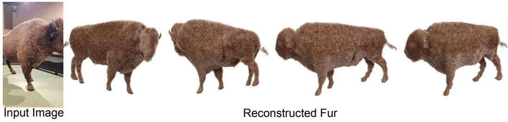  
Figure 7: Instance-specific real-world fur reconstruction. FurE reconstructs explicit, editable strands from noisy real world multiview images of a bison. NeuralFur (Sklyarova et al., 2026) struggles on this sequence (discussed in the appendix). We also release the associated data.

length consistency, measured by the global mean $\mu _ { L }$ and standard deviation $\sigma _ { L }$ of strand lengths; (2) strand curvature, assessed via local and global curvature variance $\mathrm { V a r } _ { \mathrm { l o c } } ( \kappa )$ and $\mathrm { V a r } _ { \mathrm { g l o b } } ( \kappa )$ and, (3) strand orientation, quantified by the local variance of strand directions $\mathrm { V a r } _ { \mathrm { l o c } } ( \mathrm { d i r } )$ and, more finely, the evaluation protocol of GaussianHair, we also quantitatively assess the visual fidelity of our reconstructed fur strands by attaching strand-aligned Gaussians and rendering them, reporting PSNR, LPIPS, and SSIM metrics across four scenes in Table 4, and find that FuE largely outperforms NeuralFur and Gaussian Haircut, especially considering the significant amount (10×) of efficiency we bring about during training, as shown in Table 1.

Qualitative results We evaluate our approach against several baselines spanning animal reconstruction (GenZoo Niewiadomski et al. (2025)),strand-based human hair modeling (Gaussian Haircut Zakharov et al. (2024)), and strand-based animal fur modeling Sklyarova et al. (2026). As shown in Figure 6, the neural surface methods produce only coarse outer geometry of the animal, lacking any strand-level detail in the reconstruction. Although Gaussian Haircut yields high-fidelity strand reconstructions for human hair, it struggles to generalize to fur geometry primarily because of absence of explicit part level strand length, which is implicitly optimized through photometric supervision. Our method, by contrast, recovers detailed, accurate fur structure directly from images during our defurring stage, without any of these limitations.

Table 2: Quantitative Evaluation on Synthetic Tiger with GT strands.
<table><tr><td rowspan="2">Method</td><td colspan="9">Thresholds: cm / degrees</td></tr><tr><td>2/20</td><td>3/30</td><td>4/40</td><td>2/20</td><td>3/30</td><td>4/40</td><td>2/20</td><td>3/30</td><td>4/40</td></tr><tr><td></td><td colspan="3">Precision</td><td colspan="3">Recall</td><td colspan="3">F-score</td></tr><tr><td>GaussianHairCut</td><td>16.24</td><td>25.51</td><td>32.34</td><td>23.51</td><td>36.04</td><td>45.87</td><td>19.21</td><td>29.87</td><td>37.93</td></tr><tr><td>NeuralFur</td><td>26.22</td><td>39.32</td><td>48.05</td><td>20.58</td><td>34.08</td><td>45.69</td><td>23.06</td><td>36.51</td><td>46.84</td></tr><tr><td>Ours</td><td>27.62</td><td>41.78</td><td>51.20</td><td>21.69</td><td>38.00</td><td>50.52</td><td>24.30</td><td>39.80</td><td>50.86</td></tr></table>

Defurring Ablation Figure 4 visualizes the Frosting-based cues used by FurE. As can be observed, Frosting provides a local, view-consistent shell-width cue indicating where the reconstructed surface has thick fur. Since radial shell thickness is only a lower bound on strand arc length, we calibrate it with part-level priors. As can be observed in Figure 6, our fur length and width calculations and methodology is validated by the visual results. Figure 5 also visually validates our defurring method, as we observe that we produce results similar to NeuralFur while being significantly faster.

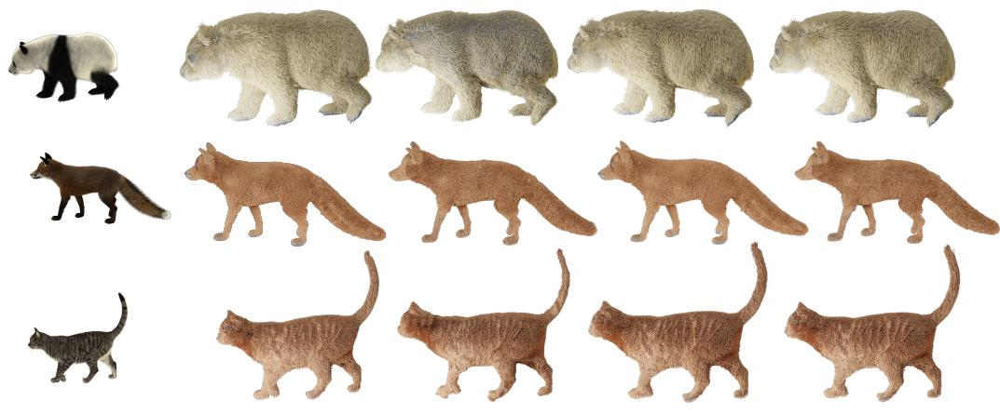  
Input Image  
FurE-(Ours)  
Fixed Length Strands  
Using only Shape Prior  
w/o Defurring

Figure 8: We show the qualitative evaluation of key design choices in our framework, including strand length parameterization per semantic body region, fur geometry representation, shape prior integration, and the role of the defurring stage in enabling accurate geometry reconstruction.

Strand Generation Ablations We conduct comprehensive ablation studies to assess the contribution of each component in our strand generation pipeline. Specifically, we examine three configurations: (1) using a fixed strand length uniformly across all semantic body parts, (2) estimating strand length using only the shape prior without a defurred mesh, and (3) our full method (results in Figure 8). Assigning a fixed length across body regions leads to inaccurate fur reconstruction, particularly on the body and belly where strands are naturally longer. While removing the defurred mesh yields visually similar results, the quantitative results show inconsistency in direction and curvature.

Table 3: Unsupervised geometry consistency metrics for length, direction, and curvature across four scenes (Panda, Fox, Cat, whiteTiger), evaluated for both local and global cases. Note that there are no ground truth strands available for these metrics.
<table><tr><td>Metric</td><td></td><td>Ours</td><td>Gaussian HairCut</td><td>NeuralFur</td><td>Neural HairCut</td><td>Fixed Length</td><td>Defurring</td><td>ShapePrior</td></tr><tr><td rowspan="5">Padda</td><td> $\mu _ { L }$   $\sigma _ { L }$ </td><td>5.22</td><td>8.79</td><td>5.23</td><td>8.90</td><td>6.00</td><td>5.19</td><td>5.24</td></tr><tr><td></td><td>1.38</td><td>2.04</td><td>1.38</td><td>2.04</td><td>0.00</td><td>1.38</td><td>1.39</td></tr><tr><td> $\mathrm { V a r _ { g l o b a l } }$ </td><td>0.0004</td><td>0.0024</td><td>0.0004</td><td>0.0023</td><td>0.0002</td><td>0.0020</td><td>0.0001</td></tr><tr><td> $\operatorname { V a r } _ { \mathrm { l o c } }$ </td><td>0.000025</td><td>0.000118</td><td>0.000041</td><td>0.000118</td><td>0.000050</td><td>0.00020</td><td>0.00006</td></tr><tr><td> $\mathrm { V a r } _ { \mathrm { l o c } } ( \mathrm { d i r } )$   $\mathrm { V a r } _ { \mathrm { l o c } } ^ { \mathrm { f i r s t } } ( \mathrm { d i r } )$ </td><td>0.046</td><td>0.56</td><td>0.043</td><td>0.50</td><td>0.054</td><td>0.068</td><td>0.051</td></tr><tr><td rowspan="6"> $\sigma _ { L }$  OX</td><td> $\mu _ { L }$ </td><td>0.011 3.80</td><td>0.19</td><td>0.081</td><td>0.19</td><td>0.080</td><td>0.023</td><td>0.013</td></tr><tr><td></td><td>1.15</td><td>7.190 3.18</td><td>3.00</td><td>7.16</td><td>3.00</td><td>3.82</td><td>4.00</td></tr><tr><td></td><td></td><td></td><td>1.18</td><td>3.18</td><td>0.00</td><td>1.14</td><td>1.20</td></tr><tr><td> $\mathrm { V a r _ { g l o b a l } }$ </td><td>0.00036</td><td>0.006</td><td>0.00050</td><td>0.007</td><td>0.00040</td><td>0.001</td><td>0.00090</td></tr><tr><td> $\operatorname { V a r } _ { \mathrm { l o c } }$   $\mathrm { V a r } _ { \mathrm { l o c } } ( \mathrm { d i r } )$ </td><td>0.000016 0.094</td><td>0.0056 0.46</td><td>0.00018 0.086</td><td>0.0056 0.50</td><td>0.00089 0.072</td><td>0.00026 0.60</td><td>0.000025 0.011</td></tr><tr><td> $\mathrm { V a r } _ { \mathrm { l o c } } ^ { \mathrm { f i r s t } } ( \mathrm { d i r } )$ </td><td>0.017</td><td>0.47</td><td>0.019</td><td>0.47</td><td>0.010</td><td>0.14</td><td>0.016</td></tr><tr><td rowspan="6">Cat</td><td> $\mu _ { L }$   $\sigma _ { L }$ </td><td>1.60</td><td>4.94</td><td>1.65</td><td>5.00</td><td>1.70</td><td>1.65</td><td></td></tr><tr><td></td><td>0.78</td><td>2.17</td><td>0.53</td><td>0.31</td><td>0.00</td><td>0.78</td><td>1.70</td></tr><tr><td></td><td>0.00025</td><td>0.002</td><td>0.00060</td><td>0.002</td><td>0.0003</td><td>0.0014</td><td>0.90</td></tr><tr><td> $\mathrm { V a r _ { g l o b a l } }$   $\operatorname { V a r } _ { \mathrm { l o c } }$ </td><td>0.00001</td><td>0.01</td><td>0.000085</td><td>0.01</td><td>0.00006</td><td>0.0002</td><td>0.0008</td></tr><tr><td> $\mathrm { V a r } _ { \mathrm { l o c } } ( \mathrm { d i r } )$ </td><td>0.085</td><td>0.58</td><td>0.036</td><td>0.58</td><td>0.072</td><td>0.095</td><td>0.000014</td></tr><tr><td> $\mathrm { V a r } _ { \mathrm { l o c } } ^ { \mathrm { f i r s t } } ( \mathrm { d i r } )$ </td><td>0.013</td><td>0.56</td><td>0.010</td><td>0.56</td><td>0.08</td><td>0.032</td><td>0.010 0.014</td></tr><tr><td rowspan="6">whigger</td><td> $\mu _ { L }$   $\sigma _ { L }$   $\mathrm { V a r _ { g l o b a l } }$   $\operatorname { V a r } _ { \mathrm { l o c } }$ </td><td>3.70</td><td>6.20</td><td>4.00</td><td>6.00</td><td>5.00</td><td>3.71</td><td>3.80</td></tr><tr><td></td><td>1.60</td><td>0.31</td><td>1.80</td><td>0.31</td><td>0.00</td><td>1.60</td><td>1.60</td></tr><tr><td></td><td>0.0003</td><td>0.0005</td><td>0.0003</td><td>0.0008</td><td>0.0025</td><td>0.0005</td><td>0.00027</td></tr><tr><td></td><td>0.000025</td><td>0.0019</td><td>0.000018</td><td>0.000022</td><td>0.00033</td><td>0.00006</td><td>0.000025</td></tr><tr><td> $\mathrm { V a r } _ { \mathrm { l o c } } ( \mathrm { d i r } )$ </td><td>0.04</td><td>0.50</td><td>0.05</td><td>0.00019</td><td>0.09</td><td>0.05</td><td>0.04</td></tr><tr><td> $\mathrm { V a r } _ { \mathrm { l o c } } ^ { \mathrm { f i r s t } } ( \mathrm { d i r } )$ </td><td>0.008</td><td>0.46</td><td>0.013</td><td>0.41</td><td>0.08</td><td>0.08</td><td></td><td>0.008</td></tr></table>

Table 4: Quantitative comparison of rendering quality metrics across four scenes.
<table><tr><td></td><td colspan="3">GaussianHairCut</td><td colspan="3">NeuralFur</td><td colspan="3">FurE (Ours)</td></tr><tr><td>Scene</td><td>PSNR↑</td><td>LPIPS↓</td><td>SSIM↑</td><td>PSNR↑</td><td>LPIPS↓</td><td>SSIM↑</td><td>PSNR↑</td><td>LPIPS↓</td><td>SSIM↑</td></tr><tr><td>Panda</td><td>43.82</td><td>0.3281</td><td>0.6130</td><td>43.91</td><td>0.3266</td><td>0.6135</td><td>43.91</td><td>0.3258</td><td>0.6144</td></tr><tr><td>whiteTiger</td><td>43.09</td><td>0.3128</td><td>0.6169</td><td>43.11</td><td>0.3107</td><td>0.6181</td><td>43.10</td><td>0.3097</td><td>0.6187</td></tr><tr><td>Fox</td><td>44.86</td><td>0.3284</td><td>0.6082</td><td>44.87</td><td>0.3268</td><td>0.6090</td><td>44.88</td><td>0.3261</td><td>0.6092</td></tr><tr><td>Cat</td><td>49.82</td><td>0.3141</td><td>0.6141</td><td>49.82</td><td>0.3125</td><td>0.6132</td><td>49.84</td><td>0.3120</td><td>0.6165</td></tr></table>

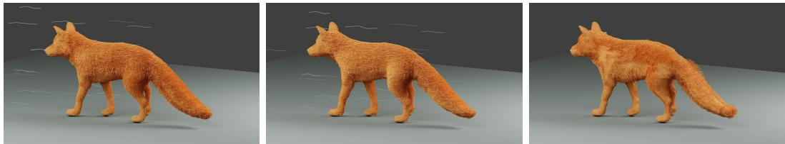  
Figure 9: Reconstructed fur strands imported into Blender subjected to strong wind simulation, demonstrating physically plausible dynamic behavior. See video in supplementary.

Applications Once the fur strands are reconstructed, they can be directly imported into industrystandard game engines such as Blender and Unreal Engine, enabling seamless integration into realtime rendering and animation pipelines. We further demonstrate in Figure 9 the physical plausibility of the reconstructed strands by simulating strong wind dynamics, showing that the fur responds with realistic, physically coherent motion.

## 4.1 MORE VISUALIZATIONS

In Figure 10, we provide additional novel view renderings of our reconstructed strand-based fur across the different animal subjects, including a panda, white tiger, fox, and cat. These qualitative results demonstrate FurE’s ability to consistently capture instance specific fur characteristics, across different species of animals. Despite bypassing dense per-strand optimization, our codec-based approach maintains high-fidelity geometric details from multiple viewpoints.

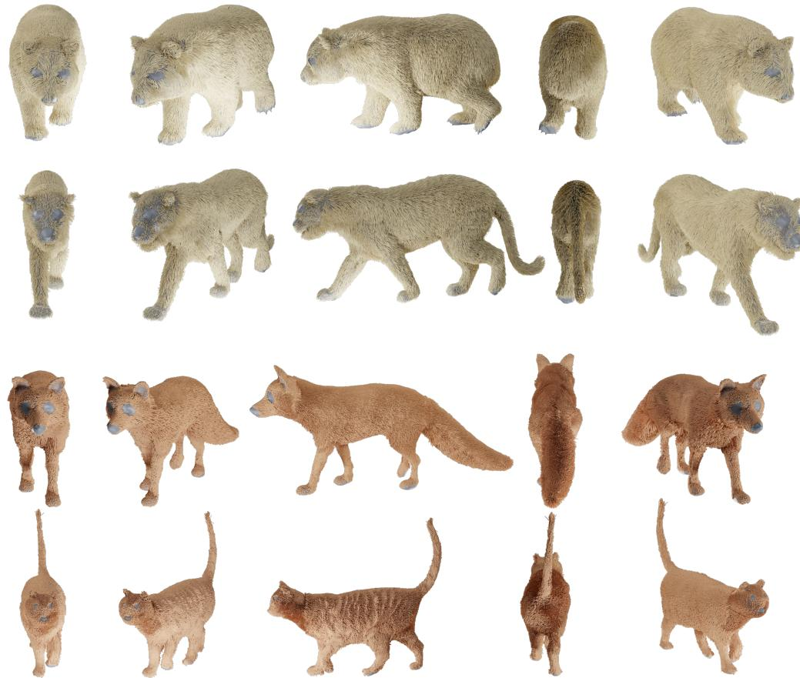  
Figure 10: Rendering examples. Renderings of reconstructed strand-based fur across different views of panda, and white tiger, fox, cat,

## 5 CONCLUSION

We presented FurE for instance-specific reconstruction of explicit, editable animal fur from calibrated multiview images. FurE adapts a human-hair PCA basis to replace dense strand optimization with compact code learning, without requiring a separate animal-fur training dataset. Local Gaussian Frosting cues and part-aware priors guide defurring, while direct part segmentation removes the need for SMAL fitting. On Artemis, strand training takes under one hour, achieving a 10× speedup over NeuralFur with comparable rendering quality. We further reconstruct fur from a noisy real-world bison sequence on which NeuralFur fails. These results demonstrate efficient animal fur reconstruction while retaining explicit strands for downstream editing, rendering, and simulation.

However, several limitations still remain. Our evaluation lacks ground-truth cases with strong local variation within body parts, such as shaved patches, injuries, or irregular grooming. Such cases would better test local Frosting cues against part-level priors. FurE also represents fur as a single strand layer on one root surface, which is estimated before strand optimization. Modeling multilayer coats and jointly optimizing root placement and strand geometry under multiview supervision are important next steps toward more automatic reconstruction.

## REFERENCES

Antoine Guedon and Vincent Lepetit. Gaussian frosting: Editable complex radiance fields with real-time´ rendering. arXiv preprint arXiv:2403.14554, 2024.

Chengan He, Xin Sun, Zhixin Shu, Fujun Luan, Soren Pirk, Jorge Alejandro Amador Herrera, Dominik L.¨ Michels, Tuanfeng Y. Wang, Meng Zhang, Holly Rushmeier, and Yi Zhou. Perm: A parametric representation for multi-style 3D hair modeling. In International Conference on Learning Representations (ICLR), 2025.

Evangelos Kalogerakis, Aaron Hertzmann, and Karan Singh. Learning 3d mesh segmentation and labeling. ACM Trans. Graph., 29(4), July 2010. ISSN 0730-0301. doi: 10.1145/1778765.1778839. URL https: //doi.org/10.1145/1778765.1778839.

Minghua Liu, Mikaela Angelina Uy, Donglai Xiang, Hao Su, Sanja Fidler, Nicholas Sharp, and Jun Gao. Partfield: Learning 3d feature fields for part segmentation and beyond. In IEEE/CVF International Conference on Computer Vision (ICCV), 2025.

Haimin Luo, Teng Xu, Yuheng Jiang, Chenglin Zhou, Qiwei Qiu, Yingliang Zhang, Wei Yang, Lan Xu, and Jingyi Yu. Artemis: Articulated neural pets with appearance and motion synthesis. ACM Trans. Graph., 41 (4), jul 2022. ISSN 0730-0301. doi: 10.1145/3528223.3530086. URL https://doi.org/10.1145/ 3528223.3530086.

Haimin Luo, Min Ouyang, Zijun Zhao, Suyi Jiang, Longwen Zhang, Qixuan Zhang, Wei Yang, Lan Xu, and Jingyi Yu. GaussianHair: Hair modeling and rendering with light-aware gaussians. arXiv preprint arXiv:2402.10483, 2024.

Haimin Luo, Srinjay Sarkar, Albert Mosella-Montoro, Francisco Vicente Carrasco, and Fernando De la Torre. CGHair: Compact gaussian hair reconstruction with card clustering. arXiv preprint arXiv:2604.03716, 2026.

Jin Lyu, Tianyi Zhu, Yi Gu, Li Lin, Pujin Cheng, Yebin Liu, Xiaoying Tang, and Liang An. AniMer: Animal pose and shape estimation using family aware transformer. In IEEE/CVF Conference on Computer Vision and Pattern Recognition (CVPR), 2025.

Tomasz Niewiadomski, Anastasios Yiannakidis, Hanz Cuevas-Velasquez, Soubhik Sanyal, Michael J. Black, Silvia Zuffi, and Peter Kulits. Generative zoo. In IEEE/CVF International Conference on Computer Vision (ICCV), pp. 8492–8502, 2025.

Soumava Paul, Prakhar Kaushik, Ankit Vaidya, Anand Bhattad, and Alan Yuille. Name that part: 3d part segmentation and naming. In Proceedings of the IEEE/CVF Conference on Computer Vision and Pattern Recognition, pp. 1808–1817, 2026.

Vanessa Sklyarova, Jenya Chelishev, Andreea Dogaru, Igor Medvedev, Victor Lempitsky, and Egor Zakharov. Neural haircut: Prior-guided strand-based hair reconstruction. In IEEE/CVF International Conference on Computer Vision (ICCV), 2023.

Vanessa Sklyarova, Berna Kabadayi, Anastasios Yiannakidis, Giorgio Becherini, Michael J. Black, and Justus Thies. NeuralFur: Animal fur reconstruction from multi-view images. In International Conference on 3D Vision (3DV), March 2026.

Peng Wang, Lingjie Liu, Yuan Liu, Christian Theobalt, Taku Komura, and Wenping Wang. Neus: Learning neural implicit surfaces by volume rendering for multi-view reconstruction. In Proc. Advances in Neural Information Processing Systems (NeurIPS), volume 34, pp. 27171–27183, 2021.

Yiming Wang, Qin Han, Marc Habermann, Kostas Daniilidis, Christian Theobalt, and Lingjie Liu. Neus2: Fast learning of neural implicit surfaces for multi-view reconstruction. In Proceedings of the IEEE/CVF International Conference on Computer Vision (ICCV), 2023.

Jiacong Xu, Yi Zhang, Jiawei Peng, Wufei Ma, Artur Jesslen, Pengliang Ji, Qixin Hu, Jiehua Zhang, Qihao Liu, Jiahao Wang, et al. Animal3d: A comprehensive dataset of 3d animal pose and shape. In 2023 IEEE/CVF International Conference on Computer Vision (ICCV), pp. 9065–9075. IEEE, 2023.

Egor Zakharov, Vanessa Sklyarova, Michael J. Black, Giljoo Nam, Justus Thies, and Otmar Hilliges. Human hair reconstruction with strand-aligned 3D gaussians. In European Conference on Computer Vision (ECCV), 2024.

Yuxiao Zhou, Menglei Chai, Alessandro Pepe, Markus Gross, and Thabo Beeler. GroomGen: A high-quality generative hair model using hierarchical latent representations. arXiv preprint arXiv:2311.02062, 2023.

Silvia Zuffi, Angjoo Kanazawa, David W. Jacobs, and Michael J. Black. 3D menagerie: Modeling the 3D shape and pose of animals. In IEEE Conference on Computer Vision and Pattern Recognition (CVPR), 2017.

## A APPENDIX

## A.1 IMPLEMENTATION DETAILS FOR FROSTING-CALIBRATED DEFURRING

FurE estimates the strand-root surface and initializes strand lengths separately. Root displacement determines where strands attach beneath the coat; strand length determines their extent along the curve. Gaussian Frosting supplies local thickness cues, while part-level references calibrate these cues and provide guidance where local support is weak. Shell width is not treated as a direct measurement of skin depth or strand length.

Inputs and shell measurements. We reconstruct the visible furry mesh $M _ { \mathrm { o u t e r } }$ using NeuS2 (Wang et al., 2023). Each vertex xi has an outward unit normal $n _ { i }$ and a body-part label $p ( i )$ , obtained using ALIGN-Parts (Paul et al., 2026) with manual verification.

Gaussian Frosting (Guedon & Lepetit, 2024) is trained on the same images and expressed in the same coordinate´ frame. Let $y _ { k } , \nu _ { k } ,$ , and wk denote a shell vertex, its normal, and its stored shell width. Shell vertices receive the label of their nearest annotated outer-mesh vertex.

We retain an unrestricted nearest-shell width for each outer-mesh vertex:

$$
k _ { 0 } ( i ) = \arg \operatorname* { m i n } _ { k } \| x _ { i } - y _ { k } \| _ { 2 } , \qquad \tau _ { i } = w _ { k _ { 0 } ( i ) } .
$$

These raw widths supply the part statistics and length initialization. For local defurring cues, we additionally check correspondence quality as described below.

Supported local thickness. For each $x _ { i } ,$ , we consider up to 12 nearest shell vertices. A correspondence is accepted only when its distance is below $0 . 0 3 D ,$ , its part label matches $p ( i )$ , its normal satisfies $n _ { i } ^ { \top } \nu _ { k } > 0 . 3 ,$ and its stored width passes the reliability threshold. Here D is the scene length scale used by the preprocessing. The reliability threshold accepts widths at or below the global 97.5th percentile.

Let Ai contain the accepted correspondences and ωik their distance/normal weights before normalization. For vertices with positive support, we compute

$$
\bar { \tau } _ { i } = \frac { \sum _ { k \in \mathcal { A } _ { i } } \omega _ { i k } w _ { k } } { \sum _ { k \in \mathcal { A } _ { i } } \omega _ { i k } } , \qquad c _ { i } = \operatorname* { m a x } _ { k \in \mathcal { A } _ { i } } \omega _ { i k } .
$$

Thus, τ¯i averages the supported widths, while ci measures correspondence support. Unsupported vertices receive $c _ { i } = 0$ , and their local term is omitted from the displacement objective. Missing support is not interpreted as absence of fur.

Part-level calibration. Within each part, we cap the raw nearest-shell widths $\tau _ { i }$ at that part’s 95th percentile. Let $W _ { 7 5 , p }$ and $W _ { 9 5 , p }$ denote the 75th and 95th percentiles of these capped values. We combine the shell statistic with a coarse part-thickness reference $h _ { p } \mathrm { : }$

$$
B _ { p } = \operatorname* { m i n } \left( 0 . 6 5 W _ { 7 5 , p } + 0 . 3 5 h _ { p } , W _ { 9 5 , p } \right) .
$$

All quantities in this calibration use scene units. When a reference is missing, we set $h _ { p } = W _ { 7 5 , p } ,$ . An explicitly supplied zero remains zero and is not treated as missing.

Bounded defurring. We estimate an inward displacement $d _ { i }$ for each vertex by solving

$$
\begin{array} { l l l } { \displaystyle \operatorname* { m i n } _ { i } } & { \displaystyle \sum _ { i } c _ { i } ( d _ { i } - t _ { i } ) ^ { 2 } + \eta \sum _ { i } ( d _ { i } - b _ { i } ) ^ { 2 } + \lambda \sum _ { ( i , j ) \in \mathcal E } a _ { i j } ( d _ { i } - d _ { j } ) ^ { 2 } , } \\ { \mathrm { ~ s . t . ~ } } & { 0 \leq d _ { i } \leq u _ { i } , } & { d _ { i } = 0 \quad ( i \in \mathcal B ) . } \end{array}\tag{2}
$$

The first term follows supported local evidence, the second retains part-level guidance, and the third smooths displacement across mesh edges E. We use $\eta = 0 . 2 5$ and $\lambda = 8 ,$ , with inverse-edge-length weights:

$$
a _ { i j } = { \frac { 1 } { \| x _ { i } - x _ { j } \| _ { 2 } } } \left\{ 1 , \quad p ( i ) = p ( j ) , \right.
$$

The protected set B fixes non-fur regions such as eyes, nose tip, paw pads, and horns. To restrict inward movement near opposing surfaces, we use

$$
u _ { i } = \mathrm { m i n } \left( 0 . 4 5 r _ { i } ^ { \mathrm { h i t } } , 0 . 0 5 D \right) ,
$$

where $r _ { i } ^ { \mathrm { h i t } }$ is the inward-ray hit distance. Missing hits use $r _ { i } ^ { \mathrm { h i t } } = 0 . 1 D .$ Here $u _ { i }$ is a displacement bound.

We solve with L-BFGS-B, for at most 2,500 iterations. The settings are $\mathtt { f t o l } \mathtt { - } 1 \mathtt { e } \mathtt { - } 1 3 , \mathtt { g t o l } \mathtt { - } 1 \mathtt { e } \mathtt { - } 7$ and maxcor=8. We further reduce displacements that cause face inversions, severe collapse, or new self intersections. Using $d _ { i }$ for the final checked displacement, we form the root mesh through

$$
x _ { i } ^ { \mathrm { r o o t } } = x _ { i } - d _ { i } n _ { i } .\tag{3}
$$

This estimates a plausible attachment surface beneath the coat.

Metric scale and length statistics. Length initialization uses the raw, unrestricted nearest-shell widths $\tau _ { i } ,$ not the correspondence-filtered widths, capped defurring statistics, or achieved displacements. For each fur-bearing part, we compute the vertex-wise statistic

$$
T _ { p } = s _ { \mathrm { c m } } ~ \mathrm { P } _ { 7 5 } \{ \tau _ { i } : p ( i ) = p \} .
$$

The scale factor is

$$
s _ { \mathrm { c m } } = { \frac { \mathrm { a s s u m e d e y e ~ s e p a r a t i o n ~ i n ~ c e n t i m e t e r s } } { \mathrm { r e c o n s t r u c t e d e y e ~ s e p a r a t i o n ~ i n ~ s c e n e ~ u n i t s } } } .
$$

Centimeter-valued initialization requires this metric reference; the current procedure has no validated automatic fallback when metric information is unavailable. Non-fur parts receive $\hat { T _ { p } _ { p } } = 0$

V1 and V2 length initialization. V1 initializes strand length using a fixed part-specific multiplier:

$$
\ell _ { p } ^ { \mathrm { s h a p e } } = m _ { p } T _ { p } , \qquad \ell _ { p } ^ { ( 1 ) } = \ell _ { p } ^ { \mathrm { s h a p e } } .
$$

The multiplier $m _ { p }$ accounts for the difference between shell thickness and length along a curved or oblique strand. V1 does not use VLM length calibration, but still uses the metric scale and part-specific multipliers.

When a coarse VLM or supplied reference length $\ell _ { p } ^ { \mathrm { V L M } }$ is available, V2 uses

$$
\ell _ { p } ^ { ( 2 ) } = \mathrm { c l i p } \left( 0 . 6 0 \ell _ { p } ^ { \mathrm { s h a p e } } + 0 . 4 0 \ell _ { p } ^ { \mathrm { V L M } } , 0 . 3 5 \ell _ { p } ^ { \mathrm { V L M } } , 1 . 3 5 \ell _ { p } ^ { \mathrm { V L M } } \right) .
$$

Both lengths are expressed in centimeters. The clipping operation limits the blended length to the stated interval. Without a reference, $_ { \textrm { V 2 } }$ uses $\ell _ { p } ^ { ( 2 ) } = \ell _ { p } ^ { \mathrm { s h a p e } }$

The selected variant supplies the exported length $\ell _ { p } .$ . Non-fur parts receive zero length in both variants. V1 and V2 change strand-length initialization, not the defurring objective.

Strand width and root sampling. The strand-rendering width parameter is initialized as

$$
\begin{array} { r } { W _ { p } ^ { \mathrm { s t r a n d } } = \mathrm { c l i p } \left( 0 . 0 3 \ell _ { p } , 0 . 0 2 , 0 . 1 2 \right) . } \end{array}
$$

This parameter is separate from shell thickness and root displacement. Each part also receives an independent base root density, measured in roots per unit surface area. Root sampling uses the part labels and local Frosting cues, with zero or near-zero density in non-fur regions.

Orientation and connection to strand learning. Directional computes a face-based degree-2 power field with a directional constraint on face 0. We normalize the resulting directions and align their signs through a breadth-first traversal. A bank of 180 Gabor orientations provides image-space fur-direction cues.

Strand learning samples attachment points $\mathbf { r } _ { s } \in M _ { \mathrm { r o o t } }$ and uses their local frames, part labels, and initialized lengths and widths. These sampled roots are distinct from the displaced mesh vertices $x _ { i } ^ { \mathrm { r o o t } }$ . A root on part $p ( \mathbf { r } _ { s } )$ receives the corresponding length $\ell _ { p ( \mathbf { r } _ { s } ) }$

When used by the codec, $\rho ( \mathbf { r } _ { s } )$ denotes the normalized local shell-width feature interpolated to the root. It is distinct from correspondence support $c _ { i }$ and root displacement $d _ { i }$

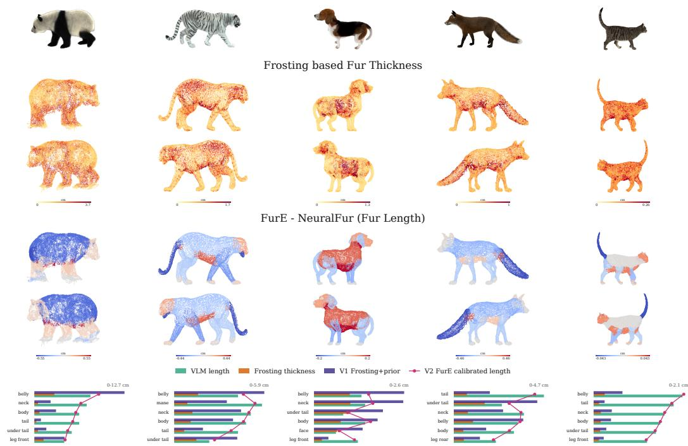  
Figure 11: Frosting thickness evidence and strand-length calibration. For each animal, the top row shows the original colored input rendering. The middle rows visualize the local Frosting shell thickness, where warmer colors indicate larger estimated fur-bearing thickness. The lower rows compare our calibrated fur-length estimate against the NeuralFur/VLM prior; blue regions are shorter than the prior and red regions are longer. The bottom charts summarize per-part values: raw Frosting thickness provides local geometric evidence, while the final calibrated length combines this signal with shape/part priors to produce NeuralFur-compatible strand lengths. Raw Frosting thickness is used as a relative local cue, not as a direct hair-length measurement.

## A.2 CODEC STRAND LEARNING DETAILS

FurE optimizes a compact strand code rather than dense per-strand control points. For each sampled root ri, a root-conditioned encoder predicts a latent code z , and a decoder maps this code to a normalized strand curve. The root tangent frame, part label, Frosting density, and initialized strand length scale the decoded curve into world space. We use a continous latent texture for strand optimization. We train with 15K strand for every iteration for 2500 iterations and finetune the PCA based decoder. We use the same hyper-parameters as NeuralFur.

## A.3 APPLICATIONS

As we demonstrate in the main and in Fig. 12, the fur strands reconstructed by FurE can be directly imported into commonly used standard 3D game engines, such as Blender and Unreal Engine. The structural plausibility of the generated strands enables downstream physics simulations. For example, subjecting the imported strands to simulated wind dynamics produces realistic and coherent motion.

## A.4 LIMITATIONS AND FUTURE WORK

While FurE enables efficient, fur reconstruction, several limitations still remain. First, our current framework requires calibrated multi-view images of static animal. Since capturing dense, static multi-view images of living animals is often very difficult, extending FurE to handle dynamic motion is the next step. Additionally our defurring process relies on initial Gaussian Frosting cues and dense camera viewpoints. Severe self-occlusions in the input images and the animal fur can degrade the shell thickness and the fur length estimate and hence the need for stronger geometric priors for future iterations.

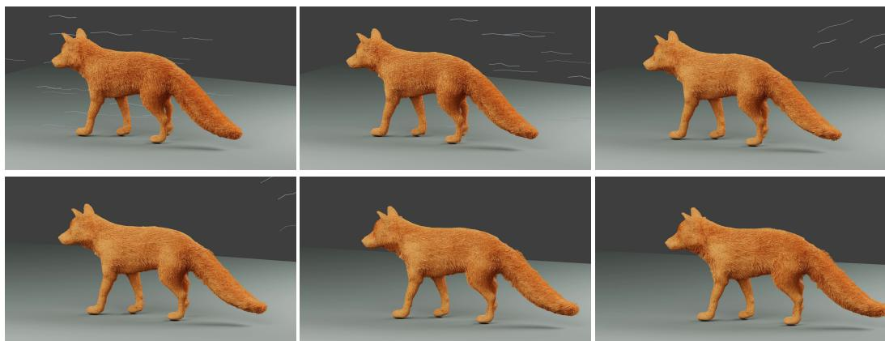  
Figure 12: Reconstructed fur strands imported into Blender subjected to strong wind simulation, demonstrating physically plausible dynamic behavior

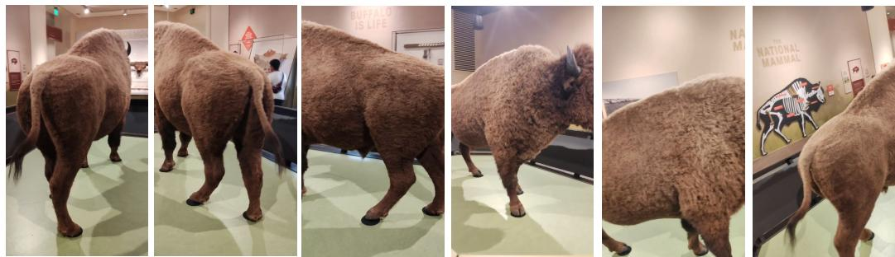  
Figure 13: Additional real-world samples. These are more samples from the real-world use case. FurE successfully reconstructs explicit, editable strands from noisy multiview images of a bison. We also release the associated data.

## A.5 REAL WORLD FUR RECONSTRUCTION

To demonstrate the generalizability and robustness of our approach , we evaluate FurE on a real-world, instancespecific bison sequence. As shown in Figure 7 , FurE successfully handles the real world noisy multi-view images to reconstruct the strand-based geometry. NeuralFur on the other hand fails to capture the underlying geometric surface for the bison. This surface degradation prevents it from reconstructing coherent and plausible fur geometry. We also release the associated multiview data to encourage future work on fur reconstruction on real world samples.