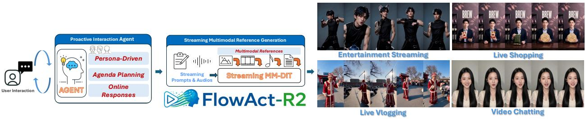
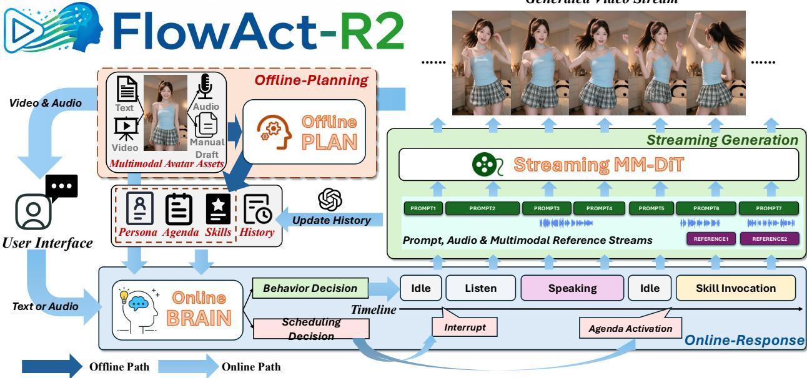
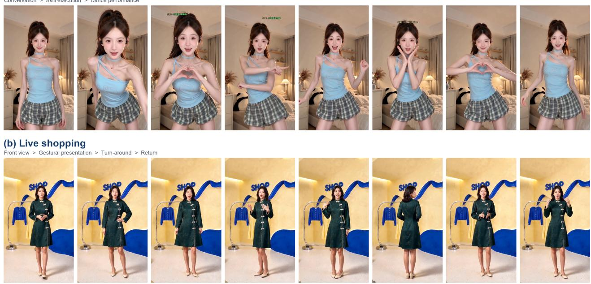
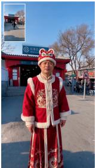
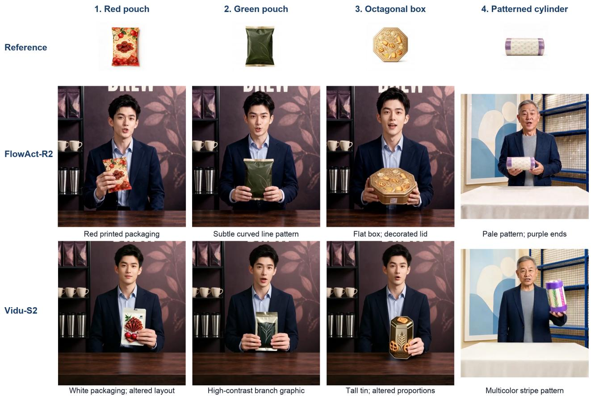

# FlowAct-R2: Beyond Talking Avatar via Streaming Multimodal References and Proactive Agent Planning

Ziyao Huang∗ Zhengkun Rong∗ Shiyang Qin∗ Shuang Liang Wentao Hu∗ Yuxuan Luo∗† Yuan Zhang Mingyuan Gao

Bytedance Intelligent Creation

∗Core Contributors †Corresponding Author

## Abstract

We present FlowAct-R2, a framework for interactive humanoid video generation that combines continuous multimodal control with proactive agent planning. Our method consists of two coupled components. First, a Streaming Multimodal Reference Difusion Transformer adapts the pretrained Seedance 2.0 Mini reference-to-video backbone to accept rolling action prompts, streaming audio, and dynamically updated image, audio, and video references. Video-driven rotary positional embeddings align reference chunks with the generation timeline, while reference-plusimage conditioning and partially noised historical motion frames preserve appearance and avoid accumulated drift. Second, a Proactive Interaction Agent separates pre-online planning from online scheduling and response: it prepares a persona, a long-horizon agenda, and reusable multimodal skills in advance, then autonomously schedules behaviors, responds to audience input, and handles interruptions during a live session. FlowAct-R2 supports real-time 720p generation and hour-scale streaming across entertainment streaming, live shopping, video chatting, and live vlogging.

Date: September 29, 2026   
Project Page: https://bone-11.github.io/Flowact-R2/   
Hugging Face Space: https://huggingface.co/spaces/ProAudience/FlowAct-R2

## 1 Introduction

Digital humans are emerging as practical tools for interactive applications, yet most existing systems remain confined to a single scenario, such as dialogue [4, 5, 16, 21], talent performance [18, 20], or live commerce and product demonstration [9, 12]. To support open-ended live interaction, however, a digital human should go beyond a collection of task-specific generators and behave more like a real human streamer: it should maintain a coherent persona and long-term context, proactively organize what to do next [6, 13, 15, 17], respond to unexpected user input without abandoning the ongoing activity [3, 11], and coordinate speech, body motion, object interaction, and scene-level actions.

This requires both a generator capable of continuously realizing changing multimodal behaviors and an agent responsible for planning, scheduling, interrupting, and resuming them throughout a long-running session. Recent systems have advanced continuous humanoid video generation, real-time audiovisual interaction, and interactive world simulation [2, 8, 14], but two coupled challenges remain. The generator needs to incorporate dynamically changing image, audio, and video references while preserving identity and temporal continuity. Meanwhile, the agent needs to prepare complex activities in advance and make latency-sensitive decisions online, allowing unexpected user inputs to redirect ongoing behavior without disrupting the session.

  
Figure 1 FlowAct-R2 couples proactive interaction with streaming multimodal reference generation. Our demonstrations cover entertainment streaming, live shopping, live vlogging, and video chatting.

To address these coupled challenges, we present FlowAct-R2, which pairs a streaming multimodal reference generator with a proactive interaction agent (Figure 1). This design provides three main capabilities:

• Streaming Multimodal Reference Generation. By extending difusion forcing from chunkwise generation to streaming multimodal references, FlowAct-R2 enables real-time video generation with rolling prompts and multimodal references, including continuously updated images, audio, and video, and supports hour-level ultra-long video generation with 720p.

• Proactive Interaction Agent. To enable digital humans to autonomously drive their behavior when no external input is present, while seamlessly responding when interactions arise, FlowAct-R2 introduce an agent workflow with pre-online planning and online scheduling and response, which supports personadriven behaviors, interruption handling, and skill execution for autonomous live interactions.

• Rich Behaviors Across Diverse Live Scenarios. FlowAct-R2 supports real-time text and audio interactions across four representative scenarios—video chatting, live shopping, entertainment streaming, and interactive gaming—generating not only conversational responses but also expressive behaviors and task-oriented actions beyond conventional question answering.

## 2 Method Overview

FlowAct-R2 has two coupled components: a Streaming Multimodal Reference Difusion Transformer (DiT) that produces video, and a Proactive Interaction Agent that determines the behavior and its schedule. DiTs provide the underlying Transformer-based difusion architecture [7]. As shown in Figure 2, ofline preparation provides the persona, agenda, and skill assets. Online scheduling combines these resources with audience events and interaction history, then supplies changing conditions to the generator.

## 2.1 Streaming Multimodal Reference Diffusion Transformer.

The generator adapts the pretrained Seedance 2.0 Mini reference-to-video (R2V) backbone, retaining its reference preservation capability. Difusion Forcing assigns independent noise levels to sequence tokens [1]. FlowAct-R2 uses this formulation for autoregressive streaming inference while preserving the backbone’s bidirectional spatiotemporal modeling. Conditioning also becomes a stream: action prompts, driving audio, and image, audio, or video references can be updated or switched as the session proceeds. This supports changes such as presenting a new product or invoking a reference-guided performance within an ongoing stream.

Rotary position embedding (RoPE) encodes positional relationships through rotations [10]. FlowAct-R2 uses a video-driven variant to align incoming reference chunks with the corresponding generation timeline. This provides temporal alignment when references arrive or change during generation. Explicitly trained referenceplus-image conditioning, denoted (R + I)2V, anchors identity and appearance. The model additionally conditions on partially noised historical motion frames to improve robustness to imperfect generated histories and reduce error accumulation. Specialized audio-driven training supports synchronization of speech, lip movements, expressions, and head poses, while coarse-to-fine inference progressively restores visual details.

Generated Video Stream  
  
Figure 2 System overview. Ofline planning organizes multimodal avatar assets into a persona, an agenda, and reusable skills. The online agent makes behavior and scheduling decisions using audience inputs and history. The resulting prompt, audio, and reference streams condition continuous video generation.

## 2.2 Proactive Interaction Agent.

Proactive agent planning follows a two-stage design that moves long-horizon preparation outside the latencysensitive interaction loop while retaining online responsiveness.

## 2.2.1 Offline planning.

The agent derives a persona from multimodal character assets, including text, images, audio, video, and manually prepared material. It organizes the session into a long-horizon agenda and compiles complex behaviors into reusable multimodal skills. The persona specifies how the character should behave, the agenda supplies activities to pursue, and the skills provide prepared resources for execution. This moves session organization and complex behavior preparation out of the immediate interaction loop.

## 2.2.2 Online scheduling and response.

During a session, the agent combines the prepared agenda and skills with audience text or audio events and summarized interaction history. It makes a behavior decision about what to perform and a scheduling decision about when and how to perform it. Depending on the context, a behavior can be initiated, overlaid, deferred, interrupted, or resumed. This permits the avatar to continue agenda-driven activity without continuous prompting and to respond when an audience event arrives.

The schedule is expressed through idle, listening, speaking, and skill-execution periods. These periods supply rolling prompts, audio, and multimodal reference updates to the DiT. Interaction history is updated as the session evolves, giving subsequent decisions access to prior context. The agent and generator therefore operate at complementary levels: the agent manages session behavior and timing, while the generator realizes those decisions as a continuous video stream.

(a) Entertainment streaming Conversation > Skill execution > Dance performance

## 3 Results

## 3.1 Streaming and application demonstrations.

FlowAct-R2 generates real-time 720p video. We demonstrate changing references and audience interaction in four settings. Entertainment streams combine audience conversation with singing, dancing, and other skills. Shopping streams show product presentation, item try-on, and transitions between product references. Video chats demonstrate listening and expressive turn-taking. Live vlogs combine scene changes with audience-driven branching. These examples illustrate how the same agent–generator interface supports both conversationa and task-oriented behavior. Figures 3 and 4 show selected frames from the demonstrations.

  
Figure 3 Entertainment and live shopping results. (a) Selected poses and gestures during a dance performance. (b) A continuous presentation of one garment, including front-facing explanation, expressive gestures, and a rear-view demonstration. Each row contains eight full frames from one video in temporal order.

## (a) Video chatting

## (b) Live vlogging

Audience request > Viewpoint change > Scene exploration

  
Figure 4 Video chatting and live vlogging results. (a) Facial expressions and gestures during a conversation. (b) Viewpoint and scene changes during an outdoor vlog. Each row contains eight full frames in temporal order. Referenceimage insets and audience text in the vlogging frames are retained from the source video.

## 3.2 Comparison with Vidu-S1.

Vidu S1 supports real-time interactive video generation through spoken interaction [19]. In the human evaluation, FlowAct-R2 achieves GSB scores of +54.76% for video quality and +40.48% for real-time interaction against Vidu-S1. The accompanying comparison describes improvements in visual clarity, motion naturalness and expressiveness, action responsiveness, and the contextual appropriateness of dialogue.

Figure 5 compares the two systems across both listening and response phases. While the audience is speaking, FlowAct-R2 produces continuous listening-state behavior through changes in gaze, head pose, and facial expression, whereas Vidu-S1 remains close to the same frontal pose, smile, and hand gesture. During the subsequent response, FlowAct-R2 continues with varied facial delivery. The comparison highlights the richer nonverbal behavior planned by FlowAct-R2 across conversational turns.

Attentive listening followed by expressive delivery

Audience asks for an honest summary of the product specifications, price, and allergens. Listening Responding

  
Static listening pose followed by the spoken response

Figure 5 Behavior against Vidu-S1 during the same audience request and subsequent response. The first four columns show listening; the final four show speaking. FlowAct-R2 varies gaze, head pose, and facial response during listening, whereas Vidu-S1 maintains a nearly unchanged pose, smile, and hand gesture.

## 3.3 Qualitative comparison with Vidu-S2.

Vidu-S2 supports streaming reference conditioning, allowing product images to be introduced or switched during an ongoing interactive video session [18]. Figure 6 compares outputs for the same product references. Across three successive products, FlowAct-R2 retains the red packaging layout, the green pouch’s subtle line pattern, and the shallow octagonal box. Vidu-S2 does not complete these reference switches cleanly: attributes from adjacent products remain and blend into the newly generated object, producing predominantly white packaging, a prominent branch graphic, and a tall polygonal tin. In the separate cylinder example, it replaces the pale patterned wrap with multicolored stripes. These cases reveal both object fusion during switching and reduced fidelity in packaging details and proportions. We also demonstrate text-triggered dancing in both systems and reference-video-driven dancing in FlowAct-R2.

  
Figure 6 Product-reference fidelity against Vidu-S2. Columns 1–3 follow successive product references in one paired shopping demonstration; column 4 shows a separate cylinder case. Reference images are copied from the source-video insets. Presenter crops expose diferences in package graphics and shape.

## 4 Conclusion

FlowAct-R2 advances live digital humans along three dimensions. First, streaming multimodal reference generation accepts rolling prompts and dynamically updated image, audio, and video references for continuous real-time video synthesis. Second, the proactive interaction agent separates ofline preparation of personas, agendas, and skills from online behavior scheduling, enabling autonomous activity while responding to user input and interruptions. Third, the unified system supports both expressive and task-oriented behaviors across video chatting, live shopping, entertainment streaming, and live vlogging. Together, these capabilities move digital humans beyond reactive talking avatars toward persistent visual agents that can plan and act through continuous video.

## References

[1] Boyuan Chen, Diego Martí Monsó, Yilun Du, Max Simchowitz, Russ Tedrake, and Vincent Sitzmann. Difusion Forcing: Next-token prediction meets full-sequence difusion. In Advances in Neural Information Processing Systems, volume 37, 2024. doi: 10.52202/079017-0759. URL https://openreview.net/forum?id=yDo1ynArjj.

[2] Lianghua Huang, Zhi-Fan Wu, Wei Wang, Yupeng Shi, Mengyang Feng, Junjie He, Chen-Wei Xie, Yu Liu, Jingren Zhou, Ang Wang, Bang Zhang, Baole Ai, Chen Liang, Cheng Yu, Chongyang Zhong, Jinwei Qi, Kai Zhu, Pandeng Li, Peng Zhang, Wenyuan Zhang, Xinhua Cheng, Yitong Huang, Yun Zheng, Yuzheng Wang, and Zoubin Bi. Wan-Streamer v0.1: End-to-end real-time interactive foundation models. arXiv preprint arXiv:2606.25041, 2026. URL https://arxiv.org/abs/2606.25041.

[3] Muye Huang, Lingling Zhang, Xingyu Yu, Lei Shi, Zhanyu Ma, Jun Xu, Jiuchong Gao, Jinghua Hao, Renqing He,

and Jun Liu. DuplexOmni: Real-Time Listening, Seeing, Thinking, and Speaking for Full-Duplex Interaction. arXiv preprint arXiv:2606.09186, 2026. URL https://arxiv.org/abs/2606.09186.

[4] Yubo Huang, Hailong Guo, Fangtai Wu, Weiqiang Wang, Shifeng Zhang, Shijie Huang, Qijun Gan, Lin Liu, Sirui Zhao, Enhong Chen, Jiaming Liu, and Steven Hoi. Live Avatar: Streaming Real-time Audio-Driven Avatar Generation with Infinite Length. arXiv preprint arXiv:2512.04677, 2025. URL https://arxiv.org/abs/2512. 04677.

[5] Tianqi Li, Ruobing Zheng, Minghui Yang, Jingdong Chen, and Ming Yang. Ditto: Motion-Space Difusion for Controllable Realtime Talking Head Synthesis. In Proceedings of the 33rd ACM International Conference on Multimedia, pages 9704–9713, 2025. doi: 10.1145/3746027.3755075. URL https://doi.org/10.1145/3746027. 3755075.

[6] Joon Sung Park, Joseph C. O’Brien, Carrie J. Cai, Meredith Ringel Morris, Percy Liang, and Michael S. Bernstein. Generative Agents: Interactive simulacra of human behavior. In Proceedings of the 36th Annual ACM Symposium on User Interface Software and Technology, pages 1–22, 2023. doi: 10.1145/3586183.3606763. URL https://doi.org/10.1145/3586183.3606763.

[7] William Peebles and Saining Xie. Scalable difusion models with transformers. In Proceedings of the IEEE/CVF International Conference on Computer Vision, 2023. doi: 10.1109/ICCV51070.2023.00387. URL https://openaccess.thecvf.com/content/ICCV2023/html/Peebles\_Scalable\_Diffusion\_Models\_with\_ Transformers\_ICCV\_2023\_paper.html.

[8] PixVerse Research. PixVerse R2: Scaling Real-Time Omni World Models. Technical report, August 2026. URL https://pixverse.ai/en/blog/pixverse-r2-scaling-real-time-omni-world-models. Published August 23, 2026. Accessed September 28, 2026.

[9] Zejing Rao, Haoxian Zhang, Xiaoqiang Liu, Yiping Meng, Guoxin Zhang, Pengfei Wan, Fan Tang, and Tong-Yee Lee. StreamHOI: Interaction-aware Temporal Memory Adaptation for Streaming HOI Video Generation. arXiv preprint arXiv:2607.20174, 2026. URL https://arxiv.org/abs/2607.20174.

[10] Jianlin Su, Murtadha Ahmed, Yu Lu, Shengfeng Pan, Wen Bo, and Yunfeng Liu. RoFormer: Enhanced transformer with rotary position embedding. Neurocomputing, 568:127063, 2024. doi: 10.1016/j.neucom.2023.127063. URL https://doi.org/10.1016/j.neucom.2023.127063.

[11] Thinking Machines Lab. Interaction Models: A Scalable Approach to Human-AI Collaboration. Oficial research report, May 2026. URL https://thinkingmachines.ai/blog/interaction-models/. Published May 11, 2026. Accessed September 23, 2026.

[12] Vivix Team. Vivix-A1. Oficial technical report, June 2026. URL https://vivix.ai/tech-report-vivix-a1. Accessed September 23, 2026.

[13] Guanzhi Wang, Yuqi Xie, Yunfan Jiang, Ajay Mandlekar, Chaowei Xiao, Yuke Zhu, Linxi Fan, and Anima Anandkumar. Voyager: An open-ended embodied agent with large language models. Transactions on Machine Learning Research, 2024. ISSN 2835-8856. URL https://openreview.net/forum?id=ehfRiF0R3a.

[14] Lizhen Wang, Yongming Zhu, Zhipeng Ge, Youwei Zheng, Longhao Zhang, Tianshu Hu, Shiyang Qin, Mingshuang Luo, Jiaxu Zhang, Xin Chen, Yulong Wang, Zerong Zheng, Jianwen Jiang, Chao Liang, Weifeng Chen, Xing Wang, Yuan Zhang, and Mingyuan Gao. FlowAct-R1: Towards interactive humanoid video generation. arXiv preprint arXiv:2601.10103, 2026. URL https://arxiv.org/abs/2601.10103.

[15] Michael Wooldridge and Nicholas R. Jennings. Intelligent agents: theory and practice. The Knowledge Engineering Review, 10(2):115–152, 1995. doi: 10.1017/S0269888900008122. URL https://doi.org/10.1017/ S0269888900008122.

[16] You Xie, Tianpei Gu, Zenan Li, Chenxu Zhang, Guoxian Song, Xiaochen Zhao, Chao Liang, Jianwen Jiang, Hongyi Xu, and Linjie Luo. X-Streamer: Unified Human World Modeling with Audiovisual Interaction. arXiv preprint arXiv:2509.21574, 2025. URL https://arxiv.org/abs/2509.21574.

[17] Shunyu Yao, Jefrey Zhao, Dian Yu, Nan Du, Izhak Shafran, Karthik Narasimhan, and Yuan Cao. ReAct: Synergizing reasoning and acting in language models. In The Eleventh International Conference on Learning Representations, 2023. URL https://openreview.net/forum?id=WE\_vluYUL-X.

[18] Jintao Zhang, Kai Jiang, Jintao Chen, Xu Wang, Deyuan Liu, Jungang Li, Dechuang Chen, Ming Lin, Jingjiang Zhou, Haopeng Jin, Qi Jia, Xiaohang Wang, Yaole Wang, Zhanqiang Zhang, Ran Li, Zhengkun Huang, Shuyue

Xiong, Yuji Wang, Zikun Dai, Hui He, Yang Luo, Mang Ning, Weiqi Feng, Chengyang Ye, Xinyue Lin, Min Zhao, Hongzhou Zhu, Hengkai Tan, Zeyuan Wang, Chendong Xiang, Kaiwen Zheng, Zhijie Deng, Fan Bao, Jianfe Chen, and Jun Zhu. Vidu S2: Real-Time Interactive, Editable, and Spatial Video Generation. arXiv preprint arXiv:2609.11638, 2026. URL https://arxiv.org/abs/2609.11638.

[19] Jintao Zhang, Kai Jiang, Jintao Chen, Xu Wang, Yang Luo, Yuji Wang, Dechuang Chen, Jungang Li, Chengyang Ye, Marco Chen, Hongzhou Zhu, Min Zhao, Yuxuan Jiang, Zhengkun Huang, Chendong Xiang, Kaiwen Zheng, Haoxu Wang, Xiaohang Wang, Qi Jia, Xin Chen, Yimin Chen, Youhe Jiang, Fangcheng Fu, Zhijie Deng, Fan Bao, Jianfei Chen, and Jun Zhu. Vidu S1: A Real-Time Interactive Video Generation Model. arXiv preprint arXiv:2607.03118, 2026. URL https://arxiv.org/abs/2607.03118.

[20] Yuxuan Zhang, Haozhong Xiong, Yubo Huang, Jiayi Song, Jinpeng Yu, Haofan Wang, Jiaming Liu, Ruihua Huang, and Liwei Wang. LiveAnimate: Stable Long-Form Streaming Human Animation in Real-Time. arXiv preprint arXiv:2608.11745, 2026. URL https://arxiv.org/abs/2608.11745.

[21] Yongming Zhu, Longhao Zhang, Zhengkun Rong, Tianshu Hu, Shuang Liang, and Zhipeng Ge. INFP: Audio-Driven Interactive Head Generation in Dyadic Conversations. arXiv preprint arXiv:2412.04037, 2024. URL https://arxiv.org/abs/2412.04037.