# From Pixel Generation to Topological Inference: Structural Dual Super-Resolution for Trustworthy Cross-Physical-Domain Trabecular Morphology Learning

Fan Zhang, Yi Zhang Institute of High Energy Physics, Chinese Academy of Sciences Beijing 100049, China {zhangfan95,zhangyi88}@ihep.ac.cn

Ling Wang   
Department of Radiology   
Beijing Jishuitan Hospital   
Beijing, China   
{1988yisheng}@163.com

## Abstract

© 2026 The Authors. All rights reserved. No part of this preprint may be reproduced, distributed, or reused in any form without the prior written permission of the authors.

Clinical CT and UHRCT cannot resolve individual trabeculae, whereas synchrotron radiation microCT (SRµCT) provides 3.2 µm high-resolution references but is not applicable for in vivo imaging. The two domains differ by 31.25× in resolution, are only coarsely paired, and have drastically different data volumes. Moreover, clinical UHRCT suffers from severe partial volume effects, strong noise, and beam hardening/scatter artifacts, while SRµCT is nearly free of these. Existing super-resolution networks and pretrained-prior methods (GLEAN/StyleGAN2, Stable SR/LDM) underperform because they target pixel generation—diverse details and SSIM/PSNR—and do not explicitly model these physical differences. This indicates that 32× super-resolution via pixel generation is intrinsically ill-posed. We propose a paradigm shift from pixel generation to topological inference: deterministically predicting invariant microstructures from macro-scale low-resolution inputs, evaluated by morphological parameters. We realize this paradigm via structural dual super-resolution, coupling forward physical degradation (micro-to-macro) with inverse structural inference (macro-to-micro) through structural duality constraints. The method is an end-toend, few-shot, compact structural dual network (SDN), comprising a bidirectional modeling network for forward degradation and inverse reconstruction, a pyramid structural consistency discriminator, and four structural duality constraints. On the test set, SDN achieves morphological parameters largely consistent with SRµCT across six metrics, enabling clinical UHRCT (e.g. BV/TV 0.3793 228% error, Tb.Th 357.2µm 4793% error) with micro-imaging-level morphological quantification (BV/TV 0.1156 vs 0.1163, Tb.Th 7.3µm vs 10µm), with SSIM reaching 0.8. Trained on 3.2 µm SSRF data, the model generalizes well to 3.25 µm isotropic BSRF data from an independent source, validating cross-source generalization and confirming that the designed network achieves trustworthy structural inference rather than pixel generation.

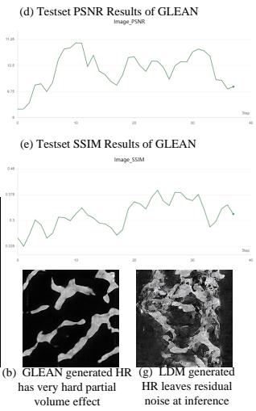

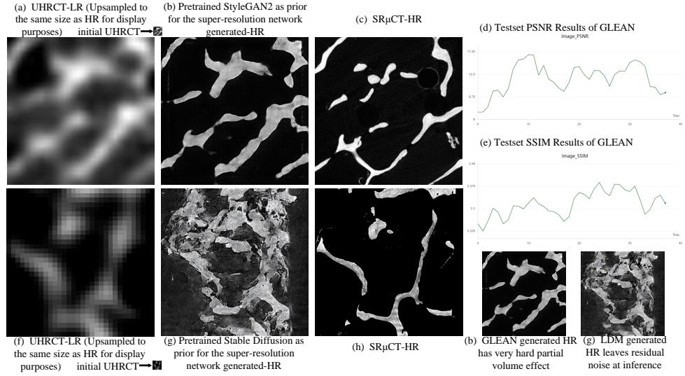  
Figure 1: GLEAN fails to remove partial volume effects in clinical UHRCT as (a)-(e). Stable SR (using synthetic UHRCT data) leaves residual noise at inference as (f)-(h). For GLEAN, first, we performed large-scale pre-training of the generator using 309,482 high-resolution SRµCT images in StyleGAN2, and then used the generator as the prior for the super-resolution network. (d) and (e) show the PSNR and SSIM results for the 37 CT images in the test set of GLEAN, respectively.

## 1 Introduction

Trabecular bone morphology (Parfitt et al., 1987)—quantified by trabecular thickness (Tb.Th), spacing (Tb.Sp), number (Tb.N), connectivity, bone volume fraction (BV/TV), and structure model index (SMI)—is central to osteoporosis diagnosis, fracture risk assessment, and bone microstructural analysis. However, clinical CT and UHRCT (Ultra-High-Resolution Computed Tomography) (Flohr et al., 2007) at 100 µm resolution cannot resolve individual trabeculae, leading to biased morphological quantification. SRµCT (Grodzins, 1983) at 3.2 µm provides high-resolution microstructural references but is not applicable for in vivo clinical imaging.

The two domains differ fundamentally in resolution, partial volume effect, noise, and artifacts. At 3.2 µm, SRµCT resolves individual trabeculae with negligible partial volume effect and minimal noise, and is free of beam hardening and scatter. In contrast, clinical UHRCT at 100 µm suffers from severe partial volume effect (bone/marrow mixing), strong quantum and electronic noise, detector blur, beam hardening, and Compton scatter. The resolution gap is 31.25×, modeled as 32× microstructure super-resolution. The two domains also differ drastically in data volume and can only be coarsely paired—same anatomical site, different resolutions, no strict alignment.

Given the disparity in resolution, scale, and scarce paired data, we consider pretraining on largescale SRµCT to learn a prior over trabecular structures, then using it to guide super-resolution. In recent years, GAN (Goodfellow et al., 2014) and diffusion models (Ho et al., 2020; Li & He, 2026) achieve strong performance on natural image super-resolution. We adapt two representative large data pretrained methods to our task. For GAN-based HR priors, we adopt StyleGAN2 (Karras et al., 2020). We then adapt GLEAN (Chan et al., 2023) to our task, which has been reported to support super-resolution of natural images at high magnifications. For diffusion-based priors, we adopt LDM (Rombach et al., 2022). Then we adapt Stable SR (Wang et al., 2024) to our task. However, they underperform: GLEAN fails to remove partial volume effects (Fig. 1 (b)), and Stable SR leaves residual noise at inference that contaminates reconstructed microstructures (Fig. 1 (g)). In a word, GLEAN (StyleGAN2) and Stable SR (LDM), based on pretrained priors, exploit large-scale highresolution data via two-stage training. However, they capture source-specific texture statistics rather than invariant trabecular morphology, and hallucinate plausible but false trabeculae under coarse pairing.

We observe that trustworthy macro-to-micro structural inference differs fundamentally from existing super-resolution. Existing networks are designed for a single objective—diverse detail generation for perceptual quality—and evaluated by pixel-level metrics (SSIM, PSNR, LPIPS). Our structural inference requires deterministic prediction of invariant microstructures from macro-scale low-resolution inputs, evaluated by morphological parameters for clinical trustworthiness, with minimal tolerance for hallucination. This demands a shift from pixel generation to topological inference.

How can we learn invariant trabecular morphology shared by both domains without large-scale pretraining and two-stage decoupling, reframing the objective as trustworthy deterministic structural inference? We propose structural dual network, a trustworthy, few-shot, end-to-end approach. Its core idea is that forward physical degradation and inverse structural inference are not independent tasks, but a pair of mappings mutually constrained through shared morphological structures. The forward process F models cross-modal physical degradation from microCT to UHRCT (micro-tomacro), including resolution loss, partial volume effects, noise and detector response differences, and artifacts. The inverse process I performs corresponding inverse degradation operations and structural inference (macro-to-micro), recovering only the invariant trabecular morphology shared by both domains, without freely generating details. The two are coupled through structural duality constraints. We further propose a pyramid structural consistency discriminator operating on structural maps rather than raw images, extracting invariant structures, and four structural duality constraints to prevent hallucinated trabeculae. On the test set, SDN achieves morphological parameters largely consistent with SRµCT across 7 metrics (e.g., BV/TV 0.1163 vs. 0.1156, Tb.Th 10.3 µm vs. 7.3 µm), whereas clinical UHRCT alone yields large errors (BV/TV 0.3793, 228% error; Tb.Th 357.2 µm, 4793% error), with SSIM reaching 0.8. Cross-source generalization further proves that SDN can mine invariant structures and perform trustworthy inference.

## Our contributions are:

1. Formulate a new problem: cross-physical-domain trabecular morphology learning. Clinical UHRCT (100 µm) and SRµCT (3.2 µm) differ by 31.25× in resolution, with severe partial volume effects, noise, and artifacts in the clinical domain, scarce paired data, and coarse pairing, making pixel-level super-resolution ill-posed and requiring a shift from pixel generation to topological inference.

2. Propose a new paradigm: topological inference super-resolution. It reframes super-resolution from pixel generation to deterministic structural inference, evaluated by morphological parameters rather than pixel-level metrics. We realize this paradigm via structural dual superresolution, coupling forward physical degradation (micro-to-macro) with inverse structural inference (macro-to-micro) through structural duality constraints.

3. Introduce a simple, trustworthy, end-to-end, few-shot structural dual network (SDN): It consists of a forward physical degradation network F, an inverse structural inference network I, a multiscale structural consistency discriminator, and four structural duality constraints (low-frequency, gradient, SSIM, frequency low-band), achieving trustworthy structural inference, outperforming GAN and diffusion methods that rely on large-scale pretraining.

4. Establish a trustworthy evaluation protocol based on morphological parameters and demonstrate cross-physical-domain generalization. Evaluation uses trabecular thickness, spacing, number, connectivity, BV/TV, DA, and SMI as topological/morphological metrics, with SSIM/PSNR. The model is trained on 3.2 µm SSRF data and generalizes well to 3.25 µm isotropic BSRF data from an independent source, validating cross-source generalization and confirming that the designed network achieves trustworthy structural inference rather than pixel generation.

## 2 Related Work

Medical Image Super-Resolution. Early methods use bicubic downsampling to synthesize LR– HR pairs, but real degradation is complex. Existing medical CT super-resolution methods rely on synthetic degradation and pixel-wise losses (PENG et al., 2026; Hong et al., 2026; Jhuboo et al., 2022), hallucinating plausible but false trabeculae in cross-modal, coarsely paired settings. Moreover, existing super-resolution typically targets the same device with a resolution gap no more than 8× (Senck et al., 2025; Frazer et al., 2024; Yu et al., 2022), far smaller than our 31.25× cross-device, cross-modal setting. Due to the limited number of human specimens and the scarcity of synchrotron facilities, large-scale imaging with the gold-standard SRµCT remains impractical, and research in this area is still in its early stages.

Hallucination in Super-Resolution. Hallucination is a critical open problem in visual generation (Asadi et al., 2026). Generative models often fabricate plausible yet non-existent textures or structures (Chen et al., 2026). While such artifacts may be tolerable in natural images, in medical imaging, any hallucinated structure can mislead diagnosis, quantification, and treatment planning. The medical domain therefore tolerates almost no hallucination and demands deterministic, structure-faithful reconstruction rather than free-form detail generation. Yazdan Parast et al. (2026) have begun to address hallucinations in multimodal LLMs, but hallucination in medical super-resolution remains largely unexplored.

Trabecular Morphology Assessment. Clinical practice uses HR-pQCT (Boutroy et al., 2005; Manske et al., 2015) or microCT (Bouxsein et al., 2010) to compute morphological parameters. We are the first to formulate cross-physical-domain trabecular morphology learning from clinical UHRCT, with morphological parameters as primary evaluation.

## 3 Method

## 3.1 Problem Setting

Let two real physical domains be:

X: synchrotron radiation microCT $( \mathrm { S R } \mu \mathrm { C T } ) , 3 . 2 \mu \mathrm { m }$ resolution, monochromatic X-ray, photoncounting detector, negligible partial volume effect, minimal noise, no beam hardening or scatter artifacts.

$Y \colon$ clinical UHRCT, 100 µm resolution, polychromatic X-ray, energy-integrating detector, severe partial volume effect, strong quantum and electronic noise, beam hardening, and scatter.

Data are coarsely paired: same anatomical site, different resolutions, no strict alignment. The resolution gap is 31.25×, modeled as $3 2 \times$ microstructure super-resolution. The physical differences between the two domains are summarized in Table 3 in Appendix A.1 .

Goal: infer from $y \in Y$ the invariant trabecular morphology shared with $x \in X$

We note that this goal fundamentally differs from conventional super-resolution. Conventional super-resolution aims to generate diverse, perceptually realistic details and is evaluated by pixellevel metrics (SSIM, PSNR, F1 Score). In contrast, our goal requires deterministic inference of invariant microstructures from macro-scale low-resolution inputs, with minimal tolerance for hallucination. We therefore reframe the task as topological inference rather than pixel generation.

## 3.2 Paradigm: From Pixel Generation to Topological Inference

We define topological inference super-resolution as a new paradigm: given a macro-scale lowresolution input, deterministically infer the invariant topology and morphology of the underlying microstructure, without generating free-form texture details. Formally, the objective is:

$$
\operatorname* { m i n } \ d _ { \mathrm { s t r u c t } } \big ( I ( y ) , x \big ) , \quad \mathrm { s u b j e c t ~ t o } \quad I ( y ) \in \mathcal { M } ( x ) ,\tag{1}
$$

where $d _ { \mathrm { s t r u c t } }$ is a structural distance and $\mathcal M ( x )$ denotes the set of microstructures sharing the same invariant topology as $x .$ . Unlike pixel generation, which minimizes $\| I ( y ) - x \|$ in image space, topological inference minimizes structural discrepancy, not pixel discrepancy.

This paradigm shift has three implications:

Objective: from diverse detail generation to deterministic structural inference.

Evaluation: from pixel-level metrics (SSIM/PSNR) to morphological parameters (Tb.Th, Tb.Sp, Tb.N, connectivity, BV/TV, SMI).

Constraint: from single pixel-wise constraint to multi-scale structural duality, with minimal tolerance for hallucination.

## 3.3 Realization: Structural Dual Network

We realize the topological inference paradigm via structural dual network, illustrated in Fig. 2, which couples two mappings:

$$
F : X \to Y \quad { \mathrm { ( f o r w a r d ~ p h y s i c a l ~ d e g r a d a t i o n , m i c r o - t o - m a c r o ) } } ,\tag{2}
$$

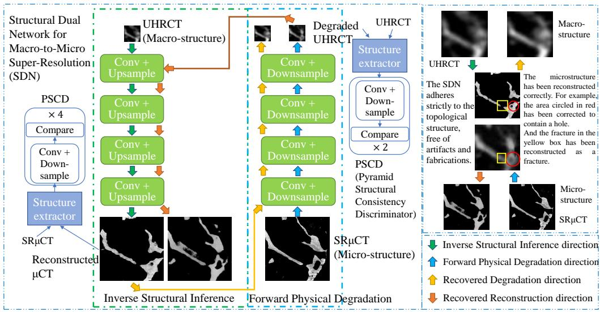  
Figure 2: The framework of Structural Dual Network.

$$
I : Y \to X \quad { \mathrm { ( i n v e r s e ~ s t r u c t u r a l ~ i n f e r e n c e , m a c r o - t o - m i c r o ) } } .\tag{3}
$$

The two are coupled through structural duality constraints:

$$
d _ { \mathrm { s t r u c t } } \big ( I ( F ( x ) ) , x \big ) \approx 0 , \quad d _ { \mathrm { s t r u c t } } \big ( F ( I ( y ) ) , y \big ) \approx 0 ,\tag{4}
$$

where $d _ { \mathrm { s t r u c t } }$ operates on low-frequency, gradient, SSIM, and frequency low-band representations, not pixel-level SSIM. This supplements pixel-wise cycle consistency with structural-level consistency, ensuring that the two mappings share the same invariant trabecular topology.

Key insight: topological inference does not require an explicit morphological parameter extractor during training. Instead, the structural duality constraints and the structural discriminator jointly enforce that the two mappings preserve invariant topology. Morphological parameters are used only for evaluation.

## 3.4 Forward Physical Degradation: Micro-to-Macro

The forward process $F$ models cross-modal physical degradation from microCT to UHRCT. We decompose $F$ into four physically interpretable components corresponding to the domain differences in A.1 Table 3:

$$
F = F _ { \mathrm { a r t i f a c t } } \circ F _ { \mathrm { n o i s e } } \circ F _ { \mathrm { P V E } } \circ F _ { \mathrm { r e s } } .\tag{5}
$$

1. Resolution loss $F _ { \mathbf { r e s } } \colon 3 . 2 \ \mu \mathrm { m }  1 0 0 \ \mu \mathrm { m }$ , modeled as a learnable blur kernel followed by $3 2 \times$ downsampling. The blur kernel approximates the detector point spread function of clinical UHRCT.

2. Partial volume effect $F _ { \mathbf { P V E } } { \mathrm { : } }$ : each voxel mixes trabeculae and marrow, biasing Tb.Th and $\mathrm { T b . S p }$ We model this as structural unmixing and low-pass filtering, blurring bone/marrow boundaries.

3. Noise and detector response $F _ { \mathrm { n o i s e } } ^ { } { \mathrm { . } }$ clinical UHRCT uses energy-integrating detectors with quantum noise, electronic noise, and detector blur; $\mathrm { S R } \mu \mathrm { C T }$ uses photon-counting detectors with minimal noise. We model this as noise injection and detector response correction.

4. Artifacts $F _ { \mathbf { a r t i f a c t } } \mathrm { : }$ clinical UHRCT exhibits beam hardening and Compton scatter; $\mathrm { S R } \mu \mathrm { C T }$ may have ring artifacts but far weaker. We model this as beam hardening residual, scatter superposition, and ring artifact suppression.

## 3.5 Inverse Structural Inference: Macro-to-Micro

The inverse process I performs corresponding inverse degradation and structural inference. Each component corresponds to a physical degradation in $F ;$

$$
I = I _ { \mathrm { d e a r t i f a c t } } \circ I _ { \mathrm { d e n o i s e } } \circ I _ { \mathrm { d e P V E } } \circ I _ { \mathrm { S R } } .\tag{6}
$$

1. Super-resolution/deconvolution $I _ { \mathbf { S } \mathbf { R } } \colon$ inverse of $F _ { \mathrm { r e s } } ,$ deconvolving from $\approx 1 0 0 \ \mu \mathrm { m }$ to $3 . 2 \mu \mathrm { { m } }$ level, recovering trabecular edges blurred by the kernel.

2. Partial volume effect removal $I _ { \mathbf { d e P V E } } { \mathrm { : } }$ inverse of $F _ { \mathrm { P V E } }$ , unmixing bone/marrow in each voxel to correct Tb.Th and Tb.Sp biases.

3. Denoising and detector response correction $I _ { \mathrm { d e n o i s e } } \mathrm { . }$ inverse of $F _ { \mathrm { n o i s e } }$ , removing quantum and electronic noise, correcting detector blur, and restoring sharp edges.

4. Deartifact $I _ { \mathrm { d e a r t i f a c t } } { : }$ inverse of $F _ { \mathrm { a r t i f a c t } } .$ , suppressing beam hardening, scatter, and ring artifacts, preventing them from being mistaken for trabeculae.

5. Invariant morphology inference: recovering only shared trabecular morphology, without freely generating details.

Since physical degradation is irreversible, I is a structural-level inverse, not a strict mathematical inverse of $\dot { F } .$ . This is consistent with the topological inference paradigm: we do not aim to reconstruct the exact pixel-level microstructure, but to infer the invariant topology that both domains share.

## 3.6 Pyramid Structural Consistency Discriminator

The PSCD takes structural maps (edge, gradient, low-pass, low-frequency FFT) rather than raw images, avoiding modality style bias. This design is motivated by the domain differences in A.1 Table 3: raw images differ drastically in noise, contrast, and artifacts, but structural maps are largely invariant across domains. Multi-scale discrimination:

• Low scale: macro trabecular layout.

• Mid scale: structural transitions.

• High scale: local morphology consistency.

Output is a patch-level score map, averaged over positions. By operating on structural maps, the discriminator enforces topological consistency rather than pixel-level realism, aligning with the topological inference paradigm.

## 3.7 Loss Functions

The F and I’s loss:

$$
\begin{array} { r } { \mathcal { L } _ { \mathtt { F } / \mathrm { I } } = \mathcal { L } _ { \mathrm { a d v } } + \lambda _ { 1 } \mathcal { L } _ { \mathrm { l o w } } + \lambda _ { 2 } \mathcal { L } _ { \mathtt { g r a d } } + \lambda _ { 3 } \mathcal { L } _ { \mathrm { s s i m } } + \lambda _ { 4 } \mathcal { L } _ { \mathtt { f r e q } } + \lambda _ { 5 } \mathcal { L } _ { \mathrm { i d } } + \lambda _ { 6 } \mathcal { L } _ { \mathrm { t v } } . } \end{array}\tag{7}
$$

The PSCD’s loss:

$$
\mathcal { L } _ { \mathrm { P S C D } } = \sum _ { k = 1 } ^ { K } w _ { k } \frac { 1 } { 2 } \Big [ \mathsf { B C E } \big ( D _ { k } ( \Phi ( x ) ) , 1 \big ) + \mathsf { B C E } \big ( D _ { k } ( \Phi ( I ( y ) ) ) , 0 \big ) + \mathsf { B C E } \big ( D _ { k } ( \Phi ( y ) ) , 1 \big ) + \mathsf { B C E } \big ( D _ { k } ( \Phi ( F ( x ) ) ) , 0 \big ) \Big ] ,\tag{8}
$$

where $\Phi ( \cdot )$ denotes structural map extraction, and $w _ { k }$ is the scale weight.

## 3.7.1 Pyramid Structural Consistency Adversarial Loss

$$
\mathcal { L } _ { \mathrm { a d v } } = \sum _ { k = 1 } ^ { K } w _ { k } \Big [ \mathrm { B C E } \big ( D _ { k } ( \Phi ( I ( y ) ) ) , 1 \big ) + \mathrm { B C E } \big ( D _ { k } ( \Phi ( F ( x ) ) ) , 1 \big ) \Big ] .\tag{9}
$$

## 3.7.2 Structural Duality Loss

Let $\hat { x } = I ( F ( x ) ) , \hat { y } = F ( I ( y ) )$

$$
\mathcal { L } _ { \mathrm { l o w } } = \| \mathbf { L P } ( \boldsymbol { \hat { x } } ) - \mathbf { L P } ( \boldsymbol { x } ) \| _ { 1 } + \| \mathbf { L P } ( \boldsymbol { \hat { y } } ) - \mathbf { L P } ( \boldsymbol { y } ) \| _ { 1 } ,\tag{10}
$$

$$
\mathcal { L } _ { \mathrm { g r a d } } = \| \nabla \hat { \boldsymbol { x } } - \nabla \boldsymbol { x } \| _ { 1 } + \| \nabla \hat { \boldsymbol { y } } - \nabla \boldsymbol { y } \| _ { 1 } ,\tag{11}
$$

$$
\mathcal { L } _ { \mathrm { s s i m } } = \left( 1 - \mathrm { S S I M } ( \hat { x } , x ) \right) + \left( 1 - \mathrm { S S I M } ( \hat { y } , y ) \right) ,\tag{12}
$$

$$
\mathcal { L } _ { \mathrm { f r e q } } = \Vert \mathcal { F } _ { \mathrm { l o w } } ( \hat { x } ) - \mathcal { F } _ { \mathrm { l o w } } ( x ) \Vert _ { 1 } + \Vert \mathcal { F } _ { \mathrm { l o w } } ( \hat { y } ) - \mathcal { F } _ { \mathrm { l o w } } ( y ) \Vert _ { 1 } .\tag{13}
$$

These four constraints jointly enforce topological consistency without requiring an explicit morpho logical parameter extractor. The structural distance $d _ { \mathrm { s t r u c t } }$ is implicitly defined by their combination.

## 3.7.3 Regularization

$$
\mathcal { L } _ { \mathrm { i d } } = \| I ( x ) - x \| _ { 1 } + \| F ( y ) - y \| _ { 1 } ,\tag{14}
$$

$$
\mathcal { L } _ { \mathrm { t v } } = \mathrm { T V } ( I ( y ) ) + \mathrm { T V } ( F ( x ) ) .\tag{15}
$$

${ \mathcal { L } } _ { \mathrm { i d } }$ corresponds to $\lambda _ { \mathrm { { 5 } } } , \mathcal { L } _ { \mathrm { { t v } } } \tan \lambda _ { 6 }$ . Recommended weights: $\lambda _ { \mathrm { a d v } } = 0 . 5 , \lambda _ { 1 } = 1 . 0 , \lambda _ { 2 } = 0 . 3 , \lambda _ { 3 } = 0 . 5$ $\lambda _ { 4 } = 0 . 3 , \lambda _ { 5 } = 0 . 5 , \lambda _ { 6 } = 0 . 1$

## 3.8 Training Strategy

All components—the forward physical degradation network F, the inverse structural inference network I, and the pyramid structural consistency discriminator $\{ D _ { k } \} _ { k = 1 } ^ { K }$ —are trained jointly in an end-to-end manner, without pretraining or stage-wise decoupling. Training requires only 1787 coarsely paired samples to converge. The training alternates between:

• PSCD update: fix I and $F ,$ , update $\{ D _ { k } \}$ with $\mathcal { L } _ { \mathrm { P S C D } }$

• F and I update: fix $\{ D _ { k } \}$ , update I and $F$ with ${ \mathcal { L } } _ { \mathrm { F / I } }$

The structural duality constraints act on both $I ( F ( x ) )$ and $F ( I ( y ) )$ paths simultaneously, coupling forward degradation and inverse inference. The model is simple, trained end-to-end, and converges with few samples.

## 3.9 Evaluation

In this work, evaluation is centered on morphological parameters rather than conventional pixellevel metrics. Specifically, we compute trabecular thickness (Tb.Th), trabecular separation (Tb.Sp), trabecular number (Tb.N), connectivity density (Conn.D), bone volume fraction (BV/TV), structure model index (SMI), and degree of anisotropy (DA). These parameters directly characterize trabecular bone morphology and are clinically meaningful for osteoporosis diagnosis and fracture risk assessment. These evaluations fulfill the morphology learning defined in this work: the model is required to infer invariant morphological structures shared across physical domains, not to generate perceptually plausible pixels. Therefore, morphological parameters serve as the primary evaluation criteria, while SSIM, PSNR, and Dice are reported only as auxiliary image-level references. By aligning evaluation with morphology, we ensure that the assessed quality reflects true structural fidelity rather than pixel-wise similarity.

## 4 Experiments

## 4.1 Datasets

Synchrotron radiation microCT: 3.2 µm resolution, Shanghai Synchrotron Radiation Facility (SSRF), micro domain X. Clinical UHRCT: 100 µm resolution, macro domain Y, with severe partial volume effects, noise, and artifacts. Coarsely paired data: from 6 patients, totaling 1787 coarsely paired slices. 5 patients for training, 1 patient for testing. Generalization test set: Beijing Synchrotron Radiation Facility (BSRF), same test patient, different resolution (3.25 µm isotropic), for cross-physical-domain generalization. Ethics statement: All data collection was approved by the Institutional Review Board and followed relevant guidelines for human sample research. In formed consent was obtained from all patients. The details of our dataset is in the appendix A.1.

## 4.2 Evaluation Metrics

Morphological parameters are the core metrics: Tb.Th, Tb.Sp, Tb.N, connectivity, BV/TV, DA, SMI. SSIM, PSNR, Dice/F1 are auxiliary image-level metrics, not primary. The detailed explanation and specific calculations of seven morphological parameters, please refer to the appendix A.2.

## 4.3 Results

On the SSRF test set, SDN achieves morphological parameters largely consistent with SRµCT across seven metrics, with SSIM reaching 0.8. The improvement is particularly pronounced for Tb.Th and Tb.Sp, which are most affected by partial volume effects in clinical UHRCT.

Table 1: Comparison of morphometric parameters on SSRF testset.
<table><tr><td>Method</td><td>BV/TV</td><td>Tb.Th mean (mm)</td><td>Tb.Sp mean (mm)</td><td>Tb.N (1/mm)</td><td>SMI</td><td>DA</td><td>Conn.D (1/mm³)</td></tr><tr><td>UHRCT</td><td>0.3793</td><td>0.3572</td><td>0.3327</td><td>1.0619</td><td>-0.7616</td><td>3.0564</td><td>1000.98</td></tr><tr><td>SRµCT (GT)</td><td>0.1156</td><td>0.0073</td><td>0.0321</td><td>15.86</td><td>-0.3444</td><td>334.49</td><td> $3 . 0 5 \times 1 0 ^ { 7 }$ </td></tr><tr><td>SDN</td><td>0.1163</td><td>0.0103</td><td>0.0552</td><td>11.26</td><td>-0.5053</td><td>446.54</td><td> $3 . 0 5 \times 1 0 ^ { 7 }$ </td></tr><tr><td>SDN (no tv)</td><td>0.1126</td><td>0.0100</td><td>0.0522</td><td>11.29</td><td>-0.1594</td><td>382.83</td><td> $3 . 0 5 \times 1 0 ^ { 7 }$ </td></tr><tr><td>SDN (no reg)</td><td>0.1472</td><td>0.0112</td><td>0.0473</td><td>13.16</td><td>-0.4203</td><td>424.3</td><td> $3 . 0 5 2 \times 1 0 ^ { 7 }$ </td></tr><tr><td>F, I only</td><td>0.1784</td><td>0.0123</td><td>0.0407</td><td>14.52</td><td>-0.6024</td><td>377.3</td><td> $3 . 0 5 2 \times 1 0 ^ { 7 }$ </td></tr></table>

SDN achieves morphological parameters closely matching SRµCT. Given the 31.25× resolution gap, which we model as 32× super-resolution, discrepancies in Tb.Th (trabecular thickness) and Tb.Sp (trabecular separation) are unavoidable. Their slight deviations reflect the intrinsic information loss from 32× downsampling, which no method can fully recover.

We further compute PSNR, SSIM, and Dice (the F1 score in medical imaging), as shown in A.3 Fig. 7. Compared with GLEAN on the test data, SDN achieves lower PSNR but significantly higher SSIM (0.8 vs. 0.3). This contrast reveals the fundamental difference between pixel-level recovery and structural inference. PSNR is sensitive to pixel-wise intensity differences; a lower PSNR indicates that SDN does not aim to reproduce exact pixel values, which are irreversibly lost in clinical UHRCT. In contrast, SSIM measures structural similarity, and the high SSIM demonstrates that SDN faithfully preserves trabecular topology. This confirms that SDN prioritizes structural inference and fidelity over pixel-level restoration, consistent with the topological inference paradigm.

Since GLEAN and Stable SR underperform when directly applied to our task, we further constructed large-scale synthetic LR-HR pairs by interpolating UHRCT data to train these two methods. The training set contains 52,874 LR-HR pairs, and the generative prior is pretrained on 309,482 high resolution images. Test results are shown in Appendix A.3 Table 6. Compared with GLEAN and Stable SR trained on such large-scale synthetic interpolated data (see Appendix for test results), SDN requires no synthetic data and achieves accurate structural inference using only 1787 coarsely paired real samples, demonstrating that it learns cross-domain invariant structures rather than synthetic degradation patterns. Despite being structurally simple, end-to-end, and trained on only 1787 coarsely paired samples, SDN outperforms these pretrained methods.

## 4.4 Cross-Physical-Domain Generalization

The model is trained on 3.2 µm SSRF data and generalizes well to 3.25 µm isotropic BSRF data from an independent source. This validates that the model performs topological inference over pixel generation, learning invariant structures rather than source-specific styles.

Table 2: Comparison of morphometric parameters on BSRF testset for Cross-Physical-Domain Generalization.
<table><tr><td>Method</td><td>BV/TV</td><td>Tb.Th mean</td><td>Tb.Th std</td><td>Tb.Sp mean</td><td>Tb.Sp std</td><td>Tb.N (1/mm)</td><td>SMI</td><td>DA</td><td>Conn.D (1/mm³)</td></tr><tr><td>UHRCT</td><td>0.2971</td><td>0.3235</td><td>0.0997</td><td>0.3832</td><td>0.2041</td><td>0.918</td><td>0.158</td><td>3.83</td><td>1000.9</td></tr><tr><td>SRµCT</td><td>0.1425</td><td>0.0087</td><td>0.0052</td><td>0.0335</td><td>0.0255</td><td>16.41</td><td>-0.270</td><td>285.4</td><td> $2 . 9 1 \times 1 0 ^ { 7 }$ </td></tr><tr><td>SDN</td><td>0.1166</td><td>0.0105</td><td>0.0066</td><td>0.0535</td><td>0.0445</td><td>11.11</td><td>-0.277</td><td>302.9</td><td> $2 . 9 1 \times 1 0 ^ { 7 }$ </td></tr><tr><td>SDN (no tv)</td><td>0.0945</td><td>0.0091</td><td>0.0050</td><td>0.0539</td><td>0.0454</td><td>10.33</td><td>-0.028</td><td>285.4</td><td> $2 . 9 1 \times 1 0 ^ { 7 }$ </td></tr></table>

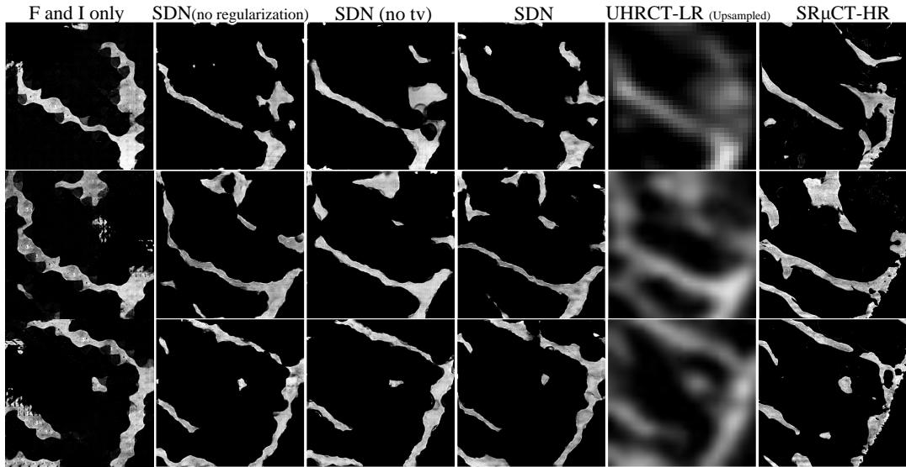  
Figure 3: The results of ablation studies of Structural Dual Network.

## 4.5 Ablation Studies

We conduct ablation studies on the SSRF testset (Fig. 3). Table 1 reports the morphological parameter values. Without structural duality constraints, the network (F and I) lacks explicit guidance to distinguish bone from marrow at the voxel level, and thus fails to correct the partial volume effect. Adding structural duality constraints significantly reduces these errors, as they enforce low-frequency and edge consistency across domains, effectively guiding the network to recover the underlying trabecular topology. Regularization further improves morphological accuracy by suppressing noise and preventing trivial mappings. The full SDN achieves the best performance across all metrics, confirming that each component contributes to the final morphological fidelity.

## 4.6 Clinical Application: Whole Femoral Head Super-Resolution

Due to the limited field of view of synchrotron radiation sources, training data were acquired from $4 \times 4 ~ \mathrm { m m ^ { 2 } }$ trabecular bone specimens. The ultimate clinical goal, however, is to achieve superresolution reconstruction of the complete femoral head. To demonstrate this clinical potential, we selected one slice from the complete femoral head UHRCT volume of the test set and applied SDN for super-resolution reconstruction, as shown in Fig. 4.

Fig. 4(b) and (d) show the local bone area fraction (B.Ar/T.Ar) heatmap overlaid on the input UHRCT and the reconstructed super-resolution microCT, respectively. The original UHRCT (Fig. 4(b) classifies most regions as high-density areas, which is highly inaccurate due to severe partial volume effects. In contrast, the reconstructed heatmap (Fig. 4(d) resolves individual trabeculae, where thicker trabeculae correspond to high-density regions, consistent with the microCT reference. This demonstrates that SDN enables accurate trabecular density quantification from clinical UHRCT, providing anatomical reference for precise screw placement in femoral head surgery.

## 5 Conclusion

We formulate cross-physical-domain trabecular morphology learning from clinical UHRCT, with a 31.25× resolution gap modeled as 32× microstructure super-resolution. The two domains differ fundamentally in resolution, partial volume effect, noise, and artifacts. We propose topological inference super-resolution, a new paradigm shifting from pixel generation to deterministic structural inference, and realize it via structural dual super-resolution—coupling forward physical degradation (micro-to-macro) with inverse structural inference (macro-to-micro) through structural duality constraints. We introduce a trustworthy, simple, end-to-end, few-shot structural dual network with

(a) UHRCT of the Complete Femoral Head-LR (upsampled)

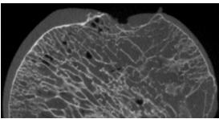  
(c) generated-HR of the Complete Femoral Head-HR (downsampled)  
(b) Heatmap of Trabecula Bone Density overlaid on (a) -LR (upsampled)

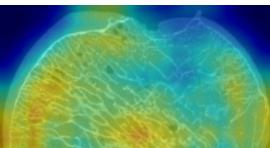

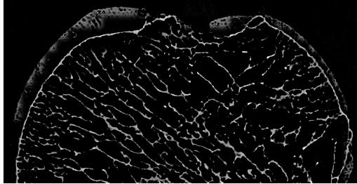  
(d) Heatmap of Trabecular Bone Density overlaid on (c) -HR (downsampled)

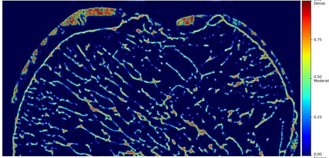  
Figure 4: Clinical application: whole femoral head super-resolution. (a) Input clinical UHRCT slice. (b) Heatmap on UHRCT, where most regions are incorrectly classified as high-density. (c) SDN SR reconstruction. (d) Heatmap on the reconstructed microCT, resolving individual trabeculae.

a pyramid structural consistency discriminator and four structural duality constraints. We establish a trustworthy evaluation protocol using morphological parameters rather than SSIM/PSNR, and demonstrate cross-physical-domain generalization from 3.2 µm SSRF to 3.25 µm isotropic BSRF data. The model outperforms GAN and diffusion methods that rely on large-scale pretrained models, validating the effectiveness and clinical trustworthiness of structural dual super-resolution for topological inference. Cross-source generalization further proves that SDN can mine invariant structures and perform trustworthy inference, rather than overfitting to limited single-source data. Future work may explore 3D training to further improve morphological metrics.

## AI use statement

(This section is required and does not count toward the page limit.)

In this work, we used generative AI tools for polish writing. We have not used generative AI tools for other tasks with required disclosure, and the rest of the required disclosure tasks are not applicable to this work. We have reviewed all AI-assisted work. We take responsibility for the final content of this work, including text, claims produced with the aid of generative AI.

## Ethics statement

(This section is recommended and does not count toward the page limit.)

Compliance with Ethical Standards. This research was conducted in full accordance with the principles of the Declaration of Helsinki and all applicable national laws, regulations, and institutional policies governing research involving human participants. The study protocol was reviewed and approved by the Biomedical Ethics Committee of the authors’ Institution. All human participants provided informed consent prior to their involvement in the study, and their data were anonymized to protect privacy. The authors are committed to upholding the ethical principles set forth in the ICLR Code of Ethics (https://iclr.cc/public/CodeOfEthics) and have designed this study to avoid any foreseeable risks of harm, discrimination, or privacy violation.

## Reproducibility statement

(This section is recommended and does not count toward the page limit.) We are committed to ensuring the reproducibility of our work. To this end, we provide the following resources and details:

The details of data processing steps are specified in Appendix A.1

The evaluation metrics are detailed definitions and calculation procedures for the proposed evaluation metrics are specified in Appendix A.2.

Results from large-scale pre-training experiments using datasets processed with interpolation synthesis are provided in the Appendix A.3.

## Acknowledgments

We thank the 4W1A X-ray Imaging Beamline at the Beijing Synchrotron Radiation Facility (BSRF) and the BL13HB Beamline at the Shanghai Synchrotron Radiation Facility (SSRF) for their support in data acquisition. We also thank Yuxuan Cao for providing the experimental results of Stable SR on synthetic data.

## References

Mohammad Asadi, Jack W O’Sullivan, Fang Cao, Tahoura Nedaee, Kamyar Rajabalifardi, Fei-Fei Li, Ehsan Adeli, and Euan Ashley. Mirage: The illusion of visual understanding. arXiv preprint arXiv:2603.21687, 2026.

Stephanie Boutroy, Mary L Bouxsein, Francoise Munoz, and Pierre D Delmas. In vivo assessment of trabecular bone microarchitecture by high-resolution peripheral quantitative computed tomography. The Journal ofClinical Endocrinology & Metabolism, 90(12):6508–6515, 2005.

Mary L Bouxsein, Stephen K Boyd, Blaine A Christiansen, Robert E Guldberg, Karl J Jepsen, and Ralph Muller. Guidelines for assessment of bone microstructure in rodents using micro–computed¨ tomography. Journal ofbone and mineral research, 25(7):1468–1486, 2010.

Kelvin C.K. Chan, Xiangyu Xu, Xintao Wang, Jinwei Gu, and Chen Change Loy. Glean: Generative latent bank for image super-resolution and beyond. IEEE Transactions on Pattern Analysis and Machine Intelligence, 45(3):3154–3168, 2023. doi: 10.1109/TPAMI.2022.3186715.

Zhiyuan Chen, Yuecong Min, Jie Zhang, Bei Yan, Jiahao Wang, Xiaozhen Wang, and Shiguang Shan. A survey of multimodal hallucination evaluation and detection. International Journal of Computer Vision, 134(3):131, 2026.

TG Flohr, K Stierstorfer, C Suss, B Schmidt, AN Primak, and CH McCollough. Novel ultrahigh¨ resolution data acquisition and image reconstruction for multi-detector row ct. Medical physics, 34(5):1712–1723, 2007.

Lance L Frazer, Nathan Louis, Wojciech Zbijewski, Jay Vaishnav, Kal Clark, and Daniel P Nicolella. Super-resolution of clinical ct: Revealing microarchitecture in whole bone clinical ct image data. Bone, 185:117115, 2024.

Ian J Goodfellow, Jean Pouget-Abadie, Mehdi Mirza, Bing Xu, David Warde-Farley, Sherjil Ozair, Aaron Courville, and Yoshua Bengio. Generative adversarial nets. Advances in neural information processing systems, 27, 2014.

Lee Grodzins. Optimum energies for x-ray transmission tomography of small samples: Applications of synchrotron radiation to computerized tomography i. Nuclear Instruments and Methods in Physics Research, 206(3):541–545, 1983.

Jonathan Ho, Ajay Jain, and Pieter Abbeel. Denoising diffusion probabilistic models. Advances in neural information processing systems, 33:6840–6851, 2020.

Mingyao Hong, Tao Gu, Hongyu An, Xu Fan, and Xinfeng Zhang. Enhancing diagnostic safety with low iodine, low radiation ctpa classification using deep learning. Scientific Reports, 16(1): 7205, 2026.

Seyedmahdi Hosseinitabatabaei, Andrew J Nelson, Nicolas Piche, Didem Dagdeviren, and Natalie´ Reznikov. Craniofacial cbct: Addressing volume-resolution dilemma using generative artificial intelligence. Bone, pp. 117841, 2026.

Rehan Jhuboo, Ievgen Redko, Alain Guignandon, Franc¸oise Peyrin, and Marc Sebban. Why do state-of-the-art super-resolution methods not work well for bone microstructure ct imaging? In 2022 30th European Signal Processing Conference (EUSIPCO), pp. 1283–1287. IEEE, 2022.

Tero Karras, Samuli Laine, Miika Aittala, Janne Hellsten, Jaakko Lehtinen, and Timo Aila. Analyzing and improving the image quality of stylegan. In 2020 IEEE/CVF Conference on Computer Vision and Pattern Recognition (CVPR), pp. 8107–8116. IEEE, 2020.

Tianhong Li and Kaiming He. Back to basics: Let denoising generative models denoise. In Proceedings ofthe IEEE/CVF Conference on Computer Vision and Pattern Recognition, pp. 36115– 36125, 2026.

Sarah L Manske, Ying Zhu, Clara Sandino, and Steven K Boyd. Human trabecular bone microarchitecture can be assessed independently of density with second generation hr-pqct. Bone, 79: 213–221, 2015.

A Michael Parfitt, Marc K Drezner, Francis H Glorieux, John A Kanis, Hartmut Malluche, Pierre J Meunier, Susan M Ott, and Robert R Recker. Bone histomorphometry: standardization of nomenclature, symbols, and units: report of the asbmr histomorphometry nomenclature committee. Journal of bone and mineral research, 2(6):595–610, 1987.

Zhen PENG, Ao WANG, Jun WANG, Fen TAO, Ling ZHANG, Guohao DU, and Biao DENG. Super-resolution reconstruction of synchrotron radiation nano-ct images and its applications. Nuclear Techniques, 49(1), 2026.

Robin Rombach, Andreas Blattmann, Dominik Lorenz, Patrick Esser, and Bjorn Ommer. High-¨ resolution image synthesis with latent diffusion models. In 2022 IEEE/CVF conference on computer vision and pattern recognition (CVPR), pp. 10674–10685. ieee, 2022.

Sascha Senck, Patrick Weinberger, Lukas Nepelius, Andreas Haghofer, Birgit Woegerer, Jonathan Glinz, Miroslav Yosifov, Lukas Behammer, Johann Kastner, Klemens Trieb, et al. Optimizing µct resolution in tarsal bones: A comparative study of super-resolution models for trabecular bone analysis. Tomography ofMaterials and Structures, 8:100063, 2025.

Jianyi Wang, Zongsheng Yue, Shangchen Zhou, Kelvin CK Chan, and Chen Change Loy. Exploiting diffusion prior for real-world image super-resolution. International Journal of Computer Vision, 132(12):5929–5949, 2024.

Aryan Yazdan Parast, Parsa Hosseini, Hesam Asadollahzadeh, Arshia Soltani Moakhar, Basim Azam, Soheil Feizi, and Naveed Akhtar. Ghost: Hallucination-inducing image generation for multimodal llms. In International Conference on Learning Representations, volume 2026, pp. 65629–65662, 2026.

Hui Yu, Shuo Wang, Yinuo Fan, Guangpu Wang, Jinqiu Li, Chong Liu, Zhigang Li, and Jinglai Sun. Large-factor micro-ct super-resolution of bone microstructure. Frontiers in Physics, 10:997582, 2022.

## A Appendix

## A.1 Data Description

This study constructs a paired imaging dataset of synchrotron radiation microCT $( { \mathrm { S R } } \mu { \mathrm { C T } } )$ and clinical CT for human osteoporotic bone samples. The dataset includes discarded bone samples, high-resolution $\mathrm { S R } \mu \mathrm { C T }$ images, clinical CT images, and registered cross-modal paired data.

## A.1.1 Sample Collection and Ethical Approval

Discarded human femoral head samples after femoral head replacement were collected with approval from the hospital ethics committee. Patient informed consent was waived under the clause of “using discarded medical samples without identifiable personal information.”

Inclusion criteria: (1) elderly patients aged over 65 years; (2) clinically and radiologically diagnosed with primary osteoporosis; (3) fragility fracture of the femoral neck caused by osteoporosis requiring surgical resection of the hip joint. Exclusion criteria: (1) severe degenerative changes causing bone structural destruction; (2) improper sample preservation resulting in putrefaction; (3) bone tumors, infection, secondary osteoporosis, or other metabolic bone diseases that significantly affect bone microstructure.

After collection, bone samples were immediately fixed in 4% paraformaldehyde for 24–48 h and then stored in 70% ethanol at $4 ^ { \circ } \mathrm { C } .$ . During scanning, samples were kept moist to avoid trabecular microcracks and dimensional shrinkage caused by drying. For femoral head samples, after embedding in low-viscosity epoxy resin or PMMA, a low-speed precision cutter (e.g., a diamond wire saw) was used to cut the samples into bone strips with a cross-section of approximately 4 mm × 4 mm. The length was determined according to the $\mathrm { \bf S R } \mu \mathrm { C T }$ beamline field of view and sample holder size, typically 10–20 mm, ensuring that the region of interest was within the beamline field of view. During cutting, saline or ethanol was continuously applied for cooling and lubrication to avoid thermal damage and mechanical destruction. After cutting, the integrity of the bone strips was examined, and regions with intact trabecular structure were retained for imaging. If necessary, micro-markers were implanted into the bone strips to provide spatial corresponding points for subsequent cross-modal image registration.

## A.1.2 Synchrotron Radiation CT Imaging

## Shanghai Synchrotron Radiation Facility BL13HB Beamline

High-resolution micro-CT imaging of bone samples was performed at the Shanghai Synchrotron Radiation Facility (SSRF) BL13HB beamline. This beamline is dedicated to X-ray imaging and biomedical applications, with a maximum spatial resolution of 0.8 µm and an adjustable energy range of 8–40 keV, meeting the requirements for micron-scale three-dimensional imaging of trabecular bone. The cut bone strips with a cross-section of approximately 4 mm $\times ~ 4$ mm can be fully placed within the field of view of this beamline.

Imaging parameters were set as follows:

• Imaging mode: absorption contrast imaging + phase contrast imaging;

• X-ray energy: 25–35 keV, optimized according to sample thickness;

• Reconstructed voxel size: $3 . 2 \mu \mathrm { { m } ; }$

• Number of projections: 1200–1800 over 360◦ rotation;

• Exposure time: 0.5–2 s/projection, adjusted according to photon flux;

• Scan time: approximately 1–2 h/sample.

## Beijing Synchrotron Radiation Facility 4W1A X-ray Imaging Beamline

In addition, for cross-source generalization the supplementary $\mathrm { S R } \mu \mathrm { C T }$ imaging was performed at the Beijing Synchrotron Radiation Facility (BSRF) 4W1A X-ray Imaging Beamline. This beamline adopts an absorption/phase contrast imaging mode similar to that of the SSRF BL13HB beamline, with an energy range of approximately 6–26 keV and a beam spot size of approximately $1 0 \times 5 \mathrm { { m m ^ { 2 } } }$ at spatial resolution of $4 \sim 4 \mu \mathrm { m }$ . Bone strips with a cross-section of 4 mm $\times 4$ mm can be fully covered. Limited by the light source and detector of the station, the effective spatial resolution is approximately $1 0 ~ \mu \mathrm { { m } }$ , and the reconstructed voxel size can be set to 3.25 µm. The number of projections, exposure time, and scan time were kept consistent with or similar to the above SSRF BL13HB protocol.

Spot parameters for micrometer-scale imaging:

• Energy range: 8–26 keV;

• Photon flux at the sample $\mathrm { ( p h s / s ) } \mathrm { : \sim } 1 0 ^ { 1 2 } \ @ 8 \mathrm { k e V } ;$

• At spatial resolutions of $1 0 \ \mu \mathrm { m } , 4 \ \mu \mathrm { m } , 2 \ \mu \mathrm { m } .$ , and $1 \ \mu \mathrm { m } ,$ , the spot sizes $\left( \mathrm { H } \times \mathrm { V } \right)$ are $1 3 \mathrm { m m } \times 1 3$ mm, 10 mm × 5 mm, 5 mm $\times 2 . 5$ mm, and $2 \mathrm { m m } \times 1$ mm, respectively.

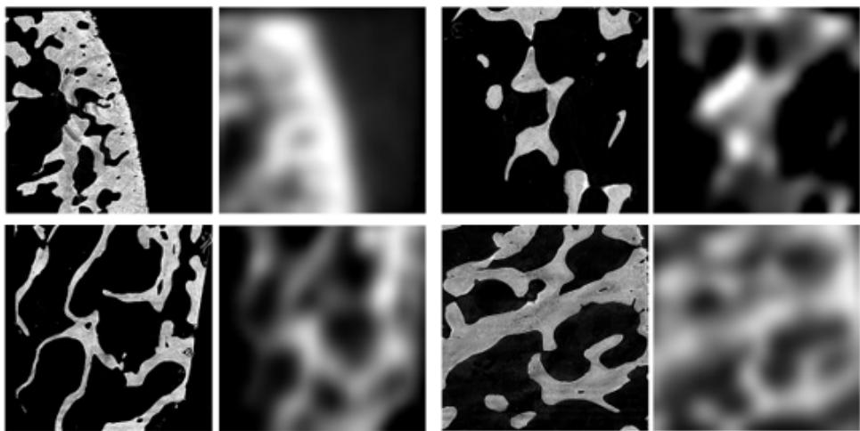  
Figure 5: Examples of four coarsely paired $\mathrm { S R } \mu \mathrm { C T - }$ UHRCT images in our dataset. Each pair consists of a SRµCT slice (left) and the corresponding clinical UHRCT slice (right) at the same anatomical site. The resolution gap is 31.25×, and the two domains are not strictly aligned. Both images are displayed at the same physical size to highlight the 31.25× resolution gap.

## A.1.3 Clinical CT Imaging

The same batch of samples was scanned by clinical CT using an Ultra 3D UHRCT (Beijing Langshi Instrument Co., Ltd., Beijing, China). The scanning parameters were set as tube voltage 100–120 kV and tube current-time product 8–10 mAs. Two parameter settings were used:

• Protocol A: field of view 8 cm × 8 cm, slice thickness and spacing both 0.15 mm;

• Protocol B: field of view 7 cm × 4 cm, slice thickness and spacing both 0.1 mm.

Based on the two protocols above, clinical CT images with two resolutions were reconstructed.

## A.1.4 Image Registration and Dataset Construction

Due to significant differences between SRµCT and clinical CT in resolution, imaging coordinate system, and physical contrast mechanism, image registration is required. The registration workflow includes: coarse registration based on micro-markers implanted during sample preparation or anatomical landmarks; cross-modal rigid registration using mutual information or normalized mu tual information as the similarity measure; and cropping to the common field of view of the two imaging modalities after registration. The recommended scanning order is to complete clinical CT scanning first, followed by $\mathrm { S R } \mu \mathrm { C T }$ scanning, and to use the same fixation device as much as possible to maintain consistent spatial positions of the samples. During registration, the transformation matrix, marker coordinates, and registered image data were saved.

## A.1.5 Dataset Composition

A paired $\mathrm { \bf S R } \mu \mathrm { C T }$ and clinical UHRCT imaging dataset of bone samples was established. Each sample includes:

$\mathrm { \bf S R } \mu \mathrm { C T }$ raw data (SSRF reconstructed voxel size 3.2 µm; BSRF reconstructed voxel size $3 . 2 5 \ \mu \mathrm { m } )$ ;

• Clinical CT raw data (slice thickness/spacing 0.15 mm or 0.1 mm; reconstructed voxel size approximately 0.1 mm);

• Registered and cropped paired $\mathrm { S R } \mu \mathrm { C T }$ and clinical CT data;

• Image registration transformation matrix and marker coordinates;

• Sample metadata, including age, sex, bone mineral density, clinical diagnosis, scanning parameters, and ethical approval number.

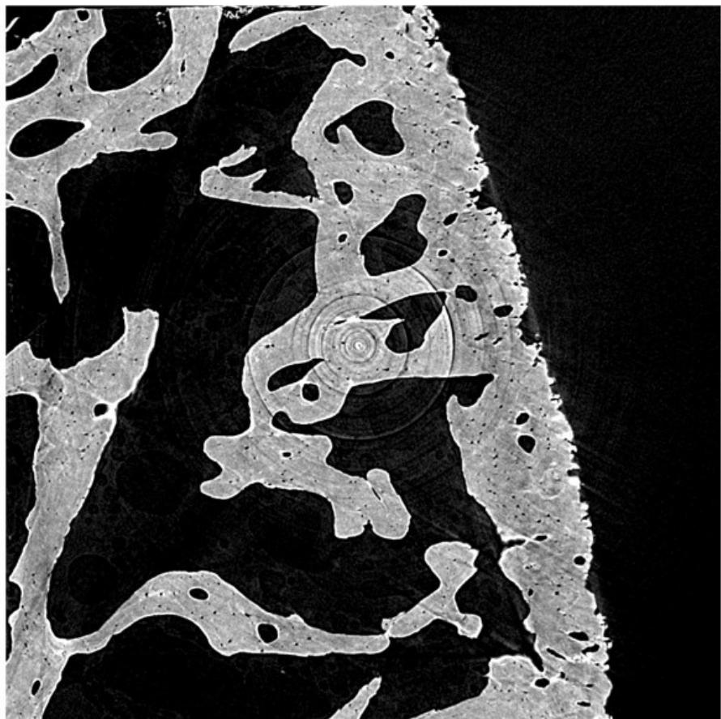  
Figure 6: Real-size comparison between clinical UHRCT and $\mathrm { { S R } } \mu \mathrm { { C T } }$ . The left panel shows UHRCT at 100 µm resolution, where individual trabeculae are indistinguishable due to severe partial volume effects. The right panel shows $\mathrm { S R } \mu \mathrm { C T }$ at 3.2 µm resolution, resolving individual trabecular structures.

Table 3: Physical differences between synchrotron radiation microCT and clinical UHRCT.
<table><tr><td>Dimension</td><td>Synchrotron radiation microCT (X)</td><td>Clinical UHRCT (Y)</td></tr><tr><td>Resolution</td><td> $3 . 2 \mu \mathrm { { m } }$ </td><td> $1 0 0 \mu \mathrm { { m } }$ </td></tr><tr><td>X-ray</td><td>Monochromatic</td><td>Polychromatic</td></tr><tr><td>Detector</td><td>Photon-counting</td><td>Energy-integrating</td></tr><tr><td>Partial volume effect</td><td>Negligible</td><td>Severe, bone/marrow mixing</td></tr><tr><td>Noise</td><td>Very low quantum noise</td><td>Quantum + electronic noise</td></tr><tr><td>Detector blur</td><td>Minimal</td><td>Significant</td></tr><tr><td>Beam hardening</td><td>None</td><td>Present</td></tr><tr><td>Scatter</td><td>None</td><td>Present (Compton)</td></tr><tr><td>Isotropy</td><td>Isotropic</td><td>Often anisotropic</td></tr></table>

The dataset contains 1787 paired data from SSRF and 63 paired data from BSRF for generalization testing. Some paired data are illustrated in Fig. 5. The initial size of UHRCT and $\mathrm { S R } \mu \mathrm { C T }$ is shown in Fig. 6.

## A.2 Morphological Parameters

This appendix provides detailed definitions, calculation methods, and clinical significance of the morphological parameters used for evaluation. All parameters are computed on binarized 3D trabecular bone images.

## A.2.1 Degree of Anisotropy (DA)

Definition. Degree of anisotropy quantifies the directional dependence of trabecular bone architecture—the extent to which trabeculae are preferentially oriented along specific directions rather than randomly distributed.

Calculation. DA is computed using the mean intercept length (MIL) method. Parallel test lines are traced in multiple directions across the binarized image, and the mean intercept length $\operatorname { M I L } ( \omega )$ for each direction ω is obtained as

$$
\mathrm { M I L } ( \omega ) = \frac { L } { I ( \omega ) } ,\tag{16}
$$

where L is the total line length and $I ( \omega )$ is the number of intersections with the bone–marrow interface. The MIL values define an ellipsoid, and DA is expressed as the ratio of the maximum to minimum eigenvalues of the fabric tensor:

$$
\mathrm { D A } = 1 - { \frac { \lambda _ { 1 } } { \lambda _ { 3 } } } ,\tag{17}
$$

where $\lambda _ { 1 }$ and $\lambda _ { 3 }$ are the smallest and largest eigenvalues, respectively. DA ranges from 0 (fully isotropic) to 1 (fully anisotropic).

Clinical significance. Trabecular bone adapts its orientation to principal loading directions. In osteoporosis, the preferential orientation is lost and DA decreases, reducing load-bearing efficiency. DA is an independent predictor of bone stiffness and fracture risk.

## A.2.2 Bone Volume Fraction (BV/TV)

Definition. BV/TV is the ratio of mineralized bone volume (BV) to the total volume of interest (TV), expressed as a percentage.

Calculation.

$$
\mathrm { B V / T V } = \frac { \mathrm { B V } } { \mathrm { T V } } \times 1 0 0 \%\tag{18}
$$

In practice, BV is the number of bone voxels after binarization, and TV is the total number of voxels within the region of interest.

Clinical significance. BV/TV directly reflects bone mass per unit volume and is the primary predictor of trabecular mechanical properties, accounting for approximately 87% of trabecular stiffness. When BV/TV falls below ${ \sim } 1 5 \%$ , structural integrity is critically compromised and fracture risk rises sharply.

## A.2.3 Trabecular Thickness (Tb.Th)

Definition. Tb.Th is the average thickness of individual trabecular struts.

Calculation. Tb.Th is computed by the maximal sphere fitting method: for each bone voxel, the diameter of the largest sphere that can be inscribed within the bone structure is determined, and these diameters are averaged over all bone voxels:

$$
\mathrm { T b . T h } = \frac { 1 } { \mathrm { V o l } ( \Omega ) } \int _ { \Omega } \tau ( \mathbf { x } ) d ^ { 3 } \mathbf { x } ,\tag{19}
$$

where $\tau ( \mathbf { x } )$ is the local thickness at voxel x and Ω is the bone phase. Alternatively, under a platemodel assumption,

$$
\mathrm { { T b . T h } = \frac { 2 } { B S / B V } , }\tag{20}
$$

where $\mathrm { B S / B V }$ is the bone surface-to-volume ratio.

Clinical significance. Tb.Th reflects the thickness of individual trabecular elements. In osteoporosis, trabecular thinning occurs as a result of bone resorption, reducing load-bearing capacity.

## A.2.4 Trabecular Separation (Tb.Sp)

Definition. Tb.Sp is the average width of the marrow cavities between trabeculae, representing the porosity of the trabecular network.

Calculation. Tb.Sp is computed using the same sphere-fitting method as Tb.Th but applied to the marrow (background) phase:

$$
\mathrm { T b . S p } = \frac { 1 } { \mathrm { V o l } ( \Omega _ { \mathrm { m a r r o w } } ) } \int _ { \Omega _ { \mathrm { m a r r o w } } } \tau ( \mathbf { x } ) d ^ { 3 } \mathbf { x } .\tag{21}
$$

Under the plate model, it can also be derived as

$$
\mathrm { T b . S p } = { \frac { 2 ( 1 - \mathrm { B V / T V } ) } { \mathrm { B S / T V } } } ,\tag{22}
$$

or equivalently,

$$
\mathrm { T b . S p = \frac { 1 } { T b . N } - T b . T h } .\tag{23}
$$

Clinical significance. Tb.Sp measures the widening of marrow spaces due to trabecular resorption. Increased Tb.Sp indicates a sparser, more porous trabecular network, which is characteristic of osteoporotic bone.

## A.2.5 Trabecular Number (Tb.N)

Definition. Tb.N is the average number of trabeculae encountered per unit length along a linear path through the network.

Calculation.

$$
\mathrm { { T b . N } = \frac { B V / T V } { T b . T h } , }\tag{24}
$$

with units of mm−1.

Clinical significance. Tb.N reflects the density of the trabecular network. Reduced Tb.N indicates trabecular loss and network disruption. Notably, Tb.N reduction often occurs earlier than Tb.Th reduction in osteoporosis, making it a sensitive early indicator of microstructural deterioration.

## A.2.6 Connectivity Density (Conn.D)

Definition. Conn.D quantifies the number of redundant connections per unit volume in the trabecular network.

Calculation. Conn.D is derived from the Euler characteristic $\chi$ of the binarized bone structure. The connectivity $\beta _ { 1 }$ is

$$
\beta _ { 1 } = 1 - ( \chi + \Delta \chi ) ,\tag{25}
$$

where $\Delta \chi$ is a boundary correction term. Connectivity density is then

$$
\mathrm { C o n n . D } = { \frac { \beta _ { 1 } } { \mathrm { T V } } } ,\tag{26}
$$

with units of $\mathrm { m m ^ { - 3 } }$

Clinical significance. Connectivity describes the maximum number of trabecular connections that can be removed without disintegrating the structure into separate parts. Loss of connectivity indicates that the trabecular network is fragmenting, which severely compromises mechanical integrity. Conn.D is an independent predictor of bone strength.

## A.2.7 Structure Model Index (SMI)

Definition. SMI quantifies the characteristic geometry of trabeculae—whether they are predomi nantly plate-like (SMI = 0) or rod-like $( \mathrm { S M I } = 3 )$ .

Calculation. SMI is computed by a differential analysis of the triangulated bone surface. The bone surface is dilated infinitesimally in the normal direction, and the change in surface area dBS/dr is determined:

$$
\mathrm { S M I } = 6 \cdot { \frac { \mathrm { B V } \cdot { \frac { d B S } { d r } } } { \mathrm { B S } ^ { 2 } } } .\tag{27}
$$

Ideal flat plates yield $\mathbf { S M I } = 0$ (no surface change with dilation); ideal cylindrical rods yield SMI = 3 (linear surface increase). Concave surfaces produce negative SMI values.

Clinical significance. Normal trabecular bone is predominantly plate-like (SMI close to 0). In osteoporosis, plates perforate and convert to rods, increasing SMI. This architectural conversion reduces compressive strength and is a hallmark of osteoporotic microstructural degradation.

## A.2.8 Summary

Table 4 summarizes the definitions, units, and osteoporotic changes of all morphological parameters.

Table 4: Summary of morphological parameters.
<table><tr><td>Parameter</td><td>Unit</td><td>Definition</td><td>Osteoporotic Change</td></tr><tr><td>DA</td><td></td><td>Degree of anisotropy (0 = isotropic, 1 = anisotropic)</td><td>Decreases</td></tr><tr><td>BV/TV</td><td> $\%$ </td><td>Bone volume fraction</td><td>Decreases</td></tr><tr><td>Tb.Th</td><td>µm</td><td>Trabecular thickness</td><td>Decreases</td></tr><tr><td>Tb.Sp</td><td>µm</td><td>Trabecular separation</td><td>Increases</td></tr><tr><td>Tb.N</td><td> $\mathrm { { \dot { m } m ^ { - 1 } } }$ </td><td>Trabecular number</td><td>Decreases</td></tr><tr><td>Conn.D</td><td> $\mathrm { m m ^ { - 3 } }$ </td><td>Connectivity density</td><td>Decreases</td></tr><tr><td>SMI</td><td></td><td>Structure model index  $( 0 = \mathrm { p l a t e } , 3 = \mathrm { r o d } )$ </td><td>Increases</td></tr></table>

Note. All parameters are computed on binarized trabecular bone images using ImageJ with the BoneJ plugin. A global threshold is applied to segment bone from marrow following the Otsu method. The region of interest is selected to contain only trabecular bone, excluding cortical bone.

## A.3 Supplementary Results

Table 5: Comparison of morphometric parameters on BSRF testset (without synthetic data). Dataset: 1787 paired UHRCT-SRµCT.
<table><tr><td>Method</td><td>BV/TV</td><td>Tb.Th mean (mm)</td><td>Tb.Th std (mm)</td><td>Tb.Sp mean (mm)</td><td>Tb.Sp std (mm)</td><td>Tb.N (1/mm)</td><td>SMI</td><td>DA</td><td>Conn.D (1/mm³)</td></tr><tr><td>UHRCT</td><td>0.3793</td><td>0.3572</td><td>0.1128</td><td>0.3327</td><td>0.1815</td><td>1.0619</td><td>-0.7616</td><td>3.0564</td><td>1000.98</td></tr><tr><td>SRµCT</td><td>0.1156</td><td>0.0073</td><td>0.0027</td><td>0.0321</td><td>0.0250</td><td>15.86</td><td>-0.3444</td><td>334.49</td><td> $3 . 0 5 \times 1 0 ^ { 7 }$ </td></tr><tr><td>SDN</td><td>0.1163</td><td>0.0103</td><td>0.0062</td><td>0.0552</td><td>0.0464</td><td>11.26</td><td>-0.5053</td><td>446.54</td><td> $3 . 0 5 \times 1 0 ^ { 7 } \_$ </td></tr><tr><td>SDN (no tv)</td><td>0.1126</td><td>0.0100</td><td>0.0057</td><td>0.0522</td><td>0.0417</td><td>11.29</td><td>-0.1594</td><td>382.83</td><td> $3 . 0 5 \times 1 0 ^ { 7 }$ </td></tr><tr><td>SDN (no reg)</td><td>0.1472</td><td>0.0112</td><td>0.0070</td><td>0.0473</td><td>0.0381</td><td>13.16</td><td>-0.4203</td><td>424.3</td><td> $3 . 0 5 2 \times 1 0 ^ { 7 } \_$ </td></tr><tr><td>F, I only</td><td>0.1784</td><td>0.0123</td><td>0.0082</td><td>0.0407</td><td>0.0332</td><td>14.52</td><td>-0.6024</td><td>377.3</td><td> $3 . 0 5 2 \times 1 0 ^ { 7 }$ </td></tr></table>

Table 6: Comparison of morphometric parameters on interploated synthetic UHRCT testset: HR (SRµCT), LR (UHRCT), GLEAN and Stable SR. MAPE values are given in parentheses relative to HR. Dataset: 52874 paired UHRCT(contained interploated synthetic data)- ${ \mathrm { . } } S { \mathrm { R } } \mu { \mathrm { C T } } ,$ pretrained on 309482 $\mathrm { { S R } } \mu \mathrm { { C T } } .$
<table><tr><td>Parameter</td><td>HR (SRµCT)</td><td>LR (UHRCT)</td><td>GLEAN (Chan et al., 2023)</td><td>Stable SR (Wang et al., 2024)</td></tr><tr><td>BV/TV</td><td>0.1284</td><td>0.37</td><td>0.1437 (MAPE 12.22%)</td><td>0.2406 (MAPE 86.72%)</td></tr><tr><td>Tb.Th (mm)</td><td>0.0747</td><td>0.35</td><td>0.1152 (MAPE 57.82%)</td><td>0.0193 (MAPE 73.70%)</td></tr><tr><td>Tb.Sp (mm)</td><td>0.5185</td><td>0.33</td><td>0.7128 (MAPE 40.77%)</td><td>0.0649 (MAPE 87.31%)</td></tr><tr><td> $\mathbf { T b . N \thinspace ( m m ^ { - 1 } ) }$ </td><td>1.7967</td><td>1.06</td><td>1.2647 (MAPE 27.76%)</td><td>13.2656 (MAPE 661.89%)</td></tr></table>

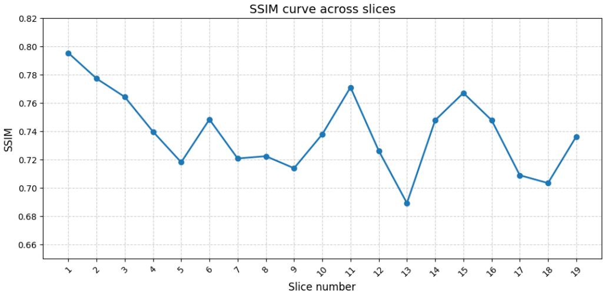

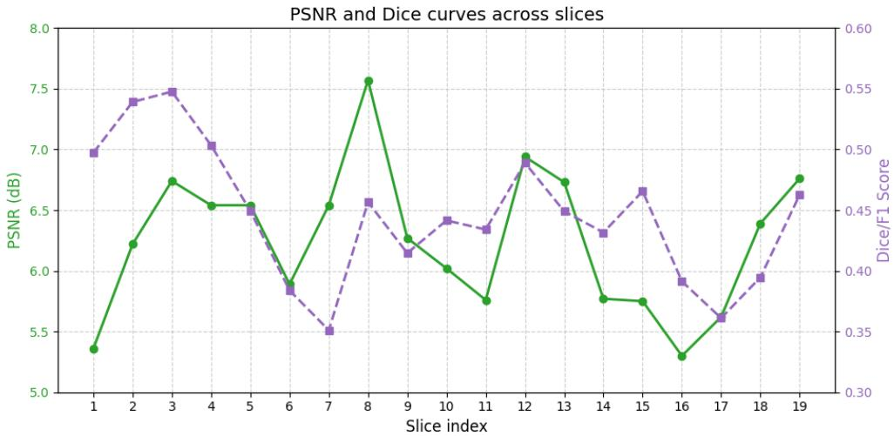  
Figure 7: Image-level metric comparison. SDN achieves lower PSNR but significantly higher SSIM than GLEAN, indicating that SDN focuses on structural inference rather than pixel-level restoration.