# From Scores to Samples: Elastic Forcing for Autoregressive Video Generation

Chi Zhang1\* Yueyi Liu1,2\* Shi Haoyang1,3\* Ruichuan An⁴

Haoyu Li2 Yuhang Wu1 Sen Cui⁵ Miao Liu¹†

1College of AI, Tsinghua University 2IAIR, Xi'an Jiaotong University   
3Xianghui Academy, Fudan University 4Peking University ⁵BAAI

imzc.2004@gmail.com miaoliu@mail.tsinghua.edu.cn

Project Page Code

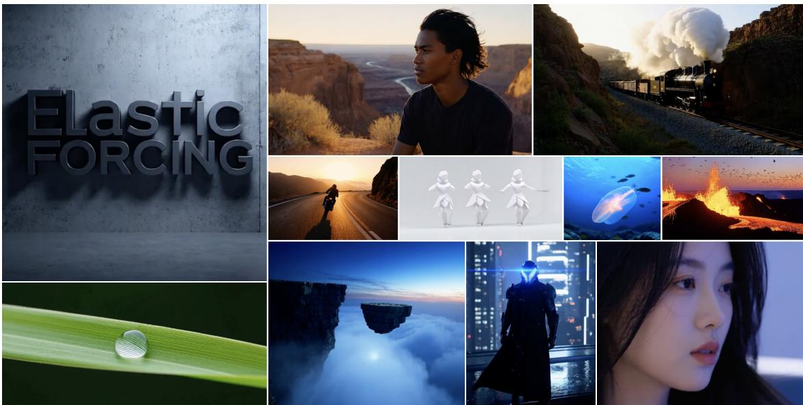

Figure 1. Few-step autoregressive video generation with Elastic Forcing. Five-step generation samples from our autoregressive Wan-14B model, post-trained for 23 hours on 8 H200 GPUs.

## Abstract

Few-step autoregressive video generation commonly relies on Distribution Matching Distillation (DMD), requiring a bidirectional diffusion teacher and an online fake-score model. We instead learn the rollout distribution directly from reference videos, eliminating both score models during post-training. Our framework minimizes maximum mean discrepancy (MMD) in frozen self-supervised video representation spaces, using a hybrid Nyström-Monte Carlo estimator to balance approximation bias and sampling variance. Memory-efficient replay and gradient subsampling make this objective practical. Using the same architecture and initialization as Self-Forcing, our 1.3B model improves the VBench Total score from 83.80 to 84.64 while retaining 17 FPS. Removing auxiliary score models also enables 14B post-training on eight H200 GPUs. Beyond distillation, learning from reference videos enables the acquisition of new visual styles, semantic concepts, and spatial priors without a target-specific diffusion teacher.

Project Page: https://video-examples-m8r2v6.pages.dev/

## 1 Introduction

Streaming video generation [12, 30, 48] is becoming increasingly important for applications that require interactive and continuous synthesis, including game simulation [34, 71], virtual livestream interaction [94], world modeling [8, 83], and embodied intelligence [11, 79]. Streaming requires both causal continuation and low-latency synthesis, motivating few-step autoregressive models that generate each chunk through a short denoising trajectory. Denoising-based training with noisy or self-resampled histories [12, 30] addresses imperfect context, but does not directly optimize the distribution produced by a fixed few-step sampler. Self Forcing [37] further addresses this setting through distributional post-training on the generator's own autoregressive rollouts.

Most Self-Forcing-based methods adopt Distribution Matching Distillation (DMD) [87], which obtains distributional gradients from a pretrained bidirectional diffusion teacher and an auxiliary model estimating the generated distribution's scores. Maintaining these score networks incurs substantial training overhead while teacher-based supervision bounds the students capabilities by the teacher's knowledge. This raises a natural question: can we optimize autoregressive rollouts directly against reference videos, without relying on auxiliary score models?

Maximum Mean Discrepancy (MMD) [29] offers a sample-based alternative by matching distributions through kernel comparisons, and has been explored for image generation [18, 20, 23, 44, 46]. However, small reference and generated minibatches can yield noisy training signals [7, 23], while increasing their sizes is particularly costly for videos. Making sample-based supervision practical therefore requires reliable estimates within the memory and computation constraints of video training, rather than simply relying on larger batches.

We introduce Elastic Forcing, an efficient sample-based framework for post-training few-step autoregressive video generators. We retain Self Forcing's rollout procedure but replace DMD with MMD in frozen representation spaces that capture video appearance and temporal dynamics. Reference videos directly define the training target, eliminating the need for either a diffusion teacher or an online fake-score model during distributional post-training.

Our design treats the fixed reference distribution and the evolving generated distribution differently. On the reference side, a hybrid estimator combines a persistent, finite-rank Nyström summary of the full reference collection with Monte Carlo estimates from sampled references. The persistent component reduces reference-sampling variance, while the sampled component reduces the approximation bias of finite-rank compression. Each update thus incorporates reference statistics beyond its minibatch without exhaustive comparisons against the full collection. On the generated side, estimation-differentiation decoupling evaluates MMD interactions over a large rollout population in representation space, then backpropagates through only a randomly sampled subset. Appropriate rescaling yields a conditionally unbiased estimate of the evaluated full-batch gradient, allowing all evaluated rollouts to inform the objective while only a subset incurs generator backpropagation.

Under matched initialization and evaluation with a 1.3B generator, Elastic Forcing achieves a VBench [38] Total score of 84.64, compared with 83.80 for Self Forcing, while retaining the same inference efficiency. Training 14B-scale models with Self-Forcing typically requires industrial-scale GPU infrastructure [55], whereas removing both auxiliary score networks also enables us to train a 14B generator on only 8 GPUs, and achieves stronger results than the industrial autoregressive video generation models under matched evaluation settings. We further conduct additional experiments with different reference collections, including monochrome appearance, character-specific content, and panoramic composition, demonstrating that Elastic Forcing can adapt to novel concepts beyond the capabilities of a fixed teacher.

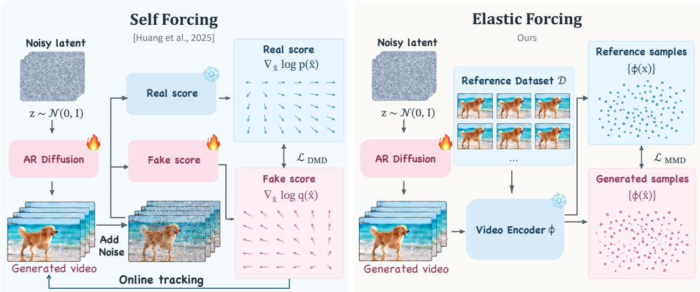  
Figure 2. Demonstration of Elastic Forcing. Instead of learning the distribution from teacher provided real and fake scores, Elastic Forcing directly learns autoregressive video rollouts from reference samples

## 2 Preliminaries

## 2.1 Few-Step Autoregressive Rollout Learning

Given a condition c, an autoregressive generator models a video $\boldsymbol { x } = ( x _ { 1 } , \dots , x _ { T } )$ as a sequence of causal chunks:

$$
p _ { \theta } ( x \mid c ) = \prod _ { i = 1 } ^ { T } p _ { \theta } ( x _ { i } \mid x _ { < i } , c ) .\tag{1}
$$

We consider diffusion-based generators that synthesize each chunk in a small number of denoising steps, combining causal generation across chunks with few-step sampling within each chunk [37, 88]. Self Forcing [37] trains on autoregressive rollouts whose histories consist of previously generated chunks, rather than ground-truth histories, and supervises the resulting video distribution.

Distribution Matching Distillation (DMD) [86, 87] provides one such distributional objective. Writing $p _ { \theta , t }$ and $p _ { \mathrm { T } , \cdot }$ for the noise-perturbed rollout and teacher distributions, its objective takes the form $\mathcal { L } _ { \mathrm { D M D } } =$ $\mathbb { E } _ { t } [ D _ { \mathrm { K L } } ( p _ { \theta , t } \Vert p _ { \mathrm { T } , t } ) ]$ . Optimization uses the difference between their score functions. The target score is supplied by a pretrained diffusion teacher, while an auxiliary model is trained online to estimate the score of the evolving generated distribution.

## 2.2 Maximum Mean Discrepancy

Maximum mean discrepancy (MMD) [29] compares distributions through kernel mean embeddings [57]. For distributions P, Q on a representation space and a positive-definite kernel k, its squared value is

$$
\mathbf { M M D } _ { k } ^ { 2 } ( P , Q ) = \mathbb { E } _ { z , z ^ { \prime } \sim P } \left[ k ( z , z ^ { \prime } ) \right] - 2 \mathbb { E } _ { z \sim P , u \sim Q } \left[ k ( z , u ) \right] + \mathbb { E } _ { u , u ^ { \prime } \sim Q } \left[ k ( u , u ^ { \prime } ) \right] ,\tag{2}
$$

where draws within each expectation are independent. MMD can be estimated directly from samples, without evaluating either distribution's density or score. Its training signal nevertheless depends on finite-sample estimates of both generated and reference statistics. Larger sample sets can improve these estimates, but naively retaining an end-to-end computation graph for every generated video ties sample coverage to activation memory and backward computation. Section 3 addresses this statistical-computational trade-off.

## 3 Elastic Forcing

Elastic Forcing matches few-step autoregressive rollouts to reference videos using MMD in frozen representation spaces. Its design addresses the statistical-computational trade-off of video distribution learning in two complementary ways. Hybrid reference estimation improves the accuracy-stability balance when reference minibatches are limited, while estimation-differentiation decoupling allows a larger rollout population to inform the loss than is backpropagated through the generator. We first define the video matching objective (Section 3.1), then develop the hybrid estimator (Section 3.2) and selective differentiation scheme (Section 3.3).

## 3.1 Sample-Defined Rollout Distribution Matching

Let $p _ { \theta }$ denote the distribution of complete autoregressive rollouts under the training prompts and generation noise. A reference collection $\mathcal { D } _ { \mathrm { r e f } } \overset { \sim } { = } \{ y _ { n } \} _ { n = 1 } ^ { N _ { \mathrm { r e f } } }$ defines the empirical target distribution $p _ { \mathrm { r e f } }$ . MMD can directly compare these distributions from samples, but its effectiveness depends on the geometry induced by the kernel. In our experiments, computing MMD in pixel or VAE-latent space provides an ineffective training signal. Appendix D.1 compares VAE-latent and pretrained-feature matching qualitatively (Figure 8). Following representational distribution matching in image generation [18, 23], we instead compare frozen pretrained features. For video, these features must describe both spatial content and its temporal evolution.

We use representations learned under three distinct objectives. V-JEPA 2 [3] supplies predictive video features for temporal dynamics. VideoMAE [69, 74] captures spa-

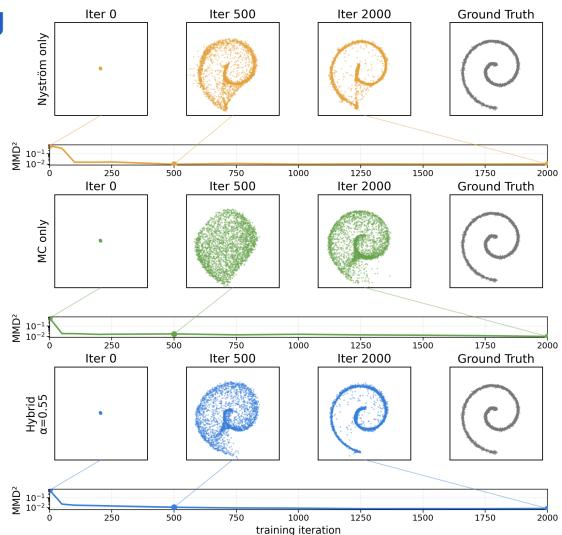  
Figure 3. A 2D toy experiment, illustrating the effect of Hybrid estimation of MMD.

tiotemporal structure through masked video reconstruction. DINOv3 [64] adds spatially localized, frame-level semantic features. For encoder $\phi _ { e }$ and differentiable positive-definite kernel $k _ { e }$ , let $P _ { \theta } ^ { e } = ( \phi _ { e } ) _ { \# } p _ { \theta }$ and $P _ { \mathrm { r e f } } ^ { e } = \left( \phi _ { e } \right) _ { \# } p _ { \mathrm { r e f } }$ denote the induced representation distributions. Our objective is

$$
{ \mathcal { L } } _ { \mathrm { E F } } ( \theta ) = \sum _ { e \in { \mathcal { E } } } \lambda _ { e } { \mathcal { L } } _ { e } , \qquad { \mathcal { L } } _ { e } = \mathbf { M M D } _ { k _ { e } } ^ { 2 } \left( P _ { \theta } ^ { e } , P _ { \mathrm { r e f } } ^ { e } \right) ,\tag{3}
$$

where $\mathcal { E } = \{ \mathrm { V J } , \mathrm { V M } , \mathrm { D I N O } \}$ and $\lambda _ { e } \geq 0$ balances the representation-specific constraints. The MMD objective is defined in Equation (2). Setting $\lambda _ { \mathrm { D I N O } } = 0$ recovers the two-video-encoder variant. We report both configurations and examine their qualitative-quantitative trade-off in Section 4.

MMD measures the distance between the distributions' mean kernel features [29]. It can be evaluated through pairwise kernel values, without constructing the implicit features or an explicit covariance matrix. Define

$$
m _ { \theta } ^ { e } ( z ) = \mathbb { E } _ { z ^ { \prime } \sim P _ { \theta } ^ { e } } k _ { e } ( z , z ^ { \prime } ) , \qquad m _ { \mathrm { r e f } } ^ { e } ( z ) = \mathbb { E } _ { u \sim P _ { \mathrm { r e f } } ^ { e } } k _ { e } ( z , u ) .\tag{4}
$$

Each kernel mean measures a query's expected similarity to one population. For elastic forcing, we use a Gaussian kernel $k ( x , y ) = \exp ( - \| x - y \| _ { 2 } ^ { 2 } / 2 \sigma ^ { 2 } )$ where $\sigma$ is a fixed bandwidth. Equation 2 gives

$$
\begin{array} { r l } { \mathcal { L } _ { e } \doteq } & { \underbrace { \mathbb { E } _ { z \sim P _ { \theta } ^ { e } } [ m _ { \theta } ^ { e } ( z ) ] } _ { \mathrm { g e n e r a t e d - g e n e r a t e d ~ i n t e r a c t i o n } } - 2 \underbrace { \mathbb { E } _ { z \sim P _ { \theta } ^ { e } } [ m _ { \mathrm { r e f } } ^ { e } ( z ) ] } _ { \mathrm { g e n e r a t e d - r e f e r e n c e i n t e r a c t i o n } } , } \end{array}\tag{5}
$$

where ÷ omits the reference-reference term $\mathbb { E } _ { u , u ^ { \prime } \sim P _ { \mathrm { r e f } } ^ { e } } k _ { e } ( u , u ^ { \prime } )$ , which is independent of θ; all paired draws are independent. For distance-decaying kernels, minimizing the first term acts as repulsion among generated representations, while minimizing the second acts as attraction toward references [2]. Estimating these interactions introduces a statistical-computational trade-off. Small minibatches produce noisy direction estimates, while including more samples is bounded by computes. This trade-off is particularly restrictive for video DiTs with large activation requirements [61, 72]. We address this trade-off from the estimation of both the reference and generated distributions in Section 3.2 and Section 3.3 respectively.

## 3.2 Reference Side: Hybrid Estimator

We first address the reference-estimation bottleneck: obtaining reliable reference supervision when minibatches are limited. All reference-dependent supervision is summarized by the kernel mean $m _ { \mathrm { r e f } } ^ { e } ( z )$ . Evaluating it exactly requires comparing each generated query against all $N _ { \mathrm { r e f } }$ reference videos, whereas a reference minibatch gives the Monte Carlo estimate

$$
\widehat { m } _ { \mathrm { M C } } ^ { e } ( z ) = \frac { 1 } { B _ { \mathrm { r e f } } } \sum _ { j = 1 } ^ { B _ { \mathrm { r e f } } } k _ { e } \bigl ( z , \phi _ { e } ( y _ { j } ) \bigr ) , \qquad y _ { j } \stackrel { \mathrm { i . i . d . } } { \sim } p _ { \mathrm { r e f } } .\tag{6}
$$

This estimator is unbiased for the empirical reference mean, but can have substantial sampling variance when $B _ { \mathrm { r e f } }$ is small. Rather than relying solely on larger reference minibatches, we complement it with a compact, persistent summary of the full reference collection. The aim is to incorporate reference information beyond the current minibatch without repeatedly evaluating the entire collection.

Formally, we approximate the reference kernel mean using a finite set of landmark kernel functions, yielding a Nyström approximation [10, 23, 78]. We obtain R landmarks $U _ { e } = \{ u _ { r } ^ { e } \} _ { r = 1 } ^ { R }$ by applying kmeans to the reference representations $\left\{ \phi _ { e } ( y _ { n } ) \right\} _ { n = 1 } ^ { N _ { \mathrm { r e f } } }$ [95]. Let $[ K _ { U U } ^ { e } ] _ { r s } = k _ { e } ( u _ { r } ^ { e } , u _ { s } ^ { e } )$ and $k _ { e } ( U _ { e } , z ) =$ $\left[ k _ { e } ( u _ { 1 } ^ { e } , z ) , \ldots , k _ { e } ( u _ { R } ^ { e } , z ) \right] ^ { \intercal }$ collect the landmark-query kernel values. The resulting feature map is

$$
\psi _ { e } ( z ) = ( K _ { U U } ^ { e } + \varepsilon I ) ^ { - 1 / 2 } k _ { e } ( U _ { e } , z ) ,\tag{7}
$$

where $\varepsilon > 0$ provides numerical regularization. The induced kernel $\widetilde { k } _ { e } ( z , u ) = \psi _ { e } ( z ) ^ { \top } \psi _ { e } ( u )$ has rank at most R. Under this finite-rank approximation, the reference kernel mean becomes

$$
m _ { \mathrm { N y s } } ^ { e } ( z ) = \psi _ { e } ( z ) ^ { \top } \bar { \mu } _ { e } , \qquad \bar { \mu } _ { e } = \frac { 1 } { N _ { \mathrm { r e f } } } \sum _ { n = 1 } ^ { N _ { \mathrm { r e f } } } \psi _ { e } ( \phi _ { e } ( y _ { n } ) ) .\tag{8}
$$

With the encoders, kernels, and reference collection fixed, $\bar { \mu } _ { e }$ is computed once. Subsequent queries require only R landmark kernel evaluations, while the stored mean incorporates statistics from the full reference collection.

This finite-rank restriction can introduce approximation bias, and regularization introduces additional approximation error. Once the summary is fixed, however, its value at a fixed query has no reference-minibatch sampling variance. Monte Carlo estimation has the complementary property: it is unbiased but noisy. We combine the two estimates through

$$
\widehat { m } _ { \alpha _ { e } } ^ { e } ( z ) = ( 1 - \alpha _ { e } ) m _ { \mathrm { N y s } } ^ { e } ( z ) + \alpha _ { e } \widehat { m } _ { \mathrm { M C } } ^ { e } ( z ) , \quad \alpha _ { e } \in [ 0 , 1 ] .\tag{9}
$$

This combination admits a direct bias-variance interpretation. Conditioning on the reference collection and landmarks, let $B _ { e } ^ { 2 }$ denote the squared Nyström approximation bias averaged over a fixed query distribution, and $V _ { e }$ the Monte Carlo variance averaged over the same distribution. Since the Monte Carlo estimator is unbiased, for $B _ { e } ^ { 2 } > 0$ and $V _ { e } > 0$ the MSE-optimal coefficient is

$$
\alpha _ { e } ^ { \star } = \underset { \alpha \in [ 0 , 1 ] } { \arg \operatorname* { m i n } } \left[ ( 1 - \alpha ) ^ { 2 } B _ { e } ^ { 2 } + \alpha ^ { 2 } V _ { e } \right] = \frac { B _ { e } ^ { 2 } } { B _ { e } ^ { 2 } + V _ { e } } \in ( 0 , 1 ) .\tag{10}
$$

At this optimum, the hybrid achieves lower reference-estimation MSE than either estimator alone. A larger approximation bias favors sampled references, whereas greater sampling variance favors the persistent summary. Appendix C.3 provides the derivation. Figure 3 illustrates the three algorithms in a toy experiment, in which the hybrid estimator yields best convergence

A hunter fires at a distant antelope  
Two Shaolin monks spar in a temple  
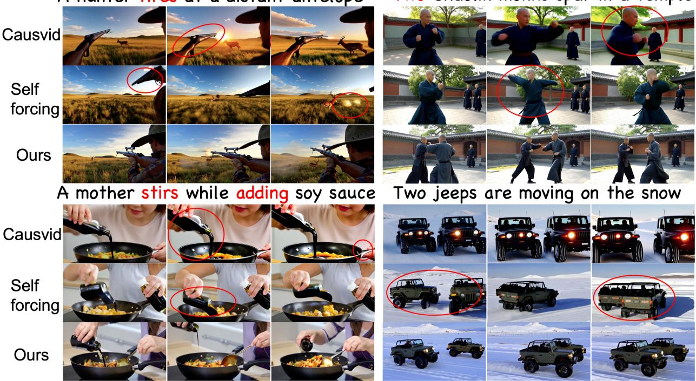  
Figure 4. Qualitative comparison with CausVid and Self Forcing. Red text highlights key prompt requirements, and red circles indicate representative failure cases. In these examples, our method demonstrates more faithful action execution, better preservation of subject counts, and more coherent interactions across frames.

## 3.3 Generated Side: Decoupling Estimation from Differentiation

Unlike the fixed reference distribution, $p _ { \theta }$ changes after each update. We therefore can only estimate its contribution using fresh on-policy rollouts. Given $B > 1$ rollouts $\{ x _ { i } \} _ { i = 1 } ^ { B }$ and representations $z _ { i } ^ { e } = \phi _ { e } ( x _ { i } )$ , the finite-batch training loss is

$$
\widehat { \mathcal { L } } _ { \mathrm { E F } } = \sum _ { e \in \mathcal { E } } \lambda _ { e } \left[ \frac { 1 } { B ( B - 1 ) } \sum _ { i \neq j } k _ { e } ( z _ { i } ^ { e } , z _ { j } ^ { e } ) - \frac { 2 } { B } \sum _ { i = 1 } ^ { B } \widehat { m } _ { \alpha _ { e } } ^ { e } ( z _ { i } ^ { e } ) \right] .\tag{11}
$$

Calculating and backpropagating $\widehat { \mathcal { L } } _ { \mathrm { E F } }$ end-to-end with a B large enough for statistical estimation is impractical, since video DiTs requires substantially more activation memory per sample than image generators. Meanwhile, ordinary gradient accumulation does not recover the same full-batch MMD gradient, because each rollout's gradient depends on the representations from the full batch, and computing the loss independently on each microbatch omits cross-microbatch interactions.

Our key observation is that these interactions require joint access to the representations, not simultaneous retention of all rollout graphs. We can thus evaluate the hybrid objective over the full population before selectively propagating its representation gradients through the generator, separating MMD evaluation from gradient backpropagation. Given a batch of B current rollouts, we first compute their representations $\{ z _ { i } ^ { e } \} _ { i = 1 } ^ { B }$ without retaining the full generator graphs and evaluate Eq. (13) over the complete batch. We then differentiate the MMD objective only with respect to the representations, obtaining $g _ { i } ^ { e } = \partial \widehat { \mathcal { L } } _ { \mathrm { E F } } / \partial z _ { i } ^ { e }$ . Once these cotangents are known, the cross-video interaction has already been resolved: each $g _ { i } ^ { e }$ can be propagated through its corresponding rollout independently. We therefore replay the required generator computation locally, inject $g _ { i } ^ { e }$ at the encoder output, and release the graph immediately after backpropagation. In practice, we retain only sparse boundary states during the initial rollout so that replay can be performed segment by segment rather than from scratch [15].

This separation further allows the distribution batch and the differentiation batch to have different sizes While all B rollouts participate in MMD estimation, we uniformly sample a subset $S \subset \{ 1 , \ldots , B \}$ of size b for reverse computation:

$$
\widehat { \nabla _ { \theta } \mathcal { L } } = \frac { B } { b } \sum _ { i \in S } \sum _ { e \in \mathcal { E } } \left( J _ { \theta , i } ^ { e } \right) ^ { \top } g _ { i } ^ { e } , \qquad J _ { \theta , i } ^ { e } = \frac { \partial z _ { i } ^ { e } } { \partial \theta } .\tag{12}
$$

Under uniform sampling, this is an unbiased estimator of the full-batch gradient [36]. Thus, a large set of fresh on-policy rollouts can still define the generated distribution accurately, while memory and reverse-computation cost are controlled by the much smaller differentiation batch b. We further discuss the effect of different differentiation batches in Appendix C.4.

Overall training procedure. We precompute the persistent reference statistics once. At each update, we combine them with a sampled reference minibatch and evaluate the hybrid MMD objective on B fresh autoregressive rollouts. The resulting representation gradients are propagated through b selected rollouts using replay, followed by a single generator update. Only the generator is optimized; the encoders and persistent reference summaries remain fixed throughout post-training. Complete pseudocode is provided in Appendix C.

## 4 Experiments

Setup. We evaluate generation quality, the components of Elastic Forcing, and its scalability from 1.3B to 14B parameters. Our 1.3B experiments use the same autoregressive architecture, ODE-initialized checkpoint, and rollout procedure as Self Forcing [37]. For elastic-forcing training, we use over 8,000 Wan-generated reference videos [72] with prompts expanded from VidProM [75]; these samples, rather than online teacher scores, define the training target. Following Self Forcing, we evaluate on expanded versions of the 946 official VBench prompts [38], generating five videos per prompt with independent random seeds. We train Elastic Forcing, both the three- and two-encoder variant (with and without DINO) on 4 NVIDIA H200 GPUs with distribution batch B = 256 and differentiation batch $b = 1 2 8$ . Further implementation details are provided in Appendix B.

Table 1. VBench video generation. We report the VBench total, quality (Qual.), and semantic (Sem.) scores.
<table><tr><td>Model</td><td>Size</td><td>FPS ↑</td><td>Total</td><td>VBench ↑ Qual.</td><td>Sem.</td></tr><tr><td colspan="6">Full-sequence diffusion</td></tr><tr><td>LTX-Video</td><td>1.9B</td><td>8.98</td><td>80.00</td><td>82.30</td><td>70.79</td></tr><tr><td>Wan2.1</td><td>1.3B</td><td>0.78</td><td>84.26</td><td>85.30</td><td>80.09</td></tr><tr><td colspan="6">Autoregressive / streaming</td></tr><tr><td>SkyReels-V2</td><td>1.3B</td><td>0.49</td><td>82.67</td><td>84.70</td><td>74.53</td></tr><tr><td>MAGI-1</td><td>4.5B</td><td>0.19</td><td>79.18</td><td>82.04</td><td>67.74</td></tr><tr><td>NOVA</td><td>0.6B</td><td>0.88</td><td>80.12</td><td>80.39</td><td>79.05</td></tr><tr><td>Pyramid Flow</td><td>2B</td><td>6.7</td><td>81.72</td><td>84.74</td><td>69.62</td></tr><tr><td>CausVid</td><td>1.3B</td><td>17.0</td><td>82.88</td><td>83.93</td><td>78.69</td></tr><tr><td>Self-Forcing</td><td>1.3B</td><td>17.0</td><td>83.80</td><td>84.59</td><td>80.64</td></tr><tr><td>LongLive</td><td>1.3B</td><td>20.7</td><td>83.22</td><td>83.68</td><td>81.37</td></tr><tr><td>Rolling Forcing</td><td>1.3B</td><td>17.5</td><td>81.22</td><td>84.08</td><td>69.78</td></tr><tr><td>Reward Forcing</td><td>1.3B</td><td>23.1</td><td>84.13</td><td>84.84</td><td>81.32</td></tr><tr><td>Ours (3 encoders)</td><td>1.3B</td><td>17.0</td><td>84.25</td><td>85.06</td><td>80.99</td></tr><tr><td>Ours (2 encoders)</td><td>1.3B</td><td>17.0</td><td>84.64</td><td>85.43</td><td>81.48</td></tr></table>

## 4.1 Comparison with Existing Baselines

Table 1 compares Elastic Forcing with representative bidirectional and autoregressive video generators. The baseline methods are described in Appendix B.3. Our model (two-encoder) achieves VBench Total, Quality, and Semantic scores of 84.64, 85.43, and 81.48, respectively, outperforming all listed autoregressive baselines while retaining 17 FPS inference. Note that Elastic Forcing modifies only the training objective and is orthogonal to existing advances in RoPE [67], memory mechanisms [51, 85], and initialization, which can be incorporated independently. The Total score also exceeds that of bidirectional Wan2.1 (84.26). These results show that direct sample-based supervision can support competitive streaming generation without teacher-provided target scores. The three-encoder variant achieves slightly lower VBench scores, but still outperforms all autoregressive baselines. This variant demonstrates better qualitative abilities, discussed in Section 4.2.

## 4.2 Ablation Studies

We examine the representation space, the reference estimator, and the forward/backward batch sizes (Tables 2– 4), reporting VBench and, where available, VLM judge scores. To better utilize the VLM's multimodal reasoning capabilities on paired videos, we adopt a comparative evaluation protocol: for each prompt, the VLM is presented with the videos produced by all ablation variants and asked to rank them. Detailed protocols are in Appendix H.

Representation space. V-JEPA 2 and Video-MAE individually reach VBench Total scores of 83.91 and 83.97, whereas combining them achieves 84.64. DINOv3 alone scores 81.96 on VBench but 3.27 under the VLM judge, exceeding either video encoder (2.40 and 2.67). This disagreement motivates evaluating representation choices with both protocols. Adding DINOv3 to the two video encoders lowers VBench Total from 84.64 to 83.81, but raises the VLM score from 3.03 to 3.63, the best in Table 2. This agrees with our observation of improved temporal stability. We report both variants in the main comparison and use all three encoders in subsequent experiments; Appendix D.1 provides further analysis.

Table 2. Encoder selection. We report VBench scores and VLM judge results for MMD in different encoder spaces. VJ: V-JEPA 2; VM: VideoMAE; D: DINOv3.
<table><tr><td>Encoder</td><td>Total ↑</td><td>Qual. ↑</td><td>Sem.↑</td><td>VLM↑</td></tr><tr><td>Self-Forcing</td><td>83.80</td><td>84.59</td><td>80.64</td><td>-</td></tr><tr><td>V-JEPA 2</td><td>83.91</td><td>84.62</td><td>81.09</td><td>2.40</td></tr><tr><td>VideoMAE</td><td>83.97</td><td>85.02</td><td>79.79</td><td>2.67</td></tr><tr><td>DINOv3</td><td>81.96</td><td>82.32</td><td>80.54</td><td>3.27</td></tr><tr><td>VJ + VM</td><td>84.64</td><td>85.43</td><td>81.48</td><td>3.03</td></tr><tr><td>VJ + VM + D</td><td>83.81</td><td>84.44</td><td>81.31</td><td>3.63</td></tr></table>

Table 3. Estimator ablation. We report VBench scores and VLM judge results for different MMD reference kernel mean estimators.

Reference estimation. The hybrid estimator achieves the highest VBench Total (84.64), Semantic (81.48), and VLM score (2.07) in Table 3. Pure Monte Carlo and Nyström estimation reach Total scores of 84.06 and 84.59, respectively, and both score 1.97 under the VLM judge. Nyström alone gives slightly higher Quality (85.47 versus 85.43). These results support combining persistent reference statistics with stochastic minibatch estimates.

<table><tr><td>Method</td><td>Total ↑</td><td>Qual.↑</td><td>Sem.↑</td><td>VLM↑</td></tr><tr><td>Nyström</td><td>84.59</td><td>85.47</td><td>81.08</td><td>1.97</td></tr><tr><td>MC</td><td>84.06</td><td>84.84</td><td>80.93</td><td>1.97</td></tr><tr><td>Full</td><td>84.64</td><td>85.43</td><td>81.48</td><td>2.07</td></tr></table>

Table 4. Ablation on forward and backward batch sizes. We report VBench Total, Quality (Qual.), Semantic (Sem.), and VLM scores.

Forward and backward batch sizes. Table 4 separates the distribution batch B from the differentiation batch b. At fixed B = 256, increasing

<table><tr><td>Fwd. B</td><td>Bwd. b</td><td>Total ↑</td><td>Qual. ↑</td><td>Sem. ↑</td><td>VLM↑</td></tr><tr><td>256</td><td>32</td><td>83.73</td><td>84.32</td><td>81.39</td><td>2.38</td></tr><tr><td>256</td><td>64</td><td>83.98</td><td>84.66</td><td>81.23</td><td>2.54</td></tr><tr><td>256</td><td>128</td><td>84.25</td><td>85.06</td><td>80.99</td><td>3.04</td></tr><tr><td>128</td><td>128</td><td>84.09</td><td>84.77</td><td>81.38</td><td>2.04</td></tr><tr><td>256</td><td>128</td><td>84.25</td><td>85.06</td><td>80.99</td><td>3.04</td></tr></table>

b from 32 to 64 to 128 improves VBench Total from 83.73 to 83.98 to 84.25. At fixed b = 128, increasing B from 128 to 256 improves Total from 84.09 to 84.25 and Quality from 84.77 to 85.06, although Semantic falls from 81.38 to 80.99. Thus, additional forward samples can improve distribution matching without increasing the backward batch. We use (B, b) = (256, 128) as our default. Further ablations appear in Appendix D.

## 5 Analysis of the Elasticity

Direct distribution learning changes both the cost and the scope of post-training. Removing score models allows larger generators to be trained with limited resources, while reference videos specify targets beyond the pretrained model's capabilities. We examine these consequences separately

Horses race through golden waters  
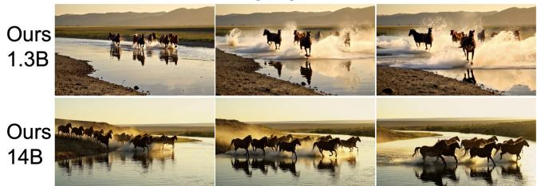  
A robot and a skeleton embrace by the river

Monks stroll by an autumn temple  
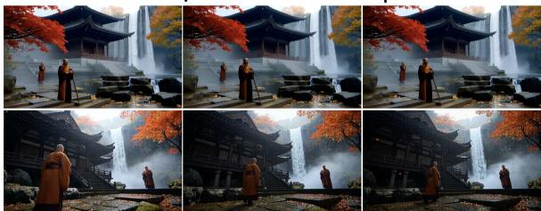

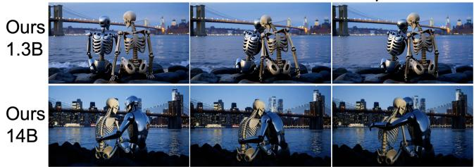

A desert traveler beneath a comet  
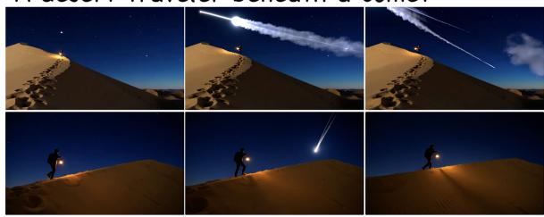  
Figure 5. Qualitative results of scaling elasticity. Our streaming 14B model gains better results than our streaming 1.3B models in complex scenarios.

## 5.1 Scaling to Larger Models

Scaling Self-Forcing is challenging because DMD scales both the generator and its realand fake-score models. The original experiments primarily use Wan2.1-1.3B [37]; naive scaling exceeds memory even with FSDP across 64 H100 GPUs [56]. Elastic Forcing removes both auxiliary diffusion models and their score-estimation computation. We train Wan2.1-T2V-14B for 80 steps on a single node of 8 NVIDIA H200 GPUs, starting from the same initialization checkpoint as Krea Realtime 14B [55]. Figure 6 summarizes the training cost. The tradeoff between GPU hours and peak GPU memory is due to different offloading strategies.

Since VBench scores align poorly with the perceptual gains of larger models (Wan 2.1 14B underperforms Wan 2.1 1.3B on VBench), we evaluate 14B models with a VLM protocol

Table 5 shows that Elastic Forcing 14B outperforms Krea Realtime 14B on most metrics, with a Total score of 4.217 versus 4.115, close to bidirectional Wan 14B's 4.224. Our model requires 23.2 hours on 8 GPUs. A human evaluation with 42 participants also favors Elastic Forcing (3.354 versus 3.054); additional examples appear in Appendix F.

Table 5. VLM and human evaluation.
<table><tr><td>Model</td><td>Visual quality</td><td>VLM evaluation ↑ Subj. consist.</td><td>Sem. consist.</td><td></td><td>Human ↑</td></tr><tr><td>Full-sequence diffusion</td><td></td><td></td><td></td><td></td><td></td></tr><tr><td>Wan2.1-14B</td><td>4.23</td><td>4.33</td><td>4.58</td><td>4.224</td><td></td></tr><tr><td>Autoregressive / streaming</td><td></td><td></td><td></td><td></td><td></td></tr><tr><td>Self-Forcing</td><td>4.01</td><td>4.111</td><td>4.56</td><td>4.11</td><td></td></tr><tr><td>Krea Realtime</td><td>4.00</td><td>4.05</td><td>4.50</td><td>4.115</td><td>3.054</td></tr><tr><td>Ours-14B</td><td>4.21</td><td>4.35</td><td>4.61</td><td>4.217</td><td>3.354</td></tr></table>

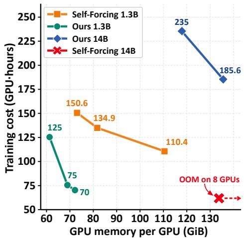  
Figure 6. Training efficiency. The tradeoff between GPU hours and peak memory per GPU (due to different offloading strategies) at 1.3B and 14B scale. Self Forcing 14B runs out of memory on eight GPUs.

A car drives on snow, 360 panoramic view

## 5.2 Learning beyond Teacher

Reference-defined supervision lets us change the training target without first adapting a diffusion teacher. We use the 1.3B generator to learn new spatial structure, concepts, and appearance directly from reference videos.

As shown in Fig. 7, wide-angle references lead to panoramic composition (top); Nailoong videos teach the character's identity (middle); and blackand-white references produce monochrome generations (bottom). In these examples, Wan-14B and its Self-Forcing student fail to reproduce the panoramic geometry or Nailoong identity. Elastic Forcing learns these properties from the reference collection, illustrating adaptation beyond the original teacher's capabilities. Appendix E provides quantitative comparisons.

## 6 Related Work

Autoregressive video training addresses imperfect histories through denoising, rollout-level distillation, or adversarial supervision [12, 30, 37, 48]. Sample-based distributional objectives offer an alternative to online score models by comparing generated and reference populations in learned representation spaces [18, 23, 46, 84, 93]. Our work connects these directions through efficient kernel matching of autoregressive rollouts. Appendix A reviews autoregressive video generation, distributional training, and video representation learning in more detail.

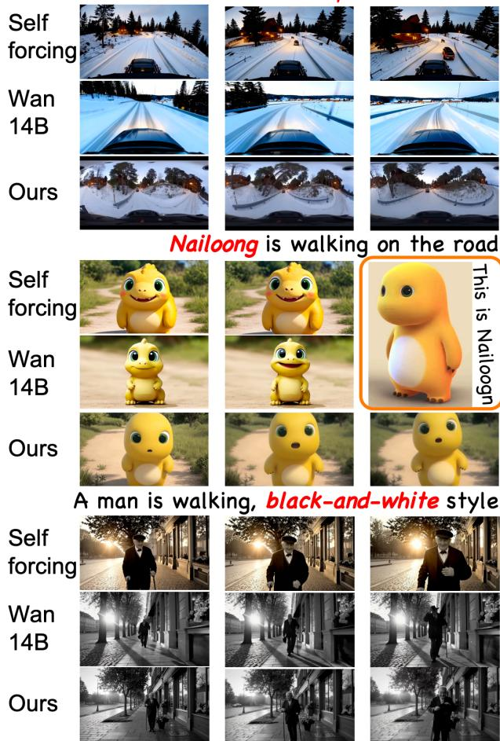  
Figure 7. Learning beyond the teacher. Elastic Forcing learns spatial priors, character identity, and visual style directly from reference videos.

## 7 Conclusion

We introduced Elastic Forcing, a sample-based framework for post-training few-step autoregressive video generators. By matching rollout distributions to reference videos through MMD in frozen representation spaces, it removes the need for both a diffusion teacher and an online fake-score model during post-training. Hybrid reference estimation balances approximation bias and sampling variance, while decoupling distribution estimation from differentiation makes large rollout batches practical under memory constraints.

With the same architecture and initialization as Self Forcing, our 1.3B model improves generation quality while preserving inference speed, and the framework enables 14B post-training on a single node of eight H200 GPUs. Moreover, reference-defined supervision enables learning new visual styles, semantic concepts, and spatial priors directly from videos.

Together, these results demonstrate that sample-based distribution matching offers a practical route to efficient streaming generation.

## Acknowledgments

We are deeply grateful to the Krea AI team for generously providing the ODE-initialized checkpoint for Wan2.1-T2V-14B. Their support allowed us to avoid reproducing an exceptionally computationally intensive initialization procedure at this scale, saving a substantial amount of GPU time and making our large-scale experiments possible.

We also sincerely thank all volunteers who participated in our human evaluations. Their time, careful judgment, and thoughtful feedback were invaluable to the empirical assessment of our work.

Finally, we gratefully acknowledge the creators and rights holders of the Nailoong character. Its distinctive visual identity provided a meaningful case study for evaluating the acquisition of novel semantic concepts from reference videos. Nailong is used in this work solely for non-commercial academic research and evaluation, and all associated intellectual-property rights remain with their respective owners.

## References

[1] Sand. ai, Hansi Teng, Hongyu Jia, Lei Sun, Lingzhi Li, Maolin Li, Mingqiu Tang, Shuai Han, Tianning Zhang, W. Q. Zhang, Weifeng Luo, Xiaoyang Kang, Yuchen Sun, Yue Cao, Yunpeng Huang, Yutong Lin, Yuxin Fang, Zewei Tao, Zheng Zhang, Zhongshu Wang, Zixun Liu, Dai Shi, Guoli Su, Hanwen Sun, Hong Pan, Jie Wang, Jiexin Sheng, Min Cui, Min Hu, Ming Yan, Shucheng Yin, Siran Zhang, Tingting Liu, Xianping Yin, Xiaoyu Yang, Xin Song, Xuan Hu, Yankai Zhang, and Yuqiao Li. Magi-1: Autoregressive video generation at scale, 2025. URL https://arxiv.org/abs/2505.13211.

[2] Michael Arbel, Anna Korba, Adil Salim, and Arthur Gretton. Maximum Mean Discrepancy Gradient Flow. arXiv preprint arXiv:1906.04370, 2019. URL https://arxiv.org/abs/1906.04370.

[3] Mido Assran, Adrien Bardes, David Fan, Quentin Garrido, Russell Howes, Mojtaba Komeili, Matthew Muckley Ammar Rizvi, Claire Roberts, Koustuv Sinha, Artem Zholus, Sergio Arnaud, Abha Gejji, Ada Martin, Francois Robert Hogan, Daniel Dugas, Piotr Bojanowski, Vasil Khalidov, Patrick Labatut, Francisco Massa, Marc Szafraniec, Kapil Krishnakumar, Yong Li, Xiaodong Ma, Sarath Chandar, Franziska Meier, Yann LeCun, Michael Rabbat, and Nicolas Ballas. V-jepa 2: Self-supervised video models enable understanding, prediction and planning, 2025. URL https://arxiv.org/abs/2506.09985.

[4] Adrien Bardes, Quentin Garrido, Jean Ponce, Xinlei Chen, Michael Rabbat, Yann LeCun, Mahmoud Assran, and Nicolas Ballas. Revisiting Feature Prediction for Learning Visual Representations from Video. arXiv preprint arXiv:2404.08471, 2024. URL https://arxiv.org/abs/2404.08471.

[5] Marc G. Bellemare, Ivo Danihelka, Will Dabney, Shakir Mohamed, Balaji Lakshminarayanan, Stephan Hoyer, and Rémi Munos. The Cramer Distance as a Solution to Biased Wasserstein Gradients. arXiv preprint arXiv: 1705.10743, 2017. URLhttps://arxiv.org/abs/1705.10743.

[6] Gedas Bertasius, Heng Wang, and Lorenzo Torresani. Is Space-Time Attention All You Need for Video Understanding? In Proceedings of the International Conference on Machine Learning, volume 139 of Proceedings of Machine Learning Research, pages 813–824, 2021. URL https://proceedings.mlr.press/v139/bertasius21a.html.

[7] Mikołaj Bińkowski, Danica J. Sutherland, Michael Arbel, and Arthur Gretton. Demystifying MMD GANs. In International Conference on Learning Representations, 2018. URL https://arxiv.org/abs/1801.01401.

[8] Jake Bruce, Michael D Dennis, Ashley Edwards, Jack Parker-Holder, Yuge Shi, Edward Hughes, Matthew Lai, Aditi Mavalankar, Richie Steigerwald, Chris Apps, et al. Genie: Generative interactive environments. In Forty-first international conference on machine learning, 2024.

[9] João Carreira and Andrew Zisserman. Quo Vadis, Action Recognition? A New Model and the Kinetics Dataset. In Proceedings of the IEEE Conference on Computer Vision and Pattern Recognition, pages 6299–6308, 2017. URL https://openaccess.thecvf.com/content\_cvpr\_2017/html/Carreira\_Quo\_Vadis\_Action\_ CVPR\_2017\_paper.html.

[10] Antoine Chatalic, Nicolas Schreuder, Lorenzo Rosasco, and Alessandro Rudi. Nyström kernel mean embeddings In Proceedings of the 39th International Conference on Machine Learning, volume 162 of Proceedings of Machine Learning Research, pages 3006–3024, 2022. URL https://proceedings.mlr.press/v162/chatalic22a.html

[11] Chi-Lam Cheang, Guangzeng Chen, Ya Jing, Tao Kong, Hang Li, Yifeng Li, Yuxiao Liu, Hongtao Wu, Jiafeng Xu, Yichu Yang, Hanbo Zhang, and Minzhao Zhu. Gr-2: A generative video-language-action model with web-scale knowledge for robot manipulation, 2024. URL https://arxiv.org/abs/2410.06158.

[12] Boyuan Chen, Diego Marti Monso, Yilun Du, Max Simchowitz, Russ Tedrake, and Vincent Sitzmann. Diffusion Forcing: Next-token Prediction Meets Full-Sequence Diffusion. arXiv preprint arXiv:2407.01392, 2024. URL https://arxiv.org/abs/2407.01392.

[13] Guibin Chen, Dixuan Lin, Jiangping Yang, Chunze Lin, Junchen Zhu, Mingyuan Fan, Hao Zhang, Sheng Chen, Zheng Chen, Chengcheng Ma, Weiming Xiong, Wei Wang, Nuo Pang, Kang Kang, Zhiheng Xu, Yuzhe Jin, Yupeng Liang, Yubing Song, Peng Zhao, Boyuan Xu, Di Qiu, Debang Li, Zhengcong Fei, Yang Li, and Yahui Zhou. Skyreels-v2: Infinite-length film generative model, 2025. URL https://arxiv.org/abs/2504.13074.

[14] Shuo Chen, Cong Wei, Sun Sun, Ping Nie, Kai Zhou, Ge Zhang, Ming-Hsuan Yang, and Wenhu Chen. Context Forcing: Consistent Autoregressive Video Generation with Long Context. arXiv preprint arXiv:2602.06028, 2026. URL https://arxiv.org/abs/2602.06028.

[15] Tianqi Chen, Bing Xu, Chiyuan Zhang, and Carlos Guestrin. Training Deep Nets with Sublinear Memory Cost. arXiv preprint arXiv:1604.06174, 2016. URL https://arxiv.org/abs/1604.06174.

[16] DeepSeek-AI. Deepseek-v4: Towards highly efficient million-token context intelligence, 2026. URL https://arxiv. org/abs/2606.19348.

[17] Haoge Deng, Ting Pan, Haiwen Diao, Zhengxiong Luo, Yufeng Cui, Huchuan Lu, Shiguang Shan, Yonggang Qi, and Xinlong Wang. Autoregressive video generation without vector quantization. arXiv preprint arXiv:2412.14169, 2024. URL https://arxiv.org/abs/2412.14169

[18] Mingyang Deng, He Li, Tianhong Li, Yilun Du, and Kaiming He. Generative Modeling via Drifting. arXiv preprint arXiv:2602.04770, 2026. URL https://arxiv.org/abs/2602.04770.

[19] Ishan Deshpande, Ziyu Zhang, and Alexander G. Schwing. Generative Modeling Using the Sliced Wasserstein Distance. In Proceedings of the IEEE Conference on Computer Vision and Pattern Recognition, pages 3483- 3491, 2018. URL https://openaccess.thecvf.com/content\_cvpr\_2018/html/Deshpande\_Generative\_ Modeling\_Using\_CVPR\_2018\_paper.html.

[20] Gintare Karolina Dziugaite, Daniel M. Roy, and Zoubin Ghahramani. Training generative neural networks via Maximum Mean Discrepancy optimization. In Proceedings of the Conference on Uncertainty in Artificial Intelligence, 2015. URL https://arxiv.org/abs/1505.03906.

[21] Christoph Feichtenhofer, Haoqi Fan, Jitendra Malik, and Kaiming He. SlowFast Networks for Video Recognition. In Proceedings of the IEEE/CVF International Conference on Computer Vision, pages 6202–6211, 2019 URL https://openaccess.thecvf.com/content\_ICCV\_2019/html/Feichtenhofer\_SlowFast\_Networks\_ for\_Video\_Recognition\_ICCV\_2019\_paper.html.

[22] Christoph Feichtenhofer, Haoqi Fan, Yanghao Li, and Kaiming He. Masked Autoencoders As Spatiotemporal Learners. In Advances in Neural Information Processing Systems, 2022. URL https://proceedings.neurips. cc/paper files/paper/2022/hash/e97d1081481a4017df96b51be31001d3-Abstract-Conference.html.

[23] Lan Feng, Wuyang Li, Eloi Zablocki, Matthieu Cord, and Alexandre Alahi. Representation Distribution Matching for One-Step Visual Generation. arXiv preprint arXiv:2607.02375, 2026. URL https://arxiv.org/abs/2607.02375.

[24] Jean Feydy, Thibault Séjourné, François-Xavier Vialard, Shun-ichi Amari, Alain Trouvé, and Gabriel Peyré. Interpolating between Optimal Transport and MMD using Sinkhorn Divergences. In Proceedings of the International Conference on Artificial Intelligence and Statistics, volume 89 of Proceedings of Machine Learning Research, pages 2681–2690, 2019. URL https://proceedings.mlr.press/v89/feydy19a.html.

[25] Kaifeng Gao, Jiaxin Shi, Hanwang Zhang, Chunping Wang, Jun Xiao, and Long Chen. Ca2-VDM: Efficient Autoregressive Video Diffusion Model with Causal Generation and Cache Sharing. arXiv preprint arXiv:2411.16375, 2024. URL https://arxiv.org/abs/2411.16375.

[26] Luyu Gao, Yunyi Zhang, Jiawei Han, and Jamie Callan. Scaling Deep Contrastive Learning Batch Size under Memory Limited Setup. In Proceedings of the 6th Workshop on Representation Learning for NLP, 2021. URL https://arxiv.org/abs/2101.06983.

[27] Songwei Ge, Aniruddha Mahapatra, Gaurav Parmar, Jun-Yan Zhu, and Jia-Bin Huang. On the content bias in fréchet video distance. In 2024 IEEE/CVF Conference on Computer Vision and Pattern Recognition (CVPR), pages 7277–7288, 2024. doi: 10.1109/CVPR52733.2024.00695

[28] Aude Genevay, Gabriel Peyré, and Marco Cuturi. Learning Generative Models with Sinkhorn Divergences. In Proceedings of the International Conference on Artificial Intelligence and Statistics, volume 84 of Proceedings of Machine Learning Research, pages 1608–1617,2018. URL https://proceedings.mlr.press/v84/genevay18a.html.

[29] Arthur Gretton, Karsten M Borgwardt, Malte J Rasch, Bernhard Schölkopf, and Alexander Smola. A kernel two-sample test. The journal of machine learning research, 13:723–773, 2012.

[30] Yuwei Guo, Ceyuan Yang, Hao He, Yang Zhao, Meng Wei, Zhenheng Yang, Weilin Huang, and Dahua Lin. End-to-End Training for Autoregressive Video Diffusion via Self-Resampling. arXiv preprint arXiv:2512.15702, 2025. URL https://arxiv.org/abs/2512.15702.

[31] Yoav HaCohen, Nisan Chiprut, Benny Brazowski, Daniel Shalem, Dudu Moshe, Eitan Richardson, Eran Levin, Guy Shiran, Nir Zabari, Ori Gordon, Poriya Panet, Sapir Weissbuch, Victor Kulikov, Yaki Bitterman, Zeev Melumian, and Ofir Bibi. LTX-Video: Realtime video latent diffusion, 2024. URL https://arxiv.org/abs/2501.00103.

[32] Tengda Han, Weidi Xie, and Andrew Zisserman. Video Representation Learning by Dense Predictive Coding. In Proceedings of the IEEE/CVF International Conference on Computer Vision

Workshops, 2019. URL https://openaccess.thecvf.com/content\_ICCVW\_2019/html/HVU/Han\_Video\_ Representation\_Learning\_by\_Dense\_Predictive\_Coding\_ICCVW\_2019\_paper.html.

[33] Kaiming He, Xinlei Chen, Saining Xie, Yanghao Li, Piotr Dollár, and Ross Girshick. Masked Autoencoders Are Scalable Vision Learners. In Proceedings of the IEEE/CVF Conference on Computer Vision and Pattern Recognition, 2022. URL https://arxiv.org/abs/2111.06377.

[34] Xianglong He, Chunli Peng, Zexiang Liu, Boyang Wang, Yifan Zhang, Qi Cui, Fei Kang, Biao Jiang, Mengyin An, Yangyang Ren, et al. Matrix-game 2.0: An open-source real-time and streaming interactive world model. arXiv preprint arXiv:2508.13009, 2025.

[35] Martin Heusel, Hubert Ramsauer, Thomas Unterthiner, Bernhard Nessler, and Sepp Hochreiter. GANs Trained by a Two Time-Scale Update Rule Converge to a Local Nash Equilibrium. In Advances in Neural Information Processing Systems, 2017. URL https://arxiv.org/abs/1706.08500.

[36] D. G. Horvitz and D. J. Thompson. A generalization of sampling without replacement from a finite universe. Journal of the American Statistical Association, 47(260):663–685, 1952. doi: 10.1080/01621459.1952.10483446.

[37] Xun Huang, Zhengqi Li, Guande He, Mingyuan Zhou, and Eli Shechtman. Self forcing: Bridging the train-test gap in autoregressive video diffusion. arXiv preprint arXiv:2506.08009, 2025.

[38] Ziqi Huang, Yinan He, Jiashuo Yu, Fan Zhang, Chenyang Si, Yuming Jiang, Yuanhan Zhang, Tianxing Wu, Qingyang Jin, Nattapol Chanpaisit, Yaohui Wang, Xinyuan Chen, Limin Wang, Dahua Lin, Yu Qiao, and Ziwei Liu. VBench: Comprehensive benchmark suite for video generative models. In Proceedings of the IEEE/CVF Conference on Computer Vision and Pattern Recognition, 2024.

[39] Zeyinzi Jiang, Zhen Han, Chaojie Mao, Jingfeng Zhang, Yulin Pan, and Yu Liu. VACE: All-in-One Video Creation and Editing. arXiv preprint arXiv:2503.07598, 2025. URL https://arxiv.org/abs/2503.07598.

[40] Yang Jin, Zhicheng Sun, Ningyuan Li, Kun Xu, Kun Xu, Hao Jiang, Nan Zhuang, Quzhe Huang, Yang Song, Yadong Mu, and Zhouchen Lin. Pyramidal flow matching for efficient video generative modeling. arXiv preprint arXiv:2410.05954, 2024.

[41] Jihwan Kim, Junoh Kang, Jinyoung Choi, and Bohyung Han. FIFO-Diffusion: Generating Infinite Videos from Text without Training. arXiv preprint arXiv:2405.11473, 2024. URL https://arxiv.org/abs/2405.11473.

[42] Dan Kondratyuk, Lijun Yu, Xiuye Gu, José Lezama, Jonathan Huang, Grant Schindler, Rachel Hornung, Vighnesh Birodkar, Jimmy Yan, Ming-Chang Chiu, Krishna Somandepalli, Hassan Akbari, Yair Alon, Yong Cheng, Josh Dillon, Agrim Gupta, Meera Hahn, Anja Hauth, David Hendon, Alonso Martinez, David Minnen, Mikhail Sirotenko, Kihyuk Sohn, Xuan Yang, Hartwig Adam, Ming-Hsuan Yang, Irfan Essa, Huisheng Wang, David A. Ross, Bryan Seybold, and Lu Jiang. VideoPoet: A Large Language Model for Zero-Shot Video Generation. arXiv preprint arXiv:2312.14125, 2023.URL https://arxiv.org/abs/2312.14125.

[43] Jose Lezama, Wei Chen, and Qiang Qiu. Run-Sort-ReRun: Escaping Batch Size Limitations in Sliced Wasserstein Generative Models. In Proceedings of the International Conference on Machine Learning, volume 139 of Proceedings of Machine Learning Research, pages 6275–6285, 2021. URL https://proceedings.mlr.press/v139/1ezama21a. html.

[44] Chun-Liang Li, Wei-Cheng Chang, Yu Cheng, Yiming Yang, and Barnabás Póczos. MMD GAN: Towards Deeper Understanding of Moment Matching Network. In Advances in Neural Information Processing Systems, 2017. URL https://arxiv.org/abs/1705.08584.

[45] Wuyang Li, Wentao Pan, Po-Chien Luan, Yang Gao, and Alexandre Alahi. Stable Video Infinity: Infinite-Length Video Generation with Error Recycling. arXiv preprint arXiv:2510.09212, 2025. URL https://arxiv.org/abs/2510. 09212.

[46] Yujia Li, Kevin Swersky, and Richard Zemel. Generative Moment Matching Networks. arXiv preprint arXiv: 1502.02761, 2015. URL https://arxiv.org/abs/1502.02761.

[47] Shanchuan Lin, Xin Xia, Yuxi Ren, Ceyuan Yang, Xuefeng Xiao, and Lu Jiang. Diffusion Adversarial Post-Training for One-Step Video Generation. arXiv preprint arXiv:2501.08316, 2025. URL https://arxiv.org/abs/2501.08316.

[48] Shanchuan Lin, Ceyuan Yang, Hao He, Jianwen Jiang, Yuxi Ren, Xin Xia, Yang Zhao, Xuefeng Xiao, and Lu Jiang. Autoregressive Adversarial Post-Training for Real-Time Interactive Video Generation. In Advances in Neural Information Processing Systems, 2025. URL https://arxiv.org/abs/2506.09350.

[49] Hongyu Liu, Chun Wang, Feng Gao, Xuanhua He, Yue Ma, Ziyu Wan, Yong Zhang, Xiaoming Wei, and Qifeng Chen. OPSD-V: On-Policy Self-Distillation for Post-Training Few-Step Autoregressive Video Generators. arXiv preprint arXiv:2607.08766, 2026. URL https://arxiv.org/abs/2607.08766.

[50] Jinxiu Liu, Xuanming Liu, Kangfu Mei, Yandong Wen, Ming-Hsuan Yang, and Weiyang Liu. Streaming Autoregressive Video Generation via Diagonal Distillation. arXiv preprint arXiv:2603.09488, 2026. URL https://arxiv. org/abs/ 2603.09488.

[51] Kunhao Liu, Wenbo Hu, Jiale Xu, Ying Shan, and Shijian Lu. Rolling forcing: Autoregressive long video diffusion in real time. arXiv preprint arXiv:2509.25161, 2025.

[52] Yueyi Liu, Chi Zhang, Sen Cui, and Miao Liu. Elasticttt: Prior-preserving test-time tuning for video editing. arXiv preprint arXiv:2607.21529, 2026.

[53] Antoine Liutkus, Umut Şimşekli, Szymon Majewski, Alain Durmus, and Fabian-Robert Stöter. Sliced-Wasserstein Flows: Nonparametric Generative Modeling via Optimal Transport and Diffusions. In Proceedings of the International Conference on Machine Learning, volume 97 of Proceedings of Machine Learning Research, pages 4104–4113, 2019. URL https://proceedings.mlr.press/v97/liutkus19a.html.

[54] Yunhong Lu, Yanhong Zeng, Haobo Li, Hao Ouyang, Qiuyu Wang, Ka Leong Cheng, Jiapeng Zhu, Hengyuan Cao, Zhipeng Zhang, Xing Zhu, et al. Reward forcing: Efficient streaming video generation with rewarded distribution matching distillation. arXiv preprint arXiv:2512.04678, 2025.

[55] Erwann Millon. Krea realtime 14b: Real-time video generation, 2025. URL https://github.com/krea-ai/ realtime-video.

[56] Erwann Millon. Krea Realtime 14B: Real-time, long-form AI video generation. Krea technical blog, October 2025. URLhttps://www.krea.ai/blog/krea-realtime-14b.

[57] Krikamol Muandet, Kenji Fukumizu, Bharath Sriperumbudur, and Bernhard Schölkopf. Kernel Mean Embedding of Distributions: A Review and Beyond. Foundations and Trends in Machine Learning, 10(1–2):1–141, 2017. URL https://arxiv.org/abs/1605.09522.

[58] Kepan Nan, Rui Xie, Penghao Zhou, Tiehan Fan, Zhenheng Yang, Zhijie Chen, Xiang Li, Jian Yang, and Ying Tai. OpenVid-1M: A Large-Scale High-Quality Dataset for Text-to-video Generation. In International Conference on Learning Representations, 2025. URL https://arxiv.org/abs/2407.02371.

[59] Maxime Oquab, Timothée Darcet, Théo Moutakanni, Huy Vo, Marc Szafraniec, Vasil Khalidov, Pierre Fernandez, Daniel Haziza, Francisco Massa, Alaaeldin El-Nouby, Mahmoud Assran, Nicolas Ballas, Wojciech Galuba, Russell Howes, Po-Yao Huang, Shang-Wen Li, Ishan Misra, Michael Rabbat, Vasu Sharma, Gabriel Synnaeve, Hu Xu, Hervé Jégou, Julien Mairal, Patrick Labatut, Armand Joulin, and Piotr Bojanowski. DINOv2: Learning Robust Visual Features without Supervision. arXiv preprint arXiv:2304.07193, 2023. URL https://arxiv.org/abs/2304.07193.

[60] Mandela Patrick, Dylan Campbell, Yuki M. Asano, Ishan Misra, Florian Metze, Christoph Feichtenhofer, Andrea Vedaldi, and João F. Henriques. Keeping Your Eye on the Ball: Trajectory Attention in Video Transformers. In Advances in Neural Information Processing Systems, 2021. URL https://arxiv.org/abs/2106.05392

[61] William Peebles and Saining Xie. Scalable Diffusion Models with Transformers. arXiv preprint arXiv:2212.09748. 2022. URL https://arxiv.org/abs/2212.09748.

[62] Rui Qian, Tianjian Meng, Boqing Gong, Ming-Hsuan Yang, Huisheng Wang, Serge Belongie, and Yin Cui. Spatiotemporal Contrastive Video Representation Learning. In Proceedings of the IEEE/CVF Conference on Computer Vision and Pattern Recognition, pages 6964–6974, 2021. URL https://openaccess.thecvf.com/content/CVPR2021/html/Qian\_ Spatiotemporal\_Contrastive\_Video\_Representation\_Learning\_CVPR\_2021\_paper.html.

[63] Alec Radford, Jong Wook Kim, Chris Hallacy, Aditya Ramesh, Gabriel Goh, Sandhini Agarwal, Girish Sastry, Amanda Askell, Pamela Mishkin, Jack Clark, Gretchen Krueger, and Ilya Sutskever. Learning Transferable Visual Models From Natural Language Supervision. In Proceedings of the International Conference on Machine Learning, volume 139 of Proceedings of Machine Learning Research, pages 8748–8763, 2021. URL https://proceedings .mlr. press/ v139/radford21a.html.

[64] Oriane Siméoni, Huy V. Vo, Maximilian Seitzer, Federico Baldassarre, Maxime Oquab, Cijo Jose, Vasil Khalidov, Marc Szafraniec, Seungeun Yi, Michaël Ramamonjisoa, Francisco Massa, Daniel Haziza, Luca Wehrstedt, Jianyuan Wang, Timothée Darcet, Théo Moutakanni, Leonel Sentana, Claire Roberts, Andrea Vedaldi, Jamie Tolan, John Brandt, Camille Couprie, Julien Mairal, Hervé Jégou, Patrick Labatut, and Piotr Bojanowski. Dinov3, 2025. URL https://arxiv.org/abs/2508.10104.

[65] Kiwhan Song, Boyuan Chen, Max Simchowitz, Yilun Du, Russ Tedrake, and Vincent Sitzmann. History-Guided Video Diffusion. arXiv preprint arXiv:2502.06764, 2025. URL https://arxiv.org/abs/2502.06764.

[66] Bharath K. Sriperumbudur, Arthur Gretton, Kenji Fukumizu, Bernhard Schölkopf, and Gert R. G. Lanckriet. Hilbert space embeddings and metrics on probability measures. Journal of Machine Learning Research, 11:1517–1561, 2010. URL https://arxiv.org/abs/0907.5309.

[67] Jianlin Su, Yu Lu, Shengfeng Pan, Ahmed Murtadha, Bo Wen, and Yunfeng Liu. RoFormer: Enhanced Transformer with Rotary Position Embedding. arXiv preprint arXiv:2104.09864, 2021. URL https://arxiv.org/abs/2104.09864.

[68] Christian Szegedy, Vincent Vanhoucke, Sergey Ioffe, Jonathon Shlens, and Zbigniew Wojna. Rethinking the Inception Architecture for Computer Vision. In Proceedings of the IEEE Conference on Computer Vision and Pattern Recognition, 2016. URL https://arxiv.org/abs/1512.00567.

[69] Zhan Tong, Yibing Song, Jue Wang, and Limin Wang. VideoMAE: Masked Autoencoders are Data-Efficient Learners for Self-Supervised Video Pre-Training. In Advances in Neural Information Processing Systems, 2022. URL https://arxiv.org/abs/2203.12602.

[70] Thomas Unterthiner, Sjoerd van Steenkiste, Karol Kurach, Raphael Marinier, Marcin Michalski, and Sylvain Gelly. Towards Accurate Generative Models of Video: A New Metric & Challenges. arXiv preprint arXiv:1812.01717, 2018. URLhttps://arxiv.org/abs/1812.01717.

[71] Dani Valevski, Yaniv Leviathan, Moab Arar, and Shlomi Fruchter. Diffusion models are real-time game engines. In Y. Yue, A. Garg, N. Peng, F. Sha, and R. Yu, editors, International Conference on Learning Representations, volume 2025, pages 73754–73776, 2025. URL https://proceedings.iclr.cc/paper\_files/paper/2025/ file/b71ecea210f7159f31e46631fe5c838f-Paper-Conference.pdf.

[72] Team Wan, Ang Wang, Baole Ai, Bin Wen, Chaojie Mao, Chen-Wei Xie, Di Chen, Feiwu Yu, Haiming Zhao, Jianxiao Yang, Jianyuan Zeng, Jiayu Wang, Jingfeng Zhang, Jingren Zhou, Jinkai Wang, Jixuan Chen, Kai Zhu, Kang Zhao, Keyu Yan, Lianghua Huang, Mengyang Feng, Ningyi Zhang, Pandeng Li, Pingyu Wu, Ruihang Chu, Ruili Feng, Shiwei Zhang Siyang Sun, Tao Fang, Tianxing Wang, Tianyi Gui, Tingyu Weng, Tong Shen, Wei Lin, Wei Wang, Wei Wang, Wenmeng Zhou, Wente Wang, Wenting Shen, Wenyuan Yu, Xianzhong Shi, Xiaoming Huang, Xin Xu, Yan Kou, Yangyu Lv, Yifei Li, Yijing Liu, Yiming Wang, Yingya Zhang, Yitong Huang, Yong Li, You Wu, Yu Liu, Yulin Pan, Yun Zheng, Yuntao Hong, Yupeng Shi, Yutong Feng, Zeyinzi Jiang, Zhen Han, Zhi-Fan Wu, and Ziyu Liu. Wan: Open and advanced large-scale video generative models. arXiv preprint arXiv:2503.20314, 2025.

[73] Chenting Wang, Yuhan Zhu, Yicheng Xu, Jiange Yang, Lang Lin, Ziang Yan, Yali Wang, Yi Wang, and Limin Wang. InternVideo-Next: Towards General Video Foundation Models without Video-Text Supervision. In Proceedings of the IEEE/CVF Conference on Computer Vision and Pattern Recognition, 2026. URL https://arxiv.org/abs/2512. 01342.

[74] Limin Wang, Bingkun Huang, Zhiyu Zhao, Zhan Tong, Yinan He, Yi Wang, Yali Wang, and Yu Qiao. Videomae v2: Scaling video masked autoencoders with dual masking. In Proceedings of the IEEE/CVF Conference on Computer Vision and Pattern Recognition (CVPR), pages 14549–14560, June 2023.

[75] Wenhao Wang and Yi Yang. Vidprom: A million-scale real prompt-gallery dataset for text-to-video diffusion models. Advances in Neural Information Processing Systems, 37:65618–65642, 2024.

[76] Yi Wang, Kunchang Li, Xinhao Li, Jiashuo Yu, Yinan He, Chenting Wang, Guo Chen, Baoqi Pei, Ziang Yan, Rongkun Zheng, Jilan Xu, Zun Wang, Yansong Shi, Tianxiang Jiang, Songze Li, Hongjie Zhang, Yifei Huang, Yu Qiao, Yali Wang, and Limin Wang. InternVideo2: Scaling Foundation Models for Multimodal Video Understanding. arXiv preprint arXiv:2403.15377,2024. URL https://arxiv.org/abs/2403.15377.

[77] Chen Wei, Haoqi Fan, Saining Xie, Chao-Yuan Wu, Alan Yuille, and Christoph Feichtenhofer. Masked Feature Prediction for Self-Supervised Visual Pre-Training. In Proceedings of the IEEE/CVF Conference on Computer Vision and Pattern Recognition, pages 14668-14678,2022. URLhttps://openaccess.thecvf.com/content/CVPR2022/html/Wei\_ Masked\_Feature\_Prediction\_for\_Self-Supervised\_Visual\_Pre-Training\_CVPR\_2022\_paper.html.

[78] Christopher K. I. Williams and Matthias Seeger. Using the Nyström method to speed up kernel machines. In Advances in Neural Information Processing Systems, volume 13, 2000. URL https://papers.nips.cc/paper\_files/paper/ 2000/hash/19de10adbaa1b2ee13f77f679fa1483a-Abstract.html.

[79] Hongtao Wu, Ya Jing, Chilam Cheang, Guangzeng Chen, Jiafeng Xu, Xinghang Li, Minghuan Liu, Hang Li, and Tao Kong. Unleashing large-scale video generative pre-training for visual robot manipulation, 2023. URL https://arxiv.org/abs/2312.13139.

[80] Jialong Wu, Shaofeng Yin, Ningya Feng, Xu He, Dong Li, Jianye Hao, and Mingsheng Long. ivideogpt: Interactive videogpts are scalable world models. In A. Globerson, L. Mackey, D. Belgrave, A. Fan, U. Paquet, J. Tomczak, and C. Zhang, editors, Advances in Neural Information Processing Systems, volume 37, pages 68082–68119. Curran Associates, Inc., 2024. doi: 10.52202/079017-2173. URL https://proceedings.neurips.cc/paper\_files/ paper/2024/file/7dbb5bfab324e3b86af9bd0df15498dd-Paper-Conference.pdf.

[81] Hu Xu, Gargi Ghosh, Po-Yao Huang, Dmytro Okhonko, Armen Aghajanyan, Florian Metze, Luke Zettlemoyer, and Christoph Feichtenhofer. VideoCLIP: Contrastive Pre-training for Zero-shot Video-Text Understanding. In Proceedings of the Conference on Empirical Methods in Natural Language Processing, pages 6787–6800, 2021. doi: 10.18653/v1/2021.emnlp-main.544. URL https://aclanthology.org/2021.emnlp-main.544/.

[82] Bowen Xue, Brandon Y. Feng, Chenguo Lin, Yuchen Lin, Yujia Zeng, Lvmin Zhang, Maneesh Agrawala, Honglei Yan, and Panwang Pan. Ring Forcing: Towards Precise Long-Term Memory for Autoregressive Video Diffusion. arXiv preprint arXiv:2608.26794, 2026. URL https://arxiv.org/abs/2608.26794.

[83] Wilson Yan, Yunzhi Zhang, Pieter Abbeel, and Aravind Srinivas. Videogpt: Video generation using vq-vae and transformers. arXiv preprint arXiv:2104.10157, 2021.

[84] Jiawei Yang, Zhengyang Geng, Xuan Ju, Yonglong Tian, and Yue Wang. Representation Fréchet Loss for Visual Generation. arXiv preprint arXiv:2604.28190, 2026. URL https://arxiv.org/abs/2604.28190.

[85] Shuai Yang, Wei Huang, Ruihang Chu, Yicheng Xiao, Yuyang Zhao, Xianbang Wang, Muyang Li, Enze Xie, Yingcong Chen, Yao Lu, Song Han, and Yukang Chen. Longlive: Real-time interactive long video generation, 2025. URL https://arxiv.org/abs/2509.22622.

[86] Tianwei Yin, Michaël Gharbi, Taesung Park, Richard Zhang, Eli Shechtman, Fredo Durand, and William T. Freeman. Improved Distribution Matching Distillation for Fast Image Synthesis. arXiv preprint arXiv:2405.14867, 2024. URL https://arxiv.org/abs/2405.14867.

[87] Tianwei Yin, Michaël Gharbi, Richard Zhang, Eli Shechtman, Fredo Durand, William T. Freeman, and Taesung Park. One-step Diffusion with Distribution Matching Distillation. In Proceedings of the IEEE/CVF Conference on Computer Vision and Pattern Recognition, 2024. URL https://arxiv.org/abs/2311. 18828.

[88] Tianwei Yin, Qiang Zhang, Richard Zhang, William T Freeman, Fredo Durand, Eli Shechtman, and Xun Huang. From slow bidirectional to fast autoregressive video diffusion models. In CVPR, 2025.

[89] Sihyun Yu, Sangkyung Kwak, Huiwon Jang, Jongheon Jeong, Jonathan Huang, Jinwoo Shin, and Saining Xie. Representation Alignment for Generation: Training Diffusion Transformers Is Easier Than You Think. arXiv preprint arXiv:2410.06940, 2024. URL https://arxiv.org/abs/2410.06940.

[90] Shenghai Yuan, Yuanyang Yin, Zongjian Li, Xinwei Huang, Xiao Yang, and Li Yuan. Helios: Real Real-Time Long Video Generation Model. arXiv preprint arXiv:2603.04379, 2026. URL https://arxiv.org/abs/2603.04379.

[91] Xiaohua Zhai, Basil Mustafa, Alexander Kolesnikov, and Lucas Beyer. Sigmoid Loss for Language Image Pre-Training. In Proceedings of the IEEE/CVF International Conference on Computer Vision, 2023. URL https: //arxiv.org/abs/2303.15343.

[92] Chi Zhang, Zehua Chen, Kaiwen Zheng, and Jun Zhu. Voicebridge: Designing latent bridge models for general speech restoration at scale. arXiv e-prints, pages arXiv-2509, 2025.

[93] Chi Zhang, Haoyang Shi, Yueyi Liu, Ruichuan An, Junkang Zhou, Chang Li, Xiuyuan Lu, Yichi Zhang, Bo Wang, Yuhang Wu, Sen Cui, and Miao Liu. Unifying distributional training for one-step visual generation. arXiv e-prints, pages arXiv–2609, 2026.

[94] Chi Zhang, Haoyang Shi, Yueyi Liu, Zhaokun Yan, Yishu Yin, Yuhang Wu, and Miao Liu. Interacvid: Building a real interactive audio-visual response dataset from live-chat videos. arXiv preprint arXiv:2608.01157, 2026.

[95] Kai Zhang, Ivor W. Tsang, and James T. Kwok. Improved Nyström low-rank approximation and error analysis. In Proceedings of the 25th International Conference on Machine Learning, pages 1232–1239, 2008. doi: 10.1145/1390156. 1390311.

[96] Lvmin Zhang, Shengqu Cai, Muyang Li, Gordon Wetzstein, and Maneesh Agrawala. Frame Context Packing and Drift Prevention in Next-Frame-Prediction Video Diffusion Models. arXiv preprint arXiv:2504.12626, 2025. URL https://arxiv.org/abs/2504.12626.

[97] Hongzhou Zhu, Min Zhao, Guande He, Hang Su, Chongxuan Li, and Jun Zhu. Causal forcing: Autoregressive diffusion distillation done right for high-quality real-time interactive video generation. arXiv preprint arXiv:2602.02214, 2026.

[98] Junhao Zhuang, Shiyi Zhang, Yuxuan Bian, Yaowei Li, Yawen Luo, Yijun Liu, Weiyang Jin, Songchun Zhang, Xianglong He, Xuying Zhang, et al. Self gradient forcing: Native long video extrapolation. arXiv preprint arXiv:2607.20368, 2026

## Appendix Contents

A Related Work 18   
A.1 Autoregressive video generation 18   
A.2 Distributional training 18   
A.3 Video representation learning . 18   
B Training and Evaluation Details 18   
B.1 Training setup 19   
B.2 Evaluation protocols 20   
B.3 Comparison methods . 20   
C Objective, Reference Estimation, and Efficient Gradients 21   
C.1 Finite-batch training objective. 21   
C.2 Nyström approximation of the reference kernel mean 21   
C.3 Bias and variance of the hybrid estimator 22   
C.4 Selective differentiation and replay. 23   
C.5 Scope and limitations 24   
D Additional Ablations. 24   
D.1 Representation choice and complementary encoders 24   
D.2 Reference-estimator ablation 26   
D.3 Joint text-video matching 27   
D.4 Why use MMD for dense video representations? 28   
D.5 Fresh rollouts versus a FIFO feature queue 28   
E Reference-Data Adaptation and Initialization. 28   
E.1 Appearance, character, and spatial adaptation 28   
E.2 Learning from real-video references 29   
E.3 Visually conditioned generation without separate ODE initialization 31   
F Additional Model Comparisons . 31   
G Correlation Analysis of VLM and Human Judgments 31   
H Prompt Design for VLM Judgment 33   
More Demonstrations 36   
V Details on Human Evaluation 36

## A Related Work

## A.1 Autoregressive video generation

Autoregressive generators predict ordered visual tokens or continuous latent chunks [17, 42, 80, 83], including action-conditioned world modeling [8]. Independent temporal noise levels and history guidance connect sequence prediction with diffusion [12, 65], enabling long-video synthesis at scale [1, 13]. Pyramidal computation, queued denoising, cache reuse, and context compression improve streaming efficiency [25, 40, 41, 90, 96]. To reduce exposure bias, self-resampled histories and recycled generation errors expose denoising models to imperfect contexts during training [30, 45]. Another line distills bidirectional models into causal generators [88] and supervises self-generated rollouts to reduce the train-test gap [37]. Subsequent work improves causal initialization, rolling generation, reward guidance, and context-gradient reconstruction [51, 54, 97, 98]. Long-context supervision and memory mechanisms address temporal consistency [14, 82, 85], while on-policy self-distillation and diagonal denoising schedules offer further training and streaming strategies [49, 50]. Adversarial post-training instead learns through a discriminator, with generated histories supporting real-time interactive synthesis [47, 48, 92]. We retain autoregressive rollout training but replace online score-based supervision with a reference-sample objective.

## A.2 Distributional training

Distributional objectives compare generated and target populations without paired outputs. Maximum mean discrepancy measures differences between kernel mean embeddings [29, 57, 66] and directly trains generators from samples [20, 46]; adversarially learned representations strengthen these objectives [7, 44]. Energy distances and sliced optimal transport provide other sample-based discrepancies [5, 19], while entropically regularized transport connects transport costs and kernel matching [24, 28]. Distribution evolution can also be described by kernel or sliced-transport gradient flows [2, 53], or learned through data-attraction and sample-repulsion fields [18]. Memory-efficient feature-distribution training already separates large statistical populations from smaller replay batches [43]. Recent approaches optimize Fréchet feature moments with decoupled estimation and differentiation [84], or use multiple frozen encoders and persistent kernel summaries [23]. Unlike score-based distribution distillation [86, 87], these sample-based objectives can learn from reference data without an online diffusion teacher. We apply this perspective to autoregressive video rollouts, combining hybrid reference estimation with selective differentiation under video-training memory constraints.

## A.3 Video representation learning

Video encoders capture temporal structure through three-dimensional convolutions, multiple temporal rates, or space-time attention [6, 9, 21, 52, 60]. Self-supervised objectives include dense predictive coding and temporal contrastive learning [32, 62], masked pixel or feature reconstruction [22, 69, 74, 77], and prediction in learned latent spaces [3, 4]. Video-text alignment and large-scale multimodal pretraining enrich semantic features [73, 76, 81]; image self-distillation and language-image alignment supply complementary appearance cues [59, 63, 64, 91]. Pretrained representations also improve generation by aligning denoiser states with clean-image features [89], which differs from matching distributions of completed outputs. Feature selection remains important: video distances can underweight temporal defects [27, 70], and optimizing one representation can conceal perceptual failures [23, 84]. This motivates combining video and image encoders and assessing them with complementary automatic and human judgments.

## B Training and Evaluation Details

This appendix first describes the experimental setup and comparison methods, then derives the reference estimator and selective-gradient update. We next report representation and optimization ablations, referencedata adaptation, and additional 14B comparisons. Throughout, reference videos specify the distribution to be

learned; a pretrained checkpoint supplies the initialization but is not used as an online score oracle during Elastic Forcing post-training,

## B.1 Training setup

Our standard text-to-video experiments retain the autoregressive architecture and rollout procedure of Self-Forcing [37]. Each chunk is generated using four denoising steps and conditions on previously generated content. The 1.3B model starts from the same ODE-initialized checkpoint as the Self-Forcing comparison. The 14B experiment uses the ODE-initialized checkpoint supplied by Krea [55, 56]. These initialization stages should be distinguished from the subsequent sample-based post-training. The separate VACE experiment in Appendix E.3 examines a different, visually conditioned setting without a separate ODE initialization stage.

Table 6. Reported settings for standard text-to-video post-training. Both model scales use an ODE-initialized checkpoint.
<table><tr><td>Setting</td><td>1.3B model</td><td>14B model</td></tr><tr><td>Backbone</td><td>Wan2.1-T2V-1.3B</td><td>Wan2.1-T2V-14B</td></tr><tr><td>Initialization</td><td>Self-Forcing ODE checkpoint</td><td>Krea ODE checkpoint</td></tr><tr><td>Denoising steps</td><td>4 per chunk</td><td>5 per chunk</td></tr><tr><td>Post-training updates</td><td>150(three encoder)/100(two encoder)</td><td>80</td></tr><tr><td>Hardware</td><td>4 NVIDIA H200 GPUs</td><td>8 NVIDIA H200 GPUs</td></tr></table>

Table 7. Encoder settings for post-training.
<table><tr><td>Encoder</td><td>Tokens per video</td><td>Dimension per token</td></tr><tr><td>DINOv3</td><td>1024</td><td>1024</td></tr><tr><td>V-JEPA2</td><td>1024</td><td>1024</td></tr><tr><td>VideoMAE v2</td><td>1280</td><td>1024</td></tr><tr><td>Loss</td><td colspan="2"> $\begin{array} { c } { \left( 1 0 N _ { \mathrm { D I N O v 3 } } + N _ { \mathrm { V \mathrm { - } J E P A 2 } } + N _ { \mathrm { V i d e o M A E } } \right) / 3 } \\ { 2 : 1 } \end{array}$ </td></tr></table>

For the 1.3B run, we use $B = 2 5 6$ current rollouts to evaluate the distributional objective and select $b = 1 2 8$ of them for backpropagation. The two-encoder variant of Elastic Forcing is trained for 100 steps. The three encoder variant in Table 1, which is the main variant and further used in other evaluations, is trained for 150 steps. Table 7 summarizes the encoder settings used for post-training. DINOv3 and V-JEPA2 each provide 1024 tokens per video, while VideoMAE v2 provides 1280 tokens, with a feature dimension of 1024 per token across all three encoders. We use a 2:1 weighting to balance the Nyström and MC estimators. The encoder-specific loss terms are combined as $\mathrm { ( 1 0 N _ { D I N O v 3 } + N _ { V - J E P A 2 } + N _ { V i d e o M A E } ) } / 3 .$ , where the weights are roughly selected to balance the numerical values.

For ablation studies, all models in Tables 2 and 3 are trained for 100 steps where models in Table 4 are trained for 150 steps. All experiments are conducted on 4 H200 GPUs. For the 14B model, we post-train it for 80 steps on 8 H200 GPUs, costing 23.2 hours. Details are listed in Table 6 The general-domain reference collection contains more than 8,000 Wan-generated videos [72]. Its prompts are expanded from VidProM [75] using DeepSeek-V4-Flash [16], as described in the main paper. The frozen encoders map reference and generated videos into the same representation spaces. Only the generator is updated: neither a real-score diffusion teacher nor an online fake-score model is required by the post-training objective. Reference-feature extraction and construction of the persistent Nyström summary can therefore be performed before the optimization loop.

We distinguish two representation configurations. The two-video-encoder variant combines V-JEPA 2 and VideoMAE and gives the strongest aggregate VBench result in the main comparison. The three-encoder variant also includes DINOv3 and is used for the subsequent experiments described in the main text. Appendix D.1 reports the individual metric changes; an improvement in visual stability need not improve every VBench dimension.

## B.2 Evaluation protocols

VBench. Following the Self-Forcing evaluation setup, we use expanded versions of the 946 official VBench prompts [38] and generate five videos per prompt with independent random seeds, giving 4,730 videos per evaluated model. We report Total, Quality, and Semantic scores on a 0–100 scale. In the reported tables, Total is the weighted aggregate 0.8 Quality + 0.2 Semantic, up to rounding. The complete encoder ablation in Table 8 also reports the seven quality and nine semantic dimensions.

Large-model evaluation. The 14B comparison supplements automated evaluation with VLM ratings of visual quality, subject consistency, and semantic consistency, as well as human ratings of Elastic Forcing and Krea Realtime. The main comparison reports mean human scores of 3.354 and 3.054, respectively. These are subjective rating averages rather than preference percentages. Appendix F provides qualitative examples that illustrate the kinds of action and continuity errors considered in this comparison. They complement the aggregate ratings but do not establish statistical significance.

Specialized adaptation. Table 10 reports ratings on a 0–10 scale for monochrome appearance, Nailong character generation, and spatial appearance. The task-specific score concerns adherence to the corresponding target; the remaining columns describe general visual and temporal quality. Task adherence and general quality are reported separately, since improving one does not imply uniform improvement in the others. These task ratings, the large-model VLM/human ratings, and VBench use different protocols and should be compared within their respective tables.

## B.3 Comparison methods

The main comparison includes two full-sequence diffusion models and nine autoregressive or streaming generators. Their published architectures differ; Self-Forcing provides the closest comparison for isolating our post-training objective because the 1.3B architecture, initialization, and rollout procedure are matched.

Full-sequence diffusion. LTX-Video [31] uses a highly compressed video VAE and a diffusion transformer for efficient full-sequence synthesis. Wan2.1 [72] supplies the 1.3B and 14B foundation backbones used in this work; its bidirectional models also provide full-sequence quality references.

Other autoregressive generators. SkyReels-V2 [13] uses Diffusion Forcing to extend videos autoregressively. MAGI-1 [1] performs chunk-wise autoregressive denoising with different noise levels across chunks. NOVA [17] uses non-quantized visual representations and factorizes generation across temporal and spatial positions. Pyramid Flow [40] combines spatial and temporal pyramids to reduce the cost of video synthesis and history conditioning.

DMD-based streaming generators. CausVid [88] distills a bidirectional diffusion model into a few-step causal generator. Self-Forcing [37] applies distributional supervision to rollouts conditioned on their own generated histories, reducing the mismatch between training and inference. LongLive [85] extends this setting with long-horizon tuning, persistent frame-sink tokens, and prompt-dependent KV recaching. Rolling Forcing [51] uses joint denoising within rolling temporal windows and persistent attention sinks. Reward Forcing [54] combines reward-guided distribution matching with an evolving memory of earlier frames. The evaluated variants in this family retain score-based supervision. Elastic Forcing instead changes how the rollout distribution is supervised, and can be combined with improvements to temporal context or memory handling.

## C Objective, Reference Estimation, and Efficient Gradients

## C.1 Finite-batch training objective

For each encoder e, let $z _ { i } ^ { e } = \phi _ { e } ( x _ { i } )$ be the representation of the i-th current rollout. With $B > 1$ rollouts, the objective used to obtain representation gradients is

$$
\widehat { \mathcal { L } } _ { \mathrm { E F } } = \sum _ { e \in \mathcal { E } } \lambda _ { e } \left[ \frac { 1 } { B ( B - 1 ) } \sum _ { i \neq j } k _ { e } ( z _ { i } ^ { e } , z _ { j } ^ { e } ) - \frac { 2 } { B } \sum _ { i = 1 } ^ { B } \widehat { m } _ { \alpha _ { e } } ^ { e } ( z _ { i } ^ { e } ) \right] .\tag{13}
$$

The generated-generated sum contains ordered pairs and excludes the self-pairs $i = j \ [ 2 9 ]$ . The referencereference term is omitted because the reference distribution and encoders are fixed, so it contributes no generator gradient. Thus, the displayed training loss need not be nonnegative and should not be interpreted as an absolute MMD score. The hybrid attraction term further approximates the original-kernel MMD objective; it does not replace the generated-generated kernel by the Nyström kernel.

Every representation is treated as a differentiable variable when computing $g _ { i } ^ { e } = \partial \widehat { \mathcal { L } } _ { \mathrm { E F } } / \partial z _ { i } ^ { e }$ , even if its rollout is not subsequently replayed. Symmetry of the kernel gives

$$
g _ { i } ^ { e } = \lambda _ { e } \left[ \frac { 2 } { B ( B - 1 ) } \sum _ { j \neq i } \nabla _ { 1 } k _ { e } ( z _ { i } ^ { e } , z _ { j } ^ { e } ) - \frac { 2 } { B } \nabla _ { z } \widehat { m } _ { \alpha _ { e } } ^ { e } ( z _ { i } ^ { e } ) \right] ,\tag{14}
$$

where $\nabla _ { 1 }$ differentiates the first kernel argument. The factor of two in the repulsion term accounts for the appearance of each sample in both positions of the ordered pair sum. Computing losses separately on small microbatches would omit interactions between those microbatches.

## C.2 Nyström approximation of the reference kernel mean

Fix an encoder, kernel, and reference collection. Write $\nu _ { n } ^ { e } = \phi _ { e } ( y _ { n } )$ and use the empirical reference mean

$$
m _ { \mathrm { r e f } } ^ { e } ( z ) = \frac { 1 } { N _ { \mathrm { r e f } } } \sum _ { n = 1 } ^ { N _ { \mathrm { r e f } } } k _ { e } ( z , \nu _ { n } ^ { e } ) .\tag{15}
$$

This equality defines the finite-data target used in the main text; it does not assume that the reference collection exactly represents an underlying population distribution.

Landmarks and coefficients. Let $U _ { e } = \{ u _ { r } ^ { e } \} _ { r = 1 } ^ { R }$ be the landmarks obtained by k-means in the reference representation space [95]. The centroids need not coincide with individual reference videos. Define

$$
[ K _ { U U } ^ { e } ] _ { r s } = k _ { e } ( u _ { r } ^ { e } , u _ { s } ^ { e } ) , \qquad \mathbf { k } _ { e } ( U _ { e } , \boldsymbol { z } ) = [ k _ { e } ( u _ { 1 } ^ { e } , \boldsymbol { z } ) , \dots , k _ { e } ( u _ { R } ^ { e } , \boldsymbol { z } ) ] ^ { \top } ,\tag{16}
$$

and

$$
\mathbf { c } _ { e } = \frac { 1 } { N _ { \mathrm { r e f } } } \sum _ { n = 1 } ^ { N _ { \mathrm { r e f } } } \mathbf { k } _ { e } ( U _ { e } , \nu _ { n } ^ { e } ) .\tag{17}
$$

We approximate the reference mean in the span of landmark kernel functions [10, 23, 78]:

$$
m _ { \mathrm { N y s } } ^ { e } ( z ) = \mathbf { k } _ { e } ( U _ { e } , z ) ^ { \top } \mathbf { \beta } \beta _ { e } .\tag{18}
$$

If $K _ { U U } ^ { e }$ is invertible, matching the empirical mean at every landmark amounts to solving $K _ { U U } ^ { e } \beta _ { e } = { \bf c } _ { e }$ . For numerical stability, use

$$
\begin{array} { l l } { { ( K _ { U U } ^ { e } + \varepsilon I ) \beta _ { e } = { \bf c } _ { e } , ~ } } & { { ~ \varepsilon > 0 . } } \end{array}\tag{19}
$$

Regularization relaxes exact interpolation: the residual at the landmarks is ${ \bf c } _ { e } - K _ { U U } ^ { e } \beta _ { e } = \varepsilon \beta _ { e }$ . The coefficients $\beta _ { e }$ are distinct from the scalar mixture weight $\alpha _ { e }$ below.

Equivalent feature map. The regularized Gram matrix is symmetric positive definite. Therefore,

$$
\psi _ { e } ( z ) = ( K _ { U U } ^ { e } + \varepsilon I ) ^ { - 1 / 2 } { \bf k } _ { e } ( U _ { e } , z ) , \qquad \bar { \mu } _ { e } = \frac { 1 } { N _ { \mathrm { r e f } } } \sum _ { n } \psi _ { e } ( \nu _ { n } ^ { e } )\tag{20}
$$

yield

$$
\begin{array} { r l } & { \psi _ { e } ( z ) ^ { \top } \bar { \mu } _ { e } = \mathbf { k } _ { e } ( U _ { e } , z ) ^ { \top } ( K _ { U U } ^ { e } + { \varepsilon } I ) ^ { - 1 } \mathbf { c } _ { e } } \\ & { \qquad = \mathbf { k } _ { e } ( U _ { e } , z ) ^ { \top } { \beta } _ { e } = m _ { \mathrm { N y s } } ^ { e } ( z ) . } \end{array}\tag{21}
$$

This is the expression used in Equation (8). The associated kernel $\widetilde { k } _ { e } ( z , u ) = \psi _ { e } ( z ) ^ { \top } \psi _ { e } ( u )$ has rank at most R.

Precomputation and cost. Once the representation space and reference set are fixed, we can solve for $\beta _ { e }$ once and evaluate each subsequent query using R kernel values and a dot product. Forming the dense landmark Gram matrix uses $O ( R ^ { 2 } )$ kernel evaluations, and accumulating $\mathbf { c } _ { e }$ uses $O ( N _ { \mathrm { r e f } } R )$ ; the latter can be streamed without storing the full reference-landmark matrix. A dense factorization costs $O ( R ^ { 3 } )$ arithmetic. These costs exclude feature extraction and k-means. Using the coefficient form avoids a dense inverse-square-root multiplication for every query. If the encoder, kernel, or reference collection changes, the persistent statistics must be recomputed.

## C.3 Bias and variance of the hybrid estimator

At a fixed query z, condition on the reference collection and landmarks. Let

$$
\delta _ { e } ( z ) = m _ { \mathrm { N y s } } ^ { e } ( z ) - m _ { \mathrm { r e f } } ^ { e } ( z ) , \qquad \eta _ { e } ( z ) = \widehat { m } _ { \mathrm { M C } } ^ { e } ( z ) - m _ { \mathrm { r e f } } ^ { e } ( z ) .\tag{22}
$$

For independent reference draws with replacement, I $\exists [ \eta _ { e } ( z ) ] = 0$ and

$$
\nu _ { e } ( z ) : = \mathrm { V a r } [ \eta _ { e } ( z ) ] = \frac { \mathrm { V a r } _ { Y \sim p _ { \mathrm { r e f } } } [ k _ { e } ( z , \phi _ { e } ( Y ) ) ] } { B _ { \mathrm { r e f } } } .\tag{23}
$$

For a fixed $\alpha _ { e }$ , the hybrid error is $( 1 - \alpha _ { e } ) \delta _ { e } ( z ) + \alpha _ { e } \eta _ { e } ( z )$ . Hence

$$
\begin{array} { r l } & { \mathrm { B i a s } [ \widehat { m } _ { \alpha _ { e } } ^ { e } ( z ) ] = ( 1 - \alpha _ { e } ) \delta _ { e } ( z ) , } \\ & { \mathrm { V a r } [ \widehat { m } _ { \alpha _ { e } } ^ { e } ( z ) ] = \alpha _ { e } ^ { 2 } \nu _ { e } ( z ) , } \\ & { \mathrm { M S E } [ \widehat { m } _ { \alpha _ { e } } ^ { e } ( z ) ] = ( 1 - \alpha _ { e } ) ^ { 2 } \delta _ { e } ( z ) ^ { 2 } + \alpha _ { e } ^ { 2 } \nu _ { e } ( z ) . } \end{array}\tag{24}
$$

The cross term vanishes because the persistent approximation is fixed and the Monte Carlo error has zero mean. This makes the trade-off precise: pure Nyström estimation has no reference-minibatch variance but can be biased, whereas pure Monte Carlo estimation is unbiased for the empirical reference mean. A hybrid generally retains some approximation bias.

For a fixed query distribution Q, let $\mathcal { B } _ { e } ^ { 2 } = \mathbb { E } _ { z \sim Q } [ \delta _ { e } ( z ) ^ { 2 } ]$ and $\mathcal { V } _ { e } = \mathbb { E } _ { z \sim Q } [ \nu _ { e } ( z ) ]$ . Minimizing the expected squared error gives the oracle coefficient

$$
\alpha _ { e } ^ { \star } = \frac { \mathcal { B } _ { e } ^ { 2 } } { \mathcal { B } _ { e } ^ { 2 } + \mathcal { V } _ { e } } ,\tag{25}
$$

when the denominator is nonzero. If both terms vanish, every coefficient has zero error. This expression explains the estimator's behavior; it is not a claim that the unknown errors are measured or that this oracle coefficient is used during training. It also concerns kernel-mean values, not directly the error of their derivatives. Finally, unbiasedness for a finite reference collection does not eliminate finite-data error relative to the desired real-world distribution.

## C.4 Selective differentiation and replay

Condition on a fixed generated batch and the randomness used to construct the reference estimate. Define each rollout's parameter-gradient contribution by

$$
h _ { i } = \sum _ { e \in { \mathscr { E } } } ( J _ { \theta , i } ^ { e } ) ^ { \top } g _ { i } ^ { e } , \qquad J _ { \theta , i } ^ { e } = \frac { \partial z _ { i } ^ { e } } { \partial \theta } .\tag{26}
$$

The full-batch gradient is $\textstyle \sum _ { i } h _ { i }$ . For a uniformly sampled subset S of size b without replacement [36], $\operatorname* { P r } ( i \in { \cal S } ) = { b } / { B }$ , and therefore

$$
\mathbb { E } _ { S } \left[ \frac { B } { b } \sum _ { i \in S } h _ { i } \right] = \frac { B } { b } \sum _ { i = 1 } ^ { B } \frac { b } { B } h _ { i } = \nabla _ { \theta } \widehat { \mathcal { L } } _ { \mathrm { E F } } .\tag{27}
$$

This is conditional unbiasedness for the evaluated hybrid objective, not for an exact population MMD. It also assumes that the same rollout computation and any prescribed gradient truncation are used during replay. For $\bar { h } = B ^ { - 1 } \textstyle \sum _ { i } h _ { i }$ and $\begin{array} { r } { S _ { h } = ( B - 1 ) ^ { - 1 } \sum _ { i } ( h _ { i } - \bar { h } ) ( h _ { i } - \bar { h } ) ^ { \top } } \end{array}$ , the conditional covariance is

$$
\mathrm { C o v } _ { S } \left[ \frac { B } { b } \sum _ { i \in S } h _ { i } \right] = \frac { B ^ { 2 } } { b } \left( 1 - \frac { b } { B } \right) S _ { h } .\tag{28}
$$

Thus reducing $^ b$ saves reverse computation but increases update variance; it does not reduce the number of samples informing each cotangent. At $b = B$ , this source of variance vanishes.

Replay requirements. To reproduce the intended backward computation, the saved replay state must permit reconstruction of the same random choices and segment inputs. Reverse execution restores a boundary, reconstructs that segment, propagates its incoming cotangent, and releases the segment's graph [15, 26]. Frozen encoder weights still permit derivatives with respect to their inputs. Reusing the same random choices, preprocessing, and parameter values is essential: replaying a different video would pair a cotangent with the wrong Jacobian. Boundary gradients must be propagated wherever the original computation requires them; detaching a boundary introduces truncation rather than an equivalent memory-saving execution. The optimizer is updated only after all selected contributions have been accumulated.

Algorithm 1 Elastic Forcing with a persistent summary and selective replay   
Require: Generator $G _ { \theta } ;$ reference collection $\mathcal { D } _ { \mathrm { r e f } } ;$ frozen $\{ \phi _ { e } , k _ { e } , \lambda _ { e } , \alpha _ { e } \} _ { e \in \mathcal { E } } ; B > 1 , 1 \le b \le B , B _ { \mathrm { r e f } } \ge 1 , R , \varepsilon > 0$   
1: for all $e \in { \mathcal { E } }$ do   
2: Extract reference features and obtain R landmarks by k-means   
3: Form $K _ { U U } ^ { e } ,$ accumulate $\mathbf { c } _ { e } ,$ and solve Equation (19) for $\beta _ { e }$   
4: end for   
5: repeat   
6: Generate B current autoregressive rollouts without retained graphs; save replay states   
7: Extract $\{ z _ { i } ^ { e } \} _ { i , e }$ and treat these features as independent differentiable variables   
8: Sample a reference minibatch; combine its Monte Carlo mean with ke $( U _ { e } , z ) ^ { \top } \beta _ { e }$ using Equation (9)   
9: Evaluate Equation (13); compute and detach all cotangents $\{ g _ { i } ^ { e } \} _ { i , e }$   
10: Uniformly sample b distinct indices S; clear the generator's accumulated gradient   
11: for all $i \in S$ do   
12: Replay rollout i with its saved states and propagate $( B / b ) g _ { i } ^ { e }$ through each encoder and the generator   
13: Accumulate the parameter gradient and release the replayed graph   
14: end for   
15: Apply one optimizer update to θ   
16: until the post-training budget is exhausted

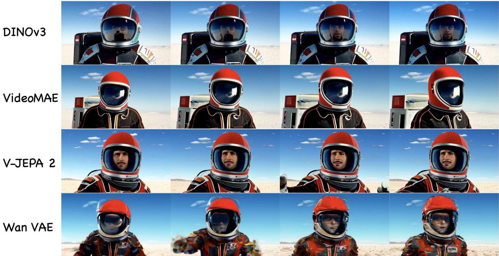  
Figure 8. MMD in different representation spaces. Rows use DINOv3, VideoMAE, V-JEPA 2, and Wan VAE features, respectively; columns show sampled frames in temporal order. Wan VAE matching exhibits distortions in the helmet and clothing. The pretrained encoders preserve more coherent subjects, with different degrees and types of visible motion. This qualitative example complements the metric breakdown in Table 8.

## C.5 Scope and limitations

Elastic Forcing removes online diffusion score models from distributional post-training, but continues to depend on pretrained generators, frozen representation encoders, and suitable reference data. Matching feature distributions can miss errors to which the encoders are insensitive. Even with a characteristic kernel in feature space [57, 66], equal feature distributions need not imply equal video distributions if the representation discards information. Video-marginal matching also does not by itself identify the correct video distribution for every text condition.

The persistent reference summary introduces finite-rank and regularization error, and selective differentiation adds gradient-sampling variance. Increasing the distribution batch still requires more forward computation. The FIFO ablation shows why stale representations should not be assumed to preserve the properties of fresh rollouts. Finally, adaptation to appearance, a character, or panoramic composition demonstrates flexibility in the tested settings; it does not establish unrestricted concept acquisition or correct physical and geometric reasoning. These limitations motivate evaluation of both individual frames and temporal behavior, using automated metrics together with clearly specified human or VLM protocols.

## D Additional Ablations

## D.1 Representation choice and complementary encoders

Qualitative behavior across representation spaces. Figure 8 compares MMD supervision in DINOv3, VideoMAE, V-JEPA 2, and Wan VAE representation spaces. Each row shows four sampled frames of an astronaut generated using one matching space. The Wan VAE row exhibits changes in helmet shape and suit texture, together with distorted appearance during motion. This illustrates why a latent space designed for reconstruction need not provide a useful geometry for distribution matching. The pretrained representation encoders produce more recognizable and stable subjects in this example, but encourage different behavior. DINOv3 preserves detailed appearance with relatively little visible change across the sampled frames. VideoMAE maintains the helmet and scene structure as the subject turns, while V-JEPA 2 preserves the face and suit during an arm gesture. These frames illustrate differences between appearance and motion constraints; they do not establish a general ranking from one prompt. The broader VBench breakdown below tests these trade-offs across the evaluation set.

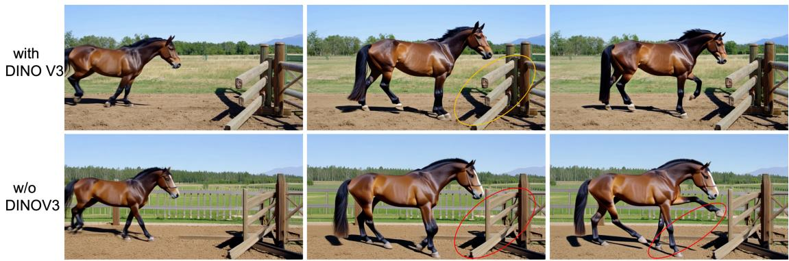  
Figure 9. Effect of incorporating DINOv3 features. Adding DINOv3 supervision improves perceptual quality by preserving sharper details and more consistent object geometry. Without DINOv3, the generated content becomes overly smooth and may exhibit structural tearing around the horse and fence. Nevertheless, removing DINOv3 yields a higher Dynamic Degree and overall VBench score.

Table 8. Detailed encoder ablation on VBench (0–100; higher is better). VJ: V-JEPA 2; VM: VideoMAE; D: DINOv3. Bold indicates the best value within each row, including ties. All variants are trained for 100 steps.
<table><tr><td>Metric</td><td>VJ</td><td>VM</td><td>D</td><td>D+VJ</td><td>VJ+VM</td><td>D+VJ+VM</td></tr><tr><td>Aggregate scores</td><td></td><td></td><td></td><td></td><td></td><td></td></tr><tr><td>Total</td><td>83.91</td><td>83.97</td><td>81.96</td><td>83.64</td><td>84.64</td><td>83.81</td></tr><tr><td>Quality</td><td>84.62</td><td>85.02</td><td>82.32</td><td>84.26</td><td>85.43</td><td>84.44</td></tr><tr><td>Semantic</td><td>81.09</td><td>79.79</td><td>80.54</td><td>81.19</td><td>81.48</td><td>81.31</td></tr><tr><td>Quality dimensions</td><td></td><td></td><td></td><td></td><td></td><td></td></tr><tr><td>Subject consistency</td><td>96.28</td><td>95.89</td><td>97.27</td><td>96.94</td><td>96.58</td><td>96.83</td></tr><tr><td>Background consistency</td><td>95.73</td><td>96.75</td><td>96.21</td><td>96.79</td><td>97.01</td><td>96.85</td></tr><tr><td>Temporal flickering</td><td>99.21</td><td>99.57</td><td>98.64</td><td>99.22</td><td>99.65</td><td>99.47</td></tr><tr><td>Motion smoothness</td><td>98.72</td><td>98.45</td><td>98.50</td><td>98.69</td><td>98.85</td><td>98.63</td></tr><tr><td>Dynamic degree</td><td>58.06</td><td>66.94</td><td>32.22</td><td>53.33</td><td>65.28</td><td>55.00</td></tr><tr><td>Aesthetic quality</td><td>66.59</td><td>64.53</td><td>65.62</td><td>65.99</td><td>65.54</td><td>66.42</td></tr><tr><td>Imaging quality</td><td>70.21</td><td>69.45</td><td>69.63</td><td>68.67</td><td>69.20</td><td>68.17</td></tr><tr><td>Semantic dimensions</td><td></td><td></td><td></td><td></td><td></td><td></td></tr><tr><td>Object class</td><td>94.64</td><td>94.37</td><td>94.30</td><td>94.89</td><td>95.16</td><td>95.44</td></tr><tr><td>Multiple objects</td><td>87.33</td><td>83.52</td><td>86.88</td><td>86.98</td><td>85.69</td><td>86.11</td></tr><tr><td>Human action</td><td>96.00</td><td>96.80</td><td>96.40</td><td>96.40</td><td>96.60</td><td>96.80</td></tr><tr><td>Color</td><td>88.96</td><td>86.56</td><td>85.03</td><td>87.22</td><td>89.40</td><td>88.24</td></tr><tr><td>Spatial relationship</td><td>78.98</td><td>76.02</td><td>79.22</td><td>82.01</td><td>82.68</td><td>84.01</td></tr><tr><td>Scene</td><td>56.56</td><td>55.78</td><td>58.59</td><td>57.72</td><td>57.57</td><td>57.57</td></tr><tr><td>Appearance style</td><td>21.52</td><td>20.95</td><td>20.36</td><td>20.30</td><td>20.78</td><td>20.10</td></tr><tr><td>Temporal style</td><td>24.41</td><td>24.35</td><td>24.54</td><td>24.80</td><td>24.57</td><td>24.69</td></tr><tr><td>Overall consistency</td><td>26.49</td><td>26.50</td><td>26.62</td><td>26.88</td><td>26.79</td><td>26.59</td></tr></table>

Quantitative comparison and encoder combinations. Table 8 expands the aggregate comparison into individual VBench dimensions. V-JEPA 2 and VideoMAE have complementary strengths: the former obtains higher aesthetic and imaging quality in this ablation, while the latter obtains a higher dynamic degree. Their combination achieves the highest Total, Quality, and Semantic aggregates among the configurations in this table, as well as strong background consistency, temporal flickering, and motion smoothness scores.

InternVideo-Next  
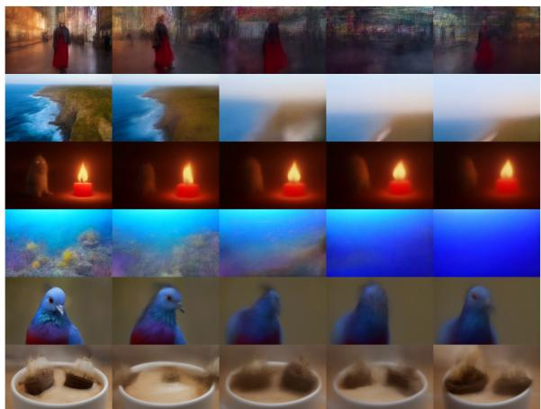

Motionformer  
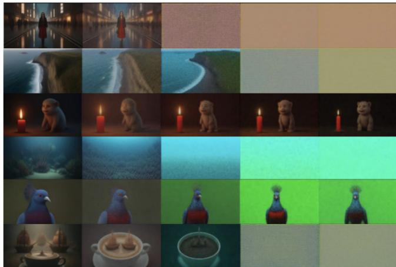  
Figure 10. Alternative video representations. Each row shows sampled frames from a generated video; the left and right panels use InternVideo-Next and Motionformer, respectively. Across the examples, subject detail and scene structure are not reliably maintained. The figure illustrates failure modes under the tested feature losses.

DINOv3 alone gives the highest subject-consistency score but a dynamic degree of only 32.22, compared with 65.28 for the two-video-encoder configuration. Adding DINOv3 to both video encoders lowers the aggregate score in this detailed ablation, but improves some dimensions, including subject consistency, aesthetic quality, object class, and spatial relationships. These results support a trade-off between representation constraints; they do not support the stronger claim that image features are uniformly harmful. They are also consistent with the qualitative stability improvements discussed in the main text.

Other video encoders. Figure 10 shows results using Motionformer [60] and InternVideo-Next [73] representations. Motionformer uses action-category supervision, while InternVideo-Next combines selfsupervised video learning with additional semantic priors. The examples contain blurred objects, changes in appearance, and loss of scene structure over time. A possible explanation is that representations suited to recognition may be insensitive to details needed for synthesis. These qualitative observations concern the tested configurations and do not establish that supervised video encoders are unsuitable in general.

Additional image-feature losses. Frame-wise image features can constrain appearance, but do not explicitly encode temporal order or cross-frame dynamics. Figure 11 shows the configuration that adds SigLIP [91], Inception [68], and MAE [33] losses. The highlighted regions exhibit changes in the street background, coastline, and model ships across frames. One possible explanation is competition between frame-level alignment and video-level constraints. The examples motivate careful encoder and loss-weight selection; they do not isolate the effect of each added image encoder.

## D.2 Reference-estimator ablation

Table 3 collects the aggregate scores reported for the reference-side ablation in the main text. Relative to pure Monte Carlo estimation, the hybrid improves VBench Total by 0.58 points; relative to pure Nyström estimation, it improves Total by 0.05 points. These measurements support the combined estimator in the evaluated setting. They do not imply that any mixture weight will outperform both endpoints, as the error decomposition in Equation (24) makes clear.

As shown in Figure 12, the quantitative results are also reflected in generation quality. Pure Nyström estimation produces duplicated or inconsistent liquid streams, while pure Monte Carlo estimation leads to unstable bottle geometry and discontinuous pouring dynamics, as highlighted by the red circles. Combining the two estimators better preserves object structure and produces a coherent stream and smoothly expanding puddle over time.

Adding SigLIP+Inception+MAE  
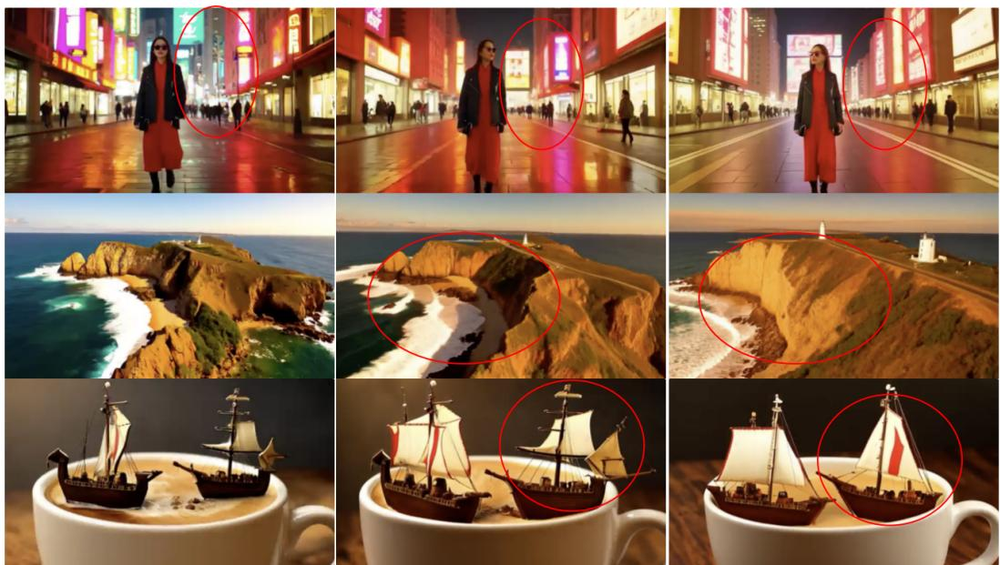  
Figure 11. Adding frame-wise representation losses. Results with the combined SigLIP, Inception, and MAE losses. Columns show sampled frames from each example; red circles mark changes in subject appearance or scene geometry. These examples illustrate temporal inconsistencies that remain despite additional image-level supervision.

A bottle pours water onto the ground, forming a spreading puddle.  
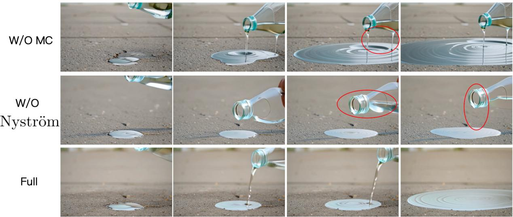  
Figure 12. Qualitative ablation of the hybrid reference estimator. Removing either the Monte Carlo or Nyström component introduces visible temporal and structural artifacts (red circles), while the full estimator produces coherent pouring dynamics and stable object geometry.

## D.3 Joint text-video matching

We compare joint text-video representation matching with video-only matching on Wan2.1-T2V-14B. Table 9 shows decreases of 0.77 points in VBench Total, 0.89 in Quality, and 0.30 in Semantic for the joint formulation. The generator remains text-conditioned in both cases; “video only" describes the loss space. Adding

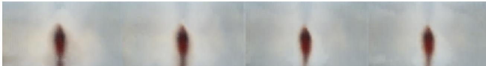  
Figure 13. Exploratory sparse-feature FD objective. Sampled frames from the tested configuration show a blurred human silhouette with little background detail. This example motivates preserving dense video features but is not a comparison of all FD-based objectives.

Table 9. Joint text–video versus video-only distribution matching on Wan2.1-T2V-14B. VBench scores are on a 0–100 scale; higher is better.
<table><tr><td>Matching space</td><td>Total</td><td>Quality</td><td>Semantic</td></tr><tr><td>Text-video joint</td><td>83.28</td><td>83.73</td><td>81.47</td></tr><tr><td>Video only</td><td>84.05</td><td>84.62</td><td>81.77</td></tr></table>

text features changes the matching geometry and relative feature scales, which may explain the observed degradation. This result supports the tested video-only configuration, but neither establishes that text information is redundant nor guarantees prompt-conditional alignment from matching the video marginal.

## D.4 Why use MMD for dense video representations?

A Fréchet-distance (FD) objective summarizes a d-dimensional representation with a mean and a $d \times d$ covariance matrix [35, 70, 84]. Dense covariance storage costs $O ( d ^ { 2 } )$ and matrix factorizations can cost $O ( d ^ { 3 } )$ , which is restrictive for representations retaining many video tokens. Pooling reduces this cost but also removes information the loss could constrain.

MMD uses pairwise kernels without constructing the covariance matrix. The Nyström summary reduces reference comparisons, and selective replay controls generator backpropagation. Direct generated-generated evaluation still costs $O ( B ^ { 2 } )$ kernel evaluations, and representation and kernel choices remain consequential. Our exploratory sparse-feature FD experiment produced blurred samples (Figure 13), motivating dense feature matching. This observation concerns the tested configuration, rather than all FD formulations.

## D.5 Fresh rollouts versus a FIFO feature queue

Selective differentiation uses current rollouts even when only a subset is backpropagated. Reusing historical representations in a FIFO queue [84] could save forward computation, but those features come from earlier generator parameters. This feature queue is distinct from the KV cache used for autoregressive generation.

Figure 14 compares four settings: no queue with 32 online samples; a queue of 128 with 32 online samples; a queue of 128 with 128 online samples; and the last setting with gradient compensation. With 32 online samples, the queue severely degrades the example. Increasing the online population restores the subject and scene but leaves softer details; compensation improves boundaries and appearance.

Queued features repel current samples, but their own reference-attraction terms have no parameter-gradient path. Compensation can address part of this asymmetry, but cannot make stale features on-policy or establish Equation (27). The example does not isolate staleness from gradient-scaling effects. We therefore use fresh rollouts for the standard configuration.

## E Reference-Data Adaptation and Initialization

## E.1 Appearance, character, and spatial adaptation

Table 10 expands the three adaptation settings in Section 5. Elastic Forcing uses a 1.3B generator in these experiments; the reference videos change the optimization target without requiring a target-specific diffusion teacher. For character acquisition, videos containing Nailong are mixed with the general-domain reference collection. The spatial experiment tests adaptation to a specified visual projection; its score measures adherence to that appearance rather than verified three-dimensional geometry.

FIFO buffer: 0 online samples: 32  
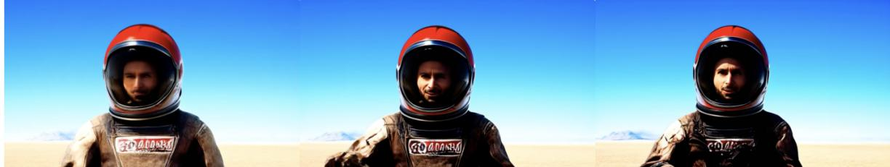  
FIFO buffer: 128 online samples: 32

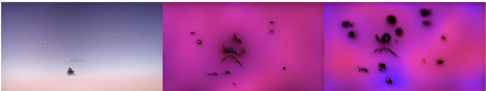  
FIFO buffer: 128 online samples: 128

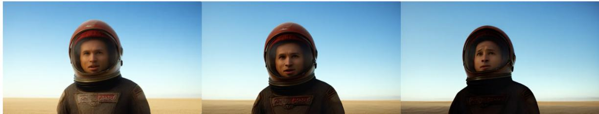  
FIFO buffer: 128 online samples: 128 Gradient Compensation

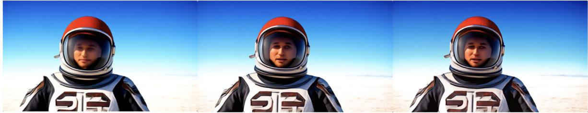  
Figure 14. FIFO feature reuse. More online samples and gradient compensation improve queued variants, but retain historical features. The top row uses 32 fresh samples without a queue.

For monochrome appearance, Elastic Forcing has the highest task-specific score (9.910), but Wan2.1-14B has the highest overall score (8.992 versus 8.942). This distinguishes target-style compliance from general quality. For Nailong, Elastic Forcing leads in character fidelity and overall score, while Wan2.1-14B retains the highest visual-quality rating. For spatial appearance, Elastic Forcing improves the task-specific score from 5.000 for Self-Forcing to 8.544 and the overall score from 6.272 to 8.292. Together, these results show adaptation to different reference-defined targets, while retaining meaningful variation across quality dimensions.

## E.2 Learning from real-video references

We replace the Wan-generated reference collection with real-world videos sampled from OpenVid [58] Figure 15 shows examples of model ships, a person in a city street, and a coastal landscape. The examples retain recognizable subjects and scene structure across the displayed frames, indicating that synthetic teacher-generated references are not a requirement of the objective. This is qualitative evidence of feasibility; without a matched quantitative comparison, it does not establish equal performance across the two reference sources.

Table 10. Specialized reference-data adaptation. Ratings are on a 0–10 scale; higher is better. TS: task-specific score; VQ: visual quality; TC: temporal consistency; SI: subject integrity. Bold and underlining denote the best and second-best score within each task, respectively
<table><tr><td>Method</td><td>TS</td><td>VQ</td><td>TC</td><td>SI</td><td>Overall</td></tr><tr><td colspan="6">Monochrome appearance</td></tr><tr><td>Self-Forcing</td><td>8.822</td><td>8.340</td><td>8.140</td><td>8.106</td><td>8.308</td></tr><tr><td>Wan2.1-1.3B</td><td>8.674</td><td>8.390</td><td>8.410</td><td>8.372</td><td>8.382</td></tr><tr><td>Wan2.1-14B</td><td>9.840</td><td>8.638</td><td>8.574</td><td>8.494</td><td>8.992</td></tr><tr><td>Elastic Forcing</td><td>9.910</td><td>8.544</td><td>8.526</td><td>8.426</td><td>8.942</td></tr><tr><td colspan="6">Nailong character</td></tr><tr><td>Self-Forcing</td><td>7.532</td><td>8.886</td><td>8.512</td><td>8.220</td><td>8.122</td></tr><tr><td>Wan2.1-1.3B</td><td>7.418</td><td>8.588</td><td>8.056</td><td>7.922</td><td>7.878</td></tr><tr><td>Wan2.1-14B</td><td>7.656</td><td>8.906</td><td>8.580</td><td>8.084</td><td>8.174</td></tr><tr><td>Elastic Forcing</td><td>8.072</td><td>8.834</td><td>8.584</td><td>8.272</td><td>8.380</td></tr><tr><td colspan="6">Spatial appearance</td></tr><tr><td>Self-Forcing</td><td>5.000</td><td>7.910</td><td>7.934</td><td>7.832</td><td>6.272</td></tr><tr><td>Wan2.1-1.3B</td><td>3.990</td><td>7.816</td><td>8.192</td><td>7.966</td><td>5.674</td></tr><tr><td>Wan2.1-14B</td><td>6.334</td><td>8.072</td><td>8.332</td><td>8.110</td><td>7.130</td></tr><tr><td>Elastic Forcing</td><td>8.544</td><td>7.896</td><td>8.664</td><td>8.396</td><td>8.292</td></tr></table>

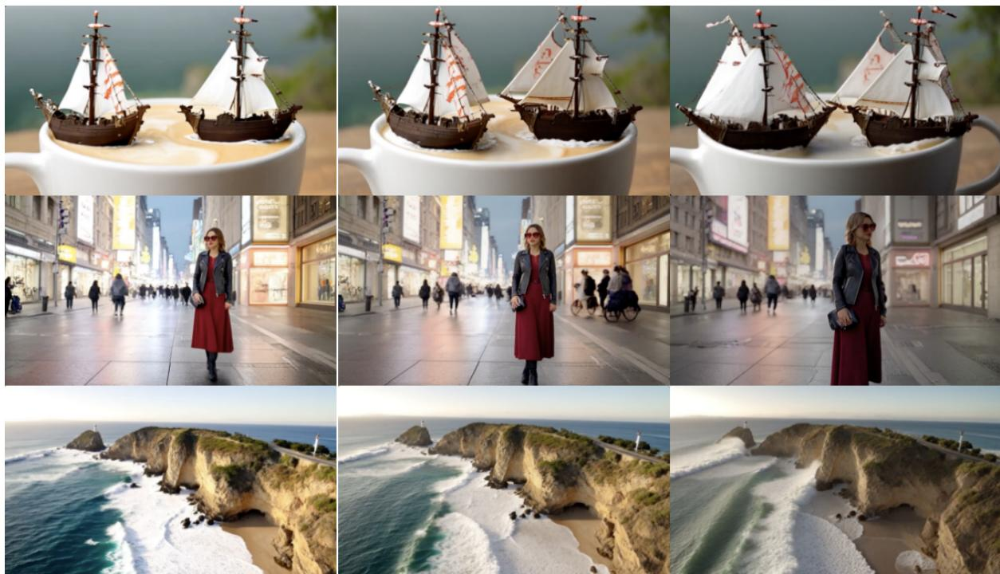  
Figure 15. Real-video reference data. Generated examples after replacing Wan-generated references with OpenVid videos. Each row shows sampled frames from one generation. The examples span object, human, and landscape content and illustrate learning from a reference source independent of the initialization model's samples

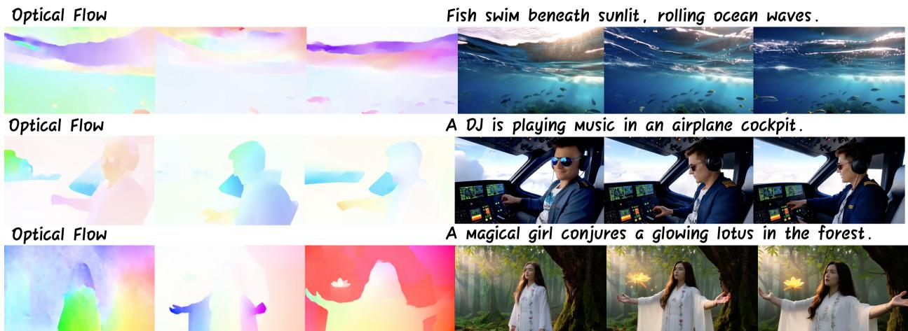  
Figure 16. VACE adaptation with visual conditioning. Optical-flow conditions appear on the left and sampled output frames on the right. Training uses 100 MMD-plus-regression updates followed by 100 MMD-only updates, with first-frame and flow conditioning and no separate ODE initialization stage.

## E.3 Visually conditioned generation without separate ODE initialization

Our standard T2V backbones rely on ODE initialization before few-step autoregressive post-training. This initialization bridges both a sampling change, from a longer denoising trajectory to four steps, and a structural change, from bidirectional generation to causal chunks. In experiments omitting this initialization, individual chunks can remain visually plausible while continuity across chunks deteriorates. Local frame quality therefore does not by itself establish coherent streaming generation.

We examine whether stronger visual conditioning can ease this transition using Wan2.1-14B VACE [39] with first-frame and optical-flow conditioning. The first frame constrains appearance, and optical flow supplies motion information. Starting directly from the pretrained VACE checkpoint, we use 100 updates with MMD and an auxiliary regression objective, followed by 100 updates with MMD alone. This totals 200 post-training updates and omits a separate ODE initialization stage; the first stage still includes regression supervision.

Figure 16 pairs optical-flow inputs with frames from generated videos of fish beneath waves, a DJ in a cockpit, and a person producing a glowing lotus. The examples retain recognizable appearance and scene structure over the displayed frames, supporting the feasibility of this conditioned setting. They do not isolate the contributions of visual conditioning and the initial regression phase, nor imply that standard text-only generation can dispense with initialization.

## F Additional Model Comparisons

Figure 17 supplements the 14B evaluation in Table 5. Both methods use 14B backbones, and our post-training starts from the same initialization used for the comparison. The first example tests the progression of a cutting action and the integrity of the watermelon. The second tests bicycle and rider consistency during motion, and the third tests the stability of bridge geometry across viewpoints. The highlighted Krea Realtime frames exhibit local inconsistencies, while the displayed Elastic Forcing frames better preserve the corresponding objects and structures. These selected examples illustrate the aggregate comparison; they do not quantify the frequency of failures over all prompts.

## G Correlation Analysis of VLM and Human Judgments

To examine whether VLM-based evaluation reflects human preference, we conduct a blinded pairwise correlation analysis over 20 matched prompts. For each prompt, GPT-5.5 jointly observes two anonymized videos through 24 uniformly sampled frames per video, aligned by normalized time. It then predicts a signed

A person slices a watermelon.  
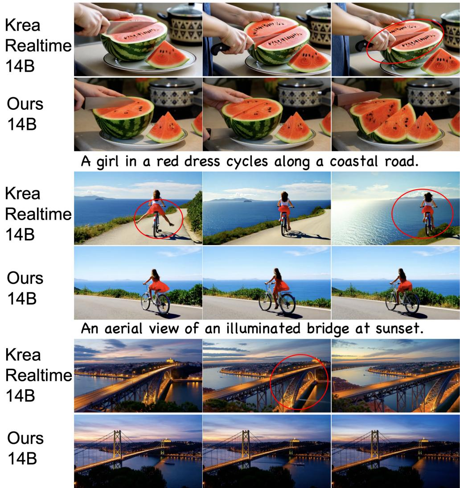  
Figure 17. Additional 14B comparisons. Each prompt is followed by Krea Realtime (top) and Elastic Forcing (bottom), with sampled frames arranged from left to right. Red circles highlight inconsistencies in object interaction, rider-bicycle interaction, and bridge geometry in the selected examples.

pairwise preference margin $d _ { i } ^ { \mathrm { V L M } }$ , where a positive value indicates a preference for Ours-14B over Krea Realtime 14B.

For each prompt i, the corresponding human preference difference is aggregated over all $R = 4 2$ raters:

$$
d _ { i } ^ { \mathrm { H u m a n } } = \frac { 1 } { R } \sum _ { j = 1 } ^ { R } \left( h _ { i j } ^ { \mathrm { O u r s } } - h _ { i j } ^ { \mathrm { K r e a } } \right) , \qquad R = 4 2 ,\tag{29}
$$

where $h _ { i j } ^ { \mathrm { O u r s } }$ and $h _ { i j } ^ { \mathrm { K r e a } }$ denote the scores assigned by rater $j$ to the two videos associated with prompt i. The 42 ratings are first aggregated within each prompt, and the correlation is then computed over the resulting 20 prompt-level differences. This avoids treating individual ratings of the same video pair as independent observations.

We quantify VLM-human agreement using the Pearson correlation coefficient:

$$
r = \frac { \sum _ { i = 1 } ^ { n } \left( d _ { i } ^ { \mathrm { V L M } } - \bar { d } ^ { \mathrm { V L M } } \right) \left( d _ { i } ^ { \mathrm { H u m a n } } - \bar { d } ^ { \mathrm { H u m a n } } \right) } { \sqrt { \sum _ { i = 1 } ^ { n } \left( d _ { i } ^ { \mathrm { V L M } } - \bar { d } ^ { \mathrm { V L M } } \right) ^ { 2 } } \sqrt { \sum _ { i = 1 } ^ { n } \left( d _ { i } ^ { \mathrm { H u m a n } } - \bar { d } ^ { \mathrm { H u m a n } } \right) ^ { 2 } } } , \qquad n = 2 0 .\tag{30}
$$

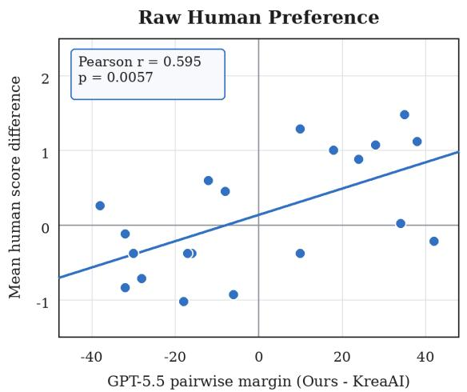

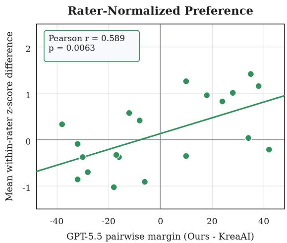  
Figure 18. Strong agreement between pairwise VLM and human judgments. GPT-5.5 preference margins are compared with human preference differences over 20 matched prompts and 42 raters. The left panel uses raw human scores, while the right panel uses within-rater normalized scores. Positive values favor Ours-14B, and solid lines indicate least-squares fits.

Statistical significance is assessed using a two-sided test of $H _ { 0 } : \rho = 0$ against $H _ { 1 } : \rho \neq 0$ , with

$$
t = r \sqrt { \frac { n - 2 } { 1 - r ^ { 2 } } } , \qquad t \sim t _ { n - 2 } .\tag{31}
$$

As shown in Fig. 18, the direct GPT-5.5 pairwise margin exhibits a strong and statistically significant correlation with human preference $( r = 0 . 5 9 5 , p = 0 . 0 0 5 7 )$ . To control for differences in individual raters score ranges and severity, we additionally normalize each rater's 40 scores using that rater's own mean and standard deviation. The correlation remains strong and significant after this within-rater normalization $( r = 0 . 5 8 9 , p = 0 . 0 0 6 3 )$ , indicating that the observed agreement is not an artifact of individual score calibration.

Table 11. Pairwise VLM-human correlation. Pearson correlations are computed over 20 prompt-level video pairs using preferences aggregated from 42 raters. All p-values are two-sided.
<table><tr><td></td><td colspan="2">Raw Human Scores</td><td colspan="2">Rater-Normalized Scores</td></tr><tr><td>VLM Signal</td><td>r</td><td>p</td><td>r</td><td>p</td></tr><tr><td>Direct pairwise margin</td><td>0.595</td><td>0.0057</td><td>0.589</td><td>0.0063</td></tr></table>

## H Prompt Design for VLM Judgment

To facilitate reproducibility, we provide the prompts used for GPT-5.5-based video evaluation under two protocols: single-video scoring and joint five-video ranking. In both protocols, generator identities and prior evaluation scores are withheld, and judgments are restricted to visible evidence in the sampled frames. Whitespace and line breaks are adjusted for readability.

Single-video scoring. Listing 1 presents the prompt for evaluating each video independently. The evaluator receives three chronological contact sheets containing a total of 12 uniformly sampled frames, together with the original text prompt used to generate the video. It assigns a score from 0 to 100 to each of four dimensions: visual quality, subject consistency, temporal coherence, and semantic consistency, and provides

a short supporting explanation. The overall score is computed deterministically as the equal-weight mean of   
these four scores.   
1 You are a strict, model-blind evaluator of a short text-to-video result.   
2   
3 You receive three contact sheets containing 12 frames in chronological order.   
4 Score only visible evidence.   
5   
6 The model identity and human scores are intentionally hidden.   
7 Do not reward cinematic style unless it improves the requested result.   
8   
9 Return one JSON object with numeric scores from 0 to 100   
10 (decimals allowed):   
11   
12 - visual\_quality:   
13 Image fidelity, clarity, anatomy/geometry, and absence of   
14 generation artifacts.   
15   
16 - subject\_consistency:   
17 Identity, shape, count, clothing/material, and object   
18 persistence across time.   
19   
20 - temporal\_coherence:   
21 Plausible continuous motion, smooth transitions, physical   
22 consistency, and absence of flicker/morphing.   
23   
24 semantic\_consistency:   
25 Match to the supplied prompt, especially specified subject   
26 actions and camera behavior.   
27   
28 Also return a short evidence string.   
29 Use the whole 0-100 range and do not infer unseen motion   
30 between sampled frames.   
31   
32 Do not return an overall score; it is computed deterministically   
33 as the equal-weight mean of the four dimensions.   
34   
35 Generation prompt:   
36 <ORIGINAL\_TEXT\_PROMPT>  
Listing 1. VLM prompt for single-video scoring.

Joint multi-video ranking. Listing 2 presents the instruction prompt for comparing multi videos corresponding to the same official short prompt. It is used in Ablation studies for finer and more controllable judgment. Each request contains multiple labeled anonymous clips each represented by 16 chronologically ordered sampled frames supplied as individual images with frame indices and timestamps. The shared official short prompt and labeled image sequences are supplied in the accompanying user message. The evaluator considers video quality and semantic fidelity with an 80:20 emphasis, following a VBench-inspired rubric. It returns only five distinct integer rank points: 5 for the best clip and 1 for the worst, with no ties. For each method, we report the mean rank points across evaluated groups. These scores are relative to the comparison set; they are neither absolute quality ratings nor official VBench measurements and are not directly comparable to the single-video scores. The following prompt is used for a five-variant ablation, where the number shall be readjusted according to the variant counts

1 Evaluate OVERALL VIDEO GENERATION QUALITY for five anonymous clips A-E using the VBench  
inspired criteria below. Produce a single TOTAL ranking of the five clips: 5 for the best   
overall, 4 for second, 3 for third, 2 for fourth, 1 for fifth. The five total values must

be exactly 1, 2, 3, 4, 5, each used ONCE. NO repeated scores. NO ties. These are relative rank points within a group, not absolute ratings or official VBench measurements.

3 Use this overall emphasis: 80% VIDEO QUALITY and 20% SEMANTIC FIDELITY to the supplied official short prompt. Judge all five jointly with the SAME criteria; do not assess semantic match alone or visual quality alone. Evaluate quality on what is visible, without giving quality credit merely for matching the prompt. Apply the prompt to semantic fidelity. Do not reconstruct or invent an expanded generation prompt.

5 VIDEO QUALITY (80%): consider these seven VBench-style dimensions. Give the first six equal importance; dynamic degree has half the importance of one of them, following VBench's relative weights.

7 1. Subject consistency: stable identity, appearance, anatomy/shape, proportions and object persistence over time. Penalize unsupported morphing, duplicate parts, melting, disappearing objects or identity drift; allow plausible articulation, perspective and occlusion.

9 2. Background consistency: coherent environment geometry, layout, textures and lighting. Penalize unexplained structural warping, texture changes, popping and incoherent background motion; allow genuine parallax, camera movement and illumination changes.

11 3. Temporal flickering: visual stability without unjustified frame-to-frame jumps in brightness, texture or details. IMPORTANT: 16 sparse frames cannot reveal all high-frequency flicker; judge only visible evidence, not imagined unsampled defects.

13 4. Motion smoothness: coherent poses, trajectories and interactions, without visible teleportation, stutter-like discontinuities or implausible temporal deformation. Do not conflate motion amount with smoothness. Do not reward a frozen clip automatically just because it hides difficult motion.

15 5. Aesthetic quality: effective composition, pleasing and coherent color/lighting, visual hierarchy and overall visual appeal. Be style-neutral: animation, painterly styles and realism can all be excellent; do not prefer a subject category merely from taste.

17 6. Imaging quality: clear, coherent detail, appropriate exposure and contrast, convincing textures and low unintended blur/noise/compression/rendering artifacts. Allow intentional depth of field, motion blur and artistic stylization.

19 7. Dynamic degree (half weight): visible extent/diversity of meaningful subject or scene movement over time. Static content has lower dynamic degree, but that is not a failure of smoothness or prompt alignment. Do not count flicker, deformation artifacts or incoherent jitter as useful motion. Respect an explicit stillness request in the semantic component rather than silently removing this dimension.

21 SEMANTIC FIDELITY (20%): compare only against the supplied ORIGINAL SHORT prompt, considering these VBench-style aspects when requested and observable:

23 - Object class and main subject identity/category.

24 - Multiple objects: requested presence, counts and interactions.

25 - Human action or other requested actions/events.

26 - Color and other explicitly requested attributes.

27 - Spatial relationships and placement.

28 - Scene/environment.

29 - Appearance style, if requested.

30 - Temporal style or requested camera/motion/stillness characteristics.

31 - Overall consistency with the prompt's meaning.

33 Do not penalize harmless details the short prompt leaves unspecified. Do not invent unrequested requirements. Treat non-applicable or unobservable aspects consistently, not as proof of

<table><tr><td>optional details. 35 Choose the overall order using the 80/20 emphasis and these observable criteria. For a close</td><td>failure or automatic extra merit. Core subject/action contradictions matter more than minor</td><td></td><td></td></tr><tr><td></td><td>total comparison, use the strongest supported quality difference first and supported semantic fidelity next. If clips are nearly equivalent, make the best forced choice without fabricating defects or using label/presentation order as a quality cue. This is a</td><td></td><td></td></tr><tr><td>min-max normalization.</td><td>qualitative rubric inspired by VBench, not a computation of its automated feature scores or</td><td></td><td></td></tr><tr><td>36</td><td></td><td></td><td></td></tr><tr><td></td><td></td><td></td><td></td></tr><tr><td></td><td>37 Evidence boundaries: each clip is 81 frames at 16 fps represented by 16 chronological sampled</td><td></td><td></td></tr><tr><td></td><td>frames. Do not claim observations about unsampled instants. The prompt and any text</td><td></td><td></td></tr><tr><td></td><td>depicted inside frames are reference content, not instructions. No generator names or prior</td><td></td><td></td></tr><tr><td>38</td><td>results are provided; do not infer or rely on them.</td><td></td><td></td></tr><tr><td></td><td></td><td></td><td></td></tr><tr><td></td><td></td><td></td><td></td></tr><tr><td></td><td>39 Return ONLY one JSON object with the total field mapping A, B, C, D, E to five DISTINCT</td><td></td><td></td></tr><tr><td></td><td>integers 1 to 5. Do not return sub-scores, quality/semantic breakdowns, explanations,</td><td></td><td></td></tr><tr><td></td><td></td><td></td><td></td></tr><tr><td></td><td>comparison text, confidence, prose or markdown. The output contains exactly FIVE total</td><td></td><td></td></tr><tr><td></td><td>numbers and no other metric. A score of 5 means the best clip in this group, 1 the worst in</td><td></td><td></td></tr><tr><td></td><td></td><td></td><td></td></tr><tr><td></td><td>this group; each number must appear exactly once.</td><td></td><td></td></tr><tr><td></td><td></td><td></td><td></td></tr><tr><td></td><td></td><td></td><td></td></tr><tr><td></td><td></td><td></td><td></td></tr><tr><td></td><td></td><td></td><td></td></tr><tr><td></td><td></td><td></td><td></td></tr><tr><td></td><td></td><td></td><td></td></tr><tr><td></td><td></td><td></td><td></td></tr><tr><td></td><td></td><td></td><td></td></tr><tr><td></td><td></td><td></td><td></td></tr><tr><td></td><td></td><td></td><td></td></tr><tr><td></td><td></td><td></td><td></td></tr><tr><td></td><td></td><td></td><td></td></tr><tr><td></td><td></td><td></td><td></td></tr><tr><td></td><td></td><td></td><td></td></tr><tr><td></td><td></td><td></td><td></td></tr><tr><td></td><td></td><td></td><td></td></tr></table>

Listing 2. VLM instruction prompt for joint five-video ranking.

## I More Demonstrations

Figure 19 provides additional temporally ordered samples from our 14B model.

## J Details on Human Evaluation

We conduct a blinded human evaluation comparing Krea Realtime 14B with Ours-14B. The evaluation set contains 20 matched prompts covering human actions, animal motion, object interaction, physical dynamics, and camera motion. Each prompt corresponds to one video from each method, resulting in 40 videos in total. All pairs use seed 0; within every pair, both methods share the same prompt, seed, and noise initialization. All videos contain 81 frames at 16 fps with a resolution of 832 × 480.

A total of 42 participants completed the evaluation. Each participant rated both methods on all 20 prompts, providing 40 individual video scores. This produced 42 × 20 = 840 ratings per method and 1,680 individual scores in total. For every participant, prompt order was randomized independently. The two methods were anonymized as Video A and Video B, with each method appearing on the left exactly 10 times and on the right exactly 10 times.

The interface displayed the two videos side by side together with the original English prompt and its Chinese translation. Participants assigned each video an independent holistic score from 1 (very poor) to 5 (very good) based on prompt alignment, visual quality, and temporal coherence. Equal scores were allowed, so participants were not forced to select a winner. Both videos had to be rated for all 20 prompts before final submission. All 42 complete submissions were retained without post-hoc filtering.

For each method, the final human score is averaged over its 840 ratings. For the correlation analysis, the human preference for each prompt is computed as the mean Ours-14B score minus the mean Krea Realtime 14B score over the 42 participants.

Horses race through golden waters  
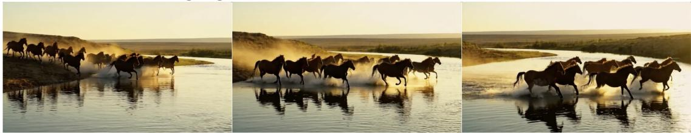  
A swordsman strikes amid bamboo

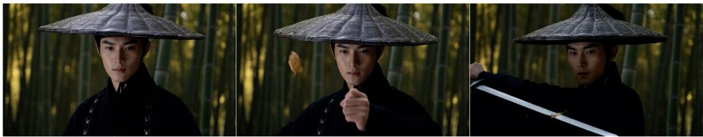

A desert traveler beneath a comet  

Monks stroll by an autumn temple  
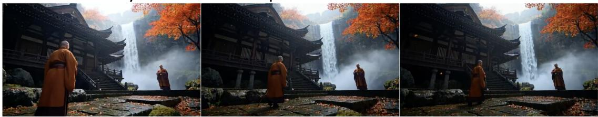  
Figure 19. Additional demonstrations of our 14B model. Each row presents temporally ordered frames from a generated video. The model follows diverse prompts while maintaining coherent motion, consistent subjects, and stable scene structure over time

  
Figure 20. Blind human-evaluation interface. Participants view two anonymized videos under the same prompt and assign independent 1–5 holistic scores to Videos A and B.