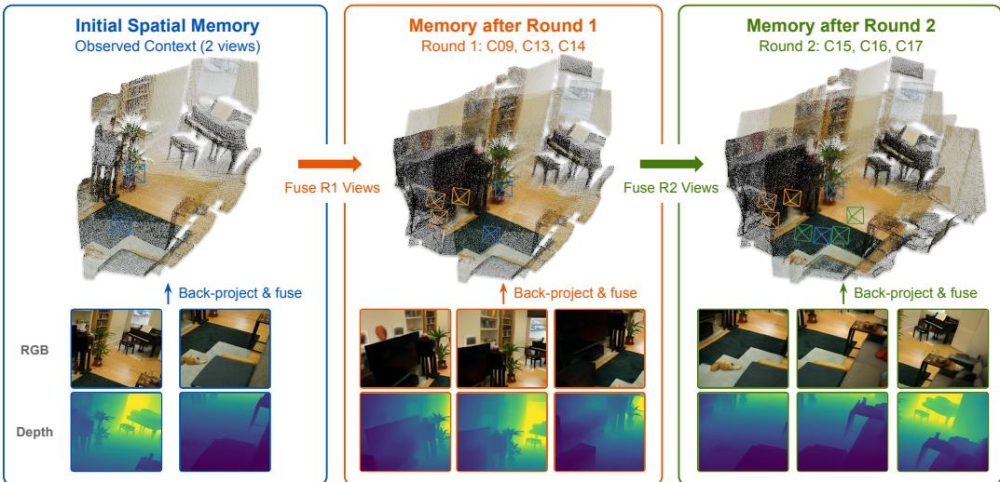
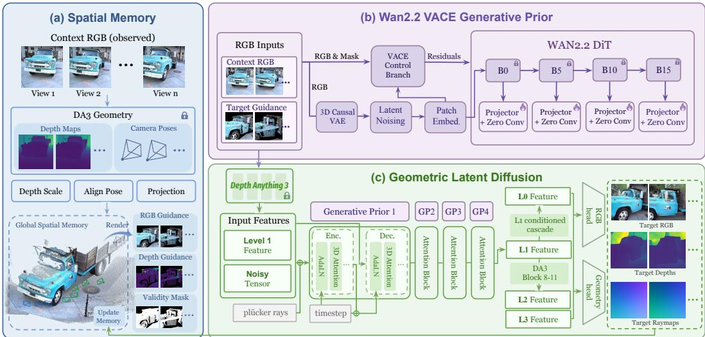
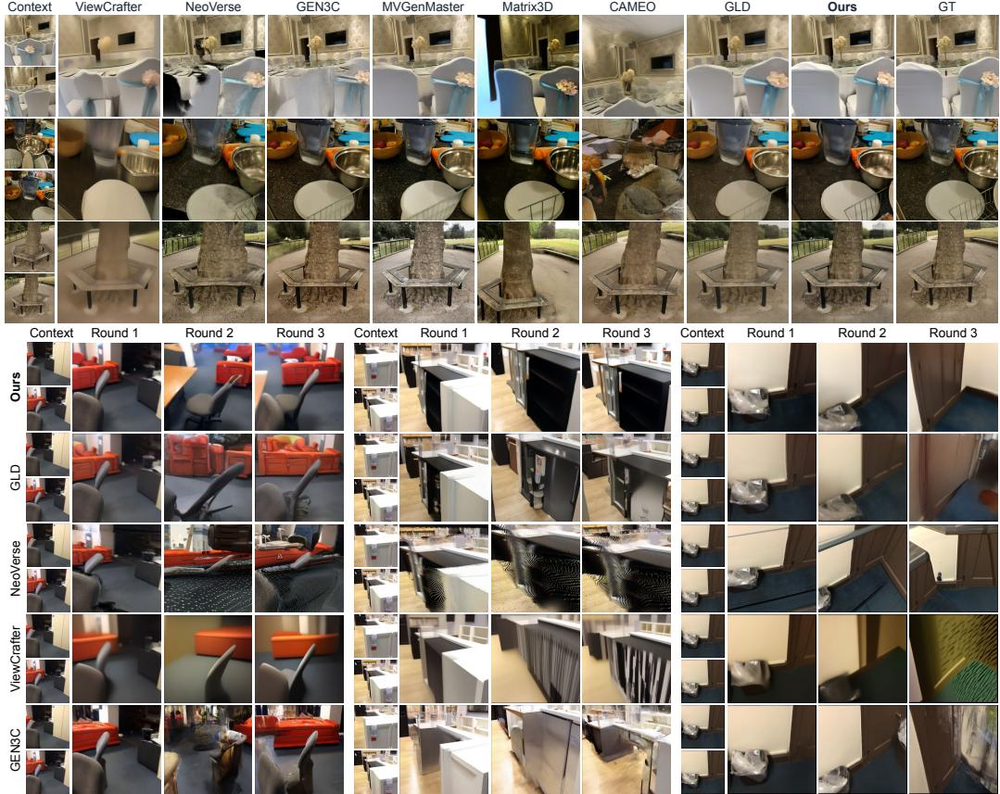
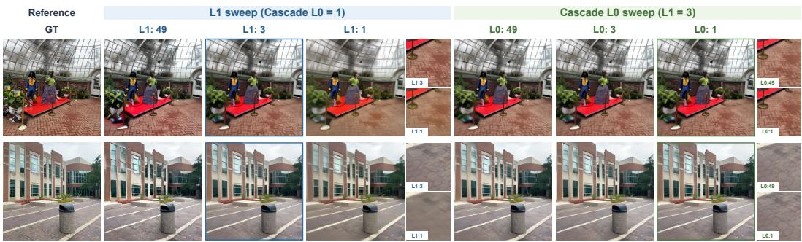
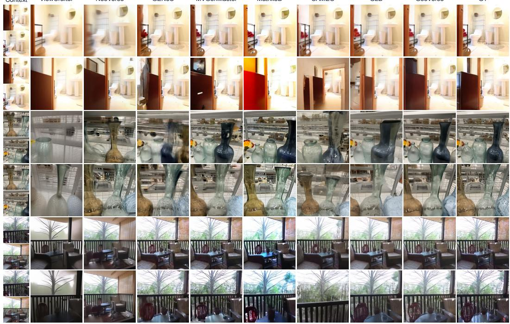
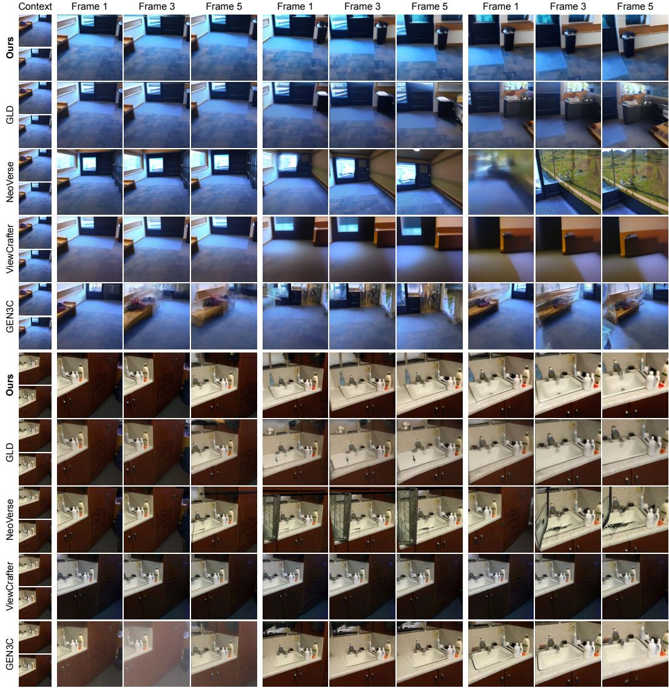

# GEOVERSE: WORLD-CONSISTENT NOVEL VIEW SYNTHESIS IN GEOMETRIC LATENT SPACE

Kerui Ren1,2 Tao Lu2 Linning Xu3 Changjian Jiang4 Hunag Mu5 Chunhua Shen6,2 Mulin Yu2† Bo Dai4†

1Shanghai Jiao Tong University, 2Shanghai Artificial Intelligence Laboratory,

3The Chinese University of Hong Kong, 4The University of Hong Kong,

5Fudan University, 6Zhejiang University

  
Figure 1: GeoVerse enables long-sequence novel view synthesis by iteratively integrating generated observations into a persistent spatial memory, which in turn guides subsequent view synthesis. Project page: https://geoverse-nvs.github.io/.

## ABSTRACT

Novel view synthesis from sparse images must reconcile faithful reconstruction of observed regions with plausible completion of unseen content, while maintaining world consistency across viewpoints. Existing geometry-based methods preserve observed scene structure but often struggle to complete unseen regions, whereas video generative models offer rich appearance priors but accumulate inconsistencies during sequential view generation. We propose GeoVerse, a framework that synthesizes world-consistent novel views by performing generation within the geometric latent space of a pretrained 3D foundation model and injecting appearance priors from a video generative model. Specifically, GeoVerse extracts multilevel features from Wan2.2 VACE and injects them into the geometric latent diffusion model via a ControlNet-style adapter, incorporating video-learned appearance priors to enhance structural completion. To enforce cross-view coherence, a global spatial memory continuously aggregates observed and synthesized content, reprojecting target-aligned guidance to anchor subsequent predictions to a shared scene representation. Extensive experiments across diverse datasets demonstrate improved visual quality and geometric consistency, with a 2.23 dB higher PSNR on DL3DV and 32.4% lower ATE on Mip-NeRF360 compared to GLD.

## 1 INTRODUCTION

Novel View Synthesis (NVS) is a cornerstone task in 3D computer vision that aims to render photorealistic images from specified, previously unseen target viewpoints given one or more reference images (Mildenhall et al., 2021; Yu et al., 2024a). A fundamental challenge in NVS lies in balancing reconstruction fidelity during view interpolation with generative capability during view extrapolation, faithfully aggregating observed scene content while plausibly completing unobserved regions. To bridge faithful reconstruction with generative completion, maintaining a unified geometric representation is crucial for ensuring spatial and semantic coherence across shifting viewpoints.

Early NVS frameworks were predominantly constrained to per-scene optimization, with pioneering paradigms like Neural Radiance Fields (NeRF) (Mildenhall et al., 2021) and 3D Gaussian Splatting (3DGS) (Kerbl et al., 2023) fitting scene-specific representations on dense captures. To bypass scene-specific training bottlenecks, recent generalizable architectures leverage scaled data to predict Gaussian primitives directly from sparse views in a feed-forward manner (Chen et al., 2024; Jiang et al., 2025a). Spurred by 3D foundation models (Wang et al., 2024; 2025a), these feed-forward methods achieve rapid feed-forward reconstruction with strong geometry grounding (Jiang et al., 2025a; Liu et al., 2025). However, bound by deterministic geometric formulations, pure reconstruction frameworks inherently lack generative imagination, frequently producing severe visual artifacts, blurriness, or hollow voids when synthesizing unobserved regions under large camera motions.

To compensate for the limited extrapolation capability of reconstruction methods, video diffusion models have recently been repurposed for view synthesis (Yu et al., 2024a), leveraging rich appearance priors learned from vast video corpora (Wan et al., 2025). Despite their expressive completion, applying video models directly or sequentially to 3D scenes often accumulates cross-frame inconsistencies, causing drift and structural breakdown over long horizons (Wu et al., 2026; Wang et al., 2026). To enforce spatial consistency, hybrid frameworks align video diffusion features with 3D representations (Wu et al., 2025; Huang et al., 2026), yet they remain burdened by the heavy computational overhead of synthesizing dense video frames. More recently, Geometry Latent Diffusion (GLD) (Jang et al., 2026) has emerged as a promising alternative that generates novel views directly within a geometric latent space. Built upon 3D foundation models such as DA3 (Lin et al., 2025), which is pretrained on large-scale data with depth and camera-pose supervision to learn cross-view attention, this space provides a robust structural foundation and a geometric prior for single-pass consistency. Furthermore, GLD’s RGB head effectively decodes fine texture and appearance details from these features (Jang et al., 2026). However, restricted by a limited training distribution, GLD struggles with generative fidelity and stability on in-the-wild scenes.

In summary, existing NVS approaches struggle to seamlessly harmonize rigid 3D geometric consistency with expressively detailed generative completion. To bridge this gap, we present Geo-Verse, a novel framework that endows geometric latent diffusion with rich video generative priors while maintaining structural consistency via a persistent spatial memory. We address these limitations through three key designs. First, we incorporate Wan2.2 VACE (Wan et al., 2025; Jiang et al., 2025b), a high-capacity video diffusion model pretrained on extensive video data, to enrich the geometric latent space with powerful appearance priors and plausible scene completion. Second, we scale the 3D training corpus from 4 to 15 diverse real and synthetic datasets to broaden scene coverage and enhance cross-domain generalization. Beyond single-pass consistency, successive view expansion requires a persistent representation across multiple inference steps. Inspired by ViewCrafter (Yu et al., 2024a), we maintain a global colored point-cloud memory that accumulates historical content. Reprojecting this memory into target views provides pixel-aligned guidance, anchoring multi-step predictions while facilitating unobserved region completion. Leveraging this structured guidance, we employ reflow distillation (Yan et al., 2024) to reduce the denoising process to 4 steps, cutting per-inference latency from over 100 seconds to under 10 seconds.

Our primary contributions are summarized as follows:

• We introduce a novel framework that seamlessly bridges geometric latent diffusion with expressive video generative priors for world-consistent novel view synthesis.

• We propose a global spatial memory mechanism that provides target-aligned input guidance, effectively enforcing sustained long-sequence geometric consistency across extended trajectories without cumulative drift.

• We scale up model training across diverse real and synthetic multi-view corpora to significantly enhance cross-domain generalization and integrate a few-step reflow distillation scheme to significantly accelerate inference to under 10 seconds.

## 2 RELATED WORK

## 2.1 RECONSTRUCTIVE NOVEL VIEW SYNTHESIS

Focusing on fusing existing scene content within captured view bounds, reconstructive novel view synthesis was initially dominated by scene-specific optimization. Pioneered by NeRF (Mildenhall et al., 2021), implicit radiance fields achieved novel view rendering through differentiable volume rendering, which was later accelerated and scaled by subsequent variants (Barron et al., 2021; Muller¨ et al., 2022). To overcome the implicit rendering bottleneck, 3DGS (Kerbl et al., 2023) introduced explicit 3D Gaussian primitives for real-time synthesis, followed by improvements in anti-aliasing and geometry modeling (Yu et al., 2024b; Lu et al., 2024; Ren et al., 2024). While capable of rendering high-fidelity views, these per-scene representations suffer from long optimization times and strictly require dense multi-view coverage. To bypass per-scene optimization, feed-forward frameworks learn generalizable mappings from sparse inputs to novel target views. Early generalizable architectures like MVSplat (Chen et al., 2024) leverage plane-sweep cost volumes for 3D Gaussian prediction, while LVSM (Jin et al., 2024) scales transformer-based synthesis with minimal explicit geometric priors. Accelerated by 3D foundation models like VGGT (Wang et al., 2025a), recent frameworks seamlessly unify camera estimation and feed-forward reconstruction. Specifically, AnySplat (Jiang et al., 2025a) jointly recovers camera poses and 3D Gaussians from unconstrained views, whereas WorldMirror (Liu et al., 2025) incorporates multi-source geometric priors. In the monocular regime, SHARP (Mescheder et al., 2026) regresses a metric 3D Gaussian field from a single image in one forward pass. Although feed-forward methods excel at interpolative synthesis within bounded views, extrapolating to unobserved regions remains inherently ambiguous.

## 2.2 GENERATIVE NOVEL VIEW SYNTHESIS

Generative novel view synthesis introduces generative priors to synthesize content beyond the observed scene coverage. ViewCrafter combines point-based 3D clues with a pretrained video diffusion model and iteratively expands both its camera trajectory and reconstructed content (Yu et al., 2024a). NeoVerse couples feed-forward 4D reconstruction with novel-trajectory video generation to model scenes from in-the-wild monocular videos (Yang et al., 2026). To reduce drift over longer horizons, spatial-memory approaches explicitly store and retrieve previously generated scene content: geometry-grounded long-term memory caches 3D history, while Mirage lifts diffusion latents into a persistent 3D cache and queries it through latent-space warping (Wu et al., 2026; Wang et al., 2026). Lyra 2.0 combines per frame geometric matching for history retrieval with self augmented history training to suppress cumulative drift during long sequence generation (Shen et al., 2026). These methods improve long-horizon consistency while retaining a video-based generation pipeline.

Geometric foundation models offer a complementary route to geometry-aware extrapolation. Geometry Forcing supervises intermediate video-diffusion representations with features from a geometric foundation model, while Gen3R adapts VGGT tokens into geometric latents and aligns them with pretrained video appearance latents for joint RGB and 3D generation (Wu et al., 2025; Huang et al., 2026). Although these methods improve the 3D awareness of video diffusion, their generation process remains organized as a video sequence. Geometric Latent Diffusion (GLD) instead repurposes the geometric feature space of DA3 as the native latent space for multi-view diffusion, enabling di rect generation at specified target cameras with strong cross-view correspondence (Lin et al., 2025; Jang et al., 2026). Unlike prior sequence-based approaches, GeoVerse adopts the geometric-latent formulation, augmented by video generative priors and a persistent 3D memory, enabling direct target-view synthesis free of dense video interpolation.

## 3 METHOD

Fig. 2 illustrates the overall pipeline of GeoVerse, a framework that integrates geometric latent diffusion with video generative priors and a global spatial memory for world-consistent novel view synthesis. Let C and $\tau$ denote the context and target view sets, with sizes $N _ { \mathcal { C } }$ and $N _ { \mathcal { T } }$ , respectively. Given context images $\mathbf { I } _ { \mathcal { C } }$ and target-aligned guidance $\mathbf { I } _ { \mathcal { T } } ^ { \mathrm { p r o j } }$ , GeoVerse predicts target RGB images $\hat { \mathbf { I } _ { T } }$ and geometry $\hat { \mathbf { G } _ { T } } = \{ \hat { \mathbf { D } _ { T } } , \hat { \mathbf { R } _ { T } } \}$ , comprising depth and raymaps, and then updates the spatial memory M. Specifically, Sec. 3.1 details the integration of geometric latent diffusion with video generative priors, Sec. 3.2 describes the spatial-memory aggregation and target-aligned projection, and Sec. 3.3 outlines the model distillation strategy for efficient inference.

  
Figure 2: Overview of GeoVerse. Context observations initialize a global spatial memory that provides target-aligned RGB-D hints. Guided by the hints and Wan2.2 VACE features injected through a ControlNet-style adapter, geometric latent diffusion synthesizes target views in four denoising updates. The decoded RGB and geometry update the memory for subsequent view expansion.

## 3.1 ENHANCING GEOMETRIC LATENT DIFFUSION WITH VIDEO PRIORS

Geometry Latent Space. Standard image-video latent spaces provide robust appearance priors but struggle to maintain explicit 3D correspondence across novel viewpoints (Rombach et al., 2022). In contrast, GLD combines the geometry head of Depth Anything 3 (Lin et al., 2025) for spatial layouts (depth and raymaps) with an auxiliary RGB head for high-frequency textures (Jang et al., 2026). Following GLD (Jang et al., 2026), we perform diffusion generation directly within the multi-level geometric latent space $\mathcal { F } = \{ \mathbf { F } ^ { i } \} _ { i = 0 } ^ { 3 }$ of a frozen DA3 encoder, where feature levels correspond to Transformer blocks $( b _ { 0 } , b _ { 1 } , \dot { b } _ { 2 } , \dot { b } _ { 3 } ) \stackrel {  } { = } ( 5 , 7 , 9 , 1 1 )$ , and designate Level-1 as the synthesis boundary to balance geometric accuracy and visual fidelity. Unlike GLD’s zero-padding target conditions, GeoVerse constructs the input sequence $\overline { { \mathbf { I } } } = [ \mathbf { I } _ { \mathcal { C } } , \mathbf { I } _ { \mathcal { T } } ^ { \mathrm { p r o j } } ]$ by merging context images with spatial memory projections, which are then processed by the frozen DA3 encoder up to the synthesis boundary:

$$
\overline { { \mathbf { F } } } = \mathbf { V } ^ { b _ { 1 } } \odot \mathcal { E } _ { \mathrm { g e o } } ^ { 1 : b _ { 1 } } ( \overline { { \mathbf { I } } } ) ,\tag{1}
$$

where $\mathcal { E } _ { \mathrm { g e o } } ^ { 1 : b _ { 1 } }$ encodes up to block $b _ { 1 }$ , and $\mathbf { V } ^ { b _ { 1 } }$ is the validity mask aligned to its feature resolution.

Let $\mathbf { F } ^ { 1 }$ denote the clean Level 1 features of the ground-truth multi-view images. Given Gaussian noise $\epsilon \sim \mathcal { N } ( \mathbf { 0 } , \mathbf { I } )$ and $t \sim \mathcal { U } ( 0 , 1 )$ , our multi-view flow-matching model (Lipman et al., 2023) adopts the linear probability path ${ \bf X } _ { t } = ( 1 - t ) { \bf F } ^ { 1 } + t \epsilon$ with target velocity $\bar { \mathbf { u } _ { t } } = \boldsymbol { \epsilon } - \mathbf { F } ^ { 1 }$ . The denoiser jointly predicts the velocity of all view tokens via:

$$
\begin{array} { r } { \hat { \mathbf { u } } _ { t } = v _ { \theta } \left( { \bf X } _ { t } , t ; \overline { { \mathbf { F } } } , { \bf \Phi } , { \bf F } ^ { \mathrm { W } } , { \bf D } ^ { \mathrm { p r o j } } , { \bf V } \right) , } \end{array}\tag{2}
$$

where Γ denotes camera Plucker-ray embeddings,¨ $\mathbf { F } ^ { \mathrm { W } }$ represents Wan2.2 features, and $\mathbf { D } ^ { \mathrm { p r o j } }$ and $\mathbf { V } = \left[ \mathbf { 1 } _ { \mathcal { C } } , \mathbf { V } _ { \mathcal { T } } \right]$ refer to projected depth guidance and its validity mask. Under these fixed conditions, we integrate the predicted velocity field from $t = 1 \mathrm { t o } t = 0$ to transform Gaussian noise into the Level-1 features $\hat { \mathbf { F } } ^ { 1 }$ . These features then drive a conditional cascade, alongside context features and camera embeddings, to synthesize the Level-0 features $\hat { \mathbf { F } } ^ { 0 }$ :

$$
\hat { \mathbf { F } ^ { 0 } } = { \cal S } _ { \phi } ( \epsilon \mid \hat { \mathbf { F } ^ { 1 } } , \mathbf { F } _ { \mathcal { C } } ^ { 0 } , \mathbf { T } ) ,\tag{3}
$$

where $\mathcal { S } _ { \phi }$ denotes the cascade sampler initialized from Gaussian noise ϵ. Subsequently, the remaining frozen DA3 blocks forward-process $\hat { \mathbf { F } } ^ { 1 }$ to compute $( \hat { \mathbf { F } ^ { 2 } } , \hat { \mathbf { F } ^ { 3 } } ) = \mathcal { E } _ { \mathrm { g e o } } ^ { b _ { 1 } + 1 : b _ { 3 } } ( \hat { \mathbf { F } ^ { 1 } } )$ . Specialized RGB and geometry heads then utilize the multi-scale hierarchy $\hat { \mathcal { F } } = \{ \hat { \mathbf { F } } ^ { i } \} _ { i = 0 } ^ { 3 }$ to decode target appearance $\hat { \mathbf { I } _ { T } } = { \mathcal { D } } _ { \mathrm { r g b } } ( \hat { \mathcal { F } } ) _ { T }$ and target geometry $\hat { \mathbf { G } _ { \mathcal { T } } } = \mathcal { D } _ { \mathrm { g e o } } ( \hat { \mathcal { F } } ) _ { \mathcal { T } }$

Video-Prior Injection. To complement GLD’s geometric representation with learned visual priors, we use a frozen Wan2.2 VACE model (Wan et al., 2025; Jiang et al., 2025b). Rather than sampling a complete video, we extract its intermediate features once and reuse them throughout geometric denoising. Further details of Wan2.2 VACE are provided in Appendix A.

Specifically, its feature extractor processes the RGB sequence ${ \overline { { \mathbf { I } } } } .$ Upon normalization and resizing, we inject Gaussian noise $( \sigma = 0 . 1 )$ exclusively into valid target projections, producing eI while leaving context RGB unperturbed. We encode $\widetilde { \textbf { I } }$ with the frozen video VAE to obtain $\mathbf { z } _ { \mathrm { p r o x y } } =$ $E _ { \mathrm { V A E } } ( \widetilde { \mathbf { I } } )$ and construct ${ \bf x } _ { t } = ( 1 - \sigma _ { t } ) { \bf z } _ { \mathrm { p r o x y } } + \sigma _ { t } \epsilon$ , where $\epsilon \sim \mathcal { N } ( 0 , \bf { I } )$ and $\sigma _ { t }$ is the noise level associated with the Wan timestep $t .$ Using xt as the backbone input and $[ \mathbf { z } _ { \mathrm { p r o x y } } , \mathbf { V } ]$ as the VACE condition, we extract features from blocks $( k _ { 0 } , k _ { 1 } , k _ { 2 } , k _ { 3 } ) = ( 0 , 5 , 1 0 , 1 5 )$ in a single forward pass:

$$
\mathbf { F } ^ { \mathrm { W } , \ell } = \mathcal { W } ^ { 0 : k _ { \ell } } ( \mathbf { x } _ { t } , t ; \mathcal { E } _ { \mathrm { V A C E } } ( [ \mathbf { z } _ { \mathrm { p r o x y } } , \mathbf { V } ] ) ) ,\tag{4}
$$

where $\ell \in \{ 0 , 1 , 2 , 3 \} , \mathcal { E } _ { \mathrm { V A C E } }$ denotes the VACE conditioning unit, $\mathcal { W } ^ { 0 : k _ { \ell } }$ denotes the Wan backbone up to the selected block, and $\mathbf { F } ^ { \mathrm { W } }$ collectively denotes the extracted features.

To transfer these video features into the geometric latent space, a convolutional module $\mathbf { \mathcal { A } } _ { \ell }$ matches each feature $\mathbf { F } ^ { \mathrm { W } , \ell }$ to the spatial resolution and channel dimension of its corresponding injection layer. A ControlNet-style branch (Zhang et al., 2023) processes the aligned features under the same diffusion timestep and camera conditions as the main denoiser, then supplies an additive residual:

$$
{ \bf c } _ { \ell + 1 } = { \cal B } _ { \ell } ^ { \mathrm { c t r l } } ( { \bf c } _ { \ell } + { \cal A } _ { \ell } ( { \bf F } ^ { \mathrm { W } , \ell } ) ; t , { \bf \Gamma } \Gamma ) ,\tag{5}
$$

$$
\mathbf { h } _ { \ell + 1 } = \mathcal { B } _ { \ell } ( \mathbf { h } _ { \ell } ; t , \Gamma ) + \mathcal { Z } _ { \ell } ( \mathbf { c } _ { \ell + 1 } ) ,\tag{6}
$$

where $\mathbf { c } _ { \boldsymbol { \ell } }$ and $\mathbf { h } _ { \ell }$ are the control and main-branch features. The zero-initialized projections $\mathcal { Z } _ { \ell }$ ensure that the auxiliary branch keeps the pretrained denoiser initially unmodified. During training, these residuals learn to adapt frozen video features for geometric generation, boosting appearance fidelity and completion while preserving explicit camera control.

Loss Function and Training. We supervise both latent generation and decoded target predictions. The Level 1 denoiser uses a weighted flow-matching objective:

$$
\mathcal { L } _ { \mathrm { F M } } ^ { 1 } = \mathbb { E } _ { t , \epsilon } \Big [ \sum _ { i \in \mathcal { C } \cup \mathcal { T } } \alpha _ { i } \Big \Vert v _ { \theta } \big ( \mathbf { X } _ { t } , t ; \overline { { \mathbf { F } } } , \mathbf { r } , \mathbf { F } ^ { \mathrm { W } } , \mathbf { D } ^ { \mathrm { p r o j } } , \mathbf { V } \big ) _ { i } - \mathbf { u } _ { t , i } \Big \Vert _ { 2 } ^ { 2 } \Big ] ,\tag{7}
$$

where $\alpha _ { i } = 0 . 2 5$ for context views and 1 for target views, prioritizing novel-view synthesis while retaining context reconstruction. The Level 0 cascade uses an analogous objective $\mathcal { L } _ { \mathrm { F M } } ^ { \mathrm { 0 } }$

For decoded target RGB, $\mathcal { L } _ { \mathrm { r g b } }$ represents the mean valid-pixel $\ell _ { 1 }$ reconstruction error, whereas ${ \mathcal { L } } _ { \mathrm { h f } }$ applies the same loss to high-gradient regions. Following DA3 (Lin et al., 2025), we estimate a camera-center similarity transform and leverage its scale $s ^ { \star }$ to align predicted depth, yielding ${ \mathcal { L } } _ { \mathrm { d e p t h } }$ as the mean valid-pixel $\ell _ { 1 }$ error between $s ^ { \star } \hat { \mathbf { D } _ { \mathcal { T } } }$ and the reference depth. The full objective is

$$
\mathcal { L } = \lambda _ { 1 } \mathcal { L } _ { \mathrm { F M } } ^ { 1 } + \lambda _ { 0 } \mathcal { L } _ { \mathrm { F M } } ^ { 0 } + \lambda _ { \mathrm { r g b } } \mathcal { L } _ { \mathrm { r g b } } + \lambda _ { \mathrm { h f } } \mathcal { L } _ { \mathrm { h f } } + \lambda _ { \mathrm { d e p t h } } \mathcal { L } _ { \mathrm { d e p t h } } .\tag{8}
$$

## 3.2 PERSISTENT SPATIAL MEMORY FOR LONG-SEQUENCE CONSISTENCY

Spatial Memory Aggregation. To maintain multi-round scene consistency, GeoVerse incrementally updates a colored point-cloud memory $\mathbf { M } ^ { r }$ in a shared coordinate system (Yu et al., 2024a; Ren et al., 2025). Context observations initialize the memory as $\mathbf { M } ^ { 0 } = \mathbf { P } ^ { \tilde { 0 } }$ using DA3-predicted (Lin et al., 2025) or metric depth if available. For generated rounds, predicted depth is scale-aligned via $\widetilde { \mathbf Ḋ \mathbf Ḋ \Gamma Ḍ } _ { i } ^ { r } = s _ { r } ^ { \star } \hat { \mathbf Ḋ \Gamma Ḍ } _ { i } ^ { r }$ using a camera-center similarity transform. Back-projecting valid pixels with $\widetilde { \mathbf Ḋ \mathbf Ḋ \mathbf Ḋ \mathbf Ḋ \mathbf Ḍ Ḍ Ḍ } _ { i } ^ { r }$ and camera parameters $\mathbf { C } _ { i }$ constructs a point set $\mathbf { P } ^ { r }$ containing 3D positions, colors, and confidence weights. Fusing each new point set $\bar { \mathbf { P } } ^ { r }$ into ${ \bf { M } } ^ { r - 1 }$ produces Mr, placing accumulated content in a unified coordinate frame while mitigating scale drift.

Table 1: Quantitative comparison across multiple datasets in terms of visual quality, geometric accuracy, and average inference time. Bold and underline denote the best and second-best results.
<table><tr><td rowspan="2"></td><td rowspan="2">Method</td><td colspan="3">2D Metrics</td><td colspan="5">3D Metrics</td><td>Efficiency</td></tr><tr><td>PSNR↑</td><td>SSIM↑</td><td>LPIPS↓</td><td>ATE↓</td><td> $\mathrm { R P E } _ { \mathrm { r } }$  ↓</td><td> $\mathrm { R P E } _ { \mathrm { t } } \downarrow$ </td><td>Reproj.↓</td><td>MEt3R↓</td><td>Time (s)↓</td></tr><tr><td rowspan="7">DLDV</td><td>ViewCrafter</td><td>15.98</td><td>0.516</td><td>0.494</td><td>0.367</td><td>10.214</td><td>0.728</td><td>0.738</td><td>0.313</td><td>286.75</td></tr><tr><td>NeoVerse</td><td>12.14</td><td>0.353</td><td>0.622</td><td>0.164</td><td>7.934</td><td>0.382</td><td>0.638</td><td>0.278</td><td>249.19</td></tr><tr><td>GEN3C</td><td>17.06</td><td>0.561</td><td>0.435</td><td>0.114</td><td>5.788</td><td>0.238</td><td>0.692</td><td>0.301</td><td>343.10</td></tr><tr><td>MVGenMaster</td><td>17.28</td><td>0.573</td><td>0.384</td><td>0.098</td><td>5.235</td><td>0.205</td><td>0.669</td><td>0.282</td><td>37.64</td></tr><tr><td>Matrix3D</td><td>13.47</td><td>0.416</td><td>0.494</td><td>0.153</td><td>6.127</td><td>0.323</td><td>0.715</td><td>0.288</td><td>53.39</td></tr><tr><td>CAMEO</td><td>11.14</td><td>0.383</td><td>0.677</td><td>0.906</td><td>44.157</td><td>1.987</td><td>0.887</td><td>0.425</td><td>14.78</td></tr><tr><td>GLD</td><td>17.38</td><td>0.546</td><td>0.383</td><td>0.058</td><td>1.538</td><td>0.125</td><td>0.652</td><td>0.262</td><td>169.29</td></tr><tr><td></td><td>Ours</td><td>19.61</td><td>0.598</td><td>0.339</td><td>0.028</td><td>0.942</td><td>0.060</td><td>0.649</td><td>0.261</td><td>9.24</td></tr><tr><td rowspan="10">Ra10K</td><td>ViewCrafter</td><td>16.84</td><td>0.646</td><td>0.407</td><td>0.091</td><td>1.715</td><td>0.160</td><td>0.685</td><td>0.208</td><td>287.87</td></tr><tr><td>NeoVerse</td><td>11.89</td><td>0.450</td><td>0.598</td><td>0.044</td><td>0.858</td><td>0.079</td><td>0.728</td><td>0.184</td><td>250.05</td></tr><tr><td>GEN3C</td><td>18.51</td><td>0.712</td><td>0.324</td><td>0.055</td><td>0.512</td><td>0.060</td><td>0.686</td><td>0.182</td><td>314.18</td></tr><tr><td>MVGenMaster</td><td>20.54</td><td>0.740</td><td>0.295</td><td>0.039</td><td>0.991</td><td>0.067</td><td>0.653</td><td>0.196</td><td>26.78</td></tr><tr><td>Matrix3D</td><td>15.71</td><td>0.562</td><td>0.408</td><td>0.041</td><td>0.688</td><td>0.072</td><td>0.671</td><td>0.218</td><td>53.39</td></tr><tr><td>CAMEO</td><td>13.68</td><td>0.515</td><td>0.529</td><td>0.140</td><td>4.853</td><td>0.329</td><td>0.771</td><td>0.303</td><td>14.28</td></tr><tr><td>GLD</td><td>19.66</td><td>0.709</td><td>0.299</td><td>0.037</td><td>1.338</td><td>0.067</td><td>0.609</td><td>0.183</td><td>163.50</td></tr><tr><td>Ours</td><td>21.29</td><td>0.756</td><td>0.275</td><td>0.035</td><td>0.437</td><td>0.065</td><td>0.631</td><td>0.179</td><td>9.29</td></tr><tr><td>ViewCrafter</td><td>15.84</td><td>0.417</td><td>0.553</td><td>0.446</td><td>19.046</td><td>1.102</td><td>0.706</td><td>0.346</td><td>295.81</td></tr><tr><td>NeoVerse GEN3C</td><td>12.17</td><td>0.297</td><td>0.652</td><td>0.394</td><td>10.574</td><td>0.584</td><td>0.626</td><td>0.301</td><td>204.14</td></tr><tr><td>MiPMNE-360</td><td></td><td>17.13 0.465</td><td>0.476</td><td></td><td>0.420</td><td>11.549</td><td>0.679</td><td>0.674 0.304</td><td></td><td>339.81</td></tr><tr><td></td><td>MVGenMaster</td><td>16.75</td><td>0.446</td><td>0.427</td><td>0.093</td><td>2.507</td><td>0.217</td><td>0.645</td><td>0.284</td><td>24.71</td></tr><tr><td>Matrix3D</td><td></td><td>15.06</td><td>0.360</td><td>0.489</td><td>0.118</td><td>2.819</td><td>0.197</td><td>0.658</td><td>0.287</td><td>52.93</td></tr><tr><td>CAMEO</td><td></td><td></td><td></td><td></td><td>0.964</td><td>33.244</td><td>2.183</td><td>0.885</td><td>0.436</td><td>14.95</td></tr><tr><td>GLD</td><td>10.82 17.57</td><td>0.275 0.440</td><td>0.689 0.406</td><td>0.105</td><td></td><td></td><td>0.202</td><td>0.621</td><td>0.251</td><td>156.01</td></tr><tr><td>Ours</td><td></td><td>20.02</td><td>0.532</td><td>0.351</td><td>0.071</td><td>2.337 1.629</td><td>0.168</td><td>0.594</td><td>0.244</td><td>9.12</td></tr><tr><td rowspan="4">ScatV2</td><td>ViewCrafter</td><td>12.82</td><td>0.654</td><td>0.599</td><td>0.068</td><td></td><td>0.101</td><td>0.658</td><td>0.126</td><td></td></tr><tr><td>NeoVerse</td><td>10.53</td><td>0.422</td><td>0.671</td><td>0.010</td><td>2.861 0.804</td><td>0.022</td><td>0.494</td><td>0.100</td><td>515.81 605.04</td></tr><tr><td>GEN3C</td><td>12.54</td><td>0.548</td><td>0.567</td><td>0.058</td><td>2.478</td><td>0.071</td><td>0.665</td><td>0.169</td><td>1257.07</td></tr><tr><td>GLD</td><td>15.33</td><td>0.664</td><td>0.491</td><td>0.011</td><td>0.396</td><td>0.019</td><td>0.598</td><td>0.108</td><td>476.27</td></tr><tr><td></td><td>Ours</td><td>19.65</td><td>0.781</td><td>0.398</td><td>0.009</td><td>0.233</td><td>0.016</td><td>0.589</td><td>0.088</td><td>33.11</td></tr></table>

Target-Aligned Projection. For each target camera $\mathbf { C } _ { j } \left( j \in \mathcal { T } \right)$ , depth-aware point splatting renders the spatial memory Mr into RGB-D guidance $( { \bf I } _ { j } ^ { \mathrm { p r o j } } , { \bf D } _ { j } ^ { \mathrm { p r o j } } )$ and a validity mask $\mathbf { V } _ { j }$ , accounting for point confidence and z-buffer visibility. The mask $\mathbf { V } _ { j }$ equals one for pixels supported by valid point projections and zero elsewhere. These projected hints and validity mask are subsequently encoded into target-side conditioning features via Eq. (1). Crucially, valid projections anchor known scene structures, while masked regions guide the generative prior to synthesize unobserved areas.

## 3.3 FEW-STEP INFERENCE VIA REFLOW DISTILLATION

Hierarchical Few-Step Sampling. We allocate three denoising steps to Level-1 for primary multiview generation and one step to the frozen Level-0 cascade for shallow feature recovery. This budget allocation is empirically grounded in Table 2 and Fig. 4: three Level-1 steps recover noticeably finer details than a single step, whereas a single L0 cascade step suffices to match the quality of 49 steps. Consequently, distillation is applied solely to the Level-1 denoiser, leaving the cascade and decoding heads unchanged.

Level 1 Reflow Distillation. To achieve Level-1 generation within just three steps, we initialize a student model from the multi-step teacher and perform piecewise reflow (Yan et al., 2024) over three time intervals bounded by $1 = \tau _ { 0 } > \tau _ { 1 } > \tau _ { 2 } > \tau _ { 3 } = 0$ . For notation brevity, the conditioning inputs from Eq. (2) remain fixed throughout each trajectory and are omitted below. For a given interval $^ { a , }$ the starting state is constructed by corrupting clean ground-truth features $\mathbf { F } ^ { 1 }$ with Gaussian noise: ${ \bf X } _ { a } ^ { + } = ( \bar { 1 - \tau _ { a } } ) { \bf F } ^ { 1 } + \tau _ { a } \epsilon .$ The frozen teacher then integrates the ODE from $\tau _ { a } \mathrm { t o } \tau _ { a + 1 }$ to obtain the target endpoint $\mathbf { X } _ { a } ^ { - }$ . The effective velocity vector connecting these endpoints is computed as $\mathbf { u } _ { a } ^ { \mathrm { T } } = \bigl ( \mathbf { X } _ { a } ^ { + } - \mathbf { \bar { X } } _ { a } ^ { - } \bigr ) / \bigl ( \tau _ { a } - \tau _ { a + 1 } \bigr )$ . By learning to match these straight-line endpoint displacements, the student effectively shortcuts multiple teacher evaluations into a single update per interval.

GT  
  
Figure 3: Qualitative comparisons across multiple datasets. Top: comparisons of results from a single inference pass. Bottom: comparisons of long-sequence generation over three rounds.

For any timestep $t \sim \mathcal { U } ( \tau _ { a + 1 } , \tau _ { a } )$ , we form the linearly interpolated state $\widetilde { \mathbf { X } } _ { t } = \eta \mathbf { X } _ { a } ^ { + } + ( 1 - \eta ) \mathbf { X } _ { a } ^ { - }$ where $\eta = ( t - \tau _ { a + 1 } ) / ( \tau _ { a } - \tau _ { a + 1 } )$ . The student learns this constant reflow velocity via

$$
\mathcal { L } _ { \mathrm { P R F } } ^ { 1 } = \mathbb { E } \Big [ \sum _ { j \in \mathcal { C } \cup \mathcal { T } } \alpha _ { j } \big \| v _ { \theta _ { \mathrm { S } } } ( \widetilde { \mathbf { X } } _ { t } , t ) _ { j } - \mathbf { u } _ { a , j } ^ { \mathrm { T } } \big \| _ { 2 } ^ { 2 } \Big ] ,\tag{9}
$$

where the expectation is taken over training samples, noise vectors, intervals, and timesteps, and $\alpha _ { j }$ retains the view-dependent weights from Sec. 3.1. To stabilize optimization, we regularize the student with the original flow-matching objective: $\mathcal { L } _ { \mathrm { f a s t } } ^ { 1 } = \rho \mathcal { L } _ { \mathrm { P R F } } ^ { 1 } + ( 1 - \rho ) \mathcal { L } _ { \mathrm { F M } } ^ { 1 }$ . During inference, a single Euler step per interval traverses the trajectory before the cascade recovers Level-0 features.

## 4 EXPERIMENTS

## 4.1 EXPERIMENTAL SETUP

Datasets and Metrics. We evaluate on two in-domain benchmarks, RealEstate10K (Zhou et al., 2018) and DL3DV (Ling et al., 2024), and two out-of-domain benchmarks, Mip-NeRF 360 (Barron et al., 2022) and ScanNetv2 (Dai et al., 2017), with ScanNetv2 used for long-sequence evaluation. Specifically, each generation round uses $N c = 2$ context views and $N \tau = 6$ target views. We report PSNR, SSIM (Wang et al., 2004), and LPIPS (Zhang et al., 2018) for visual quality, ATE and relative pose errors $( \mathrm { R P E _ { r } / R P E _ { t } } )$ (Sturm et al., 2012) from VGGT-estimated poses (Wang et al., 2025a) for target-camera fidelity, reprojection error and MEt3R (Asim et al., 2025) for cross-view geometric and feature consistency, and average inference time for efficiency.

Table 2: Quantitative comparisons on DL3DV (Ling et al., 2024) with different denoising budgets. Three L1 updates and one Cascade L0 update provide the best overall trade-off between synthesis quality and inference speed among the compared configurations.
<table><tr><td rowspan="2">Steps</td><td colspan="6">L1 sweep (Cascade L0 fixed to 1)</td><td rowspan="2">Cascade L0 sweep (L1 fixed to 3)</td><td colspan="6"></td></tr><tr><td>Time (s)↓</td><td>PSNR↑</td><td>SSIM↑</td><td>LPIPS↓</td><td>ATE↓</td><td>MEt3R↓</td><td>Time (s)↓</td><td>PSNR↑</td><td>SSIM↑</td><td>LPIPS↓</td><td>ATE↓</td><td>MEt3R↓</td></tr><tr><td>49</td><td>80.04</td><td>17.72</td><td>0.535</td><td>0.376</td><td>0.037</td><td></td><td>0.290</td><td>52.55</td><td>19.48</td><td>0.597</td><td>0.342</td><td>0.025</td><td>0.260</td></tr><tr><td>24</td><td>41.33</td><td>17.87</td><td>0.541</td><td>0.370</td><td>0.035</td><td></td><td>0.286</td><td>29.88</td><td>19.50</td><td>0.598</td><td>0.342</td><td>0.027</td><td>0.261</td></tr><tr><td>12</td><td>23.02</td><td>18.15</td><td>0.550</td><td>0.362</td><td>0.033</td><td></td><td>0.282</td><td>19.29</td><td>19.53</td><td>0.599</td><td>0.342</td><td>0.029</td><td>0.261</td></tr><tr><td>6</td><td>13.84</td><td>18.61</td><td>0.567</td><td>0.349</td><td>0.032</td><td></td><td>0.272</td><td>13.75</td><td>19.60</td><td>0.600</td><td>0.342</td><td>0.031</td><td>0.271</td></tr><tr><td>3</td><td>9.24</td><td>19.61</td><td>0.598</td><td>0.339</td><td>0.028</td><td></td><td>0.261</td><td>11.02</td><td>19.66</td><td>0.601</td><td>0.341</td><td>0.029</td><td>0.261</td></tr><tr><td>1</td><td>6.07</td><td>20.55</td><td>0.630</td><td>0.367</td><td>0.028</td><td></td><td>0.269</td><td>9.24</td><td>19.61</td><td>0.598</td><td>0.339</td><td>0.028</td><td>0.261</td></tr></table>

  
Figure 4: Qualitative comparisons on DL3DV (Ling et al., 2024) with different denoising budgets. One L1 update produces blurrier fine details than three L1 updates, while one Cascade L0 update preserves detail comparable to 49 Cascade L0 updates.

Baselines. We compare with ViewCrafter (Yu et al., 2024a), NeoVerse (Yang et al., 2026), GEN3C (Ren et al., 2025), MVGenMaster (Cao et al., 2025), Matrix3D (Lu et al., 2025), CAMEO (Kwon et al., 2025), and GLD (Jang et al., 2026), covering diverse approaches to generative novel-view synthesis. For long-sequence evaluation, we compare with ViewCrafter, NeoVerse, GEN3C, and GLD across successive rounds to assess visual quality and cross-round consistency.

Implementation Details. Starting from a pretrained GLD (Jang et al., 2026), GeoVerse is trained on 15 real and synthetic multi-view datasets using DA3-Base (Lin et al., 2025) at 504 × 504 resolution, with eight ordered views per sample (one to four selected as context views). Training proceeds in two stages: a 300k-iteration adaptation phase with a learning rate of $3 \times 1 0 ^ { - 5 }$ , followed by up to 50k iterations of reflow distillation at $1 \times 1 0 ^ { - 5 }$ . Both stages are executed on 32 NVIDIA A800 GPUs using AdamW (Loshchilov & Hutter, 2017) with a global batch size of 32. Adaptation hyperparameters are set to $( \beta _ { 1 } , \beta _ { 2 } ) = ( 0 . 9 , 0 . 9 5 )$ , gradient-norm clipping at 1.0, and an EMA decay of 0.9995. Further details are provided in Appendix D.

## 4.2 COMPARISON

Visual Quality. GeoVerse achieves state-of-the-art performance across all four benchmarks in Tab. 1, surpassing GLD (Jang et al., 2026) in PSNR by 2.23 dB on DL3DV and 2.45 dB on Mip-NeRF 360. These gains translate into clear visual improvements (Fig. 3), effectively suppressing smearing and ghosting while recovering crisp object boundaries and faithful surface colors relative to context views. Unlike baselines that introduce misplaced structures or color shifts, GeoVerse preserves scene identity during synthesis. On long-sequence ScanNetv2 testing across three rounds, GeoVerse boosts PSNR from 15.33 dB (GLD) to 19.65 dB, maintaining temporal stability across large indoor structures.

Table 3: Ablation study on ScanNetV2 (Dai et al., 2017). We evaluate the contributions of key components, training losses, and alternative architectures for video-prior injection.
<table><tr><td rowspan="2">Variant</td><td colspan="3">2D Metrics</td><td colspan="5">3D Metrics</td><td>Scaled time</td></tr><tr><td>PSNR↑</td><td>SSIM↑</td><td>LPIPS↓</td><td>ATE↓</td><td>RPEr ↓</td><td>RPEt ↓</td><td>Reproj.↓</td><td>MEt3R↓</td><td>Reference (s)↓</td></tr><tr><td>GeoVerse</td><td>19.65</td><td>0.781</td><td>0.398</td><td>0.009</td><td>0.223</td><td>0.016</td><td>0.589</td><td>0.088</td><td>33.11</td></tr><tr><td>w/o Wan2.2 prior</td><td>16.83</td><td>0.696</td><td>0.463</td><td>0.022</td><td>0.388</td><td>0.034</td><td>0.591</td><td>0.092</td><td>29.19</td></tr><tr><td>w/o spatial memory</td><td>17.87</td><td>0.727</td><td>0.434</td><td>0.014</td><td>0.268</td><td>0.023</td><td>0.591</td><td>0.087</td><td>33.48</td></tr><tr><td>MoT video-KV</td><td>19.24</td><td>0.769</td><td>0.403</td><td>0.009</td><td>0.238</td><td>0.016</td><td>0.587</td><td>0.089</td><td>36.29</td></tr><tr><td>w/o RGB loss</td><td>18.58</td><td>0.756</td><td>0.415</td><td>0.014</td><td>0.360</td><td>0.023</td><td>0.581</td><td>0.091</td><td>33.21</td></tr><tr><td>w/o depth loss</td><td>19.05</td><td>0.764</td><td>0.413</td><td>0.010</td><td>0.282</td><td>0.015</td><td>0.588</td><td>0.092</td><td>33.29</td></tr></table>

Geometric Consistency. GeoVerse lowers ATE on Mip-NeRF 360 from 0.105 (GLD (Jang et al., 2026)) to 0.071, representing a 32.4% improvement. As reflected in Tab. 1 and Fig. 3, lower pose errors manifest as enhanced 3D structural fidelity, preserving intricate geometry like outdoor furniture without distortion. Over long sequences, key scene elements retain cross-round consistency, avoiding the structural repetitions and layout shifts prevalent in baselines. This validates the role of persistent spatial memory in anchoring new updates to accumulated context. While performance varies slightly across specific metrics, where some baselines achieve lower reprojection or translation errors on individual datasets, GeoVerse maintains significantly better global scene coherence.

Inference Efficiency. GeoVerse synthesizes six target views in roughly nine seconds across the three main benchmarks, operating about 18× faster than GLD (Jang et al., 2026). This acceleration stems from using only four geometric denoising steps paired with single-pass video feature extraction. Even under this constrained sampling budget, generated outputs maintain crisp object contours and recognizable 3D geometry. This efficiency advantage naturally carries over to sequential view expansion, as each additional round employs the same compact pipeline. Per-pass runtimes for the main benchmarks and cumulative three-round times on ScanNetv2 are summarized in Tab. 1.

## 4.3 FEW-STEP ANALYSIS

We analyze the denoising budget within GLD’s hierarchical sampling framework (Jang et al., 2026), with Level-1 acceleration based on reflow (Yan et al., 2024). Table 2 evaluates denoising budget trade offs on DL3DV (Ling et al., 2024). Reducing Level-1 generation from three steps to one lowers runtime from 9.24 to 6.07 s, yet worsens LPIPS (Zhang et al., 2018) from 0.339 to 0.367. As shown in Fig. 4, this setting causes a loss of fine brick textures and object boundaries despite higher PSNR, showing that PSNR alone fails to reflect perceptual quality. On the other hand, cutting Level 0 cascade steps from 49 to one preserves comparable local details with an LPIPS of 0.342 versus 0.339 at much lower latency. These complementary trends validate our 3 + 1 budget allocation.

## 4.4 ABLATION STUDIES

Table 3 summarizes diagnostic ablations on ScanNetv2 Dai et al. (2017) across model components and supervision losses. (1) Removing the Wan2.2 Wan et al. (2025) video prior causes the most severe visual degradation, proving that video appearance priors are essential for synthesizing faithful content. (2) Disabling spatial memory substantially degrades both visual fidelity and cross view alignment, highlighting the importance of accumulated scene context for multi round consistency. (3) The Mixture of Transformers variant explores key value attention as an alternative to additive residual injection, though isolating its relative advantages requires comparison under matched training settings. (4) Omitting RGB supervision leads to a moderate decline in visual quality, showing that direct appearance supervision complements the video prior. (5) Removing depth supervision weakens overall geometric consistency and confirms the value of explicit structural constraints, though non uniform metric variations indicate nuanced geometric trade offs.

## 5 LIMITATIONS

While GeoVerse achieves strong multi-view consistency and high inference efficiency, two main limitations remain. First, its peak visual fidelity is constrained by the appearance capacity of the DA3 feature space. By prioritizing speed through compact feature conditioning, GeoVerse may not fully match the fine texture richness of computationally heavy, full-scale video diffusion models. Second, multi-round consistency depends on both the underlying geometry backbone and synthesized RGB coherence. In textureless or complex regions, initial depth errors and generated appearance drift can accumulate through spatial memory updates, occasionally compromising cross-view alignment across long trajectories. Improving joint 3D geometric and photometric stability remains a key objective for future research.

## 6 CONCLUSION

We introduced GeoVerse, a framework designed to resolve the fundamental trade off between geometric consistency and generative completion in novel view synthesis. By embedding pretrained video appearance priors into a 3D geometric latent diffusion model, GeoVerse generates high fidelity views while maintaining rigid spatial structure. Our global spatial memory further prevents cumulative drift across extended trajectories by grounding ongoing synthesis in accumulated 3D scene context. Accelerated by a few step reflow distillation scheme, GeoVerse achieves over 17 times speedup compared to GLD while setting new state of the art benchmarks in visual quality and pose accuracy. By demonstrating the effectiveness of combining video learned priors with geometric latent spaces, GeoVerse establishes a robust foundation and offers valuable insights toward building multi view consistent video world models.

## AI USE STATEMENT

In this work, we used generative AI tools for assisting with translation. We have not used generative AI tools for designing research methods and experiments, implementing methodologies, interpreting results, proposing or refining hypotheses, cleaning and reformatting datasets, or supporting qualitative and thematic data analysis, and generating synthetic datasets, proposing mathematical claims, providing key elements for proving mathematical claims, and assisting in writing proofs are not applicable to this work. Additionally, we used generative AI tools for summarizing or analyzing existing literature, and editing the manuscript to enhance readability. We have reviewed all AI-assisted work: translated or polished text was manually cross-checked sentence-by-sentence to ensure that the original intent remained uncompromised. We take responsibility for the final content of this work, including text, claims or artifacts produced with the aid of generative AI.

## REFERENCES

Eduardo Arnold, Jamie Wynn, Sara Vicente, Guillermo Garcia-Hernando, Aron Monszpart, Victor Prisacariu, Daniyar Turmukhambetov, and Eric Brachmann. Map-free visual relocalization: Metric pose relative to a single image. In European Conference on Computer Vision, pp. 690–708. Springer, 2022.

Mohammad Asim, Christopher Wewer, Thomas Wimmer, Bernt Schiele, and Jan Eric Lenssen. Met3r: Measuring multi-view consistency in generated images. In CVPR, 2025.

Jonathan T Barron, Ben Mildenhall, Matthew Tancik, Peter Hedman, Ricardo Martin-Brualla, and Pratul P Srinivasan. Mip-nerf: A multiscale representation for anti-aliasing neural radiance fields. In 2021 IEEE/CVF International Conference on Computer Vision (ICCV), pp. 5835–5844. IEEE, 2021.

Jonathan T Barron, Ben Mildenhall, Dor Verbin, Pratul P Srinivasan, and Peter Hedman. Mip-nerf 360: Unbounded anti-aliased neural radiance fields. In CVPR, pp. 5470–5479, 2022.

Gilad Baruch, Zhuoyuan Chen, Afshin Dehghan, Tal Dimry, Yuri Feigin, Peter Fu, Thomas Gebauer, Brandon Joffe, Daniel Kurz, Arik Schwartz, et al. Arkitscenes: A diverse real-world dataset for 3d indoor scene understanding using mobile rgb-d data. arXiv preprint arXiv:2111.08897, 2021.

Yohann Cabon, Naila Murray, and Martin Humenberger. Virtual kitti 2. arXiv preprint arXiv:2001.10773, 2020.

Chenjie Cao, Chaohui Yu, Shang Liu, Fan Wang, Xiangyang Xue, and Yanwei Fu. Mvgenmaster: Scaling multi-view generation from any image via 3d priors enhanced diffusion model. In CVPR, pp. 6045–6056, 2025.

Yuedong Chen, Haofei Xu, Chuanxia Zheng, Bohan Zhuang, Marc Pollefeys, Andreas Geiger, Tat-Jen Cham, and Jianfei Cai. Mvsplat: Efficient 3d gaussian splatting from sparse multi-view images. In European conference on computer vision, pp. 370–386. Springer, 2024.

Angela Dai, Angel X Chang, Manolis Savva, Maciej Halber, Thomas Funkhouser, and Matthias Nießner. Scannet: Richly-annotated 3d reconstructions of indoor scenes. In CVPR, pp. 5828– 5839, 2017.

Jiaxin Huang, Yuanbo Yang, Bangbang Yang, Lin Ma, Yuewen Ma, and Yiyi Liao. Gen3r: 3d scene generation meets feed-forward reconstruction. In Proceedings of the IEEE/CVF Conference on Computer Vision and Pattern Recognition, pp. 25358–25369, 2026.

Po-Han Huang, Kevin Matzen, Johannes Kopf, Narendra Ahuja, and Jia-Bin Huang. Deepmvs: Learning multi-view stereopsis. In 2018 IEEE/CVF Conference on Computer Vision and Pattern Recognition, pp. 2821–2830. IEEE, 2018.

Wooseok Jang, Seonghu Jeon, Jisang Han, Jinhyeok Choi, Minkyung Kwon, Seungryong Kim, Saining Xie, and Sainan Liu. Repurposing geometric foundation models for multi-view diffusion. arXiv preprint arXiv:2603.22275, 2026.

Lihan Jiang, Yucheng Mao, Linning Xu, Tao Lu, Kerui Ren, Yichen Jin, Xudong Xu, Mulin Yu, Jiangmiao Pang, Feng Zhao, et al. Anysplat: Feed-forward 3d gaussian splatting from unconstrained views. ACM Transactions on Graphics (TOG), 44(6):1–16, 2025a.

Zeyinzi Jiang, Zhen Han, Chaojie Mao, Jingfeng Zhang, Yulin Pan, and Yu Liu. Vace: All-in-one video creation and editing. In 2025 IEEE/CVF International Conference on Computer Vision (ICCV), pp. 17191–17202. IEEE, 2025b.

Haian Jin, Hanwen Jiang, Hao Tan, Kai Zhang, Sai Bi, Tianyuan Zhang, Fujun Luan, Noah Snavely, and Zexiang Xu. Lvsm: A large view synthesis model with minimal 3d inductive bias. arXiv preprint arXiv:2410.17242, 2024.

Bernhard Kerbl, Georgios Kopanas, Thomas Leimkuhler, George Drettakis, et al. 3d gaussian splat-¨ ting for real-time radiance field rendering. ACM TOG, 42(4):139–1, 2023.

Minkyung Kwon, Jinhyeok Choi, Jiho Park, Seonghu Jeon, Jinhyuk Jang, Junyoung Seo, Minseop Kwak, Jin-Hwa Kim, and Seungryong Kim. Cameo: Correspondence-attention alignment for multi-view diffusion models. arXiv preprint arXiv:2512.03045, 2025.

Haotong Lin, Sili Chen, Junhao Liew, Donny Y Chen, Zhenyu Li, Guang Shi, Jiashi Feng, and Bingyi Kang. Depth anything 3: Recovering the visual space from any views. arXiv preprint arXiv:2511.10647, 2025.

Lu Ling, Yichen Sheng, Zhi Tu, Wentian Zhao, Cheng Xin, Kun Wan, Lantao Yu, Qianyu Guo, Zixun Yu, Yawen Lu, et al. Dl3dv-10k: A large-scale scene dataset for deep learning-based 3d vision. In CVPR, pp. 22160–22169, 2024.

Yaron Lipman, Ricky T. Q. Chen, Heli Ben-Hamu, Maximilian Nickel, and Matt Le. Flow matching for generative modeling. In ICLR, 2023.

Yifan Liu, Zhiyuan Min, Zhenwei Wang, Junta Wu, Tengfei Wang, Yixuan Yuan, Yawei Luo, and Chunchao Guo. Worldmirror: Universal 3d world reconstruction with any-prior prompting. arXiv preprint arXiv:2510.10726, 2025.

Ilya Loshchilov and Frank Hutter. Decoupled weight decay regularization. arXiv preprint arXiv:1711.05101, 2017.

Tao Lu, Mulin Yu, Linning Xu, Yuanbo Xiangli, Limin Wang, Dahua Lin, and Bo Dai. Scaffold-gs: Structured 3d gaussians for view-adaptive rendering. In 2024 IEEE/CVF Conference on Computer Vision and Pattern Recognition (CVPR), pp. 20654–20664. IEEE, 2024.

Yuanxun Lu, Jingyang Zhang, Tian Fang, Jean-Daniel Nahmias, Yanghai Tsin, Long Quan, Xun Cao, Yao Yao, and Shiwei Li. Matrix3d: Large photogrammetry model all-in-one. In CVPR, 2025.

Lukas Mehl, Jenny Schmalfuss, Azin Jahedi, Yaroslava Nalivayko, and Andres Bruhn. Spring: A´ high-resolution high-detail dataset and benchmark for scene flow, optical flow and stereo. In 2023 IEEE/CVF Conference on Computer Vision and Pattern Recognition (CVPR), pp. 4981–4991. IEEE, 2023.

Lars Mescheder, Wei Dong, Shiwei Li, Xuyang Bai, Marcel Santos, Peiyun Hu, Bruno Lecouat, Mingmin Zhen, Amael Delaunoy, Tian Fang, et al. Sharp monocular view synthesis in less than¨ a second. In International Conference on Learning Representations, volume 2026, pp. 24192– 24230, 2026.

Ben Mildenhall, Pratul P Srinivasan, Matthew Tancik, Jonathan T Barron, Ravi Ramamoorthi, and Ren Ng. Nerf: Representing scenes as neural radiance fields for view synthesis. Communications ofthe ACM, 65(1):99–106, 2021.

Thomas Muller, Alex Evans, Christoph Schied, and Alexander Keller. Instant neural graphics prim-¨ itives with a multiresolution hash encoding. ACM transactions on graphics (TOG), 41(4):1–15, 2022.

Xiaqing Pan, Nicholas Charron, Yongqian Yang, Scott Peters, Thomas Whelan, Chen Kong, Omkar Parkhi, Richard Newcombe, and Yuheng Carl Ren. Aria digital twin: A new benchmark dataset for egocentric 3d machine perception. In 2023 IEEE/CVF International Conference on Computer Vision (ICCV), pp. 20076–20086. IEEE, 2023.

Kerui Ren, Lihan Jiang, Tao Lu, Mulin Yu, Linning Xu, Zhangkai Ni, and Bo Dai. Octreegs: Towards consistent real-time rendering with lod-structured 3d gaussians. arXiv preprint arXiv:2403.17898, 2024.

Xuanchi Ren, Tianchang Shen, Jiahui Huang, Huan Ling, Yifan Lu, Merlin Nimier-David, Thomas Muller, Alexander Keller, Sanja Fidler, and Jun Gao. Gen3c: 3d-informed world-consistent video¨ generation with precise camera control. In CVPR, 2025.

Mike Roberts, Jason Ramapuram, Anurag Ranjan, Atulit Kumar, Miguel Angel Bautista, Nathan Paczan, Russ Webb, and Joshua M. Susskind. Hypersim: A photorealistic synthetic dataset for holistic indoor scene understanding. In ICCV, 2021.

Robin Rombach, Andreas Blattmann, Dominik Lorenz, Patrick Esser, and Bjorn Ommer. High-¨ resolution image synthesis with latent diffusion models. In CVPR, pp. 10684–10695, 2022.

Tianchang Shen, Sherwin Bahmani, Kai He, Sangeetha Grama Srinivasan, Tianshi Cao, Jiawei Ren, Ruilong Li, Zian Wang, Nicholas Sharp, Zan Gojcic, Sanja Fidler, Jiahui Huang, Huan Ling, Jun Gao, and Xuanchi Ren. Lyra 2.0: Explorable generative 3D worlds. arXiv preprint arXiv:2604.13036, 2026. URL https://arxiv.org/abs/2604.13036.

Jurgen Sturm, Nikolas Engelhard, Felix Endres, Wolfram Burgard, and Daniel Cremers. A bench-¨ mark for the evaluation of rgb-d slam systems. In 2012 IEEE/RSJ international conference on intelligent robots and systems, pp. 573–580. IEEE, 2012.

Pei Sun, Henrik Kretzschmar, Xerxes Dotiwalla, Aurelien Chouard, Vijaysai Patnaik, Paul Tsui, James Guo, Yin Zhou, Yuning Chai, Benjamin Caine, et al. Scalability in perception for autonomous driving: Waymo open dataset. In 2020 IEEE/CVF Conference on Computer Vision and Pattern Recognition (CVPR), pp. 2443–2451. IEEE, 2020.

Team Wan, Ang Wang, Baole Ai, Bin Wen, Chaojie Mao, Chen-Wei Xie, Di Chen, Feiwu Yu, Haiming Zhao, Jianxiao Yang, et al. Wan: Open and advanced large-scale video generative models. arXiv preprint arXiv:2503.20314, 2025.

Jianyuan Wang, Minghao Chen, Nikita Karaev, Andrea Vedaldi, Christian Rupprecht, and David Novotny. Vggt: Visual geometry grounded transformer. In CVPR, pp. 5294–5306, 2025a.

Kaixuan Wang and Shaojie Shen. Flow-motion and depth network for monocular stereo and beyond. IEEE Robotics and Automation Letters, 5(2):3307–3314, 2020.

Shuzhe Wang, Vincent Leroy, Yohann Cabon, Boris Chidlovskii, and Jerome Revaud. Dust3r: Geometric 3d vision made easy. In CVPR, pp. 20697–20709, 2024.

Weijie Wang, Haoyu Zhao, Yifan Yang, Feng Chen, Zeyu Zhang, Yefei He, Zicheng Duan, Donny Y Chen, Yuqing Yang, and Bohan Zhuang. Latent spatial memory for video world models. arXiv preprint arXiv:2606.09828, 2026.

Wenshan Wang, Delong Zhu, Xiangwei Wang, Yaoyu Hu, Yuheng Qiu, Chen Wang, Yafei Hu, Ashish Kapoor, and Sebastian Scherer. Tartanair: A dataset to push the limits of visual slam. In IROS, 2020.

Yifan Wang, Jianjun Zhou, Haoyi Zhu, Wenzheng Chang, Yang Zhou, Zizun Li, Junyi Chen, Jiangmiao Pang, Chunhua Shen, and Tong He. π3: Permutation-equivariant visual geometry learning. arXiv preprint arXiv:2507.13347, 2025b.

Zhou Wang, Alan C Bovik, Hamid R Sheikh, and Eero P Simoncelli. Image quality assessment: from error visibility to structural similarity. IEEE transactions on image processing, 13(4):600– 612, 2004.

Haoyu Wu, Diankun Wu, Tianyu He, Junliang Guo, Yang Ye, Yueqi Duan, and Jiang Bian. Geometry forcing: Marrying video diffusion and 3d representation for consistent world modeling. arXiv preprint arXiv:2507.07982, 2025.

Tong Wu, Shuai Yang, Ryan Po, Yinghao Xu, Ziwei Liu, Dahua Lin, and Gordon Wetzstein. Video world models with long-term spatial memory. Advances in Neural Information Processing Systems, 38:49371–49393, 2026.

Hanshu Yan, Xingchao Liu, Jiachun Pan, Jun Hao Liew, Qiang Liu, and Jiashi Feng. Perflow: Piecewise rectified flow as universal plug-and-play accelerator. Advances in Neural Information Processing Systems, 37:78630–78652, 2024.

Yuxue Yang, Lue Fan, Ziqi Shi, Junran Peng, Feng Wang, and Zhaoxiang Zhang. Neoverse: Enhancing 4d world model with in-the-wild monocular videos. arXiv preprint arXiv:2601.00393, 2026.

Chandan Yeshwanth, Yueh-Cheng Liu, Matthias Nießner, and Angela Dai. Scannet++: A highfidelity dataset of 3d indoor scenes. In 2023 IEEE/CVF International Conference on Computer Vision (ICCV), pp. 12–22. IEEE, 2023.

Wangbo Yu, Jinbo Xing, Li Yuan, Wenbo Hu, Xiaoyu Li, Zhipeng Huang, Xiangjun Gao, Tien-Tsin Wong, Ying Shan, and Yonghong Tian. Viewcrafter: Taming video diffusion models for high-fidelity novel view synthesis. arXiv preprint arXiv:2409.02048, 2024a.

Zehao Yu, Anpei Chen, Binbin Huang, Torsten Sattler, and Andreas Geiger. Mip-splatting: Aliasfree 3d gaussian splatting. In 2024 IEEE/CVF Conference on Computer Vision and Pattern Recognition (CVPR), pp. 19447–19456. IEEE, 2024b.

Tianyuan Yuan, Zibin Dong, Yicheng Liu, and Hang Zhao. Fast-wam: Do world action models need test-time future imagination? arXiv preprint arXiv:2603.16666, 2026. URL https: //arxiv.org/abs/2603.16666.

Lvmin Zhang, Anyi Rao, and Maneesh Agrawala. Adding conditional control to text-to-image diffusion models. In 2023 IEEE/CVF International Conference on Computer Vision (ICCV), pp. 3813–3824. IEEE, 2023.

Richard Zhang, Phillip Isola, Alexei A Efros, Eli Shechtman, and Oliver Wang. The unreasonable effectiveness of deep features as a perceptual metric. In CVPR, pp. 586–595, 2018.

Tinghui Zhou, Richard Tucker, John Flynn, Graham Fyffe, and Noah Snavely. Stereo magnification: Learning view synthesis using multiplane images. ACM TOG, 37, 2018. URL https://arxiv.org/abs/1805.09817.

Yang Zhou, Yifan Wang, Jianjun Zhou, Wenzheng Chang, Haoyu Guo, Zizun Li, Kaijing Ma, Xinyue Li, Yating Wang, Haoyi Zhu, et al. Omniworld: A multi-domain and multi-modal dataset for 4d world modeling. arXiv preprint arXiv:2509.12201, 2025.

This supplementary material provides additional technical details and experimental results to complement the main paper. Section A introduces Wan2.2 VACE, including its inference pipeline, pretraining scale, and use as a frozen feature extractor in GeoVerse. Section B defines the training losses and details their computation, including high-frequency weighting and depth-scale alignment. Section C describes the key/value-based MoT variant used in the architectural comparison. Section D summarizes the training data, with dataset types, scene counts, and image counts. Section E present additional qualitative comparisons for novel-view synthesis and successive view expansion.

## A WAN2.2 VACE DETAILS

Video generation and conditioning. Wan is a video diffusion framework with a causal video VAE, a text encoder, and a diffusion Transformer (Wan et al., 2025). In the standard generation pipeline, the Transformer iteratively denoises a video latent under text and optional visual conditions, and the VAE decoder converts the final latent into RGB frames. Visual inputs requiring latent encoding are processed by the VAE encoder before entering the corresponding conditioning path. Wan2.2-A14B uses separate high- and low-noise experts for different portions of the denoising tra jectory, with approximately 14 billion active parameters per step.

VACE (Jiang et al., 2025b) adds a unified interface for reference images, source videos, and spatiotemporal masks. Its Video Condition Unit organizes these inputs for reference-guided generation, video editing, inpainting, outpainting, and temporal extension. The standard VACE pipeline tokenizes visual conditions through context encoding and introduces them into the video backbone through context adapters. Its training curriculum progresses from foundational completion tasks to multiple references and task combinations, followed by quality refinement. These components provide visual completion cues that complement the geometric representation used by GeoVerse.

Pretraining data scale. The Wan technical report describes pretraining on billions of images and videos (Wan et al., 2025). The Wan2.2 release reports 65.6% more images and 83.2% more videos than Wan2.1; these are relative increases, rather than disclosed absolute counts for the Wan2.2 corpus. VACE constructs task-specific conditions from filtered videos, including segmentation masks, reference crops, depth, pose, and optical flow (Jiang et al., 2025b). The available model card does not specify an absolute training-set size for the particular Wan2.2-VACE-Fun checkpoint used here. These external pretraining corpora are separate from GeoVerse’s multi-view training data in Sec. D.

Feature extraction in GeoVerse. Our checkpoint is derived from the low-noise component of Wan2.2-VACE-Fun-A14B (Wan et al., 2025). We retain backbone blocks 0–15 and the corresponding VACE blocks, extracting 5,120-dimensional features at blocks 0, 5, 10, and 15. The frozen extractor runs once per multi-view prediction, and the geometric denoiser reuses these features across its denoising steps.

The two input branches share an RGB proxy assembled from observed context images and projected target images. After normalization and resizing, Gaussian perturbations with standard deviation 0.1 are added only to valid target projections; context RGB remains unchanged and invalid target regions are zero-filled. Target ground-truth RGB is not used to construct this proxy.

For the Wan backbone, the frozen video VAE encodes the proxy into a 16-channel latent $\mathbf { z } _ { \mathrm { p r o x y } } =$ $E _ { \mathrm { V A E } } ( \widetilde { \mathbf { I } } )$ , using the checkpoint’s latent normalization. We then form $\mathbf { x } _ { t } = ( 1 - \sigma _ { t } ) \mathbf { z } _ { \mathrm { p r o x y } } + \sigma _ { t } \epsilon $ with $\epsilon \sim \mathcal { N } ( 0 , \bf { I } )$ , and apply the backbone’s patch embedding. The extraction timestep is fixed at $t = 5 0 0$ , and its noise level $\sigma _ { t }$ is obtained from the corresponding scheduler mapping. This latentspace perturbation is distinct from the 0.1 RGB perturbation above and is applied across the latent, rather than only in invalid regions.

For the VACE branch, we convert visibility V into the generation mask $\mathbf { m } = 1 - \mathbf { V } .$ Following VACE’s condition encoding (Jiang et al., 2025b), the inactive and reactive RGB inputs, $\widetilde { \mathbf { I } } \odot ( 1 - \mathbf { m } )$ and $\widetilde { \mathbf { I } } \odot \mathbf { m }$ , are separately VAE-encoded into two 16-channel latents. Each spatial $8 \times 8$ mask block is rearranged into 64 channels and temporally aligned to the latent grid. Concatenating the two latents and the packed mask produces the 96-channel VACE condition; the mask itself is not VAE-encoded. The VACE blocks combine the encoded condition with backbone tokens and supply control residuals to the corresponding Wan blocks. Unlike the backbone input, the condition latents receive no additional timestep-dependent diffusion noise. This single-pass feature extraction does not run a complete video-sampling trajectory or invoke the VAE decoder; its features are reused by the ControlNet-style adapters (Zhang et al., 2023) in the geometric denoiser.

## B LOSS DEFINITIONS AND COMPUTATION

We expand the five loss terms in Eq. (8). The formulas below describe a single multi-view training sample; losses are averaged over the mini-batch. Latent flow matching supervises context and target views, whereas decoded RGB and depth losses supervise target views only.

Two-level flow matching. For feature level $i \in \{ 0 , 1 \}$ , we sample $t \sim \mathcal { U } ( 0 , 1 )$ and Gaussian noise with the same shape as the clean reference features $\mathbf { F } ^ { i }$ . The noisy state is $\mathbf { X } _ { t } ^ { i } = ( 1 - t ) \mathbf { F } ^ { i } + t \mathbf { \epsilon }$ , and its velocity target is $\boldsymbol { \epsilon } - \mathbf { F } ^ { i }$ . Writing $\hat { \mathbf { u } } _ { t , j } ^ { i }$ for the predicted velocity of view j, we obtain

$$
\mathcal { L } _ { \mathrm { F M } } ^ { i } = \mathbb { E } _ { t , \epsilon } \left[ \sum _ { j \in \mathcal { C } \cup \mathcal { T } } \alpha _ { j } \left\| \hat { \mathbf { u } } _ { t , j } ^ { i } - ( \epsilon _ { j } - \mathbf { F } _ { j } ^ { i } ) \right\| _ { 2 } ^ { 2 } \right] , \qquad i \in \{ 0 , 1 \} .\tag{10}
$$

The squared norm sums errors over the feature grid and channels of each view. We use $\alpha _ { j } = 0 . 2 5$ for context views and 1 for target views. At Level 1, the velocity is predicted by $v _ { \theta }$ under the conditions in Eq. (2); at Level 0, it is predicted by the denoiser underlying the conditional cascade in Eq. (3).

RGB supervision. Let $\Omega _ { j } ^ { \mathrm { r g b } }$ denote the pixels with valid reference RGB in target view $j ,$ , and define the channel-averaged error $e _ { j } ( p ) = \| \hat { \mathbf { I } _ { j } } ( p ) - \mathbf { I } _ { j } ( p ) \| _ { 1 } / 3$ . The reconstruction loss is

$$
\mathcal { L } _ { \mathrm { r g b } } = \frac { 1 } { N _ { \mathrm { r g b } } } \sum _ { j \in \mathcal { T } } \sum _ { p \in \Omega _ { j } ^ { \mathrm { r g b } } } e _ { j } ( p ) .\tag{11}
$$

Here, $\begin{array} { r } { N _ { \mathrm { r g b } } = \operatorname* { m a x } ( 1 , \sum _ { j \in \mathcal { T } } | \Omega _ { j } ^ { \mathrm { r g b } } | ) } \end{array}$ is the valid-pixel count clamped to at least one. Predictions and references use the same RGB normalization. These supervision pixels are distinct from the projection-visibility mask $\mathbf { V } \colon$ valid reference pixels remain supervised even when they are not visible in the memory projection.

To further emphasize image boundaries and texture, we weight the same RGB error using referenceimage gradients. We first convert reference RGB to grayscale and compute its gradient magnitude $g _ { j } ( p )$ using horizontal and vertical $3 \times 3$ Sobel filters. Let $q _ { 0 . 5 0 }$ and $q _ { 0 . 9 8 }$ be the corresponding gradient-magnitude quantiles over valid target pixels in the sample. We form $w _ { j } ( p ) =$ $\mathrm { c l i p } _ { [ 0 , 1 ] } ( ( g _ { j } ( p ) - q _ { 0 . 5 0 } ) / ( q _ { 0 . 9 8 } - q _ { 0 . 5 0 } + \delta ) )$ , with $\delta = 1 0 ^ { - 6 }$ , and compute

$$
\mathcal { L } _ { \mathrm { h f } } = \frac { 1 } { Z _ { \mathrm { h f } } } \sum _ { j \in \mathcal { T } } \sum _ { p \in \Omega _ { j } ^ { \mathrm { r g b } } } w _ { j } ( p ) e _ { j } ( p ) .\tag{12}
$$

The normalizer is $\begin{array} { r } { Z _ { \mathrm { h f } } = \operatorname* { m a x } ( \delta , \sum _ { j \in \mathcal { T } } \sum _ { p \in \Omega _ { i } ^ { \mathrm { r g b } } } w _ { j } ( p ) ) } \end{array}$ . The weights are computed from the reference images, so the model cannot reduce this term by suppressing its own image gradients. The loss is zero when all weights are zero.

Scale-aligned depth supervision. Following the camera-center alignment described in the main paper, let $\hat { \mathbf { o } _ { j } }$ and $\mathbf { o } _ { j }$ denote predicted and reference camera centers for views with valid camera estimates, indexed by ${ \mathcal { I } } \subseteq { \mathcal { C } } \cup { \mathcal { T } }$ . We fit a single similarity transform per sample:

$$
\left( s ^ { \star } , \mathbf { Q } ^ { \star } , \mathbf { b } ^ { \star } \right) = \operatorname * { a r g m i n } _ { s > 0 , \mathbf { Q } \in \mathrm { S O } ( 3 ) , \mathbf { b } \in \mathbb { R } ^ { 3 } } \sum _ { j \in \mathcal { I } } \left\| s \mathbf { Q } \hat { \mathbf { o } _ { j } } + \mathbf { b } - \mathbf { o } _ { j } \right\| _ { 2 } ^ { 2 } .\tag{13}
$$

We solve this least-squares problem by centering the camera centers and applying singular value decomposition to their cross-covariance. Only the recovered scale $s ^ { \star }$ is applied to camera-space depth; rotation and translation align the camera coordinate systems and do not enter the depth residual. The

Table 4: Training datasets used by GeoVerse. We summarize the data types, scene counts, and image counts of the real and synthetic multi-view datasets in our training mixture.
<table><tr><td>Dataset</td><td>Data type</td><td>#Scenes</td><td>#Images</td></tr><tr><td>Aria Digital Twin (Pan et al., 2023)</td><td>Real / digital twin</td><td>188</td><td>232,115</td></tr><tr><td>ARKitScenes (Baruch et al., 2021)</td><td>Real / RGB-D</td><td>644</td><td>125,134</td></tr><tr><td>DL3DV (Ling et al., 2024)</td><td>Real / multi-view video</td><td>10,475</td><td>3,594,809</td></tr><tr><td>MapFree (Arnold et al., 2022)</td><td>Real / multi-view video</td><td>460</td><td>515,113</td></tr><tr><td>ScanNet++ v2 (Yeshwanth et al., 2023)</td><td>Real / RGB + scans</td><td>954</td><td>1,032,198</td></tr><tr><td>Waymo (Sun et al., 2020)</td><td>Real / driving</td><td>3,990</td><td>790,405</td></tr><tr><td>RealEstate10K (Zhou et al., 2018)</td><td>Real / real-estate video</td><td>66,033</td><td>8,832,823</td></tr><tr><td>GTA-SfM (Wang &amp; Shen, 2020)</td><td>Synthetic / outdoor</td><td>200</td><td>17,649</td></tr><tr><td>Hypersim (Roberts et al., 2021)</td><td>Synthetic / indoor</td><td>107</td><td>17,348</td></tr><tr><td>MVSSynth (Huang et al., 2018)</td><td>Synthetic / driving</td><td>120</td><td>12,000</td></tr><tr><td>OmniWorld (Zhou et al., 2025)</td><td>Synthetic / diverse scenes</td><td>4,486</td><td>794,596</td></tr><tr><td>TartanAir (Wang et al., 2020)</td><td>Synthetic / diverse scenes</td><td>18</td><td>613,274</td></tr><tr><td>TartanAir v2 (Wang et al., 2020)</td><td>Synthetic / diverse scenes</td><td>74</td><td>7,135,955</td></tr><tr><td>Virtual KITTI (Cabon et al., 2020)</td><td>Synthetic / driving</td><td>100</td><td>42,520</td></tr><tr><td>Spring (Mehl et al., 2023)</td><td>Synthetic / dynamic scenes</td><td>37</td><td>5,000</td></tr><tr><td>Total</td><td>15 datasets</td><td>87,886</td><td>23,760,939</td></tr></table>

same scale is shared by all target views, rather than fitted separately to each depth map. With $\Omega _ { j } ^ { \mathrm { d e p t h } }$ denoting pixels whose reference depth is finite and positive, the loss is

$$
\mathcal { L } _ { \mathrm { d e p t h } } = \frac { 1 } { N _ { \mathrm { d e p t h } } } \sum _ { j \in \mathcal { T } } \sum _ { p \in \Omega _ { j } ^ { \mathrm { d e p t h } } } \big | s ^ { \star } \hat { \mathbf { D } _ { j } } ( p ) - \mathbf { D } _ { j } ( p ) \big | .\tag{14}
$$

Here, $\begin{array} { r } { N _ { \mathrm { d e p t h } } = \operatorname* { m a x } ( 1 , \sum _ { j \in \mathcal { T } } | \Omega _ { j } ^ { \mathrm { d e p t h } } | ) } \end{array}$ normalizes by the valid depth-pixel count.

In each training iteration, we compute the latent velocity residuals, decode target RGB and depth from the predicted feature hierarchy, construct the RGB gradient weights and camera-based scale, and combine the resulting terms using the coefficients in Eq. (8). The reflow objective in Sec. 3.3 is a separate distillation objective.

## C MOT VARIANT FOR VIDEO-PRIOR INJECTION

Shared-attention conditioning. Following the shared-attention design of Fast-WAM (Yuan et al., 2026), we couple video-prior tokens and geometric latent tokens through attention while retaining separate processing streams. At each coupled layer, modality-specific projections map the two representations into a common attention space. The geometric stream produces queries, keys, and values from its current denoising state, while the video stream supplies visual keys and values. We concatenate the video and geometric keys and values along the token dimension, allowing each geometric query to attend jointly to scene features and video priors. The resulting attention output passes through the geometric stream’s output projection, residual connection, and feed-forward layers to update its tokens.

Feature reuse during denoising. The interaction is asymmetric: geometric tokens attend to the video stream, while video features remain independent of the evolving geometric state. We therefore compute and cache the video keys and values once, reusing them across denoising updates. Geometric queries, keys, and values are recomputed at each step. This variant introduces video information within the attention computation, whereas the ControlNet-style design injects it through an auxiliary residual branch.

## D TRAINING DATA AND STATISTICS

Dataset composition. Our training mixture contains 15 datasets spanning real indoor captures, outdoor videos, driving sequences, and synthetic environments. TartanAir and TartanAir v2 are listed separately as distinct sampling sources. Table 4 follows the dataset/type/count presentation of DA3 (Lin et al., 2025), but reports our own training-manifest and RGB-inventory statistics rather than DA3’s differently selected subsets. MegaDepth is excluded from this mixture.

Sampling and geometric inputs. We sample dataset sources with probabilities proportional to the square root of their RGB frame counts, balancing coverage against the dominance of the largest collections. RealEstate10K and Waymo use Pi3-estimated poses and depth (Wang et al., 2025b). For the remaining sources, available dataset geometry and Pi3-estimated geometry are selected at a nominal ratio of 2 : 1; samples with missing or incomplete depth fall back to Pi3. Samples that fail loading or validity checks are resampled. The inventory counts therefore describe the available training pool, not the number of distinct images consumed by a completed run.

## E ADDITIONAL QUALITATIVE RESULTS

## E.1 NOVEL-VIEW SYNTHESIS

Figure 5 extends the main-paper comparison with two target views from each of three scenes from RE10K datasets and DL3DV datasets.

Context  
ViewCrafter  
NeoVerse  
GEN3C  
MVGenMaster  
Matrix3D  
CAMEO  
GLD  
GeoVerse  
GT  
  
Figure 5: Additional qualitative comparisons on RE10K and DL3DV. Two target views are shown for each of three scenes, alongside context images and ground truth.

Round 2   
Frame 3   
Round 3   
Frame 3

## E.2 SUCCESSIVE VIEW EXPANSION

Figure 6 presents three successive generation rounds on two ScanNetv2 scenes. We display target frames 1, 3, and 5 from each round to illustrate how scene appearance evolves as viewpoints expand.

  
Figure 6: Additional long-sequence comparisons on ScanNetv2. Each row contains two context images followed by target frames 1, 3, and 5 from each of three rounds.